cola Report for recount2:TCGA_esophagus
==================

**Date**: 2019-12-26 01:29:36 CET, **cola version**: 1.3.2

----------------------------------------------------------------

<style type='text/css'>

body, td, th {
   font-family: Arial,Helvetica,sans-serif;
   background-color: white;
   font-size: 13px;
  max-width: 800px;
  margin: auto;
  margin-left:210px;
  padding: 0px 10px 0px 10px;
  border-left: 1px solid #EEEEEE;
  line-height: 150%;
}

tt, code, pre {
   font-family: 'DejaVu Sans Mono', 'Droid Sans Mono', 'Lucida Console', Consolas, Monaco, 

monospace;
}

h1 {
   font-size:2.2em;
}

h2 {
   font-size:1.8em;
}

h3 {
   font-size:1.4em;
}

h4 {
   font-size:1.0em;
}

h5 {
   font-size:0.9em;
}

h6 {
   font-size:0.8em;
}

a {
  text-decoration: none;
  color: #0366d6;
}

a:hover {
  text-decoration: underline;
}

a:visited {
   color: #0366d6;
}

pre, img {
  max-width: 100%;
}
pre {
  overflow-x: auto;
}
pre code {
   display: block; padding: 0.5em;
}

code {
  font-size: 92%;
  border: 1px solid #ccc;
}

code[class] {
  background-color: #F8F8F8;
}

table, td, th {
  border: 1px solid #ccc;
}

blockquote {
   color:#666666;
   margin:0;
   padding-left: 1em;
   border-left: 0.5em #EEE solid;
}

hr {
   height: 0px;
   border-bottom: none;
   border-top-width: thin;
   border-top-style: dotted;
   border-top-color: #999999;
}

@media print {
   * {
      background: transparent !important;
      color: black !important;
      filter:none !important;
      -ms-filter: none !important;
   }

   body {
      font-size:12pt;
      max-width:100%;
   }

   a, a:visited {
      text-decoration: underline;
   }

   hr {
      visibility: hidden;
      page-break-before: always;
   }

   pre, blockquote {
      padding-right: 1em;
      page-break-inside: avoid;
   }

   tr, img {
      page-break-inside: avoid;
   }

   img {
      max-width: 100% !important;
   }

   @page :left {
      margin: 15mm 20mm 15mm 10mm;
   }

   @page :right {
      margin: 15mm 10mm 15mm 20mm;
   }

   p, h2, h3 {
      orphans: 3; widows: 3;
   }

   h2, h3 {
      page-break-after: avoid;
   }
}
</style>


## Summary


All available functions which can be applied to this `res_list` object:


```r
res_list
```

```
#> A 'ConsensusPartitionList' object with 24 methods.
#>   On a matrix with 18133 rows and 198 columns.
#>   Top rows are extracted by 'SD, CV, MAD, ATC' methods.
#>   Subgroups are detected by 'hclust, kmeans, skmeans, pam, mclust, NMF' method.
#>   Number of partitions are tried for k = 2, 3, 4, 5, 6.
#>   Performed in total 30000 partitions by row resampling.
#> 
#> Following methods can be applied to this 'ConsensusPartitionList' object:
#>  [1] "cola_report"           "collect_classes"       "collect_plots"         "collect_stats"        
#>  [5] "colnames"              "functional_enrichment" "get_anno_col"          "get_anno"             
#>  [9] "get_classes"           "get_matrix"            "get_membership"        "get_stats"            
#> [13] "is_best_k"             "is_stable_k"           "ncol"                  "nrow"                 
#> [17] "rownames"              "show"                  "suggest_best_k"        "test_to_known_factors"
#> [21] "top_rows_heatmap"      "top_rows_overlap"     
#> 
#> You can get result for a single method by, e.g. object["SD", "hclust"] or object["SD:hclust"]
#> or a subset of methods by object[c("SD", "CV")], c("hclust", "kmeans")]
```

The call of `run_all_consensus_partition_methods()` was:


```
#> run_all_consensus_partition_methods(data = mat, mc.cores = 4)
```

Dimension of the input matrix:


```r
mat = get_matrix(res_list)
dim(mat)
```

```
#> [1] 18133   198
```

### Density distribution

The density distribution for each sample is visualized as in one column in the
following heatmap. The clustering is based on the distance which is the
Kolmogorov-Smirnov statistic between two distributions.


```r
library(ComplexHeatmap)
densityHeatmap(mat, ylab = "value", cluster_columns = TRUE, show_column_names = FALSE,
    mc.cores = 4)
```

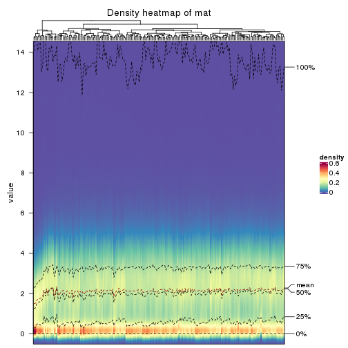


### Suggest the best k


Folowing table shows the best `k` (number of partitions) for each combination
of top-value methods and partition methods. Clicking on the method name in
the table goes to the section for a single combination of methods.

[The cola vignette](http://bioconductor.org/packages/devel/bioc/vignettes/cola/inst/doc/cola.html#toc_13)
explains the definition of the metrics used for determining the best
number of partitions.


```r
suggest_best_k(res_list)
```


|                            | The best k| 1-PAC| Mean silhouette| Concordance|   |Optional k |
|:---------------------------|----------:|-----:|---------------:|-----------:|:--|:----------|
|[SD:kmeans](#SD-kmeans)     |          2| 1.000|           0.999|       1.000|** |           |
|[SD:skmeans](#SD-skmeans)   |          2| 1.000|           0.999|       1.000|** |           |
|[SD:NMF](#SD-NMF)           |          2| 1.000|           0.992|       0.997|** |           |
|[CV:kmeans](#CV-kmeans)     |          2| 1.000|           0.988|       0.995|** |           |
|[CV:skmeans](#CV-skmeans)   |          2| 1.000|           0.993|       0.997|** |           |
|[CV:pam](#CV-pam)           |          2| 1.000|           0.965|       0.986|** |           |
|[CV:mclust](#CV-mclust)     |          2| 1.000|           0.985|       0.993|** |           |
|[CV:NMF](#CV-NMF)           |          2| 1.000|           0.994|       0.998|** |           |
|[MAD:kmeans](#MAD-kmeans)   |          2| 1.000|           0.997|       0.997|** |           |
|[MAD:skmeans](#MAD-skmeans) |          2| 1.000|           0.999|       0.999|** |           |
|[MAD:pam](#MAD-pam)         |          2| 1.000|           0.991|       0.996|** |           |
|[ATC:kmeans](#ATC-kmeans)   |          3| 1.000|           0.974|       0.986|** |2          |
|[ATC:mclust](#ATC-mclust)   |          2| 1.000|           0.996|       0.998|** |           |
|[ATC:NMF](#ATC-NMF)         |          2| 1.000|           0.995|       0.998|** |           |
|[ATC:skmeans](#ATC-skmeans) |          4| 0.957|           0.928|       0.965|** |2,3        |
|[ATC:pam](#ATC-pam)         |          4| 0.939|           0.930|       0.969|*  |           |
|[SD:pam](#SD-pam)           |          5| 0.930|           0.889|       0.955|*  |2          |
|[SD:mclust](#SD-mclust)     |          2| 0.927|           0.922|       0.970|*  |           |
|[MAD:mclust](#MAD-mclust)   |          2| 0.910|           0.953|       0.981|*  |           |
|[MAD:NMF](#MAD-NMF)         |          3| 0.907|           0.906|       0.960|*  |2          |
|[ATC:hclust](#ATC-hclust)   |          3| 0.809|           0.862|       0.930|   |           |
|[MAD:hclust](#MAD-hclust)   |          3| 0.712|           0.795|       0.878|   |           |
|[SD:hclust](#SD-hclust)     |          3| 0.671|           0.797|       0.881|   |           |
|[CV:hclust](#CV-hclust)     |          2| 0.269|           0.744|       0.833|   |           |

\*\*: 1-PAC > 0.95, \*: 1-PAC > 0.9


### CDF of consensus matrices

Cumulative distribution function curves of consensus matrix for all methods.


```r
collect_plots(res_list, fun = plot_ecdf)
```

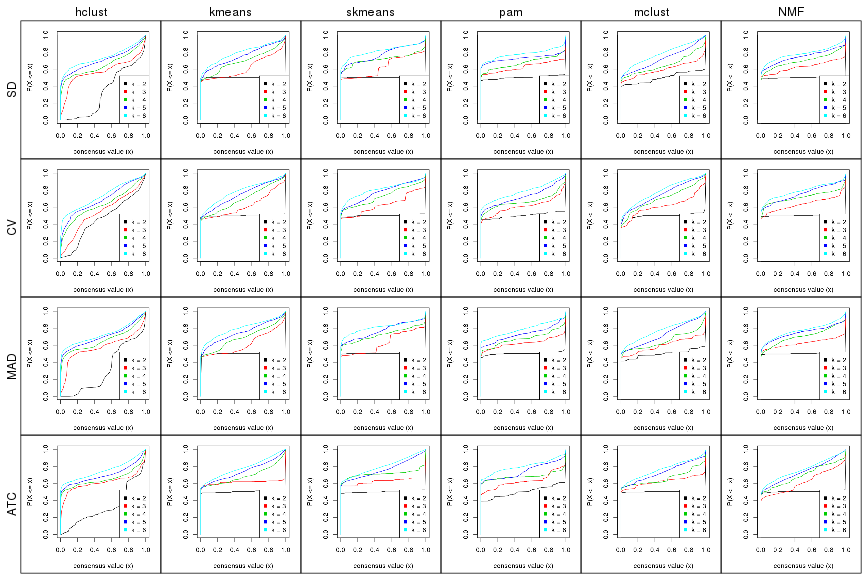


### Consensus heatmap

Consensus heatmaps for all methods. ([What is a consensus heatmap?](http://bioconductor.org/packages/devel/bioc/vignettes/cola/inst/doc/cola.html#toc_9))


<style type='text/css'>


.ui-helper-hidden {
	display: none;
}
.ui-helper-hidden-accessible {
	border: 0;
	clip: rect(0 0 0 0);
	height: 1px;
	margin: -1px;
	overflow: hidden;
	padding: 0;
	position: absolute;
	width: 1px;
}
.ui-helper-reset {
	margin: 0;
	padding: 0;
	border: 0;
	outline: 0;
	line-height: 1.3;
	text-decoration: none;
	font-size: 100%;
	list-style: none;
}
.ui-helper-clearfix:before,
.ui-helper-clearfix:after {
	content: "";
	display: table;
	border-collapse: collapse;
}
.ui-helper-clearfix:after {
	clear: both;
}
.ui-helper-zfix {
	width: 100%;
	height: 100%;
	top: 0;
	left: 0;
	position: absolute;
	opacity: 0;
	filter:Alpha(Opacity=0); 
}

.ui-front {
	z-index: 100;
}


.ui-state-disabled {
	cursor: default !important;
	pointer-events: none;
}


.ui-icon {
	display: inline-block;
	vertical-align: middle;
	margin-top: -.25em;
	position: relative;
	text-indent: -99999px;
	overflow: hidden;
	background-repeat: no-repeat;
}

.ui-widget-icon-block {
	left: 50%;
	margin-left: -8px;
	display: block;
}


.ui-widget-overlay {
	position: fixed;
	top: 0;
	left: 0;
	width: 100%;
	height: 100%;
}
.ui-accordion .ui-accordion-header {
	display: block;
	cursor: pointer;
	position: relative;
	margin: 2px 0 0 0;
	padding: .5em .5em .5em .7em;
	font-size: 100%;
}
.ui-accordion .ui-accordion-content {
	padding: 1em 2.2em;
	border-top: 0;
	overflow: auto;
}
.ui-autocomplete {
	position: absolute;
	top: 0;
	left: 0;
	cursor: default;
}
.ui-menu {
	list-style: none;
	padding: 0;
	margin: 0;
	display: block;
	outline: 0;
}
.ui-menu .ui-menu {
	position: absolute;
}
.ui-menu .ui-menu-item {
	margin: 0;
	cursor: pointer;
	
	list-style-image: url("data:image/gif;base64,R0lGODlhAQABAIAAAAAAAP///yH5BAEAAAAALAAAAAABAAEAAAIBRAA7");
}
.ui-menu .ui-menu-item-wrapper {
	position: relative;
	padding: 3px 1em 3px .4em;
}
.ui-menu .ui-menu-divider {
	margin: 5px 0;
	height: 0;
	font-size: 0;
	line-height: 0;
	border-width: 1px 0 0 0;
}
.ui-menu .ui-state-focus,
.ui-menu .ui-state-active {
	margin: -1px;
}


.ui-menu-icons {
	position: relative;
}
.ui-menu-icons .ui-menu-item-wrapper {
	padding-left: 2em;
}


.ui-menu .ui-icon {
	position: absolute;
	top: 0;
	bottom: 0;
	left: .2em;
	margin: auto 0;
}


.ui-menu .ui-menu-icon {
	left: auto;
	right: 0;
}
.ui-button {
	padding: .4em 1em;
	display: inline-block;
	position: relative;
	line-height: normal;
	margin-right: .1em;
	cursor: pointer;
	vertical-align: middle;
	text-align: center;
	-webkit-user-select: none;
	-moz-user-select: none;
	-ms-user-select: none;
	user-select: none;

	
	overflow: visible;
}

.ui-button,
.ui-button:link,
.ui-button:visited,
.ui-button:hover,
.ui-button:active {
	text-decoration: none;
}


.ui-button-icon-only {
	width: 2em;
	box-sizing: border-box;
	text-indent: -9999px;
	white-space: nowrap;
}


input.ui-button.ui-button-icon-only {
	text-indent: 0;
}


.ui-button-icon-only .ui-icon {
	position: absolute;
	top: 50%;
	left: 50%;
	margin-top: -8px;
	margin-left: -8px;
}

.ui-button.ui-icon-notext .ui-icon {
	padding: 0;
	width: 2.1em;
	height: 2.1em;
	text-indent: -9999px;
	white-space: nowrap;

}

input.ui-button.ui-icon-notext .ui-icon {
	width: auto;
	height: auto;
	text-indent: 0;
	white-space: normal;
	padding: .4em 1em;
}


input.ui-button::-moz-focus-inner,
button.ui-button::-moz-focus-inner {
	border: 0;
	padding: 0;
}
.ui-controlgroup {
	vertical-align: middle;
	display: inline-block;
}
.ui-controlgroup > .ui-controlgroup-item {
	float: left;
	margin-left: 0;
	margin-right: 0;
}
.ui-controlgroup > .ui-controlgroup-item:focus,
.ui-controlgroup > .ui-controlgroup-item.ui-visual-focus {
	z-index: 9999;
}
.ui-controlgroup-vertical > .ui-controlgroup-item {
	display: block;
	float: none;
	width: 100%;
	margin-top: 0;
	margin-bottom: 0;
	text-align: left;
}
.ui-controlgroup-vertical .ui-controlgroup-item {
	box-sizing: border-box;
}
.ui-controlgroup .ui-controlgroup-label {
	padding: .4em 1em;
}
.ui-controlgroup .ui-controlgroup-label span {
	font-size: 80%;
}
.ui-controlgroup-horizontal .ui-controlgroup-label + .ui-controlgroup-item {
	border-left: none;
}
.ui-controlgroup-vertical .ui-controlgroup-label + .ui-controlgroup-item {
	border-top: none;
}
.ui-controlgroup-horizontal .ui-controlgroup-label.ui-widget-content {
	border-right: none;
}
.ui-controlgroup-vertical .ui-controlgroup-label.ui-widget-content {
	border-bottom: none;
}


.ui-controlgroup-vertical .ui-spinner-input {

	
	width: 75%;
	width: calc( 100% - 2.4em );
}
.ui-controlgroup-vertical .ui-spinner .ui-spinner-up {
	border-top-style: solid;
}

.ui-checkboxradio-label .ui-icon-background {
	box-shadow: inset 1px 1px 1px #ccc;
	border-radius: .12em;
	border: none;
}
.ui-checkboxradio-radio-label .ui-icon-background {
	width: 16px;
	height: 16px;
	border-radius: 1em;
	overflow: visible;
	border: none;
}
.ui-checkboxradio-radio-label.ui-checkboxradio-checked .ui-icon,
.ui-checkboxradio-radio-label.ui-checkboxradio-checked:hover .ui-icon {
	background-image: none;
	width: 8px;
	height: 8px;
	border-width: 4px;
	border-style: solid;
}
.ui-checkboxradio-disabled {
	pointer-events: none;
}
.ui-datepicker {
	width: 17em;
	padding: .2em .2em 0;
	display: none;
}
.ui-datepicker .ui-datepicker-header {
	position: relative;
	padding: .2em 0;
}
.ui-datepicker .ui-datepicker-prev,
.ui-datepicker .ui-datepicker-next {
	position: absolute;
	top: 2px;
	width: 1.8em;
	height: 1.8em;
}
.ui-datepicker .ui-datepicker-prev-hover,
.ui-datepicker .ui-datepicker-next-hover {
	top: 1px;
}
.ui-datepicker .ui-datepicker-prev {
	left: 2px;
}
.ui-datepicker .ui-datepicker-next {
	right: 2px;
}
.ui-datepicker .ui-datepicker-prev-hover {
	left: 1px;
}
.ui-datepicker .ui-datepicker-next-hover {
	right: 1px;
}
.ui-datepicker .ui-datepicker-prev span,
.ui-datepicker .ui-datepicker-next span {
	display: block;
	position: absolute;
	left: 50%;
	margin-left: -8px;
	top: 50%;
	margin-top: -8px;
}
.ui-datepicker .ui-datepicker-title {
	margin: 0 2.3em;
	line-height: 1.8em;
	text-align: center;
}
.ui-datepicker .ui-datepicker-title select {
	font-size: 1em;
	margin: 1px 0;
}
.ui-datepicker select.ui-datepicker-month,
.ui-datepicker select.ui-datepicker-year {
	width: 45%;
}
.ui-datepicker table {
	width: 100%;
	font-size: .9em;
	border-collapse: collapse;
	margin: 0 0 .4em;
}
.ui-datepicker th {
	padding: .7em .3em;
	text-align: center;
	font-weight: bold;
	border: 0;
}
.ui-datepicker td {
	border: 0;
	padding: 1px;
}
.ui-datepicker td span,
.ui-datepicker td a {
	display: block;
	padding: .2em;
	text-align: right;
	text-decoration: none;
}
.ui-datepicker .ui-datepicker-buttonpane {
	background-image: none;
	margin: .7em 0 0 0;
	padding: 0 .2em;
	border-left: 0;
	border-right: 0;
	border-bottom: 0;
}
.ui-datepicker .ui-datepicker-buttonpane button {
	float: right;
	margin: .5em .2em .4em;
	cursor: pointer;
	padding: .2em .6em .3em .6em;
	width: auto;
	overflow: visible;
}
.ui-datepicker .ui-datepicker-buttonpane button.ui-datepicker-current {
	float: left;
}


.ui-datepicker.ui-datepicker-multi {
	width: auto;
}
.ui-datepicker-multi .ui-datepicker-group {
	float: left;
}
.ui-datepicker-multi .ui-datepicker-group table {
	width: 95%;
	margin: 0 auto .4em;
}
.ui-datepicker-multi-2 .ui-datepicker-group {
	width: 50%;
}
.ui-datepicker-multi-3 .ui-datepicker-group {
	width: 33.3%;
}
.ui-datepicker-multi-4 .ui-datepicker-group {
	width: 25%;
}
.ui-datepicker-multi .ui-datepicker-group-last .ui-datepicker-header,
.ui-datepicker-multi .ui-datepicker-group-middle .ui-datepicker-header {
	border-left-width: 0;
}
.ui-datepicker-multi .ui-datepicker-buttonpane {
	clear: left;
}
.ui-datepicker-row-break {
	clear: both;
	width: 100%;
	font-size: 0;
}


.ui-datepicker-rtl {
	direction: rtl;
}
.ui-datepicker-rtl .ui-datepicker-prev {
	right: 2px;
	left: auto;
}
.ui-datepicker-rtl .ui-datepicker-next {
	left: 2px;
	right: auto;
}
.ui-datepicker-rtl .ui-datepicker-prev:hover {
	right: 1px;
	left: auto;
}
.ui-datepicker-rtl .ui-datepicker-next:hover {
	left: 1px;
	right: auto;
}
.ui-datepicker-rtl .ui-datepicker-buttonpane {
	clear: right;
}
.ui-datepicker-rtl .ui-datepicker-buttonpane button {
	float: left;
}
.ui-datepicker-rtl .ui-datepicker-buttonpane button.ui-datepicker-current,
.ui-datepicker-rtl .ui-datepicker-group {
	float: right;
}
.ui-datepicker-rtl .ui-datepicker-group-last .ui-datepicker-header,
.ui-datepicker-rtl .ui-datepicker-group-middle .ui-datepicker-header {
	border-right-width: 0;
	border-left-width: 1px;
}


.ui-datepicker .ui-icon {
	display: block;
	text-indent: -99999px;
	overflow: hidden;
	background-repeat: no-repeat;
	left: .5em;
	top: .3em;
}
.ui-dialog {
	position: absolute;
	top: 0;
	left: 0;
	padding: .2em;
	outline: 0;
}
.ui-dialog .ui-dialog-titlebar {
	padding: .4em 1em;
	position: relative;
}
.ui-dialog .ui-dialog-title {
	float: left;
	margin: .1em 0;
	white-space: nowrap;
	width: 90%;
	overflow: hidden;
	text-overflow: ellipsis;
}
.ui-dialog .ui-dialog-titlebar-close {
	position: absolute;
	right: .3em;
	top: 50%;
	width: 20px;
	margin: -10px 0 0 0;
	padding: 1px;
	height: 20px;
}
.ui-dialog .ui-dialog-content {
	position: relative;
	border: 0;
	padding: .5em 1em;
	background: none;
	overflow: auto;
}
.ui-dialog .ui-dialog-buttonpane {
	text-align: left;
	border-width: 1px 0 0 0;
	background-image: none;
	margin-top: .5em;
	padding: .3em 1em .5em .4em;
}
.ui-dialog .ui-dialog-buttonpane .ui-dialog-buttonset {
	float: right;
}
.ui-dialog .ui-dialog-buttonpane button {
	margin: .5em .4em .5em 0;
	cursor: pointer;
}
.ui-dialog .ui-resizable-n {
	height: 2px;
	top: 0;
}
.ui-dialog .ui-resizable-e {
	width: 2px;
	right: 0;
}
.ui-dialog .ui-resizable-s {
	height: 2px;
	bottom: 0;
}
.ui-dialog .ui-resizable-w {
	width: 2px;
	left: 0;
}
.ui-dialog .ui-resizable-se,
.ui-dialog .ui-resizable-sw,
.ui-dialog .ui-resizable-ne,
.ui-dialog .ui-resizable-nw {
	width: 7px;
	height: 7px;
}
.ui-dialog .ui-resizable-se {
	right: 0;
	bottom: 0;
}
.ui-dialog .ui-resizable-sw {
	left: 0;
	bottom: 0;
}
.ui-dialog .ui-resizable-ne {
	right: 0;
	top: 0;
}
.ui-dialog .ui-resizable-nw {
	left: 0;
	top: 0;
}
.ui-draggable .ui-dialog-titlebar {
	cursor: move;
}
.ui-draggable-handle {
	-ms-touch-action: none;
	touch-action: none;
}
.ui-resizable {
	position: relative;
}
.ui-resizable-handle {
	position: absolute;
	font-size: 0.1px;
	display: block;
	-ms-touch-action: none;
	touch-action: none;
}
.ui-resizable-disabled .ui-resizable-handle,
.ui-resizable-autohide .ui-resizable-handle {
	display: none;
}
.ui-resizable-n {
	cursor: n-resize;
	height: 7px;
	width: 100%;
	top: -5px;
	left: 0;
}
.ui-resizable-s {
	cursor: s-resize;
	height: 7px;
	width: 100%;
	bottom: -5px;
	left: 0;
}
.ui-resizable-e {
	cursor: e-resize;
	width: 7px;
	right: -5px;
	top: 0;
	height: 100%;
}
.ui-resizable-w {
	cursor: w-resize;
	width: 7px;
	left: -5px;
	top: 0;
	height: 100%;
}
.ui-resizable-se {
	cursor: se-resize;
	width: 12px;
	height: 12px;
	right: 1px;
	bottom: 1px;
}
.ui-resizable-sw {
	cursor: sw-resize;
	width: 9px;
	height: 9px;
	left: -5px;
	bottom: -5px;
}
.ui-resizable-nw {
	cursor: nw-resize;
	width: 9px;
	height: 9px;
	left: -5px;
	top: -5px;
}
.ui-resizable-ne {
	cursor: ne-resize;
	width: 9px;
	height: 9px;
	right: -5px;
	top: -5px;
}
.ui-progressbar {
	height: 2em;
	text-align: left;
	overflow: hidden;
}
.ui-progressbar .ui-progressbar-value {
	margin: -1px;
	height: 100%;
}
.ui-progressbar .ui-progressbar-overlay {
	background: url("");
	height: 100%;
	filter: alpha(opacity=25); 
	opacity: 0.25;
}
.ui-progressbar-indeterminate .ui-progressbar-value {
	background-image: none;
}
.ui-selectable {
	-ms-touch-action: none;
	touch-action: none;
}
.ui-selectable-helper {
	position: absolute;
	z-index: 100;
	border: 1px dotted black;
}
.ui-selectmenu-menu {
	padding: 0;
	margin: 0;
	position: absolute;
	top: 0;
	left: 0;
	display: none;
}
.ui-selectmenu-menu .ui-menu {
	overflow: auto;
	overflow-x: hidden;
	padding-bottom: 1px;
}
.ui-selectmenu-menu .ui-menu .ui-selectmenu-optgroup {
	font-size: 1em;
	font-weight: bold;
	line-height: 1.5;
	padding: 2px 0.4em;
	margin: 0.5em 0 0 0;
	height: auto;
	border: 0;
}
.ui-selectmenu-open {
	display: block;
}
.ui-selectmenu-text {
	display: block;
	margin-right: 20px;
	overflow: hidden;
	text-overflow: ellipsis;
}
.ui-selectmenu-button.ui-button {
	text-align: left;
	white-space: nowrap;
	width: 14em;
}
.ui-selectmenu-icon.ui-icon {
	float: right;
	margin-top: 0;
}
.ui-slider {
	position: relative;
	text-align: left;
}
.ui-slider .ui-slider-handle {
	position: absolute;
	z-index: 2;
	width: 1.2em;
	height: 1.2em;
	cursor: default;
	-ms-touch-action: none;
	touch-action: none;
}
.ui-slider .ui-slider-range {
	position: absolute;
	z-index: 1;
	font-size: .7em;
	display: block;
	border: 0;
	background-position: 0 0;
}


.ui-slider.ui-state-disabled .ui-slider-handle,
.ui-slider.ui-state-disabled .ui-slider-range {
	filter: inherit;
}

.ui-slider-horizontal {
	height: .8em;
}
.ui-slider-horizontal .ui-slider-handle {
	top: -.3em;
	margin-left: -.6em;
}
.ui-slider-horizontal .ui-slider-range {
	top: 0;
	height: 100%;
}
.ui-slider-horizontal .ui-slider-range-min {
	left: 0;
}
.ui-slider-horizontal .ui-slider-range-max {
	right: 0;
}

.ui-slider-vertical {
	width: .8em;
	height: 100px;
}
.ui-slider-vertical .ui-slider-handle {
	left: -.3em;
	margin-left: 0;
	margin-bottom: -.6em;
}
.ui-slider-vertical .ui-slider-range {
	left: 0;
	width: 100%;
}
.ui-slider-vertical .ui-slider-range-min {
	bottom: 0;
}
.ui-slider-vertical .ui-slider-range-max {
	top: 0;
}
.ui-sortable-handle {
	-ms-touch-action: none;
	touch-action: none;
}
.ui-spinner {
	position: relative;
	display: inline-block;
	overflow: hidden;
	padding: 0;
	vertical-align: middle;
}
.ui-spinner-input {
	border: none;
	background: none;
	color: inherit;
	padding: .222em 0;
	margin: .2em 0;
	vertical-align: middle;
	margin-left: .4em;
	margin-right: 2em;
}
.ui-spinner-button {
	width: 1.6em;
	height: 50%;
	font-size: .5em;
	padding: 0;
	margin: 0;
	text-align: center;
	position: absolute;
	cursor: default;
	display: block;
	overflow: hidden;
	right: 0;
}

.ui-spinner a.ui-spinner-button {
	border-top-style: none;
	border-bottom-style: none;
	border-right-style: none;
}
.ui-spinner-up {
	top: 0;
}
.ui-spinner-down {
	bottom: 0;
}
.ui-tabs {
	position: relative;
	padding: .2em;
}
.ui-tabs .ui-tabs-nav {
	margin: 0;
	padding: .2em .2em 0;
}
.ui-tabs .ui-tabs-nav li {
	list-style: none;
	float: left;
	position: relative;
	top: 0;
	margin: 1px .2em 0 0;
	border-bottom-width: 0;
	padding: 0;
	white-space: nowrap;
}
.ui-tabs .ui-tabs-nav .ui-tabs-anchor {
	float: left;
	padding: .5em 1em;
	text-decoration: none;
}
.ui-tabs .ui-tabs-nav li.ui-tabs-active {
	margin-bottom: -1px;
	padding-bottom: 1px;
}
.ui-tabs .ui-tabs-nav li.ui-tabs-active .ui-tabs-anchor,
.ui-tabs .ui-tabs-nav li.ui-state-disabled .ui-tabs-anchor,
.ui-tabs .ui-tabs-nav li.ui-tabs-loading .ui-tabs-anchor {
	cursor: text;
}
.ui-tabs-collapsible .ui-tabs-nav li.ui-tabs-active .ui-tabs-anchor {
	cursor: pointer;
}
.ui-tabs .ui-tabs-panel {
	display: block;
	border-width: 0;
	padding: 1em 1.4em;
	background: none;
}
.ui-tooltip {
	padding: 8px;
	position: absolute;
	z-index: 9999;
	max-width: 300px;
}
body .ui-tooltip {
	border-width: 2px;
}

.ui-widget {
	font-family: Arial,Helvetica,sans-serif;
	font-size: 1em;
}
.ui-widget .ui-widget {
	font-size: 1em;
}
.ui-widget input,
.ui-widget select,
.ui-widget textarea,
.ui-widget button {
	font-family: Arial,Helvetica,sans-serif;
	font-size: 1em;
}
.ui-widget.ui-widget-content {
	border: 1px solid #c5c5c5;
}
.ui-widget-content {
	border: 1px solid #dddddd;
	background: #ffffff;
	color: #333333;
}
.ui-widget-content a {
	color: #333333;
}
.ui-widget-header {
	border: 1px solid #dddddd;
	background: #e9e9e9;
	color: #333333;
	font-weight: bold;
}
.ui-widget-header a {
	color: #333333;
}


.ui-state-default,
.ui-widget-content .ui-state-default,
.ui-widget-header .ui-state-default,
.ui-button,


html .ui-button.ui-state-disabled:hover,
html .ui-button.ui-state-disabled:active {
	border: 1px solid #c5c5c5;
	background: #f6f6f6;
	font-weight: normal;
	color: #454545;
}
.ui-state-default a,
.ui-state-default a:link,
.ui-state-default a:visited,
a.ui-button,
a:link.ui-button,
a:visited.ui-button,
.ui-button {
	color: #454545;
	text-decoration: none;
}
.ui-state-hover,
.ui-widget-content .ui-state-hover,
.ui-widget-header .ui-state-hover,
.ui-state-focus,
.ui-widget-content .ui-state-focus,
.ui-widget-header .ui-state-focus,
.ui-button:hover,
.ui-button:focus {
	border: 1px solid #cccccc;
	background: #ededed;
	font-weight: normal;
	color: #2b2b2b;
}
.ui-state-hover a,
.ui-state-hover a:hover,
.ui-state-hover a:link,
.ui-state-hover a:visited,
.ui-state-focus a,
.ui-state-focus a:hover,
.ui-state-focus a:link,
.ui-state-focus a:visited,
a.ui-button:hover,
a.ui-button:focus {
	color: #2b2b2b;
	text-decoration: none;
}

.ui-visual-focus {
	box-shadow: 0 0 3px 1px rgb(94, 158, 214);
}
.ui-state-active,
.ui-widget-content .ui-state-active,
.ui-widget-header .ui-state-active,
a.ui-button:active,
.ui-button:active,
.ui-button.ui-state-active:hover {
	border: 1px solid #003eff;
	background: #007fff;
	font-weight: normal;
	color: #ffffff;
}
.ui-icon-background,
.ui-state-active .ui-icon-background {
	border: #003eff;
	background-color: #ffffff;
}
.ui-state-active a,
.ui-state-active a:link,
.ui-state-active a:visited {
	color: #ffffff;
	text-decoration: none;
}


.ui-state-highlight,
.ui-widget-content .ui-state-highlight,
.ui-widget-header .ui-state-highlight {
	border: 1px solid #dad55e;
	background: #fffa90;
	color: #777620;
}
.ui-state-checked {
	border: 1px solid #dad55e;
	background: #fffa90;
}
.ui-state-highlight a,
.ui-widget-content .ui-state-highlight a,
.ui-widget-header .ui-state-highlight a {
	color: #777620;
}
.ui-state-error,
.ui-widget-content .ui-state-error,
.ui-widget-header .ui-state-error {
	border: 1px solid #f1a899;
	background: #fddfdf;
	color: #5f3f3f;
}
.ui-state-error a,
.ui-widget-content .ui-state-error a,
.ui-widget-header .ui-state-error a {
	color: #5f3f3f;
}
.ui-state-error-text,
.ui-widget-content .ui-state-error-text,
.ui-widget-header .ui-state-error-text {
	color: #5f3f3f;
}
.ui-priority-primary,
.ui-widget-content .ui-priority-primary,
.ui-widget-header .ui-priority-primary {
	font-weight: bold;
}
.ui-priority-secondary,
.ui-widget-content .ui-priority-secondary,
.ui-widget-header .ui-priority-secondary {
	opacity: .7;
	filter:Alpha(Opacity=70); 
	font-weight: normal;
}
.ui-state-disabled,
.ui-widget-content .ui-state-disabled,
.ui-widget-header .ui-state-disabled {
	opacity: .35;
	filter:Alpha(Opacity=35); 
	background-image: none;
}
.ui-state-disabled .ui-icon {
	filter:Alpha(Opacity=35); 
}


.ui-icon {
	width: 16px;
	height: 16px;
}
.ui-icon,
.ui-widget-content .ui-icon {
	background-image: url("images/ui-icons_444444_256x240.png");
}
.ui-widget-header .ui-icon {
	background-image: url("images/ui-icons_444444_256x240.png");
}
.ui-state-hover .ui-icon,
.ui-state-focus .ui-icon,
.ui-button:hover .ui-icon,
.ui-button:focus .ui-icon {
	background-image: url("images/ui-icons_555555_256x240.png");
}
.ui-state-active .ui-icon,
.ui-button:active .ui-icon {
	background-image: url("images/ui-icons_ffffff_256x240.png");
}
.ui-state-highlight .ui-icon,
.ui-button .ui-state-highlight.ui-icon {
	background-image: url("images/ui-icons_777620_256x240.png");
}
.ui-state-error .ui-icon,
.ui-state-error-text .ui-icon {
	background-image: url("images/ui-icons_cc0000_256x240.png");
}
.ui-button .ui-icon {
	background-image: url("images/ui-icons_777777_256x240.png");
}


.ui-icon-blank { background-position: 16px 16px; }
.ui-icon-caret-1-n { background-position: 0 0; }
.ui-icon-caret-1-ne { background-position: -16px 0; }
.ui-icon-caret-1-e { background-position: -32px 0; }
.ui-icon-caret-1-se { background-position: -48px 0; }
.ui-icon-caret-1-s { background-position: -65px 0; }
.ui-icon-caret-1-sw { background-position: -80px 0; }
.ui-icon-caret-1-w { background-position: -96px 0; }
.ui-icon-caret-1-nw { background-position: -112px 0; }
.ui-icon-caret-2-n-s { background-position: -128px 0; }
.ui-icon-caret-2-e-w { background-position: -144px 0; }
.ui-icon-triangle-1-n { background-position: 0 -16px; }
.ui-icon-triangle-1-ne { background-position: -16px -16px; }
.ui-icon-triangle-1-e { background-position: -32px -16px; }
.ui-icon-triangle-1-se { background-position: -48px -16px; }
.ui-icon-triangle-1-s { background-position: -65px -16px; }
.ui-icon-triangle-1-sw { background-position: -80px -16px; }
.ui-icon-triangle-1-w { background-position: -96px -16px; }
.ui-icon-triangle-1-nw { background-position: -112px -16px; }
.ui-icon-triangle-2-n-s { background-position: -128px -16px; }
.ui-icon-triangle-2-e-w { background-position: -144px -16px; }
.ui-icon-arrow-1-n { background-position: 0 -32px; }
.ui-icon-arrow-1-ne { background-position: -16px -32px; }
.ui-icon-arrow-1-e { background-position: -32px -32px; }
.ui-icon-arrow-1-se { background-position: -48px -32px; }
.ui-icon-arrow-1-s { background-position: -65px -32px; }
.ui-icon-arrow-1-sw { background-position: -80px -32px; }
.ui-icon-arrow-1-w { background-position: -96px -32px; }
.ui-icon-arrow-1-nw { background-position: -112px -32px; }
.ui-icon-arrow-2-n-s { background-position: -128px -32px; }
.ui-icon-arrow-2-ne-sw { background-position: -144px -32px; }
.ui-icon-arrow-2-e-w { background-position: -160px -32px; }
.ui-icon-arrow-2-se-nw { background-position: -176px -32px; }
.ui-icon-arrowstop-1-n { background-position: -192px -32px; }
.ui-icon-arrowstop-1-e { background-position: -208px -32px; }
.ui-icon-arrowstop-1-s { background-position: -224px -32px; }
.ui-icon-arrowstop-1-w { background-position: -240px -32px; }
.ui-icon-arrowthick-1-n { background-position: 1px -48px; }
.ui-icon-arrowthick-1-ne { background-position: -16px -48px; }
.ui-icon-arrowthick-1-e { background-position: -32px -48px; }
.ui-icon-arrowthick-1-se { background-position: -48px -48px; }
.ui-icon-arrowthick-1-s { background-position: -64px -48px; }
.ui-icon-arrowthick-1-sw { background-position: -80px -48px; }
.ui-icon-arrowthick-1-w { background-position: -96px -48px; }
.ui-icon-arrowthick-1-nw { background-position: -112px -48px; }
.ui-icon-arrowthick-2-n-s { background-position: -128px -48px; }
.ui-icon-arrowthick-2-ne-sw { background-position: -144px -48px; }
.ui-icon-arrowthick-2-e-w { background-position: -160px -48px; }
.ui-icon-arrowthick-2-se-nw { background-position: -176px -48px; }
.ui-icon-arrowthickstop-1-n { background-position: -192px -48px; }
.ui-icon-arrowthickstop-1-e { background-position: -208px -48px; }
.ui-icon-arrowthickstop-1-s { background-position: -224px -48px; }
.ui-icon-arrowthickstop-1-w { background-position: -240px -48px; }
.ui-icon-arrowreturnthick-1-w { background-position: 0 -64px; }
.ui-icon-arrowreturnthick-1-n { background-position: -16px -64px; }
.ui-icon-arrowreturnthick-1-e { background-position: -32px -64px; }
.ui-icon-arrowreturnthick-1-s { background-position: -48px -64px; }
.ui-icon-arrowreturn-1-w { background-position: -64px -64px; }
.ui-icon-arrowreturn-1-n { background-position: -80px -64px; }
.ui-icon-arrowreturn-1-e { background-position: -96px -64px; }
.ui-icon-arrowreturn-1-s { background-position: -112px -64px; }
.ui-icon-arrowrefresh-1-w { background-position: -128px -64px; }
.ui-icon-arrowrefresh-1-n { background-position: -144px -64px; }
.ui-icon-arrowrefresh-1-e { background-position: -160px -64px; }
.ui-icon-arrowrefresh-1-s { background-position: -176px -64px; }
.ui-icon-arrow-4 { background-position: 0 -80px; }
.ui-icon-arrow-4-diag { background-position: -16px -80px; }
.ui-icon-extlink { background-position: -32px -80px; }
.ui-icon-newwin { background-position: -48px -80px; }
.ui-icon-refresh { background-position: -64px -80px; }
.ui-icon-shuffle { background-position: -80px -80px; }
.ui-icon-transfer-e-w { background-position: -96px -80px; }
.ui-icon-transferthick-e-w { background-position: -112px -80px; }
.ui-icon-folder-collapsed { background-position: 0 -96px; }
.ui-icon-folder-open { background-position: -16px -96px; }
.ui-icon-document { background-position: -32px -96px; }
.ui-icon-document-b { background-position: -48px -96px; }
.ui-icon-note { background-position: -64px -96px; }
.ui-icon-mail-closed { background-position: -80px -96px; }
.ui-icon-mail-open { background-position: -96px -96px; }
.ui-icon-suitcase { background-position: -112px -96px; }
.ui-icon-comment { background-position: -128px -96px; }
.ui-icon-person { background-position: -144px -96px; }
.ui-icon-print { background-position: -160px -96px; }
.ui-icon-trash { background-position: -176px -96px; }
.ui-icon-locked { background-position: -192px -96px; }
.ui-icon-unlocked { background-position: -208px -96px; }
.ui-icon-bookmark { background-position: -224px -96px; }
.ui-icon-tag { background-position: -240px -96px; }
.ui-icon-home { background-position: 0 -112px; }
.ui-icon-flag { background-position: -16px -112px; }
.ui-icon-calendar { background-position: -32px -112px; }
.ui-icon-cart { background-position: -48px -112px; }
.ui-icon-pencil { background-position: -64px -112px; }
.ui-icon-clock { background-position: -80px -112px; }
.ui-icon-disk { background-position: -96px -112px; }
.ui-icon-calculator { background-position: -112px -112px; }
.ui-icon-zoomin { background-position: -128px -112px; }
.ui-icon-zoomout { background-position: -144px -112px; }
.ui-icon-search { background-position: -160px -112px; }
.ui-icon-wrench { background-position: -176px -112px; }
.ui-icon-gear { background-position: -192px -112px; }
.ui-icon-heart { background-position: -208px -112px; }
.ui-icon-star { background-position: -224px -112px; }
.ui-icon-link { background-position: -240px -112px; }
.ui-icon-cancel { background-position: 0 -128px; }
.ui-icon-plus { background-position: -16px -128px; }
.ui-icon-plusthick { background-position: -32px -128px; }
.ui-icon-minus { background-position: -48px -128px; }
.ui-icon-minusthick { background-position: -64px -128px; }
.ui-icon-close { background-position: -80px -128px; }
.ui-icon-closethick { background-position: -96px -128px; }
.ui-icon-key { background-position: -112px -128px; }
.ui-icon-lightbulb { background-position: -128px -128px; }
.ui-icon-scissors { background-position: -144px -128px; }
.ui-icon-clipboard { background-position: -160px -128px; }
.ui-icon-copy { background-position: -176px -128px; }
.ui-icon-contact { background-position: -192px -128px; }
.ui-icon-image { background-position: -208px -128px; }
.ui-icon-video { background-position: -224px -128px; }
.ui-icon-script { background-position: -240px -128px; }
.ui-icon-alert { background-position: 0 -144px; }
.ui-icon-info { background-position: -16px -144px; }
.ui-icon-notice { background-position: -32px -144px; }
.ui-icon-help { background-position: -48px -144px; }
.ui-icon-check { background-position: -64px -144px; }
.ui-icon-bullet { background-position: -80px -144px; }
.ui-icon-radio-on { background-position: -96px -144px; }
.ui-icon-radio-off { background-position: -112px -144px; }
.ui-icon-pin-w { background-position: -128px -144px; }
.ui-icon-pin-s { background-position: -144px -144px; }
.ui-icon-play { background-position: 0 -160px; }
.ui-icon-pause { background-position: -16px -160px; }
.ui-icon-seek-next { background-position: -32px -160px; }
.ui-icon-seek-prev { background-position: -48px -160px; }
.ui-icon-seek-end { background-position: -64px -160px; }
.ui-icon-seek-start { background-position: -80px -160px; }

.ui-icon-seek-first { background-position: -80px -160px; }
.ui-icon-stop { background-position: -96px -160px; }
.ui-icon-eject { background-position: -112px -160px; }
.ui-icon-volume-off { background-position: -128px -160px; }
.ui-icon-volume-on { background-position: -144px -160px; }
.ui-icon-power { background-position: 0 -176px; }
.ui-icon-signal-diag { background-position: -16px -176px; }
.ui-icon-signal { background-position: -32px -176px; }
.ui-icon-battery-0 { background-position: -48px -176px; }
.ui-icon-battery-1 { background-position: -64px -176px; }
.ui-icon-battery-2 { background-position: -80px -176px; }
.ui-icon-battery-3 { background-position: -96px -176px; }
.ui-icon-circle-plus { background-position: 0 -192px; }
.ui-icon-circle-minus { background-position: -16px -192px; }
.ui-icon-circle-close { background-position: -32px -192px; }
.ui-icon-circle-triangle-e { background-position: -48px -192px; }
.ui-icon-circle-triangle-s { background-position: -64px -192px; }
.ui-icon-circle-triangle-w { background-position: -80px -192px; }
.ui-icon-circle-triangle-n { background-position: -96px -192px; }
.ui-icon-circle-arrow-e { background-position: -112px -192px; }
.ui-icon-circle-arrow-s { background-position: -128px -192px; }
.ui-icon-circle-arrow-w { background-position: -144px -192px; }
.ui-icon-circle-arrow-n { background-position: -160px -192px; }
.ui-icon-circle-zoomin { background-position: -176px -192px; }
.ui-icon-circle-zoomout { background-position: -192px -192px; }
.ui-icon-circle-check { background-position: -208px -192px; }
.ui-icon-circlesmall-plus { background-position: 0 -208px; }
.ui-icon-circlesmall-minus { background-position: -16px -208px; }
.ui-icon-circlesmall-close { background-position: -32px -208px; }
.ui-icon-squaresmall-plus { background-position: -48px -208px; }
.ui-icon-squaresmall-minus { background-position: -64px -208px; }
.ui-icon-squaresmall-close { background-position: -80px -208px; }
.ui-icon-grip-dotted-vertical { background-position: 0 -224px; }
.ui-icon-grip-dotted-horizontal { background-position: -16px -224px; }
.ui-icon-grip-solid-vertical { background-position: -32px -224px; }
.ui-icon-grip-solid-horizontal { background-position: -48px -224px; }
.ui-icon-gripsmall-diagonal-se { background-position: -64px -224px; }
.ui-icon-grip-diagonal-se { background-position: -80px -224px; }


.ui-corner-all,
.ui-corner-top,
.ui-corner-left,
.ui-corner-tl {
	border-top-left-radius: 3px;
}
.ui-corner-all,
.ui-corner-top,
.ui-corner-right,
.ui-corner-tr {
	border-top-right-radius: 3px;
}
.ui-corner-all,
.ui-corner-bottom,
.ui-corner-left,
.ui-corner-bl {
	border-bottom-left-radius: 3px;
}
.ui-corner-all,
.ui-corner-bottom,
.ui-corner-right,
.ui-corner-br {
	border-bottom-right-radius: 3px;
}


.ui-widget-overlay {
	background: #aaaaaa;
	opacity: .3;
	filter: Alpha(Opacity=30); 
}
.ui-widget-shadow {
	-webkit-box-shadow: 0px 0px 5px #666666;
	box-shadow: 0px 0px 5px #666666;
} 
</style>
<script src='js/jquery-1.12.4.js'></script>
<script src='js/jquery-ui.js'></script>

<script>
$( function() {
	$( '#tabs-collect-consensus-heatmap' ).tabs();
} );
</script>
<div id='tabs-collect-consensus-heatmap'>
<ul>
<li><a href='#tab-collect-consensus-heatmap-1'>k = 2</a></li>
<li><a href='#tab-collect-consensus-heatmap-2'>k = 3</a></li>
<li><a href='#tab-collect-consensus-heatmap-3'>k = 4</a></li>
<li><a href='#tab-collect-consensus-heatmap-4'>k = 5</a></li>
<li><a href='#tab-collect-consensus-heatmap-5'>k = 6</a></li>
</ul>
<div id='tab-collect-consensus-heatmap-1'>
<pre><code class="r">collect_plots(res_list, k = 2, fun = consensus_heatmap, mc.cores = 4)
</code></pre>

<p>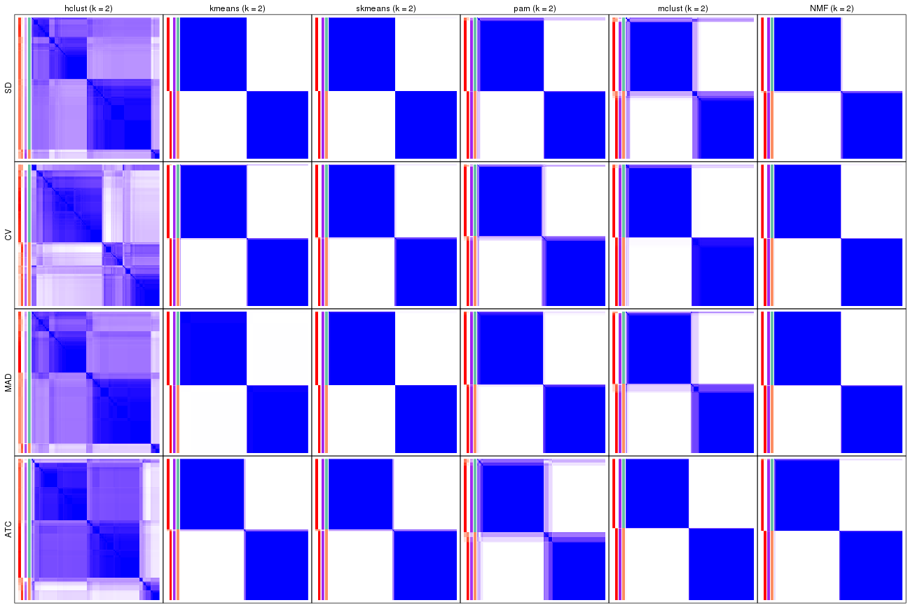</p>

</div>
<div id='tab-collect-consensus-heatmap-2'>
<pre><code class="r">collect_plots(res_list, k = 3, fun = consensus_heatmap, mc.cores = 4)
</code></pre>

<p>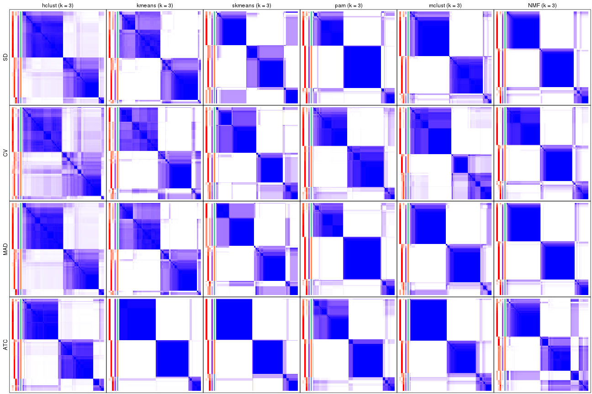</p>

</div>
<div id='tab-collect-consensus-heatmap-3'>
<pre><code class="r">collect_plots(res_list, k = 4, fun = consensus_heatmap, mc.cores = 4)
</code></pre>

<p>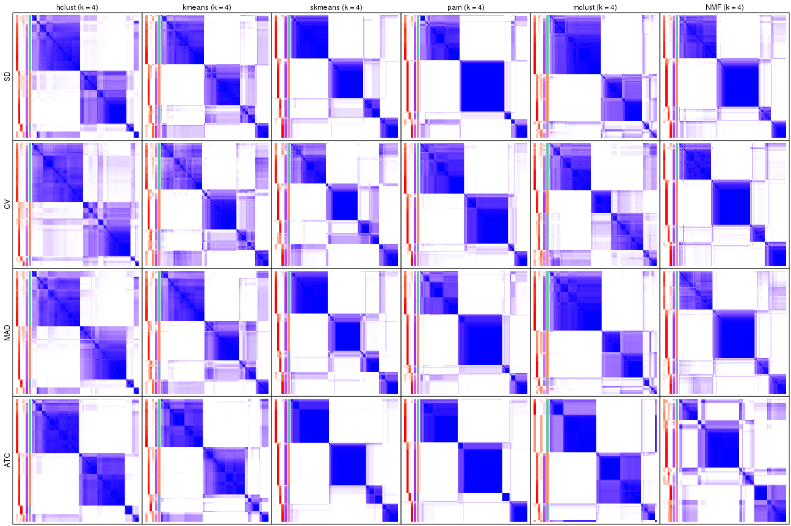</p>

</div>
<div id='tab-collect-consensus-heatmap-4'>
<pre><code class="r">collect_plots(res_list, k = 5, fun = consensus_heatmap, mc.cores = 4)
</code></pre>

<p>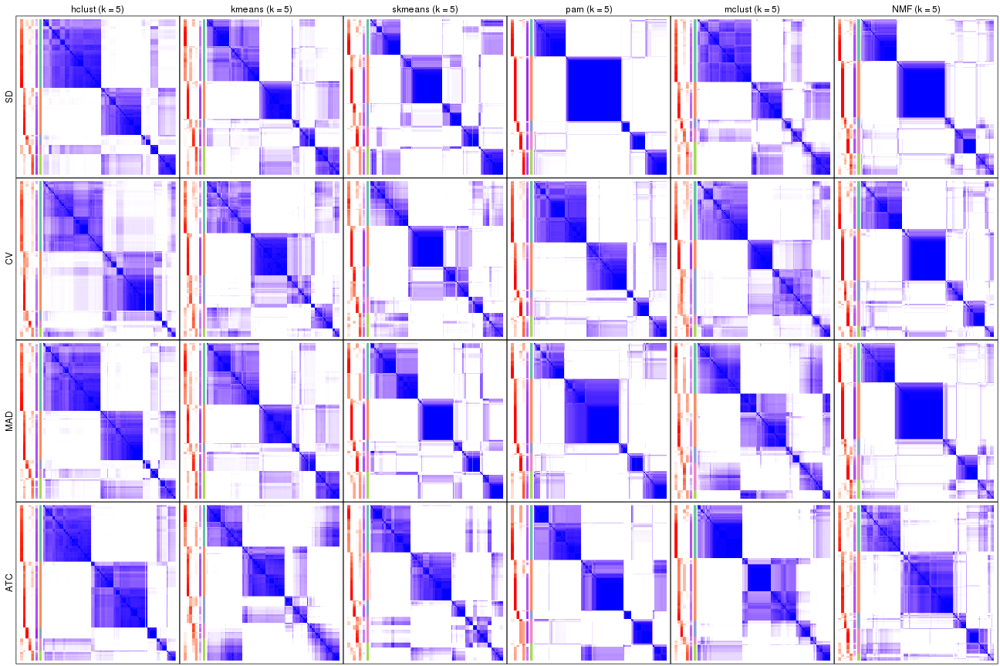</p>

</div>
<div id='tab-collect-consensus-heatmap-5'>
<pre><code class="r">collect_plots(res_list, k = 6, fun = consensus_heatmap, mc.cores = 4)
</code></pre>

<p>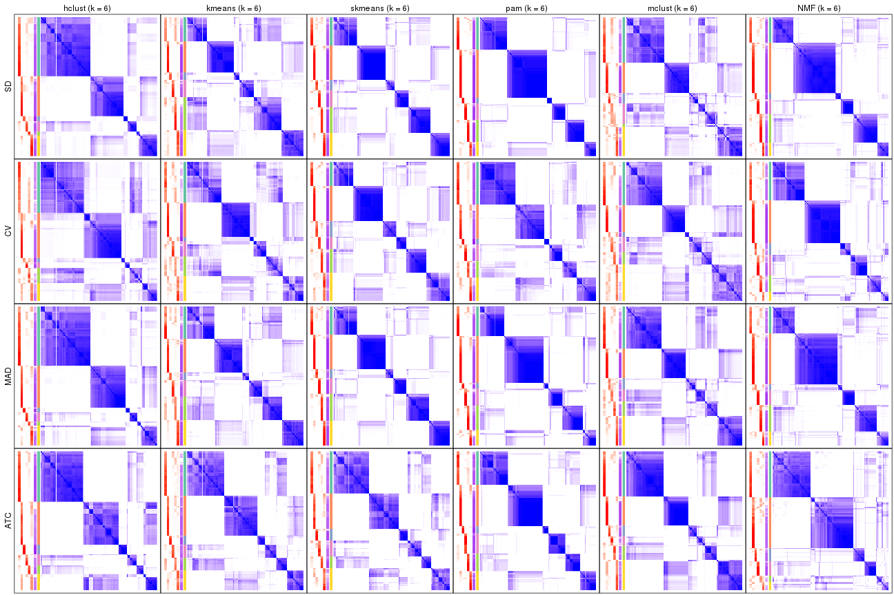</p>

</div>
</div>


### Membership heatmap

Membership heatmaps for all methods. ([What is a membership heatmap?](http://bioconductor.org/packages/devel/bioc/vignettes/cola/inst/doc/cola.html#toc_12))


<script>
$( function() {
	$( '#tabs-collect-membership-heatmap' ).tabs();
} );
</script>
<div id='tabs-collect-membership-heatmap'>
<ul>
<li><a href='#tab-collect-membership-heatmap-1'>k = 2</a></li>
<li><a href='#tab-collect-membership-heatmap-2'>k = 3</a></li>
<li><a href='#tab-collect-membership-heatmap-3'>k = 4</a></li>
<li><a href='#tab-collect-membership-heatmap-4'>k = 5</a></li>
<li><a href='#tab-collect-membership-heatmap-5'>k = 6</a></li>
</ul>
<div id='tab-collect-membership-heatmap-1'>
<pre><code class="r">collect_plots(res_list, k = 2, fun = membership_heatmap, mc.cores = 4)
</code></pre>

<p>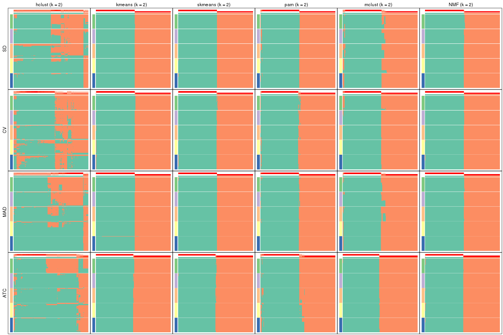</p>

</div>
<div id='tab-collect-membership-heatmap-2'>
<pre><code class="r">collect_plots(res_list, k = 3, fun = membership_heatmap, mc.cores = 4)
</code></pre>

<p>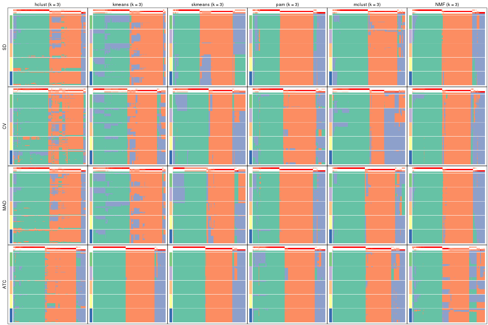</p>

</div>
<div id='tab-collect-membership-heatmap-3'>
<pre><code class="r">collect_plots(res_list, k = 4, fun = membership_heatmap, mc.cores = 4)
</code></pre>

<p>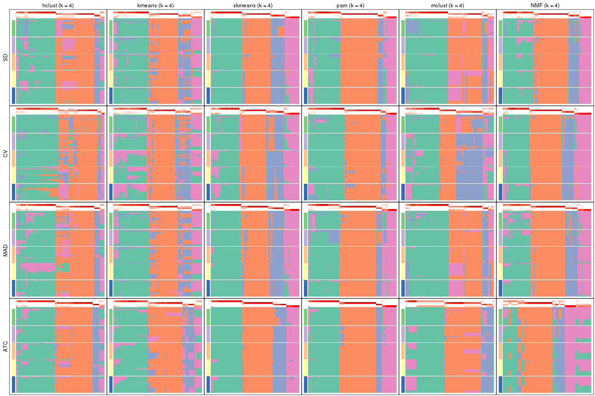</p>

</div>
<div id='tab-collect-membership-heatmap-4'>
<pre><code class="r">collect_plots(res_list, k = 5, fun = membership_heatmap, mc.cores = 4)
</code></pre>

<p>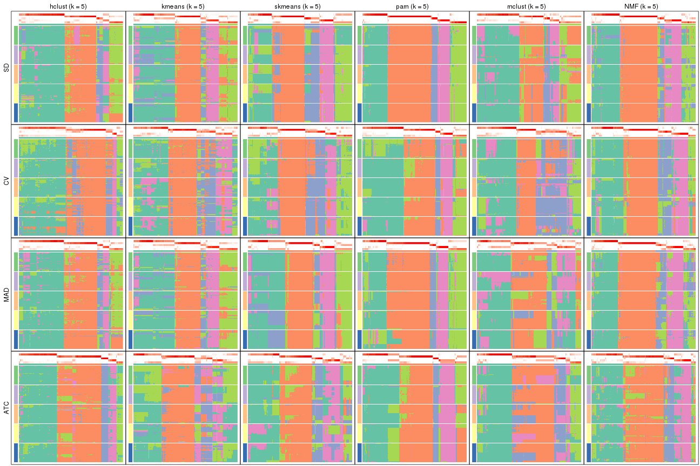</p>

</div>
<div id='tab-collect-membership-heatmap-5'>
<pre><code class="r">collect_plots(res_list, k = 6, fun = membership_heatmap, mc.cores = 4)
</code></pre>

<p>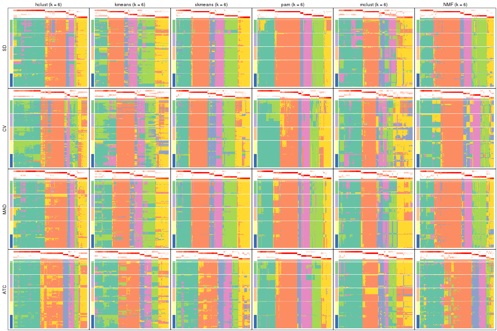</p>

</div>
</div>


### Signature heatmap

Signature heatmaps for all methods. ([What is a signature heatmap?](http://bioconductor.org/packages/devel/bioc/vignettes/cola/inst/doc/cola.html#toc_22))


Note in following heatmaps, rows are scaled.


<script>
$( function() {
	$( '#tabs-collect-get-signatures' ).tabs();
} );
</script>
<div id='tabs-collect-get-signatures'>
<ul>
<li><a href='#tab-collect-get-signatures-1'>k = 2</a></li>
<li><a href='#tab-collect-get-signatures-2'>k = 3</a></li>
<li><a href='#tab-collect-get-signatures-3'>k = 4</a></li>
<li><a href='#tab-collect-get-signatures-4'>k = 5</a></li>
<li><a href='#tab-collect-get-signatures-5'>k = 6</a></li>
</ul>
<div id='tab-collect-get-signatures-1'>
<pre><code class="r">collect_plots(res_list, k = 2, fun = get_signatures, mc.cores = 4)
</code></pre>

<p>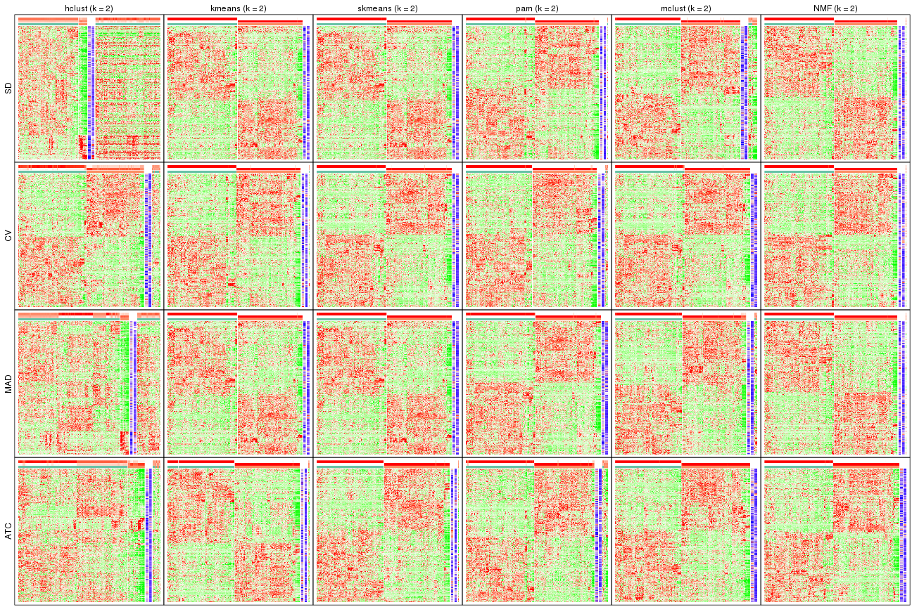</p>

</div>
<div id='tab-collect-get-signatures-2'>
<pre><code class="r">collect_plots(res_list, k = 3, fun = get_signatures, mc.cores = 4)
</code></pre>

<p>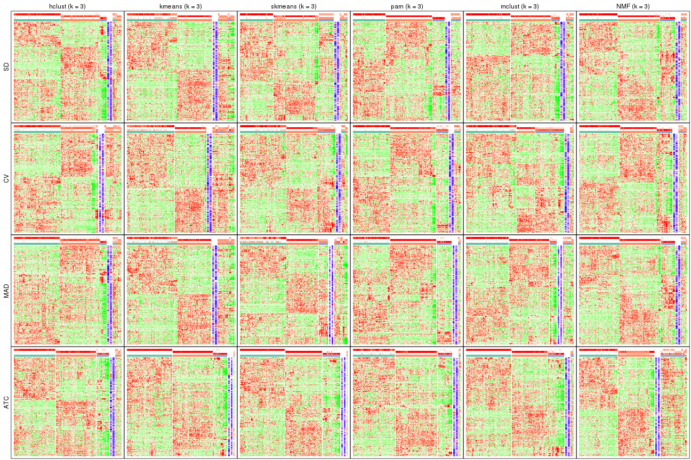</p>

</div>
<div id='tab-collect-get-signatures-3'>
<pre><code class="r">collect_plots(res_list, k = 4, fun = get_signatures, mc.cores = 4)
</code></pre>

<p>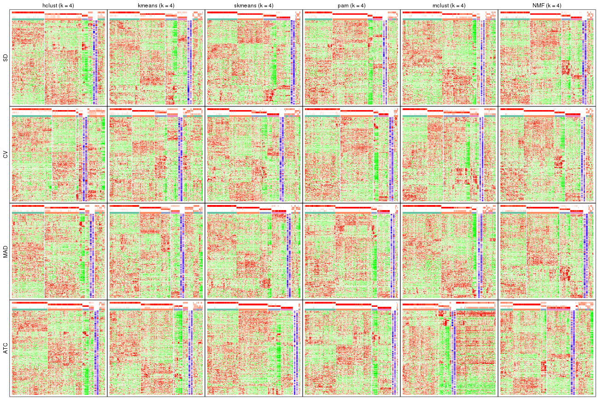</p>

</div>
<div id='tab-collect-get-signatures-4'>
<pre><code class="r">collect_plots(res_list, k = 5, fun = get_signatures, mc.cores = 4)
</code></pre>

<p>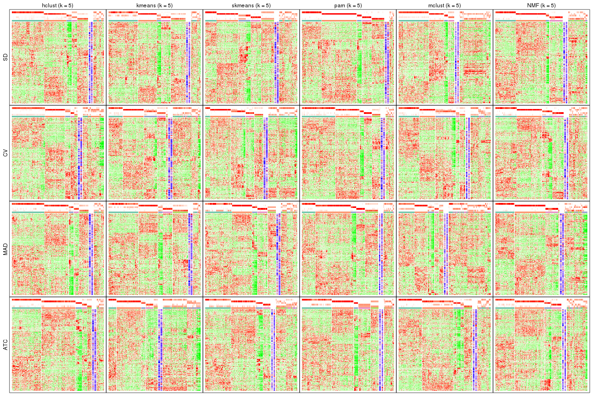</p>

</div>
<div id='tab-collect-get-signatures-5'>
<pre><code class="r">collect_plots(res_list, k = 6, fun = get_signatures, mc.cores = 4)
</code></pre>

<p>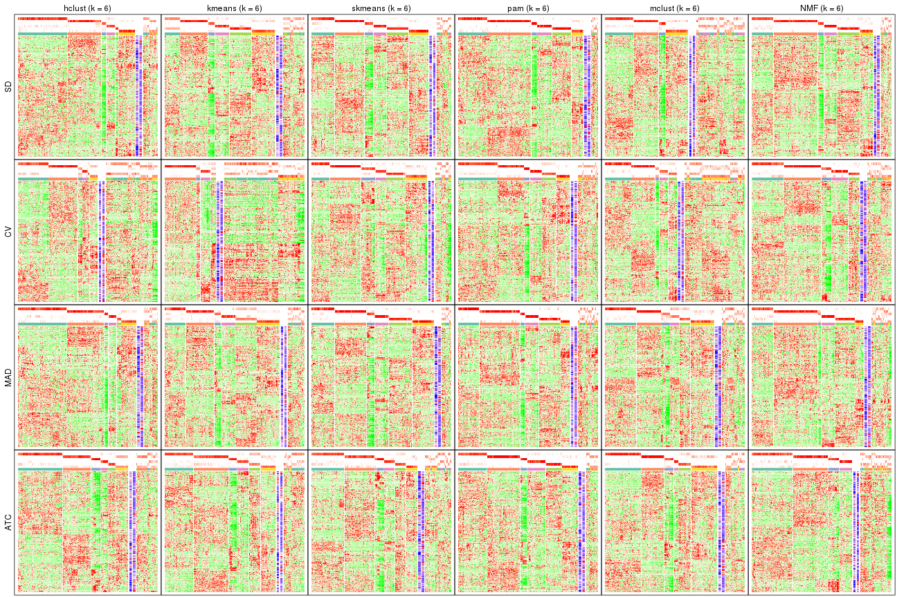</p>

</div>
</div>


### Statistics table

The statistics used for measuring the stability of consensus partitioning.
([How are they
defined?](http://bioconductor.org/packages/devel/bioc/vignettes/cola/inst/doc/cola.html#toc_13))


<script>
$( function() {
	$( '#tabs-get-stats-from-consensus-partition-list' ).tabs();
} );
</script>
<div id='tabs-get-stats-from-consensus-partition-list'>
<ul>
<li><a href='#tab-get-stats-from-consensus-partition-list-1'>k = 2</a></li>
<li><a href='#tab-get-stats-from-consensus-partition-list-2'>k = 3</a></li>
<li><a href='#tab-get-stats-from-consensus-partition-list-3'>k = 4</a></li>
<li><a href='#tab-get-stats-from-consensus-partition-list-4'>k = 5</a></li>
<li><a href='#tab-get-stats-from-consensus-partition-list-5'>k = 6</a></li>
</ul>
<div id='tab-get-stats-from-consensus-partition-list-1'>
<pre><code class="r">get_stats(res_list, k = 2)
</code></pre>

<pre><code>#&gt;             k 1-PAC mean_silhouette concordance area_increased  Rand Jaccard
#&gt; SD:NMF      2 1.000           0.992       0.997          0.502 0.498   0.498
#&gt; CV:NMF      2 1.000           0.994       0.998          0.502 0.498   0.498
#&gt; MAD:NMF     2 1.000           0.995       0.998          0.502 0.498   0.498
#&gt; ATC:NMF     2 1.000           0.995       0.998          0.503 0.498   0.498
#&gt; SD:skmeans  2 1.000           0.999       1.000          0.502 0.498   0.498
#&gt; CV:skmeans  2 1.000           0.993       0.997          0.502 0.498   0.498
#&gt; MAD:skmeans 2 1.000           0.999       0.999          0.502 0.498   0.498
#&gt; ATC:skmeans 2 1.000           0.987       0.995          0.503 0.497   0.497
#&gt; SD:mclust   2 0.927           0.922       0.970          0.500 0.498   0.498
#&gt; CV:mclust   2 1.000           0.985       0.993          0.502 0.498   0.498
#&gt; MAD:mclust  2 0.910           0.953       0.981          0.501 0.498   0.498
#&gt; ATC:mclust  2 1.000           0.996       0.998          0.503 0.498   0.498
#&gt; SD:kmeans   2 1.000           0.999       1.000          0.502 0.498   0.498
#&gt; CV:kmeans   2 1.000           0.988       0.995          0.502 0.498   0.498
#&gt; MAD:kmeans  2 1.000           0.997       0.997          0.501 0.498   0.498
#&gt; ATC:kmeans  2 1.000           0.988       0.995          0.503 0.497   0.497
#&gt; SD:pam      2 1.000           0.983       0.993          0.502 0.498   0.498
#&gt; CV:pam      2 1.000           0.965       0.986          0.503 0.498   0.498
#&gt; MAD:pam     2 1.000           0.991       0.996          0.503 0.498   0.498
#&gt; ATC:pam     2 0.887           0.929       0.970          0.500 0.498   0.498
#&gt; SD:hclust   2 0.323           0.528       0.734          0.328 0.877   0.877
#&gt; CV:hclust   2 0.269           0.744       0.833          0.459 0.503   0.503
#&gt; MAD:hclust  2 0.321           0.614       0.779          0.317 0.868   0.868
#&gt; ATC:hclust  2 0.405           0.749       0.851          0.322 0.735   0.735
</code></pre>

</div>
<div id='tab-get-stats-from-consensus-partition-list-2'>
<pre><code class="r">get_stats(res_list, k = 3)
</code></pre>

<pre><code>#&gt;             k 1-PAC mean_silhouette concordance area_increased  Rand Jaccard
#&gt; SD:NMF      3 0.859           0.887       0.950          0.250 0.840   0.689
#&gt; CV:NMF      3 0.852           0.857       0.935          0.270 0.821   0.655
#&gt; MAD:NMF     3 0.907           0.906       0.960          0.249 0.848   0.702
#&gt; ATC:NMF     3 0.677           0.638       0.805          0.229 0.806   0.628
#&gt; SD:skmeans  3 0.722           0.764       0.833          0.254 0.857   0.717
#&gt; CV:skmeans  3 0.700           0.815       0.874          0.255 0.868   0.739
#&gt; MAD:skmeans 3 0.706           0.685       0.826          0.251 0.863   0.732
#&gt; ATC:skmeans 3 0.957           0.948       0.975          0.239 0.835   0.680
#&gt; SD:mclust   3 0.806           0.838       0.922          0.196 0.902   0.806
#&gt; CV:mclust   3 0.653           0.836       0.884          0.223 0.877   0.755
#&gt; MAD:mclust  3 0.790           0.834       0.922          0.199 0.872   0.748
#&gt; ATC:mclust  3 0.881           0.910       0.953          0.239 0.845   0.696
#&gt; SD:kmeans   3 0.685           0.672       0.815          0.228 0.965   0.931
#&gt; CV:kmeans   3 0.646           0.685       0.841          0.235 0.892   0.786
#&gt; MAD:kmeans  3 0.680           0.663       0.831          0.229 0.956   0.912
#&gt; ATC:kmeans  3 1.000           0.974       0.986          0.219 0.863   0.730
#&gt; SD:pam      3 0.868           0.849       0.941          0.244 0.865   0.733
#&gt; CV:pam      3 0.775           0.859       0.920          0.216 0.879   0.760
#&gt; MAD:pam     3 0.877           0.900       0.952          0.246 0.861   0.724
#&gt; ATC:pam     3 0.764           0.871       0.928          0.255 0.863   0.731
#&gt; SD:hclust   3 0.671           0.797       0.881          0.767 0.563   0.502
#&gt; CV:hclust   3 0.343           0.678       0.785          0.189 0.897   0.808
#&gt; MAD:hclust  3 0.712           0.795       0.878          0.835 0.562   0.498
#&gt; ATC:hclust  3 0.809           0.862       0.930          0.900 0.616   0.491
</code></pre>

</div>
<div id='tab-get-stats-from-consensus-partition-list-3'>
<pre><code class="r">get_stats(res_list, k = 4)
</code></pre>

<pre><code>#&gt;             k 1-PAC mean_silhouette concordance area_increased  Rand Jaccard
#&gt; SD:NMF      4 0.792           0.828       0.913         0.1172 0.839   0.614
#&gt; CV:NMF      4 0.877           0.849       0.931         0.1299 0.812   0.544
#&gt; MAD:NMF     4 0.731           0.814       0.887         0.1291 0.855   0.641
#&gt; ATC:NMF     4 0.676           0.646       0.831         0.1300 0.786   0.498
#&gt; SD:skmeans  4 0.838           0.875       0.942         0.1420 0.887   0.703
#&gt; CV:skmeans  4 0.731           0.708       0.869         0.1597 0.859   0.640
#&gt; MAD:skmeans 4 0.809           0.813       0.922         0.1557 0.797   0.525
#&gt; ATC:skmeans 4 0.957           0.928       0.965         0.1417 0.880   0.690
#&gt; SD:mclust   4 0.695           0.697       0.817         0.0927 0.941   0.862
#&gt; CV:mclust   4 0.609           0.708       0.823         0.1456 0.888   0.713
#&gt; MAD:mclust  4 0.776           0.699       0.848         0.0885 0.923   0.819
#&gt; ATC:mclust  4 0.760           0.350       0.859         0.0682 0.907   0.777
#&gt; SD:kmeans   4 0.648           0.731       0.841         0.1297 0.816   0.613
#&gt; CV:kmeans   4 0.596           0.635       0.748         0.1280 0.814   0.578
#&gt; MAD:kmeans  4 0.633           0.682       0.820         0.1236 0.819   0.615
#&gt; ATC:kmeans  4 0.728           0.717       0.830         0.1255 0.933   0.827
#&gt; SD:pam      4 0.863           0.823       0.920         0.0775 0.875   0.699
#&gt; CV:pam      4 0.792           0.853       0.923         0.0935 0.947   0.866
#&gt; MAD:pam     4 0.786           0.843       0.902         0.0855 0.933   0.825
#&gt; ATC:pam     4 0.939           0.930       0.969         0.0877 0.905   0.763
#&gt; SD:hclust   4 0.650           0.689       0.834         0.1254 0.954   0.896
#&gt; CV:hclust   4 0.484           0.653       0.812         0.1584 0.950   0.894
#&gt; MAD:hclust  4 0.668           0.695       0.813         0.1362 0.954   0.896
#&gt; ATC:hclust  4 0.761           0.824       0.895         0.0650 0.991   0.978
</code></pre>

</div>
<div id='tab-get-stats-from-consensus-partition-list-4'>
<pre><code class="r">get_stats(res_list, k = 5)
</code></pre>

<pre><code>#&gt;             k 1-PAC mean_silhouette concordance area_increased  Rand Jaccard
#&gt; SD:NMF      5 0.774           0.725       0.865         0.0667 0.892   0.675
#&gt; CV:NMF      5 0.734           0.674       0.838         0.0557 0.898   0.676
#&gt; MAD:NMF     5 0.797           0.724       0.844         0.0591 0.911   0.716
#&gt; ATC:NMF     5 0.629           0.619       0.811         0.0561 0.848   0.577
#&gt; SD:skmeans  5 0.779           0.629       0.756         0.0765 0.890   0.636
#&gt; CV:skmeans  5 0.698           0.607       0.779         0.0644 0.858   0.545
#&gt; MAD:skmeans 5 0.765           0.623       0.783         0.0669 0.907   0.695
#&gt; ATC:skmeans 5 0.708           0.571       0.757         0.0755 0.914   0.717
#&gt; SD:mclust   5 0.617           0.552       0.769         0.1089 0.841   0.609
#&gt; CV:mclust   5 0.621           0.602       0.744         0.0696 0.972   0.905
#&gt; MAD:mclust  5 0.627           0.334       0.656         0.1150 0.840   0.606
#&gt; ATC:mclust  5 0.700           0.655       0.788         0.1044 0.894   0.729
#&gt; SD:kmeans   5 0.682           0.675       0.772         0.0849 0.918   0.747
#&gt; CV:kmeans   5 0.618           0.565       0.743         0.0741 0.917   0.729
#&gt; MAD:kmeans  5 0.690           0.725       0.800         0.0915 0.925   0.767
#&gt; ATC:kmeans  5 0.684           0.486       0.641         0.0788 0.852   0.578
#&gt; SD:pam      5 0.930           0.889       0.955         0.0817 0.908   0.735
#&gt; CV:pam      5 0.700           0.744       0.830         0.0928 0.914   0.759
#&gt; MAD:pam     5 0.764           0.746       0.866         0.0782 0.889   0.685
#&gt; ATC:pam     5 0.786           0.682       0.834         0.0887 0.933   0.796
#&gt; SD:hclust   5 0.658           0.728       0.828         0.0848 0.910   0.773
#&gt; CV:hclust   5 0.514           0.534       0.764         0.0938 0.926   0.827
#&gt; MAD:hclust  5 0.644           0.720       0.832         0.0679 0.907   0.766
#&gt; ATC:hclust  5 0.736           0.792       0.871         0.0750 0.936   0.834
</code></pre>

</div>
<div id='tab-get-stats-from-consensus-partition-list-5'>
<pre><code class="r">get_stats(res_list, k = 6)
</code></pre>

<pre><code>#&gt;             k 1-PAC mean_silhouette concordance area_increased  Rand Jaccard
#&gt; SD:NMF      6 0.808           0.799       0.888         0.0471 0.908   0.677
#&gt; CV:NMF      6 0.804           0.662       0.822         0.0446 0.916   0.693
#&gt; MAD:NMF     6 0.764           0.721       0.853         0.0352 0.915   0.694
#&gt; ATC:NMF     6 0.671           0.635       0.812         0.0381 0.907   0.708
#&gt; SD:skmeans  6 0.857           0.792       0.895         0.0528 0.897   0.590
#&gt; CV:skmeans  6 0.793           0.764       0.860         0.0407 0.922   0.673
#&gt; MAD:skmeans 6 0.863           0.812       0.908         0.0523 0.891   0.596
#&gt; ATC:skmeans 6 0.713           0.639       0.810         0.0494 0.858   0.514
#&gt; SD:mclust   6 0.655           0.520       0.739         0.0795 0.854   0.544
#&gt; CV:mclust   6 0.615           0.453       0.716         0.0460 0.917   0.712
#&gt; MAD:mclust  6 0.685           0.654       0.786         0.0655 0.809   0.419
#&gt; ATC:mclust  6 0.728           0.680       0.795         0.0439 0.892   0.651
#&gt; SD:kmeans   6 0.713           0.661       0.775         0.0513 0.905   0.651
#&gt; CV:kmeans   6 0.651           0.480       0.658         0.0500 0.881   0.583
#&gt; MAD:kmeans  6 0.727           0.702       0.788         0.0588 0.913   0.677
#&gt; ATC:kmeans  6 0.670           0.664       0.776         0.0529 0.878   0.574
#&gt; SD:pam      6 0.860           0.848       0.925         0.0687 0.941   0.789
#&gt; CV:pam      6 0.721           0.697       0.837         0.0764 0.892   0.636
#&gt; MAD:pam     6 0.788           0.724       0.887         0.0767 0.920   0.717
#&gt; ATC:pam     6 0.789           0.788       0.891         0.0764 0.913   0.687
#&gt; SD:hclust   6 0.694           0.740       0.846         0.0475 0.970   0.905
#&gt; CV:hclust   6 0.585           0.503       0.715         0.0627 0.886   0.691
#&gt; MAD:hclust  6 0.672           0.726       0.841         0.0368 0.972   0.912
#&gt; ATC:hclust  6 0.693           0.651       0.801         0.0755 0.921   0.757
</code></pre>

</div>
</div>

Following heatmap plots the partition for each combination of methods and the
lightness correspond to the silhouette scores for samples in each method. On
top the consensus subgroup is inferred from all methods by taking the mean
silhouette scores as weight.


<script>
$( function() {
	$( '#tabs-collect-stats-from-consensus-partition-list' ).tabs();
} );
</script>
<div id='tabs-collect-stats-from-consensus-partition-list'>
<ul>
<li><a href='#tab-collect-stats-from-consensus-partition-list-1'>k = 2</a></li>
<li><a href='#tab-collect-stats-from-consensus-partition-list-2'>k = 3</a></li>
<li><a href='#tab-collect-stats-from-consensus-partition-list-3'>k = 4</a></li>
<li><a href='#tab-collect-stats-from-consensus-partition-list-4'>k = 5</a></li>
<li><a href='#tab-collect-stats-from-consensus-partition-list-5'>k = 6</a></li>
</ul>
<div id='tab-collect-stats-from-consensus-partition-list-1'>
<pre><code class="r">collect_stats(res_list, k = 2)
</code></pre>

<p>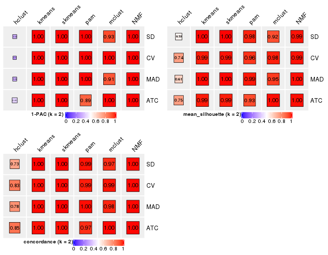</p>

</div>
<div id='tab-collect-stats-from-consensus-partition-list-2'>
<pre><code class="r">collect_stats(res_list, k = 3)
</code></pre>

<p>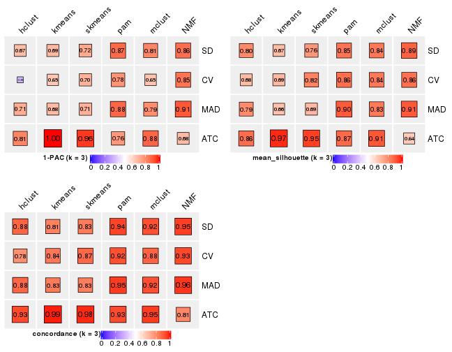</p>

</div>
<div id='tab-collect-stats-from-consensus-partition-list-3'>
<pre><code class="r">collect_stats(res_list, k = 4)
</code></pre>

<p>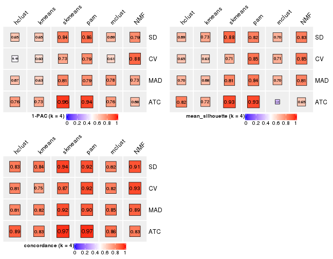</p>

</div>
<div id='tab-collect-stats-from-consensus-partition-list-4'>
<pre><code class="r">collect_stats(res_list, k = 5)
</code></pre>

<p>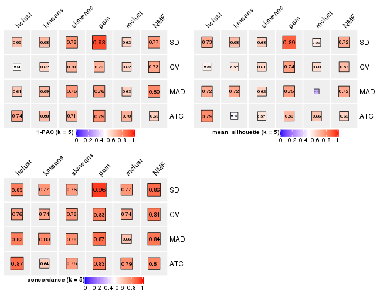</p>

</div>
<div id='tab-collect-stats-from-consensus-partition-list-5'>
<pre><code class="r">collect_stats(res_list, k = 6)
</code></pre>

<p>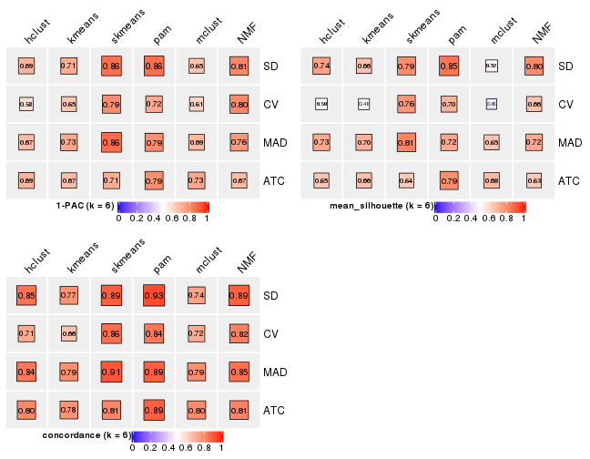</p>

</div>
</div>

### Partition from all methods


Collect partitions from all methods:


<script>
$( function() {
	$( '#tabs-collect-classes-from-consensus-partition-list' ).tabs();
} );
</script>
<div id='tabs-collect-classes-from-consensus-partition-list'>
<ul>
<li><a href='#tab-collect-classes-from-consensus-partition-list-1'>k = 2</a></li>
<li><a href='#tab-collect-classes-from-consensus-partition-list-2'>k = 3</a></li>
<li><a href='#tab-collect-classes-from-consensus-partition-list-3'>k = 4</a></li>
<li><a href='#tab-collect-classes-from-consensus-partition-list-4'>k = 5</a></li>
<li><a href='#tab-collect-classes-from-consensus-partition-list-5'>k = 6</a></li>
</ul>
<div id='tab-collect-classes-from-consensus-partition-list-1'>
<pre><code class="r">collect_classes(res_list, k = 2)
</code></pre>

<p>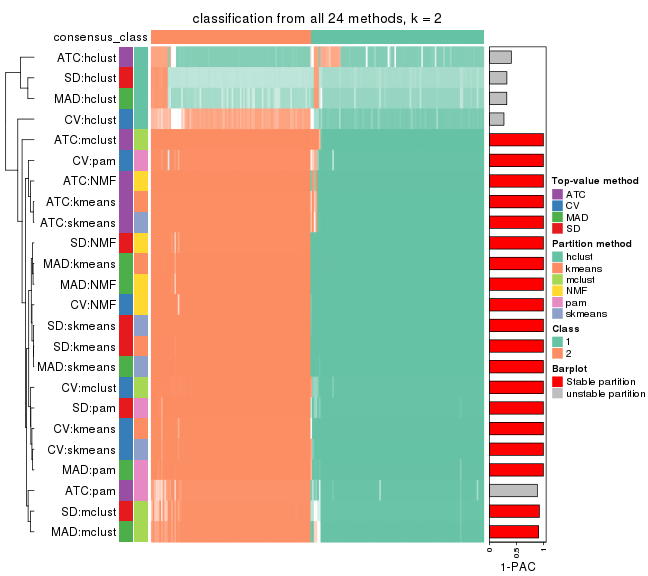</p>

</div>
<div id='tab-collect-classes-from-consensus-partition-list-2'>
<pre><code class="r">collect_classes(res_list, k = 3)
</code></pre>

<p>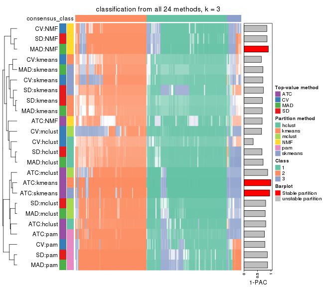</p>

</div>
<div id='tab-collect-classes-from-consensus-partition-list-3'>
<pre><code class="r">collect_classes(res_list, k = 4)
</code></pre>

<p>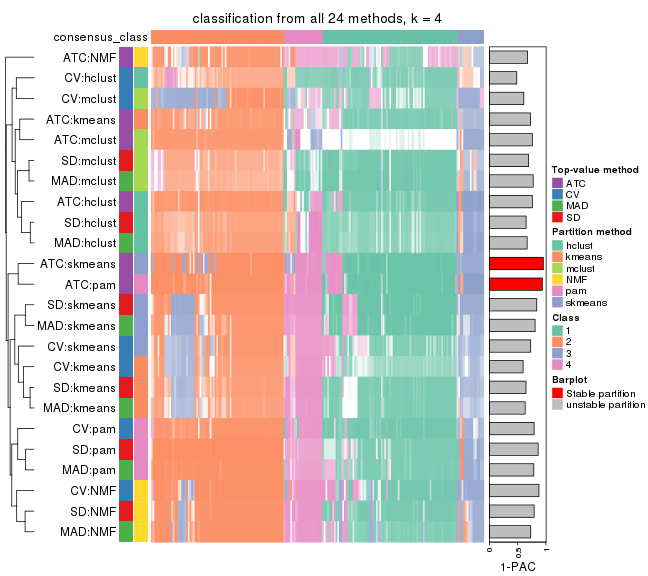</p>

</div>
<div id='tab-collect-classes-from-consensus-partition-list-4'>
<pre><code class="r">collect_classes(res_list, k = 5)
</code></pre>

<p>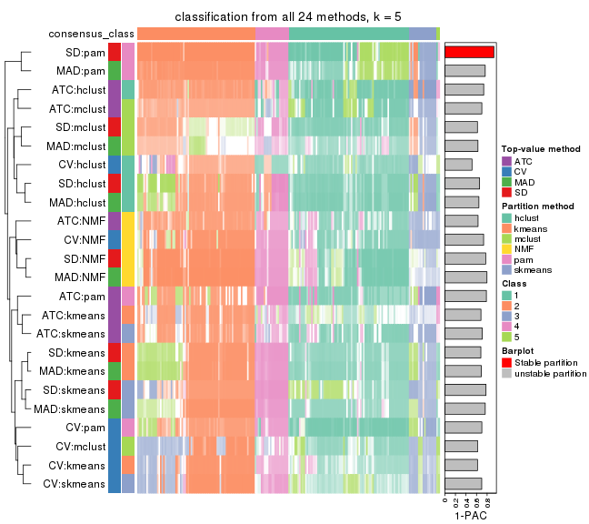</p>

</div>
<div id='tab-collect-classes-from-consensus-partition-list-5'>
<pre><code class="r">collect_classes(res_list, k = 6)
</code></pre>

<p>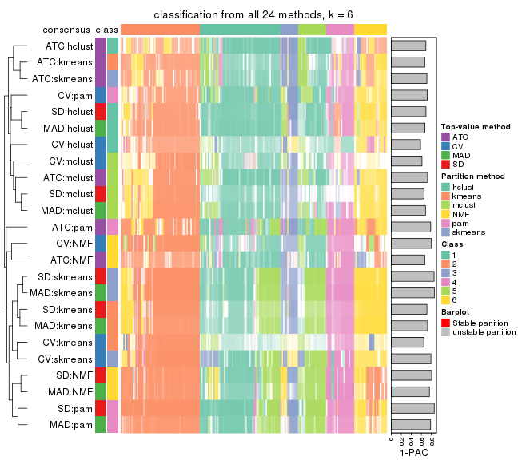</p>

</div>
</div>


### Top rows overlap


Overlap of top rows from different top-row methods:


<script>
$( function() {
	$( '#tabs-top-rows-overlap-by-euler' ).tabs();
} );
</script>
<div id='tabs-top-rows-overlap-by-euler'>
<ul>
<li><a href='#tab-top-rows-overlap-by-euler-1'>top_n = 1000</a></li>
<li><a href='#tab-top-rows-overlap-by-euler-2'>top_n = 2000</a></li>
<li><a href='#tab-top-rows-overlap-by-euler-3'>top_n = 3000</a></li>
<li><a href='#tab-top-rows-overlap-by-euler-4'>top_n = 4000</a></li>
<li><a href='#tab-top-rows-overlap-by-euler-5'>top_n = 5000</a></li>
</ul>
<div id='tab-top-rows-overlap-by-euler-1'>
<pre><code class="r">top_rows_overlap(res_list, top_n = 1000, method = &quot;euler&quot;)
</code></pre>

<p>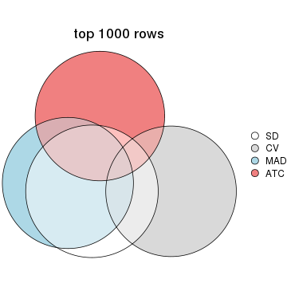</p>

</div>
<div id='tab-top-rows-overlap-by-euler-2'>
<pre><code class="r">top_rows_overlap(res_list, top_n = 2000, method = &quot;euler&quot;)
</code></pre>

<p>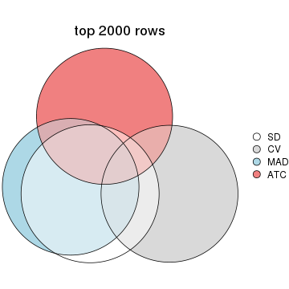</p>

</div>
<div id='tab-top-rows-overlap-by-euler-3'>
<pre><code class="r">top_rows_overlap(res_list, top_n = 3000, method = &quot;euler&quot;)
</code></pre>

<p>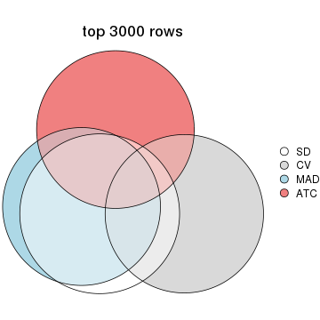</p>

</div>
<div id='tab-top-rows-overlap-by-euler-4'>
<pre><code class="r">top_rows_overlap(res_list, top_n = 4000, method = &quot;euler&quot;)
</code></pre>

<p>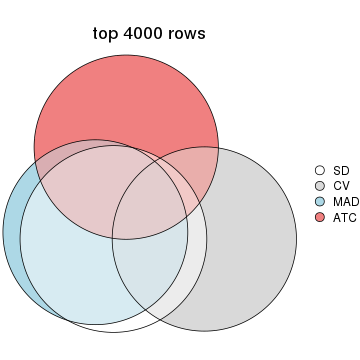</p>

</div>
<div id='tab-top-rows-overlap-by-euler-5'>
<pre><code class="r">top_rows_overlap(res_list, top_n = 5000, method = &quot;euler&quot;)
</code></pre>

<p>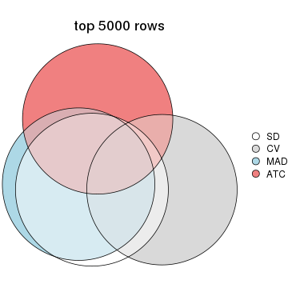</p>

</div>
</div>

Also visualize the correspondance of rankings between different top-row methods:


<script>
$( function() {
	$( '#tabs-top-rows-overlap-by-correspondance' ).tabs();
} );
</script>
<div id='tabs-top-rows-overlap-by-correspondance'>
<ul>
<li><a href='#tab-top-rows-overlap-by-correspondance-1'>top_n = 1000</a></li>
<li><a href='#tab-top-rows-overlap-by-correspondance-2'>top_n = 2000</a></li>
<li><a href='#tab-top-rows-overlap-by-correspondance-3'>top_n = 3000</a></li>
<li><a href='#tab-top-rows-overlap-by-correspondance-4'>top_n = 4000</a></li>
<li><a href='#tab-top-rows-overlap-by-correspondance-5'>top_n = 5000</a></li>
</ul>
<div id='tab-top-rows-overlap-by-correspondance-1'>
<pre><code class="r">top_rows_overlap(res_list, top_n = 1000, method = &quot;correspondance&quot;)
</code></pre>

<p>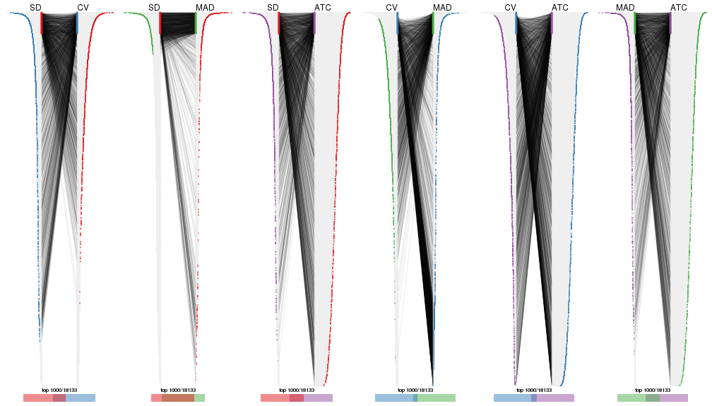</p>

</div>
<div id='tab-top-rows-overlap-by-correspondance-2'>
<pre><code class="r">top_rows_overlap(res_list, top_n = 2000, method = &quot;correspondance&quot;)
</code></pre>

<p>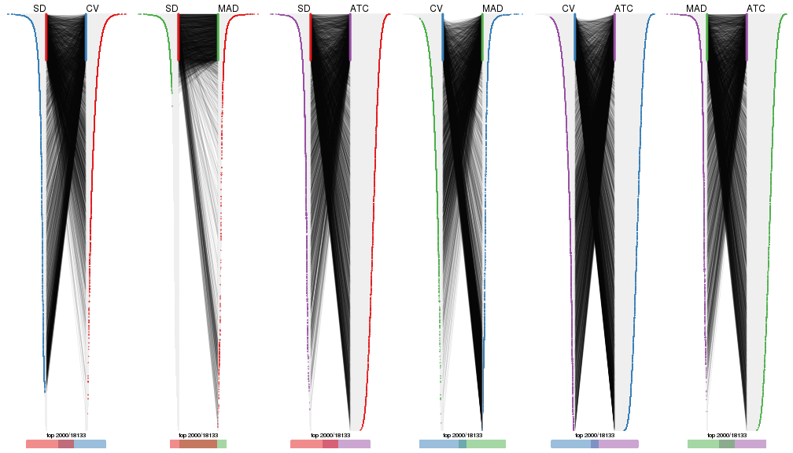</p>

</div>
<div id='tab-top-rows-overlap-by-correspondance-3'>
<pre><code class="r">top_rows_overlap(res_list, top_n = 3000, method = &quot;correspondance&quot;)
</code></pre>

<p>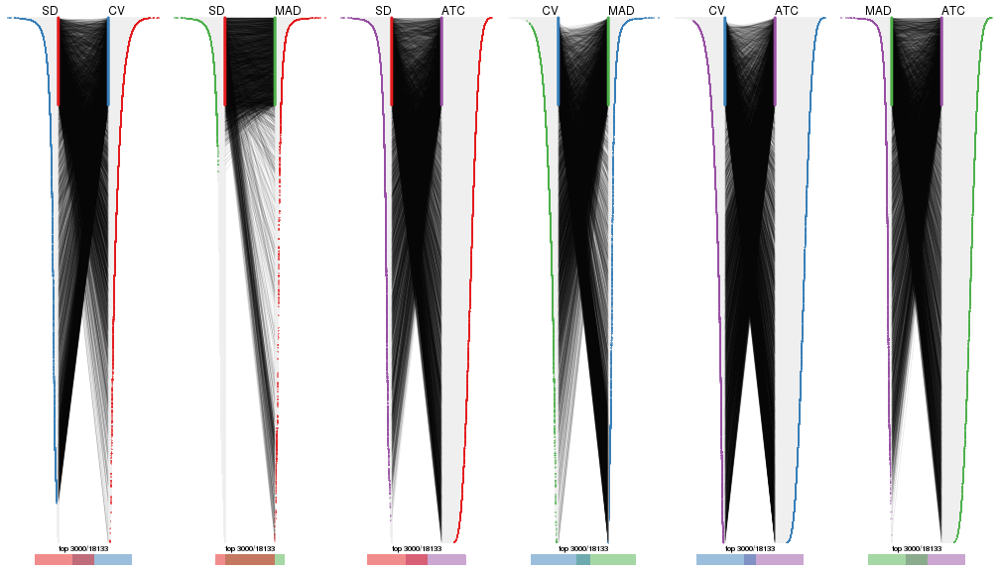</p>

</div>
<div id='tab-top-rows-overlap-by-correspondance-4'>
<pre><code class="r">top_rows_overlap(res_list, top_n = 4000, method = &quot;correspondance&quot;)
</code></pre>

<p>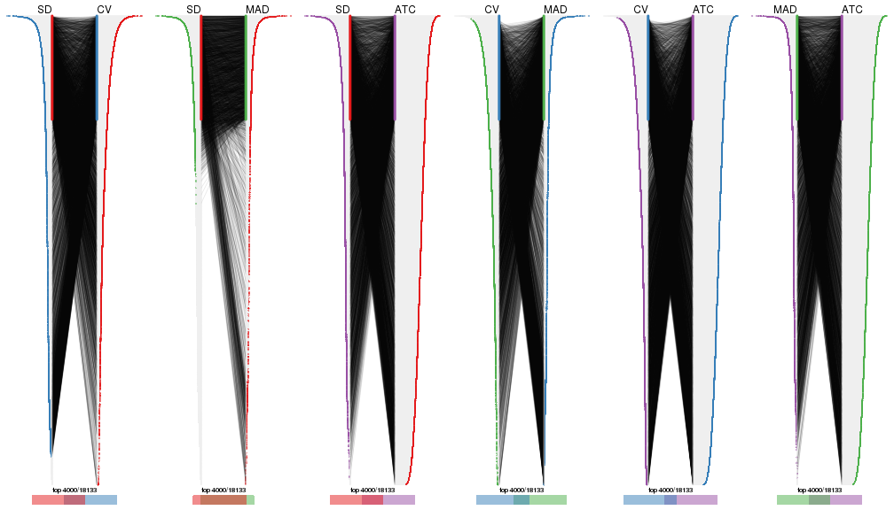</p>

</div>
<div id='tab-top-rows-overlap-by-correspondance-5'>
<pre><code class="r">top_rows_overlap(res_list, top_n = 5000, method = &quot;correspondance&quot;)
</code></pre>

<p>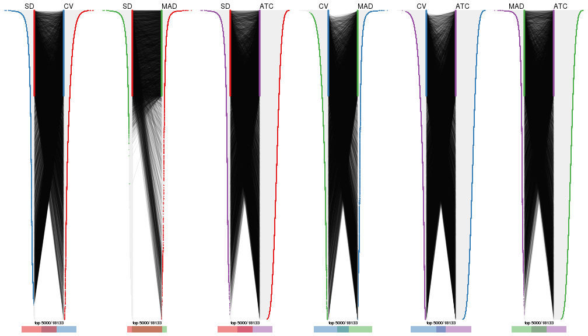</p>

</div>
</div>


Heatmaps of the top rows:


<script>
$( function() {
	$( '#tabs-top-rows-heatmap' ).tabs();
} );
</script>
<div id='tabs-top-rows-heatmap'>
<ul>
<li><a href='#tab-top-rows-heatmap-1'>top_n = 1000</a></li>
<li><a href='#tab-top-rows-heatmap-2'>top_n = 2000</a></li>
<li><a href='#tab-top-rows-heatmap-3'>top_n = 3000</a></li>
<li><a href='#tab-top-rows-heatmap-4'>top_n = 4000</a></li>
<li><a href='#tab-top-rows-heatmap-5'>top_n = 5000</a></li>
</ul>
<div id='tab-top-rows-heatmap-1'>
<pre><code class="r">top_rows_heatmap(res_list, top_n = 1000)
</code></pre>

<p>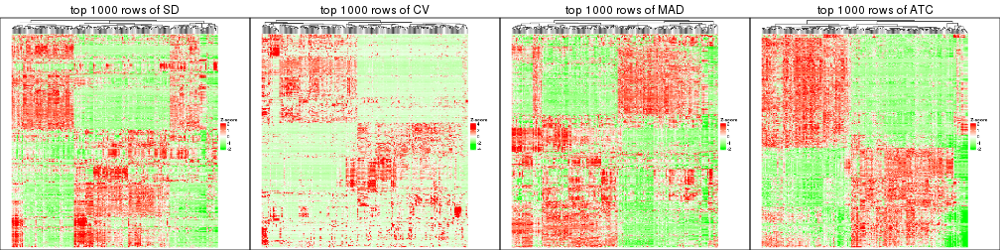</p>

</div>
<div id='tab-top-rows-heatmap-2'>
<pre><code class="r">top_rows_heatmap(res_list, top_n = 2000)
</code></pre>

<p>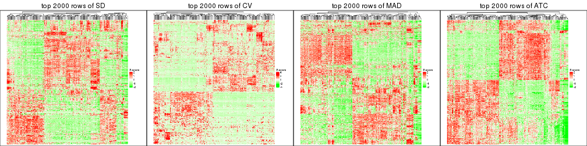</p>

</div>
<div id='tab-top-rows-heatmap-3'>
<pre><code class="r">top_rows_heatmap(res_list, top_n = 3000)
</code></pre>

<p>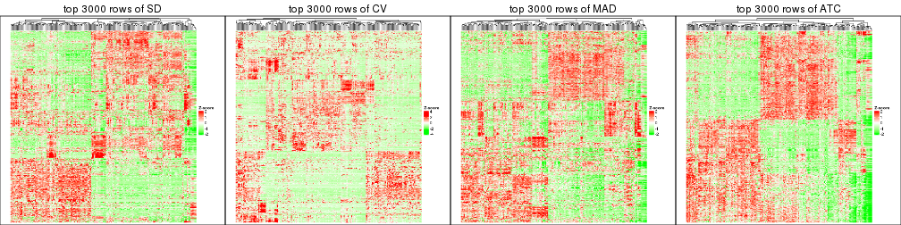</p>

</div>
<div id='tab-top-rows-heatmap-4'>
<pre><code class="r">top_rows_heatmap(res_list, top_n = 4000)
</code></pre>

<p>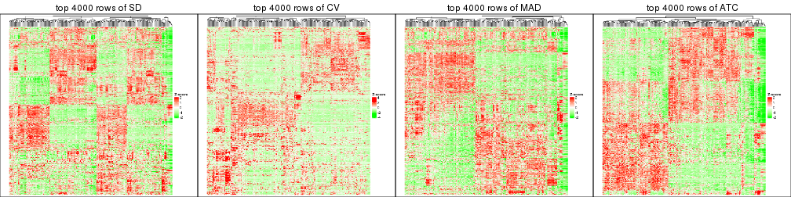</p>

</div>
<div id='tab-top-rows-heatmap-5'>
<pre><code class="r">top_rows_heatmap(res_list, top_n = 5000)
</code></pre>

<p>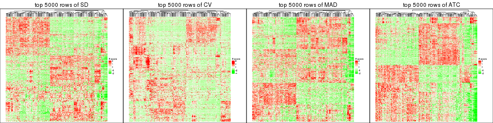</p>

</div>
</div>


 
## Results for each method


---------------------------------------------------


### SD:hclust


The object with results only for a single top-value method and a single partition method 
can be extracted as:

```r
res = res_list["SD", "hclust"]
# you can also extract it by
# res = res_list["SD:hclust"]
```

A summary of `res` and all the functions that can be applied to it:

```r
res
```

```
#> A 'ConsensusPartition' object with k = 2, 3, 4, 5, 6.
#>   On a matrix with 18133 rows and 198 columns.
#>   Top rows (1000, 2000, 3000, 4000, 5000) are extracted by 'SD' method.
#>   Subgroups are detected by 'hclust' method.
#>   Performed in total 1250 partitions by row resampling.
#>   Best k for subgroups seems to be 3.
#> 
#> Following methods can be applied to this 'ConsensusPartition' object:
#>  [1] "cola_report"             "collect_classes"         "collect_plots"          
#>  [4] "collect_stats"           "colnames"                "compare_signatures"     
#>  [7] "consensus_heatmap"       "dimension_reduction"     "functional_enrichment"  
#> [10] "get_anno_col"            "get_anno"                "get_classes"            
#> [13] "get_consensus"           "get_matrix"              "get_membership"         
#> [16] "get_param"               "get_signatures"          "get_stats"              
#> [19] "is_best_k"               "is_stable_k"             "membership_heatmap"     
#> [22] "ncol"                    "nrow"                    "plot_ecdf"              
#> [25] "rownames"                "select_partition_number" "show"                   
#> [28] "suggest_best_k"          "test_to_known_factors"
```

`collect_plots()` function collects all the plots made from `res` for all `k` (number of partitions)
into one single page to provide an easy and fast comparison between different `k`.

```r
collect_plots(res)
```

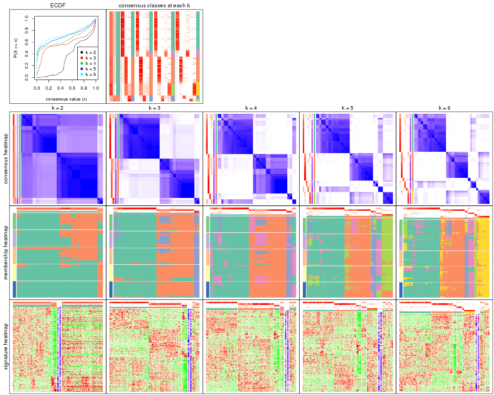

The plots are:

- The first row: a plot of the ECDF (empirical cumulative distribution
  function) curves of the consensus matrix for each `k` and the heatmap of
  predicted classes for each `k`.
- The second row: heatmaps of the consensus matrix for each `k`.
- The third row: heatmaps of the membership matrix for each `k`.
- The fouth row: heatmaps of the signatures for each `k`.

All the plots in panels can be made by individual functions and they are
plotted later in this section.

`select_partition_number()` produces several plots showing different
statistics for choosing "optimized" `k`. There are following statistics:

- ECDF curves of the consensus matrix for each `k`;
- 1-PAC. [The PAC
  score](https://en.wikipedia.org/wiki/Consensus_clustering#Over-interpretation_potential_of_consensus_clustering)
  measures the proportion of the ambiguous subgrouping.
- Mean silhouette score.
- Concordance. The mean probability of fiting the consensus class ids in all
  partitions.
- Area increased. Denote $A_k$ as the area under the ECDF curve for current
  `k`, the area increased is defined as $A_k - A_{k-1}$.
- Rand index. The percent of pairs of samples that are both in a same cluster
  or both are not in a same cluster in the partition of k and k-1.
- Jaccard index. The ratio of pairs of samples are both in a same cluster in
  the partition of k and k-1 and the pairs of samples are both in a same
  cluster in the partition k or k-1.

The detailed explanations of these statistics can be found in [the _cola_
vignette](http://bioconductor.org/packages/devel/bioc/vignettes/cola/inst/doc/cola.html#toc_13).

Generally speaking, lower PAC score, higher mean silhouette score or higher
concordance corresponds to better partition. Rand index and Jaccard index
measure how similar the current partition is compared to partition with `k-1`.
If they are too similar, we won't accept `k` is better than `k-1`.

```r
select_partition_number(res)
```

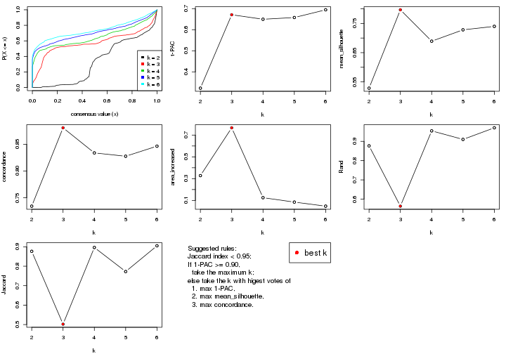

The numeric values for all these statistics can be obtained by `get_stats()`.

```r
get_stats(res)
```

```
#>   k 1-PAC mean_silhouette concordance area_increased  Rand Jaccard
#> 2 2 0.323           0.528       0.734         0.3279 0.877   0.877
#> 3 3 0.671           0.797       0.881         0.7667 0.563   0.502
#> 4 4 0.650           0.689       0.834         0.1254 0.954   0.896
#> 5 5 0.658           0.728       0.828         0.0848 0.910   0.773
#> 6 6 0.694           0.740       0.846         0.0475 0.970   0.905
```

`suggest_best_k()` suggests the best $k$ based on these statistics. The rules are as follows:

- All $k$ with Jaccard index larger than 0.95 are removed because increasing
  $k$ does not provide enough extra information. If all $k$ are removed, it is
  marked as no subgroup is detected.
- For all $k$ with 1-PAC score larger than 0.9, the maximal $k$ is taken as
  the best $k$, and other $k$ are marked as optional $k$.
- If it does not fit the second rule. The $k$ with the maximal vote of the
  highest 1-PAC score, highest mean silhouette, and highest concordance is
  taken as the best $k$.

```r
suggest_best_k(res)
```

```
#> [1] 3
```


Following shows the table of the partitions (You need to click the **show/hide
code output** link to see it). The membership matrix (columns with name `p*`)
is inferred by
[`clue::cl_consensus()`](https://www.rdocumentation.org/link/cl_consensus?package=clue)
function with the `SE` method. Basically the value in the membership matrix
represents the probability to belong to a certain group. The finall class
label for an item is determined with the group with highest probability it
belongs to.

In `get_classes()` function, the entropy is calculated from the membership
matrix and the silhouette score is calculated from the consensus matrix.


<script>
$( function() {
	$( '#tabs-SD-hclust-get-classes' ).tabs();
} );
</script>
<div id='tabs-SD-hclust-get-classes'>
<ul>
<li><a href='#tab-SD-hclust-get-classes-1'>k = 2</a></li>
<li><a href='#tab-SD-hclust-get-classes-2'>k = 3</a></li>
<li><a href='#tab-SD-hclust-get-classes-3'>k = 4</a></li>
<li><a href='#tab-SD-hclust-get-classes-4'>k = 5</a></li>
<li><a href='#tab-SD-hclust-get-classes-5'>k = 6</a></li>
</ul>

<div id='tab-SD-hclust-get-classes-1'>
<p><a id='tab-SD-hclust-get-classes-1-a' style='color:#0366d6' href='#'>show/hide code output</a></p>
<pre><code class="r">cbind(get_classes(res, k = 2), get_membership(res, k = 2))
</code></pre>

<pre><code>#&gt;                                      class entropy silhouette    p1    p2
#&gt; 0C0AA0B2-5191-4EDF-8937-ED7434F30283     1   0.781      0.425 0.768 0.232
#&gt; 18B45F1F-234F-45CC-A234-145307606C5C     1   0.886      0.583 0.696 0.304
#&gt; E18B70C0-BDCA-46D3-99BB-C6C8ABC68DA5     1   0.327      0.458 0.940 0.060
#&gt; 0F6DDBA7-6F74-45E8-95C8-F28263D55978     1   0.895      0.578 0.688 0.312
#&gt; 7EAE1A5A-129A-46DE-977E-A2C753F10904     1   0.343      0.453 0.936 0.064
#&gt; 7EAE0048-16B5-4979-9410-16CDEB9B1A48     1   0.904      0.571 0.680 0.320
#&gt; 2EBFC828-2B27-4753-A052-80DDA226DAB4     1   0.788      0.421 0.764 0.236
#&gt; 24E1768D-2232-41DA-9383-BC55D6EB3812     2   0.971      0.918 0.400 0.600
#&gt; 6E3CD60A-1889-4CA3-B305-2E78152057B5     1   0.895      0.449 0.688 0.312
#&gt; 33CC70DD-82B3-413C-B3B1-BE06634D95D0     1   0.881      0.473 0.700 0.300
#&gt; F1CB57A3-55DD-4487-9307-1B4F652E729A     1   0.886      0.583 0.696 0.304
#&gt; 755A5806-B054-449A-93DB-79909E6C93A1     1   0.891      0.583 0.692 0.308
#&gt; 58D364E7-3D2F-468F-A264-D6461E2428D4     1   0.373      0.454 0.928 0.072
#&gt; 68BB9CB6-7AA2-4981-B9D9-07363EC96599     2   0.971      0.918 0.400 0.600
#&gt; 3C4E8DFA-8EA0-4F1F-89CB-CB8805395872     2   0.971      0.918 0.400 0.600
#&gt; 4219651D-5583-4498-BF08-1B7D04B4C7B2     1   0.895      0.578 0.688 0.312
#&gt; B5EE2768-0D67-4584-ADBC-EC745FEC52EA     1   0.714      0.427 0.804 0.196
#&gt; 825E6C11-F460-451A-8045-846DD7D0E945     1   0.929      0.545 0.656 0.344
#&gt; 491F62AF-5E68-43C3-982A-F867A75BBA9A     1   0.814      0.402 0.748 0.252
#&gt; 9D7F058C-F95A-44AD-AC9E-450F7FBDC960     1   0.730      0.420 0.796 0.204
#&gt; 6D42DD0C-2081-4742-BA27-9F5F16FAC3C6     1   0.891      0.583 0.692 0.308
#&gt; EDD7E63D-492A-473B-A552-0764337B10EF     1   0.775      0.430 0.772 0.228
#&gt; 97073DEA-73AD-4DFD-BD1A-9035DC03445B     1   0.909      0.575 0.676 0.324
#&gt; FA891AB9-CE38-4F7E-A015-1DDCE12890A0     1   0.891      0.583 0.692 0.308
#&gt; D9514D49-A0AE-45AB-8C9F-68E726215253     1   0.929      0.546 0.656 0.344
#&gt; 3B9229AD-12E5-451E-9D2F-378AAC82C04A     1   0.781      0.425 0.768 0.232
#&gt; 5EA36B71-4917-4EF3-9060-065EFE6ACC5B     1   0.936      0.530 0.648 0.352
#&gt; A20E4ECB-4895-4CC7-BE5E-4721B20D933B     1   0.886      0.583 0.696 0.304
#&gt; 1BE8D828-29DB-4368-AA4A-FB23588F7AE8     1   0.891      0.475 0.692 0.308
#&gt; 66EFEFCF-3D14-4DBF-AA13-530F40ED0245     1   0.855      0.476 0.720 0.280
#&gt; 55DFFE53-BCE7-4EC1-9863-6C0311B06BA2     1   0.775      0.430 0.772 0.228
#&gt; 4CC3FB5A-611D-4C64-AE9D-544FA45CF4DC     1   0.886      0.583 0.696 0.304
#&gt; C11D33F2-DFE9-4FA8-9024-F3E7F1DADC5F     1   0.373      0.435 0.928 0.072
#&gt; FA5932B8-8AA3-4C38-9FAB-C35D8772974D     1   0.886      0.583 0.696 0.304
#&gt; 8216EC35-1F41-4A15-B503-BDA4971E27C9     1   0.891      0.583 0.692 0.308
#&gt; 69635D23-90A7-4BAD-97C7-B79536837F57     1   0.886      0.583 0.696 0.304
#&gt; 12B404E2-C463-4409-8392-E4649B2AFFD1     1   0.781      0.425 0.768 0.232
#&gt; 246927E3-ACCF-41B2-AA8E-43855FD6B146     1   0.781      0.425 0.768 0.232
#&gt; E0CC13E7-9607-49E0-B4AA-395544E3C3BF     1   0.886      0.583 0.696 0.304
#&gt; F7BBC0C1-6124-4A83-8A70-EA89B62F1CBD     1   0.886      0.583 0.696 0.304
#&gt; B1D4FF24-8E6F-4A04-B716-2032D850EB57     1   0.886      0.583 0.696 0.304
#&gt; 253601DB-B78A-4566-9947-8C0270C0B163     1   0.781      0.425 0.768 0.232
#&gt; AB83DBFF-5737-4FB8-A5AC-1D3CD6072BDF     2   0.895      0.841 0.312 0.688
#&gt; 9D67D953-EC98-4B72-89C8-5732BC9D4BC9     1   0.781      0.425 0.768 0.232
#&gt; 51061018-95AB-4278-886F-F69E4EBC47C0     2   0.993      0.857 0.452 0.548
#&gt; ABD0F7F3-105B-4DEE-9889-5028772C519A     1   0.886      0.583 0.696 0.304
#&gt; 562B95CF-B27E-4A72-B7C6-CDF86A51A39B     1   0.886      0.583 0.696 0.304
#&gt; ABF046A4-D7A1-49FF-B6B1-4E07A791DEDB     1   0.767      0.433 0.776 0.224
#&gt; 3FF4101E-9703-460E-A30E-76CC7689F36D     1   0.781      0.425 0.768 0.232
#&gt; 39C4F7AA-7ADF-4F1D-BDA3-BEC605AC5023     1   0.311      0.454 0.944 0.056
#&gt; CB821FD2-AF5C-4743-A70F-21C12C6ED153     1   0.886      0.583 0.696 0.304
#&gt; 92EA1846-62FF-41D5-A441-5E52E6B9E7F9     1   0.886      0.583 0.696 0.304
#&gt; 7D25F3EE-5A20-4763-8026-16A03D05F459     1   0.891      0.583 0.692 0.308
#&gt; 8ECE5276-CD06-496B-A5A9-1713B1F7D089     1   0.917      0.559 0.668 0.332
#&gt; C775B68F-9507-47E3-B507-B433AED79002     1   0.932      0.535 0.652 0.348
#&gt; E19D5463-FDD0-41C1-A170-323736A88D07     1   0.373      0.435 0.928 0.072
#&gt; CE4B6285-4961-4767-91F0-5C7A8162E185     1   0.891      0.583 0.692 0.308
#&gt; 9637BD72-1FEF-42AD-8886-2C39BE876531     1   0.891      0.583 0.692 0.308
#&gt; 81B5A88E-45A0-4B44-B689-B9071B8548EE     1   0.373      0.435 0.928 0.072
#&gt; 0B01B4C9-9BED-4F5B-A3E2-8868C7CCC3FC     2   0.969      0.916 0.396 0.604
#&gt; 54501315-7132-44B2-A179-10FBF1421105     1   0.886      0.583 0.696 0.304
#&gt; E207CBE9-4C3A-4FDD-9251-CFE1FE106475     2   0.895      0.841 0.312 0.688
#&gt; 3BEA0B92-3F90-4DBF-9679-AADEAD7D47C8     1   0.373      0.454 0.928 0.072
#&gt; 35B32250-D854-4215-AA5B-2C11B2FBEECA     1   0.886      0.583 0.696 0.304
#&gt; ACE6566B-AEB9-426C-924A-B382D14A1024     1   0.781      0.425 0.768 0.232
#&gt; 737E69AC-0930-45B9-B6BA-7CE5E300290B     1   0.886      0.583 0.696 0.304
#&gt; B4410AB8-D015-41CA-86E6-12EB4E4103E3     1   0.886      0.583 0.696 0.304
#&gt; 6D3ECA65-C50F-43B0-B75A-1D290FA4A8FD     1   0.767      0.429 0.776 0.224
#&gt; C86F40D3-9A96-4395-A8C3-510DE12F9A2B     1   0.416      0.436 0.916 0.084
#&gt; 6238087F-24DD-4BF1-903F-3BD4E446C1AE     1   0.738      0.419 0.792 0.208
#&gt; E4FF840B-EEAB-4CB0-A690-7D4C4AA7EEC3     1   0.653      0.441 0.832 0.168
#&gt; 72D3C323-C67F-4C0E-9BFC-BF245FF9730A     1   0.891      0.583 0.692 0.308
#&gt; 82D56E4E-4DF6-4F3E-8959-B995C92AAA70     1   0.886      0.583 0.696 0.304
#&gt; E31CA441-EB19-443B-ACBD-37B5CCBCF0E5     1   0.767      0.438 0.776 0.224
#&gt; 87CA8939-D054-4B8A-B32D-085FD2E8F202     1   0.895      0.578 0.688 0.312
#&gt; 2A508D90-FEDC-46A3-9A02-E51E5467CDCB     1   0.886      0.583 0.696 0.304
#&gt; C4E8B4E2-388B-411F-BF0A-9B6F34E8EDB5     1   0.506      0.417 0.888 0.112
#&gt; AF6AF803-BD93-44A7-AA80-B9BC92C1273B     1   0.781      0.425 0.768 0.232
#&gt; 0B1CA5CF-EB96-41D4-BFC5-6957FEB39828     1   0.891      0.583 0.692 0.308
#&gt; 6FB96FB0-6661-48AD-A4A0-69F8AFDBE591     1   0.781      0.425 0.768 0.232
#&gt; 8C19F7FD-368A-462B-B28F-88D6630038A1     1   0.886      0.583 0.696 0.304
#&gt; 96EABE78-C2F4-4A33-ACD8-C922A4B2519B     1   0.781      0.425 0.768 0.232
#&gt; 68B36D7B-546A-4689-949F-B207C4A4AB27     1   0.781      0.425 0.768 0.232
#&gt; CE9F3335-778F-4F52-BC55-4B7C99B211DD     1   0.402      0.437 0.920 0.080
#&gt; CB359DED-2A2D-4646-A0BD-6F10ADCC532B     1   0.891      0.475 0.692 0.308
#&gt; 198324A5-8C52-46F6-9734-EFAF1CCA6D9B     1   0.909      0.575 0.676 0.324
#&gt; 83B88608-0506-428C-B9E8-621F38477B42     1   0.891      0.583 0.692 0.308
#&gt; 1993630A-0F3D-4F5C-86A3-D443BAAF57F0     1   0.895      0.449 0.688 0.312
#&gt; DE73DA9B-529E-4F4F-A65C-DA7AB84B1096     1   0.936      0.530 0.648 0.352
#&gt; 2347F3B7-DDA3-40C0-B6D4-8819ECA69146     1   0.917      0.559 0.668 0.332
#&gt; AB93B5D5-095F-4330-9D40-6A3D934AB50C     1   0.932      0.540 0.652 0.348
#&gt; 5EBBE4AD-FF0C-41CF-9EA3-B6FE7EA1F9C0     2   0.895      0.841 0.312 0.688
#&gt; 6D960AE7-3769-4144-A061-E8588E5063FF     1   0.917      0.496 0.668 0.332
#&gt; 0C2DD8C0-D1A5-4192-A49C-7A40FED628B2     1   0.506      0.417 0.888 0.112
#&gt; 18C9372F-C55B-4F86-A9D2-E8D85EFC8566     1   0.895      0.449 0.688 0.312
#&gt; 9AF637B0-4C32-4DD1-93AF-7655B4A845D3     1   0.781      0.425 0.768 0.232
#&gt; 785B5B06-4115-46FD-9BEB-F888AFDC855D     1   0.662      0.404 0.828 0.172
#&gt; ECA3050E-4BE2-4117-B9CF-A52BB85AF8C2     1   0.891      0.444 0.692 0.308
#&gt; 099DC396-16A5-458F-9ED9-F2A790CB0C34     1   0.886      0.583 0.696 0.304
#&gt; 7A5A12EE-C5B0-4C51-8C99-0F3FA88D633E     1   0.886      0.583 0.696 0.304
#&gt; E832B508-A66D-4817-B44A-FE9FAAE64B4A     1   0.886      0.583 0.696 0.304
#&gt; F9DD688C-7B35-49E7-9651-2E098EE78856     1   0.886      0.583 0.696 0.304
#&gt; F1265DD8-5ED3-4635-A277-57BBFDEC7729     1   0.891      0.583 0.692 0.308
#&gt; F624E8D9-DB07-4C9E-910D-5E8EBA3A6167     1   0.416      0.436 0.916 0.084
#&gt; 3516FBDF-66E1-43F4-9D7B-16748F6439A7     1   0.781      0.425 0.768 0.232
#&gt; 04B12992-B2EA-4BA2-8E2C-11E34E230E6F     1   0.416      0.436 0.916 0.084
#&gt; CC02897D-9123-495E-9242-5C9CF4EC269B     1   0.781      0.425 0.768 0.232
#&gt; 3117ED46-2BF2-4311-BC00-4E98243E16B3     1   0.925      0.550 0.660 0.340
#&gt; E0B66D53-23DB-4E26-BB6E-F692FA8C000E     1   0.895      0.576 0.688 0.312
#&gt; DAA93CE5-A013-477A-9A50-EA09CC3A8162     1   0.506      0.417 0.888 0.112
#&gt; 0099098D-354A-4276-92F8-B932C74B4608     1   0.886      0.583 0.696 0.304
#&gt; DD483639-B2E7-4745-BCFB-55ED1D82BFBF     1   0.781      0.425 0.768 0.232
#&gt; 2C1F9079-602E-4252-82C7-9D8799E04246     1   0.311      0.454 0.944 0.056
#&gt; 9473A8E4-3A1B-4184-9EA6-517AFD60B635     2   0.895      0.841 0.312 0.688
#&gt; 75CFBAF6-7BA0-40AF-92D7-D218E885BD1B     1   0.781      0.425 0.768 0.232
#&gt; B588950F-14D6-41C8-845B-EFD2096013C6     1   0.781      0.425 0.768 0.232
#&gt; 0DF3EDA8-DAEA-4721-92AB-B97181249498     1   0.506      0.417 0.888 0.112
#&gt; 8EA83042-D598-401D-AD78-936EEB136C59     1   0.891      0.583 0.692 0.308
#&gt; 729AC418-3BE9-445A-95D4-AC11A7D43BE0     1   0.891      0.583 0.692 0.308
#&gt; 7D8B1B11-F576-4AA8-BFA7-0022A2CD829A     1   0.781      0.425 0.768 0.232
#&gt; 304A0E46-3449-4B44-9C30-BDDF6459391D     1   0.895      0.576 0.688 0.312
#&gt; 3C83358F-DF20-47F7-AF9F-AB7CC92F5ABA     1   0.963      0.448 0.612 0.388
#&gt; EAFEED6C-35C3-451F-AE4A-EB56992E1F29     1   0.886      0.583 0.696 0.304
#&gt; 8A237A65-28EC-434D-A78A-A8B7308B5204     1   0.886      0.583 0.696 0.304
#&gt; D005833F-E991-4E9E-9667-55F137288004     1   0.886      0.583 0.696 0.304
#&gt; 37D966E3-253E-4397-A9AE-0903A8D31FE6     1   0.891      0.583 0.692 0.308
#&gt; D2482B81-CB5B-4178-BA8D-1CF4026181B5     1   0.895      0.576 0.688 0.312
#&gt; 18019E95-C2A8-4EE7-B585-F6886DC4D953     1   0.518      0.411 0.884 0.116
#&gt; 0B126D1A-14A8-4345-8F78-FF92222ADF4C     2   0.971      0.918 0.400 0.600
#&gt; CE88B625-47D8-4D58-9FB4-23464DB7DDAD     1   0.781      0.425 0.768 0.232
#&gt; 9A88299D-5C74-47FA-B42C-1A1D6D935AAB     1   0.929      0.545 0.656 0.344
#&gt; 3E71159C-FD6C-41DA-B18B-0730C8AC7E41     1   0.886      0.583 0.696 0.304
#&gt; 6F245AA4-79D9-47E1-BCC9-1AAF65AEA813     1   0.886      0.583 0.696 0.304
#&gt; 4CF2C888-2100-483A-B4DB-ECBB69243A4D     1   0.402      0.437 0.920 0.080
#&gt; A3853813-B9D5-4E8C-B075-19FCC35F8686     1   0.855      0.476 0.720 0.280
#&gt; 83A16DEE-CE9F-4D8B-9225-0A2A8B9D055D     1   0.881      0.473 0.700 0.300
#&gt; 0F057CAF-4F9A-4DE9-8601-730E96873733     1   0.781      0.425 0.768 0.232
#&gt; 32D5801D-DBA4-422E-87CB-A2DDE921BA41     1   0.932      0.540 0.652 0.348
#&gt; 22EE8076-F07C-499A-9AF8-D800A77EF154     1   0.311      0.454 0.944 0.056
#&gt; DD4BD74D-D48C-4090-9F57-5334E784581C     1   0.929      0.546 0.656 0.344
#&gt; 41183565-434D-474C-B1BD-CA6E94910658     1   0.518      0.411 0.884 0.116
#&gt; 75A2CE41-2B2A-4346-927E-ACF8A72738E4     1   0.886      0.583 0.696 0.304
#&gt; 7AA24995-3DD2-4682-B36A-4EBFEEACF625     1   0.886      0.583 0.696 0.304
#&gt; 8BAFDFEC-9F26-4ADB-95CE-004143960EEB     1   0.895      0.578 0.688 0.312
#&gt; A330E011-CE08-4A85-8F4B-370592293DBB     1   0.891      0.583 0.692 0.308
#&gt; 1D5A5B17-2E70-4BB0-94A1-EC17E6EA49DB     1   0.900      0.573 0.684 0.316
#&gt; BD9143B8-9D97-4A05-872C-3FB82B4CF7BE     1   0.781      0.424 0.768 0.232
#&gt; 64552DC0-181E-4607-898C-787AA7F26435     1   0.781      0.425 0.768 0.232
#&gt; 1B4C4D41-34C7-43A3-858B-C9552EB53894     1   0.891      0.583 0.692 0.308
#&gt; 463A3BAA-02DC-4EA4-A644-B924163E425D     1   0.795      0.419 0.760 0.240
#&gt; CD0FEA89-6F60-4A20-8FCA-D397B4E95A98     1   0.886      0.583 0.696 0.304
#&gt; 5D06CF6D-F4B9-4B32-B055-8AB287E53340     1   0.760      0.437 0.780 0.220
#&gt; ADA7835F-DB67-4F4F-9446-8BCE3C5FE936     1   0.760      0.422 0.780 0.220
#&gt; 4109BE2D-B5DF-4BD7-860E-60D87F647152     1   0.895      0.449 0.688 0.312
#&gt; 88526A0E-6DFE-46CB-BFAD-B4826F482C67     1   0.886      0.583 0.696 0.304
#&gt; F39F9A4C-18F7-4017-AB31-85D52FF44587     1   0.781      0.425 0.768 0.232
#&gt; D4290A5E-1B24-4C55-B470-0FA7A0A09DD0     1   0.781      0.425 0.768 0.232
#&gt; DC5A2C9E-978F-4661-B729-1F9662976E27     1   0.886      0.583 0.696 0.304
#&gt; 26A1F392-CED2-43E3-8096-74E6F2BFC8C0     1   0.373      0.471 0.928 0.072
#&gt; 87D81FB2-306A-4E75-9D58-D5F48E46E7F6     1   0.781      0.425 0.768 0.232
#&gt; E3D9D81A-C20C-4B3B-B940-A5D2C5F65B22     2   0.971      0.918 0.400 0.600
#&gt; 4464650B-453F-476C-989C-B7B159BF2CF0     1   0.781      0.425 0.768 0.232
#&gt; 577D2867-B738-487A-9B06-07958D647F02     1   0.886      0.583 0.696 0.304
#&gt; E52A22CC-3C03-41A9-9541-220DD871E162     1   0.781      0.425 0.768 0.232
#&gt; 642703B1-AF99-4746-A915-0792F4B9590B     1   0.876      0.446 0.704 0.296
#&gt; 8F0D1792-1284-45E6-8EC4-392596057677     1   0.781      0.425 0.768 0.232
#&gt; 765AFFC1-D528-4494-8BA1-0706451E4205     2   0.993      0.857 0.452 0.548
#&gt; A716BC29-161F-4CA0-B240-00B330137F2C     1   0.921      0.554 0.664 0.336
#&gt; 32CBFBAF-7064-4595-8D54-2C5E7DE0FD9B     1   0.891      0.583 0.692 0.308
#&gt; 4D6ED28C-3F20-41B0-BA41-1BF0E5199A40     1   0.895      0.449 0.688 0.312
#&gt; 86A38456-2900-48FB-B10F-79222B3CA9BF     1   0.904      0.457 0.680 0.320
#&gt; E870807D-3223-4A6A-9E3D-F4461B048AA2     1   0.416      0.436 0.916 0.084
#&gt; 3A78D19F-A833-4D2C-8387-FB4FD4A8313C     1   0.886      0.583 0.696 0.304
#&gt; DFA162CA-C708-4121-8E74-F9C4DEE0CDAE     1   0.891      0.583 0.692 0.308
#&gt; C00A300A-CD10-4C9D-8C94-3901AFE8406C     1   0.311      0.454 0.944 0.056
#&gt; 13E11D15-A90F-48C4-980A-DD032C00A2C1     1   0.932      0.535 0.652 0.348
#&gt; 31BF80AB-FEDB-4C73-89C3-70BE9F9ACBEE     1   0.781      0.425 0.768 0.232
#&gt; FA34308A-349D-4AAD-94CF-3F3B7F9AD629     1   0.745      0.417 0.788 0.212
#&gt; 7C48D467-B663-49DD-BC84-A36BC32ACB3D     1   0.917      0.496 0.668 0.332
#&gt; BB068534-04F6-4FC9-9087-CDA65920BCE2     1   0.886      0.583 0.696 0.304
#&gt; EA4EC272-A9B3-4B2E-955F-19F7676A944C     1   0.781      0.425 0.768 0.232
#&gt; C71FF69B-A460-43CA-8769-9667F22D938B     1   0.913      0.562 0.672 0.328
#&gt; 5243D1B8-8168-4FF1-A8C6-505F080EF0D3     1   0.753      0.424 0.784 0.216
#&gt; BCC474D8-08FE-4E99-B8E8-B29E65F84D2E     1   0.891      0.583 0.692 0.308
#&gt; 04FDBFE3-4CF6-4E53-A2AA-89D5C9316377     2   0.971      0.918 0.400 0.600
#&gt; 83A9915C-8D60-4CAE-A868-B61E3C90C7B0     1   0.909      0.433 0.676 0.324
#&gt; 989A6472-E3E3-457A-97BE-CCE95F42D5C2     1   0.781      0.425 0.768 0.232
#&gt; A0AB2D28-6751-49C9-8DF4-66FDBF95C360     1   0.891      0.583 0.692 0.308
#&gt; A12B2683-18D4-41C9-8AE5-C143E2180052     1   0.886      0.583 0.696 0.304
#&gt; 8DE1E245-CAD2-4F11-BFA2-9792C433A00B     1   0.881      0.473 0.700 0.300
#&gt; FDA68036-6C4C-4256-9AA0-C01FE92AA098     1   0.469      0.478 0.900 0.100
#&gt; 26311920-1414-4EC1-870B-784961EBCC2D     1   0.895      0.582 0.688 0.312
#&gt; C29A10D6-D598-4286-B5E0-F1776E19E988     1   0.886      0.583 0.696 0.304
#&gt; FACCC1FB-4937-4CC0-90EA-7F91D3D939CF     1   0.833      0.439 0.736 0.264
#&gt; 90B9D84B-78E5-4C7E-8414-EC889C2DE8DB     1   0.827      0.438 0.740 0.260
#&gt; B74E6122-76E1-4E4D-A867-BCAFD7277393     1   0.886      0.583 0.696 0.304
#&gt; 98494DC0-CF6E-485F-8A0D-D80E4437EF5C     1   0.529      0.412 0.880 0.120
#&gt; DA114DAC-DE7B-4E43-8D7C-82C5D7B66411     1   0.895      0.577 0.688 0.312
</code></pre>

<script>
$('#tab-SD-hclust-get-classes-1-a').parent().next().next().hide();
$('#tab-SD-hclust-get-classes-1-a').click(function(){
  $('#tab-SD-hclust-get-classes-1-a').parent().next().next().toggle();
  return(false);
});
</script>
</div>

<div id='tab-SD-hclust-get-classes-2'>
<p><a id='tab-SD-hclust-get-classes-2-a' style='color:#0366d6' href='#'>show/hide code output</a></p>
<pre><code class="r">cbind(get_classes(res, k = 3), get_membership(res, k = 3))
</code></pre>

<pre><code>#&gt;                                      class entropy silhouette    p1    p2    p3
#&gt; 0C0AA0B2-5191-4EDF-8937-ED7434F30283     2  0.2448      0.813 0.076 0.924 0.000
#&gt; 18B45F1F-234F-45CC-A234-145307606C5C     1  0.0661      0.925 0.988 0.008 0.004
#&gt; E18B70C0-BDCA-46D3-99BB-C6C8ABC68DA5     2  0.6771      0.558 0.040 0.684 0.276
#&gt; 0F6DDBA7-6F74-45E8-95C8-F28263D55978     1  0.1015      0.920 0.980 0.012 0.008
#&gt; 7EAE1A5A-129A-46DE-977E-A2C753F10904     2  0.6803      0.552 0.040 0.680 0.280
#&gt; 7EAE0048-16B5-4979-9410-16CDEB9B1A48     1  0.1636      0.918 0.964 0.020 0.016
#&gt; 2EBFC828-2B27-4753-A052-80DDA226DAB4     2  0.2682      0.812 0.076 0.920 0.004
#&gt; 24E1768D-2232-41DA-9383-BC55D6EB3812     3  0.3619      0.916 0.000 0.136 0.864
#&gt; 6E3CD60A-1889-4CA3-B305-2E78152057B5     2  0.4465      0.723 0.176 0.820 0.004
#&gt; 33CC70DD-82B3-413C-B3B1-BE06634D95D0     1  0.8228      0.353 0.552 0.084 0.364
#&gt; F1CB57A3-55DD-4487-9307-1B4F652E729A     1  0.0661      0.925 0.988 0.008 0.004
#&gt; 755A5806-B054-449A-93DB-79909E6C93A1     1  0.1525      0.912 0.964 0.032 0.004
#&gt; 58D364E7-3D2F-468F-A264-D6461E2428D4     2  0.6937      0.578 0.048 0.680 0.272
#&gt; 68BB9CB6-7AA2-4981-B9D9-07363EC96599     3  0.3619      0.916 0.000 0.136 0.864
#&gt; 3C4E8DFA-8EA0-4F1F-89CB-CB8805395872     3  0.3619      0.916 0.000 0.136 0.864
#&gt; 4219651D-5583-4498-BF08-1B7D04B4C7B2     1  0.1015      0.920 0.980 0.012 0.008
#&gt; B5EE2768-0D67-4584-ADBC-EC745FEC52EA     2  0.4399      0.764 0.044 0.864 0.092
#&gt; 825E6C11-F460-451A-8045-846DD7D0E945     1  0.3993      0.858 0.884 0.064 0.052
#&gt; 491F62AF-5E68-43C3-982A-F867A75BBA9A     2  0.2564      0.789 0.036 0.936 0.028
#&gt; 9D7F058C-F95A-44AD-AC9E-450F7FBDC960     2  0.4295      0.743 0.032 0.864 0.104
#&gt; 6D42DD0C-2081-4742-BA27-9F5F16FAC3C6     1  0.1525      0.912 0.964 0.032 0.004
#&gt; EDD7E63D-492A-473B-A552-0764337B10EF     2  0.3325      0.810 0.076 0.904 0.020
#&gt; 97073DEA-73AD-4DFD-BD1A-9035DC03445B     1  0.1765      0.917 0.956 0.040 0.004
#&gt; FA891AB9-CE38-4F7E-A015-1DDCE12890A0     1  0.0892      0.921 0.980 0.020 0.000
#&gt; D9514D49-A0AE-45AB-8C9F-68E726215253     1  0.4087      0.857 0.880 0.052 0.068
#&gt; 3B9229AD-12E5-451E-9D2F-378AAC82C04A     2  0.2448      0.813 0.076 0.924 0.000
#&gt; 5EA36B71-4917-4EF3-9060-065EFE6ACC5B     1  0.5093      0.815 0.836 0.076 0.088
#&gt; A20E4ECB-4895-4CC7-BE5E-4721B20D933B     1  0.0424      0.925 0.992 0.008 0.000
#&gt; 1BE8D828-29DB-4368-AA4A-FB23588F7AE8     1  0.8087      0.377 0.560 0.076 0.364
#&gt; 66EFEFCF-3D14-4DBF-AA13-530F40ED0245     1  0.8410      0.315 0.544 0.096 0.360
#&gt; 55DFFE53-BCE7-4EC1-9863-6C0311B06BA2     2  0.3325      0.810 0.076 0.904 0.020
#&gt; 4CC3FB5A-611D-4C64-AE9D-544FA45CF4DC     1  0.1482      0.921 0.968 0.012 0.020
#&gt; C11D33F2-DFE9-4FA8-9024-F3E7F1DADC5F     2  0.6823      0.500 0.036 0.668 0.296
#&gt; FA5932B8-8AA3-4C38-9FAB-C35D8772974D     1  0.0661      0.925 0.988 0.008 0.004
#&gt; 8216EC35-1F41-4A15-B503-BDA4971E27C9     1  0.0892      0.921 0.980 0.020 0.000
#&gt; 69635D23-90A7-4BAD-97C7-B79536837F57     1  0.1129      0.925 0.976 0.020 0.004
#&gt; 12B404E2-C463-4409-8392-E4649B2AFFD1     2  0.2448      0.813 0.076 0.924 0.000
#&gt; 246927E3-ACCF-41B2-AA8E-43855FD6B146     2  0.2448      0.813 0.076 0.924 0.000
#&gt; E0CC13E7-9607-49E0-B4AA-395544E3C3BF     1  0.0661      0.925 0.988 0.008 0.004
#&gt; F7BBC0C1-6124-4A83-8A70-EA89B62F1CBD     1  0.0592      0.924 0.988 0.012 0.000
#&gt; B1D4FF24-8E6F-4A04-B716-2032D850EB57     1  0.0424      0.925 0.992 0.008 0.000
#&gt; 253601DB-B78A-4566-9947-8C0270C0B163     2  0.2448      0.813 0.076 0.924 0.000
#&gt; AB83DBFF-5737-4FB8-A5AC-1D3CD6072BDF     3  0.0237      0.862 0.004 0.000 0.996
#&gt; 9D67D953-EC98-4B72-89C8-5732BC9D4BC9     2  0.2448      0.813 0.076 0.924 0.000
#&gt; 51061018-95AB-4278-886F-F69E4EBC47C0     3  0.5092      0.835 0.020 0.176 0.804
#&gt; ABD0F7F3-105B-4DEE-9889-5028772C519A     1  0.0424      0.925 0.992 0.008 0.000
#&gt; 562B95CF-B27E-4A72-B7C6-CDF86A51A39B     1  0.0424      0.925 0.992 0.008 0.000
#&gt; ABF046A4-D7A1-49FF-B6B1-4E07A791DEDB     2  0.3272      0.810 0.080 0.904 0.016
#&gt; 3FF4101E-9703-460E-A30E-76CC7689F36D     2  0.2448      0.813 0.076 0.924 0.000
#&gt; 39C4F7AA-7ADF-4F1D-BDA3-BEC605AC5023     2  0.6867      0.541 0.040 0.672 0.288
#&gt; CB821FD2-AF5C-4743-A70F-21C12C6ED153     1  0.0237      0.926 0.996 0.004 0.000
#&gt; 92EA1846-62FF-41D5-A441-5E52E6B9E7F9     1  0.0661      0.925 0.988 0.008 0.004
#&gt; 7D25F3EE-5A20-4763-8026-16A03D05F459     1  0.0892      0.921 0.980 0.020 0.000
#&gt; 8ECE5276-CD06-496B-A5A9-1713B1F7D089     1  0.2152      0.902 0.948 0.036 0.016
#&gt; C775B68F-9507-47E3-B507-B433AED79002     1  0.5010      0.819 0.840 0.076 0.084
#&gt; E19D5463-FDD0-41C1-A170-323736A88D07     2  0.6823      0.500 0.036 0.668 0.296
#&gt; CE4B6285-4961-4767-91F0-5C7A8162E185     1  0.1525      0.912 0.964 0.032 0.004
#&gt; 9637BD72-1FEF-42AD-8886-2C39BE876531     1  0.1647      0.909 0.960 0.036 0.004
#&gt; 81B5A88E-45A0-4B44-B689-B9071B8548EE     2  0.6823      0.500 0.036 0.668 0.296
#&gt; 0B01B4C9-9BED-4F5B-A3E2-8868C7CCC3FC     3  0.3551      0.915 0.000 0.132 0.868
#&gt; 54501315-7132-44B2-A179-10FBF1421105     1  0.0661      0.925 0.988 0.008 0.004
#&gt; E207CBE9-4C3A-4FDD-9251-CFE1FE106475     3  0.0237      0.862 0.004 0.000 0.996
#&gt; 3BEA0B92-3F90-4DBF-9679-AADEAD7D47C8     2  0.6839      0.574 0.044 0.684 0.272
#&gt; 35B32250-D854-4215-AA5B-2C11B2FBEECA     1  0.0661      0.925 0.988 0.008 0.004
#&gt; ACE6566B-AEB9-426C-924A-B382D14A1024     2  0.2448      0.813 0.076 0.924 0.000
#&gt; 737E69AC-0930-45B9-B6BA-7CE5E300290B     1  0.0661      0.925 0.988 0.008 0.004
#&gt; B4410AB8-D015-41CA-86E6-12EB4E4103E3     1  0.0424      0.925 0.992 0.008 0.000
#&gt; 6D3ECA65-C50F-43B0-B75A-1D290FA4A8FD     2  0.3183      0.810 0.076 0.908 0.016
#&gt; C86F40D3-9A96-4395-A8C3-510DE12F9A2B     2  0.7034      0.526 0.048 0.668 0.284
#&gt; 6238087F-24DD-4BF1-903F-3BD4E446C1AE     2  0.4449      0.736 0.040 0.860 0.100
#&gt; E4FF840B-EEAB-4CB0-A690-7D4C4AA7EEC3     2  0.5153      0.762 0.068 0.832 0.100
#&gt; 72D3C323-C67F-4C0E-9BFC-BF245FF9730A     1  0.1647      0.909 0.960 0.036 0.004
#&gt; 82D56E4E-4DF6-4F3E-8959-B995C92AAA70     1  0.1015      0.924 0.980 0.008 0.012
#&gt; E31CA441-EB19-443B-ACBD-37B5CCBCF0E5     2  0.3207      0.809 0.084 0.904 0.012
#&gt; 87CA8939-D054-4B8A-B32D-085FD2E8F202     1  0.1182      0.921 0.976 0.012 0.012
#&gt; 2A508D90-FEDC-46A3-9A02-E51E5467CDCB     1  0.1129      0.925 0.976 0.020 0.004
#&gt; C4E8B4E2-388B-411F-BF0A-9B6F34E8EDB5     2  0.7238      0.428 0.044 0.628 0.328
#&gt; AF6AF803-BD93-44A7-AA80-B9BC92C1273B     2  0.2448      0.813 0.076 0.924 0.000
#&gt; 0B1CA5CF-EB96-41D4-BFC5-6957FEB39828     1  0.1647      0.909 0.960 0.036 0.004
#&gt; 6FB96FB0-6661-48AD-A4A0-69F8AFDBE591     2  0.2448      0.813 0.076 0.924 0.000
#&gt; 8C19F7FD-368A-462B-B28F-88D6630038A1     1  0.0475      0.925 0.992 0.004 0.004
#&gt; 96EABE78-C2F4-4A33-ACD8-C922A4B2519B     2  0.2448      0.813 0.076 0.924 0.000
#&gt; 68B36D7B-546A-4689-949F-B207C4A4AB27     2  0.2448      0.813 0.076 0.924 0.000
#&gt; CE9F3335-778F-4F52-BC55-4B7C99B211DD     2  0.7065      0.520 0.048 0.664 0.288
#&gt; CB359DED-2A2D-4646-A0BD-6F10ADCC532B     1  0.8117      0.357 0.552 0.076 0.372
#&gt; 198324A5-8C52-46F6-9734-EFAF1CCA6D9B     1  0.1950      0.916 0.952 0.040 0.008
#&gt; 83B88608-0506-428C-B9E8-621F38477B42     1  0.0892      0.921 0.980 0.020 0.000
#&gt; 1993630A-0F3D-4F5C-86A3-D443BAAF57F0     2  0.4465      0.723 0.176 0.820 0.004
#&gt; DE73DA9B-529E-4F4F-A65C-DA7AB84B1096     1  0.5174      0.811 0.832 0.076 0.092
#&gt; 2347F3B7-DDA3-40C0-B6D4-8819ECA69146     1  0.2152      0.902 0.948 0.036 0.016
#&gt; AB93B5D5-095F-4330-9D40-6A3D934AB50C     1  0.3947      0.854 0.884 0.076 0.040
#&gt; 5EBBE4AD-FF0C-41CF-9EA3-B6FE7EA1F9C0     3  0.0237      0.862 0.004 0.000 0.996
#&gt; 6D960AE7-3769-4144-A061-E8588E5063FF     1  0.7545      0.559 0.652 0.076 0.272
#&gt; 0C2DD8C0-D1A5-4192-A49C-7A40FED628B2     2  0.7238      0.428 0.044 0.628 0.328
#&gt; 18C9372F-C55B-4F86-A9D2-E8D85EFC8566     2  0.4293      0.737 0.164 0.832 0.004
#&gt; 9AF637B0-4C32-4DD1-93AF-7655B4A845D3     2  0.2448      0.813 0.076 0.924 0.000
#&gt; 785B5B06-4115-46FD-9BEB-F888AFDC855D     2  0.5526      0.648 0.036 0.792 0.172
#&gt; ECA3050E-4BE2-4117-B9CF-A52BB85AF8C2     2  0.4110      0.749 0.152 0.844 0.004
#&gt; 099DC396-16A5-458F-9ED9-F2A790CB0C34     1  0.1015      0.924 0.980 0.008 0.012
#&gt; 7A5A12EE-C5B0-4C51-8C99-0F3FA88D633E     1  0.1711      0.918 0.960 0.008 0.032
#&gt; E832B508-A66D-4817-B44A-FE9FAAE64B4A     1  0.0661      0.926 0.988 0.008 0.004
#&gt; F9DD688C-7B35-49E7-9651-2E098EE78856     1  0.0424      0.925 0.992 0.008 0.000
#&gt; F1265DD8-5ED3-4635-A277-57BBFDEC7729     1  0.0892      0.921 0.980 0.020 0.000
#&gt; F624E8D9-DB07-4C9E-910D-5E8EBA3A6167     2  0.7034      0.526 0.048 0.668 0.284
#&gt; 3516FBDF-66E1-43F4-9D7B-16748F6439A7     2  0.2448      0.813 0.076 0.924 0.000
#&gt; 04B12992-B2EA-4BA2-8E2C-11E34E230E6F     2  0.7034      0.526 0.048 0.668 0.284
#&gt; CC02897D-9123-495E-9242-5C9CF4EC269B     2  0.2448      0.813 0.076 0.924 0.000
#&gt; 3117ED46-2BF2-4311-BC00-4E98243E16B3     1  0.4087      0.857 0.880 0.052 0.068
#&gt; E0B66D53-23DB-4E26-BB6E-F692FA8C000E     1  0.0983      0.925 0.980 0.016 0.004
#&gt; DAA93CE5-A013-477A-9A50-EA09CC3A8162     2  0.7238      0.428 0.044 0.628 0.328
#&gt; 0099098D-354A-4276-92F8-B932C74B4608     1  0.1129      0.925 0.976 0.020 0.004
#&gt; DD483639-B2E7-4745-BCFB-55ED1D82BFBF     2  0.2448      0.813 0.076 0.924 0.000
#&gt; 2C1F9079-602E-4252-82C7-9D8799E04246     2  0.6730      0.568 0.036 0.680 0.284
#&gt; 9473A8E4-3A1B-4184-9EA6-517AFD60B635     3  0.0237      0.862 0.004 0.000 0.996
#&gt; 75CFBAF6-7BA0-40AF-92D7-D218E885BD1B     2  0.2448      0.813 0.076 0.924 0.000
#&gt; B588950F-14D6-41C8-845B-EFD2096013C6     2  0.2448      0.813 0.076 0.924 0.000
#&gt; 0DF3EDA8-DAEA-4721-92AB-B97181249498     2  0.7238      0.428 0.044 0.628 0.328
#&gt; 8EA83042-D598-401D-AD78-936EEB136C59     1  0.1525      0.912 0.964 0.032 0.004
#&gt; 729AC418-3BE9-445A-95D4-AC11A7D43BE0     1  0.1647      0.909 0.960 0.036 0.004
#&gt; 7D8B1B11-F576-4AA8-BFA7-0022A2CD829A     2  0.2448      0.813 0.076 0.924 0.000
#&gt; 304A0E46-3449-4B44-9C30-BDDF6459391D     1  0.0983      0.925 0.980 0.016 0.004
#&gt; 3C83358F-DF20-47F7-AF9F-AB7CC92F5ABA     1  0.5408      0.799 0.812 0.052 0.136
#&gt; EAFEED6C-35C3-451F-AE4A-EB56992E1F29     1  0.1015      0.924 0.980 0.008 0.012
#&gt; 8A237A65-28EC-434D-A78A-A8B7308B5204     1  0.0237      0.926 0.996 0.004 0.000
#&gt; D005833F-E991-4E9E-9667-55F137288004     1  0.0592      0.924 0.988 0.012 0.000
#&gt; 37D966E3-253E-4397-A9AE-0903A8D31FE6     1  0.1647      0.909 0.960 0.036 0.004
#&gt; D2482B81-CB5B-4178-BA8D-1CF4026181B5     1  0.0983      0.925 0.980 0.016 0.004
#&gt; 18019E95-C2A8-4EE7-B585-F6886DC4D953     2  0.7262      0.420 0.044 0.624 0.332
#&gt; 0B126D1A-14A8-4345-8F78-FF92222ADF4C     3  0.3619      0.916 0.000 0.136 0.864
#&gt; CE88B625-47D8-4D58-9FB4-23464DB7DDAD     2  0.2448      0.813 0.076 0.924 0.000
#&gt; 9A88299D-5C74-47FA-B42C-1A1D6D935AAB     1  0.4087      0.854 0.880 0.068 0.052
#&gt; 3E71159C-FD6C-41DA-B18B-0730C8AC7E41     1  0.0848      0.926 0.984 0.008 0.008
#&gt; 6F245AA4-79D9-47E1-BCC9-1AAF65AEA813     1  0.0661      0.925 0.988 0.008 0.004
#&gt; 4CF2C888-2100-483A-B4DB-ECBB69243A4D     2  0.7065      0.520 0.048 0.664 0.288
#&gt; A3853813-B9D5-4E8C-B075-19FCC35F8686     1  0.8410      0.315 0.544 0.096 0.360
#&gt; 83A16DEE-CE9F-4D8B-9225-0A2A8B9D055D     1  0.8212      0.361 0.556 0.084 0.360
#&gt; 0F057CAF-4F9A-4DE9-8601-730E96873733     2  0.2448      0.813 0.076 0.924 0.000
#&gt; 32D5801D-DBA4-422E-87CB-A2DDE921BA41     1  0.3947      0.854 0.884 0.076 0.040
#&gt; 22EE8076-F07C-499A-9AF8-D800A77EF154     2  0.6967      0.537 0.044 0.668 0.288
#&gt; DD4BD74D-D48C-4090-9F57-5334E784581C     1  0.4179      0.854 0.876 0.052 0.072
#&gt; 41183565-434D-474C-B1BD-CA6E94910658     2  0.7262      0.421 0.044 0.624 0.332
#&gt; 75A2CE41-2B2A-4346-927E-ACF8A72738E4     1  0.0592      0.924 0.988 0.012 0.000
#&gt; 7AA24995-3DD2-4682-B36A-4EBFEEACF625     1  0.0424      0.925 0.992 0.008 0.000
#&gt; 8BAFDFEC-9F26-4ADB-95CE-004143960EEB     1  0.1620      0.914 0.964 0.012 0.024
#&gt; A330E011-CE08-4A85-8F4B-370592293DBB     1  0.0892      0.921 0.980 0.020 0.000
#&gt; 1D5A5B17-2E70-4BB0-94A1-EC17E6EA49DB     1  0.2050      0.917 0.952 0.020 0.028
#&gt; BD9143B8-9D97-4A05-872C-3FB82B4CF7BE     2  0.2680      0.810 0.068 0.924 0.008
#&gt; 64552DC0-181E-4607-898C-787AA7F26435     2  0.2448      0.813 0.076 0.924 0.000
#&gt; 1B4C4D41-34C7-43A3-858B-C9552EB53894     1  0.1647      0.909 0.960 0.036 0.004
#&gt; 463A3BAA-02DC-4EA4-A644-B924163E425D     2  0.2261      0.811 0.068 0.932 0.000
#&gt; CD0FEA89-6F60-4A20-8FCA-D397B4E95A98     1  0.0661      0.925 0.988 0.008 0.004
#&gt; 5D06CF6D-F4B9-4B32-B055-8AB287E53340     2  0.3921      0.796 0.080 0.884 0.036
#&gt; ADA7835F-DB67-4F4F-9446-8BCE3C5FE936     2  0.3764      0.796 0.068 0.892 0.040
#&gt; 4109BE2D-B5DF-4BD7-860E-60D87F647152     2  0.4465      0.723 0.176 0.820 0.004
#&gt; 88526A0E-6DFE-46CB-BFAD-B4826F482C67     1  0.0424      0.925 0.992 0.008 0.000
#&gt; F39F9A4C-18F7-4017-AB31-85D52FF44587     2  0.2448      0.813 0.076 0.924 0.000
#&gt; D4290A5E-1B24-4C55-B470-0FA7A0A09DD0     2  0.2448      0.813 0.076 0.924 0.000
#&gt; DC5A2C9E-978F-4661-B729-1F9662976E27     1  0.0829      0.926 0.984 0.012 0.004
#&gt; 26A1F392-CED2-43E3-8096-74E6F2BFC8C0     2  0.6854      0.674 0.068 0.716 0.216
#&gt; 87D81FB2-306A-4E75-9D58-D5F48E46E7F6     2  0.2448      0.813 0.076 0.924 0.000
#&gt; E3D9D81A-C20C-4B3B-B940-A5D2C5F65B22     3  0.3619      0.916 0.000 0.136 0.864
#&gt; 4464650B-453F-476C-989C-B7B159BF2CF0     2  0.2448      0.813 0.076 0.924 0.000
#&gt; 577D2867-B738-487A-9B06-07958D647F02     1  0.0424      0.925 0.992 0.008 0.000
#&gt; E52A22CC-3C03-41A9-9541-220DD871E162     2  0.2448      0.813 0.076 0.924 0.000
#&gt; 642703B1-AF99-4746-A915-0792F4B9590B     2  0.4047      0.754 0.148 0.848 0.004
#&gt; 8F0D1792-1284-45E6-8EC4-392596057677     2  0.2448      0.813 0.076 0.924 0.000
#&gt; 765AFFC1-D528-4494-8BA1-0706451E4205     3  0.5092      0.835 0.020 0.176 0.804
#&gt; A716BC29-161F-4CA0-B240-00B330137F2C     1  0.2173      0.896 0.944 0.048 0.008
#&gt; 32CBFBAF-7064-4595-8D54-2C5E7DE0FD9B     1  0.1647      0.909 0.960 0.036 0.004
#&gt; 4D6ED28C-3F20-41B0-BA41-1BF0E5199A40     2  0.4465      0.723 0.176 0.820 0.004
#&gt; 86A38456-2900-48FB-B10F-79222B3CA9BF     2  0.4883      0.683 0.208 0.788 0.004
#&gt; E870807D-3223-4A6A-9E3D-F4461B048AA2     2  0.7034      0.526 0.048 0.668 0.284
#&gt; 3A78D19F-A833-4D2C-8387-FB4FD4A8313C     1  0.0661      0.925 0.988 0.008 0.004
#&gt; DFA162CA-C708-4121-8E74-F9C4DEE0CDAE     1  0.1129      0.919 0.976 0.020 0.004
#&gt; C00A300A-CD10-4C9D-8C94-3901AFE8406C     2  0.6730      0.568 0.036 0.680 0.284
#&gt; 13E11D15-A90F-48C4-980A-DD032C00A2C1     1  0.4921      0.824 0.844 0.072 0.084
#&gt; 31BF80AB-FEDB-4C73-89C3-70BE9F9ACBEE     2  0.2448      0.813 0.076 0.924 0.000
#&gt; FA34308A-349D-4AAD-94CF-3F3B7F9AD629     2  0.4256      0.740 0.036 0.868 0.096
#&gt; 7C48D467-B663-49DD-BC84-A36BC32ACB3D     1  0.7545      0.559 0.652 0.076 0.272
#&gt; BB068534-04F6-4FC9-9087-CDA65920BCE2     1  0.0829      0.926 0.984 0.004 0.012
#&gt; EA4EC272-A9B3-4B2E-955F-19F7676A944C     2  0.2448      0.813 0.076 0.924 0.000
#&gt; C71FF69B-A460-43CA-8769-9667F22D938B     1  0.1878      0.907 0.952 0.044 0.004
#&gt; 5243D1B8-8168-4FF1-A8C6-505F080EF0D3     2  0.3875      0.794 0.068 0.888 0.044
#&gt; BCC474D8-08FE-4E99-B8E8-B29E65F84D2E     1  0.1525      0.912 0.964 0.032 0.004
#&gt; 04FDBFE3-4CF6-4E53-A2AA-89D5C9316377     3  0.3619      0.916 0.000 0.136 0.864
#&gt; 83A9915C-8D60-4CAE-A868-B61E3C90C7B0     2  0.4489      0.754 0.108 0.856 0.036
#&gt; 989A6472-E3E3-457A-97BE-CCE95F42D5C2     2  0.2448      0.813 0.076 0.924 0.000
#&gt; A0AB2D28-6751-49C9-8DF4-66FDBF95C360     1  0.1647      0.909 0.960 0.036 0.004
#&gt; A12B2683-18D4-41C9-8AE5-C143E2180052     1  0.1015      0.924 0.980 0.008 0.012
#&gt; 8DE1E245-CAD2-4F11-BFA2-9792C433A00B     1  0.8228      0.353 0.552 0.084 0.364
#&gt; FDA68036-6C4C-4256-9AA0-C01FE92AA098     2  0.6380      0.736 0.076 0.760 0.164
#&gt; 26311920-1414-4EC1-870B-784961EBCC2D     1  0.1015      0.926 0.980 0.012 0.008
#&gt; C29A10D6-D598-4286-B5E0-F1776E19E988     1  0.0237      0.926 0.996 0.004 0.000
#&gt; FACCC1FB-4937-4CC0-90EA-7F91D3D939CF     2  0.3267      0.786 0.116 0.884 0.000
#&gt; 90B9D84B-78E5-4C7E-8414-EC889C2DE8DB     2  0.3192      0.789 0.112 0.888 0.000
#&gt; B74E6122-76E1-4E4D-A867-BCAFD7277393     1  0.1015      0.924 0.980 0.008 0.012
#&gt; 98494DC0-CF6E-485F-8A0D-D80E4437EF5C     2  0.7348      0.390 0.044 0.608 0.348
#&gt; DA114DAC-DE7B-4E43-8D7C-82C5D7B66411     1  0.1636      0.923 0.964 0.020 0.016
</code></pre>

<script>
$('#tab-SD-hclust-get-classes-2-a').parent().next().next().hide();
$('#tab-SD-hclust-get-classes-2-a').click(function(){
  $('#tab-SD-hclust-get-classes-2-a').parent().next().next().toggle();
  return(false);
});
</script>
</div>

<div id='tab-SD-hclust-get-classes-3'>
<p><a id='tab-SD-hclust-get-classes-3-a' style='color:#0366d6' href='#'>show/hide code output</a></p>
<pre><code class="r">cbind(get_classes(res, k = 4), get_membership(res, k = 4))
</code></pre>

<pre><code>#&gt;                                      class entropy silhouette    p1    p2    p3    p4
#&gt; 0C0AA0B2-5191-4EDF-8937-ED7434F30283     2  0.0000      0.802 0.000 1.000 0.000 0.000
#&gt; 18B45F1F-234F-45CC-A234-145307606C5C     1  0.1474      0.736 0.948 0.000 0.000 0.052
#&gt; E18B70C0-BDCA-46D3-99BB-C6C8ABC68DA5     2  0.7231      0.611 0.028 0.624 0.164 0.184
#&gt; 0F6DDBA7-6F74-45E8-95C8-F28263D55978     1  0.1389      0.768 0.952 0.000 0.000 0.048
#&gt; 7EAE1A5A-129A-46DE-977E-A2C753F10904     2  0.7265      0.606 0.028 0.620 0.164 0.188
#&gt; 7EAE0048-16B5-4979-9410-16CDEB9B1A48     1  0.1545      0.767 0.952 0.000 0.008 0.040
#&gt; 2EBFC828-2B27-4753-A052-80DDA226DAB4     2  0.0376      0.802 0.000 0.992 0.004 0.004
#&gt; 24E1768D-2232-41DA-9383-BC55D6EB3812     3  0.2530      0.909 0.000 0.112 0.888 0.000
#&gt; 6E3CD60A-1889-4CA3-B305-2E78152057B5     2  0.4262      0.649 0.008 0.756 0.000 0.236
#&gt; 33CC70DD-82B3-413C-B3B1-BE06634D95D0     1  0.7415      0.231 0.512 0.000 0.216 0.272
#&gt; F1CB57A3-55DD-4487-9307-1B4F652E729A     1  0.0188      0.768 0.996 0.000 0.000 0.004
#&gt; 755A5806-B054-449A-93DB-79909E6C93A1     1  0.5000     -0.907 0.504 0.000 0.000 0.496
#&gt; 58D364E7-3D2F-468F-A264-D6461E2428D4     2  0.6989      0.626 0.024 0.644 0.160 0.172
#&gt; 68BB9CB6-7AA2-4981-B9D9-07363EC96599     3  0.2530      0.909 0.000 0.112 0.888 0.000
#&gt; 3C4E8DFA-8EA0-4F1F-89CB-CB8805395872     3  0.2530      0.909 0.000 0.112 0.888 0.000
#&gt; 4219651D-5583-4498-BF08-1B7D04B4C7B2     1  0.1389      0.768 0.952 0.000 0.000 0.048
#&gt; B5EE2768-0D67-4584-ADBC-EC745FEC52EA     2  0.3754      0.767 0.004 0.856 0.048 0.092
#&gt; 825E6C11-F460-451A-8045-846DD7D0E945     1  0.3377      0.686 0.848 0.000 0.012 0.140
#&gt; 491F62AF-5E68-43C3-982A-F867A75BBA9A     2  0.2174      0.791 0.000 0.928 0.020 0.052
#&gt; 9D7F058C-F95A-44AD-AC9E-450F7FBDC960     2  0.4336      0.752 0.008 0.828 0.064 0.100
#&gt; 6D42DD0C-2081-4742-BA27-9F5F16FAC3C6     4  0.4999      0.936 0.492 0.000 0.000 0.508
#&gt; EDD7E63D-492A-473B-A552-0764337B10EF     2  0.1284      0.798 0.000 0.964 0.024 0.012
#&gt; 97073DEA-73AD-4DFD-BD1A-9035DC03445B     1  0.4103      0.277 0.744 0.000 0.000 0.256
#&gt; FA891AB9-CE38-4F7E-A015-1DDCE12890A0     1  0.2647      0.606 0.880 0.000 0.000 0.120
#&gt; D9514D49-A0AE-45AB-8C9F-68E726215253     1  0.3351      0.682 0.844 0.000 0.008 0.148
#&gt; 3B9229AD-12E5-451E-9D2F-378AAC82C04A     2  0.0000      0.802 0.000 1.000 0.000 0.000
#&gt; 5EA36B71-4917-4EF3-9060-065EFE6ACC5B     1  0.4079      0.631 0.800 0.000 0.020 0.180
#&gt; A20E4ECB-4895-4CC7-BE5E-4721B20D933B     1  0.0707      0.757 0.980 0.000 0.000 0.020
#&gt; 1BE8D828-29DB-4368-AA4A-FB23588F7AE8     1  0.7336      0.242 0.520 0.000 0.196 0.284
#&gt; 66EFEFCF-3D14-4DBF-AA13-530F40ED0245     1  0.7966      0.199 0.492 0.016 0.232 0.260
#&gt; 55DFFE53-BCE7-4EC1-9863-6C0311B06BA2     2  0.0817      0.799 0.000 0.976 0.024 0.000
#&gt; 4CC3FB5A-611D-4C64-AE9D-544FA45CF4DC     1  0.1284      0.771 0.964 0.000 0.012 0.024
#&gt; C11D33F2-DFE9-4FA8-9024-F3E7F1DADC5F     2  0.7616      0.568 0.032 0.584 0.172 0.212
#&gt; FA5932B8-8AA3-4C38-9FAB-C35D8772974D     1  0.0188      0.767 0.996 0.000 0.000 0.004
#&gt; 8216EC35-1F41-4A15-B503-BDA4971E27C9     1  0.2469      0.629 0.892 0.000 0.000 0.108
#&gt; 69635D23-90A7-4BAD-97C7-B79536837F57     1  0.0592      0.772 0.984 0.000 0.000 0.016
#&gt; 12B404E2-C463-4409-8392-E4649B2AFFD1     2  0.0000      0.802 0.000 1.000 0.000 0.000
#&gt; 246927E3-ACCF-41B2-AA8E-43855FD6B146     2  0.0000      0.802 0.000 1.000 0.000 0.000
#&gt; E0CC13E7-9607-49E0-B4AA-395544E3C3BF     1  0.1389      0.740 0.952 0.000 0.000 0.048
#&gt; F7BBC0C1-6124-4A83-8A70-EA89B62F1CBD     1  0.2011      0.690 0.920 0.000 0.000 0.080
#&gt; B1D4FF24-8E6F-4A04-B716-2032D850EB57     1  0.0707      0.757 0.980 0.000 0.000 0.020
#&gt; 253601DB-B78A-4566-9947-8C0270C0B163     2  0.0000      0.802 0.000 1.000 0.000 0.000
#&gt; AB83DBFF-5737-4FB8-A5AC-1D3CD6072BDF     3  0.1211      0.840 0.000 0.000 0.960 0.040
#&gt; 9D67D953-EC98-4B72-89C8-5732BC9D4BC9     2  0.0000      0.802 0.000 1.000 0.000 0.000
#&gt; 51061018-95AB-4278-886F-F69E4EBC47C0     3  0.6016      0.768 0.020 0.168 0.720 0.092
#&gt; ABD0F7F3-105B-4DEE-9889-5028772C519A     1  0.0707      0.757 0.980 0.000 0.000 0.020
#&gt; 562B95CF-B27E-4A72-B7C6-CDF86A51A39B     1  0.0707      0.757 0.980 0.000 0.000 0.020
#&gt; ABF046A4-D7A1-49FF-B6B1-4E07A791DEDB     2  0.1305      0.800 0.000 0.960 0.004 0.036
#&gt; 3FF4101E-9703-460E-A30E-76CC7689F36D     2  0.0000      0.802 0.000 1.000 0.000 0.000
#&gt; 39C4F7AA-7ADF-4F1D-BDA3-BEC605AC5023     2  0.7340      0.599 0.028 0.612 0.172 0.188
#&gt; CB821FD2-AF5C-4743-A70F-21C12C6ED153     1  0.0817      0.764 0.976 0.000 0.000 0.024
#&gt; 92EA1846-62FF-41D5-A441-5E52E6B9E7F9     1  0.0188      0.768 0.996 0.000 0.000 0.004
#&gt; 7D25F3EE-5A20-4763-8026-16A03D05F459     1  0.2704      0.599 0.876 0.000 0.000 0.124
#&gt; 8ECE5276-CD06-496B-A5A9-1713B1F7D089     1  0.2125      0.746 0.920 0.000 0.004 0.076
#&gt; C775B68F-9507-47E3-B507-B433AED79002     1  0.4035      0.636 0.804 0.000 0.020 0.176
#&gt; E19D5463-FDD0-41C1-A170-323736A88D07     2  0.7616      0.568 0.032 0.584 0.172 0.212
#&gt; CE4B6285-4961-4767-91F0-5C7A8162E185     4  0.4985      0.971 0.468 0.000 0.000 0.532
#&gt; 9637BD72-1FEF-42AD-8886-2C39BE876531     4  0.4989      0.976 0.472 0.000 0.000 0.528
#&gt; 81B5A88E-45A0-4B44-B689-B9071B8548EE     2  0.7616      0.568 0.032 0.584 0.172 0.212
#&gt; 0B01B4C9-9BED-4F5B-A3E2-8868C7CCC3FC     3  0.2469      0.908 0.000 0.108 0.892 0.000
#&gt; 54501315-7132-44B2-A179-10FBF1421105     1  0.0469      0.764 0.988 0.000 0.000 0.012
#&gt; E207CBE9-4C3A-4FDD-9251-CFE1FE106475     3  0.1211      0.840 0.000 0.000 0.960 0.040
#&gt; 3BEA0B92-3F90-4DBF-9679-AADEAD7D47C8     2  0.7027      0.623 0.024 0.640 0.160 0.176
#&gt; 35B32250-D854-4215-AA5B-2C11B2FBEECA     1  0.0188      0.768 0.996 0.000 0.000 0.004
#&gt; ACE6566B-AEB9-426C-924A-B382D14A1024     2  0.0000      0.802 0.000 1.000 0.000 0.000
#&gt; 737E69AC-0930-45B9-B6BA-7CE5E300290B     1  0.0188      0.767 0.996 0.000 0.000 0.004
#&gt; B4410AB8-D015-41CA-86E6-12EB4E4103E3     1  0.0707      0.757 0.980 0.000 0.000 0.020
#&gt; 6D3ECA65-C50F-43B0-B75A-1D290FA4A8FD     2  0.1229      0.799 0.004 0.968 0.020 0.008
#&gt; C86F40D3-9A96-4395-A8C3-510DE12F9A2B     2  0.7535      0.586 0.036 0.600 0.164 0.200
#&gt; 6238087F-24DD-4BF1-903F-3BD4E446C1AE     2  0.4641      0.745 0.016 0.816 0.064 0.104
#&gt; E4FF840B-EEAB-4CB0-A690-7D4C4AA7EEC3     2  0.4058      0.763 0.020 0.852 0.048 0.080
#&gt; 72D3C323-C67F-4C0E-9BFC-BF245FF9730A     4  0.4972      0.975 0.456 0.000 0.000 0.544
#&gt; 82D56E4E-4DF6-4F3E-8959-B995C92AAA70     1  0.1004      0.772 0.972 0.000 0.004 0.024
#&gt; E31CA441-EB19-443B-ACBD-37B5CCBCF0E5     2  0.2760      0.755 0.000 0.872 0.000 0.128
#&gt; 87CA8939-D054-4B8A-B32D-085FD2E8F202     1  0.1940      0.756 0.924 0.000 0.000 0.076
#&gt; 2A508D90-FEDC-46A3-9A02-E51E5467CDCB     1  0.0592      0.772 0.984 0.000 0.000 0.016
#&gt; C4E8B4E2-388B-411F-BF0A-9B6F34E8EDB5     2  0.7974      0.512 0.036 0.544 0.196 0.224
#&gt; AF6AF803-BD93-44A7-AA80-B9BC92C1273B     2  0.0000      0.802 0.000 1.000 0.000 0.000
#&gt; 0B1CA5CF-EB96-41D4-BFC5-6957FEB39828     4  0.4972      0.975 0.456 0.000 0.000 0.544
#&gt; 6FB96FB0-6661-48AD-A4A0-69F8AFDBE591     2  0.0000      0.802 0.000 1.000 0.000 0.000
#&gt; 8C19F7FD-368A-462B-B28F-88D6630038A1     1  0.1211      0.758 0.960 0.000 0.000 0.040
#&gt; 96EABE78-C2F4-4A33-ACD8-C922A4B2519B     2  0.0000      0.802 0.000 1.000 0.000 0.000
#&gt; 68B36D7B-546A-4689-949F-B207C4A4AB27     2  0.0000      0.802 0.000 1.000 0.000 0.000
#&gt; CE9F3335-778F-4F52-BC55-4B7C99B211DD     2  0.7566      0.581 0.036 0.596 0.164 0.204
#&gt; CB359DED-2A2D-4646-A0BD-6F10ADCC532B     1  0.7390      0.233 0.512 0.000 0.204 0.284
#&gt; 198324A5-8C52-46F6-9734-EFAF1CCA6D9B     1  0.4564     -0.119 0.672 0.000 0.000 0.328
#&gt; 83B88608-0506-428C-B9E8-621F38477B42     1  0.2647      0.606 0.880 0.000 0.000 0.120
#&gt; 1993630A-0F3D-4F5C-86A3-D443BAAF57F0     2  0.4262      0.649 0.008 0.756 0.000 0.236
#&gt; DE73DA9B-529E-4F4F-A65C-DA7AB84B1096     1  0.4121      0.625 0.796 0.000 0.020 0.184
#&gt; 2347F3B7-DDA3-40C0-B6D4-8819ECA69146     1  0.2125      0.746 0.920 0.000 0.004 0.076
#&gt; AB93B5D5-095F-4330-9D40-6A3D934AB50C     1  0.3300      0.684 0.848 0.000 0.008 0.144
#&gt; 5EBBE4AD-FF0C-41CF-9EA3-B6FE7EA1F9C0     3  0.1211      0.840 0.000 0.000 0.960 0.040
#&gt; 6D960AE7-3769-4144-A061-E8588E5063FF     1  0.6499      0.359 0.612 0.000 0.112 0.276
#&gt; 0C2DD8C0-D1A5-4192-A49C-7A40FED628B2     2  0.7974      0.512 0.036 0.544 0.196 0.224
#&gt; 18C9372F-C55B-4F86-A9D2-E8D85EFC8566     2  0.4158      0.662 0.008 0.768 0.000 0.224
#&gt; 9AF637B0-4C32-4DD1-93AF-7655B4A845D3     2  0.0000      0.802 0.000 1.000 0.000 0.000
#&gt; 785B5B06-4115-46FD-9BEB-F888AFDC855D     2  0.6265      0.673 0.032 0.708 0.084 0.176
#&gt; ECA3050E-4BE2-4117-B9CF-A52BB85AF8C2     2  0.4049      0.673 0.008 0.780 0.000 0.212
#&gt; 099DC396-16A5-458F-9ED9-F2A790CB0C34     1  0.1004      0.772 0.972 0.000 0.004 0.024
#&gt; 7A5A12EE-C5B0-4C51-8C99-0F3FA88D633E     1  0.1584      0.767 0.952 0.000 0.012 0.036
#&gt; E832B508-A66D-4817-B44A-FE9FAAE64B4A     1  0.0895      0.759 0.976 0.000 0.004 0.020
#&gt; F9DD688C-7B35-49E7-9651-2E098EE78856     1  0.0817      0.755 0.976 0.000 0.000 0.024
#&gt; F1265DD8-5ED3-4635-A277-57BBFDEC7729     1  0.2647      0.606 0.880 0.000 0.000 0.120
#&gt; F624E8D9-DB07-4C9E-910D-5E8EBA3A6167     2  0.7535      0.586 0.036 0.600 0.164 0.200
#&gt; 3516FBDF-66E1-43F4-9D7B-16748F6439A7     2  0.0000      0.802 0.000 1.000 0.000 0.000
#&gt; 04B12992-B2EA-4BA2-8E2C-11E34E230E6F     2  0.7535      0.586 0.036 0.600 0.164 0.200
#&gt; CC02897D-9123-495E-9242-5C9CF4EC269B     2  0.0000      0.802 0.000 1.000 0.000 0.000
#&gt; 3117ED46-2BF2-4311-BC00-4E98243E16B3     1  0.3428      0.684 0.844 0.000 0.012 0.144
#&gt; E0B66D53-23DB-4E26-BB6E-F692FA8C000E     1  0.0707      0.772 0.980 0.000 0.000 0.020
#&gt; DAA93CE5-A013-477A-9A50-EA09CC3A8162     2  0.7974      0.512 0.036 0.544 0.196 0.224
#&gt; 0099098D-354A-4276-92F8-B932C74B4608     1  0.0592      0.772 0.984 0.000 0.000 0.016
#&gt; DD483639-B2E7-4745-BCFB-55ED1D82BFBF     2  0.0000      0.802 0.000 1.000 0.000 0.000
#&gt; 2C1F9079-602E-4252-82C7-9D8799E04246     2  0.7008      0.621 0.020 0.636 0.168 0.176
#&gt; 9473A8E4-3A1B-4184-9EA6-517AFD60B635     3  0.1211      0.840 0.000 0.000 0.960 0.040
#&gt; 75CFBAF6-7BA0-40AF-92D7-D218E885BD1B     2  0.0000      0.802 0.000 1.000 0.000 0.000
#&gt; B588950F-14D6-41C8-845B-EFD2096013C6     2  0.0000      0.802 0.000 1.000 0.000 0.000
#&gt; 0DF3EDA8-DAEA-4721-92AB-B97181249498     2  0.7974      0.512 0.036 0.544 0.196 0.224
#&gt; 8EA83042-D598-401D-AD78-936EEB136C59     1  0.4761     -0.521 0.628 0.000 0.000 0.372
#&gt; 729AC418-3BE9-445A-95D4-AC11A7D43BE0     4  0.4972      0.975 0.456 0.000 0.000 0.544
#&gt; 7D8B1B11-F576-4AA8-BFA7-0022A2CD829A     2  0.0000      0.802 0.000 1.000 0.000 0.000
#&gt; 304A0E46-3449-4B44-9C30-BDDF6459391D     1  0.0707      0.772 0.980 0.000 0.000 0.020
#&gt; 3C83358F-DF20-47F7-AF9F-AB7CC92F5ABA     1  0.4898      0.598 0.780 0.000 0.116 0.104
#&gt; EAFEED6C-35C3-451F-AE4A-EB56992E1F29     1  0.1004      0.772 0.972 0.000 0.004 0.024
#&gt; 8A237A65-28EC-434D-A78A-A8B7308B5204     1  0.0817      0.764 0.976 0.000 0.000 0.024
#&gt; D005833F-E991-4E9E-9667-55F137288004     1  0.2081      0.683 0.916 0.000 0.000 0.084
#&gt; 37D966E3-253E-4397-A9AE-0903A8D31FE6     4  0.4989      0.976 0.472 0.000 0.000 0.528
#&gt; D2482B81-CB5B-4178-BA8D-1CF4026181B5     1  0.0707      0.772 0.980 0.000 0.000 0.020
#&gt; 18019E95-C2A8-4EE7-B585-F6886DC4D953     2  0.7999      0.505 0.036 0.540 0.196 0.228
#&gt; 0B126D1A-14A8-4345-8F78-FF92222ADF4C     3  0.2530      0.909 0.000 0.112 0.888 0.000
#&gt; CE88B625-47D8-4D58-9FB4-23464DB7DDAD     2  0.0000      0.802 0.000 1.000 0.000 0.000
#&gt; 9A88299D-5C74-47FA-B42C-1A1D6D935AAB     1  0.3428      0.682 0.844 0.000 0.012 0.144
#&gt; 3E71159C-FD6C-41DA-B18B-0730C8AC7E41     1  0.0188      0.768 0.996 0.000 0.004 0.000
#&gt; 6F245AA4-79D9-47E1-BCC9-1AAF65AEA813     1  0.0000      0.766 1.000 0.000 0.000 0.000
#&gt; 4CF2C888-2100-483A-B4DB-ECBB69243A4D     2  0.7566      0.581 0.036 0.596 0.164 0.204
#&gt; A3853813-B9D5-4E8C-B075-19FCC35F8686     1  0.7966      0.199 0.492 0.016 0.232 0.260
#&gt; 83A16DEE-CE9F-4D8B-9225-0A2A8B9D055D     1  0.7389      0.235 0.516 0.000 0.212 0.272
#&gt; 0F057CAF-4F9A-4DE9-8601-730E96873733     2  0.0000      0.802 0.000 1.000 0.000 0.000
#&gt; 32D5801D-DBA4-422E-87CB-A2DDE921BA41     1  0.3300      0.684 0.848 0.000 0.008 0.144
#&gt; 22EE8076-F07C-499A-9AF8-D800A77EF154     2  0.7427      0.596 0.032 0.608 0.172 0.188
#&gt; DD4BD74D-D48C-4090-9F57-5334E784581C     1  0.3479      0.679 0.840 0.000 0.012 0.148
#&gt; 41183565-434D-474C-B1BD-CA6E94910658     2  0.8003      0.506 0.036 0.540 0.200 0.224
#&gt; 75A2CE41-2B2A-4346-927E-ACF8A72738E4     1  0.2011      0.690 0.920 0.000 0.000 0.080
#&gt; 7AA24995-3DD2-4682-B36A-4EBFEEACF625     1  0.0817      0.755 0.976 0.000 0.000 0.024
#&gt; 8BAFDFEC-9F26-4ADB-95CE-004143960EEB     1  0.1637      0.760 0.940 0.000 0.000 0.060
#&gt; A330E011-CE08-4A85-8F4B-370592293DBB     1  0.2647      0.606 0.880 0.000 0.000 0.120
#&gt; 1D5A5B17-2E70-4BB0-94A1-EC17E6EA49DB     1  0.1557      0.765 0.944 0.000 0.000 0.056
#&gt; BD9143B8-9D97-4A05-872C-3FB82B4CF7BE     2  0.0804      0.801 0.000 0.980 0.008 0.012
#&gt; 64552DC0-181E-4607-898C-787AA7F26435     2  0.0000      0.802 0.000 1.000 0.000 0.000
#&gt; 1B4C4D41-34C7-43A3-858B-C9552EB53894     4  0.4989      0.976 0.472 0.000 0.000 0.528
#&gt; 463A3BAA-02DC-4EA4-A644-B924163E425D     2  0.0336      0.802 0.000 0.992 0.000 0.008
#&gt; CD0FEA89-6F60-4A20-8FCA-D397B4E95A98     1  0.0336      0.770 0.992 0.000 0.000 0.008
#&gt; 5D06CF6D-F4B9-4B32-B055-8AB287E53340     2  0.3495      0.777 0.012 0.868 0.020 0.100
#&gt; ADA7835F-DB67-4F4F-9446-8BCE3C5FE936     2  0.3225      0.787 0.016 0.892 0.032 0.060
#&gt; 4109BE2D-B5DF-4BD7-860E-60D87F647152     2  0.4262      0.649 0.008 0.756 0.000 0.236
#&gt; 88526A0E-6DFE-46CB-BFAD-B4826F482C67     1  0.0707      0.757 0.980 0.000 0.000 0.020
#&gt; F39F9A4C-18F7-4017-AB31-85D52FF44587     2  0.0000      0.802 0.000 1.000 0.000 0.000
#&gt; D4290A5E-1B24-4C55-B470-0FA7A0A09DD0     2  0.0188      0.801 0.000 0.996 0.000 0.004
#&gt; DC5A2C9E-978F-4661-B729-1F9662976E27     1  0.0817      0.766 0.976 0.000 0.000 0.024
#&gt; 26A1F392-CED2-43E3-8096-74E6F2BFC8C0     2  0.5734      0.700 0.016 0.744 0.124 0.116
#&gt; 87D81FB2-306A-4E75-9D58-D5F48E46E7F6     2  0.0000      0.802 0.000 1.000 0.000 0.000
#&gt; E3D9D81A-C20C-4B3B-B940-A5D2C5F65B22     3  0.2530      0.909 0.000 0.112 0.888 0.000
#&gt; 4464650B-453F-476C-989C-B7B159BF2CF0     2  0.0000      0.802 0.000 1.000 0.000 0.000
#&gt; 577D2867-B738-487A-9B06-07958D647F02     1  0.0707      0.757 0.980 0.000 0.000 0.020
#&gt; E52A22CC-3C03-41A9-9541-220DD871E162     2  0.1867      0.772 0.000 0.928 0.000 0.072
#&gt; 642703B1-AF99-4746-A915-0792F4B9590B     2  0.3726      0.680 0.000 0.788 0.000 0.212
#&gt; 8F0D1792-1284-45E6-8EC4-392596057677     2  0.0000      0.802 0.000 1.000 0.000 0.000
#&gt; 765AFFC1-D528-4494-8BA1-0706451E4205     3  0.6016      0.768 0.020 0.168 0.720 0.092
#&gt; A716BC29-161F-4CA0-B240-00B330137F2C     1  0.2081      0.743 0.916 0.000 0.000 0.084
#&gt; 32CBFBAF-7064-4595-8D54-2C5E7DE0FD9B     4  0.4989      0.976 0.472 0.000 0.000 0.528
#&gt; 4D6ED28C-3F20-41B0-BA41-1BF0E5199A40     2  0.4262      0.649 0.008 0.756 0.000 0.236
#&gt; 86A38456-2900-48FB-B10F-79222B3CA9BF     2  0.4838      0.616 0.024 0.724 0.000 0.252
#&gt; E870807D-3223-4A6A-9E3D-F4461B048AA2     2  0.7535      0.586 0.036 0.600 0.164 0.200
#&gt; 3A78D19F-A833-4D2C-8387-FB4FD4A8313C     1  0.0336      0.770 0.992 0.000 0.000 0.008
#&gt; DFA162CA-C708-4121-8E74-F9C4DEE0CDAE     1  0.4072      0.153 0.748 0.000 0.000 0.252
#&gt; C00A300A-CD10-4C9D-8C94-3901AFE8406C     2  0.7008      0.621 0.020 0.636 0.168 0.176
#&gt; 13E11D15-A90F-48C4-980A-DD032C00A2C1     1  0.3946      0.647 0.812 0.000 0.020 0.168
#&gt; 31BF80AB-FEDB-4C73-89C3-70BE9F9ACBEE     2  0.0000      0.802 0.000 1.000 0.000 0.000
#&gt; FA34308A-349D-4AAD-94CF-3F3B7F9AD629     2  0.4449      0.749 0.012 0.824 0.060 0.104
#&gt; 7C48D467-B663-49DD-BC84-A36BC32ACB3D     1  0.6499      0.359 0.612 0.000 0.112 0.276
#&gt; BB068534-04F6-4FC9-9087-CDA65920BCE2     1  0.0779      0.773 0.980 0.000 0.004 0.016
#&gt; EA4EC272-A9B3-4B2E-955F-19F7676A944C     2  0.0188      0.802 0.000 0.996 0.004 0.000
#&gt; C71FF69B-A460-43CA-8769-9667F22D938B     1  0.1637      0.758 0.940 0.000 0.000 0.060
#&gt; 5243D1B8-8168-4FF1-A8C6-505F080EF0D3     2  0.2616      0.788 0.016 0.920 0.036 0.028
#&gt; BCC474D8-08FE-4E99-B8E8-B29E65F84D2E     1  0.5000     -0.907 0.504 0.000 0.000 0.496
#&gt; 04FDBFE3-4CF6-4E53-A2AA-89D5C9316377     3  0.2530      0.909 0.000 0.112 0.888 0.000
#&gt; 83A9915C-8D60-4CAE-A868-B61E3C90C7B0     2  0.5261      0.676 0.016 0.716 0.020 0.248
#&gt; 989A6472-E3E3-457A-97BE-CCE95F42D5C2     2  0.0000      0.802 0.000 1.000 0.000 0.000
#&gt; A0AB2D28-6751-49C9-8DF4-66FDBF95C360     4  0.4972      0.975 0.456 0.000 0.000 0.544
#&gt; A12B2683-18D4-41C9-8AE5-C143E2180052     1  0.1109      0.771 0.968 0.000 0.004 0.028
#&gt; 8DE1E245-CAD2-4F11-BFA2-9792C433A00B     1  0.7415      0.231 0.512 0.000 0.216 0.272
#&gt; FDA68036-6C4C-4256-9AA0-C01FE92AA098     2  0.4072      0.749 0.000 0.828 0.120 0.052
#&gt; 26311920-1414-4EC1-870B-784961EBCC2D     1  0.2149      0.714 0.912 0.000 0.000 0.088
#&gt; C29A10D6-D598-4286-B5E0-F1776E19E988     1  0.0921      0.762 0.972 0.000 0.000 0.028
#&gt; FACCC1FB-4937-4CC0-90EA-7F91D3D939CF     2  0.3400      0.709 0.000 0.820 0.000 0.180
#&gt; 90B9D84B-78E5-4C7E-8414-EC889C2DE8DB     2  0.3311      0.713 0.000 0.828 0.000 0.172
#&gt; B74E6122-76E1-4E4D-A867-BCAFD7277393     1  0.1109      0.771 0.968 0.000 0.004 0.028
#&gt; 98494DC0-CF6E-485F-8A0D-D80E4437EF5C     2  0.8110      0.482 0.036 0.524 0.212 0.228
#&gt; DA114DAC-DE7B-4E43-8D7C-82C5D7B66411     1  0.1284      0.771 0.964 0.000 0.012 0.024
</code></pre>

<script>
$('#tab-SD-hclust-get-classes-3-a').parent().next().next().hide();
$('#tab-SD-hclust-get-classes-3-a').click(function(){
  $('#tab-SD-hclust-get-classes-3-a').parent().next().next().toggle();
  return(false);
});
</script>
</div>

<div id='tab-SD-hclust-get-classes-4'>
<p><a id='tab-SD-hclust-get-classes-4-a' style='color:#0366d6' href='#'>show/hide code output</a></p>
<pre><code class="r">cbind(get_classes(res, k = 5), get_membership(res, k = 5))
</code></pre>

<pre><code>#&gt;                                      class entropy silhouette    p1    p2    p3    p4    p5
#&gt; 0C0AA0B2-5191-4EDF-8937-ED7434F30283     2  0.0510     0.8375 0.000 0.984 0.000 0.000 0.016
#&gt; 18B45F1F-234F-45CC-A234-145307606C5C     1  0.1792     0.7603 0.916 0.000 0.000 0.084 0.000
#&gt; E18B70C0-BDCA-46D3-99BB-C6C8ABC68DA5     5  0.3452     0.8658 0.000 0.244 0.000 0.000 0.756
#&gt; 0F6DDBA7-6F74-45E8-95C8-F28263D55978     1  0.1753     0.8004 0.936 0.000 0.000 0.032 0.032
#&gt; 7EAE1A5A-129A-46DE-977E-A2C753F10904     5  0.3305     0.8848 0.000 0.224 0.000 0.000 0.776
#&gt; 7EAE0048-16B5-4979-9410-16CDEB9B1A48     1  0.1690     0.8049 0.944 0.000 0.008 0.024 0.024
#&gt; 2EBFC828-2B27-4753-A052-80DDA226DAB4     2  0.1410     0.8282 0.000 0.940 0.000 0.000 0.060
#&gt; 24E1768D-2232-41DA-9383-BC55D6EB3812     3  0.6176     0.8338 0.000 0.024 0.612 0.128 0.236
#&gt; 6E3CD60A-1889-4CA3-B305-2E78152057B5     2  0.4252     0.7175 0.004 0.752 0.020 0.216 0.008
#&gt; 33CC70DD-82B3-413C-B3B1-BE06634D95D0     1  0.7176     0.2864 0.496 0.000 0.192 0.044 0.268
#&gt; F1CB57A3-55DD-4487-9307-1B4F652E729A     1  0.0162     0.8031 0.996 0.000 0.000 0.004 0.000
#&gt; 755A5806-B054-449A-93DB-79909E6C93A1     4  0.4126     0.9237 0.380 0.000 0.000 0.620 0.000
#&gt; 58D364E7-3D2F-468F-A264-D6461E2428D4     5  0.3274     0.8840 0.000 0.220 0.000 0.000 0.780
#&gt; 68BB9CB6-7AA2-4981-B9D9-07363EC96599     3  0.6176     0.8338 0.000 0.024 0.612 0.128 0.236
#&gt; 3C4E8DFA-8EA0-4F1F-89CB-CB8805395872     3  0.6176     0.8338 0.000 0.024 0.612 0.128 0.236
#&gt; 4219651D-5583-4498-BF08-1B7D04B4C7B2     1  0.1753     0.8004 0.936 0.000 0.000 0.032 0.032
#&gt; B5EE2768-0D67-4584-ADBC-EC745FEC52EA     2  0.4397     0.0687 0.000 0.564 0.000 0.004 0.432
#&gt; 825E6C11-F460-451A-8045-846DD7D0E945     1  0.3753     0.7293 0.832 0.000 0.020 0.044 0.104
#&gt; 491F62AF-5E68-43C3-982A-F867A75BBA9A     2  0.3928     0.4996 0.000 0.700 0.000 0.004 0.296
#&gt; 9D7F058C-F95A-44AD-AC9E-450F7FBDC960     2  0.4302    -0.1595 0.000 0.520 0.000 0.000 0.480
#&gt; 6D42DD0C-2081-4742-BA27-9F5F16FAC3C6     4  0.4161     0.9089 0.392 0.000 0.000 0.608 0.000
#&gt; EDD7E63D-492A-473B-A552-0764337B10EF     2  0.2673     0.8040 0.000 0.892 0.016 0.016 0.076
#&gt; 97073DEA-73AD-4DFD-BD1A-9035DC03445B     1  0.4902     0.1524 0.648 0.000 0.000 0.304 0.048
#&gt; FA891AB9-CE38-4F7E-A015-1DDCE12890A0     1  0.2813     0.6112 0.832 0.000 0.000 0.168 0.000
#&gt; D9514D49-A0AE-45AB-8C9F-68E726215253     1  0.3716     0.7379 0.844 0.000 0.036 0.048 0.072
#&gt; 3B9229AD-12E5-451E-9D2F-378AAC82C04A     2  0.0000     0.8362 0.000 1.000 0.000 0.000 0.000
#&gt; 5EA36B71-4917-4EF3-9060-065EFE6ACC5B     1  0.4530     0.6843 0.788 0.000 0.048 0.048 0.116
#&gt; A20E4ECB-4895-4CC7-BE5E-4721B20D933B     1  0.0880     0.7926 0.968 0.000 0.000 0.032 0.000
#&gt; 1BE8D828-29DB-4368-AA4A-FB23588F7AE8     1  0.7165     0.3228 0.520 0.000 0.204 0.052 0.224
#&gt; 66EFEFCF-3D14-4DBF-AA13-530F40ED0245     1  0.7326     0.2552 0.484 0.004 0.168 0.048 0.296
#&gt; 55DFFE53-BCE7-4EC1-9863-6C0311B06BA2     2  0.2332     0.8045 0.000 0.904 0.016 0.004 0.076
#&gt; 4CC3FB5A-611D-4C64-AE9D-544FA45CF4DC     1  0.1413     0.8079 0.956 0.000 0.012 0.020 0.012
#&gt; C11D33F2-DFE9-4FA8-9024-F3E7F1DADC5F     5  0.2690     0.9047 0.000 0.156 0.000 0.000 0.844
#&gt; FA5932B8-8AA3-4C38-9FAB-C35D8772974D     1  0.0290     0.8017 0.992 0.000 0.000 0.008 0.000
#&gt; 8216EC35-1F41-4A15-B503-BDA4971E27C9     1  0.2648     0.6407 0.848 0.000 0.000 0.152 0.000
#&gt; 69635D23-90A7-4BAD-97C7-B79536837F57     1  0.0566     0.8073 0.984 0.000 0.000 0.004 0.012
#&gt; 12B404E2-C463-4409-8392-E4649B2AFFD1     2  0.0404     0.8373 0.000 0.988 0.000 0.000 0.012
#&gt; 246927E3-ACCF-41B2-AA8E-43855FD6B146     2  0.0000     0.8362 0.000 1.000 0.000 0.000 0.000
#&gt; E0CC13E7-9607-49E0-B4AA-395544E3C3BF     1  0.1608     0.7695 0.928 0.000 0.000 0.072 0.000
#&gt; F7BBC0C1-6124-4A83-8A70-EA89B62F1CBD     1  0.2074     0.7305 0.896 0.000 0.000 0.104 0.000
#&gt; B1D4FF24-8E6F-4A04-B716-2032D850EB57     1  0.0880     0.7926 0.968 0.000 0.000 0.032 0.000
#&gt; 253601DB-B78A-4566-9947-8C0270C0B163     2  0.0000     0.8362 0.000 1.000 0.000 0.000 0.000
#&gt; AB83DBFF-5737-4FB8-A5AC-1D3CD6072BDF     3  0.1410     0.7674 0.000 0.000 0.940 0.000 0.060
#&gt; 9D67D953-EC98-4B72-89C8-5732BC9D4BC9     2  0.1732     0.8205 0.000 0.920 0.000 0.000 0.080
#&gt; 51061018-95AB-4278-886F-F69E4EBC47C0     3  0.4637     0.4333 0.000 0.012 0.536 0.000 0.452
#&gt; ABD0F7F3-105B-4DEE-9889-5028772C519A     1  0.0880     0.7926 0.968 0.000 0.000 0.032 0.000
#&gt; 562B95CF-B27E-4A72-B7C6-CDF86A51A39B     1  0.0880     0.7926 0.968 0.000 0.000 0.032 0.000
#&gt; ABF046A4-D7A1-49FF-B6B1-4E07A791DEDB     2  0.3213     0.7686 0.000 0.836 0.004 0.016 0.144
#&gt; 3FF4101E-9703-460E-A30E-76CC7689F36D     2  0.0880     0.8347 0.000 0.968 0.000 0.000 0.032
#&gt; 39C4F7AA-7ADF-4F1D-BDA3-BEC605AC5023     5  0.3210     0.8898 0.000 0.212 0.000 0.000 0.788
#&gt; CB821FD2-AF5C-4743-A70F-21C12C6ED153     1  0.0955     0.8006 0.968 0.000 0.000 0.028 0.004
#&gt; 92EA1846-62FF-41D5-A441-5E52E6B9E7F9     1  0.0162     0.8031 0.996 0.000 0.000 0.004 0.000
#&gt; 7D25F3EE-5A20-4763-8026-16A03D05F459     1  0.2966     0.5816 0.816 0.000 0.000 0.184 0.000
#&gt; 8ECE5276-CD06-496B-A5A9-1713B1F7D089     1  0.2152     0.7872 0.920 0.000 0.004 0.032 0.044
#&gt; C775B68F-9507-47E3-B507-B433AED79002     1  0.4482     0.6884 0.792 0.000 0.048 0.048 0.112
#&gt; E19D5463-FDD0-41C1-A170-323736A88D07     5  0.2732     0.9059 0.000 0.160 0.000 0.000 0.840
#&gt; CE4B6285-4961-4767-91F0-5C7A8162E185     4  0.3999     0.9616 0.344 0.000 0.000 0.656 0.000
#&gt; 9637BD72-1FEF-42AD-8886-2C39BE876531     4  0.3999     0.9658 0.344 0.000 0.000 0.656 0.000
#&gt; 81B5A88E-45A0-4B44-B689-B9071B8548EE     5  0.2690     0.9047 0.000 0.156 0.000 0.000 0.844
#&gt; 0B01B4C9-9BED-4F5B-A3E2-8868C7CCC3FC     3  0.6160     0.8329 0.000 0.024 0.612 0.124 0.240
#&gt; 54501315-7132-44B2-A179-10FBF1421105     1  0.0404     0.8009 0.988 0.000 0.000 0.012 0.000
#&gt; E207CBE9-4C3A-4FDD-9251-CFE1FE106475     3  0.1410     0.7674 0.000 0.000 0.940 0.000 0.060
#&gt; 3BEA0B92-3F90-4DBF-9679-AADEAD7D47C8     5  0.3210     0.8901 0.000 0.212 0.000 0.000 0.788
#&gt; 35B32250-D854-4215-AA5B-2C11B2FBEECA     1  0.0162     0.8031 0.996 0.000 0.000 0.004 0.000
#&gt; ACE6566B-AEB9-426C-924A-B382D14A1024     2  0.0510     0.8383 0.000 0.984 0.000 0.000 0.016
#&gt; 737E69AC-0930-45B9-B6BA-7CE5E300290B     1  0.0290     0.8017 0.992 0.000 0.000 0.008 0.000
#&gt; B4410AB8-D015-41CA-86E6-12EB4E4103E3     1  0.0880     0.7926 0.968 0.000 0.000 0.032 0.000
#&gt; 6D3ECA65-C50F-43B0-B75A-1D290FA4A8FD     2  0.2732     0.7476 0.000 0.840 0.000 0.000 0.160
#&gt; C86F40D3-9A96-4395-A8C3-510DE12F9A2B     5  0.2852     0.9095 0.000 0.172 0.000 0.000 0.828
#&gt; 6238087F-24DD-4BF1-903F-3BD4E446C1AE     2  0.4306    -0.2118 0.000 0.508 0.000 0.000 0.492
#&gt; E4FF840B-EEAB-4CB0-A690-7D4C4AA7EEC3     2  0.4249     0.0814 0.000 0.568 0.000 0.000 0.432
#&gt; 72D3C323-C67F-4C0E-9BFC-BF245FF9730A     4  0.3932     0.9617 0.328 0.000 0.000 0.672 0.000
#&gt; 82D56E4E-4DF6-4F3E-8959-B995C92AAA70     1  0.0960     0.8066 0.972 0.000 0.004 0.016 0.008
#&gt; E31CA441-EB19-443B-ACBD-37B5CCBCF0E5     2  0.3981     0.7808 0.000 0.812 0.008 0.096 0.084
#&gt; 87CA8939-D054-4B8A-B32D-085FD2E8F202     1  0.2824     0.7678 0.872 0.000 0.000 0.096 0.032
#&gt; 2A508D90-FEDC-46A3-9A02-E51E5467CDCB     1  0.0566     0.8073 0.984 0.000 0.000 0.004 0.012
#&gt; C4E8B4E2-388B-411F-BF0A-9B6F34E8EDB5     5  0.2230     0.8716 0.000 0.116 0.000 0.000 0.884
#&gt; AF6AF803-BD93-44A7-AA80-B9BC92C1273B     2  0.0290     0.8378 0.000 0.992 0.000 0.000 0.008
#&gt; 0B1CA5CF-EB96-41D4-BFC5-6957FEB39828     4  0.3932     0.9617 0.328 0.000 0.000 0.672 0.000
#&gt; 6FB96FB0-6661-48AD-A4A0-69F8AFDBE591     2  0.0000     0.8362 0.000 1.000 0.000 0.000 0.000
#&gt; 8C19F7FD-368A-462B-B28F-88D6630038A1     1  0.1357     0.7941 0.948 0.000 0.000 0.048 0.004
#&gt; 96EABE78-C2F4-4A33-ACD8-C922A4B2519B     2  0.0000     0.8362 0.000 1.000 0.000 0.000 0.000
#&gt; 68B36D7B-546A-4689-949F-B207C4A4AB27     2  0.0162     0.8374 0.000 0.996 0.000 0.000 0.004
#&gt; CE9F3335-778F-4F52-BC55-4B7C99B211DD     5  0.2813     0.9090 0.000 0.168 0.000 0.000 0.832
#&gt; CB359DED-2A2D-4646-A0BD-6F10ADCC532B     1  0.7280     0.2924 0.496 0.000 0.204 0.052 0.248
#&gt; 198324A5-8C52-46F6-9734-EFAF1CCA6D9B     1  0.5243    -0.3441 0.540 0.000 0.000 0.412 0.048
#&gt; 83B88608-0506-428C-B9E8-621F38477B42     1  0.2813     0.6112 0.832 0.000 0.000 0.168 0.000
#&gt; 1993630A-0F3D-4F5C-86A3-D443BAAF57F0     2  0.4252     0.7175 0.004 0.752 0.020 0.216 0.008
#&gt; DE73DA9B-529E-4F4F-A65C-DA7AB84B1096     1  0.4578     0.6800 0.784 0.000 0.048 0.048 0.120
#&gt; 2347F3B7-DDA3-40C0-B6D4-8819ECA69146     1  0.2152     0.7872 0.920 0.000 0.004 0.032 0.044
#&gt; AB93B5D5-095F-4330-9D40-6A3D934AB50C     1  0.3658     0.7296 0.836 0.000 0.016 0.044 0.104
#&gt; 5EBBE4AD-FF0C-41CF-9EA3-B6FE7EA1F9C0     3  0.1410     0.7674 0.000 0.000 0.940 0.000 0.060
#&gt; 6D960AE7-3769-4144-A061-E8588E5063FF     1  0.6589     0.4321 0.596 0.000 0.128 0.052 0.224
#&gt; 0C2DD8C0-D1A5-4192-A49C-7A40FED628B2     5  0.2230     0.8716 0.000 0.116 0.000 0.000 0.884
#&gt; 18C9372F-C55B-4F86-A9D2-E8D85EFC8566     2  0.4627     0.7208 0.004 0.744 0.020 0.204 0.028
#&gt; 9AF637B0-4C32-4DD1-93AF-7655B4A845D3     2  0.0609     0.8386 0.000 0.980 0.000 0.000 0.020
#&gt; 785B5B06-4115-46FD-9BEB-F888AFDC855D     5  0.3876     0.7322 0.000 0.316 0.000 0.000 0.684
#&gt; ECA3050E-4BE2-4117-B9CF-A52BB85AF8C2     2  0.4055     0.7357 0.004 0.776 0.020 0.192 0.008
#&gt; 099DC396-16A5-458F-9ED9-F2A790CB0C34     1  0.0960     0.8066 0.972 0.000 0.004 0.016 0.008
#&gt; 7A5A12EE-C5B0-4C51-8C99-0F3FA88D633E     1  0.1524     0.8054 0.952 0.000 0.016 0.016 0.016
#&gt; E832B508-A66D-4817-B44A-FE9FAAE64B4A     1  0.1041     0.7939 0.964 0.000 0.004 0.032 0.000
#&gt; F9DD688C-7B35-49E7-9651-2E098EE78856     1  0.1121     0.7873 0.956 0.000 0.000 0.044 0.000
#&gt; F1265DD8-5ED3-4635-A277-57BBFDEC7729     1  0.2813     0.6112 0.832 0.000 0.000 0.168 0.000
#&gt; F624E8D9-DB07-4C9E-910D-5E8EBA3A6167     5  0.2852     0.9095 0.000 0.172 0.000 0.000 0.828
#&gt; 3516FBDF-66E1-43F4-9D7B-16748F6439A7     2  0.0000     0.8362 0.000 1.000 0.000 0.000 0.000
#&gt; 04B12992-B2EA-4BA2-8E2C-11E34E230E6F     5  0.2852     0.9095 0.000 0.172 0.000 0.000 0.828
#&gt; CC02897D-9123-495E-9242-5C9CF4EC269B     2  0.1043     0.8353 0.000 0.960 0.000 0.000 0.040
#&gt; 3117ED46-2BF2-4311-BC00-4E98243E16B3     1  0.3731     0.7382 0.844 0.000 0.040 0.048 0.068
#&gt; E0B66D53-23DB-4E26-BB6E-F692FA8C000E     1  0.0671     0.8065 0.980 0.000 0.000 0.016 0.004
#&gt; DAA93CE5-A013-477A-9A50-EA09CC3A8162     5  0.2230     0.8716 0.000 0.116 0.000 0.000 0.884
#&gt; 0099098D-354A-4276-92F8-B932C74B4608     1  0.0566     0.8073 0.984 0.000 0.000 0.004 0.012
#&gt; DD483639-B2E7-4745-BCFB-55ED1D82BFBF     2  0.1608     0.8248 0.000 0.928 0.000 0.000 0.072
#&gt; 2C1F9079-602E-4252-82C7-9D8799E04246     5  0.3508     0.8500 0.000 0.252 0.000 0.000 0.748
#&gt; 9473A8E4-3A1B-4184-9EA6-517AFD60B635     3  0.1410     0.7674 0.000 0.000 0.940 0.000 0.060
#&gt; 75CFBAF6-7BA0-40AF-92D7-D218E885BD1B     2  0.1043     0.8353 0.000 0.960 0.000 0.000 0.040
#&gt; B588950F-14D6-41C8-845B-EFD2096013C6     2  0.0510     0.8375 0.000 0.984 0.000 0.000 0.016
#&gt; 0DF3EDA8-DAEA-4721-92AB-B97181249498     5  0.2230     0.8716 0.000 0.116 0.000 0.000 0.884
#&gt; 8EA83042-D598-401D-AD78-936EEB136C59     1  0.4297    -0.5625 0.528 0.000 0.000 0.472 0.000
#&gt; 729AC418-3BE9-445A-95D4-AC11A7D43BE0     4  0.3932     0.9617 0.328 0.000 0.000 0.672 0.000
#&gt; 7D8B1B11-F576-4AA8-BFA7-0022A2CD829A     2  0.0609     0.8386 0.000 0.980 0.000 0.000 0.020
#&gt; 304A0E46-3449-4B44-9C30-BDDF6459391D     1  0.0671     0.8065 0.980 0.000 0.000 0.016 0.004
#&gt; 3C83358F-DF20-47F7-AF9F-AB7CC92F5ABA     1  0.4811     0.6639 0.768 0.000 0.116 0.036 0.080
#&gt; EAFEED6C-35C3-451F-AE4A-EB56992E1F29     1  0.0960     0.8068 0.972 0.000 0.004 0.016 0.008
#&gt; 8A237A65-28EC-434D-A78A-A8B7308B5204     1  0.0955     0.8006 0.968 0.000 0.000 0.028 0.004
#&gt; D005833F-E991-4E9E-9667-55F137288004     1  0.2230     0.7154 0.884 0.000 0.000 0.116 0.000
#&gt; 37D966E3-253E-4397-A9AE-0903A8D31FE6     4  0.3999     0.9658 0.344 0.000 0.000 0.656 0.000
#&gt; D2482B81-CB5B-4178-BA8D-1CF4026181B5     1  0.0671     0.8065 0.980 0.000 0.000 0.016 0.004
#&gt; 18019E95-C2A8-4EE7-B585-F6886DC4D953     5  0.2389     0.8688 0.000 0.116 0.004 0.000 0.880
#&gt; 0B126D1A-14A8-4345-8F78-FF92222ADF4C     3  0.6176     0.8338 0.000 0.024 0.612 0.128 0.236
#&gt; CE88B625-47D8-4D58-9FB4-23464DB7DDAD     2  0.0609     0.8378 0.000 0.980 0.000 0.000 0.020
#&gt; 9A88299D-5C74-47FA-B42C-1A1D6D935AAB     1  0.3805     0.7257 0.828 0.000 0.020 0.044 0.108
#&gt; 3E71159C-FD6C-41DA-B18B-0730C8AC7E41     1  0.0162     0.8036 0.996 0.000 0.004 0.000 0.000
#&gt; 6F245AA4-79D9-47E1-BCC9-1AAF65AEA813     1  0.0000     0.8018 1.000 0.000 0.000 0.000 0.000
#&gt; 4CF2C888-2100-483A-B4DB-ECBB69243A4D     5  0.2813     0.9090 0.000 0.168 0.000 0.000 0.832
#&gt; A3853813-B9D5-4E8C-B075-19FCC35F8686     1  0.7326     0.2552 0.484 0.004 0.168 0.048 0.296
#&gt; 83A16DEE-CE9F-4D8B-9225-0A2A8B9D055D     1  0.7152     0.2921 0.500 0.000 0.188 0.044 0.268
#&gt; 0F057CAF-4F9A-4DE9-8601-730E96873733     2  0.0510     0.8375 0.000 0.984 0.000 0.000 0.016
#&gt; 32D5801D-DBA4-422E-87CB-A2DDE921BA41     1  0.3658     0.7296 0.836 0.000 0.016 0.044 0.104
#&gt; 22EE8076-F07C-499A-9AF8-D800A77EF154     5  0.3143     0.8954 0.000 0.204 0.000 0.000 0.796
#&gt; DD4BD74D-D48C-4090-9F57-5334E784581C     1  0.3793     0.7354 0.840 0.000 0.040 0.048 0.072
#&gt; 41183565-434D-474C-B1BD-CA6E94910658     5  0.2777     0.8693 0.000 0.120 0.016 0.000 0.864
#&gt; 75A2CE41-2B2A-4346-927E-ACF8A72738E4     1  0.2074     0.7305 0.896 0.000 0.000 0.104 0.000
#&gt; 7AA24995-3DD2-4682-B36A-4EBFEEACF625     1  0.1121     0.7866 0.956 0.000 0.000 0.044 0.000
#&gt; 8BAFDFEC-9F26-4ADB-95CE-004143960EEB     1  0.1954     0.7958 0.932 0.000 0.008 0.028 0.032
#&gt; A330E011-CE08-4A85-8F4B-370592293DBB     1  0.2813     0.6112 0.832 0.000 0.000 0.168 0.000
#&gt; 1D5A5B17-2E70-4BB0-94A1-EC17E6EA49DB     1  0.1967     0.8039 0.932 0.000 0.012 0.036 0.020
#&gt; BD9143B8-9D97-4A05-872C-3FB82B4CF7BE     2  0.2471     0.7790 0.000 0.864 0.000 0.000 0.136
#&gt; 64552DC0-181E-4607-898C-787AA7F26435     2  0.1043     0.8356 0.000 0.960 0.000 0.000 0.040
#&gt; 1B4C4D41-34C7-43A3-858B-C9552EB53894     4  0.3999     0.9658 0.344 0.000 0.000 0.656 0.000
#&gt; 463A3BAA-02DC-4EA4-A644-B924163E425D     2  0.1732     0.8099 0.000 0.920 0.000 0.000 0.080
#&gt; CD0FEA89-6F60-4A20-8FCA-D397B4E95A98     1  0.0290     0.8047 0.992 0.000 0.000 0.008 0.000
#&gt; 5D06CF6D-F4B9-4B32-B055-8AB287E53340     2  0.4930     0.5623 0.000 0.676 0.004 0.052 0.268
#&gt; ADA7835F-DB67-4F4F-9446-8BCE3C5FE936     2  0.4535     0.5040 0.000 0.684 0.004 0.024 0.288
#&gt; 4109BE2D-B5DF-4BD7-860E-60D87F647152     2  0.4252     0.7175 0.004 0.752 0.020 0.216 0.008
#&gt; 88526A0E-6DFE-46CB-BFAD-B4826F482C67     1  0.0880     0.7926 0.968 0.000 0.000 0.032 0.000
#&gt; F39F9A4C-18F7-4017-AB31-85D52FF44587     2  0.0162     0.8368 0.000 0.996 0.000 0.000 0.004
#&gt; D4290A5E-1B24-4C55-B470-0FA7A0A09DD0     2  0.0671     0.8390 0.000 0.980 0.000 0.004 0.016
#&gt; DC5A2C9E-978F-4661-B729-1F9662976E27     1  0.1041     0.7997 0.964 0.000 0.000 0.032 0.004
#&gt; 26A1F392-CED2-43E3-8096-74E6F2BFC8C0     5  0.4249     0.4334 0.000 0.432 0.000 0.000 0.568
#&gt; 87D81FB2-306A-4E75-9D58-D5F48E46E7F6     2  0.0609     0.8378 0.000 0.980 0.000 0.000 0.020
#&gt; E3D9D81A-C20C-4B3B-B940-A5D2C5F65B22     3  0.6176     0.8338 0.000 0.024 0.612 0.128 0.236
#&gt; 4464650B-453F-476C-989C-B7B159BF2CF0     2  0.0000     0.8362 0.000 1.000 0.000 0.000 0.000
#&gt; 577D2867-B738-487A-9B06-07958D647F02     1  0.0963     0.7909 0.964 0.000 0.000 0.036 0.000
#&gt; E52A22CC-3C03-41A9-9541-220DD871E162     2  0.2074     0.8204 0.000 0.920 0.004 0.060 0.016
#&gt; 642703B1-AF99-4746-A915-0792F4B9590B     2  0.4280     0.7365 0.000 0.764 0.016 0.192 0.028
#&gt; 8F0D1792-1284-45E6-8EC4-392596057677     2  0.0510     0.8375 0.000 0.984 0.000 0.000 0.016
#&gt; 765AFFC1-D528-4494-8BA1-0706451E4205     3  0.4637     0.4333 0.000 0.012 0.536 0.000 0.452
#&gt; A716BC29-161F-4CA0-B240-00B330137F2C     1  0.2124     0.7849 0.916 0.000 0.000 0.028 0.056
#&gt; 32CBFBAF-7064-4595-8D54-2C5E7DE0FD9B     4  0.3999     0.9658 0.344 0.000 0.000 0.656 0.000
#&gt; 4D6ED28C-3F20-41B0-BA41-1BF0E5199A40     2  0.4252     0.7175 0.004 0.752 0.020 0.216 0.008
#&gt; 86A38456-2900-48FB-B10F-79222B3CA9BF     2  0.4481     0.6886 0.004 0.720 0.020 0.248 0.008
#&gt; E870807D-3223-4A6A-9E3D-F4461B048AA2     5  0.2852     0.9095 0.000 0.172 0.000 0.000 0.828
#&gt; 3A78D19F-A833-4D2C-8387-FB4FD4A8313C     1  0.0290     0.8047 0.992 0.000 0.000 0.008 0.000
#&gt; DFA162CA-C708-4121-8E74-F9C4DEE0CDAE     1  0.4074    -0.0660 0.636 0.000 0.000 0.364 0.000
#&gt; C00A300A-CD10-4C9D-8C94-3901AFE8406C     5  0.3508     0.8500 0.000 0.252 0.000 0.000 0.748
#&gt; 13E11D15-A90F-48C4-980A-DD032C00A2C1     1  0.4383     0.6977 0.800 0.000 0.048 0.048 0.104
#&gt; 31BF80AB-FEDB-4C73-89C3-70BE9F9ACBEE     2  0.0000     0.8362 0.000 1.000 0.000 0.000 0.000
#&gt; FA34308A-349D-4AAD-94CF-3F3B7F9AD629     2  0.4304    -0.1801 0.000 0.516 0.000 0.000 0.484
#&gt; 7C48D467-B663-49DD-BC84-A36BC32ACB3D     1  0.6589     0.4321 0.596 0.000 0.128 0.052 0.224
#&gt; BB068534-04F6-4FC9-9087-CDA65920BCE2     1  0.0727     0.8077 0.980 0.000 0.004 0.012 0.004
#&gt; EA4EC272-A9B3-4B2E-955F-19F7676A944C     2  0.1043     0.8314 0.000 0.960 0.000 0.000 0.040
#&gt; C71FF69B-A460-43CA-8769-9667F22D938B     1  0.1648     0.7969 0.940 0.000 0.000 0.020 0.040
#&gt; 5243D1B8-8168-4FF1-A8C6-505F080EF0D3     2  0.3949     0.4217 0.000 0.668 0.000 0.000 0.332
#&gt; BCC474D8-08FE-4E99-B8E8-B29E65F84D2E     4  0.4126     0.9237 0.380 0.000 0.000 0.620 0.000
#&gt; 04FDBFE3-4CF6-4E53-A2AA-89D5C9316377     3  0.6176     0.8338 0.000 0.024 0.612 0.128 0.236
#&gt; 83A9915C-8D60-4CAE-A868-B61E3C90C7B0     2  0.6661     0.3548 0.004 0.532 0.012 0.176 0.276
#&gt; 989A6472-E3E3-457A-97BE-CCE95F42D5C2     2  0.0000     0.8362 0.000 1.000 0.000 0.000 0.000
#&gt; A0AB2D28-6751-49C9-8DF4-66FDBF95C360     4  0.3932     0.9617 0.328 0.000 0.000 0.672 0.000
#&gt; A12B2683-18D4-41C9-8AE5-C143E2180052     1  0.1059     0.8063 0.968 0.000 0.004 0.020 0.008
#&gt; 8DE1E245-CAD2-4F11-BFA2-9792C433A00B     1  0.7176     0.2864 0.496 0.000 0.192 0.044 0.268
#&gt; FDA68036-6C4C-4256-9AA0-C01FE92AA098     2  0.4109     0.5333 0.000 0.700 0.012 0.000 0.288
#&gt; 26311920-1414-4EC1-870B-784961EBCC2D     1  0.2864     0.6938 0.852 0.000 0.000 0.136 0.012
#&gt; C29A10D6-D598-4286-B5E0-F1776E19E988     1  0.1124     0.7970 0.960 0.000 0.000 0.036 0.004
#&gt; FACCC1FB-4937-4CC0-90EA-7F91D3D939CF     2  0.4483     0.7495 0.000 0.772 0.020 0.156 0.052
#&gt; 90B9D84B-78E5-4C7E-8414-EC889C2DE8DB     2  0.4309     0.7578 0.000 0.784 0.016 0.148 0.052
#&gt; B74E6122-76E1-4E4D-A867-BCAFD7277393     1  0.1059     0.8063 0.968 0.000 0.004 0.020 0.008
#&gt; 98494DC0-CF6E-485F-8A0D-D80E4437EF5C     5  0.2864     0.8502 0.000 0.112 0.024 0.000 0.864
#&gt; DA114DAC-DE7B-4E43-8D7C-82C5D7B66411     1  0.1209     0.8073 0.964 0.000 0.012 0.012 0.012
</code></pre>

<script>
$('#tab-SD-hclust-get-classes-4-a').parent().next().next().hide();
$('#tab-SD-hclust-get-classes-4-a').click(function(){
  $('#tab-SD-hclust-get-classes-4-a').parent().next().next().toggle();
  return(false);
});
</script>
</div>

<div id='tab-SD-hclust-get-classes-5'>
<p><a id='tab-SD-hclust-get-classes-5-a' style='color:#0366d6' href='#'>show/hide code output</a></p>
<pre><code class="r">cbind(get_classes(res, k = 6), get_membership(res, k = 6))
</code></pre>

<pre><code>#&gt;                                      class entropy silhouette    p1    p2    p3    p4    p5    p6
#&gt; 0C0AA0B2-5191-4EDF-8937-ED7434F30283     2  0.0458     0.8425 0.000 0.984 0.000 0.000 0.000 0.016
#&gt; 18B45F1F-234F-45CC-A234-145307606C5C     1  0.3192     0.6936 0.776 0.000 0.004 0.216 0.004 0.000
#&gt; E18B70C0-BDCA-46D3-99BB-C6C8ABC68DA5     6  0.2454     0.7627 0.000 0.160 0.000 0.000 0.000 0.840
#&gt; 0F6DDBA7-6F74-45E8-95C8-F28263D55978     1  0.1708     0.8247 0.932 0.000 0.000 0.040 0.004 0.024
#&gt; 7EAE1A5A-129A-46DE-977E-A2C753F10904     6  0.1910     0.8075 0.000 0.108 0.000 0.000 0.000 0.892
#&gt; 7EAE0048-16B5-4979-9410-16CDEB9B1A48     1  0.1881     0.8304 0.928 0.000 0.008 0.044 0.008 0.012
#&gt; 2EBFC828-2B27-4753-A052-80DDA226DAB4     2  0.1444     0.8294 0.000 0.928 0.000 0.000 0.000 0.072
#&gt; 24E1768D-2232-41DA-9383-BC55D6EB3812     3  0.4094     0.9915 0.000 0.016 0.776 0.000 0.108 0.100
#&gt; 6E3CD60A-1889-4CA3-B305-2E78152057B5     2  0.5100     0.6708 0.000 0.668 0.208 0.108 0.008 0.008
#&gt; 33CC70DD-82B3-413C-B3B1-BE06634D95D0     1  0.6526     0.3885 0.492 0.000 0.000 0.048 0.248 0.212
#&gt; F1CB57A3-55DD-4487-9307-1B4F652E729A     1  0.0260     0.8251 0.992 0.000 0.000 0.008 0.000 0.000
#&gt; 755A5806-B054-449A-93DB-79909E6C93A1     4  0.2378     0.8188 0.152 0.000 0.000 0.848 0.000 0.000
#&gt; 58D364E7-3D2F-468F-A264-D6461E2428D4     6  0.1957     0.8030 0.000 0.112 0.000 0.000 0.000 0.888
#&gt; 68BB9CB6-7AA2-4981-B9D9-07363EC96599     3  0.4094     0.9915 0.000 0.016 0.776 0.000 0.108 0.100
#&gt; 3C4E8DFA-8EA0-4F1F-89CB-CB8805395872     3  0.4094     0.9915 0.000 0.016 0.776 0.000 0.108 0.100
#&gt; 4219651D-5583-4498-BF08-1B7D04B4C7B2     1  0.1636     0.8246 0.936 0.000 0.000 0.036 0.004 0.024
#&gt; B5EE2768-0D67-4584-ADBC-EC745FEC52EA     2  0.3998    -0.0346 0.000 0.504 0.004 0.000 0.000 0.492
#&gt; 825E6C11-F460-451A-8045-846DD7D0E945     1  0.3432     0.7734 0.836 0.000 0.000 0.044 0.036 0.084
#&gt; 491F62AF-5E68-43C3-982A-F867A75BBA9A     2  0.3874     0.4079 0.000 0.636 0.008 0.000 0.000 0.356
#&gt; 9D7F058C-F95A-44AD-AC9E-450F7FBDC960     6  0.3810     0.3090 0.000 0.428 0.000 0.000 0.000 0.572
#&gt; 6D42DD0C-2081-4742-BA27-9F5F16FAC3C6     4  0.2491     0.8030 0.164 0.000 0.000 0.836 0.000 0.000
#&gt; EDD7E63D-492A-473B-A552-0764337B10EF     2  0.2630     0.8049 0.000 0.872 0.032 0.004 0.000 0.092
#&gt; 97073DEA-73AD-4DFD-BD1A-9035DC03445B     1  0.4649     0.2340 0.572 0.000 0.000 0.380 0.000 0.048
#&gt; FA891AB9-CE38-4F7E-A015-1DDCE12890A0     1  0.3050     0.6405 0.764 0.000 0.000 0.236 0.000 0.000
#&gt; D9514D49-A0AE-45AB-8C9F-68E726215253     1  0.3247     0.7826 0.852 0.000 0.000 0.048 0.052 0.048
#&gt; 3B9229AD-12E5-451E-9D2F-378AAC82C04A     2  0.0000     0.8412 0.000 1.000 0.000 0.000 0.000 0.000
#&gt; 5EA36B71-4917-4EF3-9060-065EFE6ACC5B     1  0.4041     0.7424 0.796 0.000 0.000 0.048 0.068 0.088
#&gt; A20E4ECB-4895-4CC7-BE5E-4721B20D933B     1  0.2501     0.7843 0.872 0.000 0.016 0.108 0.004 0.000
#&gt; 1BE8D828-29DB-4368-AA4A-FB23588F7AE8     1  0.6371     0.4284 0.516 0.000 0.000 0.048 0.264 0.172
#&gt; 66EFEFCF-3D14-4DBF-AA13-530F40ED0245     1  0.6664     0.3550 0.476 0.000 0.000 0.056 0.224 0.244
#&gt; 55DFFE53-BCE7-4EC1-9863-6C0311B06BA2     2  0.2333     0.8058 0.000 0.884 0.024 0.000 0.000 0.092
#&gt; 4CC3FB5A-611D-4C64-AE9D-544FA45CF4DC     1  0.1526     0.8311 0.944 0.000 0.008 0.036 0.008 0.004
#&gt; C11D33F2-DFE9-4FA8-9024-F3E7F1DADC5F     6  0.0632     0.8207 0.000 0.024 0.000 0.000 0.000 0.976
#&gt; FA5932B8-8AA3-4C38-9FAB-C35D8772974D     1  0.1007     0.8203 0.956 0.000 0.000 0.044 0.000 0.000
#&gt; 8216EC35-1F41-4A15-B503-BDA4971E27C9     1  0.2912     0.6704 0.784 0.000 0.000 0.216 0.000 0.000
#&gt; 69635D23-90A7-4BAD-97C7-B79536837F57     1  0.0622     0.8290 0.980 0.000 0.000 0.008 0.000 0.012
#&gt; 12B404E2-C463-4409-8392-E4649B2AFFD1     2  0.0363     0.8423 0.000 0.988 0.000 0.000 0.000 0.012
#&gt; 246927E3-ACCF-41B2-AA8E-43855FD6B146     2  0.0000     0.8412 0.000 1.000 0.000 0.000 0.000 0.000
#&gt; E0CC13E7-9607-49E0-B4AA-395544E3C3BF     1  0.3104     0.7063 0.788 0.000 0.004 0.204 0.004 0.000
#&gt; F7BBC0C1-6124-4A83-8A70-EA89B62F1CBD     1  0.3401     0.6908 0.776 0.000 0.016 0.204 0.004 0.000
#&gt; B1D4FF24-8E6F-4A04-B716-2032D850EB57     1  0.2095     0.8031 0.904 0.000 0.016 0.076 0.004 0.000
#&gt; 253601DB-B78A-4566-9947-8C0270C0B163     2  0.0000     0.8412 0.000 1.000 0.000 0.000 0.000 0.000
#&gt; AB83DBFF-5737-4FB8-A5AC-1D3CD6072BDF     5  0.1492     0.6729 0.000 0.000 0.036 0.000 0.940 0.024
#&gt; 9D67D953-EC98-4B72-89C8-5732BC9D4BC9     2  0.2003     0.8080 0.000 0.884 0.000 0.000 0.000 0.116
#&gt; 51061018-95AB-4278-886F-F69E4EBC47C0     5  0.4072     0.4047 0.000 0.000 0.008 0.000 0.544 0.448
#&gt; ABD0F7F3-105B-4DEE-9889-5028772C519A     1  0.2095     0.8031 0.904 0.000 0.016 0.076 0.004 0.000
#&gt; 562B95CF-B27E-4A72-B7C6-CDF86A51A39B     1  0.2095     0.8031 0.904 0.000 0.016 0.076 0.004 0.000
#&gt; ABF046A4-D7A1-49FF-B6B1-4E07A791DEDB     2  0.4258     0.7387 0.000 0.752 0.048 0.028 0.000 0.172
#&gt; 3FF4101E-9703-460E-A30E-76CC7689F36D     2  0.0790     0.8405 0.000 0.968 0.000 0.000 0.000 0.032
#&gt; 39C4F7AA-7ADF-4F1D-BDA3-BEC605AC5023     6  0.1765     0.8108 0.000 0.096 0.000 0.000 0.000 0.904
#&gt; CB821FD2-AF5C-4743-A70F-21C12C6ED153     1  0.1836     0.8192 0.928 0.000 0.012 0.048 0.008 0.004
#&gt; 92EA1846-62FF-41D5-A441-5E52E6B9E7F9     1  0.0547     0.8261 0.980 0.000 0.000 0.020 0.000 0.000
#&gt; 7D25F3EE-5A20-4763-8026-16A03D05F459     1  0.3126     0.6208 0.752 0.000 0.000 0.248 0.000 0.000
#&gt; 8ECE5276-CD06-496B-A5A9-1713B1F7D089     1  0.1829     0.8155 0.928 0.000 0.000 0.036 0.008 0.028
#&gt; C775B68F-9507-47E3-B507-B433AED79002     1  0.3991     0.7457 0.800 0.000 0.000 0.048 0.068 0.084
#&gt; E19D5463-FDD0-41C1-A170-323736A88D07     6  0.0713     0.8228 0.000 0.028 0.000 0.000 0.000 0.972
#&gt; CE4B6285-4961-4767-91F0-5C7A8162E185     4  0.1863     0.8372 0.104 0.000 0.000 0.896 0.000 0.000
#&gt; 9637BD72-1FEF-42AD-8886-2C39BE876531     4  0.2163     0.8361 0.092 0.000 0.016 0.892 0.000 0.000
#&gt; 81B5A88E-45A0-4B44-B689-B9071B8548EE     6  0.0632     0.8207 0.000 0.024 0.000 0.000 0.000 0.976
#&gt; 0B01B4C9-9BED-4F5B-A3E2-8868C7CCC3FC     3  0.4527     0.9469 0.000 0.016 0.732 0.000 0.152 0.100
#&gt; 54501315-7132-44B2-A179-10FBF1421105     1  0.0935     0.8253 0.964 0.000 0.000 0.032 0.004 0.000
#&gt; E207CBE9-4C3A-4FDD-9251-CFE1FE106475     5  0.1492     0.6729 0.000 0.000 0.036 0.000 0.940 0.024
#&gt; 3BEA0B92-3F90-4DBF-9679-AADEAD7D47C8     6  0.1863     0.8084 0.000 0.104 0.000 0.000 0.000 0.896
#&gt; 35B32250-D854-4215-AA5B-2C11B2FBEECA     1  0.0547     0.8261 0.980 0.000 0.000 0.020 0.000 0.000
#&gt; ACE6566B-AEB9-426C-924A-B382D14A1024     2  0.0632     0.8432 0.000 0.976 0.000 0.000 0.000 0.024
#&gt; 737E69AC-0930-45B9-B6BA-7CE5E300290B     1  0.1007     0.8203 0.956 0.000 0.000 0.044 0.000 0.000
#&gt; B4410AB8-D015-41CA-86E6-12EB4E4103E3     1  0.2095     0.8031 0.904 0.000 0.016 0.076 0.004 0.000
#&gt; 6D3ECA65-C50F-43B0-B75A-1D290FA4A8FD     2  0.2697     0.7377 0.000 0.812 0.000 0.000 0.000 0.188
#&gt; C86F40D3-9A96-4395-A8C3-510DE12F9A2B     6  0.1007     0.8285 0.000 0.044 0.000 0.000 0.000 0.956
#&gt; 6238087F-24DD-4BF1-903F-3BD4E446C1AE     6  0.3737     0.4127 0.000 0.392 0.000 0.000 0.000 0.608
#&gt; E4FF840B-EEAB-4CB0-A690-7D4C4AA7EEC3     2  0.3868    -0.0264 0.000 0.504 0.000 0.000 0.000 0.496
#&gt; 72D3C323-C67F-4C0E-9BFC-BF245FF9730A     4  0.1663     0.8331 0.088 0.000 0.000 0.912 0.000 0.000
#&gt; 82D56E4E-4DF6-4F3E-8959-B995C92AAA70     1  0.0632     0.8279 0.976 0.000 0.000 0.024 0.000 0.000
#&gt; E31CA441-EB19-443B-ACBD-37B5CCBCF0E5     2  0.4719     0.7468 0.000 0.732 0.132 0.036 0.000 0.100
#&gt; 87CA8939-D054-4B8A-B32D-085FD2E8F202     1  0.3809     0.6835 0.732 0.000 0.000 0.240 0.004 0.024
#&gt; 2A508D90-FEDC-46A3-9A02-E51E5467CDCB     1  0.0767     0.8292 0.976 0.000 0.000 0.008 0.004 0.012
#&gt; C4E8B4E2-388B-411F-BF0A-9B6F34E8EDB5     6  0.0458     0.7917 0.000 0.000 0.000 0.000 0.016 0.984
#&gt; AF6AF803-BD93-44A7-AA80-B9BC92C1273B     2  0.0260     0.8429 0.000 0.992 0.000 0.000 0.000 0.008
#&gt; 0B1CA5CF-EB96-41D4-BFC5-6957FEB39828     4  0.1663     0.8331 0.088 0.000 0.000 0.912 0.000 0.000
#&gt; 6FB96FB0-6661-48AD-A4A0-69F8AFDBE591     2  0.0000     0.8412 0.000 1.000 0.000 0.000 0.000 0.000
#&gt; 8C19F7FD-368A-462B-B28F-88D6630038A1     1  0.2716     0.7804 0.852 0.000 0.004 0.132 0.008 0.004
#&gt; 96EABE78-C2F4-4A33-ACD8-C922A4B2519B     2  0.0000     0.8412 0.000 1.000 0.000 0.000 0.000 0.000
#&gt; 68B36D7B-546A-4689-949F-B207C4A4AB27     2  0.0146     0.8423 0.000 0.996 0.000 0.000 0.000 0.004
#&gt; CE9F3335-778F-4F52-BC55-4B7C99B211DD     6  0.0865     0.8265 0.000 0.036 0.000 0.000 0.000 0.964
#&gt; CB359DED-2A2D-4646-A0BD-6F10ADCC532B     1  0.6506     0.3949 0.492 0.000 0.000 0.048 0.264 0.196
#&gt; 198324A5-8C52-46F6-9734-EFAF1CCA6D9B     4  0.4575     0.4822 0.352 0.000 0.000 0.600 0.000 0.048
#&gt; 83B88608-0506-428C-B9E8-621F38477B42     1  0.3050     0.6405 0.764 0.000 0.000 0.236 0.000 0.000
#&gt; 1993630A-0F3D-4F5C-86A3-D443BAAF57F0     2  0.5100     0.6708 0.000 0.668 0.208 0.108 0.008 0.008
#&gt; DE73DA9B-529E-4F4F-A65C-DA7AB84B1096     1  0.4090     0.7388 0.792 0.000 0.000 0.048 0.068 0.092
#&gt; 2347F3B7-DDA3-40C0-B6D4-8819ECA69146     1  0.1829     0.8155 0.928 0.000 0.000 0.036 0.008 0.028
#&gt; AB93B5D5-095F-4330-9D40-6A3D934AB50C     1  0.3299     0.7762 0.844 0.000 0.000 0.048 0.028 0.080
#&gt; 5EBBE4AD-FF0C-41CF-9EA3-B6FE7EA1F9C0     5  0.1492     0.6729 0.000 0.000 0.036 0.000 0.940 0.024
#&gt; 6D960AE7-3769-4144-A061-E8588E5063FF     1  0.5989     0.5192 0.592 0.000 0.000 0.048 0.172 0.188
#&gt; 0C2DD8C0-D1A5-4192-A49C-7A40FED628B2     6  0.0458     0.7917 0.000 0.000 0.000 0.000 0.016 0.984
#&gt; 18C9372F-C55B-4F86-A9D2-E8D85EFC8566     2  0.5452     0.6717 0.000 0.656 0.208 0.096 0.008 0.032
#&gt; 9AF637B0-4C32-4DD1-93AF-7655B4A845D3     2  0.0632     0.8434 0.000 0.976 0.000 0.000 0.000 0.024
#&gt; 785B5B06-4115-46FD-9BEB-F888AFDC855D     6  0.2730     0.7055 0.000 0.192 0.000 0.000 0.000 0.808
#&gt; ECA3050E-4BE2-4117-B9CF-A52BB85AF8C2     2  0.4606     0.7009 0.000 0.708 0.204 0.076 0.008 0.004
#&gt; 099DC396-16A5-458F-9ED9-F2A790CB0C34     1  0.0632     0.8279 0.976 0.000 0.000 0.024 0.000 0.000
#&gt; 7A5A12EE-C5B0-4C51-8C99-0F3FA88D633E     1  0.1515     0.8287 0.944 0.000 0.000 0.028 0.020 0.008
#&gt; E832B508-A66D-4817-B44A-FE9FAAE64B4A     1  0.2207     0.8040 0.900 0.000 0.016 0.076 0.008 0.000
#&gt; F9DD688C-7B35-49E7-9651-2E098EE78856     1  0.2755     0.7634 0.844 0.000 0.012 0.140 0.004 0.000
#&gt; F1265DD8-5ED3-4635-A277-57BBFDEC7729     1  0.3050     0.6405 0.764 0.000 0.000 0.236 0.000 0.000
#&gt; F624E8D9-DB07-4C9E-910D-5E8EBA3A6167     6  0.1007     0.8285 0.000 0.044 0.000 0.000 0.000 0.956
#&gt; 3516FBDF-66E1-43F4-9D7B-16748F6439A7     2  0.0000     0.8412 0.000 1.000 0.000 0.000 0.000 0.000
#&gt; 04B12992-B2EA-4BA2-8E2C-11E34E230E6F     6  0.1007     0.8285 0.000 0.044 0.000 0.000 0.000 0.956
#&gt; CC02897D-9123-495E-9242-5C9CF4EC269B     2  0.1141     0.8385 0.000 0.948 0.000 0.000 0.000 0.052
#&gt; 3117ED46-2BF2-4311-BC00-4E98243E16B3     1  0.3243     0.7825 0.852 0.000 0.000 0.048 0.056 0.044
#&gt; E0B66D53-23DB-4E26-BB6E-F692FA8C000E     1  0.0603     0.8279 0.980 0.000 0.000 0.016 0.004 0.000
#&gt; DAA93CE5-A013-477A-9A50-EA09CC3A8162     6  0.0458     0.7917 0.000 0.000 0.000 0.000 0.016 0.984
#&gt; 0099098D-354A-4276-92F8-B932C74B4608     1  0.0622     0.8290 0.980 0.000 0.000 0.008 0.000 0.012
#&gt; DD483639-B2E7-4745-BCFB-55ED1D82BFBF     2  0.1814     0.8189 0.000 0.900 0.000 0.000 0.000 0.100
#&gt; 2C1F9079-602E-4252-82C7-9D8799E04246     6  0.2491     0.7513 0.000 0.164 0.000 0.000 0.000 0.836
#&gt; 9473A8E4-3A1B-4184-9EA6-517AFD60B635     5  0.1492     0.6729 0.000 0.000 0.036 0.000 0.940 0.024
#&gt; 75CFBAF6-7BA0-40AF-92D7-D218E885BD1B     2  0.1075     0.8393 0.000 0.952 0.000 0.000 0.000 0.048
#&gt; B588950F-14D6-41C8-845B-EFD2096013C6     2  0.0458     0.8425 0.000 0.984 0.000 0.000 0.000 0.016
#&gt; 0DF3EDA8-DAEA-4721-92AB-B97181249498     6  0.0458     0.7917 0.000 0.000 0.000 0.000 0.016 0.984
#&gt; 8EA83042-D598-401D-AD78-936EEB136C59     4  0.3940     0.6073 0.336 0.000 0.008 0.652 0.004 0.000
#&gt; 729AC418-3BE9-445A-95D4-AC11A7D43BE0     4  0.1663     0.8331 0.088 0.000 0.000 0.912 0.000 0.000
#&gt; 7D8B1B11-F576-4AA8-BFA7-0022A2CD829A     2  0.0692     0.8439 0.000 0.976 0.004 0.000 0.000 0.020
#&gt; 304A0E46-3449-4B44-9C30-BDDF6459391D     1  0.0603     0.8279 0.980 0.000 0.000 0.016 0.004 0.000
#&gt; 3C83358F-DF20-47F7-AF9F-AB7CC92F5ABA     1  0.4395     0.7296 0.768 0.000 0.004 0.048 0.128 0.052
#&gt; EAFEED6C-35C3-451F-AE4A-EB56992E1F29     1  0.0858     0.8281 0.968 0.000 0.000 0.028 0.004 0.000
#&gt; 8A237A65-28EC-434D-A78A-A8B7308B5204     1  0.1836     0.8192 0.928 0.000 0.012 0.048 0.008 0.004
#&gt; D005833F-E991-4E9E-9667-55F137288004     1  0.3516     0.6703 0.760 0.000 0.016 0.220 0.004 0.000
#&gt; 37D966E3-253E-4397-A9AE-0903A8D31FE6     4  0.2163     0.8361 0.092 0.000 0.016 0.892 0.000 0.000
#&gt; D2482B81-CB5B-4178-BA8D-1CF4026181B5     1  0.0692     0.8287 0.976 0.000 0.000 0.020 0.004 0.000
#&gt; 18019E95-C2A8-4EE7-B585-F6886DC4D953     6  0.0547     0.7885 0.000 0.000 0.000 0.000 0.020 0.980
#&gt; 0B126D1A-14A8-4345-8F78-FF92222ADF4C     3  0.4094     0.9915 0.000 0.016 0.776 0.000 0.108 0.100
#&gt; CE88B625-47D8-4D58-9FB4-23464DB7DDAD     2  0.0632     0.8428 0.000 0.976 0.000 0.000 0.000 0.024
#&gt; 9A88299D-5C74-47FA-B42C-1A1D6D935AAB     1  0.3411     0.7725 0.836 0.000 0.000 0.044 0.032 0.088
#&gt; 3E71159C-FD6C-41DA-B18B-0730C8AC7E41     1  0.0458     0.8257 0.984 0.000 0.000 0.016 0.000 0.000
#&gt; 6F245AA4-79D9-47E1-BCC9-1AAF65AEA813     1  0.0363     0.8244 0.988 0.000 0.000 0.012 0.000 0.000
#&gt; 4CF2C888-2100-483A-B4DB-ECBB69243A4D     6  0.0865     0.8265 0.000 0.036 0.000 0.000 0.000 0.964
#&gt; A3853813-B9D5-4E8C-B075-19FCC35F8686     1  0.6664     0.3550 0.476 0.000 0.000 0.056 0.224 0.244
#&gt; 83A16DEE-CE9F-4D8B-9225-0A2A8B9D055D     1  0.6511     0.3952 0.496 0.000 0.000 0.048 0.244 0.212
#&gt; 0F057CAF-4F9A-4DE9-8601-730E96873733     2  0.0458     0.8425 0.000 0.984 0.000 0.000 0.000 0.016
#&gt; 32D5801D-DBA4-422E-87CB-A2DDE921BA41     1  0.3299     0.7762 0.844 0.000 0.000 0.048 0.028 0.080
#&gt; 22EE8076-F07C-499A-9AF8-D800A77EF154     6  0.1501     0.8205 0.000 0.076 0.000 0.000 0.000 0.924
#&gt; DD4BD74D-D48C-4090-9F57-5334E784581C     1  0.3308     0.7805 0.848 0.000 0.000 0.048 0.056 0.048
#&gt; 41183565-434D-474C-B1BD-CA6E94910658     6  0.1082     0.7763 0.000 0.000 0.000 0.004 0.040 0.956
#&gt; 75A2CE41-2B2A-4346-927E-ACF8A72738E4     1  0.3401     0.6908 0.776 0.000 0.016 0.204 0.004 0.000
#&gt; 7AA24995-3DD2-4682-B36A-4EBFEEACF625     1  0.2846     0.7599 0.840 0.000 0.016 0.140 0.004 0.000
#&gt; 8BAFDFEC-9F26-4ADB-95CE-004143960EEB     1  0.1630     0.8225 0.940 0.000 0.000 0.016 0.020 0.024
#&gt; A330E011-CE08-4A85-8F4B-370592293DBB     1  0.3050     0.6405 0.764 0.000 0.000 0.236 0.000 0.000
#&gt; 1D5A5B17-2E70-4BB0-94A1-EC17E6EA49DB     1  0.2617     0.8228 0.884 0.000 0.012 0.080 0.016 0.008
#&gt; BD9143B8-9D97-4A05-872C-3FB82B4CF7BE     2  0.2527     0.7674 0.000 0.832 0.000 0.000 0.000 0.168
#&gt; 64552DC0-181E-4607-898C-787AA7F26435     2  0.1219     0.8394 0.000 0.948 0.004 0.000 0.000 0.048
#&gt; 1B4C4D41-34C7-43A3-858B-C9552EB53894     4  0.2214     0.8362 0.096 0.000 0.016 0.888 0.000 0.000
#&gt; 463A3BAA-02DC-4EA4-A644-B924163E425D     2  0.1610     0.8155 0.000 0.916 0.000 0.000 0.000 0.084
#&gt; CD0FEA89-6F60-4A20-8FCA-D397B4E95A98     1  0.0603     0.8275 0.980 0.000 0.000 0.016 0.004 0.000
#&gt; 5D06CF6D-F4B9-4B32-B055-8AB287E53340     2  0.4585     0.5582 0.000 0.648 0.068 0.000 0.000 0.284
#&gt; ADA7835F-DB67-4F4F-9446-8BCE3C5FE936     2  0.4393     0.4348 0.000 0.628 0.024 0.008 0.000 0.340
#&gt; 4109BE2D-B5DF-4BD7-860E-60D87F647152     2  0.5100     0.6708 0.000 0.668 0.208 0.108 0.008 0.008
#&gt; 88526A0E-6DFE-46CB-BFAD-B4826F482C67     1  0.2039     0.8051 0.908 0.000 0.016 0.072 0.004 0.000
#&gt; F39F9A4C-18F7-4017-AB31-85D52FF44587     2  0.0146     0.8420 0.000 0.996 0.000 0.000 0.000 0.004
#&gt; D4290A5E-1B24-4C55-B470-0FA7A0A09DD0     2  0.0777     0.8439 0.000 0.972 0.004 0.000 0.000 0.024
#&gt; DC5A2C9E-978F-4661-B729-1F9662976E27     1  0.2095     0.8079 0.904 0.000 0.016 0.076 0.004 0.000
#&gt; 26A1F392-CED2-43E3-8096-74E6F2BFC8C0     6  0.3659     0.4287 0.000 0.364 0.000 0.000 0.000 0.636
#&gt; 87D81FB2-306A-4E75-9D58-D5F48E46E7F6     2  0.0632     0.8428 0.000 0.976 0.000 0.000 0.000 0.024
#&gt; E3D9D81A-C20C-4B3B-B940-A5D2C5F65B22     3  0.4094     0.9915 0.000 0.016 0.776 0.000 0.108 0.100
#&gt; 4464650B-453F-476C-989C-B7B159BF2CF0     2  0.0000     0.8412 0.000 1.000 0.000 0.000 0.000 0.000
#&gt; 577D2867-B738-487A-9B06-07958D647F02     1  0.2636     0.7769 0.860 0.000 0.016 0.120 0.004 0.000
#&gt; E52A22CC-3C03-41A9-9541-220DD871E162     2  0.1982     0.8297 0.000 0.912 0.068 0.004 0.000 0.016
#&gt; 642703B1-AF99-4746-A915-0792F4B9590B     2  0.5245     0.6902 0.000 0.676 0.204 0.080 0.008 0.032
#&gt; 8F0D1792-1284-45E6-8EC4-392596057677     2  0.0547     0.8433 0.000 0.980 0.000 0.000 0.000 0.020
#&gt; 765AFFC1-D528-4494-8BA1-0706451E4205     5  0.4072     0.4047 0.000 0.000 0.008 0.000 0.544 0.448
#&gt; A716BC29-161F-4CA0-B240-00B330137F2C     1  0.1864     0.8153 0.924 0.000 0.000 0.032 0.004 0.040
#&gt; 32CBFBAF-7064-4595-8D54-2C5E7DE0FD9B     4  0.2163     0.8361 0.092 0.000 0.016 0.892 0.000 0.000
#&gt; 4D6ED28C-3F20-41B0-BA41-1BF0E5199A40     2  0.5100     0.6708 0.000 0.668 0.208 0.108 0.008 0.008
#&gt; 86A38456-2900-48FB-B10F-79222B3CA9BF     2  0.5397     0.6364 0.000 0.636 0.208 0.140 0.008 0.008
#&gt; E870807D-3223-4A6A-9E3D-F4461B048AA2     6  0.1007     0.8285 0.000 0.044 0.000 0.000 0.000 0.956
#&gt; 3A78D19F-A833-4D2C-8387-FB4FD4A8313C     1  0.0603     0.8275 0.980 0.000 0.000 0.016 0.004 0.000
#&gt; DFA162CA-C708-4121-8E74-F9C4DEE0CDAE     4  0.3847     0.2498 0.456 0.000 0.000 0.544 0.000 0.000
#&gt; C00A300A-CD10-4C9D-8C94-3901AFE8406C     6  0.2527     0.7472 0.000 0.168 0.000 0.000 0.000 0.832
#&gt; 13E11D15-A90F-48C4-980A-DD032C00A2C1     1  0.3888     0.7525 0.808 0.000 0.000 0.048 0.068 0.076
#&gt; 31BF80AB-FEDB-4C73-89C3-70BE9F9ACBEE     2  0.0000     0.8412 0.000 1.000 0.000 0.000 0.000 0.000
#&gt; FA34308A-349D-4AAD-94CF-3F3B7F9AD629     6  0.3756     0.3916 0.000 0.400 0.000 0.000 0.000 0.600
#&gt; 7C48D467-B663-49DD-BC84-A36BC32ACB3D     1  0.5989     0.5192 0.592 0.000 0.000 0.048 0.172 0.188
#&gt; BB068534-04F6-4FC9-9087-CDA65920BCE2     1  0.0862     0.8297 0.972 0.000 0.000 0.016 0.008 0.004
#&gt; EA4EC272-A9B3-4B2E-955F-19F7676A944C     2  0.1075     0.8358 0.000 0.952 0.000 0.000 0.000 0.048
#&gt; C71FF69B-A460-43CA-8769-9667F22D938B     1  0.1562     0.8229 0.940 0.000 0.000 0.024 0.004 0.032
#&gt; 5243D1B8-8168-4FF1-A8C6-505F080EF0D3     2  0.3737     0.3403 0.000 0.608 0.000 0.000 0.000 0.392
#&gt; BCC474D8-08FE-4E99-B8E8-B29E65F84D2E     4  0.2378     0.8188 0.152 0.000 0.000 0.848 0.000 0.000
#&gt; 04FDBFE3-4CF6-4E53-A2AA-89D5C9316377     3  0.4094     0.9915 0.000 0.016 0.776 0.000 0.108 0.100
#&gt; 83A9915C-8D60-4CAE-A868-B61E3C90C7B0     2  0.7126     0.1585 0.000 0.396 0.188 0.084 0.004 0.328
#&gt; 989A6472-E3E3-457A-97BE-CCE95F42D5C2     2  0.0146     0.8423 0.000 0.996 0.000 0.000 0.000 0.004
#&gt; A0AB2D28-6751-49C9-8DF4-66FDBF95C360     4  0.1663     0.8331 0.088 0.000 0.000 0.912 0.000 0.000
#&gt; A12B2683-18D4-41C9-8AE5-C143E2180052     1  0.0777     0.8276 0.972 0.000 0.000 0.024 0.004 0.000
#&gt; 8DE1E245-CAD2-4F11-BFA2-9792C433A00B     1  0.6526     0.3885 0.492 0.000 0.000 0.048 0.248 0.212
#&gt; FDA68036-6C4C-4256-9AA0-C01FE92AA098     2  0.4230     0.5774 0.000 0.676 0.004 0.004 0.024 0.292
#&gt; 26311920-1414-4EC1-870B-784961EBCC2D     1  0.2915     0.7289 0.808 0.000 0.000 0.184 0.000 0.008
#&gt; C29A10D6-D598-4286-B5E0-F1776E19E988     1  0.2144     0.8121 0.908 0.000 0.012 0.068 0.008 0.004
#&gt; FACCC1FB-4937-4CC0-90EA-7F91D3D939CF     2  0.5350     0.6980 0.000 0.672 0.204 0.048 0.008 0.068
#&gt; 90B9D84B-78E5-4C7E-8414-EC889C2DE8DB     2  0.5220     0.7087 0.000 0.684 0.192 0.052 0.004 0.068
#&gt; B74E6122-76E1-4E4D-A867-BCAFD7277393     1  0.0777     0.8276 0.972 0.000 0.000 0.024 0.004 0.000
#&gt; 98494DC0-CF6E-485F-8A0D-D80E4437EF5C     6  0.1007     0.7716 0.000 0.000 0.000 0.000 0.044 0.956
#&gt; DA114DAC-DE7B-4E43-8D7C-82C5D7B66411     1  0.1078     0.8295 0.964 0.000 0.000 0.016 0.012 0.008
</code></pre>

<script>
$('#tab-SD-hclust-get-classes-5-a').parent().next().next().hide();
$('#tab-SD-hclust-get-classes-5-a').click(function(){
  $('#tab-SD-hclust-get-classes-5-a').parent().next().next().toggle();
  return(false);
});
</script>
</div>
</div>

Heatmaps for the consensus matrix. It visualizes the probability of two
samples to be in a same group.


<script>
$( function() {
	$( '#tabs-SD-hclust-consensus-heatmap' ).tabs();
} );
</script>
<div id='tabs-SD-hclust-consensus-heatmap'>
<ul>
<li><a href='#tab-SD-hclust-consensus-heatmap-1'>k = 2</a></li>
<li><a href='#tab-SD-hclust-consensus-heatmap-2'>k = 3</a></li>
<li><a href='#tab-SD-hclust-consensus-heatmap-3'>k = 4</a></li>
<li><a href='#tab-SD-hclust-consensus-heatmap-4'>k = 5</a></li>
<li><a href='#tab-SD-hclust-consensus-heatmap-5'>k = 6</a></li>
</ul>
<div id='tab-SD-hclust-consensus-heatmap-1'>
<pre><code class="r">consensus_heatmap(res, k = 2)
</code></pre>

<p>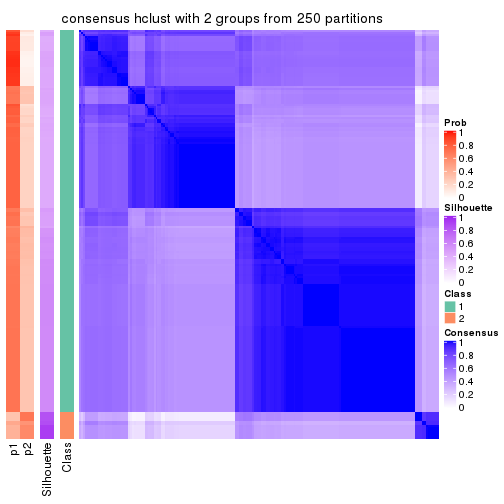</p>

</div>
<div id='tab-SD-hclust-consensus-heatmap-2'>
<pre><code class="r">consensus_heatmap(res, k = 3)
</code></pre>

<p>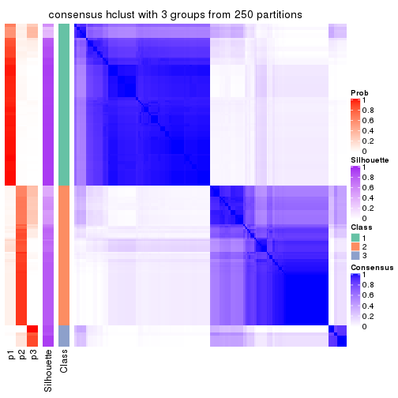</p>

</div>
<div id='tab-SD-hclust-consensus-heatmap-3'>
<pre><code class="r">consensus_heatmap(res, k = 4)
</code></pre>

<p>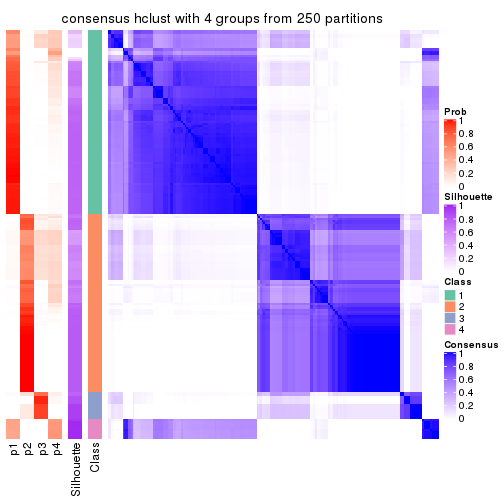</p>

</div>
<div id='tab-SD-hclust-consensus-heatmap-4'>
<pre><code class="r">consensus_heatmap(res, k = 5)
</code></pre>

<p>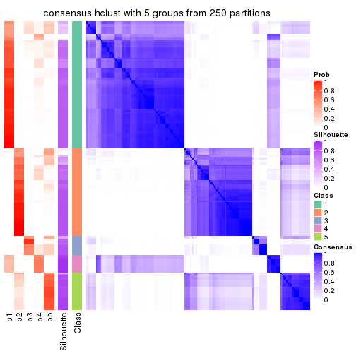</p>

</div>
<div id='tab-SD-hclust-consensus-heatmap-5'>
<pre><code class="r">consensus_heatmap(res, k = 6)
</code></pre>

<p>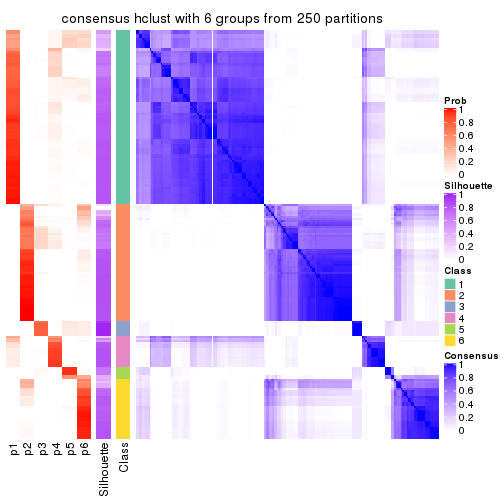</p>

</div>
</div>

Heatmaps for the membership of samples in all partitions to see how consistent they are:


<script>
$( function() {
	$( '#tabs-SD-hclust-membership-heatmap' ).tabs();
} );
</script>
<div id='tabs-SD-hclust-membership-heatmap'>
<ul>
<li><a href='#tab-SD-hclust-membership-heatmap-1'>k = 2</a></li>
<li><a href='#tab-SD-hclust-membership-heatmap-2'>k = 3</a></li>
<li><a href='#tab-SD-hclust-membership-heatmap-3'>k = 4</a></li>
<li><a href='#tab-SD-hclust-membership-heatmap-4'>k = 5</a></li>
<li><a href='#tab-SD-hclust-membership-heatmap-5'>k = 6</a></li>
</ul>
<div id='tab-SD-hclust-membership-heatmap-1'>
<pre><code class="r">membership_heatmap(res, k = 2)
</code></pre>

<p>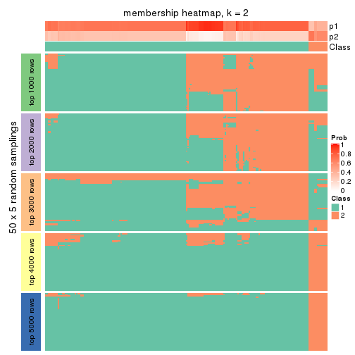</p>

</div>
<div id='tab-SD-hclust-membership-heatmap-2'>
<pre><code class="r">membership_heatmap(res, k = 3)
</code></pre>

<p>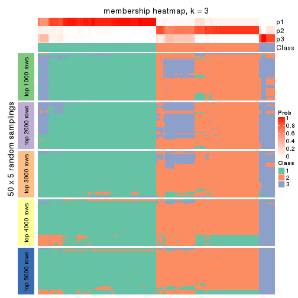</p>

</div>
<div id='tab-SD-hclust-membership-heatmap-3'>
<pre><code class="r">membership_heatmap(res, k = 4)
</code></pre>

<p>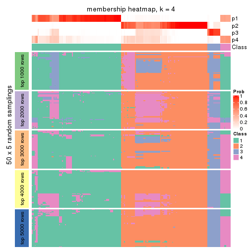</p>

</div>
<div id='tab-SD-hclust-membership-heatmap-4'>
<pre><code class="r">membership_heatmap(res, k = 5)
</code></pre>

<p>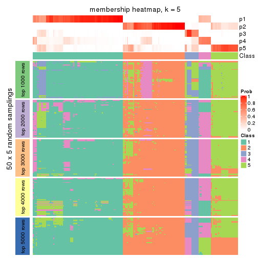</p>

</div>
<div id='tab-SD-hclust-membership-heatmap-5'>
<pre><code class="r">membership_heatmap(res, k = 6)
</code></pre>

<p>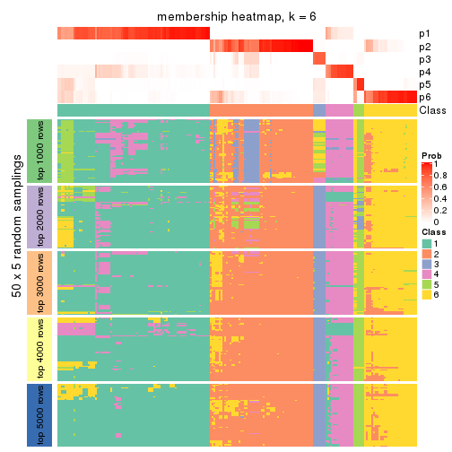</p>

</div>
</div>

As soon as we have had the classes for columns, we can look for signatures
which are significantly different between classes which can be candidate marks
for certain classes. Following are the heatmaps for signatures.


Signature heatmaps where rows are scaled:


<script>
$( function() {
	$( '#tabs-SD-hclust-get-signatures' ).tabs();
} );
</script>
<div id='tabs-SD-hclust-get-signatures'>
<ul>
<li><a href='#tab-SD-hclust-get-signatures-1'>k = 2</a></li>
<li><a href='#tab-SD-hclust-get-signatures-2'>k = 3</a></li>
<li><a href='#tab-SD-hclust-get-signatures-3'>k = 4</a></li>
<li><a href='#tab-SD-hclust-get-signatures-4'>k = 5</a></li>
<li><a href='#tab-SD-hclust-get-signatures-5'>k = 6</a></li>
</ul>
<div id='tab-SD-hclust-get-signatures-1'>
<pre><code class="r">get_signatures(res, k = 2)
</code></pre>

<p>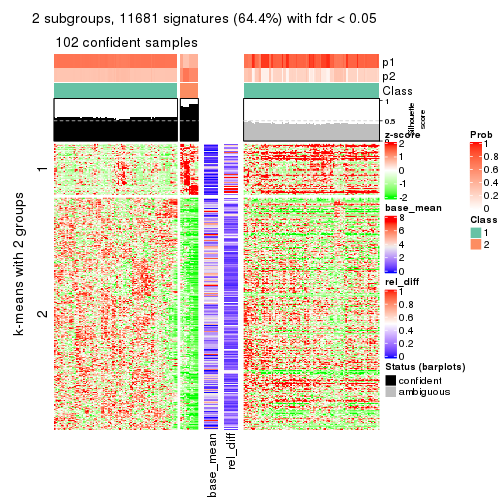</p>

</div>
<div id='tab-SD-hclust-get-signatures-2'>
<pre><code class="r">get_signatures(res, k = 3)
</code></pre>

<p>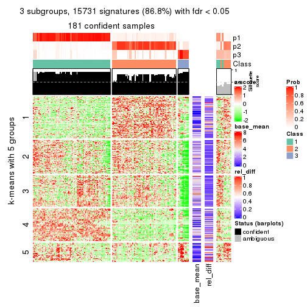</p>

</div>
<div id='tab-SD-hclust-get-signatures-3'>
<pre><code class="r">get_signatures(res, k = 4)
</code></pre>

<p>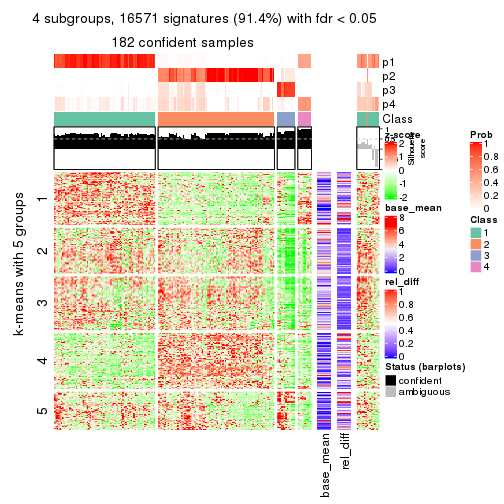</p>

</div>
<div id='tab-SD-hclust-get-signatures-4'>
<pre><code class="r">get_signatures(res, k = 5)
</code></pre>

<p>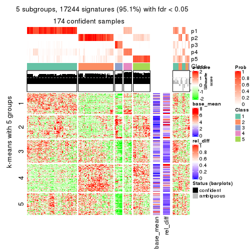</p>

</div>
<div id='tab-SD-hclust-get-signatures-5'>
<pre><code class="r">get_signatures(res, k = 6)
</code></pre>

<p>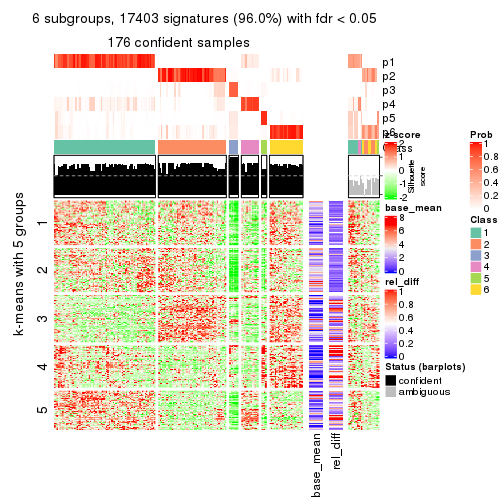</p>

</div>
</div>


Signature heatmaps where rows are not scaled:


<script>
$( function() {
	$( '#tabs-SD-hclust-get-signatures-no-scale' ).tabs();
} );
</script>
<div id='tabs-SD-hclust-get-signatures-no-scale'>
<ul>
<li><a href='#tab-SD-hclust-get-signatures-no-scale-1'>k = 2</a></li>
<li><a href='#tab-SD-hclust-get-signatures-no-scale-2'>k = 3</a></li>
<li><a href='#tab-SD-hclust-get-signatures-no-scale-3'>k = 4</a></li>
<li><a href='#tab-SD-hclust-get-signatures-no-scale-4'>k = 5</a></li>
<li><a href='#tab-SD-hclust-get-signatures-no-scale-5'>k = 6</a></li>
</ul>
<div id='tab-SD-hclust-get-signatures-no-scale-1'>
<pre><code class="r">get_signatures(res, k = 2, scale_rows = FALSE)
</code></pre>

<p>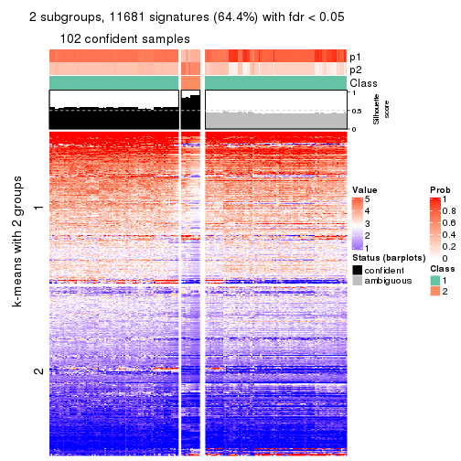</p>

</div>
<div id='tab-SD-hclust-get-signatures-no-scale-2'>
<pre><code class="r">get_signatures(res, k = 3, scale_rows = FALSE)
</code></pre>

<p>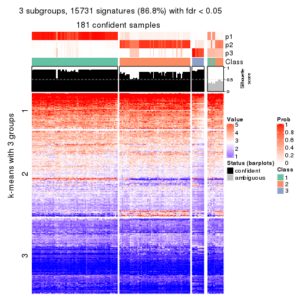</p>

</div>
<div id='tab-SD-hclust-get-signatures-no-scale-3'>
<pre><code class="r">get_signatures(res, k = 4, scale_rows = FALSE)
</code></pre>

<p>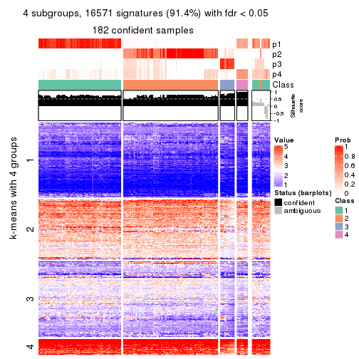</p>

</div>
<div id='tab-SD-hclust-get-signatures-no-scale-4'>
<pre><code class="r">get_signatures(res, k = 5, scale_rows = FALSE)
</code></pre>

<p>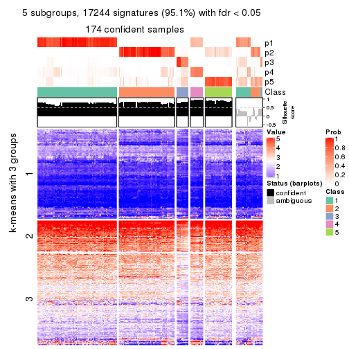</p>

</div>
<div id='tab-SD-hclust-get-signatures-no-scale-5'>
<pre><code class="r">get_signatures(res, k = 6, scale_rows = FALSE)
</code></pre>

<p>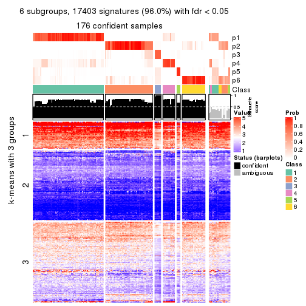</p>

</div>
</div>


Compare the overlap of signatures from different k:

```r
compare_signatures(res)
```

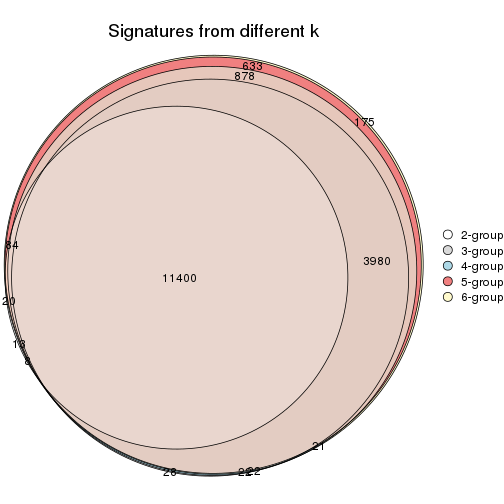

`get_signature()` returns a data frame invisibly. TO get the list of signatures, the function
call should be assigned to a variable explicitly. In following code, if `plot` argument is set
to `FALSE`, no heatmap is plotted while only the differential analysis is performed.

```r
# code only for demonstration
tb = get_signature(res, k = ..., plot = FALSE)
```

An example of the output of `tb` is:

```
#>   which_row         fdr    mean_1    mean_2 scaled_mean_1 scaled_mean_2 km
#> 1        38 0.042760348  8.373488  9.131774    -0.5533452     0.5164555  1
#> 2        40 0.018707592  7.106213  8.469186    -0.6173731     0.5762149  1
#> 3        55 0.019134737 10.221463 11.207825    -0.6159697     0.5749050  1
#> 4        59 0.006059896  5.921854  7.869574    -0.6899429     0.6439467  1
#> 5        60 0.018055526  8.928898 10.211722    -0.6204761     0.5791110  1
#> 6        98 0.009384629 15.714769 14.887706     0.6635654    -0.6193277  2
...
```

The columns in `tb` are:

1. `which_row`: row indices corresponding to the input matrix.
2. `fdr`: FDR for the differential test. 
3. `mean_x`: The mean value in group x.
4. `scaled_mean_x`: The mean value in group x after rows are scaled.
5. `km`: Row groups if k-means clustering is applied to rows.


UMAP plot which shows how samples are separated.


<script>
$( function() {
	$( '#tabs-SD-hclust-dimension-reduction' ).tabs();
} );
</script>
<div id='tabs-SD-hclust-dimension-reduction'>
<ul>
<li><a href='#tab-SD-hclust-dimension-reduction-1'>k = 2</a></li>
<li><a href='#tab-SD-hclust-dimension-reduction-2'>k = 3</a></li>
<li><a href='#tab-SD-hclust-dimension-reduction-3'>k = 4</a></li>
<li><a href='#tab-SD-hclust-dimension-reduction-4'>k = 5</a></li>
<li><a href='#tab-SD-hclust-dimension-reduction-5'>k = 6</a></li>
</ul>
<div id='tab-SD-hclust-dimension-reduction-1'>
<pre><code class="r">dimension_reduction(res, k = 2, method = &quot;UMAP&quot;)
</code></pre>

<p>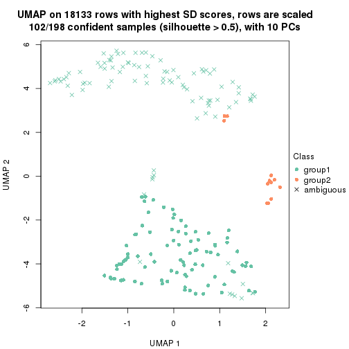</p>

</div>
<div id='tab-SD-hclust-dimension-reduction-2'>
<pre><code class="r">dimension_reduction(res, k = 3, method = &quot;UMAP&quot;)
</code></pre>

<p>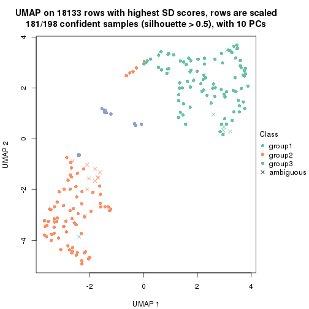</p>

</div>
<div id='tab-SD-hclust-dimension-reduction-3'>
<pre><code class="r">dimension_reduction(res, k = 4, method = &quot;UMAP&quot;)
</code></pre>

<p>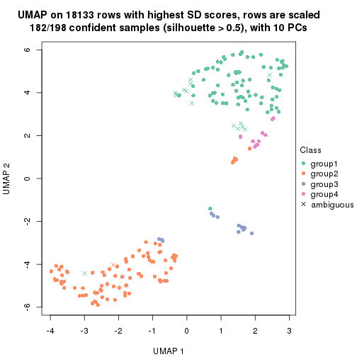</p>

</div>
<div id='tab-SD-hclust-dimension-reduction-4'>
<pre><code class="r">dimension_reduction(res, k = 5, method = &quot;UMAP&quot;)
</code></pre>

<p>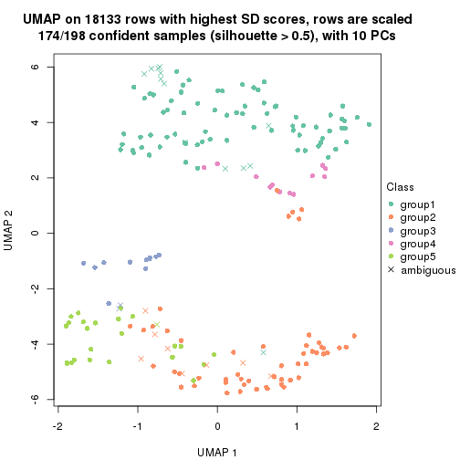</p>

</div>
<div id='tab-SD-hclust-dimension-reduction-5'>
<pre><code class="r">dimension_reduction(res, k = 6, method = &quot;UMAP&quot;)
</code></pre>

<p>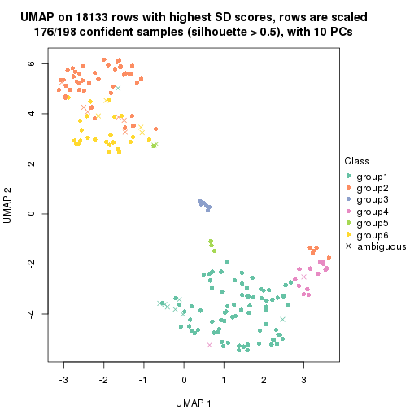</p>

</div>
</div>


Following heatmap shows how subgroups are split when increasing `k`:

```r
collect_classes(res)
```

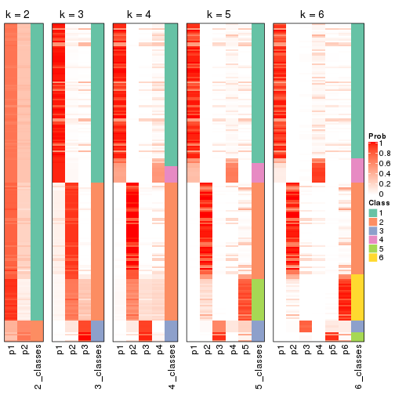


If matrix rows can be associated to genes, consider to use `functional_enrichment(res,
...)` to perform function enrichment for the signature genes. See [this vignette](http://bioconductor.org/packages/devel/bioc/vignettes/cola/inst/doc/functional_enrichment.html) for more detailed explanations.


 

---------------------------------------------------


### SD:kmeans**


The object with results only for a single top-value method and a single partition method 
can be extracted as:

```r
res = res_list["SD", "kmeans"]
# you can also extract it by
# res = res_list["SD:kmeans"]
```

A summary of `res` and all the functions that can be applied to it:

```r
res
```

```
#> A 'ConsensusPartition' object with k = 2, 3, 4, 5, 6.
#>   On a matrix with 18133 rows and 198 columns.
#>   Top rows (1000, 2000, 3000, 4000, 5000) are extracted by 'SD' method.
#>   Subgroups are detected by 'kmeans' method.
#>   Performed in total 1250 partitions by row resampling.
#>   Best k for subgroups seems to be 2.
#> 
#> Following methods can be applied to this 'ConsensusPartition' object:
#>  [1] "cola_report"             "collect_classes"         "collect_plots"          
#>  [4] "collect_stats"           "colnames"                "compare_signatures"     
#>  [7] "consensus_heatmap"       "dimension_reduction"     "functional_enrichment"  
#> [10] "get_anno_col"            "get_anno"                "get_classes"            
#> [13] "get_consensus"           "get_matrix"              "get_membership"         
#> [16] "get_param"               "get_signatures"          "get_stats"              
#> [19] "is_best_k"               "is_stable_k"             "membership_heatmap"     
#> [22] "ncol"                    "nrow"                    "plot_ecdf"              
#> [25] "rownames"                "select_partition_number" "show"                   
#> [28] "suggest_best_k"          "test_to_known_factors"
```

`collect_plots()` function collects all the plots made from `res` for all `k` (number of partitions)
into one single page to provide an easy and fast comparison between different `k`.

```r
collect_plots(res)
```

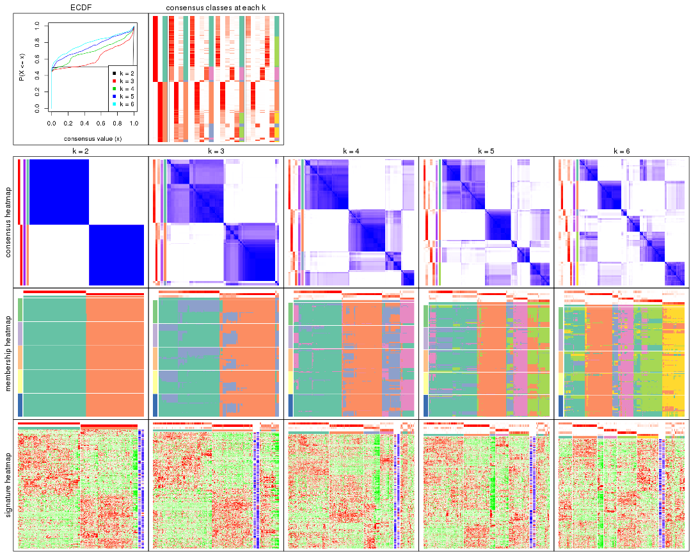

The plots are:

- The first row: a plot of the ECDF (empirical cumulative distribution
  function) curves of the consensus matrix for each `k` and the heatmap of
  predicted classes for each `k`.
- The second row: heatmaps of the consensus matrix for each `k`.
- The third row: heatmaps of the membership matrix for each `k`.
- The fouth row: heatmaps of the signatures for each `k`.

All the plots in panels can be made by individual functions and they are
plotted later in this section.

`select_partition_number()` produces several plots showing different
statistics for choosing "optimized" `k`. There are following statistics:

- ECDF curves of the consensus matrix for each `k`;
- 1-PAC. [The PAC
  score](https://en.wikipedia.org/wiki/Consensus_clustering#Over-interpretation_potential_of_consensus_clustering)
  measures the proportion of the ambiguous subgrouping.
- Mean silhouette score.
- Concordance. The mean probability of fiting the consensus class ids in all
  partitions.
- Area increased. Denote $A_k$ as the area under the ECDF curve for current
  `k`, the area increased is defined as $A_k - A_{k-1}$.
- Rand index. The percent of pairs of samples that are both in a same cluster
  or both are not in a same cluster in the partition of k and k-1.
- Jaccard index. The ratio of pairs of samples are both in a same cluster in
  the partition of k and k-1 and the pairs of samples are both in a same
  cluster in the partition k or k-1.

The detailed explanations of these statistics can be found in [the _cola_
vignette](http://bioconductor.org/packages/devel/bioc/vignettes/cola/inst/doc/cola.html#toc_13).

Generally speaking, lower PAC score, higher mean silhouette score or higher
concordance corresponds to better partition. Rand index and Jaccard index
measure how similar the current partition is compared to partition with `k-1`.
If they are too similar, we won't accept `k` is better than `k-1`.

```r
select_partition_number(res)
```

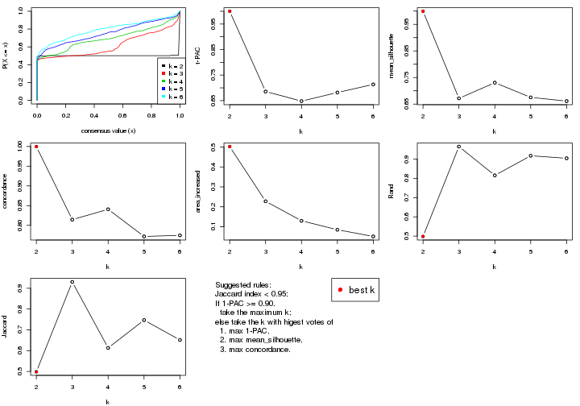

The numeric values for all these statistics can be obtained by `get_stats()`.

```r
get_stats(res)
```

```
#>   k 1-PAC mean_silhouette concordance area_increased  Rand Jaccard
#> 2 2 1.000           0.999       1.000         0.5022 0.498   0.498
#> 3 3 0.685           0.672       0.815         0.2277 0.965   0.931
#> 4 4 0.648           0.731       0.841         0.1297 0.816   0.613
#> 5 5 0.682           0.675       0.772         0.0849 0.918   0.747
#> 6 6 0.713           0.661       0.775         0.0513 0.905   0.651
```

`suggest_best_k()` suggests the best $k$ based on these statistics. The rules are as follows:

- All $k$ with Jaccard index larger than 0.95 are removed because increasing
  $k$ does not provide enough extra information. If all $k$ are removed, it is
  marked as no subgroup is detected.
- For all $k$ with 1-PAC score larger than 0.9, the maximal $k$ is taken as
  the best $k$, and other $k$ are marked as optional $k$.
- If it does not fit the second rule. The $k$ with the maximal vote of the
  highest 1-PAC score, highest mean silhouette, and highest concordance is
  taken as the best $k$.

```r
suggest_best_k(res)
```

```
#> [1] 2
```


Following shows the table of the partitions (You need to click the **show/hide
code output** link to see it). The membership matrix (columns with name `p*`)
is inferred by
[`clue::cl_consensus()`](https://www.rdocumentation.org/link/cl_consensus?package=clue)
function with the `SE` method. Basically the value in the membership matrix
represents the probability to belong to a certain group. The finall class
label for an item is determined with the group with highest probability it
belongs to.

In `get_classes()` function, the entropy is calculated from the membership
matrix and the silhouette score is calculated from the consensus matrix.


<script>
$( function() {
	$( '#tabs-SD-kmeans-get-classes' ).tabs();
} );
</script>
<div id='tabs-SD-kmeans-get-classes'>
<ul>
<li><a href='#tab-SD-kmeans-get-classes-1'>k = 2</a></li>
<li><a href='#tab-SD-kmeans-get-classes-2'>k = 3</a></li>
<li><a href='#tab-SD-kmeans-get-classes-3'>k = 4</a></li>
<li><a href='#tab-SD-kmeans-get-classes-4'>k = 5</a></li>
<li><a href='#tab-SD-kmeans-get-classes-5'>k = 6</a></li>
</ul>

<div id='tab-SD-kmeans-get-classes-1'>
<p><a id='tab-SD-kmeans-get-classes-1-a' style='color:#0366d6' href='#'>show/hide code output</a></p>
<pre><code class="r">cbind(get_classes(res, k = 2), get_membership(res, k = 2))
</code></pre>

<pre><code>#&gt;                                      class entropy silhouette    p1    p2
#&gt; 0C0AA0B2-5191-4EDF-8937-ED7434F30283     2  0.0000      0.999 0.000 1.000
#&gt; 18B45F1F-234F-45CC-A234-145307606C5C     1  0.0000      1.000 1.000 0.000
#&gt; E18B70C0-BDCA-46D3-99BB-C6C8ABC68DA5     2  0.0000      0.999 0.000 1.000
#&gt; 0F6DDBA7-6F74-45E8-95C8-F28263D55978     1  0.0000      1.000 1.000 0.000
#&gt; 7EAE1A5A-129A-46DE-977E-A2C753F10904     2  0.0000      0.999 0.000 1.000
#&gt; 7EAE0048-16B5-4979-9410-16CDEB9B1A48     1  0.0000      1.000 1.000 0.000
#&gt; 2EBFC828-2B27-4753-A052-80DDA226DAB4     2  0.0000      0.999 0.000 1.000
#&gt; 24E1768D-2232-41DA-9383-BC55D6EB3812     2  0.0000      0.999 0.000 1.000
#&gt; 6E3CD60A-1889-4CA3-B305-2E78152057B5     2  0.0000      0.999 0.000 1.000
#&gt; 33CC70DD-82B3-413C-B3B1-BE06634D95D0     1  0.0000      1.000 1.000 0.000
#&gt; F1CB57A3-55DD-4487-9307-1B4F652E729A     1  0.0000      1.000 1.000 0.000
#&gt; 755A5806-B054-449A-93DB-79909E6C93A1     1  0.0000      1.000 1.000 0.000
#&gt; 58D364E7-3D2F-468F-A264-D6461E2428D4     2  0.0000      0.999 0.000 1.000
#&gt; 68BB9CB6-7AA2-4981-B9D9-07363EC96599     2  0.0000      0.999 0.000 1.000
#&gt; 3C4E8DFA-8EA0-4F1F-89CB-CB8805395872     2  0.0000      0.999 0.000 1.000
#&gt; 4219651D-5583-4498-BF08-1B7D04B4C7B2     1  0.0000      1.000 1.000 0.000
#&gt; B5EE2768-0D67-4584-ADBC-EC745FEC52EA     2  0.0000      0.999 0.000 1.000
#&gt; 825E6C11-F460-451A-8045-846DD7D0E945     1  0.0000      1.000 1.000 0.000
#&gt; 491F62AF-5E68-43C3-982A-F867A75BBA9A     2  0.0000      0.999 0.000 1.000
#&gt; 9D7F058C-F95A-44AD-AC9E-450F7FBDC960     2  0.0000      0.999 0.000 1.000
#&gt; 6D42DD0C-2081-4742-BA27-9F5F16FAC3C6     1  0.0000      1.000 1.000 0.000
#&gt; EDD7E63D-492A-473B-A552-0764337B10EF     2  0.0000      0.999 0.000 1.000
#&gt; 97073DEA-73AD-4DFD-BD1A-9035DC03445B     1  0.0000      1.000 1.000 0.000
#&gt; FA891AB9-CE38-4F7E-A015-1DDCE12890A0     1  0.0000      1.000 1.000 0.000
#&gt; D9514D49-A0AE-45AB-8C9F-68E726215253     1  0.0000      1.000 1.000 0.000
#&gt; 3B9229AD-12E5-451E-9D2F-378AAC82C04A     2  0.0000      0.999 0.000 1.000
#&gt; 5EA36B71-4917-4EF3-9060-065EFE6ACC5B     1  0.0000      1.000 1.000 0.000
#&gt; A20E4ECB-4895-4CC7-BE5E-4721B20D933B     1  0.0000      1.000 1.000 0.000
#&gt; 1BE8D828-29DB-4368-AA4A-FB23588F7AE8     1  0.0000      1.000 1.000 0.000
#&gt; 66EFEFCF-3D14-4DBF-AA13-530F40ED0245     1  0.0000      1.000 1.000 0.000
#&gt; 55DFFE53-BCE7-4EC1-9863-6C0311B06BA2     2  0.0000      0.999 0.000 1.000
#&gt; 4CC3FB5A-611D-4C64-AE9D-544FA45CF4DC     1  0.0000      1.000 1.000 0.000
#&gt; C11D33F2-DFE9-4FA8-9024-F3E7F1DADC5F     2  0.0000      0.999 0.000 1.000
#&gt; FA5932B8-8AA3-4C38-9FAB-C35D8772974D     1  0.0000      1.000 1.000 0.000
#&gt; 8216EC35-1F41-4A15-B503-BDA4971E27C9     1  0.0000      1.000 1.000 0.000
#&gt; 69635D23-90A7-4BAD-97C7-B79536837F57     1  0.0000      1.000 1.000 0.000
#&gt; 12B404E2-C463-4409-8392-E4649B2AFFD1     2  0.0000      0.999 0.000 1.000
#&gt; 246927E3-ACCF-41B2-AA8E-43855FD6B146     2  0.0000      0.999 0.000 1.000
#&gt; E0CC13E7-9607-49E0-B4AA-395544E3C3BF     1  0.0000      1.000 1.000 0.000
#&gt; F7BBC0C1-6124-4A83-8A70-EA89B62F1CBD     1  0.0000      1.000 1.000 0.000
#&gt; B1D4FF24-8E6F-4A04-B716-2032D850EB57     1  0.0000      1.000 1.000 0.000
#&gt; 253601DB-B78A-4566-9947-8C0270C0B163     2  0.0000      0.999 0.000 1.000
#&gt; AB83DBFF-5737-4FB8-A5AC-1D3CD6072BDF     2  0.0376      0.995 0.004 0.996
#&gt; 9D67D953-EC98-4B72-89C8-5732BC9D4BC9     2  0.0000      0.999 0.000 1.000
#&gt; 51061018-95AB-4278-886F-F69E4EBC47C0     2  0.0000      0.999 0.000 1.000
#&gt; ABD0F7F3-105B-4DEE-9889-5028772C519A     1  0.0000      1.000 1.000 0.000
#&gt; 562B95CF-B27E-4A72-B7C6-CDF86A51A39B     1  0.0000      1.000 1.000 0.000
#&gt; ABF046A4-D7A1-49FF-B6B1-4E07A791DEDB     2  0.0000      0.999 0.000 1.000
#&gt; 3FF4101E-9703-460E-A30E-76CC7689F36D     2  0.0000      0.999 0.000 1.000
#&gt; 39C4F7AA-7ADF-4F1D-BDA3-BEC605AC5023     2  0.0000      0.999 0.000 1.000
#&gt; CB821FD2-AF5C-4743-A70F-21C12C6ED153     1  0.0000      1.000 1.000 0.000
#&gt; 92EA1846-62FF-41D5-A441-5E52E6B9E7F9     1  0.0000      1.000 1.000 0.000
#&gt; 7D25F3EE-5A20-4763-8026-16A03D05F459     1  0.0000      1.000 1.000 0.000
#&gt; 8ECE5276-CD06-496B-A5A9-1713B1F7D089     1  0.0000      1.000 1.000 0.000
#&gt; C775B68F-9507-47E3-B507-B433AED79002     1  0.0000      1.000 1.000 0.000
#&gt; E19D5463-FDD0-41C1-A170-323736A88D07     2  0.0000      0.999 0.000 1.000
#&gt; CE4B6285-4961-4767-91F0-5C7A8162E185     1  0.0000      1.000 1.000 0.000
#&gt; 9637BD72-1FEF-42AD-8886-2C39BE876531     1  0.0000      1.000 1.000 0.000
#&gt; 81B5A88E-45A0-4B44-B689-B9071B8548EE     2  0.0000      0.999 0.000 1.000
#&gt; 0B01B4C9-9BED-4F5B-A3E2-8868C7CCC3FC     2  0.0000      0.999 0.000 1.000
#&gt; 54501315-7132-44B2-A179-10FBF1421105     1  0.0000      1.000 1.000 0.000
#&gt; E207CBE9-4C3A-4FDD-9251-CFE1FE106475     1  0.0000      1.000 1.000 0.000
#&gt; 3BEA0B92-3F90-4DBF-9679-AADEAD7D47C8     2  0.0000      0.999 0.000 1.000
#&gt; 35B32250-D854-4215-AA5B-2C11B2FBEECA     1  0.0000      1.000 1.000 0.000
#&gt; ACE6566B-AEB9-426C-924A-B382D14A1024     2  0.0000      0.999 0.000 1.000
#&gt; 737E69AC-0930-45B9-B6BA-7CE5E300290B     1  0.0000      1.000 1.000 0.000
#&gt; B4410AB8-D015-41CA-86E6-12EB4E4103E3     1  0.0000      1.000 1.000 0.000
#&gt; 6D3ECA65-C50F-43B0-B75A-1D290FA4A8FD     2  0.0000      0.999 0.000 1.000
#&gt; C86F40D3-9A96-4395-A8C3-510DE12F9A2B     2  0.0000      0.999 0.000 1.000
#&gt; 6238087F-24DD-4BF1-903F-3BD4E446C1AE     2  0.0000      0.999 0.000 1.000
#&gt; E4FF840B-EEAB-4CB0-A690-7D4C4AA7EEC3     2  0.0000      0.999 0.000 1.000
#&gt; 72D3C323-C67F-4C0E-9BFC-BF245FF9730A     1  0.0000      1.000 1.000 0.000
#&gt; 82D56E4E-4DF6-4F3E-8959-B995C92AAA70     1  0.0000      1.000 1.000 0.000
#&gt; E31CA441-EB19-443B-ACBD-37B5CCBCF0E5     2  0.0000      0.999 0.000 1.000
#&gt; 87CA8939-D054-4B8A-B32D-085FD2E8F202     1  0.0000      1.000 1.000 0.000
#&gt; 2A508D90-FEDC-46A3-9A02-E51E5467CDCB     1  0.0000      1.000 1.000 0.000
#&gt; C4E8B4E2-388B-411F-BF0A-9B6F34E8EDB5     2  0.0000      0.999 0.000 1.000
#&gt; AF6AF803-BD93-44A7-AA80-B9BC92C1273B     2  0.0000      0.999 0.000 1.000
#&gt; 0B1CA5CF-EB96-41D4-BFC5-6957FEB39828     1  0.0000      1.000 1.000 0.000
#&gt; 6FB96FB0-6661-48AD-A4A0-69F8AFDBE591     2  0.0000      0.999 0.000 1.000
#&gt; 8C19F7FD-368A-462B-B28F-88D6630038A1     1  0.0000      1.000 1.000 0.000
#&gt; 96EABE78-C2F4-4A33-ACD8-C922A4B2519B     2  0.0000      0.999 0.000 1.000
#&gt; 68B36D7B-546A-4689-949F-B207C4A4AB27     2  0.0000      0.999 0.000 1.000
#&gt; CE9F3335-778F-4F52-BC55-4B7C99B211DD     2  0.0000      0.999 0.000 1.000
#&gt; CB359DED-2A2D-4646-A0BD-6F10ADCC532B     1  0.0000      1.000 1.000 0.000
#&gt; 198324A5-8C52-46F6-9734-EFAF1CCA6D9B     1  0.0000      1.000 1.000 0.000
#&gt; 83B88608-0506-428C-B9E8-621F38477B42     1  0.0000      1.000 1.000 0.000
#&gt; 1993630A-0F3D-4F5C-86A3-D443BAAF57F0     1  0.0000      1.000 1.000 0.000
#&gt; DE73DA9B-529E-4F4F-A65C-DA7AB84B1096     1  0.0000      1.000 1.000 0.000
#&gt; 2347F3B7-DDA3-40C0-B6D4-8819ECA69146     1  0.0000      1.000 1.000 0.000
#&gt; AB93B5D5-095F-4330-9D40-6A3D934AB50C     1  0.0000      1.000 1.000 0.000
#&gt; 5EBBE4AD-FF0C-41CF-9EA3-B6FE7EA1F9C0     1  0.0000      1.000 1.000 0.000
#&gt; 6D960AE7-3769-4144-A061-E8588E5063FF     1  0.0000      1.000 1.000 0.000
#&gt; 0C2DD8C0-D1A5-4192-A49C-7A40FED628B2     2  0.0000      0.999 0.000 1.000
#&gt; 18C9372F-C55B-4F86-A9D2-E8D85EFC8566     2  0.3431      0.932 0.064 0.936
#&gt; 9AF637B0-4C32-4DD1-93AF-7655B4A845D3     2  0.0000      0.999 0.000 1.000
#&gt; 785B5B06-4115-46FD-9BEB-F888AFDC855D     2  0.0000      0.999 0.000 1.000
#&gt; ECA3050E-4BE2-4117-B9CF-A52BB85AF8C2     2  0.0000      0.999 0.000 1.000
#&gt; 099DC396-16A5-458F-9ED9-F2A790CB0C34     1  0.0000      1.000 1.000 0.000
#&gt; 7A5A12EE-C5B0-4C51-8C99-0F3FA88D633E     1  0.0000      1.000 1.000 0.000
#&gt; E832B508-A66D-4817-B44A-FE9FAAE64B4A     1  0.0000      1.000 1.000 0.000
#&gt; F9DD688C-7B35-49E7-9651-2E098EE78856     1  0.0000      1.000 1.000 0.000
#&gt; F1265DD8-5ED3-4635-A277-57BBFDEC7729     1  0.0000      1.000 1.000 0.000
#&gt; F624E8D9-DB07-4C9E-910D-5E8EBA3A6167     2  0.0000      0.999 0.000 1.000
#&gt; 3516FBDF-66E1-43F4-9D7B-16748F6439A7     2  0.0000      0.999 0.000 1.000
#&gt; 04B12992-B2EA-4BA2-8E2C-11E34E230E6F     2  0.0000      0.999 0.000 1.000
#&gt; CC02897D-9123-495E-9242-5C9CF4EC269B     2  0.0000      0.999 0.000 1.000
#&gt; 3117ED46-2BF2-4311-BC00-4E98243E16B3     1  0.0000      1.000 1.000 0.000
#&gt; E0B66D53-23DB-4E26-BB6E-F692FA8C000E     1  0.0000      1.000 1.000 0.000
#&gt; DAA93CE5-A013-477A-9A50-EA09CC3A8162     2  0.0000      0.999 0.000 1.000
#&gt; 0099098D-354A-4276-92F8-B932C74B4608     1  0.0000      1.000 1.000 0.000
#&gt; DD483639-B2E7-4745-BCFB-55ED1D82BFBF     2  0.0000      0.999 0.000 1.000
#&gt; 2C1F9079-602E-4252-82C7-9D8799E04246     2  0.0000      0.999 0.000 1.000
#&gt; 9473A8E4-3A1B-4184-9EA6-517AFD60B635     1  0.0000      1.000 1.000 0.000
#&gt; 75CFBAF6-7BA0-40AF-92D7-D218E885BD1B     2  0.0000      0.999 0.000 1.000
#&gt; B588950F-14D6-41C8-845B-EFD2096013C6     2  0.0000      0.999 0.000 1.000
#&gt; 0DF3EDA8-DAEA-4721-92AB-B97181249498     2  0.0000      0.999 0.000 1.000
#&gt; 8EA83042-D598-401D-AD78-936EEB136C59     1  0.0000      1.000 1.000 0.000
#&gt; 729AC418-3BE9-445A-95D4-AC11A7D43BE0     1  0.0000      1.000 1.000 0.000
#&gt; 7D8B1B11-F576-4AA8-BFA7-0022A2CD829A     2  0.0000      0.999 0.000 1.000
#&gt; 304A0E46-3449-4B44-9C30-BDDF6459391D     1  0.0000      1.000 1.000 0.000
#&gt; 3C83358F-DF20-47F7-AF9F-AB7CC92F5ABA     1  0.0000      1.000 1.000 0.000
#&gt; EAFEED6C-35C3-451F-AE4A-EB56992E1F29     1  0.0000      1.000 1.000 0.000
#&gt; 8A237A65-28EC-434D-A78A-A8B7308B5204     1  0.0000      1.000 1.000 0.000
#&gt; D005833F-E991-4E9E-9667-55F137288004     1  0.0000      1.000 1.000 0.000
#&gt; 37D966E3-253E-4397-A9AE-0903A8D31FE6     1  0.0000      1.000 1.000 0.000
#&gt; D2482B81-CB5B-4178-BA8D-1CF4026181B5     1  0.0000      1.000 1.000 0.000
#&gt; 18019E95-C2A8-4EE7-B585-F6886DC4D953     2  0.0000      0.999 0.000 1.000
#&gt; 0B126D1A-14A8-4345-8F78-FF92222ADF4C     2  0.0000      0.999 0.000 1.000
#&gt; CE88B625-47D8-4D58-9FB4-23464DB7DDAD     2  0.0000      0.999 0.000 1.000
#&gt; 9A88299D-5C74-47FA-B42C-1A1D6D935AAB     1  0.0000      1.000 1.000 0.000
#&gt; 3E71159C-FD6C-41DA-B18B-0730C8AC7E41     1  0.0000      1.000 1.000 0.000
#&gt; 6F245AA4-79D9-47E1-BCC9-1AAF65AEA813     1  0.0000      1.000 1.000 0.000
#&gt; 4CF2C888-2100-483A-B4DB-ECBB69243A4D     2  0.0000      0.999 0.000 1.000
#&gt; A3853813-B9D5-4E8C-B075-19FCC35F8686     2  0.0000      0.999 0.000 1.000
#&gt; 83A16DEE-CE9F-4D8B-9225-0A2A8B9D055D     1  0.0000      1.000 1.000 0.000
#&gt; 0F057CAF-4F9A-4DE9-8601-730E96873733     2  0.0000      0.999 0.000 1.000
#&gt; 32D5801D-DBA4-422E-87CB-A2DDE921BA41     1  0.0000      1.000 1.000 0.000
#&gt; 22EE8076-F07C-499A-9AF8-D800A77EF154     2  0.0000      0.999 0.000 1.000
#&gt; DD4BD74D-D48C-4090-9F57-5334E784581C     1  0.0000      1.000 1.000 0.000
#&gt; 41183565-434D-474C-B1BD-CA6E94910658     2  0.0000      0.999 0.000 1.000
#&gt; 75A2CE41-2B2A-4346-927E-ACF8A72738E4     1  0.0000      1.000 1.000 0.000
#&gt; 7AA24995-3DD2-4682-B36A-4EBFEEACF625     1  0.0000      1.000 1.000 0.000
#&gt; 8BAFDFEC-9F26-4ADB-95CE-004143960EEB     1  0.0000      1.000 1.000 0.000
#&gt; A330E011-CE08-4A85-8F4B-370592293DBB     1  0.0000      1.000 1.000 0.000
#&gt; 1D5A5B17-2E70-4BB0-94A1-EC17E6EA49DB     1  0.0000      1.000 1.000 0.000
#&gt; BD9143B8-9D97-4A05-872C-3FB82B4CF7BE     2  0.0000      0.999 0.000 1.000
#&gt; 64552DC0-181E-4607-898C-787AA7F26435     2  0.0000      0.999 0.000 1.000
#&gt; 1B4C4D41-34C7-43A3-858B-C9552EB53894     1  0.0000      1.000 1.000 0.000
#&gt; 463A3BAA-02DC-4EA4-A644-B924163E425D     2  0.0000      0.999 0.000 1.000
#&gt; CD0FEA89-6F60-4A20-8FCA-D397B4E95A98     1  0.0000      1.000 1.000 0.000
#&gt; 5D06CF6D-F4B9-4B32-B055-8AB287E53340     2  0.0000      0.999 0.000 1.000
#&gt; ADA7835F-DB67-4F4F-9446-8BCE3C5FE936     2  0.0000      0.999 0.000 1.000
#&gt; 4109BE2D-B5DF-4BD7-860E-60D87F647152     2  0.0000      0.999 0.000 1.000
#&gt; 88526A0E-6DFE-46CB-BFAD-B4826F482C67     1  0.0000      1.000 1.000 0.000
#&gt; F39F9A4C-18F7-4017-AB31-85D52FF44587     2  0.0000      0.999 0.000 1.000
#&gt; D4290A5E-1B24-4C55-B470-0FA7A0A09DD0     2  0.0000      0.999 0.000 1.000
#&gt; DC5A2C9E-978F-4661-B729-1F9662976E27     1  0.0000      1.000 1.000 0.000
#&gt; 26A1F392-CED2-43E3-8096-74E6F2BFC8C0     2  0.0000      0.999 0.000 1.000
#&gt; 87D81FB2-306A-4E75-9D58-D5F48E46E7F6     2  0.0000      0.999 0.000 1.000
#&gt; E3D9D81A-C20C-4B3B-B940-A5D2C5F65B22     2  0.0000      0.999 0.000 1.000
#&gt; 4464650B-453F-476C-989C-B7B159BF2CF0     2  0.0000      0.999 0.000 1.000
#&gt; 577D2867-B738-487A-9B06-07958D647F02     1  0.0000      1.000 1.000 0.000
#&gt; E52A22CC-3C03-41A9-9541-220DD871E162     2  0.0000      0.999 0.000 1.000
#&gt; 642703B1-AF99-4746-A915-0792F4B9590B     2  0.0000      0.999 0.000 1.000
#&gt; 8F0D1792-1284-45E6-8EC4-392596057677     2  0.0000      0.999 0.000 1.000
#&gt; 765AFFC1-D528-4494-8BA1-0706451E4205     2  0.0000      0.999 0.000 1.000
#&gt; A716BC29-161F-4CA0-B240-00B330137F2C     1  0.0000      1.000 1.000 0.000
#&gt; 32CBFBAF-7064-4595-8D54-2C5E7DE0FD9B     1  0.0000      1.000 1.000 0.000
#&gt; 4D6ED28C-3F20-41B0-BA41-1BF0E5199A40     2  0.0000      0.999 0.000 1.000
#&gt; 86A38456-2900-48FB-B10F-79222B3CA9BF     1  0.0000      1.000 1.000 0.000
#&gt; E870807D-3223-4A6A-9E3D-F4461B048AA2     2  0.0000      0.999 0.000 1.000
#&gt; 3A78D19F-A833-4D2C-8387-FB4FD4A8313C     1  0.0000      1.000 1.000 0.000
#&gt; DFA162CA-C708-4121-8E74-F9C4DEE0CDAE     1  0.0000      1.000 1.000 0.000
#&gt; C00A300A-CD10-4C9D-8C94-3901AFE8406C     2  0.0000      0.999 0.000 1.000
#&gt; 13E11D15-A90F-48C4-980A-DD032C00A2C1     1  0.0000      1.000 1.000 0.000
#&gt; 31BF80AB-FEDB-4C73-89C3-70BE9F9ACBEE     2  0.0000      0.999 0.000 1.000
#&gt; FA34308A-349D-4AAD-94CF-3F3B7F9AD629     2  0.0000      0.999 0.000 1.000
#&gt; 7C48D467-B663-49DD-BC84-A36BC32ACB3D     1  0.0000      1.000 1.000 0.000
#&gt; BB068534-04F6-4FC9-9087-CDA65920BCE2     1  0.0000      1.000 1.000 0.000
#&gt; EA4EC272-A9B3-4B2E-955F-19F7676A944C     2  0.0000      0.999 0.000 1.000
#&gt; C71FF69B-A460-43CA-8769-9667F22D938B     1  0.0000      1.000 1.000 0.000
#&gt; 5243D1B8-8168-4FF1-A8C6-505F080EF0D3     2  0.0000      0.999 0.000 1.000
#&gt; BCC474D8-08FE-4E99-B8E8-B29E65F84D2E     1  0.0000      1.000 1.000 0.000
#&gt; 04FDBFE3-4CF6-4E53-A2AA-89D5C9316377     2  0.0000      0.999 0.000 1.000
#&gt; 83A9915C-8D60-4CAE-A868-B61E3C90C7B0     2  0.0000      0.999 0.000 1.000
#&gt; 989A6472-E3E3-457A-97BE-CCE95F42D5C2     2  0.0000      0.999 0.000 1.000
#&gt; A0AB2D28-6751-49C9-8DF4-66FDBF95C360     1  0.0000      1.000 1.000 0.000
#&gt; A12B2683-18D4-41C9-8AE5-C143E2180052     1  0.0000      1.000 1.000 0.000
#&gt; 8DE1E245-CAD2-4F11-BFA2-9792C433A00B     1  0.0000      1.000 1.000 0.000
#&gt; FDA68036-6C4C-4256-9AA0-C01FE92AA098     2  0.0000      0.999 0.000 1.000
#&gt; 26311920-1414-4EC1-870B-784961EBCC2D     1  0.0000      1.000 1.000 0.000
#&gt; C29A10D6-D598-4286-B5E0-F1776E19E988     1  0.0000      1.000 1.000 0.000
#&gt; FACCC1FB-4937-4CC0-90EA-7F91D3D939CF     2  0.0000      0.999 0.000 1.000
#&gt; 90B9D84B-78E5-4C7E-8414-EC889C2DE8DB     2  0.0000      0.999 0.000 1.000
#&gt; B74E6122-76E1-4E4D-A867-BCAFD7277393     1  0.0000      1.000 1.000 0.000
#&gt; 98494DC0-CF6E-485F-8A0D-D80E4437EF5C     2  0.0000      0.999 0.000 1.000
#&gt; DA114DAC-DE7B-4E43-8D7C-82C5D7B66411     1  0.0000      1.000 1.000 0.000
</code></pre>

<script>
$('#tab-SD-kmeans-get-classes-1-a').parent().next().next().hide();
$('#tab-SD-kmeans-get-classes-1-a').click(function(){
  $('#tab-SD-kmeans-get-classes-1-a').parent().next().next().toggle();
  return(false);
});
</script>
</div>

<div id='tab-SD-kmeans-get-classes-2'>
<p><a id='tab-SD-kmeans-get-classes-2-a' style='color:#0366d6' href='#'>show/hide code output</a></p>
<pre><code class="r">cbind(get_classes(res, k = 3), get_membership(res, k = 3))
</code></pre>

<pre><code>#&gt;                                      class entropy silhouette    p1    p2    p3
#&gt; 0C0AA0B2-5191-4EDF-8937-ED7434F30283     2  0.0000     0.8224 0.000 1.000 0.000
#&gt; 18B45F1F-234F-45CC-A234-145307606C5C     1  0.6168     0.6343 0.588 0.000 0.412
#&gt; E18B70C0-BDCA-46D3-99BB-C6C8ABC68DA5     2  0.1860     0.7948 0.000 0.948 0.052
#&gt; 0F6DDBA7-6F74-45E8-95C8-F28263D55978     1  0.0892     0.8045 0.980 0.000 0.020
#&gt; 7EAE1A5A-129A-46DE-977E-A2C753F10904     2  0.0424     0.8205 0.000 0.992 0.008
#&gt; 7EAE0048-16B5-4979-9410-16CDEB9B1A48     1  0.0747     0.8044 0.984 0.000 0.016
#&gt; 2EBFC828-2B27-4753-A052-80DDA226DAB4     2  0.0000     0.8224 0.000 1.000 0.000
#&gt; 24E1768D-2232-41DA-9383-BC55D6EB3812     2  0.6280     0.0483 0.000 0.540 0.460
#&gt; 6E3CD60A-1889-4CA3-B305-2E78152057B5     2  0.3340     0.6961 0.000 0.880 0.120
#&gt; 33CC70DD-82B3-413C-B3B1-BE06634D95D0     1  0.5138     0.5270 0.748 0.000 0.252
#&gt; F1CB57A3-55DD-4487-9307-1B4F652E729A     1  0.0747     0.8040 0.984 0.000 0.016
#&gt; 755A5806-B054-449A-93DB-79909E6C93A1     1  0.6204     0.6308 0.576 0.000 0.424
#&gt; 58D364E7-3D2F-468F-A264-D6461E2428D4     2  0.0592     0.8188 0.000 0.988 0.012
#&gt; 68BB9CB6-7AA2-4981-B9D9-07363EC96599     2  0.6267     0.0767 0.000 0.548 0.452
#&gt; 3C4E8DFA-8EA0-4F1F-89CB-CB8805395872     2  0.6286     0.0354 0.000 0.536 0.464
#&gt; 4219651D-5583-4498-BF08-1B7D04B4C7B2     1  0.1163     0.8015 0.972 0.000 0.028
#&gt; B5EE2768-0D67-4584-ADBC-EC745FEC52EA     2  0.0237     0.8214 0.000 0.996 0.004
#&gt; 825E6C11-F460-451A-8045-846DD7D0E945     1  0.2066     0.7798 0.940 0.000 0.060
#&gt; 491F62AF-5E68-43C3-982A-F867A75BBA9A     2  0.0237     0.8214 0.000 0.996 0.004
#&gt; 9D7F058C-F95A-44AD-AC9E-450F7FBDC960     2  0.0424     0.8205 0.000 0.992 0.008
#&gt; 6D42DD0C-2081-4742-BA27-9F5F16FAC3C6     1  0.6204     0.6308 0.576 0.000 0.424
#&gt; EDD7E63D-492A-473B-A552-0764337B10EF     2  0.3551     0.7226 0.000 0.868 0.132
#&gt; 97073DEA-73AD-4DFD-BD1A-9035DC03445B     1  0.5431     0.7086 0.716 0.000 0.284
#&gt; FA891AB9-CE38-4F7E-A015-1DDCE12890A0     1  0.6095     0.6530 0.608 0.000 0.392
#&gt; D9514D49-A0AE-45AB-8C9F-68E726215253     1  0.1163     0.7987 0.972 0.000 0.028
#&gt; 3B9229AD-12E5-451E-9D2F-378AAC82C04A     2  0.0000     0.8224 0.000 1.000 0.000
#&gt; 5EA36B71-4917-4EF3-9060-065EFE6ACC5B     1  0.3879     0.6849 0.848 0.000 0.152
#&gt; A20E4ECB-4895-4CC7-BE5E-4721B20D933B     1  0.3038     0.7833 0.896 0.000 0.104
#&gt; 1BE8D828-29DB-4368-AA4A-FB23588F7AE8     1  0.5216     0.4877 0.740 0.000 0.260
#&gt; 66EFEFCF-3D14-4DBF-AA13-530F40ED0245     1  0.5098     0.5277 0.752 0.000 0.248
#&gt; 55DFFE53-BCE7-4EC1-9863-6C0311B06BA2     2  0.3038     0.7503 0.000 0.896 0.104
#&gt; 4CC3FB5A-611D-4C64-AE9D-544FA45CF4DC     1  0.0747     0.8055 0.984 0.000 0.016
#&gt; C11D33F2-DFE9-4FA8-9024-F3E7F1DADC5F     2  0.5926     0.3741 0.000 0.644 0.356
#&gt; FA5932B8-8AA3-4C38-9FAB-C35D8772974D     1  0.5621     0.6974 0.692 0.000 0.308
#&gt; 8216EC35-1F41-4A15-B503-BDA4971E27C9     1  0.6095     0.6530 0.608 0.000 0.392
#&gt; 69635D23-90A7-4BAD-97C7-B79536837F57     1  0.1163     0.8015 0.972 0.000 0.028
#&gt; 12B404E2-C463-4409-8392-E4649B2AFFD1     2  0.0000     0.8224 0.000 1.000 0.000
#&gt; 246927E3-ACCF-41B2-AA8E-43855FD6B146     2  0.0000     0.8224 0.000 1.000 0.000
#&gt; E0CC13E7-9607-49E0-B4AA-395544E3C3BF     1  0.6062     0.6531 0.616 0.000 0.384
#&gt; F7BBC0C1-6124-4A83-8A70-EA89B62F1CBD     1  0.0747     0.8044 0.984 0.000 0.016
#&gt; B1D4FF24-8E6F-4A04-B716-2032D850EB57     1  0.0747     0.8040 0.984 0.000 0.016
#&gt; 253601DB-B78A-4566-9947-8C0270C0B163     2  0.0000     0.8224 0.000 1.000 0.000
#&gt; AB83DBFF-5737-4FB8-A5AC-1D3CD6072BDF     3  0.8395     0.4209 0.104 0.328 0.568
#&gt; 9D67D953-EC98-4B72-89C8-5732BC9D4BC9     2  0.0000     0.8224 0.000 1.000 0.000
#&gt; 51061018-95AB-4278-886F-F69E4EBC47C0     3  0.6598     0.2489 0.008 0.428 0.564
#&gt; ABD0F7F3-105B-4DEE-9889-5028772C519A     1  0.0592     0.8043 0.988 0.000 0.012
#&gt; 562B95CF-B27E-4A72-B7C6-CDF86A51A39B     1  0.0747     0.8040 0.984 0.000 0.016
#&gt; ABF046A4-D7A1-49FF-B6B1-4E07A791DEDB     2  0.0592     0.8194 0.000 0.988 0.012
#&gt; 3FF4101E-9703-460E-A30E-76CC7689F36D     2  0.0000     0.8224 0.000 1.000 0.000
#&gt; 39C4F7AA-7ADF-4F1D-BDA3-BEC605AC5023     2  0.6062     0.3061 0.000 0.616 0.384
#&gt; CB821FD2-AF5C-4743-A70F-21C12C6ED153     1  0.0424     0.8040 0.992 0.000 0.008
#&gt; 92EA1846-62FF-41D5-A441-5E52E6B9E7F9     1  0.0747     0.8029 0.984 0.000 0.016
#&gt; 7D25F3EE-5A20-4763-8026-16A03D05F459     1  0.6154     0.6425 0.592 0.000 0.408
#&gt; 8ECE5276-CD06-496B-A5A9-1713B1F7D089     1  0.0592     0.8041 0.988 0.000 0.012
#&gt; C775B68F-9507-47E3-B507-B433AED79002     1  0.4842     0.5712 0.776 0.000 0.224
#&gt; E19D5463-FDD0-41C1-A170-323736A88D07     2  0.5988     0.3470 0.000 0.632 0.368
#&gt; CE4B6285-4961-4767-91F0-5C7A8162E185     1  0.6192     0.6315 0.580 0.000 0.420
#&gt; 9637BD72-1FEF-42AD-8886-2C39BE876531     1  0.6180     0.6310 0.584 0.000 0.416
#&gt; 81B5A88E-45A0-4B44-B689-B9071B8548EE     2  0.6204     0.1849 0.000 0.576 0.424
#&gt; 0B01B4C9-9BED-4F5B-A3E2-8868C7CCC3FC     3  0.6432     0.2521 0.004 0.428 0.568
#&gt; 54501315-7132-44B2-A179-10FBF1421105     1  0.0892     0.8045 0.980 0.000 0.020
#&gt; E207CBE9-4C3A-4FDD-9251-CFE1FE106475     3  0.6204     0.3862 0.424 0.000 0.576
#&gt; 3BEA0B92-3F90-4DBF-9679-AADEAD7D47C8     2  0.0892     0.8162 0.000 0.980 0.020
#&gt; 35B32250-D854-4215-AA5B-2C11B2FBEECA     1  0.3752     0.7703 0.856 0.000 0.144
#&gt; ACE6566B-AEB9-426C-924A-B382D14A1024     2  0.0000     0.8224 0.000 1.000 0.000
#&gt; 737E69AC-0930-45B9-B6BA-7CE5E300290B     1  0.0892     0.8045 0.980 0.000 0.020
#&gt; B4410AB8-D015-41CA-86E6-12EB4E4103E3     1  0.0592     0.8043 0.988 0.000 0.012
#&gt; 6D3ECA65-C50F-43B0-B75A-1D290FA4A8FD     2  0.0000     0.8224 0.000 1.000 0.000
#&gt; C86F40D3-9A96-4395-A8C3-510DE12F9A2B     2  0.4291     0.6676 0.000 0.820 0.180
#&gt; 6238087F-24DD-4BF1-903F-3BD4E446C1AE     2  0.3192     0.7475 0.000 0.888 0.112
#&gt; E4FF840B-EEAB-4CB0-A690-7D4C4AA7EEC3     2  0.0747     0.8179 0.000 0.984 0.016
#&gt; 72D3C323-C67F-4C0E-9BFC-BF245FF9730A     1  0.6192     0.6315 0.580 0.000 0.420
#&gt; 82D56E4E-4DF6-4F3E-8959-B995C92AAA70     1  0.1031     0.8029 0.976 0.000 0.024
#&gt; E31CA441-EB19-443B-ACBD-37B5CCBCF0E5     2  0.0237     0.8214 0.000 0.996 0.004
#&gt; 87CA8939-D054-4B8A-B32D-085FD2E8F202     1  0.5678     0.6938 0.684 0.000 0.316
#&gt; 2A508D90-FEDC-46A3-9A02-E51E5467CDCB     1  0.0747     0.8040 0.984 0.000 0.016
#&gt; C4E8B4E2-388B-411F-BF0A-9B6F34E8EDB5     2  0.6215     0.1707 0.000 0.572 0.428
#&gt; AF6AF803-BD93-44A7-AA80-B9BC92C1273B     2  0.0000     0.8224 0.000 1.000 0.000
#&gt; 0B1CA5CF-EB96-41D4-BFC5-6957FEB39828     1  0.6192     0.6315 0.580 0.000 0.420
#&gt; 6FB96FB0-6661-48AD-A4A0-69F8AFDBE591     2  0.0000     0.8224 0.000 1.000 0.000
#&gt; 8C19F7FD-368A-462B-B28F-88D6630038A1     1  0.2537     0.7953 0.920 0.000 0.080
#&gt; 96EABE78-C2F4-4A33-ACD8-C922A4B2519B     2  0.0000     0.8224 0.000 1.000 0.000
#&gt; 68B36D7B-546A-4689-949F-B207C4A4AB27     2  0.0000     0.8224 0.000 1.000 0.000
#&gt; CE9F3335-778F-4F52-BC55-4B7C99B211DD     2  0.6045     0.3179 0.000 0.620 0.380
#&gt; CB359DED-2A2D-4646-A0BD-6F10ADCC532B     1  0.5178     0.5188 0.744 0.000 0.256
#&gt; 198324A5-8C52-46F6-9734-EFAF1CCA6D9B     1  0.6192     0.6315 0.580 0.000 0.420
#&gt; 83B88608-0506-428C-B9E8-621F38477B42     1  0.6095     0.6530 0.608 0.000 0.392
#&gt; 1993630A-0F3D-4F5C-86A3-D443BAAF57F0     1  0.6410     0.6277 0.576 0.004 0.420
#&gt; DE73DA9B-529E-4F4F-A65C-DA7AB84B1096     1  0.4887     0.5635 0.772 0.000 0.228
#&gt; 2347F3B7-DDA3-40C0-B6D4-8819ECA69146     1  0.0747     0.8044 0.984 0.000 0.016
#&gt; AB93B5D5-095F-4330-9D40-6A3D934AB50C     1  0.3192     0.7354 0.888 0.000 0.112
#&gt; 5EBBE4AD-FF0C-41CF-9EA3-B6FE7EA1F9C0     3  0.6204     0.3862 0.424 0.000 0.576
#&gt; 6D960AE7-3769-4144-A061-E8588E5063FF     1  0.1289     0.7988 0.968 0.000 0.032
#&gt; 0C2DD8C0-D1A5-4192-A49C-7A40FED628B2     2  0.6225     0.1568 0.000 0.568 0.432
#&gt; 18C9372F-C55B-4F86-A9D2-E8D85EFC8566     2  0.5450     0.5210 0.012 0.760 0.228
#&gt; 9AF637B0-4C32-4DD1-93AF-7655B4A845D3     2  0.0000     0.8224 0.000 1.000 0.000
#&gt; 785B5B06-4115-46FD-9BEB-F888AFDC855D     2  0.1753     0.8003 0.000 0.952 0.048
#&gt; ECA3050E-4BE2-4117-B9CF-A52BB85AF8C2     2  0.5016     0.5196 0.000 0.760 0.240
#&gt; 099DC396-16A5-458F-9ED9-F2A790CB0C34     1  0.0892     0.8034 0.980 0.000 0.020
#&gt; 7A5A12EE-C5B0-4C51-8C99-0F3FA88D633E     1  0.0892     0.8045 0.980 0.000 0.020
#&gt; E832B508-A66D-4817-B44A-FE9FAAE64B4A     1  0.0747     0.8044 0.984 0.000 0.016
#&gt; F9DD688C-7B35-49E7-9651-2E098EE78856     1  0.5859     0.6783 0.656 0.000 0.344
#&gt; F1265DD8-5ED3-4635-A277-57BBFDEC7729     1  0.6095     0.6530 0.608 0.000 0.392
#&gt; F624E8D9-DB07-4C9E-910D-5E8EBA3A6167     2  0.5560     0.4805 0.000 0.700 0.300
#&gt; 3516FBDF-66E1-43F4-9D7B-16748F6439A7     2  0.0000     0.8224 0.000 1.000 0.000
#&gt; 04B12992-B2EA-4BA2-8E2C-11E34E230E6F     2  0.3879     0.7006 0.000 0.848 0.152
#&gt; CC02897D-9123-495E-9242-5C9CF4EC269B     2  0.0000     0.8224 0.000 1.000 0.000
#&gt; 3117ED46-2BF2-4311-BC00-4E98243E16B3     1  0.1163     0.7952 0.972 0.000 0.028
#&gt; E0B66D53-23DB-4E26-BB6E-F692FA8C000E     1  0.0424     0.8043 0.992 0.000 0.008
#&gt; DAA93CE5-A013-477A-9A50-EA09CC3A8162     2  0.6045     0.3179 0.000 0.620 0.380
#&gt; 0099098D-354A-4276-92F8-B932C74B4608     1  0.1163     0.8015 0.972 0.000 0.028
#&gt; DD483639-B2E7-4745-BCFB-55ED1D82BFBF     2  0.0000     0.8224 0.000 1.000 0.000
#&gt; 2C1F9079-602E-4252-82C7-9D8799E04246     2  0.0892     0.8162 0.000 0.980 0.020
#&gt; 9473A8E4-3A1B-4184-9EA6-517AFD60B635     3  0.6215     0.3783 0.428 0.000 0.572
#&gt; 75CFBAF6-7BA0-40AF-92D7-D218E885BD1B     2  0.0000     0.8224 0.000 1.000 0.000
#&gt; B588950F-14D6-41C8-845B-EFD2096013C6     2  0.0000     0.8224 0.000 1.000 0.000
#&gt; 0DF3EDA8-DAEA-4721-92AB-B97181249498     2  0.6225     0.1568 0.000 0.568 0.432
#&gt; 8EA83042-D598-401D-AD78-936EEB136C59     1  0.6180     0.6310 0.584 0.000 0.416
#&gt; 729AC418-3BE9-445A-95D4-AC11A7D43BE0     1  0.6204     0.6308 0.576 0.000 0.424
#&gt; 7D8B1B11-F576-4AA8-BFA7-0022A2CD829A     2  0.0000     0.8224 0.000 1.000 0.000
#&gt; 304A0E46-3449-4B44-9C30-BDDF6459391D     1  0.0892     0.8018 0.980 0.000 0.020
#&gt; 3C83358F-DF20-47F7-AF9F-AB7CC92F5ABA     1  0.3192     0.7407 0.888 0.000 0.112
#&gt; EAFEED6C-35C3-451F-AE4A-EB56992E1F29     1  0.1289     0.8002 0.968 0.000 0.032
#&gt; 8A237A65-28EC-434D-A78A-A8B7308B5204     1  0.0892     0.8015 0.980 0.000 0.020
#&gt; D005833F-E991-4E9E-9667-55F137288004     1  0.6180     0.6310 0.584 0.000 0.416
#&gt; 37D966E3-253E-4397-A9AE-0903A8D31FE6     1  0.6180     0.6310 0.584 0.000 0.416
#&gt; D2482B81-CB5B-4178-BA8D-1CF4026181B5     1  0.0747     0.8050 0.984 0.000 0.016
#&gt; 18019E95-C2A8-4EE7-B585-F6886DC4D953     2  0.6215     0.1707 0.000 0.572 0.428
#&gt; 0B126D1A-14A8-4345-8F78-FF92222ADF4C     2  0.6280     0.0483 0.000 0.540 0.460
#&gt; CE88B625-47D8-4D58-9FB4-23464DB7DDAD     2  0.0000     0.8224 0.000 1.000 0.000
#&gt; 9A88299D-5C74-47FA-B42C-1A1D6D935AAB     1  0.2711     0.7569 0.912 0.000 0.088
#&gt; 3E71159C-FD6C-41DA-B18B-0730C8AC7E41     1  0.1289     0.8002 0.968 0.000 0.032
#&gt; 6F245AA4-79D9-47E1-BCC9-1AAF65AEA813     1  0.1031     0.8045 0.976 0.000 0.024
#&gt; 4CF2C888-2100-483A-B4DB-ECBB69243A4D     2  0.6026     0.3278 0.000 0.624 0.376
#&gt; A3853813-B9D5-4E8C-B075-19FCC35F8686     2  0.4062     0.6867 0.000 0.836 0.164
#&gt; 83A16DEE-CE9F-4D8B-9225-0A2A8B9D055D     1  0.3038     0.7433 0.896 0.000 0.104
#&gt; 0F057CAF-4F9A-4DE9-8601-730E96873733     2  0.0000     0.8224 0.000 1.000 0.000
#&gt; 32D5801D-DBA4-422E-87CB-A2DDE921BA41     1  0.1163     0.7975 0.972 0.000 0.028
#&gt; 22EE8076-F07C-499A-9AF8-D800A77EF154     2  0.5926     0.3743 0.000 0.644 0.356
#&gt; DD4BD74D-D48C-4090-9F57-5334E784581C     1  0.1411     0.7951 0.964 0.000 0.036
#&gt; 41183565-434D-474C-B1BD-CA6E94910658     2  0.6664    -0.0149 0.008 0.528 0.464
#&gt; 75A2CE41-2B2A-4346-927E-ACF8A72738E4     1  0.5905     0.6718 0.648 0.000 0.352
#&gt; 7AA24995-3DD2-4682-B36A-4EBFEEACF625     1  0.1529     0.8020 0.960 0.000 0.040
#&gt; 8BAFDFEC-9F26-4ADB-95CE-004143960EEB     1  0.1529     0.7955 0.960 0.000 0.040
#&gt; A330E011-CE08-4A85-8F4B-370592293DBB     1  0.5497     0.7049 0.708 0.000 0.292
#&gt; 1D5A5B17-2E70-4BB0-94A1-EC17E6EA49DB     1  0.0892     0.8015 0.980 0.000 0.020
#&gt; BD9143B8-9D97-4A05-872C-3FB82B4CF7BE     2  0.0000     0.8224 0.000 1.000 0.000
#&gt; 64552DC0-181E-4607-898C-787AA7F26435     2  0.0000     0.8224 0.000 1.000 0.000
#&gt; 1B4C4D41-34C7-43A3-858B-C9552EB53894     1  0.6180     0.6310 0.584 0.000 0.416
#&gt; 463A3BAA-02DC-4EA4-A644-B924163E425D     2  0.0000     0.8224 0.000 1.000 0.000
#&gt; CD0FEA89-6F60-4A20-8FCA-D397B4E95A98     1  0.0892     0.8047 0.980 0.000 0.020
#&gt; 5D06CF6D-F4B9-4B32-B055-8AB287E53340     2  0.0237     0.8214 0.000 0.996 0.004
#&gt; ADA7835F-DB67-4F4F-9446-8BCE3C5FE936     2  0.1860     0.7972 0.000 0.948 0.052
#&gt; 4109BE2D-B5DF-4BD7-860E-60D87F647152     2  0.5016     0.5204 0.000 0.760 0.240
#&gt; 88526A0E-6DFE-46CB-BFAD-B4826F482C67     1  0.0892     0.8015 0.980 0.000 0.020
#&gt; F39F9A4C-18F7-4017-AB31-85D52FF44587     2  0.0000     0.8224 0.000 1.000 0.000
#&gt; D4290A5E-1B24-4C55-B470-0FA7A0A09DD0     2  0.0000     0.8224 0.000 1.000 0.000
#&gt; DC5A2C9E-978F-4661-B729-1F9662976E27     1  0.0892     0.8015 0.980 0.000 0.020
#&gt; 26A1F392-CED2-43E3-8096-74E6F2BFC8C0     2  0.1289     0.8095 0.000 0.968 0.032
#&gt; 87D81FB2-306A-4E75-9D58-D5F48E46E7F6     2  0.0000     0.8224 0.000 1.000 0.000
#&gt; E3D9D81A-C20C-4B3B-B940-A5D2C5F65B22     2  0.6280     0.0483 0.000 0.540 0.460
#&gt; 4464650B-453F-476C-989C-B7B159BF2CF0     2  0.0000     0.8224 0.000 1.000 0.000
#&gt; 577D2867-B738-487A-9B06-07958D647F02     1  0.2711     0.7888 0.912 0.000 0.088
#&gt; E52A22CC-3C03-41A9-9541-220DD871E162     2  0.0000     0.8224 0.000 1.000 0.000
#&gt; 642703B1-AF99-4746-A915-0792F4B9590B     2  0.0237     0.8214 0.000 0.996 0.004
#&gt; 8F0D1792-1284-45E6-8EC4-392596057677     2  0.0000     0.8224 0.000 1.000 0.000
#&gt; 765AFFC1-D528-4494-8BA1-0706451E4205     3  0.6302     0.0605 0.000 0.480 0.520
#&gt; A716BC29-161F-4CA0-B240-00B330137F2C     1  0.1163     0.7990 0.972 0.000 0.028
#&gt; 32CBFBAF-7064-4595-8D54-2C5E7DE0FD9B     1  0.6180     0.6310 0.584 0.000 0.416
#&gt; 4D6ED28C-3F20-41B0-BA41-1BF0E5199A40     2  0.6140     0.2477 0.000 0.596 0.404
#&gt; 86A38456-2900-48FB-B10F-79222B3CA9BF     1  0.6192     0.6315 0.580 0.000 0.420
#&gt; E870807D-3223-4A6A-9E3D-F4461B048AA2     2  0.6204     0.1829 0.000 0.576 0.424
#&gt; 3A78D19F-A833-4D2C-8387-FB4FD4A8313C     1  0.0892     0.8047 0.980 0.000 0.020
#&gt; DFA162CA-C708-4121-8E74-F9C4DEE0CDAE     1  0.6204     0.6302 0.576 0.000 0.424
#&gt; C00A300A-CD10-4C9D-8C94-3901AFE8406C     2  0.0237     0.8214 0.000 0.996 0.004
#&gt; 13E11D15-A90F-48C4-980A-DD032C00A2C1     1  0.3267     0.7313 0.884 0.000 0.116
#&gt; 31BF80AB-FEDB-4C73-89C3-70BE9F9ACBEE     2  0.0000     0.8224 0.000 1.000 0.000
#&gt; FA34308A-349D-4AAD-94CF-3F3B7F9AD629     2  0.0747     0.8179 0.000 0.984 0.016
#&gt; 7C48D467-B663-49DD-BC84-A36BC32ACB3D     1  0.2711     0.7569 0.912 0.000 0.088
#&gt; BB068534-04F6-4FC9-9087-CDA65920BCE2     1  0.0424     0.8040 0.992 0.000 0.008
#&gt; EA4EC272-A9B3-4B2E-955F-19F7676A944C     2  0.0000     0.8224 0.000 1.000 0.000
#&gt; C71FF69B-A460-43CA-8769-9667F22D938B     1  0.0892     0.8045 0.980 0.000 0.020
#&gt; 5243D1B8-8168-4FF1-A8C6-505F080EF0D3     2  0.0424     0.8201 0.000 0.992 0.008
#&gt; BCC474D8-08FE-4E99-B8E8-B29E65F84D2E     1  0.6192     0.6315 0.580 0.000 0.420
#&gt; 04FDBFE3-4CF6-4E53-A2AA-89D5C9316377     2  0.6291     0.0185 0.000 0.532 0.468
#&gt; 83A9915C-8D60-4CAE-A868-B61E3C90C7B0     2  0.0237     0.8214 0.000 0.996 0.004
#&gt; 989A6472-E3E3-457A-97BE-CCE95F42D5C2     2  0.0000     0.8224 0.000 1.000 0.000
#&gt; A0AB2D28-6751-49C9-8DF4-66FDBF95C360     1  0.6192     0.6315 0.580 0.000 0.420
#&gt; A12B2683-18D4-41C9-8AE5-C143E2180052     1  0.1289     0.8002 0.968 0.000 0.032
#&gt; 8DE1E245-CAD2-4F11-BFA2-9792C433A00B     1  0.6168     0.0577 0.588 0.000 0.412
#&gt; FDA68036-6C4C-4256-9AA0-C01FE92AA098     2  0.1964     0.7909 0.000 0.944 0.056
#&gt; 26311920-1414-4EC1-870B-784961EBCC2D     1  0.5706     0.6918 0.680 0.000 0.320
#&gt; C29A10D6-D598-4286-B5E0-F1776E19E988     1  0.0892     0.8015 0.980 0.000 0.020
#&gt; FACCC1FB-4937-4CC0-90EA-7F91D3D939CF     2  0.0237     0.8214 0.000 0.996 0.004
#&gt; 90B9D84B-78E5-4C7E-8414-EC889C2DE8DB     2  0.0237     0.8214 0.000 0.996 0.004
#&gt; B74E6122-76E1-4E4D-A867-BCAFD7277393     1  0.1289     0.8002 0.968 0.000 0.032
#&gt; 98494DC0-CF6E-485F-8A0D-D80E4437EF5C     2  0.6654     0.0182 0.008 0.536 0.456
#&gt; DA114DAC-DE7B-4E43-8D7C-82C5D7B66411     1  0.0892     0.8047 0.980 0.000 0.020
</code></pre>

<script>
$('#tab-SD-kmeans-get-classes-2-a').parent().next().next().hide();
$('#tab-SD-kmeans-get-classes-2-a').click(function(){
  $('#tab-SD-kmeans-get-classes-2-a').parent().next().next().toggle();
  return(false);
});
</script>
</div>

<div id='tab-SD-kmeans-get-classes-3'>
<p><a id='tab-SD-kmeans-get-classes-3-a' style='color:#0366d6' href='#'>show/hide code output</a></p>
<pre><code class="r">cbind(get_classes(res, k = 4), get_membership(res, k = 4))
</code></pre>

<pre><code>#&gt;                                      class entropy silhouette    p1    p2    p3    p4
#&gt; 0C0AA0B2-5191-4EDF-8937-ED7434F30283     2  0.0592     0.8476 0.000 0.984 0.000 0.016
#&gt; 18B45F1F-234F-45CC-A234-145307606C5C     4  0.4507     0.8968 0.224 0.000 0.020 0.756
#&gt; E18B70C0-BDCA-46D3-99BB-C6C8ABC68DA5     2  0.4584     0.5470 0.000 0.696 0.300 0.004
#&gt; 0F6DDBA7-6F74-45E8-95C8-F28263D55978     1  0.0188     0.8529 0.996 0.000 0.000 0.004
#&gt; 7EAE1A5A-129A-46DE-977E-A2C753F10904     2  0.4188     0.6404 0.000 0.752 0.244 0.004
#&gt; 7EAE0048-16B5-4979-9410-16CDEB9B1A48     1  0.0707     0.8506 0.980 0.000 0.020 0.000
#&gt; 2EBFC828-2B27-4753-A052-80DDA226DAB4     2  0.0000     0.8491 0.000 1.000 0.000 0.000
#&gt; 24E1768D-2232-41DA-9383-BC55D6EB3812     3  0.6883     0.6698 0.000 0.212 0.596 0.192
#&gt; 6E3CD60A-1889-4CA3-B305-2E78152057B5     2  0.5289     0.3790 0.000 0.636 0.020 0.344
#&gt; 33CC70DD-82B3-413C-B3B1-BE06634D95D0     1  0.4755     0.7400 0.760 0.000 0.200 0.040
#&gt; F1CB57A3-55DD-4487-9307-1B4F652E729A     1  0.0188     0.8529 0.996 0.000 0.000 0.004
#&gt; 755A5806-B054-449A-93DB-79909E6C93A1     4  0.3801     0.9072 0.220 0.000 0.000 0.780
#&gt; 58D364E7-3D2F-468F-A264-D6461E2428D4     2  0.3837     0.6636 0.000 0.776 0.224 0.000
#&gt; 68BB9CB6-7AA2-4981-B9D9-07363EC96599     3  0.6883     0.6698 0.000 0.212 0.596 0.192
#&gt; 3C4E8DFA-8EA0-4F1F-89CB-CB8805395872     3  0.6133     0.7145 0.000 0.136 0.676 0.188
#&gt; 4219651D-5583-4498-BF08-1B7D04B4C7B2     1  0.0188     0.8529 0.996 0.000 0.000 0.004
#&gt; B5EE2768-0D67-4584-ADBC-EC745FEC52EA     2  0.0000     0.8491 0.000 1.000 0.000 0.000
#&gt; 825E6C11-F460-451A-8045-846DD7D0E945     1  0.3080     0.8341 0.880 0.000 0.096 0.024
#&gt; 491F62AF-5E68-43C3-982A-F867A75BBA9A     2  0.0000     0.8491 0.000 1.000 0.000 0.000
#&gt; 9D7F058C-F95A-44AD-AC9E-450F7FBDC960     2  0.3873     0.6595 0.000 0.772 0.228 0.000
#&gt; 6D42DD0C-2081-4742-BA27-9F5F16FAC3C6     4  0.3801     0.9072 0.220 0.000 0.000 0.780
#&gt; EDD7E63D-492A-473B-A552-0764337B10EF     2  0.5257    -0.0385 0.000 0.548 0.444 0.008
#&gt; 97073DEA-73AD-4DFD-BD1A-9035DC03445B     1  0.4776     0.0850 0.624 0.000 0.000 0.376
#&gt; FA891AB9-CE38-4F7E-A015-1DDCE12890A0     1  0.4916    -0.1221 0.576 0.000 0.000 0.424
#&gt; D9514D49-A0AE-45AB-8C9F-68E726215253     1  0.2843     0.8436 0.892 0.000 0.088 0.020
#&gt; 3B9229AD-12E5-451E-9D2F-378AAC82C04A     2  0.0524     0.8476 0.000 0.988 0.004 0.008
#&gt; 5EA36B71-4917-4EF3-9060-065EFE6ACC5B     1  0.4149     0.7773 0.804 0.000 0.168 0.028
#&gt; A20E4ECB-4895-4CC7-BE5E-4721B20D933B     1  0.3071     0.8407 0.888 0.000 0.068 0.044
#&gt; 1BE8D828-29DB-4368-AA4A-FB23588F7AE8     1  0.4904     0.7207 0.744 0.000 0.216 0.040
#&gt; 66EFEFCF-3D14-4DBF-AA13-530F40ED0245     1  0.4853     0.7310 0.744 0.000 0.220 0.036
#&gt; 55DFFE53-BCE7-4EC1-9863-6C0311B06BA2     2  0.5112     0.2680 0.000 0.608 0.384 0.008
#&gt; 4CC3FB5A-611D-4C64-AE9D-544FA45CF4DC     1  0.1118     0.8551 0.964 0.000 0.036 0.000
#&gt; C11D33F2-DFE9-4FA8-9024-F3E7F1DADC5F     3  0.4454     0.6912 0.000 0.308 0.692 0.000
#&gt; FA5932B8-8AA3-4C38-9FAB-C35D8772974D     1  0.4790     0.0679 0.620 0.000 0.000 0.380
#&gt; 8216EC35-1F41-4A15-B503-BDA4971E27C9     1  0.4981    -0.2830 0.536 0.000 0.000 0.464
#&gt; 69635D23-90A7-4BAD-97C7-B79536837F57     1  0.0188     0.8529 0.996 0.000 0.000 0.004
#&gt; 12B404E2-C463-4409-8392-E4649B2AFFD1     2  0.0707     0.8464 0.000 0.980 0.000 0.020
#&gt; 246927E3-ACCF-41B2-AA8E-43855FD6B146     2  0.0524     0.8476 0.000 0.988 0.004 0.008
#&gt; E0CC13E7-9607-49E0-B4AA-395544E3C3BF     4  0.5498     0.5555 0.404 0.000 0.020 0.576
#&gt; F7BBC0C1-6124-4A83-8A70-EA89B62F1CBD     1  0.2255     0.8517 0.920 0.000 0.068 0.012
#&gt; B1D4FF24-8E6F-4A04-B716-2032D850EB57     1  0.2542     0.8493 0.904 0.000 0.084 0.012
#&gt; 253601DB-B78A-4566-9947-8C0270C0B163     2  0.0895     0.8444 0.000 0.976 0.004 0.020
#&gt; AB83DBFF-5737-4FB8-A5AC-1D3CD6072BDF     3  0.4265     0.6324 0.016 0.016 0.812 0.156
#&gt; 9D67D953-EC98-4B72-89C8-5732BC9D4BC9     2  0.0188     0.8490 0.000 0.996 0.000 0.004
#&gt; 51061018-95AB-4278-886F-F69E4EBC47C0     3  0.1824     0.7257 0.000 0.060 0.936 0.004
#&gt; ABD0F7F3-105B-4DEE-9889-5028772C519A     1  0.2473     0.8502 0.908 0.000 0.080 0.012
#&gt; 562B95CF-B27E-4A72-B7C6-CDF86A51A39B     1  0.2542     0.8493 0.904 0.000 0.084 0.012
#&gt; ABF046A4-D7A1-49FF-B6B1-4E07A791DEDB     2  0.3610     0.6916 0.000 0.800 0.200 0.000
#&gt; 3FF4101E-9703-460E-A30E-76CC7689F36D     2  0.0336     0.8488 0.000 0.992 0.000 0.008
#&gt; 39C4F7AA-7ADF-4F1D-BDA3-BEC605AC5023     3  0.4406     0.7022 0.000 0.300 0.700 0.000
#&gt; CB821FD2-AF5C-4743-A70F-21C12C6ED153     1  0.2402     0.8508 0.912 0.000 0.076 0.012
#&gt; 92EA1846-62FF-41D5-A441-5E52E6B9E7F9     1  0.0000     0.8532 1.000 0.000 0.000 0.000
#&gt; 7D25F3EE-5A20-4763-8026-16A03D05F459     4  0.4967     0.5298 0.452 0.000 0.000 0.548
#&gt; 8ECE5276-CD06-496B-A5A9-1713B1F7D089     1  0.0469     0.8527 0.988 0.000 0.012 0.000
#&gt; C775B68F-9507-47E3-B507-B433AED79002     1  0.4244     0.7735 0.800 0.000 0.168 0.032
#&gt; E19D5463-FDD0-41C1-A170-323736A88D07     3  0.4431     0.6972 0.000 0.304 0.696 0.000
#&gt; CE4B6285-4961-4767-91F0-5C7A8162E185     4  0.3801     0.9072 0.220 0.000 0.000 0.780
#&gt; 9637BD72-1FEF-42AD-8886-2C39BE876531     4  0.4158     0.9044 0.224 0.000 0.008 0.768
#&gt; 81B5A88E-45A0-4B44-B689-B9071B8548EE     3  0.4103     0.7407 0.000 0.256 0.744 0.000
#&gt; 0B01B4C9-9BED-4F5B-A3E2-8868C7CCC3FC     3  0.5318     0.6876 0.000 0.072 0.732 0.196
#&gt; 54501315-7132-44B2-A179-10FBF1421105     1  0.0188     0.8529 0.996 0.000 0.000 0.004
#&gt; E207CBE9-4C3A-4FDD-9251-CFE1FE106475     3  0.4244     0.6063 0.036 0.000 0.804 0.160
#&gt; 3BEA0B92-3F90-4DBF-9679-AADEAD7D47C8     2  0.4382     0.5533 0.000 0.704 0.296 0.000
#&gt; 35B32250-D854-4215-AA5B-2C11B2FBEECA     1  0.1406     0.8385 0.960 0.000 0.016 0.024
#&gt; ACE6566B-AEB9-426C-924A-B382D14A1024     2  0.0000     0.8491 0.000 1.000 0.000 0.000
#&gt; 737E69AC-0930-45B9-B6BA-7CE5E300290B     1  0.0188     0.8529 0.996 0.000 0.000 0.004
#&gt; B4410AB8-D015-41CA-86E6-12EB4E4103E3     1  0.2048     0.8533 0.928 0.000 0.064 0.008
#&gt; 6D3ECA65-C50F-43B0-B75A-1D290FA4A8FD     2  0.0188     0.8482 0.000 0.996 0.004 0.000
#&gt; C86F40D3-9A96-4395-A8C3-510DE12F9A2B     2  0.5125     0.3135 0.000 0.604 0.388 0.008
#&gt; 6238087F-24DD-4BF1-903F-3BD4E446C1AE     2  0.4977     0.0017 0.000 0.540 0.460 0.000
#&gt; E4FF840B-EEAB-4CB0-A690-7D4C4AA7EEC3     2  0.3873     0.6582 0.000 0.772 0.228 0.000
#&gt; 72D3C323-C67F-4C0E-9BFC-BF245FF9730A     4  0.3801     0.9072 0.220 0.000 0.000 0.780
#&gt; 82D56E4E-4DF6-4F3E-8959-B995C92AAA70     1  0.0188     0.8529 0.996 0.000 0.000 0.004
#&gt; E31CA441-EB19-443B-ACBD-37B5CCBCF0E5     2  0.2281     0.7962 0.000 0.904 0.096 0.000
#&gt; 87CA8939-D054-4B8A-B32D-085FD2E8F202     1  0.4961    -0.1476 0.552 0.000 0.000 0.448
#&gt; 2A508D90-FEDC-46A3-9A02-E51E5467CDCB     1  0.0188     0.8529 0.996 0.000 0.000 0.004
#&gt; C4E8B4E2-388B-411F-BF0A-9B6F34E8EDB5     3  0.4040     0.7445 0.000 0.248 0.752 0.000
#&gt; AF6AF803-BD93-44A7-AA80-B9BC92C1273B     2  0.0895     0.8444 0.000 0.976 0.004 0.020
#&gt; 0B1CA5CF-EB96-41D4-BFC5-6957FEB39828     4  0.3982     0.9062 0.220 0.000 0.004 0.776
#&gt; 6FB96FB0-6661-48AD-A4A0-69F8AFDBE591     2  0.0524     0.8476 0.000 0.988 0.004 0.008
#&gt; 8C19F7FD-368A-462B-B28F-88D6630038A1     1  0.3149     0.8444 0.880 0.000 0.088 0.032
#&gt; 96EABE78-C2F4-4A33-ACD8-C922A4B2519B     2  0.0895     0.8444 0.000 0.976 0.004 0.020
#&gt; 68B36D7B-546A-4689-949F-B207C4A4AB27     2  0.0000     0.8491 0.000 1.000 0.000 0.000
#&gt; CE9F3335-778F-4F52-BC55-4B7C99B211DD     3  0.4382     0.7066 0.000 0.296 0.704 0.000
#&gt; CB359DED-2A2D-4646-A0BD-6F10ADCC532B     1  0.4877     0.7316 0.752 0.000 0.204 0.044
#&gt; 198324A5-8C52-46F6-9734-EFAF1CCA6D9B     4  0.3801     0.9072 0.220 0.000 0.000 0.780
#&gt; 83B88608-0506-428C-B9E8-621F38477B42     1  0.4972    -0.2524 0.544 0.000 0.000 0.456
#&gt; 1993630A-0F3D-4F5C-86A3-D443BAAF57F0     4  0.4248     0.9026 0.220 0.000 0.012 0.768
#&gt; DE73DA9B-529E-4F4F-A65C-DA7AB84B1096     1  0.4199     0.7740 0.804 0.000 0.164 0.032
#&gt; 2347F3B7-DDA3-40C0-B6D4-8819ECA69146     1  0.1211     0.8545 0.960 0.000 0.040 0.000
#&gt; AB93B5D5-095F-4330-9D40-6A3D934AB50C     1  0.3913     0.7943 0.824 0.000 0.148 0.028
#&gt; 5EBBE4AD-FF0C-41CF-9EA3-B6FE7EA1F9C0     3  0.4290     0.6053 0.036 0.000 0.800 0.164
#&gt; 6D960AE7-3769-4144-A061-E8588E5063FF     1  0.2742     0.8439 0.900 0.000 0.076 0.024
#&gt; 0C2DD8C0-D1A5-4192-A49C-7A40FED628B2     3  0.4008     0.7464 0.000 0.244 0.756 0.000
#&gt; 18C9372F-C55B-4F86-A9D2-E8D85EFC8566     4  0.5756     0.4606 0.000 0.224 0.084 0.692
#&gt; 9AF637B0-4C32-4DD1-93AF-7655B4A845D3     2  0.0188     0.8490 0.000 0.996 0.000 0.004
#&gt; 785B5B06-4115-46FD-9BEB-F888AFDC855D     2  0.4500     0.5068 0.000 0.684 0.316 0.000
#&gt; ECA3050E-4BE2-4117-B9CF-A52BB85AF8C2     2  0.5329     0.2308 0.000 0.568 0.012 0.420
#&gt; 099DC396-16A5-458F-9ED9-F2A790CB0C34     1  0.0188     0.8529 0.996 0.000 0.000 0.004
#&gt; 7A5A12EE-C5B0-4C51-8C99-0F3FA88D633E     1  0.0895     0.8561 0.976 0.000 0.020 0.004
#&gt; E832B508-A66D-4817-B44A-FE9FAAE64B4A     1  0.2402     0.8510 0.912 0.000 0.076 0.012
#&gt; F9DD688C-7B35-49E7-9651-2E098EE78856     1  0.3335     0.7428 0.860 0.000 0.020 0.120
#&gt; F1265DD8-5ED3-4635-A277-57BBFDEC7729     1  0.5097    -0.1415 0.568 0.000 0.004 0.428
#&gt; F624E8D9-DB07-4C9E-910D-5E8EBA3A6167     3  0.4907     0.4297 0.000 0.420 0.580 0.000
#&gt; 3516FBDF-66E1-43F4-9D7B-16748F6439A7     2  0.0895     0.8444 0.000 0.976 0.004 0.020
#&gt; 04B12992-B2EA-4BA2-8E2C-11E34E230E6F     2  0.4990     0.4226 0.000 0.640 0.352 0.008
#&gt; CC02897D-9123-495E-9242-5C9CF4EC269B     2  0.0188     0.8490 0.000 0.996 0.000 0.004
#&gt; 3117ED46-2BF2-4311-BC00-4E98243E16B3     1  0.2775     0.8417 0.896 0.000 0.084 0.020
#&gt; E0B66D53-23DB-4E26-BB6E-F692FA8C000E     1  0.0000     0.8532 1.000 0.000 0.000 0.000
#&gt; DAA93CE5-A013-477A-9A50-EA09CC3A8162     3  0.4382     0.7066 0.000 0.296 0.704 0.000
#&gt; 0099098D-354A-4276-92F8-B932C74B4608     1  0.0188     0.8529 0.996 0.000 0.000 0.004
#&gt; DD483639-B2E7-4745-BCFB-55ED1D82BFBF     2  0.0000     0.8491 0.000 1.000 0.000 0.000
#&gt; 2C1F9079-602E-4252-82C7-9D8799E04246     2  0.4477     0.5217 0.000 0.688 0.312 0.000
#&gt; 9473A8E4-3A1B-4184-9EA6-517AFD60B635     3  0.6576     0.3813 0.220 0.000 0.628 0.152
#&gt; 75CFBAF6-7BA0-40AF-92D7-D218E885BD1B     2  0.0657     0.8480 0.000 0.984 0.004 0.012
#&gt; B588950F-14D6-41C8-845B-EFD2096013C6     2  0.0592     0.8476 0.000 0.984 0.000 0.016
#&gt; 0DF3EDA8-DAEA-4721-92AB-B97181249498     3  0.4008     0.7464 0.000 0.244 0.756 0.000
#&gt; 8EA83042-D598-401D-AD78-936EEB136C59     4  0.4158     0.9044 0.224 0.000 0.008 0.768
#&gt; 729AC418-3BE9-445A-95D4-AC11A7D43BE0     4  0.3801     0.9072 0.220 0.000 0.000 0.780
#&gt; 7D8B1B11-F576-4AA8-BFA7-0022A2CD829A     2  0.0592     0.8476 0.000 0.984 0.000 0.016
#&gt; 304A0E46-3449-4B44-9C30-BDDF6459391D     1  0.0000     0.8532 1.000 0.000 0.000 0.000
#&gt; 3C83358F-DF20-47F7-AF9F-AB7CC92F5ABA     1  0.3787     0.8085 0.840 0.000 0.124 0.036
#&gt; EAFEED6C-35C3-451F-AE4A-EB56992E1F29     1  0.0188     0.8529 0.996 0.000 0.000 0.004
#&gt; 8A237A65-28EC-434D-A78A-A8B7308B5204     1  0.2730     0.8482 0.896 0.000 0.088 0.016
#&gt; D005833F-E991-4E9E-9667-55F137288004     4  0.4507     0.8968 0.224 0.000 0.020 0.756
#&gt; 37D966E3-253E-4397-A9AE-0903A8D31FE6     4  0.4158     0.9044 0.224 0.000 0.008 0.768
#&gt; D2482B81-CB5B-4178-BA8D-1CF4026181B5     1  0.0336     0.8526 0.992 0.000 0.008 0.000
#&gt; 18019E95-C2A8-4EE7-B585-F6886DC4D953     3  0.4040     0.7445 0.000 0.248 0.752 0.000
#&gt; 0B126D1A-14A8-4345-8F78-FF92222ADF4C     3  0.6883     0.6698 0.000 0.212 0.596 0.192
#&gt; CE88B625-47D8-4D58-9FB4-23464DB7DDAD     2  0.0000     0.8491 0.000 1.000 0.000 0.000
#&gt; 9A88299D-5C74-47FA-B42C-1A1D6D935AAB     1  0.3542     0.8173 0.852 0.000 0.120 0.028
#&gt; 3E71159C-FD6C-41DA-B18B-0730C8AC7E41     1  0.0188     0.8529 0.996 0.000 0.000 0.004
#&gt; 6F245AA4-79D9-47E1-BCC9-1AAF65AEA813     1  0.0188     0.8529 0.996 0.000 0.000 0.004
#&gt; 4CF2C888-2100-483A-B4DB-ECBB69243A4D     3  0.4406     0.7019 0.000 0.300 0.700 0.000
#&gt; A3853813-B9D5-4E8C-B075-19FCC35F8686     2  0.4290     0.6475 0.000 0.772 0.212 0.016
#&gt; 83A16DEE-CE9F-4D8B-9225-0A2A8B9D055D     1  0.3638     0.8147 0.848 0.000 0.120 0.032
#&gt; 0F057CAF-4F9A-4DE9-8601-730E96873733     2  0.0469     0.8487 0.000 0.988 0.000 0.012
#&gt; 32D5801D-DBA4-422E-87CB-A2DDE921BA41     1  0.2670     0.8453 0.904 0.000 0.072 0.024
#&gt; 22EE8076-F07C-499A-9AF8-D800A77EF154     3  0.4454     0.6930 0.000 0.308 0.692 0.000
#&gt; DD4BD74D-D48C-4090-9F57-5334E784581C     1  0.2949     0.8401 0.888 0.000 0.088 0.024
#&gt; 41183565-434D-474C-B1BD-CA6E94910658     3  0.3172     0.7486 0.000 0.160 0.840 0.000
#&gt; 75A2CE41-2B2A-4346-927E-ACF8A72738E4     1  0.5430     0.4055 0.664 0.000 0.036 0.300
#&gt; 7AA24995-3DD2-4682-B36A-4EBFEEACF625     1  0.2521     0.8495 0.912 0.000 0.064 0.024
#&gt; 8BAFDFEC-9F26-4ADB-95CE-004143960EEB     1  0.1706     0.8554 0.948 0.000 0.036 0.016
#&gt; A330E011-CE08-4A85-8F4B-370592293DBB     1  0.2281     0.7757 0.904 0.000 0.000 0.096
#&gt; 1D5A5B17-2E70-4BB0-94A1-EC17E6EA49DB     1  0.3080     0.8426 0.880 0.000 0.096 0.024
#&gt; BD9143B8-9D97-4A05-872C-3FB82B4CF7BE     2  0.0000     0.8491 0.000 1.000 0.000 0.000
#&gt; 64552DC0-181E-4607-898C-787AA7F26435     2  0.0592     0.8476 0.000 0.984 0.000 0.016
#&gt; 1B4C4D41-34C7-43A3-858B-C9552EB53894     4  0.4399     0.8996 0.224 0.000 0.016 0.760
#&gt; 463A3BAA-02DC-4EA4-A644-B924163E425D     2  0.0336     0.8495 0.000 0.992 0.000 0.008
#&gt; CD0FEA89-6F60-4A20-8FCA-D397B4E95A98     1  0.0469     0.8518 0.988 0.000 0.012 0.000
#&gt; 5D06CF6D-F4B9-4B32-B055-8AB287E53340     2  0.0804     0.8454 0.000 0.980 0.008 0.012
#&gt; ADA7835F-DB67-4F4F-9446-8BCE3C5FE936     2  0.4746     0.3564 0.000 0.632 0.368 0.000
#&gt; 4109BE2D-B5DF-4BD7-860E-60D87F647152     4  0.5836     0.4767 0.000 0.188 0.112 0.700
#&gt; 88526A0E-6DFE-46CB-BFAD-B4826F482C67     1  0.2796     0.8466 0.892 0.000 0.092 0.016
#&gt; F39F9A4C-18F7-4017-AB31-85D52FF44587     2  0.0895     0.8444 0.000 0.976 0.004 0.020
#&gt; D4290A5E-1B24-4C55-B470-0FA7A0A09DD0     2  0.0000     0.8491 0.000 1.000 0.000 0.000
#&gt; DC5A2C9E-978F-4661-B729-1F9662976E27     1  0.2730     0.8479 0.896 0.000 0.088 0.016
#&gt; 26A1F392-CED2-43E3-8096-74E6F2BFC8C0     2  0.4564     0.4684 0.000 0.672 0.328 0.000
#&gt; 87D81FB2-306A-4E75-9D58-D5F48E46E7F6     2  0.0336     0.8491 0.000 0.992 0.000 0.008
#&gt; E3D9D81A-C20C-4B3B-B940-A5D2C5F65B22     3  0.6883     0.6698 0.000 0.212 0.596 0.192
#&gt; 4464650B-453F-476C-989C-B7B159BF2CF0     2  0.0524     0.8476 0.000 0.988 0.004 0.008
#&gt; 577D2867-B738-487A-9B06-07958D647F02     1  0.2623     0.8479 0.908 0.000 0.064 0.028
#&gt; E52A22CC-3C03-41A9-9541-220DD871E162     2  0.0336     0.8466 0.000 0.992 0.008 0.000
#&gt; 642703B1-AF99-4746-A915-0792F4B9590B     2  0.0657     0.8444 0.000 0.984 0.012 0.004
#&gt; 8F0D1792-1284-45E6-8EC4-392596057677     2  0.0592     0.8476 0.000 0.984 0.000 0.016
#&gt; 765AFFC1-D528-4494-8BA1-0706451E4205     3  0.3528     0.7563 0.000 0.192 0.808 0.000
#&gt; A716BC29-161F-4CA0-B240-00B330137F2C     1  0.2174     0.8515 0.928 0.000 0.052 0.020
#&gt; 32CBFBAF-7064-4595-8D54-2C5E7DE0FD9B     4  0.4158     0.9044 0.224 0.000 0.008 0.768
#&gt; 4D6ED28C-3F20-41B0-BA41-1BF0E5199A40     4  0.4353     0.5433 0.000 0.232 0.012 0.756
#&gt; 86A38456-2900-48FB-B10F-79222B3CA9BF     4  0.4248     0.9026 0.220 0.000 0.012 0.768
#&gt; E870807D-3223-4A6A-9E3D-F4461B048AA2     3  0.4103     0.7404 0.000 0.256 0.744 0.000
#&gt; 3A78D19F-A833-4D2C-8387-FB4FD4A8313C     1  0.0592     0.8517 0.984 0.000 0.016 0.000
#&gt; DFA162CA-C708-4121-8E74-F9C4DEE0CDAE     4  0.3801     0.9072 0.220 0.000 0.000 0.780
#&gt; C00A300A-CD10-4C9D-8C94-3901AFE8406C     2  0.1661     0.8245 0.000 0.944 0.052 0.004
#&gt; 13E11D15-A90F-48C4-980A-DD032C00A2C1     1  0.4004     0.7833 0.812 0.000 0.164 0.024
#&gt; 31BF80AB-FEDB-4C73-89C3-70BE9F9ACBEE     2  0.0336     0.8488 0.000 0.992 0.000 0.008
#&gt; FA34308A-349D-4AAD-94CF-3F3B7F9AD629     2  0.4072     0.6242 0.000 0.748 0.252 0.000
#&gt; 7C48D467-B663-49DD-BC84-A36BC32ACB3D     1  0.3638     0.8147 0.848 0.000 0.120 0.032
#&gt; BB068534-04F6-4FC9-9087-CDA65920BCE2     1  0.1792     0.8545 0.932 0.000 0.068 0.000
#&gt; EA4EC272-A9B3-4B2E-955F-19F7676A944C     2  0.0524     0.8476 0.000 0.988 0.004 0.008
#&gt; C71FF69B-A460-43CA-8769-9667F22D938B     1  0.0188     0.8529 0.996 0.000 0.000 0.004
#&gt; 5243D1B8-8168-4FF1-A8C6-505F080EF0D3     2  0.3688     0.6833 0.000 0.792 0.208 0.000
#&gt; BCC474D8-08FE-4E99-B8E8-B29E65F84D2E     4  0.3801     0.9072 0.220 0.000 0.000 0.780
#&gt; 04FDBFE3-4CF6-4E53-A2AA-89D5C9316377     3  0.6303     0.7085 0.000 0.148 0.660 0.192
#&gt; 83A9915C-8D60-4CAE-A868-B61E3C90C7B0     2  0.1022     0.8399 0.000 0.968 0.032 0.000
#&gt; 989A6472-E3E3-457A-97BE-CCE95F42D5C2     2  0.0524     0.8476 0.000 0.988 0.004 0.008
#&gt; A0AB2D28-6751-49C9-8DF4-66FDBF95C360     4  0.3801     0.9072 0.220 0.000 0.000 0.780
#&gt; A12B2683-18D4-41C9-8AE5-C143E2180052     1  0.0188     0.8529 0.996 0.000 0.000 0.004
#&gt; 8DE1E245-CAD2-4F11-BFA2-9792C433A00B     1  0.6277     0.2983 0.476 0.000 0.468 0.056
#&gt; FDA68036-6C4C-4256-9AA0-C01FE92AA098     2  0.2473     0.7879 0.000 0.908 0.080 0.012
#&gt; 26311920-1414-4EC1-870B-784961EBCC2D     1  0.4830     0.0140 0.608 0.000 0.000 0.392
#&gt; C29A10D6-D598-4286-B5E0-F1776E19E988     1  0.2909     0.8456 0.888 0.000 0.092 0.020
#&gt; FACCC1FB-4937-4CC0-90EA-7F91D3D939CF     2  0.0921     0.8416 0.000 0.972 0.028 0.000
#&gt; 90B9D84B-78E5-4C7E-8414-EC889C2DE8DB     2  0.3074     0.7517 0.000 0.848 0.152 0.000
#&gt; B74E6122-76E1-4E4D-A867-BCAFD7277393     1  0.0188     0.8529 0.996 0.000 0.000 0.004
#&gt; 98494DC0-CF6E-485F-8A0D-D80E4437EF5C     3  0.3074     0.7450 0.000 0.152 0.848 0.000
#&gt; DA114DAC-DE7B-4E43-8D7C-82C5D7B66411     1  0.1022     0.8549 0.968 0.000 0.032 0.000
</code></pre>

<script>
$('#tab-SD-kmeans-get-classes-3-a').parent().next().next().hide();
$('#tab-SD-kmeans-get-classes-3-a').click(function(){
  $('#tab-SD-kmeans-get-classes-3-a').parent().next().next().toggle();
  return(false);
});
</script>
</div>

<div id='tab-SD-kmeans-get-classes-4'>
<p><a id='tab-SD-kmeans-get-classes-4-a' style='color:#0366d6' href='#'>show/hide code output</a></p>
<pre><code class="r">cbind(get_classes(res, k = 5), get_membership(res, k = 5))
</code></pre>

<pre><code>#&gt;                                      class entropy silhouette    p1    p2    p3    p4    p5
#&gt; 0C0AA0B2-5191-4EDF-8937-ED7434F30283     2  0.0290     0.9110 0.000 0.992 0.000 0.008 0.000
#&gt; 18B45F1F-234F-45CC-A234-145307606C5C     4  0.3810     0.7512 0.036 0.000 0.176 0.788 0.000
#&gt; E18B70C0-BDCA-46D3-99BB-C6C8ABC68DA5     5  0.4574     0.6517 0.000 0.412 0.000 0.012 0.576
#&gt; 0F6DDBA7-6F74-45E8-95C8-F28263D55978     1  0.0162     0.6988 0.996 0.000 0.000 0.004 0.000
#&gt; 7EAE1A5A-129A-46DE-977E-A2C753F10904     5  0.4637     0.5862 0.000 0.452 0.000 0.012 0.536
#&gt; 7EAE0048-16B5-4979-9410-16CDEB9B1A48     1  0.4173     0.7049 0.688 0.000 0.300 0.012 0.000
#&gt; 2EBFC828-2B27-4753-A052-80DDA226DAB4     2  0.0162     0.9121 0.000 0.996 0.000 0.000 0.004
#&gt; 24E1768D-2232-41DA-9383-BC55D6EB3812     3  0.6621     0.6519 0.000 0.128 0.460 0.020 0.392
#&gt; 6E3CD60A-1889-4CA3-B305-2E78152057B5     4  0.5853     0.1781 0.000 0.412 0.024 0.516 0.048
#&gt; 33CC70DD-82B3-413C-B3B1-BE06634D95D0     1  0.5753     0.5790 0.584 0.000 0.324 0.008 0.084
#&gt; F1CB57A3-55DD-4487-9307-1B4F652E729A     1  0.0162     0.6988 0.996 0.000 0.000 0.004 0.000
#&gt; 755A5806-B054-449A-93DB-79909E6C93A1     4  0.1282     0.8833 0.044 0.000 0.004 0.952 0.000
#&gt; 58D364E7-3D2F-468F-A264-D6461E2428D4     5  0.4448     0.5405 0.000 0.480 0.000 0.004 0.516
#&gt; 68BB9CB6-7AA2-4981-B9D9-07363EC96599     3  0.6653     0.6450 0.000 0.132 0.456 0.020 0.392
#&gt; 3C4E8DFA-8EA0-4F1F-89CB-CB8805395872     5  0.5745    -0.5868 0.000 0.056 0.440 0.012 0.492
#&gt; 4219651D-5583-4498-BF08-1B7D04B4C7B2     1  0.0162     0.6988 0.996 0.000 0.000 0.004 0.000
#&gt; B5EE2768-0D67-4584-ADBC-EC745FEC52EA     2  0.0566     0.9087 0.000 0.984 0.000 0.004 0.012
#&gt; 825E6C11-F460-451A-8045-846DD7D0E945     1  0.4454     0.6858 0.708 0.000 0.260 0.004 0.028
#&gt; 491F62AF-5E68-43C3-982A-F867A75BBA9A     2  0.0451     0.9097 0.000 0.988 0.000 0.008 0.004
#&gt; 9D7F058C-F95A-44AD-AC9E-450F7FBDC960     5  0.4533     0.5999 0.000 0.448 0.000 0.008 0.544
#&gt; 6D42DD0C-2081-4742-BA27-9F5F16FAC3C6     4  0.0963     0.8829 0.036 0.000 0.000 0.964 0.000
#&gt; EDD7E63D-492A-473B-A552-0764337B10EF     5  0.4680     0.5467 0.000 0.448 0.004 0.008 0.540
#&gt; 97073DEA-73AD-4DFD-BD1A-9035DC03445B     1  0.4227     0.3779 0.692 0.000 0.016 0.292 0.000
#&gt; FA891AB9-CE38-4F7E-A015-1DDCE12890A0     1  0.4451     0.2744 0.644 0.000 0.016 0.340 0.000
#&gt; D9514D49-A0AE-45AB-8C9F-68E726215253     1  0.4668     0.6779 0.600 0.000 0.384 0.008 0.008
#&gt; 3B9229AD-12E5-451E-9D2F-378AAC82C04A     2  0.0324     0.9113 0.000 0.992 0.004 0.000 0.004
#&gt; 5EA36B71-4917-4EF3-9060-065EFE6ACC5B     1  0.5912     0.5505 0.480 0.000 0.428 0.004 0.088
#&gt; A20E4ECB-4895-4CC7-BE5E-4721B20D933B     1  0.5351     0.6641 0.560 0.000 0.380 0.060 0.000
#&gt; 1BE8D828-29DB-4368-AA4A-FB23588F7AE8     1  0.5873     0.5644 0.504 0.000 0.412 0.008 0.076
#&gt; 66EFEFCF-3D14-4DBF-AA13-530F40ED0245     3  0.6040    -0.5913 0.448 0.000 0.460 0.012 0.080
#&gt; 55DFFE53-BCE7-4EC1-9863-6C0311B06BA2     5  0.4576     0.5786 0.000 0.456 0.004 0.004 0.536
#&gt; 4CC3FB5A-611D-4C64-AE9D-544FA45CF4DC     1  0.2798     0.7154 0.852 0.000 0.140 0.008 0.000
#&gt; C11D33F2-DFE9-4FA8-9024-F3E7F1DADC5F     5  0.3123     0.7193 0.000 0.184 0.004 0.000 0.812
#&gt; FA5932B8-8AA3-4C38-9FAB-C35D8772974D     1  0.3884     0.3800 0.708 0.000 0.004 0.288 0.000
#&gt; 8216EC35-1F41-4A15-B503-BDA4971E27C9     1  0.4482     0.1793 0.612 0.000 0.012 0.376 0.000
#&gt; 69635D23-90A7-4BAD-97C7-B79536837F57     1  0.0162     0.6988 0.996 0.000 0.000 0.004 0.000
#&gt; 12B404E2-C463-4409-8392-E4649B2AFFD1     2  0.0451     0.9118 0.000 0.988 0.000 0.008 0.004
#&gt; 246927E3-ACCF-41B2-AA8E-43855FD6B146     2  0.0324     0.9113 0.000 0.992 0.004 0.000 0.004
#&gt; E0CC13E7-9607-49E0-B4AA-395544E3C3BF     4  0.6259     0.2734 0.212 0.000 0.248 0.540 0.000
#&gt; F7BBC0C1-6124-4A83-8A70-EA89B62F1CBD     1  0.5048     0.6724 0.580 0.000 0.380 0.040 0.000
#&gt; B1D4FF24-8E6F-4A04-B716-2032D850EB57     1  0.4949     0.6700 0.572 0.000 0.396 0.032 0.000
#&gt; 253601DB-B78A-4566-9947-8C0270C0B163     2  0.0324     0.9113 0.000 0.992 0.004 0.000 0.004
#&gt; AB83DBFF-5737-4FB8-A5AC-1D3CD6072BDF     3  0.4446     0.6501 0.000 0.000 0.520 0.004 0.476
#&gt; 9D67D953-EC98-4B72-89C8-5732BC9D4BC9     2  0.0162     0.9117 0.000 0.996 0.000 0.004 0.000
#&gt; 51061018-95AB-4278-886F-F69E4EBC47C0     5  0.2172     0.3679 0.000 0.016 0.076 0.000 0.908
#&gt; ABD0F7F3-105B-4DEE-9889-5028772C519A     1  0.4949     0.6700 0.572 0.000 0.396 0.032 0.000
#&gt; 562B95CF-B27E-4A72-B7C6-CDF86A51A39B     1  0.4949     0.6700 0.572 0.000 0.396 0.032 0.000
#&gt; ABF046A4-D7A1-49FF-B6B1-4E07A791DEDB     2  0.4450    -0.5006 0.000 0.508 0.000 0.004 0.488
#&gt; 3FF4101E-9703-460E-A30E-76CC7689F36D     2  0.0162     0.9121 0.000 0.996 0.000 0.000 0.004
#&gt; 39C4F7AA-7ADF-4F1D-BDA3-BEC605AC5023     5  0.3282     0.7250 0.000 0.188 0.000 0.008 0.804
#&gt; CB821FD2-AF5C-4743-A70F-21C12C6ED153     1  0.4940     0.6715 0.576 0.000 0.392 0.032 0.000
#&gt; 92EA1846-62FF-41D5-A441-5E52E6B9E7F9     1  0.0162     0.6988 0.996 0.000 0.000 0.004 0.000
#&gt; 7D25F3EE-5A20-4763-8026-16A03D05F459     1  0.4517    -0.0234 0.556 0.000 0.008 0.436 0.000
#&gt; 8ECE5276-CD06-496B-A5A9-1713B1F7D089     1  0.4040     0.7094 0.712 0.000 0.276 0.012 0.000
#&gt; C775B68F-9507-47E3-B507-B433AED79002     1  0.5935     0.5569 0.496 0.000 0.408 0.004 0.092
#&gt; E19D5463-FDD0-41C1-A170-323736A88D07     5  0.3123     0.7193 0.000 0.184 0.004 0.000 0.812
#&gt; CE4B6285-4961-4767-91F0-5C7A8162E185     4  0.1282     0.8833 0.044 0.000 0.004 0.952 0.000
#&gt; 9637BD72-1FEF-42AD-8886-2C39BE876531     4  0.1661     0.8744 0.036 0.000 0.024 0.940 0.000
#&gt; 81B5A88E-45A0-4B44-B689-B9071B8548EE     5  0.2763     0.6874 0.000 0.148 0.004 0.000 0.848
#&gt; 0B01B4C9-9BED-4F5B-A3E2-8868C7CCC3FC     3  0.4870     0.6659 0.000 0.004 0.532 0.016 0.448
#&gt; 54501315-7132-44B2-A179-10FBF1421105     1  0.0162     0.6988 0.996 0.000 0.000 0.004 0.000
#&gt; E207CBE9-4C3A-4FDD-9251-CFE1FE106475     3  0.4942     0.6612 0.028 0.000 0.540 0.000 0.432
#&gt; 3BEA0B92-3F90-4DBF-9679-AADEAD7D47C8     5  0.4464     0.6616 0.000 0.408 0.000 0.008 0.584
#&gt; 35B32250-D854-4215-AA5B-2C11B2FBEECA     1  0.1549     0.6942 0.944 0.000 0.040 0.016 0.000
#&gt; ACE6566B-AEB9-426C-924A-B382D14A1024     2  0.0162     0.9121 0.000 0.996 0.000 0.000 0.004
#&gt; 737E69AC-0930-45B9-B6BA-7CE5E300290B     1  0.0324     0.6974 0.992 0.000 0.004 0.004 0.000
#&gt; B4410AB8-D015-41CA-86E6-12EB4E4103E3     1  0.4909     0.6756 0.588 0.000 0.380 0.032 0.000
#&gt; 6D3ECA65-C50F-43B0-B75A-1D290FA4A8FD     2  0.0771     0.8986 0.000 0.976 0.000 0.004 0.020
#&gt; C86F40D3-9A96-4395-A8C3-510DE12F9A2B     5  0.4367     0.6999 0.000 0.372 0.000 0.008 0.620
#&gt; 6238087F-24DD-4BF1-903F-3BD4E446C1AE     5  0.4047     0.7382 0.000 0.320 0.000 0.004 0.676
#&gt; E4FF840B-EEAB-4CB0-A690-7D4C4AA7EEC3     5  0.4425     0.5957 0.000 0.452 0.000 0.004 0.544
#&gt; 72D3C323-C67F-4C0E-9BFC-BF245FF9730A     4  0.1205     0.8826 0.040 0.000 0.004 0.956 0.000
#&gt; 82D56E4E-4DF6-4F3E-8959-B995C92AAA70     1  0.0566     0.6992 0.984 0.000 0.012 0.004 0.000
#&gt; E31CA441-EB19-443B-ACBD-37B5CCBCF0E5     2  0.4096     0.4148 0.000 0.724 0.012 0.004 0.260
#&gt; 87CA8939-D054-4B8A-B32D-085FD2E8F202     1  0.5401     0.0392 0.492 0.000 0.056 0.452 0.000
#&gt; 2A508D90-FEDC-46A3-9A02-E51E5467CDCB     1  0.0162     0.6988 0.996 0.000 0.000 0.004 0.000
#&gt; C4E8B4E2-388B-411F-BF0A-9B6F34E8EDB5     5  0.2886     0.6858 0.000 0.148 0.008 0.000 0.844
#&gt; AF6AF803-BD93-44A7-AA80-B9BC92C1273B     2  0.0486     0.9112 0.000 0.988 0.004 0.004 0.004
#&gt; 0B1CA5CF-EB96-41D4-BFC5-6957FEB39828     4  0.1365     0.8812 0.040 0.000 0.004 0.952 0.004
#&gt; 6FB96FB0-6661-48AD-A4A0-69F8AFDBE591     2  0.0324     0.9113 0.000 0.992 0.004 0.000 0.004
#&gt; 8C19F7FD-368A-462B-B28F-88D6630038A1     1  0.5204     0.6656 0.560 0.000 0.392 0.048 0.000
#&gt; 96EABE78-C2F4-4A33-ACD8-C922A4B2519B     2  0.0324     0.9113 0.000 0.992 0.004 0.000 0.004
#&gt; 68B36D7B-546A-4689-949F-B207C4A4AB27     2  0.0162     0.9121 0.000 0.996 0.000 0.000 0.004
#&gt; CE9F3335-778F-4F52-BC55-4B7C99B211DD     5  0.3402     0.7209 0.000 0.184 0.004 0.008 0.804
#&gt; CB359DED-2A2D-4646-A0BD-6F10ADCC532B     1  0.5753     0.5790 0.584 0.000 0.324 0.008 0.084
#&gt; 198324A5-8C52-46F6-9734-EFAF1CCA6D9B     4  0.1408     0.8828 0.044 0.000 0.008 0.948 0.000
#&gt; 83B88608-0506-428C-B9E8-621F38477B42     1  0.4564     0.1858 0.612 0.000 0.016 0.372 0.000
#&gt; 1993630A-0F3D-4F5C-86A3-D443BAAF57F0     4  0.2082     0.8627 0.032 0.000 0.024 0.928 0.016
#&gt; DE73DA9B-529E-4F4F-A65C-DA7AB84B1096     1  0.5848     0.5672 0.504 0.000 0.408 0.004 0.084
#&gt; 2347F3B7-DDA3-40C0-B6D4-8819ECA69146     1  0.4576     0.6831 0.608 0.000 0.376 0.016 0.000
#&gt; AB93B5D5-095F-4330-9D40-6A3D934AB50C     1  0.5449     0.6344 0.600 0.000 0.328 0.004 0.068
#&gt; 5EBBE4AD-FF0C-41CF-9EA3-B6FE7EA1F9C0     3  0.4937     0.6627 0.028 0.000 0.544 0.000 0.428
#&gt; 6D960AE7-3769-4144-A061-E8588E5063FF     1  0.3855     0.6988 0.748 0.000 0.240 0.004 0.008
#&gt; 0C2DD8C0-D1A5-4192-A49C-7A40FED628B2     5  0.2886     0.6858 0.000 0.148 0.008 0.000 0.844
#&gt; 18C9372F-C55B-4F86-A9D2-E8D85EFC8566     4  0.3345     0.7697 0.000 0.060 0.024 0.864 0.052
#&gt; 9AF637B0-4C32-4DD1-93AF-7655B4A845D3     2  0.0451     0.9118 0.000 0.988 0.000 0.008 0.004
#&gt; 785B5B06-4115-46FD-9BEB-F888AFDC855D     5  0.4225     0.7121 0.000 0.364 0.000 0.004 0.632
#&gt; ECA3050E-4BE2-4117-B9CF-A52BB85AF8C2     2  0.5344    -0.0498 0.000 0.488 0.024 0.472 0.016
#&gt; 099DC396-16A5-458F-9ED9-F2A790CB0C34     1  0.0566     0.6992 0.984 0.000 0.012 0.004 0.000
#&gt; 7A5A12EE-C5B0-4C51-8C99-0F3FA88D633E     1  0.1124     0.7051 0.960 0.000 0.036 0.004 0.000
#&gt; E832B508-A66D-4817-B44A-FE9FAAE64B4A     1  0.4949     0.6700 0.572 0.000 0.396 0.032 0.000
#&gt; F9DD688C-7B35-49E7-9651-2E098EE78856     1  0.5510     0.6162 0.648 0.000 0.208 0.144 0.000
#&gt; F1265DD8-5ED3-4635-A277-57BBFDEC7729     1  0.4467     0.2641 0.640 0.000 0.016 0.344 0.000
#&gt; F624E8D9-DB07-4C9E-910D-5E8EBA3A6167     5  0.3642     0.7337 0.000 0.232 0.000 0.008 0.760
#&gt; 3516FBDF-66E1-43F4-9D7B-16748F6439A7     2  0.0324     0.9113 0.000 0.992 0.004 0.000 0.004
#&gt; 04B12992-B2EA-4BA2-8E2C-11E34E230E6F     5  0.4392     0.6927 0.000 0.380 0.000 0.008 0.612
#&gt; CC02897D-9123-495E-9242-5C9CF4EC269B     2  0.0162     0.9117 0.000 0.996 0.000 0.004 0.000
#&gt; 3117ED46-2BF2-4311-BC00-4E98243E16B3     1  0.4538     0.6779 0.636 0.000 0.348 0.004 0.012
#&gt; E0B66D53-23DB-4E26-BB6E-F692FA8C000E     1  0.0324     0.7010 0.992 0.000 0.004 0.004 0.000
#&gt; DAA93CE5-A013-477A-9A50-EA09CC3A8162     5  0.3123     0.7193 0.000 0.184 0.004 0.000 0.812
#&gt; 0099098D-354A-4276-92F8-B932C74B4608     1  0.0162     0.6988 0.996 0.000 0.000 0.004 0.000
#&gt; DD483639-B2E7-4745-BCFB-55ED1D82BFBF     2  0.0162     0.9117 0.000 0.996 0.000 0.004 0.000
#&gt; 2C1F9079-602E-4252-82C7-9D8799E04246     5  0.4446     0.6749 0.000 0.400 0.000 0.008 0.592
#&gt; 9473A8E4-3A1B-4184-9EA6-517AFD60B635     3  0.6681     0.3582 0.248 0.000 0.424 0.000 0.328
#&gt; 75CFBAF6-7BA0-40AF-92D7-D218E885BD1B     2  0.0162     0.9117 0.000 0.996 0.000 0.004 0.000
#&gt; B588950F-14D6-41C8-845B-EFD2096013C6     2  0.0290     0.9110 0.000 0.992 0.000 0.008 0.000
#&gt; 0DF3EDA8-DAEA-4721-92AB-B97181249498     5  0.2886     0.6858 0.000 0.148 0.008 0.000 0.844
#&gt; 8EA83042-D598-401D-AD78-936EEB136C59     4  0.1750     0.8731 0.036 0.000 0.028 0.936 0.000
#&gt; 729AC418-3BE9-445A-95D4-AC11A7D43BE0     4  0.1282     0.8833 0.044 0.000 0.004 0.952 0.000
#&gt; 7D8B1B11-F576-4AA8-BFA7-0022A2CD829A     2  0.0290     0.9110 0.000 0.992 0.000 0.008 0.000
#&gt; 304A0E46-3449-4B44-9C30-BDDF6459391D     1  0.0162     0.7006 0.996 0.000 0.000 0.004 0.000
#&gt; 3C83358F-DF20-47F7-AF9F-AB7CC92F5ABA     1  0.5446     0.6195 0.576 0.000 0.360 0.004 0.060
#&gt; EAFEED6C-35C3-451F-AE4A-EB56992E1F29     1  0.0324     0.6979 0.992 0.000 0.004 0.004 0.000
#&gt; 8A237A65-28EC-434D-A78A-A8B7308B5204     1  0.4940     0.6715 0.576 0.000 0.392 0.032 0.000
#&gt; D005833F-E991-4E9E-9667-55F137288004     4  0.3752     0.7692 0.048 0.000 0.148 0.804 0.000
#&gt; 37D966E3-253E-4397-A9AE-0903A8D31FE6     4  0.1750     0.8731 0.036 0.000 0.028 0.936 0.000
#&gt; D2482B81-CB5B-4178-BA8D-1CF4026181B5     1  0.0771     0.7007 0.976 0.000 0.020 0.004 0.000
#&gt; 18019E95-C2A8-4EE7-B585-F6886DC4D953     5  0.2886     0.6858 0.000 0.148 0.008 0.000 0.844
#&gt; 0B126D1A-14A8-4345-8F78-FF92222ADF4C     3  0.6621     0.6519 0.000 0.128 0.460 0.020 0.392
#&gt; CE88B625-47D8-4D58-9FB4-23464DB7DDAD     2  0.0290     0.9108 0.000 0.992 0.000 0.000 0.008
#&gt; 9A88299D-5C74-47FA-B42C-1A1D6D935AAB     1  0.5037     0.6483 0.616 0.000 0.336 0.000 0.048
#&gt; 3E71159C-FD6C-41DA-B18B-0730C8AC7E41     1  0.0324     0.6979 0.992 0.000 0.004 0.004 0.000
#&gt; 6F245AA4-79D9-47E1-BCC9-1AAF65AEA813     1  0.0162     0.6988 0.996 0.000 0.000 0.004 0.000
#&gt; 4CF2C888-2100-483A-B4DB-ECBB69243A4D     5  0.3439     0.7233 0.000 0.188 0.004 0.008 0.800
#&gt; A3853813-B9D5-4E8C-B075-19FCC35F8686     2  0.5086     0.3796 0.000 0.660 0.036 0.016 0.288
#&gt; 83A16DEE-CE9F-4D8B-9225-0A2A8B9D055D     1  0.5195     0.6444 0.644 0.000 0.296 0.008 0.052
#&gt; 0F057CAF-4F9A-4DE9-8601-730E96873733     2  0.0290     0.9110 0.000 0.992 0.000 0.008 0.000
#&gt; 32D5801D-DBA4-422E-87CB-A2DDE921BA41     1  0.4118     0.6893 0.660 0.000 0.336 0.004 0.000
#&gt; 22EE8076-F07C-499A-9AF8-D800A77EF154     5  0.3160     0.7240 0.000 0.188 0.000 0.004 0.808
#&gt; DD4BD74D-D48C-4090-9F57-5334E784581C     1  0.4530     0.6712 0.612 0.000 0.376 0.004 0.008
#&gt; 41183565-434D-474C-B1BD-CA6E94910658     5  0.3148     0.5395 0.000 0.072 0.060 0.004 0.864
#&gt; 75A2CE41-2B2A-4346-927E-ACF8A72738E4     1  0.6792     0.4021 0.380 0.000 0.324 0.296 0.000
#&gt; 7AA24995-3DD2-4682-B36A-4EBFEEACF625     1  0.5113     0.6713 0.576 0.000 0.380 0.044 0.000
#&gt; 8BAFDFEC-9F26-4ADB-95CE-004143960EEB     1  0.3123     0.7154 0.812 0.000 0.184 0.004 0.000
#&gt; A330E011-CE08-4A85-8F4B-370592293DBB     1  0.2625     0.6325 0.876 0.000 0.016 0.108 0.000
#&gt; 1D5A5B17-2E70-4BB0-94A1-EC17E6EA49DB     1  0.4909     0.6640 0.560 0.000 0.412 0.028 0.000
#&gt; BD9143B8-9D97-4A05-872C-3FB82B4CF7BE     2  0.0671     0.9027 0.000 0.980 0.000 0.004 0.016
#&gt; 64552DC0-181E-4607-898C-787AA7F26435     2  0.0290     0.9110 0.000 0.992 0.000 0.008 0.000
#&gt; 1B4C4D41-34C7-43A3-858B-C9552EB53894     4  0.3798     0.7720 0.064 0.000 0.128 0.808 0.000
#&gt; 463A3BAA-02DC-4EA4-A644-B924163E425D     2  0.0162     0.9121 0.000 0.996 0.000 0.000 0.004
#&gt; CD0FEA89-6F60-4A20-8FCA-D397B4E95A98     1  0.1124     0.6996 0.960 0.000 0.036 0.004 0.000
#&gt; 5D06CF6D-F4B9-4B32-B055-8AB287E53340     2  0.1200     0.8935 0.000 0.964 0.012 0.008 0.016
#&gt; ADA7835F-DB67-4F4F-9446-8BCE3C5FE936     5  0.4359     0.6607 0.000 0.412 0.000 0.004 0.584
#&gt; 4109BE2D-B5DF-4BD7-860E-60D87F647152     4  0.3331     0.7754 0.000 0.044 0.024 0.864 0.068
#&gt; 88526A0E-6DFE-46CB-BFAD-B4826F482C67     1  0.4958     0.6681 0.568 0.000 0.400 0.032 0.000
#&gt; F39F9A4C-18F7-4017-AB31-85D52FF44587     2  0.0486     0.9112 0.000 0.988 0.004 0.004 0.004
#&gt; D4290A5E-1B24-4C55-B470-0FA7A0A09DD0     2  0.0162     0.9121 0.000 0.996 0.000 0.000 0.004
#&gt; DC5A2C9E-978F-4661-B729-1F9662976E27     1  0.4958     0.6690 0.568 0.000 0.400 0.032 0.000
#&gt; 26A1F392-CED2-43E3-8096-74E6F2BFC8C0     5  0.4288     0.6976 0.000 0.384 0.000 0.004 0.612
#&gt; 87D81FB2-306A-4E75-9D58-D5F48E46E7F6     2  0.0162     0.9117 0.000 0.996 0.000 0.004 0.000
#&gt; E3D9D81A-C20C-4B3B-B940-A5D2C5F65B22     3  0.6621     0.6519 0.000 0.128 0.460 0.020 0.392
#&gt; 4464650B-453F-476C-989C-B7B159BF2CF0     2  0.0324     0.9113 0.000 0.992 0.004 0.000 0.004
#&gt; 577D2867-B738-487A-9B06-07958D647F02     1  0.5236     0.6681 0.568 0.000 0.380 0.052 0.000
#&gt; E52A22CC-3C03-41A9-9541-220DD871E162     2  0.0579     0.9011 0.000 0.984 0.008 0.000 0.008
#&gt; 642703B1-AF99-4746-A915-0792F4B9590B     2  0.2006     0.8623 0.000 0.932 0.024 0.020 0.024
#&gt; 8F0D1792-1284-45E6-8EC4-392596057677     2  0.0290     0.9110 0.000 0.992 0.000 0.008 0.000
#&gt; 765AFFC1-D528-4494-8BA1-0706451E4205     5  0.2563     0.6386 0.000 0.120 0.008 0.000 0.872
#&gt; A716BC29-161F-4CA0-B240-00B330137F2C     1  0.3949     0.6988 0.696 0.000 0.300 0.004 0.000
#&gt; 32CBFBAF-7064-4595-8D54-2C5E7DE0FD9B     4  0.1661     0.8744 0.036 0.000 0.024 0.940 0.000
#&gt; 4D6ED28C-3F20-41B0-BA41-1BF0E5199A40     4  0.2537     0.8088 0.000 0.056 0.024 0.904 0.016
#&gt; 86A38456-2900-48FB-B10F-79222B3CA9BF     4  0.2165     0.8657 0.036 0.000 0.024 0.924 0.016
#&gt; E870807D-3223-4A6A-9E3D-F4461B048AA2     5  0.3013     0.7040 0.000 0.160 0.000 0.008 0.832
#&gt; 3A78D19F-A833-4D2C-8387-FB4FD4A8313C     1  0.1364     0.7005 0.952 0.000 0.036 0.012 0.000
#&gt; DFA162CA-C708-4121-8E74-F9C4DEE0CDAE     4  0.1357     0.8818 0.048 0.000 0.004 0.948 0.000
#&gt; C00A300A-CD10-4C9D-8C94-3901AFE8406C     2  0.3596     0.5647 0.000 0.776 0.000 0.012 0.212
#&gt; 13E11D15-A90F-48C4-980A-DD032C00A2C1     1  0.5779     0.5662 0.492 0.000 0.428 0.004 0.076
#&gt; 31BF80AB-FEDB-4C73-89C3-70BE9F9ACBEE     2  0.0162     0.9121 0.000 0.996 0.000 0.000 0.004
#&gt; FA34308A-349D-4AAD-94CF-3F3B7F9AD629     5  0.4410     0.6173 0.000 0.440 0.000 0.004 0.556
#&gt; 7C48D467-B663-49DD-BC84-A36BC32ACB3D     1  0.4995     0.6539 0.656 0.000 0.292 0.004 0.048
#&gt; BB068534-04F6-4FC9-9087-CDA65920BCE2     1  0.4599     0.6806 0.600 0.000 0.384 0.016 0.000
#&gt; EA4EC272-A9B3-4B2E-955F-19F7676A944C     2  0.0324     0.9113 0.000 0.992 0.004 0.000 0.004
#&gt; C71FF69B-A460-43CA-8769-9667F22D938B     1  0.0162     0.6988 0.996 0.000 0.000 0.004 0.000
#&gt; 5243D1B8-8168-4FF1-A8C6-505F080EF0D3     5  0.4452     0.5057 0.000 0.496 0.000 0.004 0.500
#&gt; BCC474D8-08FE-4E99-B8E8-B29E65F84D2E     4  0.1282     0.8833 0.044 0.000 0.004 0.952 0.000
#&gt; 04FDBFE3-4CF6-4E53-A2AA-89D5C9316377     3  0.6398     0.6409 0.000 0.100 0.464 0.020 0.416
#&gt; 83A9915C-8D60-4CAE-A868-B61E3C90C7B0     2  0.2769     0.8267 0.000 0.892 0.024 0.020 0.064
#&gt; 989A6472-E3E3-457A-97BE-CCE95F42D5C2     2  0.0324     0.9113 0.000 0.992 0.004 0.000 0.004
#&gt; A0AB2D28-6751-49C9-8DF4-66FDBF95C360     4  0.1205     0.8826 0.040 0.000 0.004 0.956 0.000
#&gt; A12B2683-18D4-41C9-8AE5-C143E2180052     1  0.0324     0.6979 0.992 0.000 0.004 0.004 0.000
#&gt; 8DE1E245-CAD2-4F11-BFA2-9792C433A00B     1  0.6706     0.3257 0.488 0.000 0.284 0.008 0.220
#&gt; FDA68036-6C4C-4256-9AA0-C01FE92AA098     2  0.3098     0.7068 0.000 0.836 0.000 0.016 0.148
#&gt; 26311920-1414-4EC1-870B-784961EBCC2D     1  0.4101     0.2981 0.664 0.000 0.004 0.332 0.000
#&gt; C29A10D6-D598-4286-B5E0-F1776E19E988     1  0.4949     0.6700 0.572 0.000 0.396 0.032 0.000
#&gt; FACCC1FB-4937-4CC0-90EA-7F91D3D939CF     2  0.2861     0.8145 0.000 0.884 0.024 0.016 0.076
#&gt; 90B9D84B-78E5-4C7E-8414-EC889C2DE8DB     2  0.5244    -0.1624 0.000 0.568 0.024 0.016 0.392
#&gt; B74E6122-76E1-4E4D-A867-BCAFD7277393     1  0.0324     0.6979 0.992 0.000 0.004 0.004 0.000
#&gt; 98494DC0-CF6E-485F-8A0D-D80E4437EF5C     5  0.3209     0.5094 0.000 0.060 0.076 0.004 0.860
#&gt; DA114DAC-DE7B-4E43-8D7C-82C5D7B66411     1  0.2771     0.7153 0.860 0.000 0.128 0.012 0.000
</code></pre>

<script>
$('#tab-SD-kmeans-get-classes-4-a').parent().next().next().hide();
$('#tab-SD-kmeans-get-classes-4-a').click(function(){
  $('#tab-SD-kmeans-get-classes-4-a').parent().next().next().toggle();
  return(false);
});
</script>
</div>

<div id='tab-SD-kmeans-get-classes-5'>
<p><a id='tab-SD-kmeans-get-classes-5-a' style='color:#0366d6' href='#'>show/hide code output</a></p>
<pre><code class="r">cbind(get_classes(res, k = 6), get_membership(res, k = 6))
</code></pre>

<pre><code>#&gt;                                      class entropy silhouette    p1    p2    p3    p4    p5    p6
#&gt; 0C0AA0B2-5191-4EDF-8937-ED7434F30283     2  0.1082     0.9191 0.040 0.956 0.000 0.004 0.000 0.000
#&gt; 18B45F1F-234F-45CC-A234-145307606C5C     4  0.4266     0.5354 0.348 0.000 0.000 0.628 0.016 0.008
#&gt; E18B70C0-BDCA-46D3-99BB-C6C8ABC68DA5     6  0.4613     0.8199 0.100 0.200 0.000 0.004 0.000 0.696
#&gt; 0F6DDBA7-6F74-45E8-95C8-F28263D55978     5  0.0291     0.6785 0.000 0.000 0.000 0.004 0.992 0.004
#&gt; 7EAE1A5A-129A-46DE-977E-A2C753F10904     6  0.4745     0.8063 0.100 0.220 0.000 0.004 0.000 0.676
#&gt; 7EAE0048-16B5-4979-9410-16CDEB9B1A48     5  0.3868    -0.5288 0.492 0.000 0.000 0.000 0.508 0.000
#&gt; 2EBFC828-2B27-4753-A052-80DDA226DAB4     2  0.0146     0.9250 0.004 0.996 0.000 0.000 0.000 0.000
#&gt; 24E1768D-2232-41DA-9383-BC55D6EB3812     3  0.3268     0.8443 0.000 0.076 0.824 0.000 0.000 0.100
#&gt; 6E3CD60A-1889-4CA3-B305-2E78152057B5     4  0.6227     0.4161 0.088 0.256 0.032 0.584 0.000 0.040
#&gt; 33CC70DD-82B3-413C-B3B1-BE06634D95D0     5  0.6762    -0.2682 0.356 0.000 0.148 0.004 0.428 0.064
#&gt; F1CB57A3-55DD-4487-9307-1B4F652E729A     5  0.0146     0.6785 0.000 0.000 0.000 0.004 0.996 0.000
#&gt; 755A5806-B054-449A-93DB-79909E6C93A1     4  0.0717     0.8110 0.008 0.000 0.000 0.976 0.016 0.000
#&gt; 58D364E7-3D2F-468F-A264-D6461E2428D4     6  0.4632     0.7895 0.064 0.276 0.000 0.004 0.000 0.656
#&gt; 68BB9CB6-7AA2-4981-B9D9-07363EC96599     3  0.3268     0.8443 0.000 0.076 0.824 0.000 0.000 0.100
#&gt; 3C4E8DFA-8EA0-4F1F-89CB-CB8805395872     3  0.2814     0.8040 0.000 0.008 0.820 0.000 0.000 0.172
#&gt; 4219651D-5583-4498-BF08-1B7D04B4C7B2     5  0.0653     0.6778 0.012 0.000 0.000 0.004 0.980 0.004
#&gt; B5EE2768-0D67-4584-ADBC-EC745FEC52EA     2  0.0858     0.9211 0.028 0.968 0.000 0.000 0.000 0.004
#&gt; 825E6C11-F460-451A-8045-846DD7D0E945     5  0.6470    -0.2321 0.300 0.000 0.128 0.004 0.508 0.060
#&gt; 491F62AF-5E68-43C3-982A-F867A75BBA9A     2  0.0935     0.9195 0.032 0.964 0.000 0.000 0.000 0.004
#&gt; 9D7F058C-F95A-44AD-AC9E-450F7FBDC960     6  0.4392     0.8271 0.072 0.216 0.000 0.004 0.000 0.708
#&gt; 6D42DD0C-2081-4742-BA27-9F5F16FAC3C6     4  0.0603     0.8115 0.004 0.000 0.000 0.980 0.016 0.000
#&gt; EDD7E63D-492A-473B-A552-0764337B10EF     6  0.4334     0.6177 0.012 0.368 0.012 0.000 0.000 0.608
#&gt; 97073DEA-73AD-4DFD-BD1A-9035DC03445B     5  0.3450     0.5636 0.012 0.000 0.000 0.208 0.772 0.008
#&gt; FA891AB9-CE38-4F7E-A015-1DDCE12890A0     5  0.3533     0.5414 0.012 0.000 0.000 0.236 0.748 0.004
#&gt; D9514D49-A0AE-45AB-8C9F-68E726215253     1  0.4554     0.6479 0.568 0.000 0.024 0.000 0.400 0.008
#&gt; 3B9229AD-12E5-451E-9D2F-378AAC82C04A     2  0.0146     0.9250 0.004 0.996 0.000 0.000 0.000 0.000
#&gt; 5EA36B71-4917-4EF3-9060-065EFE6ACC5B     1  0.6579     0.4710 0.536 0.000 0.124 0.004 0.244 0.092
#&gt; A20E4ECB-4895-4CC7-BE5E-4721B20D933B     1  0.4824     0.6429 0.588 0.000 0.000 0.048 0.356 0.008
#&gt; 1BE8D828-29DB-4368-AA4A-FB23588F7AE8     1  0.6525     0.4871 0.512 0.000 0.144 0.004 0.280 0.060
#&gt; 66EFEFCF-3D14-4DBF-AA13-530F40ED0245     1  0.5436     0.5570 0.640 0.000 0.088 0.000 0.228 0.044
#&gt; 55DFFE53-BCE7-4EC1-9863-6C0311B06BA2     6  0.3898     0.6972 0.012 0.336 0.000 0.000 0.000 0.652
#&gt; 4CC3FB5A-611D-4C64-AE9D-544FA45CF4DC     5  0.3620     0.2965 0.248 0.000 0.008 0.000 0.736 0.008
#&gt; C11D33F2-DFE9-4FA8-9024-F3E7F1DADC5F     6  0.2196     0.8351 0.004 0.108 0.004 0.000 0.000 0.884
#&gt; FA5932B8-8AA3-4C38-9FAB-C35D8772974D     5  0.3183     0.5680 0.008 0.000 0.000 0.200 0.788 0.004
#&gt; 8216EC35-1F41-4A15-B503-BDA4971E27C9     5  0.3559     0.5374 0.012 0.000 0.000 0.240 0.744 0.004
#&gt; 69635D23-90A7-4BAD-97C7-B79536837F57     5  0.0146     0.6785 0.000 0.000 0.000 0.004 0.996 0.000
#&gt; 12B404E2-C463-4409-8392-E4649B2AFFD1     2  0.0858     0.9232 0.028 0.968 0.000 0.004 0.000 0.000
#&gt; 246927E3-ACCF-41B2-AA8E-43855FD6B146     2  0.0146     0.9250 0.004 0.996 0.000 0.000 0.000 0.000
#&gt; E0CC13E7-9607-49E0-B4AA-395544E3C3BF     4  0.6023    -0.0762 0.404 0.000 0.000 0.408 0.180 0.008
#&gt; F7BBC0C1-6124-4A83-8A70-EA89B62F1CBD     1  0.4358     0.6667 0.596 0.000 0.000 0.016 0.380 0.008
#&gt; B1D4FF24-8E6F-4A04-B716-2032D850EB57     1  0.3965     0.6796 0.604 0.000 0.000 0.008 0.388 0.000
#&gt; 253601DB-B78A-4566-9947-8C0270C0B163     2  0.0603     0.9238 0.016 0.980 0.000 0.004 0.000 0.000
#&gt; AB83DBFF-5737-4FB8-A5AC-1D3CD6072BDF     3  0.5311     0.7217 0.192 0.000 0.616 0.004 0.000 0.188
#&gt; 9D67D953-EC98-4B72-89C8-5732BC9D4BC9     2  0.0935     0.9215 0.032 0.964 0.000 0.004 0.000 0.000
#&gt; 51061018-95AB-4278-886F-F69E4EBC47C0     6  0.2786     0.6225 0.084 0.000 0.056 0.000 0.000 0.860
#&gt; ABD0F7F3-105B-4DEE-9889-5028772C519A     1  0.3965     0.6796 0.604 0.000 0.000 0.008 0.388 0.000
#&gt; 562B95CF-B27E-4A72-B7C6-CDF86A51A39B     1  0.3965     0.6796 0.604 0.000 0.000 0.008 0.388 0.000
#&gt; ABF046A4-D7A1-49FF-B6B1-4E07A791DEDB     6  0.3936     0.7756 0.024 0.288 0.000 0.000 0.000 0.688
#&gt; 3FF4101E-9703-460E-A30E-76CC7689F36D     2  0.0146     0.9250 0.004 0.996 0.000 0.000 0.000 0.000
#&gt; 39C4F7AA-7ADF-4F1D-BDA3-BEC605AC5023     6  0.2999     0.8428 0.040 0.124 0.000 0.000 0.000 0.836
#&gt; CB821FD2-AF5C-4743-A70F-21C12C6ED153     1  0.4368     0.6714 0.592 0.000 0.000 0.016 0.384 0.008
#&gt; 92EA1846-62FF-41D5-A441-5E52E6B9E7F9     5  0.0146     0.6761 0.004 0.000 0.000 0.000 0.996 0.000
#&gt; 7D25F3EE-5A20-4763-8026-16A03D05F459     5  0.3702     0.5110 0.012 0.000 0.000 0.264 0.720 0.004
#&gt; 8ECE5276-CD06-496B-A5A9-1713B1F7D089     5  0.3833    -0.4441 0.444 0.000 0.000 0.000 0.556 0.000
#&gt; C775B68F-9507-47E3-B507-B433AED79002     1  0.6698     0.4583 0.520 0.000 0.132 0.004 0.248 0.096
#&gt; E19D5463-FDD0-41C1-A170-323736A88D07     6  0.2196     0.8351 0.004 0.108 0.004 0.000 0.000 0.884
#&gt; CE4B6285-4961-4767-91F0-5C7A8162E185     4  0.0603     0.8115 0.004 0.000 0.000 0.980 0.016 0.000
#&gt; 9637BD72-1FEF-42AD-8886-2C39BE876531     4  0.2036     0.7933 0.064 0.000 0.000 0.912 0.016 0.008
#&gt; 81B5A88E-45A0-4B44-B689-B9071B8548EE     6  0.1843     0.8158 0.004 0.080 0.004 0.000 0.000 0.912
#&gt; 0B01B4C9-9BED-4F5B-A3E2-8868C7CCC3FC     3  0.1958     0.8225 0.004 0.000 0.896 0.000 0.000 0.100
#&gt; 54501315-7132-44B2-A179-10FBF1421105     5  0.0291     0.6785 0.000 0.000 0.000 0.004 0.992 0.004
#&gt; E207CBE9-4C3A-4FDD-9251-CFE1FE106475     3  0.5372     0.7007 0.212 0.000 0.620 0.004 0.004 0.160
#&gt; 3BEA0B92-3F90-4DBF-9679-AADEAD7D47C8     6  0.4282     0.8339 0.072 0.200 0.000 0.004 0.000 0.724
#&gt; 35B32250-D854-4215-AA5B-2C11B2FBEECA     5  0.2136     0.6344 0.048 0.000 0.000 0.048 0.904 0.000
#&gt; ACE6566B-AEB9-426C-924A-B382D14A1024     2  0.0146     0.9250 0.004 0.996 0.000 0.000 0.000 0.000
#&gt; 737E69AC-0930-45B9-B6BA-7CE5E300290B     5  0.0862     0.6768 0.016 0.000 0.000 0.008 0.972 0.004
#&gt; B4410AB8-D015-41CA-86E6-12EB4E4103E3     1  0.3984     0.6730 0.596 0.000 0.000 0.008 0.396 0.000
#&gt; 6D3ECA65-C50F-43B0-B75A-1D290FA4A8FD     2  0.0622     0.9190 0.008 0.980 0.000 0.000 0.000 0.012
#&gt; C86F40D3-9A96-4395-A8C3-510DE12F9A2B     6  0.4343     0.8328 0.084 0.188 0.000 0.004 0.000 0.724
#&gt; 6238087F-24DD-4BF1-903F-3BD4E446C1AE     6  0.2838     0.8413 0.004 0.188 0.000 0.000 0.000 0.808
#&gt; E4FF840B-EEAB-4CB0-A690-7D4C4AA7EEC3     6  0.3766     0.8299 0.032 0.232 0.000 0.000 0.000 0.736
#&gt; 72D3C323-C67F-4C0E-9BFC-BF245FF9730A     4  0.0603     0.8115 0.004 0.000 0.000 0.980 0.016 0.000
#&gt; 82D56E4E-4DF6-4F3E-8959-B995C92AAA70     5  0.1476     0.6678 0.028 0.000 0.012 0.004 0.948 0.008
#&gt; E31CA441-EB19-443B-ACBD-37B5CCBCF0E5     2  0.5875     0.1806 0.100 0.548 0.024 0.008 0.000 0.320
#&gt; 87CA8939-D054-4B8A-B32D-085FD2E8F202     5  0.5073     0.3467 0.072 0.000 0.000 0.376 0.548 0.004
#&gt; 2A508D90-FEDC-46A3-9A02-E51E5467CDCB     5  0.0146     0.6785 0.000 0.000 0.000 0.004 0.996 0.000
#&gt; C4E8B4E2-388B-411F-BF0A-9B6F34E8EDB5     6  0.2169     0.8110 0.012 0.080 0.008 0.000 0.000 0.900
#&gt; AF6AF803-BD93-44A7-AA80-B9BC92C1273B     2  0.0692     0.9237 0.020 0.976 0.000 0.004 0.000 0.000
#&gt; 0B1CA5CF-EB96-41D4-BFC5-6957FEB39828     4  0.0508     0.8086 0.004 0.000 0.000 0.984 0.012 0.000
#&gt; 6FB96FB0-6661-48AD-A4A0-69F8AFDBE591     2  0.0146     0.9250 0.004 0.996 0.000 0.000 0.000 0.000
#&gt; 8C19F7FD-368A-462B-B28F-88D6630038A1     1  0.4767     0.6539 0.592 0.000 0.000 0.044 0.356 0.008
#&gt; 96EABE78-C2F4-4A33-ACD8-C922A4B2519B     2  0.0146     0.9250 0.004 0.996 0.000 0.000 0.000 0.000
#&gt; 68B36D7B-546A-4689-949F-B207C4A4AB27     2  0.0146     0.9250 0.004 0.996 0.000 0.000 0.000 0.000
#&gt; CE9F3335-778F-4F52-BC55-4B7C99B211DD     6  0.2118     0.8348 0.008 0.104 0.000 0.000 0.000 0.888
#&gt; CB359DED-2A2D-4646-A0BD-6F10ADCC532B     5  0.6770    -0.2727 0.364 0.000 0.148 0.004 0.420 0.064
#&gt; 198324A5-8C52-46F6-9734-EFAF1CCA6D9B     4  0.0964     0.8094 0.012 0.000 0.000 0.968 0.016 0.004
#&gt; 83B88608-0506-428C-B9E8-621F38477B42     5  0.3559     0.5374 0.012 0.000 0.000 0.240 0.744 0.004
#&gt; 1993630A-0F3D-4F5C-86A3-D443BAAF57F0     4  0.3098     0.7588 0.060 0.000 0.032 0.868 0.012 0.028
#&gt; DE73DA9B-529E-4F4F-A65C-DA7AB84B1096     1  0.6762     0.4513 0.516 0.000 0.140 0.004 0.240 0.100
#&gt; 2347F3B7-DDA3-40C0-B6D4-8819ECA69146     1  0.4002     0.6688 0.588 0.000 0.000 0.008 0.404 0.000
#&gt; AB93B5D5-095F-4330-9D40-6A3D934AB50C     1  0.6744     0.3894 0.436 0.000 0.120 0.004 0.360 0.080
#&gt; 5EBBE4AD-FF0C-41CF-9EA3-B6FE7EA1F9C0     3  0.5178     0.7079 0.212 0.000 0.644 0.004 0.004 0.136
#&gt; 6D960AE7-3769-4144-A061-E8588E5063FF     5  0.5846    -0.1561 0.288 0.000 0.120 0.004 0.564 0.024
#&gt; 0C2DD8C0-D1A5-4192-A49C-7A40FED628B2     6  0.2207     0.8068 0.016 0.076 0.008 0.000 0.000 0.900
#&gt; 18C9372F-C55B-4F86-A9D2-E8D85EFC8566     4  0.4380     0.6750 0.136 0.016 0.032 0.772 0.000 0.044
#&gt; 9AF637B0-4C32-4DD1-93AF-7655B4A845D3     2  0.1010     0.9204 0.036 0.960 0.000 0.004 0.000 0.000
#&gt; 785B5B06-4115-46FD-9BEB-F888AFDC855D     6  0.2664     0.8466 0.000 0.184 0.000 0.000 0.000 0.816
#&gt; ECA3050E-4BE2-4117-B9CF-A52BB85AF8C2     4  0.6593     0.1913 0.112 0.372 0.032 0.456 0.000 0.028
#&gt; 099DC396-16A5-458F-9ED9-F2A790CB0C34     5  0.0912     0.6759 0.004 0.000 0.012 0.004 0.972 0.008
#&gt; 7A5A12EE-C5B0-4C51-8C99-0F3FA88D633E     5  0.2468     0.6067 0.092 0.000 0.012 0.004 0.884 0.008
#&gt; E832B508-A66D-4817-B44A-FE9FAAE64B4A     1  0.4440     0.6760 0.588 0.000 0.008 0.008 0.388 0.008
#&gt; F9DD688C-7B35-49E7-9651-2E098EE78856     5  0.5529    -0.1412 0.400 0.000 0.000 0.104 0.488 0.008
#&gt; F1265DD8-5ED3-4635-A277-57BBFDEC7729     5  0.3533     0.5414 0.012 0.000 0.000 0.236 0.748 0.004
#&gt; F624E8D9-DB07-4C9E-910D-5E8EBA3A6167     6  0.3649     0.8376 0.068 0.132 0.000 0.004 0.000 0.796
#&gt; 3516FBDF-66E1-43F4-9D7B-16748F6439A7     2  0.0146     0.9250 0.004 0.996 0.000 0.000 0.000 0.000
#&gt; 04B12992-B2EA-4BA2-8E2C-11E34E230E6F     6  0.4402     0.8299 0.084 0.196 0.000 0.004 0.000 0.716
#&gt; CC02897D-9123-495E-9242-5C9CF4EC269B     2  0.0935     0.9215 0.032 0.964 0.000 0.004 0.000 0.000
#&gt; 3117ED46-2BF2-4311-BC00-4E98243E16B3     1  0.5737     0.5553 0.464 0.000 0.092 0.004 0.424 0.016
#&gt; E0B66D53-23DB-4E26-BB6E-F692FA8C000E     5  0.0260     0.6729 0.008 0.000 0.000 0.000 0.992 0.000
#&gt; DAA93CE5-A013-477A-9A50-EA09CC3A8162     6  0.2149     0.8332 0.004 0.104 0.004 0.000 0.000 0.888
#&gt; 0099098D-354A-4276-92F8-B932C74B4608     5  0.0146     0.6777 0.004 0.000 0.000 0.000 0.996 0.000
#&gt; DD483639-B2E7-4745-BCFB-55ED1D82BFBF     2  0.0458     0.9242 0.016 0.984 0.000 0.000 0.000 0.000
#&gt; 2C1F9079-602E-4252-82C7-9D8799E04246     6  0.3679     0.8407 0.040 0.200 0.000 0.000 0.000 0.760
#&gt; 9473A8E4-3A1B-4184-9EA6-517AFD60B635     1  0.7420     0.1197 0.388 0.000 0.288 0.004 0.188 0.132
#&gt; 75CFBAF6-7BA0-40AF-92D7-D218E885BD1B     2  0.0935     0.9215 0.032 0.964 0.000 0.004 0.000 0.000
#&gt; B588950F-14D6-41C8-845B-EFD2096013C6     2  0.1010     0.9204 0.036 0.960 0.000 0.004 0.000 0.000
#&gt; 0DF3EDA8-DAEA-4721-92AB-B97181249498     6  0.2207     0.8068 0.016 0.076 0.008 0.000 0.000 0.900
#&gt; 8EA83042-D598-401D-AD78-936EEB136C59     4  0.2036     0.7933 0.064 0.000 0.000 0.912 0.016 0.008
#&gt; 729AC418-3BE9-445A-95D4-AC11A7D43BE0     4  0.0717     0.8110 0.008 0.000 0.000 0.976 0.016 0.000
#&gt; 7D8B1B11-F576-4AA8-BFA7-0022A2CD829A     2  0.1010     0.9204 0.036 0.960 0.000 0.004 0.000 0.000
#&gt; 304A0E46-3449-4B44-9C30-BDDF6459391D     5  0.0260     0.6729 0.008 0.000 0.000 0.000 0.992 0.000
#&gt; 3C83358F-DF20-47F7-AF9F-AB7CC92F5ABA     1  0.6587     0.3817 0.468 0.000 0.140 0.004 0.332 0.056
#&gt; EAFEED6C-35C3-451F-AE4A-EB56992E1F29     5  0.1553     0.6657 0.032 0.000 0.012 0.004 0.944 0.008
#&gt; 8A237A65-28EC-434D-A78A-A8B7308B5204     1  0.3955     0.6813 0.608 0.000 0.000 0.008 0.384 0.000
#&gt; D005833F-E991-4E9E-9667-55F137288004     4  0.4459     0.5509 0.320 0.000 0.000 0.640 0.032 0.008
#&gt; 37D966E3-253E-4397-A9AE-0903A8D31FE6     4  0.2036     0.7933 0.064 0.000 0.000 0.912 0.016 0.008
#&gt; D2482B81-CB5B-4178-BA8D-1CF4026181B5     5  0.0260     0.6729 0.008 0.000 0.000 0.000 0.992 0.000
#&gt; 18019E95-C2A8-4EE7-B585-F6886DC4D953     6  0.2262     0.8100 0.016 0.080 0.008 0.000 0.000 0.896
#&gt; 0B126D1A-14A8-4345-8F78-FF92222ADF4C     3  0.3268     0.8443 0.000 0.076 0.824 0.000 0.000 0.100
#&gt; CE88B625-47D8-4D58-9FB4-23464DB7DDAD     2  0.0146     0.9249 0.004 0.996 0.000 0.000 0.000 0.000
#&gt; 9A88299D-5C74-47FA-B42C-1A1D6D935AAB     1  0.6621     0.3632 0.408 0.000 0.128 0.004 0.400 0.060
#&gt; 3E71159C-FD6C-41DA-B18B-0730C8AC7E41     5  0.1147     0.6721 0.028 0.000 0.004 0.004 0.960 0.004
#&gt; 6F245AA4-79D9-47E1-BCC9-1AAF65AEA813     5  0.0146     0.6785 0.000 0.000 0.000 0.004 0.996 0.000
#&gt; 4CF2C888-2100-483A-B4DB-ECBB69243A4D     6  0.2651     0.8400 0.028 0.112 0.000 0.000 0.000 0.860
#&gt; A3853813-B9D5-4E8C-B075-19FCC35F8686     2  0.6150     0.0917 0.120 0.512 0.028 0.008 0.000 0.332
#&gt; 83A16DEE-CE9F-4D8B-9225-0A2A8B9D055D     5  0.6622    -0.2665 0.360 0.000 0.132 0.004 0.444 0.060
#&gt; 0F057CAF-4F9A-4DE9-8601-730E96873733     2  0.1010     0.9204 0.036 0.960 0.000 0.004 0.000 0.000
#&gt; 32D5801D-DBA4-422E-87CB-A2DDE921BA41     1  0.5543     0.5523 0.452 0.000 0.088 0.004 0.448 0.008
#&gt; 22EE8076-F07C-499A-9AF8-D800A77EF154     6  0.2288     0.8390 0.004 0.116 0.004 0.000 0.000 0.876
#&gt; DD4BD74D-D48C-4090-9F57-5334E784581C     1  0.5567     0.5789 0.480 0.000 0.092 0.004 0.416 0.008
#&gt; 41183565-434D-474C-B1BD-CA6E94910658     6  0.3586     0.7267 0.076 0.032 0.056 0.004 0.000 0.832
#&gt; 75A2CE41-2B2A-4346-927E-ACF8A72738E4     1  0.6024     0.3968 0.492 0.000 0.000 0.232 0.268 0.008
#&gt; 7AA24995-3DD2-4682-B36A-4EBFEEACF625     1  0.4824     0.6429 0.588 0.000 0.000 0.048 0.356 0.008
#&gt; 8BAFDFEC-9F26-4ADB-95CE-004143960EEB     5  0.4498     0.1989 0.236 0.000 0.060 0.004 0.696 0.004
#&gt; A330E011-CE08-4A85-8F4B-370592293DBB     5  0.2313     0.6273 0.012 0.000 0.000 0.100 0.884 0.004
#&gt; 1D5A5B17-2E70-4BB0-94A1-EC17E6EA49DB     1  0.3706     0.6785 0.620 0.000 0.000 0.000 0.380 0.000
#&gt; BD9143B8-9D97-4A05-872C-3FB82B4CF7BE     2  0.0520     0.9221 0.008 0.984 0.000 0.000 0.000 0.008
#&gt; 64552DC0-181E-4607-898C-787AA7F26435     2  0.1082     0.9191 0.040 0.956 0.000 0.004 0.000 0.000
#&gt; 1B4C4D41-34C7-43A3-858B-C9552EB53894     4  0.4354     0.5968 0.268 0.000 0.000 0.684 0.040 0.008
#&gt; 463A3BAA-02DC-4EA4-A644-B924163E425D     2  0.0260     0.9251 0.008 0.992 0.000 0.000 0.000 0.000
#&gt; CD0FEA89-6F60-4A20-8FCA-D397B4E95A98     5  0.1219     0.6500 0.048 0.000 0.000 0.004 0.948 0.000
#&gt; 5D06CF6D-F4B9-4B32-B055-8AB287E53340     2  0.2954     0.8580 0.076 0.868 0.020 0.004 0.000 0.032
#&gt; ADA7835F-DB67-4F4F-9446-8BCE3C5FE936     6  0.3398     0.8128 0.008 0.252 0.000 0.000 0.000 0.740
#&gt; 4109BE2D-B5DF-4BD7-860E-60D87F647152     4  0.4040     0.7051 0.088 0.016 0.032 0.808 0.000 0.056
#&gt; 88526A0E-6DFE-46CB-BFAD-B4826F482C67     1  0.3955     0.6813 0.608 0.000 0.000 0.008 0.384 0.000
#&gt; F39F9A4C-18F7-4017-AB31-85D52FF44587     2  0.0922     0.9220 0.024 0.968 0.000 0.004 0.000 0.004
#&gt; D4290A5E-1B24-4C55-B470-0FA7A0A09DD0     2  0.0146     0.9250 0.004 0.996 0.000 0.000 0.000 0.000
#&gt; DC5A2C9E-978F-4661-B729-1F9662976E27     1  0.4420     0.6769 0.596 0.000 0.008 0.008 0.380 0.008
#&gt; 26A1F392-CED2-43E3-8096-74E6F2BFC8C0     6  0.3539     0.8301 0.024 0.220 0.000 0.000 0.000 0.756
#&gt; 87D81FB2-306A-4E75-9D58-D5F48E46E7F6     2  0.0603     0.9247 0.016 0.980 0.000 0.004 0.000 0.000
#&gt; E3D9D81A-C20C-4B3B-B940-A5D2C5F65B22     3  0.3268     0.8443 0.000 0.076 0.824 0.000 0.000 0.100
#&gt; 4464650B-453F-476C-989C-B7B159BF2CF0     2  0.0146     0.9250 0.004 0.996 0.000 0.000 0.000 0.000
#&gt; 577D2867-B738-487A-9B06-07958D647F02     1  0.4824     0.6429 0.588 0.000 0.000 0.048 0.356 0.008
#&gt; E52A22CC-3C03-41A9-9541-220DD871E162     2  0.1218     0.9014 0.004 0.956 0.012 0.000 0.000 0.028
#&gt; 642703B1-AF99-4746-A915-0792F4B9590B     2  0.4094     0.7920 0.112 0.800 0.032 0.024 0.000 0.032
#&gt; 8F0D1792-1284-45E6-8EC4-392596057677     2  0.1010     0.9204 0.036 0.960 0.000 0.004 0.000 0.000
#&gt; 765AFFC1-D528-4494-8BA1-0706451E4205     6  0.2787     0.7842 0.044 0.072 0.012 0.000 0.000 0.872
#&gt; A716BC29-161F-4CA0-B240-00B330137F2C     5  0.5190    -0.4475 0.392 0.000 0.080 0.004 0.524 0.000
#&gt; 32CBFBAF-7064-4595-8D54-2C5E7DE0FD9B     4  0.1820     0.7982 0.056 0.000 0.000 0.924 0.012 0.008
#&gt; 4D6ED28C-3F20-41B0-BA41-1BF0E5199A40     4  0.3688     0.7210 0.084 0.024 0.032 0.832 0.000 0.028
#&gt; 86A38456-2900-48FB-B10F-79222B3CA9BF     4  0.3098     0.7588 0.060 0.000 0.032 0.868 0.012 0.028
#&gt; E870807D-3223-4A6A-9E3D-F4461B048AA2     6  0.3308     0.8188 0.072 0.096 0.000 0.004 0.000 0.828
#&gt; 3A78D19F-A833-4D2C-8387-FB4FD4A8313C     5  0.1204     0.6385 0.056 0.000 0.000 0.000 0.944 0.000
#&gt; DFA162CA-C708-4121-8E74-F9C4DEE0CDAE     4  0.1049     0.8038 0.008 0.000 0.000 0.960 0.032 0.000
#&gt; C00A300A-CD10-4C9D-8C94-3901AFE8406C     2  0.4753     0.2363 0.052 0.596 0.000 0.004 0.000 0.348
#&gt; 13E11D15-A90F-48C4-980A-DD032C00A2C1     1  0.6252     0.4933 0.568 0.000 0.116 0.004 0.244 0.068
#&gt; 31BF80AB-FEDB-4C73-89C3-70BE9F9ACBEE     2  0.0146     0.9250 0.004 0.996 0.000 0.000 0.000 0.000
#&gt; FA34308A-349D-4AAD-94CF-3F3B7F9AD629     6  0.3668     0.8335 0.028 0.228 0.000 0.000 0.000 0.744
#&gt; 7C48D467-B663-49DD-BC84-A36BC32ACB3D     5  0.6603    -0.2704 0.368 0.000 0.128 0.004 0.440 0.060
#&gt; BB068534-04F6-4FC9-9087-CDA65920BCE2     1  0.3984     0.6730 0.596 0.000 0.000 0.008 0.396 0.000
#&gt; EA4EC272-A9B3-4B2E-955F-19F7676A944C     2  0.0146     0.9250 0.004 0.996 0.000 0.000 0.000 0.000
#&gt; C71FF69B-A460-43CA-8769-9667F22D938B     5  0.0146     0.6785 0.000 0.000 0.000 0.004 0.996 0.000
#&gt; 5243D1B8-8168-4FF1-A8C6-505F080EF0D3     6  0.3653     0.7783 0.008 0.300 0.000 0.000 0.000 0.692
#&gt; BCC474D8-08FE-4E99-B8E8-B29E65F84D2E     4  0.0603     0.8115 0.004 0.000 0.000 0.980 0.016 0.000
#&gt; 04FDBFE3-4CF6-4E53-A2AA-89D5C9316377     3  0.3211     0.8405 0.000 0.056 0.824 0.000 0.000 0.120
#&gt; 83A9915C-8D60-4CAE-A868-B61E3C90C7B0     2  0.5084     0.7019 0.100 0.728 0.032 0.024 0.000 0.116
#&gt; 989A6472-E3E3-457A-97BE-CCE95F42D5C2     2  0.0146     0.9250 0.004 0.996 0.000 0.000 0.000 0.000
#&gt; A0AB2D28-6751-49C9-8DF4-66FDBF95C360     4  0.0603     0.8115 0.004 0.000 0.000 0.980 0.016 0.000
#&gt; A12B2683-18D4-41C9-8AE5-C143E2180052     5  0.1003     0.6715 0.028 0.000 0.000 0.004 0.964 0.004
#&gt; 8DE1E245-CAD2-4F11-BFA2-9792C433A00B     1  0.7206     0.2153 0.388 0.000 0.216 0.004 0.308 0.084
#&gt; FDA68036-6C4C-4256-9AA0-C01FE92AA098     2  0.4655     0.6077 0.120 0.708 0.000 0.008 0.000 0.164
#&gt; 26311920-1414-4EC1-870B-784961EBCC2D     5  0.3454     0.5508 0.012 0.000 0.000 0.224 0.760 0.004
#&gt; C29A10D6-D598-4286-B5E0-F1776E19E988     1  0.3965     0.6796 0.604 0.000 0.000 0.008 0.388 0.000
#&gt; FACCC1FB-4937-4CC0-90EA-7F91D3D939CF     2  0.5022     0.7066 0.080 0.740 0.032 0.036 0.000 0.112
#&gt; 90B9D84B-78E5-4C7E-8414-EC889C2DE8DB     6  0.6360     0.4192 0.088 0.356 0.032 0.028 0.000 0.496
#&gt; B74E6122-76E1-4E4D-A867-BCAFD7277393     5  0.1003     0.6715 0.028 0.000 0.000 0.004 0.964 0.004
#&gt; 98494DC0-CF6E-485F-8A0D-D80E4437EF5C     6  0.3750     0.7219 0.084 0.032 0.060 0.004 0.000 0.820
#&gt; DA114DAC-DE7B-4E43-8D7C-82C5D7B66411     5  0.3429     0.2634 0.252 0.000 0.004 0.000 0.740 0.004
</code></pre>

<script>
$('#tab-SD-kmeans-get-classes-5-a').parent().next().next().hide();
$('#tab-SD-kmeans-get-classes-5-a').click(function(){
  $('#tab-SD-kmeans-get-classes-5-a').parent().next().next().toggle();
  return(false);
});
</script>
</div>
</div>

Heatmaps for the consensus matrix. It visualizes the probability of two
samples to be in a same group.


<script>
$( function() {
	$( '#tabs-SD-kmeans-consensus-heatmap' ).tabs();
} );
</script>
<div id='tabs-SD-kmeans-consensus-heatmap'>
<ul>
<li><a href='#tab-SD-kmeans-consensus-heatmap-1'>k = 2</a></li>
<li><a href='#tab-SD-kmeans-consensus-heatmap-2'>k = 3</a></li>
<li><a href='#tab-SD-kmeans-consensus-heatmap-3'>k = 4</a></li>
<li><a href='#tab-SD-kmeans-consensus-heatmap-4'>k = 5</a></li>
<li><a href='#tab-SD-kmeans-consensus-heatmap-5'>k = 6</a></li>
</ul>
<div id='tab-SD-kmeans-consensus-heatmap-1'>
<pre><code class="r">consensus_heatmap(res, k = 2)
</code></pre>

<p>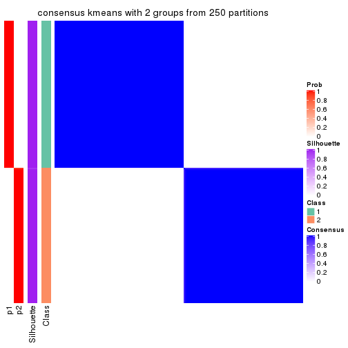</p>

</div>
<div id='tab-SD-kmeans-consensus-heatmap-2'>
<pre><code class="r">consensus_heatmap(res, k = 3)
</code></pre>

<p>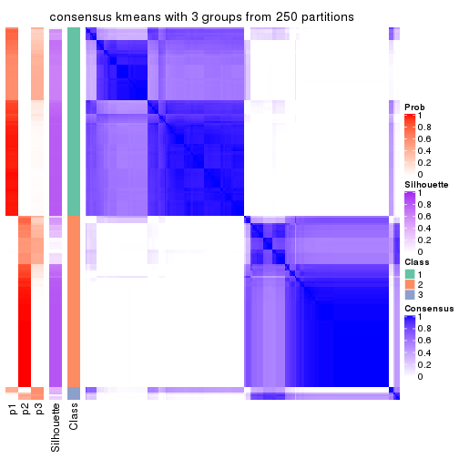</p>

</div>
<div id='tab-SD-kmeans-consensus-heatmap-3'>
<pre><code class="r">consensus_heatmap(res, k = 4)
</code></pre>

<p>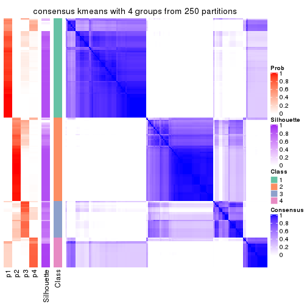</p>

</div>
<div id='tab-SD-kmeans-consensus-heatmap-4'>
<pre><code class="r">consensus_heatmap(res, k = 5)
</code></pre>

<p>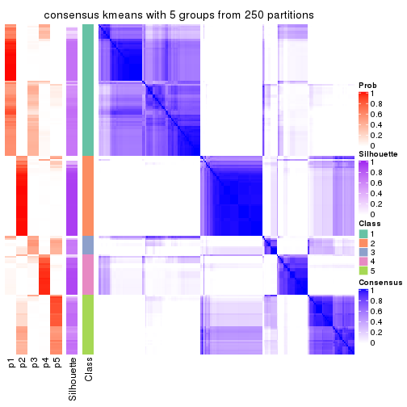</p>

</div>
<div id='tab-SD-kmeans-consensus-heatmap-5'>
<pre><code class="r">consensus_heatmap(res, k = 6)
</code></pre>

<p>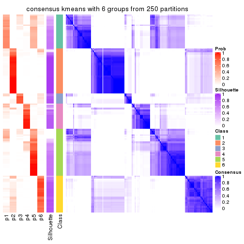</p>

</div>
</div>

Heatmaps for the membership of samples in all partitions to see how consistent they are:


<script>
$( function() {
	$( '#tabs-SD-kmeans-membership-heatmap' ).tabs();
} );
</script>
<div id='tabs-SD-kmeans-membership-heatmap'>
<ul>
<li><a href='#tab-SD-kmeans-membership-heatmap-1'>k = 2</a></li>
<li><a href='#tab-SD-kmeans-membership-heatmap-2'>k = 3</a></li>
<li><a href='#tab-SD-kmeans-membership-heatmap-3'>k = 4</a></li>
<li><a href='#tab-SD-kmeans-membership-heatmap-4'>k = 5</a></li>
<li><a href='#tab-SD-kmeans-membership-heatmap-5'>k = 6</a></li>
</ul>
<div id='tab-SD-kmeans-membership-heatmap-1'>
<pre><code class="r">membership_heatmap(res, k = 2)
</code></pre>

<p>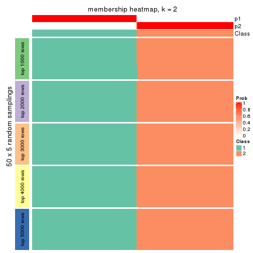</p>

</div>
<div id='tab-SD-kmeans-membership-heatmap-2'>
<pre><code class="r">membership_heatmap(res, k = 3)
</code></pre>

<p>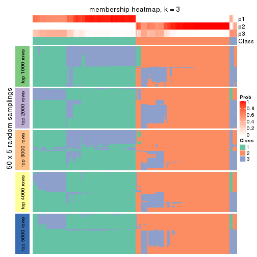</p>

</div>
<div id='tab-SD-kmeans-membership-heatmap-3'>
<pre><code class="r">membership_heatmap(res, k = 4)
</code></pre>

<p>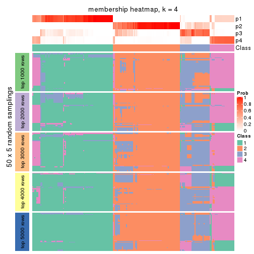</p>

</div>
<div id='tab-SD-kmeans-membership-heatmap-4'>
<pre><code class="r">membership_heatmap(res, k = 5)
</code></pre>

<p>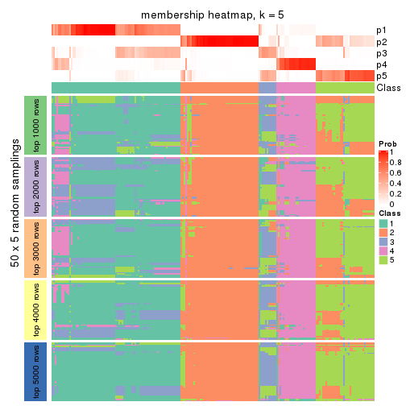</p>

</div>
<div id='tab-SD-kmeans-membership-heatmap-5'>
<pre><code class="r">membership_heatmap(res, k = 6)
</code></pre>

<p>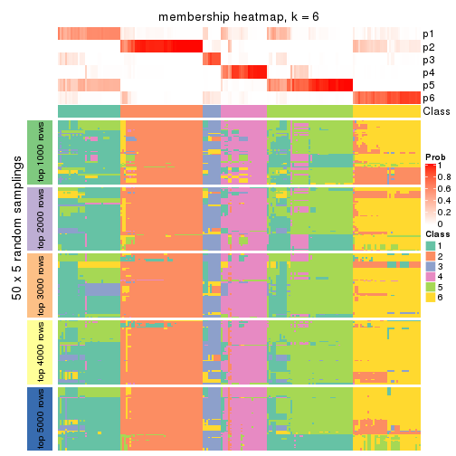</p>

</div>
</div>

As soon as we have had the classes for columns, we can look for signatures
which are significantly different between classes which can be candidate marks
for certain classes. Following are the heatmaps for signatures.


Signature heatmaps where rows are scaled:


<script>
$( function() {
	$( '#tabs-SD-kmeans-get-signatures' ).tabs();
} );
</script>
<div id='tabs-SD-kmeans-get-signatures'>
<ul>
<li><a href='#tab-SD-kmeans-get-signatures-1'>k = 2</a></li>
<li><a href='#tab-SD-kmeans-get-signatures-2'>k = 3</a></li>
<li><a href='#tab-SD-kmeans-get-signatures-3'>k = 4</a></li>
<li><a href='#tab-SD-kmeans-get-signatures-4'>k = 5</a></li>
<li><a href='#tab-SD-kmeans-get-signatures-5'>k = 6</a></li>
</ul>
<div id='tab-SD-kmeans-get-signatures-1'>
<pre><code class="r">get_signatures(res, k = 2)
</code></pre>

<p>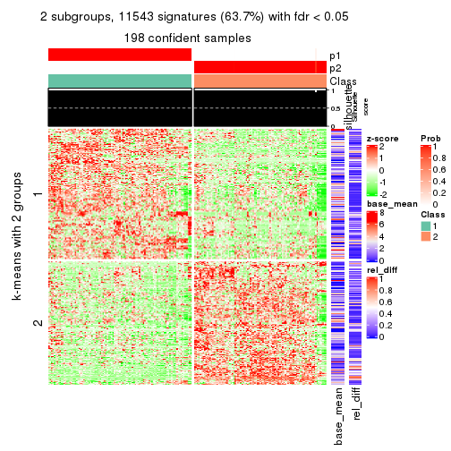</p>

</div>
<div id='tab-SD-kmeans-get-signatures-2'>
<pre><code class="r">get_signatures(res, k = 3)
</code></pre>

<p>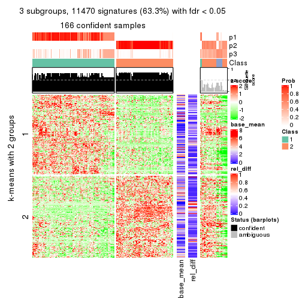</p>

</div>
<div id='tab-SD-kmeans-get-signatures-3'>
<pre><code class="r">get_signatures(res, k = 4)
</code></pre>

<p>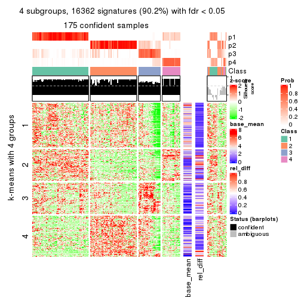</p>

</div>
<div id='tab-SD-kmeans-get-signatures-4'>
<pre><code class="r">get_signatures(res, k = 5)
</code></pre>

<p>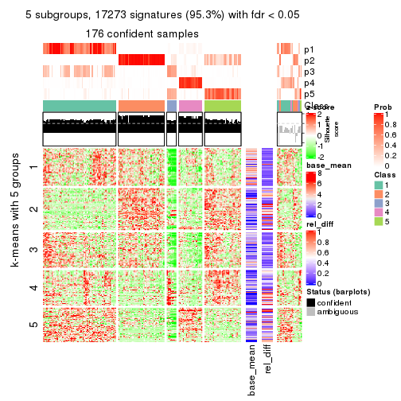</p>

</div>
<div id='tab-SD-kmeans-get-signatures-5'>
<pre><code class="r">get_signatures(res, k = 6)
</code></pre>

<p>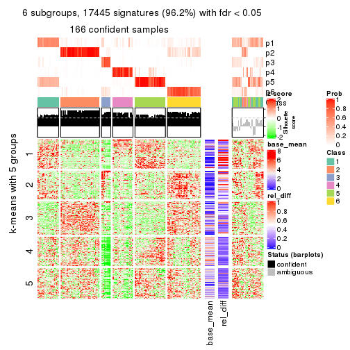</p>

</div>
</div>


Signature heatmaps where rows are not scaled:


<script>
$( function() {
	$( '#tabs-SD-kmeans-get-signatures-no-scale' ).tabs();
} );
</script>
<div id='tabs-SD-kmeans-get-signatures-no-scale'>
<ul>
<li><a href='#tab-SD-kmeans-get-signatures-no-scale-1'>k = 2</a></li>
<li><a href='#tab-SD-kmeans-get-signatures-no-scale-2'>k = 3</a></li>
<li><a href='#tab-SD-kmeans-get-signatures-no-scale-3'>k = 4</a></li>
<li><a href='#tab-SD-kmeans-get-signatures-no-scale-4'>k = 5</a></li>
<li><a href='#tab-SD-kmeans-get-signatures-no-scale-5'>k = 6</a></li>
</ul>
<div id='tab-SD-kmeans-get-signatures-no-scale-1'>
<pre><code class="r">get_signatures(res, k = 2, scale_rows = FALSE)
</code></pre>

<p>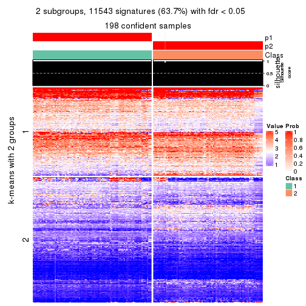</p>

</div>
<div id='tab-SD-kmeans-get-signatures-no-scale-2'>
<pre><code class="r">get_signatures(res, k = 3, scale_rows = FALSE)
</code></pre>

<p>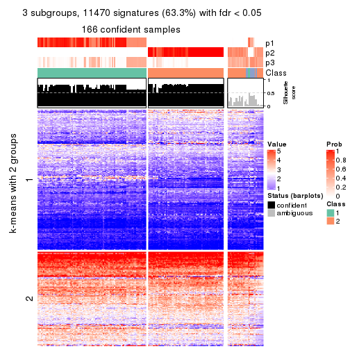</p>

</div>
<div id='tab-SD-kmeans-get-signatures-no-scale-3'>
<pre><code class="r">get_signatures(res, k = 4, scale_rows = FALSE)
</code></pre>

<p>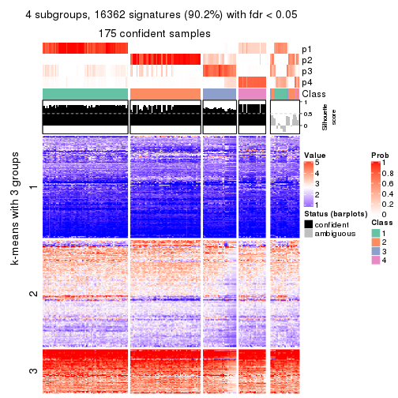</p>

</div>
<div id='tab-SD-kmeans-get-signatures-no-scale-4'>
<pre><code class="r">get_signatures(res, k = 5, scale_rows = FALSE)
</code></pre>

<p>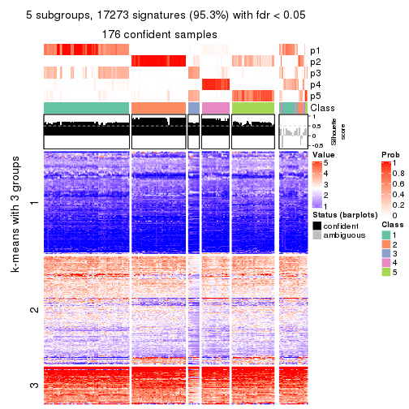</p>

</div>
<div id='tab-SD-kmeans-get-signatures-no-scale-5'>
<pre><code class="r">get_signatures(res, k = 6, scale_rows = FALSE)
</code></pre>

<p>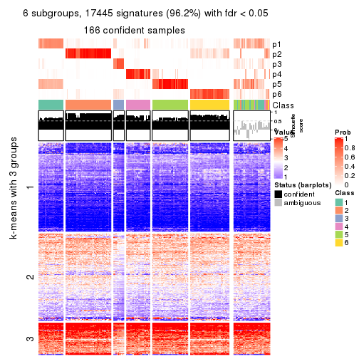</p>

</div>
</div>


Compare the overlap of signatures from different k:

```r
compare_signatures(res)
```

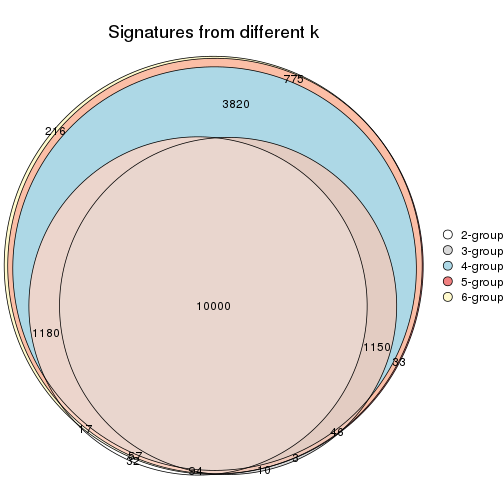

`get_signature()` returns a data frame invisibly. TO get the list of signatures, the function
call should be assigned to a variable explicitly. In following code, if `plot` argument is set
to `FALSE`, no heatmap is plotted while only the differential analysis is performed.

```r
# code only for demonstration
tb = get_signature(res, k = ..., plot = FALSE)
```

An example of the output of `tb` is:

```
#>   which_row         fdr    mean_1    mean_2 scaled_mean_1 scaled_mean_2 km
#> 1        38 0.042760348  8.373488  9.131774    -0.5533452     0.5164555  1
#> 2        40 0.018707592  7.106213  8.469186    -0.6173731     0.5762149  1
#> 3        55 0.019134737 10.221463 11.207825    -0.6159697     0.5749050  1
#> 4        59 0.006059896  5.921854  7.869574    -0.6899429     0.6439467  1
#> 5        60 0.018055526  8.928898 10.211722    -0.6204761     0.5791110  1
#> 6        98 0.009384629 15.714769 14.887706     0.6635654    -0.6193277  2
...
```

The columns in `tb` are:

1. `which_row`: row indices corresponding to the input matrix.
2. `fdr`: FDR for the differential test. 
3. `mean_x`: The mean value in group x.
4. `scaled_mean_x`: The mean value in group x after rows are scaled.
5. `km`: Row groups if k-means clustering is applied to rows.


UMAP plot which shows how samples are separated.


<script>
$( function() {
	$( '#tabs-SD-kmeans-dimension-reduction' ).tabs();
} );
</script>
<div id='tabs-SD-kmeans-dimension-reduction'>
<ul>
<li><a href='#tab-SD-kmeans-dimension-reduction-1'>k = 2</a></li>
<li><a href='#tab-SD-kmeans-dimension-reduction-2'>k = 3</a></li>
<li><a href='#tab-SD-kmeans-dimension-reduction-3'>k = 4</a></li>
<li><a href='#tab-SD-kmeans-dimension-reduction-4'>k = 5</a></li>
<li><a href='#tab-SD-kmeans-dimension-reduction-5'>k = 6</a></li>
</ul>
<div id='tab-SD-kmeans-dimension-reduction-1'>
<pre><code class="r">dimension_reduction(res, k = 2, method = &quot;UMAP&quot;)
</code></pre>

<p>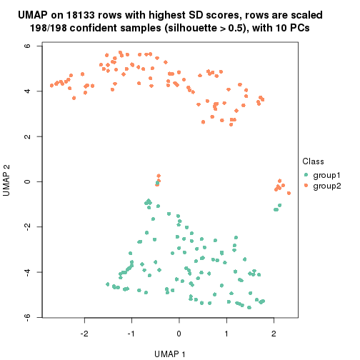</p>

</div>
<div id='tab-SD-kmeans-dimension-reduction-2'>
<pre><code class="r">dimension_reduction(res, k = 3, method = &quot;UMAP&quot;)
</code></pre>

<p>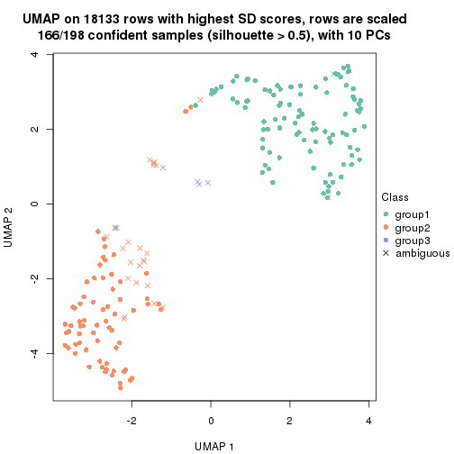</p>

</div>
<div id='tab-SD-kmeans-dimension-reduction-3'>
<pre><code class="r">dimension_reduction(res, k = 4, method = &quot;UMAP&quot;)
</code></pre>

<p>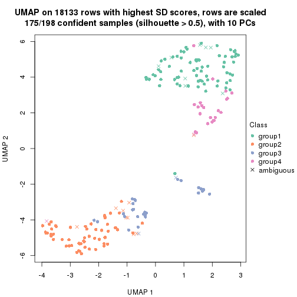</p>

</div>
<div id='tab-SD-kmeans-dimension-reduction-4'>
<pre><code class="r">dimension_reduction(res, k = 5, method = &quot;UMAP&quot;)
</code></pre>

<p>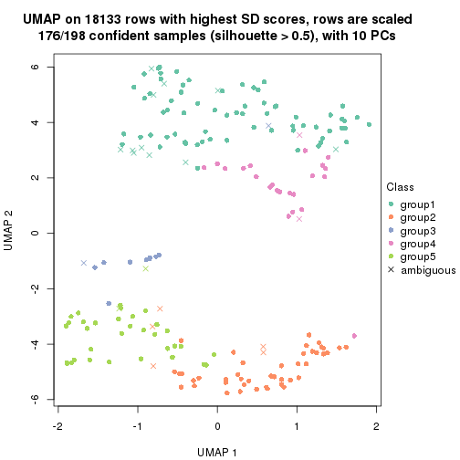</p>

</div>
<div id='tab-SD-kmeans-dimension-reduction-5'>
<pre><code class="r">dimension_reduction(res, k = 6, method = &quot;UMAP&quot;)
</code></pre>

<p>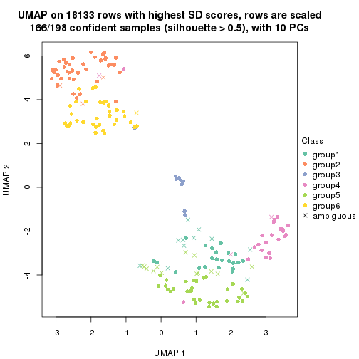</p>

</div>
</div>


Following heatmap shows how subgroups are split when increasing `k`:

```r
collect_classes(res)
```

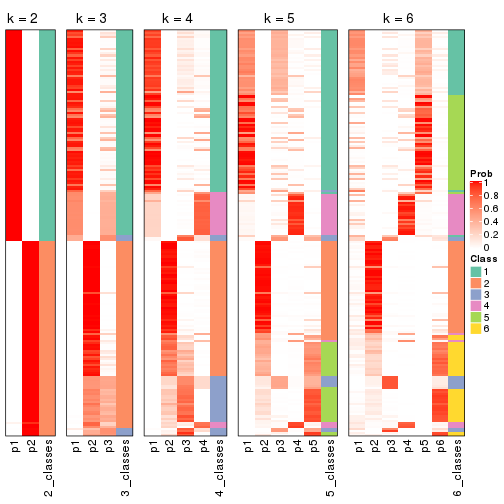


If matrix rows can be associated to genes, consider to use `functional_enrichment(res,
...)` to perform function enrichment for the signature genes. See [this vignette](http://bioconductor.org/packages/devel/bioc/vignettes/cola/inst/doc/functional_enrichment.html) for more detailed explanations.


 

---------------------------------------------------


### SD:skmeans**


The object with results only for a single top-value method and a single partition method 
can be extracted as:

```r
res = res_list["SD", "skmeans"]
# you can also extract it by
# res = res_list["SD:skmeans"]
```

A summary of `res` and all the functions that can be applied to it:

```r
res
```

```
#> A 'ConsensusPartition' object with k = 2, 3, 4, 5, 6.
#>   On a matrix with 18133 rows and 198 columns.
#>   Top rows (1000, 2000, 3000, 4000, 5000) are extracted by 'SD' method.
#>   Subgroups are detected by 'skmeans' method.
#>   Performed in total 1250 partitions by row resampling.
#>   Best k for subgroups seems to be 2.
#> 
#> Following methods can be applied to this 'ConsensusPartition' object:
#>  [1] "cola_report"             "collect_classes"         "collect_plots"          
#>  [4] "collect_stats"           "colnames"                "compare_signatures"     
#>  [7] "consensus_heatmap"       "dimension_reduction"     "functional_enrichment"  
#> [10] "get_anno_col"            "get_anno"                "get_classes"            
#> [13] "get_consensus"           "get_matrix"              "get_membership"         
#> [16] "get_param"               "get_signatures"          "get_stats"              
#> [19] "is_best_k"               "is_stable_k"             "membership_heatmap"     
#> [22] "ncol"                    "nrow"                    "plot_ecdf"              
#> [25] "rownames"                "select_partition_number" "show"                   
#> [28] "suggest_best_k"          "test_to_known_factors"
```

`collect_plots()` function collects all the plots made from `res` for all `k` (number of partitions)
into one single page to provide an easy and fast comparison between different `k`.

```r
collect_plots(res)
```

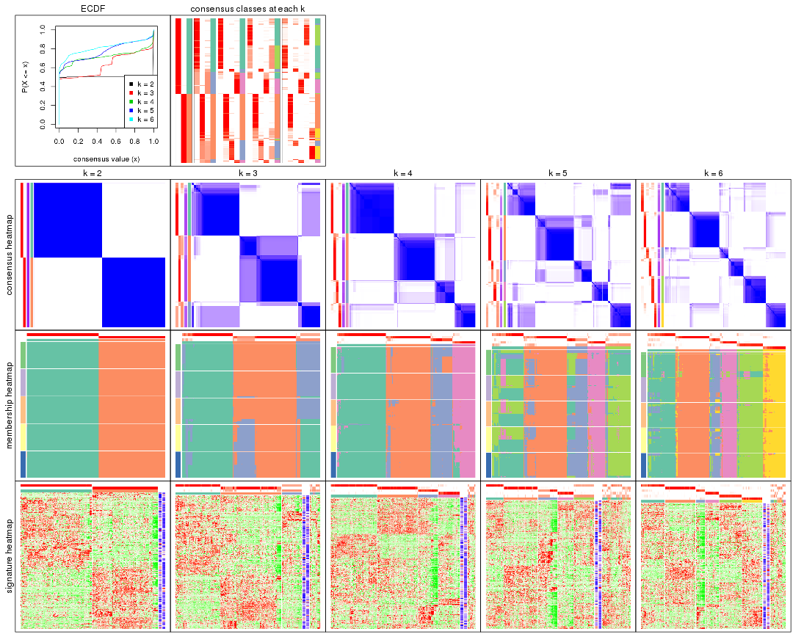

The plots are:

- The first row: a plot of the ECDF (empirical cumulative distribution
  function) curves of the consensus matrix for each `k` and the heatmap of
  predicted classes for each `k`.
- The second row: heatmaps of the consensus matrix for each `k`.
- The third row: heatmaps of the membership matrix for each `k`.
- The fouth row: heatmaps of the signatures for each `k`.

All the plots in panels can be made by individual functions and they are
plotted later in this section.

`select_partition_number()` produces several plots showing different
statistics for choosing "optimized" `k`. There are following statistics:

- ECDF curves of the consensus matrix for each `k`;
- 1-PAC. [The PAC
  score](https://en.wikipedia.org/wiki/Consensus_clustering#Over-interpretation_potential_of_consensus_clustering)
  measures the proportion of the ambiguous subgrouping.
- Mean silhouette score.
- Concordance. The mean probability of fiting the consensus class ids in all
  partitions.
- Area increased. Denote $A_k$ as the area under the ECDF curve for current
  `k`, the area increased is defined as $A_k - A_{k-1}$.
- Rand index. The percent of pairs of samples that are both in a same cluster
  or both are not in a same cluster in the partition of k and k-1.
- Jaccard index. The ratio of pairs of samples are both in a same cluster in
  the partition of k and k-1 and the pairs of samples are both in a same
  cluster in the partition k or k-1.

The detailed explanations of these statistics can be found in [the _cola_
vignette](http://bioconductor.org/packages/devel/bioc/vignettes/cola/inst/doc/cola.html#toc_13).

Generally speaking, lower PAC score, higher mean silhouette score or higher
concordance corresponds to better partition. Rand index and Jaccard index
measure how similar the current partition is compared to partition with `k-1`.
If they are too similar, we won't accept `k` is better than `k-1`.

```r
select_partition_number(res)
```

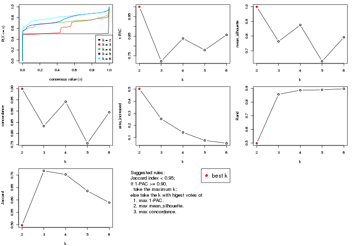

The numeric values for all these statistics can be obtained by `get_stats()`.

```r
get_stats(res)
```

```
#>   k 1-PAC mean_silhouette concordance area_increased  Rand Jaccard
#> 2 2 1.000           0.999       1.000         0.5022 0.498   0.498
#> 3 3 0.722           0.764       0.833         0.2540 0.857   0.717
#> 4 4 0.838           0.875       0.942         0.1420 0.887   0.703
#> 5 5 0.779           0.629       0.756         0.0765 0.890   0.636
#> 6 6 0.857           0.792       0.895         0.0528 0.897   0.590
```

`suggest_best_k()` suggests the best $k$ based on these statistics. The rules are as follows:

- All $k$ with Jaccard index larger than 0.95 are removed because increasing
  $k$ does not provide enough extra information. If all $k$ are removed, it is
  marked as no subgroup is detected.
- For all $k$ with 1-PAC score larger than 0.9, the maximal $k$ is taken as
  the best $k$, and other $k$ are marked as optional $k$.
- If it does not fit the second rule. The $k$ with the maximal vote of the
  highest 1-PAC score, highest mean silhouette, and highest concordance is
  taken as the best $k$.

```r
suggest_best_k(res)
```

```
#> [1] 2
```


Following shows the table of the partitions (You need to click the **show/hide
code output** link to see it). The membership matrix (columns with name `p*`)
is inferred by
[`clue::cl_consensus()`](https://www.rdocumentation.org/link/cl_consensus?package=clue)
function with the `SE` method. Basically the value in the membership matrix
represents the probability to belong to a certain group. The finall class
label for an item is determined with the group with highest probability it
belongs to.

In `get_classes()` function, the entropy is calculated from the membership
matrix and the silhouette score is calculated from the consensus matrix.


<script>
$( function() {
	$( '#tabs-SD-skmeans-get-classes' ).tabs();
} );
</script>
<div id='tabs-SD-skmeans-get-classes'>
<ul>
<li><a href='#tab-SD-skmeans-get-classes-1'>k = 2</a></li>
<li><a href='#tab-SD-skmeans-get-classes-2'>k = 3</a></li>
<li><a href='#tab-SD-skmeans-get-classes-3'>k = 4</a></li>
<li><a href='#tab-SD-skmeans-get-classes-4'>k = 5</a></li>
<li><a href='#tab-SD-skmeans-get-classes-5'>k = 6</a></li>
</ul>

<div id='tab-SD-skmeans-get-classes-1'>
<p><a id='tab-SD-skmeans-get-classes-1-a' style='color:#0366d6' href='#'>show/hide code output</a></p>
<pre><code class="r">cbind(get_classes(res, k = 2), get_membership(res, k = 2))
</code></pre>

<pre><code>#&gt;                                      class entropy silhouette    p1    p2
#&gt; 0C0AA0B2-5191-4EDF-8937-ED7434F30283     2  0.0000      1.000 0.000 1.000
#&gt; 18B45F1F-234F-45CC-A234-145307606C5C     1  0.0000      0.999 1.000 0.000
#&gt; E18B70C0-BDCA-46D3-99BB-C6C8ABC68DA5     2  0.0000      1.000 0.000 1.000
#&gt; 0F6DDBA7-6F74-45E8-95C8-F28263D55978     1  0.0000      0.999 1.000 0.000
#&gt; 7EAE1A5A-129A-46DE-977E-A2C753F10904     2  0.0000      1.000 0.000 1.000
#&gt; 7EAE0048-16B5-4979-9410-16CDEB9B1A48     1  0.0000      0.999 1.000 0.000
#&gt; 2EBFC828-2B27-4753-A052-80DDA226DAB4     2  0.0000      1.000 0.000 1.000
#&gt; 24E1768D-2232-41DA-9383-BC55D6EB3812     2  0.0000      1.000 0.000 1.000
#&gt; 6E3CD60A-1889-4CA3-B305-2E78152057B5     2  0.0000      1.000 0.000 1.000
#&gt; 33CC70DD-82B3-413C-B3B1-BE06634D95D0     1  0.0000      0.999 1.000 0.000
#&gt; F1CB57A3-55DD-4487-9307-1B4F652E729A     1  0.0000      0.999 1.000 0.000
#&gt; 755A5806-B054-449A-93DB-79909E6C93A1     1  0.0000      0.999 1.000 0.000
#&gt; 58D364E7-3D2F-468F-A264-D6461E2428D4     2  0.0000      1.000 0.000 1.000
#&gt; 68BB9CB6-7AA2-4981-B9D9-07363EC96599     2  0.0000      1.000 0.000 1.000
#&gt; 3C4E8DFA-8EA0-4F1F-89CB-CB8805395872     2  0.0000      1.000 0.000 1.000
#&gt; 4219651D-5583-4498-BF08-1B7D04B4C7B2     1  0.0000      0.999 1.000 0.000
#&gt; B5EE2768-0D67-4584-ADBC-EC745FEC52EA     2  0.0000      1.000 0.000 1.000
#&gt; 825E6C11-F460-451A-8045-846DD7D0E945     1  0.0000      0.999 1.000 0.000
#&gt; 491F62AF-5E68-43C3-982A-F867A75BBA9A     2  0.0000      1.000 0.000 1.000
#&gt; 9D7F058C-F95A-44AD-AC9E-450F7FBDC960     2  0.0000      1.000 0.000 1.000
#&gt; 6D42DD0C-2081-4742-BA27-9F5F16FAC3C6     1  0.0000      0.999 1.000 0.000
#&gt; EDD7E63D-492A-473B-A552-0764337B10EF     2  0.0000      1.000 0.000 1.000
#&gt; 97073DEA-73AD-4DFD-BD1A-9035DC03445B     1  0.0000      0.999 1.000 0.000
#&gt; FA891AB9-CE38-4F7E-A015-1DDCE12890A0     1  0.0000      0.999 1.000 0.000
#&gt; D9514D49-A0AE-45AB-8C9F-68E726215253     1  0.0000      0.999 1.000 0.000
#&gt; 3B9229AD-12E5-451E-9D2F-378AAC82C04A     2  0.0000      1.000 0.000 1.000
#&gt; 5EA36B71-4917-4EF3-9060-065EFE6ACC5B     1  0.0000      0.999 1.000 0.000
#&gt; A20E4ECB-4895-4CC7-BE5E-4721B20D933B     1  0.0000      0.999 1.000 0.000
#&gt; 1BE8D828-29DB-4368-AA4A-FB23588F7AE8     1  0.0000      0.999 1.000 0.000
#&gt; 66EFEFCF-3D14-4DBF-AA13-530F40ED0245     1  0.0000      0.999 1.000 0.000
#&gt; 55DFFE53-BCE7-4EC1-9863-6C0311B06BA2     2  0.0000      1.000 0.000 1.000
#&gt; 4CC3FB5A-611D-4C64-AE9D-544FA45CF4DC     1  0.0000      0.999 1.000 0.000
#&gt; C11D33F2-DFE9-4FA8-9024-F3E7F1DADC5F     2  0.0000      1.000 0.000 1.000
#&gt; FA5932B8-8AA3-4C38-9FAB-C35D8772974D     1  0.0000      0.999 1.000 0.000
#&gt; 8216EC35-1F41-4A15-B503-BDA4971E27C9     1  0.0000      0.999 1.000 0.000
#&gt; 69635D23-90A7-4BAD-97C7-B79536837F57     1  0.0000      0.999 1.000 0.000
#&gt; 12B404E2-C463-4409-8392-E4649B2AFFD1     2  0.0000      1.000 0.000 1.000
#&gt; 246927E3-ACCF-41B2-AA8E-43855FD6B146     2  0.0000      1.000 0.000 1.000
#&gt; E0CC13E7-9607-49E0-B4AA-395544E3C3BF     1  0.0000      0.999 1.000 0.000
#&gt; F7BBC0C1-6124-4A83-8A70-EA89B62F1CBD     1  0.0000      0.999 1.000 0.000
#&gt; B1D4FF24-8E6F-4A04-B716-2032D850EB57     1  0.0000      0.999 1.000 0.000
#&gt; 253601DB-B78A-4566-9947-8C0270C0B163     2  0.0000      1.000 0.000 1.000
#&gt; AB83DBFF-5737-4FB8-A5AC-1D3CD6072BDF     2  0.0376      0.996 0.004 0.996
#&gt; 9D67D953-EC98-4B72-89C8-5732BC9D4BC9     2  0.0000      1.000 0.000 1.000
#&gt; 51061018-95AB-4278-886F-F69E4EBC47C0     2  0.0000      1.000 0.000 1.000
#&gt; ABD0F7F3-105B-4DEE-9889-5028772C519A     1  0.0000      0.999 1.000 0.000
#&gt; 562B95CF-B27E-4A72-B7C6-CDF86A51A39B     1  0.0000      0.999 1.000 0.000
#&gt; ABF046A4-D7A1-49FF-B6B1-4E07A791DEDB     2  0.0000      1.000 0.000 1.000
#&gt; 3FF4101E-9703-460E-A30E-76CC7689F36D     2  0.0000      1.000 0.000 1.000
#&gt; 39C4F7AA-7ADF-4F1D-BDA3-BEC605AC5023     2  0.0000      1.000 0.000 1.000
#&gt; CB821FD2-AF5C-4743-A70F-21C12C6ED153     1  0.0000      0.999 1.000 0.000
#&gt; 92EA1846-62FF-41D5-A441-5E52E6B9E7F9     1  0.0000      0.999 1.000 0.000
#&gt; 7D25F3EE-5A20-4763-8026-16A03D05F459     1  0.0000      0.999 1.000 0.000
#&gt; 8ECE5276-CD06-496B-A5A9-1713B1F7D089     1  0.0000      0.999 1.000 0.000
#&gt; C775B68F-9507-47E3-B507-B433AED79002     1  0.0000      0.999 1.000 0.000
#&gt; E19D5463-FDD0-41C1-A170-323736A88D07     2  0.0000      1.000 0.000 1.000
#&gt; CE4B6285-4961-4767-91F0-5C7A8162E185     1  0.0000      0.999 1.000 0.000
#&gt; 9637BD72-1FEF-42AD-8886-2C39BE876531     1  0.0000      0.999 1.000 0.000
#&gt; 81B5A88E-45A0-4B44-B689-B9071B8548EE     2  0.0000      1.000 0.000 1.000
#&gt; 0B01B4C9-9BED-4F5B-A3E2-8868C7CCC3FC     2  0.0000      1.000 0.000 1.000
#&gt; 54501315-7132-44B2-A179-10FBF1421105     1  0.0000      0.999 1.000 0.000
#&gt; E207CBE9-4C3A-4FDD-9251-CFE1FE106475     1  0.0000      0.999 1.000 0.000
#&gt; 3BEA0B92-3F90-4DBF-9679-AADEAD7D47C8     2  0.0000      1.000 0.000 1.000
#&gt; 35B32250-D854-4215-AA5B-2C11B2FBEECA     1  0.0000      0.999 1.000 0.000
#&gt; ACE6566B-AEB9-426C-924A-B382D14A1024     2  0.0000      1.000 0.000 1.000
#&gt; 737E69AC-0930-45B9-B6BA-7CE5E300290B     1  0.0000      0.999 1.000 0.000
#&gt; B4410AB8-D015-41CA-86E6-12EB4E4103E3     1  0.0000      0.999 1.000 0.000
#&gt; 6D3ECA65-C50F-43B0-B75A-1D290FA4A8FD     2  0.0000      1.000 0.000 1.000
#&gt; C86F40D3-9A96-4395-A8C3-510DE12F9A2B     2  0.0000      1.000 0.000 1.000
#&gt; 6238087F-24DD-4BF1-903F-3BD4E446C1AE     2  0.0000      1.000 0.000 1.000
#&gt; E4FF840B-EEAB-4CB0-A690-7D4C4AA7EEC3     2  0.0000      1.000 0.000 1.000
#&gt; 72D3C323-C67F-4C0E-9BFC-BF245FF9730A     1  0.0000      0.999 1.000 0.000
#&gt; 82D56E4E-4DF6-4F3E-8959-B995C92AAA70     1  0.0000      0.999 1.000 0.000
#&gt; E31CA441-EB19-443B-ACBD-37B5CCBCF0E5     2  0.0000      1.000 0.000 1.000
#&gt; 87CA8939-D054-4B8A-B32D-085FD2E8F202     1  0.0000      0.999 1.000 0.000
#&gt; 2A508D90-FEDC-46A3-9A02-E51E5467CDCB     1  0.0000      0.999 1.000 0.000
#&gt; C4E8B4E2-388B-411F-BF0A-9B6F34E8EDB5     2  0.0000      1.000 0.000 1.000
#&gt; AF6AF803-BD93-44A7-AA80-B9BC92C1273B     2  0.0000      1.000 0.000 1.000
#&gt; 0B1CA5CF-EB96-41D4-BFC5-6957FEB39828     1  0.0000      0.999 1.000 0.000
#&gt; 6FB96FB0-6661-48AD-A4A0-69F8AFDBE591     2  0.0000      1.000 0.000 1.000
#&gt; 8C19F7FD-368A-462B-B28F-88D6630038A1     1  0.0000      0.999 1.000 0.000
#&gt; 96EABE78-C2F4-4A33-ACD8-C922A4B2519B     2  0.0000      1.000 0.000 1.000
#&gt; 68B36D7B-546A-4689-949F-B207C4A4AB27     2  0.0000      1.000 0.000 1.000
#&gt; CE9F3335-778F-4F52-BC55-4B7C99B211DD     2  0.0000      1.000 0.000 1.000
#&gt; CB359DED-2A2D-4646-A0BD-6F10ADCC532B     1  0.0000      0.999 1.000 0.000
#&gt; 198324A5-8C52-46F6-9734-EFAF1CCA6D9B     1  0.0000      0.999 1.000 0.000
#&gt; 83B88608-0506-428C-B9E8-621F38477B42     1  0.0000      0.999 1.000 0.000
#&gt; 1993630A-0F3D-4F5C-86A3-D443BAAF57F0     1  0.3733      0.922 0.928 0.072
#&gt; DE73DA9B-529E-4F4F-A65C-DA7AB84B1096     1  0.0000      0.999 1.000 0.000
#&gt; 2347F3B7-DDA3-40C0-B6D4-8819ECA69146     1  0.0000      0.999 1.000 0.000
#&gt; AB93B5D5-095F-4330-9D40-6A3D934AB50C     1  0.0000      0.999 1.000 0.000
#&gt; 5EBBE4AD-FF0C-41CF-9EA3-B6FE7EA1F9C0     1  0.0000      0.999 1.000 0.000
#&gt; 6D960AE7-3769-4144-A061-E8588E5063FF     1  0.0000      0.999 1.000 0.000
#&gt; 0C2DD8C0-D1A5-4192-A49C-7A40FED628B2     2  0.0000      1.000 0.000 1.000
#&gt; 18C9372F-C55B-4F86-A9D2-E8D85EFC8566     2  0.0000      1.000 0.000 1.000
#&gt; 9AF637B0-4C32-4DD1-93AF-7655B4A845D3     2  0.0000      1.000 0.000 1.000
#&gt; 785B5B06-4115-46FD-9BEB-F888AFDC855D     2  0.0000      1.000 0.000 1.000
#&gt; ECA3050E-4BE2-4117-B9CF-A52BB85AF8C2     2  0.0000      1.000 0.000 1.000
#&gt; 099DC396-16A5-458F-9ED9-F2A790CB0C34     1  0.0000      0.999 1.000 0.000
#&gt; 7A5A12EE-C5B0-4C51-8C99-0F3FA88D633E     1  0.0000      0.999 1.000 0.000
#&gt; E832B508-A66D-4817-B44A-FE9FAAE64B4A     1  0.0000      0.999 1.000 0.000
#&gt; F9DD688C-7B35-49E7-9651-2E098EE78856     1  0.0000      0.999 1.000 0.000
#&gt; F1265DD8-5ED3-4635-A277-57BBFDEC7729     1  0.0000      0.999 1.000 0.000
#&gt; F624E8D9-DB07-4C9E-910D-5E8EBA3A6167     2  0.0000      1.000 0.000 1.000
#&gt; 3516FBDF-66E1-43F4-9D7B-16748F6439A7     2  0.0000      1.000 0.000 1.000
#&gt; 04B12992-B2EA-4BA2-8E2C-11E34E230E6F     2  0.0000      1.000 0.000 1.000
#&gt; CC02897D-9123-495E-9242-5C9CF4EC269B     2  0.0000      1.000 0.000 1.000
#&gt; 3117ED46-2BF2-4311-BC00-4E98243E16B3     1  0.0000      0.999 1.000 0.000
#&gt; E0B66D53-23DB-4E26-BB6E-F692FA8C000E     1  0.0000      0.999 1.000 0.000
#&gt; DAA93CE5-A013-477A-9A50-EA09CC3A8162     2  0.0000      1.000 0.000 1.000
#&gt; 0099098D-354A-4276-92F8-B932C74B4608     1  0.0000      0.999 1.000 0.000
#&gt; DD483639-B2E7-4745-BCFB-55ED1D82BFBF     2  0.0000      1.000 0.000 1.000
#&gt; 2C1F9079-602E-4252-82C7-9D8799E04246     2  0.0000      1.000 0.000 1.000
#&gt; 9473A8E4-3A1B-4184-9EA6-517AFD60B635     1  0.0000      0.999 1.000 0.000
#&gt; 75CFBAF6-7BA0-40AF-92D7-D218E885BD1B     2  0.0000      1.000 0.000 1.000
#&gt; B588950F-14D6-41C8-845B-EFD2096013C6     2  0.0000      1.000 0.000 1.000
#&gt; 0DF3EDA8-DAEA-4721-92AB-B97181249498     2  0.0000      1.000 0.000 1.000
#&gt; 8EA83042-D598-401D-AD78-936EEB136C59     1  0.0000      0.999 1.000 0.000
#&gt; 729AC418-3BE9-445A-95D4-AC11A7D43BE0     1  0.0000      0.999 1.000 0.000
#&gt; 7D8B1B11-F576-4AA8-BFA7-0022A2CD829A     2  0.0000      1.000 0.000 1.000
#&gt; 304A0E46-3449-4B44-9C30-BDDF6459391D     1  0.0000      0.999 1.000 0.000
#&gt; 3C83358F-DF20-47F7-AF9F-AB7CC92F5ABA     1  0.0000      0.999 1.000 0.000
#&gt; EAFEED6C-35C3-451F-AE4A-EB56992E1F29     1  0.0000      0.999 1.000 0.000
#&gt; 8A237A65-28EC-434D-A78A-A8B7308B5204     1  0.0000      0.999 1.000 0.000
#&gt; D005833F-E991-4E9E-9667-55F137288004     1  0.0000      0.999 1.000 0.000
#&gt; 37D966E3-253E-4397-A9AE-0903A8D31FE6     1  0.0000      0.999 1.000 0.000
#&gt; D2482B81-CB5B-4178-BA8D-1CF4026181B5     1  0.0000      0.999 1.000 0.000
#&gt; 18019E95-C2A8-4EE7-B585-F6886DC4D953     2  0.0000      1.000 0.000 1.000
#&gt; 0B126D1A-14A8-4345-8F78-FF92222ADF4C     2  0.0000      1.000 0.000 1.000
#&gt; CE88B625-47D8-4D58-9FB4-23464DB7DDAD     2  0.0000      1.000 0.000 1.000
#&gt; 9A88299D-5C74-47FA-B42C-1A1D6D935AAB     1  0.0000      0.999 1.000 0.000
#&gt; 3E71159C-FD6C-41DA-B18B-0730C8AC7E41     1  0.0000      0.999 1.000 0.000
#&gt; 6F245AA4-79D9-47E1-BCC9-1AAF65AEA813     1  0.0000      0.999 1.000 0.000
#&gt; 4CF2C888-2100-483A-B4DB-ECBB69243A4D     2  0.0000      1.000 0.000 1.000
#&gt; A3853813-B9D5-4E8C-B075-19FCC35F8686     2  0.0000      1.000 0.000 1.000
#&gt; 83A16DEE-CE9F-4D8B-9225-0A2A8B9D055D     1  0.0000      0.999 1.000 0.000
#&gt; 0F057CAF-4F9A-4DE9-8601-730E96873733     2  0.0000      1.000 0.000 1.000
#&gt; 32D5801D-DBA4-422E-87CB-A2DDE921BA41     1  0.0000      0.999 1.000 0.000
#&gt; 22EE8076-F07C-499A-9AF8-D800A77EF154     2  0.0000      1.000 0.000 1.000
#&gt; DD4BD74D-D48C-4090-9F57-5334E784581C     1  0.0000      0.999 1.000 0.000
#&gt; 41183565-434D-474C-B1BD-CA6E94910658     2  0.0000      1.000 0.000 1.000
#&gt; 75A2CE41-2B2A-4346-927E-ACF8A72738E4     1  0.0000      0.999 1.000 0.000
#&gt; 7AA24995-3DD2-4682-B36A-4EBFEEACF625     1  0.0000      0.999 1.000 0.000
#&gt; 8BAFDFEC-9F26-4ADB-95CE-004143960EEB     1  0.0000      0.999 1.000 0.000
#&gt; A330E011-CE08-4A85-8F4B-370592293DBB     1  0.0000      0.999 1.000 0.000
#&gt; 1D5A5B17-2E70-4BB0-94A1-EC17E6EA49DB     1  0.0000      0.999 1.000 0.000
#&gt; BD9143B8-9D97-4A05-872C-3FB82B4CF7BE     2  0.0000      1.000 0.000 1.000
#&gt; 64552DC0-181E-4607-898C-787AA7F26435     2  0.0000      1.000 0.000 1.000
#&gt; 1B4C4D41-34C7-43A3-858B-C9552EB53894     1  0.0000      0.999 1.000 0.000
#&gt; 463A3BAA-02DC-4EA4-A644-B924163E425D     2  0.0000      1.000 0.000 1.000
#&gt; CD0FEA89-6F60-4A20-8FCA-D397B4E95A98     1  0.0000      0.999 1.000 0.000
#&gt; 5D06CF6D-F4B9-4B32-B055-8AB287E53340     2  0.0000      1.000 0.000 1.000
#&gt; ADA7835F-DB67-4F4F-9446-8BCE3C5FE936     2  0.0000      1.000 0.000 1.000
#&gt; 4109BE2D-B5DF-4BD7-860E-60D87F647152     2  0.0000      1.000 0.000 1.000
#&gt; 88526A0E-6DFE-46CB-BFAD-B4826F482C67     1  0.0000      0.999 1.000 0.000
#&gt; F39F9A4C-18F7-4017-AB31-85D52FF44587     2  0.0000      1.000 0.000 1.000
#&gt; D4290A5E-1B24-4C55-B470-0FA7A0A09DD0     2  0.0000      1.000 0.000 1.000
#&gt; DC5A2C9E-978F-4661-B729-1F9662976E27     1  0.0000      0.999 1.000 0.000
#&gt; 26A1F392-CED2-43E3-8096-74E6F2BFC8C0     2  0.0000      1.000 0.000 1.000
#&gt; 87D81FB2-306A-4E75-9D58-D5F48E46E7F6     2  0.0000      1.000 0.000 1.000
#&gt; E3D9D81A-C20C-4B3B-B940-A5D2C5F65B22     2  0.0000      1.000 0.000 1.000
#&gt; 4464650B-453F-476C-989C-B7B159BF2CF0     2  0.0000      1.000 0.000 1.000
#&gt; 577D2867-B738-487A-9B06-07958D647F02     1  0.0000      0.999 1.000 0.000
#&gt; E52A22CC-3C03-41A9-9541-220DD871E162     2  0.0000      1.000 0.000 1.000
#&gt; 642703B1-AF99-4746-A915-0792F4B9590B     2  0.0000      1.000 0.000 1.000
#&gt; 8F0D1792-1284-45E6-8EC4-392596057677     2  0.0000      1.000 0.000 1.000
#&gt; 765AFFC1-D528-4494-8BA1-0706451E4205     2  0.0000      1.000 0.000 1.000
#&gt; A716BC29-161F-4CA0-B240-00B330137F2C     1  0.0000      0.999 1.000 0.000
#&gt; 32CBFBAF-7064-4595-8D54-2C5E7DE0FD9B     1  0.0000      0.999 1.000 0.000
#&gt; 4D6ED28C-3F20-41B0-BA41-1BF0E5199A40     2  0.0000      1.000 0.000 1.000
#&gt; 86A38456-2900-48FB-B10F-79222B3CA9BF     1  0.0000      0.999 1.000 0.000
#&gt; E870807D-3223-4A6A-9E3D-F4461B048AA2     2  0.0000      1.000 0.000 1.000
#&gt; 3A78D19F-A833-4D2C-8387-FB4FD4A8313C     1  0.0000      0.999 1.000 0.000
#&gt; DFA162CA-C708-4121-8E74-F9C4DEE0CDAE     1  0.0000      0.999 1.000 0.000
#&gt; C00A300A-CD10-4C9D-8C94-3901AFE8406C     2  0.0000      1.000 0.000 1.000
#&gt; 13E11D15-A90F-48C4-980A-DD032C00A2C1     1  0.0000      0.999 1.000 0.000
#&gt; 31BF80AB-FEDB-4C73-89C3-70BE9F9ACBEE     2  0.0000      1.000 0.000 1.000
#&gt; FA34308A-349D-4AAD-94CF-3F3B7F9AD629     2  0.0000      1.000 0.000 1.000
#&gt; 7C48D467-B663-49DD-BC84-A36BC32ACB3D     1  0.0000      0.999 1.000 0.000
#&gt; BB068534-04F6-4FC9-9087-CDA65920BCE2     1  0.0000      0.999 1.000 0.000
#&gt; EA4EC272-A9B3-4B2E-955F-19F7676A944C     2  0.0000      1.000 0.000 1.000
#&gt; C71FF69B-A460-43CA-8769-9667F22D938B     1  0.0000      0.999 1.000 0.000
#&gt; 5243D1B8-8168-4FF1-A8C6-505F080EF0D3     2  0.0000      1.000 0.000 1.000
#&gt; BCC474D8-08FE-4E99-B8E8-B29E65F84D2E     1  0.0000      0.999 1.000 0.000
#&gt; 04FDBFE3-4CF6-4E53-A2AA-89D5C9316377     2  0.0000      1.000 0.000 1.000
#&gt; 83A9915C-8D60-4CAE-A868-B61E3C90C7B0     2  0.0000      1.000 0.000 1.000
#&gt; 989A6472-E3E3-457A-97BE-CCE95F42D5C2     2  0.0000      1.000 0.000 1.000
#&gt; A0AB2D28-6751-49C9-8DF4-66FDBF95C360     1  0.0000      0.999 1.000 0.000
#&gt; A12B2683-18D4-41C9-8AE5-C143E2180052     1  0.0000      0.999 1.000 0.000
#&gt; 8DE1E245-CAD2-4F11-BFA2-9792C433A00B     1  0.0000      0.999 1.000 0.000
#&gt; FDA68036-6C4C-4256-9AA0-C01FE92AA098     2  0.0000      1.000 0.000 1.000
#&gt; 26311920-1414-4EC1-870B-784961EBCC2D     1  0.0000      0.999 1.000 0.000
#&gt; C29A10D6-D598-4286-B5E0-F1776E19E988     1  0.0000      0.999 1.000 0.000
#&gt; FACCC1FB-4937-4CC0-90EA-7F91D3D939CF     2  0.0000      1.000 0.000 1.000
#&gt; 90B9D84B-78E5-4C7E-8414-EC889C2DE8DB     2  0.0000      1.000 0.000 1.000
#&gt; B74E6122-76E1-4E4D-A867-BCAFD7277393     1  0.0000      0.999 1.000 0.000
#&gt; 98494DC0-CF6E-485F-8A0D-D80E4437EF5C     2  0.0000      1.000 0.000 1.000
#&gt; DA114DAC-DE7B-4E43-8D7C-82C5D7B66411     1  0.0000      0.999 1.000 0.000
</code></pre>

<script>
$('#tab-SD-skmeans-get-classes-1-a').parent().next().next().hide();
$('#tab-SD-skmeans-get-classes-1-a').click(function(){
  $('#tab-SD-skmeans-get-classes-1-a').parent().next().next().toggle();
  return(false);
});
</script>
</div>

<div id='tab-SD-skmeans-get-classes-2'>
<p><a id='tab-SD-skmeans-get-classes-2-a' style='color:#0366d6' href='#'>show/hide code output</a></p>
<pre><code class="r">cbind(get_classes(res, k = 3), get_membership(res, k = 3))
</code></pre>

<pre><code>#&gt;                                      class entropy silhouette    p1    p2    p3
#&gt; 0C0AA0B2-5191-4EDF-8937-ED7434F30283     2  0.0000    0.85956 0.000 1.000 0.000
#&gt; 18B45F1F-234F-45CC-A234-145307606C5C     3  0.6252    0.80528 0.444 0.000 0.556
#&gt; E18B70C0-BDCA-46D3-99BB-C6C8ABC68DA5     2  0.0000    0.85956 0.000 1.000 0.000
#&gt; 0F6DDBA7-6F74-45E8-95C8-F28263D55978     1  0.0000    0.88742 1.000 0.000 0.000
#&gt; 7EAE1A5A-129A-46DE-977E-A2C753F10904     2  0.0000    0.85956 0.000 1.000 0.000
#&gt; 7EAE0048-16B5-4979-9410-16CDEB9B1A48     1  0.0000    0.88742 1.000 0.000 0.000
#&gt; 2EBFC828-2B27-4753-A052-80DDA226DAB4     2  0.0000    0.85956 0.000 1.000 0.000
#&gt; 24E1768D-2232-41DA-9383-BC55D6EB3812     2  0.6168    0.68010 0.000 0.588 0.412
#&gt; 6E3CD60A-1889-4CA3-B305-2E78152057B5     2  0.6295    0.00093 0.000 0.528 0.472
#&gt; 33CC70DD-82B3-413C-B3B1-BE06634D95D0     1  0.0000    0.88742 1.000 0.000 0.000
#&gt; F1CB57A3-55DD-4487-9307-1B4F652E729A     1  0.0000    0.88742 1.000 0.000 0.000
#&gt; 755A5806-B054-449A-93DB-79909E6C93A1     3  0.6252    0.80528 0.444 0.000 0.556
#&gt; 58D364E7-3D2F-468F-A264-D6461E2428D4     2  0.0000    0.85956 0.000 1.000 0.000
#&gt; 68BB9CB6-7AA2-4981-B9D9-07363EC96599     2  0.6140    0.68429 0.000 0.596 0.404
#&gt; 3C4E8DFA-8EA0-4F1F-89CB-CB8805395872     2  0.6225    0.66909 0.000 0.568 0.432
#&gt; 4219651D-5583-4498-BF08-1B7D04B4C7B2     1  0.0000    0.88742 1.000 0.000 0.000
#&gt; B5EE2768-0D67-4584-ADBC-EC745FEC52EA     2  0.0000    0.85956 0.000 1.000 0.000
#&gt; 825E6C11-F460-451A-8045-846DD7D0E945     1  0.0000    0.88742 1.000 0.000 0.000
#&gt; 491F62AF-5E68-43C3-982A-F867A75BBA9A     2  0.0000    0.85956 0.000 1.000 0.000
#&gt; 9D7F058C-F95A-44AD-AC9E-450F7FBDC960     2  0.0000    0.85956 0.000 1.000 0.000
#&gt; 6D42DD0C-2081-4742-BA27-9F5F16FAC3C6     3  0.6252    0.80528 0.444 0.000 0.556
#&gt; EDD7E63D-492A-473B-A552-0764337B10EF     2  0.4504    0.78533 0.000 0.804 0.196
#&gt; 97073DEA-73AD-4DFD-BD1A-9035DC03445B     3  0.6260    0.79932 0.448 0.000 0.552
#&gt; FA891AB9-CE38-4F7E-A015-1DDCE12890A0     3  0.6260    0.79932 0.448 0.000 0.552
#&gt; D9514D49-A0AE-45AB-8C9F-68E726215253     1  0.0000    0.88742 1.000 0.000 0.000
#&gt; 3B9229AD-12E5-451E-9D2F-378AAC82C04A     2  0.0000    0.85956 0.000 1.000 0.000
#&gt; 5EA36B71-4917-4EF3-9060-065EFE6ACC5B     1  0.5058    0.57156 0.756 0.000 0.244
#&gt; A20E4ECB-4895-4CC7-BE5E-4721B20D933B     3  0.6274    0.78331 0.456 0.000 0.544
#&gt; 1BE8D828-29DB-4368-AA4A-FB23588F7AE8     1  0.1529    0.84072 0.960 0.000 0.040
#&gt; 66EFEFCF-3D14-4DBF-AA13-530F40ED0245     1  0.0000    0.88742 1.000 0.000 0.000
#&gt; 55DFFE53-BCE7-4EC1-9863-6C0311B06BA2     2  0.4346    0.79056 0.000 0.816 0.184
#&gt; 4CC3FB5A-611D-4C64-AE9D-544FA45CF4DC     1  0.0000    0.88742 1.000 0.000 0.000
#&gt; C11D33F2-DFE9-4FA8-9024-F3E7F1DADC5F     2  0.6252    0.66188 0.000 0.556 0.444
#&gt; FA5932B8-8AA3-4C38-9FAB-C35D8772974D     3  0.6260    0.79932 0.448 0.000 0.552
#&gt; 8216EC35-1F41-4A15-B503-BDA4971E27C9     3  0.6252    0.80528 0.444 0.000 0.556
#&gt; 69635D23-90A7-4BAD-97C7-B79536837F57     1  0.0000    0.88742 1.000 0.000 0.000
#&gt; 12B404E2-C463-4409-8392-E4649B2AFFD1     2  0.0000    0.85956 0.000 1.000 0.000
#&gt; 246927E3-ACCF-41B2-AA8E-43855FD6B146     2  0.0000    0.85956 0.000 1.000 0.000
#&gt; E0CC13E7-9607-49E0-B4AA-395544E3C3BF     3  0.6252    0.80528 0.444 0.000 0.556
#&gt; F7BBC0C1-6124-4A83-8A70-EA89B62F1CBD     1  0.0000    0.88742 1.000 0.000 0.000
#&gt; B1D4FF24-8E6F-4A04-B716-2032D850EB57     1  0.0000    0.88742 1.000 0.000 0.000
#&gt; 253601DB-B78A-4566-9947-8C0270C0B163     2  0.0000    0.85956 0.000 1.000 0.000
#&gt; AB83DBFF-5737-4FB8-A5AC-1D3CD6072BDF     3  0.9514   -0.40912 0.192 0.364 0.444
#&gt; 9D67D953-EC98-4B72-89C8-5732BC9D4BC9     2  0.0000    0.85956 0.000 1.000 0.000
#&gt; 51061018-95AB-4278-886F-F69E4EBC47C0     2  0.6252    0.66188 0.000 0.556 0.444
#&gt; ABD0F7F3-105B-4DEE-9889-5028772C519A     1  0.0000    0.88742 1.000 0.000 0.000
#&gt; 562B95CF-B27E-4A72-B7C6-CDF86A51A39B     1  0.0000    0.88742 1.000 0.000 0.000
#&gt; ABF046A4-D7A1-49FF-B6B1-4E07A791DEDB     2  0.1964    0.84075 0.000 0.944 0.056
#&gt; 3FF4101E-9703-460E-A30E-76CC7689F36D     2  0.0000    0.85956 0.000 1.000 0.000
#&gt; 39C4F7AA-7ADF-4F1D-BDA3-BEC605AC5023     2  0.6252    0.66188 0.000 0.556 0.444
#&gt; CB821FD2-AF5C-4743-A70F-21C12C6ED153     1  0.0000    0.88742 1.000 0.000 0.000
#&gt; 92EA1846-62FF-41D5-A441-5E52E6B9E7F9     1  0.0000    0.88742 1.000 0.000 0.000
#&gt; 7D25F3EE-5A20-4763-8026-16A03D05F459     3  0.6252    0.80528 0.444 0.000 0.556
#&gt; 8ECE5276-CD06-496B-A5A9-1713B1F7D089     1  0.0000    0.88742 1.000 0.000 0.000
#&gt; C775B68F-9507-47E3-B507-B433AED79002     1  0.5138    0.56085 0.748 0.000 0.252
#&gt; E19D5463-FDD0-41C1-A170-323736A88D07     2  0.6252    0.66188 0.000 0.556 0.444
#&gt; CE4B6285-4961-4767-91F0-5C7A8162E185     3  0.6252    0.80528 0.444 0.000 0.556
#&gt; 9637BD72-1FEF-42AD-8886-2C39BE876531     3  0.6252    0.80528 0.444 0.000 0.556
#&gt; 81B5A88E-45A0-4B44-B689-B9071B8548EE     2  0.6252    0.66188 0.000 0.556 0.444
#&gt; 0B01B4C9-9BED-4F5B-A3E2-8868C7CCC3FC     2  0.6252    0.66188 0.000 0.556 0.444
#&gt; 54501315-7132-44B2-A179-10FBF1421105     1  0.0000    0.88742 1.000 0.000 0.000
#&gt; E207CBE9-4C3A-4FDD-9251-CFE1FE106475     1  0.6252    0.31893 0.556 0.000 0.444
#&gt; 3BEA0B92-3F90-4DBF-9679-AADEAD7D47C8     2  0.0000    0.85956 0.000 1.000 0.000
#&gt; 35B32250-D854-4215-AA5B-2C11B2FBEECA     1  0.1289    0.84390 0.968 0.000 0.032
#&gt; ACE6566B-AEB9-426C-924A-B382D14A1024     2  0.0000    0.85956 0.000 1.000 0.000
#&gt; 737E69AC-0930-45B9-B6BA-7CE5E300290B     1  0.0000    0.88742 1.000 0.000 0.000
#&gt; B4410AB8-D015-41CA-86E6-12EB4E4103E3     1  0.0000    0.88742 1.000 0.000 0.000
#&gt; 6D3ECA65-C50F-43B0-B75A-1D290FA4A8FD     2  0.0000    0.85956 0.000 1.000 0.000
#&gt; C86F40D3-9A96-4395-A8C3-510DE12F9A2B     2  0.1753    0.84404 0.000 0.952 0.048
#&gt; 6238087F-24DD-4BF1-903F-3BD4E446C1AE     2  0.5591    0.73419 0.000 0.696 0.304
#&gt; E4FF840B-EEAB-4CB0-A690-7D4C4AA7EEC3     2  0.0000    0.85956 0.000 1.000 0.000
#&gt; 72D3C323-C67F-4C0E-9BFC-BF245FF9730A     3  0.6252    0.80528 0.444 0.000 0.556
#&gt; 82D56E4E-4DF6-4F3E-8959-B995C92AAA70     1  0.0000    0.88742 1.000 0.000 0.000
#&gt; E31CA441-EB19-443B-ACBD-37B5CCBCF0E5     2  0.0000    0.85956 0.000 1.000 0.000
#&gt; 87CA8939-D054-4B8A-B32D-085FD2E8F202     3  0.6252    0.80528 0.444 0.000 0.556
#&gt; 2A508D90-FEDC-46A3-9A02-E51E5467CDCB     1  0.0000    0.88742 1.000 0.000 0.000
#&gt; C4E8B4E2-388B-411F-BF0A-9B6F34E8EDB5     2  0.6252    0.66188 0.000 0.556 0.444
#&gt; AF6AF803-BD93-44A7-AA80-B9BC92C1273B     2  0.0000    0.85956 0.000 1.000 0.000
#&gt; 0B1CA5CF-EB96-41D4-BFC5-6957FEB39828     3  0.6252    0.80528 0.444 0.000 0.556
#&gt; 6FB96FB0-6661-48AD-A4A0-69F8AFDBE591     2  0.0000    0.85956 0.000 1.000 0.000
#&gt; 8C19F7FD-368A-462B-B28F-88D6630038A1     1  0.4452    0.49990 0.808 0.000 0.192
#&gt; 96EABE78-C2F4-4A33-ACD8-C922A4B2519B     2  0.0000    0.85956 0.000 1.000 0.000
#&gt; 68B36D7B-546A-4689-949F-B207C4A4AB27     2  0.0000    0.85956 0.000 1.000 0.000
#&gt; CE9F3335-778F-4F52-BC55-4B7C99B211DD     2  0.6252    0.66188 0.000 0.556 0.444
#&gt; CB359DED-2A2D-4646-A0BD-6F10ADCC532B     1  0.0237    0.88306 0.996 0.000 0.004
#&gt; 198324A5-8C52-46F6-9734-EFAF1CCA6D9B     3  0.6252    0.80528 0.444 0.000 0.556
#&gt; 83B88608-0506-428C-B9E8-621F38477B42     3  0.6252    0.80528 0.444 0.000 0.556
#&gt; 1993630A-0F3D-4F5C-86A3-D443BAAF57F0     3  0.6617    0.22766 0.008 0.436 0.556
#&gt; DE73DA9B-529E-4F4F-A65C-DA7AB84B1096     1  0.5138    0.56085 0.748 0.000 0.252
#&gt; 2347F3B7-DDA3-40C0-B6D4-8819ECA69146     1  0.0000    0.88742 1.000 0.000 0.000
#&gt; AB93B5D5-095F-4330-9D40-6A3D934AB50C     1  0.3816    0.70168 0.852 0.000 0.148
#&gt; 5EBBE4AD-FF0C-41CF-9EA3-B6FE7EA1F9C0     1  0.6252    0.31893 0.556 0.000 0.444
#&gt; 6D960AE7-3769-4144-A061-E8588E5063FF     1  0.0000    0.88742 1.000 0.000 0.000
#&gt; 0C2DD8C0-D1A5-4192-A49C-7A40FED628B2     2  0.6252    0.66188 0.000 0.556 0.444
#&gt; 18C9372F-C55B-4F86-A9D2-E8D85EFC8566     3  0.6252    0.20823 0.000 0.444 0.556
#&gt; 9AF637B0-4C32-4DD1-93AF-7655B4A845D3     2  0.0000    0.85956 0.000 1.000 0.000
#&gt; 785B5B06-4115-46FD-9BEB-F888AFDC855D     2  0.4291    0.79241 0.000 0.820 0.180
#&gt; ECA3050E-4BE2-4117-B9CF-A52BB85AF8C2     3  0.6252    0.20823 0.000 0.444 0.556
#&gt; 099DC396-16A5-458F-9ED9-F2A790CB0C34     1  0.0000    0.88742 1.000 0.000 0.000
#&gt; 7A5A12EE-C5B0-4C51-8C99-0F3FA88D633E     1  0.0000    0.88742 1.000 0.000 0.000
#&gt; E832B508-A66D-4817-B44A-FE9FAAE64B4A     1  0.0000    0.88742 1.000 0.000 0.000
#&gt; F9DD688C-7B35-49E7-9651-2E098EE78856     1  0.6295   -0.62587 0.528 0.000 0.472
#&gt; F1265DD8-5ED3-4635-A277-57BBFDEC7729     3  0.6252    0.80528 0.444 0.000 0.556
#&gt; F624E8D9-DB07-4C9E-910D-5E8EBA3A6167     2  0.6244    0.66446 0.000 0.560 0.440
#&gt; 3516FBDF-66E1-43F4-9D7B-16748F6439A7     2  0.0000    0.85956 0.000 1.000 0.000
#&gt; 04B12992-B2EA-4BA2-8E2C-11E34E230E6F     2  0.0237    0.85826 0.000 0.996 0.004
#&gt; CC02897D-9123-495E-9242-5C9CF4EC269B     2  0.0000    0.85956 0.000 1.000 0.000
#&gt; 3117ED46-2BF2-4311-BC00-4E98243E16B3     1  0.0000    0.88742 1.000 0.000 0.000
#&gt; E0B66D53-23DB-4E26-BB6E-F692FA8C000E     1  0.0000    0.88742 1.000 0.000 0.000
#&gt; DAA93CE5-A013-477A-9A50-EA09CC3A8162     2  0.6252    0.66188 0.000 0.556 0.444
#&gt; 0099098D-354A-4276-92F8-B932C74B4608     1  0.0000    0.88742 1.000 0.000 0.000
#&gt; DD483639-B2E7-4745-BCFB-55ED1D82BFBF     2  0.0000    0.85956 0.000 1.000 0.000
#&gt; 2C1F9079-602E-4252-82C7-9D8799E04246     2  0.0000    0.85956 0.000 1.000 0.000
#&gt; 9473A8E4-3A1B-4184-9EA6-517AFD60B635     1  0.6252    0.31893 0.556 0.000 0.444
#&gt; 75CFBAF6-7BA0-40AF-92D7-D218E885BD1B     2  0.0000    0.85956 0.000 1.000 0.000
#&gt; B588950F-14D6-41C8-845B-EFD2096013C6     2  0.0000    0.85956 0.000 1.000 0.000
#&gt; 0DF3EDA8-DAEA-4721-92AB-B97181249498     2  0.6252    0.66188 0.000 0.556 0.444
#&gt; 8EA83042-D598-401D-AD78-936EEB136C59     3  0.6252    0.80528 0.444 0.000 0.556
#&gt; 729AC418-3BE9-445A-95D4-AC11A7D43BE0     3  0.6252    0.80528 0.444 0.000 0.556
#&gt; 7D8B1B11-F576-4AA8-BFA7-0022A2CD829A     2  0.0000    0.85956 0.000 1.000 0.000
#&gt; 304A0E46-3449-4B44-9C30-BDDF6459391D     1  0.0000    0.88742 1.000 0.000 0.000
#&gt; 3C83358F-DF20-47F7-AF9F-AB7CC92F5ABA     1  0.3482    0.72614 0.872 0.000 0.128
#&gt; EAFEED6C-35C3-451F-AE4A-EB56992E1F29     1  0.0000    0.88742 1.000 0.000 0.000
#&gt; 8A237A65-28EC-434D-A78A-A8B7308B5204     1  0.0000    0.88742 1.000 0.000 0.000
#&gt; D005833F-E991-4E9E-9667-55F137288004     3  0.6252    0.80528 0.444 0.000 0.556
#&gt; 37D966E3-253E-4397-A9AE-0903A8D31FE6     3  0.6252    0.80528 0.444 0.000 0.556
#&gt; D2482B81-CB5B-4178-BA8D-1CF4026181B5     1  0.0000    0.88742 1.000 0.000 0.000
#&gt; 18019E95-C2A8-4EE7-B585-F6886DC4D953     2  0.6252    0.66188 0.000 0.556 0.444
#&gt; 0B126D1A-14A8-4345-8F78-FF92222ADF4C     2  0.6168    0.68010 0.000 0.588 0.412
#&gt; CE88B625-47D8-4D58-9FB4-23464DB7DDAD     2  0.0000    0.85956 0.000 1.000 0.000
#&gt; 9A88299D-5C74-47FA-B42C-1A1D6D935AAB     1  0.0000    0.88742 1.000 0.000 0.000
#&gt; 3E71159C-FD6C-41DA-B18B-0730C8AC7E41     1  0.0000    0.88742 1.000 0.000 0.000
#&gt; 6F245AA4-79D9-47E1-BCC9-1AAF65AEA813     1  0.0000    0.88742 1.000 0.000 0.000
#&gt; 4CF2C888-2100-483A-B4DB-ECBB69243A4D     2  0.6252    0.66188 0.000 0.556 0.444
#&gt; A3853813-B9D5-4E8C-B075-19FCC35F8686     2  0.0000    0.85956 0.000 1.000 0.000
#&gt; 83A16DEE-CE9F-4D8B-9225-0A2A8B9D055D     1  0.0000    0.88742 1.000 0.000 0.000
#&gt; 0F057CAF-4F9A-4DE9-8601-730E96873733     2  0.0000    0.85956 0.000 1.000 0.000
#&gt; 32D5801D-DBA4-422E-87CB-A2DDE921BA41     1  0.0000    0.88742 1.000 0.000 0.000
#&gt; 22EE8076-F07C-499A-9AF8-D800A77EF154     2  0.6252    0.66188 0.000 0.556 0.444
#&gt; DD4BD74D-D48C-4090-9F57-5334E784581C     1  0.0000    0.88742 1.000 0.000 0.000
#&gt; 41183565-434D-474C-B1BD-CA6E94910658     2  0.6252    0.66188 0.000 0.556 0.444
#&gt; 75A2CE41-2B2A-4346-927E-ACF8A72738E4     1  0.6305   -0.65618 0.516 0.000 0.484
#&gt; 7AA24995-3DD2-4682-B36A-4EBFEEACF625     1  0.0592    0.87191 0.988 0.000 0.012
#&gt; 8BAFDFEC-9F26-4ADB-95CE-004143960EEB     1  0.0000    0.88742 1.000 0.000 0.000
#&gt; A330E011-CE08-4A85-8F4B-370592293DBB     1  0.5905   -0.19986 0.648 0.000 0.352
#&gt; 1D5A5B17-2E70-4BB0-94A1-EC17E6EA49DB     1  0.0000    0.88742 1.000 0.000 0.000
#&gt; BD9143B8-9D97-4A05-872C-3FB82B4CF7BE     2  0.0000    0.85956 0.000 1.000 0.000
#&gt; 64552DC0-181E-4607-898C-787AA7F26435     2  0.0000    0.85956 0.000 1.000 0.000
#&gt; 1B4C4D41-34C7-43A3-858B-C9552EB53894     3  0.6252    0.80528 0.444 0.000 0.556
#&gt; 463A3BAA-02DC-4EA4-A644-B924163E425D     2  0.0000    0.85956 0.000 1.000 0.000
#&gt; CD0FEA89-6F60-4A20-8FCA-D397B4E95A98     1  0.0000    0.88742 1.000 0.000 0.000
#&gt; 5D06CF6D-F4B9-4B32-B055-8AB287E53340     2  0.0000    0.85956 0.000 1.000 0.000
#&gt; ADA7835F-DB67-4F4F-9446-8BCE3C5FE936     2  0.4235    0.79392 0.000 0.824 0.176
#&gt; 4109BE2D-B5DF-4BD7-860E-60D87F647152     3  0.6252    0.20823 0.000 0.444 0.556
#&gt; 88526A0E-6DFE-46CB-BFAD-B4826F482C67     1  0.0000    0.88742 1.000 0.000 0.000
#&gt; F39F9A4C-18F7-4017-AB31-85D52FF44587     2  0.0000    0.85956 0.000 1.000 0.000
#&gt; D4290A5E-1B24-4C55-B470-0FA7A0A09DD0     2  0.0000    0.85956 0.000 1.000 0.000
#&gt; DC5A2C9E-978F-4661-B729-1F9662976E27     1  0.0000    0.88742 1.000 0.000 0.000
#&gt; 26A1F392-CED2-43E3-8096-74E6F2BFC8C0     2  0.2959    0.82435 0.000 0.900 0.100
#&gt; 87D81FB2-306A-4E75-9D58-D5F48E46E7F6     2  0.0000    0.85956 0.000 1.000 0.000
#&gt; E3D9D81A-C20C-4B3B-B940-A5D2C5F65B22     2  0.6215    0.67136 0.000 0.572 0.428
#&gt; 4464650B-453F-476C-989C-B7B159BF2CF0     2  0.0000    0.85956 0.000 1.000 0.000
#&gt; 577D2867-B738-487A-9B06-07958D647F02     1  0.3941    0.59855 0.844 0.000 0.156
#&gt; E52A22CC-3C03-41A9-9541-220DD871E162     2  0.0000    0.85956 0.000 1.000 0.000
#&gt; 642703B1-AF99-4746-A915-0792F4B9590B     2  0.0000    0.85956 0.000 1.000 0.000
#&gt; 8F0D1792-1284-45E6-8EC4-392596057677     2  0.0000    0.85956 0.000 1.000 0.000
#&gt; 765AFFC1-D528-4494-8BA1-0706451E4205     2  0.6252    0.66188 0.000 0.556 0.444
#&gt; A716BC29-161F-4CA0-B240-00B330137F2C     1  0.0000    0.88742 1.000 0.000 0.000
#&gt; 32CBFBAF-7064-4595-8D54-2C5E7DE0FD9B     3  0.6252    0.80528 0.444 0.000 0.556
#&gt; 4D6ED28C-3F20-41B0-BA41-1BF0E5199A40     3  0.6252    0.20823 0.000 0.444 0.556
#&gt; 86A38456-2900-48FB-B10F-79222B3CA9BF     3  0.6252    0.80528 0.444 0.000 0.556
#&gt; E870807D-3223-4A6A-9E3D-F4461B048AA2     2  0.6252    0.66188 0.000 0.556 0.444
#&gt; 3A78D19F-A833-4D2C-8387-FB4FD4A8313C     1  0.0000    0.88742 1.000 0.000 0.000
#&gt; DFA162CA-C708-4121-8E74-F9C4DEE0CDAE     3  0.6252    0.80528 0.444 0.000 0.556
#&gt; C00A300A-CD10-4C9D-8C94-3901AFE8406C     2  0.0000    0.85956 0.000 1.000 0.000
#&gt; 13E11D15-A90F-48C4-980A-DD032C00A2C1     1  0.3941    0.69087 0.844 0.000 0.156
#&gt; 31BF80AB-FEDB-4C73-89C3-70BE9F9ACBEE     2  0.0000    0.85956 0.000 1.000 0.000
#&gt; FA34308A-349D-4AAD-94CF-3F3B7F9AD629     2  0.0000    0.85956 0.000 1.000 0.000
#&gt; 7C48D467-B663-49DD-BC84-A36BC32ACB3D     1  0.0000    0.88742 1.000 0.000 0.000
#&gt; BB068534-04F6-4FC9-9087-CDA65920BCE2     1  0.0000    0.88742 1.000 0.000 0.000
#&gt; EA4EC272-A9B3-4B2E-955F-19F7676A944C     2  0.0000    0.85956 0.000 1.000 0.000
#&gt; C71FF69B-A460-43CA-8769-9667F22D938B     1  0.0000    0.88742 1.000 0.000 0.000
#&gt; 5243D1B8-8168-4FF1-A8C6-505F080EF0D3     2  0.0000    0.85956 0.000 1.000 0.000
#&gt; BCC474D8-08FE-4E99-B8E8-B29E65F84D2E     3  0.6252    0.80528 0.444 0.000 0.556
#&gt; 04FDBFE3-4CF6-4E53-A2AA-89D5C9316377     2  0.6225    0.66909 0.000 0.568 0.432
#&gt; 83A9915C-8D60-4CAE-A868-B61E3C90C7B0     2  0.0000    0.85956 0.000 1.000 0.000
#&gt; 989A6472-E3E3-457A-97BE-CCE95F42D5C2     2  0.0000    0.85956 0.000 1.000 0.000
#&gt; A0AB2D28-6751-49C9-8DF4-66FDBF95C360     3  0.6252    0.80528 0.444 0.000 0.556
#&gt; A12B2683-18D4-41C9-8AE5-C143E2180052     1  0.0000    0.88742 1.000 0.000 0.000
#&gt; 8DE1E245-CAD2-4F11-BFA2-9792C433A00B     1  0.6180    0.35015 0.584 0.000 0.416
#&gt; FDA68036-6C4C-4256-9AA0-C01FE92AA098     2  0.0000    0.85956 0.000 1.000 0.000
#&gt; 26311920-1414-4EC1-870B-784961EBCC2D     3  0.6260    0.79932 0.448 0.000 0.552
#&gt; C29A10D6-D598-4286-B5E0-F1776E19E988     1  0.0000    0.88742 1.000 0.000 0.000
#&gt; FACCC1FB-4937-4CC0-90EA-7F91D3D939CF     2  0.0000    0.85956 0.000 1.000 0.000
#&gt; 90B9D84B-78E5-4C7E-8414-EC889C2DE8DB     2  0.0000    0.85956 0.000 1.000 0.000
#&gt; B74E6122-76E1-4E4D-A867-BCAFD7277393     1  0.0000    0.88742 1.000 0.000 0.000
#&gt; 98494DC0-CF6E-485F-8A0D-D80E4437EF5C     2  0.6252    0.66188 0.000 0.556 0.444
#&gt; DA114DAC-DE7B-4E43-8D7C-82C5D7B66411     1  0.0000    0.88742 1.000 0.000 0.000
</code></pre>

<script>
$('#tab-SD-skmeans-get-classes-2-a').parent().next().next().hide();
$('#tab-SD-skmeans-get-classes-2-a').click(function(){
  $('#tab-SD-skmeans-get-classes-2-a').parent().next().next().toggle();
  return(false);
});
</script>
</div>

<div id='tab-SD-skmeans-get-classes-3'>
<p><a id='tab-SD-skmeans-get-classes-3-a' style='color:#0366d6' href='#'>show/hide code output</a></p>
<pre><code class="r">cbind(get_classes(res, k = 4), get_membership(res, k = 4))
</code></pre>

<pre><code>#&gt;                                      class entropy silhouette    p1    p2    p3    p4
#&gt; 0C0AA0B2-5191-4EDF-8937-ED7434F30283     2  0.0000     0.9373 0.000 1.000 0.000 0.000
#&gt; 18B45F1F-234F-45CC-A234-145307606C5C     4  0.0000     0.9012 0.000 0.000 0.000 1.000
#&gt; E18B70C0-BDCA-46D3-99BB-C6C8ABC68DA5     2  0.0817     0.9229 0.000 0.976 0.024 0.000
#&gt; 0F6DDBA7-6F74-45E8-95C8-F28263D55978     1  0.0000     0.9676 1.000 0.000 0.000 0.000
#&gt; 7EAE1A5A-129A-46DE-977E-A2C753F10904     2  0.0707     0.9249 0.000 0.980 0.020 0.000
#&gt; 7EAE0048-16B5-4979-9410-16CDEB9B1A48     1  0.0000     0.9676 1.000 0.000 0.000 0.000
#&gt; 2EBFC828-2B27-4753-A052-80DDA226DAB4     2  0.0000     0.9373 0.000 1.000 0.000 0.000
#&gt; 24E1768D-2232-41DA-9383-BC55D6EB3812     3  0.1637     0.8578 0.000 0.060 0.940 0.000
#&gt; 6E3CD60A-1889-4CA3-B305-2E78152057B5     2  0.4477     0.5374 0.000 0.688 0.000 0.312
#&gt; 33CC70DD-82B3-413C-B3B1-BE06634D95D0     1  0.2814     0.8593 0.868 0.000 0.132 0.000
#&gt; F1CB57A3-55DD-4487-9307-1B4F652E729A     1  0.0000     0.9676 1.000 0.000 0.000 0.000
#&gt; 755A5806-B054-449A-93DB-79909E6C93A1     4  0.0000     0.9012 0.000 0.000 0.000 1.000
#&gt; 58D364E7-3D2F-468F-A264-D6461E2428D4     2  0.0817     0.9225 0.000 0.976 0.024 0.000
#&gt; 68BB9CB6-7AA2-4981-B9D9-07363EC96599     3  0.1637     0.8578 0.000 0.060 0.940 0.000
#&gt; 3C4E8DFA-8EA0-4F1F-89CB-CB8805395872     3  0.0469     0.8627 0.000 0.012 0.988 0.000
#&gt; 4219651D-5583-4498-BF08-1B7D04B4C7B2     1  0.0000     0.9676 1.000 0.000 0.000 0.000
#&gt; B5EE2768-0D67-4584-ADBC-EC745FEC52EA     2  0.0000     0.9373 0.000 1.000 0.000 0.000
#&gt; 825E6C11-F460-451A-8045-846DD7D0E945     1  0.0188     0.9674 0.996 0.000 0.004 0.000
#&gt; 491F62AF-5E68-43C3-982A-F867A75BBA9A     2  0.0000     0.9373 0.000 1.000 0.000 0.000
#&gt; 9D7F058C-F95A-44AD-AC9E-450F7FBDC960     2  0.0707     0.9249 0.000 0.980 0.020 0.000
#&gt; 6D42DD0C-2081-4742-BA27-9F5F16FAC3C6     4  0.0000     0.9012 0.000 0.000 0.000 1.000
#&gt; EDD7E63D-492A-473B-A552-0764337B10EF     3  0.4994     0.1846 0.000 0.480 0.520 0.000
#&gt; 97073DEA-73AD-4DFD-BD1A-9035DC03445B     4  0.4746     0.4783 0.368 0.000 0.000 0.632
#&gt; FA891AB9-CE38-4F7E-A015-1DDCE12890A0     4  0.3610     0.7640 0.200 0.000 0.000 0.800
#&gt; D9514D49-A0AE-45AB-8C9F-68E726215253     1  0.0188     0.9674 0.996 0.000 0.004 0.000
#&gt; 3B9229AD-12E5-451E-9D2F-378AAC82C04A     2  0.0000     0.9373 0.000 1.000 0.000 0.000
#&gt; 5EA36B71-4917-4EF3-9060-065EFE6ACC5B     1  0.0336     0.9663 0.992 0.000 0.008 0.000
#&gt; A20E4ECB-4895-4CC7-BE5E-4721B20D933B     1  0.4950     0.3839 0.620 0.000 0.004 0.376
#&gt; 1BE8D828-29DB-4368-AA4A-FB23588F7AE8     1  0.2814     0.8593 0.868 0.000 0.132 0.000
#&gt; 66EFEFCF-3D14-4DBF-AA13-530F40ED0245     1  0.3052     0.8536 0.860 0.000 0.136 0.004
#&gt; 55DFFE53-BCE7-4EC1-9863-6C0311B06BA2     2  0.4925     0.1486 0.000 0.572 0.428 0.000
#&gt; 4CC3FB5A-611D-4C64-AE9D-544FA45CF4DC     1  0.0817     0.9528 0.976 0.000 0.000 0.024
#&gt; C11D33F2-DFE9-4FA8-9024-F3E7F1DADC5F     3  0.2868     0.8851 0.000 0.136 0.864 0.000
#&gt; FA5932B8-8AA3-4C38-9FAB-C35D8772974D     4  0.4605     0.5501 0.336 0.000 0.000 0.664
#&gt; 8216EC35-1F41-4A15-B503-BDA4971E27C9     4  0.2868     0.8257 0.136 0.000 0.000 0.864
#&gt; 69635D23-90A7-4BAD-97C7-B79536837F57     1  0.0000     0.9676 1.000 0.000 0.000 0.000
#&gt; 12B404E2-C463-4409-8392-E4649B2AFFD1     2  0.0000     0.9373 0.000 1.000 0.000 0.000
#&gt; 246927E3-ACCF-41B2-AA8E-43855FD6B146     2  0.0000     0.9373 0.000 1.000 0.000 0.000
#&gt; E0CC13E7-9607-49E0-B4AA-395544E3C3BF     4  0.2530     0.8393 0.112 0.000 0.000 0.888
#&gt; F7BBC0C1-6124-4A83-8A70-EA89B62F1CBD     1  0.0376     0.9668 0.992 0.000 0.004 0.004
#&gt; B1D4FF24-8E6F-4A04-B716-2032D850EB57     1  0.0376     0.9668 0.992 0.000 0.004 0.004
#&gt; 253601DB-B78A-4566-9947-8C0270C0B163     2  0.0000     0.9373 0.000 1.000 0.000 0.000
#&gt; AB83DBFF-5737-4FB8-A5AC-1D3CD6072BDF     3  0.0000     0.8559 0.000 0.000 1.000 0.000
#&gt; 9D67D953-EC98-4B72-89C8-5732BC9D4BC9     2  0.0000     0.9373 0.000 1.000 0.000 0.000
#&gt; 51061018-95AB-4278-886F-F69E4EBC47C0     3  0.0000     0.8559 0.000 0.000 1.000 0.000
#&gt; ABD0F7F3-105B-4DEE-9889-5028772C519A     1  0.0376     0.9668 0.992 0.000 0.004 0.004
#&gt; 562B95CF-B27E-4A72-B7C6-CDF86A51A39B     1  0.0376     0.9668 0.992 0.000 0.004 0.004
#&gt; ABF046A4-D7A1-49FF-B6B1-4E07A791DEDB     2  0.3528     0.7185 0.000 0.808 0.192 0.000
#&gt; 3FF4101E-9703-460E-A30E-76CC7689F36D     2  0.0000     0.9373 0.000 1.000 0.000 0.000
#&gt; 39C4F7AA-7ADF-4F1D-BDA3-BEC605AC5023     3  0.2814     0.8879 0.000 0.132 0.868 0.000
#&gt; CB821FD2-AF5C-4743-A70F-21C12C6ED153     1  0.0376     0.9668 0.992 0.000 0.004 0.004
#&gt; 92EA1846-62FF-41D5-A441-5E52E6B9E7F9     1  0.0000     0.9676 1.000 0.000 0.000 0.000
#&gt; 7D25F3EE-5A20-4763-8026-16A03D05F459     4  0.1474     0.8780 0.052 0.000 0.000 0.948
#&gt; 8ECE5276-CD06-496B-A5A9-1713B1F7D089     1  0.0000     0.9676 1.000 0.000 0.000 0.000
#&gt; C775B68F-9507-47E3-B507-B433AED79002     1  0.0336     0.9663 0.992 0.000 0.008 0.000
#&gt; E19D5463-FDD0-41C1-A170-323736A88D07     3  0.2868     0.8851 0.000 0.136 0.864 0.000
#&gt; CE4B6285-4961-4767-91F0-5C7A8162E185     4  0.0000     0.9012 0.000 0.000 0.000 1.000
#&gt; 9637BD72-1FEF-42AD-8886-2C39BE876531     4  0.0000     0.9012 0.000 0.000 0.000 1.000
#&gt; 81B5A88E-45A0-4B44-B689-B9071B8548EE     3  0.2868     0.8851 0.000 0.136 0.864 0.000
#&gt; 0B01B4C9-9BED-4F5B-A3E2-8868C7CCC3FC     3  0.0188     0.8586 0.000 0.004 0.996 0.000
#&gt; 54501315-7132-44B2-A179-10FBF1421105     1  0.0000     0.9676 1.000 0.000 0.000 0.000
#&gt; E207CBE9-4C3A-4FDD-9251-CFE1FE106475     3  0.0000     0.8559 0.000 0.000 1.000 0.000
#&gt; 3BEA0B92-3F90-4DBF-9679-AADEAD7D47C8     2  0.1637     0.8930 0.000 0.940 0.060 0.000
#&gt; 35B32250-D854-4215-AA5B-2C11B2FBEECA     1  0.1389     0.9327 0.952 0.000 0.000 0.048
#&gt; ACE6566B-AEB9-426C-924A-B382D14A1024     2  0.0000     0.9373 0.000 1.000 0.000 0.000
#&gt; 737E69AC-0930-45B9-B6BA-7CE5E300290B     1  0.1118     0.9431 0.964 0.000 0.000 0.036
#&gt; B4410AB8-D015-41CA-86E6-12EB4E4103E3     1  0.0376     0.9668 0.992 0.000 0.004 0.004
#&gt; 6D3ECA65-C50F-43B0-B75A-1D290FA4A8FD     2  0.0000     0.9373 0.000 1.000 0.000 0.000
#&gt; C86F40D3-9A96-4395-A8C3-510DE12F9A2B     2  0.3726     0.7035 0.000 0.788 0.212 0.000
#&gt; 6238087F-24DD-4BF1-903F-3BD4E446C1AE     2  0.4994    -0.0244 0.000 0.520 0.480 0.000
#&gt; E4FF840B-EEAB-4CB0-A690-7D4C4AA7EEC3     2  0.1022     0.9169 0.000 0.968 0.032 0.000
#&gt; 72D3C323-C67F-4C0E-9BFC-BF245FF9730A     4  0.0000     0.9012 0.000 0.000 0.000 1.000
#&gt; 82D56E4E-4DF6-4F3E-8959-B995C92AAA70     1  0.0000     0.9676 1.000 0.000 0.000 0.000
#&gt; E31CA441-EB19-443B-ACBD-37B5CCBCF0E5     2  0.0000     0.9373 0.000 1.000 0.000 0.000
#&gt; 87CA8939-D054-4B8A-B32D-085FD2E8F202     4  0.3024     0.8153 0.148 0.000 0.000 0.852
#&gt; 2A508D90-FEDC-46A3-9A02-E51E5467CDCB     1  0.0000     0.9676 1.000 0.000 0.000 0.000
#&gt; C4E8B4E2-388B-411F-BF0A-9B6F34E8EDB5     3  0.2814     0.8879 0.000 0.132 0.868 0.000
#&gt; AF6AF803-BD93-44A7-AA80-B9BC92C1273B     2  0.0000     0.9373 0.000 1.000 0.000 0.000
#&gt; 0B1CA5CF-EB96-41D4-BFC5-6957FEB39828     4  0.0000     0.9012 0.000 0.000 0.000 1.000
#&gt; 6FB96FB0-6661-48AD-A4A0-69F8AFDBE591     2  0.0000     0.9373 0.000 1.000 0.000 0.000
#&gt; 8C19F7FD-368A-462B-B28F-88D6630038A1     1  0.1978     0.9142 0.928 0.000 0.004 0.068
#&gt; 96EABE78-C2F4-4A33-ACD8-C922A4B2519B     2  0.0000     0.9373 0.000 1.000 0.000 0.000
#&gt; 68B36D7B-546A-4689-949F-B207C4A4AB27     2  0.0000     0.9373 0.000 1.000 0.000 0.000
#&gt; CE9F3335-778F-4F52-BC55-4B7C99B211DD     3  0.2814     0.8879 0.000 0.132 0.868 0.000
#&gt; CB359DED-2A2D-4646-A0BD-6F10ADCC532B     1  0.2814     0.8593 0.868 0.000 0.132 0.000
#&gt; 198324A5-8C52-46F6-9734-EFAF1CCA6D9B     4  0.0000     0.9012 0.000 0.000 0.000 1.000
#&gt; 83B88608-0506-428C-B9E8-621F38477B42     4  0.3172     0.8063 0.160 0.000 0.000 0.840
#&gt; 1993630A-0F3D-4F5C-86A3-D443BAAF57F0     4  0.0000     0.9012 0.000 0.000 0.000 1.000
#&gt; DE73DA9B-529E-4F4F-A65C-DA7AB84B1096     1  0.0336     0.9663 0.992 0.000 0.008 0.000
#&gt; 2347F3B7-DDA3-40C0-B6D4-8819ECA69146     1  0.0000     0.9676 1.000 0.000 0.000 0.000
#&gt; AB93B5D5-095F-4330-9D40-6A3D934AB50C     1  0.0188     0.9674 0.996 0.000 0.004 0.000
#&gt; 5EBBE4AD-FF0C-41CF-9EA3-B6FE7EA1F9C0     3  0.0000     0.8559 0.000 0.000 1.000 0.000
#&gt; 6D960AE7-3769-4144-A061-E8588E5063FF     1  0.0188     0.9674 0.996 0.000 0.004 0.000
#&gt; 0C2DD8C0-D1A5-4192-A49C-7A40FED628B2     3  0.2814     0.8879 0.000 0.132 0.868 0.000
#&gt; 18C9372F-C55B-4F86-A9D2-E8D85EFC8566     4  0.2011     0.8353 0.000 0.080 0.000 0.920
#&gt; 9AF637B0-4C32-4DD1-93AF-7655B4A845D3     2  0.0000     0.9373 0.000 1.000 0.000 0.000
#&gt; 785B5B06-4115-46FD-9BEB-F888AFDC855D     2  0.4961     0.1097 0.000 0.552 0.448 0.000
#&gt; ECA3050E-4BE2-4117-B9CF-A52BB85AF8C2     4  0.4994     0.1133 0.000 0.480 0.000 0.520
#&gt; 099DC396-16A5-458F-9ED9-F2A790CB0C34     1  0.0000     0.9676 1.000 0.000 0.000 0.000
#&gt; 7A5A12EE-C5B0-4C51-8C99-0F3FA88D633E     1  0.0707     0.9558 0.980 0.000 0.000 0.020
#&gt; E832B508-A66D-4817-B44A-FE9FAAE64B4A     1  0.0376     0.9668 0.992 0.000 0.004 0.004
#&gt; F9DD688C-7B35-49E7-9651-2E098EE78856     1  0.3123     0.8112 0.844 0.000 0.000 0.156
#&gt; F1265DD8-5ED3-4635-A277-57BBFDEC7729     4  0.3219     0.8025 0.164 0.000 0.000 0.836
#&gt; F624E8D9-DB07-4C9E-910D-5E8EBA3A6167     3  0.3266     0.8533 0.000 0.168 0.832 0.000
#&gt; 3516FBDF-66E1-43F4-9D7B-16748F6439A7     2  0.0000     0.9373 0.000 1.000 0.000 0.000
#&gt; 04B12992-B2EA-4BA2-8E2C-11E34E230E6F     2  0.2469     0.8431 0.000 0.892 0.108 0.000
#&gt; CC02897D-9123-495E-9242-5C9CF4EC269B     2  0.0000     0.9373 0.000 1.000 0.000 0.000
#&gt; 3117ED46-2BF2-4311-BC00-4E98243E16B3     1  0.0188     0.9674 0.996 0.000 0.004 0.000
#&gt; E0B66D53-23DB-4E26-BB6E-F692FA8C000E     1  0.0000     0.9676 1.000 0.000 0.000 0.000
#&gt; DAA93CE5-A013-477A-9A50-EA09CC3A8162     3  0.2814     0.8879 0.000 0.132 0.868 0.000
#&gt; 0099098D-354A-4276-92F8-B932C74B4608     1  0.0000     0.9676 1.000 0.000 0.000 0.000
#&gt; DD483639-B2E7-4745-BCFB-55ED1D82BFBF     2  0.0000     0.9373 0.000 1.000 0.000 0.000
#&gt; 2C1F9079-602E-4252-82C7-9D8799E04246     2  0.1557     0.8968 0.000 0.944 0.056 0.000
#&gt; 9473A8E4-3A1B-4184-9EA6-517AFD60B635     3  0.2469     0.7698 0.108 0.000 0.892 0.000
#&gt; 75CFBAF6-7BA0-40AF-92D7-D218E885BD1B     2  0.0000     0.9373 0.000 1.000 0.000 0.000
#&gt; B588950F-14D6-41C8-845B-EFD2096013C6     2  0.0000     0.9373 0.000 1.000 0.000 0.000
#&gt; 0DF3EDA8-DAEA-4721-92AB-B97181249498     3  0.2814     0.8879 0.000 0.132 0.868 0.000
#&gt; 8EA83042-D598-401D-AD78-936EEB136C59     4  0.0000     0.9012 0.000 0.000 0.000 1.000
#&gt; 729AC418-3BE9-445A-95D4-AC11A7D43BE0     4  0.0000     0.9012 0.000 0.000 0.000 1.000
#&gt; 7D8B1B11-F576-4AA8-BFA7-0022A2CD829A     2  0.0000     0.9373 0.000 1.000 0.000 0.000
#&gt; 304A0E46-3449-4B44-9C30-BDDF6459391D     1  0.0000     0.9676 1.000 0.000 0.000 0.000
#&gt; 3C83358F-DF20-47F7-AF9F-AB7CC92F5ABA     1  0.0336     0.9665 0.992 0.000 0.008 0.000
#&gt; EAFEED6C-35C3-451F-AE4A-EB56992E1F29     1  0.0592     0.9584 0.984 0.000 0.000 0.016
#&gt; 8A237A65-28EC-434D-A78A-A8B7308B5204     1  0.0376     0.9668 0.992 0.000 0.004 0.004
#&gt; D005833F-E991-4E9E-9667-55F137288004     4  0.0000     0.9012 0.000 0.000 0.000 1.000
#&gt; 37D966E3-253E-4397-A9AE-0903A8D31FE6     4  0.0000     0.9012 0.000 0.000 0.000 1.000
#&gt; D2482B81-CB5B-4178-BA8D-1CF4026181B5     1  0.0000     0.9676 1.000 0.000 0.000 0.000
#&gt; 18019E95-C2A8-4EE7-B585-F6886DC4D953     3  0.2814     0.8879 0.000 0.132 0.868 0.000
#&gt; 0B126D1A-14A8-4345-8F78-FF92222ADF4C     3  0.1637     0.8578 0.000 0.060 0.940 0.000
#&gt; CE88B625-47D8-4D58-9FB4-23464DB7DDAD     2  0.0000     0.9373 0.000 1.000 0.000 0.000
#&gt; 9A88299D-5C74-47FA-B42C-1A1D6D935AAB     1  0.0188     0.9674 0.996 0.000 0.004 0.000
#&gt; 3E71159C-FD6C-41DA-B18B-0730C8AC7E41     1  0.0000     0.9676 1.000 0.000 0.000 0.000
#&gt; 6F245AA4-79D9-47E1-BCC9-1AAF65AEA813     1  0.0000     0.9676 1.000 0.000 0.000 0.000
#&gt; 4CF2C888-2100-483A-B4DB-ECBB69243A4D     3  0.2814     0.8879 0.000 0.132 0.868 0.000
#&gt; A3853813-B9D5-4E8C-B075-19FCC35F8686     2  0.3610     0.7297 0.000 0.800 0.200 0.000
#&gt; 83A16DEE-CE9F-4D8B-9225-0A2A8B9D055D     1  0.0336     0.9665 0.992 0.000 0.008 0.000
#&gt; 0F057CAF-4F9A-4DE9-8601-730E96873733     2  0.0000     0.9373 0.000 1.000 0.000 0.000
#&gt; 32D5801D-DBA4-422E-87CB-A2DDE921BA41     1  0.0188     0.9674 0.996 0.000 0.004 0.000
#&gt; 22EE8076-F07C-499A-9AF8-D800A77EF154     3  0.2921     0.8814 0.000 0.140 0.860 0.000
#&gt; DD4BD74D-D48C-4090-9F57-5334E784581C     1  0.0188     0.9674 0.996 0.000 0.004 0.000
#&gt; 41183565-434D-474C-B1BD-CA6E94910658     3  0.1557     0.8783 0.000 0.056 0.944 0.000
#&gt; 75A2CE41-2B2A-4346-927E-ACF8A72738E4     1  0.4925     0.2346 0.572 0.000 0.000 0.428
#&gt; 7AA24995-3DD2-4682-B36A-4EBFEEACF625     1  0.0376     0.9668 0.992 0.000 0.004 0.004
#&gt; 8BAFDFEC-9F26-4ADB-95CE-004143960EEB     1  0.0188     0.9674 0.996 0.000 0.004 0.000
#&gt; A330E011-CE08-4A85-8F4B-370592293DBB     1  0.2281     0.8840 0.904 0.000 0.000 0.096
#&gt; 1D5A5B17-2E70-4BB0-94A1-EC17E6EA49DB     1  0.0376     0.9668 0.992 0.000 0.004 0.004
#&gt; BD9143B8-9D97-4A05-872C-3FB82B4CF7BE     2  0.0000     0.9373 0.000 1.000 0.000 0.000
#&gt; 64552DC0-181E-4607-898C-787AA7F26435     2  0.0000     0.9373 0.000 1.000 0.000 0.000
#&gt; 1B4C4D41-34C7-43A3-858B-C9552EB53894     4  0.0000     0.9012 0.000 0.000 0.000 1.000
#&gt; 463A3BAA-02DC-4EA4-A644-B924163E425D     2  0.0000     0.9373 0.000 1.000 0.000 0.000
#&gt; CD0FEA89-6F60-4A20-8FCA-D397B4E95A98     1  0.0817     0.9528 0.976 0.000 0.000 0.024
#&gt; 5D06CF6D-F4B9-4B32-B055-8AB287E53340     2  0.0000     0.9373 0.000 1.000 0.000 0.000
#&gt; ADA7835F-DB67-4F4F-9446-8BCE3C5FE936     2  0.4925     0.1745 0.000 0.572 0.428 0.000
#&gt; 4109BE2D-B5DF-4BD7-860E-60D87F647152     4  0.1302     0.8687 0.000 0.044 0.000 0.956
#&gt; 88526A0E-6DFE-46CB-BFAD-B4826F482C67     1  0.0376     0.9668 0.992 0.000 0.004 0.004
#&gt; F39F9A4C-18F7-4017-AB31-85D52FF44587     2  0.0000     0.9373 0.000 1.000 0.000 0.000
#&gt; D4290A5E-1B24-4C55-B470-0FA7A0A09DD0     2  0.0000     0.9373 0.000 1.000 0.000 0.000
#&gt; DC5A2C9E-978F-4661-B729-1F9662976E27     1  0.0376     0.9668 0.992 0.000 0.004 0.004
#&gt; 26A1F392-CED2-43E3-8096-74E6F2BFC8C0     2  0.4564     0.4496 0.000 0.672 0.328 0.000
#&gt; 87D81FB2-306A-4E75-9D58-D5F48E46E7F6     2  0.0000     0.9373 0.000 1.000 0.000 0.000
#&gt; E3D9D81A-C20C-4B3B-B940-A5D2C5F65B22     3  0.1557     0.8583 0.000 0.056 0.944 0.000
#&gt; 4464650B-453F-476C-989C-B7B159BF2CF0     2  0.0000     0.9373 0.000 1.000 0.000 0.000
#&gt; 577D2867-B738-487A-9B06-07958D647F02     1  0.3157     0.8280 0.852 0.000 0.004 0.144
#&gt; E52A22CC-3C03-41A9-9541-220DD871E162     2  0.0000     0.9373 0.000 1.000 0.000 0.000
#&gt; 642703B1-AF99-4746-A915-0792F4B9590B     2  0.0000     0.9373 0.000 1.000 0.000 0.000
#&gt; 8F0D1792-1284-45E6-8EC4-392596057677     2  0.0000     0.9373 0.000 1.000 0.000 0.000
#&gt; 765AFFC1-D528-4494-8BA1-0706451E4205     3  0.2814     0.8879 0.000 0.132 0.868 0.000
#&gt; A716BC29-161F-4CA0-B240-00B330137F2C     1  0.0188     0.9674 0.996 0.000 0.004 0.000
#&gt; 32CBFBAF-7064-4595-8D54-2C5E7DE0FD9B     4  0.0000     0.9012 0.000 0.000 0.000 1.000
#&gt; 4D6ED28C-3F20-41B0-BA41-1BF0E5199A40     4  0.1118     0.8754 0.000 0.036 0.000 0.964
#&gt; 86A38456-2900-48FB-B10F-79222B3CA9BF     4  0.0000     0.9012 0.000 0.000 0.000 1.000
#&gt; E870807D-3223-4A6A-9E3D-F4461B048AA2     3  0.2814     0.8879 0.000 0.132 0.868 0.000
#&gt; 3A78D19F-A833-4D2C-8387-FB4FD4A8313C     1  0.0000     0.9676 1.000 0.000 0.000 0.000
#&gt; DFA162CA-C708-4121-8E74-F9C4DEE0CDAE     4  0.0000     0.9012 0.000 0.000 0.000 1.000
#&gt; C00A300A-CD10-4C9D-8C94-3901AFE8406C     2  0.0000     0.9373 0.000 1.000 0.000 0.000
#&gt; 13E11D15-A90F-48C4-980A-DD032C00A2C1     1  0.0336     0.9663 0.992 0.000 0.008 0.000
#&gt; 31BF80AB-FEDB-4C73-89C3-70BE9F9ACBEE     2  0.0000     0.9373 0.000 1.000 0.000 0.000
#&gt; FA34308A-349D-4AAD-94CF-3F3B7F9AD629     2  0.1389     0.9042 0.000 0.952 0.048 0.000
#&gt; 7C48D467-B663-49DD-BC84-A36BC32ACB3D     1  0.0657     0.9620 0.984 0.000 0.004 0.012
#&gt; BB068534-04F6-4FC9-9087-CDA65920BCE2     1  0.0188     0.9674 0.996 0.000 0.004 0.000
#&gt; EA4EC272-A9B3-4B2E-955F-19F7676A944C     2  0.0000     0.9373 0.000 1.000 0.000 0.000
#&gt; C71FF69B-A460-43CA-8769-9667F22D938B     1  0.0000     0.9676 1.000 0.000 0.000 0.000
#&gt; 5243D1B8-8168-4FF1-A8C6-505F080EF0D3     2  0.0592     0.9279 0.000 0.984 0.016 0.000
#&gt; BCC474D8-08FE-4E99-B8E8-B29E65F84D2E     4  0.0000     0.9012 0.000 0.000 0.000 1.000
#&gt; 04FDBFE3-4CF6-4E53-A2AA-89D5C9316377     3  0.0336     0.8603 0.000 0.008 0.992 0.000
#&gt; 83A9915C-8D60-4CAE-A868-B61E3C90C7B0     2  0.0000     0.9373 0.000 1.000 0.000 0.000
#&gt; 989A6472-E3E3-457A-97BE-CCE95F42D5C2     2  0.0000     0.9373 0.000 1.000 0.000 0.000
#&gt; A0AB2D28-6751-49C9-8DF4-66FDBF95C360     4  0.0000     0.9012 0.000 0.000 0.000 1.000
#&gt; A12B2683-18D4-41C9-8AE5-C143E2180052     1  0.0000     0.9676 1.000 0.000 0.000 0.000
#&gt; 8DE1E245-CAD2-4F11-BFA2-9792C433A00B     3  0.4790     0.2816 0.380 0.000 0.620 0.000
#&gt; FDA68036-6C4C-4256-9AA0-C01FE92AA098     2  0.0000     0.9373 0.000 1.000 0.000 0.000
#&gt; 26311920-1414-4EC1-870B-784961EBCC2D     4  0.3172     0.8064 0.160 0.000 0.000 0.840
#&gt; C29A10D6-D598-4286-B5E0-F1776E19E988     1  0.0376     0.9668 0.992 0.000 0.004 0.004
#&gt; FACCC1FB-4937-4CC0-90EA-7F91D3D939CF     2  0.0000     0.9373 0.000 1.000 0.000 0.000
#&gt; 90B9D84B-78E5-4C7E-8414-EC889C2DE8DB     2  0.0469     0.9297 0.000 0.988 0.012 0.000
#&gt; B74E6122-76E1-4E4D-A867-BCAFD7277393     1  0.0000     0.9676 1.000 0.000 0.000 0.000
#&gt; 98494DC0-CF6E-485F-8A0D-D80E4437EF5C     3  0.0469     0.8636 0.000 0.012 0.988 0.000
#&gt; DA114DAC-DE7B-4E43-8D7C-82C5D7B66411     1  0.0000     0.9676 1.000 0.000 0.000 0.000
</code></pre>

<script>
$('#tab-SD-skmeans-get-classes-3-a').parent().next().next().hide();
$('#tab-SD-skmeans-get-classes-3-a').click(function(){
  $('#tab-SD-skmeans-get-classes-3-a').parent().next().next().toggle();
  return(false);
});
</script>
</div>

<div id='tab-SD-skmeans-get-classes-4'>
<p><a id='tab-SD-skmeans-get-classes-4-a' style='color:#0366d6' href='#'>show/hide code output</a></p>
<pre><code class="r">cbind(get_classes(res, k = 5), get_membership(res, k = 5))
</code></pre>

<pre><code>#&gt;                                      class entropy silhouette    p1    p2    p3    p4    p5
#&gt; 0C0AA0B2-5191-4EDF-8937-ED7434F30283     2  0.0000    0.86203 0.000 1.000 0.000 0.000 0.000
#&gt; 18B45F1F-234F-45CC-A234-145307606C5C     4  0.2127    0.82807 0.000 0.000 0.000 0.892 0.108
#&gt; E18B70C0-BDCA-46D3-99BB-C6C8ABC68DA5     2  0.4713    0.37280 0.000 0.544 0.016 0.000 0.440
#&gt; 0F6DDBA7-6F74-45E8-95C8-F28263D55978     1  0.0000    0.67286 1.000 0.000 0.000 0.000 0.000
#&gt; 7EAE1A5A-129A-46DE-977E-A2C753F10904     2  0.4402    0.51557 0.000 0.636 0.012 0.000 0.352
#&gt; 7EAE0048-16B5-4979-9410-16CDEB9B1A48     5  0.4306    0.68647 0.492 0.000 0.000 0.000 0.508
#&gt; 2EBFC828-2B27-4753-A052-80DDA226DAB4     2  0.0000    0.86203 0.000 1.000 0.000 0.000 0.000
#&gt; 24E1768D-2232-41DA-9383-BC55D6EB3812     3  0.1410    0.64176 0.000 0.060 0.940 0.000 0.000
#&gt; 6E3CD60A-1889-4CA3-B305-2E78152057B5     4  0.4425    0.36849 0.000 0.392 0.000 0.600 0.008
#&gt; 33CC70DD-82B3-413C-B3B1-BE06634D95D0     1  0.6568    0.06358 0.472 0.000 0.276 0.000 0.252
#&gt; F1CB57A3-55DD-4487-9307-1B4F652E729A     1  0.0000    0.67286 1.000 0.000 0.000 0.000 0.000
#&gt; 755A5806-B054-449A-93DB-79909E6C93A1     4  0.0000    0.89875 0.000 0.000 0.000 1.000 0.000
#&gt; 58D364E7-3D2F-468F-A264-D6461E2428D4     2  0.4235    0.54593 0.000 0.656 0.008 0.000 0.336
#&gt; 68BB9CB6-7AA2-4981-B9D9-07363EC96599     3  0.1478    0.64267 0.000 0.064 0.936 0.000 0.000
#&gt; 3C4E8DFA-8EA0-4F1F-89CB-CB8805395872     3  0.2612    0.69903 0.000 0.008 0.868 0.000 0.124
#&gt; 4219651D-5583-4498-BF08-1B7D04B4C7B2     1  0.0000    0.67286 1.000 0.000 0.000 0.000 0.000
#&gt; B5EE2768-0D67-4584-ADBC-EC745FEC52EA     2  0.0000    0.86203 0.000 1.000 0.000 0.000 0.000
#&gt; 825E6C11-F460-451A-8045-846DD7D0E945     1  0.4613   -0.29911 0.620 0.000 0.020 0.000 0.360
#&gt; 491F62AF-5E68-43C3-982A-F867A75BBA9A     2  0.0000    0.86203 0.000 1.000 0.000 0.000 0.000
#&gt; 9D7F058C-F95A-44AD-AC9E-450F7FBDC960     2  0.4622    0.38008 0.000 0.548 0.012 0.000 0.440
#&gt; 6D42DD0C-2081-4742-BA27-9F5F16FAC3C6     4  0.0000    0.89875 0.000 0.000 0.000 1.000 0.000
#&gt; EDD7E63D-492A-473B-A552-0764337B10EF     2  0.5032    0.11304 0.000 0.520 0.448 0.000 0.032
#&gt; 97073DEA-73AD-4DFD-BD1A-9035DC03445B     1  0.4088    0.31558 0.632 0.000 0.000 0.368 0.000
#&gt; FA891AB9-CE38-4F7E-A015-1DDCE12890A0     1  0.4201    0.22119 0.592 0.000 0.000 0.408 0.000
#&gt; D9514D49-A0AE-45AB-8C9F-68E726215253     5  0.4430    0.74002 0.456 0.000 0.004 0.000 0.540
#&gt; 3B9229AD-12E5-451E-9D2F-378AAC82C04A     2  0.0000    0.86203 0.000 1.000 0.000 0.000 0.000
#&gt; 5EA36B71-4917-4EF3-9060-065EFE6ACC5B     5  0.4957    0.71714 0.444 0.000 0.028 0.000 0.528
#&gt; A20E4ECB-4895-4CC7-BE5E-4721B20D933B     5  0.5953    0.59029 0.336 0.000 0.000 0.124 0.540
#&gt; 1BE8D828-29DB-4368-AA4A-FB23588F7AE8     5  0.6399    0.52519 0.316 0.000 0.192 0.000 0.492
#&gt; 66EFEFCF-3D14-4DBF-AA13-530F40ED0245     5  0.6400    0.44452 0.228 0.000 0.260 0.000 0.512
#&gt; 55DFFE53-BCE7-4EC1-9863-6C0311B06BA2     2  0.5888    0.30822 0.000 0.580 0.280 0.000 0.140
#&gt; 4CC3FB5A-611D-4C64-AE9D-544FA45CF4DC     1  0.3578    0.53248 0.820 0.000 0.000 0.048 0.132
#&gt; C11D33F2-DFE9-4FA8-9024-F3E7F1DADC5F     3  0.5283    0.78751 0.000 0.048 0.508 0.000 0.444
#&gt; FA5932B8-8AA3-4C38-9FAB-C35D8772974D     1  0.4101    0.30347 0.628 0.000 0.000 0.372 0.000
#&gt; 8216EC35-1F41-4A15-B503-BDA4971E27C9     1  0.4262    0.12604 0.560 0.000 0.000 0.440 0.000
#&gt; 69635D23-90A7-4BAD-97C7-B79536837F57     1  0.0000    0.67286 1.000 0.000 0.000 0.000 0.000
#&gt; 12B404E2-C463-4409-8392-E4649B2AFFD1     2  0.0000    0.86203 0.000 1.000 0.000 0.000 0.000
#&gt; 246927E3-ACCF-41B2-AA8E-43855FD6B146     2  0.0000    0.86203 0.000 1.000 0.000 0.000 0.000
#&gt; E0CC13E7-9607-49E0-B4AA-395544E3C3BF     4  0.4400    0.54404 0.020 0.000 0.000 0.672 0.308
#&gt; F7BBC0C1-6124-4A83-8A70-EA89B62F1CBD     5  0.4538    0.74031 0.452 0.000 0.000 0.008 0.540
#&gt; B1D4FF24-8E6F-4A04-B716-2032D850EB57     5  0.4430    0.74124 0.456 0.000 0.000 0.004 0.540
#&gt; 253601DB-B78A-4566-9947-8C0270C0B163     2  0.0000    0.86203 0.000 1.000 0.000 0.000 0.000
#&gt; AB83DBFF-5737-4FB8-A5AC-1D3CD6072BDF     3  0.0162    0.65100 0.000 0.000 0.996 0.000 0.004
#&gt; 9D67D953-EC98-4B72-89C8-5732BC9D4BC9     2  0.0000    0.86203 0.000 1.000 0.000 0.000 0.000
#&gt; 51061018-95AB-4278-886F-F69E4EBC47C0     3  0.4268    0.77485 0.000 0.000 0.556 0.000 0.444
#&gt; ABD0F7F3-105B-4DEE-9889-5028772C519A     5  0.4430    0.74124 0.456 0.000 0.000 0.004 0.540
#&gt; 562B95CF-B27E-4A72-B7C6-CDF86A51A39B     5  0.4430    0.74124 0.456 0.000 0.000 0.004 0.540
#&gt; ABF046A4-D7A1-49FF-B6B1-4E07A791DEDB     2  0.4970    0.59501 0.000 0.712 0.140 0.000 0.148
#&gt; 3FF4101E-9703-460E-A30E-76CC7689F36D     2  0.0000    0.86203 0.000 1.000 0.000 0.000 0.000
#&gt; 39C4F7AA-7ADF-4F1D-BDA3-BEC605AC5023     3  0.5283    0.78751 0.000 0.048 0.508 0.000 0.444
#&gt; CB821FD2-AF5C-4743-A70F-21C12C6ED153     5  0.4538    0.74031 0.452 0.000 0.000 0.008 0.540
#&gt; 92EA1846-62FF-41D5-A441-5E52E6B9E7F9     1  0.0000    0.67286 1.000 0.000 0.000 0.000 0.000
#&gt; 7D25F3EE-5A20-4763-8026-16A03D05F459     1  0.4268    0.11415 0.556 0.000 0.000 0.444 0.000
#&gt; 8ECE5276-CD06-496B-A5A9-1713B1F7D089     5  0.4305    0.70794 0.488 0.000 0.000 0.000 0.512
#&gt; C775B68F-9507-47E3-B507-B433AED79002     5  0.5028    0.71411 0.444 0.000 0.032 0.000 0.524
#&gt; E19D5463-FDD0-41C1-A170-323736A88D07     3  0.5283    0.78751 0.000 0.048 0.508 0.000 0.444
#&gt; CE4B6285-4961-4767-91F0-5C7A8162E185     4  0.0000    0.89875 0.000 0.000 0.000 1.000 0.000
#&gt; 9637BD72-1FEF-42AD-8886-2C39BE876531     4  0.0290    0.89678 0.000 0.000 0.000 0.992 0.008
#&gt; 81B5A88E-45A0-4B44-B689-B9071B8548EE     3  0.5223    0.78929 0.000 0.044 0.512 0.000 0.444
#&gt; 0B01B4C9-9BED-4F5B-A3E2-8868C7CCC3FC     3  0.0000    0.65248 0.000 0.000 1.000 0.000 0.000
#&gt; 54501315-7132-44B2-A179-10FBF1421105     1  0.0000    0.67286 1.000 0.000 0.000 0.000 0.000
#&gt; E207CBE9-4C3A-4FDD-9251-CFE1FE106475     3  0.0404    0.64679 0.000 0.000 0.988 0.000 0.012
#&gt; 3BEA0B92-3F90-4DBF-9679-AADEAD7D47C8     2  0.5096    0.32330 0.000 0.520 0.036 0.000 0.444
#&gt; 35B32250-D854-4215-AA5B-2C11B2FBEECA     1  0.1981    0.64586 0.920 0.000 0.000 0.064 0.016
#&gt; ACE6566B-AEB9-426C-924A-B382D14A1024     2  0.0000    0.86203 0.000 1.000 0.000 0.000 0.000
#&gt; 737E69AC-0930-45B9-B6BA-7CE5E300290B     1  0.1410    0.65282 0.940 0.000 0.000 0.060 0.000
#&gt; B4410AB8-D015-41CA-86E6-12EB4E4103E3     5  0.4430    0.74124 0.456 0.000 0.000 0.004 0.540
#&gt; 6D3ECA65-C50F-43B0-B75A-1D290FA4A8FD     2  0.0000    0.86203 0.000 1.000 0.000 0.000 0.000
#&gt; C86F40D3-9A96-4395-A8C3-510DE12F9A2B     2  0.5734    0.20129 0.000 0.472 0.084 0.000 0.444
#&gt; 6238087F-24DD-4BF1-903F-3BD4E446C1AE     5  0.6754   -0.60712 0.000 0.284 0.312 0.000 0.404
#&gt; E4FF840B-EEAB-4CB0-A690-7D4C4AA7EEC3     2  0.4604    0.40085 0.000 0.560 0.012 0.000 0.428
#&gt; 72D3C323-C67F-4C0E-9BFC-BF245FF9730A     4  0.0000    0.89875 0.000 0.000 0.000 1.000 0.000
#&gt; 82D56E4E-4DF6-4F3E-8959-B995C92AAA70     1  0.0162    0.67234 0.996 0.000 0.000 0.004 0.000
#&gt; E31CA441-EB19-443B-ACBD-37B5CCBCF0E5     2  0.0162    0.85958 0.000 0.996 0.000 0.000 0.004
#&gt; 87CA8939-D054-4B8A-B32D-085FD2E8F202     4  0.5160    0.35036 0.336 0.000 0.000 0.608 0.056
#&gt; 2A508D90-FEDC-46A3-9A02-E51E5467CDCB     1  0.0000    0.67286 1.000 0.000 0.000 0.000 0.000
#&gt; C4E8B4E2-388B-411F-BF0A-9B6F34E8EDB5     3  0.5223    0.78929 0.000 0.044 0.512 0.000 0.444
#&gt; AF6AF803-BD93-44A7-AA80-B9BC92C1273B     2  0.0000    0.86203 0.000 1.000 0.000 0.000 0.000
#&gt; 0B1CA5CF-EB96-41D4-BFC5-6957FEB39828     4  0.0162    0.89773 0.000 0.000 0.000 0.996 0.004
#&gt; 6FB96FB0-6661-48AD-A4A0-69F8AFDBE591     2  0.0000    0.86203 0.000 1.000 0.000 0.000 0.000
#&gt; 8C19F7FD-368A-462B-B28F-88D6630038A1     5  0.5243    0.70005 0.412 0.000 0.000 0.048 0.540
#&gt; 96EABE78-C2F4-4A33-ACD8-C922A4B2519B     2  0.0000    0.86203 0.000 1.000 0.000 0.000 0.000
#&gt; 68B36D7B-546A-4689-949F-B207C4A4AB27     2  0.0000    0.86203 0.000 1.000 0.000 0.000 0.000
#&gt; CE9F3335-778F-4F52-BC55-4B7C99B211DD     3  0.5283    0.78751 0.000 0.048 0.508 0.000 0.444
#&gt; CB359DED-2A2D-4646-A0BD-6F10ADCC532B     1  0.6650   -0.00464 0.448 0.000 0.276 0.000 0.276
#&gt; 198324A5-8C52-46F6-9734-EFAF1CCA6D9B     4  0.0000    0.89875 0.000 0.000 0.000 1.000 0.000
#&gt; 83B88608-0506-428C-B9E8-621F38477B42     1  0.4227    0.18848 0.580 0.000 0.000 0.420 0.000
#&gt; 1993630A-0F3D-4F5C-86A3-D443BAAF57F0     4  0.0290    0.89639 0.000 0.000 0.000 0.992 0.008
#&gt; DE73DA9B-529E-4F4F-A65C-DA7AB84B1096     5  0.5028    0.71411 0.444 0.000 0.032 0.000 0.524
#&gt; 2347F3B7-DDA3-40C0-B6D4-8819ECA69146     5  0.4287    0.73785 0.460 0.000 0.000 0.000 0.540
#&gt; AB93B5D5-095F-4330-9D40-6A3D934AB50C     1  0.4977   -0.66019 0.500 0.000 0.028 0.000 0.472
#&gt; 5EBBE4AD-FF0C-41CF-9EA3-B6FE7EA1F9C0     3  0.0798    0.63871 0.008 0.000 0.976 0.000 0.016
#&gt; 6D960AE7-3769-4144-A061-E8588E5063FF     1  0.4173   -0.07791 0.688 0.000 0.012 0.000 0.300
#&gt; 0C2DD8C0-D1A5-4192-A49C-7A40FED628B2     3  0.5223    0.78929 0.000 0.044 0.512 0.000 0.444
#&gt; 18C9372F-C55B-4F86-A9D2-E8D85EFC8566     4  0.2249    0.82080 0.000 0.096 0.000 0.896 0.008
#&gt; 9AF637B0-4C32-4DD1-93AF-7655B4A845D3     2  0.0000    0.86203 0.000 1.000 0.000 0.000 0.000
#&gt; 785B5B06-4115-46FD-9BEB-F888AFDC855D     5  0.6658   -0.61028 0.000 0.264 0.292 0.000 0.444
#&gt; ECA3050E-4BE2-4117-B9CF-A52BB85AF8C2     4  0.4504    0.28416 0.000 0.428 0.000 0.564 0.008
#&gt; 099DC396-16A5-458F-9ED9-F2A790CB0C34     1  0.0000    0.67286 1.000 0.000 0.000 0.000 0.000
#&gt; 7A5A12EE-C5B0-4C51-8C99-0F3FA88D633E     1  0.1205    0.66225 0.956 0.000 0.000 0.040 0.004
#&gt; E832B508-A66D-4817-B44A-FE9FAAE64B4A     5  0.4430    0.74124 0.456 0.000 0.000 0.004 0.540
#&gt; F9DD688C-7B35-49E7-9651-2E098EE78856     1  0.5535    0.23355 0.628 0.000 0.000 0.116 0.256
#&gt; F1265DD8-5ED3-4635-A277-57BBFDEC7729     1  0.4219    0.20006 0.584 0.000 0.000 0.416 0.000
#&gt; F624E8D9-DB07-4C9E-910D-5E8EBA3A6167     5  0.6101   -0.75088 0.000 0.124 0.432 0.000 0.444
#&gt; 3516FBDF-66E1-43F4-9D7B-16748F6439A7     2  0.0000    0.86203 0.000 1.000 0.000 0.000 0.000
#&gt; 04B12992-B2EA-4BA2-8E2C-11E34E230E6F     2  0.5341    0.28594 0.000 0.504 0.052 0.000 0.444
#&gt; CC02897D-9123-495E-9242-5C9CF4EC269B     2  0.0000    0.86203 0.000 1.000 0.000 0.000 0.000
#&gt; 3117ED46-2BF2-4311-BC00-4E98243E16B3     5  0.4549    0.72772 0.464 0.000 0.008 0.000 0.528
#&gt; E0B66D53-23DB-4E26-BB6E-F692FA8C000E     1  0.0000    0.67286 1.000 0.000 0.000 0.000 0.000
#&gt; DAA93CE5-A013-477A-9A50-EA09CC3A8162     3  0.5283    0.78751 0.000 0.048 0.508 0.000 0.444
#&gt; 0099098D-354A-4276-92F8-B932C74B4608     1  0.0000    0.67286 1.000 0.000 0.000 0.000 0.000
#&gt; DD483639-B2E7-4745-BCFB-55ED1D82BFBF     2  0.0000    0.86203 0.000 1.000 0.000 0.000 0.000
#&gt; 2C1F9079-602E-4252-82C7-9D8799E04246     2  0.5096    0.32330 0.000 0.520 0.036 0.000 0.444
#&gt; 9473A8E4-3A1B-4184-9EA6-517AFD60B635     3  0.1774    0.60987 0.016 0.000 0.932 0.000 0.052
#&gt; 75CFBAF6-7BA0-40AF-92D7-D218E885BD1B     2  0.0000    0.86203 0.000 1.000 0.000 0.000 0.000
#&gt; B588950F-14D6-41C8-845B-EFD2096013C6     2  0.0000    0.86203 0.000 1.000 0.000 0.000 0.000
#&gt; 0DF3EDA8-DAEA-4721-92AB-B97181249498     3  0.5223    0.78929 0.000 0.044 0.512 0.000 0.444
#&gt; 8EA83042-D598-401D-AD78-936EEB136C59     4  0.0290    0.89678 0.000 0.000 0.000 0.992 0.008
#&gt; 729AC418-3BE9-445A-95D4-AC11A7D43BE0     4  0.0000    0.89875 0.000 0.000 0.000 1.000 0.000
#&gt; 7D8B1B11-F576-4AA8-BFA7-0022A2CD829A     2  0.0000    0.86203 0.000 1.000 0.000 0.000 0.000
#&gt; 304A0E46-3449-4B44-9C30-BDDF6459391D     1  0.0162    0.66930 0.996 0.000 0.000 0.000 0.004
#&gt; 3C83358F-DF20-47F7-AF9F-AB7CC92F5ABA     5  0.6132    0.33221 0.140 0.000 0.352 0.000 0.508
#&gt; EAFEED6C-35C3-451F-AE4A-EB56992E1F29     1  0.1197    0.65877 0.952 0.000 0.000 0.048 0.000
#&gt; 8A237A65-28EC-434D-A78A-A8B7308B5204     5  0.4430    0.74124 0.456 0.000 0.000 0.004 0.540
#&gt; D005833F-E991-4E9E-9667-55F137288004     4  0.1671    0.85744 0.000 0.000 0.000 0.924 0.076
#&gt; 37D966E3-253E-4397-A9AE-0903A8D31FE6     4  0.0290    0.89678 0.000 0.000 0.000 0.992 0.008
#&gt; D2482B81-CB5B-4178-BA8D-1CF4026181B5     1  0.0000    0.67286 1.000 0.000 0.000 0.000 0.000
#&gt; 18019E95-C2A8-4EE7-B585-F6886DC4D953     3  0.5223    0.78929 0.000 0.044 0.512 0.000 0.444
#&gt; 0B126D1A-14A8-4345-8F78-FF92222ADF4C     3  0.1410    0.64176 0.000 0.060 0.940 0.000 0.000
#&gt; CE88B625-47D8-4D58-9FB4-23464DB7DDAD     2  0.0000    0.86203 0.000 1.000 0.000 0.000 0.000
#&gt; 9A88299D-5C74-47FA-B42C-1A1D6D935AAB     5  0.4977    0.68221 0.472 0.000 0.028 0.000 0.500
#&gt; 3E71159C-FD6C-41DA-B18B-0730C8AC7E41     1  0.0000    0.67286 1.000 0.000 0.000 0.000 0.000
#&gt; 6F245AA4-79D9-47E1-BCC9-1AAF65AEA813     1  0.0000    0.67286 1.000 0.000 0.000 0.000 0.000
#&gt; 4CF2C888-2100-483A-B4DB-ECBB69243A4D     3  0.5283    0.78751 0.000 0.048 0.508 0.000 0.444
#&gt; A3853813-B9D5-4E8C-B075-19FCC35F8686     2  0.3427    0.69641 0.000 0.796 0.192 0.000 0.012
#&gt; 83A16DEE-CE9F-4D8B-9225-0A2A8B9D055D     1  0.5878   -0.15989 0.556 0.000 0.120 0.000 0.324
#&gt; 0F057CAF-4F9A-4DE9-8601-730E96873733     2  0.0000    0.86203 0.000 1.000 0.000 0.000 0.000
#&gt; 32D5801D-DBA4-422E-87CB-A2DDE921BA41     5  0.4443    0.72690 0.472 0.000 0.004 0.000 0.524
#&gt; 22EE8076-F07C-499A-9AF8-D800A77EF154     3  0.5283    0.78751 0.000 0.048 0.508 0.000 0.444
#&gt; DD4BD74D-D48C-4090-9F57-5334E784581C     5  0.4644    0.72679 0.460 0.000 0.012 0.000 0.528
#&gt; 41183565-434D-474C-B1BD-CA6E94910658     3  0.5028    0.78667 0.000 0.032 0.524 0.000 0.444
#&gt; 75A2CE41-2B2A-4346-927E-ACF8A72738E4     5  0.6357    0.45820 0.288 0.000 0.000 0.200 0.512
#&gt; 7AA24995-3DD2-4682-B36A-4EBFEEACF625     5  0.4538    0.74031 0.452 0.000 0.000 0.008 0.540
#&gt; 8BAFDFEC-9F26-4ADB-95CE-004143960EEB     1  0.3857   -0.15705 0.688 0.000 0.000 0.000 0.312
#&gt; A330E011-CE08-4A85-8F4B-370592293DBB     1  0.2020    0.62841 0.900 0.000 0.000 0.100 0.000
#&gt; 1D5A5B17-2E70-4BB0-94A1-EC17E6EA49DB     5  0.4430    0.74124 0.456 0.000 0.000 0.004 0.540
#&gt; BD9143B8-9D97-4A05-872C-3FB82B4CF7BE     2  0.0000    0.86203 0.000 1.000 0.000 0.000 0.000
#&gt; 64552DC0-181E-4607-898C-787AA7F26435     2  0.0000    0.86203 0.000 1.000 0.000 0.000 0.000
#&gt; 1B4C4D41-34C7-43A3-858B-C9552EB53894     4  0.1478    0.86534 0.000 0.000 0.000 0.936 0.064
#&gt; 463A3BAA-02DC-4EA4-A644-B924163E425D     2  0.0000    0.86203 0.000 1.000 0.000 0.000 0.000
#&gt; CD0FEA89-6F60-4A20-8FCA-D397B4E95A98     1  0.1211    0.66306 0.960 0.000 0.000 0.024 0.016
#&gt; 5D06CF6D-F4B9-4B32-B055-8AB287E53340     2  0.0162    0.85958 0.000 0.996 0.000 0.000 0.004
#&gt; ADA7835F-DB67-4F4F-9446-8BCE3C5FE936     2  0.6779   -0.20134 0.000 0.384 0.284 0.000 0.332
#&gt; 4109BE2D-B5DF-4BD7-860E-60D87F647152     4  0.2136    0.82896 0.000 0.088 0.000 0.904 0.008
#&gt; 88526A0E-6DFE-46CB-BFAD-B4826F482C67     5  0.4538    0.74031 0.452 0.000 0.000 0.008 0.540
#&gt; F39F9A4C-18F7-4017-AB31-85D52FF44587     2  0.0000    0.86203 0.000 1.000 0.000 0.000 0.000
#&gt; D4290A5E-1B24-4C55-B470-0FA7A0A09DD0     2  0.0000    0.86203 0.000 1.000 0.000 0.000 0.000
#&gt; DC5A2C9E-978F-4661-B729-1F9662976E27     5  0.4430    0.74124 0.456 0.000 0.000 0.004 0.540
#&gt; 26A1F392-CED2-43E3-8096-74E6F2BFC8C0     2  0.6439    0.17665 0.000 0.504 0.236 0.000 0.260
#&gt; 87D81FB2-306A-4E75-9D58-D5F48E46E7F6     2  0.0000    0.86203 0.000 1.000 0.000 0.000 0.000
#&gt; E3D9D81A-C20C-4B3B-B940-A5D2C5F65B22     3  0.1410    0.64176 0.000 0.060 0.940 0.000 0.000
#&gt; 4464650B-453F-476C-989C-B7B159BF2CF0     2  0.0000    0.86203 0.000 1.000 0.000 0.000 0.000
#&gt; 577D2867-B738-487A-9B06-07958D647F02     5  0.5243    0.69906 0.412 0.000 0.000 0.048 0.540
#&gt; E52A22CC-3C03-41A9-9541-220DD871E162     2  0.0162    0.85958 0.000 0.996 0.000 0.000 0.004
#&gt; 642703B1-AF99-4746-A915-0792F4B9590B     2  0.0579    0.85149 0.000 0.984 0.000 0.008 0.008
#&gt; 8F0D1792-1284-45E6-8EC4-392596057677     2  0.0000    0.86203 0.000 1.000 0.000 0.000 0.000
#&gt; 765AFFC1-D528-4494-8BA1-0706451E4205     3  0.5223    0.78929 0.000 0.044 0.512 0.000 0.444
#&gt; A716BC29-161F-4CA0-B240-00B330137F2C     1  0.4307   -0.69658 0.504 0.000 0.000 0.000 0.496
#&gt; 32CBFBAF-7064-4595-8D54-2C5E7DE0FD9B     4  0.0162    0.89798 0.000 0.000 0.000 0.996 0.004
#&gt; 4D6ED28C-3F20-41B0-BA41-1BF0E5199A40     4  0.1956    0.84074 0.000 0.076 0.000 0.916 0.008
#&gt; 86A38456-2900-48FB-B10F-79222B3CA9BF     4  0.0290    0.89639 0.000 0.000 0.000 0.992 0.008
#&gt; E870807D-3223-4A6A-9E3D-F4461B048AA2     3  0.5223    0.78929 0.000 0.044 0.512 0.000 0.444
#&gt; 3A78D19F-A833-4D2C-8387-FB4FD4A8313C     1  0.0703    0.65622 0.976 0.000 0.000 0.000 0.024
#&gt; DFA162CA-C708-4121-8E74-F9C4DEE0CDAE     4  0.0000    0.89875 0.000 0.000 0.000 1.000 0.000
#&gt; C00A300A-CD10-4C9D-8C94-3901AFE8406C     2  0.2561    0.76122 0.000 0.856 0.000 0.000 0.144
#&gt; 13E11D15-A90F-48C4-980A-DD032C00A2C1     5  0.4957    0.71714 0.444 0.000 0.028 0.000 0.528
#&gt; 31BF80AB-FEDB-4C73-89C3-70BE9F9ACBEE     2  0.0000    0.86203 0.000 1.000 0.000 0.000 0.000
#&gt; FA34308A-349D-4AAD-94CF-3F3B7F9AD629     2  0.4953    0.34790 0.000 0.532 0.028 0.000 0.440
#&gt; 7C48D467-B663-49DD-BC84-A36BC32ACB3D     1  0.5087   -0.15057 0.636 0.000 0.028 0.016 0.320
#&gt; BB068534-04F6-4FC9-9087-CDA65920BCE2     5  0.4287    0.73785 0.460 0.000 0.000 0.000 0.540
#&gt; EA4EC272-A9B3-4B2E-955F-19F7676A944C     2  0.0000    0.86203 0.000 1.000 0.000 0.000 0.000
#&gt; C71FF69B-A460-43CA-8769-9667F22D938B     1  0.0000    0.67286 1.000 0.000 0.000 0.000 0.000
#&gt; 5243D1B8-8168-4FF1-A8C6-505F080EF0D3     2  0.4147    0.57699 0.000 0.676 0.008 0.000 0.316
#&gt; BCC474D8-08FE-4E99-B8E8-B29E65F84D2E     4  0.0000    0.89875 0.000 0.000 0.000 1.000 0.000
#&gt; 04FDBFE3-4CF6-4E53-A2AA-89D5C9316377     3  0.1041    0.65452 0.000 0.032 0.964 0.000 0.004
#&gt; 83A9915C-8D60-4CAE-A868-B61E3C90C7B0     2  0.0579    0.85149 0.000 0.984 0.000 0.008 0.008
#&gt; 989A6472-E3E3-457A-97BE-CCE95F42D5C2     2  0.0000    0.86203 0.000 1.000 0.000 0.000 0.000
#&gt; A0AB2D28-6751-49C9-8DF4-66FDBF95C360     4  0.0000    0.89875 0.000 0.000 0.000 1.000 0.000
#&gt; A12B2683-18D4-41C9-8AE5-C143E2180052     1  0.0000    0.67286 1.000 0.000 0.000 0.000 0.000
#&gt; 8DE1E245-CAD2-4F11-BFA2-9792C433A00B     3  0.4822    0.29290 0.220 0.000 0.704 0.000 0.076
#&gt; FDA68036-6C4C-4256-9AA0-C01FE92AA098     2  0.0290    0.85772 0.000 0.992 0.000 0.000 0.008
#&gt; 26311920-1414-4EC1-870B-784961EBCC2D     1  0.4219    0.20006 0.584 0.000 0.000 0.416 0.000
#&gt; C29A10D6-D598-4286-B5E0-F1776E19E988     5  0.4430    0.74124 0.456 0.000 0.000 0.004 0.540
#&gt; FACCC1FB-4937-4CC0-90EA-7F91D3D939CF     2  0.0579    0.85149 0.000 0.984 0.000 0.008 0.008
#&gt; 90B9D84B-78E5-4C7E-8414-EC889C2DE8DB     2  0.3203    0.76437 0.000 0.848 0.020 0.008 0.124
#&gt; B74E6122-76E1-4E4D-A867-BCAFD7277393     1  0.0000    0.67286 1.000 0.000 0.000 0.000 0.000
#&gt; 98494DC0-CF6E-485F-8A0D-D80E4437EF5C     3  0.4627    0.78000 0.000 0.012 0.544 0.000 0.444
#&gt; DA114DAC-DE7B-4E43-8D7C-82C5D7B66411     1  0.2561    0.47925 0.856 0.000 0.000 0.000 0.144
</code></pre>

<script>
$('#tab-SD-skmeans-get-classes-4-a').parent().next().next().hide();
$('#tab-SD-skmeans-get-classes-4-a').click(function(){
  $('#tab-SD-skmeans-get-classes-4-a').parent().next().next().toggle();
  return(false);
});
</script>
</div>

<div id='tab-SD-skmeans-get-classes-5'>
<p><a id='tab-SD-skmeans-get-classes-5-a' style='color:#0366d6' href='#'>show/hide code output</a></p>
<pre><code class="r">cbind(get_classes(res, k = 6), get_membership(res, k = 6))
</code></pre>

<pre><code>#&gt;                                      class entropy silhouette    p1    p2    p3    p4    p5    p6
#&gt; 0C0AA0B2-5191-4EDF-8937-ED7434F30283     2  0.0000      0.944 0.000 1.000 0.000 0.000 0.000 0.000
#&gt; 18B45F1F-234F-45CC-A234-145307606C5C     4  0.3861      0.495 0.352 0.000 0.000 0.640 0.008 0.000
#&gt; E18B70C0-BDCA-46D3-99BB-C6C8ABC68DA5     6  0.3175      0.655 0.000 0.256 0.000 0.000 0.000 0.744
#&gt; 0F6DDBA7-6F74-45E8-95C8-F28263D55978     5  0.1075      0.914 0.048 0.000 0.000 0.000 0.952 0.000
#&gt; 7EAE1A5A-129A-46DE-977E-A2C753F10904     6  0.3765      0.395 0.000 0.404 0.000 0.000 0.000 0.596
#&gt; 7EAE0048-16B5-4979-9410-16CDEB9B1A48     1  0.1714      0.786 0.908 0.000 0.000 0.000 0.092 0.000
#&gt; 2EBFC828-2B27-4753-A052-80DDA226DAB4     2  0.0000      0.944 0.000 1.000 0.000 0.000 0.000 0.000
#&gt; 24E1768D-2232-41DA-9383-BC55D6EB3812     3  0.3520      0.756 0.000 0.096 0.804 0.000 0.000 0.100
#&gt; 6E3CD60A-1889-4CA3-B305-2E78152057B5     4  0.3290      0.718 0.000 0.132 0.004 0.820 0.044 0.000
#&gt; 33CC70DD-82B3-413C-B3B1-BE06634D95D0     3  0.5808      0.253 0.204 0.000 0.480 0.000 0.316 0.000
#&gt; F1CB57A3-55DD-4487-9307-1B4F652E729A     5  0.1141      0.914 0.052 0.000 0.000 0.000 0.948 0.000
#&gt; 755A5806-B054-449A-93DB-79909E6C93A1     4  0.0260      0.888 0.000 0.000 0.000 0.992 0.008 0.000
#&gt; 58D364E7-3D2F-468F-A264-D6461E2428D4     6  0.3515      0.597 0.000 0.324 0.000 0.000 0.000 0.676
#&gt; 68BB9CB6-7AA2-4981-B9D9-07363EC96599     3  0.3567      0.753 0.000 0.100 0.800 0.000 0.000 0.100
#&gt; 3C4E8DFA-8EA0-4F1F-89CB-CB8805395872     3  0.3710      0.569 0.000 0.012 0.696 0.000 0.000 0.292
#&gt; 4219651D-5583-4498-BF08-1B7D04B4C7B2     5  0.1075      0.914 0.048 0.000 0.000 0.000 0.952 0.000
#&gt; B5EE2768-0D67-4584-ADBC-EC745FEC52EA     2  0.0000      0.944 0.000 1.000 0.000 0.000 0.000 0.000
#&gt; 825E6C11-F460-451A-8045-846DD7D0E945     1  0.5319      0.537 0.596 0.000 0.184 0.000 0.220 0.000
#&gt; 491F62AF-5E68-43C3-982A-F867A75BBA9A     2  0.0000      0.944 0.000 1.000 0.000 0.000 0.000 0.000
#&gt; 9D7F058C-F95A-44AD-AC9E-450F7FBDC960     6  0.3390      0.629 0.000 0.296 0.000 0.000 0.000 0.704
#&gt; 6D42DD0C-2081-4742-BA27-9F5F16FAC3C6     4  0.0260      0.888 0.000 0.000 0.000 0.992 0.008 0.000
#&gt; EDD7E63D-492A-473B-A552-0764337B10EF     2  0.5409      0.144 0.000 0.524 0.348 0.000 0.000 0.128
#&gt; 97073DEA-73AD-4DFD-BD1A-9035DC03445B     5  0.1444      0.872 0.000 0.000 0.000 0.072 0.928 0.000
#&gt; FA891AB9-CE38-4F7E-A015-1DDCE12890A0     5  0.1444      0.872 0.000 0.000 0.000 0.072 0.928 0.000
#&gt; D9514D49-A0AE-45AB-8C9F-68E726215253     1  0.0725      0.815 0.976 0.000 0.012 0.000 0.012 0.000
#&gt; 3B9229AD-12E5-451E-9D2F-378AAC82C04A     2  0.0000      0.944 0.000 1.000 0.000 0.000 0.000 0.000
#&gt; 5EA36B71-4917-4EF3-9060-065EFE6ACC5B     1  0.3253      0.722 0.788 0.000 0.192 0.000 0.020 0.000
#&gt; A20E4ECB-4895-4CC7-BE5E-4721B20D933B     1  0.1594      0.784 0.932 0.000 0.000 0.052 0.016 0.000
#&gt; 1BE8D828-29DB-4368-AA4A-FB23588F7AE8     1  0.4224      0.546 0.632 0.000 0.340 0.000 0.028 0.000
#&gt; 66EFEFCF-3D14-4DBF-AA13-530F40ED0245     1  0.3101      0.632 0.756 0.000 0.244 0.000 0.000 0.000
#&gt; 55DFFE53-BCE7-4EC1-9863-6C0311B06BA2     2  0.4312      0.319 0.000 0.604 0.028 0.000 0.000 0.368
#&gt; 4CC3FB5A-611D-4C64-AE9D-544FA45CF4DC     5  0.3747      0.408 0.396 0.000 0.000 0.000 0.604 0.000
#&gt; C11D33F2-DFE9-4FA8-9024-F3E7F1DADC5F     6  0.0000      0.863 0.000 0.000 0.000 0.000 0.000 1.000
#&gt; FA5932B8-8AA3-4C38-9FAB-C35D8772974D     5  0.1204      0.881 0.000 0.000 0.000 0.056 0.944 0.000
#&gt; 8216EC35-1F41-4A15-B503-BDA4971E27C9     5  0.1556      0.866 0.000 0.000 0.000 0.080 0.920 0.000
#&gt; 69635D23-90A7-4BAD-97C7-B79536837F57     5  0.1141      0.914 0.052 0.000 0.000 0.000 0.948 0.000
#&gt; 12B404E2-C463-4409-8392-E4649B2AFFD1     2  0.0000      0.944 0.000 1.000 0.000 0.000 0.000 0.000
#&gt; 246927E3-ACCF-41B2-AA8E-43855FD6B146     2  0.0000      0.944 0.000 1.000 0.000 0.000 0.000 0.000
#&gt; E0CC13E7-9607-49E0-B4AA-395544E3C3BF     1  0.4064      0.319 0.624 0.000 0.000 0.360 0.016 0.000
#&gt; F7BBC0C1-6124-4A83-8A70-EA89B62F1CBD     1  0.0547      0.817 0.980 0.000 0.000 0.000 0.020 0.000
#&gt; B1D4FF24-8E6F-4A04-B716-2032D850EB57     1  0.0547      0.817 0.980 0.000 0.000 0.000 0.020 0.000
#&gt; 253601DB-B78A-4566-9947-8C0270C0B163     2  0.0000      0.944 0.000 1.000 0.000 0.000 0.000 0.000
#&gt; AB83DBFF-5737-4FB8-A5AC-1D3CD6072BDF     3  0.2053      0.765 0.004 0.000 0.888 0.000 0.000 0.108
#&gt; 9D67D953-EC98-4B72-89C8-5732BC9D4BC9     2  0.0000      0.944 0.000 1.000 0.000 0.000 0.000 0.000
#&gt; 51061018-95AB-4278-886F-F69E4EBC47C0     6  0.0146      0.862 0.000 0.000 0.004 0.000 0.000 0.996
#&gt; ABD0F7F3-105B-4DEE-9889-5028772C519A     1  0.0547      0.817 0.980 0.000 0.000 0.000 0.020 0.000
#&gt; 562B95CF-B27E-4A72-B7C6-CDF86A51A39B     1  0.0547      0.817 0.980 0.000 0.000 0.000 0.020 0.000
#&gt; ABF046A4-D7A1-49FF-B6B1-4E07A791DEDB     2  0.3789      0.197 0.000 0.584 0.000 0.000 0.000 0.416
#&gt; 3FF4101E-9703-460E-A30E-76CC7689F36D     2  0.0000      0.944 0.000 1.000 0.000 0.000 0.000 0.000
#&gt; 39C4F7AA-7ADF-4F1D-BDA3-BEC605AC5023     6  0.0000      0.863 0.000 0.000 0.000 0.000 0.000 1.000
#&gt; CB821FD2-AF5C-4743-A70F-21C12C6ED153     1  0.0458      0.817 0.984 0.000 0.000 0.000 0.016 0.000
#&gt; 92EA1846-62FF-41D5-A441-5E52E6B9E7F9     5  0.1141      0.914 0.052 0.000 0.000 0.000 0.948 0.000
#&gt; 7D25F3EE-5A20-4763-8026-16A03D05F459     5  0.1501      0.870 0.000 0.000 0.000 0.076 0.924 0.000
#&gt; 8ECE5276-CD06-496B-A5A9-1713B1F7D089     1  0.2048      0.777 0.880 0.000 0.000 0.000 0.120 0.000
#&gt; C775B68F-9507-47E3-B507-B433AED79002     1  0.3682      0.707 0.764 0.000 0.200 0.000 0.032 0.004
#&gt; E19D5463-FDD0-41C1-A170-323736A88D07     6  0.0000      0.863 0.000 0.000 0.000 0.000 0.000 1.000
#&gt; CE4B6285-4961-4767-91F0-5C7A8162E185     4  0.0260      0.888 0.000 0.000 0.000 0.992 0.008 0.000
#&gt; 9637BD72-1FEF-42AD-8886-2C39BE876531     4  0.0520      0.886 0.008 0.000 0.000 0.984 0.008 0.000
#&gt; 81B5A88E-45A0-4B44-B689-B9071B8548EE     6  0.0000      0.863 0.000 0.000 0.000 0.000 0.000 1.000
#&gt; 0B01B4C9-9BED-4F5B-A3E2-8868C7CCC3FC     3  0.1814      0.768 0.000 0.000 0.900 0.000 0.000 0.100
#&gt; 54501315-7132-44B2-A179-10FBF1421105     5  0.1075      0.914 0.048 0.000 0.000 0.000 0.952 0.000
#&gt; E207CBE9-4C3A-4FDD-9251-CFE1FE106475     3  0.0909      0.754 0.020 0.000 0.968 0.000 0.000 0.012
#&gt; 3BEA0B92-3F90-4DBF-9679-AADEAD7D47C8     6  0.1444      0.841 0.000 0.072 0.000 0.000 0.000 0.928
#&gt; 35B32250-D854-4215-AA5B-2C11B2FBEECA     5  0.1500      0.902 0.052 0.000 0.000 0.012 0.936 0.000
#&gt; ACE6566B-AEB9-426C-924A-B382D14A1024     2  0.0000      0.944 0.000 1.000 0.000 0.000 0.000 0.000
#&gt; 737E69AC-0930-45B9-B6BA-7CE5E300290B     5  0.1075      0.914 0.048 0.000 0.000 0.000 0.952 0.000
#&gt; B4410AB8-D015-41CA-86E6-12EB4E4103E3     1  0.0547      0.817 0.980 0.000 0.000 0.000 0.020 0.000
#&gt; 6D3ECA65-C50F-43B0-B75A-1D290FA4A8FD     2  0.0000      0.944 0.000 1.000 0.000 0.000 0.000 0.000
#&gt; C86F40D3-9A96-4395-A8C3-510DE12F9A2B     6  0.1075      0.851 0.000 0.048 0.000 0.000 0.000 0.952
#&gt; 6238087F-24DD-4BF1-903F-3BD4E446C1AE     6  0.2135      0.794 0.000 0.128 0.000 0.000 0.000 0.872
#&gt; E4FF840B-EEAB-4CB0-A690-7D4C4AA7EEC3     6  0.2340      0.789 0.000 0.148 0.000 0.000 0.000 0.852
#&gt; 72D3C323-C67F-4C0E-9BFC-BF245FF9730A     4  0.0260      0.888 0.000 0.000 0.000 0.992 0.008 0.000
#&gt; 82D56E4E-4DF6-4F3E-8959-B995C92AAA70     5  0.1141      0.914 0.052 0.000 0.000 0.000 0.948 0.000
#&gt; E31CA441-EB19-443B-ACBD-37B5CCBCF0E5     2  0.1152      0.909 0.000 0.952 0.000 0.004 0.044 0.000
#&gt; 87CA8939-D054-4B8A-B32D-085FD2E8F202     5  0.4372      0.246 0.024 0.000 0.000 0.432 0.544 0.000
#&gt; 2A508D90-FEDC-46A3-9A02-E51E5467CDCB     5  0.1141      0.914 0.052 0.000 0.000 0.000 0.948 0.000
#&gt; C4E8B4E2-388B-411F-BF0A-9B6F34E8EDB5     6  0.0000      0.863 0.000 0.000 0.000 0.000 0.000 1.000
#&gt; AF6AF803-BD93-44A7-AA80-B9BC92C1273B     2  0.0000      0.944 0.000 1.000 0.000 0.000 0.000 0.000
#&gt; 0B1CA5CF-EB96-41D4-BFC5-6957FEB39828     4  0.0146      0.887 0.000 0.000 0.000 0.996 0.004 0.000
#&gt; 6FB96FB0-6661-48AD-A4A0-69F8AFDBE591     2  0.0000      0.944 0.000 1.000 0.000 0.000 0.000 0.000
#&gt; 8C19F7FD-368A-462B-B28F-88D6630038A1     1  0.1461      0.788 0.940 0.000 0.000 0.044 0.016 0.000
#&gt; 96EABE78-C2F4-4A33-ACD8-C922A4B2519B     2  0.0000      0.944 0.000 1.000 0.000 0.000 0.000 0.000
#&gt; 68B36D7B-546A-4689-949F-B207C4A4AB27     2  0.0000      0.944 0.000 1.000 0.000 0.000 0.000 0.000
#&gt; CE9F3335-778F-4F52-BC55-4B7C99B211DD     6  0.0000      0.863 0.000 0.000 0.000 0.000 0.000 1.000
#&gt; CB359DED-2A2D-4646-A0BD-6F10ADCC532B     3  0.5879      0.207 0.240 0.000 0.476 0.000 0.284 0.000
#&gt; 198324A5-8C52-46F6-9734-EFAF1CCA6D9B     4  0.0260      0.888 0.000 0.000 0.000 0.992 0.008 0.000
#&gt; 83B88608-0506-428C-B9E8-621F38477B42     5  0.1501      0.870 0.000 0.000 0.000 0.076 0.924 0.000
#&gt; 1993630A-0F3D-4F5C-86A3-D443BAAF57F0     4  0.1152      0.864 0.000 0.000 0.004 0.952 0.044 0.000
#&gt; DE73DA9B-529E-4F4F-A65C-DA7AB84B1096     1  0.3791      0.704 0.760 0.000 0.200 0.000 0.032 0.008
#&gt; 2347F3B7-DDA3-40C0-B6D4-8819ECA69146     1  0.0547      0.817 0.980 0.000 0.000 0.000 0.020 0.000
#&gt; AB93B5D5-095F-4330-9D40-6A3D934AB50C     1  0.5237      0.562 0.608 0.000 0.172 0.000 0.220 0.000
#&gt; 5EBBE4AD-FF0C-41CF-9EA3-B6FE7EA1F9C0     3  0.0692      0.753 0.020 0.000 0.976 0.000 0.000 0.004
#&gt; 6D960AE7-3769-4144-A061-E8588E5063FF     1  0.5634      0.352 0.492 0.000 0.160 0.000 0.348 0.000
#&gt; 0C2DD8C0-D1A5-4192-A49C-7A40FED628B2     6  0.0000      0.863 0.000 0.000 0.000 0.000 0.000 1.000
#&gt; 18C9372F-C55B-4F86-A9D2-E8D85EFC8566     4  0.1152      0.864 0.000 0.000 0.004 0.952 0.044 0.000
#&gt; 9AF637B0-4C32-4DD1-93AF-7655B4A845D3     2  0.0000      0.944 0.000 1.000 0.000 0.000 0.000 0.000
#&gt; 785B5B06-4115-46FD-9BEB-F888AFDC855D     6  0.0713      0.858 0.000 0.028 0.000 0.000 0.000 0.972
#&gt; ECA3050E-4BE2-4117-B9CF-A52BB85AF8C2     4  0.4766      0.282 0.000 0.400 0.004 0.552 0.044 0.000
#&gt; 099DC396-16A5-458F-9ED9-F2A790CB0C34     5  0.1141      0.914 0.052 0.000 0.000 0.000 0.948 0.000
#&gt; 7A5A12EE-C5B0-4C51-8C99-0F3FA88D633E     5  0.1444      0.902 0.072 0.000 0.000 0.000 0.928 0.000
#&gt; E832B508-A66D-4817-B44A-FE9FAAE64B4A     1  0.0547      0.817 0.980 0.000 0.000 0.000 0.020 0.000
#&gt; F9DD688C-7B35-49E7-9651-2E098EE78856     1  0.4552      0.332 0.592 0.000 0.000 0.044 0.364 0.000
#&gt; F1265DD8-5ED3-4635-A277-57BBFDEC7729     5  0.1501      0.870 0.000 0.000 0.000 0.076 0.924 0.000
#&gt; F624E8D9-DB07-4C9E-910D-5E8EBA3A6167     6  0.0363      0.862 0.000 0.012 0.000 0.000 0.000 0.988
#&gt; 3516FBDF-66E1-43F4-9D7B-16748F6439A7     2  0.0000      0.944 0.000 1.000 0.000 0.000 0.000 0.000
#&gt; 04B12992-B2EA-4BA2-8E2C-11E34E230E6F     6  0.1957      0.813 0.000 0.112 0.000 0.000 0.000 0.888
#&gt; CC02897D-9123-495E-9242-5C9CF4EC269B     2  0.0000      0.944 0.000 1.000 0.000 0.000 0.000 0.000
#&gt; 3117ED46-2BF2-4311-BC00-4E98243E16B3     1  0.3083      0.758 0.828 0.000 0.132 0.000 0.040 0.000
#&gt; E0B66D53-23DB-4E26-BB6E-F692FA8C000E     5  0.1327      0.909 0.064 0.000 0.000 0.000 0.936 0.000
#&gt; DAA93CE5-A013-477A-9A50-EA09CC3A8162     6  0.0000      0.863 0.000 0.000 0.000 0.000 0.000 1.000
#&gt; 0099098D-354A-4276-92F8-B932C74B4608     5  0.1141      0.914 0.052 0.000 0.000 0.000 0.948 0.000
#&gt; DD483639-B2E7-4745-BCFB-55ED1D82BFBF     2  0.0000      0.944 0.000 1.000 0.000 0.000 0.000 0.000
#&gt; 2C1F9079-602E-4252-82C7-9D8799E04246     6  0.1444      0.841 0.000 0.072 0.000 0.000 0.000 0.928
#&gt; 9473A8E4-3A1B-4184-9EA6-517AFD60B635     3  0.1957      0.732 0.048 0.000 0.920 0.000 0.024 0.008
#&gt; 75CFBAF6-7BA0-40AF-92D7-D218E885BD1B     2  0.0000      0.944 0.000 1.000 0.000 0.000 0.000 0.000
#&gt; B588950F-14D6-41C8-845B-EFD2096013C6     2  0.0000      0.944 0.000 1.000 0.000 0.000 0.000 0.000
#&gt; 0DF3EDA8-DAEA-4721-92AB-B97181249498     6  0.0000      0.863 0.000 0.000 0.000 0.000 0.000 1.000
#&gt; 8EA83042-D598-401D-AD78-936EEB136C59     4  0.0520      0.886 0.008 0.000 0.000 0.984 0.008 0.000
#&gt; 729AC418-3BE9-445A-95D4-AC11A7D43BE0     4  0.0260      0.888 0.000 0.000 0.000 0.992 0.008 0.000
#&gt; 7D8B1B11-F576-4AA8-BFA7-0022A2CD829A     2  0.0000      0.944 0.000 1.000 0.000 0.000 0.000 0.000
#&gt; 304A0E46-3449-4B44-9C30-BDDF6459391D     5  0.1444      0.904 0.072 0.000 0.000 0.000 0.928 0.000
#&gt; 3C83358F-DF20-47F7-AF9F-AB7CC92F5ABA     3  0.3558      0.539 0.212 0.000 0.760 0.000 0.028 0.000
#&gt; EAFEED6C-35C3-451F-AE4A-EB56992E1F29     5  0.1075      0.914 0.048 0.000 0.000 0.000 0.952 0.000
#&gt; 8A237A65-28EC-434D-A78A-A8B7308B5204     1  0.0458      0.817 0.984 0.000 0.000 0.000 0.016 0.000
#&gt; D005833F-E991-4E9E-9667-55F137288004     4  0.3965      0.419 0.388 0.000 0.000 0.604 0.008 0.000
#&gt; 37D966E3-253E-4397-A9AE-0903A8D31FE6     4  0.0520      0.886 0.008 0.000 0.000 0.984 0.008 0.000
#&gt; D2482B81-CB5B-4178-BA8D-1CF4026181B5     5  0.1327      0.909 0.064 0.000 0.000 0.000 0.936 0.000
#&gt; 18019E95-C2A8-4EE7-B585-F6886DC4D953     6  0.0000      0.863 0.000 0.000 0.000 0.000 0.000 1.000
#&gt; 0B126D1A-14A8-4345-8F78-FF92222ADF4C     3  0.3472      0.759 0.000 0.092 0.808 0.000 0.000 0.100
#&gt; CE88B625-47D8-4D58-9FB4-23464DB7DDAD     2  0.0000      0.944 0.000 1.000 0.000 0.000 0.000 0.000
#&gt; 9A88299D-5C74-47FA-B42C-1A1D6D935AAB     1  0.4503      0.659 0.700 0.000 0.192 0.000 0.108 0.000
#&gt; 3E71159C-FD6C-41DA-B18B-0730C8AC7E41     5  0.1075      0.914 0.048 0.000 0.000 0.000 0.952 0.000
#&gt; 6F245AA4-79D9-47E1-BCC9-1AAF65AEA813     5  0.1075      0.914 0.048 0.000 0.000 0.000 0.952 0.000
#&gt; 4CF2C888-2100-483A-B4DB-ECBB69243A4D     6  0.0000      0.863 0.000 0.000 0.000 0.000 0.000 1.000
#&gt; A3853813-B9D5-4E8C-B075-19FCC35F8686     2  0.3381      0.729 0.000 0.800 0.156 0.000 0.000 0.044
#&gt; 83A16DEE-CE9F-4D8B-9225-0A2A8B9D055D     1  0.5899      0.321 0.472 0.000 0.252 0.000 0.276 0.000
#&gt; 0F057CAF-4F9A-4DE9-8601-730E96873733     2  0.0000      0.944 0.000 1.000 0.000 0.000 0.000 0.000
#&gt; 32D5801D-DBA4-422E-87CB-A2DDE921BA41     1  0.2979      0.766 0.840 0.000 0.116 0.000 0.044 0.000
#&gt; 22EE8076-F07C-499A-9AF8-D800A77EF154     6  0.0000      0.863 0.000 0.000 0.000 0.000 0.000 1.000
#&gt; DD4BD74D-D48C-4090-9F57-5334E784581C     1  0.2790      0.764 0.844 0.000 0.132 0.000 0.024 0.000
#&gt; 41183565-434D-474C-B1BD-CA6E94910658     6  0.0363      0.859 0.000 0.000 0.012 0.000 0.000 0.988
#&gt; 75A2CE41-2B2A-4346-927E-ACF8A72738E4     1  0.2147      0.762 0.896 0.000 0.000 0.084 0.020 0.000
#&gt; 7AA24995-3DD2-4682-B36A-4EBFEEACF625     1  0.1088      0.808 0.960 0.000 0.000 0.016 0.024 0.000
#&gt; 8BAFDFEC-9F26-4ADB-95CE-004143960EEB     5  0.4747      0.301 0.356 0.000 0.060 0.000 0.584 0.000
#&gt; A330E011-CE08-4A85-8F4B-370592293DBB     5  0.1082      0.889 0.004 0.000 0.000 0.040 0.956 0.000
#&gt; 1D5A5B17-2E70-4BB0-94A1-EC17E6EA49DB     1  0.0363      0.816 0.988 0.000 0.000 0.000 0.012 0.000
#&gt; BD9143B8-9D97-4A05-872C-3FB82B4CF7BE     2  0.0000      0.944 0.000 1.000 0.000 0.000 0.000 0.000
#&gt; 64552DC0-181E-4607-898C-787AA7F26435     2  0.0000      0.944 0.000 1.000 0.000 0.000 0.000 0.000
#&gt; 1B4C4D41-34C7-43A3-858B-C9552EB53894     4  0.3967      0.478 0.356 0.000 0.000 0.632 0.012 0.000
#&gt; 463A3BAA-02DC-4EA4-A644-B924163E425D     2  0.0000      0.944 0.000 1.000 0.000 0.000 0.000 0.000
#&gt; CD0FEA89-6F60-4A20-8FCA-D397B4E95A98     5  0.1556      0.902 0.080 0.000 0.000 0.000 0.920 0.000
#&gt; 5D06CF6D-F4B9-4B32-B055-8AB287E53340     2  0.0405      0.936 0.000 0.988 0.000 0.004 0.008 0.000
#&gt; ADA7835F-DB67-4F4F-9446-8BCE3C5FE936     6  0.3050      0.682 0.000 0.236 0.000 0.000 0.000 0.764
#&gt; 4109BE2D-B5DF-4BD7-860E-60D87F647152     4  0.1152      0.864 0.000 0.000 0.004 0.952 0.044 0.000
#&gt; 88526A0E-6DFE-46CB-BFAD-B4826F482C67     1  0.0458      0.817 0.984 0.000 0.000 0.000 0.016 0.000
#&gt; F39F9A4C-18F7-4017-AB31-85D52FF44587     2  0.0000      0.944 0.000 1.000 0.000 0.000 0.000 0.000
#&gt; D4290A5E-1B24-4C55-B470-0FA7A0A09DD0     2  0.0000      0.944 0.000 1.000 0.000 0.000 0.000 0.000
#&gt; DC5A2C9E-978F-4661-B729-1F9662976E27     1  0.0458      0.817 0.984 0.000 0.000 0.000 0.016 0.000
#&gt; 26A1F392-CED2-43E3-8096-74E6F2BFC8C0     6  0.3695      0.466 0.000 0.376 0.000 0.000 0.000 0.624
#&gt; 87D81FB2-306A-4E75-9D58-D5F48E46E7F6     2  0.0000      0.944 0.000 1.000 0.000 0.000 0.000 0.000
#&gt; E3D9D81A-C20C-4B3B-B940-A5D2C5F65B22     3  0.3472      0.759 0.000 0.092 0.808 0.000 0.000 0.100
#&gt; 4464650B-453F-476C-989C-B7B159BF2CF0     2  0.0000      0.944 0.000 1.000 0.000 0.000 0.000 0.000
#&gt; 577D2867-B738-487A-9B06-07958D647F02     1  0.1492      0.795 0.940 0.000 0.000 0.036 0.024 0.000
#&gt; E52A22CC-3C03-41A9-9541-220DD871E162     2  0.0000      0.944 0.000 1.000 0.000 0.000 0.000 0.000
#&gt; 642703B1-AF99-4746-A915-0792F4B9590B     2  0.1410      0.903 0.000 0.944 0.004 0.008 0.044 0.000
#&gt; 8F0D1792-1284-45E6-8EC4-392596057677     2  0.0000      0.944 0.000 1.000 0.000 0.000 0.000 0.000
#&gt; 765AFFC1-D528-4494-8BA1-0706451E4205     6  0.0146      0.862 0.000 0.000 0.004 0.000 0.000 0.996
#&gt; A716BC29-161F-4CA0-B240-00B330137F2C     1  0.4466      0.683 0.708 0.000 0.116 0.000 0.176 0.000
#&gt; 32CBFBAF-7064-4595-8D54-2C5E7DE0FD9B     4  0.0405      0.887 0.004 0.000 0.000 0.988 0.008 0.000
#&gt; 4D6ED28C-3F20-41B0-BA41-1BF0E5199A40     4  0.1152      0.864 0.000 0.000 0.004 0.952 0.044 0.000
#&gt; 86A38456-2900-48FB-B10F-79222B3CA9BF     4  0.1152      0.864 0.000 0.000 0.004 0.952 0.044 0.000
#&gt; E870807D-3223-4A6A-9E3D-F4461B048AA2     6  0.0000      0.863 0.000 0.000 0.000 0.000 0.000 1.000
#&gt; 3A78D19F-A833-4D2C-8387-FB4FD4A8313C     5  0.1765      0.890 0.096 0.000 0.000 0.000 0.904 0.000
#&gt; DFA162CA-C708-4121-8E74-F9C4DEE0CDAE     4  0.0458      0.883 0.000 0.000 0.000 0.984 0.016 0.000
#&gt; C00A300A-CD10-4C9D-8C94-3901AFE8406C     2  0.3151      0.623 0.000 0.748 0.000 0.000 0.000 0.252
#&gt; 13E11D15-A90F-48C4-980A-DD032C00A2C1     1  0.3046      0.730 0.800 0.000 0.188 0.000 0.012 0.000
#&gt; 31BF80AB-FEDB-4C73-89C3-70BE9F9ACBEE     2  0.0000      0.944 0.000 1.000 0.000 0.000 0.000 0.000
#&gt; FA34308A-349D-4AAD-94CF-3F3B7F9AD629     6  0.1765      0.828 0.000 0.096 0.000 0.000 0.000 0.904
#&gt; 7C48D467-B663-49DD-BC84-A36BC32ACB3D     1  0.5944      0.389 0.500 0.000 0.196 0.008 0.296 0.000
#&gt; BB068534-04F6-4FC9-9087-CDA65920BCE2     1  0.0547      0.817 0.980 0.000 0.000 0.000 0.020 0.000
#&gt; EA4EC272-A9B3-4B2E-955F-19F7676A944C     2  0.0000      0.944 0.000 1.000 0.000 0.000 0.000 0.000
#&gt; C71FF69B-A460-43CA-8769-9667F22D938B     5  0.1141      0.914 0.052 0.000 0.000 0.000 0.948 0.000
#&gt; 5243D1B8-8168-4FF1-A8C6-505F080EF0D3     6  0.3774      0.390 0.000 0.408 0.000 0.000 0.000 0.592
#&gt; BCC474D8-08FE-4E99-B8E8-B29E65F84D2E     4  0.0260      0.888 0.000 0.000 0.000 0.992 0.008 0.000
#&gt; 04FDBFE3-4CF6-4E53-A2AA-89D5C9316377     3  0.3514      0.757 0.000 0.088 0.804 0.000 0.000 0.108
#&gt; 83A9915C-8D60-4CAE-A868-B61E3C90C7B0     2  0.1410      0.903 0.000 0.944 0.004 0.008 0.044 0.000
#&gt; 989A6472-E3E3-457A-97BE-CCE95F42D5C2     2  0.0000      0.944 0.000 1.000 0.000 0.000 0.000 0.000
#&gt; A0AB2D28-6751-49C9-8DF4-66FDBF95C360     4  0.0260      0.888 0.000 0.000 0.000 0.992 0.008 0.000
#&gt; A12B2683-18D4-41C9-8AE5-C143E2180052     5  0.1141      0.914 0.052 0.000 0.000 0.000 0.948 0.000
#&gt; 8DE1E245-CAD2-4F11-BFA2-9792C433A00B     3  0.2993      0.696 0.028 0.000 0.844 0.000 0.120 0.008
#&gt; FDA68036-6C4C-4256-9AA0-C01FE92AA098     2  0.0363      0.934 0.000 0.988 0.000 0.000 0.000 0.012
#&gt; 26311920-1414-4EC1-870B-784961EBCC2D     5  0.1501      0.870 0.000 0.000 0.000 0.076 0.924 0.000
#&gt; C29A10D6-D598-4286-B5E0-F1776E19E988     1  0.0363      0.816 0.988 0.000 0.000 0.000 0.012 0.000
#&gt; FACCC1FB-4937-4CC0-90EA-7F91D3D939CF     2  0.1410      0.903 0.000 0.944 0.004 0.008 0.044 0.000
#&gt; 90B9D84B-78E5-4C7E-8414-EC889C2DE8DB     2  0.4932      0.262 0.000 0.576 0.004 0.008 0.044 0.368
#&gt; B74E6122-76E1-4E4D-A867-BCAFD7277393     5  0.1141      0.914 0.052 0.000 0.000 0.000 0.948 0.000
#&gt; 98494DC0-CF6E-485F-8A0D-D80E4437EF5C     6  0.0458      0.856 0.000 0.000 0.016 0.000 0.000 0.984
#&gt; DA114DAC-DE7B-4E43-8D7C-82C5D7B66411     5  0.3823      0.288 0.436 0.000 0.000 0.000 0.564 0.000
</code></pre>

<script>
$('#tab-SD-skmeans-get-classes-5-a').parent().next().next().hide();
$('#tab-SD-skmeans-get-classes-5-a').click(function(){
  $('#tab-SD-skmeans-get-classes-5-a').parent().next().next().toggle();
  return(false);
});
</script>
</div>
</div>

Heatmaps for the consensus matrix. It visualizes the probability of two
samples to be in a same group.


<script>
$( function() {
	$( '#tabs-SD-skmeans-consensus-heatmap' ).tabs();
} );
</script>
<div id='tabs-SD-skmeans-consensus-heatmap'>
<ul>
<li><a href='#tab-SD-skmeans-consensus-heatmap-1'>k = 2</a></li>
<li><a href='#tab-SD-skmeans-consensus-heatmap-2'>k = 3</a></li>
<li><a href='#tab-SD-skmeans-consensus-heatmap-3'>k = 4</a></li>
<li><a href='#tab-SD-skmeans-consensus-heatmap-4'>k = 5</a></li>
<li><a href='#tab-SD-skmeans-consensus-heatmap-5'>k = 6</a></li>
</ul>
<div id='tab-SD-skmeans-consensus-heatmap-1'>
<pre><code class="r">consensus_heatmap(res, k = 2)
</code></pre>

<p>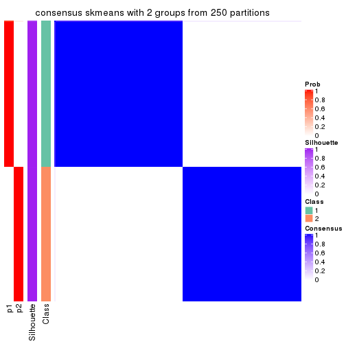</p>

</div>
<div id='tab-SD-skmeans-consensus-heatmap-2'>
<pre><code class="r">consensus_heatmap(res, k = 3)
</code></pre>

<p>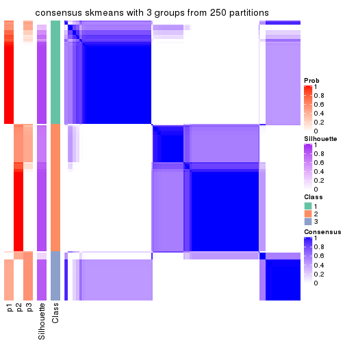</p>

</div>
<div id='tab-SD-skmeans-consensus-heatmap-3'>
<pre><code class="r">consensus_heatmap(res, k = 4)
</code></pre>

<p>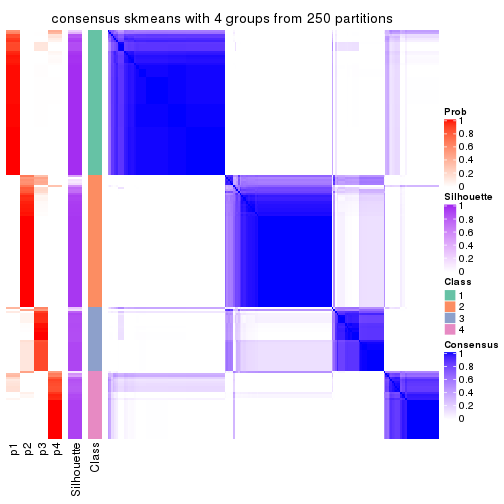</p>

</div>
<div id='tab-SD-skmeans-consensus-heatmap-4'>
<pre><code class="r">consensus_heatmap(res, k = 5)
</code></pre>

<p>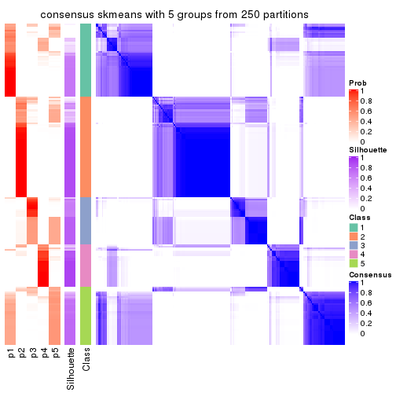</p>

</div>
<div id='tab-SD-skmeans-consensus-heatmap-5'>
<pre><code class="r">consensus_heatmap(res, k = 6)
</code></pre>

<p>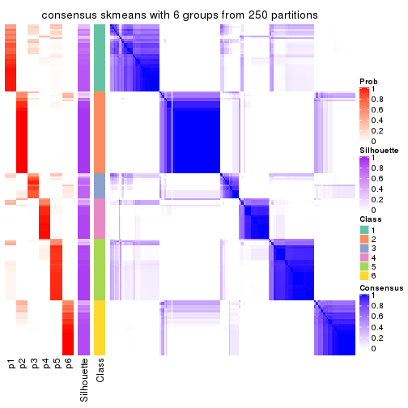</p>

</div>
</div>

Heatmaps for the membership of samples in all partitions to see how consistent they are:


<script>
$( function() {
	$( '#tabs-SD-skmeans-membership-heatmap' ).tabs();
} );
</script>
<div id='tabs-SD-skmeans-membership-heatmap'>
<ul>
<li><a href='#tab-SD-skmeans-membership-heatmap-1'>k = 2</a></li>
<li><a href='#tab-SD-skmeans-membership-heatmap-2'>k = 3</a></li>
<li><a href='#tab-SD-skmeans-membership-heatmap-3'>k = 4</a></li>
<li><a href='#tab-SD-skmeans-membership-heatmap-4'>k = 5</a></li>
<li><a href='#tab-SD-skmeans-membership-heatmap-5'>k = 6</a></li>
</ul>
<div id='tab-SD-skmeans-membership-heatmap-1'>
<pre><code class="r">membership_heatmap(res, k = 2)
</code></pre>

<p>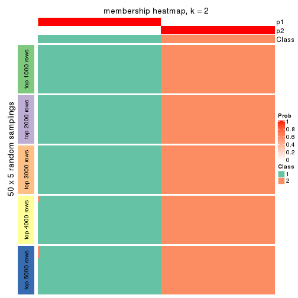</p>

</div>
<div id='tab-SD-skmeans-membership-heatmap-2'>
<pre><code class="r">membership_heatmap(res, k = 3)
</code></pre>

<p>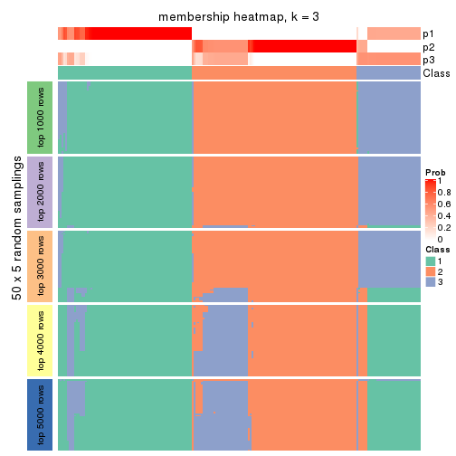</p>

</div>
<div id='tab-SD-skmeans-membership-heatmap-3'>
<pre><code class="r">membership_heatmap(res, k = 4)
</code></pre>

<p>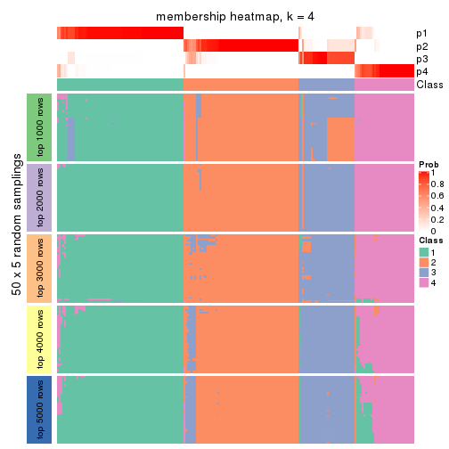</p>

</div>
<div id='tab-SD-skmeans-membership-heatmap-4'>
<pre><code class="r">membership_heatmap(res, k = 5)
</code></pre>

<p>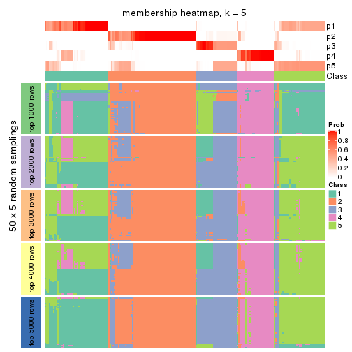</p>

</div>
<div id='tab-SD-skmeans-membership-heatmap-5'>
<pre><code class="r">membership_heatmap(res, k = 6)
</code></pre>

<p>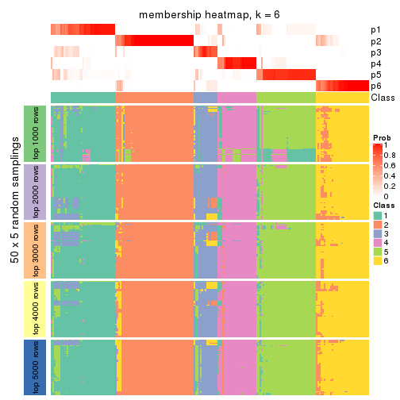</p>

</div>
</div>

As soon as we have had the classes for columns, we can look for signatures
which are significantly different between classes which can be candidate marks
for certain classes. Following are the heatmaps for signatures.


Signature heatmaps where rows are scaled:


<script>
$( function() {
	$( '#tabs-SD-skmeans-get-signatures' ).tabs();
} );
</script>
<div id='tabs-SD-skmeans-get-signatures'>
<ul>
<li><a href='#tab-SD-skmeans-get-signatures-1'>k = 2</a></li>
<li><a href='#tab-SD-skmeans-get-signatures-2'>k = 3</a></li>
<li><a href='#tab-SD-skmeans-get-signatures-3'>k = 4</a></li>
<li><a href='#tab-SD-skmeans-get-signatures-4'>k = 5</a></li>
<li><a href='#tab-SD-skmeans-get-signatures-5'>k = 6</a></li>
</ul>
<div id='tab-SD-skmeans-get-signatures-1'>
<pre><code class="r">get_signatures(res, k = 2)
</code></pre>

<p>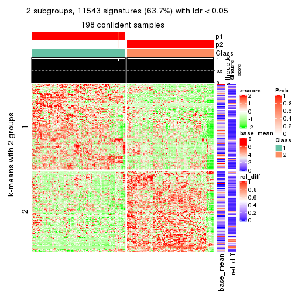</p>

</div>
<div id='tab-SD-skmeans-get-signatures-2'>
<pre><code class="r">get_signatures(res, k = 3)
</code></pre>

<p>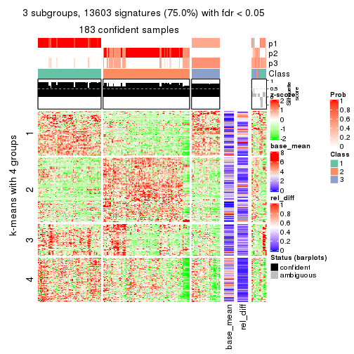</p>

</div>
<div id='tab-SD-skmeans-get-signatures-3'>
<pre><code class="r">get_signatures(res, k = 4)
</code></pre>

<p>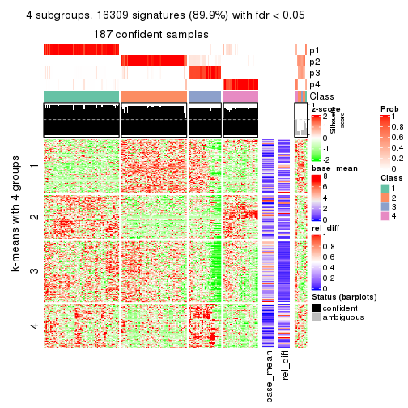</p>

</div>
<div id='tab-SD-skmeans-get-signatures-4'>
<pre><code class="r">get_signatures(res, k = 5)
</code></pre>

<p>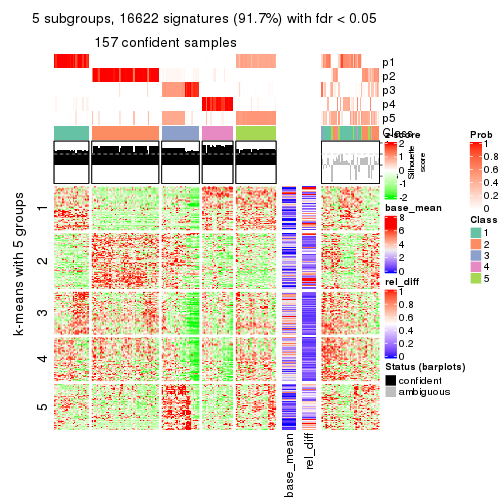</p>

</div>
<div id='tab-SD-skmeans-get-signatures-5'>
<pre><code class="r">get_signatures(res, k = 6)
</code></pre>

<p>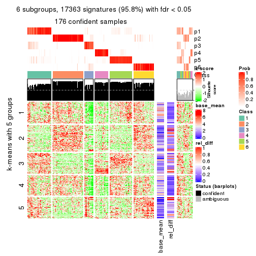</p>

</div>
</div>


Signature heatmaps where rows are not scaled:


<script>
$( function() {
	$( '#tabs-SD-skmeans-get-signatures-no-scale' ).tabs();
} );
</script>
<div id='tabs-SD-skmeans-get-signatures-no-scale'>
<ul>
<li><a href='#tab-SD-skmeans-get-signatures-no-scale-1'>k = 2</a></li>
<li><a href='#tab-SD-skmeans-get-signatures-no-scale-2'>k = 3</a></li>
<li><a href='#tab-SD-skmeans-get-signatures-no-scale-3'>k = 4</a></li>
<li><a href='#tab-SD-skmeans-get-signatures-no-scale-4'>k = 5</a></li>
<li><a href='#tab-SD-skmeans-get-signatures-no-scale-5'>k = 6</a></li>
</ul>
<div id='tab-SD-skmeans-get-signatures-no-scale-1'>
<pre><code class="r">get_signatures(res, k = 2, scale_rows = FALSE)
</code></pre>

<p>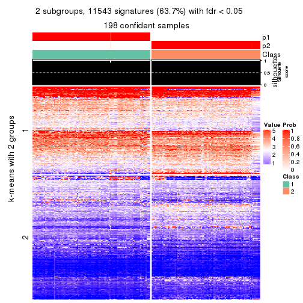</p>

</div>
<div id='tab-SD-skmeans-get-signatures-no-scale-2'>
<pre><code class="r">get_signatures(res, k = 3, scale_rows = FALSE)
</code></pre>

<p>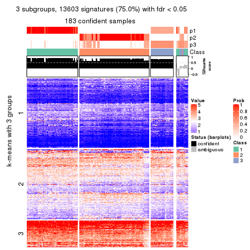</p>

</div>
<div id='tab-SD-skmeans-get-signatures-no-scale-3'>
<pre><code class="r">get_signatures(res, k = 4, scale_rows = FALSE)
</code></pre>

<p>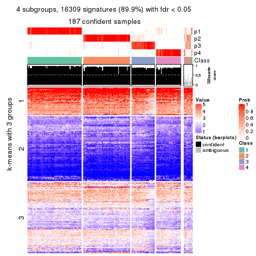</p>

</div>
<div id='tab-SD-skmeans-get-signatures-no-scale-4'>
<pre><code class="r">get_signatures(res, k = 5, scale_rows = FALSE)
</code></pre>

<p>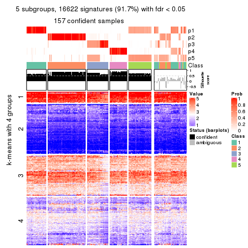</p>

</div>
<div id='tab-SD-skmeans-get-signatures-no-scale-5'>
<pre><code class="r">get_signatures(res, k = 6, scale_rows = FALSE)
</code></pre>

<p>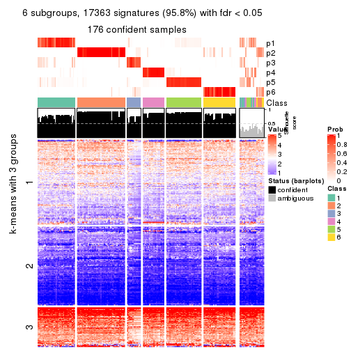</p>

</div>
</div>


Compare the overlap of signatures from different k:

```r
compare_signatures(res)
```

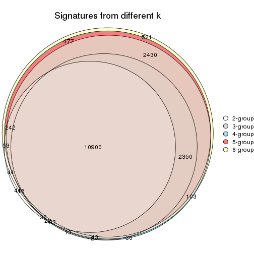

`get_signature()` returns a data frame invisibly. TO get the list of signatures, the function
call should be assigned to a variable explicitly. In following code, if `plot` argument is set
to `FALSE`, no heatmap is plotted while only the differential analysis is performed.

```r
# code only for demonstration
tb = get_signature(res, k = ..., plot = FALSE)
```

An example of the output of `tb` is:

```
#>   which_row         fdr    mean_1    mean_2 scaled_mean_1 scaled_mean_2 km
#> 1        38 0.042760348  8.373488  9.131774    -0.5533452     0.5164555  1
#> 2        40 0.018707592  7.106213  8.469186    -0.6173731     0.5762149  1
#> 3        55 0.019134737 10.221463 11.207825    -0.6159697     0.5749050  1
#> 4        59 0.006059896  5.921854  7.869574    -0.6899429     0.6439467  1
#> 5        60 0.018055526  8.928898 10.211722    -0.6204761     0.5791110  1
#> 6        98 0.009384629 15.714769 14.887706     0.6635654    -0.6193277  2
...
```

The columns in `tb` are:

1. `which_row`: row indices corresponding to the input matrix.
2. `fdr`: FDR for the differential test. 
3. `mean_x`: The mean value in group x.
4. `scaled_mean_x`: The mean value in group x after rows are scaled.
5. `km`: Row groups if k-means clustering is applied to rows.


UMAP plot which shows how samples are separated.


<script>
$( function() {
	$( '#tabs-SD-skmeans-dimension-reduction' ).tabs();
} );
</script>
<div id='tabs-SD-skmeans-dimension-reduction'>
<ul>
<li><a href='#tab-SD-skmeans-dimension-reduction-1'>k = 2</a></li>
<li><a href='#tab-SD-skmeans-dimension-reduction-2'>k = 3</a></li>
<li><a href='#tab-SD-skmeans-dimension-reduction-3'>k = 4</a></li>
<li><a href='#tab-SD-skmeans-dimension-reduction-4'>k = 5</a></li>
<li><a href='#tab-SD-skmeans-dimension-reduction-5'>k = 6</a></li>
</ul>
<div id='tab-SD-skmeans-dimension-reduction-1'>
<pre><code class="r">dimension_reduction(res, k = 2, method = &quot;UMAP&quot;)
</code></pre>

<p></p>

</div>
<div id='tab-SD-skmeans-dimension-reduction-2'>
<pre><code class="r">dimension_reduction(res, k = 3, method = &quot;UMAP&quot;)
</code></pre>

<p>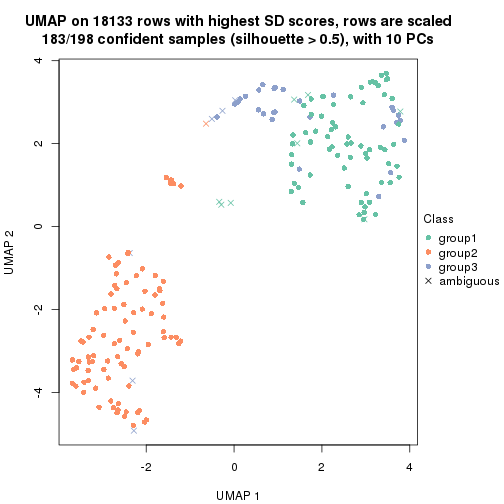</p>

</div>
<div id='tab-SD-skmeans-dimension-reduction-3'>
<pre><code class="r">dimension_reduction(res, k = 4, method = &quot;UMAP&quot;)
</code></pre>

<p>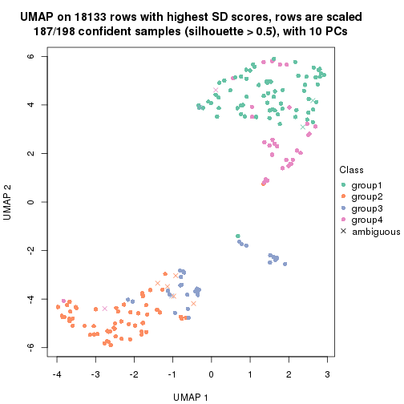</p>

</div>
<div id='tab-SD-skmeans-dimension-reduction-4'>
<pre><code class="r">dimension_reduction(res, k = 5, method = &quot;UMAP&quot;)
</code></pre>

<p>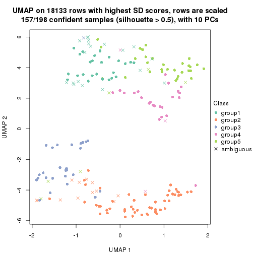</p>

</div>
<div id='tab-SD-skmeans-dimension-reduction-5'>
<pre><code class="r">dimension_reduction(res, k = 6, method = &quot;UMAP&quot;)
</code></pre>

<p>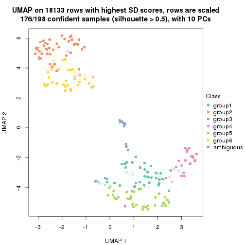</p>

</div>
</div>


Following heatmap shows how subgroups are split when increasing `k`:

```r
collect_classes(res)
```

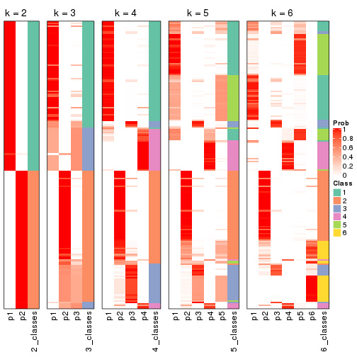


If matrix rows can be associated to genes, consider to use `functional_enrichment(res,
...)` to perform function enrichment for the signature genes. See [this vignette](http://bioconductor.org/packages/devel/bioc/vignettes/cola/inst/doc/functional_enrichment.html) for more detailed explanations.


 

---------------------------------------------------


### SD:pam*


The object with results only for a single top-value method and a single partition method 
can be extracted as:

```r
res = res_list["SD", "pam"]
# you can also extract it by
# res = res_list["SD:pam"]
```

A summary of `res` and all the functions that can be applied to it:

```r
res
```

```
#> A 'ConsensusPartition' object with k = 2, 3, 4, 5, 6.
#>   On a matrix with 18133 rows and 198 columns.
#>   Top rows (1000, 2000, 3000, 4000, 5000) are extracted by 'SD' method.
#>   Subgroups are detected by 'pam' method.
#>   Performed in total 1250 partitions by row resampling.
#>   Best k for subgroups seems to be 5.
#> 
#> Following methods can be applied to this 'ConsensusPartition' object:
#>  [1] "cola_report"             "collect_classes"         "collect_plots"          
#>  [4] "collect_stats"           "colnames"                "compare_signatures"     
#>  [7] "consensus_heatmap"       "dimension_reduction"     "functional_enrichment"  
#> [10] "get_anno_col"            "get_anno"                "get_classes"            
#> [13] "get_consensus"           "get_matrix"              "get_membership"         
#> [16] "get_param"               "get_signatures"          "get_stats"              
#> [19] "is_best_k"               "is_stable_k"             "membership_heatmap"     
#> [22] "ncol"                    "nrow"                    "plot_ecdf"              
#> [25] "rownames"                "select_partition_number" "show"                   
#> [28] "suggest_best_k"          "test_to_known_factors"
```

`collect_plots()` function collects all the plots made from `res` for all `k` (number of partitions)
into one single page to provide an easy and fast comparison between different `k`.

```r
collect_plots(res)
```

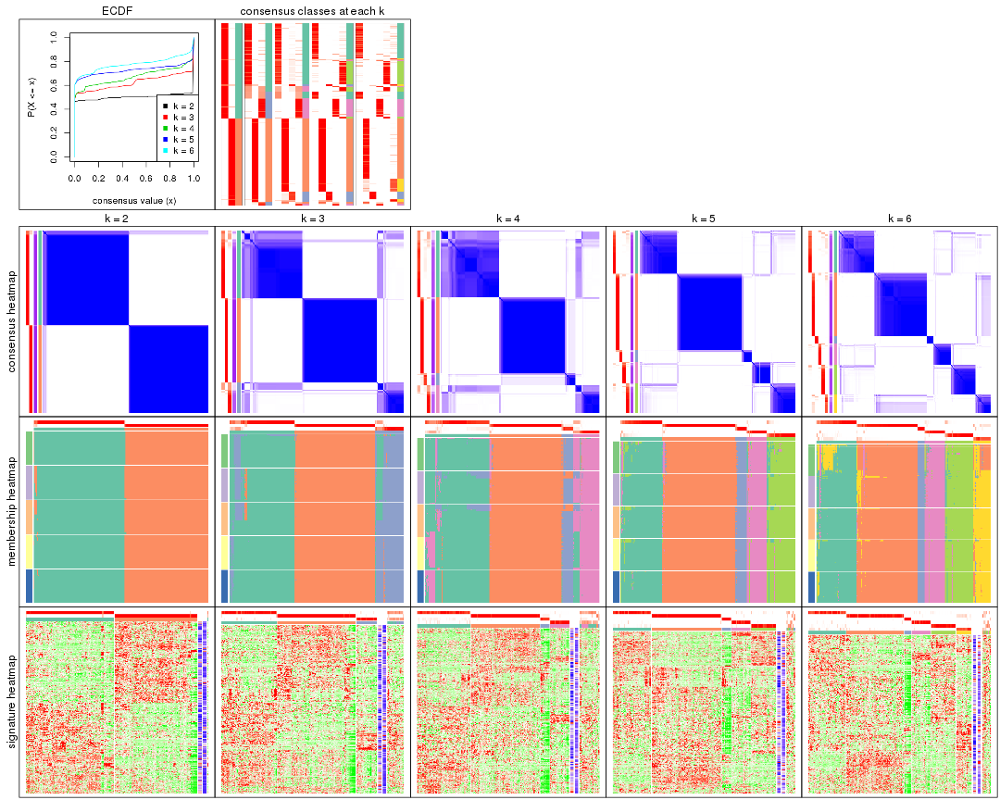

The plots are:

- The first row: a plot of the ECDF (empirical cumulative distribution
  function) curves of the consensus matrix for each `k` and the heatmap of
  predicted classes for each `k`.
- The second row: heatmaps of the consensus matrix for each `k`.
- The third row: heatmaps of the membership matrix for each `k`.
- The fouth row: heatmaps of the signatures for each `k`.

All the plots in panels can be made by individual functions and they are
plotted later in this section.

`select_partition_number()` produces several plots showing different
statistics for choosing "optimized" `k`. There are following statistics:

- ECDF curves of the consensus matrix for each `k`;
- 1-PAC. [The PAC
  score](https://en.wikipedia.org/wiki/Consensus_clustering#Over-interpretation_potential_of_consensus_clustering)
  measures the proportion of the ambiguous subgrouping.
- Mean silhouette score.
- Concordance. The mean probability of fiting the consensus class ids in all
  partitions.
- Area increased. Denote $A_k$ as the area under the ECDF curve for current
  `k`, the area increased is defined as $A_k - A_{k-1}$.
- Rand index. The percent of pairs of samples that are both in a same cluster
  or both are not in a same cluster in the partition of k and k-1.
- Jaccard index. The ratio of pairs of samples are both in a same cluster in
  the partition of k and k-1 and the pairs of samples are both in a same
  cluster in the partition k or k-1.

The detailed explanations of these statistics can be found in [the _cola_
vignette](http://bioconductor.org/packages/devel/bioc/vignettes/cola/inst/doc/cola.html#toc_13).

Generally speaking, lower PAC score, higher mean silhouette score or higher
concordance corresponds to better partition. Rand index and Jaccard index
measure how similar the current partition is compared to partition with `k-1`.
If they are too similar, we won't accept `k` is better than `k-1`.

```r
select_partition_number(res)
```

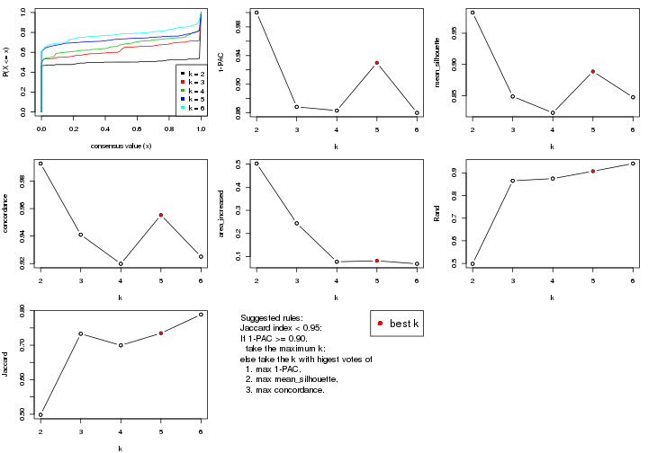

The numeric values for all these statistics can be obtained by `get_stats()`.

```r
get_stats(res)
```

```
#>   k 1-PAC mean_silhouette concordance area_increased  Rand Jaccard
#> 2 2 1.000           0.983       0.993         0.5025 0.498   0.498
#> 3 3 0.868           0.849       0.941         0.2439 0.865   0.733
#> 4 4 0.863           0.823       0.920         0.0775 0.875   0.699
#> 5 5 0.930           0.889       0.955         0.0817 0.908   0.735
#> 6 6 0.860           0.848       0.925         0.0687 0.941   0.789
```

`suggest_best_k()` suggests the best $k$ based on these statistics. The rules are as follows:

- All $k$ with Jaccard index larger than 0.95 are removed because increasing
  $k$ does not provide enough extra information. If all $k$ are removed, it is
  marked as no subgroup is detected.
- For all $k$ with 1-PAC score larger than 0.9, the maximal $k$ is taken as
  the best $k$, and other $k$ are marked as optional $k$.
- If it does not fit the second rule. The $k$ with the maximal vote of the
  highest 1-PAC score, highest mean silhouette, and highest concordance is
  taken as the best $k$.

```r
suggest_best_k(res)
```

```
#> [1] 5
#> attr(,"optional")
#> [1] 2
```

There is also optional best $k$ = 2 that is worth to check.

Following shows the table of the partitions (You need to click the **show/hide
code output** link to see it). The membership matrix (columns with name `p*`)
is inferred by
[`clue::cl_consensus()`](https://www.rdocumentation.org/link/cl_consensus?package=clue)
function with the `SE` method. Basically the value in the membership matrix
represents the probability to belong to a certain group. The finall class
label for an item is determined with the group with highest probability it
belongs to.

In `get_classes()` function, the entropy is calculated from the membership
matrix and the silhouette score is calculated from the consensus matrix.


<script>
$( function() {
	$( '#tabs-SD-pam-get-classes' ).tabs();
} );
</script>
<div id='tabs-SD-pam-get-classes'>
<ul>
<li><a href='#tab-SD-pam-get-classes-1'>k = 2</a></li>
<li><a href='#tab-SD-pam-get-classes-2'>k = 3</a></li>
<li><a href='#tab-SD-pam-get-classes-3'>k = 4</a></li>
<li><a href='#tab-SD-pam-get-classes-4'>k = 5</a></li>
<li><a href='#tab-SD-pam-get-classes-5'>k = 6</a></li>
</ul>

<div id='tab-SD-pam-get-classes-1'>
<p><a id='tab-SD-pam-get-classes-1-a' style='color:#0366d6' href='#'>show/hide code output</a></p>
<pre><code class="r">cbind(get_classes(res, k = 2), get_membership(res, k = 2))
</code></pre>

<pre><code>#&gt;                                      class entropy silhouette    p1    p2
#&gt; 0C0AA0B2-5191-4EDF-8937-ED7434F30283     2  0.0000      0.997 0.000 1.000
#&gt; 18B45F1F-234F-45CC-A234-145307606C5C     1  0.0000      0.988 1.000 0.000
#&gt; E18B70C0-BDCA-46D3-99BB-C6C8ABC68DA5     2  0.0000      0.997 0.000 1.000
#&gt; 0F6DDBA7-6F74-45E8-95C8-F28263D55978     1  0.0000      0.988 1.000 0.000
#&gt; 7EAE1A5A-129A-46DE-977E-A2C753F10904     2  0.0000      0.997 0.000 1.000
#&gt; 7EAE0048-16B5-4979-9410-16CDEB9B1A48     1  0.0000      0.988 1.000 0.000
#&gt; 2EBFC828-2B27-4753-A052-80DDA226DAB4     2  0.0000      0.997 0.000 1.000
#&gt; 24E1768D-2232-41DA-9383-BC55D6EB3812     2  0.0000      0.997 0.000 1.000
#&gt; 6E3CD60A-1889-4CA3-B305-2E78152057B5     2  0.0000      0.997 0.000 1.000
#&gt; 33CC70DD-82B3-413C-B3B1-BE06634D95D0     1  0.0000      0.988 1.000 0.000
#&gt; F1CB57A3-55DD-4487-9307-1B4F652E729A     1  0.0000      0.988 1.000 0.000
#&gt; 755A5806-B054-449A-93DB-79909E6C93A1     1  0.0000      0.988 1.000 0.000
#&gt; 58D364E7-3D2F-468F-A264-D6461E2428D4     2  0.0000      0.997 0.000 1.000
#&gt; 68BB9CB6-7AA2-4981-B9D9-07363EC96599     2  0.0000      0.997 0.000 1.000
#&gt; 3C4E8DFA-8EA0-4F1F-89CB-CB8805395872     2  0.0000      0.997 0.000 1.000
#&gt; 4219651D-5583-4498-BF08-1B7D04B4C7B2     1  0.0000      0.988 1.000 0.000
#&gt; B5EE2768-0D67-4584-ADBC-EC745FEC52EA     2  0.0000      0.997 0.000 1.000
#&gt; 825E6C11-F460-451A-8045-846DD7D0E945     1  0.0000      0.988 1.000 0.000
#&gt; 491F62AF-5E68-43C3-982A-F867A75BBA9A     2  0.0000      0.997 0.000 1.000
#&gt; 9D7F058C-F95A-44AD-AC9E-450F7FBDC960     2  0.0000      0.997 0.000 1.000
#&gt; 6D42DD0C-2081-4742-BA27-9F5F16FAC3C6     1  0.0000      0.988 1.000 0.000
#&gt; EDD7E63D-492A-473B-A552-0764337B10EF     2  0.0000      0.997 0.000 1.000
#&gt; 97073DEA-73AD-4DFD-BD1A-9035DC03445B     1  0.0000      0.988 1.000 0.000
#&gt; FA891AB9-CE38-4F7E-A015-1DDCE12890A0     1  0.0000      0.988 1.000 0.000
#&gt; D9514D49-A0AE-45AB-8C9F-68E726215253     1  0.0000      0.988 1.000 0.000
#&gt; 3B9229AD-12E5-451E-9D2F-378AAC82C04A     2  0.0000      0.997 0.000 1.000
#&gt; 5EA36B71-4917-4EF3-9060-065EFE6ACC5B     1  0.0000      0.988 1.000 0.000
#&gt; A20E4ECB-4895-4CC7-BE5E-4721B20D933B     1  0.0000      0.988 1.000 0.000
#&gt; 1BE8D828-29DB-4368-AA4A-FB23588F7AE8     1  0.0000      0.988 1.000 0.000
#&gt; 66EFEFCF-3D14-4DBF-AA13-530F40ED0245     1  0.4161      0.903 0.916 0.084
#&gt; 55DFFE53-BCE7-4EC1-9863-6C0311B06BA2     2  0.0000      0.997 0.000 1.000
#&gt; 4CC3FB5A-611D-4C64-AE9D-544FA45CF4DC     1  0.0000      0.988 1.000 0.000
#&gt; C11D33F2-DFE9-4FA8-9024-F3E7F1DADC5F     2  0.0000      0.997 0.000 1.000
#&gt; FA5932B8-8AA3-4C38-9FAB-C35D8772974D     1  0.0000      0.988 1.000 0.000
#&gt; 8216EC35-1F41-4A15-B503-BDA4971E27C9     1  0.0000      0.988 1.000 0.000
#&gt; 69635D23-90A7-4BAD-97C7-B79536837F57     1  0.0000      0.988 1.000 0.000
#&gt; 12B404E2-C463-4409-8392-E4649B2AFFD1     2  0.0000      0.997 0.000 1.000
#&gt; 246927E3-ACCF-41B2-AA8E-43855FD6B146     2  0.0000      0.997 0.000 1.000
#&gt; E0CC13E7-9607-49E0-B4AA-395544E3C3BF     1  0.0000      0.988 1.000 0.000
#&gt; F7BBC0C1-6124-4A83-8A70-EA89B62F1CBD     1  0.0000      0.988 1.000 0.000
#&gt; B1D4FF24-8E6F-4A04-B716-2032D850EB57     1  0.0000      0.988 1.000 0.000
#&gt; 253601DB-B78A-4566-9947-8C0270C0B163     2  0.0000      0.997 0.000 1.000
#&gt; AB83DBFF-5737-4FB8-A5AC-1D3CD6072BDF     2  0.7528      0.719 0.216 0.784
#&gt; 9D67D953-EC98-4B72-89C8-5732BC9D4BC9     2  0.0000      0.997 0.000 1.000
#&gt; 51061018-95AB-4278-886F-F69E4EBC47C0     2  0.0000      0.997 0.000 1.000
#&gt; ABD0F7F3-105B-4DEE-9889-5028772C519A     1  0.0000      0.988 1.000 0.000
#&gt; 562B95CF-B27E-4A72-B7C6-CDF86A51A39B     1  0.0000      0.988 1.000 0.000
#&gt; ABF046A4-D7A1-49FF-B6B1-4E07A791DEDB     2  0.0000      0.997 0.000 1.000
#&gt; 3FF4101E-9703-460E-A30E-76CC7689F36D     2  0.0000      0.997 0.000 1.000
#&gt; 39C4F7AA-7ADF-4F1D-BDA3-BEC605AC5023     2  0.0000      0.997 0.000 1.000
#&gt; CB821FD2-AF5C-4743-A70F-21C12C6ED153     1  0.0000      0.988 1.000 0.000
#&gt; 92EA1846-62FF-41D5-A441-5E52E6B9E7F9     1  0.0000      0.988 1.000 0.000
#&gt; 7D25F3EE-5A20-4763-8026-16A03D05F459     1  0.0000      0.988 1.000 0.000
#&gt; 8ECE5276-CD06-496B-A5A9-1713B1F7D089     1  0.0000      0.988 1.000 0.000
#&gt; C775B68F-9507-47E3-B507-B433AED79002     1  0.0000      0.988 1.000 0.000
#&gt; E19D5463-FDD0-41C1-A170-323736A88D07     2  0.0000      0.997 0.000 1.000
#&gt; CE4B6285-4961-4767-91F0-5C7A8162E185     1  0.0000      0.988 1.000 0.000
#&gt; 9637BD72-1FEF-42AD-8886-2C39BE876531     1  0.0000      0.988 1.000 0.000
#&gt; 81B5A88E-45A0-4B44-B689-B9071B8548EE     2  0.0000      0.997 0.000 1.000
#&gt; 0B01B4C9-9BED-4F5B-A3E2-8868C7CCC3FC     2  0.1633      0.973 0.024 0.976
#&gt; 54501315-7132-44B2-A179-10FBF1421105     1  0.0000      0.988 1.000 0.000
#&gt; E207CBE9-4C3A-4FDD-9251-CFE1FE106475     1  0.8555      0.619 0.720 0.280
#&gt; 3BEA0B92-3F90-4DBF-9679-AADEAD7D47C8     2  0.0000      0.997 0.000 1.000
#&gt; 35B32250-D854-4215-AA5B-2C11B2FBEECA     1  0.0000      0.988 1.000 0.000
#&gt; ACE6566B-AEB9-426C-924A-B382D14A1024     2  0.0000      0.997 0.000 1.000
#&gt; 737E69AC-0930-45B9-B6BA-7CE5E300290B     1  0.0000      0.988 1.000 0.000
#&gt; B4410AB8-D015-41CA-86E6-12EB4E4103E3     1  0.0000      0.988 1.000 0.000
#&gt; 6D3ECA65-C50F-43B0-B75A-1D290FA4A8FD     2  0.0000      0.997 0.000 1.000
#&gt; C86F40D3-9A96-4395-A8C3-510DE12F9A2B     2  0.0000      0.997 0.000 1.000
#&gt; 6238087F-24DD-4BF1-903F-3BD4E446C1AE     2  0.0000      0.997 0.000 1.000
#&gt; E4FF840B-EEAB-4CB0-A690-7D4C4AA7EEC3     2  0.0000      0.997 0.000 1.000
#&gt; 72D3C323-C67F-4C0E-9BFC-BF245FF9730A     1  0.0000      0.988 1.000 0.000
#&gt; 82D56E4E-4DF6-4F3E-8959-B995C92AAA70     1  0.0000      0.988 1.000 0.000
#&gt; E31CA441-EB19-443B-ACBD-37B5CCBCF0E5     2  0.0000      0.997 0.000 1.000
#&gt; 87CA8939-D054-4B8A-B32D-085FD2E8F202     1  0.0000      0.988 1.000 0.000
#&gt; 2A508D90-FEDC-46A3-9A02-E51E5467CDCB     1  0.0000      0.988 1.000 0.000
#&gt; C4E8B4E2-388B-411F-BF0A-9B6F34E8EDB5     2  0.0000      0.997 0.000 1.000
#&gt; AF6AF803-BD93-44A7-AA80-B9BC92C1273B     2  0.0000      0.997 0.000 1.000
#&gt; 0B1CA5CF-EB96-41D4-BFC5-6957FEB39828     1  0.0000      0.988 1.000 0.000
#&gt; 6FB96FB0-6661-48AD-A4A0-69F8AFDBE591     2  0.0000      0.997 0.000 1.000
#&gt; 8C19F7FD-368A-462B-B28F-88D6630038A1     1  0.0000      0.988 1.000 0.000
#&gt; 96EABE78-C2F4-4A33-ACD8-C922A4B2519B     2  0.0000      0.997 0.000 1.000
#&gt; 68B36D7B-546A-4689-949F-B207C4A4AB27     2  0.0000      0.997 0.000 1.000
#&gt; CE9F3335-778F-4F52-BC55-4B7C99B211DD     2  0.0000      0.997 0.000 1.000
#&gt; CB359DED-2A2D-4646-A0BD-6F10ADCC532B     1  0.0000      0.988 1.000 0.000
#&gt; 198324A5-8C52-46F6-9734-EFAF1CCA6D9B     1  0.0000      0.988 1.000 0.000
#&gt; 83B88608-0506-428C-B9E8-621F38477B42     1  0.0000      0.988 1.000 0.000
#&gt; 1993630A-0F3D-4F5C-86A3-D443BAAF57F0     1  0.9608      0.385 0.616 0.384
#&gt; DE73DA9B-529E-4F4F-A65C-DA7AB84B1096     1  0.0000      0.988 1.000 0.000
#&gt; 2347F3B7-DDA3-40C0-B6D4-8819ECA69146     1  0.0000      0.988 1.000 0.000
#&gt; AB93B5D5-095F-4330-9D40-6A3D934AB50C     1  0.0000      0.988 1.000 0.000
#&gt; 5EBBE4AD-FF0C-41CF-9EA3-B6FE7EA1F9C0     1  0.7950      0.689 0.760 0.240
#&gt; 6D960AE7-3769-4144-A061-E8588E5063FF     1  0.0000      0.988 1.000 0.000
#&gt; 0C2DD8C0-D1A5-4192-A49C-7A40FED628B2     2  0.0000      0.997 0.000 1.000
#&gt; 18C9372F-C55B-4F86-A9D2-E8D85EFC8566     2  0.0000      0.997 0.000 1.000
#&gt; 9AF637B0-4C32-4DD1-93AF-7655B4A845D3     2  0.0000      0.997 0.000 1.000
#&gt; 785B5B06-4115-46FD-9BEB-F888AFDC855D     2  0.0000      0.997 0.000 1.000
#&gt; ECA3050E-4BE2-4117-B9CF-A52BB85AF8C2     2  0.0000      0.997 0.000 1.000
#&gt; 099DC396-16A5-458F-9ED9-F2A790CB0C34     1  0.0000      0.988 1.000 0.000
#&gt; 7A5A12EE-C5B0-4C51-8C99-0F3FA88D633E     1  0.0000      0.988 1.000 0.000
#&gt; E832B508-A66D-4817-B44A-FE9FAAE64B4A     1  0.0000      0.988 1.000 0.000
#&gt; F9DD688C-7B35-49E7-9651-2E098EE78856     1  0.0000      0.988 1.000 0.000
#&gt; F1265DD8-5ED3-4635-A277-57BBFDEC7729     1  0.0000      0.988 1.000 0.000
#&gt; F624E8D9-DB07-4C9E-910D-5E8EBA3A6167     2  0.0000      0.997 0.000 1.000
#&gt; 3516FBDF-66E1-43F4-9D7B-16748F6439A7     2  0.0000      0.997 0.000 1.000
#&gt; 04B12992-B2EA-4BA2-8E2C-11E34E230E6F     2  0.0000      0.997 0.000 1.000
#&gt; CC02897D-9123-495E-9242-5C9CF4EC269B     2  0.0000      0.997 0.000 1.000
#&gt; 3117ED46-2BF2-4311-BC00-4E98243E16B3     1  0.0000      0.988 1.000 0.000
#&gt; E0B66D53-23DB-4E26-BB6E-F692FA8C000E     1  0.0000      0.988 1.000 0.000
#&gt; DAA93CE5-A013-477A-9A50-EA09CC3A8162     2  0.0000      0.997 0.000 1.000
#&gt; 0099098D-354A-4276-92F8-B932C74B4608     1  0.0000      0.988 1.000 0.000
#&gt; DD483639-B2E7-4745-BCFB-55ED1D82BFBF     2  0.0000      0.997 0.000 1.000
#&gt; 2C1F9079-602E-4252-82C7-9D8799E04246     2  0.0000      0.997 0.000 1.000
#&gt; 9473A8E4-3A1B-4184-9EA6-517AFD60B635     1  0.0000      0.988 1.000 0.000
#&gt; 75CFBAF6-7BA0-40AF-92D7-D218E885BD1B     2  0.0000      0.997 0.000 1.000
#&gt; B588950F-14D6-41C8-845B-EFD2096013C6     2  0.0000      0.997 0.000 1.000
#&gt; 0DF3EDA8-DAEA-4721-92AB-B97181249498     2  0.0000      0.997 0.000 1.000
#&gt; 8EA83042-D598-401D-AD78-936EEB136C59     1  0.0000      0.988 1.000 0.000
#&gt; 729AC418-3BE9-445A-95D4-AC11A7D43BE0     1  0.0000      0.988 1.000 0.000
#&gt; 7D8B1B11-F576-4AA8-BFA7-0022A2CD829A     2  0.0000      0.997 0.000 1.000
#&gt; 304A0E46-3449-4B44-9C30-BDDF6459391D     1  0.0000      0.988 1.000 0.000
#&gt; 3C83358F-DF20-47F7-AF9F-AB7CC92F5ABA     1  0.0000      0.988 1.000 0.000
#&gt; EAFEED6C-35C3-451F-AE4A-EB56992E1F29     1  0.0000      0.988 1.000 0.000
#&gt; 8A237A65-28EC-434D-A78A-A8B7308B5204     1  0.0000      0.988 1.000 0.000
#&gt; D005833F-E991-4E9E-9667-55F137288004     1  0.0000      0.988 1.000 0.000
#&gt; 37D966E3-253E-4397-A9AE-0903A8D31FE6     1  0.0000      0.988 1.000 0.000
#&gt; D2482B81-CB5B-4178-BA8D-1CF4026181B5     1  0.0000      0.988 1.000 0.000
#&gt; 18019E95-C2A8-4EE7-B585-F6886DC4D953     2  0.0000      0.997 0.000 1.000
#&gt; 0B126D1A-14A8-4345-8F78-FF92222ADF4C     2  0.0000      0.997 0.000 1.000
#&gt; CE88B625-47D8-4D58-9FB4-23464DB7DDAD     2  0.0000      0.997 0.000 1.000
#&gt; 9A88299D-5C74-47FA-B42C-1A1D6D935AAB     1  0.0000      0.988 1.000 0.000
#&gt; 3E71159C-FD6C-41DA-B18B-0730C8AC7E41     1  0.0000      0.988 1.000 0.000
#&gt; 6F245AA4-79D9-47E1-BCC9-1AAF65AEA813     1  0.0000      0.988 1.000 0.000
#&gt; 4CF2C888-2100-483A-B4DB-ECBB69243A4D     2  0.0000      0.997 0.000 1.000
#&gt; A3853813-B9D5-4E8C-B075-19FCC35F8686     2  0.0000      0.997 0.000 1.000
#&gt; 83A16DEE-CE9F-4D8B-9225-0A2A8B9D055D     1  0.0000      0.988 1.000 0.000
#&gt; 0F057CAF-4F9A-4DE9-8601-730E96873733     2  0.0000      0.997 0.000 1.000
#&gt; 32D5801D-DBA4-422E-87CB-A2DDE921BA41     1  0.0000      0.988 1.000 0.000
#&gt; 22EE8076-F07C-499A-9AF8-D800A77EF154     2  0.0000      0.997 0.000 1.000
#&gt; DD4BD74D-D48C-4090-9F57-5334E784581C     1  0.0000      0.988 1.000 0.000
#&gt; 41183565-434D-474C-B1BD-CA6E94910658     2  0.0000      0.997 0.000 1.000
#&gt; 75A2CE41-2B2A-4346-927E-ACF8A72738E4     1  0.0000      0.988 1.000 0.000
#&gt; 7AA24995-3DD2-4682-B36A-4EBFEEACF625     1  0.0000      0.988 1.000 0.000
#&gt; 8BAFDFEC-9F26-4ADB-95CE-004143960EEB     1  0.0000      0.988 1.000 0.000
#&gt; A330E011-CE08-4A85-8F4B-370592293DBB     1  0.0000      0.988 1.000 0.000
#&gt; 1D5A5B17-2E70-4BB0-94A1-EC17E6EA49DB     1  0.0000      0.988 1.000 0.000
#&gt; BD9143B8-9D97-4A05-872C-3FB82B4CF7BE     2  0.0000      0.997 0.000 1.000
#&gt; 64552DC0-181E-4607-898C-787AA7F26435     2  0.0000      0.997 0.000 1.000
#&gt; 1B4C4D41-34C7-43A3-858B-C9552EB53894     1  0.0000      0.988 1.000 0.000
#&gt; 463A3BAA-02DC-4EA4-A644-B924163E425D     2  0.0000      0.997 0.000 1.000
#&gt; CD0FEA89-6F60-4A20-8FCA-D397B4E95A98     1  0.0000      0.988 1.000 0.000
#&gt; 5D06CF6D-F4B9-4B32-B055-8AB287E53340     2  0.0000      0.997 0.000 1.000
#&gt; ADA7835F-DB67-4F4F-9446-8BCE3C5FE936     2  0.0000      0.997 0.000 1.000
#&gt; 4109BE2D-B5DF-4BD7-860E-60D87F647152     2  0.0000      0.997 0.000 1.000
#&gt; 88526A0E-6DFE-46CB-BFAD-B4826F482C67     1  0.0000      0.988 1.000 0.000
#&gt; F39F9A4C-18F7-4017-AB31-85D52FF44587     2  0.0000      0.997 0.000 1.000
#&gt; D4290A5E-1B24-4C55-B470-0FA7A0A09DD0     2  0.0000      0.997 0.000 1.000
#&gt; DC5A2C9E-978F-4661-B729-1F9662976E27     1  0.0000      0.988 1.000 0.000
#&gt; 26A1F392-CED2-43E3-8096-74E6F2BFC8C0     2  0.0000      0.997 0.000 1.000
#&gt; 87D81FB2-306A-4E75-9D58-D5F48E46E7F6     2  0.0000      0.997 0.000 1.000
#&gt; E3D9D81A-C20C-4B3B-B940-A5D2C5F65B22     2  0.0000      0.997 0.000 1.000
#&gt; 4464650B-453F-476C-989C-B7B159BF2CF0     2  0.0000      0.997 0.000 1.000
#&gt; 577D2867-B738-487A-9B06-07958D647F02     1  0.0000      0.988 1.000 0.000
#&gt; E52A22CC-3C03-41A9-9541-220DD871E162     2  0.0000      0.997 0.000 1.000
#&gt; 642703B1-AF99-4746-A915-0792F4B9590B     2  0.0000      0.997 0.000 1.000
#&gt; 8F0D1792-1284-45E6-8EC4-392596057677     2  0.0000      0.997 0.000 1.000
#&gt; 765AFFC1-D528-4494-8BA1-0706451E4205     2  0.0000      0.997 0.000 1.000
#&gt; A716BC29-161F-4CA0-B240-00B330137F2C     1  0.0000      0.988 1.000 0.000
#&gt; 32CBFBAF-7064-4595-8D54-2C5E7DE0FD9B     1  0.0000      0.988 1.000 0.000
#&gt; 4D6ED28C-3F20-41B0-BA41-1BF0E5199A40     2  0.0000      0.997 0.000 1.000
#&gt; 86A38456-2900-48FB-B10F-79222B3CA9BF     1  0.0672      0.981 0.992 0.008
#&gt; E870807D-3223-4A6A-9E3D-F4461B048AA2     2  0.0000      0.997 0.000 1.000
#&gt; 3A78D19F-A833-4D2C-8387-FB4FD4A8313C     1  0.0000      0.988 1.000 0.000
#&gt; DFA162CA-C708-4121-8E74-F9C4DEE0CDAE     1  0.0000      0.988 1.000 0.000
#&gt; C00A300A-CD10-4C9D-8C94-3901AFE8406C     2  0.0000      0.997 0.000 1.000
#&gt; 13E11D15-A90F-48C4-980A-DD032C00A2C1     1  0.0000      0.988 1.000 0.000
#&gt; 31BF80AB-FEDB-4C73-89C3-70BE9F9ACBEE     2  0.0000      0.997 0.000 1.000
#&gt; FA34308A-349D-4AAD-94CF-3F3B7F9AD629     2  0.0000      0.997 0.000 1.000
#&gt; 7C48D467-B663-49DD-BC84-A36BC32ACB3D     1  0.0000      0.988 1.000 0.000
#&gt; BB068534-04F6-4FC9-9087-CDA65920BCE2     1  0.0000      0.988 1.000 0.000
#&gt; EA4EC272-A9B3-4B2E-955F-19F7676A944C     2  0.0000      0.997 0.000 1.000
#&gt; C71FF69B-A460-43CA-8769-9667F22D938B     1  0.0000      0.988 1.000 0.000
#&gt; 5243D1B8-8168-4FF1-A8C6-505F080EF0D3     2  0.0000      0.997 0.000 1.000
#&gt; BCC474D8-08FE-4E99-B8E8-B29E65F84D2E     1  0.0000      0.988 1.000 0.000
#&gt; 04FDBFE3-4CF6-4E53-A2AA-89D5C9316377     2  0.0000      0.997 0.000 1.000
#&gt; 83A9915C-8D60-4CAE-A868-B61E3C90C7B0     2  0.0000      0.997 0.000 1.000
#&gt; 989A6472-E3E3-457A-97BE-CCE95F42D5C2     2  0.0000      0.997 0.000 1.000
#&gt; A0AB2D28-6751-49C9-8DF4-66FDBF95C360     1  0.0000      0.988 1.000 0.000
#&gt; A12B2683-18D4-41C9-8AE5-C143E2180052     1  0.0000      0.988 1.000 0.000
#&gt; 8DE1E245-CAD2-4F11-BFA2-9792C433A00B     1  0.7056      0.764 0.808 0.192
#&gt; FDA68036-6C4C-4256-9AA0-C01FE92AA098     2  0.0000      0.997 0.000 1.000
#&gt; 26311920-1414-4EC1-870B-784961EBCC2D     1  0.0000      0.988 1.000 0.000
#&gt; C29A10D6-D598-4286-B5E0-F1776E19E988     1  0.0000      0.988 1.000 0.000
#&gt; FACCC1FB-4937-4CC0-90EA-7F91D3D939CF     2  0.0000      0.997 0.000 1.000
#&gt; 90B9D84B-78E5-4C7E-8414-EC889C2DE8DB     2  0.0000      0.997 0.000 1.000
#&gt; B74E6122-76E1-4E4D-A867-BCAFD7277393     1  0.0000      0.988 1.000 0.000
#&gt; 98494DC0-CF6E-485F-8A0D-D80E4437EF5C     2  0.0000      0.997 0.000 1.000
#&gt; DA114DAC-DE7B-4E43-8D7C-82C5D7B66411     1  0.0000      0.988 1.000 0.000
</code></pre>

<script>
$('#tab-SD-pam-get-classes-1-a').parent().next().next().hide();
$('#tab-SD-pam-get-classes-1-a').click(function(){
  $('#tab-SD-pam-get-classes-1-a').parent().next().next().toggle();
  return(false);
});
</script>
</div>

<div id='tab-SD-pam-get-classes-2'>
<p><a id='tab-SD-pam-get-classes-2-a' style='color:#0366d6' href='#'>show/hide code output</a></p>
<pre><code class="r">cbind(get_classes(res, k = 3), get_membership(res, k = 3))
</code></pre>

<pre><code>#&gt;                                      class entropy silhouette    p1    p2    p3
#&gt; 0C0AA0B2-5191-4EDF-8937-ED7434F30283     2  0.0000     0.9965 0.000 1.000 0.000
#&gt; 18B45F1F-234F-45CC-A234-145307606C5C     3  0.0000     0.8149 0.000 0.000 1.000
#&gt; E18B70C0-BDCA-46D3-99BB-C6C8ABC68DA5     2  0.0000     0.9965 0.000 1.000 0.000
#&gt; 0F6DDBA7-6F74-45E8-95C8-F28263D55978     1  0.0000     0.8889 1.000 0.000 0.000
#&gt; 7EAE1A5A-129A-46DE-977E-A2C753F10904     2  0.0000     0.9965 0.000 1.000 0.000
#&gt; 7EAE0048-16B5-4979-9410-16CDEB9B1A48     1  0.6095     0.1971 0.608 0.000 0.392
#&gt; 2EBFC828-2B27-4753-A052-80DDA226DAB4     2  0.0000     0.9965 0.000 1.000 0.000
#&gt; 24E1768D-2232-41DA-9383-BC55D6EB3812     2  0.0000     0.9965 0.000 1.000 0.000
#&gt; 6E3CD60A-1889-4CA3-B305-2E78152057B5     2  0.2959     0.8856 0.000 0.900 0.100
#&gt; 33CC70DD-82B3-413C-B3B1-BE06634D95D0     1  0.0424     0.8876 0.992 0.000 0.008
#&gt; F1CB57A3-55DD-4487-9307-1B4F652E729A     1  0.0000     0.8889 1.000 0.000 0.000
#&gt; 755A5806-B054-449A-93DB-79909E6C93A1     3  0.0424     0.8159 0.008 0.000 0.992
#&gt; 58D364E7-3D2F-468F-A264-D6461E2428D4     2  0.0000     0.9965 0.000 1.000 0.000
#&gt; 68BB9CB6-7AA2-4981-B9D9-07363EC96599     2  0.0000     0.9965 0.000 1.000 0.000
#&gt; 3C4E8DFA-8EA0-4F1F-89CB-CB8805395872     2  0.0000     0.9965 0.000 1.000 0.000
#&gt; 4219651D-5583-4498-BF08-1B7D04B4C7B2     1  0.0000     0.8889 1.000 0.000 0.000
#&gt; B5EE2768-0D67-4584-ADBC-EC745FEC52EA     2  0.0000     0.9965 0.000 1.000 0.000
#&gt; 825E6C11-F460-451A-8045-846DD7D0E945     1  0.0000     0.8889 1.000 0.000 0.000
#&gt; 491F62AF-5E68-43C3-982A-F867A75BBA9A     2  0.0000     0.9965 0.000 1.000 0.000
#&gt; 9D7F058C-F95A-44AD-AC9E-450F7FBDC960     2  0.0000     0.9965 0.000 1.000 0.000
#&gt; 6D42DD0C-2081-4742-BA27-9F5F16FAC3C6     3  0.0424     0.8159 0.008 0.000 0.992
#&gt; EDD7E63D-492A-473B-A552-0764337B10EF     2  0.0000     0.9965 0.000 1.000 0.000
#&gt; 97073DEA-73AD-4DFD-BD1A-9035DC03445B     1  0.2448     0.8279 0.924 0.000 0.076
#&gt; FA891AB9-CE38-4F7E-A015-1DDCE12890A0     1  0.6307     0.0878 0.512 0.000 0.488
#&gt; D9514D49-A0AE-45AB-8C9F-68E726215253     1  0.0424     0.8876 0.992 0.000 0.008
#&gt; 3B9229AD-12E5-451E-9D2F-378AAC82C04A     2  0.0000     0.9965 0.000 1.000 0.000
#&gt; 5EA36B71-4917-4EF3-9060-065EFE6ACC5B     1  0.0424     0.8876 0.992 0.000 0.008
#&gt; A20E4ECB-4895-4CC7-BE5E-4721B20D933B     3  0.6305     0.2071 0.484 0.000 0.516
#&gt; 1BE8D828-29DB-4368-AA4A-FB23588F7AE8     1  0.0000     0.8889 1.000 0.000 0.000
#&gt; 66EFEFCF-3D14-4DBF-AA13-530F40ED0245     1  0.0747     0.8832 0.984 0.000 0.016
#&gt; 55DFFE53-BCE7-4EC1-9863-6C0311B06BA2     2  0.0000     0.9965 0.000 1.000 0.000
#&gt; 4CC3FB5A-611D-4C64-AE9D-544FA45CF4DC     1  0.0747     0.8831 0.984 0.000 0.016
#&gt; C11D33F2-DFE9-4FA8-9024-F3E7F1DADC5F     2  0.0000     0.9965 0.000 1.000 0.000
#&gt; FA5932B8-8AA3-4C38-9FAB-C35D8772974D     1  0.6307     0.0878 0.512 0.000 0.488
#&gt; 8216EC35-1F41-4A15-B503-BDA4971E27C9     3  0.1163     0.8053 0.028 0.000 0.972
#&gt; 69635D23-90A7-4BAD-97C7-B79536837F57     1  0.0000     0.8889 1.000 0.000 0.000
#&gt; 12B404E2-C463-4409-8392-E4649B2AFFD1     2  0.0000     0.9965 0.000 1.000 0.000
#&gt; 246927E3-ACCF-41B2-AA8E-43855FD6B146     2  0.0000     0.9965 0.000 1.000 0.000
#&gt; E0CC13E7-9607-49E0-B4AA-395544E3C3BF     3  0.4974     0.6206 0.236 0.000 0.764
#&gt; F7BBC0C1-6124-4A83-8A70-EA89B62F1CBD     3  0.6307     0.1969 0.488 0.000 0.512
#&gt; B1D4FF24-8E6F-4A04-B716-2032D850EB57     1  0.0424     0.8876 0.992 0.000 0.008
#&gt; 253601DB-B78A-4566-9947-8C0270C0B163     2  0.0000     0.9965 0.000 1.000 0.000
#&gt; AB83DBFF-5737-4FB8-A5AC-1D3CD6072BDF     2  0.4178     0.7612 0.172 0.828 0.000
#&gt; 9D67D953-EC98-4B72-89C8-5732BC9D4BC9     2  0.0000     0.9965 0.000 1.000 0.000
#&gt; 51061018-95AB-4278-886F-F69E4EBC47C0     2  0.0000     0.9965 0.000 1.000 0.000
#&gt; ABD0F7F3-105B-4DEE-9889-5028772C519A     1  0.0424     0.8876 0.992 0.000 0.008
#&gt; 562B95CF-B27E-4A72-B7C6-CDF86A51A39B     1  0.0424     0.8876 0.992 0.000 0.008
#&gt; ABF046A4-D7A1-49FF-B6B1-4E07A791DEDB     2  0.0000     0.9965 0.000 1.000 0.000
#&gt; 3FF4101E-9703-460E-A30E-76CC7689F36D     2  0.0000     0.9965 0.000 1.000 0.000
#&gt; 39C4F7AA-7ADF-4F1D-BDA3-BEC605AC5023     2  0.0000     0.9965 0.000 1.000 0.000
#&gt; CB821FD2-AF5C-4743-A70F-21C12C6ED153     3  0.6309     0.1734 0.496 0.000 0.504
#&gt; 92EA1846-62FF-41D5-A441-5E52E6B9E7F9     1  0.0000     0.8889 1.000 0.000 0.000
#&gt; 7D25F3EE-5A20-4763-8026-16A03D05F459     1  0.6302     0.1091 0.520 0.000 0.480
#&gt; 8ECE5276-CD06-496B-A5A9-1713B1F7D089     1  0.0424     0.8876 0.992 0.000 0.008
#&gt; C775B68F-9507-47E3-B507-B433AED79002     1  0.0000     0.8889 1.000 0.000 0.000
#&gt; E19D5463-FDD0-41C1-A170-323736A88D07     2  0.0000     0.9965 0.000 1.000 0.000
#&gt; CE4B6285-4961-4767-91F0-5C7A8162E185     3  0.0424     0.8159 0.008 0.000 0.992
#&gt; 9637BD72-1FEF-42AD-8886-2C39BE876531     3  0.0000     0.8149 0.000 0.000 1.000
#&gt; 81B5A88E-45A0-4B44-B689-B9071B8548EE     2  0.0000     0.9965 0.000 1.000 0.000
#&gt; 0B01B4C9-9BED-4F5B-A3E2-8868C7CCC3FC     2  0.0424     0.9876 0.008 0.992 0.000
#&gt; 54501315-7132-44B2-A179-10FBF1421105     1  0.0000     0.8889 1.000 0.000 0.000
#&gt; E207CBE9-4C3A-4FDD-9251-CFE1FE106475     1  0.5497     0.4790 0.708 0.292 0.000
#&gt; 3BEA0B92-3F90-4DBF-9679-AADEAD7D47C8     2  0.0000     0.9965 0.000 1.000 0.000
#&gt; 35B32250-D854-4215-AA5B-2C11B2FBEECA     1  0.0000     0.8889 1.000 0.000 0.000
#&gt; ACE6566B-AEB9-426C-924A-B382D14A1024     2  0.0000     0.9965 0.000 1.000 0.000
#&gt; 737E69AC-0930-45B9-B6BA-7CE5E300290B     1  0.6305     0.0987 0.516 0.000 0.484
#&gt; B4410AB8-D015-41CA-86E6-12EB4E4103E3     1  0.0424     0.8876 0.992 0.000 0.008
#&gt; 6D3ECA65-C50F-43B0-B75A-1D290FA4A8FD     2  0.0000     0.9965 0.000 1.000 0.000
#&gt; C86F40D3-9A96-4395-A8C3-510DE12F9A2B     2  0.0000     0.9965 0.000 1.000 0.000
#&gt; 6238087F-24DD-4BF1-903F-3BD4E446C1AE     2  0.0000     0.9965 0.000 1.000 0.000
#&gt; E4FF840B-EEAB-4CB0-A690-7D4C4AA7EEC3     2  0.0000     0.9965 0.000 1.000 0.000
#&gt; 72D3C323-C67F-4C0E-9BFC-BF245FF9730A     3  0.0424     0.8159 0.008 0.000 0.992
#&gt; 82D56E4E-4DF6-4F3E-8959-B995C92AAA70     1  0.0000     0.8889 1.000 0.000 0.000
#&gt; E31CA441-EB19-443B-ACBD-37B5CCBCF0E5     2  0.0000     0.9965 0.000 1.000 0.000
#&gt; 87CA8939-D054-4B8A-B32D-085FD2E8F202     1  0.6307     0.0878 0.512 0.000 0.488
#&gt; 2A508D90-FEDC-46A3-9A02-E51E5467CDCB     1  0.0000     0.8889 1.000 0.000 0.000
#&gt; C4E8B4E2-388B-411F-BF0A-9B6F34E8EDB5     2  0.0000     0.9965 0.000 1.000 0.000
#&gt; AF6AF803-BD93-44A7-AA80-B9BC92C1273B     2  0.0000     0.9965 0.000 1.000 0.000
#&gt; 0B1CA5CF-EB96-41D4-BFC5-6957FEB39828     3  0.0424     0.8159 0.008 0.000 0.992
#&gt; 6FB96FB0-6661-48AD-A4A0-69F8AFDBE591     2  0.0000     0.9965 0.000 1.000 0.000
#&gt; 8C19F7FD-368A-462B-B28F-88D6630038A1     3  0.6305     0.2147 0.484 0.000 0.516
#&gt; 96EABE78-C2F4-4A33-ACD8-C922A4B2519B     2  0.0000     0.9965 0.000 1.000 0.000
#&gt; 68B36D7B-546A-4689-949F-B207C4A4AB27     2  0.0000     0.9965 0.000 1.000 0.000
#&gt; CE9F3335-778F-4F52-BC55-4B7C99B211DD     2  0.0000     0.9965 0.000 1.000 0.000
#&gt; CB359DED-2A2D-4646-A0BD-6F10ADCC532B     1  0.0000     0.8889 1.000 0.000 0.000
#&gt; 198324A5-8C52-46F6-9734-EFAF1CCA6D9B     3  0.0000     0.8149 0.000 0.000 1.000
#&gt; 83B88608-0506-428C-B9E8-621F38477B42     3  0.6168     0.1943 0.412 0.000 0.588
#&gt; 1993630A-0F3D-4F5C-86A3-D443BAAF57F0     3  0.0424     0.8159 0.008 0.000 0.992
#&gt; DE73DA9B-529E-4F4F-A65C-DA7AB84B1096     1  0.0000     0.8889 1.000 0.000 0.000
#&gt; 2347F3B7-DDA3-40C0-B6D4-8819ECA69146     1  0.0237     0.8885 0.996 0.000 0.004
#&gt; AB93B5D5-095F-4330-9D40-6A3D934AB50C     1  0.0000     0.8889 1.000 0.000 0.000
#&gt; 5EBBE4AD-FF0C-41CF-9EA3-B6FE7EA1F9C0     1  0.5618     0.5236 0.732 0.260 0.008
#&gt; 6D960AE7-3769-4144-A061-E8588E5063FF     1  0.0000     0.8889 1.000 0.000 0.000
#&gt; 0C2DD8C0-D1A5-4192-A49C-7A40FED628B2     2  0.0000     0.9965 0.000 1.000 0.000
#&gt; 18C9372F-C55B-4F86-A9D2-E8D85EFC8566     3  0.5988     0.3477 0.000 0.368 0.632
#&gt; 9AF637B0-4C32-4DD1-93AF-7655B4A845D3     2  0.0000     0.9965 0.000 1.000 0.000
#&gt; 785B5B06-4115-46FD-9BEB-F888AFDC855D     2  0.0000     0.9965 0.000 1.000 0.000
#&gt; ECA3050E-4BE2-4117-B9CF-A52BB85AF8C2     3  0.2959     0.7410 0.000 0.100 0.900
#&gt; 099DC396-16A5-458F-9ED9-F2A790CB0C34     1  0.0000     0.8889 1.000 0.000 0.000
#&gt; 7A5A12EE-C5B0-4C51-8C99-0F3FA88D633E     1  0.5254     0.5305 0.736 0.000 0.264
#&gt; E832B508-A66D-4817-B44A-FE9FAAE64B4A     1  0.5560     0.4591 0.700 0.000 0.300
#&gt; F9DD688C-7B35-49E7-9651-2E098EE78856     3  0.6307     0.1969 0.488 0.000 0.512
#&gt; F1265DD8-5ED3-4635-A277-57BBFDEC7729     1  0.4399     0.6854 0.812 0.000 0.188
#&gt; F624E8D9-DB07-4C9E-910D-5E8EBA3A6167     2  0.0000     0.9965 0.000 1.000 0.000
#&gt; 3516FBDF-66E1-43F4-9D7B-16748F6439A7     2  0.0000     0.9965 0.000 1.000 0.000
#&gt; 04B12992-B2EA-4BA2-8E2C-11E34E230E6F     2  0.0000     0.9965 0.000 1.000 0.000
#&gt; CC02897D-9123-495E-9242-5C9CF4EC269B     2  0.0000     0.9965 0.000 1.000 0.000
#&gt; 3117ED46-2BF2-4311-BC00-4E98243E16B3     1  0.0237     0.8885 0.996 0.000 0.004
#&gt; E0B66D53-23DB-4E26-BB6E-F692FA8C000E     1  0.0424     0.8876 0.992 0.000 0.008
#&gt; DAA93CE5-A013-477A-9A50-EA09CC3A8162     2  0.0000     0.9965 0.000 1.000 0.000
#&gt; 0099098D-354A-4276-92F8-B932C74B4608     1  0.0000     0.8889 1.000 0.000 0.000
#&gt; DD483639-B2E7-4745-BCFB-55ED1D82BFBF     2  0.0000     0.9965 0.000 1.000 0.000
#&gt; 2C1F9079-602E-4252-82C7-9D8799E04246     2  0.0000     0.9965 0.000 1.000 0.000
#&gt; 9473A8E4-3A1B-4184-9EA6-517AFD60B635     1  0.0000     0.8889 1.000 0.000 0.000
#&gt; 75CFBAF6-7BA0-40AF-92D7-D218E885BD1B     2  0.0000     0.9965 0.000 1.000 0.000
#&gt; B588950F-14D6-41C8-845B-EFD2096013C6     2  0.0000     0.9965 0.000 1.000 0.000
#&gt; 0DF3EDA8-DAEA-4721-92AB-B97181249498     2  0.0000     0.9965 0.000 1.000 0.000
#&gt; 8EA83042-D598-401D-AD78-936EEB136C59     3  0.0237     0.8157 0.004 0.000 0.996
#&gt; 729AC418-3BE9-445A-95D4-AC11A7D43BE0     3  0.0424     0.8159 0.008 0.000 0.992
#&gt; 7D8B1B11-F576-4AA8-BFA7-0022A2CD829A     2  0.0000     0.9965 0.000 1.000 0.000
#&gt; 304A0E46-3449-4B44-9C30-BDDF6459391D     1  0.0000     0.8889 1.000 0.000 0.000
#&gt; 3C83358F-DF20-47F7-AF9F-AB7CC92F5ABA     1  0.4555     0.6777 0.800 0.000 0.200
#&gt; EAFEED6C-35C3-451F-AE4A-EB56992E1F29     1  0.3619     0.7622 0.864 0.000 0.136
#&gt; 8A237A65-28EC-434D-A78A-A8B7308B5204     1  0.0424     0.8876 0.992 0.000 0.008
#&gt; D005833F-E991-4E9E-9667-55F137288004     3  0.0592     0.8114 0.012 0.000 0.988
#&gt; 37D966E3-253E-4397-A9AE-0903A8D31FE6     3  0.0000     0.8149 0.000 0.000 1.000
#&gt; D2482B81-CB5B-4178-BA8D-1CF4026181B5     1  0.0424     0.8876 0.992 0.000 0.008
#&gt; 18019E95-C2A8-4EE7-B585-F6886DC4D953     2  0.0000     0.9965 0.000 1.000 0.000
#&gt; 0B126D1A-14A8-4345-8F78-FF92222ADF4C     2  0.0000     0.9965 0.000 1.000 0.000
#&gt; CE88B625-47D8-4D58-9FB4-23464DB7DDAD     2  0.0000     0.9965 0.000 1.000 0.000
#&gt; 9A88299D-5C74-47FA-B42C-1A1D6D935AAB     1  0.0000     0.8889 1.000 0.000 0.000
#&gt; 3E71159C-FD6C-41DA-B18B-0730C8AC7E41     1  0.0000     0.8889 1.000 0.000 0.000
#&gt; 6F245AA4-79D9-47E1-BCC9-1AAF65AEA813     1  0.0000     0.8889 1.000 0.000 0.000
#&gt; 4CF2C888-2100-483A-B4DB-ECBB69243A4D     2  0.0000     0.9965 0.000 1.000 0.000
#&gt; A3853813-B9D5-4E8C-B075-19FCC35F8686     2  0.0000     0.9965 0.000 1.000 0.000
#&gt; 83A16DEE-CE9F-4D8B-9225-0A2A8B9D055D     1  0.0424     0.8877 0.992 0.000 0.008
#&gt; 0F057CAF-4F9A-4DE9-8601-730E96873733     2  0.0000     0.9965 0.000 1.000 0.000
#&gt; 32D5801D-DBA4-422E-87CB-A2DDE921BA41     1  0.0000     0.8889 1.000 0.000 0.000
#&gt; 22EE8076-F07C-499A-9AF8-D800A77EF154     2  0.0000     0.9965 0.000 1.000 0.000
#&gt; DD4BD74D-D48C-4090-9F57-5334E784581C     1  0.0424     0.8876 0.992 0.000 0.008
#&gt; 41183565-434D-474C-B1BD-CA6E94910658     2  0.0000     0.9965 0.000 1.000 0.000
#&gt; 75A2CE41-2B2A-4346-927E-ACF8A72738E4     3  0.6305     0.2071 0.484 0.000 0.516
#&gt; 7AA24995-3DD2-4682-B36A-4EBFEEACF625     1  0.3816     0.7398 0.852 0.000 0.148
#&gt; 8BAFDFEC-9F26-4ADB-95CE-004143960EEB     1  0.0000     0.8889 1.000 0.000 0.000
#&gt; A330E011-CE08-4A85-8F4B-370592293DBB     1  0.2261     0.8348 0.932 0.000 0.068
#&gt; 1D5A5B17-2E70-4BB0-94A1-EC17E6EA49DB     1  0.0424     0.8876 0.992 0.000 0.008
#&gt; BD9143B8-9D97-4A05-872C-3FB82B4CF7BE     2  0.0000     0.9965 0.000 1.000 0.000
#&gt; 64552DC0-181E-4607-898C-787AA7F26435     2  0.0000     0.9965 0.000 1.000 0.000
#&gt; 1B4C4D41-34C7-43A3-858B-C9552EB53894     3  0.4399     0.6672 0.188 0.000 0.812
#&gt; 463A3BAA-02DC-4EA4-A644-B924163E425D     2  0.0000     0.9965 0.000 1.000 0.000
#&gt; CD0FEA89-6F60-4A20-8FCA-D397B4E95A98     1  0.0424     0.8876 0.992 0.000 0.008
#&gt; 5D06CF6D-F4B9-4B32-B055-8AB287E53340     2  0.0000     0.9965 0.000 1.000 0.000
#&gt; ADA7835F-DB67-4F4F-9446-8BCE3C5FE936     2  0.0000     0.9965 0.000 1.000 0.000
#&gt; 4109BE2D-B5DF-4BD7-860E-60D87F647152     3  0.2625     0.7599 0.000 0.084 0.916
#&gt; 88526A0E-6DFE-46CB-BFAD-B4826F482C67     1  0.4555     0.6602 0.800 0.000 0.200
#&gt; F39F9A4C-18F7-4017-AB31-85D52FF44587     2  0.0000     0.9965 0.000 1.000 0.000
#&gt; D4290A5E-1B24-4C55-B470-0FA7A0A09DD0     2  0.0000     0.9965 0.000 1.000 0.000
#&gt; DC5A2C9E-978F-4661-B729-1F9662976E27     1  0.0424     0.8876 0.992 0.000 0.008
#&gt; 26A1F392-CED2-43E3-8096-74E6F2BFC8C0     2  0.0000     0.9965 0.000 1.000 0.000
#&gt; 87D81FB2-306A-4E75-9D58-D5F48E46E7F6     2  0.0000     0.9965 0.000 1.000 0.000
#&gt; E3D9D81A-C20C-4B3B-B940-A5D2C5F65B22     2  0.0000     0.9965 0.000 1.000 0.000
#&gt; 4464650B-453F-476C-989C-B7B159BF2CF0     2  0.0000     0.9965 0.000 1.000 0.000
#&gt; 577D2867-B738-487A-9B06-07958D647F02     3  0.6309     0.1728 0.496 0.000 0.504
#&gt; E52A22CC-3C03-41A9-9541-220DD871E162     2  0.0000     0.9965 0.000 1.000 0.000
#&gt; 642703B1-AF99-4746-A915-0792F4B9590B     2  0.0000     0.9965 0.000 1.000 0.000
#&gt; 8F0D1792-1284-45E6-8EC4-392596057677     2  0.0000     0.9965 0.000 1.000 0.000
#&gt; 765AFFC1-D528-4494-8BA1-0706451E4205     2  0.0000     0.9965 0.000 1.000 0.000
#&gt; A716BC29-161F-4CA0-B240-00B330137F2C     1  0.0237     0.8885 0.996 0.000 0.004
#&gt; 32CBFBAF-7064-4595-8D54-2C5E7DE0FD9B     3  0.0000     0.8149 0.000 0.000 1.000
#&gt; 4D6ED28C-3F20-41B0-BA41-1BF0E5199A40     3  0.0424     0.8125 0.000 0.008 0.992
#&gt; 86A38456-2900-48FB-B10F-79222B3CA9BF     3  0.0424     0.8159 0.008 0.000 0.992
#&gt; E870807D-3223-4A6A-9E3D-F4461B048AA2     2  0.0000     0.9965 0.000 1.000 0.000
#&gt; 3A78D19F-A833-4D2C-8387-FB4FD4A8313C     1  0.0424     0.8876 0.992 0.000 0.008
#&gt; DFA162CA-C708-4121-8E74-F9C4DEE0CDAE     3  0.0424     0.8159 0.008 0.000 0.992
#&gt; C00A300A-CD10-4C9D-8C94-3901AFE8406C     2  0.0000     0.9965 0.000 1.000 0.000
#&gt; 13E11D15-A90F-48C4-980A-DD032C00A2C1     1  0.0424     0.8876 0.992 0.000 0.008
#&gt; 31BF80AB-FEDB-4C73-89C3-70BE9F9ACBEE     2  0.0000     0.9965 0.000 1.000 0.000
#&gt; FA34308A-349D-4AAD-94CF-3F3B7F9AD629     2  0.0000     0.9965 0.000 1.000 0.000
#&gt; 7C48D467-B663-49DD-BC84-A36BC32ACB3D     1  0.6204     0.2421 0.576 0.000 0.424
#&gt; BB068534-04F6-4FC9-9087-CDA65920BCE2     1  0.0237     0.8885 0.996 0.000 0.004
#&gt; EA4EC272-A9B3-4B2E-955F-19F7676A944C     2  0.0000     0.9965 0.000 1.000 0.000
#&gt; C71FF69B-A460-43CA-8769-9667F22D938B     1  0.0000     0.8889 1.000 0.000 0.000
#&gt; 5243D1B8-8168-4FF1-A8C6-505F080EF0D3     2  0.0000     0.9965 0.000 1.000 0.000
#&gt; BCC474D8-08FE-4E99-B8E8-B29E65F84D2E     3  0.0424     0.8159 0.008 0.000 0.992
#&gt; 04FDBFE3-4CF6-4E53-A2AA-89D5C9316377     2  0.0000     0.9965 0.000 1.000 0.000
#&gt; 83A9915C-8D60-4CAE-A868-B61E3C90C7B0     2  0.0000     0.9965 0.000 1.000 0.000
#&gt; 989A6472-E3E3-457A-97BE-CCE95F42D5C2     2  0.0000     0.9965 0.000 1.000 0.000
#&gt; A0AB2D28-6751-49C9-8DF4-66FDBF95C360     3  0.0237     0.8157 0.004 0.000 0.996
#&gt; A12B2683-18D4-41C9-8AE5-C143E2180052     1  0.0000     0.8889 1.000 0.000 0.000
#&gt; 8DE1E245-CAD2-4F11-BFA2-9792C433A00B     1  0.5455     0.6096 0.776 0.204 0.020
#&gt; FDA68036-6C4C-4256-9AA0-C01FE92AA098     2  0.0000     0.9965 0.000 1.000 0.000
#&gt; 26311920-1414-4EC1-870B-784961EBCC2D     1  0.6307     0.0878 0.512 0.000 0.488
#&gt; C29A10D6-D598-4286-B5E0-F1776E19E988     1  0.0424     0.8876 0.992 0.000 0.008
#&gt; FACCC1FB-4937-4CC0-90EA-7F91D3D939CF     2  0.0000     0.9965 0.000 1.000 0.000
#&gt; 90B9D84B-78E5-4C7E-8414-EC889C2DE8DB     2  0.0000     0.9965 0.000 1.000 0.000
#&gt; B74E6122-76E1-4E4D-A867-BCAFD7277393     1  0.0000     0.8889 1.000 0.000 0.000
#&gt; 98494DC0-CF6E-485F-8A0D-D80E4437EF5C     2  0.0000     0.9965 0.000 1.000 0.000
#&gt; DA114DAC-DE7B-4E43-8D7C-82C5D7B66411     1  0.0424     0.8876 0.992 0.000 0.008
</code></pre>

<script>
$('#tab-SD-pam-get-classes-2-a').parent().next().next().hide();
$('#tab-SD-pam-get-classes-2-a').click(function(){
  $('#tab-SD-pam-get-classes-2-a').parent().next().next().toggle();
  return(false);
});
</script>
</div>

<div id='tab-SD-pam-get-classes-3'>
<p><a id='tab-SD-pam-get-classes-3-a' style='color:#0366d6' href='#'>show/hide code output</a></p>
<pre><code class="r">cbind(get_classes(res, k = 4), get_membership(res, k = 4))
</code></pre>

<pre><code>#&gt;                                      class entropy silhouette    p1    p2    p3    p4
#&gt; 0C0AA0B2-5191-4EDF-8937-ED7434F30283     2  0.0000     0.9867 0.000 1.000 0.000 0.000
#&gt; 18B45F1F-234F-45CC-A234-145307606C5C     4  0.0188     0.7788 0.004 0.000 0.000 0.996
#&gt; E18B70C0-BDCA-46D3-99BB-C6C8ABC68DA5     2  0.0000     0.9867 0.000 1.000 0.000 0.000
#&gt; 0F6DDBA7-6F74-45E8-95C8-F28263D55978     1  0.2334     0.8462 0.908 0.000 0.088 0.004
#&gt; 7EAE1A5A-129A-46DE-977E-A2C753F10904     2  0.0000     0.9867 0.000 1.000 0.000 0.000
#&gt; 7EAE0048-16B5-4979-9410-16CDEB9B1A48     1  0.4761     0.3642 0.628 0.000 0.000 0.372
#&gt; 2EBFC828-2B27-4753-A052-80DDA226DAB4     2  0.0000     0.9867 0.000 1.000 0.000 0.000
#&gt; 24E1768D-2232-41DA-9383-BC55D6EB3812     3  0.2149     0.8754 0.000 0.088 0.912 0.000
#&gt; 6E3CD60A-1889-4CA3-B305-2E78152057B5     2  0.0592     0.9675 0.000 0.984 0.000 0.016
#&gt; 33CC70DD-82B3-413C-B3B1-BE06634D95D0     1  0.2266     0.8481 0.912 0.000 0.084 0.004
#&gt; F1CB57A3-55DD-4487-9307-1B4F652E729A     1  0.2334     0.8462 0.908 0.000 0.088 0.004
#&gt; 755A5806-B054-449A-93DB-79909E6C93A1     4  0.0188     0.7816 0.004 0.000 0.000 0.996
#&gt; 58D364E7-3D2F-468F-A264-D6461E2428D4     2  0.0000     0.9867 0.000 1.000 0.000 0.000
#&gt; 68BB9CB6-7AA2-4981-B9D9-07363EC96599     3  0.2149     0.8754 0.000 0.088 0.912 0.000
#&gt; 3C4E8DFA-8EA0-4F1F-89CB-CB8805395872     3  0.2149     0.8754 0.000 0.088 0.912 0.000
#&gt; 4219651D-5583-4498-BF08-1B7D04B4C7B2     1  0.2334     0.8462 0.908 0.000 0.088 0.004
#&gt; B5EE2768-0D67-4584-ADBC-EC745FEC52EA     2  0.0000     0.9867 0.000 1.000 0.000 0.000
#&gt; 825E6C11-F460-451A-8045-846DD7D0E945     1  0.0188     0.8568 0.996 0.000 0.000 0.004
#&gt; 491F62AF-5E68-43C3-982A-F867A75BBA9A     2  0.0000     0.9867 0.000 1.000 0.000 0.000
#&gt; 9D7F058C-F95A-44AD-AC9E-450F7FBDC960     2  0.0000     0.9867 0.000 1.000 0.000 0.000
#&gt; 6D42DD0C-2081-4742-BA27-9F5F16FAC3C6     4  0.0188     0.7816 0.004 0.000 0.000 0.996
#&gt; EDD7E63D-492A-473B-A552-0764337B10EF     3  0.2973     0.8241 0.000 0.144 0.856 0.000
#&gt; 97073DEA-73AD-4DFD-BD1A-9035DC03445B     1  0.3966     0.7937 0.840 0.000 0.088 0.072
#&gt; FA891AB9-CE38-4F7E-A015-1DDCE12890A0     4  0.6693     0.2039 0.424 0.000 0.088 0.488
#&gt; D9514D49-A0AE-45AB-8C9F-68E726215253     1  0.0188     0.8555 0.996 0.000 0.000 0.004
#&gt; 3B9229AD-12E5-451E-9D2F-378AAC82C04A     2  0.0000     0.9867 0.000 1.000 0.000 0.000
#&gt; 5EA36B71-4917-4EF3-9060-065EFE6ACC5B     1  0.1109     0.8584 0.968 0.000 0.028 0.004
#&gt; A20E4ECB-4895-4CC7-BE5E-4721B20D933B     1  0.4916     0.2500 0.576 0.000 0.000 0.424
#&gt; 1BE8D828-29DB-4368-AA4A-FB23588F7AE8     1  0.1004     0.8587 0.972 0.000 0.024 0.004
#&gt; 66EFEFCF-3D14-4DBF-AA13-530F40ED0245     1  0.4746     0.4141 0.688 0.304 0.000 0.008
#&gt; 55DFFE53-BCE7-4EC1-9863-6C0311B06BA2     2  0.1637     0.9177 0.000 0.940 0.060 0.000
#&gt; 4CC3FB5A-611D-4C64-AE9D-544FA45CF4DC     1  0.0804     0.8573 0.980 0.000 0.012 0.008
#&gt; C11D33F2-DFE9-4FA8-9024-F3E7F1DADC5F     2  0.0000     0.9867 0.000 1.000 0.000 0.000
#&gt; FA5932B8-8AA3-4C38-9FAB-C35D8772974D     4  0.6693     0.2039 0.424 0.000 0.088 0.488
#&gt; 8216EC35-1F41-4A15-B503-BDA4971E27C9     4  0.2089     0.7487 0.020 0.000 0.048 0.932
#&gt; 69635D23-90A7-4BAD-97C7-B79536837F57     1  0.2334     0.8462 0.908 0.000 0.088 0.004
#&gt; 12B404E2-C463-4409-8392-E4649B2AFFD1     2  0.0000     0.9867 0.000 1.000 0.000 0.000
#&gt; 246927E3-ACCF-41B2-AA8E-43855FD6B146     2  0.0000     0.9867 0.000 1.000 0.000 0.000
#&gt; E0CC13E7-9607-49E0-B4AA-395544E3C3BF     4  0.4522     0.4509 0.320 0.000 0.000 0.680
#&gt; F7BBC0C1-6124-4A83-8A70-EA89B62F1CBD     1  0.4916     0.2500 0.576 0.000 0.000 0.424
#&gt; B1D4FF24-8E6F-4A04-B716-2032D850EB57     1  0.0188     0.8555 0.996 0.000 0.000 0.004
#&gt; 253601DB-B78A-4566-9947-8C0270C0B163     2  0.0000     0.9867 0.000 1.000 0.000 0.000
#&gt; AB83DBFF-5737-4FB8-A5AC-1D3CD6072BDF     3  0.2149     0.8754 0.000 0.088 0.912 0.000
#&gt; 9D67D953-EC98-4B72-89C8-5732BC9D4BC9     2  0.0000     0.9867 0.000 1.000 0.000 0.000
#&gt; 51061018-95AB-4278-886F-F69E4EBC47C0     3  0.7665     0.4467 0.216 0.360 0.424 0.000
#&gt; ABD0F7F3-105B-4DEE-9889-5028772C519A     1  0.0188     0.8555 0.996 0.000 0.000 0.004
#&gt; 562B95CF-B27E-4A72-B7C6-CDF86A51A39B     1  0.0188     0.8555 0.996 0.000 0.000 0.004
#&gt; ABF046A4-D7A1-49FF-B6B1-4E07A791DEDB     2  0.0000     0.9867 0.000 1.000 0.000 0.000
#&gt; 3FF4101E-9703-460E-A30E-76CC7689F36D     2  0.0000     0.9867 0.000 1.000 0.000 0.000
#&gt; 39C4F7AA-7ADF-4F1D-BDA3-BEC605AC5023     2  0.0000     0.9867 0.000 1.000 0.000 0.000
#&gt; CB821FD2-AF5C-4743-A70F-21C12C6ED153     1  0.4916     0.2500 0.576 0.000 0.000 0.424
#&gt; 92EA1846-62FF-41D5-A441-5E52E6B9E7F9     1  0.1824     0.8528 0.936 0.000 0.060 0.004
#&gt; 7D25F3EE-5A20-4763-8026-16A03D05F459     4  0.6700     0.1801 0.432 0.000 0.088 0.480
#&gt; 8ECE5276-CD06-496B-A5A9-1713B1F7D089     1  0.0188     0.8555 0.996 0.000 0.000 0.004
#&gt; C775B68F-9507-47E3-B507-B433AED79002     1  0.1305     0.8574 0.960 0.000 0.036 0.004
#&gt; E19D5463-FDD0-41C1-A170-323736A88D07     2  0.0000     0.9867 0.000 1.000 0.000 0.000
#&gt; CE4B6285-4961-4767-91F0-5C7A8162E185     4  0.0188     0.7816 0.004 0.000 0.000 0.996
#&gt; 9637BD72-1FEF-42AD-8886-2C39BE876531     4  0.0188     0.7788 0.004 0.000 0.000 0.996
#&gt; 81B5A88E-45A0-4B44-B689-B9071B8548EE     2  0.0000     0.9867 0.000 1.000 0.000 0.000
#&gt; 0B01B4C9-9BED-4F5B-A3E2-8868C7CCC3FC     3  0.2149     0.8754 0.000 0.088 0.912 0.000
#&gt; 54501315-7132-44B2-A179-10FBF1421105     1  0.2334     0.8462 0.908 0.000 0.088 0.004
#&gt; E207CBE9-4C3A-4FDD-9251-CFE1FE106475     3  0.0921     0.7939 0.000 0.028 0.972 0.000
#&gt; 3BEA0B92-3F90-4DBF-9679-AADEAD7D47C8     2  0.0000     0.9867 0.000 1.000 0.000 0.000
#&gt; 35B32250-D854-4215-AA5B-2C11B2FBEECA     1  0.2334     0.8462 0.908 0.000 0.088 0.004
#&gt; ACE6566B-AEB9-426C-924A-B382D14A1024     2  0.0000     0.9867 0.000 1.000 0.000 0.000
#&gt; 737E69AC-0930-45B9-B6BA-7CE5E300290B     4  0.6693     0.2039 0.424 0.000 0.088 0.488
#&gt; B4410AB8-D015-41CA-86E6-12EB4E4103E3     1  0.0188     0.8555 0.996 0.000 0.000 0.004
#&gt; 6D3ECA65-C50F-43B0-B75A-1D290FA4A8FD     2  0.0000     0.9867 0.000 1.000 0.000 0.000
#&gt; C86F40D3-9A96-4395-A8C3-510DE12F9A2B     2  0.0000     0.9867 0.000 1.000 0.000 0.000
#&gt; 6238087F-24DD-4BF1-903F-3BD4E446C1AE     2  0.0000     0.9867 0.000 1.000 0.000 0.000
#&gt; E4FF840B-EEAB-4CB0-A690-7D4C4AA7EEC3     2  0.0000     0.9867 0.000 1.000 0.000 0.000
#&gt; 72D3C323-C67F-4C0E-9BFC-BF245FF9730A     4  0.0188     0.7816 0.004 0.000 0.000 0.996
#&gt; 82D56E4E-4DF6-4F3E-8959-B995C92AAA70     1  0.2334     0.8462 0.908 0.000 0.088 0.004
#&gt; E31CA441-EB19-443B-ACBD-37B5CCBCF0E5     2  0.0000     0.9867 0.000 1.000 0.000 0.000
#&gt; 87CA8939-D054-4B8A-B32D-085FD2E8F202     4  0.6305     0.2355 0.424 0.000 0.060 0.516
#&gt; 2A508D90-FEDC-46A3-9A02-E51E5467CDCB     1  0.2266     0.8477 0.912 0.000 0.084 0.004
#&gt; C4E8B4E2-388B-411F-BF0A-9B6F34E8EDB5     2  0.0000     0.9867 0.000 1.000 0.000 0.000
#&gt; AF6AF803-BD93-44A7-AA80-B9BC92C1273B     2  0.0000     0.9867 0.000 1.000 0.000 0.000
#&gt; 0B1CA5CF-EB96-41D4-BFC5-6957FEB39828     4  0.0188     0.7816 0.004 0.000 0.000 0.996
#&gt; 6FB96FB0-6661-48AD-A4A0-69F8AFDBE591     2  0.0000     0.9867 0.000 1.000 0.000 0.000
#&gt; 8C19F7FD-368A-462B-B28F-88D6630038A1     1  0.4916     0.2406 0.576 0.000 0.000 0.424
#&gt; 96EABE78-C2F4-4A33-ACD8-C922A4B2519B     2  0.0000     0.9867 0.000 1.000 0.000 0.000
#&gt; 68B36D7B-546A-4689-949F-B207C4A4AB27     2  0.0000     0.9867 0.000 1.000 0.000 0.000
#&gt; CE9F3335-778F-4F52-BC55-4B7C99B211DD     2  0.2345     0.8643 0.000 0.900 0.100 0.000
#&gt; CB359DED-2A2D-4646-A0BD-6F10ADCC532B     1  0.1743     0.8555 0.940 0.000 0.056 0.004
#&gt; 198324A5-8C52-46F6-9734-EFAF1CCA6D9B     4  0.0188     0.7788 0.004 0.000 0.000 0.996
#&gt; 83B88608-0506-428C-B9E8-621F38477B42     4  0.6440     0.3558 0.356 0.000 0.080 0.564
#&gt; 1993630A-0F3D-4F5C-86A3-D443BAAF57F0     4  0.0188     0.7816 0.004 0.000 0.000 0.996
#&gt; DE73DA9B-529E-4F4F-A65C-DA7AB84B1096     1  0.1489     0.8562 0.952 0.000 0.044 0.004
#&gt; 2347F3B7-DDA3-40C0-B6D4-8819ECA69146     1  0.0000     0.8563 1.000 0.000 0.000 0.000
#&gt; AB93B5D5-095F-4330-9D40-6A3D934AB50C     1  0.1824     0.8528 0.936 0.000 0.060 0.004
#&gt; 5EBBE4AD-FF0C-41CF-9EA3-B6FE7EA1F9C0     3  0.0921     0.7939 0.000 0.028 0.972 0.000
#&gt; 6D960AE7-3769-4144-A061-E8588E5063FF     1  0.0779     0.8585 0.980 0.000 0.016 0.004
#&gt; 0C2DD8C0-D1A5-4192-A49C-7A40FED628B2     2  0.0000     0.9867 0.000 1.000 0.000 0.000
#&gt; 18C9372F-C55B-4F86-A9D2-E8D85EFC8566     2  0.4477     0.4878 0.000 0.688 0.000 0.312
#&gt; 9AF637B0-4C32-4DD1-93AF-7655B4A845D3     2  0.0000     0.9867 0.000 1.000 0.000 0.000
#&gt; 785B5B06-4115-46FD-9BEB-F888AFDC855D     2  0.0000     0.9867 0.000 1.000 0.000 0.000
#&gt; ECA3050E-4BE2-4117-B9CF-A52BB85AF8C2     2  0.4804     0.3316 0.000 0.616 0.000 0.384
#&gt; 099DC396-16A5-458F-9ED9-F2A790CB0C34     1  0.2334     0.8462 0.908 0.000 0.088 0.004
#&gt; 7A5A12EE-C5B0-4C51-8C99-0F3FA88D633E     1  0.4018     0.6357 0.772 0.000 0.004 0.224
#&gt; E832B508-A66D-4817-B44A-FE9FAAE64B4A     1  0.3975     0.6066 0.760 0.000 0.000 0.240
#&gt; F9DD688C-7B35-49E7-9651-2E098EE78856     1  0.4916     0.2500 0.576 0.000 0.000 0.424
#&gt; F1265DD8-5ED3-4635-A277-57BBFDEC7729     1  0.5535     0.6218 0.720 0.000 0.088 0.192
#&gt; F624E8D9-DB07-4C9E-910D-5E8EBA3A6167     2  0.0000     0.9867 0.000 1.000 0.000 0.000
#&gt; 3516FBDF-66E1-43F4-9D7B-16748F6439A7     2  0.0000     0.9867 0.000 1.000 0.000 0.000
#&gt; 04B12992-B2EA-4BA2-8E2C-11E34E230E6F     2  0.0000     0.9867 0.000 1.000 0.000 0.000
#&gt; CC02897D-9123-495E-9242-5C9CF4EC269B     2  0.0000     0.9867 0.000 1.000 0.000 0.000
#&gt; 3117ED46-2BF2-4311-BC00-4E98243E16B3     1  0.0000     0.8563 1.000 0.000 0.000 0.000
#&gt; E0B66D53-23DB-4E26-BB6E-F692FA8C000E     1  0.1109     0.8561 0.968 0.000 0.028 0.004
#&gt; DAA93CE5-A013-477A-9A50-EA09CC3A8162     2  0.0000     0.9867 0.000 1.000 0.000 0.000
#&gt; 0099098D-354A-4276-92F8-B932C74B4608     1  0.2334     0.8462 0.908 0.000 0.088 0.004
#&gt; DD483639-B2E7-4745-BCFB-55ED1D82BFBF     2  0.0000     0.9867 0.000 1.000 0.000 0.000
#&gt; 2C1F9079-602E-4252-82C7-9D8799E04246     2  0.0000     0.9867 0.000 1.000 0.000 0.000
#&gt; 9473A8E4-3A1B-4184-9EA6-517AFD60B635     1  0.2053     0.8511 0.924 0.000 0.072 0.004
#&gt; 75CFBAF6-7BA0-40AF-92D7-D218E885BD1B     2  0.0000     0.9867 0.000 1.000 0.000 0.000
#&gt; B588950F-14D6-41C8-845B-EFD2096013C6     2  0.0000     0.9867 0.000 1.000 0.000 0.000
#&gt; 0DF3EDA8-DAEA-4721-92AB-B97181249498     2  0.0000     0.9867 0.000 1.000 0.000 0.000
#&gt; 8EA83042-D598-401D-AD78-936EEB136C59     4  0.0336     0.7807 0.008 0.000 0.000 0.992
#&gt; 729AC418-3BE9-445A-95D4-AC11A7D43BE0     4  0.0188     0.7816 0.004 0.000 0.000 0.996
#&gt; 7D8B1B11-F576-4AA8-BFA7-0022A2CD829A     2  0.0000     0.9867 0.000 1.000 0.000 0.000
#&gt; 304A0E46-3449-4B44-9C30-BDDF6459391D     1  0.2334     0.8462 0.908 0.000 0.088 0.004
#&gt; 3C83358F-DF20-47F7-AF9F-AB7CC92F5ABA     1  0.5489     0.5686 0.700 0.000 0.060 0.240
#&gt; EAFEED6C-35C3-451F-AE4A-EB56992E1F29     1  0.5292     0.6665 0.744 0.000 0.088 0.168
#&gt; 8A237A65-28EC-434D-A78A-A8B7308B5204     1  0.0188     0.8555 0.996 0.000 0.000 0.004
#&gt; D005833F-E991-4E9E-9667-55F137288004     4  0.0592     0.7740 0.016 0.000 0.000 0.984
#&gt; 37D966E3-253E-4397-A9AE-0903A8D31FE6     4  0.0188     0.7788 0.004 0.000 0.000 0.996
#&gt; D2482B81-CB5B-4178-BA8D-1CF4026181B5     1  0.1109     0.8561 0.968 0.000 0.028 0.004
#&gt; 18019E95-C2A8-4EE7-B585-F6886DC4D953     2  0.0000     0.9867 0.000 1.000 0.000 0.000
#&gt; 0B126D1A-14A8-4345-8F78-FF92222ADF4C     3  0.2149     0.8754 0.000 0.088 0.912 0.000
#&gt; CE88B625-47D8-4D58-9FB4-23464DB7DDAD     2  0.0000     0.9867 0.000 1.000 0.000 0.000
#&gt; 9A88299D-5C74-47FA-B42C-1A1D6D935AAB     1  0.0188     0.8568 0.996 0.000 0.000 0.004
#&gt; 3E71159C-FD6C-41DA-B18B-0730C8AC7E41     1  0.2334     0.8462 0.908 0.000 0.088 0.004
#&gt; 6F245AA4-79D9-47E1-BCC9-1AAF65AEA813     1  0.2334     0.8462 0.908 0.000 0.088 0.004
#&gt; 4CF2C888-2100-483A-B4DB-ECBB69243A4D     2  0.0000     0.9867 0.000 1.000 0.000 0.000
#&gt; A3853813-B9D5-4E8C-B075-19FCC35F8686     2  0.0000     0.9867 0.000 1.000 0.000 0.000
#&gt; 83A16DEE-CE9F-4D8B-9225-0A2A8B9D055D     1  0.1824     0.8537 0.936 0.000 0.060 0.004
#&gt; 0F057CAF-4F9A-4DE9-8601-730E96873733     2  0.0000     0.9867 0.000 1.000 0.000 0.000
#&gt; 32D5801D-DBA4-422E-87CB-A2DDE921BA41     1  0.0188     0.8568 0.996 0.000 0.000 0.004
#&gt; 22EE8076-F07C-499A-9AF8-D800A77EF154     2  0.0000     0.9867 0.000 1.000 0.000 0.000
#&gt; DD4BD74D-D48C-4090-9F57-5334E784581C     1  0.0188     0.8555 0.996 0.000 0.000 0.004
#&gt; 41183565-434D-474C-B1BD-CA6E94910658     2  0.0000     0.9867 0.000 1.000 0.000 0.000
#&gt; 75A2CE41-2B2A-4346-927E-ACF8A72738E4     1  0.4916     0.2500 0.576 0.000 0.000 0.424
#&gt; 7AA24995-3DD2-4682-B36A-4EBFEEACF625     1  0.2589     0.7680 0.884 0.000 0.000 0.116
#&gt; 8BAFDFEC-9F26-4ADB-95CE-004143960EEB     1  0.1824     0.8528 0.936 0.000 0.060 0.004
#&gt; A330E011-CE08-4A85-8F4B-370592293DBB     1  0.4171     0.7800 0.828 0.000 0.088 0.084
#&gt; 1D5A5B17-2E70-4BB0-94A1-EC17E6EA49DB     1  0.0188     0.8555 0.996 0.000 0.000 0.004
#&gt; BD9143B8-9D97-4A05-872C-3FB82B4CF7BE     2  0.0000     0.9867 0.000 1.000 0.000 0.000
#&gt; 64552DC0-181E-4607-898C-787AA7F26435     2  0.0000     0.9867 0.000 1.000 0.000 0.000
#&gt; 1B4C4D41-34C7-43A3-858B-C9552EB53894     4  0.3569     0.5981 0.196 0.000 0.000 0.804
#&gt; 463A3BAA-02DC-4EA4-A644-B924163E425D     2  0.0000     0.9867 0.000 1.000 0.000 0.000
#&gt; CD0FEA89-6F60-4A20-8FCA-D397B4E95A98     1  0.1109     0.8561 0.968 0.000 0.028 0.004
#&gt; 5D06CF6D-F4B9-4B32-B055-8AB287E53340     2  0.0000     0.9867 0.000 1.000 0.000 0.000
#&gt; ADA7835F-DB67-4F4F-9446-8BCE3C5FE936     2  0.0000     0.9867 0.000 1.000 0.000 0.000
#&gt; 4109BE2D-B5DF-4BD7-860E-60D87F647152     4  0.2589     0.6235 0.000 0.116 0.000 0.884
#&gt; 88526A0E-6DFE-46CB-BFAD-B4826F482C67     1  0.3400     0.6926 0.820 0.000 0.000 0.180
#&gt; F39F9A4C-18F7-4017-AB31-85D52FF44587     2  0.0000     0.9867 0.000 1.000 0.000 0.000
#&gt; D4290A5E-1B24-4C55-B470-0FA7A0A09DD0     2  0.0000     0.9867 0.000 1.000 0.000 0.000
#&gt; DC5A2C9E-978F-4661-B729-1F9662976E27     1  0.0188     0.8555 0.996 0.000 0.000 0.004
#&gt; 26A1F392-CED2-43E3-8096-74E6F2BFC8C0     2  0.0000     0.9867 0.000 1.000 0.000 0.000
#&gt; 87D81FB2-306A-4E75-9D58-D5F48E46E7F6     2  0.0000     0.9867 0.000 1.000 0.000 0.000
#&gt; E3D9D81A-C20C-4B3B-B940-A5D2C5F65B22     3  0.2149     0.8754 0.000 0.088 0.912 0.000
#&gt; 4464650B-453F-476C-989C-B7B159BF2CF0     2  0.0000     0.9867 0.000 1.000 0.000 0.000
#&gt; 577D2867-B738-487A-9B06-07958D647F02     1  0.4907     0.2592 0.580 0.000 0.000 0.420
#&gt; E52A22CC-3C03-41A9-9541-220DD871E162     2  0.0000     0.9867 0.000 1.000 0.000 0.000
#&gt; 642703B1-AF99-4746-A915-0792F4B9590B     2  0.0000     0.9867 0.000 1.000 0.000 0.000
#&gt; 8F0D1792-1284-45E6-8EC4-392596057677     2  0.0000     0.9867 0.000 1.000 0.000 0.000
#&gt; 765AFFC1-D528-4494-8BA1-0706451E4205     3  0.4994     0.2709 0.000 0.480 0.520 0.000
#&gt; A716BC29-161F-4CA0-B240-00B330137F2C     1  0.0000     0.8563 1.000 0.000 0.000 0.000
#&gt; 32CBFBAF-7064-4595-8D54-2C5E7DE0FD9B     4  0.0188     0.7788 0.004 0.000 0.000 0.996
#&gt; 4D6ED28C-3F20-41B0-BA41-1BF0E5199A40     4  0.0336     0.7738 0.000 0.008 0.000 0.992
#&gt; 86A38456-2900-48FB-B10F-79222B3CA9BF     4  0.0188     0.7816 0.004 0.000 0.000 0.996
#&gt; E870807D-3223-4A6A-9E3D-F4461B048AA2     2  0.0000     0.9867 0.000 1.000 0.000 0.000
#&gt; 3A78D19F-A833-4D2C-8387-FB4FD4A8313C     1  0.1209     0.8563 0.964 0.000 0.032 0.004
#&gt; DFA162CA-C708-4121-8E74-F9C4DEE0CDAE     4  0.0524     0.7788 0.004 0.000 0.008 0.988
#&gt; C00A300A-CD10-4C9D-8C94-3901AFE8406C     2  0.0000     0.9867 0.000 1.000 0.000 0.000
#&gt; 13E11D15-A90F-48C4-980A-DD032C00A2C1     1  0.0188     0.8555 0.996 0.000 0.000 0.004
#&gt; 31BF80AB-FEDB-4C73-89C3-70BE9F9ACBEE     2  0.0000     0.9867 0.000 1.000 0.000 0.000
#&gt; FA34308A-349D-4AAD-94CF-3F3B7F9AD629     2  0.0000     0.9867 0.000 1.000 0.000 0.000
#&gt; 7C48D467-B663-49DD-BC84-A36BC32ACB3D     1  0.6285     0.0771 0.528 0.000 0.060 0.412
#&gt; BB068534-04F6-4FC9-9087-CDA65920BCE2     1  0.0000     0.8563 1.000 0.000 0.000 0.000
#&gt; EA4EC272-A9B3-4B2E-955F-19F7676A944C     2  0.0000     0.9867 0.000 1.000 0.000 0.000
#&gt; C71FF69B-A460-43CA-8769-9667F22D938B     1  0.1661     0.8555 0.944 0.000 0.052 0.004
#&gt; 5243D1B8-8168-4FF1-A8C6-505F080EF0D3     2  0.0000     0.9867 0.000 1.000 0.000 0.000
#&gt; BCC474D8-08FE-4E99-B8E8-B29E65F84D2E     4  0.0188     0.7816 0.004 0.000 0.000 0.996
#&gt; 04FDBFE3-4CF6-4E53-A2AA-89D5C9316377     3  0.2149     0.8754 0.000 0.088 0.912 0.000
#&gt; 83A9915C-8D60-4CAE-A868-B61E3C90C7B0     2  0.0000     0.9867 0.000 1.000 0.000 0.000
#&gt; 989A6472-E3E3-457A-97BE-CCE95F42D5C2     2  0.0000     0.9867 0.000 1.000 0.000 0.000
#&gt; A0AB2D28-6751-49C9-8DF4-66FDBF95C360     4  0.0336     0.7807 0.008 0.000 0.000 0.992
#&gt; A12B2683-18D4-41C9-8AE5-C143E2180052     1  0.2334     0.8462 0.908 0.000 0.088 0.004
#&gt; 8DE1E245-CAD2-4F11-BFA2-9792C433A00B     1  0.7705     0.4388 0.588 0.080 0.248 0.084
#&gt; FDA68036-6C4C-4256-9AA0-C01FE92AA098     2  0.0000     0.9867 0.000 1.000 0.000 0.000
#&gt; 26311920-1414-4EC1-870B-784961EBCC2D     4  0.6693     0.2039 0.424 0.000 0.088 0.488
#&gt; C29A10D6-D598-4286-B5E0-F1776E19E988     1  0.0188     0.8555 0.996 0.000 0.000 0.004
#&gt; FACCC1FB-4937-4CC0-90EA-7F91D3D939CF     2  0.0000     0.9867 0.000 1.000 0.000 0.000
#&gt; 90B9D84B-78E5-4C7E-8414-EC889C2DE8DB     2  0.0000     0.9867 0.000 1.000 0.000 0.000
#&gt; B74E6122-76E1-4E4D-A867-BCAFD7277393     1  0.2334     0.8462 0.908 0.000 0.088 0.004
#&gt; 98494DC0-CF6E-485F-8A0D-D80E4437EF5C     2  0.0000     0.9867 0.000 1.000 0.000 0.000
#&gt; DA114DAC-DE7B-4E43-8D7C-82C5D7B66411     1  0.0188     0.8555 0.996 0.000 0.000 0.004
</code></pre>

<script>
$('#tab-SD-pam-get-classes-3-a').parent().next().next().hide();
$('#tab-SD-pam-get-classes-3-a').click(function(){
  $('#tab-SD-pam-get-classes-3-a').parent().next().next().toggle();
  return(false);
});
</script>
</div>

<div id='tab-SD-pam-get-classes-4'>
<p><a id='tab-SD-pam-get-classes-4-a' style='color:#0366d6' href='#'>show/hide code output</a></p>
<pre><code class="r">cbind(get_classes(res, k = 5), get_membership(res, k = 5))
</code></pre>

<pre><code>#&gt;                                      class entropy silhouette    p1    p2    p3    p4    p5
#&gt; 0C0AA0B2-5191-4EDF-8937-ED7434F30283     2  0.0000     0.9821 0.000 1.000 0.000 0.000 0.000
#&gt; 18B45F1F-234F-45CC-A234-145307606C5C     4  0.0000     0.9231 0.000 0.000 0.000 1.000 0.000
#&gt; E18B70C0-BDCA-46D3-99BB-C6C8ABC68DA5     2  0.0000     0.9821 0.000 1.000 0.000 0.000 0.000
#&gt; 0F6DDBA7-6F74-45E8-95C8-F28263D55978     5  0.0404     0.9032 0.012 0.000 0.000 0.000 0.988
#&gt; 7EAE1A5A-129A-46DE-977E-A2C753F10904     2  0.0000     0.9821 0.000 1.000 0.000 0.000 0.000
#&gt; 7EAE0048-16B5-4979-9410-16CDEB9B1A48     1  0.0404     0.9288 0.988 0.000 0.000 0.000 0.012
#&gt; 2EBFC828-2B27-4753-A052-80DDA226DAB4     2  0.0000     0.9821 0.000 1.000 0.000 0.000 0.000
#&gt; 24E1768D-2232-41DA-9383-BC55D6EB3812     3  0.0000     0.8766 0.000 0.000 1.000 0.000 0.000
#&gt; 6E3CD60A-1889-4CA3-B305-2E78152057B5     2  0.0162     0.9779 0.000 0.996 0.000 0.004 0.000
#&gt; 33CC70DD-82B3-413C-B3B1-BE06634D95D0     5  0.4718     0.1738 0.444 0.000 0.016 0.000 0.540
#&gt; F1CB57A3-55DD-4487-9307-1B4F652E729A     5  0.0000     0.9075 0.000 0.000 0.000 0.000 1.000
#&gt; 755A5806-B054-449A-93DB-79909E6C93A1     4  0.0000     0.9231 0.000 0.000 0.000 1.000 0.000
#&gt; 58D364E7-3D2F-468F-A264-D6461E2428D4     2  0.0000     0.9821 0.000 1.000 0.000 0.000 0.000
#&gt; 68BB9CB6-7AA2-4981-B9D9-07363EC96599     3  0.0000     0.8766 0.000 0.000 1.000 0.000 0.000
#&gt; 3C4E8DFA-8EA0-4F1F-89CB-CB8805395872     3  0.0000     0.8766 0.000 0.000 1.000 0.000 0.000
#&gt; 4219651D-5583-4498-BF08-1B7D04B4C7B2     5  0.0000     0.9075 0.000 0.000 0.000 0.000 1.000
#&gt; B5EE2768-0D67-4584-ADBC-EC745FEC52EA     2  0.0000     0.9821 0.000 1.000 0.000 0.000 0.000
#&gt; 825E6C11-F460-451A-8045-846DD7D0E945     1  0.0162     0.9306 0.996 0.000 0.000 0.000 0.004
#&gt; 491F62AF-5E68-43C3-982A-F867A75BBA9A     2  0.0000     0.9821 0.000 1.000 0.000 0.000 0.000
#&gt; 9D7F058C-F95A-44AD-AC9E-450F7FBDC960     2  0.0000     0.9821 0.000 1.000 0.000 0.000 0.000
#&gt; 6D42DD0C-2081-4742-BA27-9F5F16FAC3C6     4  0.0000     0.9231 0.000 0.000 0.000 1.000 0.000
#&gt; EDD7E63D-492A-473B-A552-0764337B10EF     3  0.1197     0.8263 0.000 0.048 0.952 0.000 0.000
#&gt; 97073DEA-73AD-4DFD-BD1A-9035DC03445B     5  0.3990     0.5421 0.308 0.000 0.000 0.004 0.688
#&gt; FA891AB9-CE38-4F7E-A015-1DDCE12890A0     5  0.0609     0.8983 0.000 0.000 0.000 0.020 0.980
#&gt; D9514D49-A0AE-45AB-8C9F-68E726215253     1  0.0000     0.9308 1.000 0.000 0.000 0.000 0.000
#&gt; 3B9229AD-12E5-451E-9D2F-378AAC82C04A     2  0.0000     0.9821 0.000 1.000 0.000 0.000 0.000
#&gt; 5EA36B71-4917-4EF3-9060-065EFE6ACC5B     1  0.0794     0.9222 0.972 0.000 0.000 0.000 0.028
#&gt; A20E4ECB-4895-4CC7-BE5E-4721B20D933B     1  0.0000     0.9308 1.000 0.000 0.000 0.000 0.000
#&gt; 1BE8D828-29DB-4368-AA4A-FB23588F7AE8     1  0.0963     0.9201 0.964 0.000 0.000 0.000 0.036
#&gt; 66EFEFCF-3D14-4DBF-AA13-530F40ED0245     1  0.0162     0.9289 0.996 0.004 0.000 0.000 0.000
#&gt; 55DFFE53-BCE7-4EC1-9863-6C0311B06BA2     2  0.1410     0.9196 0.000 0.940 0.060 0.000 0.000
#&gt; 4CC3FB5A-611D-4C64-AE9D-544FA45CF4DC     5  0.4283     0.2432 0.456 0.000 0.000 0.000 0.544
#&gt; C11D33F2-DFE9-4FA8-9024-F3E7F1DADC5F     2  0.0000     0.9821 0.000 1.000 0.000 0.000 0.000
#&gt; FA5932B8-8AA3-4C38-9FAB-C35D8772974D     5  0.0000     0.9075 0.000 0.000 0.000 0.000 1.000
#&gt; 8216EC35-1F41-4A15-B503-BDA4971E27C9     5  0.1732     0.8525 0.000 0.000 0.000 0.080 0.920
#&gt; 69635D23-90A7-4BAD-97C7-B79536837F57     5  0.0000     0.9075 0.000 0.000 0.000 0.000 1.000
#&gt; 12B404E2-C463-4409-8392-E4649B2AFFD1     2  0.0000     0.9821 0.000 1.000 0.000 0.000 0.000
#&gt; 246927E3-ACCF-41B2-AA8E-43855FD6B146     2  0.0000     0.9821 0.000 1.000 0.000 0.000 0.000
#&gt; E0CC13E7-9607-49E0-B4AA-395544E3C3BF     1  0.3684     0.6108 0.720 0.000 0.000 0.280 0.000
#&gt; F7BBC0C1-6124-4A83-8A70-EA89B62F1CBD     1  0.0000     0.9308 1.000 0.000 0.000 0.000 0.000
#&gt; B1D4FF24-8E6F-4A04-B716-2032D850EB57     1  0.0000     0.9308 1.000 0.000 0.000 0.000 0.000
#&gt; 253601DB-B78A-4566-9947-8C0270C0B163     2  0.0000     0.9821 0.000 1.000 0.000 0.000 0.000
#&gt; AB83DBFF-5737-4FB8-A5AC-1D3CD6072BDF     3  0.0000     0.8766 0.000 0.000 1.000 0.000 0.000
#&gt; 9D67D953-EC98-4B72-89C8-5732BC9D4BC9     2  0.0000     0.9821 0.000 1.000 0.000 0.000 0.000
#&gt; 51061018-95AB-4278-886F-F69E4EBC47C0     3  0.4757     0.4208 0.024 0.380 0.596 0.000 0.000
#&gt; ABD0F7F3-105B-4DEE-9889-5028772C519A     1  0.0000     0.9308 1.000 0.000 0.000 0.000 0.000
#&gt; 562B95CF-B27E-4A72-B7C6-CDF86A51A39B     1  0.0000     0.9308 1.000 0.000 0.000 0.000 0.000
#&gt; ABF046A4-D7A1-49FF-B6B1-4E07A791DEDB     2  0.0000     0.9821 0.000 1.000 0.000 0.000 0.000
#&gt; 3FF4101E-9703-460E-A30E-76CC7689F36D     2  0.0000     0.9821 0.000 1.000 0.000 0.000 0.000
#&gt; 39C4F7AA-7ADF-4F1D-BDA3-BEC605AC5023     2  0.0000     0.9821 0.000 1.000 0.000 0.000 0.000
#&gt; CB821FD2-AF5C-4743-A70F-21C12C6ED153     1  0.0000     0.9308 1.000 0.000 0.000 0.000 0.000
#&gt; 92EA1846-62FF-41D5-A441-5E52E6B9E7F9     1  0.3424     0.7217 0.760 0.000 0.000 0.000 0.240
#&gt; 7D25F3EE-5A20-4763-8026-16A03D05F459     5  0.0000     0.9075 0.000 0.000 0.000 0.000 1.000
#&gt; 8ECE5276-CD06-496B-A5A9-1713B1F7D089     1  0.0703     0.9255 0.976 0.000 0.000 0.000 0.024
#&gt; C775B68F-9507-47E3-B507-B433AED79002     1  0.1410     0.9042 0.940 0.000 0.000 0.000 0.060
#&gt; E19D5463-FDD0-41C1-A170-323736A88D07     2  0.0000     0.9821 0.000 1.000 0.000 0.000 0.000
#&gt; CE4B6285-4961-4767-91F0-5C7A8162E185     4  0.0000     0.9231 0.000 0.000 0.000 1.000 0.000
#&gt; 9637BD72-1FEF-42AD-8886-2C39BE876531     4  0.0000     0.9231 0.000 0.000 0.000 1.000 0.000
#&gt; 81B5A88E-45A0-4B44-B689-B9071B8548EE     2  0.0000     0.9821 0.000 1.000 0.000 0.000 0.000
#&gt; 0B01B4C9-9BED-4F5B-A3E2-8868C7CCC3FC     3  0.0000     0.8766 0.000 0.000 1.000 0.000 0.000
#&gt; 54501315-7132-44B2-A179-10FBF1421105     5  0.0000     0.9075 0.000 0.000 0.000 0.000 1.000
#&gt; E207CBE9-4C3A-4FDD-9251-CFE1FE106475     3  0.0000     0.8766 0.000 0.000 1.000 0.000 0.000
#&gt; 3BEA0B92-3F90-4DBF-9679-AADEAD7D47C8     2  0.0000     0.9821 0.000 1.000 0.000 0.000 0.000
#&gt; 35B32250-D854-4215-AA5B-2C11B2FBEECA     5  0.0000     0.9075 0.000 0.000 0.000 0.000 1.000
#&gt; ACE6566B-AEB9-426C-924A-B382D14A1024     2  0.0000     0.9821 0.000 1.000 0.000 0.000 0.000
#&gt; 737E69AC-0930-45B9-B6BA-7CE5E300290B     5  0.0000     0.9075 0.000 0.000 0.000 0.000 1.000
#&gt; B4410AB8-D015-41CA-86E6-12EB4E4103E3     1  0.0000     0.9308 1.000 0.000 0.000 0.000 0.000
#&gt; 6D3ECA65-C50F-43B0-B75A-1D290FA4A8FD     2  0.0000     0.9821 0.000 1.000 0.000 0.000 0.000
#&gt; C86F40D3-9A96-4395-A8C3-510DE12F9A2B     2  0.0000     0.9821 0.000 1.000 0.000 0.000 0.000
#&gt; 6238087F-24DD-4BF1-903F-3BD4E446C1AE     2  0.0000     0.9821 0.000 1.000 0.000 0.000 0.000
#&gt; E4FF840B-EEAB-4CB0-A690-7D4C4AA7EEC3     2  0.0000     0.9821 0.000 1.000 0.000 0.000 0.000
#&gt; 72D3C323-C67F-4C0E-9BFC-BF245FF9730A     4  0.0000     0.9231 0.000 0.000 0.000 1.000 0.000
#&gt; 82D56E4E-4DF6-4F3E-8959-B995C92AAA70     5  0.0404     0.9041 0.012 0.000 0.000 0.000 0.988
#&gt; E31CA441-EB19-443B-ACBD-37B5CCBCF0E5     2  0.0000     0.9821 0.000 1.000 0.000 0.000 0.000
#&gt; 87CA8939-D054-4B8A-B32D-085FD2E8F202     4  0.2127     0.8211 0.000 0.000 0.000 0.892 0.108
#&gt; 2A508D90-FEDC-46A3-9A02-E51E5467CDCB     5  0.0404     0.9029 0.012 0.000 0.000 0.000 0.988
#&gt; C4E8B4E2-388B-411F-BF0A-9B6F34E8EDB5     2  0.0000     0.9821 0.000 1.000 0.000 0.000 0.000
#&gt; AF6AF803-BD93-44A7-AA80-B9BC92C1273B     2  0.0000     0.9821 0.000 1.000 0.000 0.000 0.000
#&gt; 0B1CA5CF-EB96-41D4-BFC5-6957FEB39828     4  0.0000     0.9231 0.000 0.000 0.000 1.000 0.000
#&gt; 6FB96FB0-6661-48AD-A4A0-69F8AFDBE591     2  0.0000     0.9821 0.000 1.000 0.000 0.000 0.000
#&gt; 8C19F7FD-368A-462B-B28F-88D6630038A1     1  0.0794     0.9199 0.972 0.000 0.000 0.028 0.000
#&gt; 96EABE78-C2F4-4A33-ACD8-C922A4B2519B     2  0.0000     0.9821 0.000 1.000 0.000 0.000 0.000
#&gt; 68B36D7B-546A-4689-949F-B207C4A4AB27     2  0.0000     0.9821 0.000 1.000 0.000 0.000 0.000
#&gt; CE9F3335-778F-4F52-BC55-4B7C99B211DD     2  0.2074     0.8667 0.000 0.896 0.104 0.000 0.000
#&gt; CB359DED-2A2D-4646-A0BD-6F10ADCC532B     1  0.1704     0.8980 0.928 0.000 0.004 0.000 0.068
#&gt; 198324A5-8C52-46F6-9734-EFAF1CCA6D9B     4  0.0000     0.9231 0.000 0.000 0.000 1.000 0.000
#&gt; 83B88608-0506-428C-B9E8-621F38477B42     5  0.0794     0.8943 0.000 0.000 0.000 0.028 0.972
#&gt; 1993630A-0F3D-4F5C-86A3-D443BAAF57F0     4  0.0000     0.9231 0.000 0.000 0.000 1.000 0.000
#&gt; DE73DA9B-529E-4F4F-A65C-DA7AB84B1096     1  0.1544     0.8996 0.932 0.000 0.000 0.000 0.068
#&gt; 2347F3B7-DDA3-40C0-B6D4-8819ECA69146     1  0.0510     0.9281 0.984 0.000 0.000 0.000 0.016
#&gt; AB93B5D5-095F-4330-9D40-6A3D934AB50C     1  0.2377     0.8552 0.872 0.000 0.000 0.000 0.128
#&gt; 5EBBE4AD-FF0C-41CF-9EA3-B6FE7EA1F9C0     3  0.0000     0.8766 0.000 0.000 1.000 0.000 0.000
#&gt; 6D960AE7-3769-4144-A061-E8588E5063FF     1  0.1341     0.9124 0.944 0.000 0.000 0.000 0.056
#&gt; 0C2DD8C0-D1A5-4192-A49C-7A40FED628B2     2  0.0000     0.9821 0.000 1.000 0.000 0.000 0.000
#&gt; 18C9372F-C55B-4F86-A9D2-E8D85EFC8566     2  0.3480     0.6488 0.000 0.752 0.000 0.248 0.000
#&gt; 9AF637B0-4C32-4DD1-93AF-7655B4A845D3     2  0.0000     0.9821 0.000 1.000 0.000 0.000 0.000
#&gt; 785B5B06-4115-46FD-9BEB-F888AFDC855D     2  0.0000     0.9821 0.000 1.000 0.000 0.000 0.000
#&gt; ECA3050E-4BE2-4117-B9CF-A52BB85AF8C2     2  0.3949     0.4962 0.000 0.668 0.000 0.332 0.000
#&gt; 099DC396-16A5-458F-9ED9-F2A790CB0C34     5  0.0404     0.9037 0.012 0.000 0.000 0.000 0.988
#&gt; 7A5A12EE-C5B0-4C51-8C99-0F3FA88D633E     1  0.4181     0.6011 0.712 0.000 0.000 0.020 0.268
#&gt; E832B508-A66D-4817-B44A-FE9FAAE64B4A     1  0.0000     0.9308 1.000 0.000 0.000 0.000 0.000
#&gt; F9DD688C-7B35-49E7-9651-2E098EE78856     1  0.2358     0.8594 0.888 0.000 0.000 0.008 0.104
#&gt; F1265DD8-5ED3-4635-A277-57BBFDEC7729     5  0.0771     0.8984 0.004 0.000 0.000 0.020 0.976
#&gt; F624E8D9-DB07-4C9E-910D-5E8EBA3A6167     2  0.0000     0.9821 0.000 1.000 0.000 0.000 0.000
#&gt; 3516FBDF-66E1-43F4-9D7B-16748F6439A7     2  0.0000     0.9821 0.000 1.000 0.000 0.000 0.000
#&gt; 04B12992-B2EA-4BA2-8E2C-11E34E230E6F     2  0.0000     0.9821 0.000 1.000 0.000 0.000 0.000
#&gt; CC02897D-9123-495E-9242-5C9CF4EC269B     2  0.0000     0.9821 0.000 1.000 0.000 0.000 0.000
#&gt; 3117ED46-2BF2-4311-BC00-4E98243E16B3     1  0.0162     0.9306 0.996 0.000 0.000 0.000 0.004
#&gt; E0B66D53-23DB-4E26-BB6E-F692FA8C000E     5  0.2074     0.8363 0.104 0.000 0.000 0.000 0.896
#&gt; DAA93CE5-A013-477A-9A50-EA09CC3A8162     2  0.0000     0.9821 0.000 1.000 0.000 0.000 0.000
#&gt; 0099098D-354A-4276-92F8-B932C74B4608     5  0.0000     0.9075 0.000 0.000 0.000 0.000 1.000
#&gt; DD483639-B2E7-4745-BCFB-55ED1D82BFBF     2  0.0000     0.9821 0.000 1.000 0.000 0.000 0.000
#&gt; 2C1F9079-602E-4252-82C7-9D8799E04246     2  0.0000     0.9821 0.000 1.000 0.000 0.000 0.000
#&gt; 9473A8E4-3A1B-4184-9EA6-517AFD60B635     1  0.2771     0.8493 0.860 0.000 0.012 0.000 0.128
#&gt; 75CFBAF6-7BA0-40AF-92D7-D218E885BD1B     2  0.0000     0.9821 0.000 1.000 0.000 0.000 0.000
#&gt; B588950F-14D6-41C8-845B-EFD2096013C6     2  0.0000     0.9821 0.000 1.000 0.000 0.000 0.000
#&gt; 0DF3EDA8-DAEA-4721-92AB-B97181249498     2  0.0000     0.9821 0.000 1.000 0.000 0.000 0.000
#&gt; 8EA83042-D598-401D-AD78-936EEB136C59     4  0.0000     0.9231 0.000 0.000 0.000 1.000 0.000
#&gt; 729AC418-3BE9-445A-95D4-AC11A7D43BE0     4  0.0000     0.9231 0.000 0.000 0.000 1.000 0.000
#&gt; 7D8B1B11-F576-4AA8-BFA7-0022A2CD829A     2  0.0000     0.9821 0.000 1.000 0.000 0.000 0.000
#&gt; 304A0E46-3449-4B44-9C30-BDDF6459391D     5  0.2561     0.7833 0.144 0.000 0.000 0.000 0.856
#&gt; 3C83358F-DF20-47F7-AF9F-AB7CC92F5ABA     4  0.5541     0.5196 0.236 0.000 0.000 0.636 0.128
#&gt; EAFEED6C-35C3-451F-AE4A-EB56992E1F29     5  0.0000     0.9075 0.000 0.000 0.000 0.000 1.000
#&gt; 8A237A65-28EC-434D-A78A-A8B7308B5204     1  0.0000     0.9308 1.000 0.000 0.000 0.000 0.000
#&gt; D005833F-E991-4E9E-9667-55F137288004     4  0.0963     0.8926 0.036 0.000 0.000 0.964 0.000
#&gt; 37D966E3-253E-4397-A9AE-0903A8D31FE6     4  0.0162     0.9202 0.004 0.000 0.000 0.996 0.000
#&gt; D2482B81-CB5B-4178-BA8D-1CF4026181B5     5  0.1851     0.8491 0.088 0.000 0.000 0.000 0.912
#&gt; 18019E95-C2A8-4EE7-B585-F6886DC4D953     2  0.0000     0.9821 0.000 1.000 0.000 0.000 0.000
#&gt; 0B126D1A-14A8-4345-8F78-FF92222ADF4C     3  0.0000     0.8766 0.000 0.000 1.000 0.000 0.000
#&gt; CE88B625-47D8-4D58-9FB4-23464DB7DDAD     2  0.0000     0.9821 0.000 1.000 0.000 0.000 0.000
#&gt; 9A88299D-5C74-47FA-B42C-1A1D6D935AAB     1  0.0510     0.9281 0.984 0.000 0.000 0.000 0.016
#&gt; 3E71159C-FD6C-41DA-B18B-0730C8AC7E41     5  0.0000     0.9075 0.000 0.000 0.000 0.000 1.000
#&gt; 6F245AA4-79D9-47E1-BCC9-1AAF65AEA813     5  0.0000     0.9075 0.000 0.000 0.000 0.000 1.000
#&gt; 4CF2C888-2100-483A-B4DB-ECBB69243A4D     2  0.0000     0.9821 0.000 1.000 0.000 0.000 0.000
#&gt; A3853813-B9D5-4E8C-B075-19FCC35F8686     2  0.0000     0.9821 0.000 1.000 0.000 0.000 0.000
#&gt; 83A16DEE-CE9F-4D8B-9225-0A2A8B9D055D     1  0.2305     0.8761 0.896 0.000 0.000 0.012 0.092
#&gt; 0F057CAF-4F9A-4DE9-8601-730E96873733     2  0.0000     0.9821 0.000 1.000 0.000 0.000 0.000
#&gt; 32D5801D-DBA4-422E-87CB-A2DDE921BA41     1  0.0609     0.9269 0.980 0.000 0.000 0.000 0.020
#&gt; 22EE8076-F07C-499A-9AF8-D800A77EF154     2  0.0000     0.9821 0.000 1.000 0.000 0.000 0.000
#&gt; DD4BD74D-D48C-4090-9F57-5334E784581C     1  0.0000     0.9308 1.000 0.000 0.000 0.000 0.000
#&gt; 41183565-434D-474C-B1BD-CA6E94910658     2  0.0000     0.9821 0.000 1.000 0.000 0.000 0.000
#&gt; 75A2CE41-2B2A-4346-927E-ACF8A72738E4     1  0.1544     0.8859 0.932 0.000 0.000 0.068 0.000
#&gt; 7AA24995-3DD2-4682-B36A-4EBFEEACF625     1  0.0000     0.9308 1.000 0.000 0.000 0.000 0.000
#&gt; 8BAFDFEC-9F26-4ADB-95CE-004143960EEB     1  0.2471     0.8484 0.864 0.000 0.000 0.000 0.136
#&gt; A330E011-CE08-4A85-8F4B-370592293DBB     5  0.0000     0.9075 0.000 0.000 0.000 0.000 1.000
#&gt; 1D5A5B17-2E70-4BB0-94A1-EC17E6EA49DB     1  0.0000     0.9308 1.000 0.000 0.000 0.000 0.000
#&gt; BD9143B8-9D97-4A05-872C-3FB82B4CF7BE     2  0.0000     0.9821 0.000 1.000 0.000 0.000 0.000
#&gt; 64552DC0-181E-4607-898C-787AA7F26435     2  0.0000     0.9821 0.000 1.000 0.000 0.000 0.000
#&gt; 1B4C4D41-34C7-43A3-858B-C9552EB53894     4  0.3109     0.6916 0.200 0.000 0.000 0.800 0.000
#&gt; 463A3BAA-02DC-4EA4-A644-B924163E425D     2  0.0000     0.9821 0.000 1.000 0.000 0.000 0.000
#&gt; CD0FEA89-6F60-4A20-8FCA-D397B4E95A98     5  0.2377     0.8161 0.128 0.000 0.000 0.000 0.872
#&gt; 5D06CF6D-F4B9-4B32-B055-8AB287E53340     2  0.0000     0.9821 0.000 1.000 0.000 0.000 0.000
#&gt; ADA7835F-DB67-4F4F-9446-8BCE3C5FE936     2  0.0000     0.9821 0.000 1.000 0.000 0.000 0.000
#&gt; 4109BE2D-B5DF-4BD7-860E-60D87F647152     4  0.2471     0.7139 0.000 0.136 0.000 0.864 0.000
#&gt; 88526A0E-6DFE-46CB-BFAD-B4826F482C67     1  0.0000     0.9308 1.000 0.000 0.000 0.000 0.000
#&gt; F39F9A4C-18F7-4017-AB31-85D52FF44587     2  0.0000     0.9821 0.000 1.000 0.000 0.000 0.000
#&gt; D4290A5E-1B24-4C55-B470-0FA7A0A09DD0     2  0.0000     0.9821 0.000 1.000 0.000 0.000 0.000
#&gt; DC5A2C9E-978F-4661-B729-1F9662976E27     1  0.0000     0.9308 1.000 0.000 0.000 0.000 0.000
#&gt; 26A1F392-CED2-43E3-8096-74E6F2BFC8C0     2  0.0000     0.9821 0.000 1.000 0.000 0.000 0.000
#&gt; 87D81FB2-306A-4E75-9D58-D5F48E46E7F6     2  0.0000     0.9821 0.000 1.000 0.000 0.000 0.000
#&gt; E3D9D81A-C20C-4B3B-B940-A5D2C5F65B22     3  0.0000     0.8766 0.000 0.000 1.000 0.000 0.000
#&gt; 4464650B-453F-476C-989C-B7B159BF2CF0     2  0.0000     0.9821 0.000 1.000 0.000 0.000 0.000
#&gt; 577D2867-B738-487A-9B06-07958D647F02     1  0.0000     0.9308 1.000 0.000 0.000 0.000 0.000
#&gt; E52A22CC-3C03-41A9-9541-220DD871E162     2  0.0000     0.9821 0.000 1.000 0.000 0.000 0.000
#&gt; 642703B1-AF99-4746-A915-0792F4B9590B     2  0.0000     0.9821 0.000 1.000 0.000 0.000 0.000
#&gt; 8F0D1792-1284-45E6-8EC4-392596057677     2  0.0000     0.9821 0.000 1.000 0.000 0.000 0.000
#&gt; 765AFFC1-D528-4494-8BA1-0706451E4205     3  0.4262     0.2787 0.000 0.440 0.560 0.000 0.000
#&gt; A716BC29-161F-4CA0-B240-00B330137F2C     1  0.0880     0.9222 0.968 0.000 0.000 0.000 0.032
#&gt; 32CBFBAF-7064-4595-8D54-2C5E7DE0FD9B     4  0.0000     0.9231 0.000 0.000 0.000 1.000 0.000
#&gt; 4D6ED28C-3F20-41B0-BA41-1BF0E5199A40     4  0.0000     0.9231 0.000 0.000 0.000 1.000 0.000
#&gt; 86A38456-2900-48FB-B10F-79222B3CA9BF     4  0.0000     0.9231 0.000 0.000 0.000 1.000 0.000
#&gt; E870807D-3223-4A6A-9E3D-F4461B048AA2     2  0.0000     0.9821 0.000 1.000 0.000 0.000 0.000
#&gt; 3A78D19F-A833-4D2C-8387-FB4FD4A8313C     5  0.1671     0.8587 0.076 0.000 0.000 0.000 0.924
#&gt; DFA162CA-C708-4121-8E74-F9C4DEE0CDAE     4  0.4256     0.1686 0.000 0.000 0.000 0.564 0.436
#&gt; C00A300A-CD10-4C9D-8C94-3901AFE8406C     2  0.0000     0.9821 0.000 1.000 0.000 0.000 0.000
#&gt; 13E11D15-A90F-48C4-980A-DD032C00A2C1     1  0.0000     0.9308 1.000 0.000 0.000 0.000 0.000
#&gt; 31BF80AB-FEDB-4C73-89C3-70BE9F9ACBEE     2  0.0000     0.9821 0.000 1.000 0.000 0.000 0.000
#&gt; FA34308A-349D-4AAD-94CF-3F3B7F9AD629     2  0.0000     0.9821 0.000 1.000 0.000 0.000 0.000
#&gt; 7C48D467-B663-49DD-BC84-A36BC32ACB3D     1  0.5604     0.0560 0.472 0.000 0.000 0.456 0.072
#&gt; BB068534-04F6-4FC9-9087-CDA65920BCE2     1  0.0162     0.9306 0.996 0.000 0.000 0.000 0.004
#&gt; EA4EC272-A9B3-4B2E-955F-19F7676A944C     2  0.0000     0.9821 0.000 1.000 0.000 0.000 0.000
#&gt; C71FF69B-A460-43CA-8769-9667F22D938B     1  0.4305     0.0699 0.512 0.000 0.000 0.000 0.488
#&gt; 5243D1B8-8168-4FF1-A8C6-505F080EF0D3     2  0.0000     0.9821 0.000 1.000 0.000 0.000 0.000
#&gt; BCC474D8-08FE-4E99-B8E8-B29E65F84D2E     4  0.0000     0.9231 0.000 0.000 0.000 1.000 0.000
#&gt; 04FDBFE3-4CF6-4E53-A2AA-89D5C9316377     3  0.0000     0.8766 0.000 0.000 1.000 0.000 0.000
#&gt; 83A9915C-8D60-4CAE-A868-B61E3C90C7B0     2  0.0000     0.9821 0.000 1.000 0.000 0.000 0.000
#&gt; 989A6472-E3E3-457A-97BE-CCE95F42D5C2     2  0.0000     0.9821 0.000 1.000 0.000 0.000 0.000
#&gt; A0AB2D28-6751-49C9-8DF4-66FDBF95C360     4  0.0000     0.9231 0.000 0.000 0.000 1.000 0.000
#&gt; A12B2683-18D4-41C9-8AE5-C143E2180052     5  0.0000     0.9075 0.000 0.000 0.000 0.000 1.000
#&gt; 8DE1E245-CAD2-4F11-BFA2-9792C433A00B     2  0.9203    -0.1712 0.188 0.408 0.168 0.136 0.100
#&gt; FDA68036-6C4C-4256-9AA0-C01FE92AA098     2  0.0000     0.9821 0.000 1.000 0.000 0.000 0.000
#&gt; 26311920-1414-4EC1-870B-784961EBCC2D     5  0.4060     0.3886 0.000 0.000 0.000 0.360 0.640
#&gt; C29A10D6-D598-4286-B5E0-F1776E19E988     1  0.0000     0.9308 1.000 0.000 0.000 0.000 0.000
#&gt; FACCC1FB-4937-4CC0-90EA-7F91D3D939CF     2  0.0000     0.9821 0.000 1.000 0.000 0.000 0.000
#&gt; 90B9D84B-78E5-4C7E-8414-EC889C2DE8DB     2  0.0000     0.9821 0.000 1.000 0.000 0.000 0.000
#&gt; B74E6122-76E1-4E4D-A867-BCAFD7277393     5  0.0000     0.9075 0.000 0.000 0.000 0.000 1.000
#&gt; 98494DC0-CF6E-485F-8A0D-D80E4437EF5C     2  0.0000     0.9821 0.000 1.000 0.000 0.000 0.000
#&gt; DA114DAC-DE7B-4E43-8D7C-82C5D7B66411     1  0.0162     0.9303 0.996 0.000 0.000 0.000 0.004
</code></pre>

<script>
$('#tab-SD-pam-get-classes-4-a').parent().next().next().hide();
$('#tab-SD-pam-get-classes-4-a').click(function(){
  $('#tab-SD-pam-get-classes-4-a').parent().next().next().toggle();
  return(false);
});
</script>
</div>

<div id='tab-SD-pam-get-classes-5'>
<p><a id='tab-SD-pam-get-classes-5-a' style='color:#0366d6' href='#'>show/hide code output</a></p>
<pre><code class="r">cbind(get_classes(res, k = 6), get_membership(res, k = 6))
</code></pre>

<pre><code>#&gt;                                      class entropy silhouette    p1    p2    p3    p4    p5    p6
#&gt; 0C0AA0B2-5191-4EDF-8937-ED7434F30283     2  0.0000     0.9514 0.000 1.000 0.000 0.000 0.000 0.000
#&gt; 18B45F1F-234F-45CC-A234-145307606C5C     4  0.0000     0.9209 0.000 0.000 0.000 1.000 0.000 0.000
#&gt; E18B70C0-BDCA-46D3-99BB-C6C8ABC68DA5     2  0.0000     0.9514 0.000 1.000 0.000 0.000 0.000 0.000
#&gt; 0F6DDBA7-6F74-45E8-95C8-F28263D55978     5  0.0508     0.9144 0.012 0.000 0.000 0.000 0.984 0.004
#&gt; 7EAE1A5A-129A-46DE-977E-A2C753F10904     2  0.0000     0.9514 0.000 1.000 0.000 0.000 0.000 0.000
#&gt; 7EAE0048-16B5-4979-9410-16CDEB9B1A48     1  0.0935     0.8805 0.964 0.000 0.000 0.000 0.032 0.004
#&gt; 2EBFC828-2B27-4753-A052-80DDA226DAB4     2  0.0146     0.9504 0.000 0.996 0.000 0.000 0.000 0.004
#&gt; 24E1768D-2232-41DA-9383-BC55D6EB3812     3  0.0000     0.9967 0.000 0.000 1.000 0.000 0.000 0.000
#&gt; 6E3CD60A-1889-4CA3-B305-2E78152057B5     2  0.0000     0.9514 0.000 1.000 0.000 0.000 0.000 0.000
#&gt; 33CC70DD-82B3-413C-B3B1-BE06634D95D0     5  0.5655     0.0827 0.360 0.000 0.000 0.000 0.480 0.160
#&gt; F1CB57A3-55DD-4487-9307-1B4F652E729A     5  0.0000     0.9210 0.000 0.000 0.000 0.000 1.000 0.000
#&gt; 755A5806-B054-449A-93DB-79909E6C93A1     4  0.0000     0.9209 0.000 0.000 0.000 1.000 0.000 0.000
#&gt; 58D364E7-3D2F-468F-A264-D6461E2428D4     2  0.0632     0.9409 0.000 0.976 0.000 0.000 0.000 0.024
#&gt; 68BB9CB6-7AA2-4981-B9D9-07363EC96599     3  0.0000     0.9967 0.000 0.000 1.000 0.000 0.000 0.000
#&gt; 3C4E8DFA-8EA0-4F1F-89CB-CB8805395872     3  0.0260     0.9899 0.000 0.000 0.992 0.000 0.000 0.008
#&gt; 4219651D-5583-4498-BF08-1B7D04B4C7B2     5  0.0000     0.9210 0.000 0.000 0.000 0.000 1.000 0.000
#&gt; B5EE2768-0D67-4584-ADBC-EC745FEC52EA     2  0.0000     0.9514 0.000 1.000 0.000 0.000 0.000 0.000
#&gt; 825E6C11-F460-451A-8045-846DD7D0E945     1  0.1267     0.8812 0.940 0.000 0.000 0.000 0.000 0.060
#&gt; 491F62AF-5E68-43C3-982A-F867A75BBA9A     2  0.0000     0.9514 0.000 1.000 0.000 0.000 0.000 0.000
#&gt; 9D7F058C-F95A-44AD-AC9E-450F7FBDC960     2  0.0000     0.9514 0.000 1.000 0.000 0.000 0.000 0.000
#&gt; 6D42DD0C-2081-4742-BA27-9F5F16FAC3C6     4  0.0000     0.9209 0.000 0.000 0.000 1.000 0.000 0.000
#&gt; EDD7E63D-492A-473B-A552-0764337B10EF     3  0.0260     0.9860 0.000 0.008 0.992 0.000 0.000 0.000
#&gt; 97073DEA-73AD-4DFD-BD1A-9035DC03445B     5  0.3936     0.5557 0.288 0.000 0.000 0.024 0.688 0.000
#&gt; FA891AB9-CE38-4F7E-A015-1DDCE12890A0     5  0.0363     0.9155 0.000 0.000 0.000 0.012 0.988 0.000
#&gt; D9514D49-A0AE-45AB-8C9F-68E726215253     1  0.1141     0.8828 0.948 0.000 0.000 0.000 0.000 0.052
#&gt; 3B9229AD-12E5-451E-9D2F-378AAC82C04A     2  0.0458     0.9457 0.000 0.984 0.000 0.000 0.000 0.016
#&gt; 5EA36B71-4917-4EF3-9060-065EFE6ACC5B     1  0.3725     0.6967 0.676 0.000 0.000 0.000 0.008 0.316
#&gt; A20E4ECB-4895-4CC7-BE5E-4721B20D933B     1  0.0146     0.8863 0.996 0.000 0.000 0.000 0.000 0.004
#&gt; 1BE8D828-29DB-4368-AA4A-FB23588F7AE8     1  0.2595     0.8446 0.836 0.000 0.000 0.000 0.004 0.160
#&gt; 66EFEFCF-3D14-4DBF-AA13-530F40ED0245     1  0.2454     0.8452 0.840 0.000 0.000 0.000 0.000 0.160
#&gt; 55DFFE53-BCE7-4EC1-9863-6C0311B06BA2     2  0.2009     0.8783 0.000 0.908 0.068 0.000 0.000 0.024
#&gt; 4CC3FB5A-611D-4C64-AE9D-544FA45CF4DC     5  0.3923     0.3529 0.416 0.000 0.000 0.000 0.580 0.004
#&gt; C11D33F2-DFE9-4FA8-9024-F3E7F1DADC5F     6  0.2823     0.7952 0.000 0.204 0.000 0.000 0.000 0.796
#&gt; FA5932B8-8AA3-4C38-9FAB-C35D8772974D     5  0.0000     0.9210 0.000 0.000 0.000 0.000 1.000 0.000
#&gt; 8216EC35-1F41-4A15-B503-BDA4971E27C9     5  0.0713     0.9049 0.000 0.000 0.000 0.028 0.972 0.000
#&gt; 69635D23-90A7-4BAD-97C7-B79536837F57     5  0.0146     0.9196 0.000 0.000 0.000 0.000 0.996 0.004
#&gt; 12B404E2-C463-4409-8392-E4649B2AFFD1     2  0.0000     0.9514 0.000 1.000 0.000 0.000 0.000 0.000
#&gt; 246927E3-ACCF-41B2-AA8E-43855FD6B146     2  0.0000     0.9514 0.000 1.000 0.000 0.000 0.000 0.000
#&gt; E0CC13E7-9607-49E0-B4AA-395544E3C3BF     1  0.3288     0.6626 0.724 0.000 0.000 0.276 0.000 0.000
#&gt; F7BBC0C1-6124-4A83-8A70-EA89B62F1CBD     1  0.0146     0.8863 0.996 0.000 0.000 0.000 0.000 0.004
#&gt; B1D4FF24-8E6F-4A04-B716-2032D850EB57     1  0.0146     0.8863 0.996 0.000 0.000 0.000 0.000 0.004
#&gt; 253601DB-B78A-4566-9947-8C0270C0B163     2  0.0458     0.9457 0.000 0.984 0.000 0.000 0.000 0.016
#&gt; AB83DBFF-5737-4FB8-A5AC-1D3CD6072BDF     6  0.1765     0.6243 0.000 0.000 0.096 0.000 0.000 0.904
#&gt; 9D67D953-EC98-4B72-89C8-5732BC9D4BC9     2  0.0000     0.9514 0.000 1.000 0.000 0.000 0.000 0.000
#&gt; 51061018-95AB-4278-886F-F69E4EBC47C0     6  0.0260     0.6534 0.000 0.000 0.008 0.000 0.000 0.992
#&gt; ABD0F7F3-105B-4DEE-9889-5028772C519A     1  0.0146     0.8863 0.996 0.000 0.000 0.000 0.000 0.004
#&gt; 562B95CF-B27E-4A72-B7C6-CDF86A51A39B     1  0.0146     0.8863 0.996 0.000 0.000 0.000 0.000 0.004
#&gt; ABF046A4-D7A1-49FF-B6B1-4E07A791DEDB     2  0.0632     0.9409 0.000 0.976 0.000 0.000 0.000 0.024
#&gt; 3FF4101E-9703-460E-A30E-76CC7689F36D     2  0.0458     0.9457 0.000 0.984 0.000 0.000 0.000 0.016
#&gt; 39C4F7AA-7ADF-4F1D-BDA3-BEC605AC5023     2  0.3050     0.6447 0.000 0.764 0.000 0.000 0.000 0.236
#&gt; CB821FD2-AF5C-4743-A70F-21C12C6ED153     1  0.0146     0.8861 0.996 0.000 0.000 0.000 0.000 0.004
#&gt; 92EA1846-62FF-41D5-A441-5E52E6B9E7F9     1  0.2697     0.7830 0.812 0.000 0.000 0.000 0.188 0.000
#&gt; 7D25F3EE-5A20-4763-8026-16A03D05F459     5  0.0000     0.9210 0.000 0.000 0.000 0.000 1.000 0.000
#&gt; 8ECE5276-CD06-496B-A5A9-1713B1F7D089     1  0.0692     0.8821 0.976 0.000 0.000 0.000 0.020 0.004
#&gt; C775B68F-9507-47E3-B507-B433AED79002     1  0.2896     0.8389 0.824 0.000 0.000 0.000 0.016 0.160
#&gt; E19D5463-FDD0-41C1-A170-323736A88D07     6  0.2491     0.8278 0.000 0.164 0.000 0.000 0.000 0.836
#&gt; CE4B6285-4961-4767-91F0-5C7A8162E185     4  0.0000     0.9209 0.000 0.000 0.000 1.000 0.000 0.000
#&gt; 9637BD72-1FEF-42AD-8886-2C39BE876531     4  0.0363     0.9146 0.012 0.000 0.000 0.988 0.000 0.000
#&gt; 81B5A88E-45A0-4B44-B689-B9071B8548EE     6  0.2491     0.8278 0.000 0.164 0.000 0.000 0.000 0.836
#&gt; 0B01B4C9-9BED-4F5B-A3E2-8868C7CCC3FC     3  0.0000     0.9967 0.000 0.000 1.000 0.000 0.000 0.000
#&gt; 54501315-7132-44B2-A179-10FBF1421105     5  0.0000     0.9210 0.000 0.000 0.000 0.000 1.000 0.000
#&gt; E207CBE9-4C3A-4FDD-9251-CFE1FE106475     6  0.0790     0.6355 0.000 0.000 0.032 0.000 0.000 0.968
#&gt; 3BEA0B92-3F90-4DBF-9679-AADEAD7D47C8     2  0.0000     0.9514 0.000 1.000 0.000 0.000 0.000 0.000
#&gt; 35B32250-D854-4215-AA5B-2C11B2FBEECA     5  0.0000     0.9210 0.000 0.000 0.000 0.000 1.000 0.000
#&gt; ACE6566B-AEB9-426C-924A-B382D14A1024     2  0.0000     0.9514 0.000 1.000 0.000 0.000 0.000 0.000
#&gt; 737E69AC-0930-45B9-B6BA-7CE5E300290B     5  0.0000     0.9210 0.000 0.000 0.000 0.000 1.000 0.000
#&gt; B4410AB8-D015-41CA-86E6-12EB4E4103E3     1  0.0146     0.8863 0.996 0.000 0.000 0.000 0.000 0.004
#&gt; 6D3ECA65-C50F-43B0-B75A-1D290FA4A8FD     2  0.0000     0.9514 0.000 1.000 0.000 0.000 0.000 0.000
#&gt; C86F40D3-9A96-4395-A8C3-510DE12F9A2B     2  0.2378     0.7869 0.000 0.848 0.000 0.000 0.000 0.152
#&gt; 6238087F-24DD-4BF1-903F-3BD4E446C1AE     6  0.3023     0.7647 0.000 0.232 0.000 0.000 0.000 0.768
#&gt; E4FF840B-EEAB-4CB0-A690-7D4C4AA7EEC3     2  0.0632     0.9409 0.000 0.976 0.000 0.000 0.000 0.024
#&gt; 72D3C323-C67F-4C0E-9BFC-BF245FF9730A     4  0.0000     0.9209 0.000 0.000 0.000 1.000 0.000 0.000
#&gt; 82D56E4E-4DF6-4F3E-8959-B995C92AAA70     5  0.0146     0.9199 0.004 0.000 0.000 0.000 0.996 0.000
#&gt; E31CA441-EB19-443B-ACBD-37B5CCBCF0E5     2  0.0000     0.9514 0.000 1.000 0.000 0.000 0.000 0.000
#&gt; 87CA8939-D054-4B8A-B32D-085FD2E8F202     4  0.0937     0.8874 0.000 0.000 0.000 0.960 0.040 0.000
#&gt; 2A508D90-FEDC-46A3-9A02-E51E5467CDCB     5  0.0363     0.9152 0.012 0.000 0.000 0.000 0.988 0.000
#&gt; C4E8B4E2-388B-411F-BF0A-9B6F34E8EDB5     6  0.2491     0.8278 0.000 0.164 0.000 0.000 0.000 0.836
#&gt; AF6AF803-BD93-44A7-AA80-B9BC92C1273B     2  0.0458     0.9457 0.000 0.984 0.000 0.000 0.000 0.016
#&gt; 0B1CA5CF-EB96-41D4-BFC5-6957FEB39828     4  0.0000     0.9209 0.000 0.000 0.000 1.000 0.000 0.000
#&gt; 6FB96FB0-6661-48AD-A4A0-69F8AFDBE591     2  0.0000     0.9514 0.000 1.000 0.000 0.000 0.000 0.000
#&gt; 8C19F7FD-368A-462B-B28F-88D6630038A1     1  0.1444     0.8642 0.928 0.000 0.000 0.072 0.000 0.000
#&gt; 96EABE78-C2F4-4A33-ACD8-C922A4B2519B     2  0.0458     0.9457 0.000 0.984 0.000 0.000 0.000 0.016
#&gt; 68B36D7B-546A-4689-949F-B207C4A4AB27     2  0.0000     0.9514 0.000 1.000 0.000 0.000 0.000 0.000
#&gt; CE9F3335-778F-4F52-BC55-4B7C99B211DD     6  0.3092     0.7160 0.000 0.060 0.104 0.000 0.000 0.836
#&gt; CB359DED-2A2D-4646-A0BD-6F10ADCC532B     1  0.2981     0.8377 0.820 0.000 0.000 0.000 0.020 0.160
#&gt; 198324A5-8C52-46F6-9734-EFAF1CCA6D9B     4  0.0000     0.9209 0.000 0.000 0.000 1.000 0.000 0.000
#&gt; 83B88608-0506-428C-B9E8-621F38477B42     5  0.0458     0.9136 0.000 0.000 0.000 0.016 0.984 0.000
#&gt; 1993630A-0F3D-4F5C-86A3-D443BAAF57F0     4  0.0000     0.9209 0.000 0.000 0.000 1.000 0.000 0.000
#&gt; DE73DA9B-529E-4F4F-A65C-DA7AB84B1096     1  0.4052     0.6354 0.628 0.000 0.000 0.000 0.016 0.356
#&gt; 2347F3B7-DDA3-40C0-B6D4-8819ECA69146     1  0.0508     0.8841 0.984 0.000 0.000 0.000 0.012 0.004
#&gt; AB93B5D5-095F-4330-9D40-6A3D934AB50C     1  0.3332     0.8363 0.808 0.000 0.000 0.000 0.048 0.144
#&gt; 5EBBE4AD-FF0C-41CF-9EA3-B6FE7EA1F9C0     6  0.3547     0.2088 0.000 0.000 0.332 0.000 0.000 0.668
#&gt; 6D960AE7-3769-4144-A061-E8588E5063FF     1  0.1713     0.8777 0.928 0.000 0.000 0.000 0.044 0.028
#&gt; 0C2DD8C0-D1A5-4192-A49C-7A40FED628B2     6  0.2491     0.8278 0.000 0.164 0.000 0.000 0.000 0.836
#&gt; 18C9372F-C55B-4F86-A9D2-E8D85EFC8566     2  0.2823     0.6940 0.000 0.796 0.000 0.204 0.000 0.000
#&gt; 9AF637B0-4C32-4DD1-93AF-7655B4A845D3     2  0.0000     0.9514 0.000 1.000 0.000 0.000 0.000 0.000
#&gt; 785B5B06-4115-46FD-9BEB-F888AFDC855D     2  0.0260     0.9484 0.000 0.992 0.000 0.000 0.000 0.008
#&gt; ECA3050E-4BE2-4117-B9CF-A52BB85AF8C2     2  0.3371     0.5572 0.000 0.708 0.000 0.292 0.000 0.000
#&gt; 099DC396-16A5-458F-9ED9-F2A790CB0C34     5  0.0260     0.9186 0.008 0.000 0.000 0.000 0.992 0.000
#&gt; 7A5A12EE-C5B0-4C51-8C99-0F3FA88D633E     1  0.3977     0.5618 0.692 0.000 0.000 0.020 0.284 0.004
#&gt; E832B508-A66D-4817-B44A-FE9FAAE64B4A     1  0.0146     0.8863 0.996 0.000 0.000 0.000 0.000 0.004
#&gt; F9DD688C-7B35-49E7-9651-2E098EE78856     1  0.2118     0.8371 0.888 0.000 0.000 0.008 0.104 0.000
#&gt; F1265DD8-5ED3-4635-A277-57BBFDEC7729     5  0.0508     0.9155 0.004 0.000 0.000 0.012 0.984 0.000
#&gt; F624E8D9-DB07-4C9E-910D-5E8EBA3A6167     2  0.3050     0.6359 0.000 0.764 0.000 0.000 0.000 0.236
#&gt; 3516FBDF-66E1-43F4-9D7B-16748F6439A7     2  0.0458     0.9457 0.000 0.984 0.000 0.000 0.000 0.016
#&gt; 04B12992-B2EA-4BA2-8E2C-11E34E230E6F     2  0.1007     0.9180 0.000 0.956 0.000 0.000 0.000 0.044
#&gt; CC02897D-9123-495E-9242-5C9CF4EC269B     2  0.0146     0.9504 0.000 0.996 0.000 0.000 0.000 0.004
#&gt; 3117ED46-2BF2-4311-BC00-4E98243E16B3     1  0.2340     0.8515 0.852 0.000 0.000 0.000 0.000 0.148
#&gt; E0B66D53-23DB-4E26-BB6E-F692FA8C000E     5  0.0937     0.8950 0.040 0.000 0.000 0.000 0.960 0.000
#&gt; DAA93CE5-A013-477A-9A50-EA09CC3A8162     6  0.2491     0.8278 0.000 0.164 0.000 0.000 0.000 0.836
#&gt; 0099098D-354A-4276-92F8-B932C74B4608     5  0.0000     0.9210 0.000 0.000 0.000 0.000 1.000 0.000
#&gt; DD483639-B2E7-4745-BCFB-55ED1D82BFBF     2  0.0000     0.9514 0.000 1.000 0.000 0.000 0.000 0.000
#&gt; 2C1F9079-602E-4252-82C7-9D8799E04246     2  0.0260     0.9484 0.000 0.992 0.000 0.000 0.000 0.008
#&gt; 9473A8E4-3A1B-4184-9EA6-517AFD60B635     6  0.1461     0.6096 0.016 0.000 0.000 0.000 0.044 0.940
#&gt; 75CFBAF6-7BA0-40AF-92D7-D218E885BD1B     2  0.0146     0.9504 0.000 0.996 0.000 0.000 0.000 0.004
#&gt; B588950F-14D6-41C8-845B-EFD2096013C6     2  0.0000     0.9514 0.000 1.000 0.000 0.000 0.000 0.000
#&gt; 0DF3EDA8-DAEA-4721-92AB-B97181249498     6  0.2491     0.8278 0.000 0.164 0.000 0.000 0.000 0.836
#&gt; 8EA83042-D598-401D-AD78-936EEB136C59     4  0.0000     0.9209 0.000 0.000 0.000 1.000 0.000 0.000
#&gt; 729AC418-3BE9-445A-95D4-AC11A7D43BE0     4  0.0000     0.9209 0.000 0.000 0.000 1.000 0.000 0.000
#&gt; 7D8B1B11-F576-4AA8-BFA7-0022A2CD829A     2  0.0000     0.9514 0.000 1.000 0.000 0.000 0.000 0.000
#&gt; 304A0E46-3449-4B44-9C30-BDDF6459391D     5  0.2320     0.7958 0.132 0.000 0.000 0.000 0.864 0.004
#&gt; 3C83358F-DF20-47F7-AF9F-AB7CC92F5ABA     4  0.5301     0.5516 0.120 0.000 0.000 0.676 0.044 0.160
#&gt; EAFEED6C-35C3-451F-AE4A-EB56992E1F29     5  0.0000     0.9210 0.000 0.000 0.000 0.000 1.000 0.000
#&gt; 8A237A65-28EC-434D-A78A-A8B7308B5204     1  0.0146     0.8861 0.996 0.000 0.000 0.000 0.000 0.004
#&gt; D005833F-E991-4E9E-9667-55F137288004     4  0.1700     0.8535 0.080 0.000 0.000 0.916 0.000 0.004
#&gt; 37D966E3-253E-4397-A9AE-0903A8D31FE6     4  0.0937     0.8929 0.040 0.000 0.000 0.960 0.000 0.000
#&gt; D2482B81-CB5B-4178-BA8D-1CF4026181B5     5  0.0632     0.9073 0.024 0.000 0.000 0.000 0.976 0.000
#&gt; 18019E95-C2A8-4EE7-B585-F6886DC4D953     6  0.2491     0.8278 0.000 0.164 0.000 0.000 0.000 0.836
#&gt; 0B126D1A-14A8-4345-8F78-FF92222ADF4C     3  0.0000     0.9967 0.000 0.000 1.000 0.000 0.000 0.000
#&gt; CE88B625-47D8-4D58-9FB4-23464DB7DDAD     2  0.0000     0.9514 0.000 1.000 0.000 0.000 0.000 0.000
#&gt; 9A88299D-5C74-47FA-B42C-1A1D6D935AAB     1  0.2805     0.8437 0.828 0.000 0.000 0.000 0.012 0.160
#&gt; 3E71159C-FD6C-41DA-B18B-0730C8AC7E41     5  0.0000     0.9210 0.000 0.000 0.000 0.000 1.000 0.000
#&gt; 6F245AA4-79D9-47E1-BCC9-1AAF65AEA813     5  0.0000     0.9210 0.000 0.000 0.000 0.000 1.000 0.000
#&gt; 4CF2C888-2100-483A-B4DB-ECBB69243A4D     2  0.3578     0.3855 0.000 0.660 0.000 0.000 0.000 0.340
#&gt; A3853813-B9D5-4E8C-B075-19FCC35F8686     2  0.0291     0.9456 0.004 0.992 0.000 0.000 0.000 0.004
#&gt; 83A16DEE-CE9F-4D8B-9225-0A2A8B9D055D     1  0.3313     0.8324 0.808 0.000 0.000 0.008 0.024 0.160
#&gt; 0F057CAF-4F9A-4DE9-8601-730E96873733     2  0.0000     0.9514 0.000 1.000 0.000 0.000 0.000 0.000
#&gt; 32D5801D-DBA4-422E-87CB-A2DDE921BA41     1  0.1528     0.8822 0.936 0.000 0.000 0.000 0.016 0.048
#&gt; 22EE8076-F07C-499A-9AF8-D800A77EF154     6  0.3857     0.3158 0.000 0.468 0.000 0.000 0.000 0.532
#&gt; DD4BD74D-D48C-4090-9F57-5334E784581C     1  0.2340     0.8513 0.852 0.000 0.000 0.000 0.000 0.148
#&gt; 41183565-434D-474C-B1BD-CA6E94910658     6  0.2454     0.8255 0.000 0.160 0.000 0.000 0.000 0.840
#&gt; 75A2CE41-2B2A-4346-927E-ACF8A72738E4     1  0.1701     0.8458 0.920 0.000 0.000 0.072 0.008 0.000
#&gt; 7AA24995-3DD2-4682-B36A-4EBFEEACF625     1  0.0146     0.8863 0.996 0.000 0.000 0.000 0.000 0.004
#&gt; 8BAFDFEC-9F26-4ADB-95CE-004143960EEB     1  0.3530     0.8254 0.792 0.000 0.000 0.000 0.056 0.152
#&gt; A330E011-CE08-4A85-8F4B-370592293DBB     5  0.0000     0.9210 0.000 0.000 0.000 0.000 1.000 0.000
#&gt; 1D5A5B17-2E70-4BB0-94A1-EC17E6EA49DB     1  0.0146     0.8863 0.996 0.000 0.000 0.000 0.000 0.004
#&gt; BD9143B8-9D97-4A05-872C-3FB82B4CF7BE     2  0.0260     0.9484 0.000 0.992 0.000 0.000 0.000 0.008
#&gt; 64552DC0-181E-4607-898C-787AA7F26435     2  0.0000     0.9514 0.000 1.000 0.000 0.000 0.000 0.000
#&gt; 1B4C4D41-34C7-43A3-858B-C9552EB53894     4  0.2902     0.7076 0.196 0.000 0.000 0.800 0.000 0.004
#&gt; 463A3BAA-02DC-4EA4-A644-B924163E425D     2  0.0458     0.9457 0.000 0.984 0.000 0.000 0.000 0.016
#&gt; CD0FEA89-6F60-4A20-8FCA-D397B4E95A98     5  0.1141     0.8860 0.052 0.000 0.000 0.000 0.948 0.000
#&gt; 5D06CF6D-F4B9-4B32-B055-8AB287E53340     2  0.0000     0.9514 0.000 1.000 0.000 0.000 0.000 0.000
#&gt; ADA7835F-DB67-4F4F-9446-8BCE3C5FE936     2  0.2941     0.6653 0.000 0.780 0.000 0.000 0.000 0.220
#&gt; 4109BE2D-B5DF-4BD7-860E-60D87F647152     4  0.2260     0.7173 0.000 0.140 0.000 0.860 0.000 0.000
#&gt; 88526A0E-6DFE-46CB-BFAD-B4826F482C67     1  0.0146     0.8861 0.996 0.000 0.000 0.000 0.000 0.004
#&gt; F39F9A4C-18F7-4017-AB31-85D52FF44587     2  0.0458     0.9457 0.000 0.984 0.000 0.000 0.000 0.016
#&gt; D4290A5E-1B24-4C55-B470-0FA7A0A09DD0     2  0.0000     0.9514 0.000 1.000 0.000 0.000 0.000 0.000
#&gt; DC5A2C9E-978F-4661-B729-1F9662976E27     1  0.0146     0.8863 0.996 0.000 0.000 0.000 0.000 0.004
#&gt; 26A1F392-CED2-43E3-8096-74E6F2BFC8C0     2  0.1141     0.9163 0.000 0.948 0.000 0.000 0.000 0.052
#&gt; 87D81FB2-306A-4E75-9D58-D5F48E46E7F6     2  0.0000     0.9514 0.000 1.000 0.000 0.000 0.000 0.000
#&gt; E3D9D81A-C20C-4B3B-B940-A5D2C5F65B22     3  0.0000     0.9967 0.000 0.000 1.000 0.000 0.000 0.000
#&gt; 4464650B-453F-476C-989C-B7B159BF2CF0     2  0.0458     0.9457 0.000 0.984 0.000 0.000 0.000 0.016
#&gt; 577D2867-B738-487A-9B06-07958D647F02     1  0.0146     0.8861 0.996 0.000 0.000 0.000 0.000 0.004
#&gt; E52A22CC-3C03-41A9-9541-220DD871E162     2  0.0000     0.9514 0.000 1.000 0.000 0.000 0.000 0.000
#&gt; 642703B1-AF99-4746-A915-0792F4B9590B     2  0.0000     0.9514 0.000 1.000 0.000 0.000 0.000 0.000
#&gt; 8F0D1792-1284-45E6-8EC4-392596057677     2  0.0000     0.9514 0.000 1.000 0.000 0.000 0.000 0.000
#&gt; 765AFFC1-D528-4494-8BA1-0706451E4205     6  0.2491     0.8278 0.000 0.164 0.000 0.000 0.000 0.836
#&gt; A716BC29-161F-4CA0-B240-00B330137F2C     1  0.2398     0.8670 0.876 0.000 0.000 0.000 0.020 0.104
#&gt; 32CBFBAF-7064-4595-8D54-2C5E7DE0FD9B     4  0.0363     0.9146 0.012 0.000 0.000 0.988 0.000 0.000
#&gt; 4D6ED28C-3F20-41B0-BA41-1BF0E5199A40     4  0.0000     0.9209 0.000 0.000 0.000 1.000 0.000 0.000
#&gt; 86A38456-2900-48FB-B10F-79222B3CA9BF     4  0.0000     0.9209 0.000 0.000 0.000 1.000 0.000 0.000
#&gt; E870807D-3223-4A6A-9E3D-F4461B048AA2     6  0.2941     0.7841 0.000 0.220 0.000 0.000 0.000 0.780
#&gt; 3A78D19F-A833-4D2C-8387-FB4FD4A8313C     5  0.0458     0.9126 0.016 0.000 0.000 0.000 0.984 0.000
#&gt; DFA162CA-C708-4121-8E74-F9C4DEE0CDAE     4  0.3851     0.0934 0.000 0.000 0.000 0.540 0.460 0.000
#&gt; C00A300A-CD10-4C9D-8C94-3901AFE8406C     2  0.0000     0.9514 0.000 1.000 0.000 0.000 0.000 0.000
#&gt; 13E11D15-A90F-48C4-980A-DD032C00A2C1     1  0.2454     0.8445 0.840 0.000 0.000 0.000 0.000 0.160
#&gt; 31BF80AB-FEDB-4C73-89C3-70BE9F9ACBEE     2  0.0000     0.9514 0.000 1.000 0.000 0.000 0.000 0.000
#&gt; FA34308A-349D-4AAD-94CF-3F3B7F9AD629     2  0.0000     0.9514 0.000 1.000 0.000 0.000 0.000 0.000
#&gt; 7C48D467-B663-49DD-BC84-A36BC32ACB3D     1  0.4463     0.1686 0.508 0.000 0.000 0.468 0.020 0.004
#&gt; BB068534-04F6-4FC9-9087-CDA65920BCE2     1  0.0146     0.8861 0.996 0.000 0.000 0.000 0.000 0.004
#&gt; EA4EC272-A9B3-4B2E-955F-19F7676A944C     2  0.0458     0.9457 0.000 0.984 0.000 0.000 0.000 0.016
#&gt; C71FF69B-A460-43CA-8769-9667F22D938B     1  0.3991     0.0787 0.524 0.000 0.000 0.000 0.472 0.004
#&gt; 5243D1B8-8168-4FF1-A8C6-505F080EF0D3     2  0.0632     0.9409 0.000 0.976 0.000 0.000 0.000 0.024
#&gt; BCC474D8-08FE-4E99-B8E8-B29E65F84D2E     4  0.0000     0.9209 0.000 0.000 0.000 1.000 0.000 0.000
#&gt; 04FDBFE3-4CF6-4E53-A2AA-89D5C9316377     3  0.0000     0.9967 0.000 0.000 1.000 0.000 0.000 0.000
#&gt; 83A9915C-8D60-4CAE-A868-B61E3C90C7B0     2  0.0000     0.9514 0.000 1.000 0.000 0.000 0.000 0.000
#&gt; 989A6472-E3E3-457A-97BE-CCE95F42D5C2     2  0.0146     0.9504 0.000 0.996 0.000 0.000 0.000 0.004
#&gt; A0AB2D28-6751-49C9-8DF4-66FDBF95C360     4  0.0000     0.9209 0.000 0.000 0.000 1.000 0.000 0.000
#&gt; A12B2683-18D4-41C9-8AE5-C143E2180052     5  0.0000     0.9210 0.000 0.000 0.000 0.000 1.000 0.000
#&gt; 8DE1E245-CAD2-4F11-BFA2-9792C433A00B     2  0.7981    -0.2203 0.084 0.380 0.016 0.176 0.036 0.308
#&gt; FDA68036-6C4C-4256-9AA0-C01FE92AA098     2  0.0000     0.9514 0.000 1.000 0.000 0.000 0.000 0.000
#&gt; 26311920-1414-4EC1-870B-784961EBCC2D     5  0.3647     0.3968 0.000 0.000 0.000 0.360 0.640 0.000
#&gt; C29A10D6-D598-4286-B5E0-F1776E19E988     1  0.0260     0.8868 0.992 0.000 0.000 0.000 0.000 0.008
#&gt; FACCC1FB-4937-4CC0-90EA-7F91D3D939CF     2  0.0458     0.9457 0.000 0.984 0.000 0.000 0.000 0.016
#&gt; 90B9D84B-78E5-4C7E-8414-EC889C2DE8DB     2  0.0146     0.9502 0.000 0.996 0.000 0.000 0.000 0.004
#&gt; B74E6122-76E1-4E4D-A867-BCAFD7277393     5  0.0000     0.9210 0.000 0.000 0.000 0.000 1.000 0.000
#&gt; 98494DC0-CF6E-485F-8A0D-D80E4437EF5C     6  0.3309     0.5493 0.000 0.280 0.000 0.000 0.000 0.720
#&gt; DA114DAC-DE7B-4E43-8D7C-82C5D7B66411     1  0.0146     0.8863 0.996 0.000 0.000 0.000 0.000 0.004
</code></pre>

<script>
$('#tab-SD-pam-get-classes-5-a').parent().next().next().hide();
$('#tab-SD-pam-get-classes-5-a').click(function(){
  $('#tab-SD-pam-get-classes-5-a').parent().next().next().toggle();
  return(false);
});
</script>
</div>
</div>

Heatmaps for the consensus matrix. It visualizes the probability of two
samples to be in a same group.


<script>
$( function() {
	$( '#tabs-SD-pam-consensus-heatmap' ).tabs();
} );
</script>
<div id='tabs-SD-pam-consensus-heatmap'>
<ul>
<li><a href='#tab-SD-pam-consensus-heatmap-1'>k = 2</a></li>
<li><a href='#tab-SD-pam-consensus-heatmap-2'>k = 3</a></li>
<li><a href='#tab-SD-pam-consensus-heatmap-3'>k = 4</a></li>
<li><a href='#tab-SD-pam-consensus-heatmap-4'>k = 5</a></li>
<li><a href='#tab-SD-pam-consensus-heatmap-5'>k = 6</a></li>
</ul>
<div id='tab-SD-pam-consensus-heatmap-1'>
<pre><code class="r">consensus_heatmap(res, k = 2)
</code></pre>

<p>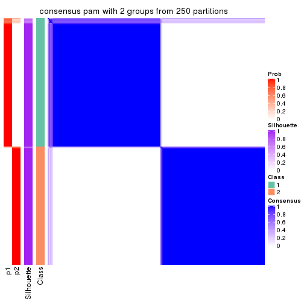</p>

</div>
<div id='tab-SD-pam-consensus-heatmap-2'>
<pre><code class="r">consensus_heatmap(res, k = 3)
</code></pre>

<p>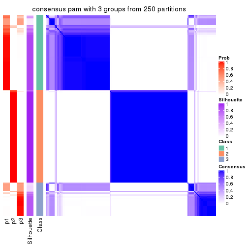</p>

</div>
<div id='tab-SD-pam-consensus-heatmap-3'>
<pre><code class="r">consensus_heatmap(res, k = 4)
</code></pre>

<p>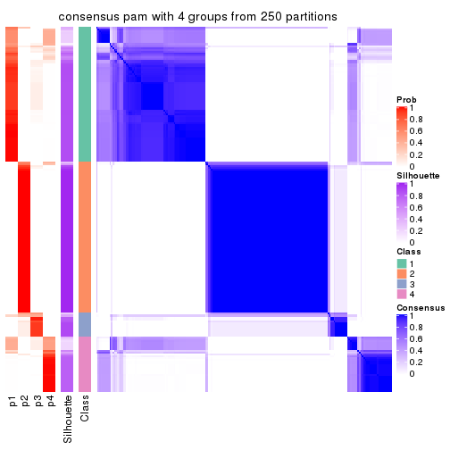</p>

</div>
<div id='tab-SD-pam-consensus-heatmap-4'>
<pre><code class="r">consensus_heatmap(res, k = 5)
</code></pre>

<p>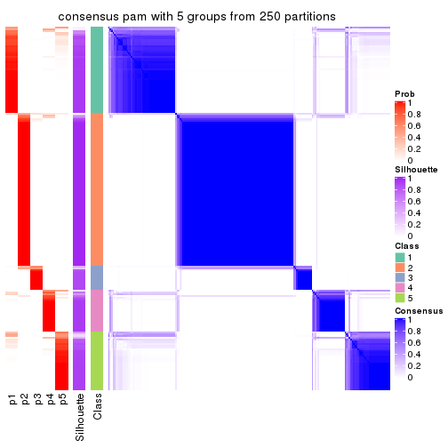</p>

</div>
<div id='tab-SD-pam-consensus-heatmap-5'>
<pre><code class="r">consensus_heatmap(res, k = 6)
</code></pre>

<p>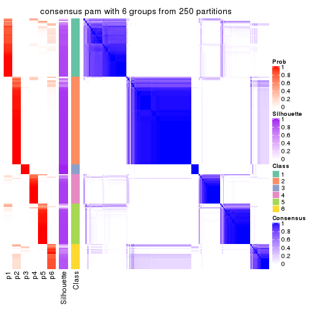</p>

</div>
</div>

Heatmaps for the membership of samples in all partitions to see how consistent they are:


<script>
$( function() {
	$( '#tabs-SD-pam-membership-heatmap' ).tabs();
} );
</script>
<div id='tabs-SD-pam-membership-heatmap'>
<ul>
<li><a href='#tab-SD-pam-membership-heatmap-1'>k = 2</a></li>
<li><a href='#tab-SD-pam-membership-heatmap-2'>k = 3</a></li>
<li><a href='#tab-SD-pam-membership-heatmap-3'>k = 4</a></li>
<li><a href='#tab-SD-pam-membership-heatmap-4'>k = 5</a></li>
<li><a href='#tab-SD-pam-membership-heatmap-5'>k = 6</a></li>
</ul>
<div id='tab-SD-pam-membership-heatmap-1'>
<pre><code class="r">membership_heatmap(res, k = 2)
</code></pre>

<p>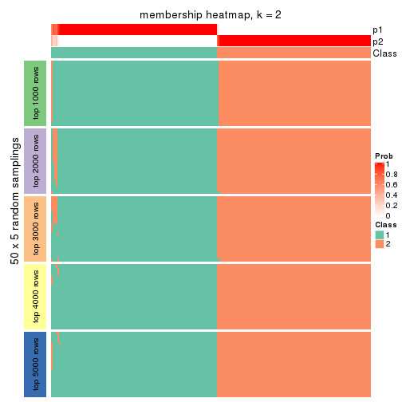</p>

</div>
<div id='tab-SD-pam-membership-heatmap-2'>
<pre><code class="r">membership_heatmap(res, k = 3)
</code></pre>

<p>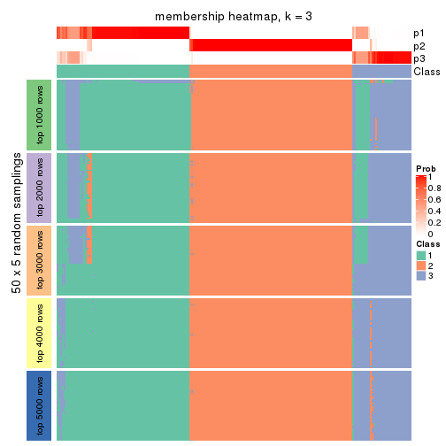</p>

</div>
<div id='tab-SD-pam-membership-heatmap-3'>
<pre><code class="r">membership_heatmap(res, k = 4)
</code></pre>

<p>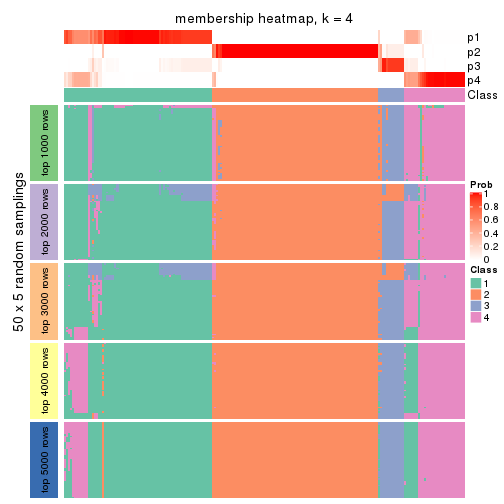</p>

</div>
<div id='tab-SD-pam-membership-heatmap-4'>
<pre><code class="r">membership_heatmap(res, k = 5)
</code></pre>

<p>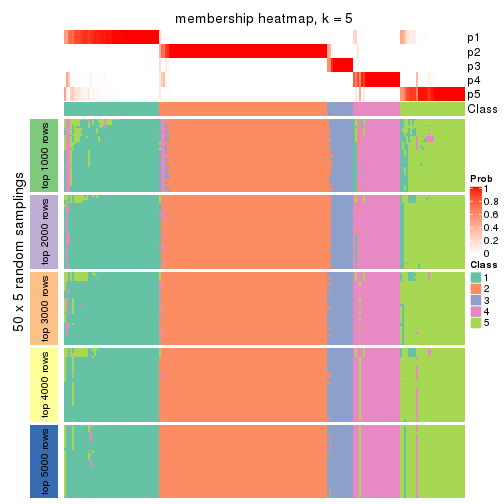</p>

</div>
<div id='tab-SD-pam-membership-heatmap-5'>
<pre><code class="r">membership_heatmap(res, k = 6)
</code></pre>

<p>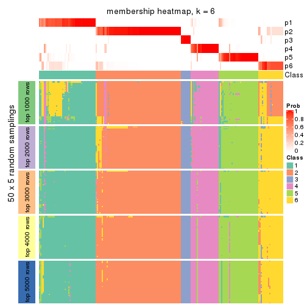</p>

</div>
</div>

As soon as we have had the classes for columns, we can look for signatures
which are significantly different between classes which can be candidate marks
for certain classes. Following are the heatmaps for signatures.


Signature heatmaps where rows are scaled:


<script>
$( function() {
	$( '#tabs-SD-pam-get-signatures' ).tabs();
} );
</script>
<div id='tabs-SD-pam-get-signatures'>
<ul>
<li><a href='#tab-SD-pam-get-signatures-1'>k = 2</a></li>
<li><a href='#tab-SD-pam-get-signatures-2'>k = 3</a></li>
<li><a href='#tab-SD-pam-get-signatures-3'>k = 4</a></li>
<li><a href='#tab-SD-pam-get-signatures-4'>k = 5</a></li>
<li><a href='#tab-SD-pam-get-signatures-5'>k = 6</a></li>
</ul>
<div id='tab-SD-pam-get-signatures-1'>
<pre><code class="r">get_signatures(res, k = 2)
</code></pre>

<p>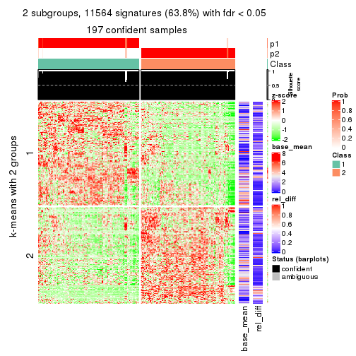</p>

</div>
<div id='tab-SD-pam-get-signatures-2'>
<pre><code class="r">get_signatures(res, k = 3)
</code></pre>

<p>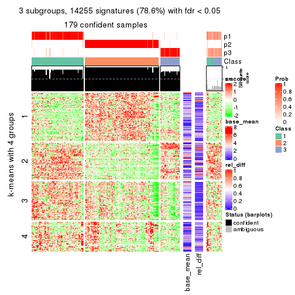</p>

</div>
<div id='tab-SD-pam-get-signatures-3'>
<pre><code class="r">get_signatures(res, k = 4)
</code></pre>

<p>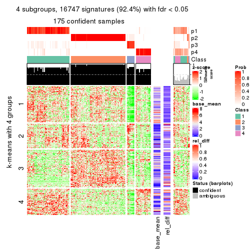</p>

</div>
<div id='tab-SD-pam-get-signatures-4'>
<pre><code class="r">get_signatures(res, k = 5)
</code></pre>

<p>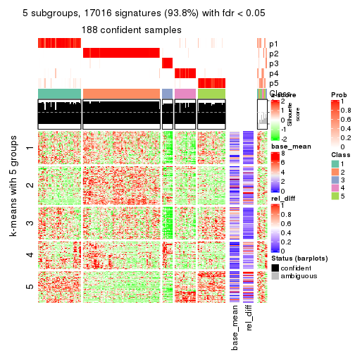</p>

</div>
<div id='tab-SD-pam-get-signatures-5'>
<pre><code class="r">get_signatures(res, k = 6)
</code></pre>

<p>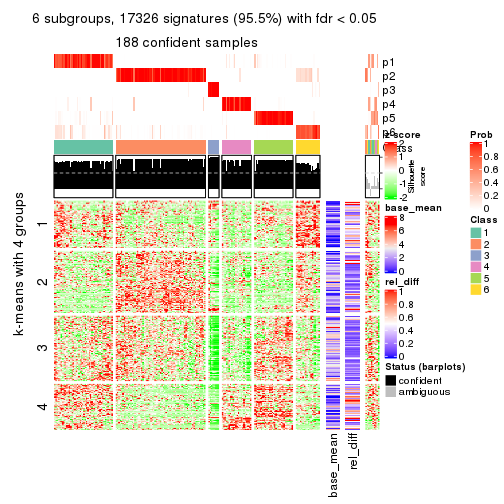</p>

</div>
</div>


Signature heatmaps where rows are not scaled:


<script>
$( function() {
	$( '#tabs-SD-pam-get-signatures-no-scale' ).tabs();
} );
</script>
<div id='tabs-SD-pam-get-signatures-no-scale'>
<ul>
<li><a href='#tab-SD-pam-get-signatures-no-scale-1'>k = 2</a></li>
<li><a href='#tab-SD-pam-get-signatures-no-scale-2'>k = 3</a></li>
<li><a href='#tab-SD-pam-get-signatures-no-scale-3'>k = 4</a></li>
<li><a href='#tab-SD-pam-get-signatures-no-scale-4'>k = 5</a></li>
<li><a href='#tab-SD-pam-get-signatures-no-scale-5'>k = 6</a></li>
</ul>
<div id='tab-SD-pam-get-signatures-no-scale-1'>
<pre><code class="r">get_signatures(res, k = 2, scale_rows = FALSE)
</code></pre>

<p>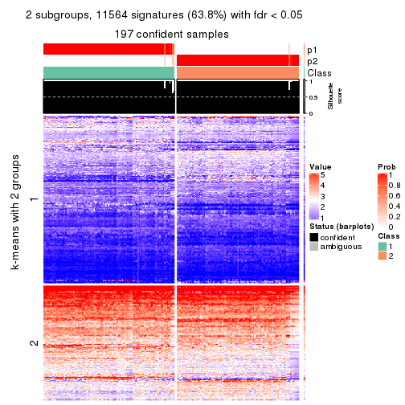</p>

</div>
<div id='tab-SD-pam-get-signatures-no-scale-2'>
<pre><code class="r">get_signatures(res, k = 3, scale_rows = FALSE)
</code></pre>

<p>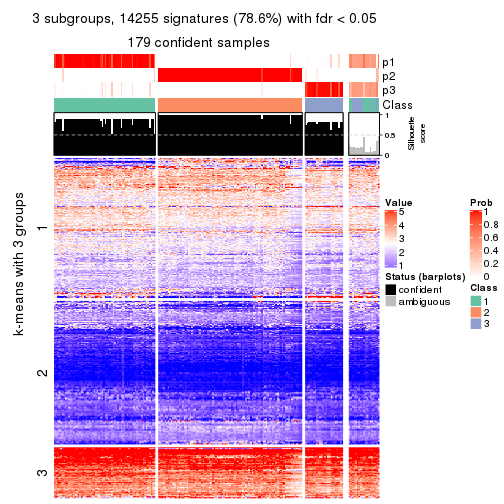</p>

</div>
<div id='tab-SD-pam-get-signatures-no-scale-3'>
<pre><code class="r">get_signatures(res, k = 4, scale_rows = FALSE)
</code></pre>

<p>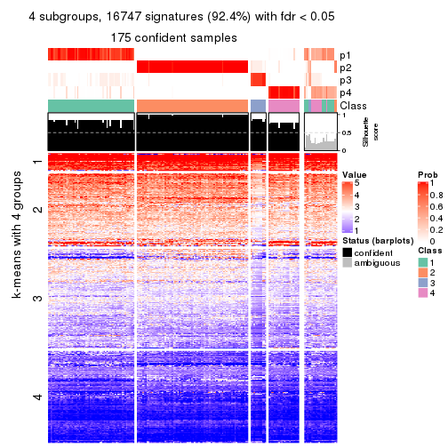</p>

</div>
<div id='tab-SD-pam-get-signatures-no-scale-4'>
<pre><code class="r">get_signatures(res, k = 5, scale_rows = FALSE)
</code></pre>

<p>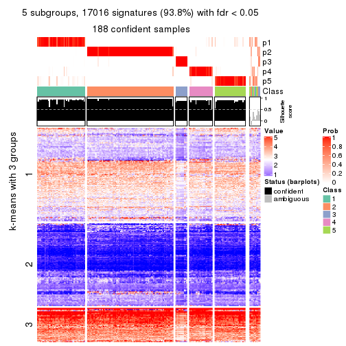</p>

</div>
<div id='tab-SD-pam-get-signatures-no-scale-5'>
<pre><code class="r">get_signatures(res, k = 6, scale_rows = FALSE)
</code></pre>

<p>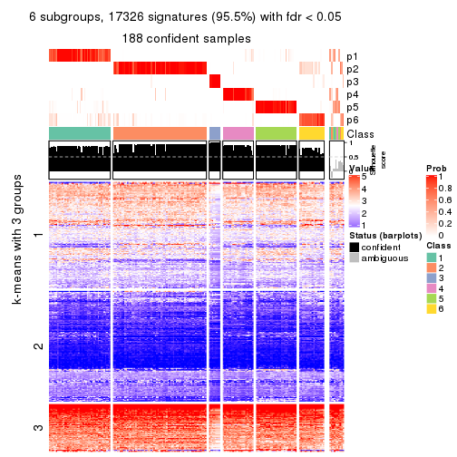</p>

</div>
</div>


Compare the overlap of signatures from different k:

```r
compare_signatures(res)
```

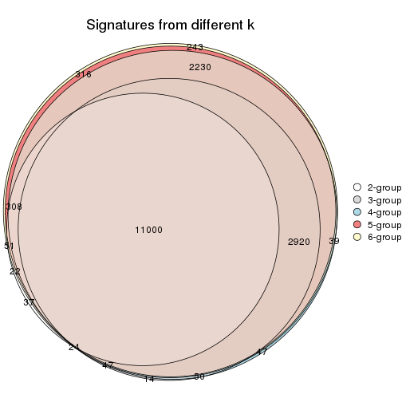

`get_signature()` returns a data frame invisibly. TO get the list of signatures, the function
call should be assigned to a variable explicitly. In following code, if `plot` argument is set
to `FALSE`, no heatmap is plotted while only the differential analysis is performed.

```r
# code only for demonstration
tb = get_signature(res, k = ..., plot = FALSE)
```

An example of the output of `tb` is:

```
#>   which_row         fdr    mean_1    mean_2 scaled_mean_1 scaled_mean_2 km
#> 1        38 0.042760348  8.373488  9.131774    -0.5533452     0.5164555  1
#> 2        40 0.018707592  7.106213  8.469186    -0.6173731     0.5762149  1
#> 3        55 0.019134737 10.221463 11.207825    -0.6159697     0.5749050  1
#> 4        59 0.006059896  5.921854  7.869574    -0.6899429     0.6439467  1
#> 5        60 0.018055526  8.928898 10.211722    -0.6204761     0.5791110  1
#> 6        98 0.009384629 15.714769 14.887706     0.6635654    -0.6193277  2
...
```

The columns in `tb` are:

1. `which_row`: row indices corresponding to the input matrix.
2. `fdr`: FDR for the differential test. 
3. `mean_x`: The mean value in group x.
4. `scaled_mean_x`: The mean value in group x after rows are scaled.
5. `km`: Row groups if k-means clustering is applied to rows.


UMAP plot which shows how samples are separated.


<script>
$( function() {
	$( '#tabs-SD-pam-dimension-reduction' ).tabs();
} );
</script>
<div id='tabs-SD-pam-dimension-reduction'>
<ul>
<li><a href='#tab-SD-pam-dimension-reduction-1'>k = 2</a></li>
<li><a href='#tab-SD-pam-dimension-reduction-2'>k = 3</a></li>
<li><a href='#tab-SD-pam-dimension-reduction-3'>k = 4</a></li>
<li><a href='#tab-SD-pam-dimension-reduction-4'>k = 5</a></li>
<li><a href='#tab-SD-pam-dimension-reduction-5'>k = 6</a></li>
</ul>
<div id='tab-SD-pam-dimension-reduction-1'>
<pre><code class="r">dimension_reduction(res, k = 2, method = &quot;UMAP&quot;)
</code></pre>

<p>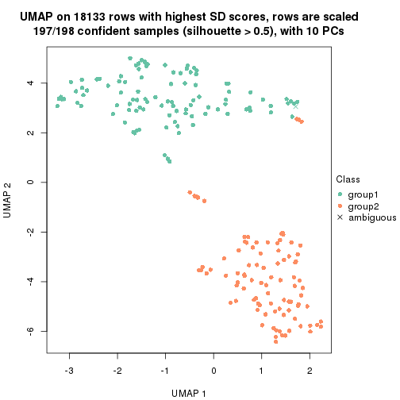</p>

</div>
<div id='tab-SD-pam-dimension-reduction-2'>
<pre><code class="r">dimension_reduction(res, k = 3, method = &quot;UMAP&quot;)
</code></pre>

<p>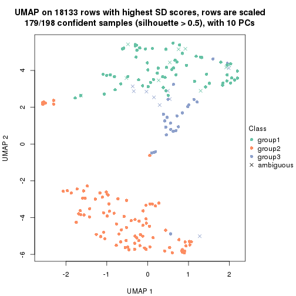</p>

</div>
<div id='tab-SD-pam-dimension-reduction-3'>
<pre><code class="r">dimension_reduction(res, k = 4, method = &quot;UMAP&quot;)
</code></pre>

<p>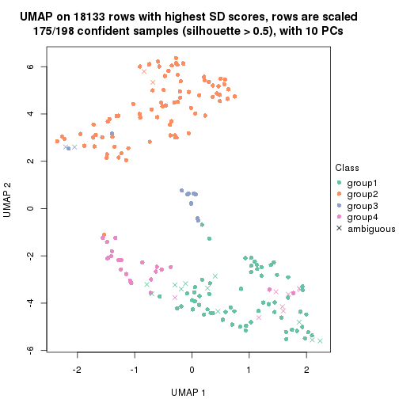</p>

</div>
<div id='tab-SD-pam-dimension-reduction-4'>
<pre><code class="r">dimension_reduction(res, k = 5, method = &quot;UMAP&quot;)
</code></pre>

<p>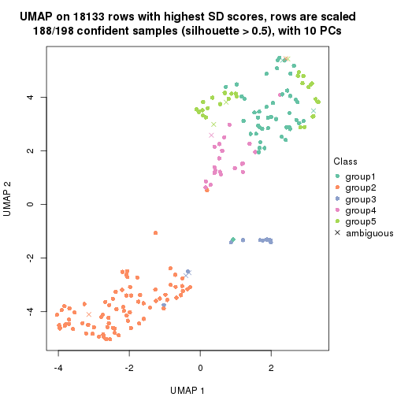</p>

</div>
<div id='tab-SD-pam-dimension-reduction-5'>
<pre><code class="r">dimension_reduction(res, k = 6, method = &quot;UMAP&quot;)
</code></pre>

<p>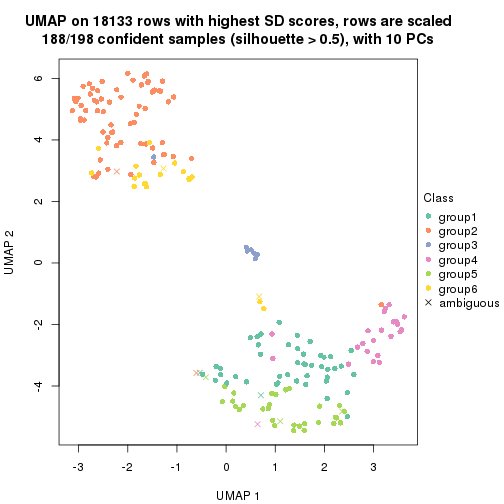</p>

</div>
</div>


Following heatmap shows how subgroups are split when increasing `k`:

```r
collect_classes(res)
```

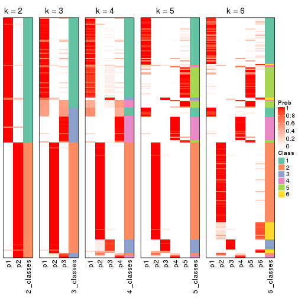


If matrix rows can be associated to genes, consider to use `functional_enrichment(res,
...)` to perform function enrichment for the signature genes. See [this vignette](http://bioconductor.org/packages/devel/bioc/vignettes/cola/inst/doc/functional_enrichment.html) for more detailed explanations.


 

---------------------------------------------------


### SD:mclust*


The object with results only for a single top-value method and a single partition method 
can be extracted as:

```r
res = res_list["SD", "mclust"]
# you can also extract it by
# res = res_list["SD:mclust"]
```

A summary of `res` and all the functions that can be applied to it:

```r
res
```

```
#> A 'ConsensusPartition' object with k = 2, 3, 4, 5, 6.
#>   On a matrix with 18133 rows and 198 columns.
#>   Top rows (1000, 2000, 3000, 4000, 5000) are extracted by 'SD' method.
#>   Subgroups are detected by 'mclust' method.
#>   Performed in total 1250 partitions by row resampling.
#>   Best k for subgroups seems to be 2.
#> 
#> Following methods can be applied to this 'ConsensusPartition' object:
#>  [1] "cola_report"             "collect_classes"         "collect_plots"          
#>  [4] "collect_stats"           "colnames"                "compare_signatures"     
#>  [7] "consensus_heatmap"       "dimension_reduction"     "functional_enrichment"  
#> [10] "get_anno_col"            "get_anno"                "get_classes"            
#> [13] "get_consensus"           "get_matrix"              "get_membership"         
#> [16] "get_param"               "get_signatures"          "get_stats"              
#> [19] "is_best_k"               "is_stable_k"             "membership_heatmap"     
#> [22] "ncol"                    "nrow"                    "plot_ecdf"              
#> [25] "rownames"                "select_partition_number" "show"                   
#> [28] "suggest_best_k"          "test_to_known_factors"
```

`collect_plots()` function collects all the plots made from `res` for all `k` (number of partitions)
into one single page to provide an easy and fast comparison between different `k`.

```r
collect_plots(res)
```

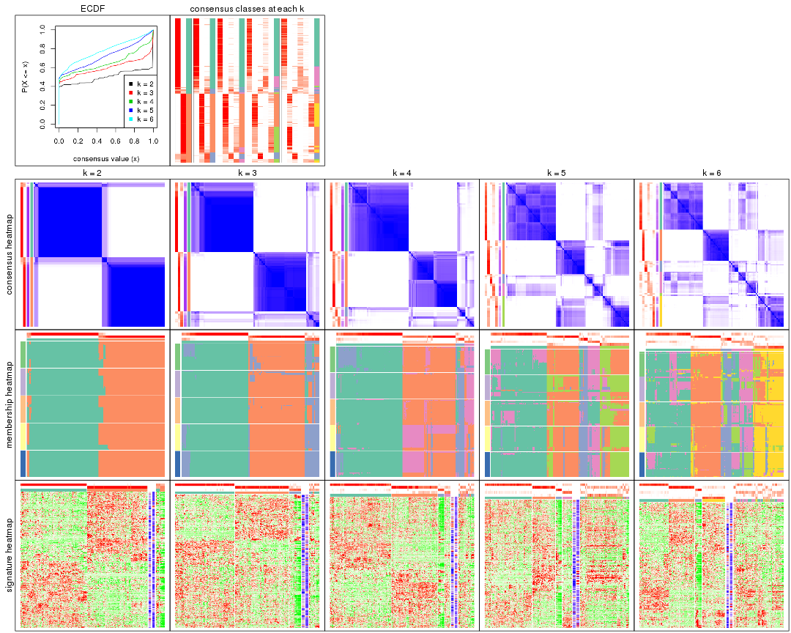

The plots are:

- The first row: a plot of the ECDF (empirical cumulative distribution
  function) curves of the consensus matrix for each `k` and the heatmap of
  predicted classes for each `k`.
- The second row: heatmaps of the consensus matrix for each `k`.
- The third row: heatmaps of the membership matrix for each `k`.
- The fouth row: heatmaps of the signatures for each `k`.

All the plots in panels can be made by individual functions and they are
plotted later in this section.

`select_partition_number()` produces several plots showing different
statistics for choosing "optimized" `k`. There are following statistics:

- ECDF curves of the consensus matrix for each `k`;
- 1-PAC. [The PAC
  score](https://en.wikipedia.org/wiki/Consensus_clustering#Over-interpretation_potential_of_consensus_clustering)
  measures the proportion of the ambiguous subgrouping.
- Mean silhouette score.
- Concordance. The mean probability of fiting the consensus class ids in all
  partitions.
- Area increased. Denote $A_k$ as the area under the ECDF curve for current
  `k`, the area increased is defined as $A_k - A_{k-1}$.
- Rand index. The percent of pairs of samples that are both in a same cluster
  or both are not in a same cluster in the partition of k and k-1.
- Jaccard index. The ratio of pairs of samples are both in a same cluster in
  the partition of k and k-1 and the pairs of samples are both in a same
  cluster in the partition k or k-1.

The detailed explanations of these statistics can be found in [the _cola_
vignette](http://bioconductor.org/packages/devel/bioc/vignettes/cola/inst/doc/cola.html#toc_13).

Generally speaking, lower PAC score, higher mean silhouette score or higher
concordance corresponds to better partition. Rand index and Jaccard index
measure how similar the current partition is compared to partition with `k-1`.
If they are too similar, we won't accept `k` is better than `k-1`.

```r
select_partition_number(res)
```

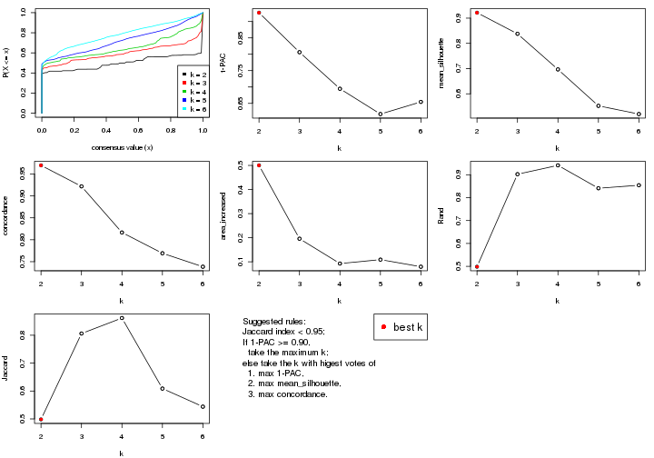

The numeric values for all these statistics can be obtained by `get_stats()`.

```r
get_stats(res)
```

```
#>   k 1-PAC mean_silhouette concordance area_increased  Rand Jaccard
#> 2 2 0.927           0.922       0.970         0.5003 0.498   0.498
#> 3 3 0.806           0.838       0.922         0.1958 0.902   0.806
#> 4 4 0.695           0.697       0.817         0.0927 0.941   0.862
#> 5 5 0.617           0.552       0.769         0.1089 0.841   0.609
#> 6 6 0.655           0.520       0.739         0.0795 0.854   0.544
```

`suggest_best_k()` suggests the best $k$ based on these statistics. The rules are as follows:

- All $k$ with Jaccard index larger than 0.95 are removed because increasing
  $k$ does not provide enough extra information. If all $k$ are removed, it is
  marked as no subgroup is detected.
- For all $k$ with 1-PAC score larger than 0.9, the maximal $k$ is taken as
  the best $k$, and other $k$ are marked as optional $k$.
- If it does not fit the second rule. The $k$ with the maximal vote of the
  highest 1-PAC score, highest mean silhouette, and highest concordance is
  taken as the best $k$.

```r
suggest_best_k(res)
```

```
#> [1] 2
```


Following shows the table of the partitions (You need to click the **show/hide
code output** link to see it). The membership matrix (columns with name `p*`)
is inferred by
[`clue::cl_consensus()`](https://www.rdocumentation.org/link/cl_consensus?package=clue)
function with the `SE` method. Basically the value in the membership matrix
represents the probability to belong to a certain group. The finall class
label for an item is determined with the group with highest probability it
belongs to.

In `get_classes()` function, the entropy is calculated from the membership
matrix and the silhouette score is calculated from the consensus matrix.


<script>
$( function() {
	$( '#tabs-SD-mclust-get-classes' ).tabs();
} );
</script>
<div id='tabs-SD-mclust-get-classes'>
<ul>
<li><a href='#tab-SD-mclust-get-classes-1'>k = 2</a></li>
<li><a href='#tab-SD-mclust-get-classes-2'>k = 3</a></li>
<li><a href='#tab-SD-mclust-get-classes-3'>k = 4</a></li>
<li><a href='#tab-SD-mclust-get-classes-4'>k = 5</a></li>
<li><a href='#tab-SD-mclust-get-classes-5'>k = 6</a></li>
</ul>

<div id='tab-SD-mclust-get-classes-1'>
<p><a id='tab-SD-mclust-get-classes-1-a' style='color:#0366d6' href='#'>show/hide code output</a></p>
<pre><code class="r">cbind(get_classes(res, k = 2), get_membership(res, k = 2))
</code></pre>

<pre><code>#&gt;                                      class entropy silhouette    p1    p2
#&gt; 0C0AA0B2-5191-4EDF-8937-ED7434F30283     2  0.0000     0.9620 0.000 1.000
#&gt; 18B45F1F-234F-45CC-A234-145307606C5C     1  0.0000     0.9728 1.000 0.000
#&gt; E18B70C0-BDCA-46D3-99BB-C6C8ABC68DA5     2  0.0000     0.9620 0.000 1.000
#&gt; 0F6DDBA7-6F74-45E8-95C8-F28263D55978     1  0.0000     0.9728 1.000 0.000
#&gt; 7EAE1A5A-129A-46DE-977E-A2C753F10904     2  0.0000     0.9620 0.000 1.000
#&gt; 7EAE0048-16B5-4979-9410-16CDEB9B1A48     1  0.0000     0.9728 1.000 0.000
#&gt; 2EBFC828-2B27-4753-A052-80DDA226DAB4     2  0.0000     0.9620 0.000 1.000
#&gt; 24E1768D-2232-41DA-9383-BC55D6EB3812     2  0.9522     0.4330 0.372 0.628
#&gt; 6E3CD60A-1889-4CA3-B305-2E78152057B5     2  0.0000     0.9620 0.000 1.000
#&gt; 33CC70DD-82B3-413C-B3B1-BE06634D95D0     1  0.0000     0.9728 1.000 0.000
#&gt; F1CB57A3-55DD-4487-9307-1B4F652E729A     1  0.0000     0.9728 1.000 0.000
#&gt; 755A5806-B054-449A-93DB-79909E6C93A1     1  0.0000     0.9728 1.000 0.000
#&gt; 58D364E7-3D2F-468F-A264-D6461E2428D4     2  0.0000     0.9620 0.000 1.000
#&gt; 68BB9CB6-7AA2-4981-B9D9-07363EC96599     2  0.9427     0.4608 0.360 0.640
#&gt; 3C4E8DFA-8EA0-4F1F-89CB-CB8805395872     2  0.2423     0.9281 0.040 0.960
#&gt; 4219651D-5583-4498-BF08-1B7D04B4C7B2     1  0.0000     0.9728 1.000 0.000
#&gt; B5EE2768-0D67-4584-ADBC-EC745FEC52EA     2  0.0000     0.9620 0.000 1.000
#&gt; 825E6C11-F460-451A-8045-846DD7D0E945     1  0.0000     0.9728 1.000 0.000
#&gt; 491F62AF-5E68-43C3-982A-F867A75BBA9A     2  0.0000     0.9620 0.000 1.000
#&gt; 9D7F058C-F95A-44AD-AC9E-450F7FBDC960     2  0.0000     0.9620 0.000 1.000
#&gt; 6D42DD0C-2081-4742-BA27-9F5F16FAC3C6     1  0.0000     0.9728 1.000 0.000
#&gt; EDD7E63D-492A-473B-A552-0764337B10EF     2  0.2423     0.9281 0.040 0.960
#&gt; 97073DEA-73AD-4DFD-BD1A-9035DC03445B     1  0.0000     0.9728 1.000 0.000
#&gt; FA891AB9-CE38-4F7E-A015-1DDCE12890A0     1  0.0000     0.9728 1.000 0.000
#&gt; D9514D49-A0AE-45AB-8C9F-68E726215253     1  0.0000     0.9728 1.000 0.000
#&gt; 3B9229AD-12E5-451E-9D2F-378AAC82C04A     2  0.0000     0.9620 0.000 1.000
#&gt; 5EA36B71-4917-4EF3-9060-065EFE6ACC5B     1  0.0000     0.9728 1.000 0.000
#&gt; A20E4ECB-4895-4CC7-BE5E-4721B20D933B     1  0.0000     0.9728 1.000 0.000
#&gt; 1BE8D828-29DB-4368-AA4A-FB23588F7AE8     1  0.0000     0.9728 1.000 0.000
#&gt; 66EFEFCF-3D14-4DBF-AA13-530F40ED0245     1  0.5408     0.8383 0.876 0.124
#&gt; 55DFFE53-BCE7-4EC1-9863-6C0311B06BA2     2  0.0000     0.9620 0.000 1.000
#&gt; 4CC3FB5A-611D-4C64-AE9D-544FA45CF4DC     1  0.0000     0.9728 1.000 0.000
#&gt; C11D33F2-DFE9-4FA8-9024-F3E7F1DADC5F     2  0.0000     0.9620 0.000 1.000
#&gt; FA5932B8-8AA3-4C38-9FAB-C35D8772974D     1  0.0000     0.9728 1.000 0.000
#&gt; 8216EC35-1F41-4A15-B503-BDA4971E27C9     1  0.0000     0.9728 1.000 0.000
#&gt; 69635D23-90A7-4BAD-97C7-B79536837F57     1  0.0000     0.9728 1.000 0.000
#&gt; 12B404E2-C463-4409-8392-E4649B2AFFD1     2  0.0000     0.9620 0.000 1.000
#&gt; 246927E3-ACCF-41B2-AA8E-43855FD6B146     2  0.0000     0.9620 0.000 1.000
#&gt; E0CC13E7-9607-49E0-B4AA-395544E3C3BF     1  0.0000     0.9728 1.000 0.000
#&gt; F7BBC0C1-6124-4A83-8A70-EA89B62F1CBD     1  0.0000     0.9728 1.000 0.000
#&gt; B1D4FF24-8E6F-4A04-B716-2032D850EB57     1  0.0000     0.9728 1.000 0.000
#&gt; 253601DB-B78A-4566-9947-8C0270C0B163     2  0.0000     0.9620 0.000 1.000
#&gt; AB83DBFF-5737-4FB8-A5AC-1D3CD6072BDF     2  0.9850     0.2818 0.428 0.572
#&gt; 9D67D953-EC98-4B72-89C8-5732BC9D4BC9     2  0.0000     0.9620 0.000 1.000
#&gt; 51061018-95AB-4278-886F-F69E4EBC47C0     2  0.0376     0.9588 0.004 0.996
#&gt; ABD0F7F3-105B-4DEE-9889-5028772C519A     1  0.0000     0.9728 1.000 0.000
#&gt; 562B95CF-B27E-4A72-B7C6-CDF86A51A39B     1  0.0000     0.9728 1.000 0.000
#&gt; ABF046A4-D7A1-49FF-B6B1-4E07A791DEDB     2  0.0000     0.9620 0.000 1.000
#&gt; 3FF4101E-9703-460E-A30E-76CC7689F36D     2  0.0000     0.9620 0.000 1.000
#&gt; 39C4F7AA-7ADF-4F1D-BDA3-BEC605AC5023     2  0.0000     0.9620 0.000 1.000
#&gt; CB821FD2-AF5C-4743-A70F-21C12C6ED153     1  0.0000     0.9728 1.000 0.000
#&gt; 92EA1846-62FF-41D5-A441-5E52E6B9E7F9     1  0.0000     0.9728 1.000 0.000
#&gt; 7D25F3EE-5A20-4763-8026-16A03D05F459     1  0.0000     0.9728 1.000 0.000
#&gt; 8ECE5276-CD06-496B-A5A9-1713B1F7D089     1  0.0000     0.9728 1.000 0.000
#&gt; C775B68F-9507-47E3-B507-B433AED79002     1  0.0000     0.9728 1.000 0.000
#&gt; E19D5463-FDD0-41C1-A170-323736A88D07     2  0.0000     0.9620 0.000 1.000
#&gt; CE4B6285-4961-4767-91F0-5C7A8162E185     1  0.0000     0.9728 1.000 0.000
#&gt; 9637BD72-1FEF-42AD-8886-2C39BE876531     1  0.0000     0.9728 1.000 0.000
#&gt; 81B5A88E-45A0-4B44-B689-B9071B8548EE     2  0.0000     0.9620 0.000 1.000
#&gt; 0B01B4C9-9BED-4F5B-A3E2-8868C7CCC3FC     2  0.9522     0.4330 0.372 0.628
#&gt; 54501315-7132-44B2-A179-10FBF1421105     1  0.0000     0.9728 1.000 0.000
#&gt; E207CBE9-4C3A-4FDD-9251-CFE1FE106475     1  0.9983     0.0423 0.524 0.476
#&gt; 3BEA0B92-3F90-4DBF-9679-AADEAD7D47C8     2  0.0000     0.9620 0.000 1.000
#&gt; 35B32250-D854-4215-AA5B-2C11B2FBEECA     1  0.0000     0.9728 1.000 0.000
#&gt; ACE6566B-AEB9-426C-924A-B382D14A1024     2  0.0000     0.9620 0.000 1.000
#&gt; 737E69AC-0930-45B9-B6BA-7CE5E300290B     1  0.0000     0.9728 1.000 0.000
#&gt; B4410AB8-D015-41CA-86E6-12EB4E4103E3     1  0.0000     0.9728 1.000 0.000
#&gt; 6D3ECA65-C50F-43B0-B75A-1D290FA4A8FD     2  0.0000     0.9620 0.000 1.000
#&gt; C86F40D3-9A96-4395-A8C3-510DE12F9A2B     2  0.0000     0.9620 0.000 1.000
#&gt; 6238087F-24DD-4BF1-903F-3BD4E446C1AE     2  0.0000     0.9620 0.000 1.000
#&gt; E4FF840B-EEAB-4CB0-A690-7D4C4AA7EEC3     2  0.0000     0.9620 0.000 1.000
#&gt; 72D3C323-C67F-4C0E-9BFC-BF245FF9730A     1  0.0000     0.9728 1.000 0.000
#&gt; 82D56E4E-4DF6-4F3E-8959-B995C92AAA70     1  0.0000     0.9728 1.000 0.000
#&gt; E31CA441-EB19-443B-ACBD-37B5CCBCF0E5     2  0.0000     0.9620 0.000 1.000
#&gt; 87CA8939-D054-4B8A-B32D-085FD2E8F202     1  0.0000     0.9728 1.000 0.000
#&gt; 2A508D90-FEDC-46A3-9A02-E51E5467CDCB     1  0.0000     0.9728 1.000 0.000
#&gt; C4E8B4E2-388B-411F-BF0A-9B6F34E8EDB5     2  0.0000     0.9620 0.000 1.000
#&gt; AF6AF803-BD93-44A7-AA80-B9BC92C1273B     2  0.0000     0.9620 0.000 1.000
#&gt; 0B1CA5CF-EB96-41D4-BFC5-6957FEB39828     1  0.0000     0.9728 1.000 0.000
#&gt; 6FB96FB0-6661-48AD-A4A0-69F8AFDBE591     2  0.0000     0.9620 0.000 1.000
#&gt; 8C19F7FD-368A-462B-B28F-88D6630038A1     1  0.0000     0.9728 1.000 0.000
#&gt; 96EABE78-C2F4-4A33-ACD8-C922A4B2519B     2  0.0000     0.9620 0.000 1.000
#&gt; 68B36D7B-546A-4689-949F-B207C4A4AB27     2  0.0000     0.9620 0.000 1.000
#&gt; CE9F3335-778F-4F52-BC55-4B7C99B211DD     2  0.0000     0.9620 0.000 1.000
#&gt; CB359DED-2A2D-4646-A0BD-6F10ADCC532B     1  0.0000     0.9728 1.000 0.000
#&gt; 198324A5-8C52-46F6-9734-EFAF1CCA6D9B     1  0.0000     0.9728 1.000 0.000
#&gt; 83B88608-0506-428C-B9E8-621F38477B42     1  0.0000     0.9728 1.000 0.000
#&gt; 1993630A-0F3D-4F5C-86A3-D443BAAF57F0     1  0.9358     0.4437 0.648 0.352
#&gt; DE73DA9B-529E-4F4F-A65C-DA7AB84B1096     1  0.0000     0.9728 1.000 0.000
#&gt; 2347F3B7-DDA3-40C0-B6D4-8819ECA69146     1  0.0000     0.9728 1.000 0.000
#&gt; AB93B5D5-095F-4330-9D40-6A3D934AB50C     1  0.0000     0.9728 1.000 0.000
#&gt; 5EBBE4AD-FF0C-41CF-9EA3-B6FE7EA1F9C0     1  0.9983     0.0423 0.524 0.476
#&gt; 6D960AE7-3769-4144-A061-E8588E5063FF     1  0.0000     0.9728 1.000 0.000
#&gt; 0C2DD8C0-D1A5-4192-A49C-7A40FED628B2     2  0.0000     0.9620 0.000 1.000
#&gt; 18C9372F-C55B-4F86-A9D2-E8D85EFC8566     2  0.7219     0.7469 0.200 0.800
#&gt; 9AF637B0-4C32-4DD1-93AF-7655B4A845D3     2  0.0000     0.9620 0.000 1.000
#&gt; 785B5B06-4115-46FD-9BEB-F888AFDC855D     2  0.0000     0.9620 0.000 1.000
#&gt; ECA3050E-4BE2-4117-B9CF-A52BB85AF8C2     2  0.7528     0.7243 0.216 0.784
#&gt; 099DC396-16A5-458F-9ED9-F2A790CB0C34     1  0.0000     0.9728 1.000 0.000
#&gt; 7A5A12EE-C5B0-4C51-8C99-0F3FA88D633E     1  0.0000     0.9728 1.000 0.000
#&gt; E832B508-A66D-4817-B44A-FE9FAAE64B4A     1  0.0000     0.9728 1.000 0.000
#&gt; F9DD688C-7B35-49E7-9651-2E098EE78856     1  0.0000     0.9728 1.000 0.000
#&gt; F1265DD8-5ED3-4635-A277-57BBFDEC7729     1  0.0000     0.9728 1.000 0.000
#&gt; F624E8D9-DB07-4C9E-910D-5E8EBA3A6167     2  0.0000     0.9620 0.000 1.000
#&gt; 3516FBDF-66E1-43F4-9D7B-16748F6439A7     2  0.0000     0.9620 0.000 1.000
#&gt; 04B12992-B2EA-4BA2-8E2C-11E34E230E6F     2  0.0000     0.9620 0.000 1.000
#&gt; CC02897D-9123-495E-9242-5C9CF4EC269B     2  0.0000     0.9620 0.000 1.000
#&gt; 3117ED46-2BF2-4311-BC00-4E98243E16B3     1  0.0000     0.9728 1.000 0.000
#&gt; E0B66D53-23DB-4E26-BB6E-F692FA8C000E     1  0.0000     0.9728 1.000 0.000
#&gt; DAA93CE5-A013-477A-9A50-EA09CC3A8162     2  0.0000     0.9620 0.000 1.000
#&gt; 0099098D-354A-4276-92F8-B932C74B4608     1  0.0000     0.9728 1.000 0.000
#&gt; DD483639-B2E7-4745-BCFB-55ED1D82BFBF     2  0.0000     0.9620 0.000 1.000
#&gt; 2C1F9079-602E-4252-82C7-9D8799E04246     2  0.0000     0.9620 0.000 1.000
#&gt; 9473A8E4-3A1B-4184-9EA6-517AFD60B635     1  0.9795     0.2495 0.584 0.416
#&gt; 75CFBAF6-7BA0-40AF-92D7-D218E885BD1B     2  0.0000     0.9620 0.000 1.000
#&gt; B588950F-14D6-41C8-845B-EFD2096013C6     2  0.0000     0.9620 0.000 1.000
#&gt; 0DF3EDA8-DAEA-4721-92AB-B97181249498     2  0.0000     0.9620 0.000 1.000
#&gt; 8EA83042-D598-401D-AD78-936EEB136C59     1  0.0000     0.9728 1.000 0.000
#&gt; 729AC418-3BE9-445A-95D4-AC11A7D43BE0     1  0.0000     0.9728 1.000 0.000
#&gt; 7D8B1B11-F576-4AA8-BFA7-0022A2CD829A     2  0.0000     0.9620 0.000 1.000
#&gt; 304A0E46-3449-4B44-9C30-BDDF6459391D     1  0.0000     0.9728 1.000 0.000
#&gt; 3C83358F-DF20-47F7-AF9F-AB7CC92F5ABA     1  0.0000     0.9728 1.000 0.000
#&gt; EAFEED6C-35C3-451F-AE4A-EB56992E1F29     1  0.0000     0.9728 1.000 0.000
#&gt; 8A237A65-28EC-434D-A78A-A8B7308B5204     1  0.0000     0.9728 1.000 0.000
#&gt; D005833F-E991-4E9E-9667-55F137288004     1  0.0000     0.9728 1.000 0.000
#&gt; 37D966E3-253E-4397-A9AE-0903A8D31FE6     1  0.0000     0.9728 1.000 0.000
#&gt; D2482B81-CB5B-4178-BA8D-1CF4026181B5     1  0.0000     0.9728 1.000 0.000
#&gt; 18019E95-C2A8-4EE7-B585-F6886DC4D953     2  0.0000     0.9620 0.000 1.000
#&gt; 0B126D1A-14A8-4345-8F78-FF92222ADF4C     2  0.9522     0.4330 0.372 0.628
#&gt; CE88B625-47D8-4D58-9FB4-23464DB7DDAD     2  0.0000     0.9620 0.000 1.000
#&gt; 9A88299D-5C74-47FA-B42C-1A1D6D935AAB     1  0.0000     0.9728 1.000 0.000
#&gt; 3E71159C-FD6C-41DA-B18B-0730C8AC7E41     1  0.0000     0.9728 1.000 0.000
#&gt; 6F245AA4-79D9-47E1-BCC9-1AAF65AEA813     1  0.0000     0.9728 1.000 0.000
#&gt; 4CF2C888-2100-483A-B4DB-ECBB69243A4D     2  0.0000     0.9620 0.000 1.000
#&gt; A3853813-B9D5-4E8C-B075-19FCC35F8686     2  0.0000     0.9620 0.000 1.000
#&gt; 83A16DEE-CE9F-4D8B-9225-0A2A8B9D055D     1  0.0000     0.9728 1.000 0.000
#&gt; 0F057CAF-4F9A-4DE9-8601-730E96873733     2  0.0000     0.9620 0.000 1.000
#&gt; 32D5801D-DBA4-422E-87CB-A2DDE921BA41     1  0.0000     0.9728 1.000 0.000
#&gt; 22EE8076-F07C-499A-9AF8-D800A77EF154     2  0.0000     0.9620 0.000 1.000
#&gt; DD4BD74D-D48C-4090-9F57-5334E784581C     1  0.0000     0.9728 1.000 0.000
#&gt; 41183565-434D-474C-B1BD-CA6E94910658     2  0.0000     0.9620 0.000 1.000
#&gt; 75A2CE41-2B2A-4346-927E-ACF8A72738E4     1  0.0000     0.9728 1.000 0.000
#&gt; 7AA24995-3DD2-4682-B36A-4EBFEEACF625     1  0.0000     0.9728 1.000 0.000
#&gt; 8BAFDFEC-9F26-4ADB-95CE-004143960EEB     1  0.0000     0.9728 1.000 0.000
#&gt; A330E011-CE08-4A85-8F4B-370592293DBB     1  0.0000     0.9728 1.000 0.000
#&gt; 1D5A5B17-2E70-4BB0-94A1-EC17E6EA49DB     1  0.0000     0.9728 1.000 0.000
#&gt; BD9143B8-9D97-4A05-872C-3FB82B4CF7BE     2  0.0000     0.9620 0.000 1.000
#&gt; 64552DC0-181E-4607-898C-787AA7F26435     2  0.0000     0.9620 0.000 1.000
#&gt; 1B4C4D41-34C7-43A3-858B-C9552EB53894     1  0.0000     0.9728 1.000 0.000
#&gt; 463A3BAA-02DC-4EA4-A644-B924163E425D     2  0.0000     0.9620 0.000 1.000
#&gt; CD0FEA89-6F60-4A20-8FCA-D397B4E95A98     1  0.0000     0.9728 1.000 0.000
#&gt; 5D06CF6D-F4B9-4B32-B055-8AB287E53340     2  0.0000     0.9620 0.000 1.000
#&gt; ADA7835F-DB67-4F4F-9446-8BCE3C5FE936     2  0.0000     0.9620 0.000 1.000
#&gt; 4109BE2D-B5DF-4BD7-860E-60D87F647152     2  0.2778     0.9210 0.048 0.952
#&gt; 88526A0E-6DFE-46CB-BFAD-B4826F482C67     1  0.0000     0.9728 1.000 0.000
#&gt; F39F9A4C-18F7-4017-AB31-85D52FF44587     2  0.0000     0.9620 0.000 1.000
#&gt; D4290A5E-1B24-4C55-B470-0FA7A0A09DD0     2  0.0000     0.9620 0.000 1.000
#&gt; DC5A2C9E-978F-4661-B729-1F9662976E27     1  0.0000     0.9728 1.000 0.000
#&gt; 26A1F392-CED2-43E3-8096-74E6F2BFC8C0     2  0.0000     0.9620 0.000 1.000
#&gt; 87D81FB2-306A-4E75-9D58-D5F48E46E7F6     2  0.0000     0.9620 0.000 1.000
#&gt; E3D9D81A-C20C-4B3B-B940-A5D2C5F65B22     2  0.9522     0.4330 0.372 0.628
#&gt; 4464650B-453F-476C-989C-B7B159BF2CF0     2  0.0000     0.9620 0.000 1.000
#&gt; 577D2867-B738-487A-9B06-07958D647F02     1  0.0000     0.9728 1.000 0.000
#&gt; E52A22CC-3C03-41A9-9541-220DD871E162     2  0.0000     0.9620 0.000 1.000
#&gt; 642703B1-AF99-4746-A915-0792F4B9590B     2  0.0000     0.9620 0.000 1.000
#&gt; 8F0D1792-1284-45E6-8EC4-392596057677     2  0.0000     0.9620 0.000 1.000
#&gt; 765AFFC1-D528-4494-8BA1-0706451E4205     2  0.0938     0.9523 0.012 0.988
#&gt; A716BC29-161F-4CA0-B240-00B330137F2C     1  0.0000     0.9728 1.000 0.000
#&gt; 32CBFBAF-7064-4595-8D54-2C5E7DE0FD9B     1  0.0000     0.9728 1.000 0.000
#&gt; 4D6ED28C-3F20-41B0-BA41-1BF0E5199A40     2  0.7453     0.7301 0.212 0.788
#&gt; 86A38456-2900-48FB-B10F-79222B3CA9BF     1  0.9286     0.4623 0.656 0.344
#&gt; E870807D-3223-4A6A-9E3D-F4461B048AA2     2  0.0000     0.9620 0.000 1.000
#&gt; 3A78D19F-A833-4D2C-8387-FB4FD4A8313C     1  0.0000     0.9728 1.000 0.000
#&gt; DFA162CA-C708-4121-8E74-F9C4DEE0CDAE     1  0.0000     0.9728 1.000 0.000
#&gt; C00A300A-CD10-4C9D-8C94-3901AFE8406C     2  0.0000     0.9620 0.000 1.000
#&gt; 13E11D15-A90F-48C4-980A-DD032C00A2C1     1  0.0000     0.9728 1.000 0.000
#&gt; 31BF80AB-FEDB-4C73-89C3-70BE9F9ACBEE     2  0.0000     0.9620 0.000 1.000
#&gt; FA34308A-349D-4AAD-94CF-3F3B7F9AD629     2  0.0000     0.9620 0.000 1.000
#&gt; 7C48D467-B663-49DD-BC84-A36BC32ACB3D     1  0.0000     0.9728 1.000 0.000
#&gt; BB068534-04F6-4FC9-9087-CDA65920BCE2     1  0.0000     0.9728 1.000 0.000
#&gt; EA4EC272-A9B3-4B2E-955F-19F7676A944C     2  0.0000     0.9620 0.000 1.000
#&gt; C71FF69B-A460-43CA-8769-9667F22D938B     1  0.0000     0.9728 1.000 0.000
#&gt; 5243D1B8-8168-4FF1-A8C6-505F080EF0D3     2  0.0000     0.9620 0.000 1.000
#&gt; BCC474D8-08FE-4E99-B8E8-B29E65F84D2E     1  0.0000     0.9728 1.000 0.000
#&gt; 04FDBFE3-4CF6-4E53-A2AA-89D5C9316377     2  0.9427     0.4608 0.360 0.640
#&gt; 83A9915C-8D60-4CAE-A868-B61E3C90C7B0     2  0.0000     0.9620 0.000 1.000
#&gt; 989A6472-E3E3-457A-97BE-CCE95F42D5C2     2  0.0000     0.9620 0.000 1.000
#&gt; A0AB2D28-6751-49C9-8DF4-66FDBF95C360     1  0.0000     0.9728 1.000 0.000
#&gt; A12B2683-18D4-41C9-8AE5-C143E2180052     1  0.0000     0.9728 1.000 0.000
#&gt; 8DE1E245-CAD2-4F11-BFA2-9792C433A00B     1  0.9815     0.2390 0.580 0.420
#&gt; FDA68036-6C4C-4256-9AA0-C01FE92AA098     2  0.0000     0.9620 0.000 1.000
#&gt; 26311920-1414-4EC1-870B-784961EBCC2D     1  0.0000     0.9728 1.000 0.000
#&gt; C29A10D6-D598-4286-B5E0-F1776E19E988     1  0.0000     0.9728 1.000 0.000
#&gt; FACCC1FB-4937-4CC0-90EA-7F91D3D939CF     2  0.0000     0.9620 0.000 1.000
#&gt; 90B9D84B-78E5-4C7E-8414-EC889C2DE8DB     2  0.0000     0.9620 0.000 1.000
#&gt; B74E6122-76E1-4E4D-A867-BCAFD7277393     1  0.0000     0.9728 1.000 0.000
#&gt; 98494DC0-CF6E-485F-8A0D-D80E4437EF5C     2  0.0000     0.9620 0.000 1.000
#&gt; DA114DAC-DE7B-4E43-8D7C-82C5D7B66411     1  0.0000     0.9728 1.000 0.000
</code></pre>

<script>
$('#tab-SD-mclust-get-classes-1-a').parent().next().next().hide();
$('#tab-SD-mclust-get-classes-1-a').click(function(){
  $('#tab-SD-mclust-get-classes-1-a').parent().next().next().toggle();
  return(false);
});
</script>
</div>

<div id='tab-SD-mclust-get-classes-2'>
<p><a id='tab-SD-mclust-get-classes-2-a' style='color:#0366d6' href='#'>show/hide code output</a></p>
<pre><code class="r">cbind(get_classes(res, k = 3), get_membership(res, k = 3))
</code></pre>

<pre><code>#&gt;                                      class entropy silhouette    p1    p2    p3
#&gt; 0C0AA0B2-5191-4EDF-8937-ED7434F30283     2  0.0747     0.9426 0.000 0.984 0.016
#&gt; 18B45F1F-234F-45CC-A234-145307606C5C     1  0.2878     0.8496 0.904 0.000 0.096
#&gt; E18B70C0-BDCA-46D3-99BB-C6C8ABC68DA5     2  0.0592     0.9417 0.000 0.988 0.012
#&gt; 0F6DDBA7-6F74-45E8-95C8-F28263D55978     1  0.0000     0.9322 1.000 0.000 0.000
#&gt; 7EAE1A5A-129A-46DE-977E-A2C753F10904     2  0.0592     0.9417 0.000 0.988 0.012
#&gt; 7EAE0048-16B5-4979-9410-16CDEB9B1A48     1  0.0000     0.9322 1.000 0.000 0.000
#&gt; 2EBFC828-2B27-4753-A052-80DDA226DAB4     2  0.0747     0.9426 0.000 0.984 0.016
#&gt; 24E1768D-2232-41DA-9383-BC55D6EB3812     3  0.4233     0.7262 0.004 0.160 0.836
#&gt; 6E3CD60A-1889-4CA3-B305-2E78152057B5     3  0.5733     0.5846 0.000 0.324 0.676
#&gt; 33CC70DD-82B3-413C-B3B1-BE06634D95D0     1  0.1860     0.8844 0.948 0.000 0.052
#&gt; F1CB57A3-55DD-4487-9307-1B4F652E729A     1  0.0000     0.9322 1.000 0.000 0.000
#&gt; 755A5806-B054-449A-93DB-79909E6C93A1     1  0.4504     0.7401 0.804 0.000 0.196
#&gt; 58D364E7-3D2F-468F-A264-D6461E2428D4     2  0.0424     0.9422 0.000 0.992 0.008
#&gt; 68BB9CB6-7AA2-4981-B9D9-07363EC96599     3  0.4233     0.7262 0.004 0.160 0.836
#&gt; 3C4E8DFA-8EA0-4F1F-89CB-CB8805395872     3  0.5882     0.5604 0.000 0.348 0.652
#&gt; 4219651D-5583-4498-BF08-1B7D04B4C7B2     1  0.0000     0.9322 1.000 0.000 0.000
#&gt; B5EE2768-0D67-4584-ADBC-EC745FEC52EA     2  0.0237     0.9416 0.000 0.996 0.004
#&gt; 825E6C11-F460-451A-8045-846DD7D0E945     1  0.0000     0.9322 1.000 0.000 0.000
#&gt; 491F62AF-5E68-43C3-982A-F867A75BBA9A     2  0.2625     0.8803 0.000 0.916 0.084
#&gt; 9D7F058C-F95A-44AD-AC9E-450F7FBDC960     2  0.0592     0.9417 0.000 0.988 0.012
#&gt; 6D42DD0C-2081-4742-BA27-9F5F16FAC3C6     1  0.5591     0.5703 0.696 0.000 0.304
#&gt; EDD7E63D-492A-473B-A552-0764337B10EF     3  0.6252     0.3314 0.000 0.444 0.556
#&gt; 97073DEA-73AD-4DFD-BD1A-9035DC03445B     1  0.0000     0.9322 1.000 0.000 0.000
#&gt; FA891AB9-CE38-4F7E-A015-1DDCE12890A0     1  0.0237     0.9298 0.996 0.000 0.004
#&gt; D9514D49-A0AE-45AB-8C9F-68E726215253     1  0.0000     0.9322 1.000 0.000 0.000
#&gt; 3B9229AD-12E5-451E-9D2F-378AAC82C04A     2  0.0892     0.9414 0.000 0.980 0.020
#&gt; 5EA36B71-4917-4EF3-9060-065EFE6ACC5B     1  0.5905     0.4082 0.648 0.000 0.352
#&gt; A20E4ECB-4895-4CC7-BE5E-4721B20D933B     1  0.2165     0.8803 0.936 0.000 0.064
#&gt; 1BE8D828-29DB-4368-AA4A-FB23588F7AE8     1  0.0000     0.9322 1.000 0.000 0.000
#&gt; 66EFEFCF-3D14-4DBF-AA13-530F40ED0245     3  0.7386     0.1735 0.460 0.032 0.508
#&gt; 55DFFE53-BCE7-4EC1-9863-6C0311B06BA2     2  0.1163     0.9400 0.000 0.972 0.028
#&gt; 4CC3FB5A-611D-4C64-AE9D-544FA45CF4DC     1  0.0000     0.9322 1.000 0.000 0.000
#&gt; C11D33F2-DFE9-4FA8-9024-F3E7F1DADC5F     2  0.0592     0.9417 0.000 0.988 0.012
#&gt; FA5932B8-8AA3-4C38-9FAB-C35D8772974D     1  0.0000     0.9322 1.000 0.000 0.000
#&gt; 8216EC35-1F41-4A15-B503-BDA4971E27C9     1  0.0237     0.9298 0.996 0.000 0.004
#&gt; 69635D23-90A7-4BAD-97C7-B79536837F57     1  0.0000     0.9322 1.000 0.000 0.000
#&gt; 12B404E2-C463-4409-8392-E4649B2AFFD1     2  0.0747     0.9426 0.000 0.984 0.016
#&gt; 246927E3-ACCF-41B2-AA8E-43855FD6B146     2  0.0892     0.9414 0.000 0.980 0.020
#&gt; E0CC13E7-9607-49E0-B4AA-395544E3C3BF     1  0.0237     0.9298 0.996 0.000 0.004
#&gt; F7BBC0C1-6124-4A83-8A70-EA89B62F1CBD     1  0.0000     0.9322 1.000 0.000 0.000
#&gt; B1D4FF24-8E6F-4A04-B716-2032D850EB57     1  0.0000     0.9322 1.000 0.000 0.000
#&gt; 253601DB-B78A-4566-9947-8C0270C0B163     2  0.0892     0.9414 0.000 0.980 0.020
#&gt; AB83DBFF-5737-4FB8-A5AC-1D3CD6072BDF     3  0.5497     0.7170 0.124 0.064 0.812
#&gt; 9D67D953-EC98-4B72-89C8-5732BC9D4BC9     2  0.0747     0.9426 0.000 0.984 0.016
#&gt; 51061018-95AB-4278-886F-F69E4EBC47C0     2  0.6235    -0.0898 0.000 0.564 0.436
#&gt; ABD0F7F3-105B-4DEE-9889-5028772C519A     1  0.0000     0.9322 1.000 0.000 0.000
#&gt; 562B95CF-B27E-4A72-B7C6-CDF86A51A39B     1  0.0000     0.9322 1.000 0.000 0.000
#&gt; ABF046A4-D7A1-49FF-B6B1-4E07A791DEDB     2  0.1860     0.9122 0.000 0.948 0.052
#&gt; 3FF4101E-9703-460E-A30E-76CC7689F36D     2  0.0747     0.9426 0.000 0.984 0.016
#&gt; 39C4F7AA-7ADF-4F1D-BDA3-BEC605AC5023     2  0.0592     0.9417 0.000 0.988 0.012
#&gt; CB821FD2-AF5C-4743-A70F-21C12C6ED153     1  0.0000     0.9322 1.000 0.000 0.000
#&gt; 92EA1846-62FF-41D5-A441-5E52E6B9E7F9     1  0.0000     0.9322 1.000 0.000 0.000
#&gt; 7D25F3EE-5A20-4763-8026-16A03D05F459     1  0.0237     0.9298 0.996 0.000 0.004
#&gt; 8ECE5276-CD06-496B-A5A9-1713B1F7D089     1  0.0000     0.9322 1.000 0.000 0.000
#&gt; C775B68F-9507-47E3-B507-B433AED79002     1  0.0000     0.9322 1.000 0.000 0.000
#&gt; E19D5463-FDD0-41C1-A170-323736A88D07     2  0.0592     0.9417 0.000 0.988 0.012
#&gt; CE4B6285-4961-4767-91F0-5C7A8162E185     1  0.5835     0.4992 0.660 0.000 0.340
#&gt; 9637BD72-1FEF-42AD-8886-2C39BE876531     1  0.6274     0.1966 0.544 0.000 0.456
#&gt; 81B5A88E-45A0-4B44-B689-B9071B8548EE     2  0.0592     0.9417 0.000 0.988 0.012
#&gt; 0B01B4C9-9BED-4F5B-A3E2-8868C7CCC3FC     3  0.4233     0.7262 0.004 0.160 0.836
#&gt; 54501315-7132-44B2-A179-10FBF1421105     1  0.0000     0.9322 1.000 0.000 0.000
#&gt; E207CBE9-4C3A-4FDD-9251-CFE1FE106475     3  0.5746     0.6688 0.180 0.040 0.780
#&gt; 3BEA0B92-3F90-4DBF-9679-AADEAD7D47C8     2  0.0592     0.9417 0.000 0.988 0.012
#&gt; 35B32250-D854-4215-AA5B-2C11B2FBEECA     1  0.0000     0.9322 1.000 0.000 0.000
#&gt; ACE6566B-AEB9-426C-924A-B382D14A1024     2  0.0747     0.9426 0.000 0.984 0.016
#&gt; 737E69AC-0930-45B9-B6BA-7CE5E300290B     1  0.0000     0.9322 1.000 0.000 0.000
#&gt; B4410AB8-D015-41CA-86E6-12EB4E4103E3     1  0.0000     0.9322 1.000 0.000 0.000
#&gt; 6D3ECA65-C50F-43B0-B75A-1D290FA4A8FD     2  0.0747     0.9426 0.000 0.984 0.016
#&gt; C86F40D3-9A96-4395-A8C3-510DE12F9A2B     2  0.1031     0.9413 0.000 0.976 0.024
#&gt; 6238087F-24DD-4BF1-903F-3BD4E446C1AE     2  0.0592     0.9417 0.000 0.988 0.012
#&gt; E4FF840B-EEAB-4CB0-A690-7D4C4AA7EEC3     2  0.0237     0.9426 0.000 0.996 0.004
#&gt; 72D3C323-C67F-4C0E-9BFC-BF245FF9730A     1  0.6307     0.0889 0.512 0.000 0.488
#&gt; 82D56E4E-4DF6-4F3E-8959-B995C92AAA70     1  0.0000     0.9322 1.000 0.000 0.000
#&gt; E31CA441-EB19-443B-ACBD-37B5CCBCF0E5     2  0.3192     0.8514 0.000 0.888 0.112
#&gt; 87CA8939-D054-4B8A-B32D-085FD2E8F202     1  0.2959     0.8456 0.900 0.000 0.100
#&gt; 2A508D90-FEDC-46A3-9A02-E51E5467CDCB     1  0.0000     0.9322 1.000 0.000 0.000
#&gt; C4E8B4E2-388B-411F-BF0A-9B6F34E8EDB5     2  0.0592     0.9417 0.000 0.988 0.012
#&gt; AF6AF803-BD93-44A7-AA80-B9BC92C1273B     2  0.0892     0.9414 0.000 0.980 0.020
#&gt; 0B1CA5CF-EB96-41D4-BFC5-6957FEB39828     3  0.6252     0.1037 0.444 0.000 0.556
#&gt; 6FB96FB0-6661-48AD-A4A0-69F8AFDBE591     2  0.0892     0.9414 0.000 0.980 0.020
#&gt; 8C19F7FD-368A-462B-B28F-88D6630038A1     1  0.0237     0.9298 0.996 0.000 0.004
#&gt; 96EABE78-C2F4-4A33-ACD8-C922A4B2519B     2  0.0892     0.9414 0.000 0.980 0.020
#&gt; 68B36D7B-546A-4689-949F-B207C4A4AB27     2  0.0747     0.9426 0.000 0.984 0.016
#&gt; CE9F3335-778F-4F52-BC55-4B7C99B211DD     2  0.1860     0.9219 0.000 0.948 0.052
#&gt; CB359DED-2A2D-4646-A0BD-6F10ADCC532B     1  0.1289     0.9043 0.968 0.000 0.032
#&gt; 198324A5-8C52-46F6-9734-EFAF1CCA6D9B     1  0.2878     0.8496 0.904 0.000 0.096
#&gt; 83B88608-0506-428C-B9E8-621F38477B42     1  0.0237     0.9298 0.996 0.000 0.004
#&gt; 1993630A-0F3D-4F5C-86A3-D443BAAF57F0     3  0.7396     0.6940 0.152 0.144 0.704
#&gt; DE73DA9B-529E-4F4F-A65C-DA7AB84B1096     1  0.0000     0.9322 1.000 0.000 0.000
#&gt; 2347F3B7-DDA3-40C0-B6D4-8819ECA69146     1  0.0000     0.9322 1.000 0.000 0.000
#&gt; AB93B5D5-095F-4330-9D40-6A3D934AB50C     1  0.0000     0.9322 1.000 0.000 0.000
#&gt; 5EBBE4AD-FF0C-41CF-9EA3-B6FE7EA1F9C0     3  0.5746     0.6688 0.180 0.040 0.780
#&gt; 6D960AE7-3769-4144-A061-E8588E5063FF     1  0.0000     0.9322 1.000 0.000 0.000
#&gt; 0C2DD8C0-D1A5-4192-A49C-7A40FED628B2     2  0.1031     0.9367 0.000 0.976 0.024
#&gt; 18C9372F-C55B-4F86-A9D2-E8D85EFC8566     3  0.5529     0.6271 0.000 0.296 0.704
#&gt; 9AF637B0-4C32-4DD1-93AF-7655B4A845D3     2  0.0747     0.9426 0.000 0.984 0.016
#&gt; 785B5B06-4115-46FD-9BEB-F888AFDC855D     2  0.0592     0.9417 0.000 0.988 0.012
#&gt; ECA3050E-4BE2-4117-B9CF-A52BB85AF8C2     3  0.5529     0.6271 0.000 0.296 0.704
#&gt; 099DC396-16A5-458F-9ED9-F2A790CB0C34     1  0.0000     0.9322 1.000 0.000 0.000
#&gt; 7A5A12EE-C5B0-4C51-8C99-0F3FA88D633E     1  0.0000     0.9322 1.000 0.000 0.000
#&gt; E832B508-A66D-4817-B44A-FE9FAAE64B4A     1  0.0000     0.9322 1.000 0.000 0.000
#&gt; F9DD688C-7B35-49E7-9651-2E098EE78856     1  0.0000     0.9322 1.000 0.000 0.000
#&gt; F1265DD8-5ED3-4635-A277-57BBFDEC7729     1  0.0237     0.9298 0.996 0.000 0.004
#&gt; F624E8D9-DB07-4C9E-910D-5E8EBA3A6167     2  0.0592     0.9417 0.000 0.988 0.012
#&gt; 3516FBDF-66E1-43F4-9D7B-16748F6439A7     2  0.0892     0.9414 0.000 0.980 0.020
#&gt; 04B12992-B2EA-4BA2-8E2C-11E34E230E6F     2  0.1031     0.9413 0.000 0.976 0.024
#&gt; CC02897D-9123-495E-9242-5C9CF4EC269B     2  0.0592     0.9430 0.000 0.988 0.012
#&gt; 3117ED46-2BF2-4311-BC00-4E98243E16B3     1  0.0000     0.9322 1.000 0.000 0.000
#&gt; E0B66D53-23DB-4E26-BB6E-F692FA8C000E     1  0.0000     0.9322 1.000 0.000 0.000
#&gt; DAA93CE5-A013-477A-9A50-EA09CC3A8162     2  0.0592     0.9417 0.000 0.988 0.012
#&gt; 0099098D-354A-4276-92F8-B932C74B4608     1  0.0000     0.9322 1.000 0.000 0.000
#&gt; DD483639-B2E7-4745-BCFB-55ED1D82BFBF     2  0.0592     0.9430 0.000 0.988 0.012
#&gt; 2C1F9079-602E-4252-82C7-9D8799E04246     2  0.0592     0.9417 0.000 0.988 0.012
#&gt; 9473A8E4-3A1B-4184-9EA6-517AFD60B635     1  0.6286     0.0721 0.536 0.000 0.464
#&gt; 75CFBAF6-7BA0-40AF-92D7-D218E885BD1B     2  0.2165     0.9123 0.000 0.936 0.064
#&gt; B588950F-14D6-41C8-845B-EFD2096013C6     2  0.0747     0.9426 0.000 0.984 0.016
#&gt; 0DF3EDA8-DAEA-4721-92AB-B97181249498     2  0.1031     0.9367 0.000 0.976 0.024
#&gt; 8EA83042-D598-401D-AD78-936EEB136C59     1  0.3038     0.8415 0.896 0.000 0.104
#&gt; 729AC418-3BE9-445A-95D4-AC11A7D43BE0     1  0.6305     0.1031 0.516 0.000 0.484
#&gt; 7D8B1B11-F576-4AA8-BFA7-0022A2CD829A     2  0.2165     0.9123 0.000 0.936 0.064
#&gt; 304A0E46-3449-4B44-9C30-BDDF6459391D     1  0.0000     0.9322 1.000 0.000 0.000
#&gt; 3C83358F-DF20-47F7-AF9F-AB7CC92F5ABA     1  0.6062     0.3243 0.616 0.000 0.384
#&gt; EAFEED6C-35C3-451F-AE4A-EB56992E1F29     1  0.0000     0.9322 1.000 0.000 0.000
#&gt; 8A237A65-28EC-434D-A78A-A8B7308B5204     1  0.0000     0.9322 1.000 0.000 0.000
#&gt; D005833F-E991-4E9E-9667-55F137288004     1  0.0237     0.9298 0.996 0.000 0.004
#&gt; 37D966E3-253E-4397-A9AE-0903A8D31FE6     1  0.5591     0.5677 0.696 0.000 0.304
#&gt; D2482B81-CB5B-4178-BA8D-1CF4026181B5     1  0.0000     0.9322 1.000 0.000 0.000
#&gt; 18019E95-C2A8-4EE7-B585-F6886DC4D953     2  0.0592     0.9417 0.000 0.988 0.012
#&gt; 0B126D1A-14A8-4345-8F78-FF92222ADF4C     3  0.4233     0.7262 0.004 0.160 0.836
#&gt; CE88B625-47D8-4D58-9FB4-23464DB7DDAD     2  0.0747     0.9426 0.000 0.984 0.016
#&gt; 9A88299D-5C74-47FA-B42C-1A1D6D935AAB     1  0.0000     0.9322 1.000 0.000 0.000
#&gt; 3E71159C-FD6C-41DA-B18B-0730C8AC7E41     1  0.0000     0.9322 1.000 0.000 0.000
#&gt; 6F245AA4-79D9-47E1-BCC9-1AAF65AEA813     1  0.0000     0.9322 1.000 0.000 0.000
#&gt; 4CF2C888-2100-483A-B4DB-ECBB69243A4D     2  0.0592     0.9417 0.000 0.988 0.012
#&gt; A3853813-B9D5-4E8C-B075-19FCC35F8686     2  0.3879     0.7922 0.000 0.848 0.152
#&gt; 83A16DEE-CE9F-4D8B-9225-0A2A8B9D055D     1  0.0000     0.9322 1.000 0.000 0.000
#&gt; 0F057CAF-4F9A-4DE9-8601-730E96873733     2  0.0747     0.9426 0.000 0.984 0.016
#&gt; 32D5801D-DBA4-422E-87CB-A2DDE921BA41     1  0.0000     0.9322 1.000 0.000 0.000
#&gt; 22EE8076-F07C-499A-9AF8-D800A77EF154     2  0.0592     0.9417 0.000 0.988 0.012
#&gt; DD4BD74D-D48C-4090-9F57-5334E784581C     1  0.0000     0.9322 1.000 0.000 0.000
#&gt; 41183565-434D-474C-B1BD-CA6E94910658     2  0.0592     0.9417 0.000 0.988 0.012
#&gt; 75A2CE41-2B2A-4346-927E-ACF8A72738E4     1  0.0000     0.9322 1.000 0.000 0.000
#&gt; 7AA24995-3DD2-4682-B36A-4EBFEEACF625     1  0.0000     0.9322 1.000 0.000 0.000
#&gt; 8BAFDFEC-9F26-4ADB-95CE-004143960EEB     1  0.0000     0.9322 1.000 0.000 0.000
#&gt; A330E011-CE08-4A85-8F4B-370592293DBB     1  0.0000     0.9322 1.000 0.000 0.000
#&gt; 1D5A5B17-2E70-4BB0-94A1-EC17E6EA49DB     1  0.0000     0.9322 1.000 0.000 0.000
#&gt; BD9143B8-9D97-4A05-872C-3FB82B4CF7BE     2  0.0000     0.9422 0.000 1.000 0.000
#&gt; 64552DC0-181E-4607-898C-787AA7F26435     2  0.2165     0.9057 0.000 0.936 0.064
#&gt; 1B4C4D41-34C7-43A3-858B-C9552EB53894     1  0.0424     0.9276 0.992 0.000 0.008
#&gt; 463A3BAA-02DC-4EA4-A644-B924163E425D     2  0.0747     0.9426 0.000 0.984 0.016
#&gt; CD0FEA89-6F60-4A20-8FCA-D397B4E95A98     1  0.0000     0.9322 1.000 0.000 0.000
#&gt; 5D06CF6D-F4B9-4B32-B055-8AB287E53340     2  0.3941     0.7976 0.000 0.844 0.156
#&gt; ADA7835F-DB67-4F4F-9446-8BCE3C5FE936     2  0.1860     0.9122 0.000 0.948 0.052
#&gt; 4109BE2D-B5DF-4BD7-860E-60D87F647152     3  0.5529     0.6271 0.000 0.296 0.704
#&gt; 88526A0E-6DFE-46CB-BFAD-B4826F482C67     1  0.0000     0.9322 1.000 0.000 0.000
#&gt; F39F9A4C-18F7-4017-AB31-85D52FF44587     2  0.1163     0.9400 0.000 0.972 0.028
#&gt; D4290A5E-1B24-4C55-B470-0FA7A0A09DD0     2  0.0747     0.9426 0.000 0.984 0.016
#&gt; DC5A2C9E-978F-4661-B729-1F9662976E27     1  0.0000     0.9322 1.000 0.000 0.000
#&gt; 26A1F392-CED2-43E3-8096-74E6F2BFC8C0     2  0.1860     0.9122 0.000 0.948 0.052
#&gt; 87D81FB2-306A-4E75-9D58-D5F48E46E7F6     2  0.0747     0.9426 0.000 0.984 0.016
#&gt; E3D9D81A-C20C-4B3B-B940-A5D2C5F65B22     3  0.4233     0.7262 0.004 0.160 0.836
#&gt; 4464650B-453F-476C-989C-B7B159BF2CF0     2  0.0747     0.9426 0.000 0.984 0.016
#&gt; 577D2867-B738-487A-9B06-07958D647F02     1  0.0000     0.9322 1.000 0.000 0.000
#&gt; E52A22CC-3C03-41A9-9541-220DD871E162     2  0.2959     0.8648 0.000 0.900 0.100
#&gt; 642703B1-AF99-4746-A915-0792F4B9590B     2  0.5497     0.5684 0.000 0.708 0.292
#&gt; 8F0D1792-1284-45E6-8EC4-392596057677     2  0.0747     0.9426 0.000 0.984 0.016
#&gt; 765AFFC1-D528-4494-8BA1-0706451E4205     2  0.6244    -0.1059 0.000 0.560 0.440
#&gt; A716BC29-161F-4CA0-B240-00B330137F2C     1  0.0000     0.9322 1.000 0.000 0.000
#&gt; 32CBFBAF-7064-4595-8D54-2C5E7DE0FD9B     1  0.6045     0.4083 0.620 0.000 0.380
#&gt; 4D6ED28C-3F20-41B0-BA41-1BF0E5199A40     3  0.5529     0.6271 0.000 0.296 0.704
#&gt; 86A38456-2900-48FB-B10F-79222B3CA9BF     3  0.7393     0.6929 0.156 0.140 0.704
#&gt; E870807D-3223-4A6A-9E3D-F4461B048AA2     2  0.0592     0.9417 0.000 0.988 0.012
#&gt; 3A78D19F-A833-4D2C-8387-FB4FD4A8313C     1  0.0000     0.9322 1.000 0.000 0.000
#&gt; DFA162CA-C708-4121-8E74-F9C4DEE0CDAE     1  0.3038     0.8415 0.896 0.000 0.104
#&gt; C00A300A-CD10-4C9D-8C94-3901AFE8406C     2  0.0424     0.9416 0.000 0.992 0.008
#&gt; 13E11D15-A90F-48C4-980A-DD032C00A2C1     1  0.0000     0.9322 1.000 0.000 0.000
#&gt; 31BF80AB-FEDB-4C73-89C3-70BE9F9ACBEE     2  0.0747     0.9426 0.000 0.984 0.016
#&gt; FA34308A-349D-4AAD-94CF-3F3B7F9AD629     2  0.0237     0.9426 0.000 0.996 0.004
#&gt; 7C48D467-B663-49DD-BC84-A36BC32ACB3D     1  0.0000     0.9322 1.000 0.000 0.000
#&gt; BB068534-04F6-4FC9-9087-CDA65920BCE2     1  0.0000     0.9322 1.000 0.000 0.000
#&gt; EA4EC272-A9B3-4B2E-955F-19F7676A944C     2  0.0892     0.9414 0.000 0.980 0.020
#&gt; C71FF69B-A460-43CA-8769-9667F22D938B     1  0.0000     0.9322 1.000 0.000 0.000
#&gt; 5243D1B8-8168-4FF1-A8C6-505F080EF0D3     2  0.0424     0.9422 0.000 0.992 0.008
#&gt; BCC474D8-08FE-4E99-B8E8-B29E65F84D2E     1  0.5733     0.5319 0.676 0.000 0.324
#&gt; 04FDBFE3-4CF6-4E53-A2AA-89D5C9316377     3  0.4233     0.7262 0.004 0.160 0.836
#&gt; 83A9915C-8D60-4CAE-A868-B61E3C90C7B0     2  0.5216     0.6297 0.000 0.740 0.260
#&gt; 989A6472-E3E3-457A-97BE-CCE95F42D5C2     2  0.0892     0.9414 0.000 0.980 0.020
#&gt; A0AB2D28-6751-49C9-8DF4-66FDBF95C360     1  0.6307     0.0889 0.512 0.000 0.488
#&gt; A12B2683-18D4-41C9-8AE5-C143E2180052     1  0.0000     0.9322 1.000 0.000 0.000
#&gt; 8DE1E245-CAD2-4F11-BFA2-9792C433A00B     3  0.7519     0.3684 0.388 0.044 0.568
#&gt; FDA68036-6C4C-4256-9AA0-C01FE92AA098     2  0.2959     0.8744 0.000 0.900 0.100
#&gt; 26311920-1414-4EC1-870B-784961EBCC2D     1  0.0237     0.9298 0.996 0.000 0.004
#&gt; C29A10D6-D598-4286-B5E0-F1776E19E988     1  0.0000     0.9322 1.000 0.000 0.000
#&gt; FACCC1FB-4937-4CC0-90EA-7F91D3D939CF     2  0.5216     0.6297 0.000 0.740 0.260
#&gt; 90B9D84B-78E5-4C7E-8414-EC889C2DE8DB     2  0.5216     0.6297 0.000 0.740 0.260
#&gt; B74E6122-76E1-4E4D-A867-BCAFD7277393     1  0.0000     0.9322 1.000 0.000 0.000
#&gt; 98494DC0-CF6E-485F-8A0D-D80E4437EF5C     2  0.0592     0.9417 0.000 0.988 0.012
#&gt; DA114DAC-DE7B-4E43-8D7C-82C5D7B66411     1  0.0000     0.9322 1.000 0.000 0.000
</code></pre>

<script>
$('#tab-SD-mclust-get-classes-2-a').parent().next().next().hide();
$('#tab-SD-mclust-get-classes-2-a').click(function(){
  $('#tab-SD-mclust-get-classes-2-a').parent().next().next().toggle();
  return(false);
});
</script>
</div>

<div id='tab-SD-mclust-get-classes-3'>
<p><a id='tab-SD-mclust-get-classes-3-a' style='color:#0366d6' href='#'>show/hide code output</a></p>
<pre><code class="r">cbind(get_classes(res, k = 4), get_membership(res, k = 4))
</code></pre>

<pre><code>#&gt;                                      class entropy silhouette    p1    p2    p3    p4
#&gt; 0C0AA0B2-5191-4EDF-8937-ED7434F30283     2  0.5277     0.4591 0.000 0.532 0.008 0.460
#&gt; 18B45F1F-234F-45CC-A234-145307606C5C     1  0.3547     0.8092 0.840 0.000 0.144 0.016
#&gt; E18B70C0-BDCA-46D3-99BB-C6C8ABC68DA5     2  0.0000     0.7419 0.000 1.000 0.000 0.000
#&gt; 0F6DDBA7-6F74-45E8-95C8-F28263D55978     1  0.0336     0.9003 0.992 0.000 0.000 0.008
#&gt; 7EAE1A5A-129A-46DE-977E-A2C753F10904     2  0.0000     0.7419 0.000 1.000 0.000 0.000
#&gt; 7EAE0048-16B5-4979-9410-16CDEB9B1A48     1  0.0000     0.9009 1.000 0.000 0.000 0.000
#&gt; 2EBFC828-2B27-4753-A052-80DDA226DAB4     2  0.4222     0.7070 0.000 0.728 0.000 0.272
#&gt; 24E1768D-2232-41DA-9383-BC55D6EB3812     3  0.3523     0.5832 0.000 0.112 0.856 0.032
#&gt; 6E3CD60A-1889-4CA3-B305-2E78152057B5     4  0.5497     0.5887 0.000 0.284 0.044 0.672
#&gt; 33CC70DD-82B3-413C-B3B1-BE06634D95D0     1  0.3149     0.8130 0.880 0.000 0.088 0.032
#&gt; F1CB57A3-55DD-4487-9307-1B4F652E729A     1  0.0000     0.9009 1.000 0.000 0.000 0.000
#&gt; 755A5806-B054-449A-93DB-79909E6C93A1     1  0.4307     0.7823 0.808 0.000 0.144 0.048
#&gt; 58D364E7-3D2F-468F-A264-D6461E2428D4     2  0.0469     0.7424 0.000 0.988 0.000 0.012
#&gt; 68BB9CB6-7AA2-4981-B9D9-07363EC96599     3  0.3523     0.5832 0.000 0.112 0.856 0.032
#&gt; 3C4E8DFA-8EA0-4F1F-89CB-CB8805395872     2  0.5292     0.1579 0.000 0.512 0.480 0.008
#&gt; 4219651D-5583-4498-BF08-1B7D04B4C7B2     1  0.0188     0.9008 0.996 0.000 0.000 0.004
#&gt; B5EE2768-0D67-4584-ADBC-EC745FEC52EA     2  0.4761     0.6029 0.000 0.628 0.000 0.372
#&gt; 825E6C11-F460-451A-8045-846DD7D0E945     1  0.1388     0.8855 0.960 0.000 0.028 0.012
#&gt; 491F62AF-5E68-43C3-982A-F867A75BBA9A     4  0.5085    -0.0811 0.000 0.376 0.008 0.616
#&gt; 9D7F058C-F95A-44AD-AC9E-450F7FBDC960     2  0.0000     0.7419 0.000 1.000 0.000 0.000
#&gt; 6D42DD0C-2081-4742-BA27-9F5F16FAC3C6     1  0.4322     0.7797 0.804 0.000 0.152 0.044
#&gt; EDD7E63D-492A-473B-A552-0764337B10EF     2  0.7419    -0.0603 0.000 0.436 0.396 0.168
#&gt; 97073DEA-73AD-4DFD-BD1A-9035DC03445B     1  0.2647     0.8391 0.880 0.000 0.120 0.000
#&gt; FA891AB9-CE38-4F7E-A015-1DDCE12890A0     1  0.3377     0.8172 0.848 0.000 0.140 0.012
#&gt; D9514D49-A0AE-45AB-8C9F-68E726215253     1  0.0336     0.9003 0.992 0.000 0.000 0.008
#&gt; 3B9229AD-12E5-451E-9D2F-378AAC82C04A     2  0.4356     0.6994 0.000 0.708 0.000 0.292
#&gt; 5EA36B71-4917-4EF3-9060-065EFE6ACC5B     1  0.4567     0.5043 0.716 0.000 0.276 0.008
#&gt; A20E4ECB-4895-4CC7-BE5E-4721B20D933B     1  0.2610     0.8607 0.900 0.000 0.088 0.012
#&gt; 1BE8D828-29DB-4368-AA4A-FB23588F7AE8     1  0.1545     0.8781 0.952 0.000 0.040 0.008
#&gt; 66EFEFCF-3D14-4DBF-AA13-530F40ED0245     1  0.7113    -0.0280 0.532 0.000 0.316 0.152
#&gt; 55DFFE53-BCE7-4EC1-9863-6C0311B06BA2     2  0.0336     0.7420 0.000 0.992 0.000 0.008
#&gt; 4CC3FB5A-611D-4C64-AE9D-544FA45CF4DC     1  0.0336     0.8997 0.992 0.000 0.000 0.008
#&gt; C11D33F2-DFE9-4FA8-9024-F3E7F1DADC5F     2  0.0000     0.7419 0.000 1.000 0.000 0.000
#&gt; FA5932B8-8AA3-4C38-9FAB-C35D8772974D     1  0.3108     0.8369 0.872 0.000 0.112 0.016
#&gt; 8216EC35-1F41-4A15-B503-BDA4971E27C9     1  0.3443     0.8189 0.848 0.000 0.136 0.016
#&gt; 69635D23-90A7-4BAD-97C7-B79536837F57     1  0.0000     0.9009 1.000 0.000 0.000 0.000
#&gt; 12B404E2-C463-4409-8392-E4649B2AFFD1     2  0.4406     0.6944 0.000 0.700 0.000 0.300
#&gt; 246927E3-ACCF-41B2-AA8E-43855FD6B146     2  0.4679     0.6437 0.000 0.648 0.000 0.352
#&gt; E0CC13E7-9607-49E0-B4AA-395544E3C3BF     1  0.2973     0.8223 0.856 0.000 0.144 0.000
#&gt; F7BBC0C1-6124-4A83-8A70-EA89B62F1CBD     1  0.0000     0.9009 1.000 0.000 0.000 0.000
#&gt; B1D4FF24-8E6F-4A04-B716-2032D850EB57     1  0.0336     0.9003 0.992 0.000 0.000 0.008
#&gt; 253601DB-B78A-4566-9947-8C0270C0B163     2  0.4304     0.7033 0.000 0.716 0.000 0.284
#&gt; AB83DBFF-5737-4FB8-A5AC-1D3CD6072BDF     3  0.4142     0.6025 0.092 0.068 0.836 0.004
#&gt; 9D67D953-EC98-4B72-89C8-5732BC9D4BC9     2  0.4406     0.6947 0.000 0.700 0.000 0.300
#&gt; 51061018-95AB-4278-886F-F69E4EBC47C0     2  0.4304     0.5245 0.000 0.716 0.284 0.000
#&gt; ABD0F7F3-105B-4DEE-9889-5028772C519A     1  0.0188     0.9008 0.996 0.000 0.000 0.004
#&gt; 562B95CF-B27E-4A72-B7C6-CDF86A51A39B     1  0.0469     0.9008 0.988 0.000 0.000 0.012
#&gt; ABF046A4-D7A1-49FF-B6B1-4E07A791DEDB     2  0.2469     0.6174 0.000 0.892 0.000 0.108
#&gt; 3FF4101E-9703-460E-A30E-76CC7689F36D     2  0.4250     0.7059 0.000 0.724 0.000 0.276
#&gt; 39C4F7AA-7ADF-4F1D-BDA3-BEC605AC5023     2  0.0000     0.7419 0.000 1.000 0.000 0.000
#&gt; CB821FD2-AF5C-4743-A70F-21C12C6ED153     1  0.0000     0.9009 1.000 0.000 0.000 0.000
#&gt; 92EA1846-62FF-41D5-A441-5E52E6B9E7F9     1  0.0336     0.9003 0.992 0.000 0.000 0.008
#&gt; 7D25F3EE-5A20-4763-8026-16A03D05F459     1  0.3606     0.8126 0.840 0.000 0.140 0.020
#&gt; 8ECE5276-CD06-496B-A5A9-1713B1F7D089     1  0.0000     0.9009 1.000 0.000 0.000 0.000
#&gt; C775B68F-9507-47E3-B507-B433AED79002     1  0.1256     0.8859 0.964 0.000 0.028 0.008
#&gt; E19D5463-FDD0-41C1-A170-323736A88D07     2  0.0000     0.7419 0.000 1.000 0.000 0.000
#&gt; CE4B6285-4961-4767-91F0-5C7A8162E185     1  0.5624     0.5802 0.668 0.000 0.280 0.052
#&gt; 9637BD72-1FEF-42AD-8886-2C39BE876531     1  0.6324     0.2429 0.536 0.000 0.400 0.064
#&gt; 81B5A88E-45A0-4B44-B689-B9071B8548EE     2  0.0000     0.7419 0.000 1.000 0.000 0.000
#&gt; 0B01B4C9-9BED-4F5B-A3E2-8868C7CCC3FC     3  0.3653     0.5908 0.024 0.112 0.856 0.008
#&gt; 54501315-7132-44B2-A179-10FBF1421105     1  0.0188     0.9008 0.996 0.000 0.000 0.004
#&gt; E207CBE9-4C3A-4FDD-9251-CFE1FE106475     3  0.3584     0.5875 0.152 0.008 0.836 0.004
#&gt; 3BEA0B92-3F90-4DBF-9679-AADEAD7D47C8     2  0.0000     0.7419 0.000 1.000 0.000 0.000
#&gt; 35B32250-D854-4215-AA5B-2C11B2FBEECA     1  0.0000     0.9009 1.000 0.000 0.000 0.000
#&gt; ACE6566B-AEB9-426C-924A-B382D14A1024     2  0.4866     0.5647 0.000 0.596 0.000 0.404
#&gt; 737E69AC-0930-45B9-B6BA-7CE5E300290B     1  0.0469     0.8987 0.988 0.000 0.000 0.012
#&gt; B4410AB8-D015-41CA-86E6-12EB4E4103E3     1  0.0188     0.9008 0.996 0.000 0.000 0.004
#&gt; 6D3ECA65-C50F-43B0-B75A-1D290FA4A8FD     2  0.4222     0.7070 0.000 0.728 0.000 0.272
#&gt; C86F40D3-9A96-4395-A8C3-510DE12F9A2B     2  0.0188     0.7419 0.000 0.996 0.000 0.004
#&gt; 6238087F-24DD-4BF1-903F-3BD4E446C1AE     2  0.0000     0.7419 0.000 1.000 0.000 0.000
#&gt; E4FF840B-EEAB-4CB0-A690-7D4C4AA7EEC3     2  0.0188     0.7426 0.000 0.996 0.000 0.004
#&gt; 72D3C323-C67F-4C0E-9BFC-BF245FF9730A     1  0.7425    -0.1618 0.420 0.000 0.412 0.168
#&gt; 82D56E4E-4DF6-4F3E-8959-B995C92AAA70     1  0.2032     0.8711 0.936 0.000 0.028 0.036
#&gt; E31CA441-EB19-443B-ACBD-37B5CCBCF0E5     2  0.4482     0.3101 0.000 0.728 0.008 0.264
#&gt; 87CA8939-D054-4B8A-B32D-085FD2E8F202     1  0.3863     0.8090 0.828 0.000 0.144 0.028
#&gt; 2A508D90-FEDC-46A3-9A02-E51E5467CDCB     1  0.0000     0.9009 1.000 0.000 0.000 0.000
#&gt; C4E8B4E2-388B-411F-BF0A-9B6F34E8EDB5     2  0.0000     0.7419 0.000 1.000 0.000 0.000
#&gt; AF6AF803-BD93-44A7-AA80-B9BC92C1273B     2  0.4250     0.7077 0.000 0.724 0.000 0.276
#&gt; 0B1CA5CF-EB96-41D4-BFC5-6957FEB39828     3  0.7766     0.2721 0.244 0.000 0.412 0.344
#&gt; 6FB96FB0-6661-48AD-A4A0-69F8AFDBE591     2  0.4382     0.6970 0.000 0.704 0.000 0.296
#&gt; 8C19F7FD-368A-462B-B28F-88D6630038A1     1  0.1635     0.8865 0.948 0.000 0.044 0.008
#&gt; 96EABE78-C2F4-4A33-ACD8-C922A4B2519B     2  0.4304     0.7033 0.000 0.716 0.000 0.284
#&gt; 68B36D7B-546A-4689-949F-B207C4A4AB27     2  0.4564     0.6662 0.000 0.672 0.000 0.328
#&gt; CE9F3335-778F-4F52-BC55-4B7C99B211DD     2  0.0336     0.7420 0.000 0.992 0.000 0.008
#&gt; CB359DED-2A2D-4646-A0BD-6F10ADCC532B     1  0.2867     0.8163 0.884 0.000 0.104 0.012
#&gt; 198324A5-8C52-46F6-9734-EFAF1CCA6D9B     1  0.4050     0.7936 0.820 0.000 0.144 0.036
#&gt; 83B88608-0506-428C-B9E8-621F38477B42     1  0.3428     0.8138 0.844 0.000 0.144 0.012
#&gt; 1993630A-0F3D-4F5C-86A3-D443BAAF57F0     4  0.4720     0.1752 0.000 0.004 0.324 0.672
#&gt; DE73DA9B-529E-4F4F-A65C-DA7AB84B1096     1  0.1256     0.8859 0.964 0.000 0.028 0.008
#&gt; 2347F3B7-DDA3-40C0-B6D4-8819ECA69146     1  0.0000     0.9009 1.000 0.000 0.000 0.000
#&gt; AB93B5D5-095F-4330-9D40-6A3D934AB50C     1  0.0336     0.9003 0.992 0.000 0.000 0.008
#&gt; 5EBBE4AD-FF0C-41CF-9EA3-B6FE7EA1F9C0     3  0.3584     0.5875 0.152 0.008 0.836 0.004
#&gt; 6D960AE7-3769-4144-A061-E8588E5063FF     1  0.0524     0.8992 0.988 0.000 0.004 0.008
#&gt; 0C2DD8C0-D1A5-4192-A49C-7A40FED628B2     2  0.0000     0.7419 0.000 1.000 0.000 0.000
#&gt; 18C9372F-C55B-4F86-A9D2-E8D85EFC8566     4  0.5940     0.5608 0.000 0.240 0.088 0.672
#&gt; 9AF637B0-4C32-4DD1-93AF-7655B4A845D3     2  0.4222     0.7070 0.000 0.728 0.000 0.272
#&gt; 785B5B06-4115-46FD-9BEB-F888AFDC855D     2  0.0000     0.7419 0.000 1.000 0.000 0.000
#&gt; ECA3050E-4BE2-4117-B9CF-A52BB85AF8C2     4  0.5646     0.5769 0.000 0.272 0.056 0.672
#&gt; 099DC396-16A5-458F-9ED9-F2A790CB0C34     1  0.0469     0.9003 0.988 0.000 0.000 0.012
#&gt; 7A5A12EE-C5B0-4C51-8C99-0F3FA88D633E     1  0.0927     0.8966 0.976 0.000 0.008 0.016
#&gt; E832B508-A66D-4817-B44A-FE9FAAE64B4A     1  0.0188     0.9008 0.996 0.000 0.000 0.004
#&gt; F9DD688C-7B35-49E7-9651-2E098EE78856     1  0.1302     0.8846 0.956 0.000 0.044 0.000
#&gt; F1265DD8-5ED3-4635-A277-57BBFDEC7729     1  0.3157     0.8193 0.852 0.000 0.144 0.004
#&gt; F624E8D9-DB07-4C9E-910D-5E8EBA3A6167     2  0.0000     0.7419 0.000 1.000 0.000 0.000
#&gt; 3516FBDF-66E1-43F4-9D7B-16748F6439A7     2  0.4304     0.7033 0.000 0.716 0.000 0.284
#&gt; 04B12992-B2EA-4BA2-8E2C-11E34E230E6F     2  0.0336     0.7420 0.000 0.992 0.000 0.008
#&gt; CC02897D-9123-495E-9242-5C9CF4EC269B     2  0.4193     0.7079 0.000 0.732 0.000 0.268
#&gt; 3117ED46-2BF2-4311-BC00-4E98243E16B3     1  0.0524     0.8992 0.988 0.000 0.004 0.008
#&gt; E0B66D53-23DB-4E26-BB6E-F692FA8C000E     1  0.0000     0.9009 1.000 0.000 0.000 0.000
#&gt; DAA93CE5-A013-477A-9A50-EA09CC3A8162     2  0.0000     0.7419 0.000 1.000 0.000 0.000
#&gt; 0099098D-354A-4276-92F8-B932C74B4608     1  0.0000     0.9009 1.000 0.000 0.000 0.000
#&gt; DD483639-B2E7-4745-BCFB-55ED1D82BFBF     2  0.0707     0.7379 0.000 0.980 0.000 0.020
#&gt; 2C1F9079-602E-4252-82C7-9D8799E04246     2  0.0000     0.7419 0.000 1.000 0.000 0.000
#&gt; 9473A8E4-3A1B-4184-9EA6-517AFD60B635     3  0.5685     0.2643 0.460 0.000 0.516 0.024
#&gt; 75CFBAF6-7BA0-40AF-92D7-D218E885BD1B     2  0.3311     0.5389 0.000 0.828 0.000 0.172
#&gt; B588950F-14D6-41C8-845B-EFD2096013C6     2  0.4331     0.7015 0.000 0.712 0.000 0.288
#&gt; 0DF3EDA8-DAEA-4721-92AB-B97181249498     2  0.0000     0.7419 0.000 1.000 0.000 0.000
#&gt; 8EA83042-D598-401D-AD78-936EEB136C59     1  0.4050     0.7936 0.820 0.000 0.144 0.036
#&gt; 729AC418-3BE9-445A-95D4-AC11A7D43BE0     1  0.6949     0.0520 0.480 0.000 0.408 0.112
#&gt; 7D8B1B11-F576-4AA8-BFA7-0022A2CD829A     4  0.4996    -0.3941 0.000 0.484 0.000 0.516
#&gt; 304A0E46-3449-4B44-9C30-BDDF6459391D     1  0.0188     0.9008 0.996 0.000 0.000 0.004
#&gt; 3C83358F-DF20-47F7-AF9F-AB7CC92F5ABA     1  0.5657     0.3473 0.644 0.000 0.312 0.044
#&gt; EAFEED6C-35C3-451F-AE4A-EB56992E1F29     1  0.1624     0.8807 0.952 0.000 0.028 0.020
#&gt; 8A237A65-28EC-434D-A78A-A8B7308B5204     1  0.0336     0.9003 0.992 0.000 0.000 0.008
#&gt; D005833F-E991-4E9E-9667-55F137288004     1  0.3547     0.8121 0.840 0.000 0.144 0.016
#&gt; 37D966E3-253E-4397-A9AE-0903A8D31FE6     1  0.4904     0.7072 0.744 0.000 0.216 0.040
#&gt; D2482B81-CB5B-4178-BA8D-1CF4026181B5     1  0.0000     0.9009 1.000 0.000 0.000 0.000
#&gt; 18019E95-C2A8-4EE7-B585-F6886DC4D953     2  0.0000     0.7419 0.000 1.000 0.000 0.000
#&gt; 0B126D1A-14A8-4345-8F78-FF92222ADF4C     3  0.3523     0.5832 0.000 0.112 0.856 0.032
#&gt; CE88B625-47D8-4D58-9FB4-23464DB7DDAD     2  0.4222     0.7070 0.000 0.728 0.000 0.272
#&gt; 9A88299D-5C74-47FA-B42C-1A1D6D935AAB     1  0.1388     0.8855 0.960 0.000 0.028 0.012
#&gt; 3E71159C-FD6C-41DA-B18B-0730C8AC7E41     1  0.0921     0.8886 0.972 0.000 0.028 0.000
#&gt; 6F245AA4-79D9-47E1-BCC9-1AAF65AEA813     1  0.0000     0.9009 1.000 0.000 0.000 0.000
#&gt; 4CF2C888-2100-483A-B4DB-ECBB69243A4D     2  0.0000     0.7419 0.000 1.000 0.000 0.000
#&gt; A3853813-B9D5-4E8C-B075-19FCC35F8686     2  0.5636     0.0391 0.000 0.648 0.044 0.308
#&gt; 83A16DEE-CE9F-4D8B-9225-0A2A8B9D055D     1  0.2214     0.8633 0.928 0.000 0.028 0.044
#&gt; 0F057CAF-4F9A-4DE9-8601-730E96873733     2  0.4331     0.7015 0.000 0.712 0.000 0.288
#&gt; 32D5801D-DBA4-422E-87CB-A2DDE921BA41     1  0.0336     0.9003 0.992 0.000 0.000 0.008
#&gt; 22EE8076-F07C-499A-9AF8-D800A77EF154     2  0.0000     0.7419 0.000 1.000 0.000 0.000
#&gt; DD4BD74D-D48C-4090-9F57-5334E784581C     1  0.0336     0.9003 0.992 0.000 0.000 0.008
#&gt; 41183565-434D-474C-B1BD-CA6E94910658     2  0.0188     0.7390 0.000 0.996 0.000 0.004
#&gt; 75A2CE41-2B2A-4346-927E-ACF8A72738E4     1  0.0336     0.8996 0.992 0.000 0.008 0.000
#&gt; 7AA24995-3DD2-4682-B36A-4EBFEEACF625     1  0.0000     0.9009 1.000 0.000 0.000 0.000
#&gt; 8BAFDFEC-9F26-4ADB-95CE-004143960EEB     1  0.0336     0.9003 0.992 0.000 0.000 0.008
#&gt; A330E011-CE08-4A85-8F4B-370592293DBB     1  0.2760     0.8336 0.872 0.000 0.128 0.000
#&gt; 1D5A5B17-2E70-4BB0-94A1-EC17E6EA49DB     1  0.0336     0.9003 0.992 0.000 0.000 0.008
#&gt; BD9143B8-9D97-4A05-872C-3FB82B4CF7BE     2  0.4193     0.7079 0.000 0.732 0.000 0.268
#&gt; 64552DC0-181E-4607-898C-787AA7F26435     4  0.5112    -0.1081 0.000 0.384 0.008 0.608
#&gt; 1B4C4D41-34C7-43A3-858B-C9552EB53894     1  0.3501     0.8197 0.848 0.000 0.132 0.020
#&gt; 463A3BAA-02DC-4EA4-A644-B924163E425D     2  0.4222     0.7070 0.000 0.728 0.000 0.272
#&gt; CD0FEA89-6F60-4A20-8FCA-D397B4E95A98     1  0.0000     0.9009 1.000 0.000 0.000 0.000
#&gt; 5D06CF6D-F4B9-4B32-B055-8AB287E53340     2  0.5203    -0.2113 0.000 0.576 0.008 0.416
#&gt; ADA7835F-DB67-4F4F-9446-8BCE3C5FE936     2  0.2921     0.5773 0.000 0.860 0.000 0.140
#&gt; 4109BE2D-B5DF-4BD7-860E-60D87F647152     4  0.6215     0.5357 0.000 0.208 0.128 0.664
#&gt; 88526A0E-6DFE-46CB-BFAD-B4826F482C67     1  0.0336     0.9003 0.992 0.000 0.000 0.008
#&gt; F39F9A4C-18F7-4017-AB31-85D52FF44587     2  0.3494     0.7262 0.000 0.824 0.004 0.172
#&gt; D4290A5E-1B24-4C55-B470-0FA7A0A09DD0     2  0.4277     0.7053 0.000 0.720 0.000 0.280
#&gt; DC5A2C9E-978F-4661-B729-1F9662976E27     1  0.0469     0.9003 0.988 0.000 0.000 0.012
#&gt; 26A1F392-CED2-43E3-8096-74E6F2BFC8C0     2  0.2530     0.6116 0.000 0.888 0.000 0.112
#&gt; 87D81FB2-306A-4E75-9D58-D5F48E46E7F6     2  0.4356     0.6994 0.000 0.708 0.000 0.292
#&gt; E3D9D81A-C20C-4B3B-B940-A5D2C5F65B22     3  0.3523     0.5832 0.000 0.112 0.856 0.032
#&gt; 4464650B-453F-476C-989C-B7B159BF2CF0     2  0.4454     0.6883 0.000 0.692 0.000 0.308
#&gt; 577D2867-B738-487A-9B06-07958D647F02     1  0.0524     0.9006 0.988 0.000 0.008 0.004
#&gt; E52A22CC-3C03-41A9-9541-220DD871E162     2  0.5277     0.4500 0.000 0.532 0.008 0.460
#&gt; 642703B1-AF99-4746-A915-0792F4B9590B     4  0.4897     0.6012 0.000 0.332 0.008 0.660
#&gt; 8F0D1792-1284-45E6-8EC4-392596057677     2  0.4304     0.7033 0.000 0.716 0.000 0.284
#&gt; 765AFFC1-D528-4494-8BA1-0706451E4205     2  0.4331     0.5184 0.000 0.712 0.288 0.000
#&gt; A716BC29-161F-4CA0-B240-00B330137F2C     1  0.0336     0.9003 0.992 0.000 0.000 0.008
#&gt; 32CBFBAF-7064-4595-8D54-2C5E7DE0FD9B     1  0.5836     0.5230 0.640 0.000 0.304 0.056
#&gt; 4D6ED28C-3F20-41B0-BA41-1BF0E5199A40     4  0.5910     0.3466 0.000 0.084 0.244 0.672
#&gt; 86A38456-2900-48FB-B10F-79222B3CA9BF     4  0.5004     0.0916 0.000 0.004 0.392 0.604
#&gt; E870807D-3223-4A6A-9E3D-F4461B048AA2     2  0.0000     0.7419 0.000 1.000 0.000 0.000
#&gt; 3A78D19F-A833-4D2C-8387-FB4FD4A8313C     1  0.0000     0.9009 1.000 0.000 0.000 0.000
#&gt; DFA162CA-C708-4121-8E74-F9C4DEE0CDAE     1  0.4139     0.7898 0.816 0.000 0.144 0.040
#&gt; C00A300A-CD10-4C9D-8C94-3901AFE8406C     2  0.0000     0.7419 0.000 1.000 0.000 0.000
#&gt; 13E11D15-A90F-48C4-980A-DD032C00A2C1     1  0.0804     0.8957 0.980 0.000 0.012 0.008
#&gt; 31BF80AB-FEDB-4C73-89C3-70BE9F9ACBEE     2  0.4304     0.7033 0.000 0.716 0.000 0.284
#&gt; FA34308A-349D-4AAD-94CF-3F3B7F9AD629     2  0.0188     0.7426 0.000 0.996 0.000 0.004
#&gt; 7C48D467-B663-49DD-BC84-A36BC32ACB3D     1  0.0672     0.8977 0.984 0.000 0.008 0.008
#&gt; BB068534-04F6-4FC9-9087-CDA65920BCE2     1  0.0336     0.9003 0.992 0.000 0.000 0.008
#&gt; EA4EC272-A9B3-4B2E-955F-19F7676A944C     2  0.4222     0.7070 0.000 0.728 0.000 0.272
#&gt; C71FF69B-A460-43CA-8769-9667F22D938B     1  0.0000     0.9009 1.000 0.000 0.000 0.000
#&gt; 5243D1B8-8168-4FF1-A8C6-505F080EF0D3     2  0.0188     0.7426 0.000 0.996 0.000 0.004
#&gt; BCC474D8-08FE-4E99-B8E8-B29E65F84D2E     1  0.6260     0.5789 0.664 0.000 0.144 0.192
#&gt; 04FDBFE3-4CF6-4E53-A2AA-89D5C9316377     3  0.3523     0.5832 0.000 0.112 0.856 0.032
#&gt; 83A9915C-8D60-4CAE-A868-B61E3C90C7B0     4  0.4713     0.6015 0.000 0.360 0.000 0.640
#&gt; 989A6472-E3E3-457A-97BE-CCE95F42D5C2     2  0.4304     0.7033 0.000 0.716 0.000 0.284
#&gt; A0AB2D28-6751-49C9-8DF4-66FDBF95C360     3  0.7500     0.1222 0.408 0.000 0.412 0.180
#&gt; A12B2683-18D4-41C9-8AE5-C143E2180052     1  0.0336     0.9003 0.992 0.000 0.000 0.008
#&gt; 8DE1E245-CAD2-4F11-BFA2-9792C433A00B     3  0.7484     0.4156 0.388 0.008 0.464 0.140
#&gt; FDA68036-6C4C-4256-9AA0-C01FE92AA098     2  0.4988     0.2007 0.000 0.692 0.020 0.288
#&gt; 26311920-1414-4EC1-870B-784961EBCC2D     1  0.3105     0.8228 0.856 0.000 0.140 0.004
#&gt; C29A10D6-D598-4286-B5E0-F1776E19E988     1  0.0336     0.9003 0.992 0.000 0.000 0.008
#&gt; FACCC1FB-4937-4CC0-90EA-7F91D3D939CF     4  0.4933     0.5437 0.000 0.432 0.000 0.568
#&gt; 90B9D84B-78E5-4C7E-8414-EC889C2DE8DB     4  0.4941     0.5375 0.000 0.436 0.000 0.564
#&gt; B74E6122-76E1-4E4D-A867-BCAFD7277393     1  0.0524     0.8991 0.988 0.000 0.008 0.004
#&gt; 98494DC0-CF6E-485F-8A0D-D80E4437EF5C     2  0.0188     0.7390 0.000 0.996 0.000 0.004
#&gt; DA114DAC-DE7B-4E43-8D7C-82C5D7B66411     1  0.0000     0.9009 1.000 0.000 0.000 0.000
</code></pre>

<script>
$('#tab-SD-mclust-get-classes-3-a').parent().next().next().hide();
$('#tab-SD-mclust-get-classes-3-a').click(function(){
  $('#tab-SD-mclust-get-classes-3-a').parent().next().next().toggle();
  return(false);
});
</script>
</div>

<div id='tab-SD-mclust-get-classes-4'>
<p><a id='tab-SD-mclust-get-classes-4-a' style='color:#0366d6' href='#'>show/hide code output</a></p>
<pre><code class="r">cbind(get_classes(res, k = 5), get_membership(res, k = 5))
</code></pre>

<pre><code>#&gt;                                      class entropy silhouette    p1    p2    p3    p4    p5
#&gt; 0C0AA0B2-5191-4EDF-8937-ED7434F30283     5  0.3816    0.38074 0.000 0.304 0.000 0.000 0.696
#&gt; 18B45F1F-234F-45CC-A234-145307606C5C     1  0.3983    0.39493 0.660 0.000 0.000 0.340 0.000
#&gt; E18B70C0-BDCA-46D3-99BB-C6C8ABC68DA5     2  0.0510    0.74764 0.000 0.984 0.000 0.000 0.016
#&gt; 0F6DDBA7-6F74-45E8-95C8-F28263D55978     1  0.0880    0.80600 0.968 0.000 0.000 0.032 0.000
#&gt; 7EAE1A5A-129A-46DE-977E-A2C753F10904     2  0.0404    0.74798 0.000 0.988 0.000 0.000 0.012
#&gt; 7EAE0048-16B5-4979-9410-16CDEB9B1A48     1  0.2127    0.77585 0.892 0.000 0.000 0.108 0.000
#&gt; 2EBFC828-2B27-4753-A052-80DDA226DAB4     2  0.4307   -0.26241 0.000 0.500 0.000 0.000 0.500
#&gt; 24E1768D-2232-41DA-9383-BC55D6EB3812     3  0.0000    0.72302 0.000 0.000 1.000 0.000 0.000
#&gt; 6E3CD60A-1889-4CA3-B305-2E78152057B5     5  0.6618    0.08238 0.000 0.360 0.024 0.124 0.492
#&gt; 33CC70DD-82B3-413C-B3B1-BE06634D95D0     1  0.4404    0.63862 0.760 0.000 0.088 0.152 0.000
#&gt; F1CB57A3-55DD-4487-9307-1B4F652E729A     1  0.2329    0.77119 0.876 0.000 0.000 0.124 0.000
#&gt; 755A5806-B054-449A-93DB-79909E6C93A1     4  0.3143    0.81642 0.204 0.000 0.000 0.796 0.000
#&gt; 58D364E7-3D2F-468F-A264-D6461E2428D4     2  0.2329    0.68761 0.000 0.876 0.000 0.000 0.124
#&gt; 68BB9CB6-7AA2-4981-B9D9-07363EC96599     3  0.0000    0.72302 0.000 0.000 1.000 0.000 0.000
#&gt; 3C4E8DFA-8EA0-4F1F-89CB-CB8805395872     3  0.4045    0.34043 0.000 0.356 0.644 0.000 0.000
#&gt; 4219651D-5583-4498-BF08-1B7D04B4C7B2     1  0.1608    0.79547 0.928 0.000 0.000 0.072 0.000
#&gt; B5EE2768-0D67-4584-ADBC-EC745FEC52EA     5  0.4307    0.24315 0.000 0.500 0.000 0.000 0.500
#&gt; 825E6C11-F460-451A-8045-846DD7D0E945     1  0.2605    0.72857 0.852 0.000 0.000 0.148 0.000
#&gt; 491F62AF-5E68-43C3-982A-F867A75BBA9A     5  0.0955    0.31362 0.000 0.028 0.000 0.004 0.968
#&gt; 9D7F058C-F95A-44AD-AC9E-450F7FBDC960     2  0.1792    0.72134 0.000 0.916 0.000 0.000 0.084
#&gt; 6D42DD0C-2081-4742-BA27-9F5F16FAC3C6     4  0.3684    0.80537 0.280 0.000 0.000 0.720 0.000
#&gt; EDD7E63D-492A-473B-A552-0764337B10EF     3  0.6576   -0.07037 0.000 0.352 0.436 0.000 0.212
#&gt; 97073DEA-73AD-4DFD-BD1A-9035DC03445B     1  0.3452    0.62125 0.756 0.000 0.000 0.244 0.000
#&gt; FA891AB9-CE38-4F7E-A015-1DDCE12890A0     1  0.3983    0.39041 0.660 0.000 0.000 0.340 0.000
#&gt; D9514D49-A0AE-45AB-8C9F-68E726215253     1  0.0510    0.80237 0.984 0.000 0.000 0.016 0.000
#&gt; 3B9229AD-12E5-451E-9D2F-378AAC82C04A     5  0.4256    0.35757 0.000 0.436 0.000 0.000 0.564
#&gt; 5EA36B71-4917-4EF3-9060-065EFE6ACC5B     1  0.5408    0.41296 0.652 0.000 0.228 0.120 0.000
#&gt; A20E4ECB-4895-4CC7-BE5E-4721B20D933B     1  0.3661    0.69876 0.724 0.000 0.000 0.276 0.000
#&gt; 1BE8D828-29DB-4368-AA4A-FB23588F7AE8     1  0.3366    0.71128 0.828 0.000 0.032 0.140 0.000
#&gt; 66EFEFCF-3D14-4DBF-AA13-530F40ED0245     1  0.6543    0.26771 0.556 0.012 0.256 0.172 0.004
#&gt; 55DFFE53-BCE7-4EC1-9863-6C0311B06BA2     2  0.2488    0.68643 0.000 0.872 0.004 0.000 0.124
#&gt; 4CC3FB5A-611D-4C64-AE9D-544FA45CF4DC     1  0.2280    0.78169 0.880 0.000 0.000 0.120 0.000
#&gt; C11D33F2-DFE9-4FA8-9024-F3E7F1DADC5F     2  0.0404    0.74372 0.000 0.988 0.000 0.012 0.000
#&gt; FA5932B8-8AA3-4C38-9FAB-C35D8772974D     1  0.4249    0.04669 0.568 0.000 0.000 0.432 0.000
#&gt; 8216EC35-1F41-4A15-B503-BDA4971E27C9     1  0.4304   -0.18149 0.516 0.000 0.000 0.484 0.000
#&gt; 69635D23-90A7-4BAD-97C7-B79536837F57     1  0.1851    0.78738 0.912 0.000 0.000 0.088 0.000
#&gt; 12B404E2-C463-4409-8392-E4649B2AFFD1     5  0.4201    0.37213 0.000 0.408 0.000 0.000 0.592
#&gt; 246927E3-ACCF-41B2-AA8E-43855FD6B146     5  0.4161    0.37640 0.000 0.392 0.000 0.000 0.608
#&gt; E0CC13E7-9607-49E0-B4AA-395544E3C3BF     1  0.3586    0.58088 0.736 0.000 0.000 0.264 0.000
#&gt; F7BBC0C1-6124-4A83-8A70-EA89B62F1CBD     1  0.1965    0.78763 0.904 0.000 0.000 0.096 0.000
#&gt; B1D4FF24-8E6F-4A04-B716-2032D850EB57     1  0.1544    0.79573 0.932 0.000 0.000 0.068 0.000
#&gt; 253601DB-B78A-4566-9947-8C0270C0B163     5  0.4242    0.36075 0.000 0.428 0.000 0.000 0.572
#&gt; AB83DBFF-5737-4FB8-A5AC-1D3CD6072BDF     3  0.2740    0.69029 0.096 0.000 0.876 0.028 0.000
#&gt; 9D67D953-EC98-4B72-89C8-5732BC9D4BC9     5  0.4227    0.36844 0.000 0.420 0.000 0.000 0.580
#&gt; 51061018-95AB-4278-886F-F69E4EBC47C0     2  0.4644    0.22333 0.000 0.604 0.380 0.012 0.004
#&gt; ABD0F7F3-105B-4DEE-9889-5028772C519A     1  0.0609    0.80533 0.980 0.000 0.000 0.020 0.000
#&gt; 562B95CF-B27E-4A72-B7C6-CDF86A51A39B     1  0.2020    0.78245 0.900 0.000 0.000 0.100 0.000
#&gt; ABF046A4-D7A1-49FF-B6B1-4E07A791DEDB     2  0.1908    0.71608 0.000 0.908 0.000 0.000 0.092
#&gt; 3FF4101E-9703-460E-A30E-76CC7689F36D     5  0.4283    0.33555 0.000 0.456 0.000 0.000 0.544
#&gt; 39C4F7AA-7ADF-4F1D-BDA3-BEC605AC5023     2  0.0404    0.74372 0.000 0.988 0.000 0.012 0.000
#&gt; CB821FD2-AF5C-4743-A70F-21C12C6ED153     1  0.0880    0.80492 0.968 0.000 0.000 0.032 0.000
#&gt; 92EA1846-62FF-41D5-A441-5E52E6B9E7F9     1  0.0290    0.80481 0.992 0.000 0.000 0.008 0.000
#&gt; 7D25F3EE-5A20-4763-8026-16A03D05F459     4  0.4030    0.71398 0.352 0.000 0.000 0.648 0.000
#&gt; 8ECE5276-CD06-496B-A5A9-1713B1F7D089     1  0.2074    0.77846 0.896 0.000 0.000 0.104 0.000
#&gt; C775B68F-9507-47E3-B507-B433AED79002     1  0.2660    0.73742 0.864 0.000 0.008 0.128 0.000
#&gt; E19D5463-FDD0-41C1-A170-323736A88D07     2  0.0404    0.74372 0.000 0.988 0.000 0.012 0.000
#&gt; CE4B6285-4961-4767-91F0-5C7A8162E185     4  0.3757    0.81946 0.208 0.000 0.020 0.772 0.000
#&gt; 9637BD72-1FEF-42AD-8886-2C39BE876531     4  0.3710    0.81016 0.192 0.000 0.024 0.784 0.000
#&gt; 81B5A88E-45A0-4B44-B689-B9071B8548EE     2  0.0404    0.74372 0.000 0.988 0.000 0.012 0.000
#&gt; 0B01B4C9-9BED-4F5B-A3E2-8868C7CCC3FC     3  0.0000    0.72302 0.000 0.000 1.000 0.000 0.000
#&gt; 54501315-7132-44B2-A179-10FBF1421105     1  0.2230    0.77395 0.884 0.000 0.000 0.116 0.000
#&gt; E207CBE9-4C3A-4FDD-9251-CFE1FE106475     3  0.4158    0.64084 0.124 0.000 0.784 0.092 0.000
#&gt; 3BEA0B92-3F90-4DBF-9679-AADEAD7D47C8     2  0.1571    0.73493 0.000 0.936 0.000 0.004 0.060
#&gt; 35B32250-D854-4215-AA5B-2C11B2FBEECA     1  0.3003    0.70274 0.812 0.000 0.000 0.188 0.000
#&gt; ACE6566B-AEB9-426C-924A-B382D14A1024     5  0.3932    0.37768 0.000 0.328 0.000 0.000 0.672
#&gt; 737E69AC-0930-45B9-B6BA-7CE5E300290B     1  0.2891    0.73482 0.824 0.000 0.000 0.176 0.000
#&gt; B4410AB8-D015-41CA-86E6-12EB4E4103E3     1  0.1197    0.80130 0.952 0.000 0.000 0.048 0.000
#&gt; 6D3ECA65-C50F-43B0-B75A-1D290FA4A8FD     2  0.4300   -0.21227 0.000 0.524 0.000 0.000 0.476
#&gt; C86F40D3-9A96-4395-A8C3-510DE12F9A2B     2  0.0162    0.74726 0.000 0.996 0.000 0.000 0.004
#&gt; 6238087F-24DD-4BF1-903F-3BD4E446C1AE     2  0.1671    0.72532 0.000 0.924 0.000 0.000 0.076
#&gt; E4FF840B-EEAB-4CB0-A690-7D4C4AA7EEC3     2  0.2329    0.68761 0.000 0.876 0.000 0.000 0.124
#&gt; 72D3C323-C67F-4C0E-9BFC-BF245FF9730A     4  0.6316    0.49374 0.164 0.000 0.356 0.480 0.000
#&gt; 82D56E4E-4DF6-4F3E-8959-B995C92AAA70     1  0.3010    0.71650 0.824 0.000 0.000 0.172 0.004
#&gt; E31CA441-EB19-443B-ACBD-37B5CCBCF0E5     5  0.4702    0.00291 0.000 0.432 0.000 0.016 0.552
#&gt; 87CA8939-D054-4B8A-B32D-085FD2E8F202     1  0.3876    0.60165 0.684 0.000 0.000 0.316 0.000
#&gt; 2A508D90-FEDC-46A3-9A02-E51E5467CDCB     1  0.1851    0.78738 0.912 0.000 0.000 0.088 0.000
#&gt; C4E8B4E2-388B-411F-BF0A-9B6F34E8EDB5     2  0.0404    0.74372 0.000 0.988 0.000 0.012 0.000
#&gt; AF6AF803-BD93-44A7-AA80-B9BC92C1273B     5  0.4262    0.35143 0.000 0.440 0.000 0.000 0.560
#&gt; 0B1CA5CF-EB96-41D4-BFC5-6957FEB39828     4  0.6540    0.44104 0.156 0.000 0.372 0.464 0.008
#&gt; 6FB96FB0-6661-48AD-A4A0-69F8AFDBE591     5  0.4268    0.35070 0.000 0.444 0.000 0.000 0.556
#&gt; 8C19F7FD-368A-462B-B28F-88D6630038A1     1  0.3305    0.75646 0.776 0.000 0.000 0.224 0.000
#&gt; 96EABE78-C2F4-4A33-ACD8-C922A4B2519B     5  0.4273    0.34378 0.000 0.448 0.000 0.000 0.552
#&gt; 68B36D7B-546A-4689-949F-B207C4A4AB27     5  0.3983    0.37110 0.000 0.340 0.000 0.000 0.660
#&gt; CE9F3335-778F-4F52-BC55-4B7C99B211DD     2  0.0451    0.74731 0.000 0.988 0.004 0.000 0.008
#&gt; CB359DED-2A2D-4646-A0BD-6F10ADCC532B     1  0.4487    0.63324 0.756 0.000 0.104 0.140 0.000
#&gt; 198324A5-8C52-46F6-9734-EFAF1CCA6D9B     4  0.4101    0.66020 0.372 0.000 0.000 0.628 0.000
#&gt; 83B88608-0506-428C-B9E8-621F38477B42     1  0.3999    0.37969 0.656 0.000 0.000 0.344 0.000
#&gt; 1993630A-0F3D-4F5C-86A3-D443BAAF57F0     5  0.6660   -0.42341 0.000 0.000 0.380 0.228 0.392
#&gt; DE73DA9B-529E-4F4F-A65C-DA7AB84B1096     1  0.2516    0.73312 0.860 0.000 0.000 0.140 0.000
#&gt; 2347F3B7-DDA3-40C0-B6D4-8819ECA69146     1  0.0404    0.80507 0.988 0.000 0.000 0.012 0.000
#&gt; AB93B5D5-095F-4330-9D40-6A3D934AB50C     1  0.2660    0.73742 0.864 0.000 0.008 0.128 0.000
#&gt; 5EBBE4AD-FF0C-41CF-9EA3-B6FE7EA1F9C0     3  0.2921    0.67513 0.124 0.000 0.856 0.020 0.000
#&gt; 6D960AE7-3769-4144-A061-E8588E5063FF     1  0.0609    0.80207 0.980 0.000 0.000 0.020 0.000
#&gt; 0C2DD8C0-D1A5-4192-A49C-7A40FED628B2     2  0.0404    0.74372 0.000 0.988 0.000 0.012 0.000
#&gt; 18C9372F-C55B-4F86-A9D2-E8D85EFC8566     5  0.7357    0.00718 0.000 0.300 0.088 0.124 0.488
#&gt; 9AF637B0-4C32-4DD1-93AF-7655B4A845D3     5  0.4306    0.26347 0.000 0.492 0.000 0.000 0.508
#&gt; 785B5B06-4115-46FD-9BEB-F888AFDC855D     2  0.1732    0.72407 0.000 0.920 0.000 0.000 0.080
#&gt; ECA3050E-4BE2-4117-B9CF-A52BB85AF8C2     5  0.7283    0.03282 0.000 0.344 0.044 0.176 0.436
#&gt; 099DC396-16A5-458F-9ED9-F2A790CB0C34     1  0.1197    0.80082 0.952 0.000 0.000 0.048 0.000
#&gt; 7A5A12EE-C5B0-4C51-8C99-0F3FA88D633E     1  0.3039    0.64852 0.808 0.000 0.000 0.192 0.000
#&gt; E832B508-A66D-4817-B44A-FE9FAAE64B4A     1  0.0510    0.80548 0.984 0.000 0.000 0.016 0.000
#&gt; F9DD688C-7B35-49E7-9651-2E098EE78856     1  0.3177    0.67552 0.792 0.000 0.000 0.208 0.000
#&gt; F1265DD8-5ED3-4635-A277-57BBFDEC7729     1  0.3983    0.38960 0.660 0.000 0.000 0.340 0.000
#&gt; F624E8D9-DB07-4C9E-910D-5E8EBA3A6167     2  0.0162    0.74597 0.000 0.996 0.000 0.004 0.000
#&gt; 3516FBDF-66E1-43F4-9D7B-16748F6439A7     5  0.4249    0.35852 0.000 0.432 0.000 0.000 0.568
#&gt; 04B12992-B2EA-4BA2-8E2C-11E34E230E6F     2  0.0404    0.74746 0.000 0.988 0.000 0.000 0.012
#&gt; CC02897D-9123-495E-9242-5C9CF4EC269B     5  0.4300    0.29976 0.000 0.476 0.000 0.000 0.524
#&gt; 3117ED46-2BF2-4311-BC00-4E98243E16B3     1  0.2127    0.75952 0.892 0.000 0.000 0.108 0.000
#&gt; E0B66D53-23DB-4E26-BB6E-F692FA8C000E     1  0.2179    0.77294 0.888 0.000 0.000 0.112 0.000
#&gt; DAA93CE5-A013-477A-9A50-EA09CC3A8162     2  0.0404    0.74372 0.000 0.988 0.000 0.012 0.000
#&gt; 0099098D-354A-4276-92F8-B932C74B4608     1  0.2179    0.77294 0.888 0.000 0.000 0.112 0.000
#&gt; DD483639-B2E7-4745-BCFB-55ED1D82BFBF     2  0.3796    0.36844 0.000 0.700 0.000 0.000 0.300
#&gt; 2C1F9079-602E-4252-82C7-9D8799E04246     2  0.2006    0.73120 0.000 0.916 0.000 0.012 0.072
#&gt; 9473A8E4-3A1B-4184-9EA6-517AFD60B635     3  0.6042    0.22350 0.396 0.000 0.484 0.120 0.000
#&gt; 75CFBAF6-7BA0-40AF-92D7-D218E885BD1B     2  0.4114    0.32697 0.000 0.624 0.000 0.000 0.376
#&gt; B588950F-14D6-41C8-845B-EFD2096013C6     5  0.4287    0.32908 0.000 0.460 0.000 0.000 0.540
#&gt; 0DF3EDA8-DAEA-4721-92AB-B97181249498     2  0.0404    0.74372 0.000 0.988 0.000 0.012 0.000
#&gt; 8EA83042-D598-401D-AD78-936EEB136C59     4  0.3707    0.80102 0.284 0.000 0.000 0.716 0.000
#&gt; 729AC418-3BE9-445A-95D4-AC11A7D43BE0     4  0.5446    0.71084 0.176 0.000 0.164 0.660 0.000
#&gt; 7D8B1B11-F576-4AA8-BFA7-0022A2CD829A     5  0.3895    0.37921 0.000 0.320 0.000 0.000 0.680
#&gt; 304A0E46-3449-4B44-9C30-BDDF6459391D     1  0.1908    0.78483 0.908 0.000 0.000 0.092 0.000
#&gt; 3C83358F-DF20-47F7-AF9F-AB7CC92F5ABA     1  0.6316   -0.04314 0.480 0.000 0.356 0.164 0.000
#&gt; EAFEED6C-35C3-451F-AE4A-EB56992E1F29     1  0.2124    0.77103 0.900 0.000 0.004 0.096 0.000
#&gt; 8A237A65-28EC-434D-A78A-A8B7308B5204     1  0.0290    0.80481 0.992 0.000 0.000 0.008 0.000
#&gt; D005833F-E991-4E9E-9667-55F137288004     4  0.3816    0.78058 0.304 0.000 0.000 0.696 0.000
#&gt; 37D966E3-253E-4397-A9AE-0903A8D31FE6     4  0.3527    0.81311 0.192 0.000 0.016 0.792 0.000
#&gt; D2482B81-CB5B-4178-BA8D-1CF4026181B5     1  0.2179    0.77294 0.888 0.000 0.000 0.112 0.000
#&gt; 18019E95-C2A8-4EE7-B585-F6886DC4D953     2  0.0404    0.74372 0.000 0.988 0.000 0.012 0.000
#&gt; 0B126D1A-14A8-4345-8F78-FF92222ADF4C     3  0.0000    0.72302 0.000 0.000 1.000 0.000 0.000
#&gt; CE88B625-47D8-4D58-9FB4-23464DB7DDAD     5  0.4306    0.26347 0.000 0.492 0.000 0.000 0.508
#&gt; 9A88299D-5C74-47FA-B42C-1A1D6D935AAB     1  0.2516    0.73312 0.860 0.000 0.000 0.140 0.000
#&gt; 3E71159C-FD6C-41DA-B18B-0730C8AC7E41     1  0.1638    0.79239 0.932 0.000 0.004 0.064 0.000
#&gt; 6F245AA4-79D9-47E1-BCC9-1AAF65AEA813     1  0.2377    0.76689 0.872 0.000 0.000 0.128 0.000
#&gt; 4CF2C888-2100-483A-B4DB-ECBB69243A4D     2  0.0290    0.74748 0.000 0.992 0.000 0.000 0.008
#&gt; A3853813-B9D5-4E8C-B075-19FCC35F8686     2  0.5429    0.34330 0.000 0.692 0.056 0.040 0.212
#&gt; 83A16DEE-CE9F-4D8B-9225-0A2A8B9D055D     1  0.2690    0.72280 0.844 0.000 0.000 0.156 0.000
#&gt; 0F057CAF-4F9A-4DE9-8601-730E96873733     5  0.4268    0.35057 0.000 0.444 0.000 0.000 0.556
#&gt; 32D5801D-DBA4-422E-87CB-A2DDE921BA41     1  0.0162    0.80445 0.996 0.000 0.000 0.004 0.000
#&gt; 22EE8076-F07C-499A-9AF8-D800A77EF154     2  0.0566    0.74526 0.000 0.984 0.000 0.012 0.004
#&gt; DD4BD74D-D48C-4090-9F57-5334E784581C     1  0.0000    0.80387 1.000 0.000 0.000 0.000 0.000
#&gt; 41183565-434D-474C-B1BD-CA6E94910658     2  0.1356    0.72644 0.000 0.956 0.028 0.012 0.004
#&gt; 75A2CE41-2B2A-4346-927E-ACF8A72738E4     1  0.2516    0.74802 0.860 0.000 0.000 0.140 0.000
#&gt; 7AA24995-3DD2-4682-B36A-4EBFEEACF625     1  0.1671    0.78826 0.924 0.000 0.000 0.076 0.000
#&gt; 8BAFDFEC-9F26-4ADB-95CE-004143960EEB     1  0.2074    0.76176 0.896 0.000 0.000 0.104 0.000
#&gt; A330E011-CE08-4A85-8F4B-370592293DBB     1  0.3857    0.44837 0.688 0.000 0.000 0.312 0.000
#&gt; 1D5A5B17-2E70-4BB0-94A1-EC17E6EA49DB     1  0.0290    0.80481 0.992 0.000 0.000 0.008 0.000
#&gt; BD9143B8-9D97-4A05-872C-3FB82B4CF7BE     2  0.4300   -0.21227 0.000 0.524 0.000 0.000 0.476
#&gt; 64552DC0-181E-4607-898C-787AA7F26435     5  0.3010    0.35784 0.000 0.172 0.000 0.004 0.824
#&gt; 1B4C4D41-34C7-43A3-858B-C9552EB53894     4  0.3774    0.78873 0.296 0.000 0.000 0.704 0.000
#&gt; 463A3BAA-02DC-4EA4-A644-B924163E425D     2  0.4304   -0.23432 0.000 0.516 0.000 0.000 0.484
#&gt; CD0FEA89-6F60-4A20-8FCA-D397B4E95A98     1  0.2561    0.75537 0.856 0.000 0.000 0.144 0.000
#&gt; 5D06CF6D-F4B9-4B32-B055-8AB287E53340     5  0.4919    0.08124 0.000 0.368 0.012 0.016 0.604
#&gt; ADA7835F-DB67-4F4F-9446-8BCE3C5FE936     2  0.3661    0.51169 0.000 0.724 0.000 0.000 0.276
#&gt; 4109BE2D-B5DF-4BD7-860E-60D87F647152     5  0.7674   -0.09810 0.000 0.224 0.164 0.120 0.492
#&gt; 88526A0E-6DFE-46CB-BFAD-B4826F482C67     1  0.0404    0.80507 0.988 0.000 0.000 0.012 0.000
#&gt; F39F9A4C-18F7-4017-AB31-85D52FF44587     2  0.4161    0.12666 0.000 0.608 0.000 0.000 0.392
#&gt; D4290A5E-1B24-4C55-B470-0FA7A0A09DD0     5  0.4227    0.36770 0.000 0.420 0.000 0.000 0.580
#&gt; DC5A2C9E-978F-4661-B729-1F9662976E27     1  0.2377    0.75412 0.872 0.000 0.000 0.128 0.000
#&gt; 26A1F392-CED2-43E3-8096-74E6F2BFC8C0     2  0.2074    0.71263 0.000 0.896 0.000 0.000 0.104
#&gt; 87D81FB2-306A-4E75-9D58-D5F48E46E7F6     5  0.4268    0.35061 0.000 0.444 0.000 0.000 0.556
#&gt; E3D9D81A-C20C-4B3B-B940-A5D2C5F65B22     3  0.0000    0.72302 0.000 0.000 1.000 0.000 0.000
#&gt; 4464650B-453F-476C-989C-B7B159BF2CF0     5  0.4219    0.37109 0.000 0.416 0.000 0.000 0.584
#&gt; 577D2867-B738-487A-9B06-07958D647F02     1  0.2648    0.74715 0.848 0.000 0.000 0.152 0.000
#&gt; E52A22CC-3C03-41A9-9541-220DD871E162     5  0.1851    0.34252 0.000 0.088 0.000 0.000 0.912
#&gt; 642703B1-AF99-4746-A915-0792F4B9590B     5  0.5627    0.08050 0.000 0.364 0.024 0.040 0.572
#&gt; 8F0D1792-1284-45E6-8EC4-392596057677     5  0.4291    0.32240 0.000 0.464 0.000 0.000 0.536
#&gt; 765AFFC1-D528-4494-8BA1-0706451E4205     2  0.4567    0.24531 0.000 0.628 0.356 0.012 0.004
#&gt; A716BC29-161F-4CA0-B240-00B330137F2C     1  0.0510    0.80621 0.984 0.000 0.000 0.016 0.000
#&gt; 32CBFBAF-7064-4595-8D54-2C5E7DE0FD9B     4  0.3550    0.80326 0.184 0.000 0.020 0.796 0.000
#&gt; 4D6ED28C-3F20-41B0-BA41-1BF0E5199A40     5  0.7108   -0.40479 0.000 0.020 0.368 0.216 0.396
#&gt; 86A38456-2900-48FB-B10F-79222B3CA9BF     5  0.6875   -0.42575 0.008 0.000 0.380 0.220 0.392
#&gt; E870807D-3223-4A6A-9E3D-F4461B048AA2     2  0.0404    0.74372 0.000 0.988 0.000 0.012 0.000
#&gt; 3A78D19F-A833-4D2C-8387-FB4FD4A8313C     1  0.2280    0.76810 0.880 0.000 0.000 0.120 0.000
#&gt; DFA162CA-C708-4121-8E74-F9C4DEE0CDAE     4  0.3932    0.73014 0.328 0.000 0.000 0.672 0.000
#&gt; C00A300A-CD10-4C9D-8C94-3901AFE8406C     2  0.1851    0.71828 0.000 0.912 0.000 0.000 0.088
#&gt; 13E11D15-A90F-48C4-980A-DD032C00A2C1     1  0.2536    0.74057 0.868 0.000 0.004 0.128 0.000
#&gt; 31BF80AB-FEDB-4C73-89C3-70BE9F9ACBEE     5  0.4291    0.32347 0.000 0.464 0.000 0.000 0.536
#&gt; FA34308A-349D-4AAD-94CF-3F3B7F9AD629     2  0.2230    0.69565 0.000 0.884 0.000 0.000 0.116
#&gt; 7C48D467-B663-49DD-BC84-A36BC32ACB3D     1  0.2516    0.73312 0.860 0.000 0.000 0.140 0.000
#&gt; BB068534-04F6-4FC9-9087-CDA65920BCE2     1  0.0404    0.80526 0.988 0.000 0.000 0.012 0.000
#&gt; EA4EC272-A9B3-4B2E-955F-19F7676A944C     2  0.4300   -0.21227 0.000 0.524 0.000 0.000 0.476
#&gt; C71FF69B-A460-43CA-8769-9667F22D938B     1  0.2230    0.77269 0.884 0.000 0.000 0.116 0.000
#&gt; 5243D1B8-8168-4FF1-A8C6-505F080EF0D3     2  0.3039    0.58947 0.000 0.808 0.000 0.000 0.192
#&gt; BCC474D8-08FE-4E99-B8E8-B29E65F84D2E     4  0.3109    0.81458 0.200 0.000 0.000 0.800 0.000
#&gt; 04FDBFE3-4CF6-4E53-A2AA-89D5C9316377     3  0.0000    0.72302 0.000 0.000 1.000 0.000 0.000
#&gt; 83A9915C-8D60-4CAE-A868-B61E3C90C7B0     5  0.5338    0.08316 0.000 0.364 0.024 0.024 0.588
#&gt; 989A6472-E3E3-457A-97BE-CCE95F42D5C2     5  0.4287    0.32849 0.000 0.460 0.000 0.000 0.540
#&gt; A0AB2D28-6751-49C9-8DF4-66FDBF95C360     4  0.6316    0.49374 0.164 0.000 0.356 0.480 0.000
#&gt; A12B2683-18D4-41C9-8AE5-C143E2180052     1  0.0609    0.80402 0.980 0.000 0.000 0.020 0.000
#&gt; 8DE1E245-CAD2-4F11-BFA2-9792C433A00B     3  0.7883    0.18141 0.376 0.092 0.384 0.140 0.008
#&gt; FDA68036-6C4C-4256-9AA0-C01FE92AA098     2  0.4706    0.39708 0.000 0.724 0.032 0.020 0.224
#&gt; 26311920-1414-4EC1-870B-784961EBCC2D     1  0.3274    0.67625 0.780 0.000 0.000 0.220 0.000
#&gt; C29A10D6-D598-4286-B5E0-F1776E19E988     1  0.0404    0.80526 0.988 0.000 0.000 0.012 0.000
#&gt; FACCC1FB-4937-4CC0-90EA-7F91D3D939CF     5  0.5193    0.07874 0.000 0.372 0.024 0.016 0.588
#&gt; 90B9D84B-78E5-4C7E-8414-EC889C2DE8DB     5  0.5278    0.03891 0.000 0.408 0.024 0.016 0.552
#&gt; B74E6122-76E1-4E4D-A867-BCAFD7277393     1  0.0703    0.80359 0.976 0.000 0.000 0.024 0.000
#&gt; 98494DC0-CF6E-485F-8A0D-D80E4437EF5C     2  0.1267    0.72995 0.000 0.960 0.024 0.012 0.004
#&gt; DA114DAC-DE7B-4E43-8D7C-82C5D7B66411     1  0.0609    0.80581 0.980 0.000 0.000 0.020 0.000
</code></pre>

<script>
$('#tab-SD-mclust-get-classes-4-a').parent().next().next().hide();
$('#tab-SD-mclust-get-classes-4-a').click(function(){
  $('#tab-SD-mclust-get-classes-4-a').parent().next().next().toggle();
  return(false);
});
</script>
</div>

<div id='tab-SD-mclust-get-classes-5'>
<p><a id='tab-SD-mclust-get-classes-5-a' style='color:#0366d6' href='#'>show/hide code output</a></p>
<pre><code class="r">cbind(get_classes(res, k = 6), get_membership(res, k = 6))
</code></pre>

<pre><code>#&gt;                                      class entropy silhouette    p1    p2    p3    p4    p5    p6
#&gt; 0C0AA0B2-5191-4EDF-8937-ED7434F30283     2  0.0692    0.89858 0.000 0.976 0.004 0.000 0.000 0.020
#&gt; 18B45F1F-234F-45CC-A234-145307606C5C     1  0.4640    0.33309 0.576 0.000 0.000 0.376 0.048 0.000
#&gt; E18B70C0-BDCA-46D3-99BB-C6C8ABC68DA5     6  0.2930    0.74447 0.000 0.124 0.000 0.000 0.036 0.840
#&gt; 0F6DDBA7-6F74-45E8-95C8-F28263D55978     1  0.1765    0.70561 0.904 0.000 0.000 0.096 0.000 0.000
#&gt; 7EAE1A5A-129A-46DE-977E-A2C753F10904     6  0.3014    0.74376 0.000 0.132 0.000 0.000 0.036 0.832
#&gt; 7EAE0048-16B5-4979-9410-16CDEB9B1A48     1  0.0858    0.70287 0.968 0.000 0.004 0.028 0.000 0.000
#&gt; 2EBFC828-2B27-4753-A052-80DDA226DAB4     2  0.0458    0.89948 0.000 0.984 0.000 0.000 0.000 0.016
#&gt; 24E1768D-2232-41DA-9383-BC55D6EB3812     3  0.0779    0.69573 0.000 0.008 0.976 0.000 0.008 0.008
#&gt; 6E3CD60A-1889-4CA3-B305-2E78152057B5     6  0.5018    0.41583 0.000 0.052 0.020 0.000 0.320 0.608
#&gt; 33CC70DD-82B3-413C-B3B1-BE06634D95D0     4  0.6018    0.17689 0.268 0.000 0.104 0.568 0.060 0.000
#&gt; F1CB57A3-55DD-4487-9307-1B4F652E729A     1  0.1716    0.69113 0.932 0.000 0.004 0.028 0.036 0.000
#&gt; 755A5806-B054-449A-93DB-79909E6C93A1     4  0.5221    0.05649 0.092 0.000 0.000 0.476 0.432 0.000
#&gt; 58D364E7-3D2F-468F-A264-D6461E2428D4     2  0.3636    0.45104 0.000 0.676 0.000 0.000 0.004 0.320
#&gt; 68BB9CB6-7AA2-4981-B9D9-07363EC96599     3  0.0779    0.69573 0.000 0.008 0.976 0.000 0.008 0.008
#&gt; 3C4E8DFA-8EA0-4F1F-89CB-CB8805395872     3  0.5867    0.36572 0.000 0.140 0.564 0.000 0.028 0.268
#&gt; 4219651D-5583-4498-BF08-1B7D04B4C7B2     1  0.0935    0.71006 0.964 0.000 0.004 0.032 0.000 0.000
#&gt; B5EE2768-0D67-4584-ADBC-EC745FEC52EA     2  0.0777    0.89771 0.000 0.972 0.000 0.000 0.004 0.024
#&gt; 825E6C11-F460-451A-8045-846DD7D0E945     4  0.3823   -0.04872 0.436 0.000 0.000 0.564 0.000 0.000
#&gt; 491F62AF-5E68-43C3-982A-F867A75BBA9A     2  0.2312    0.81172 0.000 0.876 0.000 0.000 0.012 0.112
#&gt; 9D7F058C-F95A-44AD-AC9E-450F7FBDC960     6  0.4165    0.64294 0.000 0.292 0.000 0.000 0.036 0.672
#&gt; 6D42DD0C-2081-4742-BA27-9F5F16FAC3C6     4  0.5983    0.00105 0.244 0.000 0.000 0.432 0.324 0.000
#&gt; EDD7E63D-492A-473B-A552-0764337B10EF     2  0.5894    0.12700 0.000 0.496 0.372 0.000 0.032 0.100
#&gt; 97073DEA-73AD-4DFD-BD1A-9035DC03445B     1  0.4066    0.39428 0.692 0.000 0.000 0.272 0.036 0.000
#&gt; FA891AB9-CE38-4F7E-A015-1DDCE12890A0     1  0.4674    0.25907 0.608 0.000 0.000 0.332 0.060 0.000
#&gt; D9514D49-A0AE-45AB-8C9F-68E726215253     1  0.2442    0.68194 0.852 0.000 0.004 0.144 0.000 0.000
#&gt; 3B9229AD-12E5-451E-9D2F-378AAC82C04A     2  0.0951    0.89399 0.000 0.968 0.020 0.000 0.004 0.008
#&gt; 5EA36B71-4917-4EF3-9060-065EFE6ACC5B     1  0.5274    0.18674 0.492 0.000 0.100 0.408 0.000 0.000
#&gt; A20E4ECB-4895-4CC7-BE5E-4721B20D933B     1  0.3888    0.56461 0.672 0.000 0.000 0.312 0.016 0.000
#&gt; 1BE8D828-29DB-4368-AA4A-FB23588F7AE8     4  0.6135    0.02564 0.352 0.000 0.100 0.496 0.052 0.000
#&gt; 66EFEFCF-3D14-4DBF-AA13-530F40ED0245     4  0.6517    0.10219 0.224 0.000 0.152 0.556 0.052 0.016
#&gt; 55DFFE53-BCE7-4EC1-9863-6C0311B06BA2     2  0.4943    0.03795 0.000 0.548 0.024 0.000 0.028 0.400
#&gt; 4CC3FB5A-611D-4C64-AE9D-544FA45CF4DC     1  0.2263    0.67513 0.900 0.000 0.004 0.060 0.036 0.000
#&gt; C11D33F2-DFE9-4FA8-9024-F3E7F1DADC5F     6  0.2629    0.74336 0.000 0.092 0.000 0.000 0.040 0.868
#&gt; FA5932B8-8AA3-4C38-9FAB-C35D8772974D     4  0.5974    0.10631 0.312 0.000 0.000 0.440 0.248 0.000
#&gt; 8216EC35-1F41-4A15-B503-BDA4971E27C9     4  0.5849    0.09456 0.204 0.000 0.000 0.460 0.336 0.000
#&gt; 69635D23-90A7-4BAD-97C7-B79536837F57     1  0.0777    0.70444 0.972 0.000 0.004 0.024 0.000 0.000
#&gt; 12B404E2-C463-4409-8392-E4649B2AFFD1     2  0.0146    0.89744 0.000 0.996 0.000 0.000 0.000 0.004
#&gt; 246927E3-ACCF-41B2-AA8E-43855FD6B146     2  0.1148    0.89601 0.000 0.960 0.020 0.000 0.004 0.016
#&gt; E0CC13E7-9607-49E0-B4AA-395544E3C3BF     1  0.4452    0.32402 0.636 0.000 0.000 0.316 0.048 0.000
#&gt; F7BBC0C1-6124-4A83-8A70-EA89B62F1CBD     1  0.1967    0.67693 0.904 0.000 0.000 0.084 0.012 0.000
#&gt; B1D4FF24-8E6F-4A04-B716-2032D850EB57     1  0.1814    0.70176 0.900 0.000 0.000 0.100 0.000 0.000
#&gt; 253601DB-B78A-4566-9947-8C0270C0B163     2  0.1442    0.88196 0.000 0.944 0.040 0.000 0.004 0.012
#&gt; AB83DBFF-5737-4FB8-A5AC-1D3CD6072BDF     3  0.4434    0.66980 0.012 0.000 0.728 0.060 0.196 0.004
#&gt; 9D67D953-EC98-4B72-89C8-5732BC9D4BC9     2  0.0363    0.89958 0.000 0.988 0.000 0.000 0.000 0.012
#&gt; 51061018-95AB-4278-886F-F69E4EBC47C0     6  0.5684    0.07980 0.000 0.080 0.404 0.000 0.028 0.488
#&gt; ABD0F7F3-105B-4DEE-9889-5028772C519A     1  0.1556    0.70699 0.920 0.000 0.000 0.080 0.000 0.000
#&gt; 562B95CF-B27E-4A72-B7C6-CDF86A51A39B     1  0.1957    0.69918 0.888 0.000 0.000 0.112 0.000 0.000
#&gt; ABF046A4-D7A1-49FF-B6B1-4E07A791DEDB     6  0.3841    0.51823 0.000 0.380 0.000 0.000 0.004 0.616
#&gt; 3FF4101E-9703-460E-A30E-76CC7689F36D     2  0.0363    0.89964 0.000 0.988 0.000 0.000 0.000 0.012
#&gt; 39C4F7AA-7ADF-4F1D-BDA3-BEC605AC5023     6  0.2060    0.74528 0.000 0.084 0.000 0.000 0.016 0.900
#&gt; CB821FD2-AF5C-4743-A70F-21C12C6ED153     1  0.1714    0.71006 0.908 0.000 0.000 0.092 0.000 0.000
#&gt; 92EA1846-62FF-41D5-A441-5E52E6B9E7F9     1  0.1610    0.70618 0.916 0.000 0.000 0.084 0.000 0.000
#&gt; 7D25F3EE-5A20-4763-8026-16A03D05F459     4  0.6074   -0.03248 0.272 0.000 0.000 0.388 0.340 0.000
#&gt; 8ECE5276-CD06-496B-A5A9-1713B1F7D089     1  0.0777    0.70444 0.972 0.000 0.004 0.024 0.000 0.000
#&gt; C775B68F-9507-47E3-B507-B433AED79002     1  0.4463    0.23445 0.516 0.000 0.028 0.456 0.000 0.000
#&gt; E19D5463-FDD0-41C1-A170-323736A88D07     6  0.2579    0.74275 0.000 0.088 0.000 0.000 0.040 0.872
#&gt; CE4B6285-4961-4767-91F0-5C7A8162E185     4  0.5827    0.01583 0.160 0.000 0.004 0.432 0.404 0.000
#&gt; 9637BD72-1FEF-42AD-8886-2C39BE876531     4  0.5835    0.04520 0.132 0.000 0.012 0.452 0.404 0.000
#&gt; 81B5A88E-45A0-4B44-B689-B9071B8548EE     6  0.3063    0.73601 0.000 0.092 0.000 0.000 0.068 0.840
#&gt; 0B01B4C9-9BED-4F5B-A3E2-8868C7CCC3FC     3  0.0551    0.69534 0.000 0.008 0.984 0.000 0.004 0.004
#&gt; 54501315-7132-44B2-A179-10FBF1421105     1  0.0458    0.70978 0.984 0.000 0.000 0.016 0.000 0.000
#&gt; E207CBE9-4C3A-4FDD-9251-CFE1FE106475     3  0.4249    0.67057 0.008 0.000 0.736 0.068 0.188 0.000
#&gt; 3BEA0B92-3F90-4DBF-9679-AADEAD7D47C8     6  0.3933    0.69042 0.000 0.248 0.000 0.000 0.036 0.716
#&gt; 35B32250-D854-4215-AA5B-2C11B2FBEECA     1  0.3376    0.51242 0.764 0.000 0.000 0.220 0.016 0.000
#&gt; ACE6566B-AEB9-426C-924A-B382D14A1024     2  0.0547    0.89922 0.000 0.980 0.000 0.000 0.000 0.020
#&gt; 737E69AC-0930-45B9-B6BA-7CE5E300290B     1  0.5703    0.09270 0.548 0.000 0.004 0.220 0.228 0.000
#&gt; B4410AB8-D015-41CA-86E6-12EB4E4103E3     1  0.1765    0.70787 0.904 0.000 0.000 0.096 0.000 0.000
#&gt; 6D3ECA65-C50F-43B0-B75A-1D290FA4A8FD     2  0.0692    0.89811 0.000 0.976 0.000 0.000 0.004 0.020
#&gt; C86F40D3-9A96-4395-A8C3-510DE12F9A2B     6  0.1858    0.74614 0.000 0.092 0.000 0.000 0.004 0.904
#&gt; 6238087F-24DD-4BF1-903F-3BD4E446C1AE     6  0.3756    0.56803 0.000 0.352 0.000 0.000 0.004 0.644
#&gt; E4FF840B-EEAB-4CB0-A690-7D4C4AA7EEC3     2  0.3565    0.49268 0.000 0.692 0.000 0.000 0.004 0.304
#&gt; 72D3C323-C67F-4C0E-9BFC-BF245FF9730A     4  0.6292   -0.16203 0.032 0.000 0.392 0.424 0.152 0.000
#&gt; 82D56E4E-4DF6-4F3E-8959-B995C92AAA70     4  0.4072   -0.06607 0.448 0.000 0.000 0.544 0.008 0.000
#&gt; E31CA441-EB19-443B-ACBD-37B5CCBCF0E5     6  0.4917    0.53811 0.000 0.308 0.012 0.000 0.060 0.620
#&gt; 87CA8939-D054-4B8A-B32D-085FD2E8F202     4  0.4334   -0.12316 0.408 0.000 0.000 0.568 0.024 0.000
#&gt; 2A508D90-FEDC-46A3-9A02-E51E5467CDCB     1  0.0777    0.70444 0.972 0.000 0.004 0.024 0.000 0.000
#&gt; C4E8B4E2-388B-411F-BF0A-9B6F34E8EDB5     6  0.3063    0.73601 0.000 0.092 0.000 0.000 0.068 0.840
#&gt; AF6AF803-BD93-44A7-AA80-B9BC92C1273B     2  0.1237    0.89410 0.000 0.956 0.020 0.000 0.004 0.020
#&gt; 0B1CA5CF-EB96-41D4-BFC5-6957FEB39828     4  0.6294   -0.22301 0.032 0.000 0.396 0.420 0.152 0.000
#&gt; 6FB96FB0-6661-48AD-A4A0-69F8AFDBE591     2  0.0862    0.89955 0.000 0.972 0.008 0.000 0.004 0.016
#&gt; 8C19F7FD-368A-462B-B28F-88D6630038A1     1  0.4004    0.43123 0.620 0.000 0.000 0.368 0.012 0.000
#&gt; 96EABE78-C2F4-4A33-ACD8-C922A4B2519B     2  0.1370    0.88478 0.000 0.948 0.036 0.000 0.004 0.012
#&gt; 68B36D7B-546A-4689-949F-B207C4A4AB27     2  0.0632    0.89876 0.000 0.976 0.000 0.000 0.000 0.024
#&gt; CE9F3335-778F-4F52-BC55-4B7C99B211DD     6  0.2803    0.73925 0.000 0.084 0.004 0.000 0.048 0.864
#&gt; CB359DED-2A2D-4646-A0BD-6F10ADCC532B     4  0.5967    0.17084 0.268 0.000 0.104 0.572 0.056 0.000
#&gt; 198324A5-8C52-46F6-9734-EFAF1CCA6D9B     5  0.6076   -0.21680 0.272 0.000 0.000 0.344 0.384 0.000
#&gt; 83B88608-0506-428C-B9E8-621F38477B42     1  0.4887    0.25695 0.596 0.000 0.000 0.324 0.080 0.000
#&gt; 1993630A-0F3D-4F5C-86A3-D443BAAF57F0     3  0.7176    0.31360 0.000 0.028 0.380 0.164 0.376 0.052
#&gt; DE73DA9B-529E-4F4F-A65C-DA7AB84B1096     4  0.3862   -0.15679 0.476 0.000 0.000 0.524 0.000 0.000
#&gt; 2347F3B7-DDA3-40C0-B6D4-8819ECA69146     1  0.1556    0.70891 0.920 0.000 0.000 0.080 0.000 0.000
#&gt; AB93B5D5-095F-4330-9D40-6A3D934AB50C     1  0.3789    0.35154 0.584 0.000 0.000 0.416 0.000 0.000
#&gt; 5EBBE4AD-FF0C-41CF-9EA3-B6FE7EA1F9C0     3  0.4082    0.67283 0.008 0.000 0.748 0.056 0.188 0.000
#&gt; 6D960AE7-3769-4144-A061-E8588E5063FF     1  0.3652    0.48720 0.672 0.000 0.004 0.324 0.000 0.000
#&gt; 0C2DD8C0-D1A5-4192-A49C-7A40FED628B2     6  0.2910    0.73091 0.000 0.080 0.000 0.000 0.068 0.852
#&gt; 18C9372F-C55B-4F86-A9D2-E8D85EFC8566     5  0.6806   -0.20482 0.000 0.040 0.284 0.000 0.340 0.336
#&gt; 9AF637B0-4C32-4DD1-93AF-7655B4A845D3     2  0.0632    0.89771 0.000 0.976 0.000 0.000 0.000 0.024
#&gt; 785B5B06-4115-46FD-9BEB-F888AFDC855D     6  0.3830    0.51758 0.000 0.376 0.000 0.000 0.004 0.620
#&gt; ECA3050E-4BE2-4117-B9CF-A52BB85AF8C2     6  0.6388    0.16901 0.000 0.048 0.140 0.000 0.348 0.464
#&gt; 099DC396-16A5-458F-9ED9-F2A790CB0C34     1  0.3189    0.59048 0.760 0.000 0.000 0.236 0.004 0.000
#&gt; 7A5A12EE-C5B0-4C51-8C99-0F3FA88D633E     1  0.6173   -0.20003 0.412 0.000 0.004 0.300 0.284 0.000
#&gt; E832B508-A66D-4817-B44A-FE9FAAE64B4A     1  0.1714    0.71008 0.908 0.000 0.000 0.092 0.000 0.000
#&gt; F9DD688C-7B35-49E7-9651-2E098EE78856     1  0.3934    0.44397 0.708 0.000 0.000 0.260 0.032 0.000
#&gt; F1265DD8-5ED3-4635-A277-57BBFDEC7729     1  0.5096    0.23293 0.576 0.000 0.000 0.324 0.100 0.000
#&gt; F624E8D9-DB07-4C9E-910D-5E8EBA3A6167     6  0.1753    0.74534 0.000 0.084 0.000 0.000 0.004 0.912
#&gt; 3516FBDF-66E1-43F4-9D7B-16748F6439A7     2  0.1442    0.88196 0.000 0.944 0.040 0.000 0.004 0.012
#&gt; 04B12992-B2EA-4BA2-8E2C-11E34E230E6F     6  0.3058    0.74450 0.000 0.104 0.012 0.000 0.036 0.848
#&gt; CC02897D-9123-495E-9242-5C9CF4EC269B     2  0.0458    0.89909 0.000 0.984 0.000 0.000 0.000 0.016
#&gt; 3117ED46-2BF2-4311-BC00-4E98243E16B3     1  0.3747    0.37986 0.604 0.000 0.000 0.396 0.000 0.000
#&gt; E0B66D53-23DB-4E26-BB6E-F692FA8C000E     1  0.1401    0.69756 0.948 0.000 0.004 0.028 0.020 0.000
#&gt; DAA93CE5-A013-477A-9A50-EA09CC3A8162     6  0.2527    0.74165 0.000 0.084 0.000 0.000 0.040 0.876
#&gt; 0099098D-354A-4276-92F8-B932C74B4608     1  0.1116    0.70120 0.960 0.000 0.004 0.028 0.008 0.000
#&gt; DD483639-B2E7-4745-BCFB-55ED1D82BFBF     2  0.2100    0.82635 0.000 0.884 0.000 0.000 0.004 0.112
#&gt; 2C1F9079-602E-4252-82C7-9D8799E04246     6  0.4002    0.67897 0.000 0.260 0.000 0.000 0.036 0.704
#&gt; 9473A8E4-3A1B-4184-9EA6-517AFD60B635     3  0.7031    0.47559 0.144 0.000 0.480 0.184 0.192 0.000
#&gt; 75CFBAF6-7BA0-40AF-92D7-D218E885BD1B     2  0.3189    0.68100 0.000 0.760 0.000 0.000 0.004 0.236
#&gt; B588950F-14D6-41C8-845B-EFD2096013C6     2  0.0717    0.89783 0.000 0.976 0.016 0.000 0.000 0.008
#&gt; 0DF3EDA8-DAEA-4721-92AB-B97181249498     6  0.2910    0.73091 0.000 0.080 0.000 0.000 0.068 0.852
#&gt; 8EA83042-D598-401D-AD78-936EEB136C59     5  0.6027   -0.21015 0.248 0.000 0.000 0.352 0.400 0.000
#&gt; 729AC418-3BE9-445A-95D4-AC11A7D43BE0     4  0.5937    0.05679 0.072 0.000 0.052 0.472 0.404 0.000
#&gt; 7D8B1B11-F576-4AA8-BFA7-0022A2CD829A     2  0.1010    0.87751 0.000 0.960 0.000 0.000 0.004 0.036
#&gt; 304A0E46-3449-4B44-9C30-BDDF6459391D     1  0.0508    0.70879 0.984 0.000 0.004 0.012 0.000 0.000
#&gt; 3C83358F-DF20-47F7-AF9F-AB7CC92F5ABA     3  0.6823    0.19996 0.256 0.000 0.396 0.300 0.048 0.000
#&gt; EAFEED6C-35C3-451F-AE4A-EB56992E1F29     4  0.5167    0.01425 0.452 0.000 0.020 0.484 0.044 0.000
#&gt; 8A237A65-28EC-434D-A78A-A8B7308B5204     1  0.1910    0.69960 0.892 0.000 0.000 0.108 0.000 0.000
#&gt; D005833F-E991-4E9E-9667-55F137288004     4  0.6094   -0.05215 0.280 0.000 0.000 0.368 0.352 0.000
#&gt; 37D966E3-253E-4397-A9AE-0903A8D31FE6     4  0.5752    0.04378 0.132 0.000 0.008 0.452 0.408 0.000
#&gt; D2482B81-CB5B-4178-BA8D-1CF4026181B5     1  0.1313    0.69944 0.952 0.000 0.004 0.028 0.016 0.000
#&gt; 18019E95-C2A8-4EE7-B585-F6886DC4D953     6  0.2962    0.73342 0.000 0.084 0.000 0.000 0.068 0.848
#&gt; 0B126D1A-14A8-4345-8F78-FF92222ADF4C     3  0.0779    0.69573 0.000 0.008 0.976 0.000 0.008 0.008
#&gt; CE88B625-47D8-4D58-9FB4-23464DB7DDAD     2  0.1010    0.89560 0.000 0.960 0.000 0.000 0.004 0.036
#&gt; 9A88299D-5C74-47FA-B42C-1A1D6D935AAB     1  0.3866    0.21518 0.516 0.000 0.000 0.484 0.000 0.000
#&gt; 3E71159C-FD6C-41DA-B18B-0730C8AC7E41     4  0.4962   -0.01724 0.460 0.000 0.012 0.488 0.040 0.000
#&gt; 6F245AA4-79D9-47E1-BCC9-1AAF65AEA813     1  0.2074    0.68326 0.912 0.000 0.004 0.036 0.048 0.000
#&gt; 4CF2C888-2100-483A-B4DB-ECBB69243A4D     6  0.2060    0.74528 0.000 0.084 0.000 0.000 0.016 0.900
#&gt; A3853813-B9D5-4E8C-B075-19FCC35F8686     6  0.4053    0.71291 0.000 0.100 0.084 0.000 0.028 0.788
#&gt; 83A16DEE-CE9F-4D8B-9225-0A2A8B9D055D     4  0.4338   -0.01812 0.420 0.000 0.004 0.560 0.016 0.000
#&gt; 0F057CAF-4F9A-4DE9-8601-730E96873733     2  0.0260    0.89860 0.000 0.992 0.000 0.000 0.000 0.008
#&gt; 32D5801D-DBA4-422E-87CB-A2DDE921BA41     1  0.2883    0.62689 0.788 0.000 0.000 0.212 0.000 0.000
#&gt; 22EE8076-F07C-499A-9AF8-D800A77EF154     6  0.2972    0.75013 0.000 0.128 0.000 0.000 0.036 0.836
#&gt; DD4BD74D-D48C-4090-9F57-5334E784581C     1  0.2340    0.67976 0.852 0.000 0.000 0.148 0.000 0.000
#&gt; 41183565-434D-474C-B1BD-CA6E94910658     6  0.3977    0.72661 0.000 0.088 0.044 0.000 0.068 0.800
#&gt; 75A2CE41-2B2A-4346-927E-ACF8A72738E4     1  0.4107    0.41428 0.684 0.000 0.000 0.280 0.036 0.000
#&gt; 7AA24995-3DD2-4682-B36A-4EBFEEACF625     1  0.3071    0.62873 0.804 0.000 0.000 0.180 0.016 0.000
#&gt; 8BAFDFEC-9F26-4ADB-95CE-004143960EEB     1  0.3717    0.39754 0.616 0.000 0.000 0.384 0.000 0.000
#&gt; A330E011-CE08-4A85-8F4B-370592293DBB     1  0.4524    0.29417 0.628 0.000 0.000 0.320 0.052 0.000
#&gt; 1D5A5B17-2E70-4BB0-94A1-EC17E6EA49DB     1  0.1957    0.69653 0.888 0.000 0.000 0.112 0.000 0.000
#&gt; BD9143B8-9D97-4A05-872C-3FB82B4CF7BE     2  0.0937    0.89225 0.000 0.960 0.000 0.000 0.000 0.040
#&gt; 64552DC0-181E-4607-898C-787AA7F26435     2  0.1285    0.86246 0.000 0.944 0.000 0.000 0.004 0.052
#&gt; 1B4C4D41-34C7-43A3-858B-C9552EB53894     4  0.6054   -0.03616 0.260 0.000 0.000 0.392 0.348 0.000
#&gt; 463A3BAA-02DC-4EA4-A644-B924163E425D     2  0.0972    0.89607 0.000 0.964 0.008 0.000 0.000 0.028
#&gt; CD0FEA89-6F60-4A20-8FCA-D397B4E95A98     1  0.3076    0.62582 0.840 0.000 0.004 0.112 0.044 0.000
#&gt; 5D06CF6D-F4B9-4B32-B055-8AB287E53340     6  0.4582    0.49354 0.000 0.348 0.012 0.000 0.028 0.612
#&gt; ADA7835F-DB67-4F4F-9446-8BCE3C5FE936     6  0.4184    0.06061 0.000 0.488 0.000 0.000 0.012 0.500
#&gt; 4109BE2D-B5DF-4BD7-860E-60D87F647152     6  0.6748   -0.04185 0.000 0.048 0.216 0.000 0.332 0.404
#&gt; 88526A0E-6DFE-46CB-BFAD-B4826F482C67     1  0.2219    0.68786 0.864 0.000 0.000 0.136 0.000 0.000
#&gt; F39F9A4C-18F7-4017-AB31-85D52FF44587     2  0.2527    0.84442 0.000 0.876 0.040 0.000 0.000 0.084
#&gt; D4290A5E-1B24-4C55-B470-0FA7A0A09DD0     2  0.0717    0.89952 0.000 0.976 0.000 0.000 0.008 0.016
#&gt; DC5A2C9E-978F-4661-B729-1F9662976E27     1  0.3659    0.42861 0.636 0.000 0.000 0.364 0.000 0.000
#&gt; 26A1F392-CED2-43E3-8096-74E6F2BFC8C0     6  0.4002    0.47055 0.000 0.404 0.000 0.000 0.008 0.588
#&gt; 87D81FB2-306A-4E75-9D58-D5F48E46E7F6     2  0.0260    0.89860 0.000 0.992 0.000 0.000 0.000 0.008
#&gt; E3D9D81A-C20C-4B3B-B940-A5D2C5F65B22     3  0.0779    0.69573 0.000 0.008 0.976 0.000 0.008 0.008
#&gt; 4464650B-453F-476C-989C-B7B159BF2CF0     2  0.0964    0.89805 0.000 0.968 0.016 0.000 0.004 0.012
#&gt; 577D2867-B738-487A-9B06-07958D647F02     1  0.3081    0.64225 0.776 0.000 0.000 0.220 0.004 0.000
#&gt; E52A22CC-3C03-41A9-9541-220DD871E162     2  0.1812    0.82490 0.000 0.912 0.000 0.000 0.008 0.080
#&gt; 642703B1-AF99-4746-A915-0792F4B9590B     6  0.5322    0.50709 0.000 0.132 0.012 0.000 0.232 0.624
#&gt; 8F0D1792-1284-45E6-8EC4-392596057677     2  0.0692    0.89860 0.000 0.976 0.000 0.000 0.004 0.020
#&gt; 765AFFC1-D528-4494-8BA1-0706451E4205     6  0.5595    0.17930 0.000 0.080 0.352 0.000 0.028 0.540
#&gt; A716BC29-161F-4CA0-B240-00B330137F2C     1  0.2053    0.70258 0.888 0.000 0.004 0.108 0.000 0.000
#&gt; 32CBFBAF-7064-4595-8D54-2C5E7DE0FD9B     4  0.5663    0.05364 0.108 0.000 0.012 0.464 0.416 0.000
#&gt; 4D6ED28C-3F20-41B0-BA41-1BF0E5199A40     5  0.6744   -0.30603 0.000 0.044 0.364 0.000 0.368 0.224
#&gt; 86A38456-2900-48FB-B10F-79222B3CA9BF     3  0.7512    0.31843 0.016 0.028 0.380 0.148 0.372 0.056
#&gt; E870807D-3223-4A6A-9E3D-F4461B048AA2     6  0.2457    0.74270 0.000 0.084 0.000 0.000 0.036 0.880
#&gt; 3A78D19F-A833-4D2C-8387-FB4FD4A8313C     1  0.2393    0.66913 0.892 0.000 0.004 0.064 0.040 0.000
#&gt; DFA162CA-C708-4121-8E74-F9C4DEE0CDAE     4  0.5411    0.08802 0.116 0.000 0.000 0.472 0.412 0.000
#&gt; C00A300A-CD10-4C9D-8C94-3901AFE8406C     6  0.3601    0.62617 0.000 0.312 0.000 0.000 0.004 0.684
#&gt; 13E11D15-A90F-48C4-980A-DD032C00A2C1     1  0.3810    0.33064 0.572 0.000 0.000 0.428 0.000 0.000
#&gt; 31BF80AB-FEDB-4C73-89C3-70BE9F9ACBEE     2  0.0458    0.89909 0.000 0.984 0.000 0.000 0.000 0.016
#&gt; FA34308A-349D-4AAD-94CF-3F3B7F9AD629     2  0.3979   -0.04974 0.000 0.540 0.000 0.000 0.004 0.456
#&gt; 7C48D467-B663-49DD-BC84-A36BC32ACB3D     4  0.3810   -0.03180 0.428 0.000 0.000 0.572 0.000 0.000
#&gt; BB068534-04F6-4FC9-9087-CDA65920BCE2     1  0.1610    0.70618 0.916 0.000 0.000 0.084 0.000 0.000
#&gt; EA4EC272-A9B3-4B2E-955F-19F7676A944C     2  0.1237    0.89427 0.000 0.956 0.020 0.000 0.004 0.020
#&gt; C71FF69B-A460-43CA-8769-9667F22D938B     1  0.0858    0.70287 0.968 0.000 0.004 0.028 0.000 0.000
#&gt; 5243D1B8-8168-4FF1-A8C6-505F080EF0D3     2  0.2668    0.76683 0.000 0.828 0.000 0.000 0.004 0.168
#&gt; BCC474D8-08FE-4E99-B8E8-B29E65F84D2E     4  0.4580    0.04873 0.028 0.000 0.004 0.528 0.440 0.000
#&gt; 04FDBFE3-4CF6-4E53-A2AA-89D5C9316377     3  0.0779    0.69573 0.000 0.008 0.976 0.000 0.008 0.008
#&gt; 83A9915C-8D60-4CAE-A868-B61E3C90C7B0     6  0.5394    0.53086 0.000 0.168 0.012 0.000 0.196 0.624
#&gt; 989A6472-E3E3-457A-97BE-CCE95F42D5C2     2  0.1053    0.89314 0.000 0.964 0.020 0.000 0.004 0.012
#&gt; A0AB2D28-6751-49C9-8DF4-66FDBF95C360     4  0.6407   -0.13454 0.048 0.000 0.392 0.424 0.136 0.000
#&gt; A12B2683-18D4-41C9-8AE5-C143E2180052     1  0.2069    0.69719 0.908 0.000 0.004 0.068 0.020 0.000
#&gt; 8DE1E245-CAD2-4F11-BFA2-9792C433A00B     3  0.6870    0.54804 0.036 0.000 0.508 0.200 0.224 0.032
#&gt; FDA68036-6C4C-4256-9AA0-C01FE92AA098     6  0.3313    0.73910 0.000 0.148 0.036 0.000 0.004 0.812
#&gt; 26311920-1414-4EC1-870B-784961EBCC2D     1  0.3690    0.42907 0.684 0.000 0.000 0.308 0.008 0.000
#&gt; C29A10D6-D598-4286-B5E0-F1776E19E988     1  0.1957    0.69653 0.888 0.000 0.000 0.112 0.000 0.000
#&gt; FACCC1FB-4937-4CC0-90EA-7F91D3D939CF     6  0.5295    0.56289 0.000 0.240 0.012 0.000 0.124 0.624
#&gt; 90B9D84B-78E5-4C7E-8414-EC889C2DE8DB     6  0.5334    0.55955 0.000 0.228 0.012 0.000 0.136 0.624
#&gt; B74E6122-76E1-4E4D-A867-BCAFD7277393     1  0.3155    0.61197 0.828 0.000 0.004 0.132 0.036 0.000
#&gt; 98494DC0-CF6E-485F-8A0D-D80E4437EF5C     6  0.3892    0.73007 0.000 0.092 0.036 0.000 0.068 0.804
#&gt; DA114DAC-DE7B-4E43-8D7C-82C5D7B66411     1  0.1536    0.70322 0.940 0.000 0.004 0.040 0.016 0.000
</code></pre>

<script>
$('#tab-SD-mclust-get-classes-5-a').parent().next().next().hide();
$('#tab-SD-mclust-get-classes-5-a').click(function(){
  $('#tab-SD-mclust-get-classes-5-a').parent().next().next().toggle();
  return(false);
});
</script>
</div>
</div>

Heatmaps for the consensus matrix. It visualizes the probability of two
samples to be in a same group.


<script>
$( function() {
	$( '#tabs-SD-mclust-consensus-heatmap' ).tabs();
} );
</script>
<div id='tabs-SD-mclust-consensus-heatmap'>
<ul>
<li><a href='#tab-SD-mclust-consensus-heatmap-1'>k = 2</a></li>
<li><a href='#tab-SD-mclust-consensus-heatmap-2'>k = 3</a></li>
<li><a href='#tab-SD-mclust-consensus-heatmap-3'>k = 4</a></li>
<li><a href='#tab-SD-mclust-consensus-heatmap-4'>k = 5</a></li>
<li><a href='#tab-SD-mclust-consensus-heatmap-5'>k = 6</a></li>
</ul>
<div id='tab-SD-mclust-consensus-heatmap-1'>
<pre><code class="r">consensus_heatmap(res, k = 2)
</code></pre>

<p>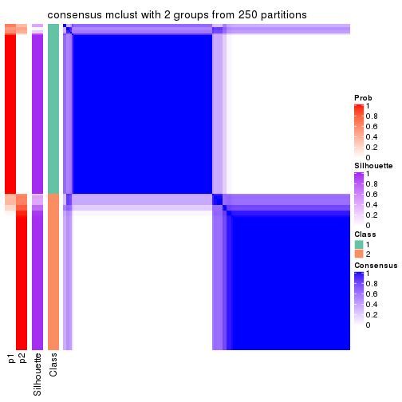</p>

</div>
<div id='tab-SD-mclust-consensus-heatmap-2'>
<pre><code class="r">consensus_heatmap(res, k = 3)
</code></pre>

<p>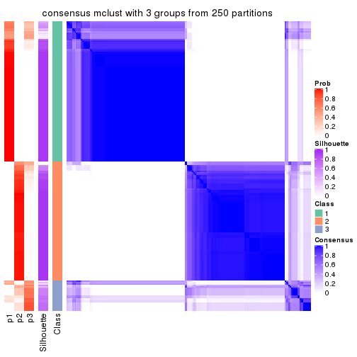</p>

</div>
<div id='tab-SD-mclust-consensus-heatmap-3'>
<pre><code class="r">consensus_heatmap(res, k = 4)
</code></pre>

<p>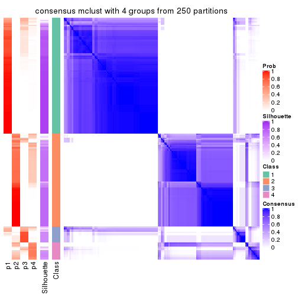</p>

</div>
<div id='tab-SD-mclust-consensus-heatmap-4'>
<pre><code class="r">consensus_heatmap(res, k = 5)
</code></pre>

<p>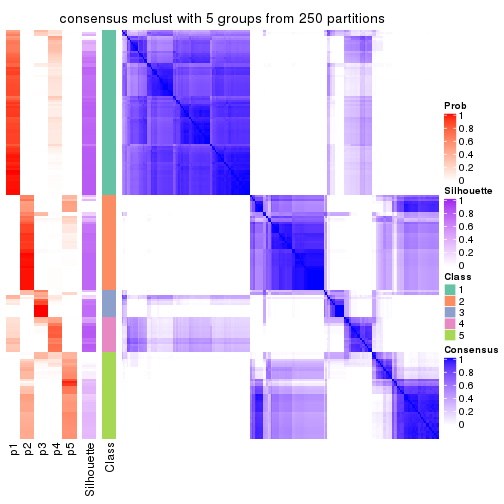</p>

</div>
<div id='tab-SD-mclust-consensus-heatmap-5'>
<pre><code class="r">consensus_heatmap(res, k = 6)
</code></pre>

<p>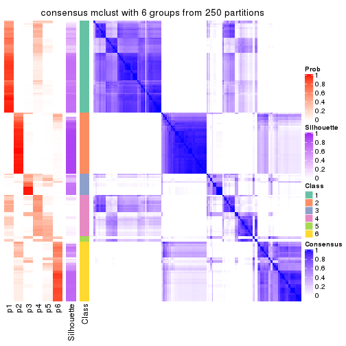</p>

</div>
</div>

Heatmaps for the membership of samples in all partitions to see how consistent they are:


<script>
$( function() {
	$( '#tabs-SD-mclust-membership-heatmap' ).tabs();
} );
</script>
<div id='tabs-SD-mclust-membership-heatmap'>
<ul>
<li><a href='#tab-SD-mclust-membership-heatmap-1'>k = 2</a></li>
<li><a href='#tab-SD-mclust-membership-heatmap-2'>k = 3</a></li>
<li><a href='#tab-SD-mclust-membership-heatmap-3'>k = 4</a></li>
<li><a href='#tab-SD-mclust-membership-heatmap-4'>k = 5</a></li>
<li><a href='#tab-SD-mclust-membership-heatmap-5'>k = 6</a></li>
</ul>
<div id='tab-SD-mclust-membership-heatmap-1'>
<pre><code class="r">membership_heatmap(res, k = 2)
</code></pre>

<p>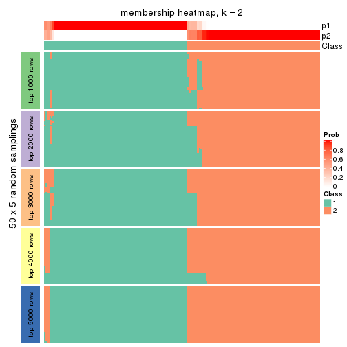</p>

</div>
<div id='tab-SD-mclust-membership-heatmap-2'>
<pre><code class="r">membership_heatmap(res, k = 3)
</code></pre>

<p>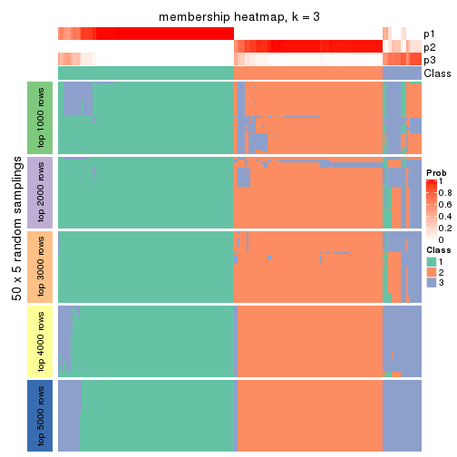</p>

</div>
<div id='tab-SD-mclust-membership-heatmap-3'>
<pre><code class="r">membership_heatmap(res, k = 4)
</code></pre>

<p>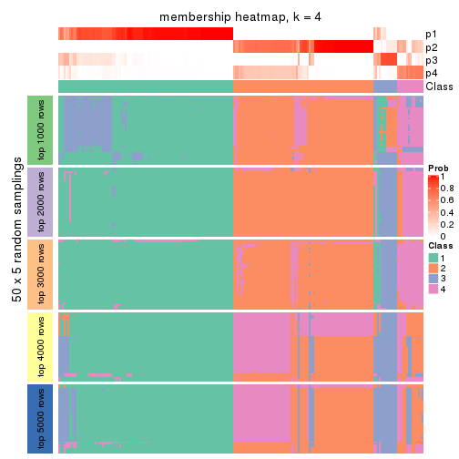</p>

</div>
<div id='tab-SD-mclust-membership-heatmap-4'>
<pre><code class="r">membership_heatmap(res, k = 5)
</code></pre>

<p>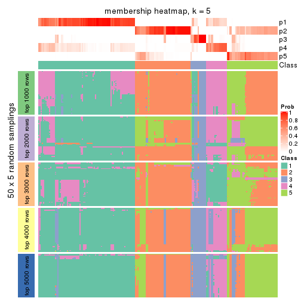</p>

</div>
<div id='tab-SD-mclust-membership-heatmap-5'>
<pre><code class="r">membership_heatmap(res, k = 6)
</code></pre>

<p>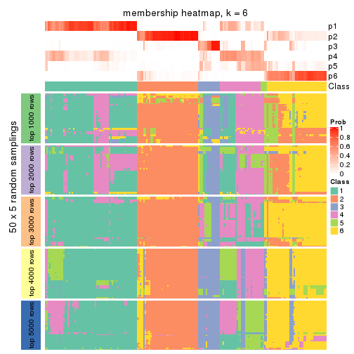</p>

</div>
</div>

As soon as we have had the classes for columns, we can look for signatures
which are significantly different between classes which can be candidate marks
for certain classes. Following are the heatmaps for signatures.


Signature heatmaps where rows are scaled:


<script>
$( function() {
	$( '#tabs-SD-mclust-get-signatures' ).tabs();
} );
</script>
<div id='tabs-SD-mclust-get-signatures'>
<ul>
<li><a href='#tab-SD-mclust-get-signatures-1'>k = 2</a></li>
<li><a href='#tab-SD-mclust-get-signatures-2'>k = 3</a></li>
<li><a href='#tab-SD-mclust-get-signatures-3'>k = 4</a></li>
<li><a href='#tab-SD-mclust-get-signatures-4'>k = 5</a></li>
<li><a href='#tab-SD-mclust-get-signatures-5'>k = 6</a></li>
</ul>
<div id='tab-SD-mclust-get-signatures-1'>
<pre><code class="r">get_signatures(res, k = 2)
</code></pre>

<p>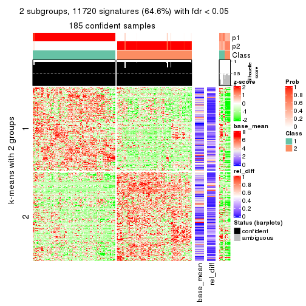</p>

</div>
<div id='tab-SD-mclust-get-signatures-2'>
<pre><code class="r">get_signatures(res, k = 3)
</code></pre>

<p>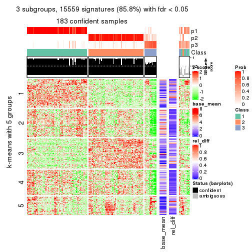</p>

</div>
<div id='tab-SD-mclust-get-signatures-3'>
<pre><code class="r">get_signatures(res, k = 4)
</code></pre>

<p>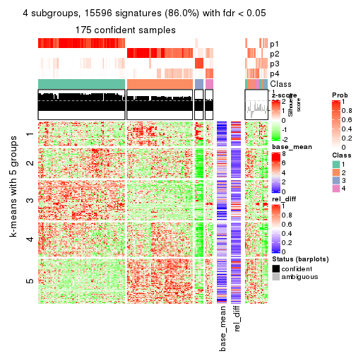</p>

</div>
<div id='tab-SD-mclust-get-signatures-4'>
<pre><code class="r">get_signatures(res, k = 5)
</code></pre>

<p>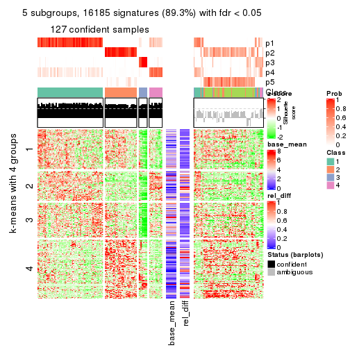</p>

</div>
<div id='tab-SD-mclust-get-signatures-5'>
<pre><code class="r">get_signatures(res, k = 6)
</code></pre>

<p>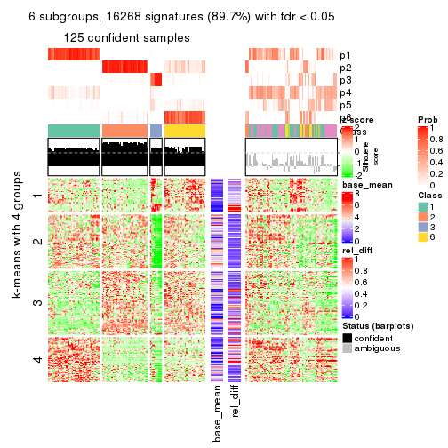</p>

</div>
</div>


Signature heatmaps where rows are not scaled:


<script>
$( function() {
	$( '#tabs-SD-mclust-get-signatures-no-scale' ).tabs();
} );
</script>
<div id='tabs-SD-mclust-get-signatures-no-scale'>
<ul>
<li><a href='#tab-SD-mclust-get-signatures-no-scale-1'>k = 2</a></li>
<li><a href='#tab-SD-mclust-get-signatures-no-scale-2'>k = 3</a></li>
<li><a href='#tab-SD-mclust-get-signatures-no-scale-3'>k = 4</a></li>
<li><a href='#tab-SD-mclust-get-signatures-no-scale-4'>k = 5</a></li>
<li><a href='#tab-SD-mclust-get-signatures-no-scale-5'>k = 6</a></li>
</ul>
<div id='tab-SD-mclust-get-signatures-no-scale-1'>
<pre><code class="r">get_signatures(res, k = 2, scale_rows = FALSE)
</code></pre>

<p>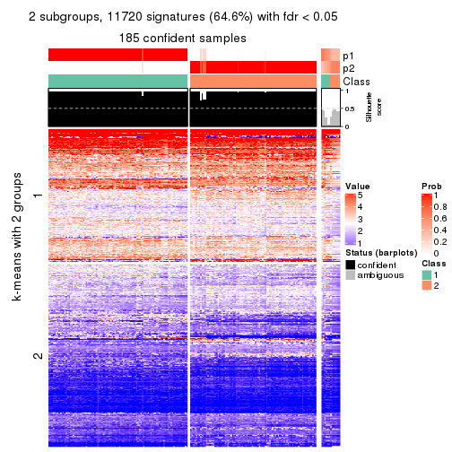</p>

</div>
<div id='tab-SD-mclust-get-signatures-no-scale-2'>
<pre><code class="r">get_signatures(res, k = 3, scale_rows = FALSE)
</code></pre>

<p>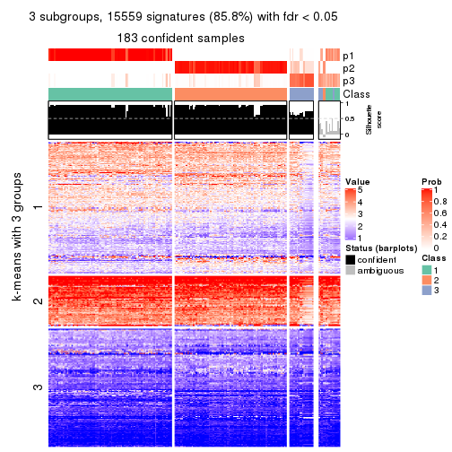</p>

</div>
<div id='tab-SD-mclust-get-signatures-no-scale-3'>
<pre><code class="r">get_signatures(res, k = 4, scale_rows = FALSE)
</code></pre>

<p>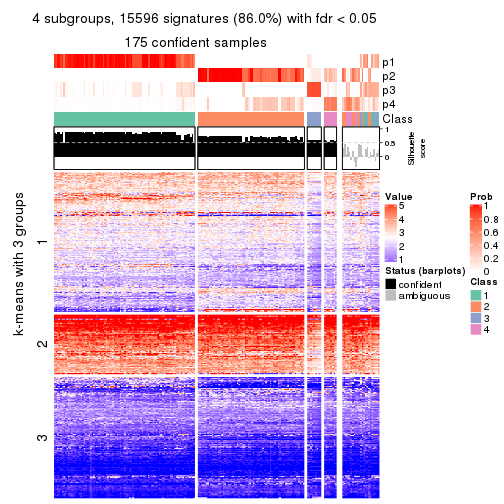</p>

</div>
<div id='tab-SD-mclust-get-signatures-no-scale-4'>
<pre><code class="r">get_signatures(res, k = 5, scale_rows = FALSE)
</code></pre>

<p>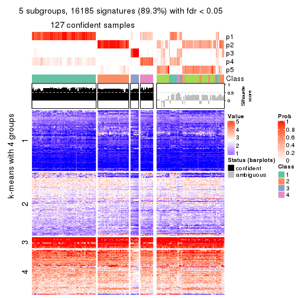</p>

</div>
<div id='tab-SD-mclust-get-signatures-no-scale-5'>
<pre><code class="r">get_signatures(res, k = 6, scale_rows = FALSE)
</code></pre>

<p>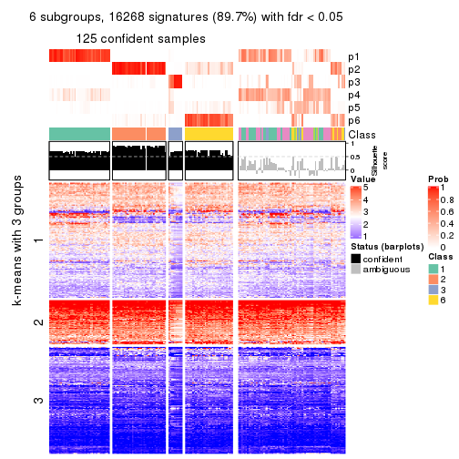</p>

</div>
</div>


Compare the overlap of signatures from different k:

```r
compare_signatures(res)
```

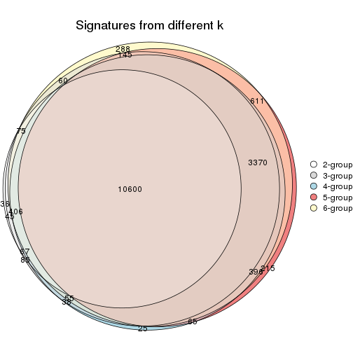

`get_signature()` returns a data frame invisibly. TO get the list of signatures, the function
call should be assigned to a variable explicitly. In following code, if `plot` argument is set
to `FALSE`, no heatmap is plotted while only the differential analysis is performed.

```r
# code only for demonstration
tb = get_signature(res, k = ..., plot = FALSE)
```

An example of the output of `tb` is:

```
#>   which_row         fdr    mean_1    mean_2 scaled_mean_1 scaled_mean_2 km
#> 1        38 0.042760348  8.373488  9.131774    -0.5533452     0.5164555  1
#> 2        40 0.018707592  7.106213  8.469186    -0.6173731     0.5762149  1
#> 3        55 0.019134737 10.221463 11.207825    -0.6159697     0.5749050  1
#> 4        59 0.006059896  5.921854  7.869574    -0.6899429     0.6439467  1
#> 5        60 0.018055526  8.928898 10.211722    -0.6204761     0.5791110  1
#> 6        98 0.009384629 15.714769 14.887706     0.6635654    -0.6193277  2
...
```

The columns in `tb` are:

1. `which_row`: row indices corresponding to the input matrix.
2. `fdr`: FDR for the differential test. 
3. `mean_x`: The mean value in group x.
4. `scaled_mean_x`: The mean value in group x after rows are scaled.
5. `km`: Row groups if k-means clustering is applied to rows.


UMAP plot which shows how samples are separated.


<script>
$( function() {
	$( '#tabs-SD-mclust-dimension-reduction' ).tabs();
} );
</script>
<div id='tabs-SD-mclust-dimension-reduction'>
<ul>
<li><a href='#tab-SD-mclust-dimension-reduction-1'>k = 2</a></li>
<li><a href='#tab-SD-mclust-dimension-reduction-2'>k = 3</a></li>
<li><a href='#tab-SD-mclust-dimension-reduction-3'>k = 4</a></li>
<li><a href='#tab-SD-mclust-dimension-reduction-4'>k = 5</a></li>
<li><a href='#tab-SD-mclust-dimension-reduction-5'>k = 6</a></li>
</ul>
<div id='tab-SD-mclust-dimension-reduction-1'>
<pre><code class="r">dimension_reduction(res, k = 2, method = &quot;UMAP&quot;)
</code></pre>

<p>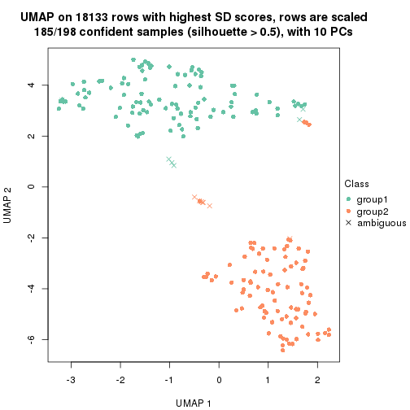</p>

</div>
<div id='tab-SD-mclust-dimension-reduction-2'>
<pre><code class="r">dimension_reduction(res, k = 3, method = &quot;UMAP&quot;)
</code></pre>

<p>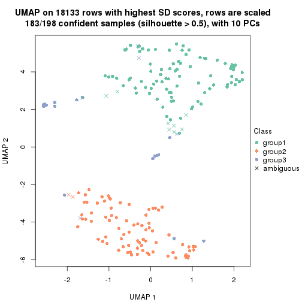</p>

</div>
<div id='tab-SD-mclust-dimension-reduction-3'>
<pre><code class="r">dimension_reduction(res, k = 4, method = &quot;UMAP&quot;)
</code></pre>

<p>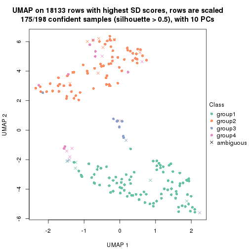</p>

</div>
<div id='tab-SD-mclust-dimension-reduction-4'>
<pre><code class="r">dimension_reduction(res, k = 5, method = &quot;UMAP&quot;)
</code></pre>

<p>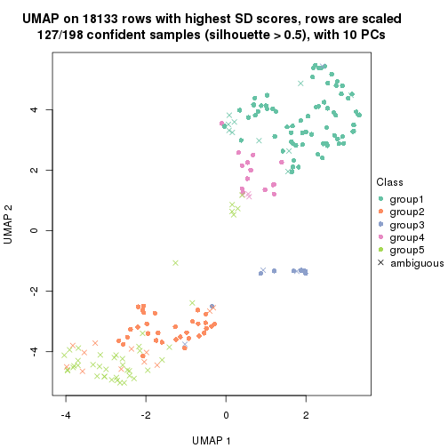</p>

</div>
<div id='tab-SD-mclust-dimension-reduction-5'>
<pre><code class="r">dimension_reduction(res, k = 6, method = &quot;UMAP&quot;)
</code></pre>

<p>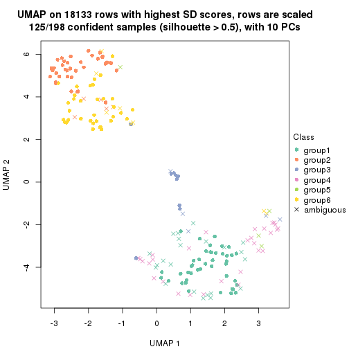</p>

</div>
</div>


Following heatmap shows how subgroups are split when increasing `k`:

```r
collect_classes(res)
```

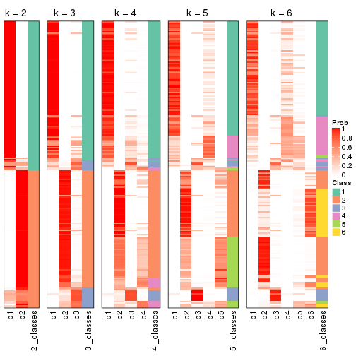


If matrix rows can be associated to genes, consider to use `functional_enrichment(res,
...)` to perform function enrichment for the signature genes. See [this vignette](http://bioconductor.org/packages/devel/bioc/vignettes/cola/inst/doc/functional_enrichment.html) for more detailed explanations.


 

---------------------------------------------------


### SD:NMF**


The object with results only for a single top-value method and a single partition method 
can be extracted as:

```r
res = res_list["SD", "NMF"]
# you can also extract it by
# res = res_list["SD:NMF"]
```

A summary of `res` and all the functions that can be applied to it:

```r
res
```

```
#> A 'ConsensusPartition' object with k = 2, 3, 4, 5, 6.
#>   On a matrix with 18133 rows and 198 columns.
#>   Top rows (1000, 2000, 3000, 4000, 5000) are extracted by 'SD' method.
#>   Subgroups are detected by 'NMF' method.
#>   Performed in total 1250 partitions by row resampling.
#>   Best k for subgroups seems to be 2.
#> 
#> Following methods can be applied to this 'ConsensusPartition' object:
#>  [1] "cola_report"             "collect_classes"         "collect_plots"          
#>  [4] "collect_stats"           "colnames"                "compare_signatures"     
#>  [7] "consensus_heatmap"       "dimension_reduction"     "functional_enrichment"  
#> [10] "get_anno_col"            "get_anno"                "get_classes"            
#> [13] "get_consensus"           "get_matrix"              "get_membership"         
#> [16] "get_param"               "get_signatures"          "get_stats"              
#> [19] "is_best_k"               "is_stable_k"             "membership_heatmap"     
#> [22] "ncol"                    "nrow"                    "plot_ecdf"              
#> [25] "rownames"                "select_partition_number" "show"                   
#> [28] "suggest_best_k"          "test_to_known_factors"
```

`collect_plots()` function collects all the plots made from `res` for all `k` (number of partitions)
into one single page to provide an easy and fast comparison between different `k`.

```r
collect_plots(res)
```

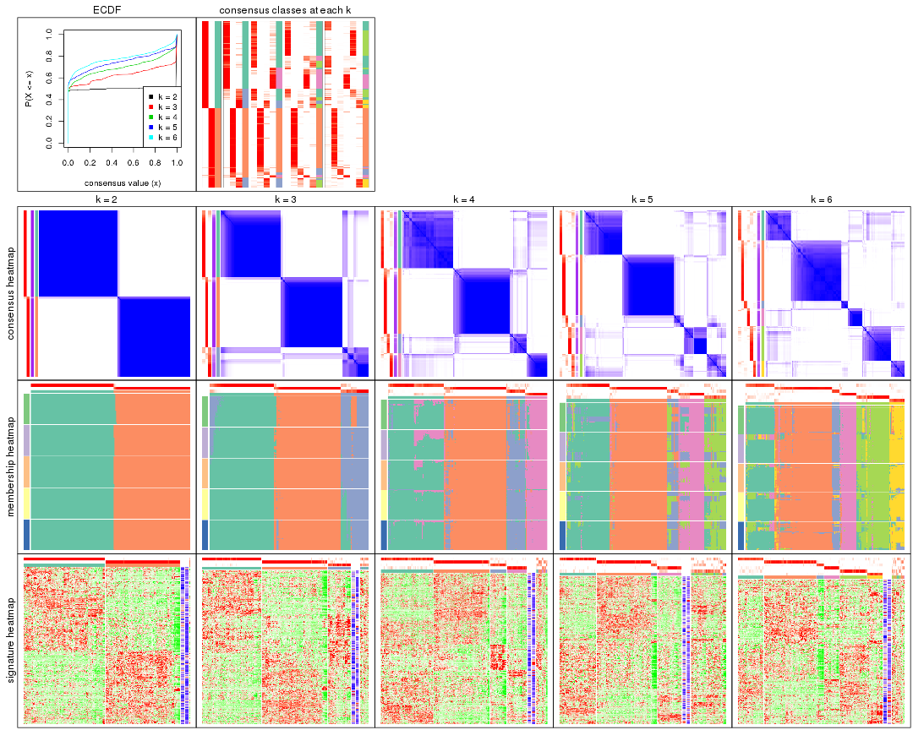

The plots are:

- The first row: a plot of the ECDF (empirical cumulative distribution
  function) curves of the consensus matrix for each `k` and the heatmap of
  predicted classes for each `k`.
- The second row: heatmaps of the consensus matrix for each `k`.
- The third row: heatmaps of the membership matrix for each `k`.
- The fouth row: heatmaps of the signatures for each `k`.

All the plots in panels can be made by individual functions and they are
plotted later in this section.

`select_partition_number()` produces several plots showing different
statistics for choosing "optimized" `k`. There are following statistics:

- ECDF curves of the consensus matrix for each `k`;
- 1-PAC. [The PAC
  score](https://en.wikipedia.org/wiki/Consensus_clustering#Over-interpretation_potential_of_consensus_clustering)
  measures the proportion of the ambiguous subgrouping.
- Mean silhouette score.
- Concordance. The mean probability of fiting the consensus class ids in all
  partitions.
- Area increased. Denote $A_k$ as the area under the ECDF curve for current
  `k`, the area increased is defined as $A_k - A_{k-1}$.
- Rand index. The percent of pairs of samples that are both in a same cluster
  or both are not in a same cluster in the partition of k and k-1.
- Jaccard index. The ratio of pairs of samples are both in a same cluster in
  the partition of k and k-1 and the pairs of samples are both in a same
  cluster in the partition k or k-1.

The detailed explanations of these statistics can be found in [the _cola_
vignette](http://bioconductor.org/packages/devel/bioc/vignettes/cola/inst/doc/cola.html#toc_13).

Generally speaking, lower PAC score, higher mean silhouette score or higher
concordance corresponds to better partition. Rand index and Jaccard index
measure how similar the current partition is compared to partition with `k-1`.
If they are too similar, we won't accept `k` is better than `k-1`.

```r
select_partition_number(res)
```

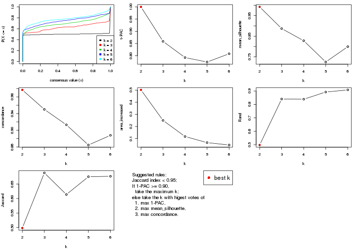

The numeric values for all these statistics can be obtained by `get_stats()`.

```r
get_stats(res)
```

```
#>   k 1-PAC mean_silhouette concordance area_increased  Rand Jaccard
#> 2 2 1.000           0.992       0.997         0.5019 0.498   0.498
#> 3 3 0.859           0.887       0.950         0.2500 0.840   0.689
#> 4 4 0.792           0.828       0.913         0.1172 0.839   0.614
#> 5 5 0.774           0.725       0.865         0.0667 0.892   0.675
#> 6 6 0.808           0.799       0.888         0.0471 0.908   0.677
```

`suggest_best_k()` suggests the best $k$ based on these statistics. The rules are as follows:

- All $k$ with Jaccard index larger than 0.95 are removed because increasing
  $k$ does not provide enough extra information. If all $k$ are removed, it is
  marked as no subgroup is detected.
- For all $k$ with 1-PAC score larger than 0.9, the maximal $k$ is taken as
  the best $k$, and other $k$ are marked as optional $k$.
- If it does not fit the second rule. The $k$ with the maximal vote of the
  highest 1-PAC score, highest mean silhouette, and highest concordance is
  taken as the best $k$.

```r
suggest_best_k(res)
```

```
#> [1] 2
```


Following shows the table of the partitions (You need to click the **show/hide
code output** link to see it). The membership matrix (columns with name `p*`)
is inferred by
[`clue::cl_consensus()`](https://www.rdocumentation.org/link/cl_consensus?package=clue)
function with the `SE` method. Basically the value in the membership matrix
represents the probability to belong to a certain group. The finall class
label for an item is determined with the group with highest probability it
belongs to.

In `get_classes()` function, the entropy is calculated from the membership
matrix and the silhouette score is calculated from the consensus matrix.


<script>
$( function() {
	$( '#tabs-SD-NMF-get-classes' ).tabs();
} );
</script>
<div id='tabs-SD-NMF-get-classes'>
<ul>
<li><a href='#tab-SD-NMF-get-classes-1'>k = 2</a></li>
<li><a href='#tab-SD-NMF-get-classes-2'>k = 3</a></li>
<li><a href='#tab-SD-NMF-get-classes-3'>k = 4</a></li>
<li><a href='#tab-SD-NMF-get-classes-4'>k = 5</a></li>
<li><a href='#tab-SD-NMF-get-classes-5'>k = 6</a></li>
</ul>

<div id='tab-SD-NMF-get-classes-1'>
<p><a id='tab-SD-NMF-get-classes-1-a' style='color:#0366d6' href='#'>show/hide code output</a></p>
<pre><code class="r">cbind(get_classes(res, k = 2), get_membership(res, k = 2))
</code></pre>

<pre><code>#&gt;                                      class entropy silhouette    p1    p2
#&gt; 0C0AA0B2-5191-4EDF-8937-ED7434F30283     2   0.000      0.993 0.000 1.000
#&gt; 18B45F1F-234F-45CC-A234-145307606C5C     1   0.000      1.000 1.000 0.000
#&gt; E18B70C0-BDCA-46D3-99BB-C6C8ABC68DA5     2   0.000      0.993 0.000 1.000
#&gt; 0F6DDBA7-6F74-45E8-95C8-F28263D55978     1   0.000      1.000 1.000 0.000
#&gt; 7EAE1A5A-129A-46DE-977E-A2C753F10904     2   0.000      0.993 0.000 1.000
#&gt; 7EAE0048-16B5-4979-9410-16CDEB9B1A48     1   0.000      1.000 1.000 0.000
#&gt; 2EBFC828-2B27-4753-A052-80DDA226DAB4     2   0.000      0.993 0.000 1.000
#&gt; 24E1768D-2232-41DA-9383-BC55D6EB3812     2   0.000      0.993 0.000 1.000
#&gt; 6E3CD60A-1889-4CA3-B305-2E78152057B5     2   0.000      0.993 0.000 1.000
#&gt; 33CC70DD-82B3-413C-B3B1-BE06634D95D0     1   0.000      1.000 1.000 0.000
#&gt; F1CB57A3-55DD-4487-9307-1B4F652E729A     1   0.000      1.000 1.000 0.000
#&gt; 755A5806-B054-449A-93DB-79909E6C93A1     1   0.000      1.000 1.000 0.000
#&gt; 58D364E7-3D2F-468F-A264-D6461E2428D4     2   0.000      0.993 0.000 1.000
#&gt; 68BB9CB6-7AA2-4981-B9D9-07363EC96599     2   0.000      0.993 0.000 1.000
#&gt; 3C4E8DFA-8EA0-4F1F-89CB-CB8805395872     2   0.000      0.993 0.000 1.000
#&gt; 4219651D-5583-4498-BF08-1B7D04B4C7B2     1   0.000      1.000 1.000 0.000
#&gt; B5EE2768-0D67-4584-ADBC-EC745FEC52EA     2   0.000      0.993 0.000 1.000
#&gt; 825E6C11-F460-451A-8045-846DD7D0E945     1   0.000      1.000 1.000 0.000
#&gt; 491F62AF-5E68-43C3-982A-F867A75BBA9A     2   0.000      0.993 0.000 1.000
#&gt; 9D7F058C-F95A-44AD-AC9E-450F7FBDC960     2   0.000      0.993 0.000 1.000
#&gt; 6D42DD0C-2081-4742-BA27-9F5F16FAC3C6     1   0.000      1.000 1.000 0.000
#&gt; EDD7E63D-492A-473B-A552-0764337B10EF     2   0.000      0.993 0.000 1.000
#&gt; 97073DEA-73AD-4DFD-BD1A-9035DC03445B     1   0.000      1.000 1.000 0.000
#&gt; FA891AB9-CE38-4F7E-A015-1DDCE12890A0     1   0.000      1.000 1.000 0.000
#&gt; D9514D49-A0AE-45AB-8C9F-68E726215253     1   0.000      1.000 1.000 0.000
#&gt; 3B9229AD-12E5-451E-9D2F-378AAC82C04A     2   0.000      0.993 0.000 1.000
#&gt; 5EA36B71-4917-4EF3-9060-065EFE6ACC5B     1   0.000      1.000 1.000 0.000
#&gt; A20E4ECB-4895-4CC7-BE5E-4721B20D933B     1   0.000      1.000 1.000 0.000
#&gt; 1BE8D828-29DB-4368-AA4A-FB23588F7AE8     1   0.000      1.000 1.000 0.000
#&gt; 66EFEFCF-3D14-4DBF-AA13-530F40ED0245     1   0.000      1.000 1.000 0.000
#&gt; 55DFFE53-BCE7-4EC1-9863-6C0311B06BA2     2   0.000      0.993 0.000 1.000
#&gt; 4CC3FB5A-611D-4C64-AE9D-544FA45CF4DC     1   0.000      1.000 1.000 0.000
#&gt; C11D33F2-DFE9-4FA8-9024-F3E7F1DADC5F     2   0.000      0.993 0.000 1.000
#&gt; FA5932B8-8AA3-4C38-9FAB-C35D8772974D     1   0.000      1.000 1.000 0.000
#&gt; 8216EC35-1F41-4A15-B503-BDA4971E27C9     1   0.000      1.000 1.000 0.000
#&gt; 69635D23-90A7-4BAD-97C7-B79536837F57     1   0.000      1.000 1.000 0.000
#&gt; 12B404E2-C463-4409-8392-E4649B2AFFD1     2   0.000      0.993 0.000 1.000
#&gt; 246927E3-ACCF-41B2-AA8E-43855FD6B146     2   0.000      0.993 0.000 1.000
#&gt; E0CC13E7-9607-49E0-B4AA-395544E3C3BF     1   0.000      1.000 1.000 0.000
#&gt; F7BBC0C1-6124-4A83-8A70-EA89B62F1CBD     1   0.000      1.000 1.000 0.000
#&gt; B1D4FF24-8E6F-4A04-B716-2032D850EB57     1   0.000      1.000 1.000 0.000
#&gt; 253601DB-B78A-4566-9947-8C0270C0B163     2   0.000      0.993 0.000 1.000
#&gt; AB83DBFF-5737-4FB8-A5AC-1D3CD6072BDF     2   0.000      0.993 0.000 1.000
#&gt; 9D67D953-EC98-4B72-89C8-5732BC9D4BC9     2   0.000      0.993 0.000 1.000
#&gt; 51061018-95AB-4278-886F-F69E4EBC47C0     2   0.000      0.993 0.000 1.000
#&gt; ABD0F7F3-105B-4DEE-9889-5028772C519A     1   0.000      1.000 1.000 0.000
#&gt; 562B95CF-B27E-4A72-B7C6-CDF86A51A39B     1   0.000      1.000 1.000 0.000
#&gt; ABF046A4-D7A1-49FF-B6B1-4E07A791DEDB     2   0.000      0.993 0.000 1.000
#&gt; 3FF4101E-9703-460E-A30E-76CC7689F36D     2   0.000      0.993 0.000 1.000
#&gt; 39C4F7AA-7ADF-4F1D-BDA3-BEC605AC5023     2   0.000      0.993 0.000 1.000
#&gt; CB821FD2-AF5C-4743-A70F-21C12C6ED153     1   0.000      1.000 1.000 0.000
#&gt; 92EA1846-62FF-41D5-A441-5E52E6B9E7F9     1   0.000      1.000 1.000 0.000
#&gt; 7D25F3EE-5A20-4763-8026-16A03D05F459     1   0.000      1.000 1.000 0.000
#&gt; 8ECE5276-CD06-496B-A5A9-1713B1F7D089     1   0.000      1.000 1.000 0.000
#&gt; C775B68F-9507-47E3-B507-B433AED79002     1   0.000      1.000 1.000 0.000
#&gt; E19D5463-FDD0-41C1-A170-323736A88D07     2   0.000      0.993 0.000 1.000
#&gt; CE4B6285-4961-4767-91F0-5C7A8162E185     1   0.000      1.000 1.000 0.000
#&gt; 9637BD72-1FEF-42AD-8886-2C39BE876531     1   0.000      1.000 1.000 0.000
#&gt; 81B5A88E-45A0-4B44-B689-B9071B8548EE     2   0.000      0.993 0.000 1.000
#&gt; 0B01B4C9-9BED-4F5B-A3E2-8868C7CCC3FC     2   0.000      0.993 0.000 1.000
#&gt; 54501315-7132-44B2-A179-10FBF1421105     1   0.000      1.000 1.000 0.000
#&gt; E207CBE9-4C3A-4FDD-9251-CFE1FE106475     1   0.000      1.000 1.000 0.000
#&gt; 3BEA0B92-3F90-4DBF-9679-AADEAD7D47C8     2   0.000      0.993 0.000 1.000
#&gt; 35B32250-D854-4215-AA5B-2C11B2FBEECA     1   0.000      1.000 1.000 0.000
#&gt; ACE6566B-AEB9-426C-924A-B382D14A1024     2   0.000      0.993 0.000 1.000
#&gt; 737E69AC-0930-45B9-B6BA-7CE5E300290B     1   0.000      1.000 1.000 0.000
#&gt; B4410AB8-D015-41CA-86E6-12EB4E4103E3     1   0.000      1.000 1.000 0.000
#&gt; 6D3ECA65-C50F-43B0-B75A-1D290FA4A8FD     2   0.000      0.993 0.000 1.000
#&gt; C86F40D3-9A96-4395-A8C3-510DE12F9A2B     2   0.000      0.993 0.000 1.000
#&gt; 6238087F-24DD-4BF1-903F-3BD4E446C1AE     2   0.000      0.993 0.000 1.000
#&gt; E4FF840B-EEAB-4CB0-A690-7D4C4AA7EEC3     2   0.000      0.993 0.000 1.000
#&gt; 72D3C323-C67F-4C0E-9BFC-BF245FF9730A     1   0.000      1.000 1.000 0.000
#&gt; 82D56E4E-4DF6-4F3E-8959-B995C92AAA70     1   0.000      1.000 1.000 0.000
#&gt; E31CA441-EB19-443B-ACBD-37B5CCBCF0E5     2   0.000      0.993 0.000 1.000
#&gt; 87CA8939-D054-4B8A-B32D-085FD2E8F202     1   0.000      1.000 1.000 0.000
#&gt; 2A508D90-FEDC-46A3-9A02-E51E5467CDCB     1   0.000      1.000 1.000 0.000
#&gt; C4E8B4E2-388B-411F-BF0A-9B6F34E8EDB5     2   0.000      0.993 0.000 1.000
#&gt; AF6AF803-BD93-44A7-AA80-B9BC92C1273B     2   0.000      0.993 0.000 1.000
#&gt; 0B1CA5CF-EB96-41D4-BFC5-6957FEB39828     1   0.000      1.000 1.000 0.000
#&gt; 6FB96FB0-6661-48AD-A4A0-69F8AFDBE591     2   0.000      0.993 0.000 1.000
#&gt; 8C19F7FD-368A-462B-B28F-88D6630038A1     1   0.000      1.000 1.000 0.000
#&gt; 96EABE78-C2F4-4A33-ACD8-C922A4B2519B     2   0.000      0.993 0.000 1.000
#&gt; 68B36D7B-546A-4689-949F-B207C4A4AB27     2   0.000      0.993 0.000 1.000
#&gt; CE9F3335-778F-4F52-BC55-4B7C99B211DD     2   0.000      0.993 0.000 1.000
#&gt; CB359DED-2A2D-4646-A0BD-6F10ADCC532B     1   0.000      1.000 1.000 0.000
#&gt; 198324A5-8C52-46F6-9734-EFAF1CCA6D9B     1   0.000      1.000 1.000 0.000
#&gt; 83B88608-0506-428C-B9E8-621F38477B42     1   0.000      1.000 1.000 0.000
#&gt; 1993630A-0F3D-4F5C-86A3-D443BAAF57F0     1   0.000      1.000 1.000 0.000
#&gt; DE73DA9B-529E-4F4F-A65C-DA7AB84B1096     1   0.000      1.000 1.000 0.000
#&gt; 2347F3B7-DDA3-40C0-B6D4-8819ECA69146     1   0.000      1.000 1.000 0.000
#&gt; AB93B5D5-095F-4330-9D40-6A3D934AB50C     1   0.000      1.000 1.000 0.000
#&gt; 5EBBE4AD-FF0C-41CF-9EA3-B6FE7EA1F9C0     1   0.000      1.000 1.000 0.000
#&gt; 6D960AE7-3769-4144-A061-E8588E5063FF     1   0.000      1.000 1.000 0.000
#&gt; 0C2DD8C0-D1A5-4192-A49C-7A40FED628B2     2   0.000      0.993 0.000 1.000
#&gt; 18C9372F-C55B-4F86-A9D2-E8D85EFC8566     2   0.929      0.483 0.344 0.656
#&gt; 9AF637B0-4C32-4DD1-93AF-7655B4A845D3     2   0.000      0.993 0.000 1.000
#&gt; 785B5B06-4115-46FD-9BEB-F888AFDC855D     2   0.000      0.993 0.000 1.000
#&gt; ECA3050E-4BE2-4117-B9CF-A52BB85AF8C2     2   0.714      0.759 0.196 0.804
#&gt; 099DC396-16A5-458F-9ED9-F2A790CB0C34     1   0.000      1.000 1.000 0.000
#&gt; 7A5A12EE-C5B0-4C51-8C99-0F3FA88D633E     1   0.000      1.000 1.000 0.000
#&gt; E832B508-A66D-4817-B44A-FE9FAAE64B4A     1   0.000      1.000 1.000 0.000
#&gt; F9DD688C-7B35-49E7-9651-2E098EE78856     1   0.000      1.000 1.000 0.000
#&gt; F1265DD8-5ED3-4635-A277-57BBFDEC7729     1   0.000      1.000 1.000 0.000
#&gt; F624E8D9-DB07-4C9E-910D-5E8EBA3A6167     2   0.000      0.993 0.000 1.000
#&gt; 3516FBDF-66E1-43F4-9D7B-16748F6439A7     2   0.000      0.993 0.000 1.000
#&gt; 04B12992-B2EA-4BA2-8E2C-11E34E230E6F     2   0.000      0.993 0.000 1.000
#&gt; CC02897D-9123-495E-9242-5C9CF4EC269B     2   0.000      0.993 0.000 1.000
#&gt; 3117ED46-2BF2-4311-BC00-4E98243E16B3     1   0.000      1.000 1.000 0.000
#&gt; E0B66D53-23DB-4E26-BB6E-F692FA8C000E     1   0.000      1.000 1.000 0.000
#&gt; DAA93CE5-A013-477A-9A50-EA09CC3A8162     2   0.000      0.993 0.000 1.000
#&gt; 0099098D-354A-4276-92F8-B932C74B4608     1   0.000      1.000 1.000 0.000
#&gt; DD483639-B2E7-4745-BCFB-55ED1D82BFBF     2   0.000      0.993 0.000 1.000
#&gt; 2C1F9079-602E-4252-82C7-9D8799E04246     2   0.000      0.993 0.000 1.000
#&gt; 9473A8E4-3A1B-4184-9EA6-517AFD60B635     1   0.000      1.000 1.000 0.000
#&gt; 75CFBAF6-7BA0-40AF-92D7-D218E885BD1B     2   0.000      0.993 0.000 1.000
#&gt; B588950F-14D6-41C8-845B-EFD2096013C6     2   0.000      0.993 0.000 1.000
#&gt; 0DF3EDA8-DAEA-4721-92AB-B97181249498     2   0.000      0.993 0.000 1.000
#&gt; 8EA83042-D598-401D-AD78-936EEB136C59     1   0.000      1.000 1.000 0.000
#&gt; 729AC418-3BE9-445A-95D4-AC11A7D43BE0     1   0.000      1.000 1.000 0.000
#&gt; 7D8B1B11-F576-4AA8-BFA7-0022A2CD829A     2   0.000      0.993 0.000 1.000
#&gt; 304A0E46-3449-4B44-9C30-BDDF6459391D     1   0.000      1.000 1.000 0.000
#&gt; 3C83358F-DF20-47F7-AF9F-AB7CC92F5ABA     1   0.000      1.000 1.000 0.000
#&gt; EAFEED6C-35C3-451F-AE4A-EB56992E1F29     1   0.000      1.000 1.000 0.000
#&gt; 8A237A65-28EC-434D-A78A-A8B7308B5204     1   0.000      1.000 1.000 0.000
#&gt; D005833F-E991-4E9E-9667-55F137288004     1   0.000      1.000 1.000 0.000
#&gt; 37D966E3-253E-4397-A9AE-0903A8D31FE6     1   0.000      1.000 1.000 0.000
#&gt; D2482B81-CB5B-4178-BA8D-1CF4026181B5     1   0.000      1.000 1.000 0.000
#&gt; 18019E95-C2A8-4EE7-B585-F6886DC4D953     2   0.000      0.993 0.000 1.000
#&gt; 0B126D1A-14A8-4345-8F78-FF92222ADF4C     2   0.000      0.993 0.000 1.000
#&gt; CE88B625-47D8-4D58-9FB4-23464DB7DDAD     2   0.000      0.993 0.000 1.000
#&gt; 9A88299D-5C74-47FA-B42C-1A1D6D935AAB     1   0.000      1.000 1.000 0.000
#&gt; 3E71159C-FD6C-41DA-B18B-0730C8AC7E41     1   0.000      1.000 1.000 0.000
#&gt; 6F245AA4-79D9-47E1-BCC9-1AAF65AEA813     1   0.000      1.000 1.000 0.000
#&gt; 4CF2C888-2100-483A-B4DB-ECBB69243A4D     2   0.000      0.993 0.000 1.000
#&gt; A3853813-B9D5-4E8C-B075-19FCC35F8686     2   0.000      0.993 0.000 1.000
#&gt; 83A16DEE-CE9F-4D8B-9225-0A2A8B9D055D     1   0.000      1.000 1.000 0.000
#&gt; 0F057CAF-4F9A-4DE9-8601-730E96873733     2   0.000      0.993 0.000 1.000
#&gt; 32D5801D-DBA4-422E-87CB-A2DDE921BA41     1   0.000      1.000 1.000 0.000
#&gt; 22EE8076-F07C-499A-9AF8-D800A77EF154     2   0.000      0.993 0.000 1.000
#&gt; DD4BD74D-D48C-4090-9F57-5334E784581C     1   0.000      1.000 1.000 0.000
#&gt; 41183565-434D-474C-B1BD-CA6E94910658     2   0.000      0.993 0.000 1.000
#&gt; 75A2CE41-2B2A-4346-927E-ACF8A72738E4     1   0.000      1.000 1.000 0.000
#&gt; 7AA24995-3DD2-4682-B36A-4EBFEEACF625     1   0.000      1.000 1.000 0.000
#&gt; 8BAFDFEC-9F26-4ADB-95CE-004143960EEB     1   0.000      1.000 1.000 0.000
#&gt; A330E011-CE08-4A85-8F4B-370592293DBB     1   0.000      1.000 1.000 0.000
#&gt; 1D5A5B17-2E70-4BB0-94A1-EC17E6EA49DB     1   0.000      1.000 1.000 0.000
#&gt; BD9143B8-9D97-4A05-872C-3FB82B4CF7BE     2   0.000      0.993 0.000 1.000
#&gt; 64552DC0-181E-4607-898C-787AA7F26435     2   0.000      0.993 0.000 1.000
#&gt; 1B4C4D41-34C7-43A3-858B-C9552EB53894     1   0.000      1.000 1.000 0.000
#&gt; 463A3BAA-02DC-4EA4-A644-B924163E425D     2   0.000      0.993 0.000 1.000
#&gt; CD0FEA89-6F60-4A20-8FCA-D397B4E95A98     1   0.000      1.000 1.000 0.000
#&gt; 5D06CF6D-F4B9-4B32-B055-8AB287E53340     2   0.000      0.993 0.000 1.000
#&gt; ADA7835F-DB67-4F4F-9446-8BCE3C5FE936     2   0.000      0.993 0.000 1.000
#&gt; 4109BE2D-B5DF-4BD7-860E-60D87F647152     2   0.118      0.978 0.016 0.984
#&gt; 88526A0E-6DFE-46CB-BFAD-B4826F482C67     1   0.000      1.000 1.000 0.000
#&gt; F39F9A4C-18F7-4017-AB31-85D52FF44587     2   0.000      0.993 0.000 1.000
#&gt; D4290A5E-1B24-4C55-B470-0FA7A0A09DD0     2   0.000      0.993 0.000 1.000
#&gt; DC5A2C9E-978F-4661-B729-1F9662976E27     1   0.000      1.000 1.000 0.000
#&gt; 26A1F392-CED2-43E3-8096-74E6F2BFC8C0     2   0.000      0.993 0.000 1.000
#&gt; 87D81FB2-306A-4E75-9D58-D5F48E46E7F6     2   0.000      0.993 0.000 1.000
#&gt; E3D9D81A-C20C-4B3B-B940-A5D2C5F65B22     2   0.000      0.993 0.000 1.000
#&gt; 4464650B-453F-476C-989C-B7B159BF2CF0     2   0.000      0.993 0.000 1.000
#&gt; 577D2867-B738-487A-9B06-07958D647F02     1   0.000      1.000 1.000 0.000
#&gt; E52A22CC-3C03-41A9-9541-220DD871E162     2   0.000      0.993 0.000 1.000
#&gt; 642703B1-AF99-4746-A915-0792F4B9590B     2   0.000      0.993 0.000 1.000
#&gt; 8F0D1792-1284-45E6-8EC4-392596057677     2   0.000      0.993 0.000 1.000
#&gt; 765AFFC1-D528-4494-8BA1-0706451E4205     2   0.000      0.993 0.000 1.000
#&gt; A716BC29-161F-4CA0-B240-00B330137F2C     1   0.000      1.000 1.000 0.000
#&gt; 32CBFBAF-7064-4595-8D54-2C5E7DE0FD9B     1   0.000      1.000 1.000 0.000
#&gt; 4D6ED28C-3F20-41B0-BA41-1BF0E5199A40     2   0.430      0.901 0.088 0.912
#&gt; 86A38456-2900-48FB-B10F-79222B3CA9BF     1   0.000      1.000 1.000 0.000
#&gt; E870807D-3223-4A6A-9E3D-F4461B048AA2     2   0.000      0.993 0.000 1.000
#&gt; 3A78D19F-A833-4D2C-8387-FB4FD4A8313C     1   0.000      1.000 1.000 0.000
#&gt; DFA162CA-C708-4121-8E74-F9C4DEE0CDAE     1   0.000      1.000 1.000 0.000
#&gt; C00A300A-CD10-4C9D-8C94-3901AFE8406C     2   0.000      0.993 0.000 1.000
#&gt; 13E11D15-A90F-48C4-980A-DD032C00A2C1     1   0.000      1.000 1.000 0.000
#&gt; 31BF80AB-FEDB-4C73-89C3-70BE9F9ACBEE     2   0.000      0.993 0.000 1.000
#&gt; FA34308A-349D-4AAD-94CF-3F3B7F9AD629     2   0.000      0.993 0.000 1.000
#&gt; 7C48D467-B663-49DD-BC84-A36BC32ACB3D     1   0.000      1.000 1.000 0.000
#&gt; BB068534-04F6-4FC9-9087-CDA65920BCE2     1   0.000      1.000 1.000 0.000
#&gt; EA4EC272-A9B3-4B2E-955F-19F7676A944C     2   0.000      0.993 0.000 1.000
#&gt; C71FF69B-A460-43CA-8769-9667F22D938B     1   0.000      1.000 1.000 0.000
#&gt; 5243D1B8-8168-4FF1-A8C6-505F080EF0D3     2   0.000      0.993 0.000 1.000
#&gt; BCC474D8-08FE-4E99-B8E8-B29E65F84D2E     1   0.000      1.000 1.000 0.000
#&gt; 04FDBFE3-4CF6-4E53-A2AA-89D5C9316377     2   0.000      0.993 0.000 1.000
#&gt; 83A9915C-8D60-4CAE-A868-B61E3C90C7B0     2   0.000      0.993 0.000 1.000
#&gt; 989A6472-E3E3-457A-97BE-CCE95F42D5C2     2   0.000      0.993 0.000 1.000
#&gt; A0AB2D28-6751-49C9-8DF4-66FDBF95C360     1   0.000      1.000 1.000 0.000
#&gt; A12B2683-18D4-41C9-8AE5-C143E2180052     1   0.000      1.000 1.000 0.000
#&gt; 8DE1E245-CAD2-4F11-BFA2-9792C433A00B     1   0.000      1.000 1.000 0.000
#&gt; FDA68036-6C4C-4256-9AA0-C01FE92AA098     2   0.000      0.993 0.000 1.000
#&gt; 26311920-1414-4EC1-870B-784961EBCC2D     1   0.000      1.000 1.000 0.000
#&gt; C29A10D6-D598-4286-B5E0-F1776E19E988     1   0.000      1.000 1.000 0.000
#&gt; FACCC1FB-4937-4CC0-90EA-7F91D3D939CF     2   0.000      0.993 0.000 1.000
#&gt; 90B9D84B-78E5-4C7E-8414-EC889C2DE8DB     2   0.000      0.993 0.000 1.000
#&gt; B74E6122-76E1-4E4D-A867-BCAFD7277393     1   0.000      1.000 1.000 0.000
#&gt; 98494DC0-CF6E-485F-8A0D-D80E4437EF5C     2   0.000      0.993 0.000 1.000
#&gt; DA114DAC-DE7B-4E43-8D7C-82C5D7B66411     1   0.000      1.000 1.000 0.000
</code></pre>

<script>
$('#tab-SD-NMF-get-classes-1-a').parent().next().next().hide();
$('#tab-SD-NMF-get-classes-1-a').click(function(){
  $('#tab-SD-NMF-get-classes-1-a').parent().next().next().toggle();
  return(false);
});
</script>
</div>

<div id='tab-SD-NMF-get-classes-2'>
<p><a id='tab-SD-NMF-get-classes-2-a' style='color:#0366d6' href='#'>show/hide code output</a></p>
<pre><code class="r">cbind(get_classes(res, k = 3), get_membership(res, k = 3))
</code></pre>

<pre><code>#&gt;                                      class entropy silhouette    p1    p2    p3
#&gt; 0C0AA0B2-5191-4EDF-8937-ED7434F30283     2  0.0000      0.977 0.000 1.000 0.000
#&gt; 18B45F1F-234F-45CC-A234-145307606C5C     1  0.0000      0.957 1.000 0.000 0.000
#&gt; E18B70C0-BDCA-46D3-99BB-C6C8ABC68DA5     2  0.0000      0.977 0.000 1.000 0.000
#&gt; 0F6DDBA7-6F74-45E8-95C8-F28263D55978     1  0.0000      0.957 1.000 0.000 0.000
#&gt; 7EAE1A5A-129A-46DE-977E-A2C753F10904     2  0.0000      0.977 0.000 1.000 0.000
#&gt; 7EAE0048-16B5-4979-9410-16CDEB9B1A48     1  0.0000      0.957 1.000 0.000 0.000
#&gt; 2EBFC828-2B27-4753-A052-80DDA226DAB4     2  0.0000      0.977 0.000 1.000 0.000
#&gt; 24E1768D-2232-41DA-9383-BC55D6EB3812     2  0.0000      0.977 0.000 1.000 0.000
#&gt; 6E3CD60A-1889-4CA3-B305-2E78152057B5     2  0.0000      0.977 0.000 1.000 0.000
#&gt; 33CC70DD-82B3-413C-B3B1-BE06634D95D0     3  0.6026      0.455 0.376 0.000 0.624
#&gt; F1CB57A3-55DD-4487-9307-1B4F652E729A     1  0.0000      0.957 1.000 0.000 0.000
#&gt; 755A5806-B054-449A-93DB-79909E6C93A1     1  0.0000      0.957 1.000 0.000 0.000
#&gt; 58D364E7-3D2F-468F-A264-D6461E2428D4     2  0.0000      0.977 0.000 1.000 0.000
#&gt; 68BB9CB6-7AA2-4981-B9D9-07363EC96599     2  0.0000      0.977 0.000 1.000 0.000
#&gt; 3C4E8DFA-8EA0-4F1F-89CB-CB8805395872     2  0.4002      0.801 0.000 0.840 0.160
#&gt; 4219651D-5583-4498-BF08-1B7D04B4C7B2     1  0.0000      0.957 1.000 0.000 0.000
#&gt; B5EE2768-0D67-4584-ADBC-EC745FEC52EA     2  0.0000      0.977 0.000 1.000 0.000
#&gt; 825E6C11-F460-451A-8045-846DD7D0E945     3  0.6260      0.258 0.448 0.000 0.552
#&gt; 491F62AF-5E68-43C3-982A-F867A75BBA9A     2  0.0000      0.977 0.000 1.000 0.000
#&gt; 9D7F058C-F95A-44AD-AC9E-450F7FBDC960     2  0.0000      0.977 0.000 1.000 0.000
#&gt; 6D42DD0C-2081-4742-BA27-9F5F16FAC3C6     1  0.0000      0.957 1.000 0.000 0.000
#&gt; EDD7E63D-492A-473B-A552-0764337B10EF     2  0.0000      0.977 0.000 1.000 0.000
#&gt; 97073DEA-73AD-4DFD-BD1A-9035DC03445B     1  0.0000      0.957 1.000 0.000 0.000
#&gt; FA891AB9-CE38-4F7E-A015-1DDCE12890A0     1  0.0000      0.957 1.000 0.000 0.000
#&gt; D9514D49-A0AE-45AB-8C9F-68E726215253     1  0.6126      0.285 0.600 0.000 0.400
#&gt; 3B9229AD-12E5-451E-9D2F-378AAC82C04A     2  0.0000      0.977 0.000 1.000 0.000
#&gt; 5EA36B71-4917-4EF3-9060-065EFE6ACC5B     3  0.0000      0.825 0.000 0.000 1.000
#&gt; A20E4ECB-4895-4CC7-BE5E-4721B20D933B     1  0.0000      0.957 1.000 0.000 0.000
#&gt; 1BE8D828-29DB-4368-AA4A-FB23588F7AE8     3  0.0000      0.825 0.000 0.000 1.000
#&gt; 66EFEFCF-3D14-4DBF-AA13-530F40ED0245     3  0.6111      0.408 0.396 0.000 0.604
#&gt; 55DFFE53-BCE7-4EC1-9863-6C0311B06BA2     2  0.0000      0.977 0.000 1.000 0.000
#&gt; 4CC3FB5A-611D-4C64-AE9D-544FA45CF4DC     1  0.0000      0.957 1.000 0.000 0.000
#&gt; C11D33F2-DFE9-4FA8-9024-F3E7F1DADC5F     2  0.0237      0.974 0.000 0.996 0.004
#&gt; FA5932B8-8AA3-4C38-9FAB-C35D8772974D     1  0.0000      0.957 1.000 0.000 0.000
#&gt; 8216EC35-1F41-4A15-B503-BDA4971E27C9     1  0.0000      0.957 1.000 0.000 0.000
#&gt; 69635D23-90A7-4BAD-97C7-B79536837F57     1  0.1964      0.909 0.944 0.000 0.056
#&gt; 12B404E2-C463-4409-8392-E4649B2AFFD1     2  0.0000      0.977 0.000 1.000 0.000
#&gt; 246927E3-ACCF-41B2-AA8E-43855FD6B146     2  0.0000      0.977 0.000 1.000 0.000
#&gt; E0CC13E7-9607-49E0-B4AA-395544E3C3BF     1  0.0000      0.957 1.000 0.000 0.000
#&gt; F7BBC0C1-6124-4A83-8A70-EA89B62F1CBD     1  0.0000      0.957 1.000 0.000 0.000
#&gt; B1D4FF24-8E6F-4A04-B716-2032D850EB57     1  0.1289      0.931 0.968 0.000 0.032
#&gt; 253601DB-B78A-4566-9947-8C0270C0B163     2  0.0000      0.977 0.000 1.000 0.000
#&gt; AB83DBFF-5737-4FB8-A5AC-1D3CD6072BDF     3  0.0000      0.825 0.000 0.000 1.000
#&gt; 9D67D953-EC98-4B72-89C8-5732BC9D4BC9     2  0.0000      0.977 0.000 1.000 0.000
#&gt; 51061018-95AB-4278-886F-F69E4EBC47C0     3  0.0000      0.825 0.000 0.000 1.000
#&gt; ABD0F7F3-105B-4DEE-9889-5028772C519A     1  0.0424      0.951 0.992 0.000 0.008
#&gt; 562B95CF-B27E-4A72-B7C6-CDF86A51A39B     1  0.3192      0.847 0.888 0.000 0.112
#&gt; ABF046A4-D7A1-49FF-B6B1-4E07A791DEDB     2  0.0000      0.977 0.000 1.000 0.000
#&gt; 3FF4101E-9703-460E-A30E-76CC7689F36D     2  0.0000      0.977 0.000 1.000 0.000
#&gt; 39C4F7AA-7ADF-4F1D-BDA3-BEC605AC5023     2  0.0000      0.977 0.000 1.000 0.000
#&gt; CB821FD2-AF5C-4743-A70F-21C12C6ED153     1  0.0000      0.957 1.000 0.000 0.000
#&gt; 92EA1846-62FF-41D5-A441-5E52E6B9E7F9     1  0.0000      0.957 1.000 0.000 0.000
#&gt; 7D25F3EE-5A20-4763-8026-16A03D05F459     1  0.0000      0.957 1.000 0.000 0.000
#&gt; 8ECE5276-CD06-496B-A5A9-1713B1F7D089     1  0.3038      0.857 0.896 0.000 0.104
#&gt; C775B68F-9507-47E3-B507-B433AED79002     3  0.0000      0.825 0.000 0.000 1.000
#&gt; E19D5463-FDD0-41C1-A170-323736A88D07     2  0.0424      0.970 0.000 0.992 0.008
#&gt; CE4B6285-4961-4767-91F0-5C7A8162E185     1  0.0000      0.957 1.000 0.000 0.000
#&gt; 9637BD72-1FEF-42AD-8886-2C39BE876531     1  0.0000      0.957 1.000 0.000 0.000
#&gt; 81B5A88E-45A0-4B44-B689-B9071B8548EE     3  0.5835      0.458 0.000 0.340 0.660
#&gt; 0B01B4C9-9BED-4F5B-A3E2-8868C7CCC3FC     3  0.0000      0.825 0.000 0.000 1.000
#&gt; 54501315-7132-44B2-A179-10FBF1421105     1  0.0000      0.957 1.000 0.000 0.000
#&gt; E207CBE9-4C3A-4FDD-9251-CFE1FE106475     3  0.0000      0.825 0.000 0.000 1.000
#&gt; 3BEA0B92-3F90-4DBF-9679-AADEAD7D47C8     2  0.0000      0.977 0.000 1.000 0.000
#&gt; 35B32250-D854-4215-AA5B-2C11B2FBEECA     1  0.0000      0.957 1.000 0.000 0.000
#&gt; ACE6566B-AEB9-426C-924A-B382D14A1024     2  0.0000      0.977 0.000 1.000 0.000
#&gt; 737E69AC-0930-45B9-B6BA-7CE5E300290B     1  0.0000      0.957 1.000 0.000 0.000
#&gt; B4410AB8-D015-41CA-86E6-12EB4E4103E3     1  0.0000      0.957 1.000 0.000 0.000
#&gt; 6D3ECA65-C50F-43B0-B75A-1D290FA4A8FD     2  0.0000      0.977 0.000 1.000 0.000
#&gt; C86F40D3-9A96-4395-A8C3-510DE12F9A2B     2  0.0000      0.977 0.000 1.000 0.000
#&gt; 6238087F-24DD-4BF1-903F-3BD4E446C1AE     2  0.0000      0.977 0.000 1.000 0.000
#&gt; E4FF840B-EEAB-4CB0-A690-7D4C4AA7EEC3     2  0.0000      0.977 0.000 1.000 0.000
#&gt; 72D3C323-C67F-4C0E-9BFC-BF245FF9730A     1  0.0000      0.957 1.000 0.000 0.000
#&gt; 82D56E4E-4DF6-4F3E-8959-B995C92AAA70     1  0.0000      0.957 1.000 0.000 0.000
#&gt; E31CA441-EB19-443B-ACBD-37B5CCBCF0E5     2  0.0000      0.977 0.000 1.000 0.000
#&gt; 87CA8939-D054-4B8A-B32D-085FD2E8F202     1  0.0000      0.957 1.000 0.000 0.000
#&gt; 2A508D90-FEDC-46A3-9A02-E51E5467CDCB     1  0.0000      0.957 1.000 0.000 0.000
#&gt; C4E8B4E2-388B-411F-BF0A-9B6F34E8EDB5     3  0.4887      0.654 0.000 0.228 0.772
#&gt; AF6AF803-BD93-44A7-AA80-B9BC92C1273B     2  0.0000      0.977 0.000 1.000 0.000
#&gt; 0B1CA5CF-EB96-41D4-BFC5-6957FEB39828     1  0.0000      0.957 1.000 0.000 0.000
#&gt; 6FB96FB0-6661-48AD-A4A0-69F8AFDBE591     2  0.0000      0.977 0.000 1.000 0.000
#&gt; 8C19F7FD-368A-462B-B28F-88D6630038A1     1  0.0000      0.957 1.000 0.000 0.000
#&gt; 96EABE78-C2F4-4A33-ACD8-C922A4B2519B     2  0.0000      0.977 0.000 1.000 0.000
#&gt; 68B36D7B-546A-4689-949F-B207C4A4AB27     2  0.0000      0.977 0.000 1.000 0.000
#&gt; CE9F3335-778F-4F52-BC55-4B7C99B211DD     2  0.0000      0.977 0.000 1.000 0.000
#&gt; CB359DED-2A2D-4646-A0BD-6F10ADCC532B     3  0.4178      0.737 0.172 0.000 0.828
#&gt; 198324A5-8C52-46F6-9734-EFAF1CCA6D9B     1  0.0000      0.957 1.000 0.000 0.000
#&gt; 83B88608-0506-428C-B9E8-621F38477B42     1  0.0000      0.957 1.000 0.000 0.000
#&gt; 1993630A-0F3D-4F5C-86A3-D443BAAF57F0     1  0.0000      0.957 1.000 0.000 0.000
#&gt; DE73DA9B-529E-4F4F-A65C-DA7AB84B1096     3  0.0000      0.825 0.000 0.000 1.000
#&gt; 2347F3B7-DDA3-40C0-B6D4-8819ECA69146     1  0.0000      0.957 1.000 0.000 0.000
#&gt; AB93B5D5-095F-4330-9D40-6A3D934AB50C     3  0.0000      0.825 0.000 0.000 1.000
#&gt; 5EBBE4AD-FF0C-41CF-9EA3-B6FE7EA1F9C0     3  0.0000      0.825 0.000 0.000 1.000
#&gt; 6D960AE7-3769-4144-A061-E8588E5063FF     1  0.6154      0.257 0.592 0.000 0.408
#&gt; 0C2DD8C0-D1A5-4192-A49C-7A40FED628B2     3  0.4555      0.690 0.000 0.200 0.800
#&gt; 18C9372F-C55B-4F86-A9D2-E8D85EFC8566     2  0.5650      0.520 0.312 0.688 0.000
#&gt; 9AF637B0-4C32-4DD1-93AF-7655B4A845D3     2  0.0000      0.977 0.000 1.000 0.000
#&gt; 785B5B06-4115-46FD-9BEB-F888AFDC855D     2  0.0000      0.977 0.000 1.000 0.000
#&gt; ECA3050E-4BE2-4117-B9CF-A52BB85AF8C2     2  0.5178      0.617 0.256 0.744 0.000
#&gt; 099DC396-16A5-458F-9ED9-F2A790CB0C34     1  0.0000      0.957 1.000 0.000 0.000
#&gt; 7A5A12EE-C5B0-4C51-8C99-0F3FA88D633E     1  0.0000      0.957 1.000 0.000 0.000
#&gt; E832B508-A66D-4817-B44A-FE9FAAE64B4A     1  0.0000      0.957 1.000 0.000 0.000
#&gt; F9DD688C-7B35-49E7-9651-2E098EE78856     1  0.0000      0.957 1.000 0.000 0.000
#&gt; F1265DD8-5ED3-4635-A277-57BBFDEC7729     1  0.0000      0.957 1.000 0.000 0.000
#&gt; F624E8D9-DB07-4C9E-910D-5E8EBA3A6167     2  0.0000      0.977 0.000 1.000 0.000
#&gt; 3516FBDF-66E1-43F4-9D7B-16748F6439A7     2  0.0000      0.977 0.000 1.000 0.000
#&gt; 04B12992-B2EA-4BA2-8E2C-11E34E230E6F     2  0.0000      0.977 0.000 1.000 0.000
#&gt; CC02897D-9123-495E-9242-5C9CF4EC269B     2  0.0000      0.977 0.000 1.000 0.000
#&gt; 3117ED46-2BF2-4311-BC00-4E98243E16B3     3  0.6095      0.418 0.392 0.000 0.608
#&gt; E0B66D53-23DB-4E26-BB6E-F692FA8C000E     1  0.0000      0.957 1.000 0.000 0.000
#&gt; DAA93CE5-A013-477A-9A50-EA09CC3A8162     2  0.0892      0.959 0.000 0.980 0.020
#&gt; 0099098D-354A-4276-92F8-B932C74B4608     1  0.0592      0.948 0.988 0.000 0.012
#&gt; DD483639-B2E7-4745-BCFB-55ED1D82BFBF     2  0.0000      0.977 0.000 1.000 0.000
#&gt; 2C1F9079-602E-4252-82C7-9D8799E04246     2  0.0000      0.977 0.000 1.000 0.000
#&gt; 9473A8E4-3A1B-4184-9EA6-517AFD60B635     3  0.0000      0.825 0.000 0.000 1.000
#&gt; 75CFBAF6-7BA0-40AF-92D7-D218E885BD1B     2  0.0000      0.977 0.000 1.000 0.000
#&gt; B588950F-14D6-41C8-845B-EFD2096013C6     2  0.0000      0.977 0.000 1.000 0.000
#&gt; 0DF3EDA8-DAEA-4721-92AB-B97181249498     3  0.4555      0.690 0.000 0.200 0.800
#&gt; 8EA83042-D598-401D-AD78-936EEB136C59     1  0.0000      0.957 1.000 0.000 0.000
#&gt; 729AC418-3BE9-445A-95D4-AC11A7D43BE0     1  0.0000      0.957 1.000 0.000 0.000
#&gt; 7D8B1B11-F576-4AA8-BFA7-0022A2CD829A     2  0.0000      0.977 0.000 1.000 0.000
#&gt; 304A0E46-3449-4B44-9C30-BDDF6459391D     1  0.4750      0.703 0.784 0.000 0.216
#&gt; 3C83358F-DF20-47F7-AF9F-AB7CC92F5ABA     3  0.0000      0.825 0.000 0.000 1.000
#&gt; EAFEED6C-35C3-451F-AE4A-EB56992E1F29     1  0.1753      0.917 0.952 0.000 0.048
#&gt; 8A237A65-28EC-434D-A78A-A8B7308B5204     1  0.1753      0.916 0.952 0.000 0.048
#&gt; D005833F-E991-4E9E-9667-55F137288004     1  0.0000      0.957 1.000 0.000 0.000
#&gt; 37D966E3-253E-4397-A9AE-0903A8D31FE6     1  0.0000      0.957 1.000 0.000 0.000
#&gt; D2482B81-CB5B-4178-BA8D-1CF4026181B5     1  0.0000      0.957 1.000 0.000 0.000
#&gt; 18019E95-C2A8-4EE7-B585-F6886DC4D953     3  0.4654      0.680 0.000 0.208 0.792
#&gt; 0B126D1A-14A8-4345-8F78-FF92222ADF4C     2  0.0424      0.970 0.000 0.992 0.008
#&gt; CE88B625-47D8-4D58-9FB4-23464DB7DDAD     2  0.0000      0.977 0.000 1.000 0.000
#&gt; 9A88299D-5C74-47FA-B42C-1A1D6D935AAB     3  0.4605      0.708 0.204 0.000 0.796
#&gt; 3E71159C-FD6C-41DA-B18B-0730C8AC7E41     1  0.0424      0.951 0.992 0.000 0.008
#&gt; 6F245AA4-79D9-47E1-BCC9-1AAF65AEA813     1  0.0000      0.957 1.000 0.000 0.000
#&gt; 4CF2C888-2100-483A-B4DB-ECBB69243A4D     2  0.0000      0.977 0.000 1.000 0.000
#&gt; A3853813-B9D5-4E8C-B075-19FCC35F8686     2  0.0592      0.966 0.000 0.988 0.012
#&gt; 83A16DEE-CE9F-4D8B-9225-0A2A8B9D055D     3  0.5948      0.488 0.360 0.000 0.640
#&gt; 0F057CAF-4F9A-4DE9-8601-730E96873733     2  0.0000      0.977 0.000 1.000 0.000
#&gt; 32D5801D-DBA4-422E-87CB-A2DDE921BA41     3  0.2878      0.789 0.096 0.000 0.904
#&gt; 22EE8076-F07C-499A-9AF8-D800A77EF154     2  0.0000      0.977 0.000 1.000 0.000
#&gt; DD4BD74D-D48C-4090-9F57-5334E784581C     3  0.4654      0.704 0.208 0.000 0.792
#&gt; 41183565-434D-474C-B1BD-CA6E94910658     3  0.0000      0.825 0.000 0.000 1.000
#&gt; 75A2CE41-2B2A-4346-927E-ACF8A72738E4     1  0.0000      0.957 1.000 0.000 0.000
#&gt; 7AA24995-3DD2-4682-B36A-4EBFEEACF625     1  0.0000      0.957 1.000 0.000 0.000
#&gt; 8BAFDFEC-9F26-4ADB-95CE-004143960EEB     3  0.5882      0.521 0.348 0.000 0.652
#&gt; A330E011-CE08-4A85-8F4B-370592293DBB     1  0.0000      0.957 1.000 0.000 0.000
#&gt; 1D5A5B17-2E70-4BB0-94A1-EC17E6EA49DB     1  0.6026      0.357 0.624 0.000 0.376
#&gt; BD9143B8-9D97-4A05-872C-3FB82B4CF7BE     2  0.0000      0.977 0.000 1.000 0.000
#&gt; 64552DC0-181E-4607-898C-787AA7F26435     2  0.0000      0.977 0.000 1.000 0.000
#&gt; 1B4C4D41-34C7-43A3-858B-C9552EB53894     1  0.0000      0.957 1.000 0.000 0.000
#&gt; 463A3BAA-02DC-4EA4-A644-B924163E425D     2  0.0000      0.977 0.000 1.000 0.000
#&gt; CD0FEA89-6F60-4A20-8FCA-D397B4E95A98     1  0.0000      0.957 1.000 0.000 0.000
#&gt; 5D06CF6D-F4B9-4B32-B055-8AB287E53340     2  0.0000      0.977 0.000 1.000 0.000
#&gt; ADA7835F-DB67-4F4F-9446-8BCE3C5FE936     2  0.0000      0.977 0.000 1.000 0.000
#&gt; 4109BE2D-B5DF-4BD7-860E-60D87F647152     2  0.1411      0.936 0.036 0.964 0.000
#&gt; 88526A0E-6DFE-46CB-BFAD-B4826F482C67     1  0.4062      0.781 0.836 0.000 0.164
#&gt; F39F9A4C-18F7-4017-AB31-85D52FF44587     2  0.0000      0.977 0.000 1.000 0.000
#&gt; D4290A5E-1B24-4C55-B470-0FA7A0A09DD0     2  0.0000      0.977 0.000 1.000 0.000
#&gt; DC5A2C9E-978F-4661-B729-1F9662976E27     1  0.0892      0.941 0.980 0.000 0.020
#&gt; 26A1F392-CED2-43E3-8096-74E6F2BFC8C0     2  0.0000      0.977 0.000 1.000 0.000
#&gt; 87D81FB2-306A-4E75-9D58-D5F48E46E7F6     2  0.0000      0.977 0.000 1.000 0.000
#&gt; E3D9D81A-C20C-4B3B-B940-A5D2C5F65B22     2  0.4504      0.751 0.000 0.804 0.196
#&gt; 4464650B-453F-476C-989C-B7B159BF2CF0     2  0.0000      0.977 0.000 1.000 0.000
#&gt; 577D2867-B738-487A-9B06-07958D647F02     1  0.0000      0.957 1.000 0.000 0.000
#&gt; E52A22CC-3C03-41A9-9541-220DD871E162     2  0.0000      0.977 0.000 1.000 0.000
#&gt; 642703B1-AF99-4746-A915-0792F4B9590B     2  0.0000      0.977 0.000 1.000 0.000
#&gt; 8F0D1792-1284-45E6-8EC4-392596057677     2  0.0000      0.977 0.000 1.000 0.000
#&gt; 765AFFC1-D528-4494-8BA1-0706451E4205     3  0.4555      0.690 0.000 0.200 0.800
#&gt; A716BC29-161F-4CA0-B240-00B330137F2C     3  0.5905      0.504 0.352 0.000 0.648
#&gt; 32CBFBAF-7064-4595-8D54-2C5E7DE0FD9B     1  0.0000      0.957 1.000 0.000 0.000
#&gt; 4D6ED28C-3F20-41B0-BA41-1BF0E5199A40     2  0.5706      0.506 0.320 0.680 0.000
#&gt; 86A38456-2900-48FB-B10F-79222B3CA9BF     1  0.0000      0.957 1.000 0.000 0.000
#&gt; E870807D-3223-4A6A-9E3D-F4461B048AA2     3  0.5678      0.539 0.000 0.316 0.684
#&gt; 3A78D19F-A833-4D2C-8387-FB4FD4A8313C     1  0.0000      0.957 1.000 0.000 0.000
#&gt; DFA162CA-C708-4121-8E74-F9C4DEE0CDAE     1  0.0000      0.957 1.000 0.000 0.000
#&gt; C00A300A-CD10-4C9D-8C94-3901AFE8406C     2  0.0000      0.977 0.000 1.000 0.000
#&gt; 13E11D15-A90F-48C4-980A-DD032C00A2C1     3  0.0000      0.825 0.000 0.000 1.000
#&gt; 31BF80AB-FEDB-4C73-89C3-70BE9F9ACBEE     2  0.0000      0.977 0.000 1.000 0.000
#&gt; FA34308A-349D-4AAD-94CF-3F3B7F9AD629     2  0.0000      0.977 0.000 1.000 0.000
#&gt; 7C48D467-B663-49DD-BC84-A36BC32ACB3D     3  0.4605      0.710 0.204 0.000 0.796
#&gt; BB068534-04F6-4FC9-9087-CDA65920BCE2     1  0.0000      0.957 1.000 0.000 0.000
#&gt; EA4EC272-A9B3-4B2E-955F-19F7676A944C     2  0.0000      0.977 0.000 1.000 0.000
#&gt; C71FF69B-A460-43CA-8769-9667F22D938B     1  0.0000      0.957 1.000 0.000 0.000
#&gt; 5243D1B8-8168-4FF1-A8C6-505F080EF0D3     2  0.0000      0.977 0.000 1.000 0.000
#&gt; BCC474D8-08FE-4E99-B8E8-B29E65F84D2E     1  0.0000      0.957 1.000 0.000 0.000
#&gt; 04FDBFE3-4CF6-4E53-A2AA-89D5C9316377     2  0.5216      0.647 0.000 0.740 0.260
#&gt; 83A9915C-8D60-4CAE-A868-B61E3C90C7B0     2  0.0000      0.977 0.000 1.000 0.000
#&gt; 989A6472-E3E3-457A-97BE-CCE95F42D5C2     2  0.0000      0.977 0.000 1.000 0.000
#&gt; A0AB2D28-6751-49C9-8DF4-66FDBF95C360     1  0.0000      0.957 1.000 0.000 0.000
#&gt; A12B2683-18D4-41C9-8AE5-C143E2180052     1  0.6045      0.346 0.620 0.000 0.380
#&gt; 8DE1E245-CAD2-4F11-BFA2-9792C433A00B     3  0.2625      0.795 0.084 0.000 0.916
#&gt; FDA68036-6C4C-4256-9AA0-C01FE92AA098     2  0.0000      0.977 0.000 1.000 0.000
#&gt; 26311920-1414-4EC1-870B-784961EBCC2D     1  0.0000      0.957 1.000 0.000 0.000
#&gt; C29A10D6-D598-4286-B5E0-F1776E19E988     1  0.5016      0.662 0.760 0.000 0.240
#&gt; FACCC1FB-4937-4CC0-90EA-7F91D3D939CF     2  0.0000      0.977 0.000 1.000 0.000
#&gt; 90B9D84B-78E5-4C7E-8414-EC889C2DE8DB     2  0.0000      0.977 0.000 1.000 0.000
#&gt; B74E6122-76E1-4E4D-A867-BCAFD7277393     1  0.5760      0.481 0.672 0.000 0.328
#&gt; 98494DC0-CF6E-485F-8A0D-D80E4437EF5C     3  0.0237      0.824 0.000 0.004 0.996
#&gt; DA114DAC-DE7B-4E43-8D7C-82C5D7B66411     1  0.0000      0.957 1.000 0.000 0.000
</code></pre>

<script>
$('#tab-SD-NMF-get-classes-2-a').parent().next().next().hide();
$('#tab-SD-NMF-get-classes-2-a').click(function(){
  $('#tab-SD-NMF-get-classes-2-a').parent().next().next().toggle();
  return(false);
});
</script>
</div>

<div id='tab-SD-NMF-get-classes-3'>
<p><a id='tab-SD-NMF-get-classes-3-a' style='color:#0366d6' href='#'>show/hide code output</a></p>
<pre><code class="r">cbind(get_classes(res, k = 4), get_membership(res, k = 4))
</code></pre>

<pre><code>#&gt;                                      class entropy silhouette    p1    p2    p3    p4
#&gt; 0C0AA0B2-5191-4EDF-8937-ED7434F30283     2  0.0000     0.9431 0.000 1.000 0.000 0.000
#&gt; 18B45F1F-234F-45CC-A234-145307606C5C     4  0.0469     0.8943 0.012 0.000 0.000 0.988
#&gt; E18B70C0-BDCA-46D3-99BB-C6C8ABC68DA5     2  0.0000     0.9431 0.000 1.000 0.000 0.000
#&gt; 0F6DDBA7-6F74-45E8-95C8-F28263D55978     1  0.2921     0.8585 0.860 0.000 0.000 0.140
#&gt; 7EAE1A5A-129A-46DE-977E-A2C753F10904     2  0.0000     0.9431 0.000 1.000 0.000 0.000
#&gt; 7EAE0048-16B5-4979-9410-16CDEB9B1A48     1  0.2647     0.8699 0.880 0.000 0.000 0.120
#&gt; 2EBFC828-2B27-4753-A052-80DDA226DAB4     2  0.0000     0.9431 0.000 1.000 0.000 0.000
#&gt; 24E1768D-2232-41DA-9383-BC55D6EB3812     2  0.4836     0.5334 0.000 0.672 0.320 0.008
#&gt; 6E3CD60A-1889-4CA3-B305-2E78152057B5     2  0.4992     0.0972 0.000 0.524 0.000 0.476
#&gt; 33CC70DD-82B3-413C-B3B1-BE06634D95D0     1  0.1022     0.8651 0.968 0.000 0.032 0.000
#&gt; F1CB57A3-55DD-4487-9307-1B4F652E729A     1  0.1557     0.8858 0.944 0.000 0.000 0.056
#&gt; 755A5806-B054-449A-93DB-79909E6C93A1     4  0.0188     0.8965 0.004 0.000 0.000 0.996
#&gt; 58D364E7-3D2F-468F-A264-D6461E2428D4     2  0.0000     0.9431 0.000 1.000 0.000 0.000
#&gt; 68BB9CB6-7AA2-4981-B9D9-07363EC96599     2  0.3591     0.7768 0.000 0.824 0.168 0.008
#&gt; 3C4E8DFA-8EA0-4F1F-89CB-CB8805395872     3  0.4720     0.4931 0.000 0.324 0.672 0.004
#&gt; 4219651D-5583-4498-BF08-1B7D04B4C7B2     1  0.2469     0.8759 0.892 0.000 0.000 0.108
#&gt; B5EE2768-0D67-4584-ADBC-EC745FEC52EA     2  0.0000     0.9431 0.000 1.000 0.000 0.000
#&gt; 825E6C11-F460-451A-8045-846DD7D0E945     1  0.0188     0.8767 0.996 0.000 0.004 0.000
#&gt; 491F62AF-5E68-43C3-982A-F867A75BBA9A     2  0.0000     0.9431 0.000 1.000 0.000 0.000
#&gt; 9D7F058C-F95A-44AD-AC9E-450F7FBDC960     2  0.0000     0.9431 0.000 1.000 0.000 0.000
#&gt; 6D42DD0C-2081-4742-BA27-9F5F16FAC3C6     4  0.0188     0.8965 0.004 0.000 0.000 0.996
#&gt; EDD7E63D-492A-473B-A552-0764337B10EF     2  0.3401     0.7956 0.000 0.840 0.152 0.008
#&gt; 97073DEA-73AD-4DFD-BD1A-9035DC03445B     1  0.4008     0.7669 0.756 0.000 0.000 0.244
#&gt; FA891AB9-CE38-4F7E-A015-1DDCE12890A0     1  0.4477     0.6691 0.688 0.000 0.000 0.312
#&gt; D9514D49-A0AE-45AB-8C9F-68E726215253     1  0.0336     0.8757 0.992 0.000 0.008 0.000
#&gt; 3B9229AD-12E5-451E-9D2F-378AAC82C04A     2  0.0000     0.9431 0.000 1.000 0.000 0.000
#&gt; 5EA36B71-4917-4EF3-9060-065EFE6ACC5B     3  0.2868     0.8229 0.136 0.000 0.864 0.000
#&gt; A20E4ECB-4895-4CC7-BE5E-4721B20D933B     1  0.3610     0.8180 0.800 0.000 0.000 0.200
#&gt; 1BE8D828-29DB-4368-AA4A-FB23588F7AE8     1  0.3074     0.7526 0.848 0.000 0.152 0.000
#&gt; 66EFEFCF-3D14-4DBF-AA13-530F40ED0245     1  0.0592     0.8732 0.984 0.000 0.016 0.000
#&gt; 55DFFE53-BCE7-4EC1-9863-6C0311B06BA2     2  0.2197     0.8739 0.000 0.916 0.080 0.004
#&gt; 4CC3FB5A-611D-4C64-AE9D-544FA45CF4DC     1  0.2647     0.8702 0.880 0.000 0.000 0.120
#&gt; C11D33F2-DFE9-4FA8-9024-F3E7F1DADC5F     2  0.4661     0.4296 0.000 0.652 0.348 0.000
#&gt; FA5932B8-8AA3-4C38-9FAB-C35D8772974D     1  0.4776     0.5485 0.624 0.000 0.000 0.376
#&gt; 8216EC35-1F41-4A15-B503-BDA4971E27C9     1  0.4679     0.5971 0.648 0.000 0.000 0.352
#&gt; 69635D23-90A7-4BAD-97C7-B79536837F57     1  0.0469     0.8823 0.988 0.000 0.000 0.012
#&gt; 12B404E2-C463-4409-8392-E4649B2AFFD1     2  0.0000     0.9431 0.000 1.000 0.000 0.000
#&gt; 246927E3-ACCF-41B2-AA8E-43855FD6B146     2  0.0000     0.9431 0.000 1.000 0.000 0.000
#&gt; E0CC13E7-9607-49E0-B4AA-395544E3C3BF     4  0.4998    -0.2055 0.488 0.000 0.000 0.512
#&gt; F7BBC0C1-6124-4A83-8A70-EA89B62F1CBD     1  0.2973     0.8613 0.856 0.000 0.000 0.144
#&gt; B1D4FF24-8E6F-4A04-B716-2032D850EB57     1  0.0592     0.8810 0.984 0.000 0.000 0.016
#&gt; 253601DB-B78A-4566-9947-8C0270C0B163     2  0.0000     0.9431 0.000 1.000 0.000 0.000
#&gt; AB83DBFF-5737-4FB8-A5AC-1D3CD6072BDF     3  0.2011     0.8345 0.080 0.000 0.920 0.000
#&gt; 9D67D953-EC98-4B72-89C8-5732BC9D4BC9     2  0.0000     0.9431 0.000 1.000 0.000 0.000
#&gt; 51061018-95AB-4278-886F-F69E4EBC47C0     3  0.2149     0.8347 0.088 0.000 0.912 0.000
#&gt; ABD0F7F3-105B-4DEE-9889-5028772C519A     1  0.1118     0.8857 0.964 0.000 0.000 0.036
#&gt; 562B95CF-B27E-4A72-B7C6-CDF86A51A39B     1  0.0592     0.8810 0.984 0.000 0.000 0.016
#&gt; ABF046A4-D7A1-49FF-B6B1-4E07A791DEDB     2  0.0000     0.9431 0.000 1.000 0.000 0.000
#&gt; 3FF4101E-9703-460E-A30E-76CC7689F36D     2  0.0000     0.9431 0.000 1.000 0.000 0.000
#&gt; 39C4F7AA-7ADF-4F1D-BDA3-BEC605AC5023     2  0.0000     0.9431 0.000 1.000 0.000 0.000
#&gt; CB821FD2-AF5C-4743-A70F-21C12C6ED153     1  0.2647     0.8737 0.880 0.000 0.000 0.120
#&gt; 92EA1846-62FF-41D5-A441-5E52E6B9E7F9     1  0.0188     0.8799 0.996 0.000 0.000 0.004
#&gt; 7D25F3EE-5A20-4763-8026-16A03D05F459     4  0.2868     0.7843 0.136 0.000 0.000 0.864
#&gt; 8ECE5276-CD06-496B-A5A9-1713B1F7D089     1  0.0592     0.8832 0.984 0.000 0.000 0.016
#&gt; C775B68F-9507-47E3-B507-B433AED79002     3  0.3311     0.8033 0.172 0.000 0.828 0.000
#&gt; E19D5463-FDD0-41C1-A170-323736A88D07     2  0.4925     0.2033 0.000 0.572 0.428 0.000
#&gt; CE4B6285-4961-4767-91F0-5C7A8162E185     4  0.0188     0.8965 0.004 0.000 0.000 0.996
#&gt; 9637BD72-1FEF-42AD-8886-2C39BE876531     4  0.0336     0.8965 0.008 0.000 0.000 0.992
#&gt; 81B5A88E-45A0-4B44-B689-B9071B8548EE     3  0.4539     0.6526 0.008 0.272 0.720 0.000
#&gt; 0B01B4C9-9BED-4F5B-A3E2-8868C7CCC3FC     3  0.0188     0.8072 0.000 0.000 0.996 0.004
#&gt; 54501315-7132-44B2-A179-10FBF1421105     1  0.2868     0.8616 0.864 0.000 0.000 0.136
#&gt; E207CBE9-4C3A-4FDD-9251-CFE1FE106475     3  0.1474     0.8313 0.052 0.000 0.948 0.000
#&gt; 3BEA0B92-3F90-4DBF-9679-AADEAD7D47C8     2  0.0000     0.9431 0.000 1.000 0.000 0.000
#&gt; 35B32250-D854-4215-AA5B-2C11B2FBEECA     1  0.3266     0.8376 0.832 0.000 0.000 0.168
#&gt; ACE6566B-AEB9-426C-924A-B382D14A1024     2  0.0000     0.9431 0.000 1.000 0.000 0.000
#&gt; 737E69AC-0930-45B9-B6BA-7CE5E300290B     1  0.3528     0.8173 0.808 0.000 0.000 0.192
#&gt; B4410AB8-D015-41CA-86E6-12EB4E4103E3     1  0.1302     0.8862 0.956 0.000 0.000 0.044
#&gt; 6D3ECA65-C50F-43B0-B75A-1D290FA4A8FD     2  0.0000     0.9431 0.000 1.000 0.000 0.000
#&gt; C86F40D3-9A96-4395-A8C3-510DE12F9A2B     2  0.0000     0.9431 0.000 1.000 0.000 0.000
#&gt; 6238087F-24DD-4BF1-903F-3BD4E446C1AE     2  0.0000     0.9431 0.000 1.000 0.000 0.000
#&gt; E4FF840B-EEAB-4CB0-A690-7D4C4AA7EEC3     2  0.0000     0.9431 0.000 1.000 0.000 0.000
#&gt; 72D3C323-C67F-4C0E-9BFC-BF245FF9730A     4  0.0188     0.8965 0.004 0.000 0.000 0.996
#&gt; 82D56E4E-4DF6-4F3E-8959-B995C92AAA70     1  0.2081     0.8821 0.916 0.000 0.000 0.084
#&gt; E31CA441-EB19-443B-ACBD-37B5CCBCF0E5     2  0.0000     0.9431 0.000 1.000 0.000 0.000
#&gt; 87CA8939-D054-4B8A-B32D-085FD2E8F202     4  0.0336     0.8965 0.008 0.000 0.000 0.992
#&gt; 2A508D90-FEDC-46A3-9A02-E51E5467CDCB     1  0.1557     0.8862 0.944 0.000 0.000 0.056
#&gt; C4E8B4E2-388B-411F-BF0A-9B6F34E8EDB5     3  0.3392     0.7855 0.020 0.124 0.856 0.000
#&gt; AF6AF803-BD93-44A7-AA80-B9BC92C1273B     2  0.0000     0.9431 0.000 1.000 0.000 0.000
#&gt; 0B1CA5CF-EB96-41D4-BFC5-6957FEB39828     4  0.0469     0.8829 0.000 0.000 0.012 0.988
#&gt; 6FB96FB0-6661-48AD-A4A0-69F8AFDBE591     2  0.0000     0.9431 0.000 1.000 0.000 0.000
#&gt; 8C19F7FD-368A-462B-B28F-88D6630038A1     4  0.1929     0.8612 0.024 0.000 0.036 0.940
#&gt; 96EABE78-C2F4-4A33-ACD8-C922A4B2519B     2  0.0000     0.9431 0.000 1.000 0.000 0.000
#&gt; 68B36D7B-546A-4689-949F-B207C4A4AB27     2  0.0000     0.9431 0.000 1.000 0.000 0.000
#&gt; CE9F3335-778F-4F52-BC55-4B7C99B211DD     2  0.3801     0.6991 0.000 0.780 0.220 0.000
#&gt; CB359DED-2A2D-4646-A0BD-6F10ADCC532B     1  0.3219     0.7400 0.836 0.000 0.164 0.000
#&gt; 198324A5-8C52-46F6-9734-EFAF1CCA6D9B     4  0.0336     0.8965 0.008 0.000 0.000 0.992
#&gt; 83B88608-0506-428C-B9E8-621F38477B42     1  0.4522     0.6519 0.680 0.000 0.000 0.320
#&gt; 1993630A-0F3D-4F5C-86A3-D443BAAF57F0     4  0.0188     0.8965 0.004 0.000 0.000 0.996
#&gt; DE73DA9B-529E-4F4F-A65C-DA7AB84B1096     3  0.4955     0.3098 0.444 0.000 0.556 0.000
#&gt; 2347F3B7-DDA3-40C0-B6D4-8819ECA69146     1  0.2216     0.8802 0.908 0.000 0.000 0.092
#&gt; AB93B5D5-095F-4330-9D40-6A3D934AB50C     3  0.3024     0.8222 0.148 0.000 0.852 0.000
#&gt; 5EBBE4AD-FF0C-41CF-9EA3-B6FE7EA1F9C0     3  0.1211     0.8282 0.040 0.000 0.960 0.000
#&gt; 6D960AE7-3769-4144-A061-E8588E5063FF     1  0.0188     0.8767 0.996 0.000 0.004 0.000
#&gt; 0C2DD8C0-D1A5-4192-A49C-7A40FED628B2     3  0.1624     0.8276 0.028 0.020 0.952 0.000
#&gt; 18C9372F-C55B-4F86-A9D2-E8D85EFC8566     4  0.4981     0.0842 0.000 0.464 0.000 0.536
#&gt; 9AF637B0-4C32-4DD1-93AF-7655B4A845D3     2  0.0000     0.9431 0.000 1.000 0.000 0.000
#&gt; 785B5B06-4115-46FD-9BEB-F888AFDC855D     2  0.0000     0.9431 0.000 1.000 0.000 0.000
#&gt; ECA3050E-4BE2-4117-B9CF-A52BB85AF8C2     2  0.4761     0.3959 0.000 0.628 0.000 0.372
#&gt; 099DC396-16A5-458F-9ED9-F2A790CB0C34     1  0.1637     0.8859 0.940 0.000 0.000 0.060
#&gt; 7A5A12EE-C5B0-4C51-8C99-0F3FA88D633E     1  0.2760     0.8656 0.872 0.000 0.000 0.128
#&gt; E832B508-A66D-4817-B44A-FE9FAAE64B4A     1  0.2647     0.8733 0.880 0.000 0.000 0.120
#&gt; F9DD688C-7B35-49E7-9651-2E098EE78856     1  0.3569     0.8206 0.804 0.000 0.000 0.196
#&gt; F1265DD8-5ED3-4635-A277-57BBFDEC7729     1  0.4222     0.7289 0.728 0.000 0.000 0.272
#&gt; F624E8D9-DB07-4C9E-910D-5E8EBA3A6167     2  0.0000     0.9431 0.000 1.000 0.000 0.000
#&gt; 3516FBDF-66E1-43F4-9D7B-16748F6439A7     2  0.0000     0.9431 0.000 1.000 0.000 0.000
#&gt; 04B12992-B2EA-4BA2-8E2C-11E34E230E6F     2  0.0000     0.9431 0.000 1.000 0.000 0.000
#&gt; CC02897D-9123-495E-9242-5C9CF4EC269B     2  0.0000     0.9431 0.000 1.000 0.000 0.000
#&gt; 3117ED46-2BF2-4311-BC00-4E98243E16B3     1  0.0469     0.8745 0.988 0.000 0.012 0.000
#&gt; E0B66D53-23DB-4E26-BB6E-F692FA8C000E     1  0.1474     0.8860 0.948 0.000 0.000 0.052
#&gt; DAA93CE5-A013-477A-9A50-EA09CC3A8162     2  0.4967     0.1390 0.000 0.548 0.452 0.000
#&gt; 0099098D-354A-4276-92F8-B932C74B4608     1  0.0000     0.8785 1.000 0.000 0.000 0.000
#&gt; DD483639-B2E7-4745-BCFB-55ED1D82BFBF     2  0.0000     0.9431 0.000 1.000 0.000 0.000
#&gt; 2C1F9079-602E-4252-82C7-9D8799E04246     2  0.0000     0.9431 0.000 1.000 0.000 0.000
#&gt; 9473A8E4-3A1B-4184-9EA6-517AFD60B635     3  0.2216     0.8346 0.092 0.000 0.908 0.000
#&gt; 75CFBAF6-7BA0-40AF-92D7-D218E885BD1B     2  0.0000     0.9431 0.000 1.000 0.000 0.000
#&gt; B588950F-14D6-41C8-845B-EFD2096013C6     2  0.0000     0.9431 0.000 1.000 0.000 0.000
#&gt; 0DF3EDA8-DAEA-4721-92AB-B97181249498     3  0.2021     0.8306 0.040 0.024 0.936 0.000
#&gt; 8EA83042-D598-401D-AD78-936EEB136C59     4  0.0336     0.8965 0.008 0.000 0.000 0.992
#&gt; 729AC418-3BE9-445A-95D4-AC11A7D43BE0     4  0.0188     0.8965 0.004 0.000 0.000 0.996
#&gt; 7D8B1B11-F576-4AA8-BFA7-0022A2CD829A     2  0.0000     0.9431 0.000 1.000 0.000 0.000
#&gt; 304A0E46-3449-4B44-9C30-BDDF6459391D     1  0.0000     0.8785 1.000 0.000 0.000 0.000
#&gt; 3C83358F-DF20-47F7-AF9F-AB7CC92F5ABA     3  0.2530     0.8316 0.112 0.000 0.888 0.000
#&gt; EAFEED6C-35C3-451F-AE4A-EB56992E1F29     1  0.2773     0.8714 0.880 0.000 0.004 0.116
#&gt; 8A237A65-28EC-434D-A78A-A8B7308B5204     1  0.1109     0.8770 0.968 0.000 0.004 0.028
#&gt; D005833F-E991-4E9E-9667-55F137288004     4  0.3726     0.6807 0.212 0.000 0.000 0.788
#&gt; 37D966E3-253E-4397-A9AE-0903A8D31FE6     4  0.0336     0.8965 0.008 0.000 0.000 0.992
#&gt; D2482B81-CB5B-4178-BA8D-1CF4026181B5     1  0.1867     0.8840 0.928 0.000 0.000 0.072
#&gt; 18019E95-C2A8-4EE7-B585-F6886DC4D953     3  0.5056     0.7627 0.076 0.164 0.760 0.000
#&gt; 0B126D1A-14A8-4345-8F78-FF92222ADF4C     2  0.5294     0.0677 0.000 0.508 0.484 0.008
#&gt; CE88B625-47D8-4D58-9FB4-23464DB7DDAD     2  0.0000     0.9431 0.000 1.000 0.000 0.000
#&gt; 9A88299D-5C74-47FA-B42C-1A1D6D935AAB     1  0.0336     0.8757 0.992 0.000 0.008 0.000
#&gt; 3E71159C-FD6C-41DA-B18B-0730C8AC7E41     1  0.2216     0.8800 0.908 0.000 0.000 0.092
#&gt; 6F245AA4-79D9-47E1-BCC9-1AAF65AEA813     1  0.2704     0.8675 0.876 0.000 0.000 0.124
#&gt; 4CF2C888-2100-483A-B4DB-ECBB69243A4D     2  0.0000     0.9431 0.000 1.000 0.000 0.000
#&gt; A3853813-B9D5-4E8C-B075-19FCC35F8686     2  0.1854     0.8847 0.048 0.940 0.012 0.000
#&gt; 83A16DEE-CE9F-4D8B-9225-0A2A8B9D055D     1  0.0592     0.8732 0.984 0.000 0.016 0.000
#&gt; 0F057CAF-4F9A-4DE9-8601-730E96873733     2  0.0000     0.9431 0.000 1.000 0.000 0.000
#&gt; 32D5801D-DBA4-422E-87CB-A2DDE921BA41     1  0.3356     0.7072 0.824 0.000 0.176 0.000
#&gt; 22EE8076-F07C-499A-9AF8-D800A77EF154     2  0.0469     0.9336 0.000 0.988 0.012 0.000
#&gt; DD4BD74D-D48C-4090-9F57-5334E784581C     1  0.0592     0.8732 0.984 0.000 0.016 0.000
#&gt; 41183565-434D-474C-B1BD-CA6E94910658     3  0.3695     0.8172 0.156 0.016 0.828 0.000
#&gt; 75A2CE41-2B2A-4346-927E-ACF8A72738E4     1  0.4624     0.6192 0.660 0.000 0.000 0.340
#&gt; 7AA24995-3DD2-4682-B36A-4EBFEEACF625     1  0.2973     0.8614 0.856 0.000 0.000 0.144
#&gt; 8BAFDFEC-9F26-4ADB-95CE-004143960EEB     1  0.5004     0.1710 0.604 0.000 0.392 0.004
#&gt; A330E011-CE08-4A85-8F4B-370592293DBB     1  0.3356     0.8306 0.824 0.000 0.000 0.176
#&gt; 1D5A5B17-2E70-4BB0-94A1-EC17E6EA49DB     1  0.0657     0.8748 0.984 0.000 0.012 0.004
#&gt; BD9143B8-9D97-4A05-872C-3FB82B4CF7BE     2  0.0000     0.9431 0.000 1.000 0.000 0.000
#&gt; 64552DC0-181E-4607-898C-787AA7F26435     2  0.0000     0.9431 0.000 1.000 0.000 0.000
#&gt; 1B4C4D41-34C7-43A3-858B-C9552EB53894     4  0.3123     0.7566 0.156 0.000 0.000 0.844
#&gt; 463A3BAA-02DC-4EA4-A644-B924163E425D     2  0.0000     0.9431 0.000 1.000 0.000 0.000
#&gt; CD0FEA89-6F60-4A20-8FCA-D397B4E95A98     1  0.2760     0.8652 0.872 0.000 0.000 0.128
#&gt; 5D06CF6D-F4B9-4B32-B055-8AB287E53340     2  0.0000     0.9431 0.000 1.000 0.000 0.000
#&gt; ADA7835F-DB67-4F4F-9446-8BCE3C5FE936     2  0.0469     0.9345 0.000 0.988 0.012 0.000
#&gt; 4109BE2D-B5DF-4BD7-860E-60D87F647152     4  0.1767     0.8314 0.000 0.044 0.012 0.944
#&gt; 88526A0E-6DFE-46CB-BFAD-B4826F482C67     1  0.1576     0.8710 0.948 0.000 0.004 0.048
#&gt; F39F9A4C-18F7-4017-AB31-85D52FF44587     2  0.0000     0.9431 0.000 1.000 0.000 0.000
#&gt; D4290A5E-1B24-4C55-B470-0FA7A0A09DD0     2  0.0000     0.9431 0.000 1.000 0.000 0.000
#&gt; DC5A2C9E-978F-4661-B729-1F9662976E27     1  0.0469     0.8792 0.988 0.000 0.000 0.012
#&gt; 26A1F392-CED2-43E3-8096-74E6F2BFC8C0     2  0.0000     0.9431 0.000 1.000 0.000 0.000
#&gt; 87D81FB2-306A-4E75-9D58-D5F48E46E7F6     2  0.0000     0.9431 0.000 1.000 0.000 0.000
#&gt; E3D9D81A-C20C-4B3B-B940-A5D2C5F65B22     3  0.4328     0.6445 0.000 0.244 0.748 0.008
#&gt; 4464650B-453F-476C-989C-B7B159BF2CF0     2  0.0000     0.9431 0.000 1.000 0.000 0.000
#&gt; 577D2867-B738-487A-9B06-07958D647F02     4  0.4454     0.4904 0.308 0.000 0.000 0.692
#&gt; E52A22CC-3C03-41A9-9541-220DD871E162     2  0.0000     0.9431 0.000 1.000 0.000 0.000
#&gt; 642703B1-AF99-4746-A915-0792F4B9590B     2  0.0000     0.9431 0.000 1.000 0.000 0.000
#&gt; 8F0D1792-1284-45E6-8EC4-392596057677     2  0.0000     0.9431 0.000 1.000 0.000 0.000
#&gt; 765AFFC1-D528-4494-8BA1-0706451E4205     3  0.0524     0.8073 0.000 0.008 0.988 0.004
#&gt; A716BC29-161F-4CA0-B240-00B330137F2C     1  0.0188     0.8767 0.996 0.000 0.004 0.000
#&gt; 32CBFBAF-7064-4595-8D54-2C5E7DE0FD9B     4  0.0336     0.8965 0.008 0.000 0.000 0.992
#&gt; 4D6ED28C-3F20-41B0-BA41-1BF0E5199A40     4  0.1211     0.8506 0.000 0.040 0.000 0.960
#&gt; 86A38456-2900-48FB-B10F-79222B3CA9BF     4  0.0188     0.8965 0.004 0.000 0.000 0.996
#&gt; E870807D-3223-4A6A-9E3D-F4461B048AA2     2  0.5995     0.4930 0.096 0.672 0.232 0.000
#&gt; 3A78D19F-A833-4D2C-8387-FB4FD4A8313C     1  0.2530     0.8726 0.888 0.000 0.000 0.112
#&gt; DFA162CA-C708-4121-8E74-F9C4DEE0CDAE     4  0.0188     0.8965 0.004 0.000 0.000 0.996
#&gt; C00A300A-CD10-4C9D-8C94-3901AFE8406C     2  0.0000     0.9431 0.000 1.000 0.000 0.000
#&gt; 13E11D15-A90F-48C4-980A-DD032C00A2C1     3  0.4103     0.7305 0.256 0.000 0.744 0.000
#&gt; 31BF80AB-FEDB-4C73-89C3-70BE9F9ACBEE     2  0.0000     0.9431 0.000 1.000 0.000 0.000
#&gt; FA34308A-349D-4AAD-94CF-3F3B7F9AD629     2  0.0000     0.9431 0.000 1.000 0.000 0.000
#&gt; 7C48D467-B663-49DD-BC84-A36BC32ACB3D     1  0.7152     0.2304 0.544 0.000 0.284 0.172
#&gt; BB068534-04F6-4FC9-9087-CDA65920BCE2     1  0.0592     0.8810 0.984 0.000 0.000 0.016
#&gt; EA4EC272-A9B3-4B2E-955F-19F7676A944C     2  0.0000     0.9431 0.000 1.000 0.000 0.000
#&gt; C71FF69B-A460-43CA-8769-9667F22D938B     1  0.2814     0.8642 0.868 0.000 0.000 0.132
#&gt; 5243D1B8-8168-4FF1-A8C6-505F080EF0D3     2  0.0000     0.9431 0.000 1.000 0.000 0.000
#&gt; BCC474D8-08FE-4E99-B8E8-B29E65F84D2E     4  0.0188     0.8965 0.004 0.000 0.000 0.996
#&gt; 04FDBFE3-4CF6-4E53-A2AA-89D5C9316377     3  0.3810     0.7020 0.000 0.188 0.804 0.008
#&gt; 83A9915C-8D60-4CAE-A868-B61E3C90C7B0     2  0.0000     0.9431 0.000 1.000 0.000 0.000
#&gt; 989A6472-E3E3-457A-97BE-CCE95F42D5C2     2  0.0000     0.9431 0.000 1.000 0.000 0.000
#&gt; A0AB2D28-6751-49C9-8DF4-66FDBF95C360     4  0.0188     0.8965 0.004 0.000 0.000 0.996
#&gt; A12B2683-18D4-41C9-8AE5-C143E2180052     1  0.0188     0.8767 0.996 0.000 0.004 0.000
#&gt; 8DE1E245-CAD2-4F11-BFA2-9792C433A00B     1  0.2345     0.8101 0.900 0.000 0.100 0.000
#&gt; FDA68036-6C4C-4256-9AA0-C01FE92AA098     2  0.0000     0.9431 0.000 1.000 0.000 0.000
#&gt; 26311920-1414-4EC1-870B-784961EBCC2D     4  0.0921     0.8842 0.028 0.000 0.000 0.972
#&gt; C29A10D6-D598-4286-B5E0-F1776E19E988     1  0.0524     0.8773 0.988 0.000 0.008 0.004
#&gt; FACCC1FB-4937-4CC0-90EA-7F91D3D939CF     2  0.1118     0.9134 0.000 0.964 0.000 0.036
#&gt; 90B9D84B-78E5-4C7E-8414-EC889C2DE8DB     2  0.0592     0.9295 0.000 0.984 0.000 0.016
#&gt; B74E6122-76E1-4E4D-A867-BCAFD7277393     1  0.0000     0.8785 1.000 0.000 0.000 0.000
#&gt; 98494DC0-CF6E-485F-8A0D-D80E4437EF5C     3  0.4636     0.7900 0.188 0.040 0.772 0.000
#&gt; DA114DAC-DE7B-4E43-8D7C-82C5D7B66411     1  0.2149     0.8811 0.912 0.000 0.000 0.088
</code></pre>

<script>
$('#tab-SD-NMF-get-classes-3-a').parent().next().next().hide();
$('#tab-SD-NMF-get-classes-3-a').click(function(){
  $('#tab-SD-NMF-get-classes-3-a').parent().next().next().toggle();
  return(false);
});
</script>
</div>

<div id='tab-SD-NMF-get-classes-4'>
<p><a id='tab-SD-NMF-get-classes-4-a' style='color:#0366d6' href='#'>show/hide code output</a></p>
<pre><code class="r">cbind(get_classes(res, k = 5), get_membership(res, k = 5))
</code></pre>

<pre><code>#&gt;                                      class entropy silhouette    p1    p2    p3    p4    p5
#&gt; 0C0AA0B2-5191-4EDF-8937-ED7434F30283     2  0.0000    0.96107 0.000 1.000 0.000 0.000 0.000
#&gt; 18B45F1F-234F-45CC-A234-145307606C5C     4  0.3424    0.73005 0.000 0.000 0.000 0.760 0.240
#&gt; E18B70C0-BDCA-46D3-99BB-C6C8ABC68DA5     2  0.0000    0.96107 0.000 1.000 0.000 0.000 0.000
#&gt; 0F6DDBA7-6F74-45E8-95C8-F28263D55978     1  0.0000    0.86894 1.000 0.000 0.000 0.000 0.000
#&gt; 7EAE1A5A-129A-46DE-977E-A2C753F10904     2  0.0000    0.96107 0.000 1.000 0.000 0.000 0.000
#&gt; 7EAE0048-16B5-4979-9410-16CDEB9B1A48     1  0.3461    0.71228 0.772 0.000 0.000 0.004 0.224
#&gt; 2EBFC828-2B27-4753-A052-80DDA226DAB4     2  0.0000    0.96107 0.000 1.000 0.000 0.000 0.000
#&gt; 24E1768D-2232-41DA-9383-BC55D6EB3812     3  0.3336    0.55979 0.000 0.228 0.772 0.000 0.000
#&gt; 6E3CD60A-1889-4CA3-B305-2E78152057B5     2  0.4291    0.15194 0.000 0.536 0.000 0.464 0.000
#&gt; 33CC70DD-82B3-413C-B3B1-BE06634D95D0     1  0.3141    0.78966 0.852 0.000 0.040 0.000 0.108
#&gt; F1CB57A3-55DD-4487-9307-1B4F652E729A     1  0.0000    0.86894 1.000 0.000 0.000 0.000 0.000
#&gt; 755A5806-B054-449A-93DB-79909E6C93A1     4  0.0000    0.83681 0.000 0.000 0.000 1.000 0.000
#&gt; 58D364E7-3D2F-468F-A264-D6461E2428D4     2  0.0000    0.96107 0.000 1.000 0.000 0.000 0.000
#&gt; 68BB9CB6-7AA2-4981-B9D9-07363EC96599     3  0.3480    0.54633 0.000 0.248 0.752 0.000 0.000
#&gt; 3C4E8DFA-8EA0-4F1F-89CB-CB8805395872     3  0.2471    0.58767 0.000 0.136 0.864 0.000 0.000
#&gt; 4219651D-5583-4498-BF08-1B7D04B4C7B2     1  0.0000    0.86894 1.000 0.000 0.000 0.000 0.000
#&gt; B5EE2768-0D67-4584-ADBC-EC745FEC52EA     2  0.0000    0.96107 0.000 1.000 0.000 0.000 0.000
#&gt; 825E6C11-F460-451A-8045-846DD7D0E945     1  0.1341    0.85009 0.944 0.000 0.000 0.000 0.056
#&gt; 491F62AF-5E68-43C3-982A-F867A75BBA9A     2  0.0000    0.96107 0.000 1.000 0.000 0.000 0.000
#&gt; 9D7F058C-F95A-44AD-AC9E-450F7FBDC960     2  0.0162    0.95772 0.000 0.996 0.000 0.000 0.004
#&gt; 6D42DD0C-2081-4742-BA27-9F5F16FAC3C6     4  0.0000    0.83681 0.000 0.000 0.000 1.000 0.000
#&gt; EDD7E63D-492A-473B-A552-0764337B10EF     3  0.3586    0.53126 0.000 0.264 0.736 0.000 0.000
#&gt; 97073DEA-73AD-4DFD-BD1A-9035DC03445B     1  0.1043    0.85305 0.960 0.000 0.000 0.040 0.000
#&gt; FA891AB9-CE38-4F7E-A015-1DDCE12890A0     1  0.0162    0.86749 0.996 0.000 0.000 0.004 0.000
#&gt; D9514D49-A0AE-45AB-8C9F-68E726215253     1  0.4182    0.43561 0.600 0.000 0.000 0.000 0.400
#&gt; 3B9229AD-12E5-451E-9D2F-378AAC82C04A     2  0.0000    0.96107 0.000 1.000 0.000 0.000 0.000
#&gt; 5EA36B71-4917-4EF3-9060-065EFE6ACC5B     5  0.3707    0.32042 0.000 0.000 0.284 0.000 0.716
#&gt; A20E4ECB-4895-4CC7-BE5E-4721B20D933B     4  0.4822    0.59970 0.032 0.000 0.000 0.616 0.352
#&gt; 1BE8D828-29DB-4368-AA4A-FB23588F7AE8     5  0.4891    0.47321 0.172 0.000 0.112 0.000 0.716
#&gt; 66EFEFCF-3D14-4DBF-AA13-530F40ED0245     5  0.3949    0.31592 0.332 0.000 0.000 0.000 0.668
#&gt; 55DFFE53-BCE7-4EC1-9863-6C0311B06BA2     2  0.3452    0.63622 0.000 0.756 0.244 0.000 0.000
#&gt; 4CC3FB5A-611D-4C64-AE9D-544FA45CF4DC     1  0.2891    0.76361 0.824 0.000 0.000 0.000 0.176
#&gt; C11D33F2-DFE9-4FA8-9024-F3E7F1DADC5F     2  0.2740    0.81646 0.000 0.876 0.096 0.000 0.028
#&gt; FA5932B8-8AA3-4C38-9FAB-C35D8772974D     1  0.0290    0.86544 0.992 0.000 0.000 0.008 0.000
#&gt; 8216EC35-1F41-4A15-B503-BDA4971E27C9     1  0.0162    0.86749 0.996 0.000 0.000 0.004 0.000
#&gt; 69635D23-90A7-4BAD-97C7-B79536837F57     1  0.0000    0.86894 1.000 0.000 0.000 0.000 0.000
#&gt; 12B404E2-C463-4409-8392-E4649B2AFFD1     2  0.0000    0.96107 0.000 1.000 0.000 0.000 0.000
#&gt; 246927E3-ACCF-41B2-AA8E-43855FD6B146     2  0.0000    0.96107 0.000 1.000 0.000 0.000 0.000
#&gt; E0CC13E7-9607-49E0-B4AA-395544E3C3BF     4  0.3305    0.73931 0.000 0.000 0.000 0.776 0.224
#&gt; F7BBC0C1-6124-4A83-8A70-EA89B62F1CBD     4  0.5699    0.54609 0.108 0.000 0.000 0.584 0.308
#&gt; B1D4FF24-8E6F-4A04-B716-2032D850EB57     5  0.4638    0.32205 0.324 0.000 0.000 0.028 0.648
#&gt; 253601DB-B78A-4566-9947-8C0270C0B163     2  0.0000    0.96107 0.000 1.000 0.000 0.000 0.000
#&gt; AB83DBFF-5737-4FB8-A5AC-1D3CD6072BDF     5  0.4060    0.24974 0.000 0.000 0.360 0.000 0.640
#&gt; 9D67D953-EC98-4B72-89C8-5732BC9D4BC9     2  0.0000    0.96107 0.000 1.000 0.000 0.000 0.000
#&gt; 51061018-95AB-4278-886F-F69E4EBC47C0     5  0.3999    0.27205 0.000 0.000 0.344 0.000 0.656
#&gt; ABD0F7F3-105B-4DEE-9889-5028772C519A     5  0.6349    0.19656 0.244 0.000 0.000 0.232 0.524
#&gt; 562B95CF-B27E-4A72-B7C6-CDF86A51A39B     5  0.4047    0.34631 0.320 0.000 0.000 0.004 0.676
#&gt; ABF046A4-D7A1-49FF-B6B1-4E07A791DEDB     2  0.0000    0.96107 0.000 1.000 0.000 0.000 0.000
#&gt; 3FF4101E-9703-460E-A30E-76CC7689F36D     2  0.0000    0.96107 0.000 1.000 0.000 0.000 0.000
#&gt; 39C4F7AA-7ADF-4F1D-BDA3-BEC605AC5023     2  0.0000    0.96107 0.000 1.000 0.000 0.000 0.000
#&gt; CB821FD2-AF5C-4743-A70F-21C12C6ED153     4  0.5338    0.57920 0.072 0.000 0.000 0.604 0.324
#&gt; 92EA1846-62FF-41D5-A441-5E52E6B9E7F9     1  0.1341    0.84797 0.944 0.000 0.000 0.000 0.056
#&gt; 7D25F3EE-5A20-4763-8026-16A03D05F459     1  0.3074    0.67565 0.804 0.000 0.000 0.196 0.000
#&gt; 8ECE5276-CD06-496B-A5A9-1713B1F7D089     1  0.3336    0.70957 0.772 0.000 0.000 0.000 0.228
#&gt; C775B68F-9507-47E3-B507-B433AED79002     5  0.3999    0.27533 0.000 0.000 0.344 0.000 0.656
#&gt; E19D5463-FDD0-41C1-A170-323736A88D07     2  0.2653    0.82222 0.000 0.880 0.096 0.000 0.024
#&gt; CE4B6285-4961-4767-91F0-5C7A8162E185     4  0.0000    0.83681 0.000 0.000 0.000 1.000 0.000
#&gt; 9637BD72-1FEF-42AD-8886-2C39BE876531     4  0.0000    0.83681 0.000 0.000 0.000 1.000 0.000
#&gt; 81B5A88E-45A0-4B44-B689-B9071B8548EE     5  0.5904    0.11004 0.000 0.172 0.232 0.000 0.596
#&gt; 0B01B4C9-9BED-4F5B-A3E2-8868C7CCC3FC     3  0.0000    0.47877 0.000 0.000 1.000 0.000 0.000
#&gt; 54501315-7132-44B2-A179-10FBF1421105     1  0.0162    0.86749 0.996 0.000 0.000 0.004 0.000
#&gt; E207CBE9-4C3A-4FDD-9251-CFE1FE106475     3  0.4287    0.05117 0.000 0.000 0.540 0.000 0.460
#&gt; 3BEA0B92-3F90-4DBF-9679-AADEAD7D47C8     2  0.0000    0.96107 0.000 1.000 0.000 0.000 0.000
#&gt; 35B32250-D854-4215-AA5B-2C11B2FBEECA     1  0.0324    0.86802 0.992 0.000 0.000 0.004 0.004
#&gt; ACE6566B-AEB9-426C-924A-B382D14A1024     2  0.0000    0.96107 0.000 1.000 0.000 0.000 0.000
#&gt; 737E69AC-0930-45B9-B6BA-7CE5E300290B     1  0.0162    0.86749 0.996 0.000 0.000 0.004 0.000
#&gt; B4410AB8-D015-41CA-86E6-12EB4E4103E3     1  0.4547    0.41952 0.588 0.000 0.000 0.012 0.400
#&gt; 6D3ECA65-C50F-43B0-B75A-1D290FA4A8FD     2  0.0000    0.96107 0.000 1.000 0.000 0.000 0.000
#&gt; C86F40D3-9A96-4395-A8C3-510DE12F9A2B     2  0.0000    0.96107 0.000 1.000 0.000 0.000 0.000
#&gt; 6238087F-24DD-4BF1-903F-3BD4E446C1AE     2  0.0000    0.96107 0.000 1.000 0.000 0.000 0.000
#&gt; E4FF840B-EEAB-4CB0-A690-7D4C4AA7EEC3     2  0.0000    0.96107 0.000 1.000 0.000 0.000 0.000
#&gt; 72D3C323-C67F-4C0E-9BFC-BF245FF9730A     4  0.0000    0.83681 0.000 0.000 0.000 1.000 0.000
#&gt; 82D56E4E-4DF6-4F3E-8959-B995C92AAA70     1  0.0000    0.86894 1.000 0.000 0.000 0.000 0.000
#&gt; E31CA441-EB19-443B-ACBD-37B5CCBCF0E5     2  0.0000    0.96107 0.000 1.000 0.000 0.000 0.000
#&gt; 87CA8939-D054-4B8A-B32D-085FD2E8F202     4  0.0000    0.83681 0.000 0.000 0.000 1.000 0.000
#&gt; 2A508D90-FEDC-46A3-9A02-E51E5467CDCB     1  0.0000    0.86894 1.000 0.000 0.000 0.000 0.000
#&gt; C4E8B4E2-388B-411F-BF0A-9B6F34E8EDB5     5  0.5447    0.12239 0.000 0.072 0.356 0.000 0.572
#&gt; AF6AF803-BD93-44A7-AA80-B9BC92C1273B     2  0.0000    0.96107 0.000 1.000 0.000 0.000 0.000
#&gt; 0B1CA5CF-EB96-41D4-BFC5-6957FEB39828     4  0.0000    0.83681 0.000 0.000 0.000 1.000 0.000
#&gt; 6FB96FB0-6661-48AD-A4A0-69F8AFDBE591     2  0.0000    0.96107 0.000 1.000 0.000 0.000 0.000
#&gt; 8C19F7FD-368A-462B-B28F-88D6630038A1     4  0.3707    0.67301 0.000 0.000 0.000 0.716 0.284
#&gt; 96EABE78-C2F4-4A33-ACD8-C922A4B2519B     2  0.0000    0.96107 0.000 1.000 0.000 0.000 0.000
#&gt; 68B36D7B-546A-4689-949F-B207C4A4AB27     2  0.0000    0.96107 0.000 1.000 0.000 0.000 0.000
#&gt; CE9F3335-778F-4F52-BC55-4B7C99B211DD     3  0.4307    0.13794 0.000 0.496 0.504 0.000 0.000
#&gt; CB359DED-2A2D-4646-A0BD-6F10ADCC532B     1  0.4038    0.69382 0.792 0.000 0.080 0.000 0.128
#&gt; 198324A5-8C52-46F6-9734-EFAF1CCA6D9B     4  0.0000    0.83681 0.000 0.000 0.000 1.000 0.000
#&gt; 83B88608-0506-428C-B9E8-621F38477B42     1  0.0290    0.86691 0.992 0.000 0.000 0.008 0.000
#&gt; 1993630A-0F3D-4F5C-86A3-D443BAAF57F0     4  0.0000    0.83681 0.000 0.000 0.000 1.000 0.000
#&gt; DE73DA9B-529E-4F4F-A65C-DA7AB84B1096     5  0.5578    0.38480 0.112 0.000 0.272 0.000 0.616
#&gt; 2347F3B7-DDA3-40C0-B6D4-8819ECA69146     1  0.3967    0.65346 0.724 0.000 0.000 0.012 0.264
#&gt; AB93B5D5-095F-4330-9D40-6A3D934AB50C     5  0.4867    0.10268 0.024 0.000 0.432 0.000 0.544
#&gt; 5EBBE4AD-FF0C-41CF-9EA3-B6FE7EA1F9C0     3  0.4015    0.22450 0.000 0.000 0.652 0.000 0.348
#&gt; 6D960AE7-3769-4144-A061-E8588E5063FF     1  0.0880    0.86002 0.968 0.000 0.000 0.000 0.032
#&gt; 0C2DD8C0-D1A5-4192-A49C-7A40FED628B2     5  0.4473    0.15198 0.000 0.008 0.412 0.000 0.580
#&gt; 18C9372F-C55B-4F86-A9D2-E8D85EFC8566     4  0.4138    0.24244 0.000 0.384 0.000 0.616 0.000
#&gt; 9AF637B0-4C32-4DD1-93AF-7655B4A845D3     2  0.0000    0.96107 0.000 1.000 0.000 0.000 0.000
#&gt; 785B5B06-4115-46FD-9BEB-F888AFDC855D     2  0.0000    0.96107 0.000 1.000 0.000 0.000 0.000
#&gt; ECA3050E-4BE2-4117-B9CF-A52BB85AF8C2     2  0.4138    0.35894 0.000 0.616 0.000 0.384 0.000
#&gt; 099DC396-16A5-458F-9ED9-F2A790CB0C34     1  0.0000    0.86894 1.000 0.000 0.000 0.000 0.000
#&gt; 7A5A12EE-C5B0-4C51-8C99-0F3FA88D633E     1  0.0000    0.86894 1.000 0.000 0.000 0.000 0.000
#&gt; E832B508-A66D-4817-B44A-FE9FAAE64B4A     1  0.6538    0.16306 0.452 0.000 0.000 0.208 0.340
#&gt; F9DD688C-7B35-49E7-9651-2E098EE78856     4  0.5580    0.59381 0.132 0.000 0.000 0.632 0.236
#&gt; F1265DD8-5ED3-4635-A277-57BBFDEC7729     1  0.0290    0.86691 0.992 0.000 0.000 0.008 0.000
#&gt; F624E8D9-DB07-4C9E-910D-5E8EBA3A6167     2  0.0000    0.96107 0.000 1.000 0.000 0.000 0.000
#&gt; 3516FBDF-66E1-43F4-9D7B-16748F6439A7     2  0.0290    0.95452 0.000 0.992 0.008 0.000 0.000
#&gt; 04B12992-B2EA-4BA2-8E2C-11E34E230E6F     2  0.0000    0.96107 0.000 1.000 0.000 0.000 0.000
#&gt; CC02897D-9123-495E-9242-5C9CF4EC269B     2  0.0000    0.96107 0.000 1.000 0.000 0.000 0.000
#&gt; 3117ED46-2BF2-4311-BC00-4E98243E16B3     1  0.3480    0.69256 0.752 0.000 0.000 0.000 0.248
#&gt; E0B66D53-23DB-4E26-BB6E-F692FA8C000E     1  0.0000    0.86894 1.000 0.000 0.000 0.000 0.000
#&gt; DAA93CE5-A013-477A-9A50-EA09CC3A8162     2  0.3368    0.73792 0.000 0.820 0.156 0.000 0.024
#&gt; 0099098D-354A-4276-92F8-B932C74B4608     1  0.0000    0.86894 1.000 0.000 0.000 0.000 0.000
#&gt; DD483639-B2E7-4745-BCFB-55ED1D82BFBF     2  0.0000    0.96107 0.000 1.000 0.000 0.000 0.000
#&gt; 2C1F9079-602E-4252-82C7-9D8799E04246     2  0.0162    0.95772 0.000 0.996 0.000 0.000 0.004
#&gt; 9473A8E4-3A1B-4184-9EA6-517AFD60B635     3  0.4425    0.06193 0.004 0.000 0.544 0.000 0.452
#&gt; 75CFBAF6-7BA0-40AF-92D7-D218E885BD1B     2  0.0000    0.96107 0.000 1.000 0.000 0.000 0.000
#&gt; B588950F-14D6-41C8-845B-EFD2096013C6     2  0.0000    0.96107 0.000 1.000 0.000 0.000 0.000
#&gt; 0DF3EDA8-DAEA-4721-92AB-B97181249498     5  0.4264    0.22186 0.000 0.004 0.376 0.000 0.620
#&gt; 8EA83042-D598-401D-AD78-936EEB136C59     4  0.0000    0.83681 0.000 0.000 0.000 1.000 0.000
#&gt; 729AC418-3BE9-445A-95D4-AC11A7D43BE0     4  0.0000    0.83681 0.000 0.000 0.000 1.000 0.000
#&gt; 7D8B1B11-F576-4AA8-BFA7-0022A2CD829A     2  0.0000    0.96107 0.000 1.000 0.000 0.000 0.000
#&gt; 304A0E46-3449-4B44-9C30-BDDF6459391D     1  0.0794    0.86212 0.972 0.000 0.000 0.000 0.028
#&gt; 3C83358F-DF20-47F7-AF9F-AB7CC92F5ABA     3  0.4649    0.11206 0.016 0.000 0.580 0.000 0.404
#&gt; EAFEED6C-35C3-451F-AE4A-EB56992E1F29     1  0.0000    0.86894 1.000 0.000 0.000 0.000 0.000
#&gt; 8A237A65-28EC-434D-A78A-A8B7308B5204     5  0.1894    0.49151 0.072 0.000 0.000 0.008 0.920
#&gt; D005833F-E991-4E9E-9667-55F137288004     4  0.4054    0.72079 0.028 0.000 0.000 0.748 0.224
#&gt; 37D966E3-253E-4397-A9AE-0903A8D31FE6     4  0.0000    0.83681 0.000 0.000 0.000 1.000 0.000
#&gt; D2482B81-CB5B-4178-BA8D-1CF4026181B5     1  0.0000    0.86894 1.000 0.000 0.000 0.000 0.000
#&gt; 18019E95-C2A8-4EE7-B585-F6886DC4D953     5  0.5902    0.12979 0.000 0.192 0.208 0.000 0.600
#&gt; 0B126D1A-14A8-4345-8F78-FF92222ADF4C     3  0.2773    0.58519 0.000 0.164 0.836 0.000 0.000
#&gt; CE88B625-47D8-4D58-9FB4-23464DB7DDAD     2  0.0000    0.96107 0.000 1.000 0.000 0.000 0.000
#&gt; 9A88299D-5C74-47FA-B42C-1A1D6D935AAB     1  0.1168    0.85655 0.960 0.000 0.008 0.000 0.032
#&gt; 3E71159C-FD6C-41DA-B18B-0730C8AC7E41     1  0.0000    0.86894 1.000 0.000 0.000 0.000 0.000
#&gt; 6F245AA4-79D9-47E1-BCC9-1AAF65AEA813     1  0.0000    0.86894 1.000 0.000 0.000 0.000 0.000
#&gt; 4CF2C888-2100-483A-B4DB-ECBB69243A4D     2  0.0000    0.96107 0.000 1.000 0.000 0.000 0.000
#&gt; A3853813-B9D5-4E8C-B075-19FCC35F8686     2  0.4114    0.34993 0.000 0.624 0.000 0.000 0.376
#&gt; 83A16DEE-CE9F-4D8B-9225-0A2A8B9D055D     1  0.2690    0.78861 0.844 0.000 0.000 0.000 0.156
#&gt; 0F057CAF-4F9A-4DE9-8601-730E96873733     2  0.0000    0.96107 0.000 1.000 0.000 0.000 0.000
#&gt; 32D5801D-DBA4-422E-87CB-A2DDE921BA41     5  0.4017    0.48039 0.148 0.000 0.064 0.000 0.788
#&gt; 22EE8076-F07C-499A-9AF8-D800A77EF154     2  0.2848    0.76638 0.000 0.840 0.004 0.000 0.156
#&gt; DD4BD74D-D48C-4090-9F57-5334E784581C     5  0.3010    0.49716 0.172 0.000 0.004 0.000 0.824
#&gt; 41183565-434D-474C-B1BD-CA6E94910658     5  0.3728    0.35668 0.000 0.008 0.244 0.000 0.748
#&gt; 75A2CE41-2B2A-4346-927E-ACF8A72738E4     4  0.4873    0.66626 0.068 0.000 0.000 0.688 0.244
#&gt; 7AA24995-3DD2-4682-B36A-4EBFEEACF625     4  0.5315    0.57666 0.068 0.000 0.000 0.600 0.332
#&gt; 8BAFDFEC-9F26-4ADB-95CE-004143960EEB     1  0.6234   -0.00545 0.524 0.000 0.172 0.000 0.304
#&gt; A330E011-CE08-4A85-8F4B-370592293DBB     1  0.0000    0.86894 1.000 0.000 0.000 0.000 0.000
#&gt; 1D5A5B17-2E70-4BB0-94A1-EC17E6EA49DB     5  0.3876    0.35989 0.316 0.000 0.000 0.000 0.684
#&gt; BD9143B8-9D97-4A05-872C-3FB82B4CF7BE     2  0.0000    0.96107 0.000 1.000 0.000 0.000 0.000
#&gt; 64552DC0-181E-4607-898C-787AA7F26435     2  0.0000    0.96107 0.000 1.000 0.000 0.000 0.000
#&gt; 1B4C4D41-34C7-43A3-858B-C9552EB53894     4  0.4062    0.72926 0.040 0.000 0.000 0.764 0.196
#&gt; 463A3BAA-02DC-4EA4-A644-B924163E425D     2  0.0000    0.96107 0.000 1.000 0.000 0.000 0.000
#&gt; CD0FEA89-6F60-4A20-8FCA-D397B4E95A98     1  0.1732    0.83626 0.920 0.000 0.000 0.000 0.080
#&gt; 5D06CF6D-F4B9-4B32-B055-8AB287E53340     2  0.0000    0.96107 0.000 1.000 0.000 0.000 0.000
#&gt; ADA7835F-DB67-4F4F-9446-8BCE3C5FE936     2  0.0510    0.94722 0.000 0.984 0.016 0.000 0.000
#&gt; 4109BE2D-B5DF-4BD7-860E-60D87F647152     4  0.0000    0.83681 0.000 0.000 0.000 1.000 0.000
#&gt; 88526A0E-6DFE-46CB-BFAD-B4826F482C67     5  0.1830    0.49098 0.068 0.000 0.000 0.008 0.924
#&gt; F39F9A4C-18F7-4017-AB31-85D52FF44587     2  0.0162    0.95789 0.000 0.996 0.004 0.000 0.000
#&gt; D4290A5E-1B24-4C55-B470-0FA7A0A09DD0     2  0.0000    0.96107 0.000 1.000 0.000 0.000 0.000
#&gt; DC5A2C9E-978F-4661-B729-1F9662976E27     5  0.4808    0.10600 0.400 0.000 0.000 0.024 0.576
#&gt; 26A1F392-CED2-43E3-8096-74E6F2BFC8C0     2  0.0000    0.96107 0.000 1.000 0.000 0.000 0.000
#&gt; 87D81FB2-306A-4E75-9D58-D5F48E46E7F6     2  0.0000    0.96107 0.000 1.000 0.000 0.000 0.000
#&gt; E3D9D81A-C20C-4B3B-B940-A5D2C5F65B22     3  0.2230    0.58334 0.000 0.116 0.884 0.000 0.000
#&gt; 4464650B-453F-476C-989C-B7B159BF2CF0     2  0.0000    0.96107 0.000 1.000 0.000 0.000 0.000
#&gt; 577D2867-B738-487A-9B06-07958D647F02     4  0.5005    0.64331 0.064 0.000 0.000 0.660 0.276
#&gt; E52A22CC-3C03-41A9-9541-220DD871E162     2  0.0000    0.96107 0.000 1.000 0.000 0.000 0.000
#&gt; 642703B1-AF99-4746-A915-0792F4B9590B     2  0.0000    0.96107 0.000 1.000 0.000 0.000 0.000
#&gt; 8F0D1792-1284-45E6-8EC4-392596057677     2  0.0000    0.96107 0.000 1.000 0.000 0.000 0.000
#&gt; 765AFFC1-D528-4494-8BA1-0706451E4205     3  0.4256    0.10360 0.000 0.000 0.564 0.000 0.436
#&gt; A716BC29-161F-4CA0-B240-00B330137F2C     1  0.2605    0.78291 0.852 0.000 0.000 0.000 0.148
#&gt; 32CBFBAF-7064-4595-8D54-2C5E7DE0FD9B     4  0.0000    0.83681 0.000 0.000 0.000 1.000 0.000
#&gt; 4D6ED28C-3F20-41B0-BA41-1BF0E5199A40     4  0.0162    0.83339 0.000 0.004 0.000 0.996 0.000
#&gt; 86A38456-2900-48FB-B10F-79222B3CA9BF     4  0.0000    0.83681 0.000 0.000 0.000 1.000 0.000
#&gt; E870807D-3223-4A6A-9E3D-F4461B048AA2     5  0.4617   -0.07610 0.000 0.436 0.012 0.000 0.552
#&gt; 3A78D19F-A833-4D2C-8387-FB4FD4A8313C     1  0.2648    0.78498 0.848 0.000 0.000 0.000 0.152
#&gt; DFA162CA-C708-4121-8E74-F9C4DEE0CDAE     4  0.1478    0.79715 0.064 0.000 0.000 0.936 0.000
#&gt; C00A300A-CD10-4C9D-8C94-3901AFE8406C     2  0.0000    0.96107 0.000 1.000 0.000 0.000 0.000
#&gt; 13E11D15-A90F-48C4-980A-DD032C00A2C1     5  0.0404    0.46791 0.000 0.000 0.012 0.000 0.988
#&gt; 31BF80AB-FEDB-4C73-89C3-70BE9F9ACBEE     2  0.0000    0.96107 0.000 1.000 0.000 0.000 0.000
#&gt; FA34308A-349D-4AAD-94CF-3F3B7F9AD629     2  0.0000    0.96107 0.000 1.000 0.000 0.000 0.000
#&gt; 7C48D467-B663-49DD-BC84-A36BC32ACB3D     1  0.6698    0.38222 0.572 0.000 0.196 0.196 0.036
#&gt; BB068534-04F6-4FC9-9087-CDA65920BCE2     1  0.4538    0.29850 0.540 0.000 0.000 0.008 0.452
#&gt; EA4EC272-A9B3-4B2E-955F-19F7676A944C     2  0.1121    0.92012 0.000 0.956 0.044 0.000 0.000
#&gt; C71FF69B-A460-43CA-8769-9667F22D938B     1  0.0000    0.86894 1.000 0.000 0.000 0.000 0.000
#&gt; 5243D1B8-8168-4FF1-A8C6-505F080EF0D3     2  0.0000    0.96107 0.000 1.000 0.000 0.000 0.000
#&gt; BCC474D8-08FE-4E99-B8E8-B29E65F84D2E     4  0.0000    0.83681 0.000 0.000 0.000 1.000 0.000
#&gt; 04FDBFE3-4CF6-4E53-A2AA-89D5C9316377     3  0.1908    0.56930 0.000 0.092 0.908 0.000 0.000
#&gt; 83A9915C-8D60-4CAE-A868-B61E3C90C7B0     2  0.0000    0.96107 0.000 1.000 0.000 0.000 0.000
#&gt; 989A6472-E3E3-457A-97BE-CCE95F42D5C2     2  0.0000    0.96107 0.000 1.000 0.000 0.000 0.000
#&gt; A0AB2D28-6751-49C9-8DF4-66FDBF95C360     4  0.0000    0.83681 0.000 0.000 0.000 1.000 0.000
#&gt; A12B2683-18D4-41C9-8AE5-C143E2180052     1  0.0000    0.86894 1.000 0.000 0.000 0.000 0.000
#&gt; 8DE1E245-CAD2-4F11-BFA2-9792C433A00B     1  0.4199    0.68317 0.764 0.000 0.056 0.000 0.180
#&gt; FDA68036-6C4C-4256-9AA0-C01FE92AA098     2  0.0000    0.96107 0.000 1.000 0.000 0.000 0.000
#&gt; 26311920-1414-4EC1-870B-784961EBCC2D     1  0.2377    0.77822 0.872 0.000 0.000 0.128 0.000
#&gt; C29A10D6-D598-4286-B5E0-F1776E19E988     5  0.3752    0.40587 0.292 0.000 0.000 0.000 0.708
#&gt; FACCC1FB-4937-4CC0-90EA-7F91D3D939CF     2  0.2280    0.81970 0.000 0.880 0.000 0.120 0.000
#&gt; 90B9D84B-78E5-4C7E-8414-EC889C2DE8DB     2  0.0000    0.96107 0.000 1.000 0.000 0.000 0.000
#&gt; B74E6122-76E1-4E4D-A867-BCAFD7277393     1  0.0000    0.86894 1.000 0.000 0.000 0.000 0.000
#&gt; 98494DC0-CF6E-485F-8A0D-D80E4437EF5C     5  0.2424    0.43151 0.000 0.000 0.132 0.000 0.868
#&gt; DA114DAC-DE7B-4E43-8D7C-82C5D7B66411     1  0.3003    0.75188 0.812 0.000 0.000 0.000 0.188
</code></pre>

<script>
$('#tab-SD-NMF-get-classes-4-a').parent().next().next().hide();
$('#tab-SD-NMF-get-classes-4-a').click(function(){
  $('#tab-SD-NMF-get-classes-4-a').parent().next().next().toggle();
  return(false);
});
</script>
</div>

<div id='tab-SD-NMF-get-classes-5'>
<p><a id='tab-SD-NMF-get-classes-5-a' style='color:#0366d6' href='#'>show/hide code output</a></p>
<pre><code class="r">cbind(get_classes(res, k = 6), get_membership(res, k = 6))
</code></pre>

<pre><code>#&gt;                                      class entropy silhouette    p1    p2    p3    p4    p5    p6
#&gt; 0C0AA0B2-5191-4EDF-8937-ED7434F30283     2  0.1888    0.87771 0.012 0.916 0.068 0.000 0.000 0.004
#&gt; 18B45F1F-234F-45CC-A234-145307606C5C     1  0.2730    0.78552 0.808 0.000 0.000 0.192 0.000 0.000
#&gt; E18B70C0-BDCA-46D3-99BB-C6C8ABC68DA5     2  0.2149    0.86636 0.016 0.900 0.080 0.000 0.000 0.004
#&gt; 0F6DDBA7-6F74-45E8-95C8-F28263D55978     5  0.0363    0.86205 0.012 0.000 0.000 0.000 0.988 0.000
#&gt; 7EAE1A5A-129A-46DE-977E-A2C753F10904     2  0.1787    0.88048 0.008 0.920 0.068 0.000 0.000 0.004
#&gt; 7EAE0048-16B5-4979-9410-16CDEB9B1A48     1  0.2912    0.79024 0.784 0.000 0.000 0.000 0.216 0.000
#&gt; 2EBFC828-2B27-4753-A052-80DDA226DAB4     2  0.0363    0.91644 0.000 0.988 0.012 0.000 0.000 0.000
#&gt; 24E1768D-2232-41DA-9383-BC55D6EB3812     3  0.2066    0.89616 0.000 0.052 0.908 0.000 0.000 0.040
#&gt; 6E3CD60A-1889-4CA3-B305-2E78152057B5     2  0.3854    0.16468 0.000 0.536 0.000 0.464 0.000 0.000
#&gt; 33CC70DD-82B3-413C-B3B1-BE06634D95D0     5  0.5762    0.55951 0.120 0.000 0.076 0.000 0.640 0.164
#&gt; F1CB57A3-55DD-4487-9307-1B4F652E729A     5  0.0260    0.86250 0.008 0.000 0.000 0.000 0.992 0.000
#&gt; 755A5806-B054-449A-93DB-79909E6C93A1     4  0.0000    0.91252 0.000 0.000 0.000 1.000 0.000 0.000
#&gt; 58D364E7-3D2F-468F-A264-D6461E2428D4     2  0.0260    0.91718 0.000 0.992 0.008 0.000 0.000 0.000
#&gt; 68BB9CB6-7AA2-4981-B9D9-07363EC96599     3  0.1951    0.88023 0.000 0.076 0.908 0.000 0.000 0.016
#&gt; 3C4E8DFA-8EA0-4F1F-89CB-CB8805395872     3  0.2190    0.89739 0.000 0.040 0.900 0.000 0.000 0.060
#&gt; 4219651D-5583-4498-BF08-1B7D04B4C7B2     5  0.0260    0.86250 0.008 0.000 0.000 0.000 0.992 0.000
#&gt; B5EE2768-0D67-4584-ADBC-EC745FEC52EA     2  0.0146    0.91642 0.000 0.996 0.004 0.000 0.000 0.000
#&gt; 825E6C11-F460-451A-8045-846DD7D0E945     5  0.2825    0.77610 0.136 0.000 0.008 0.000 0.844 0.012
#&gt; 491F62AF-5E68-43C3-982A-F867A75BBA9A     2  0.0260    0.91707 0.000 0.992 0.008 0.000 0.000 0.000
#&gt; 9D7F058C-F95A-44AD-AC9E-450F7FBDC960     2  0.0458    0.91338 0.000 0.984 0.016 0.000 0.000 0.000
#&gt; 6D42DD0C-2081-4742-BA27-9F5F16FAC3C6     4  0.0000    0.91252 0.000 0.000 0.000 1.000 0.000 0.000
#&gt; EDD7E63D-492A-473B-A552-0764337B10EF     3  0.1918    0.86666 0.000 0.088 0.904 0.000 0.000 0.008
#&gt; 97073DEA-73AD-4DFD-BD1A-9035DC03445B     5  0.2740    0.78520 0.028 0.000 0.000 0.120 0.852 0.000
#&gt; FA891AB9-CE38-4F7E-A015-1DDCE12890A0     5  0.0405    0.86233 0.008 0.000 0.000 0.004 0.988 0.000
#&gt; D9514D49-A0AE-45AB-8C9F-68E726215253     1  0.2631    0.81743 0.820 0.000 0.000 0.000 0.180 0.000
#&gt; 3B9229AD-12E5-451E-9D2F-378AAC82C04A     2  0.0547    0.91431 0.000 0.980 0.020 0.000 0.000 0.000
#&gt; 5EA36B71-4917-4EF3-9060-065EFE6ACC5B     6  0.3641    0.61475 0.248 0.000 0.020 0.000 0.000 0.732
#&gt; A20E4ECB-4895-4CC7-BE5E-4721B20D933B     1  0.1910    0.81707 0.892 0.000 0.000 0.108 0.000 0.000
#&gt; 1BE8D828-29DB-4368-AA4A-FB23588F7AE8     6  0.3746    0.62343 0.272 0.000 0.004 0.000 0.012 0.712
#&gt; 66EFEFCF-3D14-4DBF-AA13-530F40ED0245     1  0.1845    0.77562 0.916 0.000 0.072 0.000 0.004 0.008
#&gt; 55DFFE53-BCE7-4EC1-9863-6C0311B06BA2     3  0.3151    0.61637 0.000 0.252 0.748 0.000 0.000 0.000
#&gt; 4CC3FB5A-611D-4C64-AE9D-544FA45CF4DC     1  0.2823    0.79957 0.796 0.000 0.000 0.000 0.204 0.000
#&gt; C11D33F2-DFE9-4FA8-9024-F3E7F1DADC5F     2  0.3240    0.66254 0.000 0.752 0.004 0.000 0.000 0.244
#&gt; FA5932B8-8AA3-4C38-9FAB-C35D8772974D     5  0.0260    0.86250 0.008 0.000 0.000 0.000 0.992 0.000
#&gt; 8216EC35-1F41-4A15-B503-BDA4971E27C9     5  0.0260    0.85861 0.000 0.000 0.000 0.008 0.992 0.000
#&gt; 69635D23-90A7-4BAD-97C7-B79536837F57     5  0.0363    0.86205 0.012 0.000 0.000 0.000 0.988 0.000
#&gt; 12B404E2-C463-4409-8392-E4649B2AFFD1     2  0.0458    0.91377 0.000 0.984 0.016 0.000 0.000 0.000
#&gt; 246927E3-ACCF-41B2-AA8E-43855FD6B146     2  0.0547    0.91431 0.000 0.980 0.020 0.000 0.000 0.000
#&gt; E0CC13E7-9607-49E0-B4AA-395544E3C3BF     1  0.2946    0.80055 0.812 0.000 0.000 0.176 0.012 0.000
#&gt; F7BBC0C1-6124-4A83-8A70-EA89B62F1CBD     1  0.3006    0.84896 0.844 0.000 0.000 0.064 0.092 0.000
#&gt; B1D4FF24-8E6F-4A04-B716-2032D850EB57     1  0.2358    0.84402 0.900 0.000 0.000 0.016 0.056 0.028
#&gt; 253601DB-B78A-4566-9947-8C0270C0B163     2  0.0458    0.91556 0.000 0.984 0.016 0.000 0.000 0.000
#&gt; AB83DBFF-5737-4FB8-A5AC-1D3CD6072BDF     6  0.1219    0.82601 0.048 0.000 0.004 0.000 0.000 0.948
#&gt; 9D67D953-EC98-4B72-89C8-5732BC9D4BC9     2  0.0146    0.91642 0.000 0.996 0.004 0.000 0.000 0.000
#&gt; 51061018-95AB-4278-886F-F69E4EBC47C0     6  0.1285    0.82347 0.052 0.000 0.004 0.000 0.000 0.944
#&gt; ABD0F7F3-105B-4DEE-9889-5028772C519A     1  0.2188    0.84150 0.912 0.000 0.000 0.032 0.036 0.020
#&gt; 562B95CF-B27E-4A72-B7C6-CDF86A51A39B     1  0.2144    0.83771 0.908 0.000 0.000 0.004 0.048 0.040
#&gt; ABF046A4-D7A1-49FF-B6B1-4E07A791DEDB     2  0.0363    0.91644 0.000 0.988 0.012 0.000 0.000 0.000
#&gt; 3FF4101E-9703-460E-A30E-76CC7689F36D     2  0.0363    0.91675 0.000 0.988 0.012 0.000 0.000 0.000
#&gt; 39C4F7AA-7ADF-4F1D-BDA3-BEC605AC5023     2  0.1636    0.89586 0.004 0.936 0.024 0.000 0.000 0.036
#&gt; CB821FD2-AF5C-4743-A70F-21C12C6ED153     1  0.2791    0.83889 0.864 0.000 0.000 0.096 0.032 0.008
#&gt; 92EA1846-62FF-41D5-A441-5E52E6B9E7F9     5  0.1387    0.83497 0.068 0.000 0.000 0.000 0.932 0.000
#&gt; 7D25F3EE-5A20-4763-8026-16A03D05F459     5  0.2772    0.74112 0.004 0.000 0.000 0.180 0.816 0.000
#&gt; 8ECE5276-CD06-496B-A5A9-1713B1F7D089     1  0.2912    0.79027 0.784 0.000 0.000 0.000 0.216 0.000
#&gt; C775B68F-9507-47E3-B507-B433AED79002     6  0.2328    0.82433 0.052 0.000 0.056 0.000 0.000 0.892
#&gt; E19D5463-FDD0-41C1-A170-323736A88D07     2  0.3309    0.61691 0.000 0.720 0.000 0.000 0.000 0.280
#&gt; CE4B6285-4961-4767-91F0-5C7A8162E185     4  0.0000    0.91252 0.000 0.000 0.000 1.000 0.000 0.000
#&gt; 9637BD72-1FEF-42AD-8886-2C39BE876531     4  0.1141    0.86005 0.052 0.000 0.000 0.948 0.000 0.000
#&gt; 81B5A88E-45A0-4B44-B689-B9071B8548EE     6  0.3400    0.69511 0.044 0.132 0.008 0.000 0.000 0.816
#&gt; 0B01B4C9-9BED-4F5B-A3E2-8868C7CCC3FC     3  0.2092    0.82161 0.000 0.000 0.876 0.000 0.000 0.124
#&gt; 54501315-7132-44B2-A179-10FBF1421105     5  0.0260    0.86250 0.008 0.000 0.000 0.000 0.992 0.000
#&gt; E207CBE9-4C3A-4FDD-9251-CFE1FE106475     6  0.2178    0.80488 0.000 0.000 0.132 0.000 0.000 0.868
#&gt; 3BEA0B92-3F90-4DBF-9679-AADEAD7D47C8     2  0.0935    0.90672 0.004 0.964 0.032 0.000 0.000 0.000
#&gt; 35B32250-D854-4215-AA5B-2C11B2FBEECA     5  0.3390    0.51468 0.296 0.000 0.000 0.000 0.704 0.000
#&gt; ACE6566B-AEB9-426C-924A-B382D14A1024     2  0.0363    0.91644 0.000 0.988 0.012 0.000 0.000 0.000
#&gt; 737E69AC-0930-45B9-B6BA-7CE5E300290B     5  0.0260    0.86250 0.008 0.000 0.000 0.000 0.992 0.000
#&gt; B4410AB8-D015-41CA-86E6-12EB4E4103E3     1  0.2219    0.83949 0.864 0.000 0.000 0.000 0.136 0.000
#&gt; 6D3ECA65-C50F-43B0-B75A-1D290FA4A8FD     2  0.0260    0.91705 0.000 0.992 0.008 0.000 0.000 0.000
#&gt; C86F40D3-9A96-4395-A8C3-510DE12F9A2B     2  0.3667    0.79135 0.080 0.816 0.088 0.000 0.012 0.004
#&gt; 6238087F-24DD-4BF1-903F-3BD4E446C1AE     2  0.0508    0.91647 0.004 0.984 0.012 0.000 0.000 0.000
#&gt; E4FF840B-EEAB-4CB0-A690-7D4C4AA7EEC3     2  0.0146    0.91722 0.000 0.996 0.004 0.000 0.000 0.000
#&gt; 72D3C323-C67F-4C0E-9BFC-BF245FF9730A     4  0.0000    0.91252 0.000 0.000 0.000 1.000 0.000 0.000
#&gt; 82D56E4E-4DF6-4F3E-8959-B995C92AAA70     5  0.0146    0.86173 0.004 0.000 0.000 0.000 0.996 0.000
#&gt; E31CA441-EB19-443B-ACBD-37B5CCBCF0E5     2  0.0260    0.91705 0.000 0.992 0.008 0.000 0.000 0.000
#&gt; 87CA8939-D054-4B8A-B32D-085FD2E8F202     4  0.0632    0.88942 0.000 0.000 0.000 0.976 0.024 0.000
#&gt; 2A508D90-FEDC-46A3-9A02-E51E5467CDCB     5  0.0363    0.86205 0.012 0.000 0.000 0.000 0.988 0.000
#&gt; C4E8B4E2-388B-411F-BF0A-9B6F34E8EDB5     6  0.1921    0.82912 0.000 0.032 0.052 0.000 0.000 0.916
#&gt; AF6AF803-BD93-44A7-AA80-B9BC92C1273B     2  0.0363    0.91644 0.000 0.988 0.012 0.000 0.000 0.000
#&gt; 0B1CA5CF-EB96-41D4-BFC5-6957FEB39828     4  0.0000    0.91252 0.000 0.000 0.000 1.000 0.000 0.000
#&gt; 6FB96FB0-6661-48AD-A4A0-69F8AFDBE591     2  0.0363    0.91644 0.000 0.988 0.012 0.000 0.000 0.000
#&gt; 8C19F7FD-368A-462B-B28F-88D6630038A1     1  0.4855    0.31898 0.556 0.000 0.000 0.380 0.000 0.064
#&gt; 96EABE78-C2F4-4A33-ACD8-C922A4B2519B     2  0.0547    0.91431 0.000 0.980 0.020 0.000 0.000 0.000
#&gt; 68B36D7B-546A-4689-949F-B207C4A4AB27     2  0.0260    0.91718 0.000 0.992 0.008 0.000 0.000 0.000
#&gt; CE9F3335-778F-4F52-BC55-4B7C99B211DD     2  0.5104    0.34224 0.000 0.588 0.304 0.000 0.000 0.108
#&gt; CB359DED-2A2D-4646-A0BD-6F10ADCC532B     5  0.5675    0.55438 0.104 0.000 0.072 0.000 0.644 0.180
#&gt; 198324A5-8C52-46F6-9734-EFAF1CCA6D9B     4  0.0000    0.91252 0.000 0.000 0.000 1.000 0.000 0.000
#&gt; 83B88608-0506-428C-B9E8-621F38477B42     5  0.0508    0.86034 0.004 0.000 0.000 0.012 0.984 0.000
#&gt; 1993630A-0F3D-4F5C-86A3-D443BAAF57F0     4  0.0000    0.91252 0.000 0.000 0.000 1.000 0.000 0.000
#&gt; DE73DA9B-529E-4F4F-A65C-DA7AB84B1096     6  0.2366    0.82159 0.056 0.000 0.024 0.000 0.020 0.900
#&gt; 2347F3B7-DDA3-40C0-B6D4-8819ECA69146     1  0.2730    0.80999 0.808 0.000 0.000 0.000 0.192 0.000
#&gt; AB93B5D5-095F-4330-9D40-6A3D934AB50C     6  0.2712    0.78584 0.000 0.000 0.048 0.000 0.088 0.864
#&gt; 5EBBE4AD-FF0C-41CF-9EA3-B6FE7EA1F9C0     6  0.2378    0.79003 0.000 0.000 0.152 0.000 0.000 0.848
#&gt; 6D960AE7-3769-4144-A061-E8588E5063FF     5  0.1970    0.82644 0.092 0.000 0.008 0.000 0.900 0.000
#&gt; 0C2DD8C0-D1A5-4192-A49C-7A40FED628B2     6  0.0865    0.83719 0.000 0.000 0.036 0.000 0.000 0.964
#&gt; 18C9372F-C55B-4F86-A9D2-E8D85EFC8566     4  0.3050    0.54704 0.000 0.236 0.000 0.764 0.000 0.000
#&gt; 9AF637B0-4C32-4DD1-93AF-7655B4A845D3     2  0.0000    0.91688 0.000 1.000 0.000 0.000 0.000 0.000
#&gt; 785B5B06-4115-46FD-9BEB-F888AFDC855D     2  0.0260    0.91707 0.000 0.992 0.008 0.000 0.000 0.000
#&gt; ECA3050E-4BE2-4117-B9CF-A52BB85AF8C2     4  0.6026    0.27684 0.048 0.316 0.068 0.556 0.008 0.004
#&gt; 099DC396-16A5-458F-9ED9-F2A790CB0C34     5  0.0146    0.85886 0.004 0.000 0.000 0.000 0.996 0.000
#&gt; 7A5A12EE-C5B0-4C51-8C99-0F3FA88D633E     5  0.0914    0.84329 0.016 0.000 0.016 0.000 0.968 0.000
#&gt; E832B508-A66D-4817-B44A-FE9FAAE64B4A     1  0.2568    0.84816 0.876 0.000 0.000 0.068 0.056 0.000
#&gt; F9DD688C-7B35-49E7-9651-2E098EE78856     1  0.3394    0.83709 0.804 0.000 0.000 0.052 0.144 0.000
#&gt; F1265DD8-5ED3-4635-A277-57BBFDEC7729     5  0.0520    0.86164 0.008 0.000 0.000 0.008 0.984 0.000
#&gt; F624E8D9-DB07-4C9E-910D-5E8EBA3A6167     2  0.3292    0.81494 0.060 0.840 0.088 0.000 0.008 0.004
#&gt; 3516FBDF-66E1-43F4-9D7B-16748F6439A7     2  0.1957    0.84340 0.000 0.888 0.112 0.000 0.000 0.000
#&gt; 04B12992-B2EA-4BA2-8E2C-11E34E230E6F     2  0.3568    0.79516 0.080 0.820 0.088 0.000 0.008 0.004
#&gt; CC02897D-9123-495E-9242-5C9CF4EC269B     2  0.0146    0.91642 0.000 0.996 0.004 0.000 0.000 0.000
#&gt; 3117ED46-2BF2-4311-BC00-4E98243E16B3     1  0.3680    0.71178 0.744 0.000 0.020 0.000 0.232 0.004
#&gt; E0B66D53-23DB-4E26-BB6E-F692FA8C000E     5  0.2260    0.77018 0.140 0.000 0.000 0.000 0.860 0.000
#&gt; DAA93CE5-A013-477A-9A50-EA09CC3A8162     2  0.5316   -0.00425 0.000 0.480 0.104 0.000 0.000 0.416
#&gt; 0099098D-354A-4276-92F8-B932C74B4608     5  0.0363    0.86205 0.012 0.000 0.000 0.000 0.988 0.000
#&gt; DD483639-B2E7-4745-BCFB-55ED1D82BFBF     2  0.0363    0.91732 0.000 0.988 0.012 0.000 0.000 0.000
#&gt; 2C1F9079-602E-4252-82C7-9D8799E04246     2  0.1237    0.90382 0.020 0.956 0.020 0.000 0.000 0.004
#&gt; 9473A8E4-3A1B-4184-9EA6-517AFD60B635     6  0.2178    0.80463 0.000 0.000 0.132 0.000 0.000 0.868
#&gt; 75CFBAF6-7BA0-40AF-92D7-D218E885BD1B     2  0.0146    0.91722 0.000 0.996 0.004 0.000 0.000 0.000
#&gt; B588950F-14D6-41C8-845B-EFD2096013C6     2  0.0713    0.90918 0.000 0.972 0.028 0.000 0.000 0.000
#&gt; 0DF3EDA8-DAEA-4721-92AB-B97181249498     6  0.1010    0.83758 0.004 0.000 0.036 0.000 0.000 0.960
#&gt; 8EA83042-D598-401D-AD78-936EEB136C59     4  0.0000    0.91252 0.000 0.000 0.000 1.000 0.000 0.000
#&gt; 729AC418-3BE9-445A-95D4-AC11A7D43BE0     4  0.0000    0.91252 0.000 0.000 0.000 1.000 0.000 0.000
#&gt; 7D8B1B11-F576-4AA8-BFA7-0022A2CD829A     2  0.0000    0.91688 0.000 1.000 0.000 0.000 0.000 0.000
#&gt; 304A0E46-3449-4B44-9C30-BDDF6459391D     5  0.3482    0.46965 0.316 0.000 0.000 0.000 0.684 0.000
#&gt; 3C83358F-DF20-47F7-AF9F-AB7CC92F5ABA     6  0.2826    0.79724 0.000 0.000 0.128 0.000 0.028 0.844
#&gt; EAFEED6C-35C3-451F-AE4A-EB56992E1F29     5  0.0603    0.84975 0.004 0.000 0.016 0.000 0.980 0.000
#&gt; 8A237A65-28EC-434D-A78A-A8B7308B5204     1  0.2203    0.81529 0.896 0.000 0.000 0.004 0.016 0.084
#&gt; D005833F-E991-4E9E-9667-55F137288004     1  0.2730    0.78424 0.808 0.000 0.000 0.192 0.000 0.000
#&gt; 37D966E3-253E-4397-A9AE-0903A8D31FE6     4  0.3717    0.21295 0.384 0.000 0.000 0.616 0.000 0.000
#&gt; D2482B81-CB5B-4178-BA8D-1CF4026181B5     5  0.2793    0.69100 0.200 0.000 0.000 0.000 0.800 0.000
#&gt; 18019E95-C2A8-4EE7-B585-F6886DC4D953     6  0.4509    0.55961 0.084 0.196 0.008 0.000 0.000 0.712
#&gt; 0B126D1A-14A8-4345-8F78-FF92222ADF4C     3  0.2046    0.89624 0.000 0.032 0.908 0.000 0.000 0.060
#&gt; CE88B625-47D8-4D58-9FB4-23464DB7DDAD     2  0.0146    0.91642 0.000 0.996 0.004 0.000 0.000 0.000
#&gt; 9A88299D-5C74-47FA-B42C-1A1D6D935AAB     5  0.2797    0.80894 0.036 0.000 0.016 0.000 0.872 0.076
#&gt; 3E71159C-FD6C-41DA-B18B-0730C8AC7E41     5  0.0000    0.86017 0.000 0.000 0.000 0.000 1.000 0.000
#&gt; 6F245AA4-79D9-47E1-BCC9-1AAF65AEA813     5  0.0260    0.86250 0.008 0.000 0.000 0.000 0.992 0.000
#&gt; 4CF2C888-2100-483A-B4DB-ECBB69243A4D     2  0.1010    0.90444 0.000 0.960 0.004 0.000 0.000 0.036
#&gt; A3853813-B9D5-4E8C-B075-19FCC35F8686     2  0.4671    0.63436 0.208 0.696 0.088 0.000 0.004 0.004
#&gt; 83A16DEE-CE9F-4D8B-9225-0A2A8B9D055D     5  0.5190    0.41330 0.352 0.000 0.088 0.000 0.556 0.004
#&gt; 0F057CAF-4F9A-4DE9-8601-730E96873733     2  0.0363    0.91452 0.000 0.988 0.012 0.000 0.000 0.000
#&gt; 32D5801D-DBA4-422E-87CB-A2DDE921BA41     1  0.5714    0.14374 0.432 0.000 0.004 0.000 0.140 0.424
#&gt; 22EE8076-F07C-499A-9AF8-D800A77EF154     2  0.3708    0.75736 0.080 0.800 0.008 0.000 0.000 0.112
#&gt; DD4BD74D-D48C-4090-9F57-5334E784581C     1  0.3078    0.83978 0.836 0.000 0.000 0.000 0.108 0.056
#&gt; 41183565-434D-474C-B1BD-CA6E94910658     6  0.2366    0.81268 0.056 0.024 0.020 0.000 0.000 0.900
#&gt; 75A2CE41-2B2A-4346-927E-ACF8A72738E4     1  0.3210    0.81949 0.812 0.000 0.000 0.152 0.036 0.000
#&gt; 7AA24995-3DD2-4682-B36A-4EBFEEACF625     1  0.2325    0.84704 0.892 0.000 0.000 0.060 0.048 0.000
#&gt; 8BAFDFEC-9F26-4ADB-95CE-004143960EEB     5  0.3950    0.20044 0.000 0.000 0.000 0.004 0.564 0.432
#&gt; A330E011-CE08-4A85-8F4B-370592293DBB     5  0.0260    0.86250 0.008 0.000 0.000 0.000 0.992 0.000
#&gt; 1D5A5B17-2E70-4BB0-94A1-EC17E6EA49DB     1  0.2237    0.83011 0.896 0.000 0.000 0.000 0.036 0.068
#&gt; BD9143B8-9D97-4A05-872C-3FB82B4CF7BE     2  0.0363    0.91644 0.000 0.988 0.012 0.000 0.000 0.000
#&gt; 64552DC0-181E-4607-898C-787AA7F26435     2  0.2095    0.86923 0.016 0.904 0.076 0.000 0.000 0.004
#&gt; 1B4C4D41-34C7-43A3-858B-C9552EB53894     1  0.2871    0.78733 0.804 0.000 0.000 0.192 0.004 0.000
#&gt; 463A3BAA-02DC-4EA4-A644-B924163E425D     2  0.0260    0.91705 0.000 0.992 0.008 0.000 0.000 0.000
#&gt; CD0FEA89-6F60-4A20-8FCA-D397B4E95A98     1  0.3390    0.68261 0.704 0.000 0.000 0.000 0.296 0.000
#&gt; 5D06CF6D-F4B9-4B32-B055-8AB287E53340     2  0.0937    0.90391 0.000 0.960 0.040 0.000 0.000 0.000
#&gt; ADA7835F-DB67-4F4F-9446-8BCE3C5FE936     2  0.1714    0.86396 0.000 0.908 0.092 0.000 0.000 0.000
#&gt; 4109BE2D-B5DF-4BD7-860E-60D87F647152     4  0.0000    0.91252 0.000 0.000 0.000 1.000 0.000 0.000
#&gt; 88526A0E-6DFE-46CB-BFAD-B4826F482C67     1  0.1946    0.81309 0.912 0.000 0.000 0.012 0.004 0.072
#&gt; F39F9A4C-18F7-4017-AB31-85D52FF44587     2  0.2755    0.82411 0.012 0.844 0.140 0.000 0.000 0.004
#&gt; D4290A5E-1B24-4C55-B470-0FA7A0A09DD0     2  0.0458    0.91568 0.000 0.984 0.016 0.000 0.000 0.000
#&gt; DC5A2C9E-978F-4661-B729-1F9662976E27     1  0.1078    0.82754 0.964 0.000 0.000 0.012 0.016 0.008
#&gt; 26A1F392-CED2-43E3-8096-74E6F2BFC8C0     2  0.0260    0.91718 0.000 0.992 0.008 0.000 0.000 0.000
#&gt; 87D81FB2-306A-4E75-9D58-D5F48E46E7F6     2  0.0146    0.91717 0.000 0.996 0.004 0.000 0.000 0.000
#&gt; E3D9D81A-C20C-4B3B-B940-A5D2C5F65B22     3  0.2009    0.89109 0.000 0.024 0.908 0.000 0.000 0.068
#&gt; 4464650B-453F-476C-989C-B7B159BF2CF0     2  0.0547    0.91431 0.000 0.980 0.020 0.000 0.000 0.000
#&gt; 577D2867-B738-487A-9B06-07958D647F02     1  0.2838    0.78913 0.808 0.000 0.000 0.188 0.004 0.000
#&gt; E52A22CC-3C03-41A9-9541-220DD871E162     2  0.0260    0.91705 0.000 0.992 0.008 0.000 0.000 0.000
#&gt; 642703B1-AF99-4746-A915-0792F4B9590B     2  0.0692    0.91141 0.000 0.976 0.020 0.004 0.000 0.000
#&gt; 8F0D1792-1284-45E6-8EC4-392596057677     2  0.0146    0.91642 0.000 0.996 0.004 0.000 0.000 0.000
#&gt; 765AFFC1-D528-4494-8BA1-0706451E4205     6  0.1141    0.83501 0.000 0.000 0.052 0.000 0.000 0.948
#&gt; A716BC29-161F-4CA0-B240-00B330137F2C     5  0.3782    0.18204 0.412 0.000 0.000 0.000 0.588 0.000
#&gt; 32CBFBAF-7064-4595-8D54-2C5E7DE0FD9B     4  0.0458    0.89957 0.016 0.000 0.000 0.984 0.000 0.000
#&gt; 4D6ED28C-3F20-41B0-BA41-1BF0E5199A40     4  0.0000    0.91252 0.000 0.000 0.000 1.000 0.000 0.000
#&gt; 86A38456-2900-48FB-B10F-79222B3CA9BF     4  0.0000    0.91252 0.000 0.000 0.000 1.000 0.000 0.000
#&gt; E870807D-3223-4A6A-9E3D-F4461B048AA2     2  0.6187    0.45456 0.088 0.584 0.092 0.000 0.004 0.232
#&gt; 3A78D19F-A833-4D2C-8387-FB4FD4A8313C     1  0.3221    0.73373 0.736 0.000 0.000 0.000 0.264 0.000
#&gt; DFA162CA-C708-4121-8E74-F9C4DEE0CDAE     4  0.0790    0.88280 0.000 0.000 0.000 0.968 0.032 0.000
#&gt; C00A300A-CD10-4C9D-8C94-3901AFE8406C     2  0.0363    0.91452 0.000 0.988 0.012 0.000 0.000 0.000
#&gt; 13E11D15-A90F-48C4-980A-DD032C00A2C1     1  0.3592    0.43523 0.656 0.000 0.000 0.000 0.000 0.344
#&gt; 31BF80AB-FEDB-4C73-89C3-70BE9F9ACBEE     2  0.0260    0.91705 0.000 0.992 0.008 0.000 0.000 0.000
#&gt; FA34308A-349D-4AAD-94CF-3F3B7F9AD629     2  0.0146    0.91722 0.000 0.996 0.004 0.000 0.000 0.000
#&gt; 7C48D467-B663-49DD-BC84-A36BC32ACB3D     5  0.7449    0.25780 0.064 0.000 0.052 0.212 0.472 0.200
#&gt; BB068534-04F6-4FC9-9087-CDA65920BCE2     1  0.2558    0.83174 0.840 0.000 0.000 0.004 0.156 0.000
#&gt; EA4EC272-A9B3-4B2E-955F-19F7676A944C     2  0.3221    0.63631 0.000 0.736 0.264 0.000 0.000 0.000
#&gt; C71FF69B-A460-43CA-8769-9667F22D938B     5  0.0547    0.85982 0.020 0.000 0.000 0.000 0.980 0.000
#&gt; 5243D1B8-8168-4FF1-A8C6-505F080EF0D3     2  0.0458    0.91556 0.000 0.984 0.016 0.000 0.000 0.000
#&gt; BCC474D8-08FE-4E99-B8E8-B29E65F84D2E     4  0.0000    0.91252 0.000 0.000 0.000 1.000 0.000 0.000
#&gt; 04FDBFE3-4CF6-4E53-A2AA-89D5C9316377     3  0.1983    0.88586 0.000 0.020 0.908 0.000 0.000 0.072
#&gt; 83A9915C-8D60-4CAE-A868-B61E3C90C7B0     2  0.0146    0.91677 0.000 0.996 0.000 0.004 0.000 0.000
#&gt; 989A6472-E3E3-457A-97BE-CCE95F42D5C2     2  0.0547    0.91431 0.000 0.980 0.020 0.000 0.000 0.000
#&gt; A0AB2D28-6751-49C9-8DF4-66FDBF95C360     4  0.0000    0.91252 0.000 0.000 0.000 1.000 0.000 0.000
#&gt; A12B2683-18D4-41C9-8AE5-C143E2180052     5  0.0146    0.86173 0.004 0.000 0.000 0.000 0.996 0.000
#&gt; 8DE1E245-CAD2-4F11-BFA2-9792C433A00B     5  0.6188    0.48208 0.128 0.000 0.088 0.000 0.588 0.196
#&gt; FDA68036-6C4C-4256-9AA0-C01FE92AA098     2  0.3407    0.80722 0.068 0.832 0.088 0.000 0.008 0.004
#&gt; 26311920-1414-4EC1-870B-784961EBCC2D     5  0.2762    0.72677 0.000 0.000 0.000 0.196 0.804 0.000
#&gt; C29A10D6-D598-4286-B5E0-F1776E19E988     1  0.2030    0.82705 0.908 0.000 0.000 0.000 0.028 0.064
#&gt; FACCC1FB-4937-4CC0-90EA-7F91D3D939CF     2  0.3969    0.48427 0.000 0.652 0.016 0.332 0.000 0.000
#&gt; 90B9D84B-78E5-4C7E-8414-EC889C2DE8DB     2  0.0603    0.91462 0.000 0.980 0.004 0.016 0.000 0.000
#&gt; B74E6122-76E1-4E4D-A867-BCAFD7277393     5  0.0146    0.86173 0.004 0.000 0.000 0.000 0.996 0.000
#&gt; 98494DC0-CF6E-485F-8A0D-D80E4437EF5C     6  0.3982    0.75435 0.116 0.060 0.032 0.000 0.000 0.792
#&gt; DA114DAC-DE7B-4E43-8D7C-82C5D7B66411     1  0.2823    0.80002 0.796 0.000 0.000 0.000 0.204 0.000
</code></pre>

<script>
$('#tab-SD-NMF-get-classes-5-a').parent().next().next().hide();
$('#tab-SD-NMF-get-classes-5-a').click(function(){
  $('#tab-SD-NMF-get-classes-5-a').parent().next().next().toggle();
  return(false);
});
</script>
</div>
</div>

Heatmaps for the consensus matrix. It visualizes the probability of two
samples to be in a same group.


<script>
$( function() {
	$( '#tabs-SD-NMF-consensus-heatmap' ).tabs();
} );
</script>
<div id='tabs-SD-NMF-consensus-heatmap'>
<ul>
<li><a href='#tab-SD-NMF-consensus-heatmap-1'>k = 2</a></li>
<li><a href='#tab-SD-NMF-consensus-heatmap-2'>k = 3</a></li>
<li><a href='#tab-SD-NMF-consensus-heatmap-3'>k = 4</a></li>
<li><a href='#tab-SD-NMF-consensus-heatmap-4'>k = 5</a></li>
<li><a href='#tab-SD-NMF-consensus-heatmap-5'>k = 6</a></li>
</ul>
<div id='tab-SD-NMF-consensus-heatmap-1'>
<pre><code class="r">consensus_heatmap(res, k = 2)
</code></pre>

<p>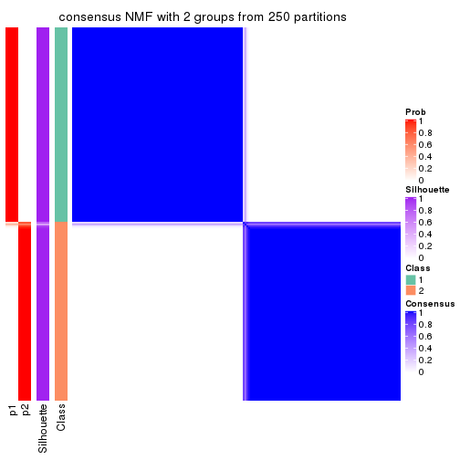</p>

</div>
<div id='tab-SD-NMF-consensus-heatmap-2'>
<pre><code class="r">consensus_heatmap(res, k = 3)
</code></pre>

<p>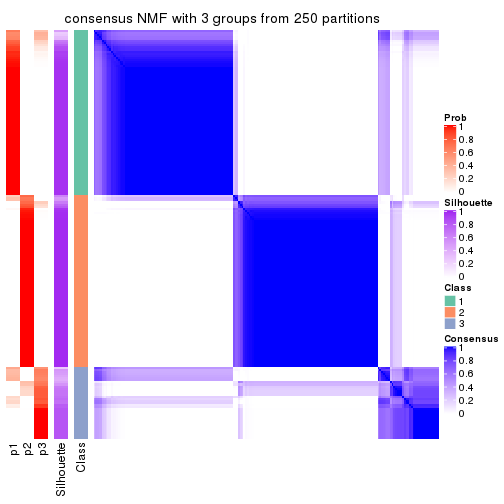</p>

</div>
<div id='tab-SD-NMF-consensus-heatmap-3'>
<pre><code class="r">consensus_heatmap(res, k = 4)
</code></pre>

<p>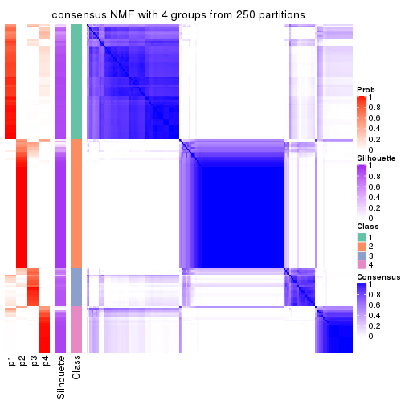</p>

</div>
<div id='tab-SD-NMF-consensus-heatmap-4'>
<pre><code class="r">consensus_heatmap(res, k = 5)
</code></pre>

<p>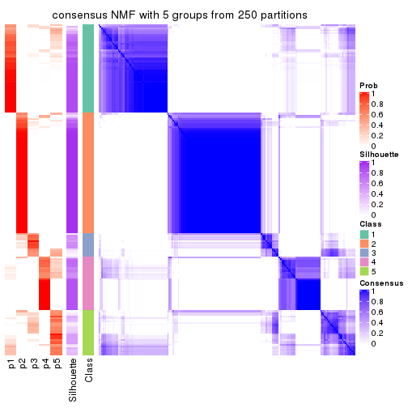</p>

</div>
<div id='tab-SD-NMF-consensus-heatmap-5'>
<pre><code class="r">consensus_heatmap(res, k = 6)
</code></pre>

<p>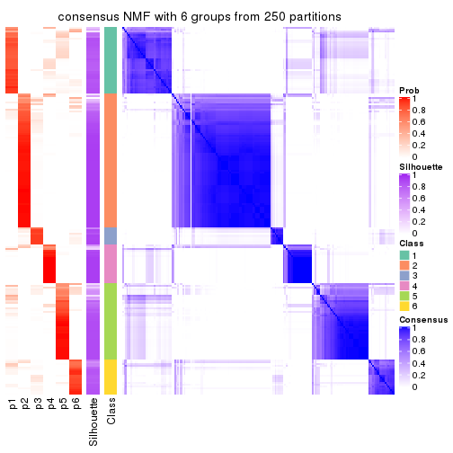</p>

</div>
</div>

Heatmaps for the membership of samples in all partitions to see how consistent they are:


<script>
$( function() {
	$( '#tabs-SD-NMF-membership-heatmap' ).tabs();
} );
</script>
<div id='tabs-SD-NMF-membership-heatmap'>
<ul>
<li><a href='#tab-SD-NMF-membership-heatmap-1'>k = 2</a></li>
<li><a href='#tab-SD-NMF-membership-heatmap-2'>k = 3</a></li>
<li><a href='#tab-SD-NMF-membership-heatmap-3'>k = 4</a></li>
<li><a href='#tab-SD-NMF-membership-heatmap-4'>k = 5</a></li>
<li><a href='#tab-SD-NMF-membership-heatmap-5'>k = 6</a></li>
</ul>
<div id='tab-SD-NMF-membership-heatmap-1'>
<pre><code class="r">membership_heatmap(res, k = 2)
</code></pre>

<p>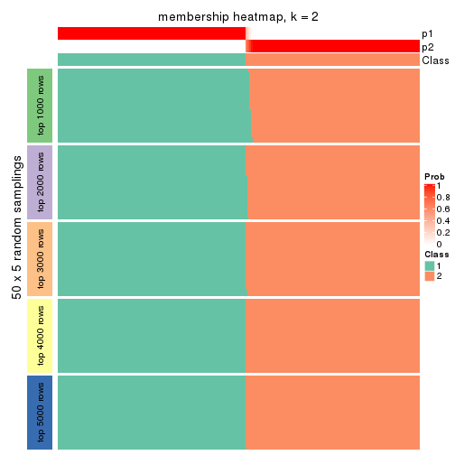</p>

</div>
<div id='tab-SD-NMF-membership-heatmap-2'>
<pre><code class="r">membership_heatmap(res, k = 3)
</code></pre>

<p>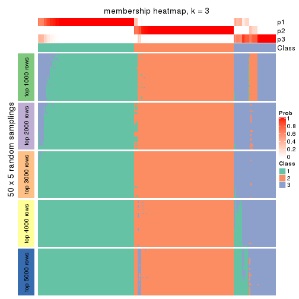</p>

</div>
<div id='tab-SD-NMF-membership-heatmap-3'>
<pre><code class="r">membership_heatmap(res, k = 4)
</code></pre>

<p>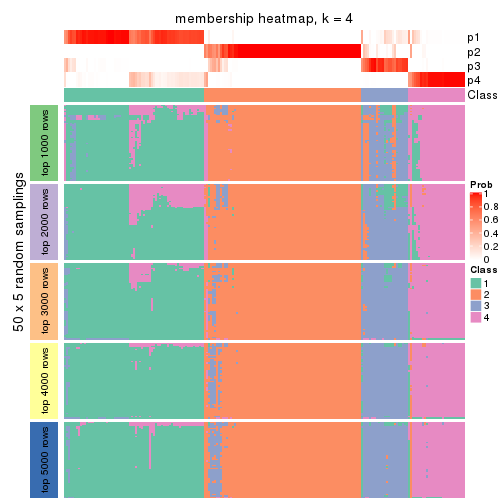</p>

</div>
<div id='tab-SD-NMF-membership-heatmap-4'>
<pre><code class="r">membership_heatmap(res, k = 5)
</code></pre>

<p>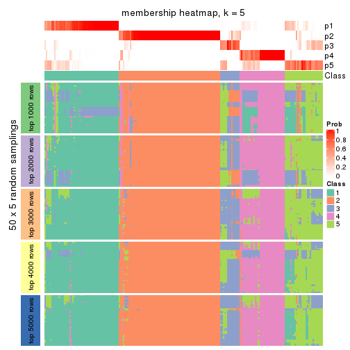</p>

</div>
<div id='tab-SD-NMF-membership-heatmap-5'>
<pre><code class="r">membership_heatmap(res, k = 6)
</code></pre>

<p>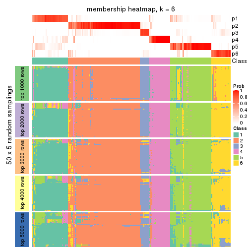</p>

</div>
</div>

As soon as we have had the classes for columns, we can look for signatures
which are significantly different between classes which can be candidate marks
for certain classes. Following are the heatmaps for signatures.


Signature heatmaps where rows are scaled:


<script>
$( function() {
	$( '#tabs-SD-NMF-get-signatures' ).tabs();
} );
</script>
<div id='tabs-SD-NMF-get-signatures'>
<ul>
<li><a href='#tab-SD-NMF-get-signatures-1'>k = 2</a></li>
<li><a href='#tab-SD-NMF-get-signatures-2'>k = 3</a></li>
<li><a href='#tab-SD-NMF-get-signatures-3'>k = 4</a></li>
<li><a href='#tab-SD-NMF-get-signatures-4'>k = 5</a></li>
<li><a href='#tab-SD-NMF-get-signatures-5'>k = 6</a></li>
</ul>
<div id='tab-SD-NMF-get-signatures-1'>
<pre><code class="r">get_signatures(res, k = 2)
</code></pre>

<p>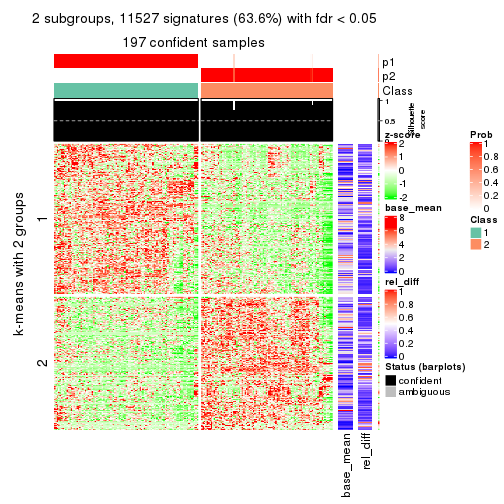</p>

</div>
<div id='tab-SD-NMF-get-signatures-2'>
<pre><code class="r">get_signatures(res, k = 3)
</code></pre>

<p>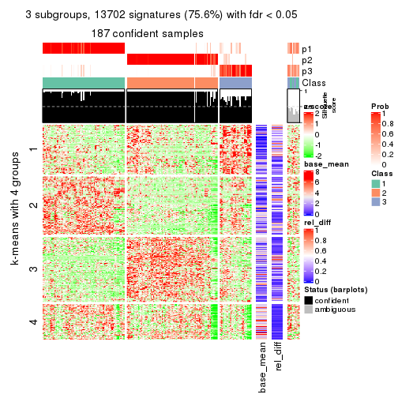</p>

</div>
<div id='tab-SD-NMF-get-signatures-3'>
<pre><code class="r">get_signatures(res, k = 4)
</code></pre>

<p>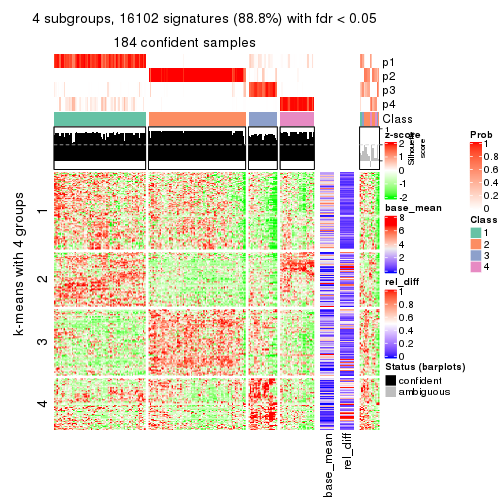</p>

</div>
<div id='tab-SD-NMF-get-signatures-4'>
<pre><code class="r">get_signatures(res, k = 5)
</code></pre>

<p>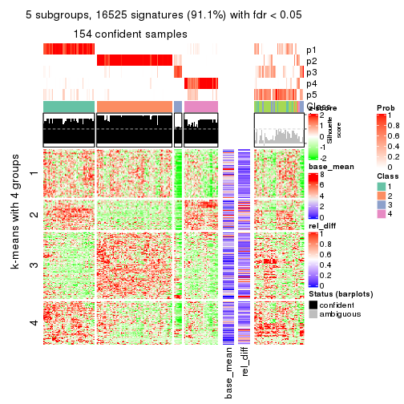</p>

</div>
<div id='tab-SD-NMF-get-signatures-5'>
<pre><code class="r">get_signatures(res, k = 6)
</code></pre>

<p>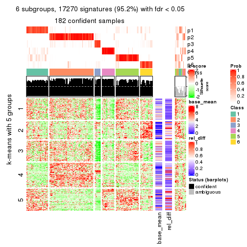</p>

</div>
</div>


Signature heatmaps where rows are not scaled:


<script>
$( function() {
	$( '#tabs-SD-NMF-get-signatures-no-scale' ).tabs();
} );
</script>
<div id='tabs-SD-NMF-get-signatures-no-scale'>
<ul>
<li><a href='#tab-SD-NMF-get-signatures-no-scale-1'>k = 2</a></li>
<li><a href='#tab-SD-NMF-get-signatures-no-scale-2'>k = 3</a></li>
<li><a href='#tab-SD-NMF-get-signatures-no-scale-3'>k = 4</a></li>
<li><a href='#tab-SD-NMF-get-signatures-no-scale-4'>k = 5</a></li>
<li><a href='#tab-SD-NMF-get-signatures-no-scale-5'>k = 6</a></li>
</ul>
<div id='tab-SD-NMF-get-signatures-no-scale-1'>
<pre><code class="r">get_signatures(res, k = 2, scale_rows = FALSE)
</code></pre>

<p>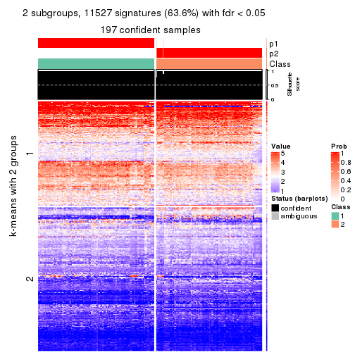</p>

</div>
<div id='tab-SD-NMF-get-signatures-no-scale-2'>
<pre><code class="r">get_signatures(res, k = 3, scale_rows = FALSE)
</code></pre>

<p>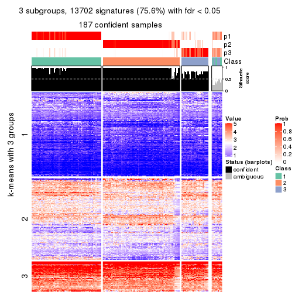</p>

</div>
<div id='tab-SD-NMF-get-signatures-no-scale-3'>
<pre><code class="r">get_signatures(res, k = 4, scale_rows = FALSE)
</code></pre>

<p>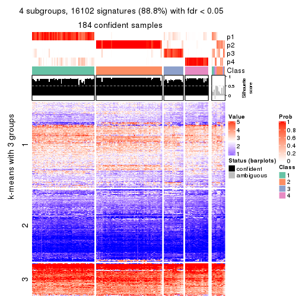</p>

</div>
<div id='tab-SD-NMF-get-signatures-no-scale-4'>
<pre><code class="r">get_signatures(res, k = 5, scale_rows = FALSE)
</code></pre>

<p>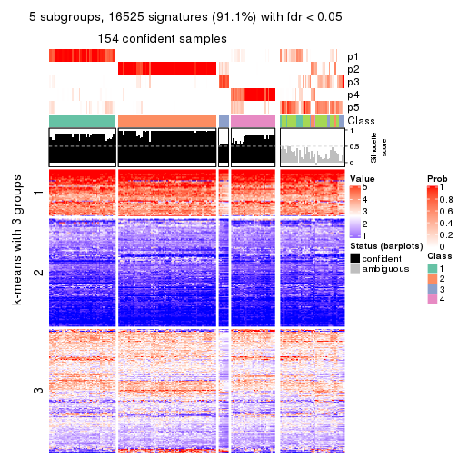</p>

</div>
<div id='tab-SD-NMF-get-signatures-no-scale-5'>
<pre><code class="r">get_signatures(res, k = 6, scale_rows = FALSE)
</code></pre>

<p>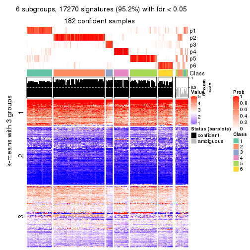</p>

</div>
</div>


Compare the overlap of signatures from different k:

```r
compare_signatures(res)
```

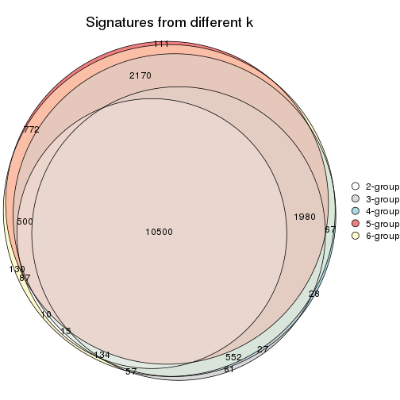

`get_signature()` returns a data frame invisibly. TO get the list of signatures, the function
call should be assigned to a variable explicitly. In following code, if `plot` argument is set
to `FALSE`, no heatmap is plotted while only the differential analysis is performed.

```r
# code only for demonstration
tb = get_signature(res, k = ..., plot = FALSE)
```

An example of the output of `tb` is:

```
#>   which_row         fdr    mean_1    mean_2 scaled_mean_1 scaled_mean_2 km
#> 1        38 0.042760348  8.373488  9.131774    -0.5533452     0.5164555  1
#> 2        40 0.018707592  7.106213  8.469186    -0.6173731     0.5762149  1
#> 3        55 0.019134737 10.221463 11.207825    -0.6159697     0.5749050  1
#> 4        59 0.006059896  5.921854  7.869574    -0.6899429     0.6439467  1
#> 5        60 0.018055526  8.928898 10.211722    -0.6204761     0.5791110  1
#> 6        98 0.009384629 15.714769 14.887706     0.6635654    -0.6193277  2
...
```

The columns in `tb` are:

1. `which_row`: row indices corresponding to the input matrix.
2. `fdr`: FDR for the differential test. 
3. `mean_x`: The mean value in group x.
4. `scaled_mean_x`: The mean value in group x after rows are scaled.
5. `km`: Row groups if k-means clustering is applied to rows.


UMAP plot which shows how samples are separated.


<script>
$( function() {
	$( '#tabs-SD-NMF-dimension-reduction' ).tabs();
} );
</script>
<div id='tabs-SD-NMF-dimension-reduction'>
<ul>
<li><a href='#tab-SD-NMF-dimension-reduction-1'>k = 2</a></li>
<li><a href='#tab-SD-NMF-dimension-reduction-2'>k = 3</a></li>
<li><a href='#tab-SD-NMF-dimension-reduction-3'>k = 4</a></li>
<li><a href='#tab-SD-NMF-dimension-reduction-4'>k = 5</a></li>
<li><a href='#tab-SD-NMF-dimension-reduction-5'>k = 6</a></li>
</ul>
<div id='tab-SD-NMF-dimension-reduction-1'>
<pre><code class="r">dimension_reduction(res, k = 2, method = &quot;UMAP&quot;)
</code></pre>

<p>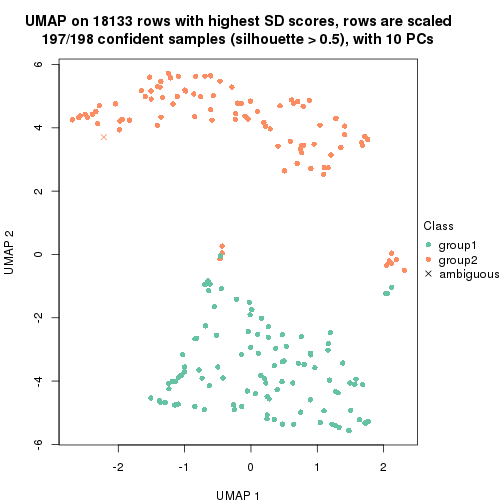</p>

</div>
<div id='tab-SD-NMF-dimension-reduction-2'>
<pre><code class="r">dimension_reduction(res, k = 3, method = &quot;UMAP&quot;)
</code></pre>

<p>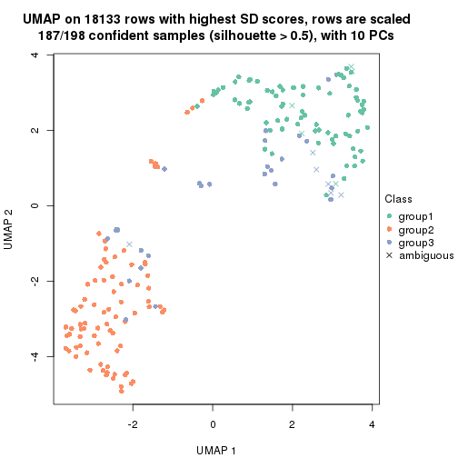</p>

</div>
<div id='tab-SD-NMF-dimension-reduction-3'>
<pre><code class="r">dimension_reduction(res, k = 4, method = &quot;UMAP&quot;)
</code></pre>

<p>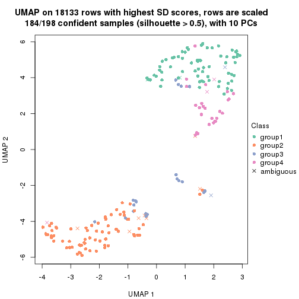</p>

</div>
<div id='tab-SD-NMF-dimension-reduction-4'>
<pre><code class="r">dimension_reduction(res, k = 5, method = &quot;UMAP&quot;)
</code></pre>

<p>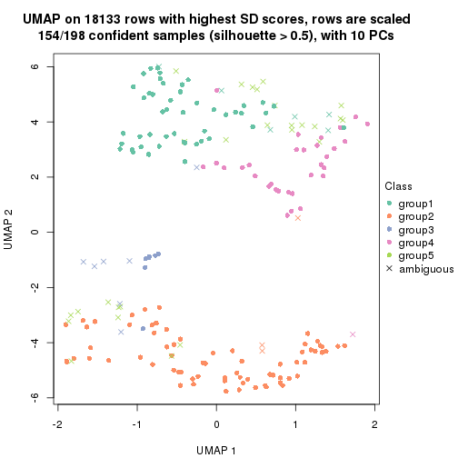</p>

</div>
<div id='tab-SD-NMF-dimension-reduction-5'>
<pre><code class="r">dimension_reduction(res, k = 6, method = &quot;UMAP&quot;)
</code></pre>

<p>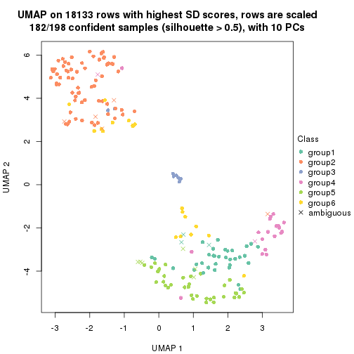</p>

</div>
</div>


Following heatmap shows how subgroups are split when increasing `k`:

```r
collect_classes(res)
```

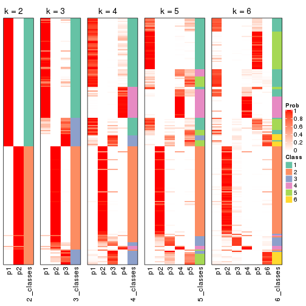


If matrix rows can be associated to genes, consider to use `functional_enrichment(res,
...)` to perform function enrichment for the signature genes. See [this vignette](http://bioconductor.org/packages/devel/bioc/vignettes/cola/inst/doc/functional_enrichment.html) for more detailed explanations.


 

---------------------------------------------------


### CV:hclust


The object with results only for a single top-value method and a single partition method 
can be extracted as:

```r
res = res_list["CV", "hclust"]
# you can also extract it by
# res = res_list["CV:hclust"]
```

A summary of `res` and all the functions that can be applied to it:

```r
res
```

```
#> A 'ConsensusPartition' object with k = 2, 3, 4, 5, 6.
#>   On a matrix with 18133 rows and 198 columns.
#>   Top rows (1000, 2000, 3000, 4000, 5000) are extracted by 'CV' method.
#>   Subgroups are detected by 'hclust' method.
#>   Performed in total 1250 partitions by row resampling.
#>   Best k for subgroups seems to be 2.
#> 
#> Following methods can be applied to this 'ConsensusPartition' object:
#>  [1] "cola_report"             "collect_classes"         "collect_plots"          
#>  [4] "collect_stats"           "colnames"                "compare_signatures"     
#>  [7] "consensus_heatmap"       "dimension_reduction"     "functional_enrichment"  
#> [10] "get_anno_col"            "get_anno"                "get_classes"            
#> [13] "get_consensus"           "get_matrix"              "get_membership"         
#> [16] "get_param"               "get_signatures"          "get_stats"              
#> [19] "is_best_k"               "is_stable_k"             "membership_heatmap"     
#> [22] "ncol"                    "nrow"                    "plot_ecdf"              
#> [25] "rownames"                "select_partition_number" "show"                   
#> [28] "suggest_best_k"          "test_to_known_factors"
```

`collect_plots()` function collects all the plots made from `res` for all `k` (number of partitions)
into one single page to provide an easy and fast comparison between different `k`.

```r
collect_plots(res)
```

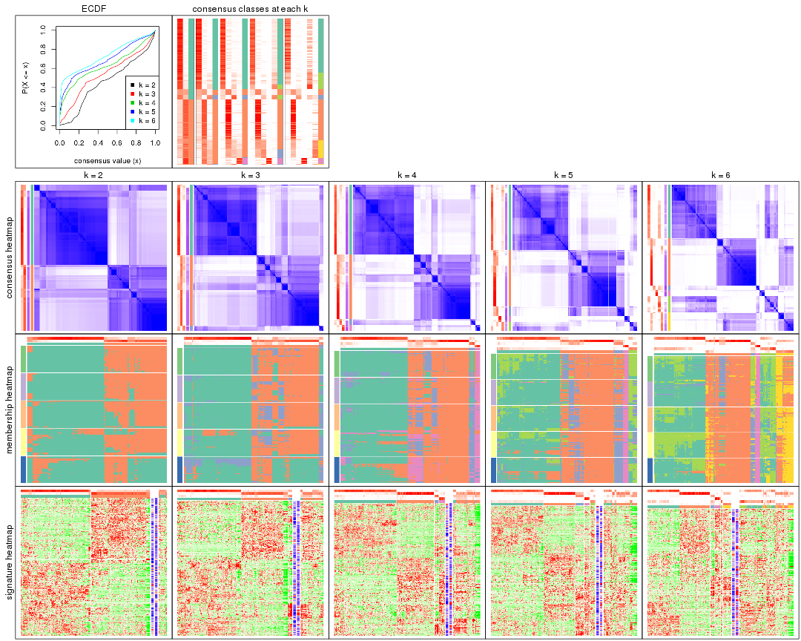

The plots are:

- The first row: a plot of the ECDF (empirical cumulative distribution
  function) curves of the consensus matrix for each `k` and the heatmap of
  predicted classes for each `k`.
- The second row: heatmaps of the consensus matrix for each `k`.
- The third row: heatmaps of the membership matrix for each `k`.
- The fouth row: heatmaps of the signatures for each `k`.

All the plots in panels can be made by individual functions and they are
plotted later in this section.

`select_partition_number()` produces several plots showing different
statistics for choosing "optimized" `k`. There are following statistics:

- ECDF curves of the consensus matrix for each `k`;
- 1-PAC. [The PAC
  score](https://en.wikipedia.org/wiki/Consensus_clustering#Over-interpretation_potential_of_consensus_clustering)
  measures the proportion of the ambiguous subgrouping.
- Mean silhouette score.
- Concordance. The mean probability of fiting the consensus class ids in all
  partitions.
- Area increased. Denote $A_k$ as the area under the ECDF curve for current
  `k`, the area increased is defined as $A_k - A_{k-1}$.
- Rand index. The percent of pairs of samples that are both in a same cluster
  or both are not in a same cluster in the partition of k and k-1.
- Jaccard index. The ratio of pairs of samples are both in a same cluster in
  the partition of k and k-1 and the pairs of samples are both in a same
  cluster in the partition k or k-1.

The detailed explanations of these statistics can be found in [the _cola_
vignette](http://bioconductor.org/packages/devel/bioc/vignettes/cola/inst/doc/cola.html#toc_13).

Generally speaking, lower PAC score, higher mean silhouette score or higher
concordance corresponds to better partition. Rand index and Jaccard index
measure how similar the current partition is compared to partition with `k-1`.
If they are too similar, we won't accept `k` is better than `k-1`.

```r
select_partition_number(res)
```

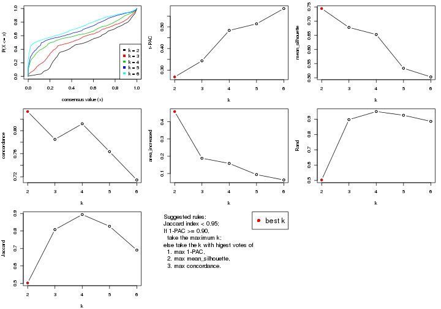

The numeric values for all these statistics can be obtained by `get_stats()`.

```r
get_stats(res)
```

```
#>   k 1-PAC mean_silhouette concordance area_increased  Rand Jaccard
#> 2 2 0.269           0.744       0.833         0.4592 0.503   0.503
#> 3 3 0.343           0.678       0.785         0.1886 0.897   0.808
#> 4 4 0.484           0.653       0.812         0.1584 0.950   0.894
#> 5 5 0.514           0.534       0.764         0.0938 0.926   0.827
#> 6 6 0.585           0.503       0.715         0.0627 0.886   0.691
```

`suggest_best_k()` suggests the best $k$ based on these statistics. The rules are as follows:

- All $k$ with Jaccard index larger than 0.95 are removed because increasing
  $k$ does not provide enough extra information. If all $k$ are removed, it is
  marked as no subgroup is detected.
- For all $k$ with 1-PAC score larger than 0.9, the maximal $k$ is taken as
  the best $k$, and other $k$ are marked as optional $k$.
- If it does not fit the second rule. The $k$ with the maximal vote of the
  highest 1-PAC score, highest mean silhouette, and highest concordance is
  taken as the best $k$.

```r
suggest_best_k(res)
```

```
#> [1] 2
```


Following shows the table of the partitions (You need to click the **show/hide
code output** link to see it). The membership matrix (columns with name `p*`)
is inferred by
[`clue::cl_consensus()`](https://www.rdocumentation.org/link/cl_consensus?package=clue)
function with the `SE` method. Basically the value in the membership matrix
represents the probability to belong to a certain group. The finall class
label for an item is determined with the group with highest probability it
belongs to.

In `get_classes()` function, the entropy is calculated from the membership
matrix and the silhouette score is calculated from the consensus matrix.


<script>
$( function() {
	$( '#tabs-CV-hclust-get-classes' ).tabs();
} );
</script>
<div id='tabs-CV-hclust-get-classes'>
<ul>
<li><a href='#tab-CV-hclust-get-classes-1'>k = 2</a></li>
<li><a href='#tab-CV-hclust-get-classes-2'>k = 3</a></li>
<li><a href='#tab-CV-hclust-get-classes-3'>k = 4</a></li>
<li><a href='#tab-CV-hclust-get-classes-4'>k = 5</a></li>
<li><a href='#tab-CV-hclust-get-classes-5'>k = 6</a></li>
</ul>

<div id='tab-CV-hclust-get-classes-1'>
<p><a id='tab-CV-hclust-get-classes-1-a' style='color:#0366d6' href='#'>show/hide code output</a></p>
<pre><code class="r">cbind(get_classes(res, k = 2), get_membership(res, k = 2))
</code></pre>

<pre><code>#&gt;                                      class entropy silhouette    p1    p2
#&gt; 0C0AA0B2-5191-4EDF-8937-ED7434F30283     2  0.7602     0.8045 0.220 0.780
#&gt; 18B45F1F-234F-45CC-A234-145307606C5C     1  0.3114     0.8608 0.944 0.056
#&gt; E18B70C0-BDCA-46D3-99BB-C6C8ABC68DA5     2  0.7602     0.8051 0.220 0.780
#&gt; 0F6DDBA7-6F74-45E8-95C8-F28263D55978     1  0.0000     0.8712 1.000 0.000
#&gt; 7EAE1A5A-129A-46DE-977E-A2C753F10904     2  0.6712     0.7987 0.176 0.824
#&gt; 7EAE0048-16B5-4979-9410-16CDEB9B1A48     1  0.2778     0.8648 0.952 0.048
#&gt; 2EBFC828-2B27-4753-A052-80DDA226DAB4     2  0.7376     0.8088 0.208 0.792
#&gt; 24E1768D-2232-41DA-9383-BC55D6EB3812     2  0.9754     0.5958 0.408 0.592
#&gt; 6E3CD60A-1889-4CA3-B305-2E78152057B5     1  0.9970    -0.1481 0.532 0.468
#&gt; 33CC70DD-82B3-413C-B3B1-BE06634D95D0     1  0.4161     0.8262 0.916 0.084
#&gt; F1CB57A3-55DD-4487-9307-1B4F652E729A     1  0.0376     0.8701 0.996 0.004
#&gt; 755A5806-B054-449A-93DB-79909E6C93A1     1  0.3584     0.8533 0.932 0.068
#&gt; 58D364E7-3D2F-468F-A264-D6461E2428D4     2  0.3584     0.7141 0.068 0.932
#&gt; 68BB9CB6-7AA2-4981-B9D9-07363EC96599     2  0.9754     0.5958 0.408 0.592
#&gt; 3C4E8DFA-8EA0-4F1F-89CB-CB8805395872     2  0.9754     0.5958 0.408 0.592
#&gt; 4219651D-5583-4498-BF08-1B7D04B4C7B2     1  0.2603     0.8555 0.956 0.044
#&gt; B5EE2768-0D67-4584-ADBC-EC745FEC52EA     2  0.7453     0.8085 0.212 0.788
#&gt; 825E6C11-F460-451A-8045-846DD7D0E945     1  0.2778     0.8684 0.952 0.048
#&gt; 491F62AF-5E68-43C3-982A-F867A75BBA9A     2  0.7674     0.8027 0.224 0.776
#&gt; 9D7F058C-F95A-44AD-AC9E-450F7FBDC960     2  0.6048     0.7646 0.148 0.852
#&gt; 6D42DD0C-2081-4742-BA27-9F5F16FAC3C6     1  0.3584     0.8533 0.932 0.068
#&gt; EDD7E63D-492A-473B-A552-0764337B10EF     2  0.9552     0.6621 0.376 0.624
#&gt; 97073DEA-73AD-4DFD-BD1A-9035DC03445B     1  0.5294     0.7946 0.880 0.120
#&gt; FA891AB9-CE38-4F7E-A015-1DDCE12890A0     1  0.0672     0.8725 0.992 0.008
#&gt; D9514D49-A0AE-45AB-8C9F-68E726215253     1  0.2603     0.8665 0.956 0.044
#&gt; 3B9229AD-12E5-451E-9D2F-378AAC82C04A     2  0.7376     0.8081 0.208 0.792
#&gt; 5EA36B71-4917-4EF3-9060-065EFE6ACC5B     1  0.8813     0.5740 0.700 0.300
#&gt; A20E4ECB-4895-4CC7-BE5E-4721B20D933B     1  0.2778     0.8684 0.952 0.048
#&gt; 1BE8D828-29DB-4368-AA4A-FB23588F7AE8     1  0.4298     0.8301 0.912 0.088
#&gt; 66EFEFCF-3D14-4DBF-AA13-530F40ED0245     1  0.4161     0.8334 0.916 0.084
#&gt; 55DFFE53-BCE7-4EC1-9863-6C0311B06BA2     2  0.9491     0.6745 0.368 0.632
#&gt; 4CC3FB5A-611D-4C64-AE9D-544FA45CF4DC     1  0.2778     0.8648 0.952 0.048
#&gt; C11D33F2-DFE9-4FA8-9024-F3E7F1DADC5F     2  0.7950     0.6504 0.240 0.760
#&gt; FA5932B8-8AA3-4C38-9FAB-C35D8772974D     1  0.1184     0.8647 0.984 0.016
#&gt; 8216EC35-1F41-4A15-B503-BDA4971E27C9     1  0.1184     0.8686 0.984 0.016
#&gt; 69635D23-90A7-4BAD-97C7-B79536837F57     1  0.0376     0.8701 0.996 0.004
#&gt; 12B404E2-C463-4409-8392-E4649B2AFFD1     2  0.7528     0.8062 0.216 0.784
#&gt; 246927E3-ACCF-41B2-AA8E-43855FD6B146     2  0.7219     0.8061 0.200 0.800
#&gt; E0CC13E7-9607-49E0-B4AA-395544E3C3BF     1  0.3114     0.8608 0.944 0.056
#&gt; F7BBC0C1-6124-4A83-8A70-EA89B62F1CBD     1  0.3584     0.8533 0.932 0.068
#&gt; B1D4FF24-8E6F-4A04-B716-2032D850EB57     1  0.3114     0.8608 0.944 0.056
#&gt; 253601DB-B78A-4566-9947-8C0270C0B163     2  0.7376     0.8081 0.208 0.792
#&gt; AB83DBFF-5737-4FB8-A5AC-1D3CD6072BDF     2  0.9710     0.3465 0.400 0.600
#&gt; 9D67D953-EC98-4B72-89C8-5732BC9D4BC9     2  0.7376     0.8081 0.208 0.792
#&gt; 51061018-95AB-4278-886F-F69E4EBC47C0     2  0.8861     0.5605 0.304 0.696
#&gt; ABD0F7F3-105B-4DEE-9889-5028772C519A     1  0.3114     0.8608 0.944 0.056
#&gt; 562B95CF-B27E-4A72-B7C6-CDF86A51A39B     1  0.3114     0.8608 0.944 0.056
#&gt; ABF046A4-D7A1-49FF-B6B1-4E07A791DEDB     2  0.7453     0.8072 0.212 0.788
#&gt; 3FF4101E-9703-460E-A30E-76CC7689F36D     2  0.7376     0.8081 0.208 0.792
#&gt; 39C4F7AA-7ADF-4F1D-BDA3-BEC605AC5023     2  0.7219     0.7976 0.200 0.800
#&gt; CB821FD2-AF5C-4743-A70F-21C12C6ED153     1  0.2043     0.8717 0.968 0.032
#&gt; 92EA1846-62FF-41D5-A441-5E52E6B9E7F9     1  0.0672     0.8725 0.992 0.008
#&gt; 7D25F3EE-5A20-4763-8026-16A03D05F459     1  0.0000     0.8712 1.000 0.000
#&gt; 8ECE5276-CD06-496B-A5A9-1713B1F7D089     1  0.1633     0.8719 0.976 0.024
#&gt; C775B68F-9507-47E3-B507-B433AED79002     1  0.8763     0.5803 0.704 0.296
#&gt; E19D5463-FDD0-41C1-A170-323736A88D07     2  0.8207     0.6277 0.256 0.744
#&gt; CE4B6285-4961-4767-91F0-5C7A8162E185     1  0.3584     0.8533 0.932 0.068
#&gt; 9637BD72-1FEF-42AD-8886-2C39BE876531     1  0.3584     0.8533 0.932 0.068
#&gt; 81B5A88E-45A0-4B44-B689-B9071B8548EE     2  0.8207     0.6337 0.256 0.744
#&gt; 0B01B4C9-9BED-4F5B-A3E2-8868C7CCC3FC     2  0.9491     0.4215 0.368 0.632
#&gt; 54501315-7132-44B2-A179-10FBF1421105     1  0.0000     0.8712 1.000 0.000
#&gt; E207CBE9-4C3A-4FDD-9251-CFE1FE106475     1  0.9000     0.5482 0.684 0.316
#&gt; 3BEA0B92-3F90-4DBF-9679-AADEAD7D47C8     2  0.3584     0.7141 0.068 0.932
#&gt; 35B32250-D854-4215-AA5B-2C11B2FBEECA     1  0.0672     0.8725 0.992 0.008
#&gt; ACE6566B-AEB9-426C-924A-B382D14A1024     2  0.7299     0.8083 0.204 0.796
#&gt; 737E69AC-0930-45B9-B6BA-7CE5E300290B     1  0.1184     0.8647 0.984 0.016
#&gt; B4410AB8-D015-41CA-86E6-12EB4E4103E3     1  0.3114     0.8649 0.944 0.056
#&gt; 6D3ECA65-C50F-43B0-B75A-1D290FA4A8FD     2  0.7376     0.8088 0.208 0.792
#&gt; C86F40D3-9A96-4395-A8C3-510DE12F9A2B     2  0.3733     0.7198 0.072 0.928
#&gt; 6238087F-24DD-4BF1-903F-3BD4E446C1AE     2  0.5842     0.7643 0.140 0.860
#&gt; E4FF840B-EEAB-4CB0-A690-7D4C4AA7EEC3     2  0.8443     0.7476 0.272 0.728
#&gt; 72D3C323-C67F-4C0E-9BFC-BF245FF9730A     1  0.3584     0.8533 0.932 0.068
#&gt; 82D56E4E-4DF6-4F3E-8959-B995C92AAA70     1  0.1414     0.8731 0.980 0.020
#&gt; E31CA441-EB19-443B-ACBD-37B5CCBCF0E5     2  0.8081     0.7834 0.248 0.752
#&gt; 87CA8939-D054-4B8A-B32D-085FD2E8F202     1  0.6048     0.7697 0.852 0.148
#&gt; 2A508D90-FEDC-46A3-9A02-E51E5467CDCB     1  0.0376     0.8701 0.996 0.004
#&gt; C4E8B4E2-388B-411F-BF0A-9B6F34E8EDB5     2  0.7950     0.6504 0.240 0.760
#&gt; AF6AF803-BD93-44A7-AA80-B9BC92C1273B     2  0.7602     0.8043 0.220 0.780
#&gt; 0B1CA5CF-EB96-41D4-BFC5-6957FEB39828     1  0.3584     0.8533 0.932 0.068
#&gt; 6FB96FB0-6661-48AD-A4A0-69F8AFDBE591     2  0.7376     0.8081 0.208 0.792
#&gt; 8C19F7FD-368A-462B-B28F-88D6630038A1     1  0.3274     0.8683 0.940 0.060
#&gt; 96EABE78-C2F4-4A33-ACD8-C922A4B2519B     2  0.7376     0.8081 0.208 0.792
#&gt; 68B36D7B-546A-4689-949F-B207C4A4AB27     2  0.7376     0.8081 0.208 0.792
#&gt; CE9F3335-778F-4F52-BC55-4B7C99B211DD     2  0.3584     0.7141 0.068 0.932
#&gt; CB359DED-2A2D-4646-A0BD-6F10ADCC532B     1  0.5294     0.7946 0.880 0.120
#&gt; 198324A5-8C52-46F6-9734-EFAF1CCA6D9B     1  0.2948     0.8673 0.948 0.052
#&gt; 83B88608-0506-428C-B9E8-621F38477B42     1  0.0672     0.8725 0.992 0.008
#&gt; 1993630A-0F3D-4F5C-86A3-D443BAAF57F0     1  0.9970    -0.1481 0.532 0.468
#&gt; DE73DA9B-529E-4F4F-A65C-DA7AB84B1096     1  0.5294     0.7964 0.880 0.120
#&gt; 2347F3B7-DDA3-40C0-B6D4-8819ECA69146     1  0.1633     0.8719 0.976 0.024
#&gt; AB93B5D5-095F-4330-9D40-6A3D934AB50C     1  0.7745     0.6766 0.772 0.228
#&gt; 5EBBE4AD-FF0C-41CF-9EA3-B6FE7EA1F9C0     1  0.9000     0.5482 0.684 0.316
#&gt; 6D960AE7-3769-4144-A061-E8588E5063FF     1  0.5294     0.7946 0.880 0.120
#&gt; 0C2DD8C0-D1A5-4192-A49C-7A40FED628B2     2  0.8207     0.6277 0.256 0.744
#&gt; 18C9372F-C55B-4F86-A9D2-E8D85EFC8566     1  0.9977    -0.1640 0.528 0.472
#&gt; 9AF637B0-4C32-4DD1-93AF-7655B4A845D3     2  0.7528     0.8062 0.216 0.784
#&gt; 785B5B06-4115-46FD-9BEB-F888AFDC855D     2  0.7299     0.7170 0.204 0.796
#&gt; ECA3050E-4BE2-4117-B9CF-A52BB85AF8C2     1  0.9795     0.0657 0.584 0.416
#&gt; 099DC396-16A5-458F-9ED9-F2A790CB0C34     1  0.1414     0.8731 0.980 0.020
#&gt; 7A5A12EE-C5B0-4C51-8C99-0F3FA88D633E     1  0.1414     0.8706 0.980 0.020
#&gt; E832B508-A66D-4817-B44A-FE9FAAE64B4A     1  0.2948     0.8667 0.948 0.052
#&gt; F9DD688C-7B35-49E7-9651-2E098EE78856     1  0.3584     0.8533 0.932 0.068
#&gt; F1265DD8-5ED3-4635-A277-57BBFDEC7729     1  0.0672     0.8725 0.992 0.008
#&gt; F624E8D9-DB07-4C9E-910D-5E8EBA3A6167     2  0.3584     0.7141 0.068 0.932
#&gt; 3516FBDF-66E1-43F4-9D7B-16748F6439A7     2  0.7376     0.8081 0.208 0.792
#&gt; 04B12992-B2EA-4BA2-8E2C-11E34E230E6F     2  0.3584     0.7141 0.068 0.932
#&gt; CC02897D-9123-495E-9242-5C9CF4EC269B     2  0.7376     0.8081 0.208 0.792
#&gt; 3117ED46-2BF2-4311-BC00-4E98243E16B3     1  0.5294     0.7964 0.880 0.120
#&gt; E0B66D53-23DB-4E26-BB6E-F692FA8C000E     1  0.1184     0.8729 0.984 0.016
#&gt; DAA93CE5-A013-477A-9A50-EA09CC3A8162     2  0.7815     0.6562 0.232 0.768
#&gt; 0099098D-354A-4276-92F8-B932C74B4608     1  0.0376     0.8701 0.996 0.004
#&gt; DD483639-B2E7-4745-BCFB-55ED1D82BFBF     2  0.7376     0.8081 0.208 0.792
#&gt; 2C1F9079-602E-4252-82C7-9D8799E04246     2  0.7674     0.7127 0.224 0.776
#&gt; 9473A8E4-3A1B-4184-9EA6-517AFD60B635     1  0.9000     0.5482 0.684 0.316
#&gt; 75CFBAF6-7BA0-40AF-92D7-D218E885BD1B     2  0.7376     0.8081 0.208 0.792
#&gt; B588950F-14D6-41C8-845B-EFD2096013C6     2  0.7376     0.8081 0.208 0.792
#&gt; 0DF3EDA8-DAEA-4721-92AB-B97181249498     2  0.7950     0.6491 0.240 0.760
#&gt; 8EA83042-D598-401D-AD78-936EEB136C59     1  0.3584     0.8533 0.932 0.068
#&gt; 729AC418-3BE9-445A-95D4-AC11A7D43BE0     1  0.3584     0.8533 0.932 0.068
#&gt; 7D8B1B11-F576-4AA8-BFA7-0022A2CD829A     2  0.7674     0.8027 0.224 0.776
#&gt; 304A0E46-3449-4B44-9C30-BDDF6459391D     1  0.0672     0.8725 0.992 0.008
#&gt; 3C83358F-DF20-47F7-AF9F-AB7CC92F5ABA     1  0.8555     0.6057 0.720 0.280
#&gt; EAFEED6C-35C3-451F-AE4A-EB56992E1F29     1  0.1414     0.8683 0.980 0.020
#&gt; 8A237A65-28EC-434D-A78A-A8B7308B5204     1  0.2948     0.8719 0.948 0.052
#&gt; D005833F-E991-4E9E-9667-55F137288004     1  0.3584     0.8533 0.932 0.068
#&gt; 37D966E3-253E-4397-A9AE-0903A8D31FE6     1  0.3584     0.8533 0.932 0.068
#&gt; D2482B81-CB5B-4178-BA8D-1CF4026181B5     1  0.2043     0.8705 0.968 0.032
#&gt; 18019E95-C2A8-4EE7-B585-F6886DC4D953     2  0.8267     0.6654 0.260 0.740
#&gt; 0B126D1A-14A8-4345-8F78-FF92222ADF4C     2  0.9754     0.5958 0.408 0.592
#&gt; CE88B625-47D8-4D58-9FB4-23464DB7DDAD     2  0.7376     0.8081 0.208 0.792
#&gt; 9A88299D-5C74-47FA-B42C-1A1D6D935AAB     1  0.2948     0.8635 0.948 0.052
#&gt; 3E71159C-FD6C-41DA-B18B-0730C8AC7E41     1  0.1414     0.8644 0.980 0.020
#&gt; 6F245AA4-79D9-47E1-BCC9-1AAF65AEA813     1  0.1414     0.8644 0.980 0.020
#&gt; 4CF2C888-2100-483A-B4DB-ECBB69243A4D     2  0.3584     0.7141 0.068 0.932
#&gt; A3853813-B9D5-4E8C-B075-19FCC35F8686     2  0.9815     0.5151 0.420 0.580
#&gt; 83A16DEE-CE9F-4D8B-9225-0A2A8B9D055D     1  0.4161     0.8262 0.916 0.084
#&gt; 0F057CAF-4F9A-4DE9-8601-730E96873733     2  0.7376     0.8081 0.208 0.792
#&gt; 32D5801D-DBA4-422E-87CB-A2DDE921BA41     1  0.7745     0.6766 0.772 0.228
#&gt; 22EE8076-F07C-499A-9AF8-D800A77EF154     2  0.8144     0.6318 0.252 0.748
#&gt; DD4BD74D-D48C-4090-9F57-5334E784581C     1  0.2043     0.8704 0.968 0.032
#&gt; 41183565-434D-474C-B1BD-CA6E94910658     2  0.7056     0.7221 0.192 0.808
#&gt; 75A2CE41-2B2A-4346-927E-ACF8A72738E4     1  0.3584     0.8533 0.932 0.068
#&gt; 7AA24995-3DD2-4682-B36A-4EBFEEACF625     1  0.3584     0.8533 0.932 0.068
#&gt; 8BAFDFEC-9F26-4ADB-95CE-004143960EEB     1  0.7376     0.7026 0.792 0.208
#&gt; A330E011-CE08-4A85-8F4B-370592293DBB     1  0.0000     0.8712 1.000 0.000
#&gt; 1D5A5B17-2E70-4BB0-94A1-EC17E6EA49DB     1  0.2236     0.8722 0.964 0.036
#&gt; BD9143B8-9D97-4A05-872C-3FB82B4CF7BE     2  0.7376     0.8088 0.208 0.792
#&gt; 64552DC0-181E-4607-898C-787AA7F26435     2  0.7674     0.8027 0.224 0.776
#&gt; 1B4C4D41-34C7-43A3-858B-C9552EB53894     1  0.3584     0.8533 0.932 0.068
#&gt; 463A3BAA-02DC-4EA4-A644-B924163E425D     2  0.7376     0.8081 0.208 0.792
#&gt; CD0FEA89-6F60-4A20-8FCA-D397B4E95A98     1  0.1843     0.8714 0.972 0.028
#&gt; 5D06CF6D-F4B9-4B32-B055-8AB287E53340     2  0.8608     0.7492 0.284 0.716
#&gt; ADA7835F-DB67-4F4F-9446-8BCE3C5FE936     2  0.7453     0.7176 0.212 0.788
#&gt; 4109BE2D-B5DF-4BD7-860E-60D87F647152     1  0.9970    -0.1481 0.532 0.468
#&gt; 88526A0E-6DFE-46CB-BFAD-B4826F482C67     1  0.5408     0.7886 0.876 0.124
#&gt; F39F9A4C-18F7-4017-AB31-85D52FF44587     2  0.7453     0.8069 0.212 0.788
#&gt; D4290A5E-1B24-4C55-B470-0FA7A0A09DD0     2  0.7376     0.8081 0.208 0.792
#&gt; DC5A2C9E-978F-4661-B729-1F9662976E27     1  0.5629     0.7824 0.868 0.132
#&gt; 26A1F392-CED2-43E3-8096-74E6F2BFC8C0     2  0.8081     0.7505 0.248 0.752
#&gt; 87D81FB2-306A-4E75-9D58-D5F48E46E7F6     2  0.7376     0.8081 0.208 0.792
#&gt; E3D9D81A-C20C-4B3B-B940-A5D2C5F65B22     2  0.9754     0.5958 0.408 0.592
#&gt; 4464650B-453F-476C-989C-B7B159BF2CF0     2  0.7376     0.8081 0.208 0.792
#&gt; 577D2867-B738-487A-9B06-07958D647F02     1  0.3431     0.8626 0.936 0.064
#&gt; E52A22CC-3C03-41A9-9541-220DD871E162     2  0.8443     0.7581 0.272 0.728
#&gt; 642703B1-AF99-4746-A915-0792F4B9590B     1  0.9996    -0.2243 0.512 0.488
#&gt; 8F0D1792-1284-45E6-8EC4-392596057677     2  0.7376     0.8081 0.208 0.792
#&gt; 765AFFC1-D528-4494-8BA1-0706451E4205     2  0.8207     0.6277 0.256 0.744
#&gt; A716BC29-161F-4CA0-B240-00B330137F2C     1  0.2423     0.8682 0.960 0.040
#&gt; 32CBFBAF-7064-4595-8D54-2C5E7DE0FD9B     1  0.3584     0.8533 0.932 0.068
#&gt; 4D6ED28C-3F20-41B0-BA41-1BF0E5199A40     1  0.9970    -0.1481 0.532 0.468
#&gt; 86A38456-2900-48FB-B10F-79222B3CA9BF     1  0.9970    -0.1481 0.532 0.468
#&gt; E870807D-3223-4A6A-9E3D-F4461B048AA2     2  0.3584     0.7141 0.068 0.932
#&gt; 3A78D19F-A833-4D2C-8387-FB4FD4A8313C     1  0.2043     0.8705 0.968 0.032
#&gt; DFA162CA-C708-4121-8E74-F9C4DEE0CDAE     1  0.1184     0.8647 0.984 0.016
#&gt; C00A300A-CD10-4C9D-8C94-3901AFE8406C     2  0.7602     0.7949 0.220 0.780
#&gt; 13E11D15-A90F-48C4-980A-DD032C00A2C1     1  0.5629     0.7827 0.868 0.132
#&gt; 31BF80AB-FEDB-4C73-89C3-70BE9F9ACBEE     2  0.7376     0.8081 0.208 0.792
#&gt; FA34308A-349D-4AAD-94CF-3F3B7F9AD629     2  0.5294     0.7610 0.120 0.880
#&gt; 7C48D467-B663-49DD-BC84-A36BC32ACB3D     1  0.5294     0.7946 0.880 0.120
#&gt; BB068534-04F6-4FC9-9087-CDA65920BCE2     1  0.2603     0.8727 0.956 0.044
#&gt; EA4EC272-A9B3-4B2E-955F-19F7676A944C     2  0.7376     0.8081 0.208 0.792
#&gt; C71FF69B-A460-43CA-8769-9667F22D938B     1  0.1184     0.8729 0.984 0.016
#&gt; 5243D1B8-8168-4FF1-A8C6-505F080EF0D3     2  0.8081     0.7328 0.248 0.752
#&gt; BCC474D8-08FE-4E99-B8E8-B29E65F84D2E     1  0.3584     0.8533 0.932 0.068
#&gt; 04FDBFE3-4CF6-4E53-A2AA-89D5C9316377     2  0.9754     0.5958 0.408 0.592
#&gt; 83A9915C-8D60-4CAE-A868-B61E3C90C7B0     2  0.9732     0.5564 0.404 0.596
#&gt; 989A6472-E3E3-457A-97BE-CCE95F42D5C2     2  0.7376     0.8081 0.208 0.792
#&gt; A0AB2D28-6751-49C9-8DF4-66FDBF95C360     1  0.3584     0.8533 0.932 0.068
#&gt; A12B2683-18D4-41C9-8AE5-C143E2180052     1  0.0000     0.8712 1.000 0.000
#&gt; 8DE1E245-CAD2-4F11-BFA2-9792C433A00B     1  0.5294     0.7964 0.880 0.120
#&gt; FDA68036-6C4C-4256-9AA0-C01FE92AA098     2  0.8499     0.7643 0.276 0.724
#&gt; 26311920-1414-4EC1-870B-784961EBCC2D     1  0.2236     0.8586 0.964 0.036
#&gt; C29A10D6-D598-4286-B5E0-F1776E19E988     1  0.3114     0.8608 0.944 0.056
#&gt; FACCC1FB-4937-4CC0-90EA-7F91D3D939CF     2  0.9552     0.6596 0.376 0.624
#&gt; 90B9D84B-78E5-4C7E-8414-EC889C2DE8DB     2  0.9998     0.2847 0.492 0.508
#&gt; B74E6122-76E1-4E4D-A867-BCAFD7277393     1  0.0000     0.8712 1.000 0.000
#&gt; 98494DC0-CF6E-485F-8A0D-D80E4437EF5C     2  0.9608     0.4733 0.384 0.616
#&gt; DA114DAC-DE7B-4E43-8D7C-82C5D7B66411     1  0.2236     0.8696 0.964 0.036
</code></pre>

<script>
$('#tab-CV-hclust-get-classes-1-a').parent().next().next().hide();
$('#tab-CV-hclust-get-classes-1-a').click(function(){
  $('#tab-CV-hclust-get-classes-1-a').parent().next().next().toggle();
  return(false);
});
</script>
</div>

<div id='tab-CV-hclust-get-classes-2'>
<p><a id='tab-CV-hclust-get-classes-2-a' style='color:#0366d6' href='#'>show/hide code output</a></p>
<pre><code class="r">cbind(get_classes(res, k = 3), get_membership(res, k = 3))
</code></pre>

<pre><code>#&gt;                                      class entropy silhouette    p1    p2    p3
#&gt; 0C0AA0B2-5191-4EDF-8937-ED7434F30283     2  0.4782     0.7470 0.164 0.820 0.016
#&gt; 18B45F1F-234F-45CC-A234-145307606C5C     1  0.2261     0.8384 0.932 0.068 0.000
#&gt; E18B70C0-BDCA-46D3-99BB-C6C8ABC68DA5     2  0.4782     0.7471 0.164 0.820 0.016
#&gt; 0F6DDBA7-6F74-45E8-95C8-F28263D55978     1  0.0237     0.8489 0.996 0.000 0.004
#&gt; 7EAE1A5A-129A-46DE-977E-A2C753F10904     2  0.5307     0.7243 0.124 0.820 0.056
#&gt; 7EAE0048-16B5-4979-9410-16CDEB9B1A48     1  0.2096     0.8484 0.944 0.052 0.004
#&gt; 2EBFC828-2B27-4753-A052-80DDA226DAB4     2  0.4233     0.7482 0.160 0.836 0.004
#&gt; 24E1768D-2232-41DA-9383-BC55D6EB3812     2  0.9072     0.5549 0.192 0.548 0.260
#&gt; 6E3CD60A-1889-4CA3-B305-2E78152057B5     2  0.8039     0.3479 0.428 0.508 0.064
#&gt; 33CC70DD-82B3-413C-B3B1-BE06634D95D0     1  0.4033     0.6879 0.856 0.008 0.136
#&gt; F1CB57A3-55DD-4487-9307-1B4F652E729A     1  0.0237     0.8478 0.996 0.000 0.004
#&gt; 755A5806-B054-449A-93DB-79909E6C93A1     1  0.3375     0.8073 0.892 0.100 0.008
#&gt; 58D364E7-3D2F-468F-A264-D6461E2428D4     2  0.5905     0.4089 0.000 0.648 0.352
#&gt; 68BB9CB6-7AA2-4981-B9D9-07363EC96599     2  0.9072     0.5549 0.192 0.548 0.260
#&gt; 3C4E8DFA-8EA0-4F1F-89CB-CB8805395872     2  0.9072     0.5549 0.192 0.548 0.260
#&gt; 4219651D-5583-4498-BF08-1B7D04B4C7B2     1  0.3832     0.7419 0.880 0.020 0.100
#&gt; B5EE2768-0D67-4584-ADBC-EC745FEC52EA     2  0.4413     0.7481 0.160 0.832 0.008
#&gt; 825E6C11-F460-451A-8045-846DD7D0E945     1  0.2564     0.8355 0.936 0.036 0.028
#&gt; 491F62AF-5E68-43C3-982A-F867A75BBA9A     2  0.4840     0.7461 0.168 0.816 0.016
#&gt; 9D7F058C-F95A-44AD-AC9E-450F7FBDC960     2  0.5519     0.6548 0.068 0.812 0.120
#&gt; 6D42DD0C-2081-4742-BA27-9F5F16FAC3C6     1  0.3454     0.8028 0.888 0.104 0.008
#&gt; EDD7E63D-492A-473B-A552-0764337B10EF     2  0.8638     0.6147 0.184 0.600 0.216
#&gt; 97073DEA-73AD-4DFD-BD1A-9035DC03445B     1  0.5122     0.5368 0.788 0.012 0.200
#&gt; FA891AB9-CE38-4F7E-A015-1DDCE12890A0     1  0.0424     0.8528 0.992 0.008 0.000
#&gt; D9514D49-A0AE-45AB-8C9F-68E726215253     1  0.2173     0.8504 0.944 0.048 0.008
#&gt; 3B9229AD-12E5-451E-9D2F-378AAC82C04A     2  0.4062     0.7482 0.164 0.836 0.000
#&gt; 5EA36B71-4917-4EF3-9060-065EFE6ACC5B     3  0.7102     0.7847 0.420 0.024 0.556
#&gt; A20E4ECB-4895-4CC7-BE5E-4721B20D933B     1  0.2200     0.8485 0.940 0.056 0.004
#&gt; 1BE8D828-29DB-4368-AA4A-FB23588F7AE8     1  0.4665     0.7081 0.852 0.048 0.100
#&gt; 66EFEFCF-3D14-4DBF-AA13-530F40ED0245     1  0.4527     0.7249 0.860 0.052 0.088
#&gt; 55DFFE53-BCE7-4EC1-9863-6C0311B06BA2     2  0.8518     0.6267 0.180 0.612 0.208
#&gt; 4CC3FB5A-611D-4C64-AE9D-544FA45CF4DC     1  0.2096     0.8484 0.944 0.052 0.004
#&gt; C11D33F2-DFE9-4FA8-9024-F3E7F1DADC5F     2  0.7214     0.4174 0.044 0.632 0.324
#&gt; FA5932B8-8AA3-4C38-9FAB-C35D8772974D     1  0.1015     0.8375 0.980 0.008 0.012
#&gt; 8216EC35-1F41-4A15-B503-BDA4971E27C9     1  0.1015     0.8444 0.980 0.012 0.008
#&gt; 69635D23-90A7-4BAD-97C7-B79536837F57     1  0.0237     0.8478 0.996 0.000 0.004
#&gt; 12B404E2-C463-4409-8392-E4649B2AFFD1     2  0.4634     0.7477 0.164 0.824 0.012
#&gt; 246927E3-ACCF-41B2-AA8E-43855FD6B146     2  0.4411     0.7408 0.140 0.844 0.016
#&gt; E0CC13E7-9607-49E0-B4AA-395544E3C3BF     1  0.2261     0.8384 0.932 0.068 0.000
#&gt; F7BBC0C1-6124-4A83-8A70-EA89B62F1CBD     1  0.2878     0.8163 0.904 0.096 0.000
#&gt; B1D4FF24-8E6F-4A04-B716-2032D850EB57     1  0.2680     0.8403 0.924 0.068 0.008
#&gt; 253601DB-B78A-4566-9947-8C0270C0B163     2  0.4473     0.7475 0.164 0.828 0.008
#&gt; AB83DBFF-5737-4FB8-A5AC-1D3CD6072BDF     2  0.9601    -0.0652 0.216 0.456 0.328
#&gt; 9D67D953-EC98-4B72-89C8-5732BC9D4BC9     2  0.4062     0.7482 0.164 0.836 0.000
#&gt; 51061018-95AB-4278-886F-F69E4EBC47C0     2  0.8390     0.2901 0.100 0.560 0.340
#&gt; ABD0F7F3-105B-4DEE-9889-5028772C519A     1  0.2680     0.8403 0.924 0.068 0.008
#&gt; 562B95CF-B27E-4A72-B7C6-CDF86A51A39B     1  0.2680     0.8403 0.924 0.068 0.008
#&gt; ABF046A4-D7A1-49FF-B6B1-4E07A791DEDB     2  0.4293     0.7477 0.164 0.832 0.004
#&gt; 3FF4101E-9703-460E-A30E-76CC7689F36D     2  0.4293     0.7477 0.164 0.832 0.004
#&gt; 39C4F7AA-7ADF-4F1D-BDA3-BEC605AC5023     2  0.5998     0.7175 0.128 0.788 0.084
#&gt; CB821FD2-AF5C-4743-A70F-21C12C6ED153     1  0.1711     0.8556 0.960 0.032 0.008
#&gt; 92EA1846-62FF-41D5-A441-5E52E6B9E7F9     1  0.0424     0.8527 0.992 0.008 0.000
#&gt; 7D25F3EE-5A20-4763-8026-16A03D05F459     1  0.0000     0.8497 1.000 0.000 0.000
#&gt; 8ECE5276-CD06-496B-A5A9-1713B1F7D089     1  0.1031     0.8548 0.976 0.024 0.000
#&gt; C775B68F-9507-47E3-B507-B433AED79002     3  0.7262     0.7532 0.444 0.028 0.528
#&gt; E19D5463-FDD0-41C1-A170-323736A88D07     2  0.7514     0.3826 0.056 0.616 0.328
#&gt; CE4B6285-4961-4767-91F0-5C7A8162E185     1  0.3454     0.8028 0.888 0.104 0.008
#&gt; 9637BD72-1FEF-42AD-8886-2C39BE876531     1  0.3454     0.8028 0.888 0.104 0.008
#&gt; 81B5A88E-45A0-4B44-B689-B9071B8548EE     2  0.7514     0.3957 0.056 0.616 0.328
#&gt; 0B01B4C9-9BED-4F5B-A3E2-8868C7CCC3FC     3  0.8223     0.1442 0.108 0.288 0.604
#&gt; 54501315-7132-44B2-A179-10FBF1421105     1  0.0237     0.8489 0.996 0.000 0.004
#&gt; E207CBE9-4C3A-4FDD-9251-CFE1FE106475     3  0.6648     0.8185 0.364 0.016 0.620
#&gt; 3BEA0B92-3F90-4DBF-9679-AADEAD7D47C8     2  0.5905     0.4089 0.000 0.648 0.352
#&gt; 35B32250-D854-4215-AA5B-2C11B2FBEECA     1  0.0424     0.8528 0.992 0.008 0.000
#&gt; ACE6566B-AEB9-426C-924A-B382D14A1024     2  0.4002     0.7482 0.160 0.840 0.000
#&gt; 737E69AC-0930-45B9-B6BA-7CE5E300290B     1  0.1015     0.8375 0.980 0.008 0.012
#&gt; B4410AB8-D015-41CA-86E6-12EB4E4103E3     1  0.2584     0.8445 0.928 0.064 0.008
#&gt; 6D3ECA65-C50F-43B0-B75A-1D290FA4A8FD     2  0.4575     0.7480 0.160 0.828 0.012
#&gt; C86F40D3-9A96-4395-A8C3-510DE12F9A2B     2  0.6047     0.4574 0.008 0.680 0.312
#&gt; 6238087F-24DD-4BF1-903F-3BD4E446C1AE     2  0.5229     0.6580 0.068 0.828 0.104
#&gt; E4FF840B-EEAB-4CB0-A690-7D4C4AA7EEC3     2  0.7431     0.6334 0.116 0.696 0.188
#&gt; 72D3C323-C67F-4C0E-9BFC-BF245FF9730A     1  0.3454     0.8028 0.888 0.104 0.008
#&gt; 82D56E4E-4DF6-4F3E-8959-B995C92AAA70     1  0.1636     0.8496 0.964 0.016 0.020
#&gt; E31CA441-EB19-443B-ACBD-37B5CCBCF0E5     2  0.4912     0.7277 0.196 0.796 0.008
#&gt; 87CA8939-D054-4B8A-B32D-085FD2E8F202     1  0.5811     0.5396 0.800 0.092 0.108
#&gt; 2A508D90-FEDC-46A3-9A02-E51E5467CDCB     1  0.0237     0.8478 0.996 0.000 0.004
#&gt; C4E8B4E2-388B-411F-BF0A-9B6F34E8EDB5     2  0.7214     0.4174 0.044 0.632 0.324
#&gt; AF6AF803-BD93-44A7-AA80-B9BC92C1273B     2  0.4840     0.7464 0.168 0.816 0.016
#&gt; 0B1CA5CF-EB96-41D4-BFC5-6957FEB39828     1  0.3454     0.8028 0.888 0.104 0.008
#&gt; 6FB96FB0-6661-48AD-A4A0-69F8AFDBE591     2  0.4062     0.7482 0.164 0.836 0.000
#&gt; 8C19F7FD-368A-462B-B28F-88D6630038A1     1  0.2903     0.8442 0.924 0.048 0.028
#&gt; 96EABE78-C2F4-4A33-ACD8-C922A4B2519B     2  0.4062     0.7482 0.164 0.836 0.000
#&gt; 68B36D7B-546A-4689-949F-B207C4A4AB27     2  0.4062     0.7482 0.164 0.836 0.000
#&gt; CE9F3335-778F-4F52-BC55-4B7C99B211DD     2  0.4842     0.5407 0.000 0.776 0.224
#&gt; CB359DED-2A2D-4646-A0BD-6F10ADCC532B     1  0.5122     0.5368 0.788 0.012 0.200
#&gt; 198324A5-8C52-46F6-9734-EFAF1CCA6D9B     1  0.3802     0.8157 0.888 0.080 0.032
#&gt; 83B88608-0506-428C-B9E8-621F38477B42     1  0.0424     0.8528 0.992 0.008 0.000
#&gt; 1993630A-0F3D-4F5C-86A3-D443BAAF57F0     2  0.8039     0.3479 0.428 0.508 0.064
#&gt; DE73DA9B-529E-4F4F-A65C-DA7AB84B1096     1  0.5156     0.5099 0.776 0.008 0.216
#&gt; 2347F3B7-DDA3-40C0-B6D4-8819ECA69146     1  0.1031     0.8548 0.976 0.024 0.000
#&gt; AB93B5D5-095F-4330-9D40-6A3D934AB50C     1  0.7979    -0.1888 0.628 0.100 0.272
#&gt; 5EBBE4AD-FF0C-41CF-9EA3-B6FE7EA1F9C0     3  0.6648     0.8185 0.364 0.016 0.620
#&gt; 6D960AE7-3769-4144-A061-E8588E5063FF     1  0.5122     0.5368 0.788 0.012 0.200
#&gt; 0C2DD8C0-D1A5-4192-A49C-7A40FED628B2     2  0.7559     0.3751 0.056 0.608 0.336
#&gt; 18C9372F-C55B-4F86-A9D2-E8D85EFC8566     2  0.7962     0.3518 0.428 0.512 0.060
#&gt; 9AF637B0-4C32-4DD1-93AF-7655B4A845D3     2  0.4634     0.7477 0.164 0.824 0.012
#&gt; 785B5B06-4115-46FD-9BEB-F888AFDC855D     2  0.6847     0.5516 0.060 0.708 0.232
#&gt; ECA3050E-4BE2-4117-B9CF-A52BB85AF8C2     1  0.7752    -0.1667 0.496 0.456 0.048
#&gt; 099DC396-16A5-458F-9ED9-F2A790CB0C34     1  0.1774     0.8477 0.960 0.016 0.024
#&gt; 7A5A12EE-C5B0-4C51-8C99-0F3FA88D633E     1  0.1337     0.8473 0.972 0.016 0.012
#&gt; E832B508-A66D-4817-B44A-FE9FAAE64B4A     1  0.2947     0.8477 0.920 0.060 0.020
#&gt; F9DD688C-7B35-49E7-9651-2E098EE78856     1  0.2878     0.8163 0.904 0.096 0.000
#&gt; F1265DD8-5ED3-4635-A277-57BBFDEC7729     1  0.0424     0.8528 0.992 0.008 0.000
#&gt; F624E8D9-DB07-4C9E-910D-5E8EBA3A6167     2  0.5905     0.4089 0.000 0.648 0.352
#&gt; 3516FBDF-66E1-43F4-9D7B-16748F6439A7     2  0.4062     0.7482 0.164 0.836 0.000
#&gt; 04B12992-B2EA-4BA2-8E2C-11E34E230E6F     2  0.5905     0.4089 0.000 0.648 0.352
#&gt; CC02897D-9123-495E-9242-5C9CF4EC269B     2  0.4062     0.7482 0.164 0.836 0.000
#&gt; 3117ED46-2BF2-4311-BC00-4E98243E16B3     1  0.5156     0.5099 0.776 0.008 0.216
#&gt; E0B66D53-23DB-4E26-BB6E-F692FA8C000E     1  0.0829     0.8533 0.984 0.012 0.004
#&gt; DAA93CE5-A013-477A-9A50-EA09CC3A8162     2  0.7190     0.4234 0.044 0.636 0.320
#&gt; 0099098D-354A-4276-92F8-B932C74B4608     1  0.0237     0.8478 0.996 0.000 0.004
#&gt; DD483639-B2E7-4745-BCFB-55ED1D82BFBF     2  0.4062     0.7482 0.164 0.836 0.000
#&gt; 2C1F9079-602E-4252-82C7-9D8799E04246     2  0.6939     0.5619 0.072 0.712 0.216
#&gt; 9473A8E4-3A1B-4184-9EA6-517AFD60B635     3  0.6648     0.8185 0.364 0.016 0.620
#&gt; 75CFBAF6-7BA0-40AF-92D7-D218E885BD1B     2  0.4062     0.7482 0.164 0.836 0.000
#&gt; B588950F-14D6-41C8-845B-EFD2096013C6     2  0.4062     0.7482 0.164 0.836 0.000
#&gt; 0DF3EDA8-DAEA-4721-92AB-B97181249498     2  0.7238     0.4127 0.044 0.628 0.328
#&gt; 8EA83042-D598-401D-AD78-936EEB136C59     1  0.3454     0.8028 0.888 0.104 0.008
#&gt; 729AC418-3BE9-445A-95D4-AC11A7D43BE0     1  0.3454     0.8028 0.888 0.104 0.008
#&gt; 7D8B1B11-F576-4AA8-BFA7-0022A2CD829A     2  0.4840     0.7461 0.168 0.816 0.016
#&gt; 304A0E46-3449-4B44-9C30-BDDF6459391D     1  0.0424     0.8527 0.992 0.008 0.000
#&gt; 3C83358F-DF20-47F7-AF9F-AB7CC92F5ABA     3  0.7286     0.7126 0.464 0.028 0.508
#&gt; EAFEED6C-35C3-451F-AE4A-EB56992E1F29     1  0.2339     0.8235 0.940 0.012 0.048
#&gt; 8A237A65-28EC-434D-A78A-A8B7308B5204     1  0.2446     0.8520 0.936 0.052 0.012
#&gt; D005833F-E991-4E9E-9667-55F137288004     1  0.2878     0.8163 0.904 0.096 0.000
#&gt; 37D966E3-253E-4397-A9AE-0903A8D31FE6     1  0.3454     0.8028 0.888 0.104 0.008
#&gt; D2482B81-CB5B-4178-BA8D-1CF4026181B5     1  0.1525     0.8548 0.964 0.032 0.004
#&gt; 18019E95-C2A8-4EE7-B585-F6886DC4D953     2  0.7713     0.4861 0.096 0.656 0.248
#&gt; 0B126D1A-14A8-4345-8F78-FF92222ADF4C     2  0.9072     0.5549 0.192 0.548 0.260
#&gt; CE88B625-47D8-4D58-9FB4-23464DB7DDAD     2  0.4062     0.7482 0.164 0.836 0.000
#&gt; 9A88299D-5C74-47FA-B42C-1A1D6D935AAB     1  0.2918     0.8197 0.924 0.032 0.044
#&gt; 3E71159C-FD6C-41DA-B18B-0730C8AC7E41     1  0.1711     0.8267 0.960 0.008 0.032
#&gt; 6F245AA4-79D9-47E1-BCC9-1AAF65AEA813     1  0.1711     0.8267 0.960 0.008 0.032
#&gt; 4CF2C888-2100-483A-B4DB-ECBB69243A4D     2  0.4842     0.5407 0.000 0.776 0.224
#&gt; A3853813-B9D5-4E8C-B075-19FCC35F8686     2  0.7741     0.3937 0.376 0.568 0.056
#&gt; 83A16DEE-CE9F-4D8B-9225-0A2A8B9D055D     1  0.4033     0.6879 0.856 0.008 0.136
#&gt; 0F057CAF-4F9A-4DE9-8601-730E96873733     2  0.4062     0.7482 0.164 0.836 0.000
#&gt; 32D5801D-DBA4-422E-87CB-A2DDE921BA41     1  0.7979    -0.1905 0.628 0.100 0.272
#&gt; 22EE8076-F07C-499A-9AF8-D800A77EF154     2  0.7425     0.3875 0.052 0.620 0.328
#&gt; DD4BD74D-D48C-4090-9F57-5334E784581C     1  0.1999     0.8550 0.952 0.036 0.012
#&gt; 41183565-434D-474C-B1BD-CA6E94910658     2  0.6728     0.5748 0.080 0.736 0.184
#&gt; 75A2CE41-2B2A-4346-927E-ACF8A72738E4     1  0.2878     0.8163 0.904 0.096 0.000
#&gt; 7AA24995-3DD2-4682-B36A-4EBFEEACF625     1  0.2878     0.8163 0.904 0.096 0.000
#&gt; 8BAFDFEC-9F26-4ADB-95CE-004143960EEB     1  0.7778    -0.0403 0.656 0.104 0.240
#&gt; A330E011-CE08-4A85-8F4B-370592293DBB     1  0.0000     0.8497 1.000 0.000 0.000
#&gt; 1D5A5B17-2E70-4BB0-94A1-EC17E6EA49DB     1  0.2918     0.8423 0.924 0.032 0.044
#&gt; BD9143B8-9D97-4A05-872C-3FB82B4CF7BE     2  0.4233     0.7482 0.160 0.836 0.004
#&gt; 64552DC0-181E-4607-898C-787AA7F26435     2  0.4840     0.7461 0.168 0.816 0.016
#&gt; 1B4C4D41-34C7-43A3-858B-C9552EB53894     1  0.3454     0.8028 0.888 0.104 0.008
#&gt; 463A3BAA-02DC-4EA4-A644-B924163E425D     2  0.4293     0.7477 0.164 0.832 0.004
#&gt; CD0FEA89-6F60-4A20-8FCA-D397B4E95A98     1  0.1585     0.8552 0.964 0.028 0.008
#&gt; 5D06CF6D-F4B9-4B32-B055-8AB287E53340     2  0.5967     0.7051 0.216 0.752 0.032
#&gt; ADA7835F-DB67-4F4F-9446-8BCE3C5FE936     2  0.6847     0.5558 0.060 0.708 0.232
#&gt; 4109BE2D-B5DF-4BD7-860E-60D87F647152     2  0.8039     0.3479 0.428 0.508 0.064
#&gt; 88526A0E-6DFE-46CB-BFAD-B4826F482C67     1  0.4399     0.6611 0.864 0.092 0.044
#&gt; F39F9A4C-18F7-4017-AB31-85D52FF44587     2  0.5236     0.7421 0.168 0.804 0.028
#&gt; D4290A5E-1B24-4C55-B470-0FA7A0A09DD0     2  0.4062     0.7482 0.164 0.836 0.000
#&gt; DC5A2C9E-978F-4661-B729-1F9662976E27     1  0.4982     0.6238 0.840 0.096 0.064
#&gt; 26A1F392-CED2-43E3-8096-74E6F2BFC8C0     2  0.7133     0.6363 0.096 0.712 0.192
#&gt; 87D81FB2-306A-4E75-9D58-D5F48E46E7F6     2  0.4062     0.7482 0.164 0.836 0.000
#&gt; E3D9D81A-C20C-4B3B-B940-A5D2C5F65B22     2  0.9072     0.5549 0.192 0.548 0.260
#&gt; 4464650B-453F-476C-989C-B7B159BF2CF0     2  0.4062     0.7482 0.164 0.836 0.000
#&gt; 577D2867-B738-487A-9B06-07958D647F02     1  0.2845     0.8424 0.920 0.068 0.012
#&gt; E52A22CC-3C03-41A9-9541-220DD871E162     2  0.5792     0.7167 0.192 0.772 0.036
#&gt; 642703B1-AF99-4746-A915-0792F4B9590B     2  0.7931     0.3822 0.412 0.528 0.060
#&gt; 8F0D1792-1284-45E6-8EC4-392596057677     2  0.4062     0.7482 0.164 0.836 0.000
#&gt; 765AFFC1-D528-4494-8BA1-0706451E4205     2  0.7559     0.3751 0.056 0.608 0.336
#&gt; A716BC29-161F-4CA0-B240-00B330137F2C     1  0.2063     0.8521 0.948 0.044 0.008
#&gt; 32CBFBAF-7064-4595-8D54-2C5E7DE0FD9B     1  0.3454     0.8028 0.888 0.104 0.008
#&gt; 4D6ED28C-3F20-41B0-BA41-1BF0E5199A40     2  0.8039     0.3479 0.428 0.508 0.064
#&gt; 86A38456-2900-48FB-B10F-79222B3CA9BF     2  0.8039     0.3479 0.428 0.508 0.064
#&gt; E870807D-3223-4A6A-9E3D-F4461B048AA2     2  0.5905     0.4089 0.000 0.648 0.352
#&gt; 3A78D19F-A833-4D2C-8387-FB4FD4A8313C     1  0.1525     0.8548 0.964 0.032 0.004
#&gt; DFA162CA-C708-4121-8E74-F9C4DEE0CDAE     1  0.0848     0.8392 0.984 0.008 0.008
#&gt; C00A300A-CD10-4C9D-8C94-3901AFE8406C     2  0.6363     0.7125 0.136 0.768 0.096
#&gt; 13E11D15-A90F-48C4-980A-DD032C00A2C1     1  0.4807     0.6407 0.848 0.092 0.060
#&gt; 31BF80AB-FEDB-4C73-89C3-70BE9F9ACBEE     2  0.4062     0.7482 0.164 0.836 0.000
#&gt; FA34308A-349D-4AAD-94CF-3F3B7F9AD629     2  0.4966     0.6564 0.060 0.840 0.100
#&gt; 7C48D467-B663-49DD-BC84-A36BC32ACB3D     1  0.5072     0.5408 0.792 0.012 0.196
#&gt; BB068534-04F6-4FC9-9087-CDA65920BCE2     1  0.2229     0.8535 0.944 0.044 0.012
#&gt; EA4EC272-A9B3-4B2E-955F-19F7676A944C     2  0.4782     0.7464 0.164 0.820 0.016
#&gt; C71FF69B-A460-43CA-8769-9667F22D938B     1  0.1015     0.8537 0.980 0.012 0.008
#&gt; 5243D1B8-8168-4FF1-A8C6-505F080EF0D3     2  0.7474     0.5944 0.100 0.684 0.216
#&gt; BCC474D8-08FE-4E99-B8E8-B29E65F84D2E     1  0.3375     0.8073 0.892 0.100 0.008
#&gt; 04FDBFE3-4CF6-4E53-A2AA-89D5C9316377     2  0.9072     0.5549 0.192 0.548 0.260
#&gt; 83A9915C-8D60-4CAE-A868-B61E3C90C7B0     2  0.7417     0.5698 0.312 0.632 0.056
#&gt; 989A6472-E3E3-457A-97BE-CCE95F42D5C2     2  0.5053     0.7448 0.164 0.812 0.024
#&gt; A0AB2D28-6751-49C9-8DF4-66FDBF95C360     1  0.3454     0.8028 0.888 0.104 0.008
#&gt; A12B2683-18D4-41C9-8AE5-C143E2180052     1  0.0237     0.8489 0.996 0.000 0.004
#&gt; 8DE1E245-CAD2-4F11-BFA2-9792C433A00B     1  0.5156     0.5099 0.776 0.008 0.216
#&gt; FDA68036-6C4C-4256-9AA0-C01FE92AA098     2  0.5803     0.7154 0.212 0.760 0.028
#&gt; 26311920-1414-4EC1-870B-784961EBCC2D     1  0.2998     0.7851 0.916 0.016 0.068
#&gt; C29A10D6-D598-4286-B5E0-F1776E19E988     1  0.2680     0.8403 0.924 0.068 0.008
#&gt; FACCC1FB-4937-4CC0-90EA-7F91D3D939CF     2  0.8350     0.6418 0.196 0.628 0.176
#&gt; 90B9D84B-78E5-4C7E-8414-EC889C2DE8DB     2  0.7809     0.4148 0.396 0.548 0.056
#&gt; B74E6122-76E1-4E4D-A867-BCAFD7277393     1  0.0237     0.8489 0.996 0.000 0.004
#&gt; 98494DC0-CF6E-485F-8A0D-D80E4437EF5C     2  0.9006     0.2630 0.256 0.556 0.188
#&gt; DA114DAC-DE7B-4E43-8D7C-82C5D7B66411     1  0.1950     0.8542 0.952 0.040 0.008
</code></pre>

<script>
$('#tab-CV-hclust-get-classes-2-a').parent().next().next().hide();
$('#tab-CV-hclust-get-classes-2-a').click(function(){
  $('#tab-CV-hclust-get-classes-2-a').parent().next().next().toggle();
  return(false);
});
</script>
</div>

<div id='tab-CV-hclust-get-classes-3'>
<p><a id='tab-CV-hclust-get-classes-3-a' style='color:#0366d6' href='#'>show/hide code output</a></p>
<pre><code class="r">cbind(get_classes(res, k = 4), get_membership(res, k = 4))
</code></pre>

<pre><code>#&gt;                                      class entropy silhouette    p1    p2    p3    p4
#&gt; 0C0AA0B2-5191-4EDF-8937-ED7434F30283     2  0.0592     0.7240 0.000 0.984 0.016 0.000
#&gt; 18B45F1F-234F-45CC-A234-145307606C5C     1  0.3488     0.8075 0.864 0.108 0.008 0.020
#&gt; E18B70C0-BDCA-46D3-99BB-C6C8ABC68DA5     2  0.1114     0.7238 0.004 0.972 0.016 0.008
#&gt; 0F6DDBA7-6F74-45E8-95C8-F28263D55978     1  0.1526     0.8295 0.960 0.016 0.012 0.012
#&gt; 7EAE1A5A-129A-46DE-977E-A2C753F10904     2  0.3329     0.6811 0.004 0.880 0.044 0.072
#&gt; 7EAE0048-16B5-4979-9410-16CDEB9B1A48     1  0.3504     0.8286 0.872 0.084 0.036 0.008
#&gt; 2EBFC828-2B27-4753-A052-80DDA226DAB4     2  0.0707     0.7219 0.000 0.980 0.000 0.020
#&gt; 24E1768D-2232-41DA-9383-BC55D6EB3812     2  0.6350     0.4527 0.000 0.612 0.296 0.092
#&gt; 6E3CD60A-1889-4CA3-B305-2E78152057B5     2  0.7073     0.3947 0.200 0.632 0.144 0.024
#&gt; 33CC70DD-82B3-413C-B3B1-BE06634D95D0     1  0.4019     0.6691 0.792 0.000 0.196 0.012
#&gt; F1CB57A3-55DD-4487-9307-1B4F652E729A     1  0.1271     0.8271 0.968 0.012 0.008 0.012
#&gt; 755A5806-B054-449A-93DB-79909E6C93A1     1  0.4409     0.7617 0.804 0.160 0.012 0.024
#&gt; 58D364E7-3D2F-468F-A264-D6461E2428D4     4  0.1716     0.8528 0.000 0.064 0.000 0.936
#&gt; 68BB9CB6-7AA2-4981-B9D9-07363EC96599     2  0.6350     0.4527 0.000 0.612 0.296 0.092
#&gt; 3C4E8DFA-8EA0-4F1F-89CB-CB8805395872     2  0.6350     0.4527 0.000 0.612 0.296 0.092
#&gt; 4219651D-5583-4498-BF08-1B7D04B4C7B2     1  0.3501     0.7435 0.848 0.000 0.132 0.020
#&gt; B5EE2768-0D67-4584-ADBC-EC745FEC52EA     2  0.0895     0.7220 0.000 0.976 0.004 0.020
#&gt; 825E6C11-F460-451A-8045-846DD7D0E945     1  0.3770     0.8125 0.868 0.032 0.072 0.028
#&gt; 491F62AF-5E68-43C3-982A-F867A75BBA9A     2  0.0779     0.7237 0.004 0.980 0.016 0.000
#&gt; 9D7F058C-F95A-44AD-AC9E-450F7FBDC960     2  0.5706     0.5613 0.004 0.724 0.104 0.168
#&gt; 6D42DD0C-2081-4742-BA27-9F5F16FAC3C6     1  0.4545     0.7479 0.792 0.172 0.012 0.024
#&gt; EDD7E63D-492A-473B-A552-0764337B10EF     2  0.6110     0.5113 0.000 0.660 0.240 0.100
#&gt; 97073DEA-73AD-4DFD-BD1A-9035DC03445B     1  0.4797     0.5639 0.720 0.000 0.260 0.020
#&gt; FA891AB9-CE38-4F7E-A015-1DDCE12890A0     1  0.1339     0.8334 0.964 0.024 0.008 0.004
#&gt; D9514D49-A0AE-45AB-8C9F-68E726215253     1  0.3526     0.8300 0.872 0.080 0.040 0.008
#&gt; 3B9229AD-12E5-451E-9D2F-378AAC82C04A     2  0.0000     0.7254 0.000 1.000 0.000 0.000
#&gt; 5EA36B71-4917-4EF3-9060-065EFE6ACC5B     3  0.4360     0.6926 0.248 0.000 0.744 0.008
#&gt; A20E4ECB-4895-4CC7-BE5E-4721B20D933B     1  0.3575     0.8237 0.868 0.092 0.012 0.028
#&gt; 1BE8D828-29DB-4368-AA4A-FB23588F7AE8     1  0.5127     0.6808 0.776 0.016 0.152 0.056
#&gt; 66EFEFCF-3D14-4DBF-AA13-530F40ED0245     1  0.5140     0.6914 0.780 0.020 0.144 0.056
#&gt; 55DFFE53-BCE7-4EC1-9863-6C0311B06BA2     2  0.5938     0.5297 0.000 0.676 0.232 0.092
#&gt; 4CC3FB5A-611D-4C64-AE9D-544FA45CF4DC     1  0.3504     0.8286 0.872 0.084 0.036 0.008
#&gt; C11D33F2-DFE9-4FA8-9024-F3E7F1DADC5F     2  0.7679     0.1551 0.000 0.448 0.316 0.236
#&gt; FA5932B8-8AA3-4C38-9FAB-C35D8772974D     1  0.0937     0.8192 0.976 0.000 0.012 0.012
#&gt; 8216EC35-1F41-4A15-B503-BDA4971E27C9     1  0.1394     0.8291 0.964 0.012 0.016 0.008
#&gt; 69635D23-90A7-4BAD-97C7-B79536837F57     1  0.1271     0.8271 0.968 0.012 0.008 0.012
#&gt; 12B404E2-C463-4409-8392-E4649B2AFFD1     2  0.0469     0.7248 0.000 0.988 0.012 0.000
#&gt; 246927E3-ACCF-41B2-AA8E-43855FD6B146     2  0.1474     0.7053 0.000 0.948 0.000 0.052
#&gt; E0CC13E7-9607-49E0-B4AA-395544E3C3BF     1  0.3488     0.8075 0.864 0.108 0.008 0.020
#&gt; F7BBC0C1-6124-4A83-8A70-EA89B62F1CBD     1  0.4258     0.7712 0.812 0.156 0.012 0.020
#&gt; B1D4FF24-8E6F-4A04-B716-2032D850EB57     1  0.3853     0.8208 0.852 0.100 0.040 0.008
#&gt; 253601DB-B78A-4566-9947-8C0270C0B163     2  0.0376     0.7241 0.000 0.992 0.004 0.004
#&gt; AB83DBFF-5737-4FB8-A5AC-1D3CD6072BDF     3  0.9537     0.0210 0.132 0.296 0.364 0.208
#&gt; 9D67D953-EC98-4B72-89C8-5732BC9D4BC9     2  0.0000     0.7254 0.000 1.000 0.000 0.000
#&gt; 51061018-95AB-4278-886F-F69E4EBC47C0     2  0.8628    -0.0015 0.036 0.368 0.360 0.236
#&gt; ABD0F7F3-105B-4DEE-9889-5028772C519A     1  0.3853     0.8208 0.852 0.100 0.040 0.008
#&gt; 562B95CF-B27E-4A72-B7C6-CDF86A51A39B     1  0.3853     0.8208 0.852 0.100 0.040 0.008
#&gt; ABF046A4-D7A1-49FF-B6B1-4E07A791DEDB     2  0.0188     0.7249 0.000 0.996 0.004 0.000
#&gt; 3FF4101E-9703-460E-A30E-76CC7689F36D     2  0.0188     0.7247 0.000 0.996 0.004 0.000
#&gt; 39C4F7AA-7ADF-4F1D-BDA3-BEC605AC5023     2  0.4211     0.6626 0.008 0.836 0.064 0.092
#&gt; CB821FD2-AF5C-4743-A70F-21C12C6ED153     1  0.2761     0.8333 0.908 0.064 0.016 0.012
#&gt; 92EA1846-62FF-41D5-A441-5E52E6B9E7F9     1  0.1339     0.8332 0.964 0.024 0.004 0.008
#&gt; 7D25F3EE-5A20-4763-8026-16A03D05F459     1  0.1526     0.8302 0.960 0.016 0.012 0.012
#&gt; 8ECE5276-CD06-496B-A5A9-1713B1F7D089     1  0.2125     0.8378 0.932 0.052 0.012 0.004
#&gt; C775B68F-9507-47E3-B507-B433AED79002     3  0.4663     0.6777 0.272 0.000 0.716 0.012
#&gt; E19D5463-FDD0-41C1-A170-323736A88D07     2  0.7902     0.0970 0.004 0.420 0.336 0.240
#&gt; CE4B6285-4961-4767-91F0-5C7A8162E185     1  0.4545     0.7479 0.792 0.172 0.012 0.024
#&gt; 9637BD72-1FEF-42AD-8886-2C39BE876531     1  0.4545     0.7479 0.792 0.172 0.012 0.024
#&gt; 81B5A88E-45A0-4B44-B689-B9071B8548EE     2  0.7870     0.1269 0.004 0.432 0.328 0.236
#&gt; 0B01B4C9-9BED-4F5B-A3E2-8868C7CCC3FC     3  0.5168     0.0322 0.000 0.248 0.712 0.040
#&gt; 54501315-7132-44B2-A179-10FBF1421105     1  0.1648     0.8303 0.956 0.016 0.016 0.012
#&gt; E207CBE9-4C3A-4FDD-9251-CFE1FE106475     3  0.3444     0.6954 0.184 0.000 0.816 0.000
#&gt; 3BEA0B92-3F90-4DBF-9679-AADEAD7D47C8     4  0.1716     0.8528 0.000 0.064 0.000 0.936
#&gt; 35B32250-D854-4215-AA5B-2C11B2FBEECA     1  0.1339     0.8330 0.964 0.024 0.004 0.008
#&gt; ACE6566B-AEB9-426C-924A-B382D14A1024     2  0.0188     0.7244 0.000 0.996 0.000 0.004
#&gt; 737E69AC-0930-45B9-B6BA-7CE5E300290B     1  0.0937     0.8192 0.976 0.000 0.012 0.012
#&gt; B4410AB8-D015-41CA-86E6-12EB4E4103E3     1  0.3765     0.8242 0.860 0.092 0.036 0.012
#&gt; 6D3ECA65-C50F-43B0-B75A-1D290FA4A8FD     2  0.1004     0.7212 0.000 0.972 0.004 0.024
#&gt; C86F40D3-9A96-4395-A8C3-510DE12F9A2B     4  0.3569     0.7548 0.000 0.196 0.000 0.804
#&gt; 6238087F-24DD-4BF1-903F-3BD4E446C1AE     2  0.5504     0.5691 0.004 0.740 0.096 0.160
#&gt; E4FF840B-EEAB-4CB0-A690-7D4C4AA7EEC3     2  0.6240     0.5077 0.000 0.668 0.176 0.156
#&gt; 72D3C323-C67F-4C0E-9BFC-BF245FF9730A     1  0.4545     0.7479 0.792 0.172 0.012 0.024
#&gt; 82D56E4E-4DF6-4F3E-8959-B995C92AAA70     1  0.2587     0.8304 0.920 0.028 0.040 0.012
#&gt; E31CA441-EB19-443B-ACBD-37B5CCBCF0E5     2  0.1610     0.7072 0.016 0.952 0.032 0.000
#&gt; 87CA8939-D054-4B8A-B32D-085FD2E8F202     1  0.4888     0.6565 0.780 0.000 0.124 0.096
#&gt; 2A508D90-FEDC-46A3-9A02-E51E5467CDCB     1  0.1404     0.8277 0.964 0.012 0.012 0.012
#&gt; C4E8B4E2-388B-411F-BF0A-9B6F34E8EDB5     2  0.7679     0.1551 0.000 0.448 0.316 0.236
#&gt; AF6AF803-BD93-44A7-AA80-B9BC92C1273B     2  0.0844     0.7235 0.004 0.980 0.012 0.004
#&gt; 0B1CA5CF-EB96-41D4-BFC5-6957FEB39828     1  0.4545     0.7479 0.792 0.172 0.012 0.024
#&gt; 6FB96FB0-6661-48AD-A4A0-69F8AFDBE591     2  0.0000     0.7254 0.000 1.000 0.000 0.000
#&gt; 8C19F7FD-368A-462B-B28F-88D6630038A1     1  0.3672     0.8301 0.876 0.052 0.036 0.036
#&gt; 96EABE78-C2F4-4A33-ACD8-C922A4B2519B     2  0.0000     0.7254 0.000 1.000 0.000 0.000
#&gt; 68B36D7B-546A-4689-949F-B207C4A4AB27     2  0.0000     0.7254 0.000 1.000 0.000 0.000
#&gt; CE9F3335-778F-4F52-BC55-4B7C99B211DD     4  0.4872     0.6758 0.000 0.244 0.028 0.728
#&gt; CB359DED-2A2D-4646-A0BD-6F10ADCC532B     1  0.4855     0.5433 0.712 0.000 0.268 0.020
#&gt; 198324A5-8C52-46F6-9734-EFAF1CCA6D9B     1  0.4426     0.7779 0.816 0.136 0.032 0.016
#&gt; 83B88608-0506-428C-B9E8-621F38477B42     1  0.1339     0.8334 0.964 0.024 0.008 0.004
#&gt; 1993630A-0F3D-4F5C-86A3-D443BAAF57F0     2  0.7073     0.3947 0.200 0.632 0.144 0.024
#&gt; DE73DA9B-529E-4F4F-A65C-DA7AB84B1096     1  0.4820     0.5046 0.692 0.000 0.296 0.012
#&gt; 2347F3B7-DDA3-40C0-B6D4-8819ECA69146     1  0.2140     0.8372 0.932 0.052 0.008 0.008
#&gt; AB93B5D5-095F-4330-9D40-6A3D934AB50C     1  0.6613     0.0769 0.560 0.000 0.344 0.096
#&gt; 5EBBE4AD-FF0C-41CF-9EA3-B6FE7EA1F9C0     3  0.3444     0.6954 0.184 0.000 0.816 0.000
#&gt; 6D960AE7-3769-4144-A061-E8588E5063FF     1  0.4797     0.5543 0.720 0.000 0.260 0.020
#&gt; 0C2DD8C0-D1A5-4192-A49C-7A40FED628B2     2  0.7897     0.0903 0.004 0.416 0.344 0.236
#&gt; 18C9372F-C55B-4F86-A9D2-E8D85EFC8566     2  0.7029     0.3982 0.200 0.636 0.140 0.024
#&gt; 9AF637B0-4C32-4DD1-93AF-7655B4A845D3     2  0.0469     0.7248 0.000 0.988 0.012 0.000
#&gt; 785B5B06-4115-46FD-9BEB-F888AFDC855D     2  0.7093     0.3622 0.000 0.568 0.220 0.212
#&gt; ECA3050E-4BE2-4117-B9CF-A52BB85AF8C2     2  0.7475     0.2000 0.320 0.544 0.108 0.028
#&gt; 099DC396-16A5-458F-9ED9-F2A790CB0C34     1  0.2364     0.8325 0.928 0.028 0.036 0.008
#&gt; 7A5A12EE-C5B0-4C51-8C99-0F3FA88D633E     1  0.2552     0.8221 0.920 0.020 0.048 0.012
#&gt; E832B508-A66D-4817-B44A-FE9FAAE64B4A     1  0.4584     0.8195 0.824 0.096 0.056 0.024
#&gt; F9DD688C-7B35-49E7-9651-2E098EE78856     1  0.4131     0.7734 0.816 0.156 0.008 0.020
#&gt; F1265DD8-5ED3-4635-A277-57BBFDEC7729     1  0.1486     0.8338 0.960 0.024 0.008 0.008
#&gt; F624E8D9-DB07-4C9E-910D-5E8EBA3A6167     4  0.1716     0.8528 0.000 0.064 0.000 0.936
#&gt; 3516FBDF-66E1-43F4-9D7B-16748F6439A7     2  0.0000     0.7254 0.000 1.000 0.000 0.000
#&gt; 04B12992-B2EA-4BA2-8E2C-11E34E230E6F     4  0.1716     0.8528 0.000 0.064 0.000 0.936
#&gt; CC02897D-9123-495E-9242-5C9CF4EC269B     2  0.0000     0.7254 0.000 1.000 0.000 0.000
#&gt; 3117ED46-2BF2-4311-BC00-4E98243E16B3     1  0.4820     0.5046 0.692 0.000 0.296 0.012
#&gt; E0B66D53-23DB-4E26-BB6E-F692FA8C000E     1  0.1739     0.8340 0.952 0.024 0.016 0.008
#&gt; DAA93CE5-A013-477A-9A50-EA09CC3A8162     2  0.7649     0.1681 0.000 0.456 0.312 0.232
#&gt; 0099098D-354A-4276-92F8-B932C74B4608     1  0.1271     0.8271 0.968 0.012 0.008 0.012
#&gt; DD483639-B2E7-4745-BCFB-55ED1D82BFBF     2  0.0000     0.7254 0.000 1.000 0.000 0.000
#&gt; 2C1F9079-602E-4252-82C7-9D8799E04246     2  0.7635     0.3856 0.020 0.560 0.212 0.208
#&gt; 9473A8E4-3A1B-4184-9EA6-517AFD60B635     3  0.3444     0.6954 0.184 0.000 0.816 0.000
#&gt; 75CFBAF6-7BA0-40AF-92D7-D218E885BD1B     2  0.0000     0.7254 0.000 1.000 0.000 0.000
#&gt; B588950F-14D6-41C8-845B-EFD2096013C6     2  0.0000     0.7254 0.000 1.000 0.000 0.000
#&gt; 0DF3EDA8-DAEA-4721-92AB-B97181249498     2  0.7689     0.1474 0.000 0.444 0.320 0.236
#&gt; 8EA83042-D598-401D-AD78-936EEB136C59     1  0.4545     0.7479 0.792 0.172 0.012 0.024
#&gt; 729AC418-3BE9-445A-95D4-AC11A7D43BE0     1  0.4545     0.7479 0.792 0.172 0.012 0.024
#&gt; 7D8B1B11-F576-4AA8-BFA7-0022A2CD829A     2  0.0779     0.7237 0.004 0.980 0.016 0.000
#&gt; 304A0E46-3449-4B44-9C30-BDDF6459391D     1  0.1739     0.8334 0.952 0.024 0.016 0.008
#&gt; 3C83358F-DF20-47F7-AF9F-AB7CC92F5ABA     3  0.4795     0.6584 0.292 0.000 0.696 0.012
#&gt; EAFEED6C-35C3-451F-AE4A-EB56992E1F29     1  0.2761     0.8092 0.908 0.012 0.064 0.016
#&gt; 8A237A65-28EC-434D-A78A-A8B7308B5204     1  0.3423     0.8348 0.884 0.064 0.028 0.024
#&gt; D005833F-E991-4E9E-9667-55F137288004     1  0.4258     0.7712 0.812 0.156 0.012 0.020
#&gt; 37D966E3-253E-4397-A9AE-0903A8D31FE6     1  0.4545     0.7479 0.792 0.172 0.012 0.024
#&gt; D2482B81-CB5B-4178-BA8D-1CF4026181B5     1  0.2744     0.8386 0.912 0.052 0.024 0.012
#&gt; 18019E95-C2A8-4EE7-B585-F6886DC4D953     2  0.8295     0.2621 0.036 0.492 0.244 0.228
#&gt; 0B126D1A-14A8-4345-8F78-FF92222ADF4C     2  0.6350     0.4527 0.000 0.612 0.296 0.092
#&gt; CE88B625-47D8-4D58-9FB4-23464DB7DDAD     2  0.0000     0.7254 0.000 1.000 0.000 0.000
#&gt; 9A88299D-5C74-47FA-B42C-1A1D6D935AAB     1  0.3674     0.7969 0.868 0.020 0.084 0.028
#&gt; 3E71159C-FD6C-41DA-B18B-0730C8AC7E41     1  0.1677     0.8093 0.948 0.000 0.040 0.012
#&gt; 6F245AA4-79D9-47E1-BCC9-1AAF65AEA813     1  0.1677     0.8093 0.948 0.000 0.040 0.012
#&gt; 4CF2C888-2100-483A-B4DB-ECBB69243A4D     4  0.4872     0.6758 0.000 0.244 0.028 0.728
#&gt; A3853813-B9D5-4E8C-B075-19FCC35F8686     2  0.7593     0.1964 0.308 0.556 0.080 0.056
#&gt; 83A16DEE-CE9F-4D8B-9225-0A2A8B9D055D     1  0.3978     0.6751 0.796 0.000 0.192 0.012
#&gt; 0F057CAF-4F9A-4DE9-8601-730E96873733     2  0.0000     0.7254 0.000 1.000 0.000 0.000
#&gt; 32D5801D-DBA4-422E-87CB-A2DDE921BA41     1  0.6536     0.1201 0.580 0.000 0.324 0.096
#&gt; 22EE8076-F07C-499A-9AF8-D800A77EF154     2  0.7895     0.1052 0.004 0.424 0.332 0.240
#&gt; DD4BD74D-D48C-4090-9F57-5334E784581C     1  0.3485     0.8348 0.876 0.068 0.048 0.008
#&gt; 41183565-434D-474C-B1BD-CA6E94910658     2  0.7443     0.4163 0.028 0.600 0.176 0.196
#&gt; 75A2CE41-2B2A-4346-927E-ACF8A72738E4     1  0.4258     0.7712 0.812 0.156 0.012 0.020
#&gt; 7AA24995-3DD2-4682-B36A-4EBFEEACF625     1  0.4258     0.7712 0.812 0.156 0.012 0.020
#&gt; 8BAFDFEC-9F26-4ADB-95CE-004143960EEB     1  0.6383     0.2256 0.612 0.000 0.292 0.096
#&gt; A330E011-CE08-4A85-8F4B-370592293DBB     1  0.1526     0.8302 0.960 0.016 0.012 0.012
#&gt; 1D5A5B17-2E70-4BB0-94A1-EC17E6EA49DB     1  0.4457     0.8123 0.828 0.064 0.092 0.016
#&gt; BD9143B8-9D97-4A05-872C-3FB82B4CF7BE     2  0.0707     0.7219 0.000 0.980 0.000 0.020
#&gt; 64552DC0-181E-4607-898C-787AA7F26435     2  0.0779     0.7237 0.004 0.980 0.016 0.000
#&gt; 1B4C4D41-34C7-43A3-858B-C9552EB53894     1  0.4661     0.7478 0.788 0.172 0.016 0.024
#&gt; 463A3BAA-02DC-4EA4-A644-B924163E425D     2  0.0188     0.7247 0.000 0.996 0.004 0.000
#&gt; CD0FEA89-6F60-4A20-8FCA-D397B4E95A98     1  0.2861     0.8371 0.908 0.048 0.032 0.012
#&gt; 5D06CF6D-F4B9-4B32-B055-8AB287E53340     2  0.2669     0.6906 0.032 0.912 0.052 0.004
#&gt; ADA7835F-DB67-4F4F-9446-8BCE3C5FE936     2  0.7093     0.3689 0.000 0.568 0.220 0.212
#&gt; 4109BE2D-B5DF-4BD7-860E-60D87F647152     2  0.7073     0.3947 0.200 0.632 0.144 0.024
#&gt; 88526A0E-6DFE-46CB-BFAD-B4826F482C67     1  0.4155     0.7300 0.828 0.000 0.072 0.100
#&gt; F39F9A4C-18F7-4017-AB31-85D52FF44587     2  0.1356     0.7134 0.000 0.960 0.008 0.032
#&gt; D4290A5E-1B24-4C55-B470-0FA7A0A09DD0     2  0.0000     0.7254 0.000 1.000 0.000 0.000
#&gt; DC5A2C9E-978F-4661-B729-1F9662976E27     1  0.4786     0.6823 0.788 0.000 0.104 0.108
#&gt; 26A1F392-CED2-43E3-8096-74E6F2BFC8C0     2  0.6496     0.5097 0.004 0.656 0.180 0.160
#&gt; 87D81FB2-306A-4E75-9D58-D5F48E46E7F6     2  0.0000     0.7254 0.000 1.000 0.000 0.000
#&gt; E3D9D81A-C20C-4B3B-B940-A5D2C5F65B22     2  0.6350     0.4527 0.000 0.612 0.296 0.092
#&gt; 4464650B-453F-476C-989C-B7B159BF2CF0     2  0.0000     0.7254 0.000 1.000 0.000 0.000
#&gt; 577D2867-B738-487A-9B06-07958D647F02     1  0.3675     0.8114 0.860 0.104 0.016 0.020
#&gt; E52A22CC-3C03-41A9-9541-220DD871E162     2  0.2731     0.6719 0.008 0.896 0.092 0.004
#&gt; 642703B1-AF99-4746-A915-0792F4B9590B     2  0.6828     0.4178 0.188 0.652 0.140 0.020
#&gt; 8F0D1792-1284-45E6-8EC4-392596057677     2  0.0000     0.7254 0.000 1.000 0.000 0.000
#&gt; 765AFFC1-D528-4494-8BA1-0706451E4205     2  0.7897     0.0903 0.004 0.416 0.344 0.236
#&gt; A716BC29-161F-4CA0-B240-00B330137F2C     1  0.3457     0.8314 0.876 0.076 0.040 0.008
#&gt; 32CBFBAF-7064-4595-8D54-2C5E7DE0FD9B     1  0.4545     0.7479 0.792 0.172 0.012 0.024
#&gt; 4D6ED28C-3F20-41B0-BA41-1BF0E5199A40     2  0.7073     0.3947 0.200 0.632 0.144 0.024
#&gt; 86A38456-2900-48FB-B10F-79222B3CA9BF     2  0.7073     0.3947 0.200 0.632 0.144 0.024
#&gt; E870807D-3223-4A6A-9E3D-F4461B048AA2     4  0.1716     0.8528 0.000 0.064 0.000 0.936
#&gt; 3A78D19F-A833-4D2C-8387-FB4FD4A8313C     1  0.2744     0.8386 0.912 0.052 0.024 0.012
#&gt; DFA162CA-C708-4121-8E74-F9C4DEE0CDAE     1  0.0937     0.8226 0.976 0.000 0.012 0.012
#&gt; C00A300A-CD10-4C9D-8C94-3901AFE8406C     2  0.4266     0.6603 0.004 0.828 0.100 0.068
#&gt; 13E11D15-A90F-48C4-980A-DD032C00A2C1     1  0.4547     0.7008 0.804 0.000 0.092 0.104
#&gt; 31BF80AB-FEDB-4C73-89C3-70BE9F9ACBEE     2  0.0000     0.7254 0.000 1.000 0.000 0.000
#&gt; FA34308A-349D-4AAD-94CF-3F3B7F9AD629     2  0.5376     0.5611 0.000 0.736 0.088 0.176
#&gt; 7C48D467-B663-49DD-BC84-A36BC32ACB3D     1  0.4507     0.5987 0.756 0.000 0.224 0.020
#&gt; BB068534-04F6-4FC9-9087-CDA65920BCE2     1  0.2995     0.8362 0.900 0.064 0.016 0.020
#&gt; EA4EC272-A9B3-4B2E-955F-19F7676A944C     2  0.0657     0.7223 0.000 0.984 0.004 0.012
#&gt; C71FF69B-A460-43CA-8769-9667F22D938B     1  0.1853     0.8361 0.948 0.028 0.012 0.012
#&gt; 5243D1B8-8168-4FF1-A8C6-505F080EF0D3     2  0.6750     0.4371 0.000 0.612 0.208 0.180
#&gt; BCC474D8-08FE-4E99-B8E8-B29E65F84D2E     1  0.4409     0.7617 0.804 0.160 0.012 0.024
#&gt; 04FDBFE3-4CF6-4E53-A2AA-89D5C9316377     2  0.6350     0.4527 0.000 0.612 0.296 0.092
#&gt; 83A9915C-8D60-4CAE-A868-B61E3C90C7B0     2  0.5390     0.5806 0.120 0.776 0.076 0.028
#&gt; 989A6472-E3E3-457A-97BE-CCE95F42D5C2     2  0.1022     0.7160 0.000 0.968 0.000 0.032
#&gt; A0AB2D28-6751-49C9-8DF4-66FDBF95C360     1  0.4545     0.7479 0.792 0.172 0.012 0.024
#&gt; A12B2683-18D4-41C9-8AE5-C143E2180052     1  0.1648     0.8284 0.956 0.016 0.016 0.012
#&gt; 8DE1E245-CAD2-4F11-BFA2-9792C433A00B     1  0.4844     0.4975 0.688 0.000 0.300 0.012
#&gt; FDA68036-6C4C-4256-9AA0-C01FE92AA098     2  0.3211     0.6676 0.084 0.884 0.024 0.008
#&gt; 26311920-1414-4EC1-870B-784961EBCC2D     1  0.2563     0.7912 0.908 0.000 0.072 0.020
#&gt; C29A10D6-D598-4286-B5E0-F1776E19E988     1  0.4436     0.8127 0.828 0.108 0.040 0.024
#&gt; FACCC1FB-4937-4CC0-90EA-7F91D3D939CF     2  0.6732     0.5268 0.020 0.652 0.216 0.112
#&gt; 90B9D84B-78E5-4C7E-8414-EC889C2DE8DB     2  0.6685     0.4386 0.172 0.672 0.132 0.024
#&gt; B74E6122-76E1-4E4D-A867-BCAFD7277393     1  0.1648     0.8284 0.956 0.016 0.016 0.012
#&gt; 98494DC0-CF6E-485F-8A0D-D80E4437EF5C     2  0.9454     0.0652 0.192 0.428 0.200 0.180
#&gt; DA114DAC-DE7B-4E43-8D7C-82C5D7B66411     1  0.3687     0.8308 0.868 0.072 0.048 0.012
</code></pre>

<script>
$('#tab-CV-hclust-get-classes-3-a').parent().next().next().hide();
$('#tab-CV-hclust-get-classes-3-a').click(function(){
  $('#tab-CV-hclust-get-classes-3-a').parent().next().next().toggle();
  return(false);
});
</script>
</div>

<div id='tab-CV-hclust-get-classes-4'>
<p><a id='tab-CV-hclust-get-classes-4-a' style='color:#0366d6' href='#'>show/hide code output</a></p>
<pre><code class="r">cbind(get_classes(res, k = 5), get_membership(res, k = 5))
</code></pre>

<pre><code>#&gt;                                      class entropy silhouette    p1    p2    p3    p4    p5
#&gt; 0C0AA0B2-5191-4EDF-8937-ED7434F30283     2  0.0671     0.6968 0.004 0.980 0.016 0.000 0.000
#&gt; 18B45F1F-234F-45CC-A234-145307606C5C     1  0.4128     0.6845 0.800 0.080 0.008 0.000 0.112
#&gt; E18B70C0-BDCA-46D3-99BB-C6C8ABC68DA5     2  0.1026     0.6939 0.004 0.968 0.024 0.000 0.004
#&gt; 0F6DDBA7-6F74-45E8-95C8-F28263D55978     1  0.2929     0.6874 0.856 0.012 0.000 0.004 0.128
#&gt; 7EAE1A5A-129A-46DE-977E-A2C753F10904     2  0.2796     0.5915 0.008 0.868 0.116 0.008 0.000
#&gt; 7EAE0048-16B5-4979-9410-16CDEB9B1A48     1  0.3779     0.6967 0.816 0.056 0.004 0.000 0.124
#&gt; 2EBFC828-2B27-4753-A052-80DDA226DAB4     2  0.0566     0.6897 0.000 0.984 0.012 0.004 0.000
#&gt; 24E1768D-2232-41DA-9383-BC55D6EB3812     2  0.5051    -0.1663 0.004 0.492 0.480 0.000 0.024
#&gt; 6E3CD60A-1889-4CA3-B305-2E78152057B5     2  0.6544     0.3916 0.156 0.624 0.152 0.000 0.068
#&gt; 33CC70DD-82B3-413C-B3B1-BE06634D95D0     1  0.4307    -0.2099 0.504 0.000 0.000 0.000 0.496
#&gt; F1CB57A3-55DD-4487-9307-1B4F652E729A     1  0.2722     0.6813 0.868 0.008 0.000 0.004 0.120
#&gt; 755A5806-B054-449A-93DB-79909E6C93A1     1  0.5072     0.6433 0.736 0.108 0.012 0.004 0.140
#&gt; 58D364E7-3D2F-468F-A264-D6461E2428D4     4  0.0807     0.8806 0.000 0.012 0.012 0.976 0.000
#&gt; 68BB9CB6-7AA2-4981-B9D9-07363EC96599     2  0.5051    -0.1663 0.004 0.492 0.480 0.000 0.024
#&gt; 3C4E8DFA-8EA0-4F1F-89CB-CB8805395872     2  0.5051    -0.1663 0.004 0.492 0.480 0.000 0.024
#&gt; 4219651D-5583-4498-BF08-1B7D04B4C7B2     1  0.4905     0.4991 0.712 0.000 0.056 0.012 0.220
#&gt; B5EE2768-0D67-4584-ADBC-EC745FEC52EA     2  0.0671     0.6894 0.000 0.980 0.016 0.004 0.000
#&gt; 825E6C11-F460-451A-8045-846DD7D0E945     1  0.4865     0.5766 0.712 0.020 0.028 0.004 0.236
#&gt; 491F62AF-5E68-43C3-982A-F867A75BBA9A     2  0.0932     0.6951 0.004 0.972 0.020 0.000 0.004
#&gt; 9D7F058C-F95A-44AD-AC9E-450F7FBDC960     2  0.4347     0.2623 0.000 0.716 0.256 0.024 0.004
#&gt; 6D42DD0C-2081-4742-BA27-9F5F16FAC3C6     1  0.5246     0.6303 0.720 0.116 0.012 0.004 0.148
#&gt; EDD7E63D-492A-473B-A552-0764337B10EF     2  0.4822    -0.0936 0.004 0.540 0.444 0.004 0.008
#&gt; 97073DEA-73AD-4DFD-BD1A-9035DC03445B     5  0.4782     0.3789 0.440 0.000 0.008 0.008 0.544
#&gt; FA891AB9-CE38-4F7E-A015-1DDCE12890A0     1  0.2366     0.7182 0.908 0.016 0.004 0.004 0.068
#&gt; D9514D49-A0AE-45AB-8C9F-68E726215253     1  0.3983     0.6764 0.784 0.052 0.000 0.000 0.164
#&gt; 3B9229AD-12E5-451E-9D2F-378AAC82C04A     2  0.0162     0.6994 0.004 0.996 0.000 0.000 0.000
#&gt; 5EA36B71-4917-4EF3-9060-065EFE6ACC5B     5  0.5851     0.5442 0.104 0.000 0.320 0.004 0.572
#&gt; A20E4ECB-4895-4CC7-BE5E-4721B20D933B     1  0.4181     0.7083 0.788 0.076 0.004 0.000 0.132
#&gt; 1BE8D828-29DB-4368-AA4A-FB23588F7AE8     1  0.6076     0.0394 0.540 0.012 0.080 0.004 0.364
#&gt; 66EFEFCF-3D14-4DBF-AA13-530F40ED0245     1  0.6017     0.0767 0.548 0.012 0.076 0.004 0.360
#&gt; 55DFFE53-BCE7-4EC1-9863-6C0311B06BA2     2  0.4792    -0.0484 0.004 0.560 0.424 0.004 0.008
#&gt; 4CC3FB5A-611D-4C64-AE9D-544FA45CF4DC     1  0.3826     0.6944 0.812 0.056 0.004 0.000 0.128
#&gt; C11D33F2-DFE9-4FA8-9024-F3E7F1DADC5F     3  0.4640     0.8253 0.000 0.400 0.584 0.016 0.000
#&gt; FA5932B8-8AA3-4C38-9FAB-C35D8772974D     1  0.2583     0.6674 0.864 0.000 0.000 0.004 0.132
#&gt; 8216EC35-1F41-4A15-B503-BDA4971E27C9     1  0.2392     0.6999 0.888 0.004 0.000 0.004 0.104
#&gt; 69635D23-90A7-4BAD-97C7-B79536837F57     1  0.2621     0.6864 0.876 0.008 0.000 0.004 0.112
#&gt; 12B404E2-C463-4409-8392-E4649B2AFFD1     2  0.0566     0.6975 0.004 0.984 0.012 0.000 0.000
#&gt; 246927E3-ACCF-41B2-AA8E-43855FD6B146     2  0.1364     0.6583 0.000 0.952 0.036 0.012 0.000
#&gt; E0CC13E7-9607-49E0-B4AA-395544E3C3BF     1  0.4128     0.6845 0.800 0.080 0.008 0.000 0.112
#&gt; F7BBC0C1-6124-4A83-8A70-EA89B62F1CBD     1  0.4924     0.6529 0.744 0.108 0.008 0.004 0.136
#&gt; B1D4FF24-8E6F-4A04-B716-2032D850EB57     1  0.4210     0.6881 0.784 0.072 0.004 0.000 0.140
#&gt; 253601DB-B78A-4566-9947-8C0270C0B163     2  0.0486     0.6978 0.004 0.988 0.004 0.004 0.000
#&gt; AB83DBFF-5737-4FB8-A5AC-1D3CD6072BDF     3  0.7086     0.6283 0.068 0.232 0.568 0.008 0.124
#&gt; 9D67D953-EC98-4B72-89C8-5732BC9D4BC9     2  0.0162     0.6994 0.004 0.996 0.000 0.000 0.000
#&gt; 51061018-95AB-4278-886F-F69E4EBC47C0     3  0.5696     0.8026 0.000 0.304 0.612 0.020 0.064
#&gt; ABD0F7F3-105B-4DEE-9889-5028772C519A     1  0.4210     0.6881 0.784 0.072 0.004 0.000 0.140
#&gt; 562B95CF-B27E-4A72-B7C6-CDF86A51A39B     1  0.4210     0.6881 0.784 0.072 0.004 0.000 0.140
#&gt; ABF046A4-D7A1-49FF-B6B1-4E07A791DEDB     2  0.0324     0.6984 0.004 0.992 0.004 0.000 0.000
#&gt; 3FF4101E-9703-460E-A30E-76CC7689F36D     2  0.0324     0.6984 0.004 0.992 0.004 0.000 0.000
#&gt; 39C4F7AA-7ADF-4F1D-BDA3-BEC605AC5023     2  0.3536     0.5388 0.008 0.824 0.148 0.016 0.004
#&gt; CB821FD2-AF5C-4743-A70F-21C12C6ED153     1  0.3265     0.7166 0.860 0.040 0.012 0.000 0.088
#&gt; 92EA1846-62FF-41D5-A441-5E52E6B9E7F9     1  0.2228     0.7139 0.908 0.012 0.000 0.004 0.076
#&gt; 7D25F3EE-5A20-4763-8026-16A03D05F459     1  0.2733     0.6987 0.872 0.012 0.000 0.004 0.112
#&gt; 8ECE5276-CD06-496B-A5A9-1713B1F7D089     1  0.2570     0.7223 0.888 0.028 0.000 0.000 0.084
#&gt; C775B68F-9507-47E3-B507-B433AED79002     5  0.5944     0.5607 0.116 0.000 0.312 0.004 0.568
#&gt; E19D5463-FDD0-41C1-A170-323736A88D07     3  0.5231     0.8478 0.000 0.356 0.600 0.024 0.020
#&gt; CE4B6285-4961-4767-91F0-5C7A8162E185     1  0.5246     0.6303 0.720 0.116 0.012 0.004 0.148
#&gt; 9637BD72-1FEF-42AD-8886-2C39BE876531     1  0.5246     0.6303 0.720 0.116 0.012 0.004 0.148
#&gt; 81B5A88E-45A0-4B44-B689-B9071B8548EE     3  0.4965     0.8405 0.000 0.384 0.588 0.016 0.012
#&gt; 0B01B4C9-9BED-4F5B-A3E2-8868C7CCC3FC     3  0.6036     0.1498 0.000 0.144 0.548 0.000 0.308
#&gt; 54501315-7132-44B2-A179-10FBF1421105     1  0.2976     0.6891 0.852 0.012 0.000 0.004 0.132
#&gt; E207CBE9-4C3A-4FDD-9251-CFE1FE106475     5  0.5278     0.4611 0.052 0.000 0.344 0.004 0.600
#&gt; 3BEA0B92-3F90-4DBF-9679-AADEAD7D47C8     4  0.0807     0.8806 0.000 0.012 0.012 0.976 0.000
#&gt; 35B32250-D854-4215-AA5B-2C11B2FBEECA     1  0.2366     0.7165 0.908 0.016 0.004 0.004 0.068
#&gt; ACE6566B-AEB9-426C-924A-B382D14A1024     2  0.0000     0.6970 0.000 1.000 0.000 0.000 0.000
#&gt; 737E69AC-0930-45B9-B6BA-7CE5E300290B     1  0.2583     0.6674 0.864 0.000 0.000 0.004 0.132
#&gt; B4410AB8-D015-41CA-86E6-12EB4E4103E3     1  0.3950     0.6936 0.796 0.068 0.000 0.000 0.136
#&gt; 6D3ECA65-C50F-43B0-B75A-1D290FA4A8FD     2  0.0798     0.6893 0.000 0.976 0.016 0.008 0.000
#&gt; C86F40D3-9A96-4395-A8C3-510DE12F9A2B     4  0.3123     0.7534 0.000 0.160 0.012 0.828 0.000
#&gt; 6238087F-24DD-4BF1-903F-3BD4E446C1AE     2  0.4061     0.2972 0.004 0.740 0.240 0.016 0.000
#&gt; E4FF840B-EEAB-4CB0-A690-7D4C4AA7EEC3     2  0.4613    -0.1818 0.000 0.620 0.360 0.020 0.000
#&gt; 72D3C323-C67F-4C0E-9BFC-BF245FF9730A     1  0.5246     0.6303 0.720 0.116 0.012 0.004 0.148
#&gt; 82D56E4E-4DF6-4F3E-8959-B995C92AAA70     1  0.3320     0.6569 0.820 0.012 0.000 0.004 0.164
#&gt; E31CA441-EB19-443B-ACBD-37B5CCBCF0E5     2  0.1525     0.6803 0.012 0.948 0.036 0.000 0.004
#&gt; 87CA8939-D054-4B8A-B32D-085FD2E8F202     1  0.5611     0.4729 0.672 0.000 0.164 0.012 0.152
#&gt; 2A508D90-FEDC-46A3-9A02-E51E5467CDCB     1  0.2672     0.6913 0.872 0.008 0.000 0.004 0.116
#&gt; C4E8B4E2-388B-411F-BF0A-9B6F34E8EDB5     3  0.4610     0.8336 0.000 0.388 0.596 0.016 0.000
#&gt; AF6AF803-BD93-44A7-AA80-B9BC92C1273B     2  0.0994     0.6960 0.004 0.972 0.016 0.004 0.004
#&gt; 0B1CA5CF-EB96-41D4-BFC5-6957FEB39828     1  0.5246     0.6303 0.720 0.116 0.012 0.004 0.148
#&gt; 6FB96FB0-6661-48AD-A4A0-69F8AFDBE591     2  0.0162     0.6994 0.004 0.996 0.000 0.000 0.000
#&gt; 8C19F7FD-368A-462B-B28F-88D6630038A1     1  0.4090     0.7088 0.824 0.036 0.044 0.004 0.092
#&gt; 96EABE78-C2F4-4A33-ACD8-C922A4B2519B     2  0.0162     0.6994 0.004 0.996 0.000 0.000 0.000
#&gt; 68B36D7B-546A-4689-949F-B207C4A4AB27     2  0.0162     0.6994 0.004 0.996 0.000 0.000 0.000
#&gt; CE9F3335-778F-4F52-BC55-4B7C99B211DD     4  0.4732     0.7254 0.000 0.144 0.108 0.744 0.004
#&gt; CB359DED-2A2D-4646-A0BD-6F10ADCC532B     5  0.4657     0.5253 0.380 0.000 0.008 0.008 0.604
#&gt; 198324A5-8C52-46F6-9734-EFAF1CCA6D9B     1  0.5510     0.6416 0.700 0.092 0.012 0.012 0.184
#&gt; 83B88608-0506-428C-B9E8-621F38477B42     1  0.2366     0.7182 0.908 0.016 0.004 0.004 0.068
#&gt; 1993630A-0F3D-4F5C-86A3-D443BAAF57F0     2  0.6544     0.3916 0.156 0.624 0.152 0.000 0.068
#&gt; DE73DA9B-529E-4F4F-A65C-DA7AB84B1096     5  0.4354     0.5533 0.368 0.000 0.008 0.000 0.624
#&gt; 2347F3B7-DDA3-40C0-B6D4-8819ECA69146     1  0.2628     0.7234 0.884 0.028 0.000 0.000 0.088
#&gt; AB93B5D5-095F-4330-9D40-6A3D934AB50C     1  0.7119    -0.3417 0.412 0.000 0.264 0.016 0.308
#&gt; 5EBBE4AD-FF0C-41CF-9EA3-B6FE7EA1F9C0     5  0.5278     0.4611 0.052 0.000 0.344 0.004 0.600
#&gt; 6D960AE7-3769-4144-A061-E8588E5063FF     5  0.4709     0.4889 0.400 0.000 0.008 0.008 0.584
#&gt; 0C2DD8C0-D1A5-4192-A49C-7A40FED628B2     3  0.5136     0.8469 0.000 0.352 0.608 0.020 0.020
#&gt; 18C9372F-C55B-4F86-A9D2-E8D85EFC8566     2  0.6509     0.3946 0.156 0.628 0.148 0.000 0.068
#&gt; 9AF637B0-4C32-4DD1-93AF-7655B4A845D3     2  0.0566     0.6975 0.004 0.984 0.012 0.000 0.000
#&gt; 785B5B06-4115-46FD-9BEB-F888AFDC855D     2  0.4824    -0.5592 0.000 0.512 0.468 0.020 0.000
#&gt; ECA3050E-4BE2-4117-B9CF-A52BB85AF8C2     2  0.7361     0.2380 0.264 0.512 0.112 0.000 0.112
#&gt; 099DC396-16A5-458F-9ED9-F2A790CB0C34     1  0.3123     0.6634 0.828 0.012 0.000 0.000 0.160
#&gt; 7A5A12EE-C5B0-4C51-8C99-0F3FA88D633E     1  0.3530     0.6328 0.784 0.012 0.000 0.000 0.204
#&gt; E832B508-A66D-4817-B44A-FE9FAAE64B4A     1  0.5082     0.6331 0.680 0.072 0.004 0.000 0.244
#&gt; F9DD688C-7B35-49E7-9651-2E098EE78856     1  0.4881     0.6552 0.748 0.108 0.008 0.004 0.132
#&gt; F1265DD8-5ED3-4635-A277-57BBFDEC7729     1  0.2366     0.7195 0.908 0.016 0.004 0.004 0.068
#&gt; F624E8D9-DB07-4C9E-910D-5E8EBA3A6167     4  0.0807     0.8806 0.000 0.012 0.012 0.976 0.000
#&gt; 3516FBDF-66E1-43F4-9D7B-16748F6439A7     2  0.0162     0.6994 0.004 0.996 0.000 0.000 0.000
#&gt; 04B12992-B2EA-4BA2-8E2C-11E34E230E6F     4  0.0807     0.8806 0.000 0.012 0.012 0.976 0.000
#&gt; CC02897D-9123-495E-9242-5C9CF4EC269B     2  0.0162     0.6994 0.004 0.996 0.000 0.000 0.000
#&gt; 3117ED46-2BF2-4311-BC00-4E98243E16B3     5  0.4341     0.5579 0.364 0.000 0.008 0.000 0.628
#&gt; E0B66D53-23DB-4E26-BB6E-F692FA8C000E     1  0.2102     0.7144 0.916 0.012 0.000 0.004 0.068
#&gt; DAA93CE5-A013-477A-9A50-EA09CC3A8162     3  0.4666     0.8061 0.000 0.412 0.572 0.016 0.000
#&gt; 0099098D-354A-4276-92F8-B932C74B4608     1  0.2570     0.6876 0.880 0.008 0.000 0.004 0.108
#&gt; DD483639-B2E7-4745-BCFB-55ED1D82BFBF     2  0.0162     0.6994 0.004 0.996 0.000 0.000 0.000
#&gt; 2C1F9079-602E-4252-82C7-9D8799E04246     2  0.5701    -0.5357 0.004 0.500 0.444 0.020 0.032
#&gt; 9473A8E4-3A1B-4184-9EA6-517AFD60B635     5  0.5278     0.4611 0.052 0.000 0.344 0.004 0.600
#&gt; 75CFBAF6-7BA0-40AF-92D7-D218E885BD1B     2  0.0162     0.6994 0.004 0.996 0.000 0.000 0.000
#&gt; B588950F-14D6-41C8-845B-EFD2096013C6     2  0.0162     0.6994 0.004 0.996 0.000 0.000 0.000
#&gt; 0DF3EDA8-DAEA-4721-92AB-B97181249498     3  0.4779     0.8300 0.000 0.396 0.584 0.016 0.004
#&gt; 8EA83042-D598-401D-AD78-936EEB136C59     1  0.5246     0.6303 0.720 0.116 0.012 0.004 0.148
#&gt; 729AC418-3BE9-445A-95D4-AC11A7D43BE0     1  0.5246     0.6303 0.720 0.116 0.012 0.004 0.148
#&gt; 7D8B1B11-F576-4AA8-BFA7-0022A2CD829A     2  0.0932     0.6951 0.004 0.972 0.020 0.000 0.004
#&gt; 304A0E46-3449-4B44-9C30-BDDF6459391D     1  0.2289     0.7109 0.904 0.012 0.000 0.004 0.080
#&gt; 3C83358F-DF20-47F7-AF9F-AB7CC92F5ABA     5  0.6115     0.5708 0.136 0.000 0.308 0.004 0.552
#&gt; EAFEED6C-35C3-451F-AE4A-EB56992E1F29     1  0.3734     0.6007 0.780 0.004 0.008 0.004 0.204
#&gt; 8A237A65-28EC-434D-A78A-A8B7308B5204     1  0.3468     0.7227 0.856 0.040 0.016 0.004 0.084
#&gt; D005833F-E991-4E9E-9667-55F137288004     1  0.4924     0.6529 0.744 0.108 0.008 0.004 0.136
#&gt; 37D966E3-253E-4397-A9AE-0903A8D31FE6     1  0.5246     0.6303 0.720 0.116 0.012 0.004 0.148
#&gt; D2482B81-CB5B-4178-BA8D-1CF4026181B5     1  0.2934     0.7232 0.880 0.036 0.004 0.004 0.076
#&gt; 18019E95-C2A8-4EE7-B585-F6886DC4D953     3  0.6153     0.6732 0.012 0.436 0.484 0.020 0.048
#&gt; 0B126D1A-14A8-4345-8F78-FF92222ADF4C     2  0.5051    -0.1663 0.004 0.492 0.480 0.000 0.024
#&gt; CE88B625-47D8-4D58-9FB4-23464DB7DDAD     2  0.0162     0.6994 0.004 0.996 0.000 0.000 0.000
#&gt; 9A88299D-5C74-47FA-B42C-1A1D6D935AAB     1  0.4983     0.5245 0.692 0.016 0.032 0.004 0.256
#&gt; 3E71159C-FD6C-41DA-B18B-0730C8AC7E41     1  0.3231     0.6050 0.800 0.000 0.000 0.004 0.196
#&gt; 6F245AA4-79D9-47E1-BCC9-1AAF65AEA813     1  0.3231     0.6050 0.800 0.000 0.000 0.004 0.196
#&gt; 4CF2C888-2100-483A-B4DB-ECBB69243A4D     4  0.4732     0.7254 0.000 0.144 0.108 0.744 0.004
#&gt; A3853813-B9D5-4E8C-B075-19FCC35F8686     2  0.7379     0.0461 0.232 0.536 0.096 0.004 0.132
#&gt; 83A16DEE-CE9F-4D8B-9225-0A2A8B9D055D     1  0.4302    -0.1514 0.520 0.000 0.000 0.000 0.480
#&gt; 0F057CAF-4F9A-4DE9-8601-730E96873733     2  0.0162     0.6994 0.004 0.996 0.000 0.000 0.000
#&gt; 32D5801D-DBA4-422E-87CB-A2DDE921BA41     1  0.6991    -0.2424 0.460 0.000 0.260 0.016 0.264
#&gt; 22EE8076-F07C-499A-9AF8-D800A77EF154     3  0.5157     0.8475 0.000 0.360 0.600 0.024 0.016
#&gt; DD4BD74D-D48C-4090-9F57-5334E784581C     1  0.3731     0.6818 0.800 0.040 0.000 0.000 0.160
#&gt; 41183565-434D-474C-B1BD-CA6E94910658     2  0.5471    -0.2329 0.016 0.584 0.368 0.016 0.016
#&gt; 75A2CE41-2B2A-4346-927E-ACF8A72738E4     1  0.4924     0.6529 0.744 0.108 0.008 0.004 0.136
#&gt; 7AA24995-3DD2-4682-B36A-4EBFEEACF625     1  0.4924     0.6529 0.744 0.108 0.008 0.004 0.136
#&gt; 8BAFDFEC-9F26-4ADB-95CE-004143960EEB     1  0.6866    -0.1440 0.492 0.000 0.252 0.016 0.240
#&gt; A330E011-CE08-4A85-8F4B-370592293DBB     1  0.2881     0.6930 0.860 0.012 0.000 0.004 0.124
#&gt; 1D5A5B17-2E70-4BB0-94A1-EC17E6EA49DB     1  0.5380     0.5369 0.656 0.048 0.016 0.004 0.276
#&gt; BD9143B8-9D97-4A05-872C-3FB82B4CF7BE     2  0.0566     0.6897 0.000 0.984 0.012 0.004 0.000
#&gt; 64552DC0-181E-4607-898C-787AA7F26435     2  0.1179     0.6928 0.004 0.964 0.016 0.000 0.016
#&gt; 1B4C4D41-34C7-43A3-858B-C9552EB53894     1  0.5285     0.6300 0.716 0.116 0.012 0.004 0.152
#&gt; 463A3BAA-02DC-4EA4-A644-B924163E425D     2  0.0324     0.6984 0.004 0.992 0.004 0.000 0.000
#&gt; CD0FEA89-6F60-4A20-8FCA-D397B4E95A98     1  0.3273     0.7147 0.848 0.036 0.004 0.000 0.112
#&gt; 5D06CF6D-F4B9-4B32-B055-8AB287E53340     2  0.2568     0.6587 0.024 0.900 0.064 0.000 0.012
#&gt; ADA7835F-DB67-4F4F-9446-8BCE3C5FE936     2  0.4826    -0.5610 0.000 0.508 0.472 0.020 0.000
#&gt; 4109BE2D-B5DF-4BD7-860E-60D87F647152     2  0.6544     0.3916 0.156 0.624 0.152 0.000 0.068
#&gt; 88526A0E-6DFE-46CB-BFAD-B4826F482C67     1  0.5377     0.5091 0.704 0.004 0.108 0.012 0.172
#&gt; F39F9A4C-18F7-4017-AB31-85D52FF44587     2  0.1363     0.6859 0.004 0.956 0.004 0.032 0.004
#&gt; D4290A5E-1B24-4C55-B470-0FA7A0A09DD0     2  0.0162     0.6994 0.004 0.996 0.000 0.000 0.000
#&gt; DC5A2C9E-978F-4661-B729-1F9662976E27     1  0.6115     0.2527 0.596 0.004 0.112 0.012 0.276
#&gt; 26A1F392-CED2-43E3-8096-74E6F2BFC8C0     2  0.4748    -0.2264 0.000 0.596 0.384 0.016 0.004
#&gt; 87D81FB2-306A-4E75-9D58-D5F48E46E7F6     2  0.0162     0.6994 0.004 0.996 0.000 0.000 0.000
#&gt; E3D9D81A-C20C-4B3B-B940-A5D2C5F65B22     2  0.5051    -0.1663 0.004 0.492 0.480 0.000 0.024
#&gt; 4464650B-453F-476C-989C-B7B159BF2CF0     2  0.0162     0.6994 0.004 0.996 0.000 0.000 0.000
#&gt; 577D2867-B738-487A-9B06-07958D647F02     1  0.4188     0.6882 0.800 0.080 0.012 0.000 0.108
#&gt; E52A22CC-3C03-41A9-9541-220DD871E162     2  0.2124     0.6362 0.000 0.900 0.096 0.000 0.004
#&gt; 642703B1-AF99-4746-A915-0792F4B9590B     2  0.6345     0.4102 0.148 0.644 0.144 0.000 0.064
#&gt; 8F0D1792-1284-45E6-8EC4-392596057677     2  0.0162     0.6994 0.004 0.996 0.000 0.000 0.000
#&gt; 765AFFC1-D528-4494-8BA1-0706451E4205     3  0.5136     0.8469 0.000 0.352 0.608 0.020 0.020
#&gt; A716BC29-161F-4CA0-B240-00B330137F2C     1  0.3904     0.6811 0.792 0.052 0.000 0.000 0.156
#&gt; 32CBFBAF-7064-4595-8D54-2C5E7DE0FD9B     1  0.5246     0.6303 0.720 0.116 0.012 0.004 0.148
#&gt; 4D6ED28C-3F20-41B0-BA41-1BF0E5199A40     2  0.6544     0.3916 0.156 0.624 0.152 0.000 0.068
#&gt; 86A38456-2900-48FB-B10F-79222B3CA9BF     2  0.6544     0.3916 0.156 0.624 0.152 0.000 0.068
#&gt; E870807D-3223-4A6A-9E3D-F4461B048AA2     4  0.0807     0.8806 0.000 0.012 0.012 0.976 0.000
#&gt; 3A78D19F-A833-4D2C-8387-FB4FD4A8313C     1  0.2934     0.7232 0.880 0.036 0.004 0.004 0.076
#&gt; DFA162CA-C708-4121-8E74-F9C4DEE0CDAE     1  0.2536     0.6885 0.868 0.000 0.000 0.004 0.128
#&gt; C00A300A-CD10-4C9D-8C94-3901AFE8406C     2  0.3320     0.5114 0.000 0.820 0.164 0.012 0.004
#&gt; 13E11D15-A90F-48C4-980A-DD032C00A2C1     1  0.5836     0.3958 0.648 0.004 0.116 0.012 0.220
#&gt; 31BF80AB-FEDB-4C73-89C3-70BE9F9ACBEE     2  0.0162     0.6994 0.004 0.996 0.000 0.000 0.000
#&gt; FA34308A-349D-4AAD-94CF-3F3B7F9AD629     2  0.4141     0.2638 0.000 0.728 0.248 0.024 0.000
#&gt; 7C48D467-B663-49DD-BC84-A36BC32ACB3D     1  0.4816    -0.2657 0.500 0.000 0.008 0.008 0.484
#&gt; BB068534-04F6-4FC9-9087-CDA65920BCE2     1  0.3423     0.7213 0.856 0.040 0.012 0.004 0.088
#&gt; EA4EC272-A9B3-4B2E-955F-19F7676A944C     2  0.0727     0.6958 0.004 0.980 0.004 0.012 0.000
#&gt; C71FF69B-A460-43CA-8769-9667F22D938B     1  0.2248     0.7177 0.900 0.012 0.000 0.000 0.088
#&gt; 5243D1B8-8168-4FF1-A8C6-505F080EF0D3     2  0.4774    -0.4080 0.000 0.556 0.424 0.020 0.000
#&gt; BCC474D8-08FE-4E99-B8E8-B29E65F84D2E     1  0.5072     0.6433 0.736 0.108 0.012 0.004 0.140
#&gt; 04FDBFE3-4CF6-4E53-A2AA-89D5C9316377     2  0.5051    -0.1663 0.004 0.492 0.480 0.000 0.024
#&gt; 83A9915C-8D60-4CAE-A868-B61E3C90C7B0     2  0.4977     0.5369 0.096 0.768 0.088 0.004 0.044
#&gt; 989A6472-E3E3-457A-97BE-CCE95F42D5C2     2  0.1041     0.6890 0.004 0.964 0.000 0.032 0.000
#&gt; A0AB2D28-6751-49C9-8DF4-66FDBF95C360     1  0.5246     0.6303 0.720 0.116 0.012 0.004 0.148
#&gt; A12B2683-18D4-41C9-8AE5-C143E2180052     1  0.2976     0.6798 0.852 0.012 0.000 0.004 0.132
#&gt; 8DE1E245-CAD2-4F11-BFA2-9792C433A00B     5  0.4327     0.5613 0.360 0.000 0.008 0.000 0.632
#&gt; FDA68036-6C4C-4256-9AA0-C01FE92AA098     2  0.3706     0.5891 0.076 0.844 0.040 0.000 0.040
#&gt; 26311920-1414-4EC1-870B-784961EBCC2D     1  0.4009     0.6164 0.792 0.000 0.040 0.008 0.160
#&gt; C29A10D6-D598-4286-B5E0-F1776E19E988     1  0.4814     0.6764 0.724 0.080 0.004 0.000 0.192
#&gt; FACCC1FB-4937-4CC0-90EA-7F91D3D939CF     2  0.5158     0.2417 0.004 0.616 0.344 0.012 0.024
#&gt; 90B9D84B-78E5-4C7E-8414-EC889C2DE8DB     2  0.6154     0.4254 0.136 0.664 0.136 0.000 0.064
#&gt; B74E6122-76E1-4E4D-A867-BCAFD7277393     1  0.2976     0.6798 0.852 0.012 0.000 0.004 0.132
#&gt; 98494DC0-CF6E-485F-8A0D-D80E4437EF5C     2  0.8040    -0.4496 0.112 0.408 0.340 0.012 0.128
#&gt; DA114DAC-DE7B-4E43-8D7C-82C5D7B66411     1  0.4324     0.6667 0.760 0.052 0.004 0.000 0.184
</code></pre>

<script>
$('#tab-CV-hclust-get-classes-4-a').parent().next().next().hide();
$('#tab-CV-hclust-get-classes-4-a').click(function(){
  $('#tab-CV-hclust-get-classes-4-a').parent().next().next().toggle();
  return(false);
});
</script>
</div>

<div id='tab-CV-hclust-get-classes-5'>
<p><a id='tab-CV-hclust-get-classes-5-a' style='color:#0366d6' href='#'>show/hide code output</a></p>
<pre><code class="r">cbind(get_classes(res, k = 6), get_membership(res, k = 6))
</code></pre>

<pre><code>#&gt;                                      class entropy silhouette    p1    p2    p3    p4    p5    p6
#&gt; 0C0AA0B2-5191-4EDF-8937-ED7434F30283     2  0.0717     0.7483 0.000 0.976 0.008 0.000 0.000 0.016
#&gt; 18B45F1F-234F-45CC-A234-145307606C5C     1  0.2077     0.5905 0.916 0.012 0.008 0.000 0.056 0.008
#&gt; E18B70C0-BDCA-46D3-99BB-C6C8ABC68DA5     2  0.1552     0.7341 0.000 0.940 0.020 0.000 0.004 0.036
#&gt; 0F6DDBA7-6F74-45E8-95C8-F28263D55978     1  0.4116     0.3924 0.572 0.000 0.012 0.000 0.416 0.000
#&gt; 7EAE1A5A-129A-46DE-977E-A2C753F10904     2  0.2631     0.6251 0.004 0.860 0.008 0.004 0.000 0.124
#&gt; 7EAE0048-16B5-4979-9410-16CDEB9B1A48     1  0.3489     0.5441 0.708 0.004 0.000 0.000 0.288 0.000
#&gt; 2EBFC828-2B27-4753-A052-80DDA226DAB4     2  0.0713     0.7438 0.000 0.972 0.000 0.000 0.000 0.028
#&gt; 24E1768D-2232-41DA-9383-BC55D6EB3812     6  0.4630     0.4627 0.000 0.372 0.048 0.000 0.000 0.580
#&gt; 6E3CD60A-1889-4CA3-B305-2E78152057B5     2  0.5841     0.2973 0.172 0.536 0.280 0.000 0.000 0.012
#&gt; 33CC70DD-82B3-413C-B3B1-BE06634D95D0     5  0.3737     0.5198 0.168 0.000 0.044 0.000 0.780 0.008
#&gt; F1CB57A3-55DD-4487-9307-1B4F652E729A     1  0.4123     0.3827 0.568 0.000 0.012 0.000 0.420 0.000
#&gt; 755A5806-B054-449A-93DB-79909E6C93A1     1  0.2364     0.5566 0.904 0.020 0.052 0.000 0.020 0.004
#&gt; 58D364E7-3D2F-468F-A264-D6461E2428D4     4  0.0146     0.8735 0.000 0.004 0.000 0.996 0.000 0.000
#&gt; 68BB9CB6-7AA2-4981-B9D9-07363EC96599     6  0.4630     0.4627 0.000 0.372 0.048 0.000 0.000 0.580
#&gt; 3C4E8DFA-8EA0-4F1F-89CB-CB8805395872     6  0.4630     0.4627 0.000 0.372 0.048 0.000 0.000 0.580
#&gt; 4219651D-5583-4498-BF08-1B7D04B4C7B2     5  0.5639     0.1072 0.408 0.000 0.064 0.000 0.492 0.036
#&gt; B5EE2768-0D67-4584-ADBC-EC745FEC52EA     2  0.0713     0.7436 0.000 0.972 0.000 0.000 0.000 0.028
#&gt; 825E6C11-F460-451A-8045-846DD7D0E945     1  0.4701     0.0841 0.484 0.000 0.008 0.000 0.480 0.028
#&gt; 491F62AF-5E68-43C3-982A-F867A75BBA9A     2  0.1003     0.7432 0.000 0.964 0.004 0.000 0.004 0.028
#&gt; 9D7F058C-F95A-44AD-AC9E-450F7FBDC960     2  0.4253     0.2688 0.000 0.680 0.012 0.016 0.004 0.288
#&gt; 6D42DD0C-2081-4742-BA27-9F5F16FAC3C6     1  0.1969     0.5459 0.920 0.020 0.052 0.000 0.004 0.004
#&gt; EDD7E63D-492A-473B-A552-0764337B10EF     6  0.4417     0.4271 0.000 0.416 0.028 0.000 0.000 0.556
#&gt; 97073DEA-73AD-4DFD-BD1A-9035DC03445B     5  0.3048     0.3949 0.100 0.000 0.044 0.000 0.848 0.008
#&gt; FA891AB9-CE38-4F7E-A015-1DDCE12890A0     1  0.3710     0.5395 0.696 0.000 0.012 0.000 0.292 0.000
#&gt; D9514D49-A0AE-45AB-8C9F-68E726215253     1  0.3835     0.4843 0.656 0.004 0.000 0.000 0.336 0.004
#&gt; 3B9229AD-12E5-451E-9D2F-378AAC82C04A     2  0.0000     0.7525 0.000 1.000 0.000 0.000 0.000 0.000
#&gt; 5EA36B71-4917-4EF3-9060-065EFE6ACC5B     3  0.6005     0.8919 0.012 0.000 0.476 0.000 0.340 0.172
#&gt; A20E4ECB-4895-4CC7-BE5E-4721B20D933B     1  0.3198     0.5950 0.816 0.012 0.008 0.000 0.160 0.004
#&gt; 1BE8D828-29DB-4368-AA4A-FB23588F7AE8     5  0.5711     0.4406 0.300 0.000 0.040 0.000 0.572 0.088
#&gt; 66EFEFCF-3D14-4DBF-AA13-530F40ED0245     5  0.5671     0.4234 0.312 0.000 0.032 0.000 0.564 0.092
#&gt; 55DFFE53-BCE7-4EC1-9863-6C0311B06BA2     6  0.4513     0.3919 0.000 0.440 0.032 0.000 0.000 0.528
#&gt; 4CC3FB5A-611D-4C64-AE9D-544FA45CF4DC     1  0.3508     0.5398 0.704 0.004 0.000 0.000 0.292 0.000
#&gt; C11D33F2-DFE9-4FA8-9024-F3E7F1DADC5F     6  0.3728     0.6363 0.000 0.344 0.004 0.000 0.000 0.652
#&gt; FA5932B8-8AA3-4C38-9FAB-C35D8772974D     1  0.4169     0.3033 0.532 0.000 0.012 0.000 0.456 0.000
#&gt; 8216EC35-1F41-4A15-B503-BDA4971E27C9     1  0.4037     0.4516 0.608 0.000 0.012 0.000 0.380 0.000
#&gt; 69635D23-90A7-4BAD-97C7-B79536837F57     1  0.4101     0.4055 0.580 0.000 0.012 0.000 0.408 0.000
#&gt; 12B404E2-C463-4409-8392-E4649B2AFFD1     2  0.0692     0.7505 0.000 0.976 0.004 0.000 0.000 0.020
#&gt; 246927E3-ACCF-41B2-AA8E-43855FD6B146     2  0.1398     0.7161 0.000 0.940 0.000 0.008 0.000 0.052
#&gt; E0CC13E7-9607-49E0-B4AA-395544E3C3BF     1  0.2077     0.5905 0.916 0.012 0.008 0.000 0.056 0.008
#&gt; F7BBC0C1-6124-4A83-8A70-EA89B62F1CBD     1  0.1621     0.5669 0.944 0.020 0.016 0.000 0.012 0.008
#&gt; B1D4FF24-8E6F-4A04-B716-2032D850EB57     1  0.3564     0.5428 0.724 0.012 0.000 0.000 0.264 0.000
#&gt; 253601DB-B78A-4566-9947-8C0270C0B163     2  0.0551     0.7525 0.000 0.984 0.004 0.004 0.000 0.008
#&gt; AB83DBFF-5737-4FB8-A5AC-1D3CD6072BDF     6  0.6287     0.4058 0.056 0.168 0.032 0.000 0.124 0.620
#&gt; 9D67D953-EC98-4B72-89C8-5732BC9D4BC9     2  0.0405     0.7522 0.004 0.988 0.000 0.000 0.000 0.008
#&gt; 51061018-95AB-4278-886F-F69E4EBC47C0     6  0.4385     0.6079 0.000 0.240 0.004 0.000 0.060 0.696
#&gt; ABD0F7F3-105B-4DEE-9889-5028772C519A     1  0.3564     0.5428 0.724 0.012 0.000 0.000 0.264 0.000
#&gt; 562B95CF-B27E-4A72-B7C6-CDF86A51A39B     1  0.3564     0.5428 0.724 0.012 0.000 0.000 0.264 0.000
#&gt; ABF046A4-D7A1-49FF-B6B1-4E07A791DEDB     2  0.0508     0.7526 0.004 0.984 0.000 0.000 0.000 0.012
#&gt; 3FF4101E-9703-460E-A30E-76CC7689F36D     2  0.0146     0.7516 0.000 0.996 0.000 0.000 0.000 0.004
#&gt; 39C4F7AA-7ADF-4F1D-BDA3-BEC605AC5023     2  0.3512     0.5378 0.004 0.792 0.012 0.008 0.004 0.180
#&gt; CB821FD2-AF5C-4743-A70F-21C12C6ED153     1  0.3214     0.6024 0.812 0.004 0.004 0.000 0.164 0.016
#&gt; 92EA1846-62FF-41D5-A441-5E52E6B9E7F9     1  0.3898     0.5077 0.652 0.000 0.012 0.000 0.336 0.000
#&gt; 7D25F3EE-5A20-4763-8026-16A03D05F459     1  0.4004     0.4436 0.620 0.000 0.012 0.000 0.368 0.000
#&gt; 8ECE5276-CD06-496B-A5A9-1713B1F7D089     1  0.3468     0.5671 0.712 0.004 0.000 0.000 0.284 0.000
#&gt; C775B68F-9507-47E3-B507-B433AED79002     3  0.6020     0.8735 0.012 0.000 0.456 0.000 0.364 0.168
#&gt; E19D5463-FDD0-41C1-A170-323736A88D07     6  0.3935     0.6542 0.000 0.292 0.000 0.004 0.016 0.688
#&gt; CE4B6285-4961-4767-91F0-5C7A8162E185     1  0.1969     0.5459 0.920 0.020 0.052 0.000 0.004 0.004
#&gt; 9637BD72-1FEF-42AD-8886-2C39BE876531     1  0.1938     0.5433 0.920 0.020 0.052 0.000 0.000 0.008
#&gt; 81B5A88E-45A0-4B44-B689-B9071B8548EE     6  0.3972     0.6467 0.000 0.320 0.004 0.000 0.012 0.664
#&gt; 0B01B4C9-9BED-4F5B-A3E2-8868C7CCC3FC     6  0.4787    -0.4019 0.000 0.028 0.472 0.000 0.012 0.488
#&gt; 54501315-7132-44B2-A179-10FBF1421105     1  0.4109     0.3969 0.576 0.000 0.012 0.000 0.412 0.000
#&gt; E207CBE9-4C3A-4FDD-9251-CFE1FE106475     3  0.5613     0.8918 0.004 0.000 0.548 0.000 0.284 0.164
#&gt; 3BEA0B92-3F90-4DBF-9679-AADEAD7D47C8     4  0.0146     0.8735 0.000 0.004 0.000 0.996 0.000 0.000
#&gt; 35B32250-D854-4215-AA5B-2C11B2FBEECA     1  0.3867     0.5152 0.660 0.000 0.012 0.000 0.328 0.000
#&gt; ACE6566B-AEB9-426C-924A-B382D14A1024     2  0.0363     0.7516 0.000 0.988 0.000 0.000 0.000 0.012
#&gt; 737E69AC-0930-45B9-B6BA-7CE5E300290B     1  0.4169     0.3033 0.532 0.000 0.012 0.000 0.456 0.000
#&gt; B4410AB8-D015-41CA-86E6-12EB4E4103E3     1  0.3629     0.5428 0.712 0.012 0.000 0.000 0.276 0.000
#&gt; 6D3ECA65-C50F-43B0-B75A-1D290FA4A8FD     2  0.0922     0.7432 0.000 0.968 0.004 0.004 0.000 0.024
#&gt; C86F40D3-9A96-4395-A8C3-510DE12F9A2B     4  0.2454     0.6743 0.000 0.160 0.000 0.840 0.000 0.000
#&gt; 6238087F-24DD-4BF1-903F-3BD4E446C1AE     2  0.3852     0.3244 0.004 0.716 0.008 0.008 0.000 0.264
#&gt; E4FF840B-EEAB-4CB0-A690-7D4C4AA7EEC3     2  0.4178    -0.2795 0.000 0.560 0.004 0.008 0.000 0.428
#&gt; 72D3C323-C67F-4C0E-9BFC-BF245FF9730A     1  0.1969     0.5459 0.920 0.020 0.052 0.000 0.004 0.004
#&gt; 82D56E4E-4DF6-4F3E-8959-B995C92AAA70     1  0.4214     0.2704 0.528 0.000 0.008 0.000 0.460 0.004
#&gt; E31CA441-EB19-443B-ACBD-37B5CCBCF0E5     2  0.1820     0.7187 0.008 0.924 0.056 0.000 0.000 0.012
#&gt; 87CA8939-D054-4B8A-B32D-085FD2E8F202     1  0.6311     0.0298 0.512 0.000 0.048 0.000 0.292 0.148
#&gt; 2A508D90-FEDC-46A3-9A02-E51E5467CDCB     1  0.4076     0.4190 0.592 0.000 0.012 0.000 0.396 0.000
#&gt; C4E8B4E2-388B-411F-BF0A-9B6F34E8EDB5     6  0.3652     0.6441 0.000 0.324 0.004 0.000 0.000 0.672
#&gt; AF6AF803-BD93-44A7-AA80-B9BC92C1273B     2  0.1282     0.7421 0.000 0.956 0.012 0.004 0.004 0.024
#&gt; 0B1CA5CF-EB96-41D4-BFC5-6957FEB39828     1  0.1969     0.5459 0.920 0.020 0.052 0.000 0.004 0.004
#&gt; 6FB96FB0-6661-48AD-A4A0-69F8AFDBE591     2  0.0000     0.7525 0.000 1.000 0.000 0.000 0.000 0.000
#&gt; 8C19F7FD-368A-462B-B28F-88D6630038A1     1  0.3565     0.5719 0.796 0.000 0.008 0.000 0.156 0.040
#&gt; 96EABE78-C2F4-4A33-ACD8-C922A4B2519B     2  0.0000     0.7525 0.000 1.000 0.000 0.000 0.000 0.000
#&gt; 68B36D7B-546A-4689-949F-B207C4A4AB27     2  0.0000     0.7525 0.000 1.000 0.000 0.000 0.000 0.000
#&gt; CE9F3335-778F-4F52-BC55-4B7C99B211DD     4  0.4988     0.7199 0.000 0.028 0.092 0.688 0.000 0.192
#&gt; CB359DED-2A2D-4646-A0BD-6F10ADCC532B     5  0.1820     0.2930 0.016 0.000 0.044 0.000 0.928 0.012
#&gt; 198324A5-8C52-46F6-9734-EFAF1CCA6D9B     1  0.3633     0.5245 0.812 0.020 0.052 0.000 0.116 0.000
#&gt; 83B88608-0506-428C-B9E8-621F38477B42     1  0.3710     0.5395 0.696 0.000 0.012 0.000 0.292 0.000
#&gt; 1993630A-0F3D-4F5C-86A3-D443BAAF57F0     2  0.5841     0.2973 0.172 0.536 0.280 0.000 0.000 0.012
#&gt; DE73DA9B-529E-4F4F-A65C-DA7AB84B1096     5  0.2605     0.2364 0.020 0.000 0.092 0.000 0.876 0.012
#&gt; 2347F3B7-DDA3-40C0-B6D4-8819ECA69146     1  0.3383     0.5770 0.728 0.004 0.000 0.000 0.268 0.000
#&gt; AB93B5D5-095F-4330-9D40-6A3D934AB50C     5  0.7259     0.2276 0.188 0.000 0.176 0.000 0.440 0.196
#&gt; 5EBBE4AD-FF0C-41CF-9EA3-B6FE7EA1F9C0     3  0.5613     0.8918 0.004 0.000 0.548 0.000 0.284 0.164
#&gt; 6D960AE7-3769-4144-A061-E8588E5063FF     5  0.2291     0.3467 0.040 0.000 0.044 0.000 0.904 0.012
#&gt; 0C2DD8C0-D1A5-4192-A49C-7A40FED628B2     6  0.3915     0.6539 0.000 0.288 0.004 0.000 0.016 0.692
#&gt; 18C9372F-C55B-4F86-A9D2-E8D85EFC8566     2  0.5826     0.3008 0.172 0.540 0.276 0.000 0.000 0.012
#&gt; 9AF637B0-4C32-4DD1-93AF-7655B4A845D3     2  0.0692     0.7505 0.000 0.976 0.004 0.000 0.000 0.020
#&gt; 785B5B06-4115-46FD-9BEB-F888AFDC855D     6  0.4211     0.4997 0.000 0.456 0.004 0.008 0.000 0.532
#&gt; ECA3050E-4BE2-4117-B9CF-A52BB85AF8C2     2  0.6408     0.0890 0.324 0.400 0.260 0.000 0.000 0.016
#&gt; 099DC396-16A5-458F-9ED9-F2A790CB0C34     1  0.4083     0.2768 0.532 0.000 0.008 0.000 0.460 0.000
#&gt; 7A5A12EE-C5B0-4C51-8C99-0F3FA88D633E     1  0.3857     0.2819 0.532 0.000 0.000 0.000 0.468 0.000
#&gt; E832B508-A66D-4817-B44A-FE9FAAE64B4A     1  0.3758     0.4304 0.668 0.008 0.000 0.000 0.324 0.000
#&gt; F9DD688C-7B35-49E7-9651-2E098EE78856     1  0.1715     0.5686 0.940 0.020 0.016 0.000 0.016 0.008
#&gt; F1265DD8-5ED3-4635-A277-57BBFDEC7729     1  0.3710     0.5422 0.696 0.000 0.012 0.000 0.292 0.000
#&gt; F624E8D9-DB07-4C9E-910D-5E8EBA3A6167     4  0.0146     0.8735 0.000 0.004 0.000 0.996 0.000 0.000
#&gt; 3516FBDF-66E1-43F4-9D7B-16748F6439A7     2  0.0000     0.7525 0.000 1.000 0.000 0.000 0.000 0.000
#&gt; 04B12992-B2EA-4BA2-8E2C-11E34E230E6F     4  0.0146     0.8735 0.000 0.004 0.000 0.996 0.000 0.000
#&gt; CC02897D-9123-495E-9242-5C9CF4EC269B     2  0.0260     0.7521 0.000 0.992 0.000 0.000 0.000 0.008
#&gt; 3117ED46-2BF2-4311-BC00-4E98243E16B3     5  0.2518     0.2245 0.016 0.000 0.092 0.000 0.880 0.012
#&gt; E0B66D53-23DB-4E26-BB6E-F692FA8C000E     1  0.3819     0.5165 0.652 0.000 0.008 0.000 0.340 0.000
#&gt; DAA93CE5-A013-477A-9A50-EA09CC3A8162     6  0.3795     0.6187 0.000 0.364 0.004 0.000 0.000 0.632
#&gt; 0099098D-354A-4276-92F8-B932C74B4608     1  0.4093     0.4100 0.584 0.000 0.012 0.000 0.404 0.000
#&gt; DD483639-B2E7-4745-BCFB-55ED1D82BFBF     2  0.0146     0.7531 0.004 0.996 0.000 0.000 0.000 0.000
#&gt; 2C1F9079-602E-4252-82C7-9D8799E04246     6  0.5051     0.4611 0.004 0.452 0.008 0.008 0.028 0.500
#&gt; 9473A8E4-3A1B-4184-9EA6-517AFD60B635     3  0.5613     0.8918 0.004 0.000 0.548 0.000 0.284 0.164
#&gt; 75CFBAF6-7BA0-40AF-92D7-D218E885BD1B     2  0.0260     0.7521 0.000 0.992 0.000 0.000 0.000 0.008
#&gt; B588950F-14D6-41C8-845B-EFD2096013C6     2  0.0260     0.7521 0.000 0.992 0.000 0.000 0.000 0.008
#&gt; 0DF3EDA8-DAEA-4721-92AB-B97181249498     6  0.3864     0.6363 0.000 0.344 0.004 0.000 0.004 0.648
#&gt; 8EA83042-D598-401D-AD78-936EEB136C59     1  0.1969     0.5459 0.920 0.020 0.052 0.000 0.004 0.004
#&gt; 729AC418-3BE9-445A-95D4-AC11A7D43BE0     1  0.1969     0.5459 0.920 0.020 0.052 0.000 0.004 0.004
#&gt; 7D8B1B11-F576-4AA8-BFA7-0022A2CD829A     2  0.1003     0.7432 0.000 0.964 0.004 0.000 0.004 0.028
#&gt; 304A0E46-3449-4B44-9C30-BDDF6459391D     1  0.3847     0.5068 0.644 0.000 0.008 0.000 0.348 0.000
#&gt; 3C83358F-DF20-47F7-AF9F-AB7CC92F5ABA     3  0.6114     0.8394 0.016 0.000 0.436 0.000 0.380 0.168
#&gt; EAFEED6C-35C3-451F-AE4A-EB56992E1F29     5  0.4763    -0.1706 0.476 0.000 0.032 0.000 0.484 0.008
#&gt; 8A237A65-28EC-434D-A78A-A8B7308B5204     1  0.3753     0.5834 0.748 0.000 0.004 0.000 0.220 0.028
#&gt; D005833F-E991-4E9E-9667-55F137288004     1  0.1621     0.5669 0.944 0.020 0.016 0.000 0.012 0.008
#&gt; 37D966E3-253E-4397-A9AE-0903A8D31FE6     1  0.2002     0.5406 0.916 0.020 0.056 0.000 0.000 0.008
#&gt; D2482B81-CB5B-4178-BA8D-1CF4026181B5     1  0.3565     0.5542 0.692 0.000 0.004 0.000 0.304 0.000
#&gt; 18019E95-C2A8-4EE7-B585-F6886DC4D953     6  0.5251     0.5691 0.008 0.380 0.008 0.004 0.048 0.552
#&gt; 0B126D1A-14A8-4345-8F78-FF92222ADF4C     6  0.4630     0.4627 0.000 0.372 0.048 0.000 0.000 0.580
#&gt; CE88B625-47D8-4D58-9FB4-23464DB7DDAD     2  0.0146     0.7526 0.000 0.996 0.000 0.000 0.000 0.004
#&gt; 9A88299D-5C74-47FA-B42C-1A1D6D935AAB     5  0.4695    -0.0479 0.460 0.000 0.008 0.000 0.504 0.028
#&gt; 3E71159C-FD6C-41DA-B18B-0730C8AC7E41     5  0.4157    -0.0663 0.444 0.000 0.012 0.000 0.544 0.000
#&gt; 6F245AA4-79D9-47E1-BCC9-1AAF65AEA813     5  0.4157    -0.0663 0.444 0.000 0.012 0.000 0.544 0.000
#&gt; 4CF2C888-2100-483A-B4DB-ECBB69243A4D     4  0.5029     0.7214 0.000 0.032 0.092 0.688 0.000 0.188
#&gt; A3853813-B9D5-4E8C-B075-19FCC35F8686     2  0.7327    -0.0382 0.140 0.496 0.028 0.000 0.208 0.128
#&gt; 83A16DEE-CE9F-4D8B-9225-0A2A8B9D055D     5  0.3728     0.5343 0.180 0.000 0.044 0.000 0.772 0.004
#&gt; 0F057CAF-4F9A-4DE9-8601-730E96873733     2  0.0000     0.7525 0.000 1.000 0.000 0.000 0.000 0.000
#&gt; 32D5801D-DBA4-422E-87CB-A2DDE921BA41     5  0.7424     0.3166 0.236 0.000 0.176 0.000 0.396 0.192
#&gt; 22EE8076-F07C-499A-9AF8-D800A77EF154     6  0.3867     0.6541 0.000 0.296 0.000 0.004 0.012 0.688
#&gt; DD4BD74D-D48C-4090-9F57-5334E784581C     1  0.3986     0.4839 0.648 0.004 0.004 0.000 0.340 0.004
#&gt; 41183565-434D-474C-B1BD-CA6E94910658     2  0.5431    -0.2811 0.016 0.504 0.032 0.004 0.016 0.428
#&gt; 75A2CE41-2B2A-4346-927E-ACF8A72738E4     1  0.1621     0.5669 0.944 0.020 0.016 0.000 0.012 0.008
#&gt; 7AA24995-3DD2-4682-B36A-4EBFEEACF625     1  0.1621     0.5669 0.944 0.020 0.016 0.000 0.012 0.008
#&gt; 8BAFDFEC-9F26-4ADB-95CE-004143960EEB     5  0.7347     0.3975 0.260 0.000 0.148 0.000 0.400 0.192
#&gt; A330E011-CE08-4A85-8F4B-370592293DBB     1  0.4047     0.4277 0.604 0.000 0.012 0.000 0.384 0.000
#&gt; 1D5A5B17-2E70-4BB0-94A1-EC17E6EA49DB     5  0.4805    -0.0850 0.468 0.008 0.012 0.000 0.496 0.016
#&gt; BD9143B8-9D97-4A05-872C-3FB82B4CF7BE     2  0.0713     0.7438 0.000 0.972 0.000 0.000 0.000 0.028
#&gt; 64552DC0-181E-4607-898C-787AA7F26435     2  0.1921     0.7286 0.012 0.928 0.032 0.000 0.004 0.024
#&gt; 1B4C4D41-34C7-43A3-858B-C9552EB53894     1  0.2017     0.5461 0.920 0.020 0.048 0.000 0.004 0.008
#&gt; 463A3BAA-02DC-4EA4-A644-B924163E425D     2  0.0260     0.7525 0.000 0.992 0.000 0.000 0.000 0.008
#&gt; CD0FEA89-6F60-4A20-8FCA-D397B4E95A98     1  0.3464     0.5475 0.688 0.000 0.000 0.000 0.312 0.000
#&gt; 5D06CF6D-F4B9-4B32-B055-8AB287E53340     2  0.2954     0.6818 0.020 0.868 0.076 0.000 0.004 0.032
#&gt; ADA7835F-DB67-4F4F-9446-8BCE3C5FE936     6  0.4208     0.5046 0.000 0.452 0.004 0.008 0.000 0.536
#&gt; 4109BE2D-B5DF-4BD7-860E-60D87F647152     2  0.5841     0.2973 0.172 0.536 0.280 0.000 0.000 0.012
#&gt; 88526A0E-6DFE-46CB-BFAD-B4826F482C67     1  0.5511     0.0145 0.468 0.000 0.004 0.000 0.416 0.112
#&gt; F39F9A4C-18F7-4017-AB31-85D52FF44587     2  0.1440     0.7365 0.000 0.948 0.004 0.032 0.004 0.012
#&gt; D4290A5E-1B24-4C55-B470-0FA7A0A09DD0     2  0.0260     0.7521 0.000 0.992 0.000 0.000 0.000 0.008
#&gt; DC5A2C9E-978F-4661-B729-1F9662976E27     5  0.5602     0.3500 0.336 0.000 0.012 0.000 0.536 0.116
#&gt; 26A1F392-CED2-43E3-8096-74E6F2BFC8C0     2  0.4316    -0.2687 0.000 0.552 0.008 0.004 0.004 0.432
#&gt; 87D81FB2-306A-4E75-9D58-D5F48E46E7F6     2  0.0146     0.7526 0.000 0.996 0.000 0.000 0.000 0.004
#&gt; E3D9D81A-C20C-4B3B-B940-A5D2C5F65B22     6  0.4630     0.4627 0.000 0.372 0.048 0.000 0.000 0.580
#&gt; 4464650B-453F-476C-989C-B7B159BF2CF0     2  0.0000     0.7525 0.000 1.000 0.000 0.000 0.000 0.000
#&gt; 577D2867-B738-487A-9B06-07958D647F02     1  0.2962     0.5862 0.872 0.016 0.024 0.000 0.072 0.016
#&gt; E52A22CC-3C03-41A9-9541-220DD871E162     2  0.2350     0.6779 0.000 0.880 0.100 0.000 0.000 0.020
#&gt; 642703B1-AF99-4746-A915-0792F4B9590B     2  0.5742     0.3186 0.164 0.556 0.268 0.000 0.000 0.012
#&gt; 8F0D1792-1284-45E6-8EC4-392596057677     2  0.0000     0.7525 0.000 1.000 0.000 0.000 0.000 0.000
#&gt; 765AFFC1-D528-4494-8BA1-0706451E4205     6  0.3915     0.6539 0.000 0.288 0.004 0.000 0.016 0.692
#&gt; A716BC29-161F-4CA0-B240-00B330137F2C     1  0.3835     0.4898 0.656 0.004 0.000 0.000 0.336 0.004
#&gt; 32CBFBAF-7064-4595-8D54-2C5E7DE0FD9B     1  0.1938     0.5433 0.920 0.020 0.052 0.000 0.000 0.008
#&gt; 4D6ED28C-3F20-41B0-BA41-1BF0E5199A40     2  0.5841     0.2973 0.172 0.536 0.280 0.000 0.000 0.012
#&gt; 86A38456-2900-48FB-B10F-79222B3CA9BF     2  0.5841     0.2973 0.172 0.536 0.280 0.000 0.000 0.012
#&gt; E870807D-3223-4A6A-9E3D-F4461B048AA2     4  0.0146     0.8735 0.000 0.004 0.000 0.996 0.000 0.000
#&gt; 3A78D19F-A833-4D2C-8387-FB4FD4A8313C     1  0.3565     0.5542 0.692 0.000 0.004 0.000 0.304 0.000
#&gt; DFA162CA-C708-4121-8E74-F9C4DEE0CDAE     1  0.4168     0.3648 0.584 0.000 0.016 0.000 0.400 0.000
#&gt; C00A300A-CD10-4C9D-8C94-3901AFE8406C     2  0.3152     0.5172 0.000 0.796 0.004 0.004 0.004 0.192
#&gt; 13E11D15-A90F-48C4-980A-DD032C00A2C1     5  0.5557     0.1887 0.396 0.000 0.004 0.000 0.480 0.120
#&gt; 31BF80AB-FEDB-4C73-89C3-70BE9F9ACBEE     2  0.0146     0.7527 0.000 0.996 0.000 0.000 0.000 0.004
#&gt; FA34308A-349D-4AAD-94CF-3F3B7F9AD629     2  0.3940     0.2894 0.000 0.704 0.008 0.016 0.000 0.272
#&gt; 7C48D467-B663-49DD-BC84-A36BC32ACB3D     5  0.4054     0.4169 0.192 0.000 0.052 0.000 0.748 0.008
#&gt; BB068534-04F6-4FC9-9087-CDA65920BCE2     1  0.3596     0.5839 0.748 0.004 0.000 0.000 0.232 0.016
#&gt; EA4EC272-A9B3-4B2E-955F-19F7676A944C     2  0.0767     0.7493 0.000 0.976 0.008 0.012 0.000 0.004
#&gt; C71FF69B-A460-43CA-8769-9667F22D938B     1  0.3802     0.5275 0.676 0.000 0.012 0.000 0.312 0.000
#&gt; 5243D1B8-8168-4FF1-A8C6-505F080EF0D3     2  0.4226    -0.4238 0.000 0.504 0.004 0.008 0.000 0.484
#&gt; BCC474D8-08FE-4E99-B8E8-B29E65F84D2E     1  0.2364     0.5566 0.904 0.020 0.052 0.000 0.020 0.004
#&gt; 04FDBFE3-4CF6-4E53-A2AA-89D5C9316377     6  0.4630     0.4627 0.000 0.372 0.048 0.000 0.000 0.580
#&gt; 83A9915C-8D60-4CAE-A868-B61E3C90C7B0     2  0.5264     0.4769 0.116 0.692 0.144 0.000 0.004 0.044
#&gt; 989A6472-E3E3-457A-97BE-CCE95F42D5C2     2  0.1049     0.7409 0.000 0.960 0.000 0.032 0.000 0.008
#&gt; A0AB2D28-6751-49C9-8DF4-66FDBF95C360     1  0.1969     0.5459 0.920 0.020 0.052 0.000 0.004 0.004
#&gt; A12B2683-18D4-41C9-8AE5-C143E2180052     1  0.4141     0.3648 0.556 0.000 0.012 0.000 0.432 0.000
#&gt; 8DE1E245-CAD2-4F11-BFA2-9792C433A00B     5  0.2426     0.2115 0.012 0.000 0.092 0.000 0.884 0.012
#&gt; FDA68036-6C4C-4256-9AA0-C01FE92AA098     2  0.4271     0.5465 0.128 0.776 0.048 0.000 0.004 0.044
#&gt; 26311920-1414-4EC1-870B-784961EBCC2D     1  0.5308     0.2054 0.524 0.000 0.048 0.000 0.400 0.028
#&gt; C29A10D6-D598-4286-B5E0-F1776E19E988     1  0.3230     0.5503 0.776 0.012 0.000 0.000 0.212 0.000
#&gt; FACCC1FB-4937-4CC0-90EA-7F91D3D939CF     2  0.6290    -0.0289 0.020 0.508 0.180 0.008 0.000 0.284
#&gt; 90B9D84B-78E5-4C7E-8414-EC889C2DE8DB     2  0.5582     0.3347 0.164 0.576 0.252 0.000 0.000 0.008
#&gt; B74E6122-76E1-4E4D-A867-BCAFD7277393     1  0.4141     0.3648 0.556 0.000 0.012 0.000 0.432 0.000
#&gt; 98494DC0-CF6E-485F-8A0D-D80E4437EF5C     6  0.7299     0.4315 0.076 0.344 0.028 0.000 0.144 0.408
#&gt; DA114DAC-DE7B-4E43-8D7C-82C5D7B66411     1  0.3769     0.4617 0.640 0.004 0.000 0.000 0.356 0.000
</code></pre>

<script>
$('#tab-CV-hclust-get-classes-5-a').parent().next().next().hide();
$('#tab-CV-hclust-get-classes-5-a').click(function(){
  $('#tab-CV-hclust-get-classes-5-a').parent().next().next().toggle();
  return(false);
});
</script>
</div>
</div>

Heatmaps for the consensus matrix. It visualizes the probability of two
samples to be in a same group.


<script>
$( function() {
	$( '#tabs-CV-hclust-consensus-heatmap' ).tabs();
} );
</script>
<div id='tabs-CV-hclust-consensus-heatmap'>
<ul>
<li><a href='#tab-CV-hclust-consensus-heatmap-1'>k = 2</a></li>
<li><a href='#tab-CV-hclust-consensus-heatmap-2'>k = 3</a></li>
<li><a href='#tab-CV-hclust-consensus-heatmap-3'>k = 4</a></li>
<li><a href='#tab-CV-hclust-consensus-heatmap-4'>k = 5</a></li>
<li><a href='#tab-CV-hclust-consensus-heatmap-5'>k = 6</a></li>
</ul>
<div id='tab-CV-hclust-consensus-heatmap-1'>
<pre><code class="r">consensus_heatmap(res, k = 2)
</code></pre>

<p>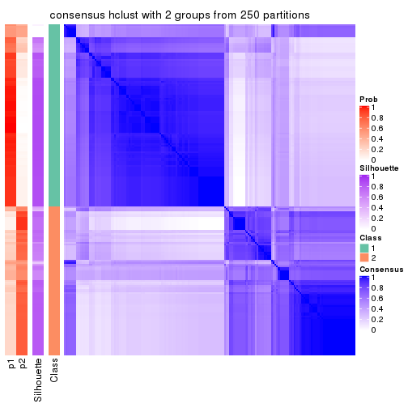</p>

</div>
<div id='tab-CV-hclust-consensus-heatmap-2'>
<pre><code class="r">consensus_heatmap(res, k = 3)
</code></pre>

<p>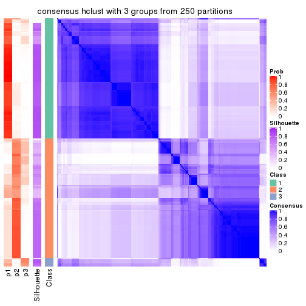</p>

</div>
<div id='tab-CV-hclust-consensus-heatmap-3'>
<pre><code class="r">consensus_heatmap(res, k = 4)
</code></pre>

<p>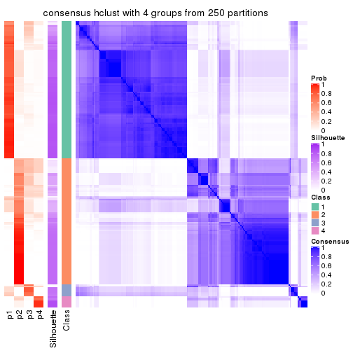</p>

</div>
<div id='tab-CV-hclust-consensus-heatmap-4'>
<pre><code class="r">consensus_heatmap(res, k = 5)
</code></pre>

<p>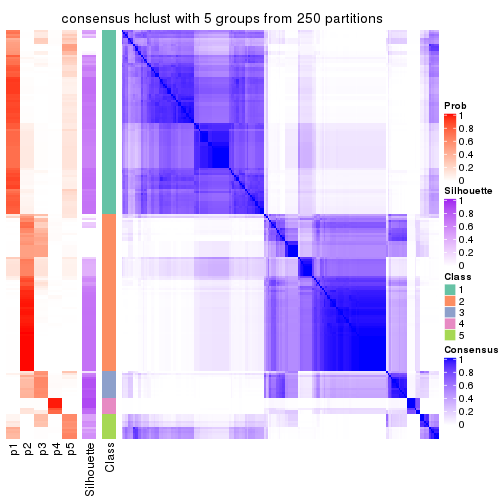</p>

</div>
<div id='tab-CV-hclust-consensus-heatmap-5'>
<pre><code class="r">consensus_heatmap(res, k = 6)
</code></pre>

<p>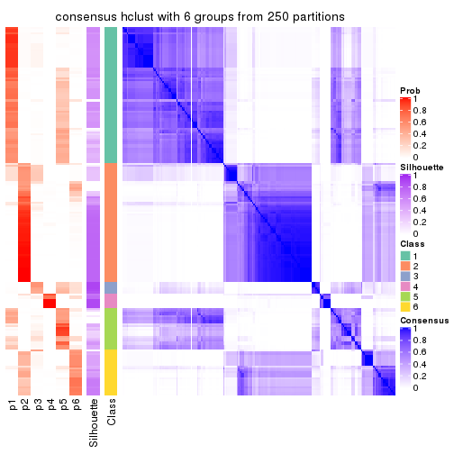</p>

</div>
</div>

Heatmaps for the membership of samples in all partitions to see how consistent they are:


<script>
$( function() {
	$( '#tabs-CV-hclust-membership-heatmap' ).tabs();
} );
</script>
<div id='tabs-CV-hclust-membership-heatmap'>
<ul>
<li><a href='#tab-CV-hclust-membership-heatmap-1'>k = 2</a></li>
<li><a href='#tab-CV-hclust-membership-heatmap-2'>k = 3</a></li>
<li><a href='#tab-CV-hclust-membership-heatmap-3'>k = 4</a></li>
<li><a href='#tab-CV-hclust-membership-heatmap-4'>k = 5</a></li>
<li><a href='#tab-CV-hclust-membership-heatmap-5'>k = 6</a></li>
</ul>
<div id='tab-CV-hclust-membership-heatmap-1'>
<pre><code class="r">membership_heatmap(res, k = 2)
</code></pre>

<p>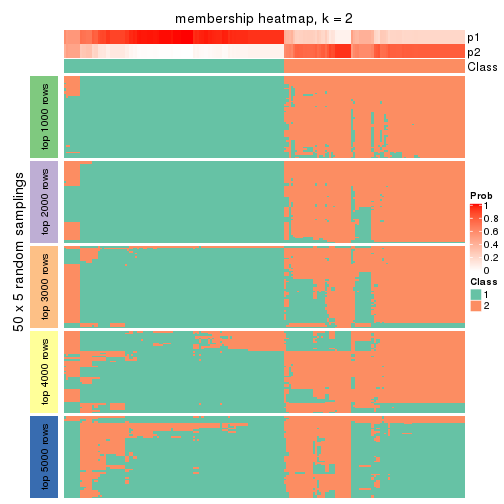</p>

</div>
<div id='tab-CV-hclust-membership-heatmap-2'>
<pre><code class="r">membership_heatmap(res, k = 3)
</code></pre>

<p>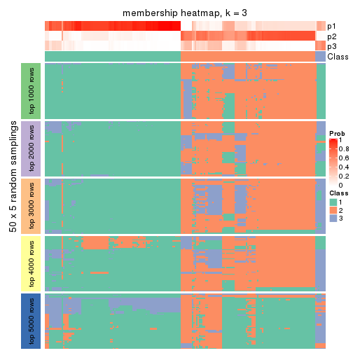</p>

</div>
<div id='tab-CV-hclust-membership-heatmap-3'>
<pre><code class="r">membership_heatmap(res, k = 4)
</code></pre>

<p>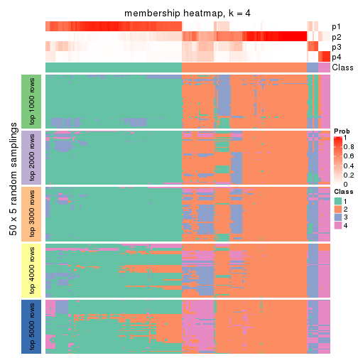</p>

</div>
<div id='tab-CV-hclust-membership-heatmap-4'>
<pre><code class="r">membership_heatmap(res, k = 5)
</code></pre>

<p>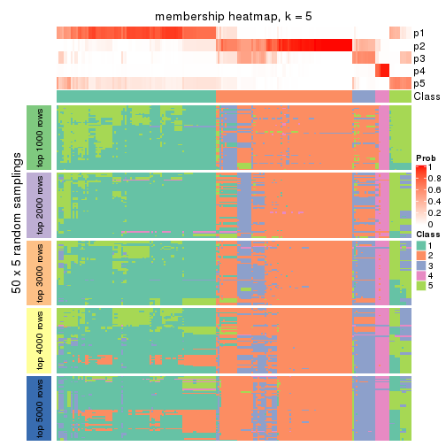</p>

</div>
<div id='tab-CV-hclust-membership-heatmap-5'>
<pre><code class="r">membership_heatmap(res, k = 6)
</code></pre>

<p>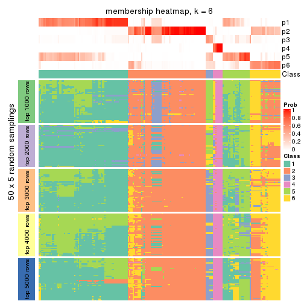</p>

</div>
</div>

As soon as we have had the classes for columns, we can look for signatures
which are significantly different between classes which can be candidate marks
for certain classes. Following are the heatmaps for signatures.


Signature heatmaps where rows are scaled:


<script>
$( function() {
	$( '#tabs-CV-hclust-get-signatures' ).tabs();
} );
</script>
<div id='tabs-CV-hclust-get-signatures'>
<ul>
<li><a href='#tab-CV-hclust-get-signatures-1'>k = 2</a></li>
<li><a href='#tab-CV-hclust-get-signatures-2'>k = 3</a></li>
<li><a href='#tab-CV-hclust-get-signatures-3'>k = 4</a></li>
<li><a href='#tab-CV-hclust-get-signatures-4'>k = 5</a></li>
<li><a href='#tab-CV-hclust-get-signatures-5'>k = 6</a></li>
</ul>
<div id='tab-CV-hclust-get-signatures-1'>
<pre><code class="r">get_signatures(res, k = 2)
</code></pre>

<p>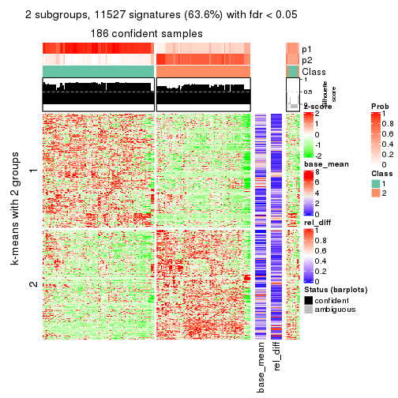</p>

</div>
<div id='tab-CV-hclust-get-signatures-2'>
<pre><code class="r">get_signatures(res, k = 3)
</code></pre>

<p>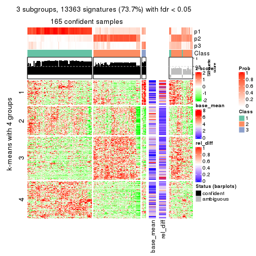</p>

</div>
<div id='tab-CV-hclust-get-signatures-3'>
<pre><code class="r">get_signatures(res, k = 4)
</code></pre>

<p>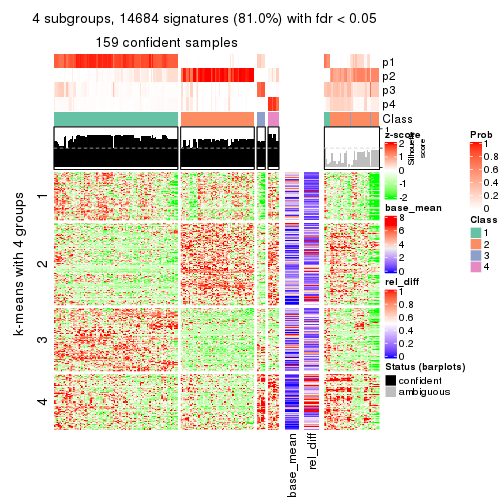</p>

</div>
<div id='tab-CV-hclust-get-signatures-4'>
<pre><code class="r">get_signatures(res, k = 5)
</code></pre>

<p>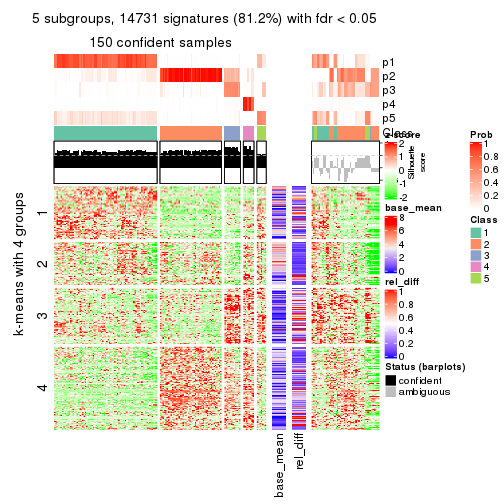</p>

</div>
<div id='tab-CV-hclust-get-signatures-5'>
<pre><code class="r">get_signatures(res, k = 6)
</code></pre>

<p>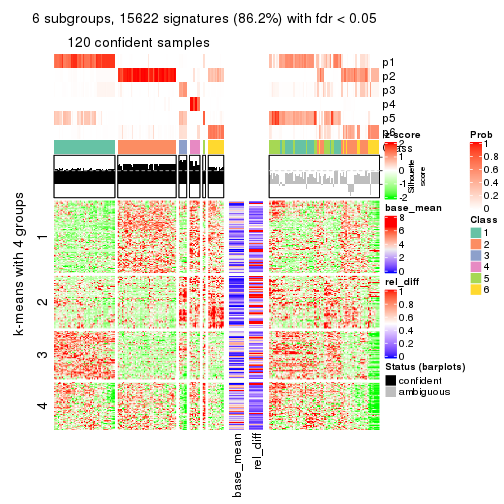</p>

</div>
</div>


Signature heatmaps where rows are not scaled:


<script>
$( function() {
	$( '#tabs-CV-hclust-get-signatures-no-scale' ).tabs();
} );
</script>
<div id='tabs-CV-hclust-get-signatures-no-scale'>
<ul>
<li><a href='#tab-CV-hclust-get-signatures-no-scale-1'>k = 2</a></li>
<li><a href='#tab-CV-hclust-get-signatures-no-scale-2'>k = 3</a></li>
<li><a href='#tab-CV-hclust-get-signatures-no-scale-3'>k = 4</a></li>
<li><a href='#tab-CV-hclust-get-signatures-no-scale-4'>k = 5</a></li>
<li><a href='#tab-CV-hclust-get-signatures-no-scale-5'>k = 6</a></li>
</ul>
<div id='tab-CV-hclust-get-signatures-no-scale-1'>
<pre><code class="r">get_signatures(res, k = 2, scale_rows = FALSE)
</code></pre>

<p>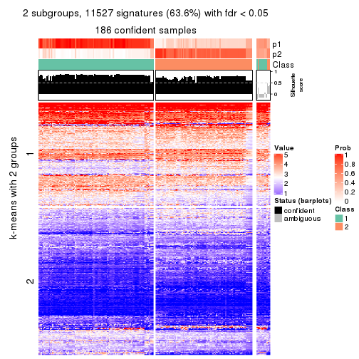</p>

</div>
<div id='tab-CV-hclust-get-signatures-no-scale-2'>
<pre><code class="r">get_signatures(res, k = 3, scale_rows = FALSE)
</code></pre>

<p>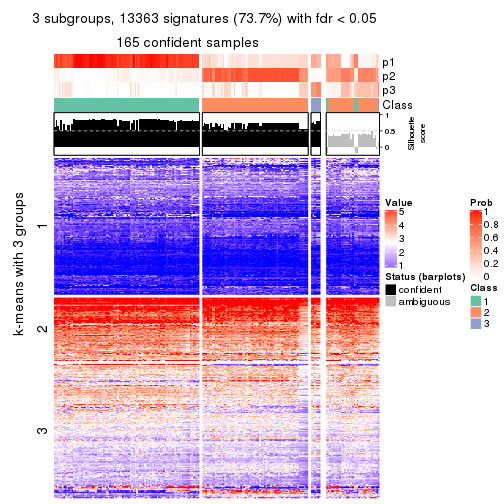</p>

</div>
<div id='tab-CV-hclust-get-signatures-no-scale-3'>
<pre><code class="r">get_signatures(res, k = 4, scale_rows = FALSE)
</code></pre>

<p>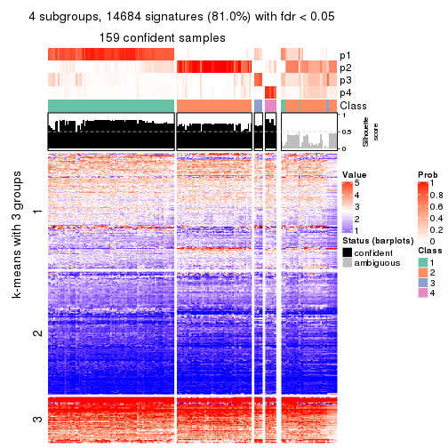</p>

</div>
<div id='tab-CV-hclust-get-signatures-no-scale-4'>
<pre><code class="r">get_signatures(res, k = 5, scale_rows = FALSE)
</code></pre>

<p>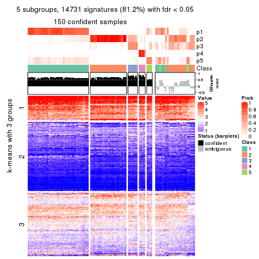</p>

</div>
<div id='tab-CV-hclust-get-signatures-no-scale-5'>
<pre><code class="r">get_signatures(res, k = 6, scale_rows = FALSE)
</code></pre>

<p>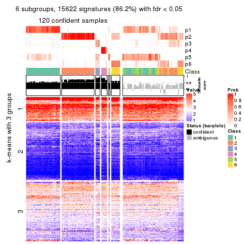</p>

</div>
</div>


Compare the overlap of signatures from different k:

```r
compare_signatures(res)
```

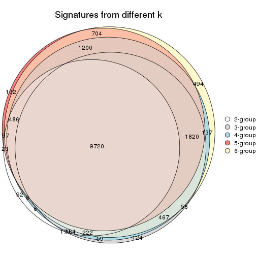

`get_signature()` returns a data frame invisibly. TO get the list of signatures, the function
call should be assigned to a variable explicitly. In following code, if `plot` argument is set
to `FALSE`, no heatmap is plotted while only the differential analysis is performed.

```r
# code only for demonstration
tb = get_signature(res, k = ..., plot = FALSE)
```

An example of the output of `tb` is:

```
#>   which_row         fdr    mean_1    mean_2 scaled_mean_1 scaled_mean_2 km
#> 1        38 0.042760348  8.373488  9.131774    -0.5533452     0.5164555  1
#> 2        40 0.018707592  7.106213  8.469186    -0.6173731     0.5762149  1
#> 3        55 0.019134737 10.221463 11.207825    -0.6159697     0.5749050  1
#> 4        59 0.006059896  5.921854  7.869574    -0.6899429     0.6439467  1
#> 5        60 0.018055526  8.928898 10.211722    -0.6204761     0.5791110  1
#> 6        98 0.009384629 15.714769 14.887706     0.6635654    -0.6193277  2
...
```

The columns in `tb` are:

1. `which_row`: row indices corresponding to the input matrix.
2. `fdr`: FDR for the differential test. 
3. `mean_x`: The mean value in group x.
4. `scaled_mean_x`: The mean value in group x after rows are scaled.
5. `km`: Row groups if k-means clustering is applied to rows.


UMAP plot which shows how samples are separated.


<script>
$( function() {
	$( '#tabs-CV-hclust-dimension-reduction' ).tabs();
} );
</script>
<div id='tabs-CV-hclust-dimension-reduction'>
<ul>
<li><a href='#tab-CV-hclust-dimension-reduction-1'>k = 2</a></li>
<li><a href='#tab-CV-hclust-dimension-reduction-2'>k = 3</a></li>
<li><a href='#tab-CV-hclust-dimension-reduction-3'>k = 4</a></li>
<li><a href='#tab-CV-hclust-dimension-reduction-4'>k = 5</a></li>
<li><a href='#tab-CV-hclust-dimension-reduction-5'>k = 6</a></li>
</ul>
<div id='tab-CV-hclust-dimension-reduction-1'>
<pre><code class="r">dimension_reduction(res, k = 2, method = &quot;UMAP&quot;)
</code></pre>

<p>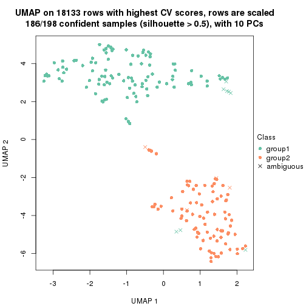</p>

</div>
<div id='tab-CV-hclust-dimension-reduction-2'>
<pre><code class="r">dimension_reduction(res, k = 3, method = &quot;UMAP&quot;)
</code></pre>

<p>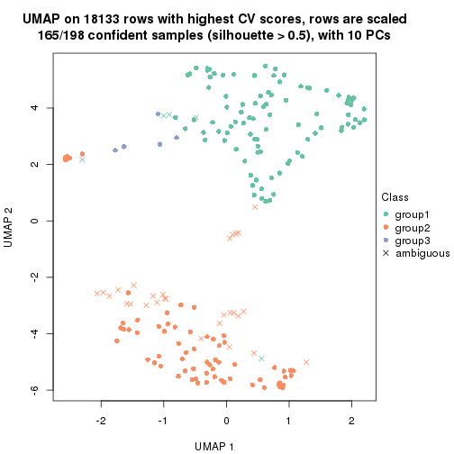</p>

</div>
<div id='tab-CV-hclust-dimension-reduction-3'>
<pre><code class="r">dimension_reduction(res, k = 4, method = &quot;UMAP&quot;)
</code></pre>

<p>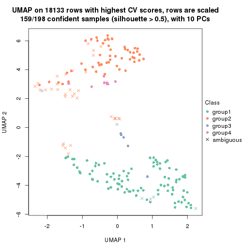</p>

</div>
<div id='tab-CV-hclust-dimension-reduction-4'>
<pre><code class="r">dimension_reduction(res, k = 5, method = &quot;UMAP&quot;)
</code></pre>

<p>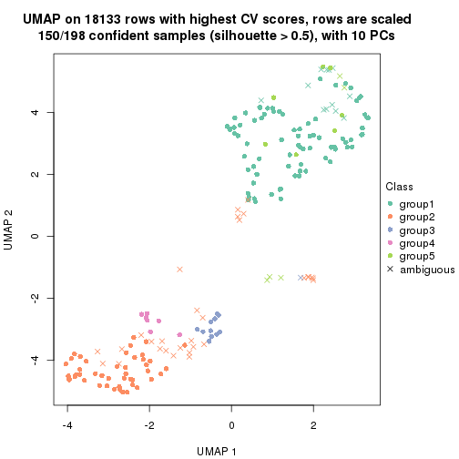</p>

</div>
<div id='tab-CV-hclust-dimension-reduction-5'>
<pre><code class="r">dimension_reduction(res, k = 6, method = &quot;UMAP&quot;)
</code></pre>

<p></p>

</div>
</div>


Following heatmap shows how subgroups are split when increasing `k`:

```r
collect_classes(res)
```

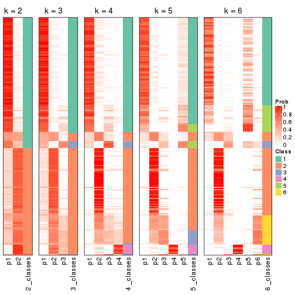


If matrix rows can be associated to genes, consider to use `functional_enrichment(res,
...)` to perform function enrichment for the signature genes. See [this vignette](http://bioconductor.org/packages/devel/bioc/vignettes/cola/inst/doc/functional_enrichment.html) for more detailed explanations.


 

---------------------------------------------------


### CV:kmeans**


The object with results only for a single top-value method and a single partition method 
can be extracted as:

```r
res = res_list["CV", "kmeans"]
# you can also extract it by
# res = res_list["CV:kmeans"]
```

A summary of `res` and all the functions that can be applied to it:

```r
res
```

```
#> A 'ConsensusPartition' object with k = 2, 3, 4, 5, 6.
#>   On a matrix with 18133 rows and 198 columns.
#>   Top rows (1000, 2000, 3000, 4000, 5000) are extracted by 'CV' method.
#>   Subgroups are detected by 'kmeans' method.
#>   Performed in total 1250 partitions by row resampling.
#>   Best k for subgroups seems to be 2.
#> 
#> Following methods can be applied to this 'ConsensusPartition' object:
#>  [1] "cola_report"             "collect_classes"         "collect_plots"          
#>  [4] "collect_stats"           "colnames"                "compare_signatures"     
#>  [7] "consensus_heatmap"       "dimension_reduction"     "functional_enrichment"  
#> [10] "get_anno_col"            "get_anno"                "get_classes"            
#> [13] "get_consensus"           "get_matrix"              "get_membership"         
#> [16] "get_param"               "get_signatures"          "get_stats"              
#> [19] "is_best_k"               "is_stable_k"             "membership_heatmap"     
#> [22] "ncol"                    "nrow"                    "plot_ecdf"              
#> [25] "rownames"                "select_partition_number" "show"                   
#> [28] "suggest_best_k"          "test_to_known_factors"
```

`collect_plots()` function collects all the plots made from `res` for all `k` (number of partitions)
into one single page to provide an easy and fast comparison between different `k`.

```r
collect_plots(res)
```

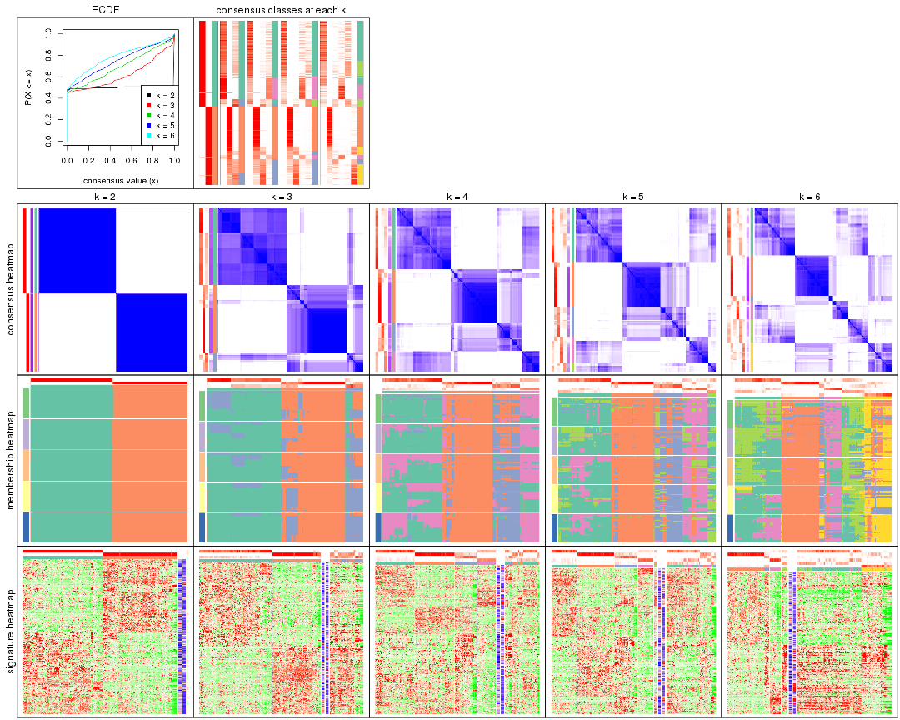

The plots are:

- The first row: a plot of the ECDF (empirical cumulative distribution
  function) curves of the consensus matrix for each `k` and the heatmap of
  predicted classes for each `k`.
- The second row: heatmaps of the consensus matrix for each `k`.
- The third row: heatmaps of the membership matrix for each `k`.
- The fouth row: heatmaps of the signatures for each `k`.

All the plots in panels can be made by individual functions and they are
plotted later in this section.

`select_partition_number()` produces several plots showing different
statistics for choosing "optimized" `k`. There are following statistics:

- ECDF curves of the consensus matrix for each `k`;
- 1-PAC. [The PAC
  score](https://en.wikipedia.org/wiki/Consensus_clustering#Over-interpretation_potential_of_consensus_clustering)
  measures the proportion of the ambiguous subgrouping.
- Mean silhouette score.
- Concordance. The mean probability of fiting the consensus class ids in all
  partitions.
- Area increased. Denote $A_k$ as the area under the ECDF curve for current
  `k`, the area increased is defined as $A_k - A_{k-1}$.
- Rand index. The percent of pairs of samples that are both in a same cluster
  or both are not in a same cluster in the partition of k and k-1.
- Jaccard index. The ratio of pairs of samples are both in a same cluster in
  the partition of k and k-1 and the pairs of samples are both in a same
  cluster in the partition k or k-1.

The detailed explanations of these statistics can be found in [the _cola_
vignette](http://bioconductor.org/packages/devel/bioc/vignettes/cola/inst/doc/cola.html#toc_13).

Generally speaking, lower PAC score, higher mean silhouette score or higher
concordance corresponds to better partition. Rand index and Jaccard index
measure how similar the current partition is compared to partition with `k-1`.
If they are too similar, we won't accept `k` is better than `k-1`.

```r
select_partition_number(res)
```

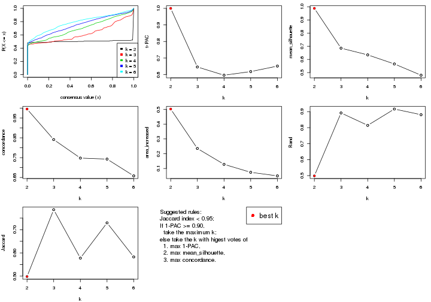

The numeric values for all these statistics can be obtained by `get_stats()`.

```r
get_stats(res)
```

```
#>   k 1-PAC mean_silhouette concordance area_increased  Rand Jaccard
#> 2 2 1.000           0.988       0.995         0.5022 0.498   0.498
#> 3 3 0.646           0.685       0.841         0.2353 0.892   0.786
#> 4 4 0.596           0.635       0.748         0.1280 0.814   0.578
#> 5 5 0.618           0.565       0.743         0.0741 0.917   0.729
#> 6 6 0.651           0.480       0.658         0.0500 0.881   0.583
```

`suggest_best_k()` suggests the best $k$ based on these statistics. The rules are as follows:

- All $k$ with Jaccard index larger than 0.95 are removed because increasing
  $k$ does not provide enough extra information. If all $k$ are removed, it is
  marked as no subgroup is detected.
- For all $k$ with 1-PAC score larger than 0.9, the maximal $k$ is taken as
  the best $k$, and other $k$ are marked as optional $k$.
- If it does not fit the second rule. The $k$ with the maximal vote of the
  highest 1-PAC score, highest mean silhouette, and highest concordance is
  taken as the best $k$.

```r
suggest_best_k(res)
```

```
#> [1] 2
```


Following shows the table of the partitions (You need to click the **show/hide
code output** link to see it). The membership matrix (columns with name `p*`)
is inferred by
[`clue::cl_consensus()`](https://www.rdocumentation.org/link/cl_consensus?package=clue)
function with the `SE` method. Basically the value in the membership matrix
represents the probability to belong to a certain group. The finall class
label for an item is determined with the group with highest probability it
belongs to.

In `get_classes()` function, the entropy is calculated from the membership
matrix and the silhouette score is calculated from the consensus matrix.


<script>
$( function() {
	$( '#tabs-CV-kmeans-get-classes' ).tabs();
} );
</script>
<div id='tabs-CV-kmeans-get-classes'>
<ul>
<li><a href='#tab-CV-kmeans-get-classes-1'>k = 2</a></li>
<li><a href='#tab-CV-kmeans-get-classes-2'>k = 3</a></li>
<li><a href='#tab-CV-kmeans-get-classes-3'>k = 4</a></li>
<li><a href='#tab-CV-kmeans-get-classes-4'>k = 5</a></li>
<li><a href='#tab-CV-kmeans-get-classes-5'>k = 6</a></li>
</ul>

<div id='tab-CV-kmeans-get-classes-1'>
<p><a id='tab-CV-kmeans-get-classes-1-a' style='color:#0366d6' href='#'>show/hide code output</a></p>
<pre><code class="r">cbind(get_classes(res, k = 2), get_membership(res, k = 2))
</code></pre>

<pre><code>#&gt;                                      class entropy silhouette    p1    p2
#&gt; 0C0AA0B2-5191-4EDF-8937-ED7434F30283     2   0.000     0.9954 0.000 1.000
#&gt; 18B45F1F-234F-45CC-A234-145307606C5C     1   0.000     0.9950 1.000 0.000
#&gt; E18B70C0-BDCA-46D3-99BB-C6C8ABC68DA5     2   0.000     0.9954 0.000 1.000
#&gt; 0F6DDBA7-6F74-45E8-95C8-F28263D55978     1   0.000     0.9950 1.000 0.000
#&gt; 7EAE1A5A-129A-46DE-977E-A2C753F10904     2   0.000     0.9954 0.000 1.000
#&gt; 7EAE0048-16B5-4979-9410-16CDEB9B1A48     1   0.000     0.9950 1.000 0.000
#&gt; 2EBFC828-2B27-4753-A052-80DDA226DAB4     2   0.000     0.9954 0.000 1.000
#&gt; 24E1768D-2232-41DA-9383-BC55D6EB3812     2   0.000     0.9954 0.000 1.000
#&gt; 6E3CD60A-1889-4CA3-B305-2E78152057B5     2   0.000     0.9954 0.000 1.000
#&gt; 33CC70DD-82B3-413C-B3B1-BE06634D95D0     1   0.000     0.9950 1.000 0.000
#&gt; F1CB57A3-55DD-4487-9307-1B4F652E729A     1   0.000     0.9950 1.000 0.000
#&gt; 755A5806-B054-449A-93DB-79909E6C93A1     1   0.000     0.9950 1.000 0.000
#&gt; 58D364E7-3D2F-468F-A264-D6461E2428D4     2   0.000     0.9954 0.000 1.000
#&gt; 68BB9CB6-7AA2-4981-B9D9-07363EC96599     2   0.000     0.9954 0.000 1.000
#&gt; 3C4E8DFA-8EA0-4F1F-89CB-CB8805395872     2   0.000     0.9954 0.000 1.000
#&gt; 4219651D-5583-4498-BF08-1B7D04B4C7B2     1   0.000     0.9950 1.000 0.000
#&gt; B5EE2768-0D67-4584-ADBC-EC745FEC52EA     2   0.000     0.9954 0.000 1.000
#&gt; 825E6C11-F460-451A-8045-846DD7D0E945     1   0.000     0.9950 1.000 0.000
#&gt; 491F62AF-5E68-43C3-982A-F867A75BBA9A     2   0.000     0.9954 0.000 1.000
#&gt; 9D7F058C-F95A-44AD-AC9E-450F7FBDC960     2   0.000     0.9954 0.000 1.000
#&gt; 6D42DD0C-2081-4742-BA27-9F5F16FAC3C6     1   0.000     0.9950 1.000 0.000
#&gt; EDD7E63D-492A-473B-A552-0764337B10EF     2   0.000     0.9954 0.000 1.000
#&gt; 97073DEA-73AD-4DFD-BD1A-9035DC03445B     1   0.000     0.9950 1.000 0.000
#&gt; FA891AB9-CE38-4F7E-A015-1DDCE12890A0     1   0.000     0.9950 1.000 0.000
#&gt; D9514D49-A0AE-45AB-8C9F-68E726215253     1   0.000     0.9950 1.000 0.000
#&gt; 3B9229AD-12E5-451E-9D2F-378AAC82C04A     2   0.000     0.9954 0.000 1.000
#&gt; 5EA36B71-4917-4EF3-9060-065EFE6ACC5B     1   0.000     0.9950 1.000 0.000
#&gt; A20E4ECB-4895-4CC7-BE5E-4721B20D933B     1   0.000     0.9950 1.000 0.000
#&gt; 1BE8D828-29DB-4368-AA4A-FB23588F7AE8     1   0.000     0.9950 1.000 0.000
#&gt; 66EFEFCF-3D14-4DBF-AA13-530F40ED0245     1   0.000     0.9950 1.000 0.000
#&gt; 55DFFE53-BCE7-4EC1-9863-6C0311B06BA2     2   0.000     0.9954 0.000 1.000
#&gt; 4CC3FB5A-611D-4C64-AE9D-544FA45CF4DC     1   0.000     0.9950 1.000 0.000
#&gt; C11D33F2-DFE9-4FA8-9024-F3E7F1DADC5F     2   0.000     0.9954 0.000 1.000
#&gt; FA5932B8-8AA3-4C38-9FAB-C35D8772974D     1   0.000     0.9950 1.000 0.000
#&gt; 8216EC35-1F41-4A15-B503-BDA4971E27C9     1   0.000     0.9950 1.000 0.000
#&gt; 69635D23-90A7-4BAD-97C7-B79536837F57     1   0.000     0.9950 1.000 0.000
#&gt; 12B404E2-C463-4409-8392-E4649B2AFFD1     2   0.000     0.9954 0.000 1.000
#&gt; 246927E3-ACCF-41B2-AA8E-43855FD6B146     2   0.000     0.9954 0.000 1.000
#&gt; E0CC13E7-9607-49E0-B4AA-395544E3C3BF     1   0.000     0.9950 1.000 0.000
#&gt; F7BBC0C1-6124-4A83-8A70-EA89B62F1CBD     1   0.000     0.9950 1.000 0.000
#&gt; B1D4FF24-8E6F-4A04-B716-2032D850EB57     1   0.000     0.9950 1.000 0.000
#&gt; 253601DB-B78A-4566-9947-8C0270C0B163     2   0.000     0.9954 0.000 1.000
#&gt; AB83DBFF-5737-4FB8-A5AC-1D3CD6072BDF     2   0.722     0.7501 0.200 0.800
#&gt; 9D67D953-EC98-4B72-89C8-5732BC9D4BC9     2   0.000     0.9954 0.000 1.000
#&gt; 51061018-95AB-4278-886F-F69E4EBC47C0     2   0.000     0.9954 0.000 1.000
#&gt; ABD0F7F3-105B-4DEE-9889-5028772C519A     1   0.000     0.9950 1.000 0.000
#&gt; 562B95CF-B27E-4A72-B7C6-CDF86A51A39B     1   0.000     0.9950 1.000 0.000
#&gt; ABF046A4-D7A1-49FF-B6B1-4E07A791DEDB     2   0.000     0.9954 0.000 1.000
#&gt; 3FF4101E-9703-460E-A30E-76CC7689F36D     2   0.000     0.9954 0.000 1.000
#&gt; 39C4F7AA-7ADF-4F1D-BDA3-BEC605AC5023     2   0.000     0.9954 0.000 1.000
#&gt; CB821FD2-AF5C-4743-A70F-21C12C6ED153     1   0.000     0.9950 1.000 0.000
#&gt; 92EA1846-62FF-41D5-A441-5E52E6B9E7F9     1   0.000     0.9950 1.000 0.000
#&gt; 7D25F3EE-5A20-4763-8026-16A03D05F459     1   0.000     0.9950 1.000 0.000
#&gt; 8ECE5276-CD06-496B-A5A9-1713B1F7D089     1   0.000     0.9950 1.000 0.000
#&gt; C775B68F-9507-47E3-B507-B433AED79002     1   0.000     0.9950 1.000 0.000
#&gt; E19D5463-FDD0-41C1-A170-323736A88D07     2   0.000     0.9954 0.000 1.000
#&gt; CE4B6285-4961-4767-91F0-5C7A8162E185     1   0.000     0.9950 1.000 0.000
#&gt; 9637BD72-1FEF-42AD-8886-2C39BE876531     1   0.000     0.9950 1.000 0.000
#&gt; 81B5A88E-45A0-4B44-B689-B9071B8548EE     2   0.000     0.9954 0.000 1.000
#&gt; 0B01B4C9-9BED-4F5B-A3E2-8868C7CCC3FC     2   0.000     0.9954 0.000 1.000
#&gt; 54501315-7132-44B2-A179-10FBF1421105     1   0.000     0.9950 1.000 0.000
#&gt; E207CBE9-4C3A-4FDD-9251-CFE1FE106475     1   0.000     0.9950 1.000 0.000
#&gt; 3BEA0B92-3F90-4DBF-9679-AADEAD7D47C8     2   0.000     0.9954 0.000 1.000
#&gt; 35B32250-D854-4215-AA5B-2C11B2FBEECA     1   0.000     0.9950 1.000 0.000
#&gt; ACE6566B-AEB9-426C-924A-B382D14A1024     2   0.000     0.9954 0.000 1.000
#&gt; 737E69AC-0930-45B9-B6BA-7CE5E300290B     1   0.000     0.9950 1.000 0.000
#&gt; B4410AB8-D015-41CA-86E6-12EB4E4103E3     1   0.000     0.9950 1.000 0.000
#&gt; 6D3ECA65-C50F-43B0-B75A-1D290FA4A8FD     2   0.000     0.9954 0.000 1.000
#&gt; C86F40D3-9A96-4395-A8C3-510DE12F9A2B     2   0.000     0.9954 0.000 1.000
#&gt; 6238087F-24DD-4BF1-903F-3BD4E446C1AE     2   0.000     0.9954 0.000 1.000
#&gt; E4FF840B-EEAB-4CB0-A690-7D4C4AA7EEC3     2   0.000     0.9954 0.000 1.000
#&gt; 72D3C323-C67F-4C0E-9BFC-BF245FF9730A     1   0.000     0.9950 1.000 0.000
#&gt; 82D56E4E-4DF6-4F3E-8959-B995C92AAA70     1   0.000     0.9950 1.000 0.000
#&gt; E31CA441-EB19-443B-ACBD-37B5CCBCF0E5     2   0.000     0.9954 0.000 1.000
#&gt; 87CA8939-D054-4B8A-B32D-085FD2E8F202     1   0.000     0.9950 1.000 0.000
#&gt; 2A508D90-FEDC-46A3-9A02-E51E5467CDCB     1   0.000     0.9950 1.000 0.000
#&gt; C4E8B4E2-388B-411F-BF0A-9B6F34E8EDB5     2   0.000     0.9954 0.000 1.000
#&gt; AF6AF803-BD93-44A7-AA80-B9BC92C1273B     2   0.000     0.9954 0.000 1.000
#&gt; 0B1CA5CF-EB96-41D4-BFC5-6957FEB39828     1   0.000     0.9950 1.000 0.000
#&gt; 6FB96FB0-6661-48AD-A4A0-69F8AFDBE591     2   0.000     0.9954 0.000 1.000
#&gt; 8C19F7FD-368A-462B-B28F-88D6630038A1     1   0.000     0.9950 1.000 0.000
#&gt; 96EABE78-C2F4-4A33-ACD8-C922A4B2519B     2   0.000     0.9954 0.000 1.000
#&gt; 68B36D7B-546A-4689-949F-B207C4A4AB27     2   0.000     0.9954 0.000 1.000
#&gt; CE9F3335-778F-4F52-BC55-4B7C99B211DD     2   0.000     0.9954 0.000 1.000
#&gt; CB359DED-2A2D-4646-A0BD-6F10ADCC532B     1   0.000     0.9950 1.000 0.000
#&gt; 198324A5-8C52-46F6-9734-EFAF1CCA6D9B     1   0.000     0.9950 1.000 0.000
#&gt; 83B88608-0506-428C-B9E8-621F38477B42     1   0.000     0.9950 1.000 0.000
#&gt; 1993630A-0F3D-4F5C-86A3-D443BAAF57F0     1   0.998     0.0951 0.528 0.472
#&gt; DE73DA9B-529E-4F4F-A65C-DA7AB84B1096     1   0.000     0.9950 1.000 0.000
#&gt; 2347F3B7-DDA3-40C0-B6D4-8819ECA69146     1   0.000     0.9950 1.000 0.000
#&gt; AB93B5D5-095F-4330-9D40-6A3D934AB50C     1   0.000     0.9950 1.000 0.000
#&gt; 5EBBE4AD-FF0C-41CF-9EA3-B6FE7EA1F9C0     1   0.000     0.9950 1.000 0.000
#&gt; 6D960AE7-3769-4144-A061-E8588E5063FF     1   0.000     0.9950 1.000 0.000
#&gt; 0C2DD8C0-D1A5-4192-A49C-7A40FED628B2     2   0.000     0.9954 0.000 1.000
#&gt; 18C9372F-C55B-4F86-A9D2-E8D85EFC8566     2   0.000     0.9954 0.000 1.000
#&gt; 9AF637B0-4C32-4DD1-93AF-7655B4A845D3     2   0.000     0.9954 0.000 1.000
#&gt; 785B5B06-4115-46FD-9BEB-F888AFDC855D     2   0.000     0.9954 0.000 1.000
#&gt; ECA3050E-4BE2-4117-B9CF-A52BB85AF8C2     2   0.767     0.7118 0.224 0.776
#&gt; 099DC396-16A5-458F-9ED9-F2A790CB0C34     1   0.000     0.9950 1.000 0.000
#&gt; 7A5A12EE-C5B0-4C51-8C99-0F3FA88D633E     1   0.000     0.9950 1.000 0.000
#&gt; E832B508-A66D-4817-B44A-FE9FAAE64B4A     1   0.000     0.9950 1.000 0.000
#&gt; F9DD688C-7B35-49E7-9651-2E098EE78856     1   0.000     0.9950 1.000 0.000
#&gt; F1265DD8-5ED3-4635-A277-57BBFDEC7729     1   0.000     0.9950 1.000 0.000
#&gt; F624E8D9-DB07-4C9E-910D-5E8EBA3A6167     2   0.000     0.9954 0.000 1.000
#&gt; 3516FBDF-66E1-43F4-9D7B-16748F6439A7     2   0.000     0.9954 0.000 1.000
#&gt; 04B12992-B2EA-4BA2-8E2C-11E34E230E6F     2   0.000     0.9954 0.000 1.000
#&gt; CC02897D-9123-495E-9242-5C9CF4EC269B     2   0.000     0.9954 0.000 1.000
#&gt; 3117ED46-2BF2-4311-BC00-4E98243E16B3     1   0.000     0.9950 1.000 0.000
#&gt; E0B66D53-23DB-4E26-BB6E-F692FA8C000E     1   0.000     0.9950 1.000 0.000
#&gt; DAA93CE5-A013-477A-9A50-EA09CC3A8162     2   0.000     0.9954 0.000 1.000
#&gt; 0099098D-354A-4276-92F8-B932C74B4608     1   0.000     0.9950 1.000 0.000
#&gt; DD483639-B2E7-4745-BCFB-55ED1D82BFBF     2   0.000     0.9954 0.000 1.000
#&gt; 2C1F9079-602E-4252-82C7-9D8799E04246     2   0.000     0.9954 0.000 1.000
#&gt; 9473A8E4-3A1B-4184-9EA6-517AFD60B635     1   0.000     0.9950 1.000 0.000
#&gt; 75CFBAF6-7BA0-40AF-92D7-D218E885BD1B     2   0.000     0.9954 0.000 1.000
#&gt; B588950F-14D6-41C8-845B-EFD2096013C6     2   0.000     0.9954 0.000 1.000
#&gt; 0DF3EDA8-DAEA-4721-92AB-B97181249498     2   0.000     0.9954 0.000 1.000
#&gt; 8EA83042-D598-401D-AD78-936EEB136C59     1   0.000     0.9950 1.000 0.000
#&gt; 729AC418-3BE9-445A-95D4-AC11A7D43BE0     1   0.000     0.9950 1.000 0.000
#&gt; 7D8B1B11-F576-4AA8-BFA7-0022A2CD829A     2   0.000     0.9954 0.000 1.000
#&gt; 304A0E46-3449-4B44-9C30-BDDF6459391D     1   0.000     0.9950 1.000 0.000
#&gt; 3C83358F-DF20-47F7-AF9F-AB7CC92F5ABA     1   0.000     0.9950 1.000 0.000
#&gt; EAFEED6C-35C3-451F-AE4A-EB56992E1F29     1   0.000     0.9950 1.000 0.000
#&gt; 8A237A65-28EC-434D-A78A-A8B7308B5204     1   0.000     0.9950 1.000 0.000
#&gt; D005833F-E991-4E9E-9667-55F137288004     1   0.000     0.9950 1.000 0.000
#&gt; 37D966E3-253E-4397-A9AE-0903A8D31FE6     1   0.000     0.9950 1.000 0.000
#&gt; D2482B81-CB5B-4178-BA8D-1CF4026181B5     1   0.000     0.9950 1.000 0.000
#&gt; 18019E95-C2A8-4EE7-B585-F6886DC4D953     2   0.000     0.9954 0.000 1.000
#&gt; 0B126D1A-14A8-4345-8F78-FF92222ADF4C     2   0.000     0.9954 0.000 1.000
#&gt; CE88B625-47D8-4D58-9FB4-23464DB7DDAD     2   0.000     0.9954 0.000 1.000
#&gt; 9A88299D-5C74-47FA-B42C-1A1D6D935AAB     1   0.000     0.9950 1.000 0.000
#&gt; 3E71159C-FD6C-41DA-B18B-0730C8AC7E41     1   0.000     0.9950 1.000 0.000
#&gt; 6F245AA4-79D9-47E1-BCC9-1AAF65AEA813     1   0.000     0.9950 1.000 0.000
#&gt; 4CF2C888-2100-483A-B4DB-ECBB69243A4D     2   0.000     0.9954 0.000 1.000
#&gt; A3853813-B9D5-4E8C-B075-19FCC35F8686     2   0.000     0.9954 0.000 1.000
#&gt; 83A16DEE-CE9F-4D8B-9225-0A2A8B9D055D     1   0.000     0.9950 1.000 0.000
#&gt; 0F057CAF-4F9A-4DE9-8601-730E96873733     2   0.000     0.9954 0.000 1.000
#&gt; 32D5801D-DBA4-422E-87CB-A2DDE921BA41     1   0.000     0.9950 1.000 0.000
#&gt; 22EE8076-F07C-499A-9AF8-D800A77EF154     2   0.000     0.9954 0.000 1.000
#&gt; DD4BD74D-D48C-4090-9F57-5334E784581C     1   0.000     0.9950 1.000 0.000
#&gt; 41183565-434D-474C-B1BD-CA6E94910658     2   0.000     0.9954 0.000 1.000
#&gt; 75A2CE41-2B2A-4346-927E-ACF8A72738E4     1   0.000     0.9950 1.000 0.000
#&gt; 7AA24995-3DD2-4682-B36A-4EBFEEACF625     1   0.000     0.9950 1.000 0.000
#&gt; 8BAFDFEC-9F26-4ADB-95CE-004143960EEB     1   0.000     0.9950 1.000 0.000
#&gt; A330E011-CE08-4A85-8F4B-370592293DBB     1   0.000     0.9950 1.000 0.000
#&gt; 1D5A5B17-2E70-4BB0-94A1-EC17E6EA49DB     1   0.000     0.9950 1.000 0.000
#&gt; BD9143B8-9D97-4A05-872C-3FB82B4CF7BE     2   0.000     0.9954 0.000 1.000
#&gt; 64552DC0-181E-4607-898C-787AA7F26435     2   0.000     0.9954 0.000 1.000
#&gt; 1B4C4D41-34C7-43A3-858B-C9552EB53894     1   0.000     0.9950 1.000 0.000
#&gt; 463A3BAA-02DC-4EA4-A644-B924163E425D     2   0.000     0.9954 0.000 1.000
#&gt; CD0FEA89-6F60-4A20-8FCA-D397B4E95A98     1   0.000     0.9950 1.000 0.000
#&gt; 5D06CF6D-F4B9-4B32-B055-8AB287E53340     2   0.000     0.9954 0.000 1.000
#&gt; ADA7835F-DB67-4F4F-9446-8BCE3C5FE936     2   0.000     0.9954 0.000 1.000
#&gt; 4109BE2D-B5DF-4BD7-860E-60D87F647152     2   0.000     0.9954 0.000 1.000
#&gt; 88526A0E-6DFE-46CB-BFAD-B4826F482C67     1   0.000     0.9950 1.000 0.000
#&gt; F39F9A4C-18F7-4017-AB31-85D52FF44587     2   0.000     0.9954 0.000 1.000
#&gt; D4290A5E-1B24-4C55-B470-0FA7A0A09DD0     2   0.000     0.9954 0.000 1.000
#&gt; DC5A2C9E-978F-4661-B729-1F9662976E27     1   0.000     0.9950 1.000 0.000
#&gt; 26A1F392-CED2-43E3-8096-74E6F2BFC8C0     2   0.000     0.9954 0.000 1.000
#&gt; 87D81FB2-306A-4E75-9D58-D5F48E46E7F6     2   0.000     0.9954 0.000 1.000
#&gt; E3D9D81A-C20C-4B3B-B940-A5D2C5F65B22     2   0.000     0.9954 0.000 1.000
#&gt; 4464650B-453F-476C-989C-B7B159BF2CF0     2   0.000     0.9954 0.000 1.000
#&gt; 577D2867-B738-487A-9B06-07958D647F02     1   0.000     0.9950 1.000 0.000
#&gt; E52A22CC-3C03-41A9-9541-220DD871E162     2   0.000     0.9954 0.000 1.000
#&gt; 642703B1-AF99-4746-A915-0792F4B9590B     2   0.000     0.9954 0.000 1.000
#&gt; 8F0D1792-1284-45E6-8EC4-392596057677     2   0.000     0.9954 0.000 1.000
#&gt; 765AFFC1-D528-4494-8BA1-0706451E4205     2   0.000     0.9954 0.000 1.000
#&gt; A716BC29-161F-4CA0-B240-00B330137F2C     1   0.000     0.9950 1.000 0.000
#&gt; 32CBFBAF-7064-4595-8D54-2C5E7DE0FD9B     1   0.000     0.9950 1.000 0.000
#&gt; 4D6ED28C-3F20-41B0-BA41-1BF0E5199A40     2   0.000     0.9954 0.000 1.000
#&gt; 86A38456-2900-48FB-B10F-79222B3CA9BF     1   0.184     0.9666 0.972 0.028
#&gt; E870807D-3223-4A6A-9E3D-F4461B048AA2     2   0.000     0.9954 0.000 1.000
#&gt; 3A78D19F-A833-4D2C-8387-FB4FD4A8313C     1   0.000     0.9950 1.000 0.000
#&gt; DFA162CA-C708-4121-8E74-F9C4DEE0CDAE     1   0.000     0.9950 1.000 0.000
#&gt; C00A300A-CD10-4C9D-8C94-3901AFE8406C     2   0.000     0.9954 0.000 1.000
#&gt; 13E11D15-A90F-48C4-980A-DD032C00A2C1     1   0.000     0.9950 1.000 0.000
#&gt; 31BF80AB-FEDB-4C73-89C3-70BE9F9ACBEE     2   0.000     0.9954 0.000 1.000
#&gt; FA34308A-349D-4AAD-94CF-3F3B7F9AD629     2   0.000     0.9954 0.000 1.000
#&gt; 7C48D467-B663-49DD-BC84-A36BC32ACB3D     1   0.000     0.9950 1.000 0.000
#&gt; BB068534-04F6-4FC9-9087-CDA65920BCE2     1   0.000     0.9950 1.000 0.000
#&gt; EA4EC272-A9B3-4B2E-955F-19F7676A944C     2   0.000     0.9954 0.000 1.000
#&gt; C71FF69B-A460-43CA-8769-9667F22D938B     1   0.000     0.9950 1.000 0.000
#&gt; 5243D1B8-8168-4FF1-A8C6-505F080EF0D3     2   0.000     0.9954 0.000 1.000
#&gt; BCC474D8-08FE-4E99-B8E8-B29E65F84D2E     1   0.000     0.9950 1.000 0.000
#&gt; 04FDBFE3-4CF6-4E53-A2AA-89D5C9316377     2   0.000     0.9954 0.000 1.000
#&gt; 83A9915C-8D60-4CAE-A868-B61E3C90C7B0     2   0.000     0.9954 0.000 1.000
#&gt; 989A6472-E3E3-457A-97BE-CCE95F42D5C2     2   0.000     0.9954 0.000 1.000
#&gt; A0AB2D28-6751-49C9-8DF4-66FDBF95C360     1   0.000     0.9950 1.000 0.000
#&gt; A12B2683-18D4-41C9-8AE5-C143E2180052     1   0.000     0.9950 1.000 0.000
#&gt; 8DE1E245-CAD2-4F11-BFA2-9792C433A00B     1   0.000     0.9950 1.000 0.000
#&gt; FDA68036-6C4C-4256-9AA0-C01FE92AA098     2   0.000     0.9954 0.000 1.000
#&gt; 26311920-1414-4EC1-870B-784961EBCC2D     1   0.000     0.9950 1.000 0.000
#&gt; C29A10D6-D598-4286-B5E0-F1776E19E988     1   0.000     0.9950 1.000 0.000
#&gt; FACCC1FB-4937-4CC0-90EA-7F91D3D939CF     2   0.000     0.9954 0.000 1.000
#&gt; 90B9D84B-78E5-4C7E-8414-EC889C2DE8DB     2   0.000     0.9954 0.000 1.000
#&gt; B74E6122-76E1-4E4D-A867-BCAFD7277393     1   0.000     0.9950 1.000 0.000
#&gt; 98494DC0-CF6E-485F-8A0D-D80E4437EF5C     2   0.000     0.9954 0.000 1.000
#&gt; DA114DAC-DE7B-4E43-8D7C-82C5D7B66411     1   0.000     0.9950 1.000 0.000
</code></pre>

<script>
$('#tab-CV-kmeans-get-classes-1-a').parent().next().next().hide();
$('#tab-CV-kmeans-get-classes-1-a').click(function(){
  $('#tab-CV-kmeans-get-classes-1-a').parent().next().next().toggle();
  return(false);
});
</script>
</div>

<div id='tab-CV-kmeans-get-classes-2'>
<p><a id='tab-CV-kmeans-get-classes-2-a' style='color:#0366d6' href='#'>show/hide code output</a></p>
<pre><code class="r">cbind(get_classes(res, k = 3), get_membership(res, k = 3))
</code></pre>

<pre><code>#&gt;                                      class entropy silhouette    p1    p2    p3
#&gt; 0C0AA0B2-5191-4EDF-8937-ED7434F30283     2  0.0000    0.83732 0.000 1.000 0.000
#&gt; 18B45F1F-234F-45CC-A234-145307606C5C     1  0.0424    0.79165 0.992 0.000 0.008
#&gt; E18B70C0-BDCA-46D3-99BB-C6C8ABC68DA5     2  0.0237    0.83518 0.000 0.996 0.004
#&gt; 0F6DDBA7-6F74-45E8-95C8-F28263D55978     1  0.5497    0.83821 0.708 0.000 0.292
#&gt; 7EAE1A5A-129A-46DE-977E-A2C753F10904     2  0.0000    0.83732 0.000 1.000 0.000
#&gt; 7EAE0048-16B5-4979-9410-16CDEB9B1A48     1  0.4399    0.85790 0.812 0.000 0.188
#&gt; 2EBFC828-2B27-4753-A052-80DDA226DAB4     2  0.0000    0.83732 0.000 1.000 0.000
#&gt; 24E1768D-2232-41DA-9383-BC55D6EB3812     2  0.5098    0.57787 0.000 0.752 0.248
#&gt; 6E3CD60A-1889-4CA3-B305-2E78152057B5     2  0.4645    0.62360 0.176 0.816 0.008
#&gt; 33CC70DD-82B3-413C-B3B1-BE06634D95D0     1  0.6008    0.77655 0.628 0.000 0.372
#&gt; F1CB57A3-55DD-4487-9307-1B4F652E729A     1  0.5431    0.84139 0.716 0.000 0.284
#&gt; 755A5806-B054-449A-93DB-79909E6C93A1     1  0.0892    0.79087 0.980 0.000 0.020
#&gt; 58D364E7-3D2F-468F-A264-D6461E2428D4     2  0.5988    0.35531 0.000 0.632 0.368
#&gt; 68BB9CB6-7AA2-4981-B9D9-07363EC96599     2  0.5216    0.56189 0.000 0.740 0.260
#&gt; 3C4E8DFA-8EA0-4F1F-89CB-CB8805395872     2  0.6302   -0.03106 0.000 0.520 0.480
#&gt; 4219651D-5583-4498-BF08-1B7D04B4C7B2     1  0.6008    0.78673 0.628 0.000 0.372
#&gt; B5EE2768-0D67-4584-ADBC-EC745FEC52EA     2  0.0000    0.83732 0.000 1.000 0.000
#&gt; 825E6C11-F460-451A-8045-846DD7D0E945     1  0.5835    0.80302 0.660 0.000 0.340
#&gt; 491F62AF-5E68-43C3-982A-F867A75BBA9A     2  0.0000    0.83732 0.000 1.000 0.000
#&gt; 9D7F058C-F95A-44AD-AC9E-450F7FBDC960     2  0.0237    0.83518 0.000 0.996 0.004
#&gt; 6D42DD0C-2081-4742-BA27-9F5F16FAC3C6     1  0.0892    0.79087 0.980 0.000 0.020
#&gt; EDD7E63D-492A-473B-A552-0764337B10EF     3  0.6225    0.30800 0.000 0.432 0.568
#&gt; 97073DEA-73AD-4DFD-BD1A-9035DC03445B     1  0.5497    0.83821 0.708 0.000 0.292
#&gt; FA891AB9-CE38-4F7E-A015-1DDCE12890A0     1  0.2796    0.83206 0.908 0.000 0.092
#&gt; D9514D49-A0AE-45AB-8C9F-68E726215253     1  0.4504    0.85766 0.804 0.000 0.196
#&gt; 3B9229AD-12E5-451E-9D2F-378AAC82C04A     2  0.0000    0.83732 0.000 1.000 0.000
#&gt; 5EA36B71-4917-4EF3-9060-065EFE6ACC5B     3  0.5216    0.09022 0.260 0.000 0.740
#&gt; A20E4ECB-4895-4CC7-BE5E-4721B20D933B     1  0.2537    0.83283 0.920 0.000 0.080
#&gt; 1BE8D828-29DB-4368-AA4A-FB23588F7AE8     1  0.6008    0.77655 0.628 0.000 0.372
#&gt; 66EFEFCF-3D14-4DBF-AA13-530F40ED0245     1  0.5678    0.81094 0.684 0.000 0.316
#&gt; 55DFFE53-BCE7-4EC1-9863-6C0311B06BA2     2  0.4750    0.62843 0.000 0.784 0.216
#&gt; 4CC3FB5A-611D-4C64-AE9D-544FA45CF4DC     1  0.4346    0.85823 0.816 0.000 0.184
#&gt; C11D33F2-DFE9-4FA8-9024-F3E7F1DADC5F     3  0.6252    0.28037 0.000 0.444 0.556
#&gt; FA5932B8-8AA3-4C38-9FAB-C35D8772974D     1  0.5497    0.83821 0.708 0.000 0.292
#&gt; 8216EC35-1F41-4A15-B503-BDA4971E27C9     1  0.4346    0.85734 0.816 0.000 0.184
#&gt; 69635D23-90A7-4BAD-97C7-B79536837F57     1  0.5497    0.83821 0.708 0.000 0.292
#&gt; 12B404E2-C463-4409-8392-E4649B2AFFD1     2  0.0000    0.83732 0.000 1.000 0.000
#&gt; 246927E3-ACCF-41B2-AA8E-43855FD6B146     2  0.0000    0.83732 0.000 1.000 0.000
#&gt; E0CC13E7-9607-49E0-B4AA-395544E3C3BF     1  0.0424    0.79165 0.992 0.000 0.008
#&gt; F7BBC0C1-6124-4A83-8A70-EA89B62F1CBD     1  0.1529    0.81278 0.960 0.000 0.040
#&gt; B1D4FF24-8E6F-4A04-B716-2032D850EB57     1  0.4002    0.85574 0.840 0.000 0.160
#&gt; 253601DB-B78A-4566-9947-8C0270C0B163     2  0.0000    0.83732 0.000 1.000 0.000
#&gt; AB83DBFF-5737-4FB8-A5AC-1D3CD6072BDF     3  0.5536    0.48170 0.024 0.200 0.776
#&gt; 9D67D953-EC98-4B72-89C8-5732BC9D4BC9     2  0.0000    0.83732 0.000 1.000 0.000
#&gt; 51061018-95AB-4278-886F-F69E4EBC47C0     3  0.5810    0.39742 0.000 0.336 0.664
#&gt; ABD0F7F3-105B-4DEE-9889-5028772C519A     1  0.3941    0.85513 0.844 0.000 0.156
#&gt; 562B95CF-B27E-4A72-B7C6-CDF86A51A39B     1  0.3941    0.85513 0.844 0.000 0.156
#&gt; ABF046A4-D7A1-49FF-B6B1-4E07A791DEDB     2  0.0000    0.83732 0.000 1.000 0.000
#&gt; 3FF4101E-9703-460E-A30E-76CC7689F36D     2  0.0000    0.83732 0.000 1.000 0.000
#&gt; 39C4F7AA-7ADF-4F1D-BDA3-BEC605AC5023     2  0.5905    0.35894 0.000 0.648 0.352
#&gt; CB821FD2-AF5C-4743-A70F-21C12C6ED153     1  0.0000    0.79687 1.000 0.000 0.000
#&gt; 92EA1846-62FF-41D5-A441-5E52E6B9E7F9     1  0.4842    0.85566 0.776 0.000 0.224
#&gt; 7D25F3EE-5A20-4763-8026-16A03D05F459     1  0.2537    0.82707 0.920 0.000 0.080
#&gt; 8ECE5276-CD06-496B-A5A9-1713B1F7D089     1  0.4504    0.85766 0.804 0.000 0.196
#&gt; C775B68F-9507-47E3-B507-B433AED79002     3  0.5138    0.11023 0.252 0.000 0.748
#&gt; E19D5463-FDD0-41C1-A170-323736A88D07     3  0.6225    0.31331 0.000 0.432 0.568
#&gt; CE4B6285-4961-4767-91F0-5C7A8162E185     1  0.0892    0.79087 0.980 0.000 0.020
#&gt; 9637BD72-1FEF-42AD-8886-2C39BE876531     1  0.0424    0.79165 0.992 0.000 0.008
#&gt; 81B5A88E-45A0-4B44-B689-B9071B8548EE     3  0.6225    0.31331 0.000 0.432 0.568
#&gt; 0B01B4C9-9BED-4F5B-A3E2-8868C7CCC3FC     3  0.5138    0.44942 0.000 0.252 0.748
#&gt; 54501315-7132-44B2-A179-10FBF1421105     1  0.5465    0.83987 0.712 0.000 0.288
#&gt; E207CBE9-4C3A-4FDD-9251-CFE1FE106475     3  0.2066    0.45624 0.060 0.000 0.940
#&gt; 3BEA0B92-3F90-4DBF-9679-AADEAD7D47C8     2  0.5988    0.35531 0.000 0.632 0.368
#&gt; 35B32250-D854-4215-AA5B-2C11B2FBEECA     1  0.4235    0.85723 0.824 0.000 0.176
#&gt; ACE6566B-AEB9-426C-924A-B382D14A1024     2  0.0000    0.83732 0.000 1.000 0.000
#&gt; 737E69AC-0930-45B9-B6BA-7CE5E300290B     1  0.5497    0.83821 0.708 0.000 0.292
#&gt; B4410AB8-D015-41CA-86E6-12EB4E4103E3     1  0.4062    0.85620 0.836 0.000 0.164
#&gt; 6D3ECA65-C50F-43B0-B75A-1D290FA4A8FD     2  0.0000    0.83732 0.000 1.000 0.000
#&gt; C86F40D3-9A96-4395-A8C3-510DE12F9A2B     2  0.6008    0.34738 0.000 0.628 0.372
#&gt; 6238087F-24DD-4BF1-903F-3BD4E446C1AE     2  0.2356    0.77997 0.000 0.928 0.072
#&gt; E4FF840B-EEAB-4CB0-A690-7D4C4AA7EEC3     2  0.5706    0.42161 0.000 0.680 0.320
#&gt; 72D3C323-C67F-4C0E-9BFC-BF245FF9730A     1  0.0892    0.79087 0.980 0.000 0.020
#&gt; 82D56E4E-4DF6-4F3E-8959-B995C92AAA70     1  0.5178    0.84835 0.744 0.000 0.256
#&gt; E31CA441-EB19-443B-ACBD-37B5CCBCF0E5     2  0.0000    0.83732 0.000 1.000 0.000
#&gt; 87CA8939-D054-4B8A-B32D-085FD2E8F202     1  0.5363    0.84213 0.724 0.000 0.276
#&gt; 2A508D90-FEDC-46A3-9A02-E51E5467CDCB     1  0.5465    0.83987 0.712 0.000 0.288
#&gt; C4E8B4E2-388B-411F-BF0A-9B6F34E8EDB5     3  0.6204    0.32454 0.000 0.424 0.576
#&gt; AF6AF803-BD93-44A7-AA80-B9BC92C1273B     2  0.0000    0.83732 0.000 1.000 0.000
#&gt; 0B1CA5CF-EB96-41D4-BFC5-6957FEB39828     1  0.0892    0.79087 0.980 0.000 0.020
#&gt; 6FB96FB0-6661-48AD-A4A0-69F8AFDBE591     2  0.0000    0.83732 0.000 1.000 0.000
#&gt; 8C19F7FD-368A-462B-B28F-88D6630038A1     1  0.1031    0.79750 0.976 0.000 0.024
#&gt; 96EABE78-C2F4-4A33-ACD8-C922A4B2519B     2  0.0000    0.83732 0.000 1.000 0.000
#&gt; 68B36D7B-546A-4689-949F-B207C4A4AB27     2  0.0000    0.83732 0.000 1.000 0.000
#&gt; CE9F3335-778F-4F52-BC55-4B7C99B211DD     2  0.6309   -0.09470 0.000 0.500 0.500
#&gt; CB359DED-2A2D-4646-A0BD-6F10ADCC532B     1  0.6008    0.77655 0.628 0.000 0.372
#&gt; 198324A5-8C52-46F6-9734-EFAF1CCA6D9B     1  0.0892    0.79087 0.980 0.000 0.020
#&gt; 83B88608-0506-428C-B9E8-621F38477B42     1  0.0892    0.79343 0.980 0.000 0.020
#&gt; 1993630A-0F3D-4F5C-86A3-D443BAAF57F0     1  0.7074   -0.15021 0.500 0.480 0.020
#&gt; DE73DA9B-529E-4F4F-A65C-DA7AB84B1096     3  0.5948   -0.22872 0.360 0.000 0.640
#&gt; 2347F3B7-DDA3-40C0-B6D4-8819ECA69146     1  0.4291    0.85765 0.820 0.000 0.180
#&gt; AB93B5D5-095F-4330-9D40-6A3D934AB50C     3  0.5178    0.08343 0.256 0.000 0.744
#&gt; 5EBBE4AD-FF0C-41CF-9EA3-B6FE7EA1F9C0     3  0.2066    0.45624 0.060 0.000 0.940
#&gt; 6D960AE7-3769-4144-A061-E8588E5063FF     1  0.5905    0.79270 0.648 0.000 0.352
#&gt; 0C2DD8C0-D1A5-4192-A49C-7A40FED628B2     3  0.6204    0.32494 0.000 0.424 0.576
#&gt; 18C9372F-C55B-4F86-A9D2-E8D85EFC8566     2  0.4645    0.62360 0.176 0.816 0.008
#&gt; 9AF637B0-4C32-4DD1-93AF-7655B4A845D3     2  0.0000    0.83732 0.000 1.000 0.000
#&gt; 785B5B06-4115-46FD-9BEB-F888AFDC855D     2  0.6026    0.28143 0.000 0.624 0.376
#&gt; ECA3050E-4BE2-4117-B9CF-A52BB85AF8C2     2  0.5864    0.43677 0.288 0.704 0.008
#&gt; 099DC396-16A5-458F-9ED9-F2A790CB0C34     1  0.5216    0.84721 0.740 0.000 0.260
#&gt; 7A5A12EE-C5B0-4C51-8C99-0F3FA88D633E     1  0.4452    0.85818 0.808 0.000 0.192
#&gt; E832B508-A66D-4817-B44A-FE9FAAE64B4A     1  0.4002    0.85574 0.840 0.000 0.160
#&gt; F9DD688C-7B35-49E7-9651-2E098EE78856     1  0.0237    0.79438 0.996 0.000 0.004
#&gt; F1265DD8-5ED3-4635-A277-57BBFDEC7729     1  0.4346    0.85734 0.816 0.000 0.184
#&gt; F624E8D9-DB07-4C9E-910D-5E8EBA3A6167     2  0.6244    0.14384 0.000 0.560 0.440
#&gt; 3516FBDF-66E1-43F4-9D7B-16748F6439A7     2  0.0000    0.83732 0.000 1.000 0.000
#&gt; 04B12992-B2EA-4BA2-8E2C-11E34E230E6F     2  0.6008    0.34738 0.000 0.628 0.372
#&gt; CC02897D-9123-495E-9242-5C9CF4EC269B     2  0.0000    0.83732 0.000 1.000 0.000
#&gt; 3117ED46-2BF2-4311-BC00-4E98243E16B3     1  0.5926    0.78938 0.644 0.000 0.356
#&gt; E0B66D53-23DB-4E26-BB6E-F692FA8C000E     1  0.4452    0.85791 0.808 0.000 0.192
#&gt; DAA93CE5-A013-477A-9A50-EA09CC3A8162     3  0.6225    0.31331 0.000 0.432 0.568
#&gt; 0099098D-354A-4276-92F8-B932C74B4608     1  0.5497    0.83821 0.708 0.000 0.292
#&gt; DD483639-B2E7-4745-BCFB-55ED1D82BFBF     2  0.0000    0.83732 0.000 1.000 0.000
#&gt; 2C1F9079-602E-4252-82C7-9D8799E04246     2  0.5497    0.47474 0.000 0.708 0.292
#&gt; 9473A8E4-3A1B-4184-9EA6-517AFD60B635     3  0.2165    0.45156 0.064 0.000 0.936
#&gt; 75CFBAF6-7BA0-40AF-92D7-D218E885BD1B     2  0.0000    0.83732 0.000 1.000 0.000
#&gt; B588950F-14D6-41C8-845B-EFD2096013C6     2  0.0000    0.83732 0.000 1.000 0.000
#&gt; 0DF3EDA8-DAEA-4721-92AB-B97181249498     3  0.6225    0.31331 0.000 0.432 0.568
#&gt; 8EA83042-D598-401D-AD78-936EEB136C59     1  0.0424    0.79165 0.992 0.000 0.008
#&gt; 729AC418-3BE9-445A-95D4-AC11A7D43BE0     1  0.0892    0.79087 0.980 0.000 0.020
#&gt; 7D8B1B11-F576-4AA8-BFA7-0022A2CD829A     2  0.0000    0.83732 0.000 1.000 0.000
#&gt; 304A0E46-3449-4B44-9C30-BDDF6459391D     1  0.5327    0.84187 0.728 0.000 0.272
#&gt; 3C83358F-DF20-47F7-AF9F-AB7CC92F5ABA     1  0.6062    0.77093 0.616 0.000 0.384
#&gt; EAFEED6C-35C3-451F-AE4A-EB56992E1F29     1  0.6045    0.78013 0.620 0.000 0.380
#&gt; 8A237A65-28EC-434D-A78A-A8B7308B5204     1  0.4399    0.85893 0.812 0.000 0.188
#&gt; D005833F-E991-4E9E-9667-55F137288004     1  0.0237    0.79438 0.996 0.000 0.004
#&gt; 37D966E3-253E-4397-A9AE-0903A8D31FE6     1  0.0424    0.79165 0.992 0.000 0.008
#&gt; D2482B81-CB5B-4178-BA8D-1CF4026181B5     1  0.4291    0.85765 0.820 0.000 0.180
#&gt; 18019E95-C2A8-4EE7-B585-F6886DC4D953     2  0.6126    0.21730 0.000 0.600 0.400
#&gt; 0B126D1A-14A8-4345-8F78-FF92222ADF4C     2  0.5098    0.57787 0.000 0.752 0.248
#&gt; CE88B625-47D8-4D58-9FB4-23464DB7DDAD     2  0.0000    0.83732 0.000 1.000 0.000
#&gt; 9A88299D-5C74-47FA-B42C-1A1D6D935AAB     1  0.5968    0.78294 0.636 0.000 0.364
#&gt; 3E71159C-FD6C-41DA-B18B-0730C8AC7E41     1  0.6008    0.78673 0.628 0.000 0.372
#&gt; 6F245AA4-79D9-47E1-BCC9-1AAF65AEA813     1  0.5465    0.83987 0.712 0.000 0.288
#&gt; 4CF2C888-2100-483A-B4DB-ECBB69243A4D     2  0.6154    0.19495 0.000 0.592 0.408
#&gt; A3853813-B9D5-4E8C-B075-19FCC35F8686     2  0.2066    0.79241 0.000 0.940 0.060
#&gt; 83A16DEE-CE9F-4D8B-9225-0A2A8B9D055D     1  0.5968    0.78294 0.636 0.000 0.364
#&gt; 0F057CAF-4F9A-4DE9-8601-730E96873733     2  0.0000    0.83732 0.000 1.000 0.000
#&gt; 32D5801D-DBA4-422E-87CB-A2DDE921BA41     1  0.6008    0.78407 0.628 0.000 0.372
#&gt; 22EE8076-F07C-499A-9AF8-D800A77EF154     3  0.6225    0.31331 0.000 0.432 0.568
#&gt; DD4BD74D-D48C-4090-9F57-5334E784581C     1  0.5926    0.78938 0.644 0.000 0.356
#&gt; 41183565-434D-474C-B1BD-CA6E94910658     2  0.6280    0.02643 0.000 0.540 0.460
#&gt; 75A2CE41-2B2A-4346-927E-ACF8A72738E4     1  0.0237    0.79438 0.996 0.000 0.004
#&gt; 7AA24995-3DD2-4682-B36A-4EBFEEACF625     1  0.0237    0.79917 0.996 0.000 0.004
#&gt; 8BAFDFEC-9F26-4ADB-95CE-004143960EEB     1  0.6235    0.71285 0.564 0.000 0.436
#&gt; A330E011-CE08-4A85-8F4B-370592293DBB     1  0.4605    0.85835 0.796 0.000 0.204
#&gt; 1D5A5B17-2E70-4BB0-94A1-EC17E6EA49DB     1  0.4605    0.85743 0.796 0.000 0.204
#&gt; BD9143B8-9D97-4A05-872C-3FB82B4CF7BE     2  0.0000    0.83732 0.000 1.000 0.000
#&gt; 64552DC0-181E-4607-898C-787AA7F26435     2  0.0000    0.83732 0.000 1.000 0.000
#&gt; 1B4C4D41-34C7-43A3-858B-C9552EB53894     1  0.0237    0.79438 0.996 0.000 0.004
#&gt; 463A3BAA-02DC-4EA4-A644-B924163E425D     2  0.0000    0.83732 0.000 1.000 0.000
#&gt; CD0FEA89-6F60-4A20-8FCA-D397B4E95A98     1  0.4121    0.85663 0.832 0.000 0.168
#&gt; 5D06CF6D-F4B9-4B32-B055-8AB287E53340     2  0.0000    0.83732 0.000 1.000 0.000
#&gt; ADA7835F-DB67-4F4F-9446-8BCE3C5FE936     2  0.6280    0.00914 0.000 0.540 0.460
#&gt; 4109BE2D-B5DF-4BD7-860E-60D87F647152     2  0.4645    0.62360 0.176 0.816 0.008
#&gt; 88526A0E-6DFE-46CB-BFAD-B4826F482C67     1  0.4504    0.85793 0.804 0.000 0.196
#&gt; F39F9A4C-18F7-4017-AB31-85D52FF44587     2  0.0592    0.83094 0.000 0.988 0.012
#&gt; D4290A5E-1B24-4C55-B470-0FA7A0A09DD0     2  0.0000    0.83732 0.000 1.000 0.000
#&gt; DC5A2C9E-978F-4661-B729-1F9662976E27     1  0.6008    0.77579 0.628 0.000 0.372
#&gt; 26A1F392-CED2-43E3-8096-74E6F2BFC8C0     2  0.0000    0.83732 0.000 1.000 0.000
#&gt; 87D81FB2-306A-4E75-9D58-D5F48E46E7F6     2  0.0000    0.83732 0.000 1.000 0.000
#&gt; E3D9D81A-C20C-4B3B-B940-A5D2C5F65B22     2  0.6079    0.29290 0.000 0.612 0.388
#&gt; 4464650B-453F-476C-989C-B7B159BF2CF0     2  0.0000    0.83732 0.000 1.000 0.000
#&gt; 577D2867-B738-487A-9B06-07958D647F02     1  0.0237    0.79438 0.996 0.000 0.004
#&gt; E52A22CC-3C03-41A9-9541-220DD871E162     2  0.0000    0.83732 0.000 1.000 0.000
#&gt; 642703B1-AF99-4746-A915-0792F4B9590B     2  0.0000    0.83732 0.000 1.000 0.000
#&gt; 8F0D1792-1284-45E6-8EC4-392596057677     2  0.0000    0.83732 0.000 1.000 0.000
#&gt; 765AFFC1-D528-4494-8BA1-0706451E4205     3  0.6225    0.31331 0.000 0.432 0.568
#&gt; A716BC29-161F-4CA0-B240-00B330137F2C     1  0.5397    0.83856 0.720 0.000 0.280
#&gt; 32CBFBAF-7064-4595-8D54-2C5E7DE0FD9B     1  0.0424    0.79165 0.992 0.000 0.008
#&gt; 4D6ED28C-3F20-41B0-BA41-1BF0E5199A40     2  0.4755    0.61200 0.184 0.808 0.008
#&gt; 86A38456-2900-48FB-B10F-79222B3CA9BF     1  0.0892    0.79087 0.980 0.000 0.020
#&gt; E870807D-3223-4A6A-9E3D-F4461B048AA2     2  0.6252    0.13242 0.000 0.556 0.444
#&gt; 3A78D19F-A833-4D2C-8387-FB4FD4A8313C     1  0.4291    0.85765 0.820 0.000 0.180
#&gt; DFA162CA-C708-4121-8E74-F9C4DEE0CDAE     1  0.3412    0.82814 0.876 0.000 0.124
#&gt; C00A300A-CD10-4C9D-8C94-3901AFE8406C     2  0.0000    0.83732 0.000 1.000 0.000
#&gt; 13E11D15-A90F-48C4-980A-DD032C00A2C1     3  0.5706   -0.08685 0.320 0.000 0.680
#&gt; 31BF80AB-FEDB-4C73-89C3-70BE9F9ACBEE     2  0.0000    0.83732 0.000 1.000 0.000
#&gt; FA34308A-349D-4AAD-94CF-3F3B7F9AD629     2  0.0424    0.83278 0.000 0.992 0.008
#&gt; 7C48D467-B663-49DD-BC84-A36BC32ACB3D     3  0.6305   -0.58501 0.484 0.000 0.516
#&gt; BB068534-04F6-4FC9-9087-CDA65920BCE2     1  0.4346    0.85791 0.816 0.000 0.184
#&gt; EA4EC272-A9B3-4B2E-955F-19F7676A944C     2  0.0000    0.83732 0.000 1.000 0.000
#&gt; C71FF69B-A460-43CA-8769-9667F22D938B     1  0.5497    0.83821 0.708 0.000 0.292
#&gt; 5243D1B8-8168-4FF1-A8C6-505F080EF0D3     2  0.0424    0.83278 0.000 0.992 0.008
#&gt; BCC474D8-08FE-4E99-B8E8-B29E65F84D2E     1  0.0892    0.79087 0.980 0.000 0.020
#&gt; 04FDBFE3-4CF6-4E53-A2AA-89D5C9316377     3  0.6204    0.31972 0.000 0.424 0.576
#&gt; 83A9915C-8D60-4CAE-A868-B61E3C90C7B0     2  0.0000    0.83732 0.000 1.000 0.000
#&gt; 989A6472-E3E3-457A-97BE-CCE95F42D5C2     2  0.0000    0.83732 0.000 1.000 0.000
#&gt; A0AB2D28-6751-49C9-8DF4-66FDBF95C360     1  0.0892    0.79087 0.980 0.000 0.020
#&gt; A12B2683-18D4-41C9-8AE5-C143E2180052     1  0.5497    0.83821 0.708 0.000 0.292
#&gt; 8DE1E245-CAD2-4F11-BFA2-9792C433A00B     1  0.6215    0.71166 0.572 0.000 0.428
#&gt; FDA68036-6C4C-4256-9AA0-C01FE92AA098     2  0.0424    0.83288 0.000 0.992 0.008
#&gt; 26311920-1414-4EC1-870B-784961EBCC2D     1  0.4931    0.84229 0.768 0.000 0.232
#&gt; C29A10D6-D598-4286-B5E0-F1776E19E988     1  0.4291    0.85822 0.820 0.000 0.180
#&gt; FACCC1FB-4937-4CC0-90EA-7F91D3D939CF     2  0.0892    0.82457 0.000 0.980 0.020
#&gt; 90B9D84B-78E5-4C7E-8414-EC889C2DE8DB     2  0.0000    0.83732 0.000 1.000 0.000
#&gt; B74E6122-76E1-4E4D-A867-BCAFD7277393     1  0.5497    0.83821 0.708 0.000 0.292
#&gt; 98494DC0-CF6E-485F-8A0D-D80E4437EF5C     2  0.6302   -0.05044 0.000 0.520 0.480
#&gt; DA114DAC-DE7B-4E43-8D7C-82C5D7B66411     1  0.4291    0.85801 0.820 0.000 0.180
</code></pre>

<script>
$('#tab-CV-kmeans-get-classes-2-a').parent().next().next().hide();
$('#tab-CV-kmeans-get-classes-2-a').click(function(){
  $('#tab-CV-kmeans-get-classes-2-a').parent().next().next().toggle();
  return(false);
});
</script>
</div>

<div id='tab-CV-kmeans-get-classes-3'>
<p><a id='tab-CV-kmeans-get-classes-3-a' style='color:#0366d6' href='#'>show/hide code output</a></p>
<pre><code class="r">cbind(get_classes(res, k = 4), get_membership(res, k = 4))
</code></pre>

<pre><code>#&gt;                                      class entropy silhouette    p1    p2    p3    p4
#&gt; 0C0AA0B2-5191-4EDF-8937-ED7434F30283     2  0.0188     0.8602 0.000 0.996 0.004 0.000
#&gt; 18B45F1F-234F-45CC-A234-145307606C5C     4  0.4950     0.8679 0.376 0.000 0.004 0.620
#&gt; E18B70C0-BDCA-46D3-99BB-C6C8ABC68DA5     2  0.1584     0.8326 0.000 0.952 0.036 0.012
#&gt; 0F6DDBA7-6F74-45E8-95C8-F28263D55978     1  0.0927     0.6866 0.976 0.000 0.008 0.016
#&gt; 7EAE1A5A-129A-46DE-977E-A2C753F10904     2  0.1182     0.8457 0.000 0.968 0.016 0.016
#&gt; 7EAE0048-16B5-4979-9410-16CDEB9B1A48     1  0.3763     0.5923 0.832 0.000 0.024 0.144
#&gt; 2EBFC828-2B27-4753-A052-80DDA226DAB4     2  0.0000     0.8612 0.000 1.000 0.000 0.000
#&gt; 24E1768D-2232-41DA-9383-BC55D6EB3812     2  0.6538    -0.1413 0.000 0.528 0.392 0.080
#&gt; 6E3CD60A-1889-4CA3-B305-2E78152057B5     2  0.5812     0.3994 0.000 0.624 0.048 0.328
#&gt; 33CC70DD-82B3-413C-B3B1-BE06634D95D0     1  0.4773     0.6374 0.788 0.000 0.092 0.120
#&gt; F1CB57A3-55DD-4487-9307-1B4F652E729A     1  0.0804     0.6872 0.980 0.000 0.008 0.012
#&gt; 755A5806-B054-449A-93DB-79909E6C93A1     4  0.5420     0.8760 0.352 0.000 0.024 0.624
#&gt; 58D364E7-3D2F-468F-A264-D6461E2428D4     3  0.7220     0.5558 0.000 0.384 0.472 0.144
#&gt; 68BB9CB6-7AA2-4981-B9D9-07363EC96599     3  0.6602     0.3911 0.000 0.436 0.484 0.080
#&gt; 3C4E8DFA-8EA0-4F1F-89CB-CB8805395872     3  0.5664     0.7134 0.000 0.228 0.696 0.076
#&gt; 4219651D-5583-4498-BF08-1B7D04B4C7B2     1  0.3812     0.6433 0.832 0.000 0.028 0.140
#&gt; B5EE2768-0D67-4584-ADBC-EC745FEC52EA     2  0.0000     0.8612 0.000 1.000 0.000 0.000
#&gt; 825E6C11-F460-451A-8045-846DD7D0E945     1  0.3542     0.6740 0.864 0.000 0.060 0.076
#&gt; 491F62AF-5E68-43C3-982A-F867A75BBA9A     2  0.0469     0.8566 0.000 0.988 0.012 0.000
#&gt; 9D7F058C-F95A-44AD-AC9E-450F7FBDC960     2  0.3681     0.6278 0.000 0.816 0.176 0.008
#&gt; 6D42DD0C-2081-4742-BA27-9F5F16FAC3C6     4  0.5420     0.8760 0.352 0.000 0.024 0.624
#&gt; EDD7E63D-492A-473B-A552-0764337B10EF     3  0.5200     0.7305 0.000 0.184 0.744 0.072
#&gt; 97073DEA-73AD-4DFD-BD1A-9035DC03445B     1  0.2376     0.6820 0.916 0.000 0.016 0.068
#&gt; FA891AB9-CE38-4F7E-A015-1DDCE12890A0     1  0.4422     0.3750 0.736 0.000 0.008 0.256
#&gt; D9514D49-A0AE-45AB-8C9F-68E726215253     1  0.3587     0.6335 0.856 0.000 0.040 0.104
#&gt; 3B9229AD-12E5-451E-9D2F-378AAC82C04A     2  0.0000     0.8612 0.000 1.000 0.000 0.000
#&gt; 5EA36B71-4917-4EF3-9060-065EFE6ACC5B     1  0.7189     0.3837 0.532 0.000 0.300 0.168
#&gt; A20E4ECB-4895-4CC7-BE5E-4721B20D933B     1  0.5784    -0.3078 0.556 0.000 0.032 0.412
#&gt; 1BE8D828-29DB-4368-AA4A-FB23588F7AE8     1  0.4513     0.6489 0.804 0.000 0.076 0.120
#&gt; 66EFEFCF-3D14-4DBF-AA13-530F40ED0245     1  0.4673     0.6460 0.792 0.000 0.076 0.132
#&gt; 55DFFE53-BCE7-4EC1-9863-6C0311B06BA2     2  0.5396    -0.2066 0.000 0.524 0.464 0.012
#&gt; 4CC3FB5A-611D-4C64-AE9D-544FA45CF4DC     1  0.4755     0.5061 0.760 0.000 0.040 0.200
#&gt; C11D33F2-DFE9-4FA8-9024-F3E7F1DADC5F     3  0.3837     0.7412 0.000 0.224 0.776 0.000
#&gt; FA5932B8-8AA3-4C38-9FAB-C35D8772974D     1  0.0927     0.6866 0.976 0.000 0.008 0.016
#&gt; 8216EC35-1F41-4A15-B503-BDA4971E27C9     1  0.4158     0.4652 0.768 0.000 0.008 0.224
#&gt; 69635D23-90A7-4BAD-97C7-B79536837F57     1  0.0804     0.6872 0.980 0.000 0.008 0.012
#&gt; 12B404E2-C463-4409-8392-E4649B2AFFD1     2  0.0188     0.8602 0.000 0.996 0.004 0.000
#&gt; 246927E3-ACCF-41B2-AA8E-43855FD6B146     2  0.0000     0.8612 0.000 1.000 0.000 0.000
#&gt; E0CC13E7-9607-49E0-B4AA-395544E3C3BF     4  0.4950     0.8679 0.376 0.000 0.004 0.620
#&gt; F7BBC0C1-6124-4A83-8A70-EA89B62F1CBD     1  0.5657    -0.4085 0.540 0.000 0.024 0.436
#&gt; B1D4FF24-8E6F-4A04-B716-2032D850EB57     1  0.5695     0.0843 0.624 0.000 0.040 0.336
#&gt; 253601DB-B78A-4566-9947-8C0270C0B163     2  0.0188     0.8602 0.000 0.996 0.004 0.000
#&gt; AB83DBFF-5737-4FB8-A5AC-1D3CD6072BDF     3  0.3299     0.6627 0.056 0.044 0.888 0.012
#&gt; 9D67D953-EC98-4B72-89C8-5732BC9D4BC9     2  0.0188     0.8596 0.000 0.996 0.004 0.000
#&gt; 51061018-95AB-4278-886F-F69E4EBC47C0     3  0.2944     0.7216 0.000 0.128 0.868 0.004
#&gt; ABD0F7F3-105B-4DEE-9889-5028772C519A     1  0.5695     0.0843 0.624 0.000 0.040 0.336
#&gt; 562B95CF-B27E-4A72-B7C6-CDF86A51A39B     1  0.5695     0.0843 0.624 0.000 0.040 0.336
#&gt; ABF046A4-D7A1-49FF-B6B1-4E07A791DEDB     2  0.0000     0.8612 0.000 1.000 0.000 0.000
#&gt; 3FF4101E-9703-460E-A30E-76CC7689F36D     2  0.0336     0.8588 0.000 0.992 0.008 0.000
#&gt; 39C4F7AA-7ADF-4F1D-BDA3-BEC605AC5023     3  0.5606     0.4372 0.000 0.480 0.500 0.020
#&gt; CB821FD2-AF5C-4743-A70F-21C12C6ED153     4  0.5402     0.6719 0.472 0.000 0.012 0.516
#&gt; 92EA1846-62FF-41D5-A441-5E52E6B9E7F9     1  0.2124     0.6603 0.924 0.000 0.008 0.068
#&gt; 7D25F3EE-5A20-4763-8026-16A03D05F459     1  0.4539     0.3212 0.720 0.000 0.008 0.272
#&gt; 8ECE5276-CD06-496B-A5A9-1713B1F7D089     1  0.2909     0.6434 0.888 0.000 0.020 0.092
#&gt; C775B68F-9507-47E3-B507-B433AED79002     1  0.7236     0.3723 0.520 0.000 0.312 0.168
#&gt; E19D5463-FDD0-41C1-A170-323736A88D07     3  0.3528     0.7477 0.000 0.192 0.808 0.000
#&gt; CE4B6285-4961-4767-91F0-5C7A8162E185     4  0.5420     0.8760 0.352 0.000 0.024 0.624
#&gt; 9637BD72-1FEF-42AD-8886-2C39BE876531     4  0.4872     0.8769 0.356 0.000 0.004 0.640
#&gt; 81B5A88E-45A0-4B44-B689-B9071B8548EE     3  0.3486     0.7480 0.000 0.188 0.812 0.000
#&gt; 0B01B4C9-9BED-4F5B-A3E2-8868C7CCC3FC     3  0.6116     0.6448 0.024 0.092 0.716 0.168
#&gt; 54501315-7132-44B2-A179-10FBF1421105     1  0.0804     0.6872 0.980 0.000 0.008 0.012
#&gt; E207CBE9-4C3A-4FDD-9251-CFE1FE106475     3  0.6133     0.4525 0.136 0.000 0.676 0.188
#&gt; 3BEA0B92-3F90-4DBF-9679-AADEAD7D47C8     3  0.7220     0.5558 0.000 0.384 0.472 0.144
#&gt; 35B32250-D854-4215-AA5B-2C11B2FBEECA     1  0.4262     0.4184 0.756 0.000 0.008 0.236
#&gt; ACE6566B-AEB9-426C-924A-B382D14A1024     2  0.0000     0.8612 0.000 1.000 0.000 0.000
#&gt; 737E69AC-0930-45B9-B6BA-7CE5E300290B     1  0.2222     0.6814 0.924 0.000 0.016 0.060
#&gt; B4410AB8-D015-41CA-86E6-12EB4E4103E3     1  0.5558     0.1430 0.640 0.000 0.036 0.324
#&gt; 6D3ECA65-C50F-43B0-B75A-1D290FA4A8FD     2  0.0000     0.8612 0.000 1.000 0.000 0.000
#&gt; C86F40D3-9A96-4395-A8C3-510DE12F9A2B     3  0.7207     0.5634 0.000 0.376 0.480 0.144
#&gt; 6238087F-24DD-4BF1-903F-3BD4E446C1AE     2  0.4277     0.3925 0.000 0.720 0.280 0.000
#&gt; E4FF840B-EEAB-4CB0-A690-7D4C4AA7EEC3     2  0.5500    -0.3784 0.000 0.520 0.464 0.016
#&gt; 72D3C323-C67F-4C0E-9BFC-BF245FF9730A     4  0.5420     0.8760 0.352 0.000 0.024 0.624
#&gt; 82D56E4E-4DF6-4F3E-8959-B995C92AAA70     1  0.1584     0.6901 0.952 0.000 0.012 0.036
#&gt; E31CA441-EB19-443B-ACBD-37B5CCBCF0E5     2  0.0592     0.8521 0.000 0.984 0.016 0.000
#&gt; 87CA8939-D054-4B8A-B32D-085FD2E8F202     1  0.2909     0.6732 0.888 0.000 0.020 0.092
#&gt; 2A508D90-FEDC-46A3-9A02-E51E5467CDCB     1  0.0804     0.6872 0.980 0.000 0.008 0.012
#&gt; C4E8B4E2-388B-411F-BF0A-9B6F34E8EDB5     3  0.3486     0.7480 0.000 0.188 0.812 0.000
#&gt; AF6AF803-BD93-44A7-AA80-B9BC92C1273B     2  0.0188     0.8602 0.000 0.996 0.004 0.000
#&gt; 0B1CA5CF-EB96-41D4-BFC5-6957FEB39828     4  0.5682     0.8684 0.352 0.000 0.036 0.612
#&gt; 6FB96FB0-6661-48AD-A4A0-69F8AFDBE591     2  0.0000     0.8612 0.000 1.000 0.000 0.000
#&gt; 8C19F7FD-368A-462B-B28F-88D6630038A1     4  0.5155     0.6719 0.468 0.000 0.004 0.528
#&gt; 96EABE78-C2F4-4A33-ACD8-C922A4B2519B     2  0.0000     0.8612 0.000 1.000 0.000 0.000
#&gt; 68B36D7B-546A-4689-949F-B207C4A4AB27     2  0.0000     0.8612 0.000 1.000 0.000 0.000
#&gt; CE9F3335-778F-4F52-BC55-4B7C99B211DD     3  0.6646     0.6681 0.000 0.304 0.584 0.112
#&gt; CB359DED-2A2D-4646-A0BD-6F10ADCC532B     1  0.4773     0.6374 0.788 0.000 0.092 0.120
#&gt; 198324A5-8C52-46F6-9734-EFAF1CCA6D9B     4  0.5420     0.8760 0.352 0.000 0.024 0.624
#&gt; 83B88608-0506-428C-B9E8-621F38477B42     1  0.5112    -0.2173 0.608 0.000 0.008 0.384
#&gt; 1993630A-0F3D-4F5C-86A3-D443BAAF57F0     4  0.7022     0.3814 0.064 0.284 0.044 0.608
#&gt; DE73DA9B-529E-4F4F-A65C-DA7AB84B1096     1  0.5948     0.5615 0.696 0.000 0.160 0.144
#&gt; 2347F3B7-DDA3-40C0-B6D4-8819ECA69146     1  0.4019     0.5120 0.792 0.000 0.012 0.196
#&gt; AB93B5D5-095F-4330-9D40-6A3D934AB50C     1  0.6975     0.3996 0.560 0.000 0.292 0.148
#&gt; 5EBBE4AD-FF0C-41CF-9EA3-B6FE7EA1F9C0     3  0.6179     0.4465 0.140 0.000 0.672 0.188
#&gt; 6D960AE7-3769-4144-A061-E8588E5063FF     1  0.3978     0.6616 0.836 0.000 0.056 0.108
#&gt; 0C2DD8C0-D1A5-4192-A49C-7A40FED628B2     3  0.3486     0.7480 0.000 0.188 0.812 0.000
#&gt; 18C9372F-C55B-4F86-A9D2-E8D85EFC8566     2  0.5773     0.4115 0.000 0.632 0.048 0.320
#&gt; 9AF637B0-4C32-4DD1-93AF-7655B4A845D3     2  0.0000     0.8612 0.000 1.000 0.000 0.000
#&gt; 785B5B06-4115-46FD-9BEB-F888AFDC855D     3  0.5510     0.4621 0.000 0.480 0.504 0.016
#&gt; ECA3050E-4BE2-4117-B9CF-A52BB85AF8C2     2  0.6757     0.3091 0.028 0.564 0.048 0.360
#&gt; 099DC396-16A5-458F-9ED9-F2A790CB0C34     1  0.1004     0.6851 0.972 0.000 0.004 0.024
#&gt; 7A5A12EE-C5B0-4C51-8C99-0F3FA88D633E     1  0.3243     0.6490 0.876 0.000 0.036 0.088
#&gt; E832B508-A66D-4817-B44A-FE9FAAE64B4A     1  0.5677     0.1006 0.628 0.000 0.040 0.332
#&gt; F9DD688C-7B35-49E7-9651-2E098EE78856     4  0.5183     0.8213 0.408 0.000 0.008 0.584
#&gt; F1265DD8-5ED3-4635-A277-57BBFDEC7729     1  0.4485     0.4004 0.740 0.000 0.012 0.248
#&gt; F624E8D9-DB07-4C9E-910D-5E8EBA3A6167     3  0.7109     0.6182 0.000 0.336 0.520 0.144
#&gt; 3516FBDF-66E1-43F4-9D7B-16748F6439A7     2  0.0000     0.8612 0.000 1.000 0.000 0.000
#&gt; 04B12992-B2EA-4BA2-8E2C-11E34E230E6F     3  0.7214     0.5616 0.000 0.380 0.476 0.144
#&gt; CC02897D-9123-495E-9242-5C9CF4EC269B     2  0.0000     0.8612 0.000 1.000 0.000 0.000
#&gt; 3117ED46-2BF2-4311-BC00-4E98243E16B3     1  0.4274     0.6538 0.820 0.000 0.072 0.108
#&gt; E0B66D53-23DB-4E26-BB6E-F692FA8C000E     1  0.2611     0.6388 0.896 0.000 0.008 0.096
#&gt; DAA93CE5-A013-477A-9A50-EA09CC3A8162     3  0.3852     0.7470 0.000 0.192 0.800 0.008
#&gt; 0099098D-354A-4276-92F8-B932C74B4608     1  0.0804     0.6872 0.980 0.000 0.008 0.012
#&gt; DD483639-B2E7-4745-BCFB-55ED1D82BFBF     2  0.0000     0.8612 0.000 1.000 0.000 0.000
#&gt; 2C1F9079-602E-4252-82C7-9D8799E04246     2  0.5229    -0.2104 0.000 0.564 0.428 0.008
#&gt; 9473A8E4-3A1B-4184-9EA6-517AFD60B635     3  0.6655     0.3612 0.192 0.000 0.624 0.184
#&gt; 75CFBAF6-7BA0-40AF-92D7-D218E885BD1B     2  0.0188     0.8596 0.000 0.996 0.004 0.000
#&gt; B588950F-14D6-41C8-845B-EFD2096013C6     2  0.0188     0.8596 0.000 0.996 0.004 0.000
#&gt; 0DF3EDA8-DAEA-4721-92AB-B97181249498     3  0.3486     0.7480 0.000 0.188 0.812 0.000
#&gt; 8EA83042-D598-401D-AD78-936EEB136C59     4  0.4889     0.8771 0.360 0.000 0.004 0.636
#&gt; 729AC418-3BE9-445A-95D4-AC11A7D43BE0     4  0.5420     0.8760 0.352 0.000 0.024 0.624
#&gt; 7D8B1B11-F576-4AA8-BFA7-0022A2CD829A     2  0.0336     0.8588 0.000 0.992 0.008 0.000
#&gt; 304A0E46-3449-4B44-9C30-BDDF6459391D     1  0.1109     0.6826 0.968 0.000 0.004 0.028
#&gt; 3C83358F-DF20-47F7-AF9F-AB7CC92F5ABA     1  0.5771     0.5765 0.712 0.000 0.144 0.144
#&gt; EAFEED6C-35C3-451F-AE4A-EB56992E1F29     1  0.3370     0.6723 0.872 0.000 0.048 0.080
#&gt; 8A237A65-28EC-434D-A78A-A8B7308B5204     1  0.5172     0.3635 0.704 0.000 0.036 0.260
#&gt; D005833F-E991-4E9E-9667-55F137288004     4  0.5085     0.8652 0.376 0.000 0.008 0.616
#&gt; 37D966E3-253E-4397-A9AE-0903A8D31FE6     4  0.4713     0.8760 0.360 0.000 0.000 0.640
#&gt; D2482B81-CB5B-4178-BA8D-1CF4026181B5     1  0.3494     0.5493 0.824 0.000 0.004 0.172
#&gt; 18019E95-C2A8-4EE7-B585-F6886DC4D953     3  0.5360     0.5410 0.000 0.436 0.552 0.012
#&gt; 0B126D1A-14A8-4345-8F78-FF92222ADF4C     2  0.6538    -0.1413 0.000 0.528 0.392 0.080
#&gt; CE88B625-47D8-4D58-9FB4-23464DB7DDAD     2  0.0000     0.8612 0.000 1.000 0.000 0.000
#&gt; 9A88299D-5C74-47FA-B42C-1A1D6D935AAB     1  0.4411     0.6515 0.812 0.000 0.080 0.108
#&gt; 3E71159C-FD6C-41DA-B18B-0730C8AC7E41     1  0.3384     0.6590 0.860 0.000 0.024 0.116
#&gt; 6F245AA4-79D9-47E1-BCC9-1AAF65AEA813     1  0.0804     0.6872 0.980 0.000 0.008 0.012
#&gt; 4CF2C888-2100-483A-B4DB-ECBB69243A4D     3  0.6285     0.5726 0.000 0.412 0.528 0.060
#&gt; A3853813-B9D5-4E8C-B075-19FCC35F8686     2  0.2760     0.7383 0.000 0.872 0.128 0.000
#&gt; 83A16DEE-CE9F-4D8B-9225-0A2A8B9D055D     1  0.4710     0.6398 0.792 0.000 0.088 0.120
#&gt; 0F057CAF-4F9A-4DE9-8601-730E96873733     2  0.0000     0.8612 0.000 1.000 0.000 0.000
#&gt; 32D5801D-DBA4-422E-87CB-A2DDE921BA41     1  0.5167     0.6044 0.760 0.000 0.108 0.132
#&gt; 22EE8076-F07C-499A-9AF8-D800A77EF154     3  0.3528     0.7477 0.000 0.192 0.808 0.000
#&gt; DD4BD74D-D48C-4090-9F57-5334E784581C     1  0.4388     0.6585 0.808 0.000 0.060 0.132
#&gt; 41183565-434D-474C-B1BD-CA6E94910658     3  0.5110     0.6521 0.000 0.352 0.636 0.012
#&gt; 75A2CE41-2B2A-4346-927E-ACF8A72738E4     4  0.5085     0.8652 0.376 0.000 0.008 0.616
#&gt; 7AA24995-3DD2-4682-B36A-4EBFEEACF625     4  0.5406     0.6449 0.480 0.000 0.012 0.508
#&gt; 8BAFDFEC-9F26-4ADB-95CE-004143960EEB     1  0.4906     0.6025 0.776 0.000 0.084 0.140
#&gt; A330E011-CE08-4A85-8F4B-370592293DBB     1  0.3142     0.6067 0.860 0.000 0.008 0.132
#&gt; 1D5A5B17-2E70-4BB0-94A1-EC17E6EA49DB     1  0.4100     0.6300 0.824 0.000 0.048 0.128
#&gt; BD9143B8-9D97-4A05-872C-3FB82B4CF7BE     2  0.0188     0.8596 0.000 0.996 0.004 0.000
#&gt; 64552DC0-181E-4607-898C-787AA7F26435     2  0.0524     0.8583 0.000 0.988 0.008 0.004
#&gt; 1B4C4D41-34C7-43A3-858B-C9552EB53894     4  0.5085     0.8652 0.376 0.000 0.008 0.616
#&gt; 463A3BAA-02DC-4EA4-A644-B924163E425D     2  0.0336     0.8588 0.000 0.992 0.008 0.000
#&gt; CD0FEA89-6F60-4A20-8FCA-D397B4E95A98     1  0.4635     0.3453 0.720 0.000 0.012 0.268
#&gt; 5D06CF6D-F4B9-4B32-B055-8AB287E53340     2  0.0592     0.8546 0.000 0.984 0.016 0.000
#&gt; ADA7835F-DB67-4F4F-9446-8BCE3C5FE936     3  0.5040     0.6517 0.000 0.364 0.628 0.008
#&gt; 4109BE2D-B5DF-4BD7-860E-60D87F647152     2  0.5773     0.4115 0.000 0.632 0.048 0.320
#&gt; 88526A0E-6DFE-46CB-BFAD-B4826F482C67     1  0.5106     0.4527 0.720 0.000 0.040 0.240
#&gt; F39F9A4C-18F7-4017-AB31-85D52FF44587     2  0.1174     0.8451 0.000 0.968 0.020 0.012
#&gt; D4290A5E-1B24-4C55-B470-0FA7A0A09DD0     2  0.0000     0.8612 0.000 1.000 0.000 0.000
#&gt; DC5A2C9E-978F-4661-B729-1F9662976E27     1  0.4931     0.6303 0.776 0.000 0.092 0.132
#&gt; 26A1F392-CED2-43E3-8096-74E6F2BFC8C0     2  0.2011     0.7902 0.000 0.920 0.080 0.000
#&gt; 87D81FB2-306A-4E75-9D58-D5F48E46E7F6     2  0.0000     0.8612 0.000 1.000 0.000 0.000
#&gt; E3D9D81A-C20C-4B3B-B940-A5D2C5F65B22     3  0.6500     0.5110 0.000 0.376 0.544 0.080
#&gt; 4464650B-453F-476C-989C-B7B159BF2CF0     2  0.0000     0.8612 0.000 1.000 0.000 0.000
#&gt; 577D2867-B738-487A-9B06-07958D647F02     4  0.5236     0.7726 0.432 0.000 0.008 0.560
#&gt; E52A22CC-3C03-41A9-9541-220DD871E162     2  0.0469     0.8542 0.000 0.988 0.012 0.000
#&gt; 642703B1-AF99-4746-A915-0792F4B9590B     2  0.1452     0.8335 0.000 0.956 0.036 0.008
#&gt; 8F0D1792-1284-45E6-8EC4-392596057677     2  0.0000     0.8612 0.000 1.000 0.000 0.000
#&gt; 765AFFC1-D528-4494-8BA1-0706451E4205     3  0.3486     0.7480 0.000 0.188 0.812 0.000
#&gt; A716BC29-161F-4CA0-B240-00B330137F2C     1  0.1936     0.6837 0.940 0.000 0.032 0.028
#&gt; 32CBFBAF-7064-4595-8D54-2C5E7DE0FD9B     4  0.5127     0.8767 0.356 0.000 0.012 0.632
#&gt; 4D6ED28C-3F20-41B0-BA41-1BF0E5199A40     2  0.5773     0.4115 0.000 0.632 0.048 0.320
#&gt; 86A38456-2900-48FB-B10F-79222B3CA9BF     4  0.5746     0.8638 0.348 0.000 0.040 0.612
#&gt; E870807D-3223-4A6A-9E3D-F4461B048AA2     3  0.7096     0.6220 0.000 0.332 0.524 0.144
#&gt; 3A78D19F-A833-4D2C-8387-FB4FD4A8313C     1  0.3908     0.4784 0.784 0.000 0.004 0.212
#&gt; DFA162CA-C708-4121-8E74-F9C4DEE0CDAE     1  0.4098     0.4412 0.784 0.000 0.012 0.204
#&gt; C00A300A-CD10-4C9D-8C94-3901AFE8406C     2  0.0469     0.8566 0.000 0.988 0.012 0.000
#&gt; 13E11D15-A90F-48C4-980A-DD032C00A2C1     1  0.6715     0.4622 0.604 0.000 0.252 0.144
#&gt; 31BF80AB-FEDB-4C73-89C3-70BE9F9ACBEE     2  0.0000     0.8612 0.000 1.000 0.000 0.000
#&gt; FA34308A-349D-4AAD-94CF-3F3B7F9AD629     2  0.4576     0.4107 0.000 0.728 0.260 0.012
#&gt; 7C48D467-B663-49DD-BC84-A36BC32ACB3D     1  0.5906     0.5714 0.700 0.000 0.148 0.152
#&gt; BB068534-04F6-4FC9-9087-CDA65920BCE2     1  0.4136     0.5172 0.788 0.000 0.016 0.196
#&gt; EA4EC272-A9B3-4B2E-955F-19F7676A944C     2  0.0376     0.8576 0.000 0.992 0.004 0.004
#&gt; C71FF69B-A460-43CA-8769-9667F22D938B     1  0.0804     0.6872 0.980 0.000 0.008 0.012
#&gt; 5243D1B8-8168-4FF1-A8C6-505F080EF0D3     2  0.3764     0.5585 0.000 0.784 0.216 0.000
#&gt; BCC474D8-08FE-4E99-B8E8-B29E65F84D2E     4  0.5420     0.8760 0.352 0.000 0.024 0.624
#&gt; 04FDBFE3-4CF6-4E53-A2AA-89D5C9316377     3  0.5291     0.7275 0.000 0.180 0.740 0.080
#&gt; 83A9915C-8D60-4CAE-A868-B61E3C90C7B0     2  0.0817     0.8514 0.000 0.976 0.024 0.000
#&gt; 989A6472-E3E3-457A-97BE-CCE95F42D5C2     2  0.0779     0.8511 0.000 0.980 0.004 0.016
#&gt; A0AB2D28-6751-49C9-8DF4-66FDBF95C360     4  0.5420     0.8760 0.352 0.000 0.024 0.624
#&gt; A12B2683-18D4-41C9-8AE5-C143E2180052     1  0.0804     0.6872 0.980 0.000 0.008 0.012
#&gt; 8DE1E245-CAD2-4F11-BFA2-9792C433A00B     1  0.5947     0.5502 0.688 0.000 0.112 0.200
#&gt; FDA68036-6C4C-4256-9AA0-C01FE92AA098     2  0.0895     0.8514 0.000 0.976 0.020 0.004
#&gt; 26311920-1414-4EC1-870B-784961EBCC2D     1  0.2450     0.6707 0.912 0.000 0.016 0.072
#&gt; C29A10D6-D598-4286-B5E0-F1776E19E988     1  0.5366     0.3125 0.684 0.000 0.040 0.276
#&gt; FACCC1FB-4937-4CC0-90EA-7F91D3D939CF     2  0.4250     0.4334 0.000 0.724 0.276 0.000
#&gt; 90B9D84B-78E5-4C7E-8414-EC889C2DE8DB     2  0.1545     0.8328 0.000 0.952 0.040 0.008
#&gt; B74E6122-76E1-4E4D-A867-BCAFD7277393     1  0.0804     0.6872 0.980 0.000 0.008 0.012
#&gt; 98494DC0-CF6E-485F-8A0D-D80E4437EF5C     3  0.5090     0.6812 0.000 0.324 0.660 0.016
#&gt; DA114DAC-DE7B-4E43-8D7C-82C5D7B66411     1  0.4745     0.4908 0.756 0.000 0.036 0.208
</code></pre>

<script>
$('#tab-CV-kmeans-get-classes-3-a').parent().next().next().hide();
$('#tab-CV-kmeans-get-classes-3-a').click(function(){
  $('#tab-CV-kmeans-get-classes-3-a').parent().next().next().toggle();
  return(false);
});
</script>
</div>

<div id='tab-CV-kmeans-get-classes-4'>
<p><a id='tab-CV-kmeans-get-classes-4-a' style='color:#0366d6' href='#'>show/hide code output</a></p>
<pre><code class="r">cbind(get_classes(res, k = 5), get_membership(res, k = 5))
</code></pre>

<pre><code>#&gt;                                      class entropy silhouette    p1    p2    p3    p4    p5
#&gt; 0C0AA0B2-5191-4EDF-8937-ED7434F30283     2  0.0000    0.91745 0.000 1.000 0.000 0.000 0.000
#&gt; 18B45F1F-234F-45CC-A234-145307606C5C     4  0.4465    0.62209 0.204 0.000 0.000 0.736 0.060
#&gt; E18B70C0-BDCA-46D3-99BB-C6C8ABC68DA5     2  0.1988    0.86484 0.000 0.928 0.048 0.016 0.008
#&gt; 0F6DDBA7-6F74-45E8-95C8-F28263D55978     1  0.0963    0.57088 0.964 0.000 0.000 0.000 0.036
#&gt; 7EAE1A5A-129A-46DE-977E-A2C753F10904     2  0.1518    0.89316 0.000 0.952 0.016 0.012 0.020
#&gt; 7EAE0048-16B5-4979-9410-16CDEB9B1A48     1  0.4636    0.57633 0.744 0.000 0.000 0.124 0.132
#&gt; 2EBFC828-2B27-4753-A052-80DDA226DAB4     2  0.0290    0.91697 0.000 0.992 0.000 0.000 0.008
#&gt; 24E1768D-2232-41DA-9383-BC55D6EB3812     3  0.7109    0.43831 0.000 0.332 0.488 0.068 0.112
#&gt; 6E3CD60A-1889-4CA3-B305-2E78152057B5     4  0.6084    0.03824 0.000 0.456 0.032 0.460 0.052
#&gt; 33CC70DD-82B3-413C-B3B1-BE06634D95D0     1  0.4537   -0.00603 0.592 0.000 0.000 0.012 0.396
#&gt; F1CB57A3-55DD-4487-9307-1B4F652E729A     1  0.0880    0.57309 0.968 0.000 0.000 0.000 0.032
#&gt; 755A5806-B054-449A-93DB-79909E6C93A1     4  0.4232    0.67563 0.180 0.000 0.012 0.772 0.036
#&gt; 58D364E7-3D2F-468F-A264-D6461E2428D4     3  0.7538    0.62232 0.000 0.228 0.472 0.068 0.232
#&gt; 68BB9CB6-7AA2-4981-B9D9-07363EC96599     3  0.6814    0.54024 0.000 0.252 0.568 0.068 0.112
#&gt; 3C4E8DFA-8EA0-4F1F-89CB-CB8805395872     3  0.5412    0.60043 0.000 0.092 0.732 0.068 0.108
#&gt; 4219651D-5583-4498-BF08-1B7D04B4C7B2     1  0.3983   -0.11302 0.660 0.000 0.000 0.000 0.340
#&gt; B5EE2768-0D67-4584-ADBC-EC745FEC52EA     2  0.0162    0.91713 0.000 0.996 0.000 0.000 0.004
#&gt; 825E6C11-F460-451A-8045-846DD7D0E945     1  0.4306    0.22239 0.660 0.000 0.000 0.012 0.328
#&gt; 491F62AF-5E68-43C3-982A-F867A75BBA9A     2  0.0486    0.91541 0.000 0.988 0.004 0.004 0.004
#&gt; 9D7F058C-F95A-44AD-AC9E-450F7FBDC960     2  0.4686    0.22720 0.000 0.644 0.332 0.016 0.008
#&gt; 6D42DD0C-2081-4742-BA27-9F5F16FAC3C6     4  0.4159    0.67657 0.172 0.000 0.012 0.780 0.036
#&gt; EDD7E63D-492A-473B-A552-0764337B10EF     3  0.5066    0.58197 0.000 0.064 0.756 0.068 0.112
#&gt; 97073DEA-73AD-4DFD-BD1A-9035DC03445B     1  0.2732    0.45469 0.840 0.000 0.000 0.000 0.160
#&gt; FA891AB9-CE38-4F7E-A015-1DDCE12890A0     1  0.3274    0.50654 0.780 0.000 0.000 0.220 0.000
#&gt; D9514D49-A0AE-45AB-8C9F-68E726215253     1  0.4617    0.56833 0.744 0.000 0.000 0.108 0.148
#&gt; 3B9229AD-12E5-451E-9D2F-378AAC82C04A     2  0.0290    0.91699 0.000 0.992 0.000 0.000 0.008
#&gt; 5EA36B71-4917-4EF3-9060-065EFE6ACC5B     5  0.5879    0.64856 0.328 0.000 0.104 0.004 0.564
#&gt; A20E4ECB-4895-4CC7-BE5E-4721B20D933B     4  0.6180    0.05209 0.404 0.000 0.000 0.460 0.136
#&gt; 1BE8D828-29DB-4368-AA4A-FB23588F7AE8     1  0.4640    0.14592 0.584 0.000 0.000 0.016 0.400
#&gt; 66EFEFCF-3D14-4DBF-AA13-530F40ED0245     1  0.6068    0.37188 0.544 0.000 0.000 0.148 0.308
#&gt; 55DFFE53-BCE7-4EC1-9863-6C0311B06BA2     3  0.5391    0.49763 0.000 0.356 0.592 0.024 0.028
#&gt; 4CC3FB5A-611D-4C64-AE9D-544FA45CF4DC     1  0.5526    0.54238 0.648 0.000 0.000 0.200 0.152
#&gt; C11D33F2-DFE9-4FA8-9024-F3E7F1DADC5F     3  0.2970    0.71906 0.000 0.168 0.828 0.004 0.000
#&gt; FA5932B8-8AA3-4C38-9FAB-C35D8772974D     1  0.1041    0.57140 0.964 0.000 0.000 0.004 0.032
#&gt; 8216EC35-1F41-4A15-B503-BDA4971E27C9     1  0.2690    0.56120 0.844 0.000 0.000 0.156 0.000
#&gt; 69635D23-90A7-4BAD-97C7-B79536837F57     1  0.0880    0.57309 0.968 0.000 0.000 0.000 0.032
#&gt; 12B404E2-C463-4409-8392-E4649B2AFFD1     2  0.0162    0.91723 0.000 0.996 0.000 0.000 0.004
#&gt; 246927E3-ACCF-41B2-AA8E-43855FD6B146     2  0.0510    0.91449 0.000 0.984 0.000 0.000 0.016
#&gt; E0CC13E7-9607-49E0-B4AA-395544E3C3BF     4  0.4701    0.59142 0.236 0.000 0.000 0.704 0.060
#&gt; F7BBC0C1-6124-4A83-8A70-EA89B62F1CBD     4  0.6047    0.19682 0.376 0.000 0.000 0.500 0.124
#&gt; B1D4FF24-8E6F-4A04-B716-2032D850EB57     1  0.6219    0.18049 0.472 0.000 0.000 0.384 0.144
#&gt; 253601DB-B78A-4566-9947-8C0270C0B163     2  0.0162    0.91723 0.000 0.996 0.000 0.000 0.004
#&gt; AB83DBFF-5737-4FB8-A5AC-1D3CD6072BDF     3  0.3708    0.51220 0.056 0.016 0.836 0.000 0.092
#&gt; 9D67D953-EC98-4B72-89C8-5732BC9D4BC9     2  0.0404    0.91466 0.000 0.988 0.000 0.000 0.012
#&gt; 51061018-95AB-4278-886F-F69E4EBC47C0     3  0.3234    0.65065 0.000 0.084 0.852 0.000 0.064
#&gt; ABD0F7F3-105B-4DEE-9889-5028772C519A     1  0.6229    0.15518 0.464 0.000 0.000 0.392 0.144
#&gt; 562B95CF-B27E-4A72-B7C6-CDF86A51A39B     1  0.6219    0.18049 0.472 0.000 0.000 0.384 0.144
#&gt; ABF046A4-D7A1-49FF-B6B1-4E07A791DEDB     2  0.0566    0.91542 0.000 0.984 0.004 0.000 0.012
#&gt; 3FF4101E-9703-460E-A30E-76CC7689F36D     2  0.0451    0.91411 0.000 0.988 0.008 0.000 0.004
#&gt; 39C4F7AA-7ADF-4F1D-BDA3-BEC605AC5023     3  0.4810    0.54721 0.000 0.400 0.580 0.012 0.008
#&gt; CB821FD2-AF5C-4743-A70F-21C12C6ED153     4  0.5942    0.27420 0.360 0.000 0.000 0.524 0.116
#&gt; 92EA1846-62FF-41D5-A441-5E52E6B9E7F9     1  0.2426    0.59881 0.900 0.000 0.000 0.064 0.036
#&gt; 7D25F3EE-5A20-4763-8026-16A03D05F459     1  0.3395    0.48253 0.764 0.000 0.000 0.236 0.000
#&gt; 8ECE5276-CD06-496B-A5A9-1713B1F7D089     1  0.4203    0.58255 0.780 0.000 0.000 0.092 0.128
#&gt; C775B68F-9507-47E3-B507-B433AED79002     5  0.5879    0.64856 0.328 0.000 0.104 0.004 0.564
#&gt; E19D5463-FDD0-41C1-A170-323736A88D07     3  0.2561    0.71131 0.000 0.144 0.856 0.000 0.000
#&gt; CE4B6285-4961-4767-91F0-5C7A8162E185     4  0.4232    0.67563 0.180 0.000 0.012 0.772 0.036
#&gt; 9637BD72-1FEF-42AD-8886-2C39BE876531     4  0.3183    0.66753 0.156 0.000 0.000 0.828 0.016
#&gt; 81B5A88E-45A0-4B44-B689-B9071B8548EE     3  0.2890    0.71752 0.000 0.160 0.836 0.004 0.000
#&gt; 0B01B4C9-9BED-4F5B-A3E2-8868C7CCC3FC     3  0.6045    0.23352 0.000 0.032 0.556 0.060 0.352
#&gt; 54501315-7132-44B2-A179-10FBF1421105     1  0.0880    0.57309 0.968 0.000 0.000 0.000 0.032
#&gt; E207CBE9-4C3A-4FDD-9251-CFE1FE106475     5  0.5541    0.43298 0.076 0.000 0.372 0.000 0.552
#&gt; 3BEA0B92-3F90-4DBF-9679-AADEAD7D47C8     3  0.7538    0.62232 0.000 0.228 0.472 0.068 0.232
#&gt; 35B32250-D854-4215-AA5B-2C11B2FBEECA     1  0.4203    0.54228 0.760 0.000 0.000 0.188 0.052
#&gt; ACE6566B-AEB9-426C-924A-B382D14A1024     2  0.0510    0.91449 0.000 0.984 0.000 0.000 0.016
#&gt; 737E69AC-0930-45B9-B6BA-7CE5E300290B     1  0.2127    0.48760 0.892 0.000 0.000 0.000 0.108
#&gt; B4410AB8-D015-41CA-86E6-12EB4E4103E3     1  0.6202    0.21529 0.484 0.000 0.000 0.372 0.144
#&gt; 6D3ECA65-C50F-43B0-B75A-1D290FA4A8FD     2  0.0162    0.91713 0.000 0.996 0.000 0.000 0.004
#&gt; C86F40D3-9A96-4395-A8C3-510DE12F9A2B     3  0.7520    0.62505 0.000 0.224 0.476 0.068 0.232
#&gt; 6238087F-24DD-4BF1-903F-3BD4E446C1AE     2  0.4553    0.06170 0.000 0.604 0.384 0.004 0.008
#&gt; E4FF840B-EEAB-4CB0-A690-7D4C4AA7EEC3     3  0.5151    0.47358 0.000 0.436 0.532 0.012 0.020
#&gt; 72D3C323-C67F-4C0E-9BFC-BF245FF9730A     4  0.4159    0.67457 0.172 0.000 0.012 0.780 0.036
#&gt; 82D56E4E-4DF6-4F3E-8959-B995C92AAA70     1  0.2233    0.57589 0.904 0.000 0.000 0.016 0.080
#&gt; E31CA441-EB19-443B-ACBD-37B5CCBCF0E5     2  0.1117    0.89985 0.000 0.964 0.016 0.000 0.020
#&gt; 87CA8939-D054-4B8A-B32D-085FD2E8F202     1  0.2873    0.45566 0.856 0.000 0.000 0.016 0.128
#&gt; 2A508D90-FEDC-46A3-9A02-E51E5467CDCB     1  0.0794    0.57524 0.972 0.000 0.000 0.000 0.028
#&gt; C4E8B4E2-388B-411F-BF0A-9B6F34E8EDB5     3  0.2956    0.70889 0.000 0.140 0.848 0.004 0.008
#&gt; AF6AF803-BD93-44A7-AA80-B9BC92C1273B     2  0.0324    0.91615 0.000 0.992 0.004 0.000 0.004
#&gt; 0B1CA5CF-EB96-41D4-BFC5-6957FEB39828     4  0.4704    0.66523 0.168 0.000 0.028 0.756 0.048
#&gt; 6FB96FB0-6661-48AD-A4A0-69F8AFDBE591     2  0.0162    0.91723 0.000 0.996 0.000 0.000 0.004
#&gt; 8C19F7FD-368A-462B-B28F-88D6630038A1     4  0.5534    0.46023 0.300 0.000 0.000 0.604 0.096
#&gt; 96EABE78-C2F4-4A33-ACD8-C922A4B2519B     2  0.0162    0.91723 0.000 0.996 0.000 0.000 0.004
#&gt; 68B36D7B-546A-4689-949F-B207C4A4AB27     2  0.0290    0.91697 0.000 0.992 0.000 0.000 0.008
#&gt; CE9F3335-778F-4F52-BC55-4B7C99B211DD     3  0.7069    0.67064 0.000 0.236 0.544 0.064 0.156
#&gt; CB359DED-2A2D-4646-A0BD-6F10ADCC532B     1  0.4547   -0.02343 0.588 0.000 0.000 0.012 0.400
#&gt; 198324A5-8C52-46F6-9734-EFAF1CCA6D9B     4  0.4232    0.67563 0.180 0.000 0.012 0.772 0.036
#&gt; 83B88608-0506-428C-B9E8-621F38477B42     1  0.4088    0.32707 0.688 0.000 0.000 0.304 0.008
#&gt; 1993630A-0F3D-4F5C-86A3-D443BAAF57F0     4  0.5570    0.60076 0.076 0.092 0.032 0.748 0.052
#&gt; DE73DA9B-529E-4F4F-A65C-DA7AB84B1096     5  0.4800    0.47036 0.456 0.000 0.008 0.008 0.528
#&gt; 2347F3B7-DDA3-40C0-B6D4-8819ECA69146     1  0.5093    0.56277 0.696 0.000 0.000 0.180 0.124
#&gt; AB93B5D5-095F-4330-9D40-6A3D934AB50C     5  0.5928    0.61418 0.392 0.000 0.108 0.000 0.500
#&gt; 5EBBE4AD-FF0C-41CF-9EA3-B6FE7EA1F9C0     5  0.5579    0.44407 0.080 0.000 0.368 0.000 0.552
#&gt; 6D960AE7-3769-4144-A061-E8588E5063FF     1  0.4232    0.25669 0.676 0.000 0.000 0.012 0.312
#&gt; 0C2DD8C0-D1A5-4192-A49C-7A40FED628B2     3  0.2864    0.70483 0.000 0.136 0.852 0.000 0.012
#&gt; 18C9372F-C55B-4F86-A9D2-E8D85EFC8566     4  0.6081    0.07185 0.000 0.444 0.032 0.472 0.052
#&gt; 9AF637B0-4C32-4DD1-93AF-7655B4A845D3     2  0.0000    0.91745 0.000 1.000 0.000 0.000 0.000
#&gt; 785B5B06-4115-46FD-9BEB-F888AFDC855D     3  0.4714    0.54048 0.000 0.408 0.576 0.012 0.004
#&gt; ECA3050E-4BE2-4117-B9CF-A52BB85AF8C2     4  0.6237    0.19662 0.008 0.400 0.032 0.512 0.048
#&gt; 099DC396-16A5-458F-9ED9-F2A790CB0C34     1  0.1557    0.57838 0.940 0.000 0.000 0.008 0.052
#&gt; 7A5A12EE-C5B0-4C51-8C99-0F3FA88D633E     1  0.3291    0.57969 0.840 0.000 0.000 0.040 0.120
#&gt; E832B508-A66D-4817-B44A-FE9FAAE64B4A     1  0.6243    0.19271 0.472 0.000 0.000 0.380 0.148
#&gt; F9DD688C-7B35-49E7-9651-2E098EE78856     4  0.5393    0.45320 0.312 0.000 0.000 0.608 0.080
#&gt; F1265DD8-5ED3-4635-A277-57BBFDEC7729     1  0.3488    0.56184 0.808 0.000 0.000 0.168 0.024
#&gt; F624E8D9-DB07-4C9E-910D-5E8EBA3A6167     3  0.7481    0.63094 0.000 0.216 0.484 0.068 0.232
#&gt; 3516FBDF-66E1-43F4-9D7B-16748F6439A7     2  0.0162    0.91723 0.000 0.996 0.000 0.000 0.004
#&gt; 04B12992-B2EA-4BA2-8E2C-11E34E230E6F     3  0.7538    0.62232 0.000 0.228 0.472 0.068 0.232
#&gt; CC02897D-9123-495E-9242-5C9CF4EC269B     2  0.0162    0.91728 0.000 0.996 0.000 0.000 0.004
#&gt; 3117ED46-2BF2-4311-BC00-4E98243E16B3     1  0.4494    0.05358 0.608 0.000 0.000 0.012 0.380
#&gt; E0B66D53-23DB-4E26-BB6E-F692FA8C000E     1  0.3648    0.59404 0.824 0.000 0.000 0.092 0.084
#&gt; DAA93CE5-A013-477A-9A50-EA09CC3A8162     3  0.2648    0.71487 0.000 0.152 0.848 0.000 0.000
#&gt; 0099098D-354A-4276-92F8-B932C74B4608     1  0.0794    0.57496 0.972 0.000 0.000 0.000 0.028
#&gt; DD483639-B2E7-4745-BCFB-55ED1D82BFBF     2  0.0162    0.91713 0.000 0.996 0.000 0.000 0.004
#&gt; 2C1F9079-602E-4252-82C7-9D8799E04246     3  0.4989    0.41789 0.000 0.456 0.520 0.016 0.008
#&gt; 9473A8E4-3A1B-4184-9EA6-517AFD60B635     5  0.5769    0.49656 0.104 0.000 0.340 0.000 0.556
#&gt; 75CFBAF6-7BA0-40AF-92D7-D218E885BD1B     2  0.0404    0.91466 0.000 0.988 0.000 0.000 0.012
#&gt; B588950F-14D6-41C8-845B-EFD2096013C6     2  0.0290    0.91633 0.000 0.992 0.000 0.000 0.008
#&gt; 0DF3EDA8-DAEA-4721-92AB-B97181249498     3  0.2719    0.71057 0.000 0.144 0.852 0.000 0.004
#&gt; 8EA83042-D598-401D-AD78-936EEB136C59     4  0.3141    0.66864 0.152 0.000 0.000 0.832 0.016
#&gt; 729AC418-3BE9-445A-95D4-AC11A7D43BE0     4  0.4196    0.67539 0.176 0.000 0.012 0.776 0.036
#&gt; 7D8B1B11-F576-4AA8-BFA7-0022A2CD829A     2  0.0162    0.91673 0.000 0.996 0.004 0.000 0.000
#&gt; 304A0E46-3449-4B44-9C30-BDDF6459391D     1  0.2983    0.59520 0.868 0.000 0.000 0.056 0.076
#&gt; 3C83358F-DF20-47F7-AF9F-AB7CC92F5ABA     5  0.4783    0.49542 0.452 0.000 0.012 0.004 0.532
#&gt; EAFEED6C-35C3-451F-AE4A-EB56992E1F29     1  0.3003    0.36282 0.812 0.000 0.000 0.000 0.188
#&gt; 8A237A65-28EC-434D-A78A-A8B7308B5204     1  0.6068    0.32684 0.532 0.000 0.000 0.328 0.140
#&gt; D005833F-E991-4E9E-9667-55F137288004     4  0.4736    0.60653 0.216 0.000 0.000 0.712 0.072
#&gt; 37D966E3-253E-4397-A9AE-0903A8D31FE6     4  0.3224    0.66666 0.160 0.000 0.000 0.824 0.016
#&gt; D2482B81-CB5B-4178-BA8D-1CF4026181B5     1  0.3934    0.59218 0.800 0.000 0.000 0.124 0.076
#&gt; 18019E95-C2A8-4EE7-B585-F6886DC4D953     3  0.4688    0.59520 0.000 0.364 0.616 0.016 0.004
#&gt; 0B126D1A-14A8-4345-8F78-FF92222ADF4C     3  0.7109    0.43831 0.000 0.332 0.488 0.068 0.112
#&gt; CE88B625-47D8-4D58-9FB4-23464DB7DDAD     2  0.0162    0.91713 0.000 0.996 0.000 0.000 0.004
#&gt; 9A88299D-5C74-47FA-B42C-1A1D6D935AAB     1  0.4387    0.16225 0.640 0.000 0.000 0.012 0.348
#&gt; 3E71159C-FD6C-41DA-B18B-0730C8AC7E41     1  0.2929    0.35234 0.820 0.000 0.000 0.000 0.180
#&gt; 6F245AA4-79D9-47E1-BCC9-1AAF65AEA813     1  0.0880    0.57309 0.968 0.000 0.000 0.000 0.032
#&gt; 4CF2C888-2100-483A-B4DB-ECBB69243A4D     3  0.5465    0.57737 0.000 0.376 0.568 0.012 0.044
#&gt; A3853813-B9D5-4E8C-B075-19FCC35F8686     2  0.3062    0.78262 0.000 0.868 0.080 0.004 0.048
#&gt; 83A16DEE-CE9F-4D8B-9225-0A2A8B9D055D     1  0.4574   -0.07063 0.576 0.000 0.000 0.012 0.412
#&gt; 0F057CAF-4F9A-4DE9-8601-730E96873733     2  0.0000    0.91745 0.000 1.000 0.000 0.000 0.000
#&gt; 32D5801D-DBA4-422E-87CB-A2DDE921BA41     1  0.4803   -0.46234 0.496 0.000 0.012 0.004 0.488
#&gt; 22EE8076-F07C-499A-9AF8-D800A77EF154     3  0.2890    0.71752 0.000 0.160 0.836 0.004 0.000
#&gt; DD4BD74D-D48C-4090-9F57-5334E784581C     1  0.5080    0.24291 0.588 0.000 0.000 0.044 0.368
#&gt; 41183565-434D-474C-B1BD-CA6E94910658     3  0.4991    0.67427 0.000 0.284 0.668 0.016 0.032
#&gt; 75A2CE41-2B2A-4346-927E-ACF8A72738E4     4  0.4850    0.59059 0.232 0.000 0.000 0.696 0.072
#&gt; 7AA24995-3DD2-4682-B36A-4EBFEEACF625     4  0.5960    0.28248 0.352 0.000 0.000 0.528 0.120
#&gt; 8BAFDFEC-9F26-4ADB-95CE-004143960EEB     1  0.4392   -0.27278 0.612 0.000 0.008 0.000 0.380
#&gt; A330E011-CE08-4A85-8F4B-370592293DBB     1  0.1408    0.58994 0.948 0.000 0.000 0.044 0.008
#&gt; 1D5A5B17-2E70-4BB0-94A1-EC17E6EA49DB     1  0.5900    0.48392 0.600 0.000 0.000 0.188 0.212
#&gt; BD9143B8-9D97-4A05-872C-3FB82B4CF7BE     2  0.0510    0.91449 0.000 0.984 0.000 0.000 0.016
#&gt; 64552DC0-181E-4607-898C-787AA7F26435     2  0.0451    0.91514 0.000 0.988 0.004 0.008 0.000
#&gt; 1B4C4D41-34C7-43A3-858B-C9552EB53894     4  0.4679    0.60965 0.216 0.000 0.000 0.716 0.068
#&gt; 463A3BAA-02DC-4EA4-A644-B924163E425D     2  0.0566    0.91137 0.000 0.984 0.012 0.000 0.004
#&gt; CD0FEA89-6F60-4A20-8FCA-D397B4E95A98     1  0.5427    0.46941 0.636 0.000 0.000 0.260 0.104
#&gt; 5D06CF6D-F4B9-4B32-B055-8AB287E53340     2  0.0932    0.90518 0.000 0.972 0.020 0.004 0.004
#&gt; ADA7835F-DB67-4F4F-9446-8BCE3C5FE936     3  0.3861    0.68672 0.000 0.284 0.712 0.004 0.000
#&gt; 4109BE2D-B5DF-4BD7-860E-60D87F647152     4  0.6081    0.07185 0.000 0.444 0.032 0.472 0.052
#&gt; 88526A0E-6DFE-46CB-BFAD-B4826F482C67     1  0.6204    0.41406 0.536 0.000 0.000 0.288 0.176
#&gt; F39F9A4C-18F7-4017-AB31-85D52FF44587     2  0.1444    0.89080 0.000 0.948 0.040 0.000 0.012
#&gt; D4290A5E-1B24-4C55-B470-0FA7A0A09DD0     2  0.0510    0.91449 0.000 0.984 0.000 0.000 0.016
#&gt; DC5A2C9E-978F-4661-B729-1F9662976E27     1  0.4949   -0.02388 0.572 0.000 0.000 0.032 0.396
#&gt; 26A1F392-CED2-43E3-8096-74E6F2BFC8C0     2  0.3870    0.49501 0.000 0.732 0.260 0.004 0.004
#&gt; 87D81FB2-306A-4E75-9D58-D5F48E46E7F6     2  0.0000    0.91745 0.000 1.000 0.000 0.000 0.000
#&gt; E3D9D81A-C20C-4B3B-B940-A5D2C5F65B22     3  0.6802    0.53277 0.000 0.228 0.580 0.068 0.124
#&gt; 4464650B-453F-476C-989C-B7B159BF2CF0     2  0.0290    0.91699 0.000 0.992 0.000 0.000 0.008
#&gt; 577D2867-B738-487A-9B06-07958D647F02     4  0.5285    0.49935 0.288 0.000 0.000 0.632 0.080
#&gt; E52A22CC-3C03-41A9-9541-220DD871E162     2  0.0912    0.90354 0.000 0.972 0.016 0.000 0.012
#&gt; 642703B1-AF99-4746-A915-0792F4B9590B     2  0.1772    0.86795 0.000 0.940 0.020 0.008 0.032
#&gt; 8F0D1792-1284-45E6-8EC4-392596057677     2  0.0000    0.91745 0.000 1.000 0.000 0.000 0.000
#&gt; 765AFFC1-D528-4494-8BA1-0706451E4205     3  0.2798    0.70799 0.000 0.140 0.852 0.000 0.008
#&gt; A716BC29-161F-4CA0-B240-00B330137F2C     1  0.3863    0.56778 0.796 0.000 0.000 0.052 0.152
#&gt; 32CBFBAF-7064-4595-8D54-2C5E7DE0FD9B     4  0.2741    0.67590 0.132 0.000 0.004 0.860 0.004
#&gt; 4D6ED28C-3F20-41B0-BA41-1BF0E5199A40     4  0.6081    0.07185 0.000 0.444 0.032 0.472 0.052
#&gt; 86A38456-2900-48FB-B10F-79222B3CA9BF     4  0.4814    0.66429 0.164 0.000 0.032 0.752 0.052
#&gt; E870807D-3223-4A6A-9E3D-F4461B048AA2     3  0.7481    0.63094 0.000 0.216 0.484 0.068 0.232
#&gt; 3A78D19F-A833-4D2C-8387-FB4FD4A8313C     1  0.4732    0.54667 0.716 0.000 0.000 0.208 0.076
#&gt; DFA162CA-C708-4121-8E74-F9C4DEE0CDAE     1  0.3954    0.43993 0.772 0.000 0.000 0.192 0.036
#&gt; C00A300A-CD10-4C9D-8C94-3901AFE8406C     2  0.0451    0.91494 0.000 0.988 0.008 0.000 0.004
#&gt; 13E11D15-A90F-48C4-980A-DD032C00A2C1     5  0.6081    0.59210 0.352 0.000 0.088 0.016 0.544
#&gt; 31BF80AB-FEDB-4C73-89C3-70BE9F9ACBEE     2  0.0162    0.91723 0.000 0.996 0.000 0.000 0.004
#&gt; FA34308A-349D-4AAD-94CF-3F3B7F9AD629     2  0.5020   -0.09995 0.000 0.564 0.408 0.012 0.016
#&gt; 7C48D467-B663-49DD-BC84-A36BC32ACB3D     5  0.4562    0.45961 0.492 0.000 0.008 0.000 0.500
#&gt; BB068534-04F6-4FC9-9087-CDA65920BCE2     1  0.5525    0.50219 0.636 0.000 0.000 0.240 0.124
#&gt; EA4EC272-A9B3-4B2E-955F-19F7676A944C     2  0.0404    0.91596 0.000 0.988 0.000 0.000 0.012
#&gt; C71FF69B-A460-43CA-8769-9667F22D938B     1  0.0880    0.57309 0.968 0.000 0.000 0.000 0.032
#&gt; 5243D1B8-8168-4FF1-A8C6-505F080EF0D3     2  0.4383   -0.08536 0.000 0.572 0.424 0.000 0.004
#&gt; BCC474D8-08FE-4E99-B8E8-B29E65F84D2E     4  0.4232    0.67563 0.180 0.000 0.012 0.772 0.036
#&gt; 04FDBFE3-4CF6-4E53-A2AA-89D5C9316377     3  0.5066    0.58197 0.000 0.064 0.756 0.068 0.112
#&gt; 83A9915C-8D60-4CAE-A868-B61E3C90C7B0     2  0.1630    0.88544 0.000 0.944 0.036 0.004 0.016
#&gt; 989A6472-E3E3-457A-97BE-CCE95F42D5C2     2  0.1041    0.89839 0.000 0.964 0.004 0.000 0.032
#&gt; A0AB2D28-6751-49C9-8DF4-66FDBF95C360     4  0.4159    0.67457 0.172 0.000 0.012 0.780 0.036
#&gt; A12B2683-18D4-41C9-8AE5-C143E2180052     1  0.0963    0.57051 0.964 0.000 0.000 0.000 0.036
#&gt; 8DE1E245-CAD2-4F11-BFA2-9792C433A00B     1  0.4996   -0.18400 0.548 0.000 0.000 0.032 0.420
#&gt; FDA68036-6C4C-4256-9AA0-C01FE92AA098     2  0.0992    0.90099 0.000 0.968 0.024 0.008 0.000
#&gt; 26311920-1414-4EC1-870B-784961EBCC2D     1  0.2813    0.51183 0.876 0.000 0.000 0.040 0.084
#&gt; C29A10D6-D598-4286-B5E0-F1776E19E988     1  0.6253    0.26326 0.492 0.000 0.000 0.352 0.156
#&gt; FACCC1FB-4937-4CC0-90EA-7F91D3D939CF     2  0.5293    0.02014 0.000 0.568 0.388 0.012 0.032
#&gt; 90B9D84B-78E5-4C7E-8414-EC889C2DE8DB     2  0.3187    0.79435 0.000 0.860 0.096 0.008 0.036
#&gt; B74E6122-76E1-4E4D-A867-BCAFD7277393     1  0.0880    0.57309 0.968 0.000 0.000 0.000 0.032
#&gt; 98494DC0-CF6E-485F-8A0D-D80E4437EF5C     3  0.4977    0.68642 0.000 0.268 0.680 0.016 0.036
#&gt; DA114DAC-DE7B-4E43-8D7C-82C5D7B66411     1  0.5547    0.54079 0.644 0.000 0.000 0.208 0.148
</code></pre>

<script>
$('#tab-CV-kmeans-get-classes-4-a').parent().next().next().hide();
$('#tab-CV-kmeans-get-classes-4-a').click(function(){
  $('#tab-CV-kmeans-get-classes-4-a').parent().next().next().toggle();
  return(false);
});
</script>
</div>

<div id='tab-CV-kmeans-get-classes-5'>
<p><a id='tab-CV-kmeans-get-classes-5-a' style='color:#0366d6' href='#'>show/hide code output</a></p>
<pre><code class="r">cbind(get_classes(res, k = 6), get_membership(res, k = 6))
</code></pre>

<pre><code>#&gt;                                      class entropy silhouette    p1    p2    p3    p4    p5    p6
#&gt; 0C0AA0B2-5191-4EDF-8937-ED7434F30283     2  0.1799    0.90402 0.000 0.928 0.004 0.008 0.008 0.052
#&gt; 18B45F1F-234F-45CC-A234-145307606C5C     4  0.3867    0.16208 0.488 0.000 0.000 0.512 0.000 0.000
#&gt; E18B70C0-BDCA-46D3-99BB-C6C8ABC68DA5     2  0.3256    0.83113 0.000 0.840 0.028 0.012 0.008 0.112
#&gt; 0F6DDBA7-6F74-45E8-95C8-F28263D55978     1  0.4381    0.14383 0.536 0.000 0.000 0.024 0.440 0.000
#&gt; 7EAE1A5A-129A-46DE-977E-A2C753F10904     2  0.2627    0.88411 0.000 0.892 0.032 0.016 0.008 0.052
#&gt; 7EAE0048-16B5-4979-9410-16CDEB9B1A48     1  0.0858    0.40165 0.968 0.000 0.000 0.004 0.028 0.000
#&gt; 2EBFC828-2B27-4753-A052-80DDA226DAB4     2  0.0405    0.93053 0.000 0.988 0.004 0.000 0.008 0.000
#&gt; 24E1768D-2232-41DA-9383-BC55D6EB3812     6  0.7713    0.12505 0.000 0.268 0.180 0.036 0.104 0.412
#&gt; 6E3CD60A-1889-4CA3-B305-2E78152057B5     4  0.4991    0.45279 0.000 0.280 0.044 0.648 0.016 0.012
#&gt; 33CC70DD-82B3-413C-B3B1-BE06634D95D0     5  0.5442    0.46915 0.412 0.000 0.120 0.000 0.468 0.000
#&gt; F1CB57A3-55DD-4487-9307-1B4F652E729A     1  0.4372    0.16260 0.544 0.000 0.000 0.024 0.432 0.000
#&gt; 755A5806-B054-449A-93DB-79909E6C93A1     4  0.1219    0.77297 0.048 0.000 0.000 0.948 0.004 0.000
#&gt; 58D364E7-3D2F-468F-A264-D6461E2428D4     3  0.5516    0.98976 0.000 0.140 0.504 0.000 0.000 0.356
#&gt; 68BB9CB6-7AA2-4981-B9D9-07363EC96599     6  0.7486    0.15487 0.000 0.204 0.180 0.036 0.104 0.476
#&gt; 3C4E8DFA-8EA0-4F1F-89CB-CB8805395872     6  0.5888    0.18724 0.000 0.032 0.180 0.036 0.104 0.648
#&gt; 4219651D-5583-4498-BF08-1B7D04B4C7B2     5  0.4460    0.32443 0.292 0.000 0.020 0.024 0.664 0.000
#&gt; B5EE2768-0D67-4584-ADBC-EC745FEC52EA     2  0.0291    0.93214 0.000 0.992 0.000 0.000 0.004 0.004
#&gt; 825E6C11-F460-451A-8045-846DD7D0E945     1  0.5296   -0.43848 0.452 0.000 0.100 0.000 0.448 0.000
#&gt; 491F62AF-5E68-43C3-982A-F867A75BBA9A     2  0.2157    0.88591 0.000 0.904 0.004 0.008 0.008 0.076
#&gt; 9D7F058C-F95A-44AD-AC9E-450F7FBDC960     2  0.4863   -0.05569 0.000 0.532 0.016 0.012 0.012 0.428
#&gt; 6D42DD0C-2081-4742-BA27-9F5F16FAC3C6     4  0.1219    0.77297 0.048 0.000 0.000 0.948 0.004 0.000
#&gt; EDD7E63D-492A-473B-A552-0764337B10EF     6  0.5672    0.18586 0.000 0.020 0.180 0.036 0.104 0.660
#&gt; 97073DEA-73AD-4DFD-BD1A-9035DC03445B     5  0.4082    0.15781 0.432 0.000 0.004 0.004 0.560 0.000
#&gt; FA891AB9-CE38-4F7E-A015-1DDCE12890A0     1  0.5363    0.22410 0.492 0.000 0.000 0.112 0.396 0.000
#&gt; D9514D49-A0AE-45AB-8C9F-68E726215253     1  0.1732    0.36323 0.920 0.000 0.004 0.004 0.072 0.000
#&gt; 3B9229AD-12E5-451E-9D2F-378AAC82C04A     2  0.0405    0.93053 0.000 0.988 0.004 0.000 0.008 0.000
#&gt; 5EA36B71-4917-4EF3-9060-065EFE6ACC5B     5  0.6921    0.50437 0.204 0.000 0.304 0.000 0.420 0.072
#&gt; A20E4ECB-4895-4CC7-BE5E-4721B20D933B     1  0.3690    0.32927 0.700 0.000 0.000 0.288 0.012 0.000
#&gt; 1BE8D828-29DB-4368-AA4A-FB23588F7AE8     1  0.5080   -0.22621 0.600 0.000 0.112 0.000 0.288 0.000
#&gt; 66EFEFCF-3D14-4DBF-AA13-530F40ED0245     1  0.5457    0.08328 0.648 0.000 0.068 0.068 0.216 0.000
#&gt; 55DFFE53-BCE7-4EC1-9863-6C0311B06BA2     6  0.5869    0.25366 0.000 0.268 0.088 0.016 0.032 0.596
#&gt; 4CC3FB5A-611D-4C64-AE9D-544FA45CF4DC     1  0.2251    0.40347 0.904 0.000 0.008 0.052 0.036 0.000
#&gt; C11D33F2-DFE9-4FA8-9024-F3E7F1DADC5F     6  0.1897    0.42663 0.000 0.084 0.000 0.004 0.004 0.908
#&gt; FA5932B8-8AA3-4C38-9FAB-C35D8772974D     1  0.4393    0.11456 0.524 0.000 0.000 0.024 0.452 0.000
#&gt; 8216EC35-1F41-4A15-B503-BDA4971E27C9     1  0.4991    0.21942 0.524 0.000 0.000 0.072 0.404 0.000
#&gt; 69635D23-90A7-4BAD-97C7-B79536837F57     1  0.4377    0.15267 0.540 0.000 0.000 0.024 0.436 0.000
#&gt; 12B404E2-C463-4409-8392-E4649B2AFFD1     2  0.0622    0.93142 0.000 0.980 0.000 0.000 0.008 0.012
#&gt; 246927E3-ACCF-41B2-AA8E-43855FD6B146     2  0.0405    0.93053 0.000 0.988 0.004 0.000 0.008 0.000
#&gt; E0CC13E7-9607-49E0-B4AA-395544E3C3BF     1  0.3864   -0.11560 0.520 0.000 0.000 0.480 0.000 0.000
#&gt; F7BBC0C1-6124-4A83-8A70-EA89B62F1CBD     1  0.3619    0.28712 0.680 0.000 0.000 0.316 0.004 0.000
#&gt; B1D4FF24-8E6F-4A04-B716-2032D850EB57     1  0.3641    0.37974 0.732 0.000 0.000 0.248 0.020 0.000
#&gt; 253601DB-B78A-4566-9947-8C0270C0B163     2  0.0622    0.93006 0.000 0.980 0.000 0.000 0.008 0.012
#&gt; AB83DBFF-5737-4FB8-A5AC-1D3CD6072BDF     6  0.3368    0.23959 0.056 0.000 0.056 0.000 0.044 0.844
#&gt; 9D67D953-EC98-4B72-89C8-5732BC9D4BC9     2  0.0291    0.93132 0.000 0.992 0.004 0.000 0.000 0.004
#&gt; 51061018-95AB-4278-886F-F69E4EBC47C0     6  0.2084    0.34482 0.000 0.016 0.044 0.000 0.024 0.916
#&gt; ABD0F7F3-105B-4DEE-9889-5028772C519A     1  0.3641    0.37974 0.732 0.000 0.000 0.248 0.020 0.000
#&gt; 562B95CF-B27E-4A72-B7C6-CDF86A51A39B     1  0.3641    0.37974 0.732 0.000 0.000 0.248 0.020 0.000
#&gt; ABF046A4-D7A1-49FF-B6B1-4E07A791DEDB     2  0.0260    0.93102 0.000 0.992 0.008 0.000 0.000 0.000
#&gt; 3FF4101E-9703-460E-A30E-76CC7689F36D     2  0.1398    0.91100 0.000 0.940 0.000 0.000 0.008 0.052
#&gt; 39C4F7AA-7ADF-4F1D-BDA3-BEC605AC5023     6  0.4568    0.33464 0.000 0.252 0.032 0.012 0.012 0.692
#&gt; CB821FD2-AF5C-4743-A70F-21C12C6ED153     1  0.3795    0.20705 0.632 0.000 0.000 0.364 0.004 0.000
#&gt; 92EA1846-62FF-41D5-A441-5E52E6B9E7F9     1  0.3847    0.26007 0.644 0.000 0.000 0.008 0.348 0.000
#&gt; 7D25F3EE-5A20-4763-8026-16A03D05F459     1  0.5391    0.22614 0.492 0.000 0.000 0.116 0.392 0.000
#&gt; 8ECE5276-CD06-496B-A5A9-1713B1F7D089     1  0.1387    0.38726 0.932 0.000 0.000 0.000 0.068 0.000
#&gt; C775B68F-9507-47E3-B507-B433AED79002     5  0.6847    0.51044 0.196 0.000 0.304 0.000 0.432 0.068
#&gt; E19D5463-FDD0-41C1-A170-323736A88D07     6  0.1444    0.42454 0.000 0.072 0.000 0.000 0.000 0.928
#&gt; CE4B6285-4961-4767-91F0-5C7A8162E185     4  0.1219    0.77297 0.048 0.000 0.000 0.948 0.004 0.000
#&gt; 9637BD72-1FEF-42AD-8886-2C39BE876531     4  0.2912    0.66323 0.216 0.000 0.000 0.784 0.000 0.000
#&gt; 81B5A88E-45A0-4B44-B689-B9071B8548EE     6  0.1588    0.42498 0.000 0.072 0.000 0.004 0.000 0.924
#&gt; 0B01B4C9-9BED-4F5B-A3E2-8868C7CCC3FC     6  0.6666   -0.00939 0.000 0.004 0.376 0.032 0.208 0.380
#&gt; 54501315-7132-44B2-A179-10FBF1421105     1  0.4372    0.16260 0.544 0.000 0.000 0.024 0.432 0.000
#&gt; E207CBE9-4C3A-4FDD-9251-CFE1FE106475     5  0.7020    0.27004 0.076 0.000 0.328 0.000 0.384 0.212
#&gt; 3BEA0B92-3F90-4DBF-9679-AADEAD7D47C8     3  0.5516    0.98976 0.000 0.140 0.504 0.000 0.000 0.356
#&gt; 35B32250-D854-4215-AA5B-2C11B2FBEECA     1  0.4570    0.33844 0.644 0.000 0.000 0.064 0.292 0.000
#&gt; ACE6566B-AEB9-426C-924A-B382D14A1024     2  0.0405    0.93053 0.000 0.988 0.004 0.000 0.008 0.000
#&gt; 737E69AC-0930-45B9-B6BA-7CE5E300290B     5  0.4393    0.05526 0.452 0.000 0.000 0.024 0.524 0.000
#&gt; B4410AB8-D015-41CA-86E6-12EB4E4103E3     1  0.3509    0.39194 0.744 0.000 0.000 0.240 0.016 0.000
#&gt; 6D3ECA65-C50F-43B0-B75A-1D290FA4A8FD     2  0.0260    0.93141 0.000 0.992 0.000 0.000 0.008 0.000
#&gt; C86F40D3-9A96-4395-A8C3-510DE12F9A2B     3  0.5516    0.98976 0.000 0.140 0.504 0.000 0.000 0.356
#&gt; 6238087F-24DD-4BF1-903F-3BD4E446C1AE     6  0.4531    0.20915 0.000 0.456 0.004 0.008 0.012 0.520
#&gt; E4FF840B-EEAB-4CB0-A690-7D4C4AA7EEC3     6  0.4284    0.22286 0.000 0.392 0.016 0.000 0.004 0.588
#&gt; 72D3C323-C67F-4C0E-9BFC-BF245FF9730A     4  0.1219    0.77297 0.048 0.000 0.000 0.948 0.004 0.000
#&gt; 82D56E4E-4DF6-4F3E-8959-B995C92AAA70     1  0.4644    0.10588 0.564 0.000 0.012 0.024 0.400 0.000
#&gt; E31CA441-EB19-443B-ACBD-37B5CCBCF0E5     2  0.0653    0.92494 0.000 0.980 0.012 0.000 0.004 0.004
#&gt; 87CA8939-D054-4B8A-B32D-085FD2E8F202     5  0.4785    0.14346 0.404 0.000 0.012 0.032 0.552 0.000
#&gt; 2A508D90-FEDC-46A3-9A02-E51E5467CDCB     1  0.4372    0.16260 0.544 0.000 0.000 0.024 0.432 0.000
#&gt; C4E8B4E2-388B-411F-BF0A-9B6F34E8EDB5     6  0.1444    0.42454 0.000 0.072 0.000 0.000 0.000 0.928
#&gt; AF6AF803-BD93-44A7-AA80-B9BC92C1273B     2  0.1888    0.89744 0.000 0.916 0.000 0.004 0.012 0.068
#&gt; 0B1CA5CF-EB96-41D4-BFC5-6957FEB39828     4  0.2313    0.76049 0.044 0.000 0.036 0.904 0.016 0.000
#&gt; 6FB96FB0-6661-48AD-A4A0-69F8AFDBE591     2  0.0260    0.93141 0.000 0.992 0.000 0.000 0.008 0.000
#&gt; 8C19F7FD-368A-462B-B28F-88D6630038A1     4  0.4992    0.09402 0.464 0.000 0.000 0.468 0.068 0.000
#&gt; 96EABE78-C2F4-4A33-ACD8-C922A4B2519B     2  0.0260    0.93141 0.000 0.992 0.000 0.000 0.008 0.000
#&gt; 68B36D7B-546A-4689-949F-B207C4A4AB27     2  0.0405    0.93053 0.000 0.988 0.004 0.000 0.008 0.000
#&gt; CE9F3335-778F-4F52-BC55-4B7C99B211DD     6  0.5682   -0.75906 0.000 0.136 0.408 0.004 0.000 0.452
#&gt; CB359DED-2A2D-4646-A0BD-6F10ADCC532B     5  0.5495    0.48172 0.404 0.000 0.128 0.000 0.468 0.000
#&gt; 198324A5-8C52-46F6-9734-EFAF1CCA6D9B     4  0.1219    0.77297 0.048 0.000 0.000 0.948 0.004 0.000
#&gt; 83B88608-0506-428C-B9E8-621F38477B42     1  0.5621    0.22773 0.460 0.000 0.000 0.148 0.392 0.000
#&gt; 1993630A-0F3D-4F5C-86A3-D443BAAF57F0     4  0.2776    0.73325 0.020 0.028 0.040 0.892 0.016 0.004
#&gt; DE73DA9B-529E-4F4F-A65C-DA7AB84B1096     5  0.5834    0.54585 0.248 0.000 0.208 0.000 0.536 0.008
#&gt; 2347F3B7-DDA3-40C0-B6D4-8819ECA69146     1  0.1713    0.42714 0.928 0.000 0.000 0.028 0.044 0.000
#&gt; AB93B5D5-095F-4330-9D40-6A3D934AB50C     5  0.6552    0.51233 0.140 0.000 0.296 0.000 0.492 0.072
#&gt; 5EBBE4AD-FF0C-41CF-9EA3-B6FE7EA1F9C0     5  0.7042    0.28029 0.080 0.000 0.328 0.000 0.384 0.208
#&gt; 6D960AE7-3769-4144-A061-E8588E5063FF     5  0.5296    0.41155 0.448 0.000 0.100 0.000 0.452 0.000
#&gt; 0C2DD8C0-D1A5-4192-A49C-7A40FED628B2     6  0.1644    0.42258 0.000 0.076 0.000 0.000 0.004 0.920
#&gt; 18C9372F-C55B-4F86-A9D2-E8D85EFC8566     4  0.4972    0.45414 0.000 0.276 0.044 0.652 0.016 0.012
#&gt; 9AF637B0-4C32-4DD1-93AF-7655B4A845D3     2  0.0363    0.93096 0.000 0.988 0.000 0.000 0.000 0.012
#&gt; 785B5B06-4115-46FD-9BEB-F888AFDC855D     6  0.4052    0.30198 0.000 0.304 0.008 0.004 0.008 0.676
#&gt; ECA3050E-4BE2-4117-B9CF-A52BB85AF8C2     4  0.4985    0.48718 0.004 0.252 0.044 0.672 0.016 0.012
#&gt; 099DC396-16A5-458F-9ED9-F2A790CB0C34     1  0.4437    0.14315 0.540 0.000 0.004 0.020 0.436 0.000
#&gt; 7A5A12EE-C5B0-4C51-8C99-0F3FA88D633E     1  0.4158    0.14830 0.688 0.000 0.012 0.020 0.280 0.000
#&gt; E832B508-A66D-4817-B44A-FE9FAAE64B4A     1  0.3641    0.37974 0.732 0.000 0.000 0.248 0.020 0.000
#&gt; F9DD688C-7B35-49E7-9651-2E098EE78856     1  0.3756    0.12178 0.600 0.000 0.000 0.400 0.000 0.000
#&gt; F1265DD8-5ED3-4635-A277-57BBFDEC7729     1  0.5001    0.25583 0.540 0.000 0.000 0.076 0.384 0.000
#&gt; F624E8D9-DB07-4C9E-910D-5E8EBA3A6167     3  0.5472    0.97948 0.000 0.132 0.504 0.000 0.000 0.364
#&gt; 3516FBDF-66E1-43F4-9D7B-16748F6439A7     2  0.0717    0.92871 0.000 0.976 0.000 0.000 0.008 0.016
#&gt; 04B12992-B2EA-4BA2-8E2C-11E34E230E6F     3  0.5516    0.98976 0.000 0.140 0.504 0.000 0.000 0.356
#&gt; CC02897D-9123-495E-9242-5C9CF4EC269B     2  0.0291    0.93132 0.000 0.992 0.004 0.000 0.000 0.004
#&gt; 3117ED46-2BF2-4311-BC00-4E98243E16B3     5  0.5556    0.48698 0.412 0.000 0.136 0.000 0.452 0.000
#&gt; E0B66D53-23DB-4E26-BB6E-F692FA8C000E     1  0.2562    0.37323 0.828 0.000 0.000 0.000 0.172 0.000
#&gt; DAA93CE5-A013-477A-9A50-EA09CC3A8162     6  0.1858    0.42643 0.000 0.092 0.000 0.000 0.004 0.904
#&gt; 0099098D-354A-4276-92F8-B932C74B4608     1  0.4372    0.16260 0.544 0.000 0.000 0.024 0.432 0.000
#&gt; DD483639-B2E7-4745-BCFB-55ED1D82BFBF     2  0.0291    0.93153 0.000 0.992 0.000 0.000 0.004 0.004
#&gt; 2C1F9079-602E-4252-82C7-9D8799E04246     6  0.4252    0.31968 0.000 0.304 0.008 0.012 0.008 0.668
#&gt; 9473A8E4-3A1B-4184-9EA6-517AFD60B635     5  0.7026    0.32089 0.088 0.000 0.320 0.000 0.404 0.188
#&gt; 75CFBAF6-7BA0-40AF-92D7-D218E885BD1B     2  0.0146    0.93119 0.000 0.996 0.004 0.000 0.000 0.000
#&gt; B588950F-14D6-41C8-845B-EFD2096013C6     2  0.0291    0.93132 0.000 0.992 0.004 0.000 0.000 0.004
#&gt; 0DF3EDA8-DAEA-4721-92AB-B97181249498     6  0.1501    0.42427 0.000 0.076 0.000 0.000 0.000 0.924
#&gt; 8EA83042-D598-401D-AD78-936EEB136C59     4  0.2912    0.66323 0.216 0.000 0.000 0.784 0.000 0.000
#&gt; 729AC418-3BE9-445A-95D4-AC11A7D43BE0     4  0.1219    0.77297 0.048 0.000 0.000 0.948 0.004 0.000
#&gt; 7D8B1B11-F576-4AA8-BFA7-0022A2CD829A     2  0.1872    0.90018 0.000 0.920 0.004 0.004 0.008 0.064
#&gt; 304A0E46-3449-4B44-9C30-BDDF6459391D     1  0.2823    0.35160 0.796 0.000 0.000 0.000 0.204 0.000
#&gt; 3C83358F-DF20-47F7-AF9F-AB7CC92F5ABA     5  0.6456    0.53796 0.228 0.000 0.272 0.000 0.468 0.032
#&gt; EAFEED6C-35C3-451F-AE4A-EB56992E1F29     5  0.4678    0.19422 0.420 0.000 0.012 0.024 0.544 0.000
#&gt; 8A237A65-28EC-434D-A78A-A8B7308B5204     1  0.3794    0.40936 0.744 0.000 0.000 0.216 0.040 0.000
#&gt; D005833F-E991-4E9E-9667-55F137288004     1  0.3860   -0.11262 0.528 0.000 0.000 0.472 0.000 0.000
#&gt; 37D966E3-253E-4397-A9AE-0903A8D31FE6     4  0.2969    0.65389 0.224 0.000 0.000 0.776 0.000 0.000
#&gt; D2482B81-CB5B-4178-BA8D-1CF4026181B5     1  0.3014    0.37435 0.804 0.000 0.000 0.012 0.184 0.000
#&gt; 18019E95-C2A8-4EE7-B585-F6886DC4D953     6  0.3938    0.35408 0.000 0.244 0.008 0.012 0.008 0.728
#&gt; 0B126D1A-14A8-4345-8F78-FF92222ADF4C     6  0.7713    0.12505 0.000 0.268 0.180 0.036 0.104 0.412
#&gt; CE88B625-47D8-4D58-9FB4-23464DB7DDAD     2  0.0146    0.93178 0.000 0.996 0.000 0.000 0.000 0.004
#&gt; 9A88299D-5C74-47FA-B42C-1A1D6D935AAB     5  0.5360    0.43966 0.436 0.000 0.108 0.000 0.456 0.000
#&gt; 3E71159C-FD6C-41DA-B18B-0730C8AC7E41     5  0.4192    0.16293 0.412 0.000 0.000 0.016 0.572 0.000
#&gt; 6F245AA4-79D9-47E1-BCC9-1AAF65AEA813     1  0.4372    0.16260 0.544 0.000 0.000 0.024 0.432 0.000
#&gt; 4CF2C888-2100-483A-B4DB-ECBB69243A4D     6  0.4857    0.28819 0.000 0.260 0.048 0.016 0.008 0.668
#&gt; A3853813-B9D5-4E8C-B075-19FCC35F8686     2  0.4235    0.77281 0.012 0.792 0.036 0.012 0.024 0.124
#&gt; 83A16DEE-CE9F-4D8B-9225-0A2A8B9D055D     5  0.5698    0.49738 0.400 0.000 0.160 0.000 0.440 0.000
#&gt; 0F057CAF-4F9A-4DE9-8601-730E96873733     2  0.0146    0.93178 0.000 0.996 0.000 0.000 0.000 0.004
#&gt; 32D5801D-DBA4-422E-87CB-A2DDE921BA41     5  0.5805    0.53529 0.276 0.000 0.228 0.000 0.496 0.000
#&gt; 22EE8076-F07C-499A-9AF8-D800A77EF154     6  0.1588    0.42498 0.000 0.072 0.000 0.004 0.000 0.924
#&gt; DD4BD74D-D48C-4090-9F57-5334E784581C     1  0.4537   -0.05265 0.664 0.000 0.072 0.000 0.264 0.000
#&gt; 41183565-434D-474C-B1BD-CA6E94910658     6  0.4496    0.35657 0.000 0.148 0.060 0.012 0.024 0.756
#&gt; 75A2CE41-2B2A-4346-927E-ACF8A72738E4     1  0.3823    0.00147 0.564 0.000 0.000 0.436 0.000 0.000
#&gt; 7AA24995-3DD2-4682-B36A-4EBFEEACF625     1  0.3634    0.22330 0.644 0.000 0.000 0.356 0.000 0.000
#&gt; 8BAFDFEC-9F26-4ADB-95CE-004143960EEB     5  0.5214    0.46696 0.232 0.000 0.120 0.012 0.636 0.000
#&gt; A330E011-CE08-4A85-8F4B-370592293DBB     1  0.4429    0.17268 0.548 0.000 0.000 0.028 0.424 0.000
#&gt; 1D5A5B17-2E70-4BB0-94A1-EC17E6EA49DB     1  0.4070    0.30933 0.760 0.000 0.004 0.092 0.144 0.000
#&gt; BD9143B8-9D97-4A05-872C-3FB82B4CF7BE     2  0.0405    0.93083 0.000 0.988 0.008 0.000 0.004 0.000
#&gt; 64552DC0-181E-4607-898C-787AA7F26435     2  0.2786    0.86875 0.000 0.876 0.024 0.012 0.008 0.080
#&gt; 1B4C4D41-34C7-43A3-858B-C9552EB53894     1  0.3869   -0.17942 0.500 0.000 0.000 0.500 0.000 0.000
#&gt; 463A3BAA-02DC-4EA4-A644-B924163E425D     2  0.1584    0.90331 0.000 0.928 0.000 0.000 0.008 0.064
#&gt; CD0FEA89-6F60-4A20-8FCA-D397B4E95A98     1  0.2365    0.43769 0.888 0.000 0.000 0.072 0.040 0.000
#&gt; 5D06CF6D-F4B9-4B32-B055-8AB287E53340     2  0.2809    0.86348 0.000 0.872 0.020 0.012 0.008 0.088
#&gt; ADA7835F-DB67-4F4F-9446-8BCE3C5FE936     6  0.2878    0.40971 0.000 0.160 0.004 0.004 0.004 0.828
#&gt; 4109BE2D-B5DF-4BD7-860E-60D87F647152     4  0.5206    0.46021 0.000 0.260 0.044 0.652 0.016 0.028
#&gt; 88526A0E-6DFE-46CB-BFAD-B4826F482C67     1  0.4206    0.37536 0.732 0.000 0.000 0.176 0.092 0.000
#&gt; F39F9A4C-18F7-4017-AB31-85D52FF44587     2  0.2893    0.86498 0.000 0.868 0.032 0.008 0.008 0.084
#&gt; D4290A5E-1B24-4C55-B470-0FA7A0A09DD0     2  0.0405    0.93053 0.000 0.988 0.004 0.000 0.008 0.000
#&gt; DC5A2C9E-978F-4661-B729-1F9662976E27     5  0.5803    0.46991 0.408 0.000 0.180 0.000 0.412 0.000
#&gt; 26A1F392-CED2-43E3-8096-74E6F2BFC8C0     6  0.4642    0.22133 0.000 0.484 0.012 0.008 0.008 0.488
#&gt; 87D81FB2-306A-4E75-9D58-D5F48E46E7F6     2  0.0146    0.93178 0.000 0.996 0.000 0.000 0.000 0.004
#&gt; E3D9D81A-C20C-4B3B-B940-A5D2C5F65B22     6  0.7470    0.14798 0.000 0.192 0.188 0.036 0.104 0.480
#&gt; 4464650B-453F-476C-989C-B7B159BF2CF0     2  0.0405    0.93053 0.000 0.988 0.004 0.000 0.008 0.000
#&gt; 577D2867-B738-487A-9B06-07958D647F02     1  0.3756    0.11467 0.600 0.000 0.000 0.400 0.000 0.000
#&gt; E52A22CC-3C03-41A9-9541-220DD871E162     2  0.0405    0.92817 0.000 0.988 0.008 0.000 0.000 0.004
#&gt; 642703B1-AF99-4746-A915-0792F4B9590B     2  0.2781    0.85718 0.000 0.888 0.040 0.036 0.020 0.016
#&gt; 8F0D1792-1284-45E6-8EC4-392596057677     2  0.0291    0.93153 0.000 0.992 0.000 0.000 0.004 0.004
#&gt; 765AFFC1-D528-4494-8BA1-0706451E4205     6  0.1644    0.42258 0.000 0.076 0.000 0.000 0.004 0.920
#&gt; A716BC29-161F-4CA0-B240-00B330137F2C     1  0.2135    0.34866 0.872 0.000 0.000 0.000 0.128 0.000
#&gt; 32CBFBAF-7064-4595-8D54-2C5E7DE0FD9B     4  0.2527    0.70556 0.168 0.000 0.000 0.832 0.000 0.000
#&gt; 4D6ED28C-3F20-41B0-BA41-1BF0E5199A40     4  0.4991    0.45279 0.000 0.280 0.044 0.648 0.016 0.012
#&gt; 86A38456-2900-48FB-B10F-79222B3CA9BF     4  0.2459    0.75623 0.040 0.000 0.040 0.900 0.016 0.004
#&gt; E870807D-3223-4A6A-9E3D-F4461B048AA2     3  0.5472    0.97948 0.000 0.132 0.504 0.000 0.000 0.364
#&gt; 3A78D19F-A833-4D2C-8387-FB4FD4A8313C     1  0.3176    0.39917 0.812 0.000 0.000 0.032 0.156 0.000
#&gt; DFA162CA-C708-4121-8E74-F9C4DEE0CDAE     5  0.5964   -0.06322 0.400 0.000 0.004 0.188 0.408 0.000
#&gt; C00A300A-CD10-4C9D-8C94-3901AFE8406C     2  0.2417    0.87249 0.000 0.888 0.004 0.012 0.008 0.088
#&gt; 13E11D15-A90F-48C4-980A-DD032C00A2C1     5  0.6716    0.48935 0.304 0.000 0.196 0.000 0.444 0.056
#&gt; 31BF80AB-FEDB-4C73-89C3-70BE9F9ACBEE     2  0.0260    0.93141 0.000 0.992 0.000 0.000 0.008 0.000
#&gt; FA34308A-349D-4AAD-94CF-3F3B7F9AD629     6  0.4312    0.18028 0.000 0.456 0.008 0.000 0.008 0.528
#&gt; 7C48D467-B663-49DD-BC84-A36BC32ACB3D     5  0.5440    0.55616 0.200 0.000 0.224 0.000 0.576 0.000
#&gt; BB068534-04F6-4FC9-9087-CDA65920BCE2     1  0.3432    0.42605 0.800 0.000 0.000 0.148 0.052 0.000
#&gt; EA4EC272-A9B3-4B2E-955F-19F7676A944C     2  0.0551    0.92959 0.000 0.984 0.004 0.000 0.008 0.004
#&gt; C71FF69B-A460-43CA-8769-9667F22D938B     1  0.4372    0.16260 0.544 0.000 0.000 0.024 0.432 0.000
#&gt; 5243D1B8-8168-4FF1-A8C6-505F080EF0D3     6  0.4158    0.26493 0.000 0.416 0.004 0.000 0.008 0.572
#&gt; BCC474D8-08FE-4E99-B8E8-B29E65F84D2E     4  0.1219    0.77297 0.048 0.000 0.000 0.948 0.004 0.000
#&gt; 04FDBFE3-4CF6-4E53-A2AA-89D5C9316377     6  0.5672    0.18586 0.000 0.020 0.180 0.036 0.104 0.660
#&gt; 83A9915C-8D60-4CAE-A868-B61E3C90C7B0     2  0.3207    0.85553 0.000 0.856 0.040 0.008 0.020 0.076
#&gt; 989A6472-E3E3-457A-97BE-CCE95F42D5C2     2  0.1124    0.91399 0.000 0.956 0.036 0.000 0.008 0.000
#&gt; A0AB2D28-6751-49C9-8DF4-66FDBF95C360     4  0.1219    0.77297 0.048 0.000 0.000 0.948 0.004 0.000
#&gt; A12B2683-18D4-41C9-8AE5-C143E2180052     1  0.4372    0.16260 0.544 0.000 0.000 0.024 0.432 0.000
#&gt; 8DE1E245-CAD2-4F11-BFA2-9792C433A00B     5  0.6254    0.53082 0.304 0.000 0.232 0.004 0.452 0.008
#&gt; FDA68036-6C4C-4256-9AA0-C01FE92AA098     2  0.3117    0.84577 0.000 0.852 0.028 0.012 0.008 0.100
#&gt; 26311920-1414-4EC1-870B-784961EBCC2D     5  0.4791    0.02269 0.436 0.000 0.000 0.052 0.512 0.000
#&gt; C29A10D6-D598-4286-B5E0-F1776E19E988     1  0.3892    0.40441 0.740 0.000 0.000 0.212 0.048 0.000
#&gt; FACCC1FB-4937-4CC0-90EA-7F91D3D939CF     6  0.5850    0.17639 0.000 0.420 0.048 0.036 0.016 0.480
#&gt; 90B9D84B-78E5-4C7E-8414-EC889C2DE8DB     2  0.4762    0.64037 0.000 0.740 0.048 0.040 0.016 0.156
#&gt; B74E6122-76E1-4E4D-A867-BCAFD7277393     1  0.4372    0.16260 0.544 0.000 0.000 0.024 0.432 0.000
#&gt; 98494DC0-CF6E-485F-8A0D-D80E4437EF5C     6  0.4523    0.34642 0.000 0.128 0.060 0.012 0.036 0.764
#&gt; DA114DAC-DE7B-4E43-8D7C-82C5D7B66411     1  0.1644    0.41134 0.932 0.000 0.000 0.040 0.028 0.000
</code></pre>

<script>
$('#tab-CV-kmeans-get-classes-5-a').parent().next().next().hide();
$('#tab-CV-kmeans-get-classes-5-a').click(function(){
  $('#tab-CV-kmeans-get-classes-5-a').parent().next().next().toggle();
  return(false);
});
</script>
</div>
</div>

Heatmaps for the consensus matrix. It visualizes the probability of two
samples to be in a same group.


<script>
$( function() {
	$( '#tabs-CV-kmeans-consensus-heatmap' ).tabs();
} );
</script>
<div id='tabs-CV-kmeans-consensus-heatmap'>
<ul>
<li><a href='#tab-CV-kmeans-consensus-heatmap-1'>k = 2</a></li>
<li><a href='#tab-CV-kmeans-consensus-heatmap-2'>k = 3</a></li>
<li><a href='#tab-CV-kmeans-consensus-heatmap-3'>k = 4</a></li>
<li><a href='#tab-CV-kmeans-consensus-heatmap-4'>k = 5</a></li>
<li><a href='#tab-CV-kmeans-consensus-heatmap-5'>k = 6</a></li>
</ul>
<div id='tab-CV-kmeans-consensus-heatmap-1'>
<pre><code class="r">consensus_heatmap(res, k = 2)
</code></pre>

<p>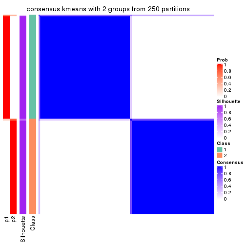</p>

</div>
<div id='tab-CV-kmeans-consensus-heatmap-2'>
<pre><code class="r">consensus_heatmap(res, k = 3)
</code></pre>

<p>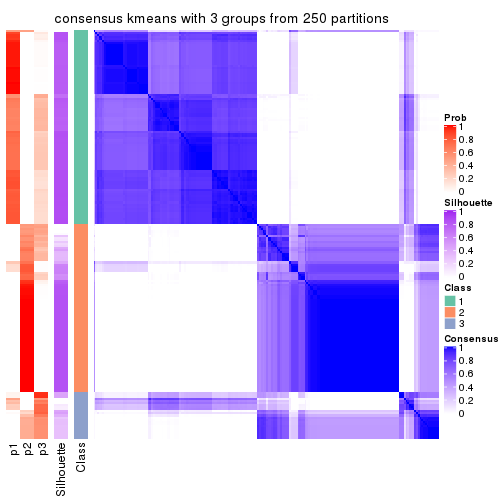</p>

</div>
<div id='tab-CV-kmeans-consensus-heatmap-3'>
<pre><code class="r">consensus_heatmap(res, k = 4)
</code></pre>

<p>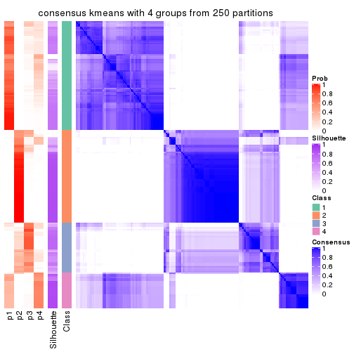</p>

</div>
<div id='tab-CV-kmeans-consensus-heatmap-4'>
<pre><code class="r">consensus_heatmap(res, k = 5)
</code></pre>

<p>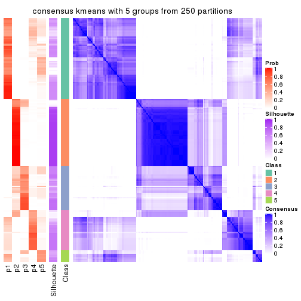</p>

</div>
<div id='tab-CV-kmeans-consensus-heatmap-5'>
<pre><code class="r">consensus_heatmap(res, k = 6)
</code></pre>

<p>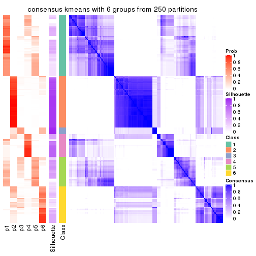</p>

</div>
</div>

Heatmaps for the membership of samples in all partitions to see how consistent they are:


<script>
$( function() {
	$( '#tabs-CV-kmeans-membership-heatmap' ).tabs();
} );
</script>
<div id='tabs-CV-kmeans-membership-heatmap'>
<ul>
<li><a href='#tab-CV-kmeans-membership-heatmap-1'>k = 2</a></li>
<li><a href='#tab-CV-kmeans-membership-heatmap-2'>k = 3</a></li>
<li><a href='#tab-CV-kmeans-membership-heatmap-3'>k = 4</a></li>
<li><a href='#tab-CV-kmeans-membership-heatmap-4'>k = 5</a></li>
<li><a href='#tab-CV-kmeans-membership-heatmap-5'>k = 6</a></li>
</ul>
<div id='tab-CV-kmeans-membership-heatmap-1'>
<pre><code class="r">membership_heatmap(res, k = 2)
</code></pre>

<p>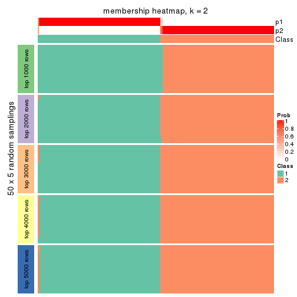</p>

</div>
<div id='tab-CV-kmeans-membership-heatmap-2'>
<pre><code class="r">membership_heatmap(res, k = 3)
</code></pre>

<p>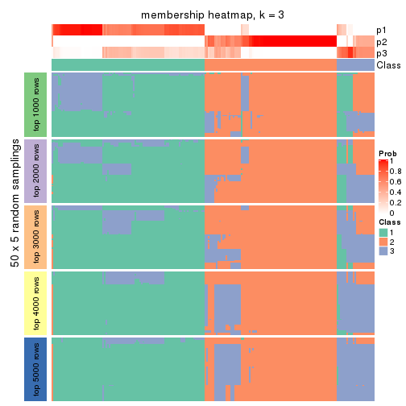</p>

</div>
<div id='tab-CV-kmeans-membership-heatmap-3'>
<pre><code class="r">membership_heatmap(res, k = 4)
</code></pre>

<p>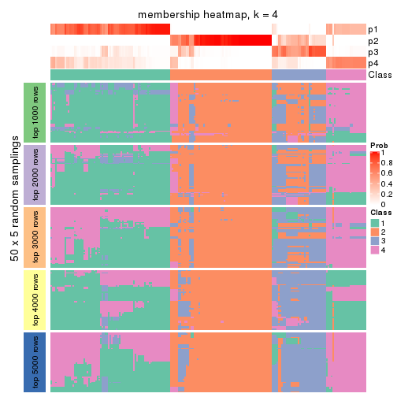</p>

</div>
<div id='tab-CV-kmeans-membership-heatmap-4'>
<pre><code class="r">membership_heatmap(res, k = 5)
</code></pre>

<p>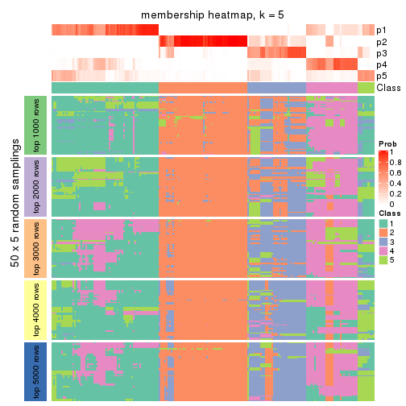</p>

</div>
<div id='tab-CV-kmeans-membership-heatmap-5'>
<pre><code class="r">membership_heatmap(res, k = 6)
</code></pre>

<p>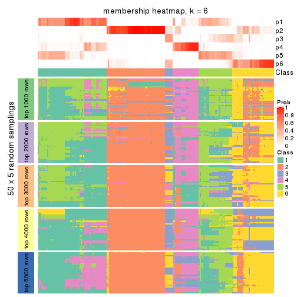</p>

</div>
</div>

As soon as we have had the classes for columns, we can look for signatures
which are significantly different between classes which can be candidate marks
for certain classes. Following are the heatmaps for signatures.


Signature heatmaps where rows are scaled:


<script>
$( function() {
	$( '#tabs-CV-kmeans-get-signatures' ).tabs();
} );
</script>
<div id='tabs-CV-kmeans-get-signatures'>
<ul>
<li><a href='#tab-CV-kmeans-get-signatures-1'>k = 2</a></li>
<li><a href='#tab-CV-kmeans-get-signatures-2'>k = 3</a></li>
<li><a href='#tab-CV-kmeans-get-signatures-3'>k = 4</a></li>
<li><a href='#tab-CV-kmeans-get-signatures-4'>k = 5</a></li>
<li><a href='#tab-CV-kmeans-get-signatures-5'>k = 6</a></li>
</ul>
<div id='tab-CV-kmeans-get-signatures-1'>
<pre><code class="r">get_signatures(res, k = 2)
</code></pre>

<p>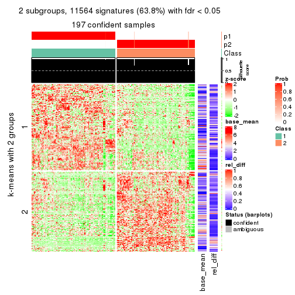</p>

</div>
<div id='tab-CV-kmeans-get-signatures-2'>
<pre><code class="r">get_signatures(res, k = 3)
</code></pre>

<p>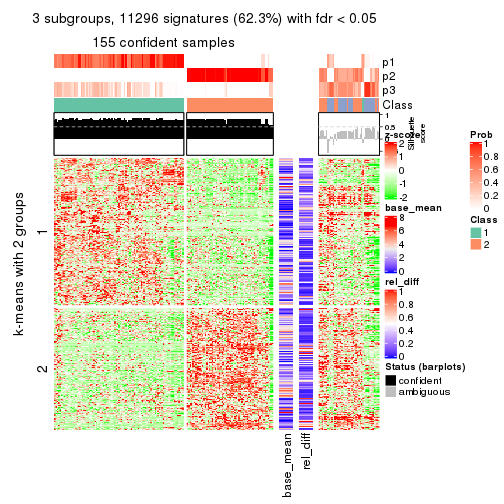</p>

</div>
<div id='tab-CV-kmeans-get-signatures-3'>
<pre><code class="r">get_signatures(res, k = 4)
</code></pre>

<p>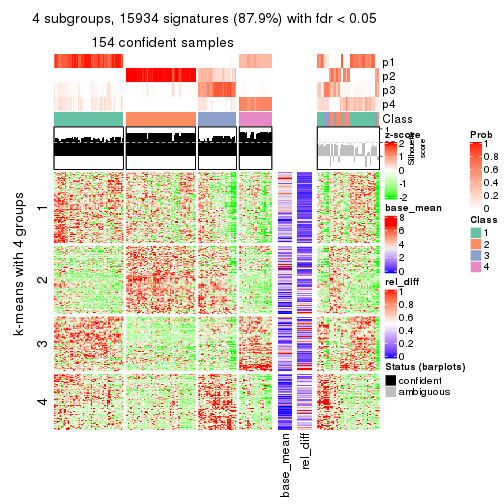</p>

</div>
<div id='tab-CV-kmeans-get-signatures-4'>
<pre><code class="r">get_signatures(res, k = 5)
</code></pre>

<p>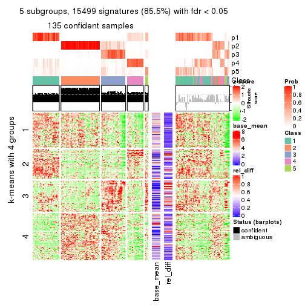</p>

</div>
<div id='tab-CV-kmeans-get-signatures-5'>
<pre><code class="r">get_signatures(res, k = 6)
</code></pre>

<p>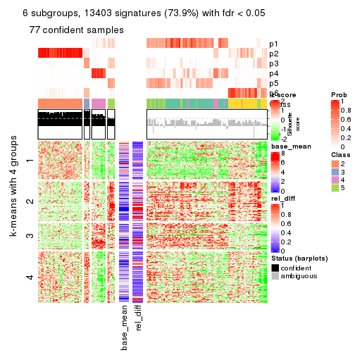</p>

</div>
</div>


Signature heatmaps where rows are not scaled:


<script>
$( function() {
	$( '#tabs-CV-kmeans-get-signatures-no-scale' ).tabs();
} );
</script>
<div id='tabs-CV-kmeans-get-signatures-no-scale'>
<ul>
<li><a href='#tab-CV-kmeans-get-signatures-no-scale-1'>k = 2</a></li>
<li><a href='#tab-CV-kmeans-get-signatures-no-scale-2'>k = 3</a></li>
<li><a href='#tab-CV-kmeans-get-signatures-no-scale-3'>k = 4</a></li>
<li><a href='#tab-CV-kmeans-get-signatures-no-scale-4'>k = 5</a></li>
<li><a href='#tab-CV-kmeans-get-signatures-no-scale-5'>k = 6</a></li>
</ul>
<div id='tab-CV-kmeans-get-signatures-no-scale-1'>
<pre><code class="r">get_signatures(res, k = 2, scale_rows = FALSE)
</code></pre>

<p>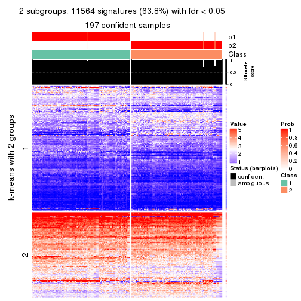</p>

</div>
<div id='tab-CV-kmeans-get-signatures-no-scale-2'>
<pre><code class="r">get_signatures(res, k = 3, scale_rows = FALSE)
</code></pre>

<p>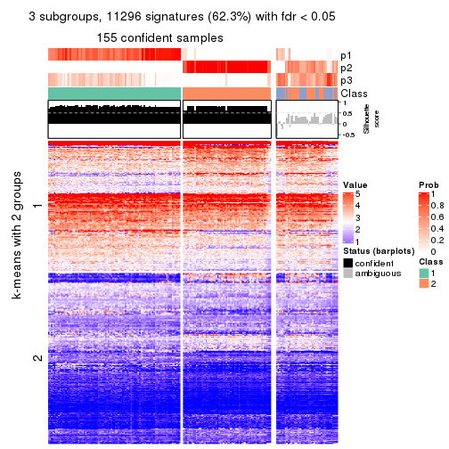</p>

</div>
<div id='tab-CV-kmeans-get-signatures-no-scale-3'>
<pre><code class="r">get_signatures(res, k = 4, scale_rows = FALSE)
</code></pre>

<p>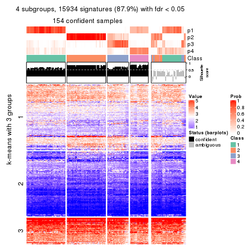</p>

</div>
<div id='tab-CV-kmeans-get-signatures-no-scale-4'>
<pre><code class="r">get_signatures(res, k = 5, scale_rows = FALSE)
</code></pre>

<p>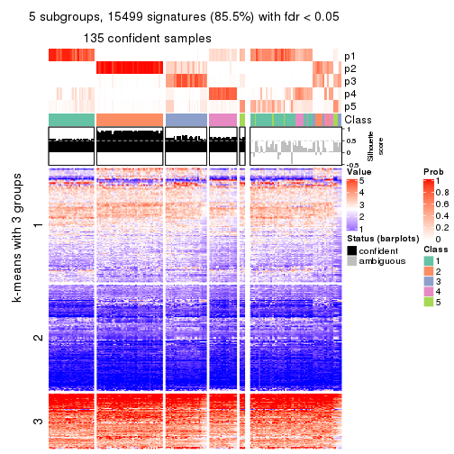</p>

</div>
<div id='tab-CV-kmeans-get-signatures-no-scale-5'>
<pre><code class="r">get_signatures(res, k = 6, scale_rows = FALSE)
</code></pre>

<p>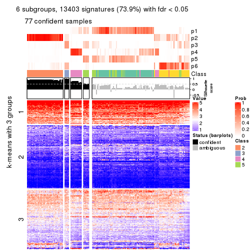</p>

</div>
</div>


Compare the overlap of signatures from different k:

```r
compare_signatures(res)
```

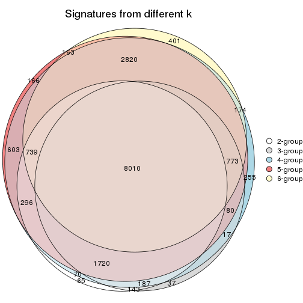

`get_signature()` returns a data frame invisibly. TO get the list of signatures, the function
call should be assigned to a variable explicitly. In following code, if `plot` argument is set
to `FALSE`, no heatmap is plotted while only the differential analysis is performed.

```r
# code only for demonstration
tb = get_signature(res, k = ..., plot = FALSE)
```

An example of the output of `tb` is:

```
#>   which_row         fdr    mean_1    mean_2 scaled_mean_1 scaled_mean_2 km
#> 1        38 0.042760348  8.373488  9.131774    -0.5533452     0.5164555  1
#> 2        40 0.018707592  7.106213  8.469186    -0.6173731     0.5762149  1
#> 3        55 0.019134737 10.221463 11.207825    -0.6159697     0.5749050  1
#> 4        59 0.006059896  5.921854  7.869574    -0.6899429     0.6439467  1
#> 5        60 0.018055526  8.928898 10.211722    -0.6204761     0.5791110  1
#> 6        98 0.009384629 15.714769 14.887706     0.6635654    -0.6193277  2
...
```

The columns in `tb` are:

1. `which_row`: row indices corresponding to the input matrix.
2. `fdr`: FDR for the differential test. 
3. `mean_x`: The mean value in group x.
4. `scaled_mean_x`: The mean value in group x after rows are scaled.
5. `km`: Row groups if k-means clustering is applied to rows.


UMAP plot which shows how samples are separated.


<script>
$( function() {
	$( '#tabs-CV-kmeans-dimension-reduction' ).tabs();
} );
</script>
<div id='tabs-CV-kmeans-dimension-reduction'>
<ul>
<li><a href='#tab-CV-kmeans-dimension-reduction-1'>k = 2</a></li>
<li><a href='#tab-CV-kmeans-dimension-reduction-2'>k = 3</a></li>
<li><a href='#tab-CV-kmeans-dimension-reduction-3'>k = 4</a></li>
<li><a href='#tab-CV-kmeans-dimension-reduction-4'>k = 5</a></li>
<li><a href='#tab-CV-kmeans-dimension-reduction-5'>k = 6</a></li>
</ul>
<div id='tab-CV-kmeans-dimension-reduction-1'>
<pre><code class="r">dimension_reduction(res, k = 2, method = &quot;UMAP&quot;)
</code></pre>

<p>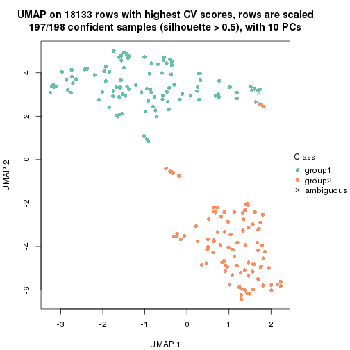</p>

</div>
<div id='tab-CV-kmeans-dimension-reduction-2'>
<pre><code class="r">dimension_reduction(res, k = 3, method = &quot;UMAP&quot;)
</code></pre>

<p>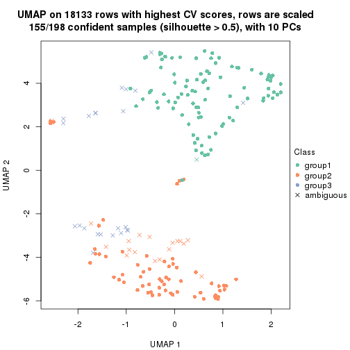</p>

</div>
<div id='tab-CV-kmeans-dimension-reduction-3'>
<pre><code class="r">dimension_reduction(res, k = 4, method = &quot;UMAP&quot;)
</code></pre>

<p>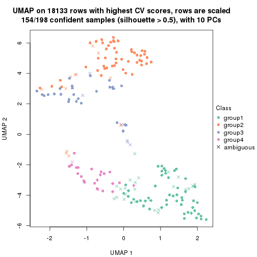</p>

</div>
<div id='tab-CV-kmeans-dimension-reduction-4'>
<pre><code class="r">dimension_reduction(res, k = 5, method = &quot;UMAP&quot;)
</code></pre>

<p>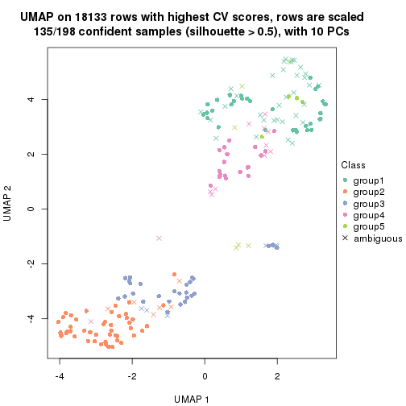</p>

</div>
<div id='tab-CV-kmeans-dimension-reduction-5'>
<pre><code class="r">dimension_reduction(res, k = 6, method = &quot;UMAP&quot;)
</code></pre>

<p>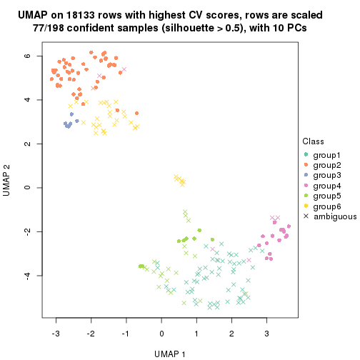</p>

</div>
</div>


Following heatmap shows how subgroups are split when increasing `k`:

```r
collect_classes(res)
```

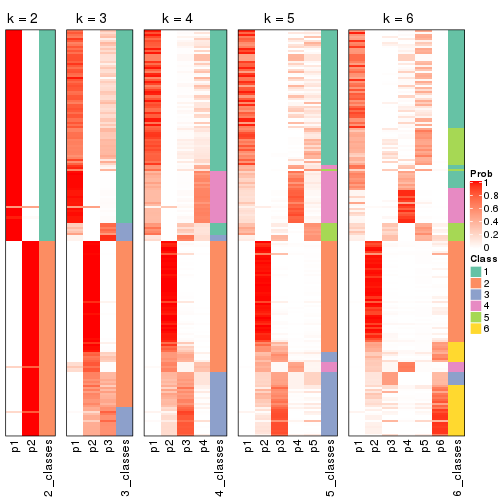


If matrix rows can be associated to genes, consider to use `functional_enrichment(res,
...)` to perform function enrichment for the signature genes. See [this vignette](http://bioconductor.org/packages/devel/bioc/vignettes/cola/inst/doc/functional_enrichment.html) for more detailed explanations.


 

---------------------------------------------------


### CV:skmeans**


The object with results only for a single top-value method and a single partition method 
can be extracted as:

```r
res = res_list["CV", "skmeans"]
# you can also extract it by
# res = res_list["CV:skmeans"]
```

A summary of `res` and all the functions that can be applied to it:

```r
res
```

```
#> A 'ConsensusPartition' object with k = 2, 3, 4, 5, 6.
#>   On a matrix with 18133 rows and 198 columns.
#>   Top rows (1000, 2000, 3000, 4000, 5000) are extracted by 'CV' method.
#>   Subgroups are detected by 'skmeans' method.
#>   Performed in total 1250 partitions by row resampling.
#>   Best k for subgroups seems to be 2.
#> 
#> Following methods can be applied to this 'ConsensusPartition' object:
#>  [1] "cola_report"             "collect_classes"         "collect_plots"          
#>  [4] "collect_stats"           "colnames"                "compare_signatures"     
#>  [7] "consensus_heatmap"       "dimension_reduction"     "functional_enrichment"  
#> [10] "get_anno_col"            "get_anno"                "get_classes"            
#> [13] "get_consensus"           "get_matrix"              "get_membership"         
#> [16] "get_param"               "get_signatures"          "get_stats"              
#> [19] "is_best_k"               "is_stable_k"             "membership_heatmap"     
#> [22] "ncol"                    "nrow"                    "plot_ecdf"              
#> [25] "rownames"                "select_partition_number" "show"                   
#> [28] "suggest_best_k"          "test_to_known_factors"
```

`collect_plots()` function collects all the plots made from `res` for all `k` (number of partitions)
into one single page to provide an easy and fast comparison between different `k`.

```r
collect_plots(res)
```

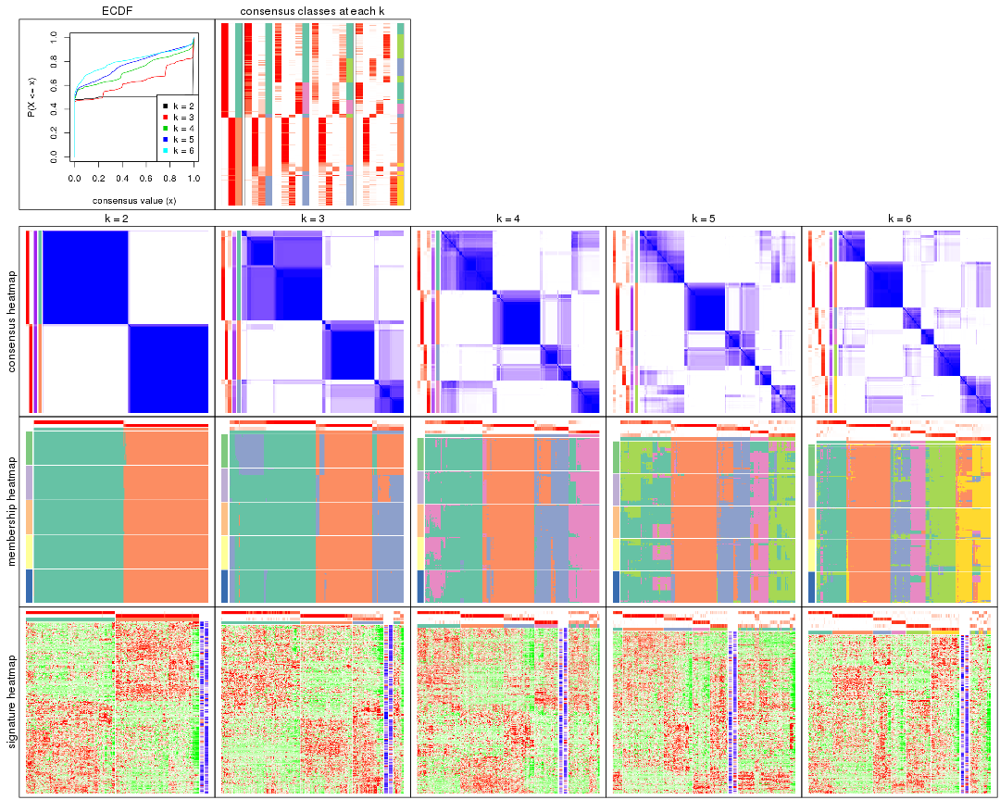

The plots are:

- The first row: a plot of the ECDF (empirical cumulative distribution
  function) curves of the consensus matrix for each `k` and the heatmap of
  predicted classes for each `k`.
- The second row: heatmaps of the consensus matrix for each `k`.
- The third row: heatmaps of the membership matrix for each `k`.
- The fouth row: heatmaps of the signatures for each `k`.

All the plots in panels can be made by individual functions and they are
plotted later in this section.

`select_partition_number()` produces several plots showing different
statistics for choosing "optimized" `k`. There are following statistics:

- ECDF curves of the consensus matrix for each `k`;
- 1-PAC. [The PAC
  score](https://en.wikipedia.org/wiki/Consensus_clustering#Over-interpretation_potential_of_consensus_clustering)
  measures the proportion of the ambiguous subgrouping.
- Mean silhouette score.
- Concordance. The mean probability of fiting the consensus class ids in all
  partitions.
- Area increased. Denote $A_k$ as the area under the ECDF curve for current
  `k`, the area increased is defined as $A_k - A_{k-1}$.
- Rand index. The percent of pairs of samples that are both in a same cluster
  or both are not in a same cluster in the partition of k and k-1.
- Jaccard index. The ratio of pairs of samples are both in a same cluster in
  the partition of k and k-1 and the pairs of samples are both in a same
  cluster in the partition k or k-1.

The detailed explanations of these statistics can be found in [the _cola_
vignette](http://bioconductor.org/packages/devel/bioc/vignettes/cola/inst/doc/cola.html#toc_13).

Generally speaking, lower PAC score, higher mean silhouette score or higher
concordance corresponds to better partition. Rand index and Jaccard index
measure how similar the current partition is compared to partition with `k-1`.
If they are too similar, we won't accept `k` is better than `k-1`.

```r
select_partition_number(res)
```

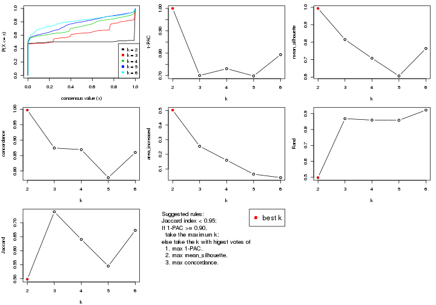

The numeric values for all these statistics can be obtained by `get_stats()`.

```r
get_stats(res)
```

```
#>   k 1-PAC mean_silhouette concordance area_increased  Rand Jaccard
#> 2 2 1.000           0.993       0.997         0.5024 0.498   0.498
#> 3 3 0.700           0.815       0.874         0.2551 0.868   0.739
#> 4 4 0.731           0.708       0.869         0.1597 0.859   0.640
#> 5 5 0.698           0.607       0.779         0.0644 0.858   0.545
#> 6 6 0.793           0.764       0.860         0.0407 0.922   0.673
```

`suggest_best_k()` suggests the best $k$ based on these statistics. The rules are as follows:

- All $k$ with Jaccard index larger than 0.95 are removed because increasing
  $k$ does not provide enough extra information. If all $k$ are removed, it is
  marked as no subgroup is detected.
- For all $k$ with 1-PAC score larger than 0.9, the maximal $k$ is taken as
  the best $k$, and other $k$ are marked as optional $k$.
- If it does not fit the second rule. The $k$ with the maximal vote of the
  highest 1-PAC score, highest mean silhouette, and highest concordance is
  taken as the best $k$.

```r
suggest_best_k(res)
```

```
#> [1] 2
```


Following shows the table of the partitions (You need to click the **show/hide
code output** link to see it). The membership matrix (columns with name `p*`)
is inferred by
[`clue::cl_consensus()`](https://www.rdocumentation.org/link/cl_consensus?package=clue)
function with the `SE` method. Basically the value in the membership matrix
represents the probability to belong to a certain group. The finall class
label for an item is determined with the group with highest probability it
belongs to.

In `get_classes()` function, the entropy is calculated from the membership
matrix and the silhouette score is calculated from the consensus matrix.


<script>
$( function() {
	$( '#tabs-CV-skmeans-get-classes' ).tabs();
} );
</script>
<div id='tabs-CV-skmeans-get-classes'>
<ul>
<li><a href='#tab-CV-skmeans-get-classes-1'>k = 2</a></li>
<li><a href='#tab-CV-skmeans-get-classes-2'>k = 3</a></li>
<li><a href='#tab-CV-skmeans-get-classes-3'>k = 4</a></li>
<li><a href='#tab-CV-skmeans-get-classes-4'>k = 5</a></li>
<li><a href='#tab-CV-skmeans-get-classes-5'>k = 6</a></li>
</ul>

<div id='tab-CV-skmeans-get-classes-1'>
<p><a id='tab-CV-skmeans-get-classes-1-a' style='color:#0366d6' href='#'>show/hide code output</a></p>
<pre><code class="r">cbind(get_classes(res, k = 2), get_membership(res, k = 2))
</code></pre>

<pre><code>#&gt;                                      class entropy silhouette    p1    p2
#&gt; 0C0AA0B2-5191-4EDF-8937-ED7434F30283     2   0.000      0.995 0.000 1.000
#&gt; 18B45F1F-234F-45CC-A234-145307606C5C     1   0.000      0.998 1.000 0.000
#&gt; E18B70C0-BDCA-46D3-99BB-C6C8ABC68DA5     2   0.000      0.995 0.000 1.000
#&gt; 0F6DDBA7-6F74-45E8-95C8-F28263D55978     1   0.000      0.998 1.000 0.000
#&gt; 7EAE1A5A-129A-46DE-977E-A2C753F10904     2   0.000      0.995 0.000 1.000
#&gt; 7EAE0048-16B5-4979-9410-16CDEB9B1A48     1   0.000      0.998 1.000 0.000
#&gt; 2EBFC828-2B27-4753-A052-80DDA226DAB4     2   0.000      0.995 0.000 1.000
#&gt; 24E1768D-2232-41DA-9383-BC55D6EB3812     2   0.000      0.995 0.000 1.000
#&gt; 6E3CD60A-1889-4CA3-B305-2E78152057B5     2   0.000      0.995 0.000 1.000
#&gt; 33CC70DD-82B3-413C-B3B1-BE06634D95D0     1   0.000      0.998 1.000 0.000
#&gt; F1CB57A3-55DD-4487-9307-1B4F652E729A     1   0.000      0.998 1.000 0.000
#&gt; 755A5806-B054-449A-93DB-79909E6C93A1     1   0.000      0.998 1.000 0.000
#&gt; 58D364E7-3D2F-468F-A264-D6461E2428D4     2   0.000      0.995 0.000 1.000
#&gt; 68BB9CB6-7AA2-4981-B9D9-07363EC96599     2   0.000      0.995 0.000 1.000
#&gt; 3C4E8DFA-8EA0-4F1F-89CB-CB8805395872     2   0.000      0.995 0.000 1.000
#&gt; 4219651D-5583-4498-BF08-1B7D04B4C7B2     1   0.000      0.998 1.000 0.000
#&gt; B5EE2768-0D67-4584-ADBC-EC745FEC52EA     2   0.000      0.995 0.000 1.000
#&gt; 825E6C11-F460-451A-8045-846DD7D0E945     1   0.000      0.998 1.000 0.000
#&gt; 491F62AF-5E68-43C3-982A-F867A75BBA9A     2   0.000      0.995 0.000 1.000
#&gt; 9D7F058C-F95A-44AD-AC9E-450F7FBDC960     2   0.000      0.995 0.000 1.000
#&gt; 6D42DD0C-2081-4742-BA27-9F5F16FAC3C6     1   0.000      0.998 1.000 0.000
#&gt; EDD7E63D-492A-473B-A552-0764337B10EF     2   0.000      0.995 0.000 1.000
#&gt; 97073DEA-73AD-4DFD-BD1A-9035DC03445B     1   0.000      0.998 1.000 0.000
#&gt; FA891AB9-CE38-4F7E-A015-1DDCE12890A0     1   0.000      0.998 1.000 0.000
#&gt; D9514D49-A0AE-45AB-8C9F-68E726215253     1   0.000      0.998 1.000 0.000
#&gt; 3B9229AD-12E5-451E-9D2F-378AAC82C04A     2   0.000      0.995 0.000 1.000
#&gt; 5EA36B71-4917-4EF3-9060-065EFE6ACC5B     1   0.000      0.998 1.000 0.000
#&gt; A20E4ECB-4895-4CC7-BE5E-4721B20D933B     1   0.000      0.998 1.000 0.000
#&gt; 1BE8D828-29DB-4368-AA4A-FB23588F7AE8     1   0.000      0.998 1.000 0.000
#&gt; 66EFEFCF-3D14-4DBF-AA13-530F40ED0245     1   0.000      0.998 1.000 0.000
#&gt; 55DFFE53-BCE7-4EC1-9863-6C0311B06BA2     2   0.000      0.995 0.000 1.000
#&gt; 4CC3FB5A-611D-4C64-AE9D-544FA45CF4DC     1   0.000      0.998 1.000 0.000
#&gt; C11D33F2-DFE9-4FA8-9024-F3E7F1DADC5F     2   0.000      0.995 0.000 1.000
#&gt; FA5932B8-8AA3-4C38-9FAB-C35D8772974D     1   0.000      0.998 1.000 0.000
#&gt; 8216EC35-1F41-4A15-B503-BDA4971E27C9     1   0.000      0.998 1.000 0.000
#&gt; 69635D23-90A7-4BAD-97C7-B79536837F57     1   0.000      0.998 1.000 0.000
#&gt; 12B404E2-C463-4409-8392-E4649B2AFFD1     2   0.000      0.995 0.000 1.000
#&gt; 246927E3-ACCF-41B2-AA8E-43855FD6B146     2   0.000      0.995 0.000 1.000
#&gt; E0CC13E7-9607-49E0-B4AA-395544E3C3BF     1   0.000      0.998 1.000 0.000
#&gt; F7BBC0C1-6124-4A83-8A70-EA89B62F1CBD     1   0.000      0.998 1.000 0.000
#&gt; B1D4FF24-8E6F-4A04-B716-2032D850EB57     1   0.000      0.998 1.000 0.000
#&gt; 253601DB-B78A-4566-9947-8C0270C0B163     2   0.000      0.995 0.000 1.000
#&gt; AB83DBFF-5737-4FB8-A5AC-1D3CD6072BDF     2   0.634      0.812 0.160 0.840
#&gt; 9D67D953-EC98-4B72-89C8-5732BC9D4BC9     2   0.000      0.995 0.000 1.000
#&gt; 51061018-95AB-4278-886F-F69E4EBC47C0     2   0.000      0.995 0.000 1.000
#&gt; ABD0F7F3-105B-4DEE-9889-5028772C519A     1   0.000      0.998 1.000 0.000
#&gt; 562B95CF-B27E-4A72-B7C6-CDF86A51A39B     1   0.000      0.998 1.000 0.000
#&gt; ABF046A4-D7A1-49FF-B6B1-4E07A791DEDB     2   0.000      0.995 0.000 1.000
#&gt; 3FF4101E-9703-460E-A30E-76CC7689F36D     2   0.000      0.995 0.000 1.000
#&gt; 39C4F7AA-7ADF-4F1D-BDA3-BEC605AC5023     2   0.000      0.995 0.000 1.000
#&gt; CB821FD2-AF5C-4743-A70F-21C12C6ED153     1   0.000      0.998 1.000 0.000
#&gt; 92EA1846-62FF-41D5-A441-5E52E6B9E7F9     1   0.000      0.998 1.000 0.000
#&gt; 7D25F3EE-5A20-4763-8026-16A03D05F459     1   0.000      0.998 1.000 0.000
#&gt; 8ECE5276-CD06-496B-A5A9-1713B1F7D089     1   0.000      0.998 1.000 0.000
#&gt; C775B68F-9507-47E3-B507-B433AED79002     1   0.000      0.998 1.000 0.000
#&gt; E19D5463-FDD0-41C1-A170-323736A88D07     2   0.000      0.995 0.000 1.000
#&gt; CE4B6285-4961-4767-91F0-5C7A8162E185     1   0.000      0.998 1.000 0.000
#&gt; 9637BD72-1FEF-42AD-8886-2C39BE876531     1   0.000      0.998 1.000 0.000
#&gt; 81B5A88E-45A0-4B44-B689-B9071B8548EE     2   0.000      0.995 0.000 1.000
#&gt; 0B01B4C9-9BED-4F5B-A3E2-8868C7CCC3FC     2   0.000      0.995 0.000 1.000
#&gt; 54501315-7132-44B2-A179-10FBF1421105     1   0.000      0.998 1.000 0.000
#&gt; E207CBE9-4C3A-4FDD-9251-CFE1FE106475     1   0.000      0.998 1.000 0.000
#&gt; 3BEA0B92-3F90-4DBF-9679-AADEAD7D47C8     2   0.000      0.995 0.000 1.000
#&gt; 35B32250-D854-4215-AA5B-2C11B2FBEECA     1   0.000      0.998 1.000 0.000
#&gt; ACE6566B-AEB9-426C-924A-B382D14A1024     2   0.000      0.995 0.000 1.000
#&gt; 737E69AC-0930-45B9-B6BA-7CE5E300290B     1   0.000      0.998 1.000 0.000
#&gt; B4410AB8-D015-41CA-86E6-12EB4E4103E3     1   0.000      0.998 1.000 0.000
#&gt; 6D3ECA65-C50F-43B0-B75A-1D290FA4A8FD     2   0.000      0.995 0.000 1.000
#&gt; C86F40D3-9A96-4395-A8C3-510DE12F9A2B     2   0.000      0.995 0.000 1.000
#&gt; 6238087F-24DD-4BF1-903F-3BD4E446C1AE     2   0.000      0.995 0.000 1.000
#&gt; E4FF840B-EEAB-4CB0-A690-7D4C4AA7EEC3     2   0.000      0.995 0.000 1.000
#&gt; 72D3C323-C67F-4C0E-9BFC-BF245FF9730A     1   0.000      0.998 1.000 0.000
#&gt; 82D56E4E-4DF6-4F3E-8959-B995C92AAA70     1   0.000      0.998 1.000 0.000
#&gt; E31CA441-EB19-443B-ACBD-37B5CCBCF0E5     2   0.000      0.995 0.000 1.000
#&gt; 87CA8939-D054-4B8A-B32D-085FD2E8F202     1   0.000      0.998 1.000 0.000
#&gt; 2A508D90-FEDC-46A3-9A02-E51E5467CDCB     1   0.000      0.998 1.000 0.000
#&gt; C4E8B4E2-388B-411F-BF0A-9B6F34E8EDB5     2   0.000      0.995 0.000 1.000
#&gt; AF6AF803-BD93-44A7-AA80-B9BC92C1273B     2   0.000      0.995 0.000 1.000
#&gt; 0B1CA5CF-EB96-41D4-BFC5-6957FEB39828     1   0.000      0.998 1.000 0.000
#&gt; 6FB96FB0-6661-48AD-A4A0-69F8AFDBE591     2   0.000      0.995 0.000 1.000
#&gt; 8C19F7FD-368A-462B-B28F-88D6630038A1     1   0.000      0.998 1.000 0.000
#&gt; 96EABE78-C2F4-4A33-ACD8-C922A4B2519B     2   0.000      0.995 0.000 1.000
#&gt; 68B36D7B-546A-4689-949F-B207C4A4AB27     2   0.000      0.995 0.000 1.000
#&gt; CE9F3335-778F-4F52-BC55-4B7C99B211DD     2   0.000      0.995 0.000 1.000
#&gt; CB359DED-2A2D-4646-A0BD-6F10ADCC532B     1   0.000      0.998 1.000 0.000
#&gt; 198324A5-8C52-46F6-9734-EFAF1CCA6D9B     1   0.000      0.998 1.000 0.000
#&gt; 83B88608-0506-428C-B9E8-621F38477B42     1   0.000      0.998 1.000 0.000
#&gt; 1993630A-0F3D-4F5C-86A3-D443BAAF57F0     2   0.714      0.759 0.196 0.804
#&gt; DE73DA9B-529E-4F4F-A65C-DA7AB84B1096     1   0.000      0.998 1.000 0.000
#&gt; 2347F3B7-DDA3-40C0-B6D4-8819ECA69146     1   0.000      0.998 1.000 0.000
#&gt; AB93B5D5-095F-4330-9D40-6A3D934AB50C     1   0.000      0.998 1.000 0.000
#&gt; 5EBBE4AD-FF0C-41CF-9EA3-B6FE7EA1F9C0     1   0.000      0.998 1.000 0.000
#&gt; 6D960AE7-3769-4144-A061-E8588E5063FF     1   0.000      0.998 1.000 0.000
#&gt; 0C2DD8C0-D1A5-4192-A49C-7A40FED628B2     2   0.000      0.995 0.000 1.000
#&gt; 18C9372F-C55B-4F86-A9D2-E8D85EFC8566     2   0.000      0.995 0.000 1.000
#&gt; 9AF637B0-4C32-4DD1-93AF-7655B4A845D3     2   0.000      0.995 0.000 1.000
#&gt; 785B5B06-4115-46FD-9BEB-F888AFDC855D     2   0.000      0.995 0.000 1.000
#&gt; ECA3050E-4BE2-4117-B9CF-A52BB85AF8C2     2   0.402      0.912 0.080 0.920
#&gt; 099DC396-16A5-458F-9ED9-F2A790CB0C34     1   0.000      0.998 1.000 0.000
#&gt; 7A5A12EE-C5B0-4C51-8C99-0F3FA88D633E     1   0.000      0.998 1.000 0.000
#&gt; E832B508-A66D-4817-B44A-FE9FAAE64B4A     1   0.000      0.998 1.000 0.000
#&gt; F9DD688C-7B35-49E7-9651-2E098EE78856     1   0.000      0.998 1.000 0.000
#&gt; F1265DD8-5ED3-4635-A277-57BBFDEC7729     1   0.000      0.998 1.000 0.000
#&gt; F624E8D9-DB07-4C9E-910D-5E8EBA3A6167     2   0.000      0.995 0.000 1.000
#&gt; 3516FBDF-66E1-43F4-9D7B-16748F6439A7     2   0.000      0.995 0.000 1.000
#&gt; 04B12992-B2EA-4BA2-8E2C-11E34E230E6F     2   0.000      0.995 0.000 1.000
#&gt; CC02897D-9123-495E-9242-5C9CF4EC269B     2   0.000      0.995 0.000 1.000
#&gt; 3117ED46-2BF2-4311-BC00-4E98243E16B3     1   0.000      0.998 1.000 0.000
#&gt; E0B66D53-23DB-4E26-BB6E-F692FA8C000E     1   0.000      0.998 1.000 0.000
#&gt; DAA93CE5-A013-477A-9A50-EA09CC3A8162     2   0.000      0.995 0.000 1.000
#&gt; 0099098D-354A-4276-92F8-B932C74B4608     1   0.000      0.998 1.000 0.000
#&gt; DD483639-B2E7-4745-BCFB-55ED1D82BFBF     2   0.000      0.995 0.000 1.000
#&gt; 2C1F9079-602E-4252-82C7-9D8799E04246     2   0.000      0.995 0.000 1.000
#&gt; 9473A8E4-3A1B-4184-9EA6-517AFD60B635     1   0.000      0.998 1.000 0.000
#&gt; 75CFBAF6-7BA0-40AF-92D7-D218E885BD1B     2   0.000      0.995 0.000 1.000
#&gt; B588950F-14D6-41C8-845B-EFD2096013C6     2   0.000      0.995 0.000 1.000
#&gt; 0DF3EDA8-DAEA-4721-92AB-B97181249498     2   0.000      0.995 0.000 1.000
#&gt; 8EA83042-D598-401D-AD78-936EEB136C59     1   0.000      0.998 1.000 0.000
#&gt; 729AC418-3BE9-445A-95D4-AC11A7D43BE0     1   0.000      0.998 1.000 0.000
#&gt; 7D8B1B11-F576-4AA8-BFA7-0022A2CD829A     2   0.000      0.995 0.000 1.000
#&gt; 304A0E46-3449-4B44-9C30-BDDF6459391D     1   0.000      0.998 1.000 0.000
#&gt; 3C83358F-DF20-47F7-AF9F-AB7CC92F5ABA     1   0.000      0.998 1.000 0.000
#&gt; EAFEED6C-35C3-451F-AE4A-EB56992E1F29     1   0.000      0.998 1.000 0.000
#&gt; 8A237A65-28EC-434D-A78A-A8B7308B5204     1   0.000      0.998 1.000 0.000
#&gt; D005833F-E991-4E9E-9667-55F137288004     1   0.000      0.998 1.000 0.000
#&gt; 37D966E3-253E-4397-A9AE-0903A8D31FE6     1   0.000      0.998 1.000 0.000
#&gt; D2482B81-CB5B-4178-BA8D-1CF4026181B5     1   0.000      0.998 1.000 0.000
#&gt; 18019E95-C2A8-4EE7-B585-F6886DC4D953     2   0.000      0.995 0.000 1.000
#&gt; 0B126D1A-14A8-4345-8F78-FF92222ADF4C     2   0.000      0.995 0.000 1.000
#&gt; CE88B625-47D8-4D58-9FB4-23464DB7DDAD     2   0.000      0.995 0.000 1.000
#&gt; 9A88299D-5C74-47FA-B42C-1A1D6D935AAB     1   0.000      0.998 1.000 0.000
#&gt; 3E71159C-FD6C-41DA-B18B-0730C8AC7E41     1   0.000      0.998 1.000 0.000
#&gt; 6F245AA4-79D9-47E1-BCC9-1AAF65AEA813     1   0.000      0.998 1.000 0.000
#&gt; 4CF2C888-2100-483A-B4DB-ECBB69243A4D     2   0.000      0.995 0.000 1.000
#&gt; A3853813-B9D5-4E8C-B075-19FCC35F8686     2   0.000      0.995 0.000 1.000
#&gt; 83A16DEE-CE9F-4D8B-9225-0A2A8B9D055D     1   0.000      0.998 1.000 0.000
#&gt; 0F057CAF-4F9A-4DE9-8601-730E96873733     2   0.000      0.995 0.000 1.000
#&gt; 32D5801D-DBA4-422E-87CB-A2DDE921BA41     1   0.000      0.998 1.000 0.000
#&gt; 22EE8076-F07C-499A-9AF8-D800A77EF154     2   0.000      0.995 0.000 1.000
#&gt; DD4BD74D-D48C-4090-9F57-5334E784581C     1   0.000      0.998 1.000 0.000
#&gt; 41183565-434D-474C-B1BD-CA6E94910658     2   0.000      0.995 0.000 1.000
#&gt; 75A2CE41-2B2A-4346-927E-ACF8A72738E4     1   0.000      0.998 1.000 0.000
#&gt; 7AA24995-3DD2-4682-B36A-4EBFEEACF625     1   0.000      0.998 1.000 0.000
#&gt; 8BAFDFEC-9F26-4ADB-95CE-004143960EEB     1   0.000      0.998 1.000 0.000
#&gt; A330E011-CE08-4A85-8F4B-370592293DBB     1   0.000      0.998 1.000 0.000
#&gt; 1D5A5B17-2E70-4BB0-94A1-EC17E6EA49DB     1   0.000      0.998 1.000 0.000
#&gt; BD9143B8-9D97-4A05-872C-3FB82B4CF7BE     2   0.000      0.995 0.000 1.000
#&gt; 64552DC0-181E-4607-898C-787AA7F26435     2   0.000      0.995 0.000 1.000
#&gt; 1B4C4D41-34C7-43A3-858B-C9552EB53894     1   0.000      0.998 1.000 0.000
#&gt; 463A3BAA-02DC-4EA4-A644-B924163E425D     2   0.000      0.995 0.000 1.000
#&gt; CD0FEA89-6F60-4A20-8FCA-D397B4E95A98     1   0.000      0.998 1.000 0.000
#&gt; 5D06CF6D-F4B9-4B32-B055-8AB287E53340     2   0.000      0.995 0.000 1.000
#&gt; ADA7835F-DB67-4F4F-9446-8BCE3C5FE936     2   0.000      0.995 0.000 1.000
#&gt; 4109BE2D-B5DF-4BD7-860E-60D87F647152     2   0.000      0.995 0.000 1.000
#&gt; 88526A0E-6DFE-46CB-BFAD-B4826F482C67     1   0.000      0.998 1.000 0.000
#&gt; F39F9A4C-18F7-4017-AB31-85D52FF44587     2   0.000      0.995 0.000 1.000
#&gt; D4290A5E-1B24-4C55-B470-0FA7A0A09DD0     2   0.000      0.995 0.000 1.000
#&gt; DC5A2C9E-978F-4661-B729-1F9662976E27     1   0.000      0.998 1.000 0.000
#&gt; 26A1F392-CED2-43E3-8096-74E6F2BFC8C0     2   0.000      0.995 0.000 1.000
#&gt; 87D81FB2-306A-4E75-9D58-D5F48E46E7F6     2   0.000      0.995 0.000 1.000
#&gt; E3D9D81A-C20C-4B3B-B940-A5D2C5F65B22     2   0.000      0.995 0.000 1.000
#&gt; 4464650B-453F-476C-989C-B7B159BF2CF0     2   0.000      0.995 0.000 1.000
#&gt; 577D2867-B738-487A-9B06-07958D647F02     1   0.000      0.998 1.000 0.000
#&gt; E52A22CC-3C03-41A9-9541-220DD871E162     2   0.000      0.995 0.000 1.000
#&gt; 642703B1-AF99-4746-A915-0792F4B9590B     2   0.000      0.995 0.000 1.000
#&gt; 8F0D1792-1284-45E6-8EC4-392596057677     2   0.000      0.995 0.000 1.000
#&gt; 765AFFC1-D528-4494-8BA1-0706451E4205     2   0.000      0.995 0.000 1.000
#&gt; A716BC29-161F-4CA0-B240-00B330137F2C     1   0.000      0.998 1.000 0.000
#&gt; 32CBFBAF-7064-4595-8D54-2C5E7DE0FD9B     1   0.000      0.998 1.000 0.000
#&gt; 4D6ED28C-3F20-41B0-BA41-1BF0E5199A40     2   0.000      0.995 0.000 1.000
#&gt; 86A38456-2900-48FB-B10F-79222B3CA9BF     1   0.662      0.790 0.828 0.172
#&gt; E870807D-3223-4A6A-9E3D-F4461B048AA2     2   0.000      0.995 0.000 1.000
#&gt; 3A78D19F-A833-4D2C-8387-FB4FD4A8313C     1   0.000      0.998 1.000 0.000
#&gt; DFA162CA-C708-4121-8E74-F9C4DEE0CDAE     1   0.000      0.998 1.000 0.000
#&gt; C00A300A-CD10-4C9D-8C94-3901AFE8406C     2   0.000      0.995 0.000 1.000
#&gt; 13E11D15-A90F-48C4-980A-DD032C00A2C1     1   0.000      0.998 1.000 0.000
#&gt; 31BF80AB-FEDB-4C73-89C3-70BE9F9ACBEE     2   0.000      0.995 0.000 1.000
#&gt; FA34308A-349D-4AAD-94CF-3F3B7F9AD629     2   0.000      0.995 0.000 1.000
#&gt; 7C48D467-B663-49DD-BC84-A36BC32ACB3D     1   0.000      0.998 1.000 0.000
#&gt; BB068534-04F6-4FC9-9087-CDA65920BCE2     1   0.000      0.998 1.000 0.000
#&gt; EA4EC272-A9B3-4B2E-955F-19F7676A944C     2   0.000      0.995 0.000 1.000
#&gt; C71FF69B-A460-43CA-8769-9667F22D938B     1   0.000      0.998 1.000 0.000
#&gt; 5243D1B8-8168-4FF1-A8C6-505F080EF0D3     2   0.000      0.995 0.000 1.000
#&gt; BCC474D8-08FE-4E99-B8E8-B29E65F84D2E     1   0.000      0.998 1.000 0.000
#&gt; 04FDBFE3-4CF6-4E53-A2AA-89D5C9316377     2   0.000      0.995 0.000 1.000
#&gt; 83A9915C-8D60-4CAE-A868-B61E3C90C7B0     2   0.000      0.995 0.000 1.000
#&gt; 989A6472-E3E3-457A-97BE-CCE95F42D5C2     2   0.000      0.995 0.000 1.000
#&gt; A0AB2D28-6751-49C9-8DF4-66FDBF95C360     1   0.000      0.998 1.000 0.000
#&gt; A12B2683-18D4-41C9-8AE5-C143E2180052     1   0.000      0.998 1.000 0.000
#&gt; 8DE1E245-CAD2-4F11-BFA2-9792C433A00B     1   0.000      0.998 1.000 0.000
#&gt; FDA68036-6C4C-4256-9AA0-C01FE92AA098     2   0.000      0.995 0.000 1.000
#&gt; 26311920-1414-4EC1-870B-784961EBCC2D     1   0.000      0.998 1.000 0.000
#&gt; C29A10D6-D598-4286-B5E0-F1776E19E988     1   0.000      0.998 1.000 0.000
#&gt; FACCC1FB-4937-4CC0-90EA-7F91D3D939CF     2   0.000      0.995 0.000 1.000
#&gt; 90B9D84B-78E5-4C7E-8414-EC889C2DE8DB     2   0.000      0.995 0.000 1.000
#&gt; B74E6122-76E1-4E4D-A867-BCAFD7277393     1   0.000      0.998 1.000 0.000
#&gt; 98494DC0-CF6E-485F-8A0D-D80E4437EF5C     2   0.000      0.995 0.000 1.000
#&gt; DA114DAC-DE7B-4E43-8D7C-82C5D7B66411     1   0.000      0.998 1.000 0.000
</code></pre>

<script>
$('#tab-CV-skmeans-get-classes-1-a').parent().next().next().hide();
$('#tab-CV-skmeans-get-classes-1-a').click(function(){
  $('#tab-CV-skmeans-get-classes-1-a').parent().next().next().toggle();
  return(false);
});
</script>
</div>

<div id='tab-CV-skmeans-get-classes-2'>
<p><a id='tab-CV-skmeans-get-classes-2-a' style='color:#0366d6' href='#'>show/hide code output</a></p>
<pre><code class="r">cbind(get_classes(res, k = 3), get_membership(res, k = 3))
</code></pre>

<pre><code>#&gt;                                      class entropy silhouette    p1    p2    p3
#&gt; 0C0AA0B2-5191-4EDF-8937-ED7434F30283     2  0.0000     0.9270 0.000 1.000 0.000
#&gt; 18B45F1F-234F-45CC-A234-145307606C5C     1  0.5016     0.8048 0.760 0.000 0.240
#&gt; E18B70C0-BDCA-46D3-99BB-C6C8ABC68DA5     2  0.0000     0.9270 0.000 1.000 0.000
#&gt; 0F6DDBA7-6F74-45E8-95C8-F28263D55978     1  0.0000     0.8869 1.000 0.000 0.000
#&gt; 7EAE1A5A-129A-46DE-977E-A2C753F10904     2  0.0000     0.9270 0.000 1.000 0.000
#&gt; 7EAE0048-16B5-4979-9410-16CDEB9B1A48     1  0.0000     0.8869 1.000 0.000 0.000
#&gt; 2EBFC828-2B27-4753-A052-80DDA226DAB4     2  0.0000     0.9270 0.000 1.000 0.000
#&gt; 24E1768D-2232-41DA-9383-BC55D6EB3812     2  0.5948     0.1948 0.000 0.640 0.360
#&gt; 6E3CD60A-1889-4CA3-B305-2E78152057B5     2  0.5016     0.6245 0.000 0.760 0.240
#&gt; 33CC70DD-82B3-413C-B3B1-BE06634D95D0     1  0.0000     0.8869 1.000 0.000 0.000
#&gt; F1CB57A3-55DD-4487-9307-1B4F652E729A     1  0.0000     0.8869 1.000 0.000 0.000
#&gt; 755A5806-B054-449A-93DB-79909E6C93A1     1  0.5016     0.8048 0.760 0.000 0.240
#&gt; 58D364E7-3D2F-468F-A264-D6461E2428D4     3  0.6111     0.7609 0.000 0.396 0.604
#&gt; 68BB9CB6-7AA2-4981-B9D9-07363EC96599     2  0.5988     0.1616 0.000 0.632 0.368
#&gt; 3C4E8DFA-8EA0-4F1F-89CB-CB8805395872     3  0.5138     0.8339 0.000 0.252 0.748
#&gt; 4219651D-5583-4498-BF08-1B7D04B4C7B2     1  0.0000     0.8869 1.000 0.000 0.000
#&gt; B5EE2768-0D67-4584-ADBC-EC745FEC52EA     2  0.0000     0.9270 0.000 1.000 0.000
#&gt; 825E6C11-F460-451A-8045-846DD7D0E945     1  0.0000     0.8869 1.000 0.000 0.000
#&gt; 491F62AF-5E68-43C3-982A-F867A75BBA9A     2  0.0000     0.9270 0.000 1.000 0.000
#&gt; 9D7F058C-F95A-44AD-AC9E-450F7FBDC960     2  0.0000     0.9270 0.000 1.000 0.000
#&gt; 6D42DD0C-2081-4742-BA27-9F5F16FAC3C6     1  0.5016     0.8048 0.760 0.000 0.240
#&gt; EDD7E63D-492A-473B-A552-0764337B10EF     3  0.5016     0.8390 0.000 0.240 0.760
#&gt; 97073DEA-73AD-4DFD-BD1A-9035DC03445B     1  0.0000     0.8869 1.000 0.000 0.000
#&gt; FA891AB9-CE38-4F7E-A015-1DDCE12890A0     1  0.3941     0.8390 0.844 0.000 0.156
#&gt; D9514D49-A0AE-45AB-8C9F-68E726215253     1  0.0000     0.8869 1.000 0.000 0.000
#&gt; 3B9229AD-12E5-451E-9D2F-378AAC82C04A     2  0.0000     0.9270 0.000 1.000 0.000
#&gt; 5EA36B71-4917-4EF3-9060-065EFE6ACC5B     1  0.6192     0.2465 0.580 0.000 0.420
#&gt; A20E4ECB-4895-4CC7-BE5E-4721B20D933B     1  0.4974     0.8067 0.764 0.000 0.236
#&gt; 1BE8D828-29DB-4368-AA4A-FB23588F7AE8     1  0.0000     0.8869 1.000 0.000 0.000
#&gt; 66EFEFCF-3D14-4DBF-AA13-530F40ED0245     1  0.0000     0.8869 1.000 0.000 0.000
#&gt; 55DFFE53-BCE7-4EC1-9863-6C0311B06BA2     2  0.5810     0.2648 0.000 0.664 0.336
#&gt; 4CC3FB5A-611D-4C64-AE9D-544FA45CF4DC     1  0.0000     0.8869 1.000 0.000 0.000
#&gt; C11D33F2-DFE9-4FA8-9024-F3E7F1DADC5F     3  0.5016     0.8390 0.000 0.240 0.760
#&gt; FA5932B8-8AA3-4C38-9FAB-C35D8772974D     1  0.0000     0.8869 1.000 0.000 0.000
#&gt; 8216EC35-1F41-4A15-B503-BDA4971E27C9     1  0.2356     0.8674 0.928 0.000 0.072
#&gt; 69635D23-90A7-4BAD-97C7-B79536837F57     1  0.0000     0.8869 1.000 0.000 0.000
#&gt; 12B404E2-C463-4409-8392-E4649B2AFFD1     2  0.0000     0.9270 0.000 1.000 0.000
#&gt; 246927E3-ACCF-41B2-AA8E-43855FD6B146     2  0.0000     0.9270 0.000 1.000 0.000
#&gt; E0CC13E7-9607-49E0-B4AA-395544E3C3BF     1  0.5016     0.8048 0.760 0.000 0.240
#&gt; F7BBC0C1-6124-4A83-8A70-EA89B62F1CBD     1  0.4842     0.8123 0.776 0.000 0.224
#&gt; B1D4FF24-8E6F-4A04-B716-2032D850EB57     1  0.0424     0.8856 0.992 0.000 0.008
#&gt; 253601DB-B78A-4566-9947-8C0270C0B163     2  0.0000     0.9270 0.000 1.000 0.000
#&gt; AB83DBFF-5737-4FB8-A5AC-1D3CD6072BDF     3  0.6000     0.6584 0.200 0.040 0.760
#&gt; 9D67D953-EC98-4B72-89C8-5732BC9D4BC9     2  0.0000     0.9270 0.000 1.000 0.000
#&gt; 51061018-95AB-4278-886F-F69E4EBC47C0     3  0.5016     0.8390 0.000 0.240 0.760
#&gt; ABD0F7F3-105B-4DEE-9889-5028772C519A     1  0.0424     0.8856 0.992 0.000 0.008
#&gt; 562B95CF-B27E-4A72-B7C6-CDF86A51A39B     1  0.0424     0.8856 0.992 0.000 0.008
#&gt; ABF046A4-D7A1-49FF-B6B1-4E07A791DEDB     2  0.0000     0.9270 0.000 1.000 0.000
#&gt; 3FF4101E-9703-460E-A30E-76CC7689F36D     2  0.0000     0.9270 0.000 1.000 0.000
#&gt; 39C4F7AA-7ADF-4F1D-BDA3-BEC605AC5023     3  0.5905     0.7952 0.000 0.352 0.648
#&gt; CB821FD2-AF5C-4743-A70F-21C12C6ED153     1  0.5016     0.8048 0.760 0.000 0.240
#&gt; 92EA1846-62FF-41D5-A441-5E52E6B9E7F9     1  0.0000     0.8869 1.000 0.000 0.000
#&gt; 7D25F3EE-5A20-4763-8026-16A03D05F459     1  0.4002     0.8375 0.840 0.000 0.160
#&gt; 8ECE5276-CD06-496B-A5A9-1713B1F7D089     1  0.0000     0.8869 1.000 0.000 0.000
#&gt; C775B68F-9507-47E3-B507-B433AED79002     1  0.6307     0.0414 0.512 0.000 0.488
#&gt; E19D5463-FDD0-41C1-A170-323736A88D07     3  0.5016     0.8390 0.000 0.240 0.760
#&gt; CE4B6285-4961-4767-91F0-5C7A8162E185     1  0.5016     0.8048 0.760 0.000 0.240
#&gt; 9637BD72-1FEF-42AD-8886-2C39BE876531     1  0.5016     0.8048 0.760 0.000 0.240
#&gt; 81B5A88E-45A0-4B44-B689-B9071B8548EE     3  0.5016     0.8390 0.000 0.240 0.760
#&gt; 0B01B4C9-9BED-4F5B-A3E2-8868C7CCC3FC     3  0.5016     0.8390 0.000 0.240 0.760
#&gt; 54501315-7132-44B2-A179-10FBF1421105     1  0.0000     0.8869 1.000 0.000 0.000
#&gt; E207CBE9-4C3A-4FDD-9251-CFE1FE106475     3  0.5016     0.6070 0.240 0.000 0.760
#&gt; 3BEA0B92-3F90-4DBF-9679-AADEAD7D47C8     3  0.6111     0.7609 0.000 0.396 0.604
#&gt; 35B32250-D854-4215-AA5B-2C11B2FBEECA     1  0.0000     0.8869 1.000 0.000 0.000
#&gt; ACE6566B-AEB9-426C-924A-B382D14A1024     2  0.0000     0.9270 0.000 1.000 0.000
#&gt; 737E69AC-0930-45B9-B6BA-7CE5E300290B     1  0.0000     0.8869 1.000 0.000 0.000
#&gt; B4410AB8-D015-41CA-86E6-12EB4E4103E3     1  0.0424     0.8856 0.992 0.000 0.008
#&gt; 6D3ECA65-C50F-43B0-B75A-1D290FA4A8FD     2  0.0000     0.9270 0.000 1.000 0.000
#&gt; C86F40D3-9A96-4395-A8C3-510DE12F9A2B     3  0.6111     0.7609 0.000 0.396 0.604
#&gt; 6238087F-24DD-4BF1-903F-3BD4E446C1AE     2  0.3482     0.7278 0.000 0.872 0.128
#&gt; E4FF840B-EEAB-4CB0-A690-7D4C4AA7EEC3     3  0.6111     0.7609 0.000 0.396 0.604
#&gt; 72D3C323-C67F-4C0E-9BFC-BF245FF9730A     1  0.5016     0.8048 0.760 0.000 0.240
#&gt; 82D56E4E-4DF6-4F3E-8959-B995C92AAA70     1  0.0000     0.8869 1.000 0.000 0.000
#&gt; E31CA441-EB19-443B-ACBD-37B5CCBCF0E5     2  0.0000     0.9270 0.000 1.000 0.000
#&gt; 87CA8939-D054-4B8A-B32D-085FD2E8F202     1  0.3752     0.8435 0.856 0.000 0.144
#&gt; 2A508D90-FEDC-46A3-9A02-E51E5467CDCB     1  0.0000     0.8869 1.000 0.000 0.000
#&gt; C4E8B4E2-388B-411F-BF0A-9B6F34E8EDB5     3  0.5016     0.8390 0.000 0.240 0.760
#&gt; AF6AF803-BD93-44A7-AA80-B9BC92C1273B     2  0.0000     0.9270 0.000 1.000 0.000
#&gt; 0B1CA5CF-EB96-41D4-BFC5-6957FEB39828     1  0.5016     0.8048 0.760 0.000 0.240
#&gt; 6FB96FB0-6661-48AD-A4A0-69F8AFDBE591     2  0.0000     0.9270 0.000 1.000 0.000
#&gt; 8C19F7FD-368A-462B-B28F-88D6630038A1     1  0.5016     0.8048 0.760 0.000 0.240
#&gt; 96EABE78-C2F4-4A33-ACD8-C922A4B2519B     2  0.0000     0.9270 0.000 1.000 0.000
#&gt; 68B36D7B-546A-4689-949F-B207C4A4AB27     2  0.0000     0.9270 0.000 1.000 0.000
#&gt; CE9F3335-778F-4F52-BC55-4B7C99B211DD     3  0.5363     0.8306 0.000 0.276 0.724
#&gt; CB359DED-2A2D-4646-A0BD-6F10ADCC532B     1  0.0000     0.8869 1.000 0.000 0.000
#&gt; 198324A5-8C52-46F6-9734-EFAF1CCA6D9B     1  0.5016     0.8048 0.760 0.000 0.240
#&gt; 83B88608-0506-428C-B9E8-621F38477B42     1  0.4842     0.8114 0.776 0.000 0.224
#&gt; 1993630A-0F3D-4F5C-86A3-D443BAAF57F0     2  0.5016     0.6245 0.000 0.760 0.240
#&gt; DE73DA9B-529E-4F4F-A65C-DA7AB84B1096     1  0.6126     0.2955 0.600 0.000 0.400
#&gt; 2347F3B7-DDA3-40C0-B6D4-8819ECA69146     1  0.0000     0.8869 1.000 0.000 0.000
#&gt; AB93B5D5-095F-4330-9D40-6A3D934AB50C     1  0.6204     0.2346 0.576 0.000 0.424
#&gt; 5EBBE4AD-FF0C-41CF-9EA3-B6FE7EA1F9C0     3  0.5016     0.6070 0.240 0.000 0.760
#&gt; 6D960AE7-3769-4144-A061-E8588E5063FF     1  0.0000     0.8869 1.000 0.000 0.000
#&gt; 0C2DD8C0-D1A5-4192-A49C-7A40FED628B2     3  0.5016     0.8390 0.000 0.240 0.760
#&gt; 18C9372F-C55B-4F86-A9D2-E8D85EFC8566     2  0.5016     0.6245 0.000 0.760 0.240
#&gt; 9AF637B0-4C32-4DD1-93AF-7655B4A845D3     2  0.0000     0.9270 0.000 1.000 0.000
#&gt; 785B5B06-4115-46FD-9BEB-F888AFDC855D     3  0.6126     0.7549 0.000 0.400 0.600
#&gt; ECA3050E-4BE2-4117-B9CF-A52BB85AF8C2     2  0.5016     0.6245 0.000 0.760 0.240
#&gt; 099DC396-16A5-458F-9ED9-F2A790CB0C34     1  0.0000     0.8869 1.000 0.000 0.000
#&gt; 7A5A12EE-C5B0-4C51-8C99-0F3FA88D633E     1  0.0000     0.8869 1.000 0.000 0.000
#&gt; E832B508-A66D-4817-B44A-FE9FAAE64B4A     1  0.0424     0.8856 0.992 0.000 0.008
#&gt; F9DD688C-7B35-49E7-9651-2E098EE78856     1  0.5016     0.8048 0.760 0.000 0.240
#&gt; F1265DD8-5ED3-4635-A277-57BBFDEC7729     1  0.0000     0.8869 1.000 0.000 0.000
#&gt; F624E8D9-DB07-4C9E-910D-5E8EBA3A6167     3  0.6111     0.7609 0.000 0.396 0.604
#&gt; 3516FBDF-66E1-43F4-9D7B-16748F6439A7     2  0.0000     0.9270 0.000 1.000 0.000
#&gt; 04B12992-B2EA-4BA2-8E2C-11E34E230E6F     3  0.6111     0.7609 0.000 0.396 0.604
#&gt; CC02897D-9123-495E-9242-5C9CF4EC269B     2  0.0000     0.9270 0.000 1.000 0.000
#&gt; 3117ED46-2BF2-4311-BC00-4E98243E16B3     1  0.0000     0.8869 1.000 0.000 0.000
#&gt; E0B66D53-23DB-4E26-BB6E-F692FA8C000E     1  0.0000     0.8869 1.000 0.000 0.000
#&gt; DAA93CE5-A013-477A-9A50-EA09CC3A8162     3  0.5016     0.8390 0.000 0.240 0.760
#&gt; 0099098D-354A-4276-92F8-B932C74B4608     1  0.0000     0.8869 1.000 0.000 0.000
#&gt; DD483639-B2E7-4745-BCFB-55ED1D82BFBF     2  0.0000     0.9270 0.000 1.000 0.000
#&gt; 2C1F9079-602E-4252-82C7-9D8799E04246     3  0.6252     0.6734 0.000 0.444 0.556
#&gt; 9473A8E4-3A1B-4184-9EA6-517AFD60B635     3  0.5016     0.6070 0.240 0.000 0.760
#&gt; 75CFBAF6-7BA0-40AF-92D7-D218E885BD1B     2  0.0000     0.9270 0.000 1.000 0.000
#&gt; B588950F-14D6-41C8-845B-EFD2096013C6     2  0.0000     0.9270 0.000 1.000 0.000
#&gt; 0DF3EDA8-DAEA-4721-92AB-B97181249498     3  0.5016     0.8390 0.000 0.240 0.760
#&gt; 8EA83042-D598-401D-AD78-936EEB136C59     1  0.5016     0.8048 0.760 0.000 0.240
#&gt; 729AC418-3BE9-445A-95D4-AC11A7D43BE0     1  0.5016     0.8048 0.760 0.000 0.240
#&gt; 7D8B1B11-F576-4AA8-BFA7-0022A2CD829A     2  0.0000     0.9270 0.000 1.000 0.000
#&gt; 304A0E46-3449-4B44-9C30-BDDF6459391D     1  0.0000     0.8869 1.000 0.000 0.000
#&gt; 3C83358F-DF20-47F7-AF9F-AB7CC92F5ABA     1  0.2537     0.8313 0.920 0.000 0.080
#&gt; EAFEED6C-35C3-451F-AE4A-EB56992E1F29     1  0.0000     0.8869 1.000 0.000 0.000
#&gt; 8A237A65-28EC-434D-A78A-A8B7308B5204     1  0.0424     0.8856 0.992 0.000 0.008
#&gt; D005833F-E991-4E9E-9667-55F137288004     1  0.5016     0.8048 0.760 0.000 0.240
#&gt; 37D966E3-253E-4397-A9AE-0903A8D31FE6     1  0.5016     0.8048 0.760 0.000 0.240
#&gt; D2482B81-CB5B-4178-BA8D-1CF4026181B5     1  0.0000     0.8869 1.000 0.000 0.000
#&gt; 18019E95-C2A8-4EE7-B585-F6886DC4D953     3  0.6126     0.7549 0.000 0.400 0.600
#&gt; 0B126D1A-14A8-4345-8F78-FF92222ADF4C     2  0.5948     0.1948 0.000 0.640 0.360
#&gt; CE88B625-47D8-4D58-9FB4-23464DB7DDAD     2  0.0000     0.9270 0.000 1.000 0.000
#&gt; 9A88299D-5C74-47FA-B42C-1A1D6D935AAB     1  0.0000     0.8869 1.000 0.000 0.000
#&gt; 3E71159C-FD6C-41DA-B18B-0730C8AC7E41     1  0.0000     0.8869 1.000 0.000 0.000
#&gt; 6F245AA4-79D9-47E1-BCC9-1AAF65AEA813     1  0.0000     0.8869 1.000 0.000 0.000
#&gt; 4CF2C888-2100-483A-B4DB-ECBB69243A4D     3  0.6045     0.7752 0.000 0.380 0.620
#&gt; A3853813-B9D5-4E8C-B075-19FCC35F8686     2  0.0000     0.9270 0.000 1.000 0.000
#&gt; 83A16DEE-CE9F-4D8B-9225-0A2A8B9D055D     1  0.0892     0.8750 0.980 0.000 0.020
#&gt; 0F057CAF-4F9A-4DE9-8601-730E96873733     2  0.0000     0.9270 0.000 1.000 0.000
#&gt; 32D5801D-DBA4-422E-87CB-A2DDE921BA41     1  0.0000     0.8869 1.000 0.000 0.000
#&gt; 22EE8076-F07C-499A-9AF8-D800A77EF154     3  0.5016     0.8390 0.000 0.240 0.760
#&gt; DD4BD74D-D48C-4090-9F57-5334E784581C     1  0.0000     0.8869 1.000 0.000 0.000
#&gt; 41183565-434D-474C-B1BD-CA6E94910658     3  0.5968     0.7875 0.000 0.364 0.636
#&gt; 75A2CE41-2B2A-4346-927E-ACF8A72738E4     1  0.5016     0.8048 0.760 0.000 0.240
#&gt; 7AA24995-3DD2-4682-B36A-4EBFEEACF625     1  0.5016     0.8048 0.760 0.000 0.240
#&gt; 8BAFDFEC-9F26-4ADB-95CE-004143960EEB     1  0.4555     0.6901 0.800 0.000 0.200
#&gt; A330E011-CE08-4A85-8F4B-370592293DBB     1  0.0000     0.8869 1.000 0.000 0.000
#&gt; 1D5A5B17-2E70-4BB0-94A1-EC17E6EA49DB     1  0.0000     0.8869 1.000 0.000 0.000
#&gt; BD9143B8-9D97-4A05-872C-3FB82B4CF7BE     2  0.0000     0.9270 0.000 1.000 0.000
#&gt; 64552DC0-181E-4607-898C-787AA7F26435     2  0.0000     0.9270 0.000 1.000 0.000
#&gt; 1B4C4D41-34C7-43A3-858B-C9552EB53894     1  0.5016     0.8048 0.760 0.000 0.240
#&gt; 463A3BAA-02DC-4EA4-A644-B924163E425D     2  0.0000     0.9270 0.000 1.000 0.000
#&gt; CD0FEA89-6F60-4A20-8FCA-D397B4E95A98     1  0.0000     0.8869 1.000 0.000 0.000
#&gt; 5D06CF6D-F4B9-4B32-B055-8AB287E53340     2  0.0000     0.9270 0.000 1.000 0.000
#&gt; ADA7835F-DB67-4F4F-9446-8BCE3C5FE936     3  0.5560     0.8216 0.000 0.300 0.700
#&gt; 4109BE2D-B5DF-4BD7-860E-60D87F647152     2  0.5016     0.6245 0.000 0.760 0.240
#&gt; 88526A0E-6DFE-46CB-BFAD-B4826F482C67     1  0.0424     0.8856 0.992 0.000 0.008
#&gt; F39F9A4C-18F7-4017-AB31-85D52FF44587     2  0.0000     0.9270 0.000 1.000 0.000
#&gt; D4290A5E-1B24-4C55-B470-0FA7A0A09DD0     2  0.0000     0.9270 0.000 1.000 0.000
#&gt; DC5A2C9E-978F-4661-B729-1F9662976E27     1  0.4555     0.6901 0.800 0.000 0.200
#&gt; 26A1F392-CED2-43E3-8096-74E6F2BFC8C0     2  0.0000     0.9270 0.000 1.000 0.000
#&gt; 87D81FB2-306A-4E75-9D58-D5F48E46E7F6     2  0.0000     0.9270 0.000 1.000 0.000
#&gt; E3D9D81A-C20C-4B3B-B940-A5D2C5F65B22     3  0.6244     0.5578 0.000 0.440 0.560
#&gt; 4464650B-453F-476C-989C-B7B159BF2CF0     2  0.0000     0.9270 0.000 1.000 0.000
#&gt; 577D2867-B738-487A-9B06-07958D647F02     1  0.5016     0.8048 0.760 0.000 0.240
#&gt; E52A22CC-3C03-41A9-9541-220DD871E162     2  0.0000     0.9270 0.000 1.000 0.000
#&gt; 642703B1-AF99-4746-A915-0792F4B9590B     2  0.0237     0.9224 0.000 0.996 0.004
#&gt; 8F0D1792-1284-45E6-8EC4-392596057677     2  0.0000     0.9270 0.000 1.000 0.000
#&gt; 765AFFC1-D528-4494-8BA1-0706451E4205     3  0.5016     0.8390 0.000 0.240 0.760
#&gt; A716BC29-161F-4CA0-B240-00B330137F2C     1  0.0000     0.8869 1.000 0.000 0.000
#&gt; 32CBFBAF-7064-4595-8D54-2C5E7DE0FD9B     1  0.5016     0.8048 0.760 0.000 0.240
#&gt; 4D6ED28C-3F20-41B0-BA41-1BF0E5199A40     2  0.5016     0.6245 0.000 0.760 0.240
#&gt; 86A38456-2900-48FB-B10F-79222B3CA9BF     1  0.9606     0.4097 0.472 0.288 0.240
#&gt; E870807D-3223-4A6A-9E3D-F4461B048AA2     3  0.6111     0.7609 0.000 0.396 0.604
#&gt; 3A78D19F-A833-4D2C-8387-FB4FD4A8313C     1  0.0000     0.8869 1.000 0.000 0.000
#&gt; DFA162CA-C708-4121-8E74-F9C4DEE0CDAE     1  0.4887     0.8095 0.772 0.000 0.228
#&gt; C00A300A-CD10-4C9D-8C94-3901AFE8406C     2  0.0000     0.9270 0.000 1.000 0.000
#&gt; 13E11D15-A90F-48C4-980A-DD032C00A2C1     1  0.6126     0.2955 0.600 0.000 0.400
#&gt; 31BF80AB-FEDB-4C73-89C3-70BE9F9ACBEE     2  0.0000     0.9270 0.000 1.000 0.000
#&gt; FA34308A-349D-4AAD-94CF-3F3B7F9AD629     2  0.0000     0.9270 0.000 1.000 0.000
#&gt; 7C48D467-B663-49DD-BC84-A36BC32ACB3D     1  0.6062     0.3368 0.616 0.000 0.384
#&gt; BB068534-04F6-4FC9-9087-CDA65920BCE2     1  0.0000     0.8869 1.000 0.000 0.000
#&gt; EA4EC272-A9B3-4B2E-955F-19F7676A944C     2  0.0000     0.9270 0.000 1.000 0.000
#&gt; C71FF69B-A460-43CA-8769-9667F22D938B     1  0.0000     0.8869 1.000 0.000 0.000
#&gt; 5243D1B8-8168-4FF1-A8C6-505F080EF0D3     2  0.0000     0.9270 0.000 1.000 0.000
#&gt; BCC474D8-08FE-4E99-B8E8-B29E65F84D2E     1  0.5016     0.8048 0.760 0.000 0.240
#&gt; 04FDBFE3-4CF6-4E53-A2AA-89D5C9316377     3  0.5016     0.8390 0.000 0.240 0.760
#&gt; 83A9915C-8D60-4CAE-A868-B61E3C90C7B0     2  0.0000     0.9270 0.000 1.000 0.000
#&gt; 989A6472-E3E3-457A-97BE-CCE95F42D5C2     2  0.0000     0.9270 0.000 1.000 0.000
#&gt; A0AB2D28-6751-49C9-8DF4-66FDBF95C360     1  0.5016     0.8048 0.760 0.000 0.240
#&gt; A12B2683-18D4-41C9-8AE5-C143E2180052     1  0.0000     0.8869 1.000 0.000 0.000
#&gt; 8DE1E245-CAD2-4F11-BFA2-9792C433A00B     3  0.6140     0.2829 0.404 0.000 0.596
#&gt; FDA68036-6C4C-4256-9AA0-C01FE92AA098     2  0.0000     0.9270 0.000 1.000 0.000
#&gt; 26311920-1414-4EC1-870B-784961EBCC2D     1  0.3619     0.8464 0.864 0.000 0.136
#&gt; C29A10D6-D598-4286-B5E0-F1776E19E988     1  0.0424     0.8856 0.992 0.000 0.008
#&gt; FACCC1FB-4937-4CC0-90EA-7F91D3D939CF     2  0.2261     0.8341 0.000 0.932 0.068
#&gt; 90B9D84B-78E5-4C7E-8414-EC889C2DE8DB     2  0.0000     0.9270 0.000 1.000 0.000
#&gt; B74E6122-76E1-4E4D-A867-BCAFD7277393     1  0.0000     0.8869 1.000 0.000 0.000
#&gt; 98494DC0-CF6E-485F-8A0D-D80E4437EF5C     3  0.5098     0.8380 0.000 0.248 0.752
#&gt; DA114DAC-DE7B-4E43-8D7C-82C5D7B66411     1  0.0000     0.8869 1.000 0.000 0.000
</code></pre>

<script>
$('#tab-CV-skmeans-get-classes-2-a').parent().next().next().hide();
$('#tab-CV-skmeans-get-classes-2-a').click(function(){
  $('#tab-CV-skmeans-get-classes-2-a').parent().next().next().toggle();
  return(false);
});
</script>
</div>

<div id='tab-CV-skmeans-get-classes-3'>
<p><a id='tab-CV-skmeans-get-classes-3-a' style='color:#0366d6' href='#'>show/hide code output</a></p>
<pre><code class="r">cbind(get_classes(res, k = 4), get_membership(res, k = 4))
</code></pre>

<pre><code>#&gt;                                      class entropy silhouette    p1    p2    p3    p4
#&gt; 0C0AA0B2-5191-4EDF-8937-ED7434F30283     2  0.0000     0.9053 0.000 1.000 0.000 0.000
#&gt; 18B45F1F-234F-45CC-A234-145307606C5C     4  0.0000     0.8441 0.000 0.000 0.000 1.000
#&gt; E18B70C0-BDCA-46D3-99BB-C6C8ABC68DA5     2  0.0000     0.9053 0.000 1.000 0.000 0.000
#&gt; 0F6DDBA7-6F74-45E8-95C8-F28263D55978     1  0.0707     0.8188 0.980 0.000 0.000 0.020
#&gt; 7EAE1A5A-129A-46DE-977E-A2C753F10904     2  0.0000     0.9053 0.000 1.000 0.000 0.000
#&gt; 7EAE0048-16B5-4979-9410-16CDEB9B1A48     1  0.4543     0.5373 0.676 0.000 0.000 0.324
#&gt; 2EBFC828-2B27-4753-A052-80DDA226DAB4     2  0.0000     0.9053 0.000 1.000 0.000 0.000
#&gt; 24E1768D-2232-41DA-9383-BC55D6EB3812     3  0.4817     0.3678 0.000 0.388 0.612 0.000
#&gt; 6E3CD60A-1889-4CA3-B305-2E78152057B5     2  0.4830     0.4268 0.000 0.608 0.000 0.392
#&gt; 33CC70DD-82B3-413C-B3B1-BE06634D95D0     1  0.0804     0.8162 0.980 0.000 0.012 0.008
#&gt; F1CB57A3-55DD-4487-9307-1B4F652E729A     1  0.0817     0.8179 0.976 0.000 0.000 0.024
#&gt; 755A5806-B054-449A-93DB-79909E6C93A1     4  0.0336     0.8440 0.008 0.000 0.000 0.992
#&gt; 58D364E7-3D2F-468F-A264-D6461E2428D4     3  0.4817     0.5681 0.000 0.388 0.612 0.000
#&gt; 68BB9CB6-7AA2-4981-B9D9-07363EC96599     3  0.3942     0.6215 0.000 0.236 0.764 0.000
#&gt; 3C4E8DFA-8EA0-4F1F-89CB-CB8805395872     3  0.0469     0.7586 0.000 0.012 0.988 0.000
#&gt; 4219651D-5583-4498-BF08-1B7D04B4C7B2     1  0.0188     0.8166 0.996 0.000 0.004 0.000
#&gt; B5EE2768-0D67-4584-ADBC-EC745FEC52EA     2  0.0000     0.9053 0.000 1.000 0.000 0.000
#&gt; 825E6C11-F460-451A-8045-846DD7D0E945     1  0.0804     0.8162 0.980 0.000 0.012 0.008
#&gt; 491F62AF-5E68-43C3-982A-F867A75BBA9A     2  0.0000     0.9053 0.000 1.000 0.000 0.000
#&gt; 9D7F058C-F95A-44AD-AC9E-450F7FBDC960     2  0.3356     0.6744 0.000 0.824 0.176 0.000
#&gt; 6D42DD0C-2081-4742-BA27-9F5F16FAC3C6     4  0.0336     0.8440 0.008 0.000 0.000 0.992
#&gt; EDD7E63D-492A-473B-A552-0764337B10EF     3  0.0469     0.7586 0.000 0.012 0.988 0.000
#&gt; 97073DEA-73AD-4DFD-BD1A-9035DC03445B     1  0.0000     0.8172 1.000 0.000 0.000 0.000
#&gt; FA891AB9-CE38-4F7E-A015-1DDCE12890A0     1  0.5000     0.0885 0.504 0.000 0.000 0.496
#&gt; D9514D49-A0AE-45AB-8C9F-68E726215253     1  0.4483     0.5972 0.712 0.000 0.004 0.284
#&gt; 3B9229AD-12E5-451E-9D2F-378AAC82C04A     2  0.0000     0.9053 0.000 1.000 0.000 0.000
#&gt; 5EA36B71-4917-4EF3-9060-065EFE6ACC5B     1  0.2480     0.7653 0.904 0.000 0.088 0.008
#&gt; A20E4ECB-4895-4CC7-BE5E-4721B20D933B     4  0.1867     0.8115 0.072 0.000 0.000 0.928
#&gt; 1BE8D828-29DB-4368-AA4A-FB23588F7AE8     1  0.0804     0.8162 0.980 0.000 0.012 0.008
#&gt; 66EFEFCF-3D14-4DBF-AA13-530F40ED0245     1  0.5383     0.2338 0.536 0.000 0.012 0.452
#&gt; 55DFFE53-BCE7-4EC1-9863-6C0311B06BA2     3  0.3123     0.6996 0.000 0.156 0.844 0.000
#&gt; 4CC3FB5A-611D-4C64-AE9D-544FA45CF4DC     1  0.5137     0.2548 0.544 0.000 0.004 0.452
#&gt; C11D33F2-DFE9-4FA8-9024-F3E7F1DADC5F     3  0.1940     0.7561 0.000 0.076 0.924 0.000
#&gt; FA5932B8-8AA3-4C38-9FAB-C35D8772974D     1  0.0707     0.8188 0.980 0.000 0.000 0.020
#&gt; 8216EC35-1F41-4A15-B503-BDA4971E27C9     1  0.4992     0.1573 0.524 0.000 0.000 0.476
#&gt; 69635D23-90A7-4BAD-97C7-B79536837F57     1  0.0707     0.8188 0.980 0.000 0.000 0.020
#&gt; 12B404E2-C463-4409-8392-E4649B2AFFD1     2  0.0000     0.9053 0.000 1.000 0.000 0.000
#&gt; 246927E3-ACCF-41B2-AA8E-43855FD6B146     2  0.0000     0.9053 0.000 1.000 0.000 0.000
#&gt; E0CC13E7-9607-49E0-B4AA-395544E3C3BF     4  0.0000     0.8441 0.000 0.000 0.000 1.000
#&gt; F7BBC0C1-6124-4A83-8A70-EA89B62F1CBD     4  0.2760     0.7648 0.128 0.000 0.000 0.872
#&gt; B1D4FF24-8E6F-4A04-B716-2032D850EB57     4  0.4964     0.3169 0.380 0.000 0.004 0.616
#&gt; 253601DB-B78A-4566-9947-8C0270C0B163     2  0.0000     0.9053 0.000 1.000 0.000 0.000
#&gt; AB83DBFF-5737-4FB8-A5AC-1D3CD6072BDF     3  0.0000     0.7495 0.000 0.000 1.000 0.000
#&gt; 9D67D953-EC98-4B72-89C8-5732BC9D4BC9     2  0.0000     0.9053 0.000 1.000 0.000 0.000
#&gt; 51061018-95AB-4278-886F-F69E4EBC47C0     3  0.0188     0.7528 0.000 0.004 0.996 0.000
#&gt; ABD0F7F3-105B-4DEE-9889-5028772C519A     4  0.4936     0.3383 0.372 0.000 0.004 0.624
#&gt; 562B95CF-B27E-4A72-B7C6-CDF86A51A39B     4  0.4936     0.3383 0.372 0.000 0.004 0.624
#&gt; ABF046A4-D7A1-49FF-B6B1-4E07A791DEDB     2  0.0000     0.9053 0.000 1.000 0.000 0.000
#&gt; 3FF4101E-9703-460E-A30E-76CC7689F36D     2  0.0000     0.9053 0.000 1.000 0.000 0.000
#&gt; 39C4F7AA-7ADF-4F1D-BDA3-BEC605AC5023     3  0.4697     0.6051 0.000 0.356 0.644 0.000
#&gt; CB821FD2-AF5C-4743-A70F-21C12C6ED153     4  0.2921     0.7519 0.140 0.000 0.000 0.860
#&gt; 92EA1846-62FF-41D5-A441-5E52E6B9E7F9     1  0.0817     0.8182 0.976 0.000 0.000 0.024
#&gt; 7D25F3EE-5A20-4763-8026-16A03D05F459     1  0.5000     0.0885 0.504 0.000 0.000 0.496
#&gt; 8ECE5276-CD06-496B-A5A9-1713B1F7D089     1  0.3688     0.6907 0.792 0.000 0.000 0.208
#&gt; C775B68F-9507-47E3-B507-B433AED79002     1  0.2480     0.7653 0.904 0.000 0.088 0.008
#&gt; E19D5463-FDD0-41C1-A170-323736A88D07     3  0.0469     0.7586 0.000 0.012 0.988 0.000
#&gt; CE4B6285-4961-4767-91F0-5C7A8162E185     4  0.0336     0.8440 0.008 0.000 0.000 0.992
#&gt; 9637BD72-1FEF-42AD-8886-2C39BE876531     4  0.0000     0.8441 0.000 0.000 0.000 1.000
#&gt; 81B5A88E-45A0-4B44-B689-B9071B8548EE     3  0.0469     0.7586 0.000 0.012 0.988 0.000
#&gt; 0B01B4C9-9BED-4F5B-A3E2-8868C7CCC3FC     3  0.0657     0.7487 0.012 0.004 0.984 0.000
#&gt; 54501315-7132-44B2-A179-10FBF1421105     1  0.0707     0.8188 0.980 0.000 0.000 0.020
#&gt; E207CBE9-4C3A-4FDD-9251-CFE1FE106475     3  0.2921     0.6622 0.140 0.000 0.860 0.000
#&gt; 3BEA0B92-3F90-4DBF-9679-AADEAD7D47C8     3  0.4830     0.5613 0.000 0.392 0.608 0.000
#&gt; 35B32250-D854-4215-AA5B-2C11B2FBEECA     1  0.4972     0.2135 0.544 0.000 0.000 0.456
#&gt; ACE6566B-AEB9-426C-924A-B382D14A1024     2  0.0000     0.9053 0.000 1.000 0.000 0.000
#&gt; 737E69AC-0930-45B9-B6BA-7CE5E300290B     1  0.0188     0.8179 0.996 0.000 0.000 0.004
#&gt; B4410AB8-D015-41CA-86E6-12EB4E4103E3     4  0.5004     0.2813 0.392 0.000 0.004 0.604
#&gt; 6D3ECA65-C50F-43B0-B75A-1D290FA4A8FD     2  0.0000     0.9053 0.000 1.000 0.000 0.000
#&gt; C86F40D3-9A96-4395-A8C3-510DE12F9A2B     3  0.4817     0.5681 0.000 0.388 0.612 0.000
#&gt; 6238087F-24DD-4BF1-903F-3BD4E446C1AE     2  0.4643     0.2751 0.000 0.656 0.344 0.000
#&gt; E4FF840B-EEAB-4CB0-A690-7D4C4AA7EEC3     3  0.4830     0.5623 0.000 0.392 0.608 0.000
#&gt; 72D3C323-C67F-4C0E-9BFC-BF245FF9730A     4  0.0336     0.8440 0.008 0.000 0.000 0.992
#&gt; 82D56E4E-4DF6-4F3E-8959-B995C92AAA70     1  0.2814     0.7518 0.868 0.000 0.000 0.132
#&gt; E31CA441-EB19-443B-ACBD-37B5CCBCF0E5     2  0.0000     0.9053 0.000 1.000 0.000 0.000
#&gt; 87CA8939-D054-4B8A-B32D-085FD2E8F202     1  0.1902     0.7802 0.932 0.000 0.004 0.064
#&gt; 2A508D90-FEDC-46A3-9A02-E51E5467CDCB     1  0.0707     0.8188 0.980 0.000 0.000 0.020
#&gt; C4E8B4E2-388B-411F-BF0A-9B6F34E8EDB5     3  0.0469     0.7586 0.000 0.012 0.988 0.000
#&gt; AF6AF803-BD93-44A7-AA80-B9BC92C1273B     2  0.0000     0.9053 0.000 1.000 0.000 0.000
#&gt; 0B1CA5CF-EB96-41D4-BFC5-6957FEB39828     4  0.0336     0.8440 0.008 0.000 0.000 0.992
#&gt; 6FB96FB0-6661-48AD-A4A0-69F8AFDBE591     2  0.0000     0.9053 0.000 1.000 0.000 0.000
#&gt; 8C19F7FD-368A-462B-B28F-88D6630038A1     4  0.3528     0.6752 0.192 0.000 0.000 0.808
#&gt; 96EABE78-C2F4-4A33-ACD8-C922A4B2519B     2  0.0000     0.9053 0.000 1.000 0.000 0.000
#&gt; 68B36D7B-546A-4689-949F-B207C4A4AB27     2  0.0000     0.9053 0.000 1.000 0.000 0.000
#&gt; CE9F3335-778F-4F52-BC55-4B7C99B211DD     3  0.4103     0.6870 0.000 0.256 0.744 0.000
#&gt; CB359DED-2A2D-4646-A0BD-6F10ADCC532B     1  0.0804     0.8162 0.980 0.000 0.012 0.008
#&gt; 198324A5-8C52-46F6-9734-EFAF1CCA6D9B     4  0.0336     0.8440 0.008 0.000 0.000 0.992
#&gt; 83B88608-0506-428C-B9E8-621F38477B42     4  0.4713     0.3887 0.360 0.000 0.000 0.640
#&gt; 1993630A-0F3D-4F5C-86A3-D443BAAF57F0     4  0.1151     0.8225 0.008 0.024 0.000 0.968
#&gt; DE73DA9B-529E-4F4F-A65C-DA7AB84B1096     1  0.0927     0.8147 0.976 0.000 0.016 0.008
#&gt; 2347F3B7-DDA3-40C0-B6D4-8819ECA69146     1  0.4817     0.4149 0.612 0.000 0.000 0.388
#&gt; AB93B5D5-095F-4330-9D40-6A3D934AB50C     1  0.2081     0.7659 0.916 0.000 0.084 0.000
#&gt; 5EBBE4AD-FF0C-41CF-9EA3-B6FE7EA1F9C0     3  0.3764     0.5842 0.216 0.000 0.784 0.000
#&gt; 6D960AE7-3769-4144-A061-E8588E5063FF     1  0.0524     0.8177 0.988 0.000 0.004 0.008
#&gt; 0C2DD8C0-D1A5-4192-A49C-7A40FED628B2     3  0.0469     0.7586 0.000 0.012 0.988 0.000
#&gt; 18C9372F-C55B-4F86-A9D2-E8D85EFC8566     2  0.4761     0.4527 0.000 0.628 0.000 0.372
#&gt; 9AF637B0-4C32-4DD1-93AF-7655B4A845D3     2  0.0000     0.9053 0.000 1.000 0.000 0.000
#&gt; 785B5B06-4115-46FD-9BEB-F888AFDC855D     3  0.4830     0.5623 0.000 0.392 0.608 0.000
#&gt; ECA3050E-4BE2-4117-B9CF-A52BB85AF8C2     2  0.5137     0.2842 0.004 0.544 0.000 0.452
#&gt; 099DC396-16A5-458F-9ED9-F2A790CB0C34     1  0.1389     0.8098 0.952 0.000 0.000 0.048
#&gt; 7A5A12EE-C5B0-4C51-8C99-0F3FA88D633E     1  0.4543     0.5402 0.676 0.000 0.000 0.324
#&gt; E832B508-A66D-4817-B44A-FE9FAAE64B4A     4  0.4950     0.3274 0.376 0.000 0.004 0.620
#&gt; F9DD688C-7B35-49E7-9651-2E098EE78856     4  0.1557     0.8214 0.056 0.000 0.000 0.944
#&gt; F1265DD8-5ED3-4635-A277-57BBFDEC7729     1  0.4994     0.1346 0.520 0.000 0.000 0.480
#&gt; F624E8D9-DB07-4C9E-910D-5E8EBA3A6167     3  0.4804     0.5739 0.000 0.384 0.616 0.000
#&gt; 3516FBDF-66E1-43F4-9D7B-16748F6439A7     2  0.0000     0.9053 0.000 1.000 0.000 0.000
#&gt; 04B12992-B2EA-4BA2-8E2C-11E34E230E6F     3  0.4804     0.5739 0.000 0.384 0.616 0.000
#&gt; CC02897D-9123-495E-9242-5C9CF4EC269B     2  0.0000     0.9053 0.000 1.000 0.000 0.000
#&gt; 3117ED46-2BF2-4311-BC00-4E98243E16B3     1  0.0672     0.8170 0.984 0.000 0.008 0.008
#&gt; E0B66D53-23DB-4E26-BB6E-F692FA8C000E     1  0.3528     0.7066 0.808 0.000 0.000 0.192
#&gt; DAA93CE5-A013-477A-9A50-EA09CC3A8162     3  0.0469     0.7586 0.000 0.012 0.988 0.000
#&gt; 0099098D-354A-4276-92F8-B932C74B4608     1  0.0707     0.8188 0.980 0.000 0.000 0.020
#&gt; DD483639-B2E7-4745-BCFB-55ED1D82BFBF     2  0.0000     0.9053 0.000 1.000 0.000 0.000
#&gt; 2C1F9079-602E-4252-82C7-9D8799E04246     3  0.4948     0.4567 0.000 0.440 0.560 0.000
#&gt; 9473A8E4-3A1B-4184-9EA6-517AFD60B635     3  0.4761     0.3177 0.372 0.000 0.628 0.000
#&gt; 75CFBAF6-7BA0-40AF-92D7-D218E885BD1B     2  0.0000     0.9053 0.000 1.000 0.000 0.000
#&gt; B588950F-14D6-41C8-845B-EFD2096013C6     2  0.0000     0.9053 0.000 1.000 0.000 0.000
#&gt; 0DF3EDA8-DAEA-4721-92AB-B97181249498     3  0.0469     0.7586 0.000 0.012 0.988 0.000
#&gt; 8EA83042-D598-401D-AD78-936EEB136C59     4  0.0000     0.8441 0.000 0.000 0.000 1.000
#&gt; 729AC418-3BE9-445A-95D4-AC11A7D43BE0     4  0.0336     0.8440 0.008 0.000 0.000 0.992
#&gt; 7D8B1B11-F576-4AA8-BFA7-0022A2CD829A     2  0.0000     0.9053 0.000 1.000 0.000 0.000
#&gt; 304A0E46-3449-4B44-9C30-BDDF6459391D     1  0.0921     0.8181 0.972 0.000 0.000 0.028
#&gt; 3C83358F-DF20-47F7-AF9F-AB7CC92F5ABA     1  0.0804     0.8162 0.980 0.000 0.012 0.008
#&gt; EAFEED6C-35C3-451F-AE4A-EB56992E1F29     1  0.0524     0.8169 0.988 0.000 0.008 0.004
#&gt; 8A237A65-28EC-434D-A78A-A8B7308B5204     1  0.5105     0.2653 0.564 0.000 0.004 0.432
#&gt; D005833F-E991-4E9E-9667-55F137288004     4  0.0188     0.8442 0.004 0.000 0.000 0.996
#&gt; 37D966E3-253E-4397-A9AE-0903A8D31FE6     4  0.0000     0.8441 0.000 0.000 0.000 1.000
#&gt; D2482B81-CB5B-4178-BA8D-1CF4026181B5     1  0.4605     0.5182 0.664 0.000 0.000 0.336
#&gt; 18019E95-C2A8-4EE7-B585-F6886DC4D953     3  0.4830     0.5623 0.000 0.392 0.608 0.000
#&gt; 0B126D1A-14A8-4345-8F78-FF92222ADF4C     3  0.4804     0.3768 0.000 0.384 0.616 0.000
#&gt; CE88B625-47D8-4D58-9FB4-23464DB7DDAD     2  0.0000     0.9053 0.000 1.000 0.000 0.000
#&gt; 9A88299D-5C74-47FA-B42C-1A1D6D935AAB     1  0.0804     0.8162 0.980 0.000 0.012 0.008
#&gt; 3E71159C-FD6C-41DA-B18B-0730C8AC7E41     1  0.0188     0.8166 0.996 0.000 0.004 0.000
#&gt; 6F245AA4-79D9-47E1-BCC9-1AAF65AEA813     1  0.0707     0.8188 0.980 0.000 0.000 0.020
#&gt; 4CF2C888-2100-483A-B4DB-ECBB69243A4D     3  0.4804     0.5745 0.000 0.384 0.616 0.000
#&gt; A3853813-B9D5-4E8C-B075-19FCC35F8686     2  0.3400     0.6763 0.000 0.820 0.180 0.000
#&gt; 83A16DEE-CE9F-4D8B-9225-0A2A8B9D055D     1  0.0804     0.8162 0.980 0.000 0.012 0.008
#&gt; 0F057CAF-4F9A-4DE9-8601-730E96873733     2  0.0000     0.9053 0.000 1.000 0.000 0.000
#&gt; 32D5801D-DBA4-422E-87CB-A2DDE921BA41     1  0.0524     0.8174 0.988 0.000 0.004 0.008
#&gt; 22EE8076-F07C-499A-9AF8-D800A77EF154     3  0.0469     0.7586 0.000 0.012 0.988 0.000
#&gt; DD4BD74D-D48C-4090-9F57-5334E784581C     1  0.0524     0.8177 0.988 0.000 0.004 0.008
#&gt; 41183565-434D-474C-B1BD-CA6E94910658     3  0.4500     0.6414 0.000 0.316 0.684 0.000
#&gt; 75A2CE41-2B2A-4346-927E-ACF8A72738E4     4  0.0336     0.8434 0.008 0.000 0.000 0.992
#&gt; 7AA24995-3DD2-4682-B36A-4EBFEEACF625     4  0.2408     0.7864 0.104 0.000 0.000 0.896
#&gt; 8BAFDFEC-9F26-4ADB-95CE-004143960EEB     1  0.0188     0.8166 0.996 0.000 0.004 0.000
#&gt; A330E011-CE08-4A85-8F4B-370592293DBB     1  0.3356     0.7146 0.824 0.000 0.000 0.176
#&gt; 1D5A5B17-2E70-4BB0-94A1-EC17E6EA49DB     1  0.4819     0.4855 0.652 0.000 0.004 0.344
#&gt; BD9143B8-9D97-4A05-872C-3FB82B4CF7BE     2  0.0000     0.9053 0.000 1.000 0.000 0.000
#&gt; 64552DC0-181E-4607-898C-787AA7F26435     2  0.0000     0.9053 0.000 1.000 0.000 0.000
#&gt; 1B4C4D41-34C7-43A3-858B-C9552EB53894     4  0.0188     0.8442 0.004 0.000 0.000 0.996
#&gt; 463A3BAA-02DC-4EA4-A644-B924163E425D     2  0.0000     0.9053 0.000 1.000 0.000 0.000
#&gt; CD0FEA89-6F60-4A20-8FCA-D397B4E95A98     4  0.4977     0.0411 0.460 0.000 0.000 0.540
#&gt; 5D06CF6D-F4B9-4B32-B055-8AB287E53340     2  0.0000     0.9053 0.000 1.000 0.000 0.000
#&gt; ADA7835F-DB67-4F4F-9446-8BCE3C5FE936     3  0.3649     0.7153 0.000 0.204 0.796 0.000
#&gt; 4109BE2D-B5DF-4BD7-860E-60D87F647152     2  0.4866     0.4066 0.000 0.596 0.000 0.404
#&gt; 88526A0E-6DFE-46CB-BFAD-B4826F482C67     1  0.4991     0.3669 0.608 0.000 0.004 0.388
#&gt; F39F9A4C-18F7-4017-AB31-85D52FF44587     2  0.0188     0.9017 0.000 0.996 0.004 0.000
#&gt; D4290A5E-1B24-4C55-B470-0FA7A0A09DD0     2  0.0000     0.9053 0.000 1.000 0.000 0.000
#&gt; DC5A2C9E-978F-4661-B729-1F9662976E27     1  0.1151     0.8143 0.968 0.000 0.008 0.024
#&gt; 26A1F392-CED2-43E3-8096-74E6F2BFC8C0     2  0.2760     0.7530 0.000 0.872 0.128 0.000
#&gt; 87D81FB2-306A-4E75-9D58-D5F48E46E7F6     2  0.0000     0.9053 0.000 1.000 0.000 0.000
#&gt; E3D9D81A-C20C-4B3B-B940-A5D2C5F65B22     3  0.3444     0.6730 0.000 0.184 0.816 0.000
#&gt; 4464650B-453F-476C-989C-B7B159BF2CF0     2  0.0000     0.9053 0.000 1.000 0.000 0.000
#&gt; 577D2867-B738-487A-9B06-07958D647F02     4  0.1118     0.8330 0.036 0.000 0.000 0.964
#&gt; E52A22CC-3C03-41A9-9541-220DD871E162     2  0.0000     0.9053 0.000 1.000 0.000 0.000
#&gt; 642703B1-AF99-4746-A915-0792F4B9590B     2  0.0188     0.9013 0.000 0.996 0.000 0.004
#&gt; 8F0D1792-1284-45E6-8EC4-392596057677     2  0.0000     0.9053 0.000 1.000 0.000 0.000
#&gt; 765AFFC1-D528-4494-8BA1-0706451E4205     3  0.0469     0.7586 0.000 0.012 0.988 0.000
#&gt; A716BC29-161F-4CA0-B240-00B330137F2C     1  0.0707     0.8190 0.980 0.000 0.000 0.020
#&gt; 32CBFBAF-7064-4595-8D54-2C5E7DE0FD9B     4  0.0000     0.8441 0.000 0.000 0.000 1.000
#&gt; 4D6ED28C-3F20-41B0-BA41-1BF0E5199A40     2  0.4866     0.4066 0.000 0.596 0.000 0.404
#&gt; 86A38456-2900-48FB-B10F-79222B3CA9BF     4  0.0336     0.8440 0.008 0.000 0.000 0.992
#&gt; E870807D-3223-4A6A-9E3D-F4461B048AA2     3  0.4804     0.5739 0.000 0.384 0.616 0.000
#&gt; 3A78D19F-A833-4D2C-8387-FB4FD4A8313C     1  0.4925     0.3168 0.572 0.000 0.000 0.428
#&gt; DFA162CA-C708-4121-8E74-F9C4DEE0CDAE     1  0.4877     0.3287 0.592 0.000 0.000 0.408
#&gt; C00A300A-CD10-4C9D-8C94-3901AFE8406C     2  0.0000     0.9053 0.000 1.000 0.000 0.000
#&gt; 13E11D15-A90F-48C4-980A-DD032C00A2C1     1  0.2412     0.7690 0.908 0.000 0.084 0.008
#&gt; 31BF80AB-FEDB-4C73-89C3-70BE9F9ACBEE     2  0.0000     0.9053 0.000 1.000 0.000 0.000
#&gt; FA34308A-349D-4AAD-94CF-3F3B7F9AD629     2  0.4585     0.3136 0.000 0.668 0.332 0.000
#&gt; 7C48D467-B663-49DD-BC84-A36BC32ACB3D     1  0.0592     0.8140 0.984 0.000 0.016 0.000
#&gt; BB068534-04F6-4FC9-9087-CDA65920BCE2     1  0.4888     0.3553 0.588 0.000 0.000 0.412
#&gt; EA4EC272-A9B3-4B2E-955F-19F7676A944C     2  0.0188     0.9017 0.000 0.996 0.004 0.000
#&gt; C71FF69B-A460-43CA-8769-9667F22D938B     1  0.0707     0.8188 0.980 0.000 0.000 0.020
#&gt; 5243D1B8-8168-4FF1-A8C6-505F080EF0D3     2  0.4661     0.2597 0.000 0.652 0.348 0.000
#&gt; BCC474D8-08FE-4E99-B8E8-B29E65F84D2E     4  0.0336     0.8440 0.008 0.000 0.000 0.992
#&gt; 04FDBFE3-4CF6-4E53-A2AA-89D5C9316377     3  0.0469     0.7586 0.000 0.012 0.988 0.000
#&gt; 83A9915C-8D60-4CAE-A868-B61E3C90C7B0     2  0.0000     0.9053 0.000 1.000 0.000 0.000
#&gt; 989A6472-E3E3-457A-97BE-CCE95F42D5C2     2  0.0000     0.9053 0.000 1.000 0.000 0.000
#&gt; A0AB2D28-6751-49C9-8DF4-66FDBF95C360     4  0.0336     0.8440 0.008 0.000 0.000 0.992
#&gt; A12B2683-18D4-41C9-8AE5-C143E2180052     1  0.0707     0.8188 0.980 0.000 0.000 0.020
#&gt; 8DE1E245-CAD2-4F11-BFA2-9792C433A00B     1  0.0804     0.8162 0.980 0.000 0.012 0.008
#&gt; FDA68036-6C4C-4256-9AA0-C01FE92AA098     2  0.0000     0.9053 0.000 1.000 0.000 0.000
#&gt; 26311920-1414-4EC1-870B-784961EBCC2D     1  0.1389     0.8003 0.952 0.000 0.000 0.048
#&gt; C29A10D6-D598-4286-B5E0-F1776E19E988     4  0.5016     0.2700 0.396 0.000 0.004 0.600
#&gt; FACCC1FB-4937-4CC0-90EA-7F91D3D939CF     2  0.4761     0.1837 0.000 0.628 0.372 0.000
#&gt; 90B9D84B-78E5-4C7E-8414-EC889C2DE8DB     2  0.2593     0.7847 0.000 0.892 0.104 0.004
#&gt; B74E6122-76E1-4E4D-A867-BCAFD7277393     1  0.0707     0.8188 0.980 0.000 0.000 0.020
#&gt; 98494DC0-CF6E-485F-8A0D-D80E4437EF5C     3  0.3837     0.7060 0.000 0.224 0.776 0.000
#&gt; DA114DAC-DE7B-4E43-8D7C-82C5D7B66411     1  0.5167     0.1320 0.508 0.000 0.004 0.488
</code></pre>

<script>
$('#tab-CV-skmeans-get-classes-3-a').parent().next().next().hide();
$('#tab-CV-skmeans-get-classes-3-a').click(function(){
  $('#tab-CV-skmeans-get-classes-3-a').parent().next().next().toggle();
  return(false);
});
</script>
</div>

<div id='tab-CV-skmeans-get-classes-4'>
<p><a id='tab-CV-skmeans-get-classes-4-a' style='color:#0366d6' href='#'>show/hide code output</a></p>
<pre><code class="r">cbind(get_classes(res, k = 5), get_membership(res, k = 5))
</code></pre>

<pre><code>#&gt;                                      class entropy silhouette    p1    p2    p3    p4    p5
#&gt; 0C0AA0B2-5191-4EDF-8937-ED7434F30283     2  0.0000    0.94029 0.000 1.000 0.000 0.000 0.000
#&gt; 18B45F1F-234F-45CC-A234-145307606C5C     1  0.4304    0.05269 0.516 0.000 0.000 0.484 0.000
#&gt; E18B70C0-BDCA-46D3-99BB-C6C8ABC68DA5     2  0.0693    0.92557 0.000 0.980 0.008 0.000 0.012
#&gt; 0F6DDBA7-6F74-45E8-95C8-F28263D55978     1  0.4249    0.19487 0.568 0.000 0.000 0.000 0.432
#&gt; 7EAE1A5A-129A-46DE-977E-A2C753F10904     2  0.0671    0.92524 0.000 0.980 0.000 0.004 0.016
#&gt; 7EAE0048-16B5-4979-9410-16CDEB9B1A48     1  0.0703    0.51590 0.976 0.000 0.000 0.000 0.024
#&gt; 2EBFC828-2B27-4753-A052-80DDA226DAB4     2  0.0000    0.94029 0.000 1.000 0.000 0.000 0.000
#&gt; 24E1768D-2232-41DA-9383-BC55D6EB3812     3  0.5209    0.36500 0.000 0.376 0.584 0.020 0.020
#&gt; 6E3CD60A-1889-4CA3-B305-2E78152057B5     4  0.4193    0.56905 0.000 0.304 0.000 0.684 0.012
#&gt; 33CC70DD-82B3-413C-B3B1-BE06634D95D0     5  0.3318    0.69736 0.180 0.000 0.012 0.000 0.808
#&gt; F1CB57A3-55DD-4487-9307-1B4F652E729A     1  0.4171    0.27612 0.604 0.000 0.000 0.000 0.396
#&gt; 755A5806-B054-449A-93DB-79909E6C93A1     4  0.0703    0.81051 0.024 0.000 0.000 0.976 0.000
#&gt; 58D364E7-3D2F-468F-A264-D6461E2428D4     3  0.4706    0.64210 0.000 0.344 0.632 0.004 0.020
#&gt; 68BB9CB6-7AA2-4981-B9D9-07363EC96599     3  0.4486    0.59671 0.000 0.228 0.732 0.020 0.020
#&gt; 3C4E8DFA-8EA0-4F1F-89CB-CB8805395872     3  0.1617    0.70487 0.000 0.012 0.948 0.020 0.020
#&gt; 4219651D-5583-4498-BF08-1B7D04B4C7B2     5  0.2690    0.64861 0.156 0.000 0.000 0.000 0.844
#&gt; B5EE2768-0D67-4584-ADBC-EC745FEC52EA     2  0.0000    0.94029 0.000 1.000 0.000 0.000 0.000
#&gt; 825E6C11-F460-451A-8045-846DD7D0E945     5  0.3336    0.63769 0.228 0.000 0.000 0.000 0.772
#&gt; 491F62AF-5E68-43C3-982A-F867A75BBA9A     2  0.0000    0.94029 0.000 1.000 0.000 0.000 0.000
#&gt; 9D7F058C-F95A-44AD-AC9E-450F7FBDC960     2  0.4090    0.45439 0.000 0.716 0.268 0.000 0.016
#&gt; 6D42DD0C-2081-4742-BA27-9F5F16FAC3C6     4  0.0703    0.81051 0.024 0.000 0.000 0.976 0.000
#&gt; EDD7E63D-492A-473B-A552-0764337B10EF     3  0.1617    0.70487 0.000 0.012 0.948 0.020 0.020
#&gt; 97073DEA-73AD-4DFD-BD1A-9035DC03445B     5  0.4182    0.31403 0.400 0.000 0.000 0.000 0.600
#&gt; FA891AB9-CE38-4F7E-A015-1DDCE12890A0     1  0.4400    0.39730 0.672 0.000 0.000 0.020 0.308
#&gt; D9514D49-A0AE-45AB-8C9F-68E726215253     1  0.1557    0.50668 0.940 0.000 0.000 0.008 0.052
#&gt; 3B9229AD-12E5-451E-9D2F-378AAC82C04A     2  0.0000    0.94029 0.000 1.000 0.000 0.000 0.000
#&gt; 5EA36B71-4917-4EF3-9060-065EFE6ACC5B     5  0.4392    0.62110 0.200 0.000 0.048 0.004 0.748
#&gt; A20E4ECB-4895-4CC7-BE5E-4721B20D933B     1  0.4151    0.33998 0.652 0.000 0.000 0.344 0.004
#&gt; 1BE8D828-29DB-4368-AA4A-FB23588F7AE8     5  0.4565    0.40650 0.408 0.000 0.012 0.000 0.580
#&gt; 66EFEFCF-3D14-4DBF-AA13-530F40ED0245     1  0.6047    0.26636 0.592 0.000 0.012 0.120 0.276
#&gt; 55DFFE53-BCE7-4EC1-9863-6C0311B06BA2     3  0.3250    0.68757 0.000 0.128 0.844 0.020 0.008
#&gt; 4CC3FB5A-611D-4C64-AE9D-544FA45CF4DC     1  0.1981    0.51608 0.924 0.000 0.000 0.048 0.028
#&gt; C11D33F2-DFE9-4FA8-9024-F3E7F1DADC5F     3  0.1892    0.73462 0.000 0.080 0.916 0.000 0.004
#&gt; FA5932B8-8AA3-4C38-9FAB-C35D8772974D     1  0.4291    0.09722 0.536 0.000 0.000 0.000 0.464
#&gt; 8216EC35-1F41-4A15-B503-BDA4971E27C9     1  0.4484    0.39483 0.668 0.000 0.000 0.024 0.308
#&gt; 69635D23-90A7-4BAD-97C7-B79536837F57     1  0.4219    0.23643 0.584 0.000 0.000 0.000 0.416
#&gt; 12B404E2-C463-4409-8392-E4649B2AFFD1     2  0.0000    0.94029 0.000 1.000 0.000 0.000 0.000
#&gt; 246927E3-ACCF-41B2-AA8E-43855FD6B146     2  0.0000    0.94029 0.000 1.000 0.000 0.000 0.000
#&gt; E0CC13E7-9607-49E0-B4AA-395544E3C3BF     1  0.4297    0.09159 0.528 0.000 0.000 0.472 0.000
#&gt; F7BBC0C1-6124-4A83-8A70-EA89B62F1CBD     1  0.4323    0.35386 0.656 0.000 0.000 0.332 0.012
#&gt; B1D4FF24-8E6F-4A04-B716-2032D850EB57     1  0.4360    0.41254 0.692 0.000 0.000 0.284 0.024
#&gt; 253601DB-B78A-4566-9947-8C0270C0B163     2  0.0000    0.94029 0.000 1.000 0.000 0.000 0.000
#&gt; AB83DBFF-5737-4FB8-A5AC-1D3CD6072BDF     3  0.1341    0.69044 0.000 0.000 0.944 0.000 0.056
#&gt; 9D67D953-EC98-4B72-89C8-5732BC9D4BC9     2  0.0000    0.94029 0.000 1.000 0.000 0.000 0.000
#&gt; 51061018-95AB-4278-886F-F69E4EBC47C0     3  0.0290    0.70646 0.000 0.000 0.992 0.000 0.008
#&gt; ABD0F7F3-105B-4DEE-9889-5028772C519A     1  0.4360    0.41254 0.692 0.000 0.000 0.284 0.024
#&gt; 562B95CF-B27E-4A72-B7C6-CDF86A51A39B     1  0.4360    0.41254 0.692 0.000 0.000 0.284 0.024
#&gt; ABF046A4-D7A1-49FF-B6B1-4E07A791DEDB     2  0.0000    0.94029 0.000 1.000 0.000 0.000 0.000
#&gt; 3FF4101E-9703-460E-A30E-76CC7689F36D     2  0.0000    0.94029 0.000 1.000 0.000 0.000 0.000
#&gt; 39C4F7AA-7ADF-4F1D-BDA3-BEC605AC5023     3  0.4173    0.68524 0.000 0.300 0.688 0.000 0.012
#&gt; CB821FD2-AF5C-4743-A70F-21C12C6ED153     1  0.4045    0.33358 0.644 0.000 0.000 0.356 0.000
#&gt; 92EA1846-62FF-41D5-A441-5E52E6B9E7F9     1  0.3730    0.41098 0.712 0.000 0.000 0.000 0.288
#&gt; 7D25F3EE-5A20-4763-8026-16A03D05F459     1  0.4380    0.40148 0.676 0.000 0.000 0.020 0.304
#&gt; 8ECE5276-CD06-496B-A5A9-1713B1F7D089     1  0.1792    0.50473 0.916 0.000 0.000 0.000 0.084
#&gt; C775B68F-9507-47E3-B507-B433AED79002     5  0.3289    0.69212 0.108 0.000 0.048 0.000 0.844
#&gt; E19D5463-FDD0-41C1-A170-323736A88D07     3  0.0566    0.71752 0.000 0.012 0.984 0.000 0.004
#&gt; CE4B6285-4961-4767-91F0-5C7A8162E185     4  0.0703    0.81051 0.024 0.000 0.000 0.976 0.000
#&gt; 9637BD72-1FEF-42AD-8886-2C39BE876531     4  0.3210    0.64428 0.212 0.000 0.000 0.788 0.000
#&gt; 81B5A88E-45A0-4B44-B689-B9071B8548EE     3  0.0671    0.71949 0.000 0.016 0.980 0.000 0.004
#&gt; 0B01B4C9-9BED-4F5B-A3E2-8868C7CCC3FC     3  0.3789    0.47978 0.000 0.000 0.768 0.020 0.212
#&gt; 54501315-7132-44B2-A179-10FBF1421105     1  0.4210    0.24555 0.588 0.000 0.000 0.000 0.412
#&gt; E207CBE9-4C3A-4FDD-9251-CFE1FE106475     5  0.4697    0.31765 0.000 0.000 0.388 0.020 0.592
#&gt; 3BEA0B92-3F90-4DBF-9679-AADEAD7D47C8     3  0.4706    0.64210 0.000 0.344 0.632 0.004 0.020
#&gt; 35B32250-D854-4215-AA5B-2C11B2FBEECA     1  0.3419    0.49025 0.804 0.000 0.000 0.016 0.180
#&gt; ACE6566B-AEB9-426C-924A-B382D14A1024     2  0.0000    0.94029 0.000 1.000 0.000 0.000 0.000
#&gt; 737E69AC-0930-45B9-B6BA-7CE5E300290B     5  0.4192    0.30314 0.404 0.000 0.000 0.000 0.596
#&gt; B4410AB8-D015-41CA-86E6-12EB4E4103E3     1  0.4315    0.42083 0.700 0.000 0.000 0.276 0.024
#&gt; 6D3ECA65-C50F-43B0-B75A-1D290FA4A8FD     2  0.0000    0.94029 0.000 1.000 0.000 0.000 0.000
#&gt; C86F40D3-9A96-4395-A8C3-510DE12F9A2B     3  0.4691    0.64698 0.000 0.340 0.636 0.004 0.020
#&gt; 6238087F-24DD-4BF1-903F-3BD4E446C1AE     2  0.4182    0.03180 0.000 0.600 0.400 0.000 0.000
#&gt; E4FF840B-EEAB-4CB0-A690-7D4C4AA7EEC3     3  0.4030    0.64326 0.000 0.352 0.648 0.000 0.000
#&gt; 72D3C323-C67F-4C0E-9BFC-BF245FF9730A     4  0.0703    0.81051 0.024 0.000 0.000 0.976 0.000
#&gt; 82D56E4E-4DF6-4F3E-8959-B995C92AAA70     1  0.4126    0.30151 0.620 0.000 0.000 0.000 0.380
#&gt; E31CA441-EB19-443B-ACBD-37B5CCBCF0E5     2  0.0000    0.94029 0.000 1.000 0.000 0.000 0.000
#&gt; 87CA8939-D054-4B8A-B32D-085FD2E8F202     5  0.3734    0.61477 0.168 0.000 0.000 0.036 0.796
#&gt; 2A508D90-FEDC-46A3-9A02-E51E5467CDCB     1  0.4192    0.26177 0.596 0.000 0.000 0.000 0.404
#&gt; C4E8B4E2-388B-411F-BF0A-9B6F34E8EDB5     3  0.0566    0.71752 0.000 0.012 0.984 0.000 0.004
#&gt; AF6AF803-BD93-44A7-AA80-B9BC92C1273B     2  0.0000    0.94029 0.000 1.000 0.000 0.000 0.000
#&gt; 0B1CA5CF-EB96-41D4-BFC5-6957FEB39828     4  0.1106    0.80755 0.024 0.000 0.000 0.964 0.012
#&gt; 6FB96FB0-6661-48AD-A4A0-69F8AFDBE591     2  0.0000    0.94029 0.000 1.000 0.000 0.000 0.000
#&gt; 8C19F7FD-368A-462B-B28F-88D6630038A1     4  0.6133    0.30753 0.292 0.000 0.000 0.544 0.164
#&gt; 96EABE78-C2F4-4A33-ACD8-C922A4B2519B     2  0.0000    0.94029 0.000 1.000 0.000 0.000 0.000
#&gt; 68B36D7B-546A-4689-949F-B207C4A4AB27     2  0.0000    0.94029 0.000 1.000 0.000 0.000 0.000
#&gt; CE9F3335-778F-4F52-BC55-4B7C99B211DD     3  0.4004    0.72223 0.000 0.232 0.748 0.004 0.016
#&gt; CB359DED-2A2D-4646-A0BD-6F10ADCC532B     5  0.2624    0.70687 0.116 0.000 0.012 0.000 0.872
#&gt; 198324A5-8C52-46F6-9734-EFAF1CCA6D9B     4  0.0703    0.81051 0.024 0.000 0.000 0.976 0.000
#&gt; 83B88608-0506-428C-B9E8-621F38477B42     1  0.4526    0.40715 0.672 0.000 0.000 0.028 0.300
#&gt; 1993630A-0F3D-4F5C-86A3-D443BAAF57F0     4  0.1173    0.80634 0.020 0.004 0.000 0.964 0.012
#&gt; DE73DA9B-529E-4F4F-A65C-DA7AB84B1096     5  0.2727    0.70470 0.116 0.000 0.016 0.000 0.868
#&gt; 2347F3B7-DDA3-40C0-B6D4-8819ECA69146     1  0.1121    0.51978 0.956 0.000 0.000 0.000 0.044
#&gt; AB93B5D5-095F-4330-9D40-6A3D934AB50C     5  0.2504    0.69264 0.064 0.000 0.040 0.000 0.896
#&gt; 5EBBE4AD-FF0C-41CF-9EA3-B6FE7EA1F9C0     5  0.4651    0.34745 0.000 0.000 0.372 0.020 0.608
#&gt; 6D960AE7-3769-4144-A061-E8588E5063FF     5  0.3949    0.52869 0.332 0.000 0.000 0.000 0.668
#&gt; 0C2DD8C0-D1A5-4192-A49C-7A40FED628B2     3  0.0566    0.71752 0.000 0.012 0.984 0.000 0.004
#&gt; 18C9372F-C55B-4F86-A9D2-E8D85EFC8566     4  0.4213    0.56223 0.000 0.308 0.000 0.680 0.012
#&gt; 9AF637B0-4C32-4DD1-93AF-7655B4A845D3     2  0.0000    0.94029 0.000 1.000 0.000 0.000 0.000
#&gt; 785B5B06-4115-46FD-9BEB-F888AFDC855D     3  0.4030    0.64341 0.000 0.352 0.648 0.000 0.000
#&gt; ECA3050E-4BE2-4117-B9CF-A52BB85AF8C2     4  0.4109    0.59057 0.000 0.288 0.000 0.700 0.012
#&gt; 099DC396-16A5-458F-9ED9-F2A790CB0C34     1  0.4138    0.29593 0.616 0.000 0.000 0.000 0.384
#&gt; 7A5A12EE-C5B0-4C51-8C99-0F3FA88D633E     1  0.3452    0.41835 0.756 0.000 0.000 0.000 0.244
#&gt; E832B508-A66D-4817-B44A-FE9FAAE64B4A     1  0.4360    0.41254 0.692 0.000 0.000 0.284 0.024
#&gt; F9DD688C-7B35-49E7-9651-2E098EE78856     1  0.4060    0.32549 0.640 0.000 0.000 0.360 0.000
#&gt; F1265DD8-5ED3-4635-A277-57BBFDEC7729     1  0.3814    0.42498 0.720 0.000 0.000 0.004 0.276
#&gt; F624E8D9-DB07-4C9E-910D-5E8EBA3A6167     3  0.4675    0.65164 0.000 0.336 0.640 0.004 0.020
#&gt; 3516FBDF-66E1-43F4-9D7B-16748F6439A7     2  0.0000    0.94029 0.000 1.000 0.000 0.000 0.000
#&gt; 04B12992-B2EA-4BA2-8E2C-11E34E230E6F     3  0.4691    0.64698 0.000 0.340 0.636 0.004 0.020
#&gt; CC02897D-9123-495E-9242-5C9CF4EC269B     2  0.0000    0.94029 0.000 1.000 0.000 0.000 0.000
#&gt; 3117ED46-2BF2-4311-BC00-4E98243E16B3     5  0.2773    0.69562 0.164 0.000 0.000 0.000 0.836
#&gt; E0B66D53-23DB-4E26-BB6E-F692FA8C000E     1  0.2074    0.50353 0.896 0.000 0.000 0.000 0.104
#&gt; DAA93CE5-A013-477A-9A50-EA09CC3A8162     3  0.0510    0.71949 0.000 0.016 0.984 0.000 0.000
#&gt; 0099098D-354A-4276-92F8-B932C74B4608     1  0.4192    0.26177 0.596 0.000 0.000 0.000 0.404
#&gt; DD483639-B2E7-4745-BCFB-55ED1D82BFBF     2  0.0000    0.94029 0.000 1.000 0.000 0.000 0.000
#&gt; 2C1F9079-602E-4252-82C7-9D8799E04246     3  0.4171    0.56916 0.000 0.396 0.604 0.000 0.000
#&gt; 9473A8E4-3A1B-4184-9EA6-517AFD60B635     5  0.4518    0.45021 0.004 0.000 0.320 0.016 0.660
#&gt; 75CFBAF6-7BA0-40AF-92D7-D218E885BD1B     2  0.0000    0.94029 0.000 1.000 0.000 0.000 0.000
#&gt; B588950F-14D6-41C8-845B-EFD2096013C6     2  0.0000    0.94029 0.000 1.000 0.000 0.000 0.000
#&gt; 0DF3EDA8-DAEA-4721-92AB-B97181249498     3  0.0566    0.71752 0.000 0.012 0.984 0.000 0.004
#&gt; 8EA83042-D598-401D-AD78-936EEB136C59     4  0.2891    0.68819 0.176 0.000 0.000 0.824 0.000
#&gt; 729AC418-3BE9-445A-95D4-AC11A7D43BE0     4  0.0703    0.81051 0.024 0.000 0.000 0.976 0.000
#&gt; 7D8B1B11-F576-4AA8-BFA7-0022A2CD829A     2  0.0000    0.94029 0.000 1.000 0.000 0.000 0.000
#&gt; 304A0E46-3449-4B44-9C30-BDDF6459391D     1  0.2690    0.48393 0.844 0.000 0.000 0.000 0.156
#&gt; 3C83358F-DF20-47F7-AF9F-AB7CC92F5ABA     5  0.2813    0.70052 0.108 0.000 0.024 0.000 0.868
#&gt; EAFEED6C-35C3-451F-AE4A-EB56992E1F29     5  0.4045    0.38618 0.356 0.000 0.000 0.000 0.644
#&gt; 8A237A65-28EC-434D-A78A-A8B7308B5204     1  0.5215    0.42658 0.664 0.000 0.000 0.240 0.096
#&gt; D005833F-E991-4E9E-9667-55F137288004     1  0.4256    0.16914 0.564 0.000 0.000 0.436 0.000
#&gt; 37D966E3-253E-4397-A9AE-0903A8D31FE6     4  0.3424    0.60459 0.240 0.000 0.000 0.760 0.000
#&gt; D2482B81-CB5B-4178-BA8D-1CF4026181B5     1  0.2329    0.50271 0.876 0.000 0.000 0.000 0.124
#&gt; 18019E95-C2A8-4EE7-B585-F6886DC4D953     3  0.4166    0.64810 0.000 0.348 0.648 0.000 0.004
#&gt; 0B126D1A-14A8-4345-8F78-FF92222ADF4C     3  0.5198    0.37373 0.000 0.372 0.588 0.020 0.020
#&gt; CE88B625-47D8-4D58-9FB4-23464DB7DDAD     2  0.0000    0.94029 0.000 1.000 0.000 0.000 0.000
#&gt; 9A88299D-5C74-47FA-B42C-1A1D6D935AAB     5  0.2997    0.70499 0.148 0.000 0.012 0.000 0.840
#&gt; 3E71159C-FD6C-41DA-B18B-0730C8AC7E41     5  0.4171    0.32129 0.396 0.000 0.000 0.000 0.604
#&gt; 6F245AA4-79D9-47E1-BCC9-1AAF65AEA813     1  0.4210    0.24555 0.588 0.000 0.000 0.000 0.412
#&gt; 4CF2C888-2100-483A-B4DB-ECBB69243A4D     3  0.4570    0.65681 0.000 0.332 0.648 0.004 0.016
#&gt; A3853813-B9D5-4E8C-B075-19FCC35F8686     2  0.2763    0.73740 0.000 0.848 0.148 0.000 0.004
#&gt; 83A16DEE-CE9F-4D8B-9225-0A2A8B9D055D     5  0.3427    0.66802 0.192 0.000 0.012 0.000 0.796
#&gt; 0F057CAF-4F9A-4DE9-8601-730E96873733     2  0.0000    0.94029 0.000 1.000 0.000 0.000 0.000
#&gt; 32D5801D-DBA4-422E-87CB-A2DDE921BA41     5  0.2605    0.69237 0.148 0.000 0.000 0.000 0.852
#&gt; 22EE8076-F07C-499A-9AF8-D800A77EF154     3  0.0671    0.71949 0.000 0.016 0.980 0.000 0.004
#&gt; DD4BD74D-D48C-4090-9F57-5334E784581C     5  0.4430    0.34168 0.456 0.000 0.004 0.000 0.540
#&gt; 41183565-434D-474C-B1BD-CA6E94910658     3  0.4420    0.69662 0.000 0.280 0.692 0.000 0.028
#&gt; 75A2CE41-2B2A-4346-927E-ACF8A72738E4     1  0.4201    0.23174 0.592 0.000 0.000 0.408 0.000
#&gt; 7AA24995-3DD2-4682-B36A-4EBFEEACF625     1  0.4135    0.34959 0.656 0.000 0.000 0.340 0.004
#&gt; 8BAFDFEC-9F26-4ADB-95CE-004143960EEB     5  0.2377    0.66810 0.128 0.000 0.000 0.000 0.872
#&gt; A330E011-CE08-4A85-8F4B-370592293DBB     1  0.4045    0.33459 0.644 0.000 0.000 0.000 0.356
#&gt; 1D5A5B17-2E70-4BB0-94A1-EC17E6EA49DB     1  0.5299    0.36254 0.668 0.000 0.000 0.120 0.212
#&gt; BD9143B8-9D97-4A05-872C-3FB82B4CF7BE     2  0.0000    0.94029 0.000 1.000 0.000 0.000 0.000
#&gt; 64552DC0-181E-4607-898C-787AA7F26435     2  0.0510    0.92821 0.000 0.984 0.000 0.000 0.016
#&gt; 1B4C4D41-34C7-43A3-858B-C9552EB53894     1  0.4273    0.14330 0.552 0.000 0.000 0.448 0.000
#&gt; 463A3BAA-02DC-4EA4-A644-B924163E425D     2  0.0000    0.94029 0.000 1.000 0.000 0.000 0.000
#&gt; CD0FEA89-6F60-4A20-8FCA-D397B4E95A98     1  0.0912    0.52436 0.972 0.000 0.000 0.016 0.012
#&gt; 5D06CF6D-F4B9-4B32-B055-8AB287E53340     2  0.0162    0.93702 0.000 0.996 0.000 0.000 0.004
#&gt; ADA7835F-DB67-4F4F-9446-8BCE3C5FE936     3  0.2929    0.74211 0.000 0.180 0.820 0.000 0.000
#&gt; 4109BE2D-B5DF-4BD7-860E-60D87F647152     4  0.4213    0.56223 0.000 0.308 0.000 0.680 0.012
#&gt; 88526A0E-6DFE-46CB-BFAD-B4826F482C67     1  0.5575    0.39249 0.644 0.000 0.000 0.188 0.168
#&gt; F39F9A4C-18F7-4017-AB31-85D52FF44587     2  0.0898    0.91822 0.000 0.972 0.008 0.000 0.020
#&gt; D4290A5E-1B24-4C55-B470-0FA7A0A09DD0     2  0.0000    0.94029 0.000 1.000 0.000 0.000 0.000
#&gt; DC5A2C9E-978F-4661-B729-1F9662976E27     5  0.4335    0.54894 0.324 0.000 0.008 0.004 0.664
#&gt; 26A1F392-CED2-43E3-8096-74E6F2BFC8C0     2  0.4273   -0.17754 0.000 0.552 0.448 0.000 0.000
#&gt; 87D81FB2-306A-4E75-9D58-D5F48E46E7F6     2  0.0000    0.94029 0.000 1.000 0.000 0.000 0.000
#&gt; E3D9D81A-C20C-4B3B-B940-A5D2C5F65B22     3  0.4301    0.61508 0.000 0.204 0.756 0.020 0.020
#&gt; 4464650B-453F-476C-989C-B7B159BF2CF0     2  0.0000    0.94029 0.000 1.000 0.000 0.000 0.000
#&gt; 577D2867-B738-487A-9B06-07958D647F02     1  0.4201    0.23541 0.592 0.000 0.000 0.408 0.000
#&gt; E52A22CC-3C03-41A9-9541-220DD871E162     2  0.0000    0.94029 0.000 1.000 0.000 0.000 0.000
#&gt; 642703B1-AF99-4746-A915-0792F4B9590B     2  0.2130    0.83496 0.000 0.908 0.000 0.080 0.012
#&gt; 8F0D1792-1284-45E6-8EC4-392596057677     2  0.0000    0.94029 0.000 1.000 0.000 0.000 0.000
#&gt; 765AFFC1-D528-4494-8BA1-0706451E4205     3  0.0566    0.71752 0.000 0.012 0.984 0.000 0.004
#&gt; A716BC29-161F-4CA0-B240-00B330137F2C     1  0.2732    0.46437 0.840 0.000 0.000 0.000 0.160
#&gt; 32CBFBAF-7064-4595-8D54-2C5E7DE0FD9B     4  0.2074    0.75603 0.104 0.000 0.000 0.896 0.000
#&gt; 4D6ED28C-3F20-41B0-BA41-1BF0E5199A40     4  0.4213    0.56223 0.000 0.308 0.000 0.680 0.012
#&gt; 86A38456-2900-48FB-B10F-79222B3CA9BF     4  0.1106    0.80755 0.024 0.000 0.000 0.964 0.012
#&gt; E870807D-3223-4A6A-9E3D-F4461B048AA2     3  0.4675    0.65164 0.000 0.336 0.640 0.004 0.020
#&gt; 3A78D19F-A833-4D2C-8387-FB4FD4A8313C     1  0.2124    0.51423 0.900 0.000 0.000 0.004 0.096
#&gt; DFA162CA-C708-4121-8E74-F9C4DEE0CDAE     1  0.6777    0.00568 0.372 0.000 0.000 0.276 0.352
#&gt; C00A300A-CD10-4C9D-8C94-3901AFE8406C     2  0.0000    0.94029 0.000 1.000 0.000 0.000 0.000
#&gt; 13E11D15-A90F-48C4-980A-DD032C00A2C1     5  0.4836    0.51584 0.304 0.000 0.044 0.000 0.652
#&gt; 31BF80AB-FEDB-4C73-89C3-70BE9F9ACBEE     2  0.0000    0.94029 0.000 1.000 0.000 0.000 0.000
#&gt; FA34308A-349D-4AAD-94CF-3F3B7F9AD629     2  0.4291   -0.22538 0.000 0.536 0.464 0.000 0.000
#&gt; 7C48D467-B663-49DD-BC84-A36BC32ACB3D     5  0.1942    0.69481 0.068 0.000 0.012 0.000 0.920
#&gt; BB068534-04F6-4FC9-9087-CDA65920BCE2     1  0.3409    0.50852 0.816 0.000 0.000 0.160 0.024
#&gt; EA4EC272-A9B3-4B2E-955F-19F7676A944C     2  0.0000    0.94029 0.000 1.000 0.000 0.000 0.000
#&gt; C71FF69B-A460-43CA-8769-9667F22D938B     1  0.4219    0.23643 0.584 0.000 0.000 0.000 0.416
#&gt; 5243D1B8-8168-4FF1-A8C6-505F080EF0D3     3  0.4302    0.37431 0.000 0.480 0.520 0.000 0.000
#&gt; BCC474D8-08FE-4E99-B8E8-B29E65F84D2E     4  0.0703    0.81051 0.024 0.000 0.000 0.976 0.000
#&gt; 04FDBFE3-4CF6-4E53-A2AA-89D5C9316377     3  0.1617    0.70487 0.000 0.012 0.948 0.020 0.020
#&gt; 83A9915C-8D60-4CAE-A868-B61E3C90C7B0     2  0.1012    0.90847 0.000 0.968 0.000 0.020 0.012
#&gt; 989A6472-E3E3-457A-97BE-CCE95F42D5C2     2  0.0510    0.92821 0.000 0.984 0.000 0.000 0.016
#&gt; A0AB2D28-6751-49C9-8DF4-66FDBF95C360     4  0.0703    0.81051 0.024 0.000 0.000 0.976 0.000
#&gt; A12B2683-18D4-41C9-8AE5-C143E2180052     1  0.4201    0.25376 0.592 0.000 0.000 0.000 0.408
#&gt; 8DE1E245-CAD2-4F11-BFA2-9792C433A00B     5  0.2678    0.69906 0.100 0.000 0.016 0.004 0.880
#&gt; FDA68036-6C4C-4256-9AA0-C01FE92AA098     2  0.0609    0.92512 0.000 0.980 0.000 0.000 0.020
#&gt; 26311920-1414-4EC1-870B-784961EBCC2D     5  0.4517    0.31034 0.388 0.000 0.000 0.012 0.600
#&gt; C29A10D6-D598-4286-B5E0-F1776E19E988     1  0.4780    0.40690 0.672 0.000 0.000 0.280 0.048
#&gt; FACCC1FB-4937-4CC0-90EA-7F91D3D939CF     3  0.6346    0.30815 0.000 0.432 0.444 0.112 0.012
#&gt; 90B9D84B-78E5-4C7E-8414-EC889C2DE8DB     2  0.5436    0.53464 0.000 0.688 0.176 0.124 0.012
#&gt; B74E6122-76E1-4E4D-A867-BCAFD7277393     1  0.4219    0.23643 0.584 0.000 0.000 0.000 0.416
#&gt; 98494DC0-CF6E-485F-8A0D-D80E4437EF5C     3  0.4125    0.72504 0.000 0.224 0.748 0.004 0.024
#&gt; DA114DAC-DE7B-4E43-8D7C-82C5D7B66411     1  0.1211    0.51764 0.960 0.000 0.000 0.016 0.024
</code></pre>

<script>
$('#tab-CV-skmeans-get-classes-4-a').parent().next().next().hide();
$('#tab-CV-skmeans-get-classes-4-a').click(function(){
  $('#tab-CV-skmeans-get-classes-4-a').parent().next().next().toggle();
  return(false);
});
</script>
</div>

<div id='tab-CV-skmeans-get-classes-5'>
<p><a id='tab-CV-skmeans-get-classes-5-a' style='color:#0366d6' href='#'>show/hide code output</a></p>
<pre><code class="r">cbind(get_classes(res, k = 6), get_membership(res, k = 6))
</code></pre>

<pre><code>#&gt;                                      class entropy silhouette    p1    p2    p3    p4    p5    p6
#&gt; 0C0AA0B2-5191-4EDF-8937-ED7434F30283     2  0.0000     0.9516 0.000 1.000 0.000 0.000 0.000 0.000
#&gt; 18B45F1F-234F-45CC-A234-145307606C5C     1  0.1812     0.7906 0.912 0.000 0.000 0.080 0.008 0.000
#&gt; E18B70C0-BDCA-46D3-99BB-C6C8ABC68DA5     2  0.1856     0.8887 0.000 0.920 0.032 0.000 0.000 0.048
#&gt; 0F6DDBA7-6F74-45E8-95C8-F28263D55978     5  0.1196     0.8719 0.040 0.000 0.008 0.000 0.952 0.000
#&gt; 7EAE1A5A-129A-46DE-977E-A2C753F10904     2  0.1245     0.9168 0.000 0.952 0.032 0.000 0.000 0.016
#&gt; 7EAE0048-16B5-4979-9410-16CDEB9B1A48     1  0.3595     0.5578 0.704 0.000 0.008 0.000 0.288 0.000
#&gt; 2EBFC828-2B27-4753-A052-80DDA226DAB4     2  0.0000     0.9516 0.000 1.000 0.000 0.000 0.000 0.000
#&gt; 24E1768D-2232-41DA-9383-BC55D6EB3812     6  0.7246     0.4276 0.012 0.268 0.084 0.076 0.048 0.512
#&gt; 6E3CD60A-1889-4CA3-B305-2E78152057B5     4  0.1501     0.8790 0.000 0.076 0.000 0.924 0.000 0.000
#&gt; 33CC70DD-82B3-413C-B3B1-BE06634D95D0     3  0.3279     0.8170 0.028 0.000 0.796 0.000 0.176 0.000
#&gt; F1CB57A3-55DD-4487-9307-1B4F652E729A     5  0.1075     0.8767 0.048 0.000 0.000 0.000 0.952 0.000
#&gt; 755A5806-B054-449A-93DB-79909E6C93A1     4  0.1765     0.9281 0.096 0.000 0.000 0.904 0.000 0.000
#&gt; 58D364E7-3D2F-468F-A264-D6461E2428D4     6  0.4370     0.6918 0.000 0.268 0.048 0.000 0.004 0.680
#&gt; 68BB9CB6-7AA2-4981-B9D9-07363EC96599     6  0.6893     0.4983 0.012 0.188 0.088 0.076 0.048 0.588
#&gt; 3C4E8DFA-8EA0-4F1F-89CB-CB8805395872     6  0.4393     0.5999 0.012 0.000 0.084 0.072 0.048 0.784
#&gt; 4219651D-5583-4498-BF08-1B7D04B4C7B2     5  0.3563     0.3107 0.000 0.000 0.336 0.000 0.664 0.000
#&gt; B5EE2768-0D67-4584-ADBC-EC745FEC52EA     2  0.0000     0.9516 0.000 1.000 0.000 0.000 0.000 0.000
#&gt; 825E6C11-F460-451A-8045-846DD7D0E945     3  0.4134     0.6660 0.028 0.000 0.656 0.000 0.316 0.000
#&gt; 491F62AF-5E68-43C3-982A-F867A75BBA9A     2  0.0260     0.9496 0.000 0.992 0.000 0.000 0.000 0.008
#&gt; 9D7F058C-F95A-44AD-AC9E-450F7FBDC960     2  0.4180     0.2303 0.000 0.628 0.024 0.000 0.000 0.348
#&gt; 6D42DD0C-2081-4742-BA27-9F5F16FAC3C6     4  0.1765     0.9281 0.096 0.000 0.000 0.904 0.000 0.000
#&gt; EDD7E63D-492A-473B-A552-0764337B10EF     6  0.4393     0.5999 0.012 0.000 0.084 0.072 0.048 0.784
#&gt; 97073DEA-73AD-4DFD-BD1A-9035DC03445B     5  0.2165     0.7740 0.008 0.000 0.108 0.000 0.884 0.000
#&gt; FA891AB9-CE38-4F7E-A015-1DDCE12890A0     5  0.1471     0.8716 0.064 0.000 0.000 0.004 0.932 0.000
#&gt; D9514D49-A0AE-45AB-8C9F-68E726215253     1  0.2350     0.7997 0.880 0.000 0.020 0.000 0.100 0.000
#&gt; 3B9229AD-12E5-451E-9D2F-378AAC82C04A     2  0.0146     0.9515 0.000 0.996 0.000 0.000 0.000 0.004
#&gt; 5EA36B71-4917-4EF3-9060-065EFE6ACC5B     3  0.2209     0.8308 0.052 0.000 0.904 0.000 0.040 0.004
#&gt; A20E4ECB-4895-4CC7-BE5E-4721B20D933B     1  0.0363     0.8445 0.988 0.000 0.000 0.000 0.012 0.000
#&gt; 1BE8D828-29DB-4368-AA4A-FB23588F7AE8     3  0.3727     0.7142 0.216 0.000 0.748 0.000 0.036 0.000
#&gt; 66EFEFCF-3D14-4DBF-AA13-530F40ED0245     1  0.3668     0.4884 0.668 0.000 0.328 0.000 0.004 0.000
#&gt; 55DFFE53-BCE7-4EC1-9863-6C0311B06BA2     6  0.5720     0.5865 0.012 0.132 0.036 0.072 0.048 0.700
#&gt; 4CC3FB5A-611D-4C64-AE9D-544FA45CF4DC     1  0.2214     0.8074 0.888 0.000 0.016 0.000 0.096 0.000
#&gt; C11D33F2-DFE9-4FA8-9024-F3E7F1DADC5F     6  0.1633     0.7097 0.000 0.044 0.024 0.000 0.000 0.932
#&gt; FA5932B8-8AA3-4C38-9FAB-C35D8772974D     5  0.1196     0.8719 0.040 0.000 0.008 0.000 0.952 0.000
#&gt; 8216EC35-1F41-4A15-B503-BDA4971E27C9     5  0.1531     0.8699 0.068 0.000 0.000 0.004 0.928 0.000
#&gt; 69635D23-90A7-4BAD-97C7-B79536837F57     5  0.1075     0.8767 0.048 0.000 0.000 0.000 0.952 0.000
#&gt; 12B404E2-C463-4409-8392-E4649B2AFFD1     2  0.0260     0.9496 0.000 0.992 0.000 0.000 0.000 0.008
#&gt; 246927E3-ACCF-41B2-AA8E-43855FD6B146     2  0.0146     0.9500 0.000 0.996 0.000 0.000 0.000 0.004
#&gt; E0CC13E7-9607-49E0-B4AA-395544E3C3BF     1  0.1524     0.8071 0.932 0.000 0.000 0.060 0.008 0.000
#&gt; F7BBC0C1-6124-4A83-8A70-EA89B62F1CBD     1  0.0363     0.8445 0.988 0.000 0.000 0.000 0.012 0.000
#&gt; B1D4FF24-8E6F-4A04-B716-2032D850EB57     1  0.0725     0.8451 0.976 0.000 0.012 0.000 0.012 0.000
#&gt; 253601DB-B78A-4566-9947-8C0270C0B163     2  0.0146     0.9515 0.000 0.996 0.000 0.000 0.000 0.004
#&gt; AB83DBFF-5737-4FB8-A5AC-1D3CD6072BDF     6  0.2933     0.6151 0.000 0.000 0.200 0.004 0.000 0.796
#&gt; 9D67D953-EC98-4B72-89C8-5732BC9D4BC9     2  0.0000     0.9516 0.000 1.000 0.000 0.000 0.000 0.000
#&gt; 51061018-95AB-4278-886F-F69E4EBC47C0     6  0.1267     0.6791 0.000 0.000 0.060 0.000 0.000 0.940
#&gt; ABD0F7F3-105B-4DEE-9889-5028772C519A     1  0.0725     0.8451 0.976 0.000 0.012 0.000 0.012 0.000
#&gt; 562B95CF-B27E-4A72-B7C6-CDF86A51A39B     1  0.0725     0.8451 0.976 0.000 0.012 0.000 0.012 0.000
#&gt; ABF046A4-D7A1-49FF-B6B1-4E07A791DEDB     2  0.0146     0.9500 0.000 0.996 0.000 0.000 0.000 0.004
#&gt; 3FF4101E-9703-460E-A30E-76CC7689F36D     2  0.0260     0.9496 0.000 0.992 0.000 0.000 0.000 0.008
#&gt; 39C4F7AA-7ADF-4F1D-BDA3-BEC605AC5023     6  0.3719     0.7116 0.000 0.248 0.024 0.000 0.000 0.728
#&gt; CB821FD2-AF5C-4743-A70F-21C12C6ED153     1  0.0363     0.8445 0.988 0.000 0.000 0.000 0.012 0.000
#&gt; 92EA1846-62FF-41D5-A441-5E52E6B9E7F9     5  0.1714     0.8566 0.092 0.000 0.000 0.000 0.908 0.000
#&gt; 7D25F3EE-5A20-4763-8026-16A03D05F459     5  0.1531     0.8699 0.068 0.000 0.000 0.004 0.928 0.000
#&gt; 8ECE5276-CD06-496B-A5A9-1713B1F7D089     1  0.4018     0.2359 0.580 0.000 0.008 0.000 0.412 0.000
#&gt; C775B68F-9507-47E3-B507-B433AED79002     3  0.2034     0.8375 0.024 0.000 0.912 0.000 0.060 0.004
#&gt; E19D5463-FDD0-41C1-A170-323736A88D07     6  0.1176     0.7015 0.000 0.020 0.024 0.000 0.000 0.956
#&gt; CE4B6285-4961-4767-91F0-5C7A8162E185     4  0.1765     0.9281 0.096 0.000 0.000 0.904 0.000 0.000
#&gt; 9637BD72-1FEF-42AD-8886-2C39BE876531     1  0.3695     0.2652 0.624 0.000 0.000 0.376 0.000 0.000
#&gt; 81B5A88E-45A0-4B44-B689-B9071B8548EE     6  0.1176     0.7015 0.000 0.020 0.024 0.000 0.000 0.956
#&gt; 0B01B4C9-9BED-4F5B-A3E2-8868C7CCC3FC     6  0.6076     0.2151 0.012 0.000 0.332 0.072 0.048 0.536
#&gt; 54501315-7132-44B2-A179-10FBF1421105     5  0.1075     0.8767 0.048 0.000 0.000 0.000 0.952 0.000
#&gt; E207CBE9-4C3A-4FDD-9251-CFE1FE106475     3  0.1625     0.7900 0.000 0.000 0.928 0.000 0.012 0.060
#&gt; 3BEA0B92-3F90-4DBF-9679-AADEAD7D47C8     6  0.4370     0.6918 0.000 0.268 0.048 0.000 0.004 0.680
#&gt; 35B32250-D854-4215-AA5B-2C11B2FBEECA     5  0.2300     0.8112 0.144 0.000 0.000 0.000 0.856 0.000
#&gt; ACE6566B-AEB9-426C-924A-B382D14A1024     2  0.0000     0.9516 0.000 1.000 0.000 0.000 0.000 0.000
#&gt; 737E69AC-0930-45B9-B6BA-7CE5E300290B     5  0.1075     0.8358 0.000 0.000 0.048 0.000 0.952 0.000
#&gt; B4410AB8-D015-41CA-86E6-12EB4E4103E3     1  0.0725     0.8451 0.976 0.000 0.012 0.000 0.012 0.000
#&gt; 6D3ECA65-C50F-43B0-B75A-1D290FA4A8FD     2  0.0146     0.9515 0.000 0.996 0.000 0.000 0.000 0.004
#&gt; C86F40D3-9A96-4395-A8C3-510DE12F9A2B     6  0.4370     0.6918 0.000 0.268 0.048 0.000 0.004 0.680
#&gt; 6238087F-24DD-4BF1-903F-3BD4E446C1AE     2  0.3823    -0.0764 0.000 0.564 0.000 0.000 0.000 0.436
#&gt; E4FF840B-EEAB-4CB0-A690-7D4C4AA7EEC3     6  0.3636     0.6584 0.000 0.320 0.004 0.000 0.000 0.676
#&gt; 72D3C323-C67F-4C0E-9BFC-BF245FF9730A     4  0.1714     0.9289 0.092 0.000 0.000 0.908 0.000 0.000
#&gt; 82D56E4E-4DF6-4F3E-8959-B995C92AAA70     5  0.1141     0.8763 0.052 0.000 0.000 0.000 0.948 0.000
#&gt; E31CA441-EB19-443B-ACBD-37B5CCBCF0E5     2  0.0146     0.9500 0.000 0.996 0.000 0.000 0.000 0.004
#&gt; 87CA8939-D054-4B8A-B32D-085FD2E8F202     5  0.3584     0.3984 0.004 0.000 0.308 0.000 0.688 0.000
#&gt; 2A508D90-FEDC-46A3-9A02-E51E5467CDCB     5  0.1075     0.8767 0.048 0.000 0.000 0.000 0.952 0.000
#&gt; C4E8B4E2-388B-411F-BF0A-9B6F34E8EDB5     6  0.1176     0.7015 0.000 0.020 0.024 0.000 0.000 0.956
#&gt; AF6AF803-BD93-44A7-AA80-B9BC92C1273B     2  0.0260     0.9496 0.000 0.992 0.000 0.000 0.000 0.008
#&gt; 0B1CA5CF-EB96-41D4-BFC5-6957FEB39828     4  0.1444     0.9260 0.072 0.000 0.000 0.928 0.000 0.000
#&gt; 6FB96FB0-6661-48AD-A4A0-69F8AFDBE591     2  0.0146     0.9515 0.000 0.996 0.000 0.000 0.000 0.004
#&gt; 8C19F7FD-368A-462B-B28F-88D6630038A1     1  0.4209     0.6446 0.736 0.000 0.104 0.160 0.000 0.000
#&gt; 96EABE78-C2F4-4A33-ACD8-C922A4B2519B     2  0.0146     0.9515 0.000 0.996 0.000 0.000 0.000 0.004
#&gt; 68B36D7B-546A-4689-949F-B207C4A4AB27     2  0.0000     0.9516 0.000 1.000 0.000 0.000 0.000 0.000
#&gt; CE9F3335-778F-4F52-BC55-4B7C99B211DD     6  0.3593     0.7272 0.000 0.164 0.044 0.000 0.004 0.788
#&gt; CB359DED-2A2D-4646-A0BD-6F10ADCC532B     3  0.2748     0.8399 0.024 0.000 0.848 0.000 0.128 0.000
#&gt; 198324A5-8C52-46F6-9734-EFAF1CCA6D9B     4  0.1765     0.9281 0.096 0.000 0.000 0.904 0.000 0.000
#&gt; 83B88608-0506-428C-B9E8-621F38477B42     5  0.1644     0.8669 0.076 0.000 0.000 0.004 0.920 0.000
#&gt; 1993630A-0F3D-4F5C-86A3-D443BAAF57F0     4  0.1444     0.9260 0.072 0.000 0.000 0.928 0.000 0.000
#&gt; DE73DA9B-529E-4F4F-A65C-DA7AB84B1096     3  0.2510     0.8443 0.028 0.000 0.872 0.000 0.100 0.000
#&gt; 2347F3B7-DDA3-40C0-B6D4-8819ECA69146     1  0.3323     0.6450 0.752 0.000 0.008 0.000 0.240 0.000
#&gt; AB93B5D5-095F-4330-9D40-6A3D934AB50C     3  0.2933     0.7948 0.000 0.000 0.796 0.000 0.200 0.004
#&gt; 5EBBE4AD-FF0C-41CF-9EA3-B6FE7EA1F9C0     3  0.1625     0.7900 0.000 0.000 0.928 0.000 0.012 0.060
#&gt; 6D960AE7-3769-4144-A061-E8588E5063FF     3  0.4409     0.5351 0.032 0.000 0.588 0.000 0.380 0.000
#&gt; 0C2DD8C0-D1A5-4192-A49C-7A40FED628B2     6  0.1176     0.7015 0.000 0.020 0.024 0.000 0.000 0.956
#&gt; 18C9372F-C55B-4F86-A9D2-E8D85EFC8566     4  0.1501     0.8790 0.000 0.076 0.000 0.924 0.000 0.000
#&gt; 9AF637B0-4C32-4DD1-93AF-7655B4A845D3     2  0.0146     0.9515 0.000 0.996 0.000 0.000 0.000 0.004
#&gt; 785B5B06-4115-46FD-9BEB-F888AFDC855D     6  0.3565     0.6684 0.000 0.304 0.004 0.000 0.000 0.692
#&gt; ECA3050E-4BE2-4117-B9CF-A52BB85AF8C2     4  0.1444     0.8826 0.000 0.072 0.000 0.928 0.000 0.000
#&gt; 099DC396-16A5-458F-9ED9-F2A790CB0C34     5  0.1141     0.8763 0.052 0.000 0.000 0.000 0.948 0.000
#&gt; 7A5A12EE-C5B0-4C51-8C99-0F3FA88D633E     5  0.3133     0.7396 0.212 0.000 0.008 0.000 0.780 0.000
#&gt; E832B508-A66D-4817-B44A-FE9FAAE64B4A     1  0.0725     0.8451 0.976 0.000 0.012 0.000 0.012 0.000
#&gt; F9DD688C-7B35-49E7-9651-2E098EE78856     1  0.0508     0.8435 0.984 0.000 0.000 0.004 0.012 0.000
#&gt; F1265DD8-5ED3-4635-A277-57BBFDEC7729     5  0.1806     0.8571 0.088 0.000 0.000 0.004 0.908 0.000
#&gt; F624E8D9-DB07-4C9E-910D-5E8EBA3A6167     6  0.4370     0.6918 0.000 0.268 0.048 0.000 0.004 0.680
#&gt; 3516FBDF-66E1-43F4-9D7B-16748F6439A7     2  0.0146     0.9515 0.000 0.996 0.000 0.000 0.000 0.004
#&gt; 04B12992-B2EA-4BA2-8E2C-11E34E230E6F     6  0.4370     0.6918 0.000 0.268 0.048 0.000 0.004 0.680
#&gt; CC02897D-9123-495E-9242-5C9CF4EC269B     2  0.0000     0.9516 0.000 1.000 0.000 0.000 0.000 0.000
#&gt; 3117ED46-2BF2-4311-BC00-4E98243E16B3     3  0.4154     0.8040 0.096 0.000 0.740 0.000 0.164 0.000
#&gt; E0B66D53-23DB-4E26-BB6E-F692FA8C000E     5  0.4076     0.1962 0.452 0.000 0.008 0.000 0.540 0.000
#&gt; DAA93CE5-A013-477A-9A50-EA09CC3A8162     6  0.0909     0.7027 0.000 0.020 0.012 0.000 0.000 0.968
#&gt; 0099098D-354A-4276-92F8-B932C74B4608     5  0.1075     0.8767 0.048 0.000 0.000 0.000 0.952 0.000
#&gt; DD483639-B2E7-4745-BCFB-55ED1D82BFBF     2  0.0000     0.9516 0.000 1.000 0.000 0.000 0.000 0.000
#&gt; 2C1F9079-602E-4252-82C7-9D8799E04246     6  0.3758     0.6441 0.000 0.324 0.008 0.000 0.000 0.668
#&gt; 9473A8E4-3A1B-4184-9EA6-517AFD60B635     3  0.1765     0.8005 0.000 0.000 0.924 0.000 0.024 0.052
#&gt; 75CFBAF6-7BA0-40AF-92D7-D218E885BD1B     2  0.0000     0.9516 0.000 1.000 0.000 0.000 0.000 0.000
#&gt; B588950F-14D6-41C8-845B-EFD2096013C6     2  0.0000     0.9516 0.000 1.000 0.000 0.000 0.000 0.000
#&gt; 0DF3EDA8-DAEA-4721-92AB-B97181249498     6  0.1176     0.7015 0.000 0.020 0.024 0.000 0.000 0.956
#&gt; 8EA83042-D598-401D-AD78-936EEB136C59     1  0.3843    -0.0050 0.548 0.000 0.000 0.452 0.000 0.000
#&gt; 729AC418-3BE9-445A-95D4-AC11A7D43BE0     4  0.1714     0.9289 0.092 0.000 0.000 0.908 0.000 0.000
#&gt; 7D8B1B11-F576-4AA8-BFA7-0022A2CD829A     2  0.0260     0.9496 0.000 0.992 0.000 0.000 0.000 0.008
#&gt; 304A0E46-3449-4B44-9C30-BDDF6459391D     5  0.3653     0.5840 0.300 0.000 0.008 0.000 0.692 0.000
#&gt; 3C83358F-DF20-47F7-AF9F-AB7CC92F5ABA     3  0.1972     0.8359 0.024 0.000 0.916 0.000 0.056 0.004
#&gt; EAFEED6C-35C3-451F-AE4A-EB56992E1F29     5  0.1444     0.8197 0.000 0.000 0.072 0.000 0.928 0.000
#&gt; 8A237A65-28EC-434D-A78A-A8B7308B5204     1  0.1434     0.8291 0.940 0.000 0.048 0.000 0.012 0.000
#&gt; D005833F-E991-4E9E-9667-55F137288004     1  0.0717     0.8382 0.976 0.000 0.000 0.016 0.008 0.000
#&gt; 37D966E3-253E-4397-A9AE-0903A8D31FE6     1  0.3515     0.4033 0.676 0.000 0.000 0.324 0.000 0.000
#&gt; D2482B81-CB5B-4178-BA8D-1CF4026181B5     5  0.3965     0.3847 0.388 0.000 0.008 0.000 0.604 0.000
#&gt; 18019E95-C2A8-4EE7-B585-F6886DC4D953     6  0.3898     0.6768 0.000 0.296 0.020 0.000 0.000 0.684
#&gt; 0B126D1A-14A8-4345-8F78-FF92222ADF4C     6  0.7246     0.4276 0.012 0.268 0.084 0.076 0.048 0.512
#&gt; CE88B625-47D8-4D58-9FB4-23464DB7DDAD     2  0.0000     0.9516 0.000 1.000 0.000 0.000 0.000 0.000
#&gt; 9A88299D-5C74-47FA-B42C-1A1D6D935AAB     3  0.3108     0.8409 0.044 0.000 0.828 0.000 0.128 0.000
#&gt; 3E71159C-FD6C-41DA-B18B-0730C8AC7E41     5  0.1267     0.8229 0.000 0.000 0.060 0.000 0.940 0.000
#&gt; 6F245AA4-79D9-47E1-BCC9-1AAF65AEA813     5  0.1075     0.8767 0.048 0.000 0.000 0.000 0.952 0.000
#&gt; 4CF2C888-2100-483A-B4DB-ECBB69243A4D     6  0.3886     0.7027 0.000 0.264 0.028 0.000 0.000 0.708
#&gt; A3853813-B9D5-4E8C-B075-19FCC35F8686     2  0.2822     0.7907 0.000 0.852 0.040 0.000 0.000 0.108
#&gt; 83A16DEE-CE9F-4D8B-9225-0A2A8B9D055D     3  0.2786     0.8438 0.056 0.000 0.860 0.000 0.084 0.000
#&gt; 0F057CAF-4F9A-4DE9-8601-730E96873733     2  0.0000     0.9516 0.000 1.000 0.000 0.000 0.000 0.000
#&gt; 32D5801D-DBA4-422E-87CB-A2DDE921BA41     3  0.4173     0.7636 0.060 0.000 0.712 0.000 0.228 0.000
#&gt; 22EE8076-F07C-499A-9AF8-D800A77EF154     6  0.1092     0.7022 0.000 0.020 0.020 0.000 0.000 0.960
#&gt; DD4BD74D-D48C-4090-9F57-5334E784581C     3  0.4218     0.2917 0.428 0.000 0.556 0.000 0.016 0.000
#&gt; 41183565-434D-474C-B1BD-CA6E94910658     6  0.4167     0.7141 0.000 0.236 0.056 0.000 0.000 0.708
#&gt; 75A2CE41-2B2A-4346-927E-ACF8A72738E4     1  0.0725     0.8402 0.976 0.000 0.000 0.012 0.012 0.000
#&gt; 7AA24995-3DD2-4682-B36A-4EBFEEACF625     1  0.0363     0.8445 0.988 0.000 0.000 0.000 0.012 0.000
#&gt; 8BAFDFEC-9F26-4ADB-95CE-004143960EEB     3  0.3857     0.3277 0.000 0.000 0.532 0.000 0.468 0.000
#&gt; A330E011-CE08-4A85-8F4B-370592293DBB     5  0.1285     0.8756 0.052 0.000 0.000 0.004 0.944 0.000
#&gt; 1D5A5B17-2E70-4BB0-94A1-EC17E6EA49DB     1  0.1858     0.7976 0.904 0.000 0.092 0.000 0.004 0.000
#&gt; BD9143B8-9D97-4A05-872C-3FB82B4CF7BE     2  0.0146     0.9500 0.000 0.996 0.000 0.000 0.000 0.004
#&gt; 64552DC0-181E-4607-898C-787AA7F26435     2  0.0972     0.9294 0.000 0.964 0.028 0.000 0.000 0.008
#&gt; 1B4C4D41-34C7-43A3-858B-C9552EB53894     1  0.0777     0.8333 0.972 0.000 0.000 0.024 0.004 0.000
#&gt; 463A3BAA-02DC-4EA4-A644-B924163E425D     2  0.0260     0.9496 0.000 0.992 0.000 0.000 0.000 0.008
#&gt; CD0FEA89-6F60-4A20-8FCA-D397B4E95A98     1  0.3534     0.5902 0.716 0.000 0.008 0.000 0.276 0.000
#&gt; 5D06CF6D-F4B9-4B32-B055-8AB287E53340     2  0.0405     0.9481 0.000 0.988 0.000 0.004 0.000 0.008
#&gt; ADA7835F-DB67-4F4F-9446-8BCE3C5FE936     6  0.1913     0.7203 0.000 0.080 0.012 0.000 0.000 0.908
#&gt; 4109BE2D-B5DF-4BD7-860E-60D87F647152     4  0.1444     0.8826 0.000 0.072 0.000 0.928 0.000 0.000
#&gt; 88526A0E-6DFE-46CB-BFAD-B4826F482C67     1  0.1700     0.8067 0.916 0.000 0.080 0.000 0.004 0.000
#&gt; F39F9A4C-18F7-4017-AB31-85D52FF44587     2  0.1723     0.8985 0.000 0.928 0.036 0.000 0.000 0.036
#&gt; D4290A5E-1B24-4C55-B470-0FA7A0A09DD0     2  0.0000     0.9516 0.000 1.000 0.000 0.000 0.000 0.000
#&gt; DC5A2C9E-978F-4661-B729-1F9662976E27     3  0.4294     0.6894 0.248 0.000 0.692 0.000 0.060 0.000
#&gt; 26A1F392-CED2-43E3-8096-74E6F2BFC8C0     6  0.3868     0.3219 0.000 0.492 0.000 0.000 0.000 0.508
#&gt; 87D81FB2-306A-4E75-9D58-D5F48E46E7F6     2  0.0000     0.9516 0.000 1.000 0.000 0.000 0.000 0.000
#&gt; E3D9D81A-C20C-4B3B-B940-A5D2C5F65B22     6  0.6699     0.5181 0.012 0.160 0.088 0.076 0.048 0.616
#&gt; 4464650B-453F-476C-989C-B7B159BF2CF0     2  0.0146     0.9515 0.000 0.996 0.000 0.000 0.000 0.004
#&gt; 577D2867-B738-487A-9B06-07958D647F02     1  0.0622     0.8419 0.980 0.000 0.000 0.008 0.012 0.000
#&gt; E52A22CC-3C03-41A9-9541-220DD871E162     2  0.0000     0.9516 0.000 1.000 0.000 0.000 0.000 0.000
#&gt; 642703B1-AF99-4746-A915-0792F4B9590B     2  0.2178     0.7991 0.000 0.868 0.000 0.132 0.000 0.000
#&gt; 8F0D1792-1284-45E6-8EC4-392596057677     2  0.0000     0.9516 0.000 1.000 0.000 0.000 0.000 0.000
#&gt; 765AFFC1-D528-4494-8BA1-0706451E4205     6  0.0993     0.6968 0.000 0.012 0.024 0.000 0.000 0.964
#&gt; A716BC29-161F-4CA0-B240-00B330137F2C     1  0.4396     0.0397 0.520 0.000 0.024 0.000 0.456 0.000
#&gt; 32CBFBAF-7064-4595-8D54-2C5E7DE0FD9B     4  0.3797     0.3705 0.420 0.000 0.000 0.580 0.000 0.000
#&gt; 4D6ED28C-3F20-41B0-BA41-1BF0E5199A40     4  0.1444     0.8826 0.000 0.072 0.000 0.928 0.000 0.000
#&gt; 86A38456-2900-48FB-B10F-79222B3CA9BF     4  0.1444     0.9260 0.072 0.000 0.000 0.928 0.000 0.000
#&gt; E870807D-3223-4A6A-9E3D-F4461B048AA2     6  0.4370     0.6918 0.000 0.268 0.048 0.000 0.004 0.680
#&gt; 3A78D19F-A833-4D2C-8387-FB4FD4A8313C     5  0.4086     0.1542 0.464 0.000 0.008 0.000 0.528 0.000
#&gt; DFA162CA-C708-4121-8E74-F9C4DEE0CDAE     5  0.2112     0.8091 0.016 0.000 0.000 0.088 0.896 0.000
#&gt; C00A300A-CD10-4C9D-8C94-3901AFE8406C     2  0.0260     0.9496 0.000 0.992 0.000 0.000 0.000 0.008
#&gt; 13E11D15-A90F-48C4-980A-DD032C00A2C1     3  0.3111     0.8060 0.124 0.000 0.836 0.000 0.032 0.008
#&gt; 31BF80AB-FEDB-4C73-89C3-70BE9F9ACBEE     2  0.0146     0.9515 0.000 0.996 0.000 0.000 0.000 0.004
#&gt; FA34308A-349D-4AAD-94CF-3F3B7F9AD629     6  0.3868     0.2942 0.000 0.492 0.000 0.000 0.000 0.508
#&gt; 7C48D467-B663-49DD-BC84-A36BC32ACB3D     3  0.2595     0.8239 0.004 0.000 0.836 0.000 0.160 0.000
#&gt; BB068534-04F6-4FC9-9087-CDA65920BCE2     1  0.1745     0.8240 0.920 0.000 0.012 0.000 0.068 0.000
#&gt; EA4EC272-A9B3-4B2E-955F-19F7676A944C     2  0.0146     0.9515 0.000 0.996 0.000 0.000 0.000 0.004
#&gt; C71FF69B-A460-43CA-8769-9667F22D938B     5  0.1075     0.8767 0.048 0.000 0.000 0.000 0.952 0.000
#&gt; 5243D1B8-8168-4FF1-A8C6-505F080EF0D3     6  0.3737     0.5413 0.000 0.392 0.000 0.000 0.000 0.608
#&gt; BCC474D8-08FE-4E99-B8E8-B29E65F84D2E     4  0.1765     0.9281 0.096 0.000 0.000 0.904 0.000 0.000
#&gt; 04FDBFE3-4CF6-4E53-A2AA-89D5C9316377     6  0.4495     0.5952 0.012 0.000 0.088 0.076 0.048 0.776
#&gt; 83A9915C-8D60-4CAE-A868-B61E3C90C7B0     2  0.1333     0.9052 0.000 0.944 0.000 0.048 0.000 0.008
#&gt; 989A6472-E3E3-457A-97BE-CCE95F42D5C2     2  0.0363     0.9446 0.000 0.988 0.012 0.000 0.000 0.000
#&gt; A0AB2D28-6751-49C9-8DF4-66FDBF95C360     4  0.1714     0.9289 0.092 0.000 0.000 0.908 0.000 0.000
#&gt; A12B2683-18D4-41C9-8AE5-C143E2180052     5  0.1075     0.8767 0.048 0.000 0.000 0.000 0.952 0.000
#&gt; 8DE1E245-CAD2-4F11-BFA2-9792C433A00B     3  0.1913     0.8363 0.012 0.000 0.908 0.000 0.080 0.000
#&gt; FDA68036-6C4C-4256-9AA0-C01FE92AA098     2  0.1408     0.9140 0.000 0.944 0.036 0.000 0.000 0.020
#&gt; 26311920-1414-4EC1-870B-784961EBCC2D     5  0.1349     0.8291 0.004 0.000 0.056 0.000 0.940 0.000
#&gt; C29A10D6-D598-4286-B5E0-F1776E19E988     1  0.0909     0.8437 0.968 0.000 0.020 0.000 0.012 0.000
#&gt; FACCC1FB-4937-4CC0-90EA-7F91D3D939CF     6  0.5881     0.4697 0.000 0.296 0.000 0.232 0.000 0.472
#&gt; 90B9D84B-78E5-4C7E-8414-EC889C2DE8DB     2  0.5175     0.4124 0.000 0.620 0.000 0.196 0.000 0.184
#&gt; B74E6122-76E1-4E4D-A867-BCAFD7277393     5  0.1075     0.8767 0.048 0.000 0.000 0.000 0.952 0.000
#&gt; 98494DC0-CF6E-485F-8A0D-D80E4437EF5C     6  0.4357     0.7158 0.000 0.224 0.076 0.000 0.000 0.700
#&gt; DA114DAC-DE7B-4E43-8D7C-82C5D7B66411     1  0.2170     0.8032 0.888 0.000 0.012 0.000 0.100 0.000
</code></pre>

<script>
$('#tab-CV-skmeans-get-classes-5-a').parent().next().next().hide();
$('#tab-CV-skmeans-get-classes-5-a').click(function(){
  $('#tab-CV-skmeans-get-classes-5-a').parent().next().next().toggle();
  return(false);
});
</script>
</div>
</div>

Heatmaps for the consensus matrix. It visualizes the probability of two
samples to be in a same group.


<script>
$( function() {
	$( '#tabs-CV-skmeans-consensus-heatmap' ).tabs();
} );
</script>
<div id='tabs-CV-skmeans-consensus-heatmap'>
<ul>
<li><a href='#tab-CV-skmeans-consensus-heatmap-1'>k = 2</a></li>
<li><a href='#tab-CV-skmeans-consensus-heatmap-2'>k = 3</a></li>
<li><a href='#tab-CV-skmeans-consensus-heatmap-3'>k = 4</a></li>
<li><a href='#tab-CV-skmeans-consensus-heatmap-4'>k = 5</a></li>
<li><a href='#tab-CV-skmeans-consensus-heatmap-5'>k = 6</a></li>
</ul>
<div id='tab-CV-skmeans-consensus-heatmap-1'>
<pre><code class="r">consensus_heatmap(res, k = 2)
</code></pre>

<p>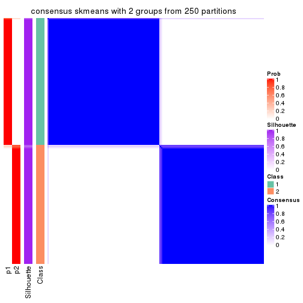</p>

</div>
<div id='tab-CV-skmeans-consensus-heatmap-2'>
<pre><code class="r">consensus_heatmap(res, k = 3)
</code></pre>

<p>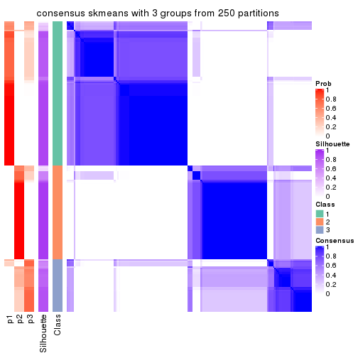</p>

</div>
<div id='tab-CV-skmeans-consensus-heatmap-3'>
<pre><code class="r">consensus_heatmap(res, k = 4)
</code></pre>

<p>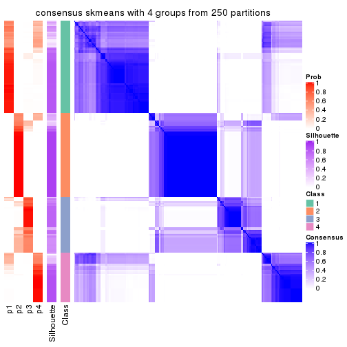</p>

</div>
<div id='tab-CV-skmeans-consensus-heatmap-4'>
<pre><code class="r">consensus_heatmap(res, k = 5)
</code></pre>

<p>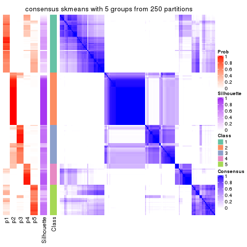</p>

</div>
<div id='tab-CV-skmeans-consensus-heatmap-5'>
<pre><code class="r">consensus_heatmap(res, k = 6)
</code></pre>

<p>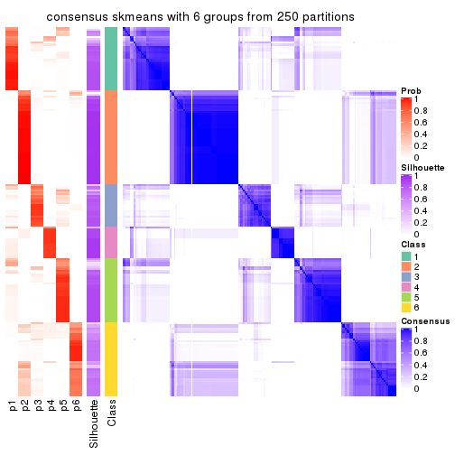</p>

</div>
</div>

Heatmaps for the membership of samples in all partitions to see how consistent they are:


<script>
$( function() {
	$( '#tabs-CV-skmeans-membership-heatmap' ).tabs();
} );
</script>
<div id='tabs-CV-skmeans-membership-heatmap'>
<ul>
<li><a href='#tab-CV-skmeans-membership-heatmap-1'>k = 2</a></li>
<li><a href='#tab-CV-skmeans-membership-heatmap-2'>k = 3</a></li>
<li><a href='#tab-CV-skmeans-membership-heatmap-3'>k = 4</a></li>
<li><a href='#tab-CV-skmeans-membership-heatmap-4'>k = 5</a></li>
<li><a href='#tab-CV-skmeans-membership-heatmap-5'>k = 6</a></li>
</ul>
<div id='tab-CV-skmeans-membership-heatmap-1'>
<pre><code class="r">membership_heatmap(res, k = 2)
</code></pre>

<p>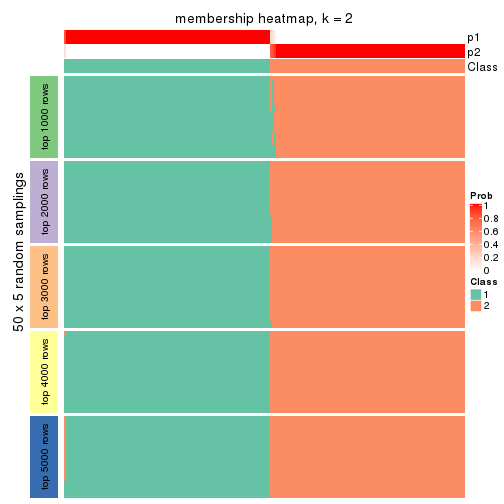</p>

</div>
<div id='tab-CV-skmeans-membership-heatmap-2'>
<pre><code class="r">membership_heatmap(res, k = 3)
</code></pre>

<p>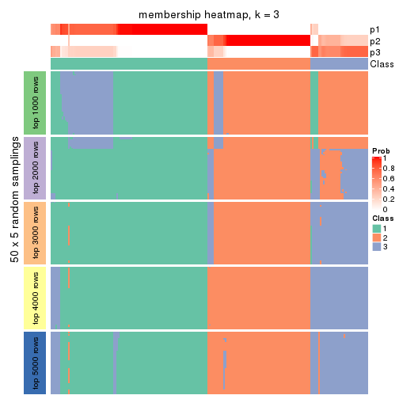</p>

</div>
<div id='tab-CV-skmeans-membership-heatmap-3'>
<pre><code class="r">membership_heatmap(res, k = 4)
</code></pre>

<p>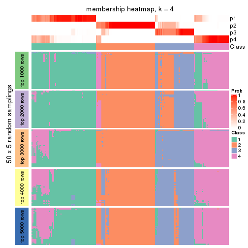</p>

</div>
<div id='tab-CV-skmeans-membership-heatmap-4'>
<pre><code class="r">membership_heatmap(res, k = 5)
</code></pre>

<p>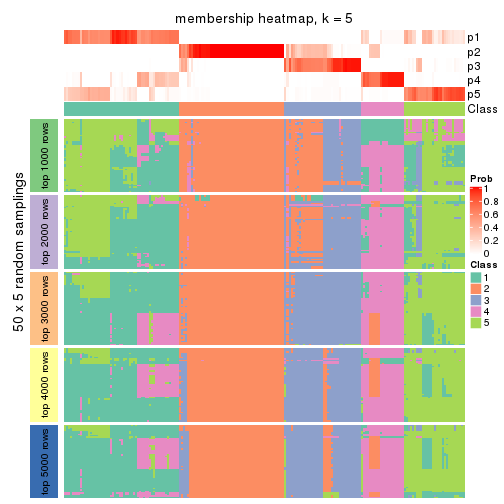</p>

</div>
<div id='tab-CV-skmeans-membership-heatmap-5'>
<pre><code class="r">membership_heatmap(res, k = 6)
</code></pre>

<p>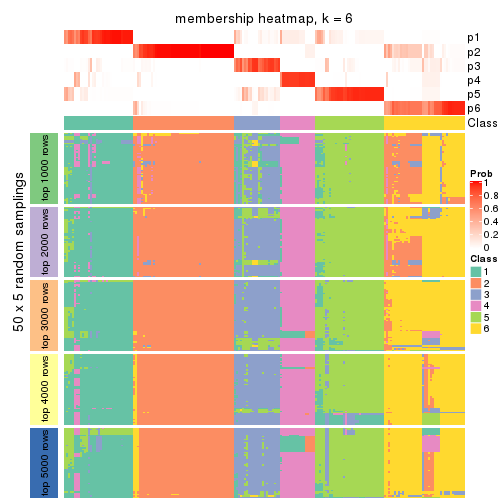</p>

</div>
</div>

As soon as we have had the classes for columns, we can look for signatures
which are significantly different between classes which can be candidate marks
for certain classes. Following are the heatmaps for signatures.


Signature heatmaps where rows are scaled:


<script>
$( function() {
	$( '#tabs-CV-skmeans-get-signatures' ).tabs();
} );
</script>
<div id='tabs-CV-skmeans-get-signatures'>
<ul>
<li><a href='#tab-CV-skmeans-get-signatures-1'>k = 2</a></li>
<li><a href='#tab-CV-skmeans-get-signatures-2'>k = 3</a></li>
<li><a href='#tab-CV-skmeans-get-signatures-3'>k = 4</a></li>
<li><a href='#tab-CV-skmeans-get-signatures-4'>k = 5</a></li>
<li><a href='#tab-CV-skmeans-get-signatures-5'>k = 6</a></li>
</ul>
<div id='tab-CV-skmeans-get-signatures-1'>
<pre><code class="r">get_signatures(res, k = 2)
</code></pre>

<p>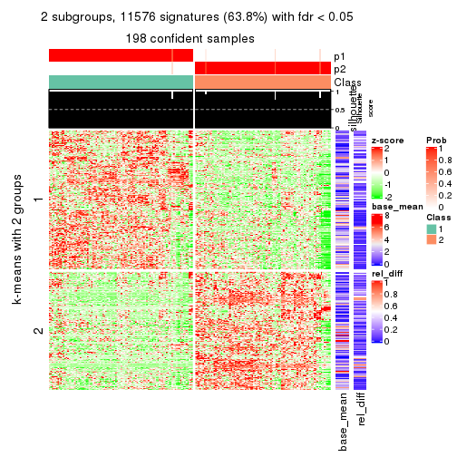</p>

</div>
<div id='tab-CV-skmeans-get-signatures-2'>
<pre><code class="r">get_signatures(res, k = 3)
</code></pre>

<p>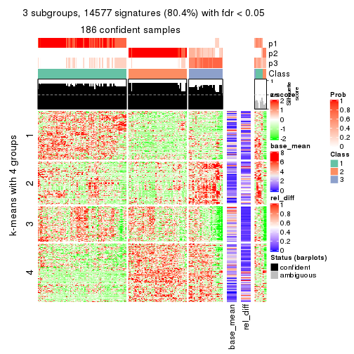</p>

</div>
<div id='tab-CV-skmeans-get-signatures-3'>
<pre><code class="r">get_signatures(res, k = 4)
</code></pre>

<p>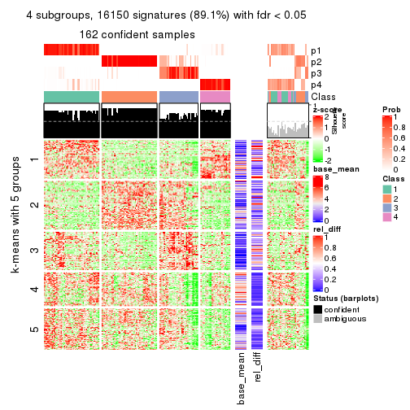</p>

</div>
<div id='tab-CV-skmeans-get-signatures-4'>
<pre><code class="r">get_signatures(res, k = 5)
</code></pre>

<p>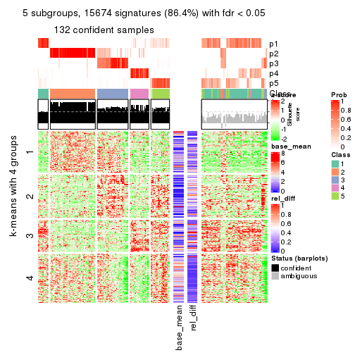</p>

</div>
<div id='tab-CV-skmeans-get-signatures-5'>
<pre><code class="r">get_signatures(res, k = 6)
</code></pre>

<p>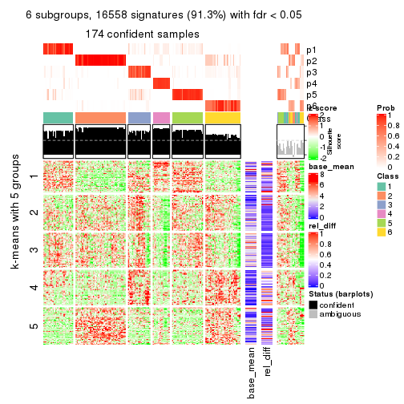</p>

</div>
</div>


Signature heatmaps where rows are not scaled:


<script>
$( function() {
	$( '#tabs-CV-skmeans-get-signatures-no-scale' ).tabs();
} );
</script>
<div id='tabs-CV-skmeans-get-signatures-no-scale'>
<ul>
<li><a href='#tab-CV-skmeans-get-signatures-no-scale-1'>k = 2</a></li>
<li><a href='#tab-CV-skmeans-get-signatures-no-scale-2'>k = 3</a></li>
<li><a href='#tab-CV-skmeans-get-signatures-no-scale-3'>k = 4</a></li>
<li><a href='#tab-CV-skmeans-get-signatures-no-scale-4'>k = 5</a></li>
<li><a href='#tab-CV-skmeans-get-signatures-no-scale-5'>k = 6</a></li>
</ul>
<div id='tab-CV-skmeans-get-signatures-no-scale-1'>
<pre><code class="r">get_signatures(res, k = 2, scale_rows = FALSE)
</code></pre>

<p>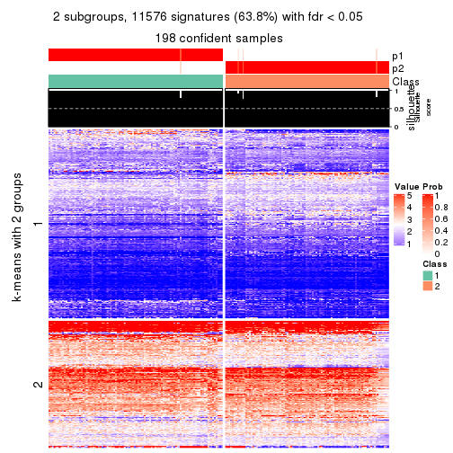</p>

</div>
<div id='tab-CV-skmeans-get-signatures-no-scale-2'>
<pre><code class="r">get_signatures(res, k = 3, scale_rows = FALSE)
</code></pre>

<p>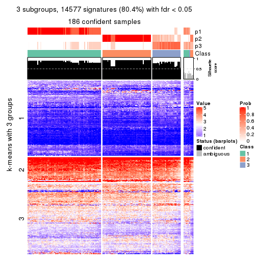</p>

</div>
<div id='tab-CV-skmeans-get-signatures-no-scale-3'>
<pre><code class="r">get_signatures(res, k = 4, scale_rows = FALSE)
</code></pre>

<p>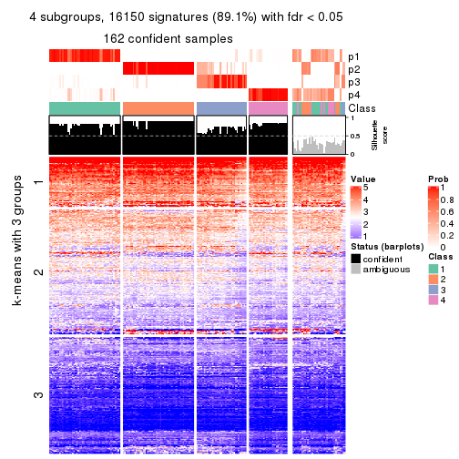</p>

</div>
<div id='tab-CV-skmeans-get-signatures-no-scale-4'>
<pre><code class="r">get_signatures(res, k = 5, scale_rows = FALSE)
</code></pre>

<p>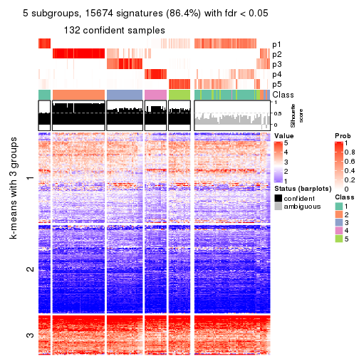</p>

</div>
<div id='tab-CV-skmeans-get-signatures-no-scale-5'>
<pre><code class="r">get_signatures(res, k = 6, scale_rows = FALSE)
</code></pre>

<p>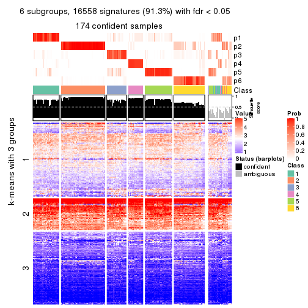</p>

</div>
</div>


Compare the overlap of signatures from different k:

```r
compare_signatures(res)
```

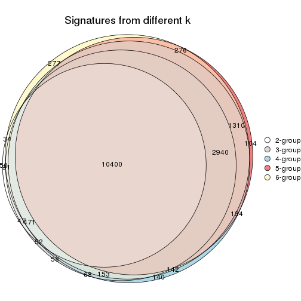

`get_signature()` returns a data frame invisibly. TO get the list of signatures, the function
call should be assigned to a variable explicitly. In following code, if `plot` argument is set
to `FALSE`, no heatmap is plotted while only the differential analysis is performed.

```r
# code only for demonstration
tb = get_signature(res, k = ..., plot = FALSE)
```

An example of the output of `tb` is:

```
#>   which_row         fdr    mean_1    mean_2 scaled_mean_1 scaled_mean_2 km
#> 1        38 0.042760348  8.373488  9.131774    -0.5533452     0.5164555  1
#> 2        40 0.018707592  7.106213  8.469186    -0.6173731     0.5762149  1
#> 3        55 0.019134737 10.221463 11.207825    -0.6159697     0.5749050  1
#> 4        59 0.006059896  5.921854  7.869574    -0.6899429     0.6439467  1
#> 5        60 0.018055526  8.928898 10.211722    -0.6204761     0.5791110  1
#> 6        98 0.009384629 15.714769 14.887706     0.6635654    -0.6193277  2
...
```

The columns in `tb` are:

1. `which_row`: row indices corresponding to the input matrix.
2. `fdr`: FDR for the differential test. 
3. `mean_x`: The mean value in group x.
4. `scaled_mean_x`: The mean value in group x after rows are scaled.
5. `km`: Row groups if k-means clustering is applied to rows.


UMAP plot which shows how samples are separated.


<script>
$( function() {
	$( '#tabs-CV-skmeans-dimension-reduction' ).tabs();
} );
</script>
<div id='tabs-CV-skmeans-dimension-reduction'>
<ul>
<li><a href='#tab-CV-skmeans-dimension-reduction-1'>k = 2</a></li>
<li><a href='#tab-CV-skmeans-dimension-reduction-2'>k = 3</a></li>
<li><a href='#tab-CV-skmeans-dimension-reduction-3'>k = 4</a></li>
<li><a href='#tab-CV-skmeans-dimension-reduction-4'>k = 5</a></li>
<li><a href='#tab-CV-skmeans-dimension-reduction-5'>k = 6</a></li>
</ul>
<div id='tab-CV-skmeans-dimension-reduction-1'>
<pre><code class="r">dimension_reduction(res, k = 2, method = &quot;UMAP&quot;)
</code></pre>

<p>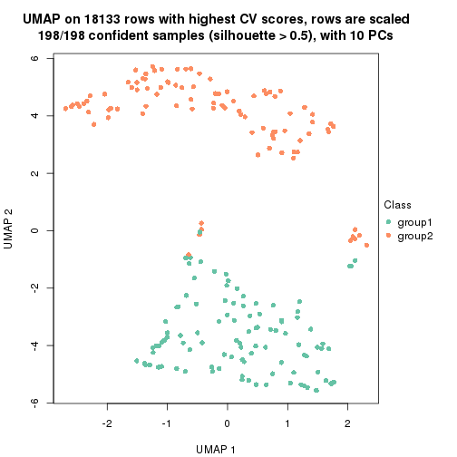</p>

</div>
<div id='tab-CV-skmeans-dimension-reduction-2'>
<pre><code class="r">dimension_reduction(res, k = 3, method = &quot;UMAP&quot;)
</code></pre>

<p>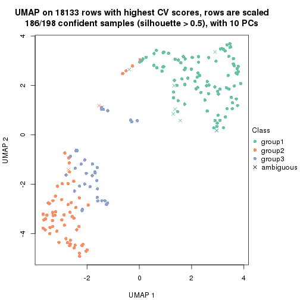</p>

</div>
<div id='tab-CV-skmeans-dimension-reduction-3'>
<pre><code class="r">dimension_reduction(res, k = 4, method = &quot;UMAP&quot;)
</code></pre>

<p>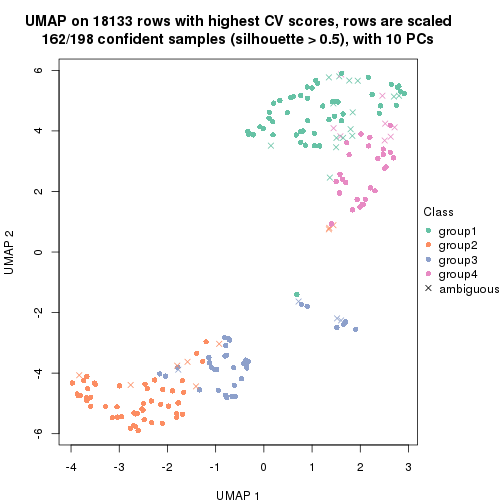</p>

</div>
<div id='tab-CV-skmeans-dimension-reduction-4'>
<pre><code class="r">dimension_reduction(res, k = 5, method = &quot;UMAP&quot;)
</code></pre>

<p>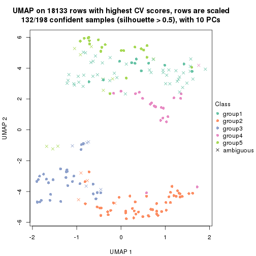</p>

</div>
<div id='tab-CV-skmeans-dimension-reduction-5'>
<pre><code class="r">dimension_reduction(res, k = 6, method = &quot;UMAP&quot;)
</code></pre>

<p>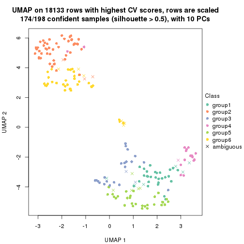</p>

</div>
</div>


Following heatmap shows how subgroups are split when increasing `k`:

```r
collect_classes(res)
```

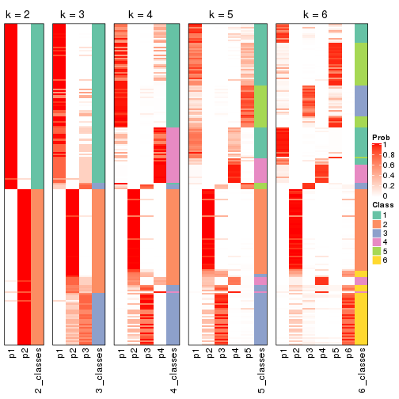


If matrix rows can be associated to genes, consider to use `functional_enrichment(res,
...)` to perform function enrichment for the signature genes. See [this vignette](http://bioconductor.org/packages/devel/bioc/vignettes/cola/inst/doc/functional_enrichment.html) for more detailed explanations.


 

---------------------------------------------------


### CV:pam**


The object with results only for a single top-value method and a single partition method 
can be extracted as:

```r
res = res_list["CV", "pam"]
# you can also extract it by
# res = res_list["CV:pam"]
```

A summary of `res` and all the functions that can be applied to it:

```r
res
```

```
#> A 'ConsensusPartition' object with k = 2, 3, 4, 5, 6.
#>   On a matrix with 18133 rows and 198 columns.
#>   Top rows (1000, 2000, 3000, 4000, 5000) are extracted by 'CV' method.
#>   Subgroups are detected by 'pam' method.
#>   Performed in total 1250 partitions by row resampling.
#>   Best k for subgroups seems to be 2.
#> 
#> Following methods can be applied to this 'ConsensusPartition' object:
#>  [1] "cola_report"             "collect_classes"         "collect_plots"          
#>  [4] "collect_stats"           "colnames"                "compare_signatures"     
#>  [7] "consensus_heatmap"       "dimension_reduction"     "functional_enrichment"  
#> [10] "get_anno_col"            "get_anno"                "get_classes"            
#> [13] "get_consensus"           "get_matrix"              "get_membership"         
#> [16] "get_param"               "get_signatures"          "get_stats"              
#> [19] "is_best_k"               "is_stable_k"             "membership_heatmap"     
#> [22] "ncol"                    "nrow"                    "plot_ecdf"              
#> [25] "rownames"                "select_partition_number" "show"                   
#> [28] "suggest_best_k"          "test_to_known_factors"
```

`collect_plots()` function collects all the plots made from `res` for all `k` (number of partitions)
into one single page to provide an easy and fast comparison between different `k`.

```r
collect_plots(res)
```

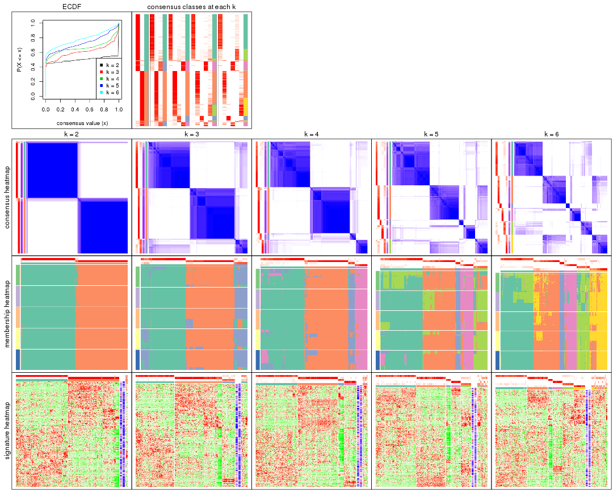

The plots are:

- The first row: a plot of the ECDF (empirical cumulative distribution
  function) curves of the consensus matrix for each `k` and the heatmap of
  predicted classes for each `k`.
- The second row: heatmaps of the consensus matrix for each `k`.
- The third row: heatmaps of the membership matrix for each `k`.
- The fouth row: heatmaps of the signatures for each `k`.

All the plots in panels can be made by individual functions and they are
plotted later in this section.

`select_partition_number()` produces several plots showing different
statistics for choosing "optimized" `k`. There are following statistics:

- ECDF curves of the consensus matrix for each `k`;
- 1-PAC. [The PAC
  score](https://en.wikipedia.org/wiki/Consensus_clustering#Over-interpretation_potential_of_consensus_clustering)
  measures the proportion of the ambiguous subgrouping.
- Mean silhouette score.
- Concordance. The mean probability of fiting the consensus class ids in all
  partitions.
- Area increased. Denote $A_k$ as the area under the ECDF curve for current
  `k`, the area increased is defined as $A_k - A_{k-1}$.
- Rand index. The percent of pairs of samples that are both in a same cluster
  or both are not in a same cluster in the partition of k and k-1.
- Jaccard index. The ratio of pairs of samples are both in a same cluster in
  the partition of k and k-1 and the pairs of samples are both in a same
  cluster in the partition k or k-1.

The detailed explanations of these statistics can be found in [the _cola_
vignette](http://bioconductor.org/packages/devel/bioc/vignettes/cola/inst/doc/cola.html#toc_13).

Generally speaking, lower PAC score, higher mean silhouette score or higher
concordance corresponds to better partition. Rand index and Jaccard index
measure how similar the current partition is compared to partition with `k-1`.
If they are too similar, we won't accept `k` is better than `k-1`.

```r
select_partition_number(res)
```

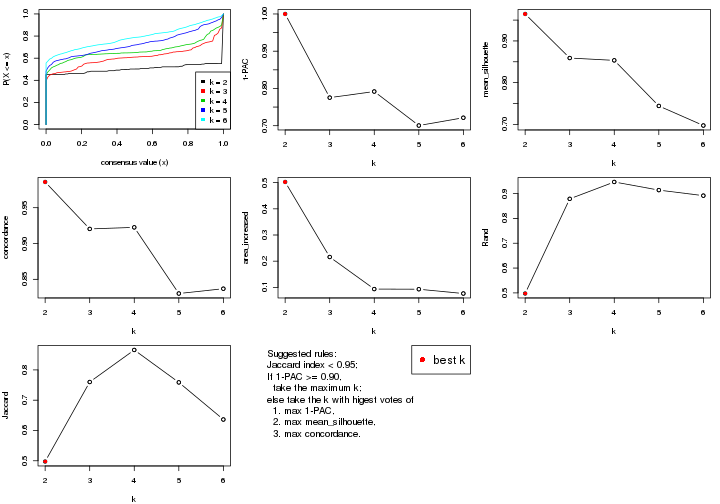

The numeric values for all these statistics can be obtained by `get_stats()`.

```r
get_stats(res)
```

```
#>   k 1-PAC mean_silhouette concordance area_increased  Rand Jaccard
#> 2 2 1.000           0.965       0.986         0.5026 0.498   0.498
#> 3 3 0.775           0.859       0.920         0.2159 0.879   0.760
#> 4 4 0.792           0.853       0.923         0.0935 0.947   0.866
#> 5 5 0.700           0.744       0.830         0.0928 0.914   0.759
#> 6 6 0.721           0.697       0.837         0.0764 0.892   0.636
```

`suggest_best_k()` suggests the best $k$ based on these statistics. The rules are as follows:

- All $k$ with Jaccard index larger than 0.95 are removed because increasing
  $k$ does not provide enough extra information. If all $k$ are removed, it is
  marked as no subgroup is detected.
- For all $k$ with 1-PAC score larger than 0.9, the maximal $k$ is taken as
  the best $k$, and other $k$ are marked as optional $k$.
- If it does not fit the second rule. The $k$ with the maximal vote of the
  highest 1-PAC score, highest mean silhouette, and highest concordance is
  taken as the best $k$.

```r
suggest_best_k(res)
```

```
#> [1] 2
```


Following shows the table of the partitions (You need to click the **show/hide
code output** link to see it). The membership matrix (columns with name `p*`)
is inferred by
[`clue::cl_consensus()`](https://www.rdocumentation.org/link/cl_consensus?package=clue)
function with the `SE` method. Basically the value in the membership matrix
represents the probability to belong to a certain group. The finall class
label for an item is determined with the group with highest probability it
belongs to.

In `get_classes()` function, the entropy is calculated from the membership
matrix and the silhouette score is calculated from the consensus matrix.


<script>
$( function() {
	$( '#tabs-CV-pam-get-classes' ).tabs();
} );
</script>
<div id='tabs-CV-pam-get-classes'>
<ul>
<li><a href='#tab-CV-pam-get-classes-1'>k = 2</a></li>
<li><a href='#tab-CV-pam-get-classes-2'>k = 3</a></li>
<li><a href='#tab-CV-pam-get-classes-3'>k = 4</a></li>
<li><a href='#tab-CV-pam-get-classes-4'>k = 5</a></li>
<li><a href='#tab-CV-pam-get-classes-5'>k = 6</a></li>
</ul>

<div id='tab-CV-pam-get-classes-1'>
<p><a id='tab-CV-pam-get-classes-1-a' style='color:#0366d6' href='#'>show/hide code output</a></p>
<pre><code class="r">cbind(get_classes(res, k = 2), get_membership(res, k = 2))
</code></pre>

<pre><code>#&gt;                                      class entropy silhouette    p1    p2
#&gt; 0C0AA0B2-5191-4EDF-8937-ED7434F30283     2   0.000      0.981 0.000 1.000
#&gt; 18B45F1F-234F-45CC-A234-145307606C5C     1   0.000      0.990 1.000 0.000
#&gt; E18B70C0-BDCA-46D3-99BB-C6C8ABC68DA5     2   0.000      0.981 0.000 1.000
#&gt; 0F6DDBA7-6F74-45E8-95C8-F28263D55978     1   0.000      0.990 1.000 0.000
#&gt; 7EAE1A5A-129A-46DE-977E-A2C753F10904     2   0.000      0.981 0.000 1.000
#&gt; 7EAE0048-16B5-4979-9410-16CDEB9B1A48     1   0.000      0.990 1.000 0.000
#&gt; 2EBFC828-2B27-4753-A052-80DDA226DAB4     2   0.000      0.981 0.000 1.000
#&gt; 24E1768D-2232-41DA-9383-BC55D6EB3812     2   0.000      0.981 0.000 1.000
#&gt; 6E3CD60A-1889-4CA3-B305-2E78152057B5     2   0.000      0.981 0.000 1.000
#&gt; 33CC70DD-82B3-413C-B3B1-BE06634D95D0     1   0.000      0.990 1.000 0.000
#&gt; F1CB57A3-55DD-4487-9307-1B4F652E729A     1   0.000      0.990 1.000 0.000
#&gt; 755A5806-B054-449A-93DB-79909E6C93A1     1   0.000      0.990 1.000 0.000
#&gt; 58D364E7-3D2F-468F-A264-D6461E2428D4     2   0.000      0.981 0.000 1.000
#&gt; 68BB9CB6-7AA2-4981-B9D9-07363EC96599     2   0.000      0.981 0.000 1.000
#&gt; 3C4E8DFA-8EA0-4F1F-89CB-CB8805395872     2   0.000      0.981 0.000 1.000
#&gt; 4219651D-5583-4498-BF08-1B7D04B4C7B2     1   0.000      0.990 1.000 0.000
#&gt; B5EE2768-0D67-4584-ADBC-EC745FEC52EA     2   0.000      0.981 0.000 1.000
#&gt; 825E6C11-F460-451A-8045-846DD7D0E945     1   0.000      0.990 1.000 0.000
#&gt; 491F62AF-5E68-43C3-982A-F867A75BBA9A     2   0.000      0.981 0.000 1.000
#&gt; 9D7F058C-F95A-44AD-AC9E-450F7FBDC960     2   0.000      0.981 0.000 1.000
#&gt; 6D42DD0C-2081-4742-BA27-9F5F16FAC3C6     1   0.000      0.990 1.000 0.000
#&gt; EDD7E63D-492A-473B-A552-0764337B10EF     2   0.000      0.981 0.000 1.000
#&gt; 97073DEA-73AD-4DFD-BD1A-9035DC03445B     1   0.000      0.990 1.000 0.000
#&gt; FA891AB9-CE38-4F7E-A015-1DDCE12890A0     1   0.000      0.990 1.000 0.000
#&gt; D9514D49-A0AE-45AB-8C9F-68E726215253     1   0.000      0.990 1.000 0.000
#&gt; 3B9229AD-12E5-451E-9D2F-378AAC82C04A     2   0.000      0.981 0.000 1.000
#&gt; 5EA36B71-4917-4EF3-9060-065EFE6ACC5B     1   0.000      0.990 1.000 0.000
#&gt; A20E4ECB-4895-4CC7-BE5E-4721B20D933B     1   0.000      0.990 1.000 0.000
#&gt; 1BE8D828-29DB-4368-AA4A-FB23588F7AE8     1   0.000      0.990 1.000 0.000
#&gt; 66EFEFCF-3D14-4DBF-AA13-530F40ED0245     1   0.000      0.990 1.000 0.000
#&gt; 55DFFE53-BCE7-4EC1-9863-6C0311B06BA2     2   0.000      0.981 0.000 1.000
#&gt; 4CC3FB5A-611D-4C64-AE9D-544FA45CF4DC     1   0.000      0.990 1.000 0.000
#&gt; C11D33F2-DFE9-4FA8-9024-F3E7F1DADC5F     2   0.000      0.981 0.000 1.000
#&gt; FA5932B8-8AA3-4C38-9FAB-C35D8772974D     1   0.000      0.990 1.000 0.000
#&gt; 8216EC35-1F41-4A15-B503-BDA4971E27C9     1   0.000      0.990 1.000 0.000
#&gt; 69635D23-90A7-4BAD-97C7-B79536837F57     1   0.000      0.990 1.000 0.000
#&gt; 12B404E2-C463-4409-8392-E4649B2AFFD1     2   0.000      0.981 0.000 1.000
#&gt; 246927E3-ACCF-41B2-AA8E-43855FD6B146     2   0.000      0.981 0.000 1.000
#&gt; E0CC13E7-9607-49E0-B4AA-395544E3C3BF     1   0.000      0.990 1.000 0.000
#&gt; F7BBC0C1-6124-4A83-8A70-EA89B62F1CBD     1   0.000      0.990 1.000 0.000
#&gt; B1D4FF24-8E6F-4A04-B716-2032D850EB57     1   0.000      0.990 1.000 0.000
#&gt; 253601DB-B78A-4566-9947-8C0270C0B163     2   0.000      0.981 0.000 1.000
#&gt; AB83DBFF-5737-4FB8-A5AC-1D3CD6072BDF     2   0.541      0.853 0.124 0.876
#&gt; 9D67D953-EC98-4B72-89C8-5732BC9D4BC9     2   0.000      0.981 0.000 1.000
#&gt; 51061018-95AB-4278-886F-F69E4EBC47C0     2   0.000      0.981 0.000 1.000
#&gt; ABD0F7F3-105B-4DEE-9889-5028772C519A     1   0.000      0.990 1.000 0.000
#&gt; 562B95CF-B27E-4A72-B7C6-CDF86A51A39B     1   0.000      0.990 1.000 0.000
#&gt; ABF046A4-D7A1-49FF-B6B1-4E07A791DEDB     2   0.000      0.981 0.000 1.000
#&gt; 3FF4101E-9703-460E-A30E-76CC7689F36D     2   0.000      0.981 0.000 1.000
#&gt; 39C4F7AA-7ADF-4F1D-BDA3-BEC605AC5023     2   0.000      0.981 0.000 1.000
#&gt; CB821FD2-AF5C-4743-A70F-21C12C6ED153     1   0.000      0.990 1.000 0.000
#&gt; 92EA1846-62FF-41D5-A441-5E52E6B9E7F9     1   0.000      0.990 1.000 0.000
#&gt; 7D25F3EE-5A20-4763-8026-16A03D05F459     1   0.000      0.990 1.000 0.000
#&gt; 8ECE5276-CD06-496B-A5A9-1713B1F7D089     1   0.000      0.990 1.000 0.000
#&gt; C775B68F-9507-47E3-B507-B433AED79002     1   0.000      0.990 1.000 0.000
#&gt; E19D5463-FDD0-41C1-A170-323736A88D07     2   0.000      0.981 0.000 1.000
#&gt; CE4B6285-4961-4767-91F0-5C7A8162E185     1   0.000      0.990 1.000 0.000
#&gt; 9637BD72-1FEF-42AD-8886-2C39BE876531     1   0.000      0.990 1.000 0.000
#&gt; 81B5A88E-45A0-4B44-B689-B9071B8548EE     2   0.000      0.981 0.000 1.000
#&gt; 0B01B4C9-9BED-4F5B-A3E2-8868C7CCC3FC     2   0.000      0.981 0.000 1.000
#&gt; 54501315-7132-44B2-A179-10FBF1421105     1   0.000      0.990 1.000 0.000
#&gt; E207CBE9-4C3A-4FDD-9251-CFE1FE106475     2   0.760      0.723 0.220 0.780
#&gt; 3BEA0B92-3F90-4DBF-9679-AADEAD7D47C8     2   0.000      0.981 0.000 1.000
#&gt; 35B32250-D854-4215-AA5B-2C11B2FBEECA     1   0.000      0.990 1.000 0.000
#&gt; ACE6566B-AEB9-426C-924A-B382D14A1024     2   0.000      0.981 0.000 1.000
#&gt; 737E69AC-0930-45B9-B6BA-7CE5E300290B     1   0.000      0.990 1.000 0.000
#&gt; B4410AB8-D015-41CA-86E6-12EB4E4103E3     1   0.000      0.990 1.000 0.000
#&gt; 6D3ECA65-C50F-43B0-B75A-1D290FA4A8FD     2   0.000      0.981 0.000 1.000
#&gt; C86F40D3-9A96-4395-A8C3-510DE12F9A2B     2   0.000      0.981 0.000 1.000
#&gt; 6238087F-24DD-4BF1-903F-3BD4E446C1AE     2   0.000      0.981 0.000 1.000
#&gt; E4FF840B-EEAB-4CB0-A690-7D4C4AA7EEC3     2   0.000      0.981 0.000 1.000
#&gt; 72D3C323-C67F-4C0E-9BFC-BF245FF9730A     1   0.000      0.990 1.000 0.000
#&gt; 82D56E4E-4DF6-4F3E-8959-B995C92AAA70     1   0.000      0.990 1.000 0.000
#&gt; E31CA441-EB19-443B-ACBD-37B5CCBCF0E5     2   0.000      0.981 0.000 1.000
#&gt; 87CA8939-D054-4B8A-B32D-085FD2E8F202     1   0.000      0.990 1.000 0.000
#&gt; 2A508D90-FEDC-46A3-9A02-E51E5467CDCB     1   0.000      0.990 1.000 0.000
#&gt; C4E8B4E2-388B-411F-BF0A-9B6F34E8EDB5     2   0.000      0.981 0.000 1.000
#&gt; AF6AF803-BD93-44A7-AA80-B9BC92C1273B     2   0.000      0.981 0.000 1.000
#&gt; 0B1CA5CF-EB96-41D4-BFC5-6957FEB39828     1   0.936      0.444 0.648 0.352
#&gt; 6FB96FB0-6661-48AD-A4A0-69F8AFDBE591     2   0.000      0.981 0.000 1.000
#&gt; 8C19F7FD-368A-462B-B28F-88D6630038A1     1   0.000      0.990 1.000 0.000
#&gt; 96EABE78-C2F4-4A33-ACD8-C922A4B2519B     2   0.000      0.981 0.000 1.000
#&gt; 68B36D7B-546A-4689-949F-B207C4A4AB27     2   0.000      0.981 0.000 1.000
#&gt; CE9F3335-778F-4F52-BC55-4B7C99B211DD     2   0.000      0.981 0.000 1.000
#&gt; CB359DED-2A2D-4646-A0BD-6F10ADCC532B     1   0.000      0.990 1.000 0.000
#&gt; 198324A5-8C52-46F6-9734-EFAF1CCA6D9B     1   0.000      0.990 1.000 0.000
#&gt; 83B88608-0506-428C-B9E8-621F38477B42     1   0.000      0.990 1.000 0.000
#&gt; 1993630A-0F3D-4F5C-86A3-D443BAAF57F0     2   0.997      0.129 0.468 0.532
#&gt; DE73DA9B-529E-4F4F-A65C-DA7AB84B1096     1   0.000      0.990 1.000 0.000
#&gt; 2347F3B7-DDA3-40C0-B6D4-8819ECA69146     1   0.000      0.990 1.000 0.000
#&gt; AB93B5D5-095F-4330-9D40-6A3D934AB50C     1   0.000      0.990 1.000 0.000
#&gt; 5EBBE4AD-FF0C-41CF-9EA3-B6FE7EA1F9C0     2   0.808      0.677 0.248 0.752
#&gt; 6D960AE7-3769-4144-A061-E8588E5063FF     1   0.000      0.990 1.000 0.000
#&gt; 0C2DD8C0-D1A5-4192-A49C-7A40FED628B2     2   0.000      0.981 0.000 1.000
#&gt; 18C9372F-C55B-4F86-A9D2-E8D85EFC8566     2   0.482      0.877 0.104 0.896
#&gt; 9AF637B0-4C32-4DD1-93AF-7655B4A845D3     2   0.000      0.981 0.000 1.000
#&gt; 785B5B06-4115-46FD-9BEB-F888AFDC855D     2   0.000      0.981 0.000 1.000
#&gt; ECA3050E-4BE2-4117-B9CF-A52BB85AF8C2     2   0.781      0.703 0.232 0.768
#&gt; 099DC396-16A5-458F-9ED9-F2A790CB0C34     1   0.000      0.990 1.000 0.000
#&gt; 7A5A12EE-C5B0-4C51-8C99-0F3FA88D633E     1   0.000      0.990 1.000 0.000
#&gt; E832B508-A66D-4817-B44A-FE9FAAE64B4A     1   0.000      0.990 1.000 0.000
#&gt; F9DD688C-7B35-49E7-9651-2E098EE78856     1   0.000      0.990 1.000 0.000
#&gt; F1265DD8-5ED3-4635-A277-57BBFDEC7729     1   0.000      0.990 1.000 0.000
#&gt; F624E8D9-DB07-4C9E-910D-5E8EBA3A6167     2   0.000      0.981 0.000 1.000
#&gt; 3516FBDF-66E1-43F4-9D7B-16748F6439A7     2   0.000      0.981 0.000 1.000
#&gt; 04B12992-B2EA-4BA2-8E2C-11E34E230E6F     2   0.000      0.981 0.000 1.000
#&gt; CC02897D-9123-495E-9242-5C9CF4EC269B     2   0.000      0.981 0.000 1.000
#&gt; 3117ED46-2BF2-4311-BC00-4E98243E16B3     1   0.000      0.990 1.000 0.000
#&gt; E0B66D53-23DB-4E26-BB6E-F692FA8C000E     1   0.000      0.990 1.000 0.000
#&gt; DAA93CE5-A013-477A-9A50-EA09CC3A8162     2   0.000      0.981 0.000 1.000
#&gt; 0099098D-354A-4276-92F8-B932C74B4608     1   0.000      0.990 1.000 0.000
#&gt; DD483639-B2E7-4745-BCFB-55ED1D82BFBF     2   0.000      0.981 0.000 1.000
#&gt; 2C1F9079-602E-4252-82C7-9D8799E04246     2   0.000      0.981 0.000 1.000
#&gt; 9473A8E4-3A1B-4184-9EA6-517AFD60B635     1   0.781      0.688 0.768 0.232
#&gt; 75CFBAF6-7BA0-40AF-92D7-D218E885BD1B     2   0.000      0.981 0.000 1.000
#&gt; B588950F-14D6-41C8-845B-EFD2096013C6     2   0.000      0.981 0.000 1.000
#&gt; 0DF3EDA8-DAEA-4721-92AB-B97181249498     2   0.000      0.981 0.000 1.000
#&gt; 8EA83042-D598-401D-AD78-936EEB136C59     1   0.000      0.990 1.000 0.000
#&gt; 729AC418-3BE9-445A-95D4-AC11A7D43BE0     1   0.000      0.990 1.000 0.000
#&gt; 7D8B1B11-F576-4AA8-BFA7-0022A2CD829A     2   0.000      0.981 0.000 1.000
#&gt; 304A0E46-3449-4B44-9C30-BDDF6459391D     1   0.000      0.990 1.000 0.000
#&gt; 3C83358F-DF20-47F7-AF9F-AB7CC92F5ABA     1   0.000      0.990 1.000 0.000
#&gt; EAFEED6C-35C3-451F-AE4A-EB56992E1F29     1   0.000      0.990 1.000 0.000
#&gt; 8A237A65-28EC-434D-A78A-A8B7308B5204     1   0.000      0.990 1.000 0.000
#&gt; D005833F-E991-4E9E-9667-55F137288004     1   0.000      0.990 1.000 0.000
#&gt; 37D966E3-253E-4397-A9AE-0903A8D31FE6     1   0.000      0.990 1.000 0.000
#&gt; D2482B81-CB5B-4178-BA8D-1CF4026181B5     1   0.000      0.990 1.000 0.000
#&gt; 18019E95-C2A8-4EE7-B585-F6886DC4D953     2   0.000      0.981 0.000 1.000
#&gt; 0B126D1A-14A8-4345-8F78-FF92222ADF4C     2   0.000      0.981 0.000 1.000
#&gt; CE88B625-47D8-4D58-9FB4-23464DB7DDAD     2   0.000      0.981 0.000 1.000
#&gt; 9A88299D-5C74-47FA-B42C-1A1D6D935AAB     1   0.000      0.990 1.000 0.000
#&gt; 3E71159C-FD6C-41DA-B18B-0730C8AC7E41     1   0.000      0.990 1.000 0.000
#&gt; 6F245AA4-79D9-47E1-BCC9-1AAF65AEA813     1   0.000      0.990 1.000 0.000
#&gt; 4CF2C888-2100-483A-B4DB-ECBB69243A4D     2   0.000      0.981 0.000 1.000
#&gt; A3853813-B9D5-4E8C-B075-19FCC35F8686     1   0.983      0.255 0.576 0.424
#&gt; 83A16DEE-CE9F-4D8B-9225-0A2A8B9D055D     1   0.000      0.990 1.000 0.000
#&gt; 0F057CAF-4F9A-4DE9-8601-730E96873733     2   0.000      0.981 0.000 1.000
#&gt; 32D5801D-DBA4-422E-87CB-A2DDE921BA41     1   0.000      0.990 1.000 0.000
#&gt; 22EE8076-F07C-499A-9AF8-D800A77EF154     2   0.000      0.981 0.000 1.000
#&gt; DD4BD74D-D48C-4090-9F57-5334E784581C     1   0.000      0.990 1.000 0.000
#&gt; 41183565-434D-474C-B1BD-CA6E94910658     2   0.000      0.981 0.000 1.000
#&gt; 75A2CE41-2B2A-4346-927E-ACF8A72738E4     1   0.000      0.990 1.000 0.000
#&gt; 7AA24995-3DD2-4682-B36A-4EBFEEACF625     1   0.000      0.990 1.000 0.000
#&gt; 8BAFDFEC-9F26-4ADB-95CE-004143960EEB     1   0.000      0.990 1.000 0.000
#&gt; A330E011-CE08-4A85-8F4B-370592293DBB     1   0.000      0.990 1.000 0.000
#&gt; 1D5A5B17-2E70-4BB0-94A1-EC17E6EA49DB     1   0.000      0.990 1.000 0.000
#&gt; BD9143B8-9D97-4A05-872C-3FB82B4CF7BE     2   0.000      0.981 0.000 1.000
#&gt; 64552DC0-181E-4607-898C-787AA7F26435     2   0.000      0.981 0.000 1.000
#&gt; 1B4C4D41-34C7-43A3-858B-C9552EB53894     1   0.000      0.990 1.000 0.000
#&gt; 463A3BAA-02DC-4EA4-A644-B924163E425D     2   0.000      0.981 0.000 1.000
#&gt; CD0FEA89-6F60-4A20-8FCA-D397B4E95A98     1   0.000      0.990 1.000 0.000
#&gt; 5D06CF6D-F4B9-4B32-B055-8AB287E53340     2   0.000      0.981 0.000 1.000
#&gt; ADA7835F-DB67-4F4F-9446-8BCE3C5FE936     2   0.000      0.981 0.000 1.000
#&gt; 4109BE2D-B5DF-4BD7-860E-60D87F647152     2   0.000      0.981 0.000 1.000
#&gt; 88526A0E-6DFE-46CB-BFAD-B4826F482C67     1   0.000      0.990 1.000 0.000
#&gt; F39F9A4C-18F7-4017-AB31-85D52FF44587     2   0.000      0.981 0.000 1.000
#&gt; D4290A5E-1B24-4C55-B470-0FA7A0A09DD0     2   0.000      0.981 0.000 1.000
#&gt; DC5A2C9E-978F-4661-B729-1F9662976E27     1   0.000      0.990 1.000 0.000
#&gt; 26A1F392-CED2-43E3-8096-74E6F2BFC8C0     2   0.000      0.981 0.000 1.000
#&gt; 87D81FB2-306A-4E75-9D58-D5F48E46E7F6     2   0.000      0.981 0.000 1.000
#&gt; E3D9D81A-C20C-4B3B-B940-A5D2C5F65B22     2   0.000      0.981 0.000 1.000
#&gt; 4464650B-453F-476C-989C-B7B159BF2CF0     2   0.000      0.981 0.000 1.000
#&gt; 577D2867-B738-487A-9B06-07958D647F02     1   0.000      0.990 1.000 0.000
#&gt; E52A22CC-3C03-41A9-9541-220DD871E162     2   0.000      0.981 0.000 1.000
#&gt; 642703B1-AF99-4746-A915-0792F4B9590B     2   0.000      0.981 0.000 1.000
#&gt; 8F0D1792-1284-45E6-8EC4-392596057677     2   0.000      0.981 0.000 1.000
#&gt; 765AFFC1-D528-4494-8BA1-0706451E4205     2   0.000      0.981 0.000 1.000
#&gt; A716BC29-161F-4CA0-B240-00B330137F2C     1   0.000      0.990 1.000 0.000
#&gt; 32CBFBAF-7064-4595-8D54-2C5E7DE0FD9B     1   0.000      0.990 1.000 0.000
#&gt; 4D6ED28C-3F20-41B0-BA41-1BF0E5199A40     2   0.000      0.981 0.000 1.000
#&gt; 86A38456-2900-48FB-B10F-79222B3CA9BF     2   0.966      0.368 0.392 0.608
#&gt; E870807D-3223-4A6A-9E3D-F4461B048AA2     2   0.000      0.981 0.000 1.000
#&gt; 3A78D19F-A833-4D2C-8387-FB4FD4A8313C     1   0.000      0.990 1.000 0.000
#&gt; DFA162CA-C708-4121-8E74-F9C4DEE0CDAE     1   0.000      0.990 1.000 0.000
#&gt; C00A300A-CD10-4C9D-8C94-3901AFE8406C     2   0.000      0.981 0.000 1.000
#&gt; 13E11D15-A90F-48C4-980A-DD032C00A2C1     1   0.000      0.990 1.000 0.000
#&gt; 31BF80AB-FEDB-4C73-89C3-70BE9F9ACBEE     2   0.000      0.981 0.000 1.000
#&gt; FA34308A-349D-4AAD-94CF-3F3B7F9AD629     2   0.000      0.981 0.000 1.000
#&gt; 7C48D467-B663-49DD-BC84-A36BC32ACB3D     1   0.000      0.990 1.000 0.000
#&gt; BB068534-04F6-4FC9-9087-CDA65920BCE2     1   0.000      0.990 1.000 0.000
#&gt; EA4EC272-A9B3-4B2E-955F-19F7676A944C     2   0.000      0.981 0.000 1.000
#&gt; C71FF69B-A460-43CA-8769-9667F22D938B     1   0.000      0.990 1.000 0.000
#&gt; 5243D1B8-8168-4FF1-A8C6-505F080EF0D3     2   0.000      0.981 0.000 1.000
#&gt; BCC474D8-08FE-4E99-B8E8-B29E65F84D2E     1   0.000      0.990 1.000 0.000
#&gt; 04FDBFE3-4CF6-4E53-A2AA-89D5C9316377     2   0.000      0.981 0.000 1.000
#&gt; 83A9915C-8D60-4CAE-A868-B61E3C90C7B0     2   0.000      0.981 0.000 1.000
#&gt; 989A6472-E3E3-457A-97BE-CCE95F42D5C2     2   0.000      0.981 0.000 1.000
#&gt; A0AB2D28-6751-49C9-8DF4-66FDBF95C360     1   0.000      0.990 1.000 0.000
#&gt; A12B2683-18D4-41C9-8AE5-C143E2180052     1   0.000      0.990 1.000 0.000
#&gt; 8DE1E245-CAD2-4F11-BFA2-9792C433A00B     1   0.000      0.990 1.000 0.000
#&gt; FDA68036-6C4C-4256-9AA0-C01FE92AA098     2   0.000      0.981 0.000 1.000
#&gt; 26311920-1414-4EC1-870B-784961EBCC2D     1   0.000      0.990 1.000 0.000
#&gt; C29A10D6-D598-4286-B5E0-F1776E19E988     1   0.000      0.990 1.000 0.000
#&gt; FACCC1FB-4937-4CC0-90EA-7F91D3D939CF     2   0.000      0.981 0.000 1.000
#&gt; 90B9D84B-78E5-4C7E-8414-EC889C2DE8DB     2   0.000      0.981 0.000 1.000
#&gt; B74E6122-76E1-4E4D-A867-BCAFD7277393     1   0.000      0.990 1.000 0.000
#&gt; 98494DC0-CF6E-485F-8A0D-D80E4437EF5C     2   0.000      0.981 0.000 1.000
#&gt; DA114DAC-DE7B-4E43-8D7C-82C5D7B66411     1   0.000      0.990 1.000 0.000
</code></pre>

<script>
$('#tab-CV-pam-get-classes-1-a').parent().next().next().hide();
$('#tab-CV-pam-get-classes-1-a').click(function(){
  $('#tab-CV-pam-get-classes-1-a').parent().next().next().toggle();
  return(false);
});
</script>
</div>

<div id='tab-CV-pam-get-classes-2'>
<p><a id='tab-CV-pam-get-classes-2-a' style='color:#0366d6' href='#'>show/hide code output</a></p>
<pre><code class="r">cbind(get_classes(res, k = 3), get_membership(res, k = 3))
</code></pre>

<pre><code>#&gt;                                      class entropy silhouette    p1    p2    p3
#&gt; 0C0AA0B2-5191-4EDF-8937-ED7434F30283     2  0.0000     0.9608 0.000 1.000 0.000
#&gt; 18B45F1F-234F-45CC-A234-145307606C5C     3  0.5810     0.6384 0.336 0.000 0.664
#&gt; E18B70C0-BDCA-46D3-99BB-C6C8ABC68DA5     2  0.0237     0.9599 0.000 0.996 0.004
#&gt; 0F6DDBA7-6F74-45E8-95C8-F28263D55978     1  0.1163     0.9037 0.972 0.000 0.028
#&gt; 7EAE1A5A-129A-46DE-977E-A2C753F10904     2  0.0000     0.9608 0.000 1.000 0.000
#&gt; 7EAE0048-16B5-4979-9410-16CDEB9B1A48     1  0.0000     0.9092 1.000 0.000 0.000
#&gt; 2EBFC828-2B27-4753-A052-80DDA226DAB4     2  0.0000     0.9608 0.000 1.000 0.000
#&gt; 24E1768D-2232-41DA-9383-BC55D6EB3812     2  0.3412     0.8794 0.000 0.876 0.124
#&gt; 6E3CD60A-1889-4CA3-B305-2E78152057B5     3  0.4883     0.7250 0.004 0.208 0.788
#&gt; 33CC70DD-82B3-413C-B3B1-BE06634D95D0     1  0.0237     0.9072 0.996 0.000 0.004
#&gt; F1CB57A3-55DD-4487-9307-1B4F652E729A     1  0.1163     0.9037 0.972 0.000 0.028
#&gt; 755A5806-B054-449A-93DB-79909E6C93A1     3  0.4291     0.7913 0.180 0.000 0.820
#&gt; 58D364E7-3D2F-468F-A264-D6461E2428D4     2  0.0424     0.9586 0.000 0.992 0.008
#&gt; 68BB9CB6-7AA2-4981-B9D9-07363EC96599     2  0.3412     0.8794 0.000 0.876 0.124
#&gt; 3C4E8DFA-8EA0-4F1F-89CB-CB8805395872     2  0.4291     0.8428 0.000 0.820 0.180
#&gt; 4219651D-5583-4498-BF08-1B7D04B4C7B2     1  0.1163     0.9037 0.972 0.000 0.028
#&gt; B5EE2768-0D67-4584-ADBC-EC745FEC52EA     2  0.0000     0.9608 0.000 1.000 0.000
#&gt; 825E6C11-F460-451A-8045-846DD7D0E945     1  0.0000     0.9092 1.000 0.000 0.000
#&gt; 491F62AF-5E68-43C3-982A-F867A75BBA9A     2  0.0000     0.9608 0.000 1.000 0.000
#&gt; 9D7F058C-F95A-44AD-AC9E-450F7FBDC960     2  0.0237     0.9599 0.000 0.996 0.004
#&gt; 6D42DD0C-2081-4742-BA27-9F5F16FAC3C6     3  0.4291     0.7913 0.180 0.000 0.820
#&gt; EDD7E63D-492A-473B-A552-0764337B10EF     2  0.4291     0.8428 0.000 0.820 0.180
#&gt; 97073DEA-73AD-4DFD-BD1A-9035DC03445B     1  0.1163     0.9037 0.972 0.000 0.028
#&gt; FA891AB9-CE38-4F7E-A015-1DDCE12890A0     1  0.1529     0.8974 0.960 0.000 0.040
#&gt; D9514D49-A0AE-45AB-8C9F-68E726215253     1  0.0000     0.9092 1.000 0.000 0.000
#&gt; 3B9229AD-12E5-451E-9D2F-378AAC82C04A     2  0.0000     0.9608 0.000 1.000 0.000
#&gt; 5EA36B71-4917-4EF3-9060-065EFE6ACC5B     1  0.5968     0.4074 0.636 0.000 0.364
#&gt; A20E4ECB-4895-4CC7-BE5E-4721B20D933B     1  0.4452     0.7099 0.808 0.000 0.192
#&gt; 1BE8D828-29DB-4368-AA4A-FB23588F7AE8     1  0.0237     0.9072 0.996 0.000 0.004
#&gt; 66EFEFCF-3D14-4DBF-AA13-530F40ED0245     1  0.0237     0.9072 0.996 0.000 0.004
#&gt; 55DFFE53-BCE7-4EC1-9863-6C0311B06BA2     2  0.1860     0.9365 0.000 0.948 0.052
#&gt; 4CC3FB5A-611D-4C64-AE9D-544FA45CF4DC     1  0.0000     0.9092 1.000 0.000 0.000
#&gt; C11D33F2-DFE9-4FA8-9024-F3E7F1DADC5F     2  0.2066     0.9369 0.000 0.940 0.060
#&gt; FA5932B8-8AA3-4C38-9FAB-C35D8772974D     1  0.1529     0.8977 0.960 0.000 0.040
#&gt; 8216EC35-1F41-4A15-B503-BDA4971E27C9     1  0.1529     0.8978 0.960 0.000 0.040
#&gt; 69635D23-90A7-4BAD-97C7-B79536837F57     1  0.1163     0.9037 0.972 0.000 0.028
#&gt; 12B404E2-C463-4409-8392-E4649B2AFFD1     2  0.0000     0.9608 0.000 1.000 0.000
#&gt; 246927E3-ACCF-41B2-AA8E-43855FD6B146     2  0.0000     0.9608 0.000 1.000 0.000
#&gt; E0CC13E7-9607-49E0-B4AA-395544E3C3BF     1  0.3879     0.7713 0.848 0.000 0.152
#&gt; F7BBC0C1-6124-4A83-8A70-EA89B62F1CBD     1  0.0000     0.9092 1.000 0.000 0.000
#&gt; B1D4FF24-8E6F-4A04-B716-2032D850EB57     1  0.0000     0.9092 1.000 0.000 0.000
#&gt; 253601DB-B78A-4566-9947-8C0270C0B163     2  0.0000     0.9608 0.000 1.000 0.000
#&gt; AB83DBFF-5737-4FB8-A5AC-1D3CD6072BDF     2  0.7505     0.6375 0.160 0.696 0.144
#&gt; 9D67D953-EC98-4B72-89C8-5732BC9D4BC9     2  0.0000     0.9608 0.000 1.000 0.000
#&gt; 51061018-95AB-4278-886F-F69E4EBC47C0     2  0.4473     0.8512 0.008 0.828 0.164
#&gt; ABD0F7F3-105B-4DEE-9889-5028772C519A     1  0.0000     0.9092 1.000 0.000 0.000
#&gt; 562B95CF-B27E-4A72-B7C6-CDF86A51A39B     1  0.0000     0.9092 1.000 0.000 0.000
#&gt; ABF046A4-D7A1-49FF-B6B1-4E07A791DEDB     2  0.0000     0.9608 0.000 1.000 0.000
#&gt; 3FF4101E-9703-460E-A30E-76CC7689F36D     2  0.0000     0.9608 0.000 1.000 0.000
#&gt; 39C4F7AA-7ADF-4F1D-BDA3-BEC605AC5023     2  0.0237     0.9599 0.000 0.996 0.004
#&gt; CB821FD2-AF5C-4743-A70F-21C12C6ED153     1  0.0000     0.9092 1.000 0.000 0.000
#&gt; 92EA1846-62FF-41D5-A441-5E52E6B9E7F9     1  0.1163     0.9037 0.972 0.000 0.028
#&gt; 7D25F3EE-5A20-4763-8026-16A03D05F459     1  0.1529     0.8974 0.960 0.000 0.040
#&gt; 8ECE5276-CD06-496B-A5A9-1713B1F7D089     1  0.0000     0.9092 1.000 0.000 0.000
#&gt; C775B68F-9507-47E3-B507-B433AED79002     1  0.5988     0.4010 0.632 0.000 0.368
#&gt; E19D5463-FDD0-41C1-A170-323736A88D07     2  0.2066     0.9369 0.000 0.940 0.060
#&gt; CE4B6285-4961-4767-91F0-5C7A8162E185     3  0.4291     0.7913 0.180 0.000 0.820
#&gt; 9637BD72-1FEF-42AD-8886-2C39BE876531     3  0.5760     0.6404 0.328 0.000 0.672
#&gt; 81B5A88E-45A0-4B44-B689-B9071B8548EE     2  0.2066     0.9369 0.000 0.940 0.060
#&gt; 0B01B4C9-9BED-4F5B-A3E2-8868C7CCC3FC     2  0.5797     0.7078 0.008 0.712 0.280
#&gt; 54501315-7132-44B2-A179-10FBF1421105     1  0.1163     0.9037 0.972 0.000 0.028
#&gt; E207CBE9-4C3A-4FDD-9251-CFE1FE106475     3  0.9332     0.0742 0.164 0.404 0.432
#&gt; 3BEA0B92-3F90-4DBF-9679-AADEAD7D47C8     2  0.1964     0.9377 0.000 0.944 0.056
#&gt; 35B32250-D854-4215-AA5B-2C11B2FBEECA     1  0.1163     0.9037 0.972 0.000 0.028
#&gt; ACE6566B-AEB9-426C-924A-B382D14A1024     2  0.0000     0.9608 0.000 1.000 0.000
#&gt; 737E69AC-0930-45B9-B6BA-7CE5E300290B     1  0.1163     0.9037 0.972 0.000 0.028
#&gt; B4410AB8-D015-41CA-86E6-12EB4E4103E3     1  0.0000     0.9092 1.000 0.000 0.000
#&gt; 6D3ECA65-C50F-43B0-B75A-1D290FA4A8FD     2  0.0000     0.9608 0.000 1.000 0.000
#&gt; C86F40D3-9A96-4395-A8C3-510DE12F9A2B     2  0.0237     0.9599 0.000 0.996 0.004
#&gt; 6238087F-24DD-4BF1-903F-3BD4E446C1AE     2  0.1289     0.9500 0.000 0.968 0.032
#&gt; E4FF840B-EEAB-4CB0-A690-7D4C4AA7EEC3     2  0.1964     0.9377 0.000 0.944 0.056
#&gt; 72D3C323-C67F-4C0E-9BFC-BF245FF9730A     3  0.4291     0.7913 0.180 0.000 0.820
#&gt; 82D56E4E-4DF6-4F3E-8959-B995C92AAA70     1  0.0000     0.9092 1.000 0.000 0.000
#&gt; E31CA441-EB19-443B-ACBD-37B5CCBCF0E5     2  0.0000     0.9608 0.000 1.000 0.000
#&gt; 87CA8939-D054-4B8A-B32D-085FD2E8F202     3  0.4796     0.7448 0.220 0.000 0.780
#&gt; 2A508D90-FEDC-46A3-9A02-E51E5467CDCB     1  0.1163     0.9037 0.972 0.000 0.028
#&gt; C4E8B4E2-388B-411F-BF0A-9B6F34E8EDB5     2  0.2066     0.9369 0.000 0.940 0.060
#&gt; AF6AF803-BD93-44A7-AA80-B9BC92C1273B     2  0.0000     0.9608 0.000 1.000 0.000
#&gt; 0B1CA5CF-EB96-41D4-BFC5-6957FEB39828     3  0.5111     0.7661 0.036 0.144 0.820
#&gt; 6FB96FB0-6661-48AD-A4A0-69F8AFDBE591     2  0.0000     0.9608 0.000 1.000 0.000
#&gt; 8C19F7FD-368A-462B-B28F-88D6630038A1     3  0.5431     0.6783 0.284 0.000 0.716
#&gt; 96EABE78-C2F4-4A33-ACD8-C922A4B2519B     2  0.0000     0.9608 0.000 1.000 0.000
#&gt; 68B36D7B-546A-4689-949F-B207C4A4AB27     2  0.0000     0.9608 0.000 1.000 0.000
#&gt; CE9F3335-778F-4F52-BC55-4B7C99B211DD     2  0.3879     0.8672 0.000 0.848 0.152
#&gt; CB359DED-2A2D-4646-A0BD-6F10ADCC532B     1  0.0000     0.9092 1.000 0.000 0.000
#&gt; 198324A5-8C52-46F6-9734-EFAF1CCA6D9B     3  0.4291     0.7913 0.180 0.000 0.820
#&gt; 83B88608-0506-428C-B9E8-621F38477B42     1  0.1753     0.8922 0.952 0.000 0.048
#&gt; 1993630A-0F3D-4F5C-86A3-D443BAAF57F0     3  0.4645     0.7526 0.008 0.176 0.816
#&gt; DE73DA9B-529E-4F4F-A65C-DA7AB84B1096     1  0.4291     0.7376 0.820 0.000 0.180
#&gt; 2347F3B7-DDA3-40C0-B6D4-8819ECA69146     1  0.0000     0.9092 1.000 0.000 0.000
#&gt; AB93B5D5-095F-4330-9D40-6A3D934AB50C     1  0.6095     0.3798 0.608 0.000 0.392
#&gt; 5EBBE4AD-FF0C-41CF-9EA3-B6FE7EA1F9C0     3  0.9281     0.2698 0.172 0.340 0.488
#&gt; 6D960AE7-3769-4144-A061-E8588E5063FF     1  0.0000     0.9092 1.000 0.000 0.000
#&gt; 0C2DD8C0-D1A5-4192-A49C-7A40FED628B2     2  0.3941     0.8653 0.000 0.844 0.156
#&gt; 18C9372F-C55B-4F86-A9D2-E8D85EFC8566     3  0.5406     0.7311 0.020 0.200 0.780
#&gt; 9AF637B0-4C32-4DD1-93AF-7655B4A845D3     2  0.0000     0.9608 0.000 1.000 0.000
#&gt; 785B5B06-4115-46FD-9BEB-F888AFDC855D     2  0.1964     0.9377 0.000 0.944 0.056
#&gt; ECA3050E-4BE2-4117-B9CF-A52BB85AF8C2     3  0.4840     0.7573 0.016 0.168 0.816
#&gt; 099DC396-16A5-458F-9ED9-F2A790CB0C34     1  0.0424     0.9083 0.992 0.000 0.008
#&gt; 7A5A12EE-C5B0-4C51-8C99-0F3FA88D633E     1  0.0237     0.9089 0.996 0.000 0.004
#&gt; E832B508-A66D-4817-B44A-FE9FAAE64B4A     1  0.0000     0.9092 1.000 0.000 0.000
#&gt; F9DD688C-7B35-49E7-9651-2E098EE78856     1  0.0000     0.9092 1.000 0.000 0.000
#&gt; F1265DD8-5ED3-4635-A277-57BBFDEC7729     1  0.1163     0.9037 0.972 0.000 0.028
#&gt; F624E8D9-DB07-4C9E-910D-5E8EBA3A6167     2  0.1964     0.9377 0.000 0.944 0.056
#&gt; 3516FBDF-66E1-43F4-9D7B-16748F6439A7     2  0.0000     0.9608 0.000 1.000 0.000
#&gt; 04B12992-B2EA-4BA2-8E2C-11E34E230E6F     2  0.0000     0.9608 0.000 1.000 0.000
#&gt; CC02897D-9123-495E-9242-5C9CF4EC269B     2  0.0000     0.9608 0.000 1.000 0.000
#&gt; 3117ED46-2BF2-4311-BC00-4E98243E16B3     1  0.0000     0.9092 1.000 0.000 0.000
#&gt; E0B66D53-23DB-4E26-BB6E-F692FA8C000E     1  0.0000     0.9092 1.000 0.000 0.000
#&gt; DAA93CE5-A013-477A-9A50-EA09CC3A8162     2  0.2066     0.9369 0.000 0.940 0.060
#&gt; 0099098D-354A-4276-92F8-B932C74B4608     1  0.1163     0.9037 0.972 0.000 0.028
#&gt; DD483639-B2E7-4745-BCFB-55ED1D82BFBF     2  0.0000     0.9608 0.000 1.000 0.000
#&gt; 2C1F9079-602E-4252-82C7-9D8799E04246     2  0.0237     0.9599 0.000 0.996 0.004
#&gt; 9473A8E4-3A1B-4184-9EA6-517AFD60B635     1  0.6813     0.1422 0.520 0.012 0.468
#&gt; 75CFBAF6-7BA0-40AF-92D7-D218E885BD1B     2  0.0000     0.9608 0.000 1.000 0.000
#&gt; B588950F-14D6-41C8-845B-EFD2096013C6     2  0.0000     0.9608 0.000 1.000 0.000
#&gt; 0DF3EDA8-DAEA-4721-92AB-B97181249498     2  0.2066     0.9369 0.000 0.940 0.060
#&gt; 8EA83042-D598-401D-AD78-936EEB136C59     3  0.4796     0.7666 0.220 0.000 0.780
#&gt; 729AC418-3BE9-445A-95D4-AC11A7D43BE0     3  0.4291     0.7913 0.180 0.000 0.820
#&gt; 7D8B1B11-F576-4AA8-BFA7-0022A2CD829A     2  0.0000     0.9608 0.000 1.000 0.000
#&gt; 304A0E46-3449-4B44-9C30-BDDF6459391D     1  0.0000     0.9092 1.000 0.000 0.000
#&gt; 3C83358F-DF20-47F7-AF9F-AB7CC92F5ABA     1  0.5650     0.4967 0.688 0.000 0.312
#&gt; EAFEED6C-35C3-451F-AE4A-EB56992E1F29     1  0.1860     0.8860 0.948 0.000 0.052
#&gt; 8A237A65-28EC-434D-A78A-A8B7308B5204     1  0.3816     0.7722 0.852 0.000 0.148
#&gt; D005833F-E991-4E9E-9667-55F137288004     1  0.5465     0.4651 0.712 0.000 0.288
#&gt; 37D966E3-253E-4397-A9AE-0903A8D31FE6     3  0.5882     0.6183 0.348 0.000 0.652
#&gt; D2482B81-CB5B-4178-BA8D-1CF4026181B5     1  0.0000     0.9092 1.000 0.000 0.000
#&gt; 18019E95-C2A8-4EE7-B585-F6886DC4D953     2  0.2066     0.9369 0.000 0.940 0.060
#&gt; 0B126D1A-14A8-4345-8F78-FF92222ADF4C     2  0.3644     0.8762 0.004 0.872 0.124
#&gt; CE88B625-47D8-4D58-9FB4-23464DB7DDAD     2  0.0000     0.9608 0.000 1.000 0.000
#&gt; 9A88299D-5C74-47FA-B42C-1A1D6D935AAB     1  0.0000     0.9092 1.000 0.000 0.000
#&gt; 3E71159C-FD6C-41DA-B18B-0730C8AC7E41     1  0.1163     0.9037 0.972 0.000 0.028
#&gt; 6F245AA4-79D9-47E1-BCC9-1AAF65AEA813     1  0.1163     0.9037 0.972 0.000 0.028
#&gt; 4CF2C888-2100-483A-B4DB-ECBB69243A4D     2  0.2066     0.9369 0.000 0.940 0.060
#&gt; A3853813-B9D5-4E8C-B075-19FCC35F8686     1  0.6467     0.1972 0.604 0.388 0.008
#&gt; 83A16DEE-CE9F-4D8B-9225-0A2A8B9D055D     1  0.2959     0.8297 0.900 0.000 0.100
#&gt; 0F057CAF-4F9A-4DE9-8601-730E96873733     2  0.0000     0.9608 0.000 1.000 0.000
#&gt; 32D5801D-DBA4-422E-87CB-A2DDE921BA41     1  0.0237     0.9089 0.996 0.000 0.004
#&gt; 22EE8076-F07C-499A-9AF8-D800A77EF154     2  0.2066     0.9369 0.000 0.940 0.060
#&gt; DD4BD74D-D48C-4090-9F57-5334E784581C     1  0.0000     0.9092 1.000 0.000 0.000
#&gt; 41183565-434D-474C-B1BD-CA6E94910658     2  0.2550     0.9339 0.024 0.936 0.040
#&gt; 75A2CE41-2B2A-4346-927E-ACF8A72738E4     1  0.1643     0.8821 0.956 0.000 0.044
#&gt; 7AA24995-3DD2-4682-B36A-4EBFEEACF625     1  0.0000     0.9092 1.000 0.000 0.000
#&gt; 8BAFDFEC-9F26-4ADB-95CE-004143960EEB     1  0.5810     0.4981 0.664 0.000 0.336
#&gt; A330E011-CE08-4A85-8F4B-370592293DBB     1  0.1163     0.9037 0.972 0.000 0.028
#&gt; 1D5A5B17-2E70-4BB0-94A1-EC17E6EA49DB     1  0.0000     0.9092 1.000 0.000 0.000
#&gt; BD9143B8-9D97-4A05-872C-3FB82B4CF7BE     2  0.0000     0.9608 0.000 1.000 0.000
#&gt; 64552DC0-181E-4607-898C-787AA7F26435     2  0.0237     0.9599 0.000 0.996 0.004
#&gt; 1B4C4D41-34C7-43A3-858B-C9552EB53894     1  0.2711     0.8375 0.912 0.000 0.088
#&gt; 463A3BAA-02DC-4EA4-A644-B924163E425D     2  0.0000     0.9608 0.000 1.000 0.000
#&gt; CD0FEA89-6F60-4A20-8FCA-D397B4E95A98     1  0.0000     0.9092 1.000 0.000 0.000
#&gt; 5D06CF6D-F4B9-4B32-B055-8AB287E53340     2  0.0237     0.9599 0.000 0.996 0.004
#&gt; ADA7835F-DB67-4F4F-9446-8BCE3C5FE936     2  0.2066     0.9369 0.000 0.940 0.060
#&gt; 4109BE2D-B5DF-4BD7-860E-60D87F647152     3  0.4654     0.7221 0.000 0.208 0.792
#&gt; 88526A0E-6DFE-46CB-BFAD-B4826F482C67     1  0.3038     0.8252 0.896 0.000 0.104
#&gt; F39F9A4C-18F7-4017-AB31-85D52FF44587     2  0.0237     0.9599 0.000 0.996 0.004
#&gt; D4290A5E-1B24-4C55-B470-0FA7A0A09DD0     2  0.0000     0.9608 0.000 1.000 0.000
#&gt; DC5A2C9E-978F-4661-B729-1F9662976E27     1  0.4504     0.7063 0.804 0.000 0.196
#&gt; 26A1F392-CED2-43E3-8096-74E6F2BFC8C0     2  0.0237     0.9599 0.000 0.996 0.004
#&gt; 87D81FB2-306A-4E75-9D58-D5F48E46E7F6     2  0.0000     0.9608 0.000 1.000 0.000
#&gt; E3D9D81A-C20C-4B3B-B940-A5D2C5F65B22     2  0.3826     0.8729 0.008 0.868 0.124
#&gt; 4464650B-453F-476C-989C-B7B159BF2CF0     2  0.0000     0.9608 0.000 1.000 0.000
#&gt; 577D2867-B738-487A-9B06-07958D647F02     1  0.1163     0.9040 0.972 0.000 0.028
#&gt; E52A22CC-3C03-41A9-9541-220DD871E162     2  0.0000     0.9608 0.000 1.000 0.000
#&gt; 642703B1-AF99-4746-A915-0792F4B9590B     2  0.3116     0.8610 0.000 0.892 0.108
#&gt; 8F0D1792-1284-45E6-8EC4-392596057677     2  0.0000     0.9608 0.000 1.000 0.000
#&gt; 765AFFC1-D528-4494-8BA1-0706451E4205     2  0.3412     0.8935 0.000 0.876 0.124
#&gt; A716BC29-161F-4CA0-B240-00B330137F2C     1  0.0000     0.9092 1.000 0.000 0.000
#&gt; 32CBFBAF-7064-4595-8D54-2C5E7DE0FD9B     3  0.5560     0.6704 0.300 0.000 0.700
#&gt; 4D6ED28C-3F20-41B0-BA41-1BF0E5199A40     3  0.4605     0.7286 0.000 0.204 0.796
#&gt; 86A38456-2900-48FB-B10F-79222B3CA9BF     3  0.4934     0.7620 0.024 0.156 0.820
#&gt; E870807D-3223-4A6A-9E3D-F4461B048AA2     2  0.2066     0.9369 0.000 0.940 0.060
#&gt; 3A78D19F-A833-4D2C-8387-FB4FD4A8313C     1  0.0000     0.9092 1.000 0.000 0.000
#&gt; DFA162CA-C708-4121-8E74-F9C4DEE0CDAE     3  0.4555     0.7790 0.200 0.000 0.800
#&gt; C00A300A-CD10-4C9D-8C94-3901AFE8406C     2  0.0237     0.9599 0.000 0.996 0.004
#&gt; 13E11D15-A90F-48C4-980A-DD032C00A2C1     1  0.5254     0.6203 0.736 0.000 0.264
#&gt; 31BF80AB-FEDB-4C73-89C3-70BE9F9ACBEE     2  0.0000     0.9608 0.000 1.000 0.000
#&gt; FA34308A-349D-4AAD-94CF-3F3B7F9AD629     2  0.0000     0.9608 0.000 1.000 0.000
#&gt; 7C48D467-B663-49DD-BC84-A36BC32ACB3D     1  0.5882     0.4588 0.652 0.000 0.348
#&gt; BB068534-04F6-4FC9-9087-CDA65920BCE2     1  0.0000     0.9092 1.000 0.000 0.000
#&gt; EA4EC272-A9B3-4B2E-955F-19F7676A944C     2  0.0000     0.9608 0.000 1.000 0.000
#&gt; C71FF69B-A460-43CA-8769-9667F22D938B     1  0.1163     0.9037 0.972 0.000 0.028
#&gt; 5243D1B8-8168-4FF1-A8C6-505F080EF0D3     2  0.0000     0.9608 0.000 1.000 0.000
#&gt; BCC474D8-08FE-4E99-B8E8-B29E65F84D2E     3  0.4291     0.7913 0.180 0.000 0.820
#&gt; 04FDBFE3-4CF6-4E53-A2AA-89D5C9316377     2  0.4291     0.8428 0.000 0.820 0.180
#&gt; 83A9915C-8D60-4CAE-A868-B61E3C90C7B0     2  0.0237     0.9599 0.000 0.996 0.004
#&gt; 989A6472-E3E3-457A-97BE-CCE95F42D5C2     2  0.0000     0.9608 0.000 1.000 0.000
#&gt; A0AB2D28-6751-49C9-8DF4-66FDBF95C360     3  0.4291     0.7913 0.180 0.000 0.820
#&gt; A12B2683-18D4-41C9-8AE5-C143E2180052     1  0.1031     0.9048 0.976 0.000 0.024
#&gt; 8DE1E245-CAD2-4F11-BFA2-9792C433A00B     1  0.0237     0.9072 0.996 0.000 0.004
#&gt; FDA68036-6C4C-4256-9AA0-C01FE92AA098     2  0.0983     0.9508 0.016 0.980 0.004
#&gt; 26311920-1414-4EC1-870B-784961EBCC2D     1  0.5968     0.4108 0.636 0.000 0.364
#&gt; C29A10D6-D598-4286-B5E0-F1776E19E988     1  0.1860     0.8768 0.948 0.000 0.052
#&gt; FACCC1FB-4937-4CC0-90EA-7F91D3D939CF     2  0.0000     0.9608 0.000 1.000 0.000
#&gt; 90B9D84B-78E5-4C7E-8414-EC889C2DE8DB     2  0.0000     0.9608 0.000 1.000 0.000
#&gt; B74E6122-76E1-4E4D-A867-BCAFD7277393     1  0.0237     0.9090 0.996 0.000 0.004
#&gt; 98494DC0-CF6E-485F-8A0D-D80E4437EF5C     2  0.1129     0.9480 0.020 0.976 0.004
#&gt; DA114DAC-DE7B-4E43-8D7C-82C5D7B66411     1  0.0000     0.9092 1.000 0.000 0.000
</code></pre>

<script>
$('#tab-CV-pam-get-classes-2-a').parent().next().next().hide();
$('#tab-CV-pam-get-classes-2-a').click(function(){
  $('#tab-CV-pam-get-classes-2-a').parent().next().next().toggle();
  return(false);
});
</script>
</div>

<div id='tab-CV-pam-get-classes-3'>
<p><a id='tab-CV-pam-get-classes-3-a' style='color:#0366d6' href='#'>show/hide code output</a></p>
<pre><code class="r">cbind(get_classes(res, k = 4), get_membership(res, k = 4))
</code></pre>

<pre><code>#&gt;                                      class entropy silhouette    p1    p2    p3    p4
#&gt; 0C0AA0B2-5191-4EDF-8937-ED7434F30283     2  0.0000      0.932 0.000 1.000 0.000 0.000
#&gt; 18B45F1F-234F-45CC-A234-145307606C5C     4  0.1211      0.868 0.040 0.000 0.000 0.960
#&gt; E18B70C0-BDCA-46D3-99BB-C6C8ABC68DA5     2  0.0336      0.929 0.000 0.992 0.008 0.000
#&gt; 0F6DDBA7-6F74-45E8-95C8-F28263D55978     1  0.3542      0.880 0.852 0.000 0.120 0.028
#&gt; 7EAE1A5A-129A-46DE-977E-A2C753F10904     2  0.0000      0.932 0.000 1.000 0.000 0.000
#&gt; 7EAE0048-16B5-4979-9410-16CDEB9B1A48     1  0.0000      0.914 1.000 0.000 0.000 0.000
#&gt; 2EBFC828-2B27-4753-A052-80DDA226DAB4     2  0.0000      0.932 0.000 1.000 0.000 0.000
#&gt; 24E1768D-2232-41DA-9383-BC55D6EB3812     3  0.3764      0.781 0.000 0.216 0.784 0.000
#&gt; 6E3CD60A-1889-4CA3-B305-2E78152057B5     4  0.3831      0.656 0.004 0.204 0.000 0.792
#&gt; 33CC70DD-82B3-413C-B3B1-BE06634D95D0     1  0.0000      0.914 1.000 0.000 0.000 0.000
#&gt; F1CB57A3-55DD-4487-9307-1B4F652E729A     1  0.2214      0.907 0.928 0.000 0.044 0.028
#&gt; 755A5806-B054-449A-93DB-79909E6C93A1     4  0.0000      0.895 0.000 0.000 0.000 1.000
#&gt; 58D364E7-3D2F-468F-A264-D6461E2428D4     2  0.0336      0.928 0.000 0.992 0.008 0.000
#&gt; 68BB9CB6-7AA2-4981-B9D9-07363EC96599     3  0.3764      0.781 0.000 0.216 0.784 0.000
#&gt; 3C4E8DFA-8EA0-4F1F-89CB-CB8805395872     3  0.2647      0.801 0.000 0.120 0.880 0.000
#&gt; 4219651D-5583-4498-BF08-1B7D04B4C7B2     1  0.3542      0.880 0.852 0.000 0.120 0.028
#&gt; B5EE2768-0D67-4584-ADBC-EC745FEC52EA     2  0.0000      0.932 0.000 1.000 0.000 0.000
#&gt; 825E6C11-F460-451A-8045-846DD7D0E945     1  0.0188      0.913 0.996 0.000 0.004 0.000
#&gt; 491F62AF-5E68-43C3-982A-F867A75BBA9A     2  0.0000      0.932 0.000 1.000 0.000 0.000
#&gt; 9D7F058C-F95A-44AD-AC9E-450F7FBDC960     2  0.0188      0.930 0.000 0.996 0.004 0.000
#&gt; 6D42DD0C-2081-4742-BA27-9F5F16FAC3C6     4  0.0000      0.895 0.000 0.000 0.000 1.000
#&gt; EDD7E63D-492A-473B-A552-0764337B10EF     3  0.2647      0.801 0.000 0.120 0.880 0.000
#&gt; 97073DEA-73AD-4DFD-BD1A-9035DC03445B     1  0.3485      0.882 0.856 0.000 0.116 0.028
#&gt; FA891AB9-CE38-4F7E-A015-1DDCE12890A0     1  0.2408      0.905 0.920 0.000 0.044 0.036
#&gt; D9514D49-A0AE-45AB-8C9F-68E726215253     1  0.0000      0.914 1.000 0.000 0.000 0.000
#&gt; 3B9229AD-12E5-451E-9D2F-378AAC82C04A     2  0.0000      0.932 0.000 1.000 0.000 0.000
#&gt; 5EA36B71-4917-4EF3-9060-065EFE6ACC5B     1  0.5670      0.718 0.720 0.000 0.128 0.152
#&gt; A20E4ECB-4895-4CC7-BE5E-4721B20D933B     1  0.3074      0.822 0.848 0.000 0.000 0.152
#&gt; 1BE8D828-29DB-4368-AA4A-FB23588F7AE8     1  0.0469      0.911 0.988 0.000 0.012 0.000
#&gt; 66EFEFCF-3D14-4DBF-AA13-530F40ED0245     1  0.0469      0.911 0.988 0.000 0.012 0.000
#&gt; 55DFFE53-BCE7-4EC1-9863-6C0311B06BA2     2  0.4855      0.148 0.000 0.600 0.400 0.000
#&gt; 4CC3FB5A-611D-4C64-AE9D-544FA45CF4DC     1  0.0000      0.914 1.000 0.000 0.000 0.000
#&gt; C11D33F2-DFE9-4FA8-9024-F3E7F1DADC5F     2  0.2469      0.859 0.000 0.892 0.108 0.000
#&gt; FA5932B8-8AA3-4C38-9FAB-C35D8772974D     1  0.3991      0.871 0.832 0.000 0.120 0.048
#&gt; 8216EC35-1F41-4A15-B503-BDA4971E27C9     1  0.2589      0.904 0.912 0.000 0.044 0.044
#&gt; 69635D23-90A7-4BAD-97C7-B79536837F57     1  0.2214      0.907 0.928 0.000 0.044 0.028
#&gt; 12B404E2-C463-4409-8392-E4649B2AFFD1     2  0.0000      0.932 0.000 1.000 0.000 0.000
#&gt; 246927E3-ACCF-41B2-AA8E-43855FD6B146     2  0.0000      0.932 0.000 1.000 0.000 0.000
#&gt; E0CC13E7-9607-49E0-B4AA-395544E3C3BF     1  0.3311      0.818 0.828 0.000 0.000 0.172
#&gt; F7BBC0C1-6124-4A83-8A70-EA89B62F1CBD     1  0.0000      0.914 1.000 0.000 0.000 0.000
#&gt; B1D4FF24-8E6F-4A04-B716-2032D850EB57     1  0.0000      0.914 1.000 0.000 0.000 0.000
#&gt; 253601DB-B78A-4566-9947-8C0270C0B163     2  0.0000      0.932 0.000 1.000 0.000 0.000
#&gt; AB83DBFF-5737-4FB8-A5AC-1D3CD6072BDF     3  0.7282      0.270 0.148 0.416 0.436 0.000
#&gt; 9D67D953-EC98-4B72-89C8-5732BC9D4BC9     2  0.0000      0.932 0.000 1.000 0.000 0.000
#&gt; 51061018-95AB-4278-886F-F69E4EBC47C0     2  0.5764     -0.004 0.028 0.520 0.452 0.000
#&gt; ABD0F7F3-105B-4DEE-9889-5028772C519A     1  0.0000      0.914 1.000 0.000 0.000 0.000
#&gt; 562B95CF-B27E-4A72-B7C6-CDF86A51A39B     1  0.0000      0.914 1.000 0.000 0.000 0.000
#&gt; ABF046A4-D7A1-49FF-B6B1-4E07A791DEDB     2  0.0000      0.932 0.000 1.000 0.000 0.000
#&gt; 3FF4101E-9703-460E-A30E-76CC7689F36D     2  0.0000      0.932 0.000 1.000 0.000 0.000
#&gt; 39C4F7AA-7ADF-4F1D-BDA3-BEC605AC5023     2  0.0188      0.930 0.000 0.996 0.004 0.000
#&gt; CB821FD2-AF5C-4743-A70F-21C12C6ED153     1  0.0000      0.914 1.000 0.000 0.000 0.000
#&gt; 92EA1846-62FF-41D5-A441-5E52E6B9E7F9     1  0.2214      0.907 0.928 0.000 0.044 0.028
#&gt; 7D25F3EE-5A20-4763-8026-16A03D05F459     1  0.2408      0.905 0.920 0.000 0.044 0.036
#&gt; 8ECE5276-CD06-496B-A5A9-1713B1F7D089     1  0.0000      0.914 1.000 0.000 0.000 0.000
#&gt; C775B68F-9507-47E3-B507-B433AED79002     1  0.5633      0.705 0.716 0.000 0.184 0.100
#&gt; E19D5463-FDD0-41C1-A170-323736A88D07     2  0.2469      0.859 0.000 0.892 0.108 0.000
#&gt; CE4B6285-4961-4767-91F0-5C7A8162E185     4  0.0000      0.895 0.000 0.000 0.000 1.000
#&gt; 9637BD72-1FEF-42AD-8886-2C39BE876531     4  0.0817      0.883 0.024 0.000 0.000 0.976
#&gt; 81B5A88E-45A0-4B44-B689-B9071B8548EE     2  0.2469      0.859 0.000 0.892 0.108 0.000
#&gt; 0B01B4C9-9BED-4F5B-A3E2-8868C7CCC3FC     3  0.2011      0.780 0.000 0.080 0.920 0.000
#&gt; 54501315-7132-44B2-A179-10FBF1421105     1  0.2214      0.907 0.928 0.000 0.044 0.028
#&gt; E207CBE9-4C3A-4FDD-9251-CFE1FE106475     3  0.1867      0.694 0.072 0.000 0.928 0.000
#&gt; 3BEA0B92-3F90-4DBF-9679-AADEAD7D47C8     2  0.2281      0.866 0.000 0.904 0.096 0.000
#&gt; 35B32250-D854-4215-AA5B-2C11B2FBEECA     1  0.2214      0.907 0.928 0.000 0.044 0.028
#&gt; ACE6566B-AEB9-426C-924A-B382D14A1024     2  0.0000      0.932 0.000 1.000 0.000 0.000
#&gt; 737E69AC-0930-45B9-B6BA-7CE5E300290B     1  0.3638      0.879 0.848 0.000 0.120 0.032
#&gt; B4410AB8-D015-41CA-86E6-12EB4E4103E3     1  0.0000      0.914 1.000 0.000 0.000 0.000
#&gt; 6D3ECA65-C50F-43B0-B75A-1D290FA4A8FD     2  0.0000      0.932 0.000 1.000 0.000 0.000
#&gt; C86F40D3-9A96-4395-A8C3-510DE12F9A2B     2  0.0469      0.926 0.000 0.988 0.012 0.000
#&gt; 6238087F-24DD-4BF1-903F-3BD4E446C1AE     2  0.1716      0.893 0.000 0.936 0.064 0.000
#&gt; E4FF840B-EEAB-4CB0-A690-7D4C4AA7EEC3     2  0.2281      0.866 0.000 0.904 0.096 0.000
#&gt; 72D3C323-C67F-4C0E-9BFC-BF245FF9730A     4  0.0000      0.895 0.000 0.000 0.000 1.000
#&gt; 82D56E4E-4DF6-4F3E-8959-B995C92AAA70     1  0.0000      0.914 1.000 0.000 0.000 0.000
#&gt; E31CA441-EB19-443B-ACBD-37B5CCBCF0E5     2  0.0000      0.932 0.000 1.000 0.000 0.000
#&gt; 87CA8939-D054-4B8A-B32D-085FD2E8F202     4  0.4318      0.723 0.068 0.000 0.116 0.816
#&gt; 2A508D90-FEDC-46A3-9A02-E51E5467CDCB     1  0.2214      0.907 0.928 0.000 0.044 0.028
#&gt; C4E8B4E2-388B-411F-BF0A-9B6F34E8EDB5     2  0.2647      0.849 0.000 0.880 0.120 0.000
#&gt; AF6AF803-BD93-44A7-AA80-B9BC92C1273B     2  0.0000      0.932 0.000 1.000 0.000 0.000
#&gt; 0B1CA5CF-EB96-41D4-BFC5-6957FEB39828     4  0.0000      0.895 0.000 0.000 0.000 1.000
#&gt; 6FB96FB0-6661-48AD-A4A0-69F8AFDBE591     2  0.0000      0.932 0.000 1.000 0.000 0.000
#&gt; 8C19F7FD-368A-462B-B28F-88D6630038A1     4  0.5697      0.436 0.292 0.000 0.052 0.656
#&gt; 96EABE78-C2F4-4A33-ACD8-C922A4B2519B     2  0.0000      0.932 0.000 1.000 0.000 0.000
#&gt; 68B36D7B-546A-4689-949F-B207C4A4AB27     2  0.0000      0.932 0.000 1.000 0.000 0.000
#&gt; CE9F3335-778F-4F52-BC55-4B7C99B211DD     2  0.4624      0.464 0.000 0.660 0.340 0.000
#&gt; CB359DED-2A2D-4646-A0BD-6F10ADCC532B     1  0.0000      0.914 1.000 0.000 0.000 0.000
#&gt; 198324A5-8C52-46F6-9734-EFAF1CCA6D9B     4  0.0000      0.895 0.000 0.000 0.000 1.000
#&gt; 83B88608-0506-428C-B9E8-621F38477B42     1  0.2402      0.898 0.912 0.000 0.012 0.076
#&gt; 1993630A-0F3D-4F5C-86A3-D443BAAF57F0     4  0.0188      0.893 0.000 0.004 0.000 0.996
#&gt; DE73DA9B-529E-4F4F-A65C-DA7AB84B1096     1  0.5234      0.764 0.752 0.000 0.096 0.152
#&gt; 2347F3B7-DDA3-40C0-B6D4-8819ECA69146     1  0.0707      0.915 0.980 0.000 0.020 0.000
#&gt; AB93B5D5-095F-4330-9D40-6A3D934AB50C     1  0.6344      0.692 0.648 0.000 0.224 0.128
#&gt; 5EBBE4AD-FF0C-41CF-9EA3-B6FE7EA1F9C0     3  0.1792      0.694 0.068 0.000 0.932 0.000
#&gt; 6D960AE7-3769-4144-A061-E8588E5063FF     1  0.0000      0.914 1.000 0.000 0.000 0.000
#&gt; 0C2DD8C0-D1A5-4192-A49C-7A40FED628B2     2  0.4661      0.445 0.000 0.652 0.348 0.000
#&gt; 18C9372F-C55B-4F86-A9D2-E8D85EFC8566     4  0.4137      0.637 0.012 0.208 0.000 0.780
#&gt; 9AF637B0-4C32-4DD1-93AF-7655B4A845D3     2  0.0000      0.932 0.000 1.000 0.000 0.000
#&gt; 785B5B06-4115-46FD-9BEB-F888AFDC855D     2  0.2281      0.866 0.000 0.904 0.096 0.000
#&gt; ECA3050E-4BE2-4117-B9CF-A52BB85AF8C2     4  0.3219      0.721 0.000 0.164 0.000 0.836
#&gt; 099DC396-16A5-458F-9ED9-F2A790CB0C34     1  0.1635      0.911 0.948 0.000 0.044 0.008
#&gt; 7A5A12EE-C5B0-4C51-8C99-0F3FA88D633E     1  0.0000      0.914 1.000 0.000 0.000 0.000
#&gt; E832B508-A66D-4817-B44A-FE9FAAE64B4A     1  0.0000      0.914 1.000 0.000 0.000 0.000
#&gt; F9DD688C-7B35-49E7-9651-2E098EE78856     1  0.0000      0.914 1.000 0.000 0.000 0.000
#&gt; F1265DD8-5ED3-4635-A277-57BBFDEC7729     1  0.2214      0.907 0.928 0.000 0.044 0.028
#&gt; F624E8D9-DB07-4C9E-910D-5E8EBA3A6167     2  0.2281      0.866 0.000 0.904 0.096 0.000
#&gt; 3516FBDF-66E1-43F4-9D7B-16748F6439A7     2  0.0000      0.932 0.000 1.000 0.000 0.000
#&gt; 04B12992-B2EA-4BA2-8E2C-11E34E230E6F     2  0.0000      0.932 0.000 1.000 0.000 0.000
#&gt; CC02897D-9123-495E-9242-5C9CF4EC269B     2  0.0000      0.932 0.000 1.000 0.000 0.000
#&gt; 3117ED46-2BF2-4311-BC00-4E98243E16B3     1  0.1302      0.912 0.956 0.000 0.044 0.000
#&gt; E0B66D53-23DB-4E26-BB6E-F692FA8C000E     1  0.1302      0.912 0.956 0.000 0.044 0.000
#&gt; DAA93CE5-A013-477A-9A50-EA09CC3A8162     2  0.2469      0.859 0.000 0.892 0.108 0.000
#&gt; 0099098D-354A-4276-92F8-B932C74B4608     1  0.2214      0.907 0.928 0.000 0.044 0.028
#&gt; DD483639-B2E7-4745-BCFB-55ED1D82BFBF     2  0.0000      0.932 0.000 1.000 0.000 0.000
#&gt; 2C1F9079-602E-4252-82C7-9D8799E04246     2  0.0469      0.926 0.000 0.988 0.012 0.000
#&gt; 9473A8E4-3A1B-4184-9EA6-517AFD60B635     3  0.3024      0.579 0.148 0.000 0.852 0.000
#&gt; 75CFBAF6-7BA0-40AF-92D7-D218E885BD1B     2  0.0000      0.932 0.000 1.000 0.000 0.000
#&gt; B588950F-14D6-41C8-845B-EFD2096013C6     2  0.0000      0.932 0.000 1.000 0.000 0.000
#&gt; 0DF3EDA8-DAEA-4721-92AB-B97181249498     2  0.2814      0.837 0.000 0.868 0.132 0.000
#&gt; 8EA83042-D598-401D-AD78-936EEB136C59     4  0.1557      0.851 0.056 0.000 0.000 0.944
#&gt; 729AC418-3BE9-445A-95D4-AC11A7D43BE0     4  0.0000      0.895 0.000 0.000 0.000 1.000
#&gt; 7D8B1B11-F576-4AA8-BFA7-0022A2CD829A     2  0.0000      0.932 0.000 1.000 0.000 0.000
#&gt; 304A0E46-3449-4B44-9C30-BDDF6459391D     1  0.1302      0.912 0.956 0.000 0.044 0.000
#&gt; 3C83358F-DF20-47F7-AF9F-AB7CC92F5ABA     1  0.5159      0.759 0.756 0.000 0.088 0.156
#&gt; EAFEED6C-35C3-451F-AE4A-EB56992E1F29     1  0.3731      0.876 0.844 0.000 0.120 0.036
#&gt; 8A237A65-28EC-434D-A78A-A8B7308B5204     1  0.2973      0.830 0.856 0.000 0.000 0.144
#&gt; D005833F-E991-4E9E-9667-55F137288004     1  0.4564      0.479 0.672 0.000 0.000 0.328
#&gt; 37D966E3-253E-4397-A9AE-0903A8D31FE6     4  0.1637      0.854 0.060 0.000 0.000 0.940
#&gt; D2482B81-CB5B-4178-BA8D-1CF4026181B5     1  0.1302      0.912 0.956 0.000 0.044 0.000
#&gt; 18019E95-C2A8-4EE7-B585-F6886DC4D953     2  0.2469      0.859 0.000 0.892 0.108 0.000
#&gt; 0B126D1A-14A8-4345-8F78-FF92222ADF4C     3  0.3764      0.781 0.000 0.216 0.784 0.000
#&gt; CE88B625-47D8-4D58-9FB4-23464DB7DDAD     2  0.0000      0.932 0.000 1.000 0.000 0.000
#&gt; 9A88299D-5C74-47FA-B42C-1A1D6D935AAB     1  0.0000      0.914 1.000 0.000 0.000 0.000
#&gt; 3E71159C-FD6C-41DA-B18B-0730C8AC7E41     1  0.3542      0.880 0.852 0.000 0.120 0.028
#&gt; 6F245AA4-79D9-47E1-BCC9-1AAF65AEA813     1  0.2214      0.907 0.928 0.000 0.044 0.028
#&gt; 4CF2C888-2100-483A-B4DB-ECBB69243A4D     2  0.2469      0.859 0.000 0.892 0.108 0.000
#&gt; A3853813-B9D5-4E8C-B075-19FCC35F8686     2  0.5712      0.147 0.384 0.584 0.032 0.000
#&gt; 83A16DEE-CE9F-4D8B-9225-0A2A8B9D055D     1  0.4817      0.791 0.784 0.000 0.088 0.128
#&gt; 0F057CAF-4F9A-4DE9-8601-730E96873733     2  0.0000      0.932 0.000 1.000 0.000 0.000
#&gt; 32D5801D-DBA4-422E-87CB-A2DDE921BA41     1  0.2831      0.888 0.876 0.000 0.120 0.004
#&gt; 22EE8076-F07C-499A-9AF8-D800A77EF154     2  0.2469      0.859 0.000 0.892 0.108 0.000
#&gt; DD4BD74D-D48C-4090-9F57-5334E784581C     1  0.0000      0.914 1.000 0.000 0.000 0.000
#&gt; 41183565-434D-474C-B1BD-CA6E94910658     2  0.3970      0.795 0.076 0.840 0.084 0.000
#&gt; 75A2CE41-2B2A-4346-927E-ACF8A72738E4     1  0.1118      0.903 0.964 0.000 0.000 0.036
#&gt; 7AA24995-3DD2-4682-B36A-4EBFEEACF625     1  0.0000      0.914 1.000 0.000 0.000 0.000
#&gt; 8BAFDFEC-9F26-4ADB-95CE-004143960EEB     1  0.5962      0.746 0.692 0.000 0.128 0.180
#&gt; A330E011-CE08-4A85-8F4B-370592293DBB     1  0.2214      0.907 0.928 0.000 0.044 0.028
#&gt; 1D5A5B17-2E70-4BB0-94A1-EC17E6EA49DB     1  0.0000      0.914 1.000 0.000 0.000 0.000
#&gt; BD9143B8-9D97-4A05-872C-3FB82B4CF7BE     2  0.0000      0.932 0.000 1.000 0.000 0.000
#&gt; 64552DC0-181E-4607-898C-787AA7F26435     2  0.0188      0.930 0.000 0.996 0.004 0.000
#&gt; 1B4C4D41-34C7-43A3-858B-C9552EB53894     1  0.1792      0.884 0.932 0.000 0.000 0.068
#&gt; 463A3BAA-02DC-4EA4-A644-B924163E425D     2  0.0000      0.932 0.000 1.000 0.000 0.000
#&gt; CD0FEA89-6F60-4A20-8FCA-D397B4E95A98     1  0.0000      0.914 1.000 0.000 0.000 0.000
#&gt; 5D06CF6D-F4B9-4B32-B055-8AB287E53340     2  0.0336      0.929 0.000 0.992 0.008 0.000
#&gt; ADA7835F-DB67-4F4F-9446-8BCE3C5FE936     2  0.2345      0.865 0.000 0.900 0.100 0.000
#&gt; 4109BE2D-B5DF-4BD7-860E-60D87F647152     4  0.3528      0.678 0.000 0.192 0.000 0.808
#&gt; 88526A0E-6DFE-46CB-BFAD-B4826F482C67     1  0.3991      0.828 0.832 0.000 0.048 0.120
#&gt; F39F9A4C-18F7-4017-AB31-85D52FF44587     2  0.0188      0.930 0.000 0.996 0.004 0.000
#&gt; D4290A5E-1B24-4C55-B470-0FA7A0A09DD0     2  0.0000      0.932 0.000 1.000 0.000 0.000
#&gt; DC5A2C9E-978F-4661-B729-1F9662976E27     1  0.4919      0.773 0.772 0.000 0.076 0.152
#&gt; 26A1F392-CED2-43E3-8096-74E6F2BFC8C0     2  0.0336      0.929 0.000 0.992 0.008 0.000
#&gt; 87D81FB2-306A-4E75-9D58-D5F48E46E7F6     2  0.0000      0.932 0.000 1.000 0.000 0.000
#&gt; E3D9D81A-C20C-4B3B-B940-A5D2C5F65B22     3  0.3764      0.781 0.000 0.216 0.784 0.000
#&gt; 4464650B-453F-476C-989C-B7B159BF2CF0     2  0.0000      0.932 0.000 1.000 0.000 0.000
#&gt; 577D2867-B738-487A-9B06-07958D647F02     1  0.1637      0.907 0.940 0.000 0.000 0.060
#&gt; E52A22CC-3C03-41A9-9541-220DD871E162     2  0.0000      0.932 0.000 1.000 0.000 0.000
#&gt; 642703B1-AF99-4746-A915-0792F4B9590B     2  0.1302      0.893 0.000 0.956 0.000 0.044
#&gt; 8F0D1792-1284-45E6-8EC4-392596057677     2  0.0000      0.932 0.000 1.000 0.000 0.000
#&gt; 765AFFC1-D528-4494-8BA1-0706451E4205     2  0.4933      0.187 0.000 0.568 0.432 0.000
#&gt; A716BC29-161F-4CA0-B240-00B330137F2C     1  0.1211      0.913 0.960 0.000 0.040 0.000
#&gt; 32CBFBAF-7064-4595-8D54-2C5E7DE0FD9B     4  0.0000      0.895 0.000 0.000 0.000 1.000
#&gt; 4D6ED28C-3F20-41B0-BA41-1BF0E5199A40     4  0.2011      0.822 0.000 0.080 0.000 0.920
#&gt; 86A38456-2900-48FB-B10F-79222B3CA9BF     4  0.0000      0.895 0.000 0.000 0.000 1.000
#&gt; E870807D-3223-4A6A-9E3D-F4461B048AA2     2  0.2469      0.859 0.000 0.892 0.108 0.000
#&gt; 3A78D19F-A833-4D2C-8387-FB4FD4A8313C     1  0.0000      0.914 1.000 0.000 0.000 0.000
#&gt; DFA162CA-C708-4121-8E74-F9C4DEE0CDAE     4  0.0000      0.895 0.000 0.000 0.000 1.000
#&gt; C00A300A-CD10-4C9D-8C94-3901AFE8406C     2  0.0188      0.930 0.000 0.996 0.004 0.000
#&gt; 13E11D15-A90F-48C4-980A-DD032C00A2C1     1  0.5594      0.710 0.720 0.000 0.180 0.100
#&gt; 31BF80AB-FEDB-4C73-89C3-70BE9F9ACBEE     2  0.0000      0.932 0.000 1.000 0.000 0.000
#&gt; FA34308A-349D-4AAD-94CF-3F3B7F9AD629     2  0.0000      0.932 0.000 1.000 0.000 0.000
#&gt; 7C48D467-B663-49DD-BC84-A36BC32ACB3D     1  0.5902      0.747 0.696 0.000 0.120 0.184
#&gt; BB068534-04F6-4FC9-9087-CDA65920BCE2     1  0.0000      0.914 1.000 0.000 0.000 0.000
#&gt; EA4EC272-A9B3-4B2E-955F-19F7676A944C     2  0.0000      0.932 0.000 1.000 0.000 0.000
#&gt; C71FF69B-A460-43CA-8769-9667F22D938B     1  0.2214      0.907 0.928 0.000 0.044 0.028
#&gt; 5243D1B8-8168-4FF1-A8C6-505F080EF0D3     2  0.0000      0.932 0.000 1.000 0.000 0.000
#&gt; BCC474D8-08FE-4E99-B8E8-B29E65F84D2E     4  0.0000      0.895 0.000 0.000 0.000 1.000
#&gt; 04FDBFE3-4CF6-4E53-A2AA-89D5C9316377     3  0.2647      0.801 0.000 0.120 0.880 0.000
#&gt; 83A9915C-8D60-4CAE-A868-B61E3C90C7B0     2  0.0188      0.930 0.000 0.996 0.004 0.000
#&gt; 989A6472-E3E3-457A-97BE-CCE95F42D5C2     2  0.0000      0.932 0.000 1.000 0.000 0.000
#&gt; A0AB2D28-6751-49C9-8DF4-66FDBF95C360     4  0.0000      0.895 0.000 0.000 0.000 1.000
#&gt; A12B2683-18D4-41C9-8AE5-C143E2180052     1  0.3384      0.884 0.860 0.000 0.116 0.024
#&gt; 8DE1E245-CAD2-4F11-BFA2-9792C433A00B     1  0.2081      0.888 0.916 0.000 0.084 0.000
#&gt; FDA68036-6C4C-4256-9AA0-C01FE92AA098     2  0.1059      0.915 0.016 0.972 0.012 0.000
#&gt; 26311920-1414-4EC1-870B-784961EBCC2D     1  0.6118      0.719 0.672 0.000 0.120 0.208
#&gt; C29A10D6-D598-4286-B5E0-F1776E19E988     1  0.1637      0.894 0.940 0.000 0.000 0.060
#&gt; FACCC1FB-4937-4CC0-90EA-7F91D3D939CF     2  0.0000      0.932 0.000 1.000 0.000 0.000
#&gt; 90B9D84B-78E5-4C7E-8414-EC889C2DE8DB     2  0.0000      0.932 0.000 1.000 0.000 0.000
#&gt; B74E6122-76E1-4E4D-A867-BCAFD7277393     1  0.1489      0.912 0.952 0.000 0.044 0.004
#&gt; 98494DC0-CF6E-485F-8A0D-D80E4437EF5C     2  0.1767      0.886 0.044 0.944 0.012 0.000
#&gt; DA114DAC-DE7B-4E43-8D7C-82C5D7B66411     1  0.0000      0.914 1.000 0.000 0.000 0.000
</code></pre>

<script>
$('#tab-CV-pam-get-classes-3-a').parent().next().next().hide();
$('#tab-CV-pam-get-classes-3-a').click(function(){
  $('#tab-CV-pam-get-classes-3-a').parent().next().next().toggle();
  return(false);
});
</script>
</div>

<div id='tab-CV-pam-get-classes-4'>
<p><a id='tab-CV-pam-get-classes-4-a' style='color:#0366d6' href='#'>show/hide code output</a></p>
<pre><code class="r">cbind(get_classes(res, k = 5), get_membership(res, k = 5))
</code></pre>

<pre><code>#&gt;                                      class entropy silhouette    p1    p2    p3    p4    p5
#&gt; 0C0AA0B2-5191-4EDF-8937-ED7434F30283     2  0.0404     0.8418 0.000 0.988 0.000 0.000 0.012
#&gt; 18B45F1F-234F-45CC-A234-145307606C5C     4  0.0798     0.7969 0.016 0.000 0.000 0.976 0.008
#&gt; E18B70C0-BDCA-46D3-99BB-C6C8ABC68DA5     2  0.3774     0.6476 0.000 0.704 0.000 0.000 0.296
#&gt; 0F6DDBA7-6F74-45E8-95C8-F28263D55978     1  0.4419     0.7995 0.740 0.000 0.044 0.004 0.212
#&gt; 7EAE1A5A-129A-46DE-977E-A2C753F10904     2  0.1410     0.8360 0.000 0.940 0.000 0.000 0.060
#&gt; 7EAE0048-16B5-4979-9410-16CDEB9B1A48     1  0.0162     0.8753 0.996 0.000 0.000 0.000 0.004
#&gt; 2EBFC828-2B27-4753-A052-80DDA226DAB4     2  0.3395     0.7133 0.000 0.764 0.000 0.000 0.236
#&gt; 24E1768D-2232-41DA-9383-BC55D6EB3812     3  0.1251     0.8393 0.000 0.036 0.956 0.000 0.008
#&gt; 6E3CD60A-1889-4CA3-B305-2E78152057B5     4  0.4446     0.1390 0.000 0.476 0.000 0.520 0.004
#&gt; 33CC70DD-82B3-413C-B3B1-BE06634D95D0     1  0.0609     0.8738 0.980 0.000 0.000 0.000 0.020
#&gt; F1CB57A3-55DD-4487-9307-1B4F652E729A     1  0.2439     0.8666 0.876 0.000 0.000 0.004 0.120
#&gt; 755A5806-B054-449A-93DB-79909E6C93A1     4  0.0000     0.8122 0.000 0.000 0.000 1.000 0.000
#&gt; 58D364E7-3D2F-468F-A264-D6461E2428D4     2  0.4235     0.2927 0.000 0.576 0.000 0.000 0.424
#&gt; 68BB9CB6-7AA2-4981-B9D9-07363EC96599     3  0.1121     0.8651 0.000 0.000 0.956 0.000 0.044
#&gt; 3C4E8DFA-8EA0-4F1F-89CB-CB8805395872     3  0.1121     0.8651 0.000 0.000 0.956 0.000 0.044
#&gt; 4219651D-5583-4498-BF08-1B7D04B4C7B2     1  0.4450     0.7974 0.736 0.000 0.044 0.004 0.216
#&gt; B5EE2768-0D67-4584-ADBC-EC745FEC52EA     2  0.0963     0.8401 0.000 0.964 0.000 0.000 0.036
#&gt; 825E6C11-F460-451A-8045-846DD7D0E945     1  0.0510     0.8762 0.984 0.000 0.000 0.000 0.016
#&gt; 491F62AF-5E68-43C3-982A-F867A75BBA9A     2  0.2230     0.8050 0.000 0.884 0.000 0.000 0.116
#&gt; 9D7F058C-F95A-44AD-AC9E-450F7FBDC960     2  0.3561     0.6884 0.000 0.740 0.000 0.000 0.260
#&gt; 6D42DD0C-2081-4742-BA27-9F5F16FAC3C6     4  0.0000     0.8122 0.000 0.000 0.000 1.000 0.000
#&gt; EDD7E63D-492A-473B-A552-0764337B10EF     3  0.1121     0.8651 0.000 0.000 0.956 0.000 0.044
#&gt; 97073DEA-73AD-4DFD-BD1A-9035DC03445B     1  0.4256     0.8086 0.760 0.000 0.044 0.004 0.192
#&gt; FA891AB9-CE38-4F7E-A015-1DDCE12890A0     1  0.2439     0.8666 0.876 0.000 0.000 0.004 0.120
#&gt; D9514D49-A0AE-45AB-8C9F-68E726215253     1  0.0000     0.8757 1.000 0.000 0.000 0.000 0.000
#&gt; 3B9229AD-12E5-451E-9D2F-378AAC82C04A     2  0.0703     0.8435 0.000 0.976 0.000 0.000 0.024
#&gt; 5EA36B71-4917-4EF3-9060-065EFE6ACC5B     1  0.7016     0.2755 0.476 0.000 0.044 0.136 0.344
#&gt; A20E4ECB-4895-4CC7-BE5E-4721B20D933B     1  0.2966     0.7947 0.848 0.000 0.000 0.136 0.016
#&gt; 1BE8D828-29DB-4368-AA4A-FB23588F7AE8     1  0.1270     0.8605 0.948 0.000 0.000 0.000 0.052
#&gt; 66EFEFCF-3D14-4DBF-AA13-530F40ED0245     1  0.1608     0.8487 0.928 0.000 0.000 0.000 0.072
#&gt; 55DFFE53-BCE7-4EC1-9863-6C0311B06BA2     3  0.6763    -0.1803 0.000 0.332 0.392 0.000 0.276
#&gt; 4CC3FB5A-611D-4C64-AE9D-544FA45CF4DC     1  0.0609     0.8727 0.980 0.000 0.000 0.000 0.020
#&gt; C11D33F2-DFE9-4FA8-9024-F3E7F1DADC5F     5  0.3424     0.7358 0.000 0.240 0.000 0.000 0.760
#&gt; FA5932B8-8AA3-4C38-9FAB-C35D8772974D     1  0.4419     0.7995 0.740 0.000 0.044 0.004 0.212
#&gt; 8216EC35-1F41-4A15-B503-BDA4971E27C9     1  0.2873     0.8634 0.860 0.000 0.000 0.020 0.120
#&gt; 69635D23-90A7-4BAD-97C7-B79536837F57     1  0.2439     0.8666 0.876 0.000 0.000 0.004 0.120
#&gt; 12B404E2-C463-4409-8392-E4649B2AFFD1     2  0.0290     0.8421 0.000 0.992 0.000 0.000 0.008
#&gt; 246927E3-ACCF-41B2-AA8E-43855FD6B146     2  0.1043     0.8330 0.000 0.960 0.000 0.000 0.040
#&gt; E0CC13E7-9607-49E0-B4AA-395544E3C3BF     1  0.3455     0.7626 0.784 0.000 0.000 0.208 0.008
#&gt; F7BBC0C1-6124-4A83-8A70-EA89B62F1CBD     1  0.0404     0.8742 0.988 0.000 0.000 0.000 0.012
#&gt; B1D4FF24-8E6F-4A04-B716-2032D850EB57     1  0.0404     0.8741 0.988 0.000 0.000 0.000 0.012
#&gt; 253601DB-B78A-4566-9947-8C0270C0B163     2  0.2280     0.8016 0.000 0.880 0.000 0.000 0.120
#&gt; AB83DBFF-5737-4FB8-A5AC-1D3CD6072BDF     5  0.4535     0.5891 0.124 0.084 0.016 0.000 0.776
#&gt; 9D67D953-EC98-4B72-89C8-5732BC9D4BC9     2  0.0162     0.8422 0.000 0.996 0.000 0.000 0.004
#&gt; 51061018-95AB-4278-886F-F69E4EBC47C0     5  0.4503     0.6345 0.092 0.112 0.016 0.000 0.780
#&gt; ABD0F7F3-105B-4DEE-9889-5028772C519A     1  0.0510     0.8733 0.984 0.000 0.000 0.000 0.016
#&gt; 562B95CF-B27E-4A72-B7C6-CDF86A51A39B     1  0.0404     0.8741 0.988 0.000 0.000 0.000 0.012
#&gt; ABF046A4-D7A1-49FF-B6B1-4E07A791DEDB     2  0.1671     0.8210 0.000 0.924 0.000 0.000 0.076
#&gt; 3FF4101E-9703-460E-A30E-76CC7689F36D     2  0.0510     0.8429 0.000 0.984 0.000 0.000 0.016
#&gt; 39C4F7AA-7ADF-4F1D-BDA3-BEC605AC5023     2  0.3857     0.6272 0.000 0.688 0.000 0.000 0.312
#&gt; CB821FD2-AF5C-4743-A70F-21C12C6ED153     1  0.0290     0.8746 0.992 0.000 0.000 0.000 0.008
#&gt; 92EA1846-62FF-41D5-A441-5E52E6B9E7F9     1  0.2439     0.8666 0.876 0.000 0.000 0.004 0.120
#&gt; 7D25F3EE-5A20-4763-8026-16A03D05F459     1  0.2439     0.8666 0.876 0.000 0.000 0.004 0.120
#&gt; 8ECE5276-CD06-496B-A5A9-1713B1F7D089     1  0.0510     0.8774 0.984 0.000 0.000 0.000 0.016
#&gt; C775B68F-9507-47E3-B507-B433AED79002     5  0.5355     0.1558 0.340 0.000 0.044 0.012 0.604
#&gt; E19D5463-FDD0-41C1-A170-323736A88D07     5  0.3521     0.7394 0.000 0.232 0.004 0.000 0.764
#&gt; CE4B6285-4961-4767-91F0-5C7A8162E185     4  0.0000     0.8122 0.000 0.000 0.000 1.000 0.000
#&gt; 9637BD72-1FEF-42AD-8886-2C39BE876531     4  0.0451     0.8061 0.004 0.000 0.000 0.988 0.008
#&gt; 81B5A88E-45A0-4B44-B689-B9071B8548EE     5  0.3395     0.7382 0.000 0.236 0.000 0.000 0.764
#&gt; 0B01B4C9-9BED-4F5B-A3E2-8868C7CCC3FC     3  0.0794     0.8559 0.000 0.000 0.972 0.000 0.028
#&gt; 54501315-7132-44B2-A179-10FBF1421105     1  0.2439     0.8666 0.876 0.000 0.000 0.004 0.120
#&gt; E207CBE9-4C3A-4FDD-9251-CFE1FE106475     5  0.5274    -0.0567 0.064 0.000 0.336 0.000 0.600
#&gt; 3BEA0B92-3F90-4DBF-9679-AADEAD7D47C8     5  0.4300     0.3927 0.000 0.476 0.000 0.000 0.524
#&gt; 35B32250-D854-4215-AA5B-2C11B2FBEECA     1  0.2439     0.8666 0.876 0.000 0.000 0.004 0.120
#&gt; ACE6566B-AEB9-426C-924A-B382D14A1024     2  0.1043     0.8330 0.000 0.960 0.000 0.000 0.040
#&gt; 737E69AC-0930-45B9-B6BA-7CE5E300290B     1  0.4419     0.7995 0.740 0.000 0.044 0.004 0.212
#&gt; B4410AB8-D015-41CA-86E6-12EB4E4103E3     1  0.0510     0.8733 0.984 0.000 0.000 0.000 0.016
#&gt; 6D3ECA65-C50F-43B0-B75A-1D290FA4A8FD     2  0.0000     0.8419 0.000 1.000 0.000 0.000 0.000
#&gt; C86F40D3-9A96-4395-A8C3-510DE12F9A2B     2  0.4118     0.5862 0.000 0.660 0.004 0.000 0.336
#&gt; 6238087F-24DD-4BF1-903F-3BD4E446C1AE     2  0.4278     0.2046 0.000 0.548 0.000 0.000 0.452
#&gt; E4FF840B-EEAB-4CB0-A690-7D4C4AA7EEC3     5  0.3969     0.6746 0.000 0.304 0.004 0.000 0.692
#&gt; 72D3C323-C67F-4C0E-9BFC-BF245FF9730A     4  0.0000     0.8122 0.000 0.000 0.000 1.000 0.000
#&gt; 82D56E4E-4DF6-4F3E-8959-B995C92AAA70     1  0.0162     0.8764 0.996 0.000 0.000 0.000 0.004
#&gt; E31CA441-EB19-443B-ACBD-37B5CCBCF0E5     2  0.1671     0.8210 0.000 0.924 0.000 0.000 0.076
#&gt; 87CA8939-D054-4B8A-B32D-085FD2E8F202     4  0.5203     0.4910 0.028 0.000 0.044 0.688 0.240
#&gt; 2A508D90-FEDC-46A3-9A02-E51E5467CDCB     1  0.2439     0.8666 0.876 0.000 0.000 0.004 0.120
#&gt; C4E8B4E2-388B-411F-BF0A-9B6F34E8EDB5     5  0.3395     0.7382 0.000 0.236 0.000 0.000 0.764
#&gt; AF6AF803-BD93-44A7-AA80-B9BC92C1273B     2  0.3210     0.7299 0.000 0.788 0.000 0.000 0.212
#&gt; 0B1CA5CF-EB96-41D4-BFC5-6957FEB39828     4  0.0000     0.8122 0.000 0.000 0.000 1.000 0.000
#&gt; 6FB96FB0-6661-48AD-A4A0-69F8AFDBE591     2  0.0000     0.8419 0.000 1.000 0.000 0.000 0.000
#&gt; 8C19F7FD-368A-462B-B28F-88D6630038A1     4  0.4860     0.3892 0.292 0.000 0.028 0.668 0.012
#&gt; 96EABE78-C2F4-4A33-ACD8-C922A4B2519B     2  0.0000     0.8419 0.000 1.000 0.000 0.000 0.000
#&gt; 68B36D7B-546A-4689-949F-B207C4A4AB27     2  0.0000     0.8419 0.000 1.000 0.000 0.000 0.000
#&gt; CE9F3335-778F-4F52-BC55-4B7C99B211DD     5  0.5159     0.6144 0.000 0.144 0.164 0.000 0.692
#&gt; CB359DED-2A2D-4646-A0BD-6F10ADCC532B     1  0.0404     0.8753 0.988 0.000 0.000 0.000 0.012
#&gt; 198324A5-8C52-46F6-9734-EFAF1CCA6D9B     4  0.0000     0.8122 0.000 0.000 0.000 1.000 0.000
#&gt; 83B88608-0506-428C-B9E8-621F38477B42     1  0.2946     0.8557 0.868 0.000 0.000 0.088 0.044
#&gt; 1993630A-0F3D-4F5C-86A3-D443BAAF57F0     4  0.0000     0.8122 0.000 0.000 0.000 1.000 0.000
#&gt; DE73DA9B-529E-4F4F-A65C-DA7AB84B1096     1  0.6324     0.6425 0.628 0.000 0.044 0.136 0.192
#&gt; 2347F3B7-DDA3-40C0-B6D4-8819ECA69146     1  0.1270     0.8770 0.948 0.000 0.000 0.000 0.052
#&gt; AB93B5D5-095F-4330-9D40-6A3D934AB50C     5  0.5071     0.1220 0.260 0.000 0.044 0.016 0.680
#&gt; 5EBBE4AD-FF0C-41CF-9EA3-B6FE7EA1F9C0     3  0.4589     0.6241 0.064 0.000 0.724 0.000 0.212
#&gt; 6D960AE7-3769-4144-A061-E8588E5063FF     1  0.0000     0.8757 1.000 0.000 0.000 0.000 0.000
#&gt; 0C2DD8C0-D1A5-4192-A49C-7A40FED628B2     5  0.3759     0.7404 0.000 0.220 0.016 0.000 0.764
#&gt; 18C9372F-C55B-4F86-A9D2-E8D85EFC8566     4  0.4464     0.3140 0.000 0.408 0.000 0.584 0.008
#&gt; 9AF637B0-4C32-4DD1-93AF-7655B4A845D3     2  0.0000     0.8419 0.000 1.000 0.000 0.000 0.000
#&gt; 785B5B06-4115-46FD-9BEB-F888AFDC855D     5  0.3816     0.6722 0.000 0.304 0.000 0.000 0.696
#&gt; ECA3050E-4BE2-4117-B9CF-A52BB85AF8C2     4  0.4443     0.1520 0.000 0.472 0.000 0.524 0.004
#&gt; 099DC396-16A5-458F-9ED9-F2A790CB0C34     1  0.2280     0.8674 0.880 0.000 0.000 0.000 0.120
#&gt; 7A5A12EE-C5B0-4C51-8C99-0F3FA88D633E     1  0.0290     0.8757 0.992 0.000 0.000 0.000 0.008
#&gt; E832B508-A66D-4817-B44A-FE9FAAE64B4A     1  0.0609     0.8727 0.980 0.000 0.000 0.000 0.020
#&gt; F9DD688C-7B35-49E7-9651-2E098EE78856     1  0.0290     0.8746 0.992 0.000 0.000 0.000 0.008
#&gt; F1265DD8-5ED3-4635-A277-57BBFDEC7729     1  0.2439     0.8666 0.876 0.000 0.000 0.004 0.120
#&gt; F624E8D9-DB07-4C9E-910D-5E8EBA3A6167     5  0.3928     0.6853 0.000 0.296 0.004 0.000 0.700
#&gt; 3516FBDF-66E1-43F4-9D7B-16748F6439A7     2  0.0162     0.8422 0.000 0.996 0.000 0.000 0.004
#&gt; 04B12992-B2EA-4BA2-8E2C-11E34E230E6F     2  0.4084     0.5380 0.000 0.668 0.004 0.000 0.328
#&gt; CC02897D-9123-495E-9242-5C9CF4EC269B     2  0.0000     0.8419 0.000 1.000 0.000 0.000 0.000
#&gt; 3117ED46-2BF2-4311-BC00-4E98243E16B3     1  0.2280     0.8674 0.880 0.000 0.000 0.000 0.120
#&gt; E0B66D53-23DB-4E26-BB6E-F692FA8C000E     1  0.2280     0.8674 0.880 0.000 0.000 0.000 0.120
#&gt; DAA93CE5-A013-477A-9A50-EA09CC3A8162     5  0.3612     0.7403 0.000 0.228 0.008 0.000 0.764
#&gt; 0099098D-354A-4276-92F8-B932C74B4608     1  0.2439     0.8666 0.876 0.000 0.000 0.004 0.120
#&gt; DD483639-B2E7-4745-BCFB-55ED1D82BFBF     2  0.0000     0.8419 0.000 1.000 0.000 0.000 0.000
#&gt; 2C1F9079-602E-4252-82C7-9D8799E04246     2  0.3983     0.5820 0.000 0.660 0.000 0.000 0.340
#&gt; 9473A8E4-3A1B-4184-9EA6-517AFD60B635     5  0.4184    -0.0130 0.016 0.000 0.284 0.000 0.700
#&gt; 75CFBAF6-7BA0-40AF-92D7-D218E885BD1B     2  0.0000     0.8419 0.000 1.000 0.000 0.000 0.000
#&gt; B588950F-14D6-41C8-845B-EFD2096013C6     2  0.0000     0.8419 0.000 1.000 0.000 0.000 0.000
#&gt; 0DF3EDA8-DAEA-4721-92AB-B97181249498     5  0.3759     0.7403 0.000 0.220 0.016 0.000 0.764
#&gt; 8EA83042-D598-401D-AD78-936EEB136C59     4  0.1300     0.7792 0.028 0.000 0.000 0.956 0.016
#&gt; 729AC418-3BE9-445A-95D4-AC11A7D43BE0     4  0.0000     0.8122 0.000 0.000 0.000 1.000 0.000
#&gt; 7D8B1B11-F576-4AA8-BFA7-0022A2CD829A     2  0.2773     0.7704 0.000 0.836 0.000 0.000 0.164
#&gt; 304A0E46-3449-4B44-9C30-BDDF6459391D     1  0.2280     0.8674 0.880 0.000 0.000 0.000 0.120
#&gt; 3C83358F-DF20-47F7-AF9F-AB7CC92F5ABA     1  0.6104     0.6323 0.656 0.000 0.044 0.140 0.160
#&gt; EAFEED6C-35C3-451F-AE4A-EB56992E1F29     1  0.5247     0.7736 0.696 0.000 0.044 0.036 0.224
#&gt; 8A237A65-28EC-434D-A78A-A8B7308B5204     1  0.2707     0.8022 0.860 0.000 0.000 0.132 0.008
#&gt; D005833F-E991-4E9E-9667-55F137288004     1  0.4290     0.5132 0.680 0.000 0.000 0.304 0.016
#&gt; 37D966E3-253E-4397-A9AE-0903A8D31FE6     4  0.1082     0.7855 0.028 0.000 0.000 0.964 0.008
#&gt; D2482B81-CB5B-4178-BA8D-1CF4026181B5     1  0.2230     0.8685 0.884 0.000 0.000 0.000 0.116
#&gt; 18019E95-C2A8-4EE7-B585-F6886DC4D953     5  0.3395     0.7382 0.000 0.236 0.000 0.000 0.764
#&gt; 0B126D1A-14A8-4345-8F78-FF92222ADF4C     3  0.1251     0.8393 0.000 0.036 0.956 0.000 0.008
#&gt; CE88B625-47D8-4D58-9FB4-23464DB7DDAD     2  0.0000     0.8419 0.000 1.000 0.000 0.000 0.000
#&gt; 9A88299D-5C74-47FA-B42C-1A1D6D935AAB     1  0.0510     0.8746 0.984 0.000 0.000 0.000 0.016
#&gt; 3E71159C-FD6C-41DA-B18B-0730C8AC7E41     1  0.4419     0.7995 0.740 0.000 0.044 0.004 0.212
#&gt; 6F245AA4-79D9-47E1-BCC9-1AAF65AEA813     1  0.2439     0.8666 0.876 0.000 0.000 0.004 0.120
#&gt; 4CF2C888-2100-483A-B4DB-ECBB69243A4D     5  0.3814     0.6915 0.000 0.276 0.004 0.000 0.720
#&gt; A3853813-B9D5-4E8C-B075-19FCC35F8686     2  0.4613     0.4942 0.200 0.728 0.000 0.000 0.072
#&gt; 83A16DEE-CE9F-4D8B-9225-0A2A8B9D055D     1  0.5828     0.6690 0.684 0.000 0.044 0.120 0.152
#&gt; 0F057CAF-4F9A-4DE9-8601-730E96873733     2  0.0000     0.8419 0.000 1.000 0.000 0.000 0.000
#&gt; 32D5801D-DBA4-422E-87CB-A2DDE921BA41     1  0.4355     0.7981 0.732 0.000 0.044 0.000 0.224
#&gt; 22EE8076-F07C-499A-9AF8-D800A77EF154     5  0.3395     0.7382 0.000 0.236 0.000 0.000 0.764
#&gt; DD4BD74D-D48C-4090-9F57-5334E784581C     1  0.0000     0.8757 1.000 0.000 0.000 0.000 0.000
#&gt; 41183565-434D-474C-B1BD-CA6E94910658     5  0.5953     0.2755 0.112 0.384 0.000 0.000 0.504
#&gt; 75A2CE41-2B2A-4346-927E-ACF8A72738E4     1  0.1408     0.8612 0.948 0.000 0.000 0.044 0.008
#&gt; 7AA24995-3DD2-4682-B36A-4EBFEEACF625     1  0.0510     0.8733 0.984 0.000 0.000 0.000 0.016
#&gt; 8BAFDFEC-9F26-4ADB-95CE-004143960EEB     1  0.6787     0.6191 0.552 0.000 0.044 0.140 0.264
#&gt; A330E011-CE08-4A85-8F4B-370592293DBB     1  0.2439     0.8666 0.876 0.000 0.000 0.004 0.120
#&gt; 1D5A5B17-2E70-4BB0-94A1-EC17E6EA49DB     1  0.0510     0.8733 0.984 0.000 0.000 0.000 0.016
#&gt; BD9143B8-9D97-4A05-872C-3FB82B4CF7BE     2  0.1043     0.8330 0.000 0.960 0.000 0.000 0.040
#&gt; 64552DC0-181E-4607-898C-787AA7F26435     2  0.1197     0.8372 0.000 0.952 0.000 0.000 0.048
#&gt; 1B4C4D41-34C7-43A3-858B-C9552EB53894     1  0.1764     0.8498 0.928 0.000 0.000 0.064 0.008
#&gt; 463A3BAA-02DC-4EA4-A644-B924163E425D     2  0.0794     0.8430 0.000 0.972 0.000 0.000 0.028
#&gt; CD0FEA89-6F60-4A20-8FCA-D397B4E95A98     1  0.0000     0.8757 1.000 0.000 0.000 0.000 0.000
#&gt; 5D06CF6D-F4B9-4B32-B055-8AB287E53340     2  0.3336     0.7183 0.000 0.772 0.000 0.000 0.228
#&gt; ADA7835F-DB67-4F4F-9446-8BCE3C5FE936     5  0.3707     0.6926 0.000 0.284 0.000 0.000 0.716
#&gt; 4109BE2D-B5DF-4BD7-860E-60D87F647152     4  0.4557     0.1298 0.000 0.476 0.000 0.516 0.008
#&gt; 88526A0E-6DFE-46CB-BFAD-B4826F482C67     1  0.3414     0.8021 0.844 0.000 0.020 0.116 0.020
#&gt; F39F9A4C-18F7-4017-AB31-85D52FF44587     2  0.4025     0.6465 0.000 0.700 0.008 0.000 0.292
#&gt; D4290A5E-1B24-4C55-B470-0FA7A0A09DD0     2  0.0000     0.8419 0.000 1.000 0.000 0.000 0.000
#&gt; DC5A2C9E-978F-4661-B729-1F9662976E27     1  0.5582     0.6905 0.708 0.000 0.044 0.136 0.112
#&gt; 26A1F392-CED2-43E3-8096-74E6F2BFC8C0     2  0.3816     0.6374 0.000 0.696 0.000 0.000 0.304
#&gt; 87D81FB2-306A-4E75-9D58-D5F48E46E7F6     2  0.0000     0.8419 0.000 1.000 0.000 0.000 0.000
#&gt; E3D9D81A-C20C-4B3B-B940-A5D2C5F65B22     3  0.1121     0.8651 0.000 0.000 0.956 0.000 0.044
#&gt; 4464650B-453F-476C-989C-B7B159BF2CF0     2  0.0609     0.8442 0.000 0.980 0.000 0.000 0.020
#&gt; 577D2867-B738-487A-9B06-07958D647F02     1  0.1894     0.8659 0.920 0.000 0.000 0.072 0.008
#&gt; E52A22CC-3C03-41A9-9541-220DD871E162     2  0.0000     0.8419 0.000 1.000 0.000 0.000 0.000
#&gt; 642703B1-AF99-4746-A915-0792F4B9590B     2  0.0693     0.8349 0.000 0.980 0.000 0.012 0.008
#&gt; 8F0D1792-1284-45E6-8EC4-392596057677     2  0.0000     0.8419 0.000 1.000 0.000 0.000 0.000
#&gt; 765AFFC1-D528-4494-8BA1-0706451E4205     5  0.4252     0.7028 0.000 0.172 0.064 0.000 0.764
#&gt; A716BC29-161F-4CA0-B240-00B330137F2C     1  0.2127     0.8702 0.892 0.000 0.000 0.000 0.108
#&gt; 32CBFBAF-7064-4595-8D54-2C5E7DE0FD9B     4  0.0000     0.8122 0.000 0.000 0.000 1.000 0.000
#&gt; 4D6ED28C-3F20-41B0-BA41-1BF0E5199A40     4  0.2488     0.6728 0.000 0.124 0.000 0.872 0.004
#&gt; 86A38456-2900-48FB-B10F-79222B3CA9BF     4  0.0000     0.8122 0.000 0.000 0.000 1.000 0.000
#&gt; E870807D-3223-4A6A-9E3D-F4461B048AA2     5  0.3607     0.7364 0.000 0.244 0.004 0.000 0.752
#&gt; 3A78D19F-A833-4D2C-8387-FB4FD4A8313C     1  0.0000     0.8757 1.000 0.000 0.000 0.000 0.000
#&gt; DFA162CA-C708-4121-8E74-F9C4DEE0CDAE     4  0.0000     0.8122 0.000 0.000 0.000 1.000 0.000
#&gt; C00A300A-CD10-4C9D-8C94-3901AFE8406C     2  0.1732     0.8289 0.000 0.920 0.000 0.000 0.080
#&gt; 13E11D15-A90F-48C4-980A-DD032C00A2C1     5  0.5465     0.1410 0.376 0.000 0.044 0.012 0.568
#&gt; 31BF80AB-FEDB-4C73-89C3-70BE9F9ACBEE     2  0.0162     0.8422 0.000 0.996 0.000 0.000 0.004
#&gt; FA34308A-349D-4AAD-94CF-3F3B7F9AD629     2  0.3336     0.7180 0.000 0.772 0.000 0.000 0.228
#&gt; 7C48D467-B663-49DD-BC84-A36BC32ACB3D     1  0.6885     0.6193 0.552 0.000 0.052 0.144 0.252
#&gt; BB068534-04F6-4FC9-9087-CDA65920BCE2     1  0.0290     0.8746 0.992 0.000 0.000 0.000 0.008
#&gt; EA4EC272-A9B3-4B2E-955F-19F7676A944C     2  0.3612     0.6750 0.000 0.732 0.000 0.000 0.268
#&gt; C71FF69B-A460-43CA-8769-9667F22D938B     1  0.2439     0.8666 0.876 0.000 0.000 0.004 0.120
#&gt; 5243D1B8-8168-4FF1-A8C6-505F080EF0D3     2  0.3661     0.6673 0.000 0.724 0.000 0.000 0.276
#&gt; BCC474D8-08FE-4E99-B8E8-B29E65F84D2E     4  0.0000     0.8122 0.000 0.000 0.000 1.000 0.000
#&gt; 04FDBFE3-4CF6-4E53-A2AA-89D5C9316377     3  0.1121     0.8651 0.000 0.000 0.956 0.000 0.044
#&gt; 83A9915C-8D60-4CAE-A868-B61E3C90C7B0     2  0.3480     0.6996 0.000 0.752 0.000 0.000 0.248
#&gt; 989A6472-E3E3-457A-97BE-CCE95F42D5C2     2  0.0162     0.8422 0.000 0.996 0.000 0.000 0.004
#&gt; A0AB2D28-6751-49C9-8DF4-66FDBF95C360     4  0.0000     0.8122 0.000 0.000 0.000 1.000 0.000
#&gt; A12B2683-18D4-41C9-8AE5-C143E2180052     1  0.3386     0.8533 0.832 0.000 0.040 0.000 0.128
#&gt; 8DE1E245-CAD2-4F11-BFA2-9792C433A00B     1  0.3573     0.7931 0.812 0.000 0.036 0.000 0.152
#&gt; FDA68036-6C4C-4256-9AA0-C01FE92AA098     2  0.2554     0.7801 0.036 0.892 0.000 0.000 0.072
#&gt; 26311920-1414-4EC1-870B-784961EBCC2D     1  0.6638     0.6613 0.588 0.000 0.044 0.156 0.212
#&gt; C29A10D6-D598-4286-B5E0-F1776E19E988     1  0.1774     0.8557 0.932 0.000 0.000 0.052 0.016
#&gt; FACCC1FB-4937-4CC0-90EA-7F91D3D939CF     2  0.3508     0.6934 0.000 0.748 0.000 0.000 0.252
#&gt; 90B9D84B-78E5-4C7E-8414-EC889C2DE8DB     2  0.1043     0.8392 0.000 0.960 0.000 0.000 0.040
#&gt; B74E6122-76E1-4E4D-A867-BCAFD7277393     1  0.2439     0.8666 0.876 0.000 0.000 0.004 0.120
#&gt; 98494DC0-CF6E-485F-8A0D-D80E4437EF5C     2  0.5719     0.4008 0.096 0.552 0.000 0.000 0.352
#&gt; DA114DAC-DE7B-4E43-8D7C-82C5D7B66411     1  0.0290     0.8746 0.992 0.000 0.000 0.000 0.008
</code></pre>

<script>
$('#tab-CV-pam-get-classes-4-a').parent().next().next().hide();
$('#tab-CV-pam-get-classes-4-a').click(function(){
  $('#tab-CV-pam-get-classes-4-a').parent().next().next().toggle();
  return(false);
});
</script>
</div>

<div id='tab-CV-pam-get-classes-5'>
<p><a id='tab-CV-pam-get-classes-5-a' style='color:#0366d6' href='#'>show/hide code output</a></p>
<pre><code class="r">cbind(get_classes(res, k = 6), get_membership(res, k = 6))
</code></pre>

<pre><code>#&gt;                                      class entropy silhouette    p1    p2    p3    p4    p5    p6
#&gt; 0C0AA0B2-5191-4EDF-8937-ED7434F30283     2  0.1714     0.7870 0.000 0.908 0.000 0.000 0.000 0.092
#&gt; 18B45F1F-234F-45CC-A234-145307606C5C     4  0.2563     0.7197 0.052 0.000 0.000 0.876 0.072 0.000
#&gt; E18B70C0-BDCA-46D3-99BB-C6C8ABC68DA5     6  0.3810     0.2246 0.000 0.428 0.000 0.000 0.000 0.572
#&gt; 0F6DDBA7-6F74-45E8-95C8-F28263D55978     5  0.2996     0.7296 0.228 0.000 0.000 0.000 0.772 0.000
#&gt; 7EAE1A5A-129A-46DE-977E-A2C753F10904     2  0.3175     0.6219 0.000 0.744 0.000 0.000 0.000 0.256
#&gt; 7EAE0048-16B5-4979-9410-16CDEB9B1A48     1  0.0547     0.8473 0.980 0.000 0.000 0.000 0.020 0.000
#&gt; 2EBFC828-2B27-4753-A052-80DDA226DAB4     2  0.3789     0.2497 0.000 0.584 0.000 0.000 0.000 0.416
#&gt; 24E1768D-2232-41DA-9383-BC55D6EB3812     3  0.0000     0.9992 0.000 0.000 1.000 0.000 0.000 0.000
#&gt; 6E3CD60A-1889-4CA3-B305-2E78152057B5     4  0.3907     0.2389 0.000 0.408 0.000 0.588 0.000 0.004
#&gt; 33CC70DD-82B3-413C-B3B1-BE06634D95D0     1  0.1863     0.8263 0.896 0.000 0.000 0.000 0.104 0.000
#&gt; F1CB57A3-55DD-4487-9307-1B4F652E729A     1  0.2697     0.7919 0.812 0.000 0.000 0.000 0.188 0.000
#&gt; 755A5806-B054-449A-93DB-79909E6C93A1     4  0.0000     0.8045 0.000 0.000 0.000 1.000 0.000 0.000
#&gt; 58D364E7-3D2F-468F-A264-D6461E2428D4     6  0.3833     0.2694 0.000 0.444 0.000 0.000 0.000 0.556
#&gt; 68BB9CB6-7AA2-4981-B9D9-07363EC96599     3  0.0000     0.9992 0.000 0.000 1.000 0.000 0.000 0.000
#&gt; 3C4E8DFA-8EA0-4F1F-89CB-CB8805395872     3  0.0000     0.9992 0.000 0.000 1.000 0.000 0.000 0.000
#&gt; 4219651D-5583-4498-BF08-1B7D04B4C7B2     5  0.2135     0.7344 0.128 0.000 0.000 0.000 0.872 0.000
#&gt; B5EE2768-0D67-4584-ADBC-EC745FEC52EA     2  0.1863     0.7706 0.000 0.896 0.000 0.000 0.000 0.104
#&gt; 825E6C11-F460-451A-8045-846DD7D0E945     1  0.1265     0.8471 0.948 0.000 0.000 0.000 0.044 0.008
#&gt; 491F62AF-5E68-43C3-982A-F867A75BBA9A     2  0.2730     0.7134 0.000 0.808 0.000 0.000 0.000 0.192
#&gt; 9D7F058C-F95A-44AD-AC9E-450F7FBDC960     6  0.3854     0.1104 0.000 0.464 0.000 0.000 0.000 0.536
#&gt; 6D42DD0C-2081-4742-BA27-9F5F16FAC3C6     4  0.0000     0.8045 0.000 0.000 0.000 1.000 0.000 0.000
#&gt; EDD7E63D-492A-473B-A552-0764337B10EF     3  0.0146     0.9942 0.000 0.000 0.996 0.000 0.000 0.004
#&gt; 97073DEA-73AD-4DFD-BD1A-9035DC03445B     5  0.3151     0.7309 0.252 0.000 0.000 0.000 0.748 0.000
#&gt; FA891AB9-CE38-4F7E-A015-1DDCE12890A0     1  0.2597     0.7972 0.824 0.000 0.000 0.000 0.176 0.000
#&gt; D9514D49-A0AE-45AB-8C9F-68E726215253     1  0.0713     0.8459 0.972 0.000 0.000 0.000 0.028 0.000
#&gt; 3B9229AD-12E5-451E-9D2F-378AAC82C04A     2  0.1556     0.8012 0.000 0.920 0.000 0.000 0.000 0.080
#&gt; 5EA36B71-4917-4EF3-9060-065EFE6ACC5B     5  0.2697     0.6206 0.188 0.000 0.000 0.000 0.812 0.000
#&gt; A20E4ECB-4895-4CC7-BE5E-4721B20D933B     1  0.1663     0.8258 0.912 0.000 0.000 0.000 0.088 0.000
#&gt; 1BE8D828-29DB-4368-AA4A-FB23588F7AE8     1  0.1663     0.8316 0.912 0.000 0.000 0.000 0.088 0.000
#&gt; 66EFEFCF-3D14-4DBF-AA13-530F40ED0245     1  0.2234     0.8003 0.872 0.000 0.000 0.000 0.124 0.004
#&gt; 55DFFE53-BCE7-4EC1-9863-6C0311B06BA2     6  0.5616     0.4132 0.000 0.156 0.352 0.000 0.000 0.492
#&gt; 4CC3FB5A-611D-4C64-AE9D-544FA45CF4DC     1  0.1714     0.8239 0.908 0.000 0.000 0.000 0.092 0.000
#&gt; C11D33F2-DFE9-4FA8-9024-F3E7F1DADC5F     6  0.0146     0.7209 0.000 0.004 0.000 0.000 0.000 0.996
#&gt; FA5932B8-8AA3-4C38-9FAB-C35D8772974D     5  0.2912     0.7298 0.216 0.000 0.000 0.000 0.784 0.000
#&gt; 8216EC35-1F41-4A15-B503-BDA4971E27C9     1  0.3453     0.7797 0.792 0.000 0.000 0.044 0.164 0.000
#&gt; 69635D23-90A7-4BAD-97C7-B79536837F57     1  0.2697     0.7919 0.812 0.000 0.000 0.000 0.188 0.000
#&gt; 12B404E2-C463-4409-8392-E4649B2AFFD1     2  0.1327     0.8016 0.000 0.936 0.000 0.000 0.000 0.064
#&gt; 246927E3-ACCF-41B2-AA8E-43855FD6B146     2  0.1204     0.7957 0.000 0.944 0.000 0.000 0.000 0.056
#&gt; E0CC13E7-9607-49E0-B4AA-395544E3C3BF     1  0.4024     0.7151 0.744 0.000 0.000 0.184 0.072 0.000
#&gt; F7BBC0C1-6124-4A83-8A70-EA89B62F1CBD     1  0.1610     0.8278 0.916 0.000 0.000 0.000 0.084 0.000
#&gt; B1D4FF24-8E6F-4A04-B716-2032D850EB57     1  0.1556     0.8294 0.920 0.000 0.000 0.000 0.080 0.000
#&gt; 253601DB-B78A-4566-9947-8C0270C0B163     2  0.2912     0.6824 0.000 0.784 0.000 0.000 0.000 0.216
#&gt; AB83DBFF-5737-4FB8-A5AC-1D3CD6072BDF     6  0.2560     0.6133 0.092 0.000 0.000 0.000 0.036 0.872
#&gt; 9D67D953-EC98-4B72-89C8-5732BC9D4BC9     2  0.0547     0.8056 0.000 0.980 0.000 0.000 0.000 0.020
#&gt; 51061018-95AB-4278-886F-F69E4EBC47C0     6  0.0790     0.7009 0.000 0.000 0.000 0.000 0.032 0.968
#&gt; ABD0F7F3-105B-4DEE-9889-5028772C519A     1  0.1610     0.8278 0.916 0.000 0.000 0.000 0.084 0.000
#&gt; 562B95CF-B27E-4A72-B7C6-CDF86A51A39B     1  0.1501     0.8306 0.924 0.000 0.000 0.000 0.076 0.000
#&gt; ABF046A4-D7A1-49FF-B6B1-4E07A791DEDB     2  0.3023     0.6205 0.000 0.768 0.000 0.000 0.000 0.232
#&gt; 3FF4101E-9703-460E-A30E-76CC7689F36D     2  0.1714     0.7969 0.000 0.908 0.000 0.000 0.000 0.092
#&gt; 39C4F7AA-7ADF-4F1D-BDA3-BEC605AC5023     6  0.3717     0.3065 0.000 0.384 0.000 0.000 0.000 0.616
#&gt; CB821FD2-AF5C-4743-A70F-21C12C6ED153     1  0.1501     0.8310 0.924 0.000 0.000 0.000 0.076 0.000
#&gt; 92EA1846-62FF-41D5-A441-5E52E6B9E7F9     1  0.2697     0.7919 0.812 0.000 0.000 0.000 0.188 0.000
#&gt; 7D25F3EE-5A20-4763-8026-16A03D05F459     1  0.2664     0.7939 0.816 0.000 0.000 0.000 0.184 0.000
#&gt; 8ECE5276-CD06-496B-A5A9-1713B1F7D089     1  0.0547     0.8494 0.980 0.000 0.000 0.000 0.020 0.000
#&gt; C775B68F-9507-47E3-B507-B433AED79002     5  0.2510     0.6805 0.100 0.000 0.000 0.000 0.872 0.028
#&gt; E19D5463-FDD0-41C1-A170-323736A88D07     6  0.0000     0.7195 0.000 0.000 0.000 0.000 0.000 1.000
#&gt; CE4B6285-4961-4767-91F0-5C7A8162E185     4  0.0000     0.8045 0.000 0.000 0.000 1.000 0.000 0.000
#&gt; 9637BD72-1FEF-42AD-8886-2C39BE876531     4  0.2365     0.7309 0.040 0.000 0.000 0.888 0.072 0.000
#&gt; 81B5A88E-45A0-4B44-B689-B9071B8548EE     6  0.0000     0.7195 0.000 0.000 0.000 0.000 0.000 1.000
#&gt; 0B01B4C9-9BED-4F5B-A3E2-8868C7CCC3FC     3  0.0000     0.9992 0.000 0.000 1.000 0.000 0.000 0.000
#&gt; 54501315-7132-44B2-A179-10FBF1421105     1  0.2697     0.7919 0.812 0.000 0.000 0.000 0.188 0.000
#&gt; E207CBE9-4C3A-4FDD-9251-CFE1FE106475     5  0.6308     0.1613 0.032 0.000 0.156 0.000 0.432 0.380
#&gt; 3BEA0B92-3F90-4DBF-9679-AADEAD7D47C8     6  0.3756     0.3385 0.000 0.400 0.000 0.000 0.000 0.600
#&gt; 35B32250-D854-4215-AA5B-2C11B2FBEECA     1  0.2340     0.8127 0.852 0.000 0.000 0.000 0.148 0.000
#&gt; ACE6566B-AEB9-426C-924A-B382D14A1024     2  0.1075     0.7963 0.000 0.952 0.000 0.000 0.000 0.048
#&gt; 737E69AC-0930-45B9-B6BA-7CE5E300290B     5  0.2912     0.7298 0.216 0.000 0.000 0.000 0.784 0.000
#&gt; B4410AB8-D015-41CA-86E6-12EB4E4103E3     1  0.1663     0.8258 0.912 0.000 0.000 0.000 0.088 0.000
#&gt; 6D3ECA65-C50F-43B0-B75A-1D290FA4A8FD     2  0.0146     0.8065 0.000 0.996 0.000 0.000 0.000 0.004
#&gt; C86F40D3-9A96-4395-A8C3-510DE12F9A2B     6  0.3717     0.3113 0.000 0.384 0.000 0.000 0.000 0.616
#&gt; 6238087F-24DD-4BF1-903F-3BD4E446C1AE     6  0.3101     0.5914 0.000 0.244 0.000 0.000 0.000 0.756
#&gt; E4FF840B-EEAB-4CB0-A690-7D4C4AA7EEC3     6  0.2793     0.6433 0.000 0.200 0.000 0.000 0.000 0.800
#&gt; 72D3C323-C67F-4C0E-9BFC-BF245FF9730A     4  0.0000     0.8045 0.000 0.000 0.000 1.000 0.000 0.000
#&gt; 82D56E4E-4DF6-4F3E-8959-B995C92AAA70     1  0.1204     0.8424 0.944 0.000 0.000 0.000 0.056 0.000
#&gt; E31CA441-EB19-443B-ACBD-37B5CCBCF0E5     2  0.2219     0.7399 0.000 0.864 0.000 0.000 0.000 0.136
#&gt; 87CA8939-D054-4B8A-B32D-085FD2E8F202     5  0.3642     0.6218 0.036 0.000 0.000 0.204 0.760 0.000
#&gt; 2A508D90-FEDC-46A3-9A02-E51E5467CDCB     1  0.2697     0.7919 0.812 0.000 0.000 0.000 0.188 0.000
#&gt; C4E8B4E2-388B-411F-BF0A-9B6F34E8EDB5     6  0.0000     0.7195 0.000 0.000 0.000 0.000 0.000 1.000
#&gt; AF6AF803-BD93-44A7-AA80-B9BC92C1273B     2  0.3774     0.2865 0.000 0.592 0.000 0.000 0.000 0.408
#&gt; 0B1CA5CF-EB96-41D4-BFC5-6957FEB39828     4  0.0000     0.8045 0.000 0.000 0.000 1.000 0.000 0.000
#&gt; 6FB96FB0-6661-48AD-A4A0-69F8AFDBE591     2  0.0363     0.8071 0.000 0.988 0.000 0.000 0.000 0.012
#&gt; 8C19F7FD-368A-462B-B28F-88D6630038A1     4  0.5893     0.0530 0.372 0.000 0.000 0.424 0.204 0.000
#&gt; 96EABE78-C2F4-4A33-ACD8-C922A4B2519B     2  0.0458     0.8069 0.000 0.984 0.000 0.000 0.000 0.016
#&gt; 68B36D7B-546A-4689-949F-B207C4A4AB27     2  0.0000     0.8062 0.000 1.000 0.000 0.000 0.000 0.000
#&gt; CE9F3335-778F-4F52-BC55-4B7C99B211DD     6  0.2442     0.6224 0.000 0.004 0.144 0.000 0.000 0.852
#&gt; CB359DED-2A2D-4646-A0BD-6F10ADCC532B     1  0.1610     0.8387 0.916 0.000 0.000 0.000 0.084 0.000
#&gt; 198324A5-8C52-46F6-9734-EFAF1CCA6D9B     4  0.0000     0.8045 0.000 0.000 0.000 1.000 0.000 0.000
#&gt; 83B88608-0506-428C-B9E8-621F38477B42     1  0.3372     0.7934 0.816 0.000 0.000 0.084 0.100 0.000
#&gt; 1993630A-0F3D-4F5C-86A3-D443BAAF57F0     4  0.0000     0.8045 0.000 0.000 0.000 1.000 0.000 0.000
#&gt; DE73DA9B-529E-4F4F-A65C-DA7AB84B1096     5  0.1863     0.7078 0.104 0.000 0.000 0.000 0.896 0.000
#&gt; 2347F3B7-DDA3-40C0-B6D4-8819ECA69146     1  0.1267     0.8449 0.940 0.000 0.000 0.000 0.060 0.000
#&gt; AB93B5D5-095F-4330-9D40-6A3D934AB50C     5  0.1753     0.7281 0.084 0.000 0.000 0.000 0.912 0.004
#&gt; 5EBBE4AD-FF0C-41CF-9EA3-B6FE7EA1F9C0     5  0.5126     0.4733 0.044 0.000 0.216 0.000 0.672 0.068
#&gt; 6D960AE7-3769-4144-A061-E8588E5063FF     1  0.1007     0.8440 0.956 0.000 0.000 0.000 0.044 0.000
#&gt; 0C2DD8C0-D1A5-4192-A49C-7A40FED628B2     6  0.0146     0.7193 0.000 0.004 0.000 0.000 0.000 0.996
#&gt; 18C9372F-C55B-4F86-A9D2-E8D85EFC8566     4  0.4366     0.1470 0.000 0.428 0.000 0.548 0.000 0.024
#&gt; 9AF637B0-4C32-4DD1-93AF-7655B4A845D3     2  0.0000     0.8062 0.000 1.000 0.000 0.000 0.000 0.000
#&gt; 785B5B06-4115-46FD-9BEB-F888AFDC855D     6  0.2416     0.6760 0.000 0.156 0.000 0.000 0.000 0.844
#&gt; ECA3050E-4BE2-4117-B9CF-A52BB85AF8C2     4  0.3774     0.2454 0.000 0.408 0.000 0.592 0.000 0.000
#&gt; 099DC396-16A5-458F-9ED9-F2A790CB0C34     1  0.2631     0.7977 0.820 0.000 0.000 0.000 0.180 0.000
#&gt; 7A5A12EE-C5B0-4C51-8C99-0F3FA88D633E     1  0.1267     0.8451 0.940 0.000 0.000 0.000 0.060 0.000
#&gt; E832B508-A66D-4817-B44A-FE9FAAE64B4A     1  0.1714     0.8239 0.908 0.000 0.000 0.000 0.092 0.000
#&gt; F9DD688C-7B35-49E7-9651-2E098EE78856     1  0.1444     0.8318 0.928 0.000 0.000 0.000 0.072 0.000
#&gt; F1265DD8-5ED3-4635-A277-57BBFDEC7729     1  0.2597     0.7972 0.824 0.000 0.000 0.000 0.176 0.000
#&gt; F624E8D9-DB07-4C9E-910D-5E8EBA3A6167     6  0.2697     0.6544 0.000 0.188 0.000 0.000 0.000 0.812
#&gt; 3516FBDF-66E1-43F4-9D7B-16748F6439A7     2  0.1765     0.7979 0.000 0.904 0.000 0.000 0.000 0.096
#&gt; 04B12992-B2EA-4BA2-8E2C-11E34E230E6F     6  0.3833     0.1897 0.000 0.444 0.000 0.000 0.000 0.556
#&gt; CC02897D-9123-495E-9242-5C9CF4EC269B     2  0.0000     0.8062 0.000 1.000 0.000 0.000 0.000 0.000
#&gt; 3117ED46-2BF2-4311-BC00-4E98243E16B3     1  0.2597     0.7972 0.824 0.000 0.000 0.000 0.176 0.000
#&gt; E0B66D53-23DB-4E26-BB6E-F692FA8C000E     1  0.2178     0.8181 0.868 0.000 0.000 0.000 0.132 0.000
#&gt; DAA93CE5-A013-477A-9A50-EA09CC3A8162     6  0.0000     0.7195 0.000 0.000 0.000 0.000 0.000 1.000
#&gt; 0099098D-354A-4276-92F8-B932C74B4608     1  0.2697     0.7919 0.812 0.000 0.000 0.000 0.188 0.000
#&gt; DD483639-B2E7-4745-BCFB-55ED1D82BFBF     2  0.0547     0.8059 0.000 0.980 0.000 0.000 0.000 0.020
#&gt; 2C1F9079-602E-4252-82C7-9D8799E04246     6  0.3737     0.2987 0.000 0.392 0.000 0.000 0.000 0.608
#&gt; 9473A8E4-3A1B-4184-9EA6-517AFD60B635     5  0.2364     0.6626 0.004 0.000 0.072 0.000 0.892 0.032
#&gt; 75CFBAF6-7BA0-40AF-92D7-D218E885BD1B     2  0.0146     0.8065 0.000 0.996 0.000 0.000 0.000 0.004
#&gt; B588950F-14D6-41C8-845B-EFD2096013C6     2  0.0000     0.8062 0.000 1.000 0.000 0.000 0.000 0.000
#&gt; 0DF3EDA8-DAEA-4721-92AB-B97181249498     6  0.0000     0.7195 0.000 0.000 0.000 0.000 0.000 1.000
#&gt; 8EA83042-D598-401D-AD78-936EEB136C59     4  0.2511     0.7218 0.064 0.000 0.000 0.880 0.056 0.000
#&gt; 729AC418-3BE9-445A-95D4-AC11A7D43BE0     4  0.0000     0.8045 0.000 0.000 0.000 1.000 0.000 0.000
#&gt; 7D8B1B11-F576-4AA8-BFA7-0022A2CD829A     2  0.3288     0.5969 0.000 0.724 0.000 0.000 0.000 0.276
#&gt; 304A0E46-3449-4B44-9C30-BDDF6459391D     1  0.2340     0.8127 0.852 0.000 0.000 0.000 0.148 0.000
#&gt; 3C83358F-DF20-47F7-AF9F-AB7CC92F5ABA     5  0.2623     0.6600 0.132 0.000 0.000 0.000 0.852 0.016
#&gt; EAFEED6C-35C3-451F-AE4A-EB56992E1F29     5  0.2562     0.7433 0.172 0.000 0.000 0.000 0.828 0.000
#&gt; 8A237A65-28EC-434D-A78A-A8B7308B5204     1  0.1444     0.8318 0.928 0.000 0.000 0.000 0.072 0.000
#&gt; D005833F-E991-4E9E-9667-55F137288004     1  0.4282     0.6022 0.720 0.000 0.000 0.192 0.088 0.000
#&gt; 37D966E3-253E-4397-A9AE-0903A8D31FE6     4  0.2365     0.7309 0.040 0.000 0.000 0.888 0.072 0.000
#&gt; D2482B81-CB5B-4178-BA8D-1CF4026181B5     1  0.2178     0.8182 0.868 0.000 0.000 0.000 0.132 0.000
#&gt; 18019E95-C2A8-4EE7-B585-F6886DC4D953     6  0.0458     0.7207 0.000 0.016 0.000 0.000 0.000 0.984
#&gt; 0B126D1A-14A8-4345-8F78-FF92222ADF4C     3  0.0000     0.9992 0.000 0.000 1.000 0.000 0.000 0.000
#&gt; CE88B625-47D8-4D58-9FB4-23464DB7DDAD     2  0.0000     0.8062 0.000 1.000 0.000 0.000 0.000 0.000
#&gt; 9A88299D-5C74-47FA-B42C-1A1D6D935AAB     1  0.1663     0.8321 0.912 0.000 0.000 0.000 0.088 0.000
#&gt; 3E71159C-FD6C-41DA-B18B-0730C8AC7E41     5  0.2883     0.7320 0.212 0.000 0.000 0.000 0.788 0.000
#&gt; 6F245AA4-79D9-47E1-BCC9-1AAF65AEA813     1  0.2697     0.7919 0.812 0.000 0.000 0.000 0.188 0.000
#&gt; 4CF2C888-2100-483A-B4DB-ECBB69243A4D     6  0.0937     0.7264 0.000 0.040 0.000 0.000 0.000 0.960
#&gt; A3853813-B9D5-4E8C-B075-19FCC35F8686     2  0.5224     0.5290 0.156 0.692 0.000 0.000 0.072 0.080
#&gt; 83A16DEE-CE9F-4D8B-9225-0A2A8B9D055D     5  0.2730     0.6293 0.192 0.000 0.000 0.000 0.808 0.000
#&gt; 0F057CAF-4F9A-4DE9-8601-730E96873733     2  0.0000     0.8062 0.000 1.000 0.000 0.000 0.000 0.000
#&gt; 32D5801D-DBA4-422E-87CB-A2DDE921BA41     5  0.1814     0.7360 0.100 0.000 0.000 0.000 0.900 0.000
#&gt; 22EE8076-F07C-499A-9AF8-D800A77EF154     6  0.0000     0.7195 0.000 0.000 0.000 0.000 0.000 1.000
#&gt; DD4BD74D-D48C-4090-9F57-5334E784581C     1  0.0146     0.8484 0.996 0.000 0.000 0.000 0.004 0.000
#&gt; 41183565-434D-474C-B1BD-CA6E94910658     6  0.3918     0.6223 0.036 0.208 0.000 0.000 0.008 0.748
#&gt; 75A2CE41-2B2A-4346-927E-ACF8A72738E4     1  0.2221     0.8161 0.896 0.000 0.000 0.032 0.072 0.000
#&gt; 7AA24995-3DD2-4682-B36A-4EBFEEACF625     1  0.1663     0.8258 0.912 0.000 0.000 0.000 0.088 0.000
#&gt; 8BAFDFEC-9F26-4ADB-95CE-004143960EEB     5  0.2730     0.7408 0.192 0.000 0.000 0.000 0.808 0.000
#&gt; A330E011-CE08-4A85-8F4B-370592293DBB     1  0.2697     0.7919 0.812 0.000 0.000 0.000 0.188 0.000
#&gt; 1D5A5B17-2E70-4BB0-94A1-EC17E6EA49DB     1  0.1663     0.8258 0.912 0.000 0.000 0.000 0.088 0.000
#&gt; BD9143B8-9D97-4A05-872C-3FB82B4CF7BE     2  0.1075     0.7978 0.000 0.952 0.000 0.000 0.000 0.048
#&gt; 64552DC0-181E-4607-898C-787AA7F26435     2  0.2969     0.6802 0.000 0.776 0.000 0.000 0.000 0.224
#&gt; 1B4C4D41-34C7-43A3-858B-C9552EB53894     1  0.2221     0.8161 0.896 0.000 0.000 0.032 0.072 0.000
#&gt; 463A3BAA-02DC-4EA4-A644-B924163E425D     2  0.1910     0.7877 0.000 0.892 0.000 0.000 0.000 0.108
#&gt; CD0FEA89-6F60-4A20-8FCA-D397B4E95A98     1  0.0146     0.8484 0.996 0.000 0.000 0.000 0.004 0.000
#&gt; 5D06CF6D-F4B9-4B32-B055-8AB287E53340     2  0.3717     0.3713 0.000 0.616 0.000 0.000 0.000 0.384
#&gt; ADA7835F-DB67-4F4F-9446-8BCE3C5FE936     6  0.1327     0.7165 0.000 0.064 0.000 0.000 0.000 0.936
#&gt; 4109BE2D-B5DF-4BD7-860E-60D87F647152     4  0.4010     0.2319 0.000 0.408 0.000 0.584 0.000 0.008
#&gt; 88526A0E-6DFE-46CB-BFAD-B4826F482C67     1  0.2912     0.6945 0.784 0.000 0.000 0.000 0.216 0.000
#&gt; F39F9A4C-18F7-4017-AB31-85D52FF44587     6  0.3756     0.2645 0.000 0.400 0.000 0.000 0.000 0.600
#&gt; D4290A5E-1B24-4C55-B470-0FA7A0A09DD0     2  0.0000     0.8062 0.000 1.000 0.000 0.000 0.000 0.000
#&gt; DC5A2C9E-978F-4661-B729-1F9662976E27     5  0.3482     0.6124 0.316 0.000 0.000 0.000 0.684 0.000
#&gt; 26A1F392-CED2-43E3-8096-74E6F2BFC8C0     6  0.3737     0.2975 0.000 0.392 0.000 0.000 0.000 0.608
#&gt; 87D81FB2-306A-4E75-9D58-D5F48E46E7F6     2  0.0000     0.8062 0.000 1.000 0.000 0.000 0.000 0.000
#&gt; E3D9D81A-C20C-4B3B-B940-A5D2C5F65B22     3  0.0000     0.9992 0.000 0.000 1.000 0.000 0.000 0.000
#&gt; 4464650B-453F-476C-989C-B7B159BF2CF0     2  0.2048     0.7855 0.000 0.880 0.000 0.000 0.000 0.120
#&gt; 577D2867-B738-487A-9B06-07958D647F02     1  0.2799     0.8175 0.860 0.000 0.000 0.064 0.076 0.000
#&gt; E52A22CC-3C03-41A9-9541-220DD871E162     2  0.0000     0.8062 0.000 1.000 0.000 0.000 0.000 0.000
#&gt; 642703B1-AF99-4746-A915-0792F4B9590B     2  0.1387     0.7935 0.000 0.932 0.000 0.000 0.000 0.068
#&gt; 8F0D1792-1284-45E6-8EC4-392596057677     2  0.0632     0.8060 0.000 0.976 0.000 0.000 0.000 0.024
#&gt; 765AFFC1-D528-4494-8BA1-0706451E4205     6  0.0000     0.7195 0.000 0.000 0.000 0.000 0.000 1.000
#&gt; A716BC29-161F-4CA0-B240-00B330137F2C     1  0.2178     0.8207 0.868 0.000 0.000 0.000 0.132 0.000
#&gt; 32CBFBAF-7064-4595-8D54-2C5E7DE0FD9B     4  0.0520     0.7970 0.008 0.000 0.000 0.984 0.008 0.000
#&gt; 4D6ED28C-3F20-41B0-BA41-1BF0E5199A40     4  0.0000     0.8045 0.000 0.000 0.000 1.000 0.000 0.000
#&gt; 86A38456-2900-48FB-B10F-79222B3CA9BF     4  0.0000     0.8045 0.000 0.000 0.000 1.000 0.000 0.000
#&gt; E870807D-3223-4A6A-9E3D-F4461B048AA2     6  0.0865     0.7199 0.000 0.036 0.000 0.000 0.000 0.964
#&gt; 3A78D19F-A833-4D2C-8387-FB4FD4A8313C     1  0.0260     0.8488 0.992 0.000 0.000 0.000 0.008 0.000
#&gt; DFA162CA-C708-4121-8E74-F9C4DEE0CDAE     4  0.1075     0.7686 0.000 0.000 0.000 0.952 0.048 0.000
#&gt; C00A300A-CD10-4C9D-8C94-3901AFE8406C     2  0.3563     0.4890 0.000 0.664 0.000 0.000 0.000 0.336
#&gt; 13E11D15-A90F-48C4-980A-DD032C00A2C1     5  0.5778     0.3330 0.196 0.000 0.000 0.000 0.484 0.320
#&gt; 31BF80AB-FEDB-4C73-89C3-70BE9F9ACBEE     2  0.1204     0.8040 0.000 0.944 0.000 0.000 0.000 0.056
#&gt; FA34308A-349D-4AAD-94CF-3F3B7F9AD629     2  0.3804     0.2106 0.000 0.576 0.000 0.000 0.000 0.424
#&gt; 7C48D467-B663-49DD-BC84-A36BC32ACB3D     5  0.1806     0.7300 0.088 0.000 0.000 0.004 0.908 0.000
#&gt; BB068534-04F6-4FC9-9087-CDA65920BCE2     1  0.0547     0.8473 0.980 0.000 0.000 0.000 0.020 0.000
#&gt; EA4EC272-A9B3-4B2E-955F-19F7676A944C     2  0.3854     0.1025 0.000 0.536 0.000 0.000 0.000 0.464
#&gt; C71FF69B-A460-43CA-8769-9667F22D938B     1  0.2597     0.7972 0.824 0.000 0.000 0.000 0.176 0.000
#&gt; 5243D1B8-8168-4FF1-A8C6-505F080EF0D3     2  0.3869    -0.0303 0.000 0.500 0.000 0.000 0.000 0.500
#&gt; BCC474D8-08FE-4E99-B8E8-B29E65F84D2E     4  0.0000     0.8045 0.000 0.000 0.000 1.000 0.000 0.000
#&gt; 04FDBFE3-4CF6-4E53-A2AA-89D5C9316377     3  0.0000     0.9992 0.000 0.000 1.000 0.000 0.000 0.000
#&gt; 83A9915C-8D60-4CAE-A868-B61E3C90C7B0     2  0.3851     0.1511 0.000 0.540 0.000 0.000 0.000 0.460
#&gt; 989A6472-E3E3-457A-97BE-CCE95F42D5C2     2  0.0865     0.8023 0.000 0.964 0.000 0.000 0.000 0.036
#&gt; A0AB2D28-6751-49C9-8DF4-66FDBF95C360     4  0.0000     0.8045 0.000 0.000 0.000 1.000 0.000 0.000
#&gt; A12B2683-18D4-41C9-8AE5-C143E2180052     1  0.3833     0.2498 0.556 0.000 0.000 0.000 0.444 0.000
#&gt; 8DE1E245-CAD2-4F11-BFA2-9792C433A00B     5  0.4798     0.6093 0.300 0.000 0.000 0.000 0.620 0.080
#&gt; FDA68036-6C4C-4256-9AA0-C01FE92AA098     2  0.3014     0.6973 0.012 0.804 0.000 0.000 0.000 0.184
#&gt; 26311920-1414-4EC1-870B-784961EBCC2D     5  0.2969     0.7326 0.224 0.000 0.000 0.000 0.776 0.000
#&gt; C29A10D6-D598-4286-B5E0-F1776E19E988     1  0.1663     0.8258 0.912 0.000 0.000 0.000 0.088 0.000
#&gt; FACCC1FB-4937-4CC0-90EA-7F91D3D939CF     2  0.3828     0.1408 0.000 0.560 0.000 0.000 0.000 0.440
#&gt; 90B9D84B-78E5-4C7E-8414-EC889C2DE8DB     2  0.1814     0.7690 0.000 0.900 0.000 0.000 0.000 0.100
#&gt; B74E6122-76E1-4E4D-A867-BCAFD7277393     1  0.2697     0.7919 0.812 0.000 0.000 0.000 0.188 0.000
#&gt; 98494DC0-CF6E-485F-8A0D-D80E4437EF5C     6  0.4440     0.3188 0.012 0.376 0.000 0.000 0.016 0.596
#&gt; DA114DAC-DE7B-4E43-8D7C-82C5D7B66411     1  0.1444     0.8318 0.928 0.000 0.000 0.000 0.072 0.000
</code></pre>

<script>
$('#tab-CV-pam-get-classes-5-a').parent().next().next().hide();
$('#tab-CV-pam-get-classes-5-a').click(function(){
  $('#tab-CV-pam-get-classes-5-a').parent().next().next().toggle();
  return(false);
});
</script>
</div>
</div>

Heatmaps for the consensus matrix. It visualizes the probability of two
samples to be in a same group.


<script>
$( function() {
	$( '#tabs-CV-pam-consensus-heatmap' ).tabs();
} );
</script>
<div id='tabs-CV-pam-consensus-heatmap'>
<ul>
<li><a href='#tab-CV-pam-consensus-heatmap-1'>k = 2</a></li>
<li><a href='#tab-CV-pam-consensus-heatmap-2'>k = 3</a></li>
<li><a href='#tab-CV-pam-consensus-heatmap-3'>k = 4</a></li>
<li><a href='#tab-CV-pam-consensus-heatmap-4'>k = 5</a></li>
<li><a href='#tab-CV-pam-consensus-heatmap-5'>k = 6</a></li>
</ul>
<div id='tab-CV-pam-consensus-heatmap-1'>
<pre><code class="r">consensus_heatmap(res, k = 2)
</code></pre>

<p>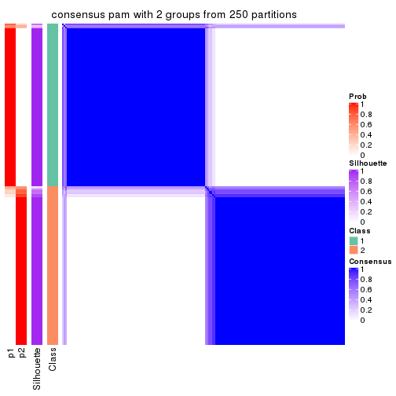</p>

</div>
<div id='tab-CV-pam-consensus-heatmap-2'>
<pre><code class="r">consensus_heatmap(res, k = 3)
</code></pre>

<p>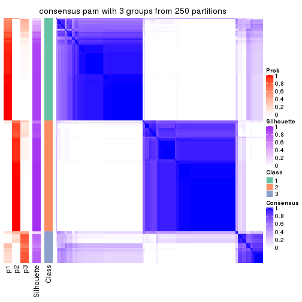</p>

</div>
<div id='tab-CV-pam-consensus-heatmap-3'>
<pre><code class="r">consensus_heatmap(res, k = 4)
</code></pre>

<p>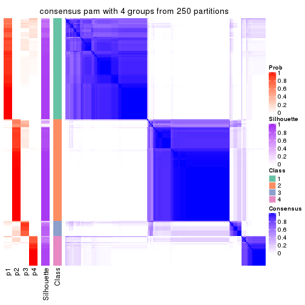</p>

</div>
<div id='tab-CV-pam-consensus-heatmap-4'>
<pre><code class="r">consensus_heatmap(res, k = 5)
</code></pre>

<p>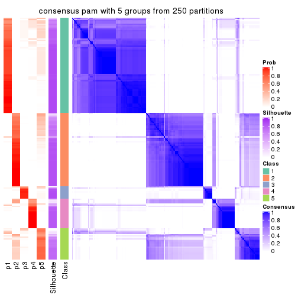</p>

</div>
<div id='tab-CV-pam-consensus-heatmap-5'>
<pre><code class="r">consensus_heatmap(res, k = 6)
</code></pre>

<p>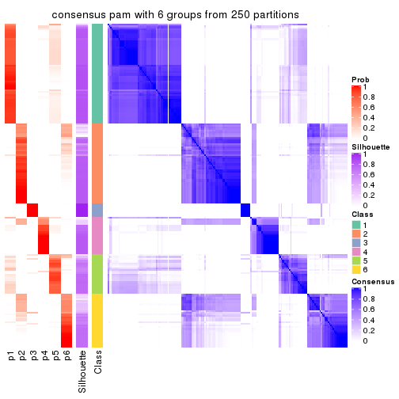</p>

</div>
</div>

Heatmaps for the membership of samples in all partitions to see how consistent they are:


<script>
$( function() {
	$( '#tabs-CV-pam-membership-heatmap' ).tabs();
} );
</script>
<div id='tabs-CV-pam-membership-heatmap'>
<ul>
<li><a href='#tab-CV-pam-membership-heatmap-1'>k = 2</a></li>
<li><a href='#tab-CV-pam-membership-heatmap-2'>k = 3</a></li>
<li><a href='#tab-CV-pam-membership-heatmap-3'>k = 4</a></li>
<li><a href='#tab-CV-pam-membership-heatmap-4'>k = 5</a></li>
<li><a href='#tab-CV-pam-membership-heatmap-5'>k = 6</a></li>
</ul>
<div id='tab-CV-pam-membership-heatmap-1'>
<pre><code class="r">membership_heatmap(res, k = 2)
</code></pre>

<p>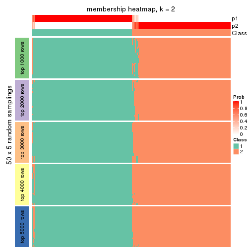</p>

</div>
<div id='tab-CV-pam-membership-heatmap-2'>
<pre><code class="r">membership_heatmap(res, k = 3)
</code></pre>

<p>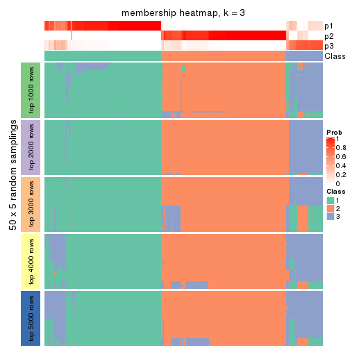</p>

</div>
<div id='tab-CV-pam-membership-heatmap-3'>
<pre><code class="r">membership_heatmap(res, k = 4)
</code></pre>

<p>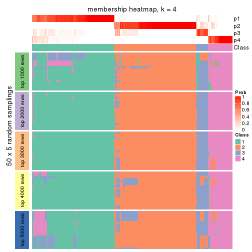</p>

</div>
<div id='tab-CV-pam-membership-heatmap-4'>
<pre><code class="r">membership_heatmap(res, k = 5)
</code></pre>

<p>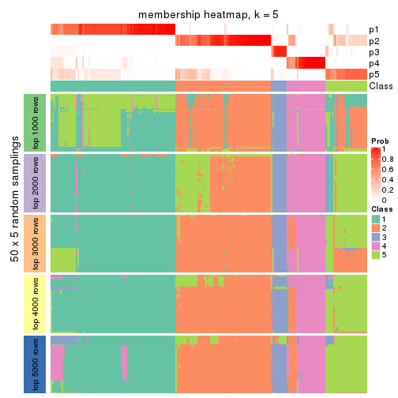</p>

</div>
<div id='tab-CV-pam-membership-heatmap-5'>
<pre><code class="r">membership_heatmap(res, k = 6)
</code></pre>

<p>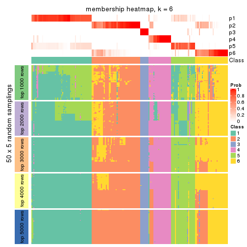</p>

</div>
</div>

As soon as we have had the classes for columns, we can look for signatures
which are significantly different between classes which can be candidate marks
for certain classes. Following are the heatmaps for signatures.


Signature heatmaps where rows are scaled:


<script>
$( function() {
	$( '#tabs-CV-pam-get-signatures' ).tabs();
} );
</script>
<div id='tabs-CV-pam-get-signatures'>
<ul>
<li><a href='#tab-CV-pam-get-signatures-1'>k = 2</a></li>
<li><a href='#tab-CV-pam-get-signatures-2'>k = 3</a></li>
<li><a href='#tab-CV-pam-get-signatures-3'>k = 4</a></li>
<li><a href='#tab-CV-pam-get-signatures-4'>k = 5</a></li>
<li><a href='#tab-CV-pam-get-signatures-5'>k = 6</a></li>
</ul>
<div id='tab-CV-pam-get-signatures-1'>
<pre><code class="r">get_signatures(res, k = 2)
</code></pre>

<p>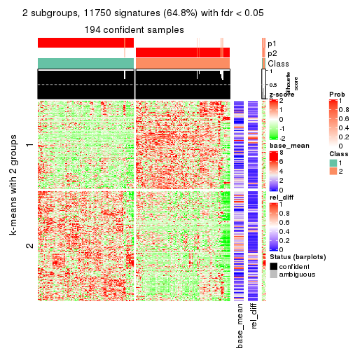</p>

</div>
<div id='tab-CV-pam-get-signatures-2'>
<pre><code class="r">get_signatures(res, k = 3)
</code></pre>

<p>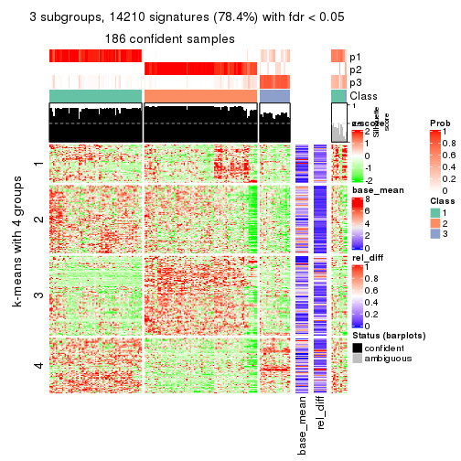</p>

</div>
<div id='tab-CV-pam-get-signatures-3'>
<pre><code class="r">get_signatures(res, k = 4)
</code></pre>

<p>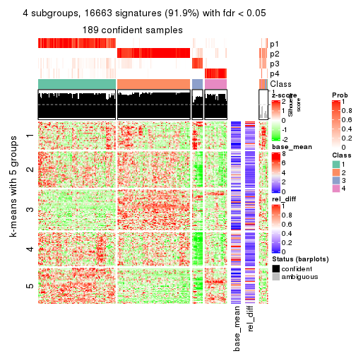</p>

</div>
<div id='tab-CV-pam-get-signatures-4'>
<pre><code class="r">get_signatures(res, k = 5)
</code></pre>

<p>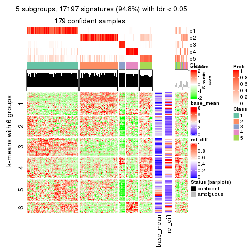</p>

</div>
<div id='tab-CV-pam-get-signatures-5'>
<pre><code class="r">get_signatures(res, k = 6)
</code></pre>

<p>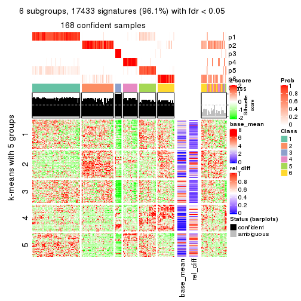</p>

</div>
</div>


Signature heatmaps where rows are not scaled:


<script>
$( function() {
	$( '#tabs-CV-pam-get-signatures-no-scale' ).tabs();
} );
</script>
<div id='tabs-CV-pam-get-signatures-no-scale'>
<ul>
<li><a href='#tab-CV-pam-get-signatures-no-scale-1'>k = 2</a></li>
<li><a href='#tab-CV-pam-get-signatures-no-scale-2'>k = 3</a></li>
<li><a href='#tab-CV-pam-get-signatures-no-scale-3'>k = 4</a></li>
<li><a href='#tab-CV-pam-get-signatures-no-scale-4'>k = 5</a></li>
<li><a href='#tab-CV-pam-get-signatures-no-scale-5'>k = 6</a></li>
</ul>
<div id='tab-CV-pam-get-signatures-no-scale-1'>
<pre><code class="r">get_signatures(res, k = 2, scale_rows = FALSE)
</code></pre>

<p>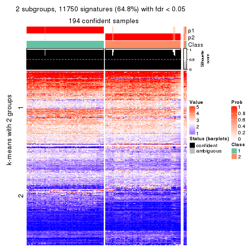</p>

</div>
<div id='tab-CV-pam-get-signatures-no-scale-2'>
<pre><code class="r">get_signatures(res, k = 3, scale_rows = FALSE)
</code></pre>

<p>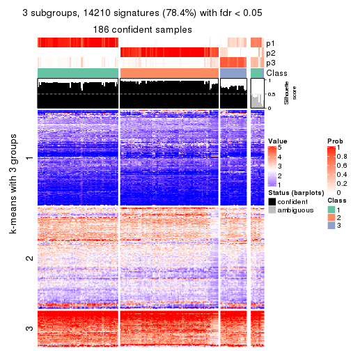</p>

</div>
<div id='tab-CV-pam-get-signatures-no-scale-3'>
<pre><code class="r">get_signatures(res, k = 4, scale_rows = FALSE)
</code></pre>

<p>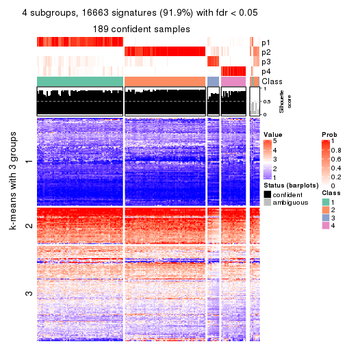</p>

</div>
<div id='tab-CV-pam-get-signatures-no-scale-4'>
<pre><code class="r">get_signatures(res, k = 5, scale_rows = FALSE)
</code></pre>

<p>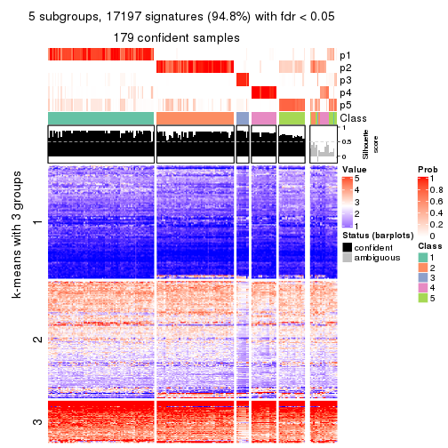</p>

</div>
<div id='tab-CV-pam-get-signatures-no-scale-5'>
<pre><code class="r">get_signatures(res, k = 6, scale_rows = FALSE)
</code></pre>

<p>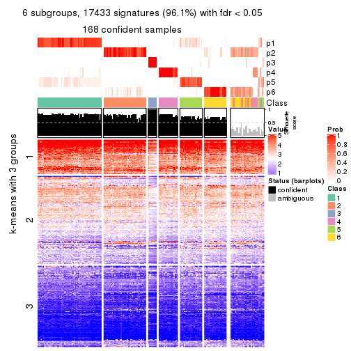</p>

</div>
</div>


Compare the overlap of signatures from different k:

```r
compare_signatures(res)
```

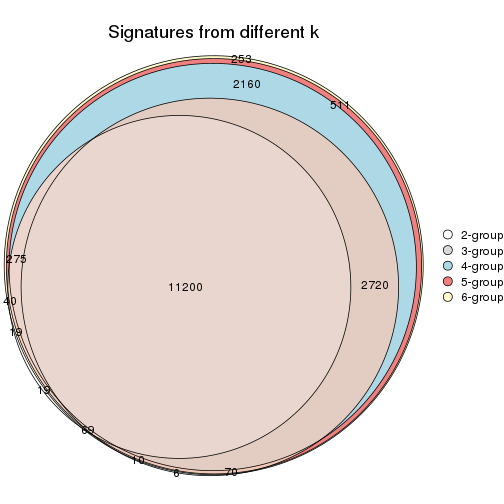

`get_signature()` returns a data frame invisibly. TO get the list of signatures, the function
call should be assigned to a variable explicitly. In following code, if `plot` argument is set
to `FALSE`, no heatmap is plotted while only the differential analysis is performed.

```r
# code only for demonstration
tb = get_signature(res, k = ..., plot = FALSE)
```

An example of the output of `tb` is:

```
#>   which_row         fdr    mean_1    mean_2 scaled_mean_1 scaled_mean_2 km
#> 1        38 0.042760348  8.373488  9.131774    -0.5533452     0.5164555  1
#> 2        40 0.018707592  7.106213  8.469186    -0.6173731     0.5762149  1
#> 3        55 0.019134737 10.221463 11.207825    -0.6159697     0.5749050  1
#> 4        59 0.006059896  5.921854  7.869574    -0.6899429     0.6439467  1
#> 5        60 0.018055526  8.928898 10.211722    -0.6204761     0.5791110  1
#> 6        98 0.009384629 15.714769 14.887706     0.6635654    -0.6193277  2
...
```

The columns in `tb` are:

1. `which_row`: row indices corresponding to the input matrix.
2. `fdr`: FDR for the differential test. 
3. `mean_x`: The mean value in group x.
4. `scaled_mean_x`: The mean value in group x after rows are scaled.
5. `km`: Row groups if k-means clustering is applied to rows.


UMAP plot which shows how samples are separated.


<script>
$( function() {
	$( '#tabs-CV-pam-dimension-reduction' ).tabs();
} );
</script>
<div id='tabs-CV-pam-dimension-reduction'>
<ul>
<li><a href='#tab-CV-pam-dimension-reduction-1'>k = 2</a></li>
<li><a href='#tab-CV-pam-dimension-reduction-2'>k = 3</a></li>
<li><a href='#tab-CV-pam-dimension-reduction-3'>k = 4</a></li>
<li><a href='#tab-CV-pam-dimension-reduction-4'>k = 5</a></li>
<li><a href='#tab-CV-pam-dimension-reduction-5'>k = 6</a></li>
</ul>
<div id='tab-CV-pam-dimension-reduction-1'>
<pre><code class="r">dimension_reduction(res, k = 2, method = &quot;UMAP&quot;)
</code></pre>

<p>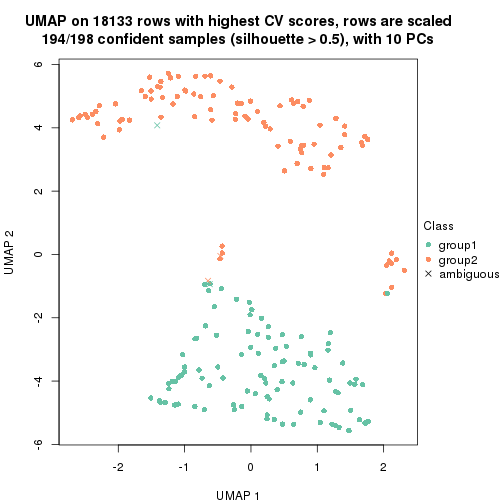</p>

</div>
<div id='tab-CV-pam-dimension-reduction-2'>
<pre><code class="r">dimension_reduction(res, k = 3, method = &quot;UMAP&quot;)
</code></pre>

<p></p>

</div>
<div id='tab-CV-pam-dimension-reduction-3'>
<pre><code class="r">dimension_reduction(res, k = 4, method = &quot;UMAP&quot;)
</code></pre>

<p>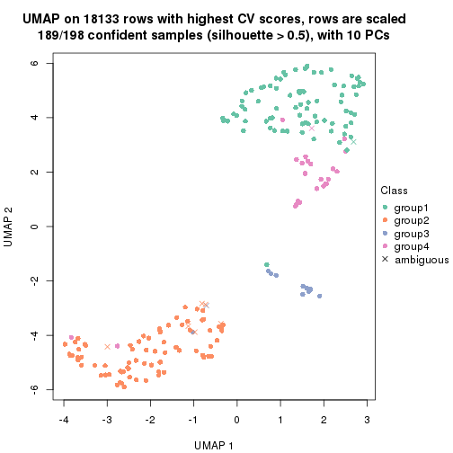</p>

</div>
<div id='tab-CV-pam-dimension-reduction-4'>
<pre><code class="r">dimension_reduction(res, k = 5, method = &quot;UMAP&quot;)
</code></pre>

<p>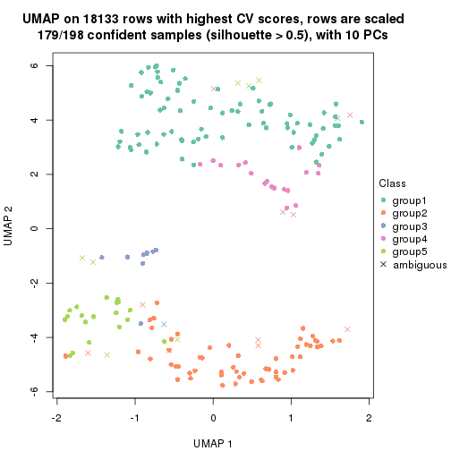</p>

</div>
<div id='tab-CV-pam-dimension-reduction-5'>
<pre><code class="r">dimension_reduction(res, k = 6, method = &quot;UMAP&quot;)
</code></pre>

<p>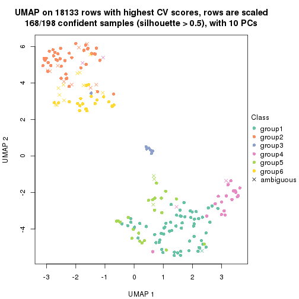</p>

</div>
</div>


Following heatmap shows how subgroups are split when increasing `k`:

```r
collect_classes(res)
```

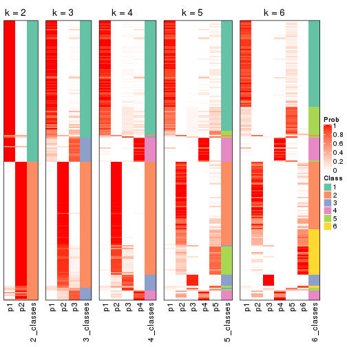


If matrix rows can be associated to genes, consider to use `functional_enrichment(res,
...)` to perform function enrichment for the signature genes. See [this vignette](http://bioconductor.org/packages/devel/bioc/vignettes/cola/inst/doc/functional_enrichment.html) for more detailed explanations.


 

---------------------------------------------------


### CV:mclust**


The object with results only for a single top-value method and a single partition method 
can be extracted as:

```r
res = res_list["CV", "mclust"]
# you can also extract it by
# res = res_list["CV:mclust"]
```

A summary of `res` and all the functions that can be applied to it:

```r
res
```

```
#> A 'ConsensusPartition' object with k = 2, 3, 4, 5, 6.
#>   On a matrix with 18133 rows and 198 columns.
#>   Top rows (1000, 2000, 3000, 4000, 5000) are extracted by 'CV' method.
#>   Subgroups are detected by 'mclust' method.
#>   Performed in total 1250 partitions by row resampling.
#>   Best k for subgroups seems to be 2.
#> 
#> Following methods can be applied to this 'ConsensusPartition' object:
#>  [1] "cola_report"             "collect_classes"         "collect_plots"          
#>  [4] "collect_stats"           "colnames"                "compare_signatures"     
#>  [7] "consensus_heatmap"       "dimension_reduction"     "functional_enrichment"  
#> [10] "get_anno_col"            "get_anno"                "get_classes"            
#> [13] "get_consensus"           "get_matrix"              "get_membership"         
#> [16] "get_param"               "get_signatures"          "get_stats"              
#> [19] "is_best_k"               "is_stable_k"             "membership_heatmap"     
#> [22] "ncol"                    "nrow"                    "plot_ecdf"              
#> [25] "rownames"                "select_partition_number" "show"                   
#> [28] "suggest_best_k"          "test_to_known_factors"
```

`collect_plots()` function collects all the plots made from `res` for all `k` (number of partitions)
into one single page to provide an easy and fast comparison between different `k`.

```r
collect_plots(res)
```

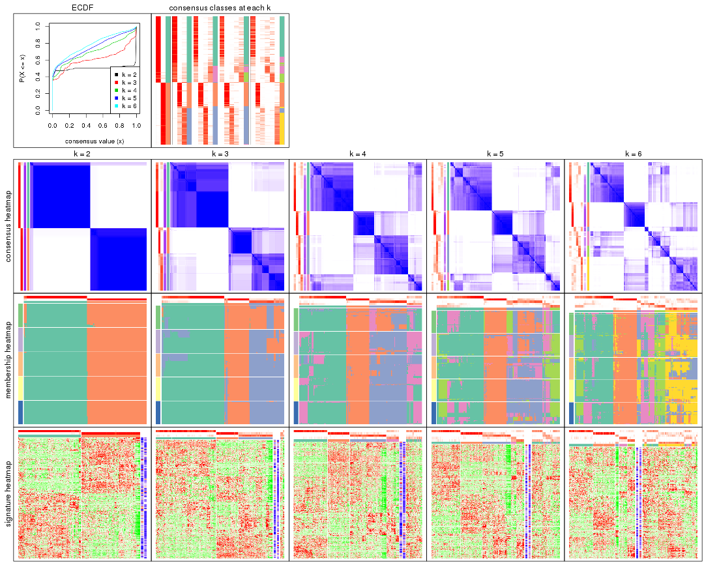

The plots are:

- The first row: a plot of the ECDF (empirical cumulative distribution
  function) curves of the consensus matrix for each `k` and the heatmap of
  predicted classes for each `k`.
- The second row: heatmaps of the consensus matrix for each `k`.
- The third row: heatmaps of the membership matrix for each `k`.
- The fouth row: heatmaps of the signatures for each `k`.

All the plots in panels can be made by individual functions and they are
plotted later in this section.

`select_partition_number()` produces several plots showing different
statistics for choosing "optimized" `k`. There are following statistics:

- ECDF curves of the consensus matrix for each `k`;
- 1-PAC. [The PAC
  score](https://en.wikipedia.org/wiki/Consensus_clustering#Over-interpretation_potential_of_consensus_clustering)
  measures the proportion of the ambiguous subgrouping.
- Mean silhouette score.
- Concordance. The mean probability of fiting the consensus class ids in all
  partitions.
- Area increased. Denote $A_k$ as the area under the ECDF curve for current
  `k`, the area increased is defined as $A_k - A_{k-1}$.
- Rand index. The percent of pairs of samples that are both in a same cluster
  or both are not in a same cluster in the partition of k and k-1.
- Jaccard index. The ratio of pairs of samples are both in a same cluster in
  the partition of k and k-1 and the pairs of samples are both in a same
  cluster in the partition k or k-1.

The detailed explanations of these statistics can be found in [the _cola_
vignette](http://bioconductor.org/packages/devel/bioc/vignettes/cola/inst/doc/cola.html#toc_13).

Generally speaking, lower PAC score, higher mean silhouette score or higher
concordance corresponds to better partition. Rand index and Jaccard index
measure how similar the current partition is compared to partition with `k-1`.
If they are too similar, we won't accept `k` is better than `k-1`.

```r
select_partition_number(res)
```

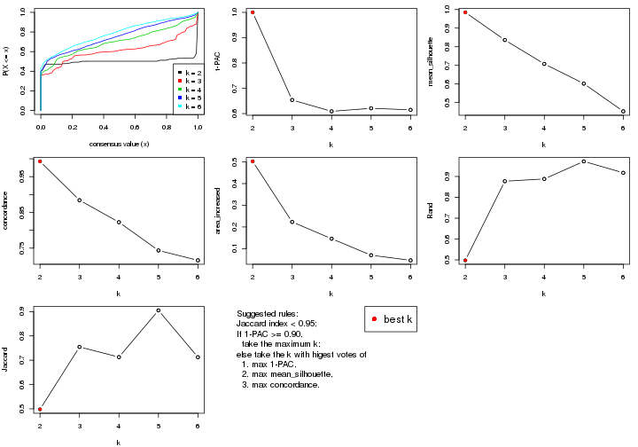

The numeric values for all these statistics can be obtained by `get_stats()`.

```r
get_stats(res)
```

```
#>   k 1-PAC mean_silhouette concordance area_increased  Rand Jaccard
#> 2 2 1.000           0.985       0.993         0.5025 0.498   0.498
#> 3 3 0.653           0.836       0.884         0.2230 0.877   0.755
#> 4 4 0.609           0.708       0.823         0.1456 0.888   0.713
#> 5 5 0.621           0.602       0.744         0.0696 0.972   0.905
#> 6 6 0.615           0.453       0.716         0.0460 0.917   0.712
```

`suggest_best_k()` suggests the best $k$ based on these statistics. The rules are as follows:

- All $k$ with Jaccard index larger than 0.95 are removed because increasing
  $k$ does not provide enough extra information. If all $k$ are removed, it is
  marked as no subgroup is detected.
- For all $k$ with 1-PAC score larger than 0.9, the maximal $k$ is taken as
  the best $k$, and other $k$ are marked as optional $k$.
- If it does not fit the second rule. The $k$ with the maximal vote of the
  highest 1-PAC score, highest mean silhouette, and highest concordance is
  taken as the best $k$.

```r
suggest_best_k(res)
```

```
#> [1] 2
```


Following shows the table of the partitions (You need to click the **show/hide
code output** link to see it). The membership matrix (columns with name `p*`)
is inferred by
[`clue::cl_consensus()`](https://www.rdocumentation.org/link/cl_consensus?package=clue)
function with the `SE` method. Basically the value in the membership matrix
represents the probability to belong to a certain group. The finall class
label for an item is determined with the group with highest probability it
belongs to.

In `get_classes()` function, the entropy is calculated from the membership
matrix and the silhouette score is calculated from the consensus matrix.


<script>
$( function() {
	$( '#tabs-CV-mclust-get-classes' ).tabs();
} );
</script>
<div id='tabs-CV-mclust-get-classes'>
<ul>
<li><a href='#tab-CV-mclust-get-classes-1'>k = 2</a></li>
<li><a href='#tab-CV-mclust-get-classes-2'>k = 3</a></li>
<li><a href='#tab-CV-mclust-get-classes-3'>k = 4</a></li>
<li><a href='#tab-CV-mclust-get-classes-4'>k = 5</a></li>
<li><a href='#tab-CV-mclust-get-classes-5'>k = 6</a></li>
</ul>

<div id='tab-CV-mclust-get-classes-1'>
<p><a id='tab-CV-mclust-get-classes-1-a' style='color:#0366d6' href='#'>show/hide code output</a></p>
<pre><code class="r">cbind(get_classes(res, k = 2), get_membership(res, k = 2))
</code></pre>

<pre><code>#&gt;                                      class entropy silhouette    p1    p2
#&gt; 0C0AA0B2-5191-4EDF-8937-ED7434F30283     2  0.0000      0.996 0.000 1.000
#&gt; 18B45F1F-234F-45CC-A234-145307606C5C     1  0.0000      0.990 1.000 0.000
#&gt; E18B70C0-BDCA-46D3-99BB-C6C8ABC68DA5     2  0.0000      0.996 0.000 1.000
#&gt; 0F6DDBA7-6F74-45E8-95C8-F28263D55978     1  0.0000      0.990 1.000 0.000
#&gt; 7EAE1A5A-129A-46DE-977E-A2C753F10904     2  0.0000      0.996 0.000 1.000
#&gt; 7EAE0048-16B5-4979-9410-16CDEB9B1A48     1  0.0000      0.990 1.000 0.000
#&gt; 2EBFC828-2B27-4753-A052-80DDA226DAB4     2  0.0000      0.996 0.000 1.000
#&gt; 24E1768D-2232-41DA-9383-BC55D6EB3812     2  0.0000      0.996 0.000 1.000
#&gt; 6E3CD60A-1889-4CA3-B305-2E78152057B5     2  0.1633      0.977 0.024 0.976
#&gt; 33CC70DD-82B3-413C-B3B1-BE06634D95D0     1  0.0000      0.990 1.000 0.000
#&gt; F1CB57A3-55DD-4487-9307-1B4F652E729A     1  0.0000      0.990 1.000 0.000
#&gt; 755A5806-B054-449A-93DB-79909E6C93A1     1  0.0000      0.990 1.000 0.000
#&gt; 58D364E7-3D2F-468F-A264-D6461E2428D4     2  0.0000      0.996 0.000 1.000
#&gt; 68BB9CB6-7AA2-4981-B9D9-07363EC96599     2  0.0000      0.996 0.000 1.000
#&gt; 3C4E8DFA-8EA0-4F1F-89CB-CB8805395872     2  0.0000      0.996 0.000 1.000
#&gt; 4219651D-5583-4498-BF08-1B7D04B4C7B2     1  0.0000      0.990 1.000 0.000
#&gt; B5EE2768-0D67-4584-ADBC-EC745FEC52EA     2  0.0000      0.996 0.000 1.000
#&gt; 825E6C11-F460-451A-8045-846DD7D0E945     1  0.0000      0.990 1.000 0.000
#&gt; 491F62AF-5E68-43C3-982A-F867A75BBA9A     2  0.0000      0.996 0.000 1.000
#&gt; 9D7F058C-F95A-44AD-AC9E-450F7FBDC960     2  0.0000      0.996 0.000 1.000
#&gt; 6D42DD0C-2081-4742-BA27-9F5F16FAC3C6     1  0.0000      0.990 1.000 0.000
#&gt; EDD7E63D-492A-473B-A552-0764337B10EF     2  0.0000      0.996 0.000 1.000
#&gt; 97073DEA-73AD-4DFD-BD1A-9035DC03445B     1  0.0000      0.990 1.000 0.000
#&gt; FA891AB9-CE38-4F7E-A015-1DDCE12890A0     1  0.0000      0.990 1.000 0.000
#&gt; D9514D49-A0AE-45AB-8C9F-68E726215253     1  0.0000      0.990 1.000 0.000
#&gt; 3B9229AD-12E5-451E-9D2F-378AAC82C04A     2  0.0000      0.996 0.000 1.000
#&gt; 5EA36B71-4917-4EF3-9060-065EFE6ACC5B     1  0.0000      0.990 1.000 0.000
#&gt; A20E4ECB-4895-4CC7-BE5E-4721B20D933B     1  0.0000      0.990 1.000 0.000
#&gt; 1BE8D828-29DB-4368-AA4A-FB23588F7AE8     1  0.0000      0.990 1.000 0.000
#&gt; 66EFEFCF-3D14-4DBF-AA13-530F40ED0245     1  0.0000      0.990 1.000 0.000
#&gt; 55DFFE53-BCE7-4EC1-9863-6C0311B06BA2     2  0.0000      0.996 0.000 1.000
#&gt; 4CC3FB5A-611D-4C64-AE9D-544FA45CF4DC     1  0.0000      0.990 1.000 0.000
#&gt; C11D33F2-DFE9-4FA8-9024-F3E7F1DADC5F     2  0.0000      0.996 0.000 1.000
#&gt; FA5932B8-8AA3-4C38-9FAB-C35D8772974D     1  0.0000      0.990 1.000 0.000
#&gt; 8216EC35-1F41-4A15-B503-BDA4971E27C9     1  0.0000      0.990 1.000 0.000
#&gt; 69635D23-90A7-4BAD-97C7-B79536837F57     1  0.0000      0.990 1.000 0.000
#&gt; 12B404E2-C463-4409-8392-E4649B2AFFD1     2  0.0000      0.996 0.000 1.000
#&gt; 246927E3-ACCF-41B2-AA8E-43855FD6B146     2  0.0000      0.996 0.000 1.000
#&gt; E0CC13E7-9607-49E0-B4AA-395544E3C3BF     1  0.0000      0.990 1.000 0.000
#&gt; F7BBC0C1-6124-4A83-8A70-EA89B62F1CBD     1  0.0000      0.990 1.000 0.000
#&gt; B1D4FF24-8E6F-4A04-B716-2032D850EB57     1  0.0000      0.990 1.000 0.000
#&gt; 253601DB-B78A-4566-9947-8C0270C0B163     2  0.0000      0.996 0.000 1.000
#&gt; AB83DBFF-5737-4FB8-A5AC-1D3CD6072BDF     2  0.1414      0.980 0.020 0.980
#&gt; 9D67D953-EC98-4B72-89C8-5732BC9D4BC9     2  0.0000      0.996 0.000 1.000
#&gt; 51061018-95AB-4278-886F-F69E4EBC47C0     2  0.0000      0.996 0.000 1.000
#&gt; ABD0F7F3-105B-4DEE-9889-5028772C519A     1  0.0000      0.990 1.000 0.000
#&gt; 562B95CF-B27E-4A72-B7C6-CDF86A51A39B     1  0.0000      0.990 1.000 0.000
#&gt; ABF046A4-D7A1-49FF-B6B1-4E07A791DEDB     2  0.0000      0.996 0.000 1.000
#&gt; 3FF4101E-9703-460E-A30E-76CC7689F36D     2  0.0000      0.996 0.000 1.000
#&gt; 39C4F7AA-7ADF-4F1D-BDA3-BEC605AC5023     2  0.0000      0.996 0.000 1.000
#&gt; CB821FD2-AF5C-4743-A70F-21C12C6ED153     1  0.0000      0.990 1.000 0.000
#&gt; 92EA1846-62FF-41D5-A441-5E52E6B9E7F9     1  0.0000      0.990 1.000 0.000
#&gt; 7D25F3EE-5A20-4763-8026-16A03D05F459     1  0.0000      0.990 1.000 0.000
#&gt; 8ECE5276-CD06-496B-A5A9-1713B1F7D089     1  0.0000      0.990 1.000 0.000
#&gt; C775B68F-9507-47E3-B507-B433AED79002     1  0.0000      0.990 1.000 0.000
#&gt; E19D5463-FDD0-41C1-A170-323736A88D07     2  0.0000      0.996 0.000 1.000
#&gt; CE4B6285-4961-4767-91F0-5C7A8162E185     1  0.0000      0.990 1.000 0.000
#&gt; 9637BD72-1FEF-42AD-8886-2C39BE876531     1  0.0000      0.990 1.000 0.000
#&gt; 81B5A88E-45A0-4B44-B689-B9071B8548EE     2  0.0000      0.996 0.000 1.000
#&gt; 0B01B4C9-9BED-4F5B-A3E2-8868C7CCC3FC     2  0.0376      0.993 0.004 0.996
#&gt; 54501315-7132-44B2-A179-10FBF1421105     1  0.0000      0.990 1.000 0.000
#&gt; E207CBE9-4C3A-4FDD-9251-CFE1FE106475     1  0.8267      0.663 0.740 0.260
#&gt; 3BEA0B92-3F90-4DBF-9679-AADEAD7D47C8     2  0.0000      0.996 0.000 1.000
#&gt; 35B32250-D854-4215-AA5B-2C11B2FBEECA     1  0.0000      0.990 1.000 0.000
#&gt; ACE6566B-AEB9-426C-924A-B382D14A1024     2  0.0000      0.996 0.000 1.000
#&gt; 737E69AC-0930-45B9-B6BA-7CE5E300290B     1  0.0000      0.990 1.000 0.000
#&gt; B4410AB8-D015-41CA-86E6-12EB4E4103E3     1  0.0000      0.990 1.000 0.000
#&gt; 6D3ECA65-C50F-43B0-B75A-1D290FA4A8FD     2  0.0000      0.996 0.000 1.000
#&gt; C86F40D3-9A96-4395-A8C3-510DE12F9A2B     2  0.0000      0.996 0.000 1.000
#&gt; 6238087F-24DD-4BF1-903F-3BD4E446C1AE     2  0.0000      0.996 0.000 1.000
#&gt; E4FF840B-EEAB-4CB0-A690-7D4C4AA7EEC3     2  0.0000      0.996 0.000 1.000
#&gt; 72D3C323-C67F-4C0E-9BFC-BF245FF9730A     1  0.0000      0.990 1.000 0.000
#&gt; 82D56E4E-4DF6-4F3E-8959-B995C92AAA70     1  0.0000      0.990 1.000 0.000
#&gt; E31CA441-EB19-443B-ACBD-37B5CCBCF0E5     2  0.0000      0.996 0.000 1.000
#&gt; 87CA8939-D054-4B8A-B32D-085FD2E8F202     1  0.0000      0.990 1.000 0.000
#&gt; 2A508D90-FEDC-46A3-9A02-E51E5467CDCB     1  0.0000      0.990 1.000 0.000
#&gt; C4E8B4E2-388B-411F-BF0A-9B6F34E8EDB5     2  0.0000      0.996 0.000 1.000
#&gt; AF6AF803-BD93-44A7-AA80-B9BC92C1273B     2  0.0000      0.996 0.000 1.000
#&gt; 0B1CA5CF-EB96-41D4-BFC5-6957FEB39828     1  0.6531      0.801 0.832 0.168
#&gt; 6FB96FB0-6661-48AD-A4A0-69F8AFDBE591     2  0.0000      0.996 0.000 1.000
#&gt; 8C19F7FD-368A-462B-B28F-88D6630038A1     1  0.0000      0.990 1.000 0.000
#&gt; 96EABE78-C2F4-4A33-ACD8-C922A4B2519B     2  0.0000      0.996 0.000 1.000
#&gt; 68B36D7B-546A-4689-949F-B207C4A4AB27     2  0.0000      0.996 0.000 1.000
#&gt; CE9F3335-778F-4F52-BC55-4B7C99B211DD     2  0.0000      0.996 0.000 1.000
#&gt; CB359DED-2A2D-4646-A0BD-6F10ADCC532B     1  0.0000      0.990 1.000 0.000
#&gt; 198324A5-8C52-46F6-9734-EFAF1CCA6D9B     1  0.0000      0.990 1.000 0.000
#&gt; 83B88608-0506-428C-B9E8-621F38477B42     1  0.0000      0.990 1.000 0.000
#&gt; 1993630A-0F3D-4F5C-86A3-D443BAAF57F0     2  0.5842      0.840 0.140 0.860
#&gt; DE73DA9B-529E-4F4F-A65C-DA7AB84B1096     1  0.0000      0.990 1.000 0.000
#&gt; 2347F3B7-DDA3-40C0-B6D4-8819ECA69146     1  0.0000      0.990 1.000 0.000
#&gt; AB93B5D5-095F-4330-9D40-6A3D934AB50C     1  0.0000      0.990 1.000 0.000
#&gt; 5EBBE4AD-FF0C-41CF-9EA3-B6FE7EA1F9C0     1  0.8016      0.690 0.756 0.244
#&gt; 6D960AE7-3769-4144-A061-E8588E5063FF     1  0.0000      0.990 1.000 0.000
#&gt; 0C2DD8C0-D1A5-4192-A49C-7A40FED628B2     2  0.0000      0.996 0.000 1.000
#&gt; 18C9372F-C55B-4F86-A9D2-E8D85EFC8566     2  0.1414      0.980 0.020 0.980
#&gt; 9AF637B0-4C32-4DD1-93AF-7655B4A845D3     2  0.0000      0.996 0.000 1.000
#&gt; 785B5B06-4115-46FD-9BEB-F888AFDC855D     2  0.0000      0.996 0.000 1.000
#&gt; ECA3050E-4BE2-4117-B9CF-A52BB85AF8C2     2  0.1633      0.977 0.024 0.976
#&gt; 099DC396-16A5-458F-9ED9-F2A790CB0C34     1  0.0000      0.990 1.000 0.000
#&gt; 7A5A12EE-C5B0-4C51-8C99-0F3FA88D633E     1  0.0000      0.990 1.000 0.000
#&gt; E832B508-A66D-4817-B44A-FE9FAAE64B4A     1  0.0000      0.990 1.000 0.000
#&gt; F9DD688C-7B35-49E7-9651-2E098EE78856     1  0.0000      0.990 1.000 0.000
#&gt; F1265DD8-5ED3-4635-A277-57BBFDEC7729     1  0.0000      0.990 1.000 0.000
#&gt; F624E8D9-DB07-4C9E-910D-5E8EBA3A6167     2  0.0000      0.996 0.000 1.000
#&gt; 3516FBDF-66E1-43F4-9D7B-16748F6439A7     2  0.0000      0.996 0.000 1.000
#&gt; 04B12992-B2EA-4BA2-8E2C-11E34E230E6F     2  0.0000      0.996 0.000 1.000
#&gt; CC02897D-9123-495E-9242-5C9CF4EC269B     2  0.0000      0.996 0.000 1.000
#&gt; 3117ED46-2BF2-4311-BC00-4E98243E16B3     1  0.0000      0.990 1.000 0.000
#&gt; E0B66D53-23DB-4E26-BB6E-F692FA8C000E     1  0.0000      0.990 1.000 0.000
#&gt; DAA93CE5-A013-477A-9A50-EA09CC3A8162     2  0.0000      0.996 0.000 1.000
#&gt; 0099098D-354A-4276-92F8-B932C74B4608     1  0.0000      0.990 1.000 0.000
#&gt; DD483639-B2E7-4745-BCFB-55ED1D82BFBF     2  0.0000      0.996 0.000 1.000
#&gt; 2C1F9079-602E-4252-82C7-9D8799E04246     2  0.0000      0.996 0.000 1.000
#&gt; 9473A8E4-3A1B-4184-9EA6-517AFD60B635     1  0.6887      0.782 0.816 0.184
#&gt; 75CFBAF6-7BA0-40AF-92D7-D218E885BD1B     2  0.0000      0.996 0.000 1.000
#&gt; B588950F-14D6-41C8-845B-EFD2096013C6     2  0.0000      0.996 0.000 1.000
#&gt; 0DF3EDA8-DAEA-4721-92AB-B97181249498     2  0.0000      0.996 0.000 1.000
#&gt; 8EA83042-D598-401D-AD78-936EEB136C59     1  0.0000      0.990 1.000 0.000
#&gt; 729AC418-3BE9-445A-95D4-AC11A7D43BE0     1  0.0000      0.990 1.000 0.000
#&gt; 7D8B1B11-F576-4AA8-BFA7-0022A2CD829A     2  0.0000      0.996 0.000 1.000
#&gt; 304A0E46-3449-4B44-9C30-BDDF6459391D     1  0.0000      0.990 1.000 0.000
#&gt; 3C83358F-DF20-47F7-AF9F-AB7CC92F5ABA     1  0.0000      0.990 1.000 0.000
#&gt; EAFEED6C-35C3-451F-AE4A-EB56992E1F29     1  0.0000      0.990 1.000 0.000
#&gt; 8A237A65-28EC-434D-A78A-A8B7308B5204     1  0.0000      0.990 1.000 0.000
#&gt; D005833F-E991-4E9E-9667-55F137288004     1  0.0000      0.990 1.000 0.000
#&gt; 37D966E3-253E-4397-A9AE-0903A8D31FE6     1  0.0000      0.990 1.000 0.000
#&gt; D2482B81-CB5B-4178-BA8D-1CF4026181B5     1  0.0000      0.990 1.000 0.000
#&gt; 18019E95-C2A8-4EE7-B585-F6886DC4D953     2  0.0000      0.996 0.000 1.000
#&gt; 0B126D1A-14A8-4345-8F78-FF92222ADF4C     2  0.0000      0.996 0.000 1.000
#&gt; CE88B625-47D8-4D58-9FB4-23464DB7DDAD     2  0.0000      0.996 0.000 1.000
#&gt; 9A88299D-5C74-47FA-B42C-1A1D6D935AAB     1  0.0000      0.990 1.000 0.000
#&gt; 3E71159C-FD6C-41DA-B18B-0730C8AC7E41     1  0.0000      0.990 1.000 0.000
#&gt; 6F245AA4-79D9-47E1-BCC9-1AAF65AEA813     1  0.0000      0.990 1.000 0.000
#&gt; 4CF2C888-2100-483A-B4DB-ECBB69243A4D     2  0.0000      0.996 0.000 1.000
#&gt; A3853813-B9D5-4E8C-B075-19FCC35F8686     2  0.0938      0.987 0.012 0.988
#&gt; 83A16DEE-CE9F-4D8B-9225-0A2A8B9D055D     1  0.0000      0.990 1.000 0.000
#&gt; 0F057CAF-4F9A-4DE9-8601-730E96873733     2  0.0000      0.996 0.000 1.000
#&gt; 32D5801D-DBA4-422E-87CB-A2DDE921BA41     1  0.0000      0.990 1.000 0.000
#&gt; 22EE8076-F07C-499A-9AF8-D800A77EF154     2  0.0000      0.996 0.000 1.000
#&gt; DD4BD74D-D48C-4090-9F57-5334E784581C     1  0.0000      0.990 1.000 0.000
#&gt; 41183565-434D-474C-B1BD-CA6E94910658     2  0.0376      0.993 0.004 0.996
#&gt; 75A2CE41-2B2A-4346-927E-ACF8A72738E4     1  0.0000      0.990 1.000 0.000
#&gt; 7AA24995-3DD2-4682-B36A-4EBFEEACF625     1  0.0000      0.990 1.000 0.000
#&gt; 8BAFDFEC-9F26-4ADB-95CE-004143960EEB     1  0.0000      0.990 1.000 0.000
#&gt; A330E011-CE08-4A85-8F4B-370592293DBB     1  0.0000      0.990 1.000 0.000
#&gt; 1D5A5B17-2E70-4BB0-94A1-EC17E6EA49DB     1  0.0000      0.990 1.000 0.000
#&gt; BD9143B8-9D97-4A05-872C-3FB82B4CF7BE     2  0.0000      0.996 0.000 1.000
#&gt; 64552DC0-181E-4607-898C-787AA7F26435     2  0.0000      0.996 0.000 1.000
#&gt; 1B4C4D41-34C7-43A3-858B-C9552EB53894     1  0.0000      0.990 1.000 0.000
#&gt; 463A3BAA-02DC-4EA4-A644-B924163E425D     2  0.0000      0.996 0.000 1.000
#&gt; CD0FEA89-6F60-4A20-8FCA-D397B4E95A98     1  0.0000      0.990 1.000 0.000
#&gt; 5D06CF6D-F4B9-4B32-B055-8AB287E53340     2  0.0938      0.987 0.012 0.988
#&gt; ADA7835F-DB67-4F4F-9446-8BCE3C5FE936     2  0.0000      0.996 0.000 1.000
#&gt; 4109BE2D-B5DF-4BD7-860E-60D87F647152     2  0.1633      0.977 0.024 0.976
#&gt; 88526A0E-6DFE-46CB-BFAD-B4826F482C67     1  0.0000      0.990 1.000 0.000
#&gt; F39F9A4C-18F7-4017-AB31-85D52FF44587     2  0.0000      0.996 0.000 1.000
#&gt; D4290A5E-1B24-4C55-B470-0FA7A0A09DD0     2  0.0000      0.996 0.000 1.000
#&gt; DC5A2C9E-978F-4661-B729-1F9662976E27     1  0.0000      0.990 1.000 0.000
#&gt; 26A1F392-CED2-43E3-8096-74E6F2BFC8C0     2  0.0000      0.996 0.000 1.000
#&gt; 87D81FB2-306A-4E75-9D58-D5F48E46E7F6     2  0.0000      0.996 0.000 1.000
#&gt; E3D9D81A-C20C-4B3B-B940-A5D2C5F65B22     2  0.0000      0.996 0.000 1.000
#&gt; 4464650B-453F-476C-989C-B7B159BF2CF0     2  0.0000      0.996 0.000 1.000
#&gt; 577D2867-B738-487A-9B06-07958D647F02     1  0.0000      0.990 1.000 0.000
#&gt; E52A22CC-3C03-41A9-9541-220DD871E162     2  0.0000      0.996 0.000 1.000
#&gt; 642703B1-AF99-4746-A915-0792F4B9590B     2  0.1414      0.980 0.020 0.980
#&gt; 8F0D1792-1284-45E6-8EC4-392596057677     2  0.0000      0.996 0.000 1.000
#&gt; 765AFFC1-D528-4494-8BA1-0706451E4205     2  0.0000      0.996 0.000 1.000
#&gt; A716BC29-161F-4CA0-B240-00B330137F2C     1  0.0000      0.990 1.000 0.000
#&gt; 32CBFBAF-7064-4595-8D54-2C5E7DE0FD9B     1  0.0000      0.990 1.000 0.000
#&gt; 4D6ED28C-3F20-41B0-BA41-1BF0E5199A40     2  0.1633      0.977 0.024 0.976
#&gt; 86A38456-2900-48FB-B10F-79222B3CA9BF     1  0.7056      0.768 0.808 0.192
#&gt; E870807D-3223-4A6A-9E3D-F4461B048AA2     2  0.0000      0.996 0.000 1.000
#&gt; 3A78D19F-A833-4D2C-8387-FB4FD4A8313C     1  0.0000      0.990 1.000 0.000
#&gt; DFA162CA-C708-4121-8E74-F9C4DEE0CDAE     1  0.0000      0.990 1.000 0.000
#&gt; C00A300A-CD10-4C9D-8C94-3901AFE8406C     2  0.0000      0.996 0.000 1.000
#&gt; 13E11D15-A90F-48C4-980A-DD032C00A2C1     1  0.0000      0.990 1.000 0.000
#&gt; 31BF80AB-FEDB-4C73-89C3-70BE9F9ACBEE     2  0.0000      0.996 0.000 1.000
#&gt; FA34308A-349D-4AAD-94CF-3F3B7F9AD629     2  0.0000      0.996 0.000 1.000
#&gt; 7C48D467-B663-49DD-BC84-A36BC32ACB3D     1  0.0000      0.990 1.000 0.000
#&gt; BB068534-04F6-4FC9-9087-CDA65920BCE2     1  0.0000      0.990 1.000 0.000
#&gt; EA4EC272-A9B3-4B2E-955F-19F7676A944C     2  0.0000      0.996 0.000 1.000
#&gt; C71FF69B-A460-43CA-8769-9667F22D938B     1  0.0000      0.990 1.000 0.000
#&gt; 5243D1B8-8168-4FF1-A8C6-505F080EF0D3     2  0.0000      0.996 0.000 1.000
#&gt; BCC474D8-08FE-4E99-B8E8-B29E65F84D2E     1  0.0000      0.990 1.000 0.000
#&gt; 04FDBFE3-4CF6-4E53-A2AA-89D5C9316377     2  0.0000      0.996 0.000 1.000
#&gt; 83A9915C-8D60-4CAE-A868-B61E3C90C7B0     2  0.1414      0.980 0.020 0.980
#&gt; 989A6472-E3E3-457A-97BE-CCE95F42D5C2     2  0.0000      0.996 0.000 1.000
#&gt; A0AB2D28-6751-49C9-8DF4-66FDBF95C360     1  0.0000      0.990 1.000 0.000
#&gt; A12B2683-18D4-41C9-8AE5-C143E2180052     1  0.0000      0.990 1.000 0.000
#&gt; 8DE1E245-CAD2-4F11-BFA2-9792C433A00B     1  0.0000      0.990 1.000 0.000
#&gt; FDA68036-6C4C-4256-9AA0-C01FE92AA098     2  0.0000      0.996 0.000 1.000
#&gt; 26311920-1414-4EC1-870B-784961EBCC2D     1  0.0000      0.990 1.000 0.000
#&gt; C29A10D6-D598-4286-B5E0-F1776E19E988     1  0.0000      0.990 1.000 0.000
#&gt; FACCC1FB-4937-4CC0-90EA-7F91D3D939CF     2  0.1414      0.980 0.020 0.980
#&gt; 90B9D84B-78E5-4C7E-8414-EC889C2DE8DB     2  0.1414      0.980 0.020 0.980
#&gt; B74E6122-76E1-4E4D-A867-BCAFD7277393     1  0.0000      0.990 1.000 0.000
#&gt; 98494DC0-CF6E-485F-8A0D-D80E4437EF5C     2  0.0000      0.996 0.000 1.000
#&gt; DA114DAC-DE7B-4E43-8D7C-82C5D7B66411     1  0.0000      0.990 1.000 0.000
</code></pre>

<script>
$('#tab-CV-mclust-get-classes-1-a').parent().next().next().hide();
$('#tab-CV-mclust-get-classes-1-a').click(function(){
  $('#tab-CV-mclust-get-classes-1-a').parent().next().next().toggle();
  return(false);
});
</script>
</div>

<div id='tab-CV-mclust-get-classes-2'>
<p><a id='tab-CV-mclust-get-classes-2-a' style='color:#0366d6' href='#'>show/hide code output</a></p>
<pre><code class="r">cbind(get_classes(res, k = 3), get_membership(res, k = 3))
</code></pre>

<pre><code>#&gt;                                      class entropy silhouette    p1    p2    p3
#&gt; 0C0AA0B2-5191-4EDF-8937-ED7434F30283     2  0.1289      0.889 0.000 0.968 0.032
#&gt; 18B45F1F-234F-45CC-A234-145307606C5C     1  0.0000      0.933 1.000 0.000 0.000
#&gt; E18B70C0-BDCA-46D3-99BB-C6C8ABC68DA5     3  0.6291      0.555 0.000 0.468 0.532
#&gt; 0F6DDBA7-6F74-45E8-95C8-F28263D55978     1  0.0000      0.933 1.000 0.000 0.000
#&gt; 7EAE1A5A-129A-46DE-977E-A2C753F10904     3  0.6235      0.635 0.000 0.436 0.564
#&gt; 7EAE0048-16B5-4979-9410-16CDEB9B1A48     1  0.0000      0.933 1.000 0.000 0.000
#&gt; 2EBFC828-2B27-4753-A052-80DDA226DAB4     2  0.0000      0.916 0.000 1.000 0.000
#&gt; 24E1768D-2232-41DA-9383-BC55D6EB3812     3  0.4291      0.835 0.000 0.180 0.820
#&gt; 6E3CD60A-1889-4CA3-B305-2E78152057B5     3  0.3482      0.724 0.000 0.128 0.872
#&gt; 33CC70DD-82B3-413C-B3B1-BE06634D95D0     1  0.2537      0.913 0.920 0.000 0.080
#&gt; F1CB57A3-55DD-4487-9307-1B4F652E729A     1  0.0000      0.933 1.000 0.000 0.000
#&gt; 755A5806-B054-449A-93DB-79909E6C93A1     1  0.3619      0.888 0.864 0.000 0.136
#&gt; 58D364E7-3D2F-468F-A264-D6461E2428D4     3  0.5859      0.757 0.000 0.344 0.656
#&gt; 68BB9CB6-7AA2-4981-B9D9-07363EC96599     3  0.4291      0.835 0.000 0.180 0.820
#&gt; 3C4E8DFA-8EA0-4F1F-89CB-CB8805395872     3  0.4291      0.835 0.000 0.180 0.820
#&gt; 4219651D-5583-4498-BF08-1B7D04B4C7B2     1  0.3551      0.887 0.868 0.000 0.132
#&gt; B5EE2768-0D67-4584-ADBC-EC745FEC52EA     2  0.0000      0.916 0.000 1.000 0.000
#&gt; 825E6C11-F460-451A-8045-846DD7D0E945     1  0.2537      0.913 0.920 0.000 0.080
#&gt; 491F62AF-5E68-43C3-982A-F867A75BBA9A     2  0.3038      0.816 0.000 0.896 0.104
#&gt; 9D7F058C-F95A-44AD-AC9E-450F7FBDC960     3  0.6291      0.555 0.000 0.468 0.532
#&gt; 6D42DD0C-2081-4742-BA27-9F5F16FAC3C6     1  0.4974      0.811 0.764 0.000 0.236
#&gt; EDD7E63D-492A-473B-A552-0764337B10EF     3  0.4291      0.835 0.000 0.180 0.820
#&gt; 97073DEA-73AD-4DFD-BD1A-9035DC03445B     1  0.0000      0.933 1.000 0.000 0.000
#&gt; FA891AB9-CE38-4F7E-A015-1DDCE12890A0     1  0.0000      0.933 1.000 0.000 0.000
#&gt; D9514D49-A0AE-45AB-8C9F-68E726215253     1  0.0000      0.933 1.000 0.000 0.000
#&gt; 3B9229AD-12E5-451E-9D2F-378AAC82C04A     2  0.0000      0.916 0.000 1.000 0.000
#&gt; 5EA36B71-4917-4EF3-9060-065EFE6ACC5B     1  0.3551      0.887 0.868 0.000 0.132
#&gt; A20E4ECB-4895-4CC7-BE5E-4721B20D933B     1  0.0000      0.933 1.000 0.000 0.000
#&gt; 1BE8D828-29DB-4368-AA4A-FB23588F7AE8     1  0.2537      0.913 0.920 0.000 0.080
#&gt; 66EFEFCF-3D14-4DBF-AA13-530F40ED0245     1  0.3816      0.867 0.852 0.000 0.148
#&gt; 55DFFE53-BCE7-4EC1-9863-6C0311B06BA2     3  0.4452      0.834 0.000 0.192 0.808
#&gt; 4CC3FB5A-611D-4C64-AE9D-544FA45CF4DC     1  0.0000      0.933 1.000 0.000 0.000
#&gt; C11D33F2-DFE9-4FA8-9024-F3E7F1DADC5F     3  0.4654      0.836 0.000 0.208 0.792
#&gt; FA5932B8-8AA3-4C38-9FAB-C35D8772974D     1  0.2356      0.915 0.928 0.000 0.072
#&gt; 8216EC35-1F41-4A15-B503-BDA4971E27C9     1  0.0000      0.933 1.000 0.000 0.000
#&gt; 69635D23-90A7-4BAD-97C7-B79536837F57     1  0.0000      0.933 1.000 0.000 0.000
#&gt; 12B404E2-C463-4409-8392-E4649B2AFFD1     2  0.0000      0.916 0.000 1.000 0.000
#&gt; 246927E3-ACCF-41B2-AA8E-43855FD6B146     2  0.0000      0.916 0.000 1.000 0.000
#&gt; E0CC13E7-9607-49E0-B4AA-395544E3C3BF     1  0.0000      0.933 1.000 0.000 0.000
#&gt; F7BBC0C1-6124-4A83-8A70-EA89B62F1CBD     1  0.0000      0.933 1.000 0.000 0.000
#&gt; B1D4FF24-8E6F-4A04-B716-2032D850EB57     1  0.0000      0.933 1.000 0.000 0.000
#&gt; 253601DB-B78A-4566-9947-8C0270C0B163     2  0.0000      0.916 0.000 1.000 0.000
#&gt; AB83DBFF-5737-4FB8-A5AC-1D3CD6072BDF     3  0.5696      0.777 0.064 0.136 0.800
#&gt; 9D67D953-EC98-4B72-89C8-5732BC9D4BC9     2  0.0000      0.916 0.000 1.000 0.000
#&gt; 51061018-95AB-4278-886F-F69E4EBC47C0     3  0.4555      0.837 0.000 0.200 0.800
#&gt; ABD0F7F3-105B-4DEE-9889-5028772C519A     1  0.0000      0.933 1.000 0.000 0.000
#&gt; 562B95CF-B27E-4A72-B7C6-CDF86A51A39B     1  0.0000      0.933 1.000 0.000 0.000
#&gt; ABF046A4-D7A1-49FF-B6B1-4E07A791DEDB     2  0.6204     -0.252 0.000 0.576 0.424
#&gt; 3FF4101E-9703-460E-A30E-76CC7689F36D     2  0.0000      0.916 0.000 1.000 0.000
#&gt; 39C4F7AA-7ADF-4F1D-BDA3-BEC605AC5023     3  0.4750      0.836 0.000 0.216 0.784
#&gt; CB821FD2-AF5C-4743-A70F-21C12C6ED153     1  0.2625      0.912 0.916 0.000 0.084
#&gt; 92EA1846-62FF-41D5-A441-5E52E6B9E7F9     1  0.0000      0.933 1.000 0.000 0.000
#&gt; 7D25F3EE-5A20-4763-8026-16A03D05F459     1  0.0000      0.933 1.000 0.000 0.000
#&gt; 8ECE5276-CD06-496B-A5A9-1713B1F7D089     1  0.0000      0.933 1.000 0.000 0.000
#&gt; C775B68F-9507-47E3-B507-B433AED79002     1  0.3551      0.887 0.868 0.000 0.132
#&gt; E19D5463-FDD0-41C1-A170-323736A88D07     3  0.4605      0.837 0.000 0.204 0.796
#&gt; CE4B6285-4961-4767-91F0-5C7A8162E185     1  0.3816      0.879 0.852 0.000 0.148
#&gt; 9637BD72-1FEF-42AD-8886-2C39BE876531     1  0.1860      0.919 0.948 0.000 0.052
#&gt; 81B5A88E-45A0-4B44-B689-B9071B8548EE     3  0.4654      0.836 0.000 0.208 0.792
#&gt; 0B01B4C9-9BED-4F5B-A3E2-8868C7CCC3FC     3  0.4291      0.835 0.000 0.180 0.820
#&gt; 54501315-7132-44B2-A179-10FBF1421105     1  0.0000      0.933 1.000 0.000 0.000
#&gt; E207CBE9-4C3A-4FDD-9251-CFE1FE106475     1  0.8570      0.160 0.476 0.096 0.428
#&gt; 3BEA0B92-3F90-4DBF-9679-AADEAD7D47C8     3  0.5926      0.746 0.000 0.356 0.644
#&gt; 35B32250-D854-4215-AA5B-2C11B2FBEECA     1  0.0000      0.933 1.000 0.000 0.000
#&gt; ACE6566B-AEB9-426C-924A-B382D14A1024     2  0.0000      0.916 0.000 1.000 0.000
#&gt; 737E69AC-0930-45B9-B6BA-7CE5E300290B     1  0.3551      0.887 0.868 0.000 0.132
#&gt; B4410AB8-D015-41CA-86E6-12EB4E4103E3     1  0.0000      0.933 1.000 0.000 0.000
#&gt; 6D3ECA65-C50F-43B0-B75A-1D290FA4A8FD     2  0.0000      0.916 0.000 1.000 0.000
#&gt; C86F40D3-9A96-4395-A8C3-510DE12F9A2B     3  0.5905      0.759 0.000 0.352 0.648
#&gt; 6238087F-24DD-4BF1-903F-3BD4E446C1AE     3  0.6095      0.719 0.000 0.392 0.608
#&gt; E4FF840B-EEAB-4CB0-A690-7D4C4AA7EEC3     3  0.4654      0.836 0.000 0.208 0.792
#&gt; 72D3C323-C67F-4C0E-9BFC-BF245FF9730A     1  0.4974      0.811 0.764 0.000 0.236
#&gt; 82D56E4E-4DF6-4F3E-8959-B995C92AAA70     1  0.2537      0.913 0.920 0.000 0.080
#&gt; E31CA441-EB19-443B-ACBD-37B5CCBCF0E5     2  0.6274      0.276 0.000 0.544 0.456
#&gt; 87CA8939-D054-4B8A-B32D-085FD2E8F202     1  0.3551      0.887 0.868 0.000 0.132
#&gt; 2A508D90-FEDC-46A3-9A02-E51E5467CDCB     1  0.0000      0.933 1.000 0.000 0.000
#&gt; C4E8B4E2-388B-411F-BF0A-9B6F34E8EDB5     3  0.4605      0.837 0.000 0.204 0.796
#&gt; AF6AF803-BD93-44A7-AA80-B9BC92C1273B     2  0.0000      0.916 0.000 1.000 0.000
#&gt; 0B1CA5CF-EB96-41D4-BFC5-6957FEB39828     1  0.5859      0.667 0.656 0.000 0.344
#&gt; 6FB96FB0-6661-48AD-A4A0-69F8AFDBE591     2  0.0000      0.916 0.000 1.000 0.000
#&gt; 8C19F7FD-368A-462B-B28F-88D6630038A1     1  0.3551      0.887 0.868 0.000 0.132
#&gt; 96EABE78-C2F4-4A33-ACD8-C922A4B2519B     2  0.0000      0.916 0.000 1.000 0.000
#&gt; 68B36D7B-546A-4689-949F-B207C4A4AB27     2  0.0000      0.916 0.000 1.000 0.000
#&gt; CE9F3335-778F-4F52-BC55-4B7C99B211DD     3  0.4605      0.838 0.000 0.204 0.796
#&gt; CB359DED-2A2D-4646-A0BD-6F10ADCC532B     1  0.2711      0.909 0.912 0.000 0.088
#&gt; 198324A5-8C52-46F6-9734-EFAF1CCA6D9B     1  0.3192      0.901 0.888 0.000 0.112
#&gt; 83B88608-0506-428C-B9E8-621F38477B42     1  0.0000      0.933 1.000 0.000 0.000
#&gt; 1993630A-0F3D-4F5C-86A3-D443BAAF57F0     3  0.3482      0.724 0.000 0.128 0.872
#&gt; DE73DA9B-529E-4F4F-A65C-DA7AB84B1096     1  0.3267      0.896 0.884 0.000 0.116
#&gt; 2347F3B7-DDA3-40C0-B6D4-8819ECA69146     1  0.0000      0.933 1.000 0.000 0.000
#&gt; AB93B5D5-095F-4330-9D40-6A3D934AB50C     1  0.3551      0.887 0.868 0.000 0.132
#&gt; 5EBBE4AD-FF0C-41CF-9EA3-B6FE7EA1F9C0     1  0.8427      0.243 0.500 0.088 0.412
#&gt; 6D960AE7-3769-4144-A061-E8588E5063FF     1  0.0000      0.933 1.000 0.000 0.000
#&gt; 0C2DD8C0-D1A5-4192-A49C-7A40FED628B2     3  0.4605      0.837 0.000 0.204 0.796
#&gt; 18C9372F-C55B-4F86-A9D2-E8D85EFC8566     3  0.3482      0.724 0.000 0.128 0.872
#&gt; 9AF637B0-4C32-4DD1-93AF-7655B4A845D3     2  0.0000      0.916 0.000 1.000 0.000
#&gt; 785B5B06-4115-46FD-9BEB-F888AFDC855D     3  0.4654      0.836 0.000 0.208 0.792
#&gt; ECA3050E-4BE2-4117-B9CF-A52BB85AF8C2     3  0.3482      0.724 0.000 0.128 0.872
#&gt; 099DC396-16A5-458F-9ED9-F2A790CB0C34     1  0.0000      0.933 1.000 0.000 0.000
#&gt; 7A5A12EE-C5B0-4C51-8C99-0F3FA88D633E     1  0.0000      0.933 1.000 0.000 0.000
#&gt; E832B508-A66D-4817-B44A-FE9FAAE64B4A     1  0.0000      0.933 1.000 0.000 0.000
#&gt; F9DD688C-7B35-49E7-9651-2E098EE78856     1  0.0000      0.933 1.000 0.000 0.000
#&gt; F1265DD8-5ED3-4635-A277-57BBFDEC7729     1  0.0000      0.933 1.000 0.000 0.000
#&gt; F624E8D9-DB07-4C9E-910D-5E8EBA3A6167     3  0.5835      0.762 0.000 0.340 0.660
#&gt; 3516FBDF-66E1-43F4-9D7B-16748F6439A7     2  0.0000      0.916 0.000 1.000 0.000
#&gt; 04B12992-B2EA-4BA2-8E2C-11E34E230E6F     3  0.5835      0.762 0.000 0.340 0.660
#&gt; CC02897D-9123-495E-9242-5C9CF4EC269B     2  0.0424      0.908 0.000 0.992 0.008
#&gt; 3117ED46-2BF2-4311-BC00-4E98243E16B3     1  0.2537      0.913 0.920 0.000 0.080
#&gt; E0B66D53-23DB-4E26-BB6E-F692FA8C000E     1  0.0000      0.933 1.000 0.000 0.000
#&gt; DAA93CE5-A013-477A-9A50-EA09CC3A8162     3  0.4605      0.837 0.000 0.204 0.796
#&gt; 0099098D-354A-4276-92F8-B932C74B4608     1  0.0000      0.933 1.000 0.000 0.000
#&gt; DD483639-B2E7-4745-BCFB-55ED1D82BFBF     2  0.0000      0.916 0.000 1.000 0.000
#&gt; 2C1F9079-602E-4252-82C7-9D8799E04246     3  0.5560      0.807 0.000 0.300 0.700
#&gt; 9473A8E4-3A1B-4184-9EA6-517AFD60B635     1  0.7379      0.553 0.616 0.048 0.336
#&gt; 75CFBAF6-7BA0-40AF-92D7-D218E885BD1B     2  0.0424      0.908 0.000 0.992 0.008
#&gt; B588950F-14D6-41C8-845B-EFD2096013C6     2  0.0000      0.916 0.000 1.000 0.000
#&gt; 0DF3EDA8-DAEA-4721-92AB-B97181249498     3  0.4605      0.837 0.000 0.204 0.796
#&gt; 8EA83042-D598-401D-AD78-936EEB136C59     1  0.3551      0.887 0.868 0.000 0.132
#&gt; 729AC418-3BE9-445A-95D4-AC11A7D43BE0     1  0.4931      0.815 0.768 0.000 0.232
#&gt; 7D8B1B11-F576-4AA8-BFA7-0022A2CD829A     2  0.0000      0.916 0.000 1.000 0.000
#&gt; 304A0E46-3449-4B44-9C30-BDDF6459391D     1  0.0000      0.933 1.000 0.000 0.000
#&gt; 3C83358F-DF20-47F7-AF9F-AB7CC92F5ABA     1  0.3551      0.887 0.868 0.000 0.132
#&gt; EAFEED6C-35C3-451F-AE4A-EB56992E1F29     1  0.2625      0.911 0.916 0.000 0.084
#&gt; 8A237A65-28EC-434D-A78A-A8B7308B5204     1  0.2165      0.918 0.936 0.000 0.064
#&gt; D005833F-E991-4E9E-9667-55F137288004     1  0.0000      0.933 1.000 0.000 0.000
#&gt; 37D966E3-253E-4397-A9AE-0903A8D31FE6     1  0.1163      0.926 0.972 0.000 0.028
#&gt; D2482B81-CB5B-4178-BA8D-1CF4026181B5     1  0.0000      0.933 1.000 0.000 0.000
#&gt; 18019E95-C2A8-4EE7-B585-F6886DC4D953     3  0.5560      0.807 0.000 0.300 0.700
#&gt; 0B126D1A-14A8-4345-8F78-FF92222ADF4C     3  0.4291      0.835 0.000 0.180 0.820
#&gt; CE88B625-47D8-4D58-9FB4-23464DB7DDAD     2  0.0424      0.908 0.000 0.992 0.008
#&gt; 9A88299D-5C74-47FA-B42C-1A1D6D935AAB     1  0.2537      0.913 0.920 0.000 0.080
#&gt; 3E71159C-FD6C-41DA-B18B-0730C8AC7E41     1  0.0237      0.932 0.996 0.000 0.004
#&gt; 6F245AA4-79D9-47E1-BCC9-1AAF65AEA813     1  0.0000      0.933 1.000 0.000 0.000
#&gt; 4CF2C888-2100-483A-B4DB-ECBB69243A4D     3  0.4654      0.836 0.000 0.208 0.792
#&gt; A3853813-B9D5-4E8C-B075-19FCC35F8686     3  0.5733      0.787 0.000 0.324 0.676
#&gt; 83A16DEE-CE9F-4D8B-9225-0A2A8B9D055D     1  0.2537      0.913 0.920 0.000 0.080
#&gt; 0F057CAF-4F9A-4DE9-8601-730E96873733     2  0.0000      0.916 0.000 1.000 0.000
#&gt; 32D5801D-DBA4-422E-87CB-A2DDE921BA41     1  0.3551      0.887 0.868 0.000 0.132
#&gt; 22EE8076-F07C-499A-9AF8-D800A77EF154     3  0.4654      0.836 0.000 0.208 0.792
#&gt; DD4BD74D-D48C-4090-9F57-5334E784581C     1  0.3340      0.894 0.880 0.000 0.120
#&gt; 41183565-434D-474C-B1BD-CA6E94910658     3  0.5785      0.784 0.000 0.332 0.668
#&gt; 75A2CE41-2B2A-4346-927E-ACF8A72738E4     1  0.0000      0.933 1.000 0.000 0.000
#&gt; 7AA24995-3DD2-4682-B36A-4EBFEEACF625     1  0.0000      0.933 1.000 0.000 0.000
#&gt; 8BAFDFEC-9F26-4ADB-95CE-004143960EEB     1  0.3551      0.887 0.868 0.000 0.132
#&gt; A330E011-CE08-4A85-8F4B-370592293DBB     1  0.0000      0.933 1.000 0.000 0.000
#&gt; 1D5A5B17-2E70-4BB0-94A1-EC17E6EA49DB     1  0.0000      0.933 1.000 0.000 0.000
#&gt; BD9143B8-9D97-4A05-872C-3FB82B4CF7BE     2  0.0000      0.916 0.000 1.000 0.000
#&gt; 64552DC0-181E-4607-898C-787AA7F26435     3  0.6308      0.495 0.000 0.492 0.508
#&gt; 1B4C4D41-34C7-43A3-858B-C9552EB53894     1  0.0000      0.933 1.000 0.000 0.000
#&gt; 463A3BAA-02DC-4EA4-A644-B924163E425D     2  0.0000      0.916 0.000 1.000 0.000
#&gt; CD0FEA89-6F60-4A20-8FCA-D397B4E95A98     1  0.0000      0.933 1.000 0.000 0.000
#&gt; 5D06CF6D-F4B9-4B32-B055-8AB287E53340     3  0.4002      0.709 0.000 0.160 0.840
#&gt; ADA7835F-DB67-4F4F-9446-8BCE3C5FE936     3  0.4291      0.835 0.000 0.180 0.820
#&gt; 4109BE2D-B5DF-4BD7-860E-60D87F647152     3  0.3482      0.724 0.000 0.128 0.872
#&gt; 88526A0E-6DFE-46CB-BFAD-B4826F482C67     1  0.0000      0.933 1.000 0.000 0.000
#&gt; F39F9A4C-18F7-4017-AB31-85D52FF44587     2  0.6302     -0.439 0.000 0.520 0.480
#&gt; D4290A5E-1B24-4C55-B470-0FA7A0A09DD0     2  0.0000      0.916 0.000 1.000 0.000
#&gt; DC5A2C9E-978F-4661-B729-1F9662976E27     1  0.2537      0.913 0.920 0.000 0.080
#&gt; 26A1F392-CED2-43E3-8096-74E6F2BFC8C0     3  0.4654      0.836 0.000 0.208 0.792
#&gt; 87D81FB2-306A-4E75-9D58-D5F48E46E7F6     2  0.0000      0.916 0.000 1.000 0.000
#&gt; E3D9D81A-C20C-4B3B-B940-A5D2C5F65B22     3  0.4291      0.835 0.000 0.180 0.820
#&gt; 4464650B-453F-476C-989C-B7B159BF2CF0     2  0.0000      0.916 0.000 1.000 0.000
#&gt; 577D2867-B738-487A-9B06-07958D647F02     1  0.0000      0.933 1.000 0.000 0.000
#&gt; E52A22CC-3C03-41A9-9541-220DD871E162     2  0.4654      0.667 0.000 0.792 0.208
#&gt; 642703B1-AF99-4746-A915-0792F4B9590B     3  0.4178      0.687 0.000 0.172 0.828
#&gt; 8F0D1792-1284-45E6-8EC4-392596057677     2  0.0000      0.916 0.000 1.000 0.000
#&gt; 765AFFC1-D528-4494-8BA1-0706451E4205     3  0.4605      0.837 0.000 0.204 0.796
#&gt; A716BC29-161F-4CA0-B240-00B330137F2C     1  0.0000      0.933 1.000 0.000 0.000
#&gt; 32CBFBAF-7064-4595-8D54-2C5E7DE0FD9B     1  0.2537      0.909 0.920 0.000 0.080
#&gt; 4D6ED28C-3F20-41B0-BA41-1BF0E5199A40     3  0.3482      0.724 0.000 0.128 0.872
#&gt; 86A38456-2900-48FB-B10F-79222B3CA9BF     3  0.3482      0.724 0.000 0.128 0.872
#&gt; E870807D-3223-4A6A-9E3D-F4461B048AA2     3  0.5835      0.762 0.000 0.340 0.660
#&gt; 3A78D19F-A833-4D2C-8387-FB4FD4A8313C     1  0.0000      0.933 1.000 0.000 0.000
#&gt; DFA162CA-C708-4121-8E74-F9C4DEE0CDAE     1  0.0000      0.933 1.000 0.000 0.000
#&gt; C00A300A-CD10-4C9D-8C94-3901AFE8406C     2  0.6308     -0.473 0.000 0.508 0.492
#&gt; 13E11D15-A90F-48C4-980A-DD032C00A2C1     1  0.3551      0.887 0.868 0.000 0.132
#&gt; 31BF80AB-FEDB-4C73-89C3-70BE9F9ACBEE     2  0.0000      0.916 0.000 1.000 0.000
#&gt; FA34308A-349D-4AAD-94CF-3F3B7F9AD629     2  0.4121      0.658 0.000 0.832 0.168
#&gt; 7C48D467-B663-49DD-BC84-A36BC32ACB3D     1  0.3551      0.887 0.868 0.000 0.132
#&gt; BB068534-04F6-4FC9-9087-CDA65920BCE2     1  0.0000      0.933 1.000 0.000 0.000
#&gt; EA4EC272-A9B3-4B2E-955F-19F7676A944C     2  0.0000      0.916 0.000 1.000 0.000
#&gt; C71FF69B-A460-43CA-8769-9667F22D938B     1  0.0000      0.933 1.000 0.000 0.000
#&gt; 5243D1B8-8168-4FF1-A8C6-505F080EF0D3     3  0.6111      0.582 0.000 0.396 0.604
#&gt; BCC474D8-08FE-4E99-B8E8-B29E65F84D2E     1  0.4931      0.815 0.768 0.000 0.232
#&gt; 04FDBFE3-4CF6-4E53-A2AA-89D5C9316377     3  0.4291      0.835 0.000 0.180 0.820
#&gt; 83A9915C-8D60-4CAE-A868-B61E3C90C7B0     3  0.3482      0.724 0.000 0.128 0.872
#&gt; 989A6472-E3E3-457A-97BE-CCE95F42D5C2     2  0.0424      0.908 0.000 0.992 0.008
#&gt; A0AB2D28-6751-49C9-8DF4-66FDBF95C360     1  0.4974      0.811 0.764 0.000 0.236
#&gt; A12B2683-18D4-41C9-8AE5-C143E2180052     1  0.0000      0.933 1.000 0.000 0.000
#&gt; 8DE1E245-CAD2-4F11-BFA2-9792C433A00B     1  0.4733      0.811 0.800 0.004 0.196
#&gt; FDA68036-6C4C-4256-9AA0-C01FE92AA098     3  0.5926      0.758 0.000 0.356 0.644
#&gt; 26311920-1414-4EC1-870B-784961EBCC2D     1  0.3551      0.887 0.868 0.000 0.132
#&gt; C29A10D6-D598-4286-B5E0-F1776E19E988     1  0.0000      0.933 1.000 0.000 0.000
#&gt; FACCC1FB-4937-4CC0-90EA-7F91D3D939CF     3  0.3619      0.729 0.000 0.136 0.864
#&gt; 90B9D84B-78E5-4C7E-8414-EC889C2DE8DB     3  0.3619      0.729 0.000 0.136 0.864
#&gt; B74E6122-76E1-4E4D-A867-BCAFD7277393     1  0.0000      0.933 1.000 0.000 0.000
#&gt; 98494DC0-CF6E-485F-8A0D-D80E4437EF5C     3  0.5621      0.801 0.000 0.308 0.692
#&gt; DA114DAC-DE7B-4E43-8D7C-82C5D7B66411     1  0.0000      0.933 1.000 0.000 0.000
</code></pre>

<script>
$('#tab-CV-mclust-get-classes-2-a').parent().next().next().hide();
$('#tab-CV-mclust-get-classes-2-a').click(function(){
  $('#tab-CV-mclust-get-classes-2-a').parent().next().next().toggle();
  return(false);
});
</script>
</div>

<div id='tab-CV-mclust-get-classes-3'>
<p><a id='tab-CV-mclust-get-classes-3-a' style='color:#0366d6' href='#'>show/hide code output</a></p>
<pre><code class="r">cbind(get_classes(res, k = 4), get_membership(res, k = 4))
</code></pre>

<pre><code>#&gt;                                      class entropy silhouette    p1    p2    p3    p4
#&gt; 0C0AA0B2-5191-4EDF-8937-ED7434F30283     2  0.2408     0.8547 0.000 0.896 0.104 0.000
#&gt; 18B45F1F-234F-45CC-A234-145307606C5C     1  0.2973     0.7084 0.856 0.000 0.000 0.144
#&gt; E18B70C0-BDCA-46D3-99BB-C6C8ABC68DA5     3  0.4040     0.8139 0.000 0.248 0.752 0.000
#&gt; 0F6DDBA7-6F74-45E8-95C8-F28263D55978     1  0.0469     0.7837 0.988 0.000 0.000 0.012
#&gt; 7EAE1A5A-129A-46DE-977E-A2C753F10904     3  0.4072     0.8143 0.000 0.252 0.748 0.000
#&gt; 7EAE0048-16B5-4979-9410-16CDEB9B1A48     1  0.0336     0.7847 0.992 0.000 0.000 0.008
#&gt; 2EBFC828-2B27-4753-A052-80DDA226DAB4     2  0.0592     0.9531 0.000 0.984 0.016 0.000
#&gt; 24E1768D-2232-41DA-9383-BC55D6EB3812     3  0.1118     0.8336 0.000 0.036 0.964 0.000
#&gt; 6E3CD60A-1889-4CA3-B305-2E78152057B5     3  0.5148     0.7563 0.000 0.056 0.736 0.208
#&gt; 33CC70DD-82B3-413C-B3B1-BE06634D95D0     1  0.6319     0.1112 0.604 0.000 0.084 0.312
#&gt; F1CB57A3-55DD-4487-9307-1B4F652E729A     1  0.0188     0.7848 0.996 0.000 0.000 0.004
#&gt; 755A5806-B054-449A-93DB-79909E6C93A1     4  0.5269     0.4232 0.364 0.000 0.016 0.620
#&gt; 58D364E7-3D2F-468F-A264-D6461E2428D4     3  0.4122     0.8213 0.000 0.236 0.760 0.004
#&gt; 68BB9CB6-7AA2-4981-B9D9-07363EC96599     3  0.1118     0.8327 0.000 0.036 0.964 0.000
#&gt; 3C4E8DFA-8EA0-4F1F-89CB-CB8805395872     3  0.1118     0.8327 0.000 0.036 0.964 0.000
#&gt; 4219651D-5583-4498-BF08-1B7D04B4C7B2     4  0.6826     0.5285 0.416 0.000 0.100 0.484
#&gt; B5EE2768-0D67-4584-ADBC-EC745FEC52EA     2  0.0469     0.9498 0.000 0.988 0.012 0.000
#&gt; 825E6C11-F460-451A-8045-846DD7D0E945     1  0.4454     0.3386 0.692 0.000 0.000 0.308
#&gt; 491F62AF-5E68-43C3-982A-F867A75BBA9A     2  0.3266     0.7517 0.000 0.832 0.168 0.000
#&gt; 9D7F058C-F95A-44AD-AC9E-450F7FBDC960     3  0.4431     0.7449 0.000 0.304 0.696 0.000
#&gt; 6D42DD0C-2081-4742-BA27-9F5F16FAC3C6     4  0.5842     0.5515 0.220 0.000 0.092 0.688
#&gt; EDD7E63D-492A-473B-A552-0764337B10EF     3  0.1474     0.8381 0.000 0.052 0.948 0.000
#&gt; 97073DEA-73AD-4DFD-BD1A-9035DC03445B     1  0.0469     0.7831 0.988 0.000 0.000 0.012
#&gt; FA891AB9-CE38-4F7E-A015-1DDCE12890A0     1  0.2530     0.7435 0.888 0.000 0.000 0.112
#&gt; D9514D49-A0AE-45AB-8C9F-68E726215253     1  0.0336     0.7840 0.992 0.000 0.000 0.008
#&gt; 3B9229AD-12E5-451E-9D2F-378AAC82C04A     2  0.0336     0.9516 0.000 0.992 0.008 0.000
#&gt; 5EA36B71-4917-4EF3-9060-065EFE6ACC5B     4  0.6822     0.5680 0.384 0.000 0.104 0.512
#&gt; A20E4ECB-4895-4CC7-BE5E-4721B20D933B     1  0.1302     0.7727 0.956 0.000 0.000 0.044
#&gt; 1BE8D828-29DB-4368-AA4A-FB23588F7AE8     1  0.6162     0.1636 0.620 0.000 0.076 0.304
#&gt; 66EFEFCF-3D14-4DBF-AA13-530F40ED0245     1  0.7060    -0.3434 0.476 0.000 0.124 0.400
#&gt; 55DFFE53-BCE7-4EC1-9863-6C0311B06BA2     3  0.2149     0.8532 0.000 0.088 0.912 0.000
#&gt; 4CC3FB5A-611D-4C64-AE9D-544FA45CF4DC     1  0.0336     0.7840 0.992 0.000 0.000 0.008
#&gt; C11D33F2-DFE9-4FA8-9024-F3E7F1DADC5F     3  0.2216     0.8527 0.000 0.092 0.908 0.000
#&gt; FA5932B8-8AA3-4C38-9FAB-C35D8772974D     1  0.3647     0.6046 0.832 0.000 0.016 0.152
#&gt; 8216EC35-1F41-4A15-B503-BDA4971E27C9     1  0.2408     0.7475 0.896 0.000 0.000 0.104
#&gt; 69635D23-90A7-4BAD-97C7-B79536837F57     1  0.0469     0.7837 0.988 0.000 0.000 0.012
#&gt; 12B404E2-C463-4409-8392-E4649B2AFFD1     2  0.0469     0.9531 0.000 0.988 0.012 0.000
#&gt; 246927E3-ACCF-41B2-AA8E-43855FD6B146     2  0.0817     0.9503 0.000 0.976 0.024 0.000
#&gt; E0CC13E7-9607-49E0-B4AA-395544E3C3BF     1  0.2530     0.7408 0.888 0.000 0.000 0.112
#&gt; F7BBC0C1-6124-4A83-8A70-EA89B62F1CBD     1  0.2469     0.7436 0.892 0.000 0.000 0.108
#&gt; B1D4FF24-8E6F-4A04-B716-2032D850EB57     1  0.1211     0.7791 0.960 0.000 0.000 0.040
#&gt; 253601DB-B78A-4566-9947-8C0270C0B163     2  0.0336     0.9516 0.000 0.992 0.008 0.000
#&gt; AB83DBFF-5737-4FB8-A5AC-1D3CD6072BDF     3  0.2433     0.8445 0.008 0.060 0.920 0.012
#&gt; 9D67D953-EC98-4B72-89C8-5732BC9D4BC9     2  0.0336     0.9467 0.000 0.992 0.008 0.000
#&gt; 51061018-95AB-4278-886F-F69E4EBC47C0     3  0.2081     0.8522 0.000 0.084 0.916 0.000
#&gt; ABD0F7F3-105B-4DEE-9889-5028772C519A     1  0.2868     0.7250 0.864 0.000 0.000 0.136
#&gt; 562B95CF-B27E-4A72-B7C6-CDF86A51A39B     1  0.2868     0.7296 0.864 0.000 0.000 0.136
#&gt; ABF046A4-D7A1-49FF-B6B1-4E07A791DEDB     3  0.4713     0.6717 0.000 0.360 0.640 0.000
#&gt; 3FF4101E-9703-460E-A30E-76CC7689F36D     2  0.0707     0.9516 0.000 0.980 0.020 0.000
#&gt; 39C4F7AA-7ADF-4F1D-BDA3-BEC605AC5023     3  0.2760     0.8563 0.000 0.128 0.872 0.000
#&gt; CB821FD2-AF5C-4743-A70F-21C12C6ED153     1  0.2654     0.6936 0.888 0.000 0.004 0.108
#&gt; 92EA1846-62FF-41D5-A441-5E52E6B9E7F9     1  0.0336     0.7836 0.992 0.000 0.000 0.008
#&gt; 7D25F3EE-5A20-4763-8026-16A03D05F459     1  0.2530     0.7435 0.888 0.000 0.000 0.112
#&gt; 8ECE5276-CD06-496B-A5A9-1713B1F7D089     1  0.0469     0.7837 0.988 0.000 0.000 0.012
#&gt; C775B68F-9507-47E3-B507-B433AED79002     4  0.7133     0.5834 0.344 0.000 0.144 0.512
#&gt; E19D5463-FDD0-41C1-A170-323736A88D07     3  0.2149     0.8526 0.000 0.088 0.912 0.000
#&gt; CE4B6285-4961-4767-91F0-5C7A8162E185     4  0.6383     0.5016 0.356 0.000 0.076 0.568
#&gt; 9637BD72-1FEF-42AD-8886-2C39BE876531     4  0.5408     0.1468 0.488 0.000 0.012 0.500
#&gt; 81B5A88E-45A0-4B44-B689-B9071B8548EE     3  0.2216     0.8527 0.000 0.092 0.908 0.000
#&gt; 0B01B4C9-9BED-4F5B-A3E2-8868C7CCC3FC     3  0.3435     0.7510 0.000 0.036 0.864 0.100
#&gt; 54501315-7132-44B2-A179-10FBF1421105     1  0.0000     0.7850 1.000 0.000 0.000 0.000
#&gt; E207CBE9-4C3A-4FDD-9251-CFE1FE106475     4  0.7537     0.5606 0.180 0.004 0.324 0.492
#&gt; 3BEA0B92-3F90-4DBF-9679-AADEAD7D47C8     3  0.4122     0.8213 0.000 0.236 0.760 0.004
#&gt; 35B32250-D854-4215-AA5B-2C11B2FBEECA     1  0.2281     0.7533 0.904 0.000 0.000 0.096
#&gt; ACE6566B-AEB9-426C-924A-B382D14A1024     2  0.0592     0.9531 0.000 0.984 0.016 0.000
#&gt; 737E69AC-0930-45B9-B6BA-7CE5E300290B     1  0.4797     0.3466 0.720 0.000 0.020 0.260
#&gt; B4410AB8-D015-41CA-86E6-12EB4E4103E3     1  0.0000     0.7850 1.000 0.000 0.000 0.000
#&gt; 6D3ECA65-C50F-43B0-B75A-1D290FA4A8FD     2  0.0592     0.9524 0.000 0.984 0.016 0.000
#&gt; C86F40D3-9A96-4395-A8C3-510DE12F9A2B     3  0.4053     0.8264 0.000 0.228 0.768 0.004
#&gt; 6238087F-24DD-4BF1-903F-3BD4E446C1AE     3  0.4164     0.7932 0.000 0.264 0.736 0.000
#&gt; E4FF840B-EEAB-4CB0-A690-7D4C4AA7EEC3     3  0.3528     0.8422 0.000 0.192 0.808 0.000
#&gt; 72D3C323-C67F-4C0E-9BFC-BF245FF9730A     4  0.5842     0.5515 0.220 0.000 0.092 0.688
#&gt; 82D56E4E-4DF6-4F3E-8959-B995C92AAA70     1  0.4431     0.3453 0.696 0.000 0.000 0.304
#&gt; E31CA441-EB19-443B-ACBD-37B5CCBCF0E5     2  0.5744     0.5554 0.000 0.676 0.256 0.068
#&gt; 87CA8939-D054-4B8A-B32D-085FD2E8F202     4  0.6850     0.5738 0.376 0.000 0.108 0.516
#&gt; 2A508D90-FEDC-46A3-9A02-E51E5467CDCB     1  0.0188     0.7848 0.996 0.000 0.000 0.004
#&gt; C4E8B4E2-388B-411F-BF0A-9B6F34E8EDB5     3  0.2081     0.8522 0.000 0.084 0.916 0.000
#&gt; AF6AF803-BD93-44A7-AA80-B9BC92C1273B     2  0.0336     0.9516 0.000 0.992 0.008 0.000
#&gt; 0B1CA5CF-EB96-41D4-BFC5-6957FEB39828     4  0.3463     0.5402 0.040 0.000 0.096 0.864
#&gt; 6FB96FB0-6661-48AD-A4A0-69F8AFDBE591     2  0.0592     0.9531 0.000 0.984 0.016 0.000
#&gt; 8C19F7FD-368A-462B-B28F-88D6630038A1     4  0.6637     0.5800 0.368 0.000 0.092 0.540
#&gt; 96EABE78-C2F4-4A33-ACD8-C922A4B2519B     2  0.0707     0.9516 0.000 0.980 0.020 0.000
#&gt; 68B36D7B-546A-4689-949F-B207C4A4AB27     2  0.0592     0.9531 0.000 0.984 0.016 0.000
#&gt; CE9F3335-778F-4F52-BC55-4B7C99B211DD     3  0.3710     0.8478 0.000 0.192 0.804 0.004
#&gt; CB359DED-2A2D-4646-A0BD-6F10ADCC532B     1  0.6356     0.0802 0.596 0.000 0.084 0.320
#&gt; 198324A5-8C52-46F6-9734-EFAF1CCA6D9B     1  0.5398     0.0201 0.580 0.000 0.016 0.404
#&gt; 83B88608-0506-428C-B9E8-621F38477B42     1  0.2530     0.7435 0.888 0.000 0.000 0.112
#&gt; 1993630A-0F3D-4F5C-86A3-D443BAAF57F0     3  0.5508     0.7096 0.000 0.056 0.692 0.252
#&gt; DE73DA9B-529E-4F4F-A65C-DA7AB84B1096     1  0.6764    -0.2936 0.500 0.000 0.096 0.404
#&gt; 2347F3B7-DDA3-40C0-B6D4-8819ECA69146     1  0.0000     0.7850 1.000 0.000 0.000 0.000
#&gt; AB93B5D5-095F-4330-9D40-6A3D934AB50C     4  0.6822     0.5680 0.384 0.000 0.104 0.512
#&gt; 5EBBE4AD-FF0C-41CF-9EA3-B6FE7EA1F9C0     4  0.7569     0.5639 0.188 0.004 0.316 0.492
#&gt; 6D960AE7-3769-4144-A061-E8588E5063FF     1  0.0592     0.7807 0.984 0.000 0.000 0.016
#&gt; 0C2DD8C0-D1A5-4192-A49C-7A40FED628B2     3  0.2149     0.8526 0.000 0.088 0.912 0.000
#&gt; 18C9372F-C55B-4F86-A9D2-E8D85EFC8566     3  0.5256     0.7579 0.000 0.064 0.732 0.204
#&gt; 9AF637B0-4C32-4DD1-93AF-7655B4A845D3     2  0.0469     0.9531 0.000 0.988 0.012 0.000
#&gt; 785B5B06-4115-46FD-9BEB-F888AFDC855D     3  0.3528     0.8422 0.000 0.192 0.808 0.000
#&gt; ECA3050E-4BE2-4117-B9CF-A52BB85AF8C2     3  0.5397     0.7435 0.000 0.064 0.716 0.220
#&gt; 099DC396-16A5-458F-9ED9-F2A790CB0C34     1  0.0336     0.7840 0.992 0.000 0.000 0.008
#&gt; 7A5A12EE-C5B0-4C51-8C99-0F3FA88D633E     1  0.0707     0.7799 0.980 0.000 0.000 0.020
#&gt; E832B508-A66D-4817-B44A-FE9FAAE64B4A     1  0.2345     0.7444 0.900 0.000 0.000 0.100
#&gt; F9DD688C-7B35-49E7-9651-2E098EE78856     1  0.2921     0.7131 0.860 0.000 0.000 0.140
#&gt; F1265DD8-5ED3-4635-A277-57BBFDEC7729     1  0.2469     0.7436 0.892 0.000 0.000 0.108
#&gt; F624E8D9-DB07-4C9E-910D-5E8EBA3A6167     3  0.4053     0.8264 0.000 0.228 0.768 0.004
#&gt; 3516FBDF-66E1-43F4-9D7B-16748F6439A7     2  0.0592     0.9531 0.000 0.984 0.016 0.000
#&gt; 04B12992-B2EA-4BA2-8E2C-11E34E230E6F     3  0.4053     0.8264 0.000 0.228 0.768 0.004
#&gt; CC02897D-9123-495E-9242-5C9CF4EC269B     2  0.0336     0.9505 0.000 0.992 0.008 0.000
#&gt; 3117ED46-2BF2-4311-BC00-4E98243E16B3     1  0.6172     0.1731 0.632 0.000 0.084 0.284
#&gt; E0B66D53-23DB-4E26-BB6E-F692FA8C000E     1  0.0469     0.7837 0.988 0.000 0.000 0.012
#&gt; DAA93CE5-A013-477A-9A50-EA09CC3A8162     3  0.2149     0.8526 0.000 0.088 0.912 0.000
#&gt; 0099098D-354A-4276-92F8-B932C74B4608     1  0.0469     0.7837 0.988 0.000 0.000 0.012
#&gt; DD483639-B2E7-4745-BCFB-55ED1D82BFBF     2  0.0592     0.9505 0.000 0.984 0.016 0.000
#&gt; 2C1F9079-602E-4252-82C7-9D8799E04246     3  0.3801     0.8314 0.000 0.220 0.780 0.000
#&gt; 9473A8E4-3A1B-4184-9EA6-517AFD60B635     4  0.7380     0.5755 0.200 0.000 0.288 0.512
#&gt; 75CFBAF6-7BA0-40AF-92D7-D218E885BD1B     2  0.0188     0.9493 0.000 0.996 0.004 0.000
#&gt; B588950F-14D6-41C8-845B-EFD2096013C6     2  0.1474     0.9192 0.000 0.948 0.052 0.000
#&gt; 0DF3EDA8-DAEA-4721-92AB-B97181249498     3  0.2149     0.8526 0.000 0.088 0.912 0.000
#&gt; 8EA83042-D598-401D-AD78-936EEB136C59     4  0.6055     0.4705 0.372 0.000 0.052 0.576
#&gt; 729AC418-3BE9-445A-95D4-AC11A7D43BE0     4  0.6054     0.5542 0.256 0.000 0.088 0.656
#&gt; 7D8B1B11-F576-4AA8-BFA7-0022A2CD829A     2  0.0336     0.9516 0.000 0.992 0.008 0.000
#&gt; 304A0E46-3449-4B44-9C30-BDDF6459391D     1  0.0188     0.7848 0.996 0.000 0.000 0.004
#&gt; 3C83358F-DF20-47F7-AF9F-AB7CC92F5ABA     4  0.6822     0.5680 0.384 0.000 0.104 0.512
#&gt; EAFEED6C-35C3-451F-AE4A-EB56992E1F29     1  0.4746     0.3301 0.688 0.000 0.008 0.304
#&gt; 8A237A65-28EC-434D-A78A-A8B7308B5204     1  0.2714     0.6869 0.884 0.000 0.004 0.112
#&gt; D005833F-E991-4E9E-9667-55F137288004     1  0.3764     0.6015 0.784 0.000 0.000 0.216
#&gt; 37D966E3-253E-4397-A9AE-0903A8D31FE6     1  0.5277    -0.0278 0.532 0.000 0.008 0.460
#&gt; D2482B81-CB5B-4178-BA8D-1CF4026181B5     1  0.0188     0.7848 0.996 0.000 0.000 0.004
#&gt; 18019E95-C2A8-4EE7-B585-F6886DC4D953     3  0.3764     0.8332 0.000 0.216 0.784 0.000
#&gt; 0B126D1A-14A8-4345-8F78-FF92222ADF4C     3  0.1118     0.8336 0.000 0.036 0.964 0.000
#&gt; CE88B625-47D8-4D58-9FB4-23464DB7DDAD     2  0.2081     0.8782 0.000 0.916 0.084 0.000
#&gt; 9A88299D-5C74-47FA-B42C-1A1D6D935AAB     1  0.4769     0.3225 0.684 0.000 0.008 0.308
#&gt; 3E71159C-FD6C-41DA-B18B-0730C8AC7E41     1  0.6158     0.1785 0.628 0.000 0.080 0.292
#&gt; 6F245AA4-79D9-47E1-BCC9-1AAF65AEA813     1  0.0188     0.7848 0.996 0.000 0.000 0.004
#&gt; 4CF2C888-2100-483A-B4DB-ECBB69243A4D     3  0.3649     0.8418 0.000 0.204 0.796 0.000
#&gt; A3853813-B9D5-4E8C-B075-19FCC35F8686     3  0.3074     0.8462 0.000 0.152 0.848 0.000
#&gt; 83A16DEE-CE9F-4D8B-9225-0A2A8B9D055D     1  0.6280     0.1395 0.612 0.000 0.084 0.304
#&gt; 0F057CAF-4F9A-4DE9-8601-730E96873733     2  0.0592     0.9531 0.000 0.984 0.016 0.000
#&gt; 32D5801D-DBA4-422E-87CB-A2DDE921BA41     4  0.6783     0.5618 0.388 0.000 0.100 0.512
#&gt; 22EE8076-F07C-499A-9AF8-D800A77EF154     3  0.2216     0.8527 0.000 0.092 0.908 0.000
#&gt; DD4BD74D-D48C-4090-9F57-5334E784581C     1  0.4979     0.4867 0.760 0.000 0.064 0.176
#&gt; 41183565-434D-474C-B1BD-CA6E94910658     3  0.2593     0.8570 0.000 0.104 0.892 0.004
#&gt; 75A2CE41-2B2A-4346-927E-ACF8A72738E4     1  0.2589     0.7377 0.884 0.000 0.000 0.116
#&gt; 7AA24995-3DD2-4682-B36A-4EBFEEACF625     1  0.2647     0.7339 0.880 0.000 0.000 0.120
#&gt; 8BAFDFEC-9F26-4ADB-95CE-004143960EEB     4  0.6791     0.5550 0.392 0.000 0.100 0.508
#&gt; A330E011-CE08-4A85-8F4B-370592293DBB     1  0.0469     0.7831 0.988 0.000 0.000 0.012
#&gt; 1D5A5B17-2E70-4BB0-94A1-EC17E6EA49DB     1  0.0336     0.7840 0.992 0.000 0.000 0.008
#&gt; BD9143B8-9D97-4A05-872C-3FB82B4CF7BE     2  0.0921     0.9465 0.000 0.972 0.028 0.000
#&gt; 64552DC0-181E-4607-898C-787AA7F26435     3  0.4746     0.6491 0.000 0.368 0.632 0.000
#&gt; 1B4C4D41-34C7-43A3-858B-C9552EB53894     1  0.4990     0.3364 0.640 0.000 0.008 0.352
#&gt; 463A3BAA-02DC-4EA4-A644-B924163E425D     2  0.0707     0.9516 0.000 0.980 0.020 0.000
#&gt; CD0FEA89-6F60-4A20-8FCA-D397B4E95A98     1  0.2081     0.7585 0.916 0.000 0.000 0.084
#&gt; 5D06CF6D-F4B9-4B32-B055-8AB287E53340     3  0.5429     0.7771 0.000 0.208 0.720 0.072
#&gt; ADA7835F-DB67-4F4F-9446-8BCE3C5FE936     3  0.3528     0.8464 0.000 0.192 0.808 0.000
#&gt; 4109BE2D-B5DF-4BD7-860E-60D87F647152     3  0.4994     0.7593 0.000 0.048 0.744 0.208
#&gt; 88526A0E-6DFE-46CB-BFAD-B4826F482C67     1  0.0188     0.7855 0.996 0.000 0.000 0.004
#&gt; F39F9A4C-18F7-4017-AB31-85D52FF44587     3  0.4730     0.6690 0.000 0.364 0.636 0.000
#&gt; D4290A5E-1B24-4C55-B470-0FA7A0A09DD0     2  0.0592     0.9531 0.000 0.984 0.016 0.000
#&gt; DC5A2C9E-978F-4661-B729-1F9662976E27     1  0.6222     0.1521 0.616 0.000 0.080 0.304
#&gt; 26A1F392-CED2-43E3-8096-74E6F2BFC8C0     3  0.3649     0.8412 0.000 0.204 0.796 0.000
#&gt; 87D81FB2-306A-4E75-9D58-D5F48E46E7F6     2  0.0469     0.9531 0.000 0.988 0.012 0.000
#&gt; E3D9D81A-C20C-4B3B-B940-A5D2C5F65B22     3  0.1118     0.8327 0.000 0.036 0.964 0.000
#&gt; 4464650B-453F-476C-989C-B7B159BF2CF0     2  0.0707     0.9516 0.000 0.980 0.020 0.000
#&gt; 577D2867-B738-487A-9B06-07958D647F02     1  0.2408     0.7465 0.896 0.000 0.000 0.104
#&gt; E52A22CC-3C03-41A9-9541-220DD871E162     2  0.3474     0.8390 0.000 0.868 0.064 0.068
#&gt; 642703B1-AF99-4746-A915-0792F4B9590B     3  0.6179     0.7230 0.000 0.140 0.672 0.188
#&gt; 8F0D1792-1284-45E6-8EC4-392596057677     2  0.0469     0.9531 0.000 0.988 0.012 0.000
#&gt; 765AFFC1-D528-4494-8BA1-0706451E4205     3  0.2149     0.8526 0.000 0.088 0.912 0.000
#&gt; A716BC29-161F-4CA0-B240-00B330137F2C     1  0.0188     0.7850 0.996 0.000 0.000 0.004
#&gt; 32CBFBAF-7064-4595-8D54-2C5E7DE0FD9B     4  0.5310     0.3333 0.412 0.000 0.012 0.576
#&gt; 4D6ED28C-3F20-41B0-BA41-1BF0E5199A40     3  0.5257     0.7531 0.000 0.060 0.728 0.212
#&gt; 86A38456-2900-48FB-B10F-79222B3CA9BF     3  0.5929     0.5541 0.000 0.048 0.596 0.356
#&gt; E870807D-3223-4A6A-9E3D-F4461B048AA2     3  0.4053     0.8264 0.000 0.228 0.768 0.004
#&gt; 3A78D19F-A833-4D2C-8387-FB4FD4A8313C     1  0.0188     0.7848 0.996 0.000 0.000 0.004
#&gt; DFA162CA-C708-4121-8E74-F9C4DEE0CDAE     1  0.0707     0.7804 0.980 0.000 0.000 0.020
#&gt; C00A300A-CD10-4C9D-8C94-3901AFE8406C     3  0.4730     0.6538 0.000 0.364 0.636 0.000
#&gt; 13E11D15-A90F-48C4-980A-DD032C00A2C1     4  0.6834     0.4882 0.424 0.000 0.100 0.476
#&gt; 31BF80AB-FEDB-4C73-89C3-70BE9F9ACBEE     2  0.0469     0.9531 0.000 0.988 0.012 0.000
#&gt; FA34308A-349D-4AAD-94CF-3F3B7F9AD629     2  0.4605     0.3675 0.000 0.664 0.336 0.000
#&gt; 7C48D467-B663-49DD-BC84-A36BC32ACB3D     4  0.6822     0.5680 0.384 0.000 0.104 0.512
#&gt; BB068534-04F6-4FC9-9087-CDA65920BCE2     1  0.0188     0.7846 0.996 0.000 0.000 0.004
#&gt; EA4EC272-A9B3-4B2E-955F-19F7676A944C     2  0.1637     0.9159 0.000 0.940 0.060 0.000
#&gt; C71FF69B-A460-43CA-8769-9667F22D938B     1  0.0592     0.7835 0.984 0.000 0.000 0.016
#&gt; 5243D1B8-8168-4FF1-A8C6-505F080EF0D3     3  0.3801     0.8295 0.000 0.220 0.780 0.000
#&gt; BCC474D8-08FE-4E99-B8E8-B29E65F84D2E     4  0.5008     0.5161 0.228 0.000 0.040 0.732
#&gt; 04FDBFE3-4CF6-4E53-A2AA-89D5C9316377     3  0.1118     0.8327 0.000 0.036 0.964 0.000
#&gt; 83A9915C-8D60-4CAE-A868-B61E3C90C7B0     3  0.5452     0.7886 0.000 0.156 0.736 0.108
#&gt; 989A6472-E3E3-457A-97BE-CCE95F42D5C2     2  0.1474     0.9203 0.000 0.948 0.052 0.000
#&gt; A0AB2D28-6751-49C9-8DF4-66FDBF95C360     4  0.5907     0.5537 0.228 0.000 0.092 0.680
#&gt; A12B2683-18D4-41C9-8AE5-C143E2180052     1  0.0336     0.7840 0.992 0.000 0.000 0.008
#&gt; 8DE1E245-CAD2-4F11-BFA2-9792C433A00B     1  0.6944    -0.3316 0.484 0.000 0.112 0.404
#&gt; FDA68036-6C4C-4256-9AA0-C01FE92AA098     3  0.3266     0.8522 0.000 0.168 0.832 0.000
#&gt; 26311920-1414-4EC1-870B-784961EBCC2D     1  0.6015     0.1368 0.652 0.000 0.080 0.268
#&gt; C29A10D6-D598-4286-B5E0-F1776E19E988     1  0.0188     0.7850 0.996 0.000 0.000 0.004
#&gt; FACCC1FB-4937-4CC0-90EA-7F91D3D939CF     3  0.4418     0.7855 0.000 0.032 0.784 0.184
#&gt; 90B9D84B-78E5-4C7E-8414-EC889C2DE8DB     3  0.5111     0.7598 0.000 0.056 0.740 0.204
#&gt; B74E6122-76E1-4E4D-A867-BCAFD7277393     1  0.0336     0.7847 0.992 0.000 0.000 0.008
#&gt; 98494DC0-CF6E-485F-8A0D-D80E4437EF5C     3  0.2654     0.8572 0.000 0.108 0.888 0.004
#&gt; DA114DAC-DE7B-4E43-8D7C-82C5D7B66411     1  0.0469     0.7827 0.988 0.000 0.000 0.012
</code></pre>

<script>
$('#tab-CV-mclust-get-classes-3-a').parent().next().next().hide();
$('#tab-CV-mclust-get-classes-3-a').click(function(){
  $('#tab-CV-mclust-get-classes-3-a').parent().next().next().toggle();
  return(false);
});
</script>
</div>

<div id='tab-CV-mclust-get-classes-4'>
<p><a id='tab-CV-mclust-get-classes-4-a' style='color:#0366d6' href='#'>show/hide code output</a></p>
<pre><code class="r">cbind(get_classes(res, k = 5), get_membership(res, k = 5))
</code></pre>

<pre><code>#&gt;                                      class entropy silhouette    p1    p2    p3    p4    p5
#&gt; 0C0AA0B2-5191-4EDF-8937-ED7434F30283     2  0.3035    0.76164 0.000 0.856 0.112 0.032 0.000
#&gt; 18B45F1F-234F-45CC-A234-145307606C5C     1  0.6312    0.30626 0.524 0.000 0.000 0.200 0.276
#&gt; E18B70C0-BDCA-46D3-99BB-C6C8ABC68DA5     3  0.5151    0.55610 0.000 0.396 0.560 0.044 0.000
#&gt; 0F6DDBA7-6F74-45E8-95C8-F28263D55978     1  0.0510    0.69187 0.984 0.000 0.000 0.000 0.016
#&gt; 7EAE1A5A-129A-46DE-977E-A2C753F10904     3  0.5175    0.53628 0.000 0.408 0.548 0.044 0.000
#&gt; 7EAE0048-16B5-4979-9410-16CDEB9B1A48     1  0.0000    0.69727 1.000 0.000 0.000 0.000 0.000
#&gt; 2EBFC828-2B27-4753-A052-80DDA226DAB4     2  0.0000    0.93210 0.000 1.000 0.000 0.000 0.000
#&gt; 24E1768D-2232-41DA-9383-BC55D6EB3812     3  0.3194    0.63023 0.000 0.020 0.832 0.148 0.000
#&gt; 6E3CD60A-1889-4CA3-B305-2E78152057B5     3  0.5170    0.45079 0.000 0.020 0.512 0.456 0.012
#&gt; 33CC70DD-82B3-413C-B3B1-BE06634D95D0     1  0.4937    0.12309 0.604 0.000 0.028 0.004 0.364
#&gt; F1CB57A3-55DD-4487-9307-1B4F652E729A     1  0.0290    0.69537 0.992 0.000 0.000 0.000 0.008
#&gt; 755A5806-B054-449A-93DB-79909E6C93A1     4  0.6241    0.58614 0.164 0.000 0.000 0.512 0.324
#&gt; 58D364E7-3D2F-468F-A264-D6461E2428D4     3  0.6263    0.58987 0.000 0.340 0.540 0.100 0.020
#&gt; 68BB9CB6-7AA2-4981-B9D9-07363EC96599     3  0.3449    0.62002 0.000 0.024 0.812 0.164 0.000
#&gt; 3C4E8DFA-8EA0-4F1F-89CB-CB8805395872     3  0.3215    0.64146 0.000 0.056 0.852 0.092 0.000
#&gt; 4219651D-5583-4498-BF08-1B7D04B4C7B2     5  0.4602    0.78373 0.316 0.000 0.028 0.000 0.656
#&gt; B5EE2768-0D67-4584-ADBC-EC745FEC52EA     2  0.0000    0.93210 0.000 1.000 0.000 0.000 0.000
#&gt; 825E6C11-F460-451A-8045-846DD7D0E945     1  0.4196    0.21336 0.640 0.000 0.000 0.004 0.356
#&gt; 491F62AF-5E68-43C3-982A-F867A75BBA9A     2  0.4150    0.56646 0.000 0.748 0.216 0.036 0.000
#&gt; 9D7F058C-F95A-44AD-AC9E-450F7FBDC960     3  0.5077    0.54921 0.000 0.392 0.568 0.040 0.000
#&gt; 6D42DD0C-2081-4742-BA27-9F5F16FAC3C6     4  0.5677    0.65819 0.060 0.000 0.008 0.516 0.416
#&gt; EDD7E63D-492A-473B-A552-0764337B10EF     3  0.3209    0.62754 0.000 0.028 0.848 0.120 0.004
#&gt; 97073DEA-73AD-4DFD-BD1A-9035DC03445B     1  0.0404    0.69816 0.988 0.000 0.000 0.000 0.012
#&gt; FA891AB9-CE38-4F7E-A015-1DDCE12890A0     1  0.4083    0.56655 0.744 0.000 0.000 0.028 0.228
#&gt; D9514D49-A0AE-45AB-8C9F-68E726215253     1  0.1965    0.69668 0.924 0.000 0.000 0.052 0.024
#&gt; 3B9229AD-12E5-451E-9D2F-378AAC82C04A     2  0.0000    0.93210 0.000 1.000 0.000 0.000 0.000
#&gt; 5EA36B71-4917-4EF3-9060-065EFE6ACC5B     5  0.4708    0.80265 0.292 0.000 0.040 0.000 0.668
#&gt; A20E4ECB-4895-4CC7-BE5E-4721B20D933B     1  0.3868    0.65727 0.800 0.000 0.000 0.140 0.060
#&gt; 1BE8D828-29DB-4368-AA4A-FB23588F7AE8     1  0.4846    0.13861 0.588 0.000 0.020 0.004 0.388
#&gt; 66EFEFCF-3D14-4DBF-AA13-530F40ED0245     1  0.5879    0.00114 0.540 0.004 0.048 0.020 0.388
#&gt; 55DFFE53-BCE7-4EC1-9863-6C0311B06BA2     3  0.2471    0.71005 0.000 0.136 0.864 0.000 0.000
#&gt; 4CC3FB5A-611D-4C64-AE9D-544FA45CF4DC     1  0.0290    0.69479 0.992 0.000 0.000 0.000 0.008
#&gt; C11D33F2-DFE9-4FA8-9024-F3E7F1DADC5F     3  0.3916    0.68866 0.000 0.104 0.804 0.092 0.000
#&gt; FA5932B8-8AA3-4C38-9FAB-C35D8772974D     1  0.3636    0.43609 0.728 0.000 0.000 0.000 0.272
#&gt; 8216EC35-1F41-4A15-B503-BDA4971E27C9     1  0.3550    0.63224 0.796 0.000 0.000 0.020 0.184
#&gt; 69635D23-90A7-4BAD-97C7-B79536837F57     1  0.0609    0.69205 0.980 0.000 0.000 0.000 0.020
#&gt; 12B404E2-C463-4409-8392-E4649B2AFFD1     2  0.0162    0.93228 0.000 0.996 0.004 0.000 0.000
#&gt; 246927E3-ACCF-41B2-AA8E-43855FD6B146     2  0.0290    0.93012 0.000 0.992 0.008 0.000 0.000
#&gt; E0CC13E7-9607-49E0-B4AA-395544E3C3BF     1  0.5754    0.44868 0.604 0.000 0.000 0.136 0.260
#&gt; F7BBC0C1-6124-4A83-8A70-EA89B62F1CBD     1  0.5489    0.52473 0.648 0.000 0.000 0.136 0.216
#&gt; B1D4FF24-8E6F-4A04-B716-2032D850EB57     1  0.3622    0.66824 0.816 0.000 0.000 0.136 0.048
#&gt; 253601DB-B78A-4566-9947-8C0270C0B163     2  0.0609    0.92630 0.000 0.980 0.020 0.000 0.000
#&gt; AB83DBFF-5737-4FB8-A5AC-1D3CD6072BDF     3  0.6613    0.51722 0.120 0.044 0.664 0.044 0.128
#&gt; 9D67D953-EC98-4B72-89C8-5732BC9D4BC9     2  0.0880    0.91646 0.000 0.968 0.032 0.000 0.000
#&gt; 51061018-95AB-4278-886F-F69E4EBC47C0     3  0.4357    0.68084 0.000 0.096 0.788 0.104 0.012
#&gt; ABD0F7F3-105B-4DEE-9889-5028772C519A     1  0.4637    0.62538 0.728 0.000 0.000 0.196 0.076
#&gt; 562B95CF-B27E-4A72-B7C6-CDF86A51A39B     1  0.4360    0.63519 0.752 0.000 0.000 0.184 0.064
#&gt; ABF046A4-D7A1-49FF-B6B1-4E07A791DEDB     3  0.5086    0.54504 0.000 0.396 0.564 0.040 0.000
#&gt; 3FF4101E-9703-460E-A30E-76CC7689F36D     2  0.0290    0.93088 0.000 0.992 0.008 0.000 0.000
#&gt; 39C4F7AA-7ADF-4F1D-BDA3-BEC605AC5023     3  0.5025    0.70548 0.000 0.212 0.700 0.084 0.004
#&gt; CB821FD2-AF5C-4743-A70F-21C12C6ED153     1  0.5240    0.55748 0.660 0.000 0.000 0.096 0.244
#&gt; 92EA1846-62FF-41D5-A441-5E52E6B9E7F9     1  0.2903    0.68806 0.872 0.000 0.000 0.080 0.048
#&gt; 7D25F3EE-5A20-4763-8026-16A03D05F459     1  0.4000    0.57054 0.748 0.000 0.000 0.024 0.228
#&gt; 8ECE5276-CD06-496B-A5A9-1713B1F7D089     1  0.0162    0.69679 0.996 0.000 0.000 0.000 0.004
#&gt; C775B68F-9507-47E3-B507-B433AED79002     5  0.4708    0.80304 0.292 0.000 0.040 0.000 0.668
#&gt; E19D5463-FDD0-41C1-A170-323736A88D07     3  0.3806    0.67407 0.000 0.084 0.812 0.104 0.000
#&gt; CE4B6285-4961-4767-91F0-5C7A8162E185     4  0.5473    0.66107 0.064 0.000 0.000 0.520 0.416
#&gt; 9637BD72-1FEF-42AD-8886-2C39BE876531     1  0.6762   -0.14527 0.376 0.000 0.000 0.356 0.268
#&gt; 81B5A88E-45A0-4B44-B689-B9071B8548EE     3  0.3962    0.69309 0.000 0.112 0.800 0.088 0.000
#&gt; 0B01B4C9-9BED-4F5B-A3E2-8868C7CCC3FC     3  0.4826    0.53667 0.000 0.012 0.744 0.088 0.156
#&gt; 54501315-7132-44B2-A179-10FBF1421105     1  0.0290    0.69725 0.992 0.000 0.000 0.000 0.008
#&gt; E207CBE9-4C3A-4FDD-9251-CFE1FE106475     5  0.5814    0.69154 0.176 0.000 0.176 0.008 0.640
#&gt; 3BEA0B92-3F90-4DBF-9679-AADEAD7D47C8     3  0.5726    0.57845 0.000 0.364 0.560 0.064 0.012
#&gt; 35B32250-D854-4215-AA5B-2C11B2FBEECA     1  0.3412    0.65439 0.820 0.000 0.000 0.028 0.152
#&gt; ACE6566B-AEB9-426C-924A-B382D14A1024     2  0.0000    0.93210 0.000 1.000 0.000 0.000 0.000
#&gt; 737E69AC-0930-45B9-B6BA-7CE5E300290B     1  0.3752    0.25503 0.708 0.000 0.000 0.000 0.292
#&gt; B4410AB8-D015-41CA-86E6-12EB4E4103E3     1  0.3242    0.67744 0.844 0.000 0.000 0.116 0.040
#&gt; 6D3ECA65-C50F-43B0-B75A-1D290FA4A8FD     2  0.0404    0.92955 0.000 0.988 0.012 0.000 0.000
#&gt; C86F40D3-9A96-4395-A8C3-510DE12F9A2B     3  0.6196    0.60111 0.000 0.332 0.552 0.096 0.020
#&gt; 6238087F-24DD-4BF1-903F-3BD4E446C1AE     3  0.4572    0.67245 0.000 0.280 0.684 0.036 0.000
#&gt; E4FF840B-EEAB-4CB0-A690-7D4C4AA7EEC3     3  0.3452    0.69236 0.000 0.244 0.756 0.000 0.000
#&gt; 72D3C323-C67F-4C0E-9BFC-BF245FF9730A     4  0.5677    0.65819 0.060 0.000 0.008 0.516 0.416
#&gt; 82D56E4E-4DF6-4F3E-8959-B995C92AAA70     1  0.4151    0.24498 0.652 0.000 0.000 0.004 0.344
#&gt; E31CA441-EB19-443B-ACBD-37B5CCBCF0E5     2  0.5394    0.53103 0.000 0.660 0.132 0.208 0.000
#&gt; 87CA8939-D054-4B8A-B32D-085FD2E8F202     5  0.3007    0.53652 0.104 0.000 0.028 0.004 0.864
#&gt; 2A508D90-FEDC-46A3-9A02-E51E5467CDCB     1  0.0404    0.69652 0.988 0.000 0.000 0.000 0.012
#&gt; C4E8B4E2-388B-411F-BF0A-9B6F34E8EDB5     3  0.3806    0.67407 0.000 0.084 0.812 0.104 0.000
#&gt; AF6AF803-BD93-44A7-AA80-B9BC92C1273B     2  0.0703    0.92330 0.000 0.976 0.024 0.000 0.000
#&gt; 0B1CA5CF-EB96-41D4-BFC5-6957FEB39828     5  0.5259    0.09079 0.036 0.000 0.040 0.236 0.688
#&gt; 6FB96FB0-6661-48AD-A4A0-69F8AFDBE591     2  0.0162    0.93228 0.000 0.996 0.004 0.000 0.000
#&gt; 8C19F7FD-368A-462B-B28F-88D6630038A1     5  0.4293    0.40029 0.092 0.000 0.028 0.076 0.804
#&gt; 96EABE78-C2F4-4A33-ACD8-C922A4B2519B     2  0.0290    0.93088 0.000 0.992 0.008 0.000 0.000
#&gt; 68B36D7B-546A-4689-949F-B207C4A4AB27     2  0.0000    0.93210 0.000 1.000 0.000 0.000 0.000
#&gt; CE9F3335-778F-4F52-BC55-4B7C99B211DD     3  0.5386    0.70884 0.000 0.180 0.700 0.100 0.020
#&gt; CB359DED-2A2D-4646-A0BD-6F10ADCC532B     1  0.5012    0.11161 0.600 0.000 0.032 0.004 0.364
#&gt; 198324A5-8C52-46F6-9734-EFAF1CCA6D9B     4  0.6781    0.34839 0.320 0.000 0.000 0.388 0.292
#&gt; 83B88608-0506-428C-B9E8-621F38477B42     1  0.4083    0.56655 0.744 0.000 0.000 0.028 0.228
#&gt; 1993630A-0F3D-4F5C-86A3-D443BAAF57F0     3  0.5260    0.43565 0.000 0.016 0.508 0.456 0.020
#&gt; DE73DA9B-529E-4F4F-A65C-DA7AB84B1096     1  0.5094   -0.17063 0.532 0.000 0.028 0.004 0.436
#&gt; 2347F3B7-DDA3-40C0-B6D4-8819ECA69146     1  0.1444    0.70107 0.948 0.000 0.000 0.012 0.040
#&gt; AB93B5D5-095F-4330-9D40-6A3D934AB50C     5  0.4527    0.80663 0.260 0.000 0.040 0.000 0.700
#&gt; 5EBBE4AD-FF0C-41CF-9EA3-B6FE7EA1F9C0     5  0.5809    0.71006 0.188 0.000 0.164 0.008 0.640
#&gt; 6D960AE7-3769-4144-A061-E8588E5063FF     1  0.0703    0.68813 0.976 0.000 0.000 0.000 0.024
#&gt; 0C2DD8C0-D1A5-4192-A49C-7A40FED628B2     3  0.3963    0.67491 0.000 0.084 0.808 0.104 0.004
#&gt; 18C9372F-C55B-4F86-A9D2-E8D85EFC8566     3  0.5175    0.44860 0.000 0.020 0.504 0.464 0.012
#&gt; 9AF637B0-4C32-4DD1-93AF-7655B4A845D3     2  0.0000    0.93210 0.000 1.000 0.000 0.000 0.000
#&gt; 785B5B06-4115-46FD-9BEB-F888AFDC855D     3  0.3452    0.69236 0.000 0.244 0.756 0.000 0.000
#&gt; ECA3050E-4BE2-4117-B9CF-A52BB85AF8C2     4  0.5255   -0.49916 0.000 0.024 0.468 0.496 0.012
#&gt; 099DC396-16A5-458F-9ED9-F2A790CB0C34     1  0.1549    0.69870 0.944 0.000 0.000 0.040 0.016
#&gt; 7A5A12EE-C5B0-4C51-8C99-0F3FA88D633E     1  0.0609    0.69124 0.980 0.000 0.000 0.000 0.020
#&gt; E832B508-A66D-4817-B44A-FE9FAAE64B4A     1  0.4075    0.64876 0.780 0.000 0.000 0.160 0.060
#&gt; F9DD688C-7B35-49E7-9651-2E098EE78856     1  0.6158    0.36639 0.552 0.000 0.000 0.184 0.264
#&gt; F1265DD8-5ED3-4635-A277-57BBFDEC7729     1  0.3769    0.62725 0.788 0.000 0.000 0.032 0.180
#&gt; F624E8D9-DB07-4C9E-910D-5E8EBA3A6167     3  0.6361    0.59573 0.000 0.332 0.540 0.104 0.024
#&gt; 3516FBDF-66E1-43F4-9D7B-16748F6439A7     2  0.0290    0.93088 0.000 0.992 0.008 0.000 0.000
#&gt; 04B12992-B2EA-4BA2-8E2C-11E34E230E6F     3  0.6361    0.59573 0.000 0.332 0.540 0.104 0.024
#&gt; CC02897D-9123-495E-9242-5C9CF4EC269B     2  0.0162    0.93228 0.000 0.996 0.004 0.000 0.000
#&gt; 3117ED46-2BF2-4311-BC00-4E98243E16B3     1  0.4984    0.18803 0.620 0.000 0.028 0.008 0.344
#&gt; E0B66D53-23DB-4E26-BB6E-F692FA8C000E     1  0.0404    0.69726 0.988 0.000 0.000 0.000 0.012
#&gt; DAA93CE5-A013-477A-9A50-EA09CC3A8162     3  0.3526    0.68938 0.000 0.096 0.832 0.072 0.000
#&gt; 0099098D-354A-4276-92F8-B932C74B4608     1  0.0510    0.69584 0.984 0.000 0.000 0.000 0.016
#&gt; DD483639-B2E7-4745-BCFB-55ED1D82BFBF     2  0.0290    0.93076 0.000 0.992 0.008 0.000 0.000
#&gt; 2C1F9079-602E-4252-82C7-9D8799E04246     3  0.4254    0.70618 0.000 0.220 0.740 0.040 0.000
#&gt; 9473A8E4-3A1B-4184-9EA6-517AFD60B635     5  0.5544    0.73527 0.192 0.000 0.132 0.008 0.668
#&gt; 75CFBAF6-7BA0-40AF-92D7-D218E885BD1B     2  0.0000    0.93210 0.000 1.000 0.000 0.000 0.000
#&gt; B588950F-14D6-41C8-845B-EFD2096013C6     2  0.1549    0.90086 0.000 0.944 0.040 0.016 0.000
#&gt; 0DF3EDA8-DAEA-4721-92AB-B97181249498     3  0.3812    0.68156 0.000 0.092 0.812 0.096 0.000
#&gt; 8EA83042-D598-401D-AD78-936EEB136C59     4  0.5478    0.66151 0.064 0.000 0.000 0.516 0.420
#&gt; 729AC418-3BE9-445A-95D4-AC11A7D43BE0     4  0.5730    0.65627 0.064 0.000 0.008 0.512 0.416
#&gt; 7D8B1B11-F576-4AA8-BFA7-0022A2CD829A     2  0.0000    0.93210 0.000 1.000 0.000 0.000 0.000
#&gt; 304A0E46-3449-4B44-9C30-BDDF6459391D     1  0.0290    0.69774 0.992 0.000 0.000 0.000 0.008
#&gt; 3C83358F-DF20-47F7-AF9F-AB7CC92F5ABA     5  0.4562    0.80241 0.292 0.000 0.032 0.000 0.676
#&gt; EAFEED6C-35C3-451F-AE4A-EB56992E1F29     1  0.4264    0.15363 0.620 0.000 0.000 0.004 0.376
#&gt; 8A237A65-28EC-434D-A78A-A8B7308B5204     1  0.4291    0.64889 0.772 0.000 0.000 0.092 0.136
#&gt; D005833F-E991-4E9E-9667-55F137288004     1  0.6584    0.18596 0.468 0.000 0.000 0.272 0.260
#&gt; 37D966E3-253E-4397-A9AE-0903A8D31FE6     1  0.6762   -0.14527 0.376 0.000 0.000 0.356 0.268
#&gt; D2482B81-CB5B-4178-BA8D-1CF4026181B5     1  0.0404    0.69696 0.988 0.000 0.000 0.000 0.012
#&gt; 18019E95-C2A8-4EE7-B585-F6886DC4D953     3  0.4441    0.69871 0.000 0.236 0.720 0.044 0.000
#&gt; 0B126D1A-14A8-4345-8F78-FF92222ADF4C     3  0.3399    0.61996 0.000 0.020 0.812 0.168 0.000
#&gt; CE88B625-47D8-4D58-9FB4-23464DB7DDAD     2  0.2020    0.80975 0.000 0.900 0.100 0.000 0.000
#&gt; 9A88299D-5C74-47FA-B42C-1A1D6D935AAB     1  0.4211    0.20541 0.636 0.000 0.000 0.004 0.360
#&gt; 3E71159C-FD6C-41DA-B18B-0730C8AC7E41     1  0.4911    0.15216 0.612 0.000 0.028 0.004 0.356
#&gt; 6F245AA4-79D9-47E1-BCC9-1AAF65AEA813     1  0.0404    0.69422 0.988 0.000 0.000 0.000 0.012
#&gt; 4CF2C888-2100-483A-B4DB-ECBB69243A4D     3  0.4536    0.69554 0.000 0.240 0.712 0.048 0.000
#&gt; A3853813-B9D5-4E8C-B075-19FCC35F8686     3  0.6178    0.64402 0.000 0.288 0.572 0.128 0.012
#&gt; 83A16DEE-CE9F-4D8B-9225-0A2A8B9D055D     1  0.4949    0.11495 0.600 0.000 0.028 0.004 0.368
#&gt; 0F057CAF-4F9A-4DE9-8601-730E96873733     2  0.0609    0.92642 0.000 0.980 0.020 0.000 0.000
#&gt; 32D5801D-DBA4-422E-87CB-A2DDE921BA41     5  0.4374    0.80239 0.272 0.000 0.028 0.000 0.700
#&gt; 22EE8076-F07C-499A-9AF8-D800A77EF154     3  0.4020    0.68912 0.000 0.108 0.796 0.096 0.000
#&gt; DD4BD74D-D48C-4090-9F57-5334E784581C     5  0.4450    0.31802 0.488 0.000 0.000 0.004 0.508
#&gt; 41183565-434D-474C-B1BD-CA6E94910658     3  0.5752    0.65788 0.000 0.280 0.612 0.100 0.008
#&gt; 75A2CE41-2B2A-4346-927E-ACF8A72738E4     1  0.5929    0.42120 0.584 0.000 0.000 0.156 0.260
#&gt; 7AA24995-3DD2-4682-B36A-4EBFEEACF625     1  0.5715    0.48797 0.620 0.000 0.000 0.152 0.228
#&gt; 8BAFDFEC-9F26-4ADB-95CE-004143960EEB     5  0.4350    0.80488 0.268 0.000 0.028 0.000 0.704
#&gt; A330E011-CE08-4A85-8F4B-370592293DBB     1  0.1270    0.69361 0.948 0.000 0.000 0.000 0.052
#&gt; 1D5A5B17-2E70-4BB0-94A1-EC17E6EA49DB     1  0.2889    0.68400 0.872 0.000 0.000 0.084 0.044
#&gt; BD9143B8-9D97-4A05-872C-3FB82B4CF7BE     2  0.0290    0.93012 0.000 0.992 0.008 0.000 0.000
#&gt; 64552DC0-181E-4607-898C-787AA7F26435     3  0.5557    0.42679 0.000 0.460 0.472 0.068 0.000
#&gt; 1B4C4D41-34C7-43A3-858B-C9552EB53894     1  0.6718   -0.05957 0.400 0.000 0.000 0.348 0.252
#&gt; 463A3BAA-02DC-4EA4-A644-B924163E425D     2  0.0794    0.92176 0.000 0.972 0.028 0.000 0.000
#&gt; CD0FEA89-6F60-4A20-8FCA-D397B4E95A98     1  0.2230    0.69721 0.912 0.000 0.000 0.044 0.044
#&gt; 5D06CF6D-F4B9-4B32-B055-8AB287E53340     3  0.6507    0.56878 0.000 0.212 0.472 0.316 0.000
#&gt; ADA7835F-DB67-4F4F-9446-8BCE3C5FE936     3  0.4294    0.70399 0.000 0.152 0.768 0.080 0.000
#&gt; 4109BE2D-B5DF-4BD7-860E-60D87F647152     3  0.5076    0.44332 0.000 0.016 0.528 0.444 0.012
#&gt; 88526A0E-6DFE-46CB-BFAD-B4826F482C67     1  0.3043    0.68044 0.864 0.000 0.000 0.080 0.056
#&gt; F39F9A4C-18F7-4017-AB31-85D52FF44587     3  0.5296    0.41175 0.000 0.468 0.484 0.048 0.000
#&gt; D4290A5E-1B24-4C55-B470-0FA7A0A09DD0     2  0.0000    0.93210 0.000 1.000 0.000 0.000 0.000
#&gt; DC5A2C9E-978F-4661-B729-1F9662976E27     1  0.5024    0.10547 0.572 0.000 0.028 0.004 0.396
#&gt; 26A1F392-CED2-43E3-8096-74E6F2BFC8C0     3  0.3728    0.69299 0.000 0.244 0.748 0.008 0.000
#&gt; 87D81FB2-306A-4E75-9D58-D5F48E46E7F6     2  0.0162    0.93228 0.000 0.996 0.004 0.000 0.000
#&gt; E3D9D81A-C20C-4B3B-B940-A5D2C5F65B22     3  0.3500    0.61375 0.000 0.016 0.808 0.172 0.004
#&gt; 4464650B-453F-476C-989C-B7B159BF2CF0     2  0.0162    0.93228 0.000 0.996 0.004 0.000 0.000
#&gt; 577D2867-B738-487A-9B06-07958D647F02     1  0.5651    0.47525 0.620 0.000 0.000 0.132 0.248
#&gt; E52A22CC-3C03-41A9-9541-220DD871E162     2  0.3912    0.64711 0.000 0.752 0.020 0.228 0.000
#&gt; 642703B1-AF99-4746-A915-0792F4B9590B     3  0.6492    0.53614 0.000 0.196 0.456 0.348 0.000
#&gt; 8F0D1792-1284-45E6-8EC4-392596057677     2  0.0162    0.93228 0.000 0.996 0.004 0.000 0.000
#&gt; 765AFFC1-D528-4494-8BA1-0706451E4205     3  0.3806    0.67407 0.000 0.084 0.812 0.104 0.000
#&gt; A716BC29-161F-4CA0-B240-00B330137F2C     1  0.0000    0.69727 1.000 0.000 0.000 0.000 0.000
#&gt; 32CBFBAF-7064-4595-8D54-2C5E7DE0FD9B     4  0.6757    0.26898 0.320 0.000 0.000 0.400 0.280
#&gt; 4D6ED28C-3F20-41B0-BA41-1BF0E5199A40     3  0.5394    0.45360 0.000 0.032 0.496 0.460 0.012
#&gt; 86A38456-2900-48FB-B10F-79222B3CA9BF     4  0.6770   -0.24847 0.000 0.016 0.352 0.464 0.168
#&gt; E870807D-3223-4A6A-9E3D-F4461B048AA2     3  0.6080    0.60483 0.000 0.328 0.568 0.080 0.024
#&gt; 3A78D19F-A833-4D2C-8387-FB4FD4A8313C     1  0.0693    0.69850 0.980 0.000 0.000 0.012 0.008
#&gt; DFA162CA-C708-4121-8E74-F9C4DEE0CDAE     1  0.2966    0.62338 0.816 0.000 0.000 0.000 0.184
#&gt; C00A300A-CD10-4C9D-8C94-3901AFE8406C     3  0.5344    0.45659 0.000 0.448 0.500 0.052 0.000
#&gt; 13E11D15-A90F-48C4-980A-DD032C00A2C1     5  0.4350    0.80488 0.268 0.000 0.028 0.000 0.704
#&gt; 31BF80AB-FEDB-4C73-89C3-70BE9F9ACBEE     2  0.0000    0.93210 0.000 1.000 0.000 0.000 0.000
#&gt; FA34308A-349D-4AAD-94CF-3F3B7F9AD629     2  0.4617   -0.16113 0.000 0.552 0.436 0.012 0.000
#&gt; 7C48D467-B663-49DD-BC84-A36BC32ACB3D     5  0.4506    0.79728 0.296 0.000 0.028 0.000 0.676
#&gt; BB068534-04F6-4FC9-9087-CDA65920BCE2     1  0.2850    0.68368 0.872 0.000 0.000 0.092 0.036
#&gt; EA4EC272-A9B3-4B2E-955F-19F7676A944C     2  0.1704    0.88197 0.000 0.928 0.068 0.004 0.000
#&gt; C71FF69B-A460-43CA-8769-9667F22D938B     1  0.0609    0.69252 0.980 0.000 0.000 0.000 0.020
#&gt; 5243D1B8-8168-4FF1-A8C6-505F080EF0D3     3  0.4165    0.63235 0.000 0.320 0.672 0.008 0.000
#&gt; BCC474D8-08FE-4E99-B8E8-B29E65F84D2E     4  0.5759    0.65349 0.092 0.000 0.000 0.520 0.388
#&gt; 04FDBFE3-4CF6-4E53-A2AA-89D5C9316377     3  0.3124    0.61969 0.000 0.016 0.844 0.136 0.004
#&gt; 83A9915C-8D60-4CAE-A868-B61E3C90C7B0     3  0.5447    0.46793 0.000 0.036 0.512 0.440 0.012
#&gt; 989A6472-E3E3-457A-97BE-CCE95F42D5C2     2  0.1282    0.90710 0.000 0.952 0.044 0.004 0.000
#&gt; A0AB2D28-6751-49C9-8DF4-66FDBF95C360     4  0.5730    0.66314 0.064 0.000 0.008 0.512 0.416
#&gt; A12B2683-18D4-41C9-8AE5-C143E2180052     1  0.1310    0.69926 0.956 0.000 0.000 0.020 0.024
#&gt; 8DE1E245-CAD2-4F11-BFA2-9792C433A00B     1  0.6179   -0.08140 0.532 0.004 0.060 0.028 0.376
#&gt; FDA68036-6C4C-4256-9AA0-C01FE92AA098     3  0.6073    0.61947 0.000 0.328 0.552 0.112 0.008
#&gt; 26311920-1414-4EC1-870B-784961EBCC2D     1  0.4594   -0.08604 0.508 0.000 0.004 0.004 0.484
#&gt; C29A10D6-D598-4286-B5E0-F1776E19E988     1  0.2824    0.68296 0.872 0.000 0.000 0.096 0.032
#&gt; FACCC1FB-4937-4CC0-90EA-7F91D3D939CF     3  0.4415    0.49449 0.000 0.004 0.552 0.444 0.000
#&gt; 90B9D84B-78E5-4C7E-8414-EC889C2DE8DB     3  0.5114    0.47774 0.000 0.020 0.556 0.412 0.012
#&gt; B74E6122-76E1-4E4D-A867-BCAFD7277393     1  0.0290    0.69561 0.992 0.000 0.000 0.000 0.008
#&gt; 98494DC0-CF6E-485F-8A0D-D80E4437EF5C     3  0.5882    0.65507 0.000 0.280 0.600 0.112 0.008
#&gt; DA114DAC-DE7B-4E43-8D7C-82C5D7B66411     1  0.0807    0.69795 0.976 0.000 0.000 0.012 0.012
</code></pre>

<script>
$('#tab-CV-mclust-get-classes-4-a').parent().next().next().hide();
$('#tab-CV-mclust-get-classes-4-a').click(function(){
  $('#tab-CV-mclust-get-classes-4-a').parent().next().next().toggle();
  return(false);
});
</script>
</div>

<div id='tab-CV-mclust-get-classes-5'>
<p><a id='tab-CV-mclust-get-classes-5-a' style='color:#0366d6' href='#'>show/hide code output</a></p>
<pre><code class="r">cbind(get_classes(res, k = 6), get_membership(res, k = 6))
</code></pre>

<pre><code>#&gt;                                      class entropy silhouette    p1    p2    p3    p4    p5    p6
#&gt; 0C0AA0B2-5191-4EDF-8937-ED7434F30283     2  0.3585    0.71714 0.000 0.780 0.048 0.000 0.000 0.172
#&gt; 18B45F1F-234F-45CC-A234-145307606C5C     4  0.6014    0.47136 0.232 0.000 0.196 0.548 0.024 0.000
#&gt; E18B70C0-BDCA-46D3-99BB-C6C8ABC68DA5     6  0.5067    0.32693 0.000 0.356 0.088 0.000 0.000 0.556
#&gt; 0F6DDBA7-6F74-45E8-95C8-F28263D55978     1  0.0891    0.69215 0.968 0.000 0.008 0.000 0.024 0.000
#&gt; 7EAE1A5A-129A-46DE-977E-A2C753F10904     6  0.5719    0.31118 0.000 0.344 0.112 0.004 0.012 0.528
#&gt; 7EAE0048-16B5-4979-9410-16CDEB9B1A48     1  0.0146    0.70169 0.996 0.000 0.000 0.004 0.000 0.000
#&gt; 2EBFC828-2B27-4753-A052-80DDA226DAB4     2  0.0146    0.90394 0.000 0.996 0.000 0.004 0.000 0.000
#&gt; 24E1768D-2232-41DA-9383-BC55D6EB3812     3  0.5017    0.82454 0.000 0.036 0.532 0.000 0.020 0.412
#&gt; 6E3CD60A-1889-4CA3-B305-2E78152057B5     6  0.4309    0.19182 0.000 0.024 0.056 0.080 0.044 0.796
#&gt; 33CC70DD-82B3-413C-B3B1-BE06634D95D0     1  0.4486   -0.09584 0.524 0.000 0.012 0.012 0.452 0.000
#&gt; F1CB57A3-55DD-4487-9307-1B4F652E729A     1  0.0146    0.70118 0.996 0.000 0.000 0.000 0.004 0.000
#&gt; 755A5806-B054-449A-93DB-79909E6C93A1     4  0.3812    0.61663 0.056 0.000 0.000 0.772 0.168 0.004
#&gt; 58D364E7-3D2F-468F-A264-D6461E2428D4     6  0.6270    0.22170 0.000 0.128 0.280 0.012 0.036 0.544
#&gt; 68BB9CB6-7AA2-4981-B9D9-07363EC96599     3  0.4708    0.84349 0.000 0.016 0.528 0.000 0.020 0.436
#&gt; 3C4E8DFA-8EA0-4F1F-89CB-CB8805395872     6  0.5472   -0.44637 0.000 0.104 0.364 0.000 0.008 0.524
#&gt; 4219651D-5583-4498-BF08-1B7D04B4C7B2     5  0.3778    0.69784 0.288 0.000 0.000 0.016 0.696 0.000
#&gt; B5EE2768-0D67-4584-ADBC-EC745FEC52EA     2  0.0653    0.89944 0.000 0.980 0.004 0.004 0.000 0.012
#&gt; 825E6C11-F460-451A-8045-846DD7D0E945     1  0.4189   -0.01366 0.552 0.000 0.008 0.004 0.436 0.000
#&gt; 491F62AF-5E68-43C3-982A-F867A75BBA9A     2  0.3707    0.53373 0.000 0.680 0.008 0.000 0.000 0.312
#&gt; 9D7F058C-F95A-44AD-AC9E-450F7FBDC960     6  0.3834    0.36946 0.000 0.268 0.024 0.000 0.000 0.708
#&gt; 6D42DD0C-2081-4742-BA27-9F5F16FAC3C6     4  0.3274    0.60951 0.024 0.000 0.000 0.804 0.168 0.004
#&gt; EDD7E63D-492A-473B-A552-0764337B10EF     3  0.4939    0.78613 0.000 0.028 0.484 0.000 0.020 0.468
#&gt; 97073DEA-73AD-4DFD-BD1A-9035DC03445B     1  0.0767    0.70153 0.976 0.000 0.004 0.008 0.012 0.000
#&gt; FA891AB9-CE38-4F7E-A015-1DDCE12890A0     1  0.6226    0.02792 0.500 0.000 0.208 0.268 0.024 0.000
#&gt; D9514D49-A0AE-45AB-8C9F-68E726215253     1  0.2002    0.69468 0.908 0.000 0.004 0.076 0.012 0.000
#&gt; 3B9229AD-12E5-451E-9D2F-378AAC82C04A     2  0.0000    0.90433 0.000 1.000 0.000 0.000 0.000 0.000
#&gt; 5EA36B71-4917-4EF3-9060-065EFE6ACC5B     5  0.3189    0.74197 0.184 0.000 0.000 0.020 0.796 0.000
#&gt; A20E4ECB-4895-4CC7-BE5E-4721B20D933B     1  0.3748    0.56605 0.748 0.000 0.016 0.224 0.012 0.000
#&gt; 1BE8D828-29DB-4368-AA4A-FB23588F7AE8     1  0.5173   -0.12146 0.476 0.000 0.008 0.064 0.452 0.000
#&gt; 66EFEFCF-3D14-4DBF-AA13-530F40ED0245     5  0.6342    0.34906 0.372 0.000 0.036 0.084 0.484 0.024
#&gt; 55DFFE53-BCE7-4EC1-9863-6C0311B06BA2     6  0.5879   -0.10242 0.000 0.240 0.284 0.000 0.000 0.476
#&gt; 4CC3FB5A-611D-4C64-AE9D-544FA45CF4DC     1  0.0405    0.70076 0.988 0.000 0.000 0.004 0.008 0.000
#&gt; C11D33F2-DFE9-4FA8-9024-F3E7F1DADC5F     6  0.4989   -0.24146 0.000 0.092 0.316 0.000 0.000 0.592
#&gt; FA5932B8-8AA3-4C38-9FAB-C35D8772974D     1  0.3950    0.43988 0.720 0.000 0.000 0.040 0.240 0.000
#&gt; 8216EC35-1F41-4A15-B503-BDA4971E27C9     1  0.3165    0.62690 0.844 0.000 0.072 0.076 0.008 0.000
#&gt; 69635D23-90A7-4BAD-97C7-B79536837F57     1  0.1265    0.68524 0.948 0.000 0.008 0.000 0.044 0.000
#&gt; 12B404E2-C463-4409-8392-E4649B2AFFD1     2  0.0000    0.90433 0.000 1.000 0.000 0.000 0.000 0.000
#&gt; 246927E3-ACCF-41B2-AA8E-43855FD6B146     2  0.0146    0.90394 0.000 0.996 0.000 0.004 0.000 0.000
#&gt; E0CC13E7-9607-49E0-B4AA-395544E3C3BF     4  0.6246    0.40421 0.280 0.000 0.204 0.492 0.024 0.000
#&gt; F7BBC0C1-6124-4A83-8A70-EA89B62F1CBD     4  0.6275    0.17893 0.376 0.000 0.204 0.404 0.016 0.000
#&gt; B1D4FF24-8E6F-4A04-B716-2032D850EB57     1  0.3643    0.59210 0.768 0.000 0.024 0.200 0.008 0.000
#&gt; 253601DB-B78A-4566-9947-8C0270C0B163     2  0.1789    0.86752 0.000 0.924 0.044 0.000 0.000 0.032
#&gt; AB83DBFF-5737-4FB8-A5AC-1D3CD6072BDF     6  0.7174   -0.19940 0.044 0.068 0.216 0.012 0.116 0.544
#&gt; 9D67D953-EC98-4B72-89C8-5732BC9D4BC9     2  0.1657    0.87908 0.000 0.928 0.016 0.000 0.000 0.056
#&gt; 51061018-95AB-4278-886F-F69E4EBC47C0     6  0.5411   -0.25049 0.000 0.092 0.348 0.000 0.012 0.548
#&gt; ABD0F7F3-105B-4DEE-9889-5028772C519A     1  0.4684    0.46213 0.656 0.000 0.060 0.276 0.008 0.000
#&gt; 562B95CF-B27E-4A72-B7C6-CDF86A51A39B     1  0.4224    0.51941 0.700 0.000 0.036 0.256 0.008 0.000
#&gt; ABF046A4-D7A1-49FF-B6B1-4E07A791DEDB     2  0.4704   -0.28378 0.000 0.488 0.044 0.000 0.000 0.468
#&gt; 3FF4101E-9703-460E-A30E-76CC7689F36D     2  0.0000    0.90433 0.000 1.000 0.000 0.000 0.000 0.000
#&gt; 39C4F7AA-7ADF-4F1D-BDA3-BEC605AC5023     6  0.5812    0.22214 0.000 0.220 0.212 0.000 0.012 0.556
#&gt; CB821FD2-AF5C-4743-A70F-21C12C6ED153     1  0.5691    0.27902 0.568 0.000 0.012 0.256 0.164 0.000
#&gt; 92EA1846-62FF-41D5-A441-5E52E6B9E7F9     1  0.2838    0.61500 0.808 0.000 0.000 0.188 0.004 0.000
#&gt; 7D25F3EE-5A20-4763-8026-16A03D05F459     1  0.6197    0.05142 0.508 0.000 0.208 0.260 0.024 0.000
#&gt; 8ECE5276-CD06-496B-A5A9-1713B1F7D089     1  0.0260    0.70156 0.992 0.000 0.000 0.000 0.008 0.000
#&gt; C775B68F-9507-47E3-B507-B433AED79002     5  0.3733    0.73235 0.168 0.000 0.028 0.020 0.784 0.000
#&gt; E19D5463-FDD0-41C1-A170-323736A88D07     6  0.4823   -0.30598 0.000 0.068 0.348 0.000 0.000 0.584
#&gt; CE4B6285-4961-4767-91F0-5C7A8162E185     4  0.3504    0.60412 0.024 0.000 0.000 0.776 0.196 0.004
#&gt; 9637BD72-1FEF-42AD-8886-2C39BE876531     4  0.4265    0.61956 0.172 0.000 0.000 0.728 0.100 0.000
#&gt; 81B5A88E-45A0-4B44-B689-B9071B8548EE     6  0.5147   -0.19552 0.000 0.108 0.316 0.000 0.000 0.576
#&gt; 0B01B4C9-9BED-4F5B-A3E2-8868C7CCC3FC     3  0.6082    0.47885 0.000 0.000 0.416 0.004 0.224 0.356
#&gt; 54501315-7132-44B2-A179-10FBF1421105     1  0.0520    0.70247 0.984 0.000 0.000 0.008 0.008 0.000
#&gt; E207CBE9-4C3A-4FDD-9251-CFE1FE106475     5  0.4903    0.52838 0.036 0.008 0.124 0.020 0.752 0.060
#&gt; 3BEA0B92-3F90-4DBF-9679-AADEAD7D47C8     6  0.6114    0.31796 0.000 0.184 0.172 0.012 0.036 0.596
#&gt; 35B32250-D854-4215-AA5B-2C11B2FBEECA     1  0.4161    0.55899 0.764 0.000 0.132 0.092 0.012 0.000
#&gt; ACE6566B-AEB9-426C-924A-B382D14A1024     2  0.0146    0.90394 0.000 0.996 0.000 0.004 0.000 0.000
#&gt; 737E69AC-0930-45B9-B6BA-7CE5E300290B     1  0.4184   -0.02121 0.576 0.000 0.000 0.016 0.408 0.000
#&gt; B4410AB8-D015-41CA-86E6-12EB4E4103E3     1  0.2902    0.60616 0.800 0.000 0.004 0.196 0.000 0.000
#&gt; 6D3ECA65-C50F-43B0-B75A-1D290FA4A8FD     2  0.0291    0.90373 0.000 0.992 0.004 0.004 0.000 0.000
#&gt; C86F40D3-9A96-4395-A8C3-510DE12F9A2B     6  0.6005    0.26154 0.000 0.132 0.228 0.012 0.032 0.596
#&gt; 6238087F-24DD-4BF1-903F-3BD4E446C1AE     6  0.4473    0.31713 0.000 0.252 0.072 0.000 0.000 0.676
#&gt; E4FF840B-EEAB-4CB0-A690-7D4C4AA7EEC3     6  0.5395    0.21495 0.000 0.356 0.124 0.000 0.000 0.520
#&gt; 72D3C323-C67F-4C0E-9BFC-BF245FF9730A     4  0.3274    0.60951 0.024 0.000 0.000 0.804 0.168 0.004
#&gt; 82D56E4E-4DF6-4F3E-8959-B995C92AAA70     1  0.4582    0.04068 0.552 0.000 0.008 0.024 0.416 0.000
#&gt; E31CA441-EB19-443B-ACBD-37B5CCBCF0E5     2  0.4178    0.55182 0.000 0.660 0.004 0.004 0.016 0.316
#&gt; 87CA8939-D054-4B8A-B32D-085FD2E8F202     5  0.4843    0.51847 0.116 0.000 0.000 0.232 0.652 0.000
#&gt; 2A508D90-FEDC-46A3-9A02-E51E5467CDCB     1  0.0291    0.70150 0.992 0.000 0.000 0.004 0.004 0.000
#&gt; C4E8B4E2-388B-411F-BF0A-9B6F34E8EDB5     6  0.4894   -0.32055 0.000 0.068 0.376 0.000 0.000 0.556
#&gt; AF6AF803-BD93-44A7-AA80-B9BC92C1273B     2  0.0858    0.89471 0.000 0.968 0.004 0.000 0.000 0.028
#&gt; 0B1CA5CF-EB96-41D4-BFC5-6957FEB39828     4  0.4580    0.12023 0.004 0.000 0.000 0.528 0.440 0.028
#&gt; 6FB96FB0-6661-48AD-A4A0-69F8AFDBE591     2  0.0000    0.90433 0.000 1.000 0.000 0.000 0.000 0.000
#&gt; 8C19F7FD-368A-462B-B28F-88D6630038A1     4  0.5076    0.10441 0.064 0.000 0.000 0.476 0.456 0.004
#&gt; 96EABE78-C2F4-4A33-ACD8-C922A4B2519B     2  0.0146    0.90304 0.000 0.996 0.004 0.000 0.000 0.000
#&gt; 68B36D7B-546A-4689-949F-B207C4A4AB27     2  0.0146    0.90394 0.000 0.996 0.000 0.004 0.000 0.000
#&gt; CE9F3335-778F-4F52-BC55-4B7C99B211DD     6  0.6012    0.10058 0.000 0.176 0.332 0.000 0.012 0.480
#&gt; CB359DED-2A2D-4646-A0BD-6F10ADCC532B     1  0.4486   -0.09584 0.524 0.000 0.012 0.012 0.452 0.000
#&gt; 198324A5-8C52-46F6-9734-EFAF1CCA6D9B     4  0.5445    0.57941 0.204 0.000 0.016 0.636 0.140 0.004
#&gt; 83B88608-0506-428C-B9E8-621F38477B42     1  0.6246   -0.00757 0.492 0.000 0.204 0.280 0.024 0.000
#&gt; 1993630A-0F3D-4F5C-86A3-D443BAAF57F0     6  0.5835    0.07342 0.000 0.016 0.056 0.204 0.084 0.640
#&gt; DE73DA9B-529E-4F4F-A65C-DA7AB84B1096     5  0.4289    0.32074 0.444 0.000 0.012 0.004 0.540 0.000
#&gt; 2347F3B7-DDA3-40C0-B6D4-8819ECA69146     1  0.1556    0.69059 0.920 0.000 0.000 0.080 0.000 0.000
#&gt; AB93B5D5-095F-4330-9D40-6A3D934AB50C     5  0.3354    0.74157 0.168 0.000 0.000 0.036 0.796 0.000
#&gt; 5EBBE4AD-FF0C-41CF-9EA3-B6FE7EA1F9C0     5  0.4795    0.53078 0.036 0.004 0.124 0.020 0.756 0.060
#&gt; 6D960AE7-3769-4144-A061-E8588E5063FF     1  0.1196    0.68215 0.952 0.000 0.008 0.000 0.040 0.000
#&gt; 0C2DD8C0-D1A5-4192-A49C-7A40FED628B2     6  0.5255   -0.30415 0.000 0.072 0.372 0.000 0.012 0.544
#&gt; 18C9372F-C55B-4F86-A9D2-E8D85EFC8566     6  0.3465    0.21756 0.000 0.024 0.044 0.040 0.040 0.852
#&gt; 9AF637B0-4C32-4DD1-93AF-7655B4A845D3     2  0.0000    0.90433 0.000 1.000 0.000 0.000 0.000 0.000
#&gt; 785B5B06-4115-46FD-9BEB-F888AFDC855D     6  0.5080    0.24727 0.000 0.288 0.112 0.000 0.000 0.600
#&gt; ECA3050E-4BE2-4117-B9CF-A52BB85AF8C2     6  0.5647    0.11787 0.000 0.036 0.176 0.064 0.048 0.676
#&gt; 099DC396-16A5-458F-9ED9-F2A790CB0C34     1  0.1913    0.69312 0.908 0.000 0.000 0.080 0.012 0.000
#&gt; 7A5A12EE-C5B0-4C51-8C99-0F3FA88D633E     1  0.0837    0.69634 0.972 0.000 0.004 0.004 0.020 0.000
#&gt; E832B508-A66D-4817-B44A-FE9FAAE64B4A     1  0.3946    0.56312 0.736 0.000 0.020 0.228 0.016 0.000
#&gt; F9DD688C-7B35-49E7-9651-2E098EE78856     4  0.6303    0.35878 0.300 0.000 0.204 0.472 0.024 0.000
#&gt; F1265DD8-5ED3-4635-A277-57BBFDEC7729     1  0.5806    0.23911 0.568 0.000 0.200 0.216 0.016 0.000
#&gt; F624E8D9-DB07-4C9E-910D-5E8EBA3A6167     6  0.6252    0.22179 0.000 0.124 0.284 0.012 0.036 0.544
#&gt; 3516FBDF-66E1-43F4-9D7B-16748F6439A7     2  0.0146    0.90304 0.000 0.996 0.004 0.000 0.000 0.000
#&gt; 04B12992-B2EA-4BA2-8E2C-11E34E230E6F     6  0.6267    0.21258 0.000 0.124 0.288 0.012 0.036 0.540
#&gt; CC02897D-9123-495E-9242-5C9CF4EC269B     2  0.0260    0.90171 0.000 0.992 0.000 0.000 0.000 0.008
#&gt; 3117ED46-2BF2-4311-BC00-4E98243E16B3     1  0.4082    0.00441 0.560 0.000 0.004 0.004 0.432 0.000
#&gt; E0B66D53-23DB-4E26-BB6E-F692FA8C000E     1  0.0405    0.70140 0.988 0.000 0.000 0.004 0.008 0.000
#&gt; DAA93CE5-A013-477A-9A50-EA09CC3A8162     6  0.4986   -0.24008 0.000 0.096 0.304 0.000 0.000 0.600
#&gt; 0099098D-354A-4276-92F8-B932C74B4608     1  0.0508    0.70092 0.984 0.000 0.000 0.004 0.012 0.000
#&gt; DD483639-B2E7-4745-BCFB-55ED1D82BFBF     2  0.1265    0.88839 0.000 0.948 0.008 0.000 0.000 0.044
#&gt; 2C1F9079-602E-4252-82C7-9D8799E04246     6  0.4382    0.24888 0.000 0.164 0.104 0.000 0.004 0.728
#&gt; 9473A8E4-3A1B-4184-9EA6-517AFD60B635     5  0.4569    0.57537 0.052 0.004 0.096 0.020 0.780 0.048
#&gt; 75CFBAF6-7BA0-40AF-92D7-D218E885BD1B     2  0.0692    0.89492 0.000 0.976 0.004 0.000 0.000 0.020
#&gt; B588950F-14D6-41C8-845B-EFD2096013C6     2  0.2412    0.84348 0.000 0.880 0.028 0.000 0.000 0.092
#&gt; 0DF3EDA8-DAEA-4721-92AB-B97181249498     6  0.4982   -0.26658 0.000 0.084 0.340 0.000 0.000 0.576
#&gt; 8EA83042-D598-401D-AD78-936EEB136C59     4  0.3473    0.60577 0.024 0.000 0.000 0.780 0.192 0.004
#&gt; 729AC418-3BE9-445A-95D4-AC11A7D43BE0     4  0.3562    0.60324 0.040 0.000 0.000 0.788 0.168 0.004
#&gt; 7D8B1B11-F576-4AA8-BFA7-0022A2CD829A     2  0.0000    0.90433 0.000 1.000 0.000 0.000 0.000 0.000
#&gt; 304A0E46-3449-4B44-9C30-BDDF6459391D     1  0.0405    0.70140 0.988 0.000 0.000 0.004 0.008 0.000
#&gt; 3C83358F-DF20-47F7-AF9F-AB7CC92F5ABA     5  0.3619    0.73577 0.232 0.000 0.000 0.024 0.744 0.000
#&gt; EAFEED6C-35C3-451F-AE4A-EB56992E1F29     1  0.4177   -0.12052 0.520 0.000 0.012 0.000 0.468 0.000
#&gt; 8A237A65-28EC-434D-A78A-A8B7308B5204     1  0.5242    0.42547 0.628 0.000 0.008 0.228 0.136 0.000
#&gt; D005833F-E991-4E9E-9667-55F137288004     4  0.6043    0.42465 0.304 0.000 0.156 0.516 0.024 0.000
#&gt; 37D966E3-253E-4397-A9AE-0903A8D31FE6     4  0.4526    0.61486 0.188 0.000 0.004 0.708 0.100 0.000
#&gt; D2482B81-CB5B-4178-BA8D-1CF4026181B5     1  0.0405    0.70244 0.988 0.000 0.004 0.008 0.000 0.000
#&gt; 18019E95-C2A8-4EE7-B585-F6886DC4D953     6  0.4368    0.27657 0.000 0.204 0.088 0.000 0.000 0.708
#&gt; 0B126D1A-14A8-4345-8F78-FF92222ADF4C     3  0.5017    0.82454 0.000 0.036 0.532 0.000 0.020 0.412
#&gt; CE88B625-47D8-4D58-9FB4-23464DB7DDAD     2  0.1858    0.82525 0.000 0.904 0.000 0.004 0.000 0.092
#&gt; 9A88299D-5C74-47FA-B42C-1A1D6D935AAB     1  0.4462   -0.01983 0.540 0.000 0.008 0.016 0.436 0.000
#&gt; 3E71159C-FD6C-41DA-B18B-0730C8AC7E41     1  0.4161   -0.05252 0.540 0.000 0.012 0.000 0.448 0.000
#&gt; 6F245AA4-79D9-47E1-BCC9-1AAF65AEA813     1  0.0291    0.70150 0.992 0.000 0.000 0.004 0.004 0.000
#&gt; 4CF2C888-2100-483A-B4DB-ECBB69243A4D     6  0.5319    0.29657 0.000 0.256 0.128 0.000 0.008 0.608
#&gt; A3853813-B9D5-4E8C-B075-19FCC35F8686     6  0.5446    0.30077 0.000 0.124 0.120 0.028 0.032 0.696
#&gt; 83A16DEE-CE9F-4D8B-9225-0A2A8B9D055D     1  0.4214   -0.09129 0.528 0.000 0.008 0.004 0.460 0.000
#&gt; 0F057CAF-4F9A-4DE9-8601-730E96873733     2  0.1245    0.89126 0.000 0.952 0.016 0.000 0.000 0.032
#&gt; 32D5801D-DBA4-422E-87CB-A2DDE921BA41     5  0.3551    0.74469 0.192 0.000 0.000 0.036 0.772 0.000
#&gt; 22EE8076-F07C-499A-9AF8-D800A77EF154     6  0.5051   -0.18741 0.000 0.104 0.300 0.000 0.000 0.596
#&gt; DD4BD74D-D48C-4090-9F57-5334E784581C     5  0.5377    0.42764 0.348 0.000 0.000 0.124 0.528 0.000
#&gt; 41183565-434D-474C-B1BD-CA6E94910658     6  0.5043    0.25072 0.000 0.100 0.128 0.016 0.032 0.724
#&gt; 75A2CE41-2B2A-4346-927E-ACF8A72738E4     4  0.6206    0.42241 0.268 0.000 0.204 0.504 0.024 0.000
#&gt; 7AA24995-3DD2-4682-B36A-4EBFEEACF625     4  0.6398    0.22724 0.356 0.000 0.204 0.416 0.024 0.000
#&gt; 8BAFDFEC-9F26-4ADB-95CE-004143960EEB     5  0.3735    0.70187 0.124 0.000 0.000 0.092 0.784 0.000
#&gt; A330E011-CE08-4A85-8F4B-370592293DBB     1  0.1219    0.69211 0.948 0.000 0.000 0.048 0.004 0.000
#&gt; 1D5A5B17-2E70-4BB0-94A1-EC17E6EA49DB     1  0.3309    0.62796 0.800 0.000 0.004 0.172 0.024 0.000
#&gt; BD9143B8-9D97-4A05-872C-3FB82B4CF7BE     2  0.0291    0.90344 0.000 0.992 0.000 0.004 0.000 0.004
#&gt; 64552DC0-181E-4607-898C-787AA7F26435     6  0.5649    0.29065 0.000 0.356 0.160 0.000 0.000 0.484
#&gt; 1B4C4D41-34C7-43A3-858B-C9552EB53894     4  0.5486    0.59568 0.212 0.000 0.048 0.644 0.096 0.000
#&gt; 463A3BAA-02DC-4EA4-A644-B924163E425D     2  0.0993    0.89333 0.000 0.964 0.012 0.000 0.000 0.024
#&gt; CD0FEA89-6F60-4A20-8FCA-D397B4E95A98     1  0.2451    0.68283 0.884 0.000 0.056 0.060 0.000 0.000
#&gt; 5D06CF6D-F4B9-4B32-B055-8AB287E53340     6  0.4399    0.28963 0.000 0.164 0.068 0.012 0.008 0.748
#&gt; ADA7835F-DB67-4F4F-9446-8BCE3C5FE936     6  0.5341   -0.24864 0.000 0.132 0.312 0.000 0.000 0.556
#&gt; 4109BE2D-B5DF-4BD7-860E-60D87F647152     6  0.4780    0.08776 0.000 0.000 0.092 0.116 0.056 0.736
#&gt; 88526A0E-6DFE-46CB-BFAD-B4826F482C67     1  0.3279    0.62466 0.796 0.000 0.000 0.176 0.028 0.000
#&gt; F39F9A4C-18F7-4017-AB31-85D52FF44587     6  0.5845    0.29886 0.000 0.328 0.164 0.000 0.008 0.500
#&gt; D4290A5E-1B24-4C55-B470-0FA7A0A09DD0     2  0.0291    0.90347 0.000 0.992 0.000 0.004 0.000 0.004
#&gt; DC5A2C9E-978F-4661-B729-1F9662976E27     1  0.5298   -0.10069 0.472 0.000 0.008 0.076 0.444 0.000
#&gt; 26A1F392-CED2-43E3-8096-74E6F2BFC8C0     6  0.5389    0.22038 0.000 0.268 0.160 0.000 0.000 0.572
#&gt; 87D81FB2-306A-4E75-9D58-D5F48E46E7F6     2  0.0000    0.90433 0.000 1.000 0.000 0.000 0.000 0.000
#&gt; E3D9D81A-C20C-4B3B-B940-A5D2C5F65B22     3  0.4631    0.83764 0.000 0.012 0.528 0.000 0.020 0.440
#&gt; 4464650B-453F-476C-989C-B7B159BF2CF0     2  0.0000    0.90433 0.000 1.000 0.000 0.000 0.000 0.000
#&gt; 577D2867-B738-487A-9B06-07958D647F02     1  0.6168   -0.15421 0.436 0.000 0.152 0.388 0.024 0.000
#&gt; E52A22CC-3C03-41A9-9541-220DD871E162     2  0.4373    0.51959 0.000 0.640 0.000 0.016 0.016 0.328
#&gt; 642703B1-AF99-4746-A915-0792F4B9590B     6  0.4219    0.29045 0.000 0.148 0.032 0.016 0.028 0.776
#&gt; 8F0D1792-1284-45E6-8EC4-392596057677     2  0.0603    0.89668 0.000 0.980 0.004 0.000 0.000 0.016
#&gt; 765AFFC1-D528-4494-8BA1-0706451E4205     6  0.4855   -0.33233 0.000 0.064 0.380 0.000 0.000 0.556
#&gt; A716BC29-161F-4CA0-B240-00B330137F2C     1  0.0767    0.70157 0.976 0.000 0.004 0.008 0.012 0.000
#&gt; 32CBFBAF-7064-4595-8D54-2C5E7DE0FD9B     4  0.4203    0.62470 0.136 0.000 0.000 0.740 0.124 0.000
#&gt; 4D6ED28C-3F20-41B0-BA41-1BF0E5199A40     6  0.4699    0.20242 0.000 0.040 0.052 0.088 0.048 0.772
#&gt; 86A38456-2900-48FB-B10F-79222B3CA9BF     6  0.6379   -0.00814 0.000 0.000 0.044 0.268 0.180 0.508
#&gt; E870807D-3223-4A6A-9E3D-F4461B048AA2     6  0.5475    0.28832 0.000 0.104 0.176 0.012 0.036 0.672
#&gt; 3A78D19F-A833-4D2C-8387-FB4FD4A8313C     1  0.1409    0.70276 0.948 0.000 0.012 0.032 0.008 0.000
#&gt; DFA162CA-C708-4121-8E74-F9C4DEE0CDAE     1  0.2886    0.58417 0.836 0.000 0.004 0.144 0.016 0.000
#&gt; C00A300A-CD10-4C9D-8C94-3901AFE8406C     6  0.4228    0.33161 0.000 0.392 0.020 0.000 0.000 0.588
#&gt; 13E11D15-A90F-48C4-980A-DD032C00A2C1     5  0.4344    0.69162 0.188 0.000 0.000 0.096 0.716 0.000
#&gt; 31BF80AB-FEDB-4C73-89C3-70BE9F9ACBEE     2  0.0000    0.90433 0.000 1.000 0.000 0.000 0.000 0.000
#&gt; FA34308A-349D-4AAD-94CF-3F3B7F9AD629     2  0.4313    0.36183 0.000 0.668 0.048 0.000 0.000 0.284
#&gt; 7C48D467-B663-49DD-BC84-A36BC32ACB3D     5  0.3340    0.74499 0.196 0.000 0.004 0.016 0.784 0.000
#&gt; BB068534-04F6-4FC9-9087-CDA65920BCE2     1  0.2697    0.61510 0.812 0.000 0.000 0.188 0.000 0.000
#&gt; EA4EC272-A9B3-4B2E-955F-19F7676A944C     2  0.2384    0.81261 0.000 0.884 0.032 0.000 0.000 0.084
#&gt; C71FF69B-A460-43CA-8769-9667F22D938B     1  0.0951    0.69639 0.968 0.000 0.008 0.004 0.020 0.000
#&gt; 5243D1B8-8168-4FF1-A8C6-505F080EF0D3     6  0.5325    0.23313 0.000 0.392 0.108 0.000 0.000 0.500
#&gt; BCC474D8-08FE-4E99-B8E8-B29E65F84D2E     4  0.3473    0.60577 0.024 0.000 0.000 0.780 0.192 0.004
#&gt; 04FDBFE3-4CF6-4E53-A2AA-89D5C9316377     3  0.4642    0.82399 0.000 0.012 0.516 0.000 0.020 0.452
#&gt; 83A9915C-8D60-4CAE-A868-B61E3C90C7B0     6  0.2859    0.24416 0.000 0.044 0.032 0.024 0.016 0.884
#&gt; 989A6472-E3E3-457A-97BE-CCE95F42D5C2     2  0.3236    0.73271 0.000 0.796 0.024 0.000 0.000 0.180
#&gt; A0AB2D28-6751-49C9-8DF4-66FDBF95C360     4  0.3351    0.60907 0.028 0.000 0.000 0.800 0.168 0.004
#&gt; A12B2683-18D4-41C9-8AE5-C143E2180052     1  0.1821    0.69950 0.928 0.000 0.008 0.040 0.024 0.000
#&gt; 8DE1E245-CAD2-4F11-BFA2-9792C433A00B     5  0.5486    0.44662 0.356 0.000 0.044 0.012 0.560 0.028
#&gt; FDA68036-6C4C-4256-9AA0-C01FE92AA098     6  0.6398    0.24795 0.000 0.184 0.232 0.012 0.032 0.540
#&gt; 26311920-1414-4EC1-870B-784961EBCC2D     1  0.4882   -0.14780 0.512 0.000 0.000 0.060 0.428 0.000
#&gt; C29A10D6-D598-4286-B5E0-F1776E19E988     1  0.3230    0.61496 0.792 0.000 0.008 0.192 0.008 0.000
#&gt; FACCC1FB-4937-4CC0-90EA-7F91D3D939CF     6  0.4272   -0.01489 0.000 0.000 0.104 0.076 0.044 0.776
#&gt; 90B9D84B-78E5-4C7E-8414-EC889C2DE8DB     6  0.3247    0.22122 0.000 0.036 0.020 0.040 0.040 0.864
#&gt; B74E6122-76E1-4E4D-A867-BCAFD7277393     1  0.0363    0.69959 0.988 0.000 0.000 0.000 0.012 0.000
#&gt; 98494DC0-CF6E-485F-8A0D-D80E4437EF5C     6  0.5237    0.25547 0.000 0.104 0.128 0.020 0.036 0.712
#&gt; DA114DAC-DE7B-4E43-8D7C-82C5D7B66411     1  0.0622    0.70265 0.980 0.000 0.000 0.012 0.008 0.000
</code></pre>

<script>
$('#tab-CV-mclust-get-classes-5-a').parent().next().next().hide();
$('#tab-CV-mclust-get-classes-5-a').click(function(){
  $('#tab-CV-mclust-get-classes-5-a').parent().next().next().toggle();
  return(false);
});
</script>
</div>
</div>

Heatmaps for the consensus matrix. It visualizes the probability of two
samples to be in a same group.


<script>
$( function() {
	$( '#tabs-CV-mclust-consensus-heatmap' ).tabs();
} );
</script>
<div id='tabs-CV-mclust-consensus-heatmap'>
<ul>
<li><a href='#tab-CV-mclust-consensus-heatmap-1'>k = 2</a></li>
<li><a href='#tab-CV-mclust-consensus-heatmap-2'>k = 3</a></li>
<li><a href='#tab-CV-mclust-consensus-heatmap-3'>k = 4</a></li>
<li><a href='#tab-CV-mclust-consensus-heatmap-4'>k = 5</a></li>
<li><a href='#tab-CV-mclust-consensus-heatmap-5'>k = 6</a></li>
</ul>
<div id='tab-CV-mclust-consensus-heatmap-1'>
<pre><code class="r">consensus_heatmap(res, k = 2)
</code></pre>

<p>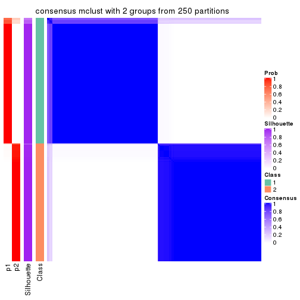</p>

</div>
<div id='tab-CV-mclust-consensus-heatmap-2'>
<pre><code class="r">consensus_heatmap(res, k = 3)
</code></pre>

<p>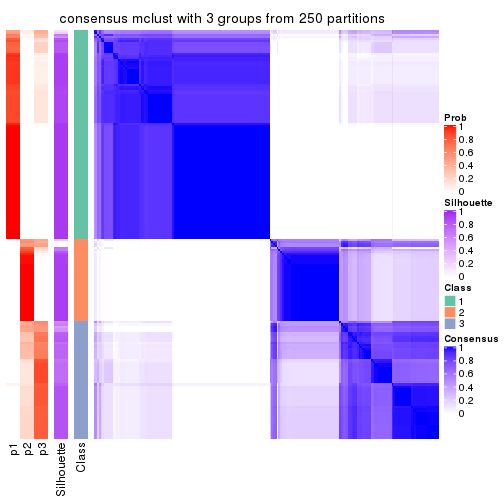</p>

</div>
<div id='tab-CV-mclust-consensus-heatmap-3'>
<pre><code class="r">consensus_heatmap(res, k = 4)
</code></pre>

<p>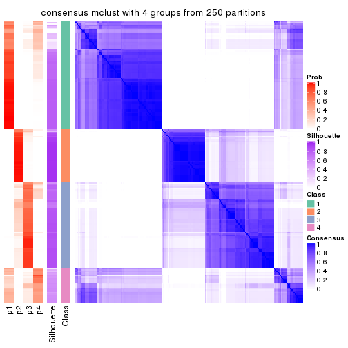</p>

</div>
<div id='tab-CV-mclust-consensus-heatmap-4'>
<pre><code class="r">consensus_heatmap(res, k = 5)
</code></pre>

<p>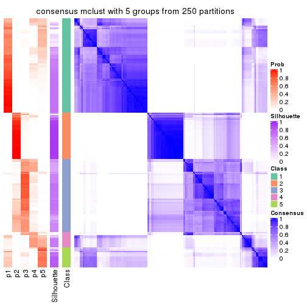</p>

</div>
<div id='tab-CV-mclust-consensus-heatmap-5'>
<pre><code class="r">consensus_heatmap(res, k = 6)
</code></pre>

<p>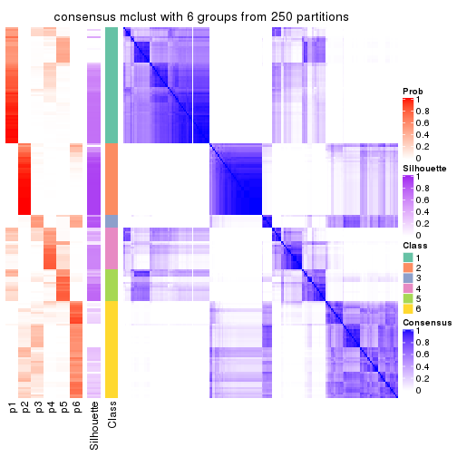</p>

</div>
</div>

Heatmaps for the membership of samples in all partitions to see how consistent they are:


<script>
$( function() {
	$( '#tabs-CV-mclust-membership-heatmap' ).tabs();
} );
</script>
<div id='tabs-CV-mclust-membership-heatmap'>
<ul>
<li><a href='#tab-CV-mclust-membership-heatmap-1'>k = 2</a></li>
<li><a href='#tab-CV-mclust-membership-heatmap-2'>k = 3</a></li>
<li><a href='#tab-CV-mclust-membership-heatmap-3'>k = 4</a></li>
<li><a href='#tab-CV-mclust-membership-heatmap-4'>k = 5</a></li>
<li><a href='#tab-CV-mclust-membership-heatmap-5'>k = 6</a></li>
</ul>
<div id='tab-CV-mclust-membership-heatmap-1'>
<pre><code class="r">membership_heatmap(res, k = 2)
</code></pre>

<p>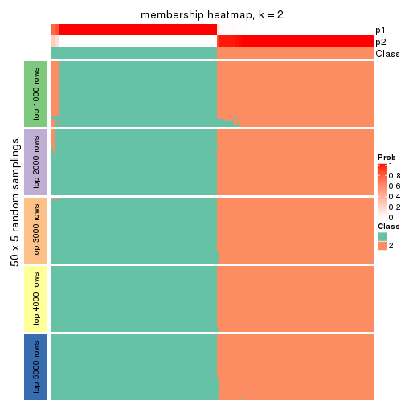</p>

</div>
<div id='tab-CV-mclust-membership-heatmap-2'>
<pre><code class="r">membership_heatmap(res, k = 3)
</code></pre>

<p>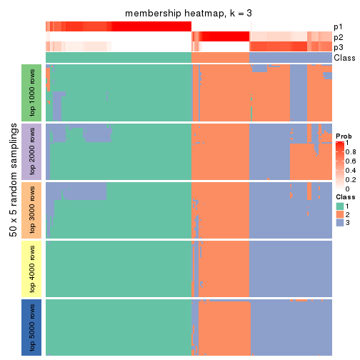</p>

</div>
<div id='tab-CV-mclust-membership-heatmap-3'>
<pre><code class="r">membership_heatmap(res, k = 4)
</code></pre>

<p>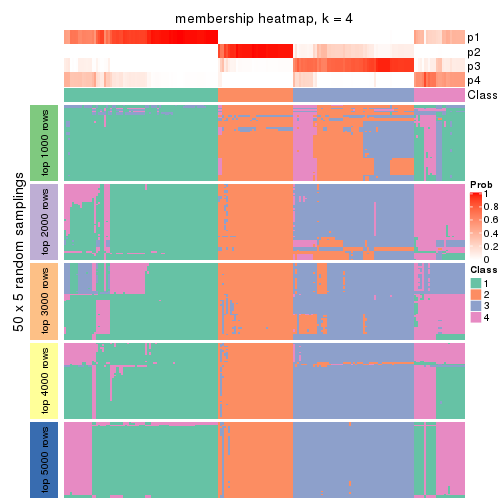</p>

</div>
<div id='tab-CV-mclust-membership-heatmap-4'>
<pre><code class="r">membership_heatmap(res, k = 5)
</code></pre>

<p>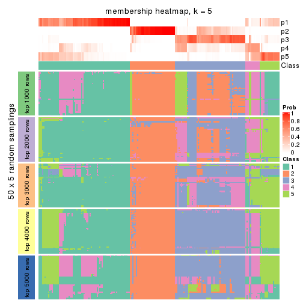</p>

</div>
<div id='tab-CV-mclust-membership-heatmap-5'>
<pre><code class="r">membership_heatmap(res, k = 6)
</code></pre>

<p>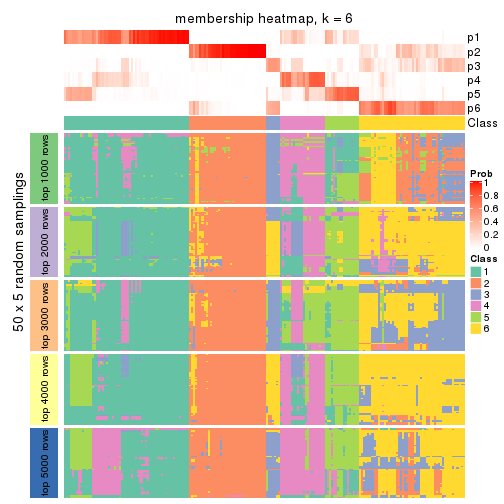</p>

</div>
</div>

As soon as we have had the classes for columns, we can look for signatures
which are significantly different between classes which can be candidate marks
for certain classes. Following are the heatmaps for signatures.


Signature heatmaps where rows are scaled:


<script>
$( function() {
	$( '#tabs-CV-mclust-get-signatures' ).tabs();
} );
</script>
<div id='tabs-CV-mclust-get-signatures'>
<ul>
<li><a href='#tab-CV-mclust-get-signatures-1'>k = 2</a></li>
<li><a href='#tab-CV-mclust-get-signatures-2'>k = 3</a></li>
<li><a href='#tab-CV-mclust-get-signatures-3'>k = 4</a></li>
<li><a href='#tab-CV-mclust-get-signatures-4'>k = 5</a></li>
<li><a href='#tab-CV-mclust-get-signatures-5'>k = 6</a></li>
</ul>
<div id='tab-CV-mclust-get-signatures-1'>
<pre><code class="r">get_signatures(res, k = 2)
</code></pre>

<p>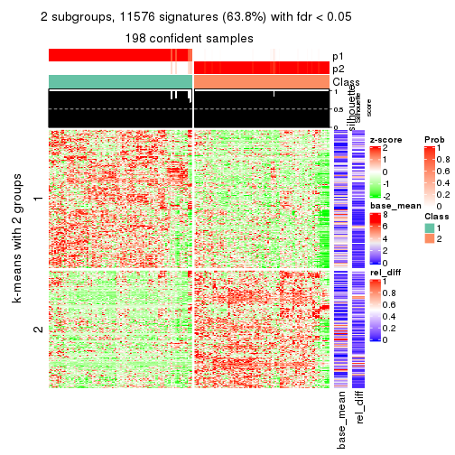</p>

</div>
<div id='tab-CV-mclust-get-signatures-2'>
<pre><code class="r">get_signatures(res, k = 3)
</code></pre>

<p>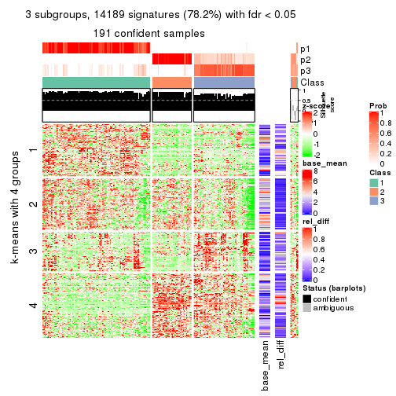</p>

</div>
<div id='tab-CV-mclust-get-signatures-3'>
<pre><code class="r">get_signatures(res, k = 4)
</code></pre>

<p>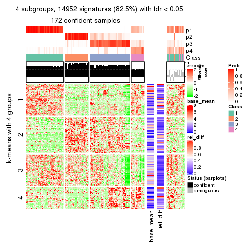</p>

</div>
<div id='tab-CV-mclust-get-signatures-4'>
<pre><code class="r">get_signatures(res, k = 5)
</code></pre>

<p>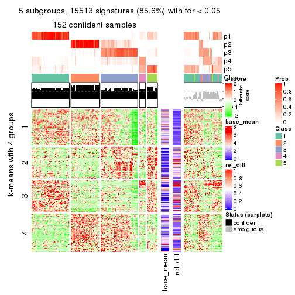</p>

</div>
<div id='tab-CV-mclust-get-signatures-5'>
<pre><code class="r">get_signatures(res, k = 6)
</code></pre>

<p>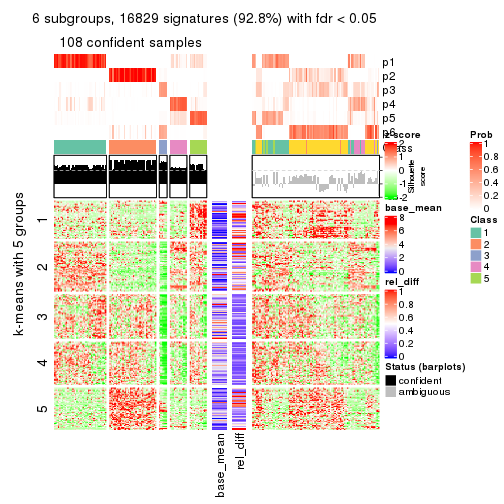</p>

</div>
</div>


Signature heatmaps where rows are not scaled:


<script>
$( function() {
	$( '#tabs-CV-mclust-get-signatures-no-scale' ).tabs();
} );
</script>
<div id='tabs-CV-mclust-get-signatures-no-scale'>
<ul>
<li><a href='#tab-CV-mclust-get-signatures-no-scale-1'>k = 2</a></li>
<li><a href='#tab-CV-mclust-get-signatures-no-scale-2'>k = 3</a></li>
<li><a href='#tab-CV-mclust-get-signatures-no-scale-3'>k = 4</a></li>
<li><a href='#tab-CV-mclust-get-signatures-no-scale-4'>k = 5</a></li>
<li><a href='#tab-CV-mclust-get-signatures-no-scale-5'>k = 6</a></li>
</ul>
<div id='tab-CV-mclust-get-signatures-no-scale-1'>
<pre><code class="r">get_signatures(res, k = 2, scale_rows = FALSE)
</code></pre>

<p>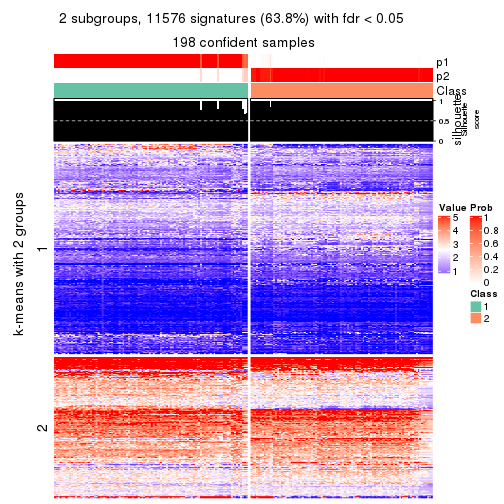</p>

</div>
<div id='tab-CV-mclust-get-signatures-no-scale-2'>
<pre><code class="r">get_signatures(res, k = 3, scale_rows = FALSE)
</code></pre>

<p>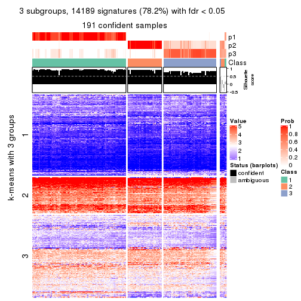</p>

</div>
<div id='tab-CV-mclust-get-signatures-no-scale-3'>
<pre><code class="r">get_signatures(res, k = 4, scale_rows = FALSE)
</code></pre>

<p>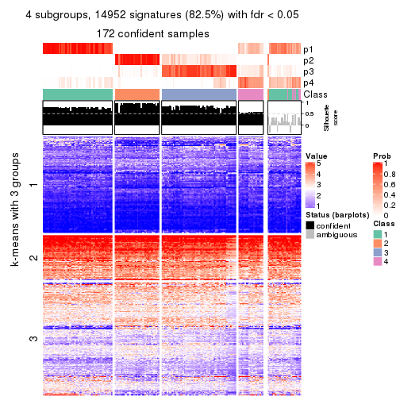</p>

</div>
<div id='tab-CV-mclust-get-signatures-no-scale-4'>
<pre><code class="r">get_signatures(res, k = 5, scale_rows = FALSE)
</code></pre>

<p>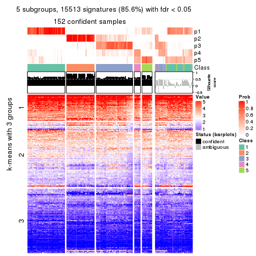</p>

</div>
<div id='tab-CV-mclust-get-signatures-no-scale-5'>
<pre><code class="r">get_signatures(res, k = 6, scale_rows = FALSE)
</code></pre>

<p>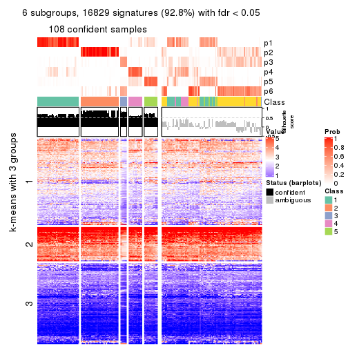</p>

</div>
</div>


Compare the overlap of signatures from different k:

```r
compare_signatures(res)
```

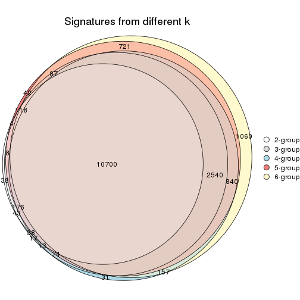

`get_signature()` returns a data frame invisibly. TO get the list of signatures, the function
call should be assigned to a variable explicitly. In following code, if `plot` argument is set
to `FALSE`, no heatmap is plotted while only the differential analysis is performed.

```r
# code only for demonstration
tb = get_signature(res, k = ..., plot = FALSE)
```

An example of the output of `tb` is:

```
#>   which_row         fdr    mean_1    mean_2 scaled_mean_1 scaled_mean_2 km
#> 1        38 0.042760348  8.373488  9.131774    -0.5533452     0.5164555  1
#> 2        40 0.018707592  7.106213  8.469186    -0.6173731     0.5762149  1
#> 3        55 0.019134737 10.221463 11.207825    -0.6159697     0.5749050  1
#> 4        59 0.006059896  5.921854  7.869574    -0.6899429     0.6439467  1
#> 5        60 0.018055526  8.928898 10.211722    -0.6204761     0.5791110  1
#> 6        98 0.009384629 15.714769 14.887706     0.6635654    -0.6193277  2
...
```

The columns in `tb` are:

1. `which_row`: row indices corresponding to the input matrix.
2. `fdr`: FDR for the differential test. 
3. `mean_x`: The mean value in group x.
4. `scaled_mean_x`: The mean value in group x after rows are scaled.
5. `km`: Row groups if k-means clustering is applied to rows.


UMAP plot which shows how samples are separated.


<script>
$( function() {
	$( '#tabs-CV-mclust-dimension-reduction' ).tabs();
} );
</script>
<div id='tabs-CV-mclust-dimension-reduction'>
<ul>
<li><a href='#tab-CV-mclust-dimension-reduction-1'>k = 2</a></li>
<li><a href='#tab-CV-mclust-dimension-reduction-2'>k = 3</a></li>
<li><a href='#tab-CV-mclust-dimension-reduction-3'>k = 4</a></li>
<li><a href='#tab-CV-mclust-dimension-reduction-4'>k = 5</a></li>
<li><a href='#tab-CV-mclust-dimension-reduction-5'>k = 6</a></li>
</ul>
<div id='tab-CV-mclust-dimension-reduction-1'>
<pre><code class="r">dimension_reduction(res, k = 2, method = &quot;UMAP&quot;)
</code></pre>

<p></p>

</div>
<div id='tab-CV-mclust-dimension-reduction-2'>
<pre><code class="r">dimension_reduction(res, k = 3, method = &quot;UMAP&quot;)
</code></pre>

<p>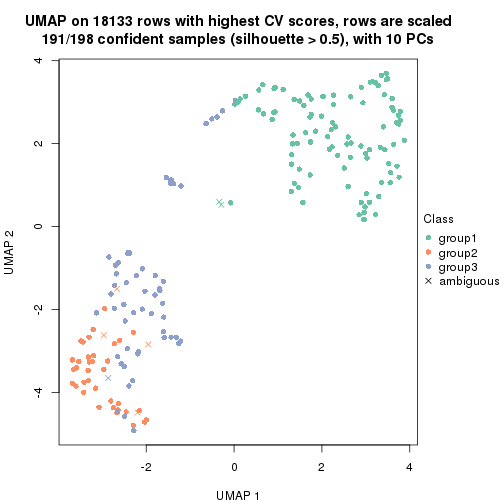</p>

</div>
<div id='tab-CV-mclust-dimension-reduction-3'>
<pre><code class="r">dimension_reduction(res, k = 4, method = &quot;UMAP&quot;)
</code></pre>

<p>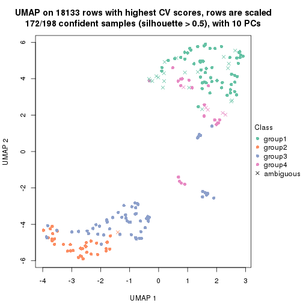</p>

</div>
<div id='tab-CV-mclust-dimension-reduction-4'>
<pre><code class="r">dimension_reduction(res, k = 5, method = &quot;UMAP&quot;)
</code></pre>

<p>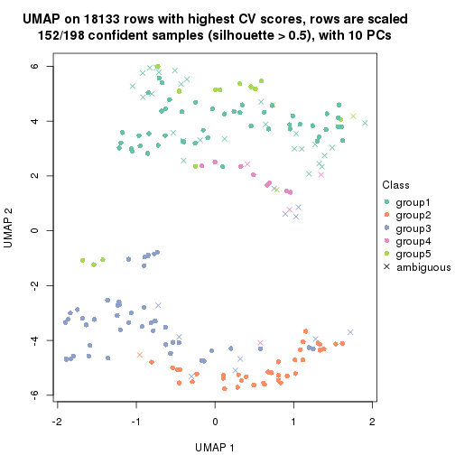</p>

</div>
<div id='tab-CV-mclust-dimension-reduction-5'>
<pre><code class="r">dimension_reduction(res, k = 6, method = &quot;UMAP&quot;)
</code></pre>

<p>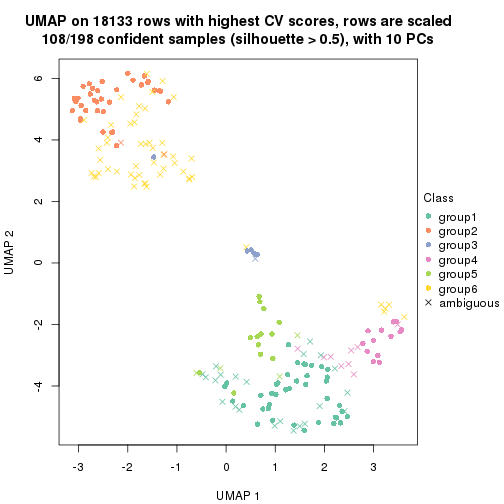</p>

</div>
</div>


Following heatmap shows how subgroups are split when increasing `k`:

```r
collect_classes(res)
```

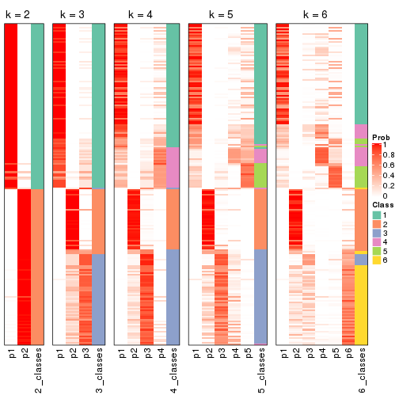


If matrix rows can be associated to genes, consider to use `functional_enrichment(res,
...)` to perform function enrichment for the signature genes. See [this vignette](http://bioconductor.org/packages/devel/bioc/vignettes/cola/inst/doc/functional_enrichment.html) for more detailed explanations.


 

---------------------------------------------------


### CV:NMF**


The object with results only for a single top-value method and a single partition method 
can be extracted as:

```r
res = res_list["CV", "NMF"]
# you can also extract it by
# res = res_list["CV:NMF"]
```

A summary of `res` and all the functions that can be applied to it:

```r
res
```

```
#> A 'ConsensusPartition' object with k = 2, 3, 4, 5, 6.
#>   On a matrix with 18133 rows and 198 columns.
#>   Top rows (1000, 2000, 3000, 4000, 5000) are extracted by 'CV' method.
#>   Subgroups are detected by 'NMF' method.
#>   Performed in total 1250 partitions by row resampling.
#>   Best k for subgroups seems to be 2.
#> 
#> Following methods can be applied to this 'ConsensusPartition' object:
#>  [1] "cola_report"             "collect_classes"         "collect_plots"          
#>  [4] "collect_stats"           "colnames"                "compare_signatures"     
#>  [7] "consensus_heatmap"       "dimension_reduction"     "functional_enrichment"  
#> [10] "get_anno_col"            "get_anno"                "get_classes"            
#> [13] "get_consensus"           "get_matrix"              "get_membership"         
#> [16] "get_param"               "get_signatures"          "get_stats"              
#> [19] "is_best_k"               "is_stable_k"             "membership_heatmap"     
#> [22] "ncol"                    "nrow"                    "plot_ecdf"              
#> [25] "rownames"                "select_partition_number" "show"                   
#> [28] "suggest_best_k"          "test_to_known_factors"
```

`collect_plots()` function collects all the plots made from `res` for all `k` (number of partitions)
into one single page to provide an easy and fast comparison between different `k`.

```r
collect_plots(res)
```

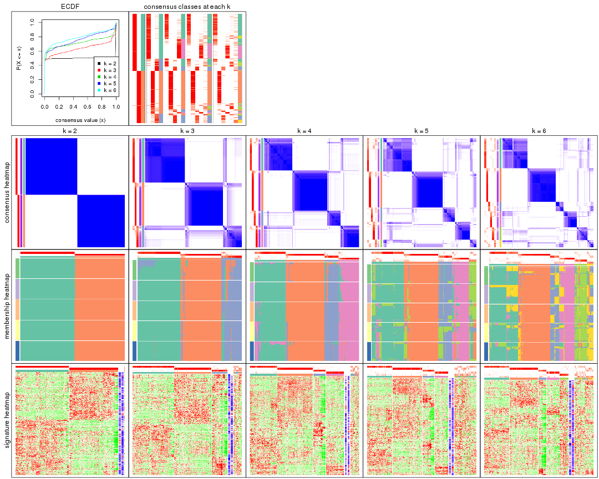

The plots are:

- The first row: a plot of the ECDF (empirical cumulative distribution
  function) curves of the consensus matrix for each `k` and the heatmap of
  predicted classes for each `k`.
- The second row: heatmaps of the consensus matrix for each `k`.
- The third row: heatmaps of the membership matrix for each `k`.
- The fouth row: heatmaps of the signatures for each `k`.

All the plots in panels can be made by individual functions and they are
plotted later in this section.

`select_partition_number()` produces several plots showing different
statistics for choosing "optimized" `k`. There are following statistics:

- ECDF curves of the consensus matrix for each `k`;
- 1-PAC. [The PAC
  score](https://en.wikipedia.org/wiki/Consensus_clustering#Over-interpretation_potential_of_consensus_clustering)
  measures the proportion of the ambiguous subgrouping.
- Mean silhouette score.
- Concordance. The mean probability of fiting the consensus class ids in all
  partitions.
- Area increased. Denote $A_k$ as the area under the ECDF curve for current
  `k`, the area increased is defined as $A_k - A_{k-1}$.
- Rand index. The percent of pairs of samples that are both in a same cluster
  or both are not in a same cluster in the partition of k and k-1.
- Jaccard index. The ratio of pairs of samples are both in a same cluster in
  the partition of k and k-1 and the pairs of samples are both in a same
  cluster in the partition k or k-1.

The detailed explanations of these statistics can be found in [the _cola_
vignette](http://bioconductor.org/packages/devel/bioc/vignettes/cola/inst/doc/cola.html#toc_13).

Generally speaking, lower PAC score, higher mean silhouette score or higher
concordance corresponds to better partition. Rand index and Jaccard index
measure how similar the current partition is compared to partition with `k-1`.
If they are too similar, we won't accept `k` is better than `k-1`.

```r
select_partition_number(res)
```

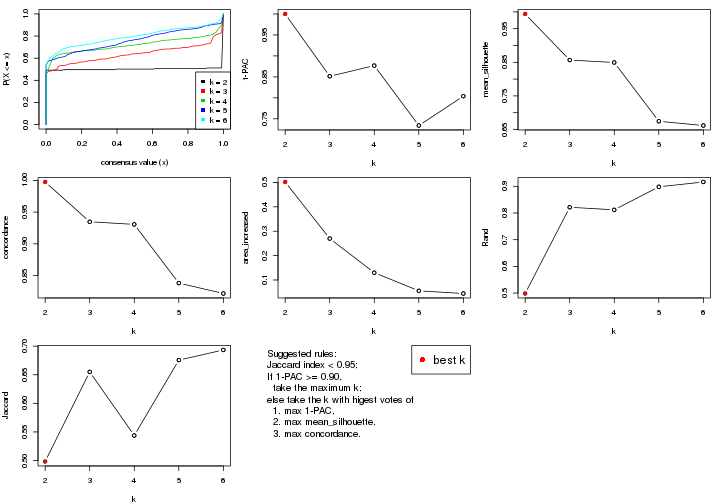

The numeric values for all these statistics can be obtained by `get_stats()`.

```r
get_stats(res)
```

```
#>   k 1-PAC mean_silhouette concordance area_increased  Rand Jaccard
#> 2 2 1.000           0.994       0.998         0.5021 0.498   0.498
#> 3 3 0.852           0.857       0.935         0.2700 0.821   0.655
#> 4 4 0.877           0.849       0.931         0.1299 0.812   0.544
#> 5 5 0.734           0.674       0.838         0.0557 0.898   0.676
#> 6 6 0.804           0.662       0.822         0.0446 0.916   0.693
```

`suggest_best_k()` suggests the best $k$ based on these statistics. The rules are as follows:

- All $k$ with Jaccard index larger than 0.95 are removed because increasing
  $k$ does not provide enough extra information. If all $k$ are removed, it is
  marked as no subgroup is detected.
- For all $k$ with 1-PAC score larger than 0.9, the maximal $k$ is taken as
  the best $k$, and other $k$ are marked as optional $k$.
- If it does not fit the second rule. The $k$ with the maximal vote of the
  highest 1-PAC score, highest mean silhouette, and highest concordance is
  taken as the best $k$.

```r
suggest_best_k(res)
```

```
#> [1] 2
```


Following shows the table of the partitions (You need to click the **show/hide
code output** link to see it). The membership matrix (columns with name `p*`)
is inferred by
[`clue::cl_consensus()`](https://www.rdocumentation.org/link/cl_consensus?package=clue)
function with the `SE` method. Basically the value in the membership matrix
represents the probability to belong to a certain group. The finall class
label for an item is determined with the group with highest probability it
belongs to.

In `get_classes()` function, the entropy is calculated from the membership
matrix and the silhouette score is calculated from the consensus matrix.


<script>
$( function() {
	$( '#tabs-CV-NMF-get-classes' ).tabs();
} );
</script>
<div id='tabs-CV-NMF-get-classes'>
<ul>
<li><a href='#tab-CV-NMF-get-classes-1'>k = 2</a></li>
<li><a href='#tab-CV-NMF-get-classes-2'>k = 3</a></li>
<li><a href='#tab-CV-NMF-get-classes-3'>k = 4</a></li>
<li><a href='#tab-CV-NMF-get-classes-4'>k = 5</a></li>
<li><a href='#tab-CV-NMF-get-classes-5'>k = 6</a></li>
</ul>

<div id='tab-CV-NMF-get-classes-1'>
<p><a id='tab-CV-NMF-get-classes-1-a' style='color:#0366d6' href='#'>show/hide code output</a></p>
<pre><code class="r">cbind(get_classes(res, k = 2), get_membership(res, k = 2))
</code></pre>

<pre><code>#&gt;                                      class entropy silhouette    p1    p2
#&gt; 0C0AA0B2-5191-4EDF-8937-ED7434F30283     2   0.000      0.996 0.000 1.000
#&gt; 18B45F1F-234F-45CC-A234-145307606C5C     1   0.000      0.999 1.000 0.000
#&gt; E18B70C0-BDCA-46D3-99BB-C6C8ABC68DA5     2   0.000      0.996 0.000 1.000
#&gt; 0F6DDBA7-6F74-45E8-95C8-F28263D55978     1   0.000      0.999 1.000 0.000
#&gt; 7EAE1A5A-129A-46DE-977E-A2C753F10904     2   0.000      0.996 0.000 1.000
#&gt; 7EAE0048-16B5-4979-9410-16CDEB9B1A48     1   0.000      0.999 1.000 0.000
#&gt; 2EBFC828-2B27-4753-A052-80DDA226DAB4     2   0.000      0.996 0.000 1.000
#&gt; 24E1768D-2232-41DA-9383-BC55D6EB3812     2   0.000      0.996 0.000 1.000
#&gt; 6E3CD60A-1889-4CA3-B305-2E78152057B5     2   0.000      0.996 0.000 1.000
#&gt; 33CC70DD-82B3-413C-B3B1-BE06634D95D0     1   0.000      0.999 1.000 0.000
#&gt; F1CB57A3-55DD-4487-9307-1B4F652E729A     1   0.000      0.999 1.000 0.000
#&gt; 755A5806-B054-449A-93DB-79909E6C93A1     1   0.000      0.999 1.000 0.000
#&gt; 58D364E7-3D2F-468F-A264-D6461E2428D4     2   0.000      0.996 0.000 1.000
#&gt; 68BB9CB6-7AA2-4981-B9D9-07363EC96599     2   0.000      0.996 0.000 1.000
#&gt; 3C4E8DFA-8EA0-4F1F-89CB-CB8805395872     2   0.000      0.996 0.000 1.000
#&gt; 4219651D-5583-4498-BF08-1B7D04B4C7B2     1   0.000      0.999 1.000 0.000
#&gt; B5EE2768-0D67-4584-ADBC-EC745FEC52EA     2   0.000      0.996 0.000 1.000
#&gt; 825E6C11-F460-451A-8045-846DD7D0E945     1   0.000      0.999 1.000 0.000
#&gt; 491F62AF-5E68-43C3-982A-F867A75BBA9A     2   0.000      0.996 0.000 1.000
#&gt; 9D7F058C-F95A-44AD-AC9E-450F7FBDC960     2   0.000      0.996 0.000 1.000
#&gt; 6D42DD0C-2081-4742-BA27-9F5F16FAC3C6     1   0.000      0.999 1.000 0.000
#&gt; EDD7E63D-492A-473B-A552-0764337B10EF     2   0.000      0.996 0.000 1.000
#&gt; 97073DEA-73AD-4DFD-BD1A-9035DC03445B     1   0.000      0.999 1.000 0.000
#&gt; FA891AB9-CE38-4F7E-A015-1DDCE12890A0     1   0.000      0.999 1.000 0.000
#&gt; D9514D49-A0AE-45AB-8C9F-68E726215253     1   0.000      0.999 1.000 0.000
#&gt; 3B9229AD-12E5-451E-9D2F-378AAC82C04A     2   0.000      0.996 0.000 1.000
#&gt; 5EA36B71-4917-4EF3-9060-065EFE6ACC5B     1   0.000      0.999 1.000 0.000
#&gt; A20E4ECB-4895-4CC7-BE5E-4721B20D933B     1   0.000      0.999 1.000 0.000
#&gt; 1BE8D828-29DB-4368-AA4A-FB23588F7AE8     1   0.000      0.999 1.000 0.000
#&gt; 66EFEFCF-3D14-4DBF-AA13-530F40ED0245     1   0.000      0.999 1.000 0.000
#&gt; 55DFFE53-BCE7-4EC1-9863-6C0311B06BA2     2   0.000      0.996 0.000 1.000
#&gt; 4CC3FB5A-611D-4C64-AE9D-544FA45CF4DC     1   0.000      0.999 1.000 0.000
#&gt; C11D33F2-DFE9-4FA8-9024-F3E7F1DADC5F     2   0.000      0.996 0.000 1.000
#&gt; FA5932B8-8AA3-4C38-9FAB-C35D8772974D     1   0.000      0.999 1.000 0.000
#&gt; 8216EC35-1F41-4A15-B503-BDA4971E27C9     1   0.000      0.999 1.000 0.000
#&gt; 69635D23-90A7-4BAD-97C7-B79536837F57     1   0.000      0.999 1.000 0.000
#&gt; 12B404E2-C463-4409-8392-E4649B2AFFD1     2   0.000      0.996 0.000 1.000
#&gt; 246927E3-ACCF-41B2-AA8E-43855FD6B146     2   0.000      0.996 0.000 1.000
#&gt; E0CC13E7-9607-49E0-B4AA-395544E3C3BF     1   0.000      0.999 1.000 0.000
#&gt; F7BBC0C1-6124-4A83-8A70-EA89B62F1CBD     1   0.000      0.999 1.000 0.000
#&gt; B1D4FF24-8E6F-4A04-B716-2032D850EB57     1   0.000      0.999 1.000 0.000
#&gt; 253601DB-B78A-4566-9947-8C0270C0B163     2   0.000      0.996 0.000 1.000
#&gt; AB83DBFF-5737-4FB8-A5AC-1D3CD6072BDF     2   0.000      0.996 0.000 1.000
#&gt; 9D67D953-EC98-4B72-89C8-5732BC9D4BC9     2   0.000      0.996 0.000 1.000
#&gt; 51061018-95AB-4278-886F-F69E4EBC47C0     2   0.000      0.996 0.000 1.000
#&gt; ABD0F7F3-105B-4DEE-9889-5028772C519A     1   0.000      0.999 1.000 0.000
#&gt; 562B95CF-B27E-4A72-B7C6-CDF86A51A39B     1   0.000      0.999 1.000 0.000
#&gt; ABF046A4-D7A1-49FF-B6B1-4E07A791DEDB     2   0.000      0.996 0.000 1.000
#&gt; 3FF4101E-9703-460E-A30E-76CC7689F36D     2   0.000      0.996 0.000 1.000
#&gt; 39C4F7AA-7ADF-4F1D-BDA3-BEC605AC5023     2   0.000      0.996 0.000 1.000
#&gt; CB821FD2-AF5C-4743-A70F-21C12C6ED153     1   0.000      0.999 1.000 0.000
#&gt; 92EA1846-62FF-41D5-A441-5E52E6B9E7F9     1   0.000      0.999 1.000 0.000
#&gt; 7D25F3EE-5A20-4763-8026-16A03D05F459     1   0.000      0.999 1.000 0.000
#&gt; 8ECE5276-CD06-496B-A5A9-1713B1F7D089     1   0.000      0.999 1.000 0.000
#&gt; C775B68F-9507-47E3-B507-B433AED79002     1   0.000      0.999 1.000 0.000
#&gt; E19D5463-FDD0-41C1-A170-323736A88D07     2   0.000      0.996 0.000 1.000
#&gt; CE4B6285-4961-4767-91F0-5C7A8162E185     1   0.000      0.999 1.000 0.000
#&gt; 9637BD72-1FEF-42AD-8886-2C39BE876531     1   0.000      0.999 1.000 0.000
#&gt; 81B5A88E-45A0-4B44-B689-B9071B8548EE     2   0.000      0.996 0.000 1.000
#&gt; 0B01B4C9-9BED-4F5B-A3E2-8868C7CCC3FC     2   0.000      0.996 0.000 1.000
#&gt; 54501315-7132-44B2-A179-10FBF1421105     1   0.000      0.999 1.000 0.000
#&gt; E207CBE9-4C3A-4FDD-9251-CFE1FE106475     1   0.000      0.999 1.000 0.000
#&gt; 3BEA0B92-3F90-4DBF-9679-AADEAD7D47C8     2   0.000      0.996 0.000 1.000
#&gt; 35B32250-D854-4215-AA5B-2C11B2FBEECA     1   0.000      0.999 1.000 0.000
#&gt; ACE6566B-AEB9-426C-924A-B382D14A1024     2   0.000      0.996 0.000 1.000
#&gt; 737E69AC-0930-45B9-B6BA-7CE5E300290B     1   0.000      0.999 1.000 0.000
#&gt; B4410AB8-D015-41CA-86E6-12EB4E4103E3     1   0.000      0.999 1.000 0.000
#&gt; 6D3ECA65-C50F-43B0-B75A-1D290FA4A8FD     2   0.000      0.996 0.000 1.000
#&gt; C86F40D3-9A96-4395-A8C3-510DE12F9A2B     2   0.000      0.996 0.000 1.000
#&gt; 6238087F-24DD-4BF1-903F-3BD4E446C1AE     2   0.000      0.996 0.000 1.000
#&gt; E4FF840B-EEAB-4CB0-A690-7D4C4AA7EEC3     2   0.000      0.996 0.000 1.000
#&gt; 72D3C323-C67F-4C0E-9BFC-BF245FF9730A     1   0.000      0.999 1.000 0.000
#&gt; 82D56E4E-4DF6-4F3E-8959-B995C92AAA70     1   0.000      0.999 1.000 0.000
#&gt; E31CA441-EB19-443B-ACBD-37B5CCBCF0E5     2   0.000      0.996 0.000 1.000
#&gt; 87CA8939-D054-4B8A-B32D-085FD2E8F202     1   0.000      0.999 1.000 0.000
#&gt; 2A508D90-FEDC-46A3-9A02-E51E5467CDCB     1   0.000      0.999 1.000 0.000
#&gt; C4E8B4E2-388B-411F-BF0A-9B6F34E8EDB5     2   0.000      0.996 0.000 1.000
#&gt; AF6AF803-BD93-44A7-AA80-B9BC92C1273B     2   0.000      0.996 0.000 1.000
#&gt; 0B1CA5CF-EB96-41D4-BFC5-6957FEB39828     1   0.000      0.999 1.000 0.000
#&gt; 6FB96FB0-6661-48AD-A4A0-69F8AFDBE591     2   0.000      0.996 0.000 1.000
#&gt; 8C19F7FD-368A-462B-B28F-88D6630038A1     1   0.000      0.999 1.000 0.000
#&gt; 96EABE78-C2F4-4A33-ACD8-C922A4B2519B     2   0.000      0.996 0.000 1.000
#&gt; 68B36D7B-546A-4689-949F-B207C4A4AB27     2   0.000      0.996 0.000 1.000
#&gt; CE9F3335-778F-4F52-BC55-4B7C99B211DD     2   0.000      0.996 0.000 1.000
#&gt; CB359DED-2A2D-4646-A0BD-6F10ADCC532B     1   0.000      0.999 1.000 0.000
#&gt; 198324A5-8C52-46F6-9734-EFAF1CCA6D9B     1   0.000      0.999 1.000 0.000
#&gt; 83B88608-0506-428C-B9E8-621F38477B42     1   0.000      0.999 1.000 0.000
#&gt; 1993630A-0F3D-4F5C-86A3-D443BAAF57F0     1   0.469      0.888 0.900 0.100
#&gt; DE73DA9B-529E-4F4F-A65C-DA7AB84B1096     1   0.000      0.999 1.000 0.000
#&gt; 2347F3B7-DDA3-40C0-B6D4-8819ECA69146     1   0.000      0.999 1.000 0.000
#&gt; AB93B5D5-095F-4330-9D40-6A3D934AB50C     1   0.000      0.999 1.000 0.000
#&gt; 5EBBE4AD-FF0C-41CF-9EA3-B6FE7EA1F9C0     1   0.000      0.999 1.000 0.000
#&gt; 6D960AE7-3769-4144-A061-E8588E5063FF     1   0.000      0.999 1.000 0.000
#&gt; 0C2DD8C0-D1A5-4192-A49C-7A40FED628B2     2   0.000      0.996 0.000 1.000
#&gt; 18C9372F-C55B-4F86-A9D2-E8D85EFC8566     2   0.000      0.996 0.000 1.000
#&gt; 9AF637B0-4C32-4DD1-93AF-7655B4A845D3     2   0.000      0.996 0.000 1.000
#&gt; 785B5B06-4115-46FD-9BEB-F888AFDC855D     2   0.000      0.996 0.000 1.000
#&gt; ECA3050E-4BE2-4117-B9CF-A52BB85AF8C2     2   0.963      0.364 0.388 0.612
#&gt; 099DC396-16A5-458F-9ED9-F2A790CB0C34     1   0.000      0.999 1.000 0.000
#&gt; 7A5A12EE-C5B0-4C51-8C99-0F3FA88D633E     1   0.000      0.999 1.000 0.000
#&gt; E832B508-A66D-4817-B44A-FE9FAAE64B4A     1   0.000      0.999 1.000 0.000
#&gt; F9DD688C-7B35-49E7-9651-2E098EE78856     1   0.000      0.999 1.000 0.000
#&gt; F1265DD8-5ED3-4635-A277-57BBFDEC7729     1   0.000      0.999 1.000 0.000
#&gt; F624E8D9-DB07-4C9E-910D-5E8EBA3A6167     2   0.000      0.996 0.000 1.000
#&gt; 3516FBDF-66E1-43F4-9D7B-16748F6439A7     2   0.000      0.996 0.000 1.000
#&gt; 04B12992-B2EA-4BA2-8E2C-11E34E230E6F     2   0.000      0.996 0.000 1.000
#&gt; CC02897D-9123-495E-9242-5C9CF4EC269B     2   0.000      0.996 0.000 1.000
#&gt; 3117ED46-2BF2-4311-BC00-4E98243E16B3     1   0.000      0.999 1.000 0.000
#&gt; E0B66D53-23DB-4E26-BB6E-F692FA8C000E     1   0.000      0.999 1.000 0.000
#&gt; DAA93CE5-A013-477A-9A50-EA09CC3A8162     2   0.000      0.996 0.000 1.000
#&gt; 0099098D-354A-4276-92F8-B932C74B4608     1   0.000      0.999 1.000 0.000
#&gt; DD483639-B2E7-4745-BCFB-55ED1D82BFBF     2   0.000      0.996 0.000 1.000
#&gt; 2C1F9079-602E-4252-82C7-9D8799E04246     2   0.000      0.996 0.000 1.000
#&gt; 9473A8E4-3A1B-4184-9EA6-517AFD60B635     1   0.000      0.999 1.000 0.000
#&gt; 75CFBAF6-7BA0-40AF-92D7-D218E885BD1B     2   0.000      0.996 0.000 1.000
#&gt; B588950F-14D6-41C8-845B-EFD2096013C6     2   0.000      0.996 0.000 1.000
#&gt; 0DF3EDA8-DAEA-4721-92AB-B97181249498     2   0.000      0.996 0.000 1.000
#&gt; 8EA83042-D598-401D-AD78-936EEB136C59     1   0.000      0.999 1.000 0.000
#&gt; 729AC418-3BE9-445A-95D4-AC11A7D43BE0     1   0.000      0.999 1.000 0.000
#&gt; 7D8B1B11-F576-4AA8-BFA7-0022A2CD829A     2   0.000      0.996 0.000 1.000
#&gt; 304A0E46-3449-4B44-9C30-BDDF6459391D     1   0.000      0.999 1.000 0.000
#&gt; 3C83358F-DF20-47F7-AF9F-AB7CC92F5ABA     1   0.000      0.999 1.000 0.000
#&gt; EAFEED6C-35C3-451F-AE4A-EB56992E1F29     1   0.000      0.999 1.000 0.000
#&gt; 8A237A65-28EC-434D-A78A-A8B7308B5204     1   0.000      0.999 1.000 0.000
#&gt; D005833F-E991-4E9E-9667-55F137288004     1   0.000      0.999 1.000 0.000
#&gt; 37D966E3-253E-4397-A9AE-0903A8D31FE6     1   0.000      0.999 1.000 0.000
#&gt; D2482B81-CB5B-4178-BA8D-1CF4026181B5     1   0.000      0.999 1.000 0.000
#&gt; 18019E95-C2A8-4EE7-B585-F6886DC4D953     2   0.000      0.996 0.000 1.000
#&gt; 0B126D1A-14A8-4345-8F78-FF92222ADF4C     2   0.000      0.996 0.000 1.000
#&gt; CE88B625-47D8-4D58-9FB4-23464DB7DDAD     2   0.000      0.996 0.000 1.000
#&gt; 9A88299D-5C74-47FA-B42C-1A1D6D935AAB     1   0.000      0.999 1.000 0.000
#&gt; 3E71159C-FD6C-41DA-B18B-0730C8AC7E41     1   0.000      0.999 1.000 0.000
#&gt; 6F245AA4-79D9-47E1-BCC9-1AAF65AEA813     1   0.000      0.999 1.000 0.000
#&gt; 4CF2C888-2100-483A-B4DB-ECBB69243A4D     2   0.000      0.996 0.000 1.000
#&gt; A3853813-B9D5-4E8C-B075-19FCC35F8686     2   0.000      0.996 0.000 1.000
#&gt; 83A16DEE-CE9F-4D8B-9225-0A2A8B9D055D     1   0.000      0.999 1.000 0.000
#&gt; 0F057CAF-4F9A-4DE9-8601-730E96873733     2   0.000      0.996 0.000 1.000
#&gt; 32D5801D-DBA4-422E-87CB-A2DDE921BA41     1   0.000      0.999 1.000 0.000
#&gt; 22EE8076-F07C-499A-9AF8-D800A77EF154     2   0.000      0.996 0.000 1.000
#&gt; DD4BD74D-D48C-4090-9F57-5334E784581C     1   0.000      0.999 1.000 0.000
#&gt; 41183565-434D-474C-B1BD-CA6E94910658     2   0.000      0.996 0.000 1.000
#&gt; 75A2CE41-2B2A-4346-927E-ACF8A72738E4     1   0.000      0.999 1.000 0.000
#&gt; 7AA24995-3DD2-4682-B36A-4EBFEEACF625     1   0.000      0.999 1.000 0.000
#&gt; 8BAFDFEC-9F26-4ADB-95CE-004143960EEB     1   0.000      0.999 1.000 0.000
#&gt; A330E011-CE08-4A85-8F4B-370592293DBB     1   0.000      0.999 1.000 0.000
#&gt; 1D5A5B17-2E70-4BB0-94A1-EC17E6EA49DB     1   0.000      0.999 1.000 0.000
#&gt; BD9143B8-9D97-4A05-872C-3FB82B4CF7BE     2   0.000      0.996 0.000 1.000
#&gt; 64552DC0-181E-4607-898C-787AA7F26435     2   0.000      0.996 0.000 1.000
#&gt; 1B4C4D41-34C7-43A3-858B-C9552EB53894     1   0.000      0.999 1.000 0.000
#&gt; 463A3BAA-02DC-4EA4-A644-B924163E425D     2   0.000      0.996 0.000 1.000
#&gt; CD0FEA89-6F60-4A20-8FCA-D397B4E95A98     1   0.000      0.999 1.000 0.000
#&gt; 5D06CF6D-F4B9-4B32-B055-8AB287E53340     2   0.000      0.996 0.000 1.000
#&gt; ADA7835F-DB67-4F4F-9446-8BCE3C5FE936     2   0.000      0.996 0.000 1.000
#&gt; 4109BE2D-B5DF-4BD7-860E-60D87F647152     2   0.000      0.996 0.000 1.000
#&gt; 88526A0E-6DFE-46CB-BFAD-B4826F482C67     1   0.000      0.999 1.000 0.000
#&gt; F39F9A4C-18F7-4017-AB31-85D52FF44587     2   0.000      0.996 0.000 1.000
#&gt; D4290A5E-1B24-4C55-B470-0FA7A0A09DD0     2   0.000      0.996 0.000 1.000
#&gt; DC5A2C9E-978F-4661-B729-1F9662976E27     1   0.000      0.999 1.000 0.000
#&gt; 26A1F392-CED2-43E3-8096-74E6F2BFC8C0     2   0.000      0.996 0.000 1.000
#&gt; 87D81FB2-306A-4E75-9D58-D5F48E46E7F6     2   0.000      0.996 0.000 1.000
#&gt; E3D9D81A-C20C-4B3B-B940-A5D2C5F65B22     2   0.000      0.996 0.000 1.000
#&gt; 4464650B-453F-476C-989C-B7B159BF2CF0     2   0.000      0.996 0.000 1.000
#&gt; 577D2867-B738-487A-9B06-07958D647F02     1   0.000      0.999 1.000 0.000
#&gt; E52A22CC-3C03-41A9-9541-220DD871E162     2   0.000      0.996 0.000 1.000
#&gt; 642703B1-AF99-4746-A915-0792F4B9590B     2   0.000      0.996 0.000 1.000
#&gt; 8F0D1792-1284-45E6-8EC4-392596057677     2   0.000      0.996 0.000 1.000
#&gt; 765AFFC1-D528-4494-8BA1-0706451E4205     2   0.000      0.996 0.000 1.000
#&gt; A716BC29-161F-4CA0-B240-00B330137F2C     1   0.000      0.999 1.000 0.000
#&gt; 32CBFBAF-7064-4595-8D54-2C5E7DE0FD9B     1   0.000      0.999 1.000 0.000
#&gt; 4D6ED28C-3F20-41B0-BA41-1BF0E5199A40     2   0.000      0.996 0.000 1.000
#&gt; 86A38456-2900-48FB-B10F-79222B3CA9BF     1   0.000      0.999 1.000 0.000
#&gt; E870807D-3223-4A6A-9E3D-F4461B048AA2     2   0.000      0.996 0.000 1.000
#&gt; 3A78D19F-A833-4D2C-8387-FB4FD4A8313C     1   0.000      0.999 1.000 0.000
#&gt; DFA162CA-C708-4121-8E74-F9C4DEE0CDAE     1   0.000      0.999 1.000 0.000
#&gt; C00A300A-CD10-4C9D-8C94-3901AFE8406C     2   0.000      0.996 0.000 1.000
#&gt; 13E11D15-A90F-48C4-980A-DD032C00A2C1     1   0.000      0.999 1.000 0.000
#&gt; 31BF80AB-FEDB-4C73-89C3-70BE9F9ACBEE     2   0.000      0.996 0.000 1.000
#&gt; FA34308A-349D-4AAD-94CF-3F3B7F9AD629     2   0.000      0.996 0.000 1.000
#&gt; 7C48D467-B663-49DD-BC84-A36BC32ACB3D     1   0.000      0.999 1.000 0.000
#&gt; BB068534-04F6-4FC9-9087-CDA65920BCE2     1   0.000      0.999 1.000 0.000
#&gt; EA4EC272-A9B3-4B2E-955F-19F7676A944C     2   0.000      0.996 0.000 1.000
#&gt; C71FF69B-A460-43CA-8769-9667F22D938B     1   0.000      0.999 1.000 0.000
#&gt; 5243D1B8-8168-4FF1-A8C6-505F080EF0D3     2   0.000      0.996 0.000 1.000
#&gt; BCC474D8-08FE-4E99-B8E8-B29E65F84D2E     1   0.000      0.999 1.000 0.000
#&gt; 04FDBFE3-4CF6-4E53-A2AA-89D5C9316377     2   0.000      0.996 0.000 1.000
#&gt; 83A9915C-8D60-4CAE-A868-B61E3C90C7B0     2   0.000      0.996 0.000 1.000
#&gt; 989A6472-E3E3-457A-97BE-CCE95F42D5C2     2   0.000      0.996 0.000 1.000
#&gt; A0AB2D28-6751-49C9-8DF4-66FDBF95C360     1   0.000      0.999 1.000 0.000
#&gt; A12B2683-18D4-41C9-8AE5-C143E2180052     1   0.000      0.999 1.000 0.000
#&gt; 8DE1E245-CAD2-4F11-BFA2-9792C433A00B     1   0.000      0.999 1.000 0.000
#&gt; FDA68036-6C4C-4256-9AA0-C01FE92AA098     2   0.000      0.996 0.000 1.000
#&gt; 26311920-1414-4EC1-870B-784961EBCC2D     1   0.000      0.999 1.000 0.000
#&gt; C29A10D6-D598-4286-B5E0-F1776E19E988     1   0.000      0.999 1.000 0.000
#&gt; FACCC1FB-4937-4CC0-90EA-7F91D3D939CF     2   0.000      0.996 0.000 1.000
#&gt; 90B9D84B-78E5-4C7E-8414-EC889C2DE8DB     2   0.000      0.996 0.000 1.000
#&gt; B74E6122-76E1-4E4D-A867-BCAFD7277393     1   0.000      0.999 1.000 0.000
#&gt; 98494DC0-CF6E-485F-8A0D-D80E4437EF5C     2   0.000      0.996 0.000 1.000
#&gt; DA114DAC-DE7B-4E43-8D7C-82C5D7B66411     1   0.000      0.999 1.000 0.000
</code></pre>

<script>
$('#tab-CV-NMF-get-classes-1-a').parent().next().next().hide();
$('#tab-CV-NMF-get-classes-1-a').click(function(){
  $('#tab-CV-NMF-get-classes-1-a').parent().next().next().toggle();
  return(false);
});
</script>
</div>

<div id='tab-CV-NMF-get-classes-2'>
<p><a id='tab-CV-NMF-get-classes-2-a' style='color:#0366d6' href='#'>show/hide code output</a></p>
<pre><code class="r">cbind(get_classes(res, k = 3), get_membership(res, k = 3))
</code></pre>

<pre><code>#&gt;                                      class entropy silhouette    p1    p2    p3
#&gt; 0C0AA0B2-5191-4EDF-8937-ED7434F30283     2  0.0000    0.94757 0.000 1.000 0.000
#&gt; 18B45F1F-234F-45CC-A234-145307606C5C     1  0.0000    0.96039 1.000 0.000 0.000
#&gt; E18B70C0-BDCA-46D3-99BB-C6C8ABC68DA5     2  0.0000    0.94757 0.000 1.000 0.000
#&gt; 0F6DDBA7-6F74-45E8-95C8-F28263D55978     1  0.2165    0.94320 0.936 0.000 0.064
#&gt; 7EAE1A5A-129A-46DE-977E-A2C753F10904     2  0.0000    0.94757 0.000 1.000 0.000
#&gt; 7EAE0048-16B5-4979-9410-16CDEB9B1A48     1  0.0592    0.95881 0.988 0.000 0.012
#&gt; 2EBFC828-2B27-4753-A052-80DDA226DAB4     2  0.0000    0.94757 0.000 1.000 0.000
#&gt; 24E1768D-2232-41DA-9383-BC55D6EB3812     2  0.4452    0.72851 0.000 0.808 0.192
#&gt; 6E3CD60A-1889-4CA3-B305-2E78152057B5     2  0.2165    0.88046 0.064 0.936 0.000
#&gt; 33CC70DD-82B3-413C-B3B1-BE06634D95D0     3  0.2261    0.78170 0.068 0.000 0.932
#&gt; F1CB57A3-55DD-4487-9307-1B4F652E729A     1  0.2165    0.94320 0.936 0.000 0.064
#&gt; 755A5806-B054-449A-93DB-79909E6C93A1     1  0.0000    0.96039 1.000 0.000 0.000
#&gt; 58D364E7-3D2F-468F-A264-D6461E2428D4     2  0.0000    0.94757 0.000 1.000 0.000
#&gt; 68BB9CB6-7AA2-4981-B9D9-07363EC96599     3  0.5560    0.57077 0.000 0.300 0.700
#&gt; 3C4E8DFA-8EA0-4F1F-89CB-CB8805395872     3  0.6235    0.26869 0.000 0.436 0.564
#&gt; 4219651D-5583-4498-BF08-1B7D04B4C7B2     1  0.3551    0.88207 0.868 0.000 0.132
#&gt; B5EE2768-0D67-4584-ADBC-EC745FEC52EA     2  0.0000    0.94757 0.000 1.000 0.000
#&gt; 825E6C11-F460-451A-8045-846DD7D0E945     1  0.4399    0.81006 0.812 0.000 0.188
#&gt; 491F62AF-5E68-43C3-982A-F867A75BBA9A     2  0.0000    0.94757 0.000 1.000 0.000
#&gt; 9D7F058C-F95A-44AD-AC9E-450F7FBDC960     2  0.0000    0.94757 0.000 1.000 0.000
#&gt; 6D42DD0C-2081-4742-BA27-9F5F16FAC3C6     1  0.0000    0.96039 1.000 0.000 0.000
#&gt; EDD7E63D-492A-473B-A552-0764337B10EF     2  0.2796    0.85664 0.000 0.908 0.092
#&gt; 97073DEA-73AD-4DFD-BD1A-9035DC03445B     1  0.2448    0.93543 0.924 0.000 0.076
#&gt; FA891AB9-CE38-4F7E-A015-1DDCE12890A0     1  0.0000    0.96039 1.000 0.000 0.000
#&gt; D9514D49-A0AE-45AB-8C9F-68E726215253     1  0.2165    0.94320 0.936 0.000 0.064
#&gt; 3B9229AD-12E5-451E-9D2F-378AAC82C04A     2  0.0000    0.94757 0.000 1.000 0.000
#&gt; 5EA36B71-4917-4EF3-9060-065EFE6ACC5B     3  0.0424    0.80839 0.008 0.000 0.992
#&gt; A20E4ECB-4895-4CC7-BE5E-4721B20D933B     1  0.0237    0.96012 0.996 0.000 0.004
#&gt; 1BE8D828-29DB-4368-AA4A-FB23588F7AE8     3  0.0000    0.80879 0.000 0.000 1.000
#&gt; 66EFEFCF-3D14-4DBF-AA13-530F40ED0245     3  0.6192    0.21128 0.420 0.000 0.580
#&gt; 55DFFE53-BCE7-4EC1-9863-6C0311B06BA2     2  0.0000    0.94757 0.000 1.000 0.000
#&gt; 4CC3FB5A-611D-4C64-AE9D-544FA45CF4DC     1  0.2165    0.94320 0.936 0.000 0.064
#&gt; C11D33F2-DFE9-4FA8-9024-F3E7F1DADC5F     2  0.6168    0.23230 0.000 0.588 0.412
#&gt; FA5932B8-8AA3-4C38-9FAB-C35D8772974D     1  0.2066    0.94512 0.940 0.000 0.060
#&gt; 8216EC35-1F41-4A15-B503-BDA4971E27C9     1  0.0000    0.96039 1.000 0.000 0.000
#&gt; 69635D23-90A7-4BAD-97C7-B79536837F57     1  0.2165    0.94320 0.936 0.000 0.064
#&gt; 12B404E2-C463-4409-8392-E4649B2AFFD1     2  0.0000    0.94757 0.000 1.000 0.000
#&gt; 246927E3-ACCF-41B2-AA8E-43855FD6B146     2  0.0000    0.94757 0.000 1.000 0.000
#&gt; E0CC13E7-9607-49E0-B4AA-395544E3C3BF     1  0.0000    0.96039 1.000 0.000 0.000
#&gt; F7BBC0C1-6124-4A83-8A70-EA89B62F1CBD     1  0.0000    0.96039 1.000 0.000 0.000
#&gt; B1D4FF24-8E6F-4A04-B716-2032D850EB57     1  0.0237    0.96012 0.996 0.000 0.004
#&gt; 253601DB-B78A-4566-9947-8C0270C0B163     2  0.0000    0.94757 0.000 1.000 0.000
#&gt; AB83DBFF-5737-4FB8-A5AC-1D3CD6072BDF     3  0.0000    0.80879 0.000 0.000 1.000
#&gt; 9D67D953-EC98-4B72-89C8-5732BC9D4BC9     2  0.0000    0.94757 0.000 1.000 0.000
#&gt; 51061018-95AB-4278-886F-F69E4EBC47C0     3  0.2165    0.78891 0.000 0.064 0.936
#&gt; ABD0F7F3-105B-4DEE-9889-5028772C519A     1  0.0000    0.96039 1.000 0.000 0.000
#&gt; 562B95CF-B27E-4A72-B7C6-CDF86A51A39B     1  0.0000    0.96039 1.000 0.000 0.000
#&gt; ABF046A4-D7A1-49FF-B6B1-4E07A791DEDB     2  0.0000    0.94757 0.000 1.000 0.000
#&gt; 3FF4101E-9703-460E-A30E-76CC7689F36D     2  0.0000    0.94757 0.000 1.000 0.000
#&gt; 39C4F7AA-7ADF-4F1D-BDA3-BEC605AC5023     2  0.0237    0.94426 0.000 0.996 0.004
#&gt; CB821FD2-AF5C-4743-A70F-21C12C6ED153     1  0.0000    0.96039 1.000 0.000 0.000
#&gt; 92EA1846-62FF-41D5-A441-5E52E6B9E7F9     1  0.0000    0.96039 1.000 0.000 0.000
#&gt; 7D25F3EE-5A20-4763-8026-16A03D05F459     1  0.0000    0.96039 1.000 0.000 0.000
#&gt; 8ECE5276-CD06-496B-A5A9-1713B1F7D089     1  0.2066    0.94508 0.940 0.000 0.060
#&gt; C775B68F-9507-47E3-B507-B433AED79002     3  0.0000    0.80879 0.000 0.000 1.000
#&gt; E19D5463-FDD0-41C1-A170-323736A88D07     3  0.6140    0.35788 0.000 0.404 0.596
#&gt; CE4B6285-4961-4767-91F0-5C7A8162E185     1  0.0000    0.96039 1.000 0.000 0.000
#&gt; 9637BD72-1FEF-42AD-8886-2C39BE876531     1  0.0000    0.96039 1.000 0.000 0.000
#&gt; 81B5A88E-45A0-4B44-B689-B9071B8548EE     3  0.4750    0.68377 0.000 0.216 0.784
#&gt; 0B01B4C9-9BED-4F5B-A3E2-8868C7CCC3FC     3  0.1529    0.79846 0.000 0.040 0.960
#&gt; 54501315-7132-44B2-A179-10FBF1421105     1  0.1964    0.94666 0.944 0.000 0.056
#&gt; E207CBE9-4C3A-4FDD-9251-CFE1FE106475     3  0.0000    0.80879 0.000 0.000 1.000
#&gt; 3BEA0B92-3F90-4DBF-9679-AADEAD7D47C8     2  0.0000    0.94757 0.000 1.000 0.000
#&gt; 35B32250-D854-4215-AA5B-2C11B2FBEECA     1  0.0000    0.96039 1.000 0.000 0.000
#&gt; ACE6566B-AEB9-426C-924A-B382D14A1024     2  0.0000    0.94757 0.000 1.000 0.000
#&gt; 737E69AC-0930-45B9-B6BA-7CE5E300290B     1  0.2261    0.94092 0.932 0.000 0.068
#&gt; B4410AB8-D015-41CA-86E6-12EB4E4103E3     1  0.0000    0.96039 1.000 0.000 0.000
#&gt; 6D3ECA65-C50F-43B0-B75A-1D290FA4A8FD     2  0.0000    0.94757 0.000 1.000 0.000
#&gt; C86F40D3-9A96-4395-A8C3-510DE12F9A2B     2  0.2066    0.89244 0.000 0.940 0.060
#&gt; 6238087F-24DD-4BF1-903F-3BD4E446C1AE     2  0.0000    0.94757 0.000 1.000 0.000
#&gt; E4FF840B-EEAB-4CB0-A690-7D4C4AA7EEC3     2  0.0000    0.94757 0.000 1.000 0.000
#&gt; 72D3C323-C67F-4C0E-9BFC-BF245FF9730A     1  0.0000    0.96039 1.000 0.000 0.000
#&gt; 82D56E4E-4DF6-4F3E-8959-B995C92AAA70     1  0.2165    0.94320 0.936 0.000 0.064
#&gt; E31CA441-EB19-443B-ACBD-37B5CCBCF0E5     2  0.0000    0.94757 0.000 1.000 0.000
#&gt; 87CA8939-D054-4B8A-B32D-085FD2E8F202     1  0.0000    0.96039 1.000 0.000 0.000
#&gt; 2A508D90-FEDC-46A3-9A02-E51E5467CDCB     1  0.1753    0.94962 0.952 0.000 0.048
#&gt; C4E8B4E2-388B-411F-BF0A-9B6F34E8EDB5     3  0.4121    0.72988 0.000 0.168 0.832
#&gt; AF6AF803-BD93-44A7-AA80-B9BC92C1273B     2  0.0000    0.94757 0.000 1.000 0.000
#&gt; 0B1CA5CF-EB96-41D4-BFC5-6957FEB39828     1  0.0000    0.96039 1.000 0.000 0.000
#&gt; 6FB96FB0-6661-48AD-A4A0-69F8AFDBE591     2  0.0000    0.94757 0.000 1.000 0.000
#&gt; 8C19F7FD-368A-462B-B28F-88D6630038A1     1  0.0000    0.96039 1.000 0.000 0.000
#&gt; 96EABE78-C2F4-4A33-ACD8-C922A4B2519B     2  0.0000    0.94757 0.000 1.000 0.000
#&gt; 68B36D7B-546A-4689-949F-B207C4A4AB27     2  0.0000    0.94757 0.000 1.000 0.000
#&gt; CE9F3335-778F-4F52-BC55-4B7C99B211DD     2  0.6168    0.23795 0.000 0.588 0.412
#&gt; CB359DED-2A2D-4646-A0BD-6F10ADCC532B     3  0.0592    0.80725 0.012 0.000 0.988
#&gt; 198324A5-8C52-46F6-9734-EFAF1CCA6D9B     1  0.0000    0.96039 1.000 0.000 0.000
#&gt; 83B88608-0506-428C-B9E8-621F38477B42     1  0.0000    0.96039 1.000 0.000 0.000
#&gt; 1993630A-0F3D-4F5C-86A3-D443BAAF57F0     1  0.3192    0.82211 0.888 0.112 0.000
#&gt; DE73DA9B-529E-4F4F-A65C-DA7AB84B1096     3  0.0000    0.80879 0.000 0.000 1.000
#&gt; 2347F3B7-DDA3-40C0-B6D4-8819ECA69146     1  0.0237    0.96012 0.996 0.000 0.004
#&gt; AB93B5D5-095F-4330-9D40-6A3D934AB50C     3  0.0000    0.80879 0.000 0.000 1.000
#&gt; 5EBBE4AD-FF0C-41CF-9EA3-B6FE7EA1F9C0     3  0.0000    0.80879 0.000 0.000 1.000
#&gt; 6D960AE7-3769-4144-A061-E8588E5063FF     1  0.2537    0.93254 0.920 0.000 0.080
#&gt; 0C2DD8C0-D1A5-4192-A49C-7A40FED628B2     3  0.4399    0.71290 0.000 0.188 0.812
#&gt; 18C9372F-C55B-4F86-A9D2-E8D85EFC8566     2  0.0747    0.93228 0.016 0.984 0.000
#&gt; 9AF637B0-4C32-4DD1-93AF-7655B4A845D3     2  0.0000    0.94757 0.000 1.000 0.000
#&gt; 785B5B06-4115-46FD-9BEB-F888AFDC855D     2  0.0000    0.94757 0.000 1.000 0.000
#&gt; ECA3050E-4BE2-4117-B9CF-A52BB85AF8C2     2  0.6008    0.37866 0.372 0.628 0.000
#&gt; 099DC396-16A5-458F-9ED9-F2A790CB0C34     1  0.2261    0.94097 0.932 0.000 0.068
#&gt; 7A5A12EE-C5B0-4C51-8C99-0F3FA88D633E     1  0.3116    0.90790 0.892 0.000 0.108
#&gt; E832B508-A66D-4817-B44A-FE9FAAE64B4A     1  0.0237    0.96016 0.996 0.000 0.004
#&gt; F9DD688C-7B35-49E7-9651-2E098EE78856     1  0.0000    0.96039 1.000 0.000 0.000
#&gt; F1265DD8-5ED3-4635-A277-57BBFDEC7729     1  0.0000    0.96039 1.000 0.000 0.000
#&gt; F624E8D9-DB07-4C9E-910D-5E8EBA3A6167     2  0.5016    0.64439 0.000 0.760 0.240
#&gt; 3516FBDF-66E1-43F4-9D7B-16748F6439A7     2  0.0000    0.94757 0.000 1.000 0.000
#&gt; 04B12992-B2EA-4BA2-8E2C-11E34E230E6F     2  0.5926    0.41374 0.000 0.644 0.356
#&gt; CC02897D-9123-495E-9242-5C9CF4EC269B     2  0.0000    0.94757 0.000 1.000 0.000
#&gt; 3117ED46-2BF2-4311-BC00-4E98243E16B3     3  0.6305   -0.01009 0.484 0.000 0.516
#&gt; E0B66D53-23DB-4E26-BB6E-F692FA8C000E     1  0.1964    0.94666 0.944 0.000 0.056
#&gt; DAA93CE5-A013-477A-9A50-EA09CC3A8162     2  0.6111    0.28092 0.000 0.604 0.396
#&gt; 0099098D-354A-4276-92F8-B932C74B4608     1  0.2165    0.94320 0.936 0.000 0.064
#&gt; DD483639-B2E7-4745-BCFB-55ED1D82BFBF     2  0.0000    0.94757 0.000 1.000 0.000
#&gt; 2C1F9079-602E-4252-82C7-9D8799E04246     2  0.0000    0.94757 0.000 1.000 0.000
#&gt; 9473A8E4-3A1B-4184-9EA6-517AFD60B635     3  0.0000    0.80879 0.000 0.000 1.000
#&gt; 75CFBAF6-7BA0-40AF-92D7-D218E885BD1B     2  0.0000    0.94757 0.000 1.000 0.000
#&gt; B588950F-14D6-41C8-845B-EFD2096013C6     2  0.0000    0.94757 0.000 1.000 0.000
#&gt; 0DF3EDA8-DAEA-4721-92AB-B97181249498     3  0.5397    0.59896 0.000 0.280 0.720
#&gt; 8EA83042-D598-401D-AD78-936EEB136C59     1  0.0000    0.96039 1.000 0.000 0.000
#&gt; 729AC418-3BE9-445A-95D4-AC11A7D43BE0     1  0.0000    0.96039 1.000 0.000 0.000
#&gt; 7D8B1B11-F576-4AA8-BFA7-0022A2CD829A     2  0.0000    0.94757 0.000 1.000 0.000
#&gt; 304A0E46-3449-4B44-9C30-BDDF6459391D     1  0.2165    0.94320 0.936 0.000 0.064
#&gt; 3C83358F-DF20-47F7-AF9F-AB7CC92F5ABA     3  0.0000    0.80879 0.000 0.000 1.000
#&gt; EAFEED6C-35C3-451F-AE4A-EB56992E1F29     1  0.6168    0.33893 0.588 0.000 0.412
#&gt; 8A237A65-28EC-434D-A78A-A8B7308B5204     1  0.0000    0.96039 1.000 0.000 0.000
#&gt; D005833F-E991-4E9E-9667-55F137288004     1  0.0000    0.96039 1.000 0.000 0.000
#&gt; 37D966E3-253E-4397-A9AE-0903A8D31FE6     1  0.0000    0.96039 1.000 0.000 0.000
#&gt; D2482B81-CB5B-4178-BA8D-1CF4026181B5     1  0.1163    0.95526 0.972 0.000 0.028
#&gt; 18019E95-C2A8-4EE7-B585-F6886DC4D953     2  0.6095    0.29184 0.000 0.608 0.392
#&gt; 0B126D1A-14A8-4345-8F78-FF92222ADF4C     3  0.3482    0.75758 0.000 0.128 0.872
#&gt; CE88B625-47D8-4D58-9FB4-23464DB7DDAD     2  0.0000    0.94757 0.000 1.000 0.000
#&gt; 9A88299D-5C74-47FA-B42C-1A1D6D935AAB     3  0.5905    0.39963 0.352 0.000 0.648
#&gt; 3E71159C-FD6C-41DA-B18B-0730C8AC7E41     3  0.6305   -0.00519 0.484 0.000 0.516
#&gt; 6F245AA4-79D9-47E1-BCC9-1AAF65AEA813     1  0.2165    0.94320 0.936 0.000 0.064
#&gt; 4CF2C888-2100-483A-B4DB-ECBB69243A4D     2  0.0000    0.94757 0.000 1.000 0.000
#&gt; A3853813-B9D5-4E8C-B075-19FCC35F8686     2  0.0000    0.94757 0.000 1.000 0.000
#&gt; 83A16DEE-CE9F-4D8B-9225-0A2A8B9D055D     3  0.4750    0.63212 0.216 0.000 0.784
#&gt; 0F057CAF-4F9A-4DE9-8601-730E96873733     2  0.0000    0.94757 0.000 1.000 0.000
#&gt; 32D5801D-DBA4-422E-87CB-A2DDE921BA41     3  0.5905    0.42964 0.352 0.000 0.648
#&gt; 22EE8076-F07C-499A-9AF8-D800A77EF154     2  0.5431    0.55407 0.000 0.716 0.284
#&gt; DD4BD74D-D48C-4090-9F57-5334E784581C     3  0.6295    0.09744 0.472 0.000 0.528
#&gt; 41183565-434D-474C-B1BD-CA6E94910658     3  0.6095    0.38723 0.000 0.392 0.608
#&gt; 75A2CE41-2B2A-4346-927E-ACF8A72738E4     1  0.0000    0.96039 1.000 0.000 0.000
#&gt; 7AA24995-3DD2-4682-B36A-4EBFEEACF625     1  0.0000    0.96039 1.000 0.000 0.000
#&gt; 8BAFDFEC-9F26-4ADB-95CE-004143960EEB     3  0.5465    0.54888 0.288 0.000 0.712
#&gt; A330E011-CE08-4A85-8F4B-370592293DBB     1  0.0424    0.95954 0.992 0.000 0.008
#&gt; 1D5A5B17-2E70-4BB0-94A1-EC17E6EA49DB     1  0.3551    0.88277 0.868 0.000 0.132
#&gt; BD9143B8-9D97-4A05-872C-3FB82B4CF7BE     2  0.0000    0.94757 0.000 1.000 0.000
#&gt; 64552DC0-181E-4607-898C-787AA7F26435     2  0.0000    0.94757 0.000 1.000 0.000
#&gt; 1B4C4D41-34C7-43A3-858B-C9552EB53894     1  0.0000    0.96039 1.000 0.000 0.000
#&gt; 463A3BAA-02DC-4EA4-A644-B924163E425D     2  0.0000    0.94757 0.000 1.000 0.000
#&gt; CD0FEA89-6F60-4A20-8FCA-D397B4E95A98     1  0.0000    0.96039 1.000 0.000 0.000
#&gt; 5D06CF6D-F4B9-4B32-B055-8AB287E53340     2  0.0000    0.94757 0.000 1.000 0.000
#&gt; ADA7835F-DB67-4F4F-9446-8BCE3C5FE936     2  0.0000    0.94757 0.000 1.000 0.000
#&gt; 4109BE2D-B5DF-4BD7-860E-60D87F647152     2  0.2165    0.88046 0.064 0.936 0.000
#&gt; 88526A0E-6DFE-46CB-BFAD-B4826F482C67     1  0.1753    0.94968 0.952 0.000 0.048
#&gt; F39F9A4C-18F7-4017-AB31-85D52FF44587     2  0.0000    0.94757 0.000 1.000 0.000
#&gt; D4290A5E-1B24-4C55-B470-0FA7A0A09DD0     2  0.0000    0.94757 0.000 1.000 0.000
#&gt; DC5A2C9E-978F-4661-B729-1F9662976E27     1  0.4291    0.81859 0.820 0.000 0.180
#&gt; 26A1F392-CED2-43E3-8096-74E6F2BFC8C0     2  0.0000    0.94757 0.000 1.000 0.000
#&gt; 87D81FB2-306A-4E75-9D58-D5F48E46E7F6     2  0.0000    0.94757 0.000 1.000 0.000
#&gt; E3D9D81A-C20C-4B3B-B940-A5D2C5F65B22     3  0.2165    0.78891 0.000 0.064 0.936
#&gt; 4464650B-453F-476C-989C-B7B159BF2CF0     2  0.0000    0.94757 0.000 1.000 0.000
#&gt; 577D2867-B738-487A-9B06-07958D647F02     1  0.0000    0.96039 1.000 0.000 0.000
#&gt; E52A22CC-3C03-41A9-9541-220DD871E162     2  0.0000    0.94757 0.000 1.000 0.000
#&gt; 642703B1-AF99-4746-A915-0792F4B9590B     2  0.0000    0.94757 0.000 1.000 0.000
#&gt; 8F0D1792-1284-45E6-8EC4-392596057677     2  0.0000    0.94757 0.000 1.000 0.000
#&gt; 765AFFC1-D528-4494-8BA1-0706451E4205     3  0.4235    0.72334 0.000 0.176 0.824
#&gt; A716BC29-161F-4CA0-B240-00B330137F2C     1  0.2165    0.94320 0.936 0.000 0.064
#&gt; 32CBFBAF-7064-4595-8D54-2C5E7DE0FD9B     1  0.0000    0.96039 1.000 0.000 0.000
#&gt; 4D6ED28C-3F20-41B0-BA41-1BF0E5199A40     2  0.2165    0.88046 0.064 0.936 0.000
#&gt; 86A38456-2900-48FB-B10F-79222B3CA9BF     1  0.0000    0.96039 1.000 0.000 0.000
#&gt; E870807D-3223-4A6A-9E3D-F4461B048AA2     3  0.5016    0.64350 0.000 0.240 0.760
#&gt; 3A78D19F-A833-4D2C-8387-FB4FD4A8313C     1  0.1753    0.94957 0.952 0.000 0.048
#&gt; DFA162CA-C708-4121-8E74-F9C4DEE0CDAE     1  0.0424    0.95963 0.992 0.000 0.008
#&gt; C00A300A-CD10-4C9D-8C94-3901AFE8406C     2  0.0000    0.94757 0.000 1.000 0.000
#&gt; 13E11D15-A90F-48C4-980A-DD032C00A2C1     3  0.0424    0.80842 0.008 0.000 0.992
#&gt; 31BF80AB-FEDB-4C73-89C3-70BE9F9ACBEE     2  0.0000    0.94757 0.000 1.000 0.000
#&gt; FA34308A-349D-4AAD-94CF-3F3B7F9AD629     2  0.0000    0.94757 0.000 1.000 0.000
#&gt; 7C48D467-B663-49DD-BC84-A36BC32ACB3D     3  0.0000    0.80879 0.000 0.000 1.000
#&gt; BB068534-04F6-4FC9-9087-CDA65920BCE2     1  0.0000    0.96039 1.000 0.000 0.000
#&gt; EA4EC272-A9B3-4B2E-955F-19F7676A944C     2  0.0000    0.94757 0.000 1.000 0.000
#&gt; C71FF69B-A460-43CA-8769-9667F22D938B     1  0.2165    0.94320 0.936 0.000 0.064
#&gt; 5243D1B8-8168-4FF1-A8C6-505F080EF0D3     2  0.0000    0.94757 0.000 1.000 0.000
#&gt; BCC474D8-08FE-4E99-B8E8-B29E65F84D2E     1  0.0000    0.96039 1.000 0.000 0.000
#&gt; 04FDBFE3-4CF6-4E53-A2AA-89D5C9316377     3  0.3340    0.76251 0.000 0.120 0.880
#&gt; 83A9915C-8D60-4CAE-A868-B61E3C90C7B0     2  0.0000    0.94757 0.000 1.000 0.000
#&gt; 989A6472-E3E3-457A-97BE-CCE95F42D5C2     2  0.0000    0.94757 0.000 1.000 0.000
#&gt; A0AB2D28-6751-49C9-8DF4-66FDBF95C360     1  0.0000    0.96039 1.000 0.000 0.000
#&gt; A12B2683-18D4-41C9-8AE5-C143E2180052     1  0.2165    0.94320 0.936 0.000 0.064
#&gt; 8DE1E245-CAD2-4F11-BFA2-9792C433A00B     3  0.1643    0.79704 0.044 0.000 0.956
#&gt; FDA68036-6C4C-4256-9AA0-C01FE92AA098     2  0.0237    0.94423 0.000 0.996 0.004
#&gt; 26311920-1414-4EC1-870B-784961EBCC2D     1  0.2066    0.94508 0.940 0.000 0.060
#&gt; C29A10D6-D598-4286-B5E0-F1776E19E988     1  0.1031    0.95630 0.976 0.000 0.024
#&gt; FACCC1FB-4937-4CC0-90EA-7F91D3D939CF     2  0.0000    0.94757 0.000 1.000 0.000
#&gt; 90B9D84B-78E5-4C7E-8414-EC889C2DE8DB     2  0.0000    0.94757 0.000 1.000 0.000
#&gt; B74E6122-76E1-4E4D-A867-BCAFD7277393     1  0.2356    0.93830 0.928 0.000 0.072
#&gt; 98494DC0-CF6E-485F-8A0D-D80E4437EF5C     3  0.2165    0.79002 0.000 0.064 0.936
#&gt; DA114DAC-DE7B-4E43-8D7C-82C5D7B66411     1  0.2165    0.94320 0.936 0.000 0.064
</code></pre>

<script>
$('#tab-CV-NMF-get-classes-2-a').parent().next().next().hide();
$('#tab-CV-NMF-get-classes-2-a').click(function(){
  $('#tab-CV-NMF-get-classes-2-a').parent().next().next().toggle();
  return(false);
});
</script>
</div>

<div id='tab-CV-NMF-get-classes-3'>
<p><a id='tab-CV-NMF-get-classes-3-a' style='color:#0366d6' href='#'>show/hide code output</a></p>
<pre><code class="r">cbind(get_classes(res, k = 4), get_membership(res, k = 4))
</code></pre>

<pre><code>#&gt;                                      class entropy silhouette    p1    p2    p3    p4
#&gt; 0C0AA0B2-5191-4EDF-8937-ED7434F30283     2  0.0000     0.9657 0.000 1.000 0.000 0.000
#&gt; 18B45F1F-234F-45CC-A234-145307606C5C     4  0.0000     0.9081 0.000 0.000 0.000 1.000
#&gt; E18B70C0-BDCA-46D3-99BB-C6C8ABC68DA5     2  0.0000     0.9657 0.000 1.000 0.000 0.000
#&gt; 0F6DDBA7-6F74-45E8-95C8-F28263D55978     1  0.0707     0.9041 0.980 0.000 0.000 0.020
#&gt; 7EAE1A5A-129A-46DE-977E-A2C753F10904     2  0.0000     0.9657 0.000 1.000 0.000 0.000
#&gt; 7EAE0048-16B5-4979-9410-16CDEB9B1A48     1  0.1389     0.8995 0.952 0.000 0.000 0.048
#&gt; 2EBFC828-2B27-4753-A052-80DDA226DAB4     2  0.0000     0.9657 0.000 1.000 0.000 0.000
#&gt; 24E1768D-2232-41DA-9383-BC55D6EB3812     3  0.3392     0.8176 0.020 0.124 0.856 0.000
#&gt; 6E3CD60A-1889-4CA3-B305-2E78152057B5     4  0.1474     0.8560 0.000 0.052 0.000 0.948
#&gt; 33CC70DD-82B3-413C-B3B1-BE06634D95D0     1  0.0000     0.8958 1.000 0.000 0.000 0.000
#&gt; F1CB57A3-55DD-4487-9307-1B4F652E729A     1  0.0707     0.9041 0.980 0.000 0.000 0.020
#&gt; 755A5806-B054-449A-93DB-79909E6C93A1     4  0.0000     0.9081 0.000 0.000 0.000 1.000
#&gt; 58D364E7-3D2F-468F-A264-D6461E2428D4     2  0.1022     0.9428 0.000 0.968 0.032 0.000
#&gt; 68BB9CB6-7AA2-4981-B9D9-07363EC96599     3  0.2131     0.8842 0.032 0.036 0.932 0.000
#&gt; 3C4E8DFA-8EA0-4F1F-89CB-CB8805395872     3  0.1118     0.8858 0.000 0.036 0.964 0.000
#&gt; 4219651D-5583-4498-BF08-1B7D04B4C7B2     1  0.0000     0.8958 1.000 0.000 0.000 0.000
#&gt; B5EE2768-0D67-4584-ADBC-EC745FEC52EA     2  0.0000     0.9657 0.000 1.000 0.000 0.000
#&gt; 825E6C11-F460-451A-8045-846DD7D0E945     1  0.0469     0.9016 0.988 0.000 0.000 0.012
#&gt; 491F62AF-5E68-43C3-982A-F867A75BBA9A     2  0.0000     0.9657 0.000 1.000 0.000 0.000
#&gt; 9D7F058C-F95A-44AD-AC9E-450F7FBDC960     2  0.0000     0.9657 0.000 1.000 0.000 0.000
#&gt; 6D42DD0C-2081-4742-BA27-9F5F16FAC3C6     4  0.0000     0.9081 0.000 0.000 0.000 1.000
#&gt; EDD7E63D-492A-473B-A552-0764337B10EF     3  0.1661     0.8796 0.004 0.052 0.944 0.000
#&gt; 97073DEA-73AD-4DFD-BD1A-9035DC03445B     1  0.1109     0.9048 0.968 0.000 0.004 0.028
#&gt; FA891AB9-CE38-4F7E-A015-1DDCE12890A0     4  0.0592     0.9021 0.016 0.000 0.000 0.984
#&gt; D9514D49-A0AE-45AB-8C9F-68E726215253     1  0.1118     0.9037 0.964 0.000 0.000 0.036
#&gt; 3B9229AD-12E5-451E-9D2F-378AAC82C04A     2  0.0000     0.9657 0.000 1.000 0.000 0.000
#&gt; 5EA36B71-4917-4EF3-9060-065EFE6ACC5B     3  0.2282     0.8714 0.052 0.000 0.924 0.024
#&gt; A20E4ECB-4895-4CC7-BE5E-4721B20D933B     4  0.5657     0.0967 0.436 0.000 0.024 0.540
#&gt; 1BE8D828-29DB-4368-AA4A-FB23588F7AE8     1  0.0817     0.8956 0.976 0.000 0.024 0.000
#&gt; 66EFEFCF-3D14-4DBF-AA13-530F40ED0245     1  0.1284     0.8988 0.964 0.000 0.024 0.012
#&gt; 55DFFE53-BCE7-4EC1-9863-6C0311B06BA2     2  0.3266     0.7815 0.000 0.832 0.168 0.000
#&gt; 4CC3FB5A-611D-4C64-AE9D-544FA45CF4DC     1  0.1833     0.9007 0.944 0.000 0.024 0.032
#&gt; C11D33F2-DFE9-4FA8-9024-F3E7F1DADC5F     3  0.4888     0.3679 0.000 0.412 0.588 0.000
#&gt; FA5932B8-8AA3-4C38-9FAB-C35D8772974D     1  0.0707     0.9041 0.980 0.000 0.000 0.020
#&gt; 8216EC35-1F41-4A15-B503-BDA4971E27C9     1  0.3024     0.8199 0.852 0.000 0.000 0.148
#&gt; 69635D23-90A7-4BAD-97C7-B79536837F57     1  0.0707     0.9041 0.980 0.000 0.000 0.020
#&gt; 12B404E2-C463-4409-8392-E4649B2AFFD1     2  0.0000     0.9657 0.000 1.000 0.000 0.000
#&gt; 246927E3-ACCF-41B2-AA8E-43855FD6B146     2  0.0000     0.9657 0.000 1.000 0.000 0.000
#&gt; E0CC13E7-9607-49E0-B4AA-395544E3C3BF     4  0.0000     0.9081 0.000 0.000 0.000 1.000
#&gt; F7BBC0C1-6124-4A83-8A70-EA89B62F1CBD     4  0.0469     0.9034 0.012 0.000 0.000 0.988
#&gt; B1D4FF24-8E6F-4A04-B716-2032D850EB57     1  0.5000     0.0994 0.504 0.000 0.000 0.496
#&gt; 253601DB-B78A-4566-9947-8C0270C0B163     2  0.0000     0.9657 0.000 1.000 0.000 0.000
#&gt; AB83DBFF-5737-4FB8-A5AC-1D3CD6072BDF     3  0.0817     0.8797 0.024 0.000 0.976 0.000
#&gt; 9D67D953-EC98-4B72-89C8-5732BC9D4BC9     2  0.0000     0.9657 0.000 1.000 0.000 0.000
#&gt; 51061018-95AB-4278-886F-F69E4EBC47C0     3  0.0895     0.8866 0.004 0.020 0.976 0.000
#&gt; ABD0F7F3-105B-4DEE-9889-5028772C519A     4  0.4008     0.6303 0.244 0.000 0.000 0.756
#&gt; 562B95CF-B27E-4A72-B7C6-CDF86A51A39B     4  0.4697     0.3812 0.356 0.000 0.000 0.644
#&gt; ABF046A4-D7A1-49FF-B6B1-4E07A791DEDB     2  0.0000     0.9657 0.000 1.000 0.000 0.000
#&gt; 3FF4101E-9703-460E-A30E-76CC7689F36D     2  0.0000     0.9657 0.000 1.000 0.000 0.000
#&gt; 39C4F7AA-7ADF-4F1D-BDA3-BEC605AC5023     2  0.0000     0.9657 0.000 1.000 0.000 0.000
#&gt; CB821FD2-AF5C-4743-A70F-21C12C6ED153     4  0.1474     0.8748 0.052 0.000 0.000 0.948
#&gt; 92EA1846-62FF-41D5-A441-5E52E6B9E7F9     1  0.1557     0.8953 0.944 0.000 0.000 0.056
#&gt; 7D25F3EE-5A20-4763-8026-16A03D05F459     4  0.1118     0.8902 0.036 0.000 0.000 0.964
#&gt; 8ECE5276-CD06-496B-A5A9-1713B1F7D089     1  0.1022     0.9041 0.968 0.000 0.000 0.032
#&gt; C775B68F-9507-47E3-B507-B433AED79002     3  0.3688     0.7383 0.208 0.000 0.792 0.000
#&gt; E19D5463-FDD0-41C1-A170-323736A88D07     3  0.0817     0.8867 0.000 0.024 0.976 0.000
#&gt; CE4B6285-4961-4767-91F0-5C7A8162E185     4  0.0000     0.9081 0.000 0.000 0.000 1.000
#&gt; 9637BD72-1FEF-42AD-8886-2C39BE876531     4  0.0000     0.9081 0.000 0.000 0.000 1.000
#&gt; 81B5A88E-45A0-4B44-B689-B9071B8548EE     3  0.2973     0.8100 0.000 0.144 0.856 0.000
#&gt; 0B01B4C9-9BED-4F5B-A3E2-8868C7CCC3FC     3  0.1557     0.8785 0.056 0.000 0.944 0.000
#&gt; 54501315-7132-44B2-A179-10FBF1421105     1  0.1118     0.9037 0.964 0.000 0.000 0.036
#&gt; E207CBE9-4C3A-4FDD-9251-CFE1FE106475     3  0.1302     0.8804 0.044 0.000 0.956 0.000
#&gt; 3BEA0B92-3F90-4DBF-9679-AADEAD7D47C8     2  0.0817     0.9470 0.000 0.976 0.024 0.000
#&gt; 35B32250-D854-4215-AA5B-2C11B2FBEECA     1  0.4406     0.6136 0.700 0.000 0.000 0.300
#&gt; ACE6566B-AEB9-426C-924A-B382D14A1024     2  0.0000     0.9657 0.000 1.000 0.000 0.000
#&gt; 737E69AC-0930-45B9-B6BA-7CE5E300290B     1  0.0188     0.8980 0.996 0.000 0.000 0.004
#&gt; B4410AB8-D015-41CA-86E6-12EB4E4103E3     1  0.4304     0.6423 0.716 0.000 0.000 0.284
#&gt; 6D3ECA65-C50F-43B0-B75A-1D290FA4A8FD     2  0.0000     0.9657 0.000 1.000 0.000 0.000
#&gt; C86F40D3-9A96-4395-A8C3-510DE12F9A2B     2  0.1118     0.9405 0.000 0.964 0.036 0.000
#&gt; 6238087F-24DD-4BF1-903F-3BD4E446C1AE     2  0.0921     0.9444 0.000 0.972 0.028 0.000
#&gt; E4FF840B-EEAB-4CB0-A690-7D4C4AA7EEC3     2  0.0000     0.9657 0.000 1.000 0.000 0.000
#&gt; 72D3C323-C67F-4C0E-9BFC-BF245FF9730A     4  0.0000     0.9081 0.000 0.000 0.000 1.000
#&gt; 82D56E4E-4DF6-4F3E-8959-B995C92AAA70     1  0.1022     0.9041 0.968 0.000 0.000 0.032
#&gt; E31CA441-EB19-443B-ACBD-37B5CCBCF0E5     2  0.0000     0.9657 0.000 1.000 0.000 0.000
#&gt; 87CA8939-D054-4B8A-B32D-085FD2E8F202     4  0.2635     0.8277 0.020 0.000 0.076 0.904
#&gt; 2A508D90-FEDC-46A3-9A02-E51E5467CDCB     1  0.1022     0.9041 0.968 0.000 0.000 0.032
#&gt; C4E8B4E2-388B-411F-BF0A-9B6F34E8EDB5     3  0.0817     0.8867 0.000 0.024 0.976 0.000
#&gt; AF6AF803-BD93-44A7-AA80-B9BC92C1273B     2  0.0000     0.9657 0.000 1.000 0.000 0.000
#&gt; 0B1CA5CF-EB96-41D4-BFC5-6957FEB39828     4  0.0000     0.9081 0.000 0.000 0.000 1.000
#&gt; 6FB96FB0-6661-48AD-A4A0-69F8AFDBE591     2  0.0000     0.9657 0.000 1.000 0.000 0.000
#&gt; 8C19F7FD-368A-462B-B28F-88D6630038A1     4  0.0921     0.8838 0.000 0.000 0.028 0.972
#&gt; 96EABE78-C2F4-4A33-ACD8-C922A4B2519B     2  0.0000     0.9657 0.000 1.000 0.000 0.000
#&gt; 68B36D7B-546A-4689-949F-B207C4A4AB27     2  0.0000     0.9657 0.000 1.000 0.000 0.000
#&gt; CE9F3335-778F-4F52-BC55-4B7C99B211DD     2  0.1610     0.9294 0.032 0.952 0.016 0.000
#&gt; CB359DED-2A2D-4646-A0BD-6F10ADCC532B     1  0.0000     0.8958 1.000 0.000 0.000 0.000
#&gt; 198324A5-8C52-46F6-9734-EFAF1CCA6D9B     4  0.0000     0.9081 0.000 0.000 0.000 1.000
#&gt; 83B88608-0506-428C-B9E8-621F38477B42     4  0.0336     0.9054 0.008 0.000 0.000 0.992
#&gt; 1993630A-0F3D-4F5C-86A3-D443BAAF57F0     4  0.0188     0.9045 0.000 0.004 0.000 0.996
#&gt; DE73DA9B-529E-4F4F-A65C-DA7AB84B1096     1  0.0817     0.8926 0.976 0.000 0.024 0.000
#&gt; 2347F3B7-DDA3-40C0-B6D4-8819ECA69146     1  0.2760     0.8377 0.872 0.000 0.000 0.128
#&gt; AB93B5D5-095F-4330-9D40-6A3D934AB50C     3  0.2408     0.8328 0.104 0.000 0.896 0.000
#&gt; 5EBBE4AD-FF0C-41CF-9EA3-B6FE7EA1F9C0     3  0.1557     0.8785 0.056 0.000 0.944 0.000
#&gt; 6D960AE7-3769-4144-A061-E8588E5063FF     1  0.0000     0.8958 1.000 0.000 0.000 0.000
#&gt; 0C2DD8C0-D1A5-4192-A49C-7A40FED628B2     3  0.0817     0.8867 0.000 0.024 0.976 0.000
#&gt; 18C9372F-C55B-4F86-A9D2-E8D85EFC8566     2  0.2216     0.8742 0.000 0.908 0.000 0.092
#&gt; 9AF637B0-4C32-4DD1-93AF-7655B4A845D3     2  0.0000     0.9657 0.000 1.000 0.000 0.000
#&gt; 785B5B06-4115-46FD-9BEB-F888AFDC855D     2  0.0000     0.9657 0.000 1.000 0.000 0.000
#&gt; ECA3050E-4BE2-4117-B9CF-A52BB85AF8C2     2  0.4661     0.4697 0.000 0.652 0.000 0.348
#&gt; 099DC396-16A5-458F-9ED9-F2A790CB0C34     1  0.1022     0.9041 0.968 0.000 0.000 0.032
#&gt; 7A5A12EE-C5B0-4C51-8C99-0F3FA88D633E     1  0.1520     0.9008 0.956 0.000 0.024 0.020
#&gt; E832B508-A66D-4817-B44A-FE9FAAE64B4A     4  0.4977     0.0405 0.460 0.000 0.000 0.540
#&gt; F9DD688C-7B35-49E7-9651-2E098EE78856     4  0.0336     0.9054 0.008 0.000 0.000 0.992
#&gt; F1265DD8-5ED3-4635-A277-57BBFDEC7729     4  0.3444     0.7286 0.184 0.000 0.000 0.816
#&gt; F624E8D9-DB07-4C9E-910D-5E8EBA3A6167     2  0.1936     0.9211 0.028 0.940 0.032 0.000
#&gt; 3516FBDF-66E1-43F4-9D7B-16748F6439A7     2  0.0000     0.9657 0.000 1.000 0.000 0.000
#&gt; 04B12992-B2EA-4BA2-8E2C-11E34E230E6F     2  0.2032     0.9180 0.028 0.936 0.036 0.000
#&gt; CC02897D-9123-495E-9242-5C9CF4EC269B     2  0.0000     0.9657 0.000 1.000 0.000 0.000
#&gt; 3117ED46-2BF2-4311-BC00-4E98243E16B3     1  0.0817     0.8926 0.976 0.000 0.024 0.000
#&gt; E0B66D53-23DB-4E26-BB6E-F692FA8C000E     1  0.1474     0.8974 0.948 0.000 0.000 0.052
#&gt; DAA93CE5-A013-477A-9A50-EA09CC3A8162     3  0.4250     0.6457 0.000 0.276 0.724 0.000
#&gt; 0099098D-354A-4276-92F8-B932C74B4608     1  0.0707     0.9041 0.980 0.000 0.000 0.020
#&gt; DD483639-B2E7-4745-BCFB-55ED1D82BFBF     2  0.0000     0.9657 0.000 1.000 0.000 0.000
#&gt; 2C1F9079-602E-4252-82C7-9D8799E04246     2  0.0921     0.9444 0.000 0.972 0.028 0.000
#&gt; 9473A8E4-3A1B-4184-9EA6-517AFD60B635     3  0.1389     0.8801 0.048 0.000 0.952 0.000
#&gt; 75CFBAF6-7BA0-40AF-92D7-D218E885BD1B     2  0.0000     0.9657 0.000 1.000 0.000 0.000
#&gt; B588950F-14D6-41C8-845B-EFD2096013C6     2  0.0000     0.9657 0.000 1.000 0.000 0.000
#&gt; 0DF3EDA8-DAEA-4721-92AB-B97181249498     3  0.1867     0.8664 0.000 0.072 0.928 0.000
#&gt; 8EA83042-D598-401D-AD78-936EEB136C59     4  0.0000     0.9081 0.000 0.000 0.000 1.000
#&gt; 729AC418-3BE9-445A-95D4-AC11A7D43BE0     4  0.0000     0.9081 0.000 0.000 0.000 1.000
#&gt; 7D8B1B11-F576-4AA8-BFA7-0022A2CD829A     2  0.0000     0.9657 0.000 1.000 0.000 0.000
#&gt; 304A0E46-3449-4B44-9C30-BDDF6459391D     1  0.1118     0.9037 0.964 0.000 0.000 0.036
#&gt; 3C83358F-DF20-47F7-AF9F-AB7CC92F5ABA     3  0.2149     0.8596 0.088 0.000 0.912 0.000
#&gt; EAFEED6C-35C3-451F-AE4A-EB56992E1F29     1  0.0336     0.9000 0.992 0.000 0.000 0.008
#&gt; 8A237A65-28EC-434D-A78A-A8B7308B5204     4  0.3356     0.7408 0.176 0.000 0.000 0.824
#&gt; D005833F-E991-4E9E-9667-55F137288004     4  0.0000     0.9081 0.000 0.000 0.000 1.000
#&gt; 37D966E3-253E-4397-A9AE-0903A8D31FE6     4  0.0000     0.9081 0.000 0.000 0.000 1.000
#&gt; D2482B81-CB5B-4178-BA8D-1CF4026181B5     1  0.1118     0.9037 0.964 0.000 0.000 0.036
#&gt; 18019E95-C2A8-4EE7-B585-F6886DC4D953     2  0.4855     0.2622 0.000 0.600 0.400 0.000
#&gt; 0B126D1A-14A8-4345-8F78-FF92222ADF4C     3  0.1833     0.8871 0.032 0.024 0.944 0.000
#&gt; CE88B625-47D8-4D58-9FB4-23464DB7DDAD     2  0.0000     0.9657 0.000 1.000 0.000 0.000
#&gt; 9A88299D-5C74-47FA-B42C-1A1D6D935AAB     1  0.0524     0.8985 0.988 0.000 0.008 0.004
#&gt; 3E71159C-FD6C-41DA-B18B-0730C8AC7E41     1  0.0000     0.8958 1.000 0.000 0.000 0.000
#&gt; 6F245AA4-79D9-47E1-BCC9-1AAF65AEA813     1  0.0707     0.9041 0.980 0.000 0.000 0.020
#&gt; 4CF2C888-2100-483A-B4DB-ECBB69243A4D     2  0.0000     0.9657 0.000 1.000 0.000 0.000
#&gt; A3853813-B9D5-4E8C-B075-19FCC35F8686     2  0.0000     0.9657 0.000 1.000 0.000 0.000
#&gt; 83A16DEE-CE9F-4D8B-9225-0A2A8B9D055D     1  0.0817     0.8926 0.976 0.000 0.024 0.000
#&gt; 0F057CAF-4F9A-4DE9-8601-730E96873733     2  0.0000     0.9657 0.000 1.000 0.000 0.000
#&gt; 32D5801D-DBA4-422E-87CB-A2DDE921BA41     1  0.5581     0.1817 0.532 0.000 0.448 0.020
#&gt; 22EE8076-F07C-499A-9AF8-D800A77EF154     3  0.4761     0.4668 0.000 0.372 0.628 0.000
#&gt; DD4BD74D-D48C-4090-9F57-5334E784581C     1  0.5300     0.3051 0.580 0.000 0.408 0.012
#&gt; 41183565-434D-474C-B1BD-CA6E94910658     2  0.4855     0.2622 0.000 0.600 0.400 0.000
#&gt; 75A2CE41-2B2A-4346-927E-ACF8A72738E4     4  0.0000     0.9081 0.000 0.000 0.000 1.000
#&gt; 7AA24995-3DD2-4682-B36A-4EBFEEACF625     4  0.0921     0.8937 0.028 0.000 0.000 0.972
#&gt; 8BAFDFEC-9F26-4ADB-95CE-004143960EEB     1  0.4977     0.1593 0.540 0.000 0.460 0.000
#&gt; A330E011-CE08-4A85-8F4B-370592293DBB     1  0.1211     0.9028 0.960 0.000 0.000 0.040
#&gt; 1D5A5B17-2E70-4BB0-94A1-EC17E6EA49DB     1  0.1833     0.9007 0.944 0.000 0.024 0.032
#&gt; BD9143B8-9D97-4A05-872C-3FB82B4CF7BE     2  0.0000     0.9657 0.000 1.000 0.000 0.000
#&gt; 64552DC0-181E-4607-898C-787AA7F26435     2  0.0000     0.9657 0.000 1.000 0.000 0.000
#&gt; 1B4C4D41-34C7-43A3-858B-C9552EB53894     4  0.0000     0.9081 0.000 0.000 0.000 1.000
#&gt; 463A3BAA-02DC-4EA4-A644-B924163E425D     2  0.0000     0.9657 0.000 1.000 0.000 0.000
#&gt; CD0FEA89-6F60-4A20-8FCA-D397B4E95A98     1  0.3688     0.7510 0.792 0.000 0.000 0.208
#&gt; 5D06CF6D-F4B9-4B32-B055-8AB287E53340     2  0.0000     0.9657 0.000 1.000 0.000 0.000
#&gt; ADA7835F-DB67-4F4F-9446-8BCE3C5FE936     2  0.0000     0.9657 0.000 1.000 0.000 0.000
#&gt; 4109BE2D-B5DF-4BD7-860E-60D87F647152     4  0.3074     0.7322 0.000 0.152 0.000 0.848
#&gt; 88526A0E-6DFE-46CB-BFAD-B4826F482C67     1  0.4431     0.6081 0.696 0.000 0.000 0.304
#&gt; F39F9A4C-18F7-4017-AB31-85D52FF44587     2  0.1118     0.9405 0.000 0.964 0.036 0.000
#&gt; D4290A5E-1B24-4C55-B470-0FA7A0A09DD0     2  0.0000     0.9657 0.000 1.000 0.000 0.000
#&gt; DC5A2C9E-978F-4661-B729-1F9662976E27     1  0.1284     0.8988 0.964 0.000 0.024 0.012
#&gt; 26A1F392-CED2-43E3-8096-74E6F2BFC8C0     2  0.0000     0.9657 0.000 1.000 0.000 0.000
#&gt; 87D81FB2-306A-4E75-9D58-D5F48E46E7F6     2  0.0000     0.9657 0.000 1.000 0.000 0.000
#&gt; E3D9D81A-C20C-4B3B-B940-A5D2C5F65B22     3  0.1833     0.8871 0.032 0.024 0.944 0.000
#&gt; 4464650B-453F-476C-989C-B7B159BF2CF0     2  0.0000     0.9657 0.000 1.000 0.000 0.000
#&gt; 577D2867-B738-487A-9B06-07958D647F02     4  0.0188     0.9069 0.004 0.000 0.000 0.996
#&gt; E52A22CC-3C03-41A9-9541-220DD871E162     2  0.0000     0.9657 0.000 1.000 0.000 0.000
#&gt; 642703B1-AF99-4746-A915-0792F4B9590B     2  0.0000     0.9657 0.000 1.000 0.000 0.000
#&gt; 8F0D1792-1284-45E6-8EC4-392596057677     2  0.0000     0.9657 0.000 1.000 0.000 0.000
#&gt; 765AFFC1-D528-4494-8BA1-0706451E4205     3  0.0817     0.8867 0.000 0.024 0.976 0.000
#&gt; A716BC29-161F-4CA0-B240-00B330137F2C     1  0.1022     0.9041 0.968 0.000 0.000 0.032
#&gt; 32CBFBAF-7064-4595-8D54-2C5E7DE0FD9B     4  0.0000     0.9081 0.000 0.000 0.000 1.000
#&gt; 4D6ED28C-3F20-41B0-BA41-1BF0E5199A40     4  0.4679     0.4233 0.000 0.352 0.000 0.648
#&gt; 86A38456-2900-48FB-B10F-79222B3CA9BF     4  0.0000     0.9081 0.000 0.000 0.000 1.000
#&gt; E870807D-3223-4A6A-9E3D-F4461B048AA2     2  0.3108     0.8542 0.016 0.872 0.112 0.000
#&gt; 3A78D19F-A833-4D2C-8387-FB4FD4A8313C     1  0.1474     0.8977 0.948 0.000 0.000 0.052
#&gt; DFA162CA-C708-4121-8E74-F9C4DEE0CDAE     1  0.1302     0.9005 0.956 0.000 0.000 0.044
#&gt; C00A300A-CD10-4C9D-8C94-3901AFE8406C     2  0.0000     0.9657 0.000 1.000 0.000 0.000
#&gt; 13E11D15-A90F-48C4-980A-DD032C00A2C1     3  0.4830     0.3096 0.392 0.000 0.608 0.000
#&gt; 31BF80AB-FEDB-4C73-89C3-70BE9F9ACBEE     2  0.0000     0.9657 0.000 1.000 0.000 0.000
#&gt; FA34308A-349D-4AAD-94CF-3F3B7F9AD629     2  0.0000     0.9657 0.000 1.000 0.000 0.000
#&gt; 7C48D467-B663-49DD-BC84-A36BC32ACB3D     1  0.1716     0.8483 0.936 0.000 0.064 0.000
#&gt; BB068534-04F6-4FC9-9087-CDA65920BCE2     1  0.4679     0.5151 0.648 0.000 0.000 0.352
#&gt; EA4EC272-A9B3-4B2E-955F-19F7676A944C     2  0.0000     0.9657 0.000 1.000 0.000 0.000
#&gt; C71FF69B-A460-43CA-8769-9667F22D938B     1  0.0707     0.9041 0.980 0.000 0.000 0.020
#&gt; 5243D1B8-8168-4FF1-A8C6-505F080EF0D3     2  0.0000     0.9657 0.000 1.000 0.000 0.000
#&gt; BCC474D8-08FE-4E99-B8E8-B29E65F84D2E     4  0.0000     0.9081 0.000 0.000 0.000 1.000
#&gt; 04FDBFE3-4CF6-4E53-A2AA-89D5C9316377     3  0.1733     0.8875 0.028 0.024 0.948 0.000
#&gt; 83A9915C-8D60-4CAE-A868-B61E3C90C7B0     2  0.0000     0.9657 0.000 1.000 0.000 0.000
#&gt; 989A6472-E3E3-457A-97BE-CCE95F42D5C2     2  0.0000     0.9657 0.000 1.000 0.000 0.000
#&gt; A0AB2D28-6751-49C9-8DF4-66FDBF95C360     4  0.0000     0.9081 0.000 0.000 0.000 1.000
#&gt; A12B2683-18D4-41C9-8AE5-C143E2180052     1  0.1022     0.9041 0.968 0.000 0.000 0.032
#&gt; 8DE1E245-CAD2-4F11-BFA2-9792C433A00B     1  0.1118     0.8851 0.964 0.000 0.036 0.000
#&gt; FDA68036-6C4C-4256-9AA0-C01FE92AA098     2  0.0000     0.9657 0.000 1.000 0.000 0.000
#&gt; 26311920-1414-4EC1-870B-784961EBCC2D     1  0.4994     0.1038 0.520 0.000 0.000 0.480
#&gt; C29A10D6-D598-4286-B5E0-F1776E19E988     1  0.4855     0.4016 0.600 0.000 0.000 0.400
#&gt; FACCC1FB-4937-4CC0-90EA-7F91D3D939CF     2  0.0000     0.9657 0.000 1.000 0.000 0.000
#&gt; 90B9D84B-78E5-4C7E-8414-EC889C2DE8DB     2  0.0000     0.9657 0.000 1.000 0.000 0.000
#&gt; B74E6122-76E1-4E4D-A867-BCAFD7277393     1  0.0707     0.9041 0.980 0.000 0.000 0.020
#&gt; 98494DC0-CF6E-485F-8A0D-D80E4437EF5C     2  0.5237     0.3949 0.016 0.628 0.356 0.000
#&gt; DA114DAC-DE7B-4E43-8D7C-82C5D7B66411     1  0.1833     0.9007 0.944 0.000 0.024 0.032
</code></pre>

<script>
$('#tab-CV-NMF-get-classes-3-a').parent().next().next().hide();
$('#tab-CV-NMF-get-classes-3-a').click(function(){
  $('#tab-CV-NMF-get-classes-3-a').parent().next().next().toggle();
  return(false);
});
</script>
</div>

<div id='tab-CV-NMF-get-classes-4'>
<p><a id='tab-CV-NMF-get-classes-4-a' style='color:#0366d6' href='#'>show/hide code output</a></p>
<pre><code class="r">cbind(get_classes(res, k = 5), get_membership(res, k = 5))
</code></pre>

<pre><code>#&gt;                                      class entropy silhouette    p1    p2    p3    p4    p5
#&gt; 0C0AA0B2-5191-4EDF-8937-ED7434F30283     2  0.0000     0.9194 0.000 1.000 0.000 0.000 0.000
#&gt; 18B45F1F-234F-45CC-A234-145307606C5C     4  0.2674     0.7620 0.012 0.000 0.000 0.868 0.120
#&gt; E18B70C0-BDCA-46D3-99BB-C6C8ABC68DA5     2  0.0000     0.9194 0.000 1.000 0.000 0.000 0.000
#&gt; 0F6DDBA7-6F74-45E8-95C8-F28263D55978     1  0.0162     0.7709 0.996 0.000 0.000 0.000 0.004
#&gt; 7EAE1A5A-129A-46DE-977E-A2C753F10904     2  0.0000     0.9194 0.000 1.000 0.000 0.000 0.000
#&gt; 7EAE0048-16B5-4979-9410-16CDEB9B1A48     1  0.2127     0.7670 0.892 0.000 0.000 0.000 0.108
#&gt; 2EBFC828-2B27-4753-A052-80DDA226DAB4     2  0.0000     0.9194 0.000 1.000 0.000 0.000 0.000
#&gt; 24E1768D-2232-41DA-9383-BC55D6EB3812     3  0.2707     0.7529 0.000 0.008 0.860 0.000 0.132
#&gt; 6E3CD60A-1889-4CA3-B305-2E78152057B5     4  0.1478     0.7666 0.000 0.064 0.000 0.936 0.000
#&gt; 33CC70DD-82B3-413C-B3B1-BE06634D95D0     1  0.3796     0.3613 0.700 0.000 0.000 0.000 0.300
#&gt; F1CB57A3-55DD-4487-9307-1B4F652E729A     1  0.0162     0.7709 0.996 0.000 0.000 0.000 0.004
#&gt; 755A5806-B054-449A-93DB-79909E6C93A1     4  0.0000     0.8147 0.000 0.000 0.000 1.000 0.000
#&gt; 58D364E7-3D2F-468F-A264-D6461E2428D4     5  0.4192     0.4444 0.000 0.404 0.000 0.000 0.596
#&gt; 68BB9CB6-7AA2-4981-B9D9-07363EC96599     3  0.2424     0.7576 0.000 0.000 0.868 0.000 0.132
#&gt; 3C4E8DFA-8EA0-4F1F-89CB-CB8805395872     3  0.2424     0.7576 0.000 0.000 0.868 0.000 0.132
#&gt; 4219651D-5583-4498-BF08-1B7D04B4C7B2     1  0.0162     0.7709 0.996 0.000 0.000 0.000 0.004
#&gt; B5EE2768-0D67-4584-ADBC-EC745FEC52EA     2  0.0000     0.9194 0.000 1.000 0.000 0.000 0.000
#&gt; 825E6C11-F460-451A-8045-846DD7D0E945     1  0.0290     0.7693 0.992 0.000 0.000 0.000 0.008
#&gt; 491F62AF-5E68-43C3-982A-F867A75BBA9A     2  0.0000     0.9194 0.000 1.000 0.000 0.000 0.000
#&gt; 9D7F058C-F95A-44AD-AC9E-450F7FBDC960     2  0.0609     0.9010 0.000 0.980 0.000 0.000 0.020
#&gt; 6D42DD0C-2081-4742-BA27-9F5F16FAC3C6     4  0.0000     0.8147 0.000 0.000 0.000 1.000 0.000
#&gt; EDD7E63D-492A-473B-A552-0764337B10EF     3  0.2230     0.7623 0.000 0.000 0.884 0.000 0.116
#&gt; 97073DEA-73AD-4DFD-BD1A-9035DC03445B     1  0.3143     0.5511 0.796 0.000 0.000 0.000 0.204
#&gt; FA891AB9-CE38-4F7E-A015-1DDCE12890A0     1  0.3857     0.5485 0.688 0.000 0.000 0.312 0.000
#&gt; D9514D49-A0AE-45AB-8C9F-68E726215253     1  0.2280     0.7635 0.880 0.000 0.000 0.000 0.120
#&gt; 3B9229AD-12E5-451E-9D2F-378AAC82C04A     2  0.0000     0.9194 0.000 1.000 0.000 0.000 0.000
#&gt; 5EA36B71-4917-4EF3-9060-065EFE6ACC5B     3  0.1116     0.7708 0.028 0.000 0.964 0.004 0.004
#&gt; A20E4ECB-4895-4CC7-BE5E-4721B20D933B     5  0.6047    -0.0166 0.136 0.000 0.000 0.332 0.532
#&gt; 1BE8D828-29DB-4368-AA4A-FB23588F7AE8     1  0.2852     0.7354 0.828 0.000 0.000 0.000 0.172
#&gt; 66EFEFCF-3D14-4DBF-AA13-530F40ED0245     5  0.4015     0.2345 0.348 0.000 0.000 0.000 0.652
#&gt; 55DFFE53-BCE7-4EC1-9863-6C0311B06BA2     2  0.4926     0.5272 0.000 0.712 0.176 0.000 0.112
#&gt; 4CC3FB5A-611D-4C64-AE9D-544FA45CF4DC     1  0.1768     0.7730 0.924 0.000 0.000 0.004 0.072
#&gt; C11D33F2-DFE9-4FA8-9024-F3E7F1DADC5F     2  0.6485     0.0675 0.000 0.488 0.288 0.000 0.224
#&gt; FA5932B8-8AA3-4C38-9FAB-C35D8772974D     1  0.0162     0.7709 0.996 0.000 0.000 0.000 0.004
#&gt; 8216EC35-1F41-4A15-B503-BDA4971E27C9     1  0.1502     0.7531 0.940 0.000 0.000 0.056 0.004
#&gt; 69635D23-90A7-4BAD-97C7-B79536837F57     1  0.0000     0.7719 1.000 0.000 0.000 0.000 0.000
#&gt; 12B404E2-C463-4409-8392-E4649B2AFFD1     2  0.0000     0.9194 0.000 1.000 0.000 0.000 0.000
#&gt; 246927E3-ACCF-41B2-AA8E-43855FD6B146     2  0.0000     0.9194 0.000 1.000 0.000 0.000 0.000
#&gt; E0CC13E7-9607-49E0-B4AA-395544E3C3BF     4  0.2439     0.7656 0.004 0.000 0.000 0.876 0.120
#&gt; F7BBC0C1-6124-4A83-8A70-EA89B62F1CBD     4  0.6055     0.0281 0.408 0.000 0.000 0.472 0.120
#&gt; B1D4FF24-8E6F-4A04-B716-2032D850EB57     1  0.5382     0.5389 0.592 0.000 0.000 0.072 0.336
#&gt; 253601DB-B78A-4566-9947-8C0270C0B163     2  0.0000     0.9194 0.000 1.000 0.000 0.000 0.000
#&gt; AB83DBFF-5737-4FB8-A5AC-1D3CD6072BDF     3  0.3586     0.7167 0.000 0.000 0.736 0.000 0.264
#&gt; 9D67D953-EC98-4B72-89C8-5732BC9D4BC9     2  0.0000     0.9194 0.000 1.000 0.000 0.000 0.000
#&gt; 51061018-95AB-4278-886F-F69E4EBC47C0     3  0.3586     0.7167 0.000 0.000 0.736 0.000 0.264
#&gt; ABD0F7F3-105B-4DEE-9889-5028772C519A     1  0.5903     0.3751 0.548 0.000 0.000 0.332 0.120
#&gt; 562B95CF-B27E-4A72-B7C6-CDF86A51A39B     1  0.5429     0.5025 0.564 0.000 0.000 0.068 0.368
#&gt; ABF046A4-D7A1-49FF-B6B1-4E07A791DEDB     2  0.0000     0.9194 0.000 1.000 0.000 0.000 0.000
#&gt; 3FF4101E-9703-460E-A30E-76CC7689F36D     2  0.0000     0.9194 0.000 1.000 0.000 0.000 0.000
#&gt; 39C4F7AA-7ADF-4F1D-BDA3-BEC605AC5023     2  0.0290     0.9126 0.000 0.992 0.000 0.000 0.008
#&gt; CB821FD2-AF5C-4743-A70F-21C12C6ED153     4  0.6069    -0.0659 0.432 0.000 0.000 0.448 0.120
#&gt; 92EA1846-62FF-41D5-A441-5E52E6B9E7F9     1  0.2230     0.7649 0.884 0.000 0.000 0.000 0.116
#&gt; 7D25F3EE-5A20-4763-8026-16A03D05F459     1  0.4101     0.4317 0.628 0.000 0.000 0.372 0.000
#&gt; 8ECE5276-CD06-496B-A5A9-1713B1F7D089     1  0.2230     0.7649 0.884 0.000 0.000 0.000 0.116
#&gt; C775B68F-9507-47E3-B507-B433AED79002     3  0.2280     0.7182 0.120 0.000 0.880 0.000 0.000
#&gt; E19D5463-FDD0-41C1-A170-323736A88D07     3  0.3715     0.7176 0.000 0.004 0.736 0.000 0.260
#&gt; CE4B6285-4961-4767-91F0-5C7A8162E185     4  0.0000     0.8147 0.000 0.000 0.000 1.000 0.000
#&gt; 9637BD72-1FEF-42AD-8886-2C39BE876531     4  0.0162     0.8140 0.000 0.000 0.000 0.996 0.004
#&gt; 81B5A88E-45A0-4B44-B689-B9071B8548EE     3  0.5579     0.6158 0.000 0.116 0.620 0.000 0.264
#&gt; 0B01B4C9-9BED-4F5B-A3E2-8868C7CCC3FC     3  0.1908     0.7677 0.000 0.000 0.908 0.000 0.092
#&gt; 54501315-7132-44B2-A179-10FBF1421105     1  0.0162     0.7709 0.996 0.000 0.000 0.000 0.004
#&gt; E207CBE9-4C3A-4FDD-9251-CFE1FE106475     3  0.0000     0.7744 0.000 0.000 1.000 0.000 0.000
#&gt; 3BEA0B92-3F90-4DBF-9679-AADEAD7D47C8     5  0.4249     0.3944 0.000 0.432 0.000 0.000 0.568
#&gt; 35B32250-D854-4215-AA5B-2C11B2FBEECA     1  0.2813     0.7618 0.868 0.000 0.000 0.024 0.108
#&gt; ACE6566B-AEB9-426C-924A-B382D14A1024     2  0.0000     0.9194 0.000 1.000 0.000 0.000 0.000
#&gt; 737E69AC-0930-45B9-B6BA-7CE5E300290B     1  0.0162     0.7709 0.996 0.000 0.000 0.000 0.004
#&gt; B4410AB8-D015-41CA-86E6-12EB4E4103E3     1  0.3051     0.7551 0.852 0.000 0.000 0.028 0.120
#&gt; 6D3ECA65-C50F-43B0-B75A-1D290FA4A8FD     2  0.0000     0.9194 0.000 1.000 0.000 0.000 0.000
#&gt; C86F40D3-9A96-4395-A8C3-510DE12F9A2B     5  0.4201     0.4391 0.000 0.408 0.000 0.000 0.592
#&gt; 6238087F-24DD-4BF1-903F-3BD4E446C1AE     2  0.3480     0.6022 0.000 0.752 0.000 0.000 0.248
#&gt; E4FF840B-EEAB-4CB0-A690-7D4C4AA7EEC3     2  0.0000     0.9194 0.000 1.000 0.000 0.000 0.000
#&gt; 72D3C323-C67F-4C0E-9BFC-BF245FF9730A     4  0.0000     0.8147 0.000 0.000 0.000 1.000 0.000
#&gt; 82D56E4E-4DF6-4F3E-8959-B995C92AAA70     1  0.0000     0.7719 1.000 0.000 0.000 0.000 0.000
#&gt; E31CA441-EB19-443B-ACBD-37B5CCBCF0E5     2  0.0000     0.9194 0.000 1.000 0.000 0.000 0.000
#&gt; 87CA8939-D054-4B8A-B32D-085FD2E8F202     4  0.6337     0.3932 0.284 0.000 0.092 0.584 0.040
#&gt; 2A508D90-FEDC-46A3-9A02-E51E5467CDCB     1  0.0000     0.7719 1.000 0.000 0.000 0.000 0.000
#&gt; C4E8B4E2-388B-411F-BF0A-9B6F34E8EDB5     3  0.2230     0.7666 0.000 0.000 0.884 0.000 0.116
#&gt; AF6AF803-BD93-44A7-AA80-B9BC92C1273B     2  0.0000     0.9194 0.000 1.000 0.000 0.000 0.000
#&gt; 0B1CA5CF-EB96-41D4-BFC5-6957FEB39828     4  0.0000     0.8147 0.000 0.000 0.000 1.000 0.000
#&gt; 6FB96FB0-6661-48AD-A4A0-69F8AFDBE591     2  0.0000     0.9194 0.000 1.000 0.000 0.000 0.000
#&gt; 8C19F7FD-368A-462B-B28F-88D6630038A1     4  0.4162     0.6012 0.004 0.000 0.004 0.680 0.312
#&gt; 96EABE78-C2F4-4A33-ACD8-C922A4B2519B     2  0.0000     0.9194 0.000 1.000 0.000 0.000 0.000
#&gt; 68B36D7B-546A-4689-949F-B207C4A4AB27     2  0.0000     0.9194 0.000 1.000 0.000 0.000 0.000
#&gt; CE9F3335-778F-4F52-BC55-4B7C99B211DD     2  0.5273     0.1689 0.000 0.588 0.060 0.000 0.352
#&gt; CB359DED-2A2D-4646-A0BD-6F10ADCC532B     1  0.4287    -0.0810 0.540 0.000 0.000 0.000 0.460
#&gt; 198324A5-8C52-46F6-9734-EFAF1CCA6D9B     4  0.0000     0.8147 0.000 0.000 0.000 1.000 0.000
#&gt; 83B88608-0506-428C-B9E8-621F38477B42     1  0.4287     0.2156 0.540 0.000 0.000 0.460 0.000
#&gt; 1993630A-0F3D-4F5C-86A3-D443BAAF57F0     4  0.0000     0.8147 0.000 0.000 0.000 1.000 0.000
#&gt; DE73DA9B-529E-4F4F-A65C-DA7AB84B1096     1  0.4305    -0.1437 0.512 0.000 0.000 0.000 0.488
#&gt; 2347F3B7-DDA3-40C0-B6D4-8819ECA69146     1  0.2389     0.7644 0.880 0.000 0.000 0.004 0.116
#&gt; AB93B5D5-095F-4330-9D40-6A3D934AB50C     3  0.2970     0.6675 0.168 0.000 0.828 0.000 0.004
#&gt; 5EBBE4AD-FF0C-41CF-9EA3-B6FE7EA1F9C0     3  0.0000     0.7744 0.000 0.000 1.000 0.000 0.000
#&gt; 6D960AE7-3769-4144-A061-E8588E5063FF     1  0.0162     0.7709 0.996 0.000 0.000 0.000 0.004
#&gt; 0C2DD8C0-D1A5-4192-A49C-7A40FED628B2     3  0.3424     0.7271 0.000 0.000 0.760 0.000 0.240
#&gt; 18C9372F-C55B-4F86-A9D2-E8D85EFC8566     4  0.4249     0.1371 0.000 0.432 0.000 0.568 0.000
#&gt; 9AF637B0-4C32-4DD1-93AF-7655B4A845D3     2  0.0000     0.9194 0.000 1.000 0.000 0.000 0.000
#&gt; 785B5B06-4115-46FD-9BEB-F888AFDC855D     2  0.0000     0.9194 0.000 1.000 0.000 0.000 0.000
#&gt; ECA3050E-4BE2-4117-B9CF-A52BB85AF8C2     4  0.5758     0.2340 0.000 0.284 0.000 0.592 0.124
#&gt; 099DC396-16A5-458F-9ED9-F2A790CB0C34     1  0.0000     0.7719 1.000 0.000 0.000 0.000 0.000
#&gt; 7A5A12EE-C5B0-4C51-8C99-0F3FA88D633E     1  0.4268    -0.0335 0.556 0.000 0.000 0.000 0.444
#&gt; E832B508-A66D-4817-B44A-FE9FAAE64B4A     1  0.5902     0.4095 0.556 0.000 0.000 0.320 0.124
#&gt; F9DD688C-7B35-49E7-9651-2E098EE78856     4  0.5059     0.5956 0.192 0.000 0.000 0.696 0.112
#&gt; F1265DD8-5ED3-4635-A277-57BBFDEC7729     1  0.4126     0.4142 0.620 0.000 0.000 0.380 0.000
#&gt; F624E8D9-DB07-4C9E-910D-5E8EBA3A6167     5  0.4321     0.4560 0.004 0.396 0.000 0.000 0.600
#&gt; 3516FBDF-66E1-43F4-9D7B-16748F6439A7     2  0.0000     0.9194 0.000 1.000 0.000 0.000 0.000
#&gt; 04B12992-B2EA-4BA2-8E2C-11E34E230E6F     5  0.4977     0.4964 0.040 0.356 0.000 0.000 0.604
#&gt; CC02897D-9123-495E-9242-5C9CF4EC269B     2  0.0000     0.9194 0.000 1.000 0.000 0.000 0.000
#&gt; 3117ED46-2BF2-4311-BC00-4E98243E16B3     1  0.4294    -0.1024 0.532 0.000 0.000 0.000 0.468
#&gt; E0B66D53-23DB-4E26-BB6E-F692FA8C000E     1  0.2127     0.7670 0.892 0.000 0.000 0.000 0.108
#&gt; DAA93CE5-A013-477A-9A50-EA09CC3A8162     3  0.6598     0.2666 0.000 0.356 0.428 0.000 0.216
#&gt; 0099098D-354A-4276-92F8-B932C74B4608     1  0.0000     0.7719 1.000 0.000 0.000 0.000 0.000
#&gt; DD483639-B2E7-4745-BCFB-55ED1D82BFBF     2  0.0000     0.9194 0.000 1.000 0.000 0.000 0.000
#&gt; 2C1F9079-602E-4252-82C7-9D8799E04246     2  0.3586     0.5784 0.000 0.736 0.000 0.000 0.264
#&gt; 9473A8E4-3A1B-4184-9EA6-517AFD60B635     3  0.0000     0.7744 0.000 0.000 1.000 0.000 0.000
#&gt; 75CFBAF6-7BA0-40AF-92D7-D218E885BD1B     2  0.0000     0.9194 0.000 1.000 0.000 0.000 0.000
#&gt; B588950F-14D6-41C8-845B-EFD2096013C6     2  0.0000     0.9194 0.000 1.000 0.000 0.000 0.000
#&gt; 0DF3EDA8-DAEA-4721-92AB-B97181249498     3  0.5284     0.6522 0.000 0.104 0.660 0.000 0.236
#&gt; 8EA83042-D598-401D-AD78-936EEB136C59     4  0.0000     0.8147 0.000 0.000 0.000 1.000 0.000
#&gt; 729AC418-3BE9-445A-95D4-AC11A7D43BE0     4  0.0000     0.8147 0.000 0.000 0.000 1.000 0.000
#&gt; 7D8B1B11-F576-4AA8-BFA7-0022A2CD829A     2  0.0000     0.9194 0.000 1.000 0.000 0.000 0.000
#&gt; 304A0E46-3449-4B44-9C30-BDDF6459391D     1  0.2179     0.7660 0.888 0.000 0.000 0.000 0.112
#&gt; 3C83358F-DF20-47F7-AF9F-AB7CC92F5ABA     3  0.2230     0.7220 0.116 0.000 0.884 0.000 0.000
#&gt; EAFEED6C-35C3-451F-AE4A-EB56992E1F29     1  0.0404     0.7668 0.988 0.000 0.000 0.000 0.012
#&gt; 8A237A65-28EC-434D-A78A-A8B7308B5204     1  0.5274     0.5093 0.572 0.000 0.000 0.056 0.372
#&gt; D005833F-E991-4E9E-9667-55F137288004     4  0.2624     0.7639 0.012 0.000 0.000 0.872 0.116
#&gt; 37D966E3-253E-4397-A9AE-0903A8D31FE6     4  0.0290     0.8131 0.000 0.000 0.000 0.992 0.008
#&gt; D2482B81-CB5B-4178-BA8D-1CF4026181B5     1  0.2127     0.7670 0.892 0.000 0.000 0.000 0.108
#&gt; 18019E95-C2A8-4EE7-B585-F6886DC4D953     2  0.5811     0.3548 0.000 0.596 0.140 0.000 0.264
#&gt; 0B126D1A-14A8-4345-8F78-FF92222ADF4C     3  0.2424     0.7576 0.000 0.000 0.868 0.000 0.132
#&gt; CE88B625-47D8-4D58-9FB4-23464DB7DDAD     2  0.0000     0.9194 0.000 1.000 0.000 0.000 0.000
#&gt; 9A88299D-5C74-47FA-B42C-1A1D6D935AAB     1  0.2127     0.6986 0.892 0.000 0.000 0.000 0.108
#&gt; 3E71159C-FD6C-41DA-B18B-0730C8AC7E41     1  0.0703     0.7594 0.976 0.000 0.000 0.000 0.024
#&gt; 6F245AA4-79D9-47E1-BCC9-1AAF65AEA813     1  0.0162     0.7709 0.996 0.000 0.000 0.000 0.004
#&gt; 4CF2C888-2100-483A-B4DB-ECBB69243A4D     2  0.0000     0.9194 0.000 1.000 0.000 0.000 0.000
#&gt; A3853813-B9D5-4E8C-B075-19FCC35F8686     2  0.1341     0.8672 0.000 0.944 0.000 0.000 0.056
#&gt; 83A16DEE-CE9F-4D8B-9225-0A2A8B9D055D     5  0.4307     0.0976 0.500 0.000 0.000 0.000 0.500
#&gt; 0F057CAF-4F9A-4DE9-8601-730E96873733     2  0.0000     0.9194 0.000 1.000 0.000 0.000 0.000
#&gt; 32D5801D-DBA4-422E-87CB-A2DDE921BA41     1  0.3970     0.7270 0.800 0.000 0.096 0.000 0.104
#&gt; 22EE8076-F07C-499A-9AF8-D800A77EF154     2  0.6636    -0.0353 0.000 0.452 0.284 0.000 0.264
#&gt; DD4BD74D-D48C-4090-9F57-5334E784581C     1  0.3745     0.7139 0.780 0.000 0.024 0.000 0.196
#&gt; 41183565-434D-474C-B1BD-CA6E94910658     2  0.5888     0.3259 0.000 0.580 0.140 0.000 0.280
#&gt; 75A2CE41-2B2A-4346-927E-ACF8A72738E4     4  0.3593     0.7337 0.060 0.000 0.000 0.824 0.116
#&gt; 7AA24995-3DD2-4682-B36A-4EBFEEACF625     4  0.5916     0.2643 0.336 0.000 0.000 0.544 0.120
#&gt; 8BAFDFEC-9F26-4ADB-95CE-004143960EEB     1  0.5314     0.5213 0.672 0.000 0.192 0.000 0.136
#&gt; A330E011-CE08-4A85-8F4B-370592293DBB     1  0.0162     0.7709 0.996 0.000 0.000 0.000 0.004
#&gt; 1D5A5B17-2E70-4BB0-94A1-EC17E6EA49DB     5  0.4287    -0.0982 0.460 0.000 0.000 0.000 0.540
#&gt; BD9143B8-9D97-4A05-872C-3FB82B4CF7BE     2  0.0000     0.9194 0.000 1.000 0.000 0.000 0.000
#&gt; 64552DC0-181E-4607-898C-787AA7F26435     2  0.3895     0.3903 0.000 0.680 0.000 0.000 0.320
#&gt; 1B4C4D41-34C7-43A3-858B-C9552EB53894     4  0.2233     0.7728 0.004 0.000 0.000 0.892 0.104
#&gt; 463A3BAA-02DC-4EA4-A644-B924163E425D     2  0.0000     0.9194 0.000 1.000 0.000 0.000 0.000
#&gt; CD0FEA89-6F60-4A20-8FCA-D397B4E95A98     1  0.2462     0.7649 0.880 0.000 0.000 0.008 0.112
#&gt; 5D06CF6D-F4B9-4B32-B055-8AB287E53340     2  0.0000     0.9194 0.000 1.000 0.000 0.000 0.000
#&gt; ADA7835F-DB67-4F4F-9446-8BCE3C5FE936     2  0.0000     0.9194 0.000 1.000 0.000 0.000 0.000
#&gt; 4109BE2D-B5DF-4BD7-860E-60D87F647152     4  0.0290     0.8095 0.000 0.008 0.000 0.992 0.000
#&gt; 88526A0E-6DFE-46CB-BFAD-B4826F482C67     1  0.5000     0.5131 0.576 0.000 0.000 0.036 0.388
#&gt; F39F9A4C-18F7-4017-AB31-85D52FF44587     5  0.4249     0.3858 0.000 0.432 0.000 0.000 0.568
#&gt; D4290A5E-1B24-4C55-B470-0FA7A0A09DD0     2  0.0000     0.9194 0.000 1.000 0.000 0.000 0.000
#&gt; DC5A2C9E-978F-4661-B729-1F9662976E27     5  0.4291    -0.0732 0.464 0.000 0.000 0.000 0.536
#&gt; 26A1F392-CED2-43E3-8096-74E6F2BFC8C0     2  0.0000     0.9194 0.000 1.000 0.000 0.000 0.000
#&gt; 87D81FB2-306A-4E75-9D58-D5F48E46E7F6     2  0.0000     0.9194 0.000 1.000 0.000 0.000 0.000
#&gt; E3D9D81A-C20C-4B3B-B940-A5D2C5F65B22     3  0.2424     0.7576 0.000 0.000 0.868 0.000 0.132
#&gt; 4464650B-453F-476C-989C-B7B159BF2CF0     2  0.0000     0.9194 0.000 1.000 0.000 0.000 0.000
#&gt; 577D2867-B738-487A-9B06-07958D647F02     4  0.4458     0.6744 0.120 0.000 0.000 0.760 0.120
#&gt; E52A22CC-3C03-41A9-9541-220DD871E162     2  0.0000     0.9194 0.000 1.000 0.000 0.000 0.000
#&gt; 642703B1-AF99-4746-A915-0792F4B9590B     2  0.0000     0.9194 0.000 1.000 0.000 0.000 0.000
#&gt; 8F0D1792-1284-45E6-8EC4-392596057677     2  0.0000     0.9194 0.000 1.000 0.000 0.000 0.000
#&gt; 765AFFC1-D528-4494-8BA1-0706451E4205     3  0.3508     0.7222 0.000 0.000 0.748 0.000 0.252
#&gt; A716BC29-161F-4CA0-B240-00B330137F2C     1  0.2280     0.7635 0.880 0.000 0.000 0.000 0.120
#&gt; 32CBFBAF-7064-4595-8D54-2C5E7DE0FD9B     4  0.0000     0.8147 0.000 0.000 0.000 1.000 0.000
#&gt; 4D6ED28C-3F20-41B0-BA41-1BF0E5199A40     4  0.2605     0.6457 0.000 0.148 0.000 0.852 0.000
#&gt; 86A38456-2900-48FB-B10F-79222B3CA9BF     4  0.0000     0.8147 0.000 0.000 0.000 1.000 0.000
#&gt; E870807D-3223-4A6A-9E3D-F4461B048AA2     5  0.2561     0.3390 0.000 0.144 0.000 0.000 0.856
#&gt; 3A78D19F-A833-4D2C-8387-FB4FD4A8313C     1  0.2179     0.7660 0.888 0.000 0.000 0.000 0.112
#&gt; DFA162CA-C708-4121-8E74-F9C4DEE0CDAE     1  0.6394    -0.0393 0.504 0.000 0.000 0.204 0.292
#&gt; C00A300A-CD10-4C9D-8C94-3901AFE8406C     2  0.0000     0.9194 0.000 1.000 0.000 0.000 0.000
#&gt; 13E11D15-A90F-48C4-980A-DD032C00A2C1     3  0.6673     0.3336 0.232 0.000 0.384 0.000 0.384
#&gt; 31BF80AB-FEDB-4C73-89C3-70BE9F9ACBEE     2  0.0000     0.9194 0.000 1.000 0.000 0.000 0.000
#&gt; FA34308A-349D-4AAD-94CF-3F3B7F9AD629     2  0.0000     0.9194 0.000 1.000 0.000 0.000 0.000
#&gt; 7C48D467-B663-49DD-BC84-A36BC32ACB3D     3  0.6540     0.1484 0.268 0.000 0.480 0.000 0.252
#&gt; BB068534-04F6-4FC9-9087-CDA65920BCE2     1  0.3134     0.7529 0.848 0.000 0.000 0.032 0.120
#&gt; EA4EC272-A9B3-4B2E-955F-19F7676A944C     2  0.1671     0.8443 0.000 0.924 0.000 0.000 0.076
#&gt; C71FF69B-A460-43CA-8769-9667F22D938B     1  0.0162     0.7724 0.996 0.000 0.000 0.000 0.004
#&gt; 5243D1B8-8168-4FF1-A8C6-505F080EF0D3     2  0.0000     0.9194 0.000 1.000 0.000 0.000 0.000
#&gt; BCC474D8-08FE-4E99-B8E8-B29E65F84D2E     4  0.0000     0.8147 0.000 0.000 0.000 1.000 0.000
#&gt; 04FDBFE3-4CF6-4E53-A2AA-89D5C9316377     3  0.2424     0.7576 0.000 0.000 0.868 0.000 0.132
#&gt; 83A9915C-8D60-4CAE-A868-B61E3C90C7B0     2  0.0000     0.9194 0.000 1.000 0.000 0.000 0.000
#&gt; 989A6472-E3E3-457A-97BE-CCE95F42D5C2     2  0.2020     0.8136 0.000 0.900 0.000 0.000 0.100
#&gt; A0AB2D28-6751-49C9-8DF4-66FDBF95C360     4  0.0000     0.8147 0.000 0.000 0.000 1.000 0.000
#&gt; A12B2683-18D4-41C9-8AE5-C143E2180052     1  0.0000     0.7719 1.000 0.000 0.000 0.000 0.000
#&gt; 8DE1E245-CAD2-4F11-BFA2-9792C433A00B     5  0.4192     0.2930 0.404 0.000 0.000 0.000 0.596
#&gt; FDA68036-6C4C-4256-9AA0-C01FE92AA098     2  0.4015     0.2816 0.000 0.652 0.000 0.000 0.348
#&gt; 26311920-1414-4EC1-870B-784961EBCC2D     1  0.4210     0.3441 0.588 0.000 0.000 0.412 0.000
#&gt; C29A10D6-D598-4286-B5E0-F1776E19E988     1  0.5664     0.5823 0.632 0.000 0.000 0.168 0.200
#&gt; FACCC1FB-4937-4CC0-90EA-7F91D3D939CF     2  0.0000     0.9194 0.000 1.000 0.000 0.000 0.000
#&gt; 90B9D84B-78E5-4C7E-8414-EC889C2DE8DB     2  0.0404     0.9083 0.000 0.988 0.000 0.000 0.012
#&gt; B74E6122-76E1-4E4D-A867-BCAFD7277393     1  0.0162     0.7709 0.996 0.000 0.000 0.000 0.004
#&gt; 98494DC0-CF6E-485F-8A0D-D80E4437EF5C     5  0.4498     0.1796 0.000 0.132 0.112 0.000 0.756
#&gt; DA114DAC-DE7B-4E43-8D7C-82C5D7B66411     1  0.2813     0.7467 0.832 0.000 0.000 0.000 0.168
</code></pre>

<script>
$('#tab-CV-NMF-get-classes-4-a').parent().next().next().hide();
$('#tab-CV-NMF-get-classes-4-a').click(function(){
  $('#tab-CV-NMF-get-classes-4-a').parent().next().next().toggle();
  return(false);
});
</script>
</div>

<div id='tab-CV-NMF-get-classes-5'>
<p><a id='tab-CV-NMF-get-classes-5-a' style='color:#0366d6' href='#'>show/hide code output</a></p>
<pre><code class="r">cbind(get_classes(res, k = 6), get_membership(res, k = 6))
</code></pre>

<pre><code>#&gt;                                      class entropy silhouette    p1    p2    p3    p4    p5    p6
#&gt; 0C0AA0B2-5191-4EDF-8937-ED7434F30283     2  0.0692    0.92968 0.000 0.976 0.000 0.000 0.004 0.020
#&gt; 18B45F1F-234F-45CC-A234-145307606C5C     4  0.4620    0.58902 0.068 0.000 0.000 0.640 0.000 0.292
#&gt; E18B70C0-BDCA-46D3-99BB-C6C8ABC68DA5     2  0.0777    0.92962 0.000 0.972 0.000 0.000 0.004 0.024
#&gt; 0F6DDBA7-6F74-45E8-95C8-F28263D55978     1  0.1387    0.75127 0.932 0.000 0.000 0.000 0.068 0.000
#&gt; 7EAE1A5A-129A-46DE-977E-A2C753F10904     2  0.0806    0.92819 0.000 0.972 0.000 0.000 0.008 0.020
#&gt; 7EAE0048-16B5-4979-9410-16CDEB9B1A48     1  0.2996    0.67672 0.772 0.000 0.000 0.000 0.000 0.228
#&gt; 2EBFC828-2B27-4753-A052-80DDA226DAB4     2  0.0000    0.93547 0.000 1.000 0.000 0.000 0.000 0.000
#&gt; 24E1768D-2232-41DA-9383-BC55D6EB3812     3  0.1814    0.70450 0.000 0.000 0.900 0.000 0.100 0.000
#&gt; 6E3CD60A-1889-4CA3-B305-2E78152057B5     4  0.1075    0.76807 0.000 0.048 0.000 0.952 0.000 0.000
#&gt; 33CC70DD-82B3-413C-B3B1-BE06634D95D0     5  0.3867    0.52787 0.328 0.000 0.000 0.000 0.660 0.012
#&gt; F1CB57A3-55DD-4487-9307-1B4F652E729A     1  0.1387    0.75127 0.932 0.000 0.000 0.000 0.068 0.000
#&gt; 755A5806-B054-449A-93DB-79909E6C93A1     4  0.0000    0.80291 0.000 0.000 0.000 1.000 0.000 0.000
#&gt; 58D364E7-3D2F-468F-A264-D6461E2428D4     5  0.1806    0.70661 0.000 0.088 0.004 0.000 0.908 0.000
#&gt; 68BB9CB6-7AA2-4981-B9D9-07363EC96599     3  0.1814    0.70450 0.000 0.000 0.900 0.000 0.100 0.000
#&gt; 3C4E8DFA-8EA0-4F1F-89CB-CB8805395872     3  0.1814    0.70450 0.000 0.000 0.900 0.000 0.100 0.000
#&gt; 4219651D-5583-4498-BF08-1B7D04B4C7B2     1  0.1387    0.75127 0.932 0.000 0.000 0.000 0.068 0.000
#&gt; B5EE2768-0D67-4584-ADBC-EC745FEC52EA     2  0.0260    0.93492 0.000 0.992 0.000 0.000 0.000 0.008
#&gt; 825E6C11-F460-451A-8045-846DD7D0E945     1  0.2178    0.72304 0.868 0.000 0.000 0.000 0.132 0.000
#&gt; 491F62AF-5E68-43C3-982A-F867A75BBA9A     2  0.0632    0.93102 0.000 0.976 0.000 0.000 0.000 0.024
#&gt; 9D7F058C-F95A-44AD-AC9E-450F7FBDC960     2  0.1946    0.88511 0.000 0.912 0.004 0.000 0.012 0.072
#&gt; 6D42DD0C-2081-4742-BA27-9F5F16FAC3C6     4  0.0000    0.80291 0.000 0.000 0.000 1.000 0.000 0.000
#&gt; EDD7E63D-492A-473B-A552-0764337B10EF     3  0.1531    0.70598 0.000 0.000 0.928 0.000 0.068 0.004
#&gt; 97073DEA-73AD-4DFD-BD1A-9035DC03445B     1  0.3737    0.22707 0.608 0.000 0.000 0.000 0.392 0.000
#&gt; FA891AB9-CE38-4F7E-A015-1DDCE12890A0     1  0.1556    0.73341 0.920 0.000 0.000 0.080 0.000 0.000
#&gt; D9514D49-A0AE-45AB-8C9F-68E726215253     1  0.3409    0.62606 0.700 0.000 0.000 0.000 0.000 0.300
#&gt; 3B9229AD-12E5-451E-9D2F-378AAC82C04A     2  0.0146    0.93525 0.000 0.996 0.000 0.000 0.000 0.004
#&gt; 5EA36B71-4917-4EF3-9060-065EFE6ACC5B     3  0.4022    0.58946 0.004 0.000 0.628 0.000 0.008 0.360
#&gt; A20E4ECB-4895-4CC7-BE5E-4721B20D933B     4  0.7099    0.24443 0.072 0.000 0.000 0.356 0.268 0.304
#&gt; 1BE8D828-29DB-4368-AA4A-FB23588F7AE8     6  0.5775   -0.07214 0.328 0.000 0.000 0.000 0.192 0.480
#&gt; 66EFEFCF-3D14-4DBF-AA13-530F40ED0245     5  0.2265    0.72722 0.024 0.000 0.004 0.000 0.896 0.076
#&gt; 55DFFE53-BCE7-4EC1-9863-6C0311B06BA2     2  0.5097    0.28727 0.000 0.544 0.384 0.000 0.064 0.008
#&gt; 4CC3FB5A-611D-4C64-AE9D-544FA45CF4DC     1  0.4047    0.61311 0.676 0.000 0.000 0.000 0.028 0.296
#&gt; C11D33F2-DFE9-4FA8-9024-F3E7F1DADC5F     2  0.5549    0.07415 0.000 0.484 0.140 0.000 0.000 0.376
#&gt; FA5932B8-8AA3-4C38-9FAB-C35D8772974D     1  0.1387    0.75127 0.932 0.000 0.000 0.000 0.068 0.000
#&gt; 8216EC35-1F41-4A15-B503-BDA4971E27C9     1  0.1700    0.74892 0.928 0.000 0.000 0.024 0.048 0.000
#&gt; 69635D23-90A7-4BAD-97C7-B79536837F57     1  0.0937    0.75495 0.960 0.000 0.000 0.000 0.040 0.000
#&gt; 12B404E2-C463-4409-8392-E4649B2AFFD1     2  0.0260    0.93516 0.000 0.992 0.000 0.000 0.000 0.008
#&gt; 246927E3-ACCF-41B2-AA8E-43855FD6B146     2  0.0000    0.93547 0.000 1.000 0.000 0.000 0.000 0.000
#&gt; E0CC13E7-9607-49E0-B4AA-395544E3C3BF     4  0.4638    0.58544 0.068 0.000 0.000 0.636 0.000 0.296
#&gt; F7BBC0C1-6124-4A83-8A70-EA89B62F1CBD     1  0.5301    0.48477 0.568 0.000 0.000 0.132 0.000 0.300
#&gt; B1D4FF24-8E6F-4A04-B716-2032D850EB57     1  0.4264    0.56876 0.636 0.000 0.000 0.032 0.000 0.332
#&gt; 253601DB-B78A-4566-9947-8C0270C0B163     2  0.0291    0.93429 0.000 0.992 0.004 0.000 0.000 0.004
#&gt; AB83DBFF-5737-4FB8-A5AC-1D3CD6072BDF     6  0.3531   -0.01393 0.000 0.000 0.328 0.000 0.000 0.672
#&gt; 9D67D953-EC98-4B72-89C8-5732BC9D4BC9     2  0.0146    0.93516 0.000 0.996 0.000 0.000 0.004 0.000
#&gt; 51061018-95AB-4278-886F-F69E4EBC47C0     6  0.3531   -0.01393 0.000 0.000 0.328 0.000 0.000 0.672
#&gt; ABD0F7F3-105B-4DEE-9889-5028772C519A     1  0.4961    0.51651 0.592 0.000 0.000 0.088 0.000 0.320
#&gt; 562B95CF-B27E-4A72-B7C6-CDF86A51A39B     6  0.4702   -0.31874 0.460 0.000 0.000 0.044 0.000 0.496
#&gt; ABF046A4-D7A1-49FF-B6B1-4E07A791DEDB     2  0.0000    0.93547 0.000 1.000 0.000 0.000 0.000 0.000
#&gt; 3FF4101E-9703-460E-A30E-76CC7689F36D     2  0.0146    0.93525 0.000 0.996 0.000 0.000 0.000 0.004
#&gt; 39C4F7AA-7ADF-4F1D-BDA3-BEC605AC5023     2  0.1353    0.92054 0.000 0.952 0.012 0.000 0.012 0.024
#&gt; CB821FD2-AF5C-4743-A70F-21C12C6ED153     1  0.5824    0.35697 0.484 0.000 0.000 0.216 0.000 0.300
#&gt; 92EA1846-62FF-41D5-A441-5E52E6B9E7F9     1  0.0713    0.75160 0.972 0.000 0.000 0.000 0.000 0.028
#&gt; 7D25F3EE-5A20-4763-8026-16A03D05F459     1  0.1663    0.73023 0.912 0.000 0.000 0.088 0.000 0.000
#&gt; 8ECE5276-CD06-496B-A5A9-1713B1F7D089     1  0.3244    0.65017 0.732 0.000 0.000 0.000 0.000 0.268
#&gt; C775B68F-9507-47E3-B507-B433AED79002     3  0.3954    0.64893 0.012 0.000 0.688 0.000 0.008 0.292
#&gt; E19D5463-FDD0-41C1-A170-323736A88D07     6  0.3925   -0.01530 0.000 0.008 0.332 0.000 0.004 0.656
#&gt; CE4B6285-4961-4767-91F0-5C7A8162E185     4  0.0000    0.80291 0.000 0.000 0.000 1.000 0.000 0.000
#&gt; 9637BD72-1FEF-42AD-8886-2C39BE876531     4  0.1141    0.78429 0.000 0.000 0.000 0.948 0.000 0.052
#&gt; 81B5A88E-45A0-4B44-B689-B9071B8548EE     6  0.3876    0.03310 0.000 0.024 0.276 0.000 0.000 0.700
#&gt; 0B01B4C9-9BED-4F5B-A3E2-8868C7CCC3FC     3  0.0937    0.70589 0.000 0.000 0.960 0.000 0.040 0.000
#&gt; 54501315-7132-44B2-A179-10FBF1421105     1  0.1387    0.75127 0.932 0.000 0.000 0.000 0.068 0.000
#&gt; E207CBE9-4C3A-4FDD-9251-CFE1FE106475     3  0.3615    0.65415 0.000 0.000 0.700 0.000 0.008 0.292
#&gt; 3BEA0B92-3F90-4DBF-9679-AADEAD7D47C8     5  0.1765    0.70476 0.000 0.096 0.000 0.000 0.904 0.000
#&gt; 35B32250-D854-4215-AA5B-2C11B2FBEECA     1  0.1007    0.74795 0.956 0.000 0.000 0.000 0.000 0.044
#&gt; ACE6566B-AEB9-426C-924A-B382D14A1024     2  0.0000    0.93547 0.000 1.000 0.000 0.000 0.000 0.000
#&gt; 737E69AC-0930-45B9-B6BA-7CE5E300290B     1  0.1387    0.75127 0.932 0.000 0.000 0.000 0.068 0.000
#&gt; B4410AB8-D015-41CA-86E6-12EB4E4103E3     1  0.3565    0.62003 0.692 0.000 0.000 0.004 0.000 0.304
#&gt; 6D3ECA65-C50F-43B0-B75A-1D290FA4A8FD     2  0.0146    0.93525 0.000 0.996 0.000 0.000 0.000 0.004
#&gt; C86F40D3-9A96-4395-A8C3-510DE12F9A2B     5  0.0937    0.73034 0.000 0.040 0.000 0.000 0.960 0.000
#&gt; 6238087F-24DD-4BF1-903F-3BD4E446C1AE     2  0.3508    0.58295 0.000 0.704 0.004 0.000 0.000 0.292
#&gt; E4FF840B-EEAB-4CB0-A690-7D4C4AA7EEC3     2  0.0000    0.93547 0.000 1.000 0.000 0.000 0.000 0.000
#&gt; 72D3C323-C67F-4C0E-9BFC-BF245FF9730A     4  0.0000    0.80291 0.000 0.000 0.000 1.000 0.000 0.000
#&gt; 82D56E4E-4DF6-4F3E-8959-B995C92AAA70     1  0.1387    0.75127 0.932 0.000 0.000 0.000 0.068 0.000
#&gt; E31CA441-EB19-443B-ACBD-37B5CCBCF0E5     2  0.0000    0.93547 0.000 1.000 0.000 0.000 0.000 0.000
#&gt; 87CA8939-D054-4B8A-B32D-085FD2E8F202     1  0.6430    0.04847 0.456 0.000 0.036 0.328 0.000 0.180
#&gt; 2A508D90-FEDC-46A3-9A02-E51E5467CDCB     1  0.0363    0.75454 0.988 0.000 0.000 0.000 0.012 0.000
#&gt; C4E8B4E2-388B-411F-BF0A-9B6F34E8EDB5     3  0.4045    0.48869 0.000 0.000 0.564 0.000 0.008 0.428
#&gt; AF6AF803-BD93-44A7-AA80-B9BC92C1273B     2  0.0692    0.93164 0.000 0.976 0.004 0.000 0.000 0.020
#&gt; 0B1CA5CF-EB96-41D4-BFC5-6957FEB39828     4  0.0000    0.80291 0.000 0.000 0.000 1.000 0.000 0.000
#&gt; 6FB96FB0-6661-48AD-A4A0-69F8AFDBE591     2  0.0146    0.93525 0.000 0.996 0.000 0.000 0.000 0.004
#&gt; 8C19F7FD-368A-462B-B28F-88D6630038A1     4  0.4096    0.43815 0.008 0.000 0.000 0.508 0.000 0.484
#&gt; 96EABE78-C2F4-4A33-ACD8-C922A4B2519B     2  0.0146    0.93525 0.000 0.996 0.000 0.000 0.000 0.004
#&gt; 68B36D7B-546A-4689-949F-B207C4A4AB27     2  0.0000    0.93547 0.000 1.000 0.000 0.000 0.000 0.000
#&gt; CE9F3335-778F-4F52-BC55-4B7C99B211DD     5  0.5175    0.49350 0.000 0.152 0.212 0.000 0.632 0.004
#&gt; CB359DED-2A2D-4646-A0BD-6F10ADCC532B     5  0.2668    0.68986 0.168 0.000 0.000 0.000 0.828 0.004
#&gt; 198324A5-8C52-46F6-9734-EFAF1CCA6D9B     4  0.0000    0.80291 0.000 0.000 0.000 1.000 0.000 0.000
#&gt; 83B88608-0506-428C-B9E8-621F38477B42     1  0.1957    0.72113 0.888 0.000 0.000 0.112 0.000 0.000
#&gt; 1993630A-0F3D-4F5C-86A3-D443BAAF57F0     4  0.0000    0.80291 0.000 0.000 0.000 1.000 0.000 0.000
#&gt; DE73DA9B-529E-4F4F-A65C-DA7AB84B1096     5  0.2553    0.72912 0.044 0.000 0.012 0.000 0.888 0.056
#&gt; 2347F3B7-DDA3-40C0-B6D4-8819ECA69146     1  0.3351    0.63558 0.712 0.000 0.000 0.000 0.000 0.288
#&gt; AB93B5D5-095F-4330-9D40-6A3D934AB50C     3  0.5036    0.58347 0.080 0.000 0.612 0.000 0.008 0.300
#&gt; 5EBBE4AD-FF0C-41CF-9EA3-B6FE7EA1F9C0     3  0.3615    0.65415 0.000 0.000 0.700 0.000 0.008 0.292
#&gt; 6D960AE7-3769-4144-A061-E8588E5063FF     1  0.1387    0.75127 0.932 0.000 0.000 0.000 0.068 0.000
#&gt; 0C2DD8C0-D1A5-4192-A49C-7A40FED628B2     6  0.3993   -0.17010 0.000 0.000 0.400 0.000 0.008 0.592
#&gt; 18C9372F-C55B-4F86-A9D2-E8D85EFC8566     4  0.1753    0.72526 0.000 0.084 0.000 0.912 0.004 0.000
#&gt; 9AF637B0-4C32-4DD1-93AF-7655B4A845D3     2  0.0547    0.93127 0.000 0.980 0.000 0.000 0.000 0.020
#&gt; 785B5B06-4115-46FD-9BEB-F888AFDC855D     2  0.0692    0.92968 0.000 0.976 0.000 0.000 0.004 0.020
#&gt; ECA3050E-4BE2-4117-B9CF-A52BB85AF8C2     4  0.4693    0.13231 0.000 0.024 0.000 0.576 0.384 0.016
#&gt; 099DC396-16A5-458F-9ED9-F2A790CB0C34     1  0.1387    0.75127 0.932 0.000 0.000 0.000 0.068 0.000
#&gt; 7A5A12EE-C5B0-4C51-8C99-0F3FA88D633E     5  0.3076    0.63084 0.240 0.000 0.000 0.000 0.760 0.000
#&gt; E832B508-A66D-4817-B44A-FE9FAAE64B4A     1  0.6336   -0.01776 0.344 0.000 0.000 0.340 0.008 0.308
#&gt; F9DD688C-7B35-49E7-9651-2E098EE78856     4  0.6063    0.17411 0.292 0.000 0.000 0.408 0.000 0.300
#&gt; F1265DD8-5ED3-4635-A277-57BBFDEC7729     1  0.1663    0.73023 0.912 0.000 0.000 0.088 0.000 0.000
#&gt; F624E8D9-DB07-4C9E-910D-5E8EBA3A6167     5  0.0935    0.73177 0.000 0.032 0.004 0.000 0.964 0.000
#&gt; 3516FBDF-66E1-43F4-9D7B-16748F6439A7     2  0.0146    0.93525 0.000 0.996 0.000 0.000 0.000 0.004
#&gt; 04B12992-B2EA-4BA2-8E2C-11E34E230E6F     5  0.0748    0.73051 0.004 0.016 0.004 0.000 0.976 0.000
#&gt; CC02897D-9123-495E-9242-5C9CF4EC269B     2  0.0000    0.93547 0.000 1.000 0.000 0.000 0.000 0.000
#&gt; 3117ED46-2BF2-4311-BC00-4E98243E16B3     5  0.2633    0.71758 0.104 0.000 0.000 0.000 0.864 0.032
#&gt; E0B66D53-23DB-4E26-BB6E-F692FA8C000E     1  0.2793    0.69155 0.800 0.000 0.000 0.000 0.000 0.200
#&gt; DAA93CE5-A013-477A-9A50-EA09CC3A8162     2  0.6102   -0.21663 0.000 0.376 0.332 0.000 0.000 0.292
#&gt; 0099098D-354A-4276-92F8-B932C74B4608     1  0.0713    0.75534 0.972 0.000 0.000 0.000 0.028 0.000
#&gt; DD483639-B2E7-4745-BCFB-55ED1D82BFBF     2  0.0146    0.93516 0.000 0.996 0.000 0.000 0.004 0.000
#&gt; 2C1F9079-602E-4252-82C7-9D8799E04246     2  0.3881    0.40043 0.000 0.600 0.000 0.000 0.004 0.396
#&gt; 9473A8E4-3A1B-4184-9EA6-517AFD60B635     3  0.3615    0.65415 0.000 0.000 0.700 0.000 0.008 0.292
#&gt; 75CFBAF6-7BA0-40AF-92D7-D218E885BD1B     2  0.0000    0.93547 0.000 1.000 0.000 0.000 0.000 0.000
#&gt; B588950F-14D6-41C8-845B-EFD2096013C6     2  0.0291    0.93463 0.000 0.992 0.000 0.000 0.004 0.004
#&gt; 0DF3EDA8-DAEA-4721-92AB-B97181249498     3  0.5067    0.22160 0.000 0.056 0.504 0.000 0.008 0.432
#&gt; 8EA83042-D598-401D-AD78-936EEB136C59     4  0.0000    0.80291 0.000 0.000 0.000 1.000 0.000 0.000
#&gt; 729AC418-3BE9-445A-95D4-AC11A7D43BE0     4  0.0000    0.80291 0.000 0.000 0.000 1.000 0.000 0.000
#&gt; 7D8B1B11-F576-4AA8-BFA7-0022A2CD829A     2  0.0632    0.93102 0.000 0.976 0.000 0.000 0.000 0.024
#&gt; 304A0E46-3449-4B44-9C30-BDDF6459391D     1  0.2300    0.71607 0.856 0.000 0.000 0.000 0.000 0.144
#&gt; 3C83358F-DF20-47F7-AF9F-AB7CC92F5ABA     3  0.4341    0.63844 0.032 0.000 0.668 0.000 0.008 0.292
#&gt; EAFEED6C-35C3-451F-AE4A-EB56992E1F29     1  0.1387    0.75127 0.932 0.000 0.000 0.000 0.068 0.000
#&gt; 8A237A65-28EC-434D-A78A-A8B7308B5204     1  0.4786    0.50630 0.584 0.000 0.000 0.064 0.000 0.352
#&gt; D005833F-E991-4E9E-9667-55F137288004     4  0.4655    0.58213 0.068 0.000 0.000 0.632 0.000 0.300
#&gt; 37D966E3-253E-4397-A9AE-0903A8D31FE6     4  0.1753    0.76736 0.004 0.000 0.000 0.912 0.000 0.084
#&gt; D2482B81-CB5B-4178-BA8D-1CF4026181B5     1  0.0865    0.74987 0.964 0.000 0.000 0.000 0.000 0.036
#&gt; 18019E95-C2A8-4EE7-B585-F6886DC4D953     2  0.4974    0.13311 0.000 0.500 0.056 0.000 0.004 0.440
#&gt; 0B126D1A-14A8-4345-8F78-FF92222ADF4C     3  0.1814    0.70450 0.000 0.000 0.900 0.000 0.100 0.000
#&gt; CE88B625-47D8-4D58-9FB4-23464DB7DDAD     2  0.0000    0.93547 0.000 1.000 0.000 0.000 0.000 0.000
#&gt; 9A88299D-5C74-47FA-B42C-1A1D6D935AAB     1  0.3653    0.54218 0.692 0.000 0.000 0.000 0.300 0.008
#&gt; 3E71159C-FD6C-41DA-B18B-0730C8AC7E41     1  0.1387    0.75127 0.932 0.000 0.000 0.000 0.068 0.000
#&gt; 6F245AA4-79D9-47E1-BCC9-1AAF65AEA813     1  0.1387    0.75127 0.932 0.000 0.000 0.000 0.068 0.000
#&gt; 4CF2C888-2100-483A-B4DB-ECBB69243A4D     2  0.0603    0.93135 0.000 0.980 0.000 0.000 0.004 0.016
#&gt; A3853813-B9D5-4E8C-B075-19FCC35F8686     2  0.2538    0.83251 0.000 0.860 0.000 0.000 0.016 0.124
#&gt; 83A16DEE-CE9F-4D8B-9225-0A2A8B9D055D     5  0.2164    0.73017 0.032 0.000 0.000 0.000 0.900 0.068
#&gt; 0F057CAF-4F9A-4DE9-8601-730E96873733     2  0.0000    0.93547 0.000 1.000 0.000 0.000 0.000 0.000
#&gt; 32D5801D-DBA4-422E-87CB-A2DDE921BA41     1  0.4923    0.59182 0.672 0.000 0.120 0.000 0.008 0.200
#&gt; 22EE8076-F07C-499A-9AF8-D800A77EF154     6  0.5214    0.12405 0.000 0.304 0.120 0.000 0.000 0.576
#&gt; DD4BD74D-D48C-4090-9F57-5334E784581C     1  0.4139    0.58045 0.644 0.000 0.012 0.000 0.008 0.336
#&gt; 41183565-434D-474C-B1BD-CA6E94910658     6  0.5032   -0.11481 0.000 0.468 0.060 0.000 0.004 0.468
#&gt; 75A2CE41-2B2A-4346-927E-ACF8A72738E4     4  0.5199    0.51808 0.120 0.000 0.000 0.580 0.000 0.300
#&gt; 7AA24995-3DD2-4682-B36A-4EBFEEACF625     1  0.6110    0.06449 0.372 0.000 0.000 0.328 0.000 0.300
#&gt; 8BAFDFEC-9F26-4ADB-95CE-004143960EEB     1  0.3149    0.68531 0.852 0.000 0.052 0.000 0.020 0.076
#&gt; A330E011-CE08-4A85-8F4B-370592293DBB     1  0.1387    0.75127 0.932 0.000 0.000 0.000 0.068 0.000
#&gt; 1D5A5B17-2E70-4BB0-94A1-EC17E6EA49DB     5  0.5504    0.33194 0.152 0.000 0.000 0.000 0.532 0.316
#&gt; BD9143B8-9D97-4A05-872C-3FB82B4CF7BE     2  0.0000    0.93547 0.000 1.000 0.000 0.000 0.000 0.000
#&gt; 64552DC0-181E-4607-898C-787AA7F26435     5  0.4049    0.45053 0.000 0.332 0.000 0.000 0.648 0.020
#&gt; 1B4C4D41-34C7-43A3-858B-C9552EB53894     4  0.4638    0.58544 0.068 0.000 0.000 0.636 0.000 0.296
#&gt; 463A3BAA-02DC-4EA4-A644-B924163E425D     2  0.0146    0.93525 0.000 0.996 0.000 0.000 0.000 0.004
#&gt; CD0FEA89-6F60-4A20-8FCA-D397B4E95A98     1  0.3309    0.64149 0.720 0.000 0.000 0.000 0.000 0.280
#&gt; 5D06CF6D-F4B9-4B32-B055-8AB287E53340     2  0.0777    0.92962 0.000 0.972 0.000 0.000 0.004 0.024
#&gt; ADA7835F-DB67-4F4F-9446-8BCE3C5FE936     2  0.0520    0.93286 0.000 0.984 0.008 0.000 0.000 0.008
#&gt; 4109BE2D-B5DF-4BD7-860E-60D87F647152     4  0.0000    0.80291 0.000 0.000 0.000 1.000 0.000 0.000
#&gt; 88526A0E-6DFE-46CB-BFAD-B4826F482C67     6  0.4841   -0.00609 0.332 0.000 0.000 0.048 0.012 0.608
#&gt; F39F9A4C-18F7-4017-AB31-85D52FF44587     5  0.2243    0.69156 0.000 0.112 0.004 0.000 0.880 0.004
#&gt; D4290A5E-1B24-4C55-B470-0FA7A0A09DD0     2  0.0000    0.93547 0.000 1.000 0.000 0.000 0.000 0.000
#&gt; DC5A2C9E-978F-4661-B729-1F9662976E27     5  0.3655    0.66166 0.076 0.000 0.000 0.000 0.788 0.136
#&gt; 26A1F392-CED2-43E3-8096-74E6F2BFC8C0     2  0.0777    0.92962 0.000 0.972 0.000 0.000 0.004 0.024
#&gt; 87D81FB2-306A-4E75-9D58-D5F48E46E7F6     2  0.0000    0.93547 0.000 1.000 0.000 0.000 0.000 0.000
#&gt; E3D9D81A-C20C-4B3B-B940-A5D2C5F65B22     3  0.1814    0.70450 0.000 0.000 0.900 0.000 0.100 0.000
#&gt; 4464650B-453F-476C-989C-B7B159BF2CF0     2  0.0146    0.93525 0.000 0.996 0.000 0.000 0.000 0.004
#&gt; 577D2867-B738-487A-9B06-07958D647F02     4  0.4929    0.55513 0.092 0.000 0.000 0.608 0.000 0.300
#&gt; E52A22CC-3C03-41A9-9541-220DD871E162     2  0.0000    0.93547 0.000 1.000 0.000 0.000 0.000 0.000
#&gt; 642703B1-AF99-4746-A915-0792F4B9590B     2  0.0767    0.92990 0.000 0.976 0.000 0.008 0.004 0.012
#&gt; 8F0D1792-1284-45E6-8EC4-392596057677     2  0.0508    0.93273 0.000 0.984 0.000 0.000 0.004 0.012
#&gt; 765AFFC1-D528-4494-8BA1-0706451E4205     6  0.3795   -0.08650 0.000 0.000 0.364 0.000 0.004 0.632
#&gt; A716BC29-161F-4CA0-B240-00B330137F2C     1  0.2854    0.68631 0.792 0.000 0.000 0.000 0.000 0.208
#&gt; 32CBFBAF-7064-4595-8D54-2C5E7DE0FD9B     4  0.0000    0.80291 0.000 0.000 0.000 1.000 0.000 0.000
#&gt; 4D6ED28C-3F20-41B0-BA41-1BF0E5199A40     4  0.0547    0.78679 0.000 0.020 0.000 0.980 0.000 0.000
#&gt; 86A38456-2900-48FB-B10F-79222B3CA9BF     4  0.0000    0.80291 0.000 0.000 0.000 1.000 0.000 0.000
#&gt; E870807D-3223-4A6A-9E3D-F4461B048AA2     5  0.1812    0.69923 0.000 0.008 0.000 0.000 0.912 0.080
#&gt; 3A78D19F-A833-4D2C-8387-FB4FD4A8313C     1  0.2996    0.67684 0.772 0.000 0.000 0.000 0.000 0.228
#&gt; DFA162CA-C708-4121-8E74-F9C4DEE0CDAE     5  0.5602    0.45373 0.188 0.000 0.000 0.276 0.536 0.000
#&gt; C00A300A-CD10-4C9D-8C94-3901AFE8406C     2  0.0692    0.92968 0.000 0.976 0.000 0.000 0.004 0.020
#&gt; 13E11D15-A90F-48C4-980A-DD032C00A2C1     6  0.1245    0.22262 0.032 0.000 0.016 0.000 0.000 0.952
#&gt; 31BF80AB-FEDB-4C73-89C3-70BE9F9ACBEE     2  0.0146    0.93525 0.000 0.996 0.000 0.000 0.000 0.004
#&gt; FA34308A-349D-4AAD-94CF-3F3B7F9AD629     2  0.0291    0.93429 0.000 0.992 0.004 0.000 0.000 0.004
#&gt; 7C48D467-B663-49DD-BC84-A36BC32ACB3D     5  0.6879    0.36599 0.204 0.000 0.124 0.000 0.500 0.172
#&gt; BB068534-04F6-4FC9-9087-CDA65920BCE2     1  0.3428    0.62324 0.696 0.000 0.000 0.000 0.000 0.304
#&gt; EA4EC272-A9B3-4B2E-955F-19F7676A944C     2  0.2752    0.82026 0.000 0.864 0.096 0.000 0.036 0.004
#&gt; C71FF69B-A460-43CA-8769-9667F22D938B     1  0.0260    0.75411 0.992 0.000 0.000 0.000 0.008 0.000
#&gt; 5243D1B8-8168-4FF1-A8C6-505F080EF0D3     2  0.0146    0.93525 0.000 0.996 0.000 0.000 0.000 0.004
#&gt; BCC474D8-08FE-4E99-B8E8-B29E65F84D2E     4  0.0000    0.80291 0.000 0.000 0.000 1.000 0.000 0.000
#&gt; 04FDBFE3-4CF6-4E53-A2AA-89D5C9316377     3  0.1814    0.70450 0.000 0.000 0.900 0.000 0.100 0.000
#&gt; 83A9915C-8D60-4CAE-A868-B61E3C90C7B0     2  0.0692    0.93174 0.000 0.976 0.000 0.004 0.000 0.020
#&gt; 989A6472-E3E3-457A-97BE-CCE95F42D5C2     2  0.1556    0.87172 0.000 0.920 0.000 0.000 0.080 0.000
#&gt; A0AB2D28-6751-49C9-8DF4-66FDBF95C360     4  0.0000    0.80291 0.000 0.000 0.000 1.000 0.000 0.000
#&gt; A12B2683-18D4-41C9-8AE5-C143E2180052     1  0.1387    0.75127 0.932 0.000 0.000 0.000 0.068 0.000
#&gt; 8DE1E245-CAD2-4F11-BFA2-9792C433A00B     5  0.0692    0.72773 0.020 0.000 0.004 0.000 0.976 0.000
#&gt; FDA68036-6C4C-4256-9AA0-C01FE92AA098     5  0.3819    0.52756 0.000 0.280 0.000 0.000 0.700 0.020
#&gt; 26311920-1414-4EC1-870B-784961EBCC2D     1  0.2234    0.70461 0.872 0.000 0.004 0.124 0.000 0.000
#&gt; C29A10D6-D598-4286-B5E0-F1776E19E988     6  0.6573   -0.18390 0.368 0.000 0.000 0.136 0.064 0.432
#&gt; FACCC1FB-4937-4CC0-90EA-7F91D3D939CF     2  0.0260    0.93331 0.000 0.992 0.000 0.008 0.000 0.000
#&gt; 90B9D84B-78E5-4C7E-8414-EC889C2DE8DB     2  0.0937    0.90844 0.000 0.960 0.000 0.000 0.000 0.040
#&gt; B74E6122-76E1-4E4D-A867-BCAFD7277393     1  0.1387    0.75127 0.932 0.000 0.000 0.000 0.068 0.000
#&gt; 98494DC0-CF6E-485F-8A0D-D80E4437EF5C     5  0.6310    0.16077 0.012 0.064 0.064 0.000 0.440 0.420
#&gt; DA114DAC-DE7B-4E43-8D7C-82C5D7B66411     1  0.4247    0.60445 0.664 0.000 0.000 0.000 0.040 0.296
</code></pre>

<script>
$('#tab-CV-NMF-get-classes-5-a').parent().next().next().hide();
$('#tab-CV-NMF-get-classes-5-a').click(function(){
  $('#tab-CV-NMF-get-classes-5-a').parent().next().next().toggle();
  return(false);
});
</script>
</div>
</div>

Heatmaps for the consensus matrix. It visualizes the probability of two
samples to be in a same group.


<script>
$( function() {
	$( '#tabs-CV-NMF-consensus-heatmap' ).tabs();
} );
</script>
<div id='tabs-CV-NMF-consensus-heatmap'>
<ul>
<li><a href='#tab-CV-NMF-consensus-heatmap-1'>k = 2</a></li>
<li><a href='#tab-CV-NMF-consensus-heatmap-2'>k = 3</a></li>
<li><a href='#tab-CV-NMF-consensus-heatmap-3'>k = 4</a></li>
<li><a href='#tab-CV-NMF-consensus-heatmap-4'>k = 5</a></li>
<li><a href='#tab-CV-NMF-consensus-heatmap-5'>k = 6</a></li>
</ul>
<div id='tab-CV-NMF-consensus-heatmap-1'>
<pre><code class="r">consensus_heatmap(res, k = 2)
</code></pre>

<p>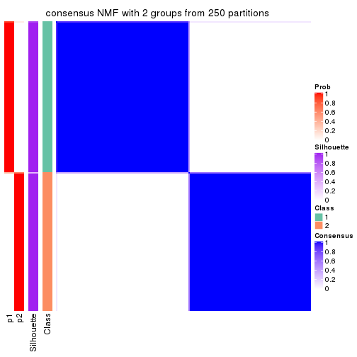</p>

</div>
<div id='tab-CV-NMF-consensus-heatmap-2'>
<pre><code class="r">consensus_heatmap(res, k = 3)
</code></pre>

<p>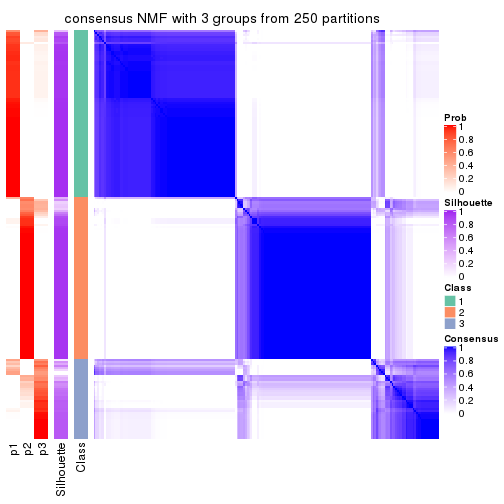</p>

</div>
<div id='tab-CV-NMF-consensus-heatmap-3'>
<pre><code class="r">consensus_heatmap(res, k = 4)
</code></pre>

<p>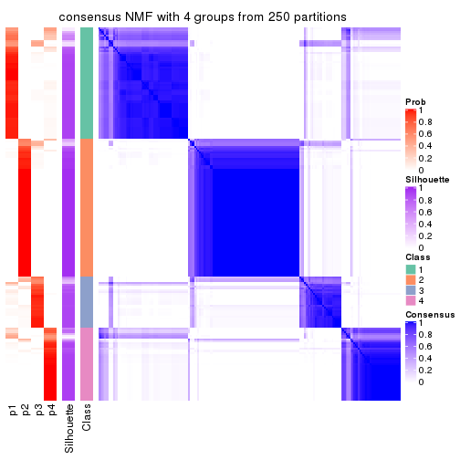</p>

</div>
<div id='tab-CV-NMF-consensus-heatmap-4'>
<pre><code class="r">consensus_heatmap(res, k = 5)
</code></pre>

<p>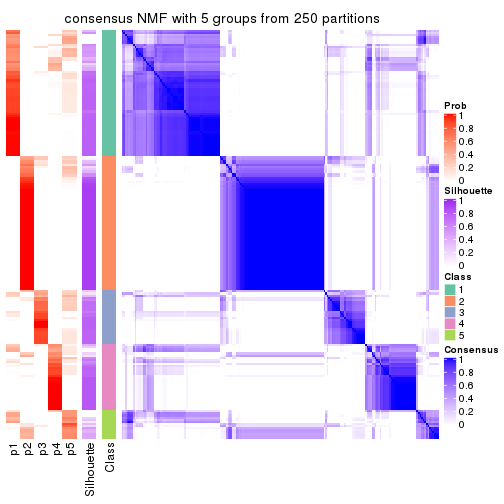</p>

</div>
<div id='tab-CV-NMF-consensus-heatmap-5'>
<pre><code class="r">consensus_heatmap(res, k = 6)
</code></pre>

<p>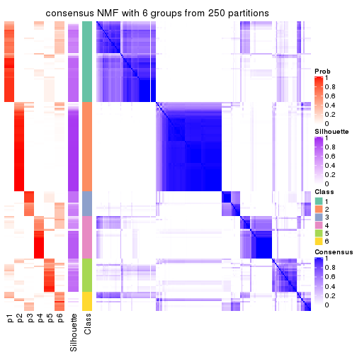</p>

</div>
</div>

Heatmaps for the membership of samples in all partitions to see how consistent they are:


<script>
$( function() {
	$( '#tabs-CV-NMF-membership-heatmap' ).tabs();
} );
</script>
<div id='tabs-CV-NMF-membership-heatmap'>
<ul>
<li><a href='#tab-CV-NMF-membership-heatmap-1'>k = 2</a></li>
<li><a href='#tab-CV-NMF-membership-heatmap-2'>k = 3</a></li>
<li><a href='#tab-CV-NMF-membership-heatmap-3'>k = 4</a></li>
<li><a href='#tab-CV-NMF-membership-heatmap-4'>k = 5</a></li>
<li><a href='#tab-CV-NMF-membership-heatmap-5'>k = 6</a></li>
</ul>
<div id='tab-CV-NMF-membership-heatmap-1'>
<pre><code class="r">membership_heatmap(res, k = 2)
</code></pre>

<p>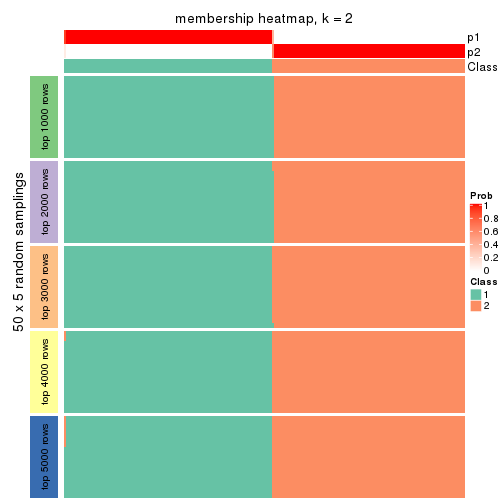</p>

</div>
<div id='tab-CV-NMF-membership-heatmap-2'>
<pre><code class="r">membership_heatmap(res, k = 3)
</code></pre>

<p>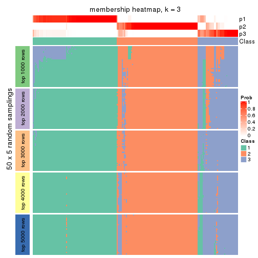</p>

</div>
<div id='tab-CV-NMF-membership-heatmap-3'>
<pre><code class="r">membership_heatmap(res, k = 4)
</code></pre>

<p>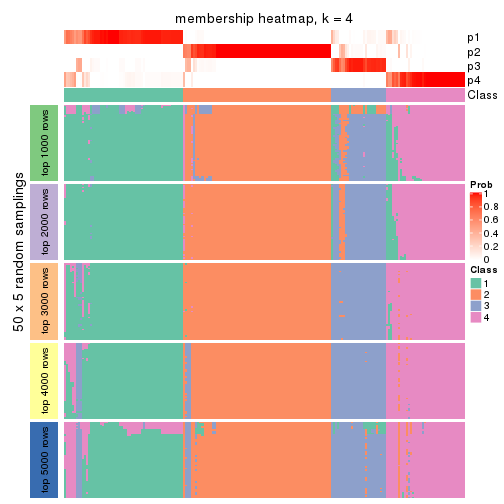</p>

</div>
<div id='tab-CV-NMF-membership-heatmap-4'>
<pre><code class="r">membership_heatmap(res, k = 5)
</code></pre>

<p>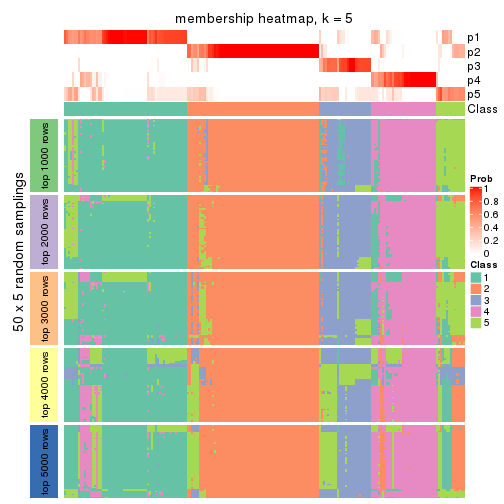</p>

</div>
<div id='tab-CV-NMF-membership-heatmap-5'>
<pre><code class="r">membership_heatmap(res, k = 6)
</code></pre>

<p>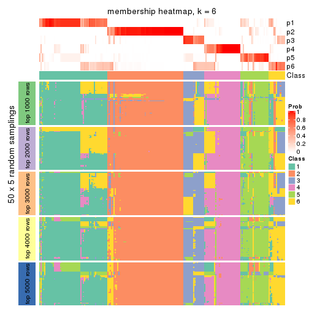</p>

</div>
</div>

As soon as we have had the classes for columns, we can look for signatures
which are significantly different between classes which can be candidate marks
for certain classes. Following are the heatmaps for signatures.


Signature heatmaps where rows are scaled:


<script>
$( function() {
	$( '#tabs-CV-NMF-get-signatures' ).tabs();
} );
</script>
<div id='tabs-CV-NMF-get-signatures'>
<ul>
<li><a href='#tab-CV-NMF-get-signatures-1'>k = 2</a></li>
<li><a href='#tab-CV-NMF-get-signatures-2'>k = 3</a></li>
<li><a href='#tab-CV-NMF-get-signatures-3'>k = 4</a></li>
<li><a href='#tab-CV-NMF-get-signatures-4'>k = 5</a></li>
<li><a href='#tab-CV-NMF-get-signatures-5'>k = 6</a></li>
</ul>
<div id='tab-CV-NMF-get-signatures-1'>
<pre><code class="r">get_signatures(res, k = 2)
</code></pre>

<p>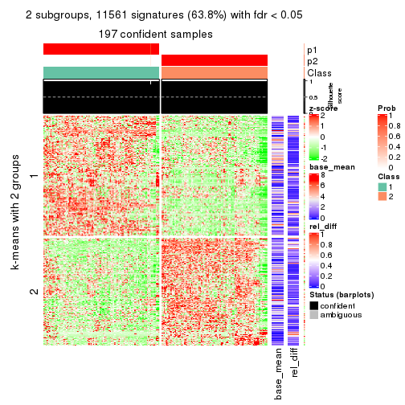</p>

</div>
<div id='tab-CV-NMF-get-signatures-2'>
<pre><code class="r">get_signatures(res, k = 3)
</code></pre>

<p>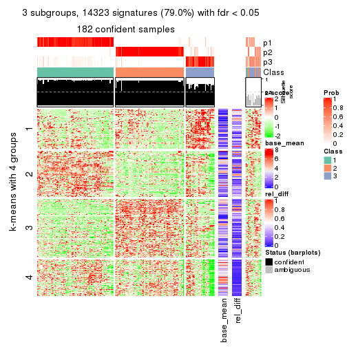</p>

</div>
<div id='tab-CV-NMF-get-signatures-3'>
<pre><code class="r">get_signatures(res, k = 4)
</code></pre>

<p>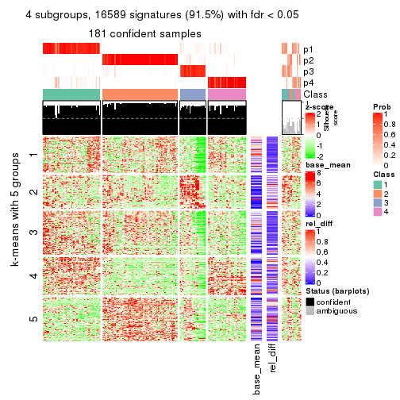</p>

</div>
<div id='tab-CV-NMF-get-signatures-4'>
<pre><code class="r">get_signatures(res, k = 5)
</code></pre>

<p>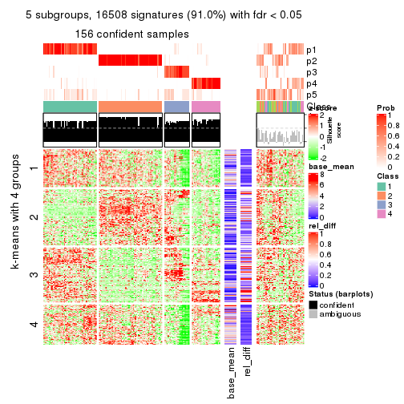</p>

</div>
<div id='tab-CV-NMF-get-signatures-5'>
<pre><code class="r">get_signatures(res, k = 6)
</code></pre>

<p>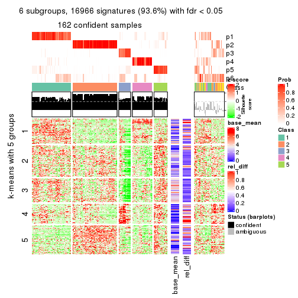</p>

</div>
</div>


Signature heatmaps where rows are not scaled:


<script>
$( function() {
	$( '#tabs-CV-NMF-get-signatures-no-scale' ).tabs();
} );
</script>
<div id='tabs-CV-NMF-get-signatures-no-scale'>
<ul>
<li><a href='#tab-CV-NMF-get-signatures-no-scale-1'>k = 2</a></li>
<li><a href='#tab-CV-NMF-get-signatures-no-scale-2'>k = 3</a></li>
<li><a href='#tab-CV-NMF-get-signatures-no-scale-3'>k = 4</a></li>
<li><a href='#tab-CV-NMF-get-signatures-no-scale-4'>k = 5</a></li>
<li><a href='#tab-CV-NMF-get-signatures-no-scale-5'>k = 6</a></li>
</ul>
<div id='tab-CV-NMF-get-signatures-no-scale-1'>
<pre><code class="r">get_signatures(res, k = 2, scale_rows = FALSE)
</code></pre>

<p>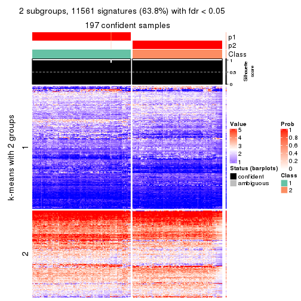</p>

</div>
<div id='tab-CV-NMF-get-signatures-no-scale-2'>
<pre><code class="r">get_signatures(res, k = 3, scale_rows = FALSE)
</code></pre>

<p>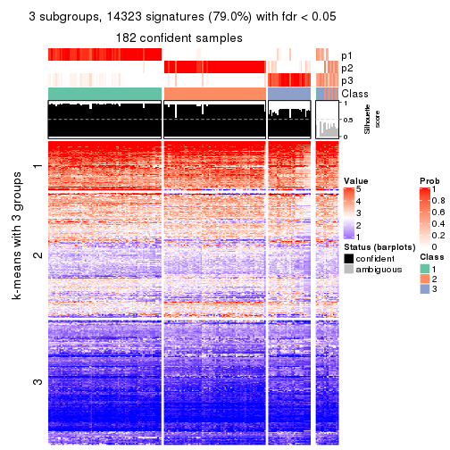</p>

</div>
<div id='tab-CV-NMF-get-signatures-no-scale-3'>
<pre><code class="r">get_signatures(res, k = 4, scale_rows = FALSE)
</code></pre>

<p>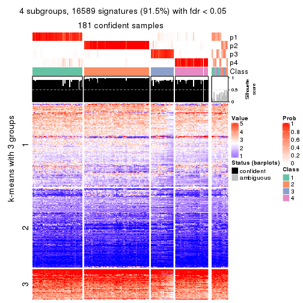</p>

</div>
<div id='tab-CV-NMF-get-signatures-no-scale-4'>
<pre><code class="r">get_signatures(res, k = 5, scale_rows = FALSE)
</code></pre>

<p>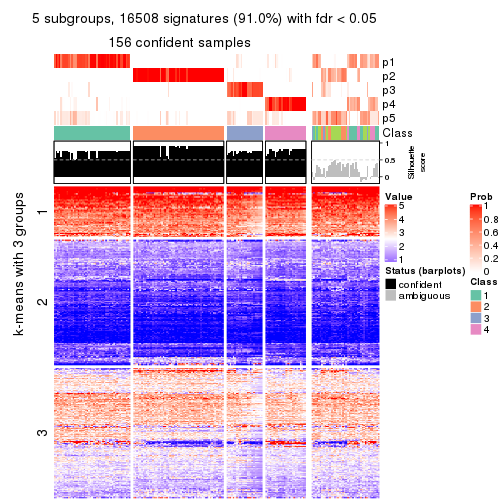</p>

</div>
<div id='tab-CV-NMF-get-signatures-no-scale-5'>
<pre><code class="r">get_signatures(res, k = 6, scale_rows = FALSE)
</code></pre>

<p>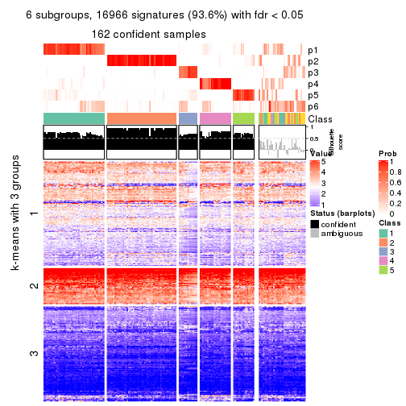</p>

</div>
</div>


Compare the overlap of signatures from different k:

```r
compare_signatures(res)
```

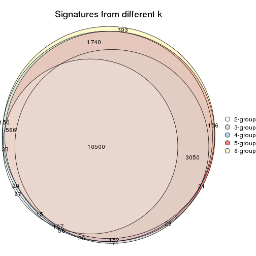

`get_signature()` returns a data frame invisibly. TO get the list of signatures, the function
call should be assigned to a variable explicitly. In following code, if `plot` argument is set
to `FALSE`, no heatmap is plotted while only the differential analysis is performed.

```r
# code only for demonstration
tb = get_signature(res, k = ..., plot = FALSE)
```

An example of the output of `tb` is:

```
#>   which_row         fdr    mean_1    mean_2 scaled_mean_1 scaled_mean_2 km
#> 1        38 0.042760348  8.373488  9.131774    -0.5533452     0.5164555  1
#> 2        40 0.018707592  7.106213  8.469186    -0.6173731     0.5762149  1
#> 3        55 0.019134737 10.221463 11.207825    -0.6159697     0.5749050  1
#> 4        59 0.006059896  5.921854  7.869574    -0.6899429     0.6439467  1
#> 5        60 0.018055526  8.928898 10.211722    -0.6204761     0.5791110  1
#> 6        98 0.009384629 15.714769 14.887706     0.6635654    -0.6193277  2
...
```

The columns in `tb` are:

1. `which_row`: row indices corresponding to the input matrix.
2. `fdr`: FDR for the differential test. 
3. `mean_x`: The mean value in group x.
4. `scaled_mean_x`: The mean value in group x after rows are scaled.
5. `km`: Row groups if k-means clustering is applied to rows.


UMAP plot which shows how samples are separated.


<script>
$( function() {
	$( '#tabs-CV-NMF-dimension-reduction' ).tabs();
} );
</script>
<div id='tabs-CV-NMF-dimension-reduction'>
<ul>
<li><a href='#tab-CV-NMF-dimension-reduction-1'>k = 2</a></li>
<li><a href='#tab-CV-NMF-dimension-reduction-2'>k = 3</a></li>
<li><a href='#tab-CV-NMF-dimension-reduction-3'>k = 4</a></li>
<li><a href='#tab-CV-NMF-dimension-reduction-4'>k = 5</a></li>
<li><a href='#tab-CV-NMF-dimension-reduction-5'>k = 6</a></li>
</ul>
<div id='tab-CV-NMF-dimension-reduction-1'>
<pre><code class="r">dimension_reduction(res, k = 2, method = &quot;UMAP&quot;)
</code></pre>

<p>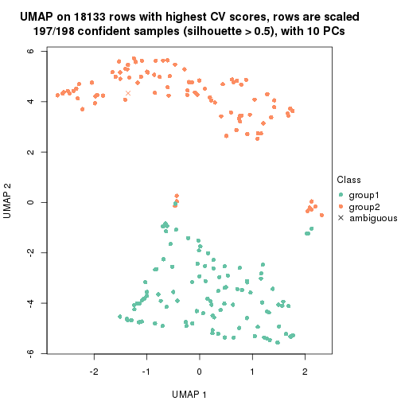</p>

</div>
<div id='tab-CV-NMF-dimension-reduction-2'>
<pre><code class="r">dimension_reduction(res, k = 3, method = &quot;UMAP&quot;)
</code></pre>

<p>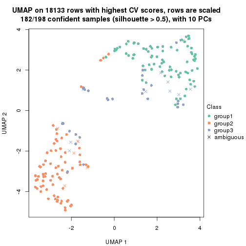</p>

</div>
<div id='tab-CV-NMF-dimension-reduction-3'>
<pre><code class="r">dimension_reduction(res, k = 4, method = &quot;UMAP&quot;)
</code></pre>

<p>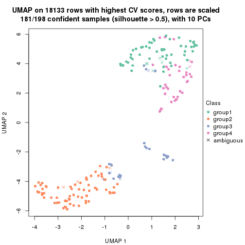</p>

</div>
<div id='tab-CV-NMF-dimension-reduction-4'>
<pre><code class="r">dimension_reduction(res, k = 5, method = &quot;UMAP&quot;)
</code></pre>

<p>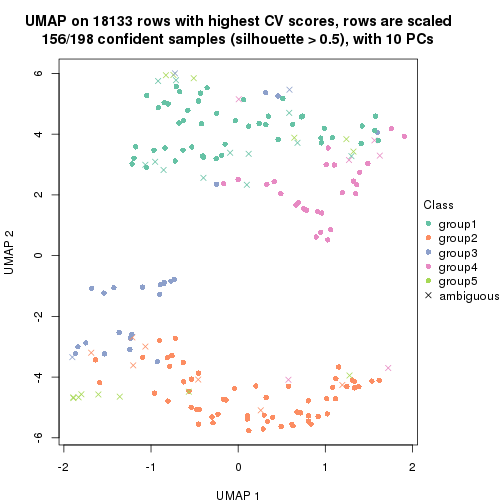</p>

</div>
<div id='tab-CV-NMF-dimension-reduction-5'>
<pre><code class="r">dimension_reduction(res, k = 6, method = &quot;UMAP&quot;)
</code></pre>

<p>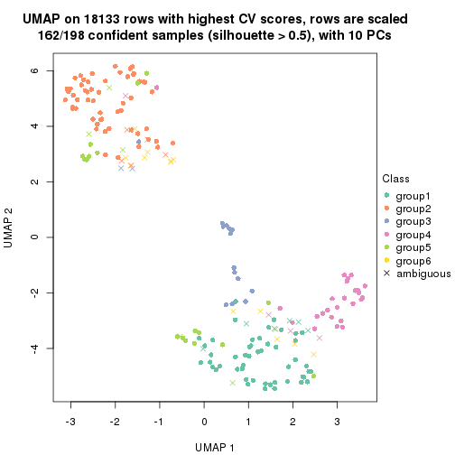</p>

</div>
</div>


Following heatmap shows how subgroups are split when increasing `k`:

```r
collect_classes(res)
```

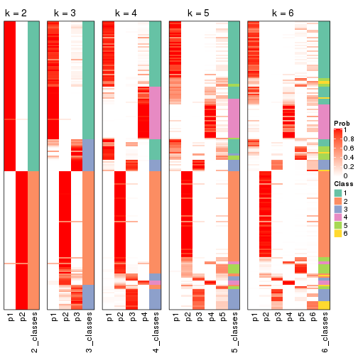


If matrix rows can be associated to genes, consider to use `functional_enrichment(res,
...)` to perform function enrichment for the signature genes. See [this vignette](http://bioconductor.org/packages/devel/bioc/vignettes/cola/inst/doc/functional_enrichment.html) for more detailed explanations.


 

---------------------------------------------------


### MAD:hclust


The object with results only for a single top-value method and a single partition method 
can be extracted as:

```r
res = res_list["MAD", "hclust"]
# you can also extract it by
# res = res_list["MAD:hclust"]
```

A summary of `res` and all the functions that can be applied to it:

```r
res
```

```
#> A 'ConsensusPartition' object with k = 2, 3, 4, 5, 6.
#>   On a matrix with 18133 rows and 198 columns.
#>   Top rows (1000, 2000, 3000, 4000, 5000) are extracted by 'MAD' method.
#>   Subgroups are detected by 'hclust' method.
#>   Performed in total 1250 partitions by row resampling.
#>   Best k for subgroups seems to be 3.
#> 
#> Following methods can be applied to this 'ConsensusPartition' object:
#>  [1] "cola_report"             "collect_classes"         "collect_plots"          
#>  [4] "collect_stats"           "colnames"                "compare_signatures"     
#>  [7] "consensus_heatmap"       "dimension_reduction"     "functional_enrichment"  
#> [10] "get_anno_col"            "get_anno"                "get_classes"            
#> [13] "get_consensus"           "get_matrix"              "get_membership"         
#> [16] "get_param"               "get_signatures"          "get_stats"              
#> [19] "is_best_k"               "is_stable_k"             "membership_heatmap"     
#> [22] "ncol"                    "nrow"                    "plot_ecdf"              
#> [25] "rownames"                "select_partition_number" "show"                   
#> [28] "suggest_best_k"          "test_to_known_factors"
```

`collect_plots()` function collects all the plots made from `res` for all `k` (number of partitions)
into one single page to provide an easy and fast comparison between different `k`.

```r
collect_plots(res)
```

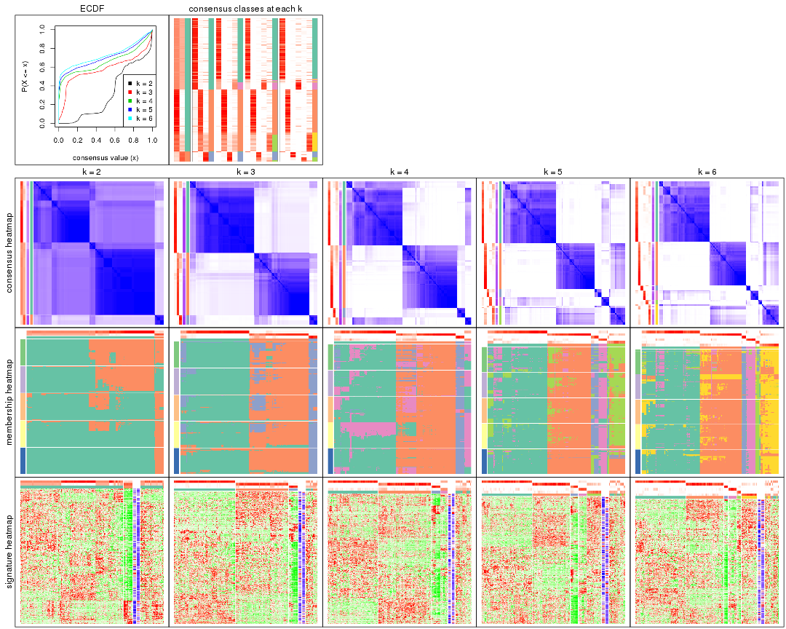

The plots are:

- The first row: a plot of the ECDF (empirical cumulative distribution
  function) curves of the consensus matrix for each `k` and the heatmap of
  predicted classes for each `k`.
- The second row: heatmaps of the consensus matrix for each `k`.
- The third row: heatmaps of the membership matrix for each `k`.
- The fouth row: heatmaps of the signatures for each `k`.

All the plots in panels can be made by individual functions and they are
plotted later in this section.

`select_partition_number()` produces several plots showing different
statistics for choosing "optimized" `k`. There are following statistics:

- ECDF curves of the consensus matrix for each `k`;
- 1-PAC. [The PAC
  score](https://en.wikipedia.org/wiki/Consensus_clustering#Over-interpretation_potential_of_consensus_clustering)
  measures the proportion of the ambiguous subgrouping.
- Mean silhouette score.
- Concordance. The mean probability of fiting the consensus class ids in all
  partitions.
- Area increased. Denote $A_k$ as the area under the ECDF curve for current
  `k`, the area increased is defined as $A_k - A_{k-1}$.
- Rand index. The percent of pairs of samples that are both in a same cluster
  or both are not in a same cluster in the partition of k and k-1.
- Jaccard index. The ratio of pairs of samples are both in a same cluster in
  the partition of k and k-1 and the pairs of samples are both in a same
  cluster in the partition k or k-1.

The detailed explanations of these statistics can be found in [the _cola_
vignette](http://bioconductor.org/packages/devel/bioc/vignettes/cola/inst/doc/cola.html#toc_13).

Generally speaking, lower PAC score, higher mean silhouette score or higher
concordance corresponds to better partition. Rand index and Jaccard index
measure how similar the current partition is compared to partition with `k-1`.
If they are too similar, we won't accept `k` is better than `k-1`.

```r
select_partition_number(res)
```

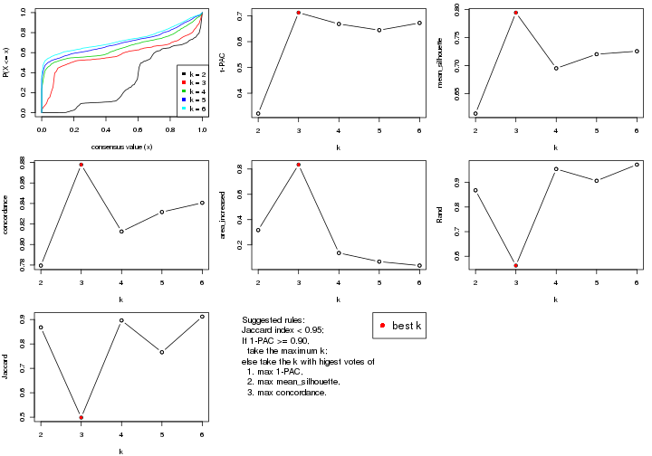

The numeric values for all these statistics can be obtained by `get_stats()`.

```r
get_stats(res)
```

```
#>   k 1-PAC mean_silhouette concordance area_increased  Rand Jaccard
#> 2 2 0.321           0.614       0.779         0.3169 0.868   0.868
#> 3 3 0.712           0.795       0.878         0.8345 0.562   0.498
#> 4 4 0.668           0.695       0.813         0.1362 0.954   0.896
#> 5 5 0.644           0.720       0.832         0.0679 0.907   0.766
#> 6 6 0.672           0.726       0.841         0.0368 0.972   0.912
```

`suggest_best_k()` suggests the best $k$ based on these statistics. The rules are as follows:

- All $k$ with Jaccard index larger than 0.95 are removed because increasing
  $k$ does not provide enough extra information. If all $k$ are removed, it is
  marked as no subgroup is detected.
- For all $k$ with 1-PAC score larger than 0.9, the maximal $k$ is taken as
  the best $k$, and other $k$ are marked as optional $k$.
- If it does not fit the second rule. The $k$ with the maximal vote of the
  highest 1-PAC score, highest mean silhouette, and highest concordance is
  taken as the best $k$.

```r
suggest_best_k(res)
```

```
#> [1] 3
```


Following shows the table of the partitions (You need to click the **show/hide
code output** link to see it). The membership matrix (columns with name `p*`)
is inferred by
[`clue::cl_consensus()`](https://www.rdocumentation.org/link/cl_consensus?package=clue)
function with the `SE` method. Basically the value in the membership matrix
represents the probability to belong to a certain group. The finall class
label for an item is determined with the group with highest probability it
belongs to.

In `get_classes()` function, the entropy is calculated from the membership
matrix and the silhouette score is calculated from the consensus matrix.


<script>
$( function() {
	$( '#tabs-MAD-hclust-get-classes' ).tabs();
} );
</script>
<div id='tabs-MAD-hclust-get-classes'>
<ul>
<li><a href='#tab-MAD-hclust-get-classes-1'>k = 2</a></li>
<li><a href='#tab-MAD-hclust-get-classes-2'>k = 3</a></li>
<li><a href='#tab-MAD-hclust-get-classes-3'>k = 4</a></li>
<li><a href='#tab-MAD-hclust-get-classes-4'>k = 5</a></li>
<li><a href='#tab-MAD-hclust-get-classes-5'>k = 6</a></li>
</ul>

<div id='tab-MAD-hclust-get-classes-1'>
<p><a id='tab-MAD-hclust-get-classes-1-a' style='color:#0366d6' href='#'>show/hide code output</a></p>
<pre><code class="r">cbind(get_classes(res, k = 2), get_membership(res, k = 2))
</code></pre>

<pre><code>#&gt;                                      class entropy silhouette    p1    p2
#&gt; 0C0AA0B2-5191-4EDF-8937-ED7434F30283     1  0.0000      0.597 1.000 0.000
#&gt; 18B45F1F-234F-45CC-A234-145307606C5C     1  0.9710      0.686 0.600 0.400
#&gt; E18B70C0-BDCA-46D3-99BB-C6C8ABC68DA5     1  0.4939      0.490 0.892 0.108
#&gt; 0F6DDBA7-6F74-45E8-95C8-F28263D55978     1  0.9732      0.684 0.596 0.404
#&gt; 7EAE1A5A-129A-46DE-977E-A2C753F10904     1  0.8267      0.373 0.740 0.260
#&gt; 7EAE0048-16B5-4979-9410-16CDEB9B1A48     1  0.9775      0.680 0.588 0.412
#&gt; 2EBFC828-2B27-4753-A052-80DDA226DAB4     1  0.0376      0.594 0.996 0.004
#&gt; 24E1768D-2232-41DA-9383-BC55D6EB3812     2  0.7883      0.902 0.236 0.764
#&gt; 6E3CD60A-1889-4CA3-B305-2E78152057B5     1  0.4161      0.626 0.916 0.084
#&gt; 33CC70DD-82B3-413C-B3B1-BE06634D95D0     1  0.9909      0.422 0.556 0.444
#&gt; F1CB57A3-55DD-4487-9307-1B4F652E729A     1  0.9710      0.686 0.600 0.400
#&gt; 755A5806-B054-449A-93DB-79909E6C93A1     1  0.9608      0.684 0.616 0.384
#&gt; 58D364E7-3D2F-468F-A264-D6461E2428D4     1  0.4298      0.567 0.912 0.088
#&gt; 68BB9CB6-7AA2-4981-B9D9-07363EC96599     2  0.7883      0.902 0.236 0.764
#&gt; 3C4E8DFA-8EA0-4F1F-89CB-CB8805395872     2  0.7883      0.902 0.236 0.764
#&gt; 4219651D-5583-4498-BF08-1B7D04B4C7B2     1  0.9732      0.684 0.596 0.404
#&gt; B5EE2768-0D67-4584-ADBC-EC745FEC52EA     1  0.0672      0.590 0.992 0.008
#&gt; 825E6C11-F460-451A-8045-846DD7D0E945     1  0.9993      0.607 0.516 0.484
#&gt; 491F62AF-5E68-43C3-982A-F867A75BBA9A     1  0.1184      0.582 0.984 0.016
#&gt; 9D7F058C-F95A-44AD-AC9E-450F7FBDC960     1  0.2778      0.570 0.952 0.048
#&gt; 6D42DD0C-2081-4742-BA27-9F5F16FAC3C6     1  0.9608      0.684 0.616 0.384
#&gt; EDD7E63D-492A-473B-A552-0764337B10EF     1  0.0938      0.602 0.988 0.012
#&gt; 97073DEA-73AD-4DFD-BD1A-9035DC03445B     1  0.9686      0.685 0.604 0.396
#&gt; FA891AB9-CE38-4F7E-A015-1DDCE12890A0     1  0.9710      0.686 0.600 0.400
#&gt; D9514D49-A0AE-45AB-8C9F-68E726215253     1  0.9833      0.671 0.576 0.424
#&gt; 3B9229AD-12E5-451E-9D2F-378AAC82C04A     1  0.0000      0.597 1.000 0.000
#&gt; 5EA36B71-4917-4EF3-9060-065EFE6ACC5B     1  0.9954      0.637 0.540 0.460
#&gt; A20E4ECB-4895-4CC7-BE5E-4721B20D933B     1  0.9754      0.683 0.592 0.408
#&gt; 1BE8D828-29DB-4368-AA4A-FB23588F7AE8     1  0.9881      0.429 0.564 0.436
#&gt; 66EFEFCF-3D14-4DBF-AA13-530F40ED0245     1  0.9795      0.412 0.584 0.416
#&gt; 55DFFE53-BCE7-4EC1-9863-6C0311B06BA2     1  0.0938      0.602 0.988 0.012
#&gt; 4CC3FB5A-611D-4C64-AE9D-544FA45CF4DC     1  0.9710      0.686 0.600 0.400
#&gt; C11D33F2-DFE9-4FA8-9024-F3E7F1DADC5F     1  0.8207      0.341 0.744 0.256
#&gt; FA5932B8-8AA3-4C38-9FAB-C35D8772974D     1  0.9710      0.686 0.600 0.400
#&gt; 8216EC35-1F41-4A15-B503-BDA4971E27C9     1  0.9710      0.686 0.600 0.400
#&gt; 69635D23-90A7-4BAD-97C7-B79536837F57     1  0.9732      0.684 0.596 0.404
#&gt; 12B404E2-C463-4409-8392-E4649B2AFFD1     1  0.0000      0.597 1.000 0.000
#&gt; 246927E3-ACCF-41B2-AA8E-43855FD6B146     1  0.0000      0.597 1.000 0.000
#&gt; E0CC13E7-9607-49E0-B4AA-395544E3C3BF     1  0.9732      0.684 0.596 0.404
#&gt; F7BBC0C1-6124-4A83-8A70-EA89B62F1CBD     1  0.9710      0.686 0.600 0.400
#&gt; B1D4FF24-8E6F-4A04-B716-2032D850EB57     1  0.9732      0.684 0.596 0.404
#&gt; 253601DB-B78A-4566-9947-8C0270C0B163     1  0.0000      0.597 1.000 0.000
#&gt; AB83DBFF-5737-4FB8-A5AC-1D3CD6072BDF     2  0.6887      0.894 0.184 0.816
#&gt; 9D67D953-EC98-4B72-89C8-5732BC9D4BC9     1  0.0000      0.597 1.000 0.000
#&gt; 51061018-95AB-4278-886F-F69E4EBC47C0     2  0.7815      0.865 0.232 0.768
#&gt; ABD0F7F3-105B-4DEE-9889-5028772C519A     1  0.9732      0.684 0.596 0.404
#&gt; 562B95CF-B27E-4A72-B7C6-CDF86A51A39B     1  0.9732      0.684 0.596 0.404
#&gt; ABF046A4-D7A1-49FF-B6B1-4E07A791DEDB     1  0.0938      0.602 0.988 0.012
#&gt; 3FF4101E-9703-460E-A30E-76CC7689F36D     1  0.0000      0.597 1.000 0.000
#&gt; 39C4F7AA-7ADF-4F1D-BDA3-BEC605AC5023     1  0.8267      0.373 0.740 0.260
#&gt; CB821FD2-AF5C-4743-A70F-21C12C6ED153     1  0.9710      0.686 0.600 0.400
#&gt; 92EA1846-62FF-41D5-A441-5E52E6B9E7F9     1  0.9710      0.686 0.600 0.400
#&gt; 7D25F3EE-5A20-4763-8026-16A03D05F459     1  0.9710      0.686 0.600 0.400
#&gt; 8ECE5276-CD06-496B-A5A9-1713B1F7D089     1  0.9775      0.680 0.588 0.412
#&gt; C775B68F-9507-47E3-B507-B433AED79002     1  0.9896      0.656 0.560 0.440
#&gt; E19D5463-FDD0-41C1-A170-323736A88D07     1  0.8207      0.341 0.744 0.256
#&gt; CE4B6285-4961-4767-91F0-5C7A8162E185     1  0.9608      0.684 0.616 0.384
#&gt; 9637BD72-1FEF-42AD-8886-2C39BE876531     1  0.9608      0.684 0.616 0.384
#&gt; 81B5A88E-45A0-4B44-B689-B9071B8548EE     1  0.8207      0.341 0.744 0.256
#&gt; 0B01B4C9-9BED-4F5B-A3E2-8868C7CCC3FC     2  0.7219      0.898 0.200 0.800
#&gt; 54501315-7132-44B2-A179-10FBF1421105     1  0.9710      0.686 0.600 0.400
#&gt; E207CBE9-4C3A-4FDD-9251-CFE1FE106475     2  0.6801      0.892 0.180 0.820
#&gt; 3BEA0B92-3F90-4DBF-9679-AADEAD7D47C8     1  0.7139      0.408 0.804 0.196
#&gt; 35B32250-D854-4215-AA5B-2C11B2FBEECA     1  0.9710      0.686 0.600 0.400
#&gt; ACE6566B-AEB9-426C-924A-B382D14A1024     1  0.0000      0.597 1.000 0.000
#&gt; 737E69AC-0930-45B9-B6BA-7CE5E300290B     1  0.9710      0.686 0.600 0.400
#&gt; B4410AB8-D015-41CA-86E6-12EB4E4103E3     1  0.9754      0.683 0.592 0.408
#&gt; 6D3ECA65-C50F-43B0-B75A-1D290FA4A8FD     1  0.0376      0.594 0.996 0.004
#&gt; C86F40D3-9A96-4395-A8C3-510DE12F9A2B     1  0.7056      0.415 0.808 0.192
#&gt; 6238087F-24DD-4BF1-903F-3BD4E446C1AE     1  0.5408      0.480 0.876 0.124
#&gt; E4FF840B-EEAB-4CB0-A690-7D4C4AA7EEC3     1  0.2423      0.600 0.960 0.040
#&gt; 72D3C323-C67F-4C0E-9BFC-BF245FF9730A     1  0.9608      0.684 0.616 0.384
#&gt; 82D56E4E-4DF6-4F3E-8959-B995C92AAA70     1  0.9732      0.684 0.596 0.404
#&gt; E31CA441-EB19-443B-ACBD-37B5CCBCF0E5     1  0.0000      0.597 1.000 0.000
#&gt; 87CA8939-D054-4B8A-B32D-085FD2E8F202     1  0.9732      0.684 0.596 0.404
#&gt; 2A508D90-FEDC-46A3-9A02-E51E5467CDCB     1  0.9732      0.684 0.596 0.404
#&gt; C4E8B4E2-388B-411F-BF0A-9B6F34E8EDB5     1  0.9000      0.327 0.684 0.316
#&gt; AF6AF803-BD93-44A7-AA80-B9BC92C1273B     1  0.0000      0.597 1.000 0.000
#&gt; 0B1CA5CF-EB96-41D4-BFC5-6957FEB39828     1  0.9608      0.684 0.616 0.384
#&gt; 6FB96FB0-6661-48AD-A4A0-69F8AFDBE591     1  0.0000      0.597 1.000 0.000
#&gt; 8C19F7FD-368A-462B-B28F-88D6630038A1     1  0.9710      0.686 0.600 0.400
#&gt; 96EABE78-C2F4-4A33-ACD8-C922A4B2519B     1  0.0000      0.597 1.000 0.000
#&gt; 68B36D7B-546A-4689-949F-B207C4A4AB27     1  0.0000      0.597 1.000 0.000
#&gt; CE9F3335-778F-4F52-BC55-4B7C99B211DD     1  0.8267      0.331 0.740 0.260
#&gt; CB359DED-2A2D-4646-A0BD-6F10ADCC532B     1  0.9909      0.422 0.556 0.444
#&gt; 198324A5-8C52-46F6-9734-EFAF1CCA6D9B     1  0.9686      0.685 0.604 0.396
#&gt; 83B88608-0506-428C-B9E8-621F38477B42     1  0.9710      0.686 0.600 0.400
#&gt; 1993630A-0F3D-4F5C-86A3-D443BAAF57F0     1  0.4690      0.631 0.900 0.100
#&gt; DE73DA9B-529E-4F4F-A65C-DA7AB84B1096     1  0.9954      0.637 0.540 0.460
#&gt; 2347F3B7-DDA3-40C0-B6D4-8819ECA69146     1  0.9775      0.680 0.588 0.412
#&gt; AB93B5D5-095F-4330-9D40-6A3D934AB50C     1  0.9881      0.659 0.564 0.436
#&gt; 5EBBE4AD-FF0C-41CF-9EA3-B6FE7EA1F9C0     2  0.6801      0.892 0.180 0.820
#&gt; 6D960AE7-3769-4144-A061-E8588E5063FF     1  0.9963      0.433 0.536 0.464
#&gt; 0C2DD8C0-D1A5-4192-A49C-7A40FED628B2     1  0.9000      0.327 0.684 0.316
#&gt; 18C9372F-C55B-4F86-A9D2-E8D85EFC8566     1  0.4690      0.631 0.900 0.100
#&gt; 9AF637B0-4C32-4DD1-93AF-7655B4A845D3     1  0.0000      0.597 1.000 0.000
#&gt; 785B5B06-4115-46FD-9BEB-F888AFDC855D     1  0.8207      0.341 0.744 0.256
#&gt; ECA3050E-4BE2-4117-B9CF-A52BB85AF8C2     1  0.4431      0.629 0.908 0.092
#&gt; 099DC396-16A5-458F-9ED9-F2A790CB0C34     1  0.9732      0.685 0.596 0.404
#&gt; 7A5A12EE-C5B0-4C51-8C99-0F3FA88D633E     1  0.9710      0.686 0.600 0.400
#&gt; E832B508-A66D-4817-B44A-FE9FAAE64B4A     1  0.9710      0.686 0.600 0.400
#&gt; F9DD688C-7B35-49E7-9651-2E098EE78856     1  0.9710      0.686 0.600 0.400
#&gt; F1265DD8-5ED3-4635-A277-57BBFDEC7729     1  0.9710      0.686 0.600 0.400
#&gt; F624E8D9-DB07-4C9E-910D-5E8EBA3A6167     1  0.7056      0.415 0.808 0.192
#&gt; 3516FBDF-66E1-43F4-9D7B-16748F6439A7     1  0.0000      0.597 1.000 0.000
#&gt; 04B12992-B2EA-4BA2-8E2C-11E34E230E6F     1  0.7056      0.415 0.808 0.192
#&gt; CC02897D-9123-495E-9242-5C9CF4EC269B     1  0.0000      0.597 1.000 0.000
#&gt; 3117ED46-2BF2-4311-BC00-4E98243E16B3     1  0.9833      0.671 0.576 0.424
#&gt; E0B66D53-23DB-4E26-BB6E-F692FA8C000E     1  0.9732      0.684 0.596 0.404
#&gt; DAA93CE5-A013-477A-9A50-EA09CC3A8162     1  0.9000      0.327 0.684 0.316
#&gt; 0099098D-354A-4276-92F8-B932C74B4608     1  0.9732      0.684 0.596 0.404
#&gt; DD483639-B2E7-4745-BCFB-55ED1D82BFBF     1  0.0000      0.597 1.000 0.000
#&gt; 2C1F9079-602E-4252-82C7-9D8799E04246     1  0.5178      0.552 0.884 0.116
#&gt; 9473A8E4-3A1B-4184-9EA6-517AFD60B635     2  0.6801      0.892 0.180 0.820
#&gt; 75CFBAF6-7BA0-40AF-92D7-D218E885BD1B     1  0.0000      0.597 1.000 0.000
#&gt; B588950F-14D6-41C8-845B-EFD2096013C6     1  0.0000      0.597 1.000 0.000
#&gt; 0DF3EDA8-DAEA-4721-92AB-B97181249498     1  0.9000      0.327 0.684 0.316
#&gt; 8EA83042-D598-401D-AD78-936EEB136C59     1  0.9686      0.685 0.604 0.396
#&gt; 729AC418-3BE9-445A-95D4-AC11A7D43BE0     1  0.9608      0.684 0.616 0.384
#&gt; 7D8B1B11-F576-4AA8-BFA7-0022A2CD829A     1  0.0000      0.597 1.000 0.000
#&gt; 304A0E46-3449-4B44-9C30-BDDF6459391D     1  0.9732      0.684 0.596 0.404
#&gt; 3C83358F-DF20-47F7-AF9F-AB7CC92F5ABA     2  0.9833     -0.440 0.424 0.576
#&gt; EAFEED6C-35C3-451F-AE4A-EB56992E1F29     1  0.9710      0.686 0.600 0.400
#&gt; 8A237A65-28EC-434D-A78A-A8B7308B5204     1  0.9710      0.686 0.600 0.400
#&gt; D005833F-E991-4E9E-9667-55F137288004     1  0.9710      0.686 0.600 0.400
#&gt; 37D966E3-253E-4397-A9AE-0903A8D31FE6     1  0.9608      0.684 0.616 0.384
#&gt; D2482B81-CB5B-4178-BA8D-1CF4026181B5     1  0.9732      0.684 0.596 0.404
#&gt; 18019E95-C2A8-4EE7-B585-F6886DC4D953     1  0.8861      0.324 0.696 0.304
#&gt; 0B126D1A-14A8-4345-8F78-FF92222ADF4C     2  0.7883      0.902 0.236 0.764
#&gt; CE88B625-47D8-4D58-9FB4-23464DB7DDAD     1  0.0000      0.597 1.000 0.000
#&gt; 9A88299D-5C74-47FA-B42C-1A1D6D935AAB     1  0.9993      0.607 0.516 0.484
#&gt; 3E71159C-FD6C-41DA-B18B-0730C8AC7E41     1  0.9710      0.686 0.600 0.400
#&gt; 6F245AA4-79D9-47E1-BCC9-1AAF65AEA813     1  0.9710      0.686 0.600 0.400
#&gt; 4CF2C888-2100-483A-B4DB-ECBB69243A4D     1  0.8267      0.331 0.740 0.260
#&gt; A3853813-B9D5-4E8C-B075-19FCC35F8686     1  0.9795      0.412 0.584 0.416
#&gt; 83A16DEE-CE9F-4D8B-9225-0A2A8B9D055D     1  0.9909      0.422 0.556 0.444
#&gt; 0F057CAF-4F9A-4DE9-8601-730E96873733     1  0.0000      0.597 1.000 0.000
#&gt; 32D5801D-DBA4-422E-87CB-A2DDE921BA41     1  0.9881      0.659 0.564 0.436
#&gt; 22EE8076-F07C-499A-9AF8-D800A77EF154     1  0.6801      0.471 0.820 0.180
#&gt; DD4BD74D-D48C-4090-9F57-5334E784581C     1  0.9833      0.671 0.576 0.424
#&gt; 41183565-434D-474C-B1BD-CA6E94910658     1  0.8861      0.324 0.696 0.304
#&gt; 75A2CE41-2B2A-4346-927E-ACF8A72738E4     1  0.9710      0.686 0.600 0.400
#&gt; 7AA24995-3DD2-4682-B36A-4EBFEEACF625     1  0.9732      0.684 0.596 0.404
#&gt; 8BAFDFEC-9F26-4ADB-95CE-004143960EEB     1  0.9732      0.684 0.596 0.404
#&gt; A330E011-CE08-4A85-8F4B-370592293DBB     1  0.9710      0.686 0.600 0.400
#&gt; 1D5A5B17-2E70-4BB0-94A1-EC17E6EA49DB     1  0.9815      0.673 0.580 0.420
#&gt; BD9143B8-9D97-4A05-872C-3FB82B4CF7BE     1  0.0376      0.594 0.996 0.004
#&gt; 64552DC0-181E-4607-898C-787AA7F26435     1  0.0000      0.597 1.000 0.000
#&gt; 1B4C4D41-34C7-43A3-858B-C9552EB53894     1  0.9608      0.684 0.616 0.384
#&gt; 463A3BAA-02DC-4EA4-A644-B924163E425D     1  0.0376      0.594 0.996 0.004
#&gt; CD0FEA89-6F60-4A20-8FCA-D397B4E95A98     1  0.9710      0.686 0.600 0.400
#&gt; 5D06CF6D-F4B9-4B32-B055-8AB287E53340     1  0.1414      0.600 0.980 0.020
#&gt; ADA7835F-DB67-4F4F-9446-8BCE3C5FE936     1  0.1633      0.593 0.976 0.024
#&gt; 4109BE2D-B5DF-4BD7-860E-60D87F647152     1  0.4161      0.626 0.916 0.084
#&gt; 88526A0E-6DFE-46CB-BFAD-B4826F482C67     1  0.9710      0.686 0.600 0.400
#&gt; F39F9A4C-18F7-4017-AB31-85D52FF44587     1  0.0000      0.597 1.000 0.000
#&gt; D4290A5E-1B24-4C55-B470-0FA7A0A09DD0     1  0.0000      0.597 1.000 0.000
#&gt; DC5A2C9E-978F-4661-B729-1F9662976E27     1  0.9754      0.683 0.592 0.408
#&gt; 26A1F392-CED2-43E3-8096-74E6F2BFC8C0     1  0.3431      0.603 0.936 0.064
#&gt; 87D81FB2-306A-4E75-9D58-D5F48E46E7F6     1  0.0000      0.597 1.000 0.000
#&gt; E3D9D81A-C20C-4B3B-B940-A5D2C5F65B22     2  0.7883      0.902 0.236 0.764
#&gt; 4464650B-453F-476C-989C-B7B159BF2CF0     1  0.0000      0.597 1.000 0.000
#&gt; 577D2867-B738-487A-9B06-07958D647F02     1  0.9710      0.686 0.600 0.400
#&gt; E52A22CC-3C03-41A9-9541-220DD871E162     1  0.0000      0.597 1.000 0.000
#&gt; 642703B1-AF99-4746-A915-0792F4B9590B     1  0.2236      0.611 0.964 0.036
#&gt; 8F0D1792-1284-45E6-8EC4-392596057677     1  0.0000      0.597 1.000 0.000
#&gt; 765AFFC1-D528-4494-8BA1-0706451E4205     2  0.7950      0.854 0.240 0.760
#&gt; A716BC29-161F-4CA0-B240-00B330137F2C     1  0.9754      0.683 0.592 0.408
#&gt; 32CBFBAF-7064-4595-8D54-2C5E7DE0FD9B     1  0.9608      0.684 0.616 0.384
#&gt; 4D6ED28C-3F20-41B0-BA41-1BF0E5199A40     1  0.4690      0.631 0.900 0.100
#&gt; 86A38456-2900-48FB-B10F-79222B3CA9BF     1  0.9491      0.684 0.632 0.368
#&gt; E870807D-3223-4A6A-9E3D-F4461B048AA2     1  0.8555      0.317 0.720 0.280
#&gt; 3A78D19F-A833-4D2C-8387-FB4FD4A8313C     1  0.9732      0.684 0.596 0.404
#&gt; DFA162CA-C708-4121-8E74-F9C4DEE0CDAE     1  0.9686      0.685 0.604 0.396
#&gt; C00A300A-CD10-4C9D-8C94-3901AFE8406C     1  0.5178      0.552 0.884 0.116
#&gt; 13E11D15-A90F-48C4-980A-DD032C00A2C1     1  0.9896      0.656 0.560 0.440
#&gt; 31BF80AB-FEDB-4C73-89C3-70BE9F9ACBEE     1  0.0000      0.597 1.000 0.000
#&gt; FA34308A-349D-4AAD-94CF-3F3B7F9AD629     1  0.5408      0.480 0.876 0.124
#&gt; 7C48D467-B663-49DD-BC84-A36BC32ACB3D     1  0.9963      0.433 0.536 0.464
#&gt; BB068534-04F6-4FC9-9087-CDA65920BCE2     1  0.9732      0.684 0.596 0.404
#&gt; EA4EC272-A9B3-4B2E-955F-19F7676A944C     1  0.0000      0.597 1.000 0.000
#&gt; C71FF69B-A460-43CA-8769-9667F22D938B     1  0.9732      0.684 0.596 0.404
#&gt; 5243D1B8-8168-4FF1-A8C6-505F080EF0D3     1  0.2778      0.598 0.952 0.048
#&gt; BCC474D8-08FE-4E99-B8E8-B29E65F84D2E     1  0.9608      0.684 0.616 0.384
#&gt; 04FDBFE3-4CF6-4E53-A2AA-89D5C9316377     2  0.7883      0.902 0.236 0.764
#&gt; 83A9915C-8D60-4CAE-A868-B61E3C90C7B0     1  0.4298      0.610 0.912 0.088
#&gt; 989A6472-E3E3-457A-97BE-CCE95F42D5C2     1  0.0000      0.597 1.000 0.000
#&gt; A0AB2D28-6751-49C9-8DF4-66FDBF95C360     1  0.9608      0.684 0.616 0.384
#&gt; A12B2683-18D4-41C9-8AE5-C143E2180052     1  0.9710      0.686 0.600 0.400
#&gt; 8DE1E245-CAD2-4F11-BFA2-9792C433A00B     1  0.9896      0.419 0.560 0.440
#&gt; FDA68036-6C4C-4256-9AA0-C01FE92AA098     1  0.0376      0.599 0.996 0.004
#&gt; 26311920-1414-4EC1-870B-784961EBCC2D     1  0.9732      0.684 0.596 0.404
#&gt; C29A10D6-D598-4286-B5E0-F1776E19E988     1  0.9732      0.684 0.596 0.404
#&gt; FACCC1FB-4937-4CC0-90EA-7F91D3D939CF     1  0.3879      0.624 0.924 0.076
#&gt; 90B9D84B-78E5-4C7E-8414-EC889C2DE8DB     1  0.4161      0.626 0.916 0.084
#&gt; B74E6122-76E1-4E4D-A867-BCAFD7277393     1  0.9710      0.686 0.600 0.400
#&gt; 98494DC0-CF6E-485F-8A0D-D80E4437EF5C     1  0.8909      0.325 0.692 0.308
#&gt; DA114DAC-DE7B-4E43-8D7C-82C5D7B66411     1  0.9732      0.684 0.596 0.404
</code></pre>

<script>
$('#tab-MAD-hclust-get-classes-1-a').parent().next().next().hide();
$('#tab-MAD-hclust-get-classes-1-a').click(function(){
  $('#tab-MAD-hclust-get-classes-1-a').parent().next().next().toggle();
  return(false);
});
</script>
</div>

<div id='tab-MAD-hclust-get-classes-2'>
<p><a id='tab-MAD-hclust-get-classes-2-a' style='color:#0366d6' href='#'>show/hide code output</a></p>
<pre><code class="r">cbind(get_classes(res, k = 3), get_membership(res, k = 3))
</code></pre>

<pre><code>#&gt;                                      class entropy silhouette    p1    p2    p3
#&gt; 0C0AA0B2-5191-4EDF-8937-ED7434F30283     2  0.2066     0.8358 0.060 0.940 0.000
#&gt; 18B45F1F-234F-45CC-A234-145307606C5C     1  0.0983     0.9173 0.980 0.016 0.004
#&gt; E18B70C0-BDCA-46D3-99BB-C6C8ABC68DA5     2  0.6138     0.7531 0.060 0.768 0.172
#&gt; 0F6DDBA7-6F74-45E8-95C8-F28263D55978     1  0.1647     0.9092 0.960 0.036 0.004
#&gt; 7EAE1A5A-129A-46DE-977E-A2C753F10904     2  0.6742     0.5641 0.028 0.656 0.316
#&gt; 7EAE0048-16B5-4979-9410-16CDEB9B1A48     1  0.1491     0.9120 0.968 0.016 0.016
#&gt; 2EBFC828-2B27-4753-A052-80DDA226DAB4     2  0.2947     0.8352 0.060 0.920 0.020
#&gt; 24E1768D-2232-41DA-9383-BC55D6EB3812     3  0.2165     0.9552 0.000 0.064 0.936
#&gt; 6E3CD60A-1889-4CA3-B305-2E78152057B5     2  0.4521     0.7387 0.180 0.816 0.004
#&gt; 33CC70DD-82B3-413C-B3B1-BE06634D95D0     1  0.8918     0.1751 0.492 0.128 0.380
#&gt; F1CB57A3-55DD-4487-9307-1B4F652E729A     1  0.0983     0.9181 0.980 0.016 0.004
#&gt; 755A5806-B054-449A-93DB-79909E6C93A1     1  0.1711     0.9006 0.960 0.032 0.008
#&gt; 58D364E7-3D2F-468F-A264-D6461E2428D4     2  0.5558     0.7583 0.048 0.800 0.152
#&gt; 68BB9CB6-7AA2-4981-B9D9-07363EC96599     3  0.2165     0.9552 0.000 0.064 0.936
#&gt; 3C4E8DFA-8EA0-4F1F-89CB-CB8805395872     3  0.2261     0.9510 0.000 0.068 0.932
#&gt; 4219651D-5583-4498-BF08-1B7D04B4C7B2     1  0.1647     0.9092 0.960 0.036 0.004
#&gt; B5EE2768-0D67-4584-ADBC-EC745FEC52EA     2  0.3083     0.8352 0.060 0.916 0.024
#&gt; 825E6C11-F460-451A-8045-846DD7D0E945     1  0.4892     0.8213 0.840 0.048 0.112
#&gt; 491F62AF-5E68-43C3-982A-F867A75BBA9A     2  0.3045     0.8322 0.064 0.916 0.020
#&gt; 9D7F058C-F95A-44AD-AC9E-450F7FBDC960     2  0.4370     0.8087 0.056 0.868 0.076
#&gt; 6D42DD0C-2081-4742-BA27-9F5F16FAC3C6     1  0.1950     0.8958 0.952 0.040 0.008
#&gt; EDD7E63D-492A-473B-A552-0764337B10EF     2  0.3554     0.8324 0.064 0.900 0.036
#&gt; 97073DEA-73AD-4DFD-BD1A-9035DC03445B     1  0.0983     0.9175 0.980 0.016 0.004
#&gt; FA891AB9-CE38-4F7E-A015-1DDCE12890A0     1  0.0983     0.9173 0.980 0.016 0.004
#&gt; D9514D49-A0AE-45AB-8C9F-68E726215253     1  0.4288     0.8489 0.872 0.068 0.060
#&gt; 3B9229AD-12E5-451E-9D2F-378AAC82C04A     2  0.2066     0.8358 0.060 0.940 0.000
#&gt; 5EA36B71-4917-4EF3-9060-065EFE6ACC5B     1  0.5731     0.7834 0.804 0.108 0.088
#&gt; A20E4ECB-4895-4CC7-BE5E-4721B20D933B     1  0.0829     0.9184 0.984 0.012 0.004
#&gt; 1BE8D828-29DB-4368-AA4A-FB23588F7AE8     1  0.8710     0.2174 0.508 0.112 0.380
#&gt; 66EFEFCF-3D14-4DBF-AA13-530F40ED0245     1  0.9202     0.0819 0.460 0.152 0.388
#&gt; 55DFFE53-BCE7-4EC1-9863-6C0311B06BA2     2  0.3554     0.8324 0.064 0.900 0.036
#&gt; 4CC3FB5A-611D-4C64-AE9D-544FA45CF4DC     1  0.0983     0.9181 0.980 0.016 0.004
#&gt; C11D33F2-DFE9-4FA8-9024-F3E7F1DADC5F     2  0.6688     0.5418 0.028 0.664 0.308
#&gt; FA5932B8-8AA3-4C38-9FAB-C35D8772974D     1  0.0983     0.9173 0.980 0.016 0.004
#&gt; 8216EC35-1F41-4A15-B503-BDA4971E27C9     1  0.0983     0.9173 0.980 0.016 0.004
#&gt; 69635D23-90A7-4BAD-97C7-B79536837F57     1  0.0829     0.9172 0.984 0.012 0.004
#&gt; 12B404E2-C463-4409-8392-E4649B2AFFD1     2  0.2066     0.8358 0.060 0.940 0.000
#&gt; 246927E3-ACCF-41B2-AA8E-43855FD6B146     2  0.2066     0.8358 0.060 0.940 0.000
#&gt; E0CC13E7-9607-49E0-B4AA-395544E3C3BF     1  0.0829     0.9180 0.984 0.012 0.004
#&gt; F7BBC0C1-6124-4A83-8A70-EA89B62F1CBD     1  0.0983     0.9173 0.980 0.016 0.004
#&gt; B1D4FF24-8E6F-4A04-B716-2032D850EB57     1  0.0592     0.9182 0.988 0.012 0.000
#&gt; 253601DB-B78A-4566-9947-8C0270C0B163     2  0.2066     0.8358 0.060 0.940 0.000
#&gt; AB83DBFF-5737-4FB8-A5AC-1D3CD6072BDF     3  0.0661     0.9435 0.008 0.004 0.988
#&gt; 9D67D953-EC98-4B72-89C8-5732BC9D4BC9     2  0.2066     0.8358 0.060 0.940 0.000
#&gt; 51061018-95AB-4278-886F-F69E4EBC47C0     3  0.2860     0.9082 0.004 0.084 0.912
#&gt; ABD0F7F3-105B-4DEE-9889-5028772C519A     1  0.0592     0.9182 0.988 0.012 0.000
#&gt; 562B95CF-B27E-4A72-B7C6-CDF86A51A39B     1  0.0592     0.9182 0.988 0.012 0.000
#&gt; ABF046A4-D7A1-49FF-B6B1-4E07A791DEDB     2  0.3888     0.8300 0.064 0.888 0.048
#&gt; 3FF4101E-9703-460E-A30E-76CC7689F36D     2  0.2066     0.8358 0.060 0.940 0.000
#&gt; 39C4F7AA-7ADF-4F1D-BDA3-BEC605AC5023     2  0.6742     0.5641 0.028 0.656 0.316
#&gt; CB821FD2-AF5C-4743-A70F-21C12C6ED153     1  0.0892     0.9167 0.980 0.020 0.000
#&gt; 92EA1846-62FF-41D5-A441-5E52E6B9E7F9     1  0.0983     0.9181 0.980 0.016 0.004
#&gt; 7D25F3EE-5A20-4763-8026-16A03D05F459     1  0.0983     0.9173 0.980 0.016 0.004
#&gt; 8ECE5276-CD06-496B-A5A9-1713B1F7D089     1  0.1453     0.9110 0.968 0.024 0.008
#&gt; C775B68F-9507-47E3-B507-B433AED79002     1  0.4745     0.8299 0.852 0.080 0.068
#&gt; E19D5463-FDD0-41C1-A170-323736A88D07     2  0.6688     0.5418 0.028 0.664 0.308
#&gt; CE4B6285-4961-4767-91F0-5C7A8162E185     1  0.1832     0.8975 0.956 0.036 0.008
#&gt; 9637BD72-1FEF-42AD-8886-2C39BE876531     1  0.1950     0.8958 0.952 0.040 0.008
#&gt; 81B5A88E-45A0-4B44-B689-B9071B8548EE     2  0.6688     0.5418 0.028 0.664 0.308
#&gt; 0B01B4C9-9BED-4F5B-A3E2-8868C7CCC3FC     3  0.1399     0.9513 0.004 0.028 0.968
#&gt; 54501315-7132-44B2-A179-10FBF1421105     1  0.0983     0.9173 0.980 0.016 0.004
#&gt; E207CBE9-4C3A-4FDD-9251-CFE1FE106475     3  0.0424     0.9415 0.008 0.000 0.992
#&gt; 3BEA0B92-3F90-4DBF-9679-AADEAD7D47C8     2  0.6226     0.6369 0.028 0.720 0.252
#&gt; 35B32250-D854-4215-AA5B-2C11B2FBEECA     1  0.0983     0.9181 0.980 0.016 0.004
#&gt; ACE6566B-AEB9-426C-924A-B382D14A1024     2  0.2066     0.8358 0.060 0.940 0.000
#&gt; 737E69AC-0930-45B9-B6BA-7CE5E300290B     1  0.0747     0.9175 0.984 0.016 0.000
#&gt; B4410AB8-D015-41CA-86E6-12EB4E4103E3     1  0.0829     0.9184 0.984 0.012 0.004
#&gt; 6D3ECA65-C50F-43B0-B75A-1D290FA4A8FD     2  0.3213     0.8340 0.060 0.912 0.028
#&gt; C86F40D3-9A96-4395-A8C3-510DE12F9A2B     2  0.6834     0.6458 0.048 0.692 0.260
#&gt; 6238087F-24DD-4BF1-903F-3BD4E446C1AE     2  0.5119     0.7296 0.032 0.816 0.152
#&gt; E4FF840B-EEAB-4CB0-A690-7D4C4AA7EEC3     2  0.4477     0.8219 0.068 0.864 0.068
#&gt; 72D3C323-C67F-4C0E-9BFC-BF245FF9730A     1  0.1950     0.8958 0.952 0.040 0.008
#&gt; 82D56E4E-4DF6-4F3E-8959-B995C92AAA70     1  0.0829     0.9180 0.984 0.012 0.004
#&gt; E31CA441-EB19-443B-ACBD-37B5CCBCF0E5     2  0.2066     0.8358 0.060 0.940 0.000
#&gt; 87CA8939-D054-4B8A-B32D-085FD2E8F202     1  0.1950     0.9068 0.952 0.040 0.008
#&gt; 2A508D90-FEDC-46A3-9A02-E51E5467CDCB     1  0.0829     0.9172 0.984 0.012 0.004
#&gt; C4E8B4E2-388B-411F-BF0A-9B6F34E8EDB5     2  0.7240     0.2879 0.028 0.540 0.432
#&gt; AF6AF803-BD93-44A7-AA80-B9BC92C1273B     2  0.2066     0.8358 0.060 0.940 0.000
#&gt; 0B1CA5CF-EB96-41D4-BFC5-6957FEB39828     1  0.1950     0.8958 0.952 0.040 0.008
#&gt; 6FB96FB0-6661-48AD-A4A0-69F8AFDBE591     2  0.2066     0.8358 0.060 0.940 0.000
#&gt; 8C19F7FD-368A-462B-B28F-88D6630038A1     1  0.1129     0.9163 0.976 0.020 0.004
#&gt; 96EABE78-C2F4-4A33-ACD8-C922A4B2519B     2  0.2066     0.8358 0.060 0.940 0.000
#&gt; 68B36D7B-546A-4689-949F-B207C4A4AB27     2  0.2066     0.8358 0.060 0.940 0.000
#&gt; CE9F3335-778F-4F52-BC55-4B7C99B211DD     2  0.6855     0.5493 0.032 0.652 0.316
#&gt; CB359DED-2A2D-4646-A0BD-6F10ADCC532B     1  0.8699     0.2286 0.512 0.112 0.376
#&gt; 198324A5-8C52-46F6-9734-EFAF1CCA6D9B     1  0.1267     0.9071 0.972 0.024 0.004
#&gt; 83B88608-0506-428C-B9E8-621F38477B42     1  0.0983     0.9173 0.980 0.016 0.004
#&gt; 1993630A-0F3D-4F5C-86A3-D443BAAF57F0     2  0.4784     0.7147 0.200 0.796 0.004
#&gt; DE73DA9B-529E-4F4F-A65C-DA7AB84B1096     1  0.5731     0.7834 0.804 0.108 0.088
#&gt; 2347F3B7-DDA3-40C0-B6D4-8819ECA69146     1  0.1774     0.9075 0.960 0.024 0.016
#&gt; AB93B5D5-095F-4330-9D40-6A3D934AB50C     1  0.4652     0.8336 0.856 0.080 0.064
#&gt; 5EBBE4AD-FF0C-41CF-9EA3-B6FE7EA1F9C0     3  0.0424     0.9415 0.008 0.000 0.992
#&gt; 6D960AE7-3769-4144-A061-E8588E5063FF     1  0.8604     0.3032 0.540 0.112 0.348
#&gt; 0C2DD8C0-D1A5-4192-A49C-7A40FED628B2     2  0.7248     0.2765 0.028 0.536 0.436
#&gt; 18C9372F-C55B-4F86-A9D2-E8D85EFC8566     2  0.4062     0.7582 0.164 0.836 0.000
#&gt; 9AF637B0-4C32-4DD1-93AF-7655B4A845D3     2  0.2165     0.8356 0.064 0.936 0.000
#&gt; 785B5B06-4115-46FD-9BEB-F888AFDC855D     2  0.6570     0.5634 0.028 0.680 0.292
#&gt; ECA3050E-4BE2-4117-B9CF-A52BB85AF8C2     2  0.3941     0.7652 0.156 0.844 0.000
#&gt; 099DC396-16A5-458F-9ED9-F2A790CB0C34     1  0.1170     0.9184 0.976 0.016 0.008
#&gt; 7A5A12EE-C5B0-4C51-8C99-0F3FA88D633E     1  0.0983     0.9181 0.980 0.016 0.004
#&gt; E832B508-A66D-4817-B44A-FE9FAAE64B4A     1  0.0592     0.9179 0.988 0.012 0.000
#&gt; F9DD688C-7B35-49E7-9651-2E098EE78856     1  0.0983     0.9173 0.980 0.016 0.004
#&gt; F1265DD8-5ED3-4635-A277-57BBFDEC7729     1  0.0983     0.9173 0.980 0.016 0.004
#&gt; F624E8D9-DB07-4C9E-910D-5E8EBA3A6167     2  0.6834     0.6458 0.048 0.692 0.260
#&gt; 3516FBDF-66E1-43F4-9D7B-16748F6439A7     2  0.2066     0.8358 0.060 0.940 0.000
#&gt; 04B12992-B2EA-4BA2-8E2C-11E34E230E6F     2  0.6834     0.6458 0.048 0.692 0.260
#&gt; CC02897D-9123-495E-9242-5C9CF4EC269B     2  0.2066     0.8358 0.060 0.940 0.000
#&gt; 3117ED46-2BF2-4311-BC00-4E98243E16B3     1  0.4288     0.8489 0.872 0.068 0.060
#&gt; E0B66D53-23DB-4E26-BB6E-F692FA8C000E     1  0.0829     0.9172 0.984 0.012 0.004
#&gt; DAA93CE5-A013-477A-9A50-EA09CC3A8162     2  0.7248     0.2765 0.028 0.536 0.436
#&gt; 0099098D-354A-4276-92F8-B932C74B4608     1  0.0829     0.9172 0.984 0.012 0.004
#&gt; DD483639-B2E7-4745-BCFB-55ED1D82BFBF     2  0.2165     0.8355 0.064 0.936 0.000
#&gt; 2C1F9079-602E-4252-82C7-9D8799E04246     2  0.6098     0.7413 0.056 0.768 0.176
#&gt; 9473A8E4-3A1B-4184-9EA6-517AFD60B635     3  0.0424     0.9415 0.008 0.000 0.992
#&gt; 75CFBAF6-7BA0-40AF-92D7-D218E885BD1B     2  0.2066     0.8358 0.060 0.940 0.000
#&gt; B588950F-14D6-41C8-845B-EFD2096013C6     2  0.2066     0.8358 0.060 0.940 0.000
#&gt; 0DF3EDA8-DAEA-4721-92AB-B97181249498     2  0.7248     0.2765 0.028 0.536 0.436
#&gt; 8EA83042-D598-401D-AD78-936EEB136C59     1  0.1399     0.9052 0.968 0.028 0.004
#&gt; 729AC418-3BE9-445A-95D4-AC11A7D43BE0     1  0.1950     0.8958 0.952 0.040 0.008
#&gt; 7D8B1B11-F576-4AA8-BFA7-0022A2CD829A     2  0.2066     0.8358 0.060 0.940 0.000
#&gt; 304A0E46-3449-4B44-9C30-BDDF6459391D     1  0.0829     0.9172 0.984 0.012 0.004
#&gt; 3C83358F-DF20-47F7-AF9F-AB7CC92F5ABA     1  0.6203     0.7305 0.760 0.056 0.184
#&gt; EAFEED6C-35C3-451F-AE4A-EB56992E1F29     1  0.0983     0.9181 0.980 0.016 0.004
#&gt; 8A237A65-28EC-434D-A78A-A8B7308B5204     1  0.0892     0.9167 0.980 0.020 0.000
#&gt; D005833F-E991-4E9E-9667-55F137288004     1  0.0829     0.9162 0.984 0.012 0.004
#&gt; 37D966E3-253E-4397-A9AE-0903A8D31FE6     1  0.1950     0.8958 0.952 0.040 0.008
#&gt; D2482B81-CB5B-4178-BA8D-1CF4026181B5     1  0.0829     0.9172 0.984 0.012 0.004
#&gt; 18019E95-C2A8-4EE7-B585-F6886DC4D953     2  0.7213     0.3149 0.028 0.552 0.420
#&gt; 0B126D1A-14A8-4345-8F78-FF92222ADF4C     3  0.2165     0.9552 0.000 0.064 0.936
#&gt; CE88B625-47D8-4D58-9FB4-23464DB7DDAD     2  0.2066     0.8358 0.060 0.940 0.000
#&gt; 9A88299D-5C74-47FA-B42C-1A1D6D935AAB     1  0.5639     0.7829 0.808 0.080 0.112
#&gt; 3E71159C-FD6C-41DA-B18B-0730C8AC7E41     1  0.0983     0.9181 0.980 0.016 0.004
#&gt; 6F245AA4-79D9-47E1-BCC9-1AAF65AEA813     1  0.0983     0.9181 0.980 0.016 0.004
#&gt; 4CF2C888-2100-483A-B4DB-ECBB69243A4D     2  0.6855     0.5493 0.032 0.652 0.316
#&gt; A3853813-B9D5-4E8C-B075-19FCC35F8686     1  0.9202     0.0819 0.460 0.152 0.388
#&gt; 83A16DEE-CE9F-4D8B-9225-0A2A8B9D055D     1  0.8918     0.1751 0.492 0.128 0.380
#&gt; 0F057CAF-4F9A-4DE9-8601-730E96873733     2  0.2066     0.8358 0.060 0.940 0.000
#&gt; 32D5801D-DBA4-422E-87CB-A2DDE921BA41     1  0.4652     0.8336 0.856 0.080 0.064
#&gt; 22EE8076-F07C-499A-9AF8-D800A77EF154     2  0.6335     0.6444 0.036 0.724 0.240
#&gt; DD4BD74D-D48C-4090-9F57-5334E784581C     1  0.4288     0.8489 0.872 0.068 0.060
#&gt; 41183565-434D-474C-B1BD-CA6E94910658     2  0.7213     0.3149 0.028 0.552 0.420
#&gt; 75A2CE41-2B2A-4346-927E-ACF8A72738E4     1  0.0983     0.9173 0.980 0.016 0.004
#&gt; 7AA24995-3DD2-4682-B36A-4EBFEEACF625     1  0.0592     0.9182 0.988 0.012 0.000
#&gt; 8BAFDFEC-9F26-4ADB-95CE-004143960EEB     1  0.2550     0.8974 0.936 0.040 0.024
#&gt; A330E011-CE08-4A85-8F4B-370592293DBB     1  0.0983     0.9173 0.980 0.016 0.004
#&gt; 1D5A5B17-2E70-4BB0-94A1-EC17E6EA49DB     1  0.3267     0.8790 0.912 0.044 0.044
#&gt; BD9143B8-9D97-4A05-872C-3FB82B4CF7BE     2  0.3045     0.8355 0.064 0.916 0.020
#&gt; 64552DC0-181E-4607-898C-787AA7F26435     2  0.2066     0.8358 0.060 0.940 0.000
#&gt; 1B4C4D41-34C7-43A3-858B-C9552EB53894     1  0.1950     0.8958 0.952 0.040 0.008
#&gt; 463A3BAA-02DC-4EA4-A644-B924163E425D     2  0.2301     0.8358 0.060 0.936 0.004
#&gt; CD0FEA89-6F60-4A20-8FCA-D397B4E95A98     1  0.0983     0.9181 0.980 0.016 0.004
#&gt; 5D06CF6D-F4B9-4B32-B055-8AB287E53340     2  0.3623     0.8315 0.072 0.896 0.032
#&gt; ADA7835F-DB67-4F4F-9446-8BCE3C5FE936     2  0.3888     0.8292 0.064 0.888 0.048
#&gt; 4109BE2D-B5DF-4BD7-860E-60D87F647152     2  0.4521     0.7387 0.180 0.816 0.004
#&gt; 88526A0E-6DFE-46CB-BFAD-B4826F482C67     1  0.0892     0.9167 0.980 0.020 0.000
#&gt; F39F9A4C-18F7-4017-AB31-85D52FF44587     2  0.2066     0.8358 0.060 0.940 0.000
#&gt; D4290A5E-1B24-4C55-B470-0FA7A0A09DD0     2  0.2066     0.8358 0.060 0.940 0.000
#&gt; DC5A2C9E-978F-4661-B729-1F9662976E27     1  0.0983     0.9150 0.980 0.016 0.004
#&gt; 26A1F392-CED2-43E3-8096-74E6F2BFC8C0     2  0.5631     0.7913 0.064 0.804 0.132
#&gt; 87D81FB2-306A-4E75-9D58-D5F48E46E7F6     2  0.2066     0.8358 0.060 0.940 0.000
#&gt; E3D9D81A-C20C-4B3B-B940-A5D2C5F65B22     3  0.2165     0.9552 0.000 0.064 0.936
#&gt; 4464650B-453F-476C-989C-B7B159BF2CF0     2  0.2066     0.8358 0.060 0.940 0.000
#&gt; 577D2867-B738-487A-9B06-07958D647F02     1  0.1129     0.9162 0.976 0.020 0.004
#&gt; E52A22CC-3C03-41A9-9541-220DD871E162     2  0.2066     0.8358 0.060 0.940 0.000
#&gt; 642703B1-AF99-4746-A915-0792F4B9590B     2  0.2878     0.8163 0.096 0.904 0.000
#&gt; 8F0D1792-1284-45E6-8EC4-392596057677     2  0.2066     0.8358 0.060 0.940 0.000
#&gt; 765AFFC1-D528-4494-8BA1-0706451E4205     3  0.3272     0.8823 0.004 0.104 0.892
#&gt; A716BC29-161F-4CA0-B240-00B330137F2C     1  0.2414     0.8968 0.940 0.040 0.020
#&gt; 32CBFBAF-7064-4595-8D54-2C5E7DE0FD9B     1  0.1950     0.8958 0.952 0.040 0.008
#&gt; 4D6ED28C-3F20-41B0-BA41-1BF0E5199A40     2  0.4784     0.7147 0.200 0.796 0.004
#&gt; 86A38456-2900-48FB-B10F-79222B3CA9BF     2  0.6676     0.1694 0.476 0.516 0.008
#&gt; E870807D-3223-4A6A-9E3D-F4461B048AA2     2  0.6890     0.5021 0.028 0.632 0.340
#&gt; 3A78D19F-A833-4D2C-8387-FB4FD4A8313C     1  0.0661     0.9171 0.988 0.008 0.004
#&gt; DFA162CA-C708-4121-8E74-F9C4DEE0CDAE     1  0.0983     0.9152 0.980 0.016 0.004
#&gt; C00A300A-CD10-4C9D-8C94-3901AFE8406C     2  0.6192     0.7445 0.060 0.764 0.176
#&gt; 13E11D15-A90F-48C4-980A-DD032C00A2C1     1  0.4745     0.8299 0.852 0.080 0.068
#&gt; 31BF80AB-FEDB-4C73-89C3-70BE9F9ACBEE     2  0.2066     0.8358 0.060 0.940 0.000
#&gt; FA34308A-349D-4AAD-94CF-3F3B7F9AD629     2  0.5119     0.7296 0.032 0.816 0.152
#&gt; 7C48D467-B663-49DD-BC84-A36BC32ACB3D     1  0.8604     0.3032 0.540 0.112 0.348
#&gt; BB068534-04F6-4FC9-9087-CDA65920BCE2     1  0.1182     0.9155 0.976 0.012 0.012
#&gt; EA4EC272-A9B3-4B2E-955F-19F7676A944C     2  0.3083     0.8344 0.060 0.916 0.024
#&gt; C71FF69B-A460-43CA-8769-9667F22D938B     1  0.0829     0.9172 0.984 0.012 0.004
#&gt; 5243D1B8-8168-4FF1-A8C6-505F080EF0D3     2  0.4652     0.8181 0.064 0.856 0.080
#&gt; BCC474D8-08FE-4E99-B8E8-B29E65F84D2E     1  0.1711     0.9006 0.960 0.032 0.008
#&gt; 04FDBFE3-4CF6-4E53-A2AA-89D5C9316377     3  0.2165     0.9552 0.000 0.064 0.936
#&gt; 83A9915C-8D60-4CAE-A868-B61E3C90C7B0     2  0.4563     0.8027 0.112 0.852 0.036
#&gt; 989A6472-E3E3-457A-97BE-CCE95F42D5C2     2  0.2066     0.8358 0.060 0.940 0.000
#&gt; A0AB2D28-6751-49C9-8DF4-66FDBF95C360     1  0.1950     0.8958 0.952 0.040 0.008
#&gt; A12B2683-18D4-41C9-8AE5-C143E2180052     1  0.0983     0.9181 0.980 0.016 0.004
#&gt; 8DE1E245-CAD2-4F11-BFA2-9792C433A00B     1  0.8927     0.1624 0.488 0.128 0.384
#&gt; FDA68036-6C4C-4256-9AA0-C01FE92AA098     2  0.3213     0.8346 0.060 0.912 0.028
#&gt; 26311920-1414-4EC1-870B-784961EBCC2D     1  0.0983     0.9184 0.980 0.016 0.004
#&gt; C29A10D6-D598-4286-B5E0-F1776E19E988     1  0.0829     0.9186 0.984 0.012 0.004
#&gt; FACCC1FB-4937-4CC0-90EA-7F91D3D939CF     2  0.4033     0.7880 0.136 0.856 0.008
#&gt; 90B9D84B-78E5-4C7E-8414-EC889C2DE8DB     2  0.3983     0.7813 0.144 0.852 0.004
#&gt; B74E6122-76E1-4E4D-A867-BCAFD7277393     1  0.0983     0.9181 0.980 0.016 0.004
#&gt; 98494DC0-CF6E-485F-8A0D-D80E4437EF5C     2  0.7223     0.3042 0.028 0.548 0.424
#&gt; DA114DAC-DE7B-4E43-8D7C-82C5D7B66411     1  0.0848     0.9171 0.984 0.008 0.008
</code></pre>

<script>
$('#tab-MAD-hclust-get-classes-2-a').parent().next().next().hide();
$('#tab-MAD-hclust-get-classes-2-a').click(function(){
  $('#tab-MAD-hclust-get-classes-2-a').parent().next().next().toggle();
  return(false);
});
</script>
</div>

<div id='tab-MAD-hclust-get-classes-3'>
<p><a id='tab-MAD-hclust-get-classes-3-a' style='color:#0366d6' href='#'>show/hide code output</a></p>
<pre><code class="r">cbind(get_classes(res, k = 4), get_membership(res, k = 4))
</code></pre>

<pre><code>#&gt;                                      class entropy silhouette    p1    p2    p3    p4
#&gt; 0C0AA0B2-5191-4EDF-8937-ED7434F30283     2  0.0336      0.825 0.000 0.992 0.000 0.008
#&gt; 18B45F1F-234F-45CC-A234-145307606C5C     1  0.2281      0.694 0.904 0.000 0.000 0.096
#&gt; E18B70C0-BDCA-46D3-99BB-C6C8ABC68DA5     2  0.5007      0.753 0.008 0.776 0.060 0.156
#&gt; 0F6DDBA7-6F74-45E8-95C8-F28263D55978     1  0.2149      0.739 0.912 0.000 0.000 0.088
#&gt; 7EAE1A5A-129A-46DE-977E-A2C753F10904     2  0.6770      0.600 0.008 0.588 0.096 0.308
#&gt; 7EAE0048-16B5-4979-9410-16CDEB9B1A48     1  0.1211      0.757 0.960 0.000 0.000 0.040
#&gt; 2EBFC828-2B27-4753-A052-80DDA226DAB4     2  0.1209      0.825 0.000 0.964 0.004 0.032
#&gt; 24E1768D-2232-41DA-9383-BC55D6EB3812     3  0.2256      0.941 0.000 0.056 0.924 0.020
#&gt; 6E3CD60A-1889-4CA3-B305-2E78152057B5     2  0.3224      0.755 0.016 0.864 0.000 0.120
#&gt; 33CC70DD-82B3-413C-B3B1-BE06634D95D0     1  0.7641      0.189 0.488 0.016 0.140 0.356
#&gt; F1CB57A3-55DD-4487-9307-1B4F652E729A     1  0.0188      0.759 0.996 0.000 0.000 0.004
#&gt; 755A5806-B054-449A-93DB-79909E6C93A1     1  0.5168     -0.798 0.500 0.004 0.000 0.496
#&gt; 58D364E7-3D2F-468F-A264-D6461E2428D4     2  0.5087      0.742 0.004 0.760 0.060 0.176
#&gt; 68BB9CB6-7AA2-4981-B9D9-07363EC96599     3  0.2256      0.941 0.000 0.056 0.924 0.020
#&gt; 3C4E8DFA-8EA0-4F1F-89CB-CB8805395872     3  0.2363      0.938 0.000 0.056 0.920 0.024
#&gt; 4219651D-5583-4498-BF08-1B7D04B4C7B2     1  0.2149      0.739 0.912 0.000 0.000 0.088
#&gt; B5EE2768-0D67-4584-ADBC-EC745FEC52EA     2  0.1452      0.824 0.000 0.956 0.008 0.036
#&gt; 825E6C11-F460-451A-8045-846DD7D0E945     1  0.3257      0.653 0.844 0.000 0.004 0.152
#&gt; 491F62AF-5E68-43C3-982A-F867A75BBA9A     2  0.1878      0.823 0.008 0.944 0.008 0.040
#&gt; 9D7F058C-F95A-44AD-AC9E-450F7FBDC960     2  0.3573      0.797 0.008 0.864 0.028 0.100
#&gt; 6D42DD0C-2081-4742-BA27-9F5F16FAC3C6     4  0.5050      0.968 0.408 0.004 0.000 0.588
#&gt; EDD7E63D-492A-473B-A552-0764337B10EF     2  0.1888      0.821 0.000 0.940 0.016 0.044
#&gt; 97073DEA-73AD-4DFD-BD1A-9035DC03445B     1  0.3610      0.510 0.800 0.000 0.000 0.200
#&gt; FA891AB9-CE38-4F7E-A015-1DDCE12890A0     1  0.3266      0.573 0.832 0.000 0.000 0.168
#&gt; D9514D49-A0AE-45AB-8C9F-68E726215253     1  0.2944      0.685 0.868 0.000 0.004 0.128
#&gt; 3B9229AD-12E5-451E-9D2F-378AAC82C04A     2  0.0188      0.824 0.000 0.996 0.000 0.004
#&gt; 5EA36B71-4917-4EF3-9060-065EFE6ACC5B     1  0.4019      0.592 0.792 0.000 0.012 0.196
#&gt; A20E4ECB-4895-4CC7-BE5E-4721B20D933B     1  0.1389      0.747 0.952 0.000 0.000 0.048
#&gt; 1BE8D828-29DB-4368-AA4A-FB23588F7AE8     1  0.7249      0.202 0.496 0.000 0.156 0.348
#&gt; 66EFEFCF-3D14-4DBF-AA13-530F40ED0245     1  0.8212      0.144 0.464 0.040 0.152 0.344
#&gt; 55DFFE53-BCE7-4EC1-9863-6C0311B06BA2     2  0.1888      0.821 0.000 0.940 0.016 0.044
#&gt; 4CC3FB5A-611D-4C64-AE9D-544FA45CF4DC     1  0.0921      0.758 0.972 0.000 0.000 0.028
#&gt; C11D33F2-DFE9-4FA8-9024-F3E7F1DADC5F     2  0.7069      0.542 0.012 0.536 0.096 0.356
#&gt; FA5932B8-8AA3-4C38-9FAB-C35D8772974D     1  0.2868      0.635 0.864 0.000 0.000 0.136
#&gt; 8216EC35-1F41-4A15-B503-BDA4971E27C9     1  0.3172      0.589 0.840 0.000 0.000 0.160
#&gt; 69635D23-90A7-4BAD-97C7-B79536837F57     1  0.0592      0.760 0.984 0.000 0.000 0.016
#&gt; 12B404E2-C463-4409-8392-E4649B2AFFD1     2  0.0188      0.824 0.000 0.996 0.000 0.004
#&gt; 246927E3-ACCF-41B2-AA8E-43855FD6B146     2  0.0188      0.824 0.000 0.996 0.000 0.004
#&gt; E0CC13E7-9607-49E0-B4AA-395544E3C3BF     1  0.2760      0.665 0.872 0.000 0.000 0.128
#&gt; F7BBC0C1-6124-4A83-8A70-EA89B62F1CBD     1  0.2345      0.685 0.900 0.000 0.000 0.100
#&gt; B1D4FF24-8E6F-4A04-B716-2032D850EB57     1  0.1211      0.748 0.960 0.000 0.000 0.040
#&gt; 253601DB-B78A-4566-9947-8C0270C0B163     2  0.0188      0.824 0.000 0.996 0.000 0.004
#&gt; AB83DBFF-5737-4FB8-A5AC-1D3CD6072BDF     3  0.0564      0.926 0.004 0.004 0.988 0.004
#&gt; 9D67D953-EC98-4B72-89C8-5732BC9D4BC9     2  0.0336      0.826 0.000 0.992 0.000 0.008
#&gt; 51061018-95AB-4278-886F-F69E4EBC47C0     3  0.4130      0.849 0.000 0.064 0.828 0.108
#&gt; ABD0F7F3-105B-4DEE-9889-5028772C519A     1  0.1211      0.748 0.960 0.000 0.000 0.040
#&gt; 562B95CF-B27E-4A72-B7C6-CDF86A51A39B     1  0.1211      0.748 0.960 0.000 0.000 0.040
#&gt; ABF046A4-D7A1-49FF-B6B1-4E07A791DEDB     2  0.2335      0.817 0.000 0.920 0.020 0.060
#&gt; 3FF4101E-9703-460E-A30E-76CC7689F36D     2  0.0524      0.826 0.000 0.988 0.004 0.008
#&gt; 39C4F7AA-7ADF-4F1D-BDA3-BEC605AC5023     2  0.6806      0.593 0.008 0.580 0.096 0.316
#&gt; CB821FD2-AF5C-4743-A70F-21C12C6ED153     1  0.1022      0.760 0.968 0.000 0.000 0.032
#&gt; 92EA1846-62FF-41D5-A441-5E52E6B9E7F9     1  0.0000      0.759 1.000 0.000 0.000 0.000
#&gt; 7D25F3EE-5A20-4763-8026-16A03D05F459     1  0.3219      0.581 0.836 0.000 0.000 0.164
#&gt; 8ECE5276-CD06-496B-A5A9-1713B1F7D089     1  0.0921      0.759 0.972 0.000 0.000 0.028
#&gt; C775B68F-9507-47E3-B507-B433AED79002     1  0.3300      0.663 0.848 0.000 0.008 0.144
#&gt; E19D5463-FDD0-41C1-A170-323736A88D07     2  0.7069      0.542 0.012 0.536 0.096 0.356
#&gt; CE4B6285-4961-4767-91F0-5C7A8162E185     4  0.5137      0.907 0.452 0.004 0.000 0.544
#&gt; 9637BD72-1FEF-42AD-8886-2C39BE876531     4  0.5105      0.963 0.432 0.004 0.000 0.564
#&gt; 81B5A88E-45A0-4B44-B689-B9071B8548EE     2  0.7069      0.542 0.012 0.536 0.096 0.356
#&gt; 0B01B4C9-9BED-4F5B-A3E2-8868C7CCC3FC     3  0.1284      0.937 0.000 0.024 0.964 0.012
#&gt; 54501315-7132-44B2-A179-10FBF1421105     1  0.2081      0.714 0.916 0.000 0.000 0.084
#&gt; E207CBE9-4C3A-4FDD-9251-CFE1FE106475     3  0.0376      0.924 0.004 0.000 0.992 0.004
#&gt; 3BEA0B92-3F90-4DBF-9679-AADEAD7D47C8     2  0.6467      0.633 0.008 0.620 0.080 0.292
#&gt; 35B32250-D854-4215-AA5B-2C11B2FBEECA     1  0.0336      0.759 0.992 0.000 0.000 0.008
#&gt; ACE6566B-AEB9-426C-924A-B382D14A1024     2  0.0000      0.825 0.000 1.000 0.000 0.000
#&gt; 737E69AC-0930-45B9-B6BA-7CE5E300290B     1  0.1557      0.733 0.944 0.000 0.000 0.056
#&gt; B4410AB8-D015-41CA-86E6-12EB4E4103E3     1  0.1118      0.755 0.964 0.000 0.000 0.036
#&gt; 6D3ECA65-C50F-43B0-B75A-1D290FA4A8FD     2  0.1722      0.822 0.000 0.944 0.008 0.048
#&gt; C86F40D3-9A96-4395-A8C3-510DE12F9A2B     2  0.6703      0.635 0.012 0.624 0.100 0.264
#&gt; 6238087F-24DD-4BF1-903F-3BD4E446C1AE     2  0.5596      0.702 0.012 0.708 0.044 0.236
#&gt; E4FF840B-EEAB-4CB0-A690-7D4C4AA7EEC3     2  0.2982      0.810 0.004 0.896 0.032 0.068
#&gt; 72D3C323-C67F-4C0E-9BFC-BF245FF9730A     4  0.5050      0.968 0.408 0.004 0.000 0.588
#&gt; 82D56E4E-4DF6-4F3E-8959-B995C92AAA70     1  0.0469      0.761 0.988 0.000 0.000 0.012
#&gt; E31CA441-EB19-443B-ACBD-37B5CCBCF0E5     2  0.0188      0.826 0.000 0.996 0.004 0.000
#&gt; 87CA8939-D054-4B8A-B32D-085FD2E8F202     1  0.3610      0.591 0.800 0.000 0.000 0.200
#&gt; 2A508D90-FEDC-46A3-9A02-E51E5467CDCB     1  0.0592      0.760 0.984 0.000 0.000 0.016
#&gt; C4E8B4E2-388B-411F-BF0A-9B6F34E8EDB5     2  0.7868      0.345 0.012 0.412 0.176 0.400
#&gt; AF6AF803-BD93-44A7-AA80-B9BC92C1273B     2  0.0188      0.824 0.000 0.996 0.000 0.004
#&gt; 0B1CA5CF-EB96-41D4-BFC5-6957FEB39828     4  0.5050      0.968 0.408 0.004 0.000 0.588
#&gt; 6FB96FB0-6661-48AD-A4A0-69F8AFDBE591     2  0.0188      0.824 0.000 0.996 0.000 0.004
#&gt; 8C19F7FD-368A-462B-B28F-88D6630038A1     1  0.1389      0.757 0.952 0.000 0.000 0.048
#&gt; 96EABE78-C2F4-4A33-ACD8-C922A4B2519B     2  0.0188      0.824 0.000 0.996 0.000 0.004
#&gt; 68B36D7B-546A-4689-949F-B207C4A4AB27     2  0.0188      0.826 0.000 0.996 0.000 0.004
#&gt; CE9F3335-778F-4F52-BC55-4B7C99B211DD     2  0.7088      0.562 0.012 0.552 0.104 0.332
#&gt; CB359DED-2A2D-4646-A0BD-6F10ADCC532B     1  0.7119      0.217 0.508 0.000 0.140 0.352
#&gt; 198324A5-8C52-46F6-9734-EFAF1CCA6D9B     1  0.4401      0.215 0.724 0.004 0.000 0.272
#&gt; 83B88608-0506-428C-B9E8-621F38477B42     1  0.3266      0.573 0.832 0.000 0.000 0.168
#&gt; 1993630A-0F3D-4F5C-86A3-D443BAAF57F0     2  0.3653      0.737 0.028 0.844 0.000 0.128
#&gt; DE73DA9B-529E-4F4F-A65C-DA7AB84B1096     1  0.4019      0.592 0.792 0.000 0.012 0.196
#&gt; 2347F3B7-DDA3-40C0-B6D4-8819ECA69146     1  0.1211      0.756 0.960 0.000 0.000 0.040
#&gt; AB93B5D5-095F-4330-9D40-6A3D934AB50C     1  0.3196      0.672 0.856 0.000 0.008 0.136
#&gt; 5EBBE4AD-FF0C-41CF-9EA3-B6FE7EA1F9C0     3  0.0376      0.924 0.004 0.000 0.992 0.004
#&gt; 6D960AE7-3769-4144-A061-E8588E5063FF     1  0.6863      0.247 0.536 0.000 0.116 0.348
#&gt; 0C2DD8C0-D1A5-4192-A49C-7A40FED628B2     2  0.7892      0.336 0.012 0.408 0.180 0.400
#&gt; 18C9372F-C55B-4F86-A9D2-E8D85EFC8566     2  0.2909      0.769 0.020 0.888 0.000 0.092
#&gt; 9AF637B0-4C32-4DD1-93AF-7655B4A845D3     2  0.0376      0.825 0.004 0.992 0.000 0.004
#&gt; 785B5B06-4115-46FD-9BEB-F888AFDC855D     2  0.6901      0.560 0.012 0.552 0.084 0.352
#&gt; ECA3050E-4BE2-4117-B9CF-A52BB85AF8C2     2  0.2662      0.776 0.016 0.900 0.000 0.084
#&gt; 099DC396-16A5-458F-9ED9-F2A790CB0C34     1  0.0469      0.761 0.988 0.000 0.000 0.012
#&gt; 7A5A12EE-C5B0-4C51-8C99-0F3FA88D633E     1  0.0592      0.760 0.984 0.000 0.000 0.016
#&gt; E832B508-A66D-4817-B44A-FE9FAAE64B4A     1  0.1716      0.739 0.936 0.000 0.000 0.064
#&gt; F9DD688C-7B35-49E7-9651-2E098EE78856     1  0.1940      0.714 0.924 0.000 0.000 0.076
#&gt; F1265DD8-5ED3-4635-A277-57BBFDEC7729     1  0.3266      0.573 0.832 0.000 0.000 0.168
#&gt; F624E8D9-DB07-4C9E-910D-5E8EBA3A6167     2  0.6703      0.635 0.012 0.624 0.100 0.264
#&gt; 3516FBDF-66E1-43F4-9D7B-16748F6439A7     2  0.0188      0.824 0.000 0.996 0.000 0.004
#&gt; 04B12992-B2EA-4BA2-8E2C-11E34E230E6F     2  0.6703      0.635 0.012 0.624 0.100 0.264
#&gt; CC02897D-9123-495E-9242-5C9CF4EC269B     2  0.0000      0.825 0.000 1.000 0.000 0.000
#&gt; 3117ED46-2BF2-4311-BC00-4E98243E16B3     1  0.2944      0.685 0.868 0.000 0.004 0.128
#&gt; E0B66D53-23DB-4E26-BB6E-F692FA8C000E     1  0.0592      0.760 0.984 0.000 0.000 0.016
#&gt; DAA93CE5-A013-477A-9A50-EA09CC3A8162     2  0.7892      0.336 0.012 0.408 0.180 0.400
#&gt; 0099098D-354A-4276-92F8-B932C74B4608     1  0.0592      0.760 0.984 0.000 0.000 0.016
#&gt; DD483639-B2E7-4745-BCFB-55ED1D82BFBF     2  0.0336      0.826 0.000 0.992 0.000 0.008
#&gt; 2C1F9079-602E-4252-82C7-9D8799E04246     2  0.5327      0.737 0.008 0.752 0.068 0.172
#&gt; 9473A8E4-3A1B-4184-9EA6-517AFD60B635     3  0.0376      0.924 0.004 0.000 0.992 0.004
#&gt; 75CFBAF6-7BA0-40AF-92D7-D218E885BD1B     2  0.0000      0.825 0.000 1.000 0.000 0.000
#&gt; B588950F-14D6-41C8-845B-EFD2096013C6     2  0.0336      0.825 0.000 0.992 0.000 0.008
#&gt; 0DF3EDA8-DAEA-4721-92AB-B97181249498     2  0.7892      0.336 0.012 0.408 0.180 0.400
#&gt; 8EA83042-D598-401D-AD78-936EEB136C59     1  0.4781     -0.201 0.660 0.004 0.000 0.336
#&gt; 729AC418-3BE9-445A-95D4-AC11A7D43BE0     4  0.5050      0.968 0.408 0.004 0.000 0.588
#&gt; 7D8B1B11-F576-4AA8-BFA7-0022A2CD829A     2  0.0188      0.824 0.000 0.996 0.000 0.004
#&gt; 304A0E46-3449-4B44-9C30-BDDF6459391D     1  0.0592      0.760 0.984 0.000 0.000 0.016
#&gt; 3C83358F-DF20-47F7-AF9F-AB7CC92F5ABA     1  0.5352      0.460 0.740 0.000 0.168 0.092
#&gt; EAFEED6C-35C3-451F-AE4A-EB56992E1F29     1  0.0336      0.759 0.992 0.000 0.000 0.008
#&gt; 8A237A65-28EC-434D-A78A-A8B7308B5204     1  0.1022      0.760 0.968 0.000 0.000 0.032
#&gt; D005833F-E991-4E9E-9667-55F137288004     1  0.2868      0.631 0.864 0.000 0.000 0.136
#&gt; 37D966E3-253E-4397-A9AE-0903A8D31FE6     4  0.5105      0.963 0.432 0.004 0.000 0.564
#&gt; D2482B81-CB5B-4178-BA8D-1CF4026181B5     1  0.0592      0.760 0.984 0.000 0.000 0.016
#&gt; 18019E95-C2A8-4EE7-B585-F6886DC4D953     2  0.7815      0.365 0.012 0.424 0.168 0.396
#&gt; 0B126D1A-14A8-4345-8F78-FF92222ADF4C     3  0.2256      0.941 0.000 0.056 0.924 0.020
#&gt; CE88B625-47D8-4D58-9FB4-23464DB7DDAD     2  0.0188      0.824 0.000 0.996 0.000 0.004
#&gt; 9A88299D-5C74-47FA-B42C-1A1D6D935AAB     1  0.3710      0.606 0.804 0.000 0.004 0.192
#&gt; 3E71159C-FD6C-41DA-B18B-0730C8AC7E41     1  0.0336      0.759 0.992 0.000 0.000 0.008
#&gt; 6F245AA4-79D9-47E1-BCC9-1AAF65AEA813     1  0.0336      0.759 0.992 0.000 0.000 0.008
#&gt; 4CF2C888-2100-483A-B4DB-ECBB69243A4D     2  0.7088      0.562 0.012 0.552 0.104 0.332
#&gt; A3853813-B9D5-4E8C-B075-19FCC35F8686     1  0.8212      0.144 0.464 0.040 0.152 0.344
#&gt; 83A16DEE-CE9F-4D8B-9225-0A2A8B9D055D     1  0.7641      0.189 0.488 0.016 0.140 0.356
#&gt; 0F057CAF-4F9A-4DE9-8601-730E96873733     2  0.0336      0.825 0.000 0.992 0.000 0.008
#&gt; 32D5801D-DBA4-422E-87CB-A2DDE921BA41     1  0.3142      0.674 0.860 0.000 0.008 0.132
#&gt; 22EE8076-F07C-499A-9AF8-D800A77EF154     2  0.6607      0.625 0.012 0.612 0.080 0.296
#&gt; DD4BD74D-D48C-4090-9F57-5334E784581C     1  0.2944      0.685 0.868 0.000 0.004 0.128
#&gt; 41183565-434D-474C-B1BD-CA6E94910658     2  0.7815      0.365 0.012 0.424 0.168 0.396
#&gt; 75A2CE41-2B2A-4346-927E-ACF8A72738E4     1  0.2345      0.685 0.900 0.000 0.000 0.100
#&gt; 7AA24995-3DD2-4682-B36A-4EBFEEACF625     1  0.1389      0.743 0.952 0.000 0.000 0.048
#&gt; 8BAFDFEC-9F26-4ADB-95CE-004143960EEB     1  0.1557      0.745 0.944 0.000 0.000 0.056
#&gt; A330E011-CE08-4A85-8F4B-370592293DBB     1  0.3266      0.573 0.832 0.000 0.000 0.168
#&gt; 1D5A5B17-2E70-4BB0-94A1-EC17E6EA49DB     1  0.2401      0.722 0.904 0.000 0.004 0.092
#&gt; BD9143B8-9D97-4A05-872C-3FB82B4CF7BE     2  0.1396      0.825 0.004 0.960 0.004 0.032
#&gt; 64552DC0-181E-4607-898C-787AA7F26435     2  0.0188      0.824 0.000 0.996 0.000 0.004
#&gt; 1B4C4D41-34C7-43A3-858B-C9552EB53894     4  0.5105      0.963 0.432 0.004 0.000 0.564
#&gt; 463A3BAA-02DC-4EA4-A644-B924163E425D     2  0.0895      0.827 0.000 0.976 0.004 0.020
#&gt; CD0FEA89-6F60-4A20-8FCA-D397B4E95A98     1  0.0469      0.758 0.988 0.000 0.000 0.012
#&gt; 5D06CF6D-F4B9-4B32-B055-8AB287E53340     2  0.2125      0.823 0.004 0.932 0.012 0.052
#&gt; ADA7835F-DB67-4F4F-9446-8BCE3C5FE936     2  0.2335      0.816 0.000 0.920 0.020 0.060
#&gt; 4109BE2D-B5DF-4BD7-860E-60D87F647152     2  0.3224      0.755 0.016 0.864 0.000 0.120
#&gt; 88526A0E-6DFE-46CB-BFAD-B4826F482C67     1  0.1118      0.758 0.964 0.000 0.000 0.036
#&gt; F39F9A4C-18F7-4017-AB31-85D52FF44587     2  0.0188      0.824 0.000 0.996 0.000 0.004
#&gt; D4290A5E-1B24-4C55-B470-0FA7A0A09DD0     2  0.0000      0.825 0.000 1.000 0.000 0.000
#&gt; DC5A2C9E-978F-4661-B729-1F9662976E27     1  0.1557      0.755 0.944 0.000 0.000 0.056
#&gt; 26A1F392-CED2-43E3-8096-74E6F2BFC8C0     2  0.4022      0.782 0.000 0.836 0.068 0.096
#&gt; 87D81FB2-306A-4E75-9D58-D5F48E46E7F6     2  0.0188      0.824 0.000 0.996 0.000 0.004
#&gt; E3D9D81A-C20C-4B3B-B940-A5D2C5F65B22     3  0.2256      0.941 0.000 0.056 0.924 0.020
#&gt; 4464650B-453F-476C-989C-B7B159BF2CF0     2  0.0188      0.824 0.000 0.996 0.000 0.004
#&gt; 577D2867-B738-487A-9B06-07958D647F02     1  0.0817      0.762 0.976 0.000 0.000 0.024
#&gt; E52A22CC-3C03-41A9-9541-220DD871E162     2  0.0188      0.826 0.000 0.996 0.004 0.000
#&gt; 642703B1-AF99-4746-A915-0792F4B9590B     2  0.1398      0.811 0.004 0.956 0.000 0.040
#&gt; 8F0D1792-1284-45E6-8EC4-392596057677     2  0.0336      0.825 0.000 0.992 0.000 0.008
#&gt; 765AFFC1-D528-4494-8BA1-0706451E4205     3  0.4458      0.829 0.000 0.076 0.808 0.116
#&gt; A716BC29-161F-4CA0-B240-00B330137F2C     1  0.1637      0.743 0.940 0.000 0.000 0.060
#&gt; 32CBFBAF-7064-4595-8D54-2C5E7DE0FD9B     4  0.5105      0.963 0.432 0.004 0.000 0.564
#&gt; 4D6ED28C-3F20-41B0-BA41-1BF0E5199A40     2  0.3653      0.737 0.028 0.844 0.000 0.128
#&gt; 86A38456-2900-48FB-B10F-79222B3CA9BF     2  0.6917      0.322 0.144 0.568 0.000 0.288
#&gt; E870807D-3223-4A6A-9E3D-F4461B048AA2     2  0.7289      0.519 0.012 0.520 0.116 0.352
#&gt; 3A78D19F-A833-4D2C-8387-FB4FD4A8313C     1  0.0336      0.760 0.992 0.000 0.000 0.008
#&gt; DFA162CA-C708-4121-8E74-F9C4DEE0CDAE     1  0.3873      0.415 0.772 0.000 0.000 0.228
#&gt; C00A300A-CD10-4C9D-8C94-3901AFE8406C     2  0.5284      0.740 0.008 0.756 0.068 0.168
#&gt; 13E11D15-A90F-48C4-980A-DD032C00A2C1     1  0.3300      0.663 0.848 0.000 0.008 0.144
#&gt; 31BF80AB-FEDB-4C73-89C3-70BE9F9ACBEE     2  0.0188      0.824 0.000 0.996 0.000 0.004
#&gt; FA34308A-349D-4AAD-94CF-3F3B7F9AD629     2  0.5596      0.702 0.012 0.708 0.044 0.236
#&gt; 7C48D467-B663-49DD-BC84-A36BC32ACB3D     1  0.6863      0.247 0.536 0.000 0.116 0.348
#&gt; BB068534-04F6-4FC9-9087-CDA65920BCE2     1  0.0817      0.762 0.976 0.000 0.000 0.024
#&gt; EA4EC272-A9B3-4B2E-955F-19F7676A944C     2  0.1356      0.824 0.000 0.960 0.008 0.032
#&gt; C71FF69B-A460-43CA-8769-9667F22D938B     1  0.0592      0.760 0.984 0.000 0.000 0.016
#&gt; 5243D1B8-8168-4FF1-A8C6-505F080EF0D3     2  0.3056      0.806 0.000 0.888 0.040 0.072
#&gt; BCC474D8-08FE-4E99-B8E8-B29E65F84D2E     1  0.5168     -0.798 0.500 0.004 0.000 0.496
#&gt; 04FDBFE3-4CF6-4E53-A2AA-89D5C9316377     3  0.2256      0.941 0.000 0.056 0.924 0.020
#&gt; 83A9915C-8D60-4CAE-A868-B61E3C90C7B0     2  0.3325      0.802 0.012 0.872 0.012 0.104
#&gt; 989A6472-E3E3-457A-97BE-CCE95F42D5C2     2  0.0188      0.824 0.000 0.996 0.000 0.004
#&gt; A0AB2D28-6751-49C9-8DF4-66FDBF95C360     4  0.5050      0.968 0.408 0.004 0.000 0.588
#&gt; A12B2683-18D4-41C9-8AE5-C143E2180052     1  0.0188      0.759 0.996 0.000 0.000 0.004
#&gt; 8DE1E245-CAD2-4F11-BFA2-9792C433A00B     1  0.7676      0.186 0.484 0.016 0.144 0.356
#&gt; FDA68036-6C4C-4256-9AA0-C01FE92AA098     2  0.1406      0.825 0.000 0.960 0.016 0.024
#&gt; 26311920-1414-4EC1-870B-784961EBCC2D     1  0.2589      0.670 0.884 0.000 0.000 0.116
#&gt; C29A10D6-D598-4286-B5E0-F1776E19E988     1  0.1211      0.753 0.960 0.000 0.000 0.040
#&gt; FACCC1FB-4937-4CC0-90EA-7F91D3D939CF     2  0.2530      0.793 0.008 0.912 0.008 0.072
#&gt; 90B9D84B-78E5-4C7E-8414-EC889C2DE8DB     2  0.2528      0.788 0.008 0.908 0.004 0.080
#&gt; B74E6122-76E1-4E4D-A867-BCAFD7277393     1  0.0188      0.759 0.996 0.000 0.000 0.004
#&gt; 98494DC0-CF6E-485F-8A0D-D80E4437EF5C     2  0.7817      0.358 0.012 0.420 0.168 0.400
#&gt; DA114DAC-DE7B-4E43-8D7C-82C5D7B66411     1  0.0817      0.762 0.976 0.000 0.000 0.024
</code></pre>

<script>
$('#tab-MAD-hclust-get-classes-3-a').parent().next().next().hide();
$('#tab-MAD-hclust-get-classes-3-a').click(function(){
  $('#tab-MAD-hclust-get-classes-3-a').parent().next().next().toggle();
  return(false);
});
</script>
</div>

<div id='tab-MAD-hclust-get-classes-4'>
<p><a id='tab-MAD-hclust-get-classes-4-a' style='color:#0366d6' href='#'>show/hide code output</a></p>
<pre><code class="r">cbind(get_classes(res, k = 5), get_membership(res, k = 5))
</code></pre>

<pre><code>#&gt;                                      class entropy silhouette    p1    p2    p3    p4    p5
#&gt; 0C0AA0B2-5191-4EDF-8937-ED7434F30283     2  0.0290     0.8478 0.000 0.992 0.000 0.000 0.008
#&gt; 18B45F1F-234F-45CC-A234-145307606C5C     1  0.3297     0.7617 0.840 0.000 0.020 0.132 0.008
#&gt; E18B70C0-BDCA-46D3-99BB-C6C8ABC68DA5     2  0.4350     0.1139 0.004 0.588 0.000 0.000 0.408
#&gt; 0F6DDBA7-6F74-45E8-95C8-F28263D55978     1  0.2595     0.8114 0.888 0.000 0.000 0.080 0.032
#&gt; 7EAE1A5A-129A-46DE-977E-A2C753F10904     5  0.4151     0.6780 0.004 0.344 0.000 0.000 0.652
#&gt; 7EAE0048-16B5-4979-9410-16CDEB9B1A48     1  0.1168     0.8285 0.960 0.000 0.000 0.008 0.032
#&gt; 2EBFC828-2B27-4753-A052-80DDA226DAB4     2  0.1908     0.8210 0.000 0.908 0.000 0.000 0.092
#&gt; 24E1768D-2232-41DA-9383-BC55D6EB3812     3  0.1725     0.8836 0.000 0.020 0.936 0.000 0.044
#&gt; 6E3CD60A-1889-4CA3-B305-2E78152057B5     2  0.2771     0.7611 0.000 0.860 0.000 0.128 0.012
#&gt; 33CC70DD-82B3-413C-B3B1-BE06634D95D0     1  0.5842     0.3418 0.492 0.000 0.072 0.008 0.428
#&gt; F1CB57A3-55DD-4487-9307-1B4F652E729A     1  0.0000     0.8294 1.000 0.000 0.000 0.000 0.000
#&gt; 755A5806-B054-449A-93DB-79909E6C93A1     4  0.3366     0.8238 0.232 0.000 0.000 0.768 0.000
#&gt; 58D364E7-3D2F-468F-A264-D6461E2428D4     2  0.4219     0.0874 0.000 0.584 0.000 0.000 0.416
#&gt; 68BB9CB6-7AA2-4981-B9D9-07363EC96599     3  0.1725     0.8836 0.000 0.020 0.936 0.000 0.044
#&gt; 3C4E8DFA-8EA0-4F1F-89CB-CB8805395872     3  0.1845     0.8780 0.000 0.016 0.928 0.000 0.056
#&gt; 4219651D-5583-4498-BF08-1B7D04B4C7B2     1  0.2595     0.8114 0.888 0.000 0.000 0.080 0.032
#&gt; B5EE2768-0D67-4584-ADBC-EC745FEC52EA     2  0.2424     0.7905 0.000 0.868 0.000 0.000 0.132
#&gt; 825E6C11-F460-451A-8045-846DD7D0E945     1  0.2763     0.7631 0.848 0.000 0.000 0.004 0.148
#&gt; 491F62AF-5E68-43C3-982A-F867A75BBA9A     2  0.2806     0.7623 0.004 0.844 0.000 0.000 0.152
#&gt; 9D7F058C-F95A-44AD-AC9E-450F7FBDC960     2  0.3990     0.4749 0.004 0.688 0.000 0.000 0.308
#&gt; 6D42DD0C-2081-4742-BA27-9F5F16FAC3C6     4  0.2280     0.9294 0.120 0.000 0.000 0.880 0.000
#&gt; EDD7E63D-492A-473B-A552-0764337B10EF     2  0.2929     0.7368 0.000 0.820 0.000 0.000 0.180
#&gt; 97073DEA-73AD-4DFD-BD1A-9035DC03445B     1  0.3906     0.5713 0.704 0.000 0.000 0.292 0.004
#&gt; FA891AB9-CE38-4F7E-A015-1DDCE12890A0     1  0.3561     0.6248 0.740 0.000 0.000 0.260 0.000
#&gt; D9514D49-A0AE-45AB-8C9F-68E726215253     1  0.2536     0.7794 0.868 0.000 0.000 0.004 0.128
#&gt; 3B9229AD-12E5-451E-9D2F-378AAC82C04A     2  0.0000     0.8466 0.000 1.000 0.000 0.000 0.000
#&gt; 5EA36B71-4917-4EF3-9060-065EFE6ACC5B     1  0.3366     0.7071 0.784 0.000 0.000 0.004 0.212
#&gt; A20E4ECB-4895-4CC7-BE5E-4721B20D933B     1  0.1967     0.8216 0.932 0.000 0.020 0.036 0.012
#&gt; 1BE8D828-29DB-4368-AA4A-FB23588F7AE8     1  0.6137     0.3549 0.496 0.000 0.076 0.020 0.408
#&gt; 66EFEFCF-3D14-4DBF-AA13-530F40ED0245     5  0.5910    -0.3204 0.464 0.008 0.056 0.008 0.464
#&gt; 55DFFE53-BCE7-4EC1-9863-6C0311B06BA2     2  0.2929     0.7368 0.000 0.820 0.000 0.000 0.180
#&gt; 4CC3FB5A-611D-4C64-AE9D-544FA45CF4DC     1  0.0865     0.8305 0.972 0.000 0.000 0.024 0.004
#&gt; C11D33F2-DFE9-4FA8-9024-F3E7F1DADC5F     5  0.3730     0.7280 0.000 0.288 0.000 0.000 0.712
#&gt; FA5932B8-8AA3-4C38-9FAB-C35D8772974D     1  0.3109     0.7061 0.800 0.000 0.000 0.200 0.000
#&gt; 8216EC35-1F41-4A15-B503-BDA4971E27C9     1  0.3480     0.6423 0.752 0.000 0.000 0.248 0.000
#&gt; 69635D23-90A7-4BAD-97C7-B79536837F57     1  0.0404     0.8298 0.988 0.000 0.000 0.000 0.012
#&gt; 12B404E2-C463-4409-8392-E4649B2AFFD1     2  0.0162     0.8469 0.000 0.996 0.000 0.000 0.004
#&gt; 246927E3-ACCF-41B2-AA8E-43855FD6B146     2  0.0000     0.8466 0.000 1.000 0.000 0.000 0.000
#&gt; E0CC13E7-9607-49E0-B4AA-395544E3C3BF     1  0.3463     0.7491 0.820 0.000 0.016 0.156 0.008
#&gt; F7BBC0C1-6124-4A83-8A70-EA89B62F1CBD     1  0.3250     0.7614 0.844 0.000 0.020 0.128 0.008
#&gt; B1D4FF24-8E6F-4A04-B716-2032D850EB57     1  0.1885     0.8219 0.936 0.000 0.020 0.032 0.012
#&gt; 253601DB-B78A-4566-9947-8C0270C0B163     2  0.0000     0.8466 0.000 1.000 0.000 0.000 0.000
#&gt; AB83DBFF-5737-4FB8-A5AC-1D3CD6072BDF     3  0.5348     0.8279 0.000 0.000 0.656 0.112 0.232
#&gt; 9D67D953-EC98-4B72-89C8-5732BC9D4BC9     2  0.1608     0.8363 0.000 0.928 0.000 0.000 0.072
#&gt; 51061018-95AB-4278-886F-F69E4EBC47C0     5  0.5833    -0.6323 0.000 0.004 0.440 0.080 0.476
#&gt; ABD0F7F3-105B-4DEE-9889-5028772C519A     1  0.1885     0.8219 0.936 0.000 0.020 0.032 0.012
#&gt; 562B95CF-B27E-4A72-B7C6-CDF86A51A39B     1  0.1885     0.8219 0.936 0.000 0.020 0.032 0.012
#&gt; ABF046A4-D7A1-49FF-B6B1-4E07A791DEDB     2  0.3039     0.7278 0.000 0.808 0.000 0.000 0.192
#&gt; 3FF4101E-9703-460E-A30E-76CC7689F36D     2  0.0609     0.8480 0.000 0.980 0.000 0.000 0.020
#&gt; 39C4F7AA-7ADF-4F1D-BDA3-BEC605AC5023     5  0.4118     0.6869 0.004 0.336 0.000 0.000 0.660
#&gt; CB821FD2-AF5C-4743-A70F-21C12C6ED153     1  0.1617     0.8299 0.948 0.000 0.012 0.020 0.020
#&gt; 92EA1846-62FF-41D5-A441-5E52E6B9E7F9     1  0.0324     0.8297 0.992 0.000 0.004 0.004 0.000
#&gt; 7D25F3EE-5A20-4763-8026-16A03D05F459     1  0.3480     0.6429 0.752 0.000 0.000 0.248 0.000
#&gt; 8ECE5276-CD06-496B-A5A9-1713B1F7D089     1  0.0955     0.8295 0.968 0.000 0.000 0.004 0.028
#&gt; C775B68F-9507-47E3-B507-B433AED79002     1  0.2719     0.7651 0.852 0.000 0.000 0.004 0.144
#&gt; E19D5463-FDD0-41C1-A170-323736A88D07     5  0.3730     0.7280 0.000 0.288 0.000 0.000 0.712
#&gt; CE4B6285-4961-4767-91F0-5C7A8162E185     4  0.2891     0.8916 0.176 0.000 0.000 0.824 0.000
#&gt; 9637BD72-1FEF-42AD-8886-2C39BE876531     4  0.3297     0.9255 0.132 0.000 0.020 0.840 0.008
#&gt; 81B5A88E-45A0-4B44-B689-B9071B8548EE     5  0.3730     0.7280 0.000 0.288 0.000 0.000 0.712
#&gt; 0B01B4C9-9BED-4F5B-A3E2-8868C7CCC3FC     3  0.4224     0.8663 0.000 0.008 0.792 0.080 0.120
#&gt; 54501315-7132-44B2-A179-10FBF1421105     1  0.2230     0.7863 0.884 0.000 0.000 0.116 0.000
#&gt; E207CBE9-4C3A-4FDD-9251-CFE1FE106475     3  0.5348     0.8291 0.000 0.000 0.656 0.112 0.232
#&gt; 3BEA0B92-3F90-4DBF-9679-AADEAD7D47C8     5  0.4321     0.6023 0.004 0.396 0.000 0.000 0.600
#&gt; 35B32250-D854-4215-AA5B-2C11B2FBEECA     1  0.0566     0.8308 0.984 0.000 0.004 0.012 0.000
#&gt; ACE6566B-AEB9-426C-924A-B382D14A1024     2  0.0510     0.8482 0.000 0.984 0.000 0.000 0.016
#&gt; 737E69AC-0930-45B9-B6BA-7CE5E300290B     1  0.1792     0.8062 0.916 0.000 0.000 0.084 0.000
#&gt; B4410AB8-D015-41CA-86E6-12EB4E4103E3     1  0.1716     0.8268 0.944 0.000 0.016 0.024 0.016
#&gt; 6D3ECA65-C50F-43B0-B75A-1D290FA4A8FD     2  0.2605     0.7709 0.000 0.852 0.000 0.000 0.148
#&gt; C86F40D3-9A96-4395-A8C3-510DE12F9A2B     5  0.4801     0.5879 0.008 0.396 0.012 0.000 0.584
#&gt; 6238087F-24DD-4BF1-903F-3BD4E446C1AE     5  0.4306     0.3188 0.000 0.492 0.000 0.000 0.508
#&gt; E4FF840B-EEAB-4CB0-A690-7D4C4AA7EEC3     2  0.3579     0.6403 0.004 0.756 0.000 0.000 0.240
#&gt; 72D3C323-C67F-4C0E-9BFC-BF245FF9730A     4  0.2280     0.9294 0.120 0.000 0.000 0.880 0.000
#&gt; 82D56E4E-4DF6-4F3E-8959-B995C92AAA70     1  0.0324     0.8304 0.992 0.000 0.000 0.004 0.004
#&gt; E31CA441-EB19-443B-ACBD-37B5CCBCF0E5     2  0.1671     0.8343 0.000 0.924 0.000 0.000 0.076
#&gt; 87CA8939-D054-4B8A-B32D-085FD2E8F202     1  0.4180     0.6849 0.744 0.000 0.000 0.220 0.036
#&gt; 2A508D90-FEDC-46A3-9A02-E51E5467CDCB     1  0.0404     0.8298 0.988 0.000 0.000 0.000 0.012
#&gt; C4E8B4E2-388B-411F-BF0A-9B6F34E8EDB5     5  0.3093     0.7017 0.000 0.168 0.008 0.000 0.824
#&gt; AF6AF803-BD93-44A7-AA80-B9BC92C1273B     2  0.0000     0.8466 0.000 1.000 0.000 0.000 0.000
#&gt; 0B1CA5CF-EB96-41D4-BFC5-6957FEB39828     4  0.2280     0.9294 0.120 0.000 0.000 0.880 0.000
#&gt; 6FB96FB0-6661-48AD-A4A0-69F8AFDBE591     2  0.0000     0.8466 0.000 1.000 0.000 0.000 0.000
#&gt; 8C19F7FD-368A-462B-B28F-88D6630038A1     1  0.1967     0.8266 0.932 0.000 0.012 0.036 0.020
#&gt; 96EABE78-C2F4-4A33-ACD8-C922A4B2519B     2  0.0000     0.8466 0.000 1.000 0.000 0.000 0.000
#&gt; 68B36D7B-546A-4689-949F-B207C4A4AB27     2  0.1270     0.8417 0.000 0.948 0.000 0.000 0.052
#&gt; CE9F3335-778F-4F52-BC55-4B7C99B211DD     5  0.3969     0.7190 0.000 0.304 0.004 0.000 0.692
#&gt; CB359DED-2A2D-4646-A0BD-6F10ADCC532B     1  0.5775     0.3757 0.512 0.000 0.068 0.008 0.412
#&gt; 198324A5-8C52-46F6-9734-EFAF1CCA6D9B     1  0.4666     0.3074 0.596 0.000 0.012 0.388 0.004
#&gt; 83B88608-0506-428C-B9E8-621F38477B42     1  0.3561     0.6248 0.740 0.000 0.000 0.260 0.000
#&gt; 1993630A-0F3D-4F5C-86A3-D443BAAF57F0     2  0.3001     0.7388 0.004 0.844 0.000 0.144 0.008
#&gt; DE73DA9B-529E-4F4F-A65C-DA7AB84B1096     1  0.3366     0.7071 0.784 0.000 0.000 0.004 0.212
#&gt; 2347F3B7-DDA3-40C0-B6D4-8819ECA69146     1  0.1492     0.8300 0.948 0.000 0.004 0.008 0.040
#&gt; AB93B5D5-095F-4330-9D40-6A3D934AB50C     1  0.2516     0.7712 0.860 0.000 0.000 0.000 0.140
#&gt; 5EBBE4AD-FF0C-41CF-9EA3-B6FE7EA1F9C0     3  0.5348     0.8291 0.000 0.000 0.656 0.112 0.232
#&gt; 6D960AE7-3769-4144-A061-E8588E5063FF     1  0.5540     0.4112 0.540 0.000 0.052 0.008 0.400
#&gt; 0C2DD8C0-D1A5-4192-A49C-7A40FED628B2     5  0.3163     0.6966 0.000 0.164 0.012 0.000 0.824
#&gt; 18C9372F-C55B-4F86-A9D2-E8D85EFC8566     2  0.3007     0.7759 0.004 0.864 0.000 0.104 0.028
#&gt; 9AF637B0-4C32-4DD1-93AF-7655B4A845D3     2  0.0671     0.8474 0.004 0.980 0.000 0.000 0.016
#&gt; 785B5B06-4115-46FD-9BEB-F888AFDC855D     5  0.3816     0.7200 0.000 0.304 0.000 0.000 0.696
#&gt; ECA3050E-4BE2-4117-B9CF-A52BB85AF8C2     2  0.1965     0.7889 0.000 0.904 0.000 0.096 0.000
#&gt; 099DC396-16A5-458F-9ED9-F2A790CB0C34     1  0.0324     0.8313 0.992 0.000 0.000 0.004 0.004
#&gt; 7A5A12EE-C5B0-4C51-8C99-0F3FA88D633E     1  0.0404     0.8308 0.988 0.000 0.000 0.012 0.000
#&gt; E832B508-A66D-4817-B44A-FE9FAAE64B4A     1  0.2457     0.8112 0.900 0.000 0.016 0.076 0.008
#&gt; F9DD688C-7B35-49E7-9651-2E098EE78856     1  0.2615     0.7972 0.892 0.000 0.020 0.080 0.008
#&gt; F1265DD8-5ED3-4635-A277-57BBFDEC7729     1  0.3561     0.6248 0.740 0.000 0.000 0.260 0.000
#&gt; F624E8D9-DB07-4C9E-910D-5E8EBA3A6167     5  0.4801     0.5879 0.008 0.396 0.012 0.000 0.584
#&gt; 3516FBDF-66E1-43F4-9D7B-16748F6439A7     2  0.0000     0.8466 0.000 1.000 0.000 0.000 0.000
#&gt; 04B12992-B2EA-4BA2-8E2C-11E34E230E6F     5  0.4801     0.5879 0.008 0.396 0.012 0.000 0.584
#&gt; CC02897D-9123-495E-9242-5C9CF4EC269B     2  0.1121     0.8455 0.000 0.956 0.000 0.000 0.044
#&gt; 3117ED46-2BF2-4311-BC00-4E98243E16B3     1  0.2488     0.7811 0.872 0.000 0.000 0.004 0.124
#&gt; E0B66D53-23DB-4E26-BB6E-F692FA8C000E     1  0.0404     0.8298 0.988 0.000 0.000 0.000 0.012
#&gt; DAA93CE5-A013-477A-9A50-EA09CC3A8162     5  0.3163     0.6966 0.000 0.164 0.012 0.000 0.824
#&gt; 0099098D-354A-4276-92F8-B932C74B4608     1  0.0404     0.8298 0.988 0.000 0.000 0.000 0.012
#&gt; DD483639-B2E7-4745-BCFB-55ED1D82BFBF     2  0.1197     0.8442 0.000 0.952 0.000 0.000 0.048
#&gt; 2C1F9079-602E-4252-82C7-9D8799E04246     2  0.4415    -0.0511 0.004 0.552 0.000 0.000 0.444
#&gt; 9473A8E4-3A1B-4184-9EA6-517AFD60B635     3  0.5348     0.8291 0.000 0.000 0.656 0.112 0.232
#&gt; 75CFBAF6-7BA0-40AF-92D7-D218E885BD1B     2  0.1121     0.8455 0.000 0.956 0.000 0.000 0.044
#&gt; B588950F-14D6-41C8-845B-EFD2096013C6     2  0.0290     0.8478 0.000 0.992 0.000 0.000 0.008
#&gt; 0DF3EDA8-DAEA-4721-92AB-B97181249498     5  0.3163     0.6966 0.000 0.164 0.012 0.000 0.824
#&gt; 8EA83042-D598-401D-AD78-936EEB136C59     1  0.4967    -0.0647 0.512 0.000 0.020 0.464 0.004
#&gt; 729AC418-3BE9-445A-95D4-AC11A7D43BE0     4  0.2280     0.9294 0.120 0.000 0.000 0.880 0.000
#&gt; 7D8B1B11-F576-4AA8-BFA7-0022A2CD829A     2  0.0162     0.8469 0.000 0.996 0.000 0.000 0.004
#&gt; 304A0E46-3449-4B44-9C30-BDDF6459391D     1  0.0404     0.8298 0.988 0.000 0.000 0.000 0.012
#&gt; 3C83358F-DF20-47F7-AF9F-AB7CC92F5ABA     1  0.5485     0.6160 0.716 0.000 0.076 0.056 0.152
#&gt; EAFEED6C-35C3-451F-AE4A-EB56992E1F29     1  0.0162     0.8298 0.996 0.000 0.000 0.004 0.000
#&gt; 8A237A65-28EC-434D-A78A-A8B7308B5204     1  0.1617     0.8299 0.948 0.000 0.012 0.020 0.020
#&gt; D005833F-E991-4E9E-9667-55F137288004     1  0.3933     0.6859 0.776 0.000 0.020 0.196 0.008
#&gt; 37D966E3-253E-4397-A9AE-0903A8D31FE6     4  0.3297     0.9255 0.132 0.000 0.020 0.840 0.008
#&gt; D2482B81-CB5B-4178-BA8D-1CF4026181B5     1  0.0404     0.8298 0.988 0.000 0.000 0.000 0.012
#&gt; 18019E95-C2A8-4EE7-B585-F6886DC4D953     5  0.3171     0.7111 0.000 0.176 0.008 0.000 0.816
#&gt; 0B126D1A-14A8-4345-8F78-FF92222ADF4C     3  0.1725     0.8836 0.000 0.020 0.936 0.000 0.044
#&gt; CE88B625-47D8-4D58-9FB4-23464DB7DDAD     2  0.0000     0.8466 0.000 1.000 0.000 0.000 0.000
#&gt; 9A88299D-5C74-47FA-B42C-1A1D6D935AAB     1  0.3160     0.7290 0.808 0.000 0.000 0.004 0.188
#&gt; 3E71159C-FD6C-41DA-B18B-0730C8AC7E41     1  0.0162     0.8298 0.996 0.000 0.000 0.004 0.000
#&gt; 6F245AA4-79D9-47E1-BCC9-1AAF65AEA813     1  0.0162     0.8298 0.996 0.000 0.000 0.004 0.000
#&gt; 4CF2C888-2100-483A-B4DB-ECBB69243A4D     5  0.3969     0.7190 0.000 0.304 0.004 0.000 0.692
#&gt; A3853813-B9D5-4E8C-B075-19FCC35F8686     1  0.5910     0.2849 0.464 0.008 0.056 0.008 0.464
#&gt; 83A16DEE-CE9F-4D8B-9225-0A2A8B9D055D     1  0.5842     0.3418 0.492 0.000 0.072 0.008 0.428
#&gt; 0F057CAF-4F9A-4DE9-8601-730E96873733     2  0.0290     0.8478 0.000 0.992 0.000 0.000 0.008
#&gt; 32D5801D-DBA4-422E-87CB-A2DDE921BA41     1  0.2674     0.7731 0.856 0.000 0.000 0.004 0.140
#&gt; 22EE8076-F07C-499A-9AF8-D800A77EF154     5  0.4126     0.6151 0.000 0.380 0.000 0.000 0.620
#&gt; DD4BD74D-D48C-4090-9F57-5334E784581C     1  0.2536     0.7794 0.868 0.000 0.000 0.004 0.128
#&gt; 41183565-434D-474C-B1BD-CA6E94910658     5  0.3171     0.7111 0.000 0.176 0.008 0.000 0.816
#&gt; 75A2CE41-2B2A-4346-927E-ACF8A72738E4     1  0.3250     0.7614 0.844 0.000 0.020 0.128 0.008
#&gt; 7AA24995-3DD2-4682-B36A-4EBFEEACF625     1  0.2124     0.8173 0.924 0.000 0.020 0.044 0.012
#&gt; 8BAFDFEC-9F26-4ADB-95CE-004143960EEB     1  0.1270     0.8214 0.948 0.000 0.000 0.000 0.052
#&gt; A330E011-CE08-4A85-8F4B-370592293DBB     1  0.3561     0.6248 0.740 0.000 0.000 0.260 0.000
#&gt; 1D5A5B17-2E70-4BB0-94A1-EC17E6EA49DB     1  0.2136     0.8057 0.904 0.000 0.000 0.008 0.088
#&gt; BD9143B8-9D97-4A05-872C-3FB82B4CF7BE     2  0.2338     0.8057 0.004 0.884 0.000 0.000 0.112
#&gt; 64552DC0-181E-4607-898C-787AA7F26435     2  0.0000     0.8466 0.000 1.000 0.000 0.000 0.000
#&gt; 1B4C4D41-34C7-43A3-858B-C9552EB53894     4  0.3297     0.9255 0.132 0.000 0.020 0.840 0.008
#&gt; 463A3BAA-02DC-4EA4-A644-B924163E425D     2  0.1270     0.8433 0.000 0.948 0.000 0.000 0.052
#&gt; CD0FEA89-6F60-4A20-8FCA-D397B4E95A98     1  0.0671     0.8304 0.980 0.000 0.000 0.016 0.004
#&gt; 5D06CF6D-F4B9-4B32-B055-8AB287E53340     2  0.3365     0.7349 0.004 0.808 0.000 0.008 0.180
#&gt; ADA7835F-DB67-4F4F-9446-8BCE3C5FE936     2  0.3305     0.6719 0.000 0.776 0.000 0.000 0.224
#&gt; 4109BE2D-B5DF-4BD7-860E-60D87F647152     2  0.2771     0.7611 0.000 0.860 0.000 0.128 0.012
#&gt; 88526A0E-6DFE-46CB-BFAD-B4826F482C67     1  0.1612     0.8283 0.948 0.000 0.012 0.024 0.016
#&gt; F39F9A4C-18F7-4017-AB31-85D52FF44587     2  0.0000     0.8466 0.000 1.000 0.000 0.000 0.000
#&gt; D4290A5E-1B24-4C55-B470-0FA7A0A09DD0     2  0.0510     0.8482 0.000 0.984 0.000 0.000 0.016
#&gt; DC5A2C9E-978F-4661-B729-1F9662976E27     1  0.2082     0.8276 0.928 0.000 0.016 0.032 0.024
#&gt; 26A1F392-CED2-43E3-8096-74E6F2BFC8C0     2  0.3913     0.4565 0.000 0.676 0.000 0.000 0.324
#&gt; 87D81FB2-306A-4E75-9D58-D5F48E46E7F6     2  0.0000     0.8466 0.000 1.000 0.000 0.000 0.000
#&gt; E3D9D81A-C20C-4B3B-B940-A5D2C5F65B22     3  0.1725     0.8836 0.000 0.020 0.936 0.000 0.044
#&gt; 4464650B-453F-476C-989C-B7B159BF2CF0     2  0.0000     0.8466 0.000 1.000 0.000 0.000 0.000
#&gt; 577D2867-B738-487A-9B06-07958D647F02     1  0.1200     0.8314 0.964 0.000 0.008 0.016 0.012
#&gt; E52A22CC-3C03-41A9-9541-220DD871E162     2  0.1121     0.8441 0.000 0.956 0.000 0.000 0.044
#&gt; 642703B1-AF99-4746-A915-0792F4B9590B     2  0.1648     0.8370 0.000 0.940 0.000 0.040 0.020
#&gt; 8F0D1792-1284-45E6-8EC4-392596057677     2  0.0510     0.8484 0.000 0.984 0.000 0.000 0.016
#&gt; 765AFFC1-D528-4494-8BA1-0706451E4205     5  0.5886    -0.6006 0.000 0.008 0.424 0.076 0.492
#&gt; A716BC29-161F-4CA0-B240-00B330137F2C     1  0.1410     0.8195 0.940 0.000 0.000 0.000 0.060
#&gt; 32CBFBAF-7064-4595-8D54-2C5E7DE0FD9B     4  0.3297     0.9255 0.132 0.000 0.020 0.840 0.008
#&gt; 4D6ED28C-3F20-41B0-BA41-1BF0E5199A40     2  0.3001     0.7388 0.004 0.844 0.000 0.144 0.008
#&gt; 86A38456-2900-48FB-B10F-79222B3CA9BF     2  0.5535     0.2906 0.056 0.564 0.000 0.372 0.008
#&gt; E870807D-3223-4A6A-9E3D-F4461B048AA2     5  0.4265     0.7301 0.008 0.268 0.012 0.000 0.712
#&gt; 3A78D19F-A833-4D2C-8387-FB4FD4A8313C     1  0.0566     0.8309 0.984 0.000 0.000 0.004 0.012
#&gt; DFA162CA-C708-4121-8E74-F9C4DEE0CDAE     1  0.3949     0.4903 0.668 0.000 0.000 0.332 0.000
#&gt; C00A300A-CD10-4C9D-8C94-3901AFE8406C     2  0.4397     0.0103 0.004 0.564 0.000 0.000 0.432
#&gt; 13E11D15-A90F-48C4-980A-DD032C00A2C1     1  0.2719     0.7651 0.852 0.000 0.000 0.004 0.144
#&gt; 31BF80AB-FEDB-4C73-89C3-70BE9F9ACBEE     2  0.0000     0.8466 0.000 1.000 0.000 0.000 0.000
#&gt; FA34308A-349D-4AAD-94CF-3F3B7F9AD629     5  0.4306     0.3188 0.000 0.492 0.000 0.000 0.508
#&gt; 7C48D467-B663-49DD-BC84-A36BC32ACB3D     1  0.5540     0.4112 0.540 0.000 0.052 0.008 0.400
#&gt; BB068534-04F6-4FC9-9087-CDA65920BCE2     1  0.1153     0.8328 0.964 0.000 0.004 0.008 0.024
#&gt; EA4EC272-A9B3-4B2E-955F-19F7676A944C     2  0.2020     0.8122 0.000 0.900 0.000 0.000 0.100
#&gt; C71FF69B-A460-43CA-8769-9667F22D938B     1  0.0404     0.8298 0.988 0.000 0.000 0.000 0.012
#&gt; 5243D1B8-8168-4FF1-A8C6-505F080EF0D3     2  0.3561     0.6061 0.000 0.740 0.000 0.000 0.260
#&gt; BCC474D8-08FE-4E99-B8E8-B29E65F84D2E     4  0.3366     0.8238 0.232 0.000 0.000 0.768 0.000
#&gt; 04FDBFE3-4CF6-4E53-A2AA-89D5C9316377     3  0.1725     0.8836 0.000 0.020 0.936 0.000 0.044
#&gt; 83A9915C-8D60-4CAE-A868-B61E3C90C7B0     2  0.4492     0.6441 0.004 0.740 0.000 0.052 0.204
#&gt; 989A6472-E3E3-457A-97BE-CCE95F42D5C2     2  0.0000     0.8466 0.000 1.000 0.000 0.000 0.000
#&gt; A0AB2D28-6751-49C9-8DF4-66FDBF95C360     4  0.2280     0.9294 0.120 0.000 0.000 0.880 0.000
#&gt; A12B2683-18D4-41C9-8AE5-C143E2180052     1  0.0000     0.8294 1.000 0.000 0.000 0.000 0.000
#&gt; 8DE1E245-CAD2-4F11-BFA2-9792C433A00B     1  0.5845     0.3374 0.488 0.000 0.072 0.008 0.432
#&gt; FDA68036-6C4C-4256-9AA0-C01FE92AA098     2  0.2011     0.8240 0.000 0.908 0.004 0.000 0.088
#&gt; 26311920-1414-4EC1-870B-784961EBCC2D     1  0.3048     0.7317 0.820 0.000 0.000 0.176 0.004
#&gt; C29A10D6-D598-4286-B5E0-F1776E19E988     1  0.1787     0.8248 0.940 0.000 0.016 0.032 0.012
#&gt; FACCC1FB-4937-4CC0-90EA-7F91D3D939CF     2  0.2782     0.8011 0.000 0.880 0.000 0.072 0.048
#&gt; 90B9D84B-78E5-4C7E-8414-EC889C2DE8DB     2  0.2830     0.7954 0.000 0.876 0.000 0.080 0.044
#&gt; B74E6122-76E1-4E4D-A867-BCAFD7277393     1  0.0000     0.8294 1.000 0.000 0.000 0.000 0.000
#&gt; 98494DC0-CF6E-485F-8A0D-D80E4437EF5C     5  0.3132     0.7072 0.000 0.172 0.008 0.000 0.820
#&gt; DA114DAC-DE7B-4E43-8D7C-82C5D7B66411     1  0.0693     0.8312 0.980 0.000 0.000 0.008 0.012
</code></pre>

<script>
$('#tab-MAD-hclust-get-classes-4-a').parent().next().next().hide();
$('#tab-MAD-hclust-get-classes-4-a').click(function(){
  $('#tab-MAD-hclust-get-classes-4-a').parent().next().next().toggle();
  return(false);
});
</script>
</div>

<div id='tab-MAD-hclust-get-classes-5'>
<p><a id='tab-MAD-hclust-get-classes-5-a' style='color:#0366d6' href='#'>show/hide code output</a></p>
<pre><code class="r">cbind(get_classes(res, k = 6), get_membership(res, k = 6))
</code></pre>

<pre><code>#&gt;                                      class entropy silhouette    p1    p2    p3    p4    p5    p6
#&gt; 0C0AA0B2-5191-4EDF-8937-ED7434F30283     2  0.0260     0.8552 0.000 0.992 0.000 0.000 0.000 0.008
#&gt; 18B45F1F-234F-45CC-A234-145307606C5C     1  0.3695     0.7752 0.808 0.000 0.008 0.124 0.052 0.008
#&gt; E18B70C0-BDCA-46D3-99BB-C6C8ABC68DA5     2  0.4220     0.0377 0.004 0.520 0.008 0.000 0.000 0.468
#&gt; 0F6DDBA7-6F74-45E8-95C8-F28263D55978     1  0.2560     0.8228 0.872 0.000 0.000 0.092 0.000 0.036
#&gt; 7EAE1A5A-129A-46DE-977E-A2C753F10904     6  0.3081     0.6927 0.004 0.220 0.000 0.000 0.000 0.776
#&gt; 7EAE0048-16B5-4979-9410-16CDEB9B1A48     1  0.1396     0.8428 0.952 0.000 0.008 0.004 0.012 0.024
#&gt; 2EBFC828-2B27-4753-A052-80DDA226DAB4     2  0.2260     0.8085 0.000 0.860 0.000 0.000 0.000 0.140
#&gt; 24E1768D-2232-41DA-9383-BC55D6EB3812     3  0.0405     0.9099 0.000 0.004 0.988 0.000 0.000 0.008
#&gt; 6E3CD60A-1889-4CA3-B305-2E78152057B5     2  0.3496     0.7717 0.000 0.820 0.000 0.120 0.024 0.036
#&gt; 33CC70DD-82B3-413C-B3B1-BE06634D95D0     1  0.5902     0.3073 0.472 0.000 0.064 0.000 0.056 0.408
#&gt; F1CB57A3-55DD-4487-9307-1B4F652E729A     1  0.0146     0.8405 0.996 0.000 0.000 0.004 0.000 0.000
#&gt; 755A5806-B054-449A-93DB-79909E6C93A1     4  0.2191     0.7420 0.120 0.000 0.000 0.876 0.000 0.004
#&gt; 58D364E7-3D2F-468F-A264-D6461E2428D4     6  0.3862     0.1216 0.000 0.476 0.000 0.000 0.000 0.524
#&gt; 68BB9CB6-7AA2-4981-B9D9-07363EC96599     3  0.0405     0.9099 0.000 0.004 0.988 0.000 0.000 0.008
#&gt; 3C4E8DFA-8EA0-4F1F-89CB-CB8805395872     3  0.0692     0.8936 0.000 0.004 0.976 0.000 0.000 0.020
#&gt; 4219651D-5583-4498-BF08-1B7D04B4C7B2     1  0.2560     0.8228 0.872 0.000 0.000 0.092 0.000 0.036
#&gt; B5EE2768-0D67-4584-ADBC-EC745FEC52EA     2  0.2631     0.7751 0.000 0.820 0.000 0.000 0.000 0.180
#&gt; 825E6C11-F460-451A-8045-846DD7D0E945     1  0.2794     0.7794 0.840 0.000 0.004 0.000 0.012 0.144
#&gt; 491F62AF-5E68-43C3-982A-F867A75BBA9A     2  0.3136     0.7083 0.004 0.768 0.000 0.000 0.000 0.228
#&gt; 9D7F058C-F95A-44AD-AC9E-450F7FBDC960     2  0.3862     0.3722 0.004 0.608 0.000 0.000 0.000 0.388
#&gt; 6D42DD0C-2081-4742-BA27-9F5F16FAC3C6     4  0.0000     0.8402 0.000 0.000 0.000 1.000 0.000 0.000
#&gt; EDD7E63D-492A-473B-A552-0764337B10EF     2  0.3076     0.7056 0.000 0.760 0.000 0.000 0.000 0.240
#&gt; 97073DEA-73AD-4DFD-BD1A-9035DC03445B     1  0.3741     0.5809 0.672 0.000 0.000 0.320 0.000 0.008
#&gt; FA891AB9-CE38-4F7E-A015-1DDCE12890A0     1  0.3489     0.6319 0.708 0.000 0.000 0.288 0.000 0.004
#&gt; D9514D49-A0AE-45AB-8C9F-68E726215253     1  0.2588     0.7933 0.860 0.000 0.004 0.000 0.012 0.124
#&gt; 3B9229AD-12E5-451E-9D2F-378AAC82C04A     2  0.0000     0.8542 0.000 1.000 0.000 0.000 0.000 0.000
#&gt; 5EA36B71-4917-4EF3-9060-065EFE6ACC5B     1  0.3398     0.7230 0.768 0.000 0.004 0.000 0.012 0.216
#&gt; A20E4ECB-4895-4CC7-BE5E-4721B20D933B     1  0.2324     0.8308 0.908 0.000 0.008 0.020 0.048 0.016
#&gt; 1BE8D828-29DB-4368-AA4A-FB23588F7AE8     1  0.5793     0.3297 0.468 0.000 0.016 0.000 0.116 0.400
#&gt; 66EFEFCF-3D14-4DBF-AA13-530F40ED0245     6  0.5927    -0.2660 0.440 0.004 0.072 0.000 0.040 0.444
#&gt; 55DFFE53-BCE7-4EC1-9863-6C0311B06BA2     2  0.3076     0.7056 0.000 0.760 0.000 0.000 0.000 0.240
#&gt; 4CC3FB5A-611D-4C64-AE9D-544FA45CF4DC     1  0.1138     0.8432 0.960 0.000 0.004 0.024 0.012 0.000
#&gt; C11D33F2-DFE9-4FA8-9024-F3E7F1DADC5F     6  0.2092     0.7073 0.000 0.124 0.000 0.000 0.000 0.876
#&gt; FA5932B8-8AA3-4C38-9FAB-C35D8772974D     1  0.3081     0.7179 0.776 0.000 0.000 0.220 0.000 0.004
#&gt; 8216EC35-1F41-4A15-B503-BDA4971E27C9     1  0.3426     0.6485 0.720 0.000 0.000 0.276 0.000 0.004
#&gt; 69635D23-90A7-4BAD-97C7-B79536837F57     1  0.0260     0.8407 0.992 0.000 0.000 0.000 0.000 0.008
#&gt; 12B404E2-C463-4409-8392-E4649B2AFFD1     2  0.0146     0.8545 0.000 0.996 0.000 0.000 0.000 0.004
#&gt; 246927E3-ACCF-41B2-AA8E-43855FD6B146     2  0.0000     0.8542 0.000 1.000 0.000 0.000 0.000 0.000
#&gt; E0CC13E7-9607-49E0-B4AA-395544E3C3BF     1  0.3711     0.7630 0.796 0.000 0.008 0.152 0.036 0.008
#&gt; F7BBC0C1-6124-4A83-8A70-EA89B62F1CBD     1  0.3664     0.7766 0.816 0.000 0.008 0.112 0.052 0.012
#&gt; B1D4FF24-8E6F-4A04-B716-2032D850EB57     1  0.2014     0.8319 0.920 0.000 0.008 0.012 0.052 0.008
#&gt; 253601DB-B78A-4566-9947-8C0270C0B163     2  0.0000     0.8542 0.000 1.000 0.000 0.000 0.000 0.000
#&gt; AB83DBFF-5737-4FB8-A5AC-1D3CD6072BDF     5  0.2358     0.7904 0.000 0.000 0.108 0.000 0.876 0.016
#&gt; 9D67D953-EC98-4B72-89C8-5732BC9D4BC9     2  0.1863     0.8370 0.000 0.896 0.000 0.000 0.000 0.104
#&gt; 51061018-95AB-4278-886F-F69E4EBC47C0     5  0.3738     0.6362 0.000 0.000 0.016 0.000 0.704 0.280
#&gt; ABD0F7F3-105B-4DEE-9889-5028772C519A     1  0.2014     0.8319 0.920 0.000 0.008 0.012 0.052 0.008
#&gt; 562B95CF-B27E-4A72-B7C6-CDF86A51A39B     1  0.2014     0.8319 0.920 0.000 0.008 0.012 0.052 0.008
#&gt; ABF046A4-D7A1-49FF-B6B1-4E07A791DEDB     2  0.3329     0.7145 0.000 0.756 0.004 0.000 0.004 0.236
#&gt; 3FF4101E-9703-460E-A30E-76CC7689F36D     2  0.0547     0.8558 0.000 0.980 0.000 0.000 0.000 0.020
#&gt; 39C4F7AA-7ADF-4F1D-BDA3-BEC605AC5023     6  0.3023     0.6965 0.004 0.212 0.000 0.000 0.000 0.784
#&gt; CB821FD2-AF5C-4743-A70F-21C12C6ED153     1  0.2130     0.8394 0.920 0.000 0.008 0.016 0.028 0.028
#&gt; 92EA1846-62FF-41D5-A441-5E52E6B9E7F9     1  0.0405     0.8411 0.988 0.000 0.000 0.008 0.004 0.000
#&gt; 7D25F3EE-5A20-4763-8026-16A03D05F459     1  0.3405     0.6543 0.724 0.000 0.000 0.272 0.000 0.004
#&gt; 8ECE5276-CD06-496B-A5A9-1713B1F7D089     1  0.1067     0.8406 0.964 0.000 0.004 0.004 0.004 0.024
#&gt; C775B68F-9507-47E3-B507-B433AED79002     1  0.2655     0.7832 0.848 0.000 0.004 0.000 0.008 0.140
#&gt; E19D5463-FDD0-41C1-A170-323736A88D07     6  0.2092     0.7073 0.000 0.124 0.000 0.000 0.000 0.876
#&gt; CE4B6285-4961-4767-91F0-5C7A8162E185     4  0.1204     0.8108 0.056 0.000 0.000 0.944 0.000 0.000
#&gt; 9637BD72-1FEF-42AD-8886-2C39BE876531     4  0.1398     0.8288 0.000 0.000 0.008 0.940 0.052 0.000
#&gt; 81B5A88E-45A0-4B44-B689-B9071B8548EE     6  0.2092     0.7073 0.000 0.124 0.000 0.000 0.000 0.876
#&gt; 0B01B4C9-9BED-4F5B-A3E2-8868C7CCC3FC     3  0.4165     0.0711 0.000 0.000 0.536 0.000 0.452 0.012
#&gt; 54501315-7132-44B2-A179-10FBF1421105     1  0.2278     0.7989 0.868 0.000 0.000 0.128 0.000 0.004
#&gt; E207CBE9-4C3A-4FDD-9251-CFE1FE106475     5  0.2218     0.7930 0.000 0.000 0.104 0.000 0.884 0.012
#&gt; 3BEA0B92-3F90-4DBF-9679-AADEAD7D47C8     6  0.3290     0.6863 0.004 0.252 0.000 0.000 0.000 0.744
#&gt; 35B32250-D854-4215-AA5B-2C11B2FBEECA     1  0.0603     0.8426 0.980 0.000 0.000 0.016 0.004 0.000
#&gt; ACE6566B-AEB9-426C-924A-B382D14A1024     2  0.0865     0.8551 0.000 0.964 0.000 0.000 0.000 0.036
#&gt; 737E69AC-0930-45B9-B6BA-7CE5E300290B     1  0.1908     0.8171 0.900 0.000 0.000 0.096 0.000 0.004
#&gt; B4410AB8-D015-41CA-86E6-12EB4E4103E3     1  0.2007     0.8360 0.924 0.000 0.008 0.012 0.040 0.016
#&gt; 6D3ECA65-C50F-43B0-B75A-1D290FA4A8FD     2  0.2730     0.7589 0.000 0.808 0.000 0.000 0.000 0.192
#&gt; C86F40D3-9A96-4395-A8C3-510DE12F9A2B     6  0.3887     0.6755 0.008 0.248 0.020 0.000 0.000 0.724
#&gt; 6238087F-24DD-4BF1-903F-3BD4E446C1AE     6  0.3563     0.5361 0.000 0.336 0.000 0.000 0.000 0.664
#&gt; E4FF840B-EEAB-4CB0-A690-7D4C4AA7EEC3     2  0.3584     0.5879 0.004 0.688 0.000 0.000 0.000 0.308
#&gt; 72D3C323-C67F-4C0E-9BFC-BF245FF9730A     4  0.0000     0.8402 0.000 0.000 0.000 1.000 0.000 0.000
#&gt; 82D56E4E-4DF6-4F3E-8959-B995C92AAA70     1  0.0146     0.8411 0.996 0.000 0.000 0.004 0.000 0.000
#&gt; E31CA441-EB19-443B-ACBD-37B5CCBCF0E5     2  0.2053     0.8350 0.000 0.888 0.000 0.000 0.004 0.108
#&gt; 87CA8939-D054-4B8A-B32D-085FD2E8F202     1  0.4099     0.6912 0.708 0.000 0.000 0.244 0.000 0.048
#&gt; 2A508D90-FEDC-46A3-9A02-E51E5467CDCB     1  0.0260     0.8407 0.992 0.000 0.000 0.000 0.000 0.008
#&gt; C4E8B4E2-388B-411F-BF0A-9B6F34E8EDB5     6  0.1418     0.6155 0.000 0.024 0.000 0.000 0.032 0.944
#&gt; AF6AF803-BD93-44A7-AA80-B9BC92C1273B     2  0.0000     0.8542 0.000 1.000 0.000 0.000 0.000 0.000
#&gt; 0B1CA5CF-EB96-41D4-BFC5-6957FEB39828     4  0.0000     0.8402 0.000 0.000 0.000 1.000 0.000 0.000
#&gt; 6FB96FB0-6661-48AD-A4A0-69F8AFDBE591     2  0.0000     0.8542 0.000 1.000 0.000 0.000 0.000 0.000
#&gt; 8C19F7FD-368A-462B-B28F-88D6630038A1     1  0.2451     0.8369 0.904 0.000 0.008 0.024 0.036 0.028
#&gt; 96EABE78-C2F4-4A33-ACD8-C922A4B2519B     2  0.0000     0.8542 0.000 1.000 0.000 0.000 0.000 0.000
#&gt; 68B36D7B-546A-4689-949F-B207C4A4AB27     2  0.1444     0.8458 0.000 0.928 0.000 0.000 0.000 0.072
#&gt; CE9F3335-778F-4F52-BC55-4B7C99B211DD     6  0.2700     0.7121 0.000 0.156 0.004 0.000 0.004 0.836
#&gt; CB359DED-2A2D-4646-A0BD-6F10ADCC532B     1  0.5795     0.3546 0.492 0.000 0.052 0.000 0.060 0.396
#&gt; 198324A5-8C52-46F6-9734-EFAF1CCA6D9B     1  0.4720     0.3040 0.544 0.000 0.008 0.420 0.024 0.004
#&gt; 83B88608-0506-428C-B9E8-621F38477B42     1  0.3489     0.6319 0.708 0.000 0.000 0.288 0.000 0.004
#&gt; 1993630A-0F3D-4F5C-86A3-D443BAAF57F0     2  0.3629     0.7531 0.000 0.804 0.000 0.140 0.024 0.032
#&gt; DE73DA9B-529E-4F4F-A65C-DA7AB84B1096     1  0.3398     0.7230 0.768 0.000 0.004 0.000 0.012 0.216
#&gt; 2347F3B7-DDA3-40C0-B6D4-8819ECA69146     1  0.1667     0.8424 0.940 0.000 0.008 0.008 0.012 0.032
#&gt; AB93B5D5-095F-4330-9D40-6A3D934AB50C     1  0.2504     0.7879 0.856 0.000 0.004 0.000 0.004 0.136
#&gt; 5EBBE4AD-FF0C-41CF-9EA3-B6FE7EA1F9C0     5  0.2218     0.7930 0.000 0.000 0.104 0.000 0.884 0.012
#&gt; 6D960AE7-3769-4144-A061-E8588E5063FF     1  0.5574     0.3979 0.520 0.000 0.044 0.000 0.052 0.384
#&gt; 0C2DD8C0-D1A5-4192-A49C-7A40FED628B2     6  0.1408     0.6094 0.000 0.020 0.000 0.000 0.036 0.944
#&gt; 18C9372F-C55B-4F86-A9D2-E8D85EFC8566     2  0.3270     0.7887 0.000 0.840 0.000 0.100 0.024 0.036
#&gt; 9AF637B0-4C32-4DD1-93AF-7655B4A845D3     2  0.1010     0.8537 0.004 0.960 0.000 0.000 0.000 0.036
#&gt; 785B5B06-4115-46FD-9BEB-F888AFDC855D     6  0.2260     0.7096 0.000 0.140 0.000 0.000 0.000 0.860
#&gt; ECA3050E-4BE2-4117-B9CF-A52BB85AF8C2     2  0.2282     0.7986 0.000 0.888 0.000 0.088 0.024 0.000
#&gt; 099DC396-16A5-458F-9ED9-F2A790CB0C34     1  0.0405     0.8425 0.988 0.000 0.000 0.008 0.000 0.004
#&gt; 7A5A12EE-C5B0-4C51-8C99-0F3FA88D633E     1  0.0653     0.8422 0.980 0.000 0.000 0.012 0.004 0.004
#&gt; E832B508-A66D-4817-B44A-FE9FAAE64B4A     1  0.2993     0.8208 0.868 0.000 0.008 0.064 0.048 0.012
#&gt; F9DD688C-7B35-49E7-9651-2E098EE78856     1  0.2957     0.8114 0.868 0.000 0.008 0.064 0.052 0.008
#&gt; F1265DD8-5ED3-4635-A277-57BBFDEC7729     1  0.3489     0.6319 0.708 0.000 0.000 0.288 0.000 0.004
#&gt; F624E8D9-DB07-4C9E-910D-5E8EBA3A6167     6  0.3887     0.6755 0.008 0.248 0.020 0.000 0.000 0.724
#&gt; 3516FBDF-66E1-43F4-9D7B-16748F6439A7     2  0.0000     0.8542 0.000 1.000 0.000 0.000 0.000 0.000
#&gt; 04B12992-B2EA-4BA2-8E2C-11E34E230E6F     6  0.3887     0.6755 0.008 0.248 0.020 0.000 0.000 0.724
#&gt; CC02897D-9123-495E-9242-5C9CF4EC269B     2  0.1204     0.8523 0.000 0.944 0.000 0.000 0.000 0.056
#&gt; 3117ED46-2BF2-4311-BC00-4E98243E16B3     1  0.2544     0.7950 0.864 0.000 0.004 0.000 0.012 0.120
#&gt; E0B66D53-23DB-4E26-BB6E-F692FA8C000E     1  0.0405     0.8408 0.988 0.000 0.000 0.000 0.004 0.008
#&gt; DAA93CE5-A013-477A-9A50-EA09CC3A8162     6  0.1408     0.6094 0.000 0.020 0.000 0.000 0.036 0.944
#&gt; 0099098D-354A-4276-92F8-B932C74B4608     1  0.0260     0.8407 0.992 0.000 0.000 0.000 0.000 0.008
#&gt; DD483639-B2E7-4745-BCFB-55ED1D82BFBF     2  0.1556     0.8464 0.000 0.920 0.000 0.000 0.000 0.080
#&gt; 2C1F9079-602E-4252-82C7-9D8799E04246     6  0.3986     0.1472 0.004 0.464 0.000 0.000 0.000 0.532
#&gt; 9473A8E4-3A1B-4184-9EA6-517AFD60B635     5  0.2218     0.7930 0.000 0.000 0.104 0.000 0.884 0.012
#&gt; 75CFBAF6-7BA0-40AF-92D7-D218E885BD1B     2  0.1204     0.8523 0.000 0.944 0.000 0.000 0.000 0.056
#&gt; B588950F-14D6-41C8-845B-EFD2096013C6     2  0.0260     0.8552 0.000 0.992 0.000 0.000 0.000 0.008
#&gt; 0DF3EDA8-DAEA-4721-92AB-B97181249498     6  0.1408     0.6094 0.000 0.020 0.000 0.000 0.036 0.944
#&gt; 8EA83042-D598-401D-AD78-936EEB136C59     4  0.4919     0.0193 0.440 0.000 0.008 0.508 0.044 0.000
#&gt; 729AC418-3BE9-445A-95D4-AC11A7D43BE0     4  0.0000     0.8402 0.000 0.000 0.000 1.000 0.000 0.000
#&gt; 7D8B1B11-F576-4AA8-BFA7-0022A2CD829A     2  0.0146     0.8545 0.000 0.996 0.000 0.000 0.000 0.004
#&gt; 304A0E46-3449-4B44-9C30-BDDF6459391D     1  0.0405     0.8408 0.988 0.000 0.000 0.000 0.004 0.008
#&gt; 3C83358F-DF20-47F7-AF9F-AB7CC92F5ABA     1  0.5008     0.6522 0.704 0.000 0.000 0.048 0.164 0.084
#&gt; EAFEED6C-35C3-451F-AE4A-EB56992E1F29     1  0.0260     0.8409 0.992 0.000 0.000 0.008 0.000 0.000
#&gt; 8A237A65-28EC-434D-A78A-A8B7308B5204     1  0.2130     0.8394 0.920 0.000 0.008 0.016 0.028 0.028
#&gt; D005833F-E991-4E9E-9667-55F137288004     1  0.4397     0.6980 0.736 0.000 0.008 0.192 0.052 0.012
#&gt; 37D966E3-253E-4397-A9AE-0903A8D31FE6     4  0.1398     0.8288 0.000 0.000 0.008 0.940 0.052 0.000
#&gt; D2482B81-CB5B-4178-BA8D-1CF4026181B5     1  0.0405     0.8408 0.988 0.000 0.000 0.000 0.004 0.008
#&gt; 18019E95-C2A8-4EE7-B585-F6886DC4D953     6  0.1092     0.6198 0.000 0.020 0.000 0.000 0.020 0.960
#&gt; 0B126D1A-14A8-4345-8F78-FF92222ADF4C     3  0.0405     0.9099 0.000 0.004 0.988 0.000 0.000 0.008
#&gt; CE88B625-47D8-4D58-9FB4-23464DB7DDAD     2  0.0000     0.8542 0.000 1.000 0.000 0.000 0.000 0.000
#&gt; 9A88299D-5C74-47FA-B42C-1A1D6D935AAB     1  0.3154     0.7456 0.800 0.000 0.004 0.000 0.012 0.184
#&gt; 3E71159C-FD6C-41DA-B18B-0730C8AC7E41     1  0.0405     0.8414 0.988 0.000 0.000 0.008 0.000 0.004
#&gt; 6F245AA4-79D9-47E1-BCC9-1AAF65AEA813     1  0.0405     0.8414 0.988 0.000 0.000 0.008 0.000 0.004
#&gt; 4CF2C888-2100-483A-B4DB-ECBB69243A4D     6  0.2700     0.7121 0.000 0.156 0.004 0.000 0.004 0.836
#&gt; A3853813-B9D5-4E8C-B075-19FCC35F8686     6  0.5927    -0.2660 0.440 0.004 0.072 0.000 0.040 0.444
#&gt; 83A16DEE-CE9F-4D8B-9225-0A2A8B9D055D     1  0.5902     0.3073 0.472 0.000 0.064 0.000 0.056 0.408
#&gt; 0F057CAF-4F9A-4DE9-8601-730E96873733     2  0.0260     0.8552 0.000 0.992 0.000 0.000 0.000 0.008
#&gt; 32D5801D-DBA4-422E-87CB-A2DDE921BA41     1  0.2646     0.7896 0.852 0.000 0.004 0.004 0.004 0.136
#&gt; 22EE8076-F07C-499A-9AF8-D800A77EF154     6  0.2912     0.6922 0.000 0.216 0.000 0.000 0.000 0.784
#&gt; DD4BD74D-D48C-4090-9F57-5334E784581C     1  0.2588     0.7933 0.860 0.000 0.004 0.000 0.012 0.124
#&gt; 41183565-434D-474C-B1BD-CA6E94910658     6  0.1092     0.6198 0.000 0.020 0.000 0.000 0.020 0.960
#&gt; 75A2CE41-2B2A-4346-927E-ACF8A72738E4     1  0.3664     0.7766 0.816 0.000 0.008 0.112 0.052 0.012
#&gt; 7AA24995-3DD2-4682-B36A-4EBFEEACF625     1  0.2278     0.8285 0.908 0.000 0.008 0.024 0.052 0.008
#&gt; 8BAFDFEC-9F26-4ADB-95CE-004143960EEB     1  0.1471     0.8351 0.932 0.000 0.000 0.004 0.000 0.064
#&gt; A330E011-CE08-4A85-8F4B-370592293DBB     1  0.3489     0.6319 0.708 0.000 0.000 0.288 0.000 0.004
#&gt; 1D5A5B17-2E70-4BB0-94A1-EC17E6EA49DB     1  0.2203     0.8194 0.896 0.000 0.004 0.000 0.016 0.084
#&gt; BD9143B8-9D97-4A05-872C-3FB82B4CF7BE     2  0.2703     0.7797 0.004 0.824 0.000 0.000 0.000 0.172
#&gt; 64552DC0-181E-4607-898C-787AA7F26435     2  0.0000     0.8542 0.000 1.000 0.000 0.000 0.000 0.000
#&gt; 1B4C4D41-34C7-43A3-858B-C9552EB53894     4  0.1398     0.8288 0.000 0.000 0.008 0.940 0.052 0.000
#&gt; 463A3BAA-02DC-4EA4-A644-B924163E425D     2  0.1556     0.8466 0.000 0.920 0.000 0.000 0.000 0.080
#&gt; CD0FEA89-6F60-4A20-8FCA-D397B4E95A98     1  0.1053     0.8431 0.964 0.000 0.004 0.020 0.012 0.000
#&gt; 5D06CF6D-F4B9-4B32-B055-8AB287E53340     2  0.3744     0.7129 0.004 0.752 0.008 0.008 0.004 0.224
#&gt; ADA7835F-DB67-4F4F-9446-8BCE3C5FE936     2  0.3351     0.6293 0.000 0.712 0.000 0.000 0.000 0.288
#&gt; 4109BE2D-B5DF-4BD7-860E-60D87F647152     2  0.3496     0.7717 0.000 0.820 0.000 0.120 0.024 0.036
#&gt; 88526A0E-6DFE-46CB-BFAD-B4826F482C67     1  0.2127     0.8382 0.920 0.000 0.008 0.016 0.032 0.024
#&gt; F39F9A4C-18F7-4017-AB31-85D52FF44587     2  0.0000     0.8542 0.000 1.000 0.000 0.000 0.000 0.000
#&gt; D4290A5E-1B24-4C55-B470-0FA7A0A09DD0     2  0.0865     0.8551 0.000 0.964 0.000 0.000 0.000 0.036
#&gt; DC5A2C9E-978F-4661-B729-1F9662976E27     1  0.2247     0.8374 0.912 0.000 0.008 0.012 0.044 0.024
#&gt; 26A1F392-CED2-43E3-8096-74E6F2BFC8C0     2  0.3747     0.3859 0.000 0.604 0.000 0.000 0.000 0.396
#&gt; 87D81FB2-306A-4E75-9D58-D5F48E46E7F6     2  0.0000     0.8542 0.000 1.000 0.000 0.000 0.000 0.000
#&gt; E3D9D81A-C20C-4B3B-B940-A5D2C5F65B22     3  0.0405     0.9099 0.000 0.004 0.988 0.000 0.000 0.008
#&gt; 4464650B-453F-476C-989C-B7B159BF2CF0     2  0.0000     0.8542 0.000 1.000 0.000 0.000 0.000 0.000
#&gt; 577D2867-B738-487A-9B06-07958D647F02     1  0.1680     0.8422 0.940 0.000 0.004 0.012 0.020 0.024
#&gt; E52A22CC-3C03-41A9-9541-220DD871E162     2  0.1444     0.8469 0.000 0.928 0.000 0.000 0.000 0.072
#&gt; 642703B1-AF99-4746-A915-0792F4B9590B     2  0.2422     0.8417 0.000 0.896 0.000 0.040 0.012 0.052
#&gt; 8F0D1792-1284-45E6-8EC4-392596057677     2  0.0458     0.8558 0.000 0.984 0.000 0.000 0.000 0.016
#&gt; 765AFFC1-D528-4494-8BA1-0706451E4205     5  0.3547     0.6133 0.000 0.000 0.004 0.000 0.696 0.300
#&gt; A716BC29-161F-4CA0-B240-00B330137F2C     1  0.1411     0.8321 0.936 0.000 0.000 0.000 0.004 0.060
#&gt; 32CBFBAF-7064-4595-8D54-2C5E7DE0FD9B     4  0.1398     0.8288 0.000 0.000 0.008 0.940 0.052 0.000
#&gt; 4D6ED28C-3F20-41B0-BA41-1BF0E5199A40     2  0.3629     0.7531 0.000 0.804 0.000 0.140 0.024 0.032
#&gt; 86A38456-2900-48FB-B10F-79222B3CA9BF     2  0.4721     0.3529 0.000 0.540 0.000 0.420 0.008 0.032
#&gt; E870807D-3223-4A6A-9E3D-F4461B048AA2     6  0.2932     0.6951 0.008 0.116 0.020 0.000 0.004 0.852
#&gt; 3A78D19F-A833-4D2C-8387-FB4FD4A8313C     1  0.0798     0.8429 0.976 0.000 0.004 0.004 0.012 0.004
#&gt; DFA162CA-C708-4121-8E74-F9C4DEE0CDAE     1  0.3819     0.4891 0.624 0.000 0.000 0.372 0.000 0.004
#&gt; C00A300A-CD10-4C9D-8C94-3901AFE8406C     6  0.3993     0.0983 0.004 0.476 0.000 0.000 0.000 0.520
#&gt; 13E11D15-A90F-48C4-980A-DD032C00A2C1     1  0.2655     0.7832 0.848 0.000 0.004 0.000 0.008 0.140
#&gt; 31BF80AB-FEDB-4C73-89C3-70BE9F9ACBEE     2  0.0000     0.8542 0.000 1.000 0.000 0.000 0.000 0.000
#&gt; FA34308A-349D-4AAD-94CF-3F3B7F9AD629     6  0.3578     0.5294 0.000 0.340 0.000 0.000 0.000 0.660
#&gt; 7C48D467-B663-49DD-BC84-A36BC32ACB3D     1  0.5574     0.3979 0.520 0.000 0.044 0.000 0.052 0.384
#&gt; BB068534-04F6-4FC9-9087-CDA65920BCE2     1  0.1323     0.8448 0.956 0.000 0.008 0.008 0.008 0.020
#&gt; EA4EC272-A9B3-4B2E-955F-19F7676A944C     2  0.2048     0.8201 0.000 0.880 0.000 0.000 0.000 0.120
#&gt; C71FF69B-A460-43CA-8769-9667F22D938B     1  0.0405     0.8408 0.988 0.000 0.000 0.000 0.004 0.008
#&gt; 5243D1B8-8168-4FF1-A8C6-505F080EF0D3     2  0.3515     0.5594 0.000 0.676 0.000 0.000 0.000 0.324
#&gt; BCC474D8-08FE-4E99-B8E8-B29E65F84D2E     4  0.2191     0.7420 0.120 0.000 0.000 0.876 0.000 0.004
#&gt; 04FDBFE3-4CF6-4E53-A2AA-89D5C9316377     3  0.0405     0.9099 0.000 0.004 0.988 0.000 0.000 0.008
#&gt; 83A9915C-8D60-4CAE-A868-B61E3C90C7B0     2  0.4753     0.5843 0.004 0.664 0.000 0.044 0.016 0.272
#&gt; 989A6472-E3E3-457A-97BE-CCE95F42D5C2     2  0.0000     0.8542 0.000 1.000 0.000 0.000 0.000 0.000
#&gt; A0AB2D28-6751-49C9-8DF4-66FDBF95C360     4  0.0000     0.8402 0.000 0.000 0.000 1.000 0.000 0.000
#&gt; A12B2683-18D4-41C9-8AE5-C143E2180052     1  0.0146     0.8405 0.996 0.000 0.000 0.004 0.000 0.000
#&gt; 8DE1E245-CAD2-4F11-BFA2-9792C433A00B     1  0.5905     0.3014 0.468 0.000 0.064 0.000 0.056 0.412
#&gt; FDA68036-6C4C-4256-9AA0-C01FE92AA098     2  0.2070     0.8333 0.000 0.896 0.012 0.000 0.000 0.092
#&gt; 26311920-1414-4EC1-870B-784961EBCC2D     1  0.3012     0.7418 0.796 0.000 0.000 0.196 0.000 0.008
#&gt; C29A10D6-D598-4286-B5E0-F1776E19E988     1  0.2007     0.8353 0.924 0.000 0.008 0.016 0.040 0.012
#&gt; FACCC1FB-4937-4CC0-90EA-7F91D3D939CF     2  0.3463     0.7966 0.000 0.832 0.000 0.064 0.024 0.080
#&gt; 90B9D84B-78E5-4C7E-8414-EC889C2DE8DB     2  0.3522     0.7921 0.000 0.828 0.000 0.072 0.024 0.076
#&gt; B74E6122-76E1-4E4D-A867-BCAFD7277393     1  0.0146     0.8405 0.996 0.000 0.000 0.004 0.000 0.000
#&gt; 98494DC0-CF6E-485F-8A0D-D80E4437EF5C     6  0.1176     0.6171 0.000 0.020 0.000 0.000 0.024 0.956
#&gt; DA114DAC-DE7B-4E43-8D7C-82C5D7B66411     1  0.0912     0.8430 0.972 0.000 0.004 0.004 0.012 0.008
</code></pre>

<script>
$('#tab-MAD-hclust-get-classes-5-a').parent().next().next().hide();
$('#tab-MAD-hclust-get-classes-5-a').click(function(){
  $('#tab-MAD-hclust-get-classes-5-a').parent().next().next().toggle();
  return(false);
});
</script>
</div>
</div>

Heatmaps for the consensus matrix. It visualizes the probability of two
samples to be in a same group.


<script>
$( function() {
	$( '#tabs-MAD-hclust-consensus-heatmap' ).tabs();
} );
</script>
<div id='tabs-MAD-hclust-consensus-heatmap'>
<ul>
<li><a href='#tab-MAD-hclust-consensus-heatmap-1'>k = 2</a></li>
<li><a href='#tab-MAD-hclust-consensus-heatmap-2'>k = 3</a></li>
<li><a href='#tab-MAD-hclust-consensus-heatmap-3'>k = 4</a></li>
<li><a href='#tab-MAD-hclust-consensus-heatmap-4'>k = 5</a></li>
<li><a href='#tab-MAD-hclust-consensus-heatmap-5'>k = 6</a></li>
</ul>
<div id='tab-MAD-hclust-consensus-heatmap-1'>
<pre><code class="r">consensus_heatmap(res, k = 2)
</code></pre>

<p>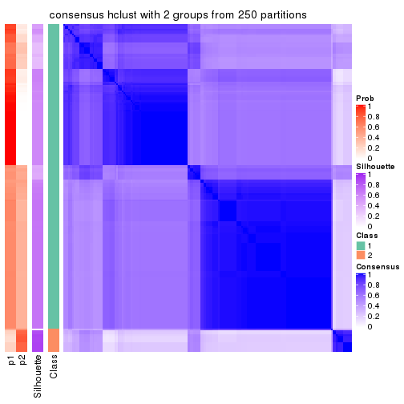</p>

</div>
<div id='tab-MAD-hclust-consensus-heatmap-2'>
<pre><code class="r">consensus_heatmap(res, k = 3)
</code></pre>

<p>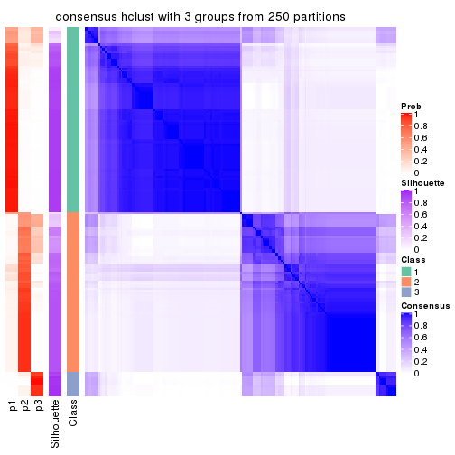</p>

</div>
<div id='tab-MAD-hclust-consensus-heatmap-3'>
<pre><code class="r">consensus_heatmap(res, k = 4)
</code></pre>

<p>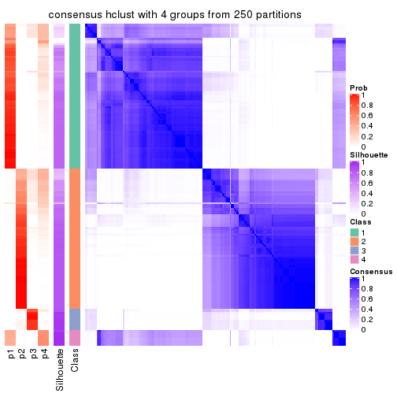</p>

</div>
<div id='tab-MAD-hclust-consensus-heatmap-4'>
<pre><code class="r">consensus_heatmap(res, k = 5)
</code></pre>

<p>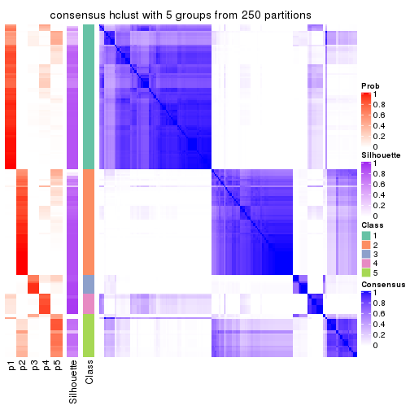</p>

</div>
<div id='tab-MAD-hclust-consensus-heatmap-5'>
<pre><code class="r">consensus_heatmap(res, k = 6)
</code></pre>

<p>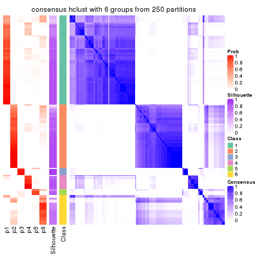</p>

</div>
</div>

Heatmaps for the membership of samples in all partitions to see how consistent they are:


<script>
$( function() {
	$( '#tabs-MAD-hclust-membership-heatmap' ).tabs();
} );
</script>
<div id='tabs-MAD-hclust-membership-heatmap'>
<ul>
<li><a href='#tab-MAD-hclust-membership-heatmap-1'>k = 2</a></li>
<li><a href='#tab-MAD-hclust-membership-heatmap-2'>k = 3</a></li>
<li><a href='#tab-MAD-hclust-membership-heatmap-3'>k = 4</a></li>
<li><a href='#tab-MAD-hclust-membership-heatmap-4'>k = 5</a></li>
<li><a href='#tab-MAD-hclust-membership-heatmap-5'>k = 6</a></li>
</ul>
<div id='tab-MAD-hclust-membership-heatmap-1'>
<pre><code class="r">membership_heatmap(res, k = 2)
</code></pre>

<p>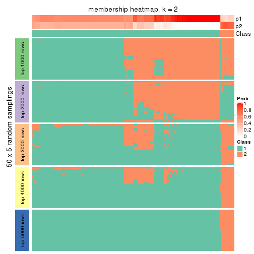</p>

</div>
<div id='tab-MAD-hclust-membership-heatmap-2'>
<pre><code class="r">membership_heatmap(res, k = 3)
</code></pre>

<p>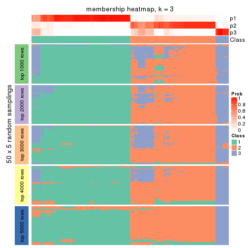</p>

</div>
<div id='tab-MAD-hclust-membership-heatmap-3'>
<pre><code class="r">membership_heatmap(res, k = 4)
</code></pre>

<p>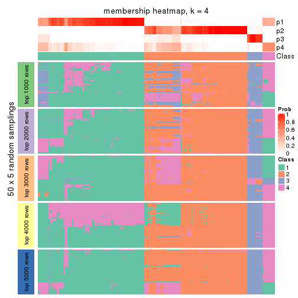</p>

</div>
<div id='tab-MAD-hclust-membership-heatmap-4'>
<pre><code class="r">membership_heatmap(res, k = 5)
</code></pre>

<p>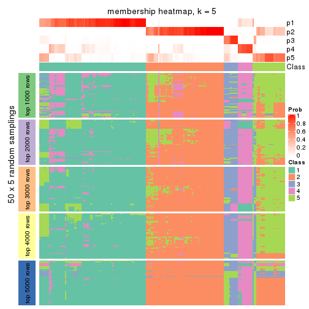</p>

</div>
<div id='tab-MAD-hclust-membership-heatmap-5'>
<pre><code class="r">membership_heatmap(res, k = 6)
</code></pre>

<p>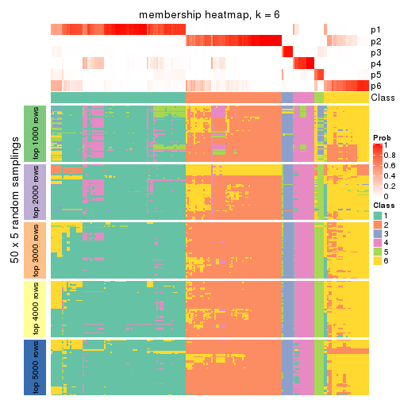</p>

</div>
</div>

As soon as we have had the classes for columns, we can look for signatures
which are significantly different between classes which can be candidate marks
for certain classes. Following are the heatmaps for signatures.


Signature heatmaps where rows are scaled:


<script>
$( function() {
	$( '#tabs-MAD-hclust-get-signatures' ).tabs();
} );
</script>
<div id='tabs-MAD-hclust-get-signatures'>
<ul>
<li><a href='#tab-MAD-hclust-get-signatures-1'>k = 2</a></li>
<li><a href='#tab-MAD-hclust-get-signatures-2'>k = 3</a></li>
<li><a href='#tab-MAD-hclust-get-signatures-3'>k = 4</a></li>
<li><a href='#tab-MAD-hclust-get-signatures-4'>k = 5</a></li>
<li><a href='#tab-MAD-hclust-get-signatures-5'>k = 6</a></li>
</ul>
<div id='tab-MAD-hclust-get-signatures-1'>
<pre><code class="r">get_signatures(res, k = 2)
</code></pre>

<p>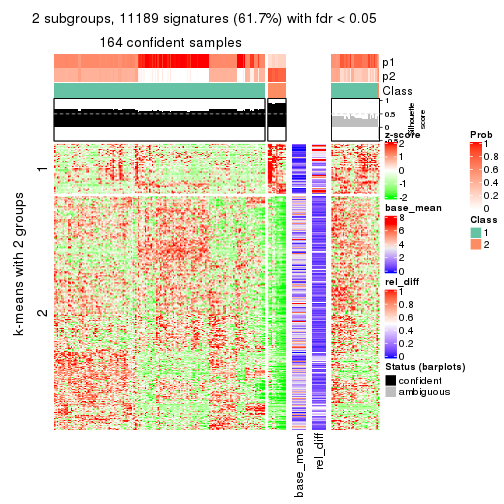</p>

</div>
<div id='tab-MAD-hclust-get-signatures-2'>
<pre><code class="r">get_signatures(res, k = 3)
</code></pre>

<p>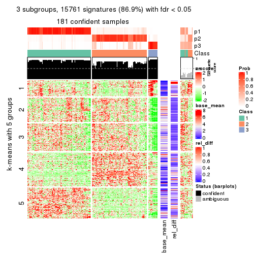</p>

</div>
<div id='tab-MAD-hclust-get-signatures-3'>
<pre><code class="r">get_signatures(res, k = 4)
</code></pre>

<p>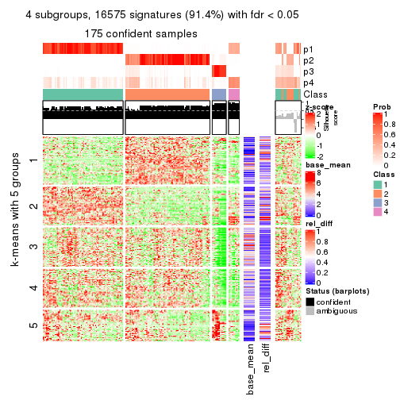</p>

</div>
<div id='tab-MAD-hclust-get-signatures-4'>
<pre><code class="r">get_signatures(res, k = 5)
</code></pre>

<p>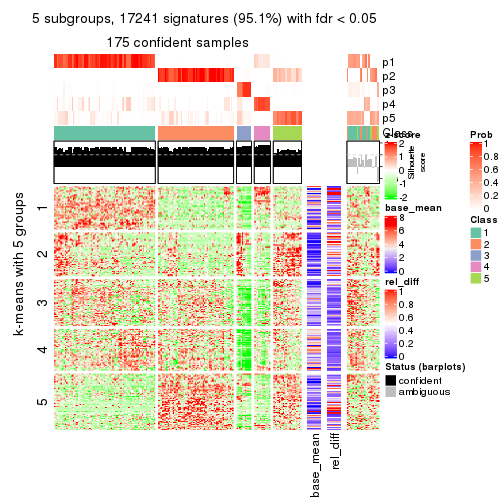</p>

</div>
<div id='tab-MAD-hclust-get-signatures-5'>
<pre><code class="r">get_signatures(res, k = 6)
</code></pre>

<p>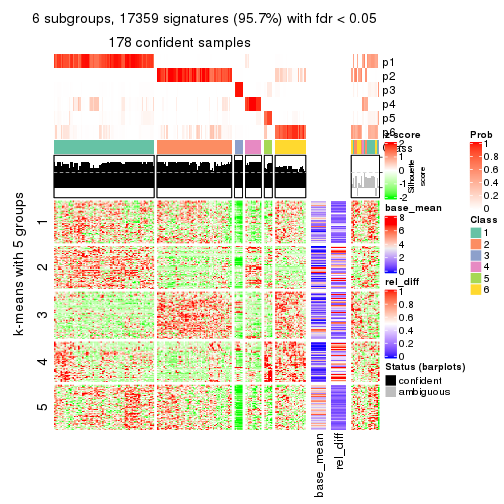</p>

</div>
</div>


Signature heatmaps where rows are not scaled:


<script>
$( function() {
	$( '#tabs-MAD-hclust-get-signatures-no-scale' ).tabs();
} );
</script>
<div id='tabs-MAD-hclust-get-signatures-no-scale'>
<ul>
<li><a href='#tab-MAD-hclust-get-signatures-no-scale-1'>k = 2</a></li>
<li><a href='#tab-MAD-hclust-get-signatures-no-scale-2'>k = 3</a></li>
<li><a href='#tab-MAD-hclust-get-signatures-no-scale-3'>k = 4</a></li>
<li><a href='#tab-MAD-hclust-get-signatures-no-scale-4'>k = 5</a></li>
<li><a href='#tab-MAD-hclust-get-signatures-no-scale-5'>k = 6</a></li>
</ul>
<div id='tab-MAD-hclust-get-signatures-no-scale-1'>
<pre><code class="r">get_signatures(res, k = 2, scale_rows = FALSE)
</code></pre>

<p>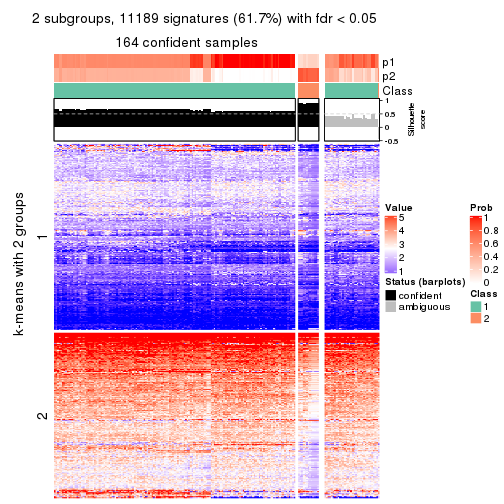</p>

</div>
<div id='tab-MAD-hclust-get-signatures-no-scale-2'>
<pre><code class="r">get_signatures(res, k = 3, scale_rows = FALSE)
</code></pre>

<p>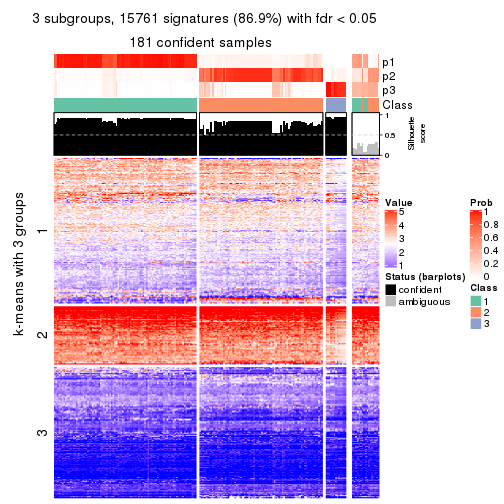</p>

</div>
<div id='tab-MAD-hclust-get-signatures-no-scale-3'>
<pre><code class="r">get_signatures(res, k = 4, scale_rows = FALSE)
</code></pre>

<p>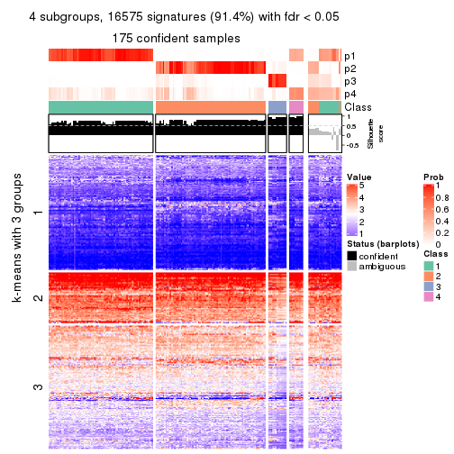</p>

</div>
<div id='tab-MAD-hclust-get-signatures-no-scale-4'>
<pre><code class="r">get_signatures(res, k = 5, scale_rows = FALSE)
</code></pre>

<p>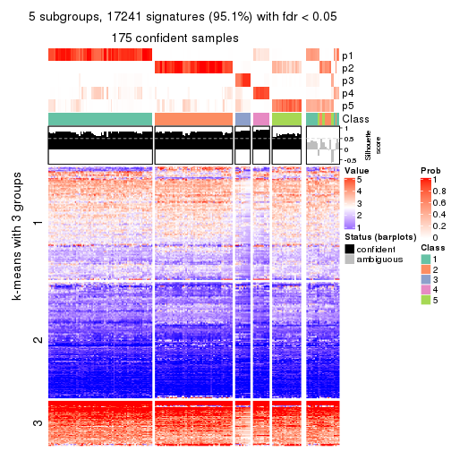</p>

</div>
<div id='tab-MAD-hclust-get-signatures-no-scale-5'>
<pre><code class="r">get_signatures(res, k = 6, scale_rows = FALSE)
</code></pre>

<p>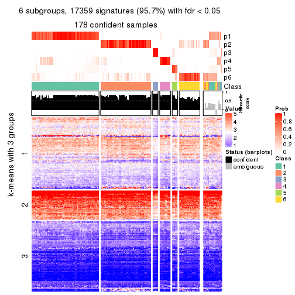</p>

</div>
</div>


Compare the overlap of signatures from different k:

```r
compare_signatures(res)
```

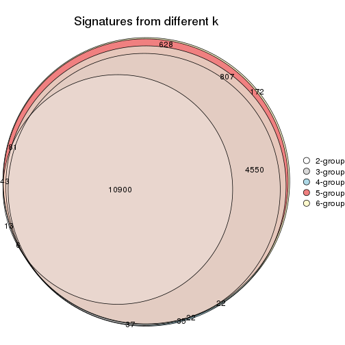

`get_signature()` returns a data frame invisibly. TO get the list of signatures, the function
call should be assigned to a variable explicitly. In following code, if `plot` argument is set
to `FALSE`, no heatmap is plotted while only the differential analysis is performed.

```r
# code only for demonstration
tb = get_signature(res, k = ..., plot = FALSE)
```

An example of the output of `tb` is:

```
#>   which_row         fdr    mean_1    mean_2 scaled_mean_1 scaled_mean_2 km
#> 1        38 0.042760348  8.373488  9.131774    -0.5533452     0.5164555  1
#> 2        40 0.018707592  7.106213  8.469186    -0.6173731     0.5762149  1
#> 3        55 0.019134737 10.221463 11.207825    -0.6159697     0.5749050  1
#> 4        59 0.006059896  5.921854  7.869574    -0.6899429     0.6439467  1
#> 5        60 0.018055526  8.928898 10.211722    -0.6204761     0.5791110  1
#> 6        98 0.009384629 15.714769 14.887706     0.6635654    -0.6193277  2
...
```

The columns in `tb` are:

1. `which_row`: row indices corresponding to the input matrix.
2. `fdr`: FDR for the differential test. 
3. `mean_x`: The mean value in group x.
4. `scaled_mean_x`: The mean value in group x after rows are scaled.
5. `km`: Row groups if k-means clustering is applied to rows.


UMAP plot which shows how samples are separated.


<script>
$( function() {
	$( '#tabs-MAD-hclust-dimension-reduction' ).tabs();
} );
</script>
<div id='tabs-MAD-hclust-dimension-reduction'>
<ul>
<li><a href='#tab-MAD-hclust-dimension-reduction-1'>k = 2</a></li>
<li><a href='#tab-MAD-hclust-dimension-reduction-2'>k = 3</a></li>
<li><a href='#tab-MAD-hclust-dimension-reduction-3'>k = 4</a></li>
<li><a href='#tab-MAD-hclust-dimension-reduction-4'>k = 5</a></li>
<li><a href='#tab-MAD-hclust-dimension-reduction-5'>k = 6</a></li>
</ul>
<div id='tab-MAD-hclust-dimension-reduction-1'>
<pre><code class="r">dimension_reduction(res, k = 2, method = &quot;UMAP&quot;)
</code></pre>

<p>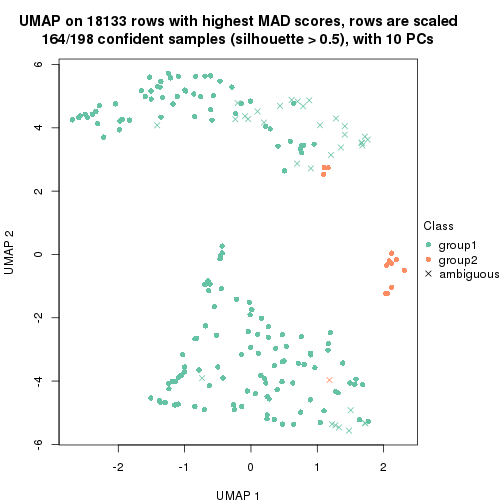</p>

</div>
<div id='tab-MAD-hclust-dimension-reduction-2'>
<pre><code class="r">dimension_reduction(res, k = 3, method = &quot;UMAP&quot;)
</code></pre>

<p>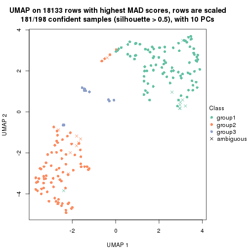</p>

</div>
<div id='tab-MAD-hclust-dimension-reduction-3'>
<pre><code class="r">dimension_reduction(res, k = 4, method = &quot;UMAP&quot;)
</code></pre>

<p>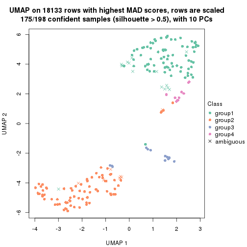</p>

</div>
<div id='tab-MAD-hclust-dimension-reduction-4'>
<pre><code class="r">dimension_reduction(res, k = 5, method = &quot;UMAP&quot;)
</code></pre>

<p>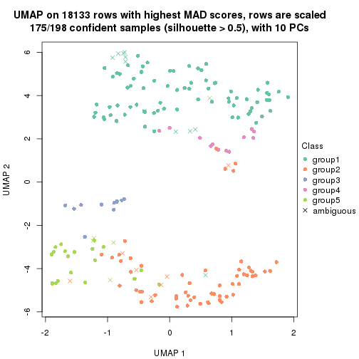</p>

</div>
<div id='tab-MAD-hclust-dimension-reduction-5'>
<pre><code class="r">dimension_reduction(res, k = 6, method = &quot;UMAP&quot;)
</code></pre>

<p>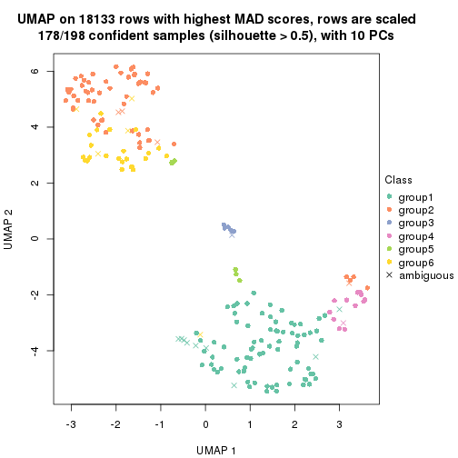</p>

</div>
</div>


Following heatmap shows how subgroups are split when increasing `k`:

```r
collect_classes(res)
```

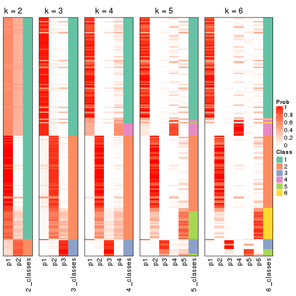


If matrix rows can be associated to genes, consider to use `functional_enrichment(res,
...)` to perform function enrichment for the signature genes. See [this vignette](http://bioconductor.org/packages/devel/bioc/vignettes/cola/inst/doc/functional_enrichment.html) for more detailed explanations.


 

---------------------------------------------------


### MAD:kmeans**


The object with results only for a single top-value method and a single partition method 
can be extracted as:

```r
res = res_list["MAD", "kmeans"]
# you can also extract it by
# res = res_list["MAD:kmeans"]
```

A summary of `res` and all the functions that can be applied to it:

```r
res
```

```
#> A 'ConsensusPartition' object with k = 2, 3, 4, 5, 6.
#>   On a matrix with 18133 rows and 198 columns.
#>   Top rows (1000, 2000, 3000, 4000, 5000) are extracted by 'MAD' method.
#>   Subgroups are detected by 'kmeans' method.
#>   Performed in total 1250 partitions by row resampling.
#>   Best k for subgroups seems to be 2.
#> 
#> Following methods can be applied to this 'ConsensusPartition' object:
#>  [1] "cola_report"             "collect_classes"         "collect_plots"          
#>  [4] "collect_stats"           "colnames"                "compare_signatures"     
#>  [7] "consensus_heatmap"       "dimension_reduction"     "functional_enrichment"  
#> [10] "get_anno_col"            "get_anno"                "get_classes"            
#> [13] "get_consensus"           "get_matrix"              "get_membership"         
#> [16] "get_param"               "get_signatures"          "get_stats"              
#> [19] "is_best_k"               "is_stable_k"             "membership_heatmap"     
#> [22] "ncol"                    "nrow"                    "plot_ecdf"              
#> [25] "rownames"                "select_partition_number" "show"                   
#> [28] "suggest_best_k"          "test_to_known_factors"
```

`collect_plots()` function collects all the plots made from `res` for all `k` (number of partitions)
into one single page to provide an easy and fast comparison between different `k`.

```r
collect_plots(res)
```

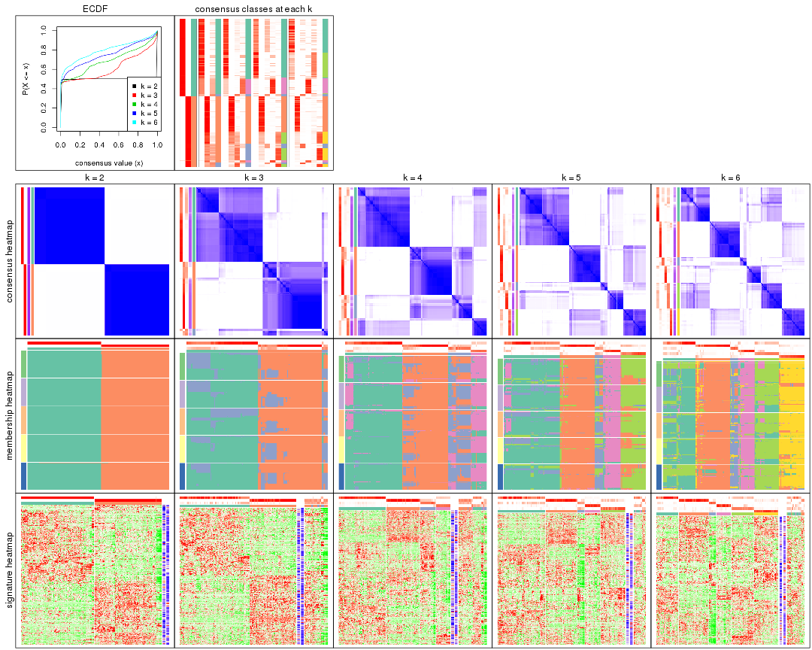

The plots are:

- The first row: a plot of the ECDF (empirical cumulative distribution
  function) curves of the consensus matrix for each `k` and the heatmap of
  predicted classes for each `k`.
- The second row: heatmaps of the consensus matrix for each `k`.
- The third row: heatmaps of the membership matrix for each `k`.
- The fouth row: heatmaps of the signatures for each `k`.

All the plots in panels can be made by individual functions and they are
plotted later in this section.

`select_partition_number()` produces several plots showing different
statistics for choosing "optimized" `k`. There are following statistics:

- ECDF curves of the consensus matrix for each `k`;
- 1-PAC. [The PAC
  score](https://en.wikipedia.org/wiki/Consensus_clustering#Over-interpretation_potential_of_consensus_clustering)
  measures the proportion of the ambiguous subgrouping.
- Mean silhouette score.
- Concordance. The mean probability of fiting the consensus class ids in all
  partitions.
- Area increased. Denote $A_k$ as the area under the ECDF curve for current
  `k`, the area increased is defined as $A_k - A_{k-1}$.
- Rand index. The percent of pairs of samples that are both in a same cluster
  or both are not in a same cluster in the partition of k and k-1.
- Jaccard index. The ratio of pairs of samples are both in a same cluster in
  the partition of k and k-1 and the pairs of samples are both in a same
  cluster in the partition k or k-1.

The detailed explanations of these statistics can be found in [the _cola_
vignette](http://bioconductor.org/packages/devel/bioc/vignettes/cola/inst/doc/cola.html#toc_13).

Generally speaking, lower PAC score, higher mean silhouette score or higher
concordance corresponds to better partition. Rand index and Jaccard index
measure how similar the current partition is compared to partition with `k-1`.
If they are too similar, we won't accept `k` is better than `k-1`.

```r
select_partition_number(res)
```

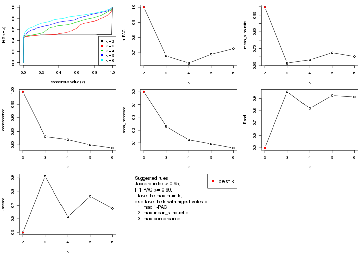

The numeric values for all these statistics can be obtained by `get_stats()`.

```r
get_stats(res)
```

```
#>   k 1-PAC mean_silhouette concordance area_increased  Rand Jaccard
#> 2 2 1.000           0.997       0.997         0.5013 0.498   0.498
#> 3 3 0.680           0.663       0.831         0.2294 0.956   0.912
#> 4 4 0.633           0.682       0.820         0.1236 0.819   0.615
#> 5 5 0.690           0.725       0.800         0.0915 0.925   0.767
#> 6 6 0.727           0.702       0.788         0.0588 0.913   0.677
```

`suggest_best_k()` suggests the best $k$ based on these statistics. The rules are as follows:

- All $k$ with Jaccard index larger than 0.95 are removed because increasing
  $k$ does not provide enough extra information. If all $k$ are removed, it is
  marked as no subgroup is detected.
- For all $k$ with 1-PAC score larger than 0.9, the maximal $k$ is taken as
  the best $k$, and other $k$ are marked as optional $k$.
- If it does not fit the second rule. The $k$ with the maximal vote of the
  highest 1-PAC score, highest mean silhouette, and highest concordance is
  taken as the best $k$.

```r
suggest_best_k(res)
```

```
#> [1] 2
```


Following shows the table of the partitions (You need to click the **show/hide
code output** link to see it). The membership matrix (columns with name `p*`)
is inferred by
[`clue::cl_consensus()`](https://www.rdocumentation.org/link/cl_consensus?package=clue)
function with the `SE` method. Basically the value in the membership matrix
represents the probability to belong to a certain group. The finall class
label for an item is determined with the group with highest probability it
belongs to.

In `get_classes()` function, the entropy is calculated from the membership
matrix and the silhouette score is calculated from the consensus matrix.


<script>
$( function() {
	$( '#tabs-MAD-kmeans-get-classes' ).tabs();
} );
</script>
<div id='tabs-MAD-kmeans-get-classes'>
<ul>
<li><a href='#tab-MAD-kmeans-get-classes-1'>k = 2</a></li>
<li><a href='#tab-MAD-kmeans-get-classes-2'>k = 3</a></li>
<li><a href='#tab-MAD-kmeans-get-classes-3'>k = 4</a></li>
<li><a href='#tab-MAD-kmeans-get-classes-4'>k = 5</a></li>
<li><a href='#tab-MAD-kmeans-get-classes-5'>k = 6</a></li>
</ul>

<div id='tab-MAD-kmeans-get-classes-1'>
<p><a id='tab-MAD-kmeans-get-classes-1-a' style='color:#0366d6' href='#'>show/hide code output</a></p>
<pre><code class="r">cbind(get_classes(res, k = 2), get_membership(res, k = 2))
</code></pre>

<pre><code>#&gt;                                      class entropy silhouette    p1    p2
#&gt; 0C0AA0B2-5191-4EDF-8937-ED7434F30283     2  0.0000      0.998 0.000 1.000
#&gt; 18B45F1F-234F-45CC-A234-145307606C5C     1  0.0376      0.999 0.996 0.004
#&gt; E18B70C0-BDCA-46D3-99BB-C6C8ABC68DA5     2  0.0000      0.998 0.000 1.000
#&gt; 0F6DDBA7-6F74-45E8-95C8-F28263D55978     1  0.0376      0.999 0.996 0.004
#&gt; 7EAE1A5A-129A-46DE-977E-A2C753F10904     2  0.0000      0.998 0.000 1.000
#&gt; 7EAE0048-16B5-4979-9410-16CDEB9B1A48     1  0.0376      0.999 0.996 0.004
#&gt; 2EBFC828-2B27-4753-A052-80DDA226DAB4     2  0.0000      0.998 0.000 1.000
#&gt; 24E1768D-2232-41DA-9383-BC55D6EB3812     2  0.0376      0.994 0.004 0.996
#&gt; 6E3CD60A-1889-4CA3-B305-2E78152057B5     2  0.0000      0.998 0.000 1.000
#&gt; 33CC70DD-82B3-413C-B3B1-BE06634D95D0     1  0.0376      0.999 0.996 0.004
#&gt; F1CB57A3-55DD-4487-9307-1B4F652E729A     1  0.0376      0.999 0.996 0.004
#&gt; 755A5806-B054-449A-93DB-79909E6C93A1     1  0.0376      0.999 0.996 0.004
#&gt; 58D364E7-3D2F-468F-A264-D6461E2428D4     2  0.0000      0.998 0.000 1.000
#&gt; 68BB9CB6-7AA2-4981-B9D9-07363EC96599     2  0.0376      0.994 0.004 0.996
#&gt; 3C4E8DFA-8EA0-4F1F-89CB-CB8805395872     2  0.0376      0.994 0.004 0.996
#&gt; 4219651D-5583-4498-BF08-1B7D04B4C7B2     1  0.0376      0.999 0.996 0.004
#&gt; B5EE2768-0D67-4584-ADBC-EC745FEC52EA     2  0.0000      0.998 0.000 1.000
#&gt; 825E6C11-F460-451A-8045-846DD7D0E945     1  0.0376      0.999 0.996 0.004
#&gt; 491F62AF-5E68-43C3-982A-F867A75BBA9A     2  0.0000      0.998 0.000 1.000
#&gt; 9D7F058C-F95A-44AD-AC9E-450F7FBDC960     2  0.0000      0.998 0.000 1.000
#&gt; 6D42DD0C-2081-4742-BA27-9F5F16FAC3C6     1  0.0000      0.996 1.000 0.000
#&gt; EDD7E63D-492A-473B-A552-0764337B10EF     2  0.0376      0.994 0.004 0.996
#&gt; 97073DEA-73AD-4DFD-BD1A-9035DC03445B     1  0.0376      0.999 0.996 0.004
#&gt; FA891AB9-CE38-4F7E-A015-1DDCE12890A0     1  0.0376      0.999 0.996 0.004
#&gt; D9514D49-A0AE-45AB-8C9F-68E726215253     1  0.0376      0.999 0.996 0.004
#&gt; 3B9229AD-12E5-451E-9D2F-378AAC82C04A     2  0.0000      0.998 0.000 1.000
#&gt; 5EA36B71-4917-4EF3-9060-065EFE6ACC5B     1  0.0376      0.999 0.996 0.004
#&gt; A20E4ECB-4895-4CC7-BE5E-4721B20D933B     1  0.0376      0.999 0.996 0.004
#&gt; 1BE8D828-29DB-4368-AA4A-FB23588F7AE8     1  0.0376      0.999 0.996 0.004
#&gt; 66EFEFCF-3D14-4DBF-AA13-530F40ED0245     1  0.0376      0.999 0.996 0.004
#&gt; 55DFFE53-BCE7-4EC1-9863-6C0311B06BA2     2  0.0000      0.998 0.000 1.000
#&gt; 4CC3FB5A-611D-4C64-AE9D-544FA45CF4DC     1  0.0376      0.999 0.996 0.004
#&gt; C11D33F2-DFE9-4FA8-9024-F3E7F1DADC5F     2  0.0000      0.998 0.000 1.000
#&gt; FA5932B8-8AA3-4C38-9FAB-C35D8772974D     1  0.0376      0.999 0.996 0.004
#&gt; 8216EC35-1F41-4A15-B503-BDA4971E27C9     1  0.0376      0.999 0.996 0.004
#&gt; 69635D23-90A7-4BAD-97C7-B79536837F57     1  0.0376      0.999 0.996 0.004
#&gt; 12B404E2-C463-4409-8392-E4649B2AFFD1     2  0.0000      0.998 0.000 1.000
#&gt; 246927E3-ACCF-41B2-AA8E-43855FD6B146     2  0.0000      0.998 0.000 1.000
#&gt; E0CC13E7-9607-49E0-B4AA-395544E3C3BF     1  0.0376      0.999 0.996 0.004
#&gt; F7BBC0C1-6124-4A83-8A70-EA89B62F1CBD     1  0.0376      0.999 0.996 0.004
#&gt; B1D4FF24-8E6F-4A04-B716-2032D850EB57     1  0.0376      0.999 0.996 0.004
#&gt; 253601DB-B78A-4566-9947-8C0270C0B163     2  0.0000      0.998 0.000 1.000
#&gt; AB83DBFF-5737-4FB8-A5AC-1D3CD6072BDF     2  0.0376      0.994 0.004 0.996
#&gt; 9D67D953-EC98-4B72-89C8-5732BC9D4BC9     2  0.0000      0.998 0.000 1.000
#&gt; 51061018-95AB-4278-886F-F69E4EBC47C0     2  0.0000      0.998 0.000 1.000
#&gt; ABD0F7F3-105B-4DEE-9889-5028772C519A     1  0.0376      0.999 0.996 0.004
#&gt; 562B95CF-B27E-4A72-B7C6-CDF86A51A39B     1  0.0376      0.999 0.996 0.004
#&gt; ABF046A4-D7A1-49FF-B6B1-4E07A791DEDB     2  0.0000      0.998 0.000 1.000
#&gt; 3FF4101E-9703-460E-A30E-76CC7689F36D     2  0.0000      0.998 0.000 1.000
#&gt; 39C4F7AA-7ADF-4F1D-BDA3-BEC605AC5023     2  0.0000      0.998 0.000 1.000
#&gt; CB821FD2-AF5C-4743-A70F-21C12C6ED153     1  0.0376      0.999 0.996 0.004
#&gt; 92EA1846-62FF-41D5-A441-5E52E6B9E7F9     1  0.0376      0.999 0.996 0.004
#&gt; 7D25F3EE-5A20-4763-8026-16A03D05F459     1  0.0376      0.999 0.996 0.004
#&gt; 8ECE5276-CD06-496B-A5A9-1713B1F7D089     1  0.0376      0.999 0.996 0.004
#&gt; C775B68F-9507-47E3-B507-B433AED79002     1  0.0376      0.999 0.996 0.004
#&gt; E19D5463-FDD0-41C1-A170-323736A88D07     2  0.0000      0.998 0.000 1.000
#&gt; CE4B6285-4961-4767-91F0-5C7A8162E185     1  0.0000      0.996 1.000 0.000
#&gt; 9637BD72-1FEF-42AD-8886-2C39BE876531     1  0.0000      0.996 1.000 0.000
#&gt; 81B5A88E-45A0-4B44-B689-B9071B8548EE     2  0.0000      0.998 0.000 1.000
#&gt; 0B01B4C9-9BED-4F5B-A3E2-8868C7CCC3FC     2  0.0376      0.994 0.004 0.996
#&gt; 54501315-7132-44B2-A179-10FBF1421105     1  0.0376      0.999 0.996 0.004
#&gt; E207CBE9-4C3A-4FDD-9251-CFE1FE106475     1  0.0000      0.996 1.000 0.000
#&gt; 3BEA0B92-3F90-4DBF-9679-AADEAD7D47C8     2  0.0000      0.998 0.000 1.000
#&gt; 35B32250-D854-4215-AA5B-2C11B2FBEECA     1  0.0376      0.999 0.996 0.004
#&gt; ACE6566B-AEB9-426C-924A-B382D14A1024     2  0.0000      0.998 0.000 1.000
#&gt; 737E69AC-0930-45B9-B6BA-7CE5E300290B     1  0.0376      0.999 0.996 0.004
#&gt; B4410AB8-D015-41CA-86E6-12EB4E4103E3     1  0.0376      0.999 0.996 0.004
#&gt; 6D3ECA65-C50F-43B0-B75A-1D290FA4A8FD     2  0.0000      0.998 0.000 1.000
#&gt; C86F40D3-9A96-4395-A8C3-510DE12F9A2B     2  0.0000      0.998 0.000 1.000
#&gt; 6238087F-24DD-4BF1-903F-3BD4E446C1AE     2  0.0000      0.998 0.000 1.000
#&gt; E4FF840B-EEAB-4CB0-A690-7D4C4AA7EEC3     2  0.0000      0.998 0.000 1.000
#&gt; 72D3C323-C67F-4C0E-9BFC-BF245FF9730A     1  0.0000      0.996 1.000 0.000
#&gt; 82D56E4E-4DF6-4F3E-8959-B995C92AAA70     1  0.0376      0.999 0.996 0.004
#&gt; E31CA441-EB19-443B-ACBD-37B5CCBCF0E5     2  0.0000      0.998 0.000 1.000
#&gt; 87CA8939-D054-4B8A-B32D-085FD2E8F202     1  0.0376      0.999 0.996 0.004
#&gt; 2A508D90-FEDC-46A3-9A02-E51E5467CDCB     1  0.0376      0.999 0.996 0.004
#&gt; C4E8B4E2-388B-411F-BF0A-9B6F34E8EDB5     2  0.0000      0.998 0.000 1.000
#&gt; AF6AF803-BD93-44A7-AA80-B9BC92C1273B     2  0.0000      0.998 0.000 1.000
#&gt; 0B1CA5CF-EB96-41D4-BFC5-6957FEB39828     1  0.0000      0.996 1.000 0.000
#&gt; 6FB96FB0-6661-48AD-A4A0-69F8AFDBE591     2  0.0000      0.998 0.000 1.000
#&gt; 8C19F7FD-368A-462B-B28F-88D6630038A1     1  0.0376      0.999 0.996 0.004
#&gt; 96EABE78-C2F4-4A33-ACD8-C922A4B2519B     2  0.0000      0.998 0.000 1.000
#&gt; 68B36D7B-546A-4689-949F-B207C4A4AB27     2  0.0000      0.998 0.000 1.000
#&gt; CE9F3335-778F-4F52-BC55-4B7C99B211DD     2  0.0000      0.998 0.000 1.000
#&gt; CB359DED-2A2D-4646-A0BD-6F10ADCC532B     1  0.0376      0.999 0.996 0.004
#&gt; 198324A5-8C52-46F6-9734-EFAF1CCA6D9B     1  0.0376      0.999 0.996 0.004
#&gt; 83B88608-0506-428C-B9E8-621F38477B42     1  0.0376      0.999 0.996 0.004
#&gt; 1993630A-0F3D-4F5C-86A3-D443BAAF57F0     1  0.0000      0.996 1.000 0.000
#&gt; DE73DA9B-529E-4F4F-A65C-DA7AB84B1096     1  0.0376      0.999 0.996 0.004
#&gt; 2347F3B7-DDA3-40C0-B6D4-8819ECA69146     1  0.0376      0.999 0.996 0.004
#&gt; AB93B5D5-095F-4330-9D40-6A3D934AB50C     1  0.0376      0.999 0.996 0.004
#&gt; 5EBBE4AD-FF0C-41CF-9EA3-B6FE7EA1F9C0     1  0.0000      0.996 1.000 0.000
#&gt; 6D960AE7-3769-4144-A061-E8588E5063FF     1  0.0376      0.999 0.996 0.004
#&gt; 0C2DD8C0-D1A5-4192-A49C-7A40FED628B2     2  0.0000      0.998 0.000 1.000
#&gt; 18C9372F-C55B-4F86-A9D2-E8D85EFC8566     2  0.6801      0.779 0.180 0.820
#&gt; 9AF637B0-4C32-4DD1-93AF-7655B4A845D3     2  0.0000      0.998 0.000 1.000
#&gt; 785B5B06-4115-46FD-9BEB-F888AFDC855D     2  0.0000      0.998 0.000 1.000
#&gt; ECA3050E-4BE2-4117-B9CF-A52BB85AF8C2     2  0.0000      0.998 0.000 1.000
#&gt; 099DC396-16A5-458F-9ED9-F2A790CB0C34     1  0.0376      0.999 0.996 0.004
#&gt; 7A5A12EE-C5B0-4C51-8C99-0F3FA88D633E     1  0.0376      0.999 0.996 0.004
#&gt; E832B508-A66D-4817-B44A-FE9FAAE64B4A     1  0.0376      0.999 0.996 0.004
#&gt; F9DD688C-7B35-49E7-9651-2E098EE78856     1  0.0376      0.999 0.996 0.004
#&gt; F1265DD8-5ED3-4635-A277-57BBFDEC7729     1  0.0376      0.999 0.996 0.004
#&gt; F624E8D9-DB07-4C9E-910D-5E8EBA3A6167     2  0.0000      0.998 0.000 1.000
#&gt; 3516FBDF-66E1-43F4-9D7B-16748F6439A7     2  0.0000      0.998 0.000 1.000
#&gt; 04B12992-B2EA-4BA2-8E2C-11E34E230E6F     2  0.0000      0.998 0.000 1.000
#&gt; CC02897D-9123-495E-9242-5C9CF4EC269B     2  0.0000      0.998 0.000 1.000
#&gt; 3117ED46-2BF2-4311-BC00-4E98243E16B3     1  0.0376      0.999 0.996 0.004
#&gt; E0B66D53-23DB-4E26-BB6E-F692FA8C000E     1  0.0376      0.999 0.996 0.004
#&gt; DAA93CE5-A013-477A-9A50-EA09CC3A8162     2  0.0000      0.998 0.000 1.000
#&gt; 0099098D-354A-4276-92F8-B932C74B4608     1  0.0376      0.999 0.996 0.004
#&gt; DD483639-B2E7-4745-BCFB-55ED1D82BFBF     2  0.0000      0.998 0.000 1.000
#&gt; 2C1F9079-602E-4252-82C7-9D8799E04246     2  0.0000      0.998 0.000 1.000
#&gt; 9473A8E4-3A1B-4184-9EA6-517AFD60B635     1  0.0000      0.996 1.000 0.000
#&gt; 75CFBAF6-7BA0-40AF-92D7-D218E885BD1B     2  0.0000      0.998 0.000 1.000
#&gt; B588950F-14D6-41C8-845B-EFD2096013C6     2  0.0000      0.998 0.000 1.000
#&gt; 0DF3EDA8-DAEA-4721-92AB-B97181249498     2  0.0000      0.998 0.000 1.000
#&gt; 8EA83042-D598-401D-AD78-936EEB136C59     1  0.0376      0.999 0.996 0.004
#&gt; 729AC418-3BE9-445A-95D4-AC11A7D43BE0     1  0.0000      0.996 1.000 0.000
#&gt; 7D8B1B11-F576-4AA8-BFA7-0022A2CD829A     2  0.0000      0.998 0.000 1.000
#&gt; 304A0E46-3449-4B44-9C30-BDDF6459391D     1  0.0376      0.999 0.996 0.004
#&gt; 3C83358F-DF20-47F7-AF9F-AB7CC92F5ABA     1  0.0000      0.996 1.000 0.000
#&gt; EAFEED6C-35C3-451F-AE4A-EB56992E1F29     1  0.0376      0.999 0.996 0.004
#&gt; 8A237A65-28EC-434D-A78A-A8B7308B5204     1  0.0376      0.999 0.996 0.004
#&gt; D005833F-E991-4E9E-9667-55F137288004     1  0.0376      0.999 0.996 0.004
#&gt; 37D966E3-253E-4397-A9AE-0903A8D31FE6     1  0.0000      0.996 1.000 0.000
#&gt; D2482B81-CB5B-4178-BA8D-1CF4026181B5     1  0.0376      0.999 0.996 0.004
#&gt; 18019E95-C2A8-4EE7-B585-F6886DC4D953     2  0.0000      0.998 0.000 1.000
#&gt; 0B126D1A-14A8-4345-8F78-FF92222ADF4C     2  0.0376      0.994 0.004 0.996
#&gt; CE88B625-47D8-4D58-9FB4-23464DB7DDAD     2  0.0000      0.998 0.000 1.000
#&gt; 9A88299D-5C74-47FA-B42C-1A1D6D935AAB     1  0.0376      0.999 0.996 0.004
#&gt; 3E71159C-FD6C-41DA-B18B-0730C8AC7E41     1  0.0376      0.999 0.996 0.004
#&gt; 6F245AA4-79D9-47E1-BCC9-1AAF65AEA813     1  0.0376      0.999 0.996 0.004
#&gt; 4CF2C888-2100-483A-B4DB-ECBB69243A4D     2  0.0000      0.998 0.000 1.000
#&gt; A3853813-B9D5-4E8C-B075-19FCC35F8686     2  0.0000      0.998 0.000 1.000
#&gt; 83A16DEE-CE9F-4D8B-9225-0A2A8B9D055D     1  0.0376      0.999 0.996 0.004
#&gt; 0F057CAF-4F9A-4DE9-8601-730E96873733     2  0.0000      0.998 0.000 1.000
#&gt; 32D5801D-DBA4-422E-87CB-A2DDE921BA41     1  0.0376      0.999 0.996 0.004
#&gt; 22EE8076-F07C-499A-9AF8-D800A77EF154     2  0.0000      0.998 0.000 1.000
#&gt; DD4BD74D-D48C-4090-9F57-5334E784581C     1  0.0376      0.999 0.996 0.004
#&gt; 41183565-434D-474C-B1BD-CA6E94910658     2  0.0000      0.998 0.000 1.000
#&gt; 75A2CE41-2B2A-4346-927E-ACF8A72738E4     1  0.0376      0.999 0.996 0.004
#&gt; 7AA24995-3DD2-4682-B36A-4EBFEEACF625     1  0.0376      0.999 0.996 0.004
#&gt; 8BAFDFEC-9F26-4ADB-95CE-004143960EEB     1  0.0376      0.999 0.996 0.004
#&gt; A330E011-CE08-4A85-8F4B-370592293DBB     1  0.0376      0.999 0.996 0.004
#&gt; 1D5A5B17-2E70-4BB0-94A1-EC17E6EA49DB     1  0.0376      0.999 0.996 0.004
#&gt; BD9143B8-9D97-4A05-872C-3FB82B4CF7BE     2  0.0000      0.998 0.000 1.000
#&gt; 64552DC0-181E-4607-898C-787AA7F26435     2  0.0000      0.998 0.000 1.000
#&gt; 1B4C4D41-34C7-43A3-858B-C9552EB53894     1  0.0000      0.996 1.000 0.000
#&gt; 463A3BAA-02DC-4EA4-A644-B924163E425D     2  0.0000      0.998 0.000 1.000
#&gt; CD0FEA89-6F60-4A20-8FCA-D397B4E95A98     1  0.0376      0.999 0.996 0.004
#&gt; 5D06CF6D-F4B9-4B32-B055-8AB287E53340     2  0.0000      0.998 0.000 1.000
#&gt; ADA7835F-DB67-4F4F-9446-8BCE3C5FE936     2  0.0000      0.998 0.000 1.000
#&gt; 4109BE2D-B5DF-4BD7-860E-60D87F647152     2  0.0000      0.998 0.000 1.000
#&gt; 88526A0E-6DFE-46CB-BFAD-B4826F482C67     1  0.0376      0.999 0.996 0.004
#&gt; F39F9A4C-18F7-4017-AB31-85D52FF44587     2  0.0000      0.998 0.000 1.000
#&gt; D4290A5E-1B24-4C55-B470-0FA7A0A09DD0     2  0.0000      0.998 0.000 1.000
#&gt; DC5A2C9E-978F-4661-B729-1F9662976E27     1  0.0376      0.999 0.996 0.004
#&gt; 26A1F392-CED2-43E3-8096-74E6F2BFC8C0     2  0.0000      0.998 0.000 1.000
#&gt; 87D81FB2-306A-4E75-9D58-D5F48E46E7F6     2  0.0000      0.998 0.000 1.000
#&gt; E3D9D81A-C20C-4B3B-B940-A5D2C5F65B22     2  0.0376      0.994 0.004 0.996
#&gt; 4464650B-453F-476C-989C-B7B159BF2CF0     2  0.0000      0.998 0.000 1.000
#&gt; 577D2867-B738-487A-9B06-07958D647F02     1  0.0376      0.999 0.996 0.004
#&gt; E52A22CC-3C03-41A9-9541-220DD871E162     2  0.0000      0.998 0.000 1.000
#&gt; 642703B1-AF99-4746-A915-0792F4B9590B     2  0.0000      0.998 0.000 1.000
#&gt; 8F0D1792-1284-45E6-8EC4-392596057677     2  0.0000      0.998 0.000 1.000
#&gt; 765AFFC1-D528-4494-8BA1-0706451E4205     2  0.0000      0.998 0.000 1.000
#&gt; A716BC29-161F-4CA0-B240-00B330137F2C     1  0.0376      0.999 0.996 0.004
#&gt; 32CBFBAF-7064-4595-8D54-2C5E7DE0FD9B     1  0.0000      0.996 1.000 0.000
#&gt; 4D6ED28C-3F20-41B0-BA41-1BF0E5199A40     2  0.0000      0.998 0.000 1.000
#&gt; 86A38456-2900-48FB-B10F-79222B3CA9BF     1  0.0376      0.999 0.996 0.004
#&gt; E870807D-3223-4A6A-9E3D-F4461B048AA2     2  0.0000      0.998 0.000 1.000
#&gt; 3A78D19F-A833-4D2C-8387-FB4FD4A8313C     1  0.0376      0.999 0.996 0.004
#&gt; DFA162CA-C708-4121-8E74-F9C4DEE0CDAE     1  0.0376      0.999 0.996 0.004
#&gt; C00A300A-CD10-4C9D-8C94-3901AFE8406C     2  0.0000      0.998 0.000 1.000
#&gt; 13E11D15-A90F-48C4-980A-DD032C00A2C1     1  0.0376      0.999 0.996 0.004
#&gt; 31BF80AB-FEDB-4C73-89C3-70BE9F9ACBEE     2  0.0000      0.998 0.000 1.000
#&gt; FA34308A-349D-4AAD-94CF-3F3B7F9AD629     2  0.0000      0.998 0.000 1.000
#&gt; 7C48D467-B663-49DD-BC84-A36BC32ACB3D     1  0.0376      0.999 0.996 0.004
#&gt; BB068534-04F6-4FC9-9087-CDA65920BCE2     1  0.0376      0.999 0.996 0.004
#&gt; EA4EC272-A9B3-4B2E-955F-19F7676A944C     2  0.0000      0.998 0.000 1.000
#&gt; C71FF69B-A460-43CA-8769-9667F22D938B     1  0.0376      0.999 0.996 0.004
#&gt; 5243D1B8-8168-4FF1-A8C6-505F080EF0D3     2  0.0000      0.998 0.000 1.000
#&gt; BCC474D8-08FE-4E99-B8E8-B29E65F84D2E     1  0.0376      0.999 0.996 0.004
#&gt; 04FDBFE3-4CF6-4E53-A2AA-89D5C9316377     2  0.0376      0.994 0.004 0.996
#&gt; 83A9915C-8D60-4CAE-A868-B61E3C90C7B0     2  0.0000      0.998 0.000 1.000
#&gt; 989A6472-E3E3-457A-97BE-CCE95F42D5C2     2  0.0000      0.998 0.000 1.000
#&gt; A0AB2D28-6751-49C9-8DF4-66FDBF95C360     1  0.0000      0.996 1.000 0.000
#&gt; A12B2683-18D4-41C9-8AE5-C143E2180052     1  0.0376      0.999 0.996 0.004
#&gt; 8DE1E245-CAD2-4F11-BFA2-9792C433A00B     1  0.0938      0.992 0.988 0.012
#&gt; FDA68036-6C4C-4256-9AA0-C01FE92AA098     2  0.0000      0.998 0.000 1.000
#&gt; 26311920-1414-4EC1-870B-784961EBCC2D     1  0.0376      0.999 0.996 0.004
#&gt; C29A10D6-D598-4286-B5E0-F1776E19E988     1  0.0376      0.999 0.996 0.004
#&gt; FACCC1FB-4937-4CC0-90EA-7F91D3D939CF     2  0.0000      0.998 0.000 1.000
#&gt; 90B9D84B-78E5-4C7E-8414-EC889C2DE8DB     2  0.0000      0.998 0.000 1.000
#&gt; B74E6122-76E1-4E4D-A867-BCAFD7277393     1  0.0376      0.999 0.996 0.004
#&gt; 98494DC0-CF6E-485F-8A0D-D80E4437EF5C     2  0.0000      0.998 0.000 1.000
#&gt; DA114DAC-DE7B-4E43-8D7C-82C5D7B66411     1  0.0376      0.999 0.996 0.004
</code></pre>

<script>
$('#tab-MAD-kmeans-get-classes-1-a').parent().next().next().hide();
$('#tab-MAD-kmeans-get-classes-1-a').click(function(){
  $('#tab-MAD-kmeans-get-classes-1-a').parent().next().next().toggle();
  return(false);
});
</script>
</div>

<div id='tab-MAD-kmeans-get-classes-2'>
<p><a id='tab-MAD-kmeans-get-classes-2-a' style='color:#0366d6' href='#'>show/hide code output</a></p>
<pre><code class="r">cbind(get_classes(res, k = 3), get_membership(res, k = 3))
</code></pre>

<pre><code>#&gt;                                      class entropy silhouette    p1    p2    p3
#&gt; 0C0AA0B2-5191-4EDF-8937-ED7434F30283     2  0.0000     0.7958 0.000 1.000 0.000
#&gt; 18B45F1F-234F-45CC-A234-145307606C5C     1  0.6079     0.6794 0.612 0.000 0.388
#&gt; E18B70C0-BDCA-46D3-99BB-C6C8ABC68DA5     2  0.2711     0.7442 0.000 0.912 0.088
#&gt; 0F6DDBA7-6F74-45E8-95C8-F28263D55978     1  0.0592     0.8358 0.988 0.000 0.012
#&gt; 7EAE1A5A-129A-46DE-977E-A2C753F10904     2  0.2711     0.7442 0.000 0.912 0.088
#&gt; 7EAE0048-16B5-4979-9410-16CDEB9B1A48     1  0.0747     0.8356 0.984 0.000 0.016
#&gt; 2EBFC828-2B27-4753-A052-80DDA226DAB4     2  0.0000     0.7958 0.000 1.000 0.000
#&gt; 24E1768D-2232-41DA-9383-BC55D6EB3812     2  0.6026     0.2082 0.000 0.624 0.376
#&gt; 6E3CD60A-1889-4CA3-B305-2E78152057B5     2  0.1031     0.7781 0.000 0.976 0.024
#&gt; 33CC70DD-82B3-413C-B3B1-BE06634D95D0     1  0.3551     0.7490 0.868 0.000 0.132
#&gt; F1CB57A3-55DD-4487-9307-1B4F652E729A     1  0.0592     0.8358 0.988 0.000 0.012
#&gt; 755A5806-B054-449A-93DB-79909E6C93A1     1  0.6095     0.6759 0.608 0.000 0.392
#&gt; 58D364E7-3D2F-468F-A264-D6461E2428D4     2  0.1860     0.7698 0.000 0.948 0.052
#&gt; 68BB9CB6-7AA2-4981-B9D9-07363EC96599     2  0.5988     0.2288 0.000 0.632 0.368
#&gt; 3C4E8DFA-8EA0-4F1F-89CB-CB8805395872     2  0.6309    -0.2153 0.000 0.504 0.496
#&gt; 4219651D-5583-4498-BF08-1B7D04B4C7B2     1  0.0747     0.8333 0.984 0.000 0.016
#&gt; B5EE2768-0D67-4584-ADBC-EC745FEC52EA     2  0.0000     0.7958 0.000 1.000 0.000
#&gt; 825E6C11-F460-451A-8045-846DD7D0E945     1  0.1964     0.8121 0.944 0.000 0.056
#&gt; 491F62AF-5E68-43C3-982A-F867A75BBA9A     2  0.0237     0.7940 0.000 0.996 0.004
#&gt; 9D7F058C-F95A-44AD-AC9E-450F7FBDC960     2  0.2625     0.7475 0.000 0.916 0.084
#&gt; 6D42DD0C-2081-4742-BA27-9F5F16FAC3C6     1  0.6079     0.6768 0.612 0.000 0.388
#&gt; EDD7E63D-492A-473B-A552-0764337B10EF     2  0.3879     0.6703 0.000 0.848 0.152
#&gt; 97073DEA-73AD-4DFD-BD1A-9035DC03445B     1  0.5178     0.7507 0.744 0.000 0.256
#&gt; FA891AB9-CE38-4F7E-A015-1DDCE12890A0     1  0.5859     0.7060 0.656 0.000 0.344
#&gt; D9514D49-A0AE-45AB-8C9F-68E726215253     1  0.0892     0.8321 0.980 0.000 0.020
#&gt; 3B9229AD-12E5-451E-9D2F-378AAC82C04A     2  0.0000     0.7958 0.000 1.000 0.000
#&gt; 5EA36B71-4917-4EF3-9060-065EFE6ACC5B     1  0.5016     0.5983 0.760 0.000 0.240
#&gt; A20E4ECB-4895-4CC7-BE5E-4721B20D933B     1  0.4235     0.7865 0.824 0.000 0.176
#&gt; 1BE8D828-29DB-4368-AA4A-FB23588F7AE8     1  0.4399     0.6819 0.812 0.000 0.188
#&gt; 66EFEFCF-3D14-4DBF-AA13-530F40ED0245     1  0.3752     0.7404 0.856 0.000 0.144
#&gt; 55DFFE53-BCE7-4EC1-9863-6C0311B06BA2     2  0.2448     0.7493 0.000 0.924 0.076
#&gt; 4CC3FB5A-611D-4C64-AE9D-544FA45CF4DC     1  0.1643     0.8313 0.956 0.000 0.044
#&gt; C11D33F2-DFE9-4FA8-9024-F3E7F1DADC5F     2  0.6260    -0.0535 0.000 0.552 0.448
#&gt; FA5932B8-8AA3-4C38-9FAB-C35D8772974D     1  0.5254     0.7471 0.736 0.000 0.264
#&gt; 8216EC35-1F41-4A15-B503-BDA4971E27C9     1  0.5968     0.6945 0.636 0.000 0.364
#&gt; 69635D23-90A7-4BAD-97C7-B79536837F57     1  0.0747     0.8333 0.984 0.000 0.016
#&gt; 12B404E2-C463-4409-8392-E4649B2AFFD1     2  0.0000     0.7958 0.000 1.000 0.000
#&gt; 246927E3-ACCF-41B2-AA8E-43855FD6B146     2  0.0000     0.7958 0.000 1.000 0.000
#&gt; E0CC13E7-9607-49E0-B4AA-395544E3C3BF     1  0.5968     0.6948 0.636 0.000 0.364
#&gt; F7BBC0C1-6124-4A83-8A70-EA89B62F1CBD     1  0.0747     0.8356 0.984 0.000 0.016
#&gt; B1D4FF24-8E6F-4A04-B716-2032D850EB57     1  0.0892     0.8344 0.980 0.000 0.020
#&gt; 253601DB-B78A-4566-9947-8C0270C0B163     2  0.0000     0.7958 0.000 1.000 0.000
#&gt; AB83DBFF-5737-4FB8-A5AC-1D3CD6072BDF     3  0.6617     0.4803 0.012 0.388 0.600
#&gt; 9D67D953-EC98-4B72-89C8-5732BC9D4BC9     2  0.0000     0.7958 0.000 1.000 0.000
#&gt; 51061018-95AB-4278-886F-F69E4EBC47C0     3  0.6617     0.4803 0.012 0.388 0.600
#&gt; ABD0F7F3-105B-4DEE-9889-5028772C519A     1  0.1031     0.8352 0.976 0.000 0.024
#&gt; 562B95CF-B27E-4A72-B7C6-CDF86A51A39B     1  0.0892     0.8344 0.980 0.000 0.020
#&gt; ABF046A4-D7A1-49FF-B6B1-4E07A791DEDB     2  0.3192     0.7309 0.000 0.888 0.112
#&gt; 3FF4101E-9703-460E-A30E-76CC7689F36D     2  0.0000     0.7958 0.000 1.000 0.000
#&gt; 39C4F7AA-7ADF-4F1D-BDA3-BEC605AC5023     2  0.6095     0.1575 0.000 0.608 0.392
#&gt; CB821FD2-AF5C-4743-A70F-21C12C6ED153     1  0.0747     0.8333 0.984 0.000 0.016
#&gt; 92EA1846-62FF-41D5-A441-5E52E6B9E7F9     1  0.0747     0.8333 0.984 0.000 0.016
#&gt; 7D25F3EE-5A20-4763-8026-16A03D05F459     1  0.6079     0.6790 0.612 0.000 0.388
#&gt; 8ECE5276-CD06-496B-A5A9-1713B1F7D089     1  0.0747     0.8343 0.984 0.000 0.016
#&gt; C775B68F-9507-47E3-B507-B433AED79002     1  0.4452     0.6755 0.808 0.000 0.192
#&gt; E19D5463-FDD0-41C1-A170-323736A88D07     2  0.6244    -0.0287 0.000 0.560 0.440
#&gt; CE4B6285-4961-4767-91F0-5C7A8162E185     1  0.6079     0.6768 0.612 0.000 0.388
#&gt; 9637BD72-1FEF-42AD-8886-2C39BE876531     1  0.6095     0.6764 0.608 0.000 0.392
#&gt; 81B5A88E-45A0-4B44-B689-B9071B8548EE     2  0.6274    -0.0884 0.000 0.544 0.456
#&gt; 0B01B4C9-9BED-4F5B-A3E2-8868C7CCC3FC     3  0.6617     0.4774 0.012 0.388 0.600
#&gt; 54501315-7132-44B2-A179-10FBF1421105     1  0.0592     0.8358 0.988 0.000 0.012
#&gt; E207CBE9-4C3A-4FDD-9251-CFE1FE106475     3  0.6126     0.3504 0.400 0.000 0.600
#&gt; 3BEA0B92-3F90-4DBF-9679-AADEAD7D47C8     2  0.3941     0.6788 0.000 0.844 0.156
#&gt; 35B32250-D854-4215-AA5B-2C11B2FBEECA     1  0.3941     0.7961 0.844 0.000 0.156
#&gt; ACE6566B-AEB9-426C-924A-B382D14A1024     2  0.0000     0.7958 0.000 1.000 0.000
#&gt; 737E69AC-0930-45B9-B6BA-7CE5E300290B     1  0.0592     0.8358 0.988 0.000 0.012
#&gt; B4410AB8-D015-41CA-86E6-12EB4E4103E3     1  0.0747     0.8356 0.984 0.000 0.016
#&gt; 6D3ECA65-C50F-43B0-B75A-1D290FA4A8FD     2  0.0000     0.7958 0.000 1.000 0.000
#&gt; C86F40D3-9A96-4395-A8C3-510DE12F9A2B     2  0.4504     0.6239 0.000 0.804 0.196
#&gt; 6238087F-24DD-4BF1-903F-3BD4E446C1AE     2  0.5760     0.3597 0.000 0.672 0.328
#&gt; E4FF840B-EEAB-4CB0-A690-7D4C4AA7EEC3     2  0.2796     0.7411 0.000 0.908 0.092
#&gt; 72D3C323-C67F-4C0E-9BFC-BF245FF9730A     1  0.6154     0.6601 0.592 0.000 0.408
#&gt; 82D56E4E-4DF6-4F3E-8959-B995C92AAA70     1  0.0592     0.8358 0.988 0.000 0.012
#&gt; E31CA441-EB19-443B-ACBD-37B5CCBCF0E5     2  0.0237     0.7940 0.000 0.996 0.004
#&gt; 87CA8939-D054-4B8A-B32D-085FD2E8F202     1  0.5138     0.7512 0.748 0.000 0.252
#&gt; 2A508D90-FEDC-46A3-9A02-E51E5467CDCB     1  0.0592     0.8342 0.988 0.000 0.012
#&gt; C4E8B4E2-388B-411F-BF0A-9B6F34E8EDB5     2  0.6305    -0.2099 0.000 0.516 0.484
#&gt; AF6AF803-BD93-44A7-AA80-B9BC92C1273B     2  0.0000     0.7958 0.000 1.000 0.000
#&gt; 0B1CA5CF-EB96-41D4-BFC5-6957FEB39828     1  0.6154     0.6601 0.592 0.000 0.408
#&gt; 6FB96FB0-6661-48AD-A4A0-69F8AFDBE591     2  0.0000     0.7958 0.000 1.000 0.000
#&gt; 8C19F7FD-368A-462B-B28F-88D6630038A1     1  0.0747     0.8319 0.984 0.000 0.016
#&gt; 96EABE78-C2F4-4A33-ACD8-C922A4B2519B     2  0.0000     0.7958 0.000 1.000 0.000
#&gt; 68B36D7B-546A-4689-949F-B207C4A4AB27     2  0.0000     0.7958 0.000 1.000 0.000
#&gt; CE9F3335-778F-4F52-BC55-4B7C99B211DD     2  0.6260    -0.0608 0.000 0.552 0.448
#&gt; CB359DED-2A2D-4646-A0BD-6F10ADCC532B     1  0.3879     0.7273 0.848 0.000 0.152
#&gt; 198324A5-8C52-46F6-9734-EFAF1CCA6D9B     1  0.6079     0.6768 0.612 0.000 0.388
#&gt; 83B88608-0506-428C-B9E8-621F38477B42     1  0.5968     0.6945 0.636 0.000 0.364
#&gt; 1993630A-0F3D-4F5C-86A3-D443BAAF57F0     1  0.6095     0.6736 0.608 0.000 0.392
#&gt; DE73DA9B-529E-4F4F-A65C-DA7AB84B1096     1  0.4504     0.6700 0.804 0.000 0.196
#&gt; 2347F3B7-DDA3-40C0-B6D4-8819ECA69146     1  0.0747     0.8356 0.984 0.000 0.016
#&gt; AB93B5D5-095F-4330-9D40-6A3D934AB50C     1  0.3752     0.7361 0.856 0.000 0.144
#&gt; 5EBBE4AD-FF0C-41CF-9EA3-B6FE7EA1F9C0     3  0.6126     0.3504 0.400 0.000 0.600
#&gt; 6D960AE7-3769-4144-A061-E8588E5063FF     1  0.1163     0.8277 0.972 0.000 0.028
#&gt; 0C2DD8C0-D1A5-4192-A49C-7A40FED628B2     2  0.6302    -0.2036 0.000 0.520 0.480
#&gt; 18C9372F-C55B-4F86-A9D2-E8D85EFC8566     2  0.7458     0.3277 0.088 0.676 0.236
#&gt; 9AF637B0-4C32-4DD1-93AF-7655B4A845D3     2  0.0000     0.7958 0.000 1.000 0.000
#&gt; 785B5B06-4115-46FD-9BEB-F888AFDC855D     2  0.4504     0.6331 0.000 0.804 0.196
#&gt; ECA3050E-4BE2-4117-B9CF-A52BB85AF8C2     2  0.4121     0.5875 0.000 0.832 0.168
#&gt; 099DC396-16A5-458F-9ED9-F2A790CB0C34     1  0.0592     0.8358 0.988 0.000 0.012
#&gt; 7A5A12EE-C5B0-4C51-8C99-0F3FA88D633E     1  0.0592     0.8358 0.988 0.000 0.012
#&gt; E832B508-A66D-4817-B44A-FE9FAAE64B4A     1  0.0747     0.8356 0.984 0.000 0.016
#&gt; F9DD688C-7B35-49E7-9651-2E098EE78856     1  0.5678     0.7223 0.684 0.000 0.316
#&gt; F1265DD8-5ED3-4635-A277-57BBFDEC7729     1  0.5988     0.6943 0.632 0.000 0.368
#&gt; F624E8D9-DB07-4C9E-910D-5E8EBA3A6167     2  0.5948     0.2572 0.000 0.640 0.360
#&gt; 3516FBDF-66E1-43F4-9D7B-16748F6439A7     2  0.0000     0.7958 0.000 1.000 0.000
#&gt; 04B12992-B2EA-4BA2-8E2C-11E34E230E6F     2  0.4062     0.6689 0.000 0.836 0.164
#&gt; CC02897D-9123-495E-9242-5C9CF4EC269B     2  0.0000     0.7958 0.000 1.000 0.000
#&gt; 3117ED46-2BF2-4311-BC00-4E98243E16B3     1  0.1643     0.8193 0.956 0.000 0.044
#&gt; E0B66D53-23DB-4E26-BB6E-F692FA8C000E     1  0.0424     0.8354 0.992 0.000 0.008
#&gt; DAA93CE5-A013-477A-9A50-EA09CC3A8162     2  0.6260    -0.0608 0.000 0.552 0.448
#&gt; 0099098D-354A-4276-92F8-B932C74B4608     1  0.0747     0.8333 0.984 0.000 0.016
#&gt; DD483639-B2E7-4745-BCFB-55ED1D82BFBF     2  0.0000     0.7958 0.000 1.000 0.000
#&gt; 2C1F9079-602E-4252-82C7-9D8799E04246     2  0.2959     0.7375 0.000 0.900 0.100
#&gt; 9473A8E4-3A1B-4184-9EA6-517AFD60B635     3  0.6140     0.3409 0.404 0.000 0.596
#&gt; 75CFBAF6-7BA0-40AF-92D7-D218E885BD1B     2  0.0000     0.7958 0.000 1.000 0.000
#&gt; B588950F-14D6-41C8-845B-EFD2096013C6     2  0.0000     0.7958 0.000 1.000 0.000
#&gt; 0DF3EDA8-DAEA-4721-92AB-B97181249498     2  0.6302    -0.2036 0.000 0.520 0.480
#&gt; 8EA83042-D598-401D-AD78-936EEB136C59     1  0.6095     0.6764 0.608 0.000 0.392
#&gt; 729AC418-3BE9-445A-95D4-AC11A7D43BE0     1  0.6095     0.6759 0.608 0.000 0.392
#&gt; 7D8B1B11-F576-4AA8-BFA7-0022A2CD829A     2  0.0000     0.7958 0.000 1.000 0.000
#&gt; 304A0E46-3449-4B44-9C30-BDDF6459391D     1  0.1031     0.8323 0.976 0.000 0.024
#&gt; 3C83358F-DF20-47F7-AF9F-AB7CC92F5ABA     1  0.2711     0.7948 0.912 0.000 0.088
#&gt; EAFEED6C-35C3-451F-AE4A-EB56992E1F29     1  0.0592     0.8358 0.988 0.000 0.012
#&gt; 8A237A65-28EC-434D-A78A-A8B7308B5204     1  0.0892     0.8321 0.980 0.000 0.020
#&gt; D005833F-E991-4E9E-9667-55F137288004     1  0.6095     0.6764 0.608 0.000 0.392
#&gt; 37D966E3-253E-4397-A9AE-0903A8D31FE6     1  0.6095     0.6764 0.608 0.000 0.392
#&gt; D2482B81-CB5B-4178-BA8D-1CF4026181B5     1  0.0747     0.8355 0.984 0.000 0.016
#&gt; 18019E95-C2A8-4EE7-B585-F6886DC4D953     2  0.6305    -0.2099 0.000 0.516 0.484
#&gt; 0B126D1A-14A8-4345-8F78-FF92222ADF4C     2  0.6026     0.2082 0.000 0.624 0.376
#&gt; CE88B625-47D8-4D58-9FB4-23464DB7DDAD     2  0.0000     0.7958 0.000 1.000 0.000
#&gt; 9A88299D-5C74-47FA-B42C-1A1D6D935AAB     1  0.2165     0.8069 0.936 0.000 0.064
#&gt; 3E71159C-FD6C-41DA-B18B-0730C8AC7E41     1  0.0747     0.8358 0.984 0.000 0.016
#&gt; 6F245AA4-79D9-47E1-BCC9-1AAF65AEA813     1  0.0592     0.8358 0.988 0.000 0.012
#&gt; 4CF2C888-2100-483A-B4DB-ECBB69243A4D     2  0.6260    -0.0608 0.000 0.552 0.448
#&gt; A3853813-B9D5-4E8C-B075-19FCC35F8686     2  0.2165     0.7572 0.000 0.936 0.064
#&gt; 83A16DEE-CE9F-4D8B-9225-0A2A8B9D055D     1  0.2165     0.8074 0.936 0.000 0.064
#&gt; 0F057CAF-4F9A-4DE9-8601-730E96873733     2  0.0000     0.7958 0.000 1.000 0.000
#&gt; 32D5801D-DBA4-422E-87CB-A2DDE921BA41     1  0.1411     0.8236 0.964 0.000 0.036
#&gt; 22EE8076-F07C-499A-9AF8-D800A77EF154     2  0.6252    -0.0351 0.000 0.556 0.444
#&gt; DD4BD74D-D48C-4090-9F57-5334E784581C     1  0.1964     0.8149 0.944 0.000 0.056
#&gt; 41183565-434D-474C-B1BD-CA6E94910658     3  0.6823     0.2590 0.012 0.484 0.504
#&gt; 75A2CE41-2B2A-4346-927E-ACF8A72738E4     1  0.5785     0.7136 0.668 0.000 0.332
#&gt; 7AA24995-3DD2-4682-B36A-4EBFEEACF625     1  0.0747     0.8356 0.984 0.000 0.016
#&gt; 8BAFDFEC-9F26-4ADB-95CE-004143960EEB     1  0.1411     0.8236 0.964 0.000 0.036
#&gt; A330E011-CE08-4A85-8F4B-370592293DBB     1  0.5216     0.7491 0.740 0.000 0.260
#&gt; 1D5A5B17-2E70-4BB0-94A1-EC17E6EA49DB     1  0.0892     0.8321 0.980 0.000 0.020
#&gt; BD9143B8-9D97-4A05-872C-3FB82B4CF7BE     2  0.0000     0.7958 0.000 1.000 0.000
#&gt; 64552DC0-181E-4607-898C-787AA7F26435     2  0.0000     0.7958 0.000 1.000 0.000
#&gt; 1B4C4D41-34C7-43A3-858B-C9552EB53894     1  0.6095     0.6764 0.608 0.000 0.392
#&gt; 463A3BAA-02DC-4EA4-A644-B924163E425D     2  0.0000     0.7958 0.000 1.000 0.000
#&gt; CD0FEA89-6F60-4A20-8FCA-D397B4E95A98     1  0.1643     0.8321 0.956 0.000 0.044
#&gt; 5D06CF6D-F4B9-4B32-B055-8AB287E53340     2  0.0237     0.7940 0.000 0.996 0.004
#&gt; ADA7835F-DB67-4F4F-9446-8BCE3C5FE936     2  0.3482     0.7164 0.000 0.872 0.128
#&gt; 4109BE2D-B5DF-4BD7-860E-60D87F647152     2  0.4555     0.5398 0.000 0.800 0.200
#&gt; 88526A0E-6DFE-46CB-BFAD-B4826F482C67     1  0.0892     0.8321 0.980 0.000 0.020
#&gt; F39F9A4C-18F7-4017-AB31-85D52FF44587     2  0.0000     0.7958 0.000 1.000 0.000
#&gt; D4290A5E-1B24-4C55-B470-0FA7A0A09DD0     2  0.0000     0.7958 0.000 1.000 0.000
#&gt; DC5A2C9E-978F-4661-B729-1F9662976E27     1  0.0892     0.8321 0.980 0.000 0.020
#&gt; 26A1F392-CED2-43E3-8096-74E6F2BFC8C0     2  0.2959     0.7389 0.000 0.900 0.100
#&gt; 87D81FB2-306A-4E75-9D58-D5F48E46E7F6     2  0.0000     0.7958 0.000 1.000 0.000
#&gt; E3D9D81A-C20C-4B3B-B940-A5D2C5F65B22     2  0.6026     0.2082 0.000 0.624 0.376
#&gt; 4464650B-453F-476C-989C-B7B159BF2CF0     2  0.0000     0.7958 0.000 1.000 0.000
#&gt; 577D2867-B738-487A-9B06-07958D647F02     1  0.1031     0.8355 0.976 0.000 0.024
#&gt; E52A22CC-3C03-41A9-9541-220DD871E162     2  0.0237     0.7940 0.000 0.996 0.004
#&gt; 642703B1-AF99-4746-A915-0792F4B9590B     2  0.0237     0.7940 0.000 0.996 0.004
#&gt; 8F0D1792-1284-45E6-8EC4-392596057677     2  0.0000     0.7958 0.000 1.000 0.000
#&gt; 765AFFC1-D528-4494-8BA1-0706451E4205     3  0.6225     0.3847 0.000 0.432 0.568
#&gt; A716BC29-161F-4CA0-B240-00B330137F2C     1  0.1289     0.8278 0.968 0.000 0.032
#&gt; 32CBFBAF-7064-4595-8D54-2C5E7DE0FD9B     1  0.6095     0.6764 0.608 0.000 0.392
#&gt; 4D6ED28C-3F20-41B0-BA41-1BF0E5199A40     2  0.6045     0.2469 0.000 0.620 0.380
#&gt; 86A38456-2900-48FB-B10F-79222B3CA9BF     1  0.6095     0.6736 0.608 0.000 0.392
#&gt; E870807D-3223-4A6A-9E3D-F4461B048AA2     2  0.6302    -0.2036 0.000 0.520 0.480
#&gt; 3A78D19F-A833-4D2C-8387-FB4FD4A8313C     1  0.0892     0.8353 0.980 0.000 0.020
#&gt; DFA162CA-C708-4121-8E74-F9C4DEE0CDAE     1  0.6095     0.6759 0.608 0.000 0.392
#&gt; C00A300A-CD10-4C9D-8C94-3901AFE8406C     2  0.0237     0.7945 0.000 0.996 0.004
#&gt; 13E11D15-A90F-48C4-980A-DD032C00A2C1     1  0.3816     0.7316 0.852 0.000 0.148
#&gt; 31BF80AB-FEDB-4C73-89C3-70BE9F9ACBEE     2  0.0000     0.7958 0.000 1.000 0.000
#&gt; FA34308A-349D-4AAD-94CF-3F3B7F9AD629     2  0.2878     0.7382 0.000 0.904 0.096
#&gt; 7C48D467-B663-49DD-BC84-A36BC32ACB3D     1  0.2165     0.8069 0.936 0.000 0.064
#&gt; BB068534-04F6-4FC9-9087-CDA65920BCE2     1  0.0592     0.8342 0.988 0.000 0.012
#&gt; EA4EC272-A9B3-4B2E-955F-19F7676A944C     2  0.0000     0.7958 0.000 1.000 0.000
#&gt; C71FF69B-A460-43CA-8769-9667F22D938B     1  0.0237     0.8354 0.996 0.000 0.004
#&gt; 5243D1B8-8168-4FF1-A8C6-505F080EF0D3     2  0.0747     0.7898 0.000 0.984 0.016
#&gt; BCC474D8-08FE-4E99-B8E8-B29E65F84D2E     1  0.6079     0.6768 0.612 0.000 0.388
#&gt; 04FDBFE3-4CF6-4E53-A2AA-89D5C9316377     2  0.6309    -0.2141 0.000 0.504 0.496
#&gt; 83A9915C-8D60-4CAE-A868-B61E3C90C7B0     2  0.0237     0.7940 0.000 0.996 0.004
#&gt; 989A6472-E3E3-457A-97BE-CCE95F42D5C2     2  0.0000     0.7958 0.000 1.000 0.000
#&gt; A0AB2D28-6751-49C9-8DF4-66FDBF95C360     1  0.6154     0.6601 0.592 0.000 0.408
#&gt; A12B2683-18D4-41C9-8AE5-C143E2180052     1  0.1031     0.8310 0.976 0.000 0.024
#&gt; 8DE1E245-CAD2-4F11-BFA2-9792C433A00B     1  0.5882     0.3561 0.652 0.000 0.348
#&gt; FDA68036-6C4C-4256-9AA0-C01FE92AA098     2  0.0000     0.7958 0.000 1.000 0.000
#&gt; 26311920-1414-4EC1-870B-784961EBCC2D     1  0.5254     0.7471 0.736 0.000 0.264
#&gt; C29A10D6-D598-4286-B5E0-F1776E19E988     1  0.0892     0.8321 0.980 0.000 0.020
#&gt; FACCC1FB-4937-4CC0-90EA-7F91D3D939CF     2  0.0237     0.7940 0.000 0.996 0.004
#&gt; 90B9D84B-78E5-4C7E-8414-EC889C2DE8DB     2  0.1411     0.7826 0.000 0.964 0.036
#&gt; B74E6122-76E1-4E4D-A867-BCAFD7277393     1  0.1031     0.8310 0.976 0.000 0.024
#&gt; 98494DC0-CF6E-485F-8A0D-D80E4437EF5C     3  0.6819     0.2869 0.012 0.476 0.512
#&gt; DA114DAC-DE7B-4E43-8D7C-82C5D7B66411     1  0.0747     0.8356 0.984 0.000 0.016
</code></pre>

<script>
$('#tab-MAD-kmeans-get-classes-2-a').parent().next().next().hide();
$('#tab-MAD-kmeans-get-classes-2-a').click(function(){
  $('#tab-MAD-kmeans-get-classes-2-a').parent().next().next().toggle();
  return(false);
});
</script>
</div>

<div id='tab-MAD-kmeans-get-classes-3'>
<p><a id='tab-MAD-kmeans-get-classes-3-a' style='color:#0366d6' href='#'>show/hide code output</a></p>
<pre><code class="r">cbind(get_classes(res, k = 4), get_membership(res, k = 4))
</code></pre>

<pre><code>#&gt;                                      class entropy silhouette    p1    p2    p3    p4
#&gt; 0C0AA0B2-5191-4EDF-8937-ED7434F30283     2  0.0188    0.82429 0.000 0.996 0.000 0.004
#&gt; 18B45F1F-234F-45CC-A234-145307606C5C     4  0.5321    0.82598 0.296 0.000 0.032 0.672
#&gt; E18B70C0-BDCA-46D3-99BB-C6C8ABC68DA5     2  0.4905    0.34591 0.000 0.632 0.364 0.004
#&gt; 0F6DDBA7-6F74-45E8-95C8-F28263D55978     1  0.0657    0.84325 0.984 0.000 0.012 0.004
#&gt; 7EAE1A5A-129A-46DE-977E-A2C753F10904     2  0.4761    0.41894 0.000 0.664 0.332 0.004
#&gt; 7EAE0048-16B5-4979-9410-16CDEB9B1A48     1  0.1209    0.84065 0.964 0.000 0.032 0.004
#&gt; 2EBFC828-2B27-4753-A052-80DDA226DAB4     2  0.0000    0.82430 0.000 1.000 0.000 0.000
#&gt; 24E1768D-2232-41DA-9383-BC55D6EB3812     3  0.7789    0.37769 0.000 0.352 0.400 0.248
#&gt; 6E3CD60A-1889-4CA3-B305-2E78152057B5     2  0.3919    0.69754 0.000 0.840 0.056 0.104
#&gt; 33CC70DD-82B3-413C-B3B1-BE06634D95D0     1  0.3873    0.78645 0.844 0.000 0.096 0.060
#&gt; F1CB57A3-55DD-4487-9307-1B4F652E729A     1  0.0657    0.84325 0.984 0.000 0.012 0.004
#&gt; 755A5806-B054-449A-93DB-79909E6C93A1     4  0.4103    0.89343 0.256 0.000 0.000 0.744
#&gt; 58D364E7-3D2F-468F-A264-D6461E2428D4     2  0.4781    0.41108 0.000 0.660 0.336 0.004
#&gt; 68BB9CB6-7AA2-4981-B9D9-07363EC96599     3  0.7740    0.36728 0.000 0.364 0.404 0.232
#&gt; 3C4E8DFA-8EA0-4F1F-89CB-CB8805395872     3  0.6397    0.59797 0.000 0.144 0.648 0.208
#&gt; 4219651D-5583-4498-BF08-1B7D04B4C7B2     1  0.0657    0.84325 0.984 0.000 0.012 0.004
#&gt; B5EE2768-0D67-4584-ADBC-EC745FEC52EA     2  0.0895    0.81413 0.000 0.976 0.020 0.004
#&gt; 825E6C11-F460-451A-8045-846DD7D0E945     1  0.2565    0.82795 0.912 0.000 0.056 0.032
#&gt; 491F62AF-5E68-43C3-982A-F867A75BBA9A     2  0.0188    0.82339 0.000 0.996 0.000 0.004
#&gt; 9D7F058C-F95A-44AD-AC9E-450F7FBDC960     2  0.4741    0.42890 0.000 0.668 0.328 0.004
#&gt; 6D42DD0C-2081-4742-BA27-9F5F16FAC3C6     4  0.4072    0.89391 0.252 0.000 0.000 0.748
#&gt; EDD7E63D-492A-473B-A552-0764337B10EF     2  0.4509    0.47327 0.000 0.708 0.288 0.004
#&gt; 97073DEA-73AD-4DFD-BD1A-9035DC03445B     1  0.5138    0.03381 0.600 0.000 0.008 0.392
#&gt; FA891AB9-CE38-4F7E-A015-1DDCE12890A0     1  0.5183   -0.04566 0.584 0.000 0.008 0.408
#&gt; D9514D49-A0AE-45AB-8C9F-68E726215253     1  0.2623    0.83732 0.908 0.000 0.064 0.028
#&gt; 3B9229AD-12E5-451E-9D2F-378AAC82C04A     2  0.0336    0.82326 0.000 0.992 0.000 0.008
#&gt; 5EA36B71-4917-4EF3-9060-065EFE6ACC5B     1  0.4630    0.70147 0.768 0.000 0.196 0.036
#&gt; A20E4ECB-4895-4CC7-BE5E-4721B20D933B     1  0.3706    0.77043 0.848 0.000 0.040 0.112
#&gt; 1BE8D828-29DB-4368-AA4A-FB23588F7AE8     1  0.4336    0.75526 0.812 0.000 0.128 0.060
#&gt; 66EFEFCF-3D14-4DBF-AA13-530F40ED0245     1  0.4336    0.77814 0.812 0.000 0.128 0.060
#&gt; 55DFFE53-BCE7-4EC1-9863-6C0311B06BA2     2  0.4122    0.58574 0.000 0.760 0.236 0.004
#&gt; 4CC3FB5A-611D-4C64-AE9D-544FA45CF4DC     1  0.1610    0.83834 0.952 0.000 0.032 0.016
#&gt; C11D33F2-DFE9-4FA8-9024-F3E7F1DADC5F     3  0.4382    0.66979 0.000 0.296 0.704 0.000
#&gt; FA5932B8-8AA3-4C38-9FAB-C35D8772974D     1  0.5150    0.00958 0.596 0.000 0.008 0.396
#&gt; 8216EC35-1F41-4A15-B503-BDA4971E27C9     1  0.5105   -0.14061 0.564 0.000 0.004 0.432
#&gt; 69635D23-90A7-4BAD-97C7-B79536837F57     1  0.0657    0.84325 0.984 0.000 0.012 0.004
#&gt; 12B404E2-C463-4409-8392-E4649B2AFFD1     2  0.0188    0.82429 0.000 0.996 0.000 0.004
#&gt; 246927E3-ACCF-41B2-AA8E-43855FD6B146     2  0.0336    0.82326 0.000 0.992 0.000 0.008
#&gt; E0CC13E7-9607-49E0-B4AA-395544E3C3BF     1  0.5856   -0.24978 0.504 0.000 0.032 0.464
#&gt; F7BBC0C1-6124-4A83-8A70-EA89B62F1CBD     1  0.1888    0.83892 0.940 0.000 0.044 0.016
#&gt; B1D4FF24-8E6F-4A04-B716-2032D850EB57     1  0.2376    0.83785 0.916 0.000 0.068 0.016
#&gt; 253601DB-B78A-4566-9947-8C0270C0B163     2  0.0336    0.82326 0.000 0.992 0.000 0.008
#&gt; AB83DBFF-5737-4FB8-A5AC-1D3CD6072BDF     3  0.4987    0.56171 0.016 0.036 0.772 0.176
#&gt; 9D67D953-EC98-4B72-89C8-5732BC9D4BC9     2  0.0000    0.82430 0.000 1.000 0.000 0.000
#&gt; 51061018-95AB-4278-886F-F69E4EBC47C0     3  0.2773    0.65237 0.000 0.116 0.880 0.004
#&gt; ABD0F7F3-105B-4DEE-9889-5028772C519A     1  0.2300    0.83846 0.920 0.000 0.064 0.016
#&gt; 562B95CF-B27E-4A72-B7C6-CDF86A51A39B     1  0.2376    0.83785 0.916 0.000 0.068 0.016
#&gt; ABF046A4-D7A1-49FF-B6B1-4E07A791DEDB     2  0.5097    0.12758 0.000 0.568 0.428 0.004
#&gt; 3FF4101E-9703-460E-A30E-76CC7689F36D     2  0.0188    0.82429 0.000 0.996 0.000 0.004
#&gt; 39C4F7AA-7ADF-4F1D-BDA3-BEC605AC5023     3  0.4585    0.62111 0.000 0.332 0.668 0.000
#&gt; CB821FD2-AF5C-4743-A70F-21C12C6ED153     1  0.2363    0.83992 0.920 0.000 0.056 0.024
#&gt; 92EA1846-62FF-41D5-A441-5E52E6B9E7F9     1  0.0524    0.84370 0.988 0.000 0.008 0.004
#&gt; 7D25F3EE-5A20-4763-8026-16A03D05F459     4  0.5024    0.75721 0.360 0.000 0.008 0.632
#&gt; 8ECE5276-CD06-496B-A5A9-1713B1F7D089     1  0.1209    0.84079 0.964 0.000 0.032 0.004
#&gt; C775B68F-9507-47E3-B507-B433AED79002     1  0.4595    0.71164 0.776 0.000 0.184 0.040
#&gt; E19D5463-FDD0-41C1-A170-323736A88D07     3  0.4382    0.66979 0.000 0.296 0.704 0.000
#&gt; CE4B6285-4961-4767-91F0-5C7A8162E185     4  0.4103    0.89343 0.256 0.000 0.000 0.744
#&gt; 9637BD72-1FEF-42AD-8886-2C39BE876531     4  0.4252    0.89294 0.252 0.000 0.004 0.744
#&gt; 81B5A88E-45A0-4B44-B689-B9071B8548EE     3  0.4331    0.67498 0.000 0.288 0.712 0.000
#&gt; 0B01B4C9-9BED-4F5B-A3E2-8868C7CCC3FC     3  0.5886    0.56016 0.012 0.056 0.688 0.244
#&gt; 54501315-7132-44B2-A179-10FBF1421105     1  0.0657    0.84325 0.984 0.000 0.012 0.004
#&gt; E207CBE9-4C3A-4FDD-9251-CFE1FE106475     3  0.5417    0.46300 0.088 0.000 0.732 0.180
#&gt; 3BEA0B92-3F90-4DBF-9679-AADEAD7D47C8     2  0.5147   -0.00583 0.000 0.536 0.460 0.004
#&gt; 35B32250-D854-4215-AA5B-2C11B2FBEECA     1  0.2032    0.82790 0.936 0.000 0.036 0.028
#&gt; ACE6566B-AEB9-426C-924A-B382D14A1024     2  0.0000    0.82430 0.000 1.000 0.000 0.000
#&gt; 737E69AC-0930-45B9-B6BA-7CE5E300290B     1  0.0657    0.84325 0.984 0.000 0.012 0.004
#&gt; B4410AB8-D015-41CA-86E6-12EB4E4103E3     1  0.1798    0.83876 0.944 0.000 0.040 0.016
#&gt; 6D3ECA65-C50F-43B0-B75A-1D290FA4A8FD     2  0.1576    0.79649 0.000 0.948 0.048 0.004
#&gt; C86F40D3-9A96-4395-A8C3-510DE12F9A2B     2  0.5165   -0.11548 0.000 0.512 0.484 0.004
#&gt; 6238087F-24DD-4BF1-903F-3BD4E446C1AE     3  0.5004    0.49600 0.000 0.392 0.604 0.004
#&gt; E4FF840B-EEAB-4CB0-A690-7D4C4AA7EEC3     2  0.4872    0.36409 0.000 0.640 0.356 0.004
#&gt; 72D3C323-C67F-4C0E-9BFC-BF245FF9730A     4  0.3942    0.88566 0.236 0.000 0.000 0.764
#&gt; 82D56E4E-4DF6-4F3E-8959-B995C92AAA70     1  0.0524    0.84370 0.988 0.000 0.008 0.004
#&gt; E31CA441-EB19-443B-ACBD-37B5CCBCF0E5     2  0.3494    0.69092 0.000 0.824 0.172 0.004
#&gt; 87CA8939-D054-4B8A-B32D-085FD2E8F202     1  0.5132   -0.15190 0.548 0.000 0.004 0.448
#&gt; 2A508D90-FEDC-46A3-9A02-E51E5467CDCB     1  0.0657    0.84325 0.984 0.000 0.012 0.004
#&gt; C4E8B4E2-388B-411F-BF0A-9B6F34E8EDB5     3  0.4304    0.67648 0.000 0.284 0.716 0.000
#&gt; AF6AF803-BD93-44A7-AA80-B9BC92C1273B     2  0.0336    0.82326 0.000 0.992 0.000 0.008
#&gt; 0B1CA5CF-EB96-41D4-BFC5-6957FEB39828     4  0.4008    0.89084 0.244 0.000 0.000 0.756
#&gt; 6FB96FB0-6661-48AD-A4A0-69F8AFDBE591     2  0.0336    0.82326 0.000 0.992 0.000 0.008
#&gt; 8C19F7FD-368A-462B-B28F-88D6630038A1     1  0.2773    0.83548 0.900 0.000 0.072 0.028
#&gt; 96EABE78-C2F4-4A33-ACD8-C922A4B2519B     2  0.0336    0.82326 0.000 0.992 0.000 0.008
#&gt; 68B36D7B-546A-4689-949F-B207C4A4AB27     2  0.0188    0.82339 0.000 0.996 0.000 0.004
#&gt; CE9F3335-778F-4F52-BC55-4B7C99B211DD     3  0.4382    0.66979 0.000 0.296 0.704 0.000
#&gt; CB359DED-2A2D-4646-A0BD-6F10ADCC532B     1  0.4114    0.77179 0.828 0.000 0.112 0.060
#&gt; 198324A5-8C52-46F6-9734-EFAF1CCA6D9B     4  0.4250    0.87672 0.276 0.000 0.000 0.724
#&gt; 83B88608-0506-428C-B9E8-621F38477B42     1  0.5337   -0.12113 0.564 0.000 0.012 0.424
#&gt; 1993630A-0F3D-4F5C-86A3-D443BAAF57F0     4  0.4485    0.88995 0.248 0.000 0.012 0.740
#&gt; DE73DA9B-529E-4F4F-A65C-DA7AB84B1096     1  0.4595    0.71164 0.776 0.000 0.184 0.040
#&gt; 2347F3B7-DDA3-40C0-B6D4-8819ECA69146     1  0.1452    0.84041 0.956 0.000 0.036 0.008
#&gt; AB93B5D5-095F-4330-9D40-6A3D934AB50C     1  0.3958    0.75196 0.824 0.000 0.144 0.032
#&gt; 5EBBE4AD-FF0C-41CF-9EA3-B6FE7EA1F9C0     3  0.6050    0.43169 0.100 0.000 0.668 0.232
#&gt; 6D960AE7-3769-4144-A061-E8588E5063FF     1  0.2399    0.83059 0.920 0.000 0.048 0.032
#&gt; 0C2DD8C0-D1A5-4192-A49C-7A40FED628B2     3  0.4483    0.67703 0.000 0.284 0.712 0.004
#&gt; 18C9372F-C55B-4F86-A9D2-E8D85EFC8566     4  0.6838    0.45270 0.032 0.184 0.120 0.664
#&gt; 9AF637B0-4C32-4DD1-93AF-7655B4A845D3     2  0.0188    0.82339 0.000 0.996 0.000 0.004
#&gt; 785B5B06-4115-46FD-9BEB-F888AFDC855D     3  0.5132    0.32549 0.000 0.448 0.548 0.004
#&gt; ECA3050E-4BE2-4117-B9CF-A52BB85AF8C2     2  0.3978    0.56869 0.000 0.796 0.012 0.192
#&gt; 099DC396-16A5-458F-9ED9-F2A790CB0C34     1  0.0779    0.84322 0.980 0.000 0.016 0.004
#&gt; 7A5A12EE-C5B0-4C51-8C99-0F3FA88D633E     1  0.0804    0.84310 0.980 0.000 0.012 0.008
#&gt; E832B508-A66D-4817-B44A-FE9FAAE64B4A     1  0.1975    0.83934 0.936 0.000 0.048 0.016
#&gt; F9DD688C-7B35-49E7-9651-2E098EE78856     1  0.5143    0.46765 0.708 0.000 0.036 0.256
#&gt; F1265DD8-5ED3-4635-A277-57BBFDEC7729     1  0.5459   -0.14938 0.552 0.000 0.016 0.432
#&gt; F624E8D9-DB07-4C9E-910D-5E8EBA3A6167     3  0.4790    0.52704 0.000 0.380 0.620 0.000
#&gt; 3516FBDF-66E1-43F4-9D7B-16748F6439A7     2  0.0336    0.82326 0.000 0.992 0.000 0.008
#&gt; 04B12992-B2EA-4BA2-8E2C-11E34E230E6F     2  0.5070    0.17822 0.000 0.580 0.416 0.004
#&gt; CC02897D-9123-495E-9242-5C9CF4EC269B     2  0.0188    0.82429 0.000 0.996 0.000 0.004
#&gt; 3117ED46-2BF2-4311-BC00-4E98243E16B3     1  0.2483    0.82920 0.916 0.000 0.052 0.032
#&gt; E0B66D53-23DB-4E26-BB6E-F692FA8C000E     1  0.0336    0.84436 0.992 0.000 0.008 0.000
#&gt; DAA93CE5-A013-477A-9A50-EA09CC3A8162     3  0.4382    0.66979 0.000 0.296 0.704 0.000
#&gt; 0099098D-354A-4276-92F8-B932C74B4608     1  0.0657    0.84325 0.984 0.000 0.012 0.004
#&gt; DD483639-B2E7-4745-BCFB-55ED1D82BFBF     2  0.0000    0.82430 0.000 1.000 0.000 0.000
#&gt; 2C1F9079-602E-4252-82C7-9D8799E04246     2  0.4991    0.27247 0.000 0.608 0.388 0.004
#&gt; 9473A8E4-3A1B-4184-9EA6-517AFD60B635     3  0.7179    0.25378 0.276 0.000 0.544 0.180
#&gt; 75CFBAF6-7BA0-40AF-92D7-D218E885BD1B     2  0.0336    0.82326 0.000 0.992 0.000 0.008
#&gt; B588950F-14D6-41C8-845B-EFD2096013C6     2  0.0188    0.82429 0.000 0.996 0.000 0.004
#&gt; 0DF3EDA8-DAEA-4721-92AB-B97181249498     3  0.4483    0.67703 0.000 0.284 0.712 0.004
#&gt; 8EA83042-D598-401D-AD78-936EEB136C59     4  0.4313    0.89006 0.260 0.000 0.004 0.736
#&gt; 729AC418-3BE9-445A-95D4-AC11A7D43BE0     4  0.4072    0.89350 0.252 0.000 0.000 0.748
#&gt; 7D8B1B11-F576-4AA8-BFA7-0022A2CD829A     2  0.0188    0.82429 0.000 0.996 0.000 0.004
#&gt; 304A0E46-3449-4B44-9C30-BDDF6459391D     1  0.0336    0.84436 0.992 0.000 0.008 0.000
#&gt; 3C83358F-DF20-47F7-AF9F-AB7CC92F5ABA     1  0.4203    0.77142 0.824 0.000 0.108 0.068
#&gt; EAFEED6C-35C3-451F-AE4A-EB56992E1F29     1  0.0804    0.84310 0.980 0.000 0.012 0.008
#&gt; 8A237A65-28EC-434D-A78A-A8B7308B5204     1  0.2670    0.83686 0.904 0.000 0.072 0.024
#&gt; D005833F-E991-4E9E-9667-55F137288004     4  0.5195    0.85460 0.276 0.000 0.032 0.692
#&gt; 37D966E3-253E-4397-A9AE-0903A8D31FE6     4  0.4283    0.89218 0.256 0.000 0.004 0.740
#&gt; D2482B81-CB5B-4178-BA8D-1CF4026181B5     1  0.1022    0.84052 0.968 0.000 0.032 0.000
#&gt; 18019E95-C2A8-4EE7-B585-F6886DC4D953     3  0.4483    0.67703 0.000 0.284 0.712 0.004
#&gt; 0B126D1A-14A8-4345-8F78-FF92222ADF4C     3  0.7789    0.37769 0.000 0.352 0.400 0.248
#&gt; CE88B625-47D8-4D58-9FB4-23464DB7DDAD     2  0.0188    0.82339 0.000 0.996 0.000 0.004
#&gt; 9A88299D-5C74-47FA-B42C-1A1D6D935AAB     1  0.3051    0.81182 0.884 0.000 0.088 0.028
#&gt; 3E71159C-FD6C-41DA-B18B-0730C8AC7E41     1  0.0804    0.84310 0.980 0.000 0.012 0.008
#&gt; 6F245AA4-79D9-47E1-BCC9-1AAF65AEA813     1  0.0524    0.84342 0.988 0.000 0.008 0.004
#&gt; 4CF2C888-2100-483A-B4DB-ECBB69243A4D     3  0.4454    0.65576 0.000 0.308 0.692 0.000
#&gt; A3853813-B9D5-4E8C-B075-19FCC35F8686     2  0.3052    0.72534 0.000 0.860 0.136 0.004
#&gt; 83A16DEE-CE9F-4D8B-9225-0A2A8B9D055D     1  0.3176    0.81070 0.880 0.000 0.084 0.036
#&gt; 0F057CAF-4F9A-4DE9-8601-730E96873733     2  0.0188    0.82429 0.000 0.996 0.000 0.004
#&gt; 32D5801D-DBA4-422E-87CB-A2DDE921BA41     1  0.2300    0.83271 0.924 0.000 0.048 0.028
#&gt; 22EE8076-F07C-499A-9AF8-D800A77EF154     3  0.4632    0.65264 0.000 0.308 0.688 0.004
#&gt; DD4BD74D-D48C-4090-9F57-5334E784581C     1  0.2644    0.83061 0.908 0.000 0.060 0.032
#&gt; 41183565-434D-474C-B1BD-CA6E94910658     3  0.4198    0.67111 0.004 0.224 0.768 0.004
#&gt; 75A2CE41-2B2A-4346-927E-ACF8A72738E4     1  0.5453    0.31192 0.648 0.000 0.032 0.320
#&gt; 7AA24995-3DD2-4682-B36A-4EBFEEACF625     1  0.2002    0.83792 0.936 0.000 0.044 0.020
#&gt; 8BAFDFEC-9F26-4ADB-95CE-004143960EEB     1  0.1913    0.83868 0.940 0.000 0.040 0.020
#&gt; A330E011-CE08-4A85-8F4B-370592293DBB     1  0.4482    0.45871 0.728 0.000 0.008 0.264
#&gt; 1D5A5B17-2E70-4BB0-94A1-EC17E6EA49DB     1  0.2965    0.83289 0.892 0.000 0.072 0.036
#&gt; BD9143B8-9D97-4A05-872C-3FB82B4CF7BE     2  0.1743    0.79269 0.000 0.940 0.056 0.004
#&gt; 64552DC0-181E-4607-898C-787AA7F26435     2  0.0188    0.82429 0.000 0.996 0.000 0.004
#&gt; 1B4C4D41-34C7-43A3-858B-C9552EB53894     4  0.4826    0.87646 0.264 0.000 0.020 0.716
#&gt; 463A3BAA-02DC-4EA4-A644-B924163E425D     2  0.0000    0.82430 0.000 1.000 0.000 0.000
#&gt; CD0FEA89-6F60-4A20-8FCA-D397B4E95A98     1  0.1305    0.83837 0.960 0.000 0.036 0.004
#&gt; 5D06CF6D-F4B9-4B32-B055-8AB287E53340     2  0.0672    0.81929 0.000 0.984 0.008 0.008
#&gt; ADA7835F-DB67-4F4F-9446-8BCE3C5FE936     2  0.5088    0.13373 0.000 0.572 0.424 0.004
#&gt; 4109BE2D-B5DF-4BD7-860E-60D87F647152     4  0.6895    0.17480 0.000 0.276 0.148 0.576
#&gt; 88526A0E-6DFE-46CB-BFAD-B4826F482C67     1  0.2773    0.83548 0.900 0.000 0.072 0.028
#&gt; F39F9A4C-18F7-4017-AB31-85D52FF44587     2  0.0336    0.82326 0.000 0.992 0.000 0.008
#&gt; D4290A5E-1B24-4C55-B470-0FA7A0A09DD0     2  0.0000    0.82430 0.000 1.000 0.000 0.000
#&gt; DC5A2C9E-978F-4661-B729-1F9662976E27     1  0.2596    0.83709 0.908 0.000 0.068 0.024
#&gt; 26A1F392-CED2-43E3-8096-74E6F2BFC8C0     2  0.5105    0.11451 0.000 0.564 0.432 0.004
#&gt; 87D81FB2-306A-4E75-9D58-D5F48E46E7F6     2  0.0188    0.82429 0.000 0.996 0.000 0.004
#&gt; E3D9D81A-C20C-4B3B-B940-A5D2C5F65B22     3  0.7789    0.37769 0.000 0.352 0.400 0.248
#&gt; 4464650B-453F-476C-989C-B7B159BF2CF0     2  0.0336    0.82326 0.000 0.992 0.000 0.008
#&gt; 577D2867-B738-487A-9B06-07958D647F02     1  0.2174    0.83841 0.928 0.000 0.052 0.020
#&gt; E52A22CC-3C03-41A9-9541-220DD871E162     2  0.0336    0.82041 0.000 0.992 0.008 0.000
#&gt; 642703B1-AF99-4746-A915-0792F4B9590B     2  0.0657    0.81639 0.000 0.984 0.012 0.004
#&gt; 8F0D1792-1284-45E6-8EC4-392596057677     2  0.0188    0.82429 0.000 0.996 0.000 0.004
#&gt; 765AFFC1-D528-4494-8BA1-0706451E4205     3  0.3751    0.67485 0.000 0.196 0.800 0.004
#&gt; A716BC29-161F-4CA0-B240-00B330137F2C     1  0.2131    0.83748 0.932 0.000 0.036 0.032
#&gt; 32CBFBAF-7064-4595-8D54-2C5E7DE0FD9B     4  0.4072    0.89349 0.252 0.000 0.000 0.748
#&gt; 4D6ED28C-3F20-41B0-BA41-1BF0E5199A40     4  0.4606    0.48361 0.000 0.264 0.012 0.724
#&gt; 86A38456-2900-48FB-B10F-79222B3CA9BF     4  0.4567    0.88752 0.244 0.000 0.016 0.740
#&gt; E870807D-3223-4A6A-9E3D-F4461B048AA2     3  0.4431    0.66051 0.000 0.304 0.696 0.000
#&gt; 3A78D19F-A833-4D2C-8387-FB4FD4A8313C     1  0.1118    0.83927 0.964 0.000 0.036 0.000
#&gt; DFA162CA-C708-4121-8E74-F9C4DEE0CDAE     4  0.4250    0.87672 0.276 0.000 0.000 0.724
#&gt; C00A300A-CD10-4C9D-8C94-3901AFE8406C     2  0.2831    0.74033 0.000 0.876 0.120 0.004
#&gt; 13E11D15-A90F-48C4-980A-DD032C00A2C1     1  0.4508    0.71591 0.780 0.000 0.184 0.036
#&gt; 31BF80AB-FEDB-4C73-89C3-70BE9F9ACBEE     2  0.0188    0.82429 0.000 0.996 0.000 0.004
#&gt; FA34308A-349D-4AAD-94CF-3F3B7F9AD629     2  0.4936    0.31882 0.000 0.624 0.372 0.004
#&gt; 7C48D467-B663-49DD-BC84-A36BC32ACB3D     1  0.3082    0.81320 0.884 0.000 0.084 0.032
#&gt; BB068534-04F6-4FC9-9087-CDA65920BCE2     1  0.1807    0.84186 0.940 0.000 0.052 0.008
#&gt; EA4EC272-A9B3-4B2E-955F-19F7676A944C     2  0.0336    0.82326 0.000 0.992 0.000 0.008
#&gt; C71FF69B-A460-43CA-8769-9667F22D938B     1  0.0657    0.84325 0.984 0.000 0.012 0.004
#&gt; 5243D1B8-8168-4FF1-A8C6-505F080EF0D3     2  0.4560    0.49485 0.000 0.700 0.296 0.004
#&gt; BCC474D8-08FE-4E99-B8E8-B29E65F84D2E     4  0.4103    0.89343 0.256 0.000 0.000 0.744
#&gt; 04FDBFE3-4CF6-4E53-A2AA-89D5C9316377     3  0.7277    0.53336 0.000 0.228 0.540 0.232
#&gt; 83A9915C-8D60-4CAE-A868-B61E3C90C7B0     2  0.2593    0.76307 0.000 0.892 0.104 0.004
#&gt; 989A6472-E3E3-457A-97BE-CCE95F42D5C2     2  0.0336    0.82326 0.000 0.992 0.000 0.008
#&gt; A0AB2D28-6751-49C9-8DF4-66FDBF95C360     4  0.3942    0.88566 0.236 0.000 0.000 0.764
#&gt; A12B2683-18D4-41C9-8AE5-C143E2180052     1  0.0804    0.84310 0.980 0.000 0.012 0.008
#&gt; 8DE1E245-CAD2-4F11-BFA2-9792C433A00B     1  0.6028    0.53275 0.644 0.000 0.280 0.076
#&gt; FDA68036-6C4C-4256-9AA0-C01FE92AA098     2  0.0336    0.82396 0.000 0.992 0.000 0.008
#&gt; 26311920-1414-4EC1-870B-784961EBCC2D     1  0.5161   -0.00300 0.592 0.000 0.008 0.400
#&gt; C29A10D6-D598-4286-B5E0-F1776E19E988     1  0.2699    0.83630 0.904 0.000 0.068 0.028
#&gt; FACCC1FB-4937-4CC0-90EA-7F91D3D939CF     2  0.2918    0.75147 0.000 0.876 0.116 0.008
#&gt; 90B9D84B-78E5-4C7E-8414-EC889C2DE8DB     2  0.4872    0.37319 0.000 0.640 0.356 0.004
#&gt; B74E6122-76E1-4E4D-A867-BCAFD7277393     1  0.0804    0.84310 0.980 0.000 0.012 0.008
#&gt; 98494DC0-CF6E-485F-8A0D-D80E4437EF5C     3  0.4155    0.66648 0.000 0.240 0.756 0.004
#&gt; DA114DAC-DE7B-4E43-8D7C-82C5D7B66411     1  0.1022    0.84040 0.968 0.000 0.032 0.000
</code></pre>

<script>
$('#tab-MAD-kmeans-get-classes-3-a').parent().next().next().hide();
$('#tab-MAD-kmeans-get-classes-3-a').click(function(){
  $('#tab-MAD-kmeans-get-classes-3-a').parent().next().next().toggle();
  return(false);
});
</script>
</div>

<div id='tab-MAD-kmeans-get-classes-4'>
<p><a id='tab-MAD-kmeans-get-classes-4-a' style='color:#0366d6' href='#'>show/hide code output</a></p>
<pre><code class="r">cbind(get_classes(res, k = 5), get_membership(res, k = 5))
</code></pre>

<pre><code>#&gt;                                      class entropy silhouette    p1    p2    p3    p4    p5
#&gt; 0C0AA0B2-5191-4EDF-8937-ED7434F30283     2  0.1211     0.9125 0.000 0.960 0.016 0.024 0.000
#&gt; 18B45F1F-234F-45CC-A234-145307606C5C     4  0.4461     0.6642 0.052 0.000 0.220 0.728 0.000
#&gt; E18B70C0-BDCA-46D3-99BB-C6C8ABC68DA5     5  0.4789     0.7190 0.000 0.368 0.004 0.020 0.608
#&gt; 0F6DDBA7-6F74-45E8-95C8-F28263D55978     1  0.0162     0.7271 0.996 0.000 0.004 0.000 0.000
#&gt; 7EAE1A5A-129A-46DE-977E-A2C753F10904     5  0.4954     0.5521 0.000 0.448 0.004 0.020 0.528
#&gt; 7EAE0048-16B5-4979-9410-16CDEB9B1A48     1  0.3967     0.7411 0.724 0.000 0.264 0.012 0.000
#&gt; 2EBFC828-2B27-4753-A052-80DDA226DAB4     2  0.0324     0.9118 0.000 0.992 0.004 0.000 0.004
#&gt; 24E1768D-2232-41DA-9383-BC55D6EB3812     3  0.7006     0.7095 0.000 0.224 0.500 0.028 0.248
#&gt; 6E3CD60A-1889-4CA3-B305-2E78152057B5     2  0.4456     0.7009 0.000 0.772 0.016 0.156 0.056
#&gt; 33CC70DD-82B3-413C-B3B1-BE06634D95D0     1  0.4454     0.7020 0.708 0.000 0.260 0.004 0.028
#&gt; F1CB57A3-55DD-4487-9307-1B4F652E729A     1  0.0290     0.7269 0.992 0.000 0.008 0.000 0.000
#&gt; 755A5806-B054-449A-93DB-79909E6C93A1     4  0.1121     0.8627 0.044 0.000 0.000 0.956 0.000
#&gt; 58D364E7-3D2F-468F-A264-D6461E2428D4     5  0.4138     0.7194 0.000 0.384 0.000 0.000 0.616
#&gt; 68BB9CB6-7AA2-4981-B9D9-07363EC96599     3  0.6913     0.6964 0.000 0.236 0.496 0.020 0.248
#&gt; 3C4E8DFA-8EA0-4F1F-89CB-CB8805395872     3  0.5380     0.5943 0.000 0.044 0.488 0.004 0.464
#&gt; 4219651D-5583-4498-BF08-1B7D04B4C7B2     1  0.0290     0.7269 0.992 0.000 0.008 0.000 0.000
#&gt; B5EE2768-0D67-4584-ADBC-EC745FEC52EA     2  0.0798     0.9040 0.000 0.976 0.000 0.008 0.016
#&gt; 825E6C11-F460-451A-8045-846DD7D0E945     1  0.4376     0.7255 0.744 0.000 0.216 0.012 0.028
#&gt; 491F62AF-5E68-43C3-982A-F867A75BBA9A     2  0.0451     0.9111 0.000 0.988 0.000 0.008 0.004
#&gt; 9D7F058C-F95A-44AD-AC9E-450F7FBDC960     5  0.4541     0.7133 0.000 0.380 0.004 0.008 0.608
#&gt; 6D42DD0C-2081-4742-BA27-9F5F16FAC3C6     4  0.0963     0.8631 0.036 0.000 0.000 0.964 0.000
#&gt; EDD7E63D-492A-473B-A552-0764337B10EF     2  0.4632     0.1349 0.000 0.608 0.012 0.004 0.376
#&gt; 97073DEA-73AD-4DFD-BD1A-9035DC03445B     1  0.4101     0.2651 0.664 0.000 0.004 0.332 0.000
#&gt; FA891AB9-CE38-4F7E-A015-1DDCE12890A0     1  0.4166     0.2149 0.648 0.000 0.004 0.348 0.000
#&gt; D9514D49-A0AE-45AB-8C9F-68E726215253     1  0.4505     0.7223 0.604 0.000 0.384 0.012 0.000
#&gt; 3B9229AD-12E5-451E-9D2F-378AAC82C04A     2  0.0771     0.9118 0.000 0.976 0.020 0.000 0.004
#&gt; 5EA36B71-4917-4EF3-9060-065EFE6ACC5B     1  0.6117     0.6148 0.512 0.000 0.376 0.008 0.104
#&gt; A20E4ECB-4895-4CC7-BE5E-4721B20D933B     1  0.5851     0.6793 0.548 0.000 0.340 0.112 0.000
#&gt; 1BE8D828-29DB-4368-AA4A-FB23588F7AE8     1  0.5343     0.6802 0.572 0.000 0.380 0.012 0.036
#&gt; 66EFEFCF-3D14-4DBF-AA13-530F40ED0245     1  0.5677     0.6734 0.508 0.000 0.432 0.020 0.040
#&gt; 55DFFE53-BCE7-4EC1-9863-6C0311B06BA2     2  0.4416     0.2005 0.000 0.632 0.012 0.000 0.356
#&gt; 4CC3FB5A-611D-4C64-AE9D-544FA45CF4DC     1  0.2408     0.7314 0.892 0.000 0.092 0.016 0.000
#&gt; C11D33F2-DFE9-4FA8-9024-F3E7F1DADC5F     5  0.2719     0.7790 0.000 0.144 0.004 0.000 0.852
#&gt; FA5932B8-8AA3-4C38-9FAB-C35D8772974D     1  0.4047     0.2813 0.676 0.000 0.004 0.320 0.000
#&gt; 8216EC35-1F41-4A15-B503-BDA4971E27C9     1  0.4161     0.0954 0.608 0.000 0.000 0.392 0.000
#&gt; 69635D23-90A7-4BAD-97C7-B79536837F57     1  0.0290     0.7269 0.992 0.000 0.008 0.000 0.000
#&gt; 12B404E2-C463-4409-8392-E4649B2AFFD1     2  0.1310     0.9121 0.000 0.956 0.020 0.024 0.000
#&gt; 246927E3-ACCF-41B2-AA8E-43855FD6B146     2  0.0771     0.9118 0.000 0.976 0.020 0.000 0.004
#&gt; E0CC13E7-9607-49E0-B4AA-395544E3C3BF     4  0.6625     0.0348 0.276 0.000 0.268 0.456 0.000
#&gt; F7BBC0C1-6124-4A83-8A70-EA89B62F1CBD     1  0.4950     0.7212 0.612 0.000 0.348 0.040 0.000
#&gt; B1D4FF24-8E6F-4A04-B716-2032D850EB57     1  0.5026     0.7159 0.588 0.000 0.372 0.040 0.000
#&gt; 253601DB-B78A-4566-9947-8C0270C0B163     2  0.1372     0.9099 0.000 0.956 0.024 0.016 0.004
#&gt; AB83DBFF-5737-4FB8-A5AC-1D3CD6072BDF     3  0.4430     0.6727 0.000 0.004 0.540 0.000 0.456
#&gt; 9D67D953-EC98-4B72-89C8-5732BC9D4BC9     2  0.1012     0.9136 0.000 0.968 0.012 0.020 0.000
#&gt; 51061018-95AB-4278-886F-F69E4EBC47C0     5  0.1626     0.5147 0.000 0.016 0.044 0.000 0.940
#&gt; ABD0F7F3-105B-4DEE-9889-5028772C519A     1  0.5026     0.7159 0.588 0.000 0.372 0.040 0.000
#&gt; 562B95CF-B27E-4A72-B7C6-CDF86A51A39B     1  0.5026     0.7159 0.588 0.000 0.372 0.040 0.000
#&gt; ABF046A4-D7A1-49FF-B6B1-4E07A791DEDB     5  0.3983     0.7612 0.000 0.340 0.000 0.000 0.660
#&gt; 3FF4101E-9703-460E-A30E-76CC7689F36D     2  0.0404     0.9141 0.000 0.988 0.012 0.000 0.000
#&gt; 39C4F7AA-7ADF-4F1D-BDA3-BEC605AC5023     5  0.3006     0.7848 0.000 0.156 0.004 0.004 0.836
#&gt; CB821FD2-AF5C-4743-A70F-21C12C6ED153     1  0.5002     0.7181 0.596 0.000 0.364 0.040 0.000
#&gt; 92EA1846-62FF-41D5-A441-5E52E6B9E7F9     1  0.1768     0.7447 0.924 0.000 0.072 0.004 0.000
#&gt; 7D25F3EE-5A20-4763-8026-16A03D05F459     4  0.4390     0.4408 0.428 0.000 0.004 0.568 0.000
#&gt; 8ECE5276-CD06-496B-A5A9-1713B1F7D089     1  0.3700     0.7486 0.752 0.000 0.240 0.008 0.000
#&gt; C775B68F-9507-47E3-B507-B433AED79002     1  0.6077     0.6196 0.516 0.000 0.376 0.008 0.100
#&gt; E19D5463-FDD0-41C1-A170-323736A88D07     5  0.2719     0.7790 0.000 0.144 0.004 0.000 0.852
#&gt; CE4B6285-4961-4767-91F0-5C7A8162E185     4  0.1043     0.8631 0.040 0.000 0.000 0.960 0.000
#&gt; 9637BD72-1FEF-42AD-8886-2C39BE876531     4  0.1251     0.8620 0.036 0.000 0.008 0.956 0.000
#&gt; 81B5A88E-45A0-4B44-B689-B9071B8548EE     5  0.2629     0.7726 0.000 0.136 0.004 0.000 0.860
#&gt; 0B01B4C9-9BED-4F5B-A3E2-8868C7CCC3FC     3  0.4524     0.6938 0.000 0.004 0.572 0.004 0.420
#&gt; 54501315-7132-44B2-A179-10FBF1421105     1  0.0290     0.7269 0.992 0.000 0.008 0.000 0.000
#&gt; E207CBE9-4C3A-4FDD-9251-CFE1FE106475     3  0.4817     0.6841 0.024 0.000 0.572 0.000 0.404
#&gt; 3BEA0B92-3F90-4DBF-9679-AADEAD7D47C8     5  0.4162     0.7727 0.000 0.312 0.004 0.004 0.680
#&gt; 35B32250-D854-4215-AA5B-2C11B2FBEECA     1  0.1697     0.7225 0.932 0.000 0.060 0.008 0.000
#&gt; ACE6566B-AEB9-426C-924A-B382D14A1024     2  0.0162     0.9112 0.000 0.996 0.000 0.000 0.004
#&gt; 737E69AC-0930-45B9-B6BA-7CE5E300290B     1  0.0290     0.7269 0.992 0.000 0.008 0.000 0.000
#&gt; B4410AB8-D015-41CA-86E6-12EB4E4103E3     1  0.4950     0.7212 0.612 0.000 0.348 0.040 0.000
#&gt; 6D3ECA65-C50F-43B0-B75A-1D290FA4A8FD     2  0.1410     0.8624 0.000 0.940 0.000 0.000 0.060
#&gt; C86F40D3-9A96-4395-A8C3-510DE12F9A2B     5  0.4220     0.7751 0.000 0.300 0.004 0.008 0.688
#&gt; 6238087F-24DD-4BF1-903F-3BD4E446C1AE     5  0.3210     0.7887 0.000 0.212 0.000 0.000 0.788
#&gt; E4FF840B-EEAB-4CB0-A690-7D4C4AA7EEC3     5  0.4264     0.7263 0.000 0.376 0.004 0.000 0.620
#&gt; 72D3C323-C67F-4C0E-9BFC-BF245FF9730A     4  0.1124     0.8592 0.036 0.000 0.004 0.960 0.000
#&gt; 82D56E4E-4DF6-4F3E-8959-B995C92AAA70     1  0.0609     0.7286 0.980 0.000 0.020 0.000 0.000
#&gt; E31CA441-EB19-443B-ACBD-37B5CCBCF0E5     2  0.4538     0.1007 0.000 0.620 0.016 0.000 0.364
#&gt; 87CA8939-D054-4B8A-B32D-085FD2E8F202     4  0.6101    -0.0903 0.432 0.000 0.124 0.444 0.000
#&gt; 2A508D90-FEDC-46A3-9A02-E51E5467CDCB     1  0.0162     0.7275 0.996 0.000 0.004 0.000 0.000
#&gt; C4E8B4E2-388B-411F-BF0A-9B6F34E8EDB5     5  0.2707     0.7670 0.000 0.132 0.008 0.000 0.860
#&gt; AF6AF803-BD93-44A7-AA80-B9BC92C1273B     2  0.1372     0.9099 0.000 0.956 0.024 0.016 0.004
#&gt; 0B1CA5CF-EB96-41D4-BFC5-6957FEB39828     4  0.0963     0.8620 0.036 0.000 0.000 0.964 0.000
#&gt; 6FB96FB0-6661-48AD-A4A0-69F8AFDBE591     2  0.0771     0.9118 0.000 0.976 0.020 0.000 0.004
#&gt; 8C19F7FD-368A-462B-B28F-88D6630038A1     1  0.5048     0.7154 0.580 0.000 0.380 0.040 0.000
#&gt; 96EABE78-C2F4-4A33-ACD8-C922A4B2519B     2  0.0932     0.9115 0.000 0.972 0.020 0.004 0.004
#&gt; 68B36D7B-546A-4689-949F-B207C4A4AB27     2  0.0162     0.9112 0.000 0.996 0.000 0.000 0.004
#&gt; CE9F3335-778F-4F52-BC55-4B7C99B211DD     5  0.2719     0.7790 0.000 0.144 0.004 0.000 0.852
#&gt; CB359DED-2A2D-4646-A0BD-6F10ADCC532B     1  0.4503     0.6975 0.700 0.000 0.268 0.004 0.028
#&gt; 198324A5-8C52-46F6-9734-EFAF1CCA6D9B     4  0.1270     0.8600 0.052 0.000 0.000 0.948 0.000
#&gt; 83B88608-0506-428C-B9E8-621F38477B42     1  0.4264     0.1333 0.620 0.000 0.004 0.376 0.000
#&gt; 1993630A-0F3D-4F5C-86A3-D443BAAF57F0     4  0.1806     0.8431 0.028 0.000 0.016 0.940 0.016
#&gt; DE73DA9B-529E-4F4F-A65C-DA7AB84B1096     1  0.6134     0.6202 0.516 0.000 0.376 0.012 0.096
#&gt; 2347F3B7-DDA3-40C0-B6D4-8819ECA69146     1  0.4794     0.7259 0.624 0.000 0.344 0.032 0.000
#&gt; AB93B5D5-095F-4330-9D40-6A3D934AB50C     1  0.5464     0.6825 0.596 0.000 0.332 0.004 0.068
#&gt; 5EBBE4AD-FF0C-41CF-9EA3-B6FE7EA1F9C0     3  0.4682     0.7002 0.024 0.000 0.620 0.000 0.356
#&gt; 6D960AE7-3769-4144-A061-E8588E5063FF     1  0.3109     0.7388 0.800 0.000 0.200 0.000 0.000
#&gt; 0C2DD8C0-D1A5-4192-A49C-7A40FED628B2     5  0.2818     0.7646 0.000 0.132 0.012 0.000 0.856
#&gt; 18C9372F-C55B-4F86-A9D2-E8D85EFC8566     4  0.2342     0.7743 0.000 0.024 0.020 0.916 0.040
#&gt; 9AF637B0-4C32-4DD1-93AF-7655B4A845D3     2  0.0865     0.9119 0.000 0.972 0.004 0.024 0.000
#&gt; 785B5B06-4115-46FD-9BEB-F888AFDC855D     5  0.3508     0.7878 0.000 0.252 0.000 0.000 0.748
#&gt; ECA3050E-4BE2-4117-B9CF-A52BB85AF8C2     2  0.4460     0.6625 0.000 0.748 0.032 0.204 0.016
#&gt; 099DC396-16A5-458F-9ED9-F2A790CB0C34     1  0.0703     0.7289 0.976 0.000 0.024 0.000 0.000
#&gt; 7A5A12EE-C5B0-4C51-8C99-0F3FA88D633E     1  0.0703     0.7248 0.976 0.000 0.024 0.000 0.000
#&gt; E832B508-A66D-4817-B44A-FE9FAAE64B4A     1  0.5026     0.7172 0.588 0.000 0.372 0.040 0.000
#&gt; F9DD688C-7B35-49E7-9651-2E098EE78856     1  0.6084     0.5208 0.572 0.000 0.220 0.208 0.000
#&gt; F1265DD8-5ED3-4635-A277-57BBFDEC7729     1  0.4482     0.1322 0.612 0.000 0.012 0.376 0.000
#&gt; F624E8D9-DB07-4C9E-910D-5E8EBA3A6167     5  0.3474     0.7882 0.000 0.192 0.008 0.004 0.796
#&gt; 3516FBDF-66E1-43F4-9D7B-16748F6439A7     2  0.0932     0.9115 0.000 0.972 0.020 0.004 0.004
#&gt; 04B12992-B2EA-4BA2-8E2C-11E34E230E6F     5  0.4387     0.7589 0.000 0.336 0.004 0.008 0.652
#&gt; CC02897D-9123-495E-9242-5C9CF4EC269B     2  0.0898     0.9135 0.000 0.972 0.008 0.020 0.000
#&gt; 3117ED46-2BF2-4311-BC00-4E98243E16B3     1  0.4474     0.7266 0.652 0.000 0.332 0.012 0.004
#&gt; E0B66D53-23DB-4E26-BB6E-F692FA8C000E     1  0.0162     0.7285 0.996 0.000 0.000 0.004 0.000
#&gt; DAA93CE5-A013-477A-9A50-EA09CC3A8162     5  0.2719     0.7790 0.000 0.144 0.004 0.000 0.852
#&gt; 0099098D-354A-4276-92F8-B932C74B4608     1  0.0162     0.7275 0.996 0.000 0.004 0.000 0.000
#&gt; DD483639-B2E7-4745-BCFB-55ED1D82BFBF     2  0.0162     0.9137 0.000 0.996 0.004 0.000 0.000
#&gt; 2C1F9079-602E-4252-82C7-9D8799E04246     5  0.4347     0.7504 0.000 0.356 0.004 0.004 0.636
#&gt; 9473A8E4-3A1B-4184-9EA6-517AFD60B635     3  0.6764     0.2535 0.292 0.000 0.400 0.000 0.308
#&gt; 75CFBAF6-7BA0-40AF-92D7-D218E885BD1B     2  0.1377     0.9121 0.000 0.956 0.020 0.020 0.004
#&gt; B588950F-14D6-41C8-845B-EFD2096013C6     2  0.1211     0.9125 0.000 0.960 0.016 0.024 0.000
#&gt; 0DF3EDA8-DAEA-4721-92AB-B97181249498     5  0.2818     0.7646 0.000 0.132 0.012 0.000 0.856
#&gt; 8EA83042-D598-401D-AD78-936EEB136C59     4  0.1364     0.8606 0.036 0.000 0.012 0.952 0.000
#&gt; 729AC418-3BE9-445A-95D4-AC11A7D43BE0     4  0.1121     0.8627 0.044 0.000 0.000 0.956 0.000
#&gt; 7D8B1B11-F576-4AA8-BFA7-0022A2CD829A     2  0.1211     0.9125 0.000 0.960 0.016 0.024 0.000
#&gt; 304A0E46-3449-4B44-9C30-BDDF6459391D     1  0.0451     0.7305 0.988 0.000 0.008 0.004 0.000
#&gt; 3C83358F-DF20-47F7-AF9F-AB7CC92F5ABA     1  0.5632     0.6853 0.596 0.000 0.332 0.020 0.052
#&gt; EAFEED6C-35C3-451F-AE4A-EB56992E1F29     1  0.0703     0.7248 0.976 0.000 0.024 0.000 0.000
#&gt; 8A237A65-28EC-434D-A78A-A8B7308B5204     1  0.5026     0.7159 0.588 0.000 0.372 0.040 0.000
#&gt; D005833F-E991-4E9E-9667-55F137288004     4  0.3339     0.7799 0.048 0.000 0.112 0.840 0.000
#&gt; 37D966E3-253E-4397-A9AE-0903A8D31FE6     4  0.1251     0.8620 0.036 0.000 0.008 0.956 0.000
#&gt; D2482B81-CB5B-4178-BA8D-1CF4026181B5     1  0.0771     0.7283 0.976 0.000 0.020 0.004 0.000
#&gt; 18019E95-C2A8-4EE7-B585-F6886DC4D953     5  0.2818     0.7646 0.000 0.132 0.012 0.000 0.856
#&gt; 0B126D1A-14A8-4345-8F78-FF92222ADF4C     3  0.7006     0.7095 0.000 0.224 0.500 0.028 0.248
#&gt; CE88B625-47D8-4D58-9FB4-23464DB7DDAD     2  0.0162     0.9112 0.000 0.996 0.000 0.000 0.004
#&gt; 9A88299D-5C74-47FA-B42C-1A1D6D935AAB     1  0.5087     0.7020 0.616 0.000 0.344 0.012 0.028
#&gt; 3E71159C-FD6C-41DA-B18B-0730C8AC7E41     1  0.0703     0.7248 0.976 0.000 0.024 0.000 0.000
#&gt; 6F245AA4-79D9-47E1-BCC9-1AAF65AEA813     1  0.0000     0.7274 1.000 0.000 0.000 0.000 0.000
#&gt; 4CF2C888-2100-483A-B4DB-ECBB69243A4D     5  0.2964     0.7837 0.000 0.152 0.004 0.004 0.840
#&gt; A3853813-B9D5-4E8C-B075-19FCC35F8686     2  0.4178     0.5933 0.000 0.748 0.004 0.028 0.220
#&gt; 83A16DEE-CE9F-4D8B-9225-0A2A8B9D055D     1  0.4523     0.7061 0.712 0.000 0.252 0.008 0.028
#&gt; 0F057CAF-4F9A-4DE9-8601-730E96873733     2  0.1211     0.9125 0.000 0.960 0.016 0.024 0.000
#&gt; 32D5801D-DBA4-422E-87CB-A2DDE921BA41     1  0.4270     0.7320 0.668 0.000 0.320 0.012 0.000
#&gt; 22EE8076-F07C-499A-9AF8-D800A77EF154     5  0.2732     0.7849 0.000 0.160 0.000 0.000 0.840
#&gt; DD4BD74D-D48C-4090-9F57-5334E784581C     1  0.4538     0.7238 0.636 0.000 0.348 0.012 0.004
#&gt; 41183565-434D-474C-B1BD-CA6E94910658     5  0.2850     0.7011 0.000 0.092 0.036 0.000 0.872
#&gt; 75A2CE41-2B2A-4346-927E-ACF8A72738E4     1  0.6749     0.3775 0.408 0.000 0.288 0.304 0.000
#&gt; 7AA24995-3DD2-4682-B36A-4EBFEEACF625     1  0.4950     0.7212 0.612 0.000 0.348 0.040 0.000
#&gt; 8BAFDFEC-9F26-4ADB-95CE-004143960EEB     1  0.3790     0.7450 0.724 0.000 0.272 0.004 0.000
#&gt; A330E011-CE08-4A85-8F4B-370592293DBB     1  0.3430     0.4857 0.776 0.000 0.004 0.220 0.000
#&gt; 1D5A5B17-2E70-4BB0-94A1-EC17E6EA49DB     1  0.4779     0.7174 0.588 0.000 0.388 0.024 0.000
#&gt; BD9143B8-9D97-4A05-872C-3FB82B4CF7BE     2  0.1671     0.8450 0.000 0.924 0.000 0.000 0.076
#&gt; 64552DC0-181E-4607-898C-787AA7F26435     2  0.1211     0.9125 0.000 0.960 0.016 0.024 0.000
#&gt; 1B4C4D41-34C7-43A3-858B-C9552EB53894     4  0.3130     0.7932 0.048 0.000 0.096 0.856 0.000
#&gt; 463A3BAA-02DC-4EA4-A644-B924163E425D     2  0.0566     0.9150 0.000 0.984 0.012 0.004 0.000
#&gt; CD0FEA89-6F60-4A20-8FCA-D397B4E95A98     1  0.1571     0.7241 0.936 0.000 0.060 0.004 0.000
#&gt; 5D06CF6D-F4B9-4B32-B055-8AB287E53340     2  0.1153     0.9097 0.000 0.964 0.008 0.024 0.004
#&gt; ADA7835F-DB67-4F4F-9446-8BCE3C5FE936     5  0.3949     0.7658 0.000 0.332 0.000 0.000 0.668
#&gt; 4109BE2D-B5DF-4BD7-860E-60D87F647152     4  0.3839     0.6816 0.000 0.064 0.016 0.828 0.092
#&gt; 88526A0E-6DFE-46CB-BFAD-B4826F482C67     1  0.5026     0.7159 0.588 0.000 0.372 0.040 0.000
#&gt; F39F9A4C-18F7-4017-AB31-85D52FF44587     2  0.1372     0.9099 0.000 0.956 0.024 0.016 0.004
#&gt; D4290A5E-1B24-4C55-B470-0FA7A0A09DD0     2  0.0162     0.9112 0.000 0.996 0.000 0.000 0.004
#&gt; DC5A2C9E-978F-4661-B729-1F9662976E27     1  0.5048     0.7154 0.580 0.000 0.380 0.040 0.000
#&gt; 26A1F392-CED2-43E3-8096-74E6F2BFC8C0     5  0.3983     0.7597 0.000 0.340 0.000 0.000 0.660
#&gt; 87D81FB2-306A-4E75-9D58-D5F48E46E7F6     2  0.0807     0.9150 0.000 0.976 0.012 0.012 0.000
#&gt; E3D9D81A-C20C-4B3B-B940-A5D2C5F65B22     3  0.7006     0.7095 0.000 0.224 0.500 0.028 0.248
#&gt; 4464650B-453F-476C-989C-B7B159BF2CF0     2  0.0771     0.9118 0.000 0.976 0.020 0.000 0.004
#&gt; 577D2867-B738-487A-9B06-07958D647F02     1  0.4963     0.7205 0.608 0.000 0.352 0.040 0.000
#&gt; E52A22CC-3C03-41A9-9541-220DD871E162     2  0.0162     0.9112 0.000 0.996 0.000 0.000 0.004
#&gt; 642703B1-AF99-4746-A915-0792F4B9590B     2  0.1913     0.8933 0.000 0.936 0.020 0.024 0.020
#&gt; 8F0D1792-1284-45E6-8EC4-392596057677     2  0.1117     0.9135 0.000 0.964 0.016 0.020 0.000
#&gt; 765AFFC1-D528-4494-8BA1-0706451E4205     5  0.2006     0.6529 0.000 0.072 0.012 0.000 0.916
#&gt; A716BC29-161F-4CA0-B240-00B330137F2C     1  0.4025     0.7405 0.700 0.000 0.292 0.008 0.000
#&gt; 32CBFBAF-7064-4595-8D54-2C5E7DE0FD9B     4  0.0963     0.8631 0.036 0.000 0.000 0.964 0.000
#&gt; 4D6ED28C-3F20-41B0-BA41-1BF0E5199A40     4  0.2204     0.7739 0.000 0.048 0.016 0.920 0.016
#&gt; 86A38456-2900-48FB-B10F-79222B3CA9BF     4  0.1974     0.8504 0.036 0.000 0.016 0.932 0.016
#&gt; E870807D-3223-4A6A-9E3D-F4461B048AA2     5  0.2833     0.7769 0.000 0.140 0.004 0.004 0.852
#&gt; 3A78D19F-A833-4D2C-8387-FB4FD4A8313C     1  0.1768     0.7253 0.924 0.000 0.072 0.004 0.000
#&gt; DFA162CA-C708-4121-8E74-F9C4DEE0CDAE     4  0.1732     0.8416 0.080 0.000 0.000 0.920 0.000
#&gt; C00A300A-CD10-4C9D-8C94-3901AFE8406C     2  0.4194     0.4706 0.000 0.720 0.004 0.016 0.260
#&gt; 13E11D15-A90F-48C4-980A-DD032C00A2C1     1  0.6044     0.6255 0.516 0.000 0.380 0.008 0.096
#&gt; 31BF80AB-FEDB-4C73-89C3-70BE9F9ACBEE     2  0.0404     0.9141 0.000 0.988 0.012 0.000 0.000
#&gt; FA34308A-349D-4AAD-94CF-3F3B7F9AD629     5  0.4101     0.7367 0.000 0.372 0.000 0.000 0.628
#&gt; 7C48D467-B663-49DD-BC84-A36BC32ACB3D     1  0.4523     0.7061 0.712 0.000 0.252 0.008 0.028
#&gt; BB068534-04F6-4FC9-9087-CDA65920BCE2     1  0.4849     0.7235 0.608 0.000 0.360 0.032 0.000
#&gt; EA4EC272-A9B3-4B2E-955F-19F7676A944C     2  0.0771     0.9118 0.000 0.976 0.020 0.000 0.004
#&gt; C71FF69B-A460-43CA-8769-9667F22D938B     1  0.0162     0.7275 0.996 0.000 0.004 0.000 0.000
#&gt; 5243D1B8-8168-4FF1-A8C6-505F080EF0D3     5  0.4219     0.6716 0.000 0.416 0.000 0.000 0.584
#&gt; BCC474D8-08FE-4E99-B8E8-B29E65F84D2E     4  0.1121     0.8627 0.044 0.000 0.000 0.956 0.000
#&gt; 04FDBFE3-4CF6-4E53-A2AA-89D5C9316377     3  0.6759     0.7142 0.000 0.168 0.500 0.020 0.312
#&gt; 83A9915C-8D60-4CAE-A868-B61E3C90C7B0     2  0.2692     0.8301 0.000 0.884 0.016 0.008 0.092
#&gt; 989A6472-E3E3-457A-97BE-CCE95F42D5C2     2  0.0771     0.9118 0.000 0.976 0.020 0.000 0.004
#&gt; A0AB2D28-6751-49C9-8DF4-66FDBF95C360     4  0.1124     0.8592 0.036 0.000 0.004 0.960 0.000
#&gt; A12B2683-18D4-41C9-8AE5-C143E2180052     1  0.0703     0.7248 0.976 0.000 0.024 0.000 0.000
#&gt; 8DE1E245-CAD2-4F11-BFA2-9792C433A00B     1  0.6017     0.5461 0.580 0.000 0.292 0.008 0.120
#&gt; FDA68036-6C4C-4256-9AA0-C01FE92AA098     2  0.1195     0.9116 0.000 0.960 0.012 0.028 0.000
#&gt; 26311920-1414-4EC1-870B-784961EBCC2D     1  0.3999     0.2332 0.656 0.000 0.000 0.344 0.000
#&gt; C29A10D6-D598-4286-B5E0-F1776E19E988     1  0.5037     0.7157 0.584 0.000 0.376 0.040 0.000
#&gt; FACCC1FB-4937-4CC0-90EA-7F91D3D939CF     2  0.2784     0.8069 0.000 0.872 0.016 0.004 0.108
#&gt; 90B9D84B-78E5-4C7E-8414-EC889C2DE8DB     5  0.4689     0.5913 0.000 0.424 0.016 0.000 0.560
#&gt; B74E6122-76E1-4E4D-A867-BCAFD7277393     1  0.0703     0.7248 0.976 0.000 0.024 0.000 0.000
#&gt; 98494DC0-CF6E-485F-8A0D-D80E4437EF5C     5  0.3105     0.6953 0.000 0.088 0.044 0.004 0.864
#&gt; DA114DAC-DE7B-4E43-8D7C-82C5D7B66411     1  0.2304     0.7344 0.892 0.000 0.100 0.008 0.000
</code></pre>

<script>
$('#tab-MAD-kmeans-get-classes-4-a').parent().next().next().hide();
$('#tab-MAD-kmeans-get-classes-4-a').click(function(){
  $('#tab-MAD-kmeans-get-classes-4-a').parent().next().next().toggle();
  return(false);
});
</script>
</div>

<div id='tab-MAD-kmeans-get-classes-5'>
<p><a id='tab-MAD-kmeans-get-classes-5-a' style='color:#0366d6' href='#'>show/hide code output</a></p>
<pre><code class="r">cbind(get_classes(res, k = 6), get_membership(res, k = 6))
</code></pre>

<pre><code>#&gt;                                      class entropy silhouette    p1    p2    p3    p4    p5    p6
#&gt; 0C0AA0B2-5191-4EDF-8937-ED7434F30283     2  0.1726     0.8775 0.000 0.932 0.012 0.012 0.044 0.000
#&gt; 18B45F1F-234F-45CC-A234-145307606C5C     4  0.3966     0.3751 0.444 0.000 0.000 0.552 0.000 0.004
#&gt; E18B70C0-BDCA-46D3-99BB-C6C8ABC68DA5     6  0.4156     0.8364 0.000 0.132 0.008 0.004 0.088 0.768
#&gt; 0F6DDBA7-6F74-45E8-95C8-F28263D55978     5  0.3894     0.7937 0.324 0.000 0.000 0.008 0.664 0.004
#&gt; 7EAE1A5A-129A-46DE-977E-A2C753F10904     6  0.4644     0.7453 0.000 0.204 0.004 0.004 0.088 0.700
#&gt; 7EAE0048-16B5-4979-9410-16CDEB9B1A48     1  0.2362     0.5289 0.860 0.000 0.004 0.000 0.136 0.000
#&gt; 2EBFC828-2B27-4753-A052-80DDA226DAB4     2  0.0146     0.8815 0.000 0.996 0.004 0.000 0.000 0.000
#&gt; 24E1768D-2232-41DA-9383-BC55D6EB3812     3  0.4259     0.7516 0.000 0.176 0.740 0.008 0.000 0.076
#&gt; 6E3CD60A-1889-4CA3-B305-2E78152057B5     2  0.6615     0.3548 0.000 0.544 0.028 0.260 0.116 0.052
#&gt; 33CC70DD-82B3-413C-B3B1-BE06634D95D0     1  0.6165     0.3447 0.456 0.000 0.212 0.000 0.320 0.012
#&gt; F1CB57A3-55DD-4487-9307-1B4F652E729A     5  0.3499     0.7927 0.320 0.000 0.000 0.000 0.680 0.000
#&gt; 755A5806-B054-449A-93DB-79909E6C93A1     4  0.0820     0.8422 0.012 0.000 0.000 0.972 0.016 0.000
#&gt; 58D364E7-3D2F-468F-A264-D6461E2428D4     6  0.3315     0.8571 0.000 0.156 0.000 0.000 0.040 0.804
#&gt; 68BB9CB6-7AA2-4981-B9D9-07363EC96599     3  0.4183     0.7491 0.000 0.180 0.740 0.004 0.000 0.076
#&gt; 3C4E8DFA-8EA0-4F1F-89CB-CB8805395872     3  0.3744     0.6257 0.000 0.016 0.724 0.004 0.000 0.256
#&gt; 4219651D-5583-4498-BF08-1B7D04B4C7B2     5  0.3636     0.7890 0.320 0.000 0.000 0.000 0.676 0.004
#&gt; B5EE2768-0D67-4584-ADBC-EC745FEC52EA     2  0.1167     0.8692 0.000 0.960 0.008 0.000 0.020 0.012
#&gt; 825E6C11-F460-451A-8045-846DD7D0E945     1  0.6060     0.3772 0.492 0.000 0.204 0.000 0.292 0.012
#&gt; 491F62AF-5E68-43C3-982A-F867A75BBA9A     2  0.0725     0.8768 0.000 0.976 0.012 0.000 0.012 0.000
#&gt; 9D7F058C-F95A-44AD-AC9E-450F7FBDC960     6  0.3517     0.8616 0.000 0.136 0.004 0.000 0.056 0.804
#&gt; 6D42DD0C-2081-4742-BA27-9F5F16FAC3C6     4  0.0547     0.8429 0.020 0.000 0.000 0.980 0.000 0.000
#&gt; EDD7E63D-492A-473B-A552-0764337B10EF     2  0.5011     0.0924 0.000 0.524 0.016 0.000 0.040 0.420
#&gt; 97073DEA-73AD-4DFD-BD1A-9035DC03445B     5  0.5303     0.6780 0.196 0.000 0.000 0.204 0.600 0.000
#&gt; FA891AB9-CE38-4F7E-A015-1DDCE12890A0     5  0.5343     0.6275 0.156 0.000 0.000 0.264 0.580 0.000
#&gt; D9514D49-A0AE-45AB-8C9F-68E726215253     1  0.1053     0.6717 0.964 0.000 0.020 0.000 0.012 0.004
#&gt; 3B9229AD-12E5-451E-9D2F-378AAC82C04A     2  0.0547     0.8804 0.000 0.980 0.020 0.000 0.000 0.000
#&gt; 5EA36B71-4917-4EF3-9060-065EFE6ACC5B     1  0.6388     0.5111 0.524 0.000 0.216 0.004 0.220 0.036
#&gt; A20E4ECB-4895-4CC7-BE5E-4721B20D933B     1  0.0865     0.6608 0.964 0.000 0.000 0.036 0.000 0.000
#&gt; 1BE8D828-29DB-4368-AA4A-FB23588F7AE8     1  0.5880     0.5352 0.564 0.000 0.208 0.004 0.212 0.012
#&gt; 66EFEFCF-3D14-4DBF-AA13-530F40ED0245     1  0.4796     0.6051 0.700 0.000 0.180 0.004 0.108 0.008
#&gt; 55DFFE53-BCE7-4EC1-9863-6C0311B06BA2     2  0.4644     0.1222 0.000 0.552 0.008 0.000 0.028 0.412
#&gt; 4CC3FB5A-611D-4C64-AE9D-544FA45CF4DC     1  0.5061    -0.5416 0.480 0.000 0.008 0.044 0.464 0.004
#&gt; C11D33F2-DFE9-4FA8-9024-F3E7F1DADC5F     6  0.1196     0.8694 0.000 0.040 0.000 0.000 0.008 0.952
#&gt; FA5932B8-8AA3-4C38-9FAB-C35D8772974D     5  0.5117     0.6786 0.172 0.000 0.000 0.200 0.628 0.000
#&gt; 8216EC35-1F41-4A15-B503-BDA4971E27C9     5  0.5273     0.6088 0.136 0.000 0.000 0.284 0.580 0.000
#&gt; 69635D23-90A7-4BAD-97C7-B79536837F57     5  0.3805     0.7888 0.328 0.000 0.004 0.000 0.664 0.004
#&gt; 12B404E2-C463-4409-8392-E4649B2AFFD1     2  0.1820     0.8769 0.000 0.928 0.016 0.012 0.044 0.000
#&gt; 246927E3-ACCF-41B2-AA8E-43855FD6B146     2  0.0547     0.8804 0.000 0.980 0.020 0.000 0.000 0.000
#&gt; E0CC13E7-9607-49E0-B4AA-395544E3C3BF     1  0.3835     0.2519 0.656 0.000 0.004 0.336 0.000 0.004
#&gt; F7BBC0C1-6124-4A83-8A70-EA89B62F1CBD     1  0.0603     0.6725 0.980 0.000 0.004 0.016 0.000 0.000
#&gt; B1D4FF24-8E6F-4A04-B716-2032D850EB57     1  0.0363     0.6755 0.988 0.000 0.000 0.012 0.000 0.000
#&gt; 253601DB-B78A-4566-9947-8C0270C0B163     2  0.1838     0.8762 0.000 0.928 0.020 0.012 0.040 0.000
#&gt; AB83DBFF-5737-4FB8-A5AC-1D3CD6072BDF     3  0.4270     0.7096 0.004 0.000 0.748 0.004 0.088 0.156
#&gt; 9D67D953-EC98-4B72-89C8-5732BC9D4BC9     2  0.1511     0.8785 0.000 0.940 0.004 0.012 0.044 0.000
#&gt; 51061018-95AB-4278-886F-F69E4EBC47C0     6  0.2924     0.7638 0.004 0.008 0.048 0.004 0.064 0.872
#&gt; ABD0F7F3-105B-4DEE-9889-5028772C519A     1  0.0363     0.6755 0.988 0.000 0.000 0.012 0.000 0.000
#&gt; 562B95CF-B27E-4A72-B7C6-CDF86A51A39B     1  0.0363     0.6755 0.988 0.000 0.000 0.012 0.000 0.000
#&gt; ABF046A4-D7A1-49FF-B6B1-4E07A791DEDB     6  0.3651     0.8347 0.000 0.160 0.016 0.000 0.032 0.792
#&gt; 3FF4101E-9703-460E-A30E-76CC7689F36D     2  0.0146     0.8815 0.000 0.996 0.004 0.000 0.000 0.000
#&gt; 39C4F7AA-7ADF-4F1D-BDA3-BEC605AC5023     6  0.2250     0.8790 0.000 0.064 0.000 0.000 0.040 0.896
#&gt; CB821FD2-AF5C-4743-A70F-21C12C6ED153     1  0.0363     0.6755 0.988 0.000 0.000 0.012 0.000 0.000
#&gt; 92EA1846-62FF-41D5-A441-5E52E6B9E7F9     5  0.4195     0.5988 0.440 0.000 0.004 0.000 0.548 0.008
#&gt; 7D25F3EE-5A20-4763-8026-16A03D05F459     5  0.4928     0.4513 0.076 0.000 0.000 0.352 0.572 0.000
#&gt; 8ECE5276-CD06-496B-A5A9-1713B1F7D089     1  0.3163     0.4570 0.780 0.000 0.004 0.000 0.212 0.004
#&gt; C775B68F-9507-47E3-B507-B433AED79002     1  0.6388     0.5111 0.524 0.000 0.216 0.004 0.220 0.036
#&gt; E19D5463-FDD0-41C1-A170-323736A88D07     6  0.1196     0.8694 0.000 0.040 0.000 0.000 0.008 0.952
#&gt; CE4B6285-4961-4767-91F0-5C7A8162E185     4  0.0820     0.8435 0.016 0.000 0.000 0.972 0.012 0.000
#&gt; 9637BD72-1FEF-42AD-8886-2C39BE876531     4  0.1010     0.8391 0.036 0.000 0.000 0.960 0.000 0.004
#&gt; 81B5A88E-45A0-4B44-B689-B9071B8548EE     6  0.1196     0.8694 0.000 0.040 0.000 0.000 0.008 0.952
#&gt; 0B01B4C9-9BED-4F5B-A3E2-8868C7CCC3FC     3  0.2288     0.7275 0.000 0.000 0.876 0.004 0.004 0.116
#&gt; 54501315-7132-44B2-A179-10FBF1421105     5  0.3652     0.7932 0.324 0.000 0.000 0.004 0.672 0.000
#&gt; E207CBE9-4C3A-4FDD-9251-CFE1FE106475     3  0.4735     0.6859 0.016 0.000 0.724 0.004 0.128 0.128
#&gt; 3BEA0B92-3F90-4DBF-9679-AADEAD7D47C8     6  0.3088     0.8708 0.000 0.120 0.000 0.000 0.048 0.832
#&gt; 35B32250-D854-4215-AA5B-2C11B2FBEECA     5  0.4737     0.6938 0.372 0.000 0.000 0.056 0.572 0.000
#&gt; ACE6566B-AEB9-426C-924A-B382D14A1024     2  0.0000     0.8817 0.000 1.000 0.000 0.000 0.000 0.000
#&gt; 737E69AC-0930-45B9-B6BA-7CE5E300290B     5  0.3878     0.7939 0.320 0.000 0.000 0.008 0.668 0.004
#&gt; B4410AB8-D015-41CA-86E6-12EB4E4103E3     1  0.0363     0.6755 0.988 0.000 0.000 0.012 0.000 0.000
#&gt; 6D3ECA65-C50F-43B0-B75A-1D290FA4A8FD     2  0.2207     0.8164 0.000 0.900 0.008 0.000 0.016 0.076
#&gt; C86F40D3-9A96-4395-A8C3-510DE12F9A2B     6  0.3062     0.8727 0.000 0.112 0.000 0.000 0.052 0.836
#&gt; 6238087F-24DD-4BF1-903F-3BD4E446C1AE     6  0.1918     0.8812 0.000 0.088 0.000 0.000 0.008 0.904
#&gt; E4FF840B-EEAB-4CB0-A690-7D4C4AA7EEC3     6  0.3054     0.8669 0.000 0.136 0.000 0.000 0.036 0.828
#&gt; 72D3C323-C67F-4C0E-9BFC-BF245FF9730A     4  0.0725     0.8356 0.000 0.000 0.012 0.976 0.012 0.000
#&gt; 82D56E4E-4DF6-4F3E-8959-B995C92AAA70     5  0.4286     0.7853 0.312 0.000 0.012 0.008 0.660 0.008
#&gt; E31CA441-EB19-443B-ACBD-37B5CCBCF0E5     6  0.6033     0.3871 0.000 0.356 0.028 0.000 0.128 0.488
#&gt; 87CA8939-D054-4B8A-B32D-085FD2E8F202     4  0.6241    -0.3566 0.328 0.000 0.000 0.360 0.308 0.004
#&gt; 2A508D90-FEDC-46A3-9A02-E51E5467CDCB     5  0.3820     0.7880 0.332 0.000 0.004 0.000 0.660 0.004
#&gt; C4E8B4E2-388B-411F-BF0A-9B6F34E8EDB5     6  0.1340     0.8677 0.000 0.040 0.008 0.000 0.004 0.948
#&gt; AF6AF803-BD93-44A7-AA80-B9BC92C1273B     2  0.1767     0.8773 0.000 0.932 0.020 0.012 0.036 0.000
#&gt; 0B1CA5CF-EB96-41D4-BFC5-6957FEB39828     4  0.0870     0.8425 0.012 0.000 0.004 0.972 0.012 0.000
#&gt; 6FB96FB0-6661-48AD-A4A0-69F8AFDBE591     2  0.0547     0.8804 0.000 0.980 0.020 0.000 0.000 0.000
#&gt; 8C19F7FD-368A-462B-B28F-88D6630038A1     1  0.0725     0.6764 0.976 0.000 0.000 0.012 0.012 0.000
#&gt; 96EABE78-C2F4-4A33-ACD8-C922A4B2519B     2  0.0692     0.8808 0.000 0.976 0.020 0.000 0.004 0.000
#&gt; 68B36D7B-546A-4689-949F-B207C4A4AB27     2  0.0000     0.8817 0.000 1.000 0.000 0.000 0.000 0.000
#&gt; CE9F3335-778F-4F52-BC55-4B7C99B211DD     6  0.1391     0.8699 0.000 0.040 0.000 0.000 0.016 0.944
#&gt; CB359DED-2A2D-4646-A0BD-6F10ADCC532B     1  0.6157     0.3534 0.460 0.000 0.212 0.000 0.316 0.012
#&gt; 198324A5-8C52-46F6-9734-EFAF1CCA6D9B     4  0.0820     0.8435 0.016 0.000 0.000 0.972 0.012 0.000
#&gt; 83B88608-0506-428C-B9E8-621F38477B42     5  0.5318     0.6189 0.148 0.000 0.000 0.272 0.580 0.000
#&gt; 1993630A-0F3D-4F5C-86A3-D443BAAF57F0     4  0.3350     0.7764 0.008 0.008 0.016 0.844 0.104 0.020
#&gt; DE73DA9B-529E-4F4F-A65C-DA7AB84B1096     1  0.6462     0.5021 0.508 0.000 0.220 0.004 0.232 0.036
#&gt; 2347F3B7-DDA3-40C0-B6D4-8819ECA69146     1  0.0551     0.6734 0.984 0.000 0.004 0.008 0.004 0.000
#&gt; AB93B5D5-095F-4330-9D40-6A3D934AB50C     1  0.6365     0.5082 0.524 0.000 0.188 0.004 0.248 0.036
#&gt; 5EBBE4AD-FF0C-41CF-9EA3-B6FE7EA1F9C0     3  0.4310     0.6935 0.016 0.000 0.764 0.004 0.124 0.092
#&gt; 6D960AE7-3769-4144-A061-E8588E5063FF     1  0.5686     0.2412 0.500 0.000 0.148 0.000 0.348 0.004
#&gt; 0C2DD8C0-D1A5-4192-A49C-7A40FED628B2     6  0.1742     0.8624 0.004 0.040 0.008 0.004 0.008 0.936
#&gt; 18C9372F-C55B-4F86-A9D2-E8D85EFC8566     4  0.4279     0.6835 0.000 0.008 0.028 0.760 0.168 0.036
#&gt; 9AF637B0-4C32-4DD1-93AF-7655B4A845D3     2  0.1367     0.8786 0.000 0.944 0.000 0.012 0.044 0.000
#&gt; 785B5B06-4115-46FD-9BEB-F888AFDC855D     6  0.1908     0.8811 0.000 0.096 0.000 0.000 0.004 0.900
#&gt; ECA3050E-4BE2-4117-B9CF-A52BB85AF8C2     2  0.6214     0.5187 0.000 0.596 0.040 0.208 0.136 0.020
#&gt; 099DC396-16A5-458F-9ED9-F2A790CB0C34     5  0.4303     0.7869 0.316 0.000 0.012 0.008 0.656 0.008
#&gt; 7A5A12EE-C5B0-4C51-8C99-0F3FA88D633E     5  0.4233     0.7802 0.304 0.000 0.016 0.008 0.668 0.004
#&gt; E832B508-A66D-4817-B44A-FE9FAAE64B4A     1  0.0767     0.6747 0.976 0.000 0.008 0.012 0.000 0.004
#&gt; F9DD688C-7B35-49E7-9651-2E098EE78856     1  0.5045     0.1946 0.660 0.000 0.004 0.124 0.208 0.004
#&gt; F1265DD8-5ED3-4635-A277-57BBFDEC7729     5  0.5377     0.6139 0.156 0.000 0.000 0.272 0.572 0.000
#&gt; F624E8D9-DB07-4C9E-910D-5E8EBA3A6167     6  0.2376     0.8790 0.000 0.068 0.000 0.000 0.044 0.888
#&gt; 3516FBDF-66E1-43F4-9D7B-16748F6439A7     2  0.1350     0.8799 0.000 0.952 0.020 0.008 0.020 0.000
#&gt; 04B12992-B2EA-4BA2-8E2C-11E34E230E6F     6  0.3412     0.8617 0.000 0.128 0.000 0.000 0.064 0.808
#&gt; CC02897D-9123-495E-9242-5C9CF4EC269B     2  0.1367     0.8786 0.000 0.944 0.000 0.012 0.044 0.000
#&gt; 3117ED46-2BF2-4311-BC00-4E98243E16B3     1  0.4100     0.6136 0.760 0.000 0.112 0.000 0.124 0.004
#&gt; E0B66D53-23DB-4E26-BB6E-F692FA8C000E     5  0.3864     0.7789 0.344 0.000 0.004 0.000 0.648 0.004
#&gt; DAA93CE5-A013-477A-9A50-EA09CC3A8162     6  0.1082     0.8688 0.000 0.040 0.000 0.000 0.004 0.956
#&gt; 0099098D-354A-4276-92F8-B932C74B4608     5  0.3820     0.7880 0.332 0.000 0.004 0.000 0.660 0.004
#&gt; DD483639-B2E7-4745-BCFB-55ED1D82BFBF     2  0.0000     0.8817 0.000 1.000 0.000 0.000 0.000 0.000
#&gt; 2C1F9079-602E-4252-82C7-9D8799E04246     6  0.3290     0.8658 0.000 0.132 0.004 0.000 0.044 0.820
#&gt; 9473A8E4-3A1B-4184-9EA6-517AFD60B635     3  0.7290     0.0996 0.244 0.000 0.420 0.004 0.224 0.108
#&gt; 75CFBAF6-7BA0-40AF-92D7-D218E885BD1B     2  0.1820     0.8766 0.000 0.928 0.016 0.012 0.044 0.000
#&gt; B588950F-14D6-41C8-845B-EFD2096013C6     2  0.1726     0.8775 0.000 0.932 0.012 0.012 0.044 0.000
#&gt; 0DF3EDA8-DAEA-4721-92AB-B97181249498     6  0.1742     0.8624 0.004 0.040 0.008 0.004 0.008 0.936
#&gt; 8EA83042-D598-401D-AD78-936EEB136C59     4  0.1010     0.8391 0.036 0.000 0.000 0.960 0.000 0.004
#&gt; 729AC418-3BE9-445A-95D4-AC11A7D43BE0     4  0.0820     0.8422 0.012 0.000 0.000 0.972 0.016 0.000
#&gt; 7D8B1B11-F576-4AA8-BFA7-0022A2CD829A     2  0.1726     0.8775 0.000 0.932 0.012 0.012 0.044 0.000
#&gt; 304A0E46-3449-4B44-9C30-BDDF6459391D     5  0.3892     0.7710 0.352 0.000 0.004 0.000 0.640 0.004
#&gt; 3C83358F-DF20-47F7-AF9F-AB7CC92F5ABA     1  0.6206     0.4976 0.508 0.000 0.216 0.000 0.252 0.024
#&gt; EAFEED6C-35C3-451F-AE4A-EB56992E1F29     5  0.4252     0.7810 0.304 0.000 0.012 0.008 0.668 0.008
#&gt; 8A237A65-28EC-434D-A78A-A8B7308B5204     1  0.0363     0.6755 0.988 0.000 0.000 0.012 0.000 0.000
#&gt; D005833F-E991-4E9E-9667-55F137288004     4  0.3699     0.5523 0.336 0.000 0.000 0.660 0.000 0.004
#&gt; 37D966E3-253E-4397-A9AE-0903A8D31FE6     4  0.1010     0.8391 0.036 0.000 0.000 0.960 0.000 0.004
#&gt; D2482B81-CB5B-4178-BA8D-1CF4026181B5     5  0.3892     0.7757 0.352 0.000 0.004 0.000 0.640 0.004
#&gt; 18019E95-C2A8-4EE7-B585-F6886DC4D953     6  0.1742     0.8624 0.004 0.040 0.008 0.004 0.008 0.936
#&gt; 0B126D1A-14A8-4345-8F78-FF92222ADF4C     3  0.4259     0.7516 0.000 0.176 0.740 0.008 0.000 0.076
#&gt; CE88B625-47D8-4D58-9FB4-23464DB7DDAD     2  0.0000     0.8817 0.000 1.000 0.000 0.000 0.000 0.000
#&gt; 9A88299D-5C74-47FA-B42C-1A1D6D935AAB     1  0.5829     0.5045 0.564 0.000 0.204 0.000 0.216 0.016
#&gt; 3E71159C-FD6C-41DA-B18B-0730C8AC7E41     5  0.3703     0.7880 0.304 0.000 0.000 0.004 0.688 0.004
#&gt; 6F245AA4-79D9-47E1-BCC9-1AAF65AEA813     5  0.3774     0.7925 0.328 0.000 0.000 0.008 0.664 0.000
#&gt; 4CF2C888-2100-483A-B4DB-ECBB69243A4D     6  0.1984     0.8783 0.000 0.056 0.000 0.000 0.032 0.912
#&gt; A3853813-B9D5-4E8C-B075-19FCC35F8686     2  0.5624     0.4208 0.000 0.592 0.016 0.012 0.092 0.288
#&gt; 83A16DEE-CE9F-4D8B-9225-0A2A8B9D055D     1  0.6130     0.3631 0.468 0.000 0.208 0.000 0.312 0.012
#&gt; 0F057CAF-4F9A-4DE9-8601-730E96873733     2  0.1726     0.8775 0.000 0.932 0.012 0.012 0.044 0.000
#&gt; 32D5801D-DBA4-422E-87CB-A2DDE921BA41     1  0.3858     0.6208 0.780 0.000 0.084 0.000 0.132 0.004
#&gt; 22EE8076-F07C-499A-9AF8-D800A77EF154     6  0.1588     0.8808 0.000 0.072 0.000 0.000 0.004 0.924
#&gt; DD4BD74D-D48C-4090-9F57-5334E784581C     1  0.3838     0.6243 0.784 0.000 0.096 0.000 0.116 0.004
#&gt; 41183565-434D-474C-B1BD-CA6E94910658     6  0.2956     0.8344 0.004 0.020 0.052 0.004 0.044 0.876
#&gt; 75A2CE41-2B2A-4346-927E-ACF8A72738E4     1  0.3302     0.4523 0.760 0.000 0.004 0.232 0.000 0.004
#&gt; 7AA24995-3DD2-4682-B36A-4EBFEEACF625     1  0.0458     0.6738 0.984 0.000 0.000 0.016 0.000 0.000
#&gt; 8BAFDFEC-9F26-4ADB-95CE-004143960EEB     1  0.4940     0.3625 0.628 0.000 0.076 0.000 0.288 0.008
#&gt; A330E011-CE08-4A85-8F4B-370592293DBB     5  0.5092     0.7173 0.232 0.000 0.000 0.144 0.624 0.000
#&gt; 1D5A5B17-2E70-4BB0-94A1-EC17E6EA49DB     1  0.0260     0.6756 0.992 0.000 0.000 0.008 0.000 0.000
#&gt; BD9143B8-9D97-4A05-872C-3FB82B4CF7BE     2  0.2263     0.7973 0.000 0.884 0.000 0.000 0.016 0.100
#&gt; 64552DC0-181E-4607-898C-787AA7F26435     2  0.1820     0.8772 0.000 0.928 0.016 0.012 0.044 0.000
#&gt; 1B4C4D41-34C7-43A3-858B-C9552EB53894     4  0.3314     0.6403 0.256 0.000 0.000 0.740 0.000 0.004
#&gt; 463A3BAA-02DC-4EA4-A644-B924163E425D     2  0.0748     0.8842 0.000 0.976 0.004 0.004 0.016 0.000
#&gt; CD0FEA89-6F60-4A20-8FCA-D397B4E95A98     5  0.4528     0.6849 0.404 0.000 0.004 0.028 0.564 0.000
#&gt; 5D06CF6D-F4B9-4B32-B055-8AB287E53340     2  0.2308     0.8617 0.000 0.896 0.016 0.012 0.076 0.000
#&gt; ADA7835F-DB67-4F4F-9446-8BCE3C5FE936     6  0.3073     0.8530 0.000 0.152 0.008 0.000 0.016 0.824
#&gt; 4109BE2D-B5DF-4BD7-860E-60D87F647152     4  0.4989     0.6610 0.000 0.048 0.028 0.744 0.112 0.068
#&gt; 88526A0E-6DFE-46CB-BFAD-B4826F482C67     1  0.0363     0.6755 0.988 0.000 0.000 0.012 0.000 0.000
#&gt; F39F9A4C-18F7-4017-AB31-85D52FF44587     2  0.1838     0.8762 0.000 0.928 0.020 0.012 0.040 0.000
#&gt; D4290A5E-1B24-4C55-B470-0FA7A0A09DD0     2  0.0000     0.8817 0.000 1.000 0.000 0.000 0.000 0.000
#&gt; DC5A2C9E-978F-4661-B729-1F9662976E27     1  0.1317     0.6729 0.956 0.000 0.016 0.008 0.016 0.004
#&gt; 26A1F392-CED2-43E3-8096-74E6F2BFC8C0     6  0.3578     0.8364 0.000 0.160 0.016 0.000 0.028 0.796
#&gt; 87D81FB2-306A-4E75-9D58-D5F48E46E7F6     2  0.0964     0.8834 0.000 0.968 0.012 0.004 0.016 0.000
#&gt; E3D9D81A-C20C-4B3B-B940-A5D2C5F65B22     3  0.4259     0.7516 0.000 0.176 0.740 0.008 0.000 0.076
#&gt; 4464650B-453F-476C-989C-B7B159BF2CF0     2  0.0547     0.8804 0.000 0.980 0.020 0.000 0.000 0.000
#&gt; 577D2867-B738-487A-9B06-07958D647F02     1  0.0458     0.6738 0.984 0.000 0.000 0.016 0.000 0.000
#&gt; E52A22CC-3C03-41A9-9541-220DD871E162     2  0.0260     0.8803 0.000 0.992 0.008 0.000 0.000 0.000
#&gt; 642703B1-AF99-4746-A915-0792F4B9590B     2  0.3865     0.7835 0.000 0.800 0.028 0.012 0.136 0.024
#&gt; 8F0D1792-1284-45E6-8EC4-392596057677     2  0.1726     0.8775 0.000 0.932 0.012 0.012 0.044 0.000
#&gt; 765AFFC1-D528-4494-8BA1-0706451E4205     6  0.2666     0.8283 0.004 0.036 0.016 0.004 0.048 0.892
#&gt; A716BC29-161F-4CA0-B240-00B330137F2C     1  0.4151     0.5533 0.748 0.000 0.084 0.000 0.164 0.004
#&gt; 32CBFBAF-7064-4595-8D54-2C5E7DE0FD9B     4  0.0858     0.8412 0.028 0.000 0.000 0.968 0.000 0.004
#&gt; 4D6ED28C-3F20-41B0-BA41-1BF0E5199A40     4  0.3652     0.7429 0.000 0.024 0.028 0.828 0.100 0.020
#&gt; 86A38456-2900-48FB-B10F-79222B3CA9BF     4  0.3308     0.7733 0.012 0.000 0.016 0.844 0.100 0.028
#&gt; E870807D-3223-4A6A-9E3D-F4461B048AA2     6  0.2540     0.8696 0.000 0.044 0.020 0.000 0.044 0.892
#&gt; 3A78D19F-A833-4D2C-8387-FB4FD4A8313C     5  0.3986     0.6329 0.464 0.000 0.004 0.000 0.532 0.000
#&gt; DFA162CA-C708-4121-8E74-F9C4DEE0CDAE     4  0.1686     0.8077 0.012 0.000 0.000 0.924 0.064 0.000
#&gt; C00A300A-CD10-4C9D-8C94-3901AFE8406C     2  0.4763     0.3308 0.000 0.604 0.012 0.000 0.040 0.344
#&gt; 13E11D15-A90F-48C4-980A-DD032C00A2C1     1  0.6153     0.5248 0.544 0.000 0.208 0.004 0.220 0.024
#&gt; 31BF80AB-FEDB-4C73-89C3-70BE9F9ACBEE     2  0.0146     0.8815 0.000 0.996 0.004 0.000 0.000 0.000
#&gt; FA34308A-349D-4AAD-94CF-3F3B7F9AD629     6  0.2872     0.8673 0.000 0.140 0.000 0.000 0.024 0.836
#&gt; 7C48D467-B663-49DD-BC84-A36BC32ACB3D     1  0.6111     0.3709 0.476 0.000 0.208 0.000 0.304 0.012
#&gt; BB068534-04F6-4FC9-9087-CDA65920BCE2     1  0.0291     0.6745 0.992 0.000 0.000 0.004 0.004 0.000
#&gt; EA4EC272-A9B3-4B2E-955F-19F7676A944C     2  0.0547     0.8804 0.000 0.980 0.020 0.000 0.000 0.000
#&gt; C71FF69B-A460-43CA-8769-9667F22D938B     5  0.3820     0.7880 0.332 0.000 0.004 0.000 0.660 0.004
#&gt; 5243D1B8-8168-4FF1-A8C6-505F080EF0D3     6  0.3161     0.8111 0.000 0.216 0.000 0.000 0.008 0.776
#&gt; BCC474D8-08FE-4E99-B8E8-B29E65F84D2E     4  0.0820     0.8422 0.012 0.000 0.000 0.972 0.016 0.000
#&gt; 04FDBFE3-4CF6-4E53-A2AA-89D5C9316377     3  0.4259     0.7535 0.000 0.160 0.740 0.004 0.000 0.096
#&gt; 83A9915C-8D60-4CAE-A868-B61E3C90C7B0     2  0.4896     0.6369 0.000 0.708 0.028 0.000 0.116 0.148
#&gt; 989A6472-E3E3-457A-97BE-CCE95F42D5C2     2  0.0547     0.8804 0.000 0.980 0.020 0.000 0.000 0.000
#&gt; A0AB2D28-6751-49C9-8DF4-66FDBF95C360     4  0.0725     0.8356 0.000 0.000 0.012 0.976 0.012 0.000
#&gt; A12B2683-18D4-41C9-8AE5-C143E2180052     5  0.4009     0.7763 0.304 0.000 0.012 0.000 0.676 0.008
#&gt; 8DE1E245-CAD2-4F11-BFA2-9792C433A00B     5  0.6716    -0.2807 0.336 0.000 0.296 0.000 0.336 0.032
#&gt; FDA68036-6C4C-4256-9AA0-C01FE92AA098     2  0.2680     0.8486 0.000 0.876 0.012 0.012 0.092 0.008
#&gt; 26311920-1414-4EC1-870B-784961EBCC2D     5  0.5447     0.6287 0.152 0.000 0.000 0.264 0.580 0.004
#&gt; C29A10D6-D598-4286-B5E0-F1776E19E988     1  0.0405     0.6766 0.988 0.000 0.000 0.008 0.004 0.000
#&gt; FACCC1FB-4937-4CC0-90EA-7F91D3D939CF     2  0.5201     0.6118 0.000 0.692 0.028 0.008 0.112 0.160
#&gt; 90B9D84B-78E5-4C7E-8414-EC889C2DE8DB     6  0.5267     0.6407 0.000 0.208 0.028 0.000 0.108 0.656
#&gt; B74E6122-76E1-4E4D-A867-BCAFD7277393     5  0.4009     0.7763 0.304 0.000 0.012 0.000 0.676 0.008
#&gt; 98494DC0-CF6E-485F-8A0D-D80E4437EF5C     6  0.2793     0.8362 0.000 0.020 0.060 0.000 0.044 0.876
#&gt; DA114DAC-DE7B-4E43-8D7C-82C5D7B66411     1  0.3872    -0.2928 0.604 0.000 0.004 0.000 0.392 0.000
</code></pre>

<script>
$('#tab-MAD-kmeans-get-classes-5-a').parent().next().next().hide();
$('#tab-MAD-kmeans-get-classes-5-a').click(function(){
  $('#tab-MAD-kmeans-get-classes-5-a').parent().next().next().toggle();
  return(false);
});
</script>
</div>
</div>

Heatmaps for the consensus matrix. It visualizes the probability of two
samples to be in a same group.


<script>
$( function() {
	$( '#tabs-MAD-kmeans-consensus-heatmap' ).tabs();
} );
</script>
<div id='tabs-MAD-kmeans-consensus-heatmap'>
<ul>
<li><a href='#tab-MAD-kmeans-consensus-heatmap-1'>k = 2</a></li>
<li><a href='#tab-MAD-kmeans-consensus-heatmap-2'>k = 3</a></li>
<li><a href='#tab-MAD-kmeans-consensus-heatmap-3'>k = 4</a></li>
<li><a href='#tab-MAD-kmeans-consensus-heatmap-4'>k = 5</a></li>
<li><a href='#tab-MAD-kmeans-consensus-heatmap-5'>k = 6</a></li>
</ul>
<div id='tab-MAD-kmeans-consensus-heatmap-1'>
<pre><code class="r">consensus_heatmap(res, k = 2)
</code></pre>

<p>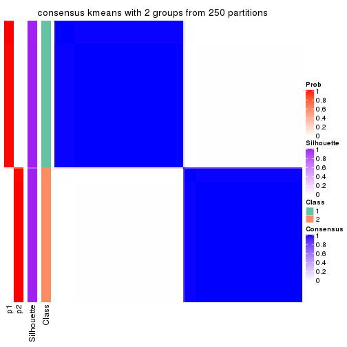</p>

</div>
<div id='tab-MAD-kmeans-consensus-heatmap-2'>
<pre><code class="r">consensus_heatmap(res, k = 3)
</code></pre>

<p>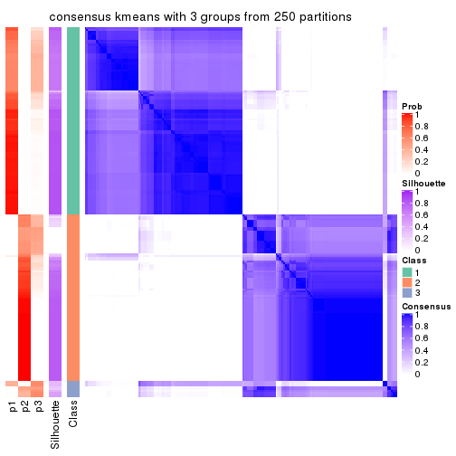</p>

</div>
<div id='tab-MAD-kmeans-consensus-heatmap-3'>
<pre><code class="r">consensus_heatmap(res, k = 4)
</code></pre>

<p>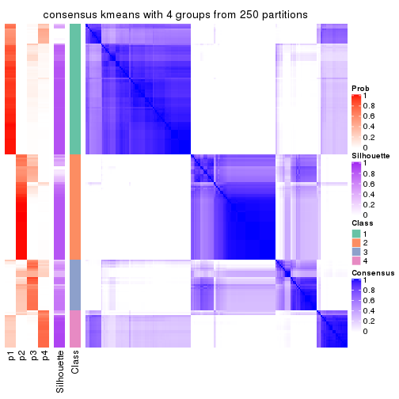</p>

</div>
<div id='tab-MAD-kmeans-consensus-heatmap-4'>
<pre><code class="r">consensus_heatmap(res, k = 5)
</code></pre>

<p>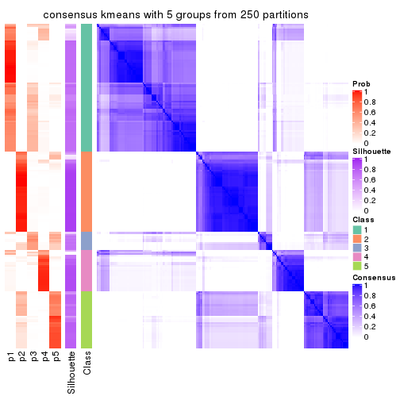</p>

</div>
<div id='tab-MAD-kmeans-consensus-heatmap-5'>
<pre><code class="r">consensus_heatmap(res, k = 6)
</code></pre>

<p>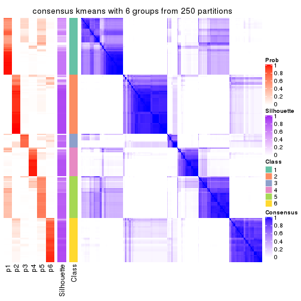</p>

</div>
</div>

Heatmaps for the membership of samples in all partitions to see how consistent they are:


<script>
$( function() {
	$( '#tabs-MAD-kmeans-membership-heatmap' ).tabs();
} );
</script>
<div id='tabs-MAD-kmeans-membership-heatmap'>
<ul>
<li><a href='#tab-MAD-kmeans-membership-heatmap-1'>k = 2</a></li>
<li><a href='#tab-MAD-kmeans-membership-heatmap-2'>k = 3</a></li>
<li><a href='#tab-MAD-kmeans-membership-heatmap-3'>k = 4</a></li>
<li><a href='#tab-MAD-kmeans-membership-heatmap-4'>k = 5</a></li>
<li><a href='#tab-MAD-kmeans-membership-heatmap-5'>k = 6</a></li>
</ul>
<div id='tab-MAD-kmeans-membership-heatmap-1'>
<pre><code class="r">membership_heatmap(res, k = 2)
</code></pre>

<p>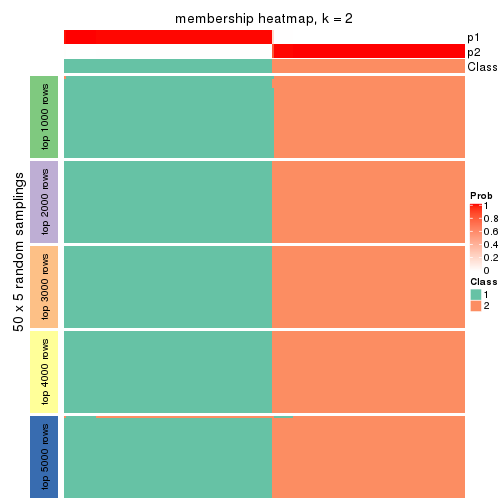</p>

</div>
<div id='tab-MAD-kmeans-membership-heatmap-2'>
<pre><code class="r">membership_heatmap(res, k = 3)
</code></pre>

<p>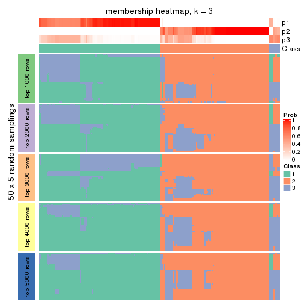</p>

</div>
<div id='tab-MAD-kmeans-membership-heatmap-3'>
<pre><code class="r">membership_heatmap(res, k = 4)
</code></pre>

<p>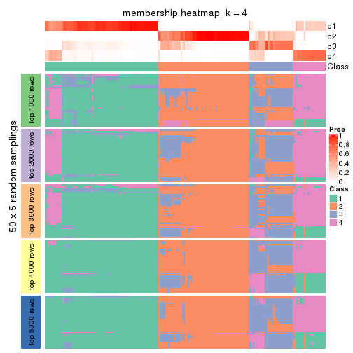</p>

</div>
<div id='tab-MAD-kmeans-membership-heatmap-4'>
<pre><code class="r">membership_heatmap(res, k = 5)
</code></pre>

<p>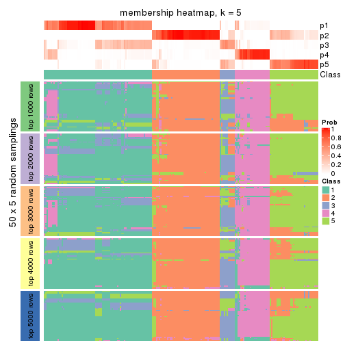</p>

</div>
<div id='tab-MAD-kmeans-membership-heatmap-5'>
<pre><code class="r">membership_heatmap(res, k = 6)
</code></pre>

<p>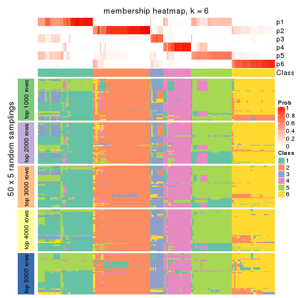</p>

</div>
</div>

As soon as we have had the classes for columns, we can look for signatures
which are significantly different between classes which can be candidate marks
for certain classes. Following are the heatmaps for signatures.


Signature heatmaps where rows are scaled:


<script>
$( function() {
	$( '#tabs-MAD-kmeans-get-signatures' ).tabs();
} );
</script>
<div id='tabs-MAD-kmeans-get-signatures'>
<ul>
<li><a href='#tab-MAD-kmeans-get-signatures-1'>k = 2</a></li>
<li><a href='#tab-MAD-kmeans-get-signatures-2'>k = 3</a></li>
<li><a href='#tab-MAD-kmeans-get-signatures-3'>k = 4</a></li>
<li><a href='#tab-MAD-kmeans-get-signatures-4'>k = 5</a></li>
<li><a href='#tab-MAD-kmeans-get-signatures-5'>k = 6</a></li>
</ul>
<div id='tab-MAD-kmeans-get-signatures-1'>
<pre><code class="r">get_signatures(res, k = 2)
</code></pre>

<p>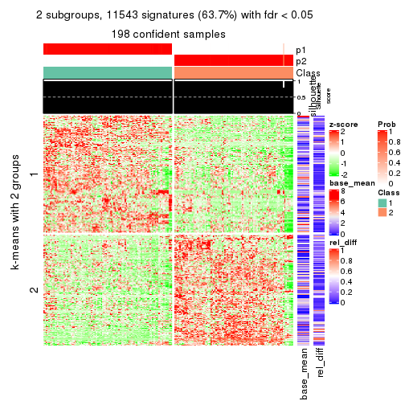</p>

</div>
<div id='tab-MAD-kmeans-get-signatures-2'>
<pre><code class="r">get_signatures(res, k = 3)
</code></pre>

<p>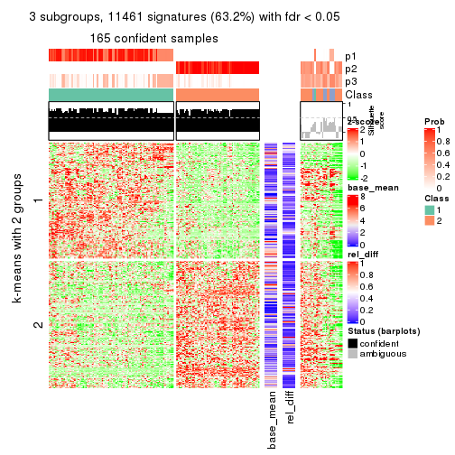</p>

</div>
<div id='tab-MAD-kmeans-get-signatures-3'>
<pre><code class="r">get_signatures(res, k = 4)
</code></pre>

<p>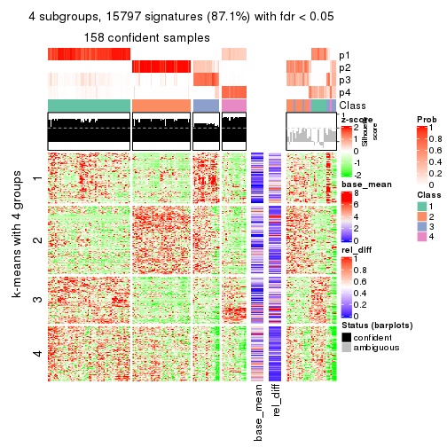</p>

</div>
<div id='tab-MAD-kmeans-get-signatures-4'>
<pre><code class="r">get_signatures(res, k = 5)
</code></pre>

<p>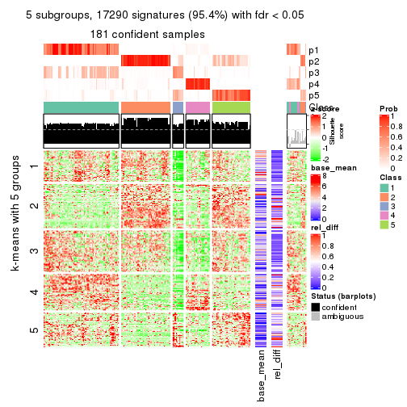</p>

</div>
<div id='tab-MAD-kmeans-get-signatures-5'>
<pre><code class="r">get_signatures(res, k = 6)
</code></pre>

<p>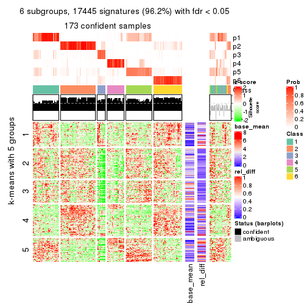</p>

</div>
</div>


Signature heatmaps where rows are not scaled:


<script>
$( function() {
	$( '#tabs-MAD-kmeans-get-signatures-no-scale' ).tabs();
} );
</script>
<div id='tabs-MAD-kmeans-get-signatures-no-scale'>
<ul>
<li><a href='#tab-MAD-kmeans-get-signatures-no-scale-1'>k = 2</a></li>
<li><a href='#tab-MAD-kmeans-get-signatures-no-scale-2'>k = 3</a></li>
<li><a href='#tab-MAD-kmeans-get-signatures-no-scale-3'>k = 4</a></li>
<li><a href='#tab-MAD-kmeans-get-signatures-no-scale-4'>k = 5</a></li>
<li><a href='#tab-MAD-kmeans-get-signatures-no-scale-5'>k = 6</a></li>
</ul>
<div id='tab-MAD-kmeans-get-signatures-no-scale-1'>
<pre><code class="r">get_signatures(res, k = 2, scale_rows = FALSE)
</code></pre>

<p>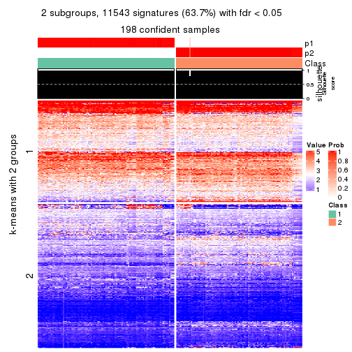</p>

</div>
<div id='tab-MAD-kmeans-get-signatures-no-scale-2'>
<pre><code class="r">get_signatures(res, k = 3, scale_rows = FALSE)
</code></pre>

<p>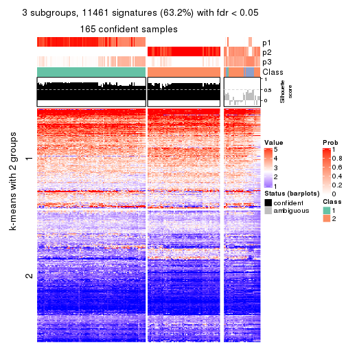</p>

</div>
<div id='tab-MAD-kmeans-get-signatures-no-scale-3'>
<pre><code class="r">get_signatures(res, k = 4, scale_rows = FALSE)
</code></pre>

<p>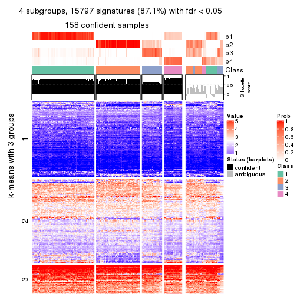</p>

</div>
<div id='tab-MAD-kmeans-get-signatures-no-scale-4'>
<pre><code class="r">get_signatures(res, k = 5, scale_rows = FALSE)
</code></pre>

<p>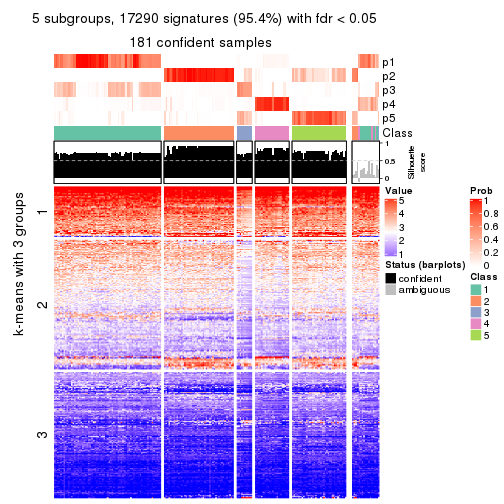</p>

</div>
<div id='tab-MAD-kmeans-get-signatures-no-scale-5'>
<pre><code class="r">get_signatures(res, k = 6, scale_rows = FALSE)
</code></pre>

<p>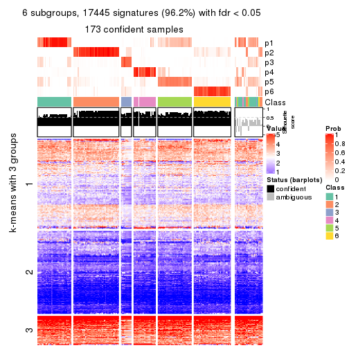</p>

</div>
</div>


Compare the overlap of signatures from different k:

```r
compare_signatures(res)
```

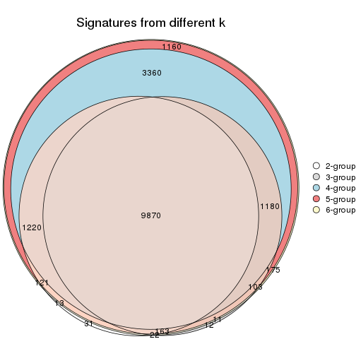

`get_signature()` returns a data frame invisibly. TO get the list of signatures, the function
call should be assigned to a variable explicitly. In following code, if `plot` argument is set
to `FALSE`, no heatmap is plotted while only the differential analysis is performed.

```r
# code only for demonstration
tb = get_signature(res, k = ..., plot = FALSE)
```

An example of the output of `tb` is:

```
#>   which_row         fdr    mean_1    mean_2 scaled_mean_1 scaled_mean_2 km
#> 1        38 0.042760348  8.373488  9.131774    -0.5533452     0.5164555  1
#> 2        40 0.018707592  7.106213  8.469186    -0.6173731     0.5762149  1
#> 3        55 0.019134737 10.221463 11.207825    -0.6159697     0.5749050  1
#> 4        59 0.006059896  5.921854  7.869574    -0.6899429     0.6439467  1
#> 5        60 0.018055526  8.928898 10.211722    -0.6204761     0.5791110  1
#> 6        98 0.009384629 15.714769 14.887706     0.6635654    -0.6193277  2
...
```

The columns in `tb` are:

1. `which_row`: row indices corresponding to the input matrix.
2. `fdr`: FDR for the differential test. 
3. `mean_x`: The mean value in group x.
4. `scaled_mean_x`: The mean value in group x after rows are scaled.
5. `km`: Row groups if k-means clustering is applied to rows.


UMAP plot which shows how samples are separated.


<script>
$( function() {
	$( '#tabs-MAD-kmeans-dimension-reduction' ).tabs();
} );
</script>
<div id='tabs-MAD-kmeans-dimension-reduction'>
<ul>
<li><a href='#tab-MAD-kmeans-dimension-reduction-1'>k = 2</a></li>
<li><a href='#tab-MAD-kmeans-dimension-reduction-2'>k = 3</a></li>
<li><a href='#tab-MAD-kmeans-dimension-reduction-3'>k = 4</a></li>
<li><a href='#tab-MAD-kmeans-dimension-reduction-4'>k = 5</a></li>
<li><a href='#tab-MAD-kmeans-dimension-reduction-5'>k = 6</a></li>
</ul>
<div id='tab-MAD-kmeans-dimension-reduction-1'>
<pre><code class="r">dimension_reduction(res, k = 2, method = &quot;UMAP&quot;)
</code></pre>

<p>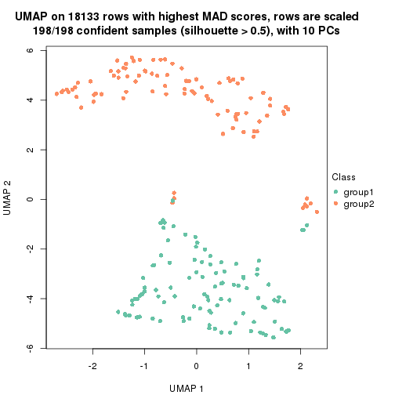</p>

</div>
<div id='tab-MAD-kmeans-dimension-reduction-2'>
<pre><code class="r">dimension_reduction(res, k = 3, method = &quot;UMAP&quot;)
</code></pre>

<p>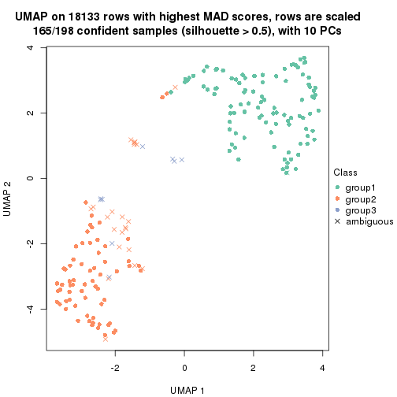</p>

</div>
<div id='tab-MAD-kmeans-dimension-reduction-3'>
<pre><code class="r">dimension_reduction(res, k = 4, method = &quot;UMAP&quot;)
</code></pre>

<p>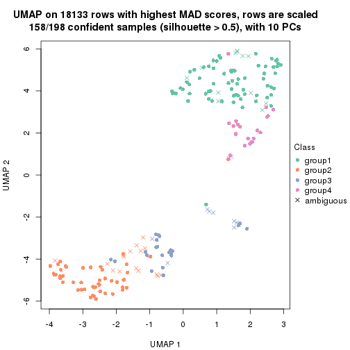</p>

</div>
<div id='tab-MAD-kmeans-dimension-reduction-4'>
<pre><code class="r">dimension_reduction(res, k = 5, method = &quot;UMAP&quot;)
</code></pre>

<p>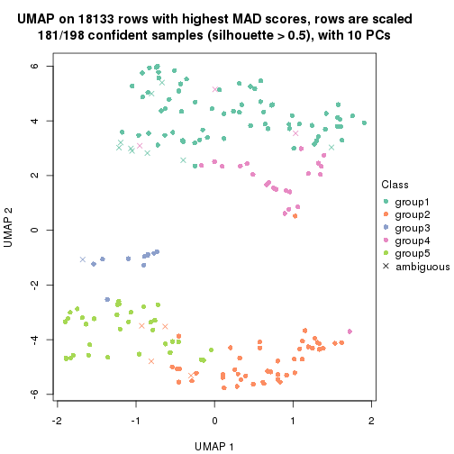</p>

</div>
<div id='tab-MAD-kmeans-dimension-reduction-5'>
<pre><code class="r">dimension_reduction(res, k = 6, method = &quot;UMAP&quot;)
</code></pre>

<p>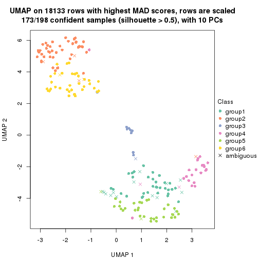</p>

</div>
</div>


Following heatmap shows how subgroups are split when increasing `k`:

```r
collect_classes(res)
```

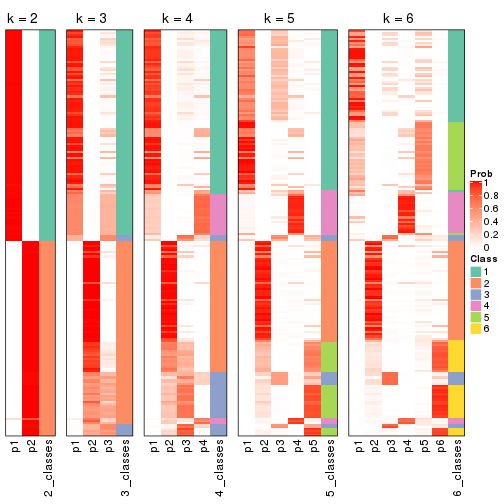


If matrix rows can be associated to genes, consider to use `functional_enrichment(res,
...)` to perform function enrichment for the signature genes. See [this vignette](http://bioconductor.org/packages/devel/bioc/vignettes/cola/inst/doc/functional_enrichment.html) for more detailed explanations.


 

---------------------------------------------------


### MAD:skmeans**


The object with results only for a single top-value method and a single partition method 
can be extracted as:

```r
res = res_list["MAD", "skmeans"]
# you can also extract it by
# res = res_list["MAD:skmeans"]
```

A summary of `res` and all the functions that can be applied to it:

```r
res
```

```
#> A 'ConsensusPartition' object with k = 2, 3, 4, 5, 6.
#>   On a matrix with 18133 rows and 198 columns.
#>   Top rows (1000, 2000, 3000, 4000, 5000) are extracted by 'MAD' method.
#>   Subgroups are detected by 'skmeans' method.
#>   Performed in total 1250 partitions by row resampling.
#>   Best k for subgroups seems to be 2.
#> 
#> Following methods can be applied to this 'ConsensusPartition' object:
#>  [1] "cola_report"             "collect_classes"         "collect_plots"          
#>  [4] "collect_stats"           "colnames"                "compare_signatures"     
#>  [7] "consensus_heatmap"       "dimension_reduction"     "functional_enrichment"  
#> [10] "get_anno_col"            "get_anno"                "get_classes"            
#> [13] "get_consensus"           "get_matrix"              "get_membership"         
#> [16] "get_param"               "get_signatures"          "get_stats"              
#> [19] "is_best_k"               "is_stable_k"             "membership_heatmap"     
#> [22] "ncol"                    "nrow"                    "plot_ecdf"              
#> [25] "rownames"                "select_partition_number" "show"                   
#> [28] "suggest_best_k"          "test_to_known_factors"
```

`collect_plots()` function collects all the plots made from `res` for all `k` (number of partitions)
into one single page to provide an easy and fast comparison between different `k`.

```r
collect_plots(res)
```

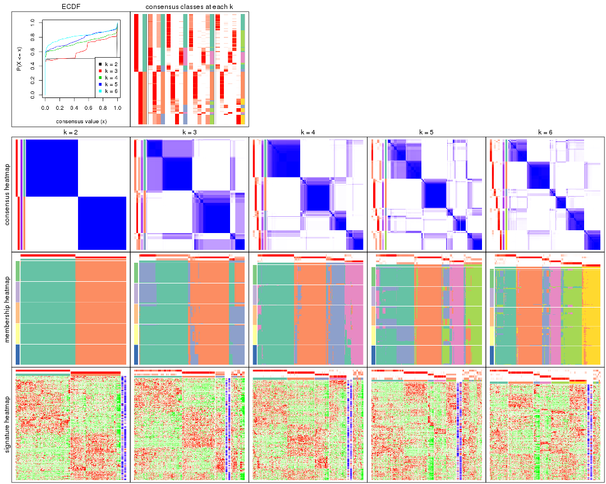

The plots are:

- The first row: a plot of the ECDF (empirical cumulative distribution
  function) curves of the consensus matrix for each `k` and the heatmap of
  predicted classes for each `k`.
- The second row: heatmaps of the consensus matrix for each `k`.
- The third row: heatmaps of the membership matrix for each `k`.
- The fouth row: heatmaps of the signatures for each `k`.

All the plots in panels can be made by individual functions and they are
plotted later in this section.

`select_partition_number()` produces several plots showing different
statistics for choosing "optimized" `k`. There are following statistics:

- ECDF curves of the consensus matrix for each `k`;
- 1-PAC. [The PAC
  score](https://en.wikipedia.org/wiki/Consensus_clustering#Over-interpretation_potential_of_consensus_clustering)
  measures the proportion of the ambiguous subgrouping.
- Mean silhouette score.
- Concordance. The mean probability of fiting the consensus class ids in all
  partitions.
- Area increased. Denote $A_k$ as the area under the ECDF curve for current
  `k`, the area increased is defined as $A_k - A_{k-1}$.
- Rand index. The percent of pairs of samples that are both in a same cluster
  or both are not in a same cluster in the partition of k and k-1.
- Jaccard index. The ratio of pairs of samples are both in a same cluster in
  the partition of k and k-1 and the pairs of samples are both in a same
  cluster in the partition k or k-1.

The detailed explanations of these statistics can be found in [the _cola_
vignette](http://bioconductor.org/packages/devel/bioc/vignettes/cola/inst/doc/cola.html#toc_13).

Generally speaking, lower PAC score, higher mean silhouette score or higher
concordance corresponds to better partition. Rand index and Jaccard index
measure how similar the current partition is compared to partition with `k-1`.
If they are too similar, we won't accept `k` is better than `k-1`.

```r
select_partition_number(res)
```

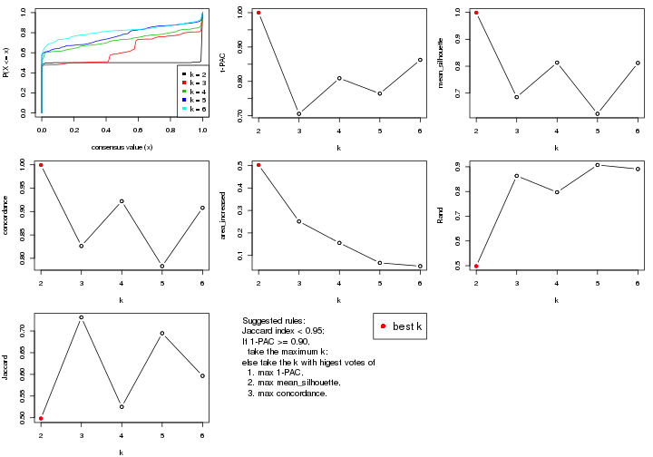

The numeric values for all these statistics can be obtained by `get_stats()`.

```r
get_stats(res)
```

```
#>   k 1-PAC mean_silhouette concordance area_increased  Rand Jaccard
#> 2 2 1.000           0.999       0.999         0.5022 0.498   0.498
#> 3 3 0.706           0.685       0.826         0.2512 0.863   0.732
#> 4 4 0.809           0.813       0.922         0.1557 0.797   0.525
#> 5 5 0.765           0.623       0.783         0.0669 0.907   0.695
#> 6 6 0.863           0.812       0.908         0.0523 0.891   0.596
```

`suggest_best_k()` suggests the best $k$ based on these statistics. The rules are as follows:

- All $k$ with Jaccard index larger than 0.95 are removed because increasing
  $k$ does not provide enough extra information. If all $k$ are removed, it is
  marked as no subgroup is detected.
- For all $k$ with 1-PAC score larger than 0.9, the maximal $k$ is taken as
  the best $k$, and other $k$ are marked as optional $k$.
- If it does not fit the second rule. The $k$ with the maximal vote of the
  highest 1-PAC score, highest mean silhouette, and highest concordance is
  taken as the best $k$.

```r
suggest_best_k(res)
```

```
#> [1] 2
```


Following shows the table of the partitions (You need to click the **show/hide
code output** link to see it). The membership matrix (columns with name `p*`)
is inferred by
[`clue::cl_consensus()`](https://www.rdocumentation.org/link/cl_consensus?package=clue)
function with the `SE` method. Basically the value in the membership matrix
represents the probability to belong to a certain group. The finall class
label for an item is determined with the group with highest probability it
belongs to.

In `get_classes()` function, the entropy is calculated from the membership
matrix and the silhouette score is calculated from the consensus matrix.


<script>
$( function() {
	$( '#tabs-MAD-skmeans-get-classes' ).tabs();
} );
</script>
<div id='tabs-MAD-skmeans-get-classes'>
<ul>
<li><a href='#tab-MAD-skmeans-get-classes-1'>k = 2</a></li>
<li><a href='#tab-MAD-skmeans-get-classes-2'>k = 3</a></li>
<li><a href='#tab-MAD-skmeans-get-classes-3'>k = 4</a></li>
<li><a href='#tab-MAD-skmeans-get-classes-4'>k = 5</a></li>
<li><a href='#tab-MAD-skmeans-get-classes-5'>k = 6</a></li>
</ul>

<div id='tab-MAD-skmeans-get-classes-1'>
<p><a id='tab-MAD-skmeans-get-classes-1-a' style='color:#0366d6' href='#'>show/hide code output</a></p>
<pre><code class="r">cbind(get_classes(res, k = 2), get_membership(res, k = 2))
</code></pre>

<pre><code>#&gt;                                      class entropy silhouette    p1    p2
#&gt; 0C0AA0B2-5191-4EDF-8937-ED7434F30283     2  0.0000      1.000 0.000 1.000
#&gt; 18B45F1F-234F-45CC-A234-145307606C5C     1  0.0000      0.999 1.000 0.000
#&gt; E18B70C0-BDCA-46D3-99BB-C6C8ABC68DA5     2  0.0000      1.000 0.000 1.000
#&gt; 0F6DDBA7-6F74-45E8-95C8-F28263D55978     1  0.0000      0.999 1.000 0.000
#&gt; 7EAE1A5A-129A-46DE-977E-A2C753F10904     2  0.0000      1.000 0.000 1.000
#&gt; 7EAE0048-16B5-4979-9410-16CDEB9B1A48     1  0.0000      0.999 1.000 0.000
#&gt; 2EBFC828-2B27-4753-A052-80DDA226DAB4     2  0.0000      1.000 0.000 1.000
#&gt; 24E1768D-2232-41DA-9383-BC55D6EB3812     2  0.0000      1.000 0.000 1.000
#&gt; 6E3CD60A-1889-4CA3-B305-2E78152057B5     2  0.0000      1.000 0.000 1.000
#&gt; 33CC70DD-82B3-413C-B3B1-BE06634D95D0     1  0.0000      0.999 1.000 0.000
#&gt; F1CB57A3-55DD-4487-9307-1B4F652E729A     1  0.0000      0.999 1.000 0.000
#&gt; 755A5806-B054-449A-93DB-79909E6C93A1     1  0.0000      0.999 1.000 0.000
#&gt; 58D364E7-3D2F-468F-A264-D6461E2428D4     2  0.0000      1.000 0.000 1.000
#&gt; 68BB9CB6-7AA2-4981-B9D9-07363EC96599     2  0.0000      1.000 0.000 1.000
#&gt; 3C4E8DFA-8EA0-4F1F-89CB-CB8805395872     2  0.0000      1.000 0.000 1.000
#&gt; 4219651D-5583-4498-BF08-1B7D04B4C7B2     1  0.0000      0.999 1.000 0.000
#&gt; B5EE2768-0D67-4584-ADBC-EC745FEC52EA     2  0.0000      1.000 0.000 1.000
#&gt; 825E6C11-F460-451A-8045-846DD7D0E945     1  0.0000      0.999 1.000 0.000
#&gt; 491F62AF-5E68-43C3-982A-F867A75BBA9A     2  0.0000      1.000 0.000 1.000
#&gt; 9D7F058C-F95A-44AD-AC9E-450F7FBDC960     2  0.0000      1.000 0.000 1.000
#&gt; 6D42DD0C-2081-4742-BA27-9F5F16FAC3C6     1  0.0000      0.999 1.000 0.000
#&gt; EDD7E63D-492A-473B-A552-0764337B10EF     2  0.0000      1.000 0.000 1.000
#&gt; 97073DEA-73AD-4DFD-BD1A-9035DC03445B     1  0.0000      0.999 1.000 0.000
#&gt; FA891AB9-CE38-4F7E-A015-1DDCE12890A0     1  0.0000      0.999 1.000 0.000
#&gt; D9514D49-A0AE-45AB-8C9F-68E726215253     1  0.0000      0.999 1.000 0.000
#&gt; 3B9229AD-12E5-451E-9D2F-378AAC82C04A     2  0.0000      1.000 0.000 1.000
#&gt; 5EA36B71-4917-4EF3-9060-065EFE6ACC5B     1  0.0000      0.999 1.000 0.000
#&gt; A20E4ECB-4895-4CC7-BE5E-4721B20D933B     1  0.0000      0.999 1.000 0.000
#&gt; 1BE8D828-29DB-4368-AA4A-FB23588F7AE8     1  0.0000      0.999 1.000 0.000
#&gt; 66EFEFCF-3D14-4DBF-AA13-530F40ED0245     1  0.0000      0.999 1.000 0.000
#&gt; 55DFFE53-BCE7-4EC1-9863-6C0311B06BA2     2  0.0000      1.000 0.000 1.000
#&gt; 4CC3FB5A-611D-4C64-AE9D-544FA45CF4DC     1  0.0000      0.999 1.000 0.000
#&gt; C11D33F2-DFE9-4FA8-9024-F3E7F1DADC5F     2  0.0000      1.000 0.000 1.000
#&gt; FA5932B8-8AA3-4C38-9FAB-C35D8772974D     1  0.0000      0.999 1.000 0.000
#&gt; 8216EC35-1F41-4A15-B503-BDA4971E27C9     1  0.0000      0.999 1.000 0.000
#&gt; 69635D23-90A7-4BAD-97C7-B79536837F57     1  0.0000      0.999 1.000 0.000
#&gt; 12B404E2-C463-4409-8392-E4649B2AFFD1     2  0.0000      1.000 0.000 1.000
#&gt; 246927E3-ACCF-41B2-AA8E-43855FD6B146     2  0.0000      1.000 0.000 1.000
#&gt; E0CC13E7-9607-49E0-B4AA-395544E3C3BF     1  0.0000      0.999 1.000 0.000
#&gt; F7BBC0C1-6124-4A83-8A70-EA89B62F1CBD     1  0.0000      0.999 1.000 0.000
#&gt; B1D4FF24-8E6F-4A04-B716-2032D850EB57     1  0.0000      0.999 1.000 0.000
#&gt; 253601DB-B78A-4566-9947-8C0270C0B163     2  0.0000      1.000 0.000 1.000
#&gt; AB83DBFF-5737-4FB8-A5AC-1D3CD6072BDF     2  0.0000      1.000 0.000 1.000
#&gt; 9D67D953-EC98-4B72-89C8-5732BC9D4BC9     2  0.0000      1.000 0.000 1.000
#&gt; 51061018-95AB-4278-886F-F69E4EBC47C0     2  0.0000      1.000 0.000 1.000
#&gt; ABD0F7F3-105B-4DEE-9889-5028772C519A     1  0.0000      0.999 1.000 0.000
#&gt; 562B95CF-B27E-4A72-B7C6-CDF86A51A39B     1  0.0000      0.999 1.000 0.000
#&gt; ABF046A4-D7A1-49FF-B6B1-4E07A791DEDB     2  0.0000      1.000 0.000 1.000
#&gt; 3FF4101E-9703-460E-A30E-76CC7689F36D     2  0.0000      1.000 0.000 1.000
#&gt; 39C4F7AA-7ADF-4F1D-BDA3-BEC605AC5023     2  0.0000      1.000 0.000 1.000
#&gt; CB821FD2-AF5C-4743-A70F-21C12C6ED153     1  0.0000      0.999 1.000 0.000
#&gt; 92EA1846-62FF-41D5-A441-5E52E6B9E7F9     1  0.0000      0.999 1.000 0.000
#&gt; 7D25F3EE-5A20-4763-8026-16A03D05F459     1  0.0000      0.999 1.000 0.000
#&gt; 8ECE5276-CD06-496B-A5A9-1713B1F7D089     1  0.0000      0.999 1.000 0.000
#&gt; C775B68F-9507-47E3-B507-B433AED79002     1  0.0000      0.999 1.000 0.000
#&gt; E19D5463-FDD0-41C1-A170-323736A88D07     2  0.0000      1.000 0.000 1.000
#&gt; CE4B6285-4961-4767-91F0-5C7A8162E185     1  0.0000      0.999 1.000 0.000
#&gt; 9637BD72-1FEF-42AD-8886-2C39BE876531     1  0.0000      0.999 1.000 0.000
#&gt; 81B5A88E-45A0-4B44-B689-B9071B8548EE     2  0.0000      1.000 0.000 1.000
#&gt; 0B01B4C9-9BED-4F5B-A3E2-8868C7CCC3FC     2  0.0000      1.000 0.000 1.000
#&gt; 54501315-7132-44B2-A179-10FBF1421105     1  0.0000      0.999 1.000 0.000
#&gt; E207CBE9-4C3A-4FDD-9251-CFE1FE106475     1  0.0938      0.987 0.988 0.012
#&gt; 3BEA0B92-3F90-4DBF-9679-AADEAD7D47C8     2  0.0000      1.000 0.000 1.000
#&gt; 35B32250-D854-4215-AA5B-2C11B2FBEECA     1  0.0000      0.999 1.000 0.000
#&gt; ACE6566B-AEB9-426C-924A-B382D14A1024     2  0.0000      1.000 0.000 1.000
#&gt; 737E69AC-0930-45B9-B6BA-7CE5E300290B     1  0.0000      0.999 1.000 0.000
#&gt; B4410AB8-D015-41CA-86E6-12EB4E4103E3     1  0.0000      0.999 1.000 0.000
#&gt; 6D3ECA65-C50F-43B0-B75A-1D290FA4A8FD     2  0.0000      1.000 0.000 1.000
#&gt; C86F40D3-9A96-4395-A8C3-510DE12F9A2B     2  0.0000      1.000 0.000 1.000
#&gt; 6238087F-24DD-4BF1-903F-3BD4E446C1AE     2  0.0000      1.000 0.000 1.000
#&gt; E4FF840B-EEAB-4CB0-A690-7D4C4AA7EEC3     2  0.0000      1.000 0.000 1.000
#&gt; 72D3C323-C67F-4C0E-9BFC-BF245FF9730A     1  0.0000      0.999 1.000 0.000
#&gt; 82D56E4E-4DF6-4F3E-8959-B995C92AAA70     1  0.0000      0.999 1.000 0.000
#&gt; E31CA441-EB19-443B-ACBD-37B5CCBCF0E5     2  0.0000      1.000 0.000 1.000
#&gt; 87CA8939-D054-4B8A-B32D-085FD2E8F202     1  0.0000      0.999 1.000 0.000
#&gt; 2A508D90-FEDC-46A3-9A02-E51E5467CDCB     1  0.0000      0.999 1.000 0.000
#&gt; C4E8B4E2-388B-411F-BF0A-9B6F34E8EDB5     2  0.0000      1.000 0.000 1.000
#&gt; AF6AF803-BD93-44A7-AA80-B9BC92C1273B     2  0.0000      1.000 0.000 1.000
#&gt; 0B1CA5CF-EB96-41D4-BFC5-6957FEB39828     1  0.0000      0.999 1.000 0.000
#&gt; 6FB96FB0-6661-48AD-A4A0-69F8AFDBE591     2  0.0000      1.000 0.000 1.000
#&gt; 8C19F7FD-368A-462B-B28F-88D6630038A1     1  0.0000      0.999 1.000 0.000
#&gt; 96EABE78-C2F4-4A33-ACD8-C922A4B2519B     2  0.0000      1.000 0.000 1.000
#&gt; 68B36D7B-546A-4689-949F-B207C4A4AB27     2  0.0000      1.000 0.000 1.000
#&gt; CE9F3335-778F-4F52-BC55-4B7C99B211DD     2  0.0000      1.000 0.000 1.000
#&gt; CB359DED-2A2D-4646-A0BD-6F10ADCC532B     1  0.0000      0.999 1.000 0.000
#&gt; 198324A5-8C52-46F6-9734-EFAF1CCA6D9B     1  0.0000      0.999 1.000 0.000
#&gt; 83B88608-0506-428C-B9E8-621F38477B42     1  0.0000      0.999 1.000 0.000
#&gt; 1993630A-0F3D-4F5C-86A3-D443BAAF57F0     1  0.0376      0.995 0.996 0.004
#&gt; DE73DA9B-529E-4F4F-A65C-DA7AB84B1096     1  0.0000      0.999 1.000 0.000
#&gt; 2347F3B7-DDA3-40C0-B6D4-8819ECA69146     1  0.0000      0.999 1.000 0.000
#&gt; AB93B5D5-095F-4330-9D40-6A3D934AB50C     1  0.0000      0.999 1.000 0.000
#&gt; 5EBBE4AD-FF0C-41CF-9EA3-B6FE7EA1F9C0     1  0.0000      0.999 1.000 0.000
#&gt; 6D960AE7-3769-4144-A061-E8588E5063FF     1  0.0000      0.999 1.000 0.000
#&gt; 0C2DD8C0-D1A5-4192-A49C-7A40FED628B2     2  0.0000      1.000 0.000 1.000
#&gt; 18C9372F-C55B-4F86-A9D2-E8D85EFC8566     2  0.1414      0.980 0.020 0.980
#&gt; 9AF637B0-4C32-4DD1-93AF-7655B4A845D3     2  0.0000      1.000 0.000 1.000
#&gt; 785B5B06-4115-46FD-9BEB-F888AFDC855D     2  0.0000      1.000 0.000 1.000
#&gt; ECA3050E-4BE2-4117-B9CF-A52BB85AF8C2     2  0.0000      1.000 0.000 1.000
#&gt; 099DC396-16A5-458F-9ED9-F2A790CB0C34     1  0.0000      0.999 1.000 0.000
#&gt; 7A5A12EE-C5B0-4C51-8C99-0F3FA88D633E     1  0.0000      0.999 1.000 0.000
#&gt; E832B508-A66D-4817-B44A-FE9FAAE64B4A     1  0.0000      0.999 1.000 0.000
#&gt; F9DD688C-7B35-49E7-9651-2E098EE78856     1  0.0000      0.999 1.000 0.000
#&gt; F1265DD8-5ED3-4635-A277-57BBFDEC7729     1  0.0000      0.999 1.000 0.000
#&gt; F624E8D9-DB07-4C9E-910D-5E8EBA3A6167     2  0.0000      1.000 0.000 1.000
#&gt; 3516FBDF-66E1-43F4-9D7B-16748F6439A7     2  0.0000      1.000 0.000 1.000
#&gt; 04B12992-B2EA-4BA2-8E2C-11E34E230E6F     2  0.0000      1.000 0.000 1.000
#&gt; CC02897D-9123-495E-9242-5C9CF4EC269B     2  0.0000      1.000 0.000 1.000
#&gt; 3117ED46-2BF2-4311-BC00-4E98243E16B3     1  0.0000      0.999 1.000 0.000
#&gt; E0B66D53-23DB-4E26-BB6E-F692FA8C000E     1  0.0000      0.999 1.000 0.000
#&gt; DAA93CE5-A013-477A-9A50-EA09CC3A8162     2  0.0000      1.000 0.000 1.000
#&gt; 0099098D-354A-4276-92F8-B932C74B4608     1  0.0000      0.999 1.000 0.000
#&gt; DD483639-B2E7-4745-BCFB-55ED1D82BFBF     2  0.0000      1.000 0.000 1.000
#&gt; 2C1F9079-602E-4252-82C7-9D8799E04246     2  0.0000      1.000 0.000 1.000
#&gt; 9473A8E4-3A1B-4184-9EA6-517AFD60B635     1  0.0000      0.999 1.000 0.000
#&gt; 75CFBAF6-7BA0-40AF-92D7-D218E885BD1B     2  0.0000      1.000 0.000 1.000
#&gt; B588950F-14D6-41C8-845B-EFD2096013C6     2  0.0000      1.000 0.000 1.000
#&gt; 0DF3EDA8-DAEA-4721-92AB-B97181249498     2  0.0000      1.000 0.000 1.000
#&gt; 8EA83042-D598-401D-AD78-936EEB136C59     1  0.0000      0.999 1.000 0.000
#&gt; 729AC418-3BE9-445A-95D4-AC11A7D43BE0     1  0.0000      0.999 1.000 0.000
#&gt; 7D8B1B11-F576-4AA8-BFA7-0022A2CD829A     2  0.0000      1.000 0.000 1.000
#&gt; 304A0E46-3449-4B44-9C30-BDDF6459391D     1  0.0000      0.999 1.000 0.000
#&gt; 3C83358F-DF20-47F7-AF9F-AB7CC92F5ABA     1  0.0000      0.999 1.000 0.000
#&gt; EAFEED6C-35C3-451F-AE4A-EB56992E1F29     1  0.0000      0.999 1.000 0.000
#&gt; 8A237A65-28EC-434D-A78A-A8B7308B5204     1  0.0000      0.999 1.000 0.000
#&gt; D005833F-E991-4E9E-9667-55F137288004     1  0.0000      0.999 1.000 0.000
#&gt; 37D966E3-253E-4397-A9AE-0903A8D31FE6     1  0.0000      0.999 1.000 0.000
#&gt; D2482B81-CB5B-4178-BA8D-1CF4026181B5     1  0.0000      0.999 1.000 0.000
#&gt; 18019E95-C2A8-4EE7-B585-F6886DC4D953     2  0.0000      1.000 0.000 1.000
#&gt; 0B126D1A-14A8-4345-8F78-FF92222ADF4C     2  0.0000      1.000 0.000 1.000
#&gt; CE88B625-47D8-4D58-9FB4-23464DB7DDAD     2  0.0000      1.000 0.000 1.000
#&gt; 9A88299D-5C74-47FA-B42C-1A1D6D935AAB     1  0.0000      0.999 1.000 0.000
#&gt; 3E71159C-FD6C-41DA-B18B-0730C8AC7E41     1  0.0000      0.999 1.000 0.000
#&gt; 6F245AA4-79D9-47E1-BCC9-1AAF65AEA813     1  0.0000      0.999 1.000 0.000
#&gt; 4CF2C888-2100-483A-B4DB-ECBB69243A4D     2  0.0000      1.000 0.000 1.000
#&gt; A3853813-B9D5-4E8C-B075-19FCC35F8686     2  0.0000      1.000 0.000 1.000
#&gt; 83A16DEE-CE9F-4D8B-9225-0A2A8B9D055D     1  0.0000      0.999 1.000 0.000
#&gt; 0F057CAF-4F9A-4DE9-8601-730E96873733     2  0.0000      1.000 0.000 1.000
#&gt; 32D5801D-DBA4-422E-87CB-A2DDE921BA41     1  0.0000      0.999 1.000 0.000
#&gt; 22EE8076-F07C-499A-9AF8-D800A77EF154     2  0.0000      1.000 0.000 1.000
#&gt; DD4BD74D-D48C-4090-9F57-5334E784581C     1  0.0000      0.999 1.000 0.000
#&gt; 41183565-434D-474C-B1BD-CA6E94910658     2  0.0000      1.000 0.000 1.000
#&gt; 75A2CE41-2B2A-4346-927E-ACF8A72738E4     1  0.0000      0.999 1.000 0.000
#&gt; 7AA24995-3DD2-4682-B36A-4EBFEEACF625     1  0.0000      0.999 1.000 0.000
#&gt; 8BAFDFEC-9F26-4ADB-95CE-004143960EEB     1  0.0000      0.999 1.000 0.000
#&gt; A330E011-CE08-4A85-8F4B-370592293DBB     1  0.0000      0.999 1.000 0.000
#&gt; 1D5A5B17-2E70-4BB0-94A1-EC17E6EA49DB     1  0.0000      0.999 1.000 0.000
#&gt; BD9143B8-9D97-4A05-872C-3FB82B4CF7BE     2  0.0000      1.000 0.000 1.000
#&gt; 64552DC0-181E-4607-898C-787AA7F26435     2  0.0000      1.000 0.000 1.000
#&gt; 1B4C4D41-34C7-43A3-858B-C9552EB53894     1  0.0000      0.999 1.000 0.000
#&gt; 463A3BAA-02DC-4EA4-A644-B924163E425D     2  0.0000      1.000 0.000 1.000
#&gt; CD0FEA89-6F60-4A20-8FCA-D397B4E95A98     1  0.0000      0.999 1.000 0.000
#&gt; 5D06CF6D-F4B9-4B32-B055-8AB287E53340     2  0.0000      1.000 0.000 1.000
#&gt; ADA7835F-DB67-4F4F-9446-8BCE3C5FE936     2  0.0000      1.000 0.000 1.000
#&gt; 4109BE2D-B5DF-4BD7-860E-60D87F647152     2  0.0000      1.000 0.000 1.000
#&gt; 88526A0E-6DFE-46CB-BFAD-B4826F482C67     1  0.0000      0.999 1.000 0.000
#&gt; F39F9A4C-18F7-4017-AB31-85D52FF44587     2  0.0000      1.000 0.000 1.000
#&gt; D4290A5E-1B24-4C55-B470-0FA7A0A09DD0     2  0.0000      1.000 0.000 1.000
#&gt; DC5A2C9E-978F-4661-B729-1F9662976E27     1  0.0000      0.999 1.000 0.000
#&gt; 26A1F392-CED2-43E3-8096-74E6F2BFC8C0     2  0.0000      1.000 0.000 1.000
#&gt; 87D81FB2-306A-4E75-9D58-D5F48E46E7F6     2  0.0000      1.000 0.000 1.000
#&gt; E3D9D81A-C20C-4B3B-B940-A5D2C5F65B22     2  0.0000      1.000 0.000 1.000
#&gt; 4464650B-453F-476C-989C-B7B159BF2CF0     2  0.0000      1.000 0.000 1.000
#&gt; 577D2867-B738-487A-9B06-07958D647F02     1  0.0000      0.999 1.000 0.000
#&gt; E52A22CC-3C03-41A9-9541-220DD871E162     2  0.0000      1.000 0.000 1.000
#&gt; 642703B1-AF99-4746-A915-0792F4B9590B     2  0.0000      1.000 0.000 1.000
#&gt; 8F0D1792-1284-45E6-8EC4-392596057677     2  0.0000      1.000 0.000 1.000
#&gt; 765AFFC1-D528-4494-8BA1-0706451E4205     2  0.0000      1.000 0.000 1.000
#&gt; A716BC29-161F-4CA0-B240-00B330137F2C     1  0.0000      0.999 1.000 0.000
#&gt; 32CBFBAF-7064-4595-8D54-2C5E7DE0FD9B     1  0.0000      0.999 1.000 0.000
#&gt; 4D6ED28C-3F20-41B0-BA41-1BF0E5199A40     2  0.0000      1.000 0.000 1.000
#&gt; 86A38456-2900-48FB-B10F-79222B3CA9BF     1  0.0000      0.999 1.000 0.000
#&gt; E870807D-3223-4A6A-9E3D-F4461B048AA2     2  0.0000      1.000 0.000 1.000
#&gt; 3A78D19F-A833-4D2C-8387-FB4FD4A8313C     1  0.0000      0.999 1.000 0.000
#&gt; DFA162CA-C708-4121-8E74-F9C4DEE0CDAE     1  0.0000      0.999 1.000 0.000
#&gt; C00A300A-CD10-4C9D-8C94-3901AFE8406C     2  0.0000      1.000 0.000 1.000
#&gt; 13E11D15-A90F-48C4-980A-DD032C00A2C1     1  0.0000      0.999 1.000 0.000
#&gt; 31BF80AB-FEDB-4C73-89C3-70BE9F9ACBEE     2  0.0000      1.000 0.000 1.000
#&gt; FA34308A-349D-4AAD-94CF-3F3B7F9AD629     2  0.0000      1.000 0.000 1.000
#&gt; 7C48D467-B663-49DD-BC84-A36BC32ACB3D     1  0.0000      0.999 1.000 0.000
#&gt; BB068534-04F6-4FC9-9087-CDA65920BCE2     1  0.0000      0.999 1.000 0.000
#&gt; EA4EC272-A9B3-4B2E-955F-19F7676A944C     2  0.0000      1.000 0.000 1.000
#&gt; C71FF69B-A460-43CA-8769-9667F22D938B     1  0.0000      0.999 1.000 0.000
#&gt; 5243D1B8-8168-4FF1-A8C6-505F080EF0D3     2  0.0000      1.000 0.000 1.000
#&gt; BCC474D8-08FE-4E99-B8E8-B29E65F84D2E     1  0.0000      0.999 1.000 0.000
#&gt; 04FDBFE3-4CF6-4E53-A2AA-89D5C9316377     2  0.0000      1.000 0.000 1.000
#&gt; 83A9915C-8D60-4CAE-A868-B61E3C90C7B0     2  0.0000      1.000 0.000 1.000
#&gt; 989A6472-E3E3-457A-97BE-CCE95F42D5C2     2  0.0000      1.000 0.000 1.000
#&gt; A0AB2D28-6751-49C9-8DF4-66FDBF95C360     1  0.0000      0.999 1.000 0.000
#&gt; A12B2683-18D4-41C9-8AE5-C143E2180052     1  0.0000      0.999 1.000 0.000
#&gt; 8DE1E245-CAD2-4F11-BFA2-9792C433A00B     1  0.3584      0.927 0.932 0.068
#&gt; FDA68036-6C4C-4256-9AA0-C01FE92AA098     2  0.0000      1.000 0.000 1.000
#&gt; 26311920-1414-4EC1-870B-784961EBCC2D     1  0.0000      0.999 1.000 0.000
#&gt; C29A10D6-D598-4286-B5E0-F1776E19E988     1  0.0000      0.999 1.000 0.000
#&gt; FACCC1FB-4937-4CC0-90EA-7F91D3D939CF     2  0.0000      1.000 0.000 1.000
#&gt; 90B9D84B-78E5-4C7E-8414-EC889C2DE8DB     2  0.0000      1.000 0.000 1.000
#&gt; B74E6122-76E1-4E4D-A867-BCAFD7277393     1  0.0000      0.999 1.000 0.000
#&gt; 98494DC0-CF6E-485F-8A0D-D80E4437EF5C     2  0.0000      1.000 0.000 1.000
#&gt; DA114DAC-DE7B-4E43-8D7C-82C5D7B66411     1  0.0000      0.999 1.000 0.000
</code></pre>

<script>
$('#tab-MAD-skmeans-get-classes-1-a').parent().next().next().hide();
$('#tab-MAD-skmeans-get-classes-1-a').click(function(){
  $('#tab-MAD-skmeans-get-classes-1-a').parent().next().next().toggle();
  return(false);
});
</script>
</div>

<div id='tab-MAD-skmeans-get-classes-2'>
<p><a id='tab-MAD-skmeans-get-classes-2-a' style='color:#0366d6' href='#'>show/hide code output</a></p>
<pre><code class="r">cbind(get_classes(res, k = 3), get_membership(res, k = 3))
</code></pre>

<pre><code>#&gt;                                      class entropy silhouette    p1    p2    p3
#&gt; 0C0AA0B2-5191-4EDF-8937-ED7434F30283     2  0.0000     0.8787 0.000 1.000 0.000
#&gt; 18B45F1F-234F-45CC-A234-145307606C5C     1  0.0000     0.6479 1.000 0.000 0.000
#&gt; E18B70C0-BDCA-46D3-99BB-C6C8ABC68DA5     2  0.0000     0.8787 0.000 1.000 0.000
#&gt; 0F6DDBA7-6F74-45E8-95C8-F28263D55978     1  0.6180     0.8146 0.584 0.000 0.416
#&gt; 7EAE1A5A-129A-46DE-977E-A2C753F10904     2  0.0000     0.8787 0.000 1.000 0.000
#&gt; 7EAE0048-16B5-4979-9410-16CDEB9B1A48     1  0.6180     0.8146 0.584 0.000 0.416
#&gt; 2EBFC828-2B27-4753-A052-80DDA226DAB4     2  0.0000     0.8787 0.000 1.000 0.000
#&gt; 24E1768D-2232-41DA-9383-BC55D6EB3812     2  0.5560     0.4283 0.000 0.700 0.300
#&gt; 6E3CD60A-1889-4CA3-B305-2E78152057B5     2  0.4062     0.6711 0.164 0.836 0.000
#&gt; 33CC70DD-82B3-413C-B3B1-BE06634D95D0     1  0.6192     0.8111 0.580 0.000 0.420
#&gt; F1CB57A3-55DD-4487-9307-1B4F652E729A     1  0.6180     0.8146 0.584 0.000 0.416
#&gt; 755A5806-B054-449A-93DB-79909E6C93A1     1  0.0237     0.6453 0.996 0.000 0.004
#&gt; 58D364E7-3D2F-468F-A264-D6461E2428D4     2  0.0237     0.8760 0.000 0.996 0.004
#&gt; 68BB9CB6-7AA2-4981-B9D9-07363EC96599     2  0.5397     0.4786 0.000 0.720 0.280
#&gt; 3C4E8DFA-8EA0-4F1F-89CB-CB8805395872     2  0.6309    -0.2958 0.000 0.500 0.500
#&gt; 4219651D-5583-4498-BF08-1B7D04B4C7B2     1  0.6180     0.8146 0.584 0.000 0.416
#&gt; B5EE2768-0D67-4584-ADBC-EC745FEC52EA     2  0.0000     0.8787 0.000 1.000 0.000
#&gt; 825E6C11-F460-451A-8045-846DD7D0E945     1  0.6180     0.8146 0.584 0.000 0.416
#&gt; 491F62AF-5E68-43C3-982A-F867A75BBA9A     2  0.0000     0.8787 0.000 1.000 0.000
#&gt; 9D7F058C-F95A-44AD-AC9E-450F7FBDC960     2  0.0000     0.8787 0.000 1.000 0.000
#&gt; 6D42DD0C-2081-4742-BA27-9F5F16FAC3C6     1  0.0237     0.6453 0.996 0.000 0.004
#&gt; EDD7E63D-492A-473B-A552-0764337B10EF     2  0.3482     0.7508 0.000 0.872 0.128
#&gt; 97073DEA-73AD-4DFD-BD1A-9035DC03445B     1  0.0424     0.6511 0.992 0.000 0.008
#&gt; FA891AB9-CE38-4F7E-A015-1DDCE12890A0     1  0.0000     0.6479 1.000 0.000 0.000
#&gt; D9514D49-A0AE-45AB-8C9F-68E726215253     1  0.6180     0.8146 0.584 0.000 0.416
#&gt; 3B9229AD-12E5-451E-9D2F-378AAC82C04A     2  0.0000     0.8787 0.000 1.000 0.000
#&gt; 5EA36B71-4917-4EF3-9060-065EFE6ACC5B     3  0.2165     0.2811 0.064 0.000 0.936
#&gt; A20E4ECB-4895-4CC7-BE5E-4721B20D933B     1  0.0000     0.6479 1.000 0.000 0.000
#&gt; 1BE8D828-29DB-4368-AA4A-FB23588F7AE8     3  0.5431    -0.3245 0.284 0.000 0.716
#&gt; 66EFEFCF-3D14-4DBF-AA13-530F40ED0245     1  0.6215     0.8038 0.572 0.000 0.428
#&gt; 55DFFE53-BCE7-4EC1-9863-6C0311B06BA2     2  0.3482     0.7508 0.000 0.872 0.128
#&gt; 4CC3FB5A-611D-4C64-AE9D-544FA45CF4DC     1  0.6154     0.8119 0.592 0.000 0.408
#&gt; C11D33F2-DFE9-4FA8-9024-F3E7F1DADC5F     3  0.6192     0.5082 0.000 0.420 0.580
#&gt; FA5932B8-8AA3-4C38-9FAB-C35D8772974D     1  0.0424     0.6511 0.992 0.000 0.008
#&gt; 8216EC35-1F41-4A15-B503-BDA4971E27C9     1  0.0000     0.6479 1.000 0.000 0.000
#&gt; 69635D23-90A7-4BAD-97C7-B79536837F57     1  0.6180     0.8146 0.584 0.000 0.416
#&gt; 12B404E2-C463-4409-8392-E4649B2AFFD1     2  0.0000     0.8787 0.000 1.000 0.000
#&gt; 246927E3-ACCF-41B2-AA8E-43855FD6B146     2  0.0000     0.8787 0.000 1.000 0.000
#&gt; E0CC13E7-9607-49E0-B4AA-395544E3C3BF     1  0.0000     0.6479 1.000 0.000 0.000
#&gt; F7BBC0C1-6124-4A83-8A70-EA89B62F1CBD     1  0.6180     0.8146 0.584 0.000 0.416
#&gt; B1D4FF24-8E6F-4A04-B716-2032D850EB57     1  0.6180     0.8146 0.584 0.000 0.416
#&gt; 253601DB-B78A-4566-9947-8C0270C0B163     2  0.0000     0.8787 0.000 1.000 0.000
#&gt; AB83DBFF-5737-4FB8-A5AC-1D3CD6072BDF     3  0.6180     0.5073 0.000 0.416 0.584
#&gt; 9D67D953-EC98-4B72-89C8-5732BC9D4BC9     2  0.0000     0.8787 0.000 1.000 0.000
#&gt; 51061018-95AB-4278-886F-F69E4EBC47C0     3  0.6192     0.5082 0.000 0.420 0.580
#&gt; ABD0F7F3-105B-4DEE-9889-5028772C519A     1  0.6180     0.8146 0.584 0.000 0.416
#&gt; 562B95CF-B27E-4A72-B7C6-CDF86A51A39B     1  0.6180     0.8146 0.584 0.000 0.416
#&gt; ABF046A4-D7A1-49FF-B6B1-4E07A791DEDB     2  0.3482     0.7508 0.000 0.872 0.128
#&gt; 3FF4101E-9703-460E-A30E-76CC7689F36D     2  0.0000     0.8787 0.000 1.000 0.000
#&gt; 39C4F7AA-7ADF-4F1D-BDA3-BEC605AC5023     3  0.6192     0.5082 0.000 0.420 0.580
#&gt; CB821FD2-AF5C-4743-A70F-21C12C6ED153     1  0.6180     0.8146 0.584 0.000 0.416
#&gt; 92EA1846-62FF-41D5-A441-5E52E6B9E7F9     1  0.6180     0.8146 0.584 0.000 0.416
#&gt; 7D25F3EE-5A20-4763-8026-16A03D05F459     1  0.0000     0.6479 1.000 0.000 0.000
#&gt; 8ECE5276-CD06-496B-A5A9-1713B1F7D089     1  0.6180     0.8146 0.584 0.000 0.416
#&gt; C775B68F-9507-47E3-B507-B433AED79002     3  0.3816     0.0975 0.148 0.000 0.852
#&gt; E19D5463-FDD0-41C1-A170-323736A88D07     3  0.6192     0.5082 0.000 0.420 0.580
#&gt; CE4B6285-4961-4767-91F0-5C7A8162E185     1  0.0237     0.6453 0.996 0.000 0.004
#&gt; 9637BD72-1FEF-42AD-8886-2C39BE876531     1  0.0237     0.6453 0.996 0.000 0.004
#&gt; 81B5A88E-45A0-4B44-B689-B9071B8548EE     3  0.6192     0.5082 0.000 0.420 0.580
#&gt; 0B01B4C9-9BED-4F5B-A3E2-8868C7CCC3FC     3  0.6180     0.5073 0.000 0.416 0.584
#&gt; 54501315-7132-44B2-A179-10FBF1421105     1  0.6180     0.8146 0.584 0.000 0.416
#&gt; E207CBE9-4C3A-4FDD-9251-CFE1FE106475     3  0.0000     0.3774 0.000 0.000 1.000
#&gt; 3BEA0B92-3F90-4DBF-9679-AADEAD7D47C8     2  0.2711     0.7901 0.000 0.912 0.088
#&gt; 35B32250-D854-4215-AA5B-2C11B2FBEECA     1  0.6154     0.8119 0.592 0.000 0.408
#&gt; ACE6566B-AEB9-426C-924A-B382D14A1024     2  0.0000     0.8787 0.000 1.000 0.000
#&gt; 737E69AC-0930-45B9-B6BA-7CE5E300290B     1  0.6180     0.8146 0.584 0.000 0.416
#&gt; B4410AB8-D015-41CA-86E6-12EB4E4103E3     1  0.6180     0.8146 0.584 0.000 0.416
#&gt; 6D3ECA65-C50F-43B0-B75A-1D290FA4A8FD     2  0.0000     0.8787 0.000 1.000 0.000
#&gt; C86F40D3-9A96-4395-A8C3-510DE12F9A2B     2  0.3752     0.7109 0.000 0.856 0.144
#&gt; 6238087F-24DD-4BF1-903F-3BD4E446C1AE     2  0.6260    -0.1134 0.000 0.552 0.448
#&gt; E4FF840B-EEAB-4CB0-A690-7D4C4AA7EEC3     2  0.0424     0.8730 0.000 0.992 0.008
#&gt; 72D3C323-C67F-4C0E-9BFC-BF245FF9730A     1  0.0237     0.6453 0.996 0.000 0.004
#&gt; 82D56E4E-4DF6-4F3E-8959-B995C92AAA70     1  0.6180     0.8146 0.584 0.000 0.416
#&gt; E31CA441-EB19-443B-ACBD-37B5CCBCF0E5     2  0.0000     0.8787 0.000 1.000 0.000
#&gt; 87CA8939-D054-4B8A-B32D-085FD2E8F202     1  0.0000     0.6479 1.000 0.000 0.000
#&gt; 2A508D90-FEDC-46A3-9A02-E51E5467CDCB     1  0.6180     0.8146 0.584 0.000 0.416
#&gt; C4E8B4E2-388B-411F-BF0A-9B6F34E8EDB5     3  0.6192     0.5082 0.000 0.420 0.580
#&gt; AF6AF803-BD93-44A7-AA80-B9BC92C1273B     2  0.0000     0.8787 0.000 1.000 0.000
#&gt; 0B1CA5CF-EB96-41D4-BFC5-6957FEB39828     1  0.0237     0.6453 0.996 0.000 0.004
#&gt; 6FB96FB0-6661-48AD-A4A0-69F8AFDBE591     2  0.0000     0.8787 0.000 1.000 0.000
#&gt; 8C19F7FD-368A-462B-B28F-88D6630038A1     1  0.6180     0.8146 0.584 0.000 0.416
#&gt; 96EABE78-C2F4-4A33-ACD8-C922A4B2519B     2  0.0000     0.8787 0.000 1.000 0.000
#&gt; 68B36D7B-546A-4689-949F-B207C4A4AB27     2  0.0000     0.8787 0.000 1.000 0.000
#&gt; CE9F3335-778F-4F52-BC55-4B7C99B211DD     3  0.6192     0.5082 0.000 0.420 0.580
#&gt; CB359DED-2A2D-4646-A0BD-6F10ADCC532B     1  0.6235     0.7960 0.564 0.000 0.436
#&gt; 198324A5-8C52-46F6-9734-EFAF1CCA6D9B     1  0.0000     0.6479 1.000 0.000 0.000
#&gt; 83B88608-0506-428C-B9E8-621F38477B42     1  0.0000     0.6479 1.000 0.000 0.000
#&gt; 1993630A-0F3D-4F5C-86A3-D443BAAF57F0     1  0.6468    -0.2008 0.552 0.444 0.004
#&gt; DE73DA9B-529E-4F4F-A65C-DA7AB84B1096     3  0.3816     0.0975 0.148 0.000 0.852
#&gt; 2347F3B7-DDA3-40C0-B6D4-8819ECA69146     1  0.6180     0.8146 0.584 0.000 0.416
#&gt; AB93B5D5-095F-4330-9D40-6A3D934AB50C     3  0.4121     0.0352 0.168 0.000 0.832
#&gt; 5EBBE4AD-FF0C-41CF-9EA3-B6FE7EA1F9C0     3  0.0000     0.3774 0.000 0.000 1.000
#&gt; 6D960AE7-3769-4144-A061-E8588E5063FF     1  0.6180     0.8146 0.584 0.000 0.416
#&gt; 0C2DD8C0-D1A5-4192-A49C-7A40FED628B2     3  0.6192     0.5082 0.000 0.420 0.580
#&gt; 18C9372F-C55B-4F86-A9D2-E8D85EFC8566     2  0.6398     0.3148 0.416 0.580 0.004
#&gt; 9AF637B0-4C32-4DD1-93AF-7655B4A845D3     2  0.0000     0.8787 0.000 1.000 0.000
#&gt; 785B5B06-4115-46FD-9BEB-F888AFDC855D     2  0.5591     0.4184 0.000 0.696 0.304
#&gt; ECA3050E-4BE2-4117-B9CF-A52BB85AF8C2     2  0.6168     0.3240 0.412 0.588 0.000
#&gt; 099DC396-16A5-458F-9ED9-F2A790CB0C34     1  0.6180     0.8146 0.584 0.000 0.416
#&gt; 7A5A12EE-C5B0-4C51-8C99-0F3FA88D633E     1  0.6180     0.8146 0.584 0.000 0.416
#&gt; E832B508-A66D-4817-B44A-FE9FAAE64B4A     1  0.6180     0.8146 0.584 0.000 0.416
#&gt; F9DD688C-7B35-49E7-9651-2E098EE78856     1  0.4399     0.7212 0.812 0.000 0.188
#&gt; F1265DD8-5ED3-4635-A277-57BBFDEC7729     1  0.0000     0.6479 1.000 0.000 0.000
#&gt; F624E8D9-DB07-4C9E-910D-5E8EBA3A6167     2  0.6309    -0.3372 0.000 0.500 0.500
#&gt; 3516FBDF-66E1-43F4-9D7B-16748F6439A7     2  0.0000     0.8787 0.000 1.000 0.000
#&gt; 04B12992-B2EA-4BA2-8E2C-11E34E230E6F     2  0.0747     0.8671 0.000 0.984 0.016
#&gt; CC02897D-9123-495E-9242-5C9CF4EC269B     2  0.0000     0.8787 0.000 1.000 0.000
#&gt; 3117ED46-2BF2-4311-BC00-4E98243E16B3     1  0.6180     0.8146 0.584 0.000 0.416
#&gt; E0B66D53-23DB-4E26-BB6E-F692FA8C000E     1  0.6180     0.8146 0.584 0.000 0.416
#&gt; DAA93CE5-A013-477A-9A50-EA09CC3A8162     3  0.6192     0.5082 0.000 0.420 0.580
#&gt; 0099098D-354A-4276-92F8-B932C74B4608     1  0.6180     0.8146 0.584 0.000 0.416
#&gt; DD483639-B2E7-4745-BCFB-55ED1D82BFBF     2  0.0000     0.8787 0.000 1.000 0.000
#&gt; 2C1F9079-602E-4252-82C7-9D8799E04246     2  0.0424     0.8730 0.000 0.992 0.008
#&gt; 9473A8E4-3A1B-4184-9EA6-517AFD60B635     3  0.0000     0.3774 0.000 0.000 1.000
#&gt; 75CFBAF6-7BA0-40AF-92D7-D218E885BD1B     2  0.0000     0.8787 0.000 1.000 0.000
#&gt; B588950F-14D6-41C8-845B-EFD2096013C6     2  0.0000     0.8787 0.000 1.000 0.000
#&gt; 0DF3EDA8-DAEA-4721-92AB-B97181249498     3  0.6192     0.5082 0.000 0.420 0.580
#&gt; 8EA83042-D598-401D-AD78-936EEB136C59     1  0.0237     0.6453 0.996 0.000 0.004
#&gt; 729AC418-3BE9-445A-95D4-AC11A7D43BE0     1  0.0237     0.6453 0.996 0.000 0.004
#&gt; 7D8B1B11-F576-4AA8-BFA7-0022A2CD829A     2  0.0000     0.8787 0.000 1.000 0.000
#&gt; 304A0E46-3449-4B44-9C30-BDDF6459391D     1  0.6180     0.8146 0.584 0.000 0.416
#&gt; 3C83358F-DF20-47F7-AF9F-AB7CC92F5ABA     3  0.6204    -0.6173 0.424 0.000 0.576
#&gt; EAFEED6C-35C3-451F-AE4A-EB56992E1F29     1  0.6180     0.8146 0.584 0.000 0.416
#&gt; 8A237A65-28EC-434D-A78A-A8B7308B5204     1  0.6180     0.8146 0.584 0.000 0.416
#&gt; D005833F-E991-4E9E-9667-55F137288004     1  0.0000     0.6479 1.000 0.000 0.000
#&gt; 37D966E3-253E-4397-A9AE-0903A8D31FE6     1  0.0237     0.6453 0.996 0.000 0.004
#&gt; D2482B81-CB5B-4178-BA8D-1CF4026181B5     1  0.6180     0.8146 0.584 0.000 0.416
#&gt; 18019E95-C2A8-4EE7-B585-F6886DC4D953     3  0.6192     0.5082 0.000 0.420 0.580
#&gt; 0B126D1A-14A8-4345-8F78-FF92222ADF4C     2  0.5560     0.4283 0.000 0.700 0.300
#&gt; CE88B625-47D8-4D58-9FB4-23464DB7DDAD     2  0.0000     0.8787 0.000 1.000 0.000
#&gt; 9A88299D-5C74-47FA-B42C-1A1D6D935AAB     1  0.6180     0.8146 0.584 0.000 0.416
#&gt; 3E71159C-FD6C-41DA-B18B-0730C8AC7E41     1  0.6180     0.8146 0.584 0.000 0.416
#&gt; 6F245AA4-79D9-47E1-BCC9-1AAF65AEA813     1  0.6180     0.8146 0.584 0.000 0.416
#&gt; 4CF2C888-2100-483A-B4DB-ECBB69243A4D     3  0.6192     0.5082 0.000 0.420 0.580
#&gt; A3853813-B9D5-4E8C-B075-19FCC35F8686     2  0.0237     0.8759 0.000 0.996 0.004
#&gt; 83A16DEE-CE9F-4D8B-9225-0A2A8B9D055D     1  0.6180     0.8146 0.584 0.000 0.416
#&gt; 0F057CAF-4F9A-4DE9-8601-730E96873733     2  0.0000     0.8787 0.000 1.000 0.000
#&gt; 32D5801D-DBA4-422E-87CB-A2DDE921BA41     1  0.6180     0.8146 0.584 0.000 0.416
#&gt; 22EE8076-F07C-499A-9AF8-D800A77EF154     3  0.6204     0.4994 0.000 0.424 0.576
#&gt; DD4BD74D-D48C-4090-9F57-5334E784581C     1  0.6180     0.8146 0.584 0.000 0.416
#&gt; 41183565-434D-474C-B1BD-CA6E94910658     3  0.6192     0.5082 0.000 0.420 0.580
#&gt; 75A2CE41-2B2A-4346-927E-ACF8A72738E4     1  0.4399     0.7212 0.812 0.000 0.188
#&gt; 7AA24995-3DD2-4682-B36A-4EBFEEACF625     1  0.6180     0.8146 0.584 0.000 0.416
#&gt; 8BAFDFEC-9F26-4ADB-95CE-004143960EEB     1  0.6180     0.8146 0.584 0.000 0.416
#&gt; A330E011-CE08-4A85-8F4B-370592293DBB     1  0.1411     0.6615 0.964 0.000 0.036
#&gt; 1D5A5B17-2E70-4BB0-94A1-EC17E6EA49DB     1  0.6180     0.8146 0.584 0.000 0.416
#&gt; BD9143B8-9D97-4A05-872C-3FB82B4CF7BE     2  0.0000     0.8787 0.000 1.000 0.000
#&gt; 64552DC0-181E-4607-898C-787AA7F26435     2  0.0000     0.8787 0.000 1.000 0.000
#&gt; 1B4C4D41-34C7-43A3-858B-C9552EB53894     1  0.0237     0.6453 0.996 0.000 0.004
#&gt; 463A3BAA-02DC-4EA4-A644-B924163E425D     2  0.0000     0.8787 0.000 1.000 0.000
#&gt; CD0FEA89-6F60-4A20-8FCA-D397B4E95A98     1  0.6180     0.8146 0.584 0.000 0.416
#&gt; 5D06CF6D-F4B9-4B32-B055-8AB287E53340     2  0.0000     0.8787 0.000 1.000 0.000
#&gt; ADA7835F-DB67-4F4F-9446-8BCE3C5FE936     2  0.3619     0.7426 0.000 0.864 0.136
#&gt; 4109BE2D-B5DF-4BD7-860E-60D87F647152     2  0.8614     0.2223 0.416 0.484 0.100
#&gt; 88526A0E-6DFE-46CB-BFAD-B4826F482C67     1  0.6180     0.8146 0.584 0.000 0.416
#&gt; F39F9A4C-18F7-4017-AB31-85D52FF44587     2  0.0000     0.8787 0.000 1.000 0.000
#&gt; D4290A5E-1B24-4C55-B470-0FA7A0A09DD0     2  0.0000     0.8787 0.000 1.000 0.000
#&gt; DC5A2C9E-978F-4661-B729-1F9662976E27     1  0.6180     0.8146 0.584 0.000 0.416
#&gt; 26A1F392-CED2-43E3-8096-74E6F2BFC8C0     2  0.3482     0.7508 0.000 0.872 0.128
#&gt; 87D81FB2-306A-4E75-9D58-D5F48E46E7F6     2  0.0000     0.8787 0.000 1.000 0.000
#&gt; E3D9D81A-C20C-4B3B-B940-A5D2C5F65B22     2  0.5621     0.4069 0.000 0.692 0.308
#&gt; 4464650B-453F-476C-989C-B7B159BF2CF0     2  0.0000     0.8787 0.000 1.000 0.000
#&gt; 577D2867-B738-487A-9B06-07958D647F02     1  0.6168     0.8132 0.588 0.000 0.412
#&gt; E52A22CC-3C03-41A9-9541-220DD871E162     2  0.0000     0.8787 0.000 1.000 0.000
#&gt; 642703B1-AF99-4746-A915-0792F4B9590B     2  0.0000     0.8787 0.000 1.000 0.000
#&gt; 8F0D1792-1284-45E6-8EC4-392596057677     2  0.0000     0.8787 0.000 1.000 0.000
#&gt; 765AFFC1-D528-4494-8BA1-0706451E4205     3  0.6192     0.5082 0.000 0.420 0.580
#&gt; A716BC29-161F-4CA0-B240-00B330137F2C     1  0.6180     0.8146 0.584 0.000 0.416
#&gt; 32CBFBAF-7064-4595-8D54-2C5E7DE0FD9B     1  0.0237     0.6453 0.996 0.000 0.004
#&gt; 4D6ED28C-3F20-41B0-BA41-1BF0E5199A40     2  0.6398     0.3148 0.416 0.580 0.004
#&gt; 86A38456-2900-48FB-B10F-79222B3CA9BF     1  0.3192     0.5051 0.888 0.000 0.112
#&gt; E870807D-3223-4A6A-9E3D-F4461B048AA2     3  0.6192     0.5082 0.000 0.420 0.580
#&gt; 3A78D19F-A833-4D2C-8387-FB4FD4A8313C     1  0.6180     0.8146 0.584 0.000 0.416
#&gt; DFA162CA-C708-4121-8E74-F9C4DEE0CDAE     1  0.0000     0.6479 1.000 0.000 0.000
#&gt; C00A300A-CD10-4C9D-8C94-3901AFE8406C     2  0.0000     0.8787 0.000 1.000 0.000
#&gt; 13E11D15-A90F-48C4-980A-DD032C00A2C1     3  0.3879     0.0857 0.152 0.000 0.848
#&gt; 31BF80AB-FEDB-4C73-89C3-70BE9F9ACBEE     2  0.0000     0.8787 0.000 1.000 0.000
#&gt; FA34308A-349D-4AAD-94CF-3F3B7F9AD629     2  0.0424     0.8730 0.000 0.992 0.008
#&gt; 7C48D467-B663-49DD-BC84-A36BC32ACB3D     1  0.6192     0.8110 0.580 0.000 0.420
#&gt; BB068534-04F6-4FC9-9087-CDA65920BCE2     1  0.6180     0.8146 0.584 0.000 0.416
#&gt; EA4EC272-A9B3-4B2E-955F-19F7676A944C     2  0.0000     0.8787 0.000 1.000 0.000
#&gt; C71FF69B-A460-43CA-8769-9667F22D938B     1  0.6180     0.8146 0.584 0.000 0.416
#&gt; 5243D1B8-8168-4FF1-A8C6-505F080EF0D3     2  0.0000     0.8787 0.000 1.000 0.000
#&gt; BCC474D8-08FE-4E99-B8E8-B29E65F84D2E     1  0.0237     0.6453 0.996 0.000 0.004
#&gt; 04FDBFE3-4CF6-4E53-A2AA-89D5C9316377     2  0.6295    -0.1988 0.000 0.528 0.472
#&gt; 83A9915C-8D60-4CAE-A868-B61E3C90C7B0     2  0.0000     0.8787 0.000 1.000 0.000
#&gt; 989A6472-E3E3-457A-97BE-CCE95F42D5C2     2  0.0000     0.8787 0.000 1.000 0.000
#&gt; A0AB2D28-6751-49C9-8DF4-66FDBF95C360     1  0.0237     0.6453 0.996 0.000 0.004
#&gt; A12B2683-18D4-41C9-8AE5-C143E2180052     1  0.6180     0.8146 0.584 0.000 0.416
#&gt; 8DE1E245-CAD2-4F11-BFA2-9792C433A00B     3  0.3192     0.1843 0.112 0.000 0.888
#&gt; FDA68036-6C4C-4256-9AA0-C01FE92AA098     2  0.0000     0.8787 0.000 1.000 0.000
#&gt; 26311920-1414-4EC1-870B-784961EBCC2D     1  0.0000     0.6479 1.000 0.000 0.000
#&gt; C29A10D6-D598-4286-B5E0-F1776E19E988     1  0.6180     0.8146 0.584 0.000 0.416
#&gt; FACCC1FB-4937-4CC0-90EA-7F91D3D939CF     2  0.0000     0.8787 0.000 1.000 0.000
#&gt; 90B9D84B-78E5-4C7E-8414-EC889C2DE8DB     2  0.3116     0.7741 0.000 0.892 0.108
#&gt; B74E6122-76E1-4E4D-A867-BCAFD7277393     1  0.6180     0.8146 0.584 0.000 0.416
#&gt; 98494DC0-CF6E-485F-8A0D-D80E4437EF5C     3  0.6192     0.5082 0.000 0.420 0.580
#&gt; DA114DAC-DE7B-4E43-8D7C-82C5D7B66411     1  0.6180     0.8146 0.584 0.000 0.416
</code></pre>

<script>
$('#tab-MAD-skmeans-get-classes-2-a').parent().next().next().hide();
$('#tab-MAD-skmeans-get-classes-2-a').click(function(){
  $('#tab-MAD-skmeans-get-classes-2-a').parent().next().next().toggle();
  return(false);
});
</script>
</div>

<div id='tab-MAD-skmeans-get-classes-3'>
<p><a id='tab-MAD-skmeans-get-classes-3-a' style='color:#0366d6' href='#'>show/hide code output</a></p>
<pre><code class="r">cbind(get_classes(res, k = 4), get_membership(res, k = 4))
</code></pre>

<pre><code>#&gt;                                      class entropy silhouette    p1    p2    p3    p4
#&gt; 0C0AA0B2-5191-4EDF-8937-ED7434F30283     2  0.0000     0.9096 0.000 1.000 0.000 0.000
#&gt; 18B45F1F-234F-45CC-A234-145307606C5C     4  0.0592     0.8414 0.016 0.000 0.000 0.984
#&gt; E18B70C0-BDCA-46D3-99BB-C6C8ABC68DA5     2  0.4008     0.6283 0.000 0.756 0.244 0.000
#&gt; 0F6DDBA7-6F74-45E8-95C8-F28263D55978     1  0.0188     0.9593 0.996 0.000 0.000 0.004
#&gt; 7EAE1A5A-129A-46DE-977E-A2C753F10904     2  0.4164     0.5945 0.000 0.736 0.264 0.000
#&gt; 7EAE0048-16B5-4979-9410-16CDEB9B1A48     1  0.0000     0.9608 1.000 0.000 0.000 0.000
#&gt; 2EBFC828-2B27-4753-A052-80DDA226DAB4     2  0.0000     0.9096 0.000 1.000 0.000 0.000
#&gt; 24E1768D-2232-41DA-9383-BC55D6EB3812     3  0.5417     0.3260 0.000 0.412 0.572 0.016
#&gt; 6E3CD60A-1889-4CA3-B305-2E78152057B5     2  0.3266     0.7427 0.000 0.832 0.000 0.168
#&gt; 33CC70DD-82B3-413C-B3B1-BE06634D95D0     1  0.0469     0.9549 0.988 0.000 0.012 0.000
#&gt; F1CB57A3-55DD-4487-9307-1B4F652E729A     1  0.0000     0.9608 1.000 0.000 0.000 0.000
#&gt; 755A5806-B054-449A-93DB-79909E6C93A1     4  0.0000     0.8456 0.000 0.000 0.000 1.000
#&gt; 58D364E7-3D2F-468F-A264-D6461E2428D4     2  0.3024     0.7631 0.000 0.852 0.148 0.000
#&gt; 68BB9CB6-7AA2-4981-B9D9-07363EC96599     3  0.4925     0.2991 0.000 0.428 0.572 0.000
#&gt; 3C4E8DFA-8EA0-4F1F-89CB-CB8805395872     3  0.0188     0.8298 0.000 0.004 0.996 0.000
#&gt; 4219651D-5583-4498-BF08-1B7D04B4C7B2     1  0.0000     0.9608 1.000 0.000 0.000 0.000
#&gt; B5EE2768-0D67-4584-ADBC-EC745FEC52EA     2  0.0000     0.9096 0.000 1.000 0.000 0.000
#&gt; 825E6C11-F460-451A-8045-846DD7D0E945     1  0.0000     0.9608 1.000 0.000 0.000 0.000
#&gt; 491F62AF-5E68-43C3-982A-F867A75BBA9A     2  0.0000     0.9096 0.000 1.000 0.000 0.000
#&gt; 9D7F058C-F95A-44AD-AC9E-450F7FBDC960     2  0.3801     0.6642 0.000 0.780 0.220 0.000
#&gt; 6D42DD0C-2081-4742-BA27-9F5F16FAC3C6     4  0.0000     0.8456 0.000 0.000 0.000 1.000
#&gt; EDD7E63D-492A-473B-A552-0764337B10EF     2  0.4761     0.2997 0.000 0.628 0.372 0.000
#&gt; 97073DEA-73AD-4DFD-BD1A-9035DC03445B     4  0.4697     0.5511 0.356 0.000 0.000 0.644
#&gt; FA891AB9-CE38-4F7E-A015-1DDCE12890A0     4  0.4134     0.7074 0.260 0.000 0.000 0.740
#&gt; D9514D49-A0AE-45AB-8C9F-68E726215253     1  0.0000     0.9608 1.000 0.000 0.000 0.000
#&gt; 3B9229AD-12E5-451E-9D2F-378AAC82C04A     2  0.0000     0.9096 0.000 1.000 0.000 0.000
#&gt; 5EA36B71-4917-4EF3-9060-065EFE6ACC5B     1  0.1474     0.9163 0.948 0.000 0.052 0.000
#&gt; A20E4ECB-4895-4CC7-BE5E-4721B20D933B     4  0.4356     0.6462 0.292 0.000 0.000 0.708
#&gt; 1BE8D828-29DB-4368-AA4A-FB23588F7AE8     1  0.0336     0.9581 0.992 0.000 0.008 0.000
#&gt; 66EFEFCF-3D14-4DBF-AA13-530F40ED0245     1  0.1209     0.9379 0.964 0.000 0.032 0.004
#&gt; 55DFFE53-BCE7-4EC1-9863-6C0311B06BA2     2  0.4761     0.2997 0.000 0.628 0.372 0.000
#&gt; 4CC3FB5A-611D-4C64-AE9D-544FA45CF4DC     1  0.3610     0.7267 0.800 0.000 0.000 0.200
#&gt; C11D33F2-DFE9-4FA8-9024-F3E7F1DADC5F     3  0.0469     0.8358 0.000 0.012 0.988 0.000
#&gt; FA5932B8-8AA3-4C38-9FAB-C35D8772974D     4  0.4697     0.5511 0.356 0.000 0.000 0.644
#&gt; 8216EC35-1F41-4A15-B503-BDA4971E27C9     4  0.3486     0.7696 0.188 0.000 0.000 0.812
#&gt; 69635D23-90A7-4BAD-97C7-B79536837F57     1  0.0000     0.9608 1.000 0.000 0.000 0.000
#&gt; 12B404E2-C463-4409-8392-E4649B2AFFD1     2  0.0000     0.9096 0.000 1.000 0.000 0.000
#&gt; 246927E3-ACCF-41B2-AA8E-43855FD6B146     2  0.0000     0.9096 0.000 1.000 0.000 0.000
#&gt; E0CC13E7-9607-49E0-B4AA-395544E3C3BF     4  0.3942     0.7345 0.236 0.000 0.000 0.764
#&gt; F7BBC0C1-6124-4A83-8A70-EA89B62F1CBD     1  0.0188     0.9601 0.996 0.000 0.000 0.004
#&gt; B1D4FF24-8E6F-4A04-B716-2032D850EB57     1  0.0188     0.9601 0.996 0.000 0.000 0.004
#&gt; 253601DB-B78A-4566-9947-8C0270C0B163     2  0.0000     0.9096 0.000 1.000 0.000 0.000
#&gt; AB83DBFF-5737-4FB8-A5AC-1D3CD6072BDF     3  0.0000     0.8283 0.000 0.000 1.000 0.000
#&gt; 9D67D953-EC98-4B72-89C8-5732BC9D4BC9     2  0.0000     0.9096 0.000 1.000 0.000 0.000
#&gt; 51061018-95AB-4278-886F-F69E4EBC47C0     3  0.0000     0.8283 0.000 0.000 1.000 0.000
#&gt; ABD0F7F3-105B-4DEE-9889-5028772C519A     1  0.0188     0.9601 0.996 0.000 0.000 0.004
#&gt; 562B95CF-B27E-4A72-B7C6-CDF86A51A39B     1  0.0188     0.9601 0.996 0.000 0.000 0.004
#&gt; ABF046A4-D7A1-49FF-B6B1-4E07A791DEDB     2  0.4977     0.0591 0.000 0.540 0.460 0.000
#&gt; 3FF4101E-9703-460E-A30E-76CC7689F36D     2  0.0000     0.9096 0.000 1.000 0.000 0.000
#&gt; 39C4F7AA-7ADF-4F1D-BDA3-BEC605AC5023     3  0.0469     0.8358 0.000 0.012 0.988 0.000
#&gt; CB821FD2-AF5C-4743-A70F-21C12C6ED153     1  0.0188     0.9601 0.996 0.000 0.000 0.004
#&gt; 92EA1846-62FF-41D5-A441-5E52E6B9E7F9     1  0.0000     0.9608 1.000 0.000 0.000 0.000
#&gt; 7D25F3EE-5A20-4763-8026-16A03D05F459     4  0.0707     0.8407 0.020 0.000 0.000 0.980
#&gt; 8ECE5276-CD06-496B-A5A9-1713B1F7D089     1  0.0000     0.9608 1.000 0.000 0.000 0.000
#&gt; C775B68F-9507-47E3-B507-B433AED79002     1  0.0707     0.9478 0.980 0.000 0.020 0.000
#&gt; E19D5463-FDD0-41C1-A170-323736A88D07     3  0.0469     0.8358 0.000 0.012 0.988 0.000
#&gt; CE4B6285-4961-4767-91F0-5C7A8162E185     4  0.0000     0.8456 0.000 0.000 0.000 1.000
#&gt; 9637BD72-1FEF-42AD-8886-2C39BE876531     4  0.0000     0.8456 0.000 0.000 0.000 1.000
#&gt; 81B5A88E-45A0-4B44-B689-B9071B8548EE     3  0.0469     0.8358 0.000 0.012 0.988 0.000
#&gt; 0B01B4C9-9BED-4F5B-A3E2-8868C7CCC3FC     3  0.0000     0.8283 0.000 0.000 1.000 0.000
#&gt; 54501315-7132-44B2-A179-10FBF1421105     1  0.0188     0.9593 0.996 0.000 0.000 0.004
#&gt; E207CBE9-4C3A-4FDD-9251-CFE1FE106475     3  0.0000     0.8283 0.000 0.000 1.000 0.000
#&gt; 3BEA0B92-3F90-4DBF-9679-AADEAD7D47C8     3  0.4955     0.1970 0.000 0.444 0.556 0.000
#&gt; 35B32250-D854-4215-AA5B-2C11B2FBEECA     1  0.3444     0.7550 0.816 0.000 0.000 0.184
#&gt; ACE6566B-AEB9-426C-924A-B382D14A1024     2  0.0000     0.9096 0.000 1.000 0.000 0.000
#&gt; 737E69AC-0930-45B9-B6BA-7CE5E300290B     1  0.3123     0.7950 0.844 0.000 0.000 0.156
#&gt; B4410AB8-D015-41CA-86E6-12EB4E4103E3     1  0.0188     0.9601 0.996 0.000 0.000 0.004
#&gt; 6D3ECA65-C50F-43B0-B75A-1D290FA4A8FD     2  0.0000     0.9096 0.000 1.000 0.000 0.000
#&gt; C86F40D3-9A96-4395-A8C3-510DE12F9A2B     3  0.4888     0.2821 0.000 0.412 0.588 0.000
#&gt; 6238087F-24DD-4BF1-903F-3BD4E446C1AE     3  0.3764     0.6761 0.000 0.216 0.784 0.000
#&gt; E4FF840B-EEAB-4CB0-A690-7D4C4AA7EEC3     2  0.4543     0.4744 0.000 0.676 0.324 0.000
#&gt; 72D3C323-C67F-4C0E-9BFC-BF245FF9730A     4  0.0000     0.8456 0.000 0.000 0.000 1.000
#&gt; 82D56E4E-4DF6-4F3E-8959-B995C92AAA70     1  0.0817     0.9441 0.976 0.000 0.000 0.024
#&gt; E31CA441-EB19-443B-ACBD-37B5CCBCF0E5     2  0.0000     0.9096 0.000 1.000 0.000 0.000
#&gt; 87CA8939-D054-4B8A-B32D-085FD2E8F202     4  0.3907     0.7386 0.232 0.000 0.000 0.768
#&gt; 2A508D90-FEDC-46A3-9A02-E51E5467CDCB     1  0.0000     0.9608 1.000 0.000 0.000 0.000
#&gt; C4E8B4E2-388B-411F-BF0A-9B6F34E8EDB5     3  0.0469     0.8358 0.000 0.012 0.988 0.000
#&gt; AF6AF803-BD93-44A7-AA80-B9BC92C1273B     2  0.0000     0.9096 0.000 1.000 0.000 0.000
#&gt; 0B1CA5CF-EB96-41D4-BFC5-6957FEB39828     4  0.0000     0.8456 0.000 0.000 0.000 1.000
#&gt; 6FB96FB0-6661-48AD-A4A0-69F8AFDBE591     2  0.0000     0.9096 0.000 1.000 0.000 0.000
#&gt; 8C19F7FD-368A-462B-B28F-88D6630038A1     1  0.0188     0.9601 0.996 0.000 0.000 0.004
#&gt; 96EABE78-C2F4-4A33-ACD8-C922A4B2519B     2  0.0000     0.9096 0.000 1.000 0.000 0.000
#&gt; 68B36D7B-546A-4689-949F-B207C4A4AB27     2  0.0000     0.9096 0.000 1.000 0.000 0.000
#&gt; CE9F3335-778F-4F52-BC55-4B7C99B211DD     3  0.0469     0.8358 0.000 0.012 0.988 0.000
#&gt; CB359DED-2A2D-4646-A0BD-6F10ADCC532B     1  0.0469     0.9549 0.988 0.000 0.012 0.000
#&gt; 198324A5-8C52-46F6-9734-EFAF1CCA6D9B     4  0.0000     0.8456 0.000 0.000 0.000 1.000
#&gt; 83B88608-0506-428C-B9E8-621F38477B42     4  0.3942     0.7365 0.236 0.000 0.000 0.764
#&gt; 1993630A-0F3D-4F5C-86A3-D443BAAF57F0     4  0.0000     0.8456 0.000 0.000 0.000 1.000
#&gt; DE73DA9B-529E-4F4F-A65C-DA7AB84B1096     1  0.0707     0.9478 0.980 0.000 0.020 0.000
#&gt; 2347F3B7-DDA3-40C0-B6D4-8819ECA69146     1  0.0000     0.9608 1.000 0.000 0.000 0.000
#&gt; AB93B5D5-095F-4330-9D40-6A3D934AB50C     1  0.0592     0.9503 0.984 0.000 0.016 0.000
#&gt; 5EBBE4AD-FF0C-41CF-9EA3-B6FE7EA1F9C0     3  0.1557     0.7865 0.056 0.000 0.944 0.000
#&gt; 6D960AE7-3769-4144-A061-E8588E5063FF     1  0.0000     0.9608 1.000 0.000 0.000 0.000
#&gt; 0C2DD8C0-D1A5-4192-A49C-7A40FED628B2     3  0.0469     0.8358 0.000 0.012 0.988 0.000
#&gt; 18C9372F-C55B-4F86-A9D2-E8D85EFC8566     4  0.3024     0.7094 0.000 0.148 0.000 0.852
#&gt; 9AF637B0-4C32-4DD1-93AF-7655B4A845D3     2  0.0000     0.9096 0.000 1.000 0.000 0.000
#&gt; 785B5B06-4115-46FD-9BEB-F888AFDC855D     3  0.3569     0.6921 0.000 0.196 0.804 0.000
#&gt; ECA3050E-4BE2-4117-B9CF-A52BB85AF8C2     2  0.3172     0.7384 0.000 0.840 0.000 0.160
#&gt; 099DC396-16A5-458F-9ED9-F2A790CB0C34     1  0.0336     0.9568 0.992 0.000 0.000 0.008
#&gt; 7A5A12EE-C5B0-4C51-8C99-0F3FA88D633E     1  0.2760     0.8318 0.872 0.000 0.000 0.128
#&gt; E832B508-A66D-4817-B44A-FE9FAAE64B4A     1  0.0188     0.9601 0.996 0.000 0.000 0.004
#&gt; F9DD688C-7B35-49E7-9651-2E098EE78856     1  0.4855     0.2383 0.600 0.000 0.000 0.400
#&gt; F1265DD8-5ED3-4635-A277-57BBFDEC7729     4  0.3942     0.7365 0.236 0.000 0.000 0.764
#&gt; F624E8D9-DB07-4C9E-910D-5E8EBA3A6167     3  0.2921     0.7476 0.000 0.140 0.860 0.000
#&gt; 3516FBDF-66E1-43F4-9D7B-16748F6439A7     2  0.0000     0.9096 0.000 1.000 0.000 0.000
#&gt; 04B12992-B2EA-4BA2-8E2C-11E34E230E6F     3  0.4994     0.0861 0.000 0.480 0.520 0.000
#&gt; CC02897D-9123-495E-9242-5C9CF4EC269B     2  0.0000     0.9096 0.000 1.000 0.000 0.000
#&gt; 3117ED46-2BF2-4311-BC00-4E98243E16B3     1  0.0000     0.9608 1.000 0.000 0.000 0.000
#&gt; E0B66D53-23DB-4E26-BB6E-F692FA8C000E     1  0.0000     0.9608 1.000 0.000 0.000 0.000
#&gt; DAA93CE5-A013-477A-9A50-EA09CC3A8162     3  0.0469     0.8358 0.000 0.012 0.988 0.000
#&gt; 0099098D-354A-4276-92F8-B932C74B4608     1  0.0000     0.9608 1.000 0.000 0.000 0.000
#&gt; DD483639-B2E7-4745-BCFB-55ED1D82BFBF     2  0.0000     0.9096 0.000 1.000 0.000 0.000
#&gt; 2C1F9079-602E-4252-82C7-9D8799E04246     2  0.4855     0.2816 0.000 0.600 0.400 0.000
#&gt; 9473A8E4-3A1B-4184-9EA6-517AFD60B635     3  0.4907     0.2275 0.420 0.000 0.580 0.000
#&gt; 75CFBAF6-7BA0-40AF-92D7-D218E885BD1B     2  0.0000     0.9096 0.000 1.000 0.000 0.000
#&gt; B588950F-14D6-41C8-845B-EFD2096013C6     2  0.0000     0.9096 0.000 1.000 0.000 0.000
#&gt; 0DF3EDA8-DAEA-4721-92AB-B97181249498     3  0.0469     0.8358 0.000 0.012 0.988 0.000
#&gt; 8EA83042-D598-401D-AD78-936EEB136C59     4  0.0000     0.8456 0.000 0.000 0.000 1.000
#&gt; 729AC418-3BE9-445A-95D4-AC11A7D43BE0     4  0.0000     0.8456 0.000 0.000 0.000 1.000
#&gt; 7D8B1B11-F576-4AA8-BFA7-0022A2CD829A     2  0.0000     0.9096 0.000 1.000 0.000 0.000
#&gt; 304A0E46-3449-4B44-9C30-BDDF6459391D     1  0.0000     0.9608 1.000 0.000 0.000 0.000
#&gt; 3C83358F-DF20-47F7-AF9F-AB7CC92F5ABA     1  0.2021     0.9035 0.932 0.000 0.012 0.056
#&gt; EAFEED6C-35C3-451F-AE4A-EB56992E1F29     1  0.3123     0.7951 0.844 0.000 0.000 0.156
#&gt; 8A237A65-28EC-434D-A78A-A8B7308B5204     1  0.0188     0.9601 0.996 0.000 0.000 0.004
#&gt; D005833F-E991-4E9E-9667-55F137288004     4  0.0000     0.8456 0.000 0.000 0.000 1.000
#&gt; 37D966E3-253E-4397-A9AE-0903A8D31FE6     4  0.0000     0.8456 0.000 0.000 0.000 1.000
#&gt; D2482B81-CB5B-4178-BA8D-1CF4026181B5     1  0.0000     0.9608 1.000 0.000 0.000 0.000
#&gt; 18019E95-C2A8-4EE7-B585-F6886DC4D953     3  0.0469     0.8358 0.000 0.012 0.988 0.000
#&gt; 0B126D1A-14A8-4345-8F78-FF92222ADF4C     3  0.5417     0.3260 0.000 0.412 0.572 0.016
#&gt; CE88B625-47D8-4D58-9FB4-23464DB7DDAD     2  0.0000     0.9096 0.000 1.000 0.000 0.000
#&gt; 9A88299D-5C74-47FA-B42C-1A1D6D935AAB     1  0.0000     0.9608 1.000 0.000 0.000 0.000
#&gt; 3E71159C-FD6C-41DA-B18B-0730C8AC7E41     1  0.0188     0.9593 0.996 0.000 0.000 0.004
#&gt; 6F245AA4-79D9-47E1-BCC9-1AAF65AEA813     1  0.0188     0.9593 0.996 0.000 0.000 0.004
#&gt; 4CF2C888-2100-483A-B4DB-ECBB69243A4D     3  0.0469     0.8358 0.000 0.012 0.988 0.000
#&gt; A3853813-B9D5-4E8C-B075-19FCC35F8686     2  0.0336     0.9035 0.000 0.992 0.008 0.000
#&gt; 83A16DEE-CE9F-4D8B-9225-0A2A8B9D055D     1  0.0000     0.9608 1.000 0.000 0.000 0.000
#&gt; 0F057CAF-4F9A-4DE9-8601-730E96873733     2  0.0000     0.9096 0.000 1.000 0.000 0.000
#&gt; 32D5801D-DBA4-422E-87CB-A2DDE921BA41     1  0.0000     0.9608 1.000 0.000 0.000 0.000
#&gt; 22EE8076-F07C-499A-9AF8-D800A77EF154     3  0.0707     0.8330 0.000 0.020 0.980 0.000
#&gt; DD4BD74D-D48C-4090-9F57-5334E784581C     1  0.0000     0.9608 1.000 0.000 0.000 0.000
#&gt; 41183565-434D-474C-B1BD-CA6E94910658     3  0.0469     0.8358 0.000 0.012 0.988 0.000
#&gt; 75A2CE41-2B2A-4346-927E-ACF8A72738E4     4  0.4916     0.3518 0.424 0.000 0.000 0.576
#&gt; 7AA24995-3DD2-4682-B36A-4EBFEEACF625     1  0.0188     0.9601 0.996 0.000 0.000 0.004
#&gt; 8BAFDFEC-9F26-4ADB-95CE-004143960EEB     1  0.0000     0.9608 1.000 0.000 0.000 0.000
#&gt; A330E011-CE08-4A85-8F4B-370592293DBB     4  0.4996     0.2075 0.484 0.000 0.000 0.516
#&gt; 1D5A5B17-2E70-4BB0-94A1-EC17E6EA49DB     1  0.0188     0.9601 0.996 0.000 0.000 0.004
#&gt; BD9143B8-9D97-4A05-872C-3FB82B4CF7BE     2  0.0000     0.9096 0.000 1.000 0.000 0.000
#&gt; 64552DC0-181E-4607-898C-787AA7F26435     2  0.0000     0.9096 0.000 1.000 0.000 0.000
#&gt; 1B4C4D41-34C7-43A3-858B-C9552EB53894     4  0.0000     0.8456 0.000 0.000 0.000 1.000
#&gt; 463A3BAA-02DC-4EA4-A644-B924163E425D     2  0.0000     0.9096 0.000 1.000 0.000 0.000
#&gt; CD0FEA89-6F60-4A20-8FCA-D397B4E95A98     1  0.2868     0.8218 0.864 0.000 0.000 0.136
#&gt; 5D06CF6D-F4B9-4B32-B055-8AB287E53340     2  0.0000     0.9096 0.000 1.000 0.000 0.000
#&gt; ADA7835F-DB67-4F4F-9446-8BCE3C5FE936     3  0.4500     0.5257 0.000 0.316 0.684 0.000
#&gt; 4109BE2D-B5DF-4BD7-860E-60D87F647152     4  0.3764     0.6237 0.000 0.216 0.000 0.784
#&gt; 88526A0E-6DFE-46CB-BFAD-B4826F482C67     1  0.0188     0.9601 0.996 0.000 0.000 0.004
#&gt; F39F9A4C-18F7-4017-AB31-85D52FF44587     2  0.0000     0.9096 0.000 1.000 0.000 0.000
#&gt; D4290A5E-1B24-4C55-B470-0FA7A0A09DD0     2  0.0000     0.9096 0.000 1.000 0.000 0.000
#&gt; DC5A2C9E-978F-4661-B729-1F9662976E27     1  0.0188     0.9601 0.996 0.000 0.000 0.004
#&gt; 26A1F392-CED2-43E3-8096-74E6F2BFC8C0     2  0.4955     0.1088 0.000 0.556 0.444 0.000
#&gt; 87D81FB2-306A-4E75-9D58-D5F48E46E7F6     2  0.0000     0.9096 0.000 1.000 0.000 0.000
#&gt; E3D9D81A-C20C-4B3B-B940-A5D2C5F65B22     3  0.5408     0.3349 0.000 0.408 0.576 0.016
#&gt; 4464650B-453F-476C-989C-B7B159BF2CF0     2  0.0000     0.9096 0.000 1.000 0.000 0.000
#&gt; 577D2867-B738-487A-9B06-07958D647F02     1  0.3123     0.7906 0.844 0.000 0.000 0.156
#&gt; E52A22CC-3C03-41A9-9541-220DD871E162     2  0.0000     0.9096 0.000 1.000 0.000 0.000
#&gt; 642703B1-AF99-4746-A915-0792F4B9590B     2  0.0000     0.9096 0.000 1.000 0.000 0.000
#&gt; 8F0D1792-1284-45E6-8EC4-392596057677     2  0.0000     0.9096 0.000 1.000 0.000 0.000
#&gt; 765AFFC1-D528-4494-8BA1-0706451E4205     3  0.0469     0.8358 0.000 0.012 0.988 0.000
#&gt; A716BC29-161F-4CA0-B240-00B330137F2C     1  0.0000     0.9608 1.000 0.000 0.000 0.000
#&gt; 32CBFBAF-7064-4595-8D54-2C5E7DE0FD9B     4  0.0000     0.8456 0.000 0.000 0.000 1.000
#&gt; 4D6ED28C-3F20-41B0-BA41-1BF0E5199A40     4  0.2647     0.7399 0.000 0.120 0.000 0.880
#&gt; 86A38456-2900-48FB-B10F-79222B3CA9BF     4  0.0000     0.8456 0.000 0.000 0.000 1.000
#&gt; E870807D-3223-4A6A-9E3D-F4461B048AA2     3  0.0469     0.8358 0.000 0.012 0.988 0.000
#&gt; 3A78D19F-A833-4D2C-8387-FB4FD4A8313C     1  0.0000     0.9608 1.000 0.000 0.000 0.000
#&gt; DFA162CA-C708-4121-8E74-F9C4DEE0CDAE     4  0.0000     0.8456 0.000 0.000 0.000 1.000
#&gt; C00A300A-CD10-4C9D-8C94-3901AFE8406C     2  0.0000     0.9096 0.000 1.000 0.000 0.000
#&gt; 13E11D15-A90F-48C4-980A-DD032C00A2C1     1  0.0707     0.9478 0.980 0.000 0.020 0.000
#&gt; 31BF80AB-FEDB-4C73-89C3-70BE9F9ACBEE     2  0.0000     0.9096 0.000 1.000 0.000 0.000
#&gt; FA34308A-349D-4AAD-94CF-3F3B7F9AD629     2  0.4761     0.3558 0.000 0.628 0.372 0.000
#&gt; 7C48D467-B663-49DD-BC84-A36BC32ACB3D     1  0.0000     0.9608 1.000 0.000 0.000 0.000
#&gt; BB068534-04F6-4FC9-9087-CDA65920BCE2     1  0.0188     0.9601 0.996 0.000 0.000 0.004
#&gt; EA4EC272-A9B3-4B2E-955F-19F7676A944C     2  0.0000     0.9096 0.000 1.000 0.000 0.000
#&gt; C71FF69B-A460-43CA-8769-9667F22D938B     1  0.0000     0.9608 1.000 0.000 0.000 0.000
#&gt; 5243D1B8-8168-4FF1-A8C6-505F080EF0D3     2  0.1716     0.8545 0.000 0.936 0.064 0.000
#&gt; BCC474D8-08FE-4E99-B8E8-B29E65F84D2E     4  0.0000     0.8456 0.000 0.000 0.000 1.000
#&gt; 04FDBFE3-4CF6-4E53-A2AA-89D5C9316377     3  0.3024     0.7420 0.000 0.148 0.852 0.000
#&gt; 83A9915C-8D60-4CAE-A868-B61E3C90C7B0     2  0.0000     0.9096 0.000 1.000 0.000 0.000
#&gt; 989A6472-E3E3-457A-97BE-CCE95F42D5C2     2  0.0000     0.9096 0.000 1.000 0.000 0.000
#&gt; A0AB2D28-6751-49C9-8DF4-66FDBF95C360     4  0.0000     0.8456 0.000 0.000 0.000 1.000
#&gt; A12B2683-18D4-41C9-8AE5-C143E2180052     1  0.0000     0.9608 1.000 0.000 0.000 0.000
#&gt; 8DE1E245-CAD2-4F11-BFA2-9792C433A00B     1  0.4830     0.3808 0.608 0.000 0.392 0.000
#&gt; FDA68036-6C4C-4256-9AA0-C01FE92AA098     2  0.0000     0.9096 0.000 1.000 0.000 0.000
#&gt; 26311920-1414-4EC1-870B-784961EBCC2D     4  0.3975     0.7321 0.240 0.000 0.000 0.760
#&gt; C29A10D6-D598-4286-B5E0-F1776E19E988     1  0.0188     0.9601 0.996 0.000 0.000 0.004
#&gt; FACCC1FB-4937-4CC0-90EA-7F91D3D939CF     2  0.0000     0.9096 0.000 1.000 0.000 0.000
#&gt; 90B9D84B-78E5-4C7E-8414-EC889C2DE8DB     2  0.4543     0.4500 0.000 0.676 0.324 0.000
#&gt; B74E6122-76E1-4E4D-A867-BCAFD7277393     1  0.0000     0.9608 1.000 0.000 0.000 0.000
#&gt; 98494DC0-CF6E-485F-8A0D-D80E4437EF5C     3  0.0336     0.8336 0.000 0.008 0.992 0.000
#&gt; DA114DAC-DE7B-4E43-8D7C-82C5D7B66411     1  0.0000     0.9608 1.000 0.000 0.000 0.000
</code></pre>

<script>
$('#tab-MAD-skmeans-get-classes-3-a').parent().next().next().hide();
$('#tab-MAD-skmeans-get-classes-3-a').click(function(){
  $('#tab-MAD-skmeans-get-classes-3-a').parent().next().next().toggle();
  return(false);
});
</script>
</div>

<div id='tab-MAD-skmeans-get-classes-4'>
<p><a id='tab-MAD-skmeans-get-classes-4-a' style='color:#0366d6' href='#'>show/hide code output</a></p>
<pre><code class="r">cbind(get_classes(res, k = 5), get_membership(res, k = 5))
</code></pre>

<pre><code>#&gt;                                      class entropy silhouette    p1    p2    p3    p4    p5
#&gt; 0C0AA0B2-5191-4EDF-8937-ED7434F30283     2  0.0000     0.9294 0.000 1.000 0.000 0.000 0.000
#&gt; 18B45F1F-234F-45CC-A234-145307606C5C     4  0.3586     0.6221 0.000 0.000 0.000 0.736 0.264
#&gt; E18B70C0-BDCA-46D3-99BB-C6C8ABC68DA5     5  0.5344     0.2281 0.000 0.448 0.052 0.000 0.500
#&gt; 0F6DDBA7-6F74-45E8-95C8-F28263D55978     1  0.0162     0.6620 0.996 0.000 0.000 0.004 0.000
#&gt; 7EAE1A5A-129A-46DE-977E-A2C753F10904     2  0.5406    -0.1706 0.000 0.480 0.056 0.000 0.464
#&gt; 7EAE0048-16B5-4979-9410-16CDEB9B1A48     1  0.4182     0.6856 0.600 0.000 0.000 0.000 0.400
#&gt; 2EBFC828-2B27-4753-A052-80DDA226DAB4     2  0.0000     0.9294 0.000 1.000 0.000 0.000 0.000
#&gt; 24E1768D-2232-41DA-9383-BC55D6EB3812     3  0.2886     0.6856 0.000 0.148 0.844 0.008 0.000
#&gt; 6E3CD60A-1889-4CA3-B305-2E78152057B5     2  0.3999     0.4530 0.000 0.656 0.000 0.344 0.000
#&gt; 33CC70DD-82B3-413C-B3B1-BE06634D95D0     1  0.5288     0.4226 0.656 0.000 0.244 0.000 0.100
#&gt; F1CB57A3-55DD-4487-9307-1B4F652E729A     1  0.0000     0.6639 1.000 0.000 0.000 0.000 0.000
#&gt; 755A5806-B054-449A-93DB-79909E6C93A1     4  0.0000     0.8565 0.000 0.000 0.000 1.000 0.000
#&gt; 58D364E7-3D2F-468F-A264-D6461E2428D4     5  0.5352     0.2950 0.000 0.408 0.056 0.000 0.536
#&gt; 68BB9CB6-7AA2-4981-B9D9-07363EC96599     3  0.2605     0.6862 0.000 0.148 0.852 0.000 0.000
#&gt; 3C4E8DFA-8EA0-4F1F-89CB-CB8805395872     3  0.0794     0.6410 0.000 0.000 0.972 0.000 0.028
#&gt; 4219651D-5583-4498-BF08-1B7D04B4C7B2     1  0.0000     0.6639 1.000 0.000 0.000 0.000 0.000
#&gt; B5EE2768-0D67-4584-ADBC-EC745FEC52EA     2  0.0000     0.9294 0.000 1.000 0.000 0.000 0.000
#&gt; 825E6C11-F460-451A-8045-846DD7D0E945     1  0.3132     0.6792 0.820 0.000 0.008 0.000 0.172
#&gt; 491F62AF-5E68-43C3-982A-F867A75BBA9A     2  0.0000     0.9294 0.000 1.000 0.000 0.000 0.000
#&gt; 9D7F058C-F95A-44AD-AC9E-450F7FBDC960     5  0.5337     0.2498 0.000 0.440 0.052 0.000 0.508
#&gt; 6D42DD0C-2081-4742-BA27-9F5F16FAC3C6     4  0.0000     0.8565 0.000 0.000 0.000 1.000 0.000
#&gt; EDD7E63D-492A-473B-A552-0764337B10EF     2  0.4638     0.2965 0.000 0.648 0.324 0.000 0.028
#&gt; 97073DEA-73AD-4DFD-BD1A-9035DC03445B     1  0.4305    -0.3048 0.512 0.000 0.000 0.488 0.000
#&gt; FA891AB9-CE38-4F7E-A015-1DDCE12890A0     1  0.4307    -0.3324 0.500 0.000 0.000 0.500 0.000
#&gt; D9514D49-A0AE-45AB-8C9F-68E726215253     1  0.4283     0.6846 0.544 0.000 0.000 0.000 0.456
#&gt; 3B9229AD-12E5-451E-9D2F-378AAC82C04A     2  0.0000     0.9294 0.000 1.000 0.000 0.000 0.000
#&gt; 5EA36B71-4917-4EF3-9060-065EFE6ACC5B     1  0.4807     0.6756 0.532 0.000 0.020 0.000 0.448
#&gt; A20E4ECB-4895-4CC7-BE5E-4721B20D933B     5  0.6695    -0.4602 0.264 0.000 0.000 0.308 0.428
#&gt; 1BE8D828-29DB-4368-AA4A-FB23588F7AE8     1  0.5692     0.6285 0.472 0.000 0.080 0.000 0.448
#&gt; 66EFEFCF-3D14-4DBF-AA13-530F40ED0245     5  0.6602    -0.5150 0.304 0.000 0.240 0.000 0.456
#&gt; 55DFFE53-BCE7-4EC1-9863-6C0311B06BA2     2  0.4677     0.3341 0.000 0.664 0.300 0.000 0.036
#&gt; 4CC3FB5A-611D-4C64-AE9D-544FA45CF4DC     1  0.2864     0.5369 0.852 0.000 0.000 0.136 0.012
#&gt; C11D33F2-DFE9-4FA8-9024-F3E7F1DADC5F     5  0.4283     0.5201 0.000 0.000 0.456 0.000 0.544
#&gt; FA5932B8-8AA3-4C38-9FAB-C35D8772974D     1  0.4304    -0.2980 0.516 0.000 0.000 0.484 0.000
#&gt; 8216EC35-1F41-4A15-B503-BDA4971E27C9     4  0.4291     0.3770 0.464 0.000 0.000 0.536 0.000
#&gt; 69635D23-90A7-4BAD-97C7-B79536837F57     1  0.0000     0.6639 1.000 0.000 0.000 0.000 0.000
#&gt; 12B404E2-C463-4409-8392-E4649B2AFFD1     2  0.0000     0.9294 0.000 1.000 0.000 0.000 0.000
#&gt; 246927E3-ACCF-41B2-AA8E-43855FD6B146     2  0.0000     0.9294 0.000 1.000 0.000 0.000 0.000
#&gt; E0CC13E7-9607-49E0-B4AA-395544E3C3BF     4  0.5080     0.4446 0.048 0.000 0.000 0.604 0.348
#&gt; F7BBC0C1-6124-4A83-8A70-EA89B62F1CBD     1  0.4273     0.6862 0.552 0.000 0.000 0.000 0.448
#&gt; B1D4FF24-8E6F-4A04-B716-2032D850EB57     1  0.4283     0.6846 0.544 0.000 0.000 0.000 0.456
#&gt; 253601DB-B78A-4566-9947-8C0270C0B163     2  0.0000     0.9294 0.000 1.000 0.000 0.000 0.000
#&gt; AB83DBFF-5737-4FB8-A5AC-1D3CD6072BDF     3  0.0000     0.6679 0.000 0.000 1.000 0.000 0.000
#&gt; 9D67D953-EC98-4B72-89C8-5732BC9D4BC9     2  0.0000     0.9294 0.000 1.000 0.000 0.000 0.000
#&gt; 51061018-95AB-4278-886F-F69E4EBC47C0     5  0.4283     0.5201 0.000 0.000 0.456 0.000 0.544
#&gt; ABD0F7F3-105B-4DEE-9889-5028772C519A     1  0.4283     0.6846 0.544 0.000 0.000 0.000 0.456
#&gt; 562B95CF-B27E-4A72-B7C6-CDF86A51A39B     1  0.4283     0.6846 0.544 0.000 0.000 0.000 0.456
#&gt; ABF046A4-D7A1-49FF-B6B1-4E07A791DEDB     3  0.6746    -0.0159 0.000 0.360 0.380 0.000 0.260
#&gt; 3FF4101E-9703-460E-A30E-76CC7689F36D     2  0.0000     0.9294 0.000 1.000 0.000 0.000 0.000
#&gt; 39C4F7AA-7ADF-4F1D-BDA3-BEC605AC5023     5  0.4425     0.5187 0.000 0.004 0.452 0.000 0.544
#&gt; CB821FD2-AF5C-4743-A70F-21C12C6ED153     1  0.4283     0.6846 0.544 0.000 0.000 0.000 0.456
#&gt; 92EA1846-62FF-41D5-A441-5E52E6B9E7F9     1  0.2852     0.6848 0.828 0.000 0.000 0.000 0.172
#&gt; 7D25F3EE-5A20-4763-8026-16A03D05F459     4  0.4283     0.3929 0.456 0.000 0.000 0.544 0.000
#&gt; 8ECE5276-CD06-496B-A5A9-1713B1F7D089     1  0.4192     0.6867 0.596 0.000 0.000 0.000 0.404
#&gt; C775B68F-9507-47E3-B507-B433AED79002     1  0.4723     0.6781 0.536 0.000 0.016 0.000 0.448
#&gt; E19D5463-FDD0-41C1-A170-323736A88D07     5  0.4283     0.5201 0.000 0.000 0.456 0.000 0.544
#&gt; CE4B6285-4961-4767-91F0-5C7A8162E185     4  0.0000     0.8565 0.000 0.000 0.000 1.000 0.000
#&gt; 9637BD72-1FEF-42AD-8886-2C39BE876531     4  0.0000     0.8565 0.000 0.000 0.000 1.000 0.000
#&gt; 81B5A88E-45A0-4B44-B689-B9071B8548EE     5  0.4283     0.5201 0.000 0.000 0.456 0.000 0.544
#&gt; 0B01B4C9-9BED-4F5B-A3E2-8868C7CCC3FC     3  0.0000     0.6679 0.000 0.000 1.000 0.000 0.000
#&gt; 54501315-7132-44B2-A179-10FBF1421105     1  0.0162     0.6620 0.996 0.000 0.000 0.004 0.000
#&gt; E207CBE9-4C3A-4FDD-9251-CFE1FE106475     3  0.0963     0.6798 0.000 0.000 0.964 0.000 0.036
#&gt; 3BEA0B92-3F90-4DBF-9679-AADEAD7D47C8     5  0.6103     0.3715 0.000 0.300 0.156 0.000 0.544
#&gt; 35B32250-D854-4215-AA5B-2C11B2FBEECA     1  0.2462     0.5647 0.880 0.000 0.000 0.112 0.008
#&gt; ACE6566B-AEB9-426C-924A-B382D14A1024     2  0.0000     0.9294 0.000 1.000 0.000 0.000 0.000
#&gt; 737E69AC-0930-45B9-B6BA-7CE5E300290B     1  0.2280     0.5554 0.880 0.000 0.000 0.120 0.000
#&gt; B4410AB8-D015-41CA-86E6-12EB4E4103E3     1  0.4273     0.6862 0.552 0.000 0.000 0.000 0.448
#&gt; 6D3ECA65-C50F-43B0-B75A-1D290FA4A8FD     2  0.0000     0.9294 0.000 1.000 0.000 0.000 0.000
#&gt; C86F40D3-9A96-4395-A8C3-510DE12F9A2B     5  0.6086     0.3694 0.000 0.304 0.152 0.000 0.544
#&gt; 6238087F-24DD-4BF1-903F-3BD4E446C1AE     5  0.4798     0.5067 0.000 0.020 0.440 0.000 0.540
#&gt; E4FF840B-EEAB-4CB0-A690-7D4C4AA7EEC3     5  0.5672     0.3314 0.000 0.368 0.088 0.000 0.544
#&gt; 72D3C323-C67F-4C0E-9BFC-BF245FF9730A     4  0.0000     0.8565 0.000 0.000 0.000 1.000 0.000
#&gt; 82D56E4E-4DF6-4F3E-8959-B995C92AAA70     1  0.0162     0.6620 0.996 0.000 0.000 0.004 0.000
#&gt; E31CA441-EB19-443B-ACBD-37B5CCBCF0E5     2  0.0000     0.9294 0.000 1.000 0.000 0.000 0.000
#&gt; 87CA8939-D054-4B8A-B32D-085FD2E8F202     4  0.5565     0.5339 0.128 0.000 0.000 0.632 0.240
#&gt; 2A508D90-FEDC-46A3-9A02-E51E5467CDCB     1  0.0000     0.6639 1.000 0.000 0.000 0.000 0.000
#&gt; C4E8B4E2-388B-411F-BF0A-9B6F34E8EDB5     5  0.4283     0.5201 0.000 0.000 0.456 0.000 0.544
#&gt; AF6AF803-BD93-44A7-AA80-B9BC92C1273B     2  0.0000     0.9294 0.000 1.000 0.000 0.000 0.000
#&gt; 0B1CA5CF-EB96-41D4-BFC5-6957FEB39828     4  0.0000     0.8565 0.000 0.000 0.000 1.000 0.000
#&gt; 6FB96FB0-6661-48AD-A4A0-69F8AFDBE591     2  0.0000     0.9294 0.000 1.000 0.000 0.000 0.000
#&gt; 8C19F7FD-368A-462B-B28F-88D6630038A1     1  0.4283     0.6846 0.544 0.000 0.000 0.000 0.456
#&gt; 96EABE78-C2F4-4A33-ACD8-C922A4B2519B     2  0.0000     0.9294 0.000 1.000 0.000 0.000 0.000
#&gt; 68B36D7B-546A-4689-949F-B207C4A4AB27     2  0.0000     0.9294 0.000 1.000 0.000 0.000 0.000
#&gt; CE9F3335-778F-4F52-BC55-4B7C99B211DD     5  0.4283     0.5201 0.000 0.000 0.456 0.000 0.544
#&gt; CB359DED-2A2D-4646-A0BD-6F10ADCC532B     1  0.5348     0.4457 0.656 0.000 0.232 0.000 0.112
#&gt; 198324A5-8C52-46F6-9734-EFAF1CCA6D9B     4  0.0000     0.8565 0.000 0.000 0.000 1.000 0.000
#&gt; 83B88608-0506-428C-B9E8-621F38477B42     1  0.4307    -0.3324 0.500 0.000 0.000 0.500 0.000
#&gt; 1993630A-0F3D-4F5C-86A3-D443BAAF57F0     4  0.0000     0.8565 0.000 0.000 0.000 1.000 0.000
#&gt; DE73DA9B-529E-4F4F-A65C-DA7AB84B1096     1  0.4723     0.6781 0.536 0.000 0.016 0.000 0.448
#&gt; 2347F3B7-DDA3-40C0-B6D4-8819ECA69146     1  0.4273     0.6862 0.552 0.000 0.000 0.000 0.448
#&gt; AB93B5D5-095F-4330-9D40-6A3D934AB50C     1  0.4533     0.6823 0.544 0.000 0.008 0.000 0.448
#&gt; 5EBBE4AD-FF0C-41CF-9EA3-B6FE7EA1F9C0     3  0.1357     0.6780 0.004 0.000 0.948 0.000 0.048
#&gt; 6D960AE7-3769-4144-A061-E8588E5063FF     1  0.2179     0.6732 0.888 0.000 0.000 0.000 0.112
#&gt; 0C2DD8C0-D1A5-4192-A49C-7A40FED628B2     5  0.4283     0.5201 0.000 0.000 0.456 0.000 0.544
#&gt; 18C9372F-C55B-4F86-A9D2-E8D85EFC8566     4  0.2280     0.7266 0.000 0.120 0.000 0.880 0.000
#&gt; 9AF637B0-4C32-4DD1-93AF-7655B4A845D3     2  0.0000     0.9294 0.000 1.000 0.000 0.000 0.000
#&gt; 785B5B06-4115-46FD-9BEB-F888AFDC855D     5  0.4793     0.5086 0.000 0.020 0.436 0.000 0.544
#&gt; ECA3050E-4BE2-4117-B9CF-A52BB85AF8C2     2  0.1121     0.8852 0.000 0.956 0.000 0.044 0.000
#&gt; 099DC396-16A5-458F-9ED9-F2A790CB0C34     1  0.0162     0.6620 0.996 0.000 0.000 0.004 0.000
#&gt; 7A5A12EE-C5B0-4C51-8C99-0F3FA88D633E     1  0.2020     0.5786 0.900 0.000 0.000 0.100 0.000
#&gt; E832B508-A66D-4817-B44A-FE9FAAE64B4A     1  0.4273     0.6862 0.552 0.000 0.000 0.000 0.448
#&gt; F9DD688C-7B35-49E7-9651-2E098EE78856     1  0.6474     0.4892 0.472 0.000 0.000 0.200 0.328
#&gt; F1265DD8-5ED3-4635-A277-57BBFDEC7729     4  0.4307     0.3060 0.496 0.000 0.000 0.504 0.000
#&gt; F624E8D9-DB07-4C9E-910D-5E8EBA3A6167     5  0.5916     0.4468 0.000 0.120 0.336 0.000 0.544
#&gt; 3516FBDF-66E1-43F4-9D7B-16748F6439A7     2  0.0000     0.9294 0.000 1.000 0.000 0.000 0.000
#&gt; 04B12992-B2EA-4BA2-8E2C-11E34E230E6F     5  0.5825     0.3321 0.000 0.360 0.104 0.000 0.536
#&gt; CC02897D-9123-495E-9242-5C9CF4EC269B     2  0.0000     0.9294 0.000 1.000 0.000 0.000 0.000
#&gt; 3117ED46-2BF2-4311-BC00-4E98243E16B3     1  0.4273     0.6854 0.552 0.000 0.000 0.000 0.448
#&gt; E0B66D53-23DB-4E26-BB6E-F692FA8C000E     1  0.0000     0.6639 1.000 0.000 0.000 0.000 0.000
#&gt; DAA93CE5-A013-477A-9A50-EA09CC3A8162     5  0.4283     0.5201 0.000 0.000 0.456 0.000 0.544
#&gt; 0099098D-354A-4276-92F8-B932C74B4608     1  0.0000     0.6639 1.000 0.000 0.000 0.000 0.000
#&gt; DD483639-B2E7-4745-BCFB-55ED1D82BFBF     2  0.0000     0.9294 0.000 1.000 0.000 0.000 0.000
#&gt; 2C1F9079-602E-4252-82C7-9D8799E04246     5  0.5965     0.3609 0.000 0.328 0.128 0.000 0.544
#&gt; 9473A8E4-3A1B-4184-9EA6-517AFD60B635     3  0.2927     0.6247 0.060 0.000 0.872 0.000 0.068
#&gt; 75CFBAF6-7BA0-40AF-92D7-D218E885BD1B     2  0.0000     0.9294 0.000 1.000 0.000 0.000 0.000
#&gt; B588950F-14D6-41C8-845B-EFD2096013C6     2  0.0000     0.9294 0.000 1.000 0.000 0.000 0.000
#&gt; 0DF3EDA8-DAEA-4721-92AB-B97181249498     5  0.4283     0.5201 0.000 0.000 0.456 0.000 0.544
#&gt; 8EA83042-D598-401D-AD78-936EEB136C59     4  0.0000     0.8565 0.000 0.000 0.000 1.000 0.000
#&gt; 729AC418-3BE9-445A-95D4-AC11A7D43BE0     4  0.0000     0.8565 0.000 0.000 0.000 1.000 0.000
#&gt; 7D8B1B11-F576-4AA8-BFA7-0022A2CD829A     2  0.0000     0.9294 0.000 1.000 0.000 0.000 0.000
#&gt; 304A0E46-3449-4B44-9C30-BDDF6459391D     1  0.0510     0.6678 0.984 0.000 0.000 0.000 0.016
#&gt; 3C83358F-DF20-47F7-AF9F-AB7CC92F5ABA     5  0.7647    -0.4678 0.288 0.000 0.264 0.052 0.396
#&gt; EAFEED6C-35C3-451F-AE4A-EB56992E1F29     1  0.2280     0.5556 0.880 0.000 0.000 0.120 0.000
#&gt; 8A237A65-28EC-434D-A78A-A8B7308B5204     1  0.4283     0.6846 0.544 0.000 0.000 0.000 0.456
#&gt; D005833F-E991-4E9E-9667-55F137288004     4  0.0290     0.8521 0.000 0.000 0.000 0.992 0.008
#&gt; 37D966E3-253E-4397-A9AE-0903A8D31FE6     4  0.0000     0.8565 0.000 0.000 0.000 1.000 0.000
#&gt; D2482B81-CB5B-4178-BA8D-1CF4026181B5     1  0.0000     0.6639 1.000 0.000 0.000 0.000 0.000
#&gt; 18019E95-C2A8-4EE7-B585-F6886DC4D953     5  0.4283     0.5201 0.000 0.000 0.456 0.000 0.544
#&gt; 0B126D1A-14A8-4345-8F78-FF92222ADF4C     3  0.2886     0.6856 0.000 0.148 0.844 0.008 0.000
#&gt; CE88B625-47D8-4D58-9FB4-23464DB7DDAD     2  0.0000     0.9294 0.000 1.000 0.000 0.000 0.000
#&gt; 9A88299D-5C74-47FA-B42C-1A1D6D935AAB     1  0.4702     0.6827 0.552 0.000 0.016 0.000 0.432
#&gt; 3E71159C-FD6C-41DA-B18B-0730C8AC7E41     1  0.0162     0.6620 0.996 0.000 0.000 0.004 0.000
#&gt; 6F245AA4-79D9-47E1-BCC9-1AAF65AEA813     1  0.0162     0.6620 0.996 0.000 0.000 0.004 0.000
#&gt; 4CF2C888-2100-483A-B4DB-ECBB69243A4D     5  0.4283     0.5201 0.000 0.000 0.456 0.000 0.544
#&gt; A3853813-B9D5-4E8C-B075-19FCC35F8686     2  0.1697     0.8606 0.000 0.932 0.008 0.000 0.060
#&gt; 83A16DEE-CE9F-4D8B-9225-0A2A8B9D055D     1  0.3527     0.6501 0.828 0.000 0.056 0.000 0.116
#&gt; 0F057CAF-4F9A-4DE9-8601-730E96873733     2  0.0000     0.9294 0.000 1.000 0.000 0.000 0.000
#&gt; 32D5801D-DBA4-422E-87CB-A2DDE921BA41     1  0.4273     0.6854 0.552 0.000 0.000 0.000 0.448
#&gt; 22EE8076-F07C-499A-9AF8-D800A77EF154     5  0.4283     0.5201 0.000 0.000 0.456 0.000 0.544
#&gt; DD4BD74D-D48C-4090-9F57-5334E784581C     1  0.4273     0.6854 0.552 0.000 0.000 0.000 0.448
#&gt; 41183565-434D-474C-B1BD-CA6E94910658     5  0.4283     0.5201 0.000 0.000 0.456 0.000 0.544
#&gt; 75A2CE41-2B2A-4346-927E-ACF8A72738E4     5  0.6774    -0.5171 0.320 0.000 0.000 0.288 0.392
#&gt; 7AA24995-3DD2-4682-B36A-4EBFEEACF625     1  0.4273     0.6862 0.552 0.000 0.000 0.000 0.448
#&gt; 8BAFDFEC-9F26-4ADB-95CE-004143960EEB     1  0.4262     0.6872 0.560 0.000 0.000 0.000 0.440
#&gt; A330E011-CE08-4A85-8F4B-370592293DBB     1  0.3966     0.1240 0.664 0.000 0.000 0.336 0.000
#&gt; 1D5A5B17-2E70-4BB0-94A1-EC17E6EA49DB     1  0.4283     0.6846 0.544 0.000 0.000 0.000 0.456
#&gt; BD9143B8-9D97-4A05-872C-3FB82B4CF7BE     2  0.0290     0.9218 0.000 0.992 0.000 0.000 0.008
#&gt; 64552DC0-181E-4607-898C-787AA7F26435     2  0.0000     0.9294 0.000 1.000 0.000 0.000 0.000
#&gt; 1B4C4D41-34C7-43A3-858B-C9552EB53894     4  0.0451     0.8506 0.004 0.000 0.000 0.988 0.008
#&gt; 463A3BAA-02DC-4EA4-A644-B924163E425D     2  0.0000     0.9294 0.000 1.000 0.000 0.000 0.000
#&gt; CD0FEA89-6F60-4A20-8FCA-D397B4E95A98     1  0.2193     0.5872 0.900 0.000 0.000 0.092 0.008
#&gt; 5D06CF6D-F4B9-4B32-B055-8AB287E53340     2  0.0000     0.9294 0.000 1.000 0.000 0.000 0.000
#&gt; ADA7835F-DB67-4F4F-9446-8BCE3C5FE936     5  0.6247     0.3154 0.000 0.144 0.424 0.000 0.432
#&gt; 4109BE2D-B5DF-4BD7-860E-60D87F647152     4  0.3242     0.5856 0.000 0.216 0.000 0.784 0.000
#&gt; 88526A0E-6DFE-46CB-BFAD-B4826F482C67     1  0.4283     0.6846 0.544 0.000 0.000 0.000 0.456
#&gt; F39F9A4C-18F7-4017-AB31-85D52FF44587     2  0.0000     0.9294 0.000 1.000 0.000 0.000 0.000
#&gt; D4290A5E-1B24-4C55-B470-0FA7A0A09DD0     2  0.0000     0.9294 0.000 1.000 0.000 0.000 0.000
#&gt; DC5A2C9E-978F-4661-B729-1F9662976E27     1  0.4283     0.6846 0.544 0.000 0.000 0.000 0.456
#&gt; 26A1F392-CED2-43E3-8096-74E6F2BFC8C0     3  0.6783    -0.1463 0.000 0.280 0.372 0.000 0.348
#&gt; 87D81FB2-306A-4E75-9D58-D5F48E46E7F6     2  0.0000     0.9294 0.000 1.000 0.000 0.000 0.000
#&gt; E3D9D81A-C20C-4B3B-B940-A5D2C5F65B22     3  0.2763     0.6864 0.000 0.148 0.848 0.004 0.000
#&gt; 4464650B-453F-476C-989C-B7B159BF2CF0     2  0.0000     0.9294 0.000 1.000 0.000 0.000 0.000
#&gt; 577D2867-B738-487A-9B06-07958D647F02     1  0.4637     0.6795 0.536 0.000 0.000 0.012 0.452
#&gt; E52A22CC-3C03-41A9-9541-220DD871E162     2  0.0000     0.9294 0.000 1.000 0.000 0.000 0.000
#&gt; 642703B1-AF99-4746-A915-0792F4B9590B     2  0.0000     0.9294 0.000 1.000 0.000 0.000 0.000
#&gt; 8F0D1792-1284-45E6-8EC4-392596057677     2  0.0000     0.9294 0.000 1.000 0.000 0.000 0.000
#&gt; 765AFFC1-D528-4494-8BA1-0706451E4205     5  0.4283     0.5201 0.000 0.000 0.456 0.000 0.544
#&gt; A716BC29-161F-4CA0-B240-00B330137F2C     1  0.4273     0.6854 0.552 0.000 0.000 0.000 0.448
#&gt; 32CBFBAF-7064-4595-8D54-2C5E7DE0FD9B     4  0.0000     0.8565 0.000 0.000 0.000 1.000 0.000
#&gt; 4D6ED28C-3F20-41B0-BA41-1BF0E5199A40     4  0.2179     0.7367 0.000 0.112 0.000 0.888 0.000
#&gt; 86A38456-2900-48FB-B10F-79222B3CA9BF     4  0.0000     0.8565 0.000 0.000 0.000 1.000 0.000
#&gt; E870807D-3223-4A6A-9E3D-F4461B048AA2     5  0.4283     0.5201 0.000 0.000 0.456 0.000 0.544
#&gt; 3A78D19F-A833-4D2C-8387-FB4FD4A8313C     1  0.0510     0.6665 0.984 0.000 0.000 0.000 0.016
#&gt; DFA162CA-C708-4121-8E74-F9C4DEE0CDAE     4  0.0609     0.8447 0.020 0.000 0.000 0.980 0.000
#&gt; C00A300A-CD10-4C9D-8C94-3901AFE8406C     2  0.3003     0.7014 0.000 0.812 0.000 0.000 0.188
#&gt; 13E11D15-A90F-48C4-980A-DD032C00A2C1     1  0.4723     0.6781 0.536 0.000 0.016 0.000 0.448
#&gt; 31BF80AB-FEDB-4C73-89C3-70BE9F9ACBEE     2  0.0000     0.9294 0.000 1.000 0.000 0.000 0.000
#&gt; FA34308A-349D-4AAD-94CF-3F3B7F9AD629     5  0.5987     0.3632 0.000 0.324 0.132 0.000 0.544
#&gt; 7C48D467-B663-49DD-BC84-A36BC32ACB3D     1  0.2920     0.6719 0.852 0.000 0.016 0.000 0.132
#&gt; BB068534-04F6-4FC9-9087-CDA65920BCE2     1  0.4283     0.6846 0.544 0.000 0.000 0.000 0.456
#&gt; EA4EC272-A9B3-4B2E-955F-19F7676A944C     2  0.0000     0.9294 0.000 1.000 0.000 0.000 0.000
#&gt; C71FF69B-A460-43CA-8769-9667F22D938B     1  0.0000     0.6639 1.000 0.000 0.000 0.000 0.000
#&gt; 5243D1B8-8168-4FF1-A8C6-505F080EF0D3     2  0.5171    -0.0887 0.000 0.504 0.040 0.000 0.456
#&gt; BCC474D8-08FE-4E99-B8E8-B29E65F84D2E     4  0.0000     0.8565 0.000 0.000 0.000 1.000 0.000
#&gt; 04FDBFE3-4CF6-4E53-A2AA-89D5C9316377     3  0.1732     0.6982 0.000 0.080 0.920 0.000 0.000
#&gt; 83A9915C-8D60-4CAE-A868-B61E3C90C7B0     2  0.0000     0.9294 0.000 1.000 0.000 0.000 0.000
#&gt; 989A6472-E3E3-457A-97BE-CCE95F42D5C2     2  0.0000     0.9294 0.000 1.000 0.000 0.000 0.000
#&gt; A0AB2D28-6751-49C9-8DF4-66FDBF95C360     4  0.0000     0.8565 0.000 0.000 0.000 1.000 0.000
#&gt; A12B2683-18D4-41C9-8AE5-C143E2180052     1  0.0000     0.6639 1.000 0.000 0.000 0.000 0.000
#&gt; 8DE1E245-CAD2-4F11-BFA2-9792C433A00B     3  0.5498     0.3148 0.340 0.000 0.580 0.000 0.080
#&gt; FDA68036-6C4C-4256-9AA0-C01FE92AA098     2  0.0000     0.9294 0.000 1.000 0.000 0.000 0.000
#&gt; 26311920-1414-4EC1-870B-784961EBCC2D     1  0.4307    -0.3324 0.500 0.000 0.000 0.500 0.000
#&gt; C29A10D6-D598-4286-B5E0-F1776E19E988     1  0.4283     0.6846 0.544 0.000 0.000 0.000 0.456
#&gt; FACCC1FB-4937-4CC0-90EA-7F91D3D939CF     2  0.0000     0.9294 0.000 1.000 0.000 0.000 0.000
#&gt; 90B9D84B-78E5-4C7E-8414-EC889C2DE8DB     2  0.6474    -0.1588 0.000 0.472 0.328 0.000 0.200
#&gt; B74E6122-76E1-4E4D-A867-BCAFD7277393     1  0.0000     0.6639 1.000 0.000 0.000 0.000 0.000
#&gt; 98494DC0-CF6E-485F-8A0D-D80E4437EF5C     5  0.4283     0.5201 0.000 0.000 0.456 0.000 0.544
#&gt; DA114DAC-DE7B-4E43-8D7C-82C5D7B66411     1  0.0880     0.6702 0.968 0.000 0.000 0.000 0.032
</code></pre>

<script>
$('#tab-MAD-skmeans-get-classes-4-a').parent().next().next().hide();
$('#tab-MAD-skmeans-get-classes-4-a').click(function(){
  $('#tab-MAD-skmeans-get-classes-4-a').parent().next().next().toggle();
  return(false);
});
</script>
</div>

<div id='tab-MAD-skmeans-get-classes-5'>
<p><a id='tab-MAD-skmeans-get-classes-5-a' style='color:#0366d6' href='#'>show/hide code output</a></p>
<pre><code class="r">cbind(get_classes(res, k = 6), get_membership(res, k = 6))
</code></pre>

<pre><code>#&gt;                                      class entropy silhouette    p1    p2    p3    p4    p5    p6
#&gt; 0C0AA0B2-5191-4EDF-8937-ED7434F30283     2  0.0260     0.9570 0.000 0.992 0.008 0.000 0.000 0.000
#&gt; 18B45F1F-234F-45CC-A234-145307606C5C     1  0.4093    -0.0377 0.516 0.000 0.000 0.476 0.008 0.000
#&gt; E18B70C0-BDCA-46D3-99BB-C6C8ABC68DA5     6  0.3531     0.5447 0.000 0.328 0.000 0.000 0.000 0.672
#&gt; 0F6DDBA7-6F74-45E8-95C8-F28263D55978     5  0.0547     0.8780 0.020 0.000 0.000 0.000 0.980 0.000
#&gt; 7EAE1A5A-129A-46DE-977E-A2C753F10904     6  0.3695     0.4692 0.000 0.376 0.000 0.000 0.000 0.624
#&gt; 7EAE0048-16B5-4979-9410-16CDEB9B1A48     1  0.2697     0.6945 0.812 0.000 0.000 0.000 0.188 0.000
#&gt; 2EBFC828-2B27-4753-A052-80DDA226DAB4     2  0.0000     0.9569 0.000 1.000 0.000 0.000 0.000 0.000
#&gt; 24E1768D-2232-41DA-9383-BC55D6EB3812     3  0.3229     0.7774 0.000 0.172 0.804 0.004 0.000 0.020
#&gt; 6E3CD60A-1889-4CA3-B305-2E78152057B5     2  0.4249     0.2876 0.000 0.568 0.004 0.416 0.012 0.000
#&gt; 33CC70DD-82B3-413C-B3B1-BE06634D95D0     5  0.5855     0.1004 0.200 0.000 0.352 0.000 0.448 0.000
#&gt; F1CB57A3-55DD-4487-9307-1B4F652E729A     5  0.0458     0.8773 0.016 0.000 0.000 0.000 0.984 0.000
#&gt; 755A5806-B054-449A-93DB-79909E6C93A1     4  0.0146     0.9327 0.000 0.000 0.000 0.996 0.004 0.000
#&gt; 58D364E7-3D2F-468F-A264-D6461E2428D4     6  0.1663     0.8453 0.000 0.088 0.000 0.000 0.000 0.912
#&gt; 68BB9CB6-7AA2-4981-B9D9-07363EC96599     3  0.3122     0.7748 0.000 0.176 0.804 0.000 0.000 0.020
#&gt; 3C4E8DFA-8EA0-4F1F-89CB-CB8805395872     3  0.2964     0.6796 0.000 0.004 0.792 0.000 0.000 0.204
#&gt; 4219651D-5583-4498-BF08-1B7D04B4C7B2     5  0.0632     0.8774 0.024 0.000 0.000 0.000 0.976 0.000
#&gt; B5EE2768-0D67-4584-ADBC-EC745FEC52EA     2  0.0000     0.9569 0.000 1.000 0.000 0.000 0.000 0.000
#&gt; 825E6C11-F460-451A-8045-846DD7D0E945     1  0.5588     0.4300 0.528 0.000 0.172 0.000 0.300 0.000
#&gt; 491F62AF-5E68-43C3-982A-F867A75BBA9A     2  0.0000     0.9569 0.000 1.000 0.000 0.000 0.000 0.000
#&gt; 9D7F058C-F95A-44AD-AC9E-450F7FBDC960     6  0.3371     0.5989 0.000 0.292 0.000 0.000 0.000 0.708
#&gt; 6D42DD0C-2081-4742-BA27-9F5F16FAC3C6     4  0.0146     0.9327 0.000 0.000 0.000 0.996 0.004 0.000
#&gt; EDD7E63D-492A-473B-A552-0764337B10EF     2  0.4527     0.5110 0.000 0.680 0.236 0.000 0.000 0.084
#&gt; 97073DEA-73AD-4DFD-BD1A-9035DC03445B     5  0.1757     0.8492 0.008 0.000 0.000 0.076 0.916 0.000
#&gt; FA891AB9-CE38-4F7E-A015-1DDCE12890A0     5  0.1753     0.8435 0.004 0.000 0.000 0.084 0.912 0.000
#&gt; D9514D49-A0AE-45AB-8C9F-68E726215253     1  0.0363     0.8284 0.988 0.000 0.000 0.000 0.012 0.000
#&gt; 3B9229AD-12E5-451E-9D2F-378AAC82C04A     2  0.0146     0.9573 0.000 0.996 0.004 0.000 0.000 0.000
#&gt; 5EA36B71-4917-4EF3-9060-065EFE6ACC5B     1  0.4062     0.7075 0.744 0.000 0.192 0.000 0.060 0.004
#&gt; A20E4ECB-4895-4CC7-BE5E-4721B20D933B     1  0.0909     0.8184 0.968 0.000 0.000 0.020 0.012 0.000
#&gt; 1BE8D828-29DB-4368-AA4A-FB23588F7AE8     1  0.4357     0.6668 0.696 0.000 0.232 0.000 0.072 0.000
#&gt; 66EFEFCF-3D14-4DBF-AA13-530F40ED0245     1  0.2593     0.7512 0.844 0.000 0.148 0.000 0.008 0.000
#&gt; 55DFFE53-BCE7-4EC1-9863-6C0311B06BA2     2  0.3136     0.6601 0.000 0.768 0.004 0.000 0.000 0.228
#&gt; 4CC3FB5A-611D-4C64-AE9D-544FA45CF4DC     5  0.2941     0.7276 0.220 0.000 0.000 0.000 0.780 0.000
#&gt; C11D33F2-DFE9-4FA8-9024-F3E7F1DADC5F     6  0.0000     0.8914 0.000 0.000 0.000 0.000 0.000 1.000
#&gt; FA5932B8-8AA3-4C38-9FAB-C35D8772974D     5  0.1524     0.8577 0.008 0.000 0.000 0.060 0.932 0.000
#&gt; 8216EC35-1F41-4A15-B503-BDA4971E27C9     5  0.1858     0.8375 0.004 0.000 0.000 0.092 0.904 0.000
#&gt; 69635D23-90A7-4BAD-97C7-B79536837F57     5  0.0632     0.8774 0.024 0.000 0.000 0.000 0.976 0.000
#&gt; 12B404E2-C463-4409-8392-E4649B2AFFD1     2  0.0260     0.9570 0.000 0.992 0.008 0.000 0.000 0.000
#&gt; 246927E3-ACCF-41B2-AA8E-43855FD6B146     2  0.0146     0.9573 0.000 0.996 0.004 0.000 0.000 0.000
#&gt; E0CC13E7-9607-49E0-B4AA-395544E3C3BF     1  0.3634     0.4842 0.696 0.000 0.000 0.296 0.008 0.000
#&gt; F7BBC0C1-6124-4A83-8A70-EA89B62F1CBD     1  0.0603     0.8267 0.980 0.000 0.000 0.004 0.016 0.000
#&gt; B1D4FF24-8E6F-4A04-B716-2032D850EB57     1  0.0458     0.8277 0.984 0.000 0.000 0.000 0.016 0.000
#&gt; 253601DB-B78A-4566-9947-8C0270C0B163     2  0.0260     0.9570 0.000 0.992 0.008 0.000 0.000 0.000
#&gt; AB83DBFF-5737-4FB8-A5AC-1D3CD6072BDF     3  0.1663     0.7769 0.000 0.000 0.912 0.000 0.000 0.088
#&gt; 9D67D953-EC98-4B72-89C8-5732BC9D4BC9     2  0.0146     0.9570 0.000 0.996 0.004 0.000 0.000 0.000
#&gt; 51061018-95AB-4278-886F-F69E4EBC47C0     6  0.0146     0.8898 0.000 0.000 0.004 0.000 0.000 0.996
#&gt; ABD0F7F3-105B-4DEE-9889-5028772C519A     1  0.0458     0.8277 0.984 0.000 0.000 0.000 0.016 0.000
#&gt; 562B95CF-B27E-4A72-B7C6-CDF86A51A39B     1  0.0458     0.8277 0.984 0.000 0.000 0.000 0.016 0.000
#&gt; ABF046A4-D7A1-49FF-B6B1-4E07A791DEDB     6  0.3371     0.5765 0.000 0.292 0.000 0.000 0.000 0.708
#&gt; 3FF4101E-9703-460E-A30E-76CC7689F36D     2  0.0000     0.9569 0.000 1.000 0.000 0.000 0.000 0.000
#&gt; 39C4F7AA-7ADF-4F1D-BDA3-BEC605AC5023     6  0.0000     0.8914 0.000 0.000 0.000 0.000 0.000 1.000
#&gt; CB821FD2-AF5C-4743-A70F-21C12C6ED153     1  0.0363     0.8284 0.988 0.000 0.000 0.000 0.012 0.000
#&gt; 92EA1846-62FF-41D5-A441-5E52E6B9E7F9     5  0.2416     0.7627 0.156 0.000 0.000 0.000 0.844 0.000
#&gt; 7D25F3EE-5A20-4763-8026-16A03D05F459     5  0.1858     0.8388 0.004 0.000 0.000 0.092 0.904 0.000
#&gt; 8ECE5276-CD06-496B-A5A9-1713B1F7D089     1  0.2631     0.7462 0.820 0.000 0.000 0.000 0.180 0.000
#&gt; C775B68F-9507-47E3-B507-B433AED79002     1  0.4171     0.7021 0.736 0.000 0.192 0.000 0.068 0.004
#&gt; E19D5463-FDD0-41C1-A170-323736A88D07     6  0.0000     0.8914 0.000 0.000 0.000 0.000 0.000 1.000
#&gt; CE4B6285-4961-4767-91F0-5C7A8162E185     4  0.0146     0.9327 0.000 0.000 0.000 0.996 0.004 0.000
#&gt; 9637BD72-1FEF-42AD-8886-2C39BE876531     4  0.0405     0.9296 0.008 0.000 0.000 0.988 0.004 0.000
#&gt; 81B5A88E-45A0-4B44-B689-B9071B8548EE     6  0.0000     0.8914 0.000 0.000 0.000 0.000 0.000 1.000
#&gt; 0B01B4C9-9BED-4F5B-A3E2-8868C7CCC3FC     3  0.0790     0.7887 0.000 0.000 0.968 0.000 0.000 0.032
#&gt; 54501315-7132-44B2-A179-10FBF1421105     5  0.0547     0.8780 0.020 0.000 0.000 0.000 0.980 0.000
#&gt; E207CBE9-4C3A-4FDD-9251-CFE1FE106475     3  0.0725     0.7847 0.012 0.000 0.976 0.000 0.000 0.012
#&gt; 3BEA0B92-3F90-4DBF-9679-AADEAD7D47C8     6  0.0458     0.8885 0.000 0.016 0.000 0.000 0.000 0.984
#&gt; 35B32250-D854-4215-AA5B-2C11B2FBEECA     5  0.1610     0.8496 0.084 0.000 0.000 0.000 0.916 0.000
#&gt; ACE6566B-AEB9-426C-924A-B382D14A1024     2  0.0000     0.9569 0.000 1.000 0.000 0.000 0.000 0.000
#&gt; 737E69AC-0930-45B9-B6BA-7CE5E300290B     5  0.0603     0.8773 0.016 0.000 0.000 0.004 0.980 0.000
#&gt; B4410AB8-D015-41CA-86E6-12EB4E4103E3     1  0.0458     0.8277 0.984 0.000 0.000 0.000 0.016 0.000
#&gt; 6D3ECA65-C50F-43B0-B75A-1D290FA4A8FD     2  0.0000     0.9569 0.000 1.000 0.000 0.000 0.000 0.000
#&gt; C86F40D3-9A96-4395-A8C3-510DE12F9A2B     6  0.0632     0.8853 0.000 0.024 0.000 0.000 0.000 0.976
#&gt; 6238087F-24DD-4BF1-903F-3BD4E446C1AE     6  0.0790     0.8789 0.000 0.032 0.000 0.000 0.000 0.968
#&gt; E4FF840B-EEAB-4CB0-A690-7D4C4AA7EEC3     6  0.1204     0.8662 0.000 0.056 0.000 0.000 0.000 0.944
#&gt; 72D3C323-C67F-4C0E-9BFC-BF245FF9730A     4  0.0146     0.9327 0.000 0.000 0.000 0.996 0.004 0.000
#&gt; 82D56E4E-4DF6-4F3E-8959-B995C92AAA70     5  0.1082     0.8702 0.040 0.000 0.000 0.004 0.956 0.000
#&gt; E31CA441-EB19-443B-ACBD-37B5CCBCF0E5     2  0.2009     0.8620 0.000 0.904 0.004 0.000 0.008 0.084
#&gt; 87CA8939-D054-4B8A-B32D-085FD2E8F202     4  0.5711     0.2320 0.180 0.000 0.000 0.492 0.328 0.000
#&gt; 2A508D90-FEDC-46A3-9A02-E51E5467CDCB     5  0.0713     0.8777 0.028 0.000 0.000 0.000 0.972 0.000
#&gt; C4E8B4E2-388B-411F-BF0A-9B6F34E8EDB5     6  0.0000     0.8914 0.000 0.000 0.000 0.000 0.000 1.000
#&gt; AF6AF803-BD93-44A7-AA80-B9BC92C1273B     2  0.0260     0.9570 0.000 0.992 0.008 0.000 0.000 0.000
#&gt; 0B1CA5CF-EB96-41D4-BFC5-6957FEB39828     4  0.0000     0.9314 0.000 0.000 0.000 1.000 0.000 0.000
#&gt; 6FB96FB0-6661-48AD-A4A0-69F8AFDBE591     2  0.0146     0.9573 0.000 0.996 0.004 0.000 0.000 0.000
#&gt; 8C19F7FD-368A-462B-B28F-88D6630038A1     1  0.0363     0.8284 0.988 0.000 0.000 0.000 0.012 0.000
#&gt; 96EABE78-C2F4-4A33-ACD8-C922A4B2519B     2  0.0260     0.9570 0.000 0.992 0.008 0.000 0.000 0.000
#&gt; 68B36D7B-546A-4689-949F-B207C4A4AB27     2  0.0000     0.9569 0.000 1.000 0.000 0.000 0.000 0.000
#&gt; CE9F3335-778F-4F52-BC55-4B7C99B211DD     6  0.0000     0.8914 0.000 0.000 0.000 0.000 0.000 1.000
#&gt; CB359DED-2A2D-4646-A0BD-6F10ADCC532B     5  0.6034     0.0103 0.252 0.000 0.348 0.000 0.400 0.000
#&gt; 198324A5-8C52-46F6-9734-EFAF1CCA6D9B     4  0.0146     0.9327 0.000 0.000 0.000 0.996 0.004 0.000
#&gt; 83B88608-0506-428C-B9E8-621F38477B42     5  0.1806     0.8407 0.004 0.000 0.000 0.088 0.908 0.000
#&gt; 1993630A-0F3D-4F5C-86A3-D443BAAF57F0     4  0.0508     0.9245 0.000 0.000 0.004 0.984 0.012 0.000
#&gt; DE73DA9B-529E-4F4F-A65C-DA7AB84B1096     1  0.4085     0.7018 0.736 0.000 0.192 0.000 0.072 0.000
#&gt; 2347F3B7-DDA3-40C0-B6D4-8819ECA69146     1  0.0458     0.8277 0.984 0.000 0.000 0.000 0.016 0.000
#&gt; AB93B5D5-095F-4330-9D40-6A3D934AB50C     1  0.4421     0.6921 0.716 0.000 0.156 0.000 0.128 0.000
#&gt; 5EBBE4AD-FF0C-41CF-9EA3-B6FE7EA1F9C0     3  0.0725     0.7847 0.012 0.000 0.976 0.000 0.000 0.012
#&gt; 6D960AE7-3769-4144-A061-E8588E5063FF     5  0.5035     0.3674 0.296 0.000 0.104 0.000 0.600 0.000
#&gt; 0C2DD8C0-D1A5-4192-A49C-7A40FED628B2     6  0.0000     0.8914 0.000 0.000 0.000 0.000 0.000 1.000
#&gt; 18C9372F-C55B-4F86-A9D2-E8D85EFC8566     4  0.0508     0.9245 0.000 0.000 0.004 0.984 0.012 0.000
#&gt; 9AF637B0-4C32-4DD1-93AF-7655B4A845D3     2  0.0000     0.9569 0.000 1.000 0.000 0.000 0.000 0.000
#&gt; 785B5B06-4115-46FD-9BEB-F888AFDC855D     6  0.0260     0.8902 0.000 0.008 0.000 0.000 0.000 0.992
#&gt; ECA3050E-4BE2-4117-B9CF-A52BB85AF8C2     2  0.3517     0.6993 0.000 0.772 0.012 0.204 0.012 0.000
#&gt; 099DC396-16A5-458F-9ED9-F2A790CB0C34     5  0.1141     0.8664 0.052 0.000 0.000 0.000 0.948 0.000
#&gt; 7A5A12EE-C5B0-4C51-8C99-0F3FA88D633E     5  0.0363     0.8772 0.012 0.000 0.000 0.000 0.988 0.000
#&gt; E832B508-A66D-4817-B44A-FE9FAAE64B4A     1  0.0603     0.8267 0.980 0.000 0.000 0.004 0.016 0.000
#&gt; F9DD688C-7B35-49E7-9651-2E098EE78856     1  0.3967     0.3645 0.632 0.000 0.000 0.012 0.356 0.000
#&gt; F1265DD8-5ED3-4635-A277-57BBFDEC7729     5  0.1806     0.8407 0.004 0.000 0.000 0.088 0.908 0.000
#&gt; F624E8D9-DB07-4C9E-910D-5E8EBA3A6167     6  0.0260     0.8908 0.000 0.008 0.000 0.000 0.000 0.992
#&gt; 3516FBDF-66E1-43F4-9D7B-16748F6439A7     2  0.0260     0.9570 0.000 0.992 0.008 0.000 0.000 0.000
#&gt; 04B12992-B2EA-4BA2-8E2C-11E34E230E6F     6  0.2219     0.7909 0.000 0.136 0.000 0.000 0.000 0.864
#&gt; CC02897D-9123-495E-9242-5C9CF4EC269B     2  0.0000     0.9569 0.000 1.000 0.000 0.000 0.000 0.000
#&gt; 3117ED46-2BF2-4311-BC00-4E98243E16B3     1  0.3055     0.7713 0.840 0.000 0.096 0.000 0.064 0.000
#&gt; E0B66D53-23DB-4E26-BB6E-F692FA8C000E     5  0.0713     0.8777 0.028 0.000 0.000 0.000 0.972 0.000
#&gt; DAA93CE5-A013-477A-9A50-EA09CC3A8162     6  0.0000     0.8914 0.000 0.000 0.000 0.000 0.000 1.000
#&gt; 0099098D-354A-4276-92F8-B932C74B4608     5  0.0632     0.8774 0.024 0.000 0.000 0.000 0.976 0.000
#&gt; DD483639-B2E7-4745-BCFB-55ED1D82BFBF     2  0.0146     0.9573 0.000 0.996 0.004 0.000 0.000 0.000
#&gt; 2C1F9079-602E-4252-82C7-9D8799E04246     6  0.0713     0.8841 0.000 0.028 0.000 0.000 0.000 0.972
#&gt; 9473A8E4-3A1B-4184-9EA6-517AFD60B635     3  0.3080     0.7027 0.100 0.000 0.848 0.000 0.040 0.012
#&gt; 75CFBAF6-7BA0-40AF-92D7-D218E885BD1B     2  0.0260     0.9570 0.000 0.992 0.008 0.000 0.000 0.000
#&gt; B588950F-14D6-41C8-845B-EFD2096013C6     2  0.0260     0.9570 0.000 0.992 0.008 0.000 0.000 0.000
#&gt; 0DF3EDA8-DAEA-4721-92AB-B97181249498     6  0.0000     0.8914 0.000 0.000 0.000 0.000 0.000 1.000
#&gt; 8EA83042-D598-401D-AD78-936EEB136C59     4  0.0405     0.9296 0.008 0.000 0.000 0.988 0.004 0.000
#&gt; 729AC418-3BE9-445A-95D4-AC11A7D43BE0     4  0.0146     0.9327 0.000 0.000 0.000 0.996 0.004 0.000
#&gt; 7D8B1B11-F576-4AA8-BFA7-0022A2CD829A     2  0.0260     0.9570 0.000 0.992 0.008 0.000 0.000 0.000
#&gt; 304A0E46-3449-4B44-9C30-BDDF6459391D     5  0.1814     0.8315 0.100 0.000 0.000 0.000 0.900 0.000
#&gt; 3C83358F-DF20-47F7-AF9F-AB7CC92F5ABA     3  0.3925     0.4979 0.236 0.000 0.724 0.000 0.040 0.000
#&gt; EAFEED6C-35C3-451F-AE4A-EB56992E1F29     5  0.0405     0.8763 0.008 0.000 0.000 0.004 0.988 0.000
#&gt; 8A237A65-28EC-434D-A78A-A8B7308B5204     1  0.0363     0.8284 0.988 0.000 0.000 0.000 0.012 0.000
#&gt; D005833F-E991-4E9E-9667-55F137288004     4  0.3595     0.6024 0.288 0.000 0.000 0.704 0.008 0.000
#&gt; 37D966E3-253E-4397-A9AE-0903A8D31FE6     4  0.0405     0.9296 0.008 0.000 0.000 0.988 0.004 0.000
#&gt; D2482B81-CB5B-4178-BA8D-1CF4026181B5     5  0.0713     0.8777 0.028 0.000 0.000 0.000 0.972 0.000
#&gt; 18019E95-C2A8-4EE7-B585-F6886DC4D953     6  0.0000     0.8914 0.000 0.000 0.000 0.000 0.000 1.000
#&gt; 0B126D1A-14A8-4345-8F78-FF92222ADF4C     3  0.3229     0.7774 0.000 0.172 0.804 0.004 0.000 0.020
#&gt; CE88B625-47D8-4D58-9FB4-23464DB7DDAD     2  0.0000     0.9569 0.000 1.000 0.000 0.000 0.000 0.000
#&gt; 9A88299D-5C74-47FA-B42C-1A1D6D935AAB     1  0.4235     0.6941 0.724 0.000 0.192 0.000 0.084 0.000
#&gt; 3E71159C-FD6C-41DA-B18B-0730C8AC7E41     5  0.0458     0.8770 0.016 0.000 0.000 0.000 0.984 0.000
#&gt; 6F245AA4-79D9-47E1-BCC9-1AAF65AEA813     5  0.0547     0.8780 0.020 0.000 0.000 0.000 0.980 0.000
#&gt; 4CF2C888-2100-483A-B4DB-ECBB69243A4D     6  0.0000     0.8914 0.000 0.000 0.000 0.000 0.000 1.000
#&gt; A3853813-B9D5-4E8C-B075-19FCC35F8686     2  0.0935     0.9284 0.000 0.964 0.004 0.000 0.000 0.032
#&gt; 83A16DEE-CE9F-4D8B-9225-0A2A8B9D055D     5  0.5867    -0.0867 0.384 0.000 0.196 0.000 0.420 0.000
#&gt; 0F057CAF-4F9A-4DE9-8601-730E96873733     2  0.0260     0.9570 0.000 0.992 0.008 0.000 0.000 0.000
#&gt; 32D5801D-DBA4-422E-87CB-A2DDE921BA41     1  0.3123     0.7798 0.836 0.000 0.088 0.000 0.076 0.000
#&gt; 22EE8076-F07C-499A-9AF8-D800A77EF154     6  0.0146     0.8909 0.000 0.004 0.000 0.000 0.000 0.996
#&gt; DD4BD74D-D48C-4090-9F57-5334E784581C     1  0.2812     0.7781 0.856 0.000 0.096 0.000 0.048 0.000
#&gt; 41183565-434D-474C-B1BD-CA6E94910658     6  0.0146     0.8902 0.000 0.000 0.004 0.000 0.000 0.996
#&gt; 75A2CE41-2B2A-4346-927E-ACF8A72738E4     1  0.2163     0.7642 0.892 0.000 0.000 0.092 0.016 0.000
#&gt; 7AA24995-3DD2-4682-B36A-4EBFEEACF625     1  0.0603     0.8267 0.980 0.000 0.000 0.004 0.016 0.000
#&gt; 8BAFDFEC-9F26-4ADB-95CE-004143960EEB     1  0.4673     0.6184 0.648 0.000 0.080 0.000 0.272 0.000
#&gt; A330E011-CE08-4A85-8F4B-370592293DBB     5  0.1219     0.8634 0.004 0.000 0.000 0.048 0.948 0.000
#&gt; 1D5A5B17-2E70-4BB0-94A1-EC17E6EA49DB     1  0.0363     0.8284 0.988 0.000 0.000 0.000 0.012 0.000
#&gt; BD9143B8-9D97-4A05-872C-3FB82B4CF7BE     2  0.0146     0.9547 0.000 0.996 0.000 0.000 0.000 0.004
#&gt; 64552DC0-181E-4607-898C-787AA7F26435     2  0.0260     0.9570 0.000 0.992 0.008 0.000 0.000 0.000
#&gt; 1B4C4D41-34C7-43A3-858B-C9552EB53894     4  0.3240     0.6634 0.244 0.000 0.000 0.752 0.004 0.000
#&gt; 463A3BAA-02DC-4EA4-A644-B924163E425D     2  0.0000     0.9569 0.000 1.000 0.000 0.000 0.000 0.000
#&gt; CD0FEA89-6F60-4A20-8FCA-D397B4E95A98     5  0.1610     0.8496 0.084 0.000 0.000 0.000 0.916 0.000
#&gt; 5D06CF6D-F4B9-4B32-B055-8AB287E53340     2  0.0260     0.9570 0.000 0.992 0.008 0.000 0.000 0.000
#&gt; ADA7835F-DB67-4F4F-9446-8BCE3C5FE936     6  0.1814     0.8237 0.000 0.100 0.000 0.000 0.000 0.900
#&gt; 4109BE2D-B5DF-4BD7-860E-60D87F647152     4  0.0508     0.9245 0.000 0.000 0.004 0.984 0.012 0.000
#&gt; 88526A0E-6DFE-46CB-BFAD-B4826F482C67     1  0.0363     0.8284 0.988 0.000 0.000 0.000 0.012 0.000
#&gt; F39F9A4C-18F7-4017-AB31-85D52FF44587     2  0.0260     0.9570 0.000 0.992 0.008 0.000 0.000 0.000
#&gt; D4290A5E-1B24-4C55-B470-0FA7A0A09DD0     2  0.0000     0.9569 0.000 1.000 0.000 0.000 0.000 0.000
#&gt; DC5A2C9E-978F-4661-B729-1F9662976E27     1  0.0458     0.8262 0.984 0.000 0.000 0.000 0.016 0.000
#&gt; 26A1F392-CED2-43E3-8096-74E6F2BFC8C0     6  0.2631     0.7390 0.000 0.180 0.000 0.000 0.000 0.820
#&gt; 87D81FB2-306A-4E75-9D58-D5F48E46E7F6     2  0.0260     0.9570 0.000 0.992 0.008 0.000 0.000 0.000
#&gt; E3D9D81A-C20C-4B3B-B940-A5D2C5F65B22     3  0.3229     0.7774 0.000 0.172 0.804 0.004 0.000 0.020
#&gt; 4464650B-453F-476C-989C-B7B159BF2CF0     2  0.0146     0.9573 0.000 0.996 0.004 0.000 0.000 0.000
#&gt; 577D2867-B738-487A-9B06-07958D647F02     1  0.0508     0.8277 0.984 0.000 0.000 0.004 0.012 0.000
#&gt; E52A22CC-3C03-41A9-9541-220DD871E162     2  0.0000     0.9569 0.000 1.000 0.000 0.000 0.000 0.000
#&gt; 642703B1-AF99-4746-A915-0792F4B9590B     2  0.0653     0.9449 0.000 0.980 0.004 0.004 0.012 0.000
#&gt; 8F0D1792-1284-45E6-8EC4-392596057677     2  0.0260     0.9570 0.000 0.992 0.008 0.000 0.000 0.000
#&gt; 765AFFC1-D528-4494-8BA1-0706451E4205     6  0.0000     0.8914 0.000 0.000 0.000 0.000 0.000 1.000
#&gt; A716BC29-161F-4CA0-B240-00B330137F2C     1  0.3767     0.7507 0.780 0.000 0.088 0.000 0.132 0.000
#&gt; 32CBFBAF-7064-4595-8D54-2C5E7DE0FD9B     4  0.0291     0.9315 0.004 0.000 0.000 0.992 0.004 0.000
#&gt; 4D6ED28C-3F20-41B0-BA41-1BF0E5199A40     4  0.0508     0.9245 0.000 0.000 0.004 0.984 0.012 0.000
#&gt; 86A38456-2900-48FB-B10F-79222B3CA9BF     4  0.0508     0.9245 0.000 0.000 0.004 0.984 0.012 0.000
#&gt; E870807D-3223-4A6A-9E3D-F4461B048AA2     6  0.0000     0.8914 0.000 0.000 0.000 0.000 0.000 1.000
#&gt; 3A78D19F-A833-4D2C-8387-FB4FD4A8313C     5  0.1957     0.8342 0.112 0.000 0.000 0.000 0.888 0.000
#&gt; DFA162CA-C708-4121-8E74-F9C4DEE0CDAE     4  0.0260     0.9304 0.000 0.000 0.000 0.992 0.008 0.000
#&gt; C00A300A-CD10-4C9D-8C94-3901AFE8406C     2  0.2854     0.6946 0.000 0.792 0.000 0.000 0.000 0.208
#&gt; 13E11D15-A90F-48C4-980A-DD032C00A2C1     1  0.4031     0.7107 0.748 0.000 0.188 0.000 0.060 0.004
#&gt; 31BF80AB-FEDB-4C73-89C3-70BE9F9ACBEE     2  0.0000     0.9569 0.000 1.000 0.000 0.000 0.000 0.000
#&gt; FA34308A-349D-4AAD-94CF-3F3B7F9AD629     6  0.0547     0.8876 0.000 0.020 0.000 0.000 0.000 0.980
#&gt; 7C48D467-B663-49DD-BC84-A36BC32ACB3D     1  0.5852     0.1657 0.420 0.000 0.192 0.000 0.388 0.000
#&gt; BB068534-04F6-4FC9-9087-CDA65920BCE2     1  0.0363     0.8284 0.988 0.000 0.000 0.000 0.012 0.000
#&gt; EA4EC272-A9B3-4B2E-955F-19F7676A944C     2  0.0146     0.9573 0.000 0.996 0.004 0.000 0.000 0.000
#&gt; C71FF69B-A460-43CA-8769-9667F22D938B     5  0.0713     0.8777 0.028 0.000 0.000 0.000 0.972 0.000
#&gt; 5243D1B8-8168-4FF1-A8C6-505F080EF0D3     6  0.3371     0.5971 0.000 0.292 0.000 0.000 0.000 0.708
#&gt; BCC474D8-08FE-4E99-B8E8-B29E65F84D2E     4  0.0146     0.9327 0.000 0.000 0.000 0.996 0.004 0.000
#&gt; 04FDBFE3-4CF6-4E53-A2AA-89D5C9316377     3  0.3210     0.7782 0.000 0.168 0.804 0.000 0.000 0.028
#&gt; 83A9915C-8D60-4CAE-A868-B61E3C90C7B0     2  0.0653     0.9449 0.000 0.980 0.004 0.004 0.012 0.000
#&gt; 989A6472-E3E3-457A-97BE-CCE95F42D5C2     2  0.0260     0.9570 0.000 0.992 0.008 0.000 0.000 0.000
#&gt; A0AB2D28-6751-49C9-8DF4-66FDBF95C360     4  0.0146     0.9327 0.000 0.000 0.000 0.996 0.004 0.000
#&gt; A12B2683-18D4-41C9-8AE5-C143E2180052     5  0.0458     0.8773 0.016 0.000 0.000 0.000 0.984 0.000
#&gt; 8DE1E245-CAD2-4F11-BFA2-9792C433A00B     3  0.3753     0.5626 0.028 0.000 0.748 0.000 0.220 0.004
#&gt; FDA68036-6C4C-4256-9AA0-C01FE92AA098     2  0.0260     0.9570 0.000 0.992 0.008 0.000 0.000 0.000
#&gt; 26311920-1414-4EC1-870B-784961EBCC2D     5  0.1918     0.8417 0.008 0.000 0.000 0.088 0.904 0.000
#&gt; C29A10D6-D598-4286-B5E0-F1776E19E988     1  0.0363     0.8272 0.988 0.000 0.000 0.000 0.012 0.000
#&gt; FACCC1FB-4937-4CC0-90EA-7F91D3D939CF     2  0.0870     0.9385 0.000 0.972 0.004 0.012 0.012 0.000
#&gt; 90B9D84B-78E5-4C7E-8414-EC889C2DE8DB     6  0.4329     0.4494 0.000 0.352 0.004 0.008 0.012 0.624
#&gt; B74E6122-76E1-4E4D-A867-BCAFD7277393     5  0.0458     0.8773 0.016 0.000 0.000 0.000 0.984 0.000
#&gt; 98494DC0-CF6E-485F-8A0D-D80E4437EF5C     6  0.0260     0.8887 0.000 0.000 0.008 0.000 0.000 0.992
#&gt; DA114DAC-DE7B-4E43-8D7C-82C5D7B66411     5  0.3578     0.5401 0.340 0.000 0.000 0.000 0.660 0.000
</code></pre>

<script>
$('#tab-MAD-skmeans-get-classes-5-a').parent().next().next().hide();
$('#tab-MAD-skmeans-get-classes-5-a').click(function(){
  $('#tab-MAD-skmeans-get-classes-5-a').parent().next().next().toggle();
  return(false);
});
</script>
</div>
</div>

Heatmaps for the consensus matrix. It visualizes the probability of two
samples to be in a same group.


<script>
$( function() {
	$( '#tabs-MAD-skmeans-consensus-heatmap' ).tabs();
} );
</script>
<div id='tabs-MAD-skmeans-consensus-heatmap'>
<ul>
<li><a href='#tab-MAD-skmeans-consensus-heatmap-1'>k = 2</a></li>
<li><a href='#tab-MAD-skmeans-consensus-heatmap-2'>k = 3</a></li>
<li><a href='#tab-MAD-skmeans-consensus-heatmap-3'>k = 4</a></li>
<li><a href='#tab-MAD-skmeans-consensus-heatmap-4'>k = 5</a></li>
<li><a href='#tab-MAD-skmeans-consensus-heatmap-5'>k = 6</a></li>
</ul>
<div id='tab-MAD-skmeans-consensus-heatmap-1'>
<pre><code class="r">consensus_heatmap(res, k = 2)
</code></pre>

<p>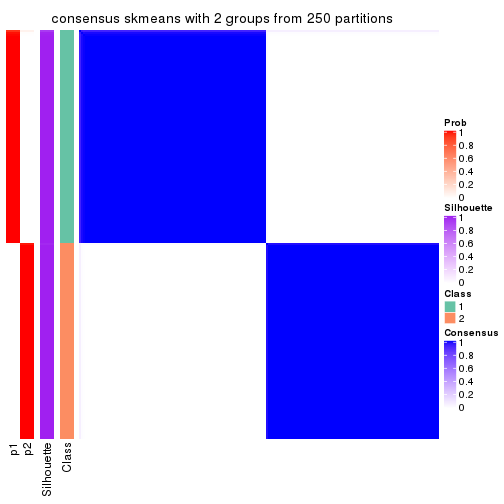</p>

</div>
<div id='tab-MAD-skmeans-consensus-heatmap-2'>
<pre><code class="r">consensus_heatmap(res, k = 3)
</code></pre>

<p>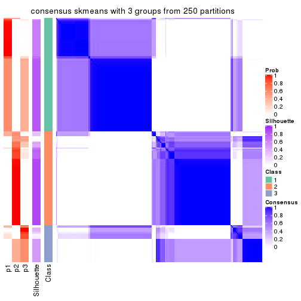</p>

</div>
<div id='tab-MAD-skmeans-consensus-heatmap-3'>
<pre><code class="r">consensus_heatmap(res, k = 4)
</code></pre>

<p>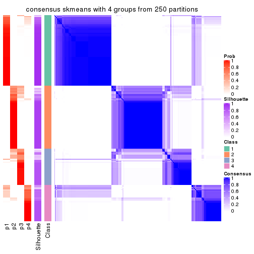</p>

</div>
<div id='tab-MAD-skmeans-consensus-heatmap-4'>
<pre><code class="r">consensus_heatmap(res, k = 5)
</code></pre>

<p>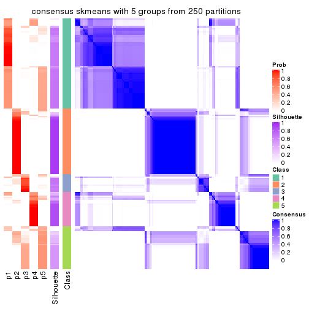</p>

</div>
<div id='tab-MAD-skmeans-consensus-heatmap-5'>
<pre><code class="r">consensus_heatmap(res, k = 6)
</code></pre>

<p>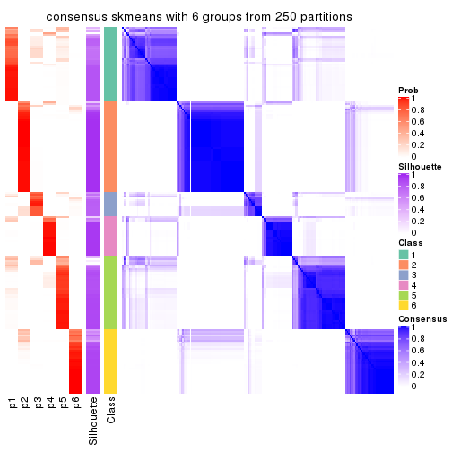</p>

</div>
</div>

Heatmaps for the membership of samples in all partitions to see how consistent they are:


<script>
$( function() {
	$( '#tabs-MAD-skmeans-membership-heatmap' ).tabs();
} );
</script>
<div id='tabs-MAD-skmeans-membership-heatmap'>
<ul>
<li><a href='#tab-MAD-skmeans-membership-heatmap-1'>k = 2</a></li>
<li><a href='#tab-MAD-skmeans-membership-heatmap-2'>k = 3</a></li>
<li><a href='#tab-MAD-skmeans-membership-heatmap-3'>k = 4</a></li>
<li><a href='#tab-MAD-skmeans-membership-heatmap-4'>k = 5</a></li>
<li><a href='#tab-MAD-skmeans-membership-heatmap-5'>k = 6</a></li>
</ul>
<div id='tab-MAD-skmeans-membership-heatmap-1'>
<pre><code class="r">membership_heatmap(res, k = 2)
</code></pre>

<p>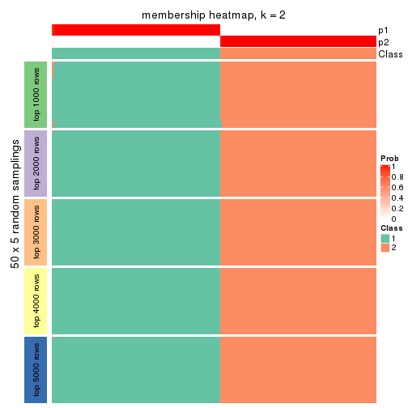</p>

</div>
<div id='tab-MAD-skmeans-membership-heatmap-2'>
<pre><code class="r">membership_heatmap(res, k = 3)
</code></pre>

<p>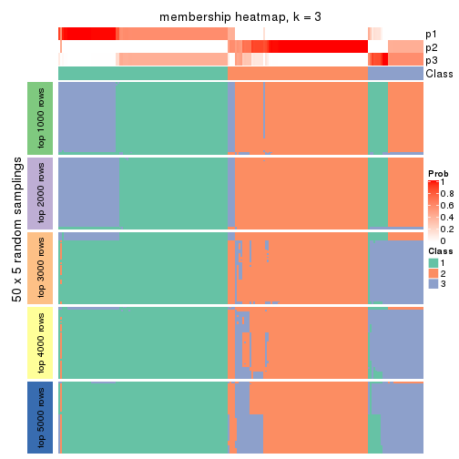</p>

</div>
<div id='tab-MAD-skmeans-membership-heatmap-3'>
<pre><code class="r">membership_heatmap(res, k = 4)
</code></pre>

<p>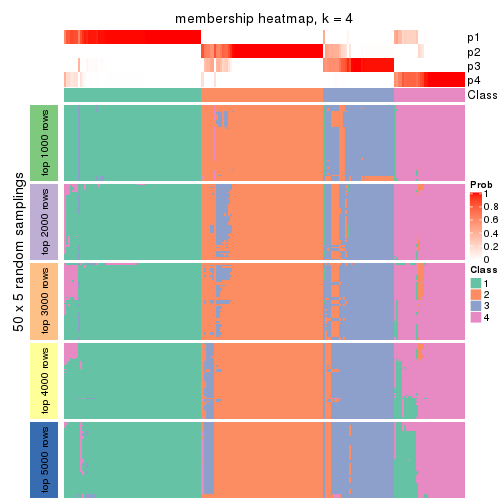</p>

</div>
<div id='tab-MAD-skmeans-membership-heatmap-4'>
<pre><code class="r">membership_heatmap(res, k = 5)
</code></pre>

<p>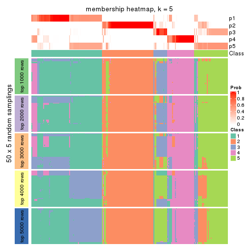</p>

</div>
<div id='tab-MAD-skmeans-membership-heatmap-5'>
<pre><code class="r">membership_heatmap(res, k = 6)
</code></pre>

<p>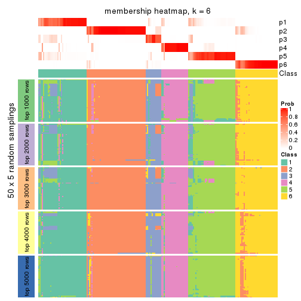</p>

</div>
</div>

As soon as we have had the classes for columns, we can look for signatures
which are significantly different between classes which can be candidate marks
for certain classes. Following are the heatmaps for signatures.


Signature heatmaps where rows are scaled:


<script>
$( function() {
	$( '#tabs-MAD-skmeans-get-signatures' ).tabs();
} );
</script>
<div id='tabs-MAD-skmeans-get-signatures'>
<ul>
<li><a href='#tab-MAD-skmeans-get-signatures-1'>k = 2</a></li>
<li><a href='#tab-MAD-skmeans-get-signatures-2'>k = 3</a></li>
<li><a href='#tab-MAD-skmeans-get-signatures-3'>k = 4</a></li>
<li><a href='#tab-MAD-skmeans-get-signatures-4'>k = 5</a></li>
<li><a href='#tab-MAD-skmeans-get-signatures-5'>k = 6</a></li>
</ul>
<div id='tab-MAD-skmeans-get-signatures-1'>
<pre><code class="r">get_signatures(res, k = 2)
</code></pre>

<p>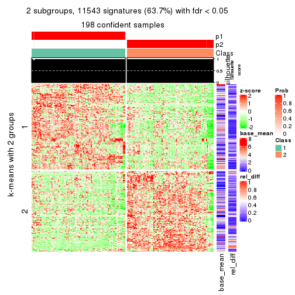</p>

</div>
<div id='tab-MAD-skmeans-get-signatures-2'>
<pre><code class="r">get_signatures(res, k = 3)
</code></pre>

<p>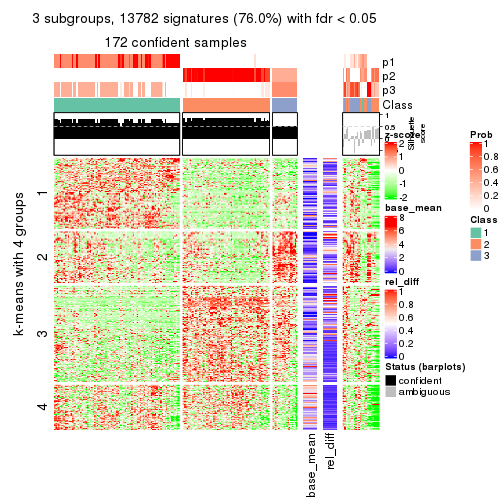</p>

</div>
<div id='tab-MAD-skmeans-get-signatures-3'>
<pre><code class="r">get_signatures(res, k = 4)
</code></pre>

<p>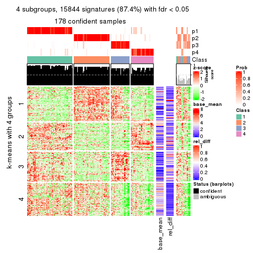</p>

</div>
<div id='tab-MAD-skmeans-get-signatures-4'>
<pre><code class="r">get_signatures(res, k = 5)
</code></pre>

<p>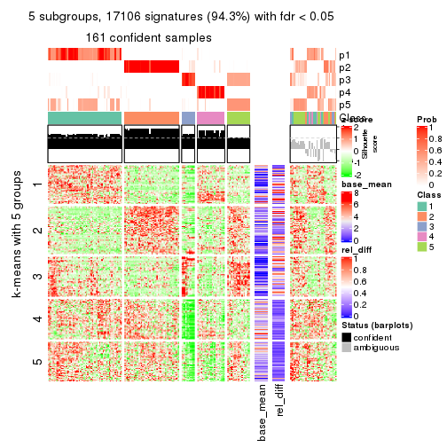</p>

</div>
<div id='tab-MAD-skmeans-get-signatures-5'>
<pre><code class="r">get_signatures(res, k = 6)
</code></pre>

<p>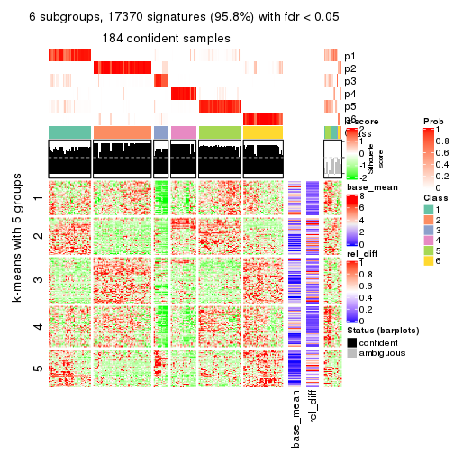</p>

</div>
</div>


Signature heatmaps where rows are not scaled:


<script>
$( function() {
	$( '#tabs-MAD-skmeans-get-signatures-no-scale' ).tabs();
} );
</script>
<div id='tabs-MAD-skmeans-get-signatures-no-scale'>
<ul>
<li><a href='#tab-MAD-skmeans-get-signatures-no-scale-1'>k = 2</a></li>
<li><a href='#tab-MAD-skmeans-get-signatures-no-scale-2'>k = 3</a></li>
<li><a href='#tab-MAD-skmeans-get-signatures-no-scale-3'>k = 4</a></li>
<li><a href='#tab-MAD-skmeans-get-signatures-no-scale-4'>k = 5</a></li>
<li><a href='#tab-MAD-skmeans-get-signatures-no-scale-5'>k = 6</a></li>
</ul>
<div id='tab-MAD-skmeans-get-signatures-no-scale-1'>
<pre><code class="r">get_signatures(res, k = 2, scale_rows = FALSE)
</code></pre>

<p>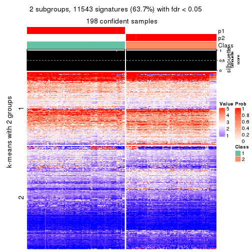</p>

</div>
<div id='tab-MAD-skmeans-get-signatures-no-scale-2'>
<pre><code class="r">get_signatures(res, k = 3, scale_rows = FALSE)
</code></pre>

<p>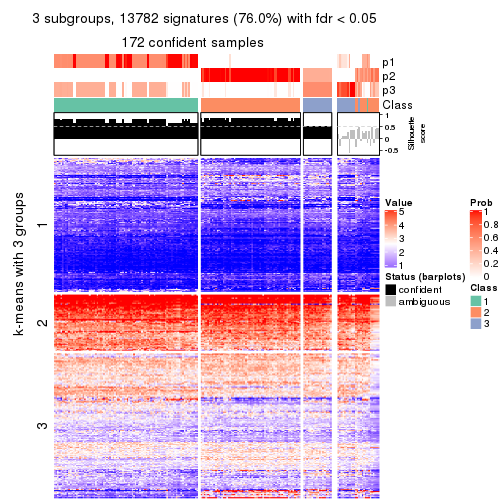</p>

</div>
<div id='tab-MAD-skmeans-get-signatures-no-scale-3'>
<pre><code class="r">get_signatures(res, k = 4, scale_rows = FALSE)
</code></pre>

<p>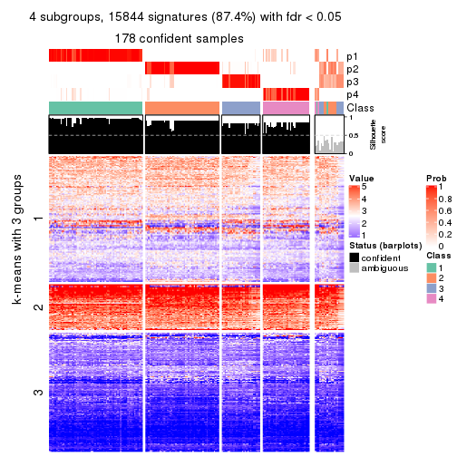</p>

</div>
<div id='tab-MAD-skmeans-get-signatures-no-scale-4'>
<pre><code class="r">get_signatures(res, k = 5, scale_rows = FALSE)
</code></pre>

<p>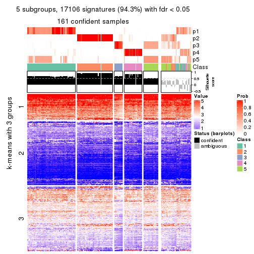</p>

</div>
<div id='tab-MAD-skmeans-get-signatures-no-scale-5'>
<pre><code class="r">get_signatures(res, k = 6, scale_rows = FALSE)
</code></pre>

<p>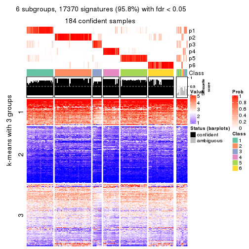</p>

</div>
</div>


Compare the overlap of signatures from different k:

```r
compare_signatures(res)
```

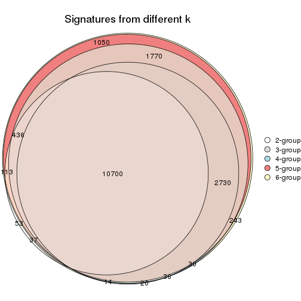

`get_signature()` returns a data frame invisibly. TO get the list of signatures, the function
call should be assigned to a variable explicitly. In following code, if `plot` argument is set
to `FALSE`, no heatmap is plotted while only the differential analysis is performed.

```r
# code only for demonstration
tb = get_signature(res, k = ..., plot = FALSE)
```

An example of the output of `tb` is:

```
#>   which_row         fdr    mean_1    mean_2 scaled_mean_1 scaled_mean_2 km
#> 1        38 0.042760348  8.373488  9.131774    -0.5533452     0.5164555  1
#> 2        40 0.018707592  7.106213  8.469186    -0.6173731     0.5762149  1
#> 3        55 0.019134737 10.221463 11.207825    -0.6159697     0.5749050  1
#> 4        59 0.006059896  5.921854  7.869574    -0.6899429     0.6439467  1
#> 5        60 0.018055526  8.928898 10.211722    -0.6204761     0.5791110  1
#> 6        98 0.009384629 15.714769 14.887706     0.6635654    -0.6193277  2
...
```

The columns in `tb` are:

1. `which_row`: row indices corresponding to the input matrix.
2. `fdr`: FDR for the differential test. 
3. `mean_x`: The mean value in group x.
4. `scaled_mean_x`: The mean value in group x after rows are scaled.
5. `km`: Row groups if k-means clustering is applied to rows.


UMAP plot which shows how samples are separated.


<script>
$( function() {
	$( '#tabs-MAD-skmeans-dimension-reduction' ).tabs();
} );
</script>
<div id='tabs-MAD-skmeans-dimension-reduction'>
<ul>
<li><a href='#tab-MAD-skmeans-dimension-reduction-1'>k = 2</a></li>
<li><a href='#tab-MAD-skmeans-dimension-reduction-2'>k = 3</a></li>
<li><a href='#tab-MAD-skmeans-dimension-reduction-3'>k = 4</a></li>
<li><a href='#tab-MAD-skmeans-dimension-reduction-4'>k = 5</a></li>
<li><a href='#tab-MAD-skmeans-dimension-reduction-5'>k = 6</a></li>
</ul>
<div id='tab-MAD-skmeans-dimension-reduction-1'>
<pre><code class="r">dimension_reduction(res, k = 2, method = &quot;UMAP&quot;)
</code></pre>

<p></p>

</div>
<div id='tab-MAD-skmeans-dimension-reduction-2'>
<pre><code class="r">dimension_reduction(res, k = 3, method = &quot;UMAP&quot;)
</code></pre>

<p>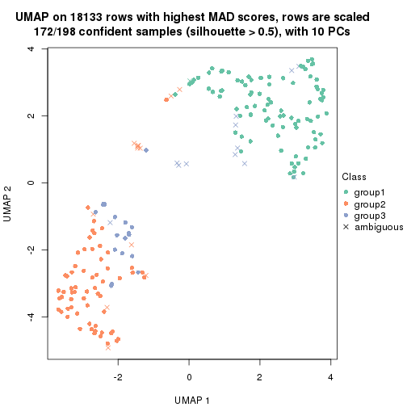</p>

</div>
<div id='tab-MAD-skmeans-dimension-reduction-3'>
<pre><code class="r">dimension_reduction(res, k = 4, method = &quot;UMAP&quot;)
</code></pre>

<p>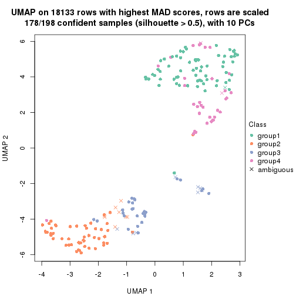</p>

</div>
<div id='tab-MAD-skmeans-dimension-reduction-4'>
<pre><code class="r">dimension_reduction(res, k = 5, method = &quot;UMAP&quot;)
</code></pre>

<p>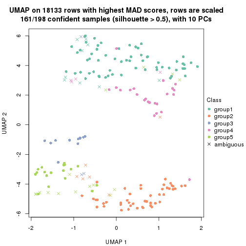</p>

</div>
<div id='tab-MAD-skmeans-dimension-reduction-5'>
<pre><code class="r">dimension_reduction(res, k = 6, method = &quot;UMAP&quot;)
</code></pre>

<p>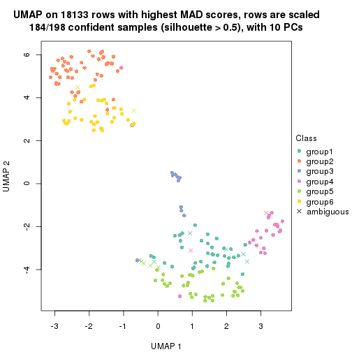</p>

</div>
</div>


Following heatmap shows how subgroups are split when increasing `k`:

```r
collect_classes(res)
```

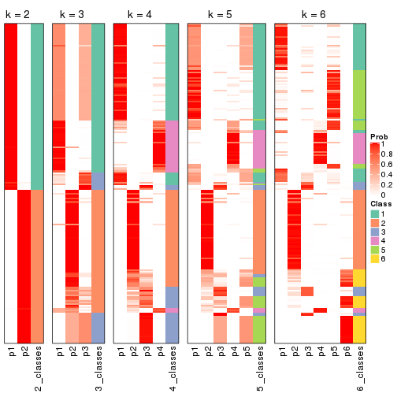


If matrix rows can be associated to genes, consider to use `functional_enrichment(res,
...)` to perform function enrichment for the signature genes. See [this vignette](http://bioconductor.org/packages/devel/bioc/vignettes/cola/inst/doc/functional_enrichment.html) for more detailed explanations.


 

---------------------------------------------------


### MAD:pam**


The object with results only for a single top-value method and a single partition method 
can be extracted as:

```r
res = res_list["MAD", "pam"]
# you can also extract it by
# res = res_list["MAD:pam"]
```

A summary of `res` and all the functions that can be applied to it:

```r
res
```

```
#> A 'ConsensusPartition' object with k = 2, 3, 4, 5, 6.
#>   On a matrix with 18133 rows and 198 columns.
#>   Top rows (1000, 2000, 3000, 4000, 5000) are extracted by 'MAD' method.
#>   Subgroups are detected by 'pam' method.
#>   Performed in total 1250 partitions by row resampling.
#>   Best k for subgroups seems to be 2.
#> 
#> Following methods can be applied to this 'ConsensusPartition' object:
#>  [1] "cola_report"             "collect_classes"         "collect_plots"          
#>  [4] "collect_stats"           "colnames"                "compare_signatures"     
#>  [7] "consensus_heatmap"       "dimension_reduction"     "functional_enrichment"  
#> [10] "get_anno_col"            "get_anno"                "get_classes"            
#> [13] "get_consensus"           "get_matrix"              "get_membership"         
#> [16] "get_param"               "get_signatures"          "get_stats"              
#> [19] "is_best_k"               "is_stable_k"             "membership_heatmap"     
#> [22] "ncol"                    "nrow"                    "plot_ecdf"              
#> [25] "rownames"                "select_partition_number" "show"                   
#> [28] "suggest_best_k"          "test_to_known_factors"
```

`collect_plots()` function collects all the plots made from `res` for all `k` (number of partitions)
into one single page to provide an easy and fast comparison between different `k`.

```r
collect_plots(res)
```

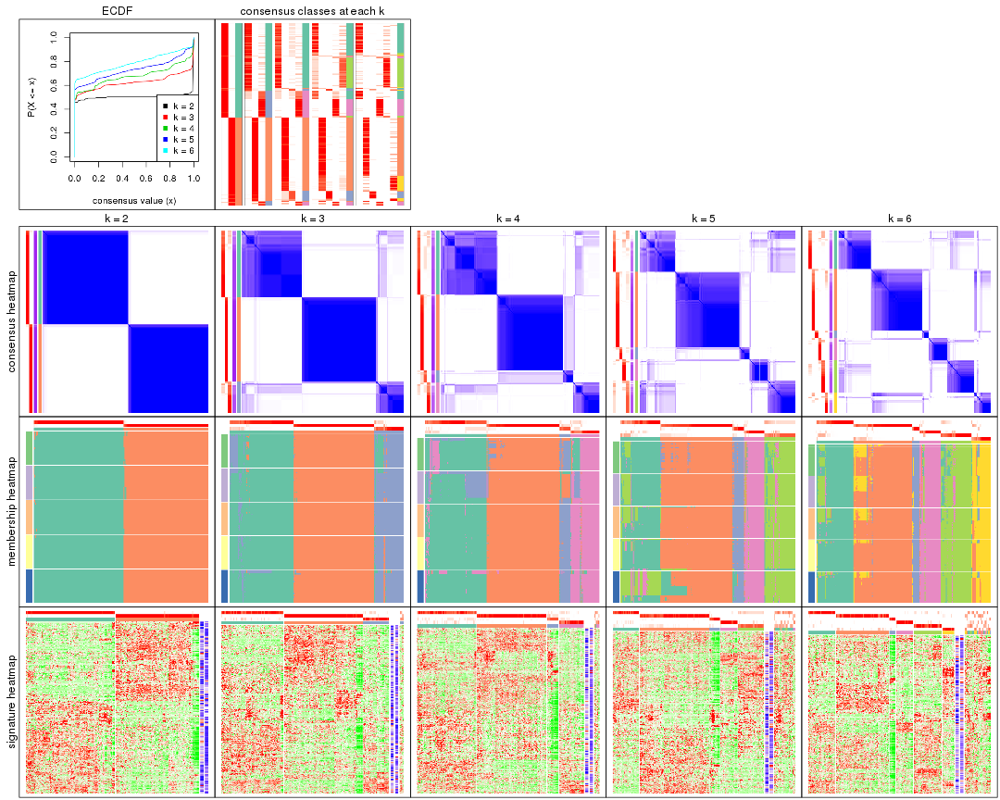

The plots are:

- The first row: a plot of the ECDF (empirical cumulative distribution
  function) curves of the consensus matrix for each `k` and the heatmap of
  predicted classes for each `k`.
- The second row: heatmaps of the consensus matrix for each `k`.
- The third row: heatmaps of the membership matrix for each `k`.
- The fouth row: heatmaps of the signatures for each `k`.

All the plots in panels can be made by individual functions and they are
plotted later in this section.

`select_partition_number()` produces several plots showing different
statistics for choosing "optimized" `k`. There are following statistics:

- ECDF curves of the consensus matrix for each `k`;
- 1-PAC. [The PAC
  score](https://en.wikipedia.org/wiki/Consensus_clustering#Over-interpretation_potential_of_consensus_clustering)
  measures the proportion of the ambiguous subgrouping.
- Mean silhouette score.
- Concordance. The mean probability of fiting the consensus class ids in all
  partitions.
- Area increased. Denote $A_k$ as the area under the ECDF curve for current
  `k`, the area increased is defined as $A_k - A_{k-1}$.
- Rand index. The percent of pairs of samples that are both in a same cluster
  or both are not in a same cluster in the partition of k and k-1.
- Jaccard index. The ratio of pairs of samples are both in a same cluster in
  the partition of k and k-1 and the pairs of samples are both in a same
  cluster in the partition k or k-1.

The detailed explanations of these statistics can be found in [the _cola_
vignette](http://bioconductor.org/packages/devel/bioc/vignettes/cola/inst/doc/cola.html#toc_13).

Generally speaking, lower PAC score, higher mean silhouette score or higher
concordance corresponds to better partition. Rand index and Jaccard index
measure how similar the current partition is compared to partition with `k-1`.
If they are too similar, we won't accept `k` is better than `k-1`.

```r
select_partition_number(res)
```

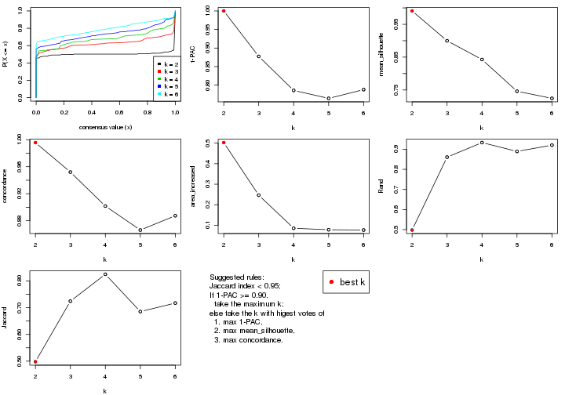

The numeric values for all these statistics can be obtained by `get_stats()`.

```r
get_stats(res)
```

```
#>   k 1-PAC mean_silhouette concordance area_increased  Rand Jaccard
#> 2 2 1.000           0.991       0.996         0.5025 0.498   0.498
#> 3 3 0.877           0.900       0.952         0.2464 0.861   0.724
#> 4 4 0.786           0.843       0.902         0.0855 0.933   0.825
#> 5 5 0.764           0.746       0.866         0.0782 0.889   0.685
#> 6 6 0.788           0.724       0.887         0.0767 0.920   0.717
```

`suggest_best_k()` suggests the best $k$ based on these statistics. The rules are as follows:

- All $k$ with Jaccard index larger than 0.95 are removed because increasing
  $k$ does not provide enough extra information. If all $k$ are removed, it is
  marked as no subgroup is detected.
- For all $k$ with 1-PAC score larger than 0.9, the maximal $k$ is taken as
  the best $k$, and other $k$ are marked as optional $k$.
- If it does not fit the second rule. The $k$ with the maximal vote of the
  highest 1-PAC score, highest mean silhouette, and highest concordance is
  taken as the best $k$.

```r
suggest_best_k(res)
```

```
#> [1] 2
```


Following shows the table of the partitions (You need to click the **show/hide
code output** link to see it). The membership matrix (columns with name `p*`)
is inferred by
[`clue::cl_consensus()`](https://www.rdocumentation.org/link/cl_consensus?package=clue)
function with the `SE` method. Basically the value in the membership matrix
represents the probability to belong to a certain group. The finall class
label for an item is determined with the group with highest probability it
belongs to.

In `get_classes()` function, the entropy is calculated from the membership
matrix and the silhouette score is calculated from the consensus matrix.


<script>
$( function() {
	$( '#tabs-MAD-pam-get-classes' ).tabs();
} );
</script>
<div id='tabs-MAD-pam-get-classes'>
<ul>
<li><a href='#tab-MAD-pam-get-classes-1'>k = 2</a></li>
<li><a href='#tab-MAD-pam-get-classes-2'>k = 3</a></li>
<li><a href='#tab-MAD-pam-get-classes-3'>k = 4</a></li>
<li><a href='#tab-MAD-pam-get-classes-4'>k = 5</a></li>
<li><a href='#tab-MAD-pam-get-classes-5'>k = 6</a></li>
</ul>

<div id='tab-MAD-pam-get-classes-1'>
<p><a id='tab-MAD-pam-get-classes-1-a' style='color:#0366d6' href='#'>show/hide code output</a></p>
<pre><code class="r">cbind(get_classes(res, k = 2), get_membership(res, k = 2))
</code></pre>

<pre><code>#&gt;                                      class entropy silhouette    p1    p2
#&gt; 0C0AA0B2-5191-4EDF-8937-ED7434F30283     2  0.0000      0.995 0.000 1.000
#&gt; 18B45F1F-234F-45CC-A234-145307606C5C     1  0.0000      0.996 1.000 0.000
#&gt; E18B70C0-BDCA-46D3-99BB-C6C8ABC68DA5     2  0.0000      0.995 0.000 1.000
#&gt; 0F6DDBA7-6F74-45E8-95C8-F28263D55978     1  0.0000      0.996 1.000 0.000
#&gt; 7EAE1A5A-129A-46DE-977E-A2C753F10904     2  0.0000      0.995 0.000 1.000
#&gt; 7EAE0048-16B5-4979-9410-16CDEB9B1A48     1  0.0000      0.996 1.000 0.000
#&gt; 2EBFC828-2B27-4753-A052-80DDA226DAB4     2  0.0000      0.995 0.000 1.000
#&gt; 24E1768D-2232-41DA-9383-BC55D6EB3812     2  0.0000      0.995 0.000 1.000
#&gt; 6E3CD60A-1889-4CA3-B305-2E78152057B5     2  0.0000      0.995 0.000 1.000
#&gt; 33CC70DD-82B3-413C-B3B1-BE06634D95D0     1  0.0000      0.996 1.000 0.000
#&gt; F1CB57A3-55DD-4487-9307-1B4F652E729A     1  0.0000      0.996 1.000 0.000
#&gt; 755A5806-B054-449A-93DB-79909E6C93A1     1  0.0000      0.996 1.000 0.000
#&gt; 58D364E7-3D2F-468F-A264-D6461E2428D4     2  0.0000      0.995 0.000 1.000
#&gt; 68BB9CB6-7AA2-4981-B9D9-07363EC96599     2  0.0000      0.995 0.000 1.000
#&gt; 3C4E8DFA-8EA0-4F1F-89CB-CB8805395872     2  0.0000      0.995 0.000 1.000
#&gt; 4219651D-5583-4498-BF08-1B7D04B4C7B2     1  0.0000      0.996 1.000 0.000
#&gt; B5EE2768-0D67-4584-ADBC-EC745FEC52EA     2  0.0000      0.995 0.000 1.000
#&gt; 825E6C11-F460-451A-8045-846DD7D0E945     1  0.0000      0.996 1.000 0.000
#&gt; 491F62AF-5E68-43C3-982A-F867A75BBA9A     2  0.0000      0.995 0.000 1.000
#&gt; 9D7F058C-F95A-44AD-AC9E-450F7FBDC960     2  0.0000      0.995 0.000 1.000
#&gt; 6D42DD0C-2081-4742-BA27-9F5F16FAC3C6     1  0.0000      0.996 1.000 0.000
#&gt; EDD7E63D-492A-473B-A552-0764337B10EF     2  0.0000      0.995 0.000 1.000
#&gt; 97073DEA-73AD-4DFD-BD1A-9035DC03445B     1  0.0000      0.996 1.000 0.000
#&gt; FA891AB9-CE38-4F7E-A015-1DDCE12890A0     1  0.0000      0.996 1.000 0.000
#&gt; D9514D49-A0AE-45AB-8C9F-68E726215253     1  0.0000      0.996 1.000 0.000
#&gt; 3B9229AD-12E5-451E-9D2F-378AAC82C04A     2  0.0000      0.995 0.000 1.000
#&gt; 5EA36B71-4917-4EF3-9060-065EFE6ACC5B     1  0.0000      0.996 1.000 0.000
#&gt; A20E4ECB-4895-4CC7-BE5E-4721B20D933B     1  0.0000      0.996 1.000 0.000
#&gt; 1BE8D828-29DB-4368-AA4A-FB23588F7AE8     1  0.0000      0.996 1.000 0.000
#&gt; 66EFEFCF-3D14-4DBF-AA13-530F40ED0245     1  0.6623      0.794 0.828 0.172
#&gt; 55DFFE53-BCE7-4EC1-9863-6C0311B06BA2     2  0.0000      0.995 0.000 1.000
#&gt; 4CC3FB5A-611D-4C64-AE9D-544FA45CF4DC     1  0.0000      0.996 1.000 0.000
#&gt; C11D33F2-DFE9-4FA8-9024-F3E7F1DADC5F     2  0.0000      0.995 0.000 1.000
#&gt; FA5932B8-8AA3-4C38-9FAB-C35D8772974D     1  0.0000      0.996 1.000 0.000
#&gt; 8216EC35-1F41-4A15-B503-BDA4971E27C9     1  0.0000      0.996 1.000 0.000
#&gt; 69635D23-90A7-4BAD-97C7-B79536837F57     1  0.0000      0.996 1.000 0.000
#&gt; 12B404E2-C463-4409-8392-E4649B2AFFD1     2  0.0000      0.995 0.000 1.000
#&gt; 246927E3-ACCF-41B2-AA8E-43855FD6B146     2  0.0000      0.995 0.000 1.000
#&gt; E0CC13E7-9607-49E0-B4AA-395544E3C3BF     1  0.0000      0.996 1.000 0.000
#&gt; F7BBC0C1-6124-4A83-8A70-EA89B62F1CBD     1  0.0000      0.996 1.000 0.000
#&gt; B1D4FF24-8E6F-4A04-B716-2032D850EB57     1  0.0000      0.996 1.000 0.000
#&gt; 253601DB-B78A-4566-9947-8C0270C0B163     2  0.0000      0.995 0.000 1.000
#&gt; AB83DBFF-5737-4FB8-A5AC-1D3CD6072BDF     2  0.4939      0.879 0.108 0.892
#&gt; 9D67D953-EC98-4B72-89C8-5732BC9D4BC9     2  0.0000      0.995 0.000 1.000
#&gt; 51061018-95AB-4278-886F-F69E4EBC47C0     2  0.0000      0.995 0.000 1.000
#&gt; ABD0F7F3-105B-4DEE-9889-5028772C519A     1  0.0000      0.996 1.000 0.000
#&gt; 562B95CF-B27E-4A72-B7C6-CDF86A51A39B     1  0.0000      0.996 1.000 0.000
#&gt; ABF046A4-D7A1-49FF-B6B1-4E07A791DEDB     2  0.0000      0.995 0.000 1.000
#&gt; 3FF4101E-9703-460E-A30E-76CC7689F36D     2  0.0000      0.995 0.000 1.000
#&gt; 39C4F7AA-7ADF-4F1D-BDA3-BEC605AC5023     2  0.0000      0.995 0.000 1.000
#&gt; CB821FD2-AF5C-4743-A70F-21C12C6ED153     1  0.0000      0.996 1.000 0.000
#&gt; 92EA1846-62FF-41D5-A441-5E52E6B9E7F9     1  0.0000      0.996 1.000 0.000
#&gt; 7D25F3EE-5A20-4763-8026-16A03D05F459     1  0.0000      0.996 1.000 0.000
#&gt; 8ECE5276-CD06-496B-A5A9-1713B1F7D089     1  0.0000      0.996 1.000 0.000
#&gt; C775B68F-9507-47E3-B507-B433AED79002     1  0.0000      0.996 1.000 0.000
#&gt; E19D5463-FDD0-41C1-A170-323736A88D07     2  0.0000      0.995 0.000 1.000
#&gt; CE4B6285-4961-4767-91F0-5C7A8162E185     1  0.0000      0.996 1.000 0.000
#&gt; 9637BD72-1FEF-42AD-8886-2C39BE876531     1  0.0000      0.996 1.000 0.000
#&gt; 81B5A88E-45A0-4B44-B689-B9071B8548EE     2  0.0000      0.995 0.000 1.000
#&gt; 0B01B4C9-9BED-4F5B-A3E2-8868C7CCC3FC     2  0.4161      0.908 0.084 0.916
#&gt; 54501315-7132-44B2-A179-10FBF1421105     1  0.0000      0.996 1.000 0.000
#&gt; E207CBE9-4C3A-4FDD-9251-CFE1FE106475     1  0.2778      0.949 0.952 0.048
#&gt; 3BEA0B92-3F90-4DBF-9679-AADEAD7D47C8     2  0.0000      0.995 0.000 1.000
#&gt; 35B32250-D854-4215-AA5B-2C11B2FBEECA     1  0.0000      0.996 1.000 0.000
#&gt; ACE6566B-AEB9-426C-924A-B382D14A1024     2  0.0000      0.995 0.000 1.000
#&gt; 737E69AC-0930-45B9-B6BA-7CE5E300290B     1  0.0000      0.996 1.000 0.000
#&gt; B4410AB8-D015-41CA-86E6-12EB4E4103E3     1  0.0000      0.996 1.000 0.000
#&gt; 6D3ECA65-C50F-43B0-B75A-1D290FA4A8FD     2  0.0000      0.995 0.000 1.000
#&gt; C86F40D3-9A96-4395-A8C3-510DE12F9A2B     2  0.0000      0.995 0.000 1.000
#&gt; 6238087F-24DD-4BF1-903F-3BD4E446C1AE     2  0.0000      0.995 0.000 1.000
#&gt; E4FF840B-EEAB-4CB0-A690-7D4C4AA7EEC3     2  0.0000      0.995 0.000 1.000
#&gt; 72D3C323-C67F-4C0E-9BFC-BF245FF9730A     1  0.0000      0.996 1.000 0.000
#&gt; 82D56E4E-4DF6-4F3E-8959-B995C92AAA70     1  0.0000      0.996 1.000 0.000
#&gt; E31CA441-EB19-443B-ACBD-37B5CCBCF0E5     2  0.0000      0.995 0.000 1.000
#&gt; 87CA8939-D054-4B8A-B32D-085FD2E8F202     1  0.0000      0.996 1.000 0.000
#&gt; 2A508D90-FEDC-46A3-9A02-E51E5467CDCB     1  0.0000      0.996 1.000 0.000
#&gt; C4E8B4E2-388B-411F-BF0A-9B6F34E8EDB5     2  0.0000      0.995 0.000 1.000
#&gt; AF6AF803-BD93-44A7-AA80-B9BC92C1273B     2  0.0000      0.995 0.000 1.000
#&gt; 0B1CA5CF-EB96-41D4-BFC5-6957FEB39828     1  0.0000      0.996 1.000 0.000
#&gt; 6FB96FB0-6661-48AD-A4A0-69F8AFDBE591     2  0.0000      0.995 0.000 1.000
#&gt; 8C19F7FD-368A-462B-B28F-88D6630038A1     1  0.0000      0.996 1.000 0.000
#&gt; 96EABE78-C2F4-4A33-ACD8-C922A4B2519B     2  0.0000      0.995 0.000 1.000
#&gt; 68B36D7B-546A-4689-949F-B207C4A4AB27     2  0.0000      0.995 0.000 1.000
#&gt; CE9F3335-778F-4F52-BC55-4B7C99B211DD     2  0.0000      0.995 0.000 1.000
#&gt; CB359DED-2A2D-4646-A0BD-6F10ADCC532B     1  0.0000      0.996 1.000 0.000
#&gt; 198324A5-8C52-46F6-9734-EFAF1CCA6D9B     1  0.0000      0.996 1.000 0.000
#&gt; 83B88608-0506-428C-B9E8-621F38477B42     1  0.0000      0.996 1.000 0.000
#&gt; 1993630A-0F3D-4F5C-86A3-D443BAAF57F0     2  0.8386      0.637 0.268 0.732
#&gt; DE73DA9B-529E-4F4F-A65C-DA7AB84B1096     1  0.0000      0.996 1.000 0.000
#&gt; 2347F3B7-DDA3-40C0-B6D4-8819ECA69146     1  0.0000      0.996 1.000 0.000
#&gt; AB93B5D5-095F-4330-9D40-6A3D934AB50C     1  0.0000      0.996 1.000 0.000
#&gt; 5EBBE4AD-FF0C-41CF-9EA3-B6FE7EA1F9C0     1  0.1633      0.974 0.976 0.024
#&gt; 6D960AE7-3769-4144-A061-E8588E5063FF     1  0.0000      0.996 1.000 0.000
#&gt; 0C2DD8C0-D1A5-4192-A49C-7A40FED628B2     2  0.0000      0.995 0.000 1.000
#&gt; 18C9372F-C55B-4F86-A9D2-E8D85EFC8566     2  0.1843      0.968 0.028 0.972
#&gt; 9AF637B0-4C32-4DD1-93AF-7655B4A845D3     2  0.0000      0.995 0.000 1.000
#&gt; 785B5B06-4115-46FD-9BEB-F888AFDC855D     2  0.0000      0.995 0.000 1.000
#&gt; ECA3050E-4BE2-4117-B9CF-A52BB85AF8C2     2  0.0000      0.995 0.000 1.000
#&gt; 099DC396-16A5-458F-9ED9-F2A790CB0C34     1  0.0000      0.996 1.000 0.000
#&gt; 7A5A12EE-C5B0-4C51-8C99-0F3FA88D633E     1  0.0000      0.996 1.000 0.000
#&gt; E832B508-A66D-4817-B44A-FE9FAAE64B4A     1  0.0000      0.996 1.000 0.000
#&gt; F9DD688C-7B35-49E7-9651-2E098EE78856     1  0.0000      0.996 1.000 0.000
#&gt; F1265DD8-5ED3-4635-A277-57BBFDEC7729     1  0.0000      0.996 1.000 0.000
#&gt; F624E8D9-DB07-4C9E-910D-5E8EBA3A6167     2  0.0000      0.995 0.000 1.000
#&gt; 3516FBDF-66E1-43F4-9D7B-16748F6439A7     2  0.0000      0.995 0.000 1.000
#&gt; 04B12992-B2EA-4BA2-8E2C-11E34E230E6F     2  0.0000      0.995 0.000 1.000
#&gt; CC02897D-9123-495E-9242-5C9CF4EC269B     2  0.0000      0.995 0.000 1.000
#&gt; 3117ED46-2BF2-4311-BC00-4E98243E16B3     1  0.0000      0.996 1.000 0.000
#&gt; E0B66D53-23DB-4E26-BB6E-F692FA8C000E     1  0.0000      0.996 1.000 0.000
#&gt; DAA93CE5-A013-477A-9A50-EA09CC3A8162     2  0.0000      0.995 0.000 1.000
#&gt; 0099098D-354A-4276-92F8-B932C74B4608     1  0.0000      0.996 1.000 0.000
#&gt; DD483639-B2E7-4745-BCFB-55ED1D82BFBF     2  0.0000      0.995 0.000 1.000
#&gt; 2C1F9079-602E-4252-82C7-9D8799E04246     2  0.0000      0.995 0.000 1.000
#&gt; 9473A8E4-3A1B-4184-9EA6-517AFD60B635     1  0.0000      0.996 1.000 0.000
#&gt; 75CFBAF6-7BA0-40AF-92D7-D218E885BD1B     2  0.0000      0.995 0.000 1.000
#&gt; B588950F-14D6-41C8-845B-EFD2096013C6     2  0.0000      0.995 0.000 1.000
#&gt; 0DF3EDA8-DAEA-4721-92AB-B97181249498     2  0.0000      0.995 0.000 1.000
#&gt; 8EA83042-D598-401D-AD78-936EEB136C59     1  0.0000      0.996 1.000 0.000
#&gt; 729AC418-3BE9-445A-95D4-AC11A7D43BE0     1  0.0000      0.996 1.000 0.000
#&gt; 7D8B1B11-F576-4AA8-BFA7-0022A2CD829A     2  0.0000      0.995 0.000 1.000
#&gt; 304A0E46-3449-4B44-9C30-BDDF6459391D     1  0.0000      0.996 1.000 0.000
#&gt; 3C83358F-DF20-47F7-AF9F-AB7CC92F5ABA     1  0.0000      0.996 1.000 0.000
#&gt; EAFEED6C-35C3-451F-AE4A-EB56992E1F29     1  0.0000      0.996 1.000 0.000
#&gt; 8A237A65-28EC-434D-A78A-A8B7308B5204     1  0.0000      0.996 1.000 0.000
#&gt; D005833F-E991-4E9E-9667-55F137288004     1  0.0000      0.996 1.000 0.000
#&gt; 37D966E3-253E-4397-A9AE-0903A8D31FE6     1  0.0000      0.996 1.000 0.000
#&gt; D2482B81-CB5B-4178-BA8D-1CF4026181B5     1  0.0000      0.996 1.000 0.000
#&gt; 18019E95-C2A8-4EE7-B585-F6886DC4D953     2  0.0000      0.995 0.000 1.000
#&gt; 0B126D1A-14A8-4345-8F78-FF92222ADF4C     2  0.0000      0.995 0.000 1.000
#&gt; CE88B625-47D8-4D58-9FB4-23464DB7DDAD     2  0.0000      0.995 0.000 1.000
#&gt; 9A88299D-5C74-47FA-B42C-1A1D6D935AAB     1  0.0000      0.996 1.000 0.000
#&gt; 3E71159C-FD6C-41DA-B18B-0730C8AC7E41     1  0.0000      0.996 1.000 0.000
#&gt; 6F245AA4-79D9-47E1-BCC9-1AAF65AEA813     1  0.0000      0.996 1.000 0.000
#&gt; 4CF2C888-2100-483A-B4DB-ECBB69243A4D     2  0.0000      0.995 0.000 1.000
#&gt; A3853813-B9D5-4E8C-B075-19FCC35F8686     2  0.0000      0.995 0.000 1.000
#&gt; 83A16DEE-CE9F-4D8B-9225-0A2A8B9D055D     1  0.0000      0.996 1.000 0.000
#&gt; 0F057CAF-4F9A-4DE9-8601-730E96873733     2  0.0000      0.995 0.000 1.000
#&gt; 32D5801D-DBA4-422E-87CB-A2DDE921BA41     1  0.0000      0.996 1.000 0.000
#&gt; 22EE8076-F07C-499A-9AF8-D800A77EF154     2  0.0000      0.995 0.000 1.000
#&gt; DD4BD74D-D48C-4090-9F57-5334E784581C     1  0.0000      0.996 1.000 0.000
#&gt; 41183565-434D-474C-B1BD-CA6E94910658     2  0.0000      0.995 0.000 1.000
#&gt; 75A2CE41-2B2A-4346-927E-ACF8A72738E4     1  0.0000      0.996 1.000 0.000
#&gt; 7AA24995-3DD2-4682-B36A-4EBFEEACF625     1  0.0000      0.996 1.000 0.000
#&gt; 8BAFDFEC-9F26-4ADB-95CE-004143960EEB     1  0.0000      0.996 1.000 0.000
#&gt; A330E011-CE08-4A85-8F4B-370592293DBB     1  0.0000      0.996 1.000 0.000
#&gt; 1D5A5B17-2E70-4BB0-94A1-EC17E6EA49DB     1  0.0000      0.996 1.000 0.000
#&gt; BD9143B8-9D97-4A05-872C-3FB82B4CF7BE     2  0.0000      0.995 0.000 1.000
#&gt; 64552DC0-181E-4607-898C-787AA7F26435     2  0.0000      0.995 0.000 1.000
#&gt; 1B4C4D41-34C7-43A3-858B-C9552EB53894     1  0.0000      0.996 1.000 0.000
#&gt; 463A3BAA-02DC-4EA4-A644-B924163E425D     2  0.0000      0.995 0.000 1.000
#&gt; CD0FEA89-6F60-4A20-8FCA-D397B4E95A98     1  0.0000      0.996 1.000 0.000
#&gt; 5D06CF6D-F4B9-4B32-B055-8AB287E53340     2  0.0000      0.995 0.000 1.000
#&gt; ADA7835F-DB67-4F4F-9446-8BCE3C5FE936     2  0.0000      0.995 0.000 1.000
#&gt; 4109BE2D-B5DF-4BD7-860E-60D87F647152     2  0.0000      0.995 0.000 1.000
#&gt; 88526A0E-6DFE-46CB-BFAD-B4826F482C67     1  0.0000      0.996 1.000 0.000
#&gt; F39F9A4C-18F7-4017-AB31-85D52FF44587     2  0.0000      0.995 0.000 1.000
#&gt; D4290A5E-1B24-4C55-B470-0FA7A0A09DD0     2  0.0000      0.995 0.000 1.000
#&gt; DC5A2C9E-978F-4661-B729-1F9662976E27     1  0.0000      0.996 1.000 0.000
#&gt; 26A1F392-CED2-43E3-8096-74E6F2BFC8C0     2  0.0000      0.995 0.000 1.000
#&gt; 87D81FB2-306A-4E75-9D58-D5F48E46E7F6     2  0.0000      0.995 0.000 1.000
#&gt; E3D9D81A-C20C-4B3B-B940-A5D2C5F65B22     2  0.0000      0.995 0.000 1.000
#&gt; 4464650B-453F-476C-989C-B7B159BF2CF0     2  0.0000      0.995 0.000 1.000
#&gt; 577D2867-B738-487A-9B06-07958D647F02     1  0.0000      0.996 1.000 0.000
#&gt; E52A22CC-3C03-41A9-9541-220DD871E162     2  0.0000      0.995 0.000 1.000
#&gt; 642703B1-AF99-4746-A915-0792F4B9590B     2  0.0000      0.995 0.000 1.000
#&gt; 8F0D1792-1284-45E6-8EC4-392596057677     2  0.0000      0.995 0.000 1.000
#&gt; 765AFFC1-D528-4494-8BA1-0706451E4205     2  0.0000      0.995 0.000 1.000
#&gt; A716BC29-161F-4CA0-B240-00B330137F2C     1  0.0000      0.996 1.000 0.000
#&gt; 32CBFBAF-7064-4595-8D54-2C5E7DE0FD9B     1  0.0000      0.996 1.000 0.000
#&gt; 4D6ED28C-3F20-41B0-BA41-1BF0E5199A40     2  0.0376      0.991 0.004 0.996
#&gt; 86A38456-2900-48FB-B10F-79222B3CA9BF     1  0.1843      0.970 0.972 0.028
#&gt; E870807D-3223-4A6A-9E3D-F4461B048AA2     2  0.0000      0.995 0.000 1.000
#&gt; 3A78D19F-A833-4D2C-8387-FB4FD4A8313C     1  0.0000      0.996 1.000 0.000
#&gt; DFA162CA-C708-4121-8E74-F9C4DEE0CDAE     1  0.0000      0.996 1.000 0.000
#&gt; C00A300A-CD10-4C9D-8C94-3901AFE8406C     2  0.0000      0.995 0.000 1.000
#&gt; 13E11D15-A90F-48C4-980A-DD032C00A2C1     1  0.0000      0.996 1.000 0.000
#&gt; 31BF80AB-FEDB-4C73-89C3-70BE9F9ACBEE     2  0.0000      0.995 0.000 1.000
#&gt; FA34308A-349D-4AAD-94CF-3F3B7F9AD629     2  0.0000      0.995 0.000 1.000
#&gt; 7C48D467-B663-49DD-BC84-A36BC32ACB3D     1  0.0000      0.996 1.000 0.000
#&gt; BB068534-04F6-4FC9-9087-CDA65920BCE2     1  0.0000      0.996 1.000 0.000
#&gt; EA4EC272-A9B3-4B2E-955F-19F7676A944C     2  0.0000      0.995 0.000 1.000
#&gt; C71FF69B-A460-43CA-8769-9667F22D938B     1  0.0000      0.996 1.000 0.000
#&gt; 5243D1B8-8168-4FF1-A8C6-505F080EF0D3     2  0.0000      0.995 0.000 1.000
#&gt; BCC474D8-08FE-4E99-B8E8-B29E65F84D2E     1  0.0000      0.996 1.000 0.000
#&gt; 04FDBFE3-4CF6-4E53-A2AA-89D5C9316377     2  0.0000      0.995 0.000 1.000
#&gt; 83A9915C-8D60-4CAE-A868-B61E3C90C7B0     2  0.0000      0.995 0.000 1.000
#&gt; 989A6472-E3E3-457A-97BE-CCE95F42D5C2     2  0.0000      0.995 0.000 1.000
#&gt; A0AB2D28-6751-49C9-8DF4-66FDBF95C360     1  0.0000      0.996 1.000 0.000
#&gt; A12B2683-18D4-41C9-8AE5-C143E2180052     1  0.0000      0.996 1.000 0.000
#&gt; 8DE1E245-CAD2-4F11-BFA2-9792C433A00B     1  0.4298      0.904 0.912 0.088
#&gt; FDA68036-6C4C-4256-9AA0-C01FE92AA098     2  0.0000      0.995 0.000 1.000
#&gt; 26311920-1414-4EC1-870B-784961EBCC2D     1  0.0000      0.996 1.000 0.000
#&gt; C29A10D6-D598-4286-B5E0-F1776E19E988     1  0.0000      0.996 1.000 0.000
#&gt; FACCC1FB-4937-4CC0-90EA-7F91D3D939CF     2  0.0000      0.995 0.000 1.000
#&gt; 90B9D84B-78E5-4C7E-8414-EC889C2DE8DB     2  0.0000      0.995 0.000 1.000
#&gt; B74E6122-76E1-4E4D-A867-BCAFD7277393     1  0.0000      0.996 1.000 0.000
#&gt; 98494DC0-CF6E-485F-8A0D-D80E4437EF5C     2  0.0000      0.995 0.000 1.000
#&gt; DA114DAC-DE7B-4E43-8D7C-82C5D7B66411     1  0.0000      0.996 1.000 0.000
</code></pre>

<script>
$('#tab-MAD-pam-get-classes-1-a').parent().next().next().hide();
$('#tab-MAD-pam-get-classes-1-a').click(function(){
  $('#tab-MAD-pam-get-classes-1-a').parent().next().next().toggle();
  return(false);
});
</script>
</div>

<div id='tab-MAD-pam-get-classes-2'>
<p><a id='tab-MAD-pam-get-classes-2-a' style='color:#0366d6' href='#'>show/hide code output</a></p>
<pre><code class="r">cbind(get_classes(res, k = 3), get_membership(res, k = 3))
</code></pre>

<pre><code>#&gt;                                      class entropy silhouette    p1    p2    p3
#&gt; 0C0AA0B2-5191-4EDF-8937-ED7434F30283     2  0.0000     0.9966 0.000 1.000 0.000
#&gt; 18B45F1F-234F-45CC-A234-145307606C5C     3  0.0000     0.8560 0.000 0.000 1.000
#&gt; E18B70C0-BDCA-46D3-99BB-C6C8ABC68DA5     2  0.0000     0.9966 0.000 1.000 0.000
#&gt; 0F6DDBA7-6F74-45E8-95C8-F28263D55978     1  0.0000     0.9183 1.000 0.000 0.000
#&gt; 7EAE1A5A-129A-46DE-977E-A2C753F10904     2  0.0000     0.9966 0.000 1.000 0.000
#&gt; 7EAE0048-16B5-4979-9410-16CDEB9B1A48     3  0.6308     0.1712 0.492 0.000 0.508
#&gt; 2EBFC828-2B27-4753-A052-80DDA226DAB4     2  0.0000     0.9966 0.000 1.000 0.000
#&gt; 24E1768D-2232-41DA-9383-BC55D6EB3812     2  0.0424     0.9893 0.000 0.992 0.008
#&gt; 6E3CD60A-1889-4CA3-B305-2E78152057B5     2  0.2959     0.8859 0.000 0.900 0.100
#&gt; 33CC70DD-82B3-413C-B3B1-BE06634D95D0     1  0.0000     0.9183 1.000 0.000 0.000
#&gt; F1CB57A3-55DD-4487-9307-1B4F652E729A     1  0.0000     0.9183 1.000 0.000 0.000
#&gt; 755A5806-B054-449A-93DB-79909E6C93A1     3  0.0892     0.8482 0.020 0.000 0.980
#&gt; 58D364E7-3D2F-468F-A264-D6461E2428D4     2  0.0000     0.9966 0.000 1.000 0.000
#&gt; 68BB9CB6-7AA2-4981-B9D9-07363EC96599     2  0.0000     0.9966 0.000 1.000 0.000
#&gt; 3C4E8DFA-8EA0-4F1F-89CB-CB8805395872     2  0.0000     0.9966 0.000 1.000 0.000
#&gt; 4219651D-5583-4498-BF08-1B7D04B4C7B2     1  0.0000     0.9183 1.000 0.000 0.000
#&gt; B5EE2768-0D67-4584-ADBC-EC745FEC52EA     2  0.0000     0.9966 0.000 1.000 0.000
#&gt; 825E6C11-F460-451A-8045-846DD7D0E945     1  0.1163     0.9151 0.972 0.000 0.028
#&gt; 491F62AF-5E68-43C3-982A-F867A75BBA9A     2  0.0000     0.9966 0.000 1.000 0.000
#&gt; 9D7F058C-F95A-44AD-AC9E-450F7FBDC960     2  0.0000     0.9966 0.000 1.000 0.000
#&gt; 6D42DD0C-2081-4742-BA27-9F5F16FAC3C6     3  0.0000     0.8560 0.000 0.000 1.000
#&gt; EDD7E63D-492A-473B-A552-0764337B10EF     2  0.0000     0.9966 0.000 1.000 0.000
#&gt; 97073DEA-73AD-4DFD-BD1A-9035DC03445B     1  0.5465     0.6346 0.712 0.000 0.288
#&gt; FA891AB9-CE38-4F7E-A015-1DDCE12890A0     1  0.4887     0.7167 0.772 0.000 0.228
#&gt; D9514D49-A0AE-45AB-8C9F-68E726215253     1  0.0892     0.9179 0.980 0.000 0.020
#&gt; 3B9229AD-12E5-451E-9D2F-378AAC82C04A     2  0.0000     0.9966 0.000 1.000 0.000
#&gt; 5EA36B71-4917-4EF3-9060-065EFE6ACC5B     1  0.0892     0.9179 0.980 0.000 0.020
#&gt; A20E4ECB-4895-4CC7-BE5E-4721B20D933B     3  0.4796     0.7232 0.220 0.000 0.780
#&gt; 1BE8D828-29DB-4368-AA4A-FB23588F7AE8     1  0.0892     0.9179 0.980 0.000 0.020
#&gt; 66EFEFCF-3D14-4DBF-AA13-530F40ED0245     1  0.3896     0.8478 0.888 0.060 0.052
#&gt; 55DFFE53-BCE7-4EC1-9863-6C0311B06BA2     2  0.0000     0.9966 0.000 1.000 0.000
#&gt; 4CC3FB5A-611D-4C64-AE9D-544FA45CF4DC     1  0.3686     0.8035 0.860 0.000 0.140
#&gt; C11D33F2-DFE9-4FA8-9024-F3E7F1DADC5F     2  0.0000     0.9966 0.000 1.000 0.000
#&gt; FA5932B8-8AA3-4C38-9FAB-C35D8772974D     1  0.4887     0.7167 0.772 0.000 0.228
#&gt; 8216EC35-1F41-4A15-B503-BDA4971E27C9     3  0.2878     0.8042 0.096 0.000 0.904
#&gt; 69635D23-90A7-4BAD-97C7-B79536837F57     1  0.0000     0.9183 1.000 0.000 0.000
#&gt; 12B404E2-C463-4409-8392-E4649B2AFFD1     2  0.0000     0.9966 0.000 1.000 0.000
#&gt; 246927E3-ACCF-41B2-AA8E-43855FD6B146     2  0.0000     0.9966 0.000 1.000 0.000
#&gt; E0CC13E7-9607-49E0-B4AA-395544E3C3BF     3  0.4750     0.7271 0.216 0.000 0.784
#&gt; F7BBC0C1-6124-4A83-8A70-EA89B62F1CBD     3  0.4887     0.7150 0.228 0.000 0.772
#&gt; B1D4FF24-8E6F-4A04-B716-2032D850EB57     1  0.0892     0.9179 0.980 0.000 0.020
#&gt; 253601DB-B78A-4566-9947-8C0270C0B163     2  0.0000     0.9966 0.000 1.000 0.000
#&gt; AB83DBFF-5737-4FB8-A5AC-1D3CD6072BDF     2  0.2846     0.9082 0.056 0.924 0.020
#&gt; 9D67D953-EC98-4B72-89C8-5732BC9D4BC9     2  0.0000     0.9966 0.000 1.000 0.000
#&gt; 51061018-95AB-4278-886F-F69E4EBC47C0     2  0.1315     0.9671 0.008 0.972 0.020
#&gt; ABD0F7F3-105B-4DEE-9889-5028772C519A     1  0.1643     0.9062 0.956 0.000 0.044
#&gt; 562B95CF-B27E-4A72-B7C6-CDF86A51A39B     1  0.0892     0.9179 0.980 0.000 0.020
#&gt; ABF046A4-D7A1-49FF-B6B1-4E07A791DEDB     2  0.0000     0.9966 0.000 1.000 0.000
#&gt; 3FF4101E-9703-460E-A30E-76CC7689F36D     2  0.0000     0.9966 0.000 1.000 0.000
#&gt; 39C4F7AA-7ADF-4F1D-BDA3-BEC605AC5023     2  0.0000     0.9966 0.000 1.000 0.000
#&gt; CB821FD2-AF5C-4743-A70F-21C12C6ED153     3  0.5016     0.7001 0.240 0.000 0.760
#&gt; 92EA1846-62FF-41D5-A441-5E52E6B9E7F9     1  0.0892     0.9179 0.980 0.000 0.020
#&gt; 7D25F3EE-5A20-4763-8026-16A03D05F459     1  0.4796     0.7262 0.780 0.000 0.220
#&gt; 8ECE5276-CD06-496B-A5A9-1713B1F7D089     1  0.0000     0.9183 1.000 0.000 0.000
#&gt; C775B68F-9507-47E3-B507-B433AED79002     1  0.0892     0.9179 0.980 0.000 0.020
#&gt; E19D5463-FDD0-41C1-A170-323736A88D07     2  0.0000     0.9966 0.000 1.000 0.000
#&gt; CE4B6285-4961-4767-91F0-5C7A8162E185     3  0.0000     0.8560 0.000 0.000 1.000
#&gt; 9637BD72-1FEF-42AD-8886-2C39BE876531     3  0.0000     0.8560 0.000 0.000 1.000
#&gt; 81B5A88E-45A0-4B44-B689-B9071B8548EE     2  0.0000     0.9966 0.000 1.000 0.000
#&gt; 0B01B4C9-9BED-4F5B-A3E2-8868C7CCC3FC     2  0.1877     0.9502 0.032 0.956 0.012
#&gt; 54501315-7132-44B2-A179-10FBF1421105     1  0.0000     0.9183 1.000 0.000 0.000
#&gt; E207CBE9-4C3A-4FDD-9251-CFE1FE106475     1  0.3832     0.8212 0.880 0.100 0.020
#&gt; 3BEA0B92-3F90-4DBF-9679-AADEAD7D47C8     2  0.0000     0.9966 0.000 1.000 0.000
#&gt; 35B32250-D854-4215-AA5B-2C11B2FBEECA     1  0.0000     0.9183 1.000 0.000 0.000
#&gt; ACE6566B-AEB9-426C-924A-B382D14A1024     2  0.0000     0.9966 0.000 1.000 0.000
#&gt; 737E69AC-0930-45B9-B6BA-7CE5E300290B     1  0.4750     0.7314 0.784 0.000 0.216
#&gt; B4410AB8-D015-41CA-86E6-12EB4E4103E3     1  0.0892     0.9179 0.980 0.000 0.020
#&gt; 6D3ECA65-C50F-43B0-B75A-1D290FA4A8FD     2  0.0000     0.9966 0.000 1.000 0.000
#&gt; C86F40D3-9A96-4395-A8C3-510DE12F9A2B     2  0.0000     0.9966 0.000 1.000 0.000
#&gt; 6238087F-24DD-4BF1-903F-3BD4E446C1AE     2  0.0000     0.9966 0.000 1.000 0.000
#&gt; E4FF840B-EEAB-4CB0-A690-7D4C4AA7EEC3     2  0.0000     0.9966 0.000 1.000 0.000
#&gt; 72D3C323-C67F-4C0E-9BFC-BF245FF9730A     3  0.0000     0.8560 0.000 0.000 1.000
#&gt; 82D56E4E-4DF6-4F3E-8959-B995C92AAA70     1  0.0000     0.9183 1.000 0.000 0.000
#&gt; E31CA441-EB19-443B-ACBD-37B5CCBCF0E5     2  0.0000     0.9966 0.000 1.000 0.000
#&gt; 87CA8939-D054-4B8A-B32D-085FD2E8F202     1  0.5098     0.7166 0.752 0.000 0.248
#&gt; 2A508D90-FEDC-46A3-9A02-E51E5467CDCB     1  0.0000     0.9183 1.000 0.000 0.000
#&gt; C4E8B4E2-388B-411F-BF0A-9B6F34E8EDB5     2  0.0000     0.9966 0.000 1.000 0.000
#&gt; AF6AF803-BD93-44A7-AA80-B9BC92C1273B     2  0.0000     0.9966 0.000 1.000 0.000
#&gt; 0B1CA5CF-EB96-41D4-BFC5-6957FEB39828     3  0.0000     0.8560 0.000 0.000 1.000
#&gt; 6FB96FB0-6661-48AD-A4A0-69F8AFDBE591     2  0.0000     0.9966 0.000 1.000 0.000
#&gt; 8C19F7FD-368A-462B-B28F-88D6630038A1     3  0.4887     0.7150 0.228 0.000 0.772
#&gt; 96EABE78-C2F4-4A33-ACD8-C922A4B2519B     2  0.0000     0.9966 0.000 1.000 0.000
#&gt; 68B36D7B-546A-4689-949F-B207C4A4AB27     2  0.0000     0.9966 0.000 1.000 0.000
#&gt; CE9F3335-778F-4F52-BC55-4B7C99B211DD     2  0.0000     0.9966 0.000 1.000 0.000
#&gt; CB359DED-2A2D-4646-A0BD-6F10ADCC532B     1  0.0000     0.9183 1.000 0.000 0.000
#&gt; 198324A5-8C52-46F6-9734-EFAF1CCA6D9B     3  0.0000     0.8560 0.000 0.000 1.000
#&gt; 83B88608-0506-428C-B9E8-621F38477B42     3  0.6126     0.2586 0.400 0.000 0.600
#&gt; 1993630A-0F3D-4F5C-86A3-D443BAAF57F0     3  0.0000     0.8560 0.000 0.000 1.000
#&gt; DE73DA9B-529E-4F4F-A65C-DA7AB84B1096     1  0.0892     0.9179 0.980 0.000 0.020
#&gt; 2347F3B7-DDA3-40C0-B6D4-8819ECA69146     1  0.2625     0.8754 0.916 0.000 0.084
#&gt; AB93B5D5-095F-4330-9D40-6A3D934AB50C     1  0.0892     0.9179 0.980 0.000 0.020
#&gt; 5EBBE4AD-FF0C-41CF-9EA3-B6FE7EA1F9C0     1  0.3234     0.8550 0.908 0.072 0.020
#&gt; 6D960AE7-3769-4144-A061-E8588E5063FF     1  0.0000     0.9183 1.000 0.000 0.000
#&gt; 0C2DD8C0-D1A5-4192-A49C-7A40FED628B2     2  0.0000     0.9966 0.000 1.000 0.000
#&gt; 18C9372F-C55B-4F86-A9D2-E8D85EFC8566     3  0.6225     0.2352 0.000 0.432 0.568
#&gt; 9AF637B0-4C32-4DD1-93AF-7655B4A845D3     2  0.0000     0.9966 0.000 1.000 0.000
#&gt; 785B5B06-4115-46FD-9BEB-F888AFDC855D     2  0.0000     0.9966 0.000 1.000 0.000
#&gt; ECA3050E-4BE2-4117-B9CF-A52BB85AF8C2     3  0.6308     0.0578 0.000 0.492 0.508
#&gt; 099DC396-16A5-458F-9ED9-F2A790CB0C34     1  0.0000     0.9183 1.000 0.000 0.000
#&gt; 7A5A12EE-C5B0-4C51-8C99-0F3FA88D633E     1  0.4974     0.6588 0.764 0.000 0.236
#&gt; E832B508-A66D-4817-B44A-FE9FAAE64B4A     1  0.5810     0.4684 0.664 0.000 0.336
#&gt; F9DD688C-7B35-49E7-9651-2E098EE78856     3  0.4555     0.7564 0.200 0.000 0.800
#&gt; F1265DD8-5ED3-4635-A277-57BBFDEC7729     1  0.5882     0.5201 0.652 0.000 0.348
#&gt; F624E8D9-DB07-4C9E-910D-5E8EBA3A6167     2  0.0000     0.9966 0.000 1.000 0.000
#&gt; 3516FBDF-66E1-43F4-9D7B-16748F6439A7     2  0.0000     0.9966 0.000 1.000 0.000
#&gt; 04B12992-B2EA-4BA2-8E2C-11E34E230E6F     2  0.0000     0.9966 0.000 1.000 0.000
#&gt; CC02897D-9123-495E-9242-5C9CF4EC269B     2  0.0000     0.9966 0.000 1.000 0.000
#&gt; 3117ED46-2BF2-4311-BC00-4E98243E16B3     1  0.0237     0.9184 0.996 0.000 0.004
#&gt; E0B66D53-23DB-4E26-BB6E-F692FA8C000E     1  0.0000     0.9183 1.000 0.000 0.000
#&gt; DAA93CE5-A013-477A-9A50-EA09CC3A8162     2  0.0000     0.9966 0.000 1.000 0.000
#&gt; 0099098D-354A-4276-92F8-B932C74B4608     1  0.0000     0.9183 1.000 0.000 0.000
#&gt; DD483639-B2E7-4745-BCFB-55ED1D82BFBF     2  0.0000     0.9966 0.000 1.000 0.000
#&gt; 2C1F9079-602E-4252-82C7-9D8799E04246     2  0.0000     0.9966 0.000 1.000 0.000
#&gt; 9473A8E4-3A1B-4184-9EA6-517AFD60B635     1  0.0892     0.9179 0.980 0.000 0.020
#&gt; 75CFBAF6-7BA0-40AF-92D7-D218E885BD1B     2  0.0000     0.9966 0.000 1.000 0.000
#&gt; B588950F-14D6-41C8-845B-EFD2096013C6     2  0.0000     0.9966 0.000 1.000 0.000
#&gt; 0DF3EDA8-DAEA-4721-92AB-B97181249498     2  0.0000     0.9966 0.000 1.000 0.000
#&gt; 8EA83042-D598-401D-AD78-936EEB136C59     3  0.0000     0.8560 0.000 0.000 1.000
#&gt; 729AC418-3BE9-445A-95D4-AC11A7D43BE0     3  0.0892     0.8482 0.020 0.000 0.980
#&gt; 7D8B1B11-F576-4AA8-BFA7-0022A2CD829A     2  0.0000     0.9966 0.000 1.000 0.000
#&gt; 304A0E46-3449-4B44-9C30-BDDF6459391D     1  0.0000     0.9183 1.000 0.000 0.000
#&gt; 3C83358F-DF20-47F7-AF9F-AB7CC92F5ABA     1  0.5216     0.6544 0.740 0.000 0.260
#&gt; EAFEED6C-35C3-451F-AE4A-EB56992E1F29     1  0.4605     0.7461 0.796 0.000 0.204
#&gt; 8A237A65-28EC-434D-A78A-A8B7308B5204     1  0.0892     0.9179 0.980 0.000 0.020
#&gt; D005833F-E991-4E9E-9667-55F137288004     3  0.0000     0.8560 0.000 0.000 1.000
#&gt; 37D966E3-253E-4397-A9AE-0903A8D31FE6     3  0.0892     0.8482 0.020 0.000 0.980
#&gt; D2482B81-CB5B-4178-BA8D-1CF4026181B5     1  0.0000     0.9183 1.000 0.000 0.000
#&gt; 18019E95-C2A8-4EE7-B585-F6886DC4D953     2  0.0000     0.9966 0.000 1.000 0.000
#&gt; 0B126D1A-14A8-4345-8F78-FF92222ADF4C     2  0.0424     0.9893 0.000 0.992 0.008
#&gt; CE88B625-47D8-4D58-9FB4-23464DB7DDAD     2  0.0000     0.9966 0.000 1.000 0.000
#&gt; 9A88299D-5C74-47FA-B42C-1A1D6D935AAB     1  0.0892     0.9179 0.980 0.000 0.020
#&gt; 3E71159C-FD6C-41DA-B18B-0730C8AC7E41     1  0.1289     0.9037 0.968 0.000 0.032
#&gt; 6F245AA4-79D9-47E1-BCC9-1AAF65AEA813     1  0.0000     0.9183 1.000 0.000 0.000
#&gt; 4CF2C888-2100-483A-B4DB-ECBB69243A4D     2  0.0000     0.9966 0.000 1.000 0.000
#&gt; A3853813-B9D5-4E8C-B075-19FCC35F8686     2  0.0000     0.9966 0.000 1.000 0.000
#&gt; 83A16DEE-CE9F-4D8B-9225-0A2A8B9D055D     1  0.1163     0.9165 0.972 0.000 0.028
#&gt; 0F057CAF-4F9A-4DE9-8601-730E96873733     2  0.0000     0.9966 0.000 1.000 0.000
#&gt; 32D5801D-DBA4-422E-87CB-A2DDE921BA41     1  0.0892     0.9179 0.980 0.000 0.020
#&gt; 22EE8076-F07C-499A-9AF8-D800A77EF154     2  0.0000     0.9966 0.000 1.000 0.000
#&gt; DD4BD74D-D48C-4090-9F57-5334E784581C     1  0.0892     0.9179 0.980 0.000 0.020
#&gt; 41183565-434D-474C-B1BD-CA6E94910658     2  0.0000     0.9966 0.000 1.000 0.000
#&gt; 75A2CE41-2B2A-4346-927E-ACF8A72738E4     3  0.4796     0.7232 0.220 0.000 0.780
#&gt; 7AA24995-3DD2-4682-B36A-4EBFEEACF625     1  0.4931     0.6915 0.768 0.000 0.232
#&gt; 8BAFDFEC-9F26-4ADB-95CE-004143960EEB     1  0.0892     0.9179 0.980 0.000 0.020
#&gt; A330E011-CE08-4A85-8F4B-370592293DBB     1  0.4452     0.7602 0.808 0.000 0.192
#&gt; 1D5A5B17-2E70-4BB0-94A1-EC17E6EA49DB     1  0.0892     0.9179 0.980 0.000 0.020
#&gt; BD9143B8-9D97-4A05-872C-3FB82B4CF7BE     2  0.0000     0.9966 0.000 1.000 0.000
#&gt; 64552DC0-181E-4607-898C-787AA7F26435     2  0.0000     0.9966 0.000 1.000 0.000
#&gt; 1B4C4D41-34C7-43A3-858B-C9552EB53894     3  0.3686     0.7990 0.140 0.000 0.860
#&gt; 463A3BAA-02DC-4EA4-A644-B924163E425D     2  0.0000     0.9966 0.000 1.000 0.000
#&gt; CD0FEA89-6F60-4A20-8FCA-D397B4E95A98     1  0.0000     0.9183 1.000 0.000 0.000
#&gt; 5D06CF6D-F4B9-4B32-B055-8AB287E53340     2  0.0000     0.9966 0.000 1.000 0.000
#&gt; ADA7835F-DB67-4F4F-9446-8BCE3C5FE936     2  0.0000     0.9966 0.000 1.000 0.000
#&gt; 4109BE2D-B5DF-4BD7-860E-60D87F647152     3  0.4062     0.7391 0.000 0.164 0.836
#&gt; 88526A0E-6DFE-46CB-BFAD-B4826F482C67     1  0.4842     0.7018 0.776 0.000 0.224
#&gt; F39F9A4C-18F7-4017-AB31-85D52FF44587     2  0.0000     0.9966 0.000 1.000 0.000
#&gt; D4290A5E-1B24-4C55-B470-0FA7A0A09DD0     2  0.0000     0.9966 0.000 1.000 0.000
#&gt; DC5A2C9E-978F-4661-B729-1F9662976E27     1  0.0892     0.9179 0.980 0.000 0.020
#&gt; 26A1F392-CED2-43E3-8096-74E6F2BFC8C0     2  0.0000     0.9966 0.000 1.000 0.000
#&gt; 87D81FB2-306A-4E75-9D58-D5F48E46E7F6     2  0.0000     0.9966 0.000 1.000 0.000
#&gt; E3D9D81A-C20C-4B3B-B940-A5D2C5F65B22     2  0.0424     0.9893 0.000 0.992 0.008
#&gt; 4464650B-453F-476C-989C-B7B159BF2CF0     2  0.0000     0.9966 0.000 1.000 0.000
#&gt; 577D2867-B738-487A-9B06-07958D647F02     3  0.4887     0.7150 0.228 0.000 0.772
#&gt; E52A22CC-3C03-41A9-9541-220DD871E162     2  0.0000     0.9966 0.000 1.000 0.000
#&gt; 642703B1-AF99-4746-A915-0792F4B9590B     2  0.0000     0.9966 0.000 1.000 0.000
#&gt; 8F0D1792-1284-45E6-8EC4-392596057677     2  0.0000     0.9966 0.000 1.000 0.000
#&gt; 765AFFC1-D528-4494-8BA1-0706451E4205     2  0.0000     0.9966 0.000 1.000 0.000
#&gt; A716BC29-161F-4CA0-B240-00B330137F2C     1  0.0892     0.9179 0.980 0.000 0.020
#&gt; 32CBFBAF-7064-4595-8D54-2C5E7DE0FD9B     3  0.0000     0.8560 0.000 0.000 1.000
#&gt; 4D6ED28C-3F20-41B0-BA41-1BF0E5199A40     3  0.0892     0.8445 0.000 0.020 0.980
#&gt; 86A38456-2900-48FB-B10F-79222B3CA9BF     3  0.0000     0.8560 0.000 0.000 1.000
#&gt; E870807D-3223-4A6A-9E3D-F4461B048AA2     2  0.0000     0.9966 0.000 1.000 0.000
#&gt; 3A78D19F-A833-4D2C-8387-FB4FD4A8313C     1  0.0000     0.9183 1.000 0.000 0.000
#&gt; DFA162CA-C708-4121-8E74-F9C4DEE0CDAE     3  0.0892     0.8482 0.020 0.000 0.980
#&gt; C00A300A-CD10-4C9D-8C94-3901AFE8406C     2  0.0000     0.9966 0.000 1.000 0.000
#&gt; 13E11D15-A90F-48C4-980A-DD032C00A2C1     1  0.0892     0.9179 0.980 0.000 0.020
#&gt; 31BF80AB-FEDB-4C73-89C3-70BE9F9ACBEE     2  0.0000     0.9966 0.000 1.000 0.000
#&gt; FA34308A-349D-4AAD-94CF-3F3B7F9AD629     2  0.0000     0.9966 0.000 1.000 0.000
#&gt; 7C48D467-B663-49DD-BC84-A36BC32ACB3D     1  0.3686     0.8366 0.860 0.000 0.140
#&gt; BB068534-04F6-4FC9-9087-CDA65920BCE2     1  0.0892     0.9179 0.980 0.000 0.020
#&gt; EA4EC272-A9B3-4B2E-955F-19F7676A944C     2  0.0000     0.9966 0.000 1.000 0.000
#&gt; C71FF69B-A460-43CA-8769-9667F22D938B     1  0.0000     0.9183 1.000 0.000 0.000
#&gt; 5243D1B8-8168-4FF1-A8C6-505F080EF0D3     2  0.0000     0.9966 0.000 1.000 0.000
#&gt; BCC474D8-08FE-4E99-B8E8-B29E65F84D2E     3  0.0000     0.8560 0.000 0.000 1.000
#&gt; 04FDBFE3-4CF6-4E53-A2AA-89D5C9316377     2  0.0424     0.9893 0.000 0.992 0.008
#&gt; 83A9915C-8D60-4CAE-A868-B61E3C90C7B0     2  0.0000     0.9966 0.000 1.000 0.000
#&gt; 989A6472-E3E3-457A-97BE-CCE95F42D5C2     2  0.0000     0.9966 0.000 1.000 0.000
#&gt; A0AB2D28-6751-49C9-8DF4-66FDBF95C360     3  0.0000     0.8560 0.000 0.000 1.000
#&gt; A12B2683-18D4-41C9-8AE5-C143E2180052     1  0.0000     0.9183 1.000 0.000 0.000
#&gt; 8DE1E245-CAD2-4F11-BFA2-9792C433A00B     1  0.4121     0.7304 0.832 0.168 0.000
#&gt; FDA68036-6C4C-4256-9AA0-C01FE92AA098     2  0.0000     0.9966 0.000 1.000 0.000
#&gt; 26311920-1414-4EC1-870B-784961EBCC2D     1  0.4887     0.7167 0.772 0.000 0.228
#&gt; C29A10D6-D598-4286-B5E0-F1776E19E988     1  0.0892     0.9179 0.980 0.000 0.020
#&gt; FACCC1FB-4937-4CC0-90EA-7F91D3D939CF     2  0.0000     0.9966 0.000 1.000 0.000
#&gt; 90B9D84B-78E5-4C7E-8414-EC889C2DE8DB     2  0.0000     0.9966 0.000 1.000 0.000
#&gt; B74E6122-76E1-4E4D-A867-BCAFD7277393     1  0.0000     0.9183 1.000 0.000 0.000
#&gt; 98494DC0-CF6E-485F-8A0D-D80E4437EF5C     2  0.0000     0.9966 0.000 1.000 0.000
#&gt; DA114DAC-DE7B-4E43-8D7C-82C5D7B66411     1  0.0000     0.9183 1.000 0.000 0.000
</code></pre>

<script>
$('#tab-MAD-pam-get-classes-2-a').parent().next().next().hide();
$('#tab-MAD-pam-get-classes-2-a').click(function(){
  $('#tab-MAD-pam-get-classes-2-a').parent().next().next().toggle();
  return(false);
});
</script>
</div>

<div id='tab-MAD-pam-get-classes-3'>
<p><a id='tab-MAD-pam-get-classes-3-a' style='color:#0366d6' href='#'>show/hide code output</a></p>
<pre><code class="r">cbind(get_classes(res, k = 4), get_membership(res, k = 4))
</code></pre>

<pre><code>#&gt;                                      class entropy silhouette    p1    p2    p3    p4
#&gt; 0C0AA0B2-5191-4EDF-8937-ED7434F30283     2  0.0000      0.976 0.000 1.000 0.000 0.000
#&gt; 18B45F1F-234F-45CC-A234-145307606C5C     4  0.0000      0.799 0.000 0.000 0.000 1.000
#&gt; E18B70C0-BDCA-46D3-99BB-C6C8ABC68DA5     2  0.0000      0.976 0.000 1.000 0.000 0.000
#&gt; 0F6DDBA7-6F74-45E8-95C8-F28263D55978     1  0.0000      0.854 1.000 0.000 0.000 0.000
#&gt; 7EAE1A5A-129A-46DE-977E-A2C753F10904     2  0.0000      0.976 0.000 1.000 0.000 0.000
#&gt; 7EAE0048-16B5-4979-9410-16CDEB9B1A48     4  0.7258      0.364 0.328 0.000 0.164 0.508
#&gt; 2EBFC828-2B27-4753-A052-80DDA226DAB4     2  0.0000      0.976 0.000 1.000 0.000 0.000
#&gt; 24E1768D-2232-41DA-9383-BC55D6EB3812     3  0.3219      0.889 0.000 0.164 0.836 0.000
#&gt; 6E3CD60A-1889-4CA3-B305-2E78152057B5     2  0.0469      0.964 0.000 0.988 0.000 0.012
#&gt; 33CC70DD-82B3-413C-B3B1-BE06634D95D0     1  0.0188      0.853 0.996 0.000 0.004 0.000
#&gt; F1CB57A3-55DD-4487-9307-1B4F652E729A     1  0.0000      0.854 1.000 0.000 0.000 0.000
#&gt; 755A5806-B054-449A-93DB-79909E6C93A1     4  0.0707      0.787 0.020 0.000 0.000 0.980
#&gt; 58D364E7-3D2F-468F-A264-D6461E2428D4     2  0.0000      0.976 0.000 1.000 0.000 0.000
#&gt; 68BB9CB6-7AA2-4981-B9D9-07363EC96599     3  0.3219      0.889 0.000 0.164 0.836 0.000
#&gt; 3C4E8DFA-8EA0-4F1F-89CB-CB8805395872     3  0.3219      0.889 0.000 0.164 0.836 0.000
#&gt; 4219651D-5583-4498-BF08-1B7D04B4C7B2     1  0.0000      0.854 1.000 0.000 0.000 0.000
#&gt; B5EE2768-0D67-4584-ADBC-EC745FEC52EA     2  0.0000      0.976 0.000 1.000 0.000 0.000
#&gt; 825E6C11-F460-451A-8045-846DD7D0E945     1  0.4104      0.827 0.808 0.000 0.164 0.028
#&gt; 491F62AF-5E68-43C3-982A-F867A75BBA9A     2  0.0000      0.976 0.000 1.000 0.000 0.000
#&gt; 9D7F058C-F95A-44AD-AC9E-450F7FBDC960     2  0.0000      0.976 0.000 1.000 0.000 0.000
#&gt; 6D42DD0C-2081-4742-BA27-9F5F16FAC3C6     4  0.0000      0.799 0.000 0.000 0.000 1.000
#&gt; EDD7E63D-492A-473B-A552-0764337B10EF     3  0.4164      0.803 0.000 0.264 0.736 0.000
#&gt; 97073DEA-73AD-4DFD-BD1A-9035DC03445B     1  0.4304      0.608 0.716 0.000 0.000 0.284
#&gt; FA891AB9-CE38-4F7E-A015-1DDCE12890A0     1  0.3610      0.690 0.800 0.000 0.000 0.200
#&gt; D9514D49-A0AE-45AB-8C9F-68E726215253     1  0.3900      0.831 0.816 0.000 0.164 0.020
#&gt; 3B9229AD-12E5-451E-9D2F-378AAC82C04A     2  0.0000      0.976 0.000 1.000 0.000 0.000
#&gt; 5EA36B71-4917-4EF3-9060-065EFE6ACC5B     1  0.3900      0.831 0.816 0.000 0.164 0.020
#&gt; A20E4ECB-4895-4CC7-BE5E-4721B20D933B     4  0.6537      0.596 0.200 0.000 0.164 0.636
#&gt; 1BE8D828-29DB-4368-AA4A-FB23588F7AE8     1  0.0707      0.854 0.980 0.000 0.000 0.020
#&gt; 66EFEFCF-3D14-4DBF-AA13-530F40ED0245     2  0.7476      0.180 0.236 0.576 0.168 0.020
#&gt; 55DFFE53-BCE7-4EC1-9863-6C0311B06BA2     2  0.0817      0.957 0.000 0.976 0.024 0.000
#&gt; 4CC3FB5A-611D-4C64-AE9D-544FA45CF4DC     1  0.4605      0.792 0.800 0.000 0.092 0.108
#&gt; C11D33F2-DFE9-4FA8-9024-F3E7F1DADC5F     2  0.0000      0.976 0.000 1.000 0.000 0.000
#&gt; FA5932B8-8AA3-4C38-9FAB-C35D8772974D     1  0.3610      0.690 0.800 0.000 0.000 0.200
#&gt; 8216EC35-1F41-4A15-B503-BDA4971E27C9     4  0.2469      0.732 0.108 0.000 0.000 0.892
#&gt; 69635D23-90A7-4BAD-97C7-B79536837F57     1  0.0000      0.854 1.000 0.000 0.000 0.000
#&gt; 12B404E2-C463-4409-8392-E4649B2AFFD1     2  0.0000      0.976 0.000 1.000 0.000 0.000
#&gt; 246927E3-ACCF-41B2-AA8E-43855FD6B146     2  0.0000      0.976 0.000 1.000 0.000 0.000
#&gt; E0CC13E7-9607-49E0-B4AA-395544E3C3BF     4  0.6303      0.614 0.192 0.000 0.148 0.660
#&gt; F7BBC0C1-6124-4A83-8A70-EA89B62F1CBD     4  0.6537      0.596 0.200 0.000 0.164 0.636
#&gt; B1D4FF24-8E6F-4A04-B716-2032D850EB57     1  0.3900      0.831 0.816 0.000 0.164 0.020
#&gt; 253601DB-B78A-4566-9947-8C0270C0B163     2  0.0000      0.976 0.000 1.000 0.000 0.000
#&gt; AB83DBFF-5737-4FB8-A5AC-1D3CD6072BDF     3  0.3672      0.881 0.000 0.164 0.824 0.012
#&gt; 9D67D953-EC98-4B72-89C8-5732BC9D4BC9     2  0.0000      0.976 0.000 1.000 0.000 0.000
#&gt; 51061018-95AB-4278-886F-F69E4EBC47C0     3  0.7389      0.687 0.148 0.252 0.580 0.020
#&gt; ABD0F7F3-105B-4DEE-9889-5028772C519A     1  0.4462      0.816 0.792 0.000 0.164 0.044
#&gt; 562B95CF-B27E-4A72-B7C6-CDF86A51A39B     1  0.3900      0.831 0.816 0.000 0.164 0.020
#&gt; ABF046A4-D7A1-49FF-B6B1-4E07A791DEDB     2  0.0000      0.976 0.000 1.000 0.000 0.000
#&gt; 3FF4101E-9703-460E-A30E-76CC7689F36D     2  0.0000      0.976 0.000 1.000 0.000 0.000
#&gt; 39C4F7AA-7ADF-4F1D-BDA3-BEC605AC5023     2  0.0707      0.960 0.000 0.980 0.020 0.000
#&gt; CB821FD2-AF5C-4743-A70F-21C12C6ED153     4  0.6537      0.596 0.200 0.000 0.164 0.636
#&gt; 92EA1846-62FF-41D5-A441-5E52E6B9E7F9     1  0.0707      0.854 0.980 0.000 0.000 0.020
#&gt; 7D25F3EE-5A20-4763-8026-16A03D05F459     1  0.3610      0.690 0.800 0.000 0.000 0.200
#&gt; 8ECE5276-CD06-496B-A5A9-1713B1F7D089     1  0.3219      0.834 0.836 0.000 0.164 0.000
#&gt; C775B68F-9507-47E3-B507-B433AED79002     1  0.2335      0.854 0.920 0.000 0.060 0.020
#&gt; E19D5463-FDD0-41C1-A170-323736A88D07     2  0.0000      0.976 0.000 1.000 0.000 0.000
#&gt; CE4B6285-4961-4767-91F0-5C7A8162E185     4  0.0000      0.799 0.000 0.000 0.000 1.000
#&gt; 9637BD72-1FEF-42AD-8886-2C39BE876531     4  0.0000      0.799 0.000 0.000 0.000 1.000
#&gt; 81B5A88E-45A0-4B44-B689-B9071B8548EE     2  0.0336      0.968 0.000 0.992 0.000 0.008
#&gt; 0B01B4C9-9BED-4F5B-A3E2-8868C7CCC3FC     3  0.3219      0.889 0.000 0.164 0.836 0.000
#&gt; 54501315-7132-44B2-A179-10FBF1421105     1  0.0000      0.854 1.000 0.000 0.000 0.000
#&gt; E207CBE9-4C3A-4FDD-9251-CFE1FE106475     3  0.3219      0.662 0.164 0.000 0.836 0.000
#&gt; 3BEA0B92-3F90-4DBF-9679-AADEAD7D47C8     2  0.0000      0.976 0.000 1.000 0.000 0.000
#&gt; 35B32250-D854-4215-AA5B-2C11B2FBEECA     1  0.0188      0.855 0.996 0.000 0.004 0.000
#&gt; ACE6566B-AEB9-426C-924A-B382D14A1024     2  0.0000      0.976 0.000 1.000 0.000 0.000
#&gt; 737E69AC-0930-45B9-B6BA-7CE5E300290B     1  0.3569      0.695 0.804 0.000 0.000 0.196
#&gt; B4410AB8-D015-41CA-86E6-12EB4E4103E3     1  0.3900      0.831 0.816 0.000 0.164 0.020
#&gt; 6D3ECA65-C50F-43B0-B75A-1D290FA4A8FD     2  0.0000      0.976 0.000 1.000 0.000 0.000
#&gt; C86F40D3-9A96-4395-A8C3-510DE12F9A2B     2  0.1792      0.913 0.000 0.932 0.068 0.000
#&gt; 6238087F-24DD-4BF1-903F-3BD4E446C1AE     2  0.0000      0.976 0.000 1.000 0.000 0.000
#&gt; E4FF840B-EEAB-4CB0-A690-7D4C4AA7EEC3     2  0.0469      0.967 0.000 0.988 0.012 0.000
#&gt; 72D3C323-C67F-4C0E-9BFC-BF245FF9730A     4  0.0000      0.799 0.000 0.000 0.000 1.000
#&gt; 82D56E4E-4DF6-4F3E-8959-B995C92AAA70     1  0.0000      0.854 1.000 0.000 0.000 0.000
#&gt; E31CA441-EB19-443B-ACBD-37B5CCBCF0E5     2  0.0000      0.976 0.000 1.000 0.000 0.000
#&gt; 87CA8939-D054-4B8A-B32D-085FD2E8F202     1  0.3801      0.691 0.780 0.000 0.000 0.220
#&gt; 2A508D90-FEDC-46A3-9A02-E51E5467CDCB     1  0.0000      0.854 1.000 0.000 0.000 0.000
#&gt; C4E8B4E2-388B-411F-BF0A-9B6F34E8EDB5     2  0.0000      0.976 0.000 1.000 0.000 0.000
#&gt; AF6AF803-BD93-44A7-AA80-B9BC92C1273B     2  0.0000      0.976 0.000 1.000 0.000 0.000
#&gt; 0B1CA5CF-EB96-41D4-BFC5-6957FEB39828     4  0.0000      0.799 0.000 0.000 0.000 1.000
#&gt; 6FB96FB0-6661-48AD-A4A0-69F8AFDBE591     2  0.0000      0.976 0.000 1.000 0.000 0.000
#&gt; 8C19F7FD-368A-462B-B28F-88D6630038A1     4  0.6537      0.596 0.200 0.000 0.164 0.636
#&gt; 96EABE78-C2F4-4A33-ACD8-C922A4B2519B     2  0.0000      0.976 0.000 1.000 0.000 0.000
#&gt; 68B36D7B-546A-4689-949F-B207C4A4AB27     2  0.0000      0.976 0.000 1.000 0.000 0.000
#&gt; CE9F3335-778F-4F52-BC55-4B7C99B211DD     2  0.2408      0.868 0.000 0.896 0.104 0.000
#&gt; CB359DED-2A2D-4646-A0BD-6F10ADCC532B     1  0.0469      0.855 0.988 0.000 0.012 0.000
#&gt; 198324A5-8C52-46F6-9734-EFAF1CCA6D9B     4  0.0000      0.799 0.000 0.000 0.000 1.000
#&gt; 83B88608-0506-428C-B9E8-621F38477B42     4  0.4888      0.174 0.412 0.000 0.000 0.588
#&gt; 1993630A-0F3D-4F5C-86A3-D443BAAF57F0     4  0.0000      0.799 0.000 0.000 0.000 1.000
#&gt; DE73DA9B-529E-4F4F-A65C-DA7AB84B1096     1  0.2002      0.855 0.936 0.000 0.044 0.020
#&gt; 2347F3B7-DDA3-40C0-B6D4-8819ECA69146     1  0.5186      0.783 0.752 0.000 0.164 0.084
#&gt; AB93B5D5-095F-4330-9D40-6A3D934AB50C     1  0.0707      0.854 0.980 0.000 0.000 0.020
#&gt; 5EBBE4AD-FF0C-41CF-9EA3-B6FE7EA1F9C0     3  0.3219      0.662 0.164 0.000 0.836 0.000
#&gt; 6D960AE7-3769-4144-A061-E8588E5063FF     1  0.0469      0.856 0.988 0.000 0.012 0.000
#&gt; 0C2DD8C0-D1A5-4192-A49C-7A40FED628B2     2  0.1978      0.909 0.000 0.928 0.068 0.004
#&gt; 18C9372F-C55B-4F86-A9D2-E8D85EFC8566     4  0.4776      0.165 0.000 0.376 0.000 0.624
#&gt; 9AF637B0-4C32-4DD1-93AF-7655B4A845D3     2  0.0000      0.976 0.000 1.000 0.000 0.000
#&gt; 785B5B06-4115-46FD-9BEB-F888AFDC855D     2  0.0000      0.976 0.000 1.000 0.000 0.000
#&gt; ECA3050E-4BE2-4117-B9CF-A52BB85AF8C2     2  0.3726      0.661 0.000 0.788 0.000 0.212
#&gt; 099DC396-16A5-458F-9ED9-F2A790CB0C34     1  0.0000      0.854 1.000 0.000 0.000 0.000
#&gt; 7A5A12EE-C5B0-4C51-8C99-0F3FA88D633E     1  0.4228      0.613 0.760 0.000 0.008 0.232
#&gt; E832B508-A66D-4817-B44A-FE9FAAE64B4A     1  0.6957      0.496 0.576 0.000 0.164 0.260
#&gt; F9DD688C-7B35-49E7-9651-2E098EE78856     4  0.4267      0.694 0.188 0.000 0.024 0.788
#&gt; F1265DD8-5ED3-4635-A277-57BBFDEC7729     1  0.4643      0.536 0.656 0.000 0.000 0.344
#&gt; F624E8D9-DB07-4C9E-910D-5E8EBA3A6167     2  0.1118      0.946 0.000 0.964 0.036 0.000
#&gt; 3516FBDF-66E1-43F4-9D7B-16748F6439A7     2  0.1022      0.949 0.000 0.968 0.032 0.000
#&gt; 04B12992-B2EA-4BA2-8E2C-11E34E230E6F     2  0.1792      0.913 0.000 0.932 0.068 0.000
#&gt; CC02897D-9123-495E-9242-5C9CF4EC269B     2  0.0000      0.976 0.000 1.000 0.000 0.000
#&gt; 3117ED46-2BF2-4311-BC00-4E98243E16B3     1  0.3402      0.833 0.832 0.000 0.164 0.004
#&gt; E0B66D53-23DB-4E26-BB6E-F692FA8C000E     1  0.1022      0.856 0.968 0.000 0.032 0.000
#&gt; DAA93CE5-A013-477A-9A50-EA09CC3A8162     2  0.1716      0.917 0.000 0.936 0.064 0.000
#&gt; 0099098D-354A-4276-92F8-B932C74B4608     1  0.0000      0.854 1.000 0.000 0.000 0.000
#&gt; DD483639-B2E7-4745-BCFB-55ED1D82BFBF     2  0.0000      0.976 0.000 1.000 0.000 0.000
#&gt; 2C1F9079-602E-4252-82C7-9D8799E04246     2  0.0000      0.976 0.000 1.000 0.000 0.000
#&gt; 9473A8E4-3A1B-4184-9EA6-517AFD60B635     1  0.0707      0.854 0.980 0.000 0.000 0.020
#&gt; 75CFBAF6-7BA0-40AF-92D7-D218E885BD1B     2  0.0000      0.976 0.000 1.000 0.000 0.000
#&gt; B588950F-14D6-41C8-845B-EFD2096013C6     2  0.0000      0.976 0.000 1.000 0.000 0.000
#&gt; 0DF3EDA8-DAEA-4721-92AB-B97181249498     2  0.1792      0.913 0.000 0.932 0.068 0.000
#&gt; 8EA83042-D598-401D-AD78-936EEB136C59     4  0.0000      0.799 0.000 0.000 0.000 1.000
#&gt; 729AC418-3BE9-445A-95D4-AC11A7D43BE0     4  0.0707      0.787 0.020 0.000 0.000 0.980
#&gt; 7D8B1B11-F576-4AA8-BFA7-0022A2CD829A     2  0.0000      0.976 0.000 1.000 0.000 0.000
#&gt; 304A0E46-3449-4B44-9C30-BDDF6459391D     1  0.0000      0.854 1.000 0.000 0.000 0.000
#&gt; 3C83358F-DF20-47F7-AF9F-AB7CC92F5ABA     1  0.4072      0.612 0.748 0.000 0.000 0.252
#&gt; EAFEED6C-35C3-451F-AE4A-EB56992E1F29     1  0.3444      0.709 0.816 0.000 0.000 0.184
#&gt; 8A237A65-28EC-434D-A78A-A8B7308B5204     1  0.3900      0.831 0.816 0.000 0.164 0.020
#&gt; D005833F-E991-4E9E-9667-55F137288004     4  0.0000      0.799 0.000 0.000 0.000 1.000
#&gt; 37D966E3-253E-4397-A9AE-0903A8D31FE6     4  0.0707      0.787 0.020 0.000 0.000 0.980
#&gt; D2482B81-CB5B-4178-BA8D-1CF4026181B5     1  0.2973      0.840 0.856 0.000 0.144 0.000
#&gt; 18019E95-C2A8-4EE7-B585-F6886DC4D953     2  0.0707      0.954 0.000 0.980 0.000 0.020
#&gt; 0B126D1A-14A8-4345-8F78-FF92222ADF4C     3  0.3219      0.889 0.000 0.164 0.836 0.000
#&gt; CE88B625-47D8-4D58-9FB4-23464DB7DDAD     2  0.0000      0.976 0.000 1.000 0.000 0.000
#&gt; 9A88299D-5C74-47FA-B42C-1A1D6D935AAB     1  0.3900      0.831 0.816 0.000 0.164 0.020
#&gt; 3E71159C-FD6C-41DA-B18B-0730C8AC7E41     1  0.0817      0.844 0.976 0.000 0.000 0.024
#&gt; 6F245AA4-79D9-47E1-BCC9-1AAF65AEA813     1  0.0000      0.854 1.000 0.000 0.000 0.000
#&gt; 4CF2C888-2100-483A-B4DB-ECBB69243A4D     2  0.1792      0.913 0.000 0.932 0.068 0.000
#&gt; A3853813-B9D5-4E8C-B075-19FCC35F8686     2  0.0000      0.976 0.000 1.000 0.000 0.000
#&gt; 83A16DEE-CE9F-4D8B-9225-0A2A8B9D055D     1  0.0707      0.854 0.980 0.000 0.000 0.020
#&gt; 0F057CAF-4F9A-4DE9-8601-730E96873733     2  0.0000      0.976 0.000 1.000 0.000 0.000
#&gt; 32D5801D-DBA4-422E-87CB-A2DDE921BA41     1  0.3900      0.831 0.816 0.000 0.164 0.020
#&gt; 22EE8076-F07C-499A-9AF8-D800A77EF154     2  0.0000      0.976 0.000 1.000 0.000 0.000
#&gt; DD4BD74D-D48C-4090-9F57-5334E784581C     1  0.3900      0.831 0.816 0.000 0.164 0.020
#&gt; 41183565-434D-474C-B1BD-CA6E94910658     2  0.0707      0.954 0.000 0.980 0.000 0.020
#&gt; 75A2CE41-2B2A-4346-927E-ACF8A72738E4     4  0.6537      0.596 0.200 0.000 0.164 0.636
#&gt; 7AA24995-3DD2-4682-B36A-4EBFEEACF625     1  0.6469      0.636 0.644 0.000 0.164 0.192
#&gt; 8BAFDFEC-9F26-4ADB-95CE-004143960EEB     1  0.0707      0.854 0.980 0.000 0.000 0.020
#&gt; A330E011-CE08-4A85-8F4B-370592293DBB     1  0.3311      0.723 0.828 0.000 0.000 0.172
#&gt; 1D5A5B17-2E70-4BB0-94A1-EC17E6EA49DB     1  0.3900      0.831 0.816 0.000 0.164 0.020
#&gt; BD9143B8-9D97-4A05-872C-3FB82B4CF7BE     2  0.0000      0.976 0.000 1.000 0.000 0.000
#&gt; 64552DC0-181E-4607-898C-787AA7F26435     2  0.0000      0.976 0.000 1.000 0.000 0.000
#&gt; 1B4C4D41-34C7-43A3-858B-C9552EB53894     4  0.3271      0.738 0.132 0.000 0.012 0.856
#&gt; 463A3BAA-02DC-4EA4-A644-B924163E425D     2  0.0000      0.976 0.000 1.000 0.000 0.000
#&gt; CD0FEA89-6F60-4A20-8FCA-D397B4E95A98     1  0.3219      0.834 0.836 0.000 0.164 0.000
#&gt; 5D06CF6D-F4B9-4B32-B055-8AB287E53340     2  0.0000      0.976 0.000 1.000 0.000 0.000
#&gt; ADA7835F-DB67-4F4F-9446-8BCE3C5FE936     2  0.0000      0.976 0.000 1.000 0.000 0.000
#&gt; 4109BE2D-B5DF-4BD7-860E-60D87F647152     4  0.4008      0.472 0.000 0.244 0.000 0.756
#&gt; 88526A0E-6DFE-46CB-BFAD-B4826F482C67     1  0.6724      0.574 0.612 0.000 0.164 0.224
#&gt; F39F9A4C-18F7-4017-AB31-85D52FF44587     2  0.2868      0.822 0.000 0.864 0.136 0.000
#&gt; D4290A5E-1B24-4C55-B470-0FA7A0A09DD0     2  0.0000      0.976 0.000 1.000 0.000 0.000
#&gt; DC5A2C9E-978F-4661-B729-1F9662976E27     1  0.3900      0.831 0.816 0.000 0.164 0.020
#&gt; 26A1F392-CED2-43E3-8096-74E6F2BFC8C0     2  0.0000      0.976 0.000 1.000 0.000 0.000
#&gt; 87D81FB2-306A-4E75-9D58-D5F48E46E7F6     2  0.0000      0.976 0.000 1.000 0.000 0.000
#&gt; E3D9D81A-C20C-4B3B-B940-A5D2C5F65B22     3  0.3219      0.889 0.000 0.164 0.836 0.000
#&gt; 4464650B-453F-476C-989C-B7B159BF2CF0     2  0.0000      0.976 0.000 1.000 0.000 0.000
#&gt; 577D2867-B738-487A-9B06-07958D647F02     4  0.6537      0.596 0.200 0.000 0.164 0.636
#&gt; E52A22CC-3C03-41A9-9541-220DD871E162     2  0.0000      0.976 0.000 1.000 0.000 0.000
#&gt; 642703B1-AF99-4746-A915-0792F4B9590B     2  0.0000      0.976 0.000 1.000 0.000 0.000
#&gt; 8F0D1792-1284-45E6-8EC4-392596057677     2  0.0000      0.976 0.000 1.000 0.000 0.000
#&gt; 765AFFC1-D528-4494-8BA1-0706451E4205     3  0.5289      0.682 0.000 0.344 0.636 0.020
#&gt; A716BC29-161F-4CA0-B240-00B330137F2C     1  0.3900      0.831 0.816 0.000 0.164 0.020
#&gt; 32CBFBAF-7064-4595-8D54-2C5E7DE0FD9B     4  0.0000      0.799 0.000 0.000 0.000 1.000
#&gt; 4D6ED28C-3F20-41B0-BA41-1BF0E5199A40     4  0.0707      0.779 0.000 0.020 0.000 0.980
#&gt; 86A38456-2900-48FB-B10F-79222B3CA9BF     4  0.0000      0.799 0.000 0.000 0.000 1.000
#&gt; E870807D-3223-4A6A-9E3D-F4461B048AA2     2  0.1792      0.913 0.000 0.932 0.068 0.000
#&gt; 3A78D19F-A833-4D2C-8387-FB4FD4A8313C     1  0.3219      0.834 0.836 0.000 0.164 0.000
#&gt; DFA162CA-C708-4121-8E74-F9C4DEE0CDAE     4  0.0707      0.787 0.020 0.000 0.000 0.980
#&gt; C00A300A-CD10-4C9D-8C94-3901AFE8406C     2  0.0000      0.976 0.000 1.000 0.000 0.000
#&gt; 13E11D15-A90F-48C4-980A-DD032C00A2C1     1  0.3900      0.831 0.816 0.000 0.164 0.020
#&gt; 31BF80AB-FEDB-4C73-89C3-70BE9F9ACBEE     2  0.0000      0.976 0.000 1.000 0.000 0.000
#&gt; FA34308A-349D-4AAD-94CF-3F3B7F9AD629     2  0.0000      0.976 0.000 1.000 0.000 0.000
#&gt; 7C48D467-B663-49DD-BC84-A36BC32ACB3D     1  0.2704      0.793 0.876 0.000 0.000 0.124
#&gt; BB068534-04F6-4FC9-9087-CDA65920BCE2     1  0.3900      0.831 0.816 0.000 0.164 0.020
#&gt; EA4EC272-A9B3-4B2E-955F-19F7676A944C     2  0.0188      0.973 0.000 0.996 0.004 0.000
#&gt; C71FF69B-A460-43CA-8769-9667F22D938B     1  0.0000      0.854 1.000 0.000 0.000 0.000
#&gt; 5243D1B8-8168-4FF1-A8C6-505F080EF0D3     2  0.0000      0.976 0.000 1.000 0.000 0.000
#&gt; BCC474D8-08FE-4E99-B8E8-B29E65F84D2E     4  0.0000      0.799 0.000 0.000 0.000 1.000
#&gt; 04FDBFE3-4CF6-4E53-A2AA-89D5C9316377     3  0.3219      0.889 0.000 0.164 0.836 0.000
#&gt; 83A9915C-8D60-4CAE-A868-B61E3C90C7B0     2  0.0000      0.976 0.000 1.000 0.000 0.000
#&gt; 989A6472-E3E3-457A-97BE-CCE95F42D5C2     2  0.0000      0.976 0.000 1.000 0.000 0.000
#&gt; A0AB2D28-6751-49C9-8DF4-66FDBF95C360     4  0.0000      0.799 0.000 0.000 0.000 1.000
#&gt; A12B2683-18D4-41C9-8AE5-C143E2180052     1  0.0000      0.854 1.000 0.000 0.000 0.000
#&gt; 8DE1E245-CAD2-4F11-BFA2-9792C433A00B     1  0.5727      0.554 0.692 0.080 0.228 0.000
#&gt; FDA68036-6C4C-4256-9AA0-C01FE92AA098     2  0.0000      0.976 0.000 1.000 0.000 0.000
#&gt; 26311920-1414-4EC1-870B-784961EBCC2D     1  0.3610      0.690 0.800 0.000 0.000 0.200
#&gt; C29A10D6-D598-4286-B5E0-F1776E19E988     1  0.3900      0.831 0.816 0.000 0.164 0.020
#&gt; FACCC1FB-4937-4CC0-90EA-7F91D3D939CF     2  0.0000      0.976 0.000 1.000 0.000 0.000
#&gt; 90B9D84B-78E5-4C7E-8414-EC889C2DE8DB     2  0.0000      0.976 0.000 1.000 0.000 0.000
#&gt; B74E6122-76E1-4E4D-A867-BCAFD7277393     1  0.0000      0.854 1.000 0.000 0.000 0.000
#&gt; 98494DC0-CF6E-485F-8A0D-D80E4437EF5C     2  0.0000      0.976 0.000 1.000 0.000 0.000
#&gt; DA114DAC-DE7B-4E43-8D7C-82C5D7B66411     1  0.3219      0.834 0.836 0.000 0.164 0.000
</code></pre>

<script>
$('#tab-MAD-pam-get-classes-3-a').parent().next().next().hide();
$('#tab-MAD-pam-get-classes-3-a').click(function(){
  $('#tab-MAD-pam-get-classes-3-a').parent().next().next().toggle();
  return(false);
});
</script>
</div>

<div id='tab-MAD-pam-get-classes-4'>
<p><a id='tab-MAD-pam-get-classes-4-a' style='color:#0366d6' href='#'>show/hide code output</a></p>
<pre><code class="r">cbind(get_classes(res, k = 5), get_membership(res, k = 5))
</code></pre>

<pre><code>#&gt;                                      class entropy silhouette    p1    p2    p3    p4    p5
#&gt; 0C0AA0B2-5191-4EDF-8937-ED7434F30283     2  0.0000     0.9377 0.000 1.000 0.000 0.000 0.000
#&gt; 18B45F1F-234F-45CC-A234-145307606C5C     4  0.0000     0.8840 0.000 0.000 0.000 1.000 0.000
#&gt; E18B70C0-BDCA-46D3-99BB-C6C8ABC68DA5     2  0.0963     0.9278 0.000 0.964 0.000 0.000 0.036
#&gt; 0F6DDBA7-6F74-45E8-95C8-F28263D55978     5  0.2966     0.8331 0.184 0.000 0.000 0.000 0.816
#&gt; 7EAE1A5A-129A-46DE-977E-A2C753F10904     2  0.0162     0.9369 0.000 0.996 0.000 0.000 0.004
#&gt; 7EAE0048-16B5-4979-9410-16CDEB9B1A48     1  0.3231     0.6214 0.800 0.000 0.000 0.196 0.004
#&gt; 2EBFC828-2B27-4753-A052-80DDA226DAB4     2  0.0000     0.9377 0.000 1.000 0.000 0.000 0.000
#&gt; 24E1768D-2232-41DA-9383-BC55D6EB3812     3  0.0000     0.8681 0.000 0.000 1.000 0.000 0.000
#&gt; 6E3CD60A-1889-4CA3-B305-2E78152057B5     2  0.0000     0.9377 0.000 1.000 0.000 0.000 0.000
#&gt; 33CC70DD-82B3-413C-B3B1-BE06634D95D0     5  0.3816     0.7246 0.304 0.000 0.000 0.000 0.696
#&gt; F1CB57A3-55DD-4487-9307-1B4F652E729A     5  0.2929     0.8351 0.180 0.000 0.000 0.000 0.820
#&gt; 755A5806-B054-449A-93DB-79909E6C93A1     4  0.0000     0.8840 0.000 0.000 0.000 1.000 0.000
#&gt; 58D364E7-3D2F-468F-A264-D6461E2428D4     2  0.1671     0.9126 0.000 0.924 0.000 0.000 0.076
#&gt; 68BB9CB6-7AA2-4981-B9D9-07363EC96599     3  0.0000     0.8681 0.000 0.000 1.000 0.000 0.000
#&gt; 3C4E8DFA-8EA0-4F1F-89CB-CB8805395872     3  0.0000     0.8681 0.000 0.000 1.000 0.000 0.000
#&gt; 4219651D-5583-4498-BF08-1B7D04B4C7B2     5  0.2929     0.8351 0.180 0.000 0.000 0.000 0.820
#&gt; B5EE2768-0D67-4584-ADBC-EC745FEC52EA     2  0.0000     0.9377 0.000 1.000 0.000 0.000 0.000
#&gt; 825E6C11-F460-451A-8045-846DD7D0E945     1  0.0963     0.7217 0.964 0.000 0.000 0.036 0.000
#&gt; 491F62AF-5E68-43C3-982A-F867A75BBA9A     2  0.0000     0.9377 0.000 1.000 0.000 0.000 0.000
#&gt; 9D7F058C-F95A-44AD-AC9E-450F7FBDC960     2  0.0000     0.9377 0.000 1.000 0.000 0.000 0.000
#&gt; 6D42DD0C-2081-4742-BA27-9F5F16FAC3C6     4  0.0000     0.8840 0.000 0.000 0.000 1.000 0.000
#&gt; EDD7E63D-492A-473B-A552-0764337B10EF     3  0.2929     0.7065 0.000 0.180 0.820 0.000 0.000
#&gt; 97073DEA-73AD-4DFD-BD1A-9035DC03445B     5  0.5605     0.7146 0.192 0.000 0.000 0.168 0.640
#&gt; FA891AB9-CE38-4F7E-A015-1DDCE12890A0     5  0.3318     0.8303 0.180 0.000 0.000 0.012 0.808
#&gt; D9514D49-A0AE-45AB-8C9F-68E726215253     1  0.0000     0.7310 1.000 0.000 0.000 0.000 0.000
#&gt; 3B9229AD-12E5-451E-9D2F-378AAC82C04A     2  0.0000     0.9377 0.000 1.000 0.000 0.000 0.000
#&gt; 5EA36B71-4917-4EF3-9060-065EFE6ACC5B     1  0.2074     0.6812 0.896 0.000 0.000 0.000 0.104
#&gt; A20E4ECB-4895-4CC7-BE5E-4721B20D933B     1  0.2966     0.6248 0.816 0.000 0.000 0.184 0.000
#&gt; 1BE8D828-29DB-4368-AA4A-FB23588F7AE8     1  0.4192     0.0756 0.596 0.000 0.000 0.000 0.404
#&gt; 66EFEFCF-3D14-4DBF-AA13-530F40ED0245     1  0.4286     0.3298 0.652 0.340 0.004 0.000 0.004
#&gt; 55DFFE53-BCE7-4EC1-9863-6C0311B06BA2     2  0.2362     0.9033 0.000 0.900 0.024 0.000 0.076
#&gt; 4CC3FB5A-611D-4C64-AE9D-544FA45CF4DC     1  0.5237    -0.3528 0.488 0.000 0.000 0.044 0.468
#&gt; C11D33F2-DFE9-4FA8-9024-F3E7F1DADC5F     2  0.2020     0.9014 0.000 0.900 0.000 0.000 0.100
#&gt; FA5932B8-8AA3-4C38-9FAB-C35D8772974D     5  0.2929     0.8351 0.180 0.000 0.000 0.000 0.820
#&gt; 8216EC35-1F41-4A15-B503-BDA4971E27C9     5  0.5601     0.1582 0.072 0.000 0.000 0.448 0.480
#&gt; 69635D23-90A7-4BAD-97C7-B79536837F57     5  0.2929     0.8351 0.180 0.000 0.000 0.000 0.820
#&gt; 12B404E2-C463-4409-8392-E4649B2AFFD1     2  0.0000     0.9377 0.000 1.000 0.000 0.000 0.000
#&gt; 246927E3-ACCF-41B2-AA8E-43855FD6B146     2  0.0000     0.9377 0.000 1.000 0.000 0.000 0.000
#&gt; E0CC13E7-9607-49E0-B4AA-395544E3C3BF     1  0.4262     0.2557 0.560 0.000 0.000 0.440 0.000
#&gt; F7BBC0C1-6124-4A83-8A70-EA89B62F1CBD     1  0.3109     0.6104 0.800 0.000 0.000 0.200 0.000
#&gt; B1D4FF24-8E6F-4A04-B716-2032D850EB57     1  0.0000     0.7310 1.000 0.000 0.000 0.000 0.000
#&gt; 253601DB-B78A-4566-9947-8C0270C0B163     2  0.0000     0.9377 0.000 1.000 0.000 0.000 0.000
#&gt; AB83DBFF-5737-4FB8-A5AC-1D3CD6072BDF     3  0.2669     0.8324 0.020 0.000 0.876 0.000 0.104
#&gt; 9D67D953-EC98-4B72-89C8-5732BC9D4BC9     2  0.0000     0.9377 0.000 1.000 0.000 0.000 0.000
#&gt; 51061018-95AB-4278-886F-F69E4EBC47C0     3  0.7182     0.5987 0.112 0.144 0.564 0.000 0.180
#&gt; ABD0F7F3-105B-4DEE-9889-5028772C519A     1  0.0000     0.7310 1.000 0.000 0.000 0.000 0.000
#&gt; 562B95CF-B27E-4A72-B7C6-CDF86A51A39B     1  0.0000     0.7310 1.000 0.000 0.000 0.000 0.000
#&gt; ABF046A4-D7A1-49FF-B6B1-4E07A791DEDB     2  0.1671     0.9126 0.000 0.924 0.000 0.000 0.076
#&gt; 3FF4101E-9703-460E-A30E-76CC7689F36D     2  0.0000     0.9377 0.000 1.000 0.000 0.000 0.000
#&gt; 39C4F7AA-7ADF-4F1D-BDA3-BEC605AC5023     2  0.2270     0.9053 0.000 0.904 0.020 0.000 0.076
#&gt; CB821FD2-AF5C-4743-A70F-21C12C6ED153     1  0.2929     0.6276 0.820 0.000 0.000 0.180 0.000
#&gt; 92EA1846-62FF-41D5-A441-5E52E6B9E7F9     1  0.4201     0.0629 0.592 0.000 0.000 0.000 0.408
#&gt; 7D25F3EE-5A20-4763-8026-16A03D05F459     5  0.2929     0.8351 0.180 0.000 0.000 0.000 0.820
#&gt; 8ECE5276-CD06-496B-A5A9-1713B1F7D089     1  0.0703     0.7190 0.976 0.000 0.000 0.000 0.024
#&gt; C775B68F-9507-47E3-B507-B433AED79002     1  0.3508     0.4452 0.748 0.000 0.000 0.000 0.252
#&gt; E19D5463-FDD0-41C1-A170-323736A88D07     2  0.2929     0.8377 0.000 0.820 0.000 0.000 0.180
#&gt; CE4B6285-4961-4767-91F0-5C7A8162E185     4  0.0000     0.8840 0.000 0.000 0.000 1.000 0.000
#&gt; 9637BD72-1FEF-42AD-8886-2C39BE876531     4  0.0000     0.8840 0.000 0.000 0.000 1.000 0.000
#&gt; 81B5A88E-45A0-4B44-B689-B9071B8548EE     2  0.3209     0.8308 0.008 0.812 0.000 0.000 0.180
#&gt; 0B01B4C9-9BED-4F5B-A3E2-8868C7CCC3FC     3  0.0000     0.8681 0.000 0.000 1.000 0.000 0.000
#&gt; 54501315-7132-44B2-A179-10FBF1421105     5  0.2929     0.8351 0.180 0.000 0.000 0.000 0.820
#&gt; E207CBE9-4C3A-4FDD-9251-CFE1FE106475     3  0.2074     0.8406 0.000 0.000 0.896 0.000 0.104
#&gt; 3BEA0B92-3F90-4DBF-9679-AADEAD7D47C8     2  0.0290     0.9361 0.000 0.992 0.000 0.000 0.008
#&gt; 35B32250-D854-4215-AA5B-2C11B2FBEECA     5  0.3242     0.8141 0.216 0.000 0.000 0.000 0.784
#&gt; ACE6566B-AEB9-426C-924A-B382D14A1024     2  0.0000     0.9377 0.000 1.000 0.000 0.000 0.000
#&gt; 737E69AC-0930-45B9-B6BA-7CE5E300290B     5  0.2929     0.8351 0.180 0.000 0.000 0.000 0.820
#&gt; B4410AB8-D015-41CA-86E6-12EB4E4103E3     1  0.0000     0.7310 1.000 0.000 0.000 0.000 0.000
#&gt; 6D3ECA65-C50F-43B0-B75A-1D290FA4A8FD     2  0.0000     0.9377 0.000 1.000 0.000 0.000 0.000
#&gt; C86F40D3-9A96-4395-A8C3-510DE12F9A2B     2  0.3180     0.8720 0.000 0.856 0.068 0.000 0.076
#&gt; 6238087F-24DD-4BF1-903F-3BD4E446C1AE     2  0.2929     0.8377 0.000 0.820 0.000 0.000 0.180
#&gt; E4FF840B-EEAB-4CB0-A690-7D4C4AA7EEC3     2  0.2069     0.9087 0.000 0.912 0.012 0.000 0.076
#&gt; 72D3C323-C67F-4C0E-9BFC-BF245FF9730A     4  0.0000     0.8840 0.000 0.000 0.000 1.000 0.000
#&gt; 82D56E4E-4DF6-4F3E-8959-B995C92AAA70     5  0.2929     0.8351 0.180 0.000 0.000 0.000 0.820
#&gt; E31CA441-EB19-443B-ACBD-37B5CCBCF0E5     2  0.0000     0.9377 0.000 1.000 0.000 0.000 0.000
#&gt; 87CA8939-D054-4B8A-B32D-085FD2E8F202     5  0.6570     0.3988 0.204 0.000 0.000 0.388 0.408
#&gt; 2A508D90-FEDC-46A3-9A02-E51E5467CDCB     5  0.3480     0.7931 0.248 0.000 0.000 0.000 0.752
#&gt; C4E8B4E2-388B-411F-BF0A-9B6F34E8EDB5     2  0.2929     0.8377 0.000 0.820 0.000 0.000 0.180
#&gt; AF6AF803-BD93-44A7-AA80-B9BC92C1273B     2  0.0000     0.9377 0.000 1.000 0.000 0.000 0.000
#&gt; 0B1CA5CF-EB96-41D4-BFC5-6957FEB39828     4  0.0000     0.8840 0.000 0.000 0.000 1.000 0.000
#&gt; 6FB96FB0-6661-48AD-A4A0-69F8AFDBE591     2  0.0000     0.9377 0.000 1.000 0.000 0.000 0.000
#&gt; 8C19F7FD-368A-462B-B28F-88D6630038A1     1  0.2929     0.6276 0.820 0.000 0.000 0.180 0.000
#&gt; 96EABE78-C2F4-4A33-ACD8-C922A4B2519B     2  0.0000     0.9377 0.000 1.000 0.000 0.000 0.000
#&gt; 68B36D7B-546A-4689-949F-B207C4A4AB27     2  0.0000     0.9377 0.000 1.000 0.000 0.000 0.000
#&gt; CE9F3335-778F-4F52-BC55-4B7C99B211DD     2  0.5050     0.6982 0.000 0.700 0.120 0.000 0.180
#&gt; CB359DED-2A2D-4646-A0BD-6F10ADCC532B     1  0.4291    -0.1729 0.536 0.000 0.000 0.000 0.464
#&gt; 198324A5-8C52-46F6-9734-EFAF1CCA6D9B     4  0.0000     0.8840 0.000 0.000 0.000 1.000 0.000
#&gt; 83B88608-0506-428C-B9E8-621F38477B42     5  0.6257     0.5305 0.168 0.000 0.000 0.320 0.512
#&gt; 1993630A-0F3D-4F5C-86A3-D443BAAF57F0     4  0.0000     0.8840 0.000 0.000 0.000 1.000 0.000
#&gt; DE73DA9B-529E-4F4F-A65C-DA7AB84B1096     1  0.3177     0.5103 0.792 0.000 0.000 0.000 0.208
#&gt; 2347F3B7-DDA3-40C0-B6D4-8819ECA69146     1  0.1121     0.7189 0.956 0.000 0.000 0.044 0.000
#&gt; AB93B5D5-095F-4330-9D40-6A3D934AB50C     1  0.4201     0.0629 0.592 0.000 0.000 0.000 0.408
#&gt; 5EBBE4AD-FF0C-41CF-9EA3-B6FE7EA1F9C0     3  0.1792     0.8482 0.000 0.000 0.916 0.000 0.084
#&gt; 6D960AE7-3769-4144-A061-E8588E5063FF     5  0.4150     0.5975 0.388 0.000 0.000 0.000 0.612
#&gt; 0C2DD8C0-D1A5-4192-A49C-7A40FED628B2     2  0.4540     0.7660 0.004 0.748 0.068 0.000 0.180
#&gt; 18C9372F-C55B-4F86-A9D2-E8D85EFC8566     4  0.4872     0.1870 0.024 0.436 0.000 0.540 0.000
#&gt; 9AF637B0-4C32-4DD1-93AF-7655B4A845D3     2  0.0000     0.9377 0.000 1.000 0.000 0.000 0.000
#&gt; 785B5B06-4115-46FD-9BEB-F888AFDC855D     2  0.1671     0.9126 0.000 0.924 0.000 0.000 0.076
#&gt; ECA3050E-4BE2-4117-B9CF-A52BB85AF8C2     2  0.1270     0.9037 0.000 0.948 0.000 0.052 0.000
#&gt; 099DC396-16A5-458F-9ED9-F2A790CB0C34     5  0.2929     0.8351 0.180 0.000 0.000 0.000 0.820
#&gt; 7A5A12EE-C5B0-4C51-8C99-0F3FA88D633E     5  0.5668     0.6818 0.232 0.000 0.000 0.144 0.624
#&gt; E832B508-A66D-4817-B44A-FE9FAAE64B4A     1  0.0510     0.7295 0.984 0.000 0.000 0.016 0.000
#&gt; F9DD688C-7B35-49E7-9651-2E098EE78856     1  0.6459     0.0989 0.420 0.000 0.000 0.400 0.180
#&gt; F1265DD8-5ED3-4635-A277-57BBFDEC7729     5  0.5841     0.6655 0.180 0.000 0.000 0.212 0.608
#&gt; F624E8D9-DB07-4C9E-910D-5E8EBA3A6167     2  0.2616     0.8962 0.000 0.888 0.036 0.000 0.076
#&gt; 3516FBDF-66E1-43F4-9D7B-16748F6439A7     2  0.0880     0.9228 0.000 0.968 0.032 0.000 0.000
#&gt; 04B12992-B2EA-4BA2-8E2C-11E34E230E6F     2  0.1544     0.8983 0.000 0.932 0.068 0.000 0.000
#&gt; CC02897D-9123-495E-9242-5C9CF4EC269B     2  0.0000     0.9377 0.000 1.000 0.000 0.000 0.000
#&gt; 3117ED46-2BF2-4311-BC00-4E98243E16B3     1  0.0609     0.7214 0.980 0.000 0.000 0.000 0.020
#&gt; E0B66D53-23DB-4E26-BB6E-F692FA8C000E     5  0.4138     0.6124 0.384 0.000 0.000 0.000 0.616
#&gt; DAA93CE5-A013-477A-9A50-EA09CC3A8162     2  0.4325     0.7754 0.000 0.756 0.064 0.000 0.180
#&gt; 0099098D-354A-4276-92F8-B932C74B4608     5  0.2929     0.8351 0.180 0.000 0.000 0.000 0.820
#&gt; DD483639-B2E7-4745-BCFB-55ED1D82BFBF     2  0.0000     0.9377 0.000 1.000 0.000 0.000 0.000
#&gt; 2C1F9079-602E-4252-82C7-9D8799E04246     2  0.1671     0.9126 0.000 0.924 0.000 0.000 0.076
#&gt; 9473A8E4-3A1B-4184-9EA6-517AFD60B635     5  0.4450    -0.1235 0.488 0.000 0.004 0.000 0.508
#&gt; 75CFBAF6-7BA0-40AF-92D7-D218E885BD1B     2  0.0000     0.9377 0.000 1.000 0.000 0.000 0.000
#&gt; B588950F-14D6-41C8-845B-EFD2096013C6     2  0.0000     0.9377 0.000 1.000 0.000 0.000 0.000
#&gt; 0DF3EDA8-DAEA-4721-92AB-B97181249498     2  0.4385     0.7706 0.000 0.752 0.068 0.000 0.180
#&gt; 8EA83042-D598-401D-AD78-936EEB136C59     4  0.0000     0.8840 0.000 0.000 0.000 1.000 0.000
#&gt; 729AC418-3BE9-445A-95D4-AC11A7D43BE0     4  0.0000     0.8840 0.000 0.000 0.000 1.000 0.000
#&gt; 7D8B1B11-F576-4AA8-BFA7-0022A2CD829A     2  0.0000     0.9377 0.000 1.000 0.000 0.000 0.000
#&gt; 304A0E46-3449-4B44-9C30-BDDF6459391D     5  0.3707     0.7427 0.284 0.000 0.000 0.000 0.716
#&gt; 3C83358F-DF20-47F7-AF9F-AB7CC92F5ABA     4  0.6089    -0.0737 0.124 0.000 0.000 0.468 0.408
#&gt; EAFEED6C-35C3-451F-AE4A-EB56992E1F29     5  0.2929     0.8351 0.180 0.000 0.000 0.000 0.820
#&gt; 8A237A65-28EC-434D-A78A-A8B7308B5204     1  0.0000     0.7310 1.000 0.000 0.000 0.000 0.000
#&gt; D005833F-E991-4E9E-9667-55F137288004     4  0.1908     0.7956 0.092 0.000 0.000 0.908 0.000
#&gt; 37D966E3-253E-4397-A9AE-0903A8D31FE6     4  0.0000     0.8840 0.000 0.000 0.000 1.000 0.000
#&gt; D2482B81-CB5B-4178-BA8D-1CF4026181B5     5  0.4262     0.4670 0.440 0.000 0.000 0.000 0.560
#&gt; 18019E95-C2A8-4EE7-B585-F6886DC4D953     2  0.3602     0.8149 0.024 0.796 0.000 0.000 0.180
#&gt; 0B126D1A-14A8-4345-8F78-FF92222ADF4C     3  0.0000     0.8681 0.000 0.000 1.000 0.000 0.000
#&gt; CE88B625-47D8-4D58-9FB4-23464DB7DDAD     2  0.0000     0.9377 0.000 1.000 0.000 0.000 0.000
#&gt; 9A88299D-5C74-47FA-B42C-1A1D6D935AAB     1  0.1792     0.6729 0.916 0.000 0.000 0.000 0.084
#&gt; 3E71159C-FD6C-41DA-B18B-0730C8AC7E41     5  0.2929     0.8351 0.180 0.000 0.000 0.000 0.820
#&gt; 6F245AA4-79D9-47E1-BCC9-1AAF65AEA813     5  0.2929     0.8351 0.180 0.000 0.000 0.000 0.820
#&gt; 4CF2C888-2100-483A-B4DB-ECBB69243A4D     2  0.3239     0.8693 0.000 0.852 0.068 0.000 0.080
#&gt; A3853813-B9D5-4E8C-B075-19FCC35F8686     2  0.0000     0.9377 0.000 1.000 0.000 0.000 0.000
#&gt; 83A16DEE-CE9F-4D8B-9225-0A2A8B9D055D     1  0.6017    -0.1525 0.480 0.000 0.000 0.116 0.404
#&gt; 0F057CAF-4F9A-4DE9-8601-730E96873733     2  0.0000     0.9377 0.000 1.000 0.000 0.000 0.000
#&gt; 32D5801D-DBA4-422E-87CB-A2DDE921BA41     1  0.1792     0.6729 0.916 0.000 0.000 0.000 0.084
#&gt; 22EE8076-F07C-499A-9AF8-D800A77EF154     2  0.1671     0.9126 0.000 0.924 0.000 0.000 0.076
#&gt; DD4BD74D-D48C-4090-9F57-5334E784581C     1  0.0000     0.7310 1.000 0.000 0.000 0.000 0.000
#&gt; 41183565-434D-474C-B1BD-CA6E94910658     2  0.3602     0.8149 0.024 0.796 0.000 0.000 0.180
#&gt; 75A2CE41-2B2A-4346-927E-ACF8A72738E4     1  0.3999     0.4079 0.656 0.000 0.000 0.344 0.000
#&gt; 7AA24995-3DD2-4682-B36A-4EBFEEACF625     1  0.0162     0.7308 0.996 0.000 0.000 0.004 0.000
#&gt; 8BAFDFEC-9F26-4ADB-95CE-004143960EEB     1  0.4201     0.0629 0.592 0.000 0.000 0.000 0.408
#&gt; A330E011-CE08-4A85-8F4B-370592293DBB     5  0.2929     0.8351 0.180 0.000 0.000 0.000 0.820
#&gt; 1D5A5B17-2E70-4BB0-94A1-EC17E6EA49DB     1  0.0000     0.7310 1.000 0.000 0.000 0.000 0.000
#&gt; BD9143B8-9D97-4A05-872C-3FB82B4CF7BE     2  0.1608     0.9143 0.000 0.928 0.000 0.000 0.072
#&gt; 64552DC0-181E-4607-898C-787AA7F26435     2  0.0000     0.9377 0.000 1.000 0.000 0.000 0.000
#&gt; 1B4C4D41-34C7-43A3-858B-C9552EB53894     4  0.2329     0.7511 0.124 0.000 0.000 0.876 0.000
#&gt; 463A3BAA-02DC-4EA4-A644-B924163E425D     2  0.0000     0.9377 0.000 1.000 0.000 0.000 0.000
#&gt; CD0FEA89-6F60-4A20-8FCA-D397B4E95A98     1  0.4307    -0.3270 0.504 0.000 0.000 0.000 0.496
#&gt; 5D06CF6D-F4B9-4B32-B055-8AB287E53340     2  0.0000     0.9377 0.000 1.000 0.000 0.000 0.000
#&gt; ADA7835F-DB67-4F4F-9446-8BCE3C5FE936     2  0.1732     0.9112 0.000 0.920 0.000 0.000 0.080
#&gt; 4109BE2D-B5DF-4BD7-860E-60D87F647152     4  0.4060     0.3169 0.000 0.360 0.000 0.640 0.000
#&gt; 88526A0E-6DFE-46CB-BFAD-B4826F482C67     1  0.1908     0.6951 0.908 0.000 0.000 0.092 0.000
#&gt; F39F9A4C-18F7-4017-AB31-85D52FF44587     2  0.2648     0.8119 0.000 0.848 0.152 0.000 0.000
#&gt; D4290A5E-1B24-4C55-B470-0FA7A0A09DD0     2  0.0000     0.9377 0.000 1.000 0.000 0.000 0.000
#&gt; DC5A2C9E-978F-4661-B729-1F9662976E27     1  0.1792     0.6729 0.916 0.000 0.000 0.000 0.084
#&gt; 26A1F392-CED2-43E3-8096-74E6F2BFC8C0     2  0.2813     0.8486 0.000 0.832 0.000 0.000 0.168
#&gt; 87D81FB2-306A-4E75-9D58-D5F48E46E7F6     2  0.0000     0.9377 0.000 1.000 0.000 0.000 0.000
#&gt; E3D9D81A-C20C-4B3B-B940-A5D2C5F65B22     3  0.0000     0.8681 0.000 0.000 1.000 0.000 0.000
#&gt; 4464650B-453F-476C-989C-B7B159BF2CF0     2  0.0000     0.9377 0.000 1.000 0.000 0.000 0.000
#&gt; 577D2867-B738-487A-9B06-07958D647F02     1  0.2929     0.6276 0.820 0.000 0.000 0.180 0.000
#&gt; E52A22CC-3C03-41A9-9541-220DD871E162     2  0.0000     0.9377 0.000 1.000 0.000 0.000 0.000
#&gt; 642703B1-AF99-4746-A915-0792F4B9590B     2  0.0000     0.9377 0.000 1.000 0.000 0.000 0.000
#&gt; 8F0D1792-1284-45E6-8EC4-392596057677     2  0.0000     0.9377 0.000 1.000 0.000 0.000 0.000
#&gt; 765AFFC1-D528-4494-8BA1-0706451E4205     3  0.6866     0.4369 0.024 0.296 0.500 0.000 0.180
#&gt; A716BC29-161F-4CA0-B240-00B330137F2C     1  0.0000     0.7310 1.000 0.000 0.000 0.000 0.000
#&gt; 32CBFBAF-7064-4595-8D54-2C5E7DE0FD9B     4  0.0000     0.8840 0.000 0.000 0.000 1.000 0.000
#&gt; 4D6ED28C-3F20-41B0-BA41-1BF0E5199A40     4  0.0000     0.8840 0.000 0.000 0.000 1.000 0.000
#&gt; 86A38456-2900-48FB-B10F-79222B3CA9BF     4  0.0000     0.8840 0.000 0.000 0.000 1.000 0.000
#&gt; E870807D-3223-4A6A-9E3D-F4461B048AA2     2  0.3410     0.8603 0.000 0.840 0.068 0.000 0.092
#&gt; 3A78D19F-A833-4D2C-8387-FB4FD4A8313C     5  0.4300     0.3712 0.476 0.000 0.000 0.000 0.524
#&gt; DFA162CA-C708-4121-8E74-F9C4DEE0CDAE     4  0.2648     0.7195 0.000 0.000 0.000 0.848 0.152
#&gt; C00A300A-CD10-4C9D-8C94-3901AFE8406C     2  0.0162     0.9369 0.000 0.996 0.000 0.000 0.004
#&gt; 13E11D15-A90F-48C4-980A-DD032C00A2C1     1  0.0000     0.7310 1.000 0.000 0.000 0.000 0.000
#&gt; 31BF80AB-FEDB-4C73-89C3-70BE9F9ACBEE     2  0.0000     0.9377 0.000 1.000 0.000 0.000 0.000
#&gt; FA34308A-349D-4AAD-94CF-3F3B7F9AD629     2  0.0000     0.9377 0.000 1.000 0.000 0.000 0.000
#&gt; 7C48D467-B663-49DD-BC84-A36BC32ACB3D     1  0.6183    -0.1941 0.456 0.000 0.000 0.136 0.408
#&gt; BB068534-04F6-4FC9-9087-CDA65920BCE2     1  0.0000     0.7310 1.000 0.000 0.000 0.000 0.000
#&gt; EA4EC272-A9B3-4B2E-955F-19F7676A944C     2  0.0162     0.9364 0.000 0.996 0.004 0.000 0.000
#&gt; C71FF69B-A460-43CA-8769-9667F22D938B     5  0.3983     0.6938 0.340 0.000 0.000 0.000 0.660
#&gt; 5243D1B8-8168-4FF1-A8C6-505F080EF0D3     2  0.1671     0.9126 0.000 0.924 0.000 0.000 0.076
#&gt; BCC474D8-08FE-4E99-B8E8-B29E65F84D2E     4  0.0000     0.8840 0.000 0.000 0.000 1.000 0.000
#&gt; 04FDBFE3-4CF6-4E53-A2AA-89D5C9316377     3  0.0000     0.8681 0.000 0.000 1.000 0.000 0.000
#&gt; 83A9915C-8D60-4CAE-A868-B61E3C90C7B0     2  0.0000     0.9377 0.000 1.000 0.000 0.000 0.000
#&gt; 989A6472-E3E3-457A-97BE-CCE95F42D5C2     2  0.0000     0.9377 0.000 1.000 0.000 0.000 0.000
#&gt; A0AB2D28-6751-49C9-8DF4-66FDBF95C360     4  0.0000     0.8840 0.000 0.000 0.000 1.000 0.000
#&gt; A12B2683-18D4-41C9-8AE5-C143E2180052     5  0.2929     0.8351 0.180 0.000 0.000 0.000 0.820
#&gt; 8DE1E245-CAD2-4F11-BFA2-9792C433A00B     2  0.8599    -0.3191 0.180 0.308 0.292 0.004 0.216
#&gt; FDA68036-6C4C-4256-9AA0-C01FE92AA098     2  0.0000     0.9377 0.000 1.000 0.000 0.000 0.000
#&gt; 26311920-1414-4EC1-870B-784961EBCC2D     5  0.6009     0.6230 0.180 0.000 0.000 0.240 0.580
#&gt; C29A10D6-D598-4286-B5E0-F1776E19E988     1  0.0000     0.7310 1.000 0.000 0.000 0.000 0.000
#&gt; FACCC1FB-4937-4CC0-90EA-7F91D3D939CF     2  0.0290     0.9361 0.000 0.992 0.000 0.000 0.008
#&gt; 90B9D84B-78E5-4C7E-8414-EC889C2DE8DB     2  0.1671     0.9126 0.000 0.924 0.000 0.000 0.076
#&gt; B74E6122-76E1-4E4D-A867-BCAFD7277393     5  0.2929     0.8351 0.180 0.000 0.000 0.000 0.820
#&gt; 98494DC0-CF6E-485F-8A0D-D80E4437EF5C     2  0.1732     0.9111 0.000 0.920 0.000 0.000 0.080
#&gt; DA114DAC-DE7B-4E43-8D7C-82C5D7B66411     1  0.3109     0.5325 0.800 0.000 0.000 0.000 0.200
</code></pre>

<script>
$('#tab-MAD-pam-get-classes-4-a').parent().next().next().hide();
$('#tab-MAD-pam-get-classes-4-a').click(function(){
  $('#tab-MAD-pam-get-classes-4-a').parent().next().next().toggle();
  return(false);
});
</script>
</div>

<div id='tab-MAD-pam-get-classes-5'>
<p><a id='tab-MAD-pam-get-classes-5-a' style='color:#0366d6' href='#'>show/hide code output</a></p>
<pre><code class="r">cbind(get_classes(res, k = 6), get_membership(res, k = 6))
</code></pre>

<pre><code>#&gt;                                      class entropy silhouette    p1    p2    p3    p4    p5    p6
#&gt; 0C0AA0B2-5191-4EDF-8937-ED7434F30283     2  0.0000     0.8883 0.000 1.000 0.000 0.000 0.000 0.000
#&gt; 18B45F1F-234F-45CC-A234-145307606C5C     4  0.0000     0.8608 0.000 0.000 0.000 1.000 0.000 0.000
#&gt; E18B70C0-BDCA-46D3-99BB-C6C8ABC68DA5     2  0.3244     0.6598 0.000 0.732 0.000 0.000 0.000 0.268
#&gt; 0F6DDBA7-6F74-45E8-95C8-F28263D55978     5  0.0146     0.8571 0.004 0.000 0.000 0.000 0.996 0.000
#&gt; 7EAE1A5A-129A-46DE-977E-A2C753F10904     2  0.2562     0.7684 0.000 0.828 0.000 0.000 0.000 0.172
#&gt; 7EAE0048-16B5-4979-9410-16CDEB9B1A48     1  0.0632     0.8356 0.976 0.000 0.000 0.024 0.000 0.000
#&gt; 2EBFC828-2B27-4753-A052-80DDA226DAB4     2  0.0000     0.8883 0.000 1.000 0.000 0.000 0.000 0.000
#&gt; 24E1768D-2232-41DA-9383-BC55D6EB3812     3  0.0000     0.9001 0.000 0.000 1.000 0.000 0.000 0.000
#&gt; 6E3CD60A-1889-4CA3-B305-2E78152057B5     2  0.0405     0.8850 0.000 0.988 0.000 0.008 0.000 0.004
#&gt; 33CC70DD-82B3-413C-B3B1-BE06634D95D0     5  0.2092     0.7919 0.124 0.000 0.000 0.000 0.876 0.000
#&gt; F1CB57A3-55DD-4487-9307-1B4F652E729A     5  0.0000     0.8583 0.000 0.000 0.000 0.000 1.000 0.000
#&gt; 755A5806-B054-449A-93DB-79909E6C93A1     4  0.0000     0.8608 0.000 0.000 0.000 1.000 0.000 0.000
#&gt; 58D364E7-3D2F-468F-A264-D6461E2428D4     2  0.3482     0.5907 0.000 0.684 0.000 0.000 0.000 0.316
#&gt; 68BB9CB6-7AA2-4981-B9D9-07363EC96599     3  0.0000     0.9001 0.000 0.000 1.000 0.000 0.000 0.000
#&gt; 3C4E8DFA-8EA0-4F1F-89CB-CB8805395872     3  0.3101     0.6655 0.000 0.000 0.756 0.000 0.000 0.244
#&gt; 4219651D-5583-4498-BF08-1B7D04B4C7B2     5  0.0000     0.8583 0.000 0.000 0.000 0.000 1.000 0.000
#&gt; B5EE2768-0D67-4584-ADBC-EC745FEC52EA     2  0.0363     0.8850 0.000 0.988 0.000 0.000 0.000 0.012
#&gt; 825E6C11-F460-451A-8045-846DD7D0E945     1  0.0603     0.8385 0.980 0.000 0.000 0.016 0.004 0.000
#&gt; 491F62AF-5E68-43C3-982A-F867A75BBA9A     2  0.0146     0.8875 0.000 0.996 0.000 0.000 0.000 0.004
#&gt; 9D7F058C-F95A-44AD-AC9E-450F7FBDC960     2  0.0363     0.8850 0.000 0.988 0.000 0.000 0.000 0.012
#&gt; 6D42DD0C-2081-4742-BA27-9F5F16FAC3C6     4  0.0000     0.8608 0.000 0.000 0.000 1.000 0.000 0.000
#&gt; EDD7E63D-492A-473B-A552-0764337B10EF     2  0.4619     0.3862 0.000 0.564 0.392 0.000 0.000 0.044
#&gt; 97073DEA-73AD-4DFD-BD1A-9035DC03445B     5  0.4736     0.6359 0.156 0.000 0.000 0.164 0.680 0.000
#&gt; FA891AB9-CE38-4F7E-A015-1DDCE12890A0     5  0.0363     0.8538 0.000 0.000 0.000 0.012 0.988 0.000
#&gt; D9514D49-A0AE-45AB-8C9F-68E726215253     1  0.0000     0.8454 1.000 0.000 0.000 0.000 0.000 0.000
#&gt; 3B9229AD-12E5-451E-9D2F-378AAC82C04A     2  0.0000     0.8883 0.000 1.000 0.000 0.000 0.000 0.000
#&gt; 5EA36B71-4917-4EF3-9060-065EFE6ACC5B     1  0.3636     0.4688 0.676 0.000 0.000 0.000 0.004 0.320
#&gt; A20E4ECB-4895-4CC7-BE5E-4721B20D933B     1  0.0000     0.8454 1.000 0.000 0.000 0.000 0.000 0.000
#&gt; 1BE8D828-29DB-4368-AA4A-FB23588F7AE8     1  0.3727     0.4349 0.612 0.000 0.000 0.000 0.388 0.000
#&gt; 66EFEFCF-3D14-4DBF-AA13-530F40ED0245     1  0.2257     0.7412 0.876 0.116 0.000 0.000 0.008 0.000
#&gt; 55DFFE53-BCE7-4EC1-9863-6C0311B06BA2     2  0.1957     0.8201 0.000 0.888 0.000 0.000 0.000 0.112
#&gt; 4CC3FB5A-611D-4C64-AE9D-544FA45CF4DC     5  0.4152     0.5594 0.304 0.000 0.000 0.032 0.664 0.000
#&gt; C11D33F2-DFE9-4FA8-9024-F3E7F1DADC5F     6  0.2260     0.5891 0.000 0.140 0.000 0.000 0.000 0.860
#&gt; FA5932B8-8AA3-4C38-9FAB-C35D8772974D     5  0.0000     0.8583 0.000 0.000 0.000 0.000 1.000 0.000
#&gt; 8216EC35-1F41-4A15-B503-BDA4971E27C9     5  0.3578     0.4637 0.000 0.000 0.000 0.340 0.660 0.000
#&gt; 69635D23-90A7-4BAD-97C7-B79536837F57     5  0.0000     0.8583 0.000 0.000 0.000 0.000 1.000 0.000
#&gt; 12B404E2-C463-4409-8392-E4649B2AFFD1     2  0.0000     0.8883 0.000 1.000 0.000 0.000 0.000 0.000
#&gt; 246927E3-ACCF-41B2-AA8E-43855FD6B146     2  0.0000     0.8883 0.000 1.000 0.000 0.000 0.000 0.000
#&gt; E0CC13E7-9607-49E0-B4AA-395544E3C3BF     1  0.2823     0.6933 0.796 0.000 0.000 0.204 0.000 0.000
#&gt; F7BBC0C1-6124-4A83-8A70-EA89B62F1CBD     1  0.0260     0.8422 0.992 0.000 0.000 0.008 0.000 0.000
#&gt; B1D4FF24-8E6F-4A04-B716-2032D850EB57     1  0.0000     0.8454 1.000 0.000 0.000 0.000 0.000 0.000
#&gt; 253601DB-B78A-4566-9947-8C0270C0B163     2  0.0000     0.8883 0.000 1.000 0.000 0.000 0.000 0.000
#&gt; AB83DBFF-5737-4FB8-A5AC-1D3CD6072BDF     6  0.3601     0.1209 0.004 0.000 0.312 0.000 0.000 0.684
#&gt; 9D67D953-EC98-4B72-89C8-5732BC9D4BC9     2  0.0000     0.8883 0.000 1.000 0.000 0.000 0.000 0.000
#&gt; 51061018-95AB-4278-886F-F69E4EBC47C0     6  0.0146     0.6679 0.004 0.000 0.000 0.000 0.000 0.996
#&gt; ABD0F7F3-105B-4DEE-9889-5028772C519A     1  0.0000     0.8454 1.000 0.000 0.000 0.000 0.000 0.000
#&gt; 562B95CF-B27E-4A72-B7C6-CDF86A51A39B     1  0.0000     0.8454 1.000 0.000 0.000 0.000 0.000 0.000
#&gt; ABF046A4-D7A1-49FF-B6B1-4E07A791DEDB     2  0.3482     0.5907 0.000 0.684 0.000 0.000 0.000 0.316
#&gt; 3FF4101E-9703-460E-A30E-76CC7689F36D     2  0.0000     0.8883 0.000 1.000 0.000 0.000 0.000 0.000
#&gt; 39C4F7AA-7ADF-4F1D-BDA3-BEC605AC5023     6  0.3868    -0.1517 0.000 0.496 0.000 0.000 0.000 0.504
#&gt; CB821FD2-AF5C-4743-A70F-21C12C6ED153     1  0.0000     0.8454 1.000 0.000 0.000 0.000 0.000 0.000
#&gt; 92EA1846-62FF-41D5-A441-5E52E6B9E7F9     1  0.3789     0.3857 0.584 0.000 0.000 0.000 0.416 0.000
#&gt; 7D25F3EE-5A20-4763-8026-16A03D05F459     5  0.0000     0.8583 0.000 0.000 0.000 0.000 1.000 0.000
#&gt; 8ECE5276-CD06-496B-A5A9-1713B1F7D089     1  0.0146     0.8443 0.996 0.000 0.000 0.000 0.004 0.000
#&gt; C775B68F-9507-47E3-B507-B433AED79002     1  0.3198     0.6371 0.740 0.000 0.000 0.000 0.260 0.000
#&gt; E19D5463-FDD0-41C1-A170-323736A88D07     6  0.0000     0.6715 0.000 0.000 0.000 0.000 0.000 1.000
#&gt; CE4B6285-4961-4767-91F0-5C7A8162E185     4  0.0000     0.8608 0.000 0.000 0.000 1.000 0.000 0.000
#&gt; 9637BD72-1FEF-42AD-8886-2C39BE876531     4  0.0000     0.8608 0.000 0.000 0.000 1.000 0.000 0.000
#&gt; 81B5A88E-45A0-4B44-B689-B9071B8548EE     6  0.0000     0.6715 0.000 0.000 0.000 0.000 0.000 1.000
#&gt; 0B01B4C9-9BED-4F5B-A3E2-8868C7CCC3FC     3  0.0000     0.9001 0.000 0.000 1.000 0.000 0.000 0.000
#&gt; 54501315-7132-44B2-A179-10FBF1421105     5  0.0000     0.8583 0.000 0.000 0.000 0.000 1.000 0.000
#&gt; E207CBE9-4C3A-4FDD-9251-CFE1FE106475     6  0.3690     0.1243 0.000 0.000 0.308 0.000 0.008 0.684
#&gt; 3BEA0B92-3F90-4DBF-9679-AADEAD7D47C8     2  0.3151     0.6802 0.000 0.748 0.000 0.000 0.000 0.252
#&gt; 35B32250-D854-4215-AA5B-2C11B2FBEECA     5  0.1075     0.8426 0.048 0.000 0.000 0.000 0.952 0.000
#&gt; ACE6566B-AEB9-426C-924A-B382D14A1024     2  0.0000     0.8883 0.000 1.000 0.000 0.000 0.000 0.000
#&gt; 737E69AC-0930-45B9-B6BA-7CE5E300290B     5  0.0000     0.8583 0.000 0.000 0.000 0.000 1.000 0.000
#&gt; B4410AB8-D015-41CA-86E6-12EB4E4103E3     1  0.0000     0.8454 1.000 0.000 0.000 0.000 0.000 0.000
#&gt; 6D3ECA65-C50F-43B0-B75A-1D290FA4A8FD     2  0.0363     0.8850 0.000 0.988 0.000 0.000 0.000 0.012
#&gt; C86F40D3-9A96-4395-A8C3-510DE12F9A2B     2  0.3607     0.5353 0.000 0.652 0.000 0.000 0.000 0.348
#&gt; 6238087F-24DD-4BF1-903F-3BD4E446C1AE     6  0.2762     0.5115 0.000 0.196 0.000 0.000 0.000 0.804
#&gt; E4FF840B-EEAB-4CB0-A690-7D4C4AA7EEC3     2  0.3810     0.3511 0.000 0.572 0.000 0.000 0.000 0.428
#&gt; 72D3C323-C67F-4C0E-9BFC-BF245FF9730A     4  0.0000     0.8608 0.000 0.000 0.000 1.000 0.000 0.000
#&gt; 82D56E4E-4DF6-4F3E-8959-B995C92AAA70     5  0.0000     0.8583 0.000 0.000 0.000 0.000 1.000 0.000
#&gt; E31CA441-EB19-443B-ACBD-37B5CCBCF0E5     2  0.0146     0.8875 0.000 0.996 0.000 0.000 0.000 0.004
#&gt; 87CA8939-D054-4B8A-B32D-085FD2E8F202     4  0.3923     0.2272 0.004 0.000 0.000 0.580 0.416 0.000
#&gt; 2A508D90-FEDC-46A3-9A02-E51E5467CDCB     5  0.1327     0.8364 0.064 0.000 0.000 0.000 0.936 0.000
#&gt; C4E8B4E2-388B-411F-BF0A-9B6F34E8EDB5     6  0.0000     0.6715 0.000 0.000 0.000 0.000 0.000 1.000
#&gt; AF6AF803-BD93-44A7-AA80-B9BC92C1273B     2  0.0000     0.8883 0.000 1.000 0.000 0.000 0.000 0.000
#&gt; 0B1CA5CF-EB96-41D4-BFC5-6957FEB39828     4  0.0000     0.8608 0.000 0.000 0.000 1.000 0.000 0.000
#&gt; 6FB96FB0-6661-48AD-A4A0-69F8AFDBE591     2  0.0000     0.8883 0.000 1.000 0.000 0.000 0.000 0.000
#&gt; 8C19F7FD-368A-462B-B28F-88D6630038A1     1  0.0000     0.8454 1.000 0.000 0.000 0.000 0.000 0.000
#&gt; 96EABE78-C2F4-4A33-ACD8-C922A4B2519B     2  0.0000     0.8883 0.000 1.000 0.000 0.000 0.000 0.000
#&gt; 68B36D7B-546A-4689-949F-B207C4A4AB27     2  0.0146     0.8875 0.000 0.996 0.000 0.000 0.000 0.004
#&gt; CE9F3335-778F-4F52-BC55-4B7C99B211DD     6  0.0000     0.6715 0.000 0.000 0.000 0.000 0.000 1.000
#&gt; CB359DED-2A2D-4646-A0BD-6F10ADCC532B     1  0.4219     0.4170 0.592 0.000 0.020 0.000 0.388 0.000
#&gt; 198324A5-8C52-46F6-9734-EFAF1CCA6D9B     4  0.0000     0.8608 0.000 0.000 0.000 1.000 0.000 0.000
#&gt; 83B88608-0506-428C-B9E8-621F38477B42     5  0.3351     0.5745 0.000 0.000 0.000 0.288 0.712 0.000
#&gt; 1993630A-0F3D-4F5C-86A3-D443BAAF57F0     4  0.0000     0.8608 0.000 0.000 0.000 1.000 0.000 0.000
#&gt; DE73DA9B-529E-4F4F-A65C-DA7AB84B1096     6  0.5774    -0.0452 0.384 0.000 0.000 0.000 0.176 0.440
#&gt; 2347F3B7-DDA3-40C0-B6D4-8819ECA69146     1  0.0000     0.8454 1.000 0.000 0.000 0.000 0.000 0.000
#&gt; AB93B5D5-095F-4330-9D40-6A3D934AB50C     1  0.3789     0.3857 0.584 0.000 0.000 0.000 0.416 0.000
#&gt; 5EBBE4AD-FF0C-41CF-9EA3-B6FE7EA1F9C0     3  0.3789     0.4084 0.000 0.000 0.584 0.000 0.000 0.416
#&gt; 6D960AE7-3769-4144-A061-E8588E5063FF     5  0.2941     0.6942 0.220 0.000 0.000 0.000 0.780 0.000
#&gt; 0C2DD8C0-D1A5-4192-A49C-7A40FED628B2     6  0.0000     0.6715 0.000 0.000 0.000 0.000 0.000 1.000
#&gt; 18C9372F-C55B-4F86-A9D2-E8D85EFC8566     4  0.3944     0.2118 0.004 0.428 0.000 0.568 0.000 0.000
#&gt; 9AF637B0-4C32-4DD1-93AF-7655B4A845D3     2  0.0000     0.8883 0.000 1.000 0.000 0.000 0.000 0.000
#&gt; 785B5B06-4115-46FD-9BEB-F888AFDC855D     2  0.3482     0.5907 0.000 0.684 0.000 0.000 0.000 0.316
#&gt; ECA3050E-4BE2-4117-B9CF-A52BB85AF8C2     2  0.1075     0.8602 0.000 0.952 0.000 0.048 0.000 0.000
#&gt; 099DC396-16A5-458F-9ED9-F2A790CB0C34     5  0.0000     0.8583 0.000 0.000 0.000 0.000 1.000 0.000
#&gt; 7A5A12EE-C5B0-4C51-8C99-0F3FA88D633E     5  0.3740     0.7433 0.096 0.000 0.000 0.120 0.784 0.000
#&gt; E832B508-A66D-4817-B44A-FE9FAAE64B4A     1  0.0547     0.8390 0.980 0.000 0.000 0.000 0.020 0.000
#&gt; F9DD688C-7B35-49E7-9651-2E098EE78856     1  0.5639     0.3233 0.536 0.000 0.000 0.212 0.252 0.000
#&gt; F1265DD8-5ED3-4635-A277-57BBFDEC7729     5  0.2793     0.7065 0.000 0.000 0.000 0.200 0.800 0.000
#&gt; F624E8D9-DB07-4C9E-910D-5E8EBA3A6167     6  0.3851    -0.0130 0.000 0.460 0.000 0.000 0.000 0.540
#&gt; 3516FBDF-66E1-43F4-9D7B-16748F6439A7     2  0.0000     0.8883 0.000 1.000 0.000 0.000 0.000 0.000
#&gt; 04B12992-B2EA-4BA2-8E2C-11E34E230E6F     2  0.1327     0.8435 0.000 0.936 0.000 0.000 0.000 0.064
#&gt; CC02897D-9123-495E-9242-5C9CF4EC269B     2  0.0000     0.8883 0.000 1.000 0.000 0.000 0.000 0.000
#&gt; 3117ED46-2BF2-4311-BC00-4E98243E16B3     1  0.0260     0.8437 0.992 0.000 0.000 0.000 0.008 0.000
#&gt; E0B66D53-23DB-4E26-BB6E-F692FA8C000E     5  0.2730     0.7338 0.192 0.000 0.000 0.000 0.808 0.000
#&gt; DAA93CE5-A013-477A-9A50-EA09CC3A8162     6  0.0000     0.6715 0.000 0.000 0.000 0.000 0.000 1.000
#&gt; 0099098D-354A-4276-92F8-B932C74B4608     5  0.0000     0.8583 0.000 0.000 0.000 0.000 1.000 0.000
#&gt; DD483639-B2E7-4745-BCFB-55ED1D82BFBF     2  0.0000     0.8883 0.000 1.000 0.000 0.000 0.000 0.000
#&gt; 2C1F9079-602E-4252-82C7-9D8799E04246     2  0.3482     0.5907 0.000 0.684 0.000 0.000 0.000 0.316
#&gt; 9473A8E4-3A1B-4184-9EA6-517AFD60B635     6  0.4952     0.0122 0.068 0.000 0.000 0.000 0.408 0.524
#&gt; 75CFBAF6-7BA0-40AF-92D7-D218E885BD1B     2  0.0000     0.8883 0.000 1.000 0.000 0.000 0.000 0.000
#&gt; B588950F-14D6-41C8-845B-EFD2096013C6     2  0.0000     0.8883 0.000 1.000 0.000 0.000 0.000 0.000
#&gt; 0DF3EDA8-DAEA-4721-92AB-B97181249498     6  0.0000     0.6715 0.000 0.000 0.000 0.000 0.000 1.000
#&gt; 8EA83042-D598-401D-AD78-936EEB136C59     4  0.0000     0.8608 0.000 0.000 0.000 1.000 0.000 0.000
#&gt; 729AC418-3BE9-445A-95D4-AC11A7D43BE0     4  0.0000     0.8608 0.000 0.000 0.000 1.000 0.000 0.000
#&gt; 7D8B1B11-F576-4AA8-BFA7-0022A2CD829A     2  0.0000     0.8883 0.000 1.000 0.000 0.000 0.000 0.000
#&gt; 304A0E46-3449-4B44-9C30-BDDF6459391D     5  0.1957     0.7961 0.112 0.000 0.000 0.000 0.888 0.000
#&gt; 3C83358F-DF20-47F7-AF9F-AB7CC92F5ABA     4  0.5248     0.1471 0.100 0.000 0.000 0.512 0.388 0.000
#&gt; EAFEED6C-35C3-451F-AE4A-EB56992E1F29     5  0.0000     0.8583 0.000 0.000 0.000 0.000 1.000 0.000
#&gt; 8A237A65-28EC-434D-A78A-A8B7308B5204     1  0.0000     0.8454 1.000 0.000 0.000 0.000 0.000 0.000
#&gt; D005833F-E991-4E9E-9667-55F137288004     4  0.1814     0.7625 0.100 0.000 0.000 0.900 0.000 0.000
#&gt; 37D966E3-253E-4397-A9AE-0903A8D31FE6     4  0.0000     0.8608 0.000 0.000 0.000 1.000 0.000 0.000
#&gt; D2482B81-CB5B-4178-BA8D-1CF4026181B5     5  0.3101     0.6584 0.244 0.000 0.000 0.000 0.756 0.000
#&gt; 18019E95-C2A8-4EE7-B585-F6886DC4D953     6  0.0000     0.6715 0.000 0.000 0.000 0.000 0.000 1.000
#&gt; 0B126D1A-14A8-4345-8F78-FF92222ADF4C     3  0.0000     0.9001 0.000 0.000 1.000 0.000 0.000 0.000
#&gt; CE88B625-47D8-4D58-9FB4-23464DB7DDAD     2  0.0000     0.8883 0.000 1.000 0.000 0.000 0.000 0.000
#&gt; 9A88299D-5C74-47FA-B42C-1A1D6D935AAB     1  0.1765     0.7994 0.904 0.000 0.000 0.000 0.096 0.000
#&gt; 3E71159C-FD6C-41DA-B18B-0730C8AC7E41     5  0.0000     0.8583 0.000 0.000 0.000 0.000 1.000 0.000
#&gt; 6F245AA4-79D9-47E1-BCC9-1AAF65AEA813     5  0.0000     0.8583 0.000 0.000 0.000 0.000 1.000 0.000
#&gt; 4CF2C888-2100-483A-B4DB-ECBB69243A4D     6  0.3684     0.2900 0.000 0.372 0.000 0.000 0.000 0.628
#&gt; A3853813-B9D5-4E8C-B075-19FCC35F8686     2  0.0260     0.8864 0.000 0.992 0.000 0.000 0.000 0.008
#&gt; 83A16DEE-CE9F-4D8B-9225-0A2A8B9D055D     1  0.5002     0.2945 0.516 0.000 0.000 0.072 0.412 0.000
#&gt; 0F057CAF-4F9A-4DE9-8601-730E96873733     2  0.0000     0.8883 0.000 1.000 0.000 0.000 0.000 0.000
#&gt; 32D5801D-DBA4-422E-87CB-A2DDE921BA41     1  0.1714     0.8013 0.908 0.000 0.000 0.000 0.092 0.000
#&gt; 22EE8076-F07C-499A-9AF8-D800A77EF154     2  0.3867     0.1617 0.000 0.512 0.000 0.000 0.000 0.488
#&gt; DD4BD74D-D48C-4090-9F57-5334E784581C     1  0.0146     0.8448 0.996 0.000 0.000 0.000 0.004 0.000
#&gt; 41183565-434D-474C-B1BD-CA6E94910658     6  0.0000     0.6715 0.000 0.000 0.000 0.000 0.000 1.000
#&gt; 75A2CE41-2B2A-4346-927E-ACF8A72738E4     1  0.3695     0.3347 0.624 0.000 0.000 0.376 0.000 0.000
#&gt; 7AA24995-3DD2-4682-B36A-4EBFEEACF625     1  0.0000     0.8454 1.000 0.000 0.000 0.000 0.000 0.000
#&gt; 8BAFDFEC-9F26-4ADB-95CE-004143960EEB     1  0.3789     0.3857 0.584 0.000 0.000 0.000 0.416 0.000
#&gt; A330E011-CE08-4A85-8F4B-370592293DBB     5  0.0000     0.8583 0.000 0.000 0.000 0.000 1.000 0.000
#&gt; 1D5A5B17-2E70-4BB0-94A1-EC17E6EA49DB     1  0.0000     0.8454 1.000 0.000 0.000 0.000 0.000 0.000
#&gt; BD9143B8-9D97-4A05-872C-3FB82B4CF7BE     2  0.2854     0.7337 0.000 0.792 0.000 0.000 0.000 0.208
#&gt; 64552DC0-181E-4607-898C-787AA7F26435     2  0.0000     0.8883 0.000 1.000 0.000 0.000 0.000 0.000
#&gt; 1B4C4D41-34C7-43A3-858B-C9552EB53894     4  0.2092     0.7251 0.124 0.000 0.000 0.876 0.000 0.000
#&gt; 463A3BAA-02DC-4EA4-A644-B924163E425D     2  0.0000     0.8883 0.000 1.000 0.000 0.000 0.000 0.000
#&gt; CD0FEA89-6F60-4A20-8FCA-D397B4E95A98     5  0.3547     0.5090 0.332 0.000 0.000 0.000 0.668 0.000
#&gt; 5D06CF6D-F4B9-4B32-B055-8AB287E53340     2  0.0260     0.8864 0.000 0.992 0.000 0.000 0.000 0.008
#&gt; ADA7835F-DB67-4F4F-9446-8BCE3C5FE936     2  0.3592     0.5464 0.000 0.656 0.000 0.000 0.000 0.344
#&gt; 4109BE2D-B5DF-4BD7-860E-60D87F647152     4  0.3742     0.3757 0.000 0.348 0.000 0.648 0.000 0.004
#&gt; 88526A0E-6DFE-46CB-BFAD-B4826F482C67     1  0.0000     0.8454 1.000 0.000 0.000 0.000 0.000 0.000
#&gt; F39F9A4C-18F7-4017-AB31-85D52FF44587     2  0.1863     0.8168 0.000 0.896 0.104 0.000 0.000 0.000
#&gt; D4290A5E-1B24-4C55-B470-0FA7A0A09DD0     2  0.0000     0.8883 0.000 1.000 0.000 0.000 0.000 0.000
#&gt; DC5A2C9E-978F-4661-B729-1F9662976E27     1  0.1765     0.7994 0.904 0.000 0.000 0.000 0.096 0.000
#&gt; 26A1F392-CED2-43E3-8096-74E6F2BFC8C0     2  0.3867     0.1830 0.000 0.512 0.000 0.000 0.000 0.488
#&gt; 87D81FB2-306A-4E75-9D58-D5F48E46E7F6     2  0.0000     0.8883 0.000 1.000 0.000 0.000 0.000 0.000
#&gt; E3D9D81A-C20C-4B3B-B940-A5D2C5F65B22     3  0.0000     0.9001 0.000 0.000 1.000 0.000 0.000 0.000
#&gt; 4464650B-453F-476C-989C-B7B159BF2CF0     2  0.0000     0.8883 0.000 1.000 0.000 0.000 0.000 0.000
#&gt; 577D2867-B738-487A-9B06-07958D647F02     1  0.0000     0.8454 1.000 0.000 0.000 0.000 0.000 0.000
#&gt; E52A22CC-3C03-41A9-9541-220DD871E162     2  0.0000     0.8883 0.000 1.000 0.000 0.000 0.000 0.000
#&gt; 642703B1-AF99-4746-A915-0792F4B9590B     2  0.0146     0.8875 0.000 0.996 0.000 0.000 0.000 0.004
#&gt; 8F0D1792-1284-45E6-8EC4-392596057677     2  0.0000     0.8883 0.000 1.000 0.000 0.000 0.000 0.000
#&gt; 765AFFC1-D528-4494-8BA1-0706451E4205     6  0.0000     0.6715 0.000 0.000 0.000 0.000 0.000 1.000
#&gt; A716BC29-161F-4CA0-B240-00B330137F2C     1  0.0000     0.8454 1.000 0.000 0.000 0.000 0.000 0.000
#&gt; 32CBFBAF-7064-4595-8D54-2C5E7DE0FD9B     4  0.0000     0.8608 0.000 0.000 0.000 1.000 0.000 0.000
#&gt; 4D6ED28C-3F20-41B0-BA41-1BF0E5199A40     4  0.0000     0.8608 0.000 0.000 0.000 1.000 0.000 0.000
#&gt; 86A38456-2900-48FB-B10F-79222B3CA9BF     4  0.0000     0.8608 0.000 0.000 0.000 1.000 0.000 0.000
#&gt; E870807D-3223-4A6A-9E3D-F4461B048AA2     6  0.2219     0.5921 0.000 0.136 0.000 0.000 0.000 0.864
#&gt; 3A78D19F-A833-4D2C-8387-FB4FD4A8313C     5  0.3371     0.5769 0.292 0.000 0.000 0.000 0.708 0.000
#&gt; DFA162CA-C708-4121-8E74-F9C4DEE0CDAE     4  0.3175     0.5560 0.000 0.000 0.000 0.744 0.256 0.000
#&gt; C00A300A-CD10-4C9D-8C94-3901AFE8406C     2  0.2491     0.7773 0.000 0.836 0.000 0.000 0.000 0.164
#&gt; 13E11D15-A90F-48C4-980A-DD032C00A2C1     1  0.0146     0.8448 0.996 0.000 0.000 0.000 0.004 0.000
#&gt; 31BF80AB-FEDB-4C73-89C3-70BE9F9ACBEE     2  0.0000     0.8883 0.000 1.000 0.000 0.000 0.000 0.000
#&gt; FA34308A-349D-4AAD-94CF-3F3B7F9AD629     2  0.1814     0.8329 0.000 0.900 0.000 0.000 0.000 0.100
#&gt; 7C48D467-B663-49DD-BC84-A36BC32ACB3D     1  0.5091     0.2786 0.504 0.000 0.000 0.080 0.416 0.000
#&gt; BB068534-04F6-4FC9-9087-CDA65920BCE2     1  0.0000     0.8454 1.000 0.000 0.000 0.000 0.000 0.000
#&gt; EA4EC272-A9B3-4B2E-955F-19F7676A944C     2  0.0000     0.8883 0.000 1.000 0.000 0.000 0.000 0.000
#&gt; C71FF69B-A460-43CA-8769-9667F22D938B     5  0.2416     0.7751 0.156 0.000 0.000 0.000 0.844 0.000
#&gt; 5243D1B8-8168-4FF1-A8C6-505F080EF0D3     2  0.3482     0.5907 0.000 0.684 0.000 0.000 0.000 0.316
#&gt; BCC474D8-08FE-4E99-B8E8-B29E65F84D2E     4  0.0000     0.8608 0.000 0.000 0.000 1.000 0.000 0.000
#&gt; 04FDBFE3-4CF6-4E53-A2AA-89D5C9316377     3  0.0000     0.9001 0.000 0.000 1.000 0.000 0.000 0.000
#&gt; 83A9915C-8D60-4CAE-A868-B61E3C90C7B0     2  0.0260     0.8865 0.000 0.992 0.000 0.000 0.000 0.008
#&gt; 989A6472-E3E3-457A-97BE-CCE95F42D5C2     2  0.0000     0.8883 0.000 1.000 0.000 0.000 0.000 0.000
#&gt; A0AB2D28-6751-49C9-8DF4-66FDBF95C360     4  0.0000     0.8608 0.000 0.000 0.000 1.000 0.000 0.000
#&gt; A12B2683-18D4-41C9-8AE5-C143E2180052     5  0.0000     0.8583 0.000 0.000 0.000 0.000 1.000 0.000
#&gt; 8DE1E245-CAD2-4F11-BFA2-9792C433A00B     2  0.6063     0.1012 0.000 0.460 0.348 0.012 0.180 0.000
#&gt; FDA68036-6C4C-4256-9AA0-C01FE92AA098     2  0.0260     0.8864 0.000 0.992 0.000 0.000 0.000 0.008
#&gt; 26311920-1414-4EC1-870B-784961EBCC2D     5  0.3695     0.3478 0.000 0.000 0.000 0.376 0.624 0.000
#&gt; C29A10D6-D598-4286-B5E0-F1776E19E988     1  0.0000     0.8454 1.000 0.000 0.000 0.000 0.000 0.000
#&gt; FACCC1FB-4937-4CC0-90EA-7F91D3D939CF     2  0.1714     0.8386 0.000 0.908 0.000 0.000 0.000 0.092
#&gt; 90B9D84B-78E5-4C7E-8414-EC889C2DE8DB     2  0.2378     0.7868 0.000 0.848 0.000 0.000 0.000 0.152
#&gt; B74E6122-76E1-4E4D-A867-BCAFD7277393     5  0.0000     0.8583 0.000 0.000 0.000 0.000 1.000 0.000
#&gt; 98494DC0-CF6E-485F-8A0D-D80E4437EF5C     6  0.3607     0.3526 0.000 0.348 0.000 0.000 0.000 0.652
#&gt; DA114DAC-DE7B-4E43-8D7C-82C5D7B66411     1  0.2178     0.7771 0.868 0.000 0.000 0.000 0.132 0.000
</code></pre>

<script>
$('#tab-MAD-pam-get-classes-5-a').parent().next().next().hide();
$('#tab-MAD-pam-get-classes-5-a').click(function(){
  $('#tab-MAD-pam-get-classes-5-a').parent().next().next().toggle();
  return(false);
});
</script>
</div>
</div>

Heatmaps for the consensus matrix. It visualizes the probability of two
samples to be in a same group.


<script>
$( function() {
	$( '#tabs-MAD-pam-consensus-heatmap' ).tabs();
} );
</script>
<div id='tabs-MAD-pam-consensus-heatmap'>
<ul>
<li><a href='#tab-MAD-pam-consensus-heatmap-1'>k = 2</a></li>
<li><a href='#tab-MAD-pam-consensus-heatmap-2'>k = 3</a></li>
<li><a href='#tab-MAD-pam-consensus-heatmap-3'>k = 4</a></li>
<li><a href='#tab-MAD-pam-consensus-heatmap-4'>k = 5</a></li>
<li><a href='#tab-MAD-pam-consensus-heatmap-5'>k = 6</a></li>
</ul>
<div id='tab-MAD-pam-consensus-heatmap-1'>
<pre><code class="r">consensus_heatmap(res, k = 2)
</code></pre>

<p>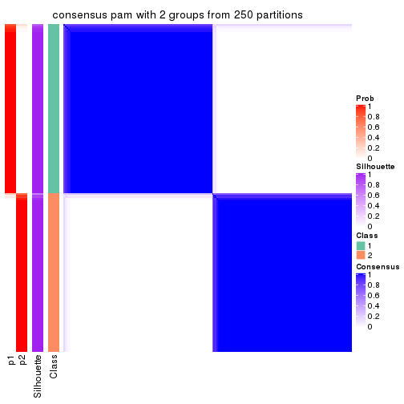</p>

</div>
<div id='tab-MAD-pam-consensus-heatmap-2'>
<pre><code class="r">consensus_heatmap(res, k = 3)
</code></pre>

<p>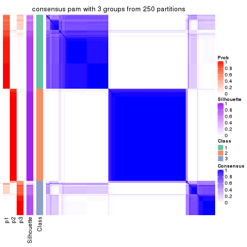</p>

</div>
<div id='tab-MAD-pam-consensus-heatmap-3'>
<pre><code class="r">consensus_heatmap(res, k = 4)
</code></pre>

<p>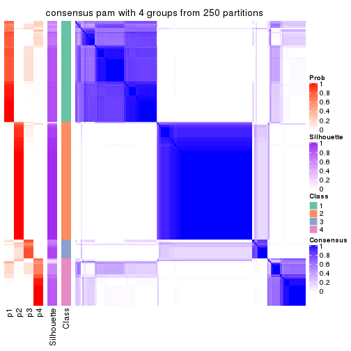</p>

</div>
<div id='tab-MAD-pam-consensus-heatmap-4'>
<pre><code class="r">consensus_heatmap(res, k = 5)
</code></pre>

<p>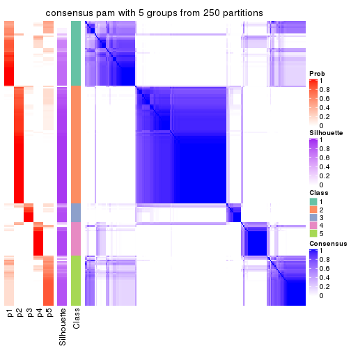</p>

</div>
<div id='tab-MAD-pam-consensus-heatmap-5'>
<pre><code class="r">consensus_heatmap(res, k = 6)
</code></pre>

<p>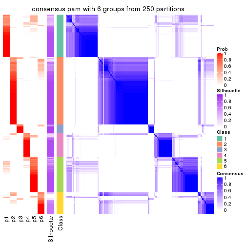</p>

</div>
</div>

Heatmaps for the membership of samples in all partitions to see how consistent they are:


<script>
$( function() {
	$( '#tabs-MAD-pam-membership-heatmap' ).tabs();
} );
</script>
<div id='tabs-MAD-pam-membership-heatmap'>
<ul>
<li><a href='#tab-MAD-pam-membership-heatmap-1'>k = 2</a></li>
<li><a href='#tab-MAD-pam-membership-heatmap-2'>k = 3</a></li>
<li><a href='#tab-MAD-pam-membership-heatmap-3'>k = 4</a></li>
<li><a href='#tab-MAD-pam-membership-heatmap-4'>k = 5</a></li>
<li><a href='#tab-MAD-pam-membership-heatmap-5'>k = 6</a></li>
</ul>
<div id='tab-MAD-pam-membership-heatmap-1'>
<pre><code class="r">membership_heatmap(res, k = 2)
</code></pre>

<p>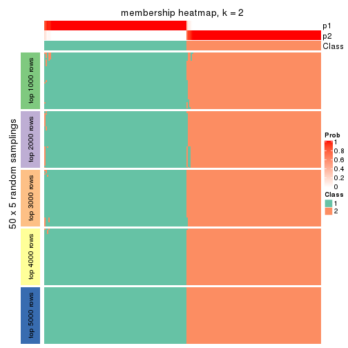</p>

</div>
<div id='tab-MAD-pam-membership-heatmap-2'>
<pre><code class="r">membership_heatmap(res, k = 3)
</code></pre>

<p>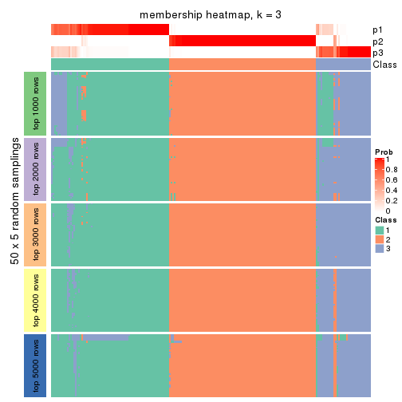</p>

</div>
<div id='tab-MAD-pam-membership-heatmap-3'>
<pre><code class="r">membership_heatmap(res, k = 4)
</code></pre>

<p>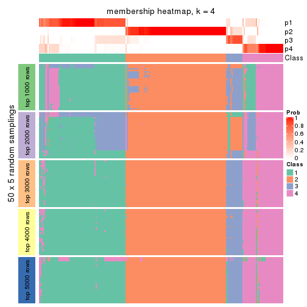</p>

</div>
<div id='tab-MAD-pam-membership-heatmap-4'>
<pre><code class="r">membership_heatmap(res, k = 5)
</code></pre>

<p>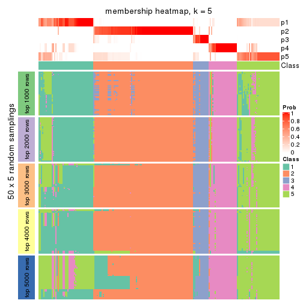</p>

</div>
<div id='tab-MAD-pam-membership-heatmap-5'>
<pre><code class="r">membership_heatmap(res, k = 6)
</code></pre>

<p>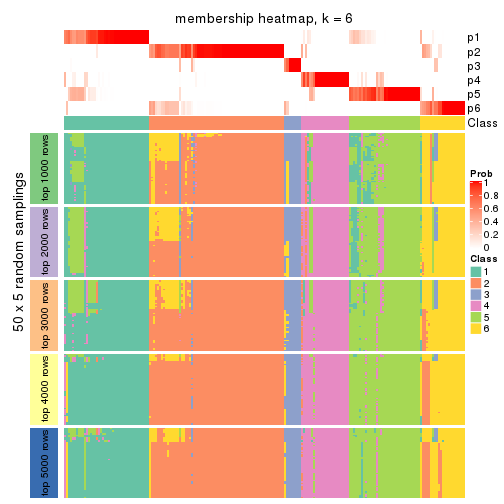</p>

</div>
</div>

As soon as we have had the classes for columns, we can look for signatures
which are significantly different between classes which can be candidate marks
for certain classes. Following are the heatmaps for signatures.


Signature heatmaps where rows are scaled:


<script>
$( function() {
	$( '#tabs-MAD-pam-get-signatures' ).tabs();
} );
</script>
<div id='tabs-MAD-pam-get-signatures'>
<ul>
<li><a href='#tab-MAD-pam-get-signatures-1'>k = 2</a></li>
<li><a href='#tab-MAD-pam-get-signatures-2'>k = 3</a></li>
<li><a href='#tab-MAD-pam-get-signatures-3'>k = 4</a></li>
<li><a href='#tab-MAD-pam-get-signatures-4'>k = 5</a></li>
<li><a href='#tab-MAD-pam-get-signatures-5'>k = 6</a></li>
</ul>
<div id='tab-MAD-pam-get-signatures-1'>
<pre><code class="r">get_signatures(res, k = 2)
</code></pre>

<p>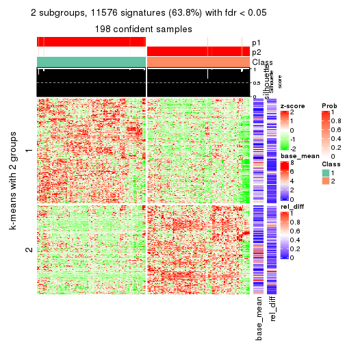</p>

</div>
<div id='tab-MAD-pam-get-signatures-2'>
<pre><code class="r">get_signatures(res, k = 3)
</code></pre>

<p>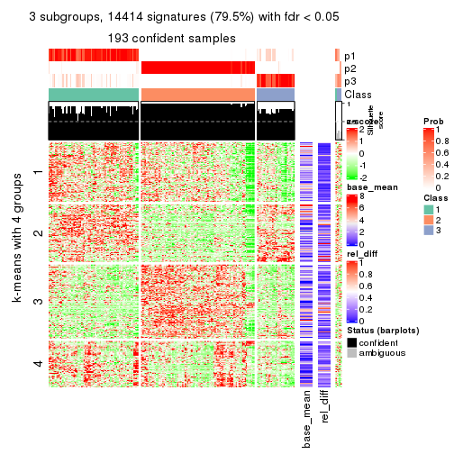</p>

</div>
<div id='tab-MAD-pam-get-signatures-3'>
<pre><code class="r">get_signatures(res, k = 4)
</code></pre>

<p>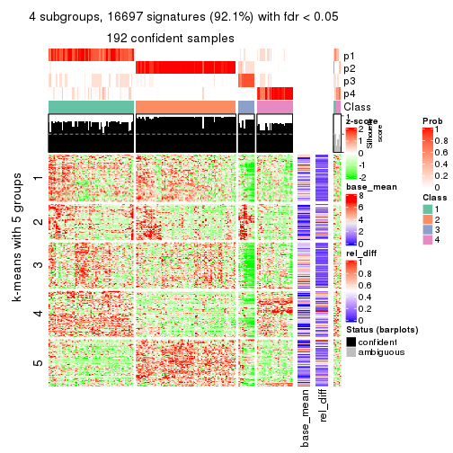</p>

</div>
<div id='tab-MAD-pam-get-signatures-4'>
<pre><code class="r">get_signatures(res, k = 5)
</code></pre>

<p>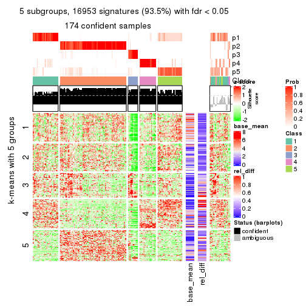</p>

</div>
<div id='tab-MAD-pam-get-signatures-5'>
<pre><code class="r">get_signatures(res, k = 6)
</code></pre>

<p>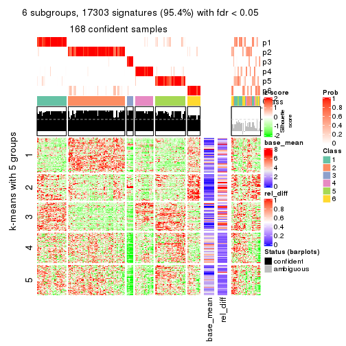</p>

</div>
</div>


Signature heatmaps where rows are not scaled:


<script>
$( function() {
	$( '#tabs-MAD-pam-get-signatures-no-scale' ).tabs();
} );
</script>
<div id='tabs-MAD-pam-get-signatures-no-scale'>
<ul>
<li><a href='#tab-MAD-pam-get-signatures-no-scale-1'>k = 2</a></li>
<li><a href='#tab-MAD-pam-get-signatures-no-scale-2'>k = 3</a></li>
<li><a href='#tab-MAD-pam-get-signatures-no-scale-3'>k = 4</a></li>
<li><a href='#tab-MAD-pam-get-signatures-no-scale-4'>k = 5</a></li>
<li><a href='#tab-MAD-pam-get-signatures-no-scale-5'>k = 6</a></li>
</ul>
<div id='tab-MAD-pam-get-signatures-no-scale-1'>
<pre><code class="r">get_signatures(res, k = 2, scale_rows = FALSE)
</code></pre>

<p>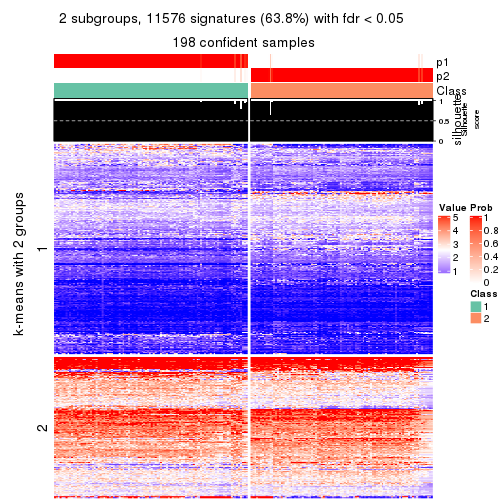</p>

</div>
<div id='tab-MAD-pam-get-signatures-no-scale-2'>
<pre><code class="r">get_signatures(res, k = 3, scale_rows = FALSE)
</code></pre>

<p>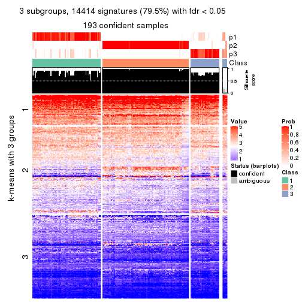</p>

</div>
<div id='tab-MAD-pam-get-signatures-no-scale-3'>
<pre><code class="r">get_signatures(res, k = 4, scale_rows = FALSE)
</code></pre>

<p>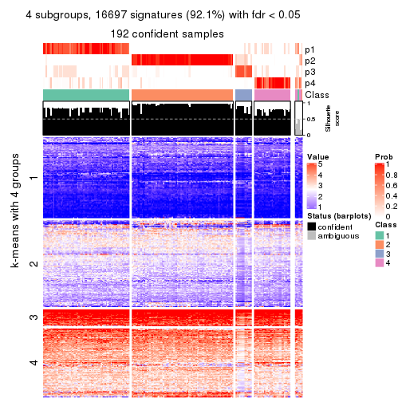</p>

</div>
<div id='tab-MAD-pam-get-signatures-no-scale-4'>
<pre><code class="r">get_signatures(res, k = 5, scale_rows = FALSE)
</code></pre>

<p>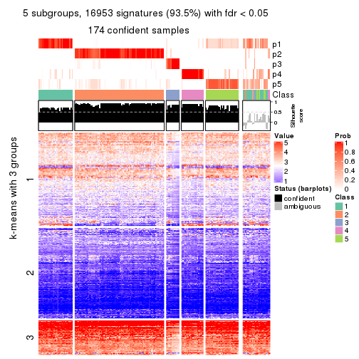</p>

</div>
<div id='tab-MAD-pam-get-signatures-no-scale-5'>
<pre><code class="r">get_signatures(res, k = 6, scale_rows = FALSE)
</code></pre>

<p>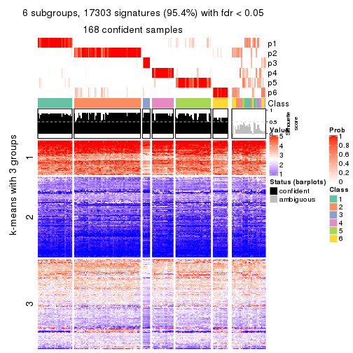</p>

</div>
</div>


Compare the overlap of signatures from different k:

```r
compare_signatures(res)
```

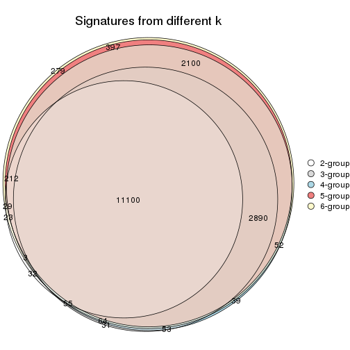

`get_signature()` returns a data frame invisibly. TO get the list of signatures, the function
call should be assigned to a variable explicitly. In following code, if `plot` argument is set
to `FALSE`, no heatmap is plotted while only the differential analysis is performed.

```r
# code only for demonstration
tb = get_signature(res, k = ..., plot = FALSE)
```

An example of the output of `tb` is:

```
#>   which_row         fdr    mean_1    mean_2 scaled_mean_1 scaled_mean_2 km
#> 1        38 0.042760348  8.373488  9.131774    -0.5533452     0.5164555  1
#> 2        40 0.018707592  7.106213  8.469186    -0.6173731     0.5762149  1
#> 3        55 0.019134737 10.221463 11.207825    -0.6159697     0.5749050  1
#> 4        59 0.006059896  5.921854  7.869574    -0.6899429     0.6439467  1
#> 5        60 0.018055526  8.928898 10.211722    -0.6204761     0.5791110  1
#> 6        98 0.009384629 15.714769 14.887706     0.6635654    -0.6193277  2
...
```

The columns in `tb` are:

1. `which_row`: row indices corresponding to the input matrix.
2. `fdr`: FDR for the differential test. 
3. `mean_x`: The mean value in group x.
4. `scaled_mean_x`: The mean value in group x after rows are scaled.
5. `km`: Row groups if k-means clustering is applied to rows.


UMAP plot which shows how samples are separated.


<script>
$( function() {
	$( '#tabs-MAD-pam-dimension-reduction' ).tabs();
} );
</script>
<div id='tabs-MAD-pam-dimension-reduction'>
<ul>
<li><a href='#tab-MAD-pam-dimension-reduction-1'>k = 2</a></li>
<li><a href='#tab-MAD-pam-dimension-reduction-2'>k = 3</a></li>
<li><a href='#tab-MAD-pam-dimension-reduction-3'>k = 4</a></li>
<li><a href='#tab-MAD-pam-dimension-reduction-4'>k = 5</a></li>
<li><a href='#tab-MAD-pam-dimension-reduction-5'>k = 6</a></li>
</ul>
<div id='tab-MAD-pam-dimension-reduction-1'>
<pre><code class="r">dimension_reduction(res, k = 2, method = &quot;UMAP&quot;)
</code></pre>

<p>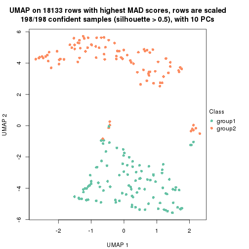</p>

</div>
<div id='tab-MAD-pam-dimension-reduction-2'>
<pre><code class="r">dimension_reduction(res, k = 3, method = &quot;UMAP&quot;)
</code></pre>

<p>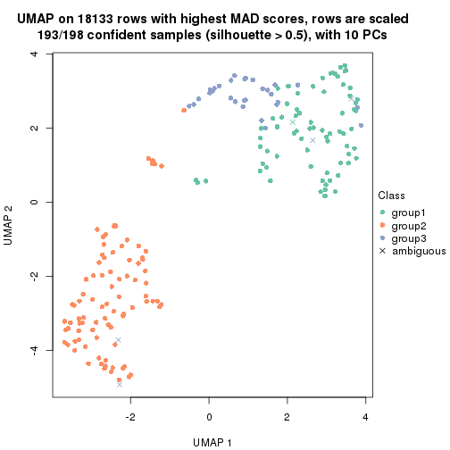</p>

</div>
<div id='tab-MAD-pam-dimension-reduction-3'>
<pre><code class="r">dimension_reduction(res, k = 4, method = &quot;UMAP&quot;)
</code></pre>

<p>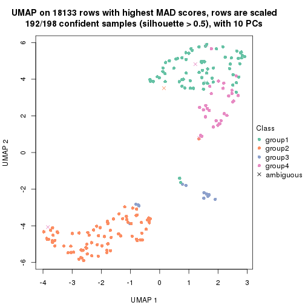</p>

</div>
<div id='tab-MAD-pam-dimension-reduction-4'>
<pre><code class="r">dimension_reduction(res, k = 5, method = &quot;UMAP&quot;)
</code></pre>

<p>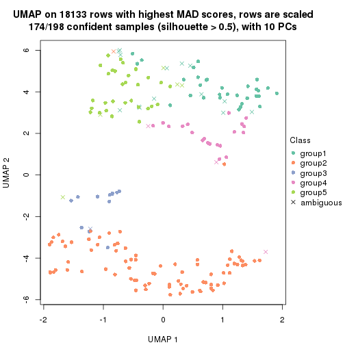</p>

</div>
<div id='tab-MAD-pam-dimension-reduction-5'>
<pre><code class="r">dimension_reduction(res, k = 6, method = &quot;UMAP&quot;)
</code></pre>

<p>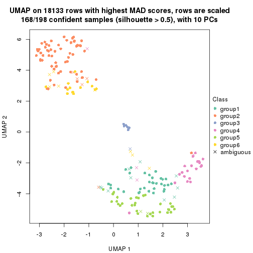</p>

</div>
</div>


Following heatmap shows how subgroups are split when increasing `k`:

```r
collect_classes(res)
```

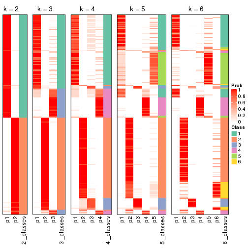


If matrix rows can be associated to genes, consider to use `functional_enrichment(res,
...)` to perform function enrichment for the signature genes. See [this vignette](http://bioconductor.org/packages/devel/bioc/vignettes/cola/inst/doc/functional_enrichment.html) for more detailed explanations.


 

---------------------------------------------------


### MAD:mclust*


The object with results only for a single top-value method and a single partition method 
can be extracted as:

```r
res = res_list["MAD", "mclust"]
# you can also extract it by
# res = res_list["MAD:mclust"]
```

A summary of `res` and all the functions that can be applied to it:

```r
res
```

```
#> A 'ConsensusPartition' object with k = 2, 3, 4, 5, 6.
#>   On a matrix with 18133 rows and 198 columns.
#>   Top rows (1000, 2000, 3000, 4000, 5000) are extracted by 'MAD' method.
#>   Subgroups are detected by 'mclust' method.
#>   Performed in total 1250 partitions by row resampling.
#>   Best k for subgroups seems to be 2.
#> 
#> Following methods can be applied to this 'ConsensusPartition' object:
#>  [1] "cola_report"             "collect_classes"         "collect_plots"          
#>  [4] "collect_stats"           "colnames"                "compare_signatures"     
#>  [7] "consensus_heatmap"       "dimension_reduction"     "functional_enrichment"  
#> [10] "get_anno_col"            "get_anno"                "get_classes"            
#> [13] "get_consensus"           "get_matrix"              "get_membership"         
#> [16] "get_param"               "get_signatures"          "get_stats"              
#> [19] "is_best_k"               "is_stable_k"             "membership_heatmap"     
#> [22] "ncol"                    "nrow"                    "plot_ecdf"              
#> [25] "rownames"                "select_partition_number" "show"                   
#> [28] "suggest_best_k"          "test_to_known_factors"
```

`collect_plots()` function collects all the plots made from `res` for all `k` (number of partitions)
into one single page to provide an easy and fast comparison between different `k`.

```r
collect_plots(res)
```

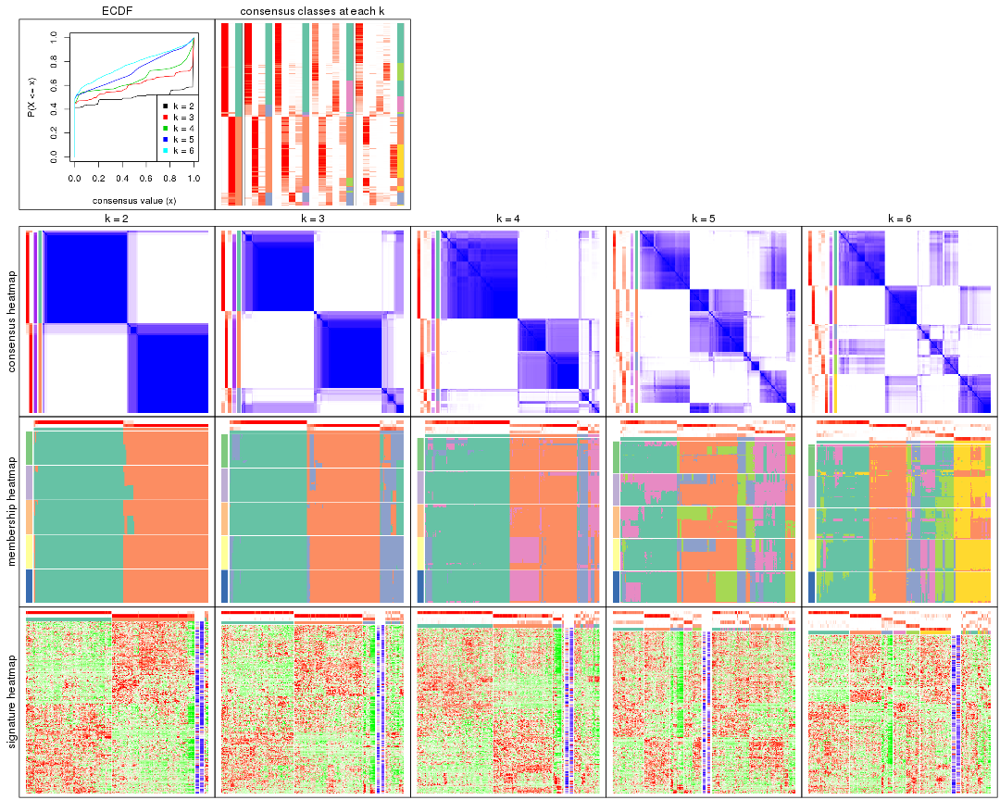

The plots are:

- The first row: a plot of the ECDF (empirical cumulative distribution
  function) curves of the consensus matrix for each `k` and the heatmap of
  predicted classes for each `k`.
- The second row: heatmaps of the consensus matrix for each `k`.
- The third row: heatmaps of the membership matrix for each `k`.
- The fouth row: heatmaps of the signatures for each `k`.

All the plots in panels can be made by individual functions and they are
plotted later in this section.

`select_partition_number()` produces several plots showing different
statistics for choosing "optimized" `k`. There are following statistics:

- ECDF curves of the consensus matrix for each `k`;
- 1-PAC. [The PAC
  score](https://en.wikipedia.org/wiki/Consensus_clustering#Over-interpretation_potential_of_consensus_clustering)
  measures the proportion of the ambiguous subgrouping.
- Mean silhouette score.
- Concordance. The mean probability of fiting the consensus class ids in all
  partitions.
- Area increased. Denote $A_k$ as the area under the ECDF curve for current
  `k`, the area increased is defined as $A_k - A_{k-1}$.
- Rand index. The percent of pairs of samples that are both in a same cluster
  or both are not in a same cluster in the partition of k and k-1.
- Jaccard index. The ratio of pairs of samples are both in a same cluster in
  the partition of k and k-1 and the pairs of samples are both in a same
  cluster in the partition k or k-1.

The detailed explanations of these statistics can be found in [the _cola_
vignette](http://bioconductor.org/packages/devel/bioc/vignettes/cola/inst/doc/cola.html#toc_13).

Generally speaking, lower PAC score, higher mean silhouette score or higher
concordance corresponds to better partition. Rand index and Jaccard index
measure how similar the current partition is compared to partition with `k-1`.
If they are too similar, we won't accept `k` is better than `k-1`.

```r
select_partition_number(res)
```

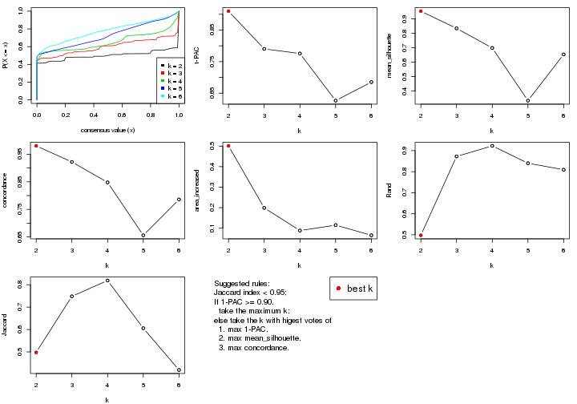

The numeric values for all these statistics can be obtained by `get_stats()`.

```r
get_stats(res)
```

```
#>   k 1-PAC mean_silhouette concordance area_increased  Rand Jaccard
#> 2 2 0.910           0.953       0.981         0.5012 0.498   0.498
#> 3 3 0.790           0.834       0.922         0.1988 0.872   0.748
#> 4 4 0.776           0.699       0.848         0.0885 0.923   0.819
#> 5 5 0.627           0.334       0.656         0.1150 0.840   0.606
#> 6 6 0.685           0.654       0.786         0.0655 0.809   0.419
```

`suggest_best_k()` suggests the best $k$ based on these statistics. The rules are as follows:

- All $k$ with Jaccard index larger than 0.95 are removed because increasing
  $k$ does not provide enough extra information. If all $k$ are removed, it is
  marked as no subgroup is detected.
- For all $k$ with 1-PAC score larger than 0.9, the maximal $k$ is taken as
  the best $k$, and other $k$ are marked as optional $k$.
- If it does not fit the second rule. The $k$ with the maximal vote of the
  highest 1-PAC score, highest mean silhouette, and highest concordance is
  taken as the best $k$.

```r
suggest_best_k(res)
```

```
#> [1] 2
```


Following shows the table of the partitions (You need to click the **show/hide
code output** link to see it). The membership matrix (columns with name `p*`)
is inferred by
[`clue::cl_consensus()`](https://www.rdocumentation.org/link/cl_consensus?package=clue)
function with the `SE` method. Basically the value in the membership matrix
represents the probability to belong to a certain group. The finall class
label for an item is determined with the group with highest probability it
belongs to.

In `get_classes()` function, the entropy is calculated from the membership
matrix and the silhouette score is calculated from the consensus matrix.


<script>
$( function() {
	$( '#tabs-MAD-mclust-get-classes' ).tabs();
} );
</script>
<div id='tabs-MAD-mclust-get-classes'>
<ul>
<li><a href='#tab-MAD-mclust-get-classes-1'>k = 2</a></li>
<li><a href='#tab-MAD-mclust-get-classes-2'>k = 3</a></li>
<li><a href='#tab-MAD-mclust-get-classes-3'>k = 4</a></li>
<li><a href='#tab-MAD-mclust-get-classes-4'>k = 5</a></li>
<li><a href='#tab-MAD-mclust-get-classes-5'>k = 6</a></li>
</ul>

<div id='tab-MAD-mclust-get-classes-1'>
<p><a id='tab-MAD-mclust-get-classes-1-a' style='color:#0366d6' href='#'>show/hide code output</a></p>
<pre><code class="r">cbind(get_classes(res, k = 2), get_membership(res, k = 2))
</code></pre>

<pre><code>#&gt;                                      class entropy silhouette    p1    p2
#&gt; 0C0AA0B2-5191-4EDF-8937-ED7434F30283     2   0.000      0.971 0.000 1.000
#&gt; 18B45F1F-234F-45CC-A234-145307606C5C     1   0.000      0.988 1.000 0.000
#&gt; E18B70C0-BDCA-46D3-99BB-C6C8ABC68DA5     2   0.000      0.971 0.000 1.000
#&gt; 0F6DDBA7-6F74-45E8-95C8-F28263D55978     1   0.000      0.988 1.000 0.000
#&gt; 7EAE1A5A-129A-46DE-977E-A2C753F10904     2   0.000      0.971 0.000 1.000
#&gt; 7EAE0048-16B5-4979-9410-16CDEB9B1A48     1   0.000      0.988 1.000 0.000
#&gt; 2EBFC828-2B27-4753-A052-80DDA226DAB4     2   0.000      0.971 0.000 1.000
#&gt; 24E1768D-2232-41DA-9383-BC55D6EB3812     2   0.706      0.779 0.192 0.808
#&gt; 6E3CD60A-1889-4CA3-B305-2E78152057B5     2   0.000      0.971 0.000 1.000
#&gt; 33CC70DD-82B3-413C-B3B1-BE06634D95D0     1   0.000      0.988 1.000 0.000
#&gt; F1CB57A3-55DD-4487-9307-1B4F652E729A     1   0.000      0.988 1.000 0.000
#&gt; 755A5806-B054-449A-93DB-79909E6C93A1     1   0.000      0.988 1.000 0.000
#&gt; 58D364E7-3D2F-468F-A264-D6461E2428D4     2   0.000      0.971 0.000 1.000
#&gt; 68BB9CB6-7AA2-4981-B9D9-07363EC96599     2   0.706      0.779 0.192 0.808
#&gt; 3C4E8DFA-8EA0-4F1F-89CB-CB8805395872     2   0.388      0.906 0.076 0.924
#&gt; 4219651D-5583-4498-BF08-1B7D04B4C7B2     1   0.000      0.988 1.000 0.000
#&gt; B5EE2768-0D67-4584-ADBC-EC745FEC52EA     2   0.000      0.971 0.000 1.000
#&gt; 825E6C11-F460-451A-8045-846DD7D0E945     1   0.000      0.988 1.000 0.000
#&gt; 491F62AF-5E68-43C3-982A-F867A75BBA9A     2   0.000      0.971 0.000 1.000
#&gt; 9D7F058C-F95A-44AD-AC9E-450F7FBDC960     2   0.000      0.971 0.000 1.000
#&gt; 6D42DD0C-2081-4742-BA27-9F5F16FAC3C6     1   0.000      0.988 1.000 0.000
#&gt; EDD7E63D-492A-473B-A552-0764337B10EF     2   0.000      0.971 0.000 1.000
#&gt; 97073DEA-73AD-4DFD-BD1A-9035DC03445B     1   0.000      0.988 1.000 0.000
#&gt; FA891AB9-CE38-4F7E-A015-1DDCE12890A0     1   0.000      0.988 1.000 0.000
#&gt; D9514D49-A0AE-45AB-8C9F-68E726215253     1   0.000      0.988 1.000 0.000
#&gt; 3B9229AD-12E5-451E-9D2F-378AAC82C04A     2   0.000      0.971 0.000 1.000
#&gt; 5EA36B71-4917-4EF3-9060-065EFE6ACC5B     1   0.000      0.988 1.000 0.000
#&gt; A20E4ECB-4895-4CC7-BE5E-4721B20D933B     1   0.000      0.988 1.000 0.000
#&gt; 1BE8D828-29DB-4368-AA4A-FB23588F7AE8     1   0.000      0.988 1.000 0.000
#&gt; 66EFEFCF-3D14-4DBF-AA13-530F40ED0245     1   0.469      0.877 0.900 0.100
#&gt; 55DFFE53-BCE7-4EC1-9863-6C0311B06BA2     2   0.000      0.971 0.000 1.000
#&gt; 4CC3FB5A-611D-4C64-AE9D-544FA45CF4DC     1   0.000      0.988 1.000 0.000
#&gt; C11D33F2-DFE9-4FA8-9024-F3E7F1DADC5F     2   0.000      0.971 0.000 1.000
#&gt; FA5932B8-8AA3-4C38-9FAB-C35D8772974D     1   0.000      0.988 1.000 0.000
#&gt; 8216EC35-1F41-4A15-B503-BDA4971E27C9     1   0.000      0.988 1.000 0.000
#&gt; 69635D23-90A7-4BAD-97C7-B79536837F57     1   0.000      0.988 1.000 0.000
#&gt; 12B404E2-C463-4409-8392-E4649B2AFFD1     2   0.000      0.971 0.000 1.000
#&gt; 246927E3-ACCF-41B2-AA8E-43855FD6B146     2   0.000      0.971 0.000 1.000
#&gt; E0CC13E7-9607-49E0-B4AA-395544E3C3BF     1   0.000      0.988 1.000 0.000
#&gt; F7BBC0C1-6124-4A83-8A70-EA89B62F1CBD     1   0.000      0.988 1.000 0.000
#&gt; B1D4FF24-8E6F-4A04-B716-2032D850EB57     1   0.000      0.988 1.000 0.000
#&gt; 253601DB-B78A-4566-9947-8C0270C0B163     2   0.000      0.971 0.000 1.000
#&gt; AB83DBFF-5737-4FB8-A5AC-1D3CD6072BDF     2   0.706      0.779 0.192 0.808
#&gt; 9D67D953-EC98-4B72-89C8-5732BC9D4BC9     2   0.000      0.971 0.000 1.000
#&gt; 51061018-95AB-4278-886F-F69E4EBC47C0     2   0.000      0.971 0.000 1.000
#&gt; ABD0F7F3-105B-4DEE-9889-5028772C519A     1   0.000      0.988 1.000 0.000
#&gt; 562B95CF-B27E-4A72-B7C6-CDF86A51A39B     1   0.000      0.988 1.000 0.000
#&gt; ABF046A4-D7A1-49FF-B6B1-4E07A791DEDB     2   0.000      0.971 0.000 1.000
#&gt; 3FF4101E-9703-460E-A30E-76CC7689F36D     2   0.000      0.971 0.000 1.000
#&gt; 39C4F7AA-7ADF-4F1D-BDA3-BEC605AC5023     2   0.000      0.971 0.000 1.000
#&gt; CB821FD2-AF5C-4743-A70F-21C12C6ED153     1   0.000      0.988 1.000 0.000
#&gt; 92EA1846-62FF-41D5-A441-5E52E6B9E7F9     1   0.000      0.988 1.000 0.000
#&gt; 7D25F3EE-5A20-4763-8026-16A03D05F459     1   0.000      0.988 1.000 0.000
#&gt; 8ECE5276-CD06-496B-A5A9-1713B1F7D089     1   0.000      0.988 1.000 0.000
#&gt; C775B68F-9507-47E3-B507-B433AED79002     1   0.000      0.988 1.000 0.000
#&gt; E19D5463-FDD0-41C1-A170-323736A88D07     2   0.000      0.971 0.000 1.000
#&gt; CE4B6285-4961-4767-91F0-5C7A8162E185     1   0.000      0.988 1.000 0.000
#&gt; 9637BD72-1FEF-42AD-8886-2C39BE876531     1   0.000      0.988 1.000 0.000
#&gt; 81B5A88E-45A0-4B44-B689-B9071B8548EE     2   0.000      0.971 0.000 1.000
#&gt; 0B01B4C9-9BED-4F5B-A3E2-8868C7CCC3FC     2   0.706      0.779 0.192 0.808
#&gt; 54501315-7132-44B2-A179-10FBF1421105     1   0.000      0.988 1.000 0.000
#&gt; E207CBE9-4C3A-4FDD-9251-CFE1FE106475     2   0.969      0.384 0.396 0.604
#&gt; 3BEA0B92-3F90-4DBF-9679-AADEAD7D47C8     2   0.000      0.971 0.000 1.000
#&gt; 35B32250-D854-4215-AA5B-2C11B2FBEECA     1   0.000      0.988 1.000 0.000
#&gt; ACE6566B-AEB9-426C-924A-B382D14A1024     2   0.000      0.971 0.000 1.000
#&gt; 737E69AC-0930-45B9-B6BA-7CE5E300290B     1   0.000      0.988 1.000 0.000
#&gt; B4410AB8-D015-41CA-86E6-12EB4E4103E3     1   0.000      0.988 1.000 0.000
#&gt; 6D3ECA65-C50F-43B0-B75A-1D290FA4A8FD     2   0.000      0.971 0.000 1.000
#&gt; C86F40D3-9A96-4395-A8C3-510DE12F9A2B     2   0.000      0.971 0.000 1.000
#&gt; 6238087F-24DD-4BF1-903F-3BD4E446C1AE     2   0.000      0.971 0.000 1.000
#&gt; E4FF840B-EEAB-4CB0-A690-7D4C4AA7EEC3     2   0.000      0.971 0.000 1.000
#&gt; 72D3C323-C67F-4C0E-9BFC-BF245FF9730A     1   0.000      0.988 1.000 0.000
#&gt; 82D56E4E-4DF6-4F3E-8959-B995C92AAA70     1   0.000      0.988 1.000 0.000
#&gt; E31CA441-EB19-443B-ACBD-37B5CCBCF0E5     2   0.000      0.971 0.000 1.000
#&gt; 87CA8939-D054-4B8A-B32D-085FD2E8F202     1   0.000      0.988 1.000 0.000
#&gt; 2A508D90-FEDC-46A3-9A02-E51E5467CDCB     1   0.000      0.988 1.000 0.000
#&gt; C4E8B4E2-388B-411F-BF0A-9B6F34E8EDB5     2   0.000      0.971 0.000 1.000
#&gt; AF6AF803-BD93-44A7-AA80-B9BC92C1273B     2   0.000      0.971 0.000 1.000
#&gt; 0B1CA5CF-EB96-41D4-BFC5-6957FEB39828     1   0.000      0.988 1.000 0.000
#&gt; 6FB96FB0-6661-48AD-A4A0-69F8AFDBE591     2   0.000      0.971 0.000 1.000
#&gt; 8C19F7FD-368A-462B-B28F-88D6630038A1     1   0.000      0.988 1.000 0.000
#&gt; 96EABE78-C2F4-4A33-ACD8-C922A4B2519B     2   0.000      0.971 0.000 1.000
#&gt; 68B36D7B-546A-4689-949F-B207C4A4AB27     2   0.000      0.971 0.000 1.000
#&gt; CE9F3335-778F-4F52-BC55-4B7C99B211DD     2   0.000      0.971 0.000 1.000
#&gt; CB359DED-2A2D-4646-A0BD-6F10ADCC532B     1   0.000      0.988 1.000 0.000
#&gt; 198324A5-8C52-46F6-9734-EFAF1CCA6D9B     1   0.000      0.988 1.000 0.000
#&gt; 83B88608-0506-428C-B9E8-621F38477B42     1   0.000      0.988 1.000 0.000
#&gt; 1993630A-0F3D-4F5C-86A3-D443BAAF57F0     1   0.358      0.916 0.932 0.068
#&gt; DE73DA9B-529E-4F4F-A65C-DA7AB84B1096     1   0.000      0.988 1.000 0.000
#&gt; 2347F3B7-DDA3-40C0-B6D4-8819ECA69146     1   0.000      0.988 1.000 0.000
#&gt; AB93B5D5-095F-4330-9D40-6A3D934AB50C     1   0.000      0.988 1.000 0.000
#&gt; 5EBBE4AD-FF0C-41CF-9EA3-B6FE7EA1F9C0     2   0.969      0.384 0.396 0.604
#&gt; 6D960AE7-3769-4144-A061-E8588E5063FF     1   0.000      0.988 1.000 0.000
#&gt; 0C2DD8C0-D1A5-4192-A49C-7A40FED628B2     2   0.000      0.971 0.000 1.000
#&gt; 18C9372F-C55B-4F86-A9D2-E8D85EFC8566     2   0.738      0.753 0.208 0.792
#&gt; 9AF637B0-4C32-4DD1-93AF-7655B4A845D3     2   0.000      0.971 0.000 1.000
#&gt; 785B5B06-4115-46FD-9BEB-F888AFDC855D     2   0.000      0.971 0.000 1.000
#&gt; ECA3050E-4BE2-4117-B9CF-A52BB85AF8C2     2   0.402      0.902 0.080 0.920
#&gt; 099DC396-16A5-458F-9ED9-F2A790CB0C34     1   0.000      0.988 1.000 0.000
#&gt; 7A5A12EE-C5B0-4C51-8C99-0F3FA88D633E     1   0.000      0.988 1.000 0.000
#&gt; E832B508-A66D-4817-B44A-FE9FAAE64B4A     1   0.000      0.988 1.000 0.000
#&gt; F9DD688C-7B35-49E7-9651-2E098EE78856     1   0.000      0.988 1.000 0.000
#&gt; F1265DD8-5ED3-4635-A277-57BBFDEC7729     1   0.000      0.988 1.000 0.000
#&gt; F624E8D9-DB07-4C9E-910D-5E8EBA3A6167     2   0.000      0.971 0.000 1.000
#&gt; 3516FBDF-66E1-43F4-9D7B-16748F6439A7     2   0.000      0.971 0.000 1.000
#&gt; 04B12992-B2EA-4BA2-8E2C-11E34E230E6F     2   0.000      0.971 0.000 1.000
#&gt; CC02897D-9123-495E-9242-5C9CF4EC269B     2   0.000      0.971 0.000 1.000
#&gt; 3117ED46-2BF2-4311-BC00-4E98243E16B3     1   0.000      0.988 1.000 0.000
#&gt; E0B66D53-23DB-4E26-BB6E-F692FA8C000E     1   0.000      0.988 1.000 0.000
#&gt; DAA93CE5-A013-477A-9A50-EA09CC3A8162     2   0.000      0.971 0.000 1.000
#&gt; 0099098D-354A-4276-92F8-B932C74B4608     1   0.000      0.988 1.000 0.000
#&gt; DD483639-B2E7-4745-BCFB-55ED1D82BFBF     2   0.000      0.971 0.000 1.000
#&gt; 2C1F9079-602E-4252-82C7-9D8799E04246     2   0.000      0.971 0.000 1.000
#&gt; 9473A8E4-3A1B-4184-9EA6-517AFD60B635     1   1.000     -0.023 0.512 0.488
#&gt; 75CFBAF6-7BA0-40AF-92D7-D218E885BD1B     2   0.000      0.971 0.000 1.000
#&gt; B588950F-14D6-41C8-845B-EFD2096013C6     2   0.000      0.971 0.000 1.000
#&gt; 0DF3EDA8-DAEA-4721-92AB-B97181249498     2   0.000      0.971 0.000 1.000
#&gt; 8EA83042-D598-401D-AD78-936EEB136C59     1   0.000      0.988 1.000 0.000
#&gt; 729AC418-3BE9-445A-95D4-AC11A7D43BE0     1   0.000      0.988 1.000 0.000
#&gt; 7D8B1B11-F576-4AA8-BFA7-0022A2CD829A     2   0.000      0.971 0.000 1.000
#&gt; 304A0E46-3449-4B44-9C30-BDDF6459391D     1   0.000      0.988 1.000 0.000
#&gt; 3C83358F-DF20-47F7-AF9F-AB7CC92F5ABA     1   0.000      0.988 1.000 0.000
#&gt; EAFEED6C-35C3-451F-AE4A-EB56992E1F29     1   0.000      0.988 1.000 0.000
#&gt; 8A237A65-28EC-434D-A78A-A8B7308B5204     1   0.000      0.988 1.000 0.000
#&gt; D005833F-E991-4E9E-9667-55F137288004     1   0.000      0.988 1.000 0.000
#&gt; 37D966E3-253E-4397-A9AE-0903A8D31FE6     1   0.000      0.988 1.000 0.000
#&gt; D2482B81-CB5B-4178-BA8D-1CF4026181B5     1   0.000      0.988 1.000 0.000
#&gt; 18019E95-C2A8-4EE7-B585-F6886DC4D953     2   0.000      0.971 0.000 1.000
#&gt; 0B126D1A-14A8-4345-8F78-FF92222ADF4C     2   0.706      0.779 0.192 0.808
#&gt; CE88B625-47D8-4D58-9FB4-23464DB7DDAD     2   0.000      0.971 0.000 1.000
#&gt; 9A88299D-5C74-47FA-B42C-1A1D6D935AAB     1   0.000      0.988 1.000 0.000
#&gt; 3E71159C-FD6C-41DA-B18B-0730C8AC7E41     1   0.000      0.988 1.000 0.000
#&gt; 6F245AA4-79D9-47E1-BCC9-1AAF65AEA813     1   0.000      0.988 1.000 0.000
#&gt; 4CF2C888-2100-483A-B4DB-ECBB69243A4D     2   0.000      0.971 0.000 1.000
#&gt; A3853813-B9D5-4E8C-B075-19FCC35F8686     2   0.000      0.971 0.000 1.000
#&gt; 83A16DEE-CE9F-4D8B-9225-0A2A8B9D055D     1   0.000      0.988 1.000 0.000
#&gt; 0F057CAF-4F9A-4DE9-8601-730E96873733     2   0.000      0.971 0.000 1.000
#&gt; 32D5801D-DBA4-422E-87CB-A2DDE921BA41     1   0.000      0.988 1.000 0.000
#&gt; 22EE8076-F07C-499A-9AF8-D800A77EF154     2   0.000      0.971 0.000 1.000
#&gt; DD4BD74D-D48C-4090-9F57-5334E784581C     1   0.000      0.988 1.000 0.000
#&gt; 41183565-434D-474C-B1BD-CA6E94910658     2   0.000      0.971 0.000 1.000
#&gt; 75A2CE41-2B2A-4346-927E-ACF8A72738E4     1   0.000      0.988 1.000 0.000
#&gt; 7AA24995-3DD2-4682-B36A-4EBFEEACF625     1   0.000      0.988 1.000 0.000
#&gt; 8BAFDFEC-9F26-4ADB-95CE-004143960EEB     1   0.000      0.988 1.000 0.000
#&gt; A330E011-CE08-4A85-8F4B-370592293DBB     1   0.000      0.988 1.000 0.000
#&gt; 1D5A5B17-2E70-4BB0-94A1-EC17E6EA49DB     1   0.000      0.988 1.000 0.000
#&gt; BD9143B8-9D97-4A05-872C-3FB82B4CF7BE     2   0.000      0.971 0.000 1.000
#&gt; 64552DC0-181E-4607-898C-787AA7F26435     2   0.000      0.971 0.000 1.000
#&gt; 1B4C4D41-34C7-43A3-858B-C9552EB53894     1   0.000      0.988 1.000 0.000
#&gt; 463A3BAA-02DC-4EA4-A644-B924163E425D     2   0.000      0.971 0.000 1.000
#&gt; CD0FEA89-6F60-4A20-8FCA-D397B4E95A98     1   0.000      0.988 1.000 0.000
#&gt; 5D06CF6D-F4B9-4B32-B055-8AB287E53340     2   0.000      0.971 0.000 1.000
#&gt; ADA7835F-DB67-4F4F-9446-8BCE3C5FE936     2   0.000      0.971 0.000 1.000
#&gt; 4109BE2D-B5DF-4BD7-860E-60D87F647152     2   0.000      0.971 0.000 1.000
#&gt; 88526A0E-6DFE-46CB-BFAD-B4826F482C67     1   0.000      0.988 1.000 0.000
#&gt; F39F9A4C-18F7-4017-AB31-85D52FF44587     2   0.000      0.971 0.000 1.000
#&gt; D4290A5E-1B24-4C55-B470-0FA7A0A09DD0     2   0.000      0.971 0.000 1.000
#&gt; DC5A2C9E-978F-4661-B729-1F9662976E27     1   0.000      0.988 1.000 0.000
#&gt; 26A1F392-CED2-43E3-8096-74E6F2BFC8C0     2   0.000      0.971 0.000 1.000
#&gt; 87D81FB2-306A-4E75-9D58-D5F48E46E7F6     2   0.000      0.971 0.000 1.000
#&gt; E3D9D81A-C20C-4B3B-B940-A5D2C5F65B22     2   0.706      0.779 0.192 0.808
#&gt; 4464650B-453F-476C-989C-B7B159BF2CF0     2   0.000      0.971 0.000 1.000
#&gt; 577D2867-B738-487A-9B06-07958D647F02     1   0.000      0.988 1.000 0.000
#&gt; E52A22CC-3C03-41A9-9541-220DD871E162     2   0.000      0.971 0.000 1.000
#&gt; 642703B1-AF99-4746-A915-0792F4B9590B     2   0.000      0.971 0.000 1.000
#&gt; 8F0D1792-1284-45E6-8EC4-392596057677     2   0.000      0.971 0.000 1.000
#&gt; 765AFFC1-D528-4494-8BA1-0706451E4205     2   0.000      0.971 0.000 1.000
#&gt; A716BC29-161F-4CA0-B240-00B330137F2C     1   0.000      0.988 1.000 0.000
#&gt; 32CBFBAF-7064-4595-8D54-2C5E7DE0FD9B     1   0.000      0.988 1.000 0.000
#&gt; 4D6ED28C-3F20-41B0-BA41-1BF0E5199A40     2   0.671      0.797 0.176 0.824
#&gt; 86A38456-2900-48FB-B10F-79222B3CA9BF     1   0.260      0.943 0.956 0.044
#&gt; E870807D-3223-4A6A-9E3D-F4461B048AA2     2   0.000      0.971 0.000 1.000
#&gt; 3A78D19F-A833-4D2C-8387-FB4FD4A8313C     1   0.000      0.988 1.000 0.000
#&gt; DFA162CA-C708-4121-8E74-F9C4DEE0CDAE     1   0.000      0.988 1.000 0.000
#&gt; C00A300A-CD10-4C9D-8C94-3901AFE8406C     2   0.000      0.971 0.000 1.000
#&gt; 13E11D15-A90F-48C4-980A-DD032C00A2C1     1   0.000      0.988 1.000 0.000
#&gt; 31BF80AB-FEDB-4C73-89C3-70BE9F9ACBEE     2   0.000      0.971 0.000 1.000
#&gt; FA34308A-349D-4AAD-94CF-3F3B7F9AD629     2   0.000      0.971 0.000 1.000
#&gt; 7C48D467-B663-49DD-BC84-A36BC32ACB3D     1   0.000      0.988 1.000 0.000
#&gt; BB068534-04F6-4FC9-9087-CDA65920BCE2     1   0.000      0.988 1.000 0.000
#&gt; EA4EC272-A9B3-4B2E-955F-19F7676A944C     2   0.000      0.971 0.000 1.000
#&gt; C71FF69B-A460-43CA-8769-9667F22D938B     1   0.000      0.988 1.000 0.000
#&gt; 5243D1B8-8168-4FF1-A8C6-505F080EF0D3     2   0.000      0.971 0.000 1.000
#&gt; BCC474D8-08FE-4E99-B8E8-B29E65F84D2E     1   0.000      0.988 1.000 0.000
#&gt; 04FDBFE3-4CF6-4E53-A2AA-89D5C9316377     2   0.706      0.779 0.192 0.808
#&gt; 83A9915C-8D60-4CAE-A868-B61E3C90C7B0     2   0.000      0.971 0.000 1.000
#&gt; 989A6472-E3E3-457A-97BE-CCE95F42D5C2     2   0.000      0.971 0.000 1.000
#&gt; A0AB2D28-6751-49C9-8DF4-66FDBF95C360     1   0.000      0.988 1.000 0.000
#&gt; A12B2683-18D4-41C9-8AE5-C143E2180052     1   0.000      0.988 1.000 0.000
#&gt; 8DE1E245-CAD2-4F11-BFA2-9792C433A00B     1   0.999      0.016 0.520 0.480
#&gt; FDA68036-6C4C-4256-9AA0-C01FE92AA098     2   0.000      0.971 0.000 1.000
#&gt; 26311920-1414-4EC1-870B-784961EBCC2D     1   0.000      0.988 1.000 0.000
#&gt; C29A10D6-D598-4286-B5E0-F1776E19E988     1   0.000      0.988 1.000 0.000
#&gt; FACCC1FB-4937-4CC0-90EA-7F91D3D939CF     2   0.000      0.971 0.000 1.000
#&gt; 90B9D84B-78E5-4C7E-8414-EC889C2DE8DB     2   0.000      0.971 0.000 1.000
#&gt; B74E6122-76E1-4E4D-A867-BCAFD7277393     1   0.000      0.988 1.000 0.000
#&gt; 98494DC0-CF6E-485F-8A0D-D80E4437EF5C     2   0.000      0.971 0.000 1.000
#&gt; DA114DAC-DE7B-4E43-8D7C-82C5D7B66411     1   0.000      0.988 1.000 0.000
</code></pre>

<script>
$('#tab-MAD-mclust-get-classes-1-a').parent().next().next().hide();
$('#tab-MAD-mclust-get-classes-1-a').click(function(){
  $('#tab-MAD-mclust-get-classes-1-a').parent().next().next().toggle();
  return(false);
});
</script>
</div>

<div id='tab-MAD-mclust-get-classes-2'>
<p><a id='tab-MAD-mclust-get-classes-2-a' style='color:#0366d6' href='#'>show/hide code output</a></p>
<pre><code class="r">cbind(get_classes(res, k = 3), get_membership(res, k = 3))
</code></pre>

<pre><code>#&gt;                                      class entropy silhouette    p1    p2    p3
#&gt; 0C0AA0B2-5191-4EDF-8937-ED7434F30283     2  0.0000    0.95097 0.000 1.000 0.000
#&gt; 18B45F1F-234F-45CC-A234-145307606C5C     1  0.3941    0.76285 0.844 0.000 0.156
#&gt; E18B70C0-BDCA-46D3-99BB-C6C8ABC68DA5     2  0.0000    0.95097 0.000 1.000 0.000
#&gt; 0F6DDBA7-6F74-45E8-95C8-F28263D55978     1  0.0000    0.95196 1.000 0.000 0.000
#&gt; 7EAE1A5A-129A-46DE-977E-A2C753F10904     2  0.0000    0.95097 0.000 1.000 0.000
#&gt; 7EAE0048-16B5-4979-9410-16CDEB9B1A48     1  0.0000    0.95196 1.000 0.000 0.000
#&gt; 2EBFC828-2B27-4753-A052-80DDA226DAB4     2  0.0000    0.95097 0.000 1.000 0.000
#&gt; 24E1768D-2232-41DA-9383-BC55D6EB3812     3  0.4346    0.59724 0.000 0.184 0.816
#&gt; 6E3CD60A-1889-4CA3-B305-2E78152057B5     2  0.6252    0.27445 0.000 0.556 0.444
#&gt; 33CC70DD-82B3-413C-B3B1-BE06634D95D0     1  0.0747    0.93574 0.984 0.000 0.016
#&gt; F1CB57A3-55DD-4487-9307-1B4F652E729A     1  0.0000    0.95196 1.000 0.000 0.000
#&gt; 755A5806-B054-449A-93DB-79909E6C93A1     1  0.5058    0.61290 0.756 0.000 0.244
#&gt; 58D364E7-3D2F-468F-A264-D6461E2428D4     2  0.0000    0.95097 0.000 1.000 0.000
#&gt; 68BB9CB6-7AA2-4981-B9D9-07363EC96599     3  0.4346    0.59724 0.000 0.184 0.816
#&gt; 3C4E8DFA-8EA0-4F1F-89CB-CB8805395872     3  0.6126    0.30229 0.000 0.400 0.600
#&gt; 4219651D-5583-4498-BF08-1B7D04B4C7B2     1  0.0000    0.95196 1.000 0.000 0.000
#&gt; B5EE2768-0D67-4584-ADBC-EC745FEC52EA     2  0.0000    0.95097 0.000 1.000 0.000
#&gt; 825E6C11-F460-451A-8045-846DD7D0E945     1  0.0000    0.95196 1.000 0.000 0.000
#&gt; 491F62AF-5E68-43C3-982A-F867A75BBA9A     2  0.1163    0.92950 0.000 0.972 0.028
#&gt; 9D7F058C-F95A-44AD-AC9E-450F7FBDC960     2  0.0000    0.95097 0.000 1.000 0.000
#&gt; 6D42DD0C-2081-4742-BA27-9F5F16FAC3C6     1  0.6274   -0.09083 0.544 0.000 0.456
#&gt; EDD7E63D-492A-473B-A552-0764337B10EF     2  0.6192    0.16125 0.000 0.580 0.420
#&gt; 97073DEA-73AD-4DFD-BD1A-9035DC03445B     1  0.0000    0.95196 1.000 0.000 0.000
#&gt; FA891AB9-CE38-4F7E-A015-1DDCE12890A0     1  0.0000    0.95196 1.000 0.000 0.000
#&gt; D9514D49-A0AE-45AB-8C9F-68E726215253     1  0.0000    0.95196 1.000 0.000 0.000
#&gt; 3B9229AD-12E5-451E-9D2F-378AAC82C04A     2  0.0000    0.95097 0.000 1.000 0.000
#&gt; 5EA36B71-4917-4EF3-9060-065EFE6ACC5B     1  0.5905    0.21325 0.648 0.000 0.352
#&gt; A20E4ECB-4895-4CC7-BE5E-4721B20D933B     1  0.3941    0.76285 0.844 0.000 0.156
#&gt; 1BE8D828-29DB-4368-AA4A-FB23588F7AE8     1  0.0424    0.94425 0.992 0.000 0.008
#&gt; 66EFEFCF-3D14-4DBF-AA13-530F40ED0245     1  0.6737    0.07236 0.600 0.016 0.384
#&gt; 55DFFE53-BCE7-4EC1-9863-6C0311B06BA2     2  0.0000    0.95097 0.000 1.000 0.000
#&gt; 4CC3FB5A-611D-4C64-AE9D-544FA45CF4DC     1  0.0000    0.95196 1.000 0.000 0.000
#&gt; C11D33F2-DFE9-4FA8-9024-F3E7F1DADC5F     2  0.0000    0.95097 0.000 1.000 0.000
#&gt; FA5932B8-8AA3-4C38-9FAB-C35D8772974D     1  0.0000    0.95196 1.000 0.000 0.000
#&gt; 8216EC35-1F41-4A15-B503-BDA4971E27C9     1  0.0000    0.95196 1.000 0.000 0.000
#&gt; 69635D23-90A7-4BAD-97C7-B79536837F57     1  0.0000    0.95196 1.000 0.000 0.000
#&gt; 12B404E2-C463-4409-8392-E4649B2AFFD1     2  0.0000    0.95097 0.000 1.000 0.000
#&gt; 246927E3-ACCF-41B2-AA8E-43855FD6B146     2  0.0000    0.95097 0.000 1.000 0.000
#&gt; E0CC13E7-9607-49E0-B4AA-395544E3C3BF     1  0.1031    0.92875 0.976 0.000 0.024
#&gt; F7BBC0C1-6124-4A83-8A70-EA89B62F1CBD     1  0.0000    0.95196 1.000 0.000 0.000
#&gt; B1D4FF24-8E6F-4A04-B716-2032D850EB57     1  0.0000    0.95196 1.000 0.000 0.000
#&gt; 253601DB-B78A-4566-9947-8C0270C0B163     2  0.0000    0.95097 0.000 1.000 0.000
#&gt; AB83DBFF-5737-4FB8-A5AC-1D3CD6072BDF     3  0.5406    0.59271 0.020 0.200 0.780
#&gt; 9D67D953-EC98-4B72-89C8-5732BC9D4BC9     2  0.0000    0.95097 0.000 1.000 0.000
#&gt; 51061018-95AB-4278-886F-F69E4EBC47C0     2  0.6215    0.13970 0.000 0.572 0.428
#&gt; ABD0F7F3-105B-4DEE-9889-5028772C519A     1  0.0000    0.95196 1.000 0.000 0.000
#&gt; 562B95CF-B27E-4A72-B7C6-CDF86A51A39B     1  0.0000    0.95196 1.000 0.000 0.000
#&gt; ABF046A4-D7A1-49FF-B6B1-4E07A791DEDB     2  0.0000    0.95097 0.000 1.000 0.000
#&gt; 3FF4101E-9703-460E-A30E-76CC7689F36D     2  0.0000    0.95097 0.000 1.000 0.000
#&gt; 39C4F7AA-7ADF-4F1D-BDA3-BEC605AC5023     2  0.0000    0.95097 0.000 1.000 0.000
#&gt; CB821FD2-AF5C-4743-A70F-21C12C6ED153     1  0.0000    0.95196 1.000 0.000 0.000
#&gt; 92EA1846-62FF-41D5-A441-5E52E6B9E7F9     1  0.0000    0.95196 1.000 0.000 0.000
#&gt; 7D25F3EE-5A20-4763-8026-16A03D05F459     1  0.0000    0.95196 1.000 0.000 0.000
#&gt; 8ECE5276-CD06-496B-A5A9-1713B1F7D089     1  0.0000    0.95196 1.000 0.000 0.000
#&gt; C775B68F-9507-47E3-B507-B433AED79002     1  0.0000    0.95196 1.000 0.000 0.000
#&gt; E19D5463-FDD0-41C1-A170-323736A88D07     2  0.0000    0.95097 0.000 1.000 0.000
#&gt; CE4B6285-4961-4767-91F0-5C7A8162E185     3  0.6260    0.38497 0.448 0.000 0.552
#&gt; 9637BD72-1FEF-42AD-8886-2C39BE876531     3  0.6252    0.39436 0.444 0.000 0.556
#&gt; 81B5A88E-45A0-4B44-B689-B9071B8548EE     2  0.0000    0.95097 0.000 1.000 0.000
#&gt; 0B01B4C9-9BED-4F5B-A3E2-8868C7CCC3FC     3  0.4654    0.57861 0.000 0.208 0.792
#&gt; 54501315-7132-44B2-A179-10FBF1421105     1  0.0000    0.95196 1.000 0.000 0.000
#&gt; E207CBE9-4C3A-4FDD-9251-CFE1FE106475     3  0.5708    0.61593 0.204 0.028 0.768
#&gt; 3BEA0B92-3F90-4DBF-9679-AADEAD7D47C8     2  0.0000    0.95097 0.000 1.000 0.000
#&gt; 35B32250-D854-4215-AA5B-2C11B2FBEECA     1  0.0000    0.95196 1.000 0.000 0.000
#&gt; ACE6566B-AEB9-426C-924A-B382D14A1024     2  0.0000    0.95097 0.000 1.000 0.000
#&gt; 737E69AC-0930-45B9-B6BA-7CE5E300290B     1  0.0000    0.95196 1.000 0.000 0.000
#&gt; B4410AB8-D015-41CA-86E6-12EB4E4103E3     1  0.0000    0.95196 1.000 0.000 0.000
#&gt; 6D3ECA65-C50F-43B0-B75A-1D290FA4A8FD     2  0.0000    0.95097 0.000 1.000 0.000
#&gt; C86F40D3-9A96-4395-A8C3-510DE12F9A2B     2  0.0000    0.95097 0.000 1.000 0.000
#&gt; 6238087F-24DD-4BF1-903F-3BD4E446C1AE     2  0.0000    0.95097 0.000 1.000 0.000
#&gt; E4FF840B-EEAB-4CB0-A690-7D4C4AA7EEC3     2  0.0000    0.95097 0.000 1.000 0.000
#&gt; 72D3C323-C67F-4C0E-9BFC-BF245FF9730A     3  0.6252    0.39436 0.444 0.000 0.556
#&gt; 82D56E4E-4DF6-4F3E-8959-B995C92AAA70     1  0.0237    0.94818 0.996 0.000 0.004
#&gt; E31CA441-EB19-443B-ACBD-37B5CCBCF0E5     2  0.1529    0.92080 0.000 0.960 0.040
#&gt; 87CA8939-D054-4B8A-B32D-085FD2E8F202     1  0.3941    0.76285 0.844 0.000 0.156
#&gt; 2A508D90-FEDC-46A3-9A02-E51E5467CDCB     1  0.0000    0.95196 1.000 0.000 0.000
#&gt; C4E8B4E2-388B-411F-BF0A-9B6F34E8EDB5     2  0.0000    0.95097 0.000 1.000 0.000
#&gt; AF6AF803-BD93-44A7-AA80-B9BC92C1273B     2  0.0000    0.95097 0.000 1.000 0.000
#&gt; 0B1CA5CF-EB96-41D4-BFC5-6957FEB39828     3  0.6252    0.39436 0.444 0.000 0.556
#&gt; 6FB96FB0-6661-48AD-A4A0-69F8AFDBE591     2  0.0000    0.95097 0.000 1.000 0.000
#&gt; 8C19F7FD-368A-462B-B28F-88D6630038A1     1  0.0000    0.95196 1.000 0.000 0.000
#&gt; 96EABE78-C2F4-4A33-ACD8-C922A4B2519B     2  0.0000    0.95097 0.000 1.000 0.000
#&gt; 68B36D7B-546A-4689-949F-B207C4A4AB27     2  0.0000    0.95097 0.000 1.000 0.000
#&gt; CE9F3335-778F-4F52-BC55-4B7C99B211DD     2  0.1163    0.92657 0.000 0.972 0.028
#&gt; CB359DED-2A2D-4646-A0BD-6F10ADCC532B     1  0.0747    0.93574 0.984 0.000 0.016
#&gt; 198324A5-8C52-46F6-9734-EFAF1CCA6D9B     1  0.3941    0.76285 0.844 0.000 0.156
#&gt; 83B88608-0506-428C-B9E8-621F38477B42     1  0.0000    0.95196 1.000 0.000 0.000
#&gt; 1993630A-0F3D-4F5C-86A3-D443BAAF57F0     3  0.6764    0.64032 0.108 0.148 0.744
#&gt; DE73DA9B-529E-4F4F-A65C-DA7AB84B1096     1  0.0000    0.95196 1.000 0.000 0.000
#&gt; 2347F3B7-DDA3-40C0-B6D4-8819ECA69146     1  0.0000    0.95196 1.000 0.000 0.000
#&gt; AB93B5D5-095F-4330-9D40-6A3D934AB50C     1  0.0000    0.95196 1.000 0.000 0.000
#&gt; 5EBBE4AD-FF0C-41CF-9EA3-B6FE7EA1F9C0     3  0.5708    0.61593 0.204 0.028 0.768
#&gt; 6D960AE7-3769-4144-A061-E8588E5063FF     1  0.0000    0.95196 1.000 0.000 0.000
#&gt; 0C2DD8C0-D1A5-4192-A49C-7A40FED628B2     2  0.0237    0.94785 0.000 0.996 0.004
#&gt; 18C9372F-C55B-4F86-A9D2-E8D85EFC8566     3  0.5178    0.51371 0.000 0.256 0.744
#&gt; 9AF637B0-4C32-4DD1-93AF-7655B4A845D3     2  0.0000    0.95097 0.000 1.000 0.000
#&gt; 785B5B06-4115-46FD-9BEB-F888AFDC855D     2  0.0000    0.95097 0.000 1.000 0.000
#&gt; ECA3050E-4BE2-4117-B9CF-A52BB85AF8C2     3  0.5905    0.33541 0.000 0.352 0.648
#&gt; 099DC396-16A5-458F-9ED9-F2A790CB0C34     1  0.0000    0.95196 1.000 0.000 0.000
#&gt; 7A5A12EE-C5B0-4C51-8C99-0F3FA88D633E     1  0.0000    0.95196 1.000 0.000 0.000
#&gt; E832B508-A66D-4817-B44A-FE9FAAE64B4A     1  0.0000    0.95196 1.000 0.000 0.000
#&gt; F9DD688C-7B35-49E7-9651-2E098EE78856     1  0.0000    0.95196 1.000 0.000 0.000
#&gt; F1265DD8-5ED3-4635-A277-57BBFDEC7729     1  0.3619    0.79141 0.864 0.000 0.136
#&gt; F624E8D9-DB07-4C9E-910D-5E8EBA3A6167     2  0.0000    0.95097 0.000 1.000 0.000
#&gt; 3516FBDF-66E1-43F4-9D7B-16748F6439A7     2  0.0000    0.95097 0.000 1.000 0.000
#&gt; 04B12992-B2EA-4BA2-8E2C-11E34E230E6F     2  0.0000    0.95097 0.000 1.000 0.000
#&gt; CC02897D-9123-495E-9242-5C9CF4EC269B     2  0.0000    0.95097 0.000 1.000 0.000
#&gt; 3117ED46-2BF2-4311-BC00-4E98243E16B3     1  0.0000    0.95196 1.000 0.000 0.000
#&gt; E0B66D53-23DB-4E26-BB6E-F692FA8C000E     1  0.0000    0.95196 1.000 0.000 0.000
#&gt; DAA93CE5-A013-477A-9A50-EA09CC3A8162     2  0.0000    0.95097 0.000 1.000 0.000
#&gt; 0099098D-354A-4276-92F8-B932C74B4608     1  0.0000    0.95196 1.000 0.000 0.000
#&gt; DD483639-B2E7-4745-BCFB-55ED1D82BFBF     2  0.0000    0.95097 0.000 1.000 0.000
#&gt; 2C1F9079-602E-4252-82C7-9D8799E04246     2  0.0000    0.95097 0.000 1.000 0.000
#&gt; 9473A8E4-3A1B-4184-9EA6-517AFD60B635     3  0.6192    0.41591 0.420 0.000 0.580
#&gt; 75CFBAF6-7BA0-40AF-92D7-D218E885BD1B     2  0.1163    0.92950 0.000 0.972 0.028
#&gt; B588950F-14D6-41C8-845B-EFD2096013C6     2  0.0000    0.95097 0.000 1.000 0.000
#&gt; 0DF3EDA8-DAEA-4721-92AB-B97181249498     2  0.0000    0.95097 0.000 1.000 0.000
#&gt; 8EA83042-D598-401D-AD78-936EEB136C59     1  0.3941    0.76285 0.844 0.000 0.156
#&gt; 729AC418-3BE9-445A-95D4-AC11A7D43BE0     3  0.6252    0.39436 0.444 0.000 0.556
#&gt; 7D8B1B11-F576-4AA8-BFA7-0022A2CD829A     2  0.1163    0.92950 0.000 0.972 0.028
#&gt; 304A0E46-3449-4B44-9C30-BDDF6459391D     1  0.0000    0.95196 1.000 0.000 0.000
#&gt; 3C83358F-DF20-47F7-AF9F-AB7CC92F5ABA     1  0.6140    0.00436 0.596 0.000 0.404
#&gt; EAFEED6C-35C3-451F-AE4A-EB56992E1F29     1  0.0424    0.94425 0.992 0.000 0.008
#&gt; 8A237A65-28EC-434D-A78A-A8B7308B5204     1  0.0000    0.95196 1.000 0.000 0.000
#&gt; D005833F-E991-4E9E-9667-55F137288004     1  0.0747    0.93791 0.984 0.000 0.016
#&gt; 37D966E3-253E-4397-A9AE-0903A8D31FE6     3  0.6260    0.38497 0.448 0.000 0.552
#&gt; D2482B81-CB5B-4178-BA8D-1CF4026181B5     1  0.0000    0.95196 1.000 0.000 0.000
#&gt; 18019E95-C2A8-4EE7-B585-F6886DC4D953     2  0.0000    0.95097 0.000 1.000 0.000
#&gt; 0B126D1A-14A8-4345-8F78-FF92222ADF4C     3  0.4346    0.59724 0.000 0.184 0.816
#&gt; CE88B625-47D8-4D58-9FB4-23464DB7DDAD     2  0.0000    0.95097 0.000 1.000 0.000
#&gt; 9A88299D-5C74-47FA-B42C-1A1D6D935AAB     1  0.0000    0.95196 1.000 0.000 0.000
#&gt; 3E71159C-FD6C-41DA-B18B-0730C8AC7E41     1  0.0000    0.95196 1.000 0.000 0.000
#&gt; 6F245AA4-79D9-47E1-BCC9-1AAF65AEA813     1  0.0000    0.95196 1.000 0.000 0.000
#&gt; 4CF2C888-2100-483A-B4DB-ECBB69243A4D     2  0.0000    0.95097 0.000 1.000 0.000
#&gt; A3853813-B9D5-4E8C-B075-19FCC35F8686     2  0.3941    0.78876 0.000 0.844 0.156
#&gt; 83A16DEE-CE9F-4D8B-9225-0A2A8B9D055D     1  0.0000    0.95196 1.000 0.000 0.000
#&gt; 0F057CAF-4F9A-4DE9-8601-730E96873733     2  0.0000    0.95097 0.000 1.000 0.000
#&gt; 32D5801D-DBA4-422E-87CB-A2DDE921BA41     1  0.0000    0.95196 1.000 0.000 0.000
#&gt; 22EE8076-F07C-499A-9AF8-D800A77EF154     2  0.0000    0.95097 0.000 1.000 0.000
#&gt; DD4BD74D-D48C-4090-9F57-5334E784581C     1  0.0000    0.95196 1.000 0.000 0.000
#&gt; 41183565-434D-474C-B1BD-CA6E94910658     2  0.0000    0.95097 0.000 1.000 0.000
#&gt; 75A2CE41-2B2A-4346-927E-ACF8A72738E4     1  0.0000    0.95196 1.000 0.000 0.000
#&gt; 7AA24995-3DD2-4682-B36A-4EBFEEACF625     1  0.0000    0.95196 1.000 0.000 0.000
#&gt; 8BAFDFEC-9F26-4ADB-95CE-004143960EEB     1  0.0000    0.95196 1.000 0.000 0.000
#&gt; A330E011-CE08-4A85-8F4B-370592293DBB     1  0.0000    0.95196 1.000 0.000 0.000
#&gt; 1D5A5B17-2E70-4BB0-94A1-EC17E6EA49DB     1  0.0000    0.95196 1.000 0.000 0.000
#&gt; BD9143B8-9D97-4A05-872C-3FB82B4CF7BE     2  0.0000    0.95097 0.000 1.000 0.000
#&gt; 64552DC0-181E-4607-898C-787AA7F26435     2  0.1163    0.92950 0.000 0.972 0.028
#&gt; 1B4C4D41-34C7-43A3-858B-C9552EB53894     1  0.3482    0.78456 0.872 0.000 0.128
#&gt; 463A3BAA-02DC-4EA4-A644-B924163E425D     2  0.0000    0.95097 0.000 1.000 0.000
#&gt; CD0FEA89-6F60-4A20-8FCA-D397B4E95A98     1  0.0000    0.95196 1.000 0.000 0.000
#&gt; 5D06CF6D-F4B9-4B32-B055-8AB287E53340     2  0.1753    0.91413 0.000 0.952 0.048
#&gt; ADA7835F-DB67-4F4F-9446-8BCE3C5FE936     2  0.0000    0.95097 0.000 1.000 0.000
#&gt; 4109BE2D-B5DF-4BD7-860E-60D87F647152     3  0.5178    0.51371 0.000 0.256 0.744
#&gt; 88526A0E-6DFE-46CB-BFAD-B4826F482C67     1  0.0000    0.95196 1.000 0.000 0.000
#&gt; F39F9A4C-18F7-4017-AB31-85D52FF44587     2  0.0000    0.95097 0.000 1.000 0.000
#&gt; D4290A5E-1B24-4C55-B470-0FA7A0A09DD0     2  0.0000    0.95097 0.000 1.000 0.000
#&gt; DC5A2C9E-978F-4661-B729-1F9662976E27     1  0.0000    0.95196 1.000 0.000 0.000
#&gt; 26A1F392-CED2-43E3-8096-74E6F2BFC8C0     2  0.0237    0.94809 0.000 0.996 0.004
#&gt; 87D81FB2-306A-4E75-9D58-D5F48E46E7F6     2  0.0000    0.95097 0.000 1.000 0.000
#&gt; E3D9D81A-C20C-4B3B-B940-A5D2C5F65B22     3  0.4346    0.59724 0.000 0.184 0.816
#&gt; 4464650B-453F-476C-989C-B7B159BF2CF0     2  0.0000    0.95097 0.000 1.000 0.000
#&gt; 577D2867-B738-487A-9B06-07958D647F02     1  0.0000    0.95196 1.000 0.000 0.000
#&gt; E52A22CC-3C03-41A9-9541-220DD871E162     2  0.1163    0.92950 0.000 0.972 0.028
#&gt; 642703B1-AF99-4746-A915-0792F4B9590B     2  0.5785    0.53247 0.000 0.668 0.332
#&gt; 8F0D1792-1284-45E6-8EC4-392596057677     2  0.0000    0.95097 0.000 1.000 0.000
#&gt; 765AFFC1-D528-4494-8BA1-0706451E4205     2  0.6215    0.13970 0.000 0.572 0.428
#&gt; A716BC29-161F-4CA0-B240-00B330137F2C     1  0.0000    0.95196 1.000 0.000 0.000
#&gt; 32CBFBAF-7064-4595-8D54-2C5E7DE0FD9B     3  0.6252    0.39436 0.444 0.000 0.556
#&gt; 4D6ED28C-3F20-41B0-BA41-1BF0E5199A40     3  0.5178    0.51371 0.000 0.256 0.744
#&gt; 86A38456-2900-48FB-B10F-79222B3CA9BF     3  0.6775    0.64315 0.112 0.144 0.744
#&gt; E870807D-3223-4A6A-9E3D-F4461B048AA2     2  0.0000    0.95097 0.000 1.000 0.000
#&gt; 3A78D19F-A833-4D2C-8387-FB4FD4A8313C     1  0.0000    0.95196 1.000 0.000 0.000
#&gt; DFA162CA-C708-4121-8E74-F9C4DEE0CDAE     1  0.3941    0.76285 0.844 0.000 0.156
#&gt; C00A300A-CD10-4C9D-8C94-3901AFE8406C     2  0.0000    0.95097 0.000 1.000 0.000
#&gt; 13E11D15-A90F-48C4-980A-DD032C00A2C1     1  0.0000    0.95196 1.000 0.000 0.000
#&gt; 31BF80AB-FEDB-4C73-89C3-70BE9F9ACBEE     2  0.0000    0.95097 0.000 1.000 0.000
#&gt; FA34308A-349D-4AAD-94CF-3F3B7F9AD629     2  0.0000    0.95097 0.000 1.000 0.000
#&gt; 7C48D467-B663-49DD-BC84-A36BC32ACB3D     1  0.0000    0.95196 1.000 0.000 0.000
#&gt; BB068534-04F6-4FC9-9087-CDA65920BCE2     1  0.0000    0.95196 1.000 0.000 0.000
#&gt; EA4EC272-A9B3-4B2E-955F-19F7676A944C     2  0.0000    0.95097 0.000 1.000 0.000
#&gt; C71FF69B-A460-43CA-8769-9667F22D938B     1  0.0000    0.95196 1.000 0.000 0.000
#&gt; 5243D1B8-8168-4FF1-A8C6-505F080EF0D3     2  0.0000    0.95097 0.000 1.000 0.000
#&gt; BCC474D8-08FE-4E99-B8E8-B29E65F84D2E     3  0.6291    0.32890 0.468 0.000 0.532
#&gt; 04FDBFE3-4CF6-4E53-A2AA-89D5C9316377     3  0.4346    0.59724 0.000 0.184 0.816
#&gt; 83A9915C-8D60-4CAE-A868-B61E3C90C7B0     2  0.5706    0.55318 0.000 0.680 0.320
#&gt; 989A6472-E3E3-457A-97BE-CCE95F42D5C2     2  0.0000    0.95097 0.000 1.000 0.000
#&gt; A0AB2D28-6751-49C9-8DF4-66FDBF95C360     3  0.6252    0.39436 0.444 0.000 0.556
#&gt; A12B2683-18D4-41C9-8AE5-C143E2180052     1  0.0000    0.95196 1.000 0.000 0.000
#&gt; 8DE1E245-CAD2-4F11-BFA2-9792C433A00B     3  0.6869    0.41646 0.424 0.016 0.560
#&gt; FDA68036-6C4C-4256-9AA0-C01FE92AA098     2  0.3340    0.83173 0.000 0.880 0.120
#&gt; 26311920-1414-4EC1-870B-784961EBCC2D     1  0.0000    0.95196 1.000 0.000 0.000
#&gt; C29A10D6-D598-4286-B5E0-F1776E19E988     1  0.0000    0.95196 1.000 0.000 0.000
#&gt; FACCC1FB-4937-4CC0-90EA-7F91D3D939CF     2  0.5678    0.55975 0.000 0.684 0.316
#&gt; 90B9D84B-78E5-4C7E-8414-EC889C2DE8DB     2  0.5678    0.55975 0.000 0.684 0.316
#&gt; B74E6122-76E1-4E4D-A867-BCAFD7277393     1  0.0000    0.95196 1.000 0.000 0.000
#&gt; 98494DC0-CF6E-485F-8A0D-D80E4437EF5C     2  0.0000    0.95097 0.000 1.000 0.000
#&gt; DA114DAC-DE7B-4E43-8D7C-82C5D7B66411     1  0.0000    0.95196 1.000 0.000 0.000
</code></pre>

<script>
$('#tab-MAD-mclust-get-classes-2-a').parent().next().next().hide();
$('#tab-MAD-mclust-get-classes-2-a').click(function(){
  $('#tab-MAD-mclust-get-classes-2-a').parent().next().next().toggle();
  return(false);
});
</script>
</div>

<div id='tab-MAD-mclust-get-classes-3'>
<p><a id='tab-MAD-mclust-get-classes-3-a' style='color:#0366d6' href='#'>show/hide code output</a></p>
<pre><code class="r">cbind(get_classes(res, k = 4), get_membership(res, k = 4))
</code></pre>

<pre><code>#&gt;                                      class entropy silhouette    p1    p2    p3    p4
#&gt; 0C0AA0B2-5191-4EDF-8937-ED7434F30283     2  0.5408     0.4887 0.000 0.500 0.012 0.488
#&gt; 18B45F1F-234F-45CC-A234-145307606C5C     1  0.2483     0.8853 0.916 0.000 0.032 0.052
#&gt; E18B70C0-BDCA-46D3-99BB-C6C8ABC68DA5     2  0.0000     0.6845 0.000 1.000 0.000 0.000
#&gt; 0F6DDBA7-6F74-45E8-95C8-F28263D55978     1  0.0000     0.9218 1.000 0.000 0.000 0.000
#&gt; 7EAE1A5A-129A-46DE-977E-A2C753F10904     2  0.0000     0.6845 0.000 1.000 0.000 0.000
#&gt; 7EAE0048-16B5-4979-9410-16CDEB9B1A48     1  0.0000     0.9218 1.000 0.000 0.000 0.000
#&gt; 2EBFC828-2B27-4753-A052-80DDA226DAB4     2  0.4790     0.6371 0.000 0.620 0.000 0.380
#&gt; 24E1768D-2232-41DA-9383-BC55D6EB3812     3  0.1118     0.7405 0.000 0.036 0.964 0.000
#&gt; 6E3CD60A-1889-4CA3-B305-2E78152057B5     4  0.5989     0.5151 0.000 0.400 0.044 0.556
#&gt; 33CC70DD-82B3-413C-B3B1-BE06634D95D0     1  0.4274     0.7575 0.808 0.000 0.148 0.044
#&gt; F1CB57A3-55DD-4487-9307-1B4F652E729A     1  0.0000     0.9218 1.000 0.000 0.000 0.000
#&gt; 755A5806-B054-449A-93DB-79909E6C93A1     1  0.3523     0.8381 0.856 0.000 0.032 0.112
#&gt; 58D364E7-3D2F-468F-A264-D6461E2428D4     2  0.0000     0.6845 0.000 1.000 0.000 0.000
#&gt; 68BB9CB6-7AA2-4981-B9D9-07363EC96599     3  0.1389     0.7289 0.000 0.048 0.952 0.000
#&gt; 3C4E8DFA-8EA0-4F1F-89CB-CB8805395872     3  0.4790     0.0644 0.000 0.380 0.620 0.000
#&gt; 4219651D-5583-4498-BF08-1B7D04B4C7B2     1  0.0000     0.9218 1.000 0.000 0.000 0.000
#&gt; B5EE2768-0D67-4584-ADBC-EC745FEC52EA     2  0.4843     0.6265 0.000 0.604 0.000 0.396
#&gt; 825E6C11-F460-451A-8045-846DD7D0E945     1  0.1724     0.8998 0.948 0.000 0.032 0.020
#&gt; 491F62AF-5E68-43C3-982A-F867A75BBA9A     4  0.5093    -0.1474 0.000 0.348 0.012 0.640
#&gt; 9D7F058C-F95A-44AD-AC9E-450F7FBDC960     2  0.0000     0.6845 0.000 1.000 0.000 0.000
#&gt; 6D42DD0C-2081-4742-BA27-9F5F16FAC3C6     1  0.2797     0.8739 0.900 0.000 0.032 0.068
#&gt; EDD7E63D-492A-473B-A552-0764337B10EF     2  0.3706     0.6017 0.000 0.848 0.112 0.040
#&gt; 97073DEA-73AD-4DFD-BD1A-9035DC03445B     1  0.1284     0.9111 0.964 0.000 0.024 0.012
#&gt; FA891AB9-CE38-4F7E-A015-1DDCE12890A0     1  0.1510     0.9078 0.956 0.000 0.028 0.016
#&gt; D9514D49-A0AE-45AB-8C9F-68E726215253     1  0.0336     0.9202 0.992 0.000 0.008 0.000
#&gt; 3B9229AD-12E5-451E-9D2F-378AAC82C04A     2  0.4843     0.6274 0.000 0.604 0.000 0.396
#&gt; 5EA36B71-4917-4EF3-9060-065EFE6ACC5B     1  0.5723     0.2635 0.580 0.000 0.388 0.032
#&gt; A20E4ECB-4895-4CC7-BE5E-4721B20D933B     1  0.2131     0.8947 0.932 0.000 0.032 0.036
#&gt; 1BE8D828-29DB-4368-AA4A-FB23588F7AE8     1  0.3552     0.8060 0.848 0.000 0.128 0.024
#&gt; 66EFEFCF-3D14-4DBF-AA13-530F40ED0245     1  0.7438    -0.0144 0.484 0.000 0.328 0.188
#&gt; 55DFFE53-BCE7-4EC1-9863-6C0311B06BA2     2  0.0921     0.6842 0.000 0.972 0.000 0.028
#&gt; 4CC3FB5A-611D-4C64-AE9D-544FA45CF4DC     1  0.0188     0.9216 0.996 0.000 0.000 0.004
#&gt; C11D33F2-DFE9-4FA8-9024-F3E7F1DADC5F     2  0.0000     0.6845 0.000 1.000 0.000 0.000
#&gt; FA5932B8-8AA3-4C38-9FAB-C35D8772974D     1  0.1284     0.9126 0.964 0.000 0.024 0.012
#&gt; 8216EC35-1F41-4A15-B503-BDA4971E27C9     1  0.1520     0.9082 0.956 0.000 0.024 0.020
#&gt; 69635D23-90A7-4BAD-97C7-B79536837F57     1  0.0000     0.9218 1.000 0.000 0.000 0.000
#&gt; 12B404E2-C463-4409-8392-E4649B2AFFD1     2  0.4907     0.6036 0.000 0.580 0.000 0.420
#&gt; 246927E3-ACCF-41B2-AA8E-43855FD6B146     2  0.4877     0.6166 0.000 0.592 0.000 0.408
#&gt; E0CC13E7-9607-49E0-B4AA-395544E3C3BF     1  0.1724     0.9038 0.948 0.000 0.032 0.020
#&gt; F7BBC0C1-6124-4A83-8A70-EA89B62F1CBD     1  0.0336     0.9209 0.992 0.000 0.000 0.008
#&gt; B1D4FF24-8E6F-4A04-B716-2032D850EB57     1  0.0000     0.9218 1.000 0.000 0.000 0.000
#&gt; 253601DB-B78A-4566-9947-8C0270C0B163     2  0.5099     0.6331 0.000 0.612 0.008 0.380
#&gt; AB83DBFF-5737-4FB8-A5AC-1D3CD6072BDF     3  0.1674     0.7443 0.012 0.032 0.952 0.004
#&gt; 9D67D953-EC98-4B72-89C8-5732BC9D4BC9     2  0.4830     0.6304 0.000 0.608 0.000 0.392
#&gt; 51061018-95AB-4278-886F-F69E4EBC47C0     2  0.4817     0.2895 0.000 0.612 0.388 0.000
#&gt; ABD0F7F3-105B-4DEE-9889-5028772C519A     1  0.0000     0.9218 1.000 0.000 0.000 0.000
#&gt; 562B95CF-B27E-4A72-B7C6-CDF86A51A39B     1  0.0000     0.9218 1.000 0.000 0.000 0.000
#&gt; ABF046A4-D7A1-49FF-B6B1-4E07A791DEDB     2  0.0592     0.6706 0.000 0.984 0.000 0.016
#&gt; 3FF4101E-9703-460E-A30E-76CC7689F36D     2  0.4804     0.6352 0.000 0.616 0.000 0.384
#&gt; 39C4F7AA-7ADF-4F1D-BDA3-BEC605AC5023     2  0.0000     0.6845 0.000 1.000 0.000 0.000
#&gt; CB821FD2-AF5C-4743-A70F-21C12C6ED153     1  0.0376     0.9216 0.992 0.000 0.004 0.004
#&gt; 92EA1846-62FF-41D5-A441-5E52E6B9E7F9     1  0.0000     0.9218 1.000 0.000 0.000 0.000
#&gt; 7D25F3EE-5A20-4763-8026-16A03D05F459     1  0.1833     0.9032 0.944 0.000 0.024 0.032
#&gt; 8ECE5276-CD06-496B-A5A9-1713B1F7D089     1  0.0000     0.9218 1.000 0.000 0.000 0.000
#&gt; C775B68F-9507-47E3-B507-B433AED79002     1  0.2036     0.8927 0.936 0.000 0.032 0.032
#&gt; E19D5463-FDD0-41C1-A170-323736A88D07     2  0.0000     0.6845 0.000 1.000 0.000 0.000
#&gt; CE4B6285-4961-4767-91F0-5C7A8162E185     1  0.3156     0.8621 0.884 0.000 0.048 0.068
#&gt; 9637BD72-1FEF-42AD-8886-2C39BE876531     1  0.6326     0.2472 0.556 0.000 0.376 0.068
#&gt; 81B5A88E-45A0-4B44-B689-B9071B8548EE     2  0.0000     0.6845 0.000 1.000 0.000 0.000
#&gt; 0B01B4C9-9BED-4F5B-A3E2-8868C7CCC3FC     3  0.1488     0.7444 0.012 0.032 0.956 0.000
#&gt; 54501315-7132-44B2-A179-10FBF1421105     1  0.0000     0.9218 1.000 0.000 0.000 0.000
#&gt; E207CBE9-4C3A-4FDD-9251-CFE1FE106475     3  0.2107     0.7384 0.020 0.024 0.940 0.016
#&gt; 3BEA0B92-3F90-4DBF-9679-AADEAD7D47C8     2  0.0000     0.6845 0.000 1.000 0.000 0.000
#&gt; 35B32250-D854-4215-AA5B-2C11B2FBEECA     1  0.0336     0.9209 0.992 0.000 0.000 0.008
#&gt; ACE6566B-AEB9-426C-924A-B382D14A1024     2  0.4977     0.5486 0.000 0.540 0.000 0.460
#&gt; 737E69AC-0930-45B9-B6BA-7CE5E300290B     1  0.0469     0.9201 0.988 0.000 0.000 0.012
#&gt; B4410AB8-D015-41CA-86E6-12EB4E4103E3     1  0.0000     0.9218 1.000 0.000 0.000 0.000
#&gt; 6D3ECA65-C50F-43B0-B75A-1D290FA4A8FD     2  0.4776     0.6383 0.000 0.624 0.000 0.376
#&gt; C86F40D3-9A96-4395-A8C3-510DE12F9A2B     2  0.0000     0.6845 0.000 1.000 0.000 0.000
#&gt; 6238087F-24DD-4BF1-903F-3BD4E446C1AE     2  0.0000     0.6845 0.000 1.000 0.000 0.000
#&gt; E4FF840B-EEAB-4CB0-A690-7D4C4AA7EEC3     2  0.0000     0.6845 0.000 1.000 0.000 0.000
#&gt; 72D3C323-C67F-4C0E-9BFC-BF245FF9730A     1  0.6775     0.1361 0.516 0.000 0.384 0.100
#&gt; 82D56E4E-4DF6-4F3E-8959-B995C92AAA70     1  0.1833     0.8975 0.944 0.000 0.032 0.024
#&gt; E31CA441-EB19-443B-ACBD-37B5CCBCF0E5     2  0.2473     0.5887 0.000 0.908 0.012 0.080
#&gt; 87CA8939-D054-4B8A-B32D-085FD2E8F202     1  0.2224     0.8921 0.928 0.000 0.032 0.040
#&gt; 2A508D90-FEDC-46A3-9A02-E51E5467CDCB     1  0.0000     0.9218 1.000 0.000 0.000 0.000
#&gt; C4E8B4E2-388B-411F-BF0A-9B6F34E8EDB5     2  0.0000     0.6845 0.000 1.000 0.000 0.000
#&gt; AF6AF803-BD93-44A7-AA80-B9BC92C1273B     2  0.4790     0.6371 0.000 0.620 0.000 0.380
#&gt; 0B1CA5CF-EB96-41D4-BFC5-6957FEB39828     3  0.7810     0.2455 0.364 0.000 0.384 0.252
#&gt; 6FB96FB0-6661-48AD-A4A0-69F8AFDBE591     2  0.4843     0.6274 0.000 0.604 0.000 0.396
#&gt; 8C19F7FD-368A-462B-B28F-88D6630038A1     1  0.0336     0.9206 0.992 0.000 0.000 0.008
#&gt; 96EABE78-C2F4-4A33-ACD8-C922A4B2519B     2  0.4817     0.6328 0.000 0.612 0.000 0.388
#&gt; 68B36D7B-546A-4689-949F-B207C4A4AB27     2  0.4888     0.6122 0.000 0.588 0.000 0.412
#&gt; CE9F3335-778F-4F52-BC55-4B7C99B211DD     2  0.0188     0.6816 0.000 0.996 0.004 0.000
#&gt; CB359DED-2A2D-4646-A0BD-6F10ADCC532B     1  0.3962     0.7745 0.820 0.000 0.152 0.028
#&gt; 198324A5-8C52-46F6-9734-EFAF1CCA6D9B     1  0.2644     0.8796 0.908 0.000 0.032 0.060
#&gt; 83B88608-0506-428C-B9E8-621F38477B42     1  0.1724     0.9039 0.948 0.000 0.032 0.020
#&gt; 1993630A-0F3D-4F5C-86A3-D443BAAF57F0     4  0.4855    -0.0504 0.000 0.000 0.400 0.600
#&gt; DE73DA9B-529E-4F4F-A65C-DA7AB84B1096     1  0.2036     0.8927 0.936 0.000 0.032 0.032
#&gt; 2347F3B7-DDA3-40C0-B6D4-8819ECA69146     1  0.0000     0.9218 1.000 0.000 0.000 0.000
#&gt; AB93B5D5-095F-4330-9D40-6A3D934AB50C     1  0.1284     0.9100 0.964 0.000 0.012 0.024
#&gt; 5EBBE4AD-FF0C-41CF-9EA3-B6FE7EA1F9C0     3  0.2107     0.7384 0.020 0.024 0.940 0.016
#&gt; 6D960AE7-3769-4144-A061-E8588E5063FF     1  0.0921     0.9126 0.972 0.000 0.028 0.000
#&gt; 0C2DD8C0-D1A5-4192-A49C-7A40FED628B2     2  0.0000     0.6845 0.000 1.000 0.000 0.000
#&gt; 18C9372F-C55B-4F86-A9D2-E8D85EFC8566     4  0.5913     0.0637 0.000 0.048 0.352 0.600
#&gt; 9AF637B0-4C32-4DD1-93AF-7655B4A845D3     2  0.4790     0.6371 0.000 0.620 0.000 0.380
#&gt; 785B5B06-4115-46FD-9BEB-F888AFDC855D     2  0.0000     0.6845 0.000 1.000 0.000 0.000
#&gt; ECA3050E-4BE2-4117-B9CF-A52BB85AF8C2     4  0.5839     0.4806 0.000 0.352 0.044 0.604
#&gt; 099DC396-16A5-458F-9ED9-F2A790CB0C34     1  0.0336     0.9202 0.992 0.000 0.008 0.000
#&gt; 7A5A12EE-C5B0-4C51-8C99-0F3FA88D633E     1  0.1182     0.9173 0.968 0.000 0.016 0.016
#&gt; E832B508-A66D-4817-B44A-FE9FAAE64B4A     1  0.0000     0.9218 1.000 0.000 0.000 0.000
#&gt; F9DD688C-7B35-49E7-9651-2E098EE78856     1  0.0817     0.9157 0.976 0.000 0.024 0.000
#&gt; F1265DD8-5ED3-4635-A277-57BBFDEC7729     1  0.1833     0.9016 0.944 0.000 0.032 0.024
#&gt; F624E8D9-DB07-4C9E-910D-5E8EBA3A6167     2  0.0000     0.6845 0.000 1.000 0.000 0.000
#&gt; 3516FBDF-66E1-43F4-9D7B-16748F6439A7     2  0.4843     0.6269 0.000 0.604 0.000 0.396
#&gt; 04B12992-B2EA-4BA2-8E2C-11E34E230E6F     2  0.0000     0.6845 0.000 1.000 0.000 0.000
#&gt; CC02897D-9123-495E-9242-5C9CF4EC269B     2  0.4790     0.6371 0.000 0.620 0.000 0.380
#&gt; 3117ED46-2BF2-4311-BC00-4E98243E16B3     1  0.1182     0.9114 0.968 0.000 0.016 0.016
#&gt; E0B66D53-23DB-4E26-BB6E-F692FA8C000E     1  0.0000     0.9218 1.000 0.000 0.000 0.000
#&gt; DAA93CE5-A013-477A-9A50-EA09CC3A8162     2  0.0000     0.6845 0.000 1.000 0.000 0.000
#&gt; 0099098D-354A-4276-92F8-B932C74B4608     1  0.0000     0.9218 1.000 0.000 0.000 0.000
#&gt; DD483639-B2E7-4745-BCFB-55ED1D82BFBF     2  0.1389     0.6758 0.000 0.952 0.000 0.048
#&gt; 2C1F9079-602E-4252-82C7-9D8799E04246     2  0.0000     0.6845 0.000 1.000 0.000 0.000
#&gt; 9473A8E4-3A1B-4184-9EA6-517AFD60B635     3  0.5769     0.4444 0.292 0.000 0.652 0.056
#&gt; 75CFBAF6-7BA0-40AF-92D7-D218E885BD1B     2  0.3015     0.6099 0.000 0.884 0.024 0.092
#&gt; B588950F-14D6-41C8-845B-EFD2096013C6     2  0.4830     0.6302 0.000 0.608 0.000 0.392
#&gt; 0DF3EDA8-DAEA-4721-92AB-B97181249498     2  0.0000     0.6845 0.000 1.000 0.000 0.000
#&gt; 8EA83042-D598-401D-AD78-936EEB136C59     1  0.2644     0.8796 0.908 0.000 0.032 0.060
#&gt; 729AC418-3BE9-445A-95D4-AC11A7D43BE0     1  0.6617     0.1879 0.532 0.000 0.380 0.088
#&gt; 7D8B1B11-F576-4AA8-BFA7-0022A2CD829A     2  0.5000     0.4940 0.000 0.500 0.000 0.500
#&gt; 304A0E46-3449-4B44-9C30-BDDF6459391D     1  0.0000     0.9218 1.000 0.000 0.000 0.000
#&gt; 3C83358F-DF20-47F7-AF9F-AB7CC92F5ABA     1  0.6061     0.1849 0.552 0.000 0.400 0.048
#&gt; EAFEED6C-35C3-451F-AE4A-EB56992E1F29     1  0.1610     0.9023 0.952 0.000 0.032 0.016
#&gt; 8A237A65-28EC-434D-A78A-A8B7308B5204     1  0.0188     0.9212 0.996 0.000 0.004 0.000
#&gt; D005833F-E991-4E9E-9667-55F137288004     1  0.2224     0.8940 0.928 0.000 0.032 0.040
#&gt; 37D966E3-253E-4397-A9AE-0903A8D31FE6     1  0.3778     0.8254 0.848 0.000 0.100 0.052
#&gt; D2482B81-CB5B-4178-BA8D-1CF4026181B5     1  0.0000     0.9218 1.000 0.000 0.000 0.000
#&gt; 18019E95-C2A8-4EE7-B585-F6886DC4D953     2  0.0000     0.6845 0.000 1.000 0.000 0.000
#&gt; 0B126D1A-14A8-4345-8F78-FF92222ADF4C     3  0.1118     0.7405 0.000 0.036 0.964 0.000
#&gt; CE88B625-47D8-4D58-9FB4-23464DB7DDAD     2  0.4776     0.6383 0.000 0.624 0.000 0.376
#&gt; 9A88299D-5C74-47FA-B42C-1A1D6D935AAB     1  0.1724     0.8998 0.948 0.000 0.032 0.020
#&gt; 3E71159C-FD6C-41DA-B18B-0730C8AC7E41     1  0.1356     0.9067 0.960 0.000 0.032 0.008
#&gt; 6F245AA4-79D9-47E1-BCC9-1AAF65AEA813     1  0.0000     0.9218 1.000 0.000 0.000 0.000
#&gt; 4CF2C888-2100-483A-B4DB-ECBB69243A4D     2  0.0000     0.6845 0.000 1.000 0.000 0.000
#&gt; A3853813-B9D5-4E8C-B075-19FCC35F8686     2  0.4387     0.3150 0.000 0.776 0.024 0.200
#&gt; 83A16DEE-CE9F-4D8B-9225-0A2A8B9D055D     1  0.2565     0.8741 0.912 0.000 0.032 0.056
#&gt; 0F057CAF-4F9A-4DE9-8601-730E96873733     2  0.4790     0.6371 0.000 0.620 0.000 0.380
#&gt; 32D5801D-DBA4-422E-87CB-A2DDE921BA41     1  0.0188     0.9212 0.996 0.000 0.004 0.000
#&gt; 22EE8076-F07C-499A-9AF8-D800A77EF154     2  0.0000     0.6845 0.000 1.000 0.000 0.000
#&gt; DD4BD74D-D48C-4090-9F57-5334E784581C     1  0.0000     0.9218 1.000 0.000 0.000 0.000
#&gt; 41183565-434D-474C-B1BD-CA6E94910658     2  0.1256     0.6668 0.000 0.964 0.028 0.008
#&gt; 75A2CE41-2B2A-4346-927E-ACF8A72738E4     1  0.1406     0.9110 0.960 0.000 0.024 0.016
#&gt; 7AA24995-3DD2-4682-B36A-4EBFEEACF625     1  0.0000     0.9218 1.000 0.000 0.000 0.000
#&gt; 8BAFDFEC-9F26-4ADB-95CE-004143960EEB     1  0.0779     0.9167 0.980 0.000 0.004 0.016
#&gt; A330E011-CE08-4A85-8F4B-370592293DBB     1  0.1004     0.9146 0.972 0.000 0.024 0.004
#&gt; 1D5A5B17-2E70-4BB0-94A1-EC17E6EA49DB     1  0.0188     0.9212 0.996 0.000 0.004 0.000
#&gt; BD9143B8-9D97-4A05-872C-3FB82B4CF7BE     2  0.4746     0.6393 0.000 0.632 0.000 0.368
#&gt; 64552DC0-181E-4607-898C-787AA7F26435     4  0.4999    -0.1385 0.000 0.328 0.012 0.660
#&gt; 1B4C4D41-34C7-43A3-858B-C9552EB53894     1  0.2021     0.8997 0.936 0.000 0.024 0.040
#&gt; 463A3BAA-02DC-4EA4-A644-B924163E425D     2  0.4790     0.6371 0.000 0.620 0.000 0.380
#&gt; CD0FEA89-6F60-4A20-8FCA-D397B4E95A98     1  0.0000     0.9218 1.000 0.000 0.000 0.000
#&gt; 5D06CF6D-F4B9-4B32-B055-8AB287E53340     4  0.5366    -0.0722 0.000 0.440 0.012 0.548
#&gt; ADA7835F-DB67-4F4F-9446-8BCE3C5FE936     2  0.1022     0.6635 0.000 0.968 0.000 0.032
#&gt; 4109BE2D-B5DF-4BD7-860E-60D87F647152     4  0.6764     0.4790 0.000 0.332 0.112 0.556
#&gt; 88526A0E-6DFE-46CB-BFAD-B4826F482C67     1  0.0000     0.9218 1.000 0.000 0.000 0.000
#&gt; F39F9A4C-18F7-4017-AB31-85D52FF44587     2  0.5203     0.6373 0.000 0.636 0.016 0.348
#&gt; D4290A5E-1B24-4C55-B470-0FA7A0A09DD0     2  0.4790     0.6371 0.000 0.620 0.000 0.380
#&gt; DC5A2C9E-978F-4661-B729-1F9662976E27     1  0.0469     0.9191 0.988 0.000 0.012 0.000
#&gt; 26A1F392-CED2-43E3-8096-74E6F2BFC8C0     2  0.0921     0.6634 0.000 0.972 0.000 0.028
#&gt; 87D81FB2-306A-4E75-9D58-D5F48E46E7F6     2  0.4855     0.6253 0.000 0.600 0.000 0.400
#&gt; E3D9D81A-C20C-4B3B-B940-A5D2C5F65B22     3  0.1118     0.7405 0.000 0.036 0.964 0.000
#&gt; 4464650B-453F-476C-989C-B7B159BF2CF0     2  0.4888     0.6126 0.000 0.588 0.000 0.412
#&gt; 577D2867-B738-487A-9B06-07958D647F02     1  0.0336     0.9209 0.992 0.000 0.000 0.008
#&gt; E52A22CC-3C03-41A9-9541-220DD871E162     2  0.5388     0.5426 0.000 0.532 0.012 0.456
#&gt; 642703B1-AF99-4746-A915-0792F4B9590B     4  0.5500     0.5129 0.000 0.464 0.016 0.520
#&gt; 8F0D1792-1284-45E6-8EC4-392596057677     2  0.4790     0.6371 0.000 0.620 0.000 0.380
#&gt; 765AFFC1-D528-4494-8BA1-0706451E4205     2  0.4746     0.3127 0.000 0.632 0.368 0.000
#&gt; A716BC29-161F-4CA0-B240-00B330137F2C     1  0.0000     0.9218 1.000 0.000 0.000 0.000
#&gt; 32CBFBAF-7064-4595-8D54-2C5E7DE0FD9B     1  0.6607     0.2027 0.536 0.000 0.376 0.088
#&gt; 4D6ED28C-3F20-41B0-BA41-1BF0E5199A40     4  0.5428     0.0035 0.000 0.020 0.380 0.600
#&gt; 86A38456-2900-48FB-B10F-79222B3CA9BF     4  0.4888    -0.0655 0.000 0.000 0.412 0.588
#&gt; E870807D-3223-4A6A-9E3D-F4461B048AA2     2  0.0000     0.6845 0.000 1.000 0.000 0.000
#&gt; 3A78D19F-A833-4D2C-8387-FB4FD4A8313C     1  0.0000     0.9218 1.000 0.000 0.000 0.000
#&gt; DFA162CA-C708-4121-8E74-F9C4DEE0CDAE     1  0.2644     0.8796 0.908 0.000 0.032 0.060
#&gt; C00A300A-CD10-4C9D-8C94-3901AFE8406C     2  0.0000     0.6845 0.000 1.000 0.000 0.000
#&gt; 13E11D15-A90F-48C4-980A-DD032C00A2C1     1  0.1610     0.9023 0.952 0.000 0.032 0.016
#&gt; 31BF80AB-FEDB-4C73-89C3-70BE9F9ACBEE     2  0.4790     0.6371 0.000 0.620 0.000 0.380
#&gt; FA34308A-349D-4AAD-94CF-3F3B7F9AD629     2  0.0000     0.6845 0.000 1.000 0.000 0.000
#&gt; 7C48D467-B663-49DD-BC84-A36BC32ACB3D     1  0.1724     0.8998 0.948 0.000 0.032 0.020
#&gt; BB068534-04F6-4FC9-9087-CDA65920BCE2     1  0.0000     0.9218 1.000 0.000 0.000 0.000
#&gt; EA4EC272-A9B3-4B2E-955F-19F7676A944C     2  0.4790     0.6371 0.000 0.620 0.000 0.380
#&gt; C71FF69B-A460-43CA-8769-9667F22D938B     1  0.0000     0.9218 1.000 0.000 0.000 0.000
#&gt; 5243D1B8-8168-4FF1-A8C6-505F080EF0D3     2  0.0817     0.6844 0.000 0.976 0.000 0.024
#&gt; BCC474D8-08FE-4E99-B8E8-B29E65F84D2E     1  0.4655     0.7201 0.760 0.000 0.032 0.208
#&gt; 04FDBFE3-4CF6-4E53-A2AA-89D5C9316377     3  0.1389     0.7289 0.000 0.048 0.952 0.000
#&gt; 83A9915C-8D60-4CAE-A868-B61E3C90C7B0     4  0.5512     0.4821 0.000 0.488 0.016 0.496
#&gt; 989A6472-E3E3-457A-97BE-CCE95F42D5C2     2  0.4790     0.6371 0.000 0.620 0.000 0.380
#&gt; A0AB2D28-6751-49C9-8DF4-66FDBF95C360     1  0.6822     0.1232 0.512 0.000 0.384 0.104
#&gt; A12B2683-18D4-41C9-8AE5-C143E2180052     1  0.0592     0.9177 0.984 0.000 0.016 0.000
#&gt; 8DE1E245-CAD2-4F11-BFA2-9792C433A00B     3  0.6517     0.5030 0.204 0.024 0.676 0.096
#&gt; FDA68036-6C4C-4256-9AA0-C01FE92AA098     2  0.3808     0.3991 0.000 0.812 0.012 0.176
#&gt; 26311920-1414-4EC1-870B-784961EBCC2D     1  0.1406     0.9101 0.960 0.000 0.024 0.016
#&gt; C29A10D6-D598-4286-B5E0-F1776E19E988     1  0.0000     0.9218 1.000 0.000 0.000 0.000
#&gt; FACCC1FB-4937-4CC0-90EA-7F91D3D939CF     4  0.5409     0.4774 0.000 0.492 0.012 0.496
#&gt; 90B9D84B-78E5-4C7E-8414-EC889C2DE8DB     2  0.5313    -0.2728 0.000 0.608 0.016 0.376
#&gt; B74E6122-76E1-4E4D-A867-BCAFD7277393     1  0.0921     0.9126 0.972 0.000 0.028 0.000
#&gt; 98494DC0-CF6E-485F-8A0D-D80E4437EF5C     2  0.1256     0.6668 0.000 0.964 0.028 0.008
#&gt; DA114DAC-DE7B-4E43-8D7C-82C5D7B66411     1  0.0000     0.9218 1.000 0.000 0.000 0.000
</code></pre>

<script>
$('#tab-MAD-mclust-get-classes-3-a').parent().next().next().hide();
$('#tab-MAD-mclust-get-classes-3-a').click(function(){
  $('#tab-MAD-mclust-get-classes-3-a').parent().next().next().toggle();
  return(false);
});
</script>
</div>

<div id='tab-MAD-mclust-get-classes-4'>
<p><a id='tab-MAD-mclust-get-classes-4-a' style='color:#0366d6' href='#'>show/hide code output</a></p>
<pre><code class="r">cbind(get_classes(res, k = 5), get_membership(res, k = 5))
</code></pre>

<pre><code>#&gt;                                      class entropy silhouette    p1    p2    p3    p4    p5
#&gt; 0C0AA0B2-5191-4EDF-8937-ED7434F30283     5  0.6300    0.63740 0.000 0.336 0.168 0.000 0.496
#&gt; 18B45F1F-234F-45CC-A234-145307606C5C     4  0.3876    0.36672 0.316 0.000 0.000 0.684 0.000
#&gt; E18B70C0-BDCA-46D3-99BB-C6C8ABC68DA5     2  0.0162    0.54393 0.000 0.996 0.000 0.000 0.004
#&gt; 0F6DDBA7-6F74-45E8-95C8-F28263D55978     1  0.4088    0.60770 0.632 0.000 0.000 0.368 0.000
#&gt; 7EAE1A5A-129A-46DE-977E-A2C753F10904     2  0.0451    0.54576 0.000 0.988 0.008 0.000 0.004
#&gt; 7EAE0048-16B5-4979-9410-16CDEB9B1A48     1  0.4242    0.52669 0.572 0.000 0.000 0.428 0.000
#&gt; 2EBFC828-2B27-4753-A052-80DDA226DAB4     2  0.4294   -0.55360 0.000 0.532 0.000 0.000 0.468
#&gt; 24E1768D-2232-41DA-9383-BC55D6EB3812     3  0.4307    0.64909 0.000 0.000 0.504 0.000 0.496
#&gt; 6E3CD60A-1889-4CA3-B305-2E78152057B5     3  0.5941    0.36172 0.000 0.372 0.532 0.008 0.088
#&gt; 33CC70DD-82B3-413C-B3B1-BE06634D95D0     1  0.2536    0.38026 0.904 0.000 0.052 0.032 0.012
#&gt; F1CB57A3-55DD-4487-9307-1B4F652E729A     1  0.3895    0.59140 0.680 0.000 0.000 0.320 0.000
#&gt; 755A5806-B054-449A-93DB-79909E6C93A1     4  0.1892    0.53699 0.080 0.000 0.000 0.916 0.004
#&gt; 58D364E7-3D2F-468F-A264-D6461E2428D4     2  0.1478    0.50086 0.000 0.936 0.000 0.000 0.064
#&gt; 68BB9CB6-7AA2-4981-B9D9-07363EC96599     3  0.4307    0.64909 0.000 0.000 0.504 0.000 0.496
#&gt; 3C4E8DFA-8EA0-4F1F-89CB-CB8805395872     3  0.6388    0.51149 0.000 0.192 0.496 0.000 0.312
#&gt; 4219651D-5583-4498-BF08-1B7D04B4C7B2     1  0.4045    0.61300 0.644 0.000 0.000 0.356 0.000
#&gt; B5EE2768-0D67-4584-ADBC-EC745FEC52EA     2  0.4278   -0.53209 0.000 0.548 0.000 0.000 0.452
#&gt; 825E6C11-F460-451A-8045-846DD7D0E945     1  0.0451    0.46740 0.988 0.000 0.004 0.008 0.000
#&gt; 491F62AF-5E68-43C3-982A-F867A75BBA9A     5  0.6565    0.48667 0.000 0.248 0.280 0.000 0.472
#&gt; 9D7F058C-F95A-44AD-AC9E-450F7FBDC960     2  0.0162    0.54393 0.000 0.996 0.000 0.000 0.004
#&gt; 6D42DD0C-2081-4742-BA27-9F5F16FAC3C6     4  0.2338    0.54362 0.112 0.000 0.000 0.884 0.004
#&gt; EDD7E63D-492A-473B-A552-0764337B10EF     2  0.5510    0.06801 0.000 0.652 0.164 0.000 0.184
#&gt; 97073DEA-73AD-4DFD-BD1A-9035DC03445B     4  0.4114    0.21963 0.376 0.000 0.000 0.624 0.000
#&gt; FA891AB9-CE38-4F7E-A015-1DDCE12890A0     4  0.3816    0.38495 0.304 0.000 0.000 0.696 0.000
#&gt; D9514D49-A0AE-45AB-8C9F-68E726215253     1  0.3949    0.61562 0.668 0.000 0.000 0.332 0.000
#&gt; 3B9229AD-12E5-451E-9D2F-378AAC82C04A     2  0.4452   -0.64671 0.000 0.500 0.004 0.000 0.496
#&gt; 5EA36B71-4917-4EF3-9060-065EFE6ACC5B     1  0.3659    0.31775 0.768 0.000 0.220 0.012 0.000
#&gt; A20E4ECB-4895-4CC7-BE5E-4721B20D933B     4  0.4138    0.22563 0.384 0.000 0.000 0.616 0.000
#&gt; 1BE8D828-29DB-4368-AA4A-FB23588F7AE8     1  0.0451    0.46829 0.988 0.000 0.008 0.000 0.004
#&gt; 66EFEFCF-3D14-4DBF-AA13-530F40ED0245     1  0.3011    0.35030 0.876 0.000 0.076 0.036 0.012
#&gt; 55DFFE53-BCE7-4EC1-9863-6C0311B06BA2     2  0.3003    0.32535 0.000 0.812 0.000 0.000 0.188
#&gt; 4CC3FB5A-611D-4C64-AE9D-544FA45CF4DC     4  0.4300   -0.12640 0.476 0.000 0.000 0.524 0.000
#&gt; C11D33F2-DFE9-4FA8-9024-F3E7F1DADC5F     2  0.0510    0.54554 0.000 0.984 0.016 0.000 0.000
#&gt; FA5932B8-8AA3-4C38-9FAB-C35D8772974D     4  0.4015    0.42841 0.348 0.000 0.000 0.652 0.000
#&gt; 8216EC35-1F41-4A15-B503-BDA4971E27C9     4  0.3816    0.47935 0.304 0.000 0.000 0.696 0.000
#&gt; 69635D23-90A7-4BAD-97C7-B79536837F57     1  0.4088    0.60803 0.632 0.000 0.000 0.368 0.000
#&gt; 12B404E2-C463-4409-8392-E4649B2AFFD1     2  0.4830   -0.67548 0.000 0.492 0.020 0.000 0.488
#&gt; 246927E3-ACCF-41B2-AA8E-43855FD6B146     5  0.4659    0.63454 0.000 0.492 0.012 0.000 0.496
#&gt; E0CC13E7-9607-49E0-B4AA-395544E3C3BF     4  0.4030    0.28676 0.352 0.000 0.000 0.648 0.000
#&gt; F7BBC0C1-6124-4A83-8A70-EA89B62F1CBD     4  0.4305   -0.35248 0.488 0.000 0.000 0.512 0.000
#&gt; B1D4FF24-8E6F-4A04-B716-2032D850EB57     1  0.4256    0.52188 0.564 0.000 0.000 0.436 0.000
#&gt; 253601DB-B78A-4566-9947-8C0270C0B163     2  0.4656   -0.62231 0.000 0.508 0.012 0.000 0.480
#&gt; AB83DBFF-5737-4FB8-A5AC-1D3CD6072BDF     3  0.4803    0.64748 0.012 0.000 0.496 0.004 0.488
#&gt; 9D67D953-EC98-4B72-89C8-5732BC9D4BC9     5  0.4452    0.62219 0.000 0.496 0.004 0.000 0.500
#&gt; 51061018-95AB-4278-886F-F69E4EBC47C0     2  0.4890    0.15787 0.000 0.628 0.340 0.008 0.024
#&gt; ABD0F7F3-105B-4DEE-9889-5028772C519A     1  0.4256    0.50856 0.564 0.000 0.000 0.436 0.000
#&gt; 562B95CF-B27E-4A72-B7C6-CDF86A51A39B     4  0.4287   -0.25283 0.460 0.000 0.000 0.540 0.000
#&gt; ABF046A4-D7A1-49FF-B6B1-4E07A791DEDB     2  0.0510    0.53795 0.000 0.984 0.000 0.000 0.016
#&gt; 3FF4101E-9703-460E-A30E-76CC7689F36D     5  0.5238    0.68653 0.000 0.472 0.044 0.000 0.484
#&gt; 39C4F7AA-7ADF-4F1D-BDA3-BEC605AC5023     2  0.0510    0.54554 0.000 0.984 0.016 0.000 0.000
#&gt; CB821FD2-AF5C-4743-A70F-21C12C6ED153     1  0.4192    0.56373 0.596 0.000 0.000 0.404 0.000
#&gt; 92EA1846-62FF-41D5-A441-5E52E6B9E7F9     1  0.4060    0.61184 0.640 0.000 0.000 0.360 0.000
#&gt; 7D25F3EE-5A20-4763-8026-16A03D05F459     4  0.2648    0.55200 0.152 0.000 0.000 0.848 0.000
#&gt; 8ECE5276-CD06-496B-A5A9-1713B1F7D089     1  0.4138    0.59447 0.616 0.000 0.000 0.384 0.000
#&gt; C775B68F-9507-47E3-B507-B433AED79002     1  0.1410    0.46292 0.940 0.000 0.060 0.000 0.000
#&gt; E19D5463-FDD0-41C1-A170-323736A88D07     2  0.0404    0.54600 0.000 0.988 0.012 0.000 0.000
#&gt; CE4B6285-4961-4767-91F0-5C7A8162E185     4  0.3304    0.52376 0.092 0.000 0.052 0.852 0.004
#&gt; 9637BD72-1FEF-42AD-8886-2C39BE876531     4  0.4283    0.40977 0.080 0.000 0.136 0.780 0.004
#&gt; 81B5A88E-45A0-4B44-B689-B9071B8548EE     2  0.0510    0.54554 0.000 0.984 0.016 0.000 0.000
#&gt; 0B01B4C9-9BED-4F5B-A3E2-8868C7CCC3FC     3  0.4451    0.64848 0.004 0.000 0.504 0.000 0.492
#&gt; 54501315-7132-44B2-A179-10FBF1421105     1  0.4074    0.61008 0.636 0.000 0.000 0.364 0.000
#&gt; E207CBE9-4C3A-4FDD-9251-CFE1FE106475     3  0.5122    0.64335 0.028 0.000 0.496 0.004 0.472
#&gt; 3BEA0B92-3F90-4DBF-9679-AADEAD7D47C8     2  0.0000    0.54534 0.000 1.000 0.000 0.000 0.000
#&gt; 35B32250-D854-4215-AA5B-2C11B2FBEECA     1  0.4307    0.37162 0.504 0.000 0.000 0.496 0.000
#&gt; ACE6566B-AEB9-426C-924A-B382D14A1024     5  0.5644    0.70596 0.000 0.440 0.076 0.000 0.484
#&gt; 737E69AC-0930-45B9-B6BA-7CE5E300290B     1  0.4219    0.31492 0.584 0.000 0.000 0.416 0.000
#&gt; B4410AB8-D015-41CA-86E6-12EB4E4103E3     1  0.4304    0.40711 0.516 0.000 0.000 0.484 0.000
#&gt; 6D3ECA65-C50F-43B0-B75A-1D290FA4A8FD     2  0.4294   -0.55360 0.000 0.532 0.000 0.000 0.468
#&gt; C86F40D3-9A96-4395-A8C3-510DE12F9A2B     2  0.0510    0.54554 0.000 0.984 0.016 0.000 0.000
#&gt; 6238087F-24DD-4BF1-903F-3BD4E446C1AE     2  0.0000    0.54534 0.000 1.000 0.000 0.000 0.000
#&gt; E4FF840B-EEAB-4CB0-A690-7D4C4AA7EEC3     2  0.1732    0.48398 0.000 0.920 0.000 0.000 0.080
#&gt; 72D3C323-C67F-4C0E-9BFC-BF245FF9730A     4  0.5503    0.30805 0.092 0.000 0.272 0.632 0.004
#&gt; 82D56E4E-4DF6-4F3E-8959-B995C92AAA70     1  0.1282    0.44568 0.952 0.000 0.004 0.044 0.000
#&gt; E31CA441-EB19-443B-ACBD-37B5CCBCF0E5     2  0.4337    0.31617 0.000 0.748 0.196 0.000 0.056
#&gt; 87CA8939-D054-4B8A-B32D-085FD2E8F202     4  0.4150    0.22256 0.388 0.000 0.000 0.612 0.000
#&gt; 2A508D90-FEDC-46A3-9A02-E51E5467CDCB     1  0.4101    0.60556 0.628 0.000 0.000 0.372 0.000
#&gt; C4E8B4E2-388B-411F-BF0A-9B6F34E8EDB5     2  0.0671    0.54414 0.000 0.980 0.016 0.004 0.000
#&gt; AF6AF803-BD93-44A7-AA80-B9BC92C1273B     2  0.4305   -0.61097 0.000 0.512 0.000 0.000 0.488
#&gt; 0B1CA5CF-EB96-41D4-BFC5-6957FEB39828     4  0.6586    0.20157 0.196 0.000 0.324 0.476 0.004
#&gt; 6FB96FB0-6661-48AD-A4A0-69F8AFDBE591     2  0.4452   -0.64671 0.000 0.500 0.004 0.000 0.496
#&gt; 8C19F7FD-368A-462B-B28F-88D6630038A1     1  0.4161    0.58047 0.608 0.000 0.000 0.392 0.000
#&gt; 96EABE78-C2F4-4A33-ACD8-C922A4B2519B     2  0.4450   -0.62169 0.000 0.508 0.004 0.000 0.488
#&gt; 68B36D7B-546A-4689-949F-B207C4A4AB27     5  0.5604    0.69774 0.000 0.456 0.072 0.000 0.472
#&gt; CE9F3335-778F-4F52-BC55-4B7C99B211DD     2  0.1117    0.53743 0.000 0.964 0.020 0.000 0.016
#&gt; CB359DED-2A2D-4646-A0BD-6F10ADCC532B     1  0.1907    0.41571 0.928 0.000 0.044 0.000 0.028
#&gt; 198324A5-8C52-46F6-9734-EFAF1CCA6D9B     4  0.3003    0.51100 0.188 0.000 0.000 0.812 0.000
#&gt; 83B88608-0506-428C-B9E8-621F38477B42     4  0.3816    0.38488 0.304 0.000 0.000 0.696 0.000
#&gt; 1993630A-0F3D-4F5C-86A3-D443BAAF57F0     3  0.4713    0.53059 0.088 0.008 0.788 0.084 0.032
#&gt; DE73DA9B-529E-4F4F-A65C-DA7AB84B1096     1  0.0162    0.47388 0.996 0.000 0.004 0.000 0.000
#&gt; 2347F3B7-DDA3-40C0-B6D4-8819ECA69146     1  0.4268    0.49160 0.556 0.000 0.000 0.444 0.000
#&gt; AB93B5D5-095F-4330-9D40-6A3D934AB50C     1  0.1041    0.49159 0.964 0.000 0.004 0.032 0.000
#&gt; 5EBBE4AD-FF0C-41CF-9EA3-B6FE7EA1F9C0     3  0.5050    0.64475 0.024 0.000 0.496 0.004 0.476
#&gt; 6D960AE7-3769-4144-A061-E8588E5063FF     1  0.3480    0.59679 0.752 0.000 0.000 0.248 0.000
#&gt; 0C2DD8C0-D1A5-4192-A49C-7A40FED628B2     2  0.1179    0.53538 0.000 0.964 0.016 0.004 0.016
#&gt; 18C9372F-C55B-4F86-A9D2-E8D85EFC8566     3  0.5171    0.53324 0.004 0.180 0.724 0.020 0.072
#&gt; 9AF637B0-4C32-4DD1-93AF-7655B4A845D3     2  0.4294   -0.55360 0.000 0.532 0.000 0.000 0.468
#&gt; 785B5B06-4115-46FD-9BEB-F888AFDC855D     2  0.0000    0.54534 0.000 1.000 0.000 0.000 0.000
#&gt; ECA3050E-4BE2-4117-B9CF-A52BB85AF8C2     3  0.5691    0.35884 0.000 0.376 0.536 0.000 0.088
#&gt; 099DC396-16A5-458F-9ED9-F2A790CB0C34     1  0.3837    0.61144 0.692 0.000 0.000 0.308 0.000
#&gt; 7A5A12EE-C5B0-4C51-8C99-0F3FA88D633E     1  0.4383    0.19409 0.572 0.000 0.004 0.424 0.000
#&gt; E832B508-A66D-4817-B44A-FE9FAAE64B4A     1  0.4219    0.54941 0.584 0.000 0.000 0.416 0.000
#&gt; F9DD688C-7B35-49E7-9651-2E098EE78856     4  0.4101    0.22461 0.372 0.000 0.000 0.628 0.000
#&gt; F1265DD8-5ED3-4635-A277-57BBFDEC7729     4  0.3796    0.39058 0.300 0.000 0.000 0.700 0.000
#&gt; F624E8D9-DB07-4C9E-910D-5E8EBA3A6167     2  0.0510    0.54554 0.000 0.984 0.016 0.000 0.000
#&gt; 3516FBDF-66E1-43F4-9D7B-16748F6439A7     2  0.4747   -0.65420 0.000 0.496 0.016 0.000 0.488
#&gt; 04B12992-B2EA-4BA2-8E2C-11E34E230E6F     2  0.0771    0.54606 0.000 0.976 0.020 0.000 0.004
#&gt; CC02897D-9123-495E-9242-5C9CF4EC269B     2  0.4297   -0.56510 0.000 0.528 0.000 0.000 0.472
#&gt; 3117ED46-2BF2-4311-BC00-4E98243E16B3     1  0.2852    0.55793 0.828 0.000 0.000 0.172 0.000
#&gt; E0B66D53-23DB-4E26-BB6E-F692FA8C000E     1  0.4114    0.60420 0.624 0.000 0.000 0.376 0.000
#&gt; DAA93CE5-A013-477A-9A50-EA09CC3A8162     2  0.0510    0.54554 0.000 0.984 0.016 0.000 0.000
#&gt; 0099098D-354A-4276-92F8-B932C74B4608     1  0.4101    0.60668 0.628 0.000 0.000 0.372 0.000
#&gt; DD483639-B2E7-4745-BCFB-55ED1D82BFBF     2  0.3837   -0.05403 0.000 0.692 0.000 0.000 0.308
#&gt; 2C1F9079-602E-4252-82C7-9D8799E04246     2  0.0000    0.54534 0.000 1.000 0.000 0.000 0.000
#&gt; 9473A8E4-3A1B-4184-9EA6-517AFD60B635     1  0.5997   -0.07789 0.560 0.000 0.316 0.004 0.120
#&gt; 75CFBAF6-7BA0-40AF-92D7-D218E885BD1B     2  0.3940    0.26343 0.000 0.756 0.024 0.000 0.220
#&gt; B588950F-14D6-41C8-845B-EFD2096013C6     2  0.4452   -0.64671 0.000 0.500 0.004 0.000 0.496
#&gt; 0DF3EDA8-DAEA-4721-92AB-B97181249498     2  0.1372    0.52937 0.000 0.956 0.016 0.004 0.024
#&gt; 8EA83042-D598-401D-AD78-936EEB136C59     4  0.2891    0.54385 0.176 0.000 0.000 0.824 0.000
#&gt; 729AC418-3BE9-445A-95D4-AC11A7D43BE0     4  0.4339    0.40492 0.084 0.000 0.136 0.776 0.004
#&gt; 7D8B1B11-F576-4AA8-BFA7-0022A2CD829A     5  0.5234    0.69850 0.000 0.460 0.044 0.000 0.496
#&gt; 304A0E46-3449-4B44-9C30-BDDF6459391D     1  0.4074    0.61008 0.636 0.000 0.000 0.364 0.000
#&gt; 3C83358F-DF20-47F7-AF9F-AB7CC92F5ABA     1  0.5474    0.04832 0.576 0.000 0.348 0.076 0.000
#&gt; EAFEED6C-35C3-451F-AE4A-EB56992E1F29     1  0.1357    0.44842 0.948 0.000 0.004 0.048 0.000
#&gt; 8A237A65-28EC-434D-A78A-A8B7308B5204     1  0.4150    0.58461 0.612 0.000 0.000 0.388 0.000
#&gt; D005833F-E991-4E9E-9667-55F137288004     4  0.1282    0.54748 0.044 0.000 0.000 0.952 0.004
#&gt; 37D966E3-253E-4397-A9AE-0903A8D31FE6     4  0.3636    0.48758 0.080 0.000 0.084 0.832 0.004
#&gt; D2482B81-CB5B-4178-BA8D-1CF4026181B5     1  0.4242    0.53366 0.572 0.000 0.000 0.428 0.000
#&gt; 18019E95-C2A8-4EE7-B585-F6886DC4D953     2  0.0671    0.54414 0.000 0.980 0.016 0.004 0.000
#&gt; 0B126D1A-14A8-4345-8F78-FF92222ADF4C     3  0.4307    0.64909 0.000 0.000 0.504 0.000 0.496
#&gt; CE88B625-47D8-4D58-9FB4-23464DB7DDAD     2  0.4552   -0.57830 0.000 0.524 0.008 0.000 0.468
#&gt; 9A88299D-5C74-47FA-B42C-1A1D6D935AAB     1  0.0162    0.47388 0.996 0.000 0.004 0.000 0.000
#&gt; 3E71159C-FD6C-41DA-B18B-0730C8AC7E41     1  0.3366    0.55823 0.784 0.000 0.004 0.212 0.000
#&gt; 6F245AA4-79D9-47E1-BCC9-1AAF65AEA813     1  0.4262    0.49982 0.560 0.000 0.000 0.440 0.000
#&gt; 4CF2C888-2100-483A-B4DB-ECBB69243A4D     2  0.0912    0.54030 0.000 0.972 0.016 0.000 0.012
#&gt; A3853813-B9D5-4E8C-B075-19FCC35F8686     2  0.4657    0.21009 0.000 0.668 0.296 0.000 0.036
#&gt; 83A16DEE-CE9F-4D8B-9225-0A2A8B9D055D     1  0.1251    0.43581 0.956 0.000 0.008 0.036 0.000
#&gt; 0F057CAF-4F9A-4DE9-8601-730E96873733     2  0.4302   -0.58951 0.000 0.520 0.000 0.000 0.480
#&gt; 32D5801D-DBA4-422E-87CB-A2DDE921BA41     1  0.4015    0.61465 0.652 0.000 0.000 0.348 0.000
#&gt; 22EE8076-F07C-499A-9AF8-D800A77EF154     2  0.0000    0.54534 0.000 1.000 0.000 0.000 0.000
#&gt; DD4BD74D-D48C-4090-9F57-5334E784581C     1  0.4030    0.61469 0.648 0.000 0.000 0.352 0.000
#&gt; 41183565-434D-474C-B1BD-CA6E94910658     2  0.1571    0.52394 0.000 0.936 0.060 0.004 0.000
#&gt; 75A2CE41-2B2A-4346-927E-ACF8A72738E4     4  0.3636    0.42458 0.272 0.000 0.000 0.728 0.000
#&gt; 7AA24995-3DD2-4682-B36A-4EBFEEACF625     1  0.4302    0.40630 0.520 0.000 0.000 0.480 0.000
#&gt; 8BAFDFEC-9F26-4ADB-95CE-004143960EEB     1  0.2629    0.53348 0.860 0.000 0.004 0.136 0.000
#&gt; A330E011-CE08-4A85-8F4B-370592293DBB     4  0.4045    0.27807 0.356 0.000 0.000 0.644 0.000
#&gt; 1D5A5B17-2E70-4BB0-94A1-EC17E6EA49DB     1  0.4015    0.61465 0.652 0.000 0.000 0.348 0.000
#&gt; BD9143B8-9D97-4A05-872C-3FB82B4CF7BE     2  0.4242   -0.47628 0.000 0.572 0.000 0.000 0.428
#&gt; 64552DC0-181E-4607-898C-787AA7F26435     5  0.6471    0.57328 0.000 0.268 0.236 0.000 0.496
#&gt; 1B4C4D41-34C7-43A3-858B-C9552EB53894     4  0.2068    0.55155 0.092 0.000 0.000 0.904 0.004
#&gt; 463A3BAA-02DC-4EA4-A644-B924163E425D     2  0.4294   -0.55360 0.000 0.532 0.000 0.000 0.468
#&gt; CD0FEA89-6F60-4A20-8FCA-D397B4E95A98     1  0.4294    0.43520 0.532 0.000 0.000 0.468 0.000
#&gt; 5D06CF6D-F4B9-4B32-B055-8AB287E53340     3  0.6370    0.18310 0.000 0.404 0.432 0.000 0.164
#&gt; ADA7835F-DB67-4F4F-9446-8BCE3C5FE936     2  0.1908    0.47548 0.000 0.908 0.000 0.000 0.092
#&gt; 4109BE2D-B5DF-4BD7-860E-60D87F647152     3  0.4988    0.51879 0.000 0.192 0.716 0.008 0.084
#&gt; 88526A0E-6DFE-46CB-BFAD-B4826F482C67     1  0.4138    0.58949 0.616 0.000 0.000 0.384 0.000
#&gt; F39F9A4C-18F7-4017-AB31-85D52FF44587     2  0.5206   -0.55382 0.000 0.528 0.044 0.000 0.428
#&gt; D4290A5E-1B24-4C55-B470-0FA7A0A09DD0     2  0.4297   -0.56510 0.000 0.528 0.000 0.000 0.472
#&gt; DC5A2C9E-978F-4661-B729-1F9662976E27     1  0.3074    0.56266 0.804 0.000 0.000 0.196 0.000
#&gt; 26A1F392-CED2-43E3-8096-74E6F2BFC8C0     2  0.1341    0.50530 0.000 0.944 0.000 0.000 0.056
#&gt; 87D81FB2-306A-4E75-9D58-D5F48E46E7F6     2  0.4307   -0.64767 0.000 0.500 0.000 0.000 0.500
#&gt; E3D9D81A-C20C-4B3B-B940-A5D2C5F65B22     3  0.4307    0.64909 0.000 0.000 0.504 0.000 0.496
#&gt; 4464650B-453F-476C-989C-B7B159BF2CF0     5  0.4906    0.66576 0.000 0.480 0.024 0.000 0.496
#&gt; 577D2867-B738-487A-9B06-07958D647F02     4  0.4294   -0.28248 0.468 0.000 0.000 0.532 0.000
#&gt; E52A22CC-3C03-41A9-9541-220DD871E162     5  0.6476    0.59024 0.000 0.320 0.204 0.000 0.476
#&gt; 642703B1-AF99-4746-A915-0792F4B9590B     3  0.5785    0.31135 0.000 0.404 0.504 0.000 0.092
#&gt; 8F0D1792-1284-45E6-8EC4-392596057677     2  0.4304   -0.59905 0.000 0.516 0.000 0.000 0.484
#&gt; 765AFFC1-D528-4494-8BA1-0706451E4205     2  0.4046    0.22418 0.000 0.696 0.296 0.008 0.000
#&gt; A716BC29-161F-4CA0-B240-00B330137F2C     1  0.4060    0.61192 0.640 0.000 0.000 0.360 0.000
#&gt; 32CBFBAF-7064-4595-8D54-2C5E7DE0FD9B     4  0.4339    0.40492 0.084 0.000 0.136 0.776 0.004
#&gt; 4D6ED28C-3F20-41B0-BA41-1BF0E5199A40     3  0.4085    0.55025 0.000 0.104 0.804 0.008 0.084
#&gt; 86A38456-2900-48FB-B10F-79222B3CA9BF     3  0.4887    0.50336 0.112 0.000 0.756 0.108 0.024
#&gt; E870807D-3223-4A6A-9E3D-F4461B048AA2     2  0.0671    0.54414 0.000 0.980 0.016 0.004 0.000
#&gt; 3A78D19F-A833-4D2C-8387-FB4FD4A8313C     1  0.4287    0.45761 0.540 0.000 0.000 0.460 0.000
#&gt; DFA162CA-C708-4121-8E74-F9C4DEE0CDAE     4  0.2891    0.54412 0.176 0.000 0.000 0.824 0.000
#&gt; C00A300A-CD10-4C9D-8C94-3901AFE8406C     2  0.0162    0.54393 0.000 0.996 0.000 0.000 0.004
#&gt; 13E11D15-A90F-48C4-980A-DD032C00A2C1     1  0.0807    0.48066 0.976 0.000 0.012 0.012 0.000
#&gt; 31BF80AB-FEDB-4C73-89C3-70BE9F9ACBEE     2  0.4443   -0.57803 0.000 0.524 0.004 0.000 0.472
#&gt; FA34308A-349D-4AAD-94CF-3F3B7F9AD629     2  0.1121    0.51981 0.000 0.956 0.000 0.000 0.044
#&gt; 7C48D467-B663-49DD-BC84-A36BC32ACB3D     1  0.0162    0.47388 0.996 0.000 0.004 0.000 0.000
#&gt; BB068534-04F6-4FC9-9087-CDA65920BCE2     1  0.4201    0.55870 0.592 0.000 0.000 0.408 0.000
#&gt; EA4EC272-A9B3-4B2E-955F-19F7676A944C     2  0.4294   -0.55360 0.000 0.532 0.000 0.000 0.468
#&gt; C71FF69B-A460-43CA-8769-9667F22D938B     1  0.4126    0.60168 0.620 0.000 0.000 0.380 0.000
#&gt; 5243D1B8-8168-4FF1-A8C6-505F080EF0D3     2  0.2424    0.41475 0.000 0.868 0.000 0.000 0.132
#&gt; BCC474D8-08FE-4E99-B8E8-B29E65F84D2E     4  0.2011    0.53435 0.088 0.000 0.000 0.908 0.004
#&gt; 04FDBFE3-4CF6-4E53-A2AA-89D5C9316377     3  0.4307    0.64909 0.000 0.000 0.504 0.000 0.496
#&gt; 83A9915C-8D60-4CAE-A868-B61E3C90C7B0     3  0.5778    0.23902 0.000 0.452 0.460 0.000 0.088
#&gt; 989A6472-E3E3-457A-97BE-CCE95F42D5C2     2  0.4448   -0.59854 0.000 0.516 0.004 0.000 0.480
#&gt; A0AB2D28-6751-49C9-8DF4-66FDBF95C360     4  0.5503    0.30805 0.092 0.000 0.272 0.632 0.004
#&gt; A12B2683-18D4-41C9-8AE5-C143E2180052     1  0.3636    0.60486 0.728 0.000 0.000 0.272 0.000
#&gt; 8DE1E245-CAD2-4F11-BFA2-9792C433A00B     1  0.6843    0.03075 0.592 0.088 0.252 0.036 0.032
#&gt; FDA68036-6C4C-4256-9AA0-C01FE92AA098     2  0.4021    0.31270 0.000 0.764 0.200 0.000 0.036
#&gt; 26311920-1414-4EC1-870B-784961EBCC2D     4  0.3983    0.29823 0.340 0.000 0.000 0.660 0.000
#&gt; C29A10D6-D598-4286-B5E0-F1776E19E988     1  0.4182    0.57541 0.600 0.000 0.000 0.400 0.000
#&gt; FACCC1FB-4937-4CC0-90EA-7F91D3D939CF     2  0.5641    0.00281 0.000 0.556 0.356 0.000 0.088
#&gt; 90B9D84B-78E5-4C7E-8414-EC889C2DE8DB     2  0.4907    0.23215 0.000 0.664 0.280 0.000 0.056
#&gt; B74E6122-76E1-4E4D-A867-BCAFD7277393     1  0.3366    0.56756 0.784 0.000 0.004 0.212 0.000
#&gt; 98494DC0-CF6E-485F-8A0D-D80E4437EF5C     2  0.1571    0.52394 0.000 0.936 0.060 0.004 0.000
#&gt; DA114DAC-DE7B-4E43-8D7C-82C5D7B66411     1  0.4182    0.57446 0.600 0.000 0.000 0.400 0.000
</code></pre>

<script>
$('#tab-MAD-mclust-get-classes-4-a').parent().next().next().hide();
$('#tab-MAD-mclust-get-classes-4-a').click(function(){
  $('#tab-MAD-mclust-get-classes-4-a').parent().next().next().toggle();
  return(false);
});
</script>
</div>

<div id='tab-MAD-mclust-get-classes-5'>
<p><a id='tab-MAD-mclust-get-classes-5-a' style='color:#0366d6' href='#'>show/hide code output</a></p>
<pre><code class="r">cbind(get_classes(res, k = 6), get_membership(res, k = 6))
</code></pre>

<pre><code>#&gt;                                      class entropy silhouette    p1    p2    p3    p4    p5    p6
#&gt; 0C0AA0B2-5191-4EDF-8937-ED7434F30283     2  0.0951     0.9015 0.000 0.968 0.008 0.004 0.000 0.020
#&gt; 18B45F1F-234F-45CC-A234-145307606C5C     1  0.2730     0.5580 0.808 0.000 0.000 0.192 0.000 0.000
#&gt; E18B70C0-BDCA-46D3-99BB-C6C8ABC68DA5     6  0.2871     0.7595 0.000 0.192 0.000 0.000 0.004 0.804
#&gt; 0F6DDBA7-6F74-45E8-95C8-F28263D55978     1  0.1957     0.7475 0.888 0.000 0.000 0.000 0.112 0.000
#&gt; 7EAE1A5A-129A-46DE-977E-A2C753F10904     6  0.2805     0.7609 0.000 0.184 0.000 0.000 0.004 0.812
#&gt; 7EAE0048-16B5-4979-9410-16CDEB9B1A48     1  0.0146     0.7762 0.996 0.000 0.000 0.000 0.004 0.000
#&gt; 2EBFC828-2B27-4753-A052-80DDA226DAB4     2  0.0146     0.9115 0.000 0.996 0.000 0.000 0.000 0.004
#&gt; 24E1768D-2232-41DA-9383-BC55D6EB3812     3  0.4818     0.6938 0.000 0.004 0.664 0.232 0.100 0.000
#&gt; 6E3CD60A-1889-4CA3-B305-2E78152057B5     6  0.5362     0.4853 0.000 0.068 0.340 0.012 0.008 0.572
#&gt; 33CC70DD-82B3-413C-B3B1-BE06634D95D0     5  0.1913     0.6494 0.080 0.000 0.000 0.012 0.908 0.000
#&gt; F1CB57A3-55DD-4487-9307-1B4F652E729A     1  0.1257     0.7636 0.952 0.000 0.000 0.028 0.020 0.000
#&gt; 755A5806-B054-449A-93DB-79909E6C93A1     4  0.4191     0.7906 0.240 0.000 0.000 0.704 0.056 0.000
#&gt; 58D364E7-3D2F-468F-A264-D6461E2428D4     2  0.3851    -0.1746 0.000 0.540 0.000 0.000 0.000 0.460
#&gt; 68BB9CB6-7AA2-4981-B9D9-07363EC96599     3  0.5097     0.6926 0.000 0.004 0.664 0.232 0.080 0.020
#&gt; 3C4E8DFA-8EA0-4F1F-89CB-CB8805395872     3  0.6210     0.4919 0.000 0.144 0.540 0.020 0.016 0.280
#&gt; 4219651D-5583-4498-BF08-1B7D04B4C7B2     1  0.1444     0.7654 0.928 0.000 0.000 0.000 0.072 0.000
#&gt; B5EE2768-0D67-4584-ADBC-EC745FEC52EA     2  0.0865     0.8886 0.000 0.964 0.000 0.000 0.000 0.036
#&gt; 825E6C11-F460-451A-8045-846DD7D0E945     5  0.3109     0.7374 0.224 0.000 0.000 0.004 0.772 0.000
#&gt; 491F62AF-5E68-43C3-982A-F867A75BBA9A     2  0.2572     0.7933 0.000 0.852 0.012 0.000 0.000 0.136
#&gt; 9D7F058C-F95A-44AD-AC9E-450F7FBDC960     6  0.3668     0.6603 0.000 0.328 0.000 0.000 0.004 0.668
#&gt; 6D42DD0C-2081-4742-BA27-9F5F16FAC3C6     4  0.4129     0.6652 0.424 0.000 0.000 0.564 0.012 0.000
#&gt; EDD7E63D-492A-473B-A552-0764337B10EF     2  0.5542     0.1931 0.000 0.528 0.336 0.004 0.000 0.132
#&gt; 97073DEA-73AD-4DFD-BD1A-9035DC03445B     1  0.2697     0.5462 0.812 0.000 0.000 0.188 0.000 0.000
#&gt; FA891AB9-CE38-4F7E-A015-1DDCE12890A0     1  0.3126     0.4163 0.752 0.000 0.000 0.248 0.000 0.000
#&gt; D9514D49-A0AE-45AB-8C9F-68E726215253     1  0.1957     0.7461 0.888 0.000 0.000 0.000 0.112 0.000
#&gt; 3B9229AD-12E5-451E-9D2F-378AAC82C04A     2  0.0291     0.9103 0.000 0.992 0.004 0.004 0.000 0.000
#&gt; 5EA36B71-4917-4EF3-9060-065EFE6ACC5B     5  0.4631     0.6219 0.352 0.000 0.052 0.000 0.596 0.000
#&gt; A20E4ECB-4895-4CC7-BE5E-4721B20D933B     1  0.5325     0.2624 0.548 0.000 0.000 0.124 0.328 0.000
#&gt; 1BE8D828-29DB-4368-AA4A-FB23588F7AE8     5  0.2135     0.6956 0.128 0.000 0.000 0.000 0.872 0.000
#&gt; 66EFEFCF-3D14-4DBF-AA13-530F40ED0245     5  0.2729     0.6455 0.088 0.000 0.024 0.016 0.872 0.000
#&gt; 55DFFE53-BCE7-4EC1-9863-6C0311B06BA2     2  0.3841     0.1370 0.000 0.616 0.000 0.004 0.000 0.380
#&gt; 4CC3FB5A-611D-4C64-AE9D-544FA45CF4DC     1  0.1700     0.7467 0.928 0.000 0.000 0.048 0.024 0.000
#&gt; C11D33F2-DFE9-4FA8-9024-F3E7F1DADC5F     6  0.1327     0.7543 0.000 0.064 0.000 0.000 0.000 0.936
#&gt; FA5932B8-8AA3-4C38-9FAB-C35D8772974D     1  0.4704    -0.0501 0.628 0.000 0.000 0.300 0.072 0.000
#&gt; 8216EC35-1F41-4A15-B503-BDA4971E27C9     4  0.5507     0.5744 0.424 0.000 0.000 0.448 0.128 0.000
#&gt; 69635D23-90A7-4BAD-97C7-B79536837F57     1  0.0146     0.7762 0.996 0.000 0.000 0.000 0.004 0.000
#&gt; 12B404E2-C463-4409-8392-E4649B2AFFD1     2  0.0622     0.9073 0.000 0.980 0.008 0.000 0.000 0.012
#&gt; 246927E3-ACCF-41B2-AA8E-43855FD6B146     2  0.0146     0.9114 0.000 0.996 0.000 0.004 0.000 0.000
#&gt; E0CC13E7-9607-49E0-B4AA-395544E3C3BF     1  0.2664     0.5710 0.816 0.000 0.000 0.184 0.000 0.000
#&gt; F7BBC0C1-6124-4A83-8A70-EA89B62F1CBD     1  0.0713     0.7685 0.972 0.000 0.000 0.028 0.000 0.000
#&gt; B1D4FF24-8E6F-4A04-B716-2032D850EB57     1  0.1082     0.7772 0.956 0.000 0.000 0.004 0.040 0.000
#&gt; 253601DB-B78A-4566-9947-8C0270C0B163     2  0.0551     0.9080 0.000 0.984 0.008 0.004 0.000 0.004
#&gt; AB83DBFF-5737-4FB8-A5AC-1D3CD6072BDF     3  0.6185     0.6418 0.000 0.000 0.504 0.192 0.280 0.024
#&gt; 9D67D953-EC98-4B72-89C8-5732BC9D4BC9     2  0.0405     0.9100 0.000 0.988 0.008 0.000 0.000 0.004
#&gt; 51061018-95AB-4278-886F-F69E4EBC47C0     6  0.4780    -0.0997 0.000 0.044 0.408 0.000 0.004 0.544
#&gt; ABD0F7F3-105B-4DEE-9889-5028772C519A     1  0.1082     0.7772 0.956 0.000 0.000 0.004 0.040 0.000
#&gt; 562B95CF-B27E-4A72-B7C6-CDF86A51A39B     1  0.1196     0.7772 0.952 0.000 0.000 0.008 0.040 0.000
#&gt; ABF046A4-D7A1-49FF-B6B1-4E07A791DEDB     6  0.3578     0.6477 0.000 0.340 0.000 0.000 0.000 0.660
#&gt; 3FF4101E-9703-460E-A30E-76CC7689F36D     2  0.0146     0.9115 0.000 0.996 0.000 0.000 0.000 0.004
#&gt; 39C4F7AA-7ADF-4F1D-BDA3-BEC605AC5023     6  0.1007     0.7474 0.000 0.044 0.000 0.000 0.000 0.956
#&gt; CB821FD2-AF5C-4743-A70F-21C12C6ED153     1  0.0632     0.7788 0.976 0.000 0.000 0.000 0.024 0.000
#&gt; 92EA1846-62FF-41D5-A441-5E52E6B9E7F9     1  0.1387     0.7718 0.932 0.000 0.000 0.000 0.068 0.000
#&gt; 7D25F3EE-5A20-4763-8026-16A03D05F459     4  0.4161     0.6285 0.448 0.000 0.000 0.540 0.012 0.000
#&gt; 8ECE5276-CD06-496B-A5A9-1713B1F7D089     1  0.0000     0.7766 1.000 0.000 0.000 0.000 0.000 0.000
#&gt; C775B68F-9507-47E3-B507-B433AED79002     5  0.3428     0.6982 0.304 0.000 0.000 0.000 0.696 0.000
#&gt; E19D5463-FDD0-41C1-A170-323736A88D07     6  0.1663     0.7586 0.000 0.088 0.000 0.000 0.000 0.912
#&gt; CE4B6285-4961-4767-91F0-5C7A8162E185     4  0.4234     0.8021 0.280 0.000 0.000 0.676 0.044 0.000
#&gt; 9637BD72-1FEF-42AD-8886-2C39BE876531     4  0.4249     0.8019 0.260 0.000 0.000 0.688 0.052 0.000
#&gt; 81B5A88E-45A0-4B44-B689-B9071B8548EE     6  0.1141     0.7507 0.000 0.052 0.000 0.000 0.000 0.948
#&gt; 0B01B4C9-9BED-4F5B-A3E2-8868C7CCC3FC     3  0.4764     0.6936 0.000 0.000 0.660 0.232 0.108 0.000
#&gt; 54501315-7132-44B2-A179-10FBF1421105     1  0.1327     0.7700 0.936 0.000 0.000 0.000 0.064 0.000
#&gt; E207CBE9-4C3A-4FDD-9251-CFE1FE106475     3  0.5788     0.6280 0.000 0.000 0.488 0.204 0.308 0.000
#&gt; 3BEA0B92-3F90-4DBF-9679-AADEAD7D47C8     6  0.2703     0.7620 0.000 0.172 0.000 0.000 0.004 0.824
#&gt; 35B32250-D854-4215-AA5B-2C11B2FBEECA     1  0.1556     0.7244 0.920 0.000 0.000 0.080 0.000 0.000
#&gt; ACE6566B-AEB9-426C-924A-B382D14A1024     2  0.0622     0.9065 0.000 0.980 0.008 0.000 0.000 0.012
#&gt; 737E69AC-0930-45B9-B6BA-7CE5E300290B     1  0.5027     0.2663 0.640 0.000 0.000 0.200 0.160 0.000
#&gt; B4410AB8-D015-41CA-86E6-12EB4E4103E3     1  0.1010     0.7778 0.960 0.000 0.000 0.004 0.036 0.000
#&gt; 6D3ECA65-C50F-43B0-B75A-1D290FA4A8FD     2  0.0146     0.9115 0.000 0.996 0.000 0.000 0.000 0.004
#&gt; C86F40D3-9A96-4395-A8C3-510DE12F9A2B     6  0.1556     0.7592 0.000 0.080 0.000 0.000 0.000 0.920
#&gt; 6238087F-24DD-4BF1-903F-3BD4E446C1AE     6  0.3515     0.6641 0.000 0.324 0.000 0.000 0.000 0.676
#&gt; E4FF840B-EEAB-4CB0-A690-7D4C4AA7EEC3     2  0.3868    -0.2709 0.000 0.508 0.000 0.000 0.000 0.492
#&gt; 72D3C323-C67F-4C0E-9BFC-BF245FF9730A     4  0.6983     0.3772 0.224 0.000 0.328 0.380 0.068 0.000
#&gt; 82D56E4E-4DF6-4F3E-8959-B995C92AAA70     5  0.4045     0.6954 0.268 0.000 0.000 0.036 0.696 0.000
#&gt; E31CA441-EB19-443B-ACBD-37B5CCBCF0E5     6  0.4385     0.6255 0.000 0.328 0.032 0.000 0.004 0.636
#&gt; 87CA8939-D054-4B8A-B32D-085FD2E8F202     1  0.5502     0.1525 0.500 0.000 0.000 0.136 0.364 0.000
#&gt; 2A508D90-FEDC-46A3-9A02-E51E5467CDCB     1  0.0000     0.7766 1.000 0.000 0.000 0.000 0.000 0.000
#&gt; C4E8B4E2-388B-411F-BF0A-9B6F34E8EDB5     6  0.1007     0.7474 0.000 0.044 0.000 0.000 0.000 0.956
#&gt; AF6AF803-BD93-44A7-AA80-B9BC92C1273B     2  0.0436     0.9110 0.000 0.988 0.004 0.004 0.000 0.004
#&gt; 0B1CA5CF-EB96-41D4-BFC5-6957FEB39828     3  0.7435    -0.3595 0.236 0.000 0.328 0.308 0.128 0.000
#&gt; 6FB96FB0-6661-48AD-A4A0-69F8AFDBE591     2  0.0146     0.9114 0.000 0.996 0.000 0.004 0.000 0.000
#&gt; 8C19F7FD-368A-462B-B28F-88D6630038A1     1  0.3841     0.2514 0.616 0.000 0.000 0.004 0.380 0.000
#&gt; 96EABE78-C2F4-4A33-ACD8-C922A4B2519B     2  0.0405     0.9088 0.000 0.988 0.008 0.004 0.000 0.000
#&gt; 68B36D7B-546A-4689-949F-B207C4A4AB27     2  0.0622     0.9065 0.000 0.980 0.008 0.000 0.000 0.012
#&gt; CE9F3335-778F-4F52-BC55-4B7C99B211DD     6  0.1500     0.7444 0.000 0.052 0.012 0.000 0.000 0.936
#&gt; CB359DED-2A2D-4646-A0BD-6F10ADCC532B     5  0.1285     0.6079 0.052 0.000 0.000 0.004 0.944 0.000
#&gt; 198324A5-8C52-46F6-9734-EFAF1CCA6D9B     4  0.4264     0.4819 0.492 0.000 0.000 0.492 0.016 0.000
#&gt; 83B88608-0506-428C-B9E8-621F38477B42     1  0.3151     0.4110 0.748 0.000 0.000 0.252 0.000 0.000
#&gt; 1993630A-0F3D-4F5C-86A3-D443BAAF57F0     3  0.4900     0.5450 0.008 0.004 0.724 0.132 0.116 0.016
#&gt; DE73DA9B-529E-4F4F-A65C-DA7AB84B1096     5  0.2697     0.7388 0.188 0.000 0.000 0.000 0.812 0.000
#&gt; 2347F3B7-DDA3-40C0-B6D4-8819ECA69146     1  0.1082     0.7772 0.956 0.000 0.000 0.004 0.040 0.000
#&gt; AB93B5D5-095F-4330-9D40-6A3D934AB50C     5  0.3647     0.6161 0.360 0.000 0.000 0.000 0.640 0.000
#&gt; 5EBBE4AD-FF0C-41CF-9EA3-B6FE7EA1F9C0     3  0.5788     0.6280 0.000 0.000 0.488 0.204 0.308 0.000
#&gt; 6D960AE7-3769-4144-A061-E8588E5063FF     1  0.3515     0.4009 0.676 0.000 0.000 0.000 0.324 0.000
#&gt; 0C2DD8C0-D1A5-4192-A49C-7A40FED628B2     6  0.1007     0.7474 0.000 0.044 0.000 0.000 0.000 0.956
#&gt; 18C9372F-C55B-4F86-A9D2-E8D85EFC8566     3  0.4749     0.5161 0.000 0.020 0.716 0.024 0.036 0.204
#&gt; 9AF637B0-4C32-4DD1-93AF-7655B4A845D3     2  0.0146     0.9115 0.000 0.996 0.000 0.000 0.000 0.004
#&gt; 785B5B06-4115-46FD-9BEB-F888AFDC855D     6  0.3464     0.6771 0.000 0.312 0.000 0.000 0.000 0.688
#&gt; ECA3050E-4BE2-4117-B9CF-A52BB85AF8C2     6  0.5546     0.4311 0.000 0.040 0.352 0.012 0.036 0.560
#&gt; 099DC396-16A5-458F-9ED9-F2A790CB0C34     1  0.3684     0.4084 0.664 0.000 0.000 0.004 0.332 0.000
#&gt; 7A5A12EE-C5B0-4C51-8C99-0F3FA88D633E     1  0.5949    -0.2200 0.416 0.000 0.000 0.220 0.364 0.000
#&gt; E832B508-A66D-4817-B44A-FE9FAAE64B4A     1  0.1075     0.7744 0.952 0.000 0.000 0.000 0.048 0.000
#&gt; F9DD688C-7B35-49E7-9651-2E098EE78856     1  0.2340     0.6362 0.852 0.000 0.000 0.148 0.000 0.000
#&gt; F1265DD8-5ED3-4635-A277-57BBFDEC7729     1  0.3244     0.3641 0.732 0.000 0.000 0.268 0.000 0.000
#&gt; F624E8D9-DB07-4C9E-910D-5E8EBA3A6167     6  0.1007     0.7474 0.000 0.044 0.000 0.000 0.000 0.956
#&gt; 3516FBDF-66E1-43F4-9D7B-16748F6439A7     2  0.0551     0.9080 0.000 0.984 0.008 0.004 0.000 0.004
#&gt; 04B12992-B2EA-4BA2-8E2C-11E34E230E6F     6  0.2118     0.7618 0.000 0.104 0.000 0.000 0.008 0.888
#&gt; CC02897D-9123-495E-9242-5C9CF4EC269B     2  0.0146     0.9115 0.000 0.996 0.000 0.000 0.000 0.004
#&gt; 3117ED46-2BF2-4311-BC00-4E98243E16B3     5  0.3860     0.3561 0.472 0.000 0.000 0.000 0.528 0.000
#&gt; E0B66D53-23DB-4E26-BB6E-F692FA8C000E     1  0.0858     0.7675 0.968 0.000 0.000 0.028 0.004 0.000
#&gt; DAA93CE5-A013-477A-9A50-EA09CC3A8162     6  0.1007     0.7474 0.000 0.044 0.000 0.000 0.000 0.956
#&gt; 0099098D-354A-4276-92F8-B932C74B4608     1  0.0146     0.7762 0.996 0.000 0.000 0.000 0.004 0.000
#&gt; DD483639-B2E7-4745-BCFB-55ED1D82BFBF     2  0.1204     0.8660 0.000 0.944 0.000 0.000 0.000 0.056
#&gt; 2C1F9079-602E-4252-82C7-9D8799E04246     6  0.3383     0.7196 0.000 0.268 0.000 0.000 0.004 0.728
#&gt; 9473A8E4-3A1B-4184-9EA6-517AFD60B635     5  0.5645    -0.2294 0.060 0.000 0.404 0.040 0.496 0.000
#&gt; 75CFBAF6-7BA0-40AF-92D7-D218E885BD1B     2  0.3852     0.1456 0.000 0.612 0.000 0.004 0.000 0.384
#&gt; B588950F-14D6-41C8-845B-EFD2096013C6     2  0.0291     0.9112 0.000 0.992 0.004 0.000 0.000 0.004
#&gt; 0DF3EDA8-DAEA-4721-92AB-B97181249498     6  0.1007     0.7474 0.000 0.044 0.000 0.000 0.000 0.956
#&gt; 8EA83042-D598-401D-AD78-936EEB136C59     4  0.4141     0.7266 0.388 0.000 0.000 0.596 0.016 0.000
#&gt; 729AC418-3BE9-445A-95D4-AC11A7D43BE0     4  0.4294     0.7967 0.248 0.000 0.000 0.692 0.060 0.000
#&gt; 7D8B1B11-F576-4AA8-BFA7-0022A2CD829A     2  0.0806     0.9017 0.000 0.972 0.008 0.000 0.000 0.020
#&gt; 304A0E46-3449-4B44-9C30-BDDF6459391D     1  0.0260     0.7771 0.992 0.000 0.000 0.000 0.008 0.000
#&gt; 3C83358F-DF20-47F7-AF9F-AB7CC92F5ABA     5  0.6278     0.0798 0.152 0.000 0.372 0.032 0.444 0.000
#&gt; EAFEED6C-35C3-451F-AE4A-EB56992E1F29     5  0.3014     0.7240 0.184 0.000 0.000 0.012 0.804 0.000
#&gt; 8A237A65-28EC-434D-A78A-A8B7308B5204     1  0.1387     0.7716 0.932 0.000 0.000 0.000 0.068 0.000
#&gt; D005833F-E991-4E9E-9667-55F137288004     4  0.3717     0.7316 0.384 0.000 0.000 0.616 0.000 0.000
#&gt; 37D966E3-253E-4397-A9AE-0903A8D31FE6     4  0.4045     0.8020 0.268 0.000 0.000 0.696 0.036 0.000
#&gt; D2482B81-CB5B-4178-BA8D-1CF4026181B5     1  0.0858     0.7675 0.968 0.000 0.000 0.028 0.004 0.000
#&gt; 18019E95-C2A8-4EE7-B585-F6886DC4D953     6  0.1007     0.7474 0.000 0.044 0.000 0.000 0.000 0.956
#&gt; 0B126D1A-14A8-4345-8F78-FF92222ADF4C     3  0.4818     0.6938 0.000 0.004 0.664 0.232 0.100 0.000
#&gt; CE88B625-47D8-4D58-9FB4-23464DB7DDAD     2  0.0363     0.9097 0.000 0.988 0.000 0.000 0.000 0.012
#&gt; 9A88299D-5C74-47FA-B42C-1A1D6D935AAB     5  0.3371     0.7102 0.292 0.000 0.000 0.000 0.708 0.000
#&gt; 3E71159C-FD6C-41DA-B18B-0730C8AC7E41     5  0.3547     0.6728 0.300 0.000 0.000 0.004 0.696 0.000
#&gt; 6F245AA4-79D9-47E1-BCC9-1AAF65AEA813     1  0.0858     0.7675 0.968 0.000 0.000 0.028 0.004 0.000
#&gt; 4CF2C888-2100-483A-B4DB-ECBB69243A4D     6  0.1007     0.7474 0.000 0.044 0.000 0.000 0.000 0.956
#&gt; A3853813-B9D5-4E8C-B075-19FCC35F8686     6  0.3693     0.7312 0.000 0.084 0.116 0.004 0.000 0.796
#&gt; 83A16DEE-CE9F-4D8B-9225-0A2A8B9D055D     5  0.2730     0.7177 0.152 0.000 0.000 0.012 0.836 0.000
#&gt; 0F057CAF-4F9A-4DE9-8601-730E96873733     2  0.0405     0.9100 0.000 0.988 0.008 0.000 0.000 0.004
#&gt; 32D5801D-DBA4-422E-87CB-A2DDE921BA41     1  0.3050     0.6124 0.764 0.000 0.000 0.000 0.236 0.000
#&gt; 22EE8076-F07C-499A-9AF8-D800A77EF154     6  0.2996     0.7494 0.000 0.228 0.000 0.000 0.000 0.772
#&gt; DD4BD74D-D48C-4090-9F57-5334E784581C     1  0.2048     0.7410 0.880 0.000 0.000 0.000 0.120 0.000
#&gt; 41183565-434D-474C-B1BD-CA6E94910658     6  0.1933     0.7334 0.000 0.044 0.032 0.000 0.004 0.920
#&gt; 75A2CE41-2B2A-4346-927E-ACF8A72738E4     1  0.2340     0.6325 0.852 0.000 0.000 0.148 0.000 0.000
#&gt; 7AA24995-3DD2-4682-B36A-4EBFEEACF625     1  0.2263     0.7046 0.884 0.000 0.000 0.100 0.016 0.000
#&gt; 8BAFDFEC-9F26-4ADB-95CE-004143960EEB     5  0.3789     0.4984 0.416 0.000 0.000 0.000 0.584 0.000
#&gt; A330E011-CE08-4A85-8F4B-370592293DBB     1  0.2762     0.5335 0.804 0.000 0.000 0.196 0.000 0.000
#&gt; 1D5A5B17-2E70-4BB0-94A1-EC17E6EA49DB     1  0.1141     0.7766 0.948 0.000 0.000 0.000 0.052 0.000
#&gt; BD9143B8-9D97-4A05-872C-3FB82B4CF7BE     2  0.0458     0.9053 0.000 0.984 0.000 0.000 0.000 0.016
#&gt; 64552DC0-181E-4607-898C-787AA7F26435     2  0.0891     0.8980 0.000 0.968 0.008 0.000 0.000 0.024
#&gt; 1B4C4D41-34C7-43A3-858B-C9552EB53894     4  0.3998     0.7743 0.340 0.000 0.000 0.644 0.016 0.000
#&gt; 463A3BAA-02DC-4EA4-A644-B924163E425D     2  0.0000     0.9115 0.000 1.000 0.000 0.000 0.000 0.000
#&gt; CD0FEA89-6F60-4A20-8FCA-D397B4E95A98     1  0.0935     0.7651 0.964 0.000 0.000 0.032 0.004 0.000
#&gt; 5D06CF6D-F4B9-4B32-B055-8AB287E53340     6  0.4388     0.4619 0.000 0.400 0.028 0.000 0.000 0.572
#&gt; ADA7835F-DB67-4F4F-9446-8BCE3C5FE936     6  0.3756     0.5447 0.000 0.400 0.000 0.000 0.000 0.600
#&gt; 4109BE2D-B5DF-4BD7-860E-60D87F647152     3  0.5407    -0.1078 0.000 0.052 0.508 0.012 0.012 0.416
#&gt; 88526A0E-6DFE-46CB-BFAD-B4826F482C67     1  0.2260     0.7224 0.860 0.000 0.000 0.000 0.140 0.000
#&gt; F39F9A4C-18F7-4017-AB31-85D52FF44587     2  0.0405     0.9088 0.000 0.988 0.008 0.004 0.000 0.000
#&gt; D4290A5E-1B24-4C55-B470-0FA7A0A09DD0     2  0.0146     0.9115 0.000 0.996 0.000 0.000 0.000 0.004
#&gt; DC5A2C9E-978F-4661-B729-1F9662976E27     1  0.3966    -0.0164 0.552 0.000 0.000 0.004 0.444 0.000
#&gt; 26A1F392-CED2-43E3-8096-74E6F2BFC8C0     6  0.3672     0.6085 0.000 0.368 0.000 0.000 0.000 0.632
#&gt; 87D81FB2-306A-4E75-9D58-D5F48E46E7F6     2  0.0146     0.9115 0.000 0.996 0.000 0.000 0.000 0.004
#&gt; E3D9D81A-C20C-4B3B-B940-A5D2C5F65B22     3  0.4818     0.6938 0.000 0.004 0.664 0.232 0.100 0.000
#&gt; 4464650B-453F-476C-989C-B7B159BF2CF0     2  0.0146     0.9114 0.000 0.996 0.000 0.004 0.000 0.000
#&gt; 577D2867-B738-487A-9B06-07958D647F02     1  0.3754     0.6779 0.776 0.000 0.000 0.072 0.152 0.000
#&gt; E52A22CC-3C03-41A9-9541-220DD871E162     2  0.1074     0.8851 0.000 0.960 0.012 0.000 0.000 0.028
#&gt; 642703B1-AF99-4746-A915-0792F4B9590B     6  0.5383     0.6051 0.000 0.144 0.236 0.004 0.004 0.612
#&gt; 8F0D1792-1284-45E6-8EC4-392596057677     2  0.0291     0.9113 0.000 0.992 0.000 0.004 0.000 0.004
#&gt; 765AFFC1-D528-4494-8BA1-0706451E4205     6  0.4561    -0.0578 0.000 0.040 0.392 0.000 0.000 0.568
#&gt; A716BC29-161F-4CA0-B240-00B330137F2C     1  0.2003     0.7454 0.884 0.000 0.000 0.000 0.116 0.000
#&gt; 32CBFBAF-7064-4595-8D54-2C5E7DE0FD9B     4  0.4247     0.7905 0.240 0.000 0.000 0.700 0.060 0.000
#&gt; 4D6ED28C-3F20-41B0-BA41-1BF0E5199A40     3  0.5011     0.5231 0.000 0.040 0.720 0.032 0.036 0.172
#&gt; 86A38456-2900-48FB-B10F-79222B3CA9BF     3  0.4944     0.5456 0.008 0.004 0.724 0.128 0.116 0.020
#&gt; E870807D-3223-4A6A-9E3D-F4461B048AA2     6  0.1007     0.7474 0.000 0.044 0.000 0.000 0.000 0.956
#&gt; 3A78D19F-A833-4D2C-8387-FB4FD4A8313C     1  0.0858     0.7675 0.968 0.000 0.000 0.028 0.004 0.000
#&gt; DFA162CA-C708-4121-8E74-F9C4DEE0CDAE     4  0.5044     0.7578 0.320 0.000 0.000 0.584 0.096 0.000
#&gt; C00A300A-CD10-4C9D-8C94-3901AFE8406C     6  0.3634     0.6257 0.000 0.356 0.000 0.000 0.000 0.644
#&gt; 13E11D15-A90F-48C4-980A-DD032C00A2C1     5  0.3531     0.6665 0.328 0.000 0.000 0.000 0.672 0.000
#&gt; 31BF80AB-FEDB-4C73-89C3-70BE9F9ACBEE     2  0.0146     0.9115 0.000 0.996 0.000 0.000 0.000 0.004
#&gt; FA34308A-349D-4AAD-94CF-3F3B7F9AD629     6  0.3860     0.3616 0.000 0.472 0.000 0.000 0.000 0.528
#&gt; 7C48D467-B663-49DD-BC84-A36BC32ACB3D     5  0.2838     0.7408 0.188 0.000 0.000 0.004 0.808 0.000
#&gt; BB068534-04F6-4FC9-9087-CDA65920BCE2     1  0.1010     0.7773 0.960 0.000 0.000 0.004 0.036 0.000
#&gt; EA4EC272-A9B3-4B2E-955F-19F7676A944C     2  0.0146     0.9114 0.000 0.996 0.000 0.004 0.000 0.000
#&gt; C71FF69B-A460-43CA-8769-9667F22D938B     1  0.0692     0.7710 0.976 0.000 0.000 0.020 0.004 0.000
#&gt; 5243D1B8-8168-4FF1-A8C6-505F080EF0D3     2  0.2219     0.7669 0.000 0.864 0.000 0.000 0.000 0.136
#&gt; BCC474D8-08FE-4E99-B8E8-B29E65F84D2E     4  0.4360     0.7980 0.260 0.000 0.000 0.680 0.060 0.000
#&gt; 04FDBFE3-4CF6-4E53-A2AA-89D5C9316377     3  0.5022     0.6937 0.000 0.004 0.664 0.232 0.088 0.012
#&gt; 83A9915C-8D60-4CAE-A868-B61E3C90C7B0     6  0.5366     0.6203 0.000 0.156 0.216 0.004 0.004 0.620
#&gt; 989A6472-E3E3-457A-97BE-CCE95F42D5C2     2  0.0436     0.9094 0.000 0.988 0.004 0.004 0.000 0.004
#&gt; A0AB2D28-6751-49C9-8DF4-66FDBF95C360     4  0.6956     0.3874 0.228 0.000 0.328 0.380 0.064 0.000
#&gt; A12B2683-18D4-41C9-8AE5-C143E2180052     1  0.2597     0.6720 0.824 0.000 0.000 0.000 0.176 0.000
#&gt; 8DE1E245-CAD2-4F11-BFA2-9792C433A00B     5  0.5232    -0.0346 0.032 0.000 0.296 0.036 0.624 0.012
#&gt; FDA68036-6C4C-4256-9AA0-C01FE92AA098     6  0.3189     0.7560 0.000 0.184 0.020 0.000 0.000 0.796
#&gt; 26311920-1414-4EC1-870B-784961EBCC2D     1  0.4314     0.5743 0.720 0.000 0.000 0.096 0.184 0.000
#&gt; C29A10D6-D598-4286-B5E0-F1776E19E988     1  0.1411     0.7741 0.936 0.000 0.000 0.004 0.060 0.000
#&gt; FACCC1FB-4937-4CC0-90EA-7F91D3D939CF     6  0.5396     0.6244 0.000 0.160 0.216 0.004 0.004 0.616
#&gt; 90B9D84B-78E5-4C7E-8414-EC889C2DE8DB     6  0.5372     0.6389 0.000 0.160 0.212 0.004 0.004 0.620
#&gt; B74E6122-76E1-4E4D-A867-BCAFD7277393     1  0.3136     0.5868 0.768 0.000 0.000 0.004 0.228 0.000
#&gt; 98494DC0-CF6E-485F-8A0D-D80E4437EF5C     6  0.1857     0.7356 0.000 0.044 0.028 0.000 0.004 0.924
#&gt; DA114DAC-DE7B-4E43-8D7C-82C5D7B66411     1  0.0146     0.7762 0.996 0.000 0.000 0.000 0.004 0.000
</code></pre>

<script>
$('#tab-MAD-mclust-get-classes-5-a').parent().next().next().hide();
$('#tab-MAD-mclust-get-classes-5-a').click(function(){
  $('#tab-MAD-mclust-get-classes-5-a').parent().next().next().toggle();
  return(false);
});
</script>
</div>
</div>

Heatmaps for the consensus matrix. It visualizes the probability of two
samples to be in a same group.


<script>
$( function() {
	$( '#tabs-MAD-mclust-consensus-heatmap' ).tabs();
} );
</script>
<div id='tabs-MAD-mclust-consensus-heatmap'>
<ul>
<li><a href='#tab-MAD-mclust-consensus-heatmap-1'>k = 2</a></li>
<li><a href='#tab-MAD-mclust-consensus-heatmap-2'>k = 3</a></li>
<li><a href='#tab-MAD-mclust-consensus-heatmap-3'>k = 4</a></li>
<li><a href='#tab-MAD-mclust-consensus-heatmap-4'>k = 5</a></li>
<li><a href='#tab-MAD-mclust-consensus-heatmap-5'>k = 6</a></li>
</ul>
<div id='tab-MAD-mclust-consensus-heatmap-1'>
<pre><code class="r">consensus_heatmap(res, k = 2)
</code></pre>

<p>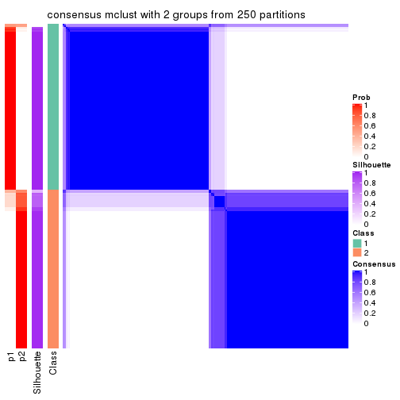</p>

</div>
<div id='tab-MAD-mclust-consensus-heatmap-2'>
<pre><code class="r">consensus_heatmap(res, k = 3)
</code></pre>

<p>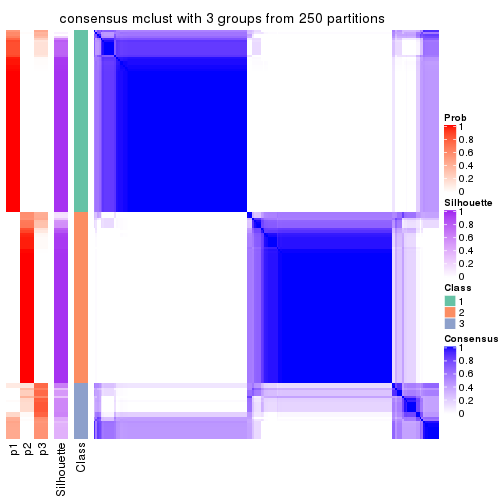</p>

</div>
<div id='tab-MAD-mclust-consensus-heatmap-3'>
<pre><code class="r">consensus_heatmap(res, k = 4)
</code></pre>

<p>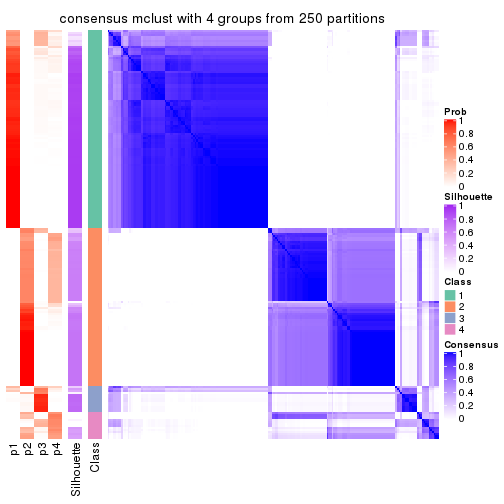</p>

</div>
<div id='tab-MAD-mclust-consensus-heatmap-4'>
<pre><code class="r">consensus_heatmap(res, k = 5)
</code></pre>

<p>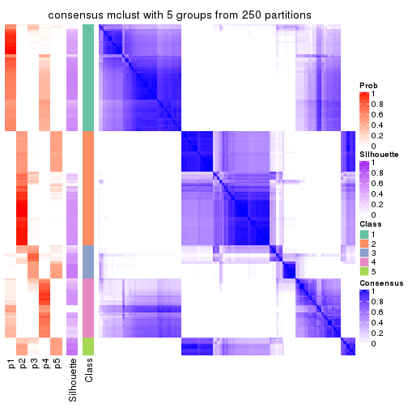</p>

</div>
<div id='tab-MAD-mclust-consensus-heatmap-5'>
<pre><code class="r">consensus_heatmap(res, k = 6)
</code></pre>

<p>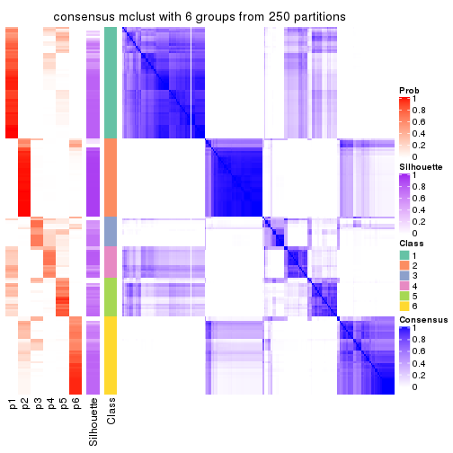</p>

</div>
</div>

Heatmaps for the membership of samples in all partitions to see how consistent they are:


<script>
$( function() {
	$( '#tabs-MAD-mclust-membership-heatmap' ).tabs();
} );
</script>
<div id='tabs-MAD-mclust-membership-heatmap'>
<ul>
<li><a href='#tab-MAD-mclust-membership-heatmap-1'>k = 2</a></li>
<li><a href='#tab-MAD-mclust-membership-heatmap-2'>k = 3</a></li>
<li><a href='#tab-MAD-mclust-membership-heatmap-3'>k = 4</a></li>
<li><a href='#tab-MAD-mclust-membership-heatmap-4'>k = 5</a></li>
<li><a href='#tab-MAD-mclust-membership-heatmap-5'>k = 6</a></li>
</ul>
<div id='tab-MAD-mclust-membership-heatmap-1'>
<pre><code class="r">membership_heatmap(res, k = 2)
</code></pre>

<p>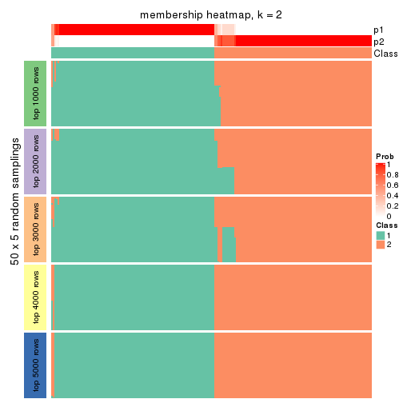</p>

</div>
<div id='tab-MAD-mclust-membership-heatmap-2'>
<pre><code class="r">membership_heatmap(res, k = 3)
</code></pre>

<p>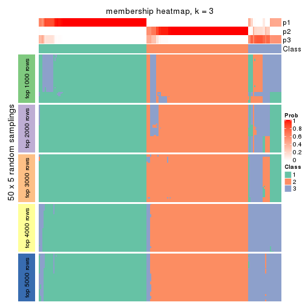</p>

</div>
<div id='tab-MAD-mclust-membership-heatmap-3'>
<pre><code class="r">membership_heatmap(res, k = 4)
</code></pre>

<p>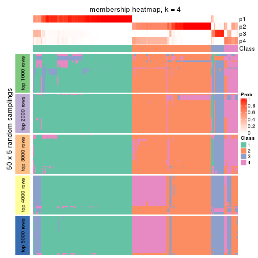</p>

</div>
<div id='tab-MAD-mclust-membership-heatmap-4'>
<pre><code class="r">membership_heatmap(res, k = 5)
</code></pre>

<p>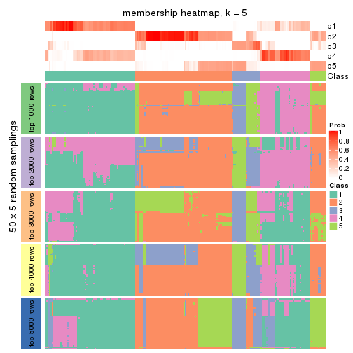</p>

</div>
<div id='tab-MAD-mclust-membership-heatmap-5'>
<pre><code class="r">membership_heatmap(res, k = 6)
</code></pre>

<p>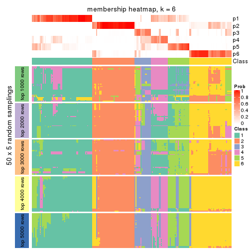</p>

</div>
</div>

As soon as we have had the classes for columns, we can look for signatures
which are significantly different between classes which can be candidate marks
for certain classes. Following are the heatmaps for signatures.


Signature heatmaps where rows are scaled:


<script>
$( function() {
	$( '#tabs-MAD-mclust-get-signatures' ).tabs();
} );
</script>
<div id='tabs-MAD-mclust-get-signatures'>
<ul>
<li><a href='#tab-MAD-mclust-get-signatures-1'>k = 2</a></li>
<li><a href='#tab-MAD-mclust-get-signatures-2'>k = 3</a></li>
<li><a href='#tab-MAD-mclust-get-signatures-3'>k = 4</a></li>
<li><a href='#tab-MAD-mclust-get-signatures-4'>k = 5</a></li>
<li><a href='#tab-MAD-mclust-get-signatures-5'>k = 6</a></li>
</ul>
<div id='tab-MAD-mclust-get-signatures-1'>
<pre><code class="r">get_signatures(res, k = 2)
</code></pre>

<p>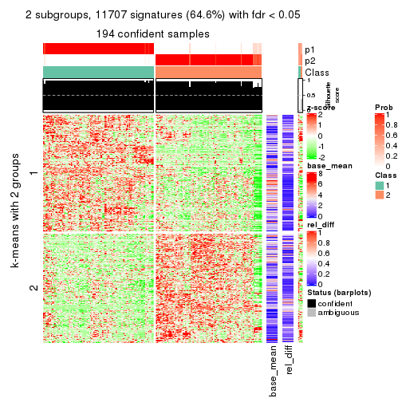</p>

</div>
<div id='tab-MAD-mclust-get-signatures-2'>
<pre><code class="r">get_signatures(res, k = 3)
</code></pre>

<p>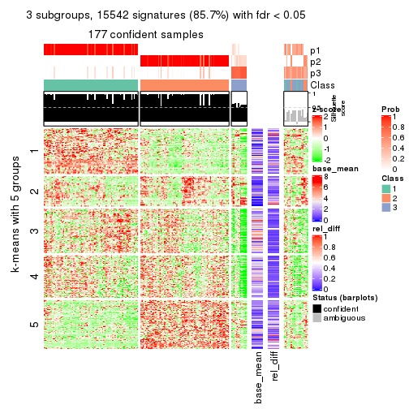</p>

</div>
<div id='tab-MAD-mclust-get-signatures-3'>
<pre><code class="r">get_signatures(res, k = 4)
</code></pre>

<p>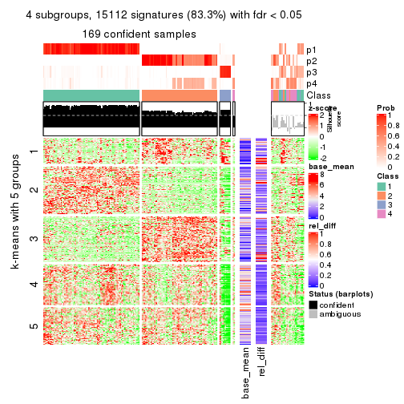</p>

</div>
<div id='tab-MAD-mclust-get-signatures-4'>
<pre><code class="r">get_signatures(res, k = 5)
</code></pre>

<p>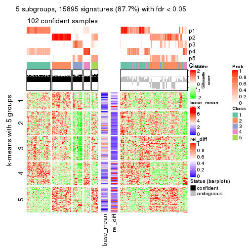</p>

</div>
<div id='tab-MAD-mclust-get-signatures-5'>
<pre><code class="r">get_signatures(res, k = 6)
</code></pre>

<p>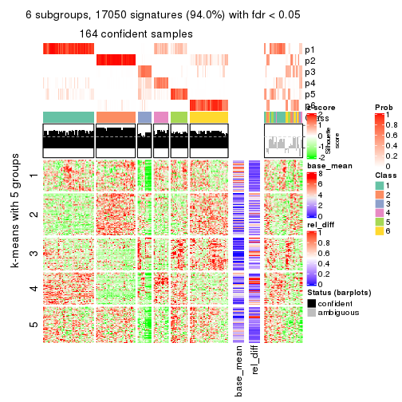</p>

</div>
</div>


Signature heatmaps where rows are not scaled:


<script>
$( function() {
	$( '#tabs-MAD-mclust-get-signatures-no-scale' ).tabs();
} );
</script>
<div id='tabs-MAD-mclust-get-signatures-no-scale'>
<ul>
<li><a href='#tab-MAD-mclust-get-signatures-no-scale-1'>k = 2</a></li>
<li><a href='#tab-MAD-mclust-get-signatures-no-scale-2'>k = 3</a></li>
<li><a href='#tab-MAD-mclust-get-signatures-no-scale-3'>k = 4</a></li>
<li><a href='#tab-MAD-mclust-get-signatures-no-scale-4'>k = 5</a></li>
<li><a href='#tab-MAD-mclust-get-signatures-no-scale-5'>k = 6</a></li>
</ul>
<div id='tab-MAD-mclust-get-signatures-no-scale-1'>
<pre><code class="r">get_signatures(res, k = 2, scale_rows = FALSE)
</code></pre>

<p>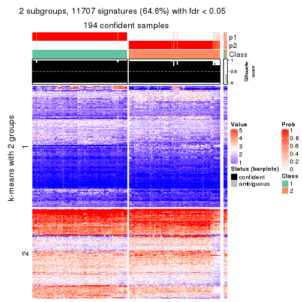</p>

</div>
<div id='tab-MAD-mclust-get-signatures-no-scale-2'>
<pre><code class="r">get_signatures(res, k = 3, scale_rows = FALSE)
</code></pre>

<p>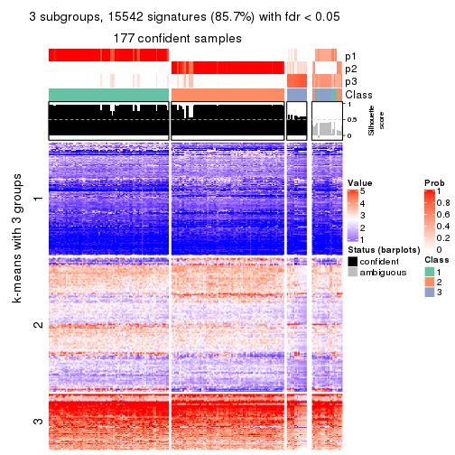</p>

</div>
<div id='tab-MAD-mclust-get-signatures-no-scale-3'>
<pre><code class="r">get_signatures(res, k = 4, scale_rows = FALSE)
</code></pre>

<p>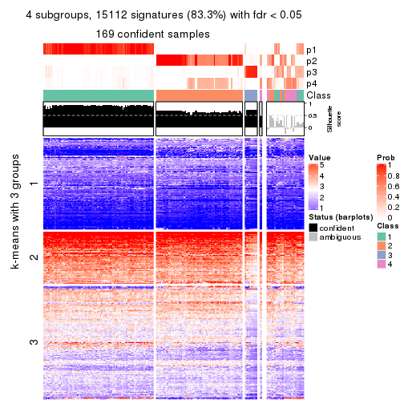</p>

</div>
<div id='tab-MAD-mclust-get-signatures-no-scale-4'>
<pre><code class="r">get_signatures(res, k = 5, scale_rows = FALSE)
</code></pre>

<p>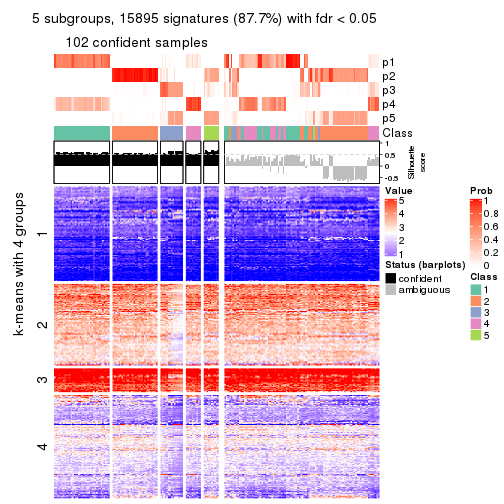</p>

</div>
<div id='tab-MAD-mclust-get-signatures-no-scale-5'>
<pre><code class="r">get_signatures(res, k = 6, scale_rows = FALSE)
</code></pre>

<p>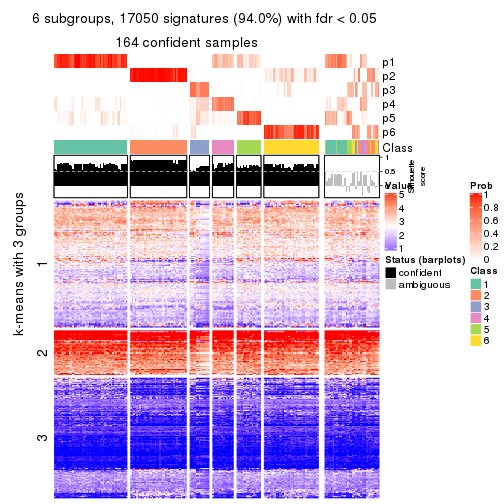</p>

</div>
</div>


Compare the overlap of signatures from different k:

```r
compare_signatures(res)
```

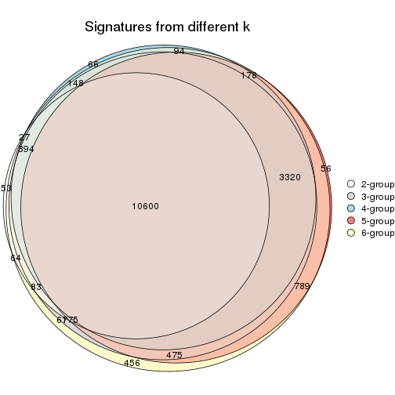

`get_signature()` returns a data frame invisibly. TO get the list of signatures, the function
call should be assigned to a variable explicitly. In following code, if `plot` argument is set
to `FALSE`, no heatmap is plotted while only the differential analysis is performed.

```r
# code only for demonstration
tb = get_signature(res, k = ..., plot = FALSE)
```

An example of the output of `tb` is:

```
#>   which_row         fdr    mean_1    mean_2 scaled_mean_1 scaled_mean_2 km
#> 1        38 0.042760348  8.373488  9.131774    -0.5533452     0.5164555  1
#> 2        40 0.018707592  7.106213  8.469186    -0.6173731     0.5762149  1
#> 3        55 0.019134737 10.221463 11.207825    -0.6159697     0.5749050  1
#> 4        59 0.006059896  5.921854  7.869574    -0.6899429     0.6439467  1
#> 5        60 0.018055526  8.928898 10.211722    -0.6204761     0.5791110  1
#> 6        98 0.009384629 15.714769 14.887706     0.6635654    -0.6193277  2
...
```

The columns in `tb` are:

1. `which_row`: row indices corresponding to the input matrix.
2. `fdr`: FDR for the differential test. 
3. `mean_x`: The mean value in group x.
4. `scaled_mean_x`: The mean value in group x after rows are scaled.
5. `km`: Row groups if k-means clustering is applied to rows.


UMAP plot which shows how samples are separated.


<script>
$( function() {
	$( '#tabs-MAD-mclust-dimension-reduction' ).tabs();
} );
</script>
<div id='tabs-MAD-mclust-dimension-reduction'>
<ul>
<li><a href='#tab-MAD-mclust-dimension-reduction-1'>k = 2</a></li>
<li><a href='#tab-MAD-mclust-dimension-reduction-2'>k = 3</a></li>
<li><a href='#tab-MAD-mclust-dimension-reduction-3'>k = 4</a></li>
<li><a href='#tab-MAD-mclust-dimension-reduction-4'>k = 5</a></li>
<li><a href='#tab-MAD-mclust-dimension-reduction-5'>k = 6</a></li>
</ul>
<div id='tab-MAD-mclust-dimension-reduction-1'>
<pre><code class="r">dimension_reduction(res, k = 2, method = &quot;UMAP&quot;)
</code></pre>

<p>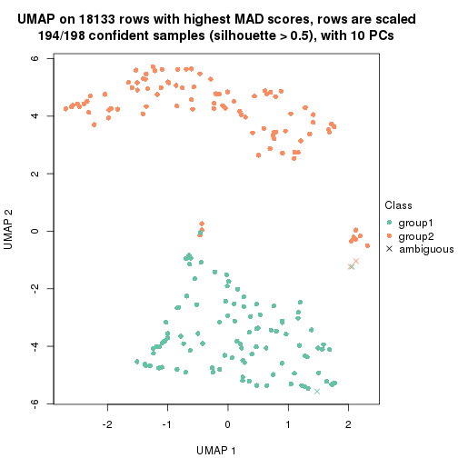</p>

</div>
<div id='tab-MAD-mclust-dimension-reduction-2'>
<pre><code class="r">dimension_reduction(res, k = 3, method = &quot;UMAP&quot;)
</code></pre>

<p>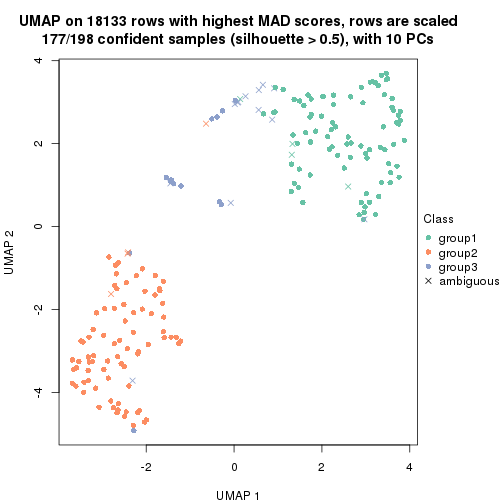</p>

</div>
<div id='tab-MAD-mclust-dimension-reduction-3'>
<pre><code class="r">dimension_reduction(res, k = 4, method = &quot;UMAP&quot;)
</code></pre>

<p>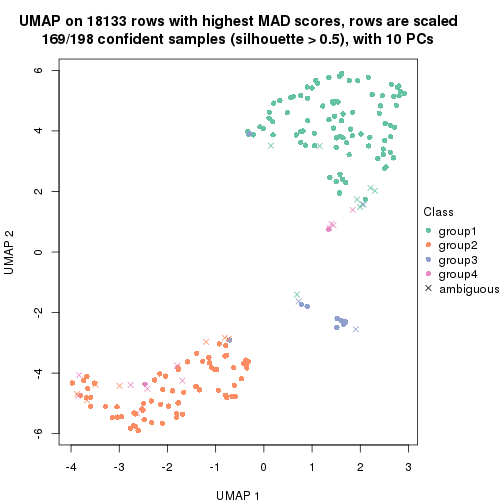</p>

</div>
<div id='tab-MAD-mclust-dimension-reduction-4'>
<pre><code class="r">dimension_reduction(res, k = 5, method = &quot;UMAP&quot;)
</code></pre>

<p>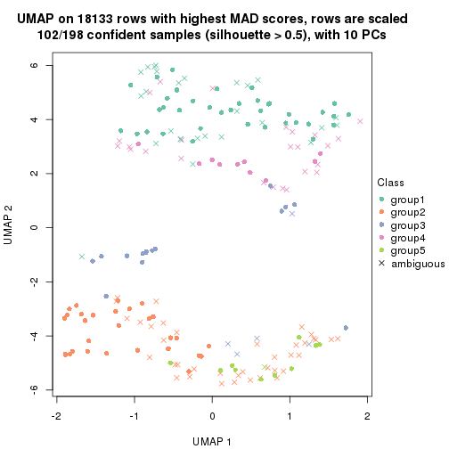</p>

</div>
<div id='tab-MAD-mclust-dimension-reduction-5'>
<pre><code class="r">dimension_reduction(res, k = 6, method = &quot;UMAP&quot;)
</code></pre>

<p>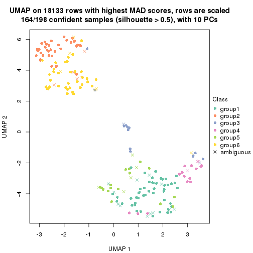</p>

</div>
</div>


Following heatmap shows how subgroups are split when increasing `k`:

```r
collect_classes(res)
```

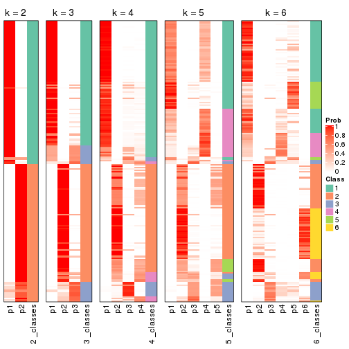


If matrix rows can be associated to genes, consider to use `functional_enrichment(res,
...)` to perform function enrichment for the signature genes. See [this vignette](http://bioconductor.org/packages/devel/bioc/vignettes/cola/inst/doc/functional_enrichment.html) for more detailed explanations.


 

---------------------------------------------------


### MAD:NMF*


The object with results only for a single top-value method and a single partition method 
can be extracted as:

```r
res = res_list["MAD", "NMF"]
# you can also extract it by
# res = res_list["MAD:NMF"]
```

A summary of `res` and all the functions that can be applied to it:

```r
res
```

```
#> A 'ConsensusPartition' object with k = 2, 3, 4, 5, 6.
#>   On a matrix with 18133 rows and 198 columns.
#>   Top rows (1000, 2000, 3000, 4000, 5000) are extracted by 'MAD' method.
#>   Subgroups are detected by 'NMF' method.
#>   Performed in total 1250 partitions by row resampling.
#>   Best k for subgroups seems to be 3.
#> 
#> Following methods can be applied to this 'ConsensusPartition' object:
#>  [1] "cola_report"             "collect_classes"         "collect_plots"          
#>  [4] "collect_stats"           "colnames"                "compare_signatures"     
#>  [7] "consensus_heatmap"       "dimension_reduction"     "functional_enrichment"  
#> [10] "get_anno_col"            "get_anno"                "get_classes"            
#> [13] "get_consensus"           "get_matrix"              "get_membership"         
#> [16] "get_param"               "get_signatures"          "get_stats"              
#> [19] "is_best_k"               "is_stable_k"             "membership_heatmap"     
#> [22] "ncol"                    "nrow"                    "plot_ecdf"              
#> [25] "rownames"                "select_partition_number" "show"                   
#> [28] "suggest_best_k"          "test_to_known_factors"
```

`collect_plots()` function collects all the plots made from `res` for all `k` (number of partitions)
into one single page to provide an easy and fast comparison between different `k`.

```r
collect_plots(res)
```

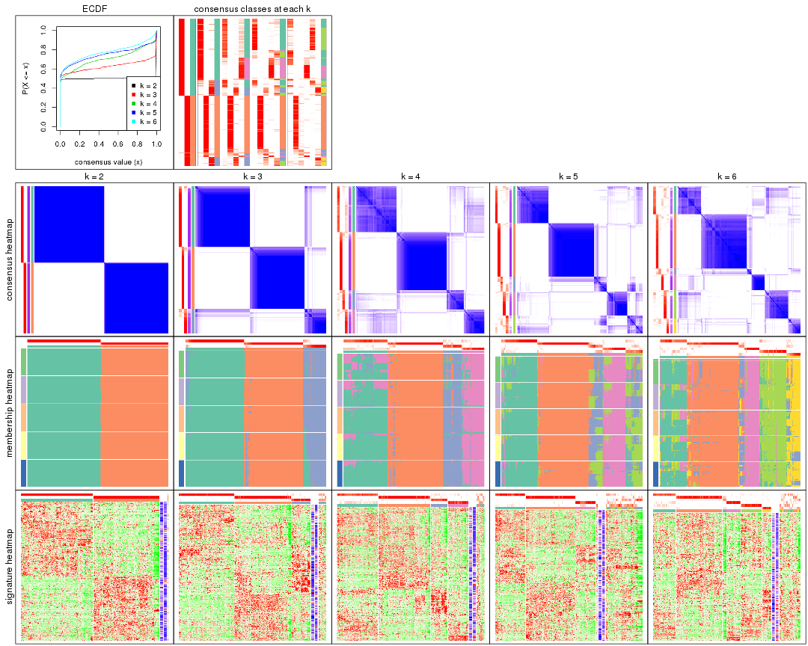

The plots are:

- The first row: a plot of the ECDF (empirical cumulative distribution
  function) curves of the consensus matrix for each `k` and the heatmap of
  predicted classes for each `k`.
- The second row: heatmaps of the consensus matrix for each `k`.
- The third row: heatmaps of the membership matrix for each `k`.
- The fouth row: heatmaps of the signatures for each `k`.

All the plots in panels can be made by individual functions and they are
plotted later in this section.

`select_partition_number()` produces several plots showing different
statistics for choosing "optimized" `k`. There are following statistics:

- ECDF curves of the consensus matrix for each `k`;
- 1-PAC. [The PAC
  score](https://en.wikipedia.org/wiki/Consensus_clustering#Over-interpretation_potential_of_consensus_clustering)
  measures the proportion of the ambiguous subgrouping.
- Mean silhouette score.
- Concordance. The mean probability of fiting the consensus class ids in all
  partitions.
- Area increased. Denote $A_k$ as the area under the ECDF curve for current
  `k`, the area increased is defined as $A_k - A_{k-1}$.
- Rand index. The percent of pairs of samples that are both in a same cluster
  or both are not in a same cluster in the partition of k and k-1.
- Jaccard index. The ratio of pairs of samples are both in a same cluster in
  the partition of k and k-1 and the pairs of samples are both in a same
  cluster in the partition k or k-1.

The detailed explanations of these statistics can be found in [the _cola_
vignette](http://bioconductor.org/packages/devel/bioc/vignettes/cola/inst/doc/cola.html#toc_13).

Generally speaking, lower PAC score, higher mean silhouette score or higher
concordance corresponds to better partition. Rand index and Jaccard index
measure how similar the current partition is compared to partition with `k-1`.
If they are too similar, we won't accept `k` is better than `k-1`.

```r
select_partition_number(res)
```

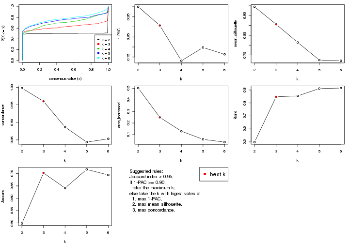

The numeric values for all these statistics can be obtained by `get_stats()`.

```r
get_stats(res)
```

```
#>   k 1-PAC mean_silhouette concordance area_increased  Rand Jaccard
#> 2 2 1.000           0.995       0.998         0.5020 0.498   0.498
#> 3 3 0.907           0.906       0.960         0.2492 0.848   0.702
#> 4 4 0.731           0.814       0.887         0.1291 0.855   0.641
#> 5 5 0.797           0.724       0.844         0.0591 0.911   0.716
#> 6 6 0.764           0.721       0.853         0.0352 0.915   0.694
```

`suggest_best_k()` suggests the best $k$ based on these statistics. The rules are as follows:

- All $k$ with Jaccard index larger than 0.95 are removed because increasing
  $k$ does not provide enough extra information. If all $k$ are removed, it is
  marked as no subgroup is detected.
- For all $k$ with 1-PAC score larger than 0.9, the maximal $k$ is taken as
  the best $k$, and other $k$ are marked as optional $k$.
- If it does not fit the second rule. The $k$ with the maximal vote of the
  highest 1-PAC score, highest mean silhouette, and highest concordance is
  taken as the best $k$.

```r
suggest_best_k(res)
```

```
#> [1] 3
#> attr(,"optional")
#> [1] 2
```

There is also optional best $k$ = 2 that is worth to check.

Following shows the table of the partitions (You need to click the **show/hide
code output** link to see it). The membership matrix (columns with name `p*`)
is inferred by
[`clue::cl_consensus()`](https://www.rdocumentation.org/link/cl_consensus?package=clue)
function with the `SE` method. Basically the value in the membership matrix
represents the probability to belong to a certain group. The finall class
label for an item is determined with the group with highest probability it
belongs to.

In `get_classes()` function, the entropy is calculated from the membership
matrix and the silhouette score is calculated from the consensus matrix.


<script>
$( function() {
	$( '#tabs-MAD-NMF-get-classes' ).tabs();
} );
</script>
<div id='tabs-MAD-NMF-get-classes'>
<ul>
<li><a href='#tab-MAD-NMF-get-classes-1'>k = 2</a></li>
<li><a href='#tab-MAD-NMF-get-classes-2'>k = 3</a></li>
<li><a href='#tab-MAD-NMF-get-classes-3'>k = 4</a></li>
<li><a href='#tab-MAD-NMF-get-classes-4'>k = 5</a></li>
<li><a href='#tab-MAD-NMF-get-classes-5'>k = 6</a></li>
</ul>

<div id='tab-MAD-NMF-get-classes-1'>
<p><a id='tab-MAD-NMF-get-classes-1-a' style='color:#0366d6' href='#'>show/hide code output</a></p>
<pre><code class="r">cbind(get_classes(res, k = 2), get_membership(res, k = 2))
</code></pre>

<pre><code>#&gt;                                      class entropy silhouette    p1    p2
#&gt; 0C0AA0B2-5191-4EDF-8937-ED7434F30283     2   0.000      0.996 0.000 1.000
#&gt; 18B45F1F-234F-45CC-A234-145307606C5C     1   0.000      1.000 1.000 0.000
#&gt; E18B70C0-BDCA-46D3-99BB-C6C8ABC68DA5     2   0.000      0.996 0.000 1.000
#&gt; 0F6DDBA7-6F74-45E8-95C8-F28263D55978     1   0.000      1.000 1.000 0.000
#&gt; 7EAE1A5A-129A-46DE-977E-A2C753F10904     2   0.000      0.996 0.000 1.000
#&gt; 7EAE0048-16B5-4979-9410-16CDEB9B1A48     1   0.000      1.000 1.000 0.000
#&gt; 2EBFC828-2B27-4753-A052-80DDA226DAB4     2   0.000      0.996 0.000 1.000
#&gt; 24E1768D-2232-41DA-9383-BC55D6EB3812     2   0.000      0.996 0.000 1.000
#&gt; 6E3CD60A-1889-4CA3-B305-2E78152057B5     2   0.000      0.996 0.000 1.000
#&gt; 33CC70DD-82B3-413C-B3B1-BE06634D95D0     1   0.000      1.000 1.000 0.000
#&gt; F1CB57A3-55DD-4487-9307-1B4F652E729A     1   0.000      1.000 1.000 0.000
#&gt; 755A5806-B054-449A-93DB-79909E6C93A1     1   0.000      1.000 1.000 0.000
#&gt; 58D364E7-3D2F-468F-A264-D6461E2428D4     2   0.000      0.996 0.000 1.000
#&gt; 68BB9CB6-7AA2-4981-B9D9-07363EC96599     2   0.000      0.996 0.000 1.000
#&gt; 3C4E8DFA-8EA0-4F1F-89CB-CB8805395872     2   0.000      0.996 0.000 1.000
#&gt; 4219651D-5583-4498-BF08-1B7D04B4C7B2     1   0.000      1.000 1.000 0.000
#&gt; B5EE2768-0D67-4584-ADBC-EC745FEC52EA     2   0.000      0.996 0.000 1.000
#&gt; 825E6C11-F460-451A-8045-846DD7D0E945     1   0.000      1.000 1.000 0.000
#&gt; 491F62AF-5E68-43C3-982A-F867A75BBA9A     2   0.000      0.996 0.000 1.000
#&gt; 9D7F058C-F95A-44AD-AC9E-450F7FBDC960     2   0.000      0.996 0.000 1.000
#&gt; 6D42DD0C-2081-4742-BA27-9F5F16FAC3C6     1   0.000      1.000 1.000 0.000
#&gt; EDD7E63D-492A-473B-A552-0764337B10EF     2   0.000      0.996 0.000 1.000
#&gt; 97073DEA-73AD-4DFD-BD1A-9035DC03445B     1   0.000      1.000 1.000 0.000
#&gt; FA891AB9-CE38-4F7E-A015-1DDCE12890A0     1   0.000      1.000 1.000 0.000
#&gt; D9514D49-A0AE-45AB-8C9F-68E726215253     1   0.000      1.000 1.000 0.000
#&gt; 3B9229AD-12E5-451E-9D2F-378AAC82C04A     2   0.000      0.996 0.000 1.000
#&gt; 5EA36B71-4917-4EF3-9060-065EFE6ACC5B     1   0.000      1.000 1.000 0.000
#&gt; A20E4ECB-4895-4CC7-BE5E-4721B20D933B     1   0.000      1.000 1.000 0.000
#&gt; 1BE8D828-29DB-4368-AA4A-FB23588F7AE8     1   0.000      1.000 1.000 0.000
#&gt; 66EFEFCF-3D14-4DBF-AA13-530F40ED0245     1   0.000      1.000 1.000 0.000
#&gt; 55DFFE53-BCE7-4EC1-9863-6C0311B06BA2     2   0.000      0.996 0.000 1.000
#&gt; 4CC3FB5A-611D-4C64-AE9D-544FA45CF4DC     1   0.000      1.000 1.000 0.000
#&gt; C11D33F2-DFE9-4FA8-9024-F3E7F1DADC5F     2   0.000      0.996 0.000 1.000
#&gt; FA5932B8-8AA3-4C38-9FAB-C35D8772974D     1   0.000      1.000 1.000 0.000
#&gt; 8216EC35-1F41-4A15-B503-BDA4971E27C9     1   0.000      1.000 1.000 0.000
#&gt; 69635D23-90A7-4BAD-97C7-B79536837F57     1   0.000      1.000 1.000 0.000
#&gt; 12B404E2-C463-4409-8392-E4649B2AFFD1     2   0.000      0.996 0.000 1.000
#&gt; 246927E3-ACCF-41B2-AA8E-43855FD6B146     2   0.000      0.996 0.000 1.000
#&gt; E0CC13E7-9607-49E0-B4AA-395544E3C3BF     1   0.000      1.000 1.000 0.000
#&gt; F7BBC0C1-6124-4A83-8A70-EA89B62F1CBD     1   0.000      1.000 1.000 0.000
#&gt; B1D4FF24-8E6F-4A04-B716-2032D850EB57     1   0.000      1.000 1.000 0.000
#&gt; 253601DB-B78A-4566-9947-8C0270C0B163     2   0.000      0.996 0.000 1.000
#&gt; AB83DBFF-5737-4FB8-A5AC-1D3CD6072BDF     2   0.000      0.996 0.000 1.000
#&gt; 9D67D953-EC98-4B72-89C8-5732BC9D4BC9     2   0.000      0.996 0.000 1.000
#&gt; 51061018-95AB-4278-886F-F69E4EBC47C0     2   0.000      0.996 0.000 1.000
#&gt; ABD0F7F3-105B-4DEE-9889-5028772C519A     1   0.000      1.000 1.000 0.000
#&gt; 562B95CF-B27E-4A72-B7C6-CDF86A51A39B     1   0.000      1.000 1.000 0.000
#&gt; ABF046A4-D7A1-49FF-B6B1-4E07A791DEDB     2   0.000      0.996 0.000 1.000
#&gt; 3FF4101E-9703-460E-A30E-76CC7689F36D     2   0.000      0.996 0.000 1.000
#&gt; 39C4F7AA-7ADF-4F1D-BDA3-BEC605AC5023     2   0.000      0.996 0.000 1.000
#&gt; CB821FD2-AF5C-4743-A70F-21C12C6ED153     1   0.000      1.000 1.000 0.000
#&gt; 92EA1846-62FF-41D5-A441-5E52E6B9E7F9     1   0.000      1.000 1.000 0.000
#&gt; 7D25F3EE-5A20-4763-8026-16A03D05F459     1   0.000      1.000 1.000 0.000
#&gt; 8ECE5276-CD06-496B-A5A9-1713B1F7D089     1   0.000      1.000 1.000 0.000
#&gt; C775B68F-9507-47E3-B507-B433AED79002     1   0.000      1.000 1.000 0.000
#&gt; E19D5463-FDD0-41C1-A170-323736A88D07     2   0.000      0.996 0.000 1.000
#&gt; CE4B6285-4961-4767-91F0-5C7A8162E185     1   0.000      1.000 1.000 0.000
#&gt; 9637BD72-1FEF-42AD-8886-2C39BE876531     1   0.000      1.000 1.000 0.000
#&gt; 81B5A88E-45A0-4B44-B689-B9071B8548EE     2   0.000      0.996 0.000 1.000
#&gt; 0B01B4C9-9BED-4F5B-A3E2-8868C7CCC3FC     2   0.000      0.996 0.000 1.000
#&gt; 54501315-7132-44B2-A179-10FBF1421105     1   0.000      1.000 1.000 0.000
#&gt; E207CBE9-4C3A-4FDD-9251-CFE1FE106475     1   0.000      1.000 1.000 0.000
#&gt; 3BEA0B92-3F90-4DBF-9679-AADEAD7D47C8     2   0.000      0.996 0.000 1.000
#&gt; 35B32250-D854-4215-AA5B-2C11B2FBEECA     1   0.000      1.000 1.000 0.000
#&gt; ACE6566B-AEB9-426C-924A-B382D14A1024     2   0.000      0.996 0.000 1.000
#&gt; 737E69AC-0930-45B9-B6BA-7CE5E300290B     1   0.000      1.000 1.000 0.000
#&gt; B4410AB8-D015-41CA-86E6-12EB4E4103E3     1   0.000      1.000 1.000 0.000
#&gt; 6D3ECA65-C50F-43B0-B75A-1D290FA4A8FD     2   0.000      0.996 0.000 1.000
#&gt; C86F40D3-9A96-4395-A8C3-510DE12F9A2B     2   0.000      0.996 0.000 1.000
#&gt; 6238087F-24DD-4BF1-903F-3BD4E446C1AE     2   0.000      0.996 0.000 1.000
#&gt; E4FF840B-EEAB-4CB0-A690-7D4C4AA7EEC3     2   0.000      0.996 0.000 1.000
#&gt; 72D3C323-C67F-4C0E-9BFC-BF245FF9730A     1   0.000      1.000 1.000 0.000
#&gt; 82D56E4E-4DF6-4F3E-8959-B995C92AAA70     1   0.000      1.000 1.000 0.000
#&gt; E31CA441-EB19-443B-ACBD-37B5CCBCF0E5     2   0.000      0.996 0.000 1.000
#&gt; 87CA8939-D054-4B8A-B32D-085FD2E8F202     1   0.000      1.000 1.000 0.000
#&gt; 2A508D90-FEDC-46A3-9A02-E51E5467CDCB     1   0.000      1.000 1.000 0.000
#&gt; C4E8B4E2-388B-411F-BF0A-9B6F34E8EDB5     2   0.000      0.996 0.000 1.000
#&gt; AF6AF803-BD93-44A7-AA80-B9BC92C1273B     2   0.000      0.996 0.000 1.000
#&gt; 0B1CA5CF-EB96-41D4-BFC5-6957FEB39828     1   0.000      1.000 1.000 0.000
#&gt; 6FB96FB0-6661-48AD-A4A0-69F8AFDBE591     2   0.000      0.996 0.000 1.000
#&gt; 8C19F7FD-368A-462B-B28F-88D6630038A1     1   0.000      1.000 1.000 0.000
#&gt; 96EABE78-C2F4-4A33-ACD8-C922A4B2519B     2   0.000      0.996 0.000 1.000
#&gt; 68B36D7B-546A-4689-949F-B207C4A4AB27     2   0.000      0.996 0.000 1.000
#&gt; CE9F3335-778F-4F52-BC55-4B7C99B211DD     2   0.000      0.996 0.000 1.000
#&gt; CB359DED-2A2D-4646-A0BD-6F10ADCC532B     1   0.000      1.000 1.000 0.000
#&gt; 198324A5-8C52-46F6-9734-EFAF1CCA6D9B     1   0.000      1.000 1.000 0.000
#&gt; 83B88608-0506-428C-B9E8-621F38477B42     1   0.000      1.000 1.000 0.000
#&gt; 1993630A-0F3D-4F5C-86A3-D443BAAF57F0     1   0.000      1.000 1.000 0.000
#&gt; DE73DA9B-529E-4F4F-A65C-DA7AB84B1096     1   0.000      1.000 1.000 0.000
#&gt; 2347F3B7-DDA3-40C0-B6D4-8819ECA69146     1   0.000      1.000 1.000 0.000
#&gt; AB93B5D5-095F-4330-9D40-6A3D934AB50C     1   0.000      1.000 1.000 0.000
#&gt; 5EBBE4AD-FF0C-41CF-9EA3-B6FE7EA1F9C0     1   0.000      1.000 1.000 0.000
#&gt; 6D960AE7-3769-4144-A061-E8588E5063FF     1   0.000      1.000 1.000 0.000
#&gt; 0C2DD8C0-D1A5-4192-A49C-7A40FED628B2     2   0.000      0.996 0.000 1.000
#&gt; 18C9372F-C55B-4F86-A9D2-E8D85EFC8566     2   0.936      0.458 0.352 0.648
#&gt; 9AF637B0-4C32-4DD1-93AF-7655B4A845D3     2   0.000      0.996 0.000 1.000
#&gt; 785B5B06-4115-46FD-9BEB-F888AFDC855D     2   0.000      0.996 0.000 1.000
#&gt; ECA3050E-4BE2-4117-B9CF-A52BB85AF8C2     2   0.000      0.996 0.000 1.000
#&gt; 099DC396-16A5-458F-9ED9-F2A790CB0C34     1   0.000      1.000 1.000 0.000
#&gt; 7A5A12EE-C5B0-4C51-8C99-0F3FA88D633E     1   0.000      1.000 1.000 0.000
#&gt; E832B508-A66D-4817-B44A-FE9FAAE64B4A     1   0.000      1.000 1.000 0.000
#&gt; F9DD688C-7B35-49E7-9651-2E098EE78856     1   0.000      1.000 1.000 0.000
#&gt; F1265DD8-5ED3-4635-A277-57BBFDEC7729     1   0.000      1.000 1.000 0.000
#&gt; F624E8D9-DB07-4C9E-910D-5E8EBA3A6167     2   0.000      0.996 0.000 1.000
#&gt; 3516FBDF-66E1-43F4-9D7B-16748F6439A7     2   0.000      0.996 0.000 1.000
#&gt; 04B12992-B2EA-4BA2-8E2C-11E34E230E6F     2   0.000      0.996 0.000 1.000
#&gt; CC02897D-9123-495E-9242-5C9CF4EC269B     2   0.000      0.996 0.000 1.000
#&gt; 3117ED46-2BF2-4311-BC00-4E98243E16B3     1   0.000      1.000 1.000 0.000
#&gt; E0B66D53-23DB-4E26-BB6E-F692FA8C000E     1   0.000      1.000 1.000 0.000
#&gt; DAA93CE5-A013-477A-9A50-EA09CC3A8162     2   0.000      0.996 0.000 1.000
#&gt; 0099098D-354A-4276-92F8-B932C74B4608     1   0.000      1.000 1.000 0.000
#&gt; DD483639-B2E7-4745-BCFB-55ED1D82BFBF     2   0.000      0.996 0.000 1.000
#&gt; 2C1F9079-602E-4252-82C7-9D8799E04246     2   0.000      0.996 0.000 1.000
#&gt; 9473A8E4-3A1B-4184-9EA6-517AFD60B635     1   0.000      1.000 1.000 0.000
#&gt; 75CFBAF6-7BA0-40AF-92D7-D218E885BD1B     2   0.000      0.996 0.000 1.000
#&gt; B588950F-14D6-41C8-845B-EFD2096013C6     2   0.000      0.996 0.000 1.000
#&gt; 0DF3EDA8-DAEA-4721-92AB-B97181249498     2   0.000      0.996 0.000 1.000
#&gt; 8EA83042-D598-401D-AD78-936EEB136C59     1   0.000      1.000 1.000 0.000
#&gt; 729AC418-3BE9-445A-95D4-AC11A7D43BE0     1   0.000      1.000 1.000 0.000
#&gt; 7D8B1B11-F576-4AA8-BFA7-0022A2CD829A     2   0.000      0.996 0.000 1.000
#&gt; 304A0E46-3449-4B44-9C30-BDDF6459391D     1   0.000      1.000 1.000 0.000
#&gt; 3C83358F-DF20-47F7-AF9F-AB7CC92F5ABA     1   0.000      1.000 1.000 0.000
#&gt; EAFEED6C-35C3-451F-AE4A-EB56992E1F29     1   0.000      1.000 1.000 0.000
#&gt; 8A237A65-28EC-434D-A78A-A8B7308B5204     1   0.000      1.000 1.000 0.000
#&gt; D005833F-E991-4E9E-9667-55F137288004     1   0.000      1.000 1.000 0.000
#&gt; 37D966E3-253E-4397-A9AE-0903A8D31FE6     1   0.000      1.000 1.000 0.000
#&gt; D2482B81-CB5B-4178-BA8D-1CF4026181B5     1   0.000      1.000 1.000 0.000
#&gt; 18019E95-C2A8-4EE7-B585-F6886DC4D953     2   0.000      0.996 0.000 1.000
#&gt; 0B126D1A-14A8-4345-8F78-FF92222ADF4C     2   0.000      0.996 0.000 1.000
#&gt; CE88B625-47D8-4D58-9FB4-23464DB7DDAD     2   0.000      0.996 0.000 1.000
#&gt; 9A88299D-5C74-47FA-B42C-1A1D6D935AAB     1   0.000      1.000 1.000 0.000
#&gt; 3E71159C-FD6C-41DA-B18B-0730C8AC7E41     1   0.000      1.000 1.000 0.000
#&gt; 6F245AA4-79D9-47E1-BCC9-1AAF65AEA813     1   0.000      1.000 1.000 0.000
#&gt; 4CF2C888-2100-483A-B4DB-ECBB69243A4D     2   0.000      0.996 0.000 1.000
#&gt; A3853813-B9D5-4E8C-B075-19FCC35F8686     2   0.000      0.996 0.000 1.000
#&gt; 83A16DEE-CE9F-4D8B-9225-0A2A8B9D055D     1   0.000      1.000 1.000 0.000
#&gt; 0F057CAF-4F9A-4DE9-8601-730E96873733     2   0.000      0.996 0.000 1.000
#&gt; 32D5801D-DBA4-422E-87CB-A2DDE921BA41     1   0.000      1.000 1.000 0.000
#&gt; 22EE8076-F07C-499A-9AF8-D800A77EF154     2   0.000      0.996 0.000 1.000
#&gt; DD4BD74D-D48C-4090-9F57-5334E784581C     1   0.000      1.000 1.000 0.000
#&gt; 41183565-434D-474C-B1BD-CA6E94910658     2   0.000      0.996 0.000 1.000
#&gt; 75A2CE41-2B2A-4346-927E-ACF8A72738E4     1   0.000      1.000 1.000 0.000
#&gt; 7AA24995-3DD2-4682-B36A-4EBFEEACF625     1   0.000      1.000 1.000 0.000
#&gt; 8BAFDFEC-9F26-4ADB-95CE-004143960EEB     1   0.000      1.000 1.000 0.000
#&gt; A330E011-CE08-4A85-8F4B-370592293DBB     1   0.000      1.000 1.000 0.000
#&gt; 1D5A5B17-2E70-4BB0-94A1-EC17E6EA49DB     1   0.000      1.000 1.000 0.000
#&gt; BD9143B8-9D97-4A05-872C-3FB82B4CF7BE     2   0.000      0.996 0.000 1.000
#&gt; 64552DC0-181E-4607-898C-787AA7F26435     2   0.000      0.996 0.000 1.000
#&gt; 1B4C4D41-34C7-43A3-858B-C9552EB53894     1   0.000      1.000 1.000 0.000
#&gt; 463A3BAA-02DC-4EA4-A644-B924163E425D     2   0.000      0.996 0.000 1.000
#&gt; CD0FEA89-6F60-4A20-8FCA-D397B4E95A98     1   0.000      1.000 1.000 0.000
#&gt; 5D06CF6D-F4B9-4B32-B055-8AB287E53340     2   0.000      0.996 0.000 1.000
#&gt; ADA7835F-DB67-4F4F-9446-8BCE3C5FE936     2   0.000      0.996 0.000 1.000
#&gt; 4109BE2D-B5DF-4BD7-860E-60D87F647152     2   0.000      0.996 0.000 1.000
#&gt; 88526A0E-6DFE-46CB-BFAD-B4826F482C67     1   0.000      1.000 1.000 0.000
#&gt; F39F9A4C-18F7-4017-AB31-85D52FF44587     2   0.000      0.996 0.000 1.000
#&gt; D4290A5E-1B24-4C55-B470-0FA7A0A09DD0     2   0.000      0.996 0.000 1.000
#&gt; DC5A2C9E-978F-4661-B729-1F9662976E27     1   0.000      1.000 1.000 0.000
#&gt; 26A1F392-CED2-43E3-8096-74E6F2BFC8C0     2   0.000      0.996 0.000 1.000
#&gt; 87D81FB2-306A-4E75-9D58-D5F48E46E7F6     2   0.000      0.996 0.000 1.000
#&gt; E3D9D81A-C20C-4B3B-B940-A5D2C5F65B22     2   0.000      0.996 0.000 1.000
#&gt; 4464650B-453F-476C-989C-B7B159BF2CF0     2   0.000      0.996 0.000 1.000
#&gt; 577D2867-B738-487A-9B06-07958D647F02     1   0.000      1.000 1.000 0.000
#&gt; E52A22CC-3C03-41A9-9541-220DD871E162     2   0.000      0.996 0.000 1.000
#&gt; 642703B1-AF99-4746-A915-0792F4B9590B     2   0.000      0.996 0.000 1.000
#&gt; 8F0D1792-1284-45E6-8EC4-392596057677     2   0.000      0.996 0.000 1.000
#&gt; 765AFFC1-D528-4494-8BA1-0706451E4205     2   0.000      0.996 0.000 1.000
#&gt; A716BC29-161F-4CA0-B240-00B330137F2C     1   0.000      1.000 1.000 0.000
#&gt; 32CBFBAF-7064-4595-8D54-2C5E7DE0FD9B     1   0.000      1.000 1.000 0.000
#&gt; 4D6ED28C-3F20-41B0-BA41-1BF0E5199A40     2   0.260      0.951 0.044 0.956
#&gt; 86A38456-2900-48FB-B10F-79222B3CA9BF     1   0.000      1.000 1.000 0.000
#&gt; E870807D-3223-4A6A-9E3D-F4461B048AA2     2   0.000      0.996 0.000 1.000
#&gt; 3A78D19F-A833-4D2C-8387-FB4FD4A8313C     1   0.000      1.000 1.000 0.000
#&gt; DFA162CA-C708-4121-8E74-F9C4DEE0CDAE     1   0.000      1.000 1.000 0.000
#&gt; C00A300A-CD10-4C9D-8C94-3901AFE8406C     2   0.000      0.996 0.000 1.000
#&gt; 13E11D15-A90F-48C4-980A-DD032C00A2C1     1   0.000      1.000 1.000 0.000
#&gt; 31BF80AB-FEDB-4C73-89C3-70BE9F9ACBEE     2   0.000      0.996 0.000 1.000
#&gt; FA34308A-349D-4AAD-94CF-3F3B7F9AD629     2   0.000      0.996 0.000 1.000
#&gt; 7C48D467-B663-49DD-BC84-A36BC32ACB3D     1   0.000      1.000 1.000 0.000
#&gt; BB068534-04F6-4FC9-9087-CDA65920BCE2     1   0.000      1.000 1.000 0.000
#&gt; EA4EC272-A9B3-4B2E-955F-19F7676A944C     2   0.000      0.996 0.000 1.000
#&gt; C71FF69B-A460-43CA-8769-9667F22D938B     1   0.000      1.000 1.000 0.000
#&gt; 5243D1B8-8168-4FF1-A8C6-505F080EF0D3     2   0.000      0.996 0.000 1.000
#&gt; BCC474D8-08FE-4E99-B8E8-B29E65F84D2E     1   0.000      1.000 1.000 0.000
#&gt; 04FDBFE3-4CF6-4E53-A2AA-89D5C9316377     2   0.000      0.996 0.000 1.000
#&gt; 83A9915C-8D60-4CAE-A868-B61E3C90C7B0     2   0.000      0.996 0.000 1.000
#&gt; 989A6472-E3E3-457A-97BE-CCE95F42D5C2     2   0.000      0.996 0.000 1.000
#&gt; A0AB2D28-6751-49C9-8DF4-66FDBF95C360     1   0.000      1.000 1.000 0.000
#&gt; A12B2683-18D4-41C9-8AE5-C143E2180052     1   0.000      1.000 1.000 0.000
#&gt; 8DE1E245-CAD2-4F11-BFA2-9792C433A00B     1   0.000      1.000 1.000 0.000
#&gt; FDA68036-6C4C-4256-9AA0-C01FE92AA098     2   0.000      0.996 0.000 1.000
#&gt; 26311920-1414-4EC1-870B-784961EBCC2D     1   0.000      1.000 1.000 0.000
#&gt; C29A10D6-D598-4286-B5E0-F1776E19E988     1   0.000      1.000 1.000 0.000
#&gt; FACCC1FB-4937-4CC0-90EA-7F91D3D939CF     2   0.000      0.996 0.000 1.000
#&gt; 90B9D84B-78E5-4C7E-8414-EC889C2DE8DB     2   0.000      0.996 0.000 1.000
#&gt; B74E6122-76E1-4E4D-A867-BCAFD7277393     1   0.000      1.000 1.000 0.000
#&gt; 98494DC0-CF6E-485F-8A0D-D80E4437EF5C     2   0.000      0.996 0.000 1.000
#&gt; DA114DAC-DE7B-4E43-8D7C-82C5D7B66411     1   0.000      1.000 1.000 0.000
</code></pre>

<script>
$('#tab-MAD-NMF-get-classes-1-a').parent().next().next().hide();
$('#tab-MAD-NMF-get-classes-1-a').click(function(){
  $('#tab-MAD-NMF-get-classes-1-a').parent().next().next().toggle();
  return(false);
});
</script>
</div>

<div id='tab-MAD-NMF-get-classes-2'>
<p><a id='tab-MAD-NMF-get-classes-2-a' style='color:#0366d6' href='#'>show/hide code output</a></p>
<pre><code class="r">cbind(get_classes(res, k = 3), get_membership(res, k = 3))
</code></pre>

<pre><code>#&gt;                                      class entropy silhouette    p1    p2    p3
#&gt; 0C0AA0B2-5191-4EDF-8937-ED7434F30283     2  0.0000     0.9718 0.000 1.000 0.000
#&gt; 18B45F1F-234F-45CC-A234-145307606C5C     1  0.0000     0.9727 1.000 0.000 0.000
#&gt; E18B70C0-BDCA-46D3-99BB-C6C8ABC68DA5     2  0.0000     0.9718 0.000 1.000 0.000
#&gt; 0F6DDBA7-6F74-45E8-95C8-F28263D55978     1  0.0000     0.9727 1.000 0.000 0.000
#&gt; 7EAE1A5A-129A-46DE-977E-A2C753F10904     2  0.0000     0.9718 0.000 1.000 0.000
#&gt; 7EAE0048-16B5-4979-9410-16CDEB9B1A48     1  0.0000     0.9727 1.000 0.000 0.000
#&gt; 2EBFC828-2B27-4753-A052-80DDA226DAB4     2  0.0000     0.9718 0.000 1.000 0.000
#&gt; 24E1768D-2232-41DA-9383-BC55D6EB3812     2  0.0000     0.9718 0.000 1.000 0.000
#&gt; 6E3CD60A-1889-4CA3-B305-2E78152057B5     2  0.0000     0.9718 0.000 1.000 0.000
#&gt; 33CC70DD-82B3-413C-B3B1-BE06634D95D0     3  0.6192     0.3750 0.420 0.000 0.580
#&gt; F1CB57A3-55DD-4487-9307-1B4F652E729A     1  0.0000     0.9727 1.000 0.000 0.000
#&gt; 755A5806-B054-449A-93DB-79909E6C93A1     1  0.0000     0.9727 1.000 0.000 0.000
#&gt; 58D364E7-3D2F-468F-A264-D6461E2428D4     2  0.0000     0.9718 0.000 1.000 0.000
#&gt; 68BB9CB6-7AA2-4981-B9D9-07363EC96599     2  0.0000     0.9718 0.000 1.000 0.000
#&gt; 3C4E8DFA-8EA0-4F1F-89CB-CB8805395872     2  0.5926     0.4955 0.000 0.644 0.356
#&gt; 4219651D-5583-4498-BF08-1B7D04B4C7B2     1  0.0000     0.9727 1.000 0.000 0.000
#&gt; B5EE2768-0D67-4584-ADBC-EC745FEC52EA     2  0.0000     0.9718 0.000 1.000 0.000
#&gt; 825E6C11-F460-451A-8045-846DD7D0E945     1  0.6267     0.0308 0.548 0.000 0.452
#&gt; 491F62AF-5E68-43C3-982A-F867A75BBA9A     2  0.0000     0.9718 0.000 1.000 0.000
#&gt; 9D7F058C-F95A-44AD-AC9E-450F7FBDC960     2  0.0000     0.9718 0.000 1.000 0.000
#&gt; 6D42DD0C-2081-4742-BA27-9F5F16FAC3C6     1  0.0000     0.9727 1.000 0.000 0.000
#&gt; EDD7E63D-492A-473B-A552-0764337B10EF     2  0.0000     0.9718 0.000 1.000 0.000
#&gt; 97073DEA-73AD-4DFD-BD1A-9035DC03445B     1  0.0000     0.9727 1.000 0.000 0.000
#&gt; FA891AB9-CE38-4F7E-A015-1DDCE12890A0     1  0.0000     0.9727 1.000 0.000 0.000
#&gt; D9514D49-A0AE-45AB-8C9F-68E726215253     1  0.2537     0.8900 0.920 0.000 0.080
#&gt; 3B9229AD-12E5-451E-9D2F-378AAC82C04A     2  0.0000     0.9718 0.000 1.000 0.000
#&gt; 5EA36B71-4917-4EF3-9060-065EFE6ACC5B     3  0.0000     0.8748 0.000 0.000 1.000
#&gt; A20E4ECB-4895-4CC7-BE5E-4721B20D933B     1  0.0000     0.9727 1.000 0.000 0.000
#&gt; 1BE8D828-29DB-4368-AA4A-FB23588F7AE8     3  0.1643     0.8581 0.044 0.000 0.956
#&gt; 66EFEFCF-3D14-4DBF-AA13-530F40ED0245     3  0.6215     0.3542 0.428 0.000 0.572
#&gt; 55DFFE53-BCE7-4EC1-9863-6C0311B06BA2     2  0.0000     0.9718 0.000 1.000 0.000
#&gt; 4CC3FB5A-611D-4C64-AE9D-544FA45CF4DC     1  0.0000     0.9727 1.000 0.000 0.000
#&gt; C11D33F2-DFE9-4FA8-9024-F3E7F1DADC5F     2  0.4842     0.7276 0.000 0.776 0.224
#&gt; FA5932B8-8AA3-4C38-9FAB-C35D8772974D     1  0.0000     0.9727 1.000 0.000 0.000
#&gt; 8216EC35-1F41-4A15-B503-BDA4971E27C9     1  0.0000     0.9727 1.000 0.000 0.000
#&gt; 69635D23-90A7-4BAD-97C7-B79536837F57     1  0.0000     0.9727 1.000 0.000 0.000
#&gt; 12B404E2-C463-4409-8392-E4649B2AFFD1     2  0.0000     0.9718 0.000 1.000 0.000
#&gt; 246927E3-ACCF-41B2-AA8E-43855FD6B146     2  0.0000     0.9718 0.000 1.000 0.000
#&gt; E0CC13E7-9607-49E0-B4AA-395544E3C3BF     1  0.0000     0.9727 1.000 0.000 0.000
#&gt; F7BBC0C1-6124-4A83-8A70-EA89B62F1CBD     1  0.0000     0.9727 1.000 0.000 0.000
#&gt; B1D4FF24-8E6F-4A04-B716-2032D850EB57     1  0.0000     0.9727 1.000 0.000 0.000
#&gt; 253601DB-B78A-4566-9947-8C0270C0B163     2  0.0000     0.9718 0.000 1.000 0.000
#&gt; AB83DBFF-5737-4FB8-A5AC-1D3CD6072BDF     3  0.0000     0.8748 0.000 0.000 1.000
#&gt; 9D67D953-EC98-4B72-89C8-5732BC9D4BC9     2  0.0000     0.9718 0.000 1.000 0.000
#&gt; 51061018-95AB-4278-886F-F69E4EBC47C0     3  0.0000     0.8748 0.000 0.000 1.000
#&gt; ABD0F7F3-105B-4DEE-9889-5028772C519A     1  0.0000     0.9727 1.000 0.000 0.000
#&gt; 562B95CF-B27E-4A72-B7C6-CDF86A51A39B     1  0.0000     0.9727 1.000 0.000 0.000
#&gt; ABF046A4-D7A1-49FF-B6B1-4E07A791DEDB     2  0.0000     0.9718 0.000 1.000 0.000
#&gt; 3FF4101E-9703-460E-A30E-76CC7689F36D     2  0.0000     0.9718 0.000 1.000 0.000
#&gt; 39C4F7AA-7ADF-4F1D-BDA3-BEC605AC5023     2  0.1529     0.9378 0.000 0.960 0.040
#&gt; CB821FD2-AF5C-4743-A70F-21C12C6ED153     1  0.0000     0.9727 1.000 0.000 0.000
#&gt; 92EA1846-62FF-41D5-A441-5E52E6B9E7F9     1  0.0000     0.9727 1.000 0.000 0.000
#&gt; 7D25F3EE-5A20-4763-8026-16A03D05F459     1  0.0000     0.9727 1.000 0.000 0.000
#&gt; 8ECE5276-CD06-496B-A5A9-1713B1F7D089     1  0.0000     0.9727 1.000 0.000 0.000
#&gt; C775B68F-9507-47E3-B507-B433AED79002     3  0.0000     0.8748 0.000 0.000 1.000
#&gt; E19D5463-FDD0-41C1-A170-323736A88D07     2  0.0000     0.9718 0.000 1.000 0.000
#&gt; CE4B6285-4961-4767-91F0-5C7A8162E185     1  0.0000     0.9727 1.000 0.000 0.000
#&gt; 9637BD72-1FEF-42AD-8886-2C39BE876531     1  0.0000     0.9727 1.000 0.000 0.000
#&gt; 81B5A88E-45A0-4B44-B689-B9071B8548EE     3  0.5560     0.4783 0.000 0.300 0.700
#&gt; 0B01B4C9-9BED-4F5B-A3E2-8868C7CCC3FC     3  0.0000     0.8748 0.000 0.000 1.000
#&gt; 54501315-7132-44B2-A179-10FBF1421105     1  0.0000     0.9727 1.000 0.000 0.000
#&gt; E207CBE9-4C3A-4FDD-9251-CFE1FE106475     3  0.0000     0.8748 0.000 0.000 1.000
#&gt; 3BEA0B92-3F90-4DBF-9679-AADEAD7D47C8     2  0.0000     0.9718 0.000 1.000 0.000
#&gt; 35B32250-D854-4215-AA5B-2C11B2FBEECA     1  0.0000     0.9727 1.000 0.000 0.000
#&gt; ACE6566B-AEB9-426C-924A-B382D14A1024     2  0.0000     0.9718 0.000 1.000 0.000
#&gt; 737E69AC-0930-45B9-B6BA-7CE5E300290B     1  0.0000     0.9727 1.000 0.000 0.000
#&gt; B4410AB8-D015-41CA-86E6-12EB4E4103E3     1  0.0000     0.9727 1.000 0.000 0.000
#&gt; 6D3ECA65-C50F-43B0-B75A-1D290FA4A8FD     2  0.0000     0.9718 0.000 1.000 0.000
#&gt; C86F40D3-9A96-4395-A8C3-510DE12F9A2B     2  0.0000     0.9718 0.000 1.000 0.000
#&gt; 6238087F-24DD-4BF1-903F-3BD4E446C1AE     2  0.0000     0.9718 0.000 1.000 0.000
#&gt; E4FF840B-EEAB-4CB0-A690-7D4C4AA7EEC3     2  0.0000     0.9718 0.000 1.000 0.000
#&gt; 72D3C323-C67F-4C0E-9BFC-BF245FF9730A     1  0.0000     0.9727 1.000 0.000 0.000
#&gt; 82D56E4E-4DF6-4F3E-8959-B995C92AAA70     1  0.0000     0.9727 1.000 0.000 0.000
#&gt; E31CA441-EB19-443B-ACBD-37B5CCBCF0E5     2  0.0000     0.9718 0.000 1.000 0.000
#&gt; 87CA8939-D054-4B8A-B32D-085FD2E8F202     1  0.0000     0.9727 1.000 0.000 0.000
#&gt; 2A508D90-FEDC-46A3-9A02-E51E5467CDCB     1  0.0000     0.9727 1.000 0.000 0.000
#&gt; C4E8B4E2-388B-411F-BF0A-9B6F34E8EDB5     3  0.3267     0.7757 0.000 0.116 0.884
#&gt; AF6AF803-BD93-44A7-AA80-B9BC92C1273B     2  0.0000     0.9718 0.000 1.000 0.000
#&gt; 0B1CA5CF-EB96-41D4-BFC5-6957FEB39828     1  0.0000     0.9727 1.000 0.000 0.000
#&gt; 6FB96FB0-6661-48AD-A4A0-69F8AFDBE591     2  0.0000     0.9718 0.000 1.000 0.000
#&gt; 8C19F7FD-368A-462B-B28F-88D6630038A1     1  0.2878     0.8701 0.904 0.000 0.096
#&gt; 96EABE78-C2F4-4A33-ACD8-C922A4B2519B     2  0.0000     0.9718 0.000 1.000 0.000
#&gt; 68B36D7B-546A-4689-949F-B207C4A4AB27     2  0.0000     0.9718 0.000 1.000 0.000
#&gt; CE9F3335-778F-4F52-BC55-4B7C99B211DD     2  0.3941     0.8171 0.000 0.844 0.156
#&gt; CB359DED-2A2D-4646-A0BD-6F10ADCC532B     3  0.4555     0.7447 0.200 0.000 0.800
#&gt; 198324A5-8C52-46F6-9734-EFAF1CCA6D9B     1  0.0000     0.9727 1.000 0.000 0.000
#&gt; 83B88608-0506-428C-B9E8-621F38477B42     1  0.0000     0.9727 1.000 0.000 0.000
#&gt; 1993630A-0F3D-4F5C-86A3-D443BAAF57F0     1  0.0000     0.9727 1.000 0.000 0.000
#&gt; DE73DA9B-529E-4F4F-A65C-DA7AB84B1096     3  0.0000     0.8748 0.000 0.000 1.000
#&gt; 2347F3B7-DDA3-40C0-B6D4-8819ECA69146     1  0.0000     0.9727 1.000 0.000 0.000
#&gt; AB93B5D5-095F-4330-9D40-6A3D934AB50C     3  0.0000     0.8748 0.000 0.000 1.000
#&gt; 5EBBE4AD-FF0C-41CF-9EA3-B6FE7EA1F9C0     3  0.0000     0.8748 0.000 0.000 1.000
#&gt; 6D960AE7-3769-4144-A061-E8588E5063FF     1  0.3192     0.8495 0.888 0.000 0.112
#&gt; 0C2DD8C0-D1A5-4192-A49C-7A40FED628B2     3  0.0000     0.8748 0.000 0.000 1.000
#&gt; 18C9372F-C55B-4F86-A9D2-E8D85EFC8566     2  0.5497     0.5542 0.292 0.708 0.000
#&gt; 9AF637B0-4C32-4DD1-93AF-7655B4A845D3     2  0.0000     0.9718 0.000 1.000 0.000
#&gt; 785B5B06-4115-46FD-9BEB-F888AFDC855D     2  0.0000     0.9718 0.000 1.000 0.000
#&gt; ECA3050E-4BE2-4117-B9CF-A52BB85AF8C2     2  0.0000     0.9718 0.000 1.000 0.000
#&gt; 099DC396-16A5-458F-9ED9-F2A790CB0C34     1  0.0000     0.9727 1.000 0.000 0.000
#&gt; 7A5A12EE-C5B0-4C51-8C99-0F3FA88D633E     1  0.0000     0.9727 1.000 0.000 0.000
#&gt; E832B508-A66D-4817-B44A-FE9FAAE64B4A     1  0.0000     0.9727 1.000 0.000 0.000
#&gt; F9DD688C-7B35-49E7-9651-2E098EE78856     1  0.0000     0.9727 1.000 0.000 0.000
#&gt; F1265DD8-5ED3-4635-A277-57BBFDEC7729     1  0.0000     0.9727 1.000 0.000 0.000
#&gt; F624E8D9-DB07-4C9E-910D-5E8EBA3A6167     2  0.1753     0.9306 0.000 0.952 0.048
#&gt; 3516FBDF-66E1-43F4-9D7B-16748F6439A7     2  0.0000     0.9718 0.000 1.000 0.000
#&gt; 04B12992-B2EA-4BA2-8E2C-11E34E230E6F     2  0.0000     0.9718 0.000 1.000 0.000
#&gt; CC02897D-9123-495E-9242-5C9CF4EC269B     2  0.0000     0.9718 0.000 1.000 0.000
#&gt; 3117ED46-2BF2-4311-BC00-4E98243E16B3     1  0.6308    -0.1289 0.508 0.000 0.492
#&gt; E0B66D53-23DB-4E26-BB6E-F692FA8C000E     1  0.0000     0.9727 1.000 0.000 0.000
#&gt; DAA93CE5-A013-477A-9A50-EA09CC3A8162     2  0.2356     0.9105 0.000 0.928 0.072
#&gt; 0099098D-354A-4276-92F8-B932C74B4608     1  0.0000     0.9727 1.000 0.000 0.000
#&gt; DD483639-B2E7-4745-BCFB-55ED1D82BFBF     2  0.0000     0.9718 0.000 1.000 0.000
#&gt; 2C1F9079-602E-4252-82C7-9D8799E04246     2  0.0000     0.9718 0.000 1.000 0.000
#&gt; 9473A8E4-3A1B-4184-9EA6-517AFD60B635     3  0.0000     0.8748 0.000 0.000 1.000
#&gt; 75CFBAF6-7BA0-40AF-92D7-D218E885BD1B     2  0.0000     0.9718 0.000 1.000 0.000
#&gt; B588950F-14D6-41C8-845B-EFD2096013C6     2  0.0000     0.9718 0.000 1.000 0.000
#&gt; 0DF3EDA8-DAEA-4721-92AB-B97181249498     3  0.0000     0.8748 0.000 0.000 1.000
#&gt; 8EA83042-D598-401D-AD78-936EEB136C59     1  0.0000     0.9727 1.000 0.000 0.000
#&gt; 729AC418-3BE9-445A-95D4-AC11A7D43BE0     1  0.0000     0.9727 1.000 0.000 0.000
#&gt; 7D8B1B11-F576-4AA8-BFA7-0022A2CD829A     2  0.0000     0.9718 0.000 1.000 0.000
#&gt; 304A0E46-3449-4B44-9C30-BDDF6459391D     1  0.1163     0.9470 0.972 0.000 0.028
#&gt; 3C83358F-DF20-47F7-AF9F-AB7CC92F5ABA     3  0.0424     0.8732 0.008 0.000 0.992
#&gt; EAFEED6C-35C3-451F-AE4A-EB56992E1F29     1  0.0000     0.9727 1.000 0.000 0.000
#&gt; 8A237A65-28EC-434D-A78A-A8B7308B5204     1  0.0424     0.9656 0.992 0.000 0.008
#&gt; D005833F-E991-4E9E-9667-55F137288004     1  0.0000     0.9727 1.000 0.000 0.000
#&gt; 37D966E3-253E-4397-A9AE-0903A8D31FE6     1  0.0000     0.9727 1.000 0.000 0.000
#&gt; D2482B81-CB5B-4178-BA8D-1CF4026181B5     1  0.0000     0.9727 1.000 0.000 0.000
#&gt; 18019E95-C2A8-4EE7-B585-F6886DC4D953     3  0.0892     0.8650 0.000 0.020 0.980
#&gt; 0B126D1A-14A8-4345-8F78-FF92222ADF4C     2  0.3116     0.8738 0.000 0.892 0.108
#&gt; CE88B625-47D8-4D58-9FB4-23464DB7DDAD     2  0.0000     0.9718 0.000 1.000 0.000
#&gt; 9A88299D-5C74-47FA-B42C-1A1D6D935AAB     3  0.4887     0.7139 0.228 0.000 0.772
#&gt; 3E71159C-FD6C-41DA-B18B-0730C8AC7E41     1  0.0000     0.9727 1.000 0.000 0.000
#&gt; 6F245AA4-79D9-47E1-BCC9-1AAF65AEA813     1  0.0000     0.9727 1.000 0.000 0.000
#&gt; 4CF2C888-2100-483A-B4DB-ECBB69243A4D     2  0.2066     0.9191 0.000 0.940 0.060
#&gt; A3853813-B9D5-4E8C-B075-19FCC35F8686     2  0.0000     0.9718 0.000 1.000 0.000
#&gt; 83A16DEE-CE9F-4D8B-9225-0A2A8B9D055D     3  0.6305     0.1800 0.484 0.000 0.516
#&gt; 0F057CAF-4F9A-4DE9-8601-730E96873733     2  0.0000     0.9718 0.000 1.000 0.000
#&gt; 32D5801D-DBA4-422E-87CB-A2DDE921BA41     3  0.1031     0.8679 0.024 0.000 0.976
#&gt; 22EE8076-F07C-499A-9AF8-D800A77EF154     2  0.0000     0.9718 0.000 1.000 0.000
#&gt; DD4BD74D-D48C-4090-9F57-5334E784581C     3  0.4974     0.7039 0.236 0.000 0.764
#&gt; 41183565-434D-474C-B1BD-CA6E94910658     3  0.0000     0.8748 0.000 0.000 1.000
#&gt; 75A2CE41-2B2A-4346-927E-ACF8A72738E4     1  0.0000     0.9727 1.000 0.000 0.000
#&gt; 7AA24995-3DD2-4682-B36A-4EBFEEACF625     1  0.0000     0.9727 1.000 0.000 0.000
#&gt; 8BAFDFEC-9F26-4ADB-95CE-004143960EEB     3  0.6204     0.3735 0.424 0.000 0.576
#&gt; A330E011-CE08-4A85-8F4B-370592293DBB     1  0.0000     0.9727 1.000 0.000 0.000
#&gt; 1D5A5B17-2E70-4BB0-94A1-EC17E6EA49DB     1  0.2537     0.8905 0.920 0.000 0.080
#&gt; BD9143B8-9D97-4A05-872C-3FB82B4CF7BE     2  0.0000     0.9718 0.000 1.000 0.000
#&gt; 64552DC0-181E-4607-898C-787AA7F26435     2  0.0000     0.9718 0.000 1.000 0.000
#&gt; 1B4C4D41-34C7-43A3-858B-C9552EB53894     1  0.0000     0.9727 1.000 0.000 0.000
#&gt; 463A3BAA-02DC-4EA4-A644-B924163E425D     2  0.0000     0.9718 0.000 1.000 0.000
#&gt; CD0FEA89-6F60-4A20-8FCA-D397B4E95A98     1  0.0000     0.9727 1.000 0.000 0.000
#&gt; 5D06CF6D-F4B9-4B32-B055-8AB287E53340     2  0.0000     0.9718 0.000 1.000 0.000
#&gt; ADA7835F-DB67-4F4F-9446-8BCE3C5FE936     2  0.0000     0.9718 0.000 1.000 0.000
#&gt; 4109BE2D-B5DF-4BD7-860E-60D87F647152     2  0.0000     0.9718 0.000 1.000 0.000
#&gt; 88526A0E-6DFE-46CB-BFAD-B4826F482C67     1  0.0892     0.9548 0.980 0.000 0.020
#&gt; F39F9A4C-18F7-4017-AB31-85D52FF44587     2  0.0000     0.9718 0.000 1.000 0.000
#&gt; D4290A5E-1B24-4C55-B470-0FA7A0A09DD0     2  0.0000     0.9718 0.000 1.000 0.000
#&gt; DC5A2C9E-978F-4661-B729-1F9662976E27     1  0.0000     0.9727 1.000 0.000 0.000
#&gt; 26A1F392-CED2-43E3-8096-74E6F2BFC8C0     2  0.0000     0.9718 0.000 1.000 0.000
#&gt; 87D81FB2-306A-4E75-9D58-D5F48E46E7F6     2  0.0000     0.9718 0.000 1.000 0.000
#&gt; E3D9D81A-C20C-4B3B-B940-A5D2C5F65B22     2  0.5706     0.5680 0.000 0.680 0.320
#&gt; 4464650B-453F-476C-989C-B7B159BF2CF0     2  0.0000     0.9718 0.000 1.000 0.000
#&gt; 577D2867-B738-487A-9B06-07958D647F02     1  0.0000     0.9727 1.000 0.000 0.000
#&gt; E52A22CC-3C03-41A9-9541-220DD871E162     2  0.0000     0.9718 0.000 1.000 0.000
#&gt; 642703B1-AF99-4746-A915-0792F4B9590B     2  0.0000     0.9718 0.000 1.000 0.000
#&gt; 8F0D1792-1284-45E6-8EC4-392596057677     2  0.0000     0.9718 0.000 1.000 0.000
#&gt; 765AFFC1-D528-4494-8BA1-0706451E4205     3  0.0424     0.8718 0.000 0.008 0.992
#&gt; A716BC29-161F-4CA0-B240-00B330137F2C     3  0.6192     0.3752 0.420 0.000 0.580
#&gt; 32CBFBAF-7064-4595-8D54-2C5E7DE0FD9B     1  0.0000     0.9727 1.000 0.000 0.000
#&gt; 4D6ED28C-3F20-41B0-BA41-1BF0E5199A40     2  0.3267     0.8334 0.116 0.884 0.000
#&gt; 86A38456-2900-48FB-B10F-79222B3CA9BF     1  0.0000     0.9727 1.000 0.000 0.000
#&gt; E870807D-3223-4A6A-9E3D-F4461B048AA2     3  0.1529     0.8543 0.000 0.040 0.960
#&gt; 3A78D19F-A833-4D2C-8387-FB4FD4A8313C     1  0.0000     0.9727 1.000 0.000 0.000
#&gt; DFA162CA-C708-4121-8E74-F9C4DEE0CDAE     1  0.0000     0.9727 1.000 0.000 0.000
#&gt; C00A300A-CD10-4C9D-8C94-3901AFE8406C     2  0.0000     0.9718 0.000 1.000 0.000
#&gt; 13E11D15-A90F-48C4-980A-DD032C00A2C1     3  0.0000     0.8748 0.000 0.000 1.000
#&gt; 31BF80AB-FEDB-4C73-89C3-70BE9F9ACBEE     2  0.0000     0.9718 0.000 1.000 0.000
#&gt; FA34308A-349D-4AAD-94CF-3F3B7F9AD629     2  0.0000     0.9718 0.000 1.000 0.000
#&gt; 7C48D467-B663-49DD-BC84-A36BC32ACB3D     3  0.4062     0.7825 0.164 0.000 0.836
#&gt; BB068534-04F6-4FC9-9087-CDA65920BCE2     1  0.0000     0.9727 1.000 0.000 0.000
#&gt; EA4EC272-A9B3-4B2E-955F-19F7676A944C     2  0.0000     0.9718 0.000 1.000 0.000
#&gt; C71FF69B-A460-43CA-8769-9667F22D938B     1  0.0000     0.9727 1.000 0.000 0.000
#&gt; 5243D1B8-8168-4FF1-A8C6-505F080EF0D3     2  0.0000     0.9718 0.000 1.000 0.000
#&gt; BCC474D8-08FE-4E99-B8E8-B29E65F84D2E     1  0.0000     0.9727 1.000 0.000 0.000
#&gt; 04FDBFE3-4CF6-4E53-A2AA-89D5C9316377     2  0.6126     0.3946 0.000 0.600 0.400
#&gt; 83A9915C-8D60-4CAE-A868-B61E3C90C7B0     2  0.0000     0.9718 0.000 1.000 0.000
#&gt; 989A6472-E3E3-457A-97BE-CCE95F42D5C2     2  0.0000     0.9718 0.000 1.000 0.000
#&gt; A0AB2D28-6751-49C9-8DF4-66FDBF95C360     1  0.0000     0.9727 1.000 0.000 0.000
#&gt; A12B2683-18D4-41C9-8AE5-C143E2180052     1  0.5810     0.4222 0.664 0.000 0.336
#&gt; 8DE1E245-CAD2-4F11-BFA2-9792C433A00B     3  0.4121     0.7751 0.168 0.000 0.832
#&gt; FDA68036-6C4C-4256-9AA0-C01FE92AA098     2  0.0000     0.9718 0.000 1.000 0.000
#&gt; 26311920-1414-4EC1-870B-784961EBCC2D     1  0.0000     0.9727 1.000 0.000 0.000
#&gt; C29A10D6-D598-4286-B5E0-F1776E19E988     1  0.0892     0.9548 0.980 0.000 0.020
#&gt; FACCC1FB-4937-4CC0-90EA-7F91D3D939CF     2  0.0000     0.9718 0.000 1.000 0.000
#&gt; 90B9D84B-78E5-4C7E-8414-EC889C2DE8DB     2  0.0000     0.9718 0.000 1.000 0.000
#&gt; B74E6122-76E1-4E4D-A867-BCAFD7277393     1  0.4654     0.7010 0.792 0.000 0.208
#&gt; 98494DC0-CF6E-485F-8A0D-D80E4437EF5C     3  0.0237     0.8738 0.000 0.004 0.996
#&gt; DA114DAC-DE7B-4E43-8D7C-82C5D7B66411     1  0.0000     0.9727 1.000 0.000 0.000
</code></pre>

<script>
$('#tab-MAD-NMF-get-classes-2-a').parent().next().next().hide();
$('#tab-MAD-NMF-get-classes-2-a').click(function(){
  $('#tab-MAD-NMF-get-classes-2-a').parent().next().next().toggle();
  return(false);
});
</script>
</div>

<div id='tab-MAD-NMF-get-classes-3'>
<p><a id='tab-MAD-NMF-get-classes-3-a' style='color:#0366d6' href='#'>show/hide code output</a></p>
<pre><code class="r">cbind(get_classes(res, k = 4), get_membership(res, k = 4))
</code></pre>

<pre><code>#&gt;                                      class entropy silhouette    p1    p2    p3    p4
#&gt; 0C0AA0B2-5191-4EDF-8937-ED7434F30283     2  0.0000     0.9525 0.000 1.000 0.000 0.000
#&gt; 18B45F1F-234F-45CC-A234-145307606C5C     4  0.1867     0.8552 0.072 0.000 0.000 0.928
#&gt; E18B70C0-BDCA-46D3-99BB-C6C8ABC68DA5     2  0.0000     0.9525 0.000 1.000 0.000 0.000
#&gt; 0F6DDBA7-6F74-45E8-95C8-F28263D55978     1  0.4193     0.7711 0.732 0.000 0.000 0.268
#&gt; 7EAE1A5A-129A-46DE-977E-A2C753F10904     2  0.0000     0.9525 0.000 1.000 0.000 0.000
#&gt; 7EAE0048-16B5-4979-9410-16CDEB9B1A48     1  0.3975     0.7920 0.760 0.000 0.000 0.240
#&gt; 2EBFC828-2B27-4753-A052-80DDA226DAB4     2  0.0000     0.9525 0.000 1.000 0.000 0.000
#&gt; 24E1768D-2232-41DA-9383-BC55D6EB3812     2  0.3907     0.7949 0.000 0.828 0.140 0.032
#&gt; 6E3CD60A-1889-4CA3-B305-2E78152057B5     2  0.4040     0.6609 0.000 0.752 0.000 0.248
#&gt; 33CC70DD-82B3-413C-B3B1-BE06634D95D0     1  0.1211     0.7803 0.960 0.000 0.040 0.000
#&gt; F1CB57A3-55DD-4487-9307-1B4F652E729A     1  0.3356     0.8225 0.824 0.000 0.000 0.176
#&gt; 755A5806-B054-449A-93DB-79909E6C93A1     4  0.0707     0.8716 0.020 0.000 0.000 0.980
#&gt; 58D364E7-3D2F-468F-A264-D6461E2428D4     2  0.0000     0.9525 0.000 1.000 0.000 0.000
#&gt; 68BB9CB6-7AA2-4981-B9D9-07363EC96599     2  0.3149     0.8517 0.000 0.880 0.088 0.032
#&gt; 3C4E8DFA-8EA0-4F1F-89CB-CB8805395872     3  0.5298     0.4029 0.000 0.372 0.612 0.016
#&gt; 4219651D-5583-4498-BF08-1B7D04B4C7B2     1  0.3710     0.8178 0.804 0.000 0.004 0.192
#&gt; B5EE2768-0D67-4584-ADBC-EC745FEC52EA     2  0.0000     0.9525 0.000 1.000 0.000 0.000
#&gt; 825E6C11-F460-451A-8045-846DD7D0E945     1  0.1305     0.7844 0.960 0.000 0.036 0.004
#&gt; 491F62AF-5E68-43C3-982A-F867A75BBA9A     2  0.0000     0.9525 0.000 1.000 0.000 0.000
#&gt; 9D7F058C-F95A-44AD-AC9E-450F7FBDC960     2  0.0000     0.9525 0.000 1.000 0.000 0.000
#&gt; 6D42DD0C-2081-4742-BA27-9F5F16FAC3C6     4  0.0592     0.8710 0.016 0.000 0.000 0.984
#&gt; EDD7E63D-492A-473B-A552-0764337B10EF     2  0.3013     0.8597 0.000 0.888 0.080 0.032
#&gt; 97073DEA-73AD-4DFD-BD1A-9035DC03445B     1  0.4454     0.7390 0.692 0.000 0.000 0.308
#&gt; FA891AB9-CE38-4F7E-A015-1DDCE12890A0     1  0.4406     0.7420 0.700 0.000 0.000 0.300
#&gt; D9514D49-A0AE-45AB-8C9F-68E726215253     1  0.1938     0.7817 0.936 0.000 0.052 0.012
#&gt; 3B9229AD-12E5-451E-9D2F-378AAC82C04A     2  0.0000     0.9525 0.000 1.000 0.000 0.000
#&gt; 5EA36B71-4917-4EF3-9060-065EFE6ACC5B     3  0.1940     0.8484 0.076 0.000 0.924 0.000
#&gt; A20E4ECB-4895-4CC7-BE5E-4721B20D933B     4  0.3649     0.7537 0.204 0.000 0.000 0.796
#&gt; 1BE8D828-29DB-4368-AA4A-FB23588F7AE8     1  0.3123     0.6898 0.844 0.000 0.156 0.000
#&gt; 66EFEFCF-3D14-4DBF-AA13-530F40ED0245     1  0.1940     0.7630 0.924 0.000 0.076 0.000
#&gt; 55DFFE53-BCE7-4EC1-9863-6C0311B06BA2     2  0.0188     0.9499 0.000 0.996 0.000 0.004
#&gt; 4CC3FB5A-611D-4C64-AE9D-544FA45CF4DC     1  0.3942     0.8057 0.764 0.000 0.000 0.236
#&gt; C11D33F2-DFE9-4FA8-9024-F3E7F1DADC5F     2  0.4933     0.1715 0.000 0.568 0.432 0.000
#&gt; FA5932B8-8AA3-4C38-9FAB-C35D8772974D     1  0.4356     0.7517 0.708 0.000 0.000 0.292
#&gt; 8216EC35-1F41-4A15-B503-BDA4971E27C9     1  0.4500     0.7221 0.684 0.000 0.000 0.316
#&gt; 69635D23-90A7-4BAD-97C7-B79536837F57     1  0.3486     0.8188 0.812 0.000 0.000 0.188
#&gt; 12B404E2-C463-4409-8392-E4649B2AFFD1     2  0.0000     0.9525 0.000 1.000 0.000 0.000
#&gt; 246927E3-ACCF-41B2-AA8E-43855FD6B146     2  0.0000     0.9525 0.000 1.000 0.000 0.000
#&gt; E0CC13E7-9607-49E0-B4AA-395544E3C3BF     4  0.2760     0.8062 0.128 0.000 0.000 0.872
#&gt; F7BBC0C1-6124-4A83-8A70-EA89B62F1CBD     1  0.4304     0.7356 0.716 0.000 0.000 0.284
#&gt; B1D4FF24-8E6F-4A04-B716-2032D850EB57     1  0.2814     0.7984 0.868 0.000 0.000 0.132
#&gt; 253601DB-B78A-4566-9947-8C0270C0B163     2  0.0000     0.9525 0.000 1.000 0.000 0.000
#&gt; AB83DBFF-5737-4FB8-A5AC-1D3CD6072BDF     3  0.1867     0.8488 0.072 0.000 0.928 0.000
#&gt; 9D67D953-EC98-4B72-89C8-5732BC9D4BC9     2  0.0000     0.9525 0.000 1.000 0.000 0.000
#&gt; 51061018-95AB-4278-886F-F69E4EBC47C0     3  0.2081     0.8474 0.084 0.000 0.916 0.000
#&gt; ABD0F7F3-105B-4DEE-9889-5028772C519A     1  0.3649     0.7661 0.796 0.000 0.000 0.204
#&gt; 562B95CF-B27E-4A72-B7C6-CDF86A51A39B     1  0.2469     0.7924 0.892 0.000 0.000 0.108
#&gt; ABF046A4-D7A1-49FF-B6B1-4E07A791DEDB     2  0.0000     0.9525 0.000 1.000 0.000 0.000
#&gt; 3FF4101E-9703-460E-A30E-76CC7689F36D     2  0.0000     0.9525 0.000 1.000 0.000 0.000
#&gt; 39C4F7AA-7ADF-4F1D-BDA3-BEC605AC5023     2  0.0000     0.9525 0.000 1.000 0.000 0.000
#&gt; CB821FD2-AF5C-4743-A70F-21C12C6ED153     4  0.4072     0.6486 0.252 0.000 0.000 0.748
#&gt; 92EA1846-62FF-41D5-A441-5E52E6B9E7F9     1  0.2408     0.8283 0.896 0.000 0.000 0.104
#&gt; 7D25F3EE-5A20-4763-8026-16A03D05F459     4  0.3688     0.6851 0.208 0.000 0.000 0.792
#&gt; 8ECE5276-CD06-496B-A5A9-1713B1F7D089     1  0.2760     0.8293 0.872 0.000 0.000 0.128
#&gt; C775B68F-9507-47E3-B507-B433AED79002     3  0.2704     0.8366 0.124 0.000 0.876 0.000
#&gt; E19D5463-FDD0-41C1-A170-323736A88D07     2  0.4008     0.6478 0.000 0.756 0.244 0.000
#&gt; CE4B6285-4961-4767-91F0-5C7A8162E185     4  0.0592     0.8710 0.016 0.000 0.000 0.984
#&gt; 9637BD72-1FEF-42AD-8886-2C39BE876531     4  0.0921     0.8716 0.028 0.000 0.000 0.972
#&gt; 81B5A88E-45A0-4B44-B689-B9071B8548EE     3  0.4252     0.6736 0.004 0.252 0.744 0.000
#&gt; 0B01B4C9-9BED-4F5B-A3E2-8868C7CCC3FC     3  0.0592     0.8187 0.000 0.000 0.984 0.016
#&gt; 54501315-7132-44B2-A179-10FBF1421105     1  0.3726     0.8103 0.788 0.000 0.000 0.212
#&gt; E207CBE9-4C3A-4FDD-9251-CFE1FE106475     3  0.1474     0.8466 0.052 0.000 0.948 0.000
#&gt; 3BEA0B92-3F90-4DBF-9679-AADEAD7D47C8     2  0.0000     0.9525 0.000 1.000 0.000 0.000
#&gt; 35B32250-D854-4215-AA5B-2C11B2FBEECA     1  0.4331     0.7550 0.712 0.000 0.000 0.288
#&gt; ACE6566B-AEB9-426C-924A-B382D14A1024     2  0.0000     0.9525 0.000 1.000 0.000 0.000
#&gt; 737E69AC-0930-45B9-B6BA-7CE5E300290B     1  0.4454     0.7326 0.692 0.000 0.000 0.308
#&gt; B4410AB8-D015-41CA-86E6-12EB4E4103E3     1  0.3024     0.8022 0.852 0.000 0.000 0.148
#&gt; 6D3ECA65-C50F-43B0-B75A-1D290FA4A8FD     2  0.0000     0.9525 0.000 1.000 0.000 0.000
#&gt; C86F40D3-9A96-4395-A8C3-510DE12F9A2B     2  0.0336     0.9468 0.008 0.992 0.000 0.000
#&gt; 6238087F-24DD-4BF1-903F-3BD4E446C1AE     2  0.0188     0.9497 0.000 0.996 0.004 0.000
#&gt; E4FF840B-EEAB-4CB0-A690-7D4C4AA7EEC3     2  0.0000     0.9525 0.000 1.000 0.000 0.000
#&gt; 72D3C323-C67F-4C0E-9BFC-BF245FF9730A     4  0.0336     0.8672 0.008 0.000 0.000 0.992
#&gt; 82D56E4E-4DF6-4F3E-8959-B995C92AAA70     1  0.3311     0.8238 0.828 0.000 0.000 0.172
#&gt; E31CA441-EB19-443B-ACBD-37B5CCBCF0E5     2  0.0000     0.9525 0.000 1.000 0.000 0.000
#&gt; 87CA8939-D054-4B8A-B32D-085FD2E8F202     4  0.1022     0.8707 0.032 0.000 0.000 0.968
#&gt; 2A508D90-FEDC-46A3-9A02-E51E5467CDCB     1  0.3610     0.8169 0.800 0.000 0.000 0.200
#&gt; C4E8B4E2-388B-411F-BF0A-9B6F34E8EDB5     3  0.3999     0.7818 0.036 0.140 0.824 0.000
#&gt; AF6AF803-BD93-44A7-AA80-B9BC92C1273B     2  0.0000     0.9525 0.000 1.000 0.000 0.000
#&gt; 0B1CA5CF-EB96-41D4-BFC5-6957FEB39828     4  0.0707     0.8490 0.000 0.000 0.020 0.980
#&gt; 6FB96FB0-6661-48AD-A4A0-69F8AFDBE591     2  0.0000     0.9525 0.000 1.000 0.000 0.000
#&gt; 8C19F7FD-368A-462B-B28F-88D6630038A1     4  0.6809     0.3035 0.116 0.000 0.332 0.552
#&gt; 96EABE78-C2F4-4A33-ACD8-C922A4B2519B     2  0.0000     0.9525 0.000 1.000 0.000 0.000
#&gt; 68B36D7B-546A-4689-949F-B207C4A4AB27     2  0.0000     0.9525 0.000 1.000 0.000 0.000
#&gt; CE9F3335-778F-4F52-BC55-4B7C99B211DD     2  0.4500     0.5140 0.000 0.684 0.316 0.000
#&gt; CB359DED-2A2D-4646-A0BD-6F10ADCC532B     1  0.2408     0.7520 0.896 0.000 0.104 0.000
#&gt; 198324A5-8C52-46F6-9734-EFAF1CCA6D9B     4  0.1022     0.8707 0.032 0.000 0.000 0.968
#&gt; 83B88608-0506-428C-B9E8-621F38477B42     1  0.4996     0.3406 0.516 0.000 0.000 0.484
#&gt; 1993630A-0F3D-4F5C-86A3-D443BAAF57F0     4  0.0469     0.8693 0.012 0.000 0.000 0.988
#&gt; DE73DA9B-529E-4F4F-A65C-DA7AB84B1096     3  0.4605     0.5729 0.336 0.000 0.664 0.000
#&gt; 2347F3B7-DDA3-40C0-B6D4-8819ECA69146     1  0.4331     0.7495 0.712 0.000 0.000 0.288
#&gt; AB93B5D5-095F-4330-9D40-6A3D934AB50C     3  0.1792     0.8488 0.068 0.000 0.932 0.000
#&gt; 5EBBE4AD-FF0C-41CF-9EA3-B6FE7EA1F9C0     3  0.1118     0.8423 0.036 0.000 0.964 0.000
#&gt; 6D960AE7-3769-4144-A061-E8588E5063FF     1  0.2124     0.8185 0.924 0.000 0.008 0.068
#&gt; 0C2DD8C0-D1A5-4192-A49C-7A40FED628B2     3  0.1902     0.8496 0.064 0.004 0.932 0.000
#&gt; 18C9372F-C55B-4F86-A9D2-E8D85EFC8566     2  0.4996     0.0774 0.000 0.516 0.000 0.484
#&gt; 9AF637B0-4C32-4DD1-93AF-7655B4A845D3     2  0.0000     0.9525 0.000 1.000 0.000 0.000
#&gt; 785B5B06-4115-46FD-9BEB-F888AFDC855D     2  0.0000     0.9525 0.000 1.000 0.000 0.000
#&gt; ECA3050E-4BE2-4117-B9CF-A52BB85AF8C2     2  0.3074     0.7930 0.000 0.848 0.000 0.152
#&gt; 099DC396-16A5-458F-9ED9-F2A790CB0C34     1  0.3123     0.8271 0.844 0.000 0.000 0.156
#&gt; 7A5A12EE-C5B0-4C51-8C99-0F3FA88D633E     1  0.3444     0.8195 0.816 0.000 0.000 0.184
#&gt; E832B508-A66D-4817-B44A-FE9FAAE64B4A     1  0.4040     0.7690 0.752 0.000 0.000 0.248
#&gt; F9DD688C-7B35-49E7-9651-2E098EE78856     4  0.4977    -0.1873 0.460 0.000 0.000 0.540
#&gt; F1265DD8-5ED3-4635-A277-57BBFDEC7729     1  0.4730     0.6627 0.636 0.000 0.000 0.364
#&gt; F624E8D9-DB07-4C9E-910D-5E8EBA3A6167     2  0.0000     0.9525 0.000 1.000 0.000 0.000
#&gt; 3516FBDF-66E1-43F4-9D7B-16748F6439A7     2  0.0000     0.9525 0.000 1.000 0.000 0.000
#&gt; 04B12992-B2EA-4BA2-8E2C-11E34E230E6F     2  0.0188     0.9497 0.004 0.996 0.000 0.000
#&gt; CC02897D-9123-495E-9242-5C9CF4EC269B     2  0.0000     0.9525 0.000 1.000 0.000 0.000
#&gt; 3117ED46-2BF2-4311-BC00-4E98243E16B3     1  0.1716     0.7694 0.936 0.000 0.064 0.000
#&gt; E0B66D53-23DB-4E26-BB6E-F692FA8C000E     1  0.3123     0.8269 0.844 0.000 0.000 0.156
#&gt; DAA93CE5-A013-477A-9A50-EA09CC3A8162     2  0.4746     0.3743 0.000 0.632 0.368 0.000
#&gt; 0099098D-354A-4276-92F8-B932C74B4608     1  0.3123     0.8287 0.844 0.000 0.000 0.156
#&gt; DD483639-B2E7-4745-BCFB-55ED1D82BFBF     2  0.0000     0.9525 0.000 1.000 0.000 0.000
#&gt; 2C1F9079-602E-4252-82C7-9D8799E04246     2  0.0000     0.9525 0.000 1.000 0.000 0.000
#&gt; 9473A8E4-3A1B-4184-9EA6-517AFD60B635     3  0.1557     0.8474 0.056 0.000 0.944 0.000
#&gt; 75CFBAF6-7BA0-40AF-92D7-D218E885BD1B     2  0.0000     0.9525 0.000 1.000 0.000 0.000
#&gt; B588950F-14D6-41C8-845B-EFD2096013C6     2  0.0000     0.9525 0.000 1.000 0.000 0.000
#&gt; 0DF3EDA8-DAEA-4721-92AB-B97181249498     3  0.1867     0.8488 0.072 0.000 0.928 0.000
#&gt; 8EA83042-D598-401D-AD78-936EEB136C59     4  0.1022     0.8707 0.032 0.000 0.000 0.968
#&gt; 729AC418-3BE9-445A-95D4-AC11A7D43BE0     4  0.0592     0.8710 0.016 0.000 0.000 0.984
#&gt; 7D8B1B11-F576-4AA8-BFA7-0022A2CD829A     2  0.0000     0.9525 0.000 1.000 0.000 0.000
#&gt; 304A0E46-3449-4B44-9C30-BDDF6459391D     1  0.0188     0.7971 0.996 0.000 0.000 0.004
#&gt; 3C83358F-DF20-47F7-AF9F-AB7CC92F5ABA     3  0.1938     0.8409 0.052 0.000 0.936 0.012
#&gt; EAFEED6C-35C3-451F-AE4A-EB56992E1F29     1  0.4105     0.8186 0.812 0.000 0.032 0.156
#&gt; 8A237A65-28EC-434D-A78A-A8B7308B5204     1  0.6265     0.5070 0.656 0.000 0.124 0.220
#&gt; D005833F-E991-4E9E-9667-55F137288004     4  0.2408     0.8358 0.104 0.000 0.000 0.896
#&gt; 37D966E3-253E-4397-A9AE-0903A8D31FE6     4  0.1022     0.8707 0.032 0.000 0.000 0.968
#&gt; D2482B81-CB5B-4178-BA8D-1CF4026181B5     1  0.3074     0.8274 0.848 0.000 0.000 0.152
#&gt; 18019E95-C2A8-4EE7-B585-F6886DC4D953     3  0.4235     0.8162 0.084 0.092 0.824 0.000
#&gt; 0B126D1A-14A8-4345-8F78-FF92222ADF4C     2  0.5321     0.5395 0.000 0.672 0.296 0.032
#&gt; CE88B625-47D8-4D58-9FB4-23464DB7DDAD     2  0.0000     0.9525 0.000 1.000 0.000 0.000
#&gt; 9A88299D-5C74-47FA-B42C-1A1D6D935AAB     1  0.1867     0.7726 0.928 0.000 0.072 0.000
#&gt; 3E71159C-FD6C-41DA-B18B-0730C8AC7E41     1  0.3764     0.8214 0.816 0.000 0.012 0.172
#&gt; 6F245AA4-79D9-47E1-BCC9-1AAF65AEA813     1  0.3528     0.8170 0.808 0.000 0.000 0.192
#&gt; 4CF2C888-2100-483A-B4DB-ECBB69243A4D     2  0.1118     0.9239 0.000 0.964 0.036 0.000
#&gt; A3853813-B9D5-4E8C-B075-19FCC35F8686     2  0.3569     0.7302 0.196 0.804 0.000 0.000
#&gt; 83A16DEE-CE9F-4D8B-9225-0A2A8B9D055D     1  0.2124     0.7755 0.924 0.000 0.068 0.008
#&gt; 0F057CAF-4F9A-4DE9-8601-730E96873733     2  0.0000     0.9525 0.000 1.000 0.000 0.000
#&gt; 32D5801D-DBA4-422E-87CB-A2DDE921BA41     3  0.4155     0.7507 0.240 0.000 0.756 0.004
#&gt; 22EE8076-F07C-499A-9AF8-D800A77EF154     2  0.0817     0.9343 0.000 0.976 0.024 0.000
#&gt; DD4BD74D-D48C-4090-9F57-5334E784581C     1  0.3074     0.7079 0.848 0.000 0.152 0.000
#&gt; 41183565-434D-474C-B1BD-CA6E94910658     3  0.4008     0.8302 0.148 0.032 0.820 0.000
#&gt; 75A2CE41-2B2A-4346-927E-ACF8A72738E4     4  0.3400     0.7493 0.180 0.000 0.000 0.820
#&gt; 7AA24995-3DD2-4682-B36A-4EBFEEACF625     1  0.4866     0.4924 0.596 0.000 0.000 0.404
#&gt; 8BAFDFEC-9F26-4ADB-95CE-004143960EEB     3  0.5011     0.7109 0.160 0.000 0.764 0.076
#&gt; A330E011-CE08-4A85-8F4B-370592293DBB     1  0.3569     0.8161 0.804 0.000 0.000 0.196
#&gt; 1D5A5B17-2E70-4BB0-94A1-EC17E6EA49DB     1  0.2521     0.7792 0.912 0.000 0.024 0.064
#&gt; BD9143B8-9D97-4A05-872C-3FB82B4CF7BE     2  0.0000     0.9525 0.000 1.000 0.000 0.000
#&gt; 64552DC0-181E-4607-898C-787AA7F26435     2  0.0000     0.9525 0.000 1.000 0.000 0.000
#&gt; 1B4C4D41-34C7-43A3-858B-C9552EB53894     4  0.2149     0.8437 0.088 0.000 0.000 0.912
#&gt; 463A3BAA-02DC-4EA4-A644-B924163E425D     2  0.0000     0.9525 0.000 1.000 0.000 0.000
#&gt; CD0FEA89-6F60-4A20-8FCA-D397B4E95A98     1  0.3219     0.8255 0.836 0.000 0.000 0.164
#&gt; 5D06CF6D-F4B9-4B32-B055-8AB287E53340     2  0.0000     0.9525 0.000 1.000 0.000 0.000
#&gt; ADA7835F-DB67-4F4F-9446-8BCE3C5FE936     2  0.0000     0.9525 0.000 1.000 0.000 0.000
#&gt; 4109BE2D-B5DF-4BD7-860E-60D87F647152     4  0.4228     0.5244 0.000 0.232 0.008 0.760
#&gt; 88526A0E-6DFE-46CB-BFAD-B4826F482C67     4  0.7841     0.1413 0.332 0.000 0.272 0.396
#&gt; F39F9A4C-18F7-4017-AB31-85D52FF44587     2  0.0000     0.9525 0.000 1.000 0.000 0.000
#&gt; D4290A5E-1B24-4C55-B470-0FA7A0A09DD0     2  0.0000     0.9525 0.000 1.000 0.000 0.000
#&gt; DC5A2C9E-978F-4661-B729-1F9662976E27     1  0.2149     0.7954 0.912 0.000 0.000 0.088
#&gt; 26A1F392-CED2-43E3-8096-74E6F2BFC8C0     2  0.0000     0.9525 0.000 1.000 0.000 0.000
#&gt; 87D81FB2-306A-4E75-9D58-D5F48E46E7F6     2  0.0000     0.9525 0.000 1.000 0.000 0.000
#&gt; E3D9D81A-C20C-4B3B-B940-A5D2C5F65B22     3  0.5673     0.3765 0.000 0.372 0.596 0.032
#&gt; 4464650B-453F-476C-989C-B7B159BF2CF0     2  0.0000     0.9525 0.000 1.000 0.000 0.000
#&gt; 577D2867-B738-487A-9B06-07958D647F02     4  0.2469     0.8318 0.108 0.000 0.000 0.892
#&gt; E52A22CC-3C03-41A9-9541-220DD871E162     2  0.0000     0.9525 0.000 1.000 0.000 0.000
#&gt; 642703B1-AF99-4746-A915-0792F4B9590B     2  0.0000     0.9525 0.000 1.000 0.000 0.000
#&gt; 8F0D1792-1284-45E6-8EC4-392596057677     2  0.0000     0.9525 0.000 1.000 0.000 0.000
#&gt; 765AFFC1-D528-4494-8BA1-0706451E4205     3  0.0469     0.8326 0.012 0.000 0.988 0.000
#&gt; A716BC29-161F-4CA0-B240-00B330137F2C     1  0.1302     0.7846 0.956 0.000 0.044 0.000
#&gt; 32CBFBAF-7064-4595-8D54-2C5E7DE0FD9B     4  0.0817     0.8718 0.024 0.000 0.000 0.976
#&gt; 4D6ED28C-3F20-41B0-BA41-1BF0E5199A40     4  0.2999     0.7212 0.004 0.132 0.000 0.864
#&gt; 86A38456-2900-48FB-B10F-79222B3CA9BF     4  0.0336     0.8672 0.008 0.000 0.000 0.992
#&gt; E870807D-3223-4A6A-9E3D-F4461B048AA2     3  0.5280     0.7891 0.124 0.124 0.752 0.000
#&gt; 3A78D19F-A833-4D2C-8387-FB4FD4A8313C     1  0.3024     0.8278 0.852 0.000 0.000 0.148
#&gt; DFA162CA-C708-4121-8E74-F9C4DEE0CDAE     4  0.0921     0.8716 0.028 0.000 0.000 0.972
#&gt; C00A300A-CD10-4C9D-8C94-3901AFE8406C     2  0.0000     0.9525 0.000 1.000 0.000 0.000
#&gt; 13E11D15-A90F-48C4-980A-DD032C00A2C1     3  0.3764     0.7894 0.216 0.000 0.784 0.000
#&gt; 31BF80AB-FEDB-4C73-89C3-70BE9F9ACBEE     2  0.0000     0.9525 0.000 1.000 0.000 0.000
#&gt; FA34308A-349D-4AAD-94CF-3F3B7F9AD629     2  0.0000     0.9525 0.000 1.000 0.000 0.000
#&gt; 7C48D467-B663-49DD-BC84-A36BC32ACB3D     1  0.6101     0.4269 0.560 0.000 0.388 0.052
#&gt; BB068534-04F6-4FC9-9087-CDA65920BCE2     1  0.3219     0.7890 0.836 0.000 0.000 0.164
#&gt; EA4EC272-A9B3-4B2E-955F-19F7676A944C     2  0.0000     0.9525 0.000 1.000 0.000 0.000
#&gt; C71FF69B-A460-43CA-8769-9667F22D938B     1  0.4134     0.7779 0.740 0.000 0.000 0.260
#&gt; 5243D1B8-8168-4FF1-A8C6-505F080EF0D3     2  0.0000     0.9525 0.000 1.000 0.000 0.000
#&gt; BCC474D8-08FE-4E99-B8E8-B29E65F84D2E     4  0.0592     0.8710 0.016 0.000 0.000 0.984
#&gt; 04FDBFE3-4CF6-4E53-A2AA-89D5C9316377     3  0.4728     0.6568 0.000 0.216 0.752 0.032
#&gt; 83A9915C-8D60-4CAE-A868-B61E3C90C7B0     2  0.0000     0.9525 0.000 1.000 0.000 0.000
#&gt; 989A6472-E3E3-457A-97BE-CCE95F42D5C2     2  0.0000     0.9525 0.000 1.000 0.000 0.000
#&gt; A0AB2D28-6751-49C9-8DF4-66FDBF95C360     4  0.0469     0.8693 0.012 0.000 0.000 0.988
#&gt; A12B2683-18D4-41C9-8AE5-C143E2180052     1  0.2021     0.7936 0.932 0.000 0.056 0.012
#&gt; 8DE1E245-CAD2-4F11-BFA2-9792C433A00B     1  0.2773     0.7339 0.880 0.004 0.116 0.000
#&gt; FDA68036-6C4C-4256-9AA0-C01FE92AA098     2  0.0592     0.9401 0.016 0.984 0.000 0.000
#&gt; 26311920-1414-4EC1-870B-784961EBCC2D     4  0.2281     0.8261 0.096 0.000 0.000 0.904
#&gt; C29A10D6-D598-4286-B5E0-F1776E19E988     1  0.2928     0.7572 0.880 0.000 0.012 0.108
#&gt; FACCC1FB-4937-4CC0-90EA-7F91D3D939CF     2  0.1302     0.9204 0.000 0.956 0.000 0.044
#&gt; 90B9D84B-78E5-4C7E-8414-EC889C2DE8DB     2  0.0592     0.9412 0.000 0.984 0.000 0.016
#&gt; B74E6122-76E1-4E4D-A867-BCAFD7277393     1  0.2578     0.8126 0.912 0.000 0.036 0.052
#&gt; 98494DC0-CF6E-485F-8A0D-D80E4437EF5C     3  0.4054     0.8079 0.188 0.016 0.796 0.000
#&gt; DA114DAC-DE7B-4E43-8D7C-82C5D7B66411     1  0.2814     0.8288 0.868 0.000 0.000 0.132
</code></pre>

<script>
$('#tab-MAD-NMF-get-classes-3-a').parent().next().next().hide();
$('#tab-MAD-NMF-get-classes-3-a').click(function(){
  $('#tab-MAD-NMF-get-classes-3-a').parent().next().next().toggle();
  return(false);
});
</script>
</div>

<div id='tab-MAD-NMF-get-classes-4'>
<p><a id='tab-MAD-NMF-get-classes-4-a' style='color:#0366d6' href='#'>show/hide code output</a></p>
<pre><code class="r">cbind(get_classes(res, k = 5), get_membership(res, k = 5))
</code></pre>

<pre><code>#&gt;                                      class entropy silhouette    p1    p2    p3    p4    p5
#&gt; 0C0AA0B2-5191-4EDF-8937-ED7434F30283     2  0.0162     0.9692 0.000 0.996 0.000 0.000 0.004
#&gt; 18B45F1F-234F-45CC-A234-145307606C5C     4  0.2929     0.7720 0.000 0.000 0.000 0.820 0.180
#&gt; E18B70C0-BDCA-46D3-99BB-C6C8ABC68DA5     2  0.0000     0.9714 0.000 1.000 0.000 0.000 0.000
#&gt; 0F6DDBA7-6F74-45E8-95C8-F28263D55978     1  0.0671     0.8707 0.980 0.000 0.004 0.016 0.000
#&gt; 7EAE1A5A-129A-46DE-977E-A2C753F10904     2  0.0162     0.9692 0.000 0.996 0.000 0.000 0.004
#&gt; 7EAE0048-16B5-4979-9410-16CDEB9B1A48     1  0.3950     0.7551 0.796 0.000 0.000 0.068 0.136
#&gt; 2EBFC828-2B27-4753-A052-80DDA226DAB4     2  0.0000     0.9714 0.000 1.000 0.000 0.000 0.000
#&gt; 24E1768D-2232-41DA-9383-BC55D6EB3812     3  0.3983     0.3659 0.000 0.340 0.660 0.000 0.000
#&gt; 6E3CD60A-1889-4CA3-B305-2E78152057B5     2  0.2929     0.7443 0.000 0.820 0.000 0.180 0.000
#&gt; 33CC70DD-82B3-413C-B3B1-BE06634D95D0     1  0.1732     0.8494 0.920 0.000 0.000 0.000 0.080
#&gt; F1CB57A3-55DD-4487-9307-1B4F652E729A     1  0.0000     0.8743 1.000 0.000 0.000 0.000 0.000
#&gt; 755A5806-B054-449A-93DB-79909E6C93A1     4  0.0162     0.8552 0.000 0.000 0.004 0.996 0.000
#&gt; 58D364E7-3D2F-468F-A264-D6461E2428D4     2  0.0000     0.9714 0.000 1.000 0.000 0.000 0.000
#&gt; 68BB9CB6-7AA2-4981-B9D9-07363EC96599     3  0.4219     0.2821 0.000 0.416 0.584 0.000 0.000
#&gt; 3C4E8DFA-8EA0-4F1F-89CB-CB8805395872     3  0.3123     0.4256 0.000 0.184 0.812 0.000 0.004
#&gt; 4219651D-5583-4498-BF08-1B7D04B4C7B2     1  0.0000     0.8743 1.000 0.000 0.000 0.000 0.000
#&gt; B5EE2768-0D67-4584-ADBC-EC745FEC52EA     2  0.0000     0.9714 0.000 1.000 0.000 0.000 0.000
#&gt; 825E6C11-F460-451A-8045-846DD7D0E945     1  0.2563     0.8195 0.872 0.000 0.008 0.000 0.120
#&gt; 491F62AF-5E68-43C3-982A-F867A75BBA9A     2  0.0000     0.9714 0.000 1.000 0.000 0.000 0.000
#&gt; 9D7F058C-F95A-44AD-AC9E-450F7FBDC960     2  0.0290     0.9664 0.000 0.992 0.000 0.000 0.008
#&gt; 6D42DD0C-2081-4742-BA27-9F5F16FAC3C6     4  0.0000     0.8554 0.000 0.000 0.000 1.000 0.000
#&gt; EDD7E63D-492A-473B-A552-0764337B10EF     3  0.4294     0.1330 0.000 0.468 0.532 0.000 0.000
#&gt; 97073DEA-73AD-4DFD-BD1A-9035DC03445B     1  0.1608     0.8452 0.928 0.000 0.000 0.072 0.000
#&gt; FA891AB9-CE38-4F7E-A015-1DDCE12890A0     1  0.0000     0.8743 1.000 0.000 0.000 0.000 0.000
#&gt; D9514D49-A0AE-45AB-8C9F-68E726215253     1  0.4126     0.4479 0.620 0.000 0.000 0.000 0.380
#&gt; 3B9229AD-12E5-451E-9D2F-378AAC82C04A     2  0.0000     0.9714 0.000 1.000 0.000 0.000 0.000
#&gt; 5EA36B71-4917-4EF3-9060-065EFE6ACC5B     3  0.4294     0.2533 0.000 0.000 0.532 0.000 0.468
#&gt; A20E4ECB-4895-4CC7-BE5E-4721B20D933B     4  0.4235     0.4640 0.000 0.000 0.000 0.576 0.424
#&gt; 1BE8D828-29DB-4368-AA4A-FB23588F7AE8     5  0.4847     0.4908 0.240 0.000 0.068 0.000 0.692
#&gt; 66EFEFCF-3D14-4DBF-AA13-530F40ED0245     5  0.3730     0.4362 0.288 0.000 0.000 0.000 0.712
#&gt; 55DFFE53-BCE7-4EC1-9863-6C0311B06BA2     2  0.0000     0.9714 0.000 1.000 0.000 0.000 0.000
#&gt; 4CC3FB5A-611D-4C64-AE9D-544FA45CF4DC     1  0.3003     0.8163 0.864 0.000 0.000 0.044 0.092
#&gt; C11D33F2-DFE9-4FA8-9024-F3E7F1DADC5F     2  0.3863     0.7013 0.000 0.796 0.152 0.000 0.052
#&gt; FA5932B8-8AA3-4C38-9FAB-C35D8772974D     1  0.0290     0.8725 0.992 0.000 0.008 0.000 0.000
#&gt; 8216EC35-1F41-4A15-B503-BDA4971E27C9     1  0.0579     0.8721 0.984 0.000 0.008 0.008 0.000
#&gt; 69635D23-90A7-4BAD-97C7-B79536837F57     1  0.0000     0.8743 1.000 0.000 0.000 0.000 0.000
#&gt; 12B404E2-C463-4409-8392-E4649B2AFFD1     2  0.0000     0.9714 0.000 1.000 0.000 0.000 0.000
#&gt; 246927E3-ACCF-41B2-AA8E-43855FD6B146     2  0.0000     0.9714 0.000 1.000 0.000 0.000 0.000
#&gt; E0CC13E7-9607-49E0-B4AA-395544E3C3BF     4  0.2890     0.7813 0.004 0.000 0.000 0.836 0.160
#&gt; F7BBC0C1-6124-4A83-8A70-EA89B62F1CBD     4  0.4907     0.6073 0.056 0.000 0.000 0.664 0.280
#&gt; B1D4FF24-8E6F-4A04-B716-2032D850EB57     5  0.5808     0.4211 0.232 0.000 0.000 0.160 0.608
#&gt; 253601DB-B78A-4566-9947-8C0270C0B163     2  0.0000     0.9714 0.000 1.000 0.000 0.000 0.000
#&gt; AB83DBFF-5737-4FB8-A5AC-1D3CD6072BDF     5  0.4235    -0.0874 0.000 0.000 0.424 0.000 0.576
#&gt; 9D67D953-EC98-4B72-89C8-5732BC9D4BC9     2  0.0000     0.9714 0.000 1.000 0.000 0.000 0.000
#&gt; 51061018-95AB-4278-886F-F69E4EBC47C0     5  0.4201    -0.0516 0.000 0.000 0.408 0.000 0.592
#&gt; ABD0F7F3-105B-4DEE-9889-5028772C519A     5  0.5757     0.0972 0.104 0.000 0.000 0.336 0.560
#&gt; 562B95CF-B27E-4A72-B7C6-CDF86A51A39B     5  0.5137     0.4855 0.228 0.000 0.000 0.096 0.676
#&gt; ABF046A4-D7A1-49FF-B6B1-4E07A791DEDB     2  0.0000     0.9714 0.000 1.000 0.000 0.000 0.000
#&gt; 3FF4101E-9703-460E-A30E-76CC7689F36D     2  0.0000     0.9714 0.000 1.000 0.000 0.000 0.000
#&gt; 39C4F7AA-7ADF-4F1D-BDA3-BEC605AC5023     2  0.0162     0.9687 0.000 0.996 0.004 0.000 0.000
#&gt; CB821FD2-AF5C-4743-A70F-21C12C6ED153     4  0.3967     0.6806 0.012 0.000 0.000 0.724 0.264
#&gt; 92EA1846-62FF-41D5-A441-5E52E6B9E7F9     1  0.2377     0.8114 0.872 0.000 0.000 0.000 0.128
#&gt; 7D25F3EE-5A20-4763-8026-16A03D05F459     1  0.4367     0.2558 0.580 0.000 0.004 0.416 0.000
#&gt; 8ECE5276-CD06-496B-A5A9-1713B1F7D089     1  0.2732     0.7829 0.840 0.000 0.000 0.000 0.160
#&gt; C775B68F-9507-47E3-B507-B433AED79002     3  0.4297     0.2485 0.000 0.000 0.528 0.000 0.472
#&gt; E19D5463-FDD0-41C1-A170-323736A88D07     2  0.2300     0.8666 0.000 0.904 0.072 0.000 0.024
#&gt; CE4B6285-4961-4767-91F0-5C7A8162E185     4  0.0162     0.8552 0.000 0.000 0.004 0.996 0.000
#&gt; 9637BD72-1FEF-42AD-8886-2C39BE876531     4  0.0000     0.8554 0.000 0.000 0.000 1.000 0.000
#&gt; 81B5A88E-45A0-4B44-B689-B9071B8548EE     5  0.6359    -0.1511 0.000 0.220 0.260 0.000 0.520
#&gt; 0B01B4C9-9BED-4F5B-A3E2-8868C7CCC3FC     3  0.0162     0.3795 0.000 0.000 0.996 0.000 0.004
#&gt; 54501315-7132-44B2-A179-10FBF1421105     1  0.0000     0.8743 1.000 0.000 0.000 0.000 0.000
#&gt; E207CBE9-4C3A-4FDD-9251-CFE1FE106475     3  0.4126     0.3344 0.000 0.000 0.620 0.000 0.380
#&gt; 3BEA0B92-3F90-4DBF-9679-AADEAD7D47C8     2  0.0162     0.9692 0.000 0.996 0.000 0.000 0.004
#&gt; 35B32250-D854-4215-AA5B-2C11B2FBEECA     1  0.2674     0.8017 0.868 0.000 0.000 0.120 0.012
#&gt; ACE6566B-AEB9-426C-924A-B382D14A1024     2  0.0000     0.9714 0.000 1.000 0.000 0.000 0.000
#&gt; 737E69AC-0930-45B9-B6BA-7CE5E300290B     1  0.0451     0.8725 0.988 0.000 0.008 0.004 0.000
#&gt; B4410AB8-D015-41CA-86E6-12EB4E4103E3     1  0.5836     0.1538 0.492 0.000 0.000 0.096 0.412
#&gt; 6D3ECA65-C50F-43B0-B75A-1D290FA4A8FD     2  0.0000     0.9714 0.000 1.000 0.000 0.000 0.000
#&gt; C86F40D3-9A96-4395-A8C3-510DE12F9A2B     2  0.0162     0.9692 0.000 0.996 0.000 0.000 0.004
#&gt; 6238087F-24DD-4BF1-903F-3BD4E446C1AE     2  0.0451     0.9623 0.000 0.988 0.004 0.000 0.008
#&gt; E4FF840B-EEAB-4CB0-A690-7D4C4AA7EEC3     2  0.0000     0.9714 0.000 1.000 0.000 0.000 0.000
#&gt; 72D3C323-C67F-4C0E-9BFC-BF245FF9730A     4  0.0162     0.8552 0.000 0.000 0.004 0.996 0.000
#&gt; 82D56E4E-4DF6-4F3E-8959-B995C92AAA70     1  0.0000     0.8743 1.000 0.000 0.000 0.000 0.000
#&gt; E31CA441-EB19-443B-ACBD-37B5CCBCF0E5     2  0.0000     0.9714 0.000 1.000 0.000 0.000 0.000
#&gt; 87CA8939-D054-4B8A-B32D-085FD2E8F202     4  0.0162     0.8552 0.000 0.000 0.004 0.996 0.000
#&gt; 2A508D90-FEDC-46A3-9A02-E51E5467CDCB     1  0.0000     0.8743 1.000 0.000 0.000 0.000 0.000
#&gt; C4E8B4E2-388B-411F-BF0A-9B6F34E8EDB5     3  0.6102     0.2651 0.000 0.124 0.440 0.000 0.436
#&gt; AF6AF803-BD93-44A7-AA80-B9BC92C1273B     2  0.0000     0.9714 0.000 1.000 0.000 0.000 0.000
#&gt; 0B1CA5CF-EB96-41D4-BFC5-6957FEB39828     4  0.0162     0.8552 0.000 0.000 0.004 0.996 0.000
#&gt; 6FB96FB0-6661-48AD-A4A0-69F8AFDBE591     2  0.0000     0.9714 0.000 1.000 0.000 0.000 0.000
#&gt; 8C19F7FD-368A-462B-B28F-88D6630038A1     5  0.4537     0.1392 0.000 0.000 0.012 0.396 0.592
#&gt; 96EABE78-C2F4-4A33-ACD8-C922A4B2519B     2  0.0000     0.9714 0.000 1.000 0.000 0.000 0.000
#&gt; 68B36D7B-546A-4689-949F-B207C4A4AB27     2  0.0000     0.9714 0.000 1.000 0.000 0.000 0.000
#&gt; CE9F3335-778F-4F52-BC55-4B7C99B211DD     3  0.4549     0.2114 0.000 0.464 0.528 0.000 0.008
#&gt; CB359DED-2A2D-4646-A0BD-6F10ADCC532B     1  0.2790     0.8083 0.880 0.000 0.052 0.000 0.068
#&gt; 198324A5-8C52-46F6-9734-EFAF1CCA6D9B     4  0.0162     0.8552 0.000 0.000 0.004 0.996 0.000
#&gt; 83B88608-0506-428C-B9E8-621F38477B42     1  0.1571     0.8482 0.936 0.000 0.004 0.060 0.000
#&gt; 1993630A-0F3D-4F5C-86A3-D443BAAF57F0     4  0.0000     0.8554 0.000 0.000 0.000 1.000 0.000
#&gt; DE73DA9B-529E-4F4F-A65C-DA7AB84B1096     5  0.5790     0.0519 0.092 0.000 0.408 0.000 0.500
#&gt; 2347F3B7-DDA3-40C0-B6D4-8819ECA69146     1  0.6388     0.2676 0.508 0.000 0.000 0.284 0.208
#&gt; AB93B5D5-095F-4330-9D40-6A3D934AB50C     3  0.4249     0.2940 0.000 0.000 0.568 0.000 0.432
#&gt; 5EBBE4AD-FF0C-41CF-9EA3-B6FE7EA1F9C0     3  0.3684     0.3694 0.000 0.000 0.720 0.000 0.280
#&gt; 6D960AE7-3769-4144-A061-E8588E5063FF     1  0.0404     0.8733 0.988 0.000 0.000 0.000 0.012
#&gt; 0C2DD8C0-D1A5-4192-A49C-7A40FED628B2     3  0.4291     0.2604 0.000 0.000 0.536 0.000 0.464
#&gt; 18C9372F-C55B-4F86-A9D2-E8D85EFC8566     4  0.4746     0.2763 0.000 0.376 0.000 0.600 0.024
#&gt; 9AF637B0-4C32-4DD1-93AF-7655B4A845D3     2  0.0000     0.9714 0.000 1.000 0.000 0.000 0.000
#&gt; 785B5B06-4115-46FD-9BEB-F888AFDC855D     2  0.0000     0.9714 0.000 1.000 0.000 0.000 0.000
#&gt; ECA3050E-4BE2-4117-B9CF-A52BB85AF8C2     2  0.3177     0.6972 0.000 0.792 0.000 0.208 0.000
#&gt; 099DC396-16A5-458F-9ED9-F2A790CB0C34     1  0.0162     0.8741 0.996 0.000 0.000 0.000 0.004
#&gt; 7A5A12EE-C5B0-4C51-8C99-0F3FA88D633E     1  0.0000     0.8743 1.000 0.000 0.000 0.000 0.000
#&gt; E832B508-A66D-4817-B44A-FE9FAAE64B4A     1  0.6795    -0.1198 0.364 0.000 0.000 0.288 0.348
#&gt; F9DD688C-7B35-49E7-9651-2E098EE78856     4  0.3919     0.7356 0.036 0.000 0.000 0.776 0.188
#&gt; F1265DD8-5ED3-4635-A277-57BBFDEC7729     1  0.1608     0.8447 0.928 0.000 0.000 0.072 0.000
#&gt; F624E8D9-DB07-4C9E-910D-5E8EBA3A6167     2  0.0162     0.9687 0.000 0.996 0.004 0.000 0.000
#&gt; 3516FBDF-66E1-43F4-9D7B-16748F6439A7     2  0.0000     0.9714 0.000 1.000 0.000 0.000 0.000
#&gt; 04B12992-B2EA-4BA2-8E2C-11E34E230E6F     2  0.0162     0.9692 0.000 0.996 0.000 0.000 0.004
#&gt; CC02897D-9123-495E-9242-5C9CF4EC269B     2  0.0162     0.9692 0.000 0.996 0.000 0.000 0.004
#&gt; 3117ED46-2BF2-4311-BC00-4E98243E16B3     1  0.3039     0.7592 0.808 0.000 0.000 0.000 0.192
#&gt; E0B66D53-23DB-4E26-BB6E-F692FA8C000E     1  0.0404     0.8733 0.988 0.000 0.000 0.000 0.012
#&gt; DAA93CE5-A013-477A-9A50-EA09CC3A8162     2  0.3197     0.7670 0.000 0.836 0.140 0.000 0.024
#&gt; 0099098D-354A-4276-92F8-B932C74B4608     1  0.0000     0.8743 1.000 0.000 0.000 0.000 0.000
#&gt; DD483639-B2E7-4745-BCFB-55ED1D82BFBF     2  0.0000     0.9714 0.000 1.000 0.000 0.000 0.000
#&gt; 2C1F9079-602E-4252-82C7-9D8799E04246     2  0.0794     0.9484 0.000 0.972 0.000 0.000 0.028
#&gt; 9473A8E4-3A1B-4184-9EA6-517AFD60B635     3  0.4045     0.3471 0.000 0.000 0.644 0.000 0.356
#&gt; 75CFBAF6-7BA0-40AF-92D7-D218E885BD1B     2  0.0000     0.9714 0.000 1.000 0.000 0.000 0.000
#&gt; B588950F-14D6-41C8-845B-EFD2096013C6     2  0.0000     0.9714 0.000 1.000 0.000 0.000 0.000
#&gt; 0DF3EDA8-DAEA-4721-92AB-B97181249498     3  0.4300     0.2404 0.000 0.000 0.524 0.000 0.476
#&gt; 8EA83042-D598-401D-AD78-936EEB136C59     4  0.0000     0.8554 0.000 0.000 0.000 1.000 0.000
#&gt; 729AC418-3BE9-445A-95D4-AC11A7D43BE0     4  0.0162     0.8552 0.000 0.000 0.004 0.996 0.000
#&gt; 7D8B1B11-F576-4AA8-BFA7-0022A2CD829A     2  0.0000     0.9714 0.000 1.000 0.000 0.000 0.000
#&gt; 304A0E46-3449-4B44-9C30-BDDF6459391D     1  0.0703     0.8712 0.976 0.000 0.000 0.000 0.024
#&gt; 3C83358F-DF20-47F7-AF9F-AB7CC92F5ABA     3  0.3109     0.3733 0.000 0.000 0.800 0.000 0.200
#&gt; EAFEED6C-35C3-451F-AE4A-EB56992E1F29     1  0.0290     0.8716 0.992 0.000 0.008 0.000 0.000
#&gt; 8A237A65-28EC-434D-A78A-A8B7308B5204     5  0.1651     0.4698 0.012 0.000 0.008 0.036 0.944
#&gt; D005833F-E991-4E9E-9667-55F137288004     4  0.3086     0.7683 0.004 0.000 0.000 0.816 0.180
#&gt; 37D966E3-253E-4397-A9AE-0903A8D31FE6     4  0.0162     0.8548 0.000 0.000 0.000 0.996 0.004
#&gt; D2482B81-CB5B-4178-BA8D-1CF4026181B5     1  0.0404     0.8733 0.988 0.000 0.000 0.000 0.012
#&gt; 18019E95-C2A8-4EE7-B585-F6886DC4D953     5  0.4712     0.1315 0.000 0.048 0.268 0.000 0.684
#&gt; 0B126D1A-14A8-4345-8F78-FF92222ADF4C     3  0.3561     0.4000 0.000 0.260 0.740 0.000 0.000
#&gt; CE88B625-47D8-4D58-9FB4-23464DB7DDAD     2  0.0000     0.9714 0.000 1.000 0.000 0.000 0.000
#&gt; 9A88299D-5C74-47FA-B42C-1A1D6D935AAB     1  0.2505     0.8309 0.888 0.000 0.020 0.000 0.092
#&gt; 3E71159C-FD6C-41DA-B18B-0730C8AC7E41     1  0.0162     0.8730 0.996 0.000 0.004 0.000 0.000
#&gt; 6F245AA4-79D9-47E1-BCC9-1AAF65AEA813     1  0.0000     0.8743 1.000 0.000 0.000 0.000 0.000
#&gt; 4CF2C888-2100-483A-B4DB-ECBB69243A4D     2  0.1281     0.9294 0.000 0.956 0.032 0.000 0.012
#&gt; A3853813-B9D5-4E8C-B075-19FCC35F8686     2  0.4138     0.3640 0.000 0.616 0.000 0.000 0.384
#&gt; 83A16DEE-CE9F-4D8B-9225-0A2A8B9D055D     1  0.3012     0.8039 0.852 0.000 0.024 0.000 0.124
#&gt; 0F057CAF-4F9A-4DE9-8601-730E96873733     2  0.0000     0.9714 0.000 1.000 0.000 0.000 0.000
#&gt; 32D5801D-DBA4-422E-87CB-A2DDE921BA41     5  0.5599     0.1333 0.092 0.000 0.328 0.000 0.580
#&gt; 22EE8076-F07C-499A-9AF8-D800A77EF154     2  0.3999     0.6135 0.000 0.740 0.020 0.000 0.240
#&gt; DD4BD74D-D48C-4090-9F57-5334E784581C     5  0.4101     0.4874 0.184 0.000 0.048 0.000 0.768
#&gt; 41183565-434D-474C-B1BD-CA6E94910658     5  0.4318     0.1412 0.000 0.020 0.292 0.000 0.688
#&gt; 75A2CE41-2B2A-4346-927E-ACF8A72738E4     4  0.3530     0.7426 0.012 0.000 0.000 0.784 0.204
#&gt; 7AA24995-3DD2-4682-B36A-4EBFEEACF625     4  0.4402     0.5667 0.012 0.000 0.000 0.636 0.352
#&gt; 8BAFDFEC-9F26-4ADB-95CE-004143960EEB     5  0.6195     0.0406 0.144 0.000 0.368 0.000 0.488
#&gt; A330E011-CE08-4A85-8F4B-370592293DBB     1  0.0000     0.8743 1.000 0.000 0.000 0.000 0.000
#&gt; 1D5A5B17-2E70-4BB0-94A1-EC17E6EA49DB     5  0.3317     0.5170 0.188 0.000 0.004 0.004 0.804
#&gt; BD9143B8-9D97-4A05-872C-3FB82B4CF7BE     2  0.0000     0.9714 0.000 1.000 0.000 0.000 0.000
#&gt; 64552DC0-181E-4607-898C-787AA7F26435     2  0.0000     0.9714 0.000 1.000 0.000 0.000 0.000
#&gt; 1B4C4D41-34C7-43A3-858B-C9552EB53894     4  0.2424     0.7994 0.000 0.000 0.000 0.868 0.132
#&gt; 463A3BAA-02DC-4EA4-A644-B924163E425D     2  0.0000     0.9714 0.000 1.000 0.000 0.000 0.000
#&gt; CD0FEA89-6F60-4A20-8FCA-D397B4E95A98     1  0.0510     0.8727 0.984 0.000 0.000 0.000 0.016
#&gt; 5D06CF6D-F4B9-4B32-B055-8AB287E53340     2  0.0000     0.9714 0.000 1.000 0.000 0.000 0.000
#&gt; ADA7835F-DB67-4F4F-9446-8BCE3C5FE936     2  0.0000     0.9714 0.000 1.000 0.000 0.000 0.000
#&gt; 4109BE2D-B5DF-4BD7-860E-60D87F647152     4  0.0703     0.8376 0.000 0.024 0.000 0.976 0.000
#&gt; 88526A0E-6DFE-46CB-BFAD-B4826F482C67     5  0.2179     0.4701 0.008 0.000 0.008 0.072 0.912
#&gt; F39F9A4C-18F7-4017-AB31-85D52FF44587     2  0.0000     0.9714 0.000 1.000 0.000 0.000 0.000
#&gt; D4290A5E-1B24-4C55-B470-0FA7A0A09DD0     2  0.0000     0.9714 0.000 1.000 0.000 0.000 0.000
#&gt; DC5A2C9E-978F-4661-B729-1F9662976E27     5  0.5751     0.2536 0.348 0.000 0.000 0.100 0.552
#&gt; 26A1F392-CED2-43E3-8096-74E6F2BFC8C0     2  0.0000     0.9714 0.000 1.000 0.000 0.000 0.000
#&gt; 87D81FB2-306A-4E75-9D58-D5F48E46E7F6     2  0.0000     0.9714 0.000 1.000 0.000 0.000 0.000
#&gt; E3D9D81A-C20C-4B3B-B940-A5D2C5F65B22     3  0.2970     0.4237 0.004 0.168 0.828 0.000 0.000
#&gt; 4464650B-453F-476C-989C-B7B159BF2CF0     2  0.0000     0.9714 0.000 1.000 0.000 0.000 0.000
#&gt; 577D2867-B738-487A-9B06-07958D647F02     4  0.3305     0.7357 0.000 0.000 0.000 0.776 0.224
#&gt; E52A22CC-3C03-41A9-9541-220DD871E162     2  0.0000     0.9714 0.000 1.000 0.000 0.000 0.000
#&gt; 642703B1-AF99-4746-A915-0792F4B9590B     2  0.0000     0.9714 0.000 1.000 0.000 0.000 0.000
#&gt; 8F0D1792-1284-45E6-8EC4-392596057677     2  0.0000     0.9714 0.000 1.000 0.000 0.000 0.000
#&gt; 765AFFC1-D528-4494-8BA1-0706451E4205     3  0.4192     0.3122 0.000 0.000 0.596 0.000 0.404
#&gt; A716BC29-161F-4CA0-B240-00B330137F2C     1  0.2929     0.7589 0.820 0.000 0.000 0.000 0.180
#&gt; 32CBFBAF-7064-4595-8D54-2C5E7DE0FD9B     4  0.0000     0.8554 0.000 0.000 0.000 1.000 0.000
#&gt; 4D6ED28C-3F20-41B0-BA41-1BF0E5199A40     4  0.0963     0.8261 0.000 0.036 0.000 0.964 0.000
#&gt; 86A38456-2900-48FB-B10F-79222B3CA9BF     4  0.0000     0.8554 0.000 0.000 0.000 1.000 0.000
#&gt; E870807D-3223-4A6A-9E3D-F4461B048AA2     5  0.4479     0.2245 0.000 0.072 0.184 0.000 0.744
#&gt; 3A78D19F-A833-4D2C-8387-FB4FD4A8313C     1  0.2377     0.8116 0.872 0.000 0.000 0.000 0.128
#&gt; DFA162CA-C708-4121-8E74-F9C4DEE0CDAE     4  0.1041     0.8342 0.032 0.000 0.004 0.964 0.000
#&gt; C00A300A-CD10-4C9D-8C94-3901AFE8406C     2  0.0162     0.9692 0.000 0.996 0.000 0.000 0.004
#&gt; 13E11D15-A90F-48C4-980A-DD032C00A2C1     5  0.1478     0.4388 0.000 0.000 0.064 0.000 0.936
#&gt; 31BF80AB-FEDB-4C73-89C3-70BE9F9ACBEE     2  0.0000     0.9714 0.000 1.000 0.000 0.000 0.000
#&gt; FA34308A-349D-4AAD-94CF-3F3B7F9AD629     2  0.0000     0.9714 0.000 1.000 0.000 0.000 0.000
#&gt; 7C48D467-B663-49DD-BC84-A36BC32ACB3D     1  0.5514     0.4801 0.636 0.000 0.284 0.064 0.016
#&gt; BB068534-04F6-4FC9-9087-CDA65920BCE2     5  0.6060     0.1574 0.384 0.000 0.000 0.124 0.492
#&gt; EA4EC272-A9B3-4B2E-955F-19F7676A944C     2  0.0000     0.9714 0.000 1.000 0.000 0.000 0.000
#&gt; C71FF69B-A460-43CA-8769-9667F22D938B     1  0.0510     0.8717 0.984 0.000 0.000 0.016 0.000
#&gt; 5243D1B8-8168-4FF1-A8C6-505F080EF0D3     2  0.0000     0.9714 0.000 1.000 0.000 0.000 0.000
#&gt; BCC474D8-08FE-4E99-B8E8-B29E65F84D2E     4  0.0162     0.8552 0.000 0.000 0.004 0.996 0.000
#&gt; 04FDBFE3-4CF6-4E53-A2AA-89D5C9316377     3  0.1892     0.4166 0.000 0.080 0.916 0.000 0.004
#&gt; 83A9915C-8D60-4CAE-A868-B61E3C90C7B0     2  0.0000     0.9714 0.000 1.000 0.000 0.000 0.000
#&gt; 989A6472-E3E3-457A-97BE-CCE95F42D5C2     2  0.0000     0.9714 0.000 1.000 0.000 0.000 0.000
#&gt; A0AB2D28-6751-49C9-8DF4-66FDBF95C360     4  0.0162     0.8552 0.000 0.000 0.004 0.996 0.000
#&gt; A12B2683-18D4-41C9-8AE5-C143E2180052     1  0.0000     0.8743 1.000 0.000 0.000 0.000 0.000
#&gt; 8DE1E245-CAD2-4F11-BFA2-9792C433A00B     1  0.3442     0.7730 0.836 0.000 0.060 0.000 0.104
#&gt; FDA68036-6C4C-4256-9AA0-C01FE92AA098     2  0.0510     0.9594 0.000 0.984 0.000 0.000 0.016
#&gt; 26311920-1414-4EC1-870B-784961EBCC2D     4  0.6002     0.3315 0.308 0.000 0.140 0.552 0.000
#&gt; C29A10D6-D598-4286-B5E0-F1776E19E988     5  0.4000     0.5102 0.228 0.000 0.000 0.024 0.748
#&gt; FACCC1FB-4937-4CC0-90EA-7F91D3D939CF     2  0.1484     0.9156 0.000 0.944 0.008 0.048 0.000
#&gt; 90B9D84B-78E5-4C7E-8414-EC889C2DE8DB     2  0.0000     0.9714 0.000 1.000 0.000 0.000 0.000
#&gt; B74E6122-76E1-4E4D-A867-BCAFD7277393     1  0.0000     0.8743 1.000 0.000 0.000 0.000 0.000
#&gt; 98494DC0-CF6E-485F-8A0D-D80E4437EF5C     5  0.2230     0.3854 0.000 0.000 0.116 0.000 0.884
#&gt; DA114DAC-DE7B-4E43-8D7C-82C5D7B66411     1  0.2561     0.7980 0.856 0.000 0.000 0.000 0.144
</code></pre>

<script>
$('#tab-MAD-NMF-get-classes-4-a').parent().next().next().hide();
$('#tab-MAD-NMF-get-classes-4-a').click(function(){
  $('#tab-MAD-NMF-get-classes-4-a').parent().next().next().toggle();
  return(false);
});
</script>
</div>

<div id='tab-MAD-NMF-get-classes-5'>
<p><a id='tab-MAD-NMF-get-classes-5-a' style='color:#0366d6' href='#'>show/hide code output</a></p>
<pre><code class="r">cbind(get_classes(res, k = 6), get_membership(res, k = 6))
</code></pre>

<pre><code>#&gt;                                      class entropy silhouette    p1    p2    p3    p4    p5    p6
#&gt; 0C0AA0B2-5191-4EDF-8937-ED7434F30283     2  0.1951     0.8622 0.000 0.908 0.076 0.000 0.016 0.000
#&gt; 18B45F1F-234F-45CC-A234-145307606C5C     1  0.3309     0.6764 0.720 0.000 0.000 0.280 0.000 0.000
#&gt; E18B70C0-BDCA-46D3-99BB-C6C8ABC68DA5     2  0.1267     0.8842 0.000 0.940 0.060 0.000 0.000 0.000
#&gt; 0F6DDBA7-6F74-45E8-95C8-F28263D55978     5  0.1082     0.8325 0.040 0.000 0.000 0.004 0.956 0.000
#&gt; 7EAE1A5A-129A-46DE-977E-A2C753F10904     2  0.1075     0.8904 0.000 0.952 0.048 0.000 0.000 0.000
#&gt; 7EAE0048-16B5-4979-9410-16CDEB9B1A48     1  0.3670     0.7009 0.736 0.000 0.000 0.024 0.240 0.000
#&gt; 2EBFC828-2B27-4753-A052-80DDA226DAB4     2  0.0260     0.9036 0.000 0.992 0.008 0.000 0.000 0.000
#&gt; 24E1768D-2232-41DA-9383-BC55D6EB3812     3  0.5336     0.6330 0.000 0.284 0.572 0.000 0.000 0.144
#&gt; 6E3CD60A-1889-4CA3-B305-2E78152057B5     2  0.3428     0.4461 0.000 0.696 0.000 0.304 0.000 0.000
#&gt; 33CC70DD-82B3-413C-B3B1-BE06634D95D0     5  0.3293     0.7410 0.132 0.000 0.032 0.000 0.824 0.012
#&gt; F1CB57A3-55DD-4487-9307-1B4F652E729A     5  0.0363     0.8377 0.012 0.000 0.000 0.000 0.988 0.000
#&gt; 755A5806-B054-449A-93DB-79909E6C93A1     4  0.0000     0.9429 0.000 0.000 0.000 1.000 0.000 0.000
#&gt; 58D364E7-3D2F-468F-A264-D6461E2428D4     2  0.0146     0.9045 0.000 0.996 0.004 0.000 0.000 0.000
#&gt; 68BB9CB6-7AA2-4981-B9D9-07363EC96599     3  0.5024     0.6108 0.000 0.340 0.572 0.000 0.000 0.088
#&gt; 3C4E8DFA-8EA0-4F1F-89CB-CB8805395872     3  0.5443     0.6144 0.000 0.244 0.572 0.000 0.000 0.184
#&gt; 4219651D-5583-4498-BF08-1B7D04B4C7B2     5  0.0725     0.8376 0.012 0.000 0.000 0.000 0.976 0.012
#&gt; B5EE2768-0D67-4584-ADBC-EC745FEC52EA     2  0.0000     0.9043 0.000 1.000 0.000 0.000 0.000 0.000
#&gt; 825E6C11-F460-451A-8045-846DD7D0E945     5  0.4449     0.0636 0.440 0.000 0.000 0.000 0.532 0.028
#&gt; 491F62AF-5E68-43C3-982A-F867A75BBA9A     2  0.0000     0.9043 0.000 1.000 0.000 0.000 0.000 0.000
#&gt; 9D7F058C-F95A-44AD-AC9E-450F7FBDC960     2  0.0547     0.9019 0.000 0.980 0.020 0.000 0.000 0.000
#&gt; 6D42DD0C-2081-4742-BA27-9F5F16FAC3C6     4  0.0000     0.9429 0.000 0.000 0.000 1.000 0.000 0.000
#&gt; EDD7E63D-492A-473B-A552-0764337B10EF     3  0.4779     0.5844 0.000 0.368 0.572 0.000 0.000 0.060
#&gt; 97073DEA-73AD-4DFD-BD1A-9035DC03445B     5  0.2618     0.8034 0.052 0.000 0.000 0.076 0.872 0.000
#&gt; FA891AB9-CE38-4F7E-A015-1DDCE12890A0     5  0.0717     0.8366 0.008 0.000 0.000 0.016 0.976 0.000
#&gt; D9514D49-A0AE-45AB-8C9F-68E726215253     1  0.3081     0.7176 0.776 0.000 0.000 0.000 0.220 0.004
#&gt; 3B9229AD-12E5-451E-9D2F-378AAC82C04A     2  0.0260     0.9036 0.000 0.992 0.008 0.000 0.000 0.000
#&gt; 5EA36B71-4917-4EF3-9060-065EFE6ACC5B     6  0.0713     0.6956 0.028 0.000 0.000 0.000 0.000 0.972
#&gt; A20E4ECB-4895-4CC7-BE5E-4721B20D933B     1  0.2586     0.7178 0.868 0.000 0.032 0.100 0.000 0.000
#&gt; 1BE8D828-29DB-4368-AA4A-FB23588F7AE8     6  0.7560     0.3021 0.236 0.000 0.300 0.000 0.156 0.308
#&gt; 66EFEFCF-3D14-4DBF-AA13-530F40ED0245     1  0.1930     0.7342 0.916 0.000 0.048 0.000 0.036 0.000
#&gt; 55DFFE53-BCE7-4EC1-9863-6C0311B06BA2     2  0.3756     0.1066 0.000 0.600 0.400 0.000 0.000 0.000
#&gt; 4CC3FB5A-611D-4C64-AE9D-544FA45CF4DC     1  0.3797     0.3935 0.580 0.000 0.000 0.000 0.420 0.000
#&gt; C11D33F2-DFE9-4FA8-9024-F3E7F1DADC5F     2  0.3163     0.6173 0.000 0.764 0.004 0.000 0.000 0.232
#&gt; FA5932B8-8AA3-4C38-9FAB-C35D8772974D     5  0.0458     0.8379 0.016 0.000 0.000 0.000 0.984 0.000
#&gt; 8216EC35-1F41-4A15-B503-BDA4971E27C9     5  0.0146     0.8366 0.004 0.000 0.000 0.000 0.996 0.000
#&gt; 69635D23-90A7-4BAD-97C7-B79536837F57     5  0.1007     0.8310 0.044 0.000 0.000 0.000 0.956 0.000
#&gt; 12B404E2-C463-4409-8392-E4649B2AFFD1     2  0.0547     0.9019 0.000 0.980 0.020 0.000 0.000 0.000
#&gt; 246927E3-ACCF-41B2-AA8E-43855FD6B146     2  0.0260     0.9036 0.000 0.992 0.008 0.000 0.000 0.000
#&gt; E0CC13E7-9607-49E0-B4AA-395544E3C3BF     1  0.3240     0.7122 0.752 0.000 0.000 0.244 0.004 0.000
#&gt; F7BBC0C1-6124-4A83-8A70-EA89B62F1CBD     1  0.3739     0.7585 0.768 0.000 0.000 0.176 0.056 0.000
#&gt; B1D4FF24-8E6F-4A04-B716-2032D850EB57     1  0.0858     0.7497 0.968 0.000 0.000 0.004 0.028 0.000
#&gt; 253601DB-B78A-4566-9947-8C0270C0B163     2  0.1075     0.8842 0.000 0.952 0.048 0.000 0.000 0.000
#&gt; AB83DBFF-5737-4FB8-A5AC-1D3CD6072BDF     6  0.5807     0.4565 0.200 0.000 0.324 0.000 0.000 0.476
#&gt; 9D67D953-EC98-4B72-89C8-5732BC9D4BC9     2  0.0363     0.9032 0.000 0.988 0.012 0.000 0.000 0.000
#&gt; 51061018-95AB-4278-886F-F69E4EBC47C0     6  0.5716     0.4753 0.192 0.000 0.304 0.000 0.000 0.504
#&gt; ABD0F7F3-105B-4DEE-9889-5028772C519A     1  0.0725     0.7429 0.976 0.000 0.000 0.012 0.012 0.000
#&gt; 562B95CF-B27E-4A72-B7C6-CDF86A51A39B     1  0.0603     0.7419 0.980 0.000 0.000 0.000 0.016 0.004
#&gt; ABF046A4-D7A1-49FF-B6B1-4E07A791DEDB     2  0.0146     0.9042 0.000 0.996 0.004 0.000 0.000 0.000
#&gt; 3FF4101E-9703-460E-A30E-76CC7689F36D     2  0.0146     0.9042 0.000 0.996 0.004 0.000 0.000 0.000
#&gt; 39C4F7AA-7ADF-4F1D-BDA3-BEC605AC5023     2  0.1950     0.8602 0.000 0.912 0.024 0.000 0.000 0.064
#&gt; CB821FD2-AF5C-4743-A70F-21C12C6ED153     1  0.3081     0.7277 0.776 0.000 0.000 0.220 0.004 0.000
#&gt; 92EA1846-62FF-41D5-A441-5E52E6B9E7F9     5  0.1858     0.8186 0.076 0.000 0.012 0.000 0.912 0.000
#&gt; 7D25F3EE-5A20-4763-8026-16A03D05F459     5  0.3975     0.3566 0.008 0.000 0.000 0.392 0.600 0.000
#&gt; 8ECE5276-CD06-496B-A5A9-1713B1F7D089     1  0.3198     0.6825 0.740 0.000 0.000 0.000 0.260 0.000
#&gt; C775B68F-9507-47E3-B507-B433AED79002     6  0.1296     0.6868 0.044 0.000 0.004 0.000 0.004 0.948
#&gt; E19D5463-FDD0-41C1-A170-323736A88D07     2  0.2062     0.8367 0.004 0.900 0.008 0.000 0.000 0.088
#&gt; CE4B6285-4961-4767-91F0-5C7A8162E185     4  0.0000     0.9429 0.000 0.000 0.000 1.000 0.000 0.000
#&gt; 9637BD72-1FEF-42AD-8886-2C39BE876531     4  0.0260     0.9363 0.008 0.000 0.000 0.992 0.000 0.000
#&gt; 81B5A88E-45A0-4B44-B689-B9071B8548EE     6  0.7097     0.0346 0.080 0.300 0.236 0.000 0.000 0.384
#&gt; 0B01B4C9-9BED-4F5B-A3E2-8868C7CCC3FC     6  0.3774     0.0517 0.000 0.000 0.408 0.000 0.000 0.592
#&gt; 54501315-7132-44B2-A179-10FBF1421105     5  0.0363     0.8377 0.012 0.000 0.000 0.000 0.988 0.000
#&gt; E207CBE9-4C3A-4FDD-9251-CFE1FE106475     6  0.0363     0.6927 0.000 0.000 0.012 0.000 0.000 0.988
#&gt; 3BEA0B92-3F90-4DBF-9679-AADEAD7D47C8     2  0.1141     0.8895 0.000 0.948 0.052 0.000 0.000 0.000
#&gt; 35B32250-D854-4215-AA5B-2C11B2FBEECA     5  0.4768     0.0416 0.416 0.000 0.000 0.052 0.532 0.000
#&gt; ACE6566B-AEB9-426C-924A-B382D14A1024     2  0.0146     0.9042 0.000 0.996 0.004 0.000 0.000 0.000
#&gt; 737E69AC-0930-45B9-B6BA-7CE5E300290B     5  0.1121     0.8361 0.008 0.000 0.004 0.016 0.964 0.008
#&gt; B4410AB8-D015-41CA-86E6-12EB4E4103E3     1  0.2762     0.7336 0.804 0.000 0.000 0.000 0.196 0.000
#&gt; 6D3ECA65-C50F-43B0-B75A-1D290FA4A8FD     2  0.0146     0.9042 0.000 0.996 0.004 0.000 0.000 0.000
#&gt; C86F40D3-9A96-4395-A8C3-510DE12F9A2B     2  0.3244     0.7851 0.004 0.832 0.100 0.000 0.064 0.000
#&gt; 6238087F-24DD-4BF1-903F-3BD4E446C1AE     2  0.0405     0.9034 0.008 0.988 0.004 0.000 0.000 0.000
#&gt; E4FF840B-EEAB-4CB0-A690-7D4C4AA7EEC3     2  0.0547     0.9020 0.000 0.980 0.020 0.000 0.000 0.000
#&gt; 72D3C323-C67F-4C0E-9BFC-BF245FF9730A     4  0.0000     0.9429 0.000 0.000 0.000 1.000 0.000 0.000
#&gt; 82D56E4E-4DF6-4F3E-8959-B995C92AAA70     5  0.0547     0.8376 0.020 0.000 0.000 0.000 0.980 0.000
#&gt; E31CA441-EB19-443B-ACBD-37B5CCBCF0E5     2  0.0146     0.9042 0.000 0.996 0.004 0.000 0.000 0.000
#&gt; 87CA8939-D054-4B8A-B32D-085FD2E8F202     4  0.0458     0.9308 0.000 0.000 0.000 0.984 0.016 0.000
#&gt; 2A508D90-FEDC-46A3-9A02-E51E5467CDCB     5  0.1863     0.7970 0.104 0.000 0.000 0.000 0.896 0.000
#&gt; C4E8B4E2-388B-411F-BF0A-9B6F34E8EDB5     6  0.2420     0.5276 0.004 0.128 0.004 0.000 0.000 0.864
#&gt; AF6AF803-BD93-44A7-AA80-B9BC92C1273B     2  0.0146     0.9045 0.000 0.996 0.004 0.000 0.000 0.000
#&gt; 0B1CA5CF-EB96-41D4-BFC5-6957FEB39828     4  0.0000     0.9429 0.000 0.000 0.000 1.000 0.000 0.000
#&gt; 6FB96FB0-6661-48AD-A4A0-69F8AFDBE591     2  0.0260     0.9036 0.000 0.992 0.008 0.000 0.000 0.000
#&gt; 8C19F7FD-368A-462B-B28F-88D6630038A1     1  0.7390    -0.1903 0.368 0.000 0.192 0.296 0.000 0.144
#&gt; 96EABE78-C2F4-4A33-ACD8-C922A4B2519B     2  0.1007     0.8829 0.000 0.956 0.044 0.000 0.000 0.000
#&gt; 68B36D7B-546A-4689-949F-B207C4A4AB27     2  0.0146     0.9042 0.000 0.996 0.004 0.000 0.000 0.000
#&gt; CE9F3335-778F-4F52-BC55-4B7C99B211DD     2  0.5012     0.1128 0.000 0.576 0.088 0.000 0.000 0.336
#&gt; CB359DED-2A2D-4646-A0BD-6F10ADCC532B     5  0.2782     0.7865 0.032 0.000 0.024 0.000 0.876 0.068
#&gt; 198324A5-8C52-46F6-9734-EFAF1CCA6D9B     4  0.0000     0.9429 0.000 0.000 0.000 1.000 0.000 0.000
#&gt; 83B88608-0506-428C-B9E8-621F38477B42     5  0.1757     0.8135 0.008 0.000 0.000 0.076 0.916 0.000
#&gt; 1993630A-0F3D-4F5C-86A3-D443BAAF57F0     4  0.0000     0.9429 0.000 0.000 0.000 1.000 0.000 0.000
#&gt; DE73DA9B-529E-4F4F-A65C-DA7AB84B1096     6  0.2351     0.6881 0.032 0.000 0.036 0.000 0.028 0.904
#&gt; 2347F3B7-DDA3-40C0-B6D4-8819ECA69146     1  0.3963     0.7492 0.756 0.000 0.000 0.080 0.164 0.000
#&gt; AB93B5D5-095F-4330-9D40-6A3D934AB50C     6  0.0458     0.6942 0.000 0.000 0.000 0.000 0.016 0.984
#&gt; 5EBBE4AD-FF0C-41CF-9EA3-B6FE7EA1F9C0     6  0.0458     0.6910 0.000 0.000 0.016 0.000 0.000 0.984
#&gt; 6D960AE7-3769-4144-A061-E8588E5063FF     5  0.2178     0.7774 0.132 0.000 0.000 0.000 0.868 0.000
#&gt; 0C2DD8C0-D1A5-4192-A49C-7A40FED628B2     6  0.0291     0.6980 0.004 0.000 0.004 0.000 0.000 0.992
#&gt; 18C9372F-C55B-4F86-A9D2-E8D85EFC8566     4  0.3628     0.5760 0.004 0.184 0.036 0.776 0.000 0.000
#&gt; 9AF637B0-4C32-4DD1-93AF-7655B4A845D3     2  0.0260     0.9040 0.000 0.992 0.008 0.000 0.000 0.000
#&gt; 785B5B06-4115-46FD-9BEB-F888AFDC855D     2  0.0260     0.9046 0.000 0.992 0.008 0.000 0.000 0.000
#&gt; ECA3050E-4BE2-4117-B9CF-A52BB85AF8C2     2  0.5287     0.3699 0.004 0.624 0.036 0.284 0.052 0.000
#&gt; 099DC396-16A5-458F-9ED9-F2A790CB0C34     5  0.0909     0.8289 0.020 0.000 0.012 0.000 0.968 0.000
#&gt; 7A5A12EE-C5B0-4C51-8C99-0F3FA88D633E     5  0.0717     0.8303 0.016 0.000 0.008 0.000 0.976 0.000
#&gt; E832B508-A66D-4817-B44A-FE9FAAE64B4A     1  0.2772     0.7400 0.816 0.000 0.000 0.004 0.180 0.000
#&gt; F9DD688C-7B35-49E7-9651-2E098EE78856     1  0.3744     0.7460 0.756 0.000 0.000 0.200 0.044 0.000
#&gt; F1265DD8-5ED3-4635-A277-57BBFDEC7729     5  0.1563     0.8249 0.012 0.000 0.000 0.056 0.932 0.000
#&gt; F624E8D9-DB07-4C9E-910D-5E8EBA3A6167     2  0.2606     0.8464 0.004 0.888 0.068 0.000 0.020 0.020
#&gt; 3516FBDF-66E1-43F4-9D7B-16748F6439A7     2  0.2260     0.7736 0.000 0.860 0.140 0.000 0.000 0.000
#&gt; 04B12992-B2EA-4BA2-8E2C-11E34E230E6F     2  0.3106     0.8071 0.016 0.852 0.084 0.000 0.048 0.000
#&gt; CC02897D-9123-495E-9242-5C9CF4EC269B     2  0.1075     0.8896 0.000 0.952 0.048 0.000 0.000 0.000
#&gt; 3117ED46-2BF2-4311-BC00-4E98243E16B3     1  0.3920     0.7119 0.736 0.000 0.000 0.000 0.216 0.048
#&gt; E0B66D53-23DB-4E26-BB6E-F692FA8C000E     5  0.3756     0.2292 0.400 0.000 0.000 0.000 0.600 0.000
#&gt; DAA93CE5-A013-477A-9A50-EA09CC3A8162     2  0.2703     0.7323 0.000 0.824 0.004 0.000 0.000 0.172
#&gt; 0099098D-354A-4276-92F8-B932C74B4608     5  0.1556     0.8139 0.080 0.000 0.000 0.000 0.920 0.000
#&gt; DD483639-B2E7-4745-BCFB-55ED1D82BFBF     2  0.0146     0.9043 0.000 0.996 0.004 0.000 0.000 0.000
#&gt; 2C1F9079-602E-4252-82C7-9D8799E04246     2  0.2118     0.8434 0.008 0.888 0.104 0.000 0.000 0.000
#&gt; 9473A8E4-3A1B-4184-9EA6-517AFD60B635     6  0.0363     0.6927 0.000 0.000 0.012 0.000 0.000 0.988
#&gt; 75CFBAF6-7BA0-40AF-92D7-D218E885BD1B     2  0.0790     0.9000 0.000 0.968 0.032 0.000 0.000 0.000
#&gt; B588950F-14D6-41C8-845B-EFD2096013C6     2  0.0937     0.8940 0.000 0.960 0.040 0.000 0.000 0.000
#&gt; 0DF3EDA8-DAEA-4721-92AB-B97181249498     6  0.0291     0.6980 0.004 0.000 0.004 0.000 0.000 0.992
#&gt; 8EA83042-D598-401D-AD78-936EEB136C59     4  0.0000     0.9429 0.000 0.000 0.000 1.000 0.000 0.000
#&gt; 729AC418-3BE9-445A-95D4-AC11A7D43BE0     4  0.0000     0.9429 0.000 0.000 0.000 1.000 0.000 0.000
#&gt; 7D8B1B11-F576-4AA8-BFA7-0022A2CD829A     2  0.0547     0.9018 0.000 0.980 0.020 0.000 0.000 0.000
#&gt; 304A0E46-3449-4B44-9C30-BDDF6459391D     1  0.3851     0.2732 0.540 0.000 0.000 0.000 0.460 0.000
#&gt; 3C83358F-DF20-47F7-AF9F-AB7CC92F5ABA     6  0.2183     0.6688 0.000 0.000 0.040 0.020 0.028 0.912
#&gt; EAFEED6C-35C3-451F-AE4A-EB56992E1F29     5  0.0622     0.8288 0.012 0.000 0.008 0.000 0.980 0.000
#&gt; 8A237A65-28EC-434D-A78A-A8B7308B5204     1  0.1682     0.7450 0.928 0.000 0.000 0.052 0.000 0.020
#&gt; D005833F-E991-4E9E-9667-55F137288004     1  0.3288     0.6792 0.724 0.000 0.000 0.276 0.000 0.000
#&gt; 37D966E3-253E-4397-A9AE-0903A8D31FE6     4  0.2300     0.7670 0.144 0.000 0.000 0.856 0.000 0.000
#&gt; D2482B81-CB5B-4178-BA8D-1CF4026181B5     5  0.3867    -0.1186 0.488 0.000 0.000 0.000 0.512 0.000
#&gt; 18019E95-C2A8-4EE7-B585-F6886DC4D953     6  0.6935     0.3714 0.136 0.112 0.316 0.000 0.000 0.436
#&gt; 0B126D1A-14A8-4345-8F78-FF92222ADF4C     3  0.5411     0.5523 0.000 0.168 0.572 0.000 0.000 0.260
#&gt; CE88B625-47D8-4D58-9FB4-23464DB7DDAD     2  0.0146     0.9042 0.000 0.996 0.004 0.000 0.000 0.000
#&gt; 9A88299D-5C74-47FA-B42C-1A1D6D935AAB     5  0.3072     0.7888 0.084 0.000 0.000 0.000 0.840 0.076
#&gt; 3E71159C-FD6C-41DA-B18B-0730C8AC7E41     5  0.0146     0.8366 0.004 0.000 0.000 0.000 0.996 0.000
#&gt; 6F245AA4-79D9-47E1-BCC9-1AAF65AEA813     5  0.0790     0.8352 0.032 0.000 0.000 0.000 0.968 0.000
#&gt; 4CF2C888-2100-483A-B4DB-ECBB69243A4D     2  0.2191     0.8161 0.000 0.876 0.004 0.000 0.000 0.120
#&gt; A3853813-B9D5-4E8C-B075-19FCC35F8686     2  0.4162     0.6971 0.072 0.768 0.140 0.000 0.020 0.000
#&gt; 83A16DEE-CE9F-4D8B-9225-0A2A8B9D055D     5  0.4131     0.6759 0.172 0.000 0.040 0.000 0.760 0.028
#&gt; 0F057CAF-4F9A-4DE9-8601-730E96873733     2  0.0632     0.9006 0.000 0.976 0.024 0.000 0.000 0.000
#&gt; 32D5801D-DBA4-422E-87CB-A2DDE921BA41     1  0.4802     0.3689 0.540 0.000 0.000 0.000 0.056 0.404
#&gt; 22EE8076-F07C-499A-9AF8-D800A77EF154     2  0.6591    -0.0250 0.208 0.512 0.212 0.000 0.000 0.068
#&gt; DD4BD74D-D48C-4090-9F57-5334E784581C     1  0.3730     0.7197 0.772 0.000 0.000 0.000 0.060 0.168
#&gt; 41183565-434D-474C-B1BD-CA6E94910658     6  0.5443     0.4479 0.008 0.128 0.284 0.000 0.000 0.580
#&gt; 75A2CE41-2B2A-4346-927E-ACF8A72738E4     1  0.3271     0.7217 0.760 0.000 0.000 0.232 0.008 0.000
#&gt; 7AA24995-3DD2-4682-B36A-4EBFEEACF625     1  0.2772     0.7456 0.816 0.000 0.000 0.180 0.004 0.000
#&gt; 8BAFDFEC-9F26-4ADB-95CE-004143960EEB     5  0.7136    -0.1390 0.096 0.000 0.120 0.016 0.412 0.356
#&gt; A330E011-CE08-4A85-8F4B-370592293DBB     5  0.0363     0.8377 0.012 0.000 0.000 0.000 0.988 0.000
#&gt; 1D5A5B17-2E70-4BB0-94A1-EC17E6EA49DB     1  0.2838     0.7616 0.852 0.000 0.000 0.004 0.116 0.028
#&gt; BD9143B8-9D97-4A05-872C-3FB82B4CF7BE     2  0.0000     0.9043 0.000 1.000 0.000 0.000 0.000 0.000
#&gt; 64552DC0-181E-4607-898C-787AA7F26435     2  0.1010     0.8944 0.000 0.960 0.036 0.000 0.004 0.000
#&gt; 1B4C4D41-34C7-43A3-858B-C9552EB53894     1  0.3288     0.6834 0.724 0.000 0.000 0.276 0.000 0.000
#&gt; 463A3BAA-02DC-4EA4-A644-B924163E425D     2  0.0146     0.9045 0.000 0.996 0.004 0.000 0.000 0.000
#&gt; CD0FEA89-6F60-4A20-8FCA-D397B4E95A98     1  0.3620     0.5560 0.648 0.000 0.000 0.000 0.352 0.000
#&gt; 5D06CF6D-F4B9-4B32-B055-8AB287E53340     2  0.1327     0.8821 0.000 0.936 0.064 0.000 0.000 0.000
#&gt; ADA7835F-DB67-4F4F-9446-8BCE3C5FE936     2  0.0547     0.9001 0.000 0.980 0.020 0.000 0.000 0.000
#&gt; 4109BE2D-B5DF-4BD7-860E-60D87F647152     4  0.0000     0.9429 0.000 0.000 0.000 1.000 0.000 0.000
#&gt; 88526A0E-6DFE-46CB-BFAD-B4826F482C67     1  0.1938     0.7393 0.920 0.000 0.008 0.052 0.000 0.020
#&gt; F39F9A4C-18F7-4017-AB31-85D52FF44587     2  0.2454     0.7614 0.000 0.840 0.160 0.000 0.000 0.000
#&gt; D4290A5E-1B24-4C55-B470-0FA7A0A09DD0     2  0.0260     0.9036 0.000 0.992 0.008 0.000 0.000 0.000
#&gt; DC5A2C9E-978F-4661-B729-1F9662976E27     1  0.1866     0.7619 0.908 0.000 0.008 0.000 0.084 0.000
#&gt; 26A1F392-CED2-43E3-8096-74E6F2BFC8C0     2  0.0260     0.9046 0.000 0.992 0.008 0.000 0.000 0.000
#&gt; 87D81FB2-306A-4E75-9D58-D5F48E46E7F6     2  0.0146     0.9043 0.000 0.996 0.004 0.000 0.000 0.000
#&gt; E3D9D81A-C20C-4B3B-B940-A5D2C5F65B22     3  0.4979     0.3724 0.000 0.068 0.572 0.000 0.004 0.356
#&gt; 4464650B-453F-476C-989C-B7B159BF2CF0     2  0.0260     0.9036 0.000 0.992 0.008 0.000 0.000 0.000
#&gt; 577D2867-B738-487A-9B06-07958D647F02     1  0.3244     0.6887 0.732 0.000 0.000 0.268 0.000 0.000
#&gt; E52A22CC-3C03-41A9-9541-220DD871E162     2  0.0146     0.9042 0.000 0.996 0.004 0.000 0.000 0.000
#&gt; 642703B1-AF99-4746-A915-0792F4B9590B     2  0.0937     0.8948 0.000 0.960 0.040 0.000 0.000 0.000
#&gt; 8F0D1792-1284-45E6-8EC4-392596057677     2  0.0458     0.9029 0.000 0.984 0.016 0.000 0.000 0.000
#&gt; 765AFFC1-D528-4494-8BA1-0706451E4205     6  0.3088     0.6628 0.048 0.000 0.120 0.000 0.000 0.832
#&gt; A716BC29-161F-4CA0-B240-00B330137F2C     1  0.4357     0.5419 0.624 0.000 0.000 0.000 0.340 0.036
#&gt; 32CBFBAF-7064-4595-8D54-2C5E7DE0FD9B     4  0.0146     0.9401 0.004 0.000 0.000 0.996 0.000 0.000
#&gt; 4D6ED28C-3F20-41B0-BA41-1BF0E5199A40     4  0.0713     0.9062 0.000 0.028 0.000 0.972 0.000 0.000
#&gt; 86A38456-2900-48FB-B10F-79222B3CA9BF     4  0.0000     0.9429 0.000 0.000 0.000 1.000 0.000 0.000
#&gt; E870807D-3223-4A6A-9E3D-F4461B048AA2     3  0.7396    -0.2386 0.176 0.180 0.400 0.000 0.000 0.244
#&gt; 3A78D19F-A833-4D2C-8387-FB4FD4A8313C     1  0.3288     0.6657 0.724 0.000 0.000 0.000 0.276 0.000
#&gt; DFA162CA-C708-4121-8E74-F9C4DEE0CDAE     4  0.1007     0.9035 0.000 0.000 0.000 0.956 0.044 0.000
#&gt; C00A300A-CD10-4C9D-8C94-3901AFE8406C     2  0.0547     0.9017 0.000 0.980 0.020 0.000 0.000 0.000
#&gt; 13E11D15-A90F-48C4-980A-DD032C00A2C1     1  0.5563    -0.0808 0.544 0.000 0.184 0.000 0.000 0.272
#&gt; 31BF80AB-FEDB-4C73-89C3-70BE9F9ACBEE     2  0.0260     0.9036 0.000 0.992 0.008 0.000 0.000 0.000
#&gt; FA34308A-349D-4AAD-94CF-3F3B7F9AD629     2  0.0146     0.9042 0.000 0.996 0.004 0.000 0.000 0.000
#&gt; 7C48D467-B663-49DD-BC84-A36BC32ACB3D     5  0.5135     0.3782 0.000 0.000 0.016 0.060 0.576 0.348
#&gt; BB068534-04F6-4FC9-9087-CDA65920BCE2     1  0.3152     0.7346 0.792 0.000 0.000 0.004 0.196 0.008
#&gt; EA4EC272-A9B3-4B2E-955F-19F7676A944C     2  0.2527     0.7328 0.000 0.832 0.168 0.000 0.000 0.000
#&gt; C71FF69B-A460-43CA-8769-9667F22D938B     5  0.2416     0.7471 0.156 0.000 0.000 0.000 0.844 0.000
#&gt; 5243D1B8-8168-4FF1-A8C6-505F080EF0D3     2  0.0260     0.9036 0.000 0.992 0.008 0.000 0.000 0.000
#&gt; BCC474D8-08FE-4E99-B8E8-B29E65F84D2E     4  0.0000     0.9429 0.000 0.000 0.000 1.000 0.000 0.000
#&gt; 04FDBFE3-4CF6-4E53-A2AA-89D5C9316377     3  0.4445     0.2631 0.000 0.032 0.572 0.000 0.000 0.396
#&gt; 83A9915C-8D60-4CAE-A868-B61E3C90C7B0     2  0.0146     0.9042 0.000 0.996 0.004 0.000 0.000 0.000
#&gt; 989A6472-E3E3-457A-97BE-CCE95F42D5C2     2  0.2378     0.7571 0.000 0.848 0.152 0.000 0.000 0.000
#&gt; A0AB2D28-6751-49C9-8DF4-66FDBF95C360     4  0.0000     0.9429 0.000 0.000 0.000 1.000 0.000 0.000
#&gt; A12B2683-18D4-41C9-8AE5-C143E2180052     5  0.0363     0.8372 0.012 0.000 0.000 0.000 0.988 0.000
#&gt; 8DE1E245-CAD2-4F11-BFA2-9792C433A00B     5  0.5521     0.4242 0.060 0.004 0.040 0.000 0.596 0.300
#&gt; FDA68036-6C4C-4256-9AA0-C01FE92AA098     2  0.3092     0.8093 0.016 0.852 0.088 0.000 0.044 0.000
#&gt; 26311920-1414-4EC1-870B-784961EBCC2D     4  0.3592     0.4150 0.000 0.000 0.000 0.656 0.344 0.000
#&gt; C29A10D6-D598-4286-B5E0-F1776E19E988     1  0.1511     0.7584 0.940 0.000 0.000 0.012 0.044 0.004
#&gt; FACCC1FB-4937-4CC0-90EA-7F91D3D939CF     2  0.4284     0.4486 0.000 0.688 0.056 0.256 0.000 0.000
#&gt; 90B9D84B-78E5-4C7E-8414-EC889C2DE8DB     2  0.0405     0.9034 0.000 0.988 0.004 0.008 0.000 0.000
#&gt; B74E6122-76E1-4E4D-A867-BCAFD7277393     5  0.0146     0.8367 0.004 0.000 0.000 0.000 0.996 0.000
#&gt; 98494DC0-CF6E-485F-8A0D-D80E4437EF5C     6  0.4890     0.5600 0.164 0.032 0.096 0.000 0.000 0.708
#&gt; DA114DAC-DE7B-4E43-8D7C-82C5D7B66411     1  0.3175     0.6865 0.744 0.000 0.000 0.000 0.256 0.000
</code></pre>

<script>
$('#tab-MAD-NMF-get-classes-5-a').parent().next().next().hide();
$('#tab-MAD-NMF-get-classes-5-a').click(function(){
  $('#tab-MAD-NMF-get-classes-5-a').parent().next().next().toggle();
  return(false);
});
</script>
</div>
</div>

Heatmaps for the consensus matrix. It visualizes the probability of two
samples to be in a same group.


<script>
$( function() {
	$( '#tabs-MAD-NMF-consensus-heatmap' ).tabs();
} );
</script>
<div id='tabs-MAD-NMF-consensus-heatmap'>
<ul>
<li><a href='#tab-MAD-NMF-consensus-heatmap-1'>k = 2</a></li>
<li><a href='#tab-MAD-NMF-consensus-heatmap-2'>k = 3</a></li>
<li><a href='#tab-MAD-NMF-consensus-heatmap-3'>k = 4</a></li>
<li><a href='#tab-MAD-NMF-consensus-heatmap-4'>k = 5</a></li>
<li><a href='#tab-MAD-NMF-consensus-heatmap-5'>k = 6</a></li>
</ul>
<div id='tab-MAD-NMF-consensus-heatmap-1'>
<pre><code class="r">consensus_heatmap(res, k = 2)
</code></pre>

<p>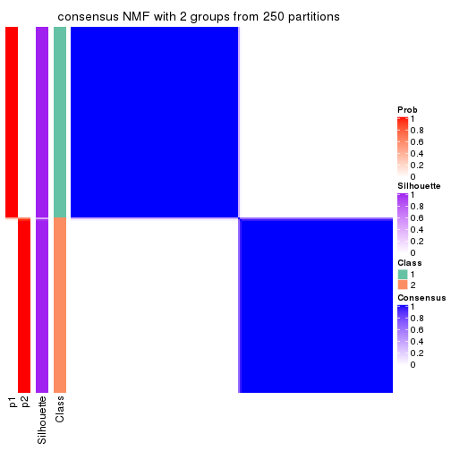</p>

</div>
<div id='tab-MAD-NMF-consensus-heatmap-2'>
<pre><code class="r">consensus_heatmap(res, k = 3)
</code></pre>

<p>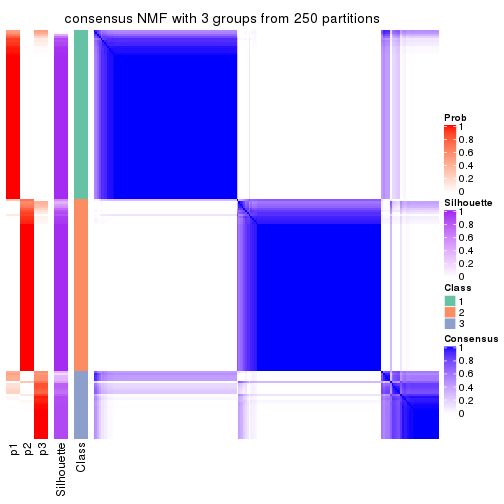</p>

</div>
<div id='tab-MAD-NMF-consensus-heatmap-3'>
<pre><code class="r">consensus_heatmap(res, k = 4)
</code></pre>

<p>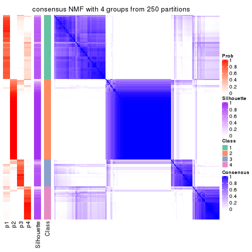</p>

</div>
<div id='tab-MAD-NMF-consensus-heatmap-4'>
<pre><code class="r">consensus_heatmap(res, k = 5)
</code></pre>

<p>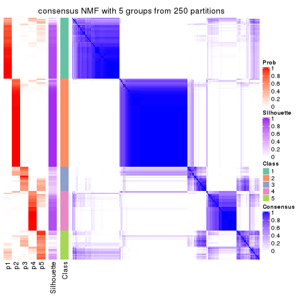</p>

</div>
<div id='tab-MAD-NMF-consensus-heatmap-5'>
<pre><code class="r">consensus_heatmap(res, k = 6)
</code></pre>

<p>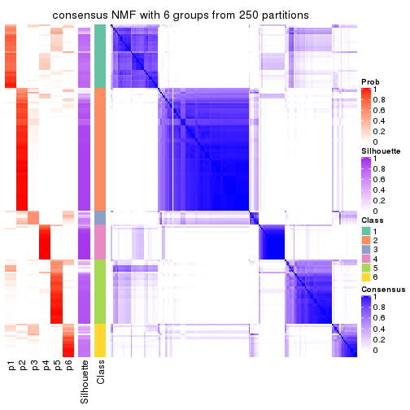</p>

</div>
</div>

Heatmaps for the membership of samples in all partitions to see how consistent they are:


<script>
$( function() {
	$( '#tabs-MAD-NMF-membership-heatmap' ).tabs();
} );
</script>
<div id='tabs-MAD-NMF-membership-heatmap'>
<ul>
<li><a href='#tab-MAD-NMF-membership-heatmap-1'>k = 2</a></li>
<li><a href='#tab-MAD-NMF-membership-heatmap-2'>k = 3</a></li>
<li><a href='#tab-MAD-NMF-membership-heatmap-3'>k = 4</a></li>
<li><a href='#tab-MAD-NMF-membership-heatmap-4'>k = 5</a></li>
<li><a href='#tab-MAD-NMF-membership-heatmap-5'>k = 6</a></li>
</ul>
<div id='tab-MAD-NMF-membership-heatmap-1'>
<pre><code class="r">membership_heatmap(res, k = 2)
</code></pre>

<p>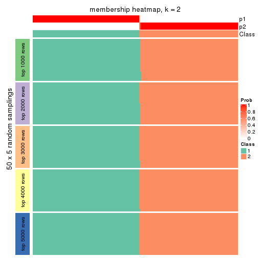</p>

</div>
<div id='tab-MAD-NMF-membership-heatmap-2'>
<pre><code class="r">membership_heatmap(res, k = 3)
</code></pre>

<p>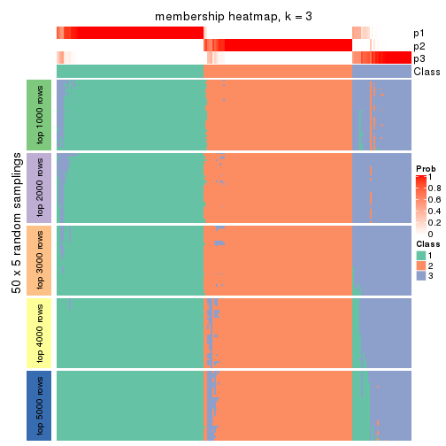</p>

</div>
<div id='tab-MAD-NMF-membership-heatmap-3'>
<pre><code class="r">membership_heatmap(res, k = 4)
</code></pre>

<p>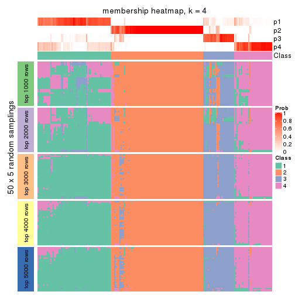</p>

</div>
<div id='tab-MAD-NMF-membership-heatmap-4'>
<pre><code class="r">membership_heatmap(res, k = 5)
</code></pre>

<p>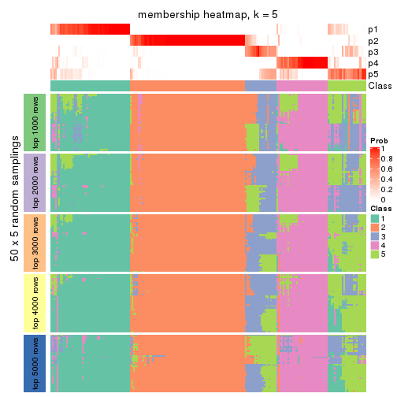</p>

</div>
<div id='tab-MAD-NMF-membership-heatmap-5'>
<pre><code class="r">membership_heatmap(res, k = 6)
</code></pre>

<p>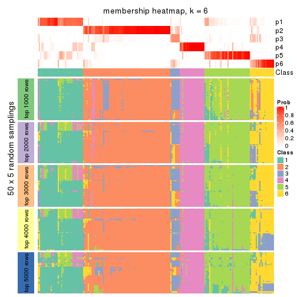</p>

</div>
</div>

As soon as we have had the classes for columns, we can look for signatures
which are significantly different between classes which can be candidate marks
for certain classes. Following are the heatmaps for signatures.


Signature heatmaps where rows are scaled:


<script>
$( function() {
	$( '#tabs-MAD-NMF-get-signatures' ).tabs();
} );
</script>
<div id='tabs-MAD-NMF-get-signatures'>
<ul>
<li><a href='#tab-MAD-NMF-get-signatures-1'>k = 2</a></li>
<li><a href='#tab-MAD-NMF-get-signatures-2'>k = 3</a></li>
<li><a href='#tab-MAD-NMF-get-signatures-3'>k = 4</a></li>
<li><a href='#tab-MAD-NMF-get-signatures-4'>k = 5</a></li>
<li><a href='#tab-MAD-NMF-get-signatures-5'>k = 6</a></li>
</ul>
<div id='tab-MAD-NMF-get-signatures-1'>
<pre><code class="r">get_signatures(res, k = 2)
</code></pre>

<p>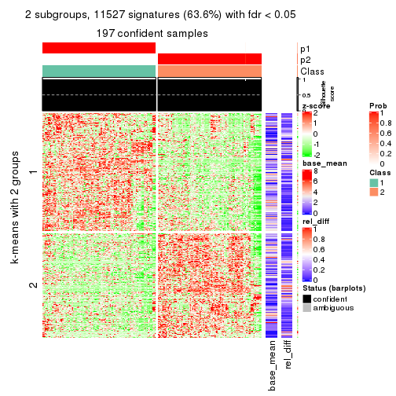</p>

</div>
<div id='tab-MAD-NMF-get-signatures-2'>
<pre><code class="r">get_signatures(res, k = 3)
</code></pre>

<p>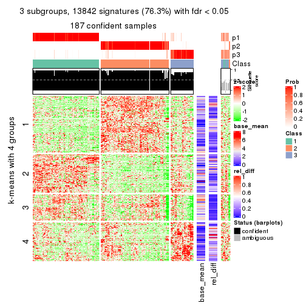</p>

</div>
<div id='tab-MAD-NMF-get-signatures-3'>
<pre><code class="r">get_signatures(res, k = 4)
</code></pre>

<p>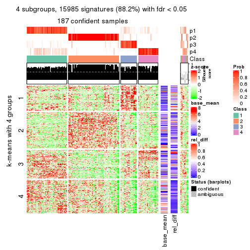</p>

</div>
<div id='tab-MAD-NMF-get-signatures-4'>
<pre><code class="r">get_signatures(res, k = 5)
</code></pre>

<p>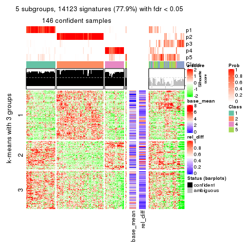</p>

</div>
<div id='tab-MAD-NMF-get-signatures-5'>
<pre><code class="r">get_signatures(res, k = 6)
</code></pre>

<p>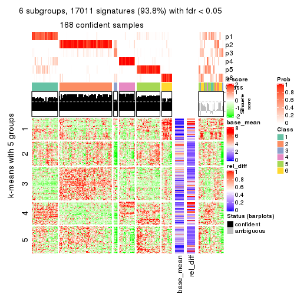</p>

</div>
</div>


Signature heatmaps where rows are not scaled:


<script>
$( function() {
	$( '#tabs-MAD-NMF-get-signatures-no-scale' ).tabs();
} );
</script>
<div id='tabs-MAD-NMF-get-signatures-no-scale'>
<ul>
<li><a href='#tab-MAD-NMF-get-signatures-no-scale-1'>k = 2</a></li>
<li><a href='#tab-MAD-NMF-get-signatures-no-scale-2'>k = 3</a></li>
<li><a href='#tab-MAD-NMF-get-signatures-no-scale-3'>k = 4</a></li>
<li><a href='#tab-MAD-NMF-get-signatures-no-scale-4'>k = 5</a></li>
<li><a href='#tab-MAD-NMF-get-signatures-no-scale-5'>k = 6</a></li>
</ul>
<div id='tab-MAD-NMF-get-signatures-no-scale-1'>
<pre><code class="r">get_signatures(res, k = 2, scale_rows = FALSE)
</code></pre>

<p>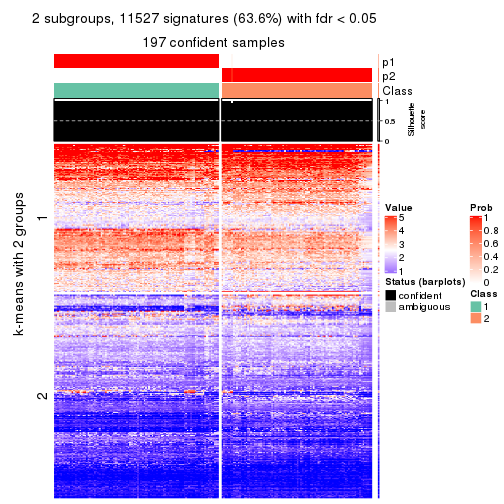</p>

</div>
<div id='tab-MAD-NMF-get-signatures-no-scale-2'>
<pre><code class="r">get_signatures(res, k = 3, scale_rows = FALSE)
</code></pre>

<p>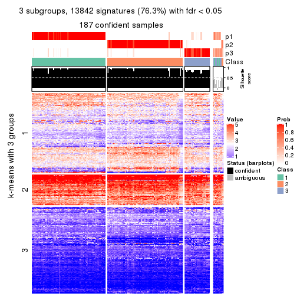</p>

</div>
<div id='tab-MAD-NMF-get-signatures-no-scale-3'>
<pre><code class="r">get_signatures(res, k = 4, scale_rows = FALSE)
</code></pre>

<p>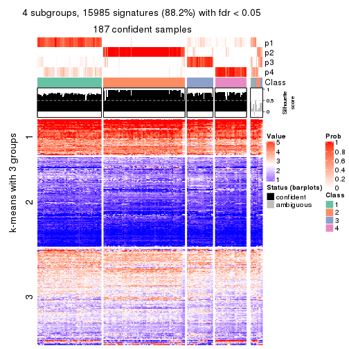</p>

</div>
<div id='tab-MAD-NMF-get-signatures-no-scale-4'>
<pre><code class="r">get_signatures(res, k = 5, scale_rows = FALSE)
</code></pre>

<p>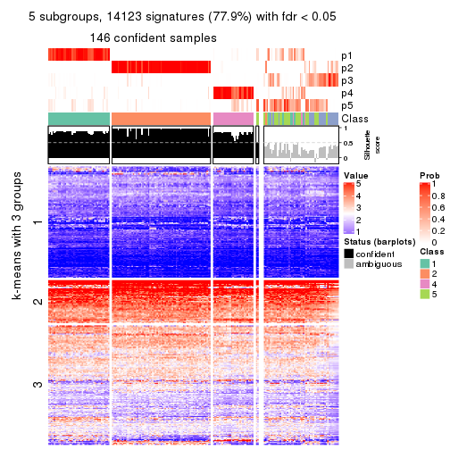</p>

</div>
<div id='tab-MAD-NMF-get-signatures-no-scale-5'>
<pre><code class="r">get_signatures(res, k = 6, scale_rows = FALSE)
</code></pre>

<p>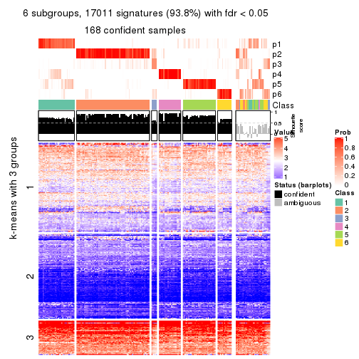</p>

</div>
</div>


Compare the overlap of signatures from different k:

```r
compare_signatures(res)
```

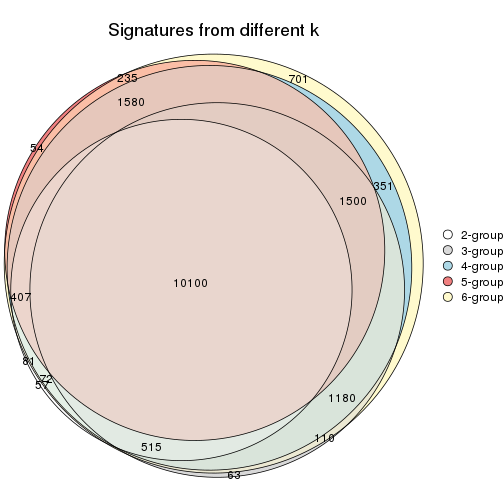

`get_signature()` returns a data frame invisibly. TO get the list of signatures, the function
call should be assigned to a variable explicitly. In following code, if `plot` argument is set
to `FALSE`, no heatmap is plotted while only the differential analysis is performed.

```r
# code only for demonstration
tb = get_signature(res, k = ..., plot = FALSE)
```

An example of the output of `tb` is:

```
#>   which_row         fdr    mean_1    mean_2 scaled_mean_1 scaled_mean_2 km
#> 1        38 0.042760348  8.373488  9.131774    -0.5533452     0.5164555  1
#> 2        40 0.018707592  7.106213  8.469186    -0.6173731     0.5762149  1
#> 3        55 0.019134737 10.221463 11.207825    -0.6159697     0.5749050  1
#> 4        59 0.006059896  5.921854  7.869574    -0.6899429     0.6439467  1
#> 5        60 0.018055526  8.928898 10.211722    -0.6204761     0.5791110  1
#> 6        98 0.009384629 15.714769 14.887706     0.6635654    -0.6193277  2
...
```

The columns in `tb` are:

1. `which_row`: row indices corresponding to the input matrix.
2. `fdr`: FDR for the differential test. 
3. `mean_x`: The mean value in group x.
4. `scaled_mean_x`: The mean value in group x after rows are scaled.
5. `km`: Row groups if k-means clustering is applied to rows.


UMAP plot which shows how samples are separated.


<script>
$( function() {
	$( '#tabs-MAD-NMF-dimension-reduction' ).tabs();
} );
</script>
<div id='tabs-MAD-NMF-dimension-reduction'>
<ul>
<li><a href='#tab-MAD-NMF-dimension-reduction-1'>k = 2</a></li>
<li><a href='#tab-MAD-NMF-dimension-reduction-2'>k = 3</a></li>
<li><a href='#tab-MAD-NMF-dimension-reduction-3'>k = 4</a></li>
<li><a href='#tab-MAD-NMF-dimension-reduction-4'>k = 5</a></li>
<li><a href='#tab-MAD-NMF-dimension-reduction-5'>k = 6</a></li>
</ul>
<div id='tab-MAD-NMF-dimension-reduction-1'>
<pre><code class="r">dimension_reduction(res, k = 2, method = &quot;UMAP&quot;)
</code></pre>

<p>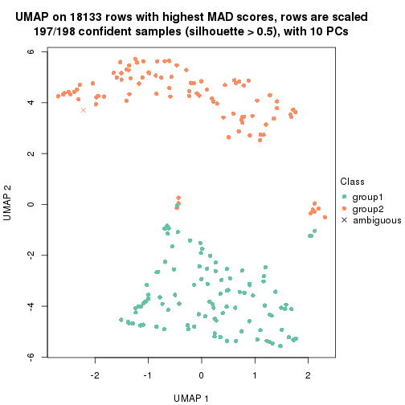</p>

</div>
<div id='tab-MAD-NMF-dimension-reduction-2'>
<pre><code class="r">dimension_reduction(res, k = 3, method = &quot;UMAP&quot;)
</code></pre>

<p>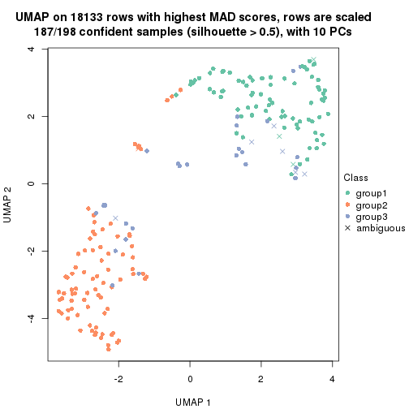</p>

</div>
<div id='tab-MAD-NMF-dimension-reduction-3'>
<pre><code class="r">dimension_reduction(res, k = 4, method = &quot;UMAP&quot;)
</code></pre>

<p>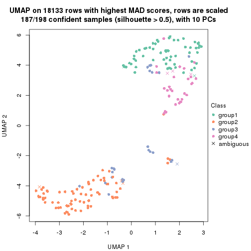</p>

</div>
<div id='tab-MAD-NMF-dimension-reduction-4'>
<pre><code class="r">dimension_reduction(res, k = 5, method = &quot;UMAP&quot;)
</code></pre>

<p>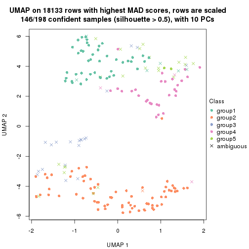</p>

</div>
<div id='tab-MAD-NMF-dimension-reduction-5'>
<pre><code class="r">dimension_reduction(res, k = 6, method = &quot;UMAP&quot;)
</code></pre>

<p>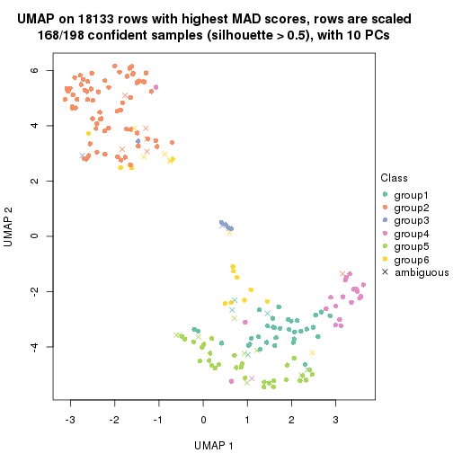</p>

</div>
</div>


Following heatmap shows how subgroups are split when increasing `k`:

```r
collect_classes(res)
```

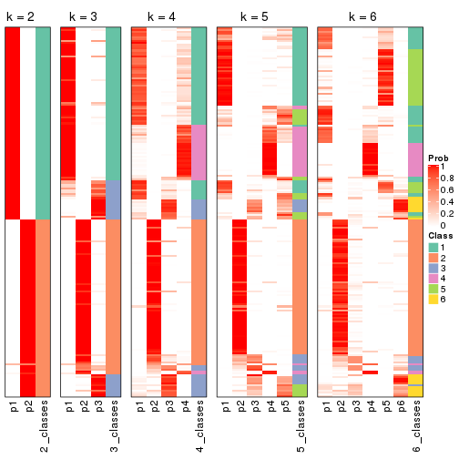


If matrix rows can be associated to genes, consider to use `functional_enrichment(res,
...)` to perform function enrichment for the signature genes. See [this vignette](http://bioconductor.org/packages/devel/bioc/vignettes/cola/inst/doc/functional_enrichment.html) for more detailed explanations.


 

---------------------------------------------------


### ATC:hclust


The object with results only for a single top-value method and a single partition method 
can be extracted as:

```r
res = res_list["ATC", "hclust"]
# you can also extract it by
# res = res_list["ATC:hclust"]
```

A summary of `res` and all the functions that can be applied to it:

```r
res
```

```
#> A 'ConsensusPartition' object with k = 2, 3, 4, 5, 6.
#>   On a matrix with 18133 rows and 198 columns.
#>   Top rows (1000, 2000, 3000, 4000, 5000) are extracted by 'ATC' method.
#>   Subgroups are detected by 'hclust' method.
#>   Performed in total 1250 partitions by row resampling.
#>   Best k for subgroups seems to be 3.
#> 
#> Following methods can be applied to this 'ConsensusPartition' object:
#>  [1] "cola_report"             "collect_classes"         "collect_plots"          
#>  [4] "collect_stats"           "colnames"                "compare_signatures"     
#>  [7] "consensus_heatmap"       "dimension_reduction"     "functional_enrichment"  
#> [10] "get_anno_col"            "get_anno"                "get_classes"            
#> [13] "get_consensus"           "get_matrix"              "get_membership"         
#> [16] "get_param"               "get_signatures"          "get_stats"              
#> [19] "is_best_k"               "is_stable_k"             "membership_heatmap"     
#> [22] "ncol"                    "nrow"                    "plot_ecdf"              
#> [25] "rownames"                "select_partition_number" "show"                   
#> [28] "suggest_best_k"          "test_to_known_factors"
```

`collect_plots()` function collects all the plots made from `res` for all `k` (number of partitions)
into one single page to provide an easy and fast comparison between different `k`.

```r
collect_plots(res)
```

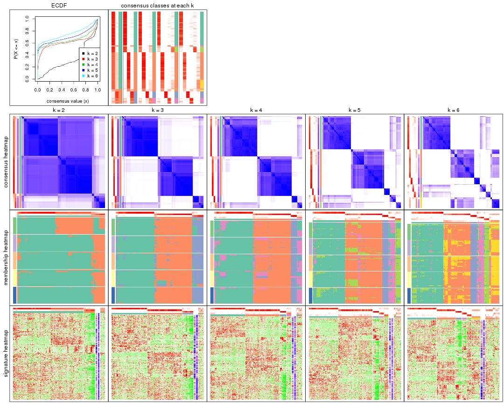

The plots are:

- The first row: a plot of the ECDF (empirical cumulative distribution
  function) curves of the consensus matrix for each `k` and the heatmap of
  predicted classes for each `k`.
- The second row: heatmaps of the consensus matrix for each `k`.
- The third row: heatmaps of the membership matrix for each `k`.
- The fouth row: heatmaps of the signatures for each `k`.

All the plots in panels can be made by individual functions and they are
plotted later in this section.

`select_partition_number()` produces several plots showing different
statistics for choosing "optimized" `k`. There are following statistics:

- ECDF curves of the consensus matrix for each `k`;
- 1-PAC. [The PAC
  score](https://en.wikipedia.org/wiki/Consensus_clustering#Over-interpretation_potential_of_consensus_clustering)
  measures the proportion of the ambiguous subgrouping.
- Mean silhouette score.
- Concordance. The mean probability of fiting the consensus class ids in all
  partitions.
- Area increased. Denote $A_k$ as the area under the ECDF curve for current
  `k`, the area increased is defined as $A_k - A_{k-1}$.
- Rand index. The percent of pairs of samples that are both in a same cluster
  or both are not in a same cluster in the partition of k and k-1.
- Jaccard index. The ratio of pairs of samples are both in a same cluster in
  the partition of k and k-1 and the pairs of samples are both in a same
  cluster in the partition k or k-1.

The detailed explanations of these statistics can be found in [the _cola_
vignette](http://bioconductor.org/packages/devel/bioc/vignettes/cola/inst/doc/cola.html#toc_13).

Generally speaking, lower PAC score, higher mean silhouette score or higher
concordance corresponds to better partition. Rand index and Jaccard index
measure how similar the current partition is compared to partition with `k-1`.
If they are too similar, we won't accept `k` is better than `k-1`.

```r
select_partition_number(res)
```

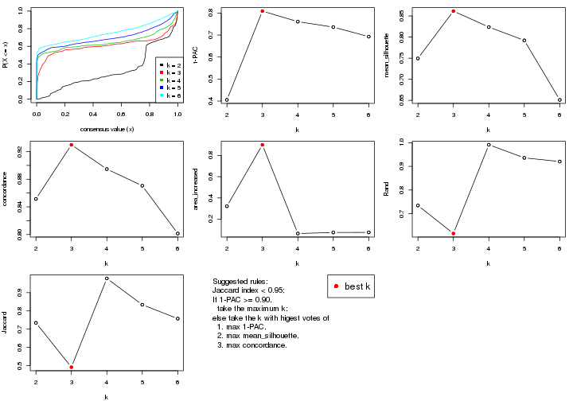

The numeric values for all these statistics can be obtained by `get_stats()`.

```r
get_stats(res)
```

```
#>   k 1-PAC mean_silhouette concordance area_increased  Rand Jaccard
#> 2 2 0.405           0.749       0.851         0.3218 0.735   0.735
#> 3 3 0.809           0.862       0.930         0.9002 0.616   0.491
#> 4 4 0.761           0.824       0.895         0.0650 0.991   0.978
#> 5 5 0.736           0.792       0.871         0.0750 0.936   0.834
#> 6 6 0.693           0.651       0.801         0.0755 0.921   0.757
```

`suggest_best_k()` suggests the best $k$ based on these statistics. The rules are as follows:

- All $k$ with Jaccard index larger than 0.95 are removed because increasing
  $k$ does not provide enough extra information. If all $k$ are removed, it is
  marked as no subgroup is detected.
- For all $k$ with 1-PAC score larger than 0.9, the maximal $k$ is taken as
  the best $k$, and other $k$ are marked as optional $k$.
- If it does not fit the second rule. The $k$ with the maximal vote of the
  highest 1-PAC score, highest mean silhouette, and highest concordance is
  taken as the best $k$.

```r
suggest_best_k(res)
```

```
#> [1] 3
```


Following shows the table of the partitions (You need to click the **show/hide
code output** link to see it). The membership matrix (columns with name `p*`)
is inferred by
[`clue::cl_consensus()`](https://www.rdocumentation.org/link/cl_consensus?package=clue)
function with the `SE` method. Basically the value in the membership matrix
represents the probability to belong to a certain group. The finall class
label for an item is determined with the group with highest probability it
belongs to.

In `get_classes()` function, the entropy is calculated from the membership
matrix and the silhouette score is calculated from the consensus matrix.


<script>
$( function() {
	$( '#tabs-ATC-hclust-get-classes' ).tabs();
} );
</script>
<div id='tabs-ATC-hclust-get-classes'>
<ul>
<li><a href='#tab-ATC-hclust-get-classes-1'>k = 2</a></li>
<li><a href='#tab-ATC-hclust-get-classes-2'>k = 3</a></li>
<li><a href='#tab-ATC-hclust-get-classes-3'>k = 4</a></li>
<li><a href='#tab-ATC-hclust-get-classes-4'>k = 5</a></li>
<li><a href='#tab-ATC-hclust-get-classes-5'>k = 6</a></li>
</ul>

<div id='tab-ATC-hclust-get-classes-1'>
<p><a id='tab-ATC-hclust-get-classes-1-a' style='color:#0366d6' href='#'>show/hide code output</a></p>
<pre><code class="r">cbind(get_classes(res, k = 2), get_membership(res, k = 2))
</code></pre>

<pre><code>#&gt;                                      class entropy silhouette    p1    p2
#&gt; 0C0AA0B2-5191-4EDF-8937-ED7434F30283     1  0.7602     0.8058 0.780 0.220
#&gt; 18B45F1F-234F-45CC-A234-145307606C5C     1  0.1843     0.7992 0.972 0.028
#&gt; E18B70C0-BDCA-46D3-99BB-C6C8ABC68DA5     1  0.7602     0.8058 0.780 0.220
#&gt; 0F6DDBA7-6F74-45E8-95C8-F28263D55978     1  0.1184     0.8081 0.984 0.016
#&gt; 7EAE1A5A-129A-46DE-977E-A2C753F10904     1  0.7602     0.8058 0.780 0.220
#&gt; 7EAE0048-16B5-4979-9410-16CDEB9B1A48     1  0.0672     0.8124 0.992 0.008
#&gt; 2EBFC828-2B27-4753-A052-80DDA226DAB4     1  0.7528     0.8063 0.784 0.216
#&gt; 24E1768D-2232-41DA-9383-BC55D6EB3812     2  0.4161     0.8015 0.084 0.916
#&gt; 6E3CD60A-1889-4CA3-B305-2E78152057B5     2  0.9944    -0.0767 0.456 0.544
#&gt; 33CC70DD-82B3-413C-B3B1-BE06634D95D0     1  0.2236     0.8132 0.964 0.036
#&gt; F1CB57A3-55DD-4487-9307-1B4F652E729A     1  0.0672     0.8124 0.992 0.008
#&gt; 755A5806-B054-449A-93DB-79909E6C93A1     1  0.3274     0.7674 0.940 0.060
#&gt; 58D364E7-3D2F-468F-A264-D6461E2428D4     1  0.7602     0.8064 0.780 0.220
#&gt; 68BB9CB6-7AA2-4981-B9D9-07363EC96599     2  0.4161     0.8015 0.084 0.916
#&gt; 3C4E8DFA-8EA0-4F1F-89CB-CB8805395872     2  0.4161     0.8015 0.084 0.916
#&gt; 4219651D-5583-4498-BF08-1B7D04B4C7B2     1  0.0672     0.8124 0.992 0.008
#&gt; B5EE2768-0D67-4584-ADBC-EC745FEC52EA     1  0.7528     0.8063 0.784 0.216
#&gt; 825E6C11-F460-451A-8045-846DD7D0E945     1  0.1843     0.8115 0.972 0.028
#&gt; 491F62AF-5E68-43C3-982A-F867A75BBA9A     1  0.7602     0.8047 0.780 0.220
#&gt; 9D7F058C-F95A-44AD-AC9E-450F7FBDC960     1  0.7602     0.8058 0.780 0.220
#&gt; 6D42DD0C-2081-4742-BA27-9F5F16FAC3C6     2  0.7950     0.7609 0.240 0.760
#&gt; EDD7E63D-492A-473B-A552-0764337B10EF     1  0.8555     0.7527 0.720 0.280
#&gt; 97073DEA-73AD-4DFD-BD1A-9035DC03445B     1  0.1633     0.8101 0.976 0.024
#&gt; FA891AB9-CE38-4F7E-A015-1DDCE12890A0     1  0.1184     0.8084 0.984 0.016
#&gt; D9514D49-A0AE-45AB-8C9F-68E726215253     1  0.0672     0.8124 0.992 0.008
#&gt; 3B9229AD-12E5-451E-9D2F-378AAC82C04A     1  0.7602     0.8047 0.780 0.220
#&gt; 5EA36B71-4917-4EF3-9060-065EFE6ACC5B     2  0.9491     0.6835 0.368 0.632
#&gt; A20E4ECB-4895-4CC7-BE5E-4721B20D933B     1  0.1633     0.8024 0.976 0.024
#&gt; 1BE8D828-29DB-4368-AA4A-FB23588F7AE8     1  0.1414     0.8124 0.980 0.020
#&gt; 66EFEFCF-3D14-4DBF-AA13-530F40ED0245     1  0.2043     0.8124 0.968 0.032
#&gt; 55DFFE53-BCE7-4EC1-9863-6C0311B06BA2     1  0.8555     0.7527 0.720 0.280
#&gt; 4CC3FB5A-611D-4C64-AE9D-544FA45CF4DC     1  0.1414     0.8055 0.980 0.020
#&gt; C11D33F2-DFE9-4FA8-9024-F3E7F1DADC5F     1  0.7674     0.8024 0.776 0.224
#&gt; FA5932B8-8AA3-4C38-9FAB-C35D8772974D     1  0.0672     0.8124 0.992 0.008
#&gt; 8216EC35-1F41-4A15-B503-BDA4971E27C9     1  0.0938     0.8136 0.988 0.012
#&gt; 69635D23-90A7-4BAD-97C7-B79536837F57     1  0.1184     0.8084 0.984 0.016
#&gt; 12B404E2-C463-4409-8392-E4649B2AFFD1     1  0.7602     0.8058 0.780 0.220
#&gt; 246927E3-ACCF-41B2-AA8E-43855FD6B146     1  0.7602     0.8047 0.780 0.220
#&gt; E0CC13E7-9607-49E0-B4AA-395544E3C3BF     1  0.0672     0.8124 0.992 0.008
#&gt; F7BBC0C1-6124-4A83-8A70-EA89B62F1CBD     1  0.5946     0.6465 0.856 0.144
#&gt; B1D4FF24-8E6F-4A04-B716-2032D850EB57     1  0.0938     0.8103 0.988 0.012
#&gt; 253601DB-B78A-4566-9947-8C0270C0B163     1  0.7602     0.8058 0.780 0.220
#&gt; AB83DBFF-5737-4FB8-A5AC-1D3CD6072BDF     2  0.4161     0.8015 0.084 0.916
#&gt; 9D67D953-EC98-4B72-89C8-5732BC9D4BC9     1  0.7602     0.8064 0.780 0.220
#&gt; 51061018-95AB-4278-886F-F69E4EBC47C0     2  0.4815     0.7959 0.104 0.896
#&gt; ABD0F7F3-105B-4DEE-9889-5028772C519A     1  0.1633     0.8024 0.976 0.024
#&gt; 562B95CF-B27E-4A72-B7C6-CDF86A51A39B     1  0.0938     0.8103 0.988 0.012
#&gt; ABF046A4-D7A1-49FF-B6B1-4E07A791DEDB     1  0.8555     0.7527 0.720 0.280
#&gt; 3FF4101E-9703-460E-A30E-76CC7689F36D     1  0.7602     0.8047 0.780 0.220
#&gt; 39C4F7AA-7ADF-4F1D-BDA3-BEC605AC5023     1  0.7453     0.8078 0.788 0.212
#&gt; CB821FD2-AF5C-4743-A70F-21C12C6ED153     1  0.6247     0.6241 0.844 0.156
#&gt; 92EA1846-62FF-41D5-A441-5E52E6B9E7F9     1  0.1633     0.8031 0.976 0.024
#&gt; 7D25F3EE-5A20-4763-8026-16A03D05F459     1  0.1414     0.8062 0.980 0.020
#&gt; 8ECE5276-CD06-496B-A5A9-1713B1F7D089     1  0.0672     0.8124 0.992 0.008
#&gt; C775B68F-9507-47E3-B507-B433AED79002     1  0.0672     0.8124 0.992 0.008
#&gt; E19D5463-FDD0-41C1-A170-323736A88D07     1  0.7674     0.8024 0.776 0.224
#&gt; CE4B6285-4961-4767-91F0-5C7A8162E185     1  0.8713     0.2791 0.708 0.292
#&gt; 9637BD72-1FEF-42AD-8886-2C39BE876531     2  0.7950     0.7609 0.240 0.760
#&gt; 81B5A88E-45A0-4B44-B689-B9071B8548EE     1  0.9129     0.6872 0.672 0.328
#&gt; 0B01B4C9-9BED-4F5B-A3E2-8868C7CCC3FC     2  0.4161     0.8015 0.084 0.916
#&gt; 54501315-7132-44B2-A179-10FBF1421105     1  0.1184     0.8084 0.984 0.016
#&gt; E207CBE9-4C3A-4FDD-9251-CFE1FE106475     2  0.4161     0.8015 0.084 0.916
#&gt; 3BEA0B92-3F90-4DBF-9679-AADEAD7D47C8     1  0.7602     0.8058 0.780 0.220
#&gt; 35B32250-D854-4215-AA5B-2C11B2FBEECA     1  0.4022     0.7440 0.920 0.080
#&gt; ACE6566B-AEB9-426C-924A-B382D14A1024     1  0.7602     0.8047 0.780 0.220
#&gt; 737E69AC-0930-45B9-B6BA-7CE5E300290B     1  0.0672     0.8124 0.992 0.008
#&gt; B4410AB8-D015-41CA-86E6-12EB4E4103E3     1  0.1633     0.8024 0.976 0.024
#&gt; 6D3ECA65-C50F-43B0-B75A-1D290FA4A8FD     1  0.7528     0.8063 0.784 0.216
#&gt; C86F40D3-9A96-4395-A8C3-510DE12F9A2B     1  0.7602     0.8058 0.780 0.220
#&gt; 6238087F-24DD-4BF1-903F-3BD4E446C1AE     1  0.7745     0.8001 0.772 0.228
#&gt; E4FF840B-EEAB-4CB0-A690-7D4C4AA7EEC3     1  0.7602     0.8047 0.780 0.220
#&gt; 72D3C323-C67F-4C0E-9BFC-BF245FF9730A     2  0.7950     0.7609 0.240 0.760
#&gt; 82D56E4E-4DF6-4F3E-8959-B995C92AAA70     1  0.0672     0.8124 0.992 0.008
#&gt; E31CA441-EB19-443B-ACBD-37B5CCBCF0E5     1  0.7602     0.8047 0.780 0.220
#&gt; 87CA8939-D054-4B8A-B32D-085FD2E8F202     1  0.1184     0.8081 0.984 0.016
#&gt; 2A508D90-FEDC-46A3-9A02-E51E5467CDCB     1  0.1184     0.8084 0.984 0.016
#&gt; C4E8B4E2-388B-411F-BF0A-9B6F34E8EDB5     1  0.7674     0.8024 0.776 0.224
#&gt; AF6AF803-BD93-44A7-AA80-B9BC92C1273B     1  0.7602     0.8047 0.780 0.220
#&gt; 0B1CA5CF-EB96-41D4-BFC5-6957FEB39828     2  0.7376     0.7752 0.208 0.792
#&gt; 6FB96FB0-6661-48AD-A4A0-69F8AFDBE591     1  0.7602     0.8047 0.780 0.220
#&gt; 8C19F7FD-368A-462B-B28F-88D6630038A1     1  0.8955     0.2076 0.688 0.312
#&gt; 96EABE78-C2F4-4A33-ACD8-C922A4B2519B     1  0.7602     0.8047 0.780 0.220
#&gt; 68B36D7B-546A-4689-949F-B207C4A4AB27     1  0.7602     0.8047 0.780 0.220
#&gt; CE9F3335-778F-4F52-BC55-4B7C99B211DD     1  0.7745     0.8003 0.772 0.228
#&gt; CB359DED-2A2D-4646-A0BD-6F10ADCC532B     1  0.2236     0.8132 0.964 0.036
#&gt; 198324A5-8C52-46F6-9734-EFAF1CCA6D9B     1  0.3274     0.7674 0.940 0.060
#&gt; 83B88608-0506-428C-B9E8-621F38477B42     1  0.1184     0.8084 0.984 0.016
#&gt; 1993630A-0F3D-4F5C-86A3-D443BAAF57F0     2  0.9754     0.1540 0.408 0.592
#&gt; DE73DA9B-529E-4F4F-A65C-DA7AB84B1096     1  0.1414     0.8124 0.980 0.020
#&gt; 2347F3B7-DDA3-40C0-B6D4-8819ECA69146     1  0.0672     0.8124 0.992 0.008
#&gt; AB93B5D5-095F-4330-9D40-6A3D934AB50C     1  0.0672     0.8124 0.992 0.008
#&gt; 5EBBE4AD-FF0C-41CF-9EA3-B6FE7EA1F9C0     2  0.4161     0.8015 0.084 0.916
#&gt; 6D960AE7-3769-4144-A061-E8588E5063FF     1  0.2043     0.8124 0.968 0.032
#&gt; 0C2DD8C0-D1A5-4192-A49C-7A40FED628B2     1  0.7674     0.8024 0.776 0.224
#&gt; 18C9372F-C55B-4F86-A9D2-E8D85EFC8566     2  0.9933    -0.0192 0.452 0.548
#&gt; 9AF637B0-4C32-4DD1-93AF-7655B4A845D3     1  0.7602     0.8058 0.780 0.220
#&gt; 785B5B06-4115-46FD-9BEB-F888AFDC855D     1  0.7674     0.8024 0.776 0.224
#&gt; ECA3050E-4BE2-4117-B9CF-A52BB85AF8C2     1  0.7219     0.8107 0.800 0.200
#&gt; 099DC396-16A5-458F-9ED9-F2A790CB0C34     1  0.0938     0.8136 0.988 0.012
#&gt; 7A5A12EE-C5B0-4C51-8C99-0F3FA88D633E     1  0.0938     0.8136 0.988 0.012
#&gt; E832B508-A66D-4817-B44A-FE9FAAE64B4A     1  0.1184     0.8084 0.984 0.016
#&gt; F9DD688C-7B35-49E7-9651-2E098EE78856     1  0.1843     0.7992 0.972 0.028
#&gt; F1265DD8-5ED3-4635-A277-57BBFDEC7729     1  0.1184     0.8084 0.984 0.016
#&gt; F624E8D9-DB07-4C9E-910D-5E8EBA3A6167     1  0.7602     0.8058 0.780 0.220
#&gt; 3516FBDF-66E1-43F4-9D7B-16748F6439A7     1  0.7602     0.8047 0.780 0.220
#&gt; 04B12992-B2EA-4BA2-8E2C-11E34E230E6F     1  0.7602     0.8058 0.780 0.220
#&gt; CC02897D-9123-495E-9242-5C9CF4EC269B     1  0.7602     0.8047 0.780 0.220
#&gt; 3117ED46-2BF2-4311-BC00-4E98243E16B3     1  0.0672     0.8124 0.992 0.008
#&gt; E0B66D53-23DB-4E26-BB6E-F692FA8C000E     1  0.0672     0.8124 0.992 0.008
#&gt; DAA93CE5-A013-477A-9A50-EA09CC3A8162     1  0.7674     0.8024 0.776 0.224
#&gt; 0099098D-354A-4276-92F8-B932C74B4608     1  0.1184     0.8084 0.984 0.016
#&gt; DD483639-B2E7-4745-BCFB-55ED1D82BFBF     1  0.8081     0.7844 0.752 0.248
#&gt; 2C1F9079-602E-4252-82C7-9D8799E04246     1  0.7602     0.8058 0.780 0.220
#&gt; 9473A8E4-3A1B-4184-9EA6-517AFD60B635     2  0.4161     0.8015 0.084 0.916
#&gt; 75CFBAF6-7BA0-40AF-92D7-D218E885BD1B     1  0.7602     0.8047 0.780 0.220
#&gt; B588950F-14D6-41C8-845B-EFD2096013C6     1  0.7602     0.8058 0.780 0.220
#&gt; 0DF3EDA8-DAEA-4721-92AB-B97181249498     1  0.7674     0.8024 0.776 0.224
#&gt; 8EA83042-D598-401D-AD78-936EEB136C59     1  0.9993    -0.4247 0.516 0.484
#&gt; 729AC418-3BE9-445A-95D4-AC11A7D43BE0     2  0.7950     0.7609 0.240 0.760
#&gt; 7D8B1B11-F576-4AA8-BFA7-0022A2CD829A     1  0.7602     0.8058 0.780 0.220
#&gt; 304A0E46-3449-4B44-9C30-BDDF6459391D     1  0.0672     0.8124 0.992 0.008
#&gt; 3C83358F-DF20-47F7-AF9F-AB7CC92F5ABA     2  0.9491     0.6835 0.368 0.632
#&gt; EAFEED6C-35C3-451F-AE4A-EB56992E1F29     1  0.0938     0.8136 0.988 0.012
#&gt; 8A237A65-28EC-434D-A78A-A8B7308B5204     1  0.6247     0.6241 0.844 0.156
#&gt; D005833F-E991-4E9E-9667-55F137288004     2  0.9988     0.4902 0.480 0.520
#&gt; 37D966E3-253E-4397-A9AE-0903A8D31FE6     1  0.9993    -0.4247 0.516 0.484
#&gt; D2482B81-CB5B-4178-BA8D-1CF4026181B5     1  0.0672     0.8124 0.992 0.008
#&gt; 18019E95-C2A8-4EE7-B585-F6886DC4D953     2  0.5408     0.7864 0.124 0.876
#&gt; 0B126D1A-14A8-4345-8F78-FF92222ADF4C     2  0.4161     0.8015 0.084 0.916
#&gt; CE88B625-47D8-4D58-9FB4-23464DB7DDAD     1  0.7602     0.8047 0.780 0.220
#&gt; 9A88299D-5C74-47FA-B42C-1A1D6D935AAB     1  0.2236     0.8132 0.964 0.036
#&gt; 3E71159C-FD6C-41DA-B18B-0730C8AC7E41     1  0.0376     0.8136 0.996 0.004
#&gt; 6F245AA4-79D9-47E1-BCC9-1AAF65AEA813     1  0.0376     0.8136 0.996 0.004
#&gt; 4CF2C888-2100-483A-B4DB-ECBB69243A4D     1  0.7602     0.8047 0.780 0.220
#&gt; A3853813-B9D5-4E8C-B075-19FCC35F8686     1  0.6247     0.8147 0.844 0.156
#&gt; 83A16DEE-CE9F-4D8B-9225-0A2A8B9D055D     1  0.2236     0.8132 0.964 0.036
#&gt; 0F057CAF-4F9A-4DE9-8601-730E96873733     1  0.7602     0.8058 0.780 0.220
#&gt; 32D5801D-DBA4-422E-87CB-A2DDE921BA41     1  0.0672     0.8124 0.992 0.008
#&gt; 22EE8076-F07C-499A-9AF8-D800A77EF154     1  0.7745     0.8001 0.772 0.228
#&gt; DD4BD74D-D48C-4090-9F57-5334E784581C     1  0.0672     0.8124 0.992 0.008
#&gt; 41183565-434D-474C-B1BD-CA6E94910658     1  0.7299     0.8100 0.796 0.204
#&gt; 75A2CE41-2B2A-4346-927E-ACF8A72738E4     1  0.5946     0.6465 0.856 0.144
#&gt; 7AA24995-3DD2-4682-B36A-4EBFEEACF625     1  0.1843     0.7992 0.972 0.028
#&gt; 8BAFDFEC-9F26-4ADB-95CE-004143960EEB     1  0.0672     0.8124 0.992 0.008
#&gt; A330E011-CE08-4A85-8F4B-370592293DBB     1  0.1184     0.8084 0.984 0.016
#&gt; 1D5A5B17-2E70-4BB0-94A1-EC17E6EA49DB     1  0.0938     0.8103 0.988 0.012
#&gt; BD9143B8-9D97-4A05-872C-3FB82B4CF7BE     1  0.7602     0.8047 0.780 0.220
#&gt; 64552DC0-181E-4607-898C-787AA7F26435     1  0.7602     0.8058 0.780 0.220
#&gt; 1B4C4D41-34C7-43A3-858B-C9552EB53894     1  0.9993    -0.4247 0.516 0.484
#&gt; 463A3BAA-02DC-4EA4-A644-B924163E425D     1  0.7602     0.8061 0.780 0.220
#&gt; CD0FEA89-6F60-4A20-8FCA-D397B4E95A98     1  0.1184     0.8084 0.984 0.016
#&gt; 5D06CF6D-F4B9-4B32-B055-8AB287E53340     1  0.7602     0.8058 0.780 0.220
#&gt; ADA7835F-DB67-4F4F-9446-8BCE3C5FE936     1  0.7745     0.8001 0.772 0.228
#&gt; 4109BE2D-B5DF-4BD7-860E-60D87F647152     1  0.8555     0.7473 0.720 0.280
#&gt; 88526A0E-6DFE-46CB-BFAD-B4826F482C67     2  0.9552     0.6746 0.376 0.624
#&gt; F39F9A4C-18F7-4017-AB31-85D52FF44587     1  0.7602     0.8060 0.780 0.220
#&gt; D4290A5E-1B24-4C55-B470-0FA7A0A09DD0     1  0.7602     0.8047 0.780 0.220
#&gt; DC5A2C9E-978F-4661-B729-1F9662976E27     1  0.1843     0.8113 0.972 0.028
#&gt; 26A1F392-CED2-43E3-8096-74E6F2BFC8C0     1  0.8555     0.7527 0.720 0.280
#&gt; 87D81FB2-306A-4E75-9D58-D5F48E46E7F6     1  0.7602     0.8047 0.780 0.220
#&gt; E3D9D81A-C20C-4B3B-B940-A5D2C5F65B22     2  0.4161     0.8015 0.084 0.916
#&gt; 4464650B-453F-476C-989C-B7B159BF2CF0     1  0.7528     0.8063 0.784 0.216
#&gt; 577D2867-B738-487A-9B06-07958D647F02     2  0.9686     0.6484 0.396 0.604
#&gt; E52A22CC-3C03-41A9-9541-220DD871E162     1  0.7602     0.8047 0.780 0.220
#&gt; 642703B1-AF99-4746-A915-0792F4B9590B     1  0.7602     0.8058 0.780 0.220
#&gt; 8F0D1792-1284-45E6-8EC4-392596057677     1  0.7602     0.8047 0.780 0.220
#&gt; 765AFFC1-D528-4494-8BA1-0706451E4205     2  0.4815     0.7959 0.104 0.896
#&gt; A716BC29-161F-4CA0-B240-00B330137F2C     1  0.0672     0.8124 0.992 0.008
#&gt; 32CBFBAF-7064-4595-8D54-2C5E7DE0FD9B     2  0.8207     0.7572 0.256 0.744
#&gt; 4D6ED28C-3F20-41B0-BA41-1BF0E5199A40     2  0.9944    -0.0567 0.456 0.544
#&gt; 86A38456-2900-48FB-B10F-79222B3CA9BF     2  0.9954    -0.0557 0.460 0.540
#&gt; E870807D-3223-4A6A-9E3D-F4461B048AA2     1  0.7602     0.8058 0.780 0.220
#&gt; 3A78D19F-A833-4D2C-8387-FB4FD4A8313C     1  0.0672     0.8124 0.992 0.008
#&gt; DFA162CA-C708-4121-8E74-F9C4DEE0CDAE     1  0.0672     0.8124 0.992 0.008
#&gt; C00A300A-CD10-4C9D-8C94-3901AFE8406C     1  0.7602     0.8058 0.780 0.220
#&gt; 13E11D15-A90F-48C4-980A-DD032C00A2C1     1  0.0672     0.8124 0.992 0.008
#&gt; 31BF80AB-FEDB-4C73-89C3-70BE9F9ACBEE     1  0.7528     0.8063 0.784 0.216
#&gt; FA34308A-349D-4AAD-94CF-3F3B7F9AD629     1  0.7528     0.8063 0.784 0.216
#&gt; 7C48D467-B663-49DD-BC84-A36BC32ACB3D     1  0.2236     0.8132 0.964 0.036
#&gt; BB068534-04F6-4FC9-9087-CDA65920BCE2     1  0.0672     0.8124 0.992 0.008
#&gt; EA4EC272-A9B3-4B2E-955F-19F7676A944C     1  0.7602     0.8047 0.780 0.220
#&gt; C71FF69B-A460-43CA-8769-9667F22D938B     1  0.0672     0.8124 0.992 0.008
#&gt; 5243D1B8-8168-4FF1-A8C6-505F080EF0D3     1  0.7745     0.8001 0.772 0.228
#&gt; BCC474D8-08FE-4E99-B8E8-B29E65F84D2E     1  0.3274     0.7674 0.940 0.060
#&gt; 04FDBFE3-4CF6-4E53-A2AA-89D5C9316377     2  0.4161     0.8015 0.084 0.916
#&gt; 83A9915C-8D60-4CAE-A868-B61E3C90C7B0     1  0.7745     0.8006 0.772 0.228
#&gt; 989A6472-E3E3-457A-97BE-CCE95F42D5C2     1  0.7602     0.8047 0.780 0.220
#&gt; A0AB2D28-6751-49C9-8DF4-66FDBF95C360     2  0.7950     0.7609 0.240 0.760
#&gt; A12B2683-18D4-41C9-8AE5-C143E2180052     1  0.0672     0.8124 0.992 0.008
#&gt; 8DE1E245-CAD2-4F11-BFA2-9792C433A00B     1  0.3431     0.8153 0.936 0.064
#&gt; FDA68036-6C4C-4256-9AA0-C01FE92AA098     1  0.7219     0.8107 0.800 0.200
#&gt; 26311920-1414-4EC1-870B-784961EBCC2D     1  0.1414     0.8055 0.980 0.020
#&gt; C29A10D6-D598-4286-B5E0-F1776E19E988     1  0.0672     0.8124 0.992 0.008
#&gt; FACCC1FB-4937-4CC0-90EA-7F91D3D939CF     1  0.7674     0.8024 0.776 0.224
#&gt; 90B9D84B-78E5-4C7E-8414-EC889C2DE8DB     1  0.8555     0.7527 0.720 0.280
#&gt; B74E6122-76E1-4E4D-A867-BCAFD7277393     1  0.0672     0.8124 0.992 0.008
#&gt; 98494DC0-CF6E-485F-8A0D-D80E4437EF5C     1  0.6048     0.8181 0.852 0.148
#&gt; DA114DAC-DE7B-4E43-8D7C-82C5D7B66411     1  0.0672     0.8124 0.992 0.008
</code></pre>

<script>
$('#tab-ATC-hclust-get-classes-1-a').parent().next().next().hide();
$('#tab-ATC-hclust-get-classes-1-a').click(function(){
  $('#tab-ATC-hclust-get-classes-1-a').parent().next().next().toggle();
  return(false);
});
</script>
</div>

<div id='tab-ATC-hclust-get-classes-2'>
<p><a id='tab-ATC-hclust-get-classes-2-a' style='color:#0366d6' href='#'>show/hide code output</a></p>
<pre><code class="r">cbind(get_classes(res, k = 3), get_membership(res, k = 3))
</code></pre>

<pre><code>#&gt;                                      class entropy silhouette    p1    p2    p3
#&gt; 0C0AA0B2-5191-4EDF-8937-ED7434F30283     2  0.3434     0.8922 0.064 0.904 0.032
#&gt; 18B45F1F-234F-45CC-A234-145307606C5C     1  0.0592     0.9330 0.988 0.000 0.012
#&gt; E18B70C0-BDCA-46D3-99BB-C6C8ABC68DA5     2  0.3337     0.8949 0.060 0.908 0.032
#&gt; 0F6DDBA7-6F74-45E8-95C8-F28263D55978     1  0.0475     0.9390 0.992 0.004 0.004
#&gt; 7EAE1A5A-129A-46DE-977E-A2C753F10904     2  0.3434     0.8922 0.064 0.904 0.032
#&gt; 7EAE0048-16B5-4979-9410-16CDEB9B1A48     1  0.0424     0.9404 0.992 0.008 0.000
#&gt; 2EBFC828-2B27-4753-A052-80DDA226DAB4     2  0.0237     0.9267 0.004 0.996 0.000
#&gt; 24E1768D-2232-41DA-9383-BC55D6EB3812     3  0.1529     0.8553 0.000 0.040 0.960
#&gt; 6E3CD60A-1889-4CA3-B305-2E78152057B5     2  0.6490     0.4489 0.012 0.628 0.360
#&gt; 33CC70DD-82B3-413C-B3B1-BE06634D95D0     1  0.2773     0.8942 0.928 0.024 0.048
#&gt; F1CB57A3-55DD-4487-9307-1B4F652E729A     1  0.0424     0.9404 0.992 0.008 0.000
#&gt; 755A5806-B054-449A-93DB-79909E6C93A1     1  0.1643     0.9088 0.956 0.000 0.044
#&gt; 58D364E7-3D2F-468F-A264-D6461E2428D4     2  0.3213     0.8967 0.060 0.912 0.028
#&gt; 68BB9CB6-7AA2-4981-B9D9-07363EC96599     3  0.1529     0.8553 0.000 0.040 0.960
#&gt; 3C4E8DFA-8EA0-4F1F-89CB-CB8805395872     3  0.1529     0.8553 0.000 0.040 0.960
#&gt; 4219651D-5583-4498-BF08-1B7D04B4C7B2     1  0.0424     0.9404 0.992 0.008 0.000
#&gt; B5EE2768-0D67-4584-ADBC-EC745FEC52EA     2  0.0237     0.9267 0.004 0.996 0.000
#&gt; 825E6C11-F460-451A-8045-846DD7D0E945     1  0.2550     0.9004 0.936 0.024 0.040
#&gt; 491F62AF-5E68-43C3-982A-F867A75BBA9A     2  0.0000     0.9267 0.000 1.000 0.000
#&gt; 9D7F058C-F95A-44AD-AC9E-450F7FBDC960     2  0.3434     0.8922 0.064 0.904 0.032
#&gt; 6D42DD0C-2081-4742-BA27-9F5F16FAC3C6     3  0.4452     0.8093 0.192 0.000 0.808
#&gt; EDD7E63D-492A-473B-A552-0764337B10EF     2  0.2066     0.8953 0.000 0.940 0.060
#&gt; 97073DEA-73AD-4DFD-BD1A-9035DC03445B     1  0.2434     0.9032 0.940 0.024 0.036
#&gt; FA891AB9-CE38-4F7E-A015-1DDCE12890A0     1  0.0000     0.9379 1.000 0.000 0.000
#&gt; D9514D49-A0AE-45AB-8C9F-68E726215253     1  0.0424     0.9404 0.992 0.008 0.000
#&gt; 3B9229AD-12E5-451E-9D2F-378AAC82C04A     2  0.0000     0.9267 0.000 1.000 0.000
#&gt; 5EA36B71-4917-4EF3-9060-065EFE6ACC5B     3  0.5733     0.6491 0.324 0.000 0.676
#&gt; A20E4ECB-4895-4CC7-BE5E-4721B20D933B     1  0.0424     0.9351 0.992 0.000 0.008
#&gt; 1BE8D828-29DB-4368-AA4A-FB23588F7AE8     1  0.1337     0.9294 0.972 0.012 0.016
#&gt; 66EFEFCF-3D14-4DBF-AA13-530F40ED0245     1  0.4316     0.8180 0.868 0.088 0.044
#&gt; 55DFFE53-BCE7-4EC1-9863-6C0311B06BA2     2  0.2066     0.8953 0.000 0.940 0.060
#&gt; 4CC3FB5A-611D-4C64-AE9D-544FA45CF4DC     1  0.0237     0.9368 0.996 0.000 0.004
#&gt; C11D33F2-DFE9-4FA8-9024-F3E7F1DADC5F     2  0.0237     0.9261 0.000 0.996 0.004
#&gt; FA5932B8-8AA3-4C38-9FAB-C35D8772974D     1  0.0424     0.9404 0.992 0.008 0.000
#&gt; 8216EC35-1F41-4A15-B503-BDA4971E27C9     1  0.0661     0.9392 0.988 0.008 0.004
#&gt; 69635D23-90A7-4BAD-97C7-B79536837F57     1  0.0000     0.9379 1.000 0.000 0.000
#&gt; 12B404E2-C463-4409-8392-E4649B2AFFD1     2  0.3134     0.8999 0.052 0.916 0.032
#&gt; 246927E3-ACCF-41B2-AA8E-43855FD6B146     2  0.0000     0.9267 0.000 1.000 0.000
#&gt; E0CC13E7-9607-49E0-B4AA-395544E3C3BF     1  0.0424     0.9404 0.992 0.008 0.000
#&gt; F7BBC0C1-6124-4A83-8A70-EA89B62F1CBD     1  0.3482     0.8142 0.872 0.000 0.128
#&gt; B1D4FF24-8E6F-4A04-B716-2032D850EB57     1  0.0237     0.9394 0.996 0.004 0.000
#&gt; 253601DB-B78A-4566-9947-8C0270C0B163     2  0.3134     0.8999 0.052 0.916 0.032
#&gt; AB83DBFF-5737-4FB8-A5AC-1D3CD6072BDF     3  0.1529     0.8553 0.000 0.040 0.960
#&gt; 9D67D953-EC98-4B72-89C8-5732BC9D4BC9     2  0.3213     0.8967 0.060 0.912 0.028
#&gt; 51061018-95AB-4278-886F-F69E4EBC47C0     3  0.2356     0.8364 0.000 0.072 0.928
#&gt; ABD0F7F3-105B-4DEE-9889-5028772C519A     1  0.0424     0.9351 0.992 0.000 0.008
#&gt; 562B95CF-B27E-4A72-B7C6-CDF86A51A39B     1  0.0237     0.9394 0.996 0.004 0.000
#&gt; ABF046A4-D7A1-49FF-B6B1-4E07A791DEDB     2  0.2066     0.8953 0.000 0.940 0.060
#&gt; 3FF4101E-9703-460E-A30E-76CC7689F36D     2  0.0000     0.9267 0.000 1.000 0.000
#&gt; 39C4F7AA-7ADF-4F1D-BDA3-BEC605AC5023     2  0.1525     0.9183 0.032 0.964 0.004
#&gt; CB821FD2-AF5C-4743-A70F-21C12C6ED153     1  0.3686     0.7985 0.860 0.000 0.140
#&gt; 92EA1846-62FF-41D5-A441-5E52E6B9E7F9     1  0.0829     0.9359 0.984 0.004 0.012
#&gt; 7D25F3EE-5A20-4763-8026-16A03D05F459     1  0.0237     0.9371 0.996 0.000 0.004
#&gt; 8ECE5276-CD06-496B-A5A9-1713B1F7D089     1  0.0424     0.9404 0.992 0.008 0.000
#&gt; C775B68F-9507-47E3-B507-B433AED79002     1  0.0424     0.9404 0.992 0.008 0.000
#&gt; E19D5463-FDD0-41C1-A170-323736A88D07     2  0.0237     0.9261 0.000 0.996 0.004
#&gt; CE4B6285-4961-4767-91F0-5C7A8162E185     1  0.5560     0.5028 0.700 0.000 0.300
#&gt; 9637BD72-1FEF-42AD-8886-2C39BE876531     3  0.4452     0.8093 0.192 0.000 0.808
#&gt; 81B5A88E-45A0-4B44-B689-B9071B8548EE     2  0.3116     0.8557 0.000 0.892 0.108
#&gt; 0B01B4C9-9BED-4F5B-A3E2-8868C7CCC3FC     3  0.1529     0.8553 0.000 0.040 0.960
#&gt; 54501315-7132-44B2-A179-10FBF1421105     1  0.0000     0.9379 1.000 0.000 0.000
#&gt; E207CBE9-4C3A-4FDD-9251-CFE1FE106475     3  0.1529     0.8553 0.000 0.040 0.960
#&gt; 3BEA0B92-3F90-4DBF-9679-AADEAD7D47C8     2  0.3434     0.8922 0.064 0.904 0.032
#&gt; 35B32250-D854-4215-AA5B-2C11B2FBEECA     1  0.2165     0.8895 0.936 0.000 0.064
#&gt; ACE6566B-AEB9-426C-924A-B382D14A1024     2  0.0000     0.9267 0.000 1.000 0.000
#&gt; 737E69AC-0930-45B9-B6BA-7CE5E300290B     1  0.0424     0.9404 0.992 0.008 0.000
#&gt; B4410AB8-D015-41CA-86E6-12EB4E4103E3     1  0.0424     0.9351 0.992 0.000 0.008
#&gt; 6D3ECA65-C50F-43B0-B75A-1D290FA4A8FD     2  0.0237     0.9267 0.004 0.996 0.000
#&gt; C86F40D3-9A96-4395-A8C3-510DE12F9A2B     2  0.3888     0.8843 0.064 0.888 0.048
#&gt; 6238087F-24DD-4BF1-903F-3BD4E446C1AE     2  0.0424     0.9249 0.000 0.992 0.008
#&gt; E4FF840B-EEAB-4CB0-A690-7D4C4AA7EEC3     2  0.0000     0.9267 0.000 1.000 0.000
#&gt; 72D3C323-C67F-4C0E-9BFC-BF245FF9730A     3  0.4452     0.8093 0.192 0.000 0.808
#&gt; 82D56E4E-4DF6-4F3E-8959-B995C92AAA70     1  0.0424     0.9404 0.992 0.008 0.000
#&gt; E31CA441-EB19-443B-ACBD-37B5CCBCF0E5     2  0.0000     0.9267 0.000 1.000 0.000
#&gt; 87CA8939-D054-4B8A-B32D-085FD2E8F202     1  0.0475     0.9390 0.992 0.004 0.004
#&gt; 2A508D90-FEDC-46A3-9A02-E51E5467CDCB     1  0.0000     0.9379 1.000 0.000 0.000
#&gt; C4E8B4E2-388B-411F-BF0A-9B6F34E8EDB5     2  0.0237     0.9261 0.000 0.996 0.004
#&gt; AF6AF803-BD93-44A7-AA80-B9BC92C1273B     2  0.0000     0.9267 0.000 1.000 0.000
#&gt; 0B1CA5CF-EB96-41D4-BFC5-6957FEB39828     3  0.4002     0.8221 0.160 0.000 0.840
#&gt; 6FB96FB0-6661-48AD-A4A0-69F8AFDBE591     2  0.0000     0.9267 0.000 1.000 0.000
#&gt; 8C19F7FD-368A-462B-B28F-88D6630038A1     1  0.5706     0.4529 0.680 0.000 0.320
#&gt; 96EABE78-C2F4-4A33-ACD8-C922A4B2519B     2  0.0000     0.9267 0.000 1.000 0.000
#&gt; 68B36D7B-546A-4689-949F-B207C4A4AB27     2  0.0000     0.9267 0.000 1.000 0.000
#&gt; CE9F3335-778F-4F52-BC55-4B7C99B211DD     2  0.0424     0.9251 0.000 0.992 0.008
#&gt; CB359DED-2A2D-4646-A0BD-6F10ADCC532B     1  0.2773     0.8942 0.928 0.024 0.048
#&gt; 198324A5-8C52-46F6-9734-EFAF1CCA6D9B     1  0.1643     0.9088 0.956 0.000 0.044
#&gt; 83B88608-0506-428C-B9E8-621F38477B42     1  0.0000     0.9379 1.000 0.000 0.000
#&gt; 1993630A-0F3D-4F5C-86A3-D443BAAF57F0     2  0.6859     0.2822 0.016 0.564 0.420
#&gt; DE73DA9B-529E-4F4F-A65C-DA7AB84B1096     1  0.1337     0.9294 0.972 0.012 0.016
#&gt; 2347F3B7-DDA3-40C0-B6D4-8819ECA69146     1  0.0424     0.9404 0.992 0.008 0.000
#&gt; AB93B5D5-095F-4330-9D40-6A3D934AB50C     1  0.0424     0.9404 0.992 0.008 0.000
#&gt; 5EBBE4AD-FF0C-41CF-9EA3-B6FE7EA1F9C0     3  0.1529     0.8553 0.000 0.040 0.960
#&gt; 6D960AE7-3769-4144-A061-E8588E5063FF     1  0.2663     0.8974 0.932 0.024 0.044
#&gt; 0C2DD8C0-D1A5-4192-A49C-7A40FED628B2     2  0.0237     0.9261 0.000 0.996 0.004
#&gt; 18C9372F-C55B-4F86-A9D2-E8D85EFC8566     2  0.6704     0.4023 0.016 0.608 0.376
#&gt; 9AF637B0-4C32-4DD1-93AF-7655B4A845D3     2  0.3434     0.8922 0.064 0.904 0.032
#&gt; 785B5B06-4115-46FD-9BEB-F888AFDC855D     2  0.0237     0.9261 0.000 0.996 0.004
#&gt; ECA3050E-4BE2-4117-B9CF-A52BB85AF8C2     2  0.4892     0.8307 0.112 0.840 0.048
#&gt; 099DC396-16A5-458F-9ED9-F2A790CB0C34     1  0.0661     0.9392 0.988 0.008 0.004
#&gt; 7A5A12EE-C5B0-4C51-8C99-0F3FA88D633E     1  0.0661     0.9392 0.988 0.008 0.004
#&gt; E832B508-A66D-4817-B44A-FE9FAAE64B4A     1  0.0000     0.9379 1.000 0.000 0.000
#&gt; F9DD688C-7B35-49E7-9651-2E098EE78856     1  0.0592     0.9330 0.988 0.000 0.012
#&gt; F1265DD8-5ED3-4635-A277-57BBFDEC7729     1  0.0000     0.9379 1.000 0.000 0.000
#&gt; F624E8D9-DB07-4C9E-910D-5E8EBA3A6167     2  0.3888     0.8843 0.064 0.888 0.048
#&gt; 3516FBDF-66E1-43F4-9D7B-16748F6439A7     2  0.0000     0.9267 0.000 1.000 0.000
#&gt; 04B12992-B2EA-4BA2-8E2C-11E34E230E6F     2  0.3888     0.8843 0.064 0.888 0.048
#&gt; CC02897D-9123-495E-9242-5C9CF4EC269B     2  0.0000     0.9267 0.000 1.000 0.000
#&gt; 3117ED46-2BF2-4311-BC00-4E98243E16B3     1  0.0424     0.9404 0.992 0.008 0.000
#&gt; E0B66D53-23DB-4E26-BB6E-F692FA8C000E     1  0.0424     0.9404 0.992 0.008 0.000
#&gt; DAA93CE5-A013-477A-9A50-EA09CC3A8162     2  0.0237     0.9261 0.000 0.996 0.004
#&gt; 0099098D-354A-4276-92F8-B932C74B4608     1  0.0000     0.9379 1.000 0.000 0.000
#&gt; DD483639-B2E7-4745-BCFB-55ED1D82BFBF     2  0.1163     0.9157 0.000 0.972 0.028
#&gt; 2C1F9079-602E-4252-82C7-9D8799E04246     2  0.2689     0.9078 0.036 0.932 0.032
#&gt; 9473A8E4-3A1B-4184-9EA6-517AFD60B635     3  0.1529     0.8553 0.000 0.040 0.960
#&gt; 75CFBAF6-7BA0-40AF-92D7-D218E885BD1B     2  0.0000     0.9267 0.000 1.000 0.000
#&gt; B588950F-14D6-41C8-845B-EFD2096013C6     2  0.3434     0.8922 0.064 0.904 0.032
#&gt; 0DF3EDA8-DAEA-4721-92AB-B97181249498     2  0.0237     0.9261 0.000 0.996 0.004
#&gt; 8EA83042-D598-401D-AD78-936EEB136C59     1  0.6291    -0.0784 0.532 0.000 0.468
#&gt; 729AC418-3BE9-445A-95D4-AC11A7D43BE0     3  0.4452     0.8093 0.192 0.000 0.808
#&gt; 7D8B1B11-F576-4AA8-BFA7-0022A2CD829A     2  0.3434     0.8922 0.064 0.904 0.032
#&gt; 304A0E46-3449-4B44-9C30-BDDF6459391D     1  0.0424     0.9404 0.992 0.008 0.000
#&gt; 3C83358F-DF20-47F7-AF9F-AB7CC92F5ABA     3  0.5902     0.6608 0.316 0.004 0.680
#&gt; EAFEED6C-35C3-451F-AE4A-EB56992E1F29     1  0.0661     0.9392 0.988 0.008 0.004
#&gt; 8A237A65-28EC-434D-A78A-A8B7308B5204     1  0.3686     0.7985 0.860 0.000 0.140
#&gt; D005833F-E991-4E9E-9667-55F137288004     3  0.6309     0.1790 0.496 0.000 0.504
#&gt; 37D966E3-253E-4397-A9AE-0903A8D31FE6     1  0.6291    -0.0784 0.532 0.000 0.468
#&gt; D2482B81-CB5B-4178-BA8D-1CF4026181B5     1  0.0424     0.9404 0.992 0.008 0.000
#&gt; 18019E95-C2A8-4EE7-B585-F6886DC4D953     3  0.2796     0.8213 0.000 0.092 0.908
#&gt; 0B126D1A-14A8-4345-8F78-FF92222ADF4C     3  0.1529     0.8553 0.000 0.040 0.960
#&gt; CE88B625-47D8-4D58-9FB4-23464DB7DDAD     2  0.0000     0.9267 0.000 1.000 0.000
#&gt; 9A88299D-5C74-47FA-B42C-1A1D6D935AAB     1  0.2773     0.8942 0.928 0.024 0.048
#&gt; 3E71159C-FD6C-41DA-B18B-0730C8AC7E41     1  0.0592     0.9384 0.988 0.012 0.000
#&gt; 6F245AA4-79D9-47E1-BCC9-1AAF65AEA813     1  0.0592     0.9384 0.988 0.012 0.000
#&gt; 4CF2C888-2100-483A-B4DB-ECBB69243A4D     2  0.0000     0.9267 0.000 1.000 0.000
#&gt; A3853813-B9D5-4E8C-B075-19FCC35F8686     1  0.6904     0.4995 0.684 0.268 0.048
#&gt; 83A16DEE-CE9F-4D8B-9225-0A2A8B9D055D     1  0.2773     0.8942 0.928 0.024 0.048
#&gt; 0F057CAF-4F9A-4DE9-8601-730E96873733     2  0.3434     0.8922 0.064 0.904 0.032
#&gt; 32D5801D-DBA4-422E-87CB-A2DDE921BA41     1  0.0424     0.9404 0.992 0.008 0.000
#&gt; 22EE8076-F07C-499A-9AF8-D800A77EF154     2  0.0424     0.9249 0.000 0.992 0.008
#&gt; DD4BD74D-D48C-4090-9F57-5334E784581C     1  0.0424     0.9404 0.992 0.008 0.000
#&gt; 41183565-434D-474C-B1BD-CA6E94910658     2  0.4665     0.8454 0.100 0.852 0.048
#&gt; 75A2CE41-2B2A-4346-927E-ACF8A72738E4     1  0.3482     0.8142 0.872 0.000 0.128
#&gt; 7AA24995-3DD2-4682-B36A-4EBFEEACF625     1  0.0592     0.9330 0.988 0.000 0.012
#&gt; 8BAFDFEC-9F26-4ADB-95CE-004143960EEB     1  0.0424     0.9404 0.992 0.008 0.000
#&gt; A330E011-CE08-4A85-8F4B-370592293DBB     1  0.0000     0.9379 1.000 0.000 0.000
#&gt; 1D5A5B17-2E70-4BB0-94A1-EC17E6EA49DB     1  0.0237     0.9394 0.996 0.004 0.000
#&gt; BD9143B8-9D97-4A05-872C-3FB82B4CF7BE     2  0.0000     0.9267 0.000 1.000 0.000
#&gt; 64552DC0-181E-4607-898C-787AA7F26435     2  0.3434     0.8922 0.064 0.904 0.032
#&gt; 1B4C4D41-34C7-43A3-858B-C9552EB53894     1  0.6291    -0.0784 0.532 0.000 0.468
#&gt; 463A3BAA-02DC-4EA4-A644-B924163E425D     2  0.1482     0.9207 0.020 0.968 0.012
#&gt; CD0FEA89-6F60-4A20-8FCA-D397B4E95A98     1  0.0000     0.9379 1.000 0.000 0.000
#&gt; 5D06CF6D-F4B9-4B32-B055-8AB287E53340     2  0.3434     0.8922 0.064 0.904 0.032
#&gt; ADA7835F-DB67-4F4F-9446-8BCE3C5FE936     2  0.0424     0.9249 0.000 0.992 0.008
#&gt; 4109BE2D-B5DF-4BD7-860E-60D87F647152     2  0.3272     0.8592 0.004 0.892 0.104
#&gt; 88526A0E-6DFE-46CB-BFAD-B4826F482C67     3  0.5810     0.6291 0.336 0.000 0.664
#&gt; F39F9A4C-18F7-4017-AB31-85D52FF44587     2  0.2187     0.9138 0.028 0.948 0.024
#&gt; D4290A5E-1B24-4C55-B470-0FA7A0A09DD0     2  0.0000     0.9267 0.000 1.000 0.000
#&gt; DC5A2C9E-978F-4661-B729-1F9662976E27     1  0.2550     0.9004 0.936 0.024 0.040
#&gt; 26A1F392-CED2-43E3-8096-74E6F2BFC8C0     2  0.2066     0.8953 0.000 0.940 0.060
#&gt; 87D81FB2-306A-4E75-9D58-D5F48E46E7F6     2  0.0000     0.9267 0.000 1.000 0.000
#&gt; E3D9D81A-C20C-4B3B-B940-A5D2C5F65B22     3  0.1529     0.8553 0.000 0.040 0.960
#&gt; 4464650B-453F-476C-989C-B7B159BF2CF0     2  0.0237     0.9267 0.004 0.996 0.000
#&gt; 577D2867-B738-487A-9B06-07958D647F02     3  0.5926     0.5881 0.356 0.000 0.644
#&gt; E52A22CC-3C03-41A9-9541-220DD871E162     2  0.0000     0.9267 0.000 1.000 0.000
#&gt; 642703B1-AF99-4746-A915-0792F4B9590B     2  0.2689     0.9078 0.036 0.932 0.032
#&gt; 8F0D1792-1284-45E6-8EC4-392596057677     2  0.0000     0.9267 0.000 1.000 0.000
#&gt; 765AFFC1-D528-4494-8BA1-0706451E4205     3  0.2356     0.8364 0.000 0.072 0.928
#&gt; A716BC29-161F-4CA0-B240-00B330137F2C     1  0.0424     0.9404 0.992 0.008 0.000
#&gt; 32CBFBAF-7064-4595-8D54-2C5E7DE0FD9B     3  0.4654     0.7942 0.208 0.000 0.792
#&gt; 4D6ED28C-3F20-41B0-BA41-1BF0E5199A40     2  0.6529     0.4306 0.012 0.620 0.368
#&gt; 86A38456-2900-48FB-B10F-79222B3CA9BF     2  0.6667     0.4237 0.016 0.616 0.368
#&gt; E870807D-3223-4A6A-9E3D-F4461B048AA2     2  0.3888     0.8843 0.064 0.888 0.048
#&gt; 3A78D19F-A833-4D2C-8387-FB4FD4A8313C     1  0.0424     0.9404 0.992 0.008 0.000
#&gt; DFA162CA-C708-4121-8E74-F9C4DEE0CDAE     1  0.0424     0.9404 0.992 0.008 0.000
#&gt; C00A300A-CD10-4C9D-8C94-3901AFE8406C     2  0.2689     0.9078 0.036 0.932 0.032
#&gt; 13E11D15-A90F-48C4-980A-DD032C00A2C1     1  0.0424     0.9404 0.992 0.008 0.000
#&gt; 31BF80AB-FEDB-4C73-89C3-70BE9F9ACBEE     2  0.0237     0.9267 0.004 0.996 0.000
#&gt; FA34308A-349D-4AAD-94CF-3F3B7F9AD629     2  0.0237     0.9267 0.004 0.996 0.000
#&gt; 7C48D467-B663-49DD-BC84-A36BC32ACB3D     1  0.2773     0.8942 0.928 0.024 0.048
#&gt; BB068534-04F6-4FC9-9087-CDA65920BCE2     1  0.0424     0.9404 0.992 0.008 0.000
#&gt; EA4EC272-A9B3-4B2E-955F-19F7676A944C     2  0.0000     0.9267 0.000 1.000 0.000
#&gt; C71FF69B-A460-43CA-8769-9667F22D938B     1  0.0424     0.9404 0.992 0.008 0.000
#&gt; 5243D1B8-8168-4FF1-A8C6-505F080EF0D3     2  0.0424     0.9249 0.000 0.992 0.008
#&gt; BCC474D8-08FE-4E99-B8E8-B29E65F84D2E     1  0.1643     0.9088 0.956 0.000 0.044
#&gt; 04FDBFE3-4CF6-4E53-A2AA-89D5C9316377     3  0.1529     0.8553 0.000 0.040 0.960
#&gt; 83A9915C-8D60-4CAE-A868-B61E3C90C7B0     2  0.2063     0.9055 0.008 0.948 0.044
#&gt; 989A6472-E3E3-457A-97BE-CCE95F42D5C2     2  0.0000     0.9267 0.000 1.000 0.000
#&gt; A0AB2D28-6751-49C9-8DF4-66FDBF95C360     3  0.4452     0.8093 0.192 0.000 0.808
#&gt; A12B2683-18D4-41C9-8AE5-C143E2180052     1  0.0424     0.9404 0.992 0.008 0.000
#&gt; 8DE1E245-CAD2-4F11-BFA2-9792C433A00B     1  0.3888     0.8470 0.888 0.064 0.048
#&gt; FDA68036-6C4C-4256-9AA0-C01FE92AA098     2  0.4892     0.8307 0.112 0.840 0.048
#&gt; 26311920-1414-4EC1-870B-784961EBCC2D     1  0.0237     0.9368 0.996 0.000 0.004
#&gt; C29A10D6-D598-4286-B5E0-F1776E19E988     1  0.0829     0.9366 0.984 0.012 0.004
#&gt; FACCC1FB-4937-4CC0-90EA-7F91D3D939CF     2  0.0237     0.9261 0.000 0.996 0.004
#&gt; 90B9D84B-78E5-4C7E-8414-EC889C2DE8DB     2  0.2066     0.8953 0.000 0.940 0.060
#&gt; B74E6122-76E1-4E4D-A867-BCAFD7277393     1  0.0424     0.9404 0.992 0.008 0.000
#&gt; 98494DC0-CF6E-485F-8A0D-D80E4437EF5C     2  0.6527     0.4827 0.320 0.660 0.020
#&gt; DA114DAC-DE7B-4E43-8D7C-82C5D7B66411     1  0.0424     0.9404 0.992 0.008 0.000
</code></pre>

<script>
$('#tab-ATC-hclust-get-classes-2-a').parent().next().next().hide();
$('#tab-ATC-hclust-get-classes-2-a').click(function(){
  $('#tab-ATC-hclust-get-classes-2-a').parent().next().next().toggle();
  return(false);
});
</script>
</div>

<div id='tab-ATC-hclust-get-classes-3'>
<p><a id='tab-ATC-hclust-get-classes-3-a' style='color:#0366d6' href='#'>show/hide code output</a></p>
<pre><code class="r">cbind(get_classes(res, k = 4), get_membership(res, k = 4))
</code></pre>

<pre><code>#&gt;                                      class entropy silhouette    p1    p2    p3    p4
#&gt; 0C0AA0B2-5191-4EDF-8937-ED7434F30283     2  0.3123      0.866 0.000 0.844 0.000 0.156
#&gt; 18B45F1F-234F-45CC-A234-145307606C5C     1  0.1022      0.869 0.968 0.000 0.000 0.032
#&gt; E18B70C0-BDCA-46D3-99BB-C6C8ABC68DA5     2  0.3024      0.870 0.000 0.852 0.000 0.148
#&gt; 0F6DDBA7-6F74-45E8-95C8-F28263D55978     1  0.0707      0.881 0.980 0.000 0.000 0.020
#&gt; 7EAE1A5A-129A-46DE-977E-A2C753F10904     2  0.3123      0.866 0.000 0.844 0.000 0.156
#&gt; 7EAE0048-16B5-4979-9410-16CDEB9B1A48     1  0.1022      0.875 0.968 0.000 0.000 0.032
#&gt; 2EBFC828-2B27-4753-A052-80DDA226DAB4     2  0.0336      0.913 0.000 0.992 0.000 0.008
#&gt; 24E1768D-2232-41DA-9383-BC55D6EB3812     3  0.0000      0.983 0.000 0.000 1.000 0.000
#&gt; 6E3CD60A-1889-4CA3-B305-2E78152057B5     2  0.6918      0.498 0.008 0.620 0.168 0.204
#&gt; 33CC70DD-82B3-413C-B3B1-BE06634D95D0     1  0.4331      0.612 0.712 0.000 0.000 0.288
#&gt; F1CB57A3-55DD-4487-9307-1B4F652E729A     1  0.0469      0.880 0.988 0.000 0.000 0.012
#&gt; 755A5806-B054-449A-93DB-79909E6C93A1     1  0.1902      0.841 0.932 0.000 0.004 0.064
#&gt; 58D364E7-3D2F-468F-A264-D6461E2428D4     2  0.3024      0.871 0.000 0.852 0.000 0.148
#&gt; 68BB9CB6-7AA2-4981-B9D9-07363EC96599     3  0.0000      0.983 0.000 0.000 1.000 0.000
#&gt; 3C4E8DFA-8EA0-4F1F-89CB-CB8805395872     3  0.0000      0.983 0.000 0.000 1.000 0.000
#&gt; 4219651D-5583-4498-BF08-1B7D04B4C7B2     1  0.0707      0.879 0.980 0.000 0.000 0.020
#&gt; B5EE2768-0D67-4584-ADBC-EC745FEC52EA     2  0.0469      0.913 0.000 0.988 0.000 0.012
#&gt; 825E6C11-F460-451A-8045-846DD7D0E945     1  0.3801      0.695 0.780 0.000 0.000 0.220
#&gt; 491F62AF-5E68-43C3-982A-F867A75BBA9A     2  0.0592      0.913 0.000 0.984 0.000 0.016
#&gt; 9D7F058C-F95A-44AD-AC9E-450F7FBDC960     2  0.3123      0.866 0.000 0.844 0.000 0.156
#&gt; 6D42DD0C-2081-4742-BA27-9F5F16FAC3C6     4  0.6357      0.822 0.160 0.000 0.184 0.656
#&gt; EDD7E63D-492A-473B-A552-0764337B10EF     2  0.1970      0.883 0.000 0.932 0.060 0.008
#&gt; 97073DEA-73AD-4DFD-BD1A-9035DC03445B     1  0.3528      0.730 0.808 0.000 0.000 0.192
#&gt; FA891AB9-CE38-4F7E-A015-1DDCE12890A0     1  0.0592      0.877 0.984 0.000 0.000 0.016
#&gt; D9514D49-A0AE-45AB-8C9F-68E726215253     1  0.0817      0.878 0.976 0.000 0.000 0.024
#&gt; 3B9229AD-12E5-451E-9D2F-378AAC82C04A     2  0.0188      0.912 0.000 0.996 0.000 0.004
#&gt; 5EA36B71-4917-4EF3-9060-065EFE6ACC5B     4  0.7357      0.768 0.296 0.000 0.192 0.512
#&gt; A20E4ECB-4895-4CC7-BE5E-4721B20D933B     1  0.1022      0.869 0.968 0.000 0.000 0.032
#&gt; 1BE8D828-29DB-4368-AA4A-FB23588F7AE8     1  0.2760      0.795 0.872 0.000 0.000 0.128
#&gt; 66EFEFCF-3D14-4DBF-AA13-530F40ED0245     1  0.5524      0.547 0.676 0.048 0.000 0.276
#&gt; 55DFFE53-BCE7-4EC1-9863-6C0311B06BA2     2  0.1970      0.883 0.000 0.932 0.060 0.008
#&gt; 4CC3FB5A-611D-4C64-AE9D-544FA45CF4DC     1  0.0707      0.875 0.980 0.000 0.000 0.020
#&gt; C11D33F2-DFE9-4FA8-9024-F3E7F1DADC5F     2  0.0524      0.911 0.000 0.988 0.004 0.008
#&gt; FA5932B8-8AA3-4C38-9FAB-C35D8772974D     1  0.1022      0.875 0.968 0.000 0.000 0.032
#&gt; 8216EC35-1F41-4A15-B503-BDA4971E27C9     1  0.0592      0.881 0.984 0.000 0.000 0.016
#&gt; 69635D23-90A7-4BAD-97C7-B79536837F57     1  0.0592      0.879 0.984 0.000 0.000 0.016
#&gt; 12B404E2-C463-4409-8392-E4649B2AFFD1     2  0.2921      0.875 0.000 0.860 0.000 0.140
#&gt; 246927E3-ACCF-41B2-AA8E-43855FD6B146     2  0.0188      0.912 0.000 0.996 0.000 0.004
#&gt; E0CC13E7-9607-49E0-B4AA-395544E3C3BF     1  0.0469      0.880 0.988 0.000 0.000 0.012
#&gt; F7BBC0C1-6124-4A83-8A70-EA89B62F1CBD     1  0.3123      0.728 0.844 0.000 0.000 0.156
#&gt; B1D4FF24-8E6F-4A04-B716-2032D850EB57     1  0.0469      0.880 0.988 0.000 0.000 0.012
#&gt; 253601DB-B78A-4566-9947-8C0270C0B163     2  0.2647      0.883 0.000 0.880 0.000 0.120
#&gt; AB83DBFF-5737-4FB8-A5AC-1D3CD6072BDF     3  0.0000      0.983 0.000 0.000 1.000 0.000
#&gt; 9D67D953-EC98-4B72-89C8-5732BC9D4BC9     2  0.3024      0.871 0.000 0.852 0.000 0.148
#&gt; 51061018-95AB-4278-886F-F69E4EBC47C0     3  0.1109      0.946 0.000 0.028 0.968 0.004
#&gt; ABD0F7F3-105B-4DEE-9889-5028772C519A     1  0.0921      0.872 0.972 0.000 0.000 0.028
#&gt; 562B95CF-B27E-4A72-B7C6-CDF86A51A39B     1  0.0469      0.880 0.988 0.000 0.000 0.012
#&gt; ABF046A4-D7A1-49FF-B6B1-4E07A791DEDB     2  0.1970      0.883 0.000 0.932 0.060 0.008
#&gt; 3FF4101E-9703-460E-A30E-76CC7689F36D     2  0.0188      0.912 0.000 0.996 0.000 0.004
#&gt; 39C4F7AA-7ADF-4F1D-BDA3-BEC605AC5023     2  0.2125      0.899 0.004 0.920 0.000 0.076
#&gt; CB821FD2-AF5C-4743-A70F-21C12C6ED153     1  0.3266      0.709 0.832 0.000 0.000 0.168
#&gt; 92EA1846-62FF-41D5-A441-5E52E6B9E7F9     1  0.0707      0.877 0.980 0.000 0.000 0.020
#&gt; 7D25F3EE-5A20-4763-8026-16A03D05F459     1  0.0817      0.874 0.976 0.000 0.000 0.024
#&gt; 8ECE5276-CD06-496B-A5A9-1713B1F7D089     1  0.0707      0.879 0.980 0.000 0.000 0.020
#&gt; C775B68F-9507-47E3-B507-B433AED79002     1  0.1022      0.875 0.968 0.000 0.000 0.032
#&gt; E19D5463-FDD0-41C1-A170-323736A88D07     2  0.0524      0.911 0.000 0.988 0.004 0.008
#&gt; CE4B6285-4961-4767-91F0-5C7A8162E185     1  0.5732      0.330 0.672 0.000 0.064 0.264
#&gt; 9637BD72-1FEF-42AD-8886-2C39BE876531     4  0.6357      0.822 0.160 0.000 0.184 0.656
#&gt; 81B5A88E-45A0-4B44-B689-B9071B8548EE     2  0.2799      0.847 0.000 0.884 0.108 0.008
#&gt; 0B01B4C9-9BED-4F5B-A3E2-8868C7CCC3FC     3  0.0000      0.983 0.000 0.000 1.000 0.000
#&gt; 54501315-7132-44B2-A179-10FBF1421105     1  0.0336      0.879 0.992 0.000 0.000 0.008
#&gt; E207CBE9-4C3A-4FDD-9251-CFE1FE106475     3  0.0000      0.983 0.000 0.000 1.000 0.000
#&gt; 3BEA0B92-3F90-4DBF-9679-AADEAD7D47C8     2  0.3074      0.868 0.000 0.848 0.000 0.152
#&gt; 35B32250-D854-4215-AA5B-2C11B2FBEECA     1  0.2216      0.814 0.908 0.000 0.000 0.092
#&gt; ACE6566B-AEB9-426C-924A-B382D14A1024     2  0.0469      0.913 0.000 0.988 0.000 0.012
#&gt; 737E69AC-0930-45B9-B6BA-7CE5E300290B     1  0.0707      0.879 0.980 0.000 0.000 0.020
#&gt; B4410AB8-D015-41CA-86E6-12EB4E4103E3     1  0.0817      0.873 0.976 0.000 0.000 0.024
#&gt; 6D3ECA65-C50F-43B0-B75A-1D290FA4A8FD     2  0.0469      0.913 0.000 0.988 0.000 0.012
#&gt; C86F40D3-9A96-4395-A8C3-510DE12F9A2B     2  0.3311      0.857 0.000 0.828 0.000 0.172
#&gt; 6238087F-24DD-4BF1-903F-3BD4E446C1AE     2  0.0672      0.910 0.000 0.984 0.008 0.008
#&gt; E4FF840B-EEAB-4CB0-A690-7D4C4AA7EEC3     2  0.0188      0.913 0.000 0.996 0.000 0.004
#&gt; 72D3C323-C67F-4C0E-9BFC-BF245FF9730A     4  0.6357      0.822 0.160 0.000 0.184 0.656
#&gt; 82D56E4E-4DF6-4F3E-8959-B995C92AAA70     1  0.0817      0.878 0.976 0.000 0.000 0.024
#&gt; E31CA441-EB19-443B-ACBD-37B5CCBCF0E5     2  0.0469      0.913 0.000 0.988 0.000 0.012
#&gt; 87CA8939-D054-4B8A-B32D-085FD2E8F202     1  0.0707      0.881 0.980 0.000 0.000 0.020
#&gt; 2A508D90-FEDC-46A3-9A02-E51E5467CDCB     1  0.0592      0.879 0.984 0.000 0.000 0.016
#&gt; C4E8B4E2-388B-411F-BF0A-9B6F34E8EDB5     2  0.0524      0.911 0.000 0.988 0.004 0.008
#&gt; AF6AF803-BD93-44A7-AA80-B9BC92C1273B     2  0.0188      0.912 0.000 0.996 0.000 0.004
#&gt; 0B1CA5CF-EB96-41D4-BFC5-6957FEB39828     4  0.6359      0.755 0.132 0.000 0.220 0.648
#&gt; 6FB96FB0-6661-48AD-A4A0-69F8AFDBE591     2  0.0188      0.912 0.000 0.996 0.000 0.004
#&gt; 8C19F7FD-368A-462B-B28F-88D6630038A1     1  0.5901      0.265 0.652 0.000 0.068 0.280
#&gt; 96EABE78-C2F4-4A33-ACD8-C922A4B2519B     2  0.0188      0.912 0.000 0.996 0.000 0.004
#&gt; 68B36D7B-546A-4689-949F-B207C4A4AB27     2  0.0188      0.912 0.000 0.996 0.000 0.004
#&gt; CE9F3335-778F-4F52-BC55-4B7C99B211DD     2  0.0524      0.911 0.000 0.988 0.008 0.004
#&gt; CB359DED-2A2D-4646-A0BD-6F10ADCC532B     1  0.4331      0.612 0.712 0.000 0.000 0.288
#&gt; 198324A5-8C52-46F6-9734-EFAF1CCA6D9B     1  0.1902      0.841 0.932 0.000 0.004 0.064
#&gt; 83B88608-0506-428C-B9E8-621F38477B42     1  0.0592      0.877 0.984 0.000 0.000 0.016
#&gt; 1993630A-0F3D-4F5C-86A3-D443BAAF57F0     2  0.7448      0.368 0.012 0.556 0.172 0.260
#&gt; DE73DA9B-529E-4F4F-A65C-DA7AB84B1096     1  0.2704      0.799 0.876 0.000 0.000 0.124
#&gt; 2347F3B7-DDA3-40C0-B6D4-8819ECA69146     1  0.0921      0.879 0.972 0.000 0.000 0.028
#&gt; AB93B5D5-095F-4330-9D40-6A3D934AB50C     1  0.1022      0.875 0.968 0.000 0.000 0.032
#&gt; 5EBBE4AD-FF0C-41CF-9EA3-B6FE7EA1F9C0     3  0.0000      0.983 0.000 0.000 1.000 0.000
#&gt; 6D960AE7-3769-4144-A061-E8588E5063FF     1  0.4304      0.617 0.716 0.000 0.000 0.284
#&gt; 0C2DD8C0-D1A5-4192-A49C-7A40FED628B2     2  0.0524      0.911 0.000 0.988 0.004 0.008
#&gt; 18C9372F-C55B-4F86-A9D2-E8D85EFC8566     2  0.7150      0.461 0.012 0.600 0.164 0.224
#&gt; 9AF637B0-4C32-4DD1-93AF-7655B4A845D3     2  0.3123      0.866 0.000 0.844 0.000 0.156
#&gt; 785B5B06-4115-46FD-9BEB-F888AFDC855D     2  0.0524      0.911 0.000 0.988 0.004 0.008
#&gt; ECA3050E-4BE2-4117-B9CF-A52BB85AF8C2     2  0.4348      0.817 0.024 0.780 0.000 0.196
#&gt; 099DC396-16A5-458F-9ED9-F2A790CB0C34     1  0.0817      0.876 0.976 0.000 0.000 0.024
#&gt; 7A5A12EE-C5B0-4C51-8C99-0F3FA88D633E     1  0.0707      0.878 0.980 0.000 0.000 0.020
#&gt; E832B508-A66D-4817-B44A-FE9FAAE64B4A     1  0.0817      0.877 0.976 0.000 0.000 0.024
#&gt; F9DD688C-7B35-49E7-9651-2E098EE78856     1  0.1022      0.869 0.968 0.000 0.000 0.032
#&gt; F1265DD8-5ED3-4635-A277-57BBFDEC7729     1  0.0592      0.877 0.984 0.000 0.000 0.016
#&gt; F624E8D9-DB07-4C9E-910D-5E8EBA3A6167     2  0.3311      0.857 0.000 0.828 0.000 0.172
#&gt; 3516FBDF-66E1-43F4-9D7B-16748F6439A7     2  0.0188      0.913 0.000 0.996 0.000 0.004
#&gt; 04B12992-B2EA-4BA2-8E2C-11E34E230E6F     2  0.3311      0.857 0.000 0.828 0.000 0.172
#&gt; CC02897D-9123-495E-9242-5C9CF4EC269B     2  0.0188      0.912 0.000 0.996 0.000 0.004
#&gt; 3117ED46-2BF2-4311-BC00-4E98243E16B3     1  0.1022      0.875 0.968 0.000 0.000 0.032
#&gt; E0B66D53-23DB-4E26-BB6E-F692FA8C000E     1  0.0188      0.880 0.996 0.000 0.000 0.004
#&gt; DAA93CE5-A013-477A-9A50-EA09CC3A8162     2  0.0524      0.911 0.000 0.988 0.004 0.008
#&gt; 0099098D-354A-4276-92F8-B932C74B4608     1  0.0592      0.879 0.984 0.000 0.000 0.016
#&gt; DD483639-B2E7-4745-BCFB-55ED1D82BFBF     2  0.1256      0.901 0.000 0.964 0.028 0.008
#&gt; 2C1F9079-602E-4252-82C7-9D8799E04246     2  0.2589      0.884 0.000 0.884 0.000 0.116
#&gt; 9473A8E4-3A1B-4184-9EA6-517AFD60B635     3  0.0336      0.977 0.000 0.000 0.992 0.008
#&gt; 75CFBAF6-7BA0-40AF-92D7-D218E885BD1B     2  0.0188      0.912 0.000 0.996 0.000 0.004
#&gt; B588950F-14D6-41C8-845B-EFD2096013C6     2  0.3123      0.866 0.000 0.844 0.000 0.156
#&gt; 0DF3EDA8-DAEA-4721-92AB-B97181249498     2  0.0524      0.911 0.000 0.988 0.004 0.008
#&gt; 8EA83042-D598-401D-AD78-936EEB136C59     1  0.5856     -0.368 0.504 0.000 0.032 0.464
#&gt; 729AC418-3BE9-445A-95D4-AC11A7D43BE0     4  0.6357      0.822 0.160 0.000 0.184 0.656
#&gt; 7D8B1B11-F576-4AA8-BFA7-0022A2CD829A     2  0.3123      0.866 0.000 0.844 0.000 0.156
#&gt; 304A0E46-3449-4B44-9C30-BDDF6459391D     1  0.0188      0.880 0.996 0.000 0.000 0.004
#&gt; 3C83358F-DF20-47F7-AF9F-AB7CC92F5ABA     4  0.7336      0.773 0.284 0.000 0.196 0.520
#&gt; EAFEED6C-35C3-451F-AE4A-EB56992E1F29     1  0.0817      0.877 0.976 0.000 0.000 0.024
#&gt; 8A237A65-28EC-434D-A78A-A8B7308B5204     1  0.3266      0.709 0.832 0.000 0.000 0.168
#&gt; D005833F-E991-4E9E-9667-55F137288004     4  0.6079      0.444 0.464 0.000 0.044 0.492
#&gt; 37D966E3-253E-4397-A9AE-0903A8D31FE6     1  0.5856     -0.368 0.504 0.000 0.032 0.464
#&gt; D2482B81-CB5B-4178-BA8D-1CF4026181B5     1  0.0188      0.880 0.996 0.000 0.000 0.004
#&gt; 18019E95-C2A8-4EE7-B585-F6886DC4D953     3  0.1576      0.913 0.000 0.048 0.948 0.004
#&gt; 0B126D1A-14A8-4345-8F78-FF92222ADF4C     3  0.0000      0.983 0.000 0.000 1.000 0.000
#&gt; CE88B625-47D8-4D58-9FB4-23464DB7DDAD     2  0.0592      0.913 0.000 0.984 0.000 0.016
#&gt; 9A88299D-5C74-47FA-B42C-1A1D6D935AAB     1  0.4277      0.623 0.720 0.000 0.000 0.280
#&gt; 3E71159C-FD6C-41DA-B18B-0730C8AC7E41     1  0.1022      0.875 0.968 0.000 0.000 0.032
#&gt; 6F245AA4-79D9-47E1-BCC9-1AAF65AEA813     1  0.1022      0.875 0.968 0.000 0.000 0.032
#&gt; 4CF2C888-2100-483A-B4DB-ECBB69243A4D     2  0.0188      0.913 0.000 0.996 0.000 0.004
#&gt; A3853813-B9D5-4E8C-B075-19FCC35F8686     1  0.7353      0.198 0.516 0.196 0.000 0.288
#&gt; 83A16DEE-CE9F-4D8B-9225-0A2A8B9D055D     1  0.4331      0.612 0.712 0.000 0.000 0.288
#&gt; 0F057CAF-4F9A-4DE9-8601-730E96873733     2  0.3123      0.866 0.000 0.844 0.000 0.156
#&gt; 32D5801D-DBA4-422E-87CB-A2DDE921BA41     1  0.1022      0.875 0.968 0.000 0.000 0.032
#&gt; 22EE8076-F07C-499A-9AF8-D800A77EF154     2  0.0672      0.910 0.000 0.984 0.008 0.008
#&gt; DD4BD74D-D48C-4090-9F57-5334E784581C     1  0.0817      0.878 0.976 0.000 0.000 0.024
#&gt; 41183565-434D-474C-B1BD-CA6E94910658     2  0.4182      0.830 0.024 0.796 0.000 0.180
#&gt; 75A2CE41-2B2A-4346-927E-ACF8A72738E4     1  0.3123      0.728 0.844 0.000 0.000 0.156
#&gt; 7AA24995-3DD2-4682-B36A-4EBFEEACF625     1  0.1022      0.869 0.968 0.000 0.000 0.032
#&gt; 8BAFDFEC-9F26-4ADB-95CE-004143960EEB     1  0.0921      0.879 0.972 0.000 0.000 0.028
#&gt; A330E011-CE08-4A85-8F4B-370592293DBB     1  0.0592      0.877 0.984 0.000 0.000 0.016
#&gt; 1D5A5B17-2E70-4BB0-94A1-EC17E6EA49DB     1  0.0592      0.881 0.984 0.000 0.000 0.016
#&gt; BD9143B8-9D97-4A05-872C-3FB82B4CF7BE     2  0.0469      0.913 0.000 0.988 0.000 0.012
#&gt; 64552DC0-181E-4607-898C-787AA7F26435     2  0.3123      0.866 0.000 0.844 0.000 0.156
#&gt; 1B4C4D41-34C7-43A3-858B-C9552EB53894     1  0.5856     -0.368 0.504 0.000 0.032 0.464
#&gt; 463A3BAA-02DC-4EA4-A644-B924163E425D     2  0.1940      0.900 0.000 0.924 0.000 0.076
#&gt; CD0FEA89-6F60-4A20-8FCA-D397B4E95A98     1  0.0592      0.877 0.984 0.000 0.000 0.016
#&gt; 5D06CF6D-F4B9-4B32-B055-8AB287E53340     2  0.3123      0.866 0.000 0.844 0.000 0.156
#&gt; ADA7835F-DB67-4F4F-9446-8BCE3C5FE936     2  0.0672      0.910 0.000 0.984 0.008 0.008
#&gt; 4109BE2D-B5DF-4BD7-860E-60D87F647152     2  0.2973      0.849 0.000 0.884 0.096 0.020
#&gt; 88526A0E-6DFE-46CB-BFAD-B4826F482C67     4  0.6869      0.779 0.304 0.000 0.132 0.564
#&gt; F39F9A4C-18F7-4017-AB31-85D52FF44587     2  0.2011      0.897 0.000 0.920 0.000 0.080
#&gt; D4290A5E-1B24-4C55-B470-0FA7A0A09DD0     2  0.0188      0.912 0.000 0.996 0.000 0.004
#&gt; DC5A2C9E-978F-4661-B729-1F9662976E27     1  0.3942      0.676 0.764 0.000 0.000 0.236
#&gt; 26A1F392-CED2-43E3-8096-74E6F2BFC8C0     2  0.1970      0.883 0.000 0.932 0.060 0.008
#&gt; 87D81FB2-306A-4E75-9D58-D5F48E46E7F6     2  0.0592      0.913 0.000 0.984 0.000 0.016
#&gt; E3D9D81A-C20C-4B3B-B940-A5D2C5F65B22     3  0.0000      0.983 0.000 0.000 1.000 0.000
#&gt; 4464650B-453F-476C-989C-B7B159BF2CF0     2  0.0336      0.913 0.000 0.992 0.000 0.008
#&gt; 577D2867-B738-487A-9B06-07958D647F02     4  0.6824      0.760 0.324 0.000 0.120 0.556
#&gt; E52A22CC-3C03-41A9-9541-220DD871E162     2  0.0469      0.913 0.000 0.988 0.000 0.012
#&gt; 642703B1-AF99-4746-A915-0792F4B9590B     2  0.2589      0.884 0.000 0.884 0.000 0.116
#&gt; 8F0D1792-1284-45E6-8EC4-392596057677     2  0.0188      0.912 0.000 0.996 0.000 0.004
#&gt; 765AFFC1-D528-4494-8BA1-0706451E4205     3  0.1109      0.946 0.000 0.028 0.968 0.004
#&gt; A716BC29-161F-4CA0-B240-00B330137F2C     1  0.0817      0.878 0.976 0.000 0.000 0.024
#&gt; 32CBFBAF-7064-4595-8D54-2C5E7DE0FD9B     4  0.6362      0.823 0.176 0.000 0.168 0.656
#&gt; 4D6ED28C-3F20-41B0-BA41-1BF0E5199A40     2  0.6980      0.483 0.008 0.612 0.168 0.212
#&gt; 86A38456-2900-48FB-B10F-79222B3CA9BF     2  0.7099      0.476 0.012 0.608 0.168 0.212
#&gt; E870807D-3223-4A6A-9E3D-F4461B048AA2     2  0.3266      0.860 0.000 0.832 0.000 0.168
#&gt; 3A78D19F-A833-4D2C-8387-FB4FD4A8313C     1  0.0188      0.880 0.996 0.000 0.000 0.004
#&gt; DFA162CA-C708-4121-8E74-F9C4DEE0CDAE     1  0.0592      0.881 0.984 0.000 0.000 0.016
#&gt; C00A300A-CD10-4C9D-8C94-3901AFE8406C     2  0.2589      0.884 0.000 0.884 0.000 0.116
#&gt; 13E11D15-A90F-48C4-980A-DD032C00A2C1     1  0.1022      0.875 0.968 0.000 0.000 0.032
#&gt; 31BF80AB-FEDB-4C73-89C3-70BE9F9ACBEE     2  0.0336      0.913 0.000 0.992 0.000 0.008
#&gt; FA34308A-349D-4AAD-94CF-3F3B7F9AD629     2  0.0592      0.912 0.000 0.984 0.000 0.016
#&gt; 7C48D467-B663-49DD-BC84-A36BC32ACB3D     1  0.4331      0.612 0.712 0.000 0.000 0.288
#&gt; BB068534-04F6-4FC9-9087-CDA65920BCE2     1  0.0469      0.880 0.988 0.000 0.000 0.012
#&gt; EA4EC272-A9B3-4B2E-955F-19F7676A944C     2  0.0188      0.912 0.000 0.996 0.000 0.004
#&gt; C71FF69B-A460-43CA-8769-9667F22D938B     1  0.0817      0.880 0.976 0.000 0.000 0.024
#&gt; 5243D1B8-8168-4FF1-A8C6-505F080EF0D3     2  0.0672      0.910 0.000 0.984 0.008 0.008
#&gt; BCC474D8-08FE-4E99-B8E8-B29E65F84D2E     1  0.1902      0.841 0.932 0.000 0.004 0.064
#&gt; 04FDBFE3-4CF6-4E53-A2AA-89D5C9316377     3  0.0000      0.983 0.000 0.000 1.000 0.000
#&gt; 83A9915C-8D60-4CAE-A868-B61E3C90C7B0     2  0.2075      0.893 0.004 0.936 0.044 0.016
#&gt; 989A6472-E3E3-457A-97BE-CCE95F42D5C2     2  0.0188      0.912 0.000 0.996 0.000 0.004
#&gt; A0AB2D28-6751-49C9-8DF4-66FDBF95C360     4  0.6357      0.822 0.160 0.000 0.184 0.656
#&gt; A12B2683-18D4-41C9-8AE5-C143E2180052     1  0.0592      0.880 0.984 0.000 0.000 0.016
#&gt; 8DE1E245-CAD2-4F11-BFA2-9792C433A00B     1  0.5383      0.550 0.672 0.036 0.000 0.292
#&gt; FDA68036-6C4C-4256-9AA0-C01FE92AA098     2  0.4348      0.817 0.024 0.780 0.000 0.196
#&gt; 26311920-1414-4EC1-870B-784961EBCC2D     1  0.0817      0.877 0.976 0.000 0.000 0.024
#&gt; C29A10D6-D598-4286-B5E0-F1776E19E988     1  0.1022      0.874 0.968 0.000 0.000 0.032
#&gt; FACCC1FB-4937-4CC0-90EA-7F91D3D939CF     2  0.0524      0.911 0.000 0.988 0.004 0.008
#&gt; 90B9D84B-78E5-4C7E-8414-EC889C2DE8DB     2  0.1970      0.883 0.000 0.932 0.060 0.008
#&gt; B74E6122-76E1-4E4D-A867-BCAFD7277393     1  0.0592      0.880 0.984 0.000 0.000 0.016
#&gt; 98494DC0-CF6E-485F-8A0D-D80E4437EF5C     2  0.6790      0.481 0.200 0.608 0.000 0.192
#&gt; DA114DAC-DE7B-4E43-8D7C-82C5D7B66411     1  0.0336      0.880 0.992 0.000 0.000 0.008
</code></pre>

<script>
$('#tab-ATC-hclust-get-classes-3-a').parent().next().next().hide();
$('#tab-ATC-hclust-get-classes-3-a').click(function(){
  $('#tab-ATC-hclust-get-classes-3-a').parent().next().next().toggle();
  return(false);
});
</script>
</div>

<div id='tab-ATC-hclust-get-classes-4'>
<p><a id='tab-ATC-hclust-get-classes-4-a' style='color:#0366d6' href='#'>show/hide code output</a></p>
<pre><code class="r">cbind(get_classes(res, k = 5), get_membership(res, k = 5))
</code></pre>

<pre><code>#&gt;                                      class entropy silhouette    p1    p2    p3    p4    p5
#&gt; 0C0AA0B2-5191-4EDF-8937-ED7434F30283     2  0.4329      0.760 0.000 0.716 0.000 0.032 0.252
#&gt; 18B45F1F-234F-45CC-A234-145307606C5C     1  0.1082      0.875 0.964 0.000 0.000 0.028 0.008
#&gt; E18B70C0-BDCA-46D3-99BB-C6C8ABC68DA5     2  0.4163      0.777 0.000 0.740 0.000 0.032 0.228
#&gt; 0F6DDBA7-6F74-45E8-95C8-F28263D55978     1  0.1331      0.886 0.952 0.000 0.000 0.008 0.040
#&gt; 7EAE1A5A-129A-46DE-977E-A2C753F10904     2  0.4329      0.761 0.000 0.716 0.000 0.032 0.252
#&gt; 7EAE0048-16B5-4979-9410-16CDEB9B1A48     1  0.2773      0.788 0.836 0.000 0.000 0.000 0.164
#&gt; 2EBFC828-2B27-4753-A052-80DDA226DAB4     2  0.0992      0.868 0.000 0.968 0.000 0.008 0.024
#&gt; 24E1768D-2232-41DA-9383-BC55D6EB3812     3  0.0000      0.985 0.000 0.000 1.000 0.000 0.000
#&gt; 6E3CD60A-1889-4CA3-B305-2E78152057B5     2  0.6644      0.387 0.004 0.552 0.052 0.312 0.080
#&gt; 33CC70DD-82B3-413C-B3B1-BE06634D95D0     5  0.3807      0.773 0.240 0.000 0.000 0.012 0.748
#&gt; F1CB57A3-55DD-4487-9307-1B4F652E729A     1  0.0865      0.885 0.972 0.000 0.000 0.004 0.024
#&gt; 755A5806-B054-449A-93DB-79909E6C93A1     1  0.1764      0.849 0.928 0.000 0.000 0.064 0.008
#&gt; 58D364E7-3D2F-468F-A264-D6461E2428D4     2  0.3929      0.792 0.000 0.764 0.000 0.028 0.208
#&gt; 68BB9CB6-7AA2-4981-B9D9-07363EC96599     3  0.0000      0.985 0.000 0.000 1.000 0.000 0.000
#&gt; 3C4E8DFA-8EA0-4F1F-89CB-CB8805395872     3  0.0000      0.985 0.000 0.000 1.000 0.000 0.000
#&gt; 4219651D-5583-4498-BF08-1B7D04B4C7B2     1  0.1965      0.853 0.904 0.000 0.000 0.000 0.096
#&gt; B5EE2768-0D67-4584-ADBC-EC745FEC52EA     2  0.1082      0.867 0.000 0.964 0.000 0.008 0.028
#&gt; 825E6C11-F460-451A-8045-846DD7D0E945     5  0.4415      0.626 0.388 0.000 0.000 0.008 0.604
#&gt; 491F62AF-5E68-43C3-982A-F867A75BBA9A     2  0.1877      0.860 0.000 0.924 0.000 0.012 0.064
#&gt; 9D7F058C-F95A-44AD-AC9E-450F7FBDC960     2  0.4302      0.764 0.000 0.720 0.000 0.032 0.248
#&gt; 6D42DD0C-2081-4742-BA27-9F5F16FAC3C6     4  0.2144      0.715 0.068 0.000 0.020 0.912 0.000
#&gt; EDD7E63D-492A-473B-A552-0764337B10EF     2  0.2227      0.833 0.000 0.916 0.048 0.004 0.032
#&gt; 97073DEA-73AD-4DFD-BD1A-9035DC03445B     5  0.4434      0.421 0.460 0.000 0.000 0.004 0.536
#&gt; FA891AB9-CE38-4F7E-A015-1DDCE12890A0     1  0.0579      0.881 0.984 0.000 0.000 0.008 0.008
#&gt; D9514D49-A0AE-45AB-8C9F-68E726215253     1  0.1732      0.866 0.920 0.000 0.000 0.000 0.080
#&gt; 3B9229AD-12E5-451E-9D2F-378AAC82C04A     2  0.0162      0.866 0.000 0.996 0.000 0.000 0.004
#&gt; 5EA36B71-4917-4EF3-9060-065EFE6ACC5B     4  0.4678      0.682 0.224 0.000 0.064 0.712 0.000
#&gt; A20E4ECB-4895-4CC7-BE5E-4721B20D933B     1  0.1310      0.877 0.956 0.000 0.000 0.024 0.020
#&gt; 1BE8D828-29DB-4368-AA4A-FB23588F7AE8     1  0.4030      0.305 0.648 0.000 0.000 0.000 0.352
#&gt; 66EFEFCF-3D14-4DBF-AA13-530F40ED0245     5  0.3947      0.724 0.236 0.008 0.000 0.008 0.748
#&gt; 55DFFE53-BCE7-4EC1-9863-6C0311B06BA2     2  0.2227      0.833 0.000 0.916 0.048 0.004 0.032
#&gt; 4CC3FB5A-611D-4C64-AE9D-544FA45CF4DC     1  0.0693      0.880 0.980 0.000 0.000 0.012 0.008
#&gt; C11D33F2-DFE9-4FA8-9024-F3E7F1DADC5F     2  0.0865      0.865 0.000 0.972 0.000 0.004 0.024
#&gt; FA5932B8-8AA3-4C38-9FAB-C35D8772974D     1  0.3074      0.746 0.804 0.000 0.000 0.000 0.196
#&gt; 8216EC35-1F41-4A15-B503-BDA4971E27C9     1  0.1704      0.874 0.928 0.000 0.000 0.004 0.068
#&gt; 69635D23-90A7-4BAD-97C7-B79536837F57     1  0.1041      0.887 0.964 0.000 0.000 0.004 0.032
#&gt; 12B404E2-C463-4409-8392-E4649B2AFFD1     2  0.4024      0.786 0.000 0.752 0.000 0.028 0.220
#&gt; 246927E3-ACCF-41B2-AA8E-43855FD6B146     2  0.0162      0.866 0.000 0.996 0.000 0.000 0.004
#&gt; E0CC13E7-9607-49E0-B4AA-395544E3C3BF     1  0.1168      0.886 0.960 0.000 0.000 0.008 0.032
#&gt; F7BBC0C1-6124-4A83-8A70-EA89B62F1CBD     1  0.2971      0.740 0.836 0.000 0.000 0.156 0.008
#&gt; B1D4FF24-8E6F-4A04-B716-2032D850EB57     1  0.0865      0.886 0.972 0.000 0.000 0.004 0.024
#&gt; 253601DB-B78A-4566-9947-8C0270C0B163     2  0.3163      0.824 0.000 0.824 0.000 0.012 0.164
#&gt; AB83DBFF-5737-4FB8-A5AC-1D3CD6072BDF     3  0.0000      0.985 0.000 0.000 1.000 0.000 0.000
#&gt; 9D67D953-EC98-4B72-89C8-5732BC9D4BC9     2  0.3929      0.792 0.000 0.764 0.000 0.028 0.208
#&gt; 51061018-95AB-4278-886F-F69E4EBC47C0     3  0.1106      0.953 0.000 0.024 0.964 0.000 0.012
#&gt; ABD0F7F3-105B-4DEE-9889-5028772C519A     1  0.0898      0.877 0.972 0.000 0.000 0.020 0.008
#&gt; 562B95CF-B27E-4A72-B7C6-CDF86A51A39B     1  0.0865      0.886 0.972 0.000 0.000 0.004 0.024
#&gt; ABF046A4-D7A1-49FF-B6B1-4E07A791DEDB     2  0.2227      0.833 0.000 0.916 0.048 0.004 0.032
#&gt; 3FF4101E-9703-460E-A30E-76CC7689F36D     2  0.0162      0.866 0.000 0.996 0.000 0.000 0.004
#&gt; 39C4F7AA-7ADF-4F1D-BDA3-BEC605AC5023     2  0.3061      0.837 0.000 0.844 0.000 0.020 0.136
#&gt; CB821FD2-AF5C-4743-A70F-21C12C6ED153     1  0.3132      0.717 0.820 0.000 0.000 0.172 0.008
#&gt; 92EA1846-62FF-41D5-A441-5E52E6B9E7F9     1  0.0912      0.886 0.972 0.000 0.000 0.016 0.012
#&gt; 7D25F3EE-5A20-4763-8026-16A03D05F459     1  0.0798      0.886 0.976 0.000 0.000 0.016 0.008
#&gt; 8ECE5276-CD06-496B-A5A9-1713B1F7D089     1  0.1732      0.867 0.920 0.000 0.000 0.000 0.080
#&gt; C775B68F-9507-47E3-B507-B433AED79002     1  0.3242      0.715 0.784 0.000 0.000 0.000 0.216
#&gt; E19D5463-FDD0-41C1-A170-323736A88D07     2  0.0865      0.865 0.000 0.972 0.000 0.004 0.024
#&gt; CE4B6285-4961-4767-91F0-5C7A8162E185     1  0.4118      0.302 0.660 0.000 0.000 0.336 0.004
#&gt; 9637BD72-1FEF-42AD-8886-2C39BE876531     4  0.2144      0.715 0.068 0.000 0.020 0.912 0.000
#&gt; 81B5A88E-45A0-4B44-B689-B9071B8548EE     2  0.2775      0.810 0.000 0.876 0.100 0.004 0.020
#&gt; 0B01B4C9-9BED-4F5B-A3E2-8868C7CCC3FC     3  0.0000      0.985 0.000 0.000 1.000 0.000 0.000
#&gt; 54501315-7132-44B2-A179-10FBF1421105     1  0.0290      0.886 0.992 0.000 0.000 0.000 0.008
#&gt; E207CBE9-4C3A-4FDD-9251-CFE1FE106475     3  0.0000      0.985 0.000 0.000 1.000 0.000 0.000
#&gt; 3BEA0B92-3F90-4DBF-9679-AADEAD7D47C8     2  0.4024      0.784 0.000 0.752 0.000 0.028 0.220
#&gt; 35B32250-D854-4215-AA5B-2C11B2FBEECA     1  0.2136      0.824 0.904 0.000 0.000 0.088 0.008
#&gt; ACE6566B-AEB9-426C-924A-B382D14A1024     2  0.0794      0.868 0.000 0.972 0.000 0.000 0.028
#&gt; 737E69AC-0930-45B9-B6BA-7CE5E300290B     1  0.1965      0.853 0.904 0.000 0.000 0.000 0.096
#&gt; B4410AB8-D015-41CA-86E6-12EB4E4103E3     1  0.0798      0.878 0.976 0.000 0.000 0.016 0.008
#&gt; 6D3ECA65-C50F-43B0-B75A-1D290FA4A8FD     2  0.0992      0.868 0.000 0.968 0.000 0.008 0.024
#&gt; C86F40D3-9A96-4395-A8C3-510DE12F9A2B     2  0.4475      0.741 0.000 0.692 0.000 0.032 0.276
#&gt; 6238087F-24DD-4BF1-903F-3BD4E446C1AE     2  0.0865      0.863 0.000 0.972 0.000 0.004 0.024
#&gt; E4FF840B-EEAB-4CB0-A690-7D4C4AA7EEC3     2  0.0510      0.867 0.000 0.984 0.000 0.000 0.016
#&gt; 72D3C323-C67F-4C0E-9BFC-BF245FF9730A     4  0.2144      0.715 0.068 0.000 0.020 0.912 0.000
#&gt; 82D56E4E-4DF6-4F3E-8959-B995C92AAA70     1  0.1965      0.849 0.904 0.000 0.000 0.000 0.096
#&gt; E31CA441-EB19-443B-ACBD-37B5CCBCF0E5     2  0.1251      0.869 0.000 0.956 0.000 0.008 0.036
#&gt; 87CA8939-D054-4B8A-B32D-085FD2E8F202     1  0.1331      0.886 0.952 0.000 0.000 0.008 0.040
#&gt; 2A508D90-FEDC-46A3-9A02-E51E5467CDCB     1  0.1041      0.887 0.964 0.000 0.000 0.004 0.032
#&gt; C4E8B4E2-388B-411F-BF0A-9B6F34E8EDB5     2  0.0865      0.865 0.000 0.972 0.000 0.004 0.024
#&gt; AF6AF803-BD93-44A7-AA80-B9BC92C1273B     2  0.0162      0.866 0.000 0.996 0.000 0.000 0.004
#&gt; 0B1CA5CF-EB96-41D4-BFC5-6957FEB39828     4  0.2047      0.662 0.040 0.000 0.020 0.928 0.012
#&gt; 6FB96FB0-6661-48AD-A4A0-69F8AFDBE591     2  0.0162      0.866 0.000 0.996 0.000 0.000 0.004
#&gt; 8C19F7FD-368A-462B-B28F-88D6630038A1     1  0.4211      0.225 0.636 0.000 0.000 0.360 0.004
#&gt; 96EABE78-C2F4-4A33-ACD8-C922A4B2519B     2  0.0162      0.866 0.000 0.996 0.000 0.000 0.004
#&gt; 68B36D7B-546A-4689-949F-B207C4A4AB27     2  0.0162      0.866 0.000 0.996 0.000 0.000 0.004
#&gt; CE9F3335-778F-4F52-BC55-4B7C99B211DD     2  0.0992      0.867 0.000 0.968 0.008 0.000 0.024
#&gt; CB359DED-2A2D-4646-A0BD-6F10ADCC532B     5  0.3807      0.773 0.240 0.000 0.000 0.012 0.748
#&gt; 198324A5-8C52-46F6-9734-EFAF1CCA6D9B     1  0.1764      0.854 0.928 0.000 0.000 0.064 0.008
#&gt; 83B88608-0506-428C-B9E8-621F38477B42     1  0.0579      0.881 0.984 0.000 0.000 0.008 0.008
#&gt; 1993630A-0F3D-4F5C-86A3-D443BAAF57F0     2  0.6808      0.232 0.004 0.488 0.052 0.376 0.080
#&gt; DE73DA9B-529E-4F4F-A65C-DA7AB84B1096     1  0.4015      0.321 0.652 0.000 0.000 0.000 0.348
#&gt; 2347F3B7-DDA3-40C0-B6D4-8819ECA69146     1  0.1952      0.867 0.912 0.000 0.000 0.004 0.084
#&gt; AB93B5D5-095F-4330-9D40-6A3D934AB50C     1  0.3177      0.729 0.792 0.000 0.000 0.000 0.208
#&gt; 5EBBE4AD-FF0C-41CF-9EA3-B6FE7EA1F9C0     3  0.0000      0.985 0.000 0.000 1.000 0.000 0.000
#&gt; 6D960AE7-3769-4144-A061-E8588E5063FF     5  0.3890      0.770 0.252 0.000 0.000 0.012 0.736
#&gt; 0C2DD8C0-D1A5-4192-A49C-7A40FED628B2     2  0.0865      0.865 0.000 0.972 0.000 0.004 0.024
#&gt; 18C9372F-C55B-4F86-A9D2-E8D85EFC8566     2  0.6612      0.343 0.004 0.532 0.044 0.340 0.080
#&gt; 9AF637B0-4C32-4DD1-93AF-7655B4A845D3     2  0.4329      0.760 0.000 0.716 0.000 0.032 0.252
#&gt; 785B5B06-4115-46FD-9BEB-F888AFDC855D     2  0.0865      0.865 0.000 0.972 0.000 0.004 0.024
#&gt; ECA3050E-4BE2-4117-B9CF-A52BB85AF8C2     2  0.5043      0.644 0.000 0.600 0.000 0.044 0.356
#&gt; 099DC396-16A5-458F-9ED9-F2A790CB0C34     1  0.1121      0.881 0.956 0.000 0.000 0.000 0.044
#&gt; 7A5A12EE-C5B0-4C51-8C99-0F3FA88D633E     1  0.1043      0.882 0.960 0.000 0.000 0.000 0.040
#&gt; E832B508-A66D-4817-B44A-FE9FAAE64B4A     1  0.0807      0.885 0.976 0.000 0.000 0.012 0.012
#&gt; F9DD688C-7B35-49E7-9651-2E098EE78856     1  0.1082      0.875 0.964 0.000 0.000 0.028 0.008
#&gt; F1265DD8-5ED3-4635-A277-57BBFDEC7729     1  0.0579      0.881 0.984 0.000 0.000 0.008 0.008
#&gt; F624E8D9-DB07-4C9E-910D-5E8EBA3A6167     2  0.4475      0.741 0.000 0.692 0.000 0.032 0.276
#&gt; 3516FBDF-66E1-43F4-9D7B-16748F6439A7     2  0.0693      0.868 0.000 0.980 0.000 0.008 0.012
#&gt; 04B12992-B2EA-4BA2-8E2C-11E34E230E6F     2  0.4475      0.741 0.000 0.692 0.000 0.032 0.276
#&gt; CC02897D-9123-495E-9242-5C9CF4EC269B     2  0.0510      0.865 0.000 0.984 0.000 0.000 0.016
#&gt; 3117ED46-2BF2-4311-BC00-4E98243E16B3     1  0.2773      0.788 0.836 0.000 0.000 0.000 0.164
#&gt; E0B66D53-23DB-4E26-BB6E-F692FA8C000E     1  0.0880      0.884 0.968 0.000 0.000 0.000 0.032
#&gt; DAA93CE5-A013-477A-9A50-EA09CC3A8162     2  0.0865      0.865 0.000 0.972 0.000 0.004 0.024
#&gt; 0099098D-354A-4276-92F8-B932C74B4608     1  0.1041      0.887 0.964 0.000 0.000 0.004 0.032
#&gt; DD483639-B2E7-4745-BCFB-55ED1D82BFBF     2  0.1547      0.851 0.000 0.948 0.016 0.004 0.032
#&gt; 2C1F9079-602E-4252-82C7-9D8799E04246     2  0.3586      0.809 0.000 0.792 0.000 0.020 0.188
#&gt; 9473A8E4-3A1B-4184-9EA6-517AFD60B635     3  0.0290      0.980 0.000 0.000 0.992 0.008 0.000
#&gt; 75CFBAF6-7BA0-40AF-92D7-D218E885BD1B     2  0.0510      0.865 0.000 0.984 0.000 0.000 0.016
#&gt; B588950F-14D6-41C8-845B-EFD2096013C6     2  0.4329      0.760 0.000 0.716 0.000 0.032 0.252
#&gt; 0DF3EDA8-DAEA-4721-92AB-B97181249498     2  0.0865      0.865 0.000 0.972 0.000 0.004 0.024
#&gt; 8EA83042-D598-401D-AD78-936EEB136C59     4  0.4291      0.408 0.464 0.000 0.000 0.536 0.000
#&gt; 729AC418-3BE9-445A-95D4-AC11A7D43BE0     4  0.2144      0.715 0.068 0.000 0.020 0.912 0.000
#&gt; 7D8B1B11-F576-4AA8-BFA7-0022A2CD829A     2  0.4276      0.767 0.000 0.724 0.000 0.032 0.244
#&gt; 304A0E46-3449-4B44-9C30-BDDF6459391D     1  0.0880      0.884 0.968 0.000 0.000 0.000 0.032
#&gt; 3C83358F-DF20-47F7-AF9F-AB7CC92F5ABA     4  0.4649      0.686 0.212 0.000 0.068 0.720 0.000
#&gt; EAFEED6C-35C3-451F-AE4A-EB56992E1F29     1  0.1410      0.877 0.940 0.000 0.000 0.000 0.060
#&gt; 8A237A65-28EC-434D-A78A-A8B7308B5204     1  0.3132      0.717 0.820 0.000 0.000 0.172 0.008
#&gt; D005833F-E991-4E9E-9667-55F137288004     4  0.4235      0.490 0.424 0.000 0.000 0.576 0.000
#&gt; 37D966E3-253E-4397-A9AE-0903A8D31FE6     4  0.4291      0.408 0.464 0.000 0.000 0.536 0.000
#&gt; D2482B81-CB5B-4178-BA8D-1CF4026181B5     1  0.0880      0.884 0.968 0.000 0.000 0.000 0.032
#&gt; 18019E95-C2A8-4EE7-B585-F6886DC4D953     3  0.1522      0.923 0.000 0.044 0.944 0.000 0.012
#&gt; 0B126D1A-14A8-4345-8F78-FF92222ADF4C     3  0.0000      0.985 0.000 0.000 1.000 0.000 0.000
#&gt; CE88B625-47D8-4D58-9FB4-23464DB7DDAD     2  0.0880      0.869 0.000 0.968 0.000 0.000 0.032
#&gt; 9A88299D-5C74-47FA-B42C-1A1D6D935AAB     5  0.4152      0.744 0.296 0.000 0.000 0.012 0.692
#&gt; 3E71159C-FD6C-41DA-B18B-0730C8AC7E41     1  0.3109      0.729 0.800 0.000 0.000 0.000 0.200
#&gt; 6F245AA4-79D9-47E1-BCC9-1AAF65AEA813     1  0.3109      0.729 0.800 0.000 0.000 0.000 0.200
#&gt; 4CF2C888-2100-483A-B4DB-ECBB69243A4D     2  0.0992      0.869 0.000 0.968 0.000 0.008 0.024
#&gt; A3853813-B9D5-4E8C-B075-19FCC35F8686     5  0.3624      0.484 0.076 0.044 0.000 0.032 0.848
#&gt; 83A16DEE-CE9F-4D8B-9225-0A2A8B9D055D     5  0.3807      0.773 0.240 0.000 0.000 0.012 0.748
#&gt; 0F057CAF-4F9A-4DE9-8601-730E96873733     2  0.4329      0.760 0.000 0.716 0.000 0.032 0.252
#&gt; 32D5801D-DBA4-422E-87CB-A2DDE921BA41     1  0.2929      0.766 0.820 0.000 0.000 0.000 0.180
#&gt; 22EE8076-F07C-499A-9AF8-D800A77EF154     2  0.0865      0.863 0.000 0.972 0.000 0.004 0.024
#&gt; DD4BD74D-D48C-4090-9F57-5334E784581C     1  0.1732      0.866 0.920 0.000 0.000 0.000 0.080
#&gt; 41183565-434D-474C-B1BD-CA6E94910658     2  0.4642      0.710 0.000 0.660 0.000 0.032 0.308
#&gt; 75A2CE41-2B2A-4346-927E-ACF8A72738E4     1  0.2971      0.740 0.836 0.000 0.000 0.156 0.008
#&gt; 7AA24995-3DD2-4682-B36A-4EBFEEACF625     1  0.1082      0.875 0.964 0.000 0.000 0.028 0.008
#&gt; 8BAFDFEC-9F26-4ADB-95CE-004143960EEB     1  0.2719      0.814 0.852 0.000 0.000 0.004 0.144
#&gt; A330E011-CE08-4A85-8F4B-370592293DBB     1  0.0579      0.881 0.984 0.000 0.000 0.008 0.008
#&gt; 1D5A5B17-2E70-4BB0-94A1-EC17E6EA49DB     1  0.1357      0.886 0.948 0.000 0.000 0.004 0.048
#&gt; BD9143B8-9D97-4A05-872C-3FB82B4CF7BE     2  0.0794      0.868 0.000 0.972 0.000 0.000 0.028
#&gt; 64552DC0-181E-4607-898C-787AA7F26435     2  0.4329      0.760 0.000 0.716 0.000 0.032 0.252
#&gt; 1B4C4D41-34C7-43A3-858B-C9552EB53894     4  0.4291      0.408 0.464 0.000 0.000 0.536 0.000
#&gt; 463A3BAA-02DC-4EA4-A644-B924163E425D     2  0.3238      0.832 0.000 0.836 0.000 0.028 0.136
#&gt; CD0FEA89-6F60-4A20-8FCA-D397B4E95A98     1  0.0579      0.881 0.984 0.000 0.000 0.008 0.008
#&gt; 5D06CF6D-F4B9-4B32-B055-8AB287E53340     2  0.4302      0.764 0.000 0.720 0.000 0.032 0.248
#&gt; ADA7835F-DB67-4F4F-9446-8BCE3C5FE936     2  0.0609      0.863 0.000 0.980 0.000 0.000 0.020
#&gt; 4109BE2D-B5DF-4BD7-860E-60D87F647152     2  0.4137      0.767 0.000 0.820 0.048 0.056 0.076
#&gt; 88526A0E-6DFE-46CB-BFAD-B4826F482C67     4  0.3579      0.689 0.240 0.000 0.004 0.756 0.000
#&gt; F39F9A4C-18F7-4017-AB31-85D52FF44587     2  0.2612      0.843 0.000 0.868 0.000 0.008 0.124
#&gt; D4290A5E-1B24-4C55-B470-0FA7A0A09DD0     2  0.0162      0.866 0.000 0.996 0.000 0.000 0.004
#&gt; DC5A2C9E-978F-4661-B729-1F9662976E27     5  0.4327      0.680 0.360 0.000 0.000 0.008 0.632
#&gt; 26A1F392-CED2-43E3-8096-74E6F2BFC8C0     2  0.2227      0.833 0.000 0.916 0.048 0.004 0.032
#&gt; 87D81FB2-306A-4E75-9D58-D5F48E46E7F6     2  0.0880      0.869 0.000 0.968 0.000 0.000 0.032
#&gt; E3D9D81A-C20C-4B3B-B940-A5D2C5F65B22     3  0.0000      0.985 0.000 0.000 1.000 0.000 0.000
#&gt; 4464650B-453F-476C-989C-B7B159BF2CF0     2  0.0992      0.868 0.000 0.968 0.000 0.008 0.024
#&gt; 577D2867-B738-487A-9B06-07958D647F02     4  0.3766      0.671 0.268 0.000 0.004 0.728 0.000
#&gt; E52A22CC-3C03-41A9-9541-220DD871E162     2  0.0794      0.868 0.000 0.972 0.000 0.000 0.028
#&gt; 642703B1-AF99-4746-A915-0792F4B9590B     2  0.3381      0.815 0.000 0.808 0.000 0.016 0.176
#&gt; 8F0D1792-1284-45E6-8EC4-392596057677     2  0.0510      0.865 0.000 0.984 0.000 0.000 0.016
#&gt; 765AFFC1-D528-4494-8BA1-0706451E4205     3  0.1106      0.953 0.000 0.024 0.964 0.000 0.012
#&gt; A716BC29-161F-4CA0-B240-00B330137F2C     1  0.1732      0.866 0.920 0.000 0.000 0.000 0.080
#&gt; 32CBFBAF-7064-4595-8D54-2C5E7DE0FD9B     4  0.2293      0.721 0.084 0.000 0.016 0.900 0.000
#&gt; 4D6ED28C-3F20-41B0-BA41-1BF0E5199A40     2  0.6671      0.372 0.004 0.544 0.052 0.320 0.080
#&gt; 86A38456-2900-48FB-B10F-79222B3CA9BF     2  0.6684      0.364 0.004 0.540 0.052 0.324 0.080
#&gt; E870807D-3223-4A6A-9E3D-F4461B048AA2     2  0.4452      0.745 0.000 0.696 0.000 0.032 0.272
#&gt; 3A78D19F-A833-4D2C-8387-FB4FD4A8313C     1  0.0880      0.884 0.968 0.000 0.000 0.000 0.032
#&gt; DFA162CA-C708-4121-8E74-F9C4DEE0CDAE     1  0.2124      0.860 0.900 0.000 0.000 0.004 0.096
#&gt; C00A300A-CD10-4C9D-8C94-3901AFE8406C     2  0.3476      0.813 0.000 0.804 0.000 0.020 0.176
#&gt; 13E11D15-A90F-48C4-980A-DD032C00A2C1     1  0.3242      0.715 0.784 0.000 0.000 0.000 0.216
#&gt; 31BF80AB-FEDB-4C73-89C3-70BE9F9ACBEE     2  0.0992      0.868 0.000 0.968 0.000 0.008 0.024
#&gt; FA34308A-349D-4AAD-94CF-3F3B7F9AD629     2  0.1943      0.860 0.000 0.924 0.000 0.020 0.056
#&gt; 7C48D467-B663-49DD-BC84-A36BC32ACB3D     5  0.3807      0.773 0.240 0.000 0.000 0.012 0.748
#&gt; BB068534-04F6-4FC9-9087-CDA65920BCE2     1  0.1168      0.888 0.960 0.000 0.000 0.008 0.032
#&gt; EA4EC272-A9B3-4B2E-955F-19F7676A944C     2  0.0162      0.866 0.000 0.996 0.000 0.000 0.004
#&gt; C71FF69B-A460-43CA-8769-9667F22D938B     1  0.1831      0.871 0.920 0.000 0.000 0.004 0.076
#&gt; 5243D1B8-8168-4FF1-A8C6-505F080EF0D3     2  0.0609      0.863 0.000 0.980 0.000 0.000 0.020
#&gt; BCC474D8-08FE-4E99-B8E8-B29E65F84D2E     1  0.1764      0.849 0.928 0.000 0.000 0.064 0.008
#&gt; 04FDBFE3-4CF6-4E53-A2AA-89D5C9316377     3  0.0000      0.985 0.000 0.000 1.000 0.000 0.000
#&gt; 83A9915C-8D60-4CAE-A868-B61E3C90C7B0     2  0.3026      0.829 0.004 0.876 0.004 0.044 0.072
#&gt; 989A6472-E3E3-457A-97BE-CCE95F42D5C2     2  0.0162      0.866 0.000 0.996 0.000 0.000 0.004
#&gt; A0AB2D28-6751-49C9-8DF4-66FDBF95C360     4  0.2144      0.715 0.068 0.000 0.020 0.912 0.000
#&gt; A12B2683-18D4-41C9-8AE5-C143E2180052     1  0.0955      0.885 0.968 0.000 0.000 0.004 0.028
#&gt; 8DE1E245-CAD2-4F11-BFA2-9792C433A00B     5  0.3462      0.729 0.196 0.000 0.000 0.012 0.792
#&gt; FDA68036-6C4C-4256-9AA0-C01FE92AA098     2  0.5043      0.644 0.000 0.600 0.000 0.044 0.356
#&gt; 26311920-1414-4EC1-870B-784961EBCC2D     1  0.0807      0.887 0.976 0.000 0.000 0.012 0.012
#&gt; C29A10D6-D598-4286-B5E0-F1776E19E988     1  0.2471      0.802 0.864 0.000 0.000 0.000 0.136
#&gt; FACCC1FB-4937-4CC0-90EA-7F91D3D939CF     2  0.0992      0.869 0.000 0.968 0.000 0.008 0.024
#&gt; 90B9D84B-78E5-4C7E-8414-EC889C2DE8DB     2  0.2227      0.833 0.000 0.916 0.048 0.004 0.032
#&gt; B74E6122-76E1-4E4D-A867-BCAFD7277393     1  0.0955      0.885 0.968 0.000 0.000 0.004 0.028
#&gt; 98494DC0-CF6E-485F-8A0D-D80E4437EF5C     5  0.5575     -0.299 0.024 0.468 0.000 0.028 0.480
#&gt; DA114DAC-DE7B-4E43-8D7C-82C5D7B66411     1  0.1041      0.885 0.964 0.000 0.000 0.004 0.032
</code></pre>

<script>
$('#tab-ATC-hclust-get-classes-4-a').parent().next().next().hide();
$('#tab-ATC-hclust-get-classes-4-a').click(function(){
  $('#tab-ATC-hclust-get-classes-4-a').parent().next().next().toggle();
  return(false);
});
</script>
</div>

<div id='tab-ATC-hclust-get-classes-5'>
<p><a id='tab-ATC-hclust-get-classes-5-a' style='color:#0366d6' href='#'>show/hide code output</a></p>
<pre><code class="r">cbind(get_classes(res, k = 6), get_membership(res, k = 6))
</code></pre>

<pre><code>#&gt;                                      class entropy silhouette    p1    p2    p3    p4    p5    p6
#&gt; 0C0AA0B2-5191-4EDF-8937-ED7434F30283     6  0.3823     0.6646 0.000 0.436 0.000 0.000 0.000 0.564
#&gt; 18B45F1F-234F-45CC-A234-145307606C5C     1  0.0622     0.8673 0.980 0.000 0.000 0.012 0.008 0.000
#&gt; E18B70C0-BDCA-46D3-99BB-C6C8ABC68DA5     6  0.3857     0.6174 0.000 0.468 0.000 0.000 0.000 0.532
#&gt; 0F6DDBA7-6F74-45E8-95C8-F28263D55978     1  0.1387     0.8809 0.932 0.000 0.000 0.000 0.068 0.000
#&gt; 7EAE1A5A-129A-46DE-977E-A2C753F10904     6  0.3823     0.6641 0.000 0.436 0.000 0.000 0.000 0.564
#&gt; 7EAE0048-16B5-4979-9410-16CDEB9B1A48     1  0.3189     0.7548 0.760 0.000 0.000 0.000 0.236 0.004
#&gt; 2EBFC828-2B27-4753-A052-80DDA226DAB4     2  0.2260     0.5691 0.000 0.860 0.000 0.000 0.000 0.140
#&gt; 24E1768D-2232-41DA-9383-BC55D6EB3812     3  0.0000     0.9817 0.000 0.000 1.000 0.000 0.000 0.000
#&gt; 6E3CD60A-1889-4CA3-B305-2E78152057B5     6  0.6698    -0.1352 0.000 0.308 0.000 0.292 0.032 0.368
#&gt; 33CC70DD-82B3-413C-B3B1-BE06634D95D0     5  0.1219     0.8383 0.048 0.000 0.000 0.000 0.948 0.004
#&gt; F1CB57A3-55DD-4487-9307-1B4F652E729A     1  0.0790     0.8798 0.968 0.000 0.000 0.000 0.032 0.000
#&gt; 755A5806-B054-449A-93DB-79909E6C93A1     1  0.1398     0.8420 0.940 0.000 0.000 0.052 0.008 0.000
#&gt; 58D364E7-3D2F-468F-A264-D6461E2428D4     2  0.3867    -0.5426 0.000 0.512 0.000 0.000 0.000 0.488
#&gt; 68BB9CB6-7AA2-4981-B9D9-07363EC96599     3  0.0000     0.9817 0.000 0.000 1.000 0.000 0.000 0.000
#&gt; 3C4E8DFA-8EA0-4F1F-89CB-CB8805395872     3  0.0000     0.9817 0.000 0.000 1.000 0.000 0.000 0.000
#&gt; 4219651D-5583-4498-BF08-1B7D04B4C7B2     1  0.2219     0.8479 0.864 0.000 0.000 0.000 0.136 0.000
#&gt; B5EE2768-0D67-4584-ADBC-EC745FEC52EA     2  0.2416     0.5548 0.000 0.844 0.000 0.000 0.000 0.156
#&gt; 825E6C11-F460-451A-8045-846DD7D0E945     5  0.2941     0.7048 0.220 0.000 0.000 0.000 0.780 0.000
#&gt; 491F62AF-5E68-43C3-982A-F867A75BBA9A     2  0.2597     0.5367 0.000 0.824 0.000 0.000 0.000 0.176
#&gt; 9D7F058C-F95A-44AD-AC9E-450F7FBDC960     6  0.3838     0.6509 0.000 0.448 0.000 0.000 0.000 0.552
#&gt; 6D42DD0C-2081-4742-BA27-9F5F16FAC3C6     4  0.0603     0.6532 0.016 0.000 0.000 0.980 0.004 0.000
#&gt; EDD7E63D-492A-473B-A552-0764337B10EF     2  0.3883     0.4487 0.000 0.656 0.012 0.000 0.000 0.332
#&gt; 97073DEA-73AD-4DFD-BD1A-9035DC03445B     5  0.3563     0.4928 0.336 0.000 0.000 0.000 0.664 0.000
#&gt; FA891AB9-CE38-4F7E-A015-1DDCE12890A0     1  0.0000     0.8735 1.000 0.000 0.000 0.000 0.000 0.000
#&gt; D9514D49-A0AE-45AB-8C9F-68E726215253     1  0.2234     0.8553 0.872 0.000 0.000 0.000 0.124 0.004
#&gt; 3B9229AD-12E5-451E-9D2F-378AAC82C04A     2  0.0458     0.6693 0.000 0.984 0.000 0.000 0.000 0.016
#&gt; 5EA36B71-4917-4EF3-9060-065EFE6ACC5B     4  0.3920     0.6099 0.168 0.000 0.056 0.768 0.000 0.008
#&gt; A20E4ECB-4895-4CC7-BE5E-4721B20D933B     1  0.0909     0.8679 0.968 0.000 0.000 0.012 0.020 0.000
#&gt; 1BE8D828-29DB-4368-AA4A-FB23588F7AE8     1  0.3765     0.3439 0.596 0.000 0.000 0.000 0.404 0.000
#&gt; 66EFEFCF-3D14-4DBF-AA13-530F40ED0245     5  0.3655     0.7742 0.112 0.000 0.000 0.000 0.792 0.096
#&gt; 55DFFE53-BCE7-4EC1-9863-6C0311B06BA2     2  0.3883     0.4487 0.000 0.656 0.012 0.000 0.000 0.332
#&gt; 4CC3FB5A-611D-4C64-AE9D-544FA45CF4DC     1  0.0146     0.8721 0.996 0.000 0.000 0.000 0.004 0.000
#&gt; C11D33F2-DFE9-4FA8-9024-F3E7F1DADC5F     2  0.2454     0.6474 0.000 0.840 0.000 0.000 0.000 0.160
#&gt; FA5932B8-8AA3-4C38-9FAB-C35D8772974D     1  0.3244     0.7183 0.732 0.000 0.000 0.000 0.268 0.000
#&gt; 8216EC35-1F41-4A15-B503-BDA4971E27C9     1  0.1814     0.8694 0.900 0.000 0.000 0.000 0.100 0.000
#&gt; 69635D23-90A7-4BAD-97C7-B79536837F57     1  0.1141     0.8825 0.948 0.000 0.000 0.000 0.052 0.000
#&gt; 12B404E2-C463-4409-8392-E4649B2AFFD1     6  0.3869     0.5464 0.000 0.500 0.000 0.000 0.000 0.500
#&gt; 246927E3-ACCF-41B2-AA8E-43855FD6B146     2  0.0458     0.6700 0.000 0.984 0.000 0.000 0.000 0.016
#&gt; E0CC13E7-9607-49E0-B4AA-395544E3C3BF     1  0.1141     0.8804 0.948 0.000 0.000 0.000 0.052 0.000
#&gt; F7BBC0C1-6124-4A83-8A70-EA89B62F1CBD     1  0.2553     0.7439 0.848 0.000 0.000 0.144 0.008 0.000
#&gt; B1D4FF24-8E6F-4A04-B716-2032D850EB57     1  0.1007     0.8811 0.956 0.000 0.000 0.000 0.044 0.000
#&gt; 253601DB-B78A-4566-9947-8C0270C0B163     2  0.3695    -0.1831 0.000 0.624 0.000 0.000 0.000 0.376
#&gt; AB83DBFF-5737-4FB8-A5AC-1D3CD6072BDF     3  0.0458     0.9746 0.000 0.000 0.984 0.000 0.000 0.016
#&gt; 9D67D953-EC98-4B72-89C8-5732BC9D4BC9     2  0.3866    -0.5327 0.000 0.516 0.000 0.000 0.000 0.484
#&gt; 51061018-95AB-4278-886F-F69E4EBC47C0     3  0.1398     0.9468 0.000 0.008 0.940 0.000 0.000 0.052
#&gt; ABD0F7F3-105B-4DEE-9889-5028772C519A     1  0.0520     0.8680 0.984 0.000 0.000 0.008 0.008 0.000
#&gt; 562B95CF-B27E-4A72-B7C6-CDF86A51A39B     1  0.1007     0.8811 0.956 0.000 0.000 0.000 0.044 0.000
#&gt; ABF046A4-D7A1-49FF-B6B1-4E07A791DEDB     2  0.3883     0.4487 0.000 0.656 0.012 0.000 0.000 0.332
#&gt; 3FF4101E-9703-460E-A30E-76CC7689F36D     2  0.1007     0.6617 0.000 0.956 0.000 0.000 0.000 0.044
#&gt; 39C4F7AA-7ADF-4F1D-BDA3-BEC605AC5023     2  0.3881     0.0876 0.000 0.600 0.000 0.000 0.004 0.396
#&gt; CB821FD2-AF5C-4743-A70F-21C12C6ED153     1  0.2706     0.7242 0.832 0.000 0.000 0.160 0.008 0.000
#&gt; 92EA1846-62FF-41D5-A441-5E52E6B9E7F9     1  0.1049     0.8798 0.960 0.000 0.000 0.008 0.032 0.000
#&gt; 7D25F3EE-5A20-4763-8026-16A03D05F459     1  0.0806     0.8795 0.972 0.000 0.000 0.008 0.020 0.000
#&gt; 8ECE5276-CD06-496B-A5A9-1713B1F7D089     1  0.1957     0.8630 0.888 0.000 0.000 0.000 0.112 0.000
#&gt; C775B68F-9507-47E3-B507-B433AED79002     1  0.3508     0.6784 0.704 0.000 0.000 0.000 0.292 0.004
#&gt; E19D5463-FDD0-41C1-A170-323736A88D07     2  0.2454     0.6474 0.000 0.840 0.000 0.000 0.000 0.160
#&gt; CE4B6285-4961-4767-91F0-5C7A8162E185     1  0.3847     0.3168 0.644 0.000 0.000 0.348 0.008 0.000
#&gt; 9637BD72-1FEF-42AD-8886-2C39BE876531     4  0.0603     0.6532 0.016 0.000 0.000 0.980 0.004 0.000
#&gt; 81B5A88E-45A0-4B44-B689-B9071B8548EE     2  0.4136     0.5655 0.000 0.732 0.076 0.000 0.000 0.192
#&gt; 0B01B4C9-9BED-4F5B-A3E2-8868C7CCC3FC     3  0.0000     0.9817 0.000 0.000 1.000 0.000 0.000 0.000
#&gt; 54501315-7132-44B2-A179-10FBF1421105     1  0.0713     0.8804 0.972 0.000 0.000 0.000 0.028 0.000
#&gt; E207CBE9-4C3A-4FDD-9251-CFE1FE106475     3  0.0146     0.9801 0.000 0.000 0.996 0.000 0.000 0.004
#&gt; 3BEA0B92-3F90-4DBF-9679-AADEAD7D47C8     6  0.3866     0.5807 0.000 0.484 0.000 0.000 0.000 0.516
#&gt; 35B32250-D854-4215-AA5B-2C11B2FBEECA     1  0.1757     0.8210 0.916 0.000 0.000 0.076 0.008 0.000
#&gt; ACE6566B-AEB9-426C-924A-B382D14A1024     2  0.1957     0.6073 0.000 0.888 0.000 0.000 0.000 0.112
#&gt; 737E69AC-0930-45B9-B6BA-7CE5E300290B     1  0.2219     0.8479 0.864 0.000 0.000 0.000 0.136 0.000
#&gt; B4410AB8-D015-41CA-86E6-12EB4E4103E3     1  0.0405     0.8695 0.988 0.000 0.000 0.004 0.008 0.000
#&gt; 6D3ECA65-C50F-43B0-B75A-1D290FA4A8FD     2  0.2454     0.5515 0.000 0.840 0.000 0.000 0.000 0.160
#&gt; C86F40D3-9A96-4395-A8C3-510DE12F9A2B     6  0.4018     0.6636 0.000 0.412 0.000 0.000 0.008 0.580
#&gt; 6238087F-24DD-4BF1-903F-3BD4E446C1AE     2  0.2823     0.6107 0.000 0.796 0.000 0.000 0.000 0.204
#&gt; E4FF840B-EEAB-4CB0-A690-7D4C4AA7EEC3     2  0.1957     0.6393 0.000 0.888 0.000 0.000 0.000 0.112
#&gt; 72D3C323-C67F-4C0E-9BFC-BF245FF9730A     4  0.0603     0.6532 0.016 0.000 0.000 0.980 0.004 0.000
#&gt; 82D56E4E-4DF6-4F3E-8959-B995C92AAA70     1  0.2454     0.8207 0.840 0.000 0.000 0.000 0.160 0.000
#&gt; E31CA441-EB19-443B-ACBD-37B5CCBCF0E5     2  0.2178     0.6006 0.000 0.868 0.000 0.000 0.000 0.132
#&gt; 87CA8939-D054-4B8A-B32D-085FD2E8F202     1  0.1387     0.8809 0.932 0.000 0.000 0.000 0.068 0.000
#&gt; 2A508D90-FEDC-46A3-9A02-E51E5467CDCB     1  0.1141     0.8825 0.948 0.000 0.000 0.000 0.052 0.000
#&gt; C4E8B4E2-388B-411F-BF0A-9B6F34E8EDB5     2  0.2491     0.6455 0.000 0.836 0.000 0.000 0.000 0.164
#&gt; AF6AF803-BD93-44A7-AA80-B9BC92C1273B     2  0.0547     0.6676 0.000 0.980 0.000 0.000 0.000 0.020
#&gt; 0B1CA5CF-EB96-41D4-BFC5-6957FEB39828     4  0.1053     0.6280 0.004 0.000 0.000 0.964 0.012 0.020
#&gt; 6FB96FB0-6661-48AD-A4A0-69F8AFDBE591     2  0.0458     0.6700 0.000 0.984 0.000 0.000 0.000 0.016
#&gt; 8C19F7FD-368A-462B-B28F-88D6630038A1     1  0.3923     0.2462 0.620 0.000 0.000 0.372 0.008 0.000
#&gt; 96EABE78-C2F4-4A33-ACD8-C922A4B2519B     2  0.0458     0.6700 0.000 0.984 0.000 0.000 0.000 0.016
#&gt; 68B36D7B-546A-4689-949F-B207C4A4AB27     2  0.0458     0.6700 0.000 0.984 0.000 0.000 0.000 0.016
#&gt; CE9F3335-778F-4F52-BC55-4B7C99B211DD     2  0.2562     0.6458 0.000 0.828 0.000 0.000 0.000 0.172
#&gt; CB359DED-2A2D-4646-A0BD-6F10ADCC532B     5  0.1219     0.8383 0.048 0.000 0.000 0.000 0.948 0.004
#&gt; 198324A5-8C52-46F6-9734-EFAF1CCA6D9B     1  0.1594     0.8467 0.932 0.000 0.000 0.052 0.016 0.000
#&gt; 83B88608-0506-428C-B9E8-621F38477B42     1  0.0000     0.8735 1.000 0.000 0.000 0.000 0.000 0.000
#&gt; 1993630A-0F3D-4F5C-86A3-D443BAAF57F0     4  0.6699     0.1201 0.000 0.280 0.000 0.356 0.032 0.332
#&gt; DE73DA9B-529E-4F4F-A65C-DA7AB84B1096     1  0.3756     0.3573 0.600 0.000 0.000 0.000 0.400 0.000
#&gt; 2347F3B7-DDA3-40C0-B6D4-8819ECA69146     1  0.1957     0.8634 0.888 0.000 0.000 0.000 0.112 0.000
#&gt; AB93B5D5-095F-4330-9D40-6A3D934AB50C     1  0.3468     0.6915 0.712 0.000 0.000 0.000 0.284 0.004
#&gt; 5EBBE4AD-FF0C-41CF-9EA3-B6FE7EA1F9C0     3  0.0146     0.9801 0.000 0.000 0.996 0.000 0.000 0.004
#&gt; 6D960AE7-3769-4144-A061-E8588E5063FF     5  0.1471     0.8374 0.064 0.000 0.000 0.000 0.932 0.004
#&gt; 0C2DD8C0-D1A5-4192-A49C-7A40FED628B2     2  0.2454     0.6474 0.000 0.840 0.000 0.000 0.000 0.160
#&gt; 18C9372F-C55B-4F86-A9D2-E8D85EFC8566     6  0.6723    -0.1379 0.000 0.312 0.000 0.320 0.032 0.336
#&gt; 9AF637B0-4C32-4DD1-93AF-7655B4A845D3     6  0.3823     0.6646 0.000 0.436 0.000 0.000 0.000 0.564
#&gt; 785B5B06-4115-46FD-9BEB-F888AFDC855D     2  0.2454     0.6474 0.000 0.840 0.000 0.000 0.000 0.160
#&gt; ECA3050E-4BE2-4117-B9CF-A52BB85AF8C2     6  0.4763     0.5894 0.000 0.344 0.000 0.000 0.064 0.592
#&gt; 099DC396-16A5-458F-9ED9-F2A790CB0C34     1  0.1501     0.8679 0.924 0.000 0.000 0.000 0.076 0.000
#&gt; 7A5A12EE-C5B0-4C51-8C99-0F3FA88D633E     1  0.1327     0.8746 0.936 0.000 0.000 0.000 0.064 0.000
#&gt; E832B508-A66D-4817-B44A-FE9FAAE64B4A     1  0.0777     0.8808 0.972 0.000 0.000 0.004 0.024 0.000
#&gt; F9DD688C-7B35-49E7-9651-2E098EE78856     1  0.0622     0.8673 0.980 0.000 0.000 0.012 0.008 0.000
#&gt; F1265DD8-5ED3-4635-A277-57BBFDEC7729     1  0.0000     0.8735 1.000 0.000 0.000 0.000 0.000 0.000
#&gt; F624E8D9-DB07-4C9E-910D-5E8EBA3A6167     6  0.4018     0.6636 0.000 0.412 0.000 0.000 0.008 0.580
#&gt; 3516FBDF-66E1-43F4-9D7B-16748F6439A7     2  0.1556     0.6409 0.000 0.920 0.000 0.000 0.000 0.080
#&gt; 04B12992-B2EA-4BA2-8E2C-11E34E230E6F     6  0.4018     0.6636 0.000 0.412 0.000 0.000 0.008 0.580
#&gt; CC02897D-9123-495E-9242-5C9CF4EC269B     2  0.2562     0.5982 0.000 0.828 0.000 0.000 0.000 0.172
#&gt; 3117ED46-2BF2-4311-BC00-4E98243E16B3     1  0.3163     0.7596 0.764 0.000 0.000 0.000 0.232 0.004
#&gt; E0B66D53-23DB-4E26-BB6E-F692FA8C000E     1  0.1267     0.8789 0.940 0.000 0.000 0.000 0.060 0.000
#&gt; DAA93CE5-A013-477A-9A50-EA09CC3A8162     2  0.2454     0.6474 0.000 0.840 0.000 0.000 0.000 0.160
#&gt; 0099098D-354A-4276-92F8-B932C74B4608     1  0.1141     0.8825 0.948 0.000 0.000 0.000 0.052 0.000
#&gt; DD483639-B2E7-4745-BCFB-55ED1D82BFBF     2  0.3309     0.5101 0.000 0.720 0.000 0.000 0.000 0.280
#&gt; 2C1F9079-602E-4252-82C7-9D8799E04246     2  0.3823    -0.3848 0.000 0.564 0.000 0.000 0.000 0.436
#&gt; 9473A8E4-3A1B-4184-9EA6-517AFD60B635     3  0.0405     0.9760 0.000 0.000 0.988 0.008 0.000 0.004
#&gt; 75CFBAF6-7BA0-40AF-92D7-D218E885BD1B     2  0.2562     0.5982 0.000 0.828 0.000 0.000 0.000 0.172
#&gt; B588950F-14D6-41C8-845B-EFD2096013C6     6  0.3823     0.6646 0.000 0.436 0.000 0.000 0.000 0.564
#&gt; 0DF3EDA8-DAEA-4721-92AB-B97181249498     2  0.2454     0.6474 0.000 0.840 0.000 0.000 0.000 0.160
#&gt; 8EA83042-D598-401D-AD78-936EEB136C59     4  0.4089     0.2774 0.468 0.000 0.000 0.524 0.008 0.000
#&gt; 729AC418-3BE9-445A-95D4-AC11A7D43BE0     4  0.0603     0.6532 0.016 0.000 0.000 0.980 0.004 0.000
#&gt; 7D8B1B11-F576-4AA8-BFA7-0022A2CD829A     6  0.3847     0.6426 0.000 0.456 0.000 0.000 0.000 0.544
#&gt; 304A0E46-3449-4B44-9C30-BDDF6459391D     1  0.1267     0.8789 0.940 0.000 0.000 0.000 0.060 0.000
#&gt; 3C83358F-DF20-47F7-AF9F-AB7CC92F5ABA     4  0.3874     0.6129 0.156 0.000 0.060 0.776 0.000 0.008
#&gt; EAFEED6C-35C3-451F-AE4A-EB56992E1F29     1  0.1714     0.8636 0.908 0.000 0.000 0.000 0.092 0.000
#&gt; 8A237A65-28EC-434D-A78A-A8B7308B5204     1  0.2706     0.7242 0.832 0.000 0.000 0.160 0.008 0.000
#&gt; D005833F-E991-4E9E-9667-55F137288004     4  0.4045     0.3700 0.428 0.000 0.000 0.564 0.008 0.000
#&gt; 37D966E3-253E-4397-A9AE-0903A8D31FE6     4  0.4089     0.2774 0.468 0.000 0.000 0.524 0.008 0.000
#&gt; D2482B81-CB5B-4178-BA8D-1CF4026181B5     1  0.1267     0.8789 0.940 0.000 0.000 0.000 0.060 0.000
#&gt; 18019E95-C2A8-4EE7-B585-F6886DC4D953     3  0.1845     0.9241 0.000 0.028 0.920 0.000 0.000 0.052
#&gt; 0B126D1A-14A8-4345-8F78-FF92222ADF4C     3  0.0000     0.9817 0.000 0.000 1.000 0.000 0.000 0.000
#&gt; CE88B625-47D8-4D58-9FB4-23464DB7DDAD     2  0.1501     0.6374 0.000 0.924 0.000 0.000 0.000 0.076
#&gt; 9A88299D-5C74-47FA-B42C-1A1D6D935AAB     5  0.1910     0.8180 0.108 0.000 0.000 0.000 0.892 0.000
#&gt; 3E71159C-FD6C-41DA-B18B-0730C8AC7E41     1  0.3198     0.7197 0.740 0.000 0.000 0.000 0.260 0.000
#&gt; 6F245AA4-79D9-47E1-BCC9-1AAF65AEA813     1  0.3198     0.7197 0.740 0.000 0.000 0.000 0.260 0.000
#&gt; 4CF2C888-2100-483A-B4DB-ECBB69243A4D     2  0.2527     0.6351 0.000 0.832 0.000 0.000 0.000 0.168
#&gt; A3853813-B9D5-4E8C-B075-19FCC35F8686     5  0.4420     0.6004 0.032 0.020 0.000 0.000 0.692 0.256
#&gt; 83A16DEE-CE9F-4D8B-9225-0A2A8B9D055D     5  0.1219     0.8383 0.048 0.000 0.000 0.000 0.948 0.004
#&gt; 0F057CAF-4F9A-4DE9-8601-730E96873733     6  0.3828     0.6615 0.000 0.440 0.000 0.000 0.000 0.560
#&gt; 32D5801D-DBA4-422E-87CB-A2DDE921BA41     1  0.3290     0.7340 0.744 0.000 0.000 0.000 0.252 0.004
#&gt; 22EE8076-F07C-499A-9AF8-D800A77EF154     2  0.2454     0.6407 0.000 0.840 0.000 0.000 0.000 0.160
#&gt; DD4BD74D-D48C-4090-9F57-5334E784581C     1  0.2278     0.8533 0.868 0.000 0.000 0.000 0.128 0.004
#&gt; 41183565-434D-474C-B1BD-CA6E94910658     6  0.4728     0.5320 0.000 0.392 0.000 0.000 0.052 0.556
#&gt; 75A2CE41-2B2A-4346-927E-ACF8A72738E4     1  0.2553     0.7439 0.848 0.000 0.000 0.144 0.008 0.000
#&gt; 7AA24995-3DD2-4682-B36A-4EBFEEACF625     1  0.0622     0.8673 0.980 0.000 0.000 0.012 0.008 0.000
#&gt; 8BAFDFEC-9F26-4ADB-95CE-004143960EEB     1  0.2823     0.7908 0.796 0.000 0.000 0.000 0.204 0.000
#&gt; A330E011-CE08-4A85-8F4B-370592293DBB     1  0.0000     0.8735 1.000 0.000 0.000 0.000 0.000 0.000
#&gt; 1D5A5B17-2E70-4BB0-94A1-EC17E6EA49DB     1  0.1644     0.8787 0.920 0.000 0.000 0.004 0.076 0.000
#&gt; BD9143B8-9D97-4A05-872C-3FB82B4CF7BE     2  0.1957     0.6073 0.000 0.888 0.000 0.000 0.000 0.112
#&gt; 64552DC0-181E-4607-898C-787AA7F26435     6  0.3823     0.6646 0.000 0.436 0.000 0.000 0.000 0.564
#&gt; 1B4C4D41-34C7-43A3-858B-C9552EB53894     4  0.4089     0.2774 0.468 0.000 0.000 0.524 0.008 0.000
#&gt; 463A3BAA-02DC-4EA4-A644-B924163E425D     2  0.3607    -0.0224 0.000 0.652 0.000 0.000 0.000 0.348
#&gt; CD0FEA89-6F60-4A20-8FCA-D397B4E95A98     1  0.0000     0.8735 1.000 0.000 0.000 0.000 0.000 0.000
#&gt; 5D06CF6D-F4B9-4B32-B055-8AB287E53340     6  0.3833     0.6590 0.000 0.444 0.000 0.000 0.000 0.556
#&gt; ADA7835F-DB67-4F4F-9446-8BCE3C5FE936     2  0.1610     0.6702 0.000 0.916 0.000 0.000 0.000 0.084
#&gt; 4109BE2D-B5DF-4BD7-860E-60D87F647152     2  0.5131     0.3086 0.000 0.536 0.012 0.028 0.016 0.408
#&gt; 88526A0E-6DFE-46CB-BFAD-B4826F482C67     4  0.2838     0.6182 0.188 0.000 0.000 0.808 0.000 0.004
#&gt; F39F9A4C-18F7-4017-AB31-85D52FF44587     2  0.3409     0.1425 0.000 0.700 0.000 0.000 0.000 0.300
#&gt; D4290A5E-1B24-4C55-B470-0FA7A0A09DD0     2  0.0458     0.6700 0.000 0.984 0.000 0.000 0.000 0.016
#&gt; DC5A2C9E-978F-4661-B729-1F9662976E27     5  0.2697     0.7458 0.188 0.000 0.000 0.000 0.812 0.000
#&gt; 26A1F392-CED2-43E3-8096-74E6F2BFC8C0     2  0.3883     0.4487 0.000 0.656 0.012 0.000 0.000 0.332
#&gt; 87D81FB2-306A-4E75-9D58-D5F48E46E7F6     2  0.1501     0.6374 0.000 0.924 0.000 0.000 0.000 0.076
#&gt; E3D9D81A-C20C-4B3B-B940-A5D2C5F65B22     3  0.0000     0.9817 0.000 0.000 1.000 0.000 0.000 0.000
#&gt; 4464650B-453F-476C-989C-B7B159BF2CF0     2  0.2260     0.5691 0.000 0.860 0.000 0.000 0.000 0.140
#&gt; 577D2867-B738-487A-9B06-07958D647F02     4  0.3301     0.6000 0.216 0.000 0.000 0.772 0.008 0.004
#&gt; E52A22CC-3C03-41A9-9541-220DD871E162     2  0.1957     0.6073 0.000 0.888 0.000 0.000 0.000 0.112
#&gt; 642703B1-AF99-4746-A915-0792F4B9590B     2  0.3797    -0.3310 0.000 0.580 0.000 0.000 0.000 0.420
#&gt; 8F0D1792-1284-45E6-8EC4-392596057677     2  0.2562     0.5982 0.000 0.828 0.000 0.000 0.000 0.172
#&gt; 765AFFC1-D528-4494-8BA1-0706451E4205     3  0.1398     0.9468 0.000 0.008 0.940 0.000 0.000 0.052
#&gt; A716BC29-161F-4CA0-B240-00B330137F2C     1  0.2278     0.8533 0.868 0.000 0.000 0.000 0.128 0.004
#&gt; 32CBFBAF-7064-4595-8D54-2C5E7DE0FD9B     4  0.0972     0.6545 0.028 0.000 0.000 0.964 0.008 0.000
#&gt; 4D6ED28C-3F20-41B0-BA41-1BF0E5199A40     6  0.6700    -0.1447 0.000 0.300 0.000 0.300 0.032 0.368
#&gt; 86A38456-2900-48FB-B10F-79222B3CA9BF     6  0.6699    -0.1523 0.000 0.296 0.000 0.304 0.032 0.368
#&gt; E870807D-3223-4A6A-9E3D-F4461B048AA2     6  0.4025     0.6636 0.000 0.416 0.000 0.000 0.008 0.576
#&gt; 3A78D19F-A833-4D2C-8387-FB4FD4A8313C     1  0.1267     0.8789 0.940 0.000 0.000 0.000 0.060 0.000
#&gt; DFA162CA-C708-4121-8E74-F9C4DEE0CDAE     1  0.2300     0.8453 0.856 0.000 0.000 0.000 0.144 0.000
#&gt; C00A300A-CD10-4C9D-8C94-3901AFE8406C     2  0.3797    -0.3397 0.000 0.580 0.000 0.000 0.000 0.420
#&gt; 13E11D15-A90F-48C4-980A-DD032C00A2C1     1  0.3508     0.6784 0.704 0.000 0.000 0.000 0.292 0.004
#&gt; 31BF80AB-FEDB-4C73-89C3-70BE9F9ACBEE     2  0.2219     0.5744 0.000 0.864 0.000 0.000 0.000 0.136
#&gt; FA34308A-349D-4AAD-94CF-3F3B7F9AD629     2  0.2941     0.4614 0.000 0.780 0.000 0.000 0.000 0.220
#&gt; 7C48D467-B663-49DD-BC84-A36BC32ACB3D     5  0.1219     0.8383 0.048 0.000 0.000 0.000 0.948 0.004
#&gt; BB068534-04F6-4FC9-9087-CDA65920BCE2     1  0.1141     0.8819 0.948 0.000 0.000 0.000 0.052 0.000
#&gt; EA4EC272-A9B3-4B2E-955F-19F7676A944C     2  0.0790     0.6644 0.000 0.968 0.000 0.000 0.000 0.032
#&gt; C71FF69B-A460-43CA-8769-9667F22D938B     1  0.1910     0.8655 0.892 0.000 0.000 0.000 0.108 0.000
#&gt; 5243D1B8-8168-4FF1-A8C6-505F080EF0D3     2  0.1610     0.6702 0.000 0.916 0.000 0.000 0.000 0.084
#&gt; BCC474D8-08FE-4E99-B8E8-B29E65F84D2E     1  0.1398     0.8420 0.940 0.000 0.000 0.052 0.008 0.000
#&gt; 04FDBFE3-4CF6-4E53-A2AA-89D5C9316377     3  0.0000     0.9817 0.000 0.000 1.000 0.000 0.000 0.000
#&gt; 83A9915C-8D60-4CAE-A868-B61E3C90C7B0     2  0.4087     0.4983 0.000 0.720 0.000 0.012 0.028 0.240
#&gt; 989A6472-E3E3-457A-97BE-CCE95F42D5C2     2  0.0363     0.6695 0.000 0.988 0.000 0.000 0.000 0.012
#&gt; A0AB2D28-6751-49C9-8DF4-66FDBF95C360     4  0.0603     0.6532 0.016 0.000 0.000 0.980 0.004 0.000
#&gt; A12B2683-18D4-41C9-8AE5-C143E2180052     1  0.0865     0.8798 0.964 0.000 0.000 0.000 0.036 0.000
#&gt; 8DE1E245-CAD2-4F11-BFA2-9792C433A00B     5  0.1480     0.7917 0.020 0.000 0.000 0.000 0.940 0.040
#&gt; FDA68036-6C4C-4256-9AA0-C01FE92AA098     6  0.4775     0.5888 0.000 0.348 0.000 0.000 0.064 0.588
#&gt; 26311920-1414-4EC1-870B-784961EBCC2D     1  0.0858     0.8797 0.968 0.000 0.000 0.004 0.028 0.000
#&gt; C29A10D6-D598-4286-B5E0-F1776E19E988     1  0.2969     0.7446 0.776 0.000 0.000 0.000 0.224 0.000
#&gt; FACCC1FB-4937-4CC0-90EA-7F91D3D939CF     2  0.2135     0.6507 0.000 0.872 0.000 0.000 0.000 0.128
#&gt; 90B9D84B-78E5-4C7E-8414-EC889C2DE8DB     2  0.3883     0.4487 0.000 0.656 0.012 0.000 0.000 0.332
#&gt; B74E6122-76E1-4E4D-A867-BCAFD7277393     1  0.0865     0.8798 0.964 0.000 0.000 0.000 0.036 0.000
#&gt; 98494DC0-CF6E-485F-8A0D-D80E4437EF5C     2  0.6250    -0.1305 0.004 0.344 0.000 0.000 0.320 0.332
#&gt; DA114DAC-DE7B-4E43-8D7C-82C5D7B66411     1  0.1204     0.8797 0.944 0.000 0.000 0.000 0.056 0.000
</code></pre>

<script>
$('#tab-ATC-hclust-get-classes-5-a').parent().next().next().hide();
$('#tab-ATC-hclust-get-classes-5-a').click(function(){
  $('#tab-ATC-hclust-get-classes-5-a').parent().next().next().toggle();
  return(false);
});
</script>
</div>
</div>

Heatmaps for the consensus matrix. It visualizes the probability of two
samples to be in a same group.


<script>
$( function() {
	$( '#tabs-ATC-hclust-consensus-heatmap' ).tabs();
} );
</script>
<div id='tabs-ATC-hclust-consensus-heatmap'>
<ul>
<li><a href='#tab-ATC-hclust-consensus-heatmap-1'>k = 2</a></li>
<li><a href='#tab-ATC-hclust-consensus-heatmap-2'>k = 3</a></li>
<li><a href='#tab-ATC-hclust-consensus-heatmap-3'>k = 4</a></li>
<li><a href='#tab-ATC-hclust-consensus-heatmap-4'>k = 5</a></li>
<li><a href='#tab-ATC-hclust-consensus-heatmap-5'>k = 6</a></li>
</ul>
<div id='tab-ATC-hclust-consensus-heatmap-1'>
<pre><code class="r">consensus_heatmap(res, k = 2)
</code></pre>

<p>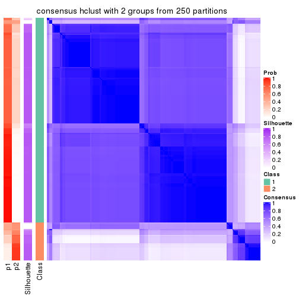</p>

</div>
<div id='tab-ATC-hclust-consensus-heatmap-2'>
<pre><code class="r">consensus_heatmap(res, k = 3)
</code></pre>

<p>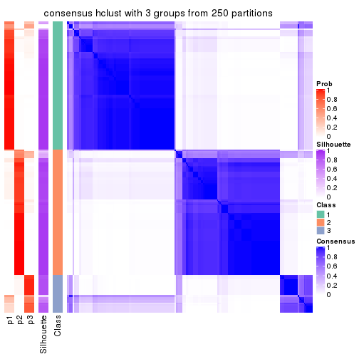</p>

</div>
<div id='tab-ATC-hclust-consensus-heatmap-3'>
<pre><code class="r">consensus_heatmap(res, k = 4)
</code></pre>

<p>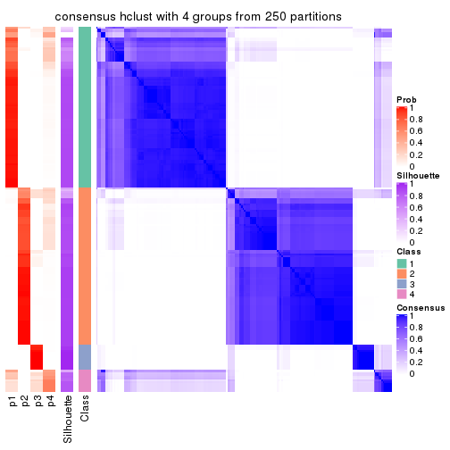</p>

</div>
<div id='tab-ATC-hclust-consensus-heatmap-4'>
<pre><code class="r">consensus_heatmap(res, k = 5)
</code></pre>

<p>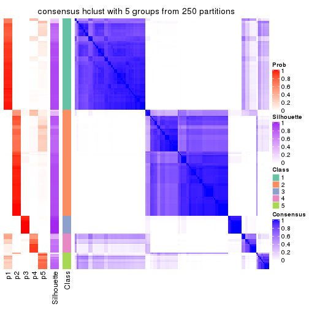</p>

</div>
<div id='tab-ATC-hclust-consensus-heatmap-5'>
<pre><code class="r">consensus_heatmap(res, k = 6)
</code></pre>

<p>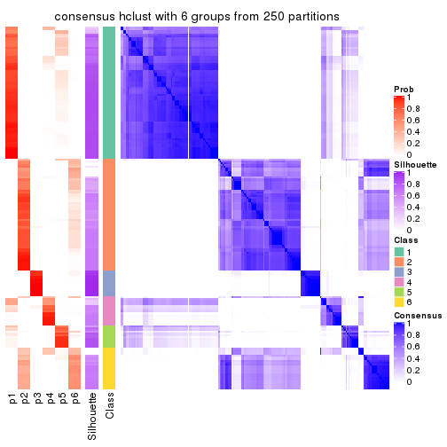</p>

</div>
</div>

Heatmaps for the membership of samples in all partitions to see how consistent they are:


<script>
$( function() {
	$( '#tabs-ATC-hclust-membership-heatmap' ).tabs();
} );
</script>
<div id='tabs-ATC-hclust-membership-heatmap'>
<ul>
<li><a href='#tab-ATC-hclust-membership-heatmap-1'>k = 2</a></li>
<li><a href='#tab-ATC-hclust-membership-heatmap-2'>k = 3</a></li>
<li><a href='#tab-ATC-hclust-membership-heatmap-3'>k = 4</a></li>
<li><a href='#tab-ATC-hclust-membership-heatmap-4'>k = 5</a></li>
<li><a href='#tab-ATC-hclust-membership-heatmap-5'>k = 6</a></li>
</ul>
<div id='tab-ATC-hclust-membership-heatmap-1'>
<pre><code class="r">membership_heatmap(res, k = 2)
</code></pre>

<p>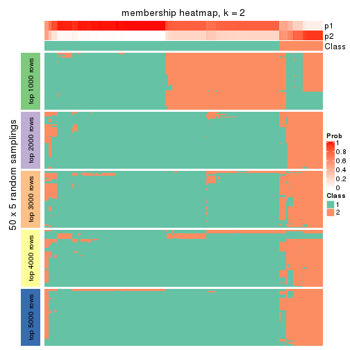</p>

</div>
<div id='tab-ATC-hclust-membership-heatmap-2'>
<pre><code class="r">membership_heatmap(res, k = 3)
</code></pre>

<p>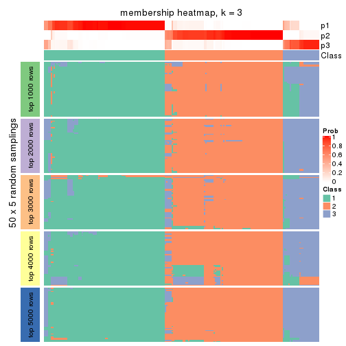</p>

</div>
<div id='tab-ATC-hclust-membership-heatmap-3'>
<pre><code class="r">membership_heatmap(res, k = 4)
</code></pre>

<p>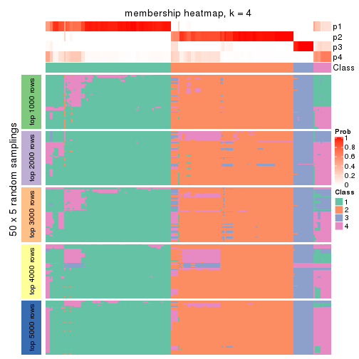</p>

</div>
<div id='tab-ATC-hclust-membership-heatmap-4'>
<pre><code class="r">membership_heatmap(res, k = 5)
</code></pre>

<p>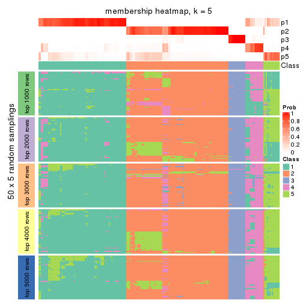</p>

</div>
<div id='tab-ATC-hclust-membership-heatmap-5'>
<pre><code class="r">membership_heatmap(res, k = 6)
</code></pre>

<p>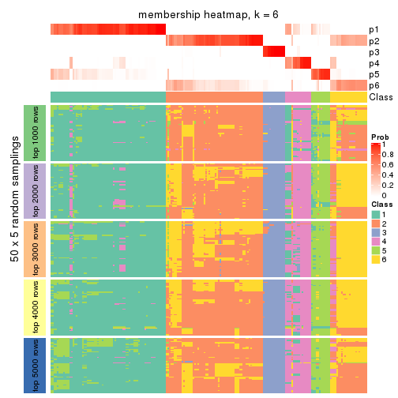</p>

</div>
</div>

As soon as we have had the classes for columns, we can look for signatures
which are significantly different between classes which can be candidate marks
for certain classes. Following are the heatmaps for signatures.


Signature heatmaps where rows are scaled:


<script>
$( function() {
	$( '#tabs-ATC-hclust-get-signatures' ).tabs();
} );
</script>
<div id='tabs-ATC-hclust-get-signatures'>
<ul>
<li><a href='#tab-ATC-hclust-get-signatures-1'>k = 2</a></li>
<li><a href='#tab-ATC-hclust-get-signatures-2'>k = 3</a></li>
<li><a href='#tab-ATC-hclust-get-signatures-3'>k = 4</a></li>
<li><a href='#tab-ATC-hclust-get-signatures-4'>k = 5</a></li>
<li><a href='#tab-ATC-hclust-get-signatures-5'>k = 6</a></li>
</ul>
<div id='tab-ATC-hclust-get-signatures-1'>
<pre><code class="r">get_signatures(res, k = 2)
</code></pre>

<p>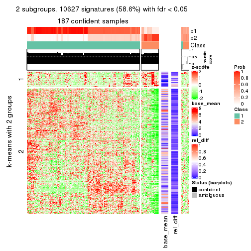</p>

</div>
<div id='tab-ATC-hclust-get-signatures-2'>
<pre><code class="r">get_signatures(res, k = 3)
</code></pre>

<p>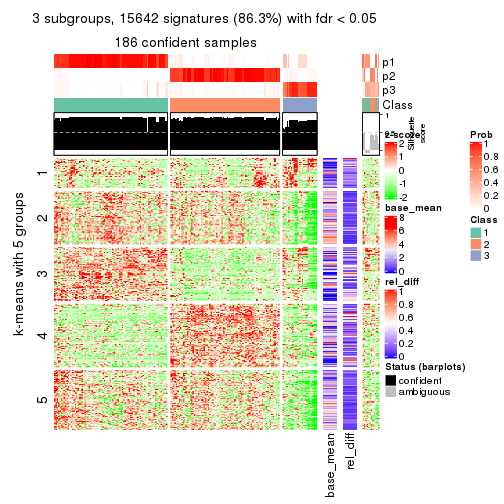</p>

</div>
<div id='tab-ATC-hclust-get-signatures-3'>
<pre><code class="r">get_signatures(res, k = 4)
</code></pre>

<p>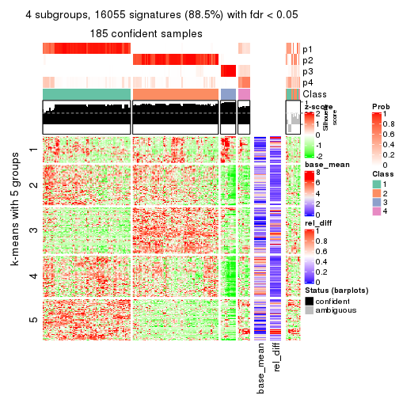</p>

</div>
<div id='tab-ATC-hclust-get-signatures-4'>
<pre><code class="r">get_signatures(res, k = 5)
</code></pre>

<p>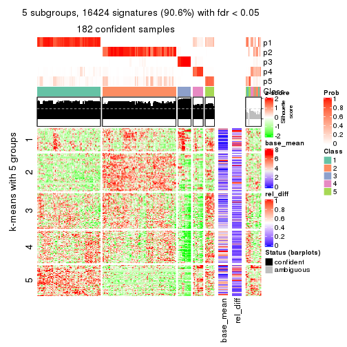</p>

</div>
<div id='tab-ATC-hclust-get-signatures-5'>
<pre><code class="r">get_signatures(res, k = 6)
</code></pre>

<p>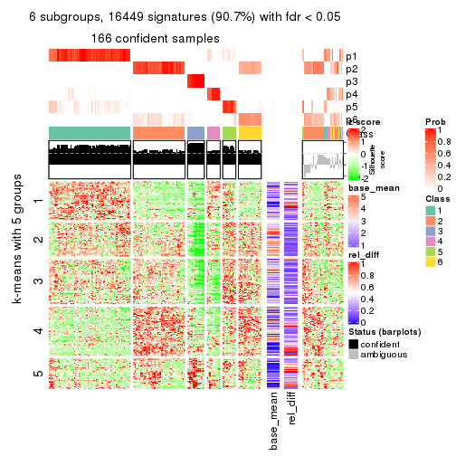</p>

</div>
</div>


Signature heatmaps where rows are not scaled:


<script>
$( function() {
	$( '#tabs-ATC-hclust-get-signatures-no-scale' ).tabs();
} );
</script>
<div id='tabs-ATC-hclust-get-signatures-no-scale'>
<ul>
<li><a href='#tab-ATC-hclust-get-signatures-no-scale-1'>k = 2</a></li>
<li><a href='#tab-ATC-hclust-get-signatures-no-scale-2'>k = 3</a></li>
<li><a href='#tab-ATC-hclust-get-signatures-no-scale-3'>k = 4</a></li>
<li><a href='#tab-ATC-hclust-get-signatures-no-scale-4'>k = 5</a></li>
<li><a href='#tab-ATC-hclust-get-signatures-no-scale-5'>k = 6</a></li>
</ul>
<div id='tab-ATC-hclust-get-signatures-no-scale-1'>
<pre><code class="r">get_signatures(res, k = 2, scale_rows = FALSE)
</code></pre>

<p>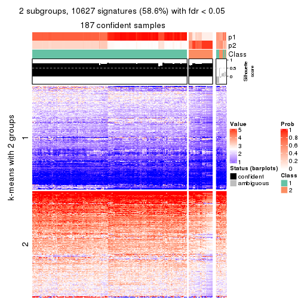</p>

</div>
<div id='tab-ATC-hclust-get-signatures-no-scale-2'>
<pre><code class="r">get_signatures(res, k = 3, scale_rows = FALSE)
</code></pre>

<p>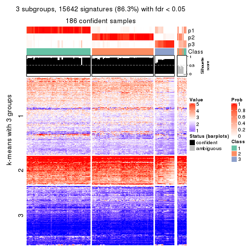</p>

</div>
<div id='tab-ATC-hclust-get-signatures-no-scale-3'>
<pre><code class="r">get_signatures(res, k = 4, scale_rows = FALSE)
</code></pre>

<p>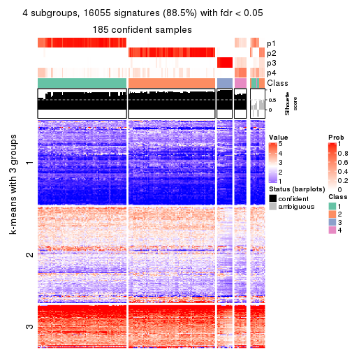</p>

</div>
<div id='tab-ATC-hclust-get-signatures-no-scale-4'>
<pre><code class="r">get_signatures(res, k = 5, scale_rows = FALSE)
</code></pre>

<p>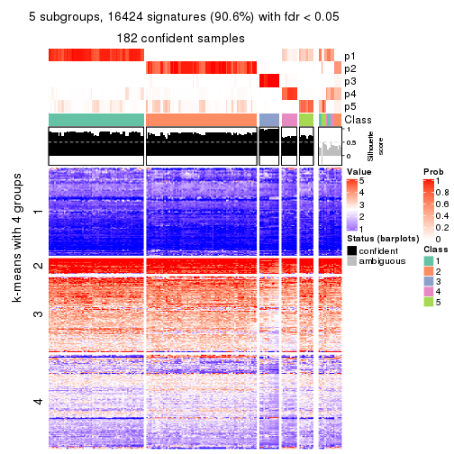</p>

</div>
<div id='tab-ATC-hclust-get-signatures-no-scale-5'>
<pre><code class="r">get_signatures(res, k = 6, scale_rows = FALSE)
</code></pre>

<p>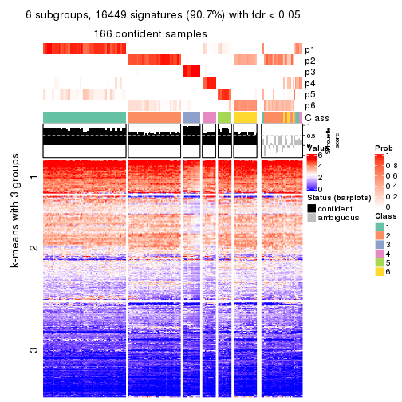</p>

</div>
</div>


Compare the overlap of signatures from different k:

```r
compare_signatures(res)
```

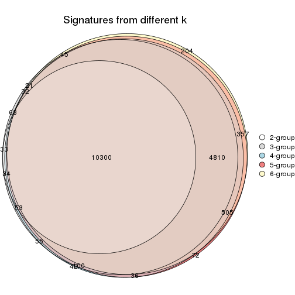

`get_signature()` returns a data frame invisibly. TO get the list of signatures, the function
call should be assigned to a variable explicitly. In following code, if `plot` argument is set
to `FALSE`, no heatmap is plotted while only the differential analysis is performed.

```r
# code only for demonstration
tb = get_signature(res, k = ..., plot = FALSE)
```

An example of the output of `tb` is:

```
#>   which_row         fdr    mean_1    mean_2 scaled_mean_1 scaled_mean_2 km
#> 1        38 0.042760348  8.373488  9.131774    -0.5533452     0.5164555  1
#> 2        40 0.018707592  7.106213  8.469186    -0.6173731     0.5762149  1
#> 3        55 0.019134737 10.221463 11.207825    -0.6159697     0.5749050  1
#> 4        59 0.006059896  5.921854  7.869574    -0.6899429     0.6439467  1
#> 5        60 0.018055526  8.928898 10.211722    -0.6204761     0.5791110  1
#> 6        98 0.009384629 15.714769 14.887706     0.6635654    -0.6193277  2
...
```

The columns in `tb` are:

1. `which_row`: row indices corresponding to the input matrix.
2. `fdr`: FDR for the differential test. 
3. `mean_x`: The mean value in group x.
4. `scaled_mean_x`: The mean value in group x after rows are scaled.
5. `km`: Row groups if k-means clustering is applied to rows.


UMAP plot which shows how samples are separated.


<script>
$( function() {
	$( '#tabs-ATC-hclust-dimension-reduction' ).tabs();
} );
</script>
<div id='tabs-ATC-hclust-dimension-reduction'>
<ul>
<li><a href='#tab-ATC-hclust-dimension-reduction-1'>k = 2</a></li>
<li><a href='#tab-ATC-hclust-dimension-reduction-2'>k = 3</a></li>
<li><a href='#tab-ATC-hclust-dimension-reduction-3'>k = 4</a></li>
<li><a href='#tab-ATC-hclust-dimension-reduction-4'>k = 5</a></li>
<li><a href='#tab-ATC-hclust-dimension-reduction-5'>k = 6</a></li>
</ul>
<div id='tab-ATC-hclust-dimension-reduction-1'>
<pre><code class="r">dimension_reduction(res, k = 2, method = &quot;UMAP&quot;)
</code></pre>

<p>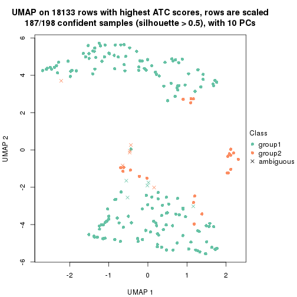</p>

</div>
<div id='tab-ATC-hclust-dimension-reduction-2'>
<pre><code class="r">dimension_reduction(res, k = 3, method = &quot;UMAP&quot;)
</code></pre>

<p>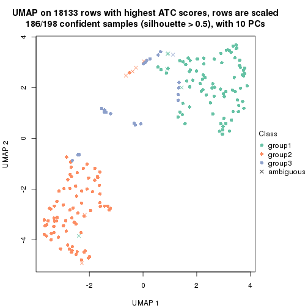</p>

</div>
<div id='tab-ATC-hclust-dimension-reduction-3'>
<pre><code class="r">dimension_reduction(res, k = 4, method = &quot;UMAP&quot;)
</code></pre>

<p>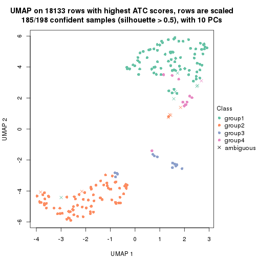</p>

</div>
<div id='tab-ATC-hclust-dimension-reduction-4'>
<pre><code class="r">dimension_reduction(res, k = 5, method = &quot;UMAP&quot;)
</code></pre>

<p>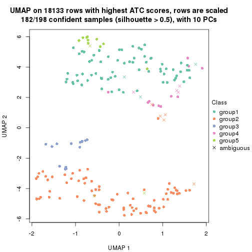</p>

</div>
<div id='tab-ATC-hclust-dimension-reduction-5'>
<pre><code class="r">dimension_reduction(res, k = 6, method = &quot;UMAP&quot;)
</code></pre>

<p>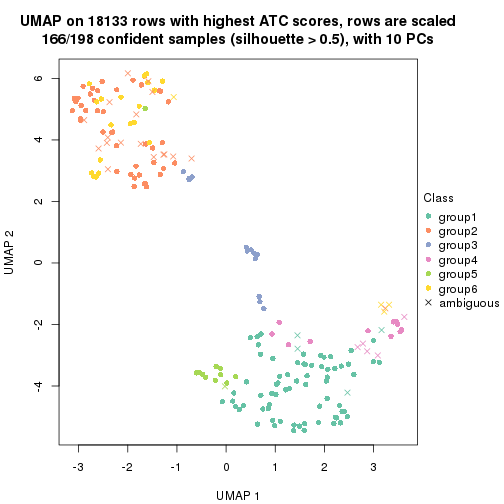</p>

</div>
</div>


Following heatmap shows how subgroups are split when increasing `k`:

```r
collect_classes(res)
```

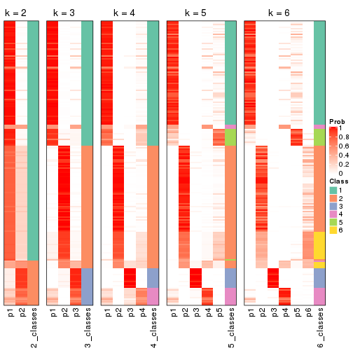


If matrix rows can be associated to genes, consider to use `functional_enrichment(res,
...)` to perform function enrichment for the signature genes. See [this vignette](http://bioconductor.org/packages/devel/bioc/vignettes/cola/inst/doc/functional_enrichment.html) for more detailed explanations.


 

---------------------------------------------------


### ATC:kmeans**


The object with results only for a single top-value method and a single partition method 
can be extracted as:

```r
res = res_list["ATC", "kmeans"]
# you can also extract it by
# res = res_list["ATC:kmeans"]
```

A summary of `res` and all the functions that can be applied to it:

```r
res
```

```
#> A 'ConsensusPartition' object with k = 2, 3, 4, 5, 6.
#>   On a matrix with 18133 rows and 198 columns.
#>   Top rows (1000, 2000, 3000, 4000, 5000) are extracted by 'ATC' method.
#>   Subgroups are detected by 'kmeans' method.
#>   Performed in total 1250 partitions by row resampling.
#>   Best k for subgroups seems to be 3.
#> 
#> Following methods can be applied to this 'ConsensusPartition' object:
#>  [1] "cola_report"             "collect_classes"         "collect_plots"          
#>  [4] "collect_stats"           "colnames"                "compare_signatures"     
#>  [7] "consensus_heatmap"       "dimension_reduction"     "functional_enrichment"  
#> [10] "get_anno_col"            "get_anno"                "get_classes"            
#> [13] "get_consensus"           "get_matrix"              "get_membership"         
#> [16] "get_param"               "get_signatures"          "get_stats"              
#> [19] "is_best_k"               "is_stable_k"             "membership_heatmap"     
#> [22] "ncol"                    "nrow"                    "plot_ecdf"              
#> [25] "rownames"                "select_partition_number" "show"                   
#> [28] "suggest_best_k"          "test_to_known_factors"
```

`collect_plots()` function collects all the plots made from `res` for all `k` (number of partitions)
into one single page to provide an easy and fast comparison between different `k`.

```r
collect_plots(res)
```

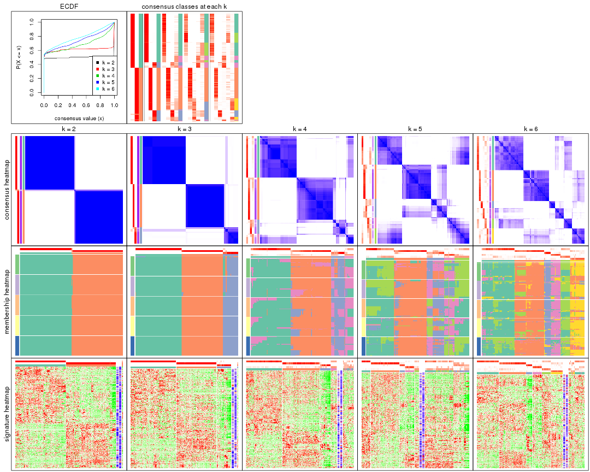

The plots are:

- The first row: a plot of the ECDF (empirical cumulative distribution
  function) curves of the consensus matrix for each `k` and the heatmap of
  predicted classes for each `k`.
- The second row: heatmaps of the consensus matrix for each `k`.
- The third row: heatmaps of the membership matrix for each `k`.
- The fouth row: heatmaps of the signatures for each `k`.

All the plots in panels can be made by individual functions and they are
plotted later in this section.

`select_partition_number()` produces several plots showing different
statistics for choosing "optimized" `k`. There are following statistics:

- ECDF curves of the consensus matrix for each `k`;
- 1-PAC. [The PAC
  score](https://en.wikipedia.org/wiki/Consensus_clustering#Over-interpretation_potential_of_consensus_clustering)
  measures the proportion of the ambiguous subgrouping.
- Mean silhouette score.
- Concordance. The mean probability of fiting the consensus class ids in all
  partitions.
- Area increased. Denote $A_k$ as the area under the ECDF curve for current
  `k`, the area increased is defined as $A_k - A_{k-1}$.
- Rand index. The percent of pairs of samples that are both in a same cluster
  or both are not in a same cluster in the partition of k and k-1.
- Jaccard index. The ratio of pairs of samples are both in a same cluster in
  the partition of k and k-1 and the pairs of samples are both in a same
  cluster in the partition k or k-1.

The detailed explanations of these statistics can be found in [the _cola_
vignette](http://bioconductor.org/packages/devel/bioc/vignettes/cola/inst/doc/cola.html#toc_13).

Generally speaking, lower PAC score, higher mean silhouette score or higher
concordance corresponds to better partition. Rand index and Jaccard index
measure how similar the current partition is compared to partition with `k-1`.
If they are too similar, we won't accept `k` is better than `k-1`.

```r
select_partition_number(res)
```

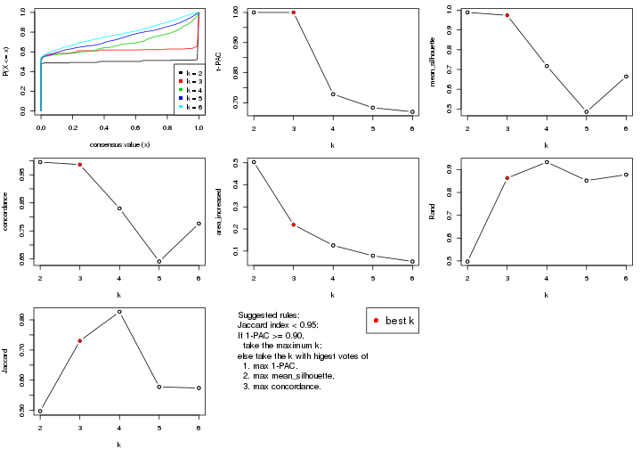

The numeric values for all these statistics can be obtained by `get_stats()`.

```r
get_stats(res)
```

```
#>   k 1-PAC mean_silhouette concordance area_increased  Rand Jaccard
#> 2 2 1.000           0.988       0.995         0.5029 0.497   0.497
#> 3 3 1.000           0.974       0.986         0.2191 0.863   0.730
#> 4 4 0.728           0.717       0.830         0.1255 0.933   0.827
#> 5 5 0.684           0.486       0.641         0.0788 0.852   0.578
#> 6 6 0.670           0.664       0.776         0.0529 0.878   0.574
```

`suggest_best_k()` suggests the best $k$ based on these statistics. The rules are as follows:

- All $k$ with Jaccard index larger than 0.95 are removed because increasing
  $k$ does not provide enough extra information. If all $k$ are removed, it is
  marked as no subgroup is detected.
- For all $k$ with 1-PAC score larger than 0.9, the maximal $k$ is taken as
  the best $k$, and other $k$ are marked as optional $k$.
- If it does not fit the second rule. The $k$ with the maximal vote of the
  highest 1-PAC score, highest mean silhouette, and highest concordance is
  taken as the best $k$.

```r
suggest_best_k(res)
```

```
#> [1] 3
#> attr(,"optional")
#> [1] 2
```

There is also optional best $k$ = 2 that is worth to check.

Following shows the table of the partitions (You need to click the **show/hide
code output** link to see it). The membership matrix (columns with name `p*`)
is inferred by
[`clue::cl_consensus()`](https://www.rdocumentation.org/link/cl_consensus?package=clue)
function with the `SE` method. Basically the value in the membership matrix
represents the probability to belong to a certain group. The finall class
label for an item is determined with the group with highest probability it
belongs to.

In `get_classes()` function, the entropy is calculated from the membership
matrix and the silhouette score is calculated from the consensus matrix.


<script>
$( function() {
	$( '#tabs-ATC-kmeans-get-classes' ).tabs();
} );
</script>
<div id='tabs-ATC-kmeans-get-classes'>
<ul>
<li><a href='#tab-ATC-kmeans-get-classes-1'>k = 2</a></li>
<li><a href='#tab-ATC-kmeans-get-classes-2'>k = 3</a></li>
<li><a href='#tab-ATC-kmeans-get-classes-3'>k = 4</a></li>
<li><a href='#tab-ATC-kmeans-get-classes-4'>k = 5</a></li>
<li><a href='#tab-ATC-kmeans-get-classes-5'>k = 6</a></li>
</ul>

<div id='tab-ATC-kmeans-get-classes-1'>
<p><a id='tab-ATC-kmeans-get-classes-1-a' style='color:#0366d6' href='#'>show/hide code output</a></p>
<pre><code class="r">cbind(get_classes(res, k = 2), get_membership(res, k = 2))
</code></pre>

<pre><code>#&gt;                                      class entropy silhouette    p1    p2
#&gt; 0C0AA0B2-5191-4EDF-8937-ED7434F30283     2  0.0000      0.991 0.000 1.000
#&gt; 18B45F1F-234F-45CC-A234-145307606C5C     1  0.0000      1.000 1.000 0.000
#&gt; E18B70C0-BDCA-46D3-99BB-C6C8ABC68DA5     2  0.0000      0.991 0.000 1.000
#&gt; 0F6DDBA7-6F74-45E8-95C8-F28263D55978     1  0.0000      1.000 1.000 0.000
#&gt; 7EAE1A5A-129A-46DE-977E-A2C753F10904     2  0.0000      0.991 0.000 1.000
#&gt; 7EAE0048-16B5-4979-9410-16CDEB9B1A48     1  0.0000      1.000 1.000 0.000
#&gt; 2EBFC828-2B27-4753-A052-80DDA226DAB4     2  0.0000      0.991 0.000 1.000
#&gt; 24E1768D-2232-41DA-9383-BC55D6EB3812     2  0.0000      0.991 0.000 1.000
#&gt; 6E3CD60A-1889-4CA3-B305-2E78152057B5     2  0.0000      0.991 0.000 1.000
#&gt; 33CC70DD-82B3-413C-B3B1-BE06634D95D0     1  0.0000      1.000 1.000 0.000
#&gt; F1CB57A3-55DD-4487-9307-1B4F652E729A     1  0.0000      1.000 1.000 0.000
#&gt; 755A5806-B054-449A-93DB-79909E6C93A1     1  0.0000      1.000 1.000 0.000
#&gt; 58D364E7-3D2F-468F-A264-D6461E2428D4     2  0.0000      0.991 0.000 1.000
#&gt; 68BB9CB6-7AA2-4981-B9D9-07363EC96599     2  0.0000      0.991 0.000 1.000
#&gt; 3C4E8DFA-8EA0-4F1F-89CB-CB8805395872     2  0.0000      0.991 0.000 1.000
#&gt; 4219651D-5583-4498-BF08-1B7D04B4C7B2     1  0.0000      1.000 1.000 0.000
#&gt; B5EE2768-0D67-4584-ADBC-EC745FEC52EA     2  0.0000      0.991 0.000 1.000
#&gt; 825E6C11-F460-451A-8045-846DD7D0E945     1  0.0000      1.000 1.000 0.000
#&gt; 491F62AF-5E68-43C3-982A-F867A75BBA9A     2  0.0000      0.991 0.000 1.000
#&gt; 9D7F058C-F95A-44AD-AC9E-450F7FBDC960     2  0.0000      0.991 0.000 1.000
#&gt; 6D42DD0C-2081-4742-BA27-9F5F16FAC3C6     1  0.0000      1.000 1.000 0.000
#&gt; EDD7E63D-492A-473B-A552-0764337B10EF     2  0.0000      0.991 0.000 1.000
#&gt; 97073DEA-73AD-4DFD-BD1A-9035DC03445B     1  0.0000      1.000 1.000 0.000
#&gt; FA891AB9-CE38-4F7E-A015-1DDCE12890A0     1  0.0000      1.000 1.000 0.000
#&gt; D9514D49-A0AE-45AB-8C9F-68E726215253     1  0.0000      1.000 1.000 0.000
#&gt; 3B9229AD-12E5-451E-9D2F-378AAC82C04A     2  0.0000      0.991 0.000 1.000
#&gt; 5EA36B71-4917-4EF3-9060-065EFE6ACC5B     1  0.0000      1.000 1.000 0.000
#&gt; A20E4ECB-4895-4CC7-BE5E-4721B20D933B     1  0.0000      1.000 1.000 0.000
#&gt; 1BE8D828-29DB-4368-AA4A-FB23588F7AE8     1  0.0000      1.000 1.000 0.000
#&gt; 66EFEFCF-3D14-4DBF-AA13-530F40ED0245     1  0.0000      1.000 1.000 0.000
#&gt; 55DFFE53-BCE7-4EC1-9863-6C0311B06BA2     2  0.0000      0.991 0.000 1.000
#&gt; 4CC3FB5A-611D-4C64-AE9D-544FA45CF4DC     1  0.0000      1.000 1.000 0.000
#&gt; C11D33F2-DFE9-4FA8-9024-F3E7F1DADC5F     2  0.0000      0.991 0.000 1.000
#&gt; FA5932B8-8AA3-4C38-9FAB-C35D8772974D     1  0.0000      1.000 1.000 0.000
#&gt; 8216EC35-1F41-4A15-B503-BDA4971E27C9     1  0.0000      1.000 1.000 0.000
#&gt; 69635D23-90A7-4BAD-97C7-B79536837F57     1  0.0000      1.000 1.000 0.000
#&gt; 12B404E2-C463-4409-8392-E4649B2AFFD1     2  0.0000      0.991 0.000 1.000
#&gt; 246927E3-ACCF-41B2-AA8E-43855FD6B146     2  0.0000      0.991 0.000 1.000
#&gt; E0CC13E7-9607-49E0-B4AA-395544E3C3BF     1  0.0000      1.000 1.000 0.000
#&gt; F7BBC0C1-6124-4A83-8A70-EA89B62F1CBD     1  0.0000      1.000 1.000 0.000
#&gt; B1D4FF24-8E6F-4A04-B716-2032D850EB57     1  0.0000      1.000 1.000 0.000
#&gt; 253601DB-B78A-4566-9947-8C0270C0B163     2  0.0000      0.991 0.000 1.000
#&gt; AB83DBFF-5737-4FB8-A5AC-1D3CD6072BDF     2  0.0000      0.991 0.000 1.000
#&gt; 9D67D953-EC98-4B72-89C8-5732BC9D4BC9     2  0.0000      0.991 0.000 1.000
#&gt; 51061018-95AB-4278-886F-F69E4EBC47C0     2  0.0000      0.991 0.000 1.000
#&gt; ABD0F7F3-105B-4DEE-9889-5028772C519A     1  0.0000      1.000 1.000 0.000
#&gt; 562B95CF-B27E-4A72-B7C6-CDF86A51A39B     1  0.0000      1.000 1.000 0.000
#&gt; ABF046A4-D7A1-49FF-B6B1-4E07A791DEDB     2  0.0000      0.991 0.000 1.000
#&gt; 3FF4101E-9703-460E-A30E-76CC7689F36D     2  0.0000      0.991 0.000 1.000
#&gt; 39C4F7AA-7ADF-4F1D-BDA3-BEC605AC5023     2  0.0000      0.991 0.000 1.000
#&gt; CB821FD2-AF5C-4743-A70F-21C12C6ED153     1  0.0000      1.000 1.000 0.000
#&gt; 92EA1846-62FF-41D5-A441-5E52E6B9E7F9     1  0.0000      1.000 1.000 0.000
#&gt; 7D25F3EE-5A20-4763-8026-16A03D05F459     1  0.0000      1.000 1.000 0.000
#&gt; 8ECE5276-CD06-496B-A5A9-1713B1F7D089     1  0.0000      1.000 1.000 0.000
#&gt; C775B68F-9507-47E3-B507-B433AED79002     1  0.0000      1.000 1.000 0.000
#&gt; E19D5463-FDD0-41C1-A170-323736A88D07     2  0.0000      0.991 0.000 1.000
#&gt; CE4B6285-4961-4767-91F0-5C7A8162E185     1  0.0000      1.000 1.000 0.000
#&gt; 9637BD72-1FEF-42AD-8886-2C39BE876531     1  0.0000      1.000 1.000 0.000
#&gt; 81B5A88E-45A0-4B44-B689-B9071B8548EE     2  0.0000      0.991 0.000 1.000
#&gt; 0B01B4C9-9BED-4F5B-A3E2-8868C7CCC3FC     2  0.0000      0.991 0.000 1.000
#&gt; 54501315-7132-44B2-A179-10FBF1421105     1  0.0000      1.000 1.000 0.000
#&gt; E207CBE9-4C3A-4FDD-9251-CFE1FE106475     2  0.6801      0.780 0.180 0.820
#&gt; 3BEA0B92-3F90-4DBF-9679-AADEAD7D47C8     2  0.0000      0.991 0.000 1.000
#&gt; 35B32250-D854-4215-AA5B-2C11B2FBEECA     1  0.0000      1.000 1.000 0.000
#&gt; ACE6566B-AEB9-426C-924A-B382D14A1024     2  0.0000      0.991 0.000 1.000
#&gt; 737E69AC-0930-45B9-B6BA-7CE5E300290B     1  0.0000      1.000 1.000 0.000
#&gt; B4410AB8-D015-41CA-86E6-12EB4E4103E3     1  0.0000      1.000 1.000 0.000
#&gt; 6D3ECA65-C50F-43B0-B75A-1D290FA4A8FD     2  0.0000      0.991 0.000 1.000
#&gt; C86F40D3-9A96-4395-A8C3-510DE12F9A2B     2  0.0000      0.991 0.000 1.000
#&gt; 6238087F-24DD-4BF1-903F-3BD4E446C1AE     2  0.0000      0.991 0.000 1.000
#&gt; E4FF840B-EEAB-4CB0-A690-7D4C4AA7EEC3     2  0.0000      0.991 0.000 1.000
#&gt; 72D3C323-C67F-4C0E-9BFC-BF245FF9730A     1  0.0000      1.000 1.000 0.000
#&gt; 82D56E4E-4DF6-4F3E-8959-B995C92AAA70     1  0.0000      1.000 1.000 0.000
#&gt; E31CA441-EB19-443B-ACBD-37B5CCBCF0E5     2  0.0000      0.991 0.000 1.000
#&gt; 87CA8939-D054-4B8A-B32D-085FD2E8F202     1  0.0000      1.000 1.000 0.000
#&gt; 2A508D90-FEDC-46A3-9A02-E51E5467CDCB     1  0.0000      1.000 1.000 0.000
#&gt; C4E8B4E2-388B-411F-BF0A-9B6F34E8EDB5     2  0.0000      0.991 0.000 1.000
#&gt; AF6AF803-BD93-44A7-AA80-B9BC92C1273B     2  0.0000      0.991 0.000 1.000
#&gt; 0B1CA5CF-EB96-41D4-BFC5-6957FEB39828     1  0.0000      1.000 1.000 0.000
#&gt; 6FB96FB0-6661-48AD-A4A0-69F8AFDBE591     2  0.0000      0.991 0.000 1.000
#&gt; 8C19F7FD-368A-462B-B28F-88D6630038A1     1  0.0000      1.000 1.000 0.000
#&gt; 96EABE78-C2F4-4A33-ACD8-C922A4B2519B     2  0.0000      0.991 0.000 1.000
#&gt; 68B36D7B-546A-4689-949F-B207C4A4AB27     2  0.0000      0.991 0.000 1.000
#&gt; CE9F3335-778F-4F52-BC55-4B7C99B211DD     2  0.0000      0.991 0.000 1.000
#&gt; CB359DED-2A2D-4646-A0BD-6F10ADCC532B     1  0.0000      1.000 1.000 0.000
#&gt; 198324A5-8C52-46F6-9734-EFAF1CCA6D9B     1  0.0000      1.000 1.000 0.000
#&gt; 83B88608-0506-428C-B9E8-621F38477B42     1  0.0000      1.000 1.000 0.000
#&gt; 1993630A-0F3D-4F5C-86A3-D443BAAF57F0     2  0.9522      0.418 0.372 0.628
#&gt; DE73DA9B-529E-4F4F-A65C-DA7AB84B1096     1  0.0000      1.000 1.000 0.000
#&gt; 2347F3B7-DDA3-40C0-B6D4-8819ECA69146     1  0.0000      1.000 1.000 0.000
#&gt; AB93B5D5-095F-4330-9D40-6A3D934AB50C     1  0.0000      1.000 1.000 0.000
#&gt; 5EBBE4AD-FF0C-41CF-9EA3-B6FE7EA1F9C0     2  0.9427      0.447 0.360 0.640
#&gt; 6D960AE7-3769-4144-A061-E8588E5063FF     1  0.0000      1.000 1.000 0.000
#&gt; 0C2DD8C0-D1A5-4192-A49C-7A40FED628B2     2  0.0000      0.991 0.000 1.000
#&gt; 18C9372F-C55B-4F86-A9D2-E8D85EFC8566     2  0.0000      0.991 0.000 1.000
#&gt; 9AF637B0-4C32-4DD1-93AF-7655B4A845D3     2  0.0000      0.991 0.000 1.000
#&gt; 785B5B06-4115-46FD-9BEB-F888AFDC855D     2  0.0000      0.991 0.000 1.000
#&gt; ECA3050E-4BE2-4117-B9CF-A52BB85AF8C2     2  0.0000      0.991 0.000 1.000
#&gt; 099DC396-16A5-458F-9ED9-F2A790CB0C34     1  0.0000      1.000 1.000 0.000
#&gt; 7A5A12EE-C5B0-4C51-8C99-0F3FA88D633E     1  0.0000      1.000 1.000 0.000
#&gt; E832B508-A66D-4817-B44A-FE9FAAE64B4A     1  0.0000      1.000 1.000 0.000
#&gt; F9DD688C-7B35-49E7-9651-2E098EE78856     1  0.0000      1.000 1.000 0.000
#&gt; F1265DD8-5ED3-4635-A277-57BBFDEC7729     1  0.0000      1.000 1.000 0.000
#&gt; F624E8D9-DB07-4C9E-910D-5E8EBA3A6167     2  0.0000      0.991 0.000 1.000
#&gt; 3516FBDF-66E1-43F4-9D7B-16748F6439A7     2  0.0000      0.991 0.000 1.000
#&gt; 04B12992-B2EA-4BA2-8E2C-11E34E230E6F     2  0.0000      0.991 0.000 1.000
#&gt; CC02897D-9123-495E-9242-5C9CF4EC269B     2  0.0000      0.991 0.000 1.000
#&gt; 3117ED46-2BF2-4311-BC00-4E98243E16B3     1  0.0000      1.000 1.000 0.000
#&gt; E0B66D53-23DB-4E26-BB6E-F692FA8C000E     1  0.0000      1.000 1.000 0.000
#&gt; DAA93CE5-A013-477A-9A50-EA09CC3A8162     2  0.0000      0.991 0.000 1.000
#&gt; 0099098D-354A-4276-92F8-B932C74B4608     1  0.0000      1.000 1.000 0.000
#&gt; DD483639-B2E7-4745-BCFB-55ED1D82BFBF     2  0.0000      0.991 0.000 1.000
#&gt; 2C1F9079-602E-4252-82C7-9D8799E04246     2  0.0000      0.991 0.000 1.000
#&gt; 9473A8E4-3A1B-4184-9EA6-517AFD60B635     1  0.0000      1.000 1.000 0.000
#&gt; 75CFBAF6-7BA0-40AF-92D7-D218E885BD1B     2  0.0000      0.991 0.000 1.000
#&gt; B588950F-14D6-41C8-845B-EFD2096013C6     2  0.0000      0.991 0.000 1.000
#&gt; 0DF3EDA8-DAEA-4721-92AB-B97181249498     2  0.0000      0.991 0.000 1.000
#&gt; 8EA83042-D598-401D-AD78-936EEB136C59     1  0.0000      1.000 1.000 0.000
#&gt; 729AC418-3BE9-445A-95D4-AC11A7D43BE0     1  0.0000      1.000 1.000 0.000
#&gt; 7D8B1B11-F576-4AA8-BFA7-0022A2CD829A     2  0.0000      0.991 0.000 1.000
#&gt; 304A0E46-3449-4B44-9C30-BDDF6459391D     1  0.0000      1.000 1.000 0.000
#&gt; 3C83358F-DF20-47F7-AF9F-AB7CC92F5ABA     1  0.0000      1.000 1.000 0.000
#&gt; EAFEED6C-35C3-451F-AE4A-EB56992E1F29     1  0.0000      1.000 1.000 0.000
#&gt; 8A237A65-28EC-434D-A78A-A8B7308B5204     1  0.0000      1.000 1.000 0.000
#&gt; D005833F-E991-4E9E-9667-55F137288004     1  0.0000      1.000 1.000 0.000
#&gt; 37D966E3-253E-4397-A9AE-0903A8D31FE6     1  0.0000      1.000 1.000 0.000
#&gt; D2482B81-CB5B-4178-BA8D-1CF4026181B5     1  0.0000      1.000 1.000 0.000
#&gt; 18019E95-C2A8-4EE7-B585-F6886DC4D953     2  0.0000      0.991 0.000 1.000
#&gt; 0B126D1A-14A8-4345-8F78-FF92222ADF4C     2  0.0000      0.991 0.000 1.000
#&gt; CE88B625-47D8-4D58-9FB4-23464DB7DDAD     2  0.0000      0.991 0.000 1.000
#&gt; 9A88299D-5C74-47FA-B42C-1A1D6D935AAB     1  0.0000      1.000 1.000 0.000
#&gt; 3E71159C-FD6C-41DA-B18B-0730C8AC7E41     1  0.0000      1.000 1.000 0.000
#&gt; 6F245AA4-79D9-47E1-BCC9-1AAF65AEA813     1  0.0000      1.000 1.000 0.000
#&gt; 4CF2C888-2100-483A-B4DB-ECBB69243A4D     2  0.0000      0.991 0.000 1.000
#&gt; A3853813-B9D5-4E8C-B075-19FCC35F8686     2  0.0000      0.991 0.000 1.000
#&gt; 83A16DEE-CE9F-4D8B-9225-0A2A8B9D055D     1  0.0000      1.000 1.000 0.000
#&gt; 0F057CAF-4F9A-4DE9-8601-730E96873733     2  0.0000      0.991 0.000 1.000
#&gt; 32D5801D-DBA4-422E-87CB-A2DDE921BA41     1  0.0000      1.000 1.000 0.000
#&gt; 22EE8076-F07C-499A-9AF8-D800A77EF154     2  0.0000      0.991 0.000 1.000
#&gt; DD4BD74D-D48C-4090-9F57-5334E784581C     1  0.0000      1.000 1.000 0.000
#&gt; 41183565-434D-474C-B1BD-CA6E94910658     2  0.0000      0.991 0.000 1.000
#&gt; 75A2CE41-2B2A-4346-927E-ACF8A72738E4     1  0.0000      1.000 1.000 0.000
#&gt; 7AA24995-3DD2-4682-B36A-4EBFEEACF625     1  0.0000      1.000 1.000 0.000
#&gt; 8BAFDFEC-9F26-4ADB-95CE-004143960EEB     1  0.0000      1.000 1.000 0.000
#&gt; A330E011-CE08-4A85-8F4B-370592293DBB     1  0.0000      1.000 1.000 0.000
#&gt; 1D5A5B17-2E70-4BB0-94A1-EC17E6EA49DB     1  0.0000      1.000 1.000 0.000
#&gt; BD9143B8-9D97-4A05-872C-3FB82B4CF7BE     2  0.0000      0.991 0.000 1.000
#&gt; 64552DC0-181E-4607-898C-787AA7F26435     2  0.0000      0.991 0.000 1.000
#&gt; 1B4C4D41-34C7-43A3-858B-C9552EB53894     1  0.0000      1.000 1.000 0.000
#&gt; 463A3BAA-02DC-4EA4-A644-B924163E425D     2  0.0000      0.991 0.000 1.000
#&gt; CD0FEA89-6F60-4A20-8FCA-D397B4E95A98     1  0.0000      1.000 1.000 0.000
#&gt; 5D06CF6D-F4B9-4B32-B055-8AB287E53340     2  0.0000      0.991 0.000 1.000
#&gt; ADA7835F-DB67-4F4F-9446-8BCE3C5FE936     2  0.0000      0.991 0.000 1.000
#&gt; 4109BE2D-B5DF-4BD7-860E-60D87F647152     2  0.0000      0.991 0.000 1.000
#&gt; 88526A0E-6DFE-46CB-BFAD-B4826F482C67     1  0.0000      1.000 1.000 0.000
#&gt; F39F9A4C-18F7-4017-AB31-85D52FF44587     2  0.0000      0.991 0.000 1.000
#&gt; D4290A5E-1B24-4C55-B470-0FA7A0A09DD0     2  0.0000      0.991 0.000 1.000
#&gt; DC5A2C9E-978F-4661-B729-1F9662976E27     1  0.0000      1.000 1.000 0.000
#&gt; 26A1F392-CED2-43E3-8096-74E6F2BFC8C0     2  0.0000      0.991 0.000 1.000
#&gt; 87D81FB2-306A-4E75-9D58-D5F48E46E7F6     2  0.0000      0.991 0.000 1.000
#&gt; E3D9D81A-C20C-4B3B-B940-A5D2C5F65B22     2  0.0000      0.991 0.000 1.000
#&gt; 4464650B-453F-476C-989C-B7B159BF2CF0     2  0.0000      0.991 0.000 1.000
#&gt; 577D2867-B738-487A-9B06-07958D647F02     1  0.0000      1.000 1.000 0.000
#&gt; E52A22CC-3C03-41A9-9541-220DD871E162     2  0.0000      0.991 0.000 1.000
#&gt; 642703B1-AF99-4746-A915-0792F4B9590B     2  0.0000      0.991 0.000 1.000
#&gt; 8F0D1792-1284-45E6-8EC4-392596057677     2  0.0000      0.991 0.000 1.000
#&gt; 765AFFC1-D528-4494-8BA1-0706451E4205     2  0.0000      0.991 0.000 1.000
#&gt; A716BC29-161F-4CA0-B240-00B330137F2C     1  0.0000      1.000 1.000 0.000
#&gt; 32CBFBAF-7064-4595-8D54-2C5E7DE0FD9B     1  0.0000      1.000 1.000 0.000
#&gt; 4D6ED28C-3F20-41B0-BA41-1BF0E5199A40     2  0.0000      0.991 0.000 1.000
#&gt; 86A38456-2900-48FB-B10F-79222B3CA9BF     2  0.0376      0.987 0.004 0.996
#&gt; E870807D-3223-4A6A-9E3D-F4461B048AA2     2  0.0000      0.991 0.000 1.000
#&gt; 3A78D19F-A833-4D2C-8387-FB4FD4A8313C     1  0.0000      1.000 1.000 0.000
#&gt; DFA162CA-C708-4121-8E74-F9C4DEE0CDAE     1  0.0000      1.000 1.000 0.000
#&gt; C00A300A-CD10-4C9D-8C94-3901AFE8406C     2  0.0000      0.991 0.000 1.000
#&gt; 13E11D15-A90F-48C4-980A-DD032C00A2C1     1  0.0000      1.000 1.000 0.000
#&gt; 31BF80AB-FEDB-4C73-89C3-70BE9F9ACBEE     2  0.0000      0.991 0.000 1.000
#&gt; FA34308A-349D-4AAD-94CF-3F3B7F9AD629     2  0.0000      0.991 0.000 1.000
#&gt; 7C48D467-B663-49DD-BC84-A36BC32ACB3D     1  0.0000      1.000 1.000 0.000
#&gt; BB068534-04F6-4FC9-9087-CDA65920BCE2     1  0.0000      1.000 1.000 0.000
#&gt; EA4EC272-A9B3-4B2E-955F-19F7676A944C     2  0.0000      0.991 0.000 1.000
#&gt; C71FF69B-A460-43CA-8769-9667F22D938B     1  0.0000      1.000 1.000 0.000
#&gt; 5243D1B8-8168-4FF1-A8C6-505F080EF0D3     2  0.0000      0.991 0.000 1.000
#&gt; BCC474D8-08FE-4E99-B8E8-B29E65F84D2E     1  0.0000      1.000 1.000 0.000
#&gt; 04FDBFE3-4CF6-4E53-A2AA-89D5C9316377     2  0.0000      0.991 0.000 1.000
#&gt; 83A9915C-8D60-4CAE-A868-B61E3C90C7B0     2  0.0000      0.991 0.000 1.000
#&gt; 989A6472-E3E3-457A-97BE-CCE95F42D5C2     2  0.0000      0.991 0.000 1.000
#&gt; A0AB2D28-6751-49C9-8DF4-66FDBF95C360     1  0.0000      1.000 1.000 0.000
#&gt; A12B2683-18D4-41C9-8AE5-C143E2180052     1  0.0000      1.000 1.000 0.000
#&gt; 8DE1E245-CAD2-4F11-BFA2-9792C433A00B     1  0.0938      0.988 0.988 0.012
#&gt; FDA68036-6C4C-4256-9AA0-C01FE92AA098     2  0.0000      0.991 0.000 1.000
#&gt; 26311920-1414-4EC1-870B-784961EBCC2D     1  0.0000      1.000 1.000 0.000
#&gt; C29A10D6-D598-4286-B5E0-F1776E19E988     1  0.0000      1.000 1.000 0.000
#&gt; FACCC1FB-4937-4CC0-90EA-7F91D3D939CF     2  0.0000      0.991 0.000 1.000
#&gt; 90B9D84B-78E5-4C7E-8414-EC889C2DE8DB     2  0.0000      0.991 0.000 1.000
#&gt; B74E6122-76E1-4E4D-A867-BCAFD7277393     1  0.0000      1.000 1.000 0.000
#&gt; 98494DC0-CF6E-485F-8A0D-D80E4437EF5C     2  0.0000      0.991 0.000 1.000
#&gt; DA114DAC-DE7B-4E43-8D7C-82C5D7B66411     1  0.0000      1.000 1.000 0.000
</code></pre>

<script>
$('#tab-ATC-kmeans-get-classes-1-a').parent().next().next().hide();
$('#tab-ATC-kmeans-get-classes-1-a').click(function(){
  $('#tab-ATC-kmeans-get-classes-1-a').parent().next().next().toggle();
  return(false);
});
</script>
</div>

<div id='tab-ATC-kmeans-get-classes-2'>
<p><a id='tab-ATC-kmeans-get-classes-2-a' style='color:#0366d6' href='#'>show/hide code output</a></p>
<pre><code class="r">cbind(get_classes(res, k = 3), get_membership(res, k = 3))
</code></pre>

<pre><code>#&gt;                                      class entropy silhouette    p1    p2    p3
#&gt; 0C0AA0B2-5191-4EDF-8937-ED7434F30283     2  0.0000      0.998 0.000 1.000 0.000
#&gt; 18B45F1F-234F-45CC-A234-145307606C5C     1  0.0000      0.997 1.000 0.000 0.000
#&gt; E18B70C0-BDCA-46D3-99BB-C6C8ABC68DA5     2  0.0000      0.998 0.000 1.000 0.000
#&gt; 0F6DDBA7-6F74-45E8-95C8-F28263D55978     1  0.0000      0.997 1.000 0.000 0.000
#&gt; 7EAE1A5A-129A-46DE-977E-A2C753F10904     2  0.0000      0.998 0.000 1.000 0.000
#&gt; 7EAE0048-16B5-4979-9410-16CDEB9B1A48     1  0.0000      0.997 1.000 0.000 0.000
#&gt; 2EBFC828-2B27-4753-A052-80DDA226DAB4     2  0.0000      0.998 0.000 1.000 0.000
#&gt; 24E1768D-2232-41DA-9383-BC55D6EB3812     3  0.0424      0.921 0.000 0.008 0.992
#&gt; 6E3CD60A-1889-4CA3-B305-2E78152057B5     2  0.0000      0.998 0.000 1.000 0.000
#&gt; 33CC70DD-82B3-413C-B3B1-BE06634D95D0     1  0.0424      0.993 0.992 0.000 0.008
#&gt; F1CB57A3-55DD-4487-9307-1B4F652E729A     1  0.0000      0.997 1.000 0.000 0.000
#&gt; 755A5806-B054-449A-93DB-79909E6C93A1     1  0.0000      0.997 1.000 0.000 0.000
#&gt; 58D364E7-3D2F-468F-A264-D6461E2428D4     2  0.0000      0.998 0.000 1.000 0.000
#&gt; 68BB9CB6-7AA2-4981-B9D9-07363EC96599     3  0.0424      0.921 0.000 0.008 0.992
#&gt; 3C4E8DFA-8EA0-4F1F-89CB-CB8805395872     3  0.0424      0.921 0.000 0.008 0.992
#&gt; 4219651D-5583-4498-BF08-1B7D04B4C7B2     1  0.0000      0.997 1.000 0.000 0.000
#&gt; B5EE2768-0D67-4584-ADBC-EC745FEC52EA     2  0.0000      0.998 0.000 1.000 0.000
#&gt; 825E6C11-F460-451A-8045-846DD7D0E945     1  0.0424      0.993 0.992 0.000 0.008
#&gt; 491F62AF-5E68-43C3-982A-F867A75BBA9A     2  0.0000      0.998 0.000 1.000 0.000
#&gt; 9D7F058C-F95A-44AD-AC9E-450F7FBDC960     2  0.0000      0.998 0.000 1.000 0.000
#&gt; 6D42DD0C-2081-4742-BA27-9F5F16FAC3C6     3  0.4887      0.738 0.228 0.000 0.772
#&gt; EDD7E63D-492A-473B-A552-0764337B10EF     3  0.5968      0.469 0.000 0.364 0.636
#&gt; 97073DEA-73AD-4DFD-BD1A-9035DC03445B     1  0.0000      0.997 1.000 0.000 0.000
#&gt; FA891AB9-CE38-4F7E-A015-1DDCE12890A0     1  0.0000      0.997 1.000 0.000 0.000
#&gt; D9514D49-A0AE-45AB-8C9F-68E726215253     1  0.0000      0.997 1.000 0.000 0.000
#&gt; 3B9229AD-12E5-451E-9D2F-378AAC82C04A     2  0.0000      0.998 0.000 1.000 0.000
#&gt; 5EA36B71-4917-4EF3-9060-065EFE6ACC5B     3  0.4842      0.740 0.224 0.000 0.776
#&gt; A20E4ECB-4895-4CC7-BE5E-4721B20D933B     1  0.0000      0.997 1.000 0.000 0.000
#&gt; 1BE8D828-29DB-4368-AA4A-FB23588F7AE8     1  0.0424      0.993 0.992 0.000 0.008
#&gt; 66EFEFCF-3D14-4DBF-AA13-530F40ED0245     1  0.0424      0.993 0.992 0.000 0.008
#&gt; 55DFFE53-BCE7-4EC1-9863-6C0311B06BA2     2  0.1529      0.958 0.000 0.960 0.040
#&gt; 4CC3FB5A-611D-4C64-AE9D-544FA45CF4DC     1  0.0000      0.997 1.000 0.000 0.000
#&gt; C11D33F2-DFE9-4FA8-9024-F3E7F1DADC5F     2  0.0000      0.998 0.000 1.000 0.000
#&gt; FA5932B8-8AA3-4C38-9FAB-C35D8772974D     1  0.0000      0.997 1.000 0.000 0.000
#&gt; 8216EC35-1F41-4A15-B503-BDA4971E27C9     1  0.0000      0.997 1.000 0.000 0.000
#&gt; 69635D23-90A7-4BAD-97C7-B79536837F57     1  0.0000      0.997 1.000 0.000 0.000
#&gt; 12B404E2-C463-4409-8392-E4649B2AFFD1     2  0.0000      0.998 0.000 1.000 0.000
#&gt; 246927E3-ACCF-41B2-AA8E-43855FD6B146     2  0.0000      0.998 0.000 1.000 0.000
#&gt; E0CC13E7-9607-49E0-B4AA-395544E3C3BF     1  0.0000      0.997 1.000 0.000 0.000
#&gt; F7BBC0C1-6124-4A83-8A70-EA89B62F1CBD     1  0.0000      0.997 1.000 0.000 0.000
#&gt; B1D4FF24-8E6F-4A04-B716-2032D850EB57     1  0.0000      0.997 1.000 0.000 0.000
#&gt; 253601DB-B78A-4566-9947-8C0270C0B163     2  0.0000      0.998 0.000 1.000 0.000
#&gt; AB83DBFF-5737-4FB8-A5AC-1D3CD6072BDF     3  0.0000      0.919 0.000 0.000 1.000
#&gt; 9D67D953-EC98-4B72-89C8-5732BC9D4BC9     2  0.0000      0.998 0.000 1.000 0.000
#&gt; 51061018-95AB-4278-886F-F69E4EBC47C0     3  0.0424      0.921 0.000 0.008 0.992
#&gt; ABD0F7F3-105B-4DEE-9889-5028772C519A     1  0.0000      0.997 1.000 0.000 0.000
#&gt; 562B95CF-B27E-4A72-B7C6-CDF86A51A39B     1  0.0000      0.997 1.000 0.000 0.000
#&gt; ABF046A4-D7A1-49FF-B6B1-4E07A791DEDB     2  0.1529      0.958 0.000 0.960 0.040
#&gt; 3FF4101E-9703-460E-A30E-76CC7689F36D     2  0.0000      0.998 0.000 1.000 0.000
#&gt; 39C4F7AA-7ADF-4F1D-BDA3-BEC605AC5023     2  0.0000      0.998 0.000 1.000 0.000
#&gt; CB821FD2-AF5C-4743-A70F-21C12C6ED153     1  0.0000      0.997 1.000 0.000 0.000
#&gt; 92EA1846-62FF-41D5-A441-5E52E6B9E7F9     1  0.0000      0.997 1.000 0.000 0.000
#&gt; 7D25F3EE-5A20-4763-8026-16A03D05F459     1  0.0000      0.997 1.000 0.000 0.000
#&gt; 8ECE5276-CD06-496B-A5A9-1713B1F7D089     1  0.0000      0.997 1.000 0.000 0.000
#&gt; C775B68F-9507-47E3-B507-B433AED79002     1  0.0424      0.993 0.992 0.000 0.008
#&gt; E19D5463-FDD0-41C1-A170-323736A88D07     2  0.0000      0.998 0.000 1.000 0.000
#&gt; CE4B6285-4961-4767-91F0-5C7A8162E185     1  0.0000      0.997 1.000 0.000 0.000
#&gt; 9637BD72-1FEF-42AD-8886-2C39BE876531     3  0.4842      0.743 0.224 0.000 0.776
#&gt; 81B5A88E-45A0-4B44-B689-B9071B8548EE     2  0.1529      0.958 0.000 0.960 0.040
#&gt; 0B01B4C9-9BED-4F5B-A3E2-8868C7CCC3FC     3  0.0424      0.921 0.000 0.008 0.992
#&gt; 54501315-7132-44B2-A179-10FBF1421105     1  0.0000      0.997 1.000 0.000 0.000
#&gt; E207CBE9-4C3A-4FDD-9251-CFE1FE106475     3  0.0000      0.919 0.000 0.000 1.000
#&gt; 3BEA0B92-3F90-4DBF-9679-AADEAD7D47C8     2  0.0000      0.998 0.000 1.000 0.000
#&gt; 35B32250-D854-4215-AA5B-2C11B2FBEECA     1  0.0000      0.997 1.000 0.000 0.000
#&gt; ACE6566B-AEB9-426C-924A-B382D14A1024     2  0.0000      0.998 0.000 1.000 0.000
#&gt; 737E69AC-0930-45B9-B6BA-7CE5E300290B     1  0.0000      0.997 1.000 0.000 0.000
#&gt; B4410AB8-D015-41CA-86E6-12EB4E4103E3     1  0.0000      0.997 1.000 0.000 0.000
#&gt; 6D3ECA65-C50F-43B0-B75A-1D290FA4A8FD     2  0.0000      0.998 0.000 1.000 0.000
#&gt; C86F40D3-9A96-4395-A8C3-510DE12F9A2B     2  0.0000      0.998 0.000 1.000 0.000
#&gt; 6238087F-24DD-4BF1-903F-3BD4E446C1AE     2  0.0592      0.987 0.000 0.988 0.012
#&gt; E4FF840B-EEAB-4CB0-A690-7D4C4AA7EEC3     2  0.0000      0.998 0.000 1.000 0.000
#&gt; 72D3C323-C67F-4C0E-9BFC-BF245FF9730A     3  0.0592      0.919 0.012 0.000 0.988
#&gt; 82D56E4E-4DF6-4F3E-8959-B995C92AAA70     1  0.0424      0.993 0.992 0.000 0.008
#&gt; E31CA441-EB19-443B-ACBD-37B5CCBCF0E5     2  0.0000      0.998 0.000 1.000 0.000
#&gt; 87CA8939-D054-4B8A-B32D-085FD2E8F202     1  0.0000      0.997 1.000 0.000 0.000
#&gt; 2A508D90-FEDC-46A3-9A02-E51E5467CDCB     1  0.0000      0.997 1.000 0.000 0.000
#&gt; C4E8B4E2-388B-411F-BF0A-9B6F34E8EDB5     2  0.0000      0.998 0.000 1.000 0.000
#&gt; AF6AF803-BD93-44A7-AA80-B9BC92C1273B     2  0.0000      0.998 0.000 1.000 0.000
#&gt; 0B1CA5CF-EB96-41D4-BFC5-6957FEB39828     3  0.0592      0.919 0.012 0.000 0.988
#&gt; 6FB96FB0-6661-48AD-A4A0-69F8AFDBE591     2  0.0000      0.998 0.000 1.000 0.000
#&gt; 8C19F7FD-368A-462B-B28F-88D6630038A1     1  0.0000      0.997 1.000 0.000 0.000
#&gt; 96EABE78-C2F4-4A33-ACD8-C922A4B2519B     2  0.0000      0.998 0.000 1.000 0.000
#&gt; 68B36D7B-546A-4689-949F-B207C4A4AB27     2  0.0000      0.998 0.000 1.000 0.000
#&gt; CE9F3335-778F-4F52-BC55-4B7C99B211DD     2  0.0000      0.998 0.000 1.000 0.000
#&gt; CB359DED-2A2D-4646-A0BD-6F10ADCC532B     1  0.0424      0.993 0.992 0.000 0.008
#&gt; 198324A5-8C52-46F6-9734-EFAF1CCA6D9B     1  0.0000      0.997 1.000 0.000 0.000
#&gt; 83B88608-0506-428C-B9E8-621F38477B42     1  0.0000      0.997 1.000 0.000 0.000
#&gt; 1993630A-0F3D-4F5C-86A3-D443BAAF57F0     3  0.0424      0.920 0.008 0.000 0.992
#&gt; DE73DA9B-529E-4F4F-A65C-DA7AB84B1096     1  0.0424      0.993 0.992 0.000 0.008
#&gt; 2347F3B7-DDA3-40C0-B6D4-8819ECA69146     1  0.0000      0.997 1.000 0.000 0.000
#&gt; AB93B5D5-095F-4330-9D40-6A3D934AB50C     1  0.0424      0.993 0.992 0.000 0.008
#&gt; 5EBBE4AD-FF0C-41CF-9EA3-B6FE7EA1F9C0     3  0.0000      0.919 0.000 0.000 1.000
#&gt; 6D960AE7-3769-4144-A061-E8588E5063FF     1  0.0424      0.993 0.992 0.000 0.008
#&gt; 0C2DD8C0-D1A5-4192-A49C-7A40FED628B2     2  0.0000      0.998 0.000 1.000 0.000
#&gt; 18C9372F-C55B-4F86-A9D2-E8D85EFC8566     3  0.0592      0.919 0.000 0.012 0.988
#&gt; 9AF637B0-4C32-4DD1-93AF-7655B4A845D3     2  0.0000      0.998 0.000 1.000 0.000
#&gt; 785B5B06-4115-46FD-9BEB-F888AFDC855D     2  0.0000      0.998 0.000 1.000 0.000
#&gt; ECA3050E-4BE2-4117-B9CF-A52BB85AF8C2     2  0.0000      0.998 0.000 1.000 0.000
#&gt; 099DC396-16A5-458F-9ED9-F2A790CB0C34     1  0.0000      0.997 1.000 0.000 0.000
#&gt; 7A5A12EE-C5B0-4C51-8C99-0F3FA88D633E     1  0.0000      0.997 1.000 0.000 0.000
#&gt; E832B508-A66D-4817-B44A-FE9FAAE64B4A     1  0.0000      0.997 1.000 0.000 0.000
#&gt; F9DD688C-7B35-49E7-9651-2E098EE78856     1  0.0000      0.997 1.000 0.000 0.000
#&gt; F1265DD8-5ED3-4635-A277-57BBFDEC7729     1  0.0000      0.997 1.000 0.000 0.000
#&gt; F624E8D9-DB07-4C9E-910D-5E8EBA3A6167     2  0.0000      0.998 0.000 1.000 0.000
#&gt; 3516FBDF-66E1-43F4-9D7B-16748F6439A7     2  0.0000      0.998 0.000 1.000 0.000
#&gt; 04B12992-B2EA-4BA2-8E2C-11E34E230E6F     2  0.0000      0.998 0.000 1.000 0.000
#&gt; CC02897D-9123-495E-9242-5C9CF4EC269B     2  0.0000      0.998 0.000 1.000 0.000
#&gt; 3117ED46-2BF2-4311-BC00-4E98243E16B3     1  0.0424      0.993 0.992 0.000 0.008
#&gt; E0B66D53-23DB-4E26-BB6E-F692FA8C000E     1  0.0000      0.997 1.000 0.000 0.000
#&gt; DAA93CE5-A013-477A-9A50-EA09CC3A8162     2  0.0000      0.998 0.000 1.000 0.000
#&gt; 0099098D-354A-4276-92F8-B932C74B4608     1  0.0000      0.997 1.000 0.000 0.000
#&gt; DD483639-B2E7-4745-BCFB-55ED1D82BFBF     2  0.0000      0.998 0.000 1.000 0.000
#&gt; 2C1F9079-602E-4252-82C7-9D8799E04246     2  0.0000      0.998 0.000 1.000 0.000
#&gt; 9473A8E4-3A1B-4184-9EA6-517AFD60B635     3  0.0000      0.919 0.000 0.000 1.000
#&gt; 75CFBAF6-7BA0-40AF-92D7-D218E885BD1B     2  0.0000      0.998 0.000 1.000 0.000
#&gt; B588950F-14D6-41C8-845B-EFD2096013C6     2  0.0000      0.998 0.000 1.000 0.000
#&gt; 0DF3EDA8-DAEA-4721-92AB-B97181249498     2  0.0000      0.998 0.000 1.000 0.000
#&gt; 8EA83042-D598-401D-AD78-936EEB136C59     1  0.0000      0.997 1.000 0.000 0.000
#&gt; 729AC418-3BE9-445A-95D4-AC11A7D43BE0     3  0.4887      0.738 0.228 0.000 0.772
#&gt; 7D8B1B11-F576-4AA8-BFA7-0022A2CD829A     2  0.0000      0.998 0.000 1.000 0.000
#&gt; 304A0E46-3449-4B44-9C30-BDDF6459391D     1  0.0000      0.997 1.000 0.000 0.000
#&gt; 3C83358F-DF20-47F7-AF9F-AB7CC92F5ABA     3  0.0424      0.920 0.008 0.000 0.992
#&gt; EAFEED6C-35C3-451F-AE4A-EB56992E1F29     1  0.0424      0.993 0.992 0.000 0.008
#&gt; 8A237A65-28EC-434D-A78A-A8B7308B5204     1  0.0000      0.997 1.000 0.000 0.000
#&gt; D005833F-E991-4E9E-9667-55F137288004     1  0.0000      0.997 1.000 0.000 0.000
#&gt; 37D966E3-253E-4397-A9AE-0903A8D31FE6     1  0.0000      0.997 1.000 0.000 0.000
#&gt; D2482B81-CB5B-4178-BA8D-1CF4026181B5     1  0.0000      0.997 1.000 0.000 0.000
#&gt; 18019E95-C2A8-4EE7-B585-F6886DC4D953     3  0.1529      0.903 0.000 0.040 0.960
#&gt; 0B126D1A-14A8-4345-8F78-FF92222ADF4C     3  0.0424      0.921 0.000 0.008 0.992
#&gt; CE88B625-47D8-4D58-9FB4-23464DB7DDAD     2  0.0000      0.998 0.000 1.000 0.000
#&gt; 9A88299D-5C74-47FA-B42C-1A1D6D935AAB     1  0.0424      0.993 0.992 0.000 0.008
#&gt; 3E71159C-FD6C-41DA-B18B-0730C8AC7E41     1  0.0424      0.993 0.992 0.000 0.008
#&gt; 6F245AA4-79D9-47E1-BCC9-1AAF65AEA813     1  0.0000      0.997 1.000 0.000 0.000
#&gt; 4CF2C888-2100-483A-B4DB-ECBB69243A4D     2  0.0000      0.998 0.000 1.000 0.000
#&gt; A3853813-B9D5-4E8C-B075-19FCC35F8686     2  0.0424      0.990 0.000 0.992 0.008
#&gt; 83A16DEE-CE9F-4D8B-9225-0A2A8B9D055D     1  0.0424      0.993 0.992 0.000 0.008
#&gt; 0F057CAF-4F9A-4DE9-8601-730E96873733     2  0.0000      0.998 0.000 1.000 0.000
#&gt; 32D5801D-DBA4-422E-87CB-A2DDE921BA41     1  0.0000      0.997 1.000 0.000 0.000
#&gt; 22EE8076-F07C-499A-9AF8-D800A77EF154     2  0.0000      0.998 0.000 1.000 0.000
#&gt; DD4BD74D-D48C-4090-9F57-5334E784581C     1  0.0000      0.997 1.000 0.000 0.000
#&gt; 41183565-434D-474C-B1BD-CA6E94910658     2  0.0000      0.998 0.000 1.000 0.000
#&gt; 75A2CE41-2B2A-4346-927E-ACF8A72738E4     1  0.0000      0.997 1.000 0.000 0.000
#&gt; 7AA24995-3DD2-4682-B36A-4EBFEEACF625     1  0.0000      0.997 1.000 0.000 0.000
#&gt; 8BAFDFEC-9F26-4ADB-95CE-004143960EEB     1  0.0237      0.995 0.996 0.000 0.004
#&gt; A330E011-CE08-4A85-8F4B-370592293DBB     1  0.0000      0.997 1.000 0.000 0.000
#&gt; 1D5A5B17-2E70-4BB0-94A1-EC17E6EA49DB     1  0.0000      0.997 1.000 0.000 0.000
#&gt; BD9143B8-9D97-4A05-872C-3FB82B4CF7BE     2  0.0000      0.998 0.000 1.000 0.000
#&gt; 64552DC0-181E-4607-898C-787AA7F26435     2  0.0000      0.998 0.000 1.000 0.000
#&gt; 1B4C4D41-34C7-43A3-858B-C9552EB53894     1  0.0000      0.997 1.000 0.000 0.000
#&gt; 463A3BAA-02DC-4EA4-A644-B924163E425D     2  0.0000      0.998 0.000 1.000 0.000
#&gt; CD0FEA89-6F60-4A20-8FCA-D397B4E95A98     1  0.0000      0.997 1.000 0.000 0.000
#&gt; 5D06CF6D-F4B9-4B32-B055-8AB287E53340     2  0.0000      0.998 0.000 1.000 0.000
#&gt; ADA7835F-DB67-4F4F-9446-8BCE3C5FE936     2  0.0000      0.998 0.000 1.000 0.000
#&gt; 4109BE2D-B5DF-4BD7-860E-60D87F647152     3  0.2066      0.889 0.000 0.060 0.940
#&gt; 88526A0E-6DFE-46CB-BFAD-B4826F482C67     1  0.0000      0.997 1.000 0.000 0.000
#&gt; F39F9A4C-18F7-4017-AB31-85D52FF44587     2  0.0000      0.998 0.000 1.000 0.000
#&gt; D4290A5E-1B24-4C55-B470-0FA7A0A09DD0     2  0.0000      0.998 0.000 1.000 0.000
#&gt; DC5A2C9E-978F-4661-B729-1F9662976E27     1  0.0424      0.993 0.992 0.000 0.008
#&gt; 26A1F392-CED2-43E3-8096-74E6F2BFC8C0     3  0.5968      0.469 0.000 0.364 0.636
#&gt; 87D81FB2-306A-4E75-9D58-D5F48E46E7F6     2  0.0000      0.998 0.000 1.000 0.000
#&gt; E3D9D81A-C20C-4B3B-B940-A5D2C5F65B22     3  0.0424      0.921 0.000 0.008 0.992
#&gt; 4464650B-453F-476C-989C-B7B159BF2CF0     2  0.0000      0.998 0.000 1.000 0.000
#&gt; 577D2867-B738-487A-9B06-07958D647F02     1  0.0000      0.997 1.000 0.000 0.000
#&gt; E52A22CC-3C03-41A9-9541-220DD871E162     2  0.0000      0.998 0.000 1.000 0.000
#&gt; 642703B1-AF99-4746-A915-0792F4B9590B     2  0.0000      0.998 0.000 1.000 0.000
#&gt; 8F0D1792-1284-45E6-8EC4-392596057677     2  0.0000      0.998 0.000 1.000 0.000
#&gt; 765AFFC1-D528-4494-8BA1-0706451E4205     3  0.0424      0.921 0.000 0.008 0.992
#&gt; A716BC29-161F-4CA0-B240-00B330137F2C     1  0.0000      0.997 1.000 0.000 0.000
#&gt; 32CBFBAF-7064-4595-8D54-2C5E7DE0FD9B     3  0.4887      0.738 0.228 0.000 0.772
#&gt; 4D6ED28C-3F20-41B0-BA41-1BF0E5199A40     2  0.0000      0.998 0.000 1.000 0.000
#&gt; 86A38456-2900-48FB-B10F-79222B3CA9BF     3  0.0475      0.921 0.004 0.004 0.992
#&gt; E870807D-3223-4A6A-9E3D-F4461B048AA2     2  0.0000      0.998 0.000 1.000 0.000
#&gt; 3A78D19F-A833-4D2C-8387-FB4FD4A8313C     1  0.0000      0.997 1.000 0.000 0.000
#&gt; DFA162CA-C708-4121-8E74-F9C4DEE0CDAE     1  0.0000      0.997 1.000 0.000 0.000
#&gt; C00A300A-CD10-4C9D-8C94-3901AFE8406C     2  0.0000      0.998 0.000 1.000 0.000
#&gt; 13E11D15-A90F-48C4-980A-DD032C00A2C1     1  0.0424      0.993 0.992 0.000 0.008
#&gt; 31BF80AB-FEDB-4C73-89C3-70BE9F9ACBEE     2  0.0000      0.998 0.000 1.000 0.000
#&gt; FA34308A-349D-4AAD-94CF-3F3B7F9AD629     2  0.0000      0.998 0.000 1.000 0.000
#&gt; 7C48D467-B663-49DD-BC84-A36BC32ACB3D     1  0.0424      0.993 0.992 0.000 0.008
#&gt; BB068534-04F6-4FC9-9087-CDA65920BCE2     1  0.0000      0.997 1.000 0.000 0.000
#&gt; EA4EC272-A9B3-4B2E-955F-19F7676A944C     2  0.0000      0.998 0.000 1.000 0.000
#&gt; C71FF69B-A460-43CA-8769-9667F22D938B     1  0.0000      0.997 1.000 0.000 0.000
#&gt; 5243D1B8-8168-4FF1-A8C6-505F080EF0D3     2  0.0000      0.998 0.000 1.000 0.000
#&gt; BCC474D8-08FE-4E99-B8E8-B29E65F84D2E     1  0.0000      0.997 1.000 0.000 0.000
#&gt; 04FDBFE3-4CF6-4E53-A2AA-89D5C9316377     3  0.0424      0.921 0.000 0.008 0.992
#&gt; 83A9915C-8D60-4CAE-A868-B61E3C90C7B0     2  0.0000      0.998 0.000 1.000 0.000
#&gt; 989A6472-E3E3-457A-97BE-CCE95F42D5C2     2  0.0000      0.998 0.000 1.000 0.000
#&gt; A0AB2D28-6751-49C9-8DF4-66FDBF95C360     3  0.0592      0.919 0.012 0.000 0.988
#&gt; A12B2683-18D4-41C9-8AE5-C143E2180052     1  0.0000      0.997 1.000 0.000 0.000
#&gt; 8DE1E245-CAD2-4F11-BFA2-9792C433A00B     1  0.2955      0.889 0.912 0.080 0.008
#&gt; FDA68036-6C4C-4256-9AA0-C01FE92AA098     2  0.0000      0.998 0.000 1.000 0.000
#&gt; 26311920-1414-4EC1-870B-784961EBCC2D     1  0.0000      0.997 1.000 0.000 0.000
#&gt; C29A10D6-D598-4286-B5E0-F1776E19E988     1  0.0000      0.997 1.000 0.000 0.000
#&gt; FACCC1FB-4937-4CC0-90EA-7F91D3D939CF     2  0.0000      0.998 0.000 1.000 0.000
#&gt; 90B9D84B-78E5-4C7E-8414-EC889C2DE8DB     3  0.4555      0.748 0.000 0.200 0.800
#&gt; B74E6122-76E1-4E4D-A867-BCAFD7277393     1  0.0000      0.997 1.000 0.000 0.000
#&gt; 98494DC0-CF6E-485F-8A0D-D80E4437EF5C     2  0.0000      0.998 0.000 1.000 0.000
#&gt; DA114DAC-DE7B-4E43-8D7C-82C5D7B66411     1  0.0000      0.997 1.000 0.000 0.000
</code></pre>

<script>
$('#tab-ATC-kmeans-get-classes-2-a').parent().next().next().hide();
$('#tab-ATC-kmeans-get-classes-2-a').click(function(){
  $('#tab-ATC-kmeans-get-classes-2-a').parent().next().next().toggle();
  return(false);
});
</script>
</div>

<div id='tab-ATC-kmeans-get-classes-3'>
<p><a id='tab-ATC-kmeans-get-classes-3-a' style='color:#0366d6' href='#'>show/hide code output</a></p>
<pre><code class="r">cbind(get_classes(res, k = 4), get_membership(res, k = 4))
</code></pre>

<pre><code>#&gt;                                      class entropy silhouette    p1    p2    p3    p4
#&gt; 0C0AA0B2-5191-4EDF-8937-ED7434F30283     2  0.0336    0.87756 0.000 0.992 0.000 0.008
#&gt; 18B45F1F-234F-45CC-A234-145307606C5C     1  0.4855   -0.18521 0.600 0.000 0.000 0.400
#&gt; E18B70C0-BDCA-46D3-99BB-C6C8ABC68DA5     2  0.0592    0.87669 0.000 0.984 0.000 0.016
#&gt; 0F6DDBA7-6F74-45E8-95C8-F28263D55978     1  0.0000    0.84654 1.000 0.000 0.000 0.000
#&gt; 7EAE1A5A-129A-46DE-977E-A2C753F10904     2  0.0592    0.87669 0.000 0.984 0.000 0.016
#&gt; 7EAE0048-16B5-4979-9410-16CDEB9B1A48     1  0.0188    0.84580 0.996 0.000 0.000 0.004
#&gt; 2EBFC828-2B27-4753-A052-80DDA226DAB4     2  0.0707    0.88013 0.000 0.980 0.000 0.020
#&gt; 24E1768D-2232-41DA-9383-BC55D6EB3812     3  0.0000    0.72276 0.000 0.000 1.000 0.000
#&gt; 6E3CD60A-1889-4CA3-B305-2E78152057B5     2  0.4585    0.70883 0.000 0.668 0.000 0.332
#&gt; 33CC70DD-82B3-413C-B3B1-BE06634D95D0     1  0.2469    0.81603 0.892 0.000 0.000 0.108
#&gt; F1CB57A3-55DD-4487-9307-1B4F652E729A     1  0.0188    0.84659 0.996 0.000 0.000 0.004
#&gt; 755A5806-B054-449A-93DB-79909E6C93A1     4  0.4989    0.62176 0.472 0.000 0.000 0.528
#&gt; 58D364E7-3D2F-468F-A264-D6461E2428D4     2  0.1557    0.87854 0.000 0.944 0.000 0.056
#&gt; 68BB9CB6-7AA2-4981-B9D9-07363EC96599     3  0.0188    0.72320 0.000 0.000 0.996 0.004
#&gt; 3C4E8DFA-8EA0-4F1F-89CB-CB8805395872     3  0.0188    0.72320 0.000 0.000 0.996 0.004
#&gt; 4219651D-5583-4498-BF08-1B7D04B4C7B2     1  0.1867    0.83256 0.928 0.000 0.000 0.072
#&gt; B5EE2768-0D67-4584-ADBC-EC745FEC52EA     2  0.0188    0.87748 0.000 0.996 0.000 0.004
#&gt; 825E6C11-F460-451A-8045-846DD7D0E945     1  0.2469    0.81603 0.892 0.000 0.000 0.108
#&gt; 491F62AF-5E68-43C3-982A-F867A75BBA9A     2  0.1211    0.87865 0.000 0.960 0.000 0.040
#&gt; 9D7F058C-F95A-44AD-AC9E-450F7FBDC960     2  0.0592    0.87669 0.000 0.984 0.000 0.016
#&gt; 6D42DD0C-2081-4742-BA27-9F5F16FAC3C6     4  0.6966    0.24574 0.132 0.000 0.328 0.540
#&gt; EDD7E63D-492A-473B-A552-0764337B10EF     3  0.7191    0.50232 0.000 0.156 0.516 0.328
#&gt; 97073DEA-73AD-4DFD-BD1A-9035DC03445B     1  0.2469    0.81603 0.892 0.000 0.000 0.108
#&gt; FA891AB9-CE38-4F7E-A015-1DDCE12890A0     1  0.1118    0.83323 0.964 0.000 0.000 0.036
#&gt; D9514D49-A0AE-45AB-8C9F-68E726215253     1  0.1867    0.80640 0.928 0.000 0.000 0.072
#&gt; 3B9229AD-12E5-451E-9D2F-378AAC82C04A     2  0.1389    0.87740 0.000 0.952 0.000 0.048
#&gt; 5EA36B71-4917-4EF3-9060-065EFE6ACC5B     3  0.6884    0.10801 0.104 0.000 0.464 0.432
#&gt; A20E4ECB-4895-4CC7-BE5E-4721B20D933B     1  0.4222    0.41486 0.728 0.000 0.000 0.272
#&gt; 1BE8D828-29DB-4368-AA4A-FB23588F7AE8     1  0.2345    0.82031 0.900 0.000 0.000 0.100
#&gt; 66EFEFCF-3D14-4DBF-AA13-530F40ED0245     1  0.2469    0.81603 0.892 0.000 0.000 0.108
#&gt; 55DFFE53-BCE7-4EC1-9863-6C0311B06BA2     2  0.7919    0.00297 0.000 0.348 0.316 0.336
#&gt; 4CC3FB5A-611D-4C64-AE9D-544FA45CF4DC     1  0.2868    0.72890 0.864 0.000 0.000 0.136
#&gt; C11D33F2-DFE9-4FA8-9024-F3E7F1DADC5F     2  0.4643    0.70025 0.000 0.656 0.000 0.344
#&gt; FA5932B8-8AA3-4C38-9FAB-C35D8772974D     1  0.2011    0.82936 0.920 0.000 0.000 0.080
#&gt; 8216EC35-1F41-4A15-B503-BDA4971E27C9     1  0.2345    0.82062 0.900 0.000 0.000 0.100
#&gt; 69635D23-90A7-4BAD-97C7-B79536837F57     1  0.0000    0.84654 1.000 0.000 0.000 0.000
#&gt; 12B404E2-C463-4409-8392-E4649B2AFFD1     2  0.0336    0.87760 0.000 0.992 0.000 0.008
#&gt; 246927E3-ACCF-41B2-AA8E-43855FD6B146     2  0.3649    0.80640 0.000 0.796 0.000 0.204
#&gt; E0CC13E7-9607-49E0-B4AA-395544E3C3BF     1  0.1474    0.82300 0.948 0.000 0.000 0.052
#&gt; F7BBC0C1-6124-4A83-8A70-EA89B62F1CBD     4  0.5000    0.54445 0.500 0.000 0.000 0.500
#&gt; B1D4FF24-8E6F-4A04-B716-2032D850EB57     1  0.1211    0.83109 0.960 0.000 0.000 0.040
#&gt; 253601DB-B78A-4566-9947-8C0270C0B163     2  0.0336    0.87760 0.000 0.992 0.000 0.008
#&gt; AB83DBFF-5737-4FB8-A5AC-1D3CD6072BDF     3  0.0336    0.72265 0.000 0.000 0.992 0.008
#&gt; 9D67D953-EC98-4B72-89C8-5732BC9D4BC9     2  0.0188    0.87748 0.000 0.996 0.000 0.004
#&gt; 51061018-95AB-4278-886F-F69E4EBC47C0     3  0.3400    0.66482 0.000 0.000 0.820 0.180
#&gt; ABD0F7F3-105B-4DEE-9889-5028772C519A     1  0.3528    0.63132 0.808 0.000 0.000 0.192
#&gt; 562B95CF-B27E-4A72-B7C6-CDF86A51A39B     1  0.1211    0.83109 0.960 0.000 0.000 0.040
#&gt; ABF046A4-D7A1-49FF-B6B1-4E07A791DEDB     4  0.7924   -0.39500 0.000 0.328 0.332 0.340
#&gt; 3FF4101E-9703-460E-A30E-76CC7689F36D     2  0.1792    0.87259 0.000 0.932 0.000 0.068
#&gt; 39C4F7AA-7ADF-4F1D-BDA3-BEC605AC5023     2  0.0707    0.87641 0.000 0.980 0.000 0.020
#&gt; CB821FD2-AF5C-4743-A70F-21C12C6ED153     4  0.4989    0.62184 0.472 0.000 0.000 0.528
#&gt; 92EA1846-62FF-41D5-A441-5E52E6B9E7F9     1  0.1716    0.81328 0.936 0.000 0.000 0.064
#&gt; 7D25F3EE-5A20-4763-8026-16A03D05F459     1  0.4948   -0.36297 0.560 0.000 0.000 0.440
#&gt; 8ECE5276-CD06-496B-A5A9-1713B1F7D089     1  0.1211    0.83109 0.960 0.000 0.000 0.040
#&gt; C775B68F-9507-47E3-B507-B433AED79002     1  0.2469    0.81603 0.892 0.000 0.000 0.108
#&gt; E19D5463-FDD0-41C1-A170-323736A88D07     2  0.4643    0.70025 0.000 0.656 0.000 0.344
#&gt; CE4B6285-4961-4767-91F0-5C7A8162E185     4  0.4977    0.64372 0.460 0.000 0.000 0.540
#&gt; 9637BD72-1FEF-42AD-8886-2C39BE876531     4  0.6911    0.21943 0.124 0.000 0.336 0.540
#&gt; 81B5A88E-45A0-4B44-B689-B9071B8548EE     3  0.7890    0.15492 0.000 0.292 0.372 0.336
#&gt; 0B01B4C9-9BED-4F5B-A3E2-8868C7CCC3FC     3  0.0000    0.72276 0.000 0.000 1.000 0.000
#&gt; 54501315-7132-44B2-A179-10FBF1421105     1  0.0000    0.84654 1.000 0.000 0.000 0.000
#&gt; E207CBE9-4C3A-4FDD-9251-CFE1FE106475     3  0.0336    0.72265 0.000 0.000 0.992 0.008
#&gt; 3BEA0B92-3F90-4DBF-9679-AADEAD7D47C8     2  0.0707    0.87641 0.000 0.980 0.000 0.020
#&gt; 35B32250-D854-4215-AA5B-2C11B2FBEECA     4  0.4992    0.61238 0.476 0.000 0.000 0.524
#&gt; ACE6566B-AEB9-426C-924A-B382D14A1024     2  0.1211    0.87865 0.000 0.960 0.000 0.040
#&gt; 737E69AC-0930-45B9-B6BA-7CE5E300290B     1  0.1637    0.83633 0.940 0.000 0.000 0.060
#&gt; B4410AB8-D015-41CA-86E6-12EB4E4103E3     1  0.1792    0.80994 0.932 0.000 0.000 0.068
#&gt; 6D3ECA65-C50F-43B0-B75A-1D290FA4A8FD     2  0.0707    0.88013 0.000 0.980 0.000 0.020
#&gt; C86F40D3-9A96-4395-A8C3-510DE12F9A2B     2  0.0707    0.87641 0.000 0.980 0.000 0.020
#&gt; 6238087F-24DD-4BF1-903F-3BD4E446C1AE     2  0.7885    0.10099 0.000 0.372 0.288 0.340
#&gt; E4FF840B-EEAB-4CB0-A690-7D4C4AA7EEC3     2  0.0188    0.87931 0.000 0.996 0.000 0.004
#&gt; 72D3C323-C67F-4C0E-9BFC-BF245FF9730A     3  0.4697    0.50754 0.000 0.000 0.644 0.356
#&gt; 82D56E4E-4DF6-4F3E-8959-B995C92AAA70     1  0.2345    0.82031 0.900 0.000 0.000 0.100
#&gt; E31CA441-EB19-443B-ACBD-37B5CCBCF0E5     2  0.1792    0.87384 0.000 0.932 0.000 0.068
#&gt; 87CA8939-D054-4B8A-B32D-085FD2E8F202     1  0.0000    0.84654 1.000 0.000 0.000 0.000
#&gt; 2A508D90-FEDC-46A3-9A02-E51E5467CDCB     1  0.0000    0.84654 1.000 0.000 0.000 0.000
#&gt; C4E8B4E2-388B-411F-BF0A-9B6F34E8EDB5     2  0.6219    0.61090 0.000 0.588 0.068 0.344
#&gt; AF6AF803-BD93-44A7-AA80-B9BC92C1273B     2  0.2149    0.86574 0.000 0.912 0.000 0.088
#&gt; 0B1CA5CF-EB96-41D4-BFC5-6957FEB39828     3  0.4697    0.50754 0.000 0.000 0.644 0.356
#&gt; 6FB96FB0-6661-48AD-A4A0-69F8AFDBE591     2  0.3123    0.83394 0.000 0.844 0.000 0.156
#&gt; 8C19F7FD-368A-462B-B28F-88D6630038A1     4  0.4977    0.64372 0.460 0.000 0.000 0.540
#&gt; 96EABE78-C2F4-4A33-ACD8-C922A4B2519B     2  0.3123    0.83394 0.000 0.844 0.000 0.156
#&gt; 68B36D7B-546A-4689-949F-B207C4A4AB27     2  0.1474    0.87648 0.000 0.948 0.000 0.052
#&gt; CE9F3335-778F-4F52-BC55-4B7C99B211DD     2  0.7621    0.31891 0.000 0.444 0.212 0.344
#&gt; CB359DED-2A2D-4646-A0BD-6F10ADCC532B     1  0.2469    0.81603 0.892 0.000 0.000 0.108
#&gt; 198324A5-8C52-46F6-9734-EFAF1CCA6D9B     1  0.3764    0.57622 0.784 0.000 0.000 0.216
#&gt; 83B88608-0506-428C-B9E8-621F38477B42     1  0.2647    0.75154 0.880 0.000 0.000 0.120
#&gt; 1993630A-0F3D-4F5C-86A3-D443BAAF57F0     3  0.4776    0.48777 0.000 0.000 0.624 0.376
#&gt; DE73DA9B-529E-4F4F-A65C-DA7AB84B1096     1  0.2469    0.81603 0.892 0.000 0.000 0.108
#&gt; 2347F3B7-DDA3-40C0-B6D4-8819ECA69146     1  0.3219    0.68392 0.836 0.000 0.000 0.164
#&gt; AB93B5D5-095F-4330-9D40-6A3D934AB50C     1  0.2469    0.81603 0.892 0.000 0.000 0.108
#&gt; 5EBBE4AD-FF0C-41CF-9EA3-B6FE7EA1F9C0     3  0.0000    0.72276 0.000 0.000 1.000 0.000
#&gt; 6D960AE7-3769-4144-A061-E8588E5063FF     1  0.2469    0.81603 0.892 0.000 0.000 0.108
#&gt; 0C2DD8C0-D1A5-4192-A49C-7A40FED628B2     2  0.6091    0.62245 0.000 0.596 0.060 0.344
#&gt; 18C9372F-C55B-4F86-A9D2-E8D85EFC8566     3  0.4790    0.49234 0.000 0.000 0.620 0.380
#&gt; 9AF637B0-4C32-4DD1-93AF-7655B4A845D3     2  0.0188    0.87748 0.000 0.996 0.000 0.004
#&gt; 785B5B06-4115-46FD-9BEB-F888AFDC855D     2  0.4454    0.73233 0.000 0.692 0.000 0.308
#&gt; ECA3050E-4BE2-4117-B9CF-A52BB85AF8C2     2  0.0592    0.87669 0.000 0.984 0.000 0.016
#&gt; 099DC396-16A5-458F-9ED9-F2A790CB0C34     1  0.2921    0.74005 0.860 0.000 0.000 0.140
#&gt; 7A5A12EE-C5B0-4C51-8C99-0F3FA88D633E     1  0.2530    0.82604 0.888 0.000 0.000 0.112
#&gt; E832B508-A66D-4817-B44A-FE9FAAE64B4A     1  0.1211    0.83109 0.960 0.000 0.000 0.040
#&gt; F9DD688C-7B35-49E7-9651-2E098EE78856     1  0.3528    0.63132 0.808 0.000 0.000 0.192
#&gt; F1265DD8-5ED3-4635-A277-57BBFDEC7729     1  0.1118    0.83323 0.964 0.000 0.000 0.036
#&gt; F624E8D9-DB07-4C9E-910D-5E8EBA3A6167     2  0.0707    0.87641 0.000 0.980 0.000 0.020
#&gt; 3516FBDF-66E1-43F4-9D7B-16748F6439A7     2  0.1211    0.87865 0.000 0.960 0.000 0.040
#&gt; 04B12992-B2EA-4BA2-8E2C-11E34E230E6F     2  0.0707    0.87641 0.000 0.980 0.000 0.020
#&gt; CC02897D-9123-495E-9242-5C9CF4EC269B     2  0.1022    0.87942 0.000 0.968 0.000 0.032
#&gt; 3117ED46-2BF2-4311-BC00-4E98243E16B3     1  0.2469    0.81603 0.892 0.000 0.000 0.108
#&gt; E0B66D53-23DB-4E26-BB6E-F692FA8C000E     1  0.0000    0.84654 1.000 0.000 0.000 0.000
#&gt; DAA93CE5-A013-477A-9A50-EA09CC3A8162     2  0.4643    0.70025 0.000 0.656 0.000 0.344
#&gt; 0099098D-354A-4276-92F8-B932C74B4608     1  0.0000    0.84654 1.000 0.000 0.000 0.000
#&gt; DD483639-B2E7-4745-BCFB-55ED1D82BFBF     2  0.4543    0.71378 0.000 0.676 0.000 0.324
#&gt; 2C1F9079-602E-4252-82C7-9D8799E04246     2  0.0707    0.87641 0.000 0.980 0.000 0.020
#&gt; 9473A8E4-3A1B-4184-9EA6-517AFD60B635     3  0.2469    0.69139 0.000 0.000 0.892 0.108
#&gt; 75CFBAF6-7BA0-40AF-92D7-D218E885BD1B     2  0.4564    0.71282 0.000 0.672 0.000 0.328
#&gt; B588950F-14D6-41C8-845B-EFD2096013C6     2  0.0188    0.87748 0.000 0.996 0.000 0.004
#&gt; 0DF3EDA8-DAEA-4721-92AB-B97181249498     2  0.4040    0.76445 0.000 0.752 0.000 0.248
#&gt; 8EA83042-D598-401D-AD78-936EEB136C59     4  0.4977    0.64372 0.460 0.000 0.000 0.540
#&gt; 729AC418-3BE9-445A-95D4-AC11A7D43BE0     4  0.7138    0.32257 0.164 0.000 0.296 0.540
#&gt; 7D8B1B11-F576-4AA8-BFA7-0022A2CD829A     2  0.0336    0.87760 0.000 0.992 0.000 0.008
#&gt; 304A0E46-3449-4B44-9C30-BDDF6459391D     1  0.0000    0.84654 1.000 0.000 0.000 0.000
#&gt; 3C83358F-DF20-47F7-AF9F-AB7CC92F5ABA     3  0.4697    0.50754 0.000 0.000 0.644 0.356
#&gt; EAFEED6C-35C3-451F-AE4A-EB56992E1F29     1  0.2469    0.81603 0.892 0.000 0.000 0.108
#&gt; 8A237A65-28EC-434D-A78A-A8B7308B5204     1  0.3528    0.63132 0.808 0.000 0.000 0.192
#&gt; D005833F-E991-4E9E-9667-55F137288004     4  0.4977    0.64372 0.460 0.000 0.000 0.540
#&gt; 37D966E3-253E-4397-A9AE-0903A8D31FE6     4  0.4977    0.64372 0.460 0.000 0.000 0.540
#&gt; D2482B81-CB5B-4178-BA8D-1CF4026181B5     1  0.0000    0.84654 1.000 0.000 0.000 0.000
#&gt; 18019E95-C2A8-4EE7-B585-F6886DC4D953     3  0.5986    0.57332 0.000 0.060 0.620 0.320
#&gt; 0B126D1A-14A8-4345-8F78-FF92222ADF4C     3  0.0000    0.72276 0.000 0.000 1.000 0.000
#&gt; CE88B625-47D8-4D58-9FB4-23464DB7DDAD     2  0.0336    0.87910 0.000 0.992 0.000 0.008
#&gt; 9A88299D-5C74-47FA-B42C-1A1D6D935AAB     1  0.2469    0.81603 0.892 0.000 0.000 0.108
#&gt; 3E71159C-FD6C-41DA-B18B-0730C8AC7E41     1  0.2469    0.81603 0.892 0.000 0.000 0.108
#&gt; 6F245AA4-79D9-47E1-BCC9-1AAF65AEA813     1  0.1716    0.83522 0.936 0.000 0.000 0.064
#&gt; 4CF2C888-2100-483A-B4DB-ECBB69243A4D     2  0.0707    0.87641 0.000 0.980 0.000 0.020
#&gt; A3853813-B9D5-4E8C-B075-19FCC35F8686     2  0.1716    0.84459 0.000 0.936 0.000 0.064
#&gt; 83A16DEE-CE9F-4D8B-9225-0A2A8B9D055D     1  0.2469    0.81603 0.892 0.000 0.000 0.108
#&gt; 0F057CAF-4F9A-4DE9-8601-730E96873733     2  0.0336    0.87760 0.000 0.992 0.000 0.008
#&gt; 32D5801D-DBA4-422E-87CB-A2DDE921BA41     1  0.0469    0.84685 0.988 0.000 0.000 0.012
#&gt; 22EE8076-F07C-499A-9AF8-D800A77EF154     2  0.4643    0.70025 0.000 0.656 0.000 0.344
#&gt; DD4BD74D-D48C-4090-9F57-5334E784581C     1  0.0469    0.84685 0.988 0.000 0.000 0.012
#&gt; 41183565-434D-474C-B1BD-CA6E94910658     2  0.4008    0.75858 0.000 0.756 0.000 0.244
#&gt; 75A2CE41-2B2A-4346-927E-ACF8A72738E4     1  0.4866   -0.20441 0.596 0.000 0.000 0.404
#&gt; 7AA24995-3DD2-4682-B36A-4EBFEEACF625     1  0.3528    0.63132 0.808 0.000 0.000 0.192
#&gt; 8BAFDFEC-9F26-4ADB-95CE-004143960EEB     1  0.1792    0.83396 0.932 0.000 0.000 0.068
#&gt; A330E011-CE08-4A85-8F4B-370592293DBB     1  0.1118    0.83323 0.964 0.000 0.000 0.036
#&gt; 1D5A5B17-2E70-4BB0-94A1-EC17E6EA49DB     1  0.1867    0.80640 0.928 0.000 0.000 0.072
#&gt; BD9143B8-9D97-4A05-872C-3FB82B4CF7BE     2  0.1302    0.87814 0.000 0.956 0.000 0.044
#&gt; 64552DC0-181E-4607-898C-787AA7F26435     2  0.0188    0.87748 0.000 0.996 0.000 0.004
#&gt; 1B4C4D41-34C7-43A3-858B-C9552EB53894     4  0.4977    0.64372 0.460 0.000 0.000 0.540
#&gt; 463A3BAA-02DC-4EA4-A644-B924163E425D     2  0.0469    0.87953 0.000 0.988 0.000 0.012
#&gt; CD0FEA89-6F60-4A20-8FCA-D397B4E95A98     1  0.2704    0.74615 0.876 0.000 0.000 0.124
#&gt; 5D06CF6D-F4B9-4B32-B055-8AB287E53340     2  0.0469    0.87795 0.000 0.988 0.000 0.012
#&gt; ADA7835F-DB67-4F4F-9446-8BCE3C5FE936     2  0.4605    0.70378 0.000 0.664 0.000 0.336
#&gt; 4109BE2D-B5DF-4BD7-860E-60D87F647152     3  0.6919    0.53205 0.000 0.120 0.528 0.352
#&gt; 88526A0E-6DFE-46CB-BFAD-B4826F482C67     4  0.4977    0.64372 0.460 0.000 0.000 0.540
#&gt; F39F9A4C-18F7-4017-AB31-85D52FF44587     2  0.0336    0.87760 0.000 0.992 0.000 0.008
#&gt; D4290A5E-1B24-4C55-B470-0FA7A0A09DD0     2  0.3649    0.80640 0.000 0.796 0.000 0.204
#&gt; DC5A2C9E-978F-4661-B729-1F9662976E27     1  0.2469    0.81603 0.892 0.000 0.000 0.108
#&gt; 26A1F392-CED2-43E3-8096-74E6F2BFC8C0     3  0.7345    0.46408 0.000 0.172 0.492 0.336
#&gt; 87D81FB2-306A-4E75-9D58-D5F48E46E7F6     2  0.1211    0.87865 0.000 0.960 0.000 0.040
#&gt; E3D9D81A-C20C-4B3B-B940-A5D2C5F65B22     3  0.0000    0.72276 0.000 0.000 1.000 0.000
#&gt; 4464650B-453F-476C-989C-B7B159BF2CF0     2  0.1211    0.87865 0.000 0.960 0.000 0.040
#&gt; 577D2867-B738-487A-9B06-07958D647F02     4  0.4977    0.64372 0.460 0.000 0.000 0.540
#&gt; E52A22CC-3C03-41A9-9541-220DD871E162     2  0.1211    0.87865 0.000 0.960 0.000 0.040
#&gt; 642703B1-AF99-4746-A915-0792F4B9590B     2  0.0336    0.87756 0.000 0.992 0.000 0.008
#&gt; 8F0D1792-1284-45E6-8EC4-392596057677     2  0.2647    0.85172 0.000 0.880 0.000 0.120
#&gt; 765AFFC1-D528-4494-8BA1-0706451E4205     3  0.2868    0.68413 0.000 0.000 0.864 0.136
#&gt; A716BC29-161F-4CA0-B240-00B330137F2C     1  0.0188    0.84580 0.996 0.000 0.000 0.004
#&gt; 32CBFBAF-7064-4595-8D54-2C5E7DE0FD9B     4  0.7121    0.31418 0.160 0.000 0.300 0.540
#&gt; 4D6ED28C-3F20-41B0-BA41-1BF0E5199A40     2  0.4564    0.71282 0.000 0.672 0.000 0.328
#&gt; 86A38456-2900-48FB-B10F-79222B3CA9BF     4  0.4746   -0.47128 0.000 0.000 0.368 0.632
#&gt; E870807D-3223-4A6A-9E3D-F4461B048AA2     2  0.0707    0.87641 0.000 0.980 0.000 0.020
#&gt; 3A78D19F-A833-4D2C-8387-FB4FD4A8313C     1  0.0000    0.84654 1.000 0.000 0.000 0.000
#&gt; DFA162CA-C708-4121-8E74-F9C4DEE0CDAE     1  0.1716    0.83538 0.936 0.000 0.000 0.064
#&gt; C00A300A-CD10-4C9D-8C94-3901AFE8406C     2  0.0592    0.88073 0.000 0.984 0.000 0.016
#&gt; 13E11D15-A90F-48C4-980A-DD032C00A2C1     1  0.2469    0.81603 0.892 0.000 0.000 0.108
#&gt; 31BF80AB-FEDB-4C73-89C3-70BE9F9ACBEE     2  0.0817    0.87970 0.000 0.976 0.000 0.024
#&gt; FA34308A-349D-4AAD-94CF-3F3B7F9AD629     2  0.1022    0.88069 0.000 0.968 0.000 0.032
#&gt; 7C48D467-B663-49DD-BC84-A36BC32ACB3D     1  0.2469    0.81603 0.892 0.000 0.000 0.108
#&gt; BB068534-04F6-4FC9-9087-CDA65920BCE2     1  0.0188    0.84580 0.996 0.000 0.000 0.004
#&gt; EA4EC272-A9B3-4B2E-955F-19F7676A944C     2  0.1792    0.87259 0.000 0.932 0.000 0.068
#&gt; C71FF69B-A460-43CA-8769-9667F22D938B     1  0.0188    0.84580 0.996 0.000 0.000 0.004
#&gt; 5243D1B8-8168-4FF1-A8C6-505F080EF0D3     2  0.4543    0.71573 0.000 0.676 0.000 0.324
#&gt; BCC474D8-08FE-4E99-B8E8-B29E65F84D2E     1  0.4977   -0.44038 0.540 0.000 0.000 0.460
#&gt; 04FDBFE3-4CF6-4E53-A2AA-89D5C9316377     3  0.0188    0.72320 0.000 0.000 0.996 0.004
#&gt; 83A9915C-8D60-4CAE-A868-B61E3C90C7B0     2  0.3569    0.81445 0.000 0.804 0.000 0.196
#&gt; 989A6472-E3E3-457A-97BE-CCE95F42D5C2     2  0.2589    0.85368 0.000 0.884 0.000 0.116
#&gt; A0AB2D28-6751-49C9-8DF4-66FDBF95C360     3  0.4697    0.50754 0.000 0.000 0.644 0.356
#&gt; A12B2683-18D4-41C9-8AE5-C143E2180052     1  0.1302    0.83703 0.956 0.000 0.000 0.044
#&gt; 8DE1E245-CAD2-4F11-BFA2-9792C433A00B     1  0.6344    0.39007 0.648 0.224 0.000 0.128
#&gt; FDA68036-6C4C-4256-9AA0-C01FE92AA098     2  0.0707    0.87754 0.000 0.980 0.000 0.020
#&gt; 26311920-1414-4EC1-870B-784961EBCC2D     1  0.1867    0.80640 0.928 0.000 0.000 0.072
#&gt; C29A10D6-D598-4286-B5E0-F1776E19E988     1  0.2408    0.81842 0.896 0.000 0.000 0.104
#&gt; FACCC1FB-4937-4CC0-90EA-7F91D3D939CF     2  0.4522    0.71741 0.000 0.680 0.000 0.320
#&gt; 90B9D84B-78E5-4C7E-8414-EC889C2DE8DB     3  0.7270    0.48491 0.000 0.164 0.504 0.332
#&gt; B74E6122-76E1-4E4D-A867-BCAFD7277393     1  0.1302    0.83703 0.956 0.000 0.000 0.044
#&gt; 98494DC0-CF6E-485F-8A0D-D80E4437EF5C     2  0.1211    0.87428 0.000 0.960 0.000 0.040
#&gt; DA114DAC-DE7B-4E43-8D7C-82C5D7B66411     1  0.1022    0.84318 0.968 0.000 0.000 0.032
</code></pre>

<script>
$('#tab-ATC-kmeans-get-classes-3-a').parent().next().next().hide();
$('#tab-ATC-kmeans-get-classes-3-a').click(function(){
  $('#tab-ATC-kmeans-get-classes-3-a').parent().next().next().toggle();
  return(false);
});
</script>
</div>

<div id='tab-ATC-kmeans-get-classes-4'>
<p><a id='tab-ATC-kmeans-get-classes-4-a' style='color:#0366d6' href='#'>show/hide code output</a></p>
<pre><code class="r">cbind(get_classes(res, k = 5), get_membership(res, k = 5))
</code></pre>

<pre><code>#&gt;                                      class entropy silhouette    p1    p2    p3    p4    p5
#&gt; 0C0AA0B2-5191-4EDF-8937-ED7434F30283     2  0.1557    0.86292 0.000 0.940 0.008 0.000 0.052
#&gt; 18B45F1F-234F-45CC-A234-145307606C5C     5  0.6262    0.50067 0.164 0.000 0.000 0.332 0.504
#&gt; E18B70C0-BDCA-46D3-99BB-C6C8ABC68DA5     2  0.1877    0.85773 0.000 0.924 0.012 0.000 0.064
#&gt; 0F6DDBA7-6F74-45E8-95C8-F28263D55978     1  0.4192    0.19595 0.596 0.000 0.000 0.000 0.404
#&gt; 7EAE1A5A-129A-46DE-977E-A2C753F10904     2  0.2006    0.85411 0.000 0.916 0.012 0.000 0.072
#&gt; 7EAE0048-16B5-4979-9410-16CDEB9B1A48     1  0.4268    0.05907 0.556 0.000 0.000 0.000 0.444
#&gt; 2EBFC828-2B27-4753-A052-80DDA226DAB4     2  0.0000    0.87331 0.000 1.000 0.000 0.000 0.000
#&gt; 24E1768D-2232-41DA-9383-BC55D6EB3812     3  0.6673    0.20564 0.000 0.000 0.388 0.232 0.380
#&gt; 6E3CD60A-1889-4CA3-B305-2E78152057B5     3  0.5548    0.31096 0.000 0.356 0.576 0.060 0.008
#&gt; 33CC70DD-82B3-413C-B3B1-BE06634D95D0     1  0.0404    0.51468 0.988 0.000 0.000 0.000 0.012
#&gt; F1CB57A3-55DD-4487-9307-1B4F652E729A     1  0.4273   -0.00336 0.552 0.000 0.000 0.000 0.448
#&gt; 755A5806-B054-449A-93DB-79909E6C93A1     5  0.5778    0.20586 0.088 0.000 0.000 0.448 0.464
#&gt; 58D364E7-3D2F-468F-A264-D6461E2428D4     2  0.1648    0.86802 0.000 0.940 0.040 0.000 0.020
#&gt; 68BB9CB6-7AA2-4981-B9D9-07363EC96599     3  0.6566    0.22769 0.000 0.000 0.416 0.204 0.380
#&gt; 3C4E8DFA-8EA0-4F1F-89CB-CB8805395872     3  0.6566    0.22769 0.000 0.000 0.416 0.204 0.380
#&gt; 4219651D-5583-4498-BF08-1B7D04B4C7B2     1  0.3366    0.46424 0.768 0.000 0.000 0.000 0.232
#&gt; B5EE2768-0D67-4584-ADBC-EC745FEC52EA     2  0.0000    0.87331 0.000 1.000 0.000 0.000 0.000
#&gt; 825E6C11-F460-451A-8045-846DD7D0E945     1  0.0000    0.52241 1.000 0.000 0.000 0.000 0.000
#&gt; 491F62AF-5E68-43C3-982A-F867A75BBA9A     2  0.0693    0.87113 0.000 0.980 0.012 0.000 0.008
#&gt; 9D7F058C-F95A-44AD-AC9E-450F7FBDC960     2  0.2006    0.85411 0.000 0.916 0.012 0.000 0.072
#&gt; 6D42DD0C-2081-4742-BA27-9F5F16FAC3C6     4  0.2171    0.74490 0.024 0.000 0.000 0.912 0.064
#&gt; EDD7E63D-492A-473B-A552-0764337B10EF     3  0.2408    0.54063 0.000 0.096 0.892 0.008 0.004
#&gt; 97073DEA-73AD-4DFD-BD1A-9035DC03445B     1  0.1043    0.52744 0.960 0.000 0.000 0.000 0.040
#&gt; FA891AB9-CE38-4F7E-A015-1DDCE12890A0     1  0.4304   -0.15608 0.516 0.000 0.000 0.000 0.484
#&gt; D9514D49-A0AE-45AB-8C9F-68E726215253     5  0.4302    0.24414 0.480 0.000 0.000 0.000 0.520
#&gt; 3B9229AD-12E5-451E-9D2F-378AAC82C04A     2  0.1082    0.86603 0.000 0.964 0.028 0.000 0.008
#&gt; 5EA36B71-4917-4EF3-9060-065EFE6ACC5B     4  0.2882    0.73075 0.024 0.000 0.028 0.888 0.060
#&gt; A20E4ECB-4895-4CC7-BE5E-4721B20D933B     5  0.6417    0.53287 0.280 0.000 0.000 0.216 0.504
#&gt; 1BE8D828-29DB-4368-AA4A-FB23588F7AE8     1  0.2561    0.47942 0.856 0.000 0.000 0.000 0.144
#&gt; 66EFEFCF-3D14-4DBF-AA13-530F40ED0245     1  0.0404    0.51468 0.988 0.000 0.000 0.000 0.012
#&gt; 55DFFE53-BCE7-4EC1-9863-6C0311B06BA2     3  0.2561    0.56403 0.000 0.144 0.856 0.000 0.000
#&gt; 4CC3FB5A-611D-4C64-AE9D-544FA45CF4DC     5  0.5983    0.50495 0.380 0.000 0.000 0.116 0.504
#&gt; C11D33F2-DFE9-4FA8-9024-F3E7F1DADC5F     3  0.4537    0.24817 0.000 0.396 0.592 0.000 0.012
#&gt; FA5932B8-8AA3-4C38-9FAB-C35D8772974D     1  0.3210    0.47611 0.788 0.000 0.000 0.000 0.212
#&gt; 8216EC35-1F41-4A15-B503-BDA4971E27C9     1  0.3274    0.47101 0.780 0.000 0.000 0.000 0.220
#&gt; 69635D23-90A7-4BAD-97C7-B79536837F57     1  0.4278    0.03413 0.548 0.000 0.000 0.000 0.452
#&gt; 12B404E2-C463-4409-8392-E4649B2AFFD1     2  0.0703    0.87188 0.000 0.976 0.000 0.000 0.024
#&gt; 246927E3-ACCF-41B2-AA8E-43855FD6B146     2  0.3885    0.57657 0.000 0.724 0.268 0.000 0.008
#&gt; E0CC13E7-9607-49E0-B4AA-395544E3C3BF     5  0.4306    0.22287 0.492 0.000 0.000 0.000 0.508
#&gt; F7BBC0C1-6124-4A83-8A70-EA89B62F1CBD     5  0.5747    0.33597 0.088 0.000 0.000 0.408 0.504
#&gt; B1D4FF24-8E6F-4A04-B716-2032D850EB57     5  0.4302    0.24414 0.480 0.000 0.000 0.000 0.520
#&gt; 253601DB-B78A-4566-9947-8C0270C0B163     2  0.0162    0.87336 0.000 0.996 0.000 0.000 0.004
#&gt; AB83DBFF-5737-4FB8-A5AC-1D3CD6072BDF     3  0.6602    0.22488 0.000 0.000 0.424 0.216 0.360
#&gt; 9D67D953-EC98-4B72-89C8-5732BC9D4BC9     2  0.0162    0.87336 0.000 0.996 0.000 0.000 0.004
#&gt; 51061018-95AB-4278-886F-F69E4EBC47C0     3  0.4701    0.36075 0.000 0.000 0.720 0.076 0.204
#&gt; ABD0F7F3-105B-4DEE-9889-5028772C519A     5  0.6226    0.54259 0.340 0.000 0.000 0.156 0.504
#&gt; 562B95CF-B27E-4A72-B7C6-CDF86A51A39B     5  0.4307    0.18237 0.500 0.000 0.000 0.000 0.500
#&gt; ABF046A4-D7A1-49FF-B6B1-4E07A791DEDB     3  0.2605    0.56443 0.000 0.148 0.852 0.000 0.000
#&gt; 3FF4101E-9703-460E-A30E-76CC7689F36D     2  0.1484    0.85644 0.000 0.944 0.048 0.000 0.008
#&gt; 39C4F7AA-7ADF-4F1D-BDA3-BEC605AC5023     2  0.2423    0.84700 0.000 0.896 0.024 0.000 0.080
#&gt; CB821FD2-AF5C-4743-A70F-21C12C6ED153     5  0.5773    0.24854 0.088 0.000 0.000 0.436 0.476
#&gt; 92EA1846-62FF-41D5-A441-5E52E6B9E7F9     5  0.4302    0.24414 0.480 0.000 0.000 0.000 0.520
#&gt; 7D25F3EE-5A20-4763-8026-16A03D05F459     5  0.6140    0.48258 0.140 0.000 0.000 0.356 0.504
#&gt; 8ECE5276-CD06-496B-A5A9-1713B1F7D089     5  0.4304    0.22534 0.484 0.000 0.000 0.000 0.516
#&gt; C775B68F-9507-47E3-B507-B433AED79002     1  0.0794    0.52025 0.972 0.000 0.000 0.000 0.028
#&gt; E19D5463-FDD0-41C1-A170-323736A88D07     3  0.4547    0.24566 0.000 0.400 0.588 0.000 0.012
#&gt; CE4B6285-4961-4767-91F0-5C7A8162E185     4  0.4268    0.67793 0.084 0.000 0.000 0.772 0.144
#&gt; 9637BD72-1FEF-42AD-8886-2C39BE876531     4  0.2104    0.74336 0.024 0.000 0.000 0.916 0.060
#&gt; 81B5A88E-45A0-4B44-B689-B9071B8548EE     3  0.2424    0.56132 0.000 0.132 0.868 0.000 0.000
#&gt; 0B01B4C9-9BED-4F5B-A3E2-8868C7CCC3FC     3  0.6660    0.20912 0.000 0.000 0.392 0.228 0.380
#&gt; 54501315-7132-44B2-A179-10FBF1421105     1  0.4294   -0.06226 0.532 0.000 0.000 0.000 0.468
#&gt; E207CBE9-4C3A-4FDD-9251-CFE1FE106475     3  0.6619    0.22247 0.000 0.000 0.420 0.220 0.360
#&gt; 3BEA0B92-3F90-4DBF-9679-AADEAD7D47C8     2  0.2236    0.85379 0.000 0.908 0.024 0.000 0.068
#&gt; 35B32250-D854-4215-AA5B-2C11B2FBEECA     5  0.5768    0.27557 0.088 0.000 0.000 0.428 0.484
#&gt; ACE6566B-AEB9-426C-924A-B382D14A1024     2  0.0798    0.87016 0.000 0.976 0.016 0.000 0.008
#&gt; 737E69AC-0930-45B9-B6BA-7CE5E300290B     1  0.3752    0.40946 0.708 0.000 0.000 0.000 0.292
#&gt; B4410AB8-D015-41CA-86E6-12EB4E4103E3     5  0.4302    0.24414 0.480 0.000 0.000 0.000 0.520
#&gt; 6D3ECA65-C50F-43B0-B75A-1D290FA4A8FD     2  0.0000    0.87331 0.000 1.000 0.000 0.000 0.000
#&gt; C86F40D3-9A96-4395-A8C3-510DE12F9A2B     2  0.2582    0.84456 0.004 0.892 0.024 0.000 0.080
#&gt; 6238087F-24DD-4BF1-903F-3BD4E446C1AE     3  0.2605    0.56443 0.000 0.148 0.852 0.000 0.000
#&gt; E4FF840B-EEAB-4CB0-A690-7D4C4AA7EEC3     2  0.0290    0.87400 0.000 0.992 0.008 0.000 0.000
#&gt; 72D3C323-C67F-4C0E-9BFC-BF245FF9730A     4  0.3304    0.58755 0.004 0.000 0.028 0.840 0.128
#&gt; 82D56E4E-4DF6-4F3E-8959-B995C92AAA70     1  0.2329    0.49762 0.876 0.000 0.000 0.000 0.124
#&gt; E31CA441-EB19-443B-ACBD-37B5CCBCF0E5     2  0.1981    0.85172 0.000 0.920 0.064 0.000 0.016
#&gt; 87CA8939-D054-4B8A-B32D-085FD2E8F202     1  0.4210    0.16126 0.588 0.000 0.000 0.000 0.412
#&gt; 2A508D90-FEDC-46A3-9A02-E51E5467CDCB     1  0.4304   -0.10553 0.516 0.000 0.000 0.000 0.484
#&gt; C4E8B4E2-388B-411F-BF0A-9B6F34E8EDB5     3  0.4387    0.33282 0.000 0.348 0.640 0.000 0.012
#&gt; AF6AF803-BD93-44A7-AA80-B9BC92C1273B     2  0.2077    0.83127 0.000 0.908 0.084 0.000 0.008
#&gt; 0B1CA5CF-EB96-41D4-BFC5-6957FEB39828     4  0.3146    0.58212 0.000 0.000 0.028 0.844 0.128
#&gt; 6FB96FB0-6661-48AD-A4A0-69F8AFDBE591     2  0.2753    0.77842 0.000 0.856 0.136 0.000 0.008
#&gt; 8C19F7FD-368A-462B-B28F-88D6630038A1     4  0.4681    0.65384 0.084 0.000 0.000 0.728 0.188
#&gt; 96EABE78-C2F4-4A33-ACD8-C922A4B2519B     2  0.2753    0.77842 0.000 0.856 0.136 0.000 0.008
#&gt; 68B36D7B-546A-4689-949F-B207C4A4AB27     2  0.1082    0.86603 0.000 0.964 0.028 0.000 0.008
#&gt; CE9F3335-778F-4F52-BC55-4B7C99B211DD     3  0.3039    0.53810 0.000 0.192 0.808 0.000 0.000
#&gt; CB359DED-2A2D-4646-A0BD-6F10ADCC532B     1  0.0000    0.52241 1.000 0.000 0.000 0.000 0.000
#&gt; 198324A5-8C52-46F6-9734-EFAF1CCA6D9B     5  0.6112    0.52905 0.344 0.000 0.000 0.140 0.516
#&gt; 83B88608-0506-428C-B9E8-621F38477B42     5  0.5488    0.41317 0.428 0.000 0.000 0.064 0.508
#&gt; 1993630A-0F3D-4F5C-86A3-D443BAAF57F0     4  0.1704    0.67743 0.000 0.000 0.068 0.928 0.004
#&gt; DE73DA9B-529E-4F4F-A65C-DA7AB84B1096     1  0.0703    0.52036 0.976 0.000 0.000 0.000 0.024
#&gt; 2347F3B7-DDA3-40C0-B6D4-8819ECA69146     5  0.5960    0.52459 0.352 0.000 0.000 0.120 0.528
#&gt; AB93B5D5-095F-4330-9D40-6A3D934AB50C     1  0.0880    0.52167 0.968 0.000 0.000 0.000 0.032
#&gt; 5EBBE4AD-FF0C-41CF-9EA3-B6FE7EA1F9C0     3  0.6647    0.20937 0.000 0.000 0.392 0.224 0.384
#&gt; 6D960AE7-3769-4144-A061-E8588E5063FF     1  0.0000    0.52241 1.000 0.000 0.000 0.000 0.000
#&gt; 0C2DD8C0-D1A5-4192-A49C-7A40FED628B2     3  0.4430    0.32048 0.000 0.360 0.628 0.000 0.012
#&gt; 18C9372F-C55B-4F86-A9D2-E8D85EFC8566     4  0.2230    0.64891 0.000 0.000 0.116 0.884 0.000
#&gt; 9AF637B0-4C32-4DD1-93AF-7655B4A845D3     2  0.0880    0.87063 0.000 0.968 0.000 0.000 0.032
#&gt; 785B5B06-4115-46FD-9BEB-F888AFDC855D     2  0.4632    0.13327 0.000 0.540 0.448 0.000 0.012
#&gt; ECA3050E-4BE2-4117-B9CF-A52BB85AF8C2     2  0.2166    0.85338 0.000 0.912 0.012 0.004 0.072
#&gt; 099DC396-16A5-458F-9ED9-F2A790CB0C34     1  0.6003   -0.40332 0.444 0.000 0.000 0.112 0.444
#&gt; 7A5A12EE-C5B0-4C51-8C99-0F3FA88D633E     1  0.4030    0.24013 0.648 0.000 0.000 0.000 0.352
#&gt; E832B508-A66D-4817-B44A-FE9FAAE64B4A     5  0.4307    0.21521 0.496 0.000 0.000 0.000 0.504
#&gt; F9DD688C-7B35-49E7-9651-2E098EE78856     5  0.6226    0.54259 0.340 0.000 0.000 0.156 0.504
#&gt; F1265DD8-5ED3-4635-A277-57BBFDEC7729     1  0.4307   -0.21807 0.504 0.000 0.000 0.000 0.496
#&gt; F624E8D9-DB07-4C9E-910D-5E8EBA3A6167     2  0.2582    0.84456 0.004 0.892 0.024 0.000 0.080
#&gt; 3516FBDF-66E1-43F4-9D7B-16748F6439A7     2  0.0579    0.87194 0.000 0.984 0.008 0.000 0.008
#&gt; 04B12992-B2EA-4BA2-8E2C-11E34E230E6F     2  0.2582    0.84456 0.004 0.892 0.024 0.000 0.080
#&gt; CC02897D-9123-495E-9242-5C9CF4EC269B     2  0.0451    0.87242 0.000 0.988 0.004 0.000 0.008
#&gt; 3117ED46-2BF2-4311-BC00-4E98243E16B3     1  0.1043    0.52534 0.960 0.000 0.000 0.000 0.040
#&gt; E0B66D53-23DB-4E26-BB6E-F692FA8C000E     1  0.4273    0.02657 0.552 0.000 0.000 0.000 0.448
#&gt; DAA93CE5-A013-477A-9A50-EA09CC3A8162     3  0.4547    0.24566 0.000 0.400 0.588 0.000 0.012
#&gt; 0099098D-354A-4276-92F8-B932C74B4608     1  0.4294   -0.01782 0.532 0.000 0.000 0.000 0.468
#&gt; DD483639-B2E7-4745-BCFB-55ED1D82BFBF     3  0.4538    0.12424 0.000 0.452 0.540 0.000 0.008
#&gt; 2C1F9079-602E-4252-82C7-9D8799E04246     2  0.2236    0.85379 0.000 0.908 0.024 0.000 0.068
#&gt; 9473A8E4-3A1B-4184-9EA6-517AFD60B635     4  0.6821   -0.13876 0.000 0.000 0.320 0.352 0.328
#&gt; 75CFBAF6-7BA0-40AF-92D7-D218E885BD1B     3  0.4522    0.14908 0.000 0.440 0.552 0.000 0.008
#&gt; B588950F-14D6-41C8-845B-EFD2096013C6     2  0.0880    0.87063 0.000 0.968 0.000 0.000 0.032
#&gt; 0DF3EDA8-DAEA-4721-92AB-B97181249498     2  0.5756    0.15919 0.004 0.512 0.408 0.000 0.076
#&gt; 8EA83042-D598-401D-AD78-936EEB136C59     4  0.5700    0.10289 0.088 0.000 0.000 0.532 0.380
#&gt; 729AC418-3BE9-445A-95D4-AC11A7D43BE0     4  0.2761    0.74675 0.024 0.000 0.000 0.872 0.104
#&gt; 7D8B1B11-F576-4AA8-BFA7-0022A2CD829A     2  0.0162    0.87336 0.000 0.996 0.000 0.000 0.004
#&gt; 304A0E46-3449-4B44-9C30-BDDF6459391D     1  0.4268    0.04503 0.556 0.000 0.000 0.000 0.444
#&gt; 3C83358F-DF20-47F7-AF9F-AB7CC92F5ABA     4  0.2610    0.63686 0.004 0.000 0.028 0.892 0.076
#&gt; EAFEED6C-35C3-451F-AE4A-EB56992E1F29     1  0.1341    0.51044 0.944 0.000 0.000 0.000 0.056
#&gt; 8A237A65-28EC-434D-A78A-A8B7308B5204     5  0.6069    0.53700 0.340 0.000 0.000 0.136 0.524
#&gt; D005833F-E991-4E9E-9667-55F137288004     4  0.4953    0.60062 0.088 0.000 0.000 0.696 0.216
#&gt; 37D966E3-253E-4397-A9AE-0903A8D31FE6     4  0.4953    0.60062 0.088 0.000 0.000 0.696 0.216
#&gt; D2482B81-CB5B-4178-BA8D-1CF4026181B5     1  0.4268    0.04503 0.556 0.000 0.000 0.000 0.444
#&gt; 18019E95-C2A8-4EE7-B585-F6886DC4D953     3  0.1990    0.52731 0.000 0.068 0.920 0.008 0.004
#&gt; 0B126D1A-14A8-4345-8F78-FF92222ADF4C     3  0.6673    0.20564 0.000 0.000 0.388 0.232 0.380
#&gt; CE88B625-47D8-4D58-9FB4-23464DB7DDAD     2  0.0290    0.87263 0.000 0.992 0.000 0.000 0.008
#&gt; 9A88299D-5C74-47FA-B42C-1A1D6D935AAB     1  0.0000    0.52241 1.000 0.000 0.000 0.000 0.000
#&gt; 3E71159C-FD6C-41DA-B18B-0730C8AC7E41     1  0.0162    0.52356 0.996 0.000 0.000 0.000 0.004
#&gt; 6F245AA4-79D9-47E1-BCC9-1AAF65AEA813     1  0.3707    0.40894 0.716 0.000 0.000 0.000 0.284
#&gt; 4CF2C888-2100-483A-B4DB-ECBB69243A4D     2  0.2423    0.84700 0.000 0.896 0.024 0.000 0.080
#&gt; A3853813-B9D5-4E8C-B075-19FCC35F8686     2  0.5049    0.61199 0.188 0.724 0.012 0.004 0.072
#&gt; 83A16DEE-CE9F-4D8B-9225-0A2A8B9D055D     1  0.0404    0.51468 0.988 0.000 0.000 0.000 0.012
#&gt; 0F057CAF-4F9A-4DE9-8601-730E96873733     2  0.0162    0.87336 0.000 0.996 0.000 0.000 0.004
#&gt; 32D5801D-DBA4-422E-87CB-A2DDE921BA41     1  0.4235    0.13780 0.576 0.000 0.000 0.000 0.424
#&gt; 22EE8076-F07C-499A-9AF8-D800A77EF154     3  0.4527    0.24983 0.000 0.392 0.596 0.000 0.012
#&gt; DD4BD74D-D48C-4090-9F57-5334E784581C     1  0.4227    0.14633 0.580 0.000 0.000 0.000 0.420
#&gt; 41183565-434D-474C-B1BD-CA6E94910658     2  0.5978    0.00678 0.004 0.468 0.444 0.004 0.080
#&gt; 75A2CE41-2B2A-4346-927E-ACF8A72738E4     5  0.6163    0.49216 0.144 0.000 0.000 0.352 0.504
#&gt; 7AA24995-3DD2-4682-B36A-4EBFEEACF625     5  0.6226    0.54259 0.340 0.000 0.000 0.156 0.504
#&gt; 8BAFDFEC-9F26-4ADB-95CE-004143960EEB     1  0.3534    0.45102 0.744 0.000 0.000 0.000 0.256
#&gt; A330E011-CE08-4A85-8F4B-370592293DBB     1  0.4304   -0.15608 0.516 0.000 0.000 0.000 0.484
#&gt; 1D5A5B17-2E70-4BB0-94A1-EC17E6EA49DB     5  0.4302    0.24414 0.480 0.000 0.000 0.000 0.520
#&gt; BD9143B8-9D97-4A05-872C-3FB82B4CF7BE     2  0.1408    0.86283 0.000 0.948 0.044 0.000 0.008
#&gt; 64552DC0-181E-4607-898C-787AA7F26435     2  0.1270    0.86566 0.000 0.948 0.000 0.000 0.052
#&gt; 1B4C4D41-34C7-43A3-858B-C9552EB53894     4  0.4953    0.60062 0.088 0.000 0.000 0.696 0.216
#&gt; 463A3BAA-02DC-4EA4-A644-B924163E425D     2  0.0000    0.87331 0.000 1.000 0.000 0.000 0.000
#&gt; CD0FEA89-6F60-4A20-8FCA-D397B4E95A98     5  0.5785    0.46706 0.404 0.000 0.000 0.092 0.504
#&gt; 5D06CF6D-F4B9-4B32-B055-8AB287E53340     2  0.1670    0.86181 0.000 0.936 0.012 0.000 0.052
#&gt; ADA7835F-DB67-4F4F-9446-8BCE3C5FE936     3  0.4201    0.24382 0.000 0.408 0.592 0.000 0.000
#&gt; 4109BE2D-B5DF-4BD7-860E-60D87F647152     3  0.3859    0.51138 0.000 0.084 0.816 0.096 0.004
#&gt; 88526A0E-6DFE-46CB-BFAD-B4826F482C67     4  0.4800    0.64808 0.088 0.000 0.000 0.716 0.196
#&gt; F39F9A4C-18F7-4017-AB31-85D52FF44587     2  0.0162    0.87336 0.000 0.996 0.000 0.000 0.004
#&gt; D4290A5E-1B24-4C55-B470-0FA7A0A09DD0     2  0.3934    0.56149 0.000 0.716 0.276 0.000 0.008
#&gt; DC5A2C9E-978F-4661-B729-1F9662976E27     1  0.0000    0.52241 1.000 0.000 0.000 0.000 0.000
#&gt; 26A1F392-CED2-43E3-8096-74E6F2BFC8C0     3  0.2722    0.55450 0.000 0.120 0.868 0.008 0.004
#&gt; 87D81FB2-306A-4E75-9D58-D5F48E46E7F6     2  0.0898    0.86888 0.000 0.972 0.020 0.000 0.008
#&gt; E3D9D81A-C20C-4B3B-B940-A5D2C5F65B22     3  0.6673    0.20564 0.000 0.000 0.388 0.232 0.380
#&gt; 4464650B-453F-476C-989C-B7B159BF2CF0     2  0.0992    0.86760 0.000 0.968 0.024 0.000 0.008
#&gt; 577D2867-B738-487A-9B06-07958D647F02     4  0.4647    0.65802 0.084 0.000 0.000 0.732 0.184
#&gt; E52A22CC-3C03-41A9-9541-220DD871E162     2  0.0992    0.86760 0.000 0.968 0.024 0.000 0.008
#&gt; 642703B1-AF99-4746-A915-0792F4B9590B     2  0.1670    0.86181 0.000 0.936 0.012 0.000 0.052
#&gt; 8F0D1792-1284-45E6-8EC4-392596057677     2  0.2462    0.80392 0.000 0.880 0.112 0.000 0.008
#&gt; 765AFFC1-D528-4494-8BA1-0706451E4205     3  0.5639    0.29388 0.000 0.000 0.568 0.092 0.340
#&gt; A716BC29-161F-4CA0-B240-00B330137F2C     1  0.4297   -0.04340 0.528 0.000 0.000 0.000 0.472
#&gt; 32CBFBAF-7064-4595-8D54-2C5E7DE0FD9B     4  0.2813    0.74522 0.024 0.000 0.000 0.868 0.108
#&gt; 4D6ED28C-3F20-41B0-BA41-1BF0E5199A40     3  0.5647    0.27636 0.000 0.372 0.556 0.064 0.008
#&gt; 86A38456-2900-48FB-B10F-79222B3CA9BF     3  0.4397    0.07892 0.000 0.000 0.564 0.432 0.004
#&gt; E870807D-3223-4A6A-9E3D-F4461B048AA2     2  0.2582    0.84456 0.004 0.892 0.024 0.000 0.080
#&gt; 3A78D19F-A833-4D2C-8387-FB4FD4A8313C     1  0.4268    0.04503 0.556 0.000 0.000 0.000 0.444
#&gt; DFA162CA-C708-4121-8E74-F9C4DEE0CDAE     1  0.3395    0.46021 0.764 0.000 0.000 0.000 0.236
#&gt; C00A300A-CD10-4C9D-8C94-3901AFE8406C     2  0.0807    0.87468 0.000 0.976 0.012 0.000 0.012
#&gt; 13E11D15-A90F-48C4-980A-DD032C00A2C1     1  0.0794    0.52025 0.972 0.000 0.000 0.000 0.028
#&gt; 31BF80AB-FEDB-4C73-89C3-70BE9F9ACBEE     2  0.0290    0.87263 0.000 0.992 0.000 0.000 0.008
#&gt; FA34308A-349D-4AAD-94CF-3F3B7F9AD629     2  0.0693    0.87295 0.000 0.980 0.012 0.000 0.008
#&gt; 7C48D467-B663-49DD-BC84-A36BC32ACB3D     1  0.0404    0.51468 0.988 0.000 0.000 0.000 0.012
#&gt; BB068534-04F6-4FC9-9087-CDA65920BCE2     1  0.4278    0.04482 0.548 0.000 0.000 0.000 0.452
#&gt; EA4EC272-A9B3-4B2E-955F-19F7676A944C     2  0.1557    0.85388 0.000 0.940 0.052 0.000 0.008
#&gt; C71FF69B-A460-43CA-8769-9667F22D938B     1  0.4300   -0.06449 0.524 0.000 0.000 0.000 0.476
#&gt; 5243D1B8-8168-4FF1-A8C6-505F080EF0D3     2  0.4555    0.05770 0.000 0.520 0.472 0.000 0.008
#&gt; BCC474D8-08FE-4E99-B8E8-B29E65F84D2E     5  0.6443    0.44954 0.180 0.000 0.000 0.376 0.444
#&gt; 04FDBFE3-4CF6-4E53-A2AA-89D5C9316377     3  0.6584    0.22510 0.000 0.000 0.412 0.208 0.380
#&gt; 83A9915C-8D60-4CAE-A868-B61E3C90C7B0     2  0.4517    0.38525 0.000 0.616 0.372 0.004 0.008
#&gt; 989A6472-E3E3-457A-97BE-CCE95F42D5C2     2  0.2193    0.82271 0.000 0.900 0.092 0.000 0.008
#&gt; A0AB2D28-6751-49C9-8DF4-66FDBF95C360     4  0.3304    0.58755 0.004 0.000 0.028 0.840 0.128
#&gt; A12B2683-18D4-41C9-8AE5-C143E2180052     1  0.4235    0.08620 0.576 0.000 0.000 0.000 0.424
#&gt; 8DE1E245-CAD2-4F11-BFA2-9792C433A00B     1  0.3615    0.35822 0.844 0.064 0.008 0.004 0.080
#&gt; FDA68036-6C4C-4256-9AA0-C01FE92AA098     2  0.2166    0.85338 0.000 0.912 0.012 0.004 0.072
#&gt; 26311920-1414-4EC1-870B-784961EBCC2D     5  0.4965    0.32903 0.452 0.000 0.000 0.028 0.520
#&gt; C29A10D6-D598-4286-B5E0-F1776E19E988     1  0.2471    0.50752 0.864 0.000 0.000 0.000 0.136
#&gt; FACCC1FB-4937-4CC0-90EA-7F91D3D939CF     2  0.4562   -0.03357 0.000 0.496 0.496 0.000 0.008
#&gt; 90B9D84B-78E5-4C7E-8414-EC889C2DE8DB     3  0.3007    0.54406 0.000 0.104 0.864 0.028 0.004
#&gt; B74E6122-76E1-4E4D-A867-BCAFD7277393     1  0.4235    0.08620 0.576 0.000 0.000 0.000 0.424
#&gt; 98494DC0-CF6E-485F-8A0D-D80E4437EF5C     2  0.4645    0.70208 0.004 0.756 0.156 0.004 0.080
#&gt; DA114DAC-DE7B-4E43-8D7C-82C5D7B66411     1  0.4227    0.13559 0.580 0.000 0.000 0.000 0.420
</code></pre>

<script>
$('#tab-ATC-kmeans-get-classes-4-a').parent().next().next().hide();
$('#tab-ATC-kmeans-get-classes-4-a').click(function(){
  $('#tab-ATC-kmeans-get-classes-4-a').parent().next().next().toggle();
  return(false);
});
</script>
</div>

<div id='tab-ATC-kmeans-get-classes-5'>
<p><a id='tab-ATC-kmeans-get-classes-5-a' style='color:#0366d6' href='#'>show/hide code output</a></p>
<pre><code class="r">cbind(get_classes(res, k = 6), get_membership(res, k = 6))
</code></pre>

<pre><code>#&gt;                                      class entropy silhouette    p1    p2    p3    p4    p5    p6
#&gt; 0C0AA0B2-5191-4EDF-8937-ED7434F30283     2  0.4013    0.74887 0.000 0.748 0.012 0.028 0.208 0.004
#&gt; 18B45F1F-234F-45CC-A234-145307606C5C     1  0.5088    0.45038 0.620 0.000 0.000 0.268 0.004 0.108
#&gt; E18B70C0-BDCA-46D3-99BB-C6C8ABC68DA5     2  0.4636    0.72445 0.000 0.708 0.012 0.036 0.224 0.020
#&gt; 0F6DDBA7-6F74-45E8-95C8-F28263D55978     1  0.3149    0.55737 0.824 0.000 0.000 0.000 0.132 0.044
#&gt; 7EAE1A5A-129A-46DE-977E-A2C753F10904     2  0.4636    0.72445 0.000 0.708 0.012 0.036 0.224 0.020
#&gt; 7EAE0048-16B5-4979-9410-16CDEB9B1A48     1  0.3076    0.58642 0.840 0.000 0.000 0.004 0.112 0.044
#&gt; 2EBFC828-2B27-4753-A052-80DDA226DAB4     2  0.0862    0.81057 0.000 0.972 0.000 0.008 0.016 0.004
#&gt; 24E1768D-2232-41DA-9383-BC55D6EB3812     3  0.0725    0.90734 0.000 0.000 0.976 0.012 0.000 0.012
#&gt; 6E3CD60A-1889-4CA3-B305-2E78152057B5     6  0.4469    0.77927 0.000 0.192 0.004 0.072 0.008 0.724
#&gt; 33CC70DD-82B3-413C-B3B1-BE06634D95D0     5  0.3390    0.84870 0.296 0.000 0.000 0.000 0.704 0.000
#&gt; F1CB57A3-55DD-4487-9307-1B4F652E729A     1  0.2583    0.66281 0.884 0.000 0.000 0.008 0.056 0.052
#&gt; 755A5806-B054-449A-93DB-79909E6C93A1     1  0.5608   -0.02049 0.440 0.000 0.000 0.432 0.004 0.124
#&gt; 58D364E7-3D2F-468F-A264-D6461E2428D4     2  0.3286    0.79193 0.000 0.844 0.000 0.028 0.084 0.044
#&gt; 68BB9CB6-7AA2-4981-B9D9-07363EC96599     3  0.0858    0.90839 0.000 0.000 0.968 0.004 0.000 0.028
#&gt; 3C4E8DFA-8EA0-4F1F-89CB-CB8805395872     3  0.0858    0.90839 0.000 0.000 0.968 0.004 0.000 0.028
#&gt; 4219651D-5583-4498-BF08-1B7D04B4C7B2     1  0.4299    0.02463 0.652 0.000 0.000 0.000 0.308 0.040
#&gt; B5EE2768-0D67-4584-ADBC-EC745FEC52EA     2  0.0632    0.81107 0.000 0.976 0.000 0.000 0.024 0.000
#&gt; 825E6C11-F460-451A-8045-846DD7D0E945     5  0.3446    0.85541 0.308 0.000 0.000 0.000 0.692 0.000
#&gt; 491F62AF-5E68-43C3-982A-F867A75BBA9A     2  0.1282    0.80312 0.000 0.956 0.004 0.012 0.004 0.024
#&gt; 9D7F058C-F95A-44AD-AC9E-450F7FBDC960     2  0.4636    0.72445 0.000 0.708 0.012 0.036 0.224 0.020
#&gt; 6D42DD0C-2081-4742-BA27-9F5F16FAC3C6     4  0.1923    0.80439 0.016 0.000 0.064 0.916 0.000 0.004
#&gt; EDD7E63D-492A-473B-A552-0764337B10EF     6  0.3530    0.66854 0.000 0.056 0.152 0.000 0.000 0.792
#&gt; 97073DEA-73AD-4DFD-BD1A-9035DC03445B     5  0.4531    0.76788 0.408 0.000 0.000 0.000 0.556 0.036
#&gt; FA891AB9-CE38-4F7E-A015-1DDCE12890A0     1  0.1599    0.68320 0.940 0.000 0.000 0.008 0.024 0.028
#&gt; D9514D49-A0AE-45AB-8C9F-68E726215253     1  0.2454    0.68493 0.884 0.000 0.000 0.020 0.008 0.088
#&gt; 3B9229AD-12E5-451E-9D2F-378AAC82C04A     2  0.1334    0.79113 0.000 0.948 0.000 0.020 0.000 0.032
#&gt; 5EA36B71-4917-4EF3-9060-065EFE6ACC5B     4  0.3061    0.79488 0.024 0.000 0.068 0.868 0.012 0.028
#&gt; A20E4ECB-4895-4CC7-BE5E-4721B20D933B     1  0.4838    0.54781 0.676 0.000 0.000 0.192 0.004 0.128
#&gt; 1BE8D828-29DB-4368-AA4A-FB23588F7AE8     1  0.4884   -0.27091 0.564 0.000 0.000 0.008 0.380 0.048
#&gt; 66EFEFCF-3D14-4DBF-AA13-530F40ED0245     5  0.3565    0.84669 0.304 0.000 0.000 0.000 0.692 0.004
#&gt; 55DFFE53-BCE7-4EC1-9863-6C0311B06BA2     6  0.3637    0.77153 0.000 0.124 0.084 0.000 0.000 0.792
#&gt; 4CC3FB5A-611D-4C64-AE9D-544FA45CF4DC     1  0.3297    0.66666 0.832 0.000 0.000 0.060 0.008 0.100
#&gt; C11D33F2-DFE9-4FA8-9024-F3E7F1DADC5F     6  0.3890    0.80050 0.000 0.204 0.000 0.008 0.036 0.752
#&gt; FA5932B8-8AA3-4C38-9FAB-C35D8772974D     1  0.4458   -0.20194 0.608 0.000 0.000 0.000 0.352 0.040
#&gt; 8216EC35-1F41-4A15-B503-BDA4971E27C9     1  0.4443    0.06947 0.656 0.000 0.000 0.008 0.300 0.036
#&gt; 69635D23-90A7-4BAD-97C7-B79536837F57     1  0.2190    0.64794 0.900 0.000 0.000 0.000 0.060 0.040
#&gt; 12B404E2-C463-4409-8392-E4649B2AFFD1     2  0.2826    0.79389 0.000 0.856 0.008 0.024 0.112 0.000
#&gt; 246927E3-ACCF-41B2-AA8E-43855FD6B146     2  0.3734    0.38740 0.000 0.716 0.000 0.020 0.000 0.264
#&gt; E0CC13E7-9607-49E0-B4AA-395544E3C3BF     1  0.2262    0.68929 0.896 0.000 0.000 0.016 0.008 0.080
#&gt; F7BBC0C1-6124-4A83-8A70-EA89B62F1CBD     1  0.5255    0.32290 0.572 0.000 0.000 0.320 0.004 0.104
#&gt; B1D4FF24-8E6F-4A04-B716-2032D850EB57     1  0.1946    0.69297 0.912 0.000 0.000 0.012 0.004 0.072
#&gt; 253601DB-B78A-4566-9947-8C0270C0B163     2  0.1477    0.80961 0.000 0.940 0.004 0.008 0.048 0.000
#&gt; AB83DBFF-5737-4FB8-A5AC-1D3CD6072BDF     3  0.1655    0.89560 0.000 0.000 0.932 0.008 0.008 0.052
#&gt; 9D67D953-EC98-4B72-89C8-5732BC9D4BC9     2  0.1826    0.81043 0.000 0.924 0.004 0.020 0.052 0.000
#&gt; 51061018-95AB-4278-886F-F69E4EBC47C0     3  0.4025    0.37724 0.000 0.000 0.576 0.000 0.008 0.416
#&gt; ABD0F7F3-105B-4DEE-9889-5028772C519A     1  0.4053    0.62597 0.764 0.000 0.000 0.104 0.004 0.128
#&gt; 562B95CF-B27E-4A72-B7C6-CDF86A51A39B     1  0.1921    0.69454 0.920 0.000 0.000 0.012 0.012 0.056
#&gt; ABF046A4-D7A1-49FF-B6B1-4E07A791DEDB     6  0.3917    0.77128 0.000 0.124 0.084 0.004 0.004 0.784
#&gt; 3FF4101E-9703-460E-A30E-76CC7689F36D     2  0.2133    0.77884 0.000 0.912 0.000 0.016 0.020 0.052
#&gt; 39C4F7AA-7ADF-4F1D-BDA3-BEC605AC5023     2  0.4707    0.69900 0.000 0.676 0.008 0.032 0.264 0.020
#&gt; CB821FD2-AF5C-4743-A70F-21C12C6ED153     1  0.5575    0.00904 0.456 0.000 0.000 0.420 0.004 0.120
#&gt; 92EA1846-62FF-41D5-A441-5E52E6B9E7F9     1  0.2326    0.68737 0.888 0.000 0.000 0.012 0.008 0.092
#&gt; 7D25F3EE-5A20-4763-8026-16A03D05F459     1  0.4970    0.49208 0.640 0.000 0.000 0.252 0.004 0.104
#&gt; 8ECE5276-CD06-496B-A5A9-1713B1F7D089     1  0.0976    0.69247 0.968 0.000 0.000 0.008 0.008 0.016
#&gt; C775B68F-9507-47E3-B507-B433AED79002     5  0.4583    0.80992 0.376 0.000 0.000 0.000 0.580 0.044
#&gt; E19D5463-FDD0-41C1-A170-323736A88D07     6  0.3890    0.80050 0.000 0.204 0.000 0.008 0.036 0.752
#&gt; CE4B6285-4961-4767-91F0-5C7A8162E185     4  0.1556    0.79964 0.080 0.000 0.000 0.920 0.000 0.000
#&gt; 9637BD72-1FEF-42AD-8886-2C39BE876531     4  0.1923    0.80439 0.016 0.000 0.064 0.916 0.000 0.004
#&gt; 81B5A88E-45A0-4B44-B689-B9071B8548EE     6  0.3595    0.77097 0.000 0.120 0.084 0.000 0.000 0.796
#&gt; 0B01B4C9-9BED-4F5B-A3E2-8868C7CCC3FC     3  0.0508    0.90501 0.000 0.000 0.984 0.012 0.000 0.004
#&gt; 54501315-7132-44B2-A179-10FBF1421105     1  0.1649    0.67289 0.932 0.000 0.000 0.000 0.036 0.032
#&gt; E207CBE9-4C3A-4FDD-9251-CFE1FE106475     3  0.1523    0.89548 0.000 0.000 0.940 0.008 0.008 0.044
#&gt; 3BEA0B92-3F90-4DBF-9679-AADEAD7D47C8     2  0.4641    0.70867 0.000 0.688 0.008 0.032 0.252 0.020
#&gt; 35B32250-D854-4215-AA5B-2C11B2FBEECA     1  0.5579    0.15696 0.500 0.000 0.000 0.368 0.004 0.128
#&gt; ACE6566B-AEB9-426C-924A-B382D14A1024     2  0.1257    0.79343 0.000 0.952 0.000 0.020 0.000 0.028
#&gt; 737E69AC-0930-45B9-B6BA-7CE5E300290B     1  0.4130    0.21828 0.696 0.000 0.000 0.000 0.260 0.044
#&gt; B4410AB8-D015-41CA-86E6-12EB4E4103E3     1  0.2126    0.69236 0.904 0.000 0.000 0.020 0.004 0.072
#&gt; 6D3ECA65-C50F-43B0-B75A-1D290FA4A8FD     2  0.0748    0.80956 0.000 0.976 0.000 0.004 0.016 0.004
#&gt; C86F40D3-9A96-4395-A8C3-510DE12F9A2B     2  0.4860    0.67423 0.000 0.644 0.008 0.032 0.296 0.020
#&gt; 6238087F-24DD-4BF1-903F-3BD4E446C1AE     6  0.3685    0.77287 0.000 0.120 0.080 0.000 0.004 0.796
#&gt; E4FF840B-EEAB-4CB0-A690-7D4C4AA7EEC3     2  0.1049    0.81208 0.000 0.960 0.000 0.008 0.032 0.000
#&gt; 72D3C323-C67F-4C0E-9BFC-BF245FF9730A     4  0.2877    0.71827 0.000 0.000 0.168 0.820 0.000 0.012
#&gt; 82D56E4E-4DF6-4F3E-8959-B995C92AAA70     1  0.4842   -0.41197 0.532 0.000 0.000 0.008 0.420 0.040
#&gt; E31CA441-EB19-443B-ACBD-37B5CCBCF0E5     2  0.2838    0.77061 0.000 0.872 0.000 0.032 0.024 0.072
#&gt; 87CA8939-D054-4B8A-B32D-085FD2E8F202     1  0.3535    0.53386 0.800 0.000 0.000 0.004 0.144 0.052
#&gt; 2A508D90-FEDC-46A3-9A02-E51E5467CDCB     1  0.1708    0.67537 0.932 0.000 0.000 0.004 0.024 0.040
#&gt; C4E8B4E2-388B-411F-BF0A-9B6F34E8EDB5     6  0.4063    0.80308 0.000 0.184 0.016 0.004 0.036 0.760
#&gt; AF6AF803-BD93-44A7-AA80-B9BC92C1273B     2  0.2595    0.74421 0.000 0.880 0.000 0.020 0.016 0.084
#&gt; 0B1CA5CF-EB96-41D4-BFC5-6957FEB39828     4  0.2730    0.73211 0.000 0.000 0.152 0.836 0.000 0.012
#&gt; 6FB96FB0-6661-48AD-A4A0-69F8AFDBE591     2  0.2869    0.65803 0.000 0.832 0.000 0.020 0.000 0.148
#&gt; 8C19F7FD-368A-462B-B28F-88D6630038A1     4  0.3759    0.77177 0.112 0.000 0.000 0.796 0.008 0.084
#&gt; 96EABE78-C2F4-4A33-ACD8-C922A4B2519B     2  0.2869    0.65803 0.000 0.832 0.000 0.020 0.000 0.148
#&gt; 68B36D7B-546A-4689-949F-B207C4A4AB27     2  0.1334    0.79113 0.000 0.948 0.000 0.020 0.000 0.032
#&gt; CE9F3335-778F-4F52-BC55-4B7C99B211DD     6  0.3826    0.78636 0.000 0.136 0.060 0.004 0.008 0.792
#&gt; CB359DED-2A2D-4646-A0BD-6F10ADCC532B     5  0.3446    0.85541 0.308 0.000 0.000 0.000 0.692 0.000
#&gt; 198324A5-8C52-46F6-9734-EFAF1CCA6D9B     1  0.4292    0.63901 0.764 0.000 0.000 0.092 0.024 0.120
#&gt; 83B88608-0506-428C-B9E8-621F38477B42     1  0.2051    0.69371 0.916 0.000 0.000 0.040 0.008 0.036
#&gt; 1993630A-0F3D-4F5C-86A3-D443BAAF57F0     4  0.2452    0.77466 0.000 0.000 0.056 0.892 0.008 0.044
#&gt; DE73DA9B-529E-4F4F-A65C-DA7AB84B1096     5  0.4841    0.74445 0.412 0.000 0.000 0.004 0.536 0.048
#&gt; 2347F3B7-DDA3-40C0-B6D4-8819ECA69146     1  0.2933    0.67424 0.856 0.000 0.000 0.040 0.008 0.096
#&gt; AB93B5D5-095F-4330-9D40-6A3D934AB50C     5  0.4739    0.73763 0.436 0.000 0.000 0.000 0.516 0.048
#&gt; 5EBBE4AD-FF0C-41CF-9EA3-B6FE7EA1F9C0     3  0.0767    0.90412 0.000 0.000 0.976 0.012 0.008 0.004
#&gt; 6D960AE7-3769-4144-A061-E8588E5063FF     5  0.3758    0.85241 0.324 0.000 0.000 0.000 0.668 0.008
#&gt; 0C2DD8C0-D1A5-4192-A49C-7A40FED628B2     6  0.4171    0.80232 0.000 0.184 0.016 0.008 0.036 0.756
#&gt; 18C9372F-C55B-4F86-A9D2-E8D85EFC8566     4  0.3529    0.67558 0.000 0.000 0.040 0.800 0.008 0.152
#&gt; 9AF637B0-4C32-4DD1-93AF-7655B4A845D3     2  0.2826    0.79146 0.000 0.856 0.008 0.024 0.112 0.000
#&gt; 785B5B06-4115-46FD-9BEB-F888AFDC855D     6  0.5203    0.50529 0.000 0.412 0.000 0.024 0.044 0.520
#&gt; ECA3050E-4BE2-4117-B9CF-A52BB85AF8C2     2  0.4908    0.69819 0.000 0.660 0.012 0.036 0.272 0.020
#&gt; 099DC396-16A5-458F-9ED9-F2A790CB0C34     1  0.4143    0.64282 0.788 0.000 0.000 0.052 0.064 0.096
#&gt; 7A5A12EE-C5B0-4C51-8C99-0F3FA88D633E     1  0.4525    0.49047 0.728 0.000 0.000 0.016 0.168 0.088
#&gt; E832B508-A66D-4817-B44A-FE9FAAE64B4A     1  0.2274    0.68952 0.892 0.000 0.000 0.012 0.008 0.088
#&gt; F9DD688C-7B35-49E7-9651-2E098EE78856     1  0.3751    0.64076 0.792 0.000 0.000 0.096 0.004 0.108
#&gt; F1265DD8-5ED3-4635-A277-57BBFDEC7729     1  0.1515    0.68477 0.944 0.000 0.000 0.008 0.020 0.028
#&gt; F624E8D9-DB07-4C9E-910D-5E8EBA3A6167     2  0.4774    0.68026 0.000 0.652 0.008 0.028 0.292 0.020
#&gt; 3516FBDF-66E1-43F4-9D7B-16748F6439A7     2  0.1364    0.80097 0.000 0.952 0.000 0.012 0.020 0.016
#&gt; 04B12992-B2EA-4BA2-8E2C-11E34E230E6F     2  0.4824    0.68130 0.000 0.652 0.008 0.032 0.288 0.020
#&gt; CC02897D-9123-495E-9242-5C9CF4EC269B     2  0.1065    0.80375 0.000 0.964 0.000 0.008 0.020 0.008
#&gt; 3117ED46-2BF2-4311-BC00-4E98243E16B3     5  0.4650    0.67595 0.472 0.000 0.000 0.000 0.488 0.040
#&gt; E0B66D53-23DB-4E26-BB6E-F692FA8C000E     1  0.1745    0.65653 0.920 0.000 0.000 0.000 0.068 0.012
#&gt; DAA93CE5-A013-477A-9A50-EA09CC3A8162     6  0.3860    0.80096 0.000 0.200 0.000 0.008 0.036 0.756
#&gt; 0099098D-354A-4276-92F8-B932C74B4608     1  0.1575    0.67224 0.936 0.000 0.000 0.000 0.032 0.032
#&gt; DD483639-B2E7-4745-BCFB-55ED1D82BFBF     6  0.4035    0.74285 0.000 0.296 0.000 0.020 0.004 0.680
#&gt; 2C1F9079-602E-4252-82C7-9D8799E04246     2  0.4664    0.70541 0.000 0.684 0.008 0.032 0.256 0.020
#&gt; 9473A8E4-3A1B-4184-9EA6-517AFD60B635     3  0.4113    0.69396 0.000 0.000 0.744 0.192 0.008 0.056
#&gt; 75CFBAF6-7BA0-40AF-92D7-D218E885BD1B     6  0.4158    0.75278 0.000 0.280 0.000 0.012 0.020 0.688
#&gt; B588950F-14D6-41C8-845B-EFD2096013C6     2  0.2826    0.79146 0.000 0.856 0.008 0.024 0.112 0.000
#&gt; 0DF3EDA8-DAEA-4721-92AB-B97181249498     6  0.6437    0.46638 0.000 0.288 0.004 0.024 0.212 0.472
#&gt; 8EA83042-D598-401D-AD78-936EEB136C59     4  0.5399    0.28459 0.360 0.000 0.000 0.528 0.004 0.108
#&gt; 729AC418-3BE9-445A-95D4-AC11A7D43BE0     4  0.1951    0.80610 0.020 0.000 0.060 0.916 0.000 0.004
#&gt; 7D8B1B11-F576-4AA8-BFA7-0022A2CD829A     2  0.1692    0.80905 0.000 0.932 0.008 0.012 0.048 0.000
#&gt; 304A0E46-3449-4B44-9C30-BDDF6459391D     1  0.1745    0.65653 0.920 0.000 0.000 0.000 0.068 0.012
#&gt; 3C83358F-DF20-47F7-AF9F-AB7CC92F5ABA     4  0.3283    0.74792 0.004 0.000 0.140 0.824 0.012 0.020
#&gt; EAFEED6C-35C3-451F-AE4A-EB56992E1F29     5  0.4814    0.62183 0.452 0.000 0.000 0.008 0.504 0.036
#&gt; 8A237A65-28EC-434D-A78A-A8B7308B5204     1  0.3719    0.64324 0.800 0.000 0.000 0.088 0.008 0.104
#&gt; D005833F-E991-4E9E-9667-55F137288004     4  0.4008    0.74185 0.128 0.000 0.000 0.768 0.004 0.100
#&gt; 37D966E3-253E-4397-A9AE-0903A8D31FE6     4  0.3968    0.74535 0.124 0.000 0.000 0.772 0.004 0.100
#&gt; D2482B81-CB5B-4178-BA8D-1CF4026181B5     1  0.1745    0.65653 0.920 0.000 0.000 0.000 0.068 0.012
#&gt; 18019E95-C2A8-4EE7-B585-F6886DC4D953     6  0.3387    0.64250 0.000 0.040 0.164 0.000 0.000 0.796
#&gt; 0B126D1A-14A8-4345-8F78-FF92222ADF4C     3  0.0725    0.90734 0.000 0.000 0.976 0.012 0.000 0.012
#&gt; CE88B625-47D8-4D58-9FB4-23464DB7DDAD     2  0.0520    0.80632 0.000 0.984 0.000 0.008 0.008 0.000
#&gt; 9A88299D-5C74-47FA-B42C-1A1D6D935AAB     5  0.3758    0.85241 0.324 0.000 0.000 0.000 0.668 0.008
#&gt; 3E71159C-FD6C-41DA-B18B-0730C8AC7E41     5  0.4500    0.79004 0.392 0.000 0.000 0.000 0.572 0.036
#&gt; 6F245AA4-79D9-47E1-BCC9-1AAF65AEA813     1  0.3925    0.30414 0.724 0.000 0.000 0.000 0.236 0.040
#&gt; 4CF2C888-2100-483A-B4DB-ECBB69243A4D     2  0.4896    0.68221 0.000 0.660 0.008 0.032 0.272 0.028
#&gt; A3853813-B9D5-4E8C-B075-19FCC35F8686     2  0.5162    0.45792 0.000 0.476 0.012 0.032 0.468 0.012
#&gt; 83A16DEE-CE9F-4D8B-9225-0A2A8B9D055D     5  0.3390    0.84870 0.296 0.000 0.000 0.000 0.704 0.000
#&gt; 0F057CAF-4F9A-4DE9-8601-730E96873733     2  0.1577    0.80990 0.000 0.940 0.008 0.016 0.036 0.000
#&gt; 32D5801D-DBA4-422E-87CB-A2DDE921BA41     1  0.3477    0.55445 0.808 0.000 0.000 0.004 0.132 0.056
#&gt; 22EE8076-F07C-499A-9AF8-D800A77EF154     6  0.3455    0.80437 0.000 0.200 0.000 0.004 0.020 0.776
#&gt; DD4BD74D-D48C-4090-9F57-5334E784581C     1  0.2997    0.62883 0.844 0.000 0.000 0.000 0.096 0.060
#&gt; 41183565-434D-474C-B1BD-CA6E94910658     6  0.6490    0.47172 0.000 0.272 0.004 0.024 0.236 0.464
#&gt; 75A2CE41-2B2A-4346-927E-ACF8A72738E4     1  0.5223    0.37538 0.588 0.000 0.000 0.300 0.004 0.108
#&gt; 7AA24995-3DD2-4682-B36A-4EBFEEACF625     1  0.3798    0.63775 0.788 0.000 0.000 0.100 0.004 0.108
#&gt; 8BAFDFEC-9F26-4ADB-95CE-004143960EEB     1  0.4312    0.14198 0.676 0.000 0.000 0.000 0.272 0.052
#&gt; A330E011-CE08-4A85-8F4B-370592293DBB     1  0.1599    0.68320 0.940 0.000 0.000 0.008 0.024 0.028
#&gt; 1D5A5B17-2E70-4BB0-94A1-EC17E6EA49DB     1  0.2716    0.68126 0.868 0.000 0.000 0.028 0.008 0.096
#&gt; BD9143B8-9D97-4A05-872C-3FB82B4CF7BE     2  0.1334    0.79113 0.000 0.948 0.000 0.020 0.000 0.032
#&gt; 64552DC0-181E-4607-898C-787AA7F26435     2  0.3724    0.75593 0.000 0.772 0.012 0.028 0.188 0.000
#&gt; 1B4C4D41-34C7-43A3-858B-C9552EB53894     4  0.3968    0.74535 0.124 0.000 0.000 0.772 0.004 0.100
#&gt; 463A3BAA-02DC-4EA4-A644-B924163E425D     2  0.1010    0.80954 0.000 0.960 0.000 0.004 0.036 0.000
#&gt; CD0FEA89-6F60-4A20-8FCA-D397B4E95A98     1  0.3142    0.67151 0.840 0.000 0.000 0.044 0.008 0.108
#&gt; 5D06CF6D-F4B9-4B32-B055-8AB287E53340     2  0.4033    0.75226 0.000 0.756 0.012 0.028 0.196 0.008
#&gt; ADA7835F-DB67-4F4F-9446-8BCE3C5FE936     6  0.3103    0.80440 0.000 0.208 0.000 0.008 0.000 0.784
#&gt; 4109BE2D-B5DF-4BD7-860E-60D87F647152     6  0.4319    0.66912 0.000 0.048 0.048 0.116 0.008 0.780
#&gt; 88526A0E-6DFE-46CB-BFAD-B4826F482C67     4  0.4278    0.74568 0.140 0.000 0.000 0.748 0.008 0.104
#&gt; F39F9A4C-18F7-4017-AB31-85D52FF44587     2  0.1007    0.80995 0.000 0.956 0.000 0.000 0.044 0.000
#&gt; D4290A5E-1B24-4C55-B470-0FA7A0A09DD0     2  0.3879    0.29843 0.000 0.688 0.000 0.020 0.000 0.292
#&gt; DC5A2C9E-978F-4661-B729-1F9662976E27     5  0.3446    0.85541 0.308 0.000 0.000 0.000 0.692 0.000
#&gt; 26A1F392-CED2-43E3-8096-74E6F2BFC8C0     6  0.3931    0.76269 0.000 0.116 0.092 0.004 0.004 0.784
#&gt; 87D81FB2-306A-4E75-9D58-D5F48E46E7F6     2  0.1232    0.79632 0.000 0.956 0.000 0.016 0.004 0.024
#&gt; E3D9D81A-C20C-4B3B-B940-A5D2C5F65B22     3  0.0725    0.90734 0.000 0.000 0.976 0.012 0.000 0.012
#&gt; 4464650B-453F-476C-989C-B7B159BF2CF0     2  0.1390    0.79185 0.000 0.948 0.000 0.016 0.004 0.032
#&gt; 577D2867-B738-487A-9B06-07958D647F02     4  0.3900    0.76756 0.116 0.000 0.000 0.784 0.008 0.092
#&gt; E52A22CC-3C03-41A9-9541-220DD871E162     2  0.1334    0.79113 0.000 0.948 0.000 0.020 0.000 0.032
#&gt; 642703B1-AF99-4746-A915-0792F4B9590B     2  0.4003    0.74988 0.000 0.760 0.012 0.028 0.192 0.008
#&gt; 8F0D1792-1284-45E6-8EC4-392596057677     2  0.2982    0.69787 0.000 0.844 0.000 0.016 0.016 0.124
#&gt; 765AFFC1-D528-4494-8BA1-0706451E4205     3  0.2980    0.78071 0.000 0.000 0.800 0.000 0.008 0.192
#&gt; A716BC29-161F-4CA0-B240-00B330137F2C     1  0.2461    0.67410 0.888 0.000 0.000 0.004 0.044 0.064
#&gt; 32CBFBAF-7064-4595-8D54-2C5E7DE0FD9B     4  0.1972    0.80694 0.024 0.000 0.056 0.916 0.000 0.004
#&gt; 4D6ED28C-3F20-41B0-BA41-1BF0E5199A40     6  0.4722    0.76449 0.000 0.200 0.004 0.088 0.008 0.700
#&gt; 86A38456-2900-48FB-B10F-79222B3CA9BF     6  0.3983    0.35169 0.000 0.000 0.004 0.348 0.008 0.640
#&gt; E870807D-3223-4A6A-9E3D-F4461B048AA2     2  0.4824    0.67937 0.000 0.652 0.008 0.032 0.288 0.020
#&gt; 3A78D19F-A833-4D2C-8387-FB4FD4A8313C     1  0.1745    0.65653 0.920 0.000 0.000 0.000 0.068 0.012
#&gt; DFA162CA-C708-4121-8E74-F9C4DEE0CDAE     1  0.4191    0.13178 0.676 0.000 0.000 0.000 0.284 0.040
#&gt; C00A300A-CD10-4C9D-8C94-3901AFE8406C     2  0.1180    0.80967 0.000 0.960 0.000 0.016 0.012 0.012
#&gt; 13E11D15-A90F-48C4-980A-DD032C00A2C1     5  0.4573    0.81379 0.372 0.000 0.000 0.000 0.584 0.044
#&gt; 31BF80AB-FEDB-4C73-89C3-70BE9F9ACBEE     2  0.0767    0.80519 0.000 0.976 0.000 0.012 0.008 0.004
#&gt; FA34308A-349D-4AAD-94CF-3F3B7F9AD629     2  0.1767    0.80947 0.000 0.932 0.000 0.012 0.036 0.020
#&gt; 7C48D467-B663-49DD-BC84-A36BC32ACB3D     5  0.3390    0.84870 0.296 0.000 0.000 0.000 0.704 0.000
#&gt; BB068534-04F6-4FC9-9087-CDA65920BCE2     1  0.2201    0.64771 0.896 0.000 0.000 0.000 0.076 0.028
#&gt; EA4EC272-A9B3-4B2E-955F-19F7676A944C     2  0.1745    0.77348 0.000 0.924 0.000 0.020 0.000 0.056
#&gt; C71FF69B-A460-43CA-8769-9667F22D938B     1  0.2009    0.66682 0.916 0.000 0.000 0.004 0.040 0.040
#&gt; 5243D1B8-8168-4FF1-A8C6-505F080EF0D3     6  0.4333    0.45819 0.000 0.468 0.000 0.020 0.000 0.512
#&gt; BCC474D8-08FE-4E99-B8E8-B29E65F84D2E     1  0.5419    0.41076 0.568 0.000 0.000 0.296 0.004 0.132
#&gt; 04FDBFE3-4CF6-4E53-A2AA-89D5C9316377     3  0.0777    0.90893 0.000 0.000 0.972 0.004 0.000 0.024
#&gt; 83A9915C-8D60-4CAE-A868-B61E3C90C7B0     6  0.4486    0.43363 0.000 0.452 0.000 0.012 0.012 0.524
#&gt; 989A6472-E3E3-457A-97BE-CCE95F42D5C2     2  0.2398    0.72279 0.000 0.876 0.000 0.020 0.000 0.104
#&gt; A0AB2D28-6751-49C9-8DF4-66FDBF95C360     4  0.2877    0.71827 0.000 0.000 0.168 0.820 0.000 0.012
#&gt; A12B2683-18D4-41C9-8AE5-C143E2180052     1  0.2703    0.65281 0.876 0.000 0.000 0.008 0.064 0.052
#&gt; 8DE1E245-CAD2-4F11-BFA2-9792C433A00B     5  0.1152    0.42927 0.044 0.000 0.000 0.000 0.952 0.004
#&gt; FDA68036-6C4C-4256-9AA0-C01FE92AA098     2  0.4585    0.72130 0.000 0.692 0.012 0.028 0.252 0.016
#&gt; 26311920-1414-4EC1-870B-784961EBCC2D     1  0.1829    0.69525 0.928 0.000 0.000 0.028 0.008 0.036
#&gt; C29A10D6-D598-4286-B5E0-F1776E19E988     1  0.3706   -0.21825 0.620 0.000 0.000 0.000 0.380 0.000
#&gt; FACCC1FB-4937-4CC0-90EA-7F91D3D939CF     6  0.4278    0.66012 0.000 0.360 0.000 0.020 0.004 0.616
#&gt; 90B9D84B-78E5-4C7E-8414-EC889C2DE8DB     6  0.4292    0.73171 0.000 0.088 0.092 0.036 0.004 0.780
#&gt; B74E6122-76E1-4E4D-A867-BCAFD7277393     1  0.2703    0.65281 0.876 0.000 0.000 0.008 0.064 0.052
#&gt; 98494DC0-CF6E-485F-8A0D-D80E4437EF5C     2  0.6304    0.45744 0.000 0.512 0.008 0.032 0.308 0.140
#&gt; DA114DAC-DE7B-4E43-8D7C-82C5D7B66411     1  0.2114    0.66378 0.904 0.000 0.000 0.008 0.076 0.012
</code></pre>

<script>
$('#tab-ATC-kmeans-get-classes-5-a').parent().next().next().hide();
$('#tab-ATC-kmeans-get-classes-5-a').click(function(){
  $('#tab-ATC-kmeans-get-classes-5-a').parent().next().next().toggle();
  return(false);
});
</script>
</div>
</div>

Heatmaps for the consensus matrix. It visualizes the probability of two
samples to be in a same group.


<script>
$( function() {
	$( '#tabs-ATC-kmeans-consensus-heatmap' ).tabs();
} );
</script>
<div id='tabs-ATC-kmeans-consensus-heatmap'>
<ul>
<li><a href='#tab-ATC-kmeans-consensus-heatmap-1'>k = 2</a></li>
<li><a href='#tab-ATC-kmeans-consensus-heatmap-2'>k = 3</a></li>
<li><a href='#tab-ATC-kmeans-consensus-heatmap-3'>k = 4</a></li>
<li><a href='#tab-ATC-kmeans-consensus-heatmap-4'>k = 5</a></li>
<li><a href='#tab-ATC-kmeans-consensus-heatmap-5'>k = 6</a></li>
</ul>
<div id='tab-ATC-kmeans-consensus-heatmap-1'>
<pre><code class="r">consensus_heatmap(res, k = 2)
</code></pre>

<p>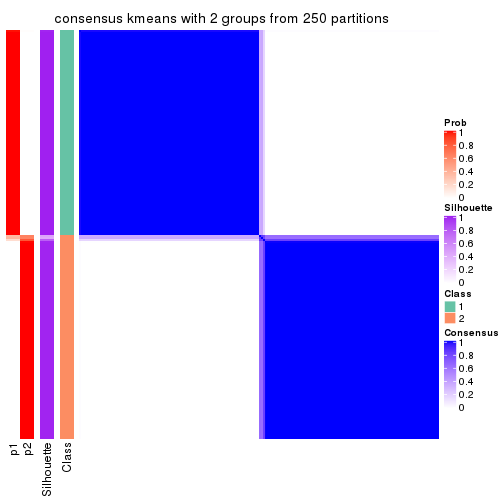</p>

</div>
<div id='tab-ATC-kmeans-consensus-heatmap-2'>
<pre><code class="r">consensus_heatmap(res, k = 3)
</code></pre>

<p>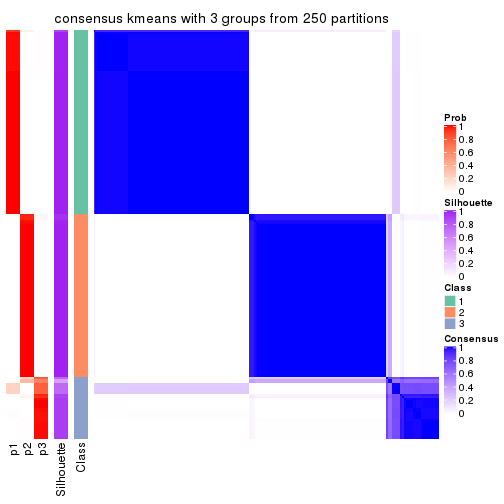</p>

</div>
<div id='tab-ATC-kmeans-consensus-heatmap-3'>
<pre><code class="r">consensus_heatmap(res, k = 4)
</code></pre>

<p>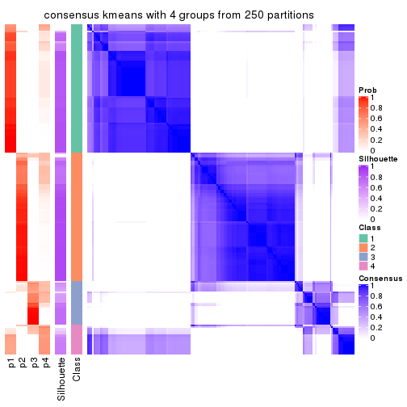</p>

</div>
<div id='tab-ATC-kmeans-consensus-heatmap-4'>
<pre><code class="r">consensus_heatmap(res, k = 5)
</code></pre>

<p>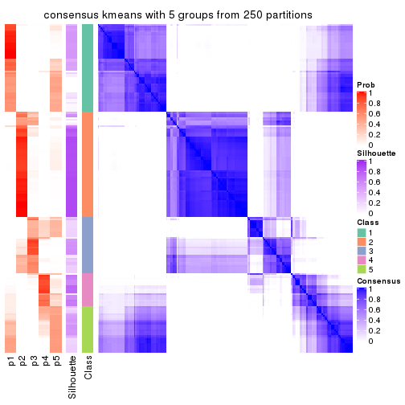</p>

</div>
<div id='tab-ATC-kmeans-consensus-heatmap-5'>
<pre><code class="r">consensus_heatmap(res, k = 6)
</code></pre>

<p>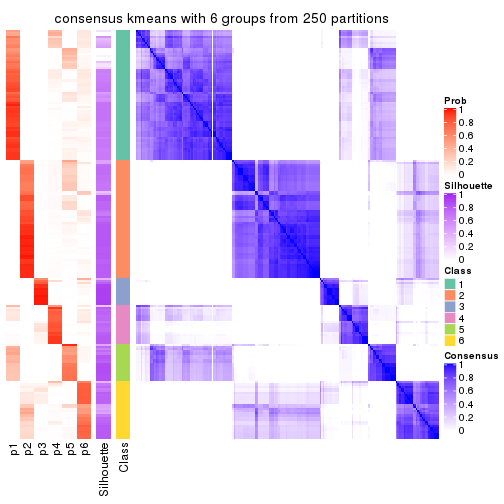</p>

</div>
</div>

Heatmaps for the membership of samples in all partitions to see how consistent they are:


<script>
$( function() {
	$( '#tabs-ATC-kmeans-membership-heatmap' ).tabs();
} );
</script>
<div id='tabs-ATC-kmeans-membership-heatmap'>
<ul>
<li><a href='#tab-ATC-kmeans-membership-heatmap-1'>k = 2</a></li>
<li><a href='#tab-ATC-kmeans-membership-heatmap-2'>k = 3</a></li>
<li><a href='#tab-ATC-kmeans-membership-heatmap-3'>k = 4</a></li>
<li><a href='#tab-ATC-kmeans-membership-heatmap-4'>k = 5</a></li>
<li><a href='#tab-ATC-kmeans-membership-heatmap-5'>k = 6</a></li>
</ul>
<div id='tab-ATC-kmeans-membership-heatmap-1'>
<pre><code class="r">membership_heatmap(res, k = 2)
</code></pre>

<p>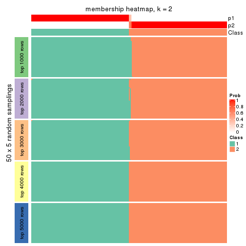</p>

</div>
<div id='tab-ATC-kmeans-membership-heatmap-2'>
<pre><code class="r">membership_heatmap(res, k = 3)
</code></pre>

<p>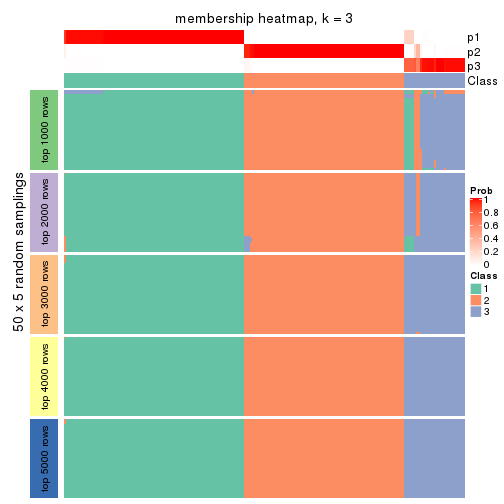</p>

</div>
<div id='tab-ATC-kmeans-membership-heatmap-3'>
<pre><code class="r">membership_heatmap(res, k = 4)
</code></pre>

<p>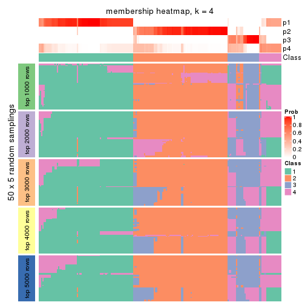</p>

</div>
<div id='tab-ATC-kmeans-membership-heatmap-4'>
<pre><code class="r">membership_heatmap(res, k = 5)
</code></pre>

<p>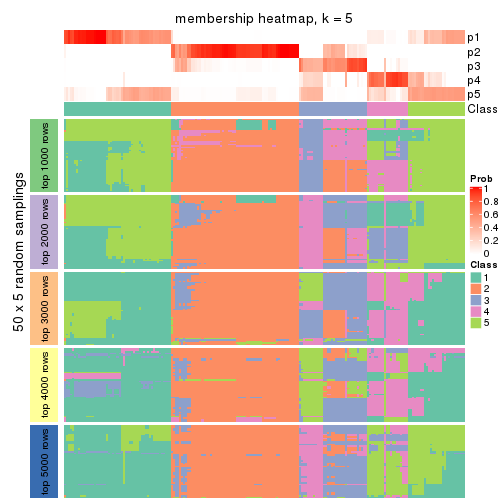</p>

</div>
<div id='tab-ATC-kmeans-membership-heatmap-5'>
<pre><code class="r">membership_heatmap(res, k = 6)
</code></pre>

<p>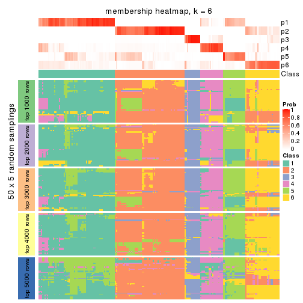</p>

</div>
</div>

As soon as we have had the classes for columns, we can look for signatures
which are significantly different between classes which can be candidate marks
for certain classes. Following are the heatmaps for signatures.


Signature heatmaps where rows are scaled:


<script>
$( function() {
	$( '#tabs-ATC-kmeans-get-signatures' ).tabs();
} );
</script>
<div id='tabs-ATC-kmeans-get-signatures'>
<ul>
<li><a href='#tab-ATC-kmeans-get-signatures-1'>k = 2</a></li>
<li><a href='#tab-ATC-kmeans-get-signatures-2'>k = 3</a></li>
<li><a href='#tab-ATC-kmeans-get-signatures-3'>k = 4</a></li>
<li><a href='#tab-ATC-kmeans-get-signatures-4'>k = 5</a></li>
<li><a href='#tab-ATC-kmeans-get-signatures-5'>k = 6</a></li>
</ul>
<div id='tab-ATC-kmeans-get-signatures-1'>
<pre><code class="r">get_signatures(res, k = 2)
</code></pre>

<p>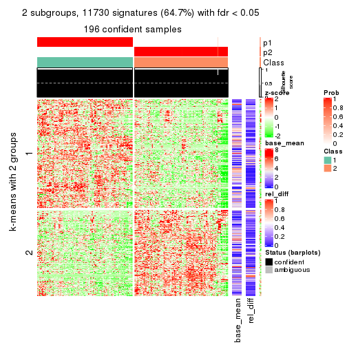</p>

</div>
<div id='tab-ATC-kmeans-get-signatures-2'>
<pre><code class="r">get_signatures(res, k = 3)
</code></pre>

<p>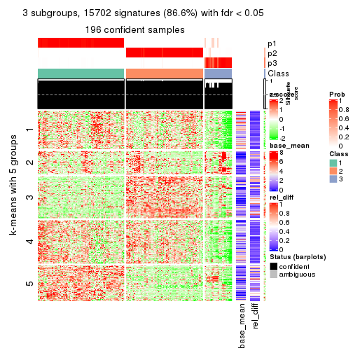</p>

</div>
<div id='tab-ATC-kmeans-get-signatures-3'>
<pre><code class="r">get_signatures(res, k = 4)
</code></pre>

<p>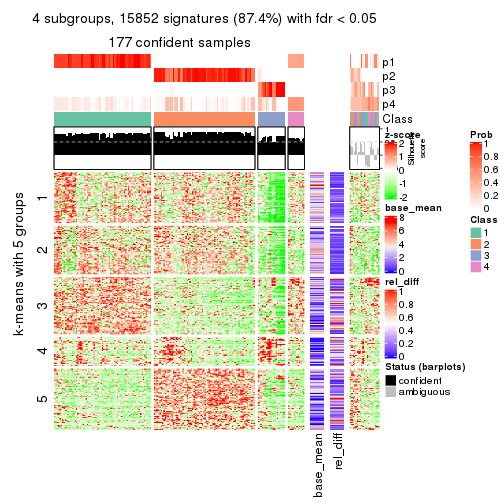</p>

</div>
<div id='tab-ATC-kmeans-get-signatures-4'>
<pre><code class="r">get_signatures(res, k = 5)
</code></pre>

<p>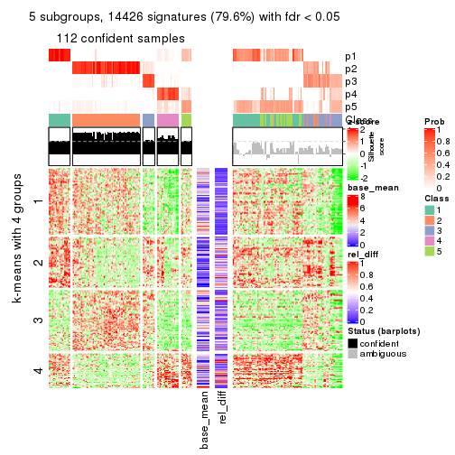</p>

</div>
<div id='tab-ATC-kmeans-get-signatures-5'>
<pre><code class="r">get_signatures(res, k = 6)
</code></pre>

<p>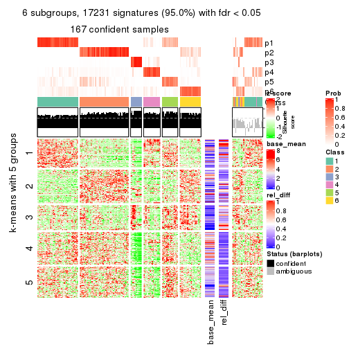</p>

</div>
</div>


Signature heatmaps where rows are not scaled:


<script>
$( function() {
	$( '#tabs-ATC-kmeans-get-signatures-no-scale' ).tabs();
} );
</script>
<div id='tabs-ATC-kmeans-get-signatures-no-scale'>
<ul>
<li><a href='#tab-ATC-kmeans-get-signatures-no-scale-1'>k = 2</a></li>
<li><a href='#tab-ATC-kmeans-get-signatures-no-scale-2'>k = 3</a></li>
<li><a href='#tab-ATC-kmeans-get-signatures-no-scale-3'>k = 4</a></li>
<li><a href='#tab-ATC-kmeans-get-signatures-no-scale-4'>k = 5</a></li>
<li><a href='#tab-ATC-kmeans-get-signatures-no-scale-5'>k = 6</a></li>
</ul>
<div id='tab-ATC-kmeans-get-signatures-no-scale-1'>
<pre><code class="r">get_signatures(res, k = 2, scale_rows = FALSE)
</code></pre>

<p>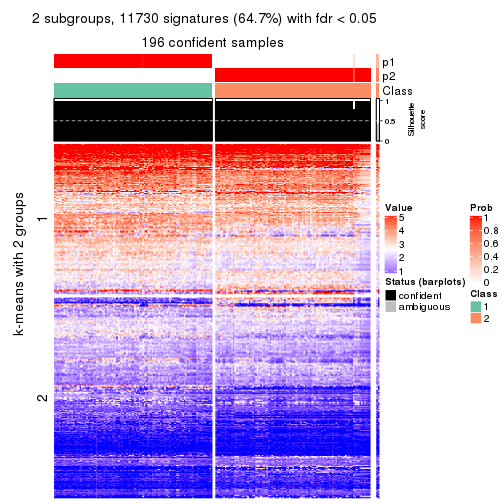</p>

</div>
<div id='tab-ATC-kmeans-get-signatures-no-scale-2'>
<pre><code class="r">get_signatures(res, k = 3, scale_rows = FALSE)
</code></pre>

<p>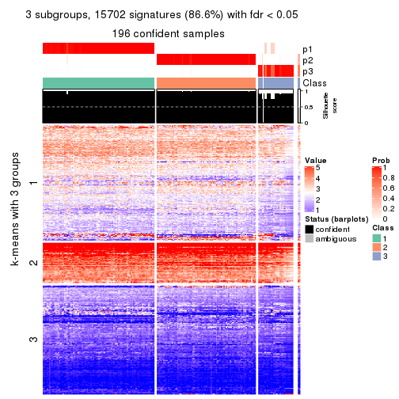</p>

</div>
<div id='tab-ATC-kmeans-get-signatures-no-scale-3'>
<pre><code class="r">get_signatures(res, k = 4, scale_rows = FALSE)
</code></pre>

<p>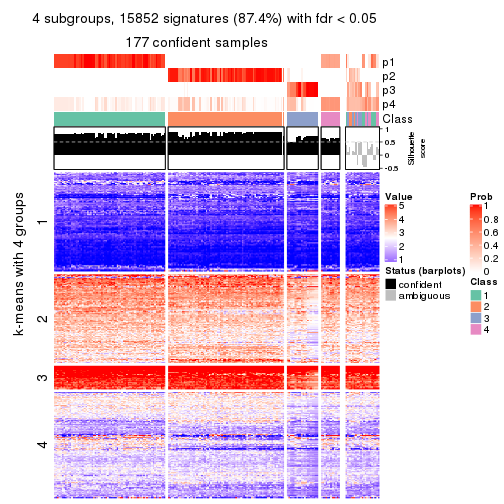</p>

</div>
<div id='tab-ATC-kmeans-get-signatures-no-scale-4'>
<pre><code class="r">get_signatures(res, k = 5, scale_rows = FALSE)
</code></pre>

<p>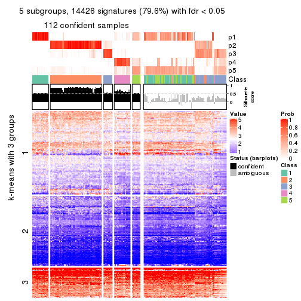</p>

</div>
<div id='tab-ATC-kmeans-get-signatures-no-scale-5'>
<pre><code class="r">get_signatures(res, k = 6, scale_rows = FALSE)
</code></pre>

<p>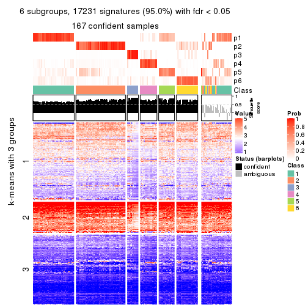</p>

</div>
</div>


Compare the overlap of signatures from different k:

```r
compare_signatures(res)
```

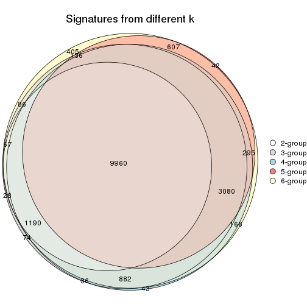

`get_signature()` returns a data frame invisibly. TO get the list of signatures, the function
call should be assigned to a variable explicitly. In following code, if `plot` argument is set
to `FALSE`, no heatmap is plotted while only the differential analysis is performed.

```r
# code only for demonstration
tb = get_signature(res, k = ..., plot = FALSE)
```

An example of the output of `tb` is:

```
#>   which_row         fdr    mean_1    mean_2 scaled_mean_1 scaled_mean_2 km
#> 1        38 0.042760348  8.373488  9.131774    -0.5533452     0.5164555  1
#> 2        40 0.018707592  7.106213  8.469186    -0.6173731     0.5762149  1
#> 3        55 0.019134737 10.221463 11.207825    -0.6159697     0.5749050  1
#> 4        59 0.006059896  5.921854  7.869574    -0.6899429     0.6439467  1
#> 5        60 0.018055526  8.928898 10.211722    -0.6204761     0.5791110  1
#> 6        98 0.009384629 15.714769 14.887706     0.6635654    -0.6193277  2
...
```

The columns in `tb` are:

1. `which_row`: row indices corresponding to the input matrix.
2. `fdr`: FDR for the differential test. 
3. `mean_x`: The mean value in group x.
4. `scaled_mean_x`: The mean value in group x after rows are scaled.
5. `km`: Row groups if k-means clustering is applied to rows.


UMAP plot which shows how samples are separated.


<script>
$( function() {
	$( '#tabs-ATC-kmeans-dimension-reduction' ).tabs();
} );
</script>
<div id='tabs-ATC-kmeans-dimension-reduction'>
<ul>
<li><a href='#tab-ATC-kmeans-dimension-reduction-1'>k = 2</a></li>
<li><a href='#tab-ATC-kmeans-dimension-reduction-2'>k = 3</a></li>
<li><a href='#tab-ATC-kmeans-dimension-reduction-3'>k = 4</a></li>
<li><a href='#tab-ATC-kmeans-dimension-reduction-4'>k = 5</a></li>
<li><a href='#tab-ATC-kmeans-dimension-reduction-5'>k = 6</a></li>
</ul>
<div id='tab-ATC-kmeans-dimension-reduction-1'>
<pre><code class="r">dimension_reduction(res, k = 2, method = &quot;UMAP&quot;)
</code></pre>

<p>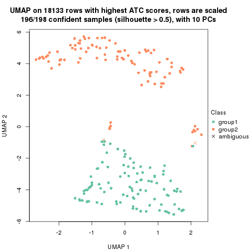</p>

</div>
<div id='tab-ATC-kmeans-dimension-reduction-2'>
<pre><code class="r">dimension_reduction(res, k = 3, method = &quot;UMAP&quot;)
</code></pre>

<p>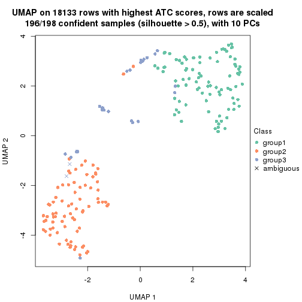</p>

</div>
<div id='tab-ATC-kmeans-dimension-reduction-3'>
<pre><code class="r">dimension_reduction(res, k = 4, method = &quot;UMAP&quot;)
</code></pre>

<p>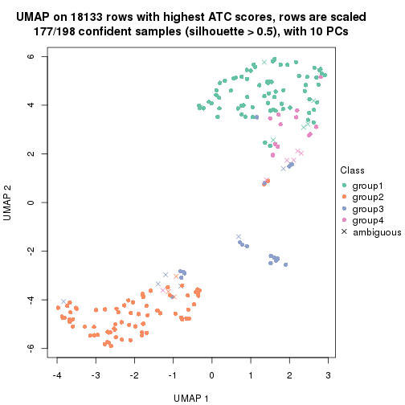</p>

</div>
<div id='tab-ATC-kmeans-dimension-reduction-4'>
<pre><code class="r">dimension_reduction(res, k = 5, method = &quot;UMAP&quot;)
</code></pre>

<p>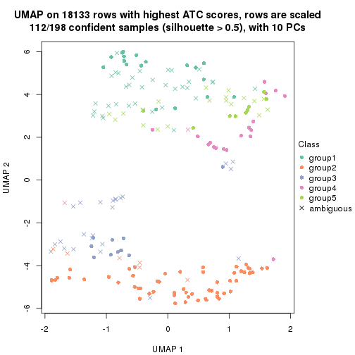</p>

</div>
<div id='tab-ATC-kmeans-dimension-reduction-5'>
<pre><code class="r">dimension_reduction(res, k = 6, method = &quot;UMAP&quot;)
</code></pre>

<p>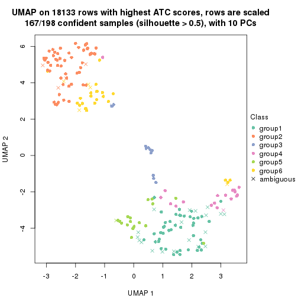</p>

</div>
</div>


Following heatmap shows how subgroups are split when increasing `k`:

```r
collect_classes(res)
```

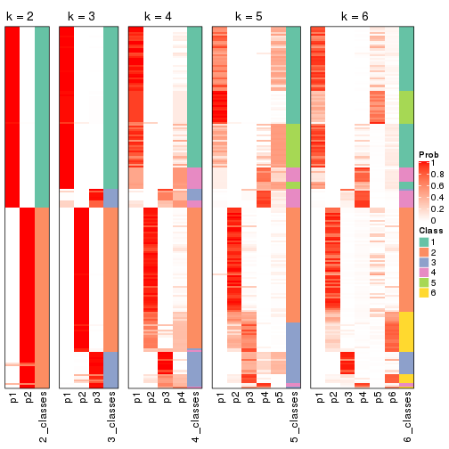


If matrix rows can be associated to genes, consider to use `functional_enrichment(res,
...)` to perform function enrichment for the signature genes. See [this vignette](http://bioconductor.org/packages/devel/bioc/vignettes/cola/inst/doc/functional_enrichment.html) for more detailed explanations.


 

---------------------------------------------------


### ATC:skmeans**


The object with results only for a single top-value method and a single partition method 
can be extracted as:

```r
res = res_list["ATC", "skmeans"]
# you can also extract it by
# res = res_list["ATC:skmeans"]
```

A summary of `res` and all the functions that can be applied to it:

```r
res
```

```
#> A 'ConsensusPartition' object with k = 2, 3, 4, 5, 6.
#>   On a matrix with 18133 rows and 198 columns.
#>   Top rows (1000, 2000, 3000, 4000, 5000) are extracted by 'ATC' method.
#>   Subgroups are detected by 'skmeans' method.
#>   Performed in total 1250 partitions by row resampling.
#>   Best k for subgroups seems to be 4.
#> 
#> Following methods can be applied to this 'ConsensusPartition' object:
#>  [1] "cola_report"             "collect_classes"         "collect_plots"          
#>  [4] "collect_stats"           "colnames"                "compare_signatures"     
#>  [7] "consensus_heatmap"       "dimension_reduction"     "functional_enrichment"  
#> [10] "get_anno_col"            "get_anno"                "get_classes"            
#> [13] "get_consensus"           "get_matrix"              "get_membership"         
#> [16] "get_param"               "get_signatures"          "get_stats"              
#> [19] "is_best_k"               "is_stable_k"             "membership_heatmap"     
#> [22] "ncol"                    "nrow"                    "plot_ecdf"              
#> [25] "rownames"                "select_partition_number" "show"                   
#> [28] "suggest_best_k"          "test_to_known_factors"
```

`collect_plots()` function collects all the plots made from `res` for all `k` (number of partitions)
into one single page to provide an easy and fast comparison between different `k`.

```r
collect_plots(res)
```

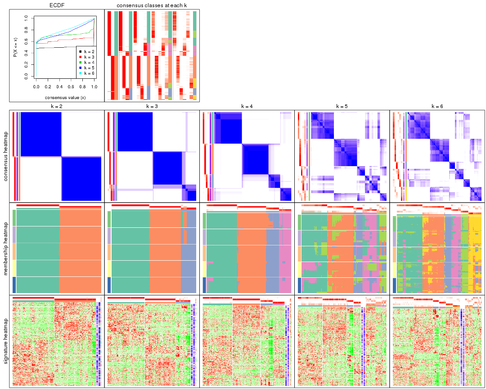

The plots are:

- The first row: a plot of the ECDF (empirical cumulative distribution
  function) curves of the consensus matrix for each `k` and the heatmap of
  predicted classes for each `k`.
- The second row: heatmaps of the consensus matrix for each `k`.
- The third row: heatmaps of the membership matrix for each `k`.
- The fouth row: heatmaps of the signatures for each `k`.

All the plots in panels can be made by individual functions and they are
plotted later in this section.

`select_partition_number()` produces several plots showing different
statistics for choosing "optimized" `k`. There are following statistics:

- ECDF curves of the consensus matrix for each `k`;
- 1-PAC. [The PAC
  score](https://en.wikipedia.org/wiki/Consensus_clustering#Over-interpretation_potential_of_consensus_clustering)
  measures the proportion of the ambiguous subgrouping.
- Mean silhouette score.
- Concordance. The mean probability of fiting the consensus class ids in all
  partitions.
- Area increased. Denote $A_k$ as the area under the ECDF curve for current
  `k`, the area increased is defined as $A_k - A_{k-1}$.
- Rand index. The percent of pairs of samples that are both in a same cluster
  or both are not in a same cluster in the partition of k and k-1.
- Jaccard index. The ratio of pairs of samples are both in a same cluster in
  the partition of k and k-1 and the pairs of samples are both in a same
  cluster in the partition k or k-1.

The detailed explanations of these statistics can be found in [the _cola_
vignette](http://bioconductor.org/packages/devel/bioc/vignettes/cola/inst/doc/cola.html#toc_13).

Generally speaking, lower PAC score, higher mean silhouette score or higher
concordance corresponds to better partition. Rand index and Jaccard index
measure how similar the current partition is compared to partition with `k-1`.
If they are too similar, we won't accept `k` is better than `k-1`.

```r
select_partition_number(res)
```

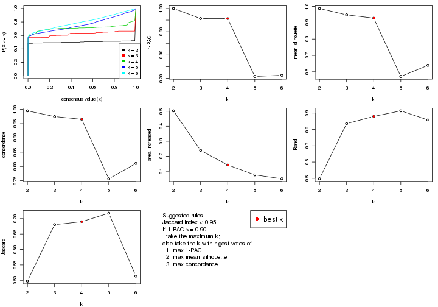

The numeric values for all these statistics can be obtained by `get_stats()`.

```r
get_stats(res)
```

```
#>   k 1-PAC mean_silhouette concordance area_increased  Rand Jaccard
#> 2 2 1.000           0.987       0.995         0.5029 0.497   0.497
#> 3 3 0.957           0.948       0.975         0.2391 0.835   0.680
#> 4 4 0.957           0.928       0.965         0.1417 0.880   0.690
#> 5 5 0.708           0.571       0.757         0.0755 0.914   0.717
#> 6 6 0.713           0.639       0.810         0.0494 0.858   0.514
```

`suggest_best_k()` suggests the best $k$ based on these statistics. The rules are as follows:

- All $k$ with Jaccard index larger than 0.95 are removed because increasing
  $k$ does not provide enough extra information. If all $k$ are removed, it is
  marked as no subgroup is detected.
- For all $k$ with 1-PAC score larger than 0.9, the maximal $k$ is taken as
  the best $k$, and other $k$ are marked as optional $k$.
- If it does not fit the second rule. The $k$ with the maximal vote of the
  highest 1-PAC score, highest mean silhouette, and highest concordance is
  taken as the best $k$.

```r
suggest_best_k(res)
```

```
#> [1] 4
#> attr(,"optional")
#> [1] 2 3
```

There is also optional best $k$ = 2 3 that is worth to check.

Following shows the table of the partitions (You need to click the **show/hide
code output** link to see it). The membership matrix (columns with name `p*`)
is inferred by
[`clue::cl_consensus()`](https://www.rdocumentation.org/link/cl_consensus?package=clue)
function with the `SE` method. Basically the value in the membership matrix
represents the probability to belong to a certain group. The finall class
label for an item is determined with the group with highest probability it
belongs to.

In `get_classes()` function, the entropy is calculated from the membership
matrix and the silhouette score is calculated from the consensus matrix.


<script>
$( function() {
	$( '#tabs-ATC-skmeans-get-classes' ).tabs();
} );
</script>
<div id='tabs-ATC-skmeans-get-classes'>
<ul>
<li><a href='#tab-ATC-skmeans-get-classes-1'>k = 2</a></li>
<li><a href='#tab-ATC-skmeans-get-classes-2'>k = 3</a></li>
<li><a href='#tab-ATC-skmeans-get-classes-3'>k = 4</a></li>
<li><a href='#tab-ATC-skmeans-get-classes-4'>k = 5</a></li>
<li><a href='#tab-ATC-skmeans-get-classes-5'>k = 6</a></li>
</ul>

<div id='tab-ATC-skmeans-get-classes-1'>
<p><a id='tab-ATC-skmeans-get-classes-1-a' style='color:#0366d6' href='#'>show/hide code output</a></p>
<pre><code class="r">cbind(get_classes(res, k = 2), get_membership(res, k = 2))
</code></pre>

<pre><code>#&gt;                                      class entropy silhouette    p1    p2
#&gt; 0C0AA0B2-5191-4EDF-8937-ED7434F30283     2   0.000     0.9905 0.000 1.000
#&gt; 18B45F1F-234F-45CC-A234-145307606C5C     1   0.000     0.9995 1.000 0.000
#&gt; E18B70C0-BDCA-46D3-99BB-C6C8ABC68DA5     2   0.000     0.9905 0.000 1.000
#&gt; 0F6DDBA7-6F74-45E8-95C8-F28263D55978     1   0.000     0.9995 1.000 0.000
#&gt; 7EAE1A5A-129A-46DE-977E-A2C753F10904     2   0.000     0.9905 0.000 1.000
#&gt; 7EAE0048-16B5-4979-9410-16CDEB9B1A48     1   0.000     0.9995 1.000 0.000
#&gt; 2EBFC828-2B27-4753-A052-80DDA226DAB4     2   0.000     0.9905 0.000 1.000
#&gt; 24E1768D-2232-41DA-9383-BC55D6EB3812     2   0.000     0.9905 0.000 1.000
#&gt; 6E3CD60A-1889-4CA3-B305-2E78152057B5     2   0.000     0.9905 0.000 1.000
#&gt; 33CC70DD-82B3-413C-B3B1-BE06634D95D0     1   0.000     0.9995 1.000 0.000
#&gt; F1CB57A3-55DD-4487-9307-1B4F652E729A     1   0.000     0.9995 1.000 0.000
#&gt; 755A5806-B054-449A-93DB-79909E6C93A1     1   0.000     0.9995 1.000 0.000
#&gt; 58D364E7-3D2F-468F-A264-D6461E2428D4     2   0.000     0.9905 0.000 1.000
#&gt; 68BB9CB6-7AA2-4981-B9D9-07363EC96599     2   0.000     0.9905 0.000 1.000
#&gt; 3C4E8DFA-8EA0-4F1F-89CB-CB8805395872     2   0.000     0.9905 0.000 1.000
#&gt; 4219651D-5583-4498-BF08-1B7D04B4C7B2     1   0.000     0.9995 1.000 0.000
#&gt; B5EE2768-0D67-4584-ADBC-EC745FEC52EA     2   0.000     0.9905 0.000 1.000
#&gt; 825E6C11-F460-451A-8045-846DD7D0E945     1   0.000     0.9995 1.000 0.000
#&gt; 491F62AF-5E68-43C3-982A-F867A75BBA9A     2   0.000     0.9905 0.000 1.000
#&gt; 9D7F058C-F95A-44AD-AC9E-450F7FBDC960     2   0.000     0.9905 0.000 1.000
#&gt; 6D42DD0C-2081-4742-BA27-9F5F16FAC3C6     1   0.000     0.9995 1.000 0.000
#&gt; EDD7E63D-492A-473B-A552-0764337B10EF     2   0.000     0.9905 0.000 1.000
#&gt; 97073DEA-73AD-4DFD-BD1A-9035DC03445B     1   0.000     0.9995 1.000 0.000
#&gt; FA891AB9-CE38-4F7E-A015-1DDCE12890A0     1   0.000     0.9995 1.000 0.000
#&gt; D9514D49-A0AE-45AB-8C9F-68E726215253     1   0.000     0.9995 1.000 0.000
#&gt; 3B9229AD-12E5-451E-9D2F-378AAC82C04A     2   0.000     0.9905 0.000 1.000
#&gt; 5EA36B71-4917-4EF3-9060-065EFE6ACC5B     1   0.000     0.9995 1.000 0.000
#&gt; A20E4ECB-4895-4CC7-BE5E-4721B20D933B     1   0.000     0.9995 1.000 0.000
#&gt; 1BE8D828-29DB-4368-AA4A-FB23588F7AE8     1   0.000     0.9995 1.000 0.000
#&gt; 66EFEFCF-3D14-4DBF-AA13-530F40ED0245     1   0.000     0.9995 1.000 0.000
#&gt; 55DFFE53-BCE7-4EC1-9863-6C0311B06BA2     2   0.000     0.9905 0.000 1.000
#&gt; 4CC3FB5A-611D-4C64-AE9D-544FA45CF4DC     1   0.000     0.9995 1.000 0.000
#&gt; C11D33F2-DFE9-4FA8-9024-F3E7F1DADC5F     2   0.000     0.9905 0.000 1.000
#&gt; FA5932B8-8AA3-4C38-9FAB-C35D8772974D     1   0.000     0.9995 1.000 0.000
#&gt; 8216EC35-1F41-4A15-B503-BDA4971E27C9     1   0.000     0.9995 1.000 0.000
#&gt; 69635D23-90A7-4BAD-97C7-B79536837F57     1   0.000     0.9995 1.000 0.000
#&gt; 12B404E2-C463-4409-8392-E4649B2AFFD1     2   0.000     0.9905 0.000 1.000
#&gt; 246927E3-ACCF-41B2-AA8E-43855FD6B146     2   0.000     0.9905 0.000 1.000
#&gt; E0CC13E7-9607-49E0-B4AA-395544E3C3BF     1   0.000     0.9995 1.000 0.000
#&gt; F7BBC0C1-6124-4A83-8A70-EA89B62F1CBD     1   0.000     0.9995 1.000 0.000
#&gt; B1D4FF24-8E6F-4A04-B716-2032D850EB57     1   0.000     0.9995 1.000 0.000
#&gt; 253601DB-B78A-4566-9947-8C0270C0B163     2   0.000     0.9905 0.000 1.000
#&gt; AB83DBFF-5737-4FB8-A5AC-1D3CD6072BDF     2   0.000     0.9905 0.000 1.000
#&gt; 9D67D953-EC98-4B72-89C8-5732BC9D4BC9     2   0.000     0.9905 0.000 1.000
#&gt; 51061018-95AB-4278-886F-F69E4EBC47C0     2   0.000     0.9905 0.000 1.000
#&gt; ABD0F7F3-105B-4DEE-9889-5028772C519A     1   0.000     0.9995 1.000 0.000
#&gt; 562B95CF-B27E-4A72-B7C6-CDF86A51A39B     1   0.000     0.9995 1.000 0.000
#&gt; ABF046A4-D7A1-49FF-B6B1-4E07A791DEDB     2   0.000     0.9905 0.000 1.000
#&gt; 3FF4101E-9703-460E-A30E-76CC7689F36D     2   0.000     0.9905 0.000 1.000
#&gt; 39C4F7AA-7ADF-4F1D-BDA3-BEC605AC5023     2   0.000     0.9905 0.000 1.000
#&gt; CB821FD2-AF5C-4743-A70F-21C12C6ED153     1   0.000     0.9995 1.000 0.000
#&gt; 92EA1846-62FF-41D5-A441-5E52E6B9E7F9     1   0.000     0.9995 1.000 0.000
#&gt; 7D25F3EE-5A20-4763-8026-16A03D05F459     1   0.000     0.9995 1.000 0.000
#&gt; 8ECE5276-CD06-496B-A5A9-1713B1F7D089     1   0.000     0.9995 1.000 0.000
#&gt; C775B68F-9507-47E3-B507-B433AED79002     1   0.000     0.9995 1.000 0.000
#&gt; E19D5463-FDD0-41C1-A170-323736A88D07     2   0.000     0.9905 0.000 1.000
#&gt; CE4B6285-4961-4767-91F0-5C7A8162E185     1   0.000     0.9995 1.000 0.000
#&gt; 9637BD72-1FEF-42AD-8886-2C39BE876531     1   0.000     0.9995 1.000 0.000
#&gt; 81B5A88E-45A0-4B44-B689-B9071B8548EE     2   0.000     0.9905 0.000 1.000
#&gt; 0B01B4C9-9BED-4F5B-A3E2-8868C7CCC3FC     2   0.000     0.9905 0.000 1.000
#&gt; 54501315-7132-44B2-A179-10FBF1421105     1   0.000     0.9995 1.000 0.000
#&gt; E207CBE9-4C3A-4FDD-9251-CFE1FE106475     2   0.584     0.8338 0.140 0.860
#&gt; 3BEA0B92-3F90-4DBF-9679-AADEAD7D47C8     2   0.000     0.9905 0.000 1.000
#&gt; 35B32250-D854-4215-AA5B-2C11B2FBEECA     1   0.000     0.9995 1.000 0.000
#&gt; ACE6566B-AEB9-426C-924A-B382D14A1024     2   0.000     0.9905 0.000 1.000
#&gt; 737E69AC-0930-45B9-B6BA-7CE5E300290B     1   0.000     0.9995 1.000 0.000
#&gt; B4410AB8-D015-41CA-86E6-12EB4E4103E3     1   0.000     0.9995 1.000 0.000
#&gt; 6D3ECA65-C50F-43B0-B75A-1D290FA4A8FD     2   0.000     0.9905 0.000 1.000
#&gt; C86F40D3-9A96-4395-A8C3-510DE12F9A2B     2   0.000     0.9905 0.000 1.000
#&gt; 6238087F-24DD-4BF1-903F-3BD4E446C1AE     2   0.000     0.9905 0.000 1.000
#&gt; E4FF840B-EEAB-4CB0-A690-7D4C4AA7EEC3     2   0.000     0.9905 0.000 1.000
#&gt; 72D3C323-C67F-4C0E-9BFC-BF245FF9730A     1   0.000     0.9995 1.000 0.000
#&gt; 82D56E4E-4DF6-4F3E-8959-B995C92AAA70     1   0.000     0.9995 1.000 0.000
#&gt; E31CA441-EB19-443B-ACBD-37B5CCBCF0E5     2   0.000     0.9905 0.000 1.000
#&gt; 87CA8939-D054-4B8A-B32D-085FD2E8F202     1   0.000     0.9995 1.000 0.000
#&gt; 2A508D90-FEDC-46A3-9A02-E51E5467CDCB     1   0.000     0.9995 1.000 0.000
#&gt; C4E8B4E2-388B-411F-BF0A-9B6F34E8EDB5     2   0.000     0.9905 0.000 1.000
#&gt; AF6AF803-BD93-44A7-AA80-B9BC92C1273B     2   0.000     0.9905 0.000 1.000
#&gt; 0B1CA5CF-EB96-41D4-BFC5-6957FEB39828     1   0.000     0.9995 1.000 0.000
#&gt; 6FB96FB0-6661-48AD-A4A0-69F8AFDBE591     2   0.000     0.9905 0.000 1.000
#&gt; 8C19F7FD-368A-462B-B28F-88D6630038A1     1   0.000     0.9995 1.000 0.000
#&gt; 96EABE78-C2F4-4A33-ACD8-C922A4B2519B     2   0.000     0.9905 0.000 1.000
#&gt; 68B36D7B-546A-4689-949F-B207C4A4AB27     2   0.000     0.9905 0.000 1.000
#&gt; CE9F3335-778F-4F52-BC55-4B7C99B211DD     2   0.000     0.9905 0.000 1.000
#&gt; CB359DED-2A2D-4646-A0BD-6F10ADCC532B     1   0.000     0.9995 1.000 0.000
#&gt; 198324A5-8C52-46F6-9734-EFAF1CCA6D9B     1   0.000     0.9995 1.000 0.000
#&gt; 83B88608-0506-428C-B9E8-621F38477B42     1   0.000     0.9995 1.000 0.000
#&gt; 1993630A-0F3D-4F5C-86A3-D443BAAF57F0     2   0.895     0.5513 0.312 0.688
#&gt; DE73DA9B-529E-4F4F-A65C-DA7AB84B1096     1   0.000     0.9995 1.000 0.000
#&gt; 2347F3B7-DDA3-40C0-B6D4-8819ECA69146     1   0.000     0.9995 1.000 0.000
#&gt; AB93B5D5-095F-4330-9D40-6A3D934AB50C     1   0.000     0.9995 1.000 0.000
#&gt; 5EBBE4AD-FF0C-41CF-9EA3-B6FE7EA1F9C0     2   0.999     0.0892 0.480 0.520
#&gt; 6D960AE7-3769-4144-A061-E8588E5063FF     1   0.000     0.9995 1.000 0.000
#&gt; 0C2DD8C0-D1A5-4192-A49C-7A40FED628B2     2   0.000     0.9905 0.000 1.000
#&gt; 18C9372F-C55B-4F86-A9D2-E8D85EFC8566     2   0.000     0.9905 0.000 1.000
#&gt; 9AF637B0-4C32-4DD1-93AF-7655B4A845D3     2   0.000     0.9905 0.000 1.000
#&gt; 785B5B06-4115-46FD-9BEB-F888AFDC855D     2   0.000     0.9905 0.000 1.000
#&gt; ECA3050E-4BE2-4117-B9CF-A52BB85AF8C2     2   0.000     0.9905 0.000 1.000
#&gt; 099DC396-16A5-458F-9ED9-F2A790CB0C34     1   0.000     0.9995 1.000 0.000
#&gt; 7A5A12EE-C5B0-4C51-8C99-0F3FA88D633E     1   0.000     0.9995 1.000 0.000
#&gt; E832B508-A66D-4817-B44A-FE9FAAE64B4A     1   0.000     0.9995 1.000 0.000
#&gt; F9DD688C-7B35-49E7-9651-2E098EE78856     1   0.000     0.9995 1.000 0.000
#&gt; F1265DD8-5ED3-4635-A277-57BBFDEC7729     1   0.000     0.9995 1.000 0.000
#&gt; F624E8D9-DB07-4C9E-910D-5E8EBA3A6167     2   0.000     0.9905 0.000 1.000
#&gt; 3516FBDF-66E1-43F4-9D7B-16748F6439A7     2   0.000     0.9905 0.000 1.000
#&gt; 04B12992-B2EA-4BA2-8E2C-11E34E230E6F     2   0.000     0.9905 0.000 1.000
#&gt; CC02897D-9123-495E-9242-5C9CF4EC269B     2   0.000     0.9905 0.000 1.000
#&gt; 3117ED46-2BF2-4311-BC00-4E98243E16B3     1   0.000     0.9995 1.000 0.000
#&gt; E0B66D53-23DB-4E26-BB6E-F692FA8C000E     1   0.000     0.9995 1.000 0.000
#&gt; DAA93CE5-A013-477A-9A50-EA09CC3A8162     2   0.000     0.9905 0.000 1.000
#&gt; 0099098D-354A-4276-92F8-B932C74B4608     1   0.000     0.9995 1.000 0.000
#&gt; DD483639-B2E7-4745-BCFB-55ED1D82BFBF     2   0.000     0.9905 0.000 1.000
#&gt; 2C1F9079-602E-4252-82C7-9D8799E04246     2   0.000     0.9905 0.000 1.000
#&gt; 9473A8E4-3A1B-4184-9EA6-517AFD60B635     1   0.000     0.9995 1.000 0.000
#&gt; 75CFBAF6-7BA0-40AF-92D7-D218E885BD1B     2   0.000     0.9905 0.000 1.000
#&gt; B588950F-14D6-41C8-845B-EFD2096013C6     2   0.000     0.9905 0.000 1.000
#&gt; 0DF3EDA8-DAEA-4721-92AB-B97181249498     2   0.000     0.9905 0.000 1.000
#&gt; 8EA83042-D598-401D-AD78-936EEB136C59     1   0.000     0.9995 1.000 0.000
#&gt; 729AC418-3BE9-445A-95D4-AC11A7D43BE0     1   0.000     0.9995 1.000 0.000
#&gt; 7D8B1B11-F576-4AA8-BFA7-0022A2CD829A     2   0.000     0.9905 0.000 1.000
#&gt; 304A0E46-3449-4B44-9C30-BDDF6459391D     1   0.000     0.9995 1.000 0.000
#&gt; 3C83358F-DF20-47F7-AF9F-AB7CC92F5ABA     1   0.000     0.9995 1.000 0.000
#&gt; EAFEED6C-35C3-451F-AE4A-EB56992E1F29     1   0.000     0.9995 1.000 0.000
#&gt; 8A237A65-28EC-434D-A78A-A8B7308B5204     1   0.000     0.9995 1.000 0.000
#&gt; D005833F-E991-4E9E-9667-55F137288004     1   0.000     0.9995 1.000 0.000
#&gt; 37D966E3-253E-4397-A9AE-0903A8D31FE6     1   0.000     0.9995 1.000 0.000
#&gt; D2482B81-CB5B-4178-BA8D-1CF4026181B5     1   0.000     0.9995 1.000 0.000
#&gt; 18019E95-C2A8-4EE7-B585-F6886DC4D953     2   0.000     0.9905 0.000 1.000
#&gt; 0B126D1A-14A8-4345-8F78-FF92222ADF4C     2   0.000     0.9905 0.000 1.000
#&gt; CE88B625-47D8-4D58-9FB4-23464DB7DDAD     2   0.000     0.9905 0.000 1.000
#&gt; 9A88299D-5C74-47FA-B42C-1A1D6D935AAB     1   0.000     0.9995 1.000 0.000
#&gt; 3E71159C-FD6C-41DA-B18B-0730C8AC7E41     1   0.000     0.9995 1.000 0.000
#&gt; 6F245AA4-79D9-47E1-BCC9-1AAF65AEA813     1   0.000     0.9995 1.000 0.000
#&gt; 4CF2C888-2100-483A-B4DB-ECBB69243A4D     2   0.000     0.9905 0.000 1.000
#&gt; A3853813-B9D5-4E8C-B075-19FCC35F8686     2   0.000     0.9905 0.000 1.000
#&gt; 83A16DEE-CE9F-4D8B-9225-0A2A8B9D055D     1   0.000     0.9995 1.000 0.000
#&gt; 0F057CAF-4F9A-4DE9-8601-730E96873733     2   0.000     0.9905 0.000 1.000
#&gt; 32D5801D-DBA4-422E-87CB-A2DDE921BA41     1   0.000     0.9995 1.000 0.000
#&gt; 22EE8076-F07C-499A-9AF8-D800A77EF154     2   0.000     0.9905 0.000 1.000
#&gt; DD4BD74D-D48C-4090-9F57-5334E784581C     1   0.000     0.9995 1.000 0.000
#&gt; 41183565-434D-474C-B1BD-CA6E94910658     2   0.000     0.9905 0.000 1.000
#&gt; 75A2CE41-2B2A-4346-927E-ACF8A72738E4     1   0.000     0.9995 1.000 0.000
#&gt; 7AA24995-3DD2-4682-B36A-4EBFEEACF625     1   0.000     0.9995 1.000 0.000
#&gt; 8BAFDFEC-9F26-4ADB-95CE-004143960EEB     1   0.000     0.9995 1.000 0.000
#&gt; A330E011-CE08-4A85-8F4B-370592293DBB     1   0.000     0.9995 1.000 0.000
#&gt; 1D5A5B17-2E70-4BB0-94A1-EC17E6EA49DB     1   0.000     0.9995 1.000 0.000
#&gt; BD9143B8-9D97-4A05-872C-3FB82B4CF7BE     2   0.000     0.9905 0.000 1.000
#&gt; 64552DC0-181E-4607-898C-787AA7F26435     2   0.000     0.9905 0.000 1.000
#&gt; 1B4C4D41-34C7-43A3-858B-C9552EB53894     1   0.000     0.9995 1.000 0.000
#&gt; 463A3BAA-02DC-4EA4-A644-B924163E425D     2   0.000     0.9905 0.000 1.000
#&gt; CD0FEA89-6F60-4A20-8FCA-D397B4E95A98     1   0.000     0.9995 1.000 0.000
#&gt; 5D06CF6D-F4B9-4B32-B055-8AB287E53340     2   0.000     0.9905 0.000 1.000
#&gt; ADA7835F-DB67-4F4F-9446-8BCE3C5FE936     2   0.000     0.9905 0.000 1.000
#&gt; 4109BE2D-B5DF-4BD7-860E-60D87F647152     2   0.000     0.9905 0.000 1.000
#&gt; 88526A0E-6DFE-46CB-BFAD-B4826F482C67     1   0.000     0.9995 1.000 0.000
#&gt; F39F9A4C-18F7-4017-AB31-85D52FF44587     2   0.000     0.9905 0.000 1.000
#&gt; D4290A5E-1B24-4C55-B470-0FA7A0A09DD0     2   0.000     0.9905 0.000 1.000
#&gt; DC5A2C9E-978F-4661-B729-1F9662976E27     1   0.000     0.9995 1.000 0.000
#&gt; 26A1F392-CED2-43E3-8096-74E6F2BFC8C0     2   0.000     0.9905 0.000 1.000
#&gt; 87D81FB2-306A-4E75-9D58-D5F48E46E7F6     2   0.000     0.9905 0.000 1.000
#&gt; E3D9D81A-C20C-4B3B-B940-A5D2C5F65B22     2   0.000     0.9905 0.000 1.000
#&gt; 4464650B-453F-476C-989C-B7B159BF2CF0     2   0.000     0.9905 0.000 1.000
#&gt; 577D2867-B738-487A-9B06-07958D647F02     1   0.000     0.9995 1.000 0.000
#&gt; E52A22CC-3C03-41A9-9541-220DD871E162     2   0.000     0.9905 0.000 1.000
#&gt; 642703B1-AF99-4746-A915-0792F4B9590B     2   0.000     0.9905 0.000 1.000
#&gt; 8F0D1792-1284-45E6-8EC4-392596057677     2   0.000     0.9905 0.000 1.000
#&gt; 765AFFC1-D528-4494-8BA1-0706451E4205     2   0.000     0.9905 0.000 1.000
#&gt; A716BC29-161F-4CA0-B240-00B330137F2C     1   0.000     0.9995 1.000 0.000
#&gt; 32CBFBAF-7064-4595-8D54-2C5E7DE0FD9B     1   0.000     0.9995 1.000 0.000
#&gt; 4D6ED28C-3F20-41B0-BA41-1BF0E5199A40     2   0.000     0.9905 0.000 1.000
#&gt; 86A38456-2900-48FB-B10F-79222B3CA9BF     2   0.000     0.9905 0.000 1.000
#&gt; E870807D-3223-4A6A-9E3D-F4461B048AA2     2   0.000     0.9905 0.000 1.000
#&gt; 3A78D19F-A833-4D2C-8387-FB4FD4A8313C     1   0.000     0.9995 1.000 0.000
#&gt; DFA162CA-C708-4121-8E74-F9C4DEE0CDAE     1   0.000     0.9995 1.000 0.000
#&gt; C00A300A-CD10-4C9D-8C94-3901AFE8406C     2   0.000     0.9905 0.000 1.000
#&gt; 13E11D15-A90F-48C4-980A-DD032C00A2C1     1   0.000     0.9995 1.000 0.000
#&gt; 31BF80AB-FEDB-4C73-89C3-70BE9F9ACBEE     2   0.000     0.9905 0.000 1.000
#&gt; FA34308A-349D-4AAD-94CF-3F3B7F9AD629     2   0.000     0.9905 0.000 1.000
#&gt; 7C48D467-B663-49DD-BC84-A36BC32ACB3D     1   0.000     0.9995 1.000 0.000
#&gt; BB068534-04F6-4FC9-9087-CDA65920BCE2     1   0.000     0.9995 1.000 0.000
#&gt; EA4EC272-A9B3-4B2E-955F-19F7676A944C     2   0.000     0.9905 0.000 1.000
#&gt; C71FF69B-A460-43CA-8769-9667F22D938B     1   0.000     0.9995 1.000 0.000
#&gt; 5243D1B8-8168-4FF1-A8C6-505F080EF0D3     2   0.000     0.9905 0.000 1.000
#&gt; BCC474D8-08FE-4E99-B8E8-B29E65F84D2E     1   0.000     0.9995 1.000 0.000
#&gt; 04FDBFE3-4CF6-4E53-A2AA-89D5C9316377     2   0.000     0.9905 0.000 1.000
#&gt; 83A9915C-8D60-4CAE-A868-B61E3C90C7B0     2   0.000     0.9905 0.000 1.000
#&gt; 989A6472-E3E3-457A-97BE-CCE95F42D5C2     2   0.000     0.9905 0.000 1.000
#&gt; A0AB2D28-6751-49C9-8DF4-66FDBF95C360     1   0.000     0.9995 1.000 0.000
#&gt; A12B2683-18D4-41C9-8AE5-C143E2180052     1   0.000     0.9995 1.000 0.000
#&gt; 8DE1E245-CAD2-4F11-BFA2-9792C433A00B     1   0.260     0.9533 0.956 0.044
#&gt; FDA68036-6C4C-4256-9AA0-C01FE92AA098     2   0.000     0.9905 0.000 1.000
#&gt; 26311920-1414-4EC1-870B-784961EBCC2D     1   0.000     0.9995 1.000 0.000
#&gt; C29A10D6-D598-4286-B5E0-F1776E19E988     1   0.000     0.9995 1.000 0.000
#&gt; FACCC1FB-4937-4CC0-90EA-7F91D3D939CF     2   0.000     0.9905 0.000 1.000
#&gt; 90B9D84B-78E5-4C7E-8414-EC889C2DE8DB     2   0.000     0.9905 0.000 1.000
#&gt; B74E6122-76E1-4E4D-A867-BCAFD7277393     1   0.000     0.9995 1.000 0.000
#&gt; 98494DC0-CF6E-485F-8A0D-D80E4437EF5C     2   0.000     0.9905 0.000 1.000
#&gt; DA114DAC-DE7B-4E43-8D7C-82C5D7B66411     1   0.000     0.9995 1.000 0.000
</code></pre>

<script>
$('#tab-ATC-skmeans-get-classes-1-a').parent().next().next().hide();
$('#tab-ATC-skmeans-get-classes-1-a').click(function(){
  $('#tab-ATC-skmeans-get-classes-1-a').parent().next().next().toggle();
  return(false);
});
</script>
</div>

<div id='tab-ATC-skmeans-get-classes-2'>
<p><a id='tab-ATC-skmeans-get-classes-2-a' style='color:#0366d6' href='#'>show/hide code output</a></p>
<pre><code class="r">cbind(get_classes(res, k = 3), get_membership(res, k = 3))
</code></pre>

<pre><code>#&gt;                                      class entropy silhouette    p1    p2    p3
#&gt; 0C0AA0B2-5191-4EDF-8937-ED7434F30283     2   0.000      0.990 0.000 1.000 0.000
#&gt; 18B45F1F-234F-45CC-A234-145307606C5C     1   0.000      0.998 1.000 0.000 0.000
#&gt; E18B70C0-BDCA-46D3-99BB-C6C8ABC68DA5     2   0.000      0.990 0.000 1.000 0.000
#&gt; 0F6DDBA7-6F74-45E8-95C8-F28263D55978     1   0.000      0.998 1.000 0.000 0.000
#&gt; 7EAE1A5A-129A-46DE-977E-A2C753F10904     2   0.000      0.990 0.000 1.000 0.000
#&gt; 7EAE0048-16B5-4979-9410-16CDEB9B1A48     1   0.000      0.998 1.000 0.000 0.000
#&gt; 2EBFC828-2B27-4753-A052-80DDA226DAB4     2   0.000      0.990 0.000 1.000 0.000
#&gt; 24E1768D-2232-41DA-9383-BC55D6EB3812     3   0.000      0.874 0.000 0.000 1.000
#&gt; 6E3CD60A-1889-4CA3-B305-2E78152057B5     3   0.603      0.527 0.000 0.376 0.624
#&gt; 33CC70DD-82B3-413C-B3B1-BE06634D95D0     1   0.000      0.998 1.000 0.000 0.000
#&gt; F1CB57A3-55DD-4487-9307-1B4F652E729A     1   0.000      0.998 1.000 0.000 0.000
#&gt; 755A5806-B054-449A-93DB-79909E6C93A1     1   0.000      0.998 1.000 0.000 0.000
#&gt; 58D364E7-3D2F-468F-A264-D6461E2428D4     2   0.000      0.990 0.000 1.000 0.000
#&gt; 68BB9CB6-7AA2-4981-B9D9-07363EC96599     3   0.000      0.874 0.000 0.000 1.000
#&gt; 3C4E8DFA-8EA0-4F1F-89CB-CB8805395872     3   0.000      0.874 0.000 0.000 1.000
#&gt; 4219651D-5583-4498-BF08-1B7D04B4C7B2     1   0.000      0.998 1.000 0.000 0.000
#&gt; B5EE2768-0D67-4584-ADBC-EC745FEC52EA     2   0.000      0.990 0.000 1.000 0.000
#&gt; 825E6C11-F460-451A-8045-846DD7D0E945     1   0.000      0.998 1.000 0.000 0.000
#&gt; 491F62AF-5E68-43C3-982A-F867A75BBA9A     2   0.000      0.990 0.000 1.000 0.000
#&gt; 9D7F058C-F95A-44AD-AC9E-450F7FBDC960     2   0.000      0.990 0.000 1.000 0.000
#&gt; 6D42DD0C-2081-4742-BA27-9F5F16FAC3C6     3   0.455      0.732 0.200 0.000 0.800
#&gt; EDD7E63D-492A-473B-A552-0764337B10EF     3   0.599      0.541 0.000 0.368 0.632
#&gt; 97073DEA-73AD-4DFD-BD1A-9035DC03445B     1   0.000      0.998 1.000 0.000 0.000
#&gt; FA891AB9-CE38-4F7E-A015-1DDCE12890A0     1   0.000      0.998 1.000 0.000 0.000
#&gt; D9514D49-A0AE-45AB-8C9F-68E726215253     1   0.000      0.998 1.000 0.000 0.000
#&gt; 3B9229AD-12E5-451E-9D2F-378AAC82C04A     2   0.000      0.990 0.000 1.000 0.000
#&gt; 5EA36B71-4917-4EF3-9060-065EFE6ACC5B     3   0.455      0.732 0.200 0.000 0.800
#&gt; A20E4ECB-4895-4CC7-BE5E-4721B20D933B     1   0.000      0.998 1.000 0.000 0.000
#&gt; 1BE8D828-29DB-4368-AA4A-FB23588F7AE8     1   0.000      0.998 1.000 0.000 0.000
#&gt; 66EFEFCF-3D14-4DBF-AA13-530F40ED0245     1   0.000      0.998 1.000 0.000 0.000
#&gt; 55DFFE53-BCE7-4EC1-9863-6C0311B06BA2     3   0.610      0.493 0.000 0.392 0.608
#&gt; 4CC3FB5A-611D-4C64-AE9D-544FA45CF4DC     1   0.000      0.998 1.000 0.000 0.000
#&gt; C11D33F2-DFE9-4FA8-9024-F3E7F1DADC5F     2   0.000      0.990 0.000 1.000 0.000
#&gt; FA5932B8-8AA3-4C38-9FAB-C35D8772974D     1   0.000      0.998 1.000 0.000 0.000
#&gt; 8216EC35-1F41-4A15-B503-BDA4971E27C9     1   0.000      0.998 1.000 0.000 0.000
#&gt; 69635D23-90A7-4BAD-97C7-B79536837F57     1   0.000      0.998 1.000 0.000 0.000
#&gt; 12B404E2-C463-4409-8392-E4649B2AFFD1     2   0.000      0.990 0.000 1.000 0.000
#&gt; 246927E3-ACCF-41B2-AA8E-43855FD6B146     2   0.000      0.990 0.000 1.000 0.000
#&gt; E0CC13E7-9607-49E0-B4AA-395544E3C3BF     1   0.000      0.998 1.000 0.000 0.000
#&gt; F7BBC0C1-6124-4A83-8A70-EA89B62F1CBD     1   0.000      0.998 1.000 0.000 0.000
#&gt; B1D4FF24-8E6F-4A04-B716-2032D850EB57     1   0.000      0.998 1.000 0.000 0.000
#&gt; 253601DB-B78A-4566-9947-8C0270C0B163     2   0.000      0.990 0.000 1.000 0.000
#&gt; AB83DBFF-5737-4FB8-A5AC-1D3CD6072BDF     3   0.000      0.874 0.000 0.000 1.000
#&gt; 9D67D953-EC98-4B72-89C8-5732BC9D4BC9     2   0.000      0.990 0.000 1.000 0.000
#&gt; 51061018-95AB-4278-886F-F69E4EBC47C0     3   0.000      0.874 0.000 0.000 1.000
#&gt; ABD0F7F3-105B-4DEE-9889-5028772C519A     1   0.000      0.998 1.000 0.000 0.000
#&gt; 562B95CF-B27E-4A72-B7C6-CDF86A51A39B     1   0.000      0.998 1.000 0.000 0.000
#&gt; ABF046A4-D7A1-49FF-B6B1-4E07A791DEDB     3   0.601      0.534 0.000 0.372 0.628
#&gt; 3FF4101E-9703-460E-A30E-76CC7689F36D     2   0.000      0.990 0.000 1.000 0.000
#&gt; 39C4F7AA-7ADF-4F1D-BDA3-BEC605AC5023     2   0.000      0.990 0.000 1.000 0.000
#&gt; CB821FD2-AF5C-4743-A70F-21C12C6ED153     1   0.000      0.998 1.000 0.000 0.000
#&gt; 92EA1846-62FF-41D5-A441-5E52E6B9E7F9     1   0.000      0.998 1.000 0.000 0.000
#&gt; 7D25F3EE-5A20-4763-8026-16A03D05F459     1   0.000      0.998 1.000 0.000 0.000
#&gt; 8ECE5276-CD06-496B-A5A9-1713B1F7D089     1   0.000      0.998 1.000 0.000 0.000
#&gt; C775B68F-9507-47E3-B507-B433AED79002     1   0.000      0.998 1.000 0.000 0.000
#&gt; E19D5463-FDD0-41C1-A170-323736A88D07     2   0.000      0.990 0.000 1.000 0.000
#&gt; CE4B6285-4961-4767-91F0-5C7A8162E185     1   0.412      0.784 0.832 0.000 0.168
#&gt; 9637BD72-1FEF-42AD-8886-2C39BE876531     3   0.455      0.732 0.200 0.000 0.800
#&gt; 81B5A88E-45A0-4B44-B689-B9071B8548EE     3   0.599      0.541 0.000 0.368 0.632
#&gt; 0B01B4C9-9BED-4F5B-A3E2-8868C7CCC3FC     3   0.000      0.874 0.000 0.000 1.000
#&gt; 54501315-7132-44B2-A179-10FBF1421105     1   0.000      0.998 1.000 0.000 0.000
#&gt; E207CBE9-4C3A-4FDD-9251-CFE1FE106475     3   0.000      0.874 0.000 0.000 1.000
#&gt; 3BEA0B92-3F90-4DBF-9679-AADEAD7D47C8     2   0.000      0.990 0.000 1.000 0.000
#&gt; 35B32250-D854-4215-AA5B-2C11B2FBEECA     1   0.000      0.998 1.000 0.000 0.000
#&gt; ACE6566B-AEB9-426C-924A-B382D14A1024     2   0.000      0.990 0.000 1.000 0.000
#&gt; 737E69AC-0930-45B9-B6BA-7CE5E300290B     1   0.000      0.998 1.000 0.000 0.000
#&gt; B4410AB8-D015-41CA-86E6-12EB4E4103E3     1   0.000      0.998 1.000 0.000 0.000
#&gt; 6D3ECA65-C50F-43B0-B75A-1D290FA4A8FD     2   0.000      0.990 0.000 1.000 0.000
#&gt; C86F40D3-9A96-4395-A8C3-510DE12F9A2B     2   0.000      0.990 0.000 1.000 0.000
#&gt; 6238087F-24DD-4BF1-903F-3BD4E446C1AE     3   0.608      0.502 0.000 0.388 0.612
#&gt; E4FF840B-EEAB-4CB0-A690-7D4C4AA7EEC3     2   0.000      0.990 0.000 1.000 0.000
#&gt; 72D3C323-C67F-4C0E-9BFC-BF245FF9730A     3   0.000      0.874 0.000 0.000 1.000
#&gt; 82D56E4E-4DF6-4F3E-8959-B995C92AAA70     1   0.000      0.998 1.000 0.000 0.000
#&gt; E31CA441-EB19-443B-ACBD-37B5CCBCF0E5     2   0.000      0.990 0.000 1.000 0.000
#&gt; 87CA8939-D054-4B8A-B32D-085FD2E8F202     1   0.000      0.998 1.000 0.000 0.000
#&gt; 2A508D90-FEDC-46A3-9A02-E51E5467CDCB     1   0.000      0.998 1.000 0.000 0.000
#&gt; C4E8B4E2-388B-411F-BF0A-9B6F34E8EDB5     2   0.000      0.990 0.000 1.000 0.000
#&gt; AF6AF803-BD93-44A7-AA80-B9BC92C1273B     2   0.000      0.990 0.000 1.000 0.000
#&gt; 0B1CA5CF-EB96-41D4-BFC5-6957FEB39828     3   0.000      0.874 0.000 0.000 1.000
#&gt; 6FB96FB0-6661-48AD-A4A0-69F8AFDBE591     2   0.000      0.990 0.000 1.000 0.000
#&gt; 8C19F7FD-368A-462B-B28F-88D6630038A1     1   0.000      0.998 1.000 0.000 0.000
#&gt; 96EABE78-C2F4-4A33-ACD8-C922A4B2519B     2   0.000      0.990 0.000 1.000 0.000
#&gt; 68B36D7B-546A-4689-949F-B207C4A4AB27     2   0.000      0.990 0.000 1.000 0.000
#&gt; CE9F3335-778F-4F52-BC55-4B7C99B211DD     2   0.000      0.990 0.000 1.000 0.000
#&gt; CB359DED-2A2D-4646-A0BD-6F10ADCC532B     1   0.000      0.998 1.000 0.000 0.000
#&gt; 198324A5-8C52-46F6-9734-EFAF1CCA6D9B     1   0.000      0.998 1.000 0.000 0.000
#&gt; 83B88608-0506-428C-B9E8-621F38477B42     1   0.000      0.998 1.000 0.000 0.000
#&gt; 1993630A-0F3D-4F5C-86A3-D443BAAF57F0     3   0.000      0.874 0.000 0.000 1.000
#&gt; DE73DA9B-529E-4F4F-A65C-DA7AB84B1096     1   0.000      0.998 1.000 0.000 0.000
#&gt; 2347F3B7-DDA3-40C0-B6D4-8819ECA69146     1   0.000      0.998 1.000 0.000 0.000
#&gt; AB93B5D5-095F-4330-9D40-6A3D934AB50C     1   0.000      0.998 1.000 0.000 0.000
#&gt; 5EBBE4AD-FF0C-41CF-9EA3-B6FE7EA1F9C0     3   0.000      0.874 0.000 0.000 1.000
#&gt; 6D960AE7-3769-4144-A061-E8588E5063FF     1   0.000      0.998 1.000 0.000 0.000
#&gt; 0C2DD8C0-D1A5-4192-A49C-7A40FED628B2     2   0.000      0.990 0.000 1.000 0.000
#&gt; 18C9372F-C55B-4F86-A9D2-E8D85EFC8566     3   0.000      0.874 0.000 0.000 1.000
#&gt; 9AF637B0-4C32-4DD1-93AF-7655B4A845D3     2   0.000      0.990 0.000 1.000 0.000
#&gt; 785B5B06-4115-46FD-9BEB-F888AFDC855D     2   0.000      0.990 0.000 1.000 0.000
#&gt; ECA3050E-4BE2-4117-B9CF-A52BB85AF8C2     2   0.000      0.990 0.000 1.000 0.000
#&gt; 099DC396-16A5-458F-9ED9-F2A790CB0C34     1   0.000      0.998 1.000 0.000 0.000
#&gt; 7A5A12EE-C5B0-4C51-8C99-0F3FA88D633E     1   0.000      0.998 1.000 0.000 0.000
#&gt; E832B508-A66D-4817-B44A-FE9FAAE64B4A     1   0.000      0.998 1.000 0.000 0.000
#&gt; F9DD688C-7B35-49E7-9651-2E098EE78856     1   0.000      0.998 1.000 0.000 0.000
#&gt; F1265DD8-5ED3-4635-A277-57BBFDEC7729     1   0.000      0.998 1.000 0.000 0.000
#&gt; F624E8D9-DB07-4C9E-910D-5E8EBA3A6167     2   0.000      0.990 0.000 1.000 0.000
#&gt; 3516FBDF-66E1-43F4-9D7B-16748F6439A7     2   0.000      0.990 0.000 1.000 0.000
#&gt; 04B12992-B2EA-4BA2-8E2C-11E34E230E6F     2   0.000      0.990 0.000 1.000 0.000
#&gt; CC02897D-9123-495E-9242-5C9CF4EC269B     2   0.000      0.990 0.000 1.000 0.000
#&gt; 3117ED46-2BF2-4311-BC00-4E98243E16B3     1   0.000      0.998 1.000 0.000 0.000
#&gt; E0B66D53-23DB-4E26-BB6E-F692FA8C000E     1   0.000      0.998 1.000 0.000 0.000
#&gt; DAA93CE5-A013-477A-9A50-EA09CC3A8162     2   0.000      0.990 0.000 1.000 0.000
#&gt; 0099098D-354A-4276-92F8-B932C74B4608     1   0.000      0.998 1.000 0.000 0.000
#&gt; DD483639-B2E7-4745-BCFB-55ED1D82BFBF     2   0.000      0.990 0.000 1.000 0.000
#&gt; 2C1F9079-602E-4252-82C7-9D8799E04246     2   0.000      0.990 0.000 1.000 0.000
#&gt; 9473A8E4-3A1B-4184-9EA6-517AFD60B635     3   0.000      0.874 0.000 0.000 1.000
#&gt; 75CFBAF6-7BA0-40AF-92D7-D218E885BD1B     2   0.562      0.462 0.000 0.692 0.308
#&gt; B588950F-14D6-41C8-845B-EFD2096013C6     2   0.000      0.990 0.000 1.000 0.000
#&gt; 0DF3EDA8-DAEA-4721-92AB-B97181249498     2   0.000      0.990 0.000 1.000 0.000
#&gt; 8EA83042-D598-401D-AD78-936EEB136C59     1   0.000      0.998 1.000 0.000 0.000
#&gt; 729AC418-3BE9-445A-95D4-AC11A7D43BE0     3   0.455      0.732 0.200 0.000 0.800
#&gt; 7D8B1B11-F576-4AA8-BFA7-0022A2CD829A     2   0.000      0.990 0.000 1.000 0.000
#&gt; 304A0E46-3449-4B44-9C30-BDDF6459391D     1   0.000      0.998 1.000 0.000 0.000
#&gt; 3C83358F-DF20-47F7-AF9F-AB7CC92F5ABA     3   0.000      0.874 0.000 0.000 1.000
#&gt; EAFEED6C-35C3-451F-AE4A-EB56992E1F29     1   0.000      0.998 1.000 0.000 0.000
#&gt; 8A237A65-28EC-434D-A78A-A8B7308B5204     1   0.000      0.998 1.000 0.000 0.000
#&gt; D005833F-E991-4E9E-9667-55F137288004     1   0.000      0.998 1.000 0.000 0.000
#&gt; 37D966E3-253E-4397-A9AE-0903A8D31FE6     1   0.000      0.998 1.000 0.000 0.000
#&gt; D2482B81-CB5B-4178-BA8D-1CF4026181B5     1   0.000      0.998 1.000 0.000 0.000
#&gt; 18019E95-C2A8-4EE7-B585-F6886DC4D953     3   0.000      0.874 0.000 0.000 1.000
#&gt; 0B126D1A-14A8-4345-8F78-FF92222ADF4C     3   0.000      0.874 0.000 0.000 1.000
#&gt; CE88B625-47D8-4D58-9FB4-23464DB7DDAD     2   0.000      0.990 0.000 1.000 0.000
#&gt; 9A88299D-5C74-47FA-B42C-1A1D6D935AAB     1   0.000      0.998 1.000 0.000 0.000
#&gt; 3E71159C-FD6C-41DA-B18B-0730C8AC7E41     1   0.000      0.998 1.000 0.000 0.000
#&gt; 6F245AA4-79D9-47E1-BCC9-1AAF65AEA813     1   0.000      0.998 1.000 0.000 0.000
#&gt; 4CF2C888-2100-483A-B4DB-ECBB69243A4D     2   0.000      0.990 0.000 1.000 0.000
#&gt; A3853813-B9D5-4E8C-B075-19FCC35F8686     2   0.000      0.990 0.000 1.000 0.000
#&gt; 83A16DEE-CE9F-4D8B-9225-0A2A8B9D055D     1   0.000      0.998 1.000 0.000 0.000
#&gt; 0F057CAF-4F9A-4DE9-8601-730E96873733     2   0.000      0.990 0.000 1.000 0.000
#&gt; 32D5801D-DBA4-422E-87CB-A2DDE921BA41     1   0.000      0.998 1.000 0.000 0.000
#&gt; 22EE8076-F07C-499A-9AF8-D800A77EF154     2   0.000      0.990 0.000 1.000 0.000
#&gt; DD4BD74D-D48C-4090-9F57-5334E784581C     1   0.000      0.998 1.000 0.000 0.000
#&gt; 41183565-434D-474C-B1BD-CA6E94910658     2   0.000      0.990 0.000 1.000 0.000
#&gt; 75A2CE41-2B2A-4346-927E-ACF8A72738E4     1   0.000      0.998 1.000 0.000 0.000
#&gt; 7AA24995-3DD2-4682-B36A-4EBFEEACF625     1   0.000      0.998 1.000 0.000 0.000
#&gt; 8BAFDFEC-9F26-4ADB-95CE-004143960EEB     1   0.000      0.998 1.000 0.000 0.000
#&gt; A330E011-CE08-4A85-8F4B-370592293DBB     1   0.000      0.998 1.000 0.000 0.000
#&gt; 1D5A5B17-2E70-4BB0-94A1-EC17E6EA49DB     1   0.000      0.998 1.000 0.000 0.000
#&gt; BD9143B8-9D97-4A05-872C-3FB82B4CF7BE     2   0.000      0.990 0.000 1.000 0.000
#&gt; 64552DC0-181E-4607-898C-787AA7F26435     2   0.000      0.990 0.000 1.000 0.000
#&gt; 1B4C4D41-34C7-43A3-858B-C9552EB53894     1   0.000      0.998 1.000 0.000 0.000
#&gt; 463A3BAA-02DC-4EA4-A644-B924163E425D     2   0.000      0.990 0.000 1.000 0.000
#&gt; CD0FEA89-6F60-4A20-8FCA-D397B4E95A98     1   0.000      0.998 1.000 0.000 0.000
#&gt; 5D06CF6D-F4B9-4B32-B055-8AB287E53340     2   0.000      0.990 0.000 1.000 0.000
#&gt; ADA7835F-DB67-4F4F-9446-8BCE3C5FE936     2   0.000      0.990 0.000 1.000 0.000
#&gt; 4109BE2D-B5DF-4BD7-860E-60D87F647152     3   0.000      0.874 0.000 0.000 1.000
#&gt; 88526A0E-6DFE-46CB-BFAD-B4826F482C67     1   0.000      0.998 1.000 0.000 0.000
#&gt; F39F9A4C-18F7-4017-AB31-85D52FF44587     2   0.000      0.990 0.000 1.000 0.000
#&gt; D4290A5E-1B24-4C55-B470-0FA7A0A09DD0     2   0.000      0.990 0.000 1.000 0.000
#&gt; DC5A2C9E-978F-4661-B729-1F9662976E27     1   0.000      0.998 1.000 0.000 0.000
#&gt; 26A1F392-CED2-43E3-8096-74E6F2BFC8C0     3   0.599      0.541 0.000 0.368 0.632
#&gt; 87D81FB2-306A-4E75-9D58-D5F48E46E7F6     2   0.000      0.990 0.000 1.000 0.000
#&gt; E3D9D81A-C20C-4B3B-B940-A5D2C5F65B22     3   0.000      0.874 0.000 0.000 1.000
#&gt; 4464650B-453F-476C-989C-B7B159BF2CF0     2   0.000      0.990 0.000 1.000 0.000
#&gt; 577D2867-B738-487A-9B06-07958D647F02     1   0.000      0.998 1.000 0.000 0.000
#&gt; E52A22CC-3C03-41A9-9541-220DD871E162     2   0.000      0.990 0.000 1.000 0.000
#&gt; 642703B1-AF99-4746-A915-0792F4B9590B     2   0.000      0.990 0.000 1.000 0.000
#&gt; 8F0D1792-1284-45E6-8EC4-392596057677     2   0.000      0.990 0.000 1.000 0.000
#&gt; 765AFFC1-D528-4494-8BA1-0706451E4205     3   0.000      0.874 0.000 0.000 1.000
#&gt; A716BC29-161F-4CA0-B240-00B330137F2C     1   0.000      0.998 1.000 0.000 0.000
#&gt; 32CBFBAF-7064-4595-8D54-2C5E7DE0FD9B     3   0.455      0.732 0.200 0.000 0.800
#&gt; 4D6ED28C-3F20-41B0-BA41-1BF0E5199A40     3   0.601      0.534 0.000 0.372 0.628
#&gt; 86A38456-2900-48FB-B10F-79222B3CA9BF     3   0.000      0.874 0.000 0.000 1.000
#&gt; E870807D-3223-4A6A-9E3D-F4461B048AA2     2   0.000      0.990 0.000 1.000 0.000
#&gt; 3A78D19F-A833-4D2C-8387-FB4FD4A8313C     1   0.000      0.998 1.000 0.000 0.000
#&gt; DFA162CA-C708-4121-8E74-F9C4DEE0CDAE     1   0.000      0.998 1.000 0.000 0.000
#&gt; C00A300A-CD10-4C9D-8C94-3901AFE8406C     2   0.000      0.990 0.000 1.000 0.000
#&gt; 13E11D15-A90F-48C4-980A-DD032C00A2C1     1   0.000      0.998 1.000 0.000 0.000
#&gt; 31BF80AB-FEDB-4C73-89C3-70BE9F9ACBEE     2   0.000      0.990 0.000 1.000 0.000
#&gt; FA34308A-349D-4AAD-94CF-3F3B7F9AD629     2   0.000      0.990 0.000 1.000 0.000
#&gt; 7C48D467-B663-49DD-BC84-A36BC32ACB3D     1   0.000      0.998 1.000 0.000 0.000
#&gt; BB068534-04F6-4FC9-9087-CDA65920BCE2     1   0.000      0.998 1.000 0.000 0.000
#&gt; EA4EC272-A9B3-4B2E-955F-19F7676A944C     2   0.000      0.990 0.000 1.000 0.000
#&gt; C71FF69B-A460-43CA-8769-9667F22D938B     1   0.000      0.998 1.000 0.000 0.000
#&gt; 5243D1B8-8168-4FF1-A8C6-505F080EF0D3     2   0.000      0.990 0.000 1.000 0.000
#&gt; BCC474D8-08FE-4E99-B8E8-B29E65F84D2E     1   0.000      0.998 1.000 0.000 0.000
#&gt; 04FDBFE3-4CF6-4E53-A2AA-89D5C9316377     3   0.000      0.874 0.000 0.000 1.000
#&gt; 83A9915C-8D60-4CAE-A868-B61E3C90C7B0     2   0.000      0.990 0.000 1.000 0.000
#&gt; 989A6472-E3E3-457A-97BE-CCE95F42D5C2     2   0.000      0.990 0.000 1.000 0.000
#&gt; A0AB2D28-6751-49C9-8DF4-66FDBF95C360     3   0.000      0.874 0.000 0.000 1.000
#&gt; A12B2683-18D4-41C9-8AE5-C143E2180052     1   0.000      0.998 1.000 0.000 0.000
#&gt; 8DE1E245-CAD2-4F11-BFA2-9792C433A00B     2   0.522      0.560 0.260 0.740 0.000
#&gt; FDA68036-6C4C-4256-9AA0-C01FE92AA098     2   0.000      0.990 0.000 1.000 0.000
#&gt; 26311920-1414-4EC1-870B-784961EBCC2D     1   0.000      0.998 1.000 0.000 0.000
#&gt; C29A10D6-D598-4286-B5E0-F1776E19E988     1   0.000      0.998 1.000 0.000 0.000
#&gt; FACCC1FB-4937-4CC0-90EA-7F91D3D939CF     2   0.000      0.990 0.000 1.000 0.000
#&gt; 90B9D84B-78E5-4C7E-8414-EC889C2DE8DB     3   0.455      0.743 0.000 0.200 0.800
#&gt; B74E6122-76E1-4E4D-A867-BCAFD7277393     1   0.000      0.998 1.000 0.000 0.000
#&gt; 98494DC0-CF6E-485F-8A0D-D80E4437EF5C     2   0.000      0.990 0.000 1.000 0.000
#&gt; DA114DAC-DE7B-4E43-8D7C-82C5D7B66411     1   0.000      0.998 1.000 0.000 0.000
</code></pre>

<script>
$('#tab-ATC-skmeans-get-classes-2-a').parent().next().next().hide();
$('#tab-ATC-skmeans-get-classes-2-a').click(function(){
  $('#tab-ATC-skmeans-get-classes-2-a').parent().next().next().toggle();
  return(false);
});
</script>
</div>

<div id='tab-ATC-skmeans-get-classes-3'>
<p><a id='tab-ATC-skmeans-get-classes-3-a' style='color:#0366d6' href='#'>show/hide code output</a></p>
<pre><code class="r">cbind(get_classes(res, k = 4), get_membership(res, k = 4))
</code></pre>

<pre><code>#&gt;                                      class entropy silhouette    p1    p2    p3    p4
#&gt; 0C0AA0B2-5191-4EDF-8937-ED7434F30283     2  0.0000      0.981 0.000 1.000 0.000 0.000
#&gt; 18B45F1F-234F-45CC-A234-145307606C5C     4  0.1302      0.921 0.044 0.000 0.000 0.956
#&gt; E18B70C0-BDCA-46D3-99BB-C6C8ABC68DA5     2  0.0000      0.981 0.000 1.000 0.000 0.000
#&gt; 0F6DDBA7-6F74-45E8-95C8-F28263D55978     1  0.0000      0.973 1.000 0.000 0.000 0.000
#&gt; 7EAE1A5A-129A-46DE-977E-A2C753F10904     2  0.0000      0.981 0.000 1.000 0.000 0.000
#&gt; 7EAE0048-16B5-4979-9410-16CDEB9B1A48     1  0.0000      0.973 1.000 0.000 0.000 0.000
#&gt; 2EBFC828-2B27-4753-A052-80DDA226DAB4     2  0.0000      0.981 0.000 1.000 0.000 0.000
#&gt; 24E1768D-2232-41DA-9383-BC55D6EB3812     3  0.0188      0.885 0.000 0.000 0.996 0.004
#&gt; 6E3CD60A-1889-4CA3-B305-2E78152057B5     3  0.3569      0.795 0.000 0.196 0.804 0.000
#&gt; 33CC70DD-82B3-413C-B3B1-BE06634D95D0     1  0.0000      0.973 1.000 0.000 0.000 0.000
#&gt; F1CB57A3-55DD-4487-9307-1B4F652E729A     1  0.0000      0.973 1.000 0.000 0.000 0.000
#&gt; 755A5806-B054-449A-93DB-79909E6C93A1     4  0.0188      0.946 0.004 0.000 0.000 0.996
#&gt; 58D364E7-3D2F-468F-A264-D6461E2428D4     2  0.0000      0.981 0.000 1.000 0.000 0.000
#&gt; 68BB9CB6-7AA2-4981-B9D9-07363EC96599     3  0.0000      0.885 0.000 0.000 1.000 0.000
#&gt; 3C4E8DFA-8EA0-4F1F-89CB-CB8805395872     3  0.0000      0.885 0.000 0.000 1.000 0.000
#&gt; 4219651D-5583-4498-BF08-1B7D04B4C7B2     1  0.0000      0.973 1.000 0.000 0.000 0.000
#&gt; B5EE2768-0D67-4584-ADBC-EC745FEC52EA     2  0.0000      0.981 0.000 1.000 0.000 0.000
#&gt; 825E6C11-F460-451A-8045-846DD7D0E945     1  0.0000      0.973 1.000 0.000 0.000 0.000
#&gt; 491F62AF-5E68-43C3-982A-F867A75BBA9A     2  0.0000      0.981 0.000 1.000 0.000 0.000
#&gt; 9D7F058C-F95A-44AD-AC9E-450F7FBDC960     2  0.0000      0.981 0.000 1.000 0.000 0.000
#&gt; 6D42DD0C-2081-4742-BA27-9F5F16FAC3C6     4  0.0000      0.944 0.000 0.000 0.000 1.000
#&gt; EDD7E63D-492A-473B-A552-0764337B10EF     3  0.2011      0.888 0.000 0.080 0.920 0.000
#&gt; 97073DEA-73AD-4DFD-BD1A-9035DC03445B     1  0.0000      0.973 1.000 0.000 0.000 0.000
#&gt; FA891AB9-CE38-4F7E-A015-1DDCE12890A0     1  0.0000      0.973 1.000 0.000 0.000 0.000
#&gt; D9514D49-A0AE-45AB-8C9F-68E726215253     1  0.1867      0.927 0.928 0.000 0.000 0.072
#&gt; 3B9229AD-12E5-451E-9D2F-378AAC82C04A     2  0.0000      0.981 0.000 1.000 0.000 0.000
#&gt; 5EA36B71-4917-4EF3-9060-065EFE6ACC5B     4  0.1792      0.904 0.000 0.000 0.068 0.932
#&gt; A20E4ECB-4895-4CC7-BE5E-4721B20D933B     4  0.1389      0.917 0.048 0.000 0.000 0.952
#&gt; 1BE8D828-29DB-4368-AA4A-FB23588F7AE8     1  0.0000      0.973 1.000 0.000 0.000 0.000
#&gt; 66EFEFCF-3D14-4DBF-AA13-530F40ED0245     1  0.0000      0.973 1.000 0.000 0.000 0.000
#&gt; 55DFFE53-BCE7-4EC1-9863-6C0311B06BA2     3  0.2011      0.888 0.000 0.080 0.920 0.000
#&gt; 4CC3FB5A-611D-4C64-AE9D-544FA45CF4DC     1  0.1940      0.924 0.924 0.000 0.000 0.076
#&gt; C11D33F2-DFE9-4FA8-9024-F3E7F1DADC5F     2  0.2011      0.897 0.000 0.920 0.080 0.000
#&gt; FA5932B8-8AA3-4C38-9FAB-C35D8772974D     1  0.0000      0.973 1.000 0.000 0.000 0.000
#&gt; 8216EC35-1F41-4A15-B503-BDA4971E27C9     1  0.0000      0.973 1.000 0.000 0.000 0.000
#&gt; 69635D23-90A7-4BAD-97C7-B79536837F57     1  0.0000      0.973 1.000 0.000 0.000 0.000
#&gt; 12B404E2-C463-4409-8392-E4649B2AFFD1     2  0.0000      0.981 0.000 1.000 0.000 0.000
#&gt; 246927E3-ACCF-41B2-AA8E-43855FD6B146     2  0.0188      0.979 0.000 0.996 0.004 0.000
#&gt; E0CC13E7-9607-49E0-B4AA-395544E3C3BF     1  0.1474      0.941 0.948 0.000 0.000 0.052
#&gt; F7BBC0C1-6124-4A83-8A70-EA89B62F1CBD     4  0.1118      0.928 0.036 0.000 0.000 0.964
#&gt; B1D4FF24-8E6F-4A04-B716-2032D850EB57     1  0.0000      0.973 1.000 0.000 0.000 0.000
#&gt; 253601DB-B78A-4566-9947-8C0270C0B163     2  0.0000      0.981 0.000 1.000 0.000 0.000
#&gt; AB83DBFF-5737-4FB8-A5AC-1D3CD6072BDF     3  0.0188      0.885 0.000 0.000 0.996 0.004
#&gt; 9D67D953-EC98-4B72-89C8-5732BC9D4BC9     2  0.0000      0.981 0.000 1.000 0.000 0.000
#&gt; 51061018-95AB-4278-886F-F69E4EBC47C0     3  0.0000      0.885 0.000 0.000 1.000 0.000
#&gt; ABD0F7F3-105B-4DEE-9889-5028772C519A     1  0.3975      0.721 0.760 0.000 0.000 0.240
#&gt; 562B95CF-B27E-4A72-B7C6-CDF86A51A39B     1  0.0000      0.973 1.000 0.000 0.000 0.000
#&gt; ABF046A4-D7A1-49FF-B6B1-4E07A791DEDB     3  0.2868      0.850 0.000 0.136 0.864 0.000
#&gt; 3FF4101E-9703-460E-A30E-76CC7689F36D     2  0.0000      0.981 0.000 1.000 0.000 0.000
#&gt; 39C4F7AA-7ADF-4F1D-BDA3-BEC605AC5023     2  0.0000      0.981 0.000 1.000 0.000 0.000
#&gt; CB821FD2-AF5C-4743-A70F-21C12C6ED153     4  0.0707      0.939 0.020 0.000 0.000 0.980
#&gt; 92EA1846-62FF-41D5-A441-5E52E6B9E7F9     1  0.1716      0.933 0.936 0.000 0.000 0.064
#&gt; 7D25F3EE-5A20-4763-8026-16A03D05F459     4  0.0817      0.937 0.024 0.000 0.000 0.976
#&gt; 8ECE5276-CD06-496B-A5A9-1713B1F7D089     1  0.0000      0.973 1.000 0.000 0.000 0.000
#&gt; C775B68F-9507-47E3-B507-B433AED79002     1  0.0000      0.973 1.000 0.000 0.000 0.000
#&gt; E19D5463-FDD0-41C1-A170-323736A88D07     2  0.1389      0.934 0.000 0.952 0.048 0.000
#&gt; CE4B6285-4961-4767-91F0-5C7A8162E185     4  0.0188      0.946 0.004 0.000 0.000 0.996
#&gt; 9637BD72-1FEF-42AD-8886-2C39BE876531     4  0.0000      0.944 0.000 0.000 0.000 1.000
#&gt; 81B5A88E-45A0-4B44-B689-B9071B8548EE     3  0.2011      0.888 0.000 0.080 0.920 0.000
#&gt; 0B01B4C9-9BED-4F5B-A3E2-8868C7CCC3FC     3  0.0188      0.885 0.000 0.000 0.996 0.004
#&gt; 54501315-7132-44B2-A179-10FBF1421105     1  0.0000      0.973 1.000 0.000 0.000 0.000
#&gt; E207CBE9-4C3A-4FDD-9251-CFE1FE106475     3  0.0188      0.885 0.000 0.000 0.996 0.004
#&gt; 3BEA0B92-3F90-4DBF-9679-AADEAD7D47C8     2  0.0000      0.981 0.000 1.000 0.000 0.000
#&gt; 35B32250-D854-4215-AA5B-2C11B2FBEECA     4  0.0817      0.937 0.024 0.000 0.000 0.976
#&gt; ACE6566B-AEB9-426C-924A-B382D14A1024     2  0.0000      0.981 0.000 1.000 0.000 0.000
#&gt; 737E69AC-0930-45B9-B6BA-7CE5E300290B     1  0.0000      0.973 1.000 0.000 0.000 0.000
#&gt; B4410AB8-D015-41CA-86E6-12EB4E4103E3     1  0.1792      0.930 0.932 0.000 0.000 0.068
#&gt; 6D3ECA65-C50F-43B0-B75A-1D290FA4A8FD     2  0.0000      0.981 0.000 1.000 0.000 0.000
#&gt; C86F40D3-9A96-4395-A8C3-510DE12F9A2B     2  0.0000      0.981 0.000 1.000 0.000 0.000
#&gt; 6238087F-24DD-4BF1-903F-3BD4E446C1AE     3  0.2647      0.863 0.000 0.120 0.880 0.000
#&gt; E4FF840B-EEAB-4CB0-A690-7D4C4AA7EEC3     2  0.0000      0.981 0.000 1.000 0.000 0.000
#&gt; 72D3C323-C67F-4C0E-9BFC-BF245FF9730A     4  0.1867      0.901 0.000 0.000 0.072 0.928
#&gt; 82D56E4E-4DF6-4F3E-8959-B995C92AAA70     1  0.0000      0.973 1.000 0.000 0.000 0.000
#&gt; E31CA441-EB19-443B-ACBD-37B5CCBCF0E5     2  0.0000      0.981 0.000 1.000 0.000 0.000
#&gt; 87CA8939-D054-4B8A-B32D-085FD2E8F202     1  0.0000      0.973 1.000 0.000 0.000 0.000
#&gt; 2A508D90-FEDC-46A3-9A02-E51E5467CDCB     1  0.0000      0.973 1.000 0.000 0.000 0.000
#&gt; C4E8B4E2-388B-411F-BF0A-9B6F34E8EDB5     3  0.2011      0.888 0.000 0.080 0.920 0.000
#&gt; AF6AF803-BD93-44A7-AA80-B9BC92C1273B     2  0.0188      0.979 0.000 0.996 0.004 0.000
#&gt; 0B1CA5CF-EB96-41D4-BFC5-6957FEB39828     4  0.1940      0.897 0.000 0.000 0.076 0.924
#&gt; 6FB96FB0-6661-48AD-A4A0-69F8AFDBE591     2  0.0188      0.979 0.000 0.996 0.004 0.000
#&gt; 8C19F7FD-368A-462B-B28F-88D6630038A1     4  0.0188      0.946 0.004 0.000 0.000 0.996
#&gt; 96EABE78-C2F4-4A33-ACD8-C922A4B2519B     2  0.0188      0.979 0.000 0.996 0.004 0.000
#&gt; 68B36D7B-546A-4689-949F-B207C4A4AB27     2  0.0000      0.981 0.000 1.000 0.000 0.000
#&gt; CE9F3335-778F-4F52-BC55-4B7C99B211DD     3  0.2408      0.874 0.000 0.104 0.896 0.000
#&gt; CB359DED-2A2D-4646-A0BD-6F10ADCC532B     1  0.0000      0.973 1.000 0.000 0.000 0.000
#&gt; 198324A5-8C52-46F6-9734-EFAF1CCA6D9B     4  0.3172      0.774 0.160 0.000 0.000 0.840
#&gt; 83B88608-0506-428C-B9E8-621F38477B42     1  0.1867      0.927 0.928 0.000 0.000 0.072
#&gt; 1993630A-0F3D-4F5C-86A3-D443BAAF57F0     4  0.1940      0.897 0.000 0.000 0.076 0.924
#&gt; DE73DA9B-529E-4F4F-A65C-DA7AB84B1096     1  0.0000      0.973 1.000 0.000 0.000 0.000
#&gt; 2347F3B7-DDA3-40C0-B6D4-8819ECA69146     1  0.1940      0.924 0.924 0.000 0.000 0.076
#&gt; AB93B5D5-095F-4330-9D40-6A3D934AB50C     1  0.0000      0.973 1.000 0.000 0.000 0.000
#&gt; 5EBBE4AD-FF0C-41CF-9EA3-B6FE7EA1F9C0     3  0.0188      0.885 0.000 0.000 0.996 0.004
#&gt; 6D960AE7-3769-4144-A061-E8588E5063FF     1  0.0000      0.973 1.000 0.000 0.000 0.000
#&gt; 0C2DD8C0-D1A5-4192-A49C-7A40FED628B2     3  0.4277      0.688 0.000 0.280 0.720 0.000
#&gt; 18C9372F-C55B-4F86-A9D2-E8D85EFC8566     4  0.4972      0.278 0.000 0.000 0.456 0.544
#&gt; 9AF637B0-4C32-4DD1-93AF-7655B4A845D3     2  0.0000      0.981 0.000 1.000 0.000 0.000
#&gt; 785B5B06-4115-46FD-9BEB-F888AFDC855D     2  0.0000      0.981 0.000 1.000 0.000 0.000
#&gt; ECA3050E-4BE2-4117-B9CF-A52BB85AF8C2     2  0.0000      0.981 0.000 1.000 0.000 0.000
#&gt; 099DC396-16A5-458F-9ED9-F2A790CB0C34     1  0.1940      0.924 0.924 0.000 0.000 0.076
#&gt; 7A5A12EE-C5B0-4C51-8C99-0F3FA88D633E     1  0.1792      0.930 0.932 0.000 0.000 0.068
#&gt; E832B508-A66D-4817-B44A-FE9FAAE64B4A     1  0.0000      0.973 1.000 0.000 0.000 0.000
#&gt; F9DD688C-7B35-49E7-9651-2E098EE78856     1  0.3764      0.758 0.784 0.000 0.000 0.216
#&gt; F1265DD8-5ED3-4635-A277-57BBFDEC7729     1  0.0000      0.973 1.000 0.000 0.000 0.000
#&gt; F624E8D9-DB07-4C9E-910D-5E8EBA3A6167     2  0.0000      0.981 0.000 1.000 0.000 0.000
#&gt; 3516FBDF-66E1-43F4-9D7B-16748F6439A7     2  0.0000      0.981 0.000 1.000 0.000 0.000
#&gt; 04B12992-B2EA-4BA2-8E2C-11E34E230E6F     2  0.0000      0.981 0.000 1.000 0.000 0.000
#&gt; CC02897D-9123-495E-9242-5C9CF4EC269B     2  0.0000      0.981 0.000 1.000 0.000 0.000
#&gt; 3117ED46-2BF2-4311-BC00-4E98243E16B3     1  0.0000      0.973 1.000 0.000 0.000 0.000
#&gt; E0B66D53-23DB-4E26-BB6E-F692FA8C000E     1  0.0000      0.973 1.000 0.000 0.000 0.000
#&gt; DAA93CE5-A013-477A-9A50-EA09CC3A8162     2  0.4804      0.291 0.000 0.616 0.384 0.000
#&gt; 0099098D-354A-4276-92F8-B932C74B4608     1  0.0000      0.973 1.000 0.000 0.000 0.000
#&gt; DD483639-B2E7-4745-BCFB-55ED1D82BFBF     2  0.3486      0.740 0.000 0.812 0.188 0.000
#&gt; 2C1F9079-602E-4252-82C7-9D8799E04246     2  0.0000      0.981 0.000 1.000 0.000 0.000
#&gt; 9473A8E4-3A1B-4184-9EA6-517AFD60B635     3  0.2647      0.803 0.000 0.000 0.880 0.120
#&gt; 75CFBAF6-7BA0-40AF-92D7-D218E885BD1B     3  0.3610      0.791 0.000 0.200 0.800 0.000
#&gt; B588950F-14D6-41C8-845B-EFD2096013C6     2  0.0000      0.981 0.000 1.000 0.000 0.000
#&gt; 0DF3EDA8-DAEA-4721-92AB-B97181249498     2  0.0188      0.978 0.000 0.996 0.004 0.000
#&gt; 8EA83042-D598-401D-AD78-936EEB136C59     4  0.0188      0.946 0.004 0.000 0.000 0.996
#&gt; 729AC418-3BE9-445A-95D4-AC11A7D43BE0     4  0.0000      0.944 0.000 0.000 0.000 1.000
#&gt; 7D8B1B11-F576-4AA8-BFA7-0022A2CD829A     2  0.0000      0.981 0.000 1.000 0.000 0.000
#&gt; 304A0E46-3449-4B44-9C30-BDDF6459391D     1  0.0000      0.973 1.000 0.000 0.000 0.000
#&gt; 3C83358F-DF20-47F7-AF9F-AB7CC92F5ABA     4  0.1867      0.901 0.000 0.000 0.072 0.928
#&gt; EAFEED6C-35C3-451F-AE4A-EB56992E1F29     1  0.0000      0.973 1.000 0.000 0.000 0.000
#&gt; 8A237A65-28EC-434D-A78A-A8B7308B5204     1  0.4431      0.607 0.696 0.000 0.000 0.304
#&gt; D005833F-E991-4E9E-9667-55F137288004     4  0.0188      0.946 0.004 0.000 0.000 0.996
#&gt; 37D966E3-253E-4397-A9AE-0903A8D31FE6     4  0.0188      0.946 0.004 0.000 0.000 0.996
#&gt; D2482B81-CB5B-4178-BA8D-1CF4026181B5     1  0.0000      0.973 1.000 0.000 0.000 0.000
#&gt; 18019E95-C2A8-4EE7-B585-F6886DC4D953     3  0.0000      0.885 0.000 0.000 1.000 0.000
#&gt; 0B126D1A-14A8-4345-8F78-FF92222ADF4C     3  0.0188      0.885 0.000 0.000 0.996 0.004
#&gt; CE88B625-47D8-4D58-9FB4-23464DB7DDAD     2  0.0000      0.981 0.000 1.000 0.000 0.000
#&gt; 9A88299D-5C74-47FA-B42C-1A1D6D935AAB     1  0.0000      0.973 1.000 0.000 0.000 0.000
#&gt; 3E71159C-FD6C-41DA-B18B-0730C8AC7E41     1  0.0000      0.973 1.000 0.000 0.000 0.000
#&gt; 6F245AA4-79D9-47E1-BCC9-1AAF65AEA813     1  0.0000      0.973 1.000 0.000 0.000 0.000
#&gt; 4CF2C888-2100-483A-B4DB-ECBB69243A4D     2  0.0000      0.981 0.000 1.000 0.000 0.000
#&gt; A3853813-B9D5-4E8C-B075-19FCC35F8686     2  0.0000      0.981 0.000 1.000 0.000 0.000
#&gt; 83A16DEE-CE9F-4D8B-9225-0A2A8B9D055D     1  0.0000      0.973 1.000 0.000 0.000 0.000
#&gt; 0F057CAF-4F9A-4DE9-8601-730E96873733     2  0.0000      0.981 0.000 1.000 0.000 0.000
#&gt; 32D5801D-DBA4-422E-87CB-A2DDE921BA41     1  0.0000      0.973 1.000 0.000 0.000 0.000
#&gt; 22EE8076-F07C-499A-9AF8-D800A77EF154     2  0.4730      0.351 0.000 0.636 0.364 0.000
#&gt; DD4BD74D-D48C-4090-9F57-5334E784581C     1  0.0000      0.973 1.000 0.000 0.000 0.000
#&gt; 41183565-434D-474C-B1BD-CA6E94910658     2  0.0921      0.955 0.000 0.972 0.028 0.000
#&gt; 75A2CE41-2B2A-4346-927E-ACF8A72738E4     4  0.1474      0.913 0.052 0.000 0.000 0.948
#&gt; 7AA24995-3DD2-4682-B36A-4EBFEEACF625     1  0.3873      0.740 0.772 0.000 0.000 0.228
#&gt; 8BAFDFEC-9F26-4ADB-95CE-004143960EEB     1  0.0000      0.973 1.000 0.000 0.000 0.000
#&gt; A330E011-CE08-4A85-8F4B-370592293DBB     1  0.0000      0.973 1.000 0.000 0.000 0.000
#&gt; 1D5A5B17-2E70-4BB0-94A1-EC17E6EA49DB     1  0.1867      0.927 0.928 0.000 0.000 0.072
#&gt; BD9143B8-9D97-4A05-872C-3FB82B4CF7BE     2  0.0000      0.981 0.000 1.000 0.000 0.000
#&gt; 64552DC0-181E-4607-898C-787AA7F26435     2  0.0000      0.981 0.000 1.000 0.000 0.000
#&gt; 1B4C4D41-34C7-43A3-858B-C9552EB53894     4  0.0188      0.946 0.004 0.000 0.000 0.996
#&gt; 463A3BAA-02DC-4EA4-A644-B924163E425D     2  0.0000      0.981 0.000 1.000 0.000 0.000
#&gt; CD0FEA89-6F60-4A20-8FCA-D397B4E95A98     1  0.1867      0.927 0.928 0.000 0.000 0.072
#&gt; 5D06CF6D-F4B9-4B32-B055-8AB287E53340     2  0.0000      0.981 0.000 1.000 0.000 0.000
#&gt; ADA7835F-DB67-4F4F-9446-8BCE3C5FE936     3  0.4985      0.230 0.000 0.468 0.532 0.000
#&gt; 4109BE2D-B5DF-4BD7-860E-60D87F647152     3  0.2011      0.888 0.000 0.080 0.920 0.000
#&gt; 88526A0E-6DFE-46CB-BFAD-B4826F482C67     4  0.0188      0.946 0.004 0.000 0.000 0.996
#&gt; F39F9A4C-18F7-4017-AB31-85D52FF44587     2  0.0000      0.981 0.000 1.000 0.000 0.000
#&gt; D4290A5E-1B24-4C55-B470-0FA7A0A09DD0     2  0.0188      0.979 0.000 0.996 0.004 0.000
#&gt; DC5A2C9E-978F-4661-B729-1F9662976E27     1  0.0000      0.973 1.000 0.000 0.000 0.000
#&gt; 26A1F392-CED2-43E3-8096-74E6F2BFC8C0     3  0.2011      0.888 0.000 0.080 0.920 0.000
#&gt; 87D81FB2-306A-4E75-9D58-D5F48E46E7F6     2  0.0000      0.981 0.000 1.000 0.000 0.000
#&gt; E3D9D81A-C20C-4B3B-B940-A5D2C5F65B22     3  0.0188      0.885 0.000 0.000 0.996 0.004
#&gt; 4464650B-453F-476C-989C-B7B159BF2CF0     2  0.0000      0.981 0.000 1.000 0.000 0.000
#&gt; 577D2867-B738-487A-9B06-07958D647F02     4  0.0188      0.946 0.004 0.000 0.000 0.996
#&gt; E52A22CC-3C03-41A9-9541-220DD871E162     2  0.0000      0.981 0.000 1.000 0.000 0.000
#&gt; 642703B1-AF99-4746-A915-0792F4B9590B     2  0.0000      0.981 0.000 1.000 0.000 0.000
#&gt; 8F0D1792-1284-45E6-8EC4-392596057677     2  0.0188      0.979 0.000 0.996 0.004 0.000
#&gt; 765AFFC1-D528-4494-8BA1-0706451E4205     3  0.0000      0.885 0.000 0.000 1.000 0.000
#&gt; A716BC29-161F-4CA0-B240-00B330137F2C     1  0.0000      0.973 1.000 0.000 0.000 0.000
#&gt; 32CBFBAF-7064-4595-8D54-2C5E7DE0FD9B     4  0.0000      0.944 0.000 0.000 0.000 1.000
#&gt; 4D6ED28C-3F20-41B0-BA41-1BF0E5199A40     3  0.3610      0.791 0.000 0.200 0.800 0.000
#&gt; 86A38456-2900-48FB-B10F-79222B3CA9BF     3  0.2281      0.840 0.000 0.000 0.904 0.096
#&gt; E870807D-3223-4A6A-9E3D-F4461B048AA2     2  0.0000      0.981 0.000 1.000 0.000 0.000
#&gt; 3A78D19F-A833-4D2C-8387-FB4FD4A8313C     1  0.0000      0.973 1.000 0.000 0.000 0.000
#&gt; DFA162CA-C708-4121-8E74-F9C4DEE0CDAE     1  0.0000      0.973 1.000 0.000 0.000 0.000
#&gt; C00A300A-CD10-4C9D-8C94-3901AFE8406C     2  0.0000      0.981 0.000 1.000 0.000 0.000
#&gt; 13E11D15-A90F-48C4-980A-DD032C00A2C1     1  0.0000      0.973 1.000 0.000 0.000 0.000
#&gt; 31BF80AB-FEDB-4C73-89C3-70BE9F9ACBEE     2  0.0000      0.981 0.000 1.000 0.000 0.000
#&gt; FA34308A-349D-4AAD-94CF-3F3B7F9AD629     2  0.0000      0.981 0.000 1.000 0.000 0.000
#&gt; 7C48D467-B663-49DD-BC84-A36BC32ACB3D     1  0.0000      0.973 1.000 0.000 0.000 0.000
#&gt; BB068534-04F6-4FC9-9087-CDA65920BCE2     1  0.0000      0.973 1.000 0.000 0.000 0.000
#&gt; EA4EC272-A9B3-4B2E-955F-19F7676A944C     2  0.0000      0.981 0.000 1.000 0.000 0.000
#&gt; C71FF69B-A460-43CA-8769-9667F22D938B     1  0.0000      0.973 1.000 0.000 0.000 0.000
#&gt; 5243D1B8-8168-4FF1-A8C6-505F080EF0D3     2  0.0188      0.979 0.000 0.996 0.004 0.000
#&gt; BCC474D8-08FE-4E99-B8E8-B29E65F84D2E     4  0.0188      0.946 0.004 0.000 0.000 0.996
#&gt; 04FDBFE3-4CF6-4E53-A2AA-89D5C9316377     3  0.0000      0.885 0.000 0.000 1.000 0.000
#&gt; 83A9915C-8D60-4CAE-A868-B61E3C90C7B0     2  0.0188      0.979 0.000 0.996 0.004 0.000
#&gt; 989A6472-E3E3-457A-97BE-CCE95F42D5C2     2  0.0000      0.981 0.000 1.000 0.000 0.000
#&gt; A0AB2D28-6751-49C9-8DF4-66FDBF95C360     4  0.1867      0.901 0.000 0.000 0.072 0.928
#&gt; A12B2683-18D4-41C9-8AE5-C143E2180052     1  0.0000      0.973 1.000 0.000 0.000 0.000
#&gt; 8DE1E245-CAD2-4F11-BFA2-9792C433A00B     1  0.1302      0.930 0.956 0.044 0.000 0.000
#&gt; FDA68036-6C4C-4256-9AA0-C01FE92AA098     2  0.0000      0.981 0.000 1.000 0.000 0.000
#&gt; 26311920-1414-4EC1-870B-784961EBCC2D     1  0.1940      0.924 0.924 0.000 0.000 0.076
#&gt; C29A10D6-D598-4286-B5E0-F1776E19E988     1  0.0000      0.973 1.000 0.000 0.000 0.000
#&gt; FACCC1FB-4937-4CC0-90EA-7F91D3D939CF     2  0.0188      0.979 0.000 0.996 0.004 0.000
#&gt; 90B9D84B-78E5-4C7E-8414-EC889C2DE8DB     3  0.2011      0.888 0.000 0.080 0.920 0.000
#&gt; B74E6122-76E1-4E4D-A867-BCAFD7277393     1  0.0000      0.973 1.000 0.000 0.000 0.000
#&gt; 98494DC0-CF6E-485F-8A0D-D80E4437EF5C     2  0.0000      0.981 0.000 1.000 0.000 0.000
#&gt; DA114DAC-DE7B-4E43-8D7C-82C5D7B66411     1  0.0000      0.973 1.000 0.000 0.000 0.000
</code></pre>

<script>
$('#tab-ATC-skmeans-get-classes-3-a').parent().next().next().hide();
$('#tab-ATC-skmeans-get-classes-3-a').click(function(){
  $('#tab-ATC-skmeans-get-classes-3-a').parent().next().next().toggle();
  return(false);
});
</script>
</div>

<div id='tab-ATC-skmeans-get-classes-4'>
<p><a id='tab-ATC-skmeans-get-classes-4-a' style='color:#0366d6' href='#'>show/hide code output</a></p>
<pre><code class="r">cbind(get_classes(res, k = 5), get_membership(res, k = 5))
</code></pre>

<pre><code>#&gt;                                      class entropy silhouette    p1    p2    p3    p4    p5
#&gt; 0C0AA0B2-5191-4EDF-8937-ED7434F30283     2  0.0000     0.8539 0.000 1.000 0.000 0.000 0.000
#&gt; 18B45F1F-234F-45CC-A234-145307606C5C     4  0.4733     0.4702 0.028 0.000 0.000 0.624 0.348
#&gt; E18B70C0-BDCA-46D3-99BB-C6C8ABC68DA5     2  0.0162     0.8534 0.000 0.996 0.000 0.000 0.004
#&gt; 0F6DDBA7-6F74-45E8-95C8-F28263D55978     1  0.4276     0.7851 0.716 0.000 0.000 0.028 0.256
#&gt; 7EAE1A5A-129A-46DE-977E-A2C753F10904     2  0.0000     0.8539 0.000 1.000 0.000 0.000 0.000
#&gt; 7EAE0048-16B5-4979-9410-16CDEB9B1A48     1  0.4250     0.7845 0.720 0.000 0.000 0.028 0.252
#&gt; 2EBFC828-2B27-4753-A052-80DDA226DAB4     2  0.0609     0.8556 0.000 0.980 0.000 0.000 0.020
#&gt; 24E1768D-2232-41DA-9383-BC55D6EB3812     3  0.0162     0.7976 0.000 0.000 0.996 0.004 0.000
#&gt; 6E3CD60A-1889-4CA3-B305-2E78152057B5     3  0.5436     0.1750 0.000 0.048 0.492 0.004 0.456
#&gt; 33CC70DD-82B3-413C-B3B1-BE06634D95D0     1  0.0162     0.6626 0.996 0.000 0.000 0.000 0.004
#&gt; F1CB57A3-55DD-4487-9307-1B4F652E729A     1  0.5102     0.7739 0.580 0.000 0.000 0.044 0.376
#&gt; 755A5806-B054-449A-93DB-79909E6C93A1     4  0.2233     0.6478 0.004 0.000 0.000 0.892 0.104
#&gt; 58D364E7-3D2F-468F-A264-D6461E2428D4     2  0.3707     0.7390 0.000 0.716 0.000 0.000 0.284
#&gt; 68BB9CB6-7AA2-4981-B9D9-07363EC96599     3  0.0000     0.7988 0.000 0.000 1.000 0.000 0.000
#&gt; 3C4E8DFA-8EA0-4F1F-89CB-CB8805395872     3  0.0000     0.7988 0.000 0.000 1.000 0.000 0.000
#&gt; 4219651D-5583-4498-BF08-1B7D04B4C7B2     1  0.3109     0.7662 0.800 0.000 0.000 0.000 0.200
#&gt; B5EE2768-0D67-4584-ADBC-EC745FEC52EA     2  0.0609     0.8556 0.000 0.980 0.000 0.000 0.020
#&gt; 825E6C11-F460-451A-8045-846DD7D0E945     1  0.0162     0.6626 0.996 0.000 0.000 0.000 0.004
#&gt; 491F62AF-5E68-43C3-982A-F867A75BBA9A     2  0.2230     0.8281 0.000 0.884 0.000 0.000 0.116
#&gt; 9D7F058C-F95A-44AD-AC9E-450F7FBDC960     2  0.0000     0.8539 0.000 1.000 0.000 0.000 0.000
#&gt; 6D42DD0C-2081-4742-BA27-9F5F16FAC3C6     4  0.1270     0.6078 0.000 0.000 0.052 0.948 0.000
#&gt; EDD7E63D-492A-473B-A552-0764337B10EF     5  0.4829    -0.2255 0.000 0.020 0.484 0.000 0.496
#&gt; 97073DEA-73AD-4DFD-BD1A-9035DC03445B     1  0.0404     0.6733 0.988 0.000 0.000 0.000 0.012
#&gt; FA891AB9-CE38-4F7E-A015-1DDCE12890A0     1  0.5226     0.7694 0.572 0.000 0.000 0.052 0.376
#&gt; D9514D49-A0AE-45AB-8C9F-68E726215253     1  0.6615     0.5466 0.408 0.000 0.000 0.216 0.376
#&gt; 3B9229AD-12E5-451E-9D2F-378AAC82C04A     2  0.2732     0.8014 0.000 0.840 0.000 0.000 0.160
#&gt; 5EA36B71-4917-4EF3-9060-065EFE6ACC5B     4  0.3966     0.2605 0.000 0.000 0.336 0.664 0.000
#&gt; A20E4ECB-4895-4CC7-BE5E-4721B20D933B     4  0.4874     0.4377 0.032 0.000 0.000 0.600 0.368
#&gt; 1BE8D828-29DB-4368-AA4A-FB23588F7AE8     1  0.4563     0.7563 0.708 0.000 0.000 0.048 0.244
#&gt; 66EFEFCF-3D14-4DBF-AA13-530F40ED0245     1  0.2411     0.6981 0.884 0.000 0.000 0.008 0.108
#&gt; 55DFFE53-BCE7-4EC1-9863-6C0311B06BA2     5  0.4829    -0.2255 0.000 0.020 0.484 0.000 0.496
#&gt; 4CC3FB5A-611D-4C64-AE9D-544FA45CF4DC     5  0.6801    -0.5018 0.312 0.000 0.000 0.312 0.376
#&gt; C11D33F2-DFE9-4FA8-9024-F3E7F1DADC5F     5  0.5156     0.0630 0.000 0.320 0.060 0.000 0.620
#&gt; FA5932B8-8AA3-4C38-9FAB-C35D8772974D     1  0.2852     0.7552 0.828 0.000 0.000 0.000 0.172
#&gt; 8216EC35-1F41-4A15-B503-BDA4971E27C9     1  0.4538     0.7900 0.620 0.000 0.000 0.016 0.364
#&gt; 69635D23-90A7-4BAD-97C7-B79536837F57     1  0.4718     0.7910 0.628 0.000 0.000 0.028 0.344
#&gt; 12B404E2-C463-4409-8392-E4649B2AFFD1     2  0.0000     0.8539 0.000 1.000 0.000 0.000 0.000
#&gt; 246927E3-ACCF-41B2-AA8E-43855FD6B146     2  0.4273     0.4089 0.000 0.552 0.000 0.000 0.448
#&gt; E0CC13E7-9607-49E0-B4AA-395544E3C3BF     1  0.6294     0.6479 0.468 0.000 0.000 0.156 0.376
#&gt; F7BBC0C1-6124-4A83-8A70-EA89B62F1CBD     4  0.4197     0.5720 0.028 0.000 0.000 0.728 0.244
#&gt; B1D4FF24-8E6F-4A04-B716-2032D850EB57     1  0.5226     0.7694 0.572 0.000 0.000 0.052 0.376
#&gt; 253601DB-B78A-4566-9947-8C0270C0B163     2  0.0290     0.8550 0.000 0.992 0.000 0.000 0.008
#&gt; AB83DBFF-5737-4FB8-A5AC-1D3CD6072BDF     3  0.0404     0.7960 0.000 0.000 0.988 0.000 0.012
#&gt; 9D67D953-EC98-4B72-89C8-5732BC9D4BC9     2  0.0510     0.8555 0.000 0.984 0.000 0.000 0.016
#&gt; 51061018-95AB-4278-886F-F69E4EBC47C0     3  0.1043     0.7833 0.000 0.000 0.960 0.000 0.040
#&gt; ABD0F7F3-105B-4DEE-9889-5028772C519A     4  0.6685    -0.1293 0.236 0.000 0.000 0.388 0.376
#&gt; 562B95CF-B27E-4A72-B7C6-CDF86A51A39B     1  0.5226     0.7694 0.572 0.000 0.000 0.052 0.376
#&gt; ABF046A4-D7A1-49FF-B6B1-4E07A791DEDB     5  0.4906    -0.2167 0.000 0.024 0.480 0.000 0.496
#&gt; 3FF4101E-9703-460E-A30E-76CC7689F36D     2  0.3210     0.7617 0.000 0.788 0.000 0.000 0.212
#&gt; 39C4F7AA-7ADF-4F1D-BDA3-BEC605AC5023     2  0.2020     0.8095 0.000 0.900 0.000 0.000 0.100
#&gt; CB821FD2-AF5C-4743-A70F-21C12C6ED153     4  0.2773     0.6458 0.020 0.000 0.000 0.868 0.112
#&gt; 92EA1846-62FF-41D5-A441-5E52E6B9E7F9     1  0.6659     0.5229 0.396 0.000 0.000 0.228 0.376
#&gt; 7D25F3EE-5A20-4763-8026-16A03D05F459     4  0.4734     0.4451 0.024 0.000 0.000 0.604 0.372
#&gt; 8ECE5276-CD06-496B-A5A9-1713B1F7D089     1  0.5226     0.7694 0.572 0.000 0.000 0.052 0.376
#&gt; C775B68F-9507-47E3-B507-B433AED79002     1  0.0162     0.6626 0.996 0.000 0.000 0.000 0.004
#&gt; E19D5463-FDD0-41C1-A170-323736A88D07     5  0.4808    -0.0245 0.000 0.348 0.032 0.000 0.620
#&gt; CE4B6285-4961-4767-91F0-5C7A8162E185     4  0.1043     0.6169 0.000 0.000 0.040 0.960 0.000
#&gt; 9637BD72-1FEF-42AD-8886-2C39BE876531     4  0.1270     0.6078 0.000 0.000 0.052 0.948 0.000
#&gt; 81B5A88E-45A0-4B44-B689-B9071B8548EE     5  0.4803    -0.1614 0.000 0.020 0.444 0.000 0.536
#&gt; 0B01B4C9-9BED-4F5B-A3E2-8868C7CCC3FC     3  0.0000     0.7988 0.000 0.000 1.000 0.000 0.000
#&gt; 54501315-7132-44B2-A179-10FBF1421105     1  0.5102     0.7739 0.580 0.000 0.000 0.044 0.376
#&gt; E207CBE9-4C3A-4FDD-9251-CFE1FE106475     3  0.0404     0.7960 0.000 0.000 0.988 0.000 0.012
#&gt; 3BEA0B92-3F90-4DBF-9679-AADEAD7D47C8     2  0.2230     0.8122 0.000 0.884 0.000 0.000 0.116
#&gt; 35B32250-D854-4215-AA5B-2C11B2FBEECA     4  0.3409     0.6350 0.024 0.000 0.000 0.816 0.160
#&gt; ACE6566B-AEB9-426C-924A-B382D14A1024     2  0.1792     0.8409 0.000 0.916 0.000 0.000 0.084
#&gt; 737E69AC-0930-45B9-B6BA-7CE5E300290B     1  0.3550     0.7786 0.760 0.000 0.000 0.004 0.236
#&gt; B4410AB8-D015-41CA-86E6-12EB4E4103E3     1  0.6486     0.5970 0.436 0.000 0.000 0.188 0.376
#&gt; 6D3ECA65-C50F-43B0-B75A-1D290FA4A8FD     2  0.0609     0.8556 0.000 0.980 0.000 0.000 0.020
#&gt; C86F40D3-9A96-4395-A8C3-510DE12F9A2B     2  0.2020     0.8095 0.000 0.900 0.000 0.000 0.100
#&gt; 6238087F-24DD-4BF1-903F-3BD4E446C1AE     5  0.4906    -0.2167 0.000 0.024 0.480 0.000 0.496
#&gt; E4FF840B-EEAB-4CB0-A690-7D4C4AA7EEC3     2  0.1043     0.8557 0.000 0.960 0.000 0.000 0.040
#&gt; 72D3C323-C67F-4C0E-9BFC-BF245FF9730A     4  0.4150     0.1789 0.000 0.000 0.388 0.612 0.000
#&gt; 82D56E4E-4DF6-4F3E-8959-B995C92AAA70     1  0.4565     0.7805 0.664 0.000 0.000 0.028 0.308
#&gt; E31CA441-EB19-443B-ACBD-37B5CCBCF0E5     2  0.3707     0.7034 0.000 0.716 0.000 0.000 0.284
#&gt; 87CA8939-D054-4B8A-B32D-085FD2E8F202     1  0.4302     0.7834 0.720 0.000 0.000 0.032 0.248
#&gt; 2A508D90-FEDC-46A3-9A02-E51E5467CDCB     1  0.4836     0.7875 0.612 0.000 0.000 0.032 0.356
#&gt; C4E8B4E2-388B-411F-BF0A-9B6F34E8EDB5     5  0.4686    -0.0697 0.000 0.020 0.384 0.000 0.596
#&gt; AF6AF803-BD93-44A7-AA80-B9BC92C1273B     2  0.3561     0.7145 0.000 0.740 0.000 0.000 0.260
#&gt; 0B1CA5CF-EB96-41D4-BFC5-6957FEB39828     4  0.4150     0.1789 0.000 0.000 0.388 0.612 0.000
#&gt; 6FB96FB0-6661-48AD-A4A0-69F8AFDBE591     2  0.4101     0.5574 0.000 0.628 0.000 0.000 0.372
#&gt; 8C19F7FD-368A-462B-B28F-88D6630038A1     4  0.0404     0.6349 0.000 0.000 0.012 0.988 0.000
#&gt; 96EABE78-C2F4-4A33-ACD8-C922A4B2519B     2  0.4126     0.5438 0.000 0.620 0.000 0.000 0.380
#&gt; 68B36D7B-546A-4689-949F-B207C4A4AB27     2  0.3143     0.7682 0.000 0.796 0.000 0.000 0.204
#&gt; CE9F3335-778F-4F52-BC55-4B7C99B211DD     5  0.4757    -0.0608 0.000 0.024 0.380 0.000 0.596
#&gt; CB359DED-2A2D-4646-A0BD-6F10ADCC532B     1  0.0162     0.6626 0.996 0.000 0.000 0.000 0.004
#&gt; 198324A5-8C52-46F6-9734-EFAF1CCA6D9B     4  0.5565     0.4214 0.128 0.000 0.000 0.632 0.240
#&gt; 83B88608-0506-428C-B9E8-621F38477B42     5  0.6747    -0.5718 0.364 0.000 0.000 0.260 0.376
#&gt; 1993630A-0F3D-4F5C-86A3-D443BAAF57F0     4  0.4150     0.1789 0.000 0.000 0.388 0.612 0.000
#&gt; DE73DA9B-529E-4F4F-A65C-DA7AB84B1096     1  0.2674     0.7105 0.856 0.000 0.000 0.004 0.140
#&gt; 2347F3B7-DDA3-40C0-B6D4-8819ECA69146     4  0.6708    -0.1559 0.244 0.000 0.000 0.380 0.376
#&gt; AB93B5D5-095F-4330-9D40-6A3D934AB50C     1  0.0880     0.6856 0.968 0.000 0.000 0.000 0.032
#&gt; 5EBBE4AD-FF0C-41CF-9EA3-B6FE7EA1F9C0     3  0.0000     0.7988 0.000 0.000 1.000 0.000 0.000
#&gt; 6D960AE7-3769-4144-A061-E8588E5063FF     1  0.0162     0.6626 0.996 0.000 0.000 0.000 0.004
#&gt; 0C2DD8C0-D1A5-4192-A49C-7A40FED628B2     5  0.5022     0.0268 0.000 0.048 0.332 0.000 0.620
#&gt; 18C9372F-C55B-4F86-A9D2-E8D85EFC8566     3  0.4088     0.2985 0.000 0.000 0.632 0.368 0.000
#&gt; 9AF637B0-4C32-4DD1-93AF-7655B4A845D3     2  0.0000     0.8539 0.000 1.000 0.000 0.000 0.000
#&gt; 785B5B06-4115-46FD-9BEB-F888AFDC855D     5  0.4126    -0.1251 0.000 0.380 0.000 0.000 0.620
#&gt; ECA3050E-4BE2-4117-B9CF-A52BB85AF8C2     2  0.0000     0.8539 0.000 1.000 0.000 0.000 0.000
#&gt; 099DC396-16A5-458F-9ED9-F2A790CB0C34     5  0.6800    -0.4922 0.304 0.000 0.000 0.320 0.376
#&gt; 7A5A12EE-C5B0-4C51-8C99-0F3FA88D633E     5  0.6729    -0.5834 0.372 0.000 0.000 0.252 0.376
#&gt; E832B508-A66D-4817-B44A-FE9FAAE64B4A     1  0.5598     0.7440 0.544 0.000 0.000 0.080 0.376
#&gt; F9DD688C-7B35-49E7-9651-2E098EE78856     4  0.6685    -0.1293 0.236 0.000 0.000 0.388 0.376
#&gt; F1265DD8-5ED3-4635-A277-57BBFDEC7729     1  0.5226     0.7694 0.572 0.000 0.000 0.052 0.376
#&gt; F624E8D9-DB07-4C9E-910D-5E8EBA3A6167     2  0.2074     0.8077 0.000 0.896 0.000 0.000 0.104
#&gt; 3516FBDF-66E1-43F4-9D7B-16748F6439A7     2  0.1270     0.8511 0.000 0.948 0.000 0.000 0.052
#&gt; 04B12992-B2EA-4BA2-8E2C-11E34E230E6F     2  0.1965     0.8121 0.000 0.904 0.000 0.000 0.096
#&gt; CC02897D-9123-495E-9242-5C9CF4EC269B     2  0.1270     0.8511 0.000 0.948 0.000 0.000 0.052
#&gt; 3117ED46-2BF2-4311-BC00-4E98243E16B3     1  0.2280     0.7340 0.880 0.000 0.000 0.000 0.120
#&gt; E0B66D53-23DB-4E26-BB6E-F692FA8C000E     1  0.4794     0.7903 0.624 0.000 0.000 0.032 0.344
#&gt; DAA93CE5-A013-477A-9A50-EA09CC3A8162     5  0.5761     0.1972 0.000 0.184 0.196 0.000 0.620
#&gt; 0099098D-354A-4276-92F8-B932C74B4608     1  0.4836     0.7875 0.612 0.000 0.000 0.032 0.356
#&gt; DD483639-B2E7-4745-BCFB-55ED1D82BFBF     5  0.6092     0.0582 0.000 0.364 0.132 0.000 0.504
#&gt; 2C1F9079-602E-4252-82C7-9D8799E04246     2  0.1671     0.8240 0.000 0.924 0.000 0.000 0.076
#&gt; 9473A8E4-3A1B-4184-9EA6-517AFD60B635     3  0.1809     0.7654 0.000 0.000 0.928 0.060 0.012
#&gt; 75CFBAF6-7BA0-40AF-92D7-D218E885BD1B     5  0.6374     0.0135 0.000 0.172 0.360 0.000 0.468
#&gt; B588950F-14D6-41C8-845B-EFD2096013C6     2  0.0000     0.8539 0.000 1.000 0.000 0.000 0.000
#&gt; 0DF3EDA8-DAEA-4721-92AB-B97181249498     2  0.4437     0.4439 0.000 0.532 0.004 0.000 0.464
#&gt; 8EA83042-D598-401D-AD78-936EEB136C59     4  0.1341     0.6470 0.000 0.000 0.000 0.944 0.056
#&gt; 729AC418-3BE9-445A-95D4-AC11A7D43BE0     4  0.1270     0.6078 0.000 0.000 0.052 0.948 0.000
#&gt; 7D8B1B11-F576-4AA8-BFA7-0022A2CD829A     2  0.0000     0.8539 0.000 1.000 0.000 0.000 0.000
#&gt; 304A0E46-3449-4B44-9C30-BDDF6459391D     1  0.4808     0.7897 0.620 0.000 0.000 0.032 0.348
#&gt; 3C83358F-DF20-47F7-AF9F-AB7CC92F5ABA     4  0.4201     0.1411 0.000 0.000 0.408 0.592 0.000
#&gt; EAFEED6C-35C3-451F-AE4A-EB56992E1F29     1  0.3183     0.7158 0.828 0.000 0.000 0.016 0.156
#&gt; 8A237A65-28EC-434D-A78A-A8B7308B5204     4  0.6659    -0.1055 0.228 0.000 0.000 0.396 0.376
#&gt; D005833F-E991-4E9E-9667-55F137288004     4  0.0404     0.6417 0.000 0.000 0.000 0.988 0.012
#&gt; 37D966E3-253E-4397-A9AE-0903A8D31FE6     4  0.0162     0.6395 0.000 0.000 0.000 0.996 0.004
#&gt; D2482B81-CB5B-4178-BA8D-1CF4026181B5     1  0.4822     0.7888 0.616 0.000 0.000 0.032 0.352
#&gt; 18019E95-C2A8-4EE7-B585-F6886DC4D953     3  0.3210     0.6513 0.000 0.000 0.788 0.000 0.212
#&gt; 0B126D1A-14A8-4345-8F78-FF92222ADF4C     3  0.0162     0.7976 0.000 0.000 0.996 0.004 0.000
#&gt; CE88B625-47D8-4D58-9FB4-23464DB7DDAD     2  0.0609     0.8556 0.000 0.980 0.000 0.000 0.020
#&gt; 9A88299D-5C74-47FA-B42C-1A1D6D935AAB     1  0.0162     0.6626 0.996 0.000 0.000 0.000 0.004
#&gt; 3E71159C-FD6C-41DA-B18B-0730C8AC7E41     1  0.0000     0.6654 1.000 0.000 0.000 0.000 0.000
#&gt; 6F245AA4-79D9-47E1-BCC9-1AAF65AEA813     1  0.3395     0.7782 0.764 0.000 0.000 0.000 0.236
#&gt; 4CF2C888-2100-483A-B4DB-ECBB69243A4D     2  0.2471     0.7882 0.000 0.864 0.000 0.000 0.136
#&gt; A3853813-B9D5-4E8C-B075-19FCC35F8686     2  0.0324     0.8508 0.004 0.992 0.000 0.000 0.004
#&gt; 83A16DEE-CE9F-4D8B-9225-0A2A8B9D055D     1  0.0162     0.6626 0.996 0.000 0.000 0.000 0.004
#&gt; 0F057CAF-4F9A-4DE9-8601-730E96873733     2  0.0000     0.8539 0.000 1.000 0.000 0.000 0.000
#&gt; 32D5801D-DBA4-422E-87CB-A2DDE921BA41     1  0.3878     0.7807 0.748 0.000 0.000 0.016 0.236
#&gt; 22EE8076-F07C-499A-9AF8-D800A77EF154     5  0.5761     0.1972 0.000 0.184 0.196 0.000 0.620
#&gt; DD4BD74D-D48C-4090-9F57-5334E784581C     1  0.4508     0.7930 0.648 0.000 0.000 0.020 0.332
#&gt; 41183565-434D-474C-B1BD-CA6E94910658     2  0.4484     0.5691 0.000 0.668 0.024 0.000 0.308
#&gt; 75A2CE41-2B2A-4346-927E-ACF8A72738E4     4  0.4787     0.4870 0.036 0.000 0.000 0.640 0.324
#&gt; 7AA24995-3DD2-4682-B36A-4EBFEEACF625     4  0.6685    -0.1293 0.236 0.000 0.000 0.388 0.376
#&gt; 8BAFDFEC-9F26-4ADB-95CE-004143960EEB     1  0.3550     0.7786 0.760 0.000 0.000 0.004 0.236
#&gt; A330E011-CE08-4A85-8F4B-370592293DBB     1  0.5226     0.7694 0.572 0.000 0.000 0.052 0.376
#&gt; 1D5A5B17-2E70-4BB0-94A1-EC17E6EA49DB     1  0.6659     0.5228 0.396 0.000 0.000 0.228 0.376
#&gt; BD9143B8-9D97-4A05-872C-3FB82B4CF7BE     2  0.3274     0.7654 0.000 0.780 0.000 0.000 0.220
#&gt; 64552DC0-181E-4607-898C-787AA7F26435     2  0.0000     0.8539 0.000 1.000 0.000 0.000 0.000
#&gt; 1B4C4D41-34C7-43A3-858B-C9552EB53894     4  0.0162     0.6395 0.000 0.000 0.000 0.996 0.004
#&gt; 463A3BAA-02DC-4EA4-A644-B924163E425D     2  0.0609     0.8556 0.000 0.980 0.000 0.000 0.020
#&gt; CD0FEA89-6F60-4A20-8FCA-D397B4E95A98     5  0.6790    -0.5326 0.336 0.000 0.000 0.288 0.376
#&gt; 5D06CF6D-F4B9-4B32-B055-8AB287E53340     2  0.0000     0.8539 0.000 1.000 0.000 0.000 0.000
#&gt; ADA7835F-DB67-4F4F-9446-8BCE3C5FE936     5  0.5487     0.1074 0.000 0.100 0.280 0.000 0.620
#&gt; 4109BE2D-B5DF-4BD7-860E-60D87F647152     3  0.4405     0.5355 0.000 0.020 0.696 0.004 0.280
#&gt; 88526A0E-6DFE-46CB-BFAD-B4826F482C67     4  0.0404     0.6349 0.000 0.000 0.012 0.988 0.000
#&gt; F39F9A4C-18F7-4017-AB31-85D52FF44587     2  0.0609     0.8556 0.000 0.980 0.000 0.000 0.020
#&gt; D4290A5E-1B24-4C55-B470-0FA7A0A09DD0     2  0.4278     0.4030 0.000 0.548 0.000 0.000 0.452
#&gt; DC5A2C9E-978F-4661-B729-1F9662976E27     1  0.0162     0.6626 0.996 0.000 0.000 0.000 0.004
#&gt; 26A1F392-CED2-43E3-8096-74E6F2BFC8C0     3  0.4824     0.2134 0.000 0.020 0.512 0.000 0.468
#&gt; 87D81FB2-306A-4E75-9D58-D5F48E46E7F6     2  0.2127     0.8315 0.000 0.892 0.000 0.000 0.108
#&gt; E3D9D81A-C20C-4B3B-B940-A5D2C5F65B22     3  0.0162     0.7976 0.000 0.000 0.996 0.004 0.000
#&gt; 4464650B-453F-476C-989C-B7B159BF2CF0     2  0.2179     0.8297 0.000 0.888 0.000 0.000 0.112
#&gt; 577D2867-B738-487A-9B06-07958D647F02     4  0.0404     0.6349 0.000 0.000 0.012 0.988 0.000
#&gt; E52A22CC-3C03-41A9-9541-220DD871E162     2  0.2329     0.8233 0.000 0.876 0.000 0.000 0.124
#&gt; 642703B1-AF99-4746-A915-0792F4B9590B     2  0.0000     0.8539 0.000 1.000 0.000 0.000 0.000
#&gt; 8F0D1792-1284-45E6-8EC4-392596057677     2  0.3796     0.6659 0.000 0.700 0.000 0.000 0.300
#&gt; 765AFFC1-D528-4494-8BA1-0706451E4205     3  0.1043     0.7833 0.000 0.000 0.960 0.000 0.040
#&gt; A716BC29-161F-4CA0-B240-00B330137F2C     1  0.4808     0.7896 0.620 0.000 0.000 0.032 0.348
#&gt; 32CBFBAF-7064-4595-8D54-2C5E7DE0FD9B     4  0.1270     0.6078 0.000 0.000 0.052 0.948 0.000
#&gt; 4D6ED28C-3F20-41B0-BA41-1BF0E5199A40     3  0.5641     0.1828 0.000 0.048 0.488 0.012 0.452
#&gt; 86A38456-2900-48FB-B10F-79222B3CA9BF     3  0.4360     0.6652 0.000 0.000 0.752 0.184 0.064
#&gt; E870807D-3223-4A6A-9E3D-F4461B048AA2     2  0.2074     0.8077 0.000 0.896 0.000 0.000 0.104
#&gt; 3A78D19F-A833-4D2C-8387-FB4FD4A8313C     1  0.4794     0.7903 0.624 0.000 0.000 0.032 0.344
#&gt; DFA162CA-C708-4121-8E74-F9C4DEE0CDAE     1  0.3835     0.7824 0.744 0.000 0.000 0.012 0.244
#&gt; C00A300A-CD10-4C9D-8C94-3901AFE8406C     2  0.2690     0.8051 0.000 0.844 0.000 0.000 0.156
#&gt; 13E11D15-A90F-48C4-980A-DD032C00A2C1     1  0.0510     0.6758 0.984 0.000 0.000 0.000 0.016
#&gt; 31BF80AB-FEDB-4C73-89C3-70BE9F9ACBEE     2  0.0609     0.8556 0.000 0.980 0.000 0.000 0.020
#&gt; FA34308A-349D-4AAD-94CF-3F3B7F9AD629     2  0.1270     0.8552 0.000 0.948 0.000 0.000 0.052
#&gt; 7C48D467-B663-49DD-BC84-A36BC32ACB3D     1  0.0162     0.6626 0.996 0.000 0.000 0.000 0.004
#&gt; BB068534-04F6-4FC9-9087-CDA65920BCE2     1  0.4671     0.7920 0.640 0.000 0.000 0.028 0.332
#&gt; EA4EC272-A9B3-4B2E-955F-19F7676A944C     2  0.3452     0.7316 0.000 0.756 0.000 0.000 0.244
#&gt; C71FF69B-A460-43CA-8769-9667F22D938B     1  0.4808     0.7896 0.620 0.000 0.000 0.032 0.348
#&gt; 5243D1B8-8168-4FF1-A8C6-505F080EF0D3     5  0.4300    -0.2950 0.000 0.476 0.000 0.000 0.524
#&gt; BCC474D8-08FE-4E99-B8E8-B29E65F84D2E     4  0.2389     0.6473 0.004 0.000 0.000 0.880 0.116
#&gt; 04FDBFE3-4CF6-4E53-A2AA-89D5C9316377     3  0.0000     0.7988 0.000 0.000 1.000 0.000 0.000
#&gt; 83A9915C-8D60-4CAE-A868-B61E3C90C7B0     2  0.4126     0.5438 0.000 0.620 0.000 0.000 0.380
#&gt; 989A6472-E3E3-457A-97BE-CCE95F42D5C2     2  0.3932     0.6267 0.000 0.672 0.000 0.000 0.328
#&gt; A0AB2D28-6751-49C9-8DF4-66FDBF95C360     4  0.4150     0.1789 0.000 0.000 0.388 0.612 0.000
#&gt; A12B2683-18D4-41C9-8AE5-C143E2180052     1  0.5226     0.7694 0.572 0.000 0.000 0.052 0.376
#&gt; 8DE1E245-CAD2-4F11-BFA2-9792C433A00B     1  0.4581     0.3108 0.732 0.196 0.000 0.000 0.072
#&gt; FDA68036-6C4C-4256-9AA0-C01FE92AA098     2  0.0000     0.8539 0.000 1.000 0.000 0.000 0.000
#&gt; 26311920-1414-4EC1-870B-784961EBCC2D     5  0.6793    -0.5277 0.332 0.000 0.000 0.292 0.376
#&gt; C29A10D6-D598-4286-B5E0-F1776E19E988     1  0.3461     0.7625 0.772 0.000 0.000 0.004 0.224
#&gt; FACCC1FB-4937-4CC0-90EA-7F91D3D939CF     2  0.4307     0.2921 0.000 0.500 0.000 0.000 0.500
#&gt; 90B9D84B-78E5-4C7E-8414-EC889C2DE8DB     3  0.4798     0.2645 0.000 0.020 0.540 0.000 0.440
#&gt; B74E6122-76E1-4E4D-A867-BCAFD7277393     1  0.5226     0.7694 0.572 0.000 0.000 0.052 0.376
#&gt; 98494DC0-CF6E-485F-8A0D-D80E4437EF5C     2  0.2471     0.7853 0.000 0.864 0.000 0.000 0.136
#&gt; DA114DAC-DE7B-4E43-8D7C-82C5D7B66411     1  0.5002     0.7815 0.596 0.000 0.000 0.040 0.364
</code></pre>

<script>
$('#tab-ATC-skmeans-get-classes-4-a').parent().next().next().hide();
$('#tab-ATC-skmeans-get-classes-4-a').click(function(){
  $('#tab-ATC-skmeans-get-classes-4-a').parent().next().next().toggle();
  return(false);
});
</script>
</div>

<div id='tab-ATC-skmeans-get-classes-5'>
<p><a id='tab-ATC-skmeans-get-classes-5-a' style='color:#0366d6' href='#'>show/hide code output</a></p>
<pre><code class="r">cbind(get_classes(res, k = 6), get_membership(res, k = 6))
</code></pre>

<pre><code>#&gt;                                      class entropy silhouette    p1    p2    p3    p4    p5    p6
#&gt; 0C0AA0B2-5191-4EDF-8937-ED7434F30283     2  0.1124    0.77867 0.000 0.956 0.000 0.008 0.036 0.000
#&gt; 18B45F1F-234F-45CC-A234-145307606C5C     1  0.3634    0.41090 0.644 0.000 0.000 0.356 0.000 0.000
#&gt; E18B70C0-BDCA-46D3-99BB-C6C8ABC68DA5     2  0.1666    0.77393 0.000 0.936 0.000 0.008 0.036 0.020
#&gt; 0F6DDBA7-6F74-45E8-95C8-F28263D55978     1  0.3351    0.61327 0.712 0.000 0.000 0.000 0.288 0.000
#&gt; 7EAE1A5A-129A-46DE-977E-A2C753F10904     2  0.1542    0.77252 0.000 0.936 0.000 0.008 0.052 0.004
#&gt; 7EAE0048-16B5-4979-9410-16CDEB9B1A48     1  0.3383    0.62599 0.728 0.000 0.000 0.004 0.268 0.000
#&gt; 2EBFC828-2B27-4753-A052-80DDA226DAB4     2  0.1814    0.77607 0.000 0.900 0.000 0.000 0.000 0.100
#&gt; 24E1768D-2232-41DA-9383-BC55D6EB3812     3  0.0146    0.89567 0.000 0.000 0.996 0.004 0.000 0.000
#&gt; 6E3CD60A-1889-4CA3-B305-2E78152057B5     6  0.5231    0.54341 0.000 0.044 0.236 0.024 0.028 0.668
#&gt; 33CC70DD-82B3-413C-B3B1-BE06634D95D0     5  0.1908    0.88681 0.096 0.000 0.000 0.004 0.900 0.000
#&gt; F1CB57A3-55DD-4487-9307-1B4F652E729A     1  0.1901    0.75947 0.912 0.000 0.000 0.008 0.076 0.004
#&gt; 755A5806-B054-449A-93DB-79909E6C93A1     4  0.3647    0.40746 0.360 0.000 0.000 0.640 0.000 0.000
#&gt; 58D364E7-3D2F-468F-A264-D6461E2428D4     2  0.4408    0.42144 0.000 0.512 0.000 0.008 0.012 0.468
#&gt; 68BB9CB6-7AA2-4981-B9D9-07363EC96599     3  0.0146    0.89567 0.000 0.000 0.996 0.004 0.000 0.000
#&gt; 3C4E8DFA-8EA0-4F1F-89CB-CB8805395872     3  0.0146    0.89567 0.000 0.000 0.996 0.004 0.000 0.000
#&gt; 4219651D-5583-4498-BF08-1B7D04B4C7B2     1  0.3647    0.49440 0.640 0.000 0.000 0.000 0.360 0.000
#&gt; B5EE2768-0D67-4584-ADBC-EC745FEC52EA     2  0.1910    0.77452 0.000 0.892 0.000 0.000 0.000 0.108
#&gt; 825E6C11-F460-451A-8045-846DD7D0E945     5  0.1765    0.88793 0.096 0.000 0.000 0.000 0.904 0.000
#&gt; 491F62AF-5E68-43C3-982A-F867A75BBA9A     2  0.3136    0.67914 0.000 0.768 0.000 0.000 0.004 0.228
#&gt; 9D7F058C-F95A-44AD-AC9E-450F7FBDC960     2  0.1410    0.77560 0.000 0.944 0.000 0.008 0.044 0.004
#&gt; 6D42DD0C-2081-4742-BA27-9F5F16FAC3C6     4  0.0632    0.73926 0.000 0.000 0.024 0.976 0.000 0.000
#&gt; EDD7E63D-492A-473B-A552-0764337B10EF     6  0.3684    0.44025 0.000 0.000 0.332 0.000 0.004 0.664
#&gt; 97073DEA-73AD-4DFD-BD1A-9035DC03445B     5  0.2454    0.84165 0.160 0.000 0.000 0.000 0.840 0.000
#&gt; FA891AB9-CE38-4F7E-A015-1DDCE12890A0     1  0.1542    0.76403 0.936 0.000 0.000 0.008 0.052 0.004
#&gt; D9514D49-A0AE-45AB-8C9F-68E726215253     1  0.1168    0.76916 0.956 0.000 0.000 0.028 0.016 0.000
#&gt; 3B9229AD-12E5-451E-9D2F-378AAC82C04A     2  0.3489    0.60157 0.000 0.708 0.000 0.000 0.004 0.288
#&gt; 5EA36B71-4917-4EF3-9060-065EFE6ACC5B     4  0.3707    0.48863 0.000 0.000 0.312 0.680 0.008 0.000
#&gt; A20E4ECB-4895-4CC7-BE5E-4721B20D933B     1  0.3448    0.53186 0.716 0.000 0.000 0.280 0.000 0.004
#&gt; 1BE8D828-29DB-4368-AA4A-FB23588F7AE8     1  0.4209    0.10705 0.588 0.000 0.000 0.012 0.396 0.004
#&gt; 66EFEFCF-3D14-4DBF-AA13-530F40ED0245     5  0.3437    0.75363 0.236 0.004 0.000 0.008 0.752 0.000
#&gt; 55DFFE53-BCE7-4EC1-9863-6C0311B06BA2     6  0.3601    0.46765 0.000 0.000 0.312 0.000 0.004 0.684
#&gt; 4CC3FB5A-611D-4C64-AE9D-544FA45CF4DC     1  0.1753    0.74110 0.912 0.000 0.000 0.084 0.000 0.004
#&gt; C11D33F2-DFE9-4FA8-9024-F3E7F1DADC5F     6  0.0508    0.65450 0.000 0.004 0.012 0.000 0.000 0.984
#&gt; FA5932B8-8AA3-4C38-9FAB-C35D8772974D     1  0.3774    0.38104 0.592 0.000 0.000 0.000 0.408 0.000
#&gt; 8216EC35-1F41-4A15-B503-BDA4971E27C9     1  0.2558    0.72984 0.840 0.000 0.000 0.000 0.156 0.004
#&gt; 69635D23-90A7-4BAD-97C7-B79536837F57     1  0.2631    0.71953 0.820 0.000 0.000 0.000 0.180 0.000
#&gt; 12B404E2-C463-4409-8392-E4649B2AFFD1     2  0.1036    0.78173 0.000 0.964 0.000 0.008 0.024 0.004
#&gt; 246927E3-ACCF-41B2-AA8E-43855FD6B146     6  0.3489    0.53218 0.000 0.288 0.000 0.000 0.004 0.708
#&gt; E0CC13E7-9607-49E0-B4AA-395544E3C3BF     1  0.1341    0.76907 0.948 0.000 0.000 0.028 0.024 0.000
#&gt; F7BBC0C1-6124-4A83-8A70-EA89B62F1CBD     1  0.3864    0.07556 0.520 0.000 0.000 0.480 0.000 0.000
#&gt; B1D4FF24-8E6F-4A04-B716-2032D850EB57     1  0.0891    0.77050 0.968 0.000 0.000 0.008 0.024 0.000
#&gt; 253601DB-B78A-4566-9947-8C0270C0B163     2  0.0363    0.78608 0.000 0.988 0.000 0.000 0.000 0.012
#&gt; AB83DBFF-5737-4FB8-A5AC-1D3CD6072BDF     3  0.0653    0.89207 0.000 0.000 0.980 0.004 0.004 0.012
#&gt; 9D67D953-EC98-4B72-89C8-5732BC9D4BC9     2  0.1655    0.78840 0.000 0.932 0.000 0.008 0.008 0.052
#&gt; 51061018-95AB-4278-886F-F69E4EBC47C0     3  0.0858    0.87970 0.000 0.000 0.968 0.000 0.004 0.028
#&gt; ABD0F7F3-105B-4DEE-9889-5028772C519A     1  0.2668    0.68858 0.828 0.000 0.000 0.168 0.000 0.004
#&gt; 562B95CF-B27E-4A72-B7C6-CDF86A51A39B     1  0.1442    0.76927 0.944 0.000 0.000 0.012 0.040 0.004
#&gt; ABF046A4-D7A1-49FF-B6B1-4E07A791DEDB     6  0.3668    0.44747 0.000 0.000 0.328 0.000 0.004 0.668
#&gt; 3FF4101E-9703-460E-A30E-76CC7689F36D     2  0.3668    0.51304 0.000 0.668 0.000 0.000 0.004 0.328
#&gt; 39C4F7AA-7ADF-4F1D-BDA3-BEC605AC5023     2  0.4084    0.64621 0.000 0.756 0.000 0.012 0.056 0.176
#&gt; CB821FD2-AF5C-4743-A70F-21C12C6ED153     4  0.3774    0.27907 0.408 0.000 0.000 0.592 0.000 0.000
#&gt; 92EA1846-62FF-41D5-A441-5E52E6B9E7F9     1  0.1226    0.76152 0.952 0.000 0.000 0.040 0.004 0.004
#&gt; 7D25F3EE-5A20-4763-8026-16A03D05F459     1  0.3489    0.52813 0.708 0.000 0.000 0.288 0.000 0.004
#&gt; 8ECE5276-CD06-496B-A5A9-1713B1F7D089     1  0.1082    0.77011 0.956 0.000 0.000 0.004 0.040 0.000
#&gt; C775B68F-9507-47E3-B507-B433AED79002     5  0.2092    0.86902 0.124 0.000 0.000 0.000 0.876 0.000
#&gt; E19D5463-FDD0-41C1-A170-323736A88D07     6  0.0508    0.65450 0.000 0.004 0.012 0.000 0.000 0.984
#&gt; CE4B6285-4961-4767-91F0-5C7A8162E185     4  0.0692    0.74066 0.004 0.000 0.020 0.976 0.000 0.000
#&gt; 9637BD72-1FEF-42AD-8886-2C39BE876531     4  0.0632    0.73926 0.000 0.000 0.024 0.976 0.000 0.000
#&gt; 81B5A88E-45A0-4B44-B689-B9071B8548EE     6  0.3584    0.46079 0.000 0.000 0.308 0.000 0.004 0.688
#&gt; 0B01B4C9-9BED-4F5B-A3E2-8868C7CCC3FC     3  0.0146    0.89567 0.000 0.000 0.996 0.004 0.000 0.000
#&gt; 54501315-7132-44B2-A179-10FBF1421105     1  0.1411    0.76339 0.936 0.000 0.000 0.000 0.060 0.004
#&gt; E207CBE9-4C3A-4FDD-9251-CFE1FE106475     3  0.0767    0.89079 0.000 0.000 0.976 0.004 0.008 0.012
#&gt; 3BEA0B92-3F90-4DBF-9679-AADEAD7D47C8     2  0.4110    0.67519 0.000 0.712 0.000 0.008 0.032 0.248
#&gt; 35B32250-D854-4215-AA5B-2C11B2FBEECA     4  0.3998    0.02146 0.492 0.000 0.000 0.504 0.000 0.004
#&gt; ACE6566B-AEB9-426C-924A-B382D14A1024     2  0.2805    0.72363 0.000 0.812 0.000 0.000 0.004 0.184
#&gt; 737E69AC-0930-45B9-B6BA-7CE5E300290B     1  0.3499    0.56675 0.680 0.000 0.000 0.000 0.320 0.000
#&gt; B4410AB8-D015-41CA-86E6-12EB4E4103E3     1  0.1082    0.76106 0.956 0.000 0.000 0.040 0.000 0.004
#&gt; 6D3ECA65-C50F-43B0-B75A-1D290FA4A8FD     2  0.2003    0.77163 0.000 0.884 0.000 0.000 0.000 0.116
#&gt; C86F40D3-9A96-4395-A8C3-510DE12F9A2B     2  0.4017    0.65225 0.000 0.764 0.000 0.012 0.056 0.168
#&gt; 6238087F-24DD-4BF1-903F-3BD4E446C1AE     6  0.3668    0.44747 0.000 0.000 0.328 0.000 0.004 0.668
#&gt; E4FF840B-EEAB-4CB0-A690-7D4C4AA7EEC3     2  0.2378    0.76964 0.000 0.848 0.000 0.000 0.000 0.152
#&gt; 72D3C323-C67F-4C0E-9BFC-BF245FF9730A     4  0.3349    0.57289 0.000 0.000 0.244 0.748 0.008 0.000
#&gt; 82D56E4E-4DF6-4F3E-8959-B995C92AAA70     1  0.3864    0.31481 0.648 0.000 0.000 0.004 0.344 0.004
#&gt; E31CA441-EB19-443B-ACBD-37B5CCBCF0E5     6  0.3989   -0.06121 0.000 0.468 0.000 0.000 0.004 0.528
#&gt; 87CA8939-D054-4B8A-B32D-085FD2E8F202     1  0.3198    0.63161 0.740 0.000 0.000 0.000 0.260 0.000
#&gt; 2A508D90-FEDC-46A3-9A02-E51E5467CDCB     1  0.2003    0.75316 0.884 0.000 0.000 0.000 0.116 0.000
#&gt; C4E8B4E2-388B-411F-BF0A-9B6F34E8EDB5     6  0.2092    0.58465 0.000 0.000 0.124 0.000 0.000 0.876
#&gt; AF6AF803-BD93-44A7-AA80-B9BC92C1273B     2  0.3986    0.11974 0.000 0.532 0.000 0.000 0.004 0.464
#&gt; 0B1CA5CF-EB96-41D4-BFC5-6957FEB39828     4  0.3349    0.57289 0.000 0.000 0.244 0.748 0.008 0.000
#&gt; 6FB96FB0-6661-48AD-A4A0-69F8AFDBE591     6  0.3923    0.25936 0.000 0.416 0.000 0.000 0.004 0.580
#&gt; 8C19F7FD-368A-462B-B28F-88D6630038A1     4  0.1333    0.74456 0.048 0.000 0.008 0.944 0.000 0.000
#&gt; 96EABE78-C2F4-4A33-ACD8-C922A4B2519B     6  0.3915    0.27130 0.000 0.412 0.000 0.000 0.004 0.584
#&gt; 68B36D7B-546A-4689-949F-B207C4A4AB27     2  0.3565    0.57613 0.000 0.692 0.000 0.000 0.004 0.304
#&gt; CE9F3335-778F-4F52-BC55-4B7C99B211DD     6  0.2378    0.56645 0.000 0.000 0.152 0.000 0.000 0.848
#&gt; CB359DED-2A2D-4646-A0BD-6F10ADCC532B     5  0.1765    0.88793 0.096 0.000 0.000 0.000 0.904 0.000
#&gt; 198324A5-8C52-46F6-9734-EFAF1CCA6D9B     1  0.4336    0.09000 0.504 0.000 0.000 0.476 0.020 0.000
#&gt; 83B88608-0506-428C-B9E8-621F38477B42     1  0.1219    0.75756 0.948 0.000 0.000 0.048 0.000 0.004
#&gt; 1993630A-0F3D-4F5C-86A3-D443BAAF57F0     4  0.3670    0.56372 0.000 0.000 0.240 0.736 0.024 0.000
#&gt; DE73DA9B-529E-4F4F-A65C-DA7AB84B1096     5  0.3668    0.63834 0.328 0.000 0.000 0.000 0.668 0.004
#&gt; 2347F3B7-DDA3-40C0-B6D4-8819ECA69146     1  0.2218    0.73874 0.884 0.000 0.000 0.104 0.012 0.000
#&gt; AB93B5D5-095F-4330-9D40-6A3D934AB50C     5  0.3371    0.61766 0.292 0.000 0.000 0.000 0.708 0.000
#&gt; 5EBBE4AD-FF0C-41CF-9EA3-B6FE7EA1F9C0     3  0.0405    0.89242 0.000 0.000 0.988 0.004 0.008 0.000
#&gt; 6D960AE7-3769-4144-A061-E8588E5063FF     5  0.1714    0.88743 0.092 0.000 0.000 0.000 0.908 0.000
#&gt; 0C2DD8C0-D1A5-4192-A49C-7A40FED628B2     6  0.1387    0.62702 0.000 0.000 0.068 0.000 0.000 0.932
#&gt; 18C9372F-C55B-4F86-A9D2-E8D85EFC8566     4  0.4180    0.38441 0.000 0.000 0.348 0.628 0.024 0.000
#&gt; 9AF637B0-4C32-4DD1-93AF-7655B4A845D3     2  0.1049    0.77972 0.000 0.960 0.000 0.008 0.032 0.000
#&gt; 785B5B06-4115-46FD-9BEB-F888AFDC855D     6  0.1152    0.65683 0.000 0.044 0.004 0.000 0.000 0.952
#&gt; ECA3050E-4BE2-4117-B9CF-A52BB85AF8C2     2  0.1500    0.77208 0.000 0.936 0.000 0.012 0.052 0.000
#&gt; 099DC396-16A5-458F-9ED9-F2A790CB0C34     1  0.2452    0.74344 0.884 0.000 0.000 0.084 0.028 0.004
#&gt; 7A5A12EE-C5B0-4C51-8C99-0F3FA88D633E     1  0.2575    0.74351 0.880 0.000 0.000 0.044 0.072 0.004
#&gt; E832B508-A66D-4817-B44A-FE9FAAE64B4A     1  0.1148    0.76697 0.960 0.000 0.000 0.016 0.020 0.004
#&gt; F9DD688C-7B35-49E7-9651-2E098EE78856     1  0.2362    0.71715 0.860 0.000 0.000 0.136 0.000 0.004
#&gt; F1265DD8-5ED3-4635-A277-57BBFDEC7729     1  0.1477    0.76487 0.940 0.000 0.000 0.008 0.048 0.004
#&gt; F624E8D9-DB07-4C9E-910D-5E8EBA3A6167     2  0.4084    0.64621 0.000 0.756 0.000 0.012 0.056 0.176
#&gt; 3516FBDF-66E1-43F4-9D7B-16748F6439A7     2  0.2278    0.76257 0.000 0.868 0.000 0.000 0.004 0.128
#&gt; 04B12992-B2EA-4BA2-8E2C-11E34E230E6F     2  0.3983    0.65494 0.000 0.768 0.000 0.012 0.056 0.164
#&gt; CC02897D-9123-495E-9242-5C9CF4EC269B     2  0.2402    0.75586 0.000 0.856 0.000 0.000 0.004 0.140
#&gt; 3117ED46-2BF2-4311-BC00-4E98243E16B3     1  0.3862    0.15188 0.524 0.000 0.000 0.000 0.476 0.000
#&gt; E0B66D53-23DB-4E26-BB6E-F692FA8C000E     1  0.2562    0.72696 0.828 0.000 0.000 0.000 0.172 0.000
#&gt; DAA93CE5-A013-477A-9A50-EA09CC3A8162     6  0.0458    0.65437 0.000 0.000 0.016 0.000 0.000 0.984
#&gt; 0099098D-354A-4276-92F8-B932C74B4608     1  0.2135    0.74917 0.872 0.000 0.000 0.000 0.128 0.000
#&gt; DD483639-B2E7-4745-BCFB-55ED1D82BFBF     6  0.3213    0.61714 0.000 0.204 0.004 0.000 0.008 0.784
#&gt; 2C1F9079-602E-4252-82C7-9D8799E04246     2  0.3153    0.73713 0.000 0.832 0.000 0.008 0.032 0.128
#&gt; 9473A8E4-3A1B-4184-9EA6-517AFD60B635     3  0.0665    0.89042 0.000 0.000 0.980 0.008 0.008 0.004
#&gt; 75CFBAF6-7BA0-40AF-92D7-D218E885BD1B     6  0.4779    0.62580 0.000 0.152 0.144 0.000 0.008 0.696
#&gt; B588950F-14D6-41C8-845B-EFD2096013C6     2  0.1049    0.77972 0.000 0.960 0.000 0.008 0.032 0.000
#&gt; 0DF3EDA8-DAEA-4721-92AB-B97181249498     6  0.4081    0.43026 0.000 0.208 0.012 0.000 0.040 0.740
#&gt; 8EA83042-D598-401D-AD78-936EEB136C59     4  0.2597    0.68085 0.176 0.000 0.000 0.824 0.000 0.000
#&gt; 729AC418-3BE9-445A-95D4-AC11A7D43BE0     4  0.0632    0.73926 0.000 0.000 0.024 0.976 0.000 0.000
#&gt; 7D8B1B11-F576-4AA8-BFA7-0022A2CD829A     2  0.0260    0.78568 0.000 0.992 0.000 0.000 0.000 0.008
#&gt; 304A0E46-3449-4B44-9C30-BDDF6459391D     1  0.2631    0.72172 0.820 0.000 0.000 0.000 0.180 0.000
#&gt; 3C83358F-DF20-47F7-AF9F-AB7CC92F5ABA     4  0.4045    0.24959 0.000 0.000 0.428 0.564 0.008 0.000
#&gt; EAFEED6C-35C3-451F-AE4A-EB56992E1F29     5  0.3930    0.45445 0.420 0.000 0.000 0.000 0.576 0.004
#&gt; 8A237A65-28EC-434D-A78A-A8B7308B5204     1  0.3161    0.64556 0.776 0.000 0.000 0.216 0.008 0.000
#&gt; D005833F-E991-4E9E-9667-55F137288004     4  0.1910    0.72417 0.108 0.000 0.000 0.892 0.000 0.000
#&gt; 37D966E3-253E-4397-A9AE-0903A8D31FE6     4  0.1501    0.73801 0.076 0.000 0.000 0.924 0.000 0.000
#&gt; D2482B81-CB5B-4178-BA8D-1CF4026181B5     1  0.2416    0.73619 0.844 0.000 0.000 0.000 0.156 0.000
#&gt; 18019E95-C2A8-4EE7-B585-F6886DC4D953     3  0.3126    0.61425 0.000 0.000 0.752 0.000 0.000 0.248
#&gt; 0B126D1A-14A8-4345-8F78-FF92222ADF4C     3  0.0146    0.89567 0.000 0.000 0.996 0.004 0.000 0.000
#&gt; CE88B625-47D8-4D58-9FB4-23464DB7DDAD     2  0.1814    0.77628 0.000 0.900 0.000 0.000 0.000 0.100
#&gt; 9A88299D-5C74-47FA-B42C-1A1D6D935AAB     5  0.1714    0.88743 0.092 0.000 0.000 0.000 0.908 0.000
#&gt; 3E71159C-FD6C-41DA-B18B-0730C8AC7E41     5  0.2003    0.87863 0.116 0.000 0.000 0.000 0.884 0.000
#&gt; 6F245AA4-79D9-47E1-BCC9-1AAF65AEA813     1  0.3499    0.57295 0.680 0.000 0.000 0.000 0.320 0.000
#&gt; 4CF2C888-2100-483A-B4DB-ECBB69243A4D     2  0.4743    0.57923 0.000 0.652 0.000 0.012 0.056 0.280
#&gt; A3853813-B9D5-4E8C-B075-19FCC35F8686     2  0.1946    0.76118 0.000 0.912 0.000 0.012 0.072 0.004
#&gt; 83A16DEE-CE9F-4D8B-9225-0A2A8B9D055D     5  0.1908    0.88681 0.096 0.000 0.000 0.004 0.900 0.000
#&gt; 0F057CAF-4F9A-4DE9-8601-730E96873733     2  0.0260    0.78568 0.000 0.992 0.000 0.000 0.000 0.008
#&gt; 32D5801D-DBA4-422E-87CB-A2DDE921BA41     1  0.3636    0.55484 0.676 0.000 0.000 0.004 0.320 0.000
#&gt; 22EE8076-F07C-499A-9AF8-D800A77EF154     6  0.0458    0.65437 0.000 0.000 0.016 0.000 0.000 0.984
#&gt; DD4BD74D-D48C-4090-9F57-5334E784581C     1  0.2933    0.70151 0.796 0.000 0.000 0.004 0.200 0.000
#&gt; 41183565-434D-474C-B1BD-CA6E94910658     6  0.5043   -0.13099 0.000 0.472 0.016 0.000 0.040 0.472
#&gt; 75A2CE41-2B2A-4346-927E-ACF8A72738E4     1  0.3747    0.32418 0.604 0.000 0.000 0.396 0.000 0.000
#&gt; 7AA24995-3DD2-4682-B36A-4EBFEEACF625     1  0.2482    0.70797 0.848 0.000 0.000 0.148 0.000 0.004
#&gt; 8BAFDFEC-9F26-4ADB-95CE-004143960EEB     1  0.3547    0.54046 0.668 0.000 0.000 0.000 0.332 0.000
#&gt; A330E011-CE08-4A85-8F4B-370592293DBB     1  0.1542    0.76403 0.936 0.000 0.000 0.008 0.052 0.004
#&gt; 1D5A5B17-2E70-4BB0-94A1-EC17E6EA49DB     1  0.1265    0.76312 0.948 0.000 0.000 0.044 0.008 0.000
#&gt; BD9143B8-9D97-4A05-872C-3FB82B4CF7BE     2  0.3819    0.46506 0.000 0.624 0.000 0.000 0.004 0.372
#&gt; 64552DC0-181E-4607-898C-787AA7F26435     2  0.1124    0.77867 0.000 0.956 0.000 0.008 0.036 0.000
#&gt; 1B4C4D41-34C7-43A3-858B-C9552EB53894     4  0.1387    0.74062 0.068 0.000 0.000 0.932 0.000 0.000
#&gt; 463A3BAA-02DC-4EA4-A644-B924163E425D     2  0.1267    0.78416 0.000 0.940 0.000 0.000 0.000 0.060
#&gt; CD0FEA89-6F60-4A20-8FCA-D397B4E95A98     1  0.1411    0.75299 0.936 0.000 0.000 0.060 0.000 0.004
#&gt; 5D06CF6D-F4B9-4B32-B055-8AB287E53340     2  0.0837    0.78298 0.000 0.972 0.000 0.004 0.020 0.004
#&gt; ADA7835F-DB67-4F4F-9446-8BCE3C5FE936     6  0.0547    0.65429 0.000 0.000 0.020 0.000 0.000 0.980
#&gt; 4109BE2D-B5DF-4BD7-860E-60D87F647152     3  0.4874   -0.09770 0.000 0.000 0.484 0.020 0.024 0.472
#&gt; 88526A0E-6DFE-46CB-BFAD-B4826F482C67     4  0.1946    0.74101 0.072 0.000 0.004 0.912 0.012 0.000
#&gt; F39F9A4C-18F7-4017-AB31-85D52FF44587     2  0.1610    0.78026 0.000 0.916 0.000 0.000 0.000 0.084
#&gt; D4290A5E-1B24-4C55-B470-0FA7A0A09DD0     6  0.3448    0.54121 0.000 0.280 0.000 0.000 0.004 0.716
#&gt; DC5A2C9E-978F-4661-B729-1F9662976E27     5  0.1765    0.88793 0.096 0.000 0.000 0.000 0.904 0.000
#&gt; 26A1F392-CED2-43E3-8096-74E6F2BFC8C0     6  0.3782    0.40329 0.000 0.000 0.360 0.000 0.004 0.636
#&gt; 87D81FB2-306A-4E75-9D58-D5F48E46E7F6     2  0.2994    0.70107 0.000 0.788 0.000 0.000 0.004 0.208
#&gt; E3D9D81A-C20C-4B3B-B940-A5D2C5F65B22     3  0.0146    0.89567 0.000 0.000 0.996 0.004 0.000 0.000
#&gt; 4464650B-453F-476C-989C-B7B159BF2CF0     2  0.3081    0.68819 0.000 0.776 0.000 0.000 0.004 0.220
#&gt; 577D2867-B738-487A-9B06-07958D647F02     4  0.1333    0.74456 0.048 0.000 0.008 0.944 0.000 0.000
#&gt; E52A22CC-3C03-41A9-9541-220DD871E162     2  0.3215    0.66528 0.000 0.756 0.000 0.000 0.004 0.240
#&gt; 642703B1-AF99-4746-A915-0792F4B9590B     2  0.0551    0.78656 0.000 0.984 0.000 0.004 0.004 0.008
#&gt; 8F0D1792-1284-45E6-8EC4-392596057677     2  0.3998   -0.00312 0.000 0.504 0.000 0.000 0.004 0.492
#&gt; 765AFFC1-D528-4494-8BA1-0706451E4205     3  0.0713    0.88019 0.000 0.000 0.972 0.000 0.000 0.028
#&gt; A716BC29-161F-4CA0-B240-00B330137F2C     1  0.2320    0.74584 0.864 0.000 0.000 0.004 0.132 0.000
#&gt; 32CBFBAF-7064-4595-8D54-2C5E7DE0FD9B     4  0.0632    0.73926 0.000 0.000 0.024 0.976 0.000 0.000
#&gt; 4D6ED28C-3F20-41B0-BA41-1BF0E5199A40     6  0.5464    0.55646 0.000 0.064 0.216 0.028 0.028 0.664
#&gt; 86A38456-2900-48FB-B10F-79222B3CA9BF     3  0.5572    0.21726 0.000 0.000 0.500 0.400 0.024 0.076
#&gt; E870807D-3223-4A6A-9E3D-F4461B048AA2     2  0.4116    0.64456 0.000 0.752 0.000 0.012 0.056 0.180
#&gt; 3A78D19F-A833-4D2C-8387-FB4FD4A8313C     1  0.2597    0.72482 0.824 0.000 0.000 0.000 0.176 0.000
#&gt; DFA162CA-C708-4121-8E74-F9C4DEE0CDAE     1  0.3464    0.58624 0.688 0.000 0.000 0.000 0.312 0.000
#&gt; C00A300A-CD10-4C9D-8C94-3901AFE8406C     2  0.3448    0.61760 0.000 0.716 0.000 0.000 0.004 0.280
#&gt; 13E11D15-A90F-48C4-980A-DD032C00A2C1     5  0.2823    0.78641 0.204 0.000 0.000 0.000 0.796 0.000
#&gt; 31BF80AB-FEDB-4C73-89C3-70BE9F9ACBEE     2  0.1910    0.77354 0.000 0.892 0.000 0.000 0.000 0.108
#&gt; FA34308A-349D-4AAD-94CF-3F3B7F9AD629     2  0.2912    0.74200 0.000 0.784 0.000 0.000 0.000 0.216
#&gt; 7C48D467-B663-49DD-BC84-A36BC32ACB3D     5  0.1714    0.88743 0.092 0.000 0.000 0.000 0.908 0.000
#&gt; BB068534-04F6-4FC9-9087-CDA65920BCE2     1  0.2738    0.71866 0.820 0.000 0.000 0.004 0.176 0.000
#&gt; EA4EC272-A9B3-4B2E-955F-19F7676A944C     2  0.3991    0.11920 0.000 0.524 0.000 0.000 0.004 0.472
#&gt; C71FF69B-A460-43CA-8769-9667F22D938B     1  0.2048    0.75109 0.880 0.000 0.000 0.000 0.120 0.000
#&gt; 5243D1B8-8168-4FF1-A8C6-505F080EF0D3     6  0.2772    0.63358 0.000 0.180 0.000 0.000 0.004 0.816
#&gt; BCC474D8-08FE-4E99-B8E8-B29E65F84D2E     4  0.3607    0.43624 0.348 0.000 0.000 0.652 0.000 0.000
#&gt; 04FDBFE3-4CF6-4E53-A2AA-89D5C9316377     3  0.0146    0.89567 0.000 0.000 0.996 0.004 0.000 0.000
#&gt; 83A9915C-8D60-4CAE-A868-B61E3C90C7B0     6  0.3852    0.34237 0.000 0.384 0.000 0.000 0.004 0.612
#&gt; 989A6472-E3E3-457A-97BE-CCE95F42D5C2     6  0.3989    0.07638 0.000 0.468 0.000 0.000 0.004 0.528
#&gt; A0AB2D28-6751-49C9-8DF4-66FDBF95C360     4  0.3349    0.57289 0.000 0.000 0.244 0.748 0.008 0.000
#&gt; A12B2683-18D4-41C9-8AE5-C143E2180052     1  0.2009    0.75477 0.904 0.000 0.000 0.008 0.084 0.004
#&gt; 8DE1E245-CAD2-4F11-BFA2-9792C433A00B     5  0.2164    0.75766 0.020 0.044 0.000 0.012 0.916 0.008
#&gt; FDA68036-6C4C-4256-9AA0-C01FE92AA098     2  0.1477    0.77594 0.000 0.940 0.000 0.008 0.048 0.004
#&gt; 26311920-1414-4EC1-870B-784961EBCC2D     1  0.1296    0.76078 0.948 0.000 0.000 0.044 0.004 0.004
#&gt; C29A10D6-D598-4286-B5E0-F1776E19E988     1  0.3684    0.40193 0.628 0.000 0.000 0.000 0.372 0.000
#&gt; FACCC1FB-4937-4CC0-90EA-7F91D3D939CF     6  0.3398    0.57607 0.000 0.252 0.000 0.000 0.008 0.740
#&gt; 90B9D84B-78E5-4C7E-8414-EC889C2DE8DB     6  0.4237    0.31933 0.000 0.000 0.396 0.000 0.020 0.584
#&gt; B74E6122-76E1-4E4D-A867-BCAFD7277393     1  0.2009    0.75477 0.904 0.000 0.000 0.008 0.084 0.004
#&gt; 98494DC0-CF6E-485F-8A0D-D80E4437EF5C     2  0.4352    0.60616 0.000 0.720 0.000 0.012 0.056 0.212
#&gt; DA114DAC-DE7B-4E43-8D7C-82C5D7B66411     1  0.2362    0.74774 0.860 0.000 0.000 0.000 0.136 0.004
</code></pre>

<script>
$('#tab-ATC-skmeans-get-classes-5-a').parent().next().next().hide();
$('#tab-ATC-skmeans-get-classes-5-a').click(function(){
  $('#tab-ATC-skmeans-get-classes-5-a').parent().next().next().toggle();
  return(false);
});
</script>
</div>
</div>

Heatmaps for the consensus matrix. It visualizes the probability of two
samples to be in a same group.


<script>
$( function() {
	$( '#tabs-ATC-skmeans-consensus-heatmap' ).tabs();
} );
</script>
<div id='tabs-ATC-skmeans-consensus-heatmap'>
<ul>
<li><a href='#tab-ATC-skmeans-consensus-heatmap-1'>k = 2</a></li>
<li><a href='#tab-ATC-skmeans-consensus-heatmap-2'>k = 3</a></li>
<li><a href='#tab-ATC-skmeans-consensus-heatmap-3'>k = 4</a></li>
<li><a href='#tab-ATC-skmeans-consensus-heatmap-4'>k = 5</a></li>
<li><a href='#tab-ATC-skmeans-consensus-heatmap-5'>k = 6</a></li>
</ul>
<div id='tab-ATC-skmeans-consensus-heatmap-1'>
<pre><code class="r">consensus_heatmap(res, k = 2)
</code></pre>

<p>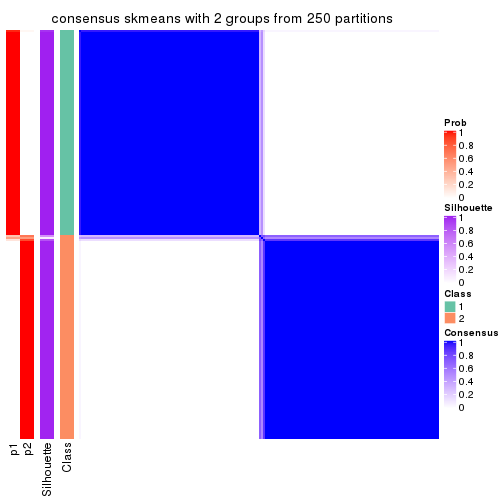</p>

</div>
<div id='tab-ATC-skmeans-consensus-heatmap-2'>
<pre><code class="r">consensus_heatmap(res, k = 3)
</code></pre>

<p>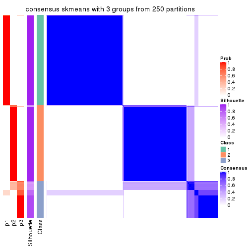</p>

</div>
<div id='tab-ATC-skmeans-consensus-heatmap-3'>
<pre><code class="r">consensus_heatmap(res, k = 4)
</code></pre>

<p>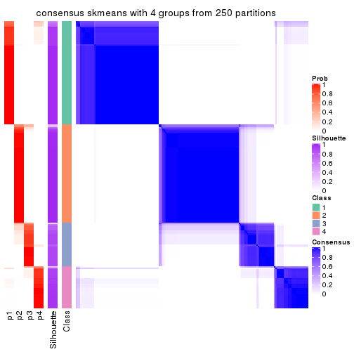</p>

</div>
<div id='tab-ATC-skmeans-consensus-heatmap-4'>
<pre><code class="r">consensus_heatmap(res, k = 5)
</code></pre>

<p>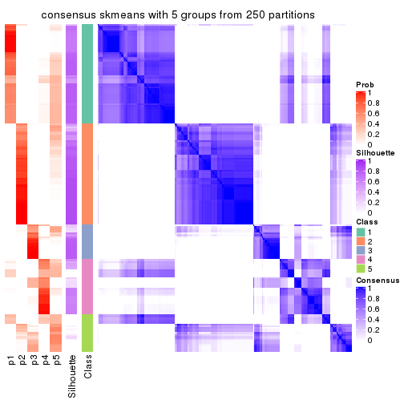</p>

</div>
<div id='tab-ATC-skmeans-consensus-heatmap-5'>
<pre><code class="r">consensus_heatmap(res, k = 6)
</code></pre>

<p>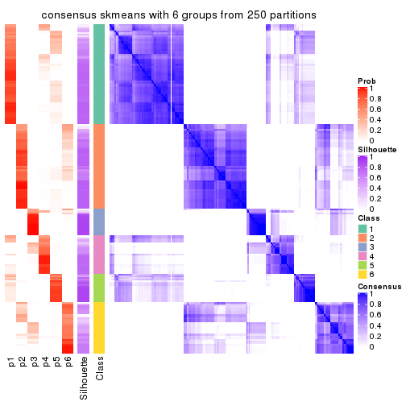</p>

</div>
</div>

Heatmaps for the membership of samples in all partitions to see how consistent they are:


<script>
$( function() {
	$( '#tabs-ATC-skmeans-membership-heatmap' ).tabs();
} );
</script>
<div id='tabs-ATC-skmeans-membership-heatmap'>
<ul>
<li><a href='#tab-ATC-skmeans-membership-heatmap-1'>k = 2</a></li>
<li><a href='#tab-ATC-skmeans-membership-heatmap-2'>k = 3</a></li>
<li><a href='#tab-ATC-skmeans-membership-heatmap-3'>k = 4</a></li>
<li><a href='#tab-ATC-skmeans-membership-heatmap-4'>k = 5</a></li>
<li><a href='#tab-ATC-skmeans-membership-heatmap-5'>k = 6</a></li>
</ul>
<div id='tab-ATC-skmeans-membership-heatmap-1'>
<pre><code class="r">membership_heatmap(res, k = 2)
</code></pre>

<p>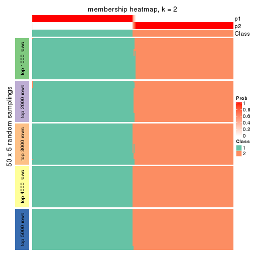</p>

</div>
<div id='tab-ATC-skmeans-membership-heatmap-2'>
<pre><code class="r">membership_heatmap(res, k = 3)
</code></pre>

<p>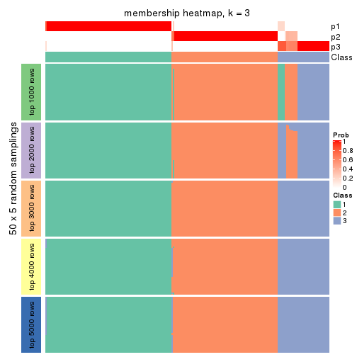</p>

</div>
<div id='tab-ATC-skmeans-membership-heatmap-3'>
<pre><code class="r">membership_heatmap(res, k = 4)
</code></pre>

<p>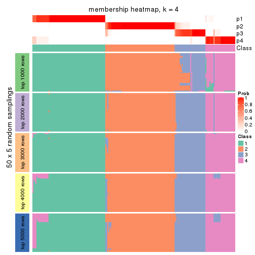</p>

</div>
<div id='tab-ATC-skmeans-membership-heatmap-4'>
<pre><code class="r">membership_heatmap(res, k = 5)
</code></pre>

<p>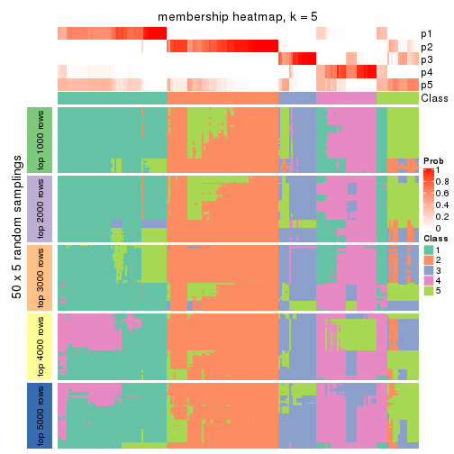</p>

</div>
<div id='tab-ATC-skmeans-membership-heatmap-5'>
<pre><code class="r">membership_heatmap(res, k = 6)
</code></pre>

<p>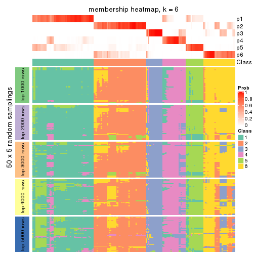</p>

</div>
</div>

As soon as we have had the classes for columns, we can look for signatures
which are significantly different between classes which can be candidate marks
for certain classes. Following are the heatmaps for signatures.


Signature heatmaps where rows are scaled:


<script>
$( function() {
	$( '#tabs-ATC-skmeans-get-signatures' ).tabs();
} );
</script>
<div id='tabs-ATC-skmeans-get-signatures'>
<ul>
<li><a href='#tab-ATC-skmeans-get-signatures-1'>k = 2</a></li>
<li><a href='#tab-ATC-skmeans-get-signatures-2'>k = 3</a></li>
<li><a href='#tab-ATC-skmeans-get-signatures-3'>k = 4</a></li>
<li><a href='#tab-ATC-skmeans-get-signatures-4'>k = 5</a></li>
<li><a href='#tab-ATC-skmeans-get-signatures-5'>k = 6</a></li>
</ul>
<div id='tab-ATC-skmeans-get-signatures-1'>
<pre><code class="r">get_signatures(res, k = 2)
</code></pre>

<p>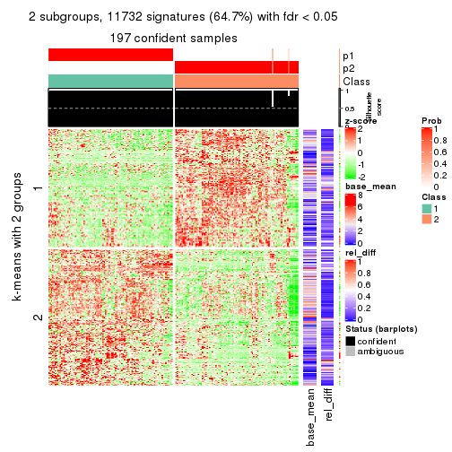</p>

</div>
<div id='tab-ATC-skmeans-get-signatures-2'>
<pre><code class="r">get_signatures(res, k = 3)
</code></pre>

<p>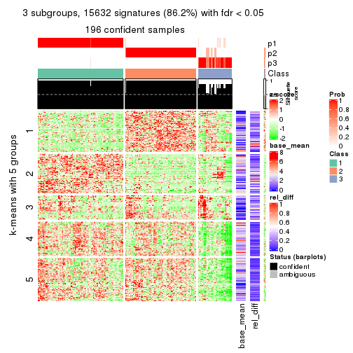</p>

</div>
<div id='tab-ATC-skmeans-get-signatures-3'>
<pre><code class="r">get_signatures(res, k = 4)
</code></pre>

<p>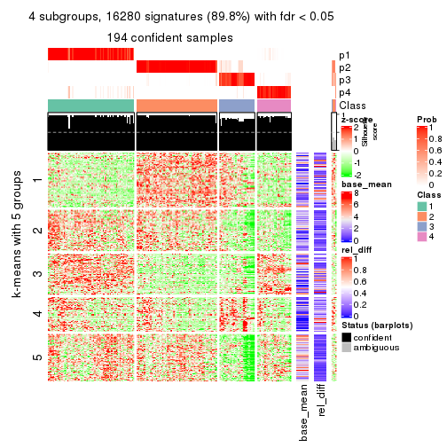</p>

</div>
<div id='tab-ATC-skmeans-get-signatures-4'>
<pre><code class="r">get_signatures(res, k = 5)
</code></pre>

<p>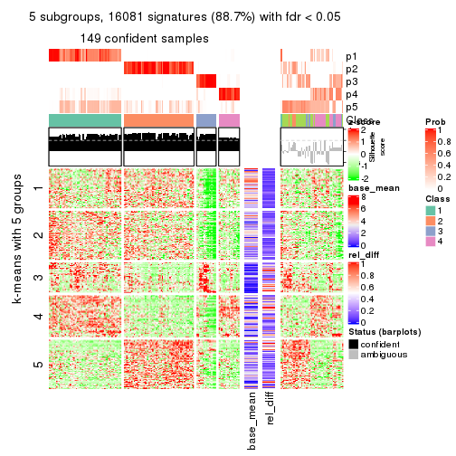</p>

</div>
<div id='tab-ATC-skmeans-get-signatures-5'>
<pre><code class="r">get_signatures(res, k = 6)
</code></pre>

<p>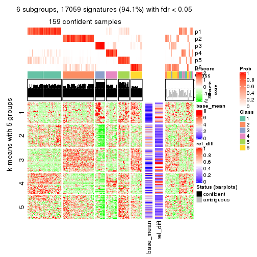</p>

</div>
</div>


Signature heatmaps where rows are not scaled:


<script>
$( function() {
	$( '#tabs-ATC-skmeans-get-signatures-no-scale' ).tabs();
} );
</script>
<div id='tabs-ATC-skmeans-get-signatures-no-scale'>
<ul>
<li><a href='#tab-ATC-skmeans-get-signatures-no-scale-1'>k = 2</a></li>
<li><a href='#tab-ATC-skmeans-get-signatures-no-scale-2'>k = 3</a></li>
<li><a href='#tab-ATC-skmeans-get-signatures-no-scale-3'>k = 4</a></li>
<li><a href='#tab-ATC-skmeans-get-signatures-no-scale-4'>k = 5</a></li>
<li><a href='#tab-ATC-skmeans-get-signatures-no-scale-5'>k = 6</a></li>
</ul>
<div id='tab-ATC-skmeans-get-signatures-no-scale-1'>
<pre><code class="r">get_signatures(res, k = 2, scale_rows = FALSE)
</code></pre>

<p>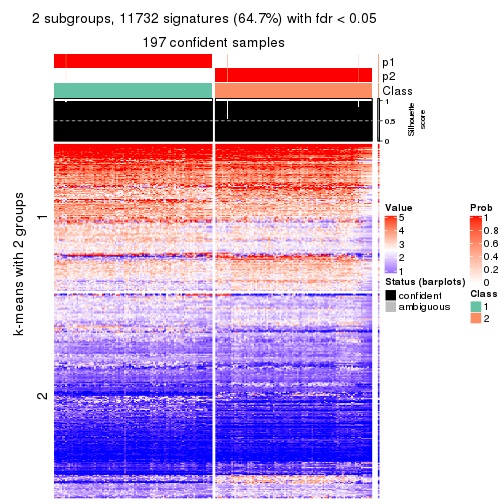</p>

</div>
<div id='tab-ATC-skmeans-get-signatures-no-scale-2'>
<pre><code class="r">get_signatures(res, k = 3, scale_rows = FALSE)
</code></pre>

<p>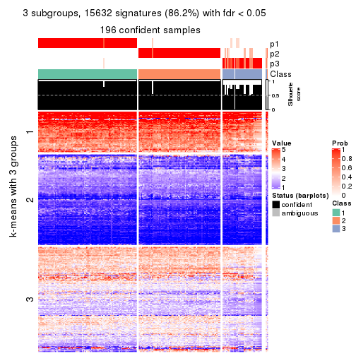</p>

</div>
<div id='tab-ATC-skmeans-get-signatures-no-scale-3'>
<pre><code class="r">get_signatures(res, k = 4, scale_rows = FALSE)
</code></pre>

<p>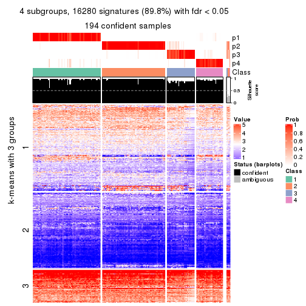</p>

</div>
<div id='tab-ATC-skmeans-get-signatures-no-scale-4'>
<pre><code class="r">get_signatures(res, k = 5, scale_rows = FALSE)
</code></pre>

<p>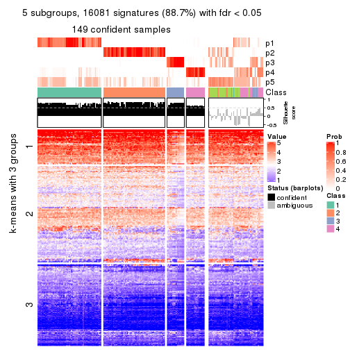</p>

</div>
<div id='tab-ATC-skmeans-get-signatures-no-scale-5'>
<pre><code class="r">get_signatures(res, k = 6, scale_rows = FALSE)
</code></pre>

<p>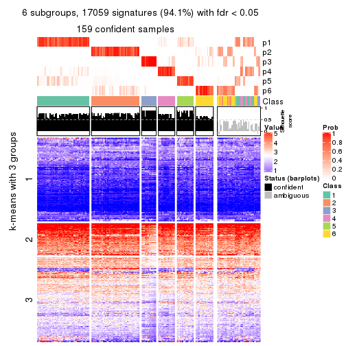</p>

</div>
</div>


Compare the overlap of signatures from different k:

```r
compare_signatures(res)
```

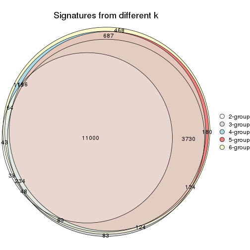

`get_signature()` returns a data frame invisibly. TO get the list of signatures, the function
call should be assigned to a variable explicitly. In following code, if `plot` argument is set
to `FALSE`, no heatmap is plotted while only the differential analysis is performed.

```r
# code only for demonstration
tb = get_signature(res, k = ..., plot = FALSE)
```

An example of the output of `tb` is:

```
#>   which_row         fdr    mean_1    mean_2 scaled_mean_1 scaled_mean_2 km
#> 1        38 0.042760348  8.373488  9.131774    -0.5533452     0.5164555  1
#> 2        40 0.018707592  7.106213  8.469186    -0.6173731     0.5762149  1
#> 3        55 0.019134737 10.221463 11.207825    -0.6159697     0.5749050  1
#> 4        59 0.006059896  5.921854  7.869574    -0.6899429     0.6439467  1
#> 5        60 0.018055526  8.928898 10.211722    -0.6204761     0.5791110  1
#> 6        98 0.009384629 15.714769 14.887706     0.6635654    -0.6193277  2
...
```

The columns in `tb` are:

1. `which_row`: row indices corresponding to the input matrix.
2. `fdr`: FDR for the differential test. 
3. `mean_x`: The mean value in group x.
4. `scaled_mean_x`: The mean value in group x after rows are scaled.
5. `km`: Row groups if k-means clustering is applied to rows.


UMAP plot which shows how samples are separated.


<script>
$( function() {
	$( '#tabs-ATC-skmeans-dimension-reduction' ).tabs();
} );
</script>
<div id='tabs-ATC-skmeans-dimension-reduction'>
<ul>
<li><a href='#tab-ATC-skmeans-dimension-reduction-1'>k = 2</a></li>
<li><a href='#tab-ATC-skmeans-dimension-reduction-2'>k = 3</a></li>
<li><a href='#tab-ATC-skmeans-dimension-reduction-3'>k = 4</a></li>
<li><a href='#tab-ATC-skmeans-dimension-reduction-4'>k = 5</a></li>
<li><a href='#tab-ATC-skmeans-dimension-reduction-5'>k = 6</a></li>
</ul>
<div id='tab-ATC-skmeans-dimension-reduction-1'>
<pre><code class="r">dimension_reduction(res, k = 2, method = &quot;UMAP&quot;)
</code></pre>

<p>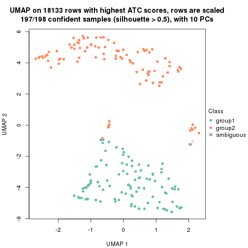</p>

</div>
<div id='tab-ATC-skmeans-dimension-reduction-2'>
<pre><code class="r">dimension_reduction(res, k = 3, method = &quot;UMAP&quot;)
</code></pre>

<p>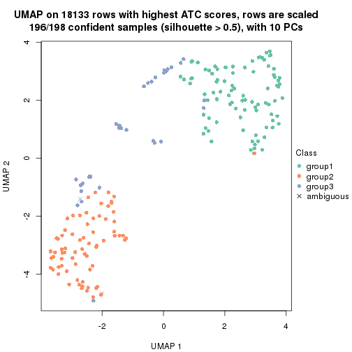</p>

</div>
<div id='tab-ATC-skmeans-dimension-reduction-3'>
<pre><code class="r">dimension_reduction(res, k = 4, method = &quot;UMAP&quot;)
</code></pre>

<p>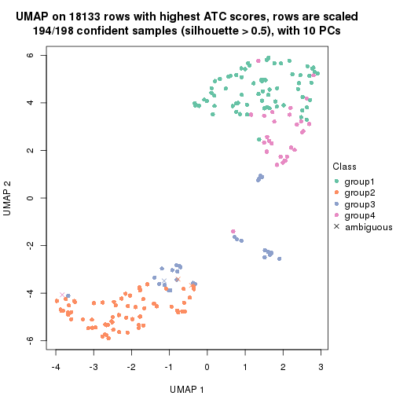</p>

</div>
<div id='tab-ATC-skmeans-dimension-reduction-4'>
<pre><code class="r">dimension_reduction(res, k = 5, method = &quot;UMAP&quot;)
</code></pre>

<p>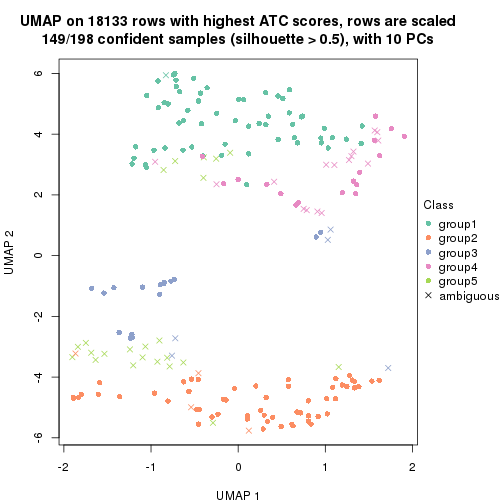</p>

</div>
<div id='tab-ATC-skmeans-dimension-reduction-5'>
<pre><code class="r">dimension_reduction(res, k = 6, method = &quot;UMAP&quot;)
</code></pre>

<p>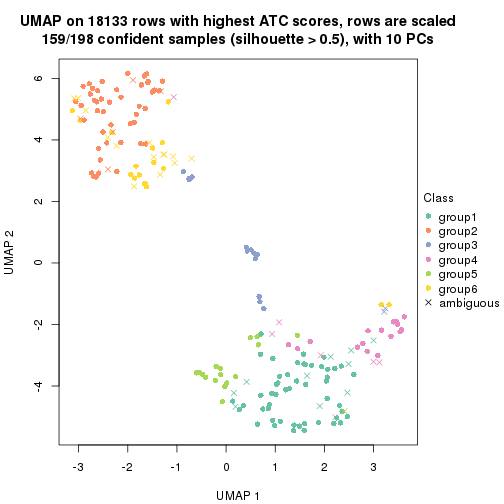</p>

</div>
</div>


Following heatmap shows how subgroups are split when increasing `k`:

```r
collect_classes(res)
```

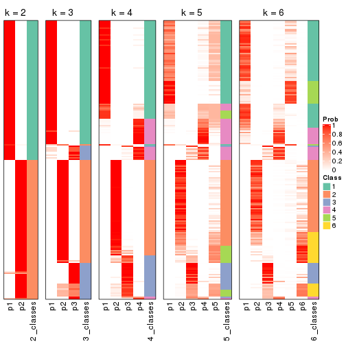


If matrix rows can be associated to genes, consider to use `functional_enrichment(res,
...)` to perform function enrichment for the signature genes. See [this vignette](http://bioconductor.org/packages/devel/bioc/vignettes/cola/inst/doc/functional_enrichment.html) for more detailed explanations.


 

---------------------------------------------------


### ATC:pam*


The object with results only for a single top-value method and a single partition method 
can be extracted as:

```r
res = res_list["ATC", "pam"]
# you can also extract it by
# res = res_list["ATC:pam"]
```

A summary of `res` and all the functions that can be applied to it:

```r
res
```

```
#> A 'ConsensusPartition' object with k = 2, 3, 4, 5, 6.
#>   On a matrix with 18133 rows and 198 columns.
#>   Top rows (1000, 2000, 3000, 4000, 5000) are extracted by 'ATC' method.
#>   Subgroups are detected by 'pam' method.
#>   Performed in total 1250 partitions by row resampling.
#>   Best k for subgroups seems to be 4.
#> 
#> Following methods can be applied to this 'ConsensusPartition' object:
#>  [1] "cola_report"             "collect_classes"         "collect_plots"          
#>  [4] "collect_stats"           "colnames"                "compare_signatures"     
#>  [7] "consensus_heatmap"       "dimension_reduction"     "functional_enrichment"  
#> [10] "get_anno_col"            "get_anno"                "get_classes"            
#> [13] "get_consensus"           "get_matrix"              "get_membership"         
#> [16] "get_param"               "get_signatures"          "get_stats"              
#> [19] "is_best_k"               "is_stable_k"             "membership_heatmap"     
#> [22] "ncol"                    "nrow"                    "plot_ecdf"              
#> [25] "rownames"                "select_partition_number" "show"                   
#> [28] "suggest_best_k"          "test_to_known_factors"
```

`collect_plots()` function collects all the plots made from `res` for all `k` (number of partitions)
into one single page to provide an easy and fast comparison between different `k`.

```r
collect_plots(res)
```

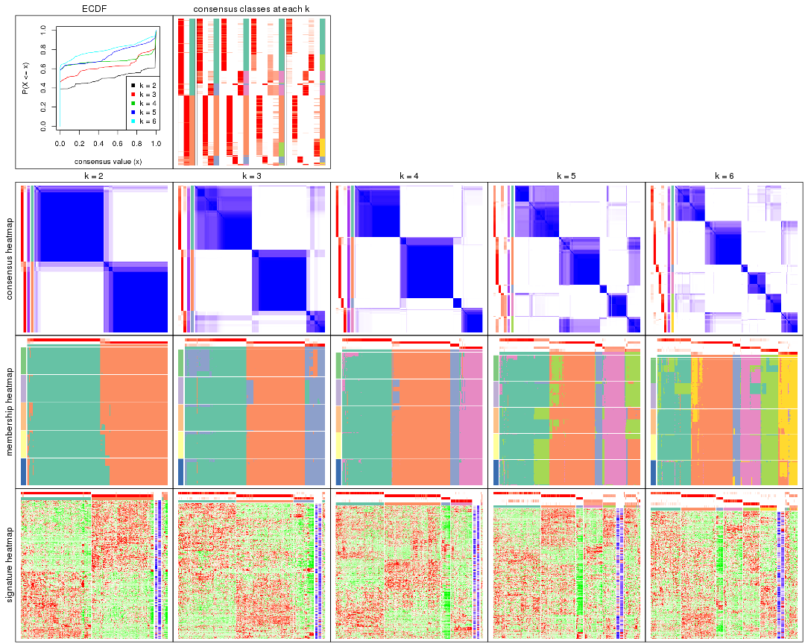

The plots are:

- The first row: a plot of the ECDF (empirical cumulative distribution
  function) curves of the consensus matrix for each `k` and the heatmap of
  predicted classes for each `k`.
- The second row: heatmaps of the consensus matrix for each `k`.
- The third row: heatmaps of the membership matrix for each `k`.
- The fouth row: heatmaps of the signatures for each `k`.

All the plots in panels can be made by individual functions and they are
plotted later in this section.

`select_partition_number()` produces several plots showing different
statistics for choosing "optimized" `k`. There are following statistics:

- ECDF curves of the consensus matrix for each `k`;
- 1-PAC. [The PAC
  score](https://en.wikipedia.org/wiki/Consensus_clustering#Over-interpretation_potential_of_consensus_clustering)
  measures the proportion of the ambiguous subgrouping.
- Mean silhouette score.
- Concordance. The mean probability of fiting the consensus class ids in all
  partitions.
- Area increased. Denote $A_k$ as the area under the ECDF curve for current
  `k`, the area increased is defined as $A_k - A_{k-1}$.
- Rand index. The percent of pairs of samples that are both in a same cluster
  or both are not in a same cluster in the partition of k and k-1.
- Jaccard index. The ratio of pairs of samples are both in a same cluster in
  the partition of k and k-1 and the pairs of samples are both in a same
  cluster in the partition k or k-1.

The detailed explanations of these statistics can be found in [the _cola_
vignette](http://bioconductor.org/packages/devel/bioc/vignettes/cola/inst/doc/cola.html#toc_13).

Generally speaking, lower PAC score, higher mean silhouette score or higher
concordance corresponds to better partition. Rand index and Jaccard index
measure how similar the current partition is compared to partition with `k-1`.
If they are too similar, we won't accept `k` is better than `k-1`.

```r
select_partition_number(res)
```

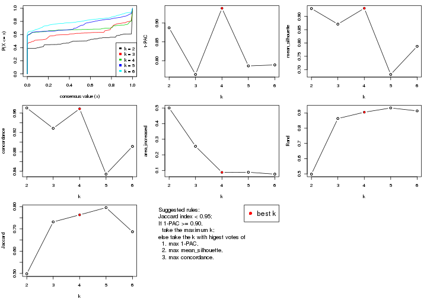

The numeric values for all these statistics can be obtained by `get_stats()`.

```r
get_stats(res)
```

```
#>   k 1-PAC mean_silhouette concordance area_increased  Rand Jaccard
#> 2 2 0.887           0.929       0.970         0.5004 0.498   0.498
#> 3 3 0.764           0.871       0.928         0.2548 0.863   0.731
#> 4 4 0.939           0.930       0.969         0.0877 0.905   0.763
#> 5 5 0.786           0.682       0.834         0.0887 0.933   0.796
#> 6 6 0.789           0.788       0.891         0.0764 0.913   0.687
```

`suggest_best_k()` suggests the best $k$ based on these statistics. The rules are as follows:

- All $k$ with Jaccard index larger than 0.95 are removed because increasing
  $k$ does not provide enough extra information. If all $k$ are removed, it is
  marked as no subgroup is detected.
- For all $k$ with 1-PAC score larger than 0.9, the maximal $k$ is taken as
  the best $k$, and other $k$ are marked as optional $k$.
- If it does not fit the second rule. The $k$ with the maximal vote of the
  highest 1-PAC score, highest mean silhouette, and highest concordance is
  taken as the best $k$.

```r
suggest_best_k(res)
```

```
#> [1] 4
```


Following shows the table of the partitions (You need to click the **show/hide
code output** link to see it). The membership matrix (columns with name `p*`)
is inferred by
[`clue::cl_consensus()`](https://www.rdocumentation.org/link/cl_consensus?package=clue)
function with the `SE` method. Basically the value in the membership matrix
represents the probability to belong to a certain group. The finall class
label for an item is determined with the group with highest probability it
belongs to.

In `get_classes()` function, the entropy is calculated from the membership
matrix and the silhouette score is calculated from the consensus matrix.


<script>
$( function() {
	$( '#tabs-ATC-pam-get-classes' ).tabs();
} );
</script>
<div id='tabs-ATC-pam-get-classes'>
<ul>
<li><a href='#tab-ATC-pam-get-classes-1'>k = 2</a></li>
<li><a href='#tab-ATC-pam-get-classes-2'>k = 3</a></li>
<li><a href='#tab-ATC-pam-get-classes-3'>k = 4</a></li>
<li><a href='#tab-ATC-pam-get-classes-4'>k = 5</a></li>
<li><a href='#tab-ATC-pam-get-classes-5'>k = 6</a></li>
</ul>

<div id='tab-ATC-pam-get-classes-1'>
<p><a id='tab-ATC-pam-get-classes-1-a' style='color:#0366d6' href='#'>show/hide code output</a></p>
<pre><code class="r">cbind(get_classes(res, k = 2), get_membership(res, k = 2))
</code></pre>

<pre><code>#&gt;                                      class entropy silhouette    p1    p2
#&gt; 0C0AA0B2-5191-4EDF-8937-ED7434F30283     2   0.000      0.958 0.000 1.000
#&gt; 18B45F1F-234F-45CC-A234-145307606C5C     1   0.000      0.979 1.000 0.000
#&gt; E18B70C0-BDCA-46D3-99BB-C6C8ABC68DA5     2   0.000      0.958 0.000 1.000
#&gt; 0F6DDBA7-6F74-45E8-95C8-F28263D55978     1   0.000      0.979 1.000 0.000
#&gt; 7EAE1A5A-129A-46DE-977E-A2C753F10904     2   0.000      0.958 0.000 1.000
#&gt; 7EAE0048-16B5-4979-9410-16CDEB9B1A48     1   0.000      0.979 1.000 0.000
#&gt; 2EBFC828-2B27-4753-A052-80DDA226DAB4     2   0.000      0.958 0.000 1.000
#&gt; 24E1768D-2232-41DA-9383-BC55D6EB3812     2   0.973      0.371 0.404 0.596
#&gt; 6E3CD60A-1889-4CA3-B305-2E78152057B5     2   0.000      0.958 0.000 1.000
#&gt; 33CC70DD-82B3-413C-B3B1-BE06634D95D0     1   0.866      0.590 0.712 0.288
#&gt; F1CB57A3-55DD-4487-9307-1B4F652E729A     1   0.000      0.979 1.000 0.000
#&gt; 755A5806-B054-449A-93DB-79909E6C93A1     1   0.000      0.979 1.000 0.000
#&gt; 58D364E7-3D2F-468F-A264-D6461E2428D4     2   0.000      0.958 0.000 1.000
#&gt; 68BB9CB6-7AA2-4981-B9D9-07363EC96599     2   0.634      0.805 0.160 0.840
#&gt; 3C4E8DFA-8EA0-4F1F-89CB-CB8805395872     2   0.634      0.805 0.160 0.840
#&gt; 4219651D-5583-4498-BF08-1B7D04B4C7B2     1   0.000      0.979 1.000 0.000
#&gt; B5EE2768-0D67-4584-ADBC-EC745FEC52EA     2   0.000      0.958 0.000 1.000
#&gt; 825E6C11-F460-451A-8045-846DD7D0E945     1   0.000      0.979 1.000 0.000
#&gt; 491F62AF-5E68-43C3-982A-F867A75BBA9A     2   0.000      0.958 0.000 1.000
#&gt; 9D7F058C-F95A-44AD-AC9E-450F7FBDC960     2   0.000      0.958 0.000 1.000
#&gt; 6D42DD0C-2081-4742-BA27-9F5F16FAC3C6     1   0.000      0.979 1.000 0.000
#&gt; EDD7E63D-492A-473B-A552-0764337B10EF     2   0.000      0.958 0.000 1.000
#&gt; 97073DEA-73AD-4DFD-BD1A-9035DC03445B     1   0.000      0.979 1.000 0.000
#&gt; FA891AB9-CE38-4F7E-A015-1DDCE12890A0     1   0.000      0.979 1.000 0.000
#&gt; D9514D49-A0AE-45AB-8C9F-68E726215253     1   0.000      0.979 1.000 0.000
#&gt; 3B9229AD-12E5-451E-9D2F-378AAC82C04A     2   0.000      0.958 0.000 1.000
#&gt; 5EA36B71-4917-4EF3-9060-065EFE6ACC5B     1   0.000      0.979 1.000 0.000
#&gt; A20E4ECB-4895-4CC7-BE5E-4721B20D933B     1   0.000      0.979 1.000 0.000
#&gt; 1BE8D828-29DB-4368-AA4A-FB23588F7AE8     1   0.000      0.979 1.000 0.000
#&gt; 66EFEFCF-3D14-4DBF-AA13-530F40ED0245     1   0.518      0.857 0.884 0.116
#&gt; 55DFFE53-BCE7-4EC1-9863-6C0311B06BA2     2   0.000      0.958 0.000 1.000
#&gt; 4CC3FB5A-611D-4C64-AE9D-544FA45CF4DC     1   0.000      0.979 1.000 0.000
#&gt; C11D33F2-DFE9-4FA8-9024-F3E7F1DADC5F     2   0.000      0.958 0.000 1.000
#&gt; FA5932B8-8AA3-4C38-9FAB-C35D8772974D     1   0.000      0.979 1.000 0.000
#&gt; 8216EC35-1F41-4A15-B503-BDA4971E27C9     1   0.000      0.979 1.000 0.000
#&gt; 69635D23-90A7-4BAD-97C7-B79536837F57     1   0.000      0.979 1.000 0.000
#&gt; 12B404E2-C463-4409-8392-E4649B2AFFD1     2   0.000      0.958 0.000 1.000
#&gt; 246927E3-ACCF-41B2-AA8E-43855FD6B146     2   0.000      0.958 0.000 1.000
#&gt; E0CC13E7-9607-49E0-B4AA-395544E3C3BF     1   0.000      0.979 1.000 0.000
#&gt; F7BBC0C1-6124-4A83-8A70-EA89B62F1CBD     1   0.000      0.979 1.000 0.000
#&gt; B1D4FF24-8E6F-4A04-B716-2032D850EB57     1   0.000      0.979 1.000 0.000
#&gt; 253601DB-B78A-4566-9947-8C0270C0B163     2   0.000      0.958 0.000 1.000
#&gt; AB83DBFF-5737-4FB8-A5AC-1D3CD6072BDF     2   0.987      0.293 0.432 0.568
#&gt; 9D67D953-EC98-4B72-89C8-5732BC9D4BC9     2   0.000      0.958 0.000 1.000
#&gt; 51061018-95AB-4278-886F-F69E4EBC47C0     2   0.949      0.458 0.368 0.632
#&gt; ABD0F7F3-105B-4DEE-9889-5028772C519A     1   0.000      0.979 1.000 0.000
#&gt; 562B95CF-B27E-4A72-B7C6-CDF86A51A39B     1   0.000      0.979 1.000 0.000
#&gt; ABF046A4-D7A1-49FF-B6B1-4E07A791DEDB     2   0.000      0.958 0.000 1.000
#&gt; 3FF4101E-9703-460E-A30E-76CC7689F36D     2   0.000      0.958 0.000 1.000
#&gt; 39C4F7AA-7ADF-4F1D-BDA3-BEC605AC5023     2   0.000      0.958 0.000 1.000
#&gt; CB821FD2-AF5C-4743-A70F-21C12C6ED153     1   0.000      0.979 1.000 0.000
#&gt; 92EA1846-62FF-41D5-A441-5E52E6B9E7F9     1   0.000      0.979 1.000 0.000
#&gt; 7D25F3EE-5A20-4763-8026-16A03D05F459     1   0.000      0.979 1.000 0.000
#&gt; 8ECE5276-CD06-496B-A5A9-1713B1F7D089     1   0.000      0.979 1.000 0.000
#&gt; C775B68F-9507-47E3-B507-B433AED79002     1   0.000      0.979 1.000 0.000
#&gt; E19D5463-FDD0-41C1-A170-323736A88D07     2   0.000      0.958 0.000 1.000
#&gt; CE4B6285-4961-4767-91F0-5C7A8162E185     1   0.000      0.979 1.000 0.000
#&gt; 9637BD72-1FEF-42AD-8886-2C39BE876531     1   0.000      0.979 1.000 0.000
#&gt; 81B5A88E-45A0-4B44-B689-B9071B8548EE     2   0.000      0.958 0.000 1.000
#&gt; 0B01B4C9-9BED-4F5B-A3E2-8868C7CCC3FC     2   0.980      0.339 0.416 0.584
#&gt; 54501315-7132-44B2-A179-10FBF1421105     1   0.000      0.979 1.000 0.000
#&gt; E207CBE9-4C3A-4FDD-9251-CFE1FE106475     1   0.753      0.710 0.784 0.216
#&gt; 3BEA0B92-3F90-4DBF-9679-AADEAD7D47C8     2   0.000      0.958 0.000 1.000
#&gt; 35B32250-D854-4215-AA5B-2C11B2FBEECA     1   0.000      0.979 1.000 0.000
#&gt; ACE6566B-AEB9-426C-924A-B382D14A1024     2   0.000      0.958 0.000 1.000
#&gt; 737E69AC-0930-45B9-B6BA-7CE5E300290B     1   0.000      0.979 1.000 0.000
#&gt; B4410AB8-D015-41CA-86E6-12EB4E4103E3     1   0.000      0.979 1.000 0.000
#&gt; 6D3ECA65-C50F-43B0-B75A-1D290FA4A8FD     2   0.000      0.958 0.000 1.000
#&gt; C86F40D3-9A96-4395-A8C3-510DE12F9A2B     2   0.000      0.958 0.000 1.000
#&gt; 6238087F-24DD-4BF1-903F-3BD4E446C1AE     2   0.000      0.958 0.000 1.000
#&gt; E4FF840B-EEAB-4CB0-A690-7D4C4AA7EEC3     2   0.000      0.958 0.000 1.000
#&gt; 72D3C323-C67F-4C0E-9BFC-BF245FF9730A     1   0.000      0.979 1.000 0.000
#&gt; 82D56E4E-4DF6-4F3E-8959-B995C92AAA70     1   0.000      0.979 1.000 0.000
#&gt; E31CA441-EB19-443B-ACBD-37B5CCBCF0E5     2   0.000      0.958 0.000 1.000
#&gt; 87CA8939-D054-4B8A-B32D-085FD2E8F202     1   0.000      0.979 1.000 0.000
#&gt; 2A508D90-FEDC-46A3-9A02-E51E5467CDCB     1   0.000      0.979 1.000 0.000
#&gt; C4E8B4E2-388B-411F-BF0A-9B6F34E8EDB5     2   0.000      0.958 0.000 1.000
#&gt; AF6AF803-BD93-44A7-AA80-B9BC92C1273B     2   0.000      0.958 0.000 1.000
#&gt; 0B1CA5CF-EB96-41D4-BFC5-6957FEB39828     1   0.416      0.893 0.916 0.084
#&gt; 6FB96FB0-6661-48AD-A4A0-69F8AFDBE591     2   0.000      0.958 0.000 1.000
#&gt; 8C19F7FD-368A-462B-B28F-88D6630038A1     1   0.000      0.979 1.000 0.000
#&gt; 96EABE78-C2F4-4A33-ACD8-C922A4B2519B     2   0.000      0.958 0.000 1.000
#&gt; 68B36D7B-546A-4689-949F-B207C4A4AB27     2   0.000      0.958 0.000 1.000
#&gt; CE9F3335-778F-4F52-BC55-4B7C99B211DD     2   0.000      0.958 0.000 1.000
#&gt; CB359DED-2A2D-4646-A0BD-6F10ADCC532B     1   0.000      0.979 1.000 0.000
#&gt; 198324A5-8C52-46F6-9734-EFAF1CCA6D9B     1   0.000      0.979 1.000 0.000
#&gt; 83B88608-0506-428C-B9E8-621F38477B42     1   0.000      0.979 1.000 0.000
#&gt; 1993630A-0F3D-4F5C-86A3-D443BAAF57F0     1   0.563      0.835 0.868 0.132
#&gt; DE73DA9B-529E-4F4F-A65C-DA7AB84B1096     1   0.000      0.979 1.000 0.000
#&gt; 2347F3B7-DDA3-40C0-B6D4-8819ECA69146     1   0.000      0.979 1.000 0.000
#&gt; AB93B5D5-095F-4330-9D40-6A3D934AB50C     1   0.000      0.979 1.000 0.000
#&gt; 5EBBE4AD-FF0C-41CF-9EA3-B6FE7EA1F9C0     1   0.518      0.855 0.884 0.116
#&gt; 6D960AE7-3769-4144-A061-E8588E5063FF     1   0.000      0.979 1.000 0.000
#&gt; 0C2DD8C0-D1A5-4192-A49C-7A40FED628B2     2   0.000      0.958 0.000 1.000
#&gt; 18C9372F-C55B-4F86-A9D2-E8D85EFC8566     2   0.969      0.392 0.396 0.604
#&gt; 9AF637B0-4C32-4DD1-93AF-7655B4A845D3     2   0.000      0.958 0.000 1.000
#&gt; 785B5B06-4115-46FD-9BEB-F888AFDC855D     2   0.000      0.958 0.000 1.000
#&gt; ECA3050E-4BE2-4117-B9CF-A52BB85AF8C2     2   0.000      0.958 0.000 1.000
#&gt; 099DC396-16A5-458F-9ED9-F2A790CB0C34     1   0.000      0.979 1.000 0.000
#&gt; 7A5A12EE-C5B0-4C51-8C99-0F3FA88D633E     1   0.000      0.979 1.000 0.000
#&gt; E832B508-A66D-4817-B44A-FE9FAAE64B4A     1   0.000      0.979 1.000 0.000
#&gt; F9DD688C-7B35-49E7-9651-2E098EE78856     1   0.000      0.979 1.000 0.000
#&gt; F1265DD8-5ED3-4635-A277-57BBFDEC7729     1   0.000      0.979 1.000 0.000
#&gt; F624E8D9-DB07-4C9E-910D-5E8EBA3A6167     2   0.000      0.958 0.000 1.000
#&gt; 3516FBDF-66E1-43F4-9D7B-16748F6439A7     2   0.000      0.958 0.000 1.000
#&gt; 04B12992-B2EA-4BA2-8E2C-11E34E230E6F     2   0.000      0.958 0.000 1.000
#&gt; CC02897D-9123-495E-9242-5C9CF4EC269B     2   0.000      0.958 0.000 1.000
#&gt; 3117ED46-2BF2-4311-BC00-4E98243E16B3     1   0.000      0.979 1.000 0.000
#&gt; E0B66D53-23DB-4E26-BB6E-F692FA8C000E     1   0.000      0.979 1.000 0.000
#&gt; DAA93CE5-A013-477A-9A50-EA09CC3A8162     2   0.000      0.958 0.000 1.000
#&gt; 0099098D-354A-4276-92F8-B932C74B4608     1   0.000      0.979 1.000 0.000
#&gt; DD483639-B2E7-4745-BCFB-55ED1D82BFBF     2   0.000      0.958 0.000 1.000
#&gt; 2C1F9079-602E-4252-82C7-9D8799E04246     2   0.000      0.958 0.000 1.000
#&gt; 9473A8E4-3A1B-4184-9EA6-517AFD60B635     1   0.000      0.979 1.000 0.000
#&gt; 75CFBAF6-7BA0-40AF-92D7-D218E885BD1B     2   0.000      0.958 0.000 1.000
#&gt; B588950F-14D6-41C8-845B-EFD2096013C6     2   0.000      0.958 0.000 1.000
#&gt; 0DF3EDA8-DAEA-4721-92AB-B97181249498     2   0.000      0.958 0.000 1.000
#&gt; 8EA83042-D598-401D-AD78-936EEB136C59     1   0.000      0.979 1.000 0.000
#&gt; 729AC418-3BE9-445A-95D4-AC11A7D43BE0     1   0.000      0.979 1.000 0.000
#&gt; 7D8B1B11-F576-4AA8-BFA7-0022A2CD829A     2   0.000      0.958 0.000 1.000
#&gt; 304A0E46-3449-4B44-9C30-BDDF6459391D     1   0.000      0.979 1.000 0.000
#&gt; 3C83358F-DF20-47F7-AF9F-AB7CC92F5ABA     1   0.000      0.979 1.000 0.000
#&gt; EAFEED6C-35C3-451F-AE4A-EB56992E1F29     1   0.000      0.979 1.000 0.000
#&gt; 8A237A65-28EC-434D-A78A-A8B7308B5204     1   0.000      0.979 1.000 0.000
#&gt; D005833F-E991-4E9E-9667-55F137288004     1   0.000      0.979 1.000 0.000
#&gt; 37D966E3-253E-4397-A9AE-0903A8D31FE6     1   0.000      0.979 1.000 0.000
#&gt; D2482B81-CB5B-4178-BA8D-1CF4026181B5     1   0.000      0.979 1.000 0.000
#&gt; 18019E95-C2A8-4EE7-B585-F6886DC4D953     2   0.634      0.805 0.160 0.840
#&gt; 0B126D1A-14A8-4345-8F78-FF92222ADF4C     2   0.975      0.361 0.408 0.592
#&gt; CE88B625-47D8-4D58-9FB4-23464DB7DDAD     2   0.000      0.958 0.000 1.000
#&gt; 9A88299D-5C74-47FA-B42C-1A1D6D935AAB     1   0.000      0.979 1.000 0.000
#&gt; 3E71159C-FD6C-41DA-B18B-0730C8AC7E41     1   0.000      0.979 1.000 0.000
#&gt; 6F245AA4-79D9-47E1-BCC9-1AAF65AEA813     1   0.000      0.979 1.000 0.000
#&gt; 4CF2C888-2100-483A-B4DB-ECBB69243A4D     2   0.000      0.958 0.000 1.000
#&gt; A3853813-B9D5-4E8C-B075-19FCC35F8686     2   0.456      0.868 0.096 0.904
#&gt; 83A16DEE-CE9F-4D8B-9225-0A2A8B9D055D     1   0.900      0.534 0.684 0.316
#&gt; 0F057CAF-4F9A-4DE9-8601-730E96873733     2   0.000      0.958 0.000 1.000
#&gt; 32D5801D-DBA4-422E-87CB-A2DDE921BA41     1   0.000      0.979 1.000 0.000
#&gt; 22EE8076-F07C-499A-9AF8-D800A77EF154     2   0.000      0.958 0.000 1.000
#&gt; DD4BD74D-D48C-4090-9F57-5334E784581C     1   0.000      0.979 1.000 0.000
#&gt; 41183565-434D-474C-B1BD-CA6E94910658     2   0.000      0.958 0.000 1.000
#&gt; 75A2CE41-2B2A-4346-927E-ACF8A72738E4     1   0.000      0.979 1.000 0.000
#&gt; 7AA24995-3DD2-4682-B36A-4EBFEEACF625     1   0.000      0.979 1.000 0.000
#&gt; 8BAFDFEC-9F26-4ADB-95CE-004143960EEB     1   0.000      0.979 1.000 0.000
#&gt; A330E011-CE08-4A85-8F4B-370592293DBB     1   0.000      0.979 1.000 0.000
#&gt; 1D5A5B17-2E70-4BB0-94A1-EC17E6EA49DB     1   0.000      0.979 1.000 0.000
#&gt; BD9143B8-9D97-4A05-872C-3FB82B4CF7BE     2   0.000      0.958 0.000 1.000
#&gt; 64552DC0-181E-4607-898C-787AA7F26435     2   0.000      0.958 0.000 1.000
#&gt; 1B4C4D41-34C7-43A3-858B-C9552EB53894     1   0.000      0.979 1.000 0.000
#&gt; 463A3BAA-02DC-4EA4-A644-B924163E425D     2   0.000      0.958 0.000 1.000
#&gt; CD0FEA89-6F60-4A20-8FCA-D397B4E95A98     1   0.000      0.979 1.000 0.000
#&gt; 5D06CF6D-F4B9-4B32-B055-8AB287E53340     2   0.000      0.958 0.000 1.000
#&gt; ADA7835F-DB67-4F4F-9446-8BCE3C5FE936     2   0.000      0.958 0.000 1.000
#&gt; 4109BE2D-B5DF-4BD7-860E-60D87F647152     2   0.634      0.805 0.160 0.840
#&gt; 88526A0E-6DFE-46CB-BFAD-B4826F482C67     1   0.000      0.979 1.000 0.000
#&gt; F39F9A4C-18F7-4017-AB31-85D52FF44587     2   0.000      0.958 0.000 1.000
#&gt; D4290A5E-1B24-4C55-B470-0FA7A0A09DD0     2   0.000      0.958 0.000 1.000
#&gt; DC5A2C9E-978F-4661-B729-1F9662976E27     1   0.000      0.979 1.000 0.000
#&gt; 26A1F392-CED2-43E3-8096-74E6F2BFC8C0     2   0.000      0.958 0.000 1.000
#&gt; 87D81FB2-306A-4E75-9D58-D5F48E46E7F6     2   0.000      0.958 0.000 1.000
#&gt; E3D9D81A-C20C-4B3B-B940-A5D2C5F65B22     2   0.925      0.518 0.340 0.660
#&gt; 4464650B-453F-476C-989C-B7B159BF2CF0     2   0.000      0.958 0.000 1.000
#&gt; 577D2867-B738-487A-9B06-07958D647F02     1   0.000      0.979 1.000 0.000
#&gt; E52A22CC-3C03-41A9-9541-220DD871E162     2   0.000      0.958 0.000 1.000
#&gt; 642703B1-AF99-4746-A915-0792F4B9590B     2   0.000      0.958 0.000 1.000
#&gt; 8F0D1792-1284-45E6-8EC4-392596057677     2   0.000      0.958 0.000 1.000
#&gt; 765AFFC1-D528-4494-8BA1-0706451E4205     2   0.634      0.805 0.160 0.840
#&gt; A716BC29-161F-4CA0-B240-00B330137F2C     1   0.000      0.979 1.000 0.000
#&gt; 32CBFBAF-7064-4595-8D54-2C5E7DE0FD9B     1   0.000      0.979 1.000 0.000
#&gt; 4D6ED28C-3F20-41B0-BA41-1BF0E5199A40     2   0.000      0.958 0.000 1.000
#&gt; 86A38456-2900-48FB-B10F-79222B3CA9BF     1   0.917      0.489 0.668 0.332
#&gt; E870807D-3223-4A6A-9E3D-F4461B048AA2     2   0.000      0.958 0.000 1.000
#&gt; 3A78D19F-A833-4D2C-8387-FB4FD4A8313C     1   0.000      0.979 1.000 0.000
#&gt; DFA162CA-C708-4121-8E74-F9C4DEE0CDAE     1   0.000      0.979 1.000 0.000
#&gt; C00A300A-CD10-4C9D-8C94-3901AFE8406C     2   0.000      0.958 0.000 1.000
#&gt; 13E11D15-A90F-48C4-980A-DD032C00A2C1     1   0.000      0.979 1.000 0.000
#&gt; 31BF80AB-FEDB-4C73-89C3-70BE9F9ACBEE     2   0.000      0.958 0.000 1.000
#&gt; FA34308A-349D-4AAD-94CF-3F3B7F9AD629     2   0.000      0.958 0.000 1.000
#&gt; 7C48D467-B663-49DD-BC84-A36BC32ACB3D     1   0.000      0.979 1.000 0.000
#&gt; BB068534-04F6-4FC9-9087-CDA65920BCE2     1   0.000      0.979 1.000 0.000
#&gt; EA4EC272-A9B3-4B2E-955F-19F7676A944C     2   0.000      0.958 0.000 1.000
#&gt; C71FF69B-A460-43CA-8769-9667F22D938B     1   0.000      0.979 1.000 0.000
#&gt; 5243D1B8-8168-4FF1-A8C6-505F080EF0D3     2   0.000      0.958 0.000 1.000
#&gt; BCC474D8-08FE-4E99-B8E8-B29E65F84D2E     1   0.000      0.979 1.000 0.000
#&gt; 04FDBFE3-4CF6-4E53-A2AA-89D5C9316377     2   0.634      0.805 0.160 0.840
#&gt; 83A9915C-8D60-4CAE-A868-B61E3C90C7B0     2   0.000      0.958 0.000 1.000
#&gt; 989A6472-E3E3-457A-97BE-CCE95F42D5C2     2   0.000      0.958 0.000 1.000
#&gt; A0AB2D28-6751-49C9-8DF4-66FDBF95C360     1   0.000      0.979 1.000 0.000
#&gt; A12B2683-18D4-41C9-8AE5-C143E2180052     1   0.000      0.979 1.000 0.000
#&gt; 8DE1E245-CAD2-4F11-BFA2-9792C433A00B     1   0.987      0.236 0.568 0.432
#&gt; FDA68036-6C4C-4256-9AA0-C01FE92AA098     2   0.000      0.958 0.000 1.000
#&gt; 26311920-1414-4EC1-870B-784961EBCC2D     1   0.000      0.979 1.000 0.000
#&gt; C29A10D6-D598-4286-B5E0-F1776E19E988     1   0.000      0.979 1.000 0.000
#&gt; FACCC1FB-4937-4CC0-90EA-7F91D3D939CF     2   0.000      0.958 0.000 1.000
#&gt; 90B9D84B-78E5-4C7E-8414-EC889C2DE8DB     2   0.000      0.958 0.000 1.000
#&gt; B74E6122-76E1-4E4D-A867-BCAFD7277393     1   0.000      0.979 1.000 0.000
#&gt; 98494DC0-CF6E-485F-8A0D-D80E4437EF5C     2   0.000      0.958 0.000 1.000
#&gt; DA114DAC-DE7B-4E43-8D7C-82C5D7B66411     1   0.000      0.979 1.000 0.000
</code></pre>

<script>
$('#tab-ATC-pam-get-classes-1-a').parent().next().next().hide();
$('#tab-ATC-pam-get-classes-1-a').click(function(){
  $('#tab-ATC-pam-get-classes-1-a').parent().next().next().toggle();
  return(false);
});
</script>
</div>

<div id='tab-ATC-pam-get-classes-2'>
<p><a id='tab-ATC-pam-get-classes-2-a' style='color:#0366d6' href='#'>show/hide code output</a></p>
<pre><code class="r">cbind(get_classes(res, k = 3), get_membership(res, k = 3))
</code></pre>

<pre><code>#&gt;                                      class entropy silhouette    p1    p2    p3
#&gt; 0C0AA0B2-5191-4EDF-8937-ED7434F30283     2  0.0000      0.974 0.000 1.000 0.000
#&gt; 18B45F1F-234F-45CC-A234-145307606C5C     1  0.5291      0.758 0.732 0.000 0.268
#&gt; E18B70C0-BDCA-46D3-99BB-C6C8ABC68DA5     2  0.0000      0.974 0.000 1.000 0.000
#&gt; 0F6DDBA7-6F74-45E8-95C8-F28263D55978     1  0.0000      0.884 1.000 0.000 0.000
#&gt; 7EAE1A5A-129A-46DE-977E-A2C753F10904     2  0.0000      0.974 0.000 1.000 0.000
#&gt; 7EAE0048-16B5-4979-9410-16CDEB9B1A48     1  0.1411      0.875 0.964 0.000 0.036
#&gt; 2EBFC828-2B27-4753-A052-80DDA226DAB4     2  0.0000      0.974 0.000 1.000 0.000
#&gt; 24E1768D-2232-41DA-9383-BC55D6EB3812     3  0.2261      0.845 0.000 0.068 0.932
#&gt; 6E3CD60A-1889-4CA3-B305-2E78152057B5     2  0.0237      0.971 0.000 0.996 0.004
#&gt; 33CC70DD-82B3-413C-B3B1-BE06634D95D0     1  0.0000      0.884 1.000 0.000 0.000
#&gt; F1CB57A3-55DD-4487-9307-1B4F652E729A     1  0.0000      0.884 1.000 0.000 0.000
#&gt; 755A5806-B054-449A-93DB-79909E6C93A1     1  0.6280      0.388 0.540 0.000 0.460
#&gt; 58D364E7-3D2F-468F-A264-D6461E2428D4     2  0.0000      0.974 0.000 1.000 0.000
#&gt; 68BB9CB6-7AA2-4981-B9D9-07363EC96599     3  0.4654      0.718 0.000 0.208 0.792
#&gt; 3C4E8DFA-8EA0-4F1F-89CB-CB8805395872     3  0.4654      0.718 0.000 0.208 0.792
#&gt; 4219651D-5583-4498-BF08-1B7D04B4C7B2     1  0.0000      0.884 1.000 0.000 0.000
#&gt; B5EE2768-0D67-4584-ADBC-EC745FEC52EA     2  0.0000      0.974 0.000 1.000 0.000
#&gt; 825E6C11-F460-451A-8045-846DD7D0E945     1  0.4605      0.809 0.796 0.000 0.204
#&gt; 491F62AF-5E68-43C3-982A-F867A75BBA9A     2  0.0000      0.974 0.000 1.000 0.000
#&gt; 9D7F058C-F95A-44AD-AC9E-450F7FBDC960     2  0.0000      0.974 0.000 1.000 0.000
#&gt; 6D42DD0C-2081-4742-BA27-9F5F16FAC3C6     3  0.4399      0.701 0.188 0.000 0.812
#&gt; EDD7E63D-492A-473B-A552-0764337B10EF     2  0.4605      0.765 0.000 0.796 0.204
#&gt; 97073DEA-73AD-4DFD-BD1A-9035DC03445B     1  0.0000      0.884 1.000 0.000 0.000
#&gt; FA891AB9-CE38-4F7E-A015-1DDCE12890A0     1  0.0000      0.884 1.000 0.000 0.000
#&gt; D9514D49-A0AE-45AB-8C9F-68E726215253     1  0.3752      0.842 0.856 0.000 0.144
#&gt; 3B9229AD-12E5-451E-9D2F-378AAC82C04A     2  0.0000      0.974 0.000 1.000 0.000
#&gt; 5EA36B71-4917-4EF3-9060-065EFE6ACC5B     3  0.4235      0.716 0.176 0.000 0.824
#&gt; A20E4ECB-4895-4CC7-BE5E-4721B20D933B     1  0.5327      0.754 0.728 0.000 0.272
#&gt; 1BE8D828-29DB-4368-AA4A-FB23588F7AE8     1  0.4452      0.816 0.808 0.000 0.192
#&gt; 66EFEFCF-3D14-4DBF-AA13-530F40ED0245     1  0.4121      0.828 0.832 0.000 0.168
#&gt; 55DFFE53-BCE7-4EC1-9863-6C0311B06BA2     2  0.4399      0.786 0.000 0.812 0.188
#&gt; 4CC3FB5A-611D-4C64-AE9D-544FA45CF4DC     1  0.0000      0.884 1.000 0.000 0.000
#&gt; C11D33F2-DFE9-4FA8-9024-F3E7F1DADC5F     2  0.0000      0.974 0.000 1.000 0.000
#&gt; FA5932B8-8AA3-4C38-9FAB-C35D8772974D     1  0.0000      0.884 1.000 0.000 0.000
#&gt; 8216EC35-1F41-4A15-B503-BDA4971E27C9     1  0.0000      0.884 1.000 0.000 0.000
#&gt; 69635D23-90A7-4BAD-97C7-B79536837F57     1  0.0000      0.884 1.000 0.000 0.000
#&gt; 12B404E2-C463-4409-8392-E4649B2AFFD1     2  0.0000      0.974 0.000 1.000 0.000
#&gt; 246927E3-ACCF-41B2-AA8E-43855FD6B146     2  0.0000      0.974 0.000 1.000 0.000
#&gt; E0CC13E7-9607-49E0-B4AA-395544E3C3BF     1  0.0000      0.884 1.000 0.000 0.000
#&gt; F7BBC0C1-6124-4A83-8A70-EA89B62F1CBD     1  0.5327      0.754 0.728 0.000 0.272
#&gt; B1D4FF24-8E6F-4A04-B716-2032D850EB57     1  0.0000      0.884 1.000 0.000 0.000
#&gt; 253601DB-B78A-4566-9947-8C0270C0B163     2  0.0000      0.974 0.000 1.000 0.000
#&gt; AB83DBFF-5737-4FB8-A5AC-1D3CD6072BDF     3  0.0000      0.855 0.000 0.000 1.000
#&gt; 9D67D953-EC98-4B72-89C8-5732BC9D4BC9     2  0.0000      0.974 0.000 1.000 0.000
#&gt; 51061018-95AB-4278-886F-F69E4EBC47C0     3  0.2878      0.831 0.000 0.096 0.904
#&gt; ABD0F7F3-105B-4DEE-9889-5028772C519A     1  0.4178      0.831 0.828 0.000 0.172
#&gt; 562B95CF-B27E-4A72-B7C6-CDF86A51A39B     1  0.0000      0.884 1.000 0.000 0.000
#&gt; ABF046A4-D7A1-49FF-B6B1-4E07A791DEDB     2  0.4399      0.786 0.000 0.812 0.188
#&gt; 3FF4101E-9703-460E-A30E-76CC7689F36D     2  0.0000      0.974 0.000 1.000 0.000
#&gt; 39C4F7AA-7ADF-4F1D-BDA3-BEC605AC5023     2  0.0000      0.974 0.000 1.000 0.000
#&gt; CB821FD2-AF5C-4743-A70F-21C12C6ED153     1  0.5327      0.754 0.728 0.000 0.272
#&gt; 92EA1846-62FF-41D5-A441-5E52E6B9E7F9     1  0.4654      0.806 0.792 0.000 0.208
#&gt; 7D25F3EE-5A20-4763-8026-16A03D05F459     1  0.1860      0.865 0.948 0.000 0.052
#&gt; 8ECE5276-CD06-496B-A5A9-1713B1F7D089     1  0.0000      0.884 1.000 0.000 0.000
#&gt; C775B68F-9507-47E3-B507-B433AED79002     1  0.4702      0.804 0.788 0.000 0.212
#&gt; E19D5463-FDD0-41C1-A170-323736A88D07     2  0.0000      0.974 0.000 1.000 0.000
#&gt; CE4B6285-4961-4767-91F0-5C7A8162E185     3  0.4399      0.701 0.188 0.000 0.812
#&gt; 9637BD72-1FEF-42AD-8886-2C39BE876531     3  0.4399      0.701 0.188 0.000 0.812
#&gt; 81B5A88E-45A0-4B44-B689-B9071B8548EE     2  0.4399      0.786 0.000 0.812 0.188
#&gt; 0B01B4C9-9BED-4F5B-A3E2-8868C7CCC3FC     3  0.1643      0.851 0.000 0.044 0.956
#&gt; 54501315-7132-44B2-A179-10FBF1421105     1  0.0000      0.884 1.000 0.000 0.000
#&gt; E207CBE9-4C3A-4FDD-9251-CFE1FE106475     3  0.0000      0.855 0.000 0.000 1.000
#&gt; 3BEA0B92-3F90-4DBF-9679-AADEAD7D47C8     2  0.0000      0.974 0.000 1.000 0.000
#&gt; 35B32250-D854-4215-AA5B-2C11B2FBEECA     1  0.2261      0.859 0.932 0.000 0.068
#&gt; ACE6566B-AEB9-426C-924A-B382D14A1024     2  0.0000      0.974 0.000 1.000 0.000
#&gt; 737E69AC-0930-45B9-B6BA-7CE5E300290B     1  0.0237      0.883 0.996 0.000 0.004
#&gt; B4410AB8-D015-41CA-86E6-12EB4E4103E3     1  0.0000      0.884 1.000 0.000 0.000
#&gt; 6D3ECA65-C50F-43B0-B75A-1D290FA4A8FD     2  0.0000      0.974 0.000 1.000 0.000
#&gt; C86F40D3-9A96-4395-A8C3-510DE12F9A2B     2  0.0000      0.974 0.000 1.000 0.000
#&gt; 6238087F-24DD-4BF1-903F-3BD4E446C1AE     2  0.4399      0.786 0.000 0.812 0.188
#&gt; E4FF840B-EEAB-4CB0-A690-7D4C4AA7EEC3     2  0.0000      0.974 0.000 1.000 0.000
#&gt; 72D3C323-C67F-4C0E-9BFC-BF245FF9730A     3  0.0892      0.849 0.020 0.000 0.980
#&gt; 82D56E4E-4DF6-4F3E-8959-B995C92AAA70     1  0.0000      0.884 1.000 0.000 0.000
#&gt; E31CA441-EB19-443B-ACBD-37B5CCBCF0E5     2  0.0000      0.974 0.000 1.000 0.000
#&gt; 87CA8939-D054-4B8A-B32D-085FD2E8F202     1  0.4702      0.804 0.788 0.000 0.212
#&gt; 2A508D90-FEDC-46A3-9A02-E51E5467CDCB     1  0.0000      0.884 1.000 0.000 0.000
#&gt; C4E8B4E2-388B-411F-BF0A-9B6F34E8EDB5     2  0.4002      0.819 0.000 0.840 0.160
#&gt; AF6AF803-BD93-44A7-AA80-B9BC92C1273B     2  0.0000      0.974 0.000 1.000 0.000
#&gt; 0B1CA5CF-EB96-41D4-BFC5-6957FEB39828     3  0.0000      0.855 0.000 0.000 1.000
#&gt; 6FB96FB0-6661-48AD-A4A0-69F8AFDBE591     2  0.0000      0.974 0.000 1.000 0.000
#&gt; 8C19F7FD-368A-462B-B28F-88D6630038A1     1  0.5327      0.754 0.728 0.000 0.272
#&gt; 96EABE78-C2F4-4A33-ACD8-C922A4B2519B     2  0.0000      0.974 0.000 1.000 0.000
#&gt; 68B36D7B-546A-4689-949F-B207C4A4AB27     2  0.0000      0.974 0.000 1.000 0.000
#&gt; CE9F3335-778F-4F52-BC55-4B7C99B211DD     2  0.4399      0.786 0.000 0.812 0.188
#&gt; CB359DED-2A2D-4646-A0BD-6F10ADCC532B     1  0.0000      0.884 1.000 0.000 0.000
#&gt; 198324A5-8C52-46F6-9734-EFAF1CCA6D9B     1  0.5327      0.754 0.728 0.000 0.272
#&gt; 83B88608-0506-428C-B9E8-621F38477B42     1  0.0000      0.884 1.000 0.000 0.000
#&gt; 1993630A-0F3D-4F5C-86A3-D443BAAF57F0     3  0.0000      0.855 0.000 0.000 1.000
#&gt; DE73DA9B-529E-4F4F-A65C-DA7AB84B1096     1  0.4654      0.806 0.792 0.000 0.208
#&gt; 2347F3B7-DDA3-40C0-B6D4-8819ECA69146     1  0.4062      0.834 0.836 0.000 0.164
#&gt; AB93B5D5-095F-4330-9D40-6A3D934AB50C     1  0.4702      0.804 0.788 0.000 0.212
#&gt; 5EBBE4AD-FF0C-41CF-9EA3-B6FE7EA1F9C0     3  0.0000      0.855 0.000 0.000 1.000
#&gt; 6D960AE7-3769-4144-A061-E8588E5063FF     1  0.0000      0.884 1.000 0.000 0.000
#&gt; 0C2DD8C0-D1A5-4192-A49C-7A40FED628B2     2  0.4399      0.786 0.000 0.812 0.188
#&gt; 18C9372F-C55B-4F86-A9D2-E8D85EFC8566     3  0.0000      0.855 0.000 0.000 1.000
#&gt; 9AF637B0-4C32-4DD1-93AF-7655B4A845D3     2  0.0000      0.974 0.000 1.000 0.000
#&gt; 785B5B06-4115-46FD-9BEB-F888AFDC855D     2  0.0000      0.974 0.000 1.000 0.000
#&gt; ECA3050E-4BE2-4117-B9CF-A52BB85AF8C2     2  0.0000      0.974 0.000 1.000 0.000
#&gt; 099DC396-16A5-458F-9ED9-F2A790CB0C34     1  0.3941      0.834 0.844 0.000 0.156
#&gt; 7A5A12EE-C5B0-4C51-8C99-0F3FA88D633E     1  0.4235      0.826 0.824 0.000 0.176
#&gt; E832B508-A66D-4817-B44A-FE9FAAE64B4A     1  0.4702      0.804 0.788 0.000 0.212
#&gt; F9DD688C-7B35-49E7-9651-2E098EE78856     1  0.0892      0.877 0.980 0.000 0.020
#&gt; F1265DD8-5ED3-4635-A277-57BBFDEC7729     1  0.0000      0.884 1.000 0.000 0.000
#&gt; F624E8D9-DB07-4C9E-910D-5E8EBA3A6167     2  0.0000      0.974 0.000 1.000 0.000
#&gt; 3516FBDF-66E1-43F4-9D7B-16748F6439A7     2  0.0000      0.974 0.000 1.000 0.000
#&gt; 04B12992-B2EA-4BA2-8E2C-11E34E230E6F     2  0.0000      0.974 0.000 1.000 0.000
#&gt; CC02897D-9123-495E-9242-5C9CF4EC269B     2  0.0000      0.974 0.000 1.000 0.000
#&gt; 3117ED46-2BF2-4311-BC00-4E98243E16B3     1  0.0237      0.883 0.996 0.000 0.004
#&gt; E0B66D53-23DB-4E26-BB6E-F692FA8C000E     1  0.0000      0.884 1.000 0.000 0.000
#&gt; DAA93CE5-A013-477A-9A50-EA09CC3A8162     2  0.0000      0.974 0.000 1.000 0.000
#&gt; 0099098D-354A-4276-92F8-B932C74B4608     1  0.0000      0.884 1.000 0.000 0.000
#&gt; DD483639-B2E7-4745-BCFB-55ED1D82BFBF     2  0.0000      0.974 0.000 1.000 0.000
#&gt; 2C1F9079-602E-4252-82C7-9D8799E04246     2  0.0000      0.974 0.000 1.000 0.000
#&gt; 9473A8E4-3A1B-4184-9EA6-517AFD60B635     3  0.0000      0.855 0.000 0.000 1.000
#&gt; 75CFBAF6-7BA0-40AF-92D7-D218E885BD1B     2  0.0000      0.974 0.000 1.000 0.000
#&gt; B588950F-14D6-41C8-845B-EFD2096013C6     2  0.0000      0.974 0.000 1.000 0.000
#&gt; 0DF3EDA8-DAEA-4721-92AB-B97181249498     2  0.0000      0.974 0.000 1.000 0.000
#&gt; 8EA83042-D598-401D-AD78-936EEB136C59     1  0.5327      0.754 0.728 0.000 0.272
#&gt; 729AC418-3BE9-445A-95D4-AC11A7D43BE0     3  0.4399      0.701 0.188 0.000 0.812
#&gt; 7D8B1B11-F576-4AA8-BFA7-0022A2CD829A     2  0.0000      0.974 0.000 1.000 0.000
#&gt; 304A0E46-3449-4B44-9C30-BDDF6459391D     1  0.0000      0.884 1.000 0.000 0.000
#&gt; 3C83358F-DF20-47F7-AF9F-AB7CC92F5ABA     3  0.1529      0.840 0.040 0.000 0.960
#&gt; EAFEED6C-35C3-451F-AE4A-EB56992E1F29     1  0.0000      0.884 1.000 0.000 0.000
#&gt; 8A237A65-28EC-434D-A78A-A8B7308B5204     1  0.5138      0.772 0.748 0.000 0.252
#&gt; D005833F-E991-4E9E-9667-55F137288004     1  0.6308      0.290 0.508 0.000 0.492
#&gt; 37D966E3-253E-4397-A9AE-0903A8D31FE6     1  0.6225      0.462 0.568 0.000 0.432
#&gt; D2482B81-CB5B-4178-BA8D-1CF4026181B5     1  0.0000      0.884 1.000 0.000 0.000
#&gt; 18019E95-C2A8-4EE7-B585-F6886DC4D953     2  0.4887      0.726 0.000 0.772 0.228
#&gt; 0B126D1A-14A8-4345-8F78-FF92222ADF4C     3  0.2261      0.845 0.000 0.068 0.932
#&gt; CE88B625-47D8-4D58-9FB4-23464DB7DDAD     2  0.0000      0.974 0.000 1.000 0.000
#&gt; 9A88299D-5C74-47FA-B42C-1A1D6D935AAB     1  0.0000      0.884 1.000 0.000 0.000
#&gt; 3E71159C-FD6C-41DA-B18B-0730C8AC7E41     1  0.0000      0.884 1.000 0.000 0.000
#&gt; 6F245AA4-79D9-47E1-BCC9-1AAF65AEA813     1  0.0000      0.884 1.000 0.000 0.000
#&gt; 4CF2C888-2100-483A-B4DB-ECBB69243A4D     2  0.0000      0.974 0.000 1.000 0.000
#&gt; A3853813-B9D5-4E8C-B075-19FCC35F8686     2  0.0237      0.970 0.000 0.996 0.004
#&gt; 83A16DEE-CE9F-4D8B-9225-0A2A8B9D055D     1  0.0000      0.884 1.000 0.000 0.000
#&gt; 0F057CAF-4F9A-4DE9-8601-730E96873733     2  0.0000      0.974 0.000 1.000 0.000
#&gt; 32D5801D-DBA4-422E-87CB-A2DDE921BA41     1  0.4702      0.804 0.788 0.000 0.212
#&gt; 22EE8076-F07C-499A-9AF8-D800A77EF154     2  0.0000      0.974 0.000 1.000 0.000
#&gt; DD4BD74D-D48C-4090-9F57-5334E784581C     1  0.4654      0.807 0.792 0.000 0.208
#&gt; 41183565-434D-474C-B1BD-CA6E94910658     2  0.0000      0.974 0.000 1.000 0.000
#&gt; 75A2CE41-2B2A-4346-927E-ACF8A72738E4     1  0.3340      0.844 0.880 0.000 0.120
#&gt; 7AA24995-3DD2-4682-B36A-4EBFEEACF625     1  0.0892      0.877 0.980 0.000 0.020
#&gt; 8BAFDFEC-9F26-4ADB-95CE-004143960EEB     1  0.4702      0.804 0.788 0.000 0.212
#&gt; A330E011-CE08-4A85-8F4B-370592293DBB     1  0.0000      0.884 1.000 0.000 0.000
#&gt; 1D5A5B17-2E70-4BB0-94A1-EC17E6EA49DB     1  0.4121      0.831 0.832 0.000 0.168
#&gt; BD9143B8-9D97-4A05-872C-3FB82B4CF7BE     2  0.0000      0.974 0.000 1.000 0.000
#&gt; 64552DC0-181E-4607-898C-787AA7F26435     2  0.0000      0.974 0.000 1.000 0.000
#&gt; 1B4C4D41-34C7-43A3-858B-C9552EB53894     3  0.4399      0.701 0.188 0.000 0.812
#&gt; 463A3BAA-02DC-4EA4-A644-B924163E425D     2  0.0000      0.974 0.000 1.000 0.000
#&gt; CD0FEA89-6F60-4A20-8FCA-D397B4E95A98     1  0.0000      0.884 1.000 0.000 0.000
#&gt; 5D06CF6D-F4B9-4B32-B055-8AB287E53340     2  0.0000      0.974 0.000 1.000 0.000
#&gt; ADA7835F-DB67-4F4F-9446-8BCE3C5FE936     2  0.0237      0.971 0.000 0.996 0.004
#&gt; 4109BE2D-B5DF-4BD7-860E-60D87F647152     3  0.4555      0.730 0.000 0.200 0.800
#&gt; 88526A0E-6DFE-46CB-BFAD-B4826F482C67     1  0.5327      0.754 0.728 0.000 0.272
#&gt; F39F9A4C-18F7-4017-AB31-85D52FF44587     2  0.0000      0.974 0.000 1.000 0.000
#&gt; D4290A5E-1B24-4C55-B470-0FA7A0A09DD0     2  0.0000      0.974 0.000 1.000 0.000
#&gt; DC5A2C9E-978F-4661-B729-1F9662976E27     1  0.0000      0.884 1.000 0.000 0.000
#&gt; 26A1F392-CED2-43E3-8096-74E6F2BFC8C0     2  0.4555      0.770 0.000 0.800 0.200
#&gt; 87D81FB2-306A-4E75-9D58-D5F48E46E7F6     2  0.0000      0.974 0.000 1.000 0.000
#&gt; E3D9D81A-C20C-4B3B-B940-A5D2C5F65B22     3  0.2261      0.845 0.000 0.068 0.932
#&gt; 4464650B-453F-476C-989C-B7B159BF2CF0     2  0.0000      0.974 0.000 1.000 0.000
#&gt; 577D2867-B738-487A-9B06-07958D647F02     1  0.5327      0.754 0.728 0.000 0.272
#&gt; E52A22CC-3C03-41A9-9541-220DD871E162     2  0.0000      0.974 0.000 1.000 0.000
#&gt; 642703B1-AF99-4746-A915-0792F4B9590B     2  0.0000      0.974 0.000 1.000 0.000
#&gt; 8F0D1792-1284-45E6-8EC4-392596057677     2  0.0000      0.974 0.000 1.000 0.000
#&gt; 765AFFC1-D528-4494-8BA1-0706451E4205     3  0.4555      0.730 0.000 0.200 0.800
#&gt; A716BC29-161F-4CA0-B240-00B330137F2C     1  0.0747      0.881 0.984 0.000 0.016
#&gt; 32CBFBAF-7064-4595-8D54-2C5E7DE0FD9B     3  0.4399      0.701 0.188 0.000 0.812
#&gt; 4D6ED28C-3F20-41B0-BA41-1BF0E5199A40     2  0.0592      0.963 0.000 0.988 0.012
#&gt; 86A38456-2900-48FB-B10F-79222B3CA9BF     3  0.0475      0.855 0.004 0.004 0.992
#&gt; E870807D-3223-4A6A-9E3D-F4461B048AA2     2  0.0000      0.974 0.000 1.000 0.000
#&gt; 3A78D19F-A833-4D2C-8387-FB4FD4A8313C     1  0.0000      0.884 1.000 0.000 0.000
#&gt; DFA162CA-C708-4121-8E74-F9C4DEE0CDAE     1  0.0000      0.884 1.000 0.000 0.000
#&gt; C00A300A-CD10-4C9D-8C94-3901AFE8406C     2  0.0000      0.974 0.000 1.000 0.000
#&gt; 13E11D15-A90F-48C4-980A-DD032C00A2C1     1  0.4702      0.804 0.788 0.000 0.212
#&gt; 31BF80AB-FEDB-4C73-89C3-70BE9F9ACBEE     2  0.0000      0.974 0.000 1.000 0.000
#&gt; FA34308A-349D-4AAD-94CF-3F3B7F9AD629     2  0.0000      0.974 0.000 1.000 0.000
#&gt; 7C48D467-B663-49DD-BC84-A36BC32ACB3D     1  0.4654      0.807 0.792 0.000 0.208
#&gt; BB068534-04F6-4FC9-9087-CDA65920BCE2     1  0.2261      0.868 0.932 0.000 0.068
#&gt; EA4EC272-A9B3-4B2E-955F-19F7676A944C     2  0.0000      0.974 0.000 1.000 0.000
#&gt; C71FF69B-A460-43CA-8769-9667F22D938B     1  0.0000      0.884 1.000 0.000 0.000
#&gt; 5243D1B8-8168-4FF1-A8C6-505F080EF0D3     2  0.0000      0.974 0.000 1.000 0.000
#&gt; BCC474D8-08FE-4E99-B8E8-B29E65F84D2E     1  0.5327      0.754 0.728 0.000 0.272
#&gt; 04FDBFE3-4CF6-4E53-A2AA-89D5C9316377     3  0.4555      0.730 0.000 0.200 0.800
#&gt; 83A9915C-8D60-4CAE-A868-B61E3C90C7B0     2  0.0000      0.974 0.000 1.000 0.000
#&gt; 989A6472-E3E3-457A-97BE-CCE95F42D5C2     2  0.0000      0.974 0.000 1.000 0.000
#&gt; A0AB2D28-6751-49C9-8DF4-66FDBF95C360     3  0.1529      0.840 0.040 0.000 0.960
#&gt; A12B2683-18D4-41C9-8AE5-C143E2180052     1  0.0000      0.884 1.000 0.000 0.000
#&gt; 8DE1E245-CAD2-4F11-BFA2-9792C433A00B     1  0.9140      0.166 0.452 0.404 0.144
#&gt; FDA68036-6C4C-4256-9AA0-C01FE92AA098     2  0.0000      0.974 0.000 1.000 0.000
#&gt; 26311920-1414-4EC1-870B-784961EBCC2D     1  0.0424      0.883 0.992 0.000 0.008
#&gt; C29A10D6-D598-4286-B5E0-F1776E19E988     1  0.0000      0.884 1.000 0.000 0.000
#&gt; FACCC1FB-4937-4CC0-90EA-7F91D3D939CF     2  0.0000      0.974 0.000 1.000 0.000
#&gt; 90B9D84B-78E5-4C7E-8414-EC889C2DE8DB     3  0.5327      0.602 0.000 0.272 0.728
#&gt; B74E6122-76E1-4E4D-A867-BCAFD7277393     1  0.0000      0.884 1.000 0.000 0.000
#&gt; 98494DC0-CF6E-485F-8A0D-D80E4437EF5C     2  0.0000      0.974 0.000 1.000 0.000
#&gt; DA114DAC-DE7B-4E43-8D7C-82C5D7B66411     1  0.0000      0.884 1.000 0.000 0.000
</code></pre>

<script>
$('#tab-ATC-pam-get-classes-2-a').parent().next().next().hide();
$('#tab-ATC-pam-get-classes-2-a').click(function(){
  $('#tab-ATC-pam-get-classes-2-a').parent().next().next().toggle();
  return(false);
});
</script>
</div>

<div id='tab-ATC-pam-get-classes-3'>
<p><a id='tab-ATC-pam-get-classes-3-a' style='color:#0366d6' href='#'>show/hide code output</a></p>
<pre><code class="r">cbind(get_classes(res, k = 4), get_membership(res, k = 4))
</code></pre>

<pre><code>#&gt;                                      class entropy silhouette    p1    p2    p3    p4
#&gt; 0C0AA0B2-5191-4EDF-8937-ED7434F30283     2  0.0000      0.970 0.000 1.000 0.000 0.000
#&gt; 18B45F1F-234F-45CC-A234-145307606C5C     4  0.1940      0.853 0.076 0.000 0.000 0.924
#&gt; E18B70C0-BDCA-46D3-99BB-C6C8ABC68DA5     2  0.0000      0.970 0.000 1.000 0.000 0.000
#&gt; 0F6DDBA7-6F74-45E8-95C8-F28263D55978     1  0.0000      0.964 1.000 0.000 0.000 0.000
#&gt; 7EAE1A5A-129A-46DE-977E-A2C753F10904     2  0.0000      0.970 0.000 1.000 0.000 0.000
#&gt; 7EAE0048-16B5-4979-9410-16CDEB9B1A48     1  0.0817      0.953 0.976 0.000 0.000 0.024
#&gt; 2EBFC828-2B27-4753-A052-80DDA226DAB4     2  0.0000      0.970 0.000 1.000 0.000 0.000
#&gt; 24E1768D-2232-41DA-9383-BC55D6EB3812     3  0.0000      1.000 0.000 0.000 1.000 0.000
#&gt; 6E3CD60A-1889-4CA3-B305-2E78152057B5     2  0.0336      0.963 0.000 0.992 0.000 0.008
#&gt; 33CC70DD-82B3-413C-B3B1-BE06634D95D0     1  0.0000      0.964 1.000 0.000 0.000 0.000
#&gt; F1CB57A3-55DD-4487-9307-1B4F652E729A     1  0.0000      0.964 1.000 0.000 0.000 0.000
#&gt; 755A5806-B054-449A-93DB-79909E6C93A1     4  0.0000      0.935 0.000 0.000 0.000 1.000
#&gt; 58D364E7-3D2F-468F-A264-D6461E2428D4     2  0.0000      0.970 0.000 1.000 0.000 0.000
#&gt; 68BB9CB6-7AA2-4981-B9D9-07363EC96599     3  0.0000      1.000 0.000 0.000 1.000 0.000
#&gt; 3C4E8DFA-8EA0-4F1F-89CB-CB8805395872     3  0.0000      1.000 0.000 0.000 1.000 0.000
#&gt; 4219651D-5583-4498-BF08-1B7D04B4C7B2     1  0.0000      0.964 1.000 0.000 0.000 0.000
#&gt; B5EE2768-0D67-4584-ADBC-EC745FEC52EA     2  0.0000      0.970 0.000 1.000 0.000 0.000
#&gt; 825E6C11-F460-451A-8045-846DD7D0E945     1  0.0921      0.953 0.972 0.000 0.000 0.028
#&gt; 491F62AF-5E68-43C3-982A-F867A75BBA9A     2  0.0000      0.970 0.000 1.000 0.000 0.000
#&gt; 9D7F058C-F95A-44AD-AC9E-450F7FBDC960     2  0.0000      0.970 0.000 1.000 0.000 0.000
#&gt; 6D42DD0C-2081-4742-BA27-9F5F16FAC3C6     4  0.0000      0.935 0.000 0.000 0.000 1.000
#&gt; EDD7E63D-492A-473B-A552-0764337B10EF     3  0.0000      1.000 0.000 0.000 1.000 0.000
#&gt; 97073DEA-73AD-4DFD-BD1A-9035DC03445B     1  0.0000      0.964 1.000 0.000 0.000 0.000
#&gt; FA891AB9-CE38-4F7E-A015-1DDCE12890A0     1  0.0000      0.964 1.000 0.000 0.000 0.000
#&gt; D9514D49-A0AE-45AB-8C9F-68E726215253     1  0.3610      0.764 0.800 0.000 0.000 0.200
#&gt; 3B9229AD-12E5-451E-9D2F-378AAC82C04A     2  0.0000      0.970 0.000 1.000 0.000 0.000
#&gt; 5EA36B71-4917-4EF3-9060-065EFE6ACC5B     4  0.0000      0.935 0.000 0.000 0.000 1.000
#&gt; A20E4ECB-4895-4CC7-BE5E-4721B20D933B     1  0.4406      0.610 0.700 0.000 0.000 0.300
#&gt; 1BE8D828-29DB-4368-AA4A-FB23588F7AE8     1  0.1022      0.951 0.968 0.000 0.000 0.032
#&gt; 66EFEFCF-3D14-4DBF-AA13-530F40ED0245     1  0.0921      0.953 0.972 0.000 0.000 0.028
#&gt; 55DFFE53-BCE7-4EC1-9863-6C0311B06BA2     2  0.4994      0.155 0.000 0.520 0.480 0.000
#&gt; 4CC3FB5A-611D-4C64-AE9D-544FA45CF4DC     1  0.0000      0.964 1.000 0.000 0.000 0.000
#&gt; C11D33F2-DFE9-4FA8-9024-F3E7F1DADC5F     2  0.0000      0.970 0.000 1.000 0.000 0.000
#&gt; FA5932B8-8AA3-4C38-9FAB-C35D8772974D     1  0.0000      0.964 1.000 0.000 0.000 0.000
#&gt; 8216EC35-1F41-4A15-B503-BDA4971E27C9     1  0.0000      0.964 1.000 0.000 0.000 0.000
#&gt; 69635D23-90A7-4BAD-97C7-B79536837F57     1  0.0000      0.964 1.000 0.000 0.000 0.000
#&gt; 12B404E2-C463-4409-8392-E4649B2AFFD1     2  0.0000      0.970 0.000 1.000 0.000 0.000
#&gt; 246927E3-ACCF-41B2-AA8E-43855FD6B146     2  0.0000      0.970 0.000 1.000 0.000 0.000
#&gt; E0CC13E7-9607-49E0-B4AA-395544E3C3BF     1  0.0000      0.964 1.000 0.000 0.000 0.000
#&gt; F7BBC0C1-6124-4A83-8A70-EA89B62F1CBD     4  0.0000      0.935 0.000 0.000 0.000 1.000
#&gt; B1D4FF24-8E6F-4A04-B716-2032D850EB57     1  0.0000      0.964 1.000 0.000 0.000 0.000
#&gt; 253601DB-B78A-4566-9947-8C0270C0B163     2  0.0000      0.970 0.000 1.000 0.000 0.000
#&gt; AB83DBFF-5737-4FB8-A5AC-1D3CD6072BDF     3  0.0000      1.000 0.000 0.000 1.000 0.000
#&gt; 9D67D953-EC98-4B72-89C8-5732BC9D4BC9     2  0.0000      0.970 0.000 1.000 0.000 0.000
#&gt; 51061018-95AB-4278-886F-F69E4EBC47C0     3  0.0188      0.995 0.000 0.000 0.996 0.004
#&gt; ABD0F7F3-105B-4DEE-9889-5028772C519A     1  0.1867      0.921 0.928 0.000 0.000 0.072
#&gt; 562B95CF-B27E-4A72-B7C6-CDF86A51A39B     1  0.0000      0.964 1.000 0.000 0.000 0.000
#&gt; ABF046A4-D7A1-49FF-B6B1-4E07A791DEDB     2  0.3444      0.792 0.000 0.816 0.184 0.000
#&gt; 3FF4101E-9703-460E-A30E-76CC7689F36D     2  0.0000      0.970 0.000 1.000 0.000 0.000
#&gt; 39C4F7AA-7ADF-4F1D-BDA3-BEC605AC5023     2  0.0000      0.970 0.000 1.000 0.000 0.000
#&gt; CB821FD2-AF5C-4743-A70F-21C12C6ED153     4  0.0000      0.935 0.000 0.000 0.000 1.000
#&gt; 92EA1846-62FF-41D5-A441-5E52E6B9E7F9     1  0.1022      0.951 0.968 0.000 0.000 0.032
#&gt; 7D25F3EE-5A20-4763-8026-16A03D05F459     4  0.2973      0.777 0.144 0.000 0.000 0.856
#&gt; 8ECE5276-CD06-496B-A5A9-1713B1F7D089     1  0.0000      0.964 1.000 0.000 0.000 0.000
#&gt; C775B68F-9507-47E3-B507-B433AED79002     1  0.1302      0.944 0.956 0.000 0.000 0.044
#&gt; E19D5463-FDD0-41C1-A170-323736A88D07     2  0.0000      0.970 0.000 1.000 0.000 0.000
#&gt; CE4B6285-4961-4767-91F0-5C7A8162E185     4  0.0000      0.935 0.000 0.000 0.000 1.000
#&gt; 9637BD72-1FEF-42AD-8886-2C39BE876531     4  0.0000      0.935 0.000 0.000 0.000 1.000
#&gt; 81B5A88E-45A0-4B44-B689-B9071B8548EE     2  0.3444      0.792 0.000 0.816 0.184 0.000
#&gt; 0B01B4C9-9BED-4F5B-A3E2-8868C7CCC3FC     3  0.0000      1.000 0.000 0.000 1.000 0.000
#&gt; 54501315-7132-44B2-A179-10FBF1421105     1  0.0000      0.964 1.000 0.000 0.000 0.000
#&gt; E207CBE9-4C3A-4FDD-9251-CFE1FE106475     3  0.0000      1.000 0.000 0.000 1.000 0.000
#&gt; 3BEA0B92-3F90-4DBF-9679-AADEAD7D47C8     2  0.0000      0.970 0.000 1.000 0.000 0.000
#&gt; 35B32250-D854-4215-AA5B-2C11B2FBEECA     4  0.1211      0.898 0.040 0.000 0.000 0.960
#&gt; ACE6566B-AEB9-426C-924A-B382D14A1024     2  0.0000      0.970 0.000 1.000 0.000 0.000
#&gt; 737E69AC-0930-45B9-B6BA-7CE5E300290B     1  0.0817      0.952 0.976 0.000 0.000 0.024
#&gt; B4410AB8-D015-41CA-86E6-12EB4E4103E3     1  0.0000      0.964 1.000 0.000 0.000 0.000
#&gt; 6D3ECA65-C50F-43B0-B75A-1D290FA4A8FD     2  0.0000      0.970 0.000 1.000 0.000 0.000
#&gt; C86F40D3-9A96-4395-A8C3-510DE12F9A2B     2  0.0000      0.970 0.000 1.000 0.000 0.000
#&gt; 6238087F-24DD-4BF1-903F-3BD4E446C1AE     2  0.3444      0.792 0.000 0.816 0.184 0.000
#&gt; E4FF840B-EEAB-4CB0-A690-7D4C4AA7EEC3     2  0.0000      0.970 0.000 1.000 0.000 0.000
#&gt; 72D3C323-C67F-4C0E-9BFC-BF245FF9730A     4  0.0000      0.935 0.000 0.000 0.000 1.000
#&gt; 82D56E4E-4DF6-4F3E-8959-B995C92AAA70     1  0.0000      0.964 1.000 0.000 0.000 0.000
#&gt; E31CA441-EB19-443B-ACBD-37B5CCBCF0E5     2  0.0000      0.970 0.000 1.000 0.000 0.000
#&gt; 87CA8939-D054-4B8A-B32D-085FD2E8F202     1  0.4193      0.655 0.732 0.000 0.000 0.268
#&gt; 2A508D90-FEDC-46A3-9A02-E51E5467CDCB     1  0.0000      0.964 1.000 0.000 0.000 0.000
#&gt; C4E8B4E2-388B-411F-BF0A-9B6F34E8EDB5     2  0.3311      0.806 0.000 0.828 0.172 0.000
#&gt; AF6AF803-BD93-44A7-AA80-B9BC92C1273B     2  0.0000      0.970 0.000 1.000 0.000 0.000
#&gt; 0B1CA5CF-EB96-41D4-BFC5-6957FEB39828     4  0.0000      0.935 0.000 0.000 0.000 1.000
#&gt; 6FB96FB0-6661-48AD-A4A0-69F8AFDBE591     2  0.0000      0.970 0.000 1.000 0.000 0.000
#&gt; 8C19F7FD-368A-462B-B28F-88D6630038A1     4  0.0000      0.935 0.000 0.000 0.000 1.000
#&gt; 96EABE78-C2F4-4A33-ACD8-C922A4B2519B     2  0.0000      0.970 0.000 1.000 0.000 0.000
#&gt; 68B36D7B-546A-4689-949F-B207C4A4AB27     2  0.0000      0.970 0.000 1.000 0.000 0.000
#&gt; CE9F3335-778F-4F52-BC55-4B7C99B211DD     2  0.3444      0.792 0.000 0.816 0.184 0.000
#&gt; CB359DED-2A2D-4646-A0BD-6F10ADCC532B     1  0.0000      0.964 1.000 0.000 0.000 0.000
#&gt; 198324A5-8C52-46F6-9734-EFAF1CCA6D9B     4  0.0000      0.935 0.000 0.000 0.000 1.000
#&gt; 83B88608-0506-428C-B9E8-621F38477B42     1  0.0000      0.964 1.000 0.000 0.000 0.000
#&gt; 1993630A-0F3D-4F5C-86A3-D443BAAF57F0     4  0.0000      0.935 0.000 0.000 0.000 1.000
#&gt; DE73DA9B-529E-4F4F-A65C-DA7AB84B1096     1  0.1211      0.947 0.960 0.000 0.000 0.040
#&gt; 2347F3B7-DDA3-40C0-B6D4-8819ECA69146     1  0.3172      0.825 0.840 0.000 0.000 0.160
#&gt; AB93B5D5-095F-4330-9D40-6A3D934AB50C     1  0.1211      0.947 0.960 0.000 0.000 0.040
#&gt; 5EBBE4AD-FF0C-41CF-9EA3-B6FE7EA1F9C0     3  0.0000      1.000 0.000 0.000 1.000 0.000
#&gt; 6D960AE7-3769-4144-A061-E8588E5063FF     1  0.0000      0.964 1.000 0.000 0.000 0.000
#&gt; 0C2DD8C0-D1A5-4192-A49C-7A40FED628B2     2  0.3444      0.792 0.000 0.816 0.184 0.000
#&gt; 18C9372F-C55B-4F86-A9D2-E8D85EFC8566     4  0.3172      0.765 0.000 0.000 0.160 0.840
#&gt; 9AF637B0-4C32-4DD1-93AF-7655B4A845D3     2  0.0000      0.970 0.000 1.000 0.000 0.000
#&gt; 785B5B06-4115-46FD-9BEB-F888AFDC855D     2  0.0000      0.970 0.000 1.000 0.000 0.000
#&gt; ECA3050E-4BE2-4117-B9CF-A52BB85AF8C2     2  0.0000      0.970 0.000 1.000 0.000 0.000
#&gt; 099DC396-16A5-458F-9ED9-F2A790CB0C34     1  0.1022      0.951 0.968 0.000 0.000 0.032
#&gt; 7A5A12EE-C5B0-4C51-8C99-0F3FA88D633E     1  0.0921      0.954 0.972 0.000 0.000 0.028
#&gt; E832B508-A66D-4817-B44A-FE9FAAE64B4A     1  0.1716      0.929 0.936 0.000 0.000 0.064
#&gt; F9DD688C-7B35-49E7-9651-2E098EE78856     1  0.1022      0.946 0.968 0.000 0.000 0.032
#&gt; F1265DD8-5ED3-4635-A277-57BBFDEC7729     1  0.0000      0.964 1.000 0.000 0.000 0.000
#&gt; F624E8D9-DB07-4C9E-910D-5E8EBA3A6167     2  0.0000      0.970 0.000 1.000 0.000 0.000
#&gt; 3516FBDF-66E1-43F4-9D7B-16748F6439A7     2  0.0000      0.970 0.000 1.000 0.000 0.000
#&gt; 04B12992-B2EA-4BA2-8E2C-11E34E230E6F     2  0.0000      0.970 0.000 1.000 0.000 0.000
#&gt; CC02897D-9123-495E-9242-5C9CF4EC269B     2  0.0000      0.970 0.000 1.000 0.000 0.000
#&gt; 3117ED46-2BF2-4311-BC00-4E98243E16B3     1  0.0000      0.964 1.000 0.000 0.000 0.000
#&gt; E0B66D53-23DB-4E26-BB6E-F692FA8C000E     1  0.0000      0.964 1.000 0.000 0.000 0.000
#&gt; DAA93CE5-A013-477A-9A50-EA09CC3A8162     2  0.0000      0.970 0.000 1.000 0.000 0.000
#&gt; 0099098D-354A-4276-92F8-B932C74B4608     1  0.0000      0.964 1.000 0.000 0.000 0.000
#&gt; DD483639-B2E7-4745-BCFB-55ED1D82BFBF     2  0.0000      0.970 0.000 1.000 0.000 0.000
#&gt; 2C1F9079-602E-4252-82C7-9D8799E04246     2  0.0000      0.970 0.000 1.000 0.000 0.000
#&gt; 9473A8E4-3A1B-4184-9EA6-517AFD60B635     4  0.1118      0.906 0.000 0.000 0.036 0.964
#&gt; 75CFBAF6-7BA0-40AF-92D7-D218E885BD1B     2  0.0000      0.970 0.000 1.000 0.000 0.000
#&gt; B588950F-14D6-41C8-845B-EFD2096013C6     2  0.0000      0.970 0.000 1.000 0.000 0.000
#&gt; 0DF3EDA8-DAEA-4721-92AB-B97181249498     2  0.0000      0.970 0.000 1.000 0.000 0.000
#&gt; 8EA83042-D598-401D-AD78-936EEB136C59     4  0.0000      0.935 0.000 0.000 0.000 1.000
#&gt; 729AC418-3BE9-445A-95D4-AC11A7D43BE0     4  0.0000      0.935 0.000 0.000 0.000 1.000
#&gt; 7D8B1B11-F576-4AA8-BFA7-0022A2CD829A     2  0.0000      0.970 0.000 1.000 0.000 0.000
#&gt; 304A0E46-3449-4B44-9C30-BDDF6459391D     1  0.0000      0.964 1.000 0.000 0.000 0.000
#&gt; 3C83358F-DF20-47F7-AF9F-AB7CC92F5ABA     4  0.0000      0.935 0.000 0.000 0.000 1.000
#&gt; EAFEED6C-35C3-451F-AE4A-EB56992E1F29     1  0.0000      0.964 1.000 0.000 0.000 0.000
#&gt; 8A237A65-28EC-434D-A78A-A8B7308B5204     1  0.4356      0.628 0.708 0.000 0.000 0.292
#&gt; D005833F-E991-4E9E-9667-55F137288004     4  0.0000      0.935 0.000 0.000 0.000 1.000
#&gt; 37D966E3-253E-4397-A9AE-0903A8D31FE6     4  0.0000      0.935 0.000 0.000 0.000 1.000
#&gt; D2482B81-CB5B-4178-BA8D-1CF4026181B5     1  0.0000      0.964 1.000 0.000 0.000 0.000
#&gt; 18019E95-C2A8-4EE7-B585-F6886DC4D953     2  0.3751      0.773 0.000 0.800 0.196 0.004
#&gt; 0B126D1A-14A8-4345-8F78-FF92222ADF4C     3  0.0000      1.000 0.000 0.000 1.000 0.000
#&gt; CE88B625-47D8-4D58-9FB4-23464DB7DDAD     2  0.0000      0.970 0.000 1.000 0.000 0.000
#&gt; 9A88299D-5C74-47FA-B42C-1A1D6D935AAB     1  0.0000      0.964 1.000 0.000 0.000 0.000
#&gt; 3E71159C-FD6C-41DA-B18B-0730C8AC7E41     1  0.0000      0.964 1.000 0.000 0.000 0.000
#&gt; 6F245AA4-79D9-47E1-BCC9-1AAF65AEA813     1  0.0000      0.964 1.000 0.000 0.000 0.000
#&gt; 4CF2C888-2100-483A-B4DB-ECBB69243A4D     2  0.0000      0.970 0.000 1.000 0.000 0.000
#&gt; A3853813-B9D5-4E8C-B075-19FCC35F8686     2  0.0000      0.970 0.000 1.000 0.000 0.000
#&gt; 83A16DEE-CE9F-4D8B-9225-0A2A8B9D055D     1  0.0000      0.964 1.000 0.000 0.000 0.000
#&gt; 0F057CAF-4F9A-4DE9-8601-730E96873733     2  0.0000      0.970 0.000 1.000 0.000 0.000
#&gt; 32D5801D-DBA4-422E-87CB-A2DDE921BA41     1  0.1302      0.944 0.956 0.000 0.000 0.044
#&gt; 22EE8076-F07C-499A-9AF8-D800A77EF154     2  0.0000      0.970 0.000 1.000 0.000 0.000
#&gt; DD4BD74D-D48C-4090-9F57-5334E784581C     1  0.1022      0.952 0.968 0.000 0.000 0.032
#&gt; 41183565-434D-474C-B1BD-CA6E94910658     2  0.0000      0.970 0.000 1.000 0.000 0.000
#&gt; 75A2CE41-2B2A-4346-927E-ACF8A72738E4     4  0.1389      0.894 0.048 0.000 0.000 0.952
#&gt; 7AA24995-3DD2-4682-B36A-4EBFEEACF625     1  0.0707      0.954 0.980 0.000 0.000 0.020
#&gt; 8BAFDFEC-9F26-4ADB-95CE-004143960EEB     1  0.1302      0.944 0.956 0.000 0.000 0.044
#&gt; A330E011-CE08-4A85-8F4B-370592293DBB     1  0.0000      0.964 1.000 0.000 0.000 0.000
#&gt; 1D5A5B17-2E70-4BB0-94A1-EC17E6EA49DB     1  0.0921      0.954 0.972 0.000 0.000 0.028
#&gt; BD9143B8-9D97-4A05-872C-3FB82B4CF7BE     2  0.0000      0.970 0.000 1.000 0.000 0.000
#&gt; 64552DC0-181E-4607-898C-787AA7F26435     2  0.0000      0.970 0.000 1.000 0.000 0.000
#&gt; 1B4C4D41-34C7-43A3-858B-C9552EB53894     4  0.0000      0.935 0.000 0.000 0.000 1.000
#&gt; 463A3BAA-02DC-4EA4-A644-B924163E425D     2  0.0000      0.970 0.000 1.000 0.000 0.000
#&gt; CD0FEA89-6F60-4A20-8FCA-D397B4E95A98     1  0.0000      0.964 1.000 0.000 0.000 0.000
#&gt; 5D06CF6D-F4B9-4B32-B055-8AB287E53340     2  0.0000      0.970 0.000 1.000 0.000 0.000
#&gt; ADA7835F-DB67-4F4F-9446-8BCE3C5FE936     2  0.0707      0.955 0.000 0.980 0.020 0.000
#&gt; 4109BE2D-B5DF-4BD7-860E-60D87F647152     4  0.6650      0.411 0.000 0.200 0.176 0.624
#&gt; 88526A0E-6DFE-46CB-BFAD-B4826F482C67     4  0.0000      0.935 0.000 0.000 0.000 1.000
#&gt; F39F9A4C-18F7-4017-AB31-85D52FF44587     2  0.0000      0.970 0.000 1.000 0.000 0.000
#&gt; D4290A5E-1B24-4C55-B470-0FA7A0A09DD0     2  0.0000      0.970 0.000 1.000 0.000 0.000
#&gt; DC5A2C9E-978F-4661-B729-1F9662976E27     1  0.0000      0.964 1.000 0.000 0.000 0.000
#&gt; 26A1F392-CED2-43E3-8096-74E6F2BFC8C0     2  0.3649      0.767 0.000 0.796 0.204 0.000
#&gt; 87D81FB2-306A-4E75-9D58-D5F48E46E7F6     2  0.0000      0.970 0.000 1.000 0.000 0.000
#&gt; E3D9D81A-C20C-4B3B-B940-A5D2C5F65B22     3  0.0000      1.000 0.000 0.000 1.000 0.000
#&gt; 4464650B-453F-476C-989C-B7B159BF2CF0     2  0.0000      0.970 0.000 1.000 0.000 0.000
#&gt; 577D2867-B738-487A-9B06-07958D647F02     4  0.0000      0.935 0.000 0.000 0.000 1.000
#&gt; E52A22CC-3C03-41A9-9541-220DD871E162     2  0.0000      0.970 0.000 1.000 0.000 0.000
#&gt; 642703B1-AF99-4746-A915-0792F4B9590B     2  0.0000      0.970 0.000 1.000 0.000 0.000
#&gt; 8F0D1792-1284-45E6-8EC4-392596057677     2  0.0000      0.970 0.000 1.000 0.000 0.000
#&gt; 765AFFC1-D528-4494-8BA1-0706451E4205     3  0.0000      1.000 0.000 0.000 1.000 0.000
#&gt; A716BC29-161F-4CA0-B240-00B330137F2C     1  0.0000      0.964 1.000 0.000 0.000 0.000
#&gt; 32CBFBAF-7064-4595-8D54-2C5E7DE0FD9B     4  0.0000      0.935 0.000 0.000 0.000 1.000
#&gt; 4D6ED28C-3F20-41B0-BA41-1BF0E5199A40     2  0.2647      0.842 0.000 0.880 0.000 0.120
#&gt; 86A38456-2900-48FB-B10F-79222B3CA9BF     4  0.0000      0.935 0.000 0.000 0.000 1.000
#&gt; E870807D-3223-4A6A-9E3D-F4461B048AA2     2  0.0000      0.970 0.000 1.000 0.000 0.000
#&gt; 3A78D19F-A833-4D2C-8387-FB4FD4A8313C     1  0.0000      0.964 1.000 0.000 0.000 0.000
#&gt; DFA162CA-C708-4121-8E74-F9C4DEE0CDAE     4  0.4356      0.563 0.292 0.000 0.000 0.708
#&gt; C00A300A-CD10-4C9D-8C94-3901AFE8406C     2  0.0000      0.970 0.000 1.000 0.000 0.000
#&gt; 13E11D15-A90F-48C4-980A-DD032C00A2C1     1  0.1302      0.944 0.956 0.000 0.000 0.044
#&gt; 31BF80AB-FEDB-4C73-89C3-70BE9F9ACBEE     2  0.0000      0.970 0.000 1.000 0.000 0.000
#&gt; FA34308A-349D-4AAD-94CF-3F3B7F9AD629     2  0.0000      0.970 0.000 1.000 0.000 0.000
#&gt; 7C48D467-B663-49DD-BC84-A36BC32ACB3D     1  0.1022      0.952 0.968 0.000 0.000 0.032
#&gt; BB068534-04F6-4FC9-9087-CDA65920BCE2     1  0.0336      0.962 0.992 0.000 0.000 0.008
#&gt; EA4EC272-A9B3-4B2E-955F-19F7676A944C     2  0.0000      0.970 0.000 1.000 0.000 0.000
#&gt; C71FF69B-A460-43CA-8769-9667F22D938B     1  0.0000      0.964 1.000 0.000 0.000 0.000
#&gt; 5243D1B8-8168-4FF1-A8C6-505F080EF0D3     2  0.0000      0.970 0.000 1.000 0.000 0.000
#&gt; BCC474D8-08FE-4E99-B8E8-B29E65F84D2E     4  0.0000      0.935 0.000 0.000 0.000 1.000
#&gt; 04FDBFE3-4CF6-4E53-A2AA-89D5C9316377     3  0.0000      1.000 0.000 0.000 1.000 0.000
#&gt; 83A9915C-8D60-4CAE-A868-B61E3C90C7B0     2  0.0000      0.970 0.000 1.000 0.000 0.000
#&gt; 989A6472-E3E3-457A-97BE-CCE95F42D5C2     2  0.0000      0.970 0.000 1.000 0.000 0.000
#&gt; A0AB2D28-6751-49C9-8DF4-66FDBF95C360     4  0.0000      0.935 0.000 0.000 0.000 1.000
#&gt; A12B2683-18D4-41C9-8AE5-C143E2180052     1  0.0000      0.964 1.000 0.000 0.000 0.000
#&gt; 8DE1E245-CAD2-4F11-BFA2-9792C433A00B     1  0.5078      0.551 0.700 0.272 0.000 0.028
#&gt; FDA68036-6C4C-4256-9AA0-C01FE92AA098     2  0.0000      0.970 0.000 1.000 0.000 0.000
#&gt; 26311920-1414-4EC1-870B-784961EBCC2D     4  0.4888      0.348 0.412 0.000 0.000 0.588
#&gt; C29A10D6-D598-4286-B5E0-F1776E19E988     1  0.0000      0.964 1.000 0.000 0.000 0.000
#&gt; FACCC1FB-4937-4CC0-90EA-7F91D3D939CF     2  0.0000      0.970 0.000 1.000 0.000 0.000
#&gt; 90B9D84B-78E5-4C7E-8414-EC889C2DE8DB     2  0.3444      0.792 0.000 0.816 0.184 0.000
#&gt; B74E6122-76E1-4E4D-A867-BCAFD7277393     1  0.0000      0.964 1.000 0.000 0.000 0.000
#&gt; 98494DC0-CF6E-485F-8A0D-D80E4437EF5C     2  0.0000      0.970 0.000 1.000 0.000 0.000
#&gt; DA114DAC-DE7B-4E43-8D7C-82C5D7B66411     1  0.0000      0.964 1.000 0.000 0.000 0.000
</code></pre>

<script>
$('#tab-ATC-pam-get-classes-3-a').parent().next().next().hide();
$('#tab-ATC-pam-get-classes-3-a').click(function(){
  $('#tab-ATC-pam-get-classes-3-a').parent().next().next().toggle();
  return(false);
});
</script>
</div>

<div id='tab-ATC-pam-get-classes-4'>
<p><a id='tab-ATC-pam-get-classes-4-a' style='color:#0366d6' href='#'>show/hide code output</a></p>
<pre><code class="r">cbind(get_classes(res, k = 5), get_membership(res, k = 5))
</code></pre>

<pre><code>#&gt;                                      class entropy silhouette    p1    p2    p3    p4    p5
#&gt; 0C0AA0B2-5191-4EDF-8937-ED7434F30283     2  0.0000     0.8253 0.000 1.000 0.000 0.000 0.000
#&gt; 18B45F1F-234F-45CC-A234-145307606C5C     4  0.5648     0.8266 0.076 0.000 0.000 0.476 0.448
#&gt; E18B70C0-BDCA-46D3-99BB-C6C8ABC68DA5     2  0.0000     0.8253 0.000 1.000 0.000 0.000 0.000
#&gt; 0F6DDBA7-6F74-45E8-95C8-F28263D55978     1  0.0290     0.8033 0.992 0.000 0.000 0.008 0.000
#&gt; 7EAE1A5A-129A-46DE-977E-A2C753F10904     2  0.0000     0.8253 0.000 1.000 0.000 0.000 0.000
#&gt; 7EAE0048-16B5-4979-9410-16CDEB9B1A48     1  0.0290     0.8030 0.992 0.000 0.000 0.000 0.008
#&gt; 2EBFC828-2B27-4753-A052-80DDA226DAB4     2  0.0000     0.8253 0.000 1.000 0.000 0.000 0.000
#&gt; 24E1768D-2232-41DA-9383-BC55D6EB3812     3  0.0000     0.9484 0.000 0.000 1.000 0.000 0.000
#&gt; 6E3CD60A-1889-4CA3-B305-2E78152057B5     2  0.3586     0.3536 0.000 0.736 0.000 0.000 0.264
#&gt; 33CC70DD-82B3-413C-B3B1-BE06634D95D0     1  0.0000     0.8023 1.000 0.000 0.000 0.000 0.000
#&gt; F1CB57A3-55DD-4487-9307-1B4F652E729A     1  0.4287     0.6217 0.540 0.000 0.000 0.460 0.000
#&gt; 755A5806-B054-449A-93DB-79909E6C93A1     4  0.4287     0.9184 0.000 0.000 0.000 0.540 0.460
#&gt; 58D364E7-3D2F-468F-A264-D6461E2428D4     2  0.1851     0.7411 0.000 0.912 0.000 0.000 0.088
#&gt; 68BB9CB6-7AA2-4981-B9D9-07363EC96599     3  0.0000     0.9484 0.000 0.000 1.000 0.000 0.000
#&gt; 3C4E8DFA-8EA0-4F1F-89CB-CB8805395872     3  0.0000     0.9484 0.000 0.000 1.000 0.000 0.000
#&gt; 4219651D-5583-4498-BF08-1B7D04B4C7B2     1  0.0609     0.8025 0.980 0.000 0.000 0.020 0.000
#&gt; B5EE2768-0D67-4584-ADBC-EC745FEC52EA     2  0.0000     0.8253 0.000 1.000 0.000 0.000 0.000
#&gt; 825E6C11-F460-451A-8045-846DD7D0E945     1  0.0963     0.7941 0.964 0.000 0.000 0.036 0.000
#&gt; 491F62AF-5E68-43C3-982A-F867A75BBA9A     2  0.0000     0.8253 0.000 1.000 0.000 0.000 0.000
#&gt; 9D7F058C-F95A-44AD-AC9E-450F7FBDC960     2  0.0000     0.8253 0.000 1.000 0.000 0.000 0.000
#&gt; 6D42DD0C-2081-4742-BA27-9F5F16FAC3C6     4  0.4294     0.9162 0.000 0.000 0.000 0.532 0.468
#&gt; EDD7E63D-492A-473B-A552-0764337B10EF     5  0.4302    -0.3035 0.000 0.000 0.480 0.000 0.520
#&gt; 97073DEA-73AD-4DFD-BD1A-9035DC03445B     1  0.0000     0.8023 1.000 0.000 0.000 0.000 0.000
#&gt; FA891AB9-CE38-4F7E-A015-1DDCE12890A0     1  0.4287     0.6217 0.540 0.000 0.000 0.460 0.000
#&gt; D9514D49-A0AE-45AB-8C9F-68E726215253     1  0.3171     0.6616 0.816 0.000 0.000 0.176 0.008
#&gt; 3B9229AD-12E5-451E-9D2F-378AAC82C04A     2  0.3074     0.5430 0.000 0.804 0.000 0.000 0.196
#&gt; 5EA36B71-4917-4EF3-9060-065EFE6ACC5B     4  0.4287     0.9184 0.000 0.000 0.000 0.540 0.460
#&gt; A20E4ECB-4895-4CC7-BE5E-4721B20D933B     1  0.3957     0.5097 0.712 0.000 0.000 0.280 0.008
#&gt; 1BE8D828-29DB-4368-AA4A-FB23588F7AE8     1  0.4088     0.6802 0.632 0.000 0.000 0.368 0.000
#&gt; 66EFEFCF-3D14-4DBF-AA13-530F40ED0245     1  0.0880     0.7972 0.968 0.000 0.000 0.032 0.000
#&gt; 55DFFE53-BCE7-4EC1-9863-6C0311B06BA2     5  0.5201     0.6744 0.000 0.424 0.044 0.000 0.532
#&gt; 4CC3FB5A-611D-4C64-AE9D-544FA45CF4DC     1  0.4294     0.6188 0.532 0.000 0.000 0.468 0.000
#&gt; C11D33F2-DFE9-4FA8-9024-F3E7F1DADC5F     5  0.4294     0.6641 0.000 0.468 0.000 0.000 0.532
#&gt; FA5932B8-8AA3-4C38-9FAB-C35D8772974D     1  0.0510     0.8029 0.984 0.000 0.000 0.016 0.000
#&gt; 8216EC35-1F41-4A15-B503-BDA4971E27C9     1  0.4287     0.6217 0.540 0.000 0.000 0.460 0.000
#&gt; 69635D23-90A7-4BAD-97C7-B79536837F57     1  0.4287     0.6217 0.540 0.000 0.000 0.460 0.000
#&gt; 12B404E2-C463-4409-8392-E4649B2AFFD1     2  0.0000     0.8253 0.000 1.000 0.000 0.000 0.000
#&gt; 246927E3-ACCF-41B2-AA8E-43855FD6B146     5  0.4304     0.6314 0.000 0.484 0.000 0.000 0.516
#&gt; E0CC13E7-9607-49E0-B4AA-395544E3C3BF     1  0.0290     0.8034 0.992 0.000 0.000 0.008 0.000
#&gt; F7BBC0C1-6124-4A83-8A70-EA89B62F1CBD     4  0.4287     0.9184 0.000 0.000 0.000 0.540 0.460
#&gt; B1D4FF24-8E6F-4A04-B716-2032D850EB57     1  0.0290     0.8034 0.992 0.000 0.000 0.008 0.000
#&gt; 253601DB-B78A-4566-9947-8C0270C0B163     2  0.0000     0.8253 0.000 1.000 0.000 0.000 0.000
#&gt; AB83DBFF-5737-4FB8-A5AC-1D3CD6072BDF     3  0.0912     0.9330 0.000 0.000 0.972 0.012 0.016
#&gt; 9D67D953-EC98-4B72-89C8-5732BC9D4BC9     2  0.0000     0.8253 0.000 1.000 0.000 0.000 0.000
#&gt; 51061018-95AB-4278-886F-F69E4EBC47C0     5  0.4549    -0.2836 0.000 0.000 0.464 0.008 0.528
#&gt; ABD0F7F3-105B-4DEE-9889-5028772C519A     1  0.1544     0.7847 0.932 0.000 0.000 0.068 0.000
#&gt; 562B95CF-B27E-4A72-B7C6-CDF86A51A39B     1  0.0290     0.8034 0.992 0.000 0.000 0.008 0.000
#&gt; ABF046A4-D7A1-49FF-B6B1-4E07A791DEDB     5  0.4882     0.6889 0.000 0.444 0.024 0.000 0.532
#&gt; 3FF4101E-9703-460E-A30E-76CC7689F36D     2  0.4210    -0.2820 0.000 0.588 0.000 0.000 0.412
#&gt; 39C4F7AA-7ADF-4F1D-BDA3-BEC605AC5023     2  0.2891     0.5885 0.000 0.824 0.000 0.000 0.176
#&gt; CB821FD2-AF5C-4743-A70F-21C12C6ED153     4  0.4287     0.9184 0.000 0.000 0.000 0.540 0.460
#&gt; 92EA1846-62FF-41D5-A441-5E52E6B9E7F9     1  0.1043     0.7925 0.960 0.000 0.000 0.040 0.000
#&gt; 7D25F3EE-5A20-4763-8026-16A03D05F459     4  0.2329     0.2048 0.124 0.000 0.000 0.876 0.000
#&gt; 8ECE5276-CD06-496B-A5A9-1713B1F7D089     1  0.0290     0.8034 0.992 0.000 0.000 0.008 0.000
#&gt; C775B68F-9507-47E3-B507-B433AED79002     1  0.1197     0.7889 0.952 0.000 0.000 0.048 0.000
#&gt; E19D5463-FDD0-41C1-A170-323736A88D07     5  0.4294     0.6641 0.000 0.468 0.000 0.000 0.532
#&gt; CE4B6285-4961-4767-91F0-5C7A8162E185     4  0.4287     0.9184 0.000 0.000 0.000 0.540 0.460
#&gt; 9637BD72-1FEF-42AD-8886-2C39BE876531     4  0.4294     0.9162 0.000 0.000 0.000 0.532 0.468
#&gt; 81B5A88E-45A0-4B44-B689-B9071B8548EE     5  0.4882     0.6889 0.000 0.444 0.024 0.000 0.532
#&gt; 0B01B4C9-9BED-4F5B-A3E2-8868C7CCC3FC     3  0.0000     0.9484 0.000 0.000 1.000 0.000 0.000
#&gt; 54501315-7132-44B2-A179-10FBF1421105     1  0.4287     0.6217 0.540 0.000 0.000 0.460 0.000
#&gt; E207CBE9-4C3A-4FDD-9251-CFE1FE106475     3  0.0404     0.9422 0.000 0.000 0.988 0.000 0.012
#&gt; 3BEA0B92-3F90-4DBF-9679-AADEAD7D47C8     2  0.0000     0.8253 0.000 1.000 0.000 0.000 0.000
#&gt; 35B32250-D854-4215-AA5B-2C11B2FBEECA     4  0.0963     0.3119 0.036 0.000 0.000 0.964 0.000
#&gt; ACE6566B-AEB9-426C-924A-B382D14A1024     2  0.0162     0.8225 0.000 0.996 0.000 0.000 0.004
#&gt; 737E69AC-0930-45B9-B6BA-7CE5E300290B     1  0.0912     0.8023 0.972 0.000 0.000 0.012 0.016
#&gt; B4410AB8-D015-41CA-86E6-12EB4E4103E3     1  0.0290     0.8034 0.992 0.000 0.000 0.008 0.000
#&gt; 6D3ECA65-C50F-43B0-B75A-1D290FA4A8FD     2  0.0000     0.8253 0.000 1.000 0.000 0.000 0.000
#&gt; C86F40D3-9A96-4395-A8C3-510DE12F9A2B     2  0.0162     0.8226 0.000 0.996 0.000 0.000 0.004
#&gt; 6238087F-24DD-4BF1-903F-3BD4E446C1AE     5  0.4882     0.6889 0.000 0.444 0.024 0.000 0.532
#&gt; E4FF840B-EEAB-4CB0-A690-7D4C4AA7EEC3     2  0.0000     0.8253 0.000 1.000 0.000 0.000 0.000
#&gt; 72D3C323-C67F-4C0E-9BFC-BF245FF9730A     4  0.4440     0.9137 0.000 0.000 0.004 0.528 0.468
#&gt; 82D56E4E-4DF6-4F3E-8959-B995C92AAA70     1  0.0290     0.8034 0.992 0.000 0.000 0.008 0.000
#&gt; E31CA441-EB19-443B-ACBD-37B5CCBCF0E5     2  0.0000     0.8253 0.000 1.000 0.000 0.000 0.000
#&gt; 87CA8939-D054-4B8A-B32D-085FD2E8F202     1  0.4836     0.5958 0.716 0.000 0.000 0.096 0.188
#&gt; 2A508D90-FEDC-46A3-9A02-E51E5467CDCB     1  0.4278     0.6231 0.548 0.000 0.000 0.452 0.000
#&gt; C4E8B4E2-388B-411F-BF0A-9B6F34E8EDB5     5  0.4829     0.6203 0.000 0.484 0.020 0.000 0.496
#&gt; AF6AF803-BD93-44A7-AA80-B9BC92C1273B     2  0.4126    -0.1355 0.000 0.620 0.000 0.000 0.380
#&gt; 0B1CA5CF-EB96-41D4-BFC5-6957FEB39828     4  0.4294     0.9162 0.000 0.000 0.000 0.532 0.468
#&gt; 6FB96FB0-6661-48AD-A4A0-69F8AFDBE591     2  0.4249    -0.3615 0.000 0.568 0.000 0.000 0.432
#&gt; 8C19F7FD-368A-462B-B28F-88D6630038A1     4  0.4287     0.9184 0.000 0.000 0.000 0.540 0.460
#&gt; 96EABE78-C2F4-4A33-ACD8-C922A4B2519B     2  0.4182    -0.2235 0.000 0.600 0.000 0.000 0.400
#&gt; 68B36D7B-546A-4689-949F-B207C4A4AB27     2  0.2020     0.7198 0.000 0.900 0.000 0.000 0.100
#&gt; CE9F3335-778F-4F52-BC55-4B7C99B211DD     5  0.4882     0.6889 0.000 0.444 0.024 0.000 0.532
#&gt; CB359DED-2A2D-4646-A0BD-6F10ADCC532B     1  0.0404     0.8032 0.988 0.000 0.000 0.012 0.000
#&gt; 198324A5-8C52-46F6-9734-EFAF1CCA6D9B     4  0.4287     0.9184 0.000 0.000 0.000 0.540 0.460
#&gt; 83B88608-0506-428C-B9E8-621F38477B42     1  0.4287     0.6217 0.540 0.000 0.000 0.460 0.000
#&gt; 1993630A-0F3D-4F5C-86A3-D443BAAF57F0     4  0.4294     0.9162 0.000 0.000 0.000 0.532 0.468
#&gt; DE73DA9B-529E-4F4F-A65C-DA7AB84B1096     1  0.1197     0.7889 0.952 0.000 0.000 0.048 0.000
#&gt; 2347F3B7-DDA3-40C0-B6D4-8819ECA69146     1  0.2798     0.7081 0.852 0.000 0.000 0.140 0.008
#&gt; AB93B5D5-095F-4330-9D40-6A3D934AB50C     1  0.1121     0.7908 0.956 0.000 0.000 0.044 0.000
#&gt; 5EBBE4AD-FF0C-41CF-9EA3-B6FE7EA1F9C0     3  0.0000     0.9484 0.000 0.000 1.000 0.000 0.000
#&gt; 6D960AE7-3769-4144-A061-E8588E5063FF     1  0.0000     0.8023 1.000 0.000 0.000 0.000 0.000
#&gt; 0C2DD8C0-D1A5-4192-A49C-7A40FED628B2     5  0.4882     0.6889 0.000 0.444 0.024 0.000 0.532
#&gt; 18C9372F-C55B-4F86-A9D2-E8D85EFC8566     4  0.4727     0.9053 0.000 0.000 0.016 0.532 0.452
#&gt; 9AF637B0-4C32-4DD1-93AF-7655B4A845D3     2  0.0000     0.8253 0.000 1.000 0.000 0.000 0.000
#&gt; 785B5B06-4115-46FD-9BEB-F888AFDC855D     2  0.1121     0.7827 0.000 0.956 0.000 0.000 0.044
#&gt; ECA3050E-4BE2-4117-B9CF-A52BB85AF8C2     2  0.0000     0.8253 0.000 1.000 0.000 0.000 0.000
#&gt; 099DC396-16A5-458F-9ED9-F2A790CB0C34     1  0.4307     0.6067 0.500 0.000 0.000 0.500 0.000
#&gt; 7A5A12EE-C5B0-4C51-8C99-0F3FA88D633E     1  0.0963     0.7944 0.964 0.000 0.000 0.036 0.000
#&gt; E832B508-A66D-4817-B44A-FE9FAAE64B4A     1  0.1608     0.7744 0.928 0.000 0.000 0.072 0.000
#&gt; F9DD688C-7B35-49E7-9651-2E098EE78856     1  0.4297     0.6120 0.528 0.000 0.000 0.472 0.000
#&gt; F1265DD8-5ED3-4635-A277-57BBFDEC7729     1  0.4287     0.6217 0.540 0.000 0.000 0.460 0.000
#&gt; F624E8D9-DB07-4C9E-910D-5E8EBA3A6167     2  0.0162     0.8226 0.000 0.996 0.000 0.000 0.004
#&gt; 3516FBDF-66E1-43F4-9D7B-16748F6439A7     2  0.4126    -0.1355 0.000 0.620 0.000 0.000 0.380
#&gt; 04B12992-B2EA-4BA2-8E2C-11E34E230E6F     2  0.0000     0.8253 0.000 1.000 0.000 0.000 0.000
#&gt; CC02897D-9123-495E-9242-5C9CF4EC269B     2  0.4060    -0.0416 0.000 0.640 0.000 0.000 0.360
#&gt; 3117ED46-2BF2-4311-BC00-4E98243E16B3     1  0.0000     0.8023 1.000 0.000 0.000 0.000 0.000
#&gt; E0B66D53-23DB-4E26-BB6E-F692FA8C000E     1  0.2074     0.7828 0.896 0.000 0.000 0.104 0.000
#&gt; DAA93CE5-A013-477A-9A50-EA09CC3A8162     5  0.4300     0.6493 0.000 0.476 0.000 0.000 0.524
#&gt; 0099098D-354A-4276-92F8-B932C74B4608     1  0.4287     0.6217 0.540 0.000 0.000 0.460 0.000
#&gt; DD483639-B2E7-4745-BCFB-55ED1D82BFBF     5  0.4294     0.6641 0.000 0.468 0.000 0.000 0.532
#&gt; 2C1F9079-602E-4252-82C7-9D8799E04246     2  0.0000     0.8253 0.000 1.000 0.000 0.000 0.000
#&gt; 9473A8E4-3A1B-4184-9EA6-517AFD60B635     4  0.4538     0.9135 0.000 0.000 0.008 0.540 0.452
#&gt; 75CFBAF6-7BA0-40AF-92D7-D218E885BD1B     2  0.4273    -0.4332 0.000 0.552 0.000 0.000 0.448
#&gt; B588950F-14D6-41C8-845B-EFD2096013C6     2  0.0000     0.8253 0.000 1.000 0.000 0.000 0.000
#&gt; 0DF3EDA8-DAEA-4721-92AB-B97181249498     2  0.4235    -0.3463 0.000 0.576 0.000 0.000 0.424
#&gt; 8EA83042-D598-401D-AD78-936EEB136C59     4  0.4287     0.9184 0.000 0.000 0.000 0.540 0.460
#&gt; 729AC418-3BE9-445A-95D4-AC11A7D43BE0     4  0.4294     0.9162 0.000 0.000 0.000 0.532 0.468
#&gt; 7D8B1B11-F576-4AA8-BFA7-0022A2CD829A     2  0.0000     0.8253 0.000 1.000 0.000 0.000 0.000
#&gt; 304A0E46-3449-4B44-9C30-BDDF6459391D     1  0.4287     0.6217 0.540 0.000 0.000 0.460 0.000
#&gt; 3C83358F-DF20-47F7-AF9F-AB7CC92F5ABA     4  0.4287     0.9184 0.000 0.000 0.000 0.540 0.460
#&gt; EAFEED6C-35C3-451F-AE4A-EB56992E1F29     1  0.4294     0.6188 0.532 0.000 0.000 0.468 0.000
#&gt; 8A237A65-28EC-434D-A78A-A8B7308B5204     1  0.4779     0.5583 0.716 0.000 0.000 0.200 0.084
#&gt; D005833F-E991-4E9E-9667-55F137288004     4  0.4287     0.9184 0.000 0.000 0.000 0.540 0.460
#&gt; 37D966E3-253E-4397-A9AE-0903A8D31FE6     4  0.4287     0.9184 0.000 0.000 0.000 0.540 0.460
#&gt; D2482B81-CB5B-4178-BA8D-1CF4026181B5     1  0.4287     0.6217 0.540 0.000 0.000 0.460 0.000
#&gt; 18019E95-C2A8-4EE7-B585-F6886DC4D953     5  0.5131     0.6850 0.000 0.436 0.024 0.008 0.532
#&gt; 0B126D1A-14A8-4345-8F78-FF92222ADF4C     3  0.0000     0.9484 0.000 0.000 1.000 0.000 0.000
#&gt; CE88B625-47D8-4D58-9FB4-23464DB7DDAD     2  0.0000     0.8253 0.000 1.000 0.000 0.000 0.000
#&gt; 9A88299D-5C74-47FA-B42C-1A1D6D935AAB     1  0.0000     0.8023 1.000 0.000 0.000 0.000 0.000
#&gt; 3E71159C-FD6C-41DA-B18B-0730C8AC7E41     1  0.4278     0.6231 0.548 0.000 0.000 0.452 0.000
#&gt; 6F245AA4-79D9-47E1-BCC9-1AAF65AEA813     1  0.4278     0.6231 0.548 0.000 0.000 0.452 0.000
#&gt; 4CF2C888-2100-483A-B4DB-ECBB69243A4D     2  0.0162     0.8226 0.000 0.996 0.000 0.000 0.004
#&gt; A3853813-B9D5-4E8C-B075-19FCC35F8686     2  0.0000     0.8253 0.000 1.000 0.000 0.000 0.000
#&gt; 83A16DEE-CE9F-4D8B-9225-0A2A8B9D055D     1  0.0000     0.8023 1.000 0.000 0.000 0.000 0.000
#&gt; 0F057CAF-4F9A-4DE9-8601-730E96873733     2  0.0000     0.8253 0.000 1.000 0.000 0.000 0.000
#&gt; 32D5801D-DBA4-422E-87CB-A2DDE921BA41     1  0.1197     0.7889 0.952 0.000 0.000 0.048 0.000
#&gt; 22EE8076-F07C-499A-9AF8-D800A77EF154     2  0.3999     0.0334 0.000 0.656 0.000 0.000 0.344
#&gt; DD4BD74D-D48C-4090-9F57-5334E784581C     1  0.0794     0.7962 0.972 0.000 0.000 0.028 0.000
#&gt; 41183565-434D-474C-B1BD-CA6E94910658     2  0.1965     0.7260 0.000 0.904 0.000 0.000 0.096
#&gt; 75A2CE41-2B2A-4346-927E-ACF8A72738E4     4  0.5293     0.8704 0.048 0.000 0.000 0.492 0.460
#&gt; 7AA24995-3DD2-4682-B36A-4EBFEEACF625     1  0.2516     0.7705 0.860 0.000 0.000 0.140 0.000
#&gt; 8BAFDFEC-9F26-4ADB-95CE-004143960EEB     1  0.1197     0.7889 0.952 0.000 0.000 0.048 0.000
#&gt; A330E011-CE08-4A85-8F4B-370592293DBB     1  0.4287     0.6217 0.540 0.000 0.000 0.460 0.000
#&gt; 1D5A5B17-2E70-4BB0-94A1-EC17E6EA49DB     1  0.1043     0.7953 0.960 0.000 0.000 0.040 0.000
#&gt; BD9143B8-9D97-4A05-872C-3FB82B4CF7BE     2  0.0162     0.8226 0.000 0.996 0.000 0.000 0.004
#&gt; 64552DC0-181E-4607-898C-787AA7F26435     2  0.0000     0.8253 0.000 1.000 0.000 0.000 0.000
#&gt; 1B4C4D41-34C7-43A3-858B-C9552EB53894     4  0.4287     0.9184 0.000 0.000 0.000 0.540 0.460
#&gt; 463A3BAA-02DC-4EA4-A644-B924163E425D     2  0.0000     0.8253 0.000 1.000 0.000 0.000 0.000
#&gt; CD0FEA89-6F60-4A20-8FCA-D397B4E95A98     1  0.4287     0.6217 0.540 0.000 0.000 0.460 0.000
#&gt; 5D06CF6D-F4B9-4B32-B055-8AB287E53340     2  0.0000     0.8253 0.000 1.000 0.000 0.000 0.000
#&gt; ADA7835F-DB67-4F4F-9446-8BCE3C5FE936     5  0.4546     0.6742 0.000 0.460 0.008 0.000 0.532
#&gt; 4109BE2D-B5DF-4BD7-860E-60D87F647152     5  0.1800    -0.1930 0.000 0.000 0.020 0.048 0.932
#&gt; 88526A0E-6DFE-46CB-BFAD-B4826F482C67     4  0.4287     0.9184 0.000 0.000 0.000 0.540 0.460
#&gt; F39F9A4C-18F7-4017-AB31-85D52FF44587     2  0.2074     0.7119 0.000 0.896 0.000 0.000 0.104
#&gt; D4290A5E-1B24-4C55-B470-0FA7A0A09DD0     2  0.3913     0.1450 0.000 0.676 0.000 0.000 0.324
#&gt; DC5A2C9E-978F-4661-B729-1F9662976E27     1  0.0000     0.8023 1.000 0.000 0.000 0.000 0.000
#&gt; 26A1F392-CED2-43E3-8096-74E6F2BFC8C0     5  0.4942     0.6837 0.000 0.432 0.028 0.000 0.540
#&gt; 87D81FB2-306A-4E75-9D58-D5F48E46E7F6     2  0.0000     0.8253 0.000 1.000 0.000 0.000 0.000
#&gt; E3D9D81A-C20C-4B3B-B940-A5D2C5F65B22     3  0.0000     0.9484 0.000 0.000 1.000 0.000 0.000
#&gt; 4464650B-453F-476C-989C-B7B159BF2CF0     2  0.3143     0.5254 0.000 0.796 0.000 0.000 0.204
#&gt; 577D2867-B738-487A-9B06-07958D647F02     4  0.4287     0.9184 0.000 0.000 0.000 0.540 0.460
#&gt; E52A22CC-3C03-41A9-9541-220DD871E162     2  0.0000     0.8253 0.000 1.000 0.000 0.000 0.000
#&gt; 642703B1-AF99-4746-A915-0792F4B9590B     2  0.0000     0.8253 0.000 1.000 0.000 0.000 0.000
#&gt; 8F0D1792-1284-45E6-8EC4-392596057677     2  0.4060    -0.0396 0.000 0.640 0.000 0.000 0.360
#&gt; 765AFFC1-D528-4494-8BA1-0706451E4205     3  0.4300     0.2970 0.000 0.000 0.524 0.000 0.476
#&gt; A716BC29-161F-4CA0-B240-00B330137F2C     1  0.0290     0.8034 0.992 0.000 0.000 0.008 0.000
#&gt; 32CBFBAF-7064-4595-8D54-2C5E7DE0FD9B     4  0.4294     0.9162 0.000 0.000 0.000 0.532 0.468
#&gt; 4D6ED28C-3F20-41B0-BA41-1BF0E5199A40     2  0.2286     0.6495 0.000 0.888 0.000 0.004 0.108
#&gt; 86A38456-2900-48FB-B10F-79222B3CA9BF     4  0.4294     0.9162 0.000 0.000 0.000 0.532 0.468
#&gt; E870807D-3223-4A6A-9E3D-F4461B048AA2     2  0.0000     0.8253 0.000 1.000 0.000 0.000 0.000
#&gt; 3A78D19F-A833-4D2C-8387-FB4FD4A8313C     1  0.3039     0.7498 0.808 0.000 0.000 0.192 0.000
#&gt; DFA162CA-C708-4121-8E74-F9C4DEE0CDAE     4  0.3636    -0.1835 0.272 0.000 0.000 0.728 0.000
#&gt; C00A300A-CD10-4C9D-8C94-3901AFE8406C     2  0.0162     0.8226 0.000 0.996 0.000 0.000 0.004
#&gt; 13E11D15-A90F-48C4-980A-DD032C00A2C1     1  0.1197     0.7889 0.952 0.000 0.000 0.048 0.000
#&gt; 31BF80AB-FEDB-4C73-89C3-70BE9F9ACBEE     2  0.0000     0.8253 0.000 1.000 0.000 0.000 0.000
#&gt; FA34308A-349D-4AAD-94CF-3F3B7F9AD629     2  0.0000     0.8253 0.000 1.000 0.000 0.000 0.000
#&gt; 7C48D467-B663-49DD-BC84-A36BC32ACB3D     1  0.0794     0.7962 0.972 0.000 0.000 0.028 0.000
#&gt; BB068534-04F6-4FC9-9087-CDA65920BCE2     1  0.0290     0.8015 0.992 0.000 0.000 0.008 0.000
#&gt; EA4EC272-A9B3-4B2E-955F-19F7676A944C     5  0.4304     0.6314 0.000 0.484 0.000 0.000 0.516
#&gt; C71FF69B-A460-43CA-8769-9667F22D938B     1  0.1410     0.7948 0.940 0.000 0.000 0.060 0.000
#&gt; 5243D1B8-8168-4FF1-A8C6-505F080EF0D3     5  0.4304     0.6314 0.000 0.484 0.000 0.000 0.516
#&gt; BCC474D8-08FE-4E99-B8E8-B29E65F84D2E     4  0.4287     0.9184 0.000 0.000 0.000 0.540 0.460
#&gt; 04FDBFE3-4CF6-4E53-A2AA-89D5C9316377     3  0.0000     0.9484 0.000 0.000 1.000 0.000 0.000
#&gt; 83A9915C-8D60-4CAE-A868-B61E3C90C7B0     2  0.0000     0.8253 0.000 1.000 0.000 0.000 0.000
#&gt; 989A6472-E3E3-457A-97BE-CCE95F42D5C2     2  0.4291    -0.4874 0.000 0.536 0.000 0.000 0.464
#&gt; A0AB2D28-6751-49C9-8DF4-66FDBF95C360     4  0.4440     0.9137 0.000 0.000 0.004 0.528 0.468
#&gt; A12B2683-18D4-41C9-8AE5-C143E2180052     1  0.4287     0.6217 0.540 0.000 0.000 0.460 0.000
#&gt; 8DE1E245-CAD2-4F11-BFA2-9792C433A00B     1  0.4464     0.4845 0.684 0.288 0.000 0.028 0.000
#&gt; FDA68036-6C4C-4256-9AA0-C01FE92AA098     2  0.0000     0.8253 0.000 1.000 0.000 0.000 0.000
#&gt; 26311920-1414-4EC1-870B-784961EBCC2D     5  0.6415    -0.5203 0.400 0.000 0.000 0.172 0.428
#&gt; C29A10D6-D598-4286-B5E0-F1776E19E988     1  0.0290     0.8034 0.992 0.000 0.000 0.008 0.000
#&gt; FACCC1FB-4937-4CC0-90EA-7F91D3D939CF     2  0.3857     0.1666 0.000 0.688 0.000 0.000 0.312
#&gt; 90B9D84B-78E5-4C7E-8414-EC889C2DE8DB     5  0.4872     0.6862 0.000 0.436 0.024 0.000 0.540
#&gt; B74E6122-76E1-4E4D-A867-BCAFD7277393     1  0.4287     0.6217 0.540 0.000 0.000 0.460 0.000
#&gt; 98494DC0-CF6E-485F-8A0D-D80E4437EF5C     2  0.0000     0.8253 0.000 1.000 0.000 0.000 0.000
#&gt; DA114DAC-DE7B-4E43-8D7C-82C5D7B66411     1  0.0404     0.8037 0.988 0.000 0.000 0.012 0.000
</code></pre>

<script>
$('#tab-ATC-pam-get-classes-4-a').parent().next().next().hide();
$('#tab-ATC-pam-get-classes-4-a').click(function(){
  $('#tab-ATC-pam-get-classes-4-a').parent().next().next().toggle();
  return(false);
});
</script>
</div>

<div id='tab-ATC-pam-get-classes-5'>
<p><a id='tab-ATC-pam-get-classes-5-a' style='color:#0366d6' href='#'>show/hide code output</a></p>
<pre><code class="r">cbind(get_classes(res, k = 6), get_membership(res, k = 6))
</code></pre>

<pre><code>#&gt;                                      class entropy silhouette    p1    p2    p3    p4    p5    p6
#&gt; 0C0AA0B2-5191-4EDF-8937-ED7434F30283     2  0.0000    0.89022 0.000 1.000 0.000 0.000 0.000 0.000
#&gt; 18B45F1F-234F-45CC-A234-145307606C5C     4  0.3309    0.73614 0.280 0.000 0.000 0.720 0.000 0.000
#&gt; E18B70C0-BDCA-46D3-99BB-C6C8ABC68DA5     2  0.0000    0.89022 0.000 1.000 0.000 0.000 0.000 0.000
#&gt; 0F6DDBA7-6F74-45E8-95C8-F28263D55978     1  0.2738    0.82218 0.820 0.000 0.000 0.000 0.176 0.004
#&gt; 7EAE1A5A-129A-46DE-977E-A2C753F10904     2  0.0000    0.89022 0.000 1.000 0.000 0.000 0.000 0.000
#&gt; 7EAE0048-16B5-4979-9410-16CDEB9B1A48     1  0.0777    0.80639 0.972 0.000 0.000 0.004 0.024 0.000
#&gt; 2EBFC828-2B27-4753-A052-80DDA226DAB4     2  0.0000    0.89022 0.000 1.000 0.000 0.000 0.000 0.000
#&gt; 24E1768D-2232-41DA-9383-BC55D6EB3812     3  0.0000    0.96681 0.000 0.000 1.000 0.000 0.000 0.000
#&gt; 6E3CD60A-1889-4CA3-B305-2E78152057B5     2  0.3975    0.02759 0.000 0.544 0.000 0.004 0.000 0.452
#&gt; 33CC70DD-82B3-413C-B3B1-BE06634D95D0     1  0.3215    0.77528 0.756 0.000 0.000 0.000 0.240 0.004
#&gt; F1CB57A3-55DD-4487-9307-1B4F652E729A     5  0.0000    0.90479 0.000 0.000 0.000 0.000 1.000 0.000
#&gt; 755A5806-B054-449A-93DB-79909E6C93A1     4  0.2146    0.89314 0.116 0.000 0.000 0.880 0.004 0.000
#&gt; 58D364E7-3D2F-468F-A264-D6461E2428D4     2  0.1556    0.83700 0.000 0.920 0.000 0.000 0.000 0.080
#&gt; 68BB9CB6-7AA2-4981-B9D9-07363EC96599     3  0.0000    0.96681 0.000 0.000 1.000 0.000 0.000 0.000
#&gt; 3C4E8DFA-8EA0-4F1F-89CB-CB8805395872     3  0.0000    0.96681 0.000 0.000 1.000 0.000 0.000 0.000
#&gt; 4219651D-5583-4498-BF08-1B7D04B4C7B2     1  0.3699    0.65690 0.660 0.000 0.000 0.000 0.336 0.004
#&gt; B5EE2768-0D67-4584-ADBC-EC745FEC52EA     2  0.0000    0.89022 0.000 1.000 0.000 0.000 0.000 0.000
#&gt; 825E6C11-F460-451A-8045-846DD7D0E945     1  0.2482    0.83305 0.848 0.000 0.000 0.000 0.148 0.004
#&gt; 491F62AF-5E68-43C3-982A-F867A75BBA9A     2  0.0000    0.89022 0.000 1.000 0.000 0.000 0.000 0.000
#&gt; 9D7F058C-F95A-44AD-AC9E-450F7FBDC960     2  0.0000    0.89022 0.000 1.000 0.000 0.000 0.000 0.000
#&gt; 6D42DD0C-2081-4742-BA27-9F5F16FAC3C6     4  0.0000    0.88645 0.000 0.000 0.000 1.000 0.000 0.000
#&gt; EDD7E63D-492A-473B-A552-0764337B10EF     6  0.1007    0.78078 0.000 0.000 0.044 0.000 0.000 0.956
#&gt; 97073DEA-73AD-4DFD-BD1A-9035DC03445B     1  0.2482    0.83305 0.848 0.000 0.000 0.000 0.148 0.004
#&gt; FA891AB9-CE38-4F7E-A015-1DDCE12890A0     5  0.0000    0.90479 0.000 0.000 0.000 0.000 1.000 0.000
#&gt; D9514D49-A0AE-45AB-8C9F-68E726215253     1  0.1411    0.79821 0.936 0.000 0.000 0.004 0.060 0.000
#&gt; 3B9229AD-12E5-451E-9D2F-378AAC82C04A     2  0.2762    0.70676 0.000 0.804 0.000 0.000 0.000 0.196
#&gt; 5EA36B71-4917-4EF3-9060-065EFE6ACC5B     4  0.3439    0.85147 0.120 0.000 0.000 0.808 0.000 0.072
#&gt; A20E4ECB-4895-4CC7-BE5E-4721B20D933B     1  0.1957    0.76136 0.888 0.000 0.000 0.112 0.000 0.000
#&gt; 1BE8D828-29DB-4368-AA4A-FB23588F7AE8     1  0.3774    0.10070 0.592 0.000 0.000 0.000 0.408 0.000
#&gt; 66EFEFCF-3D14-4DBF-AA13-530F40ED0245     1  0.2520    0.83303 0.844 0.000 0.000 0.000 0.152 0.004
#&gt; 55DFFE53-BCE7-4EC1-9863-6C0311B06BA2     6  0.0146    0.81147 0.000 0.004 0.000 0.000 0.000 0.996
#&gt; 4CC3FB5A-611D-4C64-AE9D-544FA45CF4DC     5  0.2340    0.78725 0.148 0.000 0.000 0.000 0.852 0.000
#&gt; C11D33F2-DFE9-4FA8-9024-F3E7F1DADC5F     6  0.1501    0.81321 0.000 0.076 0.000 0.000 0.000 0.924
#&gt; FA5932B8-8AA3-4C38-9FAB-C35D8772974D     1  0.3684    0.66291 0.664 0.000 0.000 0.000 0.332 0.004
#&gt; 8216EC35-1F41-4A15-B503-BDA4971E27C9     5  0.0363    0.89825 0.012 0.000 0.000 0.000 0.988 0.000
#&gt; 69635D23-90A7-4BAD-97C7-B79536837F57     5  0.0000    0.90479 0.000 0.000 0.000 0.000 1.000 0.000
#&gt; 12B404E2-C463-4409-8392-E4649B2AFFD1     2  0.0000    0.89022 0.000 1.000 0.000 0.000 0.000 0.000
#&gt; 246927E3-ACCF-41B2-AA8E-43855FD6B146     6  0.2340    0.77870 0.000 0.148 0.000 0.000 0.000 0.852
#&gt; E0CC13E7-9607-49E0-B4AA-395544E3C3BF     1  0.1204    0.80121 0.944 0.000 0.000 0.000 0.056 0.000
#&gt; F7BBC0C1-6124-4A83-8A70-EA89B62F1CBD     4  0.2378    0.87556 0.152 0.000 0.000 0.848 0.000 0.000
#&gt; B1D4FF24-8E6F-4A04-B716-2032D850EB57     1  0.1327    0.79849 0.936 0.000 0.000 0.000 0.064 0.000
#&gt; 253601DB-B78A-4566-9947-8C0270C0B163     2  0.0000    0.89022 0.000 1.000 0.000 0.000 0.000 0.000
#&gt; AB83DBFF-5737-4FB8-A5AC-1D3CD6072BDF     3  0.2219    0.89153 0.000 0.000 0.864 0.000 0.000 0.136
#&gt; 9D67D953-EC98-4B72-89C8-5732BC9D4BC9     2  0.0000    0.89022 0.000 1.000 0.000 0.000 0.000 0.000
#&gt; 51061018-95AB-4278-886F-F69E4EBC47C0     6  0.0291    0.80565 0.000 0.000 0.004 0.004 0.000 0.992
#&gt; ABD0F7F3-105B-4DEE-9889-5028772C519A     1  0.1327    0.79849 0.936 0.000 0.000 0.000 0.064 0.000
#&gt; 562B95CF-B27E-4A72-B7C6-CDF86A51A39B     1  0.1387    0.79864 0.932 0.000 0.000 0.000 0.068 0.000
#&gt; ABF046A4-D7A1-49FF-B6B1-4E07A791DEDB     6  0.0146    0.81147 0.000 0.004 0.000 0.000 0.000 0.996
#&gt; 3FF4101E-9703-460E-A30E-76CC7689F36D     2  0.3864    0.06668 0.000 0.520 0.000 0.000 0.000 0.480
#&gt; 39C4F7AA-7ADF-4F1D-BDA3-BEC605AC5023     2  0.2597    0.73399 0.000 0.824 0.000 0.000 0.000 0.176
#&gt; CB821FD2-AF5C-4743-A70F-21C12C6ED153     4  0.2378    0.87556 0.152 0.000 0.000 0.848 0.000 0.000
#&gt; 92EA1846-62FF-41D5-A441-5E52E6B9E7F9     1  0.2260    0.83504 0.860 0.000 0.000 0.000 0.140 0.000
#&gt; 7D25F3EE-5A20-4763-8026-16A03D05F459     5  0.2402    0.81150 0.120 0.000 0.000 0.012 0.868 0.000
#&gt; 8ECE5276-CD06-496B-A5A9-1713B1F7D089     1  0.1957    0.77834 0.888 0.000 0.000 0.000 0.112 0.000
#&gt; C775B68F-9507-47E3-B507-B433AED79002     1  0.2482    0.83305 0.848 0.000 0.000 0.000 0.148 0.004
#&gt; E19D5463-FDD0-41C1-A170-323736A88D07     6  0.1501    0.81321 0.000 0.076 0.000 0.000 0.000 0.924
#&gt; CE4B6285-4961-4767-91F0-5C7A8162E185     4  0.0000    0.88645 0.000 0.000 0.000 1.000 0.000 0.000
#&gt; 9637BD72-1FEF-42AD-8886-2C39BE876531     4  0.0000    0.88645 0.000 0.000 0.000 1.000 0.000 0.000
#&gt; 81B5A88E-45A0-4B44-B689-B9071B8548EE     6  0.0146    0.81147 0.000 0.004 0.000 0.000 0.000 0.996
#&gt; 0B01B4C9-9BED-4F5B-A3E2-8868C7CCC3FC     3  0.0000    0.96681 0.000 0.000 1.000 0.000 0.000 0.000
#&gt; 54501315-7132-44B2-A179-10FBF1421105     5  0.0000    0.90479 0.000 0.000 0.000 0.000 1.000 0.000
#&gt; E207CBE9-4C3A-4FDD-9251-CFE1FE106475     3  0.2178    0.89514 0.000 0.000 0.868 0.000 0.000 0.132
#&gt; 3BEA0B92-3F90-4DBF-9679-AADEAD7D47C8     2  0.0000    0.89022 0.000 1.000 0.000 0.000 0.000 0.000
#&gt; 35B32250-D854-4215-AA5B-2C11B2FBEECA     5  0.2340    0.78725 0.148 0.000 0.000 0.000 0.852 0.000
#&gt; ACE6566B-AEB9-426C-924A-B382D14A1024     2  0.0146    0.88812 0.000 0.996 0.000 0.000 0.000 0.004
#&gt; 737E69AC-0930-45B9-B6BA-7CE5E300290B     1  0.3682    0.79714 0.764 0.000 0.000 0.032 0.200 0.004
#&gt; B4410AB8-D015-41CA-86E6-12EB4E4103E3     1  0.1387    0.79864 0.932 0.000 0.000 0.000 0.068 0.000
#&gt; 6D3ECA65-C50F-43B0-B75A-1D290FA4A8FD     2  0.0000    0.89022 0.000 1.000 0.000 0.000 0.000 0.000
#&gt; C86F40D3-9A96-4395-A8C3-510DE12F9A2B     2  0.0146    0.88815 0.000 0.996 0.000 0.000 0.000 0.004
#&gt; 6238087F-24DD-4BF1-903F-3BD4E446C1AE     6  0.0146    0.81147 0.000 0.004 0.000 0.000 0.000 0.996
#&gt; E4FF840B-EEAB-4CB0-A690-7D4C4AA7EEC3     2  0.0000    0.89022 0.000 1.000 0.000 0.000 0.000 0.000
#&gt; 72D3C323-C67F-4C0E-9BFC-BF245FF9730A     4  0.0000    0.88645 0.000 0.000 0.000 1.000 0.000 0.000
#&gt; 82D56E4E-4DF6-4F3E-8959-B995C92AAA70     1  0.3050    0.81023 0.764 0.000 0.000 0.000 0.236 0.000
#&gt; E31CA441-EB19-443B-ACBD-37B5CCBCF0E5     2  0.0000    0.89022 0.000 1.000 0.000 0.000 0.000 0.000
#&gt; 87CA8939-D054-4B8A-B32D-085FD2E8F202     1  0.5434    0.58188 0.580 0.000 0.000 0.268 0.148 0.004
#&gt; 2A508D90-FEDC-46A3-9A02-E51E5467CDCB     5  0.1411    0.85857 0.060 0.000 0.000 0.000 0.936 0.004
#&gt; C4E8B4E2-388B-411F-BF0A-9B6F34E8EDB5     6  0.1075    0.80509 0.000 0.048 0.000 0.000 0.000 0.952
#&gt; AF6AF803-BD93-44A7-AA80-B9BC92C1273B     2  0.3843    0.16836 0.000 0.548 0.000 0.000 0.000 0.452
#&gt; 0B1CA5CF-EB96-41D4-BFC5-6957FEB39828     4  0.0000    0.88645 0.000 0.000 0.000 1.000 0.000 0.000
#&gt; 6FB96FB0-6661-48AD-A4A0-69F8AFDBE591     2  0.3868    0.00526 0.000 0.504 0.000 0.000 0.000 0.496
#&gt; 8C19F7FD-368A-462B-B28F-88D6630038A1     4  0.2048    0.89359 0.120 0.000 0.000 0.880 0.000 0.000
#&gt; 96EABE78-C2F4-4A33-ACD8-C922A4B2519B     2  0.3857    0.11689 0.000 0.532 0.000 0.000 0.000 0.468
#&gt; 68B36D7B-546A-4689-949F-B207C4A4AB27     2  0.1814    0.81626 0.000 0.900 0.000 0.000 0.000 0.100
#&gt; CE9F3335-778F-4F52-BC55-4B7C99B211DD     6  0.0146    0.81147 0.000 0.004 0.000 0.000 0.000 0.996
#&gt; CB359DED-2A2D-4646-A0BD-6F10ADCC532B     1  0.3601    0.69204 0.684 0.000 0.000 0.000 0.312 0.004
#&gt; 198324A5-8C52-46F6-9734-EFAF1CCA6D9B     4  0.2048    0.89359 0.120 0.000 0.000 0.880 0.000 0.000
#&gt; 83B88608-0506-428C-B9E8-621F38477B42     5  0.0146    0.90319 0.004 0.000 0.000 0.000 0.996 0.000
#&gt; 1993630A-0F3D-4F5C-86A3-D443BAAF57F0     4  0.0000    0.88645 0.000 0.000 0.000 1.000 0.000 0.000
#&gt; DE73DA9B-529E-4F4F-A65C-DA7AB84B1096     1  0.1141    0.82640 0.948 0.000 0.000 0.000 0.052 0.000
#&gt; 2347F3B7-DDA3-40C0-B6D4-8819ECA69146     1  0.1411    0.79821 0.936 0.000 0.000 0.004 0.060 0.000
#&gt; AB93B5D5-095F-4330-9D40-6A3D934AB50C     1  0.2482    0.83305 0.848 0.000 0.000 0.000 0.148 0.004
#&gt; 5EBBE4AD-FF0C-41CF-9EA3-B6FE7EA1F9C0     3  0.1444    0.93439 0.000 0.000 0.928 0.000 0.000 0.072
#&gt; 6D960AE7-3769-4144-A061-E8588E5063FF     1  0.2482    0.83305 0.848 0.000 0.000 0.000 0.148 0.004
#&gt; 0C2DD8C0-D1A5-4192-A49C-7A40FED628B2     6  0.0146    0.81147 0.000 0.004 0.000 0.000 0.000 0.996
#&gt; 18C9372F-C55B-4F86-A9D2-E8D85EFC8566     4  0.0146    0.88456 0.000 0.000 0.000 0.996 0.000 0.004
#&gt; 9AF637B0-4C32-4DD1-93AF-7655B4A845D3     2  0.0000    0.89022 0.000 1.000 0.000 0.000 0.000 0.000
#&gt; 785B5B06-4115-46FD-9BEB-F888AFDC855D     2  0.2378    0.73782 0.000 0.848 0.000 0.000 0.000 0.152
#&gt; ECA3050E-4BE2-4117-B9CF-A52BB85AF8C2     2  0.0000    0.89022 0.000 1.000 0.000 0.000 0.000 0.000
#&gt; 099DC396-16A5-458F-9ED9-F2A790CB0C34     5  0.1814    0.83854 0.100 0.000 0.000 0.000 0.900 0.000
#&gt; 7A5A12EE-C5B0-4C51-8C99-0F3FA88D633E     1  0.2300    0.83452 0.856 0.000 0.000 0.000 0.144 0.000
#&gt; E832B508-A66D-4817-B44A-FE9FAAE64B4A     1  0.1531    0.83188 0.928 0.000 0.000 0.000 0.068 0.004
#&gt; F9DD688C-7B35-49E7-9651-2E098EE78856     5  0.2340    0.78725 0.148 0.000 0.000 0.000 0.852 0.000
#&gt; F1265DD8-5ED3-4635-A277-57BBFDEC7729     5  0.0000    0.90479 0.000 0.000 0.000 0.000 1.000 0.000
#&gt; F624E8D9-DB07-4C9E-910D-5E8EBA3A6167     2  0.0146    0.88815 0.000 0.996 0.000 0.000 0.000 0.004
#&gt; 3516FBDF-66E1-43F4-9D7B-16748F6439A7     2  0.3843    0.16836 0.000 0.548 0.000 0.000 0.000 0.452
#&gt; 04B12992-B2EA-4BA2-8E2C-11E34E230E6F     2  0.0000    0.89022 0.000 1.000 0.000 0.000 0.000 0.000
#&gt; CC02897D-9123-495E-9242-5C9CF4EC269B     2  0.3817    0.22726 0.000 0.568 0.000 0.000 0.000 0.432
#&gt; 3117ED46-2BF2-4311-BC00-4E98243E16B3     1  0.2340    0.83366 0.852 0.000 0.000 0.000 0.148 0.000
#&gt; E0B66D53-23DB-4E26-BB6E-F692FA8C000E     1  0.3955    0.46493 0.560 0.000 0.000 0.000 0.436 0.004
#&gt; DAA93CE5-A013-477A-9A50-EA09CC3A8162     6  0.1814    0.80502 0.000 0.100 0.000 0.000 0.000 0.900
#&gt; 0099098D-354A-4276-92F8-B932C74B4608     5  0.1501    0.85761 0.076 0.000 0.000 0.000 0.924 0.000
#&gt; DD483639-B2E7-4745-BCFB-55ED1D82BFBF     6  0.2762    0.73062 0.000 0.196 0.000 0.000 0.000 0.804
#&gt; 2C1F9079-602E-4252-82C7-9D8799E04246     2  0.0000    0.89022 0.000 1.000 0.000 0.000 0.000 0.000
#&gt; 9473A8E4-3A1B-4184-9EA6-517AFD60B635     4  0.1588    0.83588 0.000 0.000 0.000 0.924 0.004 0.072
#&gt; 75CFBAF6-7BA0-40AF-92D7-D218E885BD1B     6  0.3857    0.10467 0.000 0.468 0.000 0.000 0.000 0.532
#&gt; B588950F-14D6-41C8-845B-EFD2096013C6     2  0.0000    0.89022 0.000 1.000 0.000 0.000 0.000 0.000
#&gt; 0DF3EDA8-DAEA-4721-92AB-B97181249498     6  0.3023    0.70904 0.000 0.232 0.000 0.000 0.000 0.768
#&gt; 8EA83042-D598-401D-AD78-936EEB136C59     4  0.2048    0.89359 0.120 0.000 0.000 0.880 0.000 0.000
#&gt; 729AC418-3BE9-445A-95D4-AC11A7D43BE0     4  0.0000    0.88645 0.000 0.000 0.000 1.000 0.000 0.000
#&gt; 7D8B1B11-F576-4AA8-BFA7-0022A2CD829A     2  0.0000    0.89022 0.000 1.000 0.000 0.000 0.000 0.000
#&gt; 304A0E46-3449-4B44-9C30-BDDF6459391D     5  0.0000    0.90479 0.000 0.000 0.000 0.000 1.000 0.000
#&gt; 3C83358F-DF20-47F7-AF9F-AB7CC92F5ABA     4  0.0000    0.88645 0.000 0.000 0.000 1.000 0.000 0.000
#&gt; EAFEED6C-35C3-451F-AE4A-EB56992E1F29     5  0.1267    0.86095 0.060 0.000 0.000 0.000 0.940 0.000
#&gt; 8A237A65-28EC-434D-A78A-A8B7308B5204     1  0.1863    0.74732 0.896 0.000 0.000 0.104 0.000 0.000
#&gt; D005833F-E991-4E9E-9667-55F137288004     4  0.2178    0.88780 0.132 0.000 0.000 0.868 0.000 0.000
#&gt; 37D966E3-253E-4397-A9AE-0903A8D31FE6     4  0.2048    0.89359 0.120 0.000 0.000 0.880 0.000 0.000
#&gt; D2482B81-CB5B-4178-BA8D-1CF4026181B5     5  0.0000    0.90479 0.000 0.000 0.000 0.000 1.000 0.000
#&gt; 18019E95-C2A8-4EE7-B585-F6886DC4D953     6  0.0146    0.81147 0.000 0.004 0.000 0.000 0.000 0.996
#&gt; 0B126D1A-14A8-4345-8F78-FF92222ADF4C     3  0.0000    0.96681 0.000 0.000 1.000 0.000 0.000 0.000
#&gt; CE88B625-47D8-4D58-9FB4-23464DB7DDAD     2  0.0000    0.89022 0.000 1.000 0.000 0.000 0.000 0.000
#&gt; 9A88299D-5C74-47FA-B42C-1A1D6D935AAB     1  0.2482    0.83305 0.848 0.000 0.000 0.000 0.148 0.004
#&gt; 3E71159C-FD6C-41DA-B18B-0730C8AC7E41     5  0.1471    0.85397 0.064 0.000 0.000 0.000 0.932 0.004
#&gt; 6F245AA4-79D9-47E1-BCC9-1AAF65AEA813     5  0.0291    0.90128 0.004 0.000 0.000 0.000 0.992 0.004
#&gt; 4CF2C888-2100-483A-B4DB-ECBB69243A4D     2  0.0146    0.88815 0.000 0.996 0.000 0.000 0.000 0.004
#&gt; A3853813-B9D5-4E8C-B075-19FCC35F8686     2  0.0000    0.89022 0.000 1.000 0.000 0.000 0.000 0.000
#&gt; 83A16DEE-CE9F-4D8B-9225-0A2A8B9D055D     1  0.2482    0.83305 0.848 0.000 0.000 0.000 0.148 0.004
#&gt; 0F057CAF-4F9A-4DE9-8601-730E96873733     2  0.0000    0.89022 0.000 1.000 0.000 0.000 0.000 0.000
#&gt; 32D5801D-DBA4-422E-87CB-A2DDE921BA41     1  0.0000    0.80820 1.000 0.000 0.000 0.000 0.000 0.000
#&gt; 22EE8076-F07C-499A-9AF8-D800A77EF154     6  0.3221    0.64309 0.000 0.264 0.000 0.000 0.000 0.736
#&gt; DD4BD74D-D48C-4090-9F57-5334E784581C     1  0.0000    0.80820 1.000 0.000 0.000 0.000 0.000 0.000
#&gt; 41183565-434D-474C-B1BD-CA6E94910658     2  0.2697    0.71806 0.000 0.812 0.000 0.000 0.000 0.188
#&gt; 75A2CE41-2B2A-4346-927E-ACF8A72738E4     4  0.2883    0.82184 0.212 0.000 0.000 0.788 0.000 0.000
#&gt; 7AA24995-3DD2-4682-B36A-4EBFEEACF625     1  0.2883    0.65849 0.788 0.000 0.000 0.000 0.212 0.000
#&gt; 8BAFDFEC-9F26-4ADB-95CE-004143960EEB     1  0.2482    0.83305 0.848 0.000 0.000 0.000 0.148 0.004
#&gt; A330E011-CE08-4A85-8F4B-370592293DBB     5  0.0000    0.90479 0.000 0.000 0.000 0.000 1.000 0.000
#&gt; 1D5A5B17-2E70-4BB0-94A1-EC17E6EA49DB     1  0.1327    0.79849 0.936 0.000 0.000 0.000 0.064 0.000
#&gt; BD9143B8-9D97-4A05-872C-3FB82B4CF7BE     2  0.0146    0.88815 0.000 0.996 0.000 0.000 0.000 0.004
#&gt; 64552DC0-181E-4607-898C-787AA7F26435     2  0.0000    0.89022 0.000 1.000 0.000 0.000 0.000 0.000
#&gt; 1B4C4D41-34C7-43A3-858B-C9552EB53894     4  0.2048    0.89359 0.120 0.000 0.000 0.880 0.000 0.000
#&gt; 463A3BAA-02DC-4EA4-A644-B924163E425D     2  0.0000    0.89022 0.000 1.000 0.000 0.000 0.000 0.000
#&gt; CD0FEA89-6F60-4A20-8FCA-D397B4E95A98     5  0.2340    0.78725 0.148 0.000 0.000 0.000 0.852 0.000
#&gt; 5D06CF6D-F4B9-4B32-B055-8AB287E53340     2  0.0000    0.89022 0.000 1.000 0.000 0.000 0.000 0.000
#&gt; ADA7835F-DB67-4F4F-9446-8BCE3C5FE936     6  0.1444    0.81393 0.000 0.072 0.000 0.000 0.000 0.928
#&gt; 4109BE2D-B5DF-4BD7-860E-60D87F647152     6  0.3659    0.44176 0.000 0.000 0.000 0.364 0.000 0.636
#&gt; 88526A0E-6DFE-46CB-BFAD-B4826F482C67     4  0.2378    0.87556 0.152 0.000 0.000 0.848 0.000 0.000
#&gt; F39F9A4C-18F7-4017-AB31-85D52FF44587     2  0.1863    0.81104 0.000 0.896 0.000 0.000 0.000 0.104
#&gt; D4290A5E-1B24-4C55-B470-0FA7A0A09DD0     2  0.3531    0.49331 0.000 0.672 0.000 0.000 0.000 0.328
#&gt; DC5A2C9E-978F-4661-B729-1F9662976E27     1  0.2482    0.83305 0.848 0.000 0.000 0.000 0.148 0.004
#&gt; 26A1F392-CED2-43E3-8096-74E6F2BFC8C0     6  0.0146    0.81147 0.000 0.004 0.000 0.000 0.000 0.996
#&gt; 87D81FB2-306A-4E75-9D58-D5F48E46E7F6     2  0.0000    0.89022 0.000 1.000 0.000 0.000 0.000 0.000
#&gt; E3D9D81A-C20C-4B3B-B940-A5D2C5F65B22     3  0.0000    0.96681 0.000 0.000 1.000 0.000 0.000 0.000
#&gt; 4464650B-453F-476C-989C-B7B159BF2CF0     2  0.2823    0.69665 0.000 0.796 0.000 0.000 0.000 0.204
#&gt; 577D2867-B738-487A-9B06-07958D647F02     4  0.2048    0.89359 0.120 0.000 0.000 0.880 0.000 0.000
#&gt; E52A22CC-3C03-41A9-9541-220DD871E162     2  0.0000    0.89022 0.000 1.000 0.000 0.000 0.000 0.000
#&gt; 642703B1-AF99-4746-A915-0792F4B9590B     2  0.0000    0.89022 0.000 1.000 0.000 0.000 0.000 0.000
#&gt; 8F0D1792-1284-45E6-8EC4-392596057677     2  0.3782    0.28676 0.000 0.588 0.000 0.000 0.000 0.412
#&gt; 765AFFC1-D528-4494-8BA1-0706451E4205     6  0.2730    0.62854 0.000 0.000 0.192 0.000 0.000 0.808
#&gt; A716BC29-161F-4CA0-B240-00B330137F2C     1  0.1327    0.79849 0.936 0.000 0.000 0.000 0.064 0.000
#&gt; 32CBFBAF-7064-4595-8D54-2C5E7DE0FD9B     4  0.0000    0.88645 0.000 0.000 0.000 1.000 0.000 0.000
#&gt; 4D6ED28C-3F20-41B0-BA41-1BF0E5199A40     2  0.2234    0.76562 0.000 0.872 0.000 0.124 0.000 0.004
#&gt; 86A38456-2900-48FB-B10F-79222B3CA9BF     4  0.0000    0.88645 0.000 0.000 0.000 1.000 0.000 0.000
#&gt; E870807D-3223-4A6A-9E3D-F4461B048AA2     2  0.0000    0.89022 0.000 1.000 0.000 0.000 0.000 0.000
#&gt; 3A78D19F-A833-4D2C-8387-FB4FD4A8313C     5  0.3647    0.12850 0.360 0.000 0.000 0.000 0.640 0.000
#&gt; DFA162CA-C708-4121-8E74-F9C4DEE0CDAE     5  0.1267    0.86095 0.060 0.000 0.000 0.000 0.940 0.000
#&gt; C00A300A-CD10-4C9D-8C94-3901AFE8406C     2  0.0146    0.88815 0.000 0.996 0.000 0.000 0.000 0.004
#&gt; 13E11D15-A90F-48C4-980A-DD032C00A2C1     1  0.2482    0.83305 0.848 0.000 0.000 0.000 0.148 0.004
#&gt; 31BF80AB-FEDB-4C73-89C3-70BE9F9ACBEE     2  0.0000    0.89022 0.000 1.000 0.000 0.000 0.000 0.000
#&gt; FA34308A-349D-4AAD-94CF-3F3B7F9AD629     2  0.0000    0.89022 0.000 1.000 0.000 0.000 0.000 0.000
#&gt; 7C48D467-B663-49DD-BC84-A36BC32ACB3D     1  0.2482    0.83305 0.848 0.000 0.000 0.000 0.148 0.004
#&gt; BB068534-04F6-4FC9-9087-CDA65920BCE2     1  0.0632    0.81961 0.976 0.000 0.000 0.000 0.024 0.000
#&gt; EA4EC272-A9B3-4B2E-955F-19F7676A944C     6  0.2300    0.78147 0.000 0.144 0.000 0.000 0.000 0.856
#&gt; C71FF69B-A460-43CA-8769-9667F22D938B     1  0.3620    0.39738 0.648 0.000 0.000 0.000 0.352 0.000
#&gt; 5243D1B8-8168-4FF1-A8C6-505F080EF0D3     6  0.2260    0.78388 0.000 0.140 0.000 0.000 0.000 0.860
#&gt; BCC474D8-08FE-4E99-B8E8-B29E65F84D2E     4  0.2048    0.89359 0.120 0.000 0.000 0.880 0.000 0.000
#&gt; 04FDBFE3-4CF6-4E53-A2AA-89D5C9316377     3  0.0000    0.96681 0.000 0.000 1.000 0.000 0.000 0.000
#&gt; 83A9915C-8D60-4CAE-A868-B61E3C90C7B0     2  0.0000    0.89022 0.000 1.000 0.000 0.000 0.000 0.000
#&gt; 989A6472-E3E3-457A-97BE-CCE95F42D5C2     6  0.3851    0.12999 0.000 0.460 0.000 0.000 0.000 0.540
#&gt; A0AB2D28-6751-49C9-8DF4-66FDBF95C360     4  0.0000    0.88645 0.000 0.000 0.000 1.000 0.000 0.000
#&gt; A12B2683-18D4-41C9-8AE5-C143E2180052     5  0.0000    0.90479 0.000 0.000 0.000 0.000 1.000 0.000
#&gt; 8DE1E245-CAD2-4F11-BFA2-9792C433A00B     1  0.5529    0.47746 0.556 0.292 0.000 0.000 0.148 0.004
#&gt; FDA68036-6C4C-4256-9AA0-C01FE92AA098     2  0.0000    0.89022 0.000 1.000 0.000 0.000 0.000 0.000
#&gt; 26311920-1414-4EC1-870B-784961EBCC2D     4  0.5434    0.45648 0.212 0.000 0.000 0.596 0.188 0.004
#&gt; C29A10D6-D598-4286-B5E0-F1776E19E988     1  0.2883    0.81964 0.788 0.000 0.000 0.000 0.212 0.000
#&gt; FACCC1FB-4937-4CC0-90EA-7F91D3D939CF     6  0.3620    0.52556 0.000 0.352 0.000 0.000 0.000 0.648
#&gt; 90B9D84B-78E5-4C7E-8414-EC889C2DE8DB     6  0.0146    0.80724 0.000 0.000 0.000 0.004 0.000 0.996
#&gt; B74E6122-76E1-4E4D-A867-BCAFD7277393     5  0.0000    0.90479 0.000 0.000 0.000 0.000 1.000 0.000
#&gt; 98494DC0-CF6E-485F-8A0D-D80E4437EF5C     2  0.0000    0.89022 0.000 1.000 0.000 0.000 0.000 0.000
#&gt; DA114DAC-DE7B-4E43-8D7C-82C5D7B66411     1  0.3023    0.81247 0.768 0.000 0.000 0.000 0.232 0.000
</code></pre>

<script>
$('#tab-ATC-pam-get-classes-5-a').parent().next().next().hide();
$('#tab-ATC-pam-get-classes-5-a').click(function(){
  $('#tab-ATC-pam-get-classes-5-a').parent().next().next().toggle();
  return(false);
});
</script>
</div>
</div>

Heatmaps for the consensus matrix. It visualizes the probability of two
samples to be in a same group.


<script>
$( function() {
	$( '#tabs-ATC-pam-consensus-heatmap' ).tabs();
} );
</script>
<div id='tabs-ATC-pam-consensus-heatmap'>
<ul>
<li><a href='#tab-ATC-pam-consensus-heatmap-1'>k = 2</a></li>
<li><a href='#tab-ATC-pam-consensus-heatmap-2'>k = 3</a></li>
<li><a href='#tab-ATC-pam-consensus-heatmap-3'>k = 4</a></li>
<li><a href='#tab-ATC-pam-consensus-heatmap-4'>k = 5</a></li>
<li><a href='#tab-ATC-pam-consensus-heatmap-5'>k = 6</a></li>
</ul>
<div id='tab-ATC-pam-consensus-heatmap-1'>
<pre><code class="r">consensus_heatmap(res, k = 2)
</code></pre>

<p>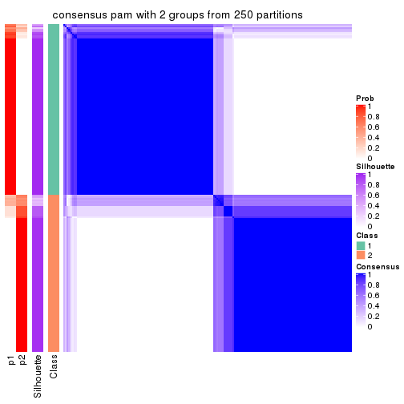</p>

</div>
<div id='tab-ATC-pam-consensus-heatmap-2'>
<pre><code class="r">consensus_heatmap(res, k = 3)
</code></pre>

<p>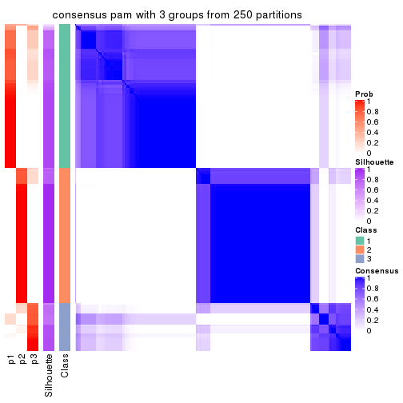</p>

</div>
<div id='tab-ATC-pam-consensus-heatmap-3'>
<pre><code class="r">consensus_heatmap(res, k = 4)
</code></pre>

<p>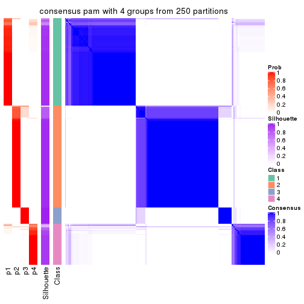</p>

</div>
<div id='tab-ATC-pam-consensus-heatmap-4'>
<pre><code class="r">consensus_heatmap(res, k = 5)
</code></pre>

<p>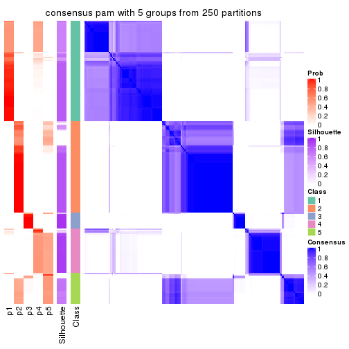</p>

</div>
<div id='tab-ATC-pam-consensus-heatmap-5'>
<pre><code class="r">consensus_heatmap(res, k = 6)
</code></pre>

<p>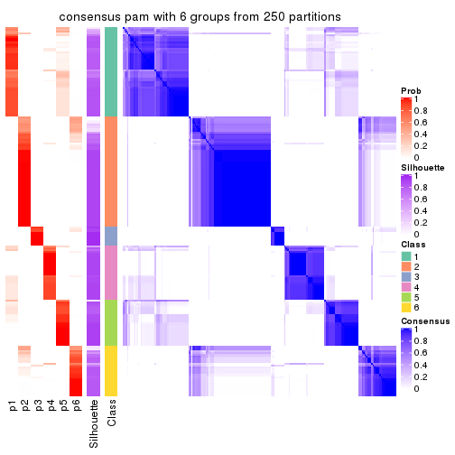</p>

</div>
</div>

Heatmaps for the membership of samples in all partitions to see how consistent they are:


<script>
$( function() {
	$( '#tabs-ATC-pam-membership-heatmap' ).tabs();
} );
</script>
<div id='tabs-ATC-pam-membership-heatmap'>
<ul>
<li><a href='#tab-ATC-pam-membership-heatmap-1'>k = 2</a></li>
<li><a href='#tab-ATC-pam-membership-heatmap-2'>k = 3</a></li>
<li><a href='#tab-ATC-pam-membership-heatmap-3'>k = 4</a></li>
<li><a href='#tab-ATC-pam-membership-heatmap-4'>k = 5</a></li>
<li><a href='#tab-ATC-pam-membership-heatmap-5'>k = 6</a></li>
</ul>
<div id='tab-ATC-pam-membership-heatmap-1'>
<pre><code class="r">membership_heatmap(res, k = 2)
</code></pre>

<p>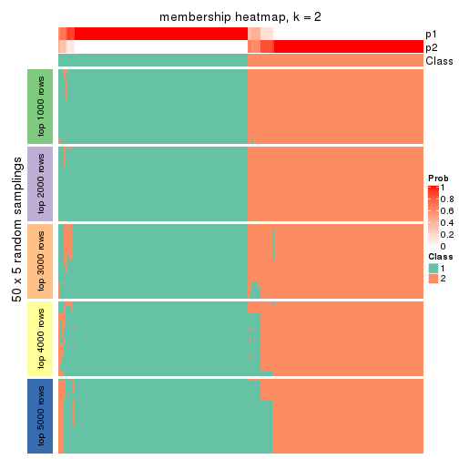</p>

</div>
<div id='tab-ATC-pam-membership-heatmap-2'>
<pre><code class="r">membership_heatmap(res, k = 3)
</code></pre>

<p>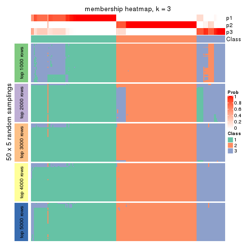</p>

</div>
<div id='tab-ATC-pam-membership-heatmap-3'>
<pre><code class="r">membership_heatmap(res, k = 4)
</code></pre>

<p>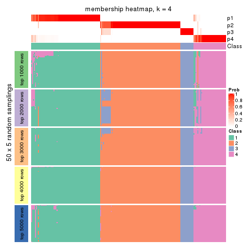</p>

</div>
<div id='tab-ATC-pam-membership-heatmap-4'>
<pre><code class="r">membership_heatmap(res, k = 5)
</code></pre>

<p>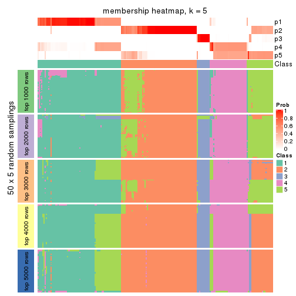</p>

</div>
<div id='tab-ATC-pam-membership-heatmap-5'>
<pre><code class="r">membership_heatmap(res, k = 6)
</code></pre>

<p>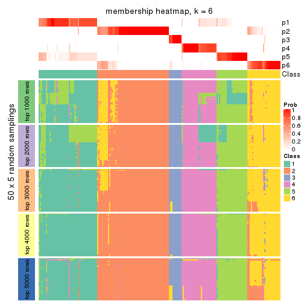</p>

</div>
</div>

As soon as we have had the classes for columns, we can look for signatures
which are significantly different between classes which can be candidate marks
for certain classes. Following are the heatmaps for signatures.


Signature heatmaps where rows are scaled:


<script>
$( function() {
	$( '#tabs-ATC-pam-get-signatures' ).tabs();
} );
</script>
<div id='tabs-ATC-pam-get-signatures'>
<ul>
<li><a href='#tab-ATC-pam-get-signatures-1'>k = 2</a></li>
<li><a href='#tab-ATC-pam-get-signatures-2'>k = 3</a></li>
<li><a href='#tab-ATC-pam-get-signatures-3'>k = 4</a></li>
<li><a href='#tab-ATC-pam-get-signatures-4'>k = 5</a></li>
<li><a href='#tab-ATC-pam-get-signatures-5'>k = 6</a></li>
</ul>
<div id='tab-ATC-pam-get-signatures-1'>
<pre><code class="r">get_signatures(res, k = 2)
</code></pre>

<p>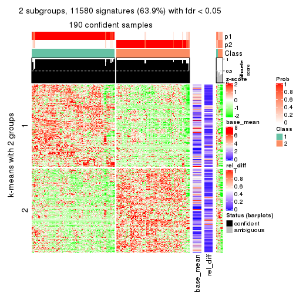</p>

</div>
<div id='tab-ATC-pam-get-signatures-2'>
<pre><code class="r">get_signatures(res, k = 3)
</code></pre>

<p>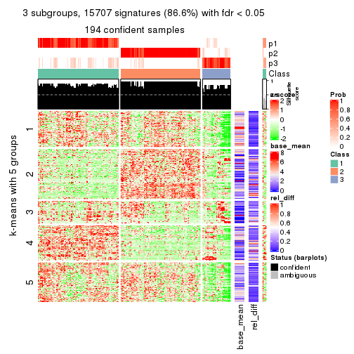</p>

</div>
<div id='tab-ATC-pam-get-signatures-3'>
<pre><code class="r">get_signatures(res, k = 4)
</code></pre>

<p>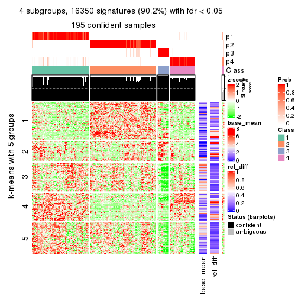</p>

</div>
<div id='tab-ATC-pam-get-signatures-4'>
<pre><code class="r">get_signatures(res, k = 5)
</code></pre>

<p>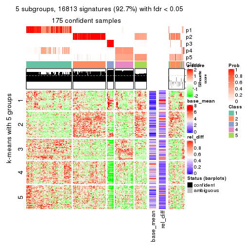</p>

</div>
<div id='tab-ATC-pam-get-signatures-5'>
<pre><code class="r">get_signatures(res, k = 6)
</code></pre>

<p>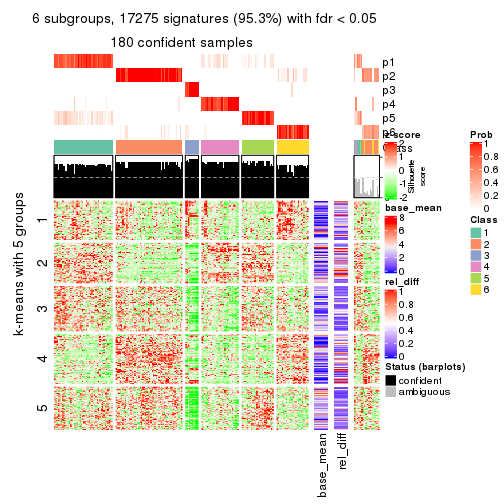</p>

</div>
</div>


Signature heatmaps where rows are not scaled:


<script>
$( function() {
	$( '#tabs-ATC-pam-get-signatures-no-scale' ).tabs();
} );
</script>
<div id='tabs-ATC-pam-get-signatures-no-scale'>
<ul>
<li><a href='#tab-ATC-pam-get-signatures-no-scale-1'>k = 2</a></li>
<li><a href='#tab-ATC-pam-get-signatures-no-scale-2'>k = 3</a></li>
<li><a href='#tab-ATC-pam-get-signatures-no-scale-3'>k = 4</a></li>
<li><a href='#tab-ATC-pam-get-signatures-no-scale-4'>k = 5</a></li>
<li><a href='#tab-ATC-pam-get-signatures-no-scale-5'>k = 6</a></li>
</ul>
<div id='tab-ATC-pam-get-signatures-no-scale-1'>
<pre><code class="r">get_signatures(res, k = 2, scale_rows = FALSE)
</code></pre>

<p>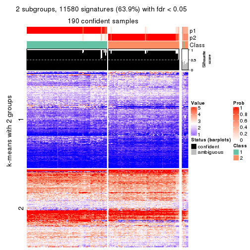</p>

</div>
<div id='tab-ATC-pam-get-signatures-no-scale-2'>
<pre><code class="r">get_signatures(res, k = 3, scale_rows = FALSE)
</code></pre>

<p>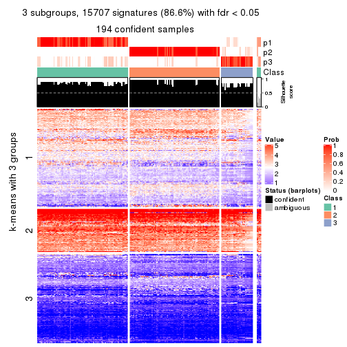</p>

</div>
<div id='tab-ATC-pam-get-signatures-no-scale-3'>
<pre><code class="r">get_signatures(res, k = 4, scale_rows = FALSE)
</code></pre>

<p>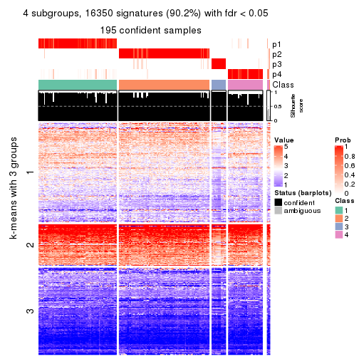</p>

</div>
<div id='tab-ATC-pam-get-signatures-no-scale-4'>
<pre><code class="r">get_signatures(res, k = 5, scale_rows = FALSE)
</code></pre>

<p>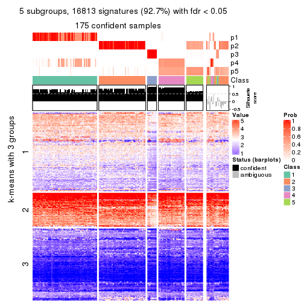</p>

</div>
<div id='tab-ATC-pam-get-signatures-no-scale-5'>
<pre><code class="r">get_signatures(res, k = 6, scale_rows = FALSE)
</code></pre>

<p>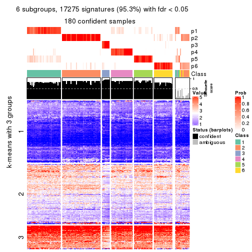</p>

</div>
</div>


Compare the overlap of signatures from different k:

```r
compare_signatures(res)
```

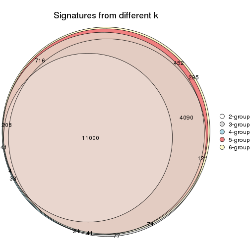

`get_signature()` returns a data frame invisibly. TO get the list of signatures, the function
call should be assigned to a variable explicitly. In following code, if `plot` argument is set
to `FALSE`, no heatmap is plotted while only the differential analysis is performed.

```r
# code only for demonstration
tb = get_signature(res, k = ..., plot = FALSE)
```

An example of the output of `tb` is:

```
#>   which_row         fdr    mean_1    mean_2 scaled_mean_1 scaled_mean_2 km
#> 1        38 0.042760348  8.373488  9.131774    -0.5533452     0.5164555  1
#> 2        40 0.018707592  7.106213  8.469186    -0.6173731     0.5762149  1
#> 3        55 0.019134737 10.221463 11.207825    -0.6159697     0.5749050  1
#> 4        59 0.006059896  5.921854  7.869574    -0.6899429     0.6439467  1
#> 5        60 0.018055526  8.928898 10.211722    -0.6204761     0.5791110  1
#> 6        98 0.009384629 15.714769 14.887706     0.6635654    -0.6193277  2
...
```

The columns in `tb` are:

1. `which_row`: row indices corresponding to the input matrix.
2. `fdr`: FDR for the differential test. 
3. `mean_x`: The mean value in group x.
4. `scaled_mean_x`: The mean value in group x after rows are scaled.
5. `km`: Row groups if k-means clustering is applied to rows.


UMAP plot which shows how samples are separated.


<script>
$( function() {
	$( '#tabs-ATC-pam-dimension-reduction' ).tabs();
} );
</script>
<div id='tabs-ATC-pam-dimension-reduction'>
<ul>
<li><a href='#tab-ATC-pam-dimension-reduction-1'>k = 2</a></li>
<li><a href='#tab-ATC-pam-dimension-reduction-2'>k = 3</a></li>
<li><a href='#tab-ATC-pam-dimension-reduction-3'>k = 4</a></li>
<li><a href='#tab-ATC-pam-dimension-reduction-4'>k = 5</a></li>
<li><a href='#tab-ATC-pam-dimension-reduction-5'>k = 6</a></li>
</ul>
<div id='tab-ATC-pam-dimension-reduction-1'>
<pre><code class="r">dimension_reduction(res, k = 2, method = &quot;UMAP&quot;)
</code></pre>

<p>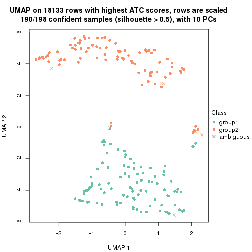</p>

</div>
<div id='tab-ATC-pam-dimension-reduction-2'>
<pre><code class="r">dimension_reduction(res, k = 3, method = &quot;UMAP&quot;)
</code></pre>

<p>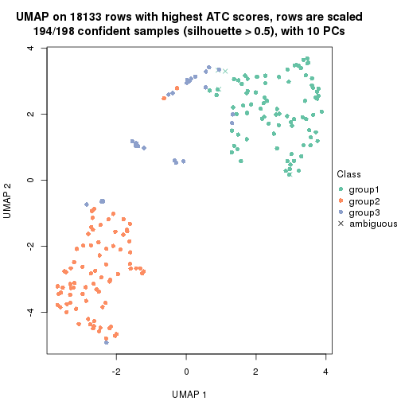</p>

</div>
<div id='tab-ATC-pam-dimension-reduction-3'>
<pre><code class="r">dimension_reduction(res, k = 4, method = &quot;UMAP&quot;)
</code></pre>

<p>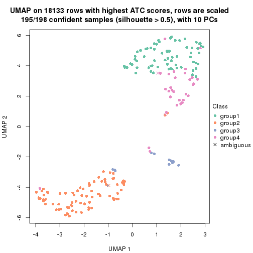</p>

</div>
<div id='tab-ATC-pam-dimension-reduction-4'>
<pre><code class="r">dimension_reduction(res, k = 5, method = &quot;UMAP&quot;)
</code></pre>

<p>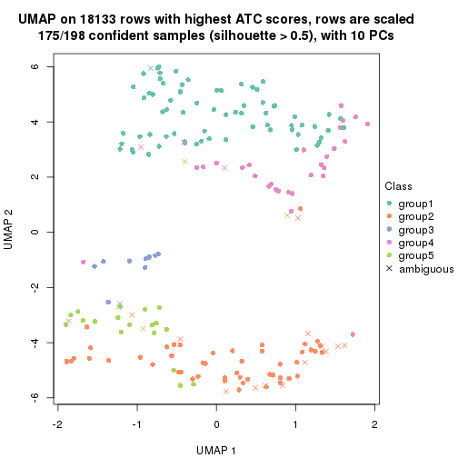</p>

</div>
<div id='tab-ATC-pam-dimension-reduction-5'>
<pre><code class="r">dimension_reduction(res, k = 6, method = &quot;UMAP&quot;)
</code></pre>

<p>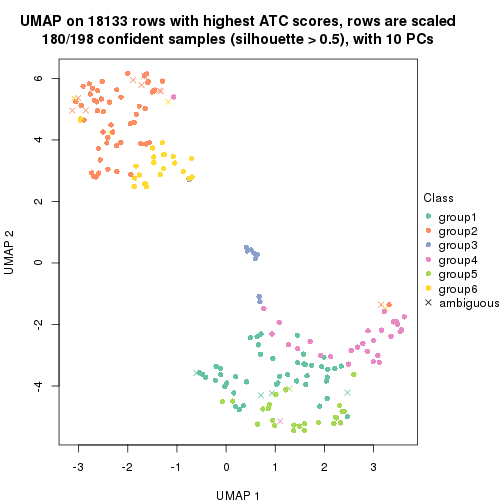</p>

</div>
</div>


Following heatmap shows how subgroups are split when increasing `k`:

```r
collect_classes(res)
```

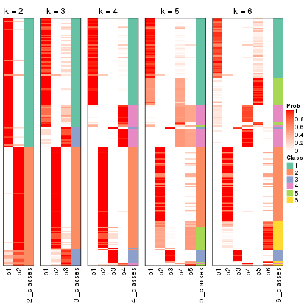


If matrix rows can be associated to genes, consider to use `functional_enrichment(res,
...)` to perform function enrichment for the signature genes. See [this vignette](http://bioconductor.org/packages/devel/bioc/vignettes/cola/inst/doc/functional_enrichment.html) for more detailed explanations.


 

---------------------------------------------------


### ATC:mclust**


The object with results only for a single top-value method and a single partition method 
can be extracted as:

```r
res = res_list["ATC", "mclust"]
# you can also extract it by
# res = res_list["ATC:mclust"]
```

A summary of `res` and all the functions that can be applied to it:

```r
res
```

```
#> A 'ConsensusPartition' object with k = 2, 3, 4, 5, 6.
#>   On a matrix with 18133 rows and 198 columns.
#>   Top rows (1000, 2000, 3000, 4000, 5000) are extracted by 'ATC' method.
#>   Subgroups are detected by 'mclust' method.
#>   Performed in total 1250 partitions by row resampling.
#>   Best k for subgroups seems to be 2.
#> 
#> Following methods can be applied to this 'ConsensusPartition' object:
#>  [1] "cola_report"             "collect_classes"         "collect_plots"          
#>  [4] "collect_stats"           "colnames"                "compare_signatures"     
#>  [7] "consensus_heatmap"       "dimension_reduction"     "functional_enrichment"  
#> [10] "get_anno_col"            "get_anno"                "get_classes"            
#> [13] "get_consensus"           "get_matrix"              "get_membership"         
#> [16] "get_param"               "get_signatures"          "get_stats"              
#> [19] "is_best_k"               "is_stable_k"             "membership_heatmap"     
#> [22] "ncol"                    "nrow"                    "plot_ecdf"              
#> [25] "rownames"                "select_partition_number" "show"                   
#> [28] "suggest_best_k"          "test_to_known_factors"
```

`collect_plots()` function collects all the plots made from `res` for all `k` (number of partitions)
into one single page to provide an easy and fast comparison between different `k`.

```r
collect_plots(res)
```

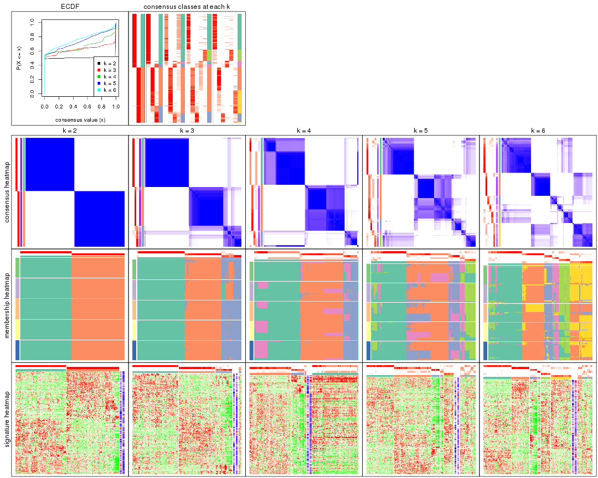

The plots are:

- The first row: a plot of the ECDF (empirical cumulative distribution
  function) curves of the consensus matrix for each `k` and the heatmap of
  predicted classes for each `k`.
- The second row: heatmaps of the consensus matrix for each `k`.
- The third row: heatmaps of the membership matrix for each `k`.
- The fouth row: heatmaps of the signatures for each `k`.

All the plots in panels can be made by individual functions and they are
plotted later in this section.

`select_partition_number()` produces several plots showing different
statistics for choosing "optimized" `k`. There are following statistics:

- ECDF curves of the consensus matrix for each `k`;
- 1-PAC. [The PAC
  score](https://en.wikipedia.org/wiki/Consensus_clustering#Over-interpretation_potential_of_consensus_clustering)
  measures the proportion of the ambiguous subgrouping.
- Mean silhouette score.
- Concordance. The mean probability of fiting the consensus class ids in all
  partitions.
- Area increased. Denote $A_k$ as the area under the ECDF curve for current
  `k`, the area increased is defined as $A_k - A_{k-1}$.
- Rand index. The percent of pairs of samples that are both in a same cluster
  or both are not in a same cluster in the partition of k and k-1.
- Jaccard index. The ratio of pairs of samples are both in a same cluster in
  the partition of k and k-1 and the pairs of samples are both in a same
  cluster in the partition k or k-1.

The detailed explanations of these statistics can be found in [the _cola_
vignette](http://bioconductor.org/packages/devel/bioc/vignettes/cola/inst/doc/cola.html#toc_13).

Generally speaking, lower PAC score, higher mean silhouette score or higher
concordance corresponds to better partition. Rand index and Jaccard index
measure how similar the current partition is compared to partition with `k-1`.
If they are too similar, we won't accept `k` is better than `k-1`.

```r
select_partition_number(res)
```

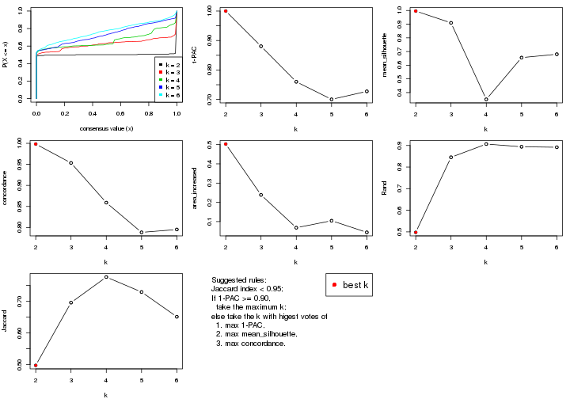

The numeric values for all these statistics can be obtained by `get_stats()`.

```r
get_stats(res)
```

```
#>   k 1-PAC mean_silhouette concordance area_increased  Rand Jaccard
#> 2 2 1.000           0.996       0.998         0.5029 0.498   0.498
#> 3 3 0.881           0.910       0.953         0.2386 0.845   0.696
#> 4 4 0.760           0.350       0.859         0.0682 0.907   0.777
#> 5 5 0.700           0.655       0.788         0.1044 0.894   0.729
#> 6 6 0.728           0.680       0.795         0.0439 0.892   0.651
```

`suggest_best_k()` suggests the best $k$ based on these statistics. The rules are as follows:

- All $k$ with Jaccard index larger than 0.95 are removed because increasing
  $k$ does not provide enough extra information. If all $k$ are removed, it is
  marked as no subgroup is detected.
- For all $k$ with 1-PAC score larger than 0.9, the maximal $k$ is taken as
  the best $k$, and other $k$ are marked as optional $k$.
- If it does not fit the second rule. The $k$ with the maximal vote of the
  highest 1-PAC score, highest mean silhouette, and highest concordance is
  taken as the best $k$.

```r
suggest_best_k(res)
```

```
#> [1] 2
```


Following shows the table of the partitions (You need to click the **show/hide
code output** link to see it). The membership matrix (columns with name `p*`)
is inferred by
[`clue::cl_consensus()`](https://www.rdocumentation.org/link/cl_consensus?package=clue)
function with the `SE` method. Basically the value in the membership matrix
represents the probability to belong to a certain group. The finall class
label for an item is determined with the group with highest probability it
belongs to.

In `get_classes()` function, the entropy is calculated from the membership
matrix and the silhouette score is calculated from the consensus matrix.


<script>
$( function() {
	$( '#tabs-ATC-mclust-get-classes' ).tabs();
} );
</script>
<div id='tabs-ATC-mclust-get-classes'>
<ul>
<li><a href='#tab-ATC-mclust-get-classes-1'>k = 2</a></li>
<li><a href='#tab-ATC-mclust-get-classes-2'>k = 3</a></li>
<li><a href='#tab-ATC-mclust-get-classes-3'>k = 4</a></li>
<li><a href='#tab-ATC-mclust-get-classes-4'>k = 5</a></li>
<li><a href='#tab-ATC-mclust-get-classes-5'>k = 6</a></li>
</ul>

<div id='tab-ATC-mclust-get-classes-1'>
<p><a id='tab-ATC-mclust-get-classes-1-a' style='color:#0366d6' href='#'>show/hide code output</a></p>
<pre><code class="r">cbind(get_classes(res, k = 2), get_membership(res, k = 2))
</code></pre>

<pre><code>#&gt;                                      class entropy silhouette    p1    p2
#&gt; 0C0AA0B2-5191-4EDF-8937-ED7434F30283     2   0.000      0.997 0.000 1.000
#&gt; 18B45F1F-234F-45CC-A234-145307606C5C     1   0.000      0.999 1.000 0.000
#&gt; E18B70C0-BDCA-46D3-99BB-C6C8ABC68DA5     2   0.000      0.997 0.000 1.000
#&gt; 0F6DDBA7-6F74-45E8-95C8-F28263D55978     1   0.000      0.999 1.000 0.000
#&gt; 7EAE1A5A-129A-46DE-977E-A2C753F10904     2   0.000      0.997 0.000 1.000
#&gt; 7EAE0048-16B5-4979-9410-16CDEB9B1A48     1   0.000      0.999 1.000 0.000
#&gt; 2EBFC828-2B27-4753-A052-80DDA226DAB4     2   0.000      0.997 0.000 1.000
#&gt; 24E1768D-2232-41DA-9383-BC55D6EB3812     2   0.000      0.997 0.000 1.000
#&gt; 6E3CD60A-1889-4CA3-B305-2E78152057B5     2   0.000      0.997 0.000 1.000
#&gt; 33CC70DD-82B3-413C-B3B1-BE06634D95D0     1   0.000      0.999 1.000 0.000
#&gt; F1CB57A3-55DD-4487-9307-1B4F652E729A     1   0.000      0.999 1.000 0.000
#&gt; 755A5806-B054-449A-93DB-79909E6C93A1     1   0.000      0.999 1.000 0.000
#&gt; 58D364E7-3D2F-468F-A264-D6461E2428D4     2   0.000      0.997 0.000 1.000
#&gt; 68BB9CB6-7AA2-4981-B9D9-07363EC96599     2   0.000      0.997 0.000 1.000
#&gt; 3C4E8DFA-8EA0-4F1F-89CB-CB8805395872     2   0.000      0.997 0.000 1.000
#&gt; 4219651D-5583-4498-BF08-1B7D04B4C7B2     1   0.000      0.999 1.000 0.000
#&gt; B5EE2768-0D67-4584-ADBC-EC745FEC52EA     2   0.000      0.997 0.000 1.000
#&gt; 825E6C11-F460-451A-8045-846DD7D0E945     1   0.000      0.999 1.000 0.000
#&gt; 491F62AF-5E68-43C3-982A-F867A75BBA9A     2   0.000      0.997 0.000 1.000
#&gt; 9D7F058C-F95A-44AD-AC9E-450F7FBDC960     2   0.000      0.997 0.000 1.000
#&gt; 6D42DD0C-2081-4742-BA27-9F5F16FAC3C6     1   0.000      0.999 1.000 0.000
#&gt; EDD7E63D-492A-473B-A552-0764337B10EF     2   0.000      0.997 0.000 1.000
#&gt; 97073DEA-73AD-4DFD-BD1A-9035DC03445B     1   0.000      0.999 1.000 0.000
#&gt; FA891AB9-CE38-4F7E-A015-1DDCE12890A0     1   0.000      0.999 1.000 0.000
#&gt; D9514D49-A0AE-45AB-8C9F-68E726215253     1   0.000      0.999 1.000 0.000
#&gt; 3B9229AD-12E5-451E-9D2F-378AAC82C04A     2   0.000      0.997 0.000 1.000
#&gt; 5EA36B71-4917-4EF3-9060-065EFE6ACC5B     1   0.000      0.999 1.000 0.000
#&gt; A20E4ECB-4895-4CC7-BE5E-4721B20D933B     1   0.000      0.999 1.000 0.000
#&gt; 1BE8D828-29DB-4368-AA4A-FB23588F7AE8     1   0.000      0.999 1.000 0.000
#&gt; 66EFEFCF-3D14-4DBF-AA13-530F40ED0245     1   0.000      0.999 1.000 0.000
#&gt; 55DFFE53-BCE7-4EC1-9863-6C0311B06BA2     2   0.000      0.997 0.000 1.000
#&gt; 4CC3FB5A-611D-4C64-AE9D-544FA45CF4DC     1   0.000      0.999 1.000 0.000
#&gt; C11D33F2-DFE9-4FA8-9024-F3E7F1DADC5F     2   0.000      0.997 0.000 1.000
#&gt; FA5932B8-8AA3-4C38-9FAB-C35D8772974D     1   0.000      0.999 1.000 0.000
#&gt; 8216EC35-1F41-4A15-B503-BDA4971E27C9     1   0.000      0.999 1.000 0.000
#&gt; 69635D23-90A7-4BAD-97C7-B79536837F57     1   0.000      0.999 1.000 0.000
#&gt; 12B404E2-C463-4409-8392-E4649B2AFFD1     2   0.000      0.997 0.000 1.000
#&gt; 246927E3-ACCF-41B2-AA8E-43855FD6B146     2   0.000      0.997 0.000 1.000
#&gt; E0CC13E7-9607-49E0-B4AA-395544E3C3BF     1   0.000      0.999 1.000 0.000
#&gt; F7BBC0C1-6124-4A83-8A70-EA89B62F1CBD     1   0.000      0.999 1.000 0.000
#&gt; B1D4FF24-8E6F-4A04-B716-2032D850EB57     1   0.000      0.999 1.000 0.000
#&gt; 253601DB-B78A-4566-9947-8C0270C0B163     2   0.000      0.997 0.000 1.000
#&gt; AB83DBFF-5737-4FB8-A5AC-1D3CD6072BDF     2   0.000      0.997 0.000 1.000
#&gt; 9D67D953-EC98-4B72-89C8-5732BC9D4BC9     2   0.000      0.997 0.000 1.000
#&gt; 51061018-95AB-4278-886F-F69E4EBC47C0     2   0.000      0.997 0.000 1.000
#&gt; ABD0F7F3-105B-4DEE-9889-5028772C519A     1   0.000      0.999 1.000 0.000
#&gt; 562B95CF-B27E-4A72-B7C6-CDF86A51A39B     1   0.000      0.999 1.000 0.000
#&gt; ABF046A4-D7A1-49FF-B6B1-4E07A791DEDB     2   0.000      0.997 0.000 1.000
#&gt; 3FF4101E-9703-460E-A30E-76CC7689F36D     2   0.000      0.997 0.000 1.000
#&gt; 39C4F7AA-7ADF-4F1D-BDA3-BEC605AC5023     2   0.000      0.997 0.000 1.000
#&gt; CB821FD2-AF5C-4743-A70F-21C12C6ED153     1   0.000      0.999 1.000 0.000
#&gt; 92EA1846-62FF-41D5-A441-5E52E6B9E7F9     1   0.000      0.999 1.000 0.000
#&gt; 7D25F3EE-5A20-4763-8026-16A03D05F459     1   0.000      0.999 1.000 0.000
#&gt; 8ECE5276-CD06-496B-A5A9-1713B1F7D089     1   0.000      0.999 1.000 0.000
#&gt; C775B68F-9507-47E3-B507-B433AED79002     1   0.000      0.999 1.000 0.000
#&gt; E19D5463-FDD0-41C1-A170-323736A88D07     2   0.000      0.997 0.000 1.000
#&gt; CE4B6285-4961-4767-91F0-5C7A8162E185     1   0.000      0.999 1.000 0.000
#&gt; 9637BD72-1FEF-42AD-8886-2C39BE876531     1   0.000      0.999 1.000 0.000
#&gt; 81B5A88E-45A0-4B44-B689-B9071B8548EE     2   0.000      0.997 0.000 1.000
#&gt; 0B01B4C9-9BED-4F5B-A3E2-8868C7CCC3FC     2   0.000      0.997 0.000 1.000
#&gt; 54501315-7132-44B2-A179-10FBF1421105     1   0.000      0.999 1.000 0.000
#&gt; E207CBE9-4C3A-4FDD-9251-CFE1FE106475     2   0.000      0.997 0.000 1.000
#&gt; 3BEA0B92-3F90-4DBF-9679-AADEAD7D47C8     2   0.000      0.997 0.000 1.000
#&gt; 35B32250-D854-4215-AA5B-2C11B2FBEECA     1   0.000      0.999 1.000 0.000
#&gt; ACE6566B-AEB9-426C-924A-B382D14A1024     2   0.000      0.997 0.000 1.000
#&gt; 737E69AC-0930-45B9-B6BA-7CE5E300290B     1   0.000      0.999 1.000 0.000
#&gt; B4410AB8-D015-41CA-86E6-12EB4E4103E3     1   0.000      0.999 1.000 0.000
#&gt; 6D3ECA65-C50F-43B0-B75A-1D290FA4A8FD     2   0.000      0.997 0.000 1.000
#&gt; C86F40D3-9A96-4395-A8C3-510DE12F9A2B     2   0.000      0.997 0.000 1.000
#&gt; 6238087F-24DD-4BF1-903F-3BD4E446C1AE     2   0.000      0.997 0.000 1.000
#&gt; E4FF840B-EEAB-4CB0-A690-7D4C4AA7EEC3     2   0.000      0.997 0.000 1.000
#&gt; 72D3C323-C67F-4C0E-9BFC-BF245FF9730A     1   0.000      0.999 1.000 0.000
#&gt; 82D56E4E-4DF6-4F3E-8959-B995C92AAA70     1   0.000      0.999 1.000 0.000
#&gt; E31CA441-EB19-443B-ACBD-37B5CCBCF0E5     2   0.000      0.997 0.000 1.000
#&gt; 87CA8939-D054-4B8A-B32D-085FD2E8F202     1   0.000      0.999 1.000 0.000
#&gt; 2A508D90-FEDC-46A3-9A02-E51E5467CDCB     1   0.000      0.999 1.000 0.000
#&gt; C4E8B4E2-388B-411F-BF0A-9B6F34E8EDB5     2   0.000      0.997 0.000 1.000
#&gt; AF6AF803-BD93-44A7-AA80-B9BC92C1273B     2   0.000      0.997 0.000 1.000
#&gt; 0B1CA5CF-EB96-41D4-BFC5-6957FEB39828     1   0.000      0.999 1.000 0.000
#&gt; 6FB96FB0-6661-48AD-A4A0-69F8AFDBE591     2   0.000      0.997 0.000 1.000
#&gt; 8C19F7FD-368A-462B-B28F-88D6630038A1     1   0.000      0.999 1.000 0.000
#&gt; 96EABE78-C2F4-4A33-ACD8-C922A4B2519B     2   0.000      0.997 0.000 1.000
#&gt; 68B36D7B-546A-4689-949F-B207C4A4AB27     2   0.000      0.997 0.000 1.000
#&gt; CE9F3335-778F-4F52-BC55-4B7C99B211DD     2   0.000      0.997 0.000 1.000
#&gt; CB359DED-2A2D-4646-A0BD-6F10ADCC532B     1   0.000      0.999 1.000 0.000
#&gt; 198324A5-8C52-46F6-9734-EFAF1CCA6D9B     1   0.000      0.999 1.000 0.000
#&gt; 83B88608-0506-428C-B9E8-621F38477B42     1   0.000      0.999 1.000 0.000
#&gt; 1993630A-0F3D-4F5C-86A3-D443BAAF57F0     2   0.118      0.981 0.016 0.984
#&gt; DE73DA9B-529E-4F4F-A65C-DA7AB84B1096     1   0.000      0.999 1.000 0.000
#&gt; 2347F3B7-DDA3-40C0-B6D4-8819ECA69146     1   0.000      0.999 1.000 0.000
#&gt; AB93B5D5-095F-4330-9D40-6A3D934AB50C     1   0.000      0.999 1.000 0.000
#&gt; 5EBBE4AD-FF0C-41CF-9EA3-B6FE7EA1F9C0     2   0.000      0.997 0.000 1.000
#&gt; 6D960AE7-3769-4144-A061-E8588E5063FF     1   0.000      0.999 1.000 0.000
#&gt; 0C2DD8C0-D1A5-4192-A49C-7A40FED628B2     2   0.000      0.997 0.000 1.000
#&gt; 18C9372F-C55B-4F86-A9D2-E8D85EFC8566     2   0.000      0.997 0.000 1.000
#&gt; 9AF637B0-4C32-4DD1-93AF-7655B4A845D3     2   0.000      0.997 0.000 1.000
#&gt; 785B5B06-4115-46FD-9BEB-F888AFDC855D     2   0.000      0.997 0.000 1.000
#&gt; ECA3050E-4BE2-4117-B9CF-A52BB85AF8C2     2   0.000      0.997 0.000 1.000
#&gt; 099DC396-16A5-458F-9ED9-F2A790CB0C34     1   0.000      0.999 1.000 0.000
#&gt; 7A5A12EE-C5B0-4C51-8C99-0F3FA88D633E     1   0.000      0.999 1.000 0.000
#&gt; E832B508-A66D-4817-B44A-FE9FAAE64B4A     1   0.000      0.999 1.000 0.000
#&gt; F9DD688C-7B35-49E7-9651-2E098EE78856     1   0.000      0.999 1.000 0.000
#&gt; F1265DD8-5ED3-4635-A277-57BBFDEC7729     1   0.000      0.999 1.000 0.000
#&gt; F624E8D9-DB07-4C9E-910D-5E8EBA3A6167     2   0.000      0.997 0.000 1.000
#&gt; 3516FBDF-66E1-43F4-9D7B-16748F6439A7     2   0.000      0.997 0.000 1.000
#&gt; 04B12992-B2EA-4BA2-8E2C-11E34E230E6F     2   0.000      0.997 0.000 1.000
#&gt; CC02897D-9123-495E-9242-5C9CF4EC269B     2   0.000      0.997 0.000 1.000
#&gt; 3117ED46-2BF2-4311-BC00-4E98243E16B3     1   0.000      0.999 1.000 0.000
#&gt; E0B66D53-23DB-4E26-BB6E-F692FA8C000E     1   0.000      0.999 1.000 0.000
#&gt; DAA93CE5-A013-477A-9A50-EA09CC3A8162     2   0.000      0.997 0.000 1.000
#&gt; 0099098D-354A-4276-92F8-B932C74B4608     1   0.000      0.999 1.000 0.000
#&gt; DD483639-B2E7-4745-BCFB-55ED1D82BFBF     2   0.000      0.997 0.000 1.000
#&gt; 2C1F9079-602E-4252-82C7-9D8799E04246     2   0.000      0.997 0.000 1.000
#&gt; 9473A8E4-3A1B-4184-9EA6-517AFD60B635     2   0.000      0.997 0.000 1.000
#&gt; 75CFBAF6-7BA0-40AF-92D7-D218E885BD1B     2   0.000      0.997 0.000 1.000
#&gt; B588950F-14D6-41C8-845B-EFD2096013C6     2   0.000      0.997 0.000 1.000
#&gt; 0DF3EDA8-DAEA-4721-92AB-B97181249498     2   0.000      0.997 0.000 1.000
#&gt; 8EA83042-D598-401D-AD78-936EEB136C59     1   0.000      0.999 1.000 0.000
#&gt; 729AC418-3BE9-445A-95D4-AC11A7D43BE0     1   0.000      0.999 1.000 0.000
#&gt; 7D8B1B11-F576-4AA8-BFA7-0022A2CD829A     2   0.000      0.997 0.000 1.000
#&gt; 304A0E46-3449-4B44-9C30-BDDF6459391D     1   0.000      0.999 1.000 0.000
#&gt; 3C83358F-DF20-47F7-AF9F-AB7CC92F5ABA     1   0.327      0.936 0.940 0.060
#&gt; EAFEED6C-35C3-451F-AE4A-EB56992E1F29     1   0.000      0.999 1.000 0.000
#&gt; 8A237A65-28EC-434D-A78A-A8B7308B5204     1   0.000      0.999 1.000 0.000
#&gt; D005833F-E991-4E9E-9667-55F137288004     1   0.000      0.999 1.000 0.000
#&gt; 37D966E3-253E-4397-A9AE-0903A8D31FE6     1   0.000      0.999 1.000 0.000
#&gt; D2482B81-CB5B-4178-BA8D-1CF4026181B5     1   0.000      0.999 1.000 0.000
#&gt; 18019E95-C2A8-4EE7-B585-F6886DC4D953     2   0.000      0.997 0.000 1.000
#&gt; 0B126D1A-14A8-4345-8F78-FF92222ADF4C     2   0.000      0.997 0.000 1.000
#&gt; CE88B625-47D8-4D58-9FB4-23464DB7DDAD     2   0.000      0.997 0.000 1.000
#&gt; 9A88299D-5C74-47FA-B42C-1A1D6D935AAB     1   0.000      0.999 1.000 0.000
#&gt; 3E71159C-FD6C-41DA-B18B-0730C8AC7E41     1   0.000      0.999 1.000 0.000
#&gt; 6F245AA4-79D9-47E1-BCC9-1AAF65AEA813     1   0.000      0.999 1.000 0.000
#&gt; 4CF2C888-2100-483A-B4DB-ECBB69243A4D     2   0.000      0.997 0.000 1.000
#&gt; A3853813-B9D5-4E8C-B075-19FCC35F8686     2   0.000      0.997 0.000 1.000
#&gt; 83A16DEE-CE9F-4D8B-9225-0A2A8B9D055D     1   0.000      0.999 1.000 0.000
#&gt; 0F057CAF-4F9A-4DE9-8601-730E96873733     2   0.000      0.997 0.000 1.000
#&gt; 32D5801D-DBA4-422E-87CB-A2DDE921BA41     1   0.000      0.999 1.000 0.000
#&gt; 22EE8076-F07C-499A-9AF8-D800A77EF154     2   0.000      0.997 0.000 1.000
#&gt; DD4BD74D-D48C-4090-9F57-5334E784581C     1   0.000      0.999 1.000 0.000
#&gt; 41183565-434D-474C-B1BD-CA6E94910658     2   0.000      0.997 0.000 1.000
#&gt; 75A2CE41-2B2A-4346-927E-ACF8A72738E4     1   0.000      0.999 1.000 0.000
#&gt; 7AA24995-3DD2-4682-B36A-4EBFEEACF625     1   0.000      0.999 1.000 0.000
#&gt; 8BAFDFEC-9F26-4ADB-95CE-004143960EEB     1   0.000      0.999 1.000 0.000
#&gt; A330E011-CE08-4A85-8F4B-370592293DBB     1   0.000      0.999 1.000 0.000
#&gt; 1D5A5B17-2E70-4BB0-94A1-EC17E6EA49DB     1   0.000      0.999 1.000 0.000
#&gt; BD9143B8-9D97-4A05-872C-3FB82B4CF7BE     2   0.000      0.997 0.000 1.000
#&gt; 64552DC0-181E-4607-898C-787AA7F26435     2   0.000      0.997 0.000 1.000
#&gt; 1B4C4D41-34C7-43A3-858B-C9552EB53894     1   0.000      0.999 1.000 0.000
#&gt; 463A3BAA-02DC-4EA4-A644-B924163E425D     2   0.000      0.997 0.000 1.000
#&gt; CD0FEA89-6F60-4A20-8FCA-D397B4E95A98     1   0.000      0.999 1.000 0.000
#&gt; 5D06CF6D-F4B9-4B32-B055-8AB287E53340     2   0.000      0.997 0.000 1.000
#&gt; ADA7835F-DB67-4F4F-9446-8BCE3C5FE936     2   0.000      0.997 0.000 1.000
#&gt; 4109BE2D-B5DF-4BD7-860E-60D87F647152     2   0.000      0.997 0.000 1.000
#&gt; 88526A0E-6DFE-46CB-BFAD-B4826F482C67     1   0.000      0.999 1.000 0.000
#&gt; F39F9A4C-18F7-4017-AB31-85D52FF44587     2   0.000      0.997 0.000 1.000
#&gt; D4290A5E-1B24-4C55-B470-0FA7A0A09DD0     2   0.000      0.997 0.000 1.000
#&gt; DC5A2C9E-978F-4661-B729-1F9662976E27     1   0.000      0.999 1.000 0.000
#&gt; 26A1F392-CED2-43E3-8096-74E6F2BFC8C0     2   0.000      0.997 0.000 1.000
#&gt; 87D81FB2-306A-4E75-9D58-D5F48E46E7F6     2   0.000      0.997 0.000 1.000
#&gt; E3D9D81A-C20C-4B3B-B940-A5D2C5F65B22     2   0.000      0.997 0.000 1.000
#&gt; 4464650B-453F-476C-989C-B7B159BF2CF0     2   0.000      0.997 0.000 1.000
#&gt; 577D2867-B738-487A-9B06-07958D647F02     1   0.000      0.999 1.000 0.000
#&gt; E52A22CC-3C03-41A9-9541-220DD871E162     2   0.000      0.997 0.000 1.000
#&gt; 642703B1-AF99-4746-A915-0792F4B9590B     2   0.000      0.997 0.000 1.000
#&gt; 8F0D1792-1284-45E6-8EC4-392596057677     2   0.000      0.997 0.000 1.000
#&gt; 765AFFC1-D528-4494-8BA1-0706451E4205     2   0.000      0.997 0.000 1.000
#&gt; A716BC29-161F-4CA0-B240-00B330137F2C     1   0.000      0.999 1.000 0.000
#&gt; 32CBFBAF-7064-4595-8D54-2C5E7DE0FD9B     1   0.000      0.999 1.000 0.000
#&gt; 4D6ED28C-3F20-41B0-BA41-1BF0E5199A40     2   0.000      0.997 0.000 1.000
#&gt; 86A38456-2900-48FB-B10F-79222B3CA9BF     2   0.000      0.997 0.000 1.000
#&gt; E870807D-3223-4A6A-9E3D-F4461B048AA2     2   0.000      0.997 0.000 1.000
#&gt; 3A78D19F-A833-4D2C-8387-FB4FD4A8313C     1   0.000      0.999 1.000 0.000
#&gt; DFA162CA-C708-4121-8E74-F9C4DEE0CDAE     1   0.000      0.999 1.000 0.000
#&gt; C00A300A-CD10-4C9D-8C94-3901AFE8406C     2   0.000      0.997 0.000 1.000
#&gt; 13E11D15-A90F-48C4-980A-DD032C00A2C1     1   0.000      0.999 1.000 0.000
#&gt; 31BF80AB-FEDB-4C73-89C3-70BE9F9ACBEE     2   0.000      0.997 0.000 1.000
#&gt; FA34308A-349D-4AAD-94CF-3F3B7F9AD629     2   0.000      0.997 0.000 1.000
#&gt; 7C48D467-B663-49DD-BC84-A36BC32ACB3D     1   0.000      0.999 1.000 0.000
#&gt; BB068534-04F6-4FC9-9087-CDA65920BCE2     1   0.000      0.999 1.000 0.000
#&gt; EA4EC272-A9B3-4B2E-955F-19F7676A944C     2   0.000      0.997 0.000 1.000
#&gt; C71FF69B-A460-43CA-8769-9667F22D938B     1   0.000      0.999 1.000 0.000
#&gt; 5243D1B8-8168-4FF1-A8C6-505F080EF0D3     2   0.000      0.997 0.000 1.000
#&gt; BCC474D8-08FE-4E99-B8E8-B29E65F84D2E     1   0.000      0.999 1.000 0.000
#&gt; 04FDBFE3-4CF6-4E53-A2AA-89D5C9316377     2   0.000      0.997 0.000 1.000
#&gt; 83A9915C-8D60-4CAE-A868-B61E3C90C7B0     2   0.000      0.997 0.000 1.000
#&gt; 989A6472-E3E3-457A-97BE-CCE95F42D5C2     2   0.000      0.997 0.000 1.000
#&gt; A0AB2D28-6751-49C9-8DF4-66FDBF95C360     1   0.000      0.999 1.000 0.000
#&gt; A12B2683-18D4-41C9-8AE5-C143E2180052     1   0.000      0.999 1.000 0.000
#&gt; 8DE1E245-CAD2-4F11-BFA2-9792C433A00B     2   0.850      0.618 0.276 0.724
#&gt; FDA68036-6C4C-4256-9AA0-C01FE92AA098     2   0.000      0.997 0.000 1.000
#&gt; 26311920-1414-4EC1-870B-784961EBCC2D     1   0.000      0.999 1.000 0.000
#&gt; C29A10D6-D598-4286-B5E0-F1776E19E988     1   0.000      0.999 1.000 0.000
#&gt; FACCC1FB-4937-4CC0-90EA-7F91D3D939CF     2   0.000      0.997 0.000 1.000
#&gt; 90B9D84B-78E5-4C7E-8414-EC889C2DE8DB     2   0.000      0.997 0.000 1.000
#&gt; B74E6122-76E1-4E4D-A867-BCAFD7277393     1   0.000      0.999 1.000 0.000
#&gt; 98494DC0-CF6E-485F-8A0D-D80E4437EF5C     2   0.000      0.997 0.000 1.000
#&gt; DA114DAC-DE7B-4E43-8D7C-82C5D7B66411     1   0.000      0.999 1.000 0.000
</code></pre>

<script>
$('#tab-ATC-mclust-get-classes-1-a').parent().next().next().hide();
$('#tab-ATC-mclust-get-classes-1-a').click(function(){
  $('#tab-ATC-mclust-get-classes-1-a').parent().next().next().toggle();
  return(false);
});
</script>
</div>

<div id='tab-ATC-mclust-get-classes-2'>
<p><a id='tab-ATC-mclust-get-classes-2-a' style='color:#0366d6' href='#'>show/hide code output</a></p>
<pre><code class="r">cbind(get_classes(res, k = 3), get_membership(res, k = 3))
</code></pre>

<pre><code>#&gt;                                      class entropy silhouette    p1    p2    p3
#&gt; 0C0AA0B2-5191-4EDF-8937-ED7434F30283     2  0.0000     0.9709 0.000 1.000 0.000
#&gt; 18B45F1F-234F-45CC-A234-145307606C5C     1  0.0000     0.9908 1.000 0.000 0.000
#&gt; E18B70C0-BDCA-46D3-99BB-C6C8ABC68DA5     2  0.0000     0.9709 0.000 1.000 0.000
#&gt; 0F6DDBA7-6F74-45E8-95C8-F28263D55978     1  0.0000     0.9908 1.000 0.000 0.000
#&gt; 7EAE1A5A-129A-46DE-977E-A2C753F10904     2  0.0000     0.9709 0.000 1.000 0.000
#&gt; 7EAE0048-16B5-4979-9410-16CDEB9B1A48     1  0.0000     0.9908 1.000 0.000 0.000
#&gt; 2EBFC828-2B27-4753-A052-80DDA226DAB4     2  0.0000     0.9709 0.000 1.000 0.000
#&gt; 24E1768D-2232-41DA-9383-BC55D6EB3812     3  0.0000     0.8050 0.000 0.000 1.000
#&gt; 6E3CD60A-1889-4CA3-B305-2E78152057B5     2  0.4291     0.7526 0.000 0.820 0.180
#&gt; 33CC70DD-82B3-413C-B3B1-BE06634D95D0     1  0.0000     0.9908 1.000 0.000 0.000
#&gt; F1CB57A3-55DD-4487-9307-1B4F652E729A     1  0.0000     0.9908 1.000 0.000 0.000
#&gt; 755A5806-B054-449A-93DB-79909E6C93A1     1  0.0000     0.9908 1.000 0.000 0.000
#&gt; 58D364E7-3D2F-468F-A264-D6461E2428D4     2  0.0000     0.9709 0.000 1.000 0.000
#&gt; 68BB9CB6-7AA2-4981-B9D9-07363EC96599     3  0.0000     0.8050 0.000 0.000 1.000
#&gt; 3C4E8DFA-8EA0-4F1F-89CB-CB8805395872     3  0.0000     0.8050 0.000 0.000 1.000
#&gt; 4219651D-5583-4498-BF08-1B7D04B4C7B2     1  0.0000     0.9908 1.000 0.000 0.000
#&gt; B5EE2768-0D67-4584-ADBC-EC745FEC52EA     2  0.0000     0.9709 0.000 1.000 0.000
#&gt; 825E6C11-F460-451A-8045-846DD7D0E945     1  0.0000     0.9908 1.000 0.000 0.000
#&gt; 491F62AF-5E68-43C3-982A-F867A75BBA9A     2  0.0000     0.9709 0.000 1.000 0.000
#&gt; 9D7F058C-F95A-44AD-AC9E-450F7FBDC960     2  0.0000     0.9709 0.000 1.000 0.000
#&gt; 6D42DD0C-2081-4742-BA27-9F5F16FAC3C6     3  0.5621     0.5450 0.308 0.000 0.692
#&gt; EDD7E63D-492A-473B-A552-0764337B10EF     3  0.2796     0.7843 0.000 0.092 0.908
#&gt; 97073DEA-73AD-4DFD-BD1A-9035DC03445B     1  0.0000     0.9908 1.000 0.000 0.000
#&gt; FA891AB9-CE38-4F7E-A015-1DDCE12890A0     1  0.0000     0.9908 1.000 0.000 0.000
#&gt; D9514D49-A0AE-45AB-8C9F-68E726215253     1  0.0000     0.9908 1.000 0.000 0.000
#&gt; 3B9229AD-12E5-451E-9D2F-378AAC82C04A     2  0.0000     0.9709 0.000 1.000 0.000
#&gt; 5EA36B71-4917-4EF3-9060-065EFE6ACC5B     3  0.4555     0.7129 0.200 0.000 0.800
#&gt; A20E4ECB-4895-4CC7-BE5E-4721B20D933B     1  0.0000     0.9908 1.000 0.000 0.000
#&gt; 1BE8D828-29DB-4368-AA4A-FB23588F7AE8     1  0.0000     0.9908 1.000 0.000 0.000
#&gt; 66EFEFCF-3D14-4DBF-AA13-530F40ED0245     1  0.0000     0.9908 1.000 0.000 0.000
#&gt; 55DFFE53-BCE7-4EC1-9863-6C0311B06BA2     2  0.5138     0.6518 0.000 0.748 0.252
#&gt; 4CC3FB5A-611D-4C64-AE9D-544FA45CF4DC     1  0.0000     0.9908 1.000 0.000 0.000
#&gt; C11D33F2-DFE9-4FA8-9024-F3E7F1DADC5F     3  0.6215     0.4621 0.000 0.428 0.572
#&gt; FA5932B8-8AA3-4C38-9FAB-C35D8772974D     1  0.0000     0.9908 1.000 0.000 0.000
#&gt; 8216EC35-1F41-4A15-B503-BDA4971E27C9     1  0.0000     0.9908 1.000 0.000 0.000
#&gt; 69635D23-90A7-4BAD-97C7-B79536837F57     1  0.0000     0.9908 1.000 0.000 0.000
#&gt; 12B404E2-C463-4409-8392-E4649B2AFFD1     2  0.0000     0.9709 0.000 1.000 0.000
#&gt; 246927E3-ACCF-41B2-AA8E-43855FD6B146     2  0.0000     0.9709 0.000 1.000 0.000
#&gt; E0CC13E7-9607-49E0-B4AA-395544E3C3BF     1  0.0000     0.9908 1.000 0.000 0.000
#&gt; F7BBC0C1-6124-4A83-8A70-EA89B62F1CBD     1  0.0000     0.9908 1.000 0.000 0.000
#&gt; B1D4FF24-8E6F-4A04-B716-2032D850EB57     1  0.0000     0.9908 1.000 0.000 0.000
#&gt; 253601DB-B78A-4566-9947-8C0270C0B163     2  0.0000     0.9709 0.000 1.000 0.000
#&gt; AB83DBFF-5737-4FB8-A5AC-1D3CD6072BDF     3  0.0000     0.8050 0.000 0.000 1.000
#&gt; 9D67D953-EC98-4B72-89C8-5732BC9D4BC9     2  0.0000     0.9709 0.000 1.000 0.000
#&gt; 51061018-95AB-4278-886F-F69E4EBC47C0     3  0.0000     0.8050 0.000 0.000 1.000
#&gt; ABD0F7F3-105B-4DEE-9889-5028772C519A     1  0.0000     0.9908 1.000 0.000 0.000
#&gt; 562B95CF-B27E-4A72-B7C6-CDF86A51A39B     1  0.0000     0.9908 1.000 0.000 0.000
#&gt; ABF046A4-D7A1-49FF-B6B1-4E07A791DEDB     2  0.4346     0.7471 0.000 0.816 0.184
#&gt; 3FF4101E-9703-460E-A30E-76CC7689F36D     2  0.0000     0.9709 0.000 1.000 0.000
#&gt; 39C4F7AA-7ADF-4F1D-BDA3-BEC605AC5023     2  0.0747     0.9606 0.000 0.984 0.016
#&gt; CB821FD2-AF5C-4743-A70F-21C12C6ED153     1  0.0000     0.9908 1.000 0.000 0.000
#&gt; 92EA1846-62FF-41D5-A441-5E52E6B9E7F9     1  0.0000     0.9908 1.000 0.000 0.000
#&gt; 7D25F3EE-5A20-4763-8026-16A03D05F459     1  0.0000     0.9908 1.000 0.000 0.000
#&gt; 8ECE5276-CD06-496B-A5A9-1713B1F7D089     1  0.0000     0.9908 1.000 0.000 0.000
#&gt; C775B68F-9507-47E3-B507-B433AED79002     1  0.2261     0.9175 0.932 0.000 0.068
#&gt; E19D5463-FDD0-41C1-A170-323736A88D07     2  0.3686     0.8103 0.000 0.860 0.140
#&gt; CE4B6285-4961-4767-91F0-5C7A8162E185     1  0.0000     0.9908 1.000 0.000 0.000
#&gt; 9637BD72-1FEF-42AD-8886-2C39BE876531     3  0.4178     0.7432 0.172 0.000 0.828
#&gt; 81B5A88E-45A0-4B44-B689-B9071B8548EE     3  0.4974     0.6903 0.000 0.236 0.764
#&gt; 0B01B4C9-9BED-4F5B-A3E2-8868C7CCC3FC     3  0.0000     0.8050 0.000 0.000 1.000
#&gt; 54501315-7132-44B2-A179-10FBF1421105     1  0.0000     0.9908 1.000 0.000 0.000
#&gt; E207CBE9-4C3A-4FDD-9251-CFE1FE106475     3  0.0000     0.8050 0.000 0.000 1.000
#&gt; 3BEA0B92-3F90-4DBF-9679-AADEAD7D47C8     2  0.0000     0.9709 0.000 1.000 0.000
#&gt; 35B32250-D854-4215-AA5B-2C11B2FBEECA     1  0.0000     0.9908 1.000 0.000 0.000
#&gt; ACE6566B-AEB9-426C-924A-B382D14A1024     2  0.0000     0.9709 0.000 1.000 0.000
#&gt; 737E69AC-0930-45B9-B6BA-7CE5E300290B     1  0.0000     0.9908 1.000 0.000 0.000
#&gt; B4410AB8-D015-41CA-86E6-12EB4E4103E3     1  0.0000     0.9908 1.000 0.000 0.000
#&gt; 6D3ECA65-C50F-43B0-B75A-1D290FA4A8FD     2  0.0000     0.9709 0.000 1.000 0.000
#&gt; C86F40D3-9A96-4395-A8C3-510DE12F9A2B     2  0.1411     0.9431 0.000 0.964 0.036
#&gt; 6238087F-24DD-4BF1-903F-3BD4E446C1AE     2  0.3482     0.8317 0.000 0.872 0.128
#&gt; E4FF840B-EEAB-4CB0-A690-7D4C4AA7EEC3     2  0.0000     0.9709 0.000 1.000 0.000
#&gt; 72D3C323-C67F-4C0E-9BFC-BF245FF9730A     3  0.4178     0.7432 0.172 0.000 0.828
#&gt; 82D56E4E-4DF6-4F3E-8959-B995C92AAA70     1  0.0000     0.9908 1.000 0.000 0.000
#&gt; E31CA441-EB19-443B-ACBD-37B5CCBCF0E5     2  0.0000     0.9709 0.000 1.000 0.000
#&gt; 87CA8939-D054-4B8A-B32D-085FD2E8F202     1  0.0000     0.9908 1.000 0.000 0.000
#&gt; 2A508D90-FEDC-46A3-9A02-E51E5467CDCB     1  0.0000     0.9908 1.000 0.000 0.000
#&gt; C4E8B4E2-388B-411F-BF0A-9B6F34E8EDB5     3  0.6062     0.5432 0.000 0.384 0.616
#&gt; AF6AF803-BD93-44A7-AA80-B9BC92C1273B     2  0.0000     0.9709 0.000 1.000 0.000
#&gt; 0B1CA5CF-EB96-41D4-BFC5-6957FEB39828     3  0.4178     0.7432 0.172 0.000 0.828
#&gt; 6FB96FB0-6661-48AD-A4A0-69F8AFDBE591     2  0.0000     0.9709 0.000 1.000 0.000
#&gt; 8C19F7FD-368A-462B-B28F-88D6630038A1     1  0.0000     0.9908 1.000 0.000 0.000
#&gt; 96EABE78-C2F4-4A33-ACD8-C922A4B2519B     2  0.0000     0.9709 0.000 1.000 0.000
#&gt; 68B36D7B-546A-4689-949F-B207C4A4AB27     2  0.0000     0.9709 0.000 1.000 0.000
#&gt; CE9F3335-778F-4F52-BC55-4B7C99B211DD     3  0.6252     0.4180 0.000 0.444 0.556
#&gt; CB359DED-2A2D-4646-A0BD-6F10ADCC532B     1  0.0000     0.9908 1.000 0.000 0.000
#&gt; 198324A5-8C52-46F6-9734-EFAF1CCA6D9B     1  0.0000     0.9908 1.000 0.000 0.000
#&gt; 83B88608-0506-428C-B9E8-621F38477B42     1  0.0000     0.9908 1.000 0.000 0.000
#&gt; 1993630A-0F3D-4F5C-86A3-D443BAAF57F0     3  0.4413     0.7683 0.008 0.160 0.832
#&gt; DE73DA9B-529E-4F4F-A65C-DA7AB84B1096     1  0.0000     0.9908 1.000 0.000 0.000
#&gt; 2347F3B7-DDA3-40C0-B6D4-8819ECA69146     1  0.0000     0.9908 1.000 0.000 0.000
#&gt; AB93B5D5-095F-4330-9D40-6A3D934AB50C     1  0.0000     0.9908 1.000 0.000 0.000
#&gt; 5EBBE4AD-FF0C-41CF-9EA3-B6FE7EA1F9C0     3  0.0000     0.8050 0.000 0.000 1.000
#&gt; 6D960AE7-3769-4144-A061-E8588E5063FF     1  0.0000     0.9908 1.000 0.000 0.000
#&gt; 0C2DD8C0-D1A5-4192-A49C-7A40FED628B2     3  0.5968     0.5760 0.000 0.364 0.636
#&gt; 18C9372F-C55B-4F86-A9D2-E8D85EFC8566     3  0.4121     0.7640 0.000 0.168 0.832
#&gt; 9AF637B0-4C32-4DD1-93AF-7655B4A845D3     2  0.0000     0.9709 0.000 1.000 0.000
#&gt; 785B5B06-4115-46FD-9BEB-F888AFDC855D     2  0.0000     0.9709 0.000 1.000 0.000
#&gt; ECA3050E-4BE2-4117-B9CF-A52BB85AF8C2     2  0.1031     0.9550 0.000 0.976 0.024
#&gt; 099DC396-16A5-458F-9ED9-F2A790CB0C34     1  0.0000     0.9908 1.000 0.000 0.000
#&gt; 7A5A12EE-C5B0-4C51-8C99-0F3FA88D633E     1  0.0000     0.9908 1.000 0.000 0.000
#&gt; E832B508-A66D-4817-B44A-FE9FAAE64B4A     1  0.0000     0.9908 1.000 0.000 0.000
#&gt; F9DD688C-7B35-49E7-9651-2E098EE78856     1  0.0000     0.9908 1.000 0.000 0.000
#&gt; F1265DD8-5ED3-4635-A277-57BBFDEC7729     1  0.0000     0.9908 1.000 0.000 0.000
#&gt; F624E8D9-DB07-4C9E-910D-5E8EBA3A6167     2  0.0747     0.9606 0.000 0.984 0.016
#&gt; 3516FBDF-66E1-43F4-9D7B-16748F6439A7     2  0.0000     0.9709 0.000 1.000 0.000
#&gt; 04B12992-B2EA-4BA2-8E2C-11E34E230E6F     2  0.0747     0.9606 0.000 0.984 0.016
#&gt; CC02897D-9123-495E-9242-5C9CF4EC269B     2  0.0000     0.9709 0.000 1.000 0.000
#&gt; 3117ED46-2BF2-4311-BC00-4E98243E16B3     1  0.0000     0.9908 1.000 0.000 0.000
#&gt; E0B66D53-23DB-4E26-BB6E-F692FA8C000E     1  0.0000     0.9908 1.000 0.000 0.000
#&gt; DAA93CE5-A013-477A-9A50-EA09CC3A8162     2  0.4931     0.6407 0.000 0.768 0.232
#&gt; 0099098D-354A-4276-92F8-B932C74B4608     1  0.0000     0.9908 1.000 0.000 0.000
#&gt; DD483639-B2E7-4745-BCFB-55ED1D82BFBF     2  0.0747     0.9608 0.000 0.984 0.016
#&gt; 2C1F9079-602E-4252-82C7-9D8799E04246     2  0.0000     0.9709 0.000 1.000 0.000
#&gt; 9473A8E4-3A1B-4184-9EA6-517AFD60B635     3  0.0000     0.8050 0.000 0.000 1.000
#&gt; 75CFBAF6-7BA0-40AF-92D7-D218E885BD1B     2  0.1529     0.9412 0.000 0.960 0.040
#&gt; B588950F-14D6-41C8-845B-EFD2096013C6     2  0.0000     0.9709 0.000 1.000 0.000
#&gt; 0DF3EDA8-DAEA-4721-92AB-B97181249498     3  0.6235     0.4454 0.000 0.436 0.564
#&gt; 8EA83042-D598-401D-AD78-936EEB136C59     1  0.0000     0.9908 1.000 0.000 0.000
#&gt; 729AC418-3BE9-445A-95D4-AC11A7D43BE0     1  0.4796     0.7051 0.780 0.000 0.220
#&gt; 7D8B1B11-F576-4AA8-BFA7-0022A2CD829A     2  0.0000     0.9709 0.000 1.000 0.000
#&gt; 304A0E46-3449-4B44-9C30-BDDF6459391D     1  0.0000     0.9908 1.000 0.000 0.000
#&gt; 3C83358F-DF20-47F7-AF9F-AB7CC92F5ABA     3  0.4121     0.7463 0.168 0.000 0.832
#&gt; EAFEED6C-35C3-451F-AE4A-EB56992E1F29     1  0.0000     0.9908 1.000 0.000 0.000
#&gt; 8A237A65-28EC-434D-A78A-A8B7308B5204     1  0.0000     0.9908 1.000 0.000 0.000
#&gt; D005833F-E991-4E9E-9667-55F137288004     1  0.0000     0.9908 1.000 0.000 0.000
#&gt; 37D966E3-253E-4397-A9AE-0903A8D31FE6     1  0.0000     0.9908 1.000 0.000 0.000
#&gt; D2482B81-CB5B-4178-BA8D-1CF4026181B5     1  0.0000     0.9908 1.000 0.000 0.000
#&gt; 18019E95-C2A8-4EE7-B585-F6886DC4D953     3  0.1163     0.8031 0.000 0.028 0.972
#&gt; 0B126D1A-14A8-4345-8F78-FF92222ADF4C     3  0.0000     0.8050 0.000 0.000 1.000
#&gt; CE88B625-47D8-4D58-9FB4-23464DB7DDAD     2  0.0000     0.9709 0.000 1.000 0.000
#&gt; 9A88299D-5C74-47FA-B42C-1A1D6D935AAB     1  0.0000     0.9908 1.000 0.000 0.000
#&gt; 3E71159C-FD6C-41DA-B18B-0730C8AC7E41     1  0.0000     0.9908 1.000 0.000 0.000
#&gt; 6F245AA4-79D9-47E1-BCC9-1AAF65AEA813     1  0.0000     0.9908 1.000 0.000 0.000
#&gt; 4CF2C888-2100-483A-B4DB-ECBB69243A4D     2  0.1031     0.9543 0.000 0.976 0.024
#&gt; A3853813-B9D5-4E8C-B075-19FCC35F8686     3  0.6309     0.2483 0.000 0.500 0.500
#&gt; 83A16DEE-CE9F-4D8B-9225-0A2A8B9D055D     1  0.0000     0.9908 1.000 0.000 0.000
#&gt; 0F057CAF-4F9A-4DE9-8601-730E96873733     2  0.0000     0.9709 0.000 1.000 0.000
#&gt; 32D5801D-DBA4-422E-87CB-A2DDE921BA41     1  0.0000     0.9908 1.000 0.000 0.000
#&gt; 22EE8076-F07C-499A-9AF8-D800A77EF154     2  0.1529     0.9406 0.000 0.960 0.040
#&gt; DD4BD74D-D48C-4090-9F57-5334E784581C     1  0.0000     0.9908 1.000 0.000 0.000
#&gt; 41183565-434D-474C-B1BD-CA6E94910658     3  0.6140     0.5072 0.000 0.404 0.596
#&gt; 75A2CE41-2B2A-4346-927E-ACF8A72738E4     1  0.0000     0.9908 1.000 0.000 0.000
#&gt; 7AA24995-3DD2-4682-B36A-4EBFEEACF625     1  0.0000     0.9908 1.000 0.000 0.000
#&gt; 8BAFDFEC-9F26-4ADB-95CE-004143960EEB     1  0.0000     0.9908 1.000 0.000 0.000
#&gt; A330E011-CE08-4A85-8F4B-370592293DBB     1  0.0000     0.9908 1.000 0.000 0.000
#&gt; 1D5A5B17-2E70-4BB0-94A1-EC17E6EA49DB     1  0.0000     0.9908 1.000 0.000 0.000
#&gt; BD9143B8-9D97-4A05-872C-3FB82B4CF7BE     2  0.0000     0.9709 0.000 1.000 0.000
#&gt; 64552DC0-181E-4607-898C-787AA7F26435     2  0.0000     0.9709 0.000 1.000 0.000
#&gt; 1B4C4D41-34C7-43A3-858B-C9552EB53894     1  0.0000     0.9908 1.000 0.000 0.000
#&gt; 463A3BAA-02DC-4EA4-A644-B924163E425D     2  0.0000     0.9709 0.000 1.000 0.000
#&gt; CD0FEA89-6F60-4A20-8FCA-D397B4E95A98     1  0.0000     0.9908 1.000 0.000 0.000
#&gt; 5D06CF6D-F4B9-4B32-B055-8AB287E53340     2  0.0424     0.9661 0.000 0.992 0.008
#&gt; ADA7835F-DB67-4F4F-9446-8BCE3C5FE936     2  0.0424     0.9661 0.000 0.992 0.008
#&gt; 4109BE2D-B5DF-4BD7-860E-60D87F647152     3  0.4121     0.7640 0.000 0.168 0.832
#&gt; 88526A0E-6DFE-46CB-BFAD-B4826F482C67     1  0.0000     0.9908 1.000 0.000 0.000
#&gt; F39F9A4C-18F7-4017-AB31-85D52FF44587     2  0.0000     0.9709 0.000 1.000 0.000
#&gt; D4290A5E-1B24-4C55-B470-0FA7A0A09DD0     2  0.0000     0.9709 0.000 1.000 0.000
#&gt; DC5A2C9E-978F-4661-B729-1F9662976E27     1  0.0000     0.9908 1.000 0.000 0.000
#&gt; 26A1F392-CED2-43E3-8096-74E6F2BFC8C0     3  0.6252     0.3729 0.000 0.444 0.556
#&gt; 87D81FB2-306A-4E75-9D58-D5F48E46E7F6     2  0.0000     0.9709 0.000 1.000 0.000
#&gt; E3D9D81A-C20C-4B3B-B940-A5D2C5F65B22     3  0.0000     0.8050 0.000 0.000 1.000
#&gt; 4464650B-453F-476C-989C-B7B159BF2CF0     2  0.0000     0.9709 0.000 1.000 0.000
#&gt; 577D2867-B738-487A-9B06-07958D647F02     1  0.0000     0.9908 1.000 0.000 0.000
#&gt; E52A22CC-3C03-41A9-9541-220DD871E162     2  0.0000     0.9709 0.000 1.000 0.000
#&gt; 642703B1-AF99-4746-A915-0792F4B9590B     2  0.0237     0.9686 0.000 0.996 0.004
#&gt; 8F0D1792-1284-45E6-8EC4-392596057677     2  0.0000     0.9709 0.000 1.000 0.000
#&gt; 765AFFC1-D528-4494-8BA1-0706451E4205     3  0.0000     0.8050 0.000 0.000 1.000
#&gt; A716BC29-161F-4CA0-B240-00B330137F2C     1  0.0000     0.9908 1.000 0.000 0.000
#&gt; 32CBFBAF-7064-4595-8D54-2C5E7DE0FD9B     1  0.6308    -0.0105 0.508 0.000 0.492
#&gt; 4D6ED28C-3F20-41B0-BA41-1BF0E5199A40     2  0.5058     0.6393 0.000 0.756 0.244
#&gt; 86A38456-2900-48FB-B10F-79222B3CA9BF     3  0.4121     0.7640 0.000 0.168 0.832
#&gt; E870807D-3223-4A6A-9E3D-F4461B048AA2     2  0.0892     0.9576 0.000 0.980 0.020
#&gt; 3A78D19F-A833-4D2C-8387-FB4FD4A8313C     1  0.0000     0.9908 1.000 0.000 0.000
#&gt; DFA162CA-C708-4121-8E74-F9C4DEE0CDAE     1  0.0000     0.9908 1.000 0.000 0.000
#&gt; C00A300A-CD10-4C9D-8C94-3901AFE8406C     2  0.0000     0.9709 0.000 1.000 0.000
#&gt; 13E11D15-A90F-48C4-980A-DD032C00A2C1     1  0.0000     0.9908 1.000 0.000 0.000
#&gt; 31BF80AB-FEDB-4C73-89C3-70BE9F9ACBEE     2  0.0000     0.9709 0.000 1.000 0.000
#&gt; FA34308A-349D-4AAD-94CF-3F3B7F9AD629     2  0.0000     0.9709 0.000 1.000 0.000
#&gt; 7C48D467-B663-49DD-BC84-A36BC32ACB3D     1  0.0000     0.9908 1.000 0.000 0.000
#&gt; BB068534-04F6-4FC9-9087-CDA65920BCE2     1  0.0000     0.9908 1.000 0.000 0.000
#&gt; EA4EC272-A9B3-4B2E-955F-19F7676A944C     2  0.0000     0.9709 0.000 1.000 0.000
#&gt; C71FF69B-A460-43CA-8769-9667F22D938B     1  0.0000     0.9908 1.000 0.000 0.000
#&gt; 5243D1B8-8168-4FF1-A8C6-505F080EF0D3     2  0.0000     0.9709 0.000 1.000 0.000
#&gt; BCC474D8-08FE-4E99-B8E8-B29E65F84D2E     1  0.0000     0.9908 1.000 0.000 0.000
#&gt; 04FDBFE3-4CF6-4E53-A2AA-89D5C9316377     3  0.0000     0.8050 0.000 0.000 1.000
#&gt; 83A9915C-8D60-4CAE-A868-B61E3C90C7B0     2  0.1529     0.9414 0.000 0.960 0.040
#&gt; 989A6472-E3E3-457A-97BE-CCE95F42D5C2     2  0.0000     0.9709 0.000 1.000 0.000
#&gt; A0AB2D28-6751-49C9-8DF4-66FDBF95C360     3  0.4178     0.7432 0.172 0.000 0.828
#&gt; A12B2683-18D4-41C9-8AE5-C143E2180052     1  0.0000     0.9908 1.000 0.000 0.000
#&gt; 8DE1E245-CAD2-4F11-BFA2-9792C433A00B     3  0.7478     0.6312 0.060 0.308 0.632
#&gt; FDA68036-6C4C-4256-9AA0-C01FE92AA098     2  0.0424     0.9661 0.000 0.992 0.008
#&gt; 26311920-1414-4EC1-870B-784961EBCC2D     1  0.0000     0.9908 1.000 0.000 0.000
#&gt; C29A10D6-D598-4286-B5E0-F1776E19E988     1  0.0000     0.9908 1.000 0.000 0.000
#&gt; FACCC1FB-4937-4CC0-90EA-7F91D3D939CF     2  0.0892     0.9583 0.000 0.980 0.020
#&gt; 90B9D84B-78E5-4C7E-8414-EC889C2DE8DB     3  0.4931     0.7198 0.000 0.232 0.768
#&gt; B74E6122-76E1-4E4D-A867-BCAFD7277393     1  0.0000     0.9908 1.000 0.000 0.000
#&gt; 98494DC0-CF6E-485F-8A0D-D80E4437EF5C     3  0.5968     0.5764 0.000 0.364 0.636
#&gt; DA114DAC-DE7B-4E43-8D7C-82C5D7B66411     1  0.0000     0.9908 1.000 0.000 0.000
</code></pre>

<script>
$('#tab-ATC-mclust-get-classes-2-a').parent().next().next().hide();
$('#tab-ATC-mclust-get-classes-2-a').click(function(){
  $('#tab-ATC-mclust-get-classes-2-a').parent().next().next().toggle();
  return(false);
});
</script>
</div>

<div id='tab-ATC-mclust-get-classes-3'>
<p><a id='tab-ATC-mclust-get-classes-3-a' style='color:#0366d6' href='#'>show/hide code output</a></p>
<pre><code class="r">cbind(get_classes(res, k = 4), get_membership(res, k = 4))
</code></pre>

<pre><code>#&gt;                                      class entropy silhouette    p1    p2    p3    p4
#&gt; 0C0AA0B2-5191-4EDF-8937-ED7434F30283     2  0.3219    0.88878 0.000 0.836 0.000 0.164
#&gt; 18B45F1F-234F-45CC-A234-145307606C5C     1  0.4967   -0.48295 0.548 0.000 0.000 0.452
#&gt; E18B70C0-BDCA-46D3-99BB-C6C8ABC68DA5     2  0.0000    0.89147 0.000 1.000 0.000 0.000
#&gt; 0F6DDBA7-6F74-45E8-95C8-F28263D55978     1  0.4961   -0.47335 0.552 0.000 0.000 0.448
#&gt; 7EAE1A5A-129A-46DE-977E-A2C753F10904     2  0.0000    0.89147 0.000 1.000 0.000 0.000
#&gt; 7EAE0048-16B5-4979-9410-16CDEB9B1A48     1  0.4961   -0.47335 0.552 0.000 0.000 0.448
#&gt; 2EBFC828-2B27-4753-A052-80DDA226DAB4     2  0.3266    0.88839 0.000 0.832 0.000 0.168
#&gt; 24E1768D-2232-41DA-9383-BC55D6EB3812     3  0.4454    0.86977 0.000 0.000 0.692 0.308
#&gt; 6E3CD60A-1889-4CA3-B305-2E78152057B5     2  0.4155    0.66269 0.000 0.756 0.240 0.004
#&gt; 33CC70DD-82B3-413C-B3B1-BE06634D95D0     1  0.0000    0.21719 1.000 0.000 0.000 0.000
#&gt; F1CB57A3-55DD-4487-9307-1B4F652E729A     1  0.4967   -0.48295 0.548 0.000 0.000 0.452
#&gt; 755A5806-B054-449A-93DB-79909E6C93A1     1  0.4977   -0.55980 0.540 0.000 0.000 0.460
#&gt; 58D364E7-3D2F-468F-A264-D6461E2428D4     2  0.0336    0.89265 0.000 0.992 0.000 0.008
#&gt; 68BB9CB6-7AA2-4981-B9D9-07363EC96599     3  0.5475    0.85609 0.000 0.036 0.656 0.308
#&gt; 3C4E8DFA-8EA0-4F1F-89CB-CB8805395872     3  0.5557    0.85420 0.000 0.040 0.652 0.308
#&gt; 4219651D-5583-4498-BF08-1B7D04B4C7B2     1  0.1792    0.18368 0.932 0.000 0.000 0.068
#&gt; B5EE2768-0D67-4584-ADBC-EC745FEC52EA     2  0.3266    0.88839 0.000 0.832 0.000 0.168
#&gt; 825E6C11-F460-451A-8045-846DD7D0E945     1  0.0000    0.21719 1.000 0.000 0.000 0.000
#&gt; 491F62AF-5E68-43C3-982A-F867A75BBA9A     2  0.2704    0.89253 0.000 0.876 0.000 0.124
#&gt; 9D7F058C-F95A-44AD-AC9E-450F7FBDC960     2  0.0000    0.89147 0.000 1.000 0.000 0.000
#&gt; 6D42DD0C-2081-4742-BA27-9F5F16FAC3C6     3  0.4735    0.73483 0.148 0.000 0.784 0.068
#&gt; EDD7E63D-492A-473B-A552-0764337B10EF     2  0.6805    0.26472 0.000 0.592 0.260 0.148
#&gt; 97073DEA-73AD-4DFD-BD1A-9035DC03445B     1  0.0000    0.21719 1.000 0.000 0.000 0.000
#&gt; FA891AB9-CE38-4F7E-A015-1DDCE12890A0     1  0.4967   -0.48295 0.548 0.000 0.000 0.452
#&gt; D9514D49-A0AE-45AB-8C9F-68E726215253     1  0.4961   -0.47335 0.552 0.000 0.000 0.448
#&gt; 3B9229AD-12E5-451E-9D2F-378AAC82C04A     2  0.3266    0.88839 0.000 0.832 0.000 0.168
#&gt; 5EA36B71-4917-4EF3-9060-065EFE6ACC5B     3  0.5295   -0.04417 0.488 0.000 0.504 0.008
#&gt; A20E4ECB-4895-4CC7-BE5E-4721B20D933B     1  0.4967   -0.48295 0.548 0.000 0.000 0.452
#&gt; 1BE8D828-29DB-4368-AA4A-FB23588F7AE8     1  0.4382   -0.26615 0.704 0.000 0.000 0.296
#&gt; 66EFEFCF-3D14-4DBF-AA13-530F40ED0245     1  0.1022    0.19525 0.968 0.000 0.032 0.000
#&gt; 55DFFE53-BCE7-4EC1-9863-6C0311B06BA2     2  0.1629    0.87113 0.000 0.952 0.024 0.024
#&gt; 4CC3FB5A-611D-4C64-AE9D-544FA45CF4DC     1  0.4967   -0.48295 0.548 0.000 0.000 0.452
#&gt; C11D33F2-DFE9-4FA8-9024-F3E7F1DADC5F     2  0.0469    0.88818 0.000 0.988 0.012 0.000
#&gt; FA5932B8-8AA3-4C38-9FAB-C35D8772974D     1  0.1474    0.19380 0.948 0.000 0.000 0.052
#&gt; 8216EC35-1F41-4A15-B503-BDA4971E27C9     1  0.4961   -0.47335 0.552 0.000 0.000 0.448
#&gt; 69635D23-90A7-4BAD-97C7-B79536837F57     1  0.4961   -0.47335 0.552 0.000 0.000 0.448
#&gt; 12B404E2-C463-4409-8392-E4649B2AFFD1     2  0.3266    0.88839 0.000 0.832 0.000 0.168
#&gt; 246927E3-ACCF-41B2-AA8E-43855FD6B146     2  0.3266    0.88839 0.000 0.832 0.000 0.168
#&gt; E0CC13E7-9607-49E0-B4AA-395544E3C3BF     1  0.4967   -0.48295 0.548 0.000 0.000 0.452
#&gt; F7BBC0C1-6124-4A83-8A70-EA89B62F1CBD     1  0.4967   -0.48295 0.548 0.000 0.000 0.452
#&gt; B1D4FF24-8E6F-4A04-B716-2032D850EB57     1  0.4967   -0.48295 0.548 0.000 0.000 0.452
#&gt; 253601DB-B78A-4566-9947-8C0270C0B163     2  0.3266    0.88839 0.000 0.832 0.000 0.168
#&gt; AB83DBFF-5737-4FB8-A5AC-1D3CD6072BDF     3  0.4454    0.86977 0.000 0.000 0.692 0.308
#&gt; 9D67D953-EC98-4B72-89C8-5732BC9D4BC9     2  0.3266    0.88839 0.000 0.832 0.000 0.168
#&gt; 51061018-95AB-4278-886F-F69E4EBC47C0     3  0.4454    0.86977 0.000 0.000 0.692 0.308
#&gt; ABD0F7F3-105B-4DEE-9889-5028772C519A     1  0.4967   -0.48295 0.548 0.000 0.000 0.452
#&gt; 562B95CF-B27E-4A72-B7C6-CDF86A51A39B     1  0.4967   -0.48295 0.548 0.000 0.000 0.452
#&gt; ABF046A4-D7A1-49FF-B6B1-4E07A791DEDB     2  0.1824    0.85701 0.000 0.936 0.060 0.004
#&gt; 3FF4101E-9703-460E-A30E-76CC7689F36D     2  0.3266    0.88839 0.000 0.832 0.000 0.168
#&gt; 39C4F7AA-7ADF-4F1D-BDA3-BEC605AC5023     2  0.0000    0.89147 0.000 1.000 0.000 0.000
#&gt; CB821FD2-AF5C-4743-A70F-21C12C6ED153     1  0.4967   -0.48295 0.548 0.000 0.000 0.452
#&gt; 92EA1846-62FF-41D5-A441-5E52E6B9E7F9     1  0.4967   -0.48295 0.548 0.000 0.000 0.452
#&gt; 7D25F3EE-5A20-4763-8026-16A03D05F459     1  0.4967   -0.48295 0.548 0.000 0.000 0.452
#&gt; 8ECE5276-CD06-496B-A5A9-1713B1F7D089     1  0.4967   -0.48295 0.548 0.000 0.000 0.452
#&gt; C775B68F-9507-47E3-B507-B433AED79002     1  0.0000    0.21719 1.000 0.000 0.000 0.000
#&gt; E19D5463-FDD0-41C1-A170-323736A88D07     2  0.0336    0.88959 0.000 0.992 0.008 0.000
#&gt; CE4B6285-4961-4767-91F0-5C7A8162E185     1  0.4972   -0.53878 0.544 0.000 0.000 0.456
#&gt; 9637BD72-1FEF-42AD-8886-2C39BE876531     3  0.4083    0.78577 0.100 0.000 0.832 0.068
#&gt; 81B5A88E-45A0-4B44-B689-B9071B8548EE     2  0.1151    0.87992 0.000 0.968 0.024 0.008
#&gt; 0B01B4C9-9BED-4F5B-A3E2-8868C7CCC3FC     3  0.4454    0.86977 0.000 0.000 0.692 0.308
#&gt; 54501315-7132-44B2-A179-10FBF1421105     1  0.4967   -0.48295 0.548 0.000 0.000 0.452
#&gt; E207CBE9-4C3A-4FDD-9251-CFE1FE106475     3  0.4454    0.86977 0.000 0.000 0.692 0.308
#&gt; 3BEA0B92-3F90-4DBF-9679-AADEAD7D47C8     2  0.0000    0.89147 0.000 1.000 0.000 0.000
#&gt; 35B32250-D854-4215-AA5B-2C11B2FBEECA     1  0.4967   -0.48295 0.548 0.000 0.000 0.452
#&gt; ACE6566B-AEB9-426C-924A-B382D14A1024     2  0.3266    0.88839 0.000 0.832 0.000 0.168
#&gt; 737E69AC-0930-45B9-B6BA-7CE5E300290B     1  0.3123    0.10166 0.844 0.000 0.000 0.156
#&gt; B4410AB8-D015-41CA-86E6-12EB4E4103E3     1  0.4967   -0.48295 0.548 0.000 0.000 0.452
#&gt; 6D3ECA65-C50F-43B0-B75A-1D290FA4A8FD     2  0.3266    0.88839 0.000 0.832 0.000 0.168
#&gt; C86F40D3-9A96-4395-A8C3-510DE12F9A2B     2  0.0469    0.88818 0.000 0.988 0.012 0.000
#&gt; 6238087F-24DD-4BF1-903F-3BD4E446C1AE     2  0.0657    0.88708 0.000 0.984 0.012 0.004
#&gt; E4FF840B-EEAB-4CB0-A690-7D4C4AA7EEC3     2  0.3266    0.88839 0.000 0.832 0.000 0.168
#&gt; 72D3C323-C67F-4C0E-9BFC-BF245FF9730A     3  0.1978    0.82262 0.004 0.000 0.928 0.068
#&gt; 82D56E4E-4DF6-4F3E-8959-B995C92AAA70     1  0.4855   -0.55802 0.600 0.000 0.000 0.400
#&gt; E31CA441-EB19-443B-ACBD-37B5CCBCF0E5     2  0.0707    0.89389 0.000 0.980 0.000 0.020
#&gt; 87CA8939-D054-4B8A-B32D-085FD2E8F202     1  0.3311    0.08009 0.828 0.000 0.000 0.172
#&gt; 2A508D90-FEDC-46A3-9A02-E51E5467CDCB     1  0.4961   -0.47335 0.552 0.000 0.000 0.448
#&gt; C4E8B4E2-388B-411F-BF0A-9B6F34E8EDB5     2  0.0707    0.88510 0.000 0.980 0.020 0.000
#&gt; AF6AF803-BD93-44A7-AA80-B9BC92C1273B     2  0.3266    0.88839 0.000 0.832 0.000 0.168
#&gt; 0B1CA5CF-EB96-41D4-BFC5-6957FEB39828     3  0.0707    0.83532 0.000 0.000 0.980 0.020
#&gt; 6FB96FB0-6661-48AD-A4A0-69F8AFDBE591     2  0.3266    0.88839 0.000 0.832 0.000 0.168
#&gt; 8C19F7FD-368A-462B-B28F-88D6630038A1     1  0.4967   -0.50482 0.548 0.000 0.000 0.452
#&gt; 96EABE78-C2F4-4A33-ACD8-C922A4B2519B     2  0.3266    0.88839 0.000 0.832 0.000 0.168
#&gt; 68B36D7B-546A-4689-949F-B207C4A4AB27     2  0.3266    0.88839 0.000 0.832 0.000 0.168
#&gt; CE9F3335-778F-4F52-BC55-4B7C99B211DD     2  0.0469    0.88818 0.000 0.988 0.012 0.000
#&gt; CB359DED-2A2D-4646-A0BD-6F10ADCC532B     1  0.0000    0.21719 1.000 0.000 0.000 0.000
#&gt; 198324A5-8C52-46F6-9734-EFAF1CCA6D9B     1  0.4961   -0.47335 0.552 0.000 0.000 0.448
#&gt; 83B88608-0506-428C-B9E8-621F38477B42     1  0.4967   -0.48295 0.548 0.000 0.000 0.452
#&gt; 1993630A-0F3D-4F5C-86A3-D443BAAF57F0     3  0.0336    0.83717 0.000 0.000 0.992 0.008
#&gt; DE73DA9B-529E-4F4F-A65C-DA7AB84B1096     1  0.0000    0.21719 1.000 0.000 0.000 0.000
#&gt; 2347F3B7-DDA3-40C0-B6D4-8819ECA69146     1  0.4967   -0.48295 0.548 0.000 0.000 0.452
#&gt; AB93B5D5-095F-4330-9D40-6A3D934AB50C     1  0.0000    0.21719 1.000 0.000 0.000 0.000
#&gt; 5EBBE4AD-FF0C-41CF-9EA3-B6FE7EA1F9C0     3  0.4454    0.86977 0.000 0.000 0.692 0.308
#&gt; 6D960AE7-3769-4144-A061-E8588E5063FF     1  0.0000    0.21719 1.000 0.000 0.000 0.000
#&gt; 0C2DD8C0-D1A5-4192-A49C-7A40FED628B2     2  0.0817    0.88343 0.000 0.976 0.024 0.000
#&gt; 18C9372F-C55B-4F86-A9D2-E8D85EFC8566     3  0.1576    0.82527 0.000 0.048 0.948 0.004
#&gt; 9AF637B0-4C32-4DD1-93AF-7655B4A845D3     2  0.3266    0.88839 0.000 0.832 0.000 0.168
#&gt; 785B5B06-4115-46FD-9BEB-F888AFDC855D     2  0.0000    0.89147 0.000 1.000 0.000 0.000
#&gt; ECA3050E-4BE2-4117-B9CF-A52BB85AF8C2     2  0.0469    0.88818 0.000 0.988 0.012 0.000
#&gt; 099DC396-16A5-458F-9ED9-F2A790CB0C34     1  0.4967   -0.48295 0.548 0.000 0.000 0.452
#&gt; 7A5A12EE-C5B0-4C51-8C99-0F3FA88D633E     1  0.4967   -0.48295 0.548 0.000 0.000 0.452
#&gt; E832B508-A66D-4817-B44A-FE9FAAE64B4A     1  0.4961   -0.47335 0.552 0.000 0.000 0.448
#&gt; F9DD688C-7B35-49E7-9651-2E098EE78856     1  0.4967   -0.48295 0.548 0.000 0.000 0.452
#&gt; F1265DD8-5ED3-4635-A277-57BBFDEC7729     1  0.4967   -0.48295 0.548 0.000 0.000 0.452
#&gt; F624E8D9-DB07-4C9E-910D-5E8EBA3A6167     2  0.0188    0.89066 0.000 0.996 0.004 0.000
#&gt; 3516FBDF-66E1-43F4-9D7B-16748F6439A7     2  0.3266    0.88839 0.000 0.832 0.000 0.168
#&gt; 04B12992-B2EA-4BA2-8E2C-11E34E230E6F     2  0.0188    0.89066 0.000 0.996 0.004 0.000
#&gt; CC02897D-9123-495E-9242-5C9CF4EC269B     2  0.3266    0.88839 0.000 0.832 0.000 0.168
#&gt; 3117ED46-2BF2-4311-BC00-4E98243E16B3     1  0.0000    0.21719 1.000 0.000 0.000 0.000
#&gt; E0B66D53-23DB-4E26-BB6E-F692FA8C000E     1  0.4961   -0.47335 0.552 0.000 0.000 0.448
#&gt; DAA93CE5-A013-477A-9A50-EA09CC3A8162     2  0.0336    0.88959 0.000 0.992 0.008 0.000
#&gt; 0099098D-354A-4276-92F8-B932C74B4608     1  0.4961   -0.47335 0.552 0.000 0.000 0.448
#&gt; DD483639-B2E7-4745-BCFB-55ED1D82BFBF     2  0.0188    0.89105 0.000 0.996 0.000 0.004
#&gt; 2C1F9079-602E-4252-82C7-9D8799E04246     2  0.0000    0.89147 0.000 1.000 0.000 0.000
#&gt; 9473A8E4-3A1B-4184-9EA6-517AFD60B635     3  0.3937    0.86323 0.012 0.000 0.800 0.188
#&gt; 75CFBAF6-7BA0-40AF-92D7-D218E885BD1B     2  0.1305    0.87428 0.000 0.960 0.036 0.004
#&gt; B588950F-14D6-41C8-845B-EFD2096013C6     2  0.3266    0.88839 0.000 0.832 0.000 0.168
#&gt; 0DF3EDA8-DAEA-4721-92AB-B97181249498     2  0.0469    0.88818 0.000 0.988 0.012 0.000
#&gt; 8EA83042-D598-401D-AD78-936EEB136C59     1  0.4967   -0.48295 0.548 0.000 0.000 0.452
#&gt; 729AC418-3BE9-445A-95D4-AC11A7D43BE0     3  0.5687    0.57715 0.248 0.000 0.684 0.068
#&gt; 7D8B1B11-F576-4AA8-BFA7-0022A2CD829A     2  0.3266    0.88839 0.000 0.832 0.000 0.168
#&gt; 304A0E46-3449-4B44-9C30-BDDF6459391D     1  0.4961   -0.47335 0.552 0.000 0.000 0.448
#&gt; 3C83358F-DF20-47F7-AF9F-AB7CC92F5ABA     3  0.2342    0.81701 0.080 0.000 0.912 0.008
#&gt; EAFEED6C-35C3-451F-AE4A-EB56992E1F29     1  0.4817   -0.53522 0.612 0.000 0.000 0.388
#&gt; 8A237A65-28EC-434D-A78A-A8B7308B5204     1  0.4961   -0.47335 0.552 0.000 0.000 0.448
#&gt; D005833F-E991-4E9E-9667-55F137288004     4  0.5294    0.95993 0.484 0.000 0.008 0.508
#&gt; 37D966E3-253E-4397-A9AE-0903A8D31FE6     4  0.4999    0.93129 0.492 0.000 0.000 0.508
#&gt; D2482B81-CB5B-4178-BA8D-1CF4026181B5     1  0.4961   -0.47335 0.552 0.000 0.000 0.448
#&gt; 18019E95-C2A8-4EE7-B585-F6886DC4D953     2  0.7745   -0.38282 0.000 0.396 0.372 0.232
#&gt; 0B126D1A-14A8-4345-8F78-FF92222ADF4C     3  0.4454    0.86977 0.000 0.000 0.692 0.308
#&gt; CE88B625-47D8-4D58-9FB4-23464DB7DDAD     2  0.3266    0.88839 0.000 0.832 0.000 0.168
#&gt; 9A88299D-5C74-47FA-B42C-1A1D6D935AAB     1  0.0000    0.21719 1.000 0.000 0.000 0.000
#&gt; 3E71159C-FD6C-41DA-B18B-0730C8AC7E41     1  0.0000    0.21719 1.000 0.000 0.000 0.000
#&gt; 6F245AA4-79D9-47E1-BCC9-1AAF65AEA813     1  0.4961   -0.47335 0.552 0.000 0.000 0.448
#&gt; 4CF2C888-2100-483A-B4DB-ECBB69243A4D     2  0.0336    0.88959 0.000 0.992 0.008 0.000
#&gt; A3853813-B9D5-4E8C-B075-19FCC35F8686     2  0.1474    0.86698 0.000 0.948 0.052 0.000
#&gt; 83A16DEE-CE9F-4D8B-9225-0A2A8B9D055D     1  0.0000    0.21719 1.000 0.000 0.000 0.000
#&gt; 0F057CAF-4F9A-4DE9-8601-730E96873733     2  0.3266    0.88839 0.000 0.832 0.000 0.168
#&gt; 32D5801D-DBA4-422E-87CB-A2DDE921BA41     1  0.0817    0.20813 0.976 0.000 0.000 0.024
#&gt; 22EE8076-F07C-499A-9AF8-D800A77EF154     2  0.0336    0.88959 0.000 0.992 0.008 0.000
#&gt; DD4BD74D-D48C-4090-9F57-5334E784581C     1  0.3801   -0.01102 0.780 0.000 0.000 0.220
#&gt; 41183565-434D-474C-B1BD-CA6E94910658     2  0.0707    0.88519 0.000 0.980 0.020 0.000
#&gt; 75A2CE41-2B2A-4346-927E-ACF8A72738E4     1  0.4967   -0.48295 0.548 0.000 0.000 0.452
#&gt; 7AA24995-3DD2-4682-B36A-4EBFEEACF625     1  0.4967   -0.48295 0.548 0.000 0.000 0.452
#&gt; 8BAFDFEC-9F26-4ADB-95CE-004143960EEB     1  0.0336    0.21457 0.992 0.000 0.000 0.008
#&gt; A330E011-CE08-4A85-8F4B-370592293DBB     1  0.4967   -0.48295 0.548 0.000 0.000 0.452
#&gt; 1D5A5B17-2E70-4BB0-94A1-EC17E6EA49DB     1  0.4961   -0.47335 0.552 0.000 0.000 0.448
#&gt; BD9143B8-9D97-4A05-872C-3FB82B4CF7BE     2  0.3266    0.88839 0.000 0.832 0.000 0.168
#&gt; 64552DC0-181E-4607-898C-787AA7F26435     2  0.3266    0.88839 0.000 0.832 0.000 0.168
#&gt; 1B4C4D41-34C7-43A3-858B-C9552EB53894     4  0.5406    0.94754 0.480 0.000 0.012 0.508
#&gt; 463A3BAA-02DC-4EA4-A644-B924163E425D     2  0.3266    0.88839 0.000 0.832 0.000 0.168
#&gt; CD0FEA89-6F60-4A20-8FCA-D397B4E95A98     1  0.4967   -0.48295 0.548 0.000 0.000 0.452
#&gt; 5D06CF6D-F4B9-4B32-B055-8AB287E53340     2  0.1716    0.89477 0.000 0.936 0.000 0.064
#&gt; ADA7835F-DB67-4F4F-9446-8BCE3C5FE936     2  0.0000    0.89147 0.000 1.000 0.000 0.000
#&gt; 4109BE2D-B5DF-4BD7-860E-60D87F647152     3  0.6221    0.65586 0.000 0.256 0.644 0.100
#&gt; 88526A0E-6DFE-46CB-BFAD-B4826F482C67     1  0.3852    0.05483 0.800 0.000 0.008 0.192
#&gt; F39F9A4C-18F7-4017-AB31-85D52FF44587     2  0.3219    0.88878 0.000 0.836 0.000 0.164
#&gt; D4290A5E-1B24-4C55-B470-0FA7A0A09DD0     2  0.3266    0.88839 0.000 0.832 0.000 0.168
#&gt; DC5A2C9E-978F-4661-B729-1F9662976E27     1  0.0000    0.21719 1.000 0.000 0.000 0.000
#&gt; 26A1F392-CED2-43E3-8096-74E6F2BFC8C0     2  0.4022    0.75932 0.000 0.836 0.068 0.096
#&gt; 87D81FB2-306A-4E75-9D58-D5F48E46E7F6     2  0.3266    0.88839 0.000 0.832 0.000 0.168
#&gt; E3D9D81A-C20C-4B3B-B940-A5D2C5F65B22     3  0.4454    0.86977 0.000 0.000 0.692 0.308
#&gt; 4464650B-453F-476C-989C-B7B159BF2CF0     2  0.3266    0.88839 0.000 0.832 0.000 0.168
#&gt; 577D2867-B738-487A-9B06-07958D647F02     1  0.4972   -0.53878 0.544 0.000 0.000 0.456
#&gt; E52A22CC-3C03-41A9-9541-220DD871E162     2  0.3266    0.88839 0.000 0.832 0.000 0.168
#&gt; 642703B1-AF99-4746-A915-0792F4B9590B     2  0.2345    0.89389 0.000 0.900 0.000 0.100
#&gt; 8F0D1792-1284-45E6-8EC4-392596057677     2  0.3311    0.88714 0.000 0.828 0.000 0.172
#&gt; 765AFFC1-D528-4494-8BA1-0706451E4205     3  0.4454    0.86977 0.000 0.000 0.692 0.308
#&gt; A716BC29-161F-4CA0-B240-00B330137F2C     1  0.4961   -0.47335 0.552 0.000 0.000 0.448
#&gt; 32CBFBAF-7064-4595-8D54-2C5E7DE0FD9B     3  0.5007    0.70309 0.172 0.000 0.760 0.068
#&gt; 4D6ED28C-3F20-41B0-BA41-1BF0E5199A40     2  0.4372    0.61665 0.000 0.728 0.268 0.004
#&gt; 86A38456-2900-48FB-B10F-79222B3CA9BF     3  0.3335    0.85197 0.000 0.020 0.860 0.120
#&gt; E870807D-3223-4A6A-9E3D-F4461B048AA2     2  0.0336    0.88959 0.000 0.992 0.008 0.000
#&gt; 3A78D19F-A833-4D2C-8387-FB4FD4A8313C     1  0.4961   -0.47335 0.552 0.000 0.000 0.448
#&gt; DFA162CA-C708-4121-8E74-F9C4DEE0CDAE     1  0.4961   -0.47335 0.552 0.000 0.000 0.448
#&gt; C00A300A-CD10-4C9D-8C94-3901AFE8406C     2  0.0000    0.89147 0.000 1.000 0.000 0.000
#&gt; 13E11D15-A90F-48C4-980A-DD032C00A2C1     1  0.0000    0.21719 1.000 0.000 0.000 0.000
#&gt; 31BF80AB-FEDB-4C73-89C3-70BE9F9ACBEE     2  0.3266    0.88839 0.000 0.832 0.000 0.168
#&gt; FA34308A-349D-4AAD-94CF-3F3B7F9AD629     2  0.0817    0.89422 0.000 0.976 0.000 0.024
#&gt; 7C48D467-B663-49DD-BC84-A36BC32ACB3D     1  0.0000    0.21719 1.000 0.000 0.000 0.000
#&gt; BB068534-04F6-4FC9-9087-CDA65920BCE2     1  0.4961   -0.47335 0.552 0.000 0.000 0.448
#&gt; EA4EC272-A9B3-4B2E-955F-19F7676A944C     2  0.3266    0.88839 0.000 0.832 0.000 0.168
#&gt; C71FF69B-A460-43CA-8769-9667F22D938B     1  0.4961   -0.47335 0.552 0.000 0.000 0.448
#&gt; 5243D1B8-8168-4FF1-A8C6-505F080EF0D3     2  0.2814    0.89206 0.000 0.868 0.000 0.132
#&gt; BCC474D8-08FE-4E99-B8E8-B29E65F84D2E     1  0.4967   -0.48295 0.548 0.000 0.000 0.452
#&gt; 04FDBFE3-4CF6-4E53-A2AA-89D5C9316377     3  0.4454    0.86977 0.000 0.000 0.692 0.308
#&gt; 83A9915C-8D60-4CAE-A868-B61E3C90C7B0     2  0.0188    0.89105 0.000 0.996 0.000 0.004
#&gt; 989A6472-E3E3-457A-97BE-CCE95F42D5C2     2  0.3266    0.88839 0.000 0.832 0.000 0.168
#&gt; A0AB2D28-6751-49C9-8DF4-66FDBF95C360     3  0.1978    0.82262 0.004 0.000 0.928 0.068
#&gt; A12B2683-18D4-41C9-8AE5-C143E2180052     1  0.4967   -0.48295 0.548 0.000 0.000 0.452
#&gt; 8DE1E245-CAD2-4F11-BFA2-9792C433A00B     1  0.5463   -0.00912 0.692 0.052 0.256 0.000
#&gt; FDA68036-6C4C-4256-9AA0-C01FE92AA098     2  0.0000    0.89147 0.000 1.000 0.000 0.000
#&gt; 26311920-1414-4EC1-870B-784961EBCC2D     1  0.4961   -0.47335 0.552 0.000 0.000 0.448
#&gt; C29A10D6-D598-4286-B5E0-F1776E19E988     1  0.4961   -0.47335 0.552 0.000 0.000 0.448
#&gt; FACCC1FB-4937-4CC0-90EA-7F91D3D939CF     2  0.1854    0.87073 0.000 0.940 0.048 0.012
#&gt; 90B9D84B-78E5-4C7E-8414-EC889C2DE8DB     2  0.5416    0.63351 0.000 0.740 0.148 0.112
#&gt; B74E6122-76E1-4E4D-A867-BCAFD7277393     1  0.4967   -0.48295 0.548 0.000 0.000 0.452
#&gt; 98494DC0-CF6E-485F-8A0D-D80E4437EF5C     2  0.0921    0.88163 0.000 0.972 0.028 0.000
#&gt; DA114DAC-DE7B-4E43-8D7C-82C5D7B66411     1  0.4961   -0.47335 0.552 0.000 0.000 0.448
</code></pre>

<script>
$('#tab-ATC-mclust-get-classes-3-a').parent().next().next().hide();
$('#tab-ATC-mclust-get-classes-3-a').click(function(){
  $('#tab-ATC-mclust-get-classes-3-a').parent().next().next().toggle();
  return(false);
});
</script>
</div>

<div id='tab-ATC-mclust-get-classes-4'>
<p><a id='tab-ATC-mclust-get-classes-4-a' style='color:#0366d6' href='#'>show/hide code output</a></p>
<pre><code class="r">cbind(get_classes(res, k = 5), get_membership(res, k = 5))
</code></pre>

<pre><code>#&gt;                                      class entropy silhouette    p1    p2    p3    p4    p5
#&gt; 0C0AA0B2-5191-4EDF-8937-ED7434F30283     2  0.4015     0.7250 0.000 0.652 0.000 0.348 0.000
#&gt; 18B45F1F-234F-45CC-A234-145307606C5C     1  0.0000     0.8487 1.000 0.000 0.000 0.000 0.000
#&gt; E18B70C0-BDCA-46D3-99BB-C6C8ABC68DA5     2  0.0000     0.7052 0.000 1.000 0.000 0.000 0.000
#&gt; 0F6DDBA7-6F74-45E8-95C8-F28263D55978     1  0.1908     0.7679 0.908 0.000 0.000 0.000 0.092
#&gt; 7EAE1A5A-129A-46DE-977E-A2C753F10904     2  0.0000     0.7052 0.000 1.000 0.000 0.000 0.000
#&gt; 7EAE0048-16B5-4979-9410-16CDEB9B1A48     1  0.2179     0.7422 0.888 0.000 0.000 0.000 0.112
#&gt; 2EBFC828-2B27-4753-A052-80DDA226DAB4     2  0.4045     0.7246 0.000 0.644 0.000 0.356 0.000
#&gt; 24E1768D-2232-41DA-9383-BC55D6EB3812     3  0.0000     0.7545 0.000 0.000 1.000 0.000 0.000
#&gt; 6E3CD60A-1889-4CA3-B305-2E78152057B5     2  0.4964     0.3422 0.000 0.692 0.244 0.008 0.056
#&gt; 33CC70DD-82B3-413C-B3B1-BE06634D95D0     5  0.2732     0.8305 0.160 0.000 0.000 0.000 0.840
#&gt; F1CB57A3-55DD-4487-9307-1B4F652E729A     1  0.0000     0.8487 1.000 0.000 0.000 0.000 0.000
#&gt; 755A5806-B054-449A-93DB-79909E6C93A1     1  0.3550     0.6125 0.760 0.000 0.000 0.236 0.004
#&gt; 58D364E7-3D2F-468F-A264-D6461E2428D4     2  0.2690     0.7268 0.000 0.844 0.000 0.156 0.000
#&gt; 68BB9CB6-7AA2-4981-B9D9-07363EC96599     3  0.0703     0.7546 0.000 0.024 0.976 0.000 0.000
#&gt; 3C4E8DFA-8EA0-4F1F-89CB-CB8805395872     3  0.0703     0.7546 0.000 0.024 0.976 0.000 0.000
#&gt; 4219651D-5583-4498-BF08-1B7D04B4C7B2     1  0.4182     0.0279 0.600 0.000 0.000 0.000 0.400
#&gt; B5EE2768-0D67-4584-ADBC-EC745FEC52EA     2  0.4045     0.7246 0.000 0.644 0.000 0.356 0.000
#&gt; 825E6C11-F460-451A-8045-846DD7D0E945     5  0.2732     0.8305 0.160 0.000 0.000 0.000 0.840
#&gt; 491F62AF-5E68-43C3-982A-F867A75BBA9A     2  0.2471     0.7262 0.000 0.864 0.000 0.136 0.000
#&gt; 9D7F058C-F95A-44AD-AC9E-450F7FBDC960     2  0.0000     0.7052 0.000 1.000 0.000 0.000 0.000
#&gt; 6D42DD0C-2081-4742-BA27-9F5F16FAC3C6     4  0.5649     0.6714 0.008 0.000 0.252 0.636 0.104
#&gt; EDD7E63D-492A-473B-A552-0764337B10EF     3  0.5334     0.4167 0.000 0.436 0.512 0.000 0.052
#&gt; 97073DEA-73AD-4DFD-BD1A-9035DC03445B     5  0.3913     0.7688 0.324 0.000 0.000 0.000 0.676
#&gt; FA891AB9-CE38-4F7E-A015-1DDCE12890A0     1  0.0000     0.8487 1.000 0.000 0.000 0.000 0.000
#&gt; D9514D49-A0AE-45AB-8C9F-68E726215253     1  0.0162     0.8479 0.996 0.000 0.000 0.000 0.004
#&gt; 3B9229AD-12E5-451E-9D2F-378AAC82C04A     2  0.4045     0.7246 0.000 0.644 0.000 0.356 0.000
#&gt; 5EA36B71-4917-4EF3-9060-065EFE6ACC5B     4  0.8326     0.2438 0.180 0.000 0.196 0.380 0.244
#&gt; A20E4ECB-4895-4CC7-BE5E-4721B20D933B     1  0.1764     0.7981 0.928 0.000 0.000 0.064 0.008
#&gt; 1BE8D828-29DB-4368-AA4A-FB23588F7AE8     5  0.3932     0.7573 0.328 0.000 0.000 0.000 0.672
#&gt; 66EFEFCF-3D14-4DBF-AA13-530F40ED0245     5  0.2732     0.8305 0.160 0.000 0.000 0.000 0.840
#&gt; 55DFFE53-BCE7-4EC1-9863-6C0311B06BA2     2  0.3427     0.5899 0.000 0.836 0.108 0.000 0.056
#&gt; 4CC3FB5A-611D-4C64-AE9D-544FA45CF4DC     1  0.0000     0.8487 1.000 0.000 0.000 0.000 0.000
#&gt; C11D33F2-DFE9-4FA8-9024-F3E7F1DADC5F     2  0.3983     0.5134 0.000 0.784 0.164 0.000 0.052
#&gt; FA5932B8-8AA3-4C38-9FAB-C35D8772974D     1  0.4268    -0.1668 0.556 0.000 0.000 0.000 0.444
#&gt; 8216EC35-1F41-4A15-B503-BDA4971E27C9     1  0.3452     0.5042 0.756 0.000 0.000 0.000 0.244
#&gt; 69635D23-90A7-4BAD-97C7-B79536837F57     1  0.0162     0.8479 0.996 0.000 0.000 0.000 0.004
#&gt; 12B404E2-C463-4409-8392-E4649B2AFFD1     2  0.4045     0.7246 0.000 0.644 0.000 0.356 0.000
#&gt; 246927E3-ACCF-41B2-AA8E-43855FD6B146     2  0.4045     0.7246 0.000 0.644 0.000 0.356 0.000
#&gt; E0CC13E7-9607-49E0-B4AA-395544E3C3BF     1  0.0000     0.8487 1.000 0.000 0.000 0.000 0.000
#&gt; F7BBC0C1-6124-4A83-8A70-EA89B62F1CBD     1  0.0000     0.8487 1.000 0.000 0.000 0.000 0.000
#&gt; B1D4FF24-8E6F-4A04-B716-2032D850EB57     1  0.0000     0.8487 1.000 0.000 0.000 0.000 0.000
#&gt; 253601DB-B78A-4566-9947-8C0270C0B163     2  0.4045     0.7246 0.000 0.644 0.000 0.356 0.000
#&gt; AB83DBFF-5737-4FB8-A5AC-1D3CD6072BDF     3  0.0000     0.7545 0.000 0.000 1.000 0.000 0.000
#&gt; 9D67D953-EC98-4B72-89C8-5732BC9D4BC9     2  0.4045     0.7246 0.000 0.644 0.000 0.356 0.000
#&gt; 51061018-95AB-4278-886F-F69E4EBC47C0     3  0.0963     0.7486 0.000 0.000 0.964 0.000 0.036
#&gt; ABD0F7F3-105B-4DEE-9889-5028772C519A     1  0.0000     0.8487 1.000 0.000 0.000 0.000 0.000
#&gt; 562B95CF-B27E-4A72-B7C6-CDF86A51A39B     1  0.0000     0.8487 1.000 0.000 0.000 0.000 0.000
#&gt; ABF046A4-D7A1-49FF-B6B1-4E07A791DEDB     2  0.3159     0.6098 0.000 0.856 0.088 0.000 0.056
#&gt; 3FF4101E-9703-460E-A30E-76CC7689F36D     2  0.4045     0.7246 0.000 0.644 0.000 0.356 0.000
#&gt; 39C4F7AA-7ADF-4F1D-BDA3-BEC605AC5023     2  0.0290     0.7023 0.000 0.992 0.008 0.000 0.000
#&gt; CB821FD2-AF5C-4743-A70F-21C12C6ED153     1  0.1121     0.8186 0.956 0.000 0.000 0.044 0.000
#&gt; 92EA1846-62FF-41D5-A441-5E52E6B9E7F9     1  0.0000     0.8487 1.000 0.000 0.000 0.000 0.000
#&gt; 7D25F3EE-5A20-4763-8026-16A03D05F459     1  0.0000     0.8487 1.000 0.000 0.000 0.000 0.000
#&gt; 8ECE5276-CD06-496B-A5A9-1713B1F7D089     1  0.0000     0.8487 1.000 0.000 0.000 0.000 0.000
#&gt; C775B68F-9507-47E3-B507-B433AED79002     5  0.3992     0.8094 0.268 0.000 0.012 0.000 0.720
#&gt; E19D5463-FDD0-41C1-A170-323736A88D07     2  0.3427     0.5874 0.000 0.836 0.108 0.000 0.056
#&gt; CE4B6285-4961-4767-91F0-5C7A8162E185     4  0.5065     0.1700 0.420 0.000 0.000 0.544 0.036
#&gt; 9637BD72-1FEF-42AD-8886-2C39BE876531     4  0.5649     0.6714 0.008 0.000 0.252 0.636 0.104
#&gt; 81B5A88E-45A0-4B44-B689-B9071B8548EE     2  0.5359    -0.1764 0.000 0.532 0.412 0.000 0.056
#&gt; 0B01B4C9-9BED-4F5B-A3E2-8868C7CCC3FC     3  0.0000     0.7545 0.000 0.000 1.000 0.000 0.000
#&gt; 54501315-7132-44B2-A179-10FBF1421105     1  0.0162     0.8472 0.996 0.000 0.000 0.000 0.004
#&gt; E207CBE9-4C3A-4FDD-9251-CFE1FE106475     3  0.0000     0.7545 0.000 0.000 1.000 0.000 0.000
#&gt; 3BEA0B92-3F90-4DBF-9679-AADEAD7D47C8     2  0.0000     0.7052 0.000 1.000 0.000 0.000 0.000
#&gt; 35B32250-D854-4215-AA5B-2C11B2FBEECA     1  0.3857     0.4903 0.688 0.000 0.000 0.312 0.000
#&gt; ACE6566B-AEB9-426C-924A-B382D14A1024     2  0.4045     0.7246 0.000 0.644 0.000 0.356 0.000
#&gt; 737E69AC-0930-45B9-B6BA-7CE5E300290B     1  0.4161     0.0572 0.608 0.000 0.000 0.000 0.392
#&gt; B4410AB8-D015-41CA-86E6-12EB4E4103E3     1  0.0000     0.8487 1.000 0.000 0.000 0.000 0.000
#&gt; 6D3ECA65-C50F-43B0-B75A-1D290FA4A8FD     2  0.4045     0.7246 0.000 0.644 0.000 0.356 0.000
#&gt; C86F40D3-9A96-4395-A8C3-510DE12F9A2B     2  0.2230     0.6288 0.000 0.884 0.116 0.000 0.000
#&gt; 6238087F-24DD-4BF1-903F-3BD4E446C1AE     2  0.3102     0.6139 0.000 0.860 0.084 0.000 0.056
#&gt; E4FF840B-EEAB-4CB0-A690-7D4C4AA7EEC3     2  0.4015     0.7253 0.000 0.652 0.000 0.348 0.000
#&gt; 72D3C323-C67F-4C0E-9BFC-BF245FF9730A     4  0.5671     0.6660 0.008 0.000 0.264 0.628 0.100
#&gt; 82D56E4E-4DF6-4F3E-8959-B995C92AAA70     5  0.2966     0.8280 0.184 0.000 0.000 0.000 0.816
#&gt; E31CA441-EB19-443B-ACBD-37B5CCBCF0E5     2  0.2020     0.7231 0.000 0.900 0.000 0.100 0.000
#&gt; 87CA8939-D054-4B8A-B32D-085FD2E8F202     1  0.4219    -0.0447 0.584 0.000 0.000 0.000 0.416
#&gt; 2A508D90-FEDC-46A3-9A02-E51E5467CDCB     1  0.0162     0.8479 0.996 0.000 0.000 0.000 0.004
#&gt; C4E8B4E2-388B-411F-BF0A-9B6F34E8EDB5     2  0.5263    -0.0189 0.000 0.576 0.368 0.000 0.056
#&gt; AF6AF803-BD93-44A7-AA80-B9BC92C1273B     2  0.4015     0.7250 0.000 0.652 0.000 0.348 0.000
#&gt; 0B1CA5CF-EB96-41D4-BFC5-6957FEB39828     4  0.5717     0.5132 0.000 0.000 0.368 0.540 0.092
#&gt; 6FB96FB0-6661-48AD-A4A0-69F8AFDBE591     2  0.4045     0.7246 0.000 0.644 0.000 0.356 0.000
#&gt; 8C19F7FD-368A-462B-B28F-88D6630038A1     1  0.6665    -0.1519 0.424 0.000 0.000 0.336 0.240
#&gt; 96EABE78-C2F4-4A33-ACD8-C922A4B2519B     2  0.4045     0.7246 0.000 0.644 0.000 0.356 0.000
#&gt; 68B36D7B-546A-4689-949F-B207C4A4AB27     2  0.4045     0.7246 0.000 0.644 0.000 0.356 0.000
#&gt; CE9F3335-778F-4F52-BC55-4B7C99B211DD     2  0.3527     0.5776 0.000 0.828 0.116 0.000 0.056
#&gt; CB359DED-2A2D-4646-A0BD-6F10ADCC532B     5  0.2732     0.8305 0.160 0.000 0.000 0.000 0.840
#&gt; 198324A5-8C52-46F6-9734-EFAF1CCA6D9B     1  0.0000     0.8487 1.000 0.000 0.000 0.000 0.000
#&gt; 83B88608-0506-428C-B9E8-621F38477B42     1  0.0000     0.8487 1.000 0.000 0.000 0.000 0.000
#&gt; 1993630A-0F3D-4F5C-86A3-D443BAAF57F0     3  0.5262     0.5087 0.000 0.096 0.676 0.224 0.004
#&gt; DE73DA9B-529E-4F4F-A65C-DA7AB84B1096     5  0.3684     0.8074 0.280 0.000 0.000 0.000 0.720
#&gt; 2347F3B7-DDA3-40C0-B6D4-8819ECA69146     1  0.0000     0.8487 1.000 0.000 0.000 0.000 0.000
#&gt; AB93B5D5-095F-4330-9D40-6A3D934AB50C     5  0.4138     0.6490 0.384 0.000 0.000 0.000 0.616
#&gt; 5EBBE4AD-FF0C-41CF-9EA3-B6FE7EA1F9C0     3  0.0000     0.7545 0.000 0.000 1.000 0.000 0.000
#&gt; 6D960AE7-3769-4144-A061-E8588E5063FF     5  0.2891     0.8333 0.176 0.000 0.000 0.000 0.824
#&gt; 0C2DD8C0-D1A5-4192-A49C-7A40FED628B2     2  0.5359    -0.1767 0.000 0.532 0.412 0.000 0.056
#&gt; 18C9372F-C55B-4F86-A9D2-E8D85EFC8566     3  0.4960     0.6462 0.000 0.104 0.764 0.076 0.056
#&gt; 9AF637B0-4C32-4DD1-93AF-7655B4A845D3     2  0.4045     0.7246 0.000 0.644 0.000 0.356 0.000
#&gt; 785B5B06-4115-46FD-9BEB-F888AFDC855D     2  0.0290     0.7024 0.000 0.992 0.008 0.000 0.000
#&gt; ECA3050E-4BE2-4117-B9CF-A52BB85AF8C2     2  0.2230     0.6288 0.000 0.884 0.116 0.000 0.000
#&gt; 099DC396-16A5-458F-9ED9-F2A790CB0C34     1  0.0162     0.8472 0.996 0.000 0.000 0.000 0.004
#&gt; 7A5A12EE-C5B0-4C51-8C99-0F3FA88D633E     1  0.0290     0.8444 0.992 0.000 0.000 0.000 0.008
#&gt; E832B508-A66D-4817-B44A-FE9FAAE64B4A     1  0.0162     0.8479 0.996 0.000 0.000 0.000 0.004
#&gt; F9DD688C-7B35-49E7-9651-2E098EE78856     1  0.0000     0.8487 1.000 0.000 0.000 0.000 0.000
#&gt; F1265DD8-5ED3-4635-A277-57BBFDEC7729     1  0.0000     0.8487 1.000 0.000 0.000 0.000 0.000
#&gt; F624E8D9-DB07-4C9E-910D-5E8EBA3A6167     2  0.1197     0.6813 0.000 0.952 0.048 0.000 0.000
#&gt; 3516FBDF-66E1-43F4-9D7B-16748F6439A7     2  0.4045     0.7246 0.000 0.644 0.000 0.356 0.000
#&gt; 04B12992-B2EA-4BA2-8E2C-11E34E230E6F     2  0.0963     0.6885 0.000 0.964 0.036 0.000 0.000
#&gt; CC02897D-9123-495E-9242-5C9CF4EC269B     2  0.4045     0.7246 0.000 0.644 0.000 0.356 0.000
#&gt; 3117ED46-2BF2-4311-BC00-4E98243E16B3     5  0.4101     0.6760 0.372 0.000 0.000 0.000 0.628
#&gt; E0B66D53-23DB-4E26-BB6E-F692FA8C000E     1  0.0162     0.8479 0.996 0.000 0.000 0.000 0.004
#&gt; DAA93CE5-A013-477A-9A50-EA09CC3A8162     2  0.3427     0.5874 0.000 0.836 0.108 0.000 0.056
#&gt; 0099098D-354A-4276-92F8-B932C74B4608     1  0.0162     0.8479 0.996 0.000 0.000 0.000 0.004
#&gt; DD483639-B2E7-4745-BCFB-55ED1D82BFBF     2  0.0880     0.6933 0.000 0.968 0.000 0.000 0.032
#&gt; 2C1F9079-602E-4252-82C7-9D8799E04246     2  0.0000     0.7052 0.000 1.000 0.000 0.000 0.000
#&gt; 9473A8E4-3A1B-4184-9EA6-517AFD60B635     3  0.1697     0.7133 0.008 0.000 0.932 0.060 0.000
#&gt; 75CFBAF6-7BA0-40AF-92D7-D218E885BD1B     2  0.0162     0.7042 0.000 0.996 0.000 0.000 0.004
#&gt; B588950F-14D6-41C8-845B-EFD2096013C6     2  0.4045     0.7246 0.000 0.644 0.000 0.356 0.000
#&gt; 0DF3EDA8-DAEA-4721-92AB-B97181249498     2  0.3904     0.5260 0.000 0.792 0.156 0.000 0.052
#&gt; 8EA83042-D598-401D-AD78-936EEB136C59     1  0.2763     0.7157 0.848 0.000 0.000 0.148 0.004
#&gt; 729AC418-3BE9-445A-95D4-AC11A7D43BE0     4  0.6269     0.6136 0.204 0.000 0.056 0.636 0.104
#&gt; 7D8B1B11-F576-4AA8-BFA7-0022A2CD829A     2  0.4045     0.7246 0.000 0.644 0.000 0.356 0.000
#&gt; 304A0E46-3449-4B44-9C30-BDDF6459391D     1  0.0162     0.8479 0.996 0.000 0.000 0.000 0.004
#&gt; 3C83358F-DF20-47F7-AF9F-AB7CC92F5ABA     3  0.4341     0.0694 0.008 0.000 0.628 0.364 0.000
#&gt; EAFEED6C-35C3-451F-AE4A-EB56992E1F29     5  0.2891     0.8309 0.176 0.000 0.000 0.000 0.824
#&gt; 8A237A65-28EC-434D-A78A-A8B7308B5204     1  0.0000     0.8487 1.000 0.000 0.000 0.000 0.000
#&gt; D005833F-E991-4E9E-9667-55F137288004     1  0.4451     0.0130 0.504 0.000 0.000 0.492 0.004
#&gt; 37D966E3-253E-4397-A9AE-0903A8D31FE6     1  0.4517     0.1813 0.556 0.000 0.000 0.436 0.008
#&gt; D2482B81-CB5B-4178-BA8D-1CF4026181B5     1  0.0162     0.8479 0.996 0.000 0.000 0.000 0.004
#&gt; 18019E95-C2A8-4EE7-B585-F6886DC4D953     3  0.5365     0.4537 0.000 0.416 0.528 0.000 0.056
#&gt; 0B126D1A-14A8-4345-8F78-FF92222ADF4C     3  0.0000     0.7545 0.000 0.000 1.000 0.000 0.000
#&gt; CE88B625-47D8-4D58-9FB4-23464DB7DDAD     2  0.4045     0.7246 0.000 0.644 0.000 0.356 0.000
#&gt; 9A88299D-5C74-47FA-B42C-1A1D6D935AAB     5  0.2732     0.8305 0.160 0.000 0.000 0.000 0.840
#&gt; 3E71159C-FD6C-41DA-B18B-0730C8AC7E41     5  0.3707     0.8046 0.284 0.000 0.000 0.000 0.716
#&gt; 6F245AA4-79D9-47E1-BCC9-1AAF65AEA813     1  0.0162     0.8479 0.996 0.000 0.000 0.000 0.004
#&gt; 4CF2C888-2100-483A-B4DB-ECBB69243A4D     2  0.1965     0.6461 0.000 0.904 0.096 0.000 0.000
#&gt; A3853813-B9D5-4E8C-B075-19FCC35F8686     2  0.3586     0.4000 0.000 0.736 0.264 0.000 0.000
#&gt; 83A16DEE-CE9F-4D8B-9225-0A2A8B9D055D     5  0.2732     0.8305 0.160 0.000 0.000 0.000 0.840
#&gt; 0F057CAF-4F9A-4DE9-8601-730E96873733     2  0.4045     0.7246 0.000 0.644 0.000 0.356 0.000
#&gt; 32D5801D-DBA4-422E-87CB-A2DDE921BA41     1  0.4305    -0.3365 0.512 0.000 0.000 0.000 0.488
#&gt; 22EE8076-F07C-499A-9AF8-D800A77EF154     2  0.2729     0.6371 0.000 0.884 0.060 0.000 0.056
#&gt; DD4BD74D-D48C-4090-9F57-5334E784581C     1  0.3612     0.4583 0.732 0.000 0.000 0.000 0.268
#&gt; 41183565-434D-474C-B1BD-CA6E94910658     2  0.4887     0.2544 0.000 0.660 0.288 0.000 0.052
#&gt; 75A2CE41-2B2A-4346-927E-ACF8A72738E4     1  0.0000     0.8487 1.000 0.000 0.000 0.000 0.000
#&gt; 7AA24995-3DD2-4682-B36A-4EBFEEACF625     1  0.0000     0.8487 1.000 0.000 0.000 0.000 0.000
#&gt; 8BAFDFEC-9F26-4ADB-95CE-004143960EEB     5  0.4294     0.4363 0.468 0.000 0.000 0.000 0.532
#&gt; A330E011-CE08-4A85-8F4B-370592293DBB     1  0.0000     0.8487 1.000 0.000 0.000 0.000 0.000
#&gt; 1D5A5B17-2E70-4BB0-94A1-EC17E6EA49DB     1  0.0000     0.8487 1.000 0.000 0.000 0.000 0.000
#&gt; BD9143B8-9D97-4A05-872C-3FB82B4CF7BE     2  0.4045     0.7246 0.000 0.644 0.000 0.356 0.000
#&gt; 64552DC0-181E-4607-898C-787AA7F26435     2  0.4045     0.7246 0.000 0.644 0.000 0.356 0.000
#&gt; 1B4C4D41-34C7-43A3-858B-C9552EB53894     1  0.4562    -0.0179 0.496 0.000 0.000 0.496 0.008
#&gt; 463A3BAA-02DC-4EA4-A644-B924163E425D     2  0.4045     0.7246 0.000 0.644 0.000 0.356 0.000
#&gt; CD0FEA89-6F60-4A20-8FCA-D397B4E95A98     1  0.0000     0.8487 1.000 0.000 0.000 0.000 0.000
#&gt; 5D06CF6D-F4B9-4B32-B055-8AB287E53340     2  0.1571     0.7181 0.000 0.936 0.004 0.060 0.000
#&gt; ADA7835F-DB67-4F4F-9446-8BCE3C5FE936     2  0.1341     0.6802 0.000 0.944 0.000 0.000 0.056
#&gt; 4109BE2D-B5DF-4BD7-860E-60D87F647152     3  0.5502     0.4978 0.000 0.360 0.576 0.008 0.056
#&gt; 88526A0E-6DFE-46CB-BFAD-B4826F482C67     1  0.6762    -0.2292 0.388 0.000 0.000 0.340 0.272
#&gt; F39F9A4C-18F7-4017-AB31-85D52FF44587     2  0.3857     0.7237 0.000 0.688 0.000 0.312 0.000
#&gt; D4290A5E-1B24-4C55-B470-0FA7A0A09DD0     2  0.4045     0.7246 0.000 0.644 0.000 0.356 0.000
#&gt; DC5A2C9E-978F-4661-B729-1F9662976E27     5  0.2732     0.8305 0.160 0.000 0.000 0.000 0.840
#&gt; 26A1F392-CED2-43E3-8096-74E6F2BFC8C0     2  0.3888     0.5341 0.000 0.796 0.148 0.000 0.056
#&gt; 87D81FB2-306A-4E75-9D58-D5F48E46E7F6     2  0.4045     0.7246 0.000 0.644 0.000 0.356 0.000
#&gt; E3D9D81A-C20C-4B3B-B940-A5D2C5F65B22     3  0.0000     0.7545 0.000 0.000 1.000 0.000 0.000
#&gt; 4464650B-453F-476C-989C-B7B159BF2CF0     2  0.4045     0.7246 0.000 0.644 0.000 0.356 0.000
#&gt; 577D2867-B738-487A-9B06-07958D647F02     1  0.6550    -0.0660 0.452 0.000 0.000 0.336 0.212
#&gt; E52A22CC-3C03-41A9-9541-220DD871E162     2  0.4045     0.7246 0.000 0.644 0.000 0.356 0.000
#&gt; 642703B1-AF99-4746-A915-0792F4B9590B     2  0.2230     0.7248 0.000 0.884 0.000 0.116 0.000
#&gt; 8F0D1792-1284-45E6-8EC4-392596057677     2  0.4196     0.7233 0.000 0.640 0.000 0.356 0.004
#&gt; 765AFFC1-D528-4494-8BA1-0706451E4205     3  0.0609     0.7559 0.000 0.020 0.980 0.000 0.000
#&gt; A716BC29-161F-4CA0-B240-00B330137F2C     1  0.2074     0.7537 0.896 0.000 0.000 0.000 0.104
#&gt; 32CBFBAF-7064-4595-8D54-2C5E7DE0FD9B     4  0.6545     0.6673 0.124 0.000 0.136 0.636 0.104
#&gt; 4D6ED28C-3F20-41B0-BA41-1BF0E5199A40     2  0.5176     0.2523 0.000 0.656 0.280 0.008 0.056
#&gt; 86A38456-2900-48FB-B10F-79222B3CA9BF     3  0.4741     0.6560 0.000 0.096 0.780 0.068 0.056
#&gt; E870807D-3223-4A6A-9E3D-F4461B048AA2     2  0.1965     0.6469 0.000 0.904 0.096 0.000 0.000
#&gt; 3A78D19F-A833-4D2C-8387-FB4FD4A8313C     1  0.0162     0.8479 0.996 0.000 0.000 0.000 0.004
#&gt; DFA162CA-C708-4121-8E74-F9C4DEE0CDAE     1  0.3395     0.5417 0.764 0.000 0.000 0.000 0.236
#&gt; C00A300A-CD10-4C9D-8C94-3901AFE8406C     2  0.0162     0.7064 0.000 0.996 0.000 0.004 0.000
#&gt; 13E11D15-A90F-48C4-980A-DD032C00A2C1     5  0.3684     0.8070 0.280 0.000 0.000 0.000 0.720
#&gt; 31BF80AB-FEDB-4C73-89C3-70BE9F9ACBEE     2  0.4045     0.7246 0.000 0.644 0.000 0.356 0.000
#&gt; FA34308A-349D-4AAD-94CF-3F3B7F9AD629     2  0.1121     0.7167 0.000 0.956 0.000 0.044 0.000
#&gt; 7C48D467-B663-49DD-BC84-A36BC32ACB3D     5  0.2732     0.8305 0.160 0.000 0.000 0.000 0.840
#&gt; BB068534-04F6-4FC9-9087-CDA65920BCE2     1  0.0404     0.8430 0.988 0.000 0.000 0.000 0.012
#&gt; EA4EC272-A9B3-4B2E-955F-19F7676A944C     2  0.4045     0.7246 0.000 0.644 0.000 0.356 0.000
#&gt; C71FF69B-A460-43CA-8769-9667F22D938B     1  0.0162     0.8479 0.996 0.000 0.000 0.000 0.004
#&gt; 5243D1B8-8168-4FF1-A8C6-505F080EF0D3     2  0.1732     0.7219 0.000 0.920 0.000 0.080 0.000
#&gt; BCC474D8-08FE-4E99-B8E8-B29E65F84D2E     1  0.4201     0.6124 0.752 0.000 0.000 0.204 0.044
#&gt; 04FDBFE3-4CF6-4E53-A2AA-89D5C9316377     3  0.0000     0.7545 0.000 0.000 1.000 0.000 0.000
#&gt; 83A9915C-8D60-4CAE-A868-B61E3C90C7B0     2  0.0671     0.6978 0.000 0.980 0.016 0.000 0.004
#&gt; 989A6472-E3E3-457A-97BE-CCE95F42D5C2     2  0.4045     0.7246 0.000 0.644 0.000 0.356 0.000
#&gt; A0AB2D28-6751-49C9-8DF4-66FDBF95C360     4  0.5671     0.6660 0.008 0.000 0.264 0.628 0.100
#&gt; A12B2683-18D4-41C9-8AE5-C143E2180052     1  0.0162     0.8472 0.996 0.000 0.000 0.000 0.004
#&gt; 8DE1E245-CAD2-4F11-BFA2-9792C433A00B     5  0.7111     0.3426 0.104 0.108 0.236 0.000 0.552
#&gt; FDA68036-6C4C-4256-9AA0-C01FE92AA098     2  0.1544     0.6679 0.000 0.932 0.068 0.000 0.000
#&gt; 26311920-1414-4EC1-870B-784961EBCC2D     1  0.0162     0.8472 0.996 0.000 0.000 0.000 0.004
#&gt; C29A10D6-D598-4286-B5E0-F1776E19E988     1  0.0290     0.8458 0.992 0.000 0.000 0.000 0.008
#&gt; FACCC1FB-4937-4CC0-90EA-7F91D3D939CF     2  0.2124     0.7224 0.000 0.900 0.000 0.096 0.004
#&gt; 90B9D84B-78E5-4C7E-8414-EC889C2DE8DB     3  0.5637     0.4274 0.000 0.428 0.508 0.008 0.056
#&gt; B74E6122-76E1-4E4D-A867-BCAFD7277393     1  0.0162     0.8472 0.996 0.000 0.000 0.000 0.004
#&gt; 98494DC0-CF6E-485F-8A0D-D80E4437EF5C     2  0.4844     0.2755 0.000 0.668 0.280 0.000 0.052
#&gt; DA114DAC-DE7B-4E43-8D7C-82C5D7B66411     1  0.0290     0.8458 0.992 0.000 0.000 0.000 0.008
</code></pre>

<script>
$('#tab-ATC-mclust-get-classes-4-a').parent().next().next().hide();
$('#tab-ATC-mclust-get-classes-4-a').click(function(){
  $('#tab-ATC-mclust-get-classes-4-a').parent().next().next().toggle();
  return(false);
});
</script>
</div>

<div id='tab-ATC-mclust-get-classes-5'>
<p><a id='tab-ATC-mclust-get-classes-5-a' style='color:#0366d6' href='#'>show/hide code output</a></p>
<pre><code class="r">cbind(get_classes(res, k = 6), get_membership(res, k = 6))
</code></pre>

<pre><code>#&gt;                                      class entropy silhouette    p1    p2    p3    p4    p5    p6
#&gt; 0C0AA0B2-5191-4EDF-8937-ED7434F30283     2  0.3586     0.4257 0.000 0.720 0.000 0.012 0.000 0.268
#&gt; 18B45F1F-234F-45CC-A234-145307606C5C     1  0.2144     0.8353 0.912 0.000 0.048 0.004 0.004 0.032
#&gt; E18B70C0-BDCA-46D3-99BB-C6C8ABC68DA5     6  0.4274     0.5518 0.000 0.432 0.000 0.012 0.004 0.552
#&gt; 0F6DDBA7-6F74-45E8-95C8-F28263D55978     1  0.0862     0.8633 0.972 0.000 0.000 0.008 0.016 0.004
#&gt; 7EAE1A5A-129A-46DE-977E-A2C753F10904     6  0.4284     0.5364 0.000 0.440 0.000 0.012 0.004 0.544
#&gt; 7EAE0048-16B5-4979-9410-16CDEB9B1A48     1  0.1036     0.8613 0.964 0.000 0.000 0.008 0.024 0.004
#&gt; 2EBFC828-2B27-4753-A052-80DDA226DAB4     2  0.0000     0.8878 0.000 1.000 0.000 0.000 0.000 0.000
#&gt; 24E1768D-2232-41DA-9383-BC55D6EB3812     3  0.1349     0.8145 0.000 0.000 0.940 0.004 0.000 0.056
#&gt; 6E3CD60A-1889-4CA3-B305-2E78152057B5     6  0.2118     0.7049 0.000 0.104 0.008 0.000 0.000 0.888
#&gt; 33CC70DD-82B3-413C-B3B1-BE06634D95D0     5  0.1674     0.7034 0.068 0.000 0.000 0.004 0.924 0.004
#&gt; F1CB57A3-55DD-4487-9307-1B4F652E729A     1  0.0146     0.8654 0.996 0.000 0.000 0.000 0.004 0.000
#&gt; 755A5806-B054-449A-93DB-79909E6C93A1     1  0.5335     0.3327 0.588 0.000 0.048 0.328 0.004 0.032
#&gt; 58D364E7-3D2F-468F-A264-D6461E2428D4     2  0.3912     0.1901 0.000 0.648 0.000 0.012 0.000 0.340
#&gt; 68BB9CB6-7AA2-4981-B9D9-07363EC96599     3  0.2941     0.7519 0.000 0.000 0.780 0.000 0.000 0.220
#&gt; 3C4E8DFA-8EA0-4F1F-89CB-CB8805395872     3  0.2912     0.7557 0.000 0.000 0.784 0.000 0.000 0.216
#&gt; 4219651D-5583-4498-BF08-1B7D04B4C7B2     1  0.3152     0.6923 0.792 0.000 0.000 0.008 0.196 0.004
#&gt; B5EE2768-0D67-4584-ADBC-EC745FEC52EA     2  0.0146     0.8857 0.000 0.996 0.000 0.000 0.000 0.004
#&gt; 825E6C11-F460-451A-8045-846DD7D0E945     5  0.1444     0.7069 0.072 0.000 0.000 0.000 0.928 0.000
#&gt; 491F62AF-5E68-43C3-982A-F867A75BBA9A     2  0.4076    -0.0412 0.000 0.592 0.000 0.012 0.000 0.396
#&gt; 9D7F058C-F95A-44AD-AC9E-450F7FBDC960     6  0.4385     0.5333 0.000 0.440 0.000 0.012 0.008 0.540
#&gt; 6D42DD0C-2081-4742-BA27-9F5F16FAC3C6     4  0.0547     0.6051 0.000 0.000 0.020 0.980 0.000 0.000
#&gt; EDD7E63D-492A-473B-A552-0764337B10EF     6  0.2331     0.6043 0.000 0.032 0.080 0.000 0.000 0.888
#&gt; 97073DEA-73AD-4DFD-BD1A-9035DC03445B     5  0.3547     0.7117 0.300 0.000 0.000 0.000 0.696 0.004
#&gt; FA891AB9-CE38-4F7E-A015-1DDCE12890A0     1  0.0405     0.8650 0.988 0.000 0.008 0.000 0.004 0.000
#&gt; D9514D49-A0AE-45AB-8C9F-68E726215253     1  0.0291     0.8658 0.992 0.000 0.000 0.000 0.004 0.004
#&gt; 3B9229AD-12E5-451E-9D2F-378AAC82C04A     2  0.0000     0.8878 0.000 1.000 0.000 0.000 0.000 0.000
#&gt; 5EA36B71-4917-4EF3-9060-065EFE6ACC5B     4  0.6236     0.3841 0.112 0.000 0.040 0.576 0.252 0.020
#&gt; A20E4ECB-4895-4CC7-BE5E-4721B20D933B     1  0.6380     0.4331 0.600 0.000 0.044 0.172 0.152 0.032
#&gt; 1BE8D828-29DB-4368-AA4A-FB23588F7AE8     5  0.3795     0.6215 0.364 0.000 0.000 0.000 0.632 0.004
#&gt; 66EFEFCF-3D14-4DBF-AA13-530F40ED0245     5  0.1531     0.7038 0.068 0.000 0.000 0.004 0.928 0.000
#&gt; 55DFFE53-BCE7-4EC1-9863-6C0311B06BA2     6  0.2003     0.7161 0.000 0.116 0.000 0.000 0.000 0.884
#&gt; 4CC3FB5A-611D-4C64-AE9D-544FA45CF4DC     1  0.1082     0.8573 0.956 0.000 0.040 0.000 0.004 0.000
#&gt; C11D33F2-DFE9-4FA8-9024-F3E7F1DADC5F     6  0.2402     0.7269 0.000 0.140 0.004 0.000 0.000 0.856
#&gt; FA5932B8-8AA3-4C38-9FAB-C35D8772974D     1  0.3152     0.6924 0.792 0.000 0.000 0.008 0.196 0.004
#&gt; 8216EC35-1F41-4A15-B503-BDA4971E27C9     1  0.3807     0.2461 0.628 0.000 0.000 0.000 0.368 0.004
#&gt; 69635D23-90A7-4BAD-97C7-B79536837F57     1  0.0520     0.8645 0.984 0.000 0.000 0.008 0.008 0.000
#&gt; 12B404E2-C463-4409-8392-E4649B2AFFD1     2  0.0000     0.8878 0.000 1.000 0.000 0.000 0.000 0.000
#&gt; 246927E3-ACCF-41B2-AA8E-43855FD6B146     2  0.0260     0.8834 0.000 0.992 0.000 0.000 0.000 0.008
#&gt; E0CC13E7-9607-49E0-B4AA-395544E3C3BF     1  0.0146     0.8654 0.996 0.000 0.000 0.000 0.004 0.000
#&gt; F7BBC0C1-6124-4A83-8A70-EA89B62F1CBD     1  0.2240     0.8316 0.908 0.000 0.044 0.016 0.000 0.032
#&gt; B1D4FF24-8E6F-4A04-B716-2032D850EB57     1  0.0146     0.8654 0.996 0.000 0.000 0.000 0.004 0.000
#&gt; 253601DB-B78A-4566-9947-8C0270C0B163     2  0.0000     0.8878 0.000 1.000 0.000 0.000 0.000 0.000
#&gt; AB83DBFF-5737-4FB8-A5AC-1D3CD6072BDF     3  0.2402     0.8074 0.000 0.000 0.856 0.004 0.000 0.140
#&gt; 9D67D953-EC98-4B72-89C8-5732BC9D4BC9     2  0.0000     0.8878 0.000 1.000 0.000 0.000 0.000 0.000
#&gt; 51061018-95AB-4278-886F-F69E4EBC47C0     3  0.2762     0.7840 0.000 0.000 0.804 0.000 0.000 0.196
#&gt; ABD0F7F3-105B-4DEE-9889-5028772C519A     1  0.1924     0.8405 0.920 0.000 0.048 0.000 0.004 0.028
#&gt; 562B95CF-B27E-4A72-B7C6-CDF86A51A39B     1  0.0146     0.8654 0.996 0.000 0.000 0.000 0.004 0.000
#&gt; ABF046A4-D7A1-49FF-B6B1-4E07A791DEDB     6  0.2278     0.7204 0.000 0.128 0.004 0.000 0.000 0.868
#&gt; 3FF4101E-9703-460E-A30E-76CC7689F36D     2  0.0000     0.8878 0.000 1.000 0.000 0.000 0.000 0.000
#&gt; 39C4F7AA-7ADF-4F1D-BDA3-BEC605AC5023     6  0.4344     0.5823 0.000 0.412 0.000 0.012 0.008 0.568
#&gt; CB821FD2-AF5C-4743-A70F-21C12C6ED153     1  0.3928     0.7113 0.792 0.000 0.048 0.128 0.000 0.032
#&gt; 92EA1846-62FF-41D5-A441-5E52E6B9E7F9     1  0.0146     0.8656 0.996 0.000 0.000 0.000 0.004 0.000
#&gt; 7D25F3EE-5A20-4763-8026-16A03D05F459     1  0.2256     0.8331 0.908 0.000 0.048 0.008 0.004 0.032
#&gt; 8ECE5276-CD06-496B-A5A9-1713B1F7D089     1  0.0520     0.8645 0.984 0.000 0.000 0.008 0.008 0.000
#&gt; C775B68F-9507-47E3-B507-B433AED79002     5  0.3852     0.7285 0.256 0.000 0.008 0.016 0.720 0.000
#&gt; E19D5463-FDD0-41C1-A170-323736A88D07     6  0.2454     0.7339 0.000 0.160 0.000 0.000 0.000 0.840
#&gt; CE4B6285-4961-4767-91F0-5C7A8162E185     4  0.6012     0.3529 0.320 0.000 0.016 0.540 0.104 0.020
#&gt; 9637BD72-1FEF-42AD-8886-2C39BE876531     4  0.0632     0.6038 0.000 0.000 0.024 0.976 0.000 0.000
#&gt; 81B5A88E-45A0-4B44-B689-B9071B8548EE     6  0.2511     0.6460 0.000 0.064 0.056 0.000 0.000 0.880
#&gt; 0B01B4C9-9BED-4F5B-A3E2-8868C7CCC3FC     3  0.1462     0.8131 0.000 0.000 0.936 0.008 0.000 0.056
#&gt; 54501315-7132-44B2-A179-10FBF1421105     1  0.0000     0.8658 1.000 0.000 0.000 0.000 0.000 0.000
#&gt; E207CBE9-4C3A-4FDD-9251-CFE1FE106475     3  0.3600     0.7800 0.000 0.000 0.824 0.032 0.056 0.088
#&gt; 3BEA0B92-3F90-4DBF-9679-AADEAD7D47C8     6  0.4184     0.4183 0.000 0.484 0.000 0.012 0.000 0.504
#&gt; 35B32250-D854-4215-AA5B-2C11B2FBEECA     1  0.5285     0.3260 0.596 0.000 0.048 0.316 0.000 0.040
#&gt; ACE6566B-AEB9-426C-924A-B382D14A1024     2  0.0000     0.8878 0.000 1.000 0.000 0.000 0.000 0.000
#&gt; 737E69AC-0930-45B9-B6BA-7CE5E300290B     1  0.2871     0.6952 0.804 0.000 0.000 0.000 0.192 0.004
#&gt; B4410AB8-D015-41CA-86E6-12EB4E4103E3     1  0.0146     0.8654 0.996 0.000 0.000 0.000 0.004 0.000
#&gt; 6D3ECA65-C50F-43B0-B75A-1D290FA4A8FD     2  0.0000     0.8878 0.000 1.000 0.000 0.000 0.000 0.000
#&gt; C86F40D3-9A96-4395-A8C3-510DE12F9A2B     6  0.4284     0.6170 0.000 0.384 0.000 0.012 0.008 0.596
#&gt; 6238087F-24DD-4BF1-903F-3BD4E446C1AE     6  0.2234     0.7197 0.000 0.124 0.004 0.000 0.000 0.872
#&gt; E4FF840B-EEAB-4CB0-A690-7D4C4AA7EEC3     2  0.1196     0.8463 0.000 0.952 0.000 0.008 0.000 0.040
#&gt; 72D3C323-C67F-4C0E-9BFC-BF245FF9730A     4  0.1219     0.5938 0.000 0.000 0.048 0.948 0.000 0.004
#&gt; 82D56E4E-4DF6-4F3E-8959-B995C92AAA70     5  0.3109     0.7206 0.224 0.000 0.000 0.000 0.772 0.004
#&gt; E31CA441-EB19-443B-ACBD-37B5CCBCF0E5     2  0.4047     0.0134 0.000 0.604 0.000 0.012 0.000 0.384
#&gt; 87CA8939-D054-4B8A-B32D-085FD2E8F202     1  0.3448     0.5313 0.716 0.000 0.000 0.000 0.280 0.004
#&gt; 2A508D90-FEDC-46A3-9A02-E51E5467CDCB     1  0.0520     0.8645 0.984 0.000 0.000 0.008 0.008 0.000
#&gt; C4E8B4E2-388B-411F-BF0A-9B6F34E8EDB5     6  0.2511     0.6459 0.000 0.064 0.056 0.000 0.000 0.880
#&gt; AF6AF803-BD93-44A7-AA80-B9BC92C1273B     2  0.0363     0.8799 0.000 0.988 0.000 0.000 0.000 0.012
#&gt; 0B1CA5CF-EB96-41D4-BFC5-6957FEB39828     4  0.3351     0.2794 0.000 0.000 0.288 0.712 0.000 0.000
#&gt; 6FB96FB0-6661-48AD-A4A0-69F8AFDBE591     2  0.0146     0.8849 0.000 0.996 0.000 0.000 0.000 0.004
#&gt; 8C19F7FD-368A-462B-B28F-88D6630038A1     1  0.6214     0.1267 0.492 0.000 0.004 0.260 0.232 0.012
#&gt; 96EABE78-C2F4-4A33-ACD8-C922A4B2519B     2  0.0260     0.8834 0.000 0.992 0.000 0.000 0.000 0.008
#&gt; 68B36D7B-546A-4689-949F-B207C4A4AB27     2  0.0000     0.8878 0.000 1.000 0.000 0.000 0.000 0.000
#&gt; CE9F3335-778F-4F52-BC55-4B7C99B211DD     6  0.1958     0.7019 0.000 0.100 0.004 0.000 0.000 0.896
#&gt; CB359DED-2A2D-4646-A0BD-6F10ADCC532B     5  0.1588     0.7066 0.072 0.000 0.000 0.000 0.924 0.004
#&gt; 198324A5-8C52-46F6-9734-EFAF1CCA6D9B     1  0.1173     0.8632 0.960 0.000 0.008 0.000 0.016 0.016
#&gt; 83B88608-0506-428C-B9E8-621F38477B42     1  0.1155     0.8570 0.956 0.000 0.036 0.000 0.004 0.004
#&gt; 1993630A-0F3D-4F5C-86A3-D443BAAF57F0     3  0.5830     0.4951 0.000 0.000 0.464 0.336 0.000 0.200
#&gt; DE73DA9B-529E-4F4F-A65C-DA7AB84B1096     5  0.3619     0.6907 0.316 0.000 0.000 0.000 0.680 0.004
#&gt; 2347F3B7-DDA3-40C0-B6D4-8819ECA69146     1  0.0000     0.8658 1.000 0.000 0.000 0.000 0.000 0.000
#&gt; AB93B5D5-095F-4330-9D40-6A3D934AB50C     5  0.3885     0.7027 0.300 0.000 0.004 0.012 0.684 0.000
#&gt; 5EBBE4AD-FF0C-41CF-9EA3-B6FE7EA1F9C0     3  0.3600     0.7800 0.000 0.000 0.824 0.032 0.056 0.088
#&gt; 6D960AE7-3769-4144-A061-E8588E5063FF     5  0.3290     0.7373 0.252 0.000 0.000 0.000 0.744 0.004
#&gt; 0C2DD8C0-D1A5-4192-A49C-7A40FED628B2     6  0.2451     0.6373 0.000 0.056 0.060 0.000 0.000 0.884
#&gt; 18C9372F-C55B-4F86-A9D2-E8D85EFC8566     3  0.5152     0.5032 0.000 0.000 0.468 0.084 0.000 0.448
#&gt; 9AF637B0-4C32-4DD1-93AF-7655B4A845D3     2  0.0000     0.8878 0.000 1.000 0.000 0.000 0.000 0.000
#&gt; 785B5B06-4115-46FD-9BEB-F888AFDC855D     6  0.4141     0.5521 0.000 0.432 0.000 0.012 0.000 0.556
#&gt; ECA3050E-4BE2-4117-B9CF-A52BB85AF8C2     6  0.4294     0.6140 0.000 0.388 0.000 0.012 0.008 0.592
#&gt; 099DC396-16A5-458F-9ED9-F2A790CB0C34     1  0.0820     0.8641 0.972 0.000 0.012 0.000 0.016 0.000
#&gt; 7A5A12EE-C5B0-4C51-8C99-0F3FA88D633E     1  0.2662     0.7362 0.840 0.000 0.004 0.000 0.152 0.004
#&gt; E832B508-A66D-4817-B44A-FE9FAAE64B4A     1  0.1349     0.8393 0.940 0.000 0.000 0.000 0.056 0.004
#&gt; F9DD688C-7B35-49E7-9651-2E098EE78856     1  0.1605     0.8488 0.936 0.000 0.044 0.000 0.004 0.016
#&gt; F1265DD8-5ED3-4635-A277-57BBFDEC7729     1  0.0405     0.8650 0.988 0.000 0.008 0.000 0.004 0.000
#&gt; F624E8D9-DB07-4C9E-910D-5E8EBA3A6167     6  0.4321     0.5997 0.000 0.400 0.000 0.012 0.008 0.580
#&gt; 3516FBDF-66E1-43F4-9D7B-16748F6439A7     2  0.0000     0.8878 0.000 1.000 0.000 0.000 0.000 0.000
#&gt; 04B12992-B2EA-4BA2-8E2C-11E34E230E6F     6  0.4344     0.5852 0.000 0.412 0.000 0.012 0.008 0.568
#&gt; CC02897D-9123-495E-9242-5C9CF4EC269B     2  0.0000     0.8878 0.000 1.000 0.000 0.000 0.000 0.000
#&gt; 3117ED46-2BF2-4311-BC00-4E98243E16B3     5  0.3684     0.6715 0.332 0.000 0.000 0.000 0.664 0.004
#&gt; E0B66D53-23DB-4E26-BB6E-F692FA8C000E     1  0.0520     0.8645 0.984 0.000 0.000 0.008 0.008 0.000
#&gt; DAA93CE5-A013-477A-9A50-EA09CC3A8162     6  0.2003     0.7169 0.000 0.116 0.000 0.000 0.000 0.884
#&gt; 0099098D-354A-4276-92F8-B932C74B4608     1  0.0520     0.8645 0.984 0.000 0.000 0.008 0.008 0.000
#&gt; DD483639-B2E7-4745-BCFB-55ED1D82BFBF     6  0.3634     0.6832 0.000 0.296 0.000 0.008 0.000 0.696
#&gt; 2C1F9079-602E-4252-82C7-9D8799E04246     6  0.4136     0.5614 0.000 0.428 0.000 0.012 0.000 0.560
#&gt; 9473A8E4-3A1B-4184-9EA6-517AFD60B635     3  0.6154     0.5632 0.000 0.000 0.588 0.208 0.116 0.088
#&gt; 75CFBAF6-7BA0-40AF-92D7-D218E885BD1B     6  0.2941     0.7181 0.000 0.220 0.000 0.000 0.000 0.780
#&gt; B588950F-14D6-41C8-845B-EFD2096013C6     2  0.0146     0.8856 0.000 0.996 0.000 0.000 0.000 0.004
#&gt; 0DF3EDA8-DAEA-4721-92AB-B97181249498     6  0.2631     0.7301 0.000 0.152 0.008 0.000 0.000 0.840
#&gt; 8EA83042-D598-401D-AD78-936EEB136C59     1  0.6028     0.5081 0.636 0.000 0.048 0.192 0.092 0.032
#&gt; 729AC418-3BE9-445A-95D4-AC11A7D43BE0     4  0.0692     0.6120 0.020 0.000 0.004 0.976 0.000 0.000
#&gt; 7D8B1B11-F576-4AA8-BFA7-0022A2CD829A     2  0.0000     0.8878 0.000 1.000 0.000 0.000 0.000 0.000
#&gt; 304A0E46-3449-4B44-9C30-BDDF6459391D     1  0.0520     0.8645 0.984 0.000 0.000 0.008 0.008 0.000
#&gt; 3C83358F-DF20-47F7-AF9F-AB7CC92F5ABA     4  0.6542     0.3715 0.024 0.000 0.152 0.580 0.184 0.060
#&gt; EAFEED6C-35C3-451F-AE4A-EB56992E1F29     5  0.2772     0.7181 0.180 0.000 0.000 0.000 0.816 0.004
#&gt; 8A237A65-28EC-434D-A78A-A8B7308B5204     1  0.0405     0.8654 0.988 0.000 0.000 0.004 0.008 0.000
#&gt; D005833F-E991-4E9E-9667-55F137288004     4  0.5599     0.3399 0.368 0.000 0.048 0.532 0.000 0.052
#&gt; 37D966E3-253E-4397-A9AE-0903A8D31FE6     4  0.5628     0.2958 0.384 0.000 0.048 0.516 0.000 0.052
#&gt; D2482B81-CB5B-4178-BA8D-1CF4026181B5     1  0.0520     0.8645 0.984 0.000 0.000 0.008 0.008 0.000
#&gt; 18019E95-C2A8-4EE7-B585-F6886DC4D953     6  0.2909     0.5244 0.000 0.028 0.136 0.000 0.000 0.836
#&gt; 0B126D1A-14A8-4345-8F78-FF92222ADF4C     3  0.1349     0.8145 0.000 0.000 0.940 0.004 0.000 0.056
#&gt; CE88B625-47D8-4D58-9FB4-23464DB7DDAD     2  0.0000     0.8878 0.000 1.000 0.000 0.000 0.000 0.000
#&gt; 9A88299D-5C74-47FA-B42C-1A1D6D935AAB     5  0.1588     0.7066 0.072 0.000 0.000 0.000 0.924 0.004
#&gt; 3E71159C-FD6C-41DA-B18B-0730C8AC7E41     5  0.3405     0.7301 0.272 0.000 0.000 0.000 0.724 0.004
#&gt; 6F245AA4-79D9-47E1-BCC9-1AAF65AEA813     1  0.0665     0.8638 0.980 0.000 0.000 0.008 0.008 0.004
#&gt; 4CF2C888-2100-483A-B4DB-ECBB69243A4D     6  0.4284     0.6176 0.000 0.384 0.000 0.012 0.008 0.596
#&gt; A3853813-B9D5-4E8C-B075-19FCC35F8686     6  0.4377     0.6263 0.000 0.368 0.004 0.012 0.008 0.608
#&gt; 83A16DEE-CE9F-4D8B-9225-0A2A8B9D055D     5  0.1674     0.7034 0.068 0.000 0.000 0.004 0.924 0.004
#&gt; 0F057CAF-4F9A-4DE9-8601-730E96873733     2  0.0000     0.8878 0.000 1.000 0.000 0.000 0.000 0.000
#&gt; 32D5801D-DBA4-422E-87CB-A2DDE921BA41     1  0.4317     0.4650 0.676 0.000 0.008 0.024 0.288 0.004
#&gt; 22EE8076-F07C-499A-9AF8-D800A77EF154     6  0.2378     0.7321 0.000 0.152 0.000 0.000 0.000 0.848
#&gt; DD4BD74D-D48C-4090-9F57-5334E784581C     1  0.1901     0.8297 0.912 0.000 0.000 0.008 0.076 0.004
#&gt; 41183565-434D-474C-B1BD-CA6E94910658     6  0.3014     0.7126 0.000 0.132 0.036 0.000 0.000 0.832
#&gt; 75A2CE41-2B2A-4346-927E-ACF8A72738E4     1  0.2602     0.8222 0.892 0.000 0.052 0.020 0.004 0.032
#&gt; 7AA24995-3DD2-4682-B36A-4EBFEEACF625     1  0.1296     0.8540 0.948 0.000 0.044 0.000 0.004 0.004
#&gt; 8BAFDFEC-9F26-4ADB-95CE-004143960EEB     5  0.3971     0.4028 0.448 0.000 0.000 0.000 0.548 0.004
#&gt; A330E011-CE08-4A85-8F4B-370592293DBB     1  0.0405     0.8650 0.988 0.000 0.008 0.000 0.004 0.000
#&gt; 1D5A5B17-2E70-4BB0-94A1-EC17E6EA49DB     1  0.0291     0.8657 0.992 0.000 0.000 0.004 0.004 0.000
#&gt; BD9143B8-9D97-4A05-872C-3FB82B4CF7BE     2  0.0000     0.8878 0.000 1.000 0.000 0.000 0.000 0.000
#&gt; 64552DC0-181E-4607-898C-787AA7F26435     2  0.0260     0.8834 0.000 0.992 0.000 0.000 0.000 0.008
#&gt; 1B4C4D41-34C7-43A3-858B-C9552EB53894     4  0.5590     0.3488 0.364 0.000 0.048 0.536 0.000 0.052
#&gt; 463A3BAA-02DC-4EA4-A644-B924163E425D     2  0.0000     0.8878 0.000 1.000 0.000 0.000 0.000 0.000
#&gt; CD0FEA89-6F60-4A20-8FCA-D397B4E95A98     1  0.1672     0.8471 0.932 0.000 0.048 0.000 0.004 0.016
#&gt; 5D06CF6D-F4B9-4B32-B055-8AB287E53340     6  0.4157     0.5304 0.000 0.444 0.000 0.012 0.000 0.544
#&gt; ADA7835F-DB67-4F4F-9446-8BCE3C5FE936     6  0.2912     0.6994 0.000 0.216 0.000 0.000 0.000 0.784
#&gt; 4109BE2D-B5DF-4BD7-860E-60D87F647152     6  0.4372    -0.3344 0.000 0.024 0.432 0.000 0.000 0.544
#&gt; 88526A0E-6DFE-46CB-BFAD-B4826F482C67     1  0.6406     0.0216 0.444 0.000 0.008 0.320 0.216 0.012
#&gt; F39F9A4C-18F7-4017-AB31-85D52FF44587     2  0.0713     0.8639 0.000 0.972 0.000 0.000 0.000 0.028
#&gt; D4290A5E-1B24-4C55-B470-0FA7A0A09DD0     2  0.0146     0.8849 0.000 0.996 0.000 0.000 0.000 0.004
#&gt; DC5A2C9E-978F-4661-B729-1F9662976E27     5  0.1588     0.7066 0.072 0.000 0.000 0.000 0.924 0.004
#&gt; 26A1F392-CED2-43E3-8096-74E6F2BFC8C0     6  0.2100     0.7115 0.000 0.112 0.004 0.000 0.000 0.884
#&gt; 87D81FB2-306A-4E75-9D58-D5F48E46E7F6     2  0.0000     0.8878 0.000 1.000 0.000 0.000 0.000 0.000
#&gt; E3D9D81A-C20C-4B3B-B940-A5D2C5F65B22     3  0.1349     0.8145 0.000 0.000 0.940 0.004 0.000 0.056
#&gt; 4464650B-453F-476C-989C-B7B159BF2CF0     2  0.0000     0.8878 0.000 1.000 0.000 0.000 0.000 0.000
#&gt; 577D2867-B738-487A-9B06-07958D647F02     1  0.5528     0.4395 0.616 0.000 0.008 0.260 0.096 0.020
#&gt; E52A22CC-3C03-41A9-9541-220DD871E162     2  0.0000     0.8878 0.000 1.000 0.000 0.000 0.000 0.000
#&gt; 642703B1-AF99-4746-A915-0792F4B9590B     2  0.4183    -0.3739 0.000 0.508 0.000 0.012 0.000 0.480
#&gt; 8F0D1792-1284-45E6-8EC4-392596057677     2  0.1714     0.7928 0.000 0.908 0.000 0.000 0.000 0.092
#&gt; 765AFFC1-D528-4494-8BA1-0706451E4205     3  0.2912     0.7557 0.000 0.000 0.784 0.000 0.000 0.216
#&gt; A716BC29-161F-4CA0-B240-00B330137F2C     1  0.1194     0.8589 0.956 0.000 0.000 0.008 0.032 0.004
#&gt; 32CBFBAF-7064-4595-8D54-2C5E7DE0FD9B     4  0.0622     0.6086 0.008 0.000 0.012 0.980 0.000 0.000
#&gt; 4D6ED28C-3F20-41B0-BA41-1BF0E5199A40     6  0.2282     0.6872 0.000 0.088 0.024 0.000 0.000 0.888
#&gt; 86A38456-2900-48FB-B10F-79222B3CA9BF     6  0.4226    -0.5198 0.000 0.004 0.484 0.008 0.000 0.504
#&gt; E870807D-3223-4A6A-9E3D-F4461B048AA2     6  0.4303     0.6089 0.000 0.392 0.000 0.012 0.008 0.588
#&gt; 3A78D19F-A833-4D2C-8387-FB4FD4A8313C     1  0.0520     0.8645 0.984 0.000 0.000 0.008 0.008 0.000
#&gt; DFA162CA-C708-4121-8E74-F9C4DEE0CDAE     1  0.3489     0.5119 0.708 0.000 0.000 0.000 0.288 0.004
#&gt; C00A300A-CD10-4C9D-8C94-3901AFE8406C     2  0.4152    -0.2226 0.000 0.548 0.000 0.012 0.000 0.440
#&gt; 13E11D15-A90F-48C4-980A-DD032C00A2C1     5  0.3198     0.7350 0.260 0.000 0.000 0.000 0.740 0.000
#&gt; 31BF80AB-FEDB-4C73-89C3-70BE9F9ACBEE     2  0.0000     0.8878 0.000 1.000 0.000 0.000 0.000 0.000
#&gt; FA34308A-349D-4AAD-94CF-3F3B7F9AD629     2  0.4037     0.0309 0.000 0.608 0.000 0.012 0.000 0.380
#&gt; 7C48D467-B663-49DD-BC84-A36BC32ACB3D     5  0.1531     0.7038 0.068 0.000 0.000 0.004 0.928 0.000
#&gt; BB068534-04F6-4FC9-9087-CDA65920BCE2     1  0.0551     0.8650 0.984 0.000 0.000 0.008 0.004 0.004
#&gt; EA4EC272-A9B3-4B2E-955F-19F7676A944C     2  0.0000     0.8878 0.000 1.000 0.000 0.000 0.000 0.000
#&gt; C71FF69B-A460-43CA-8769-9667F22D938B     1  0.0520     0.8645 0.984 0.000 0.000 0.008 0.008 0.000
#&gt; 5243D1B8-8168-4FF1-A8C6-505F080EF0D3     2  0.2446     0.7373 0.000 0.864 0.000 0.012 0.000 0.124
#&gt; BCC474D8-08FE-4E99-B8E8-B29E65F84D2E     1  0.6626     0.1650 0.508 0.000 0.016 0.204 0.240 0.032
#&gt; 04FDBFE3-4CF6-4E53-A2AA-89D5C9316377     3  0.1267     0.8147 0.000 0.000 0.940 0.000 0.000 0.060
#&gt; 83A9915C-8D60-4CAE-A868-B61E3C90C7B0     6  0.4249     0.5801 0.000 0.416 0.000 0.012 0.004 0.568
#&gt; 989A6472-E3E3-457A-97BE-CCE95F42D5C2     2  0.0000     0.8878 0.000 1.000 0.000 0.000 0.000 0.000
#&gt; A0AB2D28-6751-49C9-8DF4-66FDBF95C360     4  0.1219     0.5938 0.000 0.000 0.048 0.948 0.000 0.004
#&gt; A12B2683-18D4-41C9-8AE5-C143E2180052     1  0.0291     0.8654 0.992 0.000 0.004 0.000 0.004 0.000
#&gt; 8DE1E245-CAD2-4F11-BFA2-9792C433A00B     5  0.6780    -0.1759 0.052 0.000 0.264 0.004 0.464 0.216
#&gt; FDA68036-6C4C-4256-9AA0-C01FE92AA098     6  0.4344     0.5854 0.000 0.412 0.000 0.012 0.008 0.568
#&gt; 26311920-1414-4EC1-870B-784961EBCC2D     1  0.0405     0.8662 0.988 0.000 0.000 0.000 0.008 0.004
#&gt; C29A10D6-D598-4286-B5E0-F1776E19E988     1  0.1007     0.8509 0.956 0.000 0.000 0.000 0.044 0.000
#&gt; FACCC1FB-4937-4CC0-90EA-7F91D3D939CF     6  0.3967     0.6428 0.000 0.356 0.000 0.012 0.000 0.632
#&gt; 90B9D84B-78E5-4C7E-8414-EC889C2DE8DB     6  0.2255     0.6003 0.000 0.028 0.080 0.000 0.000 0.892
#&gt; B74E6122-76E1-4E4D-A867-BCAFD7277393     1  0.0291     0.8654 0.992 0.000 0.004 0.000 0.004 0.000
#&gt; 98494DC0-CF6E-485F-8A0D-D80E4437EF5C     6  0.3400     0.7082 0.000 0.132 0.044 0.000 0.008 0.816
#&gt; DA114DAC-DE7B-4E43-8D7C-82C5D7B66411     1  0.0000     0.8658 1.000 0.000 0.000 0.000 0.000 0.000
</code></pre>

<script>
$('#tab-ATC-mclust-get-classes-5-a').parent().next().next().hide();
$('#tab-ATC-mclust-get-classes-5-a').click(function(){
  $('#tab-ATC-mclust-get-classes-5-a').parent().next().next().toggle();
  return(false);
});
</script>
</div>
</div>

Heatmaps for the consensus matrix. It visualizes the probability of two
samples to be in a same group.


<script>
$( function() {
	$( '#tabs-ATC-mclust-consensus-heatmap' ).tabs();
} );
</script>
<div id='tabs-ATC-mclust-consensus-heatmap'>
<ul>
<li><a href='#tab-ATC-mclust-consensus-heatmap-1'>k = 2</a></li>
<li><a href='#tab-ATC-mclust-consensus-heatmap-2'>k = 3</a></li>
<li><a href='#tab-ATC-mclust-consensus-heatmap-3'>k = 4</a></li>
<li><a href='#tab-ATC-mclust-consensus-heatmap-4'>k = 5</a></li>
<li><a href='#tab-ATC-mclust-consensus-heatmap-5'>k = 6</a></li>
</ul>
<div id='tab-ATC-mclust-consensus-heatmap-1'>
<pre><code class="r">consensus_heatmap(res, k = 2)
</code></pre>

<p>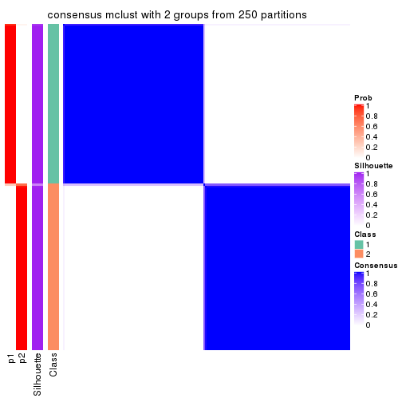</p>

</div>
<div id='tab-ATC-mclust-consensus-heatmap-2'>
<pre><code class="r">consensus_heatmap(res, k = 3)
</code></pre>

<p>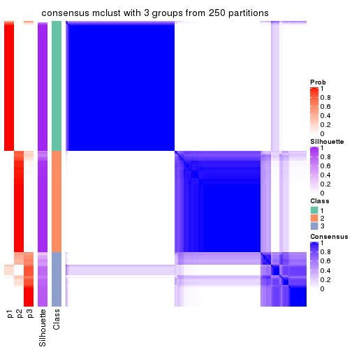</p>

</div>
<div id='tab-ATC-mclust-consensus-heatmap-3'>
<pre><code class="r">consensus_heatmap(res, k = 4)
</code></pre>

<p>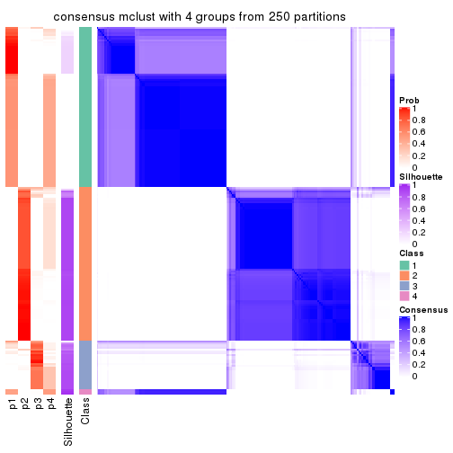</p>

</div>
<div id='tab-ATC-mclust-consensus-heatmap-4'>
<pre><code class="r">consensus_heatmap(res, k = 5)
</code></pre>

<p>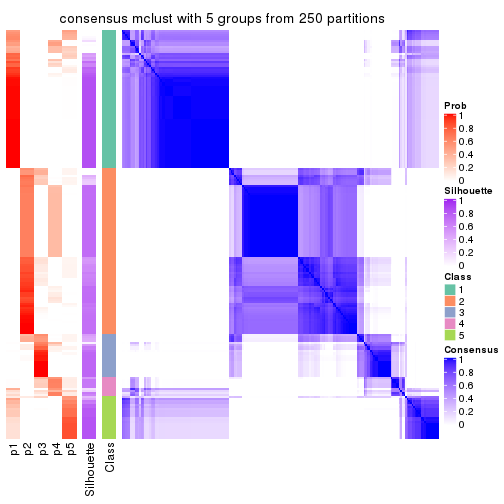</p>

</div>
<div id='tab-ATC-mclust-consensus-heatmap-5'>
<pre><code class="r">consensus_heatmap(res, k = 6)
</code></pre>

<p>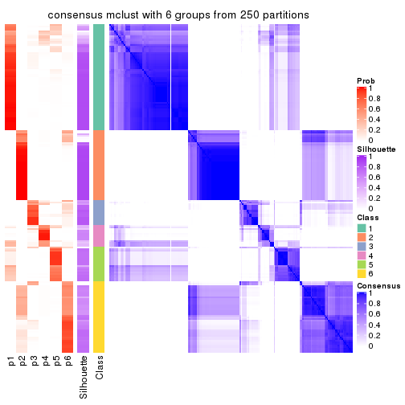</p>

</div>
</div>

Heatmaps for the membership of samples in all partitions to see how consistent they are:


<script>
$( function() {
	$( '#tabs-ATC-mclust-membership-heatmap' ).tabs();
} );
</script>
<div id='tabs-ATC-mclust-membership-heatmap'>
<ul>
<li><a href='#tab-ATC-mclust-membership-heatmap-1'>k = 2</a></li>
<li><a href='#tab-ATC-mclust-membership-heatmap-2'>k = 3</a></li>
<li><a href='#tab-ATC-mclust-membership-heatmap-3'>k = 4</a></li>
<li><a href='#tab-ATC-mclust-membership-heatmap-4'>k = 5</a></li>
<li><a href='#tab-ATC-mclust-membership-heatmap-5'>k = 6</a></li>
</ul>
<div id='tab-ATC-mclust-membership-heatmap-1'>
<pre><code class="r">membership_heatmap(res, k = 2)
</code></pre>

<p>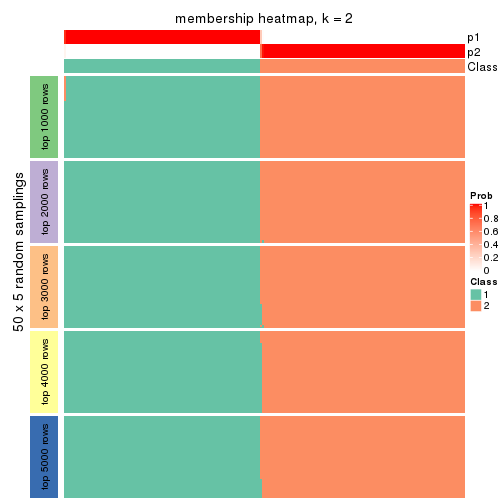</p>

</div>
<div id='tab-ATC-mclust-membership-heatmap-2'>
<pre><code class="r">membership_heatmap(res, k = 3)
</code></pre>

<p>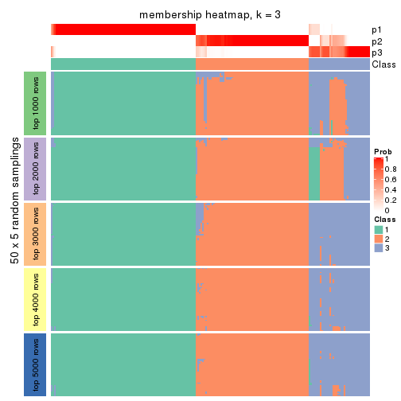</p>

</div>
<div id='tab-ATC-mclust-membership-heatmap-3'>
<pre><code class="r">membership_heatmap(res, k = 4)
</code></pre>

<p>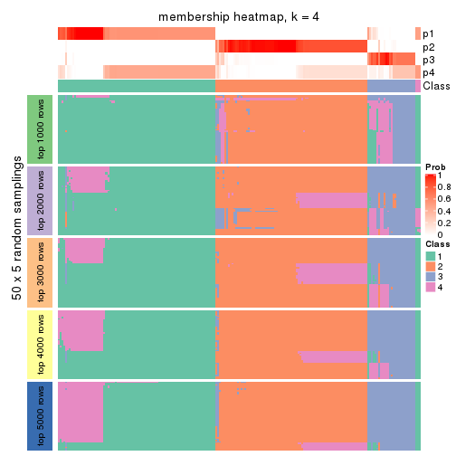</p>

</div>
<div id='tab-ATC-mclust-membership-heatmap-4'>
<pre><code class="r">membership_heatmap(res, k = 5)
</code></pre>

<p>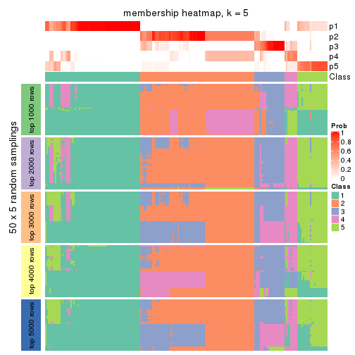</p>

</div>
<div id='tab-ATC-mclust-membership-heatmap-5'>
<pre><code class="r">membership_heatmap(res, k = 6)
</code></pre>

<p>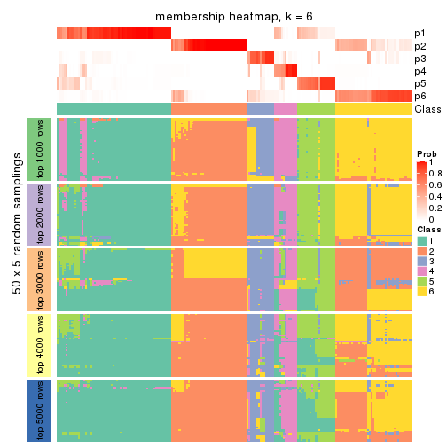</p>

</div>
</div>

As soon as we have had the classes for columns, we can look for signatures
which are significantly different between classes which can be candidate marks
for certain classes. Following are the heatmaps for signatures.


Signature heatmaps where rows are scaled:


<script>
$( function() {
	$( '#tabs-ATC-mclust-get-signatures' ).tabs();
} );
</script>
<div id='tabs-ATC-mclust-get-signatures'>
<ul>
<li><a href='#tab-ATC-mclust-get-signatures-1'>k = 2</a></li>
<li><a href='#tab-ATC-mclust-get-signatures-2'>k = 3</a></li>
<li><a href='#tab-ATC-mclust-get-signatures-3'>k = 4</a></li>
<li><a href='#tab-ATC-mclust-get-signatures-4'>k = 5</a></li>
<li><a href='#tab-ATC-mclust-get-signatures-5'>k = 6</a></li>
</ul>
<div id='tab-ATC-mclust-get-signatures-1'>
<pre><code class="r">get_signatures(res, k = 2)
</code></pre>

<p>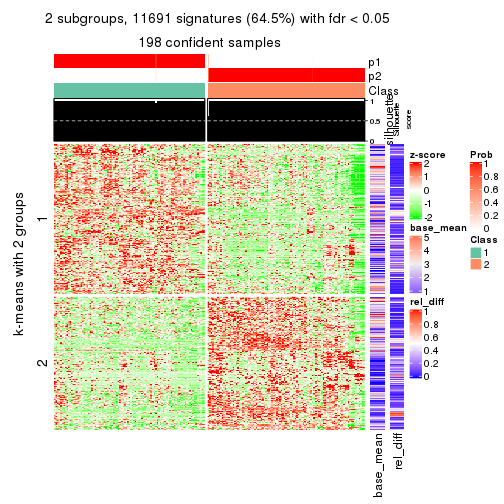</p>

</div>
<div id='tab-ATC-mclust-get-signatures-2'>
<pre><code class="r">get_signatures(res, k = 3)
</code></pre>

<p>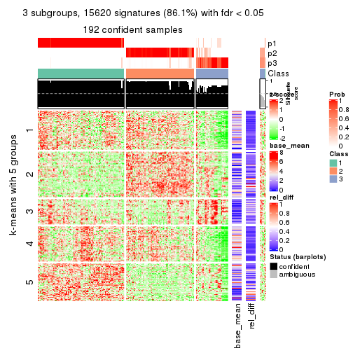</p>

</div>
<div id='tab-ATC-mclust-get-signatures-3'>
<pre><code class="r">get_signatures(res, k = 4)
</code></pre>

<p>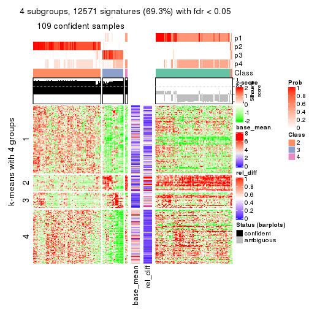</p>

</div>
<div id='tab-ATC-mclust-get-signatures-4'>
<pre><code class="r">get_signatures(res, k = 5)
</code></pre>

<p>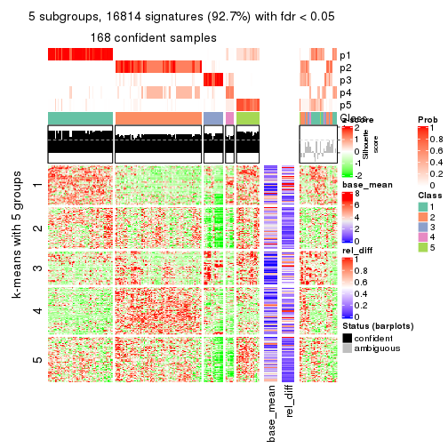</p>

</div>
<div id='tab-ATC-mclust-get-signatures-5'>
<pre><code class="r">get_signatures(res, k = 6)
</code></pre>

<p>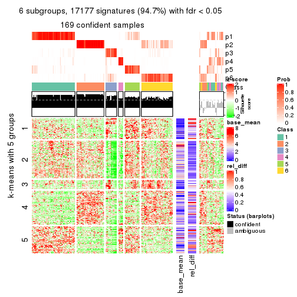</p>

</div>
</div>


Signature heatmaps where rows are not scaled:


<script>
$( function() {
	$( '#tabs-ATC-mclust-get-signatures-no-scale' ).tabs();
} );
</script>
<div id='tabs-ATC-mclust-get-signatures-no-scale'>
<ul>
<li><a href='#tab-ATC-mclust-get-signatures-no-scale-1'>k = 2</a></li>
<li><a href='#tab-ATC-mclust-get-signatures-no-scale-2'>k = 3</a></li>
<li><a href='#tab-ATC-mclust-get-signatures-no-scale-3'>k = 4</a></li>
<li><a href='#tab-ATC-mclust-get-signatures-no-scale-4'>k = 5</a></li>
<li><a href='#tab-ATC-mclust-get-signatures-no-scale-5'>k = 6</a></li>
</ul>
<div id='tab-ATC-mclust-get-signatures-no-scale-1'>
<pre><code class="r">get_signatures(res, k = 2, scale_rows = FALSE)
</code></pre>

<p>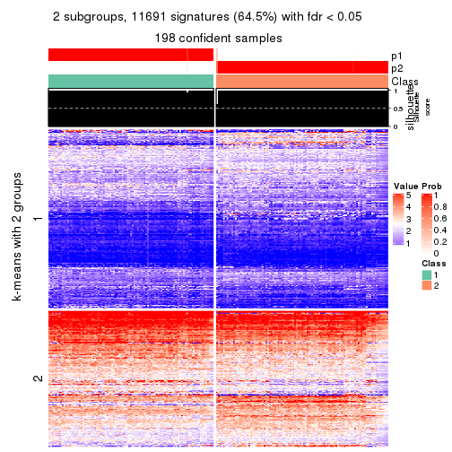</p>

</div>
<div id='tab-ATC-mclust-get-signatures-no-scale-2'>
<pre><code class="r">get_signatures(res, k = 3, scale_rows = FALSE)
</code></pre>

<p>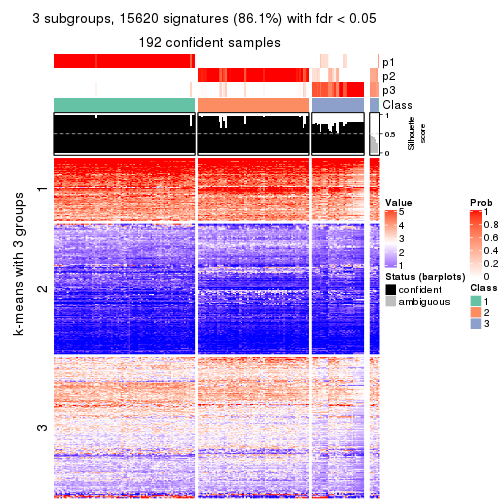</p>

</div>
<div id='tab-ATC-mclust-get-signatures-no-scale-3'>
<pre><code class="r">get_signatures(res, k = 4, scale_rows = FALSE)
</code></pre>

<p>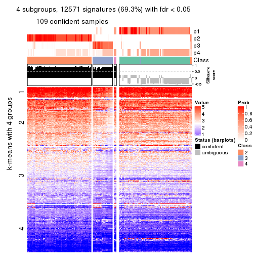</p>

</div>
<div id='tab-ATC-mclust-get-signatures-no-scale-4'>
<pre><code class="r">get_signatures(res, k = 5, scale_rows = FALSE)
</code></pre>

<p>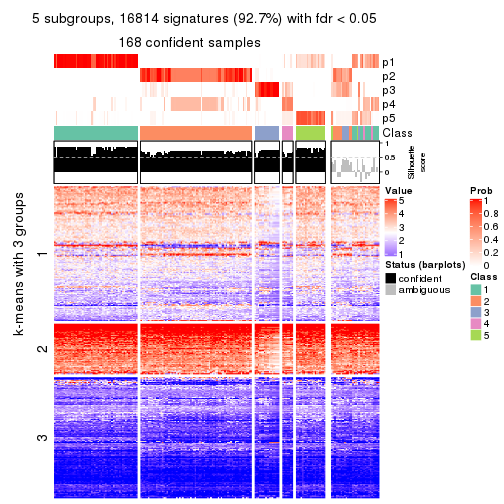</p>

</div>
<div id='tab-ATC-mclust-get-signatures-no-scale-5'>
<pre><code class="r">get_signatures(res, k = 6, scale_rows = FALSE)
</code></pre>

<p>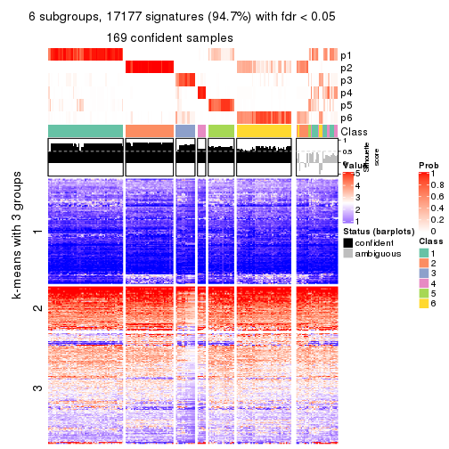</p>

</div>
</div>


Compare the overlap of signatures from different k:

```r
compare_signatures(res)
```

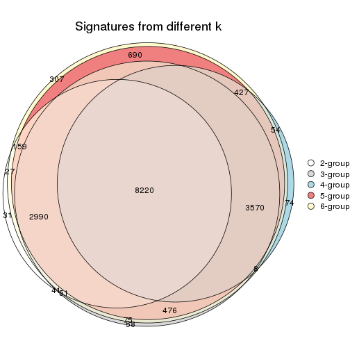

`get_signature()` returns a data frame invisibly. TO get the list of signatures, the function
call should be assigned to a variable explicitly. In following code, if `plot` argument is set
to `FALSE`, no heatmap is plotted while only the differential analysis is performed.

```r
# code only for demonstration
tb = get_signature(res, k = ..., plot = FALSE)
```

An example of the output of `tb` is:

```
#>   which_row         fdr    mean_1    mean_2 scaled_mean_1 scaled_mean_2 km
#> 1        38 0.042760348  8.373488  9.131774    -0.5533452     0.5164555  1
#> 2        40 0.018707592  7.106213  8.469186    -0.6173731     0.5762149  1
#> 3        55 0.019134737 10.221463 11.207825    -0.6159697     0.5749050  1
#> 4        59 0.006059896  5.921854  7.869574    -0.6899429     0.6439467  1
#> 5        60 0.018055526  8.928898 10.211722    -0.6204761     0.5791110  1
#> 6        98 0.009384629 15.714769 14.887706     0.6635654    -0.6193277  2
...
```

The columns in `tb` are:

1. `which_row`: row indices corresponding to the input matrix.
2. `fdr`: FDR for the differential test. 
3. `mean_x`: The mean value in group x.
4. `scaled_mean_x`: The mean value in group x after rows are scaled.
5. `km`: Row groups if k-means clustering is applied to rows.


UMAP plot which shows how samples are separated.


<script>
$( function() {
	$( '#tabs-ATC-mclust-dimension-reduction' ).tabs();
} );
</script>
<div id='tabs-ATC-mclust-dimension-reduction'>
<ul>
<li><a href='#tab-ATC-mclust-dimension-reduction-1'>k = 2</a></li>
<li><a href='#tab-ATC-mclust-dimension-reduction-2'>k = 3</a></li>
<li><a href='#tab-ATC-mclust-dimension-reduction-3'>k = 4</a></li>
<li><a href='#tab-ATC-mclust-dimension-reduction-4'>k = 5</a></li>
<li><a href='#tab-ATC-mclust-dimension-reduction-5'>k = 6</a></li>
</ul>
<div id='tab-ATC-mclust-dimension-reduction-1'>
<pre><code class="r">dimension_reduction(res, k = 2, method = &quot;UMAP&quot;)
</code></pre>

<p>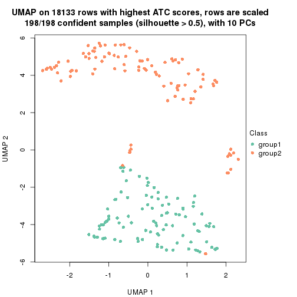</p>

</div>
<div id='tab-ATC-mclust-dimension-reduction-2'>
<pre><code class="r">dimension_reduction(res, k = 3, method = &quot;UMAP&quot;)
</code></pre>

<p>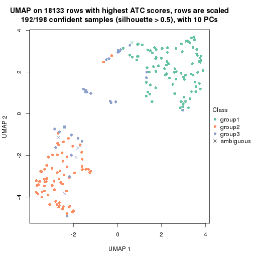</p>

</div>
<div id='tab-ATC-mclust-dimension-reduction-3'>
<pre><code class="r">dimension_reduction(res, k = 4, method = &quot;UMAP&quot;)
</code></pre>

<p>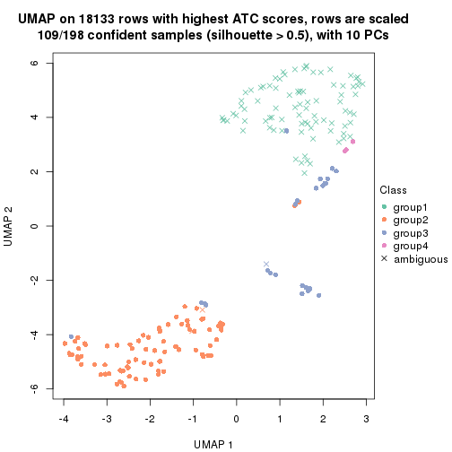</p>

</div>
<div id='tab-ATC-mclust-dimension-reduction-4'>
<pre><code class="r">dimension_reduction(res, k = 5, method = &quot;UMAP&quot;)
</code></pre>

<p>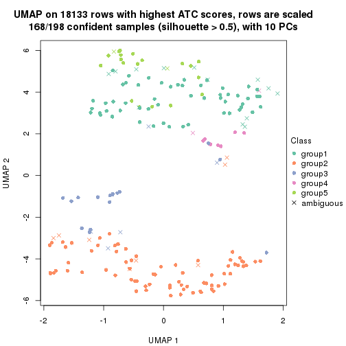</p>

</div>
<div id='tab-ATC-mclust-dimension-reduction-5'>
<pre><code class="r">dimension_reduction(res, k = 6, method = &quot;UMAP&quot;)
</code></pre>

<p>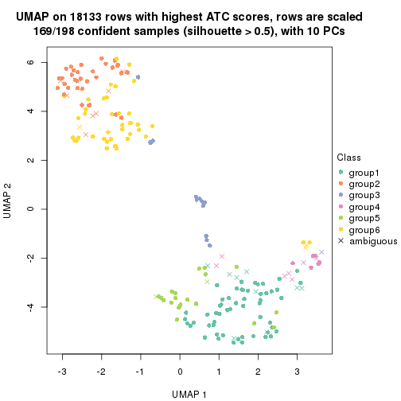</p>

</div>
</div>


Following heatmap shows how subgroups are split when increasing `k`:

```r
collect_classes(res)
```

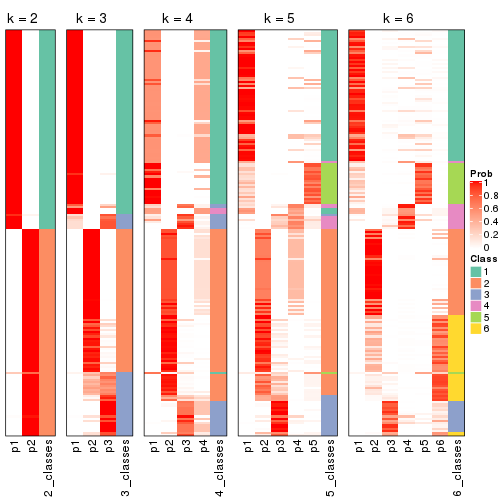


If matrix rows can be associated to genes, consider to use `functional_enrichment(res,
...)` to perform function enrichment for the signature genes. See [this vignette](http://bioconductor.org/packages/devel/bioc/vignettes/cola/inst/doc/functional_enrichment.html) for more detailed explanations.


 

---------------------------------------------------


### ATC:NMF**


The object with results only for a single top-value method and a single partition method 
can be extracted as:

```r
res = res_list["ATC", "NMF"]
# you can also extract it by
# res = res_list["ATC:NMF"]
```

A summary of `res` and all the functions that can be applied to it:

```r
res
```

```
#> A 'ConsensusPartition' object with k = 2, 3, 4, 5, 6.
#>   On a matrix with 18133 rows and 198 columns.
#>   Top rows (1000, 2000, 3000, 4000, 5000) are extracted by 'ATC' method.
#>   Subgroups are detected by 'NMF' method.
#>   Performed in total 1250 partitions by row resampling.
#>   Best k for subgroups seems to be 2.
#> 
#> Following methods can be applied to this 'ConsensusPartition' object:
#>  [1] "cola_report"             "collect_classes"         "collect_plots"          
#>  [4] "collect_stats"           "colnames"                "compare_signatures"     
#>  [7] "consensus_heatmap"       "dimension_reduction"     "functional_enrichment"  
#> [10] "get_anno_col"            "get_anno"                "get_classes"            
#> [13] "get_consensus"           "get_matrix"              "get_membership"         
#> [16] "get_param"               "get_signatures"          "get_stats"              
#> [19] "is_best_k"               "is_stable_k"             "membership_heatmap"     
#> [22] "ncol"                    "nrow"                    "plot_ecdf"              
#> [25] "rownames"                "select_partition_number" "show"                   
#> [28] "suggest_best_k"          "test_to_known_factors"
```

`collect_plots()` function collects all the plots made from `res` for all `k` (number of partitions)
into one single page to provide an easy and fast comparison between different `k`.

```r
collect_plots(res)
```

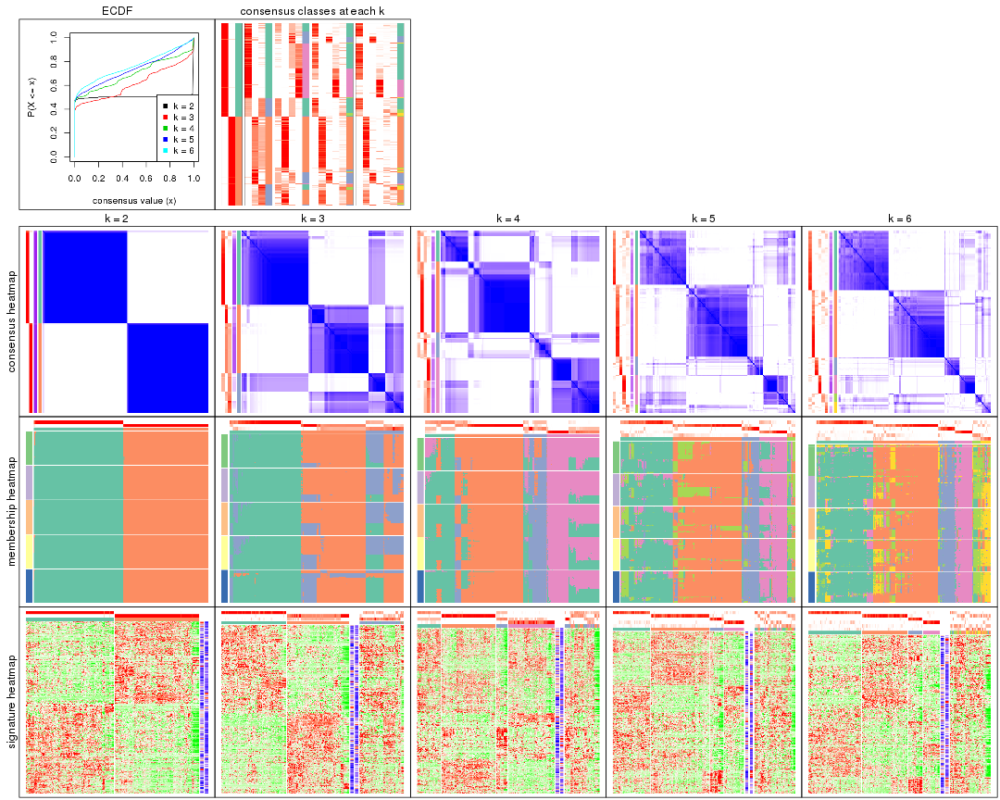

The plots are:

- The first row: a plot of the ECDF (empirical cumulative distribution
  function) curves of the consensus matrix for each `k` and the heatmap of
  predicted classes for each `k`.
- The second row: heatmaps of the consensus matrix for each `k`.
- The third row: heatmaps of the membership matrix for each `k`.
- The fouth row: heatmaps of the signatures for each `k`.

All the plots in panels can be made by individual functions and they are
plotted later in this section.

`select_partition_number()` produces several plots showing different
statistics for choosing "optimized" `k`. There are following statistics:

- ECDF curves of the consensus matrix for each `k`;
- 1-PAC. [The PAC
  score](https://en.wikipedia.org/wiki/Consensus_clustering#Over-interpretation_potential_of_consensus_clustering)
  measures the proportion of the ambiguous subgrouping.
- Mean silhouette score.
- Concordance. The mean probability of fiting the consensus class ids in all
  partitions.
- Area increased. Denote $A_k$ as the area under the ECDF curve for current
  `k`, the area increased is defined as $A_k - A_{k-1}$.
- Rand index. The percent of pairs of samples that are both in a same cluster
  or both are not in a same cluster in the partition of k and k-1.
- Jaccard index. The ratio of pairs of samples are both in a same cluster in
  the partition of k and k-1 and the pairs of samples are both in a same
  cluster in the partition k or k-1.

The detailed explanations of these statistics can be found in [the _cola_
vignette](http://bioconductor.org/packages/devel/bioc/vignettes/cola/inst/doc/cola.html#toc_13).

Generally speaking, lower PAC score, higher mean silhouette score or higher
concordance corresponds to better partition. Rand index and Jaccard index
measure how similar the current partition is compared to partition with `k-1`.
If they are too similar, we won't accept `k` is better than `k-1`.

```r
select_partition_number(res)
```

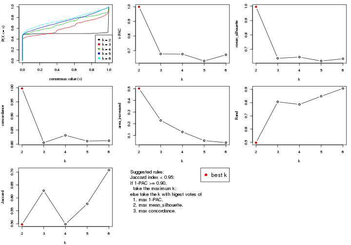

The numeric values for all these statistics can be obtained by `get_stats()`.

```r
get_stats(res)
```

```
#>   k 1-PAC mean_silhouette concordance area_increased  Rand Jaccard
#> 2 2 1.000           0.995       0.998         0.5029 0.498   0.498
#> 3 3 0.677           0.638       0.805         0.2288 0.806   0.628
#> 4 4 0.676           0.646       0.831         0.1300 0.786   0.498
#> 5 5 0.629           0.619       0.811         0.0561 0.848   0.577
#> 6 6 0.671           0.635       0.812         0.0381 0.907   0.708
```

`suggest_best_k()` suggests the best $k$ based on these statistics. The rules are as follows:

- All $k$ with Jaccard index larger than 0.95 are removed because increasing
  $k$ does not provide enough extra information. If all $k$ are removed, it is
  marked as no subgroup is detected.
- For all $k$ with 1-PAC score larger than 0.9, the maximal $k$ is taken as
  the best $k$, and other $k$ are marked as optional $k$.
- If it does not fit the second rule. The $k$ with the maximal vote of the
  highest 1-PAC score, highest mean silhouette, and highest concordance is
  taken as the best $k$.

```r
suggest_best_k(res)
```

```
#> [1] 2
```


Following shows the table of the partitions (You need to click the **show/hide
code output** link to see it). The membership matrix (columns with name `p*`)
is inferred by
[`clue::cl_consensus()`](https://www.rdocumentation.org/link/cl_consensus?package=clue)
function with the `SE` method. Basically the value in the membership matrix
represents the probability to belong to a certain group. The finall class
label for an item is determined with the group with highest probability it
belongs to.

In `get_classes()` function, the entropy is calculated from the membership
matrix and the silhouette score is calculated from the consensus matrix.


<script>
$( function() {
	$( '#tabs-ATC-NMF-get-classes' ).tabs();
} );
</script>
<div id='tabs-ATC-NMF-get-classes'>
<ul>
<li><a href='#tab-ATC-NMF-get-classes-1'>k = 2</a></li>
<li><a href='#tab-ATC-NMF-get-classes-2'>k = 3</a></li>
<li><a href='#tab-ATC-NMF-get-classes-3'>k = 4</a></li>
<li><a href='#tab-ATC-NMF-get-classes-4'>k = 5</a></li>
<li><a href='#tab-ATC-NMF-get-classes-5'>k = 6</a></li>
</ul>

<div id='tab-ATC-NMF-get-classes-1'>
<p><a id='tab-ATC-NMF-get-classes-1-a' style='color:#0366d6' href='#'>show/hide code output</a></p>
<pre><code class="r">cbind(get_classes(res, k = 2), get_membership(res, k = 2))
</code></pre>

<pre><code>#&gt;                                      class entropy silhouette    p1    p2
#&gt; 0C0AA0B2-5191-4EDF-8937-ED7434F30283     2  0.0000      0.999 0.000 1.000
#&gt; 18B45F1F-234F-45CC-A234-145307606C5C     1  0.0000      0.997 1.000 0.000
#&gt; E18B70C0-BDCA-46D3-99BB-C6C8ABC68DA5     2  0.0000      0.999 0.000 1.000
#&gt; 0F6DDBA7-6F74-45E8-95C8-F28263D55978     1  0.0000      0.997 1.000 0.000
#&gt; 7EAE1A5A-129A-46DE-977E-A2C753F10904     2  0.0000      0.999 0.000 1.000
#&gt; 7EAE0048-16B5-4979-9410-16CDEB9B1A48     1  0.0000      0.997 1.000 0.000
#&gt; 2EBFC828-2B27-4753-A052-80DDA226DAB4     2  0.0000      0.999 0.000 1.000
#&gt; 24E1768D-2232-41DA-9383-BC55D6EB3812     2  0.0000      0.999 0.000 1.000
#&gt; 6E3CD60A-1889-4CA3-B305-2E78152057B5     2  0.0000      0.999 0.000 1.000
#&gt; 33CC70DD-82B3-413C-B3B1-BE06634D95D0     1  0.0000      0.997 1.000 0.000
#&gt; F1CB57A3-55DD-4487-9307-1B4F652E729A     1  0.0000      0.997 1.000 0.000
#&gt; 755A5806-B054-449A-93DB-79909E6C93A1     1  0.0000      0.997 1.000 0.000
#&gt; 58D364E7-3D2F-468F-A264-D6461E2428D4     2  0.0000      0.999 0.000 1.000
#&gt; 68BB9CB6-7AA2-4981-B9D9-07363EC96599     2  0.0000      0.999 0.000 1.000
#&gt; 3C4E8DFA-8EA0-4F1F-89CB-CB8805395872     2  0.0000      0.999 0.000 1.000
#&gt; 4219651D-5583-4498-BF08-1B7D04B4C7B2     1  0.0000      0.997 1.000 0.000
#&gt; B5EE2768-0D67-4584-ADBC-EC745FEC52EA     2  0.0000      0.999 0.000 1.000
#&gt; 825E6C11-F460-451A-8045-846DD7D0E945     1  0.0000      0.997 1.000 0.000
#&gt; 491F62AF-5E68-43C3-982A-F867A75BBA9A     2  0.0000      0.999 0.000 1.000
#&gt; 9D7F058C-F95A-44AD-AC9E-450F7FBDC960     2  0.0000      0.999 0.000 1.000
#&gt; 6D42DD0C-2081-4742-BA27-9F5F16FAC3C6     1  0.0000      0.997 1.000 0.000
#&gt; EDD7E63D-492A-473B-A552-0764337B10EF     2  0.0000      0.999 0.000 1.000
#&gt; 97073DEA-73AD-4DFD-BD1A-9035DC03445B     1  0.0000      0.997 1.000 0.000
#&gt; FA891AB9-CE38-4F7E-A015-1DDCE12890A0     1  0.0000      0.997 1.000 0.000
#&gt; D9514D49-A0AE-45AB-8C9F-68E726215253     1  0.0000      0.997 1.000 0.000
#&gt; 3B9229AD-12E5-451E-9D2F-378AAC82C04A     2  0.0000      0.999 0.000 1.000
#&gt; 5EA36B71-4917-4EF3-9060-065EFE6ACC5B     1  0.0000      0.997 1.000 0.000
#&gt; A20E4ECB-4895-4CC7-BE5E-4721B20D933B     1  0.0000      0.997 1.000 0.000
#&gt; 1BE8D828-29DB-4368-AA4A-FB23588F7AE8     1  0.0000      0.997 1.000 0.000
#&gt; 66EFEFCF-3D14-4DBF-AA13-530F40ED0245     1  0.0000      0.997 1.000 0.000
#&gt; 55DFFE53-BCE7-4EC1-9863-6C0311B06BA2     2  0.0000      0.999 0.000 1.000
#&gt; 4CC3FB5A-611D-4C64-AE9D-544FA45CF4DC     1  0.0000      0.997 1.000 0.000
#&gt; C11D33F2-DFE9-4FA8-9024-F3E7F1DADC5F     2  0.0000      0.999 0.000 1.000
#&gt; FA5932B8-8AA3-4C38-9FAB-C35D8772974D     1  0.0000      0.997 1.000 0.000
#&gt; 8216EC35-1F41-4A15-B503-BDA4971E27C9     1  0.0000      0.997 1.000 0.000
#&gt; 69635D23-90A7-4BAD-97C7-B79536837F57     1  0.0000      0.997 1.000 0.000
#&gt; 12B404E2-C463-4409-8392-E4649B2AFFD1     2  0.0000      0.999 0.000 1.000
#&gt; 246927E3-ACCF-41B2-AA8E-43855FD6B146     2  0.0000      0.999 0.000 1.000
#&gt; E0CC13E7-9607-49E0-B4AA-395544E3C3BF     1  0.0000      0.997 1.000 0.000
#&gt; F7BBC0C1-6124-4A83-8A70-EA89B62F1CBD     1  0.0000      0.997 1.000 0.000
#&gt; B1D4FF24-8E6F-4A04-B716-2032D850EB57     1  0.0000      0.997 1.000 0.000
#&gt; 253601DB-B78A-4566-9947-8C0270C0B163     2  0.0000      0.999 0.000 1.000
#&gt; AB83DBFF-5737-4FB8-A5AC-1D3CD6072BDF     2  0.0000      0.999 0.000 1.000
#&gt; 9D67D953-EC98-4B72-89C8-5732BC9D4BC9     2  0.0000      0.999 0.000 1.000
#&gt; 51061018-95AB-4278-886F-F69E4EBC47C0     2  0.0000      0.999 0.000 1.000
#&gt; ABD0F7F3-105B-4DEE-9889-5028772C519A     1  0.0000      0.997 1.000 0.000
#&gt; 562B95CF-B27E-4A72-B7C6-CDF86A51A39B     1  0.0000      0.997 1.000 0.000
#&gt; ABF046A4-D7A1-49FF-B6B1-4E07A791DEDB     2  0.0000      0.999 0.000 1.000
#&gt; 3FF4101E-9703-460E-A30E-76CC7689F36D     2  0.0000      0.999 0.000 1.000
#&gt; 39C4F7AA-7ADF-4F1D-BDA3-BEC605AC5023     2  0.0000      0.999 0.000 1.000
#&gt; CB821FD2-AF5C-4743-A70F-21C12C6ED153     1  0.0000      0.997 1.000 0.000
#&gt; 92EA1846-62FF-41D5-A441-5E52E6B9E7F9     1  0.0000      0.997 1.000 0.000
#&gt; 7D25F3EE-5A20-4763-8026-16A03D05F459     1  0.0000      0.997 1.000 0.000
#&gt; 8ECE5276-CD06-496B-A5A9-1713B1F7D089     1  0.0000      0.997 1.000 0.000
#&gt; C775B68F-9507-47E3-B507-B433AED79002     1  0.0000      0.997 1.000 0.000
#&gt; E19D5463-FDD0-41C1-A170-323736A88D07     2  0.0000      0.999 0.000 1.000
#&gt; CE4B6285-4961-4767-91F0-5C7A8162E185     1  0.0000      0.997 1.000 0.000
#&gt; 9637BD72-1FEF-42AD-8886-2C39BE876531     1  0.0000      0.997 1.000 0.000
#&gt; 81B5A88E-45A0-4B44-B689-B9071B8548EE     2  0.0000      0.999 0.000 1.000
#&gt; 0B01B4C9-9BED-4F5B-A3E2-8868C7CCC3FC     2  0.0000      0.999 0.000 1.000
#&gt; 54501315-7132-44B2-A179-10FBF1421105     1  0.0000      0.997 1.000 0.000
#&gt; E207CBE9-4C3A-4FDD-9251-CFE1FE106475     2  0.1843      0.971 0.028 0.972
#&gt; 3BEA0B92-3F90-4DBF-9679-AADEAD7D47C8     2  0.0000      0.999 0.000 1.000
#&gt; 35B32250-D854-4215-AA5B-2C11B2FBEECA     1  0.0000      0.997 1.000 0.000
#&gt; ACE6566B-AEB9-426C-924A-B382D14A1024     2  0.0000      0.999 0.000 1.000
#&gt; 737E69AC-0930-45B9-B6BA-7CE5E300290B     1  0.0000      0.997 1.000 0.000
#&gt; B4410AB8-D015-41CA-86E6-12EB4E4103E3     1  0.0000      0.997 1.000 0.000
#&gt; 6D3ECA65-C50F-43B0-B75A-1D290FA4A8FD     2  0.0000      0.999 0.000 1.000
#&gt; C86F40D3-9A96-4395-A8C3-510DE12F9A2B     2  0.0000      0.999 0.000 1.000
#&gt; 6238087F-24DD-4BF1-903F-3BD4E446C1AE     2  0.0000      0.999 0.000 1.000
#&gt; E4FF840B-EEAB-4CB0-A690-7D4C4AA7EEC3     2  0.0000      0.999 0.000 1.000
#&gt; 72D3C323-C67F-4C0E-9BFC-BF245FF9730A     1  0.0000      0.997 1.000 0.000
#&gt; 82D56E4E-4DF6-4F3E-8959-B995C92AAA70     1  0.0000      0.997 1.000 0.000
#&gt; E31CA441-EB19-443B-ACBD-37B5CCBCF0E5     2  0.0000      0.999 0.000 1.000
#&gt; 87CA8939-D054-4B8A-B32D-085FD2E8F202     1  0.0000      0.997 1.000 0.000
#&gt; 2A508D90-FEDC-46A3-9A02-E51E5467CDCB     1  0.0000      0.997 1.000 0.000
#&gt; C4E8B4E2-388B-411F-BF0A-9B6F34E8EDB5     2  0.0000      0.999 0.000 1.000
#&gt; AF6AF803-BD93-44A7-AA80-B9BC92C1273B     2  0.0000      0.999 0.000 1.000
#&gt; 0B1CA5CF-EB96-41D4-BFC5-6957FEB39828     1  0.0000      0.997 1.000 0.000
#&gt; 6FB96FB0-6661-48AD-A4A0-69F8AFDBE591     2  0.0000      0.999 0.000 1.000
#&gt; 8C19F7FD-368A-462B-B28F-88D6630038A1     1  0.0000      0.997 1.000 0.000
#&gt; 96EABE78-C2F4-4A33-ACD8-C922A4B2519B     2  0.0000      0.999 0.000 1.000
#&gt; 68B36D7B-546A-4689-949F-B207C4A4AB27     2  0.0000      0.999 0.000 1.000
#&gt; CE9F3335-778F-4F52-BC55-4B7C99B211DD     2  0.0000      0.999 0.000 1.000
#&gt; CB359DED-2A2D-4646-A0BD-6F10ADCC532B     1  0.0000      0.997 1.000 0.000
#&gt; 198324A5-8C52-46F6-9734-EFAF1CCA6D9B     1  0.0000      0.997 1.000 0.000
#&gt; 83B88608-0506-428C-B9E8-621F38477B42     1  0.0000      0.997 1.000 0.000
#&gt; 1993630A-0F3D-4F5C-86A3-D443BAAF57F0     1  0.5178      0.869 0.884 0.116
#&gt; DE73DA9B-529E-4F4F-A65C-DA7AB84B1096     1  0.0000      0.997 1.000 0.000
#&gt; 2347F3B7-DDA3-40C0-B6D4-8819ECA69146     1  0.0000      0.997 1.000 0.000
#&gt; AB93B5D5-095F-4330-9D40-6A3D934AB50C     1  0.0000      0.997 1.000 0.000
#&gt; 5EBBE4AD-FF0C-41CF-9EA3-B6FE7EA1F9C0     1  0.7219      0.751 0.800 0.200
#&gt; 6D960AE7-3769-4144-A061-E8588E5063FF     1  0.0000      0.997 1.000 0.000
#&gt; 0C2DD8C0-D1A5-4192-A49C-7A40FED628B2     2  0.0000      0.999 0.000 1.000
#&gt; 18C9372F-C55B-4F86-A9D2-E8D85EFC8566     2  0.0000      0.999 0.000 1.000
#&gt; 9AF637B0-4C32-4DD1-93AF-7655B4A845D3     2  0.0000      0.999 0.000 1.000
#&gt; 785B5B06-4115-46FD-9BEB-F888AFDC855D     2  0.0000      0.999 0.000 1.000
#&gt; ECA3050E-4BE2-4117-B9CF-A52BB85AF8C2     2  0.0000      0.999 0.000 1.000
#&gt; 099DC396-16A5-458F-9ED9-F2A790CB0C34     1  0.0000      0.997 1.000 0.000
#&gt; 7A5A12EE-C5B0-4C51-8C99-0F3FA88D633E     1  0.0000      0.997 1.000 0.000
#&gt; E832B508-A66D-4817-B44A-FE9FAAE64B4A     1  0.0000      0.997 1.000 0.000
#&gt; F9DD688C-7B35-49E7-9651-2E098EE78856     1  0.0000      0.997 1.000 0.000
#&gt; F1265DD8-5ED3-4635-A277-57BBFDEC7729     1  0.0000      0.997 1.000 0.000
#&gt; F624E8D9-DB07-4C9E-910D-5E8EBA3A6167     2  0.0000      0.999 0.000 1.000
#&gt; 3516FBDF-66E1-43F4-9D7B-16748F6439A7     2  0.0000      0.999 0.000 1.000
#&gt; 04B12992-B2EA-4BA2-8E2C-11E34E230E6F     2  0.0000      0.999 0.000 1.000
#&gt; CC02897D-9123-495E-9242-5C9CF4EC269B     2  0.0000      0.999 0.000 1.000
#&gt; 3117ED46-2BF2-4311-BC00-4E98243E16B3     1  0.0000      0.997 1.000 0.000
#&gt; E0B66D53-23DB-4E26-BB6E-F692FA8C000E     1  0.0000      0.997 1.000 0.000
#&gt; DAA93CE5-A013-477A-9A50-EA09CC3A8162     2  0.0000      0.999 0.000 1.000
#&gt; 0099098D-354A-4276-92F8-B932C74B4608     1  0.0000      0.997 1.000 0.000
#&gt; DD483639-B2E7-4745-BCFB-55ED1D82BFBF     2  0.0000      0.999 0.000 1.000
#&gt; 2C1F9079-602E-4252-82C7-9D8799E04246     2  0.0000      0.999 0.000 1.000
#&gt; 9473A8E4-3A1B-4184-9EA6-517AFD60B635     1  0.0000      0.997 1.000 0.000
#&gt; 75CFBAF6-7BA0-40AF-92D7-D218E885BD1B     2  0.0000      0.999 0.000 1.000
#&gt; B588950F-14D6-41C8-845B-EFD2096013C6     2  0.0000      0.999 0.000 1.000
#&gt; 0DF3EDA8-DAEA-4721-92AB-B97181249498     2  0.0000      0.999 0.000 1.000
#&gt; 8EA83042-D598-401D-AD78-936EEB136C59     1  0.0000      0.997 1.000 0.000
#&gt; 729AC418-3BE9-445A-95D4-AC11A7D43BE0     1  0.0000      0.997 1.000 0.000
#&gt; 7D8B1B11-F576-4AA8-BFA7-0022A2CD829A     2  0.0000      0.999 0.000 1.000
#&gt; 304A0E46-3449-4B44-9C30-BDDF6459391D     1  0.0000      0.997 1.000 0.000
#&gt; 3C83358F-DF20-47F7-AF9F-AB7CC92F5ABA     1  0.0000      0.997 1.000 0.000
#&gt; EAFEED6C-35C3-451F-AE4A-EB56992E1F29     1  0.0000      0.997 1.000 0.000
#&gt; 8A237A65-28EC-434D-A78A-A8B7308B5204     1  0.0000      0.997 1.000 0.000
#&gt; D005833F-E991-4E9E-9667-55F137288004     1  0.0000      0.997 1.000 0.000
#&gt; 37D966E3-253E-4397-A9AE-0903A8D31FE6     1  0.0000      0.997 1.000 0.000
#&gt; D2482B81-CB5B-4178-BA8D-1CF4026181B5     1  0.0000      0.997 1.000 0.000
#&gt; 18019E95-C2A8-4EE7-B585-F6886DC4D953     2  0.0000      0.999 0.000 1.000
#&gt; 0B126D1A-14A8-4345-8F78-FF92222ADF4C     2  0.0000      0.999 0.000 1.000
#&gt; CE88B625-47D8-4D58-9FB4-23464DB7DDAD     2  0.0000      0.999 0.000 1.000
#&gt; 9A88299D-5C74-47FA-B42C-1A1D6D935AAB     1  0.0000      0.997 1.000 0.000
#&gt; 3E71159C-FD6C-41DA-B18B-0730C8AC7E41     1  0.0000      0.997 1.000 0.000
#&gt; 6F245AA4-79D9-47E1-BCC9-1AAF65AEA813     1  0.0000      0.997 1.000 0.000
#&gt; 4CF2C888-2100-483A-B4DB-ECBB69243A4D     2  0.0000      0.999 0.000 1.000
#&gt; A3853813-B9D5-4E8C-B075-19FCC35F8686     2  0.0000      0.999 0.000 1.000
#&gt; 83A16DEE-CE9F-4D8B-9225-0A2A8B9D055D     1  0.0000      0.997 1.000 0.000
#&gt; 0F057CAF-4F9A-4DE9-8601-730E96873733     2  0.0000      0.999 0.000 1.000
#&gt; 32D5801D-DBA4-422E-87CB-A2DDE921BA41     1  0.0000      0.997 1.000 0.000
#&gt; 22EE8076-F07C-499A-9AF8-D800A77EF154     2  0.0000      0.999 0.000 1.000
#&gt; DD4BD74D-D48C-4090-9F57-5334E784581C     1  0.0000      0.997 1.000 0.000
#&gt; 41183565-434D-474C-B1BD-CA6E94910658     2  0.0000      0.999 0.000 1.000
#&gt; 75A2CE41-2B2A-4346-927E-ACF8A72738E4     1  0.0000      0.997 1.000 0.000
#&gt; 7AA24995-3DD2-4682-B36A-4EBFEEACF625     1  0.0000      0.997 1.000 0.000
#&gt; 8BAFDFEC-9F26-4ADB-95CE-004143960EEB     1  0.0000      0.997 1.000 0.000
#&gt; A330E011-CE08-4A85-8F4B-370592293DBB     1  0.0000      0.997 1.000 0.000
#&gt; 1D5A5B17-2E70-4BB0-94A1-EC17E6EA49DB     1  0.0000      0.997 1.000 0.000
#&gt; BD9143B8-9D97-4A05-872C-3FB82B4CF7BE     2  0.0000      0.999 0.000 1.000
#&gt; 64552DC0-181E-4607-898C-787AA7F26435     2  0.0000      0.999 0.000 1.000
#&gt; 1B4C4D41-34C7-43A3-858B-C9552EB53894     1  0.0000      0.997 1.000 0.000
#&gt; 463A3BAA-02DC-4EA4-A644-B924163E425D     2  0.0000      0.999 0.000 1.000
#&gt; CD0FEA89-6F60-4A20-8FCA-D397B4E95A98     1  0.0000      0.997 1.000 0.000
#&gt; 5D06CF6D-F4B9-4B32-B055-8AB287E53340     2  0.0000      0.999 0.000 1.000
#&gt; ADA7835F-DB67-4F4F-9446-8BCE3C5FE936     2  0.0000      0.999 0.000 1.000
#&gt; 4109BE2D-B5DF-4BD7-860E-60D87F647152     2  0.0000      0.999 0.000 1.000
#&gt; 88526A0E-6DFE-46CB-BFAD-B4826F482C67     1  0.0000      0.997 1.000 0.000
#&gt; F39F9A4C-18F7-4017-AB31-85D52FF44587     2  0.0000      0.999 0.000 1.000
#&gt; D4290A5E-1B24-4C55-B470-0FA7A0A09DD0     2  0.0000      0.999 0.000 1.000
#&gt; DC5A2C9E-978F-4661-B729-1F9662976E27     1  0.0000      0.997 1.000 0.000
#&gt; 26A1F392-CED2-43E3-8096-74E6F2BFC8C0     2  0.0000      0.999 0.000 1.000
#&gt; 87D81FB2-306A-4E75-9D58-D5F48E46E7F6     2  0.0000      0.999 0.000 1.000
#&gt; E3D9D81A-C20C-4B3B-B940-A5D2C5F65B22     2  0.0000      0.999 0.000 1.000
#&gt; 4464650B-453F-476C-989C-B7B159BF2CF0     2  0.0000      0.999 0.000 1.000
#&gt; 577D2867-B738-487A-9B06-07958D647F02     1  0.0000      0.997 1.000 0.000
#&gt; E52A22CC-3C03-41A9-9541-220DD871E162     2  0.0000      0.999 0.000 1.000
#&gt; 642703B1-AF99-4746-A915-0792F4B9590B     2  0.0000      0.999 0.000 1.000
#&gt; 8F0D1792-1284-45E6-8EC4-392596057677     2  0.0000      0.999 0.000 1.000
#&gt; 765AFFC1-D528-4494-8BA1-0706451E4205     2  0.0000      0.999 0.000 1.000
#&gt; A716BC29-161F-4CA0-B240-00B330137F2C     1  0.0000      0.997 1.000 0.000
#&gt; 32CBFBAF-7064-4595-8D54-2C5E7DE0FD9B     1  0.0000      0.997 1.000 0.000
#&gt; 4D6ED28C-3F20-41B0-BA41-1BF0E5199A40     2  0.0000      0.999 0.000 1.000
#&gt; 86A38456-2900-48FB-B10F-79222B3CA9BF     2  0.3733      0.922 0.072 0.928
#&gt; E870807D-3223-4A6A-9E3D-F4461B048AA2     2  0.0000      0.999 0.000 1.000
#&gt; 3A78D19F-A833-4D2C-8387-FB4FD4A8313C     1  0.0000      0.997 1.000 0.000
#&gt; DFA162CA-C708-4121-8E74-F9C4DEE0CDAE     1  0.0000      0.997 1.000 0.000
#&gt; C00A300A-CD10-4C9D-8C94-3901AFE8406C     2  0.0000      0.999 0.000 1.000
#&gt; 13E11D15-A90F-48C4-980A-DD032C00A2C1     1  0.0000      0.997 1.000 0.000
#&gt; 31BF80AB-FEDB-4C73-89C3-70BE9F9ACBEE     2  0.0000      0.999 0.000 1.000
#&gt; FA34308A-349D-4AAD-94CF-3F3B7F9AD629     2  0.0000      0.999 0.000 1.000
#&gt; 7C48D467-B663-49DD-BC84-A36BC32ACB3D     1  0.0000      0.997 1.000 0.000
#&gt; BB068534-04F6-4FC9-9087-CDA65920BCE2     1  0.0000      0.997 1.000 0.000
#&gt; EA4EC272-A9B3-4B2E-955F-19F7676A944C     2  0.0000      0.999 0.000 1.000
#&gt; C71FF69B-A460-43CA-8769-9667F22D938B     1  0.0000      0.997 1.000 0.000
#&gt; 5243D1B8-8168-4FF1-A8C6-505F080EF0D3     2  0.0000      0.999 0.000 1.000
#&gt; BCC474D8-08FE-4E99-B8E8-B29E65F84D2E     1  0.0000      0.997 1.000 0.000
#&gt; 04FDBFE3-4CF6-4E53-A2AA-89D5C9316377     2  0.0000      0.999 0.000 1.000
#&gt; 83A9915C-8D60-4CAE-A868-B61E3C90C7B0     2  0.0000      0.999 0.000 1.000
#&gt; 989A6472-E3E3-457A-97BE-CCE95F42D5C2     2  0.0000      0.999 0.000 1.000
#&gt; A0AB2D28-6751-49C9-8DF4-66FDBF95C360     1  0.0000      0.997 1.000 0.000
#&gt; A12B2683-18D4-41C9-8AE5-C143E2180052     1  0.0000      0.997 1.000 0.000
#&gt; 8DE1E245-CAD2-4F11-BFA2-9792C433A00B     1  0.0938      0.985 0.988 0.012
#&gt; FDA68036-6C4C-4256-9AA0-C01FE92AA098     2  0.0000      0.999 0.000 1.000
#&gt; 26311920-1414-4EC1-870B-784961EBCC2D     1  0.0000      0.997 1.000 0.000
#&gt; C29A10D6-D598-4286-B5E0-F1776E19E988     1  0.0000      0.997 1.000 0.000
#&gt; FACCC1FB-4937-4CC0-90EA-7F91D3D939CF     2  0.0000      0.999 0.000 1.000
#&gt; 90B9D84B-78E5-4C7E-8414-EC889C2DE8DB     2  0.0000      0.999 0.000 1.000
#&gt; B74E6122-76E1-4E4D-A867-BCAFD7277393     1  0.0000      0.997 1.000 0.000
#&gt; 98494DC0-CF6E-485F-8A0D-D80E4437EF5C     2  0.0000      0.999 0.000 1.000
#&gt; DA114DAC-DE7B-4E43-8D7C-82C5D7B66411     1  0.0000      0.997 1.000 0.000
</code></pre>

<script>
$('#tab-ATC-NMF-get-classes-1-a').parent().next().next().hide();
$('#tab-ATC-NMF-get-classes-1-a').click(function(){
  $('#tab-ATC-NMF-get-classes-1-a').parent().next().next().toggle();
  return(false);
});
</script>
</div>

<div id='tab-ATC-NMF-get-classes-2'>
<p><a id='tab-ATC-NMF-get-classes-2-a' style='color:#0366d6' href='#'>show/hide code output</a></p>
<pre><code class="r">cbind(get_classes(res, k = 3), get_membership(res, k = 3))
</code></pre>

<pre><code>#&gt;                                      class entropy silhouette    p1    p2    p3
#&gt; 0C0AA0B2-5191-4EDF-8937-ED7434F30283     3  0.4235     0.1681 0.000 0.176 0.824
#&gt; 18B45F1F-234F-45CC-A234-145307606C5C     1  0.0000     0.9242 1.000 0.000 0.000
#&gt; E18B70C0-BDCA-46D3-99BB-C6C8ABC68DA5     3  0.5835    -0.2567 0.000 0.340 0.660
#&gt; 0F6DDBA7-6F74-45E8-95C8-F28263D55978     1  0.0000     0.9242 1.000 0.000 0.000
#&gt; 7EAE1A5A-129A-46DE-977E-A2C753F10904     3  0.4796     0.0802 0.000 0.220 0.780
#&gt; 7EAE0048-16B5-4979-9410-16CDEB9B1A48     1  0.0000     0.9242 1.000 0.000 0.000
#&gt; 2EBFC828-2B27-4753-A052-80DDA226DAB4     2  0.6079     0.8239 0.000 0.612 0.388
#&gt; 24E1768D-2232-41DA-9383-BC55D6EB3812     2  0.0000     0.5572 0.000 1.000 0.000
#&gt; 6E3CD60A-1889-4CA3-B305-2E78152057B5     2  0.6045     0.8274 0.000 0.620 0.380
#&gt; 33CC70DD-82B3-413C-B3B1-BE06634D95D0     3  0.6062     0.2823 0.384 0.000 0.616
#&gt; F1CB57A3-55DD-4487-9307-1B4F652E729A     1  0.6267     0.1268 0.548 0.000 0.452
#&gt; 755A5806-B054-449A-93DB-79909E6C93A1     1  0.0000     0.9242 1.000 0.000 0.000
#&gt; 58D364E7-3D2F-468F-A264-D6461E2428D4     2  0.6045     0.8274 0.000 0.620 0.380
#&gt; 68BB9CB6-7AA2-4981-B9D9-07363EC96599     2  0.0000     0.5572 0.000 1.000 0.000
#&gt; 3C4E8DFA-8EA0-4F1F-89CB-CB8805395872     2  0.0000     0.5572 0.000 1.000 0.000
#&gt; 4219651D-5583-4498-BF08-1B7D04B4C7B2     1  0.0237     0.9224 0.996 0.000 0.004
#&gt; B5EE2768-0D67-4584-ADBC-EC745FEC52EA     2  0.6079     0.8239 0.000 0.612 0.388
#&gt; 825E6C11-F460-451A-8045-846DD7D0E945     3  0.6062     0.2823 0.384 0.000 0.616
#&gt; 491F62AF-5E68-43C3-982A-F867A75BBA9A     2  0.6168     0.7995 0.000 0.588 0.412
#&gt; 9D7F058C-F95A-44AD-AC9E-450F7FBDC960     3  0.5216    -0.0226 0.000 0.260 0.740
#&gt; 6D42DD0C-2081-4742-BA27-9F5F16FAC3C6     1  0.0000     0.9242 1.000 0.000 0.000
#&gt; EDD7E63D-492A-473B-A552-0764337B10EF     2  0.0000     0.5572 0.000 1.000 0.000
#&gt; 97073DEA-73AD-4DFD-BD1A-9035DC03445B     1  0.6026     0.3559 0.624 0.000 0.376
#&gt; FA891AB9-CE38-4F7E-A015-1DDCE12890A0     1  0.2959     0.8397 0.900 0.000 0.100
#&gt; D9514D49-A0AE-45AB-8C9F-68E726215253     1  0.0000     0.9242 1.000 0.000 0.000
#&gt; 3B9229AD-12E5-451E-9D2F-378AAC82C04A     2  0.6062     0.8261 0.000 0.616 0.384
#&gt; 5EA36B71-4917-4EF3-9060-065EFE6ACC5B     1  0.4654     0.6885 0.792 0.208 0.000
#&gt; A20E4ECB-4895-4CC7-BE5E-4721B20D933B     1  0.3551     0.7997 0.868 0.000 0.132
#&gt; 1BE8D828-29DB-4368-AA4A-FB23588F7AE8     3  0.6062     0.2823 0.384 0.000 0.616
#&gt; 66EFEFCF-3D14-4DBF-AA13-530F40ED0245     3  0.6062     0.2823 0.384 0.000 0.616
#&gt; 55DFFE53-BCE7-4EC1-9863-6C0311B06BA2     2  0.5591     0.7832 0.000 0.696 0.304
#&gt; 4CC3FB5A-611D-4C64-AE9D-544FA45CF4DC     1  0.3686     0.7885 0.860 0.000 0.140
#&gt; C11D33F2-DFE9-4FA8-9024-F3E7F1DADC5F     2  0.3752     0.6621 0.000 0.856 0.144
#&gt; FA5932B8-8AA3-4C38-9FAB-C35D8772974D     1  0.0237     0.9225 0.996 0.000 0.004
#&gt; 8216EC35-1F41-4A15-B503-BDA4971E27C9     3  0.6302     0.0635 0.480 0.000 0.520
#&gt; 69635D23-90A7-4BAD-97C7-B79536837F57     1  0.0000     0.9242 1.000 0.000 0.000
#&gt; 12B404E2-C463-4409-8392-E4649B2AFFD1     3  0.5254    -0.0337 0.000 0.264 0.736
#&gt; 246927E3-ACCF-41B2-AA8E-43855FD6B146     2  0.6045     0.8274 0.000 0.620 0.380
#&gt; E0CC13E7-9607-49E0-B4AA-395544E3C3BF     1  0.0000     0.9242 1.000 0.000 0.000
#&gt; F7BBC0C1-6124-4A83-8A70-EA89B62F1CBD     1  0.0000     0.9242 1.000 0.000 0.000
#&gt; B1D4FF24-8E6F-4A04-B716-2032D850EB57     1  0.3816     0.7820 0.852 0.000 0.148
#&gt; 253601DB-B78A-4566-9947-8C0270C0B163     3  0.5785    -0.2306 0.000 0.332 0.668
#&gt; AB83DBFF-5737-4FB8-A5AC-1D3CD6072BDF     2  0.0237     0.5533 0.000 0.996 0.004
#&gt; 9D67D953-EC98-4B72-89C8-5732BC9D4BC9     3  0.6291    -0.6025 0.000 0.468 0.532
#&gt; 51061018-95AB-4278-886F-F69E4EBC47C0     2  0.0237     0.5533 0.000 0.996 0.004
#&gt; ABD0F7F3-105B-4DEE-9889-5028772C519A     1  0.1289     0.9033 0.968 0.000 0.032
#&gt; 562B95CF-B27E-4A72-B7C6-CDF86A51A39B     1  0.6045     0.3319 0.620 0.000 0.380
#&gt; ABF046A4-D7A1-49FF-B6B1-4E07A791DEDB     2  0.6008     0.8248 0.000 0.628 0.372
#&gt; 3FF4101E-9703-460E-A30E-76CC7689F36D     2  0.6079     0.8239 0.000 0.612 0.388
#&gt; 39C4F7AA-7ADF-4F1D-BDA3-BEC605AC5023     2  0.6307     0.6827 0.000 0.512 0.488
#&gt; CB821FD2-AF5C-4743-A70F-21C12C6ED153     1  0.0000     0.9242 1.000 0.000 0.000
#&gt; 92EA1846-62FF-41D5-A441-5E52E6B9E7F9     1  0.0000     0.9242 1.000 0.000 0.000
#&gt; 7D25F3EE-5A20-4763-8026-16A03D05F459     1  0.0000     0.9242 1.000 0.000 0.000
#&gt; 8ECE5276-CD06-496B-A5A9-1713B1F7D089     1  0.0000     0.9242 1.000 0.000 0.000
#&gt; C775B68F-9507-47E3-B507-B433AED79002     1  0.1765     0.8972 0.956 0.004 0.040
#&gt; E19D5463-FDD0-41C1-A170-323736A88D07     2  0.6045     0.8274 0.000 0.620 0.380
#&gt; CE4B6285-4961-4767-91F0-5C7A8162E185     1  0.0000     0.9242 1.000 0.000 0.000
#&gt; 9637BD72-1FEF-42AD-8886-2C39BE876531     1  0.0000     0.9242 1.000 0.000 0.000
#&gt; 81B5A88E-45A0-4B44-B689-B9071B8548EE     2  0.0000     0.5572 0.000 1.000 0.000
#&gt; 0B01B4C9-9BED-4F5B-A3E2-8868C7CCC3FC     2  0.0237     0.5533 0.000 0.996 0.004
#&gt; 54501315-7132-44B2-A179-10FBF1421105     1  0.2165     0.8768 0.936 0.000 0.064
#&gt; E207CBE9-4C3A-4FDD-9251-CFE1FE106475     2  0.5024     0.2017 0.220 0.776 0.004
#&gt; 3BEA0B92-3F90-4DBF-9679-AADEAD7D47C8     2  0.6062     0.8261 0.000 0.616 0.384
#&gt; 35B32250-D854-4215-AA5B-2C11B2FBEECA     1  0.0000     0.9242 1.000 0.000 0.000
#&gt; ACE6566B-AEB9-426C-924A-B382D14A1024     2  0.6079     0.8239 0.000 0.612 0.388
#&gt; 737E69AC-0930-45B9-B6BA-7CE5E300290B     1  0.0000     0.9242 1.000 0.000 0.000
#&gt; B4410AB8-D015-41CA-86E6-12EB4E4103E3     1  0.0592     0.9177 0.988 0.000 0.012
#&gt; 6D3ECA65-C50F-43B0-B75A-1D290FA4A8FD     2  0.6062     0.8261 0.000 0.616 0.384
#&gt; C86F40D3-9A96-4395-A8C3-510DE12F9A2B     3  0.1411     0.3122 0.000 0.036 0.964
#&gt; 6238087F-24DD-4BF1-903F-3BD4E446C1AE     2  0.6045     0.8274 0.000 0.620 0.380
#&gt; E4FF840B-EEAB-4CB0-A690-7D4C4AA7EEC3     2  0.6045     0.8274 0.000 0.620 0.380
#&gt; 72D3C323-C67F-4C0E-9BFC-BF245FF9730A     1  0.0000     0.9242 1.000 0.000 0.000
#&gt; 82D56E4E-4DF6-4F3E-8959-B995C92AAA70     3  0.6062     0.2823 0.384 0.000 0.616
#&gt; E31CA441-EB19-443B-ACBD-37B5CCBCF0E5     2  0.6045     0.8274 0.000 0.620 0.380
#&gt; 87CA8939-D054-4B8A-B32D-085FD2E8F202     1  0.0000     0.9242 1.000 0.000 0.000
#&gt; 2A508D90-FEDC-46A3-9A02-E51E5467CDCB     1  0.0000     0.9242 1.000 0.000 0.000
#&gt; C4E8B4E2-388B-411F-BF0A-9B6F34E8EDB5     2  0.0000     0.5572 0.000 1.000 0.000
#&gt; AF6AF803-BD93-44A7-AA80-B9BC92C1273B     2  0.6079     0.8239 0.000 0.612 0.388
#&gt; 0B1CA5CF-EB96-41D4-BFC5-6957FEB39828     1  0.5529     0.5641 0.704 0.296 0.000
#&gt; 6FB96FB0-6661-48AD-A4A0-69F8AFDBE591     2  0.6045     0.8274 0.000 0.620 0.380
#&gt; 8C19F7FD-368A-462B-B28F-88D6630038A1     1  0.0000     0.9242 1.000 0.000 0.000
#&gt; 96EABE78-C2F4-4A33-ACD8-C922A4B2519B     2  0.6045     0.8274 0.000 0.620 0.380
#&gt; 68B36D7B-546A-4689-949F-B207C4A4AB27     2  0.6045     0.8274 0.000 0.620 0.380
#&gt; CE9F3335-778F-4F52-BC55-4B7C99B211DD     2  0.5760     0.7991 0.000 0.672 0.328
#&gt; CB359DED-2A2D-4646-A0BD-6F10ADCC532B     3  0.6062     0.2823 0.384 0.000 0.616
#&gt; 198324A5-8C52-46F6-9734-EFAF1CCA6D9B     1  0.0000     0.9242 1.000 0.000 0.000
#&gt; 83B88608-0506-428C-B9E8-621F38477B42     1  0.0000     0.9242 1.000 0.000 0.000
#&gt; 1993630A-0F3D-4F5C-86A3-D443BAAF57F0     1  0.1950     0.8713 0.952 0.008 0.040
#&gt; DE73DA9B-529E-4F4F-A65C-DA7AB84B1096     1  0.6235     0.2199 0.564 0.000 0.436
#&gt; 2347F3B7-DDA3-40C0-B6D4-8819ECA69146     1  0.0000     0.9242 1.000 0.000 0.000
#&gt; AB93B5D5-095F-4330-9D40-6A3D934AB50C     1  0.0237     0.9224 0.996 0.000 0.004
#&gt; 5EBBE4AD-FF0C-41CF-9EA3-B6FE7EA1F9C0     1  0.6314     0.4207 0.604 0.392 0.004
#&gt; 6D960AE7-3769-4144-A061-E8588E5063FF     3  0.6111     0.2564 0.396 0.000 0.604
#&gt; 0C2DD8C0-D1A5-4192-A49C-7A40FED628B2     2  0.0000     0.5572 0.000 1.000 0.000
#&gt; 18C9372F-C55B-4F86-A9D2-E8D85EFC8566     2  0.6204     0.7840 0.000 0.576 0.424
#&gt; 9AF637B0-4C32-4DD1-93AF-7655B4A845D3     3  0.6062    -0.3861 0.000 0.384 0.616
#&gt; 785B5B06-4115-46FD-9BEB-F888AFDC855D     2  0.6045     0.8274 0.000 0.620 0.380
#&gt; ECA3050E-4BE2-4117-B9CF-A52BB85AF8C2     3  0.4235     0.1681 0.000 0.176 0.824
#&gt; 099DC396-16A5-458F-9ED9-F2A790CB0C34     1  0.5465     0.5484 0.712 0.000 0.288
#&gt; 7A5A12EE-C5B0-4C51-8C99-0F3FA88D633E     3  0.6267     0.1393 0.452 0.000 0.548
#&gt; E832B508-A66D-4817-B44A-FE9FAAE64B4A     1  0.5621     0.5007 0.692 0.000 0.308
#&gt; F9DD688C-7B35-49E7-9651-2E098EE78856     1  0.0000     0.9242 1.000 0.000 0.000
#&gt; F1265DD8-5ED3-4635-A277-57BBFDEC7729     1  0.2625     0.8554 0.916 0.000 0.084
#&gt; F624E8D9-DB07-4C9E-910D-5E8EBA3A6167     3  0.5785    -0.2350 0.000 0.332 0.668
#&gt; 3516FBDF-66E1-43F4-9D7B-16748F6439A7     2  0.6309     0.6667 0.000 0.504 0.496
#&gt; 04B12992-B2EA-4BA2-8E2C-11E34E230E6F     3  0.4002     0.1920 0.000 0.160 0.840
#&gt; CC02897D-9123-495E-9242-5C9CF4EC269B     2  0.6215     0.7799 0.000 0.572 0.428
#&gt; 3117ED46-2BF2-4311-BC00-4E98243E16B3     1  0.0747     0.9165 0.984 0.000 0.016
#&gt; E0B66D53-23DB-4E26-BB6E-F692FA8C000E     1  0.0237     0.9225 0.996 0.000 0.004
#&gt; DAA93CE5-A013-477A-9A50-EA09CC3A8162     2  0.6045     0.8274 0.000 0.620 0.380
#&gt; 0099098D-354A-4276-92F8-B932C74B4608     1  0.0000     0.9242 1.000 0.000 0.000
#&gt; DD483639-B2E7-4745-BCFB-55ED1D82BFBF     2  0.6045     0.8274 0.000 0.620 0.380
#&gt; 2C1F9079-602E-4252-82C7-9D8799E04246     2  0.6079     0.8239 0.000 0.612 0.388
#&gt; 9473A8E4-3A1B-4184-9EA6-517AFD60B635     1  0.6264     0.4384 0.616 0.380 0.004
#&gt; 75CFBAF6-7BA0-40AF-92D7-D218E885BD1B     2  0.6062     0.8261 0.000 0.616 0.384
#&gt; B588950F-14D6-41C8-845B-EFD2096013C6     3  0.5363    -0.0691 0.000 0.276 0.724
#&gt; 0DF3EDA8-DAEA-4721-92AB-B97181249498     2  0.6026     0.8265 0.000 0.624 0.376
#&gt; 8EA83042-D598-401D-AD78-936EEB136C59     1  0.0000     0.9242 1.000 0.000 0.000
#&gt; 729AC418-3BE9-445A-95D4-AC11A7D43BE0     1  0.0000     0.9242 1.000 0.000 0.000
#&gt; 7D8B1B11-F576-4AA8-BFA7-0022A2CD829A     3  0.5785    -0.2306 0.000 0.332 0.668
#&gt; 304A0E46-3449-4B44-9C30-BDDF6459391D     1  0.2625     0.8595 0.916 0.000 0.084
#&gt; 3C83358F-DF20-47F7-AF9F-AB7CC92F5ABA     1  0.0237     0.9218 0.996 0.000 0.004
#&gt; EAFEED6C-35C3-451F-AE4A-EB56992E1F29     3  0.6062     0.2823 0.384 0.000 0.616
#&gt; 8A237A65-28EC-434D-A78A-A8B7308B5204     1  0.0000     0.9242 1.000 0.000 0.000
#&gt; D005833F-E991-4E9E-9667-55F137288004     1  0.0000     0.9242 1.000 0.000 0.000
#&gt; 37D966E3-253E-4397-A9AE-0903A8D31FE6     1  0.0592     0.9176 0.988 0.000 0.012
#&gt; D2482B81-CB5B-4178-BA8D-1CF4026181B5     1  0.0424     0.9204 0.992 0.000 0.008
#&gt; 18019E95-C2A8-4EE7-B585-F6886DC4D953     2  0.0000     0.5572 0.000 1.000 0.000
#&gt; 0B126D1A-14A8-4345-8F78-FF92222ADF4C     2  0.0000     0.5572 0.000 1.000 0.000
#&gt; CE88B625-47D8-4D58-9FB4-23464DB7DDAD     2  0.6244     0.7629 0.000 0.560 0.440
#&gt; 9A88299D-5C74-47FA-B42C-1A1D6D935AAB     3  0.6062     0.2823 0.384 0.000 0.616
#&gt; 3E71159C-FD6C-41DA-B18B-0730C8AC7E41     3  0.6180     0.2170 0.416 0.000 0.584
#&gt; 6F245AA4-79D9-47E1-BCC9-1AAF65AEA813     1  0.0237     0.9225 0.996 0.000 0.004
#&gt; 4CF2C888-2100-483A-B4DB-ECBB69243A4D     2  0.6062     0.8258 0.000 0.616 0.384
#&gt; A3853813-B9D5-4E8C-B075-19FCC35F8686     3  0.0237     0.3324 0.000 0.004 0.996
#&gt; 83A16DEE-CE9F-4D8B-9225-0A2A8B9D055D     3  0.6062     0.2823 0.384 0.000 0.616
#&gt; 0F057CAF-4F9A-4DE9-8601-730E96873733     3  0.6126    -0.4317 0.000 0.400 0.600
#&gt; 32D5801D-DBA4-422E-87CB-A2DDE921BA41     1  0.0000     0.9242 1.000 0.000 0.000
#&gt; 22EE8076-F07C-499A-9AF8-D800A77EF154     2  0.6045     0.8274 0.000 0.620 0.380
#&gt; DD4BD74D-D48C-4090-9F57-5334E784581C     1  0.0000     0.9242 1.000 0.000 0.000
#&gt; 41183565-434D-474C-B1BD-CA6E94910658     3  0.6299    -0.6273 0.000 0.476 0.524
#&gt; 75A2CE41-2B2A-4346-927E-ACF8A72738E4     1  0.0000     0.9242 1.000 0.000 0.000
#&gt; 7AA24995-3DD2-4682-B36A-4EBFEEACF625     1  0.0000     0.9242 1.000 0.000 0.000
#&gt; 8BAFDFEC-9F26-4ADB-95CE-004143960EEB     1  0.0000     0.9242 1.000 0.000 0.000
#&gt; A330E011-CE08-4A85-8F4B-370592293DBB     1  0.3116     0.8309 0.892 0.000 0.108
#&gt; 1D5A5B17-2E70-4BB0-94A1-EC17E6EA49DB     1  0.0000     0.9242 1.000 0.000 0.000
#&gt; BD9143B8-9D97-4A05-872C-3FB82B4CF7BE     2  0.6045     0.8274 0.000 0.620 0.380
#&gt; 64552DC0-181E-4607-898C-787AA7F26435     3  0.5733    -0.2072 0.000 0.324 0.676
#&gt; 1B4C4D41-34C7-43A3-858B-C9552EB53894     1  0.0000     0.9242 1.000 0.000 0.000
#&gt; 463A3BAA-02DC-4EA4-A644-B924163E425D     2  0.6308     0.6748 0.000 0.508 0.492
#&gt; CD0FEA89-6F60-4A20-8FCA-D397B4E95A98     1  0.4121     0.7505 0.832 0.000 0.168
#&gt; 5D06CF6D-F4B9-4B32-B055-8AB287E53340     3  0.4555     0.1230 0.000 0.200 0.800
#&gt; ADA7835F-DB67-4F4F-9446-8BCE3C5FE936     2  0.6026     0.8263 0.000 0.624 0.376
#&gt; 4109BE2D-B5DF-4BD7-860E-60D87F647152     2  0.4504     0.7026 0.000 0.804 0.196
#&gt; 88526A0E-6DFE-46CB-BFAD-B4826F482C67     1  0.0000     0.9242 1.000 0.000 0.000
#&gt; F39F9A4C-18F7-4017-AB31-85D52FF44587     3  0.5882    -0.2781 0.000 0.348 0.652
#&gt; D4290A5E-1B24-4C55-B470-0FA7A0A09DD0     2  0.6045     0.8274 0.000 0.620 0.380
#&gt; DC5A2C9E-978F-4661-B729-1F9662976E27     3  0.6062     0.2823 0.384 0.000 0.616
#&gt; 26A1F392-CED2-43E3-8096-74E6F2BFC8C0     2  0.6008     0.8248 0.000 0.628 0.372
#&gt; 87D81FB2-306A-4E75-9D58-D5F48E46E7F6     2  0.6111     0.8167 0.000 0.604 0.396
#&gt; E3D9D81A-C20C-4B3B-B940-A5D2C5F65B22     2  0.0237     0.5533 0.000 0.996 0.004
#&gt; 4464650B-453F-476C-989C-B7B159BF2CF0     2  0.6079     0.8239 0.000 0.612 0.388
#&gt; 577D2867-B738-487A-9B06-07958D647F02     1  0.0000     0.9242 1.000 0.000 0.000
#&gt; E52A22CC-3C03-41A9-9541-220DD871E162     2  0.6062     0.8261 0.000 0.616 0.384
#&gt; 642703B1-AF99-4746-A915-0792F4B9590B     2  0.6280     0.7313 0.000 0.540 0.460
#&gt; 8F0D1792-1284-45E6-8EC4-392596057677     2  0.6154     0.8041 0.000 0.592 0.408
#&gt; 765AFFC1-D528-4494-8BA1-0706451E4205     2  0.0237     0.5533 0.000 0.996 0.004
#&gt; A716BC29-161F-4CA0-B240-00B330137F2C     1  0.0000     0.9242 1.000 0.000 0.000
#&gt; 32CBFBAF-7064-4595-8D54-2C5E7DE0FD9B     1  0.0000     0.9242 1.000 0.000 0.000
#&gt; 4D6ED28C-3F20-41B0-BA41-1BF0E5199A40     2  0.6045     0.8274 0.000 0.620 0.380
#&gt; 86A38456-2900-48FB-B10F-79222B3CA9BF     2  0.4702     0.2319 0.212 0.788 0.000
#&gt; E870807D-3223-4A6A-9E3D-F4461B048AA2     3  0.5216    -0.0240 0.000 0.260 0.740
#&gt; 3A78D19F-A833-4D2C-8387-FB4FD4A8313C     1  0.1643     0.8955 0.956 0.000 0.044
#&gt; DFA162CA-C708-4121-8E74-F9C4DEE0CDAE     1  0.1643     0.8949 0.956 0.000 0.044
#&gt; C00A300A-CD10-4C9D-8C94-3901AFE8406C     2  0.6062     0.8261 0.000 0.616 0.384
#&gt; 13E11D15-A90F-48C4-980A-DD032C00A2C1     1  0.1163     0.9087 0.972 0.000 0.028
#&gt; 31BF80AB-FEDB-4C73-89C3-70BE9F9ACBEE     2  0.6225     0.7745 0.000 0.568 0.432
#&gt; FA34308A-349D-4AAD-94CF-3F3B7F9AD629     2  0.6062     0.8261 0.000 0.616 0.384
#&gt; 7C48D467-B663-49DD-BC84-A36BC32ACB3D     3  0.6079     0.2742 0.388 0.000 0.612
#&gt; BB068534-04F6-4FC9-9087-CDA65920BCE2     1  0.0000     0.9242 1.000 0.000 0.000
#&gt; EA4EC272-A9B3-4B2E-955F-19F7676A944C     2  0.6045     0.8274 0.000 0.620 0.380
#&gt; C71FF69B-A460-43CA-8769-9667F22D938B     1  0.0000     0.9242 1.000 0.000 0.000
#&gt; 5243D1B8-8168-4FF1-A8C6-505F080EF0D3     2  0.6045     0.8274 0.000 0.620 0.380
#&gt; BCC474D8-08FE-4E99-B8E8-B29E65F84D2E     1  0.0592     0.9176 0.988 0.000 0.012
#&gt; 04FDBFE3-4CF6-4E53-A2AA-89D5C9316377     2  0.0237     0.5533 0.000 0.996 0.004
#&gt; 83A9915C-8D60-4CAE-A868-B61E3C90C7B0     2  0.6079     0.8239 0.000 0.612 0.388
#&gt; 989A6472-E3E3-457A-97BE-CCE95F42D5C2     2  0.6045     0.8274 0.000 0.620 0.380
#&gt; A0AB2D28-6751-49C9-8DF4-66FDBF95C360     1  0.0000     0.9242 1.000 0.000 0.000
#&gt; A12B2683-18D4-41C9-8AE5-C143E2180052     3  0.6111     0.2613 0.396 0.000 0.604
#&gt; 8DE1E245-CAD2-4F11-BFA2-9792C433A00B     3  0.5859     0.3246 0.344 0.000 0.656
#&gt; FDA68036-6C4C-4256-9AA0-C01FE92AA098     3  0.3551     0.2257 0.000 0.132 0.868
#&gt; 26311920-1414-4EC1-870B-784961EBCC2D     1  0.0000     0.9242 1.000 0.000 0.000
#&gt; C29A10D6-D598-4286-B5E0-F1776E19E988     3  0.6280     0.1161 0.460 0.000 0.540
#&gt; FACCC1FB-4937-4CC0-90EA-7F91D3D939CF     2  0.6045     0.8274 0.000 0.620 0.380
#&gt; 90B9D84B-78E5-4C7E-8414-EC889C2DE8DB     2  0.5138     0.7450 0.000 0.748 0.252
#&gt; B74E6122-76E1-4E4D-A867-BCAFD7277393     3  0.6111     0.2613 0.396 0.000 0.604
#&gt; 98494DC0-CF6E-485F-8A0D-D80E4437EF5C     3  0.3879     0.2025 0.000 0.152 0.848
#&gt; DA114DAC-DE7B-4E43-8D7C-82C5D7B66411     3  0.6299     0.0758 0.476 0.000 0.524
</code></pre>

<script>
$('#tab-ATC-NMF-get-classes-2-a').parent().next().next().hide();
$('#tab-ATC-NMF-get-classes-2-a').click(function(){
  $('#tab-ATC-NMF-get-classes-2-a').parent().next().next().toggle();
  return(false);
});
</script>
</div>

<div id='tab-ATC-NMF-get-classes-3'>
<p><a id='tab-ATC-NMF-get-classes-3-a' style='color:#0366d6' href='#'>show/hide code output</a></p>
<pre><code class="r">cbind(get_classes(res, k = 4), get_membership(res, k = 4))
</code></pre>

<pre><code>#&gt;                                      class entropy silhouette    p1    p2    p3    p4
#&gt; 0C0AA0B2-5191-4EDF-8937-ED7434F30283     2  0.5000    0.03491 0.500 0.500 0.000 0.000
#&gt; 18B45F1F-234F-45CC-A234-145307606C5C     4  0.0188    0.69732 0.000 0.000 0.004 0.996
#&gt; E18B70C0-BDCA-46D3-99BB-C6C8ABC68DA5     2  0.2704    0.79302 0.124 0.876 0.000 0.000
#&gt; 0F6DDBA7-6F74-45E8-95C8-F28263D55978     4  0.4713    0.68528 0.000 0.000 0.360 0.640
#&gt; 7EAE1A5A-129A-46DE-977E-A2C753F10904     2  0.4972    0.17829 0.456 0.544 0.000 0.000
#&gt; 7EAE0048-16B5-4979-9410-16CDEB9B1A48     4  0.4679    0.69066 0.000 0.000 0.352 0.648
#&gt; 2EBFC828-2B27-4753-A052-80DDA226DAB4     2  0.0188    0.89893 0.004 0.996 0.000 0.000
#&gt; 24E1768D-2232-41DA-9383-BC55D6EB3812     2  0.4713    0.44300 0.360 0.640 0.000 0.000
#&gt; 6E3CD60A-1889-4CA3-B305-2E78152057B5     2  0.0000    0.89939 0.000 1.000 0.000 0.000
#&gt; 33CC70DD-82B3-413C-B3B1-BE06634D95D0     1  0.4713    0.76368 0.640 0.000 0.360 0.000
#&gt; F1CB57A3-55DD-4487-9307-1B4F652E729A     1  0.7139    0.69798 0.500 0.000 0.360 0.140
#&gt; 755A5806-B054-449A-93DB-79909E6C93A1     4  0.0000    0.69584 0.000 0.000 0.000 1.000
#&gt; 58D364E7-3D2F-468F-A264-D6461E2428D4     2  0.0188    0.89893 0.004 0.996 0.000 0.000
#&gt; 68BB9CB6-7AA2-4981-B9D9-07363EC96599     2  0.4713    0.44300 0.360 0.640 0.000 0.000
#&gt; 3C4E8DFA-8EA0-4F1F-89CB-CB8805395872     2  0.4713    0.44300 0.360 0.640 0.000 0.000
#&gt; 4219651D-5583-4498-BF08-1B7D04B4C7B2     1  0.7253    0.67983 0.484 0.000 0.364 0.152
#&gt; B5EE2768-0D67-4584-ADBC-EC745FEC52EA     2  0.0188    0.89893 0.004 0.996 0.000 0.000
#&gt; 825E6C11-F460-451A-8045-846DD7D0E945     1  0.4713    0.76368 0.640 0.000 0.360 0.000
#&gt; 491F62AF-5E68-43C3-982A-F867A75BBA9A     2  0.0000    0.89939 0.000 1.000 0.000 0.000
#&gt; 9D7F058C-F95A-44AD-AC9E-450F7FBDC960     2  0.4830    0.34670 0.392 0.608 0.000 0.000
#&gt; 6D42DD0C-2081-4742-BA27-9F5F16FAC3C6     4  0.0000    0.69584 0.000 0.000 0.000 1.000
#&gt; EDD7E63D-492A-473B-A552-0764337B10EF     2  0.4697    0.45040 0.356 0.644 0.000 0.000
#&gt; 97073DEA-73AD-4DFD-BD1A-9035DC03445B     1  0.6714    0.73635 0.540 0.000 0.360 0.100
#&gt; FA891AB9-CE38-4F7E-A015-1DDCE12890A0     4  0.4713    0.68528 0.000 0.000 0.360 0.640
#&gt; D9514D49-A0AE-45AB-8C9F-68E726215253     4  0.4713    0.68528 0.000 0.000 0.360 0.640
#&gt; 3B9229AD-12E5-451E-9D2F-378AAC82C04A     2  0.0000    0.89939 0.000 1.000 0.000 0.000
#&gt; 5EA36B71-4917-4EF3-9060-065EFE6ACC5B     3  0.6189    0.57738 0.268 0.000 0.640 0.092
#&gt; A20E4ECB-4895-4CC7-BE5E-4721B20D933B     4  0.3942    0.72360 0.000 0.000 0.236 0.764
#&gt; 1BE8D828-29DB-4368-AA4A-FB23588F7AE8     1  0.4776    0.75992 0.624 0.000 0.376 0.000
#&gt; 66EFEFCF-3D14-4DBF-AA13-530F40ED0245     1  0.4713    0.76368 0.640 0.000 0.360 0.000
#&gt; 55DFFE53-BCE7-4EC1-9863-6C0311B06BA2     2  0.2149    0.82597 0.088 0.912 0.000 0.000
#&gt; 4CC3FB5A-611D-4C64-AE9D-544FA45CF4DC     4  0.4713    0.68528 0.000 0.000 0.360 0.640
#&gt; C11D33F2-DFE9-4FA8-9024-F3E7F1DADC5F     3  0.7558    0.53426 0.360 0.196 0.444 0.000
#&gt; FA5932B8-8AA3-4C38-9FAB-C35D8772974D     1  0.7558    0.60785 0.444 0.000 0.360 0.196
#&gt; 8216EC35-1F41-4A15-B503-BDA4971E27C9     1  0.6809    0.73141 0.532 0.000 0.360 0.108
#&gt; 69635D23-90A7-4BAD-97C7-B79536837F57     4  0.7101    0.44416 0.136 0.000 0.360 0.504
#&gt; 12B404E2-C463-4409-8392-E4649B2AFFD1     2  0.1389    0.86655 0.048 0.952 0.000 0.000
#&gt; 246927E3-ACCF-41B2-AA8E-43855FD6B146     2  0.0000    0.89939 0.000 1.000 0.000 0.000
#&gt; E0CC13E7-9607-49E0-B4AA-395544E3C3BF     4  0.4643    0.69509 0.000 0.000 0.344 0.656
#&gt; F7BBC0C1-6124-4A83-8A70-EA89B62F1CBD     4  0.1302    0.70729 0.000 0.000 0.044 0.956
#&gt; B1D4FF24-8E6F-4A04-B716-2032D850EB57     3  0.7908   -0.50992 0.336 0.000 0.360 0.304
#&gt; 253601DB-B78A-4566-9947-8C0270C0B163     2  0.0469    0.89458 0.012 0.988 0.000 0.000
#&gt; AB83DBFF-5737-4FB8-A5AC-1D3CD6072BDF     3  0.4713    0.59890 0.360 0.000 0.640 0.000
#&gt; 9D67D953-EC98-4B72-89C8-5732BC9D4BC9     2  0.0188    0.89893 0.004 0.996 0.000 0.000
#&gt; 51061018-95AB-4278-886F-F69E4EBC47C0     3  0.4713    0.59890 0.360 0.000 0.640 0.000
#&gt; ABD0F7F3-105B-4DEE-9889-5028772C519A     4  0.4585    0.70104 0.000 0.000 0.332 0.668
#&gt; 562B95CF-B27E-4A72-B7C6-CDF86A51A39B     1  0.7558    0.60798 0.444 0.000 0.360 0.196
#&gt; ABF046A4-D7A1-49FF-B6B1-4E07A791DEDB     2  0.0000    0.89939 0.000 1.000 0.000 0.000
#&gt; 3FF4101E-9703-460E-A30E-76CC7689F36D     2  0.0000    0.89939 0.000 1.000 0.000 0.000
#&gt; 39C4F7AA-7ADF-4F1D-BDA3-BEC605AC5023     2  0.4697    0.42910 0.356 0.644 0.000 0.000
#&gt; CB821FD2-AF5C-4743-A70F-21C12C6ED153     4  0.0000    0.69584 0.000 0.000 0.000 1.000
#&gt; 92EA1846-62FF-41D5-A441-5E52E6B9E7F9     4  0.5543    0.65173 0.028 0.000 0.360 0.612
#&gt; 7D25F3EE-5A20-4763-8026-16A03D05F459     4  0.0336    0.69868 0.000 0.000 0.008 0.992
#&gt; 8ECE5276-CD06-496B-A5A9-1713B1F7D089     4  0.4713    0.68528 0.000 0.000 0.360 0.640
#&gt; C775B68F-9507-47E3-B507-B433AED79002     3  0.0000    0.28045 0.000 0.000 1.000 0.000
#&gt; E19D5463-FDD0-41C1-A170-323736A88D07     2  0.2593    0.81394 0.004 0.892 0.104 0.000
#&gt; CE4B6285-4961-4767-91F0-5C7A8162E185     4  0.0000    0.69584 0.000 0.000 0.000 1.000
#&gt; 9637BD72-1FEF-42AD-8886-2C39BE876531     4  0.0000    0.69584 0.000 0.000 0.000 1.000
#&gt; 81B5A88E-45A0-4B44-B689-B9071B8548EE     3  0.7698    0.49969 0.356 0.224 0.420 0.000
#&gt; 0B01B4C9-9BED-4F5B-A3E2-8868C7CCC3FC     3  0.4713    0.59890 0.360 0.000 0.640 0.000
#&gt; 54501315-7132-44B2-A179-10FBF1421105     4  0.6898    0.49428 0.116 0.000 0.360 0.524
#&gt; E207CBE9-4C3A-4FDD-9251-CFE1FE106475     3  0.4713    0.59890 0.360 0.000 0.640 0.000
#&gt; 3BEA0B92-3F90-4DBF-9679-AADEAD7D47C8     2  0.0188    0.89893 0.004 0.996 0.000 0.000
#&gt; 35B32250-D854-4215-AA5B-2C11B2FBEECA     4  0.0000    0.69584 0.000 0.000 0.000 1.000
#&gt; ACE6566B-AEB9-426C-924A-B382D14A1024     2  0.0188    0.89893 0.004 0.996 0.000 0.000
#&gt; 737E69AC-0930-45B9-B6BA-7CE5E300290B     4  0.6337    0.58315 0.072 0.000 0.360 0.568
#&gt; B4410AB8-D015-41CA-86E6-12EB4E4103E3     4  0.5452    0.65708 0.024 0.000 0.360 0.616
#&gt; 6D3ECA65-C50F-43B0-B75A-1D290FA4A8FD     2  0.0188    0.89893 0.004 0.996 0.000 0.000
#&gt; C86F40D3-9A96-4395-A8C3-510DE12F9A2B     1  0.4843    0.21537 0.604 0.396 0.000 0.000
#&gt; 6238087F-24DD-4BF1-903F-3BD4E446C1AE     2  0.0000    0.89939 0.000 1.000 0.000 0.000
#&gt; E4FF840B-EEAB-4CB0-A690-7D4C4AA7EEC3     2  0.0188    0.89893 0.004 0.996 0.000 0.000
#&gt; 72D3C323-C67F-4C0E-9BFC-BF245FF9730A     4  0.0000    0.69584 0.000 0.000 0.000 1.000
#&gt; 82D56E4E-4DF6-4F3E-8959-B995C92AAA70     1  0.4889    0.76465 0.636 0.000 0.360 0.004
#&gt; E31CA441-EB19-443B-ACBD-37B5CCBCF0E5     2  0.0000    0.89939 0.000 1.000 0.000 0.000
#&gt; 87CA8939-D054-4B8A-B32D-085FD2E8F202     4  0.4522    0.70571 0.000 0.000 0.320 0.680
#&gt; 2A508D90-FEDC-46A3-9A02-E51E5467CDCB     4  0.4713    0.68528 0.000 0.000 0.360 0.640
#&gt; C4E8B4E2-388B-411F-BF0A-9B6F34E8EDB5     3  0.6898    0.59128 0.360 0.116 0.524 0.000
#&gt; AF6AF803-BD93-44A7-AA80-B9BC92C1273B     2  0.0000    0.89939 0.000 1.000 0.000 0.000
#&gt; 0B1CA5CF-EB96-41D4-BFC5-6957FEB39828     4  0.0000    0.69584 0.000 0.000 0.000 1.000
#&gt; 6FB96FB0-6661-48AD-A4A0-69F8AFDBE591     2  0.0000    0.89939 0.000 1.000 0.000 0.000
#&gt; 8C19F7FD-368A-462B-B28F-88D6630038A1     4  0.0592    0.70086 0.000 0.000 0.016 0.984
#&gt; 96EABE78-C2F4-4A33-ACD8-C922A4B2519B     2  0.0000    0.89939 0.000 1.000 0.000 0.000
#&gt; 68B36D7B-546A-4689-949F-B207C4A4AB27     2  0.0000    0.89939 0.000 1.000 0.000 0.000
#&gt; CE9F3335-778F-4F52-BC55-4B7C99B211DD     2  0.5791    0.48614 0.284 0.656 0.060 0.000
#&gt; CB359DED-2A2D-4646-A0BD-6F10ADCC532B     1  0.4713    0.76368 0.640 0.000 0.360 0.000
#&gt; 198324A5-8C52-46F6-9734-EFAF1CCA6D9B     4  0.3942    0.72382 0.000 0.000 0.236 0.764
#&gt; 83B88608-0506-428C-B9E8-621F38477B42     4  0.4164    0.72018 0.000 0.000 0.264 0.736
#&gt; 1993630A-0F3D-4F5C-86A3-D443BAAF57F0     4  0.0469    0.69017 0.000 0.012 0.000 0.988
#&gt; DE73DA9B-529E-4F4F-A65C-DA7AB84B1096     3  0.4898   -0.59395 0.416 0.000 0.584 0.000
#&gt; 2347F3B7-DDA3-40C0-B6D4-8819ECA69146     4  0.4382    0.71334 0.000 0.000 0.296 0.704
#&gt; AB93B5D5-095F-4330-9D40-6A3D934AB50C     3  0.0000    0.28045 0.000 0.000 1.000 0.000
#&gt; 5EBBE4AD-FF0C-41CF-9EA3-B6FE7EA1F9C0     3  0.4713    0.59890 0.360 0.000 0.640 0.000
#&gt; 6D960AE7-3769-4144-A061-E8588E5063FF     1  0.4920    0.76376 0.628 0.000 0.368 0.004
#&gt; 0C2DD8C0-D1A5-4192-A49C-7A40FED628B2     3  0.6714    0.59451 0.360 0.100 0.540 0.000
#&gt; 18C9372F-C55B-4F86-A9D2-E8D85EFC8566     2  0.0336    0.89449 0.000 0.992 0.000 0.008
#&gt; 9AF637B0-4C32-4DD1-93AF-7655B4A845D3     2  0.0336    0.89715 0.008 0.992 0.000 0.000
#&gt; 785B5B06-4115-46FD-9BEB-F888AFDC855D     2  0.0000    0.89939 0.000 1.000 0.000 0.000
#&gt; ECA3050E-4BE2-4117-B9CF-A52BB85AF8C2     2  0.4972    0.17677 0.456 0.544 0.000 0.000
#&gt; 099DC396-16A5-458F-9ED9-F2A790CB0C34     4  0.7063    0.46069 0.132 0.000 0.360 0.508
#&gt; 7A5A12EE-C5B0-4C51-8C99-0F3FA88D633E     1  0.6396    0.74803 0.564 0.000 0.360 0.076
#&gt; E832B508-A66D-4817-B44A-FE9FAAE64B4A     1  0.7796    0.48034 0.392 0.000 0.360 0.248
#&gt; F9DD688C-7B35-49E7-9651-2E098EE78856     4  0.3610    0.72477 0.000 0.000 0.200 0.800
#&gt; F1265DD8-5ED3-4635-A277-57BBFDEC7729     4  0.4713    0.68528 0.000 0.000 0.360 0.640
#&gt; F624E8D9-DB07-4C9E-910D-5E8EBA3A6167     2  0.5000    0.04830 0.496 0.504 0.000 0.000
#&gt; 3516FBDF-66E1-43F4-9D7B-16748F6439A7     2  0.0188    0.89893 0.004 0.996 0.000 0.000
#&gt; 04B12992-B2EA-4BA2-8E2C-11E34E230E6F     1  0.4994   -0.00711 0.520 0.480 0.000 0.000
#&gt; CC02897D-9123-495E-9242-5C9CF4EC269B     2  0.0000    0.89939 0.000 1.000 0.000 0.000
#&gt; 3117ED46-2BF2-4311-BC00-4E98243E16B3     1  0.6499    0.73542 0.524 0.000 0.400 0.076
#&gt; E0B66D53-23DB-4E26-BB6E-F692FA8C000E     4  0.7665    0.17673 0.216 0.000 0.360 0.424
#&gt; DAA93CE5-A013-477A-9A50-EA09CC3A8162     2  0.0895    0.88479 0.020 0.976 0.004 0.000
#&gt; 0099098D-354A-4276-92F8-B932C74B4608     4  0.4713    0.68528 0.000 0.000 0.360 0.640
#&gt; DD483639-B2E7-4745-BCFB-55ED1D82BFBF     2  0.0000    0.89939 0.000 1.000 0.000 0.000
#&gt; 2C1F9079-602E-4252-82C7-9D8799E04246     2  0.0336    0.89715 0.008 0.992 0.000 0.000
#&gt; 9473A8E4-3A1B-4184-9EA6-517AFD60B635     3  0.4713    0.59890 0.360 0.000 0.640 0.000
#&gt; 75CFBAF6-7BA0-40AF-92D7-D218E885BD1B     2  0.0000    0.89939 0.000 1.000 0.000 0.000
#&gt; B588950F-14D6-41C8-845B-EFD2096013C6     2  0.2647    0.79817 0.120 0.880 0.000 0.000
#&gt; 0DF3EDA8-DAEA-4721-92AB-B97181249498     3  0.6941    0.59008 0.360 0.120 0.520 0.000
#&gt; 8EA83042-D598-401D-AD78-936EEB136C59     4  0.0000    0.69584 0.000 0.000 0.000 1.000
#&gt; 729AC418-3BE9-445A-95D4-AC11A7D43BE0     4  0.0000    0.69584 0.000 0.000 0.000 1.000
#&gt; 7D8B1B11-F576-4AA8-BFA7-0022A2CD829A     2  0.0336    0.89715 0.008 0.992 0.000 0.000
#&gt; 304A0E46-3449-4B44-9C30-BDDF6459391D     1  0.7429    0.64426 0.464 0.000 0.360 0.176
#&gt; 3C83358F-DF20-47F7-AF9F-AB7CC92F5ABA     3  0.6400    0.56971 0.252 0.000 0.632 0.116
#&gt; EAFEED6C-35C3-451F-AE4A-EB56992E1F29     1  0.4889    0.76465 0.636 0.000 0.360 0.004
#&gt; 8A237A65-28EC-434D-A78A-A8B7308B5204     4  0.4250    0.71791 0.000 0.000 0.276 0.724
#&gt; D005833F-E991-4E9E-9667-55F137288004     4  0.0000    0.69584 0.000 0.000 0.000 1.000
#&gt; 37D966E3-253E-4397-A9AE-0903A8D31FE6     4  0.0000    0.69584 0.000 0.000 0.000 1.000
#&gt; D2482B81-CB5B-4178-BA8D-1CF4026181B5     4  0.6562    0.55376 0.088 0.000 0.360 0.552
#&gt; 18019E95-C2A8-4EE7-B585-F6886DC4D953     3  0.7806    0.45795 0.356 0.252 0.392 0.000
#&gt; 0B126D1A-14A8-4345-8F78-FF92222ADF4C     2  0.5253    0.41354 0.360 0.624 0.016 0.000
#&gt; CE88B625-47D8-4D58-9FB4-23464DB7DDAD     2  0.0188    0.89893 0.004 0.996 0.000 0.000
#&gt; 9A88299D-5C74-47FA-B42C-1A1D6D935AAB     1  0.4713    0.76368 0.640 0.000 0.360 0.000
#&gt; 3E71159C-FD6C-41DA-B18B-0730C8AC7E41     1  0.5040    0.76515 0.628 0.000 0.364 0.008
#&gt; 6F245AA4-79D9-47E1-BCC9-1AAF65AEA813     3  0.7910   -0.46929 0.308 0.000 0.360 0.332
#&gt; 4CF2C888-2100-483A-B4DB-ECBB69243A4D     2  0.4961    0.19958 0.448 0.552 0.000 0.000
#&gt; A3853813-B9D5-4E8C-B075-19FCC35F8686     1  0.6508    0.54513 0.640 0.168 0.192 0.000
#&gt; 83A16DEE-CE9F-4D8B-9225-0A2A8B9D055D     1  0.4713    0.76368 0.640 0.000 0.360 0.000
#&gt; 0F057CAF-4F9A-4DE9-8601-730E96873733     2  0.0188    0.89893 0.004 0.996 0.000 0.000
#&gt; 32D5801D-DBA4-422E-87CB-A2DDE921BA41     3  0.2469    0.23588 0.000 0.000 0.892 0.108
#&gt; 22EE8076-F07C-499A-9AF8-D800A77EF154     2  0.0188    0.89893 0.004 0.996 0.000 0.000
#&gt; DD4BD74D-D48C-4090-9F57-5334E784581C     1  0.7586    0.59668 0.436 0.000 0.364 0.200
#&gt; 41183565-434D-474C-B1BD-CA6E94910658     3  0.7591    0.18607 0.208 0.340 0.452 0.000
#&gt; 75A2CE41-2B2A-4346-927E-ACF8A72738E4     4  0.0000    0.69584 0.000 0.000 0.000 1.000
#&gt; 7AA24995-3DD2-4682-B36A-4EBFEEACF625     4  0.4406    0.71228 0.000 0.000 0.300 0.700
#&gt; 8BAFDFEC-9F26-4ADB-95CE-004143960EEB     3  0.7429   -0.35306 0.196 0.000 0.496 0.308
#&gt; A330E011-CE08-4A85-8F4B-370592293DBB     4  0.4713    0.68528 0.000 0.000 0.360 0.640
#&gt; 1D5A5B17-2E70-4BB0-94A1-EC17E6EA49DB     4  0.4889    0.68126 0.004 0.000 0.360 0.636
#&gt; BD9143B8-9D97-4A05-872C-3FB82B4CF7BE     2  0.0000    0.89939 0.000 1.000 0.000 0.000
#&gt; 64552DC0-181E-4607-898C-787AA7F26435     2  0.0336    0.89715 0.008 0.992 0.000 0.000
#&gt; 1B4C4D41-34C7-43A3-858B-C9552EB53894     4  0.0000    0.69584 0.000 0.000 0.000 1.000
#&gt; 463A3BAA-02DC-4EA4-A644-B924163E425D     2  0.0188    0.89893 0.004 0.996 0.000 0.000
#&gt; CD0FEA89-6F60-4A20-8FCA-D397B4E95A98     4  0.4679    0.69066 0.000 0.000 0.352 0.648
#&gt; 5D06CF6D-F4B9-4B32-B055-8AB287E53340     2  0.2216    0.82606 0.092 0.908 0.000 0.000
#&gt; ADA7835F-DB67-4F4F-9446-8BCE3C5FE936     2  0.0000    0.89939 0.000 1.000 0.000 0.000
#&gt; 4109BE2D-B5DF-4BD7-860E-60D87F647152     2  0.0000    0.89939 0.000 1.000 0.000 0.000
#&gt; 88526A0E-6DFE-46CB-BFAD-B4826F482C67     4  0.4699    0.51120 0.004 0.000 0.320 0.676
#&gt; F39F9A4C-18F7-4017-AB31-85D52FF44587     2  0.0336    0.89715 0.008 0.992 0.000 0.000
#&gt; D4290A5E-1B24-4C55-B470-0FA7A0A09DD0     2  0.0000    0.89939 0.000 1.000 0.000 0.000
#&gt; DC5A2C9E-978F-4661-B729-1F9662976E27     1  0.4713    0.76368 0.640 0.000 0.360 0.000
#&gt; 26A1F392-CED2-43E3-8096-74E6F2BFC8C0     2  0.0000    0.89939 0.000 1.000 0.000 0.000
#&gt; 87D81FB2-306A-4E75-9D58-D5F48E46E7F6     2  0.0000    0.89939 0.000 1.000 0.000 0.000
#&gt; E3D9D81A-C20C-4B3B-B940-A5D2C5F65B22     3  0.7768    0.47912 0.360 0.240 0.400 0.000
#&gt; 4464650B-453F-476C-989C-B7B159BF2CF0     2  0.0000    0.89939 0.000 1.000 0.000 0.000
#&gt; 577D2867-B738-487A-9B06-07958D647F02     4  0.0000    0.69584 0.000 0.000 0.000 1.000
#&gt; E52A22CC-3C03-41A9-9541-220DD871E162     2  0.0000    0.89939 0.000 1.000 0.000 0.000
#&gt; 642703B1-AF99-4746-A915-0792F4B9590B     2  0.0000    0.89939 0.000 1.000 0.000 0.000
#&gt; 8F0D1792-1284-45E6-8EC4-392596057677     2  0.0188    0.89893 0.004 0.996 0.000 0.000
#&gt; 765AFFC1-D528-4494-8BA1-0706451E4205     3  0.6941    0.59008 0.360 0.120 0.520 0.000
#&gt; A716BC29-161F-4CA0-B240-00B330137F2C     4  0.5143    0.67211 0.012 0.000 0.360 0.628
#&gt; 32CBFBAF-7064-4595-8D54-2C5E7DE0FD9B     4  0.0000    0.69584 0.000 0.000 0.000 1.000
#&gt; 4D6ED28C-3F20-41B0-BA41-1BF0E5199A40     2  0.0000    0.89939 0.000 1.000 0.000 0.000
#&gt; 86A38456-2900-48FB-B10F-79222B3CA9BF     4  0.4713    0.18435 0.000 0.360 0.000 0.640
#&gt; E870807D-3223-4A6A-9E3D-F4461B048AA2     1  0.4994   -0.00711 0.520 0.480 0.000 0.000
#&gt; 3A78D19F-A833-4D2C-8387-FB4FD4A8313C     3  0.7896   -0.44745 0.292 0.000 0.360 0.348
#&gt; DFA162CA-C708-4121-8E74-F9C4DEE0CDAE     4  0.6714    0.52953 0.100 0.000 0.360 0.540
#&gt; C00A300A-CD10-4C9D-8C94-3901AFE8406C     2  0.0188    0.89893 0.004 0.996 0.000 0.000
#&gt; 13E11D15-A90F-48C4-980A-DD032C00A2C1     3  0.0000    0.28045 0.000 0.000 1.000 0.000
#&gt; 31BF80AB-FEDB-4C73-89C3-70BE9F9ACBEE     2  0.0188    0.89893 0.004 0.996 0.000 0.000
#&gt; FA34308A-349D-4AAD-94CF-3F3B7F9AD629     2  0.0188    0.89893 0.004 0.996 0.000 0.000
#&gt; 7C48D467-B663-49DD-BC84-A36BC32ACB3D     3  0.4948   -0.60603 0.440 0.000 0.560 0.000
#&gt; BB068534-04F6-4FC9-9087-CDA65920BCE2     4  0.6983    0.47463 0.124 0.000 0.360 0.516
#&gt; EA4EC272-A9B3-4B2E-955F-19F7676A944C     2  0.0000    0.89939 0.000 1.000 0.000 0.000
#&gt; C71FF69B-A460-43CA-8769-9667F22D938B     4  0.4605    0.69918 0.000 0.000 0.336 0.664
#&gt; 5243D1B8-8168-4FF1-A8C6-505F080EF0D3     2  0.0000    0.89939 0.000 1.000 0.000 0.000
#&gt; BCC474D8-08FE-4E99-B8E8-B29E65F84D2E     4  0.0000    0.69584 0.000 0.000 0.000 1.000
#&gt; 04FDBFE3-4CF6-4E53-A2AA-89D5C9316377     2  0.7820   -0.21339 0.360 0.384 0.256 0.000
#&gt; 83A9915C-8D60-4CAE-A868-B61E3C90C7B0     2  0.0000    0.89939 0.000 1.000 0.000 0.000
#&gt; 989A6472-E3E3-457A-97BE-CCE95F42D5C2     2  0.0000    0.89939 0.000 1.000 0.000 0.000
#&gt; A0AB2D28-6751-49C9-8DF4-66FDBF95C360     4  0.0000    0.69584 0.000 0.000 0.000 1.000
#&gt; A12B2683-18D4-41C9-8AE5-C143E2180052     1  0.5253    0.76517 0.624 0.000 0.360 0.016
#&gt; 8DE1E245-CAD2-4F11-BFA2-9792C433A00B     1  0.4746    0.76235 0.632 0.000 0.368 0.000
#&gt; FDA68036-6C4C-4256-9AA0-C01FE92AA098     1  0.4994   -0.00711 0.520 0.480 0.000 0.000
#&gt; 26311920-1414-4EC1-870B-784961EBCC2D     4  0.3172    0.72419 0.000 0.000 0.160 0.840
#&gt; C29A10D6-D598-4286-B5E0-F1776E19E988     1  0.5869    0.75924 0.596 0.000 0.360 0.044
#&gt; FACCC1FB-4937-4CC0-90EA-7F91D3D939CF     2  0.0000    0.89939 0.000 1.000 0.000 0.000
#&gt; 90B9D84B-78E5-4C7E-8414-EC889C2DE8DB     2  0.0000    0.89939 0.000 1.000 0.000 0.000
#&gt; B74E6122-76E1-4E4D-A867-BCAFD7277393     1  0.5253    0.76517 0.624 0.000 0.360 0.016
#&gt; 98494DC0-CF6E-485F-8A0D-D80E4437EF5C     1  0.6634    0.38348 0.580 0.312 0.108 0.000
#&gt; DA114DAC-DE7B-4E43-8D7C-82C5D7B66411     1  0.6898    0.72557 0.524 0.000 0.360 0.116
</code></pre>

<script>
$('#tab-ATC-NMF-get-classes-3-a').parent().next().next().hide();
$('#tab-ATC-NMF-get-classes-3-a').click(function(){
  $('#tab-ATC-NMF-get-classes-3-a').parent().next().next().toggle();
  return(false);
});
</script>
</div>

<div id='tab-ATC-NMF-get-classes-4'>
<p><a id='tab-ATC-NMF-get-classes-4-a' style='color:#0366d6' href='#'>show/hide code output</a></p>
<pre><code class="r">cbind(get_classes(res, k = 5), get_membership(res, k = 5))
</code></pre>

<pre><code>#&gt;                                      class entropy silhouette    p1    p2    p3    p4    p5
#&gt; 0C0AA0B2-5191-4EDF-8937-ED7434F30283     2  0.4262     0.4130 0.000 0.560 0.000 0.000 0.440
#&gt; 18B45F1F-234F-45CC-A234-145307606C5C     4  0.3395     0.6576 0.236 0.000 0.000 0.764 0.000
#&gt; E18B70C0-BDCA-46D3-99BB-C6C8ABC68DA5     2  0.3177     0.7582 0.000 0.792 0.000 0.000 0.208
#&gt; 0F6DDBA7-6F74-45E8-95C8-F28263D55978     1  0.2179     0.7345 0.888 0.000 0.000 0.112 0.000
#&gt; 7EAE1A5A-129A-46DE-977E-A2C753F10904     2  0.3424     0.7322 0.000 0.760 0.000 0.000 0.240
#&gt; 7EAE0048-16B5-4979-9410-16CDEB9B1A48     1  0.3209     0.6924 0.848 0.000 0.004 0.120 0.028
#&gt; 2EBFC828-2B27-4753-A052-80DDA226DAB4     2  0.1792     0.8314 0.000 0.916 0.000 0.000 0.084
#&gt; 24E1768D-2232-41DA-9383-BC55D6EB3812     2  0.6638    -0.2494 0.000 0.436 0.328 0.000 0.236
#&gt; 6E3CD60A-1889-4CA3-B305-2E78152057B5     2  0.0794     0.8323 0.000 0.972 0.000 0.000 0.028
#&gt; 33CC70DD-82B3-413C-B3B1-BE06634D95D0     1  0.3789     0.4117 0.768 0.020 0.000 0.000 0.212
#&gt; F1CB57A3-55DD-4487-9307-1B4F652E729A     1  0.3863     0.6678 0.796 0.000 0.000 0.052 0.152
#&gt; 755A5806-B054-449A-93DB-79909E6C93A1     4  0.0000     0.7249 0.000 0.000 0.000 1.000 0.000
#&gt; 58D364E7-3D2F-468F-A264-D6461E2428D4     2  0.0162     0.8379 0.000 0.996 0.000 0.000 0.004
#&gt; 68BB9CB6-7AA2-4981-B9D9-07363EC96599     2  0.6387     0.0113 0.000 0.516 0.248 0.000 0.236
#&gt; 3C4E8DFA-8EA0-4F1F-89CB-CB8805395872     2  0.6586    -0.1784 0.000 0.460 0.304 0.000 0.236
#&gt; 4219651D-5583-4498-BF08-1B7D04B4C7B2     1  0.0290     0.7199 0.992 0.000 0.000 0.008 0.000
#&gt; B5EE2768-0D67-4584-ADBC-EC745FEC52EA     2  0.2074     0.8246 0.000 0.896 0.000 0.000 0.104
#&gt; 825E6C11-F460-451A-8045-846DD7D0E945     1  0.2763     0.5532 0.848 0.004 0.000 0.000 0.148
#&gt; 491F62AF-5E68-43C3-982A-F867A75BBA9A     2  0.1608     0.8339 0.000 0.928 0.000 0.000 0.072
#&gt; 9D7F058C-F95A-44AD-AC9E-450F7FBDC960     2  0.3534     0.7164 0.000 0.744 0.000 0.000 0.256
#&gt; 6D42DD0C-2081-4742-BA27-9F5F16FAC3C6     4  0.0000     0.7249 0.000 0.000 0.000 1.000 0.000
#&gt; EDD7E63D-492A-473B-A552-0764337B10EF     2  0.5927     0.2629 0.000 0.592 0.172 0.000 0.236
#&gt; 97073DEA-73AD-4DFD-BD1A-9035DC03445B     1  0.1478     0.6852 0.936 0.000 0.000 0.000 0.064
#&gt; FA891AB9-CE38-4F7E-A015-1DDCE12890A0     1  0.4338     0.5785 0.696 0.000 0.000 0.280 0.024
#&gt; D9514D49-A0AE-45AB-8C9F-68E726215253     1  0.3318     0.7010 0.800 0.000 0.000 0.192 0.008
#&gt; 3B9229AD-12E5-451E-9D2F-378AAC82C04A     2  0.0703     0.8335 0.000 0.976 0.000 0.000 0.024
#&gt; 5EA36B71-4917-4EF3-9060-065EFE6ACC5B     3  0.0000     0.7162 0.000 0.000 1.000 0.000 0.000
#&gt; A20E4ECB-4895-4CC7-BE5E-4721B20D933B     5  0.6408     0.0814 0.172 0.000 0.000 0.388 0.440
#&gt; 1BE8D828-29DB-4368-AA4A-FB23588F7AE8     5  0.4449    -0.0390 0.484 0.000 0.004 0.000 0.512
#&gt; 66EFEFCF-3D14-4DBF-AA13-530F40ED0245     5  0.4905     0.0770 0.476 0.024 0.000 0.000 0.500
#&gt; 55DFFE53-BCE7-4EC1-9863-6C0311B06BA2     2  0.2966     0.6960 0.000 0.816 0.000 0.000 0.184
#&gt; 4CC3FB5A-611D-4C64-AE9D-544FA45CF4DC     1  0.6432     0.2064 0.484 0.000 0.000 0.196 0.320
#&gt; C11D33F2-DFE9-4FA8-9024-F3E7F1DADC5F     2  0.3861     0.6220 0.008 0.728 0.264 0.000 0.000
#&gt; FA5932B8-8AA3-4C38-9FAB-C35D8772974D     1  0.1764     0.6916 0.928 0.000 0.000 0.008 0.064
#&gt; 8216EC35-1F41-4A15-B503-BDA4971E27C9     1  0.1168     0.7186 0.960 0.000 0.000 0.008 0.032
#&gt; 69635D23-90A7-4BAD-97C7-B79536837F57     1  0.1830     0.7360 0.924 0.000 0.000 0.068 0.008
#&gt; 12B404E2-C463-4409-8392-E4649B2AFFD1     2  0.3636     0.6995 0.000 0.728 0.000 0.000 0.272
#&gt; 246927E3-ACCF-41B2-AA8E-43855FD6B146     2  0.0794     0.8323 0.000 0.972 0.000 0.000 0.028
#&gt; E0CC13E7-9607-49E0-B4AA-395544E3C3BF     1  0.4029     0.5442 0.680 0.000 0.000 0.316 0.004
#&gt; F7BBC0C1-6124-4A83-8A70-EA89B62F1CBD     4  0.3424     0.6510 0.240 0.000 0.000 0.760 0.000
#&gt; B1D4FF24-8E6F-4A04-B716-2032D850EB57     1  0.3656     0.7117 0.800 0.000 0.000 0.168 0.032
#&gt; 253601DB-B78A-4566-9947-8C0270C0B163     2  0.2648     0.8044 0.000 0.848 0.000 0.000 0.152
#&gt; AB83DBFF-5737-4FB8-A5AC-1D3CD6072BDF     3  0.0162     0.7164 0.000 0.000 0.996 0.000 0.004
#&gt; 9D67D953-EC98-4B72-89C8-5732BC9D4BC9     2  0.2127     0.8238 0.000 0.892 0.000 0.000 0.108
#&gt; 51061018-95AB-4278-886F-F69E4EBC47C0     3  0.0162     0.7164 0.000 0.000 0.996 0.000 0.004
#&gt; ABD0F7F3-105B-4DEE-9889-5028772C519A     1  0.6294     0.0245 0.444 0.000 0.000 0.152 0.404
#&gt; 562B95CF-B27E-4A72-B7C6-CDF86A51A39B     1  0.4501     0.6828 0.756 0.000 0.000 0.116 0.128
#&gt; ABF046A4-D7A1-49FF-B6B1-4E07A791DEDB     2  0.0880     0.8308 0.000 0.968 0.000 0.000 0.032
#&gt; 3FF4101E-9703-460E-A30E-76CC7689F36D     2  0.0794     0.8323 0.000 0.972 0.000 0.000 0.028
#&gt; 39C4F7AA-7ADF-4F1D-BDA3-BEC605AC5023     2  0.3983     0.5995 0.000 0.660 0.000 0.000 0.340
#&gt; CB821FD2-AF5C-4743-A70F-21C12C6ED153     4  0.3809     0.6329 0.256 0.000 0.000 0.736 0.008
#&gt; 92EA1846-62FF-41D5-A441-5E52E6B9E7F9     1  0.4429     0.6681 0.744 0.000 0.000 0.192 0.064
#&gt; 7D25F3EE-5A20-4763-8026-16A03D05F459     4  0.3561     0.6301 0.260 0.000 0.000 0.740 0.000
#&gt; 8ECE5276-CD06-496B-A5A9-1713B1F7D089     1  0.3209     0.7073 0.812 0.000 0.000 0.180 0.008
#&gt; C775B68F-9507-47E3-B507-B433AED79002     3  0.4808     0.2201 0.400 0.000 0.576 0.000 0.024
#&gt; E19D5463-FDD0-41C1-A170-323736A88D07     2  0.2020     0.8084 0.000 0.900 0.100 0.000 0.000
#&gt; CE4B6285-4961-4767-91F0-5C7A8162E185     4  0.0000     0.7249 0.000 0.000 0.000 1.000 0.000
#&gt; 9637BD72-1FEF-42AD-8886-2C39BE876531     4  0.0000     0.7249 0.000 0.000 0.000 1.000 0.000
#&gt; 81B5A88E-45A0-4B44-B689-B9071B8548EE     3  0.3741     0.5751 0.000 0.264 0.732 0.000 0.004
#&gt; 0B01B4C9-9BED-4F5B-A3E2-8868C7CCC3FC     3  0.3109     0.6683 0.000 0.000 0.800 0.000 0.200
#&gt; 54501315-7132-44B2-A179-10FBF1421105     1  0.3141     0.7197 0.832 0.000 0.000 0.152 0.016
#&gt; E207CBE9-4C3A-4FDD-9251-CFE1FE106475     3  0.0000     0.7162 0.000 0.000 1.000 0.000 0.000
#&gt; 3BEA0B92-3F90-4DBF-9679-AADEAD7D47C8     2  0.2074     0.8243 0.000 0.896 0.000 0.000 0.104
#&gt; 35B32250-D854-4215-AA5B-2C11B2FBEECA     4  0.3885     0.6177 0.268 0.000 0.000 0.724 0.008
#&gt; ACE6566B-AEB9-426C-924A-B382D14A1024     2  0.0609     0.8389 0.000 0.980 0.000 0.000 0.020
#&gt; 737E69AC-0930-45B9-B6BA-7CE5E300290B     1  0.1579     0.7107 0.944 0.000 0.000 0.024 0.032
#&gt; B4410AB8-D015-41CA-86E6-12EB4E4103E3     1  0.4114     0.6384 0.732 0.000 0.000 0.244 0.024
#&gt; 6D3ECA65-C50F-43B0-B75A-1D290FA4A8FD     2  0.1608     0.8337 0.000 0.928 0.000 0.000 0.072
#&gt; C86F40D3-9A96-4395-A8C3-510DE12F9A2B     2  0.6581     0.1740 0.252 0.468 0.000 0.000 0.280
#&gt; 6238087F-24DD-4BF1-903F-3BD4E446C1AE     2  0.0794     0.8323 0.000 0.972 0.000 0.000 0.028
#&gt; E4FF840B-EEAB-4CB0-A690-7D4C4AA7EEC3     2  0.1671     0.8335 0.000 0.924 0.000 0.000 0.076
#&gt; 72D3C323-C67F-4C0E-9BFC-BF245FF9730A     4  0.0000     0.7249 0.000 0.000 0.000 1.000 0.000
#&gt; 82D56E4E-4DF6-4F3E-8959-B995C92AAA70     1  0.4235     0.1847 0.576 0.000 0.000 0.000 0.424
#&gt; E31CA441-EB19-443B-ACBD-37B5CCBCF0E5     2  0.0510     0.8388 0.000 0.984 0.000 0.000 0.016
#&gt; 87CA8939-D054-4B8A-B32D-085FD2E8F202     1  0.3835     0.6350 0.732 0.000 0.000 0.260 0.008
#&gt; 2A508D90-FEDC-46A3-9A02-E51E5467CDCB     1  0.2891     0.7128 0.824 0.000 0.000 0.176 0.000
#&gt; C4E8B4E2-388B-411F-BF0A-9B6F34E8EDB5     3  0.1341     0.7125 0.000 0.056 0.944 0.000 0.000
#&gt; AF6AF803-BD93-44A7-AA80-B9BC92C1273B     2  0.0794     0.8323 0.000 0.972 0.000 0.000 0.028
#&gt; 0B1CA5CF-EB96-41D4-BFC5-6957FEB39828     4  0.0000     0.7249 0.000 0.000 0.000 1.000 0.000
#&gt; 6FB96FB0-6661-48AD-A4A0-69F8AFDBE591     2  0.0794     0.8323 0.000 0.972 0.000 0.000 0.028
#&gt; 8C19F7FD-368A-462B-B28F-88D6630038A1     4  0.2017     0.7132 0.080 0.000 0.000 0.912 0.008
#&gt; 96EABE78-C2F4-4A33-ACD8-C922A4B2519B     2  0.0794     0.8323 0.000 0.972 0.000 0.000 0.028
#&gt; 68B36D7B-546A-4689-949F-B207C4A4AB27     2  0.0703     0.8334 0.000 0.976 0.000 0.000 0.024
#&gt; CE9F3335-778F-4F52-BC55-4B7C99B211DD     2  0.5107     0.4694 0.000 0.688 0.204 0.000 0.108
#&gt; CB359DED-2A2D-4646-A0BD-6F10ADCC532B     1  0.1608     0.7055 0.928 0.000 0.000 0.000 0.072
#&gt; 198324A5-8C52-46F6-9734-EFAF1CCA6D9B     4  0.3837     0.4279 0.308 0.000 0.000 0.692 0.000
#&gt; 83B88608-0506-428C-B9E8-621F38477B42     4  0.4549     0.1423 0.464 0.000 0.000 0.528 0.008
#&gt; 1993630A-0F3D-4F5C-86A3-D443BAAF57F0     4  0.0000     0.7249 0.000 0.000 0.000 1.000 0.000
#&gt; DE73DA9B-529E-4F4F-A65C-DA7AB84B1096     5  0.6691     0.2017 0.360 0.000 0.240 0.000 0.400
#&gt; 2347F3B7-DDA3-40C0-B6D4-8819ECA69146     4  0.4307     0.0251 0.500 0.000 0.000 0.500 0.000
#&gt; AB93B5D5-095F-4330-9D40-6A3D934AB50C     1  0.4171     0.3548 0.604 0.000 0.396 0.000 0.000
#&gt; 5EBBE4AD-FF0C-41CF-9EA3-B6FE7EA1F9C0     3  0.0000     0.7162 0.000 0.000 1.000 0.000 0.000
#&gt; 6D960AE7-3769-4144-A061-E8588E5063FF     1  0.1121     0.6989 0.956 0.000 0.000 0.000 0.044
#&gt; 0C2DD8C0-D1A5-4192-A49C-7A40FED628B2     3  0.0880     0.7168 0.000 0.032 0.968 0.000 0.000
#&gt; 18C9372F-C55B-4F86-A9D2-E8D85EFC8566     5  0.6708     0.1943 0.000 0.376 0.000 0.244 0.380
#&gt; 9AF637B0-4C32-4DD1-93AF-7655B4A845D3     2  0.2929     0.7848 0.000 0.820 0.000 0.000 0.180
#&gt; 785B5B06-4115-46FD-9BEB-F888AFDC855D     2  0.0404     0.8385 0.000 0.988 0.000 0.000 0.012
#&gt; ECA3050E-4BE2-4117-B9CF-A52BB85AF8C2     2  0.3452     0.7299 0.000 0.756 0.000 0.000 0.244
#&gt; 099DC396-16A5-458F-9ED9-F2A790CB0C34     1  0.5153     0.1052 0.524 0.000 0.000 0.040 0.436
#&gt; 7A5A12EE-C5B0-4C51-8C99-0F3FA88D633E     1  0.4921     0.3070 0.604 0.000 0.000 0.036 0.360
#&gt; E832B508-A66D-4817-B44A-FE9FAAE64B4A     1  0.3055     0.7274 0.840 0.000 0.000 0.144 0.016
#&gt; F9DD688C-7B35-49E7-9651-2E098EE78856     4  0.4392     0.4070 0.380 0.000 0.000 0.612 0.008
#&gt; F1265DD8-5ED3-4635-A277-57BBFDEC7729     1  0.4674     0.2435 0.568 0.000 0.000 0.416 0.016
#&gt; F624E8D9-DB07-4C9E-910D-5E8EBA3A6167     2  0.3582     0.7396 0.008 0.768 0.000 0.000 0.224
#&gt; 3516FBDF-66E1-43F4-9D7B-16748F6439A7     2  0.0794     0.8393 0.000 0.972 0.000 0.000 0.028
#&gt; 04B12992-B2EA-4BA2-8E2C-11E34E230E6F     2  0.4966     0.4301 0.032 0.564 0.000 0.000 0.404
#&gt; CC02897D-9123-495E-9242-5C9CF4EC269B     2  0.0963     0.8396 0.000 0.964 0.000 0.000 0.036
#&gt; 3117ED46-2BF2-4311-BC00-4E98243E16B3     1  0.0566     0.7192 0.984 0.000 0.012 0.004 0.000
#&gt; E0B66D53-23DB-4E26-BB6E-F692FA8C000E     1  0.1197     0.7332 0.952 0.000 0.000 0.048 0.000
#&gt; DAA93CE5-A013-477A-9A50-EA09CC3A8162     2  0.1408     0.8218 0.000 0.948 0.044 0.000 0.008
#&gt; 0099098D-354A-4276-92F8-B932C74B4608     1  0.2971     0.7193 0.836 0.000 0.000 0.156 0.008
#&gt; DD483639-B2E7-4745-BCFB-55ED1D82BFBF     2  0.0794     0.8323 0.000 0.972 0.000 0.000 0.028
#&gt; 2C1F9079-602E-4252-82C7-9D8799E04246     2  0.3177     0.7593 0.000 0.792 0.000 0.000 0.208
#&gt; 9473A8E4-3A1B-4184-9EA6-517AFD60B635     3  0.0162     0.7150 0.004 0.000 0.996 0.000 0.000
#&gt; 75CFBAF6-7BA0-40AF-92D7-D218E885BD1B     2  0.0794     0.8323 0.000 0.972 0.000 0.000 0.028
#&gt; B588950F-14D6-41C8-845B-EFD2096013C6     2  0.3305     0.7464 0.000 0.776 0.000 0.000 0.224
#&gt; 0DF3EDA8-DAEA-4721-92AB-B97181249498     3  0.3039     0.6416 0.000 0.152 0.836 0.000 0.012
#&gt; 8EA83042-D598-401D-AD78-936EEB136C59     4  0.0000     0.7249 0.000 0.000 0.000 1.000 0.000
#&gt; 729AC418-3BE9-445A-95D4-AC11A7D43BE0     4  0.0000     0.7249 0.000 0.000 0.000 1.000 0.000
#&gt; 7D8B1B11-F576-4AA8-BFA7-0022A2CD829A     2  0.3305     0.7444 0.000 0.776 0.000 0.000 0.224
#&gt; 304A0E46-3449-4B44-9C30-BDDF6459391D     1  0.1557     0.7342 0.940 0.000 0.000 0.052 0.008
#&gt; 3C83358F-DF20-47F7-AF9F-AB7CC92F5ABA     3  0.2513     0.6196 0.116 0.000 0.876 0.008 0.000
#&gt; EAFEED6C-35C3-451F-AE4A-EB56992E1F29     5  0.4297     0.0711 0.472 0.000 0.000 0.000 0.528
#&gt; 8A237A65-28EC-434D-A78A-A8B7308B5204     4  0.4182     0.4879 0.352 0.000 0.000 0.644 0.004
#&gt; D005833F-E991-4E9E-9667-55F137288004     4  0.2068     0.7215 0.092 0.000 0.000 0.904 0.004
#&gt; 37D966E3-253E-4397-A9AE-0903A8D31FE6     4  0.0000     0.7249 0.000 0.000 0.000 1.000 0.000
#&gt; D2482B81-CB5B-4178-BA8D-1CF4026181B5     1  0.2077     0.7355 0.908 0.000 0.000 0.084 0.008
#&gt; 18019E95-C2A8-4EE7-B585-F6886DC4D953     3  0.3857     0.5214 0.000 0.312 0.688 0.000 0.000
#&gt; 0B126D1A-14A8-4345-8F78-FF92222ADF4C     3  0.6685     0.3666 0.000 0.376 0.388 0.000 0.236
#&gt; CE88B625-47D8-4D58-9FB4-23464DB7DDAD     2  0.1965     0.8276 0.000 0.904 0.000 0.000 0.096
#&gt; 9A88299D-5C74-47FA-B42C-1A1D6D935AAB     1  0.0963     0.7028 0.964 0.000 0.000 0.000 0.036
#&gt; 3E71159C-FD6C-41DA-B18B-0730C8AC7E41     1  0.0000     0.7162 1.000 0.000 0.000 0.000 0.000
#&gt; 6F245AA4-79D9-47E1-BCC9-1AAF65AEA813     1  0.0912     0.7185 0.972 0.000 0.000 0.012 0.016
#&gt; 4CF2C888-2100-483A-B4DB-ECBB69243A4D     2  0.5711     0.5261 0.136 0.612 0.000 0.000 0.252
#&gt; A3853813-B9D5-4E8C-B075-19FCC35F8686     5  0.4840     0.4585 0.124 0.152 0.000 0.000 0.724
#&gt; 83A16DEE-CE9F-4D8B-9225-0A2A8B9D055D     1  0.3970     0.3768 0.752 0.024 0.000 0.000 0.224
#&gt; 0F057CAF-4F9A-4DE9-8601-730E96873733     2  0.2329     0.8155 0.000 0.876 0.000 0.000 0.124
#&gt; 32D5801D-DBA4-422E-87CB-A2DDE921BA41     1  0.5110     0.4362 0.660 0.000 0.288 0.028 0.024
#&gt; 22EE8076-F07C-499A-9AF8-D800A77EF154     2  0.2020     0.8271 0.000 0.900 0.000 0.000 0.100
#&gt; DD4BD74D-D48C-4090-9F57-5334E784581C     1  0.1430     0.7351 0.944 0.000 0.004 0.052 0.000
#&gt; 41183565-434D-474C-B1BD-CA6E94910658     3  0.6057     0.3523 0.000 0.224 0.576 0.000 0.200
#&gt; 75A2CE41-2B2A-4346-927E-ACF8A72738E4     4  0.3395     0.6548 0.236 0.000 0.000 0.764 0.000
#&gt; 7AA24995-3DD2-4682-B36A-4EBFEEACF625     4  0.4574     0.3103 0.412 0.000 0.000 0.576 0.012
#&gt; 8BAFDFEC-9F26-4ADB-95CE-004143960EEB     1  0.3482     0.7276 0.844 0.000 0.052 0.096 0.008
#&gt; A330E011-CE08-4A85-8F4B-370592293DBB     1  0.4441     0.6359 0.720 0.000 0.000 0.236 0.044
#&gt; 1D5A5B17-2E70-4BB0-94A1-EC17E6EA49DB     1  0.4645     0.5864 0.688 0.000 0.000 0.268 0.044
#&gt; BD9143B8-9D97-4A05-872C-3FB82B4CF7BE     2  0.0404     0.8357 0.000 0.988 0.000 0.000 0.012
#&gt; 64552DC0-181E-4607-898C-787AA7F26435     2  0.3109     0.7651 0.000 0.800 0.000 0.000 0.200
#&gt; 1B4C4D41-34C7-43A3-858B-C9552EB53894     4  0.1197     0.7275 0.048 0.000 0.000 0.952 0.000
#&gt; 463A3BAA-02DC-4EA4-A644-B924163E425D     2  0.2020     0.8257 0.000 0.900 0.000 0.000 0.100
#&gt; CD0FEA89-6F60-4A20-8FCA-D397B4E95A98     1  0.6232     0.1702 0.492 0.000 0.000 0.152 0.356
#&gt; 5D06CF6D-F4B9-4B32-B055-8AB287E53340     2  0.4306     0.2604 0.000 0.508 0.000 0.000 0.492
#&gt; ADA7835F-DB67-4F4F-9446-8BCE3C5FE936     2  0.0880     0.8308 0.000 0.968 0.000 0.000 0.032
#&gt; 4109BE2D-B5DF-4BD7-860E-60D87F647152     2  0.2971     0.7600 0.000 0.836 0.000 0.156 0.008
#&gt; 88526A0E-6DFE-46CB-BFAD-B4826F482C67     4  0.6565     0.1731 0.360 0.000 0.180 0.456 0.004
#&gt; F39F9A4C-18F7-4017-AB31-85D52FF44587     2  0.2424     0.8118 0.000 0.868 0.000 0.000 0.132
#&gt; D4290A5E-1B24-4C55-B470-0FA7A0A09DD0     2  0.0794     0.8323 0.000 0.972 0.000 0.000 0.028
#&gt; DC5A2C9E-978F-4661-B729-1F9662976E27     1  0.0963     0.7106 0.964 0.000 0.000 0.000 0.036
#&gt; 26A1F392-CED2-43E3-8096-74E6F2BFC8C0     2  0.0880     0.8308 0.000 0.968 0.000 0.000 0.032
#&gt; 87D81FB2-306A-4E75-9D58-D5F48E46E7F6     2  0.0794     0.8391 0.000 0.972 0.000 0.000 0.028
#&gt; E3D9D81A-C20C-4B3B-B940-A5D2C5F65B22     3  0.6102     0.5672 0.000 0.200 0.568 0.000 0.232
#&gt; 4464650B-453F-476C-989C-B7B159BF2CF0     2  0.0510     0.8350 0.000 0.984 0.000 0.000 0.016
#&gt; 577D2867-B738-487A-9B06-07958D647F02     4  0.2424     0.7134 0.132 0.000 0.000 0.868 0.000
#&gt; E52A22CC-3C03-41A9-9541-220DD871E162     2  0.0404     0.8357 0.000 0.988 0.000 0.000 0.012
#&gt; 642703B1-AF99-4746-A915-0792F4B9590B     2  0.2280     0.8175 0.000 0.880 0.000 0.000 0.120
#&gt; 8F0D1792-1284-45E6-8EC4-392596057677     2  0.0404     0.8388 0.000 0.988 0.000 0.000 0.012
#&gt; 765AFFC1-D528-4494-8BA1-0706451E4205     3  0.4361     0.6738 0.000 0.108 0.768 0.000 0.124
#&gt; A716BC29-161F-4CA0-B240-00B330137F2C     1  0.2439     0.7326 0.876 0.000 0.004 0.120 0.000
#&gt; 32CBFBAF-7064-4595-8D54-2C5E7DE0FD9B     4  0.0000     0.7249 0.000 0.000 0.000 1.000 0.000
#&gt; 4D6ED28C-3F20-41B0-BA41-1BF0E5199A40     2  0.2719     0.7710 0.000 0.852 0.000 0.144 0.004
#&gt; 86A38456-2900-48FB-B10F-79222B3CA9BF     4  0.4210     0.0217 0.000 0.412 0.000 0.588 0.000
#&gt; E870807D-3223-4A6A-9E3D-F4461B048AA2     2  0.4182     0.4954 0.000 0.600 0.000 0.000 0.400
#&gt; 3A78D19F-A833-4D2C-8387-FB4FD4A8313C     1  0.0703     0.7262 0.976 0.000 0.000 0.024 0.000
#&gt; DFA162CA-C708-4121-8E74-F9C4DEE0CDAE     1  0.3621     0.5620 0.788 0.000 0.000 0.192 0.020
#&gt; C00A300A-CD10-4C9D-8C94-3901AFE8406C     2  0.1908     0.8284 0.000 0.908 0.000 0.000 0.092
#&gt; 13E11D15-A90F-48C4-980A-DD032C00A2C1     3  0.4620     0.2206 0.392 0.000 0.592 0.000 0.016
#&gt; 31BF80AB-FEDB-4C73-89C3-70BE9F9ACBEE     2  0.1410     0.8359 0.000 0.940 0.000 0.000 0.060
#&gt; FA34308A-349D-4AAD-94CF-3F3B7F9AD629     2  0.1608     0.8345 0.000 0.928 0.000 0.000 0.072
#&gt; 7C48D467-B663-49DD-BC84-A36BC32ACB3D     1  0.4686     0.4539 0.756 0.008 0.124 0.000 0.112
#&gt; BB068534-04F6-4FC9-9087-CDA65920BCE2     1  0.2629     0.7291 0.860 0.000 0.000 0.136 0.004
#&gt; EA4EC272-A9B3-4B2E-955F-19F7676A944C     2  0.0703     0.8335 0.000 0.976 0.000 0.000 0.024
#&gt; C71FF69B-A460-43CA-8769-9667F22D938B     1  0.3398     0.6799 0.780 0.000 0.000 0.216 0.004
#&gt; 5243D1B8-8168-4FF1-A8C6-505F080EF0D3     2  0.0794     0.8323 0.000 0.972 0.000 0.000 0.028
#&gt; BCC474D8-08FE-4E99-B8E8-B29E65F84D2E     4  0.0880     0.7213 0.032 0.000 0.000 0.968 0.000
#&gt; 04FDBFE3-4CF6-4E53-A2AA-89D5C9316377     3  0.6436     0.5069 0.000 0.264 0.504 0.000 0.232
#&gt; 83A9915C-8D60-4CAE-A868-B61E3C90C7B0     2  0.1544     0.8346 0.000 0.932 0.000 0.000 0.068
#&gt; 989A6472-E3E3-457A-97BE-CCE95F42D5C2     2  0.0794     0.8323 0.000 0.972 0.000 0.000 0.028
#&gt; A0AB2D28-6751-49C9-8DF4-66FDBF95C360     4  0.0000     0.7249 0.000 0.000 0.000 1.000 0.000
#&gt; A12B2683-18D4-41C9-8AE5-C143E2180052     1  0.4291     0.0612 0.536 0.000 0.000 0.000 0.464
#&gt; 8DE1E245-CAD2-4F11-BFA2-9792C433A00B     1  0.4404     0.2866 0.704 0.032 0.000 0.000 0.264
#&gt; FDA68036-6C4C-4256-9AA0-C01FE92AA098     5  0.3913     0.2539 0.000 0.324 0.000 0.000 0.676
#&gt; 26311920-1414-4EC1-870B-784961EBCC2D     4  0.4327     0.4182 0.360 0.000 0.000 0.632 0.008
#&gt; C29A10D6-D598-4286-B5E0-F1776E19E988     1  0.2970     0.6626 0.828 0.000 0.000 0.004 0.168
#&gt; FACCC1FB-4937-4CC0-90EA-7F91D3D939CF     2  0.0794     0.8323 0.000 0.972 0.000 0.000 0.028
#&gt; 90B9D84B-78E5-4C7E-8414-EC889C2DE8DB     2  0.1341     0.8181 0.000 0.944 0.000 0.000 0.056
#&gt; B74E6122-76E1-4E4D-A867-BCAFD7277393     1  0.4287     0.0733 0.540 0.000 0.000 0.000 0.460
#&gt; 98494DC0-CF6E-485F-8A0D-D80E4437EF5C     5  0.4762     0.4130 0.064 0.236 0.000 0.000 0.700
#&gt; DA114DAC-DE7B-4E43-8D7C-82C5D7B66411     1  0.1493     0.7293 0.948 0.000 0.000 0.028 0.024
</code></pre>

<script>
$('#tab-ATC-NMF-get-classes-4-a').parent().next().next().hide();
$('#tab-ATC-NMF-get-classes-4-a').click(function(){
  $('#tab-ATC-NMF-get-classes-4-a').parent().next().next().toggle();
  return(false);
});
</script>
</div>

<div id='tab-ATC-NMF-get-classes-5'>
<p><a id='tab-ATC-NMF-get-classes-5-a' style='color:#0366d6' href='#'>show/hide code output</a></p>
<pre><code class="r">cbind(get_classes(res, k = 6), get_membership(res, k = 6))
</code></pre>

<pre><code>#&gt;                                      class entropy silhouette    p1    p2    p3    p4    p5    p6
#&gt; 0C0AA0B2-5191-4EDF-8937-ED7434F30283     2  0.5629    0.07820 0.000 0.472 0.000 0.000 0.152 0.376
#&gt; 18B45F1F-234F-45CC-A234-145307606C5C     1  0.4144    0.51146 0.620 0.000 0.000 0.360 0.000 0.020
#&gt; E18B70C0-BDCA-46D3-99BB-C6C8ABC68DA5     2  0.4774    0.54448 0.000 0.672 0.000 0.000 0.136 0.192
#&gt; 0F6DDBA7-6F74-45E8-95C8-F28263D55978     1  0.1353    0.81706 0.952 0.000 0.000 0.012 0.024 0.012
#&gt; 7EAE1A5A-129A-46DE-977E-A2C753F10904     2  0.5196    0.24167 0.000 0.504 0.000 0.000 0.404 0.092
#&gt; 7EAE0048-16B5-4979-9410-16CDEB9B1A48     1  0.2594    0.79961 0.884 0.000 0.000 0.072 0.028 0.016
#&gt; 2EBFC828-2B27-4753-A052-80DDA226DAB4     2  0.1958    0.74714 0.000 0.896 0.000 0.000 0.100 0.004
#&gt; 24E1768D-2232-41DA-9383-BC55D6EB3812     2  0.5050    0.15738 0.000 0.508 0.076 0.000 0.416 0.000
#&gt; 6E3CD60A-1889-4CA3-B305-2E78152057B5     2  0.1957    0.72116 0.000 0.888 0.000 0.112 0.000 0.000
#&gt; 33CC70DD-82B3-413C-B3B1-BE06634D95D0     5  0.5451    0.45364 0.308 0.000 0.000 0.000 0.544 0.148
#&gt; F1CB57A3-55DD-4487-9307-1B4F652E729A     1  0.1633    0.81861 0.932 0.000 0.000 0.000 0.024 0.044
#&gt; 755A5806-B054-449A-93DB-79909E6C93A1     4  0.0000    0.88253 0.000 0.000 0.000 1.000 0.000 0.000
#&gt; 58D364E7-3D2F-468F-A264-D6461E2428D4     2  0.1501    0.75908 0.000 0.924 0.000 0.000 0.076 0.000
#&gt; 68BB9CB6-7AA2-4981-B9D9-07363EC96599     2  0.4819    0.19186 0.000 0.528 0.056 0.000 0.416 0.000
#&gt; 3C4E8DFA-8EA0-4F1F-89CB-CB8805395872     2  0.4916    0.17835 0.000 0.520 0.064 0.000 0.416 0.000
#&gt; 4219651D-5583-4498-BF08-1B7D04B4C7B2     1  0.1257    0.81273 0.952 0.000 0.000 0.000 0.028 0.020
#&gt; B5EE2768-0D67-4584-ADBC-EC745FEC52EA     2  0.1779    0.75896 0.000 0.920 0.000 0.000 0.064 0.016
#&gt; 825E6C11-F460-451A-8045-846DD7D0E945     5  0.5530    0.38414 0.364 0.000 0.000 0.000 0.496 0.140
#&gt; 491F62AF-5E68-43C3-982A-F867A75BBA9A     2  0.0858    0.77360 0.000 0.968 0.000 0.000 0.028 0.004
#&gt; 9D7F058C-F95A-44AD-AC9E-450F7FBDC960     2  0.5591    0.33843 0.000 0.548 0.000 0.000 0.228 0.224
#&gt; 6D42DD0C-2081-4742-BA27-9F5F16FAC3C6     4  0.0000    0.88253 0.000 0.000 0.000 1.000 0.000 0.000
#&gt; EDD7E63D-492A-473B-A552-0764337B10EF     2  0.4348    0.24556 0.000 0.560 0.024 0.000 0.416 0.000
#&gt; 97073DEA-73AD-4DFD-BD1A-9035DC03445B     1  0.5156    0.31457 0.580 0.000 0.000 0.000 0.308 0.112
#&gt; FA891AB9-CE38-4F7E-A015-1DDCE12890A0     1  0.1962    0.82088 0.924 0.000 0.000 0.028 0.020 0.028
#&gt; D9514D49-A0AE-45AB-8C9F-68E726215253     1  0.1578    0.81990 0.936 0.000 0.000 0.048 0.004 0.012
#&gt; 3B9229AD-12E5-451E-9D2F-378AAC82C04A     2  0.1007    0.76957 0.000 0.956 0.000 0.000 0.044 0.000
#&gt; 5EA36B71-4917-4EF3-9060-065EFE6ACC5B     3  0.1225    0.79742 0.036 0.000 0.952 0.000 0.000 0.012
#&gt; A20E4ECB-4895-4CC7-BE5E-4721B20D933B     6  0.4488    0.38361 0.164 0.000 0.000 0.128 0.000 0.708
#&gt; 1BE8D828-29DB-4368-AA4A-FB23588F7AE8     6  0.3151    0.35616 0.252 0.000 0.000 0.000 0.000 0.748
#&gt; 66EFEFCF-3D14-4DBF-AA13-530F40ED0245     6  0.4685    0.22852 0.240 0.000 0.000 0.000 0.096 0.664
#&gt; 55DFFE53-BCE7-4EC1-9863-6C0311B06BA2     2  0.2883    0.58915 0.000 0.788 0.000 0.000 0.212 0.000
#&gt; 4CC3FB5A-611D-4C64-AE9D-544FA45CF4DC     1  0.4945    0.57121 0.620 0.000 0.000 0.084 0.004 0.292
#&gt; C11D33F2-DFE9-4FA8-9024-F3E7F1DADC5F     2  0.5979    0.08516 0.000 0.440 0.308 0.000 0.252 0.000
#&gt; FA5932B8-8AA3-4C38-9FAB-C35D8772974D     1  0.3817    0.71955 0.792 0.000 0.000 0.008 0.100 0.100
#&gt; 8216EC35-1F41-4A15-B503-BDA4971E27C9     1  0.3513    0.70922 0.796 0.000 0.000 0.000 0.144 0.060
#&gt; 69635D23-90A7-4BAD-97C7-B79536837F57     1  0.0993    0.81626 0.964 0.000 0.000 0.000 0.024 0.012
#&gt; 12B404E2-C463-4409-8392-E4649B2AFFD1     2  0.4724    0.35654 0.000 0.592 0.000 0.000 0.060 0.348
#&gt; 246927E3-ACCF-41B2-AA8E-43855FD6B146     2  0.0146    0.77547 0.000 0.996 0.000 0.000 0.004 0.000
#&gt; E0CC13E7-9607-49E0-B4AA-395544E3C3BF     1  0.2234    0.80415 0.872 0.000 0.000 0.124 0.000 0.004
#&gt; F7BBC0C1-6124-4A83-8A70-EA89B62F1CBD     1  0.3844    0.60768 0.676 0.000 0.000 0.312 0.004 0.008
#&gt; B1D4FF24-8E6F-4A04-B716-2032D850EB57     1  0.2649    0.81029 0.884 0.000 0.000 0.028 0.024 0.064
#&gt; 253601DB-B78A-4566-9947-8C0270C0B163     2  0.3897    0.52567 0.000 0.696 0.000 0.000 0.024 0.280
#&gt; AB83DBFF-5737-4FB8-A5AC-1D3CD6072BDF     3  0.0260    0.80788 0.000 0.000 0.992 0.000 0.000 0.008
#&gt; 9D67D953-EC98-4B72-89C8-5732BC9D4BC9     2  0.3784    0.55650 0.000 0.680 0.000 0.000 0.308 0.012
#&gt; 51061018-95AB-4278-886F-F69E4EBC47C0     3  0.0260    0.80788 0.000 0.000 0.992 0.000 0.000 0.008
#&gt; ABD0F7F3-105B-4DEE-9889-5028772C519A     1  0.4274    0.56637 0.636 0.000 0.000 0.024 0.004 0.336
#&gt; 562B95CF-B27E-4A72-B7C6-CDF86A51A39B     1  0.2525    0.80657 0.876 0.000 0.000 0.012 0.012 0.100
#&gt; ABF046A4-D7A1-49FF-B6B1-4E07A791DEDB     2  0.0146    0.77547 0.000 0.996 0.000 0.000 0.004 0.000
#&gt; 3FF4101E-9703-460E-A30E-76CC7689F36D     2  0.0000    0.77598 0.000 1.000 0.000 0.000 0.000 0.000
#&gt; 39C4F7AA-7ADF-4F1D-BDA3-BEC605AC5023     6  0.4800    0.00442 0.000 0.448 0.000 0.000 0.052 0.500
#&gt; CB821FD2-AF5C-4743-A70F-21C12C6ED153     1  0.4144    0.51330 0.620 0.000 0.000 0.360 0.000 0.020
#&gt; 92EA1846-62FF-41D5-A441-5E52E6B9E7F9     1  0.1268    0.82444 0.952 0.000 0.000 0.008 0.004 0.036
#&gt; 7D25F3EE-5A20-4763-8026-16A03D05F459     1  0.3898    0.60714 0.652 0.000 0.000 0.336 0.012 0.000
#&gt; 8ECE5276-CD06-496B-A5A9-1713B1F7D089     1  0.1036    0.82343 0.964 0.000 0.000 0.024 0.004 0.008
#&gt; C775B68F-9507-47E3-B507-B433AED79002     3  0.2680    0.71624 0.108 0.000 0.860 0.000 0.032 0.000
#&gt; E19D5463-FDD0-41C1-A170-323736A88D07     2  0.4645    0.49694 0.000 0.648 0.276 0.000 0.076 0.000
#&gt; CE4B6285-4961-4767-91F0-5C7A8162E185     4  0.0000    0.88253 0.000 0.000 0.000 1.000 0.000 0.000
#&gt; 9637BD72-1FEF-42AD-8886-2C39BE876531     4  0.0000    0.88253 0.000 0.000 0.000 1.000 0.000 0.000
#&gt; 81B5A88E-45A0-4B44-B689-B9071B8548EE     3  0.3109    0.58877 0.000 0.224 0.772 0.000 0.000 0.004
#&gt; 0B01B4C9-9BED-4F5B-A3E2-8868C7CCC3FC     3  0.3756    0.57079 0.000 0.000 0.600 0.000 0.400 0.000
#&gt; 54501315-7132-44B2-A179-10FBF1421105     1  0.1452    0.81764 0.948 0.000 0.000 0.012 0.020 0.020
#&gt; E207CBE9-4C3A-4FDD-9251-CFE1FE106475     3  0.0000    0.80772 0.000 0.000 1.000 0.000 0.000 0.000
#&gt; 3BEA0B92-3F90-4DBF-9679-AADEAD7D47C8     2  0.1480    0.76460 0.000 0.940 0.000 0.000 0.020 0.040
#&gt; 35B32250-D854-4215-AA5B-2C11B2FBEECA     1  0.4028    0.60776 0.668 0.000 0.000 0.308 0.000 0.024
#&gt; ACE6566B-AEB9-426C-924A-B382D14A1024     2  0.0547    0.77565 0.000 0.980 0.000 0.000 0.020 0.000
#&gt; 737E69AC-0930-45B9-B6BA-7CE5E300290B     1  0.2557    0.79623 0.892 0.000 0.004 0.012 0.056 0.036
#&gt; B4410AB8-D015-41CA-86E6-12EB4E4103E3     1  0.1760    0.81984 0.928 0.000 0.000 0.048 0.004 0.020
#&gt; 6D3ECA65-C50F-43B0-B75A-1D290FA4A8FD     2  0.0508    0.77575 0.000 0.984 0.000 0.000 0.012 0.004
#&gt; C86F40D3-9A96-4395-A8C3-510DE12F9A2B     5  0.5754    0.27090 0.008 0.240 0.000 0.000 0.552 0.200
#&gt; 6238087F-24DD-4BF1-903F-3BD4E446C1AE     2  0.0146    0.77547 0.000 0.996 0.000 0.000 0.004 0.000
#&gt; E4FF840B-EEAB-4CB0-A690-7D4C4AA7EEC3     2  0.0972    0.77072 0.000 0.964 0.000 0.000 0.008 0.028
#&gt; 72D3C323-C67F-4C0E-9BFC-BF245FF9730A     4  0.0000    0.88253 0.000 0.000 0.000 1.000 0.000 0.000
#&gt; 82D56E4E-4DF6-4F3E-8959-B995C92AAA70     1  0.1327    0.82131 0.936 0.000 0.000 0.000 0.000 0.064
#&gt; E31CA441-EB19-443B-ACBD-37B5CCBCF0E5     2  0.0146    0.77627 0.000 0.996 0.000 0.000 0.004 0.000
#&gt; 87CA8939-D054-4B8A-B32D-085FD2E8F202     1  0.3568    0.73512 0.788 0.000 0.000 0.172 0.032 0.008
#&gt; 2A508D90-FEDC-46A3-9A02-E51E5467CDCB     1  0.1003    0.82332 0.964 0.000 0.000 0.016 0.020 0.000
#&gt; C4E8B4E2-388B-411F-BF0A-9B6F34E8EDB5     3  0.1075    0.80196 0.000 0.048 0.952 0.000 0.000 0.000
#&gt; AF6AF803-BD93-44A7-AA80-B9BC92C1273B     2  0.0146    0.77547 0.000 0.996 0.000 0.000 0.004 0.000
#&gt; 0B1CA5CF-EB96-41D4-BFC5-6957FEB39828     4  0.0000    0.88253 0.000 0.000 0.000 1.000 0.000 0.000
#&gt; 6FB96FB0-6661-48AD-A4A0-69F8AFDBE591     2  0.0000    0.77598 0.000 1.000 0.000 0.000 0.000 0.000
#&gt; 8C19F7FD-368A-462B-B28F-88D6630038A1     4  0.3152    0.75918 0.132 0.000 0.020 0.832 0.000 0.016
#&gt; 96EABE78-C2F4-4A33-ACD8-C922A4B2519B     2  0.0146    0.77547 0.000 0.996 0.000 0.000 0.004 0.000
#&gt; 68B36D7B-546A-4689-949F-B207C4A4AB27     2  0.0000    0.77598 0.000 1.000 0.000 0.000 0.000 0.000
#&gt; CE9F3335-778F-4F52-BC55-4B7C99B211DD     2  0.5344    0.37184 0.000 0.588 0.240 0.000 0.172 0.000
#&gt; CB359DED-2A2D-4646-A0BD-6F10ADCC532B     1  0.4061    0.65057 0.748 0.000 0.000 0.000 0.164 0.088
#&gt; 198324A5-8C52-46F6-9734-EFAF1CCA6D9B     4  0.2631    0.66391 0.180 0.000 0.000 0.820 0.000 0.000
#&gt; 83B88608-0506-428C-B9E8-621F38477B42     1  0.3035    0.79356 0.828 0.000 0.000 0.148 0.016 0.008
#&gt; 1993630A-0F3D-4F5C-86A3-D443BAAF57F0     4  0.0000    0.88253 0.000 0.000 0.000 1.000 0.000 0.000
#&gt; DE73DA9B-529E-4F4F-A65C-DA7AB84B1096     6  0.4893    0.34550 0.128 0.000 0.200 0.000 0.004 0.668
#&gt; 2347F3B7-DDA3-40C0-B6D4-8819ECA69146     1  0.2703    0.76865 0.824 0.000 0.000 0.172 0.000 0.004
#&gt; AB93B5D5-095F-4330-9D40-6A3D934AB50C     3  0.4676    0.13766 0.416 0.000 0.544 0.000 0.036 0.004
#&gt; 5EBBE4AD-FF0C-41CF-9EA3-B6FE7EA1F9C0     3  0.0000    0.80772 0.000 0.000 1.000 0.000 0.000 0.000
#&gt; 6D960AE7-3769-4144-A061-E8588E5063FF     1  0.2999    0.74846 0.836 0.000 0.000 0.000 0.124 0.040
#&gt; 0C2DD8C0-D1A5-4192-A49C-7A40FED628B2     3  0.1267    0.79533 0.000 0.060 0.940 0.000 0.000 0.000
#&gt; 18C9372F-C55B-4F86-A9D2-E8D85EFC8566     6  0.4716    0.43407 0.000 0.184 0.000 0.136 0.000 0.680
#&gt; 9AF637B0-4C32-4DD1-93AF-7655B4A845D3     2  0.4168    0.39177 0.000 0.584 0.000 0.000 0.400 0.016
#&gt; 785B5B06-4115-46FD-9BEB-F888AFDC855D     2  0.2703    0.70290 0.000 0.824 0.000 0.000 0.172 0.004
#&gt; ECA3050E-4BE2-4117-B9CF-A52BB85AF8C2     5  0.5922    0.04253 0.000 0.352 0.000 0.000 0.432 0.216
#&gt; 099DC396-16A5-458F-9ED9-F2A790CB0C34     1  0.3835    0.65215 0.684 0.000 0.000 0.000 0.016 0.300
#&gt; 7A5A12EE-C5B0-4C51-8C99-0F3FA88D633E     1  0.4177    0.60563 0.684 0.000 0.000 0.004 0.032 0.280
#&gt; E832B508-A66D-4817-B44A-FE9FAAE64B4A     1  0.3378    0.80715 0.840 0.000 0.000 0.064 0.068 0.028
#&gt; F9DD688C-7B35-49E7-9651-2E098EE78856     1  0.3606    0.67733 0.728 0.000 0.000 0.256 0.000 0.016
#&gt; F1265DD8-5ED3-4635-A277-57BBFDEC7729     1  0.1787    0.82370 0.932 0.000 0.000 0.032 0.020 0.016
#&gt; F624E8D9-DB07-4C9E-910D-5E8EBA3A6167     2  0.5782    0.02078 0.000 0.424 0.000 0.000 0.400 0.176
#&gt; 3516FBDF-66E1-43F4-9D7B-16748F6439A7     2  0.0935    0.77011 0.000 0.964 0.000 0.000 0.004 0.032
#&gt; 04B12992-B2EA-4BA2-8E2C-11E34E230E6F     6  0.6131   -0.05519 0.000 0.336 0.000 0.000 0.328 0.336
#&gt; CC02897D-9123-495E-9242-5C9CF4EC269B     2  0.2912    0.63454 0.000 0.784 0.000 0.000 0.000 0.216
#&gt; 3117ED46-2BF2-4311-BC00-4E98243E16B3     1  0.0405    0.82192 0.988 0.000 0.000 0.000 0.008 0.004
#&gt; E0B66D53-23DB-4E26-BB6E-F692FA8C000E     1  0.0551    0.82256 0.984 0.000 0.000 0.004 0.004 0.008
#&gt; DAA93CE5-A013-477A-9A50-EA09CC3A8162     2  0.3041    0.71704 0.000 0.832 0.040 0.000 0.128 0.000
#&gt; 0099098D-354A-4276-92F8-B932C74B4608     1  0.0653    0.82238 0.980 0.000 0.000 0.004 0.012 0.004
#&gt; DD483639-B2E7-4745-BCFB-55ED1D82BFBF     2  0.0146    0.77650 0.000 0.996 0.000 0.000 0.004 0.000
#&gt; 2C1F9079-602E-4252-82C7-9D8799E04246     2  0.5253    0.45205 0.000 0.604 0.000 0.000 0.228 0.168
#&gt; 9473A8E4-3A1B-4184-9EA6-517AFD60B635     3  0.0363    0.80668 0.012 0.000 0.988 0.000 0.000 0.000
#&gt; 75CFBAF6-7BA0-40AF-92D7-D218E885BD1B     2  0.0000    0.77598 0.000 1.000 0.000 0.000 0.000 0.000
#&gt; B588950F-14D6-41C8-845B-EFD2096013C6     2  0.4537    0.33241 0.000 0.552 0.000 0.000 0.412 0.036
#&gt; 0DF3EDA8-DAEA-4721-92AB-B97181249498     3  0.1141    0.79917 0.000 0.052 0.948 0.000 0.000 0.000
#&gt; 8EA83042-D598-401D-AD78-936EEB136C59     4  0.0000    0.88253 0.000 0.000 0.000 1.000 0.000 0.000
#&gt; 729AC418-3BE9-445A-95D4-AC11A7D43BE0     4  0.0000    0.88253 0.000 0.000 0.000 1.000 0.000 0.000
#&gt; 7D8B1B11-F576-4AA8-BFA7-0022A2CD829A     2  0.4037    0.34913 0.000 0.608 0.000 0.000 0.012 0.380
#&gt; 304A0E46-3449-4B44-9C30-BDDF6459391D     1  0.0405    0.82186 0.988 0.000 0.000 0.000 0.004 0.008
#&gt; 3C83358F-DF20-47F7-AF9F-AB7CC92F5ABA     3  0.2711    0.76777 0.020 0.000 0.876 0.080 0.024 0.000
#&gt; EAFEED6C-35C3-451F-AE4A-EB56992E1F29     6  0.4592   -0.12259 0.468 0.000 0.000 0.000 0.036 0.496
#&gt; 8A237A65-28EC-434D-A78A-A8B7308B5204     1  0.3512    0.68462 0.740 0.000 0.000 0.248 0.004 0.008
#&gt; D005833F-E991-4E9E-9667-55F137288004     4  0.2768    0.74682 0.156 0.000 0.000 0.832 0.000 0.012
#&gt; 37D966E3-253E-4397-A9AE-0903A8D31FE6     4  0.0777    0.86779 0.024 0.000 0.000 0.972 0.000 0.004
#&gt; D2482B81-CB5B-4178-BA8D-1CF4026181B5     1  0.0436    0.82215 0.988 0.000 0.000 0.004 0.004 0.004
#&gt; 18019E95-C2A8-4EE7-B585-F6886DC4D953     3  0.2946    0.66019 0.000 0.176 0.812 0.000 0.000 0.012
#&gt; 0B126D1A-14A8-4345-8F78-FF92222ADF4C     2  0.5383    0.09544 0.000 0.472 0.112 0.000 0.416 0.000
#&gt; CE88B625-47D8-4D58-9FB4-23464DB7DDAD     2  0.0622    0.77482 0.000 0.980 0.000 0.000 0.012 0.008
#&gt; 9A88299D-5C74-47FA-B42C-1A1D6D935AAB     1  0.3646    0.69014 0.776 0.000 0.000 0.000 0.172 0.052
#&gt; 3E71159C-FD6C-41DA-B18B-0730C8AC7E41     1  0.2009    0.79612 0.908 0.000 0.000 0.000 0.068 0.024
#&gt; 6F245AA4-79D9-47E1-BCC9-1AAF65AEA813     1  0.1536    0.81219 0.940 0.000 0.000 0.004 0.040 0.016
#&gt; 4CF2C888-2100-483A-B4DB-ECBB69243A4D     5  0.5651    0.23595 0.004 0.280 0.000 0.000 0.544 0.172
#&gt; A3853813-B9D5-4E8C-B075-19FCC35F8686     6  0.2989    0.43682 0.028 0.072 0.000 0.000 0.036 0.864
#&gt; 83A16DEE-CE9F-4D8B-9225-0A2A8B9D055D     5  0.5495    0.46295 0.288 0.000 0.000 0.000 0.548 0.164
#&gt; 0F057CAF-4F9A-4DE9-8601-730E96873733     2  0.2826    0.71923 0.000 0.844 0.000 0.000 0.128 0.028
#&gt; 32D5801D-DBA4-422E-87CB-A2DDE921BA41     1  0.2845    0.72760 0.820 0.000 0.172 0.004 0.004 0.000
#&gt; 22EE8076-F07C-499A-9AF8-D800A77EF154     2  0.3791    0.63807 0.000 0.768 0.180 0.000 0.004 0.048
#&gt; DD4BD74D-D48C-4090-9F57-5334E784581C     1  0.1490    0.82233 0.948 0.000 0.004 0.008 0.016 0.024
#&gt; 41183565-434D-474C-B1BD-CA6E94910658     3  0.4126    0.65149 0.000 0.112 0.764 0.000 0.008 0.116
#&gt; 75A2CE41-2B2A-4346-927E-ACF8A72738E4     1  0.3847    0.55857 0.644 0.000 0.000 0.348 0.000 0.008
#&gt; 7AA24995-3DD2-4682-B36A-4EBFEEACF625     1  0.3780    0.70270 0.744 0.000 0.000 0.224 0.004 0.028
#&gt; 8BAFDFEC-9F26-4ADB-95CE-004143960EEB     1  0.1794    0.81733 0.936 0.000 0.012 0.008 0.024 0.020
#&gt; A330E011-CE08-4A85-8F4B-370592293DBB     1  0.1718    0.82183 0.936 0.000 0.000 0.020 0.020 0.024
#&gt; 1D5A5B17-2E70-4BB0-94A1-EC17E6EA49DB     1  0.3214    0.78993 0.836 0.000 0.000 0.080 0.004 0.080
#&gt; BD9143B8-9D97-4A05-872C-3FB82B4CF7BE     2  0.0000    0.77598 0.000 1.000 0.000 0.000 0.000 0.000
#&gt; 64552DC0-181E-4607-898C-787AA7F26435     2  0.4196    0.50216 0.000 0.640 0.000 0.000 0.332 0.028
#&gt; 1B4C4D41-34C7-43A3-858B-C9552EB53894     4  0.1918    0.81997 0.088 0.000 0.000 0.904 0.000 0.008
#&gt; 463A3BAA-02DC-4EA4-A644-B924163E425D     2  0.1524    0.75782 0.000 0.932 0.000 0.000 0.008 0.060
#&gt; CD0FEA89-6F60-4A20-8FCA-D397B4E95A98     1  0.4422    0.68042 0.700 0.000 0.000 0.088 0.000 0.212
#&gt; 5D06CF6D-F4B9-4B32-B055-8AB287E53340     6  0.4256    0.00214 0.000 0.464 0.000 0.000 0.016 0.520
#&gt; ADA7835F-DB67-4F4F-9446-8BCE3C5FE936     2  0.0146    0.77547 0.000 0.996 0.000 0.000 0.004 0.000
#&gt; 4109BE2D-B5DF-4BD7-860E-60D87F647152     2  0.3854    0.23346 0.000 0.536 0.000 0.464 0.000 0.000
#&gt; 88526A0E-6DFE-46CB-BFAD-B4826F482C67     4  0.6464    0.25920 0.332 0.000 0.232 0.416 0.016 0.004
#&gt; F39F9A4C-18F7-4017-AB31-85D52FF44587     2  0.3651    0.65062 0.000 0.772 0.000 0.000 0.048 0.180
#&gt; D4290A5E-1B24-4C55-B470-0FA7A0A09DD0     2  0.0146    0.77547 0.000 0.996 0.000 0.000 0.004 0.000
#&gt; DC5A2C9E-978F-4661-B729-1F9662976E27     1  0.4201    0.47031 0.664 0.000 0.000 0.000 0.300 0.036
#&gt; 26A1F392-CED2-43E3-8096-74E6F2BFC8C0     2  0.0146    0.77547 0.000 0.996 0.000 0.000 0.004 0.000
#&gt; 87D81FB2-306A-4E75-9D58-D5F48E46E7F6     2  0.0291    0.77652 0.000 0.992 0.000 0.000 0.004 0.004
#&gt; E3D9D81A-C20C-4B3B-B940-A5D2C5F65B22     3  0.5585    0.39487 0.000 0.140 0.444 0.000 0.416 0.000
#&gt; 4464650B-453F-476C-989C-B7B159BF2CF0     2  0.0000    0.77598 0.000 1.000 0.000 0.000 0.000 0.000
#&gt; 577D2867-B738-487A-9B06-07958D647F02     4  0.3276    0.64753 0.228 0.000 0.000 0.764 0.004 0.004
#&gt; E52A22CC-3C03-41A9-9541-220DD871E162     2  0.0000    0.77598 0.000 1.000 0.000 0.000 0.000 0.000
#&gt; 642703B1-AF99-4746-A915-0792F4B9590B     2  0.2586    0.73426 0.000 0.868 0.000 0.000 0.100 0.032
#&gt; 8F0D1792-1284-45E6-8EC4-392596057677     2  0.0146    0.77607 0.000 0.996 0.000 0.000 0.000 0.004
#&gt; 765AFFC1-D528-4494-8BA1-0706451E4205     3  0.3090    0.75642 0.000 0.028 0.828 0.000 0.140 0.004
#&gt; A716BC29-161F-4CA0-B240-00B330137F2C     1  0.0893    0.82370 0.972 0.000 0.004 0.016 0.004 0.004
#&gt; 32CBFBAF-7064-4595-8D54-2C5E7DE0FD9B     4  0.0000    0.88253 0.000 0.000 0.000 1.000 0.000 0.000
#&gt; 4D6ED28C-3F20-41B0-BA41-1BF0E5199A40     2  0.3833    0.26686 0.000 0.556 0.000 0.444 0.000 0.000
#&gt; 86A38456-2900-48FB-B10F-79222B3CA9BF     4  0.2527    0.59183 0.000 0.168 0.000 0.832 0.000 0.000
#&gt; E870807D-3223-4A6A-9E3D-F4461B048AA2     2  0.6105   -0.11638 0.000 0.396 0.004 0.000 0.228 0.372
#&gt; 3A78D19F-A833-4D2C-8387-FB4FD4A8313C     1  0.0405    0.82241 0.988 0.000 0.000 0.004 0.008 0.000
#&gt; DFA162CA-C708-4121-8E74-F9C4DEE0CDAE     1  0.6599   -0.17824 0.436 0.000 0.000 0.128 0.364 0.072
#&gt; C00A300A-CD10-4C9D-8C94-3901AFE8406C     2  0.2877    0.70203 0.000 0.820 0.000 0.000 0.168 0.012
#&gt; 13E11D15-A90F-48C4-980A-DD032C00A2C1     3  0.2390    0.77719 0.052 0.000 0.896 0.000 0.044 0.008
#&gt; 31BF80AB-FEDB-4C73-89C3-70BE9F9ACBEE     2  0.0291    0.77612 0.000 0.992 0.000 0.000 0.004 0.004
#&gt; FA34308A-349D-4AAD-94CF-3F3B7F9AD629     2  0.0405    0.77576 0.000 0.988 0.000 0.000 0.008 0.004
#&gt; 7C48D467-B663-49DD-BC84-A36BC32ACB3D     5  0.5843    0.46928 0.248 0.000 0.016 0.000 0.556 0.180
#&gt; BB068534-04F6-4FC9-9087-CDA65920BCE2     1  0.1313    0.82289 0.952 0.000 0.000 0.028 0.016 0.004
#&gt; EA4EC272-A9B3-4B2E-955F-19F7676A944C     2  0.0458    0.77604 0.000 0.984 0.000 0.000 0.016 0.000
#&gt; C71FF69B-A460-43CA-8769-9667F22D938B     1  0.1552    0.82194 0.940 0.000 0.000 0.036 0.020 0.004
#&gt; 5243D1B8-8168-4FF1-A8C6-505F080EF0D3     2  0.0000    0.77598 0.000 1.000 0.000 0.000 0.000 0.000
#&gt; BCC474D8-08FE-4E99-B8E8-B29E65F84D2E     4  0.0603    0.87036 0.016 0.000 0.000 0.980 0.004 0.000
#&gt; 04FDBFE3-4CF6-4E53-A2AA-89D5C9316377     5  0.6044   -0.28889 0.000 0.276 0.308 0.000 0.416 0.000
#&gt; 83A9915C-8D60-4CAE-A868-B61E3C90C7B0     2  0.1644    0.75832 0.000 0.920 0.000 0.000 0.076 0.004
#&gt; 989A6472-E3E3-457A-97BE-CCE95F42D5C2     2  0.0146    0.77547 0.000 0.996 0.000 0.000 0.004 0.000
#&gt; A0AB2D28-6751-49C9-8DF4-66FDBF95C360     4  0.0000    0.88253 0.000 0.000 0.000 1.000 0.000 0.000
#&gt; A12B2683-18D4-41C9-8AE5-C143E2180052     1  0.3582    0.70567 0.732 0.000 0.000 0.000 0.016 0.252
#&gt; 8DE1E245-CAD2-4F11-BFA2-9792C433A00B     5  0.5620    0.45794 0.212 0.000 0.004 0.000 0.564 0.220
#&gt; FDA68036-6C4C-4256-9AA0-C01FE92AA098     6  0.2877    0.45225 0.000 0.168 0.000 0.000 0.012 0.820
#&gt; 26311920-1414-4EC1-870B-784961EBCC2D     1  0.3404    0.72755 0.744 0.000 0.000 0.248 0.004 0.004
#&gt; C29A10D6-D598-4286-B5E0-F1776E19E988     1  0.2165    0.80961 0.884 0.000 0.000 0.000 0.008 0.108
#&gt; FACCC1FB-4937-4CC0-90EA-7F91D3D939CF     2  0.0146    0.77547 0.000 0.996 0.000 0.000 0.004 0.000
#&gt; 90B9D84B-78E5-4C7E-8414-EC889C2DE8DB     2  0.0146    0.77547 0.000 0.996 0.000 0.000 0.004 0.000
#&gt; B74E6122-76E1-4E4D-A867-BCAFD7277393     1  0.3558    0.70935 0.736 0.000 0.000 0.000 0.016 0.248
#&gt; 98494DC0-CF6E-485F-8A0D-D80E4437EF5C     6  0.3135    0.46383 0.008 0.164 0.004 0.000 0.008 0.816
#&gt; DA114DAC-DE7B-4E43-8D7C-82C5D7B66411     1  0.1088    0.82373 0.960 0.000 0.000 0.000 0.016 0.024
</code></pre>

<script>
$('#tab-ATC-NMF-get-classes-5-a').parent().next().next().hide();
$('#tab-ATC-NMF-get-classes-5-a').click(function(){
  $('#tab-ATC-NMF-get-classes-5-a').parent().next().next().toggle();
  return(false);
});
</script>
</div>
</div>

Heatmaps for the consensus matrix. It visualizes the probability of two
samples to be in a same group.


<script>
$( function() {
	$( '#tabs-ATC-NMF-consensus-heatmap' ).tabs();
} );
</script>
<div id='tabs-ATC-NMF-consensus-heatmap'>
<ul>
<li><a href='#tab-ATC-NMF-consensus-heatmap-1'>k = 2</a></li>
<li><a href='#tab-ATC-NMF-consensus-heatmap-2'>k = 3</a></li>
<li><a href='#tab-ATC-NMF-consensus-heatmap-3'>k = 4</a></li>
<li><a href='#tab-ATC-NMF-consensus-heatmap-4'>k = 5</a></li>
<li><a href='#tab-ATC-NMF-consensus-heatmap-5'>k = 6</a></li>
</ul>
<div id='tab-ATC-NMF-consensus-heatmap-1'>
<pre><code class="r">consensus_heatmap(res, k = 2)
</code></pre>

<p>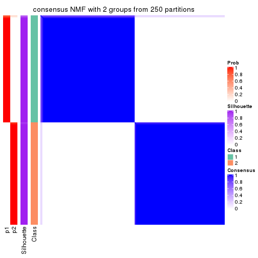</p>

</div>
<div id='tab-ATC-NMF-consensus-heatmap-2'>
<pre><code class="r">consensus_heatmap(res, k = 3)
</code></pre>

<p>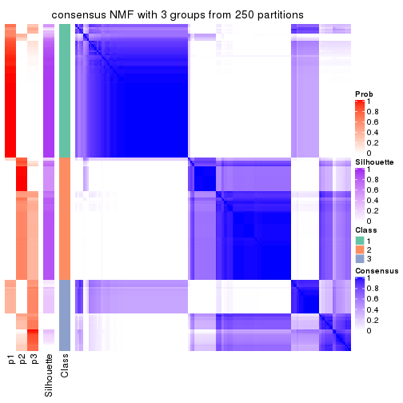</p>

</div>
<div id='tab-ATC-NMF-consensus-heatmap-3'>
<pre><code class="r">consensus_heatmap(res, k = 4)
</code></pre>

<p>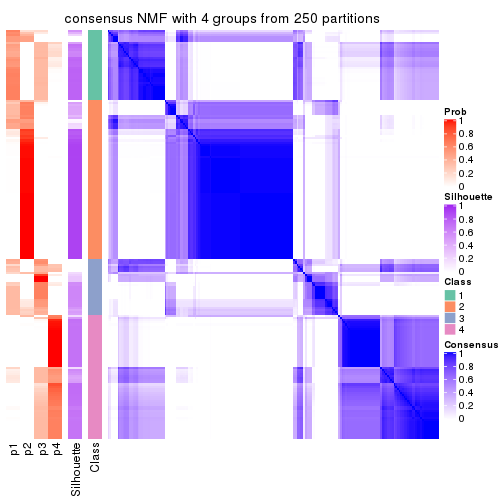</p>

</div>
<div id='tab-ATC-NMF-consensus-heatmap-4'>
<pre><code class="r">consensus_heatmap(res, k = 5)
</code></pre>

<p>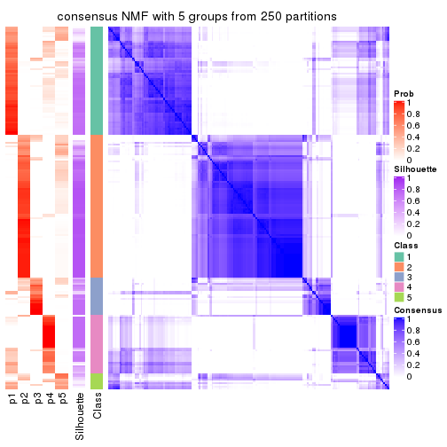</p>

</div>
<div id='tab-ATC-NMF-consensus-heatmap-5'>
<pre><code class="r">consensus_heatmap(res, k = 6)
</code></pre>

<p>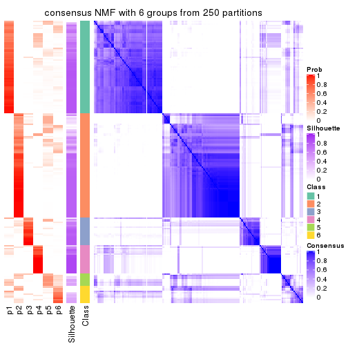</p>

</div>
</div>

Heatmaps for the membership of samples in all partitions to see how consistent they are:


<script>
$( function() {
	$( '#tabs-ATC-NMF-membership-heatmap' ).tabs();
} );
</script>
<div id='tabs-ATC-NMF-membership-heatmap'>
<ul>
<li><a href='#tab-ATC-NMF-membership-heatmap-1'>k = 2</a></li>
<li><a href='#tab-ATC-NMF-membership-heatmap-2'>k = 3</a></li>
<li><a href='#tab-ATC-NMF-membership-heatmap-3'>k = 4</a></li>
<li><a href='#tab-ATC-NMF-membership-heatmap-4'>k = 5</a></li>
<li><a href='#tab-ATC-NMF-membership-heatmap-5'>k = 6</a></li>
</ul>
<div id='tab-ATC-NMF-membership-heatmap-1'>
<pre><code class="r">membership_heatmap(res, k = 2)
</code></pre>

<p>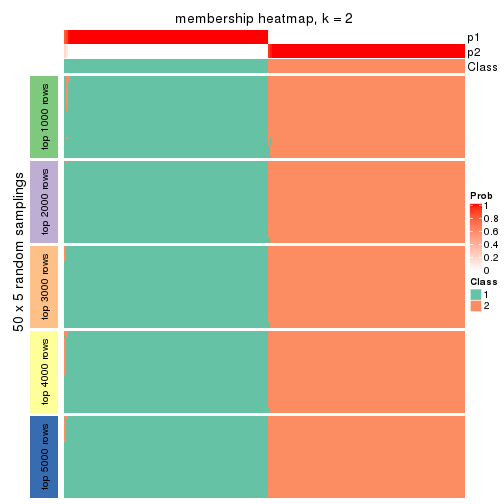</p>

</div>
<div id='tab-ATC-NMF-membership-heatmap-2'>
<pre><code class="r">membership_heatmap(res, k = 3)
</code></pre>

<p>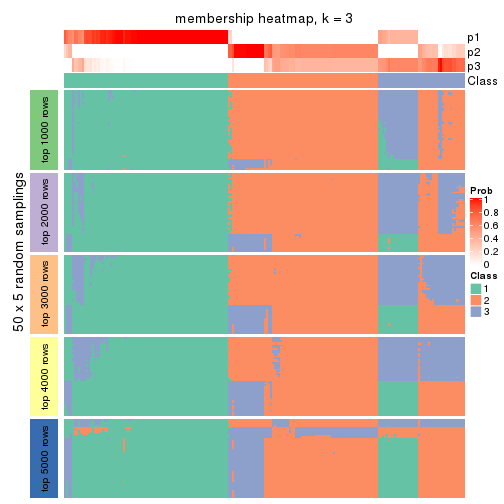</p>

</div>
<div id='tab-ATC-NMF-membership-heatmap-3'>
<pre><code class="r">membership_heatmap(res, k = 4)
</code></pre>

<p>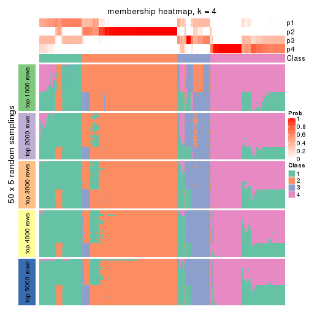</p>

</div>
<div id='tab-ATC-NMF-membership-heatmap-4'>
<pre><code class="r">membership_heatmap(res, k = 5)
</code></pre>

<p>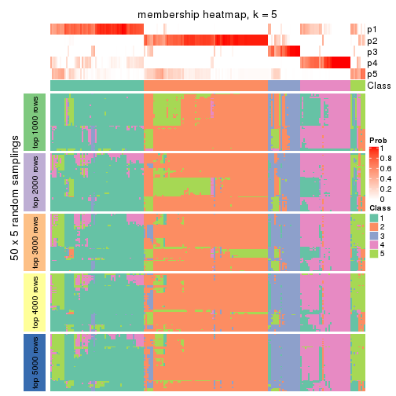</p>

</div>
<div id='tab-ATC-NMF-membership-heatmap-5'>
<pre><code class="r">membership_heatmap(res, k = 6)
</code></pre>

<p>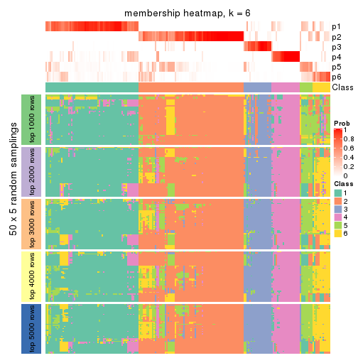</p>

</div>
</div>

As soon as we have had the classes for columns, we can look for signatures
which are significantly different between classes which can be candidate marks
for certain classes. Following are the heatmaps for signatures.


Signature heatmaps where rows are scaled:


<script>
$( function() {
	$( '#tabs-ATC-NMF-get-signatures' ).tabs();
} );
</script>
<div id='tabs-ATC-NMF-get-signatures'>
<ul>
<li><a href='#tab-ATC-NMF-get-signatures-1'>k = 2</a></li>
<li><a href='#tab-ATC-NMF-get-signatures-2'>k = 3</a></li>
<li><a href='#tab-ATC-NMF-get-signatures-3'>k = 4</a></li>
<li><a href='#tab-ATC-NMF-get-signatures-4'>k = 5</a></li>
<li><a href='#tab-ATC-NMF-get-signatures-5'>k = 6</a></li>
</ul>
<div id='tab-ATC-NMF-get-signatures-1'>
<pre><code class="r">get_signatures(res, k = 2)
</code></pre>

<p>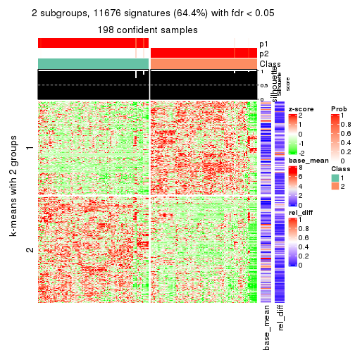</p>

</div>
<div id='tab-ATC-NMF-get-signatures-2'>
<pre><code class="r">get_signatures(res, k = 3)
</code></pre>

<p>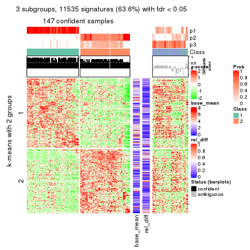</p>

</div>
<div id='tab-ATC-NMF-get-signatures-3'>
<pre><code class="r">get_signatures(res, k = 4)
</code></pre>

<p>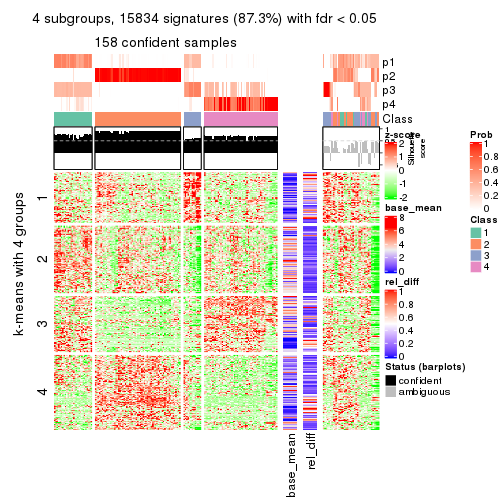</p>

</div>
<div id='tab-ATC-NMF-get-signatures-4'>
<pre><code class="r">get_signatures(res, k = 5)
</code></pre>

<p>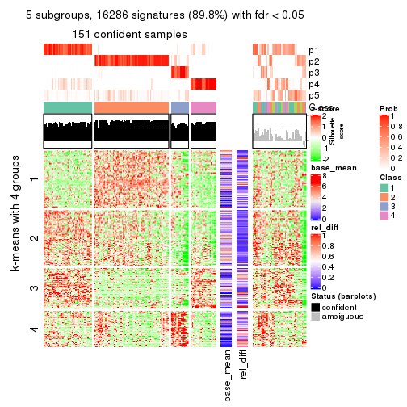</p>

</div>
<div id='tab-ATC-NMF-get-signatures-5'>
<pre><code class="r">get_signatures(res, k = 6)
</code></pre>

<p>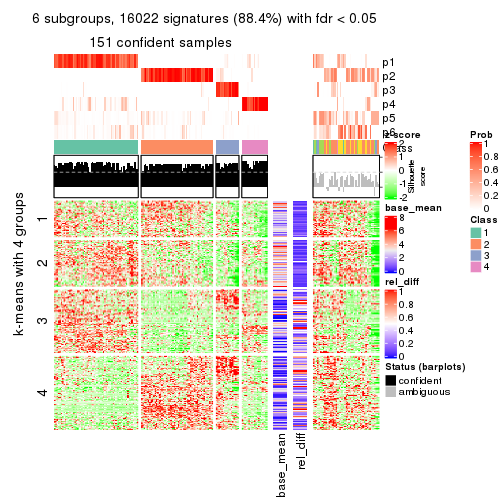</p>

</div>
</div>


Signature heatmaps where rows are not scaled:


<script>
$( function() {
	$( '#tabs-ATC-NMF-get-signatures-no-scale' ).tabs();
} );
</script>
<div id='tabs-ATC-NMF-get-signatures-no-scale'>
<ul>
<li><a href='#tab-ATC-NMF-get-signatures-no-scale-1'>k = 2</a></li>
<li><a href='#tab-ATC-NMF-get-signatures-no-scale-2'>k = 3</a></li>
<li><a href='#tab-ATC-NMF-get-signatures-no-scale-3'>k = 4</a></li>
<li><a href='#tab-ATC-NMF-get-signatures-no-scale-4'>k = 5</a></li>
<li><a href='#tab-ATC-NMF-get-signatures-no-scale-5'>k = 6</a></li>
</ul>
<div id='tab-ATC-NMF-get-signatures-no-scale-1'>
<pre><code class="r">get_signatures(res, k = 2, scale_rows = FALSE)
</code></pre>

<p>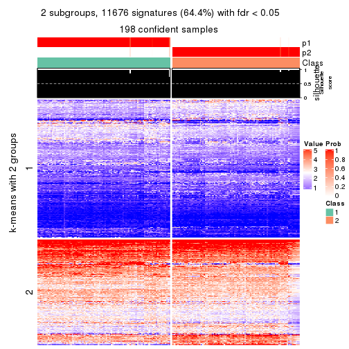</p>

</div>
<div id='tab-ATC-NMF-get-signatures-no-scale-2'>
<pre><code class="r">get_signatures(res, k = 3, scale_rows = FALSE)
</code></pre>

<p>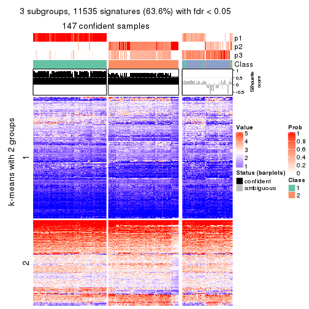</p>

</div>
<div id='tab-ATC-NMF-get-signatures-no-scale-3'>
<pre><code class="r">get_signatures(res, k = 4, scale_rows = FALSE)
</code></pre>

<p>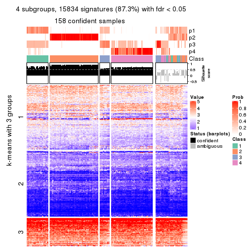</p>

</div>
<div id='tab-ATC-NMF-get-signatures-no-scale-4'>
<pre><code class="r">get_signatures(res, k = 5, scale_rows = FALSE)
</code></pre>

<p>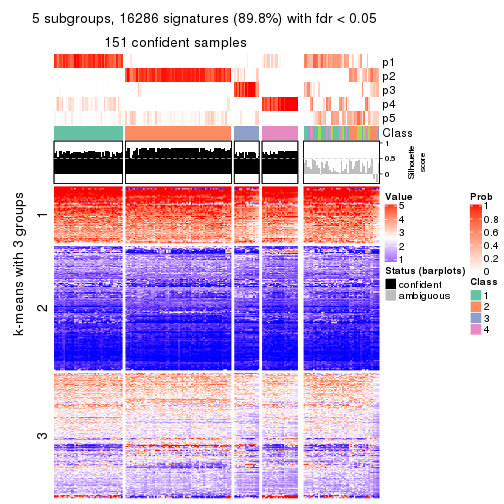</p>

</div>
<div id='tab-ATC-NMF-get-signatures-no-scale-5'>
<pre><code class="r">get_signatures(res, k = 6, scale_rows = FALSE)
</code></pre>

<p>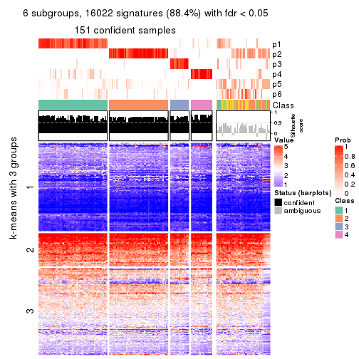</p>

</div>
</div>


Compare the overlap of signatures from different k:

```r
compare_signatures(res)
```

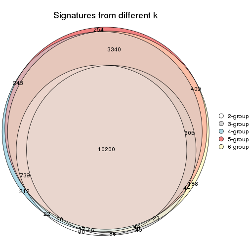

`get_signature()` returns a data frame invisibly. TO get the list of signatures, the function
call should be assigned to a variable explicitly. In following code, if `plot` argument is set
to `FALSE`, no heatmap is plotted while only the differential analysis is performed.

```r
# code only for demonstration
tb = get_signature(res, k = ..., plot = FALSE)
```

An example of the output of `tb` is:

```
#>   which_row         fdr    mean_1    mean_2 scaled_mean_1 scaled_mean_2 km
#> 1        38 0.042760348  8.373488  9.131774    -0.5533452     0.5164555  1
#> 2        40 0.018707592  7.106213  8.469186    -0.6173731     0.5762149  1
#> 3        55 0.019134737 10.221463 11.207825    -0.6159697     0.5749050  1
#> 4        59 0.006059896  5.921854  7.869574    -0.6899429     0.6439467  1
#> 5        60 0.018055526  8.928898 10.211722    -0.6204761     0.5791110  1
#> 6        98 0.009384629 15.714769 14.887706     0.6635654    -0.6193277  2
...
```

The columns in `tb` are:

1. `which_row`: row indices corresponding to the input matrix.
2. `fdr`: FDR for the differential test. 
3. `mean_x`: The mean value in group x.
4. `scaled_mean_x`: The mean value in group x after rows are scaled.
5. `km`: Row groups if k-means clustering is applied to rows.


UMAP plot which shows how samples are separated.


<script>
$( function() {
	$( '#tabs-ATC-NMF-dimension-reduction' ).tabs();
} );
</script>
<div id='tabs-ATC-NMF-dimension-reduction'>
<ul>
<li><a href='#tab-ATC-NMF-dimension-reduction-1'>k = 2</a></li>
<li><a href='#tab-ATC-NMF-dimension-reduction-2'>k = 3</a></li>
<li><a href='#tab-ATC-NMF-dimension-reduction-3'>k = 4</a></li>
<li><a href='#tab-ATC-NMF-dimension-reduction-4'>k = 5</a></li>
<li><a href='#tab-ATC-NMF-dimension-reduction-5'>k = 6</a></li>
</ul>
<div id='tab-ATC-NMF-dimension-reduction-1'>
<pre><code class="r">dimension_reduction(res, k = 2, method = &quot;UMAP&quot;)
</code></pre>

<p>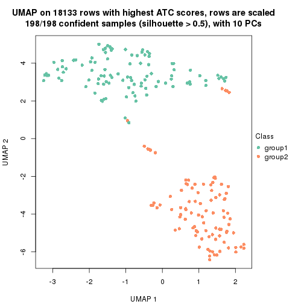</p>

</div>
<div id='tab-ATC-NMF-dimension-reduction-2'>
<pre><code class="r">dimension_reduction(res, k = 3, method = &quot;UMAP&quot;)
</code></pre>

<p>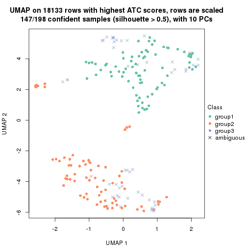</p>

</div>
<div id='tab-ATC-NMF-dimension-reduction-3'>
<pre><code class="r">dimension_reduction(res, k = 4, method = &quot;UMAP&quot;)
</code></pre>

<p>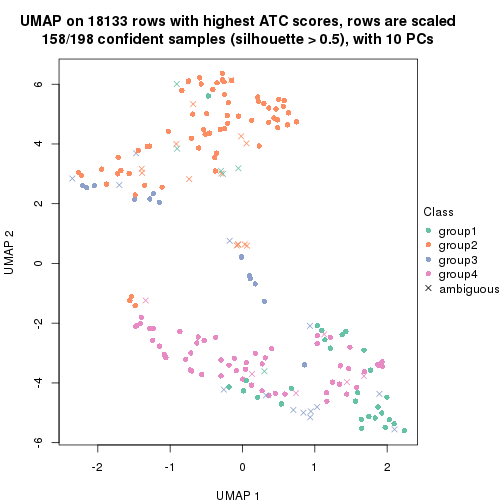</p>

</div>
<div id='tab-ATC-NMF-dimension-reduction-4'>
<pre><code class="r">dimension_reduction(res, k = 5, method = &quot;UMAP&quot;)
</code></pre>

<p>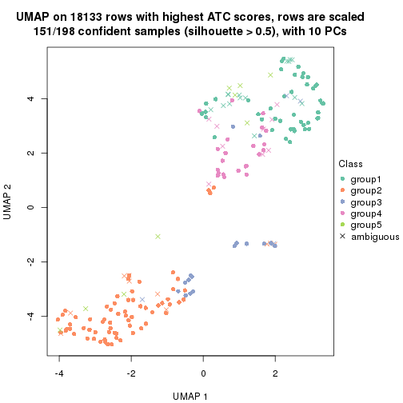</p>

</div>
<div id='tab-ATC-NMF-dimension-reduction-5'>
<pre><code class="r">dimension_reduction(res, k = 6, method = &quot;UMAP&quot;)
</code></pre>

<p>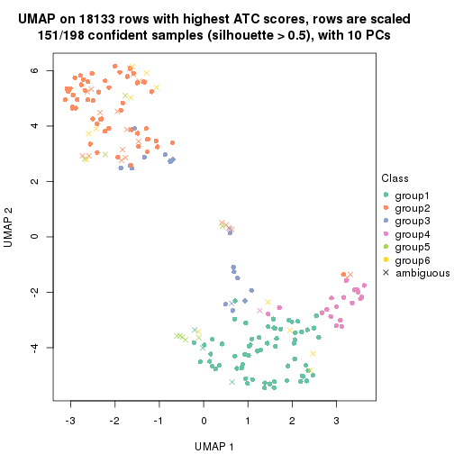</p>

</div>
</div>


Following heatmap shows how subgroups are split when increasing `k`:

```r
collect_classes(res)
```

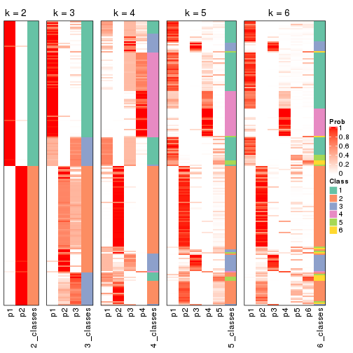


If matrix rows can be associated to genes, consider to use `functional_enrichment(res,
...)` to perform function enrichment for the signature genes. See [this vignette](http://bioconductor.org/packages/devel/bioc/vignettes/cola/inst/doc/functional_enrichment.html) for more detailed explanations.


 

## Session info


```r
sessionInfo()
```

```
#> R version 3.6.0 (2019-04-26)
#> Platform: x86_64-pc-linux-gnu (64-bit)
#> Running under: CentOS Linux 7 (Core)
#> 
#> Matrix products: default
#> BLAS:   /usr/lib64/libblas.so.3.4.2
#> LAPACK: /usr/lib64/liblapack.so.3.4.2
#> 
#> locale:
#>  [1] LC_CTYPE=en_GB.UTF-8       LC_NUMERIC=C               LC_TIME=en_GB.UTF-8       
#>  [4] LC_COLLATE=en_GB.UTF-8     LC_MONETARY=en_GB.UTF-8    LC_MESSAGES=en_GB.UTF-8   
#>  [7] LC_PAPER=en_GB.UTF-8       LC_NAME=C                  LC_ADDRESS=C              
#> [10] LC_TELEPHONE=C             LC_MEASUREMENT=en_GB.UTF-8 LC_IDENTIFICATION=C       
#> 
#> attached base packages:
#> [1] grid      stats     graphics  grDevices utils     datasets  methods   base     
#> 
#> other attached packages:
#> [1] genefilter_1.66.0    ComplexHeatmap_2.3.1 markdown_1.1         knitr_1.26          
#> [5] GetoptLong_0.1.7     cola_1.3.2          
#> 
#> loaded via a namespace (and not attached):
#>  [1] circlize_0.4.8       shape_1.4.4          xfun_0.11            slam_0.1-46         
#>  [5] lattice_0.20-38      splines_3.6.0        colorspace_1.4-1     vctrs_0.2.0         
#>  [9] stats4_3.6.0         blob_1.2.0           XML_3.98-1.20        survival_2.44-1.1   
#> [13] rlang_0.4.2          pillar_1.4.2         DBI_1.0.0            BiocGenerics_0.30.0 
#> [17] bit64_0.9-7          RColorBrewer_1.1-2   matrixStats_0.55.0   stringr_1.4.0       
#> [21] GlobalOptions_0.1.1  evaluate_0.14        memoise_1.1.0        Biobase_2.44.0      
#> [25] IRanges_2.18.3       parallel_3.6.0       AnnotationDbi_1.46.1 highr_0.8           
#> [29] Rcpp_1.0.3           xtable_1.8-4         backports_1.1.5      S4Vectors_0.22.1    
#> [33] annotate_1.62.0      skmeans_0.2-11       bit_1.1-14           microbenchmark_1.4-7
#> [37] brew_1.0-6           impute_1.58.0        rjson_0.2.20         png_0.1-7           
#> [41] digest_0.6.23        stringi_1.4.3        polyclip_1.10-0      clue_0.3-57         
#> [45] tools_3.6.0          bitops_1.0-6         magrittr_1.5         eulerr_6.0.0        
#> [49] RCurl_1.95-4.12      RSQLite_2.1.4        tibble_2.1.3         cluster_2.1.0       
#> [53] crayon_1.3.4         pkgconfig_2.0.3      zeallot_0.1.0        Matrix_1.2-17       
#> [57] xml2_1.2.2           httr_1.4.1           R6_2.4.1             mclust_5.4.5        
#> [61] compiler_3.6.0
```


